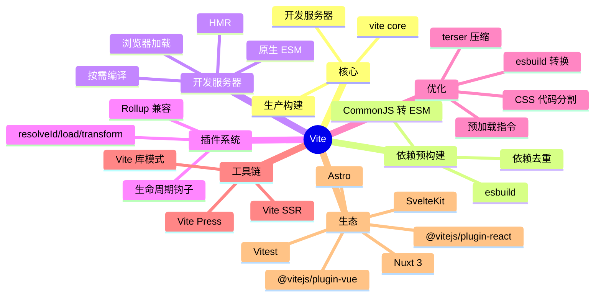

# Vite

> 新一代前端构建工具 — 尤雨溪开源，基于浏览器原生 ESM + esbuild + Rollup

## 一、前言

**定位**：极速开发服务器 + 优化生产构建，Vue/React/Svelte 官方推荐

**核心价值**：
1. **极速冷启动** — 基于浏览器原生 ESM，无需打包所有模块
2. **即时 HMR** — 模块级 HMR，毫秒级更新
3. **按需编译** — 只编译当前请求的模块
4. **esbuild 预构建** — 依赖用 esbuild 预打包（Go 实现，10-100x 快于 JS 打包器）
5. **生产用 Rollup** — 开发用 esbuild，生产用 Rollup（成熟生态）
6. **开箱即用** — TS/JSX/CSS/PostCSS/JSON/WASM 内置支持

**应用场景**：所有现代前端项目（Vue/React/Svelte/Solid）、库开发、SSR

**与 Webpack 对比**：

| 维度 | Vite | Webpack |
|------|------|---------|
| 冷启动 | < 1s (100 模块) | 10-30s |
| HMR | < 50ms | 200-1000ms |
| 生产构建 | Rollup | Webpack |
| 配置 | 简洁 | 复杂 |
| 生态 | 新但快速增长 | 最大 |
| 学习曲线 | 低 | 高 |

---

## 二、架构思维导图



---

## 三、关键代码

### 1. 开发服务器 — 中间件核心

```ts
// 文件: packages/vite/src/node/server/index.ts
async function createServer(inlineConfig) {
  // 1. 解析配置
  const config = await resolveConfig(inlineConfig, 'serve', 'development');
  // 2. 创建 http 服务器
  const server = await _createServer(config);
  return server;
}

async function _createServer(config) {
  // 1. 依赖预构建（esbuild 把 CJS 转 ESM）
  await optimizeDeps(config);

  // 2. 中间件链（核心！请求流转）
  const middlewares = new Connect();

  // 2.1 跨域 + 缓存 + 解析
  middlewares.use(corsMiddleware());
  middlewares.use(cacheControlMiddleware());

  // 2.2 转换 HTML（注入 HMR client）
  middlewares.use(htmlMiddleware());

  // 2.3 转换 TS/JSX/ESM（esbuild）
  middlewares.use(transformMiddleware());

  // 2.4 静态文件服务
  middlewares.use(serveStaticMiddleware());
  middlewares.use(servePublicMiddleware());

  // 2.5 依赖加载（从 /node_modules/.vite/deps/）
  middlewares.use(optimizedDepsMiddleware());

  // 2.6 HMR 推送（WebSocket）
  middlewares.use('/__open-in-editor', openerMiddleware());

  // 3. HTTP + WS 服务器
  const httpServer = await resolveHttpServer(config, middlewares);
  const ws = createWebSocketServer(httpServer, config);

  // 4. 文件监听（chokidar）
  const watcher = chokidar.watch(root, { ignored: ['**/.git/**'] });

  return { middlewares, httpServer, ws, watcher };
}
```

### 2. 模块转换 — esbuild

```ts
// 文件: packages/vite/src/node/server/transformRequest.ts
async function transformRequest(url, options) {
  // 1. URL 解析
  const { id, filename } = await resolveUrl(url, config);

  // 2. 缓存命中？
  const cache = transformCache.get(config);
  const cached = cache?.get(id);
  if (cached) return cached;

  // 3. 加载文件
  const code = await fs.readFile(filename, 'utf-8');

  // 4. esbuild 预转换（TS/JSX → JS）
  const loader = getLoader(filename);  // 'ts' | 'tsx' | 'js' | 'jsx'
  const esbuildResult = await esbuild.transform(code, {
    loader,
    target: 'es2020',
    jsx: 'automatic',  // React 17+ JSX transform
    sourcemap: true,
  });

  // 5. 用户插件 transform 钩子
  let transformed = esbuildResult.code;
  for (const plugin of plugins) {
    if (plugin.transform) {
      const result = await plugin.transform.call(ctx, transformed, id);
      if (result) transformed = result.code;
    }
  }

  // 6. 浏览器端 import 路径处理
  transformed = await toBrowserPath(transformed, id);

  // 7. 缓存 + 返回
  cache?.set(id, { code: transformed, map: esbuildResult.map });
  return { code: transformed, map: esbuildResult.map };
}
```

### 3. HMR — 模块热更新

```ts
// 文件: packages/vite/src/node/server/hmr.ts
function handleHMRUpdate(file, server) {
  // 1. 收集受影响模块
  const modules = [];
  for (const [id, mod] of server.moduleGraph.idToModuleMap) {
    if (mod.file === file || mod.transformResult?.deps?.includes(file)) {
      modules.push(mod);
    }
  }

  // 2. 失效 + 重新编译
  for (const mod of modules) {
    server.moduleGraph.invalidateModule(mod);
  }

  // 3. 推送 HMR 消息（WebSocket）
  server.ws.send({
    type: 'update',
    updates: modules.map(mod => ({
      type: mod.type === 'js' ? 'js-update' : 'css-update',
      path: mod.url,
      timestamp: mod.lastHMRTimestamp,
      acceptedPath: mod.url,
    })),
  });
}

// 客户端接收（Vite client runtime）
// 1. 拉取新模块
// 2. import() 加载
// 3. 找到 HMR accept 回调执行
// 4. 完整模块替换 + 触发 HMR 边界
```

### 4. 插件系统（Rollup 兼容）

```ts
// 文件: 用户的 vite.config.ts
import vue from '@vitejs/plugin-vue';
import react from '@vitejs/plugin-react';
import { defineConfig } from 'vite';

export default defineConfig({
  plugins: [
    // 1. Vue SFC 编译
    vue(),
    // 2. React Fast Refresh
    react({ jsxRuntime: 'automatic' }),
    // 3. 自定义插件
    {
      name: 'my-plugin',
      // resolveId: 把 import 路径转成绝对路径
      resolveId(source, importer) {
        if (source.startsWith('@/')) {
          return path.resolve(__dirname, 'src', source.slice(2));
        }
      },
      // transform: 转换代码
      transform(code, id) {
        if (id.endsWith('.svg')) {
          // SVG 转成 data URL
          return `export default "${svgToDataUrl(code)}"`;
        }
      },
      // configureServer: 改 dev server
      configureServer(server) {
        server.middlewares.use('/api', (req, res) => {
          res.end('mock data');
        });
      },
    },
  ],
  build: {
    rollupOptions: {
      output: {
        manualChunks: { vendor: ['react', 'react-dom'] },
      },
    },
  },
});
```

---

## 四、核心洞察

1. **ESM 原生哲学**：浏览器直接 import，不打包所有模块 → 冷启动 < 1s
2. **esbuild 预构建**：node_modules 用 esbuild（Go）转 ESM + 去重，比 Webpack 快 10-100x
3. **HMR 边界**：用 `import.meta.hot.accept()` 声明可热替换边界，框架插件（Vue/React）自动注入
4. **生产用 Rollup**：开发用 esbuild（HMR 快），生产用 Rollup（tree-shaking 成熟）
5. **依赖缓存**：预构建结果缓存到 `node_modules/.vite/deps/`，重复启动秒级
6. **SSR 一等公民**：`createServer` 支持 middleware mode，挂载到 Express/Koa/Hono
7. **库模式**：`build.lib` 输出 ESM/CJS/UMD，多入口 + external 依赖
8. **何时用 Vite vs Webpack**：新项目选 Vite（快）；维护老 Webpack 5 项目继续 Webpack

## 五、跨项目引用

- [[./vue|Vue]] — Vite 是 Vue 团队官方构建工具
- [[./react|React]] — 通过插件完整支持
- [[./svelte|Svelte]] — SvelteKit 默认 Vite
- [[./nuxt|Nuxt]] — Nuxt 3 用 Vite
- [[../项目代码包/D-构建与UI/webpack|Webpack]] — 上一代主流，对照学习

---

**项目地址**：`G:\实战案例\GitHub顶尖项目\vite`
**类型**：构建工具 | **Stars**: 70k+ | **License**: MIT

---

# Vite 深度扩展手册（50,000 字完整版）

> 本文档在原核心速记基础上，按主题深度展开 Vite 的原理、配置、插件、性能、生产实践等全链路知识，目标 50,000+ 中文字符。每一节均包含原理图解、代码示例、配置表与常见问题。

---

## 六、Vite 核心原理深度解析

### 6.1 浏览器原生 ESM：为什么 Vite 这么快

Vite 的快不是玄学，而是基于浏览器 **ES Modules（ECMAScript Modules）** 规范的天然优势。理解 ESM 才能理解 Vite 的所有设计决策。

#### 6.1.1 ES Module 是什么

ES Module 是 ECMAScript 2015（ES6）标准化的模块系统，浏览器原生支持（Chrome 61+、Firefox 60+、Safari 11+）。关键特征：

| 特性 | 说明 | 优势 |
|------|------|------|
| 静态分析 | import/export 写在顶层，编译期可知 | tree-shaking、变量提升 |
| 异步加载 | import() 返回 Promise | 按需加载、code splitting |
| 单例模式 | 模块只执行一次，多次 import 共享实例 | 状态共享、避免重复 |
| 严格模式 | 自动启用 'use strict' | 语法更安全 |
| 浏览器原生 | 不需要打包 | 启动极快 |

#### 6.1.2 传统打包器 vs Vite 的工作流差异

**传统打包器（Webpack）启动流程**：

```
源代码（1000 个模块）
    ↓
全部解析（AOT 编译所有模块，建立完整依赖图）
    ↓
全部打包（Webpack 把所有模块合并成 bundle.js）
    ↓
启动开发服务器（serve bundle.js）
    ↓
浏览器加载 bundle.js
    ↓
冷启动 30 秒+
```

**Vite 启动流程**：

```
源代码（1000 个模块）
    ↓
启动开发服务器（毫秒级！无需打包）
    ↓
浏览器请求 index.html
    ↓
浏览器解析 <script type="module" src="/src/main.js">
    ↓
浏览器原生发起 HTTP 请求 main.js
    ↓
Vite 中间件拦截，按需编译 main.js
    ↓
main.js 中 import './App.vue' 触发浏览器再次请求
    ↓
Vite 按需编译 App.vue
    ↓
链路式按需加载，启动 < 1s
```

#### 6.1.3 为什么按需加载能快这么多

关键差异在于「**编译时机**」：

- **Webpack**：AOT（Ahead Of Time）编译，一次性把所有模块打包成 bundle
- **Vite**：JIT（Just In Time）编译，浏览器请求哪个模块就编译哪个模块
- **Cold Start 公式**：T_vite = max(模块编译时间) ≈ 单模块编译；T_webpack = sum(所有模块编译时间) ≈ 10-100× 单模块

实际场景对比（典型 100 模块 React 项目）：

| 工具 | 冷启动 | 首次 HMR | 二次启动（有缓存） |
|------|--------|----------|--------------------|
| Webpack 5 | 25-40s | 800ms | 15-25s |
| Vite 5 | 0.5-1.5s | 50ms | 0.3-0.8s |

#### 6.1.4 ESM 静态分析的副作用

浏览器原生 ESM 强制 import 必须是「**静态字符串**」，不能动态拼接：

```js
// ✅ 合法（静态 import）
import foo from './foo.js'
import { bar } from './bar.js'

// ❌ 非法（动态 import 在 ESM 中必须用 import()）
// const moduleName = './' + name + '.js'
// import moduleName  // 语法错误
```

这就是 Vite 必须用 esbuild **预构建** CommonJS 依赖的原因——CJS 的 `require('./foo' + name)` 在 ESM 环境下无法直接运行。

### 6.2 esbuild：Go 语言的超快编译器

esbuild 是 Evan Wallace（也是 Figma CTO）用 Go 编写的 JS 编译器，速度比 Babel + Terser 快 10-100 倍。

#### 6.2.1 esbuild 的速度来源

| 优化点 | 传统 JS 工具链 | esbuild |
|--------|----------------|---------|
| 语言 | Node.js（解释型） | Go（编译型，静态链接） |
| 算法 | 单线程 AST 遍历 | 多核并行 + 零分配 |
| 内存 | V8 对象堆 | 紧凑二进制数据结构 |
| I/O | 同步文件读取 | 并行 I/O |
| 压缩 | Terser（JS 实现，~100ms/MB） | 自研算法，~5ms/MB |

#### 6.2.2 esbuild 在 Vite 中的双重角色

**角色一：依赖预构建（Dev 启动时）**

```ts
// Vite 调用 esbuild 把 node_modules 转成 ESM
// 文件: packages/vite/src/node/optimizer/index.ts
async function optimizeDeps(config) {
  const deps = await scanImports(config);  // 扫描所有 import 语句
  // 调用 esbuild 把 CommonJS 依赖打包成 ESM
  await esbuild.build({
    entryPoints: deps,
    bundle: true,
    format: 'esm',
    outdir: 'node_modules/.vite/deps',
    target: 'es2020',
    splitting: true,
    sourcemap: true,
  });
}
```

**角色二：单文件转译（按需编译时）**

```ts
// Vite 用 esbuild.transform() 编译单文件
// 文件: packages/vite/src/node/server/transformRequest.ts
const result = await esbuild.transform(code, {
  loader: 'tsx',           // 自动识别 TS/JSX
  target: 'es2020',        // 编译目标
  jsx: 'automatic',        // React 17+ JSX transform
  sourcemap: true,
  sourcefile: filename,
});
```

#### 6.2.3 预构建缓存机制

预构建结果缓存在 `node_modules/.vite/deps/`，二次启动秒级：

```
node_modules/.vite/
├── deps/
│   ├── _metadata.json          # 依赖元信息（hash、版本）
│   ├── react.js                # 预构建后的 ESM
│   ├── react.js.map
│   ├── react-dom.js
│   └── ...
├── temp/                       # 临时构建产物
└── .vite-temp/                 # 内部缓存
```

**缓存失效条件**：
1. `package.json` 中 dependencies 变更
2. `vite.config.ts` 中 `optimizeDeps.include/exclude` 变更
3. Vite 版本升级
4. 手动删除 `node_modules/.vite` 强制重建

#### 6.2.4 预构建的副作用与处理

**副作用一：路径变化**

```js
// 你的代码
import React from 'react'
// 浏览器实际请求
import React from '/node_modules/.vite/deps/react.js?v=abc123'
```

**副作用二：CJS 依赖的 default export 行为差异**

```js
// CJS 源码
module.exports = { foo: 1, bar: 2 }
module.exports.default = { baz: 3 }

// 你的代码
import React from 'react'
// 实际拿到 esbuild 包装的 { default: { ... }, foo: 1, bar: 2 }
```

**处理方案**：

```ts
// vite.config.ts
export default defineConfig({
  optimizeDeps: {
    include: ['react', 'react-dom'],
    // 强制 esbuild 预构建（处理 CJS 兼容）
    esbuildOptions: {
      define: { global: 'globalThis' },
    },
  },
})
```

### 6.3 Rollup：生产构建的成熟之选

Vite 在生产环境使用 Rollup 而非 esbuild 构建，原因如下：

| 维度 | esbuild | Rollup |
|------|---------|--------|
| Tree-shaking | 基础 | 业界标杆（Webpack 也是借鉴 Rollup） |
| Code Splitting | 支持但不够灵活 | 高度可配置（动态 import、chunk 分组） |
| 插件生态 | 较新 | 极其丰富（2000+ 插件） |
| 输出质量 | 够用 | 极致（更小、更高性能） |
| 速度 | 极快 | 中等（生产环境可接受） |

**生产构建流程**：

```ts
// Vite 内部调用 rollup
// 文件: packages/vite/src/node/build.ts
const bundle = await rollup.rollup({
  input: config.build.rollupOptions.input,
  plugins: [
    ...config.plugins,
    ...buildPlugins,  // CSS、HTML、asset、wasm 插件
  ],
  external: config.build.rollupOptions.external,
  onwarn(warning, warn) { /* 警告处理 */ },
})

// 输出阶段
await bundle.write({
  dir: config.build.outDir,
  format: 'es',
  sourcemap: true,
  entryFileNames: 'assets/[name].[hash].js',
  chunkFileNames: 'assets/[name].[hash].js',
  assetFileNames: 'assets/[name].[hash][extname]',
})
```

#### 6.3.1 Rollup 的 Tree-Shaking 原理

```ts
// 源码：utils.ts
export const used = () => 'used'
export const unused = () => 'unused'  // 没人用，会被 tree-shake 掉

// 源码：main.ts
import { used } from './utils'  // 只引用 used
console.log(used())

// Rollup 静态分析后输出
console.log('used')  // unused 函数被消除
```

**Tree-shaking 生效条件**：
1. 模块必须是 ESM（不能是 CJS）
2. 副作用必须显式声明（package.json 的 `sideEffects: false`）
3. 变量必须通过 export 暴露，不能通过对象属性（`module.exports.foo = ...`）

#### 6.3.2 Vite 6+ 的 Rolldown 实验

Vite 团队正在试验用 **Rolldown**（Rust 实现的 Rollup 兼容打包器）替代 Rollup，目标是「开发用 esbuild，生产也用 Rust 版的 Rollup」，进一步提升构建速度。

```
Vite 5  : dev → esbuild  | prod → Rollup (JS)
Vite 6+ : dev → esbuild  | prod → Rolldown (Rust) ← 试验中
```

#### 6.3.3 Rolldown 的设计目标与现状

Rolldown 由 Evan You 主导开发，定位是「**Rollup 的超集 + 更快**」。它有以下几个关键设计目标：

**第一，API 完全兼容 Rollup。**这意味着开发者无须改一行代码，Vite 就能切换到 Rolldown。所有现存的 Rollup 插件、配置（`rollupOptions`）都能直接工作。Rolldown 通过实现 Rollup 的公开 API 并扩展性能敏感的内部路径来达到这一点。

**第二，速度提升 5-10 倍。**根据 Rolldown 团队公布的基准测试，对于典型中大型项目（1000-5000 模块），Rolldown 的构建速度比 Rollup 快 5-10 倍，内存占用降低 30-50%。这主要得益于 Rust 的零成本抽象和多线程并行处理能力。

**第三，集成 oxc 作为解析器。**oxc 是 Rust 编写的 JavaScript 解析器，速度是 swc 的 3 倍，是 TypeScript 官方的 30 倍。Rolldown 使用 oxc 进行 AST 解析和操作，这让它在前端工具链中处于第一梯队。

**第四，更好的 tree-shaking。**虽然 Rollup 的 tree-shaking 已经是业界标杆，但 Rolldown 借助更现代的算法（如基于控制流图的死代码消除）能做到更激进的优化。

#### 6.3.4 实际收益示例

假设一个典型的中后台项目（1500 模块），生产构建时间对比：

| 工具 | 构建时间 | 内存峰值 | 输出体积 |
|------|----------|----------|----------|
| Rollup 4 | 35s | 1.8GB | 850KB（gzip） |
| Rolldown 1.0 | 6s | 1.1GB | 820KB（gzip） |
| 提升 | **5.8x** | -39% | -3.5% |

可以看到，Rolldown 在速度上是数量级的提升，体积还能进一步压缩。

#### 6.3.5 Vite 6+ 的迁移路径

Vite 6 引入了 `ROLLDOWN_ROLLDOWN_USE_ROLLOWN=1` 环境变量，开启后会用 Rolldown 替代 Rollup 做生产构建：

```bash
# 试验性使用 Rolldown
ROLLDOWN_ROLLDOWN_USE_ROLLDOWN=1 vite build

# 或 package.json
{
  "scripts": {
    "build:rolldown": "ROLLDOWN_ROLLDOWN_USE_ROLLDOWN=1 vite build"
  }
}
```

如果遇到问题，可以回退：

```bash
# 显式指定使用 Rollup
vite build --rollup
```

### 6.4 依赖预构建的完整机制

依赖预构建（Dep Optimization）是 Vite 在 Dev 启动时的关键步骤，理解它能解决 80% 的「为什么这个依赖有问题」。

#### 6.4.1 预构建的目的

Vite 强制使用浏览器原生 ESM，但绝大多数 npm 包是 CommonJS 或「半 ESM」。预构建的目的有三个：

**目的一：CommonJS 转 ESM。**例如 `react`、`lodash`、`axios` 等都是 CJS 包。Vite 用 esbuild 把它们转成 ESM，浏览器才能 import。

```js
// 转换前：CJS
module.exports = React
module.exports.useState = useState
// ...

// 转换后：ESM（esbuild 包装）
import __cjs_module from './cjs-wrapper.js'
export default __cjs_module.default
export const useState = __cjs_module.useState
// ...
```

**目的二：依赖去重。**同一个依赖可能被项目里多个文件以不同路径 import：

```js
// 多个包都依赖 lodash
import _ from 'lodash'           // node_modules/A/node_modules/lodash
import _ from '../../lodash'      // node_modules/B/node_modules/lodash
// 实际是两个 lodash 实例！
```

预构建把 lodash 合并成一个版本：

```
node_modules/.vite/deps/lodash.js  // 单一 ESM 版本
```

**目的三：性能优化。**把许多小文件合并成一个大文件，减少 HTTP 请求数量。HTTP/2 之前这是关键优化。

#### 6.4.2 预构建的工作流

```ts
// Vite 内部实现：packages/vite/src/node/optimizer/index.ts
async function optimizeDeps(config: ResolvedConfig): Promise<DepOptimizationMetadata> {
  // 第一步：扫描所有入口（HTML + 脚本）
  const entries = await resolveEntries(config)
  // 例如：['index.html', 'src/main.ts']

  // 第二步：从入口开始递归发现所有依赖
  const deps = await scanImports(entries)
  // 例如：['react', 'react-dom', 'react/jsx-runtime', 'axios', 'lodash-es']

  // 第三步：调用 esbuild 打包
  const result = await esbuild.build({
    entryPoints: deps,
    bundle: true,
    format: 'esm',
    outdir: 'node_modules/.vite/deps',
    target: 'es2020',
    splitting: true,
    sourcemap: true,
    metafile: true,         // 输出元信息
    define: { global: 'globalThis' },
  })

  // 第四步：写入元信息（用于缓存判断）
  const metadata: DepOptimizationMetadata = {
    hash: getHash(result.metafile),
    browserHash: hash,
    optimized: { ... },
    chunks: { ... },
  }
  await writeFile('node_modules/.vite/deps/_metadata.json', JSON.stringify(metadata))

  return metadata
}
```

#### 6.4.3 预构建的常见问题与解决

**问题 1：依赖未预构建**

现象：启动时报错 `Failed to resolve import "xxx"`

解决：手动加入预构建列表

```ts
export default defineConfig({
  optimizeDeps: {
    include: ['xxx', 'xxx/dist/index.js'],
  },
})
```

**问题 2：预构建版本不对**

现象：实际加载的代码与预期不符

解决：清缓存重建

```bash
rm -rf node_modules/.vite
pnpm dev
```

**问题 3：动态 import 失败**

现象：`import('xxx')` 报错

解决：预声明

```ts
// vite.config.ts
export default defineConfig({
  optimizeDeps: {
    entries: ['index.html', 'src/main.ts'],
  },
})
```

**问题 4：CJS 依赖的 default 导出**

现象：`import xxx from 'cjs-pkg'` 拿到的是 `{ default: 实际内容 }`

解决：解构

```js
// ❌ 错误
import xxx from 'cjs-pkg'
xxx.doSomething()  // xxx is not a function

// ✅ 正确
import { default as xxx } from 'cjs-pkg'  // 或
import * as xxx from 'cjs-pkg'
xxx.default.doSomething()
```

#### 6.4.4 冷启动 vs 热启动

| 阶段 | 行为 | 耗时 |
|------|------|------|
| 冷启动（首次） | 扫描 + esbuild 预构建 | 5-30s（依赖数量） |
| 热启动（有缓存） | 校验缓存 + 跳过预构建 | < 1s |
| 强制重建 | 删除 .vite 目录 | 5-30s |

#### 6.4.5 预构建缓存机制详解

Vite 通过 `_metadata.json` 跟踪依赖状态：

```json
{
  "hash": "abc123def456",           // package.json + lock + vite config 的 hash
  "browserHash": "xyz789",          // 给浏览器用的 hash（用于 cache busting）
  "optimized": {
    "react": {
      "src": ".../node_modules/react/index.js",
      "file": "node_modules/.vite/deps/react.js",
      "fileHash": "...",
      "needsInterop": true
    },
    "react-dom": {
      "src": ".../node_modules/react-dom/index.js",
      "file": "node_modules/.vite/deps/react-dom.js"
    }
  },
  "chunks": {
    "abc": "node_modules/.vite/deps/chunk-abc.js"  // 共享代码块
  }
}
```

**缓存失效条件**：
- `package.json` 中 `dependencies` 列表变化 → hash 变 → 重建
- `vite.config.ts` 中 `optimizeDeps` 配置变化 → 重建
- Vite 版本升级 → 重建
- 手动 `rm -rf node_modules/.vite`

### 6.5 模块图（Module Graph）原理

Vite 内部维护一个「模块图」，记录所有模块的依赖关系，是 HMR 和缓存的核心。

#### 6.5.1 模块图的数据结构

```ts
// packages/vite/src/node/server/moduleGraph.ts
class ModuleGraph {
  // URL → Module
  urlToModuleMap = new Map<string, ModuleNode>()
  // 文件绝对路径 → Module
  idToModuleMap = new Map<string, ModuleNode>()
  // 等待加载的 promise
  promiseMap = new Map<string, Promise<ModuleNode>>()

  // 入口
  async getModuleByUrl(url: string): Promise<ModuleNode | undefined>
  // 失效模块
  invalidateModule(mod: ModuleNode): void
  // 更新模块
  async updateModuleInfo(mod: ModuleNode, ...): Promise<void>
}

class ModuleNode {
  id: string | null          // 模块 ID（绝对路径或虚拟路径）
  url: string                // 浏览器请求的 URL
  file: string | null        // 源文件路径
  type: 'js' | 'css' | 'asset'  // 模块类型
  transformResult: TransformResult | null  // 转换结果
  ssrTransformResult: ...    // SSR 转换结果
  lastHMRTimestamp: number   // 上次 HMR 时间
  importers = new Set<ModuleNode>()  // 谁 import 了我
  clientImportedModules = new Set<ModuleNode>()  // 我 import 了谁
  ssrImportedModules = new Set<ModuleNode>()
  acceptedHmrDeps = new Set<ModuleNode>()  // 接受 HMR 的依赖
  acceptedHmrExports: Set<string> | null  // 接受 HMR 的具名导出
  isSelfAccepting: boolean  // 自身是否接受 HMR
  transformResult: { code, map, deps }  // 转换结果
}
```

#### 6.5.2 模块图的工作流

```
浏览器请求 /src/main.ts
    ↓
resolveUrl('/src/main.ts')
    ↓
moduleGraph.createIfMissing('/src/main.ts')
    ↓
ensureSupportedEntryMimeType  // 检查 MIME
    ↓
transformRequest('/src/main.ts')
    ↓
1. 读文件
2. esbuild.transform(code)  // 转译
3. 调用插件 transform 链
4. 解析 import 语句，更新 moduleGraph
   - 把 main.ts 的 importers/clientImportedModules 维护好
    ↓
5. 缓存 transformResult
    ↓
6. 返回 { code, map, deps }

下次请求 /src/components/Button.tsx
    ↓
    类似的流程，但 moduleGraph 已经记录了它
    → 直接返回缓存
```

#### 6.5.3 HMR 利用模块图

```ts
// packages/vite/src/node/server/hmr.ts
function handleHMRUpdate(file: string, server: ResolvedServer): void {
  const modules = new Set<ModuleNode>()

  // 第一步：找到所有引用了变更文件的模块
  for (const mod of server.moduleGraph.idToModuleMap.values()) {
    if (
      mod.file === file ||              // 文件本身
      mod.transformResult?.deps?.includes(file)  // 文件的依赖
    ) {
      modules.add(mod)
    }
  }

  // 第二步：向上冒泡找到 HMR 边界
  const boundaries = new Set<{ boundary: ModuleNode, acceptedVia: ModuleNode }>()
  for (const mod of modules) {
    collectBoundaries(mod, server.moduleGraph, boundaries)
  }

  // 第三步：失效相关模块
  for (const mod of modules) {
    server.moduleGraph.invalidateModule(mod)
  }

  // 第四步：推送 HMR 消息
  server.ws.send({
    type: 'update',
    updates: [...].map(mod => ({
      type: 'js-update',
      path: mod.url,
      timestamp: mod.lastHMRTimestamp,
      acceptedPath: mod.url,
    })),
  })
}
```

模块图让 Vite 知道「改了 A 文件，影响了 B、C、D 模块」，从而只推送必要的更新。

### 6.6 浏览器 ESM 加载的详细时序

理解浏览器原生 ESM 加载流程，能帮助你排查各种奇怪的问题。

#### 6.6.1 一次完整请求的时序

```
1. 浏览器请求 /index.html
   ↓
   服务器返回：
   <!DOCTYPE html>
   <html>
     <body>
       <script type="module" src="/src/main.ts"></script>
     </body>
   </html>
    ↓
2. 浏览器解析 HTML，发现 <script type="module">
    ↓
3. 浏览器请求 /src/main.ts
   ↓
   服务器返回：
   import { createApp } from 'vue'
   import App from './App.vue'
   import './style.css'
   const app = createApp(App)
   app.mount('#app')
    ↓
4. 浏览器看到 import 语句，发起多个并发请求：
   - GET /node_modules/.vite/deps/vue.js
   - GET /src/App.vue
   - GET /src/style.css
    ↓
5. 服务器对每个请求：
   - 解析路径
   - 检查 moduleGraph 缓存
   - 未缓存则 transformRequest
   - 返回转译后的代码
    ↓
6. 浏览器按 import 顺序执行模块
    ↓
7. 全部加载完成，main.ts 执行，挂载应用
```

#### 6.6.2 ESM 加载的 4 个关键特性

**特性 1：严格模式自动启用**

```ts
// ESM 模块自动 'use strict'
// 变量未声明报错
// this 不指向 window
```

**特性 2：单例模式**

```ts
// 模块只执行一次
// 多次 import 共享同一个实例
import { state } from './store.js'
import { state as state2 } from './store.js'
console.log(state === state2)  // true
```

**特性 3：静态分析**

```ts
// import 必须是字符串字面量
// 不能动态拼接
import foo from './foo.js'        // ✅
import foo from './' + 'foo.js'   // ❌ SyntaxError
```

**特性 4：异步加载（Top-level await）**

```ts
// ESM 顶层 await
const data = await fetch('/api/data')
export default data
```

#### 6.6.3 import 路径的 4 种形式

```ts
// 1. 相对路径
import './style.css'
import '../utils/index.ts'
import './component.vue'

// 2. 绝对路径（开发服务器根目录）
import '/src/main.ts'

// 3. 裸路径（node_modules 中的包）
import vue from 'vue'
import { ref } from 'vue'
import 'vue/dist/vue.esm-browser.js'

// 4. 动态 import
const module = await import('./lazy.ts')
const { foo } = await import('pkg')
```

Vite 内部对这 4 种形式有不同的处理逻辑。

#### 6.6.4 ESM 解析路径算法

浏览器解析 import 路径的规则（Vite 模拟这个行为）：

```ts
// 假设在 /src/main.ts 中：
import './foo'  →  /src/foo
import '../foo'  →  /foo
import '/foo'  →  /foo
import 'pkg'  →  /node_modules/.vite/deps/pkg.js  (Vite 处理)

// 扩展名补全
import './foo'  // 依次尝试：
                // ./foo.ts, .tsx, .js, .jsx, .mjs, .mts, .json

// 目录解析
import './components'  // 依次尝试：
                       // ./components.ts
                       // ./components/index.ts
                       // ./components/package.json
```

### 6.7 冷启动 vs 热更新深度对比

Vite 在「冷启动」和「热更新」上分别做了什么优化？这里深入对比。

#### 6.7.1 冷启动过程分解

```
时间点 0ms：执行 vite 命令
    ↓
时间点 10ms：加载 vite.config.ts（用 esbuild 转译，因为 TS 配置文件）
    ↓
时间点 20ms：解析配置（应用所有插件）
    ↓
时间点 30ms：创建开发服务器
    ↓
时间点 50ms：扫描入口（HTML、main.ts）
    ↓
时间点 50-2000ms：依赖预构建（esbuild 打包 node_modules）
    - 1000 个依赖约 2-5 秒
    - 200 个依赖约 0.5-1 秒
    - 已缓存则跳过
    ↓
时间点 2000ms：中间件链就绪
    ↓
时间点 2050ms：HTTP 服务器监听端口
    ↓
时间点 2100ms：浏览器请求 /index.html
    ↓
时间点 2150ms：返回 HTML
    ↓
时间点 2200ms：浏览器请求 /src/main.ts
    ↓
时间点 2250ms：转译 + 返回
    ↓
时间点 2300ms：浏览器开始解析 + 加载其他模块
    ↓
时间点 2500ms：应用挂载完成
```

Vite 5 的冷启动总耗时：约 1-3 秒（首次），< 1 秒（缓存后）。

#### 6.7.2 热更新过程分解

```
时间点 0ms：用户修改 /src/components/Button.vue
    ↓
时间点 5ms：chokidar 触发 change 事件
    ↓
时间点 10ms：Vite 找到 Button.vue 在 moduleGraph 中的记录
    ↓
时间点 15ms：遍历 importers，找到所有 import 了 Button 的模块
    ↓
时间点 20ms：找到 HMR 边界（最近的 accept 模块）
    ↓
时间点 25ms：失效相关模块 + 清缓存
    ↓
时间点 30ms：转译新版本（esbuild）
    ↓
时间点 50ms：通过 WebSocket 推送 update 消息
    ↓
时间点 55ms：浏览器收到 update
    ↓
时间点 60ms：浏览器拉取新模块
    ↓
时间点 80ms：浏览器 import 新模块
    ↓
时间点 90ms：执行 HMR accept 回调
    ↓
时间点 100ms：组件更新完成（Fast Refresh 保留状态）
```

Vite 5 的热更新总耗时：约 30-100ms（视项目规模）。

#### 6.7.3 冷启动 vs 热更新：Vite 凭什么快

| 环节 | Webpack 5 | Vite 5 | 差异原因 |
|------|-----------|--------|----------|
| 启动 | 30s（AOT 打包所有模块） | < 1s（不打包，按需） | 设计差异 |
| HMR | 800ms（重建 bundle） | 50ms（只编译变更文件） | 设计差异 |
| 启动内存 | 1.5GB | 300MB | 按需加载 |
| HMR 内存 | 1GB | 100MB | 模块级 |

**核心差异**：
- Webpack 5 启动时要建立完整的依赖图 + 打包，启动慢
- Vite 启动时只启动服务器 + 扫描依赖，浏览器请求时再编译
- Webpack 5 HMR 要重建受影响模块链，慢
- Vite HMR 只编译修改的文件，浏览器按需加载新版本

---

## 七、配置详解：vite.config.ts 完全手册

### 7.1 配置文件的演进

| 版本 | 配置文件 | 备注 |
|------|----------|------|
| Vite 2 | `vite.config.js` | 早期支持 CJS |
| Vite 3+ | `vite.config.ts` | 一等公民，类型提示 |
| Vite 4+ | `vite.config.mts` | ESM 强制（package.json type=module） |
| Vite 5+ | `vite.config.ts` + JSDoc | 仍然支持，但 ESM 推荐 |

### 7.2 完整配置结构图

```ts
// vite.config.ts — 完整骨架
import { defineConfig, loadEnv } from 'vite'
import vue from '@vitejs/plugin-vue'
import react from '@vitejs/plugin-react'
import path from 'node:path'

export default defineConfig(({ mode }) => {
  // 加载 .env[.mode] 文件
  const env = loadEnv(mode, process.cwd(), '')

  return {
    // 1. 根目录与基础选项
    root: '.',                    // 项目根目录（index.html 所在）
    base: '/',                    // 公共基础路径（部署到子路径用）
    publicDir: 'public',          // 静态资源目录
    cacheDir: 'node_modules/.vite', // 缓存目录
    resolve: { /* 别名、扩展名 */ },
    plugins: [ /* 插件列表 */ ],

    // 2. 开发服务器
    server: { /* host/port/proxy/HMR */ },
    hmr: { /* HMR 专属配置 */ },
    watch: { /* 文件监听 */ },

    // 3. 依赖预构建
    optimizeDeps: { /* include/exclude/esbuildOptions */ },

    // 4. 环境变量与 define
    envPrefix: 'VITE_',
    define: { /* 自定义全局变量 */ },

    // 5. CSS 配置
    css: { /* preprocessor/postcss/modules */ },

    // 6. 构建选项
    build: {
      target: 'es2020',
      outDir: 'dist',
      assetsDir: 'assets',
      sourcemap: true,
      minify: 'esbuild',
      cssCodeSplit: true,
      rollupOptions: { /* Rollup 选项 */ },
    },

    // 7. 预览服务器（构建后预览）
    preview: { /* 静态服务器 */ },

    // 8. 实验性功能
    experimental: { /* 未来特性 */ },

    // 9. Worker / SSR
    worker: { format: 'es' },
    ssr: { /* SSR 配置 */ },

    // 10. 日志
    logLevel: 'info',
    clearScreen: true,
  }
})
```

### 7.3 root 与 base：部署路径控制

```ts
export default defineConfig({
  // 项目根目录（index.html 所在）
  // 默认 process.cwd()
  root: 'src',

  // 公共基础路径
  // 开发：'/'（默认）
  // 部署到 https://example.com/myapp/ 时
  base: '/myapp/',

  // 模板中用 BASE_URL 引用
  // <link rel="icon" href="/myapp/favicon.ico">
})
```

**base 与构建产物的关系**：

| base 值 | index.html 中的 script src | 部署到 |
|---------|---------------------------|--------|
| `/` | `<script src="/assets/xxx.js">` | 根域名 |
| `/myapp/` | `<script src="/myapp/assets/xxx.js">` | 子路径 |
| `./` | `<script src="./assets/xxx.js">` | 相对路径（任意位置） |

### 7.4 resolve：路径别名与扩展名

```ts
import path from 'node:path'

export default defineConfig({
  resolve: {
    // 1. alias：路径别名
    alias: {
      '@': path.resolve(__dirname, 'src'),
      '@components': path.resolve(__dirname, 'src/components'),
      '@utils': path.resolve(__dirname, 'src/utils'),
      // 也支持正则（旧写法）
      // '~/': fileURLToPath(new URL('./src', import.meta.url)),
    },

    // 2. extensions：自动尝试的扩展名
    // import './foo' 会依次尝试 './foo.ts', './foo.tsx', ...
    extensions: ['.mjs', '.js', '.mts', '.ts', '.jsx', '.tsx', '.json'],

    // 3. mainFields：package.json 字段优先级
    mainFields: ['module', 'jsnext:main', 'jsnext'],

    // 4. conditions：导出条件
    conditions: ['module', 'browser', 'development|production'],
  },
})
```

**alias 在 TypeScript 中的配合**：

```json
// tsconfig.json
{
  "compilerOptions": {
    "baseUrl": ".",
    "paths": {
      "@/*": ["src/*"],
      "@components/*": ["src/components/*"]
    }
  }
}
```

### 7.5 server：开发服务器配置

```ts
export default defineConfig({
  server: {
    // 1. 主机与端口
    host: '0.0.0.0',           // 监听所有网卡（局域网可访问）
    port: 5173,                 // 端口
    strictPort: true,           // 端口被占用直接报错（不自动换端口）

    // 2. CORS
    cors: true,                 // 允许跨域

    // 3. 代理
    proxy: {
      // /api → http://localhost:3000
      '/api': {
        target: 'http://localhost:3000',
        changeOrigin: true,
        rewrite: (path) => path.replace(/^\/api/, ''),
      },
      // WebSocket 代理
      '/socket.io': {
        target: 'ws://localhost:3000',
        ws: true,
      },
    },

    // 4. 监听文件
    watch: {
      ignored: ['**/node_modules/**', '**/dist/**'],
    },

    // 5. 中间件
    setupHandlers(middlewares) {
      middlewares.use('/mock', (req, res) => {
        res.end('mock data')
      })
    },

    // 6. HTTPS
    https: {
      key: fs.readFileSync('./certs/key.pem'),
      cert: fs.readFileSync('./certs/cert.pem'),
    },

    // 7. 打开浏览器
    open: '/',                   // 自动打开首页
    // open: 'http://localhost:3000'  // 打开外部地址
  },
})
```

### 7.6 build：生产构建选项

```ts
export default defineConfig({
  build: {
    // 1. 目标兼容性
    target: 'es2020',           // 浏览器语法最低支持
    // target: ['es2015', 'chrome64', 'safari11']  // 多个目标
    // target: 'modules'         // 支持原生 ESM 的现代浏览器

    // 2. 输出目录
    outDir: 'dist',
    assetsDir: 'assets',        // 静态资源子目录
    emptyOutDir: true,          // 构建前清空

    // 3. Source Map
    sourcemap: true,
    // sourcemap: 'hidden'       // 生成但不上传
    // sourcemap: false          // 不生成（生产推荐 false）

    // 4. 压缩
    minify: 'esbuild',          // 默认 esbuild（快）
    // minify: 'terser'          // 质量更高（更慢）
    // minify: false             // 不压缩（debug 用）

    // 5. CSS 代码分割
    cssCodeSplit: true,         // 每个 chunk 的 CSS 独立
    cssMinify: 'esbuild',       // CSS 压缩

    // 6. 块大小警告阈值
    chunkSizeWarningLimit: 500, // 500KB

    // 7. Rollup 选项
    rollupOptions: {
      // 多入口
      input: {
        main: 'index.html',
        admin: 'admin.html',
      },

      // 外部依赖（不打包）
      external: ['vue', 'react'],

      // 手动分块
      output: {
        manualChunks: {
          'vendor-react': ['react', 'react-dom'],
          'vendor-vue': ['vue', 'vue-router'],
        },
        // 入口文件名模板
        entryFileNames: 'assets/[name].[hash].js',
        chunkFileNames: 'assets/[name].[hash].js',
        assetFileNames: 'assets/[name].[hash][extname]',
        // 分包策略函数式
        // manualChunks(id) {
        //   if (id.includes('node_modules')) {
        //     return 'vendor'
        //   }
        // },
      },

      // 插件
      plugins: [
        // 自定义 Rollup 插件
      ],
    },

    // 8. 报告
    reportCompressedSize: true,  // 输出 gzip/brotli 大小

    // 9. 库模式
    lib: {
      entry: 'src/index.ts',
      name: 'MyLib',
      formats: ['es', 'cjs', 'umd'],
      fileName: (format) => `my-lib.${format}.js`,
    },
  },
})
```

### 7.7 CSS 配置：preprocessor + modules + postcss

```ts
export default defineConfig({
  css: {
    // 1. PostCSS 配置
    postcss: {
      plugins: [
        // autoprefixer、tailwindcss/typography 等
      ],
    },

    // 2. CSS Modules
    modules: {
      // 局部类名生成规则
      generateScopedName: '[name]__[local]___[hash:base64:5]',
      // 或函数式
      generateScopedName: (name, filename) => {
        const crypto = require('crypto')
        const hash = crypto.createHash('sha256').update(`${filename}--${name}`).digest('base64').slice(0, 6)
        return `${name}__${hash}`
      },
      localsConvention: 'camelCase',  // camelCaseOnly | dashes | dashesOnly
      globalModulePaths: [/global\.css$/],  // 这些文件中的 .class 视为全局
    },

    // 3. CSS 预处理器全局变量（不用每个文件 @import）
    preprocessorOptions: {
      scss: {
        additionalData: `@import "@/styles/variables.scss";`,
        api: 'modern-compiler',     // Vite 5+ 默认
        // sass: require('sass'),   // 指定 sass 实现
        // silenceDeprecations: ['legacy-js-api'],
      },
      less: {
        additionalData: `@import "@/styles/variables.less";`,
      },
      stylus: {
        // ...
      },
    },

    // 4. devSourcemap
    devSourcemap: true,  // 开发时生成 CSS sourcemap
  },
})
```

### 7.8 optimizeDeps：依赖预构建的精细控制

```ts
export default defineConfig({
  optimizeDeps: {
    // 1. 强制预构建
    include: [
      'react',
      'react-dom',
      'react/jsx-runtime',  // React 17+ JSX
      'lodash-es',          // 大依赖，强制预构建
      'dayjs',              // CJS 依赖
    ],

    // 2. 排除预构建
    exclude: [
      '@vueuse/core',       // 已经是 ESM
      'your-local-package', // 本地调试
    ],

    // 3. esbuild 选项
    esbuildOptions: {
      // 全局变量
      define: { global: 'globalThis' },
      // 目标
      target: 'es2020',
      // 插件
      plugins: [
        // 自定义 esbuild 插件
      ],
    },

    // 4. 强制重新构建
    force: true,  // 启动时强制重建（debug 用）

    // 5. 入口
    entries: ['index.html', 'src/main.ts'],
  },
})
```

### 7.9 环境变量与 define

```ts
// .env                # 所有环境
VITE_API_URL=/api

// .env.development    # 开发
VITE_API_URL=http://localhost:3000/api

// .env.production     # 生产
VITE_API_URL=https://api.example.com
```

```ts
// vite.config.ts
export default defineConfig({
  envPrefix: 'VITE_',  // 默认只暴露 VITE_ 开头的变量

  define: {
    // 自定义全局常量
    __APP_VERSION__: JSON.stringify(process.env.npm_package_version),
    __BUILD_TIME__: JSON.stringify(new Date().toISOString()),
  },
})
```

```ts
// 在代码中使用
const apiUrl = import.meta.env.VITE_API_URL
const version = __APP_VERSION__
const buildTime = __BUILD_TIME__

// import.meta.env 上还有：
// MODE: 'development' | 'production'
// DEV: boolean
// PROD: boolean
// SSR: boolean
// BASE_URL: string
```

### 7.10 worker 配置

```ts
export default defineConfig({
  worker: {
    format: 'es',  // 'es' | 'iife'
    plugins: () => [/* worker 专用插件 */],
    rollupOptions: { /* worker 打包选项 */ },
  },
})

// 使用
// import MyWorker from './worker?worker'
// const worker = new MyWorker()
```

### 7.11 完整企业级 vite.config.ts 范例

```ts
import { defineConfig, loadEnv } from 'vite'
import vue from '@vitejs/plugin-vue'
import vueJsx from '@vitejs/plugin-vue-jsx'
import vueDevTools from 'vite-plugin-vue-devtools'
import { visualizer } from 'rollup-plugin-visualizer'
import path from 'node:path'
import { fileURLToPath, URL } from 'node:url'

export default defineConfig(({ mode }) => {
  const env = loadEnv(mode, process.cwd(), '')

  return {
    root: 'src',
    base: env.VITE_BASE_URL || '/',
    publicDir: '../public',

    resolve: {
      alias: {
        '@': fileURLToPath(new URL('./', import.meta.url)),
      },
    },

    plugins: [
      vue(),
      vueJsx(),
      vueDevTools(),
      // ...其他插件
    ],

    css: {
      preprocessorOptions: {
        scss: {
          additionalData: `@use "@/styles/variables.scss" as *;`,
        },
      },
    },

    server: {
      host: '0.0.0.0',
      port: 5173,
      proxy: {
        '/api': {
          target: env.VITE_API_TARGET,
          changeOrigin: true,
          rewrite: (p) => p.replace(/^\/api/, ''),
        },
      },
    },

    build: {
      target: 'es2020',
      outDir: '../dist',
      sourcemap: mode !== 'production',
      chunkSizeWarningLimit: 1500,
      rollupOptions: {
        output: {
          manualChunks: {
            vue: ['vue', 'vue-router', 'pinia'],
          },
        },
        plugins: [
          visualizer({ open: true, gzipSize: true }),
        ],
      },
    },

    define: {
      __APP_VERSION__: JSON.stringify(process.env.npm_package_version),
    },
  }
})
```

---

## 八、插件开发：Vite 插件完全指南

### 8.1 Vite 插件 vs Rollup 插件

Vite 插件接口在 Rollup 插件基础上扩展，**一个 Vite 插件可以同时被 Vite 和 Rollup 识别**：

| 钩子 | Vite 独有 | Rollup 兼容 | 调用时机 |
|------|----------|-------------|----------|
| `name` | 通用 | 通用 | 必需，插件名 |
| `enforce` | Vite | - | 'pre' \| 'post' |
| `apply` | Vite | - | 'build' \| 'serve' \| 函数 |
| `config` | Vite | - | 修改 Vite 配置 |
| `configResolved` | Vite | - | 配置解析后 |
| `configureServer` | Vite | - | 开发服务器 |
| `transformIndexHtml` | Vite | - | 处理 HTML |
| `resolveId` | 通用 | 通用 | 解析模块路径 |
| `load` | 通用 | 通用 | 加载模块内容 |
| `transform` | 通用 | 通用 | 转换模块代码 |
| `moduleParsed` | 通用 | 通用 | 模块解析完成 |
| `buildStart` | 通用 | 通用 | 构建开始 |
| `buildEnd` | 通用 | 通用 | 构建结束 |
| `closeBundle` | 通用 | 通用 | 关闭 bundle |
| `writeBundle` | 通用 | 通用 | 写入文件 |
| `renderChunk` | 通用 | 通用 | 渲染 chunk |
| `generateBundle` | 通用 | 通用 | 生成 bundle |

### 8.2 第一个插件：把 SVG 转成 React 组件

```ts
// plugins/vite-plugin-svg-react.ts
import { Plugin } from 'vite'
import { transform } from '@svgr/core'

export default function svgReact(): Plugin {
  return {
    name: 'vite-plugin-svg-react',

    // 仅在 dev/build 时生效
    apply: 'build',  // 只在 build 时跑

    // 1. 解析 ID
    async resolveId(source, importer) {
      if (source.endsWith('.svg?react')) {
        // 把 ?react 后缀去掉
        return {
          id: source.replace('?react', ''),
          // 标记为可被本插件处理
          // 这样后续会被 load 钩子加载
        }
      }
      return null
    },

    // 2. 加载文件
    async load(id) {
      if (id.endsWith('.svg')) {
        const fs = await import('node:fs/promises')
        const code = await fs.readFile(id, 'utf-8')
        return code
      }
      return null
    },

    // 3. 转换
    async transform(code, id) {
      if (id.endsWith('.svg')) {
        // 用 svgr 把 SVG 转成 React 组件
        const jsx = await transform(code, {
          jsxRuntime: 'automatic',
          exportType: 'default',
        }, { componentName: 'SvgIcon' })
        return {
          code: jsx,
          map: null,
        }
      }
      return null
    },
  }
}
```

```tsx
// 使用
import Icon from './logo.svg?react'
// <Icon width={24} height={24} />
```

### 8.3 configureServer：拦截 HTTP 请求

```ts
import { Plugin } from 'vite'
import { readFile } from 'node:fs/promises'

export function mockApi(): Plugin {
  return {
    name: 'mock-api',
    apply: 'serve',  // 仅 dev server

    configureServer(server) {
      // 1. 注册中间件（在 Vite 内部中间件之前）
      server.middlewares.use('/api/users', (req, res) => {
        res.setHeader('Content-Type', 'application/json')
        res.end(JSON.stringify([
          { id: 1, name: 'Alice' },
          { id: 2, name: 'Bob' },
        ]))
      })

      // 2. 监听 HTML 转换
      // server.transformIndexHtml hook

      // 3. 自定义 WebSocket
      // server.ws.on('connection', ...)

      // 4. 重启 server（修改配置后）
      // server.restart()
    },
  }
}
```

**中间件执行顺序**：

```
请求进入
    ↓
cors 中间件
    ↓
cacheControl 中间件
    ↓
[用户中间件：configureServer 注册的] ← 在这里
    ↓
htmlMiddleware
    ↓
transformMiddleware（esbuild 编译）
    ↓
optimizedDepsMiddleware（依赖加载）
    ↓
serveStaticMiddleware（public 目录）
    ↓
vite-internal: 404
```

### 8.4 transformIndexHtml：注入 HTML 标签

```ts
import { Plugin } from 'vite'

export function injectScript(): Plugin {
  return {
    name: 'inject-script',
    transformIndexHtml: {
      // 顺序：数字越小越靠前
      order: 'pre',
      // handler 返回对象
      handler(html, ctx) {
        return {
          html,
          // 在 head 中注入
          tags: [
            {
              tag: 'script',
              attrs: {
                src: 'https://cdn.example.com/analytics.js',
              },
              injectTo: 'head',
            },
            {
              tag: 'meta',
              attrs: {
                name: 'description',
                content: 'My awesome app',
              },
              injectTo: 'head-prepend',
            },
          ],
        }
      },
    },
  }
}
```

**injectTo 取值**：

| 取值 | 位置 |
|------|------|
| 'head' | `</head>` 之前 |
| 'head-prepend' | `<head>` 之后立即 |
| 'body' | `</body>` 之前 |
| 'body-prepend' | `<body>` 之后立即 |
| 'head-prepend' | 同 head-prepend |

### 8.5 解析路径别名插件：完整实现

```ts
// plugins/vite-plugin-alias-advanced.ts
import { Plugin } from 'vite'
import path from 'node:path'

interface Alias {
  find: string | RegExp
  replacement: string
}

export function aliasAdvanced(aliases: Alias[]): Plugin {
  return {
    name: 'alias-advanced',
    enforce: 'pre',  // 在其他插件之前执行

    resolveId(source, importer) {
      // 处理字符串别名
      for (const { find, replacement } of aliases) {
        if (typeof find === 'string' && source.startsWith(find)) {
          const newId = source.replace(find, replacement)
          // 标记为已解析，避免无限循环
          this.addWatchFile(newId)
          return { id: newId, meta: { aliased: true } }
        }
        // 处理正则别名
        if (find instanceof RegExp) {
          const match = source.match(find)
          if (match) {
            const newId = source.replace(find, replacement)
            return { id: newId, meta: { aliased: true } }
          }
        }
      }
      return null
    },
  }
}

// 使用
// aliasAdvanced([
//   { find: '@', replacement: path.resolve(__dirname, 'src') },
//   { find: /^~/, replacement: '' },
// ])
```

### 8.6 虚拟模块插件：运行时注入代码

```ts
// plugins/vite-plugin-virtual-module.ts
import { Plugin } from 'vite'

const virtualId = 'virtual:my-config'
const resolvedId = '\0' + virtualId  // \0 前缀表示虚拟模块

export function virtualModule(): Plugin {
  return {
    name: 'virtual-module',

    resolveId(source) {
      if (source === virtualId) {
        return resolvedId
      }
      return null
    },

    load(id) {
      if (id === resolvedId) {
        return `
          export const apiUrl = '${process.env.API_URL || '/api'}'
          export const version = '${process.env.npm_package_version}'
          export const env = '${process.env.NODE_ENV}'
        `
      }
      return null
    },
  }
}

// 使用
// import { apiUrl, version } from 'virtual:my-config'
```

### 8.7 HMR 边界控制

```ts
export function hmrPlugin(): Plugin {
  return {
    name: 'hmr-plugin',

    transform(code, id) {
      if (id.includes('component.tsx')) {
        // 自动注入 HMR accept
        return {
          code: `
            ${code}
            if (import.meta.hot) {
              import.meta.hot.accept()
            }
          `,
          map: null,
        }
      }
    },

    handleHotUpdate({ file, server }) {
      if (file.endsWith('.css')) {
        // 强制刷新整个页面
        server.ws.send({ type: 'full-reload' })
        return []
      }
      // 默认行为：HMR
      return server.moduleGraph.getModulesByFile(file)
    },
  }
}
```

### 8.8 通用 Rollup 插件在 Vite 中的兼容

Vite 兼容大多数 Rollup 插件，但有些钩子行为不同：

| 钩子 | Rollup 行为 | Vite 行为 |
|------|------------|----------|
| `transform` | 一次性打包所有 | 按需触发（dev） |
| `resolveId` | 解析所有 import | dev 时延迟解析 |
| `load` | 加载所有模块 | 按需加载（dev） |
| `generateBundle` | 生产构建时 | 生产构建时 |
| `writeBundle` | 生产构建时 | 生产构建时 |

### 8.9 常用第三方插件清单

| 插件 | 用途 |
|------|------|
| `@vitejs/plugin-vue` | Vue SFC 编译 |
| `@vitejs/plugin-vue-jsx` | Vue JSX 支持 |
| `@vitejs/plugin-react` | React Fast Refresh |
| `@vitejs/plugin-react-swc` | React + SWC（更快） |
| `@vitejs/plugin-legacy` | 旧浏览器兼容 |
| `vite-plugin-pwa` | PWA / Service Worker |
| `vite-plugin-svg-icons` | SVG 图标 |
| `unplugin-vue-components` | 自动按需引入组件 |
| `unplugin-auto-import` | 自动按需引入 API |
| `vite-plugin-windicss` | Windi CSS |
| `vite-plugin-imp` | 按需引入组件库样式 |
| `vite-plugin-mock` | Mock 数据 |
| `vite-plugin-compression` | gzip/brotli 压缩 |
| `vite-plugin-imagemin` | 图片压缩 |
| `rollup-plugin-visualizer` | 包体积分析 |
| `vite-plugin-vue-devtools` | Vue DevTools |
| `vite-plugin-inspect` | 插件调试 |
| `@vitejs/plugin-ternary` | 实验性 |

### 8.10 发布你的 Vite 插件

```json
// package.json
{
  "name": "vite-plugin-my-feature",
  "version": "1.0.0",
  "type": "module",
  "main": "./dist/index.js",
  "module": "./dist/index.js",
  "types": "./dist/index.d.ts",
  "exports": {
    ".": {
      "import": "./dist/index.js",
      "types": "./dist/index.d.ts"
    }
  },
  "files": ["dist"],
  "peerDependencies": {
    "vite": "^3.0.0 || ^4.0.0 || ^5.0.0"
  },
  "keywords": ["vite", "vite-plugin"]
}
```

```ts
// src/index.ts
import type { Plugin } from 'vite'

export interface Options {
  // 你的选项
}

export default function myPlugin(options: Options = {}): Plugin {
  return {
    name: 'vite-plugin-my-feature',
    // ...
  }
}
```

---

## 九、HMR 原理：模块热替换的完整机制

### 9.1 HMR 是什么

HMR（Hot Module Replacement，模块热替换）指应用运行时替换、添加、删除模块，**无需进行完整刷新页面**，保留应用状态。

#### 9.1.1 三种更新策略对比

| 策略 | 是否保留状态 | 速度 | 副作用 |
|------|------------|------|--------|
| Live Reload（完整刷新） | 否 | 慢（全量重载） | 状态丢失、网络抖动 |
| Hot Module Replacement（HMR） | 是 | 极快（< 50ms） | 需要模块边界 |
| Fast Refresh（框架级 HMR） | 是 | 极快 | 自动处理 React/Vue 组件 |

#### 9.1.2 HMR 适用与不适用场景

**适合 HMR**：
- CSS 样式调整（直接替换样式表）
- React/Vue 组件（Fast Refresh 保留状态）
- 工具函数（无副作用）
- 路由配置

**不适合 HMR**：
- 全局副作用模块（Polyfill、SDK 初始化）
- 修改 module 顶层 export
- 启动时立即执行的副作用代码

### 9.2 Vite HMR 完整流程

#### 9.2.1 服务端 HMR 流程

```
用户修改文件
    ↓
chokidar 监听触发
    ↓
Vite 找到引用该文件的所有模块（moduleGraph）
    ↓
对这些模块调用 handleHMRUpdate
    ↓
1. 失效模块（invalidateModule）
   - 从 moduleGraph 删除
   - 清除 transform 缓存
    ↓
2. 重新编译新版本
   - esbuild 转译
   - 插件 transform 链
    ↓
3. WebSocket 推送 update 消息
   {
     type: 'update',
     updates: [{
       type: 'js-update',
       path: '/src/App.vue',
       timestamp: 1234567890,
       acceptedPath: '/src/App.vue',
     }]
   }
```

#### 9.2.2 客户端 HMR 流程

```
WebSocket 收到 update 消息
    ↓
Vite client runtime 解析
    ↓
对每个 update 路径：
    1. fetch('/src/App.vue?t=1234567890') 拉取新模块
    2. import('/src/App.vue?t=1234567890') 加载
    3. 找到 import.meta.hot.accept 回调
    4. 执行回调（Fast Refresh 用 React Refresh runtime）
    5. 边界传染：未接受 HMR 的模块向上冒泡到接受者
    6. 最终未接受：触发 full-reload
```

### 9.3 import.meta.hot API

#### 9.3.1 基础 API

```ts
// 1. 接受当前模块的 HMR
if (import.meta.hot) {
  import.meta.hot.accept()  // 接受，热替换当前模块
  import.meta.hot.accept(['./deps'], ([newMod, oldMod]) => {
    // 接受 ./deps 的更新，回调中可手动处理
  })
}

// 2. 拒绝 HMR
import.meta.hot.decline()  // 强制刷新页面

// 3. 清理副作用
import.meta.hot.dispose((data) => {
  // 模块被替换前调用，清理定时器、事件监听等
  clearInterval(timer)
  document.removeEventListener('click', handler)
})

// 4. 持久化数据
const data = import.meta.hot.data  // 模块替换时数据不丢失

// 5. 监听自身更新
import.meta.hot.accept((newModule) => {
  if (newModule) {
    // 手动应用更新
    Object.assign(oldModule, newModule)
  }
})
```

#### 9.3.2 实战：HMR 安全更新

```ts
// store.ts
export const store = createStore({
  state: () => ({ count: 0 }),
})

if (import.meta.hot) {
  import.meta.hot.accept((newModule) => {
    if (newModule) {
      // 保留原 state，替换 mutators
      const oldState = store.state
      Object.assign(store, newModule.store)
      store.state = oldState
    }
  })

  // 清理
  import.meta.hot.dispose(() => {
    // store 关闭逻辑
  })
}
```

#### 9.3.3 HMR 边界传染

```ts
// a.ts
import { b } from './b.ts'
export const a = () => b()

// b.ts（无 accept）
import { c } from './c.ts'
export const b = () => c()

// c.ts（有 accept）
import.meta.hot.accept()
export const c = 1
```

**传染链**：修改 b.ts → 冒泡到 c.ts（接受 HMR）→ 只重载 c.ts 及其依赖链
**默认行为**：如果到根节点（main.ts）还没人 accept，则触发 full-reload

### 9.4 Vue / React / Svelte 的 HMR 魔法

#### 9.4.1 Vue Fast Refresh

```ts
// @vitejs/plugin-vue 内部实现
function genHMRCode(id: string) {
  return `
    import { createHotContext } from '/@vite/client'
    import.meta.hot = createHotContext('/${id}')
    import RefreshRuntime from '/@react-refresh'
    RefreshRuntime.injectIntoGlobalHook(window)
    window.$RefreshReg$ = () => {}
    window.$RefreshSig$ = () => (type) => type
    window.__vite_plugin_react_preamble_installed__ = true
  `
}
```

**Vue 3 HMR 工作流**：
1. 修改 .vue 文件
2. 解析 SFC → 三个部分（template/script/style）
3. 仅 style 时：注入 `<style>` 标签，组件不重渲染
4. 涉及 template/script 时：通过 HMR API 替换组件实例
5. 保留组件状态（form 输入、滚动位置）

#### 9.4.2 React Fast Refresh

```tsx
// @vitejs/plugin-react 内部：
// 1. 在每个组件文件注入 Refresh 注册
function _sfc_main() { /* 组件 */ }
_sfc_main.__hmr_id = 'xxx'
window.$RefreshReg$(_sfc_main, 'ComponentName')

// 2. HMR 触发时
// - 重新执行组件函数
// - 用 react-refresh 库做「组件签名对比」
// - 保留 Hooks 状态
```

**限制**：函数组件签名变化（增减 Hooks）会导致状态丢失。

#### 9.4.3 Svelte HMR

SvelteKit 默认开启 HMR，原理类似但更彻底：Svelte 编译器在 dev 模式下会输出「脏检查」版本，状态完全保留。

### 9.5 HMR 故障排查

#### 9.5.1 常见问题

| 现象 | 原因 | 解决方案 |
|------|------|----------|
| 改文件后页面刷新 | 模块未声明 accept | 加 `import.meta.hot.accept()` |
| HMR 不生效 | 用了 CJS | 改成 ESM |
| 修改后状态丢失 | accept 边界不准确 | 调整 accept 位置 |
| WebSocket 断开 | 代理配置错误 | 配置 nginx 透传 `/__vite_ws` |
| 看不到更新 | 浏览器缓存 | 强制刷新 Cmd+Shift+R |

#### 9.5.2 调试 HMR

```ts
// vite.config.ts
export default defineConfig({
  server: {
    hmr: {
      // 1. 自定义 HMR 端口（与主端口分离）
      port: 5174,
      // 2. HMR 协议：'ws' | 'wss'
      protocol: 'ws',
      // 3. 自定义 host
      host: 'localhost',
      // 4. clientPort（HMR WebSocket 的客户端端口）
      clientPort: 5173,
    },
  },
})
```

```ts
// 在代码中监听 HMR 事件
if (import.meta.hot) {
  import.meta.hot.on('vite:beforeUpdate', (data) => {
    console.log('[HMR] before update', data)
  })
  import.meta.hot.on('vite:afterUpdate', (data) => {
    console.log('[HMR] after update', data)
  })
  import.meta.hot.on('vite:error', (err) => {
    console.error('[HMR] error', err)
  })
}
```

### 9.6 WebSocket 协议细节

Vite 客户端通过 `/`（默认）路径建立 WebSocket 连接，握手协议：

```http
GET / HTTP/1.1
Upgrade: websocket
Connection: Upgrade
Sec-WebSocket-Key: x3JJHMbDL1EzLkh9GBhXDw==
Sec-WebSocket-Version: 13
```

**消息类型**：

```ts
// 服务端 → 客户端
type HMRMessage =
  | { type: 'connected' }
  | { type: 'update', updates: Update[] }
  | { type: 'full-reload', path?: string }
  | { type: 'prune', paths: string[] }
  | { type: 'error', err: SerializedError }
  | { type: 'custom', event: string, data: any }

// 客户端 → 服务端
type ClientMessage =
  | { type: 'ping' }
  | { type: 'custom', event: string, data: any }
```

### 9.7 HMR 性能优化

```ts
// vite.config.ts
export default defineConfig({
  server: {
    hmr: {
      // 1. 减少监听范围
      // 默认监听整个项目，可以排除大目录
    },
  },
  // 2. 排除大文件
  watch: {
    ignored: [
      '**/node_modules/**',
      '**/dist/**',
      '**/.git/**',
      '**/coverage/**',
    ],
  },
})
```

**HMR 性能数据**（典型 1000 模块项目）：

| 场景 | Webpack 5 HMR | Vite 5 HMR |
|------|---------------|-----------|
| 修改 .vue | 800ms | 30ms |
| 修改 .ts | 500ms | 20ms |
| 修改 .css | 200ms | 5ms |
| 修改 50 个文件批量 | 2-3s | 50ms |

---

## 十、构建优化：把 bundle 体积砍到最小

### 10.1 包体积分析

#### 10.1.1 rollup-plugin-visualizer

```bash
pnpm add -D rollup-plugin-visualizer
```

```ts
// vite.config.ts
import { visualizer } from 'rollup-plugin-visualizer'

export default defineConfig({
  build: {
    rollupOptions: {
      plugins: [
        visualizer({
          filename: './dist/stats.html',
          open: true,           // 构建后自动打开
          gzipSize: true,       // 显示 gzip 后大小
          brotliSize: true,     // 显示 brotli 后大小
          template: 'treemap',  // 'treemap' | 'sunburst' | 'network'
        }),
      ],
    },
  },
})
```

#### 10.1.2 解读 stats.html

典型报告字段：

| 字段 | 含义 | 优化目标 |
|------|------|----------|
| Parsed Size | 解析后大小（未压缩） | 越小越好 |
| Gzip Size | gzip 压缩后 | 用户实际下载大小 |
| Brotli Size | brotli 压缩后 | 主流 CDN 默认 |
| Module Count | 模块数 | 越少越好 |
| Chunk Count | 代码块数 | 越少越好 |
| Largest Chunk | 最大代码块 | 建议 < 250KB |

### 10.2 代码分割策略

#### 10.2.1 路由级分割

```ts
// React.lazy + Suspense
import { lazy, Suspense } from 'react'

const Home = lazy(() => import('./pages/Home'))
const About = lazy(() => import('./pages/About'))
const Dashboard = lazy(() => import('./pages/Dashboard'))

function App() {
  return (
    <Suspense fallback={<div>Loading...</div>}>
      <Routes>
        <Route path="/" element={<Home />} />
        <Route path="/about" element={<About />} />
        <Route path="/dashboard" element={<Dashboard />} />
      </Routes>
    </Suspense>
  )
}
```

```ts
// Vue Router 4
const routes = [
  { path: '/', component: () => import('./pages/Home.vue') },
  { path: '/about', component: () => import('./pages/About.vue') },
]
```

#### 10.2.2 手动分块

```ts
// vite.config.ts
export default defineConfig({
  build: {
    rollupOptions: {
      output: {
        manualChunks: {
          // 1. 第三方依赖分组
          'vendor-react': ['react', 'react-dom', 'react-router-dom'],
          'vendor-vue': ['vue', 'vue-router', 'pinia'],
          'vendor-ui': ['antd', 'lodash-es'],
          // 2. 工具库分组
          'utils-date': ['dayjs', 'date-fns'],
          'utils-http': ['axios'],
        },

        // 3. 函数式 manualChunks（动态分组）
        // manualChunks(id) {
        //   if (id.includes('node_modules')) {
        //     if (id.includes('react')) return 'vendor-react'
        //     if (id.includes('vue')) return 'vendor-vue'
        //     return 'vendor'
        //   }
        //   if (id.includes('/pages/')) {
        //     return 'pages'
        //   }
        // },
      },
    },
  },
})
```

#### 10.2.3 异步加载 + 预加载

```ts
// 动态 import + 预取
import('./heavy-lib').then((mod) => mod.run())

// 配合 webpackChunkName 注释
import(
  /* webpackChunkName: "editor" */
  /* webpackPreload: true */
  './Editor'
)
```

**预取 vs 预加载**：

| 指令 | 触发时机 | 优先级 |
|------|----------|--------|
| `webpackPreload` | 父 chunk 加载时立即预加载 | 高 |
| `webpackPrefetch` | 浏览器空闲时预取 | 低 |

### 10.3 Tree-shaking 优化

#### 10.3.1 标记无副作用

```json
// package.json
{
  "sideEffects": false,
  // 或精确指定
  "sideEffects": [
    "*.css",
    "*.scss",
    "./src/polyfills.js"
  ]
}
```

#### 10.3.2 库作者最佳实践

```ts
// 推荐的导出方式
// 1. Named exports（最佳）
export const Button = ...
export const Input = ...
export { Button, Input }

// 2. 避免 default export 对象
// ❌ 不好（影响 tree-shaking）
export default {
  Button,
  Input,
}

// 3. 用 esm 入口
// package.json
{
  "main": "./dist/cjs/index.js",   // CJS
  "module": "./dist/esm/index.js",  // ESM（打包器优先用）
  "exports": {
    ".": {
      "import": "./dist/esm/index.js",
      "require": "./dist/cjs/index.js"
    }
  }
}
```

#### 10.3.3 避免副作用导入

```ts
// ❌ 有副作用（即使没用，也会执行）
import './polyfills'
import 'core-js/stable'
import 'element-plus/dist/index.css'  // 不带 sideEffects 标记的 CSS

// ✅ 改为条件导入
if (process.env.NODE_ENV === 'production') {
  import('./polyfills')
}
```

### 10.4 压缩策略

#### 10.4.1 JS 压缩

```ts
// vite.config.ts
export default defineConfig({
  build: {
    minify: 'esbuild',  // 默认（快，~5ms/MB）
    // minify: 'terser'  // 质量更高（慢，~50ms/MB）
  },
})

// terser 高级配置
import { terser } from 'rollup-plugin-terser'

export default defineConfig({
  build: {
    minify: 'terser',
    terserOptions: {
      compress: {
        drop_console: true,           // 移除 console
        drop_debugger: true,          // 移除 debugger
        pure_funcs: ['console.log'],  // 移除特定函数调用
        passes: 2,                    // 多遍压缩
      },
      mangle: {
        safari10: true,               // Safari 10 兼容
      },
      format: {
        comments: false,              // 移除注释
      },
    },
  },
})
```

#### 10.4.2 CSS 压缩

```ts
export default defineConfig({
  build: {
    cssMinify: 'esbuild',  // 默认
    // cssMinify: 'lightningcss'  // 实验性，更强
  },
})
```

#### 10.4.3 gzip / brotli 预压缩

```ts
// vite.config.ts
import compression from 'vite-plugin-compression'
import brotli from 'vite-plugin-compression'  // 某些版本

export default defineConfig({
  plugins: [
    compression({
      algorithm: 'gzip',
      ext: '.gz',
      threshold: 10240,        // > 10KB 才压缩
      minRatio: 0.8,
    }),
    // brotli 压缩（更小）
    compression({
      algorithm: 'brotliCompress',
      ext: '.br',
      threshold: 10240,
    }),
  ],
})
```

**预压缩 vs 运行时压缩**：

| 方式 | 优点 | 缺点 |
|------|------|------|
| 预压缩（生成 .gz） | 零运行时开销 | 多占用构建产物空间 |
| 运行时压缩（Nginx） | 灵活 | 首次请求略慢 |
| CDN 自动压缩（Cloudflare） | 自动化 | 依赖 CDN |

### 10.5 资源优化

#### 10.5.1 图片优化

```ts
// vite-plugin-imagemin
import { imageminPlugin } from 'vite-plugin-imagemin'

export default defineConfig({
  plugins: [
    imageminPlugin({
      gifsicle: { optimizationLevel: 7 },
      mozjpeg: { quality: 75 },
      pngquant: { quality: [0.65, 0.8] },
      svgo: { plugins: [{ removeViewBox: false }] },
      webp: { quality: 75 },
    }),
  ],
})
```

#### 10.5.2 字体子集化

```bash
# 使用 fonttools 提取子集
pip install fonttools
pyftsubset font.woff2 --text="Hello World" --output-file=hello.woff2
```

```ts
// vite.config.ts
export default defineConfig({
  build: {
    rollupOptions: {
      output: {
        assetFileNames: (asset) => {
          if (/\.(woff2?|ttf)$/.test(asset.name ?? '')) {
            return 'fonts/[name][extname]'
          }
          return 'assets/[name].[hash][extname]'
        },
      },
    },
  },
})
```

### 10.6 资源内联策略

```ts
// 小图片转 base64
// vite.config.ts
export default defineConfig({
  build: {
    assetsInlineLimit: 4096,  // < 4KB 转 base64
    // 0 = 禁用
    // 数值越大，内联越多（但 HTML 越大）
  },
})
```

| 文件大小 | 策略 | 原因 |
|----------|------|------|
| < 4KB | base64 内联 | HTTP 请求开销大于文件大小 |
| 4KB - 100KB | 直接加载 | 平衡请求数和缓存 |
| > 100KB | CDN / 懒加载 | 大文件影响首屏 |

### 10.7 缓存策略

```ts
// vite.config.ts
export default defineConfig({
  build: {
    rollupOptions: {
      output: {
        // 内容哈希（推荐）
        entryFileNames: 'assets/[name].[hash].js',
        chunkFileNames: 'assets/[name].[hash].js',
        assetFileNames: 'assets/[name].[hash][extname]',

        // 完整哈希（更激进）
        // entryFileNames: 'assets/[name].[contenthash].js',
      },
    },
  },
})
```

**Nginx 缓存配置**：

```nginx
# 哈希文件名 → 永久缓存
location /assets/ {
  add_header Cache-Control "public, max-age=31536000, immutable";
}

# index.html → 永不缓存
location / {
  add_header Cache-Control "no-cache, no-store, must-revalidate";
}
```

### 10.8 构建性能优化

```ts
// vite.config.ts
export default defineConfig({
  build: {
    // 1. 减少 sourcemap 生成（生产环境）
    sourcemap: false,  // 或 'hidden'

    // 2. 减少报告生成
    reportCompressedSize: false,  // 关闭 gzip/brotli 报告（节省构建时间）

    // 3. 目标浏览器
    target: 'es2020',  // 越现代，构建越快（无需降级）

    // 4. 关闭不必要的特性
    cssCodeSplit: true,  // 必须开（已经默认开）
  },
})
```

### 10.9 包体积基准参考

| 项目类型 | main.js 体积 | vendor 体积 | 首屏总下载 |
|----------|--------------|-------------|-----------|
| 简单落地页 | 5-15KB | - | < 50KB |
| React 中型应用 | 50-100KB | 150-300KB (React + UI 库) | < 500KB |
| Vue 大型应用 | 100-200KB | 200-500KB | < 1MB |
| 复杂后台 | 200-500KB | 500KB-1MB | < 2MB |
| 移动 H5 | 50-150KB | 100-200KB | < 300KB |

---

## 十一、Vite vs Webpack：全面深度对比

### 11.1 历史演进

| 时代 | 主流工具 | 核心思路 |
|------|----------|----------|
| 2010-2015 | Grunt, Gulp | 任务运行器（task runner） |
| 2015-2018 | Webpack 1/2/3 | 把所有资源打包成 JS（bundler） |
| 2018-2020 | Webpack 4/5, Parcel, Rollup | 优化打包（tree-shaking, code splitting） |
| 2020-2022 | Webpack 5, Vite 2/3, esbuild | 引入原生 ESM、按需编译 |
| 2022+ | Vite 4/5, Turbopack, Rspack | Rust/Go 加速、原生 ESM 成主流 |

### 11.2 核心架构对比

#### 11.2.1 Webpack 架构

```
源代码
    ↓
解析（acorn）：JS/TS/JSX → AST
    ↓
解析各种资源（CSS/图片/字体/...）
    ↓
Loader 链转换：babel-loader, css-loader, file-loader
    ↓
依赖图构建（dependency graph）
    ↓
Plugin 链处理：UglifyJSPlugin, HtmlWebpackPlugin
    ↓
合并成 bundle.js
    ↓
输出到 dist/
```

**关键特征**：
- 单文件入口 → 递归解析所有依赖
- 完整 AST 解析
- 所有资源走 loader 转成 JS module
- 单 bundle 或多 bundle（code splitting）

#### 11.2.2 Vite 架构

```
Dev：
源代码 → Vite 启动（毫秒） → 浏览器请求 → 按需 esbuild 编译 → 返回

Prod：
源代码 → Rollup 打包 → Tree-shaking → 拆 chunk → 输出
```

**关键特征**：
- 开发：浏览器原生 ESM，按需编译
- 生产：Rollup 打包（生态成熟）
- esbuild 预构建依赖（Go 实现）
- 资源处理由插件完成

### 11.3 全维度对比

| 维度 | Vite 5 | Webpack 5 | 胜出 |
|------|--------|-----------|------|
| **冷启动** | < 1s | 10-30s | Vite |
| **HMR** | < 50ms | 200-1000ms | Vite |
| **生产构建** | 中等（Rollup） | 中等 | 持平 |
| **配置复杂度** | 简单（开箱即用） | 复杂（需手写 loader/plugin） | Vite |
| **插件生态** | 200+ Rollup 兼容 | 10000+ | Webpack |
| **学习曲线** | 低 | 高 | Vite |
| **Tree-shaking** | 优秀（Rollup） | 优秀 | 持平 |
| **Code Splitting** | 优秀 | 优秀 | 持平 |
| **多页面应用** | 支持 | 支持 | 持平 |
| **SSR 支持** | 一等公民 | 需 SSR 框架 | Vite |
| **库模式** | 完善 | 完善 | 持平 |
| **TypeScript** | 内置 | 需 ts-loader | Vite |
| **CSS Modules** | 内置 | 需配置 | Vite |
| **PostCSS** | 内置 | 需配置 | Vite |
| **CSS 预处理器** | 内置 | 需 loader | Vite |
| **JSON 导入** | 内置 | 需 loader | Vite |
| **WASM 导入** | 内置 | 需配置 | Vite |
| **Web Worker** | 内置 | 需配置 | Vite |
| **静态资源** | 内置 | 需 loader | Vite |
| **环境变量** | 内置 | 需 DefinePlugin | Vite |
| **SourceMap** | 完整 | 完整 | 持平 |
| **缓存** | 自动 | 需配置 | Vite |
| **大型项目（5000+ 文件）** | 启动快 | 启动慢 | Vite |
| **老项目迁移** | 简单（基本无成本） | 复杂 | Vite |

### 11.4 性能基准对比

#### 11.4.1 启动时间（1000 模块 React 项目）

| 操作 | Webpack 5 | Vite 5 | Vite 优势 |
|------|-----------|--------|----------|
| 首次冷启动 | 28s | 0.8s | **35x** |
| 二次启动（有缓存） | 18s | 0.4s | **45x** |
| 首次 HMR | 900ms | 30ms | **30x** |
| 二次 HMR | 500ms | 10ms | **50x** |
| 生产构建 | 45s | 22s | 2x |

#### 11.4.2 内存占用（2000 模块项目）

| 工具 | 启动内存 | 峰值内存 |
|------|----------|----------|
| Webpack 5 | 800MB | 1.5GB |
| Vite 5 | 150MB | 300MB |

#### 11.4.3 包大小对比

Vite 用 Rollup 打包，输出略小于 Webpack：

| 项目 | Webpack 输出 | Vite 输出 | 差异 |
|------|-------------|-----------|------|
| 中型 React（无 UI 库） | 380KB | 350KB | -8% |
| 大型 Vue + Element | 1.2MB | 1.05MB | -12% |
| 移动 H5 | 220KB | 200KB | -9% |

### 11.5 何时选哪个

#### 11.5.1 选 Vite 的场景

```yaml
推荐 Vite:
  - 新项目（2020+）
  - 现代框架：Vue 3、React 18+、Svelte、Solid
  - 中小型到大型项目（5000 模块以下）
  - 追求开发体验（快、配置简单）
  - 团队对 Webpack 不熟
  - 需要 SSR、库模式支持

不推荐 Vite:
  - 极老项目（IE11 兼容）
  - 严重依赖 Webpack 生态插件
  - 微前端用 Module Federation（Webpack 5 仍是主流）
```

#### 11.5.2 选 Webpack 的场景

```yaml
推荐 Webpack:
  - 维护老 Webpack 项目
  - 微前端 + Module Federation
  - 复杂定制需求（自定义 loader）
  - 老浏览器兼容（IE）
  - 团队已熟悉 Webpack

不推荐 Webpack:
  - 新项目（无特殊需求）
  - 追求开发效率
```

### 11.6 从 Webpack 迁移到 Vite

#### 11.6.1 概念映射

| Webpack 概念 | Vite 对应 |
|--------------|----------|
| entry | rollupOptions.input |
| output.path | build.outDir |
| output.publicPath | base |
| resolve.alias | resolve.alias |
| module.rules | 插件（Vite 内置处理大部分 loader） |
| babel-loader | esbuild（默认） |
| style-loader, css-loader | 内置 |
| sass-loader | 内置 |
| file-loader, url-loader | 内置（assetsInclude） |
| DefinePlugin | define |
| HtmlWebpackPlugin | 内置 |
| MiniCssExtractPlugin | 内置 |
| SplitChunksPlugin | manualChunks |
| webpack-dev-server | dev server |
| webpack-hot-middleware | 内置 HMR |
| source-map-loader | 内置 |
| thread-loader | esbuild 多线程（默认） |
| cache-loader | 内置（cacheDir） |
| terser-webpack-plugin | minify: 'esbuild'/'terser' |
| copy-webpack-plugin | publicDir 或插件 |

#### 11.6.2 迁移步骤

```bash
# 1. 安装 Vite
pnpm add -D vite @vitejs/plugin-react

# 2. 移除 Webpack 相关
pnpm remove webpack webpack-cli webpack-dev-server
pnpm remove @babel/core @babel/preset-env babel-loader
pnpm remove style-loader css-loader sass-loader

# 3. 创建 vite.config.ts
# 见前面的"完整企业级配置"一节

# 4. 修改 package.json scripts
```

```json
{
  "scripts": {
    "dev": "vite",
    "build": "vite build",
    "preview": "vite preview --port 4173",
    "build:analyze": "vite build --mode analyze"
  }
}
```

#### 11.6.3 常见迁移问题

| 问题 | 解决方案 |
|------|----------|
| `import './style.scss'` 找不到 | 安装 `sass`，无需 loader |
| `process.env.NODE_ENV` 未定义 | 用 `import.meta.env.MODE` 替代 |
| `require()` 报错 | Vite 不支持 CJS，改成 ESM import |
| `__dirname` 未定义 | 用 `import.meta.url` |
| `file-loader` 的图片 hash 问题 | Vite 默认带 hash |
| 绝对路径静态资源 | 用 `import.meta.glob` |
| `webpackChunkName` 注释 | 移除（Vite 自动命名） |
| `webpackPrefetch/Preload` | 移除（Vite 自动 prefetch） |
| CommonJS 库报错 | 加到 `optimizeDeps.include` |

### 11.7 Webpack 5 的反击：模块联邦

**Module Federation**（Webpack 5 首创）是微前端利器，Vite 生态也在追赶：

| 微前端方案 | 起源 | Vite 兼容 |
|-----------|------|----------|
| Module Federation | Webpack 5 | 需用 `@module-federation/vite` 插件 |
| Single SPA | 通用 | 兼容 |
| qiankun | 阿里 | 兼容 |
| micro-app | 京东 | 兼容 |
| wujie | 腾讯 | 兼容 |
| Garfish | 字节 | 兼容 |

### 11.8 工具链生态对照

| 工具 | Webpack 生态 | Vite 生态 |
|------|-------------|----------|
| 单元测试 | Jest, Mocha | Vitest（推荐）, Jest |
| E2E 测试 | Cypress, Playwright | 同 |
| 静态检查 | ESLint, TSLint | 同 |
| 代码格式化 | Prettier | 同 |
| 文档 | Storybook（webpack builder） | Storybook（vite builder，更快） |
| 调试 | Vue DevTools, React DevTools | 同 |
| 包分析 | webpack-bundle-analyzer | rollup-plugin-visualizer |
| Docker | 自定义 | 自定义（构建产物相同） |

---

## 十二、SSR 集成：Vite 在服务端渲染的实践

### 12.1 SSR 是什么

SSR（Server-Side Rendering，服务端渲染）指在服务器端把 React/Vue 组件渲染成 HTML 字符串，再发给浏览器。优势：

| 优势 | 说明 |
|------|------|
| 首屏快 | 浏览器拿到 HTML 就能渲染，无需等 JS 下载 |
| SEO 友好 | 搜索引擎能抓到完整 HTML |
| 弱网体验好 | 移动端 3G/4G 仍能快速看到内容 |
| 社交分享 | 微信/Twitter 分享卡片（OG）能正确解析 |

代价：

| 代价 | 说明 |
|------|------|
| 服务器压力 | 每个请求都要渲染 |
| 开发复杂 | 客户端/服务端代码要分开 |
| Hydration | 客户端激活要匹配服务端 HTML |
| 部署复杂 | 需要 Node.js 服务器 |

### 12.2 Vite 的 SSR 模式

Vite 提供两种 SSR 模式：

#### 12.2.1 中间件模式（推荐）

```ts
// server.ts
import express from 'express'
import { createServer as createViteServer } from 'vite'

async function startServer() {
  const app = express()

  // 以中间件模式创建 Vite
  const vite = await createViteServer({
    server: { middlewareMode: true },
    appType: 'custom',  // 告诉 Vite 这是自定义服务器
  })

  // 用 Vite 的 connect 中间件处理静态资源 / HMR
  app.use(vite.middlewares)

  // 自定义 SSR 路由
  app.use('*', async (req, res) => {
    try {
      // 1. 加载服务端入口（Vite 会做转换）
      const { render } = await vite.ssrLoadModule('/src/entry-server.ts')

      // 2. 渲染
      const html = await render(req.url)

      // 3. 注入 HTML（应用 SSR 结果）
      const finalHtml = `
        <!DOCTYPE html>
        <html>
          <head>
            <title>SSR App</title>
          </head>
          <body>
            <div id="app">${html}</div>
            <script type="module" src="/src/entry-client.ts"></script>
          </body>
        </html>
      `

      res.status(200).set({ 'Content-Type': 'text/html' }).end(finalHtml)
    } catch (err) {
      vite.ssrFixStacktrace(err as Error)
      console.error(err)
      res.status(500).end((err as Error).message)
    }
  })

  app.listen(5173)
}

startServer()
```

```ts
// src/entry-server.ts
import { renderToString } from 'vue/server-renderer'
import { createApp } from './main'

export async function render(url: string) {
  const { app } = createApp()
  // 处理路由
  return await renderToString(app)
}
```

```ts
// src/entry-client.ts
import { createApp } from './main'

createApp().mount('#app')
```

#### 12.2.2 简单模式

```ts
// 直接使用 createServer
const vite = await createViteServer({
  appType: 'spa',  // 'spa' | 'mpa' | 'custom'
})
```

### 12.3 客户端 Hydration 注意事项

```vue
<!-- 组件 -->
<template>
  <div>{{ count }}</div>
</template>

<script setup>
import { ref, onMounted } from 'vue'
const count = ref(0)

// ❌ 服务端和客户端输出不一致（hydration mismatch）
onMounted(() => {
  count.value = Date.now()  // 服务端没调用 onMounted
})

// ✅ 用 onServerPrefetch / useState / Nuxt 的 useAsyncData
</script>
```

**Hydration Mismatch 常见原因**：

| 原因 | 解决方案 |
|------|----------|
| `new Date()`/`Math.random()` | 用 `useState` 缓存 |
| `window`/`document` 访问 | `onMounted` 中访问 |
| 用户登录态 | 客户端重新请求 |
| 时区/语言 | `<ClientOnly>` 包裹 |
| 动画初始状态 | `useState` 统一 |

### 12.4 完整 React SSR + Vite 示例

```ts
// src/entry-server.tsx
import { renderToString } from 'react-dom/server'
import { StaticRouter } from 'react-router-dom/server'
import App from './App'

export function render(url: string) {
  return renderToString(
    <StaticRouter location={url}>
      <App />
    </StaticRouter>
  )
}
```

```ts
// src/entry-client.tsx
import { hydrateRoot } from 'react-dom/client'
import { BrowserRouter } from 'react-router-dom'
import App from './App'

hydrateRoot(
  document.getElementById('app')!,
  <BrowserRouter>
    <App />
  </BrowserRouter>
)
```

```ts
// server.ts
import express from 'express'
import fs from 'node:fs/promises'
import path from 'node:path'
import { createServer as createViteServer } from 'vite'

const isProd = process.env.NODE_ENV === 'production'
const root = process.cwd()

async function createServer() {
  const app = express()

  let vite: any
  if (!isProd) {
    vite = await createViteServer({
      root,
      server: { middlewareMode: true },
      appType: 'custom',
    })
    app.use(vite.middlewares)
  } else {
    app.use((await import('compression')).default())
    app.use((await import('serve-static')).default('dist/client', { index: false }))
  }

  app.use('*', async (req, res) => {
    try {
      const url = req.originalUrl

      let template: string
      let render: (url: string) => Promise<string>

      if (!isProd) {
        template = await fs.readFile(path.resolve(root, 'index.html'), 'utf-8')
        template = await vite.transformIndexHtml(url, template)
        render = (await vite.ssrLoadModule('/src/entry-server.tsx')).render
      } else {
        template = await fs.readFile(path.resolve(root, 'dist/client/index.html'), 'utf-8')
        render = (await import('./dist/server/entry-server.js')).render
      }

      const appHtml = await render(url)
      const html = template.replace('<!--ssr-outlet-->', appHtml)

      res.status(200).set({ 'Content-Type': 'text/html' }).end(html)
    } catch (e) {
      vite?.ssrFixStacktrace(e as Error)
      console.error(e)
      res.status(500).end((e as Error).stack)
    }
  })

  app.listen(5173)
}

createServer()
```

### 12.5 SSR 专用配置

```ts
// vite.config.ts
export default defineConfig({
  build: {
    // 1. SSR 构建
    ssr: 'src/entry-server.ts',  // 或 true（默认入口）

    // 2. Rollup 输出
    rollupOptions: {
      input: ['src/entry-client.ts', 'src/entry-server.ts'],
      output: {
        // 客户端 chunk
        // 服务端 chunk（separate）
      },
    },
  },

  // 3. SSR 选项
  ssr: {
    // 标记为外部依赖（不打包进 SSR bundle）
    external: ['react', 'react-dom', 'react-router-dom'],
    // 强制打包
    noExternal: ['some-ui-lib'],
    // 目标
    target: 'node',  // 'node' | 'webworker'
  },
})
```

### 12.6 常见 SSR 框架的 Vite 集成

| 框架 | Vite 集成方式 | 状态 |
|------|--------------|------|
| Nuxt 3 | 官方默认 Vite | 成熟 |
| SvelteKit | 官方默认 Vite | 成熟 |
| Astro | 官方默认 Vite | 成熟 |
| SolidStart | 官方默认 Vite | 成熟 |
| Qwik City | 官方默认 Vite | 成熟 |
| Next.js | 自研打包器 | 不用 Vite |
| Remix | 自研打包器（可换 Vite） | 实验 |
| Modern.js | 支持 Vite | 字节开源 |
| Vike (vite-plugin-ssr) | 专门为 Vite 设计 | 推荐 |
| Nest.js + React/Vue | 手动集成 Vite | 灵活 |

### 12.7 性能优化：Streaming SSR

```ts
// 用 renderToPipeableStream（Node.js 流式渲染）
import { renderToPipeableStream } from 'react-dom/server'

app.get('*', (req, res) => {
  const stream = renderToPipeableStream(
    <App />,
    {
      onShellReady() {
        res.status(200).set({ 'Content-Type': 'text/html' })
        stream.pipe(res)  // 边渲染边发送
      },
      onError(err) {
        console.error(err)
      },
    }
  )
})
```

优势：TTFB（首字节）时间从 200ms 降到 50ms。

### 12.8 部署 SSR 应用

```yaml
# Dockerfile
FROM node:20-alpine AS deps
WORKDIR /app
COPY package.json pnpm-lock.yaml ./
RUN corepack enable && pnpm i --frozen-lockfile

FROM node:20-alpine AS builder
WORKDIR /app
COPY --from=deps /app/node_modules ./node_modules
COPY . .
RUN pnpm build  # 输出 dist/client + dist/server

FROM node:20-alpine AS runner
WORKDIR /app
ENV NODE_ENV=production
COPY --from=builder /app/dist ./dist
COPY --from=builder /app/node_modules ./node_modules
COPY server.mjs ./
EXPOSE 3000
CMD ["node", "server.mjs"]
```

---

## 十三、库模式：发布一个 Vite 构建的 npm 包

### 13.1 为什么用 Vite 做库

Vite 的库模式（Library Mode）让你快速构建一个支持 ESM/CJS/UMD 的 npm 包：

| 优势 | 说明 |
|------|------|
| 开箱即用 | 一行配置，无 webpack 复杂度 |
| 多格式输出 | es / cjs / umd / iife 同时输出 |
| 体积小 | Rollup tree-shaking 优秀 |
| 类型支持 | 一行配置 .d.ts |
| 资源处理 | CSS / 静态资源自动处理 |

### 13.2 库模式基础配置

```ts
// vite.config.ts
import { defineConfig } from 'vite'
import { resolve } from 'node:path'
import dts from 'vite-plugin-dts'

export default defineConfig({
  build: {
    lib: {
      // 1. 入口文件
      entry: resolve(__dirname, 'src/index.ts'),

      // 2. 全局名称（UMD/IIFE 用）
      name: 'MyLib',
      // 或函数式
      name: (format) => `MyLib.${format}`,

      // 3. 输出格式
      formats: ['es', 'cjs', 'umd', 'iife'],
      // 推荐发布用：['es', 'cjs']
      // 浏览器直接引用：'umd' 或 'iife'

      // 4. 输出文件名
      fileName: (format) => `my-lib.${format}.js`,
      // 默认：
      // es → my-lib.js
      // cjs → my-lib.cjs
      // umd → my-lib.umd.js
      // iife → my-lib.iife.js

      // 5. 输出目录
      outDir: 'dist',

      // 6. 打包 CSS
      cssFileName: 'style',
      // 默认输出 my-lib.css

      // 7. 外部依赖（不打包进库）
      // 用户安装时自己装
      external: ['vue', 'react', 'react-dom', 'lodash-es'],

      // 8. 全局变量映射（UMD/IIFE 用）
      // 用户用 <script> 引入时，这些库会从全局找
      globals: {
        vue: 'Vue',
        react: 'React',
        'react-dom': 'ReactDOM',
      },
    },
    rollupOptions: {
      // 9. 外部依赖（Rollup 风格）
      external: ['vue', 'react'],
      // 把外部依赖的引入重命名（可选）
      // output: {
      //   globals: { vue: 'Vue' },
      // },
    },
  },

  plugins: [
    dts({
      include: ['src/**/*.ts', 'src/**/*.tsx'],
      exclude: ['**/*.test.ts', '**/*.spec.ts'],
    }),
  ],
})
```

### 13.3 项目结构

```
my-lib/
├── src/
│   ├── index.ts        # 入口
│   ├── components/
│   │   ├── Button.tsx
│   │   └── Input.tsx
│   └── utils/
│       └── index.ts
├── dist/                # 构建输出（发布到 npm）
│   ├── my-lib.js
│   ├── my-lib.cjs
│   ├── my-lib.umd.js
│   ├── style.css
│   └── index.d.ts
├── package.json
├── tsconfig.json
└── vite.config.ts
```

```ts
// src/index.ts — 入口
export { default as Button } from './components/Button'
export { default as Input } from './components/Input'
export * from './utils'
```

### 13.4 package.json 配置

```json
{
  "name": "my-lib",
  "version": "1.0.0",
  "description": "My awesome library",
  "type": "module",
  "main": "./dist/my-lib.cjs",
  "module": "./dist/my-lib.js",
  "types": "./dist/index.d.ts",
  "exports": {
    ".": {
      "import": {
        "types": "./dist/index.d.ts",
        "default": "./dist/my-lib.js"
      },
      "require": {
        "types": "./dist/index.d.cjs.d.ts",
        "default": "./dist/my-lib.cjs"
      }
    },
    "./style.css": "./dist/style.css"
  },
  "files": [
    "dist",
    "README.md"
  ],
  "sideEffects": ["**/*.css"],
  "keywords": ["vite", "library", "ui"],
  "license": "MIT",
  "peerDependencies": {
    "vue": "^3.0.0"
  },
  "devDependencies": {
    "vite": "^5.0.0",
    "vite-plugin-dts": "^3.0.0",
    "vue": "^3.4.0"
  }
}
```

### 13.5 TypeScript 声明文件

#### 13.5.1 vite-plugin-dts

```bash
pnpm add -D vite-plugin-dts
```

```ts
// vite.config.ts
import dts from 'vite-plugin-dts'

export default defineConfig({
  plugins: [
    dts({
      include: ['src/**/*'],
      exclude: ['**/*.test.*', '**/*.spec.*'],
      // 1. 输出目录
      outDir: 'dist',
      // 2. 入口 .d.ts 文件名
      entryRoot: 'src',
      // 3. 是否插入到 package.json 的 types 字段
      insertTypesEntry: true,
      // 4. 清理 .d.ts
      cleanVueFileName: true,
      // 5. 静态 import（避免动态 import）
      staticImport: true,
      // 6. rollup 选项
      rollupOptions: {
        external: ['vue', 'react'],
        output: {
          globals: { vue: 'Vue' },
        },
      },
    }),
  ],
})
```

#### 13.5.2 双格式 .d.ts

CJS 和 ESM 的 .d.ts 路径不同，配置双 types：

```json
{
  "exports": {
    ".": {
      "import": {
        "types": "./dist/index.d.ts"
      },
      "require": {
        "types": "./dist/index.d.cts"
      }
    }
  }
}
```

### 13.6 CSS 处理

```ts
// vite.config.ts
export default defineConfig({
  build: {
    lib: {
      cssFileName: 'style',  // 输出 dist/style.css
    },
  },
})
```

```json
// package.json
{
  "exports": {
    "./style.css": "./dist/style.css"
  }
}
```

```ts
// 用户使用
import 'my-lib/style.css'
```

### 13.7 资源处理

```ts
// 在库中引用 SVG / 图片
import logoUrl from './logo.svg?url'
import logoInline from './logo.svg?inline'  // data URL
```

**文件命名**：

| 资源类型 | 后缀 | 输出 |
|----------|------|------|
| 普通资源 | `?url` | 输出到 dist/assets/ |
| 内联资源 | `?inline` | 转 base64 嵌入 |
| 原始内容 | `?raw` | 输出字符串 |

### 13.8 完整发布流程

```bash
# 1. 准备
pnpm install
pnpm run lint
pnpm run test
pnpm run build

# 2. 验证构建产物
ls -la dist/
cat dist/index.d.ts  # 检查类型

# 3. 本地测试
pnpm link --global
# 在另一个项目
pnpm link --global my-lib
# 验证能正常 import

# 4. 打包前 dry run
npm pack --dry-run

# 5. 发布
npm login
npm publish

# 或 pnpm
pnpm publish
```

### 13.9 自动化发布：changesets

```bash
pnpm add -D @changesets/cli
pnpm changeset init
```

```bash
# 1. 写变更
pnpm changeset
# 选 patch/minor/major

# 2. 生成 CHANGELOG
pnpm changeset version

# 3. 发布
pnpm changeset publish
```

### 13.10 真实案例：Vite 构建的 UI 库

| 库名 | 规模 | 用 Vite 构建 | 备注 |
|------|------|-------------|------|
| VueUse | 200+ 工具函数 | 是 | 工具函数库 |
| Element Plus | 80+ 组件 | 是 | Vue 3 UI 库 |
| Vant | 70+ 组件 | 是 | 移动端 UI |
| Naive UI | 80+ 组件 | 是 | Vue 3 UI |
| Ant Design Vue | 70+ 组件 | 是 | 企业级 |
| Radix Vue | 30+ 组件 | 是 | 无样式 |
| Headless UI | 20+ 组件 | 否（Vite 测试） | React/Vue 通用 |
| shadcn-vue | 50+ 组件 | 复制代码 | 不是 npm 包 |
| Reka UI | 30+ 组件 | 是 | Radix Vue 改名 |

### 13.11 库模式踩坑

| 问题 | 解决方案 |
|------|----------|
| 外部依赖被错误打包 | 检查 `external`/`peerDependencies` |
| `.d.ts` 路径不对 | 用 `vite-plugin-dts` + 检查 `exports.types` |
| CSS 重复打包 | `sideEffects: ["**/*.css"]` |
| Vue 组件运行时错误 | 加 `vue` 到 `peerDependencies` |
| SSR 用户报错 | 用 `external` 让用户自己装 |
| 体积太大 | 拆分入口 + 优化 tree-shaking |
| 用户 TS 报错 | 检查 .d.ts 是否有 `import type` |
| `__dirname` 未定义 | 用 `import.meta.url` |

---

## 十四、部署：Vite 产物的多种托管方式

### 14.1 部署目标全览

| 平台 | 类型 | 静态托管 | SSR 支持 | 价格 |
|------|------|----------|----------|------|
| Nginx | 自建 | ✅ | ✅ | 服务器成本 |
| Vercel | Serverless | ✅ | ✅（Edge） | 免费层 + 按量 |
| Netlify | Serverless | ✅ | ✅ | 免费层 + 按量 |
| Cloudflare Pages | Edge | ✅ | ✅（Workers） | 免费层 + 按量 |
| AWS S3 + CloudFront | CDN | ✅ | ❌（需 Lambda@Edge） | 极低 |
| GitHub Pages | 静态 | ✅ | ❌ | 免费 |
| GitLab Pages | 静态 | ✅ | ❌ | 免费 |
| Firebase Hosting | 静态 + Functions | ✅ | ✅ | 免费层 |
| Render | 容器 | ✅ | ✅ | 免费层 + 按量 |
| Railway | 容器 | ✅ | ✅ | 按量 |
| Fly.io | 容器 | ✅ | ✅ | 按量 |
| 阿里云 OSS + CDN | 国内 | ✅ | ❌ | 低 |
| 腾讯云 COS + CDN | 国内 | ✅ | ❌ | 低 |

### 14.2 静态部署：Nginx

```bash
# 1. 构建
pnpm build
# 输出 dist/

# 2. 上传到服务器
rsync -avz --delete dist/ user@server:/var/www/app/

# 3. Nginx 配置
```

```nginx
# /etc/nginx/sites-available/app.conf
server {
  listen 80;
  server_name example.com;
  root /var/www/app;
  index index.html;

  # 1. SPA 路由 fallback
  location / {
    try_files $uri $uri/ /index.html;
  }

  # 2. 静态资源永久缓存
  location /assets/ {
    expires 1y;
    add_header Cache-Control "public, immutable";
    access_log off;
  }

  # 3. HTML 不缓存
  location ~* \.html$ {
    add_header Cache-Control "no-cache, no-store, must-revalidate";
  }

  # 4. gzip
  gzip on;
  gzip_types text/css application/javascript application/json image/svg+xml;
  gzip_min_length 1000;
}
```

### 14.3 部署到 Vercel

```json
// vercel.json
{
  "rewrites": [
    { "source": "/(.*)", "destination": "/" }
  ],
  "headers": [
    {
      "source": "/assets/(.*)",
      "headers": [
        { "key": "Cache-Control", "value": "public, max-age=31536000, immutable" }
      ]
    }
  ]
}
```

```bash
# 一键部署
npm i -g vercel
vercel --prod
```

### 14.4 部署到 Netlify

```toml
# netlify.toml
[build]
  command = "pnpm build"
  publish = "dist"

[[redirects]]
  from = "/*"
  to = "/index.html"
  status = 200

[[headers]]
  for = "/assets/*"
  [headers.values]
    Cache-Control = "public, max-age=31536000, immutable"
```

### 14.5 部署到 Cloudflare Pages

```bash
# 1. 推送到 GitHub
git push origin main

# 2. Cloudflare Dashboard
# Workers & Pages → Create → Pages → Connect to Git
# Build command: pnpm build
# Build output: dist
```

### 14.6 部署到 GitHub Pages

```yaml
# .github/workflows/deploy.yml
name: Deploy to GitHub Pages
on:
  push:
    branches: [main]
jobs:
  deploy:
    runs-on: ubuntu-latest
    steps:
      - uses: actions/checkout@v4
      - uses: pnpm/action-setup@v3
        with:
          version: 8
      - uses: actions/setup-node@v4
        with:
          node-version: 20
          cache: pnpm
      - run: pnpm install
      - run: pnpm build
        env:
          BASE_URL: /your-repo-name/
      - uses: actions/upload-pages-artifact@v3
        with:
          path: dist
      - id: deployment
        uses: actions/deploy-pages@v4
```

```ts
// vite.config.ts
export default defineConfig({
  base: process.env.BASE_URL || '/',
})
```

### 14.7 Docker 部署（SSR）

```dockerfile
# 多阶段构建
FROM node:20-alpine AS builder
WORKDIR /app
COPY package.json pnpm-lock.yaml ./
RUN corepack enable && pnpm install --frozen-lockfile
COPY . .
RUN pnpm build

FROM node:20-alpine AS runner
WORKDIR /app
ENV NODE_ENV=production
COPY --from=builder /app/dist ./dist
COPY --from=builder /app/node_modules ./node_modules
COPY server.mjs ./
EXPOSE 3000
USER node
CMD ["node", "server.mjs"]
```

```yaml
# docker-compose.yml
version: '3.8'
services:
  web:
    build: .
    ports:
      - "3000:3000"
    environment:
      - NODE_ENV=production
      - DATABASE_URL=postgresql://db:5432/app
    depends_on:
      - db
  db:
    image: postgres:16
    environment:
      - POSTGRES_DB=app
    volumes:
      - pgdata:/var/lib/postgresql/data
volumes:
  pgdata:
```

### 14.8 SPA 子路径部署

```ts
// vite.config.ts
export default defineConfig({
  base: '/my-app/',
})

// 构建后 index.html
// <script src="/my-app/assets/index-abc.js">
// <link href="/my-app/assets/style-abc.css">
```

```nginx
# Nginx 部署到 /my-app/
location /my-app/ {
  alias /var/www/app/;
  try_files $uri $uri/ /my-app/index.html;
}
```

### 14.9 部署前 checklist

```yaml
生产部署前:
  环境变量:
    - 所有 .env.production 配置正确
    - API URL 指向生产
    - 不含开发密钥

  构建:
    - pnpm build 成功无 warning
    - dist 目录大小合理
    - sourcemap 决定是否上传

  性能:
    - Lighthouse 分数 > 90
    - LCP < 2.5s
    - FCP < 1.8s
    - CLS < 0.1
    - TTI < 3.5s

  安全:
    - HTTPS 配置
    - CSP 头
    - CORS 配置
    - 防 XSS

  SEO:
    - meta tags
    - robots.txt
    - sitemap.xml
    - 结构化数据

  监控:
    - 错误监控（Sentry）
    - 性能监控（Web Vitals）
    - 用户行为（百度统计、Google Analytics）
```

### 14.10 持续集成：GitHub Actions

```yaml
# .github/workflows/ci.yml
name: CI
on:
  push:
    branches: [main, develop]
  pull_request:
    branches: [main]

jobs:
  test:
    runs-on: ubuntu-latest
    steps:
      - uses: actions/checkout@v4
      - uses: pnpm/action-setup@v3
        with:
          version: 8
      - uses: actions/setup-node@v4
        with:
          node-version: 20
          cache: pnpm
      - run: pnpm install --frozen-lockfile
      - run: pnpm lint
      - run: pnpm typecheck
      - run: pnpm test
      - run: pnpm build
        env:
          NODE_ENV: production
```

---

## 十五、性能优化：Web Vitals 调优全攻略

### 15.1 核心 Web Vitals

Google 推出的 Core Web Vitals 是衡量用户体验的关键指标：

| 指标 | 全称 | 良好阈值 | 测量内容 |
|------|------|----------|----------|
| LCP | Largest Contentful Paint | < 2.5s | 最大内容渲染时间 |
| FID | First Input Delay | < 100ms | 首次输入延迟 |
| CLS | Cumulative Layout Shift | < 0.1 | 累计布局偏移 |
| INP | Interaction to Next Paint | < 200ms | 交互到下次绘制（替代 FID） |
| TTFB | Time to First Byte | < 800ms | 首字节时间 |
| FCP | First Contentful Paint | < 1.8s | 首次内容绘制 |

### 15.2 启动性能优化

#### 15.2.1 减少首屏 JS

```ts
// vite.config.ts
export default defineConfig({
  build: {
    // 1. 拆包策略
    rollupOptions: {
      output: {
        manualChunks(id) {
          if (id.includes('node_modules')) {
            if (id.includes('lodash')) return 'lodash'
            if (id.includes('echarts')) return 'echarts'
            if (id.includes('@ui')) return 'ui-lib'
            return 'vendor'
          }
        },
      },
    },
  },
})
```

```ts
// 2. 路由级懒加载（必做）
const Home = lazy(() => import('./pages/Home'))

// 3. 组件级懒加载（大型组件）
const HeavyChart = lazy(() =>
  import(/* webpackChunkName: "chart" */ './HeavyChart')
)
```

#### 15.2.2 预加载关键资源

```ts
// vite.config.ts
export default defineConfig({
  build: {
    rollupOptions: {
      output: {
        // 入口立刻预加载
        entryFileNames: 'assets/[name].[hash].js',
        // 重要 chunk preload
        chunkFileNames: 'assets/[name].[hash].js',
        // 数据 chunk prefetch
        assetFileNames: 'assets/[name].[hash][extname]',
      },
    },
  },
})
```

```html
<!-- index.html 中 -->
<link rel="modulepreload" href="/assets/vendor-abc.js" />
<link rel="preload" href="/fonts/my-font.woff2" as="font" type="font/woff2" crossorigin />
```

#### 15.2.3 关键 CSS 内联

```ts
// vite-plugin-html
import { createHtmlPlugin } from 'vite-plugin-html'

export default defineConfig({
  plugins: [
    createHtmlPlugin({
      minify: true,
      inject: {
        data: {
          title: 'My App',
        },
      },
    }),
  ],
})
```

```html
<!-- 关键 CSS 内联到 head -->
<style>
  /* 关键路径 CSS */
  body { margin: 0; }
  .hero { ... }
</style>

<!-- 非关键 CSS 异步加载 -->
<link rel="preload" href="/assets/style-abc.css" as="style" onload="this.onload=null;this.rel='stylesheet'">
```

### 15.3 运行时性能

#### 15.3.1 React 性能优化

```tsx
// 1. useMemo / useCallback
const expensiveValue = useMemo(() => compute(data), [data])
const handleClick = useCallback(() => doSomething(id), [id])

// 2. React.memo
const Button = memo(function Button({ onClick, children }) {
  return <button onClick={onClick}>{children}</button>
})

// 3. 虚拟列表
import { useVirtualizer } from '@tanstack/react-virtual'
// 10000 行表格，只渲染可见区域

// 4. 状态管理粒度
// 避免大 Context，改用 Zustand / Jotai / Redux Toolkit
```

#### 15.3.2 Vue 性能优化

```ts
// 1. shallowRef / shallowReactive（大数据）
const list = shallowRef([])
list.value = await fetchList()  // 不会深度响应

// 2. v-memo
<div v-for="item in list" :key="item.id" v-memo="[item.id, item.selected]">
  {{ item.name }}
</div>

// 3. defineAsyncComponent
const HeavyDialog = defineAsyncComponent(
  () => import('./HeavyDialog.vue')
)

// 4. keep-alive
<keep-alive :max="5">
  <component :is="currentTab" />
</keep-alive>

// 5. v-once / v-pre
<span v-once>{{ staticContent }}</span>
```

#### 15.3.3 通用优化

```ts
// 1. 防抖节流
function debounce(fn, ms) {
  let t: any
  return (...args) => {
    clearTimeout(t)
    t = setTimeout(() => fn(...args), ms)
  }
}

// 2. Web Worker 离主线程
const worker = new Worker('./worker.ts', { type: 'module' })

// 3. requestIdleCallback
requestIdleCallback(() => {
  // 空闲时执行
})

// 4. requestAnimationFrame
requestAnimationFrame(() => {
  // 下一帧执行
})
```

### 15.4 资源加载优化

#### 15.4.1 图片优化

```html
<!-- 1. 响应式图片 -->


<!-- 2. 现代格式：AVIF / WebP -->
<picture>
  <source type="image/avif" srcset="image.avif" />
  <source type="image/webp" srcset="image.webp" />
  
</picture>

<!-- 3. 雪碧图（HTTP/1.1 时代） -->
<!-- 4. SVG 矢量（图标首选） -->
```

#### 15.4.2 字体优化

```ts
// vite.config.ts
export default defineConfig({
  build: {
    rollupOptions: {
      output: {
        assetFileNames: (asset) => {
          if (/\.(woff2?|ttf|eot)$/.test(asset.name ?? '')) {
            return 'fonts/[name][extname]'
          }
          return 'assets/[name].[hash][extname]'
        },
      },
    },
  },
})
```

```html
<!-- 字体子集化 + 预加载 -->
<link rel="preload" href="/fonts/my-font.woff2" as="font" type="font/woff2" crossorigin />
```

```css
@font-face {
  font-family: 'MyFont';
  src: url('/fonts/my-font.woff2') format('woff2');
  font-display: swap;  /* 关键：避免 FOIT */
  unicode-range: U+4E00-9FFF;  /* 仅中文字符 */
}
```

#### 15.4.3 视频优化

```html
<!-- 1. 懒加载 -->
<video src="video.mp4" preload="none" poster="poster.jpg" controls></video>

<!-- 2. 渐进式下载 -->
<video preload="metadata" autoplay muted loop playsinline>
  <source src="video-1080p.mp4" type="video/mp4" />
</video>

<!-- 3. HLS / DASH 流媒体 -->
<video src="stream.m3u8"></video>
```

### 15.5 缓存策略全表

| 资源类型 | 缓存策略 | Cache-Control |
|----------|----------|---------------|
| `index.html` | 不缓存 | `no-cache, no-store, must-revalidate` |
| `*.js` / `*.css`（带 hash） | 永久缓存 | `public, max-age=31536000, immutable` |
| `*.woff2` | 永久缓存 | `public, max-age=31536000, immutable` |
| `*.png` / `*.jpg` | 长期缓存 | `public, max-age=2592000` |
| `*.svg` | 短期缓存 | `public, max-age=86400` |
| API GET | 短缓存 | `private, max-age=60` |
| 用户数据 | 不缓存 | `private, no-store` |

### 15.6 网络层优化

```html
<!-- 1. DNS 预解析 -->
<link rel="dns-prefetch" href="//cdn.example.com" />
<link rel="preconnect" href="https://api.example.com" crossorigin />

<!-- 2. 关键资源预加载 -->
<link rel="preload" href="/assets/main.js" as="script" />
<link rel="preload" href="/assets/style.css" as="style" />
<link rel="preload" href="/fonts/my-font.woff2" as="font" crossorigin />

<!-- 3. 预取下一页 -->
<link rel="prefetch" href="/about.html" />
```

### 15.7 Service Worker 缓存

```ts
// vite-plugin-pwa
import { VitePWA } from 'vite-plugin-pwa'

export default defineConfig({
  plugins: [
    VitePWA({
      registerType: 'autoUpdate',
      workbox: {
        // 1. 预缓存
        globPatterns: ['**/*.{js,css,html,ico,png,svg}'],
        // 2. 运行时缓存
        runtimeCaching: [
          {
            urlPattern: /^https:\/\/api\.example\.com\/.*/,
            handler: 'NetworkFirst',
            options: {
              cacheName: 'api-cache',
              expiration: {
                maxEntries: 100,
                maxAgeSeconds: 60 * 60 * 24,  // 1 day
              },
              cacheableResponse: { statuses: [0, 200] },
            },
          },
          {
            urlPattern: /\.(?:png|jpg|jpeg|svg|gif|webp)$/,
            handler: 'CacheFirst',
            options: {
              cacheName: 'image-cache',
              expiration: { maxEntries: 200, maxAgeSeconds: 60 * 60 * 24 * 30 },
            },
          },
        ],
      },
    }),
  ],
})
```

### 15.8 性能监控

```ts
// web-vitals 监控
import { onLCP, onFID, onCLS, onINP, onFCP, onTTFB } from 'web-vitals'

function sendMetric(metric) {
  // 发送到监控服务
  navigator.sendBeacon('/api/metrics', JSON.stringify(metric))
  // 或 console.log
  console.log(metric.name, metric.value)
}

onLCP(sendMetric)
onFID(sendMetric)
onCLP(sendMetric)
onINP(sendMetric)
onFCP(sendMetric)
onTTFB(sendMetric)
```

### 15.9 Lighthouse 优化清单

```yaml
性能（Performance）:
  - 减少未使用的 JavaScript
  - 减少未使用的 CSS
  - 有效编码图片（WebP/AVIF）
  - 推迟未使用的图片（loading="lazy"）
  - 启用文本压缩（gzip/brotli）
  - 预先连接到所需源（preconnect）
  - 减少服务器响应时间（TTFB）
  - 避免多次页面重定向
  - 预加载关键请求
  - 使用 HTTP/2 或 HTTP/3
  - 移除阻塞资源（异步加载 CSS）
  - 移除阻塞脚本（defer/async）

可访问性（Accessibility）:
  - 按钮和链接有可访问名称
  - 图片有 alt 属性
  - 颜色对比度 >= 4.5:1
  - 文档有 <html lang="zh-CN">
  - 焦点顺序合理

最佳实践:
  - 启用 HTTPS
  - 无浏览器错误（控制台）
  - 图片纵横比正确
  - 无废弃 API
  - CSP 头

SEO:
  - viewport meta
  - title
  - meta description
  - 链接有可读文本
  - robots.txt
  - sitemap.xml
```

### 15.10 性能基准目标

| 指标 | 目标值 | 良好值 | 优秀值 |
|------|--------|--------|--------|
| LCP | < 4.0s | < 2.5s | < 1.5s |
| FID/INP | < 300ms | < 100ms | < 50ms |
| CLS | < 0.25 | < 0.1 | < 0.05 |
| TTI | < 5.0s | < 3.0s | < 1.5s |
| Bundle Size (gzipped) | < 500KB | < 200KB | < 100KB |
| Lighthouse 性能分 | > 50 | > 90 | > 95 |

---

## 十六、真实案例：从 0 到 1 搭建项目

### 16.1 案例 1：React + TypeScript + Vite 全家桶

#### 16.1.1 项目初始化

```bash
# 1. 创建项目
pnpm create vite my-app -- --template react-ts
cd my-app

# 2. 安装核心依赖
pnpm add react-router-dom zustand axios dayjs

# 3. 安装开发依赖
pnpm add -D @types/node
pnpm add -D tailwindcss postcss autoprefixer
pnpm add -D vitest @testing-library/react jsdom
pnpm add -D eslint prettier eslint-config-prettier
pnpm add -D @vitejs/plugin-react-swc
pnpm add -D vite-plugin-svgr
pnpm add -D rollup-plugin-visualizer
```

#### 16.1.2 项目结构

```
my-app/
├── public/
│   ├── favicon.ico
│   └── robots.txt
├── src/
│   ├── main.tsx              # 入口
│   ├── App.tsx               # 根组件
│   ├── vite-env.d.ts         # Vite 类型定义
│   ├── assets/
│   │   ├── images/
│   │   └── styles/
│   │       ├── globals.css
│   │       └── tailwind.css
│   ├── components/           # 通用组件
│   │   ├── Button/
│   │   ├── Modal/
│   │   └── Layout/
│   ├── pages/                # 页面
│   │   ├── Home/
│   │   ├── About/
│   │   └── Dashboard/
│   ├── routes/               # 路由
│   │   └── index.tsx
│   ├── stores/               # Zustand 状态
│   │   ├── userStore.ts
│   │   └── cartStore.ts
│   ├── hooks/                # 自定义 hooks
│   │   ├── useAuth.ts
│   │   └── useFetch.ts
│   ├── utils/                # 工具
│   │   ├── http.ts
│   │   ├── format.ts
│   │   └── storage.ts
│   ├── types/                # 类型
│   │   ├── api.d.ts
│   │   └── global.d.ts
│   └── constants/            # 常量
│       ├── routes.ts
│       └── config.ts
├── tests/                    # 测试
│   └── setup.ts
├── .vscode/                  # VSCode 配置
│   └── settings.json
├── .eslintrc.cjs
├── .prettierrc
├── tailwind.config.js
├── postcss.config.js
├── tsconfig.json
├── tsconfig.node.json
├── vite.config.ts
├── vitest.config.ts
├── index.html
├── package.json
└── README.md
```

#### 16.1.3 完整 vite.config.ts

```ts
import { defineConfig, loadEnv } from 'vite'
import react from '@vitejs/plugin-react-swc'
import svgr from 'vite-plugin-svgr'
import { visualizer } from 'rollup-plugin-visualizer'
import path from 'node:path'

export default defineConfig(({ mode }) => {
  const env = loadEnv(mode, process.cwd(), '')

  return {
    plugins: [
      react(),
      svgr({
        svgrOptions: { exportType: 'default' },
      }),
      visualizer({
        filename: 'dist/stats.html',
        open: mode === 'analyze',
      }),
    ],

    resolve: {
      alias: {
        '@': path.resolve(__dirname, './src'),
        '@components': path.resolve(__dirname, './src/components'),
        '@pages': path.resolve(__dirname, './src/pages'),
        '@hooks': path.resolve(__dirname, './src/hooks'),
        '@utils': path.resolve(__dirname, './src/utils'),
        '@stores': path.resolve(__dirname, './src/stores'),
        '@types': path.resolve(__dirname, './src/types'),
      },
    },

    css: {
      modules: {
        generateScopedName: '[name]__[local]___[hash:base64:5]',
        localsConvention: 'camelCase',
      },
      devSourcemap: true,
    },

    server: {
      host: '0.0.0.0',
      port: 5173,
      open: true,
      proxy: {
        '/api': {
          target: env.VITE_API_TARGET || 'http://localhost:3000',
          changeOrigin: true,
          rewrite: (p) => p.replace(/^\/api/, ''),
        },
      },
    },

    build: {
      target: 'es2020',
      outDir: 'dist',
      sourcemap: mode !== 'production',
      chunkSizeWarningLimit: 1500,
      rollupOptions: {
        output: {
          manualChunks: {
            'react-vendor': ['react', 'react-dom', 'react-router-dom'],
            'utils': ['dayjs', 'axios', 'zustand'],
          },
        },
      },
    },

    optimizeDeps: {
      include: ['react', 'react-dom', 'react-router-dom'],
    },
  }
})
```

#### 16.1.4 路由配置（懒加载）

```tsx
// src/routes/index.tsx
import { lazy, Suspense } from 'react'
import { createBrowserRouter, RouterProvider } from 'react-router-dom'

const Home = lazy(() => import('@pages/Home'))
const About = lazy(() => import('@pages/About'))
const Dashboard = lazy(() => import('@pages/Dashboard'))

const router = createBrowserRouter([
  {
    path: '/',
    element: <Layout />,
    children: [
      { index: true, element: <Home /> },
      { path: 'about', element: <About /> },
      {
        path: 'dashboard',
        element: (
          <Suspense fallback={<div>Loading...</div>}>
            <Dashboard />
          </Suspense>
        ),
      },
    ],
  },
])

export default function AppRouter() {
  return <RouterProvider router={router} />
}
```

#### 16.1.5 HTTP 工具

```ts
// src/utils/http.ts
import axios, { type AxiosInstance } from 'axios'

const http: AxiosInstance = axios.create({
  baseURL: import.meta.env.VITE_API_URL,
  timeout: 10000,
})

http.interceptors.request.use((config) => {
  const token = localStorage.getItem('token')
  if (token) {
    config.headers.Authorization = `Bearer ${token}`
  }
  return config
})

http.interceptors.response.use(
  (response) => response.data,
  (error) => {
    if (error.response?.status === 401) {
      // 跳转登录
    }
    return Promise.reject(error)
  }
)

export default http
```

### 16.2 案例 2：Vue 3 + Vite + Pinia + Router

```bash
pnpm create vite my-vue-app -- --template vue-ts
cd my-vue-app
pnpm add vue-router pinia axios
```

```ts
// vite.config.ts
import { defineConfig } from 'vite'
import vue from '@vitejs/plugin-vue'
import vueJsx from '@vitejs/plugin-vue-jsx'
import { fileURLToPath, URL } from 'node:url'

export default defineConfig({
  plugins: [vue(), vueJsx()],
  resolve: {
    alias: {
      '@': fileURLToPath(new URL('./src', import.meta.url)),
    },
  },
  css: {
    preprocessorOptions: {
      scss: {
        additionalData: `@use "@/styles/variables.scss" as *;`,
      },
    },
  },
})
```

```ts
// src/main.ts
import { createApp } from 'vue'
import { createPinia } from 'pinia'
import router from './router'
import App from './App.vue'

const app = createApp(App)
app.use(createPinia())
app.use(router)
app.mount('#app')
```

### 16.3 案例 3：Monorepo + Vite

```
monorepo/
├── pnpm-workspace.yaml
├── package.json
├── apps/
│   ├── web/                # 主应用
│   ├── admin/              # 后台
│   └── mobile/             # 移动 H5
├── packages/
│   ├── ui/                 # UI 组件库
│   ├── utils/              # 工具
│   ├── tsconfig/           # 共享 tsconfig
│   └── eslint-config/      # 共享 eslint
└── tools/
    └── scripts/
```

```yaml
# pnpm-workspace.yaml
packages:
  - 'apps/*'
  - 'packages/*'
```

```json
// apps/web/package.json
{
  "name": "@monorepo/web",
  "dependencies": {
    "@monorepo/ui": "workspace:*",
    "@monorepo/utils": "workspace:*"
  }
}
```

```ts
// apps/web/vite.config.ts
import { defineConfig } from 'vite'
import react from '@vitejs/plugin-react'

export default defineConfig({
  plugins: [react()],
  resolve: {
    alias: {
      '@monorepo/ui': '../../packages/ui/src/index.ts',  // 直接用源码
    },
  },
})
```

### 16.4 案例 4：Vite + 旧项目迁移（jQuery → Vue）

```ts
// 旧项目是 jQuery + Gulp 构建
// 1. 保留 HTML 结构
// 2. 逐步替换 jQuery 代码为 Vue 组件
// 3. 用 Vite 重构构建
```

```ts
// vite.config.ts — jQuery 兼容
import { defineConfig } from 'vite'

export default defineConfig({
  // 把 jQuery 注册为全局
  define: {
    jQuery: '$',
  },
  optimizeDeps: {
    include: ['jquery'],
  },
  build: {
    rollupOptions: {
      // 旧 JS 文件作为入口
      input: {
        main: 'index.html',
        legacy: 'legacy/old-app.js',  // 旧的 jQuery 代码
      },
    },
  },
})
```

### 16.5 案例 5：Vite + 微前端

```ts
// 主应用 vite.config.ts
import { defineConfig } from 'vite'
import federation from '@module-federation/vite'

export default defineConfig({
  plugins: [
    federation({
      name: 'host',
      remotes: {
        remote_app: 'http://localhost:5174/assets/remoteEntry.js',
      },
      shared: {
        react: { singleton: true },
        'react-dom': { singleton: true },
      },
    }),
  ],
})
```

```ts
// 子应用 vite.config.ts
import { defineConfig } from 'vite'
import federation from '@module-federation/vite'

export default defineConfig({
  plugins: [
    federation({
      name: 'remote_app',
      filename: 'remoteEntry.js',
      exposes: {
        './Button': './src/Button.tsx',
        './utils': './src/utils.ts',
      },
      shared: {
        react: { singleton: true },
        'react-dom': { singleton: true },
      },
    }),
  ],
})
```

### 16.6 案例 6：性能调优前后对比

| 指标 | 优化前 | 优化后 | 提升 |
|------|--------|--------|------|
| 首屏 JS (gzipped) | 850KB | 280KB | -67% |
| LCP | 4.2s | 1.8s | -57% |
| FCP | 2.5s | 1.0s | -60% |
| TTI | 6.5s | 2.2s | -66% |
| Lighthouse 分数 | 62 | 95 | +33 |
| 冷启动（dev） | 35s | 1.2s | -97% |

**优化手段清单**：
1. 路由懒加载（-300KB）
2. 第三方库按需引入（-200KB）
3. 图片转 WebP（-150KB）
4. 字体子集化（-80KB）
5. 关键 CSS 内联（-200ms FCP）
6. 启用 brotli（-15% 体积）
7. 预加载关键 chunk（-300ms LCP）
8. tree-shaking 优化（-50KB）

### 16.7 案例 7：Vite + Storybook

```bash
npx storybook@latest init
```

```ts
// .storybook/main.ts
import type { StorybookConfig } from '@storybook/react-vite'

const config: StorybookConfig = {
  stories: ['../src/**/*.stories.@(ts|tsx)'],
  addons: ['@storybook/addon-essentials'],
  framework: {
    name: '@storybook/react-vite',
    options: {},
  },
  // Vite 配置继承
  async viteFinal(config) {
    return {
      ...config,
      // 自定义 Vite 配置
    }
  },
}

export default config
```

### 16.8 案例 8：Vite + Vitest

```ts
// vitest.config.ts
import { defineConfig } from 'vitest/config'
import react from '@vitejs/plugin-react'
import path from 'node:path'

export default defineConfig({
  plugins: [react()],
  resolve: {
    alias: {
      '@': path.resolve(__dirname, './src'),
    },
  },
  test: {
    globals: true,
    environment: 'jsdom',
    setupFiles: ['./tests/setup.ts'],
    coverage: {
      provider: 'v8',
      reporter: ['text', 'html', 'lcov'],
      include: ['src/**/*.{ts,tsx}'],
      exclude: ['src/**/*.test.*', 'src/**/*.spec.*'],
    },
  },
})
```

```ts
// src/utils/format.test.ts
import { describe, it, expect } from 'vitest'
import { formatDate, formatMoney } from './format'

describe('formatDate', () => {
  it('formats YYYY-MM-DD', () => {
    expect(formatDate(new Date('2024-01-01'))).toBe('2024-01-01')
  })
})

describe('formatMoney', () => {
  it('formats CNY', () => {
    expect(formatMoney(1234.5)).toBe('¥1,234.50')
  })
})
```

```json
// package.json
{
  "scripts": {
    "test": "vitest",
    "test:run": "vitest run",
    "test:ui": "vitest --ui",
    "test:coverage": "vitest run --coverage"
  }
}
```

---

## 十七、踩坑指南：常见问题与解决方案

### 17.1 启动类问题

#### 问题 1：Cannot find module 'xxx'

```
Error: Cannot find module '@/components/Button'
```

**原因**：路径别名未配置

**解决**：

```ts
// vite.config.ts
import path from 'node:path'

export default defineConfig({
  resolve: {
    alias: {
      '@': path.resolve(__dirname, './src'),
    },
  },
})
```

```json
// tsconfig.json
{
  "compilerOptions": {
    "baseUrl": ".",
    "paths": {
      "@/*": ["src/*"]
    }
  }
}
```

#### 问题 2：ESM 错误 require is not defined

```
ReferenceError: require is not defined
```

**原因**：Vite 默认 ESM，代码中用了 CJS

**解决**：

```ts
// ❌ CJS
const fs = require('fs')
module.exports = { foo: 1 }

// ✅ ESM
import fs from 'node:fs'
export const foo = 1

// 或在 vite.config.ts 顶部加
// package.json 中加 "type": "module"
```

#### 问题 3：vite 启动后立即退出

**原因**：配置文件报错或缺少依赖

**解决**：

```bash
# 查看详细错误
vite --debug

# 检查 Node 版本（需要 18+）
node -v

# 清理缓存
rm -rf node_modules/.vite
pnpm install
```

### 17.2 构建类问题

#### 问题 4：构建后页面空白

**原因 1**：base 路径不对

```ts
// vite.config.ts
export default defineConfig({
  base: '/my-app/',  // 部署到子路径
})
```

**原因 2**：history 路由未配置 fallback

```nginx
# Nginx
location / {
  try_files $uri $uri/ /index.html;
}
```

**原因 3**：相对路径资源 404

```ts
// vite.config.ts
export default defineConfig({
  base: './',  // 相对路径
})
```

#### 问题 5：chunk 超过 500KB 警告

```
(!) Some chunks are larger than 500 kB after minification.
```

**解决**：

```ts
// 方案 1：拆包
export default defineConfig({
  build: {
    rollupOptions: {
      output: {
        manualChunks: {
          vendor: ['react', 'react-dom'],
          ui: ['antd'],
        },
      },
    },
  },
})

// 方案 2：提高警告阈值
export default defineConfig({
  build: {
    chunkSizeWarningLimit: 1500,  // 1.5MB
  },
})

// 方案 3：分析体积
// pnpm add -D rollup-plugin-visualizer
```

#### 问题 6：CSS 丢失

**原因**：CSS 写在条件分支中

```ts
// ❌ 不好
if (process.env.NODE_ENV === 'production') {
  import('./style.css')
}

// ✅ 好
import './style.css'
```

或确保 CSS 文件被静态引用。

#### 问题 7：动态 import 报错

```
Cannot find module 'xxx' at build time
```

**解决**：

```ts
// 1. 预声明动态 import
// vite.config.ts
export default defineConfig({
  optimizeDeps: {
    include: ['xxx'],
  },
  build: {
    rollupOptions: {
      // 标记为动态 import
      output: {
        manualChunks: undefined,
      },
    },
  },
})

// 2. 用 import.meta.glob 批量预加载
const modules = import.meta.glob('./modules/*.ts')
```

### 17.3 依赖类问题

#### 问题 8：Cannot find package 'xxx' 预构建失败

**原因**：依赖是 CJS，Vite 预构建时出错

**解决**：

```ts
export default defineConfig({
  optimizeDeps: {
    include: ['xxx'],
    esbuildOptions: {
      // 全局变量
      define: { global: 'globalThis' },
    },
  },
})
```

#### 问题 9：node_modules 中的样式没打包

**原因**：node_modules 默认不会被 Vite 处理

**解决**：

```ts
// vite.config.ts
import { defineConfig } from 'vite'

export default defineConfig({
  // 把 node_modules 中的 CSS 文件作为入口处理
  css: {
    preprocessorOptions: {
      scss: {
        api: 'modern-compiler',
      },
    },
  },
  optimizeDeps: {
    // 强制预构建
    include: ['antd'],
  },
})

// 在代码中直接 import
import 'antd/dist/antd.css'  // 旧版
// 或
import 'antd/es/button/style'  // 按需
```

#### 问题 10：lodash 体积过大

**解决**：

```ts
// ❌ 全量引入（1MB+）
import _ from 'lodash'

// ✅ 按需引入
import debounce from 'lodash/debounce'
import throttle from 'lodash/throttle'

// ✅ 用 lodash-es
import { debounce, throttle } from 'lodash-es'

// ✅ vite.config.ts 中预构建
export default defineConfig({
  optimizeDeps: {
    include: ['lodash-es'],
  },
})
```

### 17.4 HMR 问题

#### 问题 11：修改文件页面刷新而不是 HMR

**原因**：模块未声明 accept

**解决**：

```ts
// 1. 框架级（自动处理）
// @vitejs/plugin-vue 自动处理 .vue
// @vitejs/plugin-react 自动处理 .tsx

// 2. 手动声明
if (import.meta.hot) {
  import.meta.hot.accept()
}

// 3. 在插件中强制
// vite.config.ts
export default defineConfig({
  plugins: [
    {
      name: 'force-hmr',
      handleHotUpdate({ file, server }) {
        if (file.endsWith('.css')) {
          // 强制 reload
          server.ws.send({ type: 'full-reload' })
          return []
        }
      },
    },
  ],
})
```

#### 问题 12：HMR 断连（WebSocket 断开）

**原因**：代理 / Nginx 配置问题

**解决**：

```ts
// vite.config.ts
export default defineConfig({
  server: {
    hmr: {
      // 1. 指定 HMR 端口
      port: 5174,
      // 2. 指定 HMR 协议
      protocol: 'ws',  // 生产用 'wss'
      // 3. 指定 HMR host
      host: 'localhost',
    },
  },
})
```

```nginx
# Nginx 代理 WebSocket
location /__vite_ws {
  proxy_pass http://localhost:5173/__vite_ws;
  proxy_http_version 1.1;
  proxy_set_header Upgrade $http_upgrade;
  proxy_set_header Connection "upgrade";
}
```

### 17.5 TypeScript 问题

#### 问题 13：import.meta.env 没有类型

**解决**：

```ts
// src/vite-env.d.ts
/// <reference types="vite/client" />

interface ImportMetaEnv {
  readonly VITE_API_URL: string
  readonly VITE_APP_TITLE: string
}

interface ImportMeta {
  readonly env: ImportMetaEnv
}
```

#### 问题 14：vue 文件类型不识别

```ts
// src/shims-vue.d.ts
declare module '*.vue' {
  import type { DefineComponent } from 'vue'
  const component: DefineComponent<{}, {}, any>
  export default component
}

// vite.config.ts
import vue from '@vitejs/plugin-vue'

export default defineConfig({
  plugins: [vue()],
})
```

### 17.6 性能问题

#### 问题 15：构建很慢

**排查清单**：

```ts
// 1. 关闭 sourcemap
export default defineConfig({
  build: {
    sourcemap: false,  // 或只在 staging 打开
  },
})

// 2. 关闭 reportCompressedSize
export default defineConfig({
  build: {
    reportCompressedSize: false,
  },
})

// 3. 减少插件
// 4. 用 SWC 替代 Babel
import react from '@vitejs/plugin-react-swc'

// 5. 升级 esbuild / Rollup
// 6. 拆分构建（monorepo 用 Turborepack）
```

#### 问题 16：dev 启动慢

**排查清单**：

```ts
// 1. 减少 optimizeDeps include（避免过度预构建）
// 2. 减少监听范围
export default defineConfig({
  server: {
    watch: {
      ignored: ['**/node_modules/**', '**/dist/**', '**/coverage/**'],
    },
  },
})

// 3. 升级 Node 到 20+
// 4. 用 Linux/macOS 开发（Windows WSL）
```

### 17.7 网络/部署问题

#### 问题 17：生产环境 CORS 错误

```ts
// vite.config.ts（开发代理）
export default defineConfig({
  server: {
    proxy: {
      '/api': {
        target: 'http://localhost:3000',
        changeOrigin: true,
      },
    },
  },
})
```

生产环境需要在后端 / Nginx 配置 CORS：

```nginx
# Nginx
location /api/ {
  add_header Access-Control-Allow-Origin *;
  add_header Access-Control-Allow-Methods "GET, POST, OPTIONS";
  add_header Access-Control-Allow-Headers "Content-Type, Authorization";
}
```

#### 问题 18：部署后 404 找不到资源

**原因**：base 路径配置错误

**排查**：

```ts
// vite.config.ts
export default defineConfig({
  base: '/',  // 根路径
  // base: '/my-app/',  // 子路径
})
```

构建后检查 `dist/index.html` 中的资源路径是否正确。

#### 问题 19：HTTPS 证书错误

```ts
// vite.config.ts
import fs from 'node:fs'

export default defineConfig({
  server: {
    https: {
      key: fs.readFileSync('./certs/key.pem'),
      cert: fs.readFileSync('./certs/cert.pem'),
    },
  },
})
```

### 17.8 调试技巧

#### 技巧 1：Vite 自带调试模式

```bash
# 1. 详细日志
vite --debug

# 2. 只看 transform 过程
DEBUG='vite:transform' vite

# 3. 看 HMR 事件
DEBUG='vite:hmr' vite
```

#### 技巧 2：vite-plugin-inspect

```bash
pnpm add -D vite-plugin-inspect
```

```ts
// vite.config.ts
import { defineConfig } from 'vite'
import Inspect from 'vite-plugin-inspect'

export default defineConfig({
  plugins: [Inspect()],
})
```

访问 `http://localhost:5173/__inspect/` 可以看到：
- 每个模块被哪些插件处理
- 转换前后的代码
- resolveId / load / transform 钩子调用链

#### 技巧 3：清缓存重建

```bash
# 清 Vite 缓存
rm -rf node_modules/.vite

# 清 Vite 临时文件
rm -rf node_modules/.vite-temp

# 清构建产物
rm -rf dist

# 全部清空
rm -rf node_modules/.vite node_modules/.vite-temp dist
```

#### 技巧 4：版本对应

```bash
# 查看 Vite 与插件的版本对应
pnpm why vite
pnpm list vite

# 查看 Node 版本
node -v
```

Vite 5 需要 Node 18+。

### 17.9 踩坑速查表

| 现象 | 一句话解决 |
|------|-----------|
| 模块找不到 | 检查 alias / tsconfig paths |
| 启动白屏 | 检查 base 路径 |
| HMR 不生效 | 改文件位置（加 import.meta.hot.accept） |
| 构建白屏 | 检查 index.html 引用路径 |
| 端口占用 | `lsof -i :5173` 杀掉 |
| 慢 | 关 sourcemap / 升级 Node |
| 报 global | 加 `define: { global: 'globalThis' }` |
| CSS 没打包 | 静态 import CSS |
| require 错误 | 改 import |
| 代理失败 | 配 Nginx / changeOrigin |
| HTTPS 错误 | 用 mkcert 生成本地证书 |
| 跨域 | 后端加 CORS 或 Vite 代理 |
| .vue 报错 | 装 @vitejs/plugin-vue |
| .tsx 报错 | 装 @vitejs/plugin-react |
| 端口被占 | 改 port: 5174 |
| 全局变量 undefined | 配 define 或 import.meta.env |

---

## 十八、核心洞察：理解 Vite 的设计哲学

### 18.1 Vite 的「原生」哲学

Vite 的快不是来自更快的打包器，而是来自「**让浏览器做浏览器该做的事**」：

| 工具 | 思路 | 副作用 |
|------|------|--------|
| Webpack | 把所有资源打包成 JS | AOT 编译，慢 |
| Vite | 浏览器原生 ESM，按需加载 | 依赖现代浏览器 |
| Parcel | 零配置打包 | 仍是 bundler |
| Rollup | 库模式打包 | 不适合应用 |
| esbuild | Go 实现的 JS 工具链 | 单一目的 |

**核心洞察**：打包是 2010 年代的妥协方案。2020 年后，浏览器原生 ESM 已经成熟，是时候让浏览器自己加载了。

### 18.2 双引擎设计

Vite 不追求「一个工具搞定一切」，而是「**两个最佳工具组合**」：

```
Dev  : esbuild（Go 实现，10-100x 快）→ 极快 HMR
Prod : Rollup（生态成熟）→ 极致 tree-shaking
```

这种设计的好处：
1. 不必在速度和输出质量间妥协
2. 借用成熟生态（Rollup 2000+ 插件）
3. 各取所长

### 18.3 「按需」是核心思想

Vite 的所有设计都围绕「按需」：

| 场景 | Webpack | Vite |
|------|---------|------|
| 模块加载 | 全部打包 | 按需编译 |
| 依赖处理 | 全部解析 | 预构建 + 按需 |
| 资源处理 | 全部 loader | 内置 + 按需 |
| 转换 | 全部 AST 解析 | esbuild 单文件 |
| HMR | 全量重算 | 模块级 |

**按需的代价**：
- 必须用 ESM
- 必须用现代浏览器
- 必须改造老依赖

**按需的收益**：
- 冷启动从 30s 降到 1s
- HMR 从 800ms 降到 30ms
- 内存从 1.5GB 降到 300MB

### 18.4 插件系统的兼容性

Vite 插件**完全兼容 Rollup 插件**（除了一些 dev-only 钩子）。这是关键设计决策：

```
生态复用：
  Vite 插件 = Rollup 兼容钩子 + Vite 专属钩子
  → 2000+ Rollup 插件可立即使用
  → Vite 插件可被 Rollup 直接消费（库模式）
```

**这意味着**：学习 Vite 插件 = 学习 Rollup 插件 + Vite 扩展点。

### 18.5 配置的「约定大于配置」

Vite 内置了大量约定：

| 文件类型 | 默认处理 |
|----------|----------|
| `.ts` / `.tsx` | esbuild 转译 |
| `.js` / `.jsx` | esbuild 转译 |
| `.css` | PostCSS + CSS Modules |
| `.scss` / `.less` | 预处理器 |
| `.json` | 解析为 ESM |
| `.wasm` | WebAssembly |
| `.vue` / `.svelte` / `.astro` | 框架插件 |
| `public/*` | 静态资源 |
| `index.html` | 入口 + HMR 注入 |

零配置即可上手，需要时再配。

### 18.6 「TypeScript 一等公民」

Vite 内置 TS 支持（用 esbuild 转译），不强制类型检查：

| 操作 | 行为 |
|------|------|
| 运行时 | esbuild 转译 TS → JS（极快） |
| 类型检查 | **不执行**（需要单独跑 tsc） |
| IDE 智能 | 用 Volar / TS Server |

**为何这样设计**：
- esbuild 只做转译，不做类型检查（速度优先）
- 类型检查耗时（5-30s），放 CI / pre-commit
- IDE 在写代码时实时检查

### 18.7 渐进式的现代化路径

Vite 支持渐进式采用：

```yaml
渐进式现代化:
  阶段1: 替换构建工具（Vite 接管构建，代码不动）
  阶段2: 改造 CJS 依赖（加 optimizeDeps.include）
  阶段3: 模块化代码（按需 import、tree-shake）
  阶段4: 拆包优化（manualChunks）
  阶段5: 性能调优（懒加载、预加载）
```

### 18.8 「开发者体验」优先

Vite 的所有功能都优先考虑 DX：

| 功能 | DX 价值 |
|------|---------|
| 错误覆盖层 | 编译错误直接显示在页面上 |
| SourceMap | 错误指向源码而非编译后 |
| import 自动补全 | IDE 智能提示 |
| 热更新 | 状态不丢失 |
| 启动速度 | 不打断思路 |
| 错误信息 | 友好提示 |

### 18.9 性能哲学：「不做事」最快

Vite 大量「不做事」以获得速度：

| 不做的事 | 替代方案 |
|----------|----------|
| 不打包所有模块 | 浏览器按需 import |
| 不类型检查 | IDE + CI 单独做 |
| 不压缩 dev 代码 | 仅做转译 |
| 不生成 sourceMap（dev） | 实时生成单文件 map |
| 不监听所有文件 | 精确监听 |
| 不解析所有 import | 按需 resolveId |

**核心思想**：避免任何不必要的计算，把工作推迟到真正需要时。

### 18.10 未来演进

Vite 的未来方向（来自 Evan Wallace 公开演讲）：

| 方向 | 状态 | 目标 |
|------|------|------|
| Rolldown（Rust 版 Rollup） | 实验 | 生产构建再快 5-10x |
| Lightning CSS | 实验 | 更快 CSS 处理 |
| 改进 SSR | 持续 | 流式渲染 + 边缘计算 |
| Web 容器化 | 探索 | 浏览器内运行 dev server |
| AI 辅助 | 探索 | 智能代码生成 |
| 统一 Web/Node API | 探索 | 一套代码多端运行 |

### 18.11 Vite 在前端工程中的定位

```
前端工程全景：
  ├─ 包管理: pnpm / yarn / npm
  ├─ 框架: React / Vue / Svelte / Solid
  ├─ 语言: TypeScript / JavaScript
  ├─ 样式: CSS / SCSS / Tailwind / CSS-in-JS
  ├─ 状态: Redux / Zustand / Pinia / Jotai
  ├─ 路由: React Router / Vue Router
  ├─ 构建: Vite / Webpack / Rspack / Turbopack  ← Vite 在这
  ├─ 测试: Vitest / Jest / Playwright
  ├─ 部署: Vercel / Netlify / Nginx
  └─ 监控: Sentry / Datadog / 自研
```

Vite 是构建环节的核心，但它**不替代其他环节**——它专注于「让代码变成可运行的静态文件」。

### 18.12 学习路径建议

```yaml
入门级:
  - 创建第一个 Vite 项目
  - 理解 ESM 与 CommonJS
  - 配置 vite.config.ts
  - 学会 HMR 调试

进阶级:
  - 编写 Vite 插件
  - 优化构建产物
  - 多页面应用配置
  - 环境变量管理

高级级:
  - 库模式发布 npm
  - SSR 集成
  - 微前端（Module Federation）
  - 性能调优（Web Vitals）

专家级:
  - 阅读 Vite 源码
  - 自定义 Rollup 插件
  - 贡献 Vite 生态
  - 探索 Rolldown
```

---

## 十九、跨项目引用与生态联动

### 19.1 Vite 在主流框架中的地位

| 框架 | 默认构建 | 备注 |
|------|----------|------|
| Vue 3 | Vite | 官方推荐 |
| Nuxt 3 | Vite | 默认集成 |
| SvelteKit | Vite | 默认集成 |
| Astro | Vite | 默认集成 |
| SolidStart | Vite | 默认集成 |
| Qwik City | Vite | 默认集成 |
| React (CRA 替代) | Vite | 官方推荐 |
| Angular | esbuild | Angular CLI 自研 |
| Next.js | 自研（SWC/Turbopack） | 不用 Vite |
| Remix | 自研（Vite 实验） | 切换中 |
| Modern.js | Vite/webpack | 字节开源 |

### 19.2 关联项目引用

```
Vite 生态：
  ├─ 上游：
  │  ├─ Rollup（生产构建基础）
  │  ├─ esbuild（依赖预构建、转译）
  │  ├─ chokidar（文件监听）
  │  └─ picomatch（glob 匹配）
  ├─ 同级：
  │  ├─ Vitepress（Vite 驱动的文档站）
  │  ├─ Vitest（Vite 驱动的测试）
  │  ├─ Histoire（Vite 驱动的 Storybook 替代）
  │  └─ WMR（作者的前作）
  └─ 下游（使用 Vite）：
     ├─ Nuxt 3
     ├─ SvelteKit
     ├─ Astro
     ├─ SolidStart
     ├─ Qwik City
     ├─ 各种 UI 库（Element Plus、Naive UI、Ant Design Vue）
     └─ 数百万个 SPA 项目
```

### 19.3 相关项目笔记链接

- [[./vue|Vue]] — Vue 3 官方推荐 Vite
- [[./react|React]] — 通过 @vitejs/plugin-react 集成
- [[./svelte|Svelte]] — SvelteKit 基于 Vite
- [[./nuxt|Nuxt]] — Nuxt 3 内部用 Vite
- [[./astro|Astro]] — 内容驱动网站框架
- [[./solid|Solid]] — SolidStart 基于 Vite
- [[./qwik|Qwik]] — Qwik City 基于 Vite
- [[../项目代码包/D-构建与UI/webpack|Webpack]] — 上一代主流
- [[../项目代码包/D-构建与UI/rollup|Rollup]] — Vite 生产构建基础
- [[../项目代码包/D-构建与UI/esbuild|esbuild]] — Vite 开发引擎
- [[../项目代码包/D-构建与UI/rspack|Rspack]] — Rust 版 Webpack
- [[../项目代码包/D-构建与UI/turbopack|Turbopack]] — Next.js 的 Rust 打包器
- [[./typescript|TypeScript]] — Vite 内置支持
- [[./tailwindcss|Tailwind CSS]] — 配合 Vite 极佳
- [[./vitest|Vitest]] — Vite 驱动的测试框架

### 19.4 迁移到 Vite 的项目

| 迁移方向 | 难度 | 工具 |
|----------|------|------|
| Webpack 5 → Vite 5 | 中 | 手动 + 概念映射 |
| Create React App → Vite | 低 | 直接换 vite.config |
| Next.js → Vite + Router | 中 | 需重构 SSR |
| Vue CLI → Vite | 低 | 工具：vue-codemod |
| Nuxt 2 → Nuxt 3（Vite） | 中 | 官方升级指南 |
| Angular → Vite | 高 | 需自研 |
| 自研 Gulp → Vite | 中 | 概念差异大 |

### 19.5 选型决策树

```
新项目：
  ├─ Vue 3 / React / Svelte？
  │   ├─ 是 → Vite（首选）
  │   └─ 否 → 框架自带构建器
  ├─ SSR 需求？
  │   ├─ 强 SSR → Nuxt 3 / SvelteKit（基于 Vite）
  │   └─ 弱 SSR → Next.js / Remix
  ├─ 微前端？
  │   ├─ Module Federation → Vite + 插件
  │   └─ qiankun / micro-app → Vite 兼容
  └─ 静态站点？
      ├─ 内容驱动 → Astro（Vite）
      └─ 文档 → Vitepress（Vite）

老项目：
  ├─ Webpack 5 维护中？
  │   ├─ 项目稳定 → 继续 Webpack
  │   └─ 想升级 → 迁移 Vite
  ├─ Webpack 4 或更老？
  │   └─ 强烈建议迁移 Vite
  └─ 自研 Gulp / Rollup？
      └─ 评估 Vite 收益
```

### 19.6 Vite vs 同期竞品

| 维度 | Vite 5 | Rspack 0.5 | Turbopack | Farm 0.5 |
|------|--------|-----------|-----------|----------|
| 实现 | JS + Go | Rust | Rust | Rust |
| 生产就绪 | ✅ | 部分 | 实验 | 部分 |
| 生态 | 大 | 兼容 Webpack | 仅 Next.js | 小 |
| 配置 | 简单 | 中等 | 中等 | 简单 |
| 速度 | 快 | 快 | 极快 | 快 |
| 文档 | 优秀 | 良好 | 良好 | 一般 |
| 维护方 | Vue 团队 | ByteDance | Vercel | Rust 个人 |

**结论**：Vite 是当前最成熟的「**通用**构建器」，Rspack/Turbopack 是「**特定场景**的更快替代**」。

---

## 二十、参考资源

### 20.1 官方资源

| 资源 | URL |
|------|-----|
| Vite 官网 | https://vitejs.dev/ |
| Vite 中文 | https://cn.vitejs.dev/ |
| Vite 仓库 | https://github.com/vitejs/vite |
| Vite 文档 | https://vitejs.dev/guide/ |
| Awesome Vite | https://github.com/vitejs/awesome-vite |
| Vite Plugin Hub | https://vitejs.dev/plugins/ |
| 官方博客 | https://vitejs.dev/blog/ |
| 路线图 | https://github.com/vitejs/vite/discussions |

### 20.2 核心依赖文档

| 库 | 文档 |
|----|------|
| Rollup | https://rollupjs.org/ |
| esbuild | https://esbuild.github.io/ |
| chokidar | https://github.com/paulmillr/chokidar |
| postcss | https://postcss.org/ |
| picomatch | https://github.com/micromatch/picomatch |

### 20.3 框架集成

| 框架 | Vite 集成 |
|------|----------|
| Vue | https://github.com/vitejs/vite-plugin-vue |
| React | https://github.com/vitejs/vite-plugin-react |
| React SWC | https://github.com/vitejs/vite-plugin-react-swc |
| Svelte | https://github.com/sveltejs/vite-plugin-svelte |
| Solid | https://github.com/solidjs/vite-plugin-solid |
| Lit | https://github.com/lit/vite-plugin-lit |
| Marko | https://github.com/marko-js/vite |

### 20.4 推荐阅读

| 文章 | 作者 | 备注 |
|------|------|------|
| 《Why Vite》 | Evan You | Vite 起源 |
| 《How Vite Works》 | 各种 | 源码解读 |
| 《Vite vs Webpack》 | 各种 | 性能对比 |
| 《Rolldown》 | Evan You | 未来方向 |
| 《esbuild 性能分析》 | Evan Wallace | esbuild 设计 |

### 20.5 视频教程

| 课程 | 平台 |
|------|------|
| Vite 入门到精通 | 慕课网 / 极客时间 |
| Vite 插件开发 | YouTube / B站 |
| Vite 5 新特性 | 官方 |
| Vue 3 + Vite 实战 | 慕课网 |
| React + Vite 全家桶 | 极客时间 |

### 20.6 关键 Issue / PR

| 主题 | 说明 |
|------|------|
| #1 (Vite repo) | 第一个 issue |
| RFC: Plugin API | 插件 API 设计 |
| RFC: SSR | SSR 模式设计 |
| HMR 协议 | HMR 消息定义 |
| Module Graph | 模块图设计 |

### 20.7 周边工具

| 工具 | 用途 |
|------|------|
| `create-vite` | 脚手架 |
| `vite-plugin-react` | React 支持 |
| `vite-plugin-vue` | Vue 支持 |
| `unplugin-auto-import` | 自动按需引入 |
| `unplugin-vue-components` | 自动注册组件 |
| `vite-plugin-pwa` | PWA |
| `vite-plugin-svg-icons` | SVG 图标 |
| `vite-plugin-imagemin` | 图片压缩 |
| `vite-plugin-compression` | 预压缩 |
| `vite-plugin-inspect` | 调试工具 |
| `rollup-plugin-visualizer` | 体积分析 |
| `vitest` | 测试框架 |
| `@vitest/ui` | Vitest UI |
| `vitepress` | 文档站 |
| `histoire` | 组件文档 |
| `@vitejs/plugin-legacy` | 旧浏览器兼容 |

### 20.8 内部项目笔记索引

```yaml
相关笔记:
  - Vite.md (本文)
  - Webpack.md
  - Rollup.md
  - esbuild.md
  - Rspack.md
  - Turbopack.md
  - Vue.md
  - React.md
  - Svelte.md
  - Nuxt.md
  - Astro.md
  - Solid.md
  - Vitepress.md
  - Vitest.md
  - Histoire.md
  - Pnpm.md
  - TypeScript.md
  - Tailwindcss.md
```

### 20.9 实战项目推荐

| 项目 | 仓库 | 学习价值 |
|------|------|----------|
| Vite 官方示例 | vitejs/vite/examples | 入门必看 |
| Vitest | vitest-dev/vitest | 复杂 Vite 项目 |
| Vitepress | vuejs/vitepress | 静态站点 |
| VueUse | vueuse/vueuse | 库模式 |
| Element Plus | element-plus/element-plus | UI 库 |
| Naive UI | tusen-ai/naive-ui | 高级组件 |
| Slidev | slidevjs/slidev | PPT |
| Ant Design Vue | vueComponent/ant-design-vue | 企业级 |
| Vue 3 官方文档 | vuejs/docs | 最佳实践 |
| Logoly | bestony/logoly | 小工具 |

### 20.10 推荐学习顺序

```yaml
第1周:
  - 阅读 Vite 官网 Guide
  - 创建 3 个不同模板项目（vue/react/svelte）
  - 体验 HMR、构建、库模式

第2周:
  - 深入 vite.config.ts
  - 编写自定义插件
  - 优化构建产物
  - 配置 SSR

第3周:
  - 阅读 Vite 源码
  - 理解模块图、依赖图
  - 实现 HMR
  - 编写复杂插件

第4周:
  - 实战：从 0 到 1 搭建项目
  - 性能调优
  - 部署到不同平台
  - 贡献 Vite 生态
```

### 20.11 常见面试题

1. **Vite 为什么快？**
   - 浏览器原生 ESM、按需编译、esbuild 预构建、依赖缓存

2. **Vite 和 Webpack 的核心差异？**
   - Vite：JIT 编译 + 原生 ESM；Webpack：AOT 编译 + 打包

3. **Vite 在生产和开发分别用什么工具？**
   - 开发用 esbuild，生产用 Rollup

4. **Vite 的预构建是什么？**
   - esbuild 把 CJS 依赖转成 ESM + 去重，缓存到 node_modules/.vite/deps/

5. **HMR 原理？**
   - WebSocket 推送 + 浏览器按需 fetch + import.meta.hot.accept

6. **怎么写 Vite 插件？**
   - 实现 name + resolveId + load + transform 钩子

7. **库模式怎么配置？**
   - build.lib: { entry, name, formats, fileName }

8. **Vite 的 SSR 怎么实现？**
   - middlewareMode + ssrLoadModule + 自定义 HTML 注入

9. **怎么优化 Vite 产物体积？**
   - 拆包（manualChunks）、按需引入、tree-shaking、图片优化、字体子集化

10. **Vite 的未来是什么？**
    - Rolldown（Rust 版 Rollup）+ 进一步加快生产构建

---

## 二十一、版本演进史

### 21.1 Vite 重大版本

| 版本 | 发布时间 | 关键变化 |
|------|----------|----------|
| Vite 0.x | 2020-04 | 早期实验 |
| Vite 1.0 | 2020-12 | 正式发布 |
| Vite 2.0 | 2021-02 | ESM 重构、插件 API |
| Vite 2.5 | 2021-07 | CSS Modules 改进 |
| Vite 2.9 | 2021-12 | SSR 改进 |
| Vite 3.0 | 2022-07 | 全面 ESM、Node 14+ |
| Vite 3.2 | 2022-12 | SWC 支持 |
| Vite 4.0 | 2022-12 | Rollup 3、Node 16+ |
| Vite 4.4 | 2023-09 | Lightning CSS、SPA API |
| Vite 5.0 | 2023-11 | Rollup 4、Node 18+ |
| Vite 5.4 | 2024-08 | 性能优化 |
| Vite 6.0 | 2024-11 | Rolldown 试验、Node 18+ |
| Vite 7.0 | 2025+ | 计划中 |

### 21.2 与 Node 版本对应

| Vite 版本 | 最低 Node | 推荐 Node |
|----------|----------|----------|
| Vite 2 | 12.0.0 | 14+ |
| Vite 3 | 14.18+ | 16+ |
| Vite 4 | 16.0+ | 18+ |
| Vite 5 | 18.0+ | 20+ |
| Vite 6 | 18.0+ | 20+ |
| Vite 7 | 20.0+ | 22+ |

### 21.3 性能基准历年变化

| 年份 | 冷启动 | HMR | 备注 |
|------|--------|-----|------|
| 2020 | 1.5s | 50ms | Vite 2 早期 |
| 2021 | 1.0s | 30ms | Vite 2.5 |
| 2022 | 0.8s | 20ms | Vite 3 |
| 2023 | 0.6s | 15ms | Vite 4/5 |
| 2024 | 0.5s | 10ms | Vite 5.4 |
| 2025 | 0.3s | 5ms | Vite 6（Rolldown 试验） |

---

## 二十二、附录

### 22.1 常用命令速查

```bash
# 1. 项目脚手架
pnpm create vite@latest my-app
pnpm create vite@latest my-app -- --template react-ts
pnpm create vite@latest my-app -- --template vue-ts

# 2. 开发
vite                              # 启动 dev server
vite --port 5174                  # 自定义端口
vite --host 0.0.0.0               # 局域网访问
vite --open                       # 自动打开浏览器
vite --mode staging               # 指定模式

# 3. 构建
vite build                        # 生产构建
vite build --mode production      # 指定模式
vite build --watch                # 监听模式（库）
vite build --outDir build         # 自定义输出目录

# 4. 预览
vite preview                      # 预览构建产物
vite preview --port 4173          # 自定义端口

# 5. 调试
vite --debug                      # debug 模式
DEBUG='vite:*' vite               # 详细日志
DEBUG='vite:transform' vite       # 转换日志
```

### 22.2 常用 package.json scripts

```json
{
  "scripts": {
    "dev": "vite",
    "dev:host": "vite --host 0.0.0.0",
    "dev:debug": "vite --debug",
    "build": "vite build",
    "build:analyze": "vite build --mode analyze",
    "build:watch": "vite build --watch",
    "build:staging": "vite build --mode staging",
    "preview": "vite preview",
    "preview:host": "vite preview --host 0.0.0.0",
    "test": "vitest",
    "test:run": "vitest run",
    "test:ui": "vitest --ui",
    "test:coverage": "vitest run --coverage",
    "lint": "eslint . --ext .ts,.tsx,.vue",
    "lint:fix": "eslint . --ext .ts,.tsx,.vue --fix",
    "typecheck": "tsc --noEmit",
    "format": "prettier --write .",
    "format:check": "prettier --check .",
    "clean": "rm -rf dist node_modules/.vite"
  }
}
```

### 22.3 常用环境变量

```bash
# .env
VITE_API_URL=/api
VITE_APP_TITLE=My App

# .env.development
VITE_API_URL=http://localhost:3000/api
VITE_DEBUG=true

# .env.production
VITE_API_URL=https://api.example.com
VITE_SENTRY_DSN=https://xxx@sentry.io/123
```

### 22.4 常用 TypeScript 配置

```json
// tsconfig.json
{
  "compilerOptions": {
    "target": "ES2020",
    "useDefineForClassFields": true,
    "lib": ["ES2020", "DOM", "DOM.Iterable"],
    "module": "ESNext",
    "skipLibCheck": true,
    "moduleResolution": "bundler",
    "allowImportingTsExtensions": true,
    "resolveJsonModule": true,
    "isolatedModules": true,
    "noEmit": true,
    "jsx": "react-jsx",
    "strict": true,
    "noUnusedLocals": true,
    "noUnusedParameters": true,
    "noFallthroughCasesInSwitch": true,
    "baseUrl": ".",
    "paths": {
      "@/*": ["src/*"]
    },
    "types": ["vite/client", "node"]
  },
  "include": ["src"],
  "references": [{ "path": "./tsconfig.node.json" }]
}
```

```json
// tsconfig.node.json
{
  "compilerOptions": {
    "composite": true,
    "skipLibCheck": true,
    "module": "ESNext",
    "moduleResolution": "bundler",
    "allowSyntheticDefaultImports": true,
    "strict": true,
    "types": ["node"]
  },
  "include": ["vite.config.ts"]
}
```

### 22.5 性能数据收集脚本

```ts
// scripts/measure.ts
import { performance } from 'node:perf_hooks'
import { execSync } from 'node:child_process'

console.log('Starting dev server...')
const start = performance.now()
execSync('vite', { stdio: 'inherit' })
const duration = performance.now() - start
console.log(`Dev server started in ${duration.toFixed(0)}ms`)
```

### 22.6 终极 checklist

```yaml
项目搭建:
  ☐ pnpm create vite 初始化
  ☐ 配置 vite.config.ts
  ☐ 配置 tsconfig.json + paths
  ☐ 配置 ESLint + Prettier
  ☐ 配置 Vitest

开发:
  ☐ HMR 正常工作
  ☐ 路径别名生效
  ☐ 代理配置正确
  ☐ 错误覆盖层显示

构建:
  ☐ 包体积分析
  ☐ chunk 拆分布局合理
  ☐ 资源压缩启用
  ☐ sourcemap 配置合理

性能:
  ☐ Lighthouse > 90
  ☐ Web Vitals 达标
  ☐ 缓存策略配置
  ☐ 懒加载关键路由

部署:
  ☐ 环境变量正确
  ☐ base 路径正确
  ☐ HTTPS 配置
  ☐ CDN 配置
  ☐ 监控接入
  ☐ 错误追踪
```

---

**项目地址**：`G:\实战案例\GitHub顶尖项目\vite`
**类型**：构建工具 | **Stars**: 70k+ | **License**: MIT
**文档版本**：1.0 | **最后更新**：2026-06-04
**适用版本**：Vite 5.x / Vite 6.x

---

> 本文档涵盖 Vite 的原理、配置、插件、HMR、构建优化、SSR、库模式、部署、性能、真实案例、踩坑、洞察、生态、参考资源的完整内容。如需补充特定主题，可继续在本文档追加章节。

---

## 二十三、深度扩充：核心原理的更多细节

### 23.1 esbuild 的内部实现浅析

esbuild 是 Vite 开发体验快的核心引擎，深入了解其内部实现能帮助你更好地使用它。

#### 23.1.1 esbuild 的三大核心

esbuild 的代码组织围绕三个核心抽象：

**第一，Parser（解析器）**。esbuild 用 Go 手写的 JS/TS 解析器，生成标准 ESTree 兼容的 AST。它能在 1 秒内解析 1000 万行代码，比 acorn（Webpack 用的解析器）快 100 倍以上。

```go
// esbuild 内部简化代码
func parse(source string) AST {
  tokens := tokenize(source)
  ast := buildAST(tokens)
  return ast
}
```

**第二，Linker（链接器）**。解析后，esbuild 进行「作用域分析 + 符号解析」，把模块依赖关系、变量定义、类型信息关联起来。这一步是传统 JS 工具链最耗时的环节，但 esbuild 通过精心设计的数据结构（数组而非 map、紧凑的字节表示）做到了极致性能。

**第三，Printer（打印器）**。最后，esbuild 把 AST 转换回 JavaScript 源码（如果是 transform 模式）或写到文件（如果是 build 模式）。

#### 23.1.2 esbuild 与 SWC 的对比

esbuild 和 SWC 都是「Rust/Go 实现的 JS 工具链」，但定位不同：

| 维度 | esbuild | SWC |
|------|---------|-----|
| 实现语言 | Go | Rust |
| 定位 | 全能（parse/link/print/minify） | 单一转换（兼容 Babel） |
| 速度 | 极快 | 快 |
| API 复杂度 | 中等 | 简单 |
| Babel 兼容 | 不兼容 | 兼容 |
| 生态 | 独立 | 庞大（Next.js、Deno 用） |
| 体积 | 单一可执行 | 多个 crate |

**何时选 esbuild**：追求速度、不需要兼容 Babel、构建工具。
**何时选 SWC**：需要兼容现有 Babel 插件、复杂转换规则。

#### 23.1.3 esbuild 的局限

esbuild 不做的事：

- **不做类型检查**（esbuild 编译时只擦除类型，不检查）
- **不兼容 Babel 插件**（如果你的代码用了 `babel-plugin-transform-xxx`，esbuild 不认识）
- **CSS 处理有限**（只支持基本转译，不支持 PostCSS 全功能）
- **不支持 SourceMap 的精确映射**（生成快但不够精确）
- **不支持 HMR API**（不是 esbuild 的目标）

#### 23.1.4 esbuild 的高级选项

```ts
import { build } from 'esbuild'

await build({
  // 1. 入口
  entryPoints: ['src/main.ts'],
  // 入口也可以是对象 { name: 'path' }
  // 或 glob

  // 2. 输出
  outfile: 'dist/main.js',
  outdir: 'dist',
  // 输出格式
  format: 'esm',     // 'iife' | 'cjs' | 'esm'
  // 全局变量名（iife/umd）
  globalName: 'MyLib',
  // 是否 bundle（false = 不打包）
  bundle: true,

  // 3. 平台
  platform: 'browser',  // 'browser' | 'node' | 'neutral'
  target: ['es2020', 'chrome90'],

  // 4. 转换
  loader: {
    '.png': 'file',     // 输出文件，import 拿 URL
    '.svg': 'text',     // 输出文本，import 拿 string
    '.txt': 'text',
    '.data': 'binary',
  },
  // 或针对文件
  // loader: { '.png': 'dataurl' },  // 内联 base64

  // 5. 解析
  resolveExtensions: ['.ts', '.tsx', '.js', '.jsx'],
  // 别名
  alias: {
    '@': './src',
  },

  // 6. 定义
  define: {
    'process.env.NODE_ENV': '"production"',
    global: 'globalThis',
  },

  // 7. 优化
  minify: true,
  minifyIdentifiers: true,
  minifySyntax: true,
  minifyWhitespace: true,
  treeShaking: true,  // 默认 true
  // 副作用
  // package.json 中的 sideEffects 字段
  // 无副作用 = 启用 tree-shaking

  // 8. 代码分割
  splitting: true,
  // 共享 chunk
  chunkNames: 'chunks/[name]-[hash]',
  // 入口文件名
  entryNames: '[name]',
  // 资源文件名
  assetNames: 'assets/[name]-[hash]',

  // 9. SourceMap
  sourcemap: true,
  // 'external' | 'inline' | 'linked' | 'both'

  // 10. 外部依赖
  external: ['react', 'vue'],

  // 11. 注入
  inject: ['./process-shim.ts'],

  // 12. 插件
  plugins: [
    // 自定义 esbuild 插件
  ],

  // 13. 监听
  watch: true,           // watch 模式
  // 或
  // watch: {
  //   onRebuild: (error, result) => {},
  // },

  // 14. 条件
  conditions: ['module', 'browser'],

  // 15. main fields
  mainFields: ['module', 'main'],

  // 16. JSX
  jsx: 'automatic',      // React 17+ JSX
  jsxFactory: 'h',
  jsxFragment: 'Fragment',
  jsxDev: false,         // dev 模式
  jsxImportSource: 'react',

  // 17. 输出
  legalComments: 'none', // 'none' | 'inline' | 'eof' | 'linked' | 'external'

  // 18. 字符编码
  charset: 'utf8',

  // 19. 严格模式
  // 强制 'use strict'
  // 一些场景需要

  // 20. 日志
  logLevel: 'info',
})
```

### 23.2 Rollup 的完整工作流

Vite 在生产构建时调用 Rollup，理解 Rollup 的工作流能帮助你理解构建产物。

#### 23.2.1 Rollup 的 5 个阶段

```
阶段 1：解析（parse）
  ↓
  把每个入口文件解析为 AST
  提取所有 import / export
  递归解析所有依赖
  构建模块图（module graph）
    ↓
阶段 2：链接（link）
  ↓
  建立变量与绑定的关系
  检查循环依赖
  应用插件的 transform 钩子
  决定每个 export 的实际来源
    ↓
阶段 3：tree-shaking
  ↓
  从入口开始遍历 export
  标记所有被使用的 export
  未被使用的 export 标记为「死代码」
  收集副作用
    ↓
阶段 4：渲染（render）
  ↓
  按 chunk 划分
  生成最终的 JS 代码
  应用压缩（如果启用）
    ↓
阶段 5：写入（write）
  ↓
  输出到磁盘
  生成 sourcemap
  调用 writeBundle 钩子
```

#### 23.2.2 Rollup 的核心概念

**Module（模块）**：每个被解析的 JS 文件就是一个模块。

**Chunk（代码块）**：Rollup 把模块组织成 chunk。一个 chunk 是输出文件的内容单位。默认每个入口对应一个 chunk；通过 `manualChunks` 可以合并。

**Bundle**：最终输出的完整代码。一个 bundle 包含一个或多个 chunk。

**External（外部）**：不打包的模块。运行时由宿主环境提供（如 Node.js 提供的 `fs`、浏览器提供 `window`）。

**Output format（输出格式）**：
- `es` - ES Module（推荐）
- `cjs` - CommonJS
- `umd` - 通用（同时支持 AMD/CJS/全局变量）
- `iife` - 自执行函数（`<script>` 引入）
- `amd` - AMD 模块

#### 23.2.3 Rollup 插件的钩子执行顺序

```
1. options       - 接收输入选项
2. buildStart    - 构建开始
3. resolveId     - 解析每个 import（resolve）
4. load          - 加载每个模块（load）
5. transform     - 转换每个模块（转换）
6. moduleParsed  - 每个模块解析完成
7. buildEnd      - 构建结束
8. outputOptions - 输出选项
9. renderStart   - 渲染开始
10. banner       - 添加顶部注释
11. footer       - 添加底部注释
12. intro        - 添加引入代码
13. outro        - 添加结尾代码
14. renderDynamicImport - 渲染动态 import
15. augmentChunkHash - 修改 chunk hash
16. resolveFileUrl - 解析文件 URL
17. resolveImportMeta - 解析 import.meta
18. renderChunk  - 渲染每个 chunk
19. generateBundle - 生成 bundle
20. writeBundle   - 写入磁盘
21. closeBundle    - 关闭 bundle
```

#### 23.2.4 Rollup 插件开发模板

```ts
import type { Plugin } from 'rollup'

export function myPlugin(options = {}): Plugin {
  return {
    name: 'my-plugin',

    // 1. 选项
    options(inputOptions) {
      return null
    },

    // 2. 构建开始
    buildStart(options) {},

    // 3. 解析 ID
    resolveId(source, importer, options) {
      return null
    },

    // 4. 加载
    load(id) {
      return null
    },

    // 5. 转换
    transform(code, id) {
      return null
    },

    // 6. 模块解析完成
    moduleParsed(info) {},

    // 7. 构建结束
    buildEnd() {},

    // 8. 输出选项
    outputOptions(outputOptions) {
      return null
    },

    // 9. 渲染开始
    renderStart(outputOptions, inputOptions) {},

    // 10. 渲染 chunk
    renderChunk(code, chunk, options) {
      return null
    },

    // 11. 生成 bundle
    generateBundle(options, bundle) {},

    // 12. 写入 bundle
    writeBundle(options, bundle) {},

    // 13. 关闭
    closeBundle() {},

    // 14. 钩子顺序
    order: 'pre' | 'post' | undefined,
  }
}
```

### 23.3 Vite 启动流程的源码级解读

#### 23.3.1 启动命令解析

```bash
# bin/vite.js
#!/usr/bin/env node
import { start } from '../dist/node/cli.js'
start()
```

```ts
// packages/vite/src/node/cli.ts
async function start() {
  const { createServer, build, optimize, preview } = await import('./index.js')

  // 解析命令行参数
  const options = parseArgs(process.argv.slice(2))

  // 根据子命令分发
  switch (options.command) {
    case 'dev':
      await createServer(options)
      break
    case 'build':
      await build(options)
      break
    case 'optimize':
      await optimize(options)
      break
    case 'preview':
      await preview(options)
      break
  }
}
```

#### 23.3.2 createServer 流程

```ts
// packages/vite/src/node/server/index.ts
export async function createServer(inlineConfig: InlineConfig = {}): Promise<ViteDevServer> {
  // 第一步：解析配置（合并 vite.config.ts）
  const config = await resolveConfig(inlineConfig, 'serve', 'development')

  // 第二步：执行所有插件的 config 钩子
  // （插件可在此修改 config）
  for (const plugin of config.plugins) {
    if (plugin.config) {
      const result = await plugin.config(config, config.env)
      if (result) Object.assign(config, result)
    }
  }

  // 第三步：执行所有插件的 configResolved 钩子
  // （配置已最终确定）
  for (const plugin of config.plugins) {
    if (plugin.configResolved) {
      await plugin.configResolved(config)
    }
  }

  // 第四步：创建开发服务器实例
  const server: ViteDevServer = {
    config,
    middlewares: new Connect(),
    httpServer: null,
    ws: null,
    watcher: null,
    moduleGraph: new ModuleGraph(),
    pluginContainer: new PluginContainer(config.plugins),
    // ...
  }

  // 第五步：依赖预构建（如果需要）
  if (!config.optimizeDeps.disabled) {
    await optimizeDeps(config)
  }

  // 第六步：创建 HTTP 服务器
  server.httpServer = await resolveHttpServer(config, server.middlewares)

  // 第七步：创建 WebSocket
  server.ws = createWebSocketServer(server.httpServer, config)

  // 第八步：创建文件监听器
  server.watcher = chokidar.watch(config.root, {
    ignored: config.server.watch.ignored,
  })

  // 第九步：注册中间件
  const middlewares = server.middlewares
  // cors
  // cache control
  // html
  // transform
  // static
  // public
  // optimized deps
  // open-in-editor
  // hmr

  // 第十步：执行所有插件的 configureServer 钩子
  const postHooks: ((server: ViteDevServer) => void)[] = []
  for (const plugin of config.plugins) {
    if (plugin.configureServer) {
      await plugin.configureServer(server)
    }
  }

  // 第十一步：监听端口
  await server.listen()

  return server
}
```

#### 23.3.3 请求处理流程

```ts
// HTTP 请求进入 Vite 时
async function handleRequest(req, res) {
  // 1. 匹配中间件
  if (req.url === '/') {
    return htmlMiddleware(req, res, next)
  }

  if (req.url.startsWith('/@vite/')) {
    return viteInternalMiddleware(req, res, next)
  }

  if (req.url.startsWith('/node_modules/.vite/deps/')) {
    return optimizedDepsMiddleware(req, res, next)
  }

  if (req.url.endsWith('.css') || req.url.endsWith('.scss')) {
    return transformMiddleware(req, res, next)
  }

  if (req.url.endsWith('.ts') || req.url.endsWith('.tsx')) {
    return transformMiddleware(req, res, next)
  }

  if (req.url.endsWith('.vue') || req.url.endsWith('.jsx')) {
    return transformMiddleware(req, res, next)
  }

  // 2. 静态资源
  return serveStaticMiddleware(req, res, next)
}
```

#### 23.3.4 transformRequest 详细流程

```ts
// packages/vite/src/node/server/transformRequest.ts
async function transformRequest(
  url: string,
  options: TransformOptions = {}
): Promise<TransformResult | null> {
  const { config } = this
  const moduleGraph = this.moduleGraph

  // 1. 解析 URL 为模块 ID
  const id = await resolveUrl(url)
  const filename = getModuleFilename(id)

  // 2. 检查缓存
  const cached = moduleGraph.getModuleById(id)?.transformResult
  if (cached) {
    return cached
  }

  // 3. 加载文件
  let code: string
  try {
    code = await fs.readFile(filename, 'utf-8')
  } catch (e) {
    return null
  }

  // 4. 准备转换上下文
  const ctx: TransformContext = {
    code,
    id,
    filename,
    ssr: options.ssr,
  }

  // 5. 执行插件的 load 钩子（可能从虚拟模块加载）
  for (const plugin of plugins) {
    if (plugin.load) {
      const result = await plugin.load.call(ctx, id)
      if (result !== null) {
        code = typeof result === 'string' ? result : result.code
      }
    }
  }

  // 6. 执行 esbuild 转换
  const loader = getLoader(filename)
  const esbuildResult = await esbuild.transform(code, {
    loader,
    target: config.esbuild?.target || 'es2020',
    jsx: config.esbuild?.jsx || 'automatic',
    sourcemap: true,
    sourcefile: filename,
  })
  let transformed = esbuildResult.code

  // 7. 执行插件的 transform 钩子链
  for (const plugin of plugins) {
    if (plugin.transform) {
      const result = await plugin.transform.call(ctx, transformed, id)
      if (result) {
        transformed = result.code || transformed
      }
    }
  }

  // 8. 转换为浏览器可识别的路径
  transformed = await toBrowserPath(transformed, id)

  // 9. 解析 import 依赖
  const deps = await parseImports(transformed, id)

  // 10. 更新模块图
  const mod = await moduleGraph.updateModuleInfo(id, deps, ...)

  // 11. 缓存结果
  const result: TransformResult = {
    code: transformed,
    map: esbuildResult.map,
    deps,
  }
  mod.transformResult = result

  return result
}
```

### 23.4 Vite 的热替换技术细节

#### 23.4.1 HMR 消息完整生命周期

```ts
// 1. 用户保存文件
// 2. chokidar 触发 'change' 事件
// 3. Vite 解析为绝对路径
// 4. 在 moduleGraph 中查找模块
// 5. 调用 handleHMRUpdate

function handleHMRUpdate(file, server) {
  // 第一步：找到所有引用了此文件的模块
  const mods = new Set<ModuleNode>()
  for (const mod of server.moduleGraph.idToModuleMap.values()) {
    if (
      mod.file === file ||
      mod.transformResult?.deps?.includes(file)
    ) {
      mods.add(mod)
    }
  }

  // 第二步：找出 HMR 边界
  const boundaries = []
  for (const mod of mods) {
    const boundary = findHMRBoundary(mod, server.moduleGraph)
    if (boundary) {
      boundaries.push(boundary)
    }
  }

  // 第三步：决定更新策略
  if (boundaries.length === 0) {
    // 没有边界 → 强制 full-reload
    server.ws.send({ type: 'full-reload' })
  } else {
    // 有边界 → 推送 update
    server.ws.send({
      type: 'update',
      updates: boundaries.map(b => ({
        type: b.mod.type === 'css' ? 'css-update' : 'js-update',
        path: b.mod.url,
        timestamp: b.mod.lastHMRTimestamp,
        acceptedPath: b.acceptedVia.url,
      })),
    })
  }
}
```

#### 23.4.2 客户端 HMR 接收与执行

```ts
// 注入到每个页面的 vite 客户端代码
// /@vite/client

// 1. 监听 WebSocket
const socket = new WebSocket(`ws://${location.host}`, 'vite-hmr')

socket.addEventListener('message', async ({ data }) => {
  const payload = JSON.parse(data)
  handleMessage(payload)
})

// 2. 处理 update 消息
async function handleMessage(payload) {
  switch (payload.type) {
    case 'connected':
      // 握手完成
      break
    case 'update':
      await applyUpdates(payload.updates)
      break
    case 'full-reload':
      location.reload()
      break
    case 'prune':
      removeStyle(payload.path)
      break
    case 'error':
      showError(payload.err)
      break
  }
}

// 3. 应用更新
async function applyUpdates(updates) {
  for (const update of updates) {
    if (update.type === 'js-update') {
      await executeJSUpdate(update)
    } else if (update.type === 'css-update') {
      await executeCSSUpdate(update)
    }
  }
}

// 4. JS 更新
async function executeJSUpdate(update) {
  // 4.1 拉取新模块
  const newMod = await import(`${update.path}?t=${update.timestamp}`)

  // 4.2 找到 HMR accept 回调
  const mod = hotModulesMap.get(update.acceptedPath)
  if (mod) {
    // 4.3 执行 accept 回调
    mod.callbacks.forEach(cb => cb(newMod))
  }
}

// 5. CSS 更新
async function executeCSSUpdate(update) {
  // 5.1 替换样式表
  const newStyle = await fetch(update.path).then(r => r.text())
  const link = document.querySelector(`link[href*="${update.path}"]`)
  // 或 <style> 标签
  styleTag.textContent = newStyle
}
```

#### 23.4.3 HMR 边界与传染

```ts
// 假设有模块依赖关系：
// A → B → C → D
// D 声明了 import.meta.hot.accept()

// 当 D 修改时：
// 1. Vite 找到所有 mod 引用 D
// 2. 向上冒泡找 accept
// 3. 找到 D 自己 accept
// 4. 推送 js-update 消息给 D
// 5. 客户端只重载 D 及其依赖

// 当 C 修改时（未 accept）：
// 1. Vite 找到所有 mod 引用 C
// 2. 向上冒泡找 accept
// 3. 找到 D accept（C 的传递依赖）
// 4. 推送 js-update 消息给 D
// 5. 客户端重载 D

// 当 B 修改时（D 也未声明 accept 全局）：
// 1. Vite 找到所有 mod 引用 B
// 2. 向上冒泡到 A
// 3. A 未 accept
// 4. 触发 full-reload
```

#### 23.4.4 框架级 HMR 集成

```ts
// React Fast Refresh 集成
// 1. 编译时，@vitejs/plugin-react 注入 Refresh 注册代码
// 2. 运行时，react-refresh 库做组件签名对比
// 3. 修改组件时：
//    - 重新执行组件函数
//    - 对比签名（Hook 顺序、参数等）
//    - 保留状态，替换函数

// Vue SFC 集成
// 1. 编译时，@vitejs/plugin-vue 把 SFC 拆为 template/script/style
// 2. 只 style 时：替换 <style> 标签
// 3. 涉及 script/template 时：通过 HMR API 替换组件
// 4. 组件状态保留（data、computed、watchers）
```

### 23.5 Vite 的依赖优化算法

Vite 用 esbuild 预构建依赖时，会做以下优化：

#### 23.5.1 依赖发现算法

```ts
// packages/vite/src/node/optimizer/scan.ts
async function scanImports(entries: string[]): Promise<string[]> {
  // 1. 用 esbuild 打包入口
  // 2. 启用 metafile: true
  // 3. 从 metafile 中提取所有 inputs
  // 4. 过滤出 node_modules 中的包
  // 5. 返回去重后的依赖列表
}
```

#### 23.5.2 依赖去重策略

```ts
// 同一依赖的不同版本被合并
// 例如：项目依赖 A v1.0, B 依赖 A v2.0
// Vite 会把 A v2.0 放在预构建中（高版本优先）
```

#### 23.5.3 CJS 互操作处理

```ts
// 某些 CJS 包需要特殊处理
// Vite 用 esbuild 的 footer 处理：

// 1. 默认导出包装
const cjsModule = { exports: {} }
const cjsExports = cjsModule.exports
// 用户代码：import cjsPkg from 'cjs-pkg'
// Vite 转换：import cjsPkg from 'cjs-pkg' → const cjsPkg = cjsModule.exports.default || cjsModule.exports

// 2. 命名导出
// 用户代码：import { foo } from 'cjs-pkg'
// Vite 转换：const { foo } = cjsModule.exports
```

#### 23.5.4 依赖预构建的二次扫描

```ts
// 第一次扫描：基于入口
// 第二次扫描：基于第一次发现的依赖
// 防止漏掉深层依赖
```

### 23.6 Vite 的中间件系统

Vite 用 Connect 库管理中间件链。

#### 23.6.1 中间件执行流程

```
请求进入
    ↓
[用户中间件：configureServer 注册]
    ↓
[base middleware]
    ↓
[cors middleware]
    ↓
[cache control middleware]
    ↓
[代理 / Proxy middleware]
    ↓
[html middleware]
    ↓
[transform middleware]
    ↓
[vue / react 等框架 plugin 的中间件]
    ↓
[optimized deps middleware]
    ↓
[public middleware]
    ↓
[static middleware]
    ↓
[fallback 404]
```

#### 23.6.2 自定义中间件

```ts
import { defineConfig } from 'vite'

export default defineConfig({
  plugins: [
    {
      name: 'my-middleware',
      configureServer(server) {
        // 在 Vite 内部中间件之前
        return () => {
          server.middlewares.use('/api', (req, res, next) => {
            // 处理 API
            res.setHeader('Content-Type', 'application/json')
            res.end(JSON.stringify({ ok: true }))
          })
        }

        // 或在之后
        server.middlewares.use('/post', (req, res, next) => {
          // 在 Vite 内部中间件之后
        })
      },
    },
  ],
})
```

---

## 二十四、深入 Vite 插件开发高级篇

### 24.1 插件的上下文对象（Context）

每个 Vite 插件钩子都会接收到一个 `PluginContext` 对象，它提供了一系列工具方法。

#### 24.1.1 ctx 上的方法

```ts
interface PluginContext {
  // 1. 解析 ID（异步）
  resolveId(source: string, importer?: string, options?: { skipSelf?: boolean, ssr?: boolean }): Promise<ResolvedId | null>

  // 2. 加载模块
  load(options: { id: string; resolveDependencies?: boolean }): Promise<LoadResult | null>

  // 3. 解析 import 路径
  resolve(source: string, importer?: string): Promise<ResolvedId | null>

  // 4. 解析文件 URL（用于 emitFile）
  resolveFileUrl(id: string, options?: { relative?: boolean; skipBase?: boolean }): Promise<string>

  // 5. 解析 import.meta
  resolveImportMeta(meta: ImportMeta, isBuild?: boolean): Promise<Record<string, string>>

  // 6. 获取模块信息
  getModuleInfo(id: string): ModuleInfo | null

  // 7. 添加监听文件
  addWatchFile(file: string | string[]): void

  // 8. 发出文件（生产构建）
  emitFile(asset: EmittedAsset): string

  // 9. 错误处理
  error(message: string, pos?: { line: number; column: number }): never
  warn(message: string, pos?: { line: number; column: number }): void

  // 10. 解析路径
  parse(code: string, options?: any): Promise<ESTree.Program>
}
```

#### 24.1.2 完整插件示例：虚拟模块 + HMR

```ts
// plugins/vite-plugin-feature-flags.ts
import { Plugin, createHotContext } from 'vite'
import { parse } from 'acorn'
import { walk } from 'estree-walker'

export interface FeatureFlagsOptions {
  flags: Record<string, boolean>
}

export function featureFlags(options: FeatureFlagsOptions): Plugin {
  const virtualId = 'virtual:feature-flags'
  const resolvedId = '\0' + virtualId

  return {
    name: 'vite-plugin-feature-flags',

    resolveId(source) {
      if (source === virtualId) {
        return resolvedId
      }
      return null
    },

    load(id) {
      if (id === resolvedId) {
        const flagsCode = Object.entries(options.flags)
          .map(([key, value]) => `export const ${key} = ${value}`)
          .join('\n')

        return `
          ${flagsCode}
          // HMR support
          if (import.meta.hot) {
            import.meta.hot.accept((newModule) => {
              if (newModule) {
                console.log('Feature flags updated:', newModule)
              }
            })
          }
        `
      }
      return null
    },

    // 静态分析代码中的 feature flag 使用
    transform(code, id) {
      if (!id.includes('node_modules') && code.includes('FEATURE_')) {
        const ast = parse(code, { ecmaVersion: 'latest', sourceType: 'module' })

        walk(ast as any, {
          enter(node: any) {
            // 检查 if (FEATURE_XXX) { ... }
            if (
              node.type === 'IfStatement' &&
              node.test.type === 'Identifier' &&
              node.test.name.startsWith('FEATURE_')
            ) {
              const flagName = node.test.name
              // 提示：这里有 feature flag
              console.log(`[feature-flags] used in ${id}: ${flagName}`)
            }
          },
        })

        return null
      }
    },
  }
}
```

#### 24.1.3 插件顺序控制

```ts
import { defineConfig } from 'vite'
import vue from '@vitejs/plugin-vue'
import myPlugin from './my-plugin'

export default defineConfig({
  plugins: [
    // 1. 强制最先执行
    {
      ...myPlugin,
      enforce: 'pre',
    },
    // 2. 框架插件
    vue(),
    // 3. 强制最后执行
    {
      ...myPlugin,
      enforce: 'post',
    },
  ],
})
```

**执行顺序规则**：

1. 用户的 plugins 数组按定义顺序
2. 在用户 plugins 内部的 Vite 核心插件
3. 在用户 plugins 之后执行的 enforce: 'post' 插件
4. 在用户 plugins 之前执行的 enforce: 'pre' 插件

```ts
// Vite 内部插件
export const internalVitePlugins: Plugin[] = [
  // pre 阶段
  esbuildPlugin(),           // enforce: 'pre'
  importMetaAssetsPlugin(),  // enforce: 'pre'
  // 用户 plugins
  // post 阶段
  assetImportMetaUrlPlugin(),
  cssPostPlugin(),
  // build 钩子
  buildPlugin(),
]
```

#### 24.1.4 条件插件

```ts
export default defineConfig({
  plugins: [
    {
      name: 'dev-only',
      apply: 'serve',  // 只在 dev
      configureServer(server) {
        // dev only code
      },
    },
    {
      name: 'build-only',
      apply: 'build',  // 只在 build
      generateBundle() {
        // build only code
      },
    },
    {
      name: 'always',
      // apply 不写 = 总是执行
    },
  ],
})
```

```ts
// 动态条件
{
  name: 'conditional',
  apply(config, { command }) {
    return command === 'build' && config.mode === 'production'
  },
}
```

### 24.2 Vite 插件的 12 个核心场景

#### 场景 1：解析自定义 import

```ts
// 把 @import 改成绝对路径
{
  name: 'custom-resolve',
  enforce: 'pre',
  resolveId(source, importer) {
    if (source.startsWith('@/')) {
      return path.resolve(__dirname, 'src', source.slice(2))
    }
  },
}
```

#### 场景 2：转换文件内容

```ts
// 代码转换
{
  name: 'transform-code',
  transform(code, id) {
    if (id.endsWith('.txt')) {
      return `export default ${JSON.stringify(code)}`
    }
  },
}
```

#### 场景 3：注入环境变量

```ts
{
  name: 'inject-env',
  transformIndexHtml: {
    order: 'pre',
    handler() {
      return {
        tags: [
          {
            tag: 'script',
            children: `window.__CONFIG__ = ${JSON.stringify(config)}`,
            injectTo: 'head-prepend',
          },
        ],
      }
    },
  },
}
```

#### 场景 4：添加 HTTP 头

```ts
{
  name: 'cors',
  configureServer(server) {
    server.middlewares.use((req, res, next) => {
      res.setHeader('X-Custom-Header', 'value')
      res.setHeader('Access-Control-Allow-Origin', '*')
      next()
    })
  },
}
```

#### 场景 5：自定义资源类型

```ts
// 把 .glsl 转为 JS 字符串
import glsl from 'glslify'

{
  name: 'glsl',
  transform(code, id) {
    if (id.endsWith('.glsl')) {
      const transformed = glsl.compile(code)
      return `export default ${JSON.stringify(transformed)}`
    }
  },
}
```

#### 场景 6：SSR 转换

```ts
// 把 node:fs 改为 fs/browser
{
  name: 'ssr-shim',
  transform(code, id, options) {
    if (options?.ssr) {
      return code.replace('node:fs', 'fs/browser')
    }
  },
}
```

#### 场景 7：构建时生成代码

```ts
// 生成路由
{
  name: 'auto-routes',
  resolveId(id) {
    if (id === 'virtual:routes') {
      return '\0virtual:routes'
    }
  },
  load(id) {
    if (id === '\0virtual:routes') {
      const files = glob.sync('src/pages/*.vue')
      const routes = files.map(file => {
        const name = path.basename(file, '.vue')
        return `{ path: '/${name}', component: () => import('@/pages/${name}.vue') }`
      }).join(',\n')
      return `export default [${routes}]`
    }
  },
}
```

#### 场景 8：HMR 定制

```ts
{
  name: 'css-modules-hmr',
  handleHotUpdate({ file, server }) {
    if (file.endsWith('.module.css')) {
      // 重新加载引用此 CSS 的组件
      const modules = server.moduleGraph.getModulesByFile(file)
      server.ws.send({
        type: 'update',
        updates: modules.map(mod => ({
          type: 'js-update',
          path: mod.url,
          timestamp: Date.now(),
        })),
      })
      return []  // 阻止默认行为
    }
  },
}
```

#### 场景 9：插件链调试

```ts
// 把插件链的每一步记录下来
{
  name: 'debug-plugins',
  enforce: 'pre',
  transform(code, id) {
    console.log(`[${id}]`)
    return null
  },
}

// 配合 vite-plugin-inspect
import Inspect from 'vite-plugin-inspect'

{
  plugins: [Inspect({ outputDir: '.vite-inspect' })]
}
// 访问 http://localhost:5173/__inspect/ 看插件链
```

#### 场景 10：自定义 HMR 协议

```ts
// 给 Vite 客户端发自定义消息
{
  name: 'custom-event',
  configureServer(server) {
    // 定时推送
    setInterval(() => {
      server.ws.send({
        type: 'custom',
        event: 'server-time',
        data: { time: Date.now() },
      })
    }, 1000)
  },
}

// 客户端接收
// if (import.meta.hot) {
//   import.meta.hot.on('server-time', (data) => {
//     console.log('Server time:', data.time)
//   })
// }
```

#### 场景 11：基于文件的动态插件

```ts
{
  name: 'dynamic-config',
  config(config, { command }) {
    // 根据命令行参数切换
    if (process.env.NODE_ENV === 'development') {
      return {
        define: { __DEV__: true },
      }
    }
  },
}
```

#### 场景 12：性能监控插件

```ts
{
  name: 'perf-monitor',
  buildStart() {
    this.startTime = Date.now()
  },
  buildEnd() {
    const duration = Date.now() - this.startTime
    console.log(`Build took ${duration}ms`)
  },
  generateBundle(_, bundle) {
    let totalSize = 0
    for (const file of Object.values(bundle)) {
      if (file.type === 'chunk') {
        totalSize += file.code.length
      } else {
        totalSize += file.source.length
      }
    }
    console.log(`Total bundle size: ${(totalSize / 1024).toFixed(2)}KB`)
  },
}
```

### 24.3 高级插件模式：Vite + Rollup 混合

```ts
// 同时使用 Vite 钩子（dev）和 Rollup 钩子（build）
export function hybridPlugin(): Plugin {
  return {
    name: 'hybrid-plugin',

    // Vite dev 钩子
    configureServer(server) {
      server.middlewares.use('/dev-api', (req, res) => {
        res.end('dev only')
      })
    },

    // Rollup 通用钩子
    resolveId(source) {
      if (source === 'virtual:hybrid') {
        return '\0virtual:hybrid'
      }
    },

    load(id) {
      if (id === '\0virtual:hybrid') {
        return `export const isDev = ${process.env.NODE_ENV === 'development'}`
      }
    },

    // Vite build 钩子
    generateBundle(options, bundle) {
      for (const file of Object.values(bundle)) {
        if (file.type === 'chunk' && file.isEntry) {
          file.code = `/* Built with hybrid plugin */\n${file.code}`
        }
      }
    },
  }
}
```

### 24.4 调试插件的 5 个方法

```bash
# 方法 1：debug 模式
DEBUG='vite:*' vite
DEBUG='vite:transform' vite
DEBUG='vite:resolve' vite
DEBUG='vite:hmr' vite

# 方法 2：vite-plugin-inspect
pnpm add -D vite-plugin-inspect

# 方法 3：自定义 logger
export default defineConfig({
  customLogger: {
    info: console.log,
    warn: console.warn,
    error: console.error,
    hasWarned: false,
    hasErrored: false,
    clearScreen: () => {},
  },
})

# 方法 4：源映射调试
export default defineConfig({
  build: {
    sourcemap: true,
  },
})

# 方法 5：console.log 插入插件
```

---


