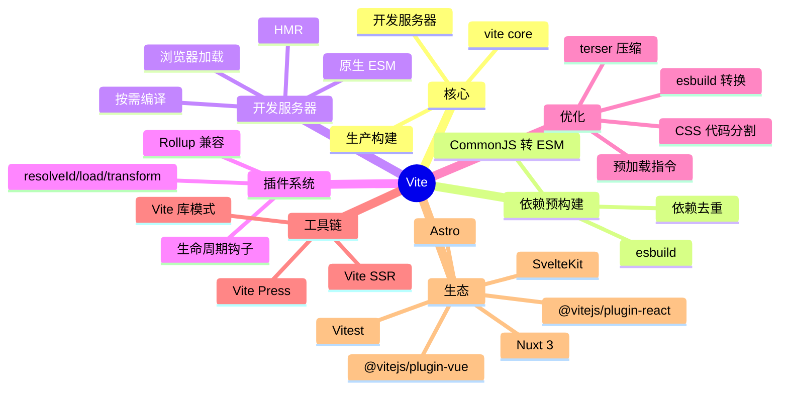

# Vite

> 新一代前端构建工具 — 尤雨溪开源，基于浏览器原生 ESM + esbuild + Rollup

## 一、前言

**定位**：极速开发服务器 + 优化生产构建，Vue/React/Svelte 官方推荐

**核心价值**：
1. **极速冷启动** — 基于浏览器原生 ESM，无需打包所有模块
2. **即时 HMR** — 模块级 HMR，毫秒级更新
3. **按需编译** — 只编译当前请求的模块
4. **esbuild 预构建** — 依赖用 esbuild 预打包（Go 实现，10-100x 快于 JS 打包器）
5. **生产用 Rollup** — 开发用 esbuild，生产用 Rollup（成熟生态）
6. **开箱即用** — TS/JSX/CSS/PostCSS/JSON/WASM 内置支持

**应用场景**：所有现代前端项目（Vue/React/Svelte/Solid）、库开发、SSR

**与 Webpack 对比**：

| 维度 | Vite | Webpack |
|------|------|---------|
| 冷启动 | < 1s (100 模块) | 10-30s |
| HMR | < 50ms | 200-1000ms |
| 生产构建 | Rollup | Webpack |
| 配置 | 简洁 | 复杂 |
| 生态 | 新但快速增长 | 最大 |
| 学习曲线 | 低 | 高 |

---

## 二、架构思维导图



---

## 三、关键代码

### 1. 开发服务器 — 中间件核心

```ts
// 文件: packages/vite/src/node/server/index.ts
async function createServer(inlineConfig) {
  // 1. 解析配置
  const config = await resolveConfig(inlineConfig, 'serve', 'development');
  // 2. 创建 http 服务器
  const server = await _createServer(config);
  return server;
}

async function _createServer(config) {
  // 1. 依赖预构建（esbuild 把 CJS 转 ESM）
  await optimizeDeps(config);

  // 2. 中间件链（核心！请求流转）
  const middlewares = new Connect();

  // 2.1 跨域 + 缓存 + 解析
  middlewares.use(corsMiddleware());
  middlewares.use(cacheControlMiddleware());

  // 2.2 转换 HTML（注入 HMR client）
  middlewares.use(htmlMiddleware());

  // 2.3 转换 TS/JSX/ESM（esbuild）
  middlewares.use(transformMiddleware());

  // 2.4 静态文件服务
  middlewares.use(serveStaticMiddleware());
  middlewares.use(servePublicMiddleware());

  // 2.5 依赖加载（从 /node_modules/.vite/deps/）
  middlewares.use(optimizedDepsMiddleware());

  // 2.6 HMR 推送（WebSocket）
  middlewares.use('/__open-in-editor', openerMiddleware());

  // 3. HTTP + WS 服务器
  const httpServer = await resolveHttpServer(config, middlewares);
  const ws = createWebSocketServer(httpServer, config);

  // 4. 文件监听（chokidar）
  const watcher = chokidar.watch(root, { ignored: ['**/.git/**'] });

  return { middlewares, httpServer, ws, watcher };
}
```

### 2. 模块转换 — esbuild

```ts
// 文件: packages/vite/src/node/server/transformRequest.ts
async function transformRequest(url, options) {
  // 1. URL 解析
  const { id, filename } = await resolveUrl(url, config);

  // 2. 缓存命中？
  const cache = transformCache.get(config);
  const cached = cache?.get(id);
  if (cached) return cached;

  // 3. 加载文件
  const code = await fs.readFile(filename, 'utf-8');

  // 4. esbuild 预转换（TS/JSX → JS）
  const loader = getLoader(filename);  // 'ts' | 'tsx' | 'js' | 'jsx'
  const esbuildResult = await esbuild.transform(code, {
    loader,
    target: 'es2020',
    jsx: 'automatic',  // React 17+ JSX transform
    sourcemap: true,
  });

  // 5. 用户插件 transform 钩子
  let transformed = esbuildResult.code;
  for (const plugin of plugins) {
    if (plugin.transform) {
      const result = await plugin.transform.call(ctx, transformed, id);
      if (result) transformed = result.code;
    }
  }

  // 6. 浏览器端 import 路径处理
  transformed = await toBrowserPath(transformed, id);

  // 7. 缓存 + 返回
  cache?.set(id, { code: transformed, map: esbuildResult.map });
  return { code: transformed, map: esbuildResult.map };
}
```

### 3. HMR — 模块热更新

```ts
// 文件: packages/vite/src/node/server/hmr.ts
function handleHMRUpdate(file, server) {
  // 1. 收集受影响模块
  const modules = [];
  for (const [id, mod] of server.moduleGraph.idToModuleMap) {
    if (mod.file === file || mod.transformResult?.deps?.includes(file)) {
      modules.push(mod);
    }
  }

  // 2. 失效 + 重新编译
  for (const mod of modules) {
    server.moduleGraph.invalidateModule(mod);
  }

  // 3. 推送 HMR 消息（WebSocket）
  server.ws.send({
    type: 'update',
    updates: modules.map(mod => ({
      type: mod.type === 'js' ? 'js-update' : 'css-update',
      path: mod.url,
      timestamp: mod.lastHMRTimestamp,
      acceptedPath: mod.url,
    })),
  });
}

// 客户端接收（Vite client runtime）
// 1. 拉取新模块
// 2. import() 加载
// 3. 找到 HMR accept 回调执行
// 4. 完整模块替换 + 触发 HMR 边界
```

### 4. 插件系统（Rollup 兼容）

```ts
// 文件: 用户的 vite.config.ts
import vue from '@vitejs/plugin-vue';
import react from '@vitejs/plugin-react';
import { defineConfig } from 'vite';

export default defineConfig({
  plugins: [
    // 1. Vue SFC 编译
    vue(),
    // 2. React Fast Refresh
    react({ jsxRuntime: 'automatic' }),
    // 3. 自定义插件
    {
      name: 'my-plugin',
      // resolveId: 把 import 路径转成绝对路径
      resolveId(source, importer) {
        if (source.startsWith('@/')) {
          return path.resolve(__dirname, 'src', source.slice(2));
        }
      },
      // transform: 转换代码
      transform(code, id) {
        if (id.endsWith('.svg')) {
          // SVG 转成 data URL
          return `export default "${svgToDataUrl(code)}"`;
        }
      },
      // configureServer: 改 dev server
      configureServer(server) {
        server.middlewares.use('/api', (req, res) => {
          res.end('mock data');
        });
      },
    },
  ],
  build: {
    rollupOptions: {
      output: {
        manualChunks: { vendor: ['react', 'react-dom'] },
      },
    },
  },
});
```

---

## 四、核心洞察

1. **ESM 原生哲学**：浏览器直接 import，不打包所有模块 → 冷启动 < 1s
2. **esbuild 预构建**：node_modules 用 esbuild（Go）转 ESM + 去重，比 Webpack 快 10-100x
3. **HMR 边界**：用 `import.meta.hot.accept()` 声明可热替换边界，框架插件（Vue/React）自动注入
4. **生产用 Rollup**：开发用 esbuild（HMR 快），生产用 Rollup（tree-shaking 成熟）
5. **依赖缓存**：预构建结果缓存到 `node_modules/.vite/deps/`，重复启动秒级
6. **SSR 一等公民**：`createServer` 支持 middleware mode，挂载到 Express/Koa/Hono
7. **库模式**：`build.lib` 输出 ESM/CJS/UMD，多入口 + external 依赖
8. **何时用 Vite vs Webpack**：新项目选 Vite（快）；维护老 Webpack 5 项目继续 Webpack

## 五、跨项目引用

- [[./vue|Vue]] — Vite 是 Vue 团队官方构建工具
- [[./react|React]] — 通过插件完整支持
- [[./svelte|Svelte]] — SvelteKit 默认 Vite
- [[./nuxt|Nuxt]] — Nuxt 3 用 Vite
- [[../项目代码包/D-构建与UI/webpack|Webpack]] — 上一代主流，对照学习

---

**项目地址**：`G:\实战案例\GitHub顶尖项目\vite`
**类型**：构建工具 | **Stars**: 70k+ | **License**: MIT
