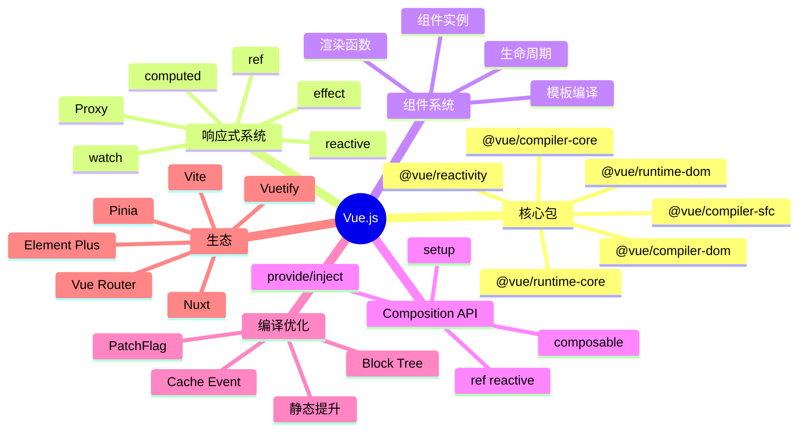

# Vue.js

> 渐进式 JavaScript 框架 — 尤雨溪开源，介于 React 与 Angular 之间的"易用 + 强大"平衡

## 一、前言

**定位**：渐进式 JavaScript 框架，从视图层（Vue 2）→ 完整应用框架（Vue 3 Composition API）

**核心价值**：
1. 渐进式 — 可只用作视图层，也可作为完整 SPA 框架
2. 响应式数据 — 基于 Proxy 的细粒度依赖追踪
3. 模板 vs 渲染函数 — 双模式，写法灵活
4. 单文件组件（SFC）— `<template> <script> <style>` 三段式
5. Composition API — 类似 React Hooks 但更灵活

**应用场景**：SPA、SSR（Nuxt）、移动端（uni-app）、桌面应用（Electron + Vue）

**版本演进**：
- **Vue 1**：Object.defineProperty 响应式，仅视图层
- **Vue 2**：组件化、Vuex、Vue Router
- **Vue 3**（2020）：Proxy 响应式、Composition API、Teleport、Suspense、TypeScript 重写

---

## 二、架构思维导图



---

## 三、关键代码

### 1. 响应式核心 — reactive / Proxy

```js
// 文件: packages/reactivity/src/reactive.ts
function reactive(target) {
  // 1. 如果已经是 reactive，直接返回（避免重复代理）
  if (target && target.__v_isReactive) {
    return target;
  }
  // 2. 只代理对象
  if (!isObject(target)) {
    return target;
  }
  // 3. 已有 proxy 复用（缓存）
  const existingProxy = reactiveMap.get(target);
  if (existingProxy) {
    return existingProxy;
  }
  // 4. 创建 proxy
  const proxy = new Proxy(target, mutableHandlers);
  reactiveMap.set(target, proxy);
  return proxy;
}

const mutableHandlers = {
  get(target, key, receiver) {
    // 1. 短路 isReactive
    if (key === '__v_isReactive') return !readonly;
    // 2. 数组方法特殊处理（避免 length 触发）
    const result = Reflect.get(target, key, receiver);
    // 3. 依赖追踪
    track(target, TrackOpTypes.GET, key);
    // 4. 嵌套对象自动 reactive（懒递归）
    if (isObject(result)) {
      return reactive(result);
    }
    return result;
  },
  set(target, key, value, receiver) {
    // 1. 旧值相等则不触发更新
    const oldValue = target[key];
    const result = Reflect.set(target, key, value, receiver);
    if (target === toRaw(receiver)) {
      if (!hadKey) {
        trigger(target, TriggerOpTypes.ADD, key, value);
      } else if (hasChanged(value, oldValue)) {
        trigger(target, TriggerOpTypes.SET, key, value, oldValue);
      }
    }
    return result;
  }
};
```

### 2. 依赖追踪 — effect / track / trigger

```js
// 文件: packages/reactivity/src/effect.ts
let activeEffect = null;          // 当前执行的 effect
const effectStack = [];            // 嵌套 effect 栈
const targetMap = new WeakMap();   // target → Map<key, Set<effect>>

function track(target, type, key) {
  if (activeEffect === undefined) {
    return;  // 没有 effect 在执行，不追踪
  }
  let depsMap = targetMap.get(target);
  if (!depsMap) {
    targetMap.set(target, (depsMap = new Map()));
  }
  let dep = depsMap.get(key);
  if (!dep) {
    depsMap.set(key, (dep = new Set()));
  }
  // 关键：把当前 effect 存到 dep（被哪些 effect 依赖）
  // 同时把 dep 存到 effect.deps（effect 依赖了哪些 dep）
  if (!dep.has(activeEffect)) {
    dep.add(activeEffect);
    activeEffect.deps.push(dep);
  }
}

function trigger(target, type, key, newValue) {
  const depsMap = targetMap.get(target);
  if (!depsMap) return;
  const effects = new Set();
  const add = (effectsToAdd) => {
    if (effectsToAdd) {
      effectsToAdd.forEach(effect => {
        if (effect !== activeEffect || effect.allowRecurse) {
          effects.add(effect);
        }
      });
    }
  };
  // 收集：精确 + 数组 length 等
  if (key !== undefined) {
    add(depsMap.get(key));
  }
  if (type === TriggerOpTypes.ADD || type === TriggerOpTypes.DELETE) {
    add(depsMap.get(ITERATE_KEY));
  }
  // 调度执行
  effects.forEach(effect => {
    if (effect.scheduler) {
      effect.scheduler();
    } else {
      effect.run();
    }
  });
}
```

### 3. 编译优化 — PatchFlag

```js
// 文件: packages/compiler-core/src/transforms/transformElement.ts
// 编译时给动态节点打 flag，运行时只 diff 标记的
const enum PatchFlags {
  TEXT = 1,                  // 动态文本
  CLASS = 1 << 1,            // 动态 class
  STYLE = 1 << 2,            // 动态 style
  PROPS = 1 << 3,            // 动态 props
  FULL_PROPS = 1 << 4,       // 完整 props diff
  NEED_HYDRATION = 1 << 5,   // 需要水合
  STABLE_FRAGMENT = 1 << 6,
  KEYED_FRAGMENT = 1 << 7,
  UNKEYED_FRAGMENT = 1 << 8,
  NEED_PATCH = 1 << 9,
  DYNAMIC_SLOTS = 1 << 10,
  // ... 31 种

  HOISTED = -1,              // 静态提升，跳过 diff
  BAIL = -2,                  // 优化退出，走 vdom diff
}

// 模板：
//   <div :class="cls">{{ msg }}</div>
// 编译为：
//   createElementVNode("div", { class: cls }, msg, 3 /* TEXT + CLASS */)
```

---

## 四、核心洞察

1. **Proxy 响应式 vs React VDOM**：Vue 精确追踪每个属性的依赖，组件级别自动更新；React 走 diff 树，组件级别 re-render
2. **编译时优化**：Vue 3 编译器分析模板，给动态节点打 PatchFlag（31 种），运行时跳过静态节点，性能比 Vue 2 提升 1.3-2x
3. **Composition API 哲学**：把相关逻辑（state + method）聚合到一个 setup 函数，类似 React Hooks 但用 ref/reactive 显式声明
4. **ref vs reactive**：ref 包装值类型（.value 访问），reactive 包装对象（Proxy），ref 内部自动用 reactive 处理 .value
5. **nextTick 必要性**：DOM 更新是异步的（patch 阶段），改完 state 后要 nextTick 才能拿到新 DOM
6. **Vue 3 vs React 19**：都支持组件级优化、Suspense、Teleport；Vue 模板更接近 HTML，React JSX 接近 JS
7. **生态对比**：Vue 生态较集中（Vuex → Pinia，Vue Router，Nuxt），React 生态分散（Redux/Zustand/Jotai/Recoil...）
8. **SSR 性能**：Vue 3 + Nuxt 3 引入 streaming SSR，TTFB 优化 30-50%

## 五、跨项目引用

- [[./react|React]] — 同样声明式 UI，路径不同
- [[./angular|Angular]] — 都强调完整框架，Angular 更重
- [[../项目代码包/A-前端框架/vite|Vite]] — Vue 团队开发，构建工具首选

---

---

## 六、Vue 3 核心深入

### 6.1 Composition API 完整指南

Composition API 是 Vue 3 最具革命性的特性，它解决了 Vue 2 Options API 在大型组件中逻辑分散的问题。Options API 把代码按 `data`、`methods`、`computed`、`watch` 等选项分组，但当一个功能涉及多个选项时，开发者需要不停地上下滚动文件来追踪相关逻辑，这种"碎片化"在复杂业务中非常痛苦。

**为什么需要 Composition API？**
1. **逻辑复用更优雅**：Vue 2 的 mixins 会导致命名冲突、数据来源不清晰；Composition API 通过自定义 composable 函数（类似 React Hooks）实现逻辑复用，命名空间隔离清晰
2. **更好的 TypeScript 支持**：Options API 推断类型困难，Composition API 配合 `<script setup>` + `defineProps<T>()` 几乎能做到 100% 类型安全
3. **代码组织更灵活**：可以把一个特性的所有 state、method、生命周期放在一起（按特性组织），而不是按选项类型分块
4. **逻辑提取更简单**：把 setup 内的逻辑提取到 `useXxx()` 函数中，即可在多个组件中复用

**setup 函数执行时机**：
- 在 `beforeCreate` 之前执行
- 此时组件实例还没创建，`this` 不可用
- 所以 setup 内部不能使用 `this.data`、`this.method`
- 必须用 `ref()` 或 `reactive()` 显式声明响应式数据
- 必须用 `props` 形参或 `inject()` 获取父级数据

**setup 的返回值**：
- 返回一个对象：该对象的属性会暴露给模板
- 返回一个渲染函数：直接控制渲染输出（高阶用法）
- 不返回任何东西：通过 `<script setup>` 编译宏自动暴露（推荐）

```js
// 基础 setup 写法
import { ref, computed, onMounted } from 'vue'

export default {
  props: ['initialCount'],
  setup(props) {
    const count = ref(props.initialCount || 0)
    const doubleCount = computed(() => count.value * 2)
    
    function increment() {
      count.value++
    }
    
    onMounted(() => {
      console.log('组件已挂载')
    })
    
    // 必须 return 才能在模板中使用
    return { count, doubleCount, increment }
  }
}
```

**`<script setup>` 语法糖**（Vue 3.2+ 强烈推荐）：

```vue
<script setup>
import { ref, computed, onMounted } from 'vue'
import MyComponent from './MyComponent.vue'

// 顶层变量、函数、import 自动暴露给模板
const props = defineProps({
  initialCount: { type: Number, default: 0 }
})
const emit = defineEmits(['change'])

// 顶层 ref 自动解包，模板中可直接写 {{ count }} 而非 {{ count.value }}
const count = ref(props.initialCount)
const doubleCount = computed(() => count.value * 2)

function increment() {
  count.value++
  emit('change', count.value)
}

onMounted(() => console.log('mounted'))
</script>

<template>
  <div>{{ count }} - {{ doubleCount }}</div>
  <button @click="increment">+1</button>
  <MyComponent />
</template>
```

### 6.2 响应式系统深度解析

Vue 3 的响应式系统是其灵魂，理解它能帮你写出更高效的代码并避免常见陷阱。

**核心 API 对比表**：

| API | 用途 | 访问方式 | 适用场景 | 注意事项 |
|-----|------|----------|----------|----------|
| `ref()` | 包装基本类型或对象 | `.value` | 数字、字符串、布尔、单个值 | 对象内部自动用 reactive |
| `reactive()` | 包装对象 | 直接访问 | 复杂对象、对象集合 | 解构会丢失响应式 |
| `shallowRef()` | 浅层 ref | `.value` | 大数据对象、第三方实例 | 内部值变化不会触发更新 |
| `shallowReactive()` | 浅层 reactive | 直接访问 | 大对象、性能敏感 | 只有顶层属性是响应式的 |
| `readonly()` | 不可变包装 | 直接访问 | props、全局配置 | 修改会报警告 |
| `toRefs()` | 对象转 ref 数组 | 数组解构 | 解构 reactive 保留响应式 | 配合 reactive 使用 |
| `toRef()` | 单个属性转 ref | `.value` | 单独引用对象某个属性 | 普通属性变化不触发更新 |
| `markRaw()` | 标记为非响应式 | 直接访问 | 第三方库实例、VNode | 性能优化手段 |
| `customRef()` | 自定义 ref | `.value` | 防抖、节流、异步 | 手动控制 track/trigger |

**ref 解包的 4 个场景**：
1. 模板中自动解包：`{{ count }}` 等价于 `{{ count.value }}`
2. reactive 对象的属性自动解包：reactive 对象里嵌套的 ref 也会被解包
3. 数组/Map/Set 中的 ref 不会自动解包，需要手动 `.value`
4. 解构 reactive 对象会丢失响应式，要用 `toRefs()`

```js
// 场景 1：reactive 中嵌套 ref
const state = reactive({ count: ref(0) })
console.log(state.count)  // 0，自动解包

// 场景 2：解构丢失响应式（错误）
const { name, age } = state  // 普通的值，不再响应式

// 场景 3：解构保留响应式（正确）
const { name, age } = toRefs(state)
// name 和 age 都是 Ref 对象，模板中自动解包
```

**shallowRef 与 ref 的关键区别**：
```js
const obj = ref({ nested: { count: 0 } })
obj.value.nested.count = 1  // 触发更新（深度响应式）

const shallowObj = shallowRef({ nested: { count: 0 } })
shallowObj.value.nested.count = 1  // 不触发更新
shallowObj.value = { ...newObj }   // 触发更新（整体替换）
```

使用 shallowRef 的典型场景：管理大型第三方库实例（ECharts 图表实例、Monaco Editor 实例、地图实例），避免深度代理造成的性能损耗。

**customRef 实现防抖**：
```js
import { customRef } from 'vue'

function useDebouncedRef(value, delay = 200) {
  let timeout
  return customRef((track, trigger) => ({
    get() {
      track()
      return value
    },
    set(newValue) {
      clearTimeout(timeout)
      timeout = setTimeout(() => {
        value = newValue
        trigger()
      }, delay)
    }
  }))
}

const text = useDebouncedRef('hello', 500)
// text.value 改变后 500ms 才触发更新
```

### 6.3 生命周期钩子（Composition API）

```js
import { 
  onBeforeMount, onMounted,
  onBeforeUpdate, onUpdated,
  onBeforeUnmount, onUnmounted,
  onActivated, onDeactivated,
  onErrorCaptured
} from 'vue'

// 必须直接在 setup 中同步调用，不能在 if/for/异步中
onMounted(() => {
  console.log('组件挂载完成，DOM 可访问')
  // 适合：DOM 操作、第三方库初始化、网络请求
})

onBeforeUnmount(() => {
  // 适合：清理定时器、取消订阅、销毁第三方实例
  clearInterval(this.timer)
  echartsInstance.dispose()
})
```

**与 Vue 2 生命周期映射**：

| Vue 2 | Vue 3 | 触发时机 |
|-------|-------|----------|
| beforeCreate | 无（setup 替代） | 实例初始化前 |
| created | 无（setup 替代） | 实例创建完成 |
| beforeMount | onBeforeMount | DOM 挂载前 |
| mounted | onMounted | DOM 挂载后 |
| beforeUpdate | onBeforeUpdate | 数据变化、DOM 更新前 |
| updated | onUpdated | 数据变化、DOM 更新后 |
| beforeDestroy | onBeforeUnmount | 组件销毁前 |
| destroyed | onUnmounted | 组件销毁后 |
| activated | onActivated | keep-alive 激活 |
| deactivated | onDeactivated | keep-alive 停用 |
| errorCaptured | onErrorCaptured | 捕获子组件错误 |

**关键注意事项**：
1. 生命周期钩子必须在 setup 同步执行，不能放在异步函数、if/for、事件回调内
2. 多次注册同一钩子会按注册顺序执行
3. onMounted 中访问的 DOM 已是最新，但子组件不一定挂载完成
4. onUpdated 中修改 state 会导致无限循环，需谨慎

### 6.4 watch 与 watchEffect

`watch` 用于监听特定数据源变化，是 Vue 响应式系统的"副作用"出口。

```js
import { ref, reactive, watch, watchEffect } from 'vue'

// 1. 监听单个 ref
const count = ref(0)
watch(count, (newVal, oldVal) => {
  console.log(`count: ${oldVal} -> ${newVal}`)
})

// 2. 监听多个 ref
watch([count, name], ([newCount, newName], [oldCount, oldName]) => {
  // 两个变化都会触发
})

// 3. 监听 reactive 对象
const state = reactive({ user: { name: 'tom' } })
watch(state, (newVal, oldVal) => {
  // 注意：oldVal 和 newVal 是同一个对象引用
  // 深度监听默认开启
})

// 4. 监听对象某个属性
watch(() => state.user.name, (newName) => {
  console.log('name changed:', newName)
})

// 5. 深度监听（性能差，慎用）
watch(state, (val) => {}, { deep: true })

// 6. 立即执行
watch(source, callback, { immediate: true })

// 7. post 触发（在 DOM 更新后）
watch(source, callback, { flush: 'post' })
// 'pre'（默认）: 组件更新前
// 'post': 组件更新后
// 'sync': 同步触发（罕见）
```

**watch vs watchEffect**：

| 特性 | watch | watchEffect |
|------|-------|-------------|
| 依赖收集 | 显式指定 | 自动收集 |
| 旧值访问 | 有 newVal/oldVal | 无 |
| 立即执行 | 默认 false | 默认 true |
| 使用场景 | 明确知道监听谁 | 副作用依赖多个值 |

```js
// watchEffect 自动追踪回调中用到的响应式数据
const userId = ref(1)
const user = ref(null)

watchEffect(async () => {
  // 自动追踪 userId
  const res = await fetch(`/api/users/${userId.value}`)
  user.value = await res.json()
})
```

**停止 watch**：
```js
const stop = watch(source, callback)
// 卸载时
stop()

// watchEffect 类似
const stop = watchEffect(() => {})
onUnmounted(() => stop())
```

### 6.5 computed 高级用法

```js
import { ref, computed } from 'vue'

const firstName = ref('张')
const lastName = ref('三')

// 1. 只读计算属性
const fullName = computed(() => `${firstName.value}${lastName.value}`)

// 2. 可写计算属性（用 get/set 对象）
const fullNameWritable = computed({
  get: () => `${firstName.value}${lastName.value}`,
  set: (val) => {
    const [first, last] = val.split(' ')
    firstName.value = first
    lastName.value = last
  }
})
fullNameWritable.value = '李 四'

// 3. 调试：onTrack/onTrigger
const debug = computed(() => firstName.value + lastName.value, {
  onTrack(e) { console.log('track', e) },
  onTrigger(e) { console.log('trigger', e) }
})
```

**computed vs method 关键区别**：
- computed 有缓存：依赖不变则多次访问立即返回
- method 每次调用都执行
- 模板中复杂逻辑用 computed 性能更好

**性能陷阱**：
```js
// 错误：computed 中修改 state
const count = ref(0)
const double = computed(() => {
  count.value++  // 无限循环！computed 应该是纯函数
  return count.value * 2
})

// 正确：使用 watch 触发副作用
```

---

## 七、Vue Router 4 完整实战

### 7.1 基础配置

Vue Router 4 是 Vue 3 官方路由管理器，相比 Vue Router 3 在 TypeScript 支持、动态路由、Composition API 集成上做了大量改进。

**基本安装与配置**：
```bash
npm install vue-router@4
```

```js
// src/router/index.js
import { createRouter, createWebHistory } from 'vue-router'
import Home from '@/views/Home.vue'

const routes = [
  {
    path: '/',
    name: 'Home',
    component: Home,
    meta: { title: '首页', requiresAuth: false }
  },
  {
    path: '/user/:id',
    name: 'User',
    component: () => import('@/views/User.vue'),  // 懒加载
    meta: { title: '用户详情', requiresAuth: true },
    props: true  // 把路由参数当作 props 传入
  },
  {
    path: '/:pathMatch(.*)*',
    name: 'NotFound',
    component: () => import('@/views/NotFound.vue')
  }
]

const router = createRouter({
  history: createWebHistory(),  // HTML5 History 模式（无 #）
  // history: createWebHashHistory(),  // Hash 模式（有 #）
  // history: createMemoryHistory(),  // SSR/测试
  routes,
  scrollBehavior(to, from, savedPosition) {
    // 路由切换时滚动位置控制
    if (savedPosition) return savedPosition  // 浏览器前进/后退
    if (to.hash) return { el: to.hash, behavior: 'smooth' }
    return { top: 0 }  // 默认滚到顶部
  }
})

// 全局前置守卫
router.beforeEach((to, from, next) => {
  document.title = to.meta.title || '默认标题'
  if (to.meta.requiresAuth && !isLoggedIn()) {
    next({ name: 'Login', query: { redirect: to.fullPath } })
  } else {
    next()
  }
})

// 全局后置钩子
router.afterEach((to, from) => {
  // 上报 PV、滚动到顶部等
  analytics.page(to.fullPath)
})

export default router
```

**main.js 注册**：
```js
import { createApp } from 'vue'
import App from './App.vue'
import router from './router'

createApp(App).use(router).mount('#app')
```

### 7.2 路由模式对比

| 模式 | URL 形式 | 优点 | 缺点 | 适用场景 |
|------|----------|------|------|----------|
| Hash 模式 | `/#/user/123` | 部署简单（无需服务器配置） | URL 不美观、SEO 差 | 静态站点、简易应用 |
| History 模式 | `/user/123` | URL 干净、SEO 友好 | 需服务器 fallback 配置 | 现代 SPA、Nuxt |
| Memory 模式 | 无 URL | 完全内存 | 刷新丢失 | SSR、测试、Electron |

**History 模式服务器配置**（必须配置，否则刷新 404）：

**Nginx**：
```nginx
location / {
  try_files $uri $uri/ /index.html;
}
```

**Apache**：
```apache
<IfModule mod_rewrite.c>
  RewriteEngine On
  RewriteBase /
  RewriteRule ^index\.html$ - [L]
  RewriteCond %{REQUEST_FILENAME} !-f
  RewriteCond %{REQUEST_FILENAME} !-d
  RewriteRule . /index.html [L]
</IfModule>
```

**Netlify**（`_redirects` 文件）：
```
/*  /index.html  200
```

**Vercel**（`vercel.json`）：
```json
{ "rewrites": [{ "source": "/(.*)", "destination": "/index.html" }] }
```

### 7.3 动态路由与权限控制

```js
// 1. 动态添加路由（常用于权限路由）
const router = createRouter({ ... })

// 根据用户角色动态注册
async function loadRoutes(userRole) {
  const modules = import.meta.glob('@/views/**/*.vue')
  
  const routeMap = {
    admin: [
      { path: '/admin/users', component: modules['/src/views/admin/Users.vue'] },
      { path: '/admin/settings', component: modules['/src/views/admin/Settings.vue'] }
    ],
    editor: [
      { path: '/editor/posts', component: modules['/src/views/editor/Posts.vue'] }
    ]
  }
  
  const dynamicRoutes = routeMap[userRole] || []
  dynamicRoutes.forEach(route => {
    router.addRoute(route)
  })
  
  // 添加通配 fallback
  router.addRoute({
    path: '/:pathMatch(.*)*',
    name: 'Forbidden',
    component: () => import('@/views/Forbidden.vue')
  })
}

// 2. 移除路由
router.removeRoute('admin-users')

// 3. 检查路由是否存在
router.hasRoute('admin-users')

// 4. 获取所有路由
router.getRoutes()
```

**Composition API 中的路由**：
```js
import { useRoute, useRouter } from 'vue-router'
import { watch } from 'vue'

export default {
  setup() {
    const route = useRoute()
    const router = useRouter()
    
    // 响应式访问当前路由
    console.log(route.params.id)
    console.log(route.query.search)
    console.log(route.meta.requiresAuth)
    
    // 编程式导航
    const goToUser = (id) => {
      router.push({ name: 'User', params: { id } })
      // router.replace(...)  // 替换当前历史
      // router.go(-1)  // 后退
      // router.back()  // 后退
    }
    
    // 监听路由变化
    watch(() => route.params.id, (newId) => {
      console.log('id changed:', newId)
      // 重新加载数据
    })
    
    return { goToUser }
  }
}
```

### 7.4 导航守卫完整体系

```js
// 1. 全局前置守卫
router.beforeEach((to, from, next) => {
  // 必须调用 next()，否则路由不会跳转
  // next()  // 放行
  // next(false)  // 取消
  // next('/login')  // 重定向
  // next({ name: 'Login' })  // 对象形式
  // next(error)  // 抛出错误
  
  if (to.meta.requiresAuth) {
    if (!isLoggedIn()) {
      next({ name: 'Login', query: { redirect: to.fullPath } })
    } else {
      next()
    }
  } else {
    next()
  }
})

// 2. 全局解析守卫（组件被解析后调用）
router.beforeResolve(async (to) => {
  if (to.meta.requiresData) {
    try {
      await store.dispatch('fetchData', to.params.id)
    } catch (e) {
      // 数据加载失败，取消导航
      return false
    }
  }
})

// 3. 全局后置钩子
router.afterEach((to, from) => {
  // 已经跳转完成，不能修改路由
  // 适合：页面统计、滚动到顶部
  window.scrollTo(0, 0)
  gtag('event', 'page_view', { page_path: to.fullPath })
})

// 4. 路由独享守卫
const routes = [
  {
    path: '/admin',
    component: Admin,
    beforeEnter: (to, from) => {
      if (!hasAdminRole()) {
        return { name: 'Forbidden' }
      }
    }
  }
]

// 5. 组件内守卫
export default {
  beforeRouteEnter(to, from, next) {
    // 组件实例还没创建，不能用 this
    next(vm => {
      // 通过回调访问组件实例
      vm.fetchData()
    })
  },
  beforeRouteUpdate(to, from) {
    // 路由参数变化但组件复用时调用
    this.fetchData(to.params.id)
  },
  beforeRouteLeave(to, from) {
    // 离开前（防止误关闭未保存的表单）
    if (this.hasUnsavedChanges) {
      const answer = window.confirm('有未保存的修改，确定离开？')
      if (!answer) return false
    }
  }
}
```

**守卫执行顺序**（完整链路）：
```
导航触发
  ↓
失活组件 beforeRouteLeave
  ↓
全局 beforeEach
  ↓
复用组件 beforeRouteUpdate
  ↓
路由独享 beforeEnter
  ↓
解析异步路由组件
  ↓
激活组件 beforeRouteEnter
  ↓
全局 beforeResolve
  ↓
导航确认
  ↓
全局 afterEach
  ↓
DOM 更新
  ↓
组件实例创建（beforeRouteEnter 回调 next(vm)）
```

### 7.5 路由懒加载与分包

```js
// 1. 基础懒加载
const User = () => import('@/views/User.vue')

// 2. 分组懒加载（按业务划分）
const User = () => import(/* webpackChunkName: "user" */ '@/views/User.vue')
const Profile = () => import(/* webpackChunkName: "user" */ '@/views/Profile.vue')

// 3. Vite 风格（多文件 glob 批量导入）
const modules = import.meta.glob('@/views/**/*.vue')

const routes = [
  {
    path: '/user',
    component: modules['/src/views/User.vue']
  }
]

// 4. 配合 webpack magic comment
const routes = [
  {
    path: '/heavy',
    component: () => import(
      /* webpackChunkName: "heavy-page" */
      /* webpackPrefetch: true */  // 预取（低优先级）
      /* webpackPreload: true */  // 预加载（高优先级）
      '@/views/Heavy.vue'
    )
  }
]
```

### 7.6 嵌套路由

```js
const routes = [
  {
    path: '/user/:id',
    component: UserLayout,
    children: [
      {
        path: '',  // 默认子路由
        component: UserProfile
      },
      {
        path: 'posts',  // /user/123/posts
        component: UserPosts
      },
      {
        path: 'settings',
        component: UserSettings
      }
    ]
  }
]
```

```vue
<!-- UserLayout.vue -->
<template>
  <div class="user-layout">
    <aside>
      <router-link :to="{ name: 'UserProfile' }">资料</router-link>
      <router-link :to="{ name: 'UserPosts' }">文章</router-link>
      <router-link :to="{ name: 'UserSettings' }">设置</router-link>
    </aside>
    
    <!-- 子路由出口 -->
    <main>
      <router-view />
    </main>
  </div>
</template>
```

### 7.7 路由传参的 4 种方式

```js
// 方式 1：动态路径参数（URL 的一部分）
{ path: '/user/:id', name: 'User' }
// URL: /user/123
// 访问：route.params.id === '123'

// 方式 2：query 参数（? 后的搜索参数）
router.push({ name: 'User', query: { tab: 'posts', page: 2 } })
// URL: /user?tab=posts&page=2
// 访问：route.query.tab === 'posts'

// 方式 3：hash 片段
router.push({ name: 'User', hash: '#section-2' })
// URL: /user#section-2

// 方式 4：路由 state（不会出现在 URL 中）
router.push({ name: 'User', state: { fromModal: true } })
// 访问：history.state.fromModal
```

### 7.8 常见踩坑与最佳实践

1. **路由组件复用导致数据不更新**：路由参数变化但组件没销毁，`watch` 监听 `route.params` 重新加载
2. **beforeRouteEnter 拿不到 this**：用 `next(vm => { vm.method() })` 回调形式
3. **动态路由刷新失效**：`router.addRoute` 是运行时注册，刷新会丢失，需要持久化到 localStorage 或后端
4. **keep-alive + 路由滚动**：需要在 `scrollBehavior` 中结合 `savedPosition` 处理
5. **嵌套路由出口位置**：`router-view` 必须放在父组件模板中
6. **路由 path 重复警告**：使用命名路由而非 path
7. **路由懒加载和 SSR 冲突**：Nuxt 3 中不能用动态 import，需要用 `defineAsyncComponent` 或 `pages/` 目录约定

---

## 八、Pinia 状态管理深度指南

### 8.1 为什么 Pinia 取代了 Vuex

Vuex 4 虽然支持 Vue 3，但存在诸多问题：
1. **mutations 必须同步**：异步操作要放在 actions，概念割裂
2. **TypeScript 支持差**：store 类型推断需要复杂 hack
3. **模块嵌套繁琐**：namespaced + 嵌套模块导致代码冗长
4. **样板代码多**：state/getters/mutations/actions 四个选项

**Pinia 的核心优势**：
- **API 更简洁**：state、getters、actions 三个概念
- **完整的 TS 支持**：所有类型自动推断
- **去除 mutations**：actions 可以是异步、可以直接修改 state
- **扁平化 store**：每个 store 独立，通过 `useXxxStore()` 引用
- **支持 composition 风格**：可以用 setup() 函数定义 store
- **更轻量**：约 1KB（gzip）
- **支持插件扩展**：持久化、加载状态、错误处理等

**Vuex 4 vs Pinia 对比**：

| 特性 | Vuex 4 | Pinia |
|------|--------|-------|
| 状态定义 | state() 函数 | state() 函数 |
| 计算属性 | getters | getters |
| 同步修改 | mutations（必须） | 直接在 actions 中修改 |
| 异步操作 | actions | actions（统一） |
| TypeScript | 需手动定义类型 | 自动推断 |
| 模块化 | modules + namespaced | 独立 store，扁平化 |
| DevTools | 支持 | 支持（更友好） |
| Composition API | 支持 | 一等公民 |
| 持久化 | 需手写插件 | 官方/社区插件 |
| 包大小 | ~10KB | ~1KB |

### 8.2 基础使用

```bash
npm install pinia
```

**main.js 注册**：
```js
import { createPinia } from 'pinia'
import { createApp } from 'vue'
import App from './App.vue'

const app = createApp(App)
app.use(createPinia())
app.mount('#app')
```

**定义 Store（Options 风格）**：
```js
// src/stores/user.js
import { defineStore } from 'pinia'

export const useUserStore = defineStore('user', {
  // state: 函数返回初始状态
  state: () => ({
    name: 'Guest',
    age: 0,
    token: '',
    profile: null,
    permissions: []
  }),
  
  // getters: 等价于 computed
  getters: {
    isLoggedIn: (state) => !!state.token,
    hasPermission: (state) => (perm) => state.permissions.includes(perm),
    fullInfo: (state) => {
      return `${state.name} (${state.age}岁)`
    }
  },
  
  // actions: 等价于 methods，可以是异步
  actions: {
    async login(credentials) {
      const { data } = await api.login(credentials)
      this.token = data.token
      this.profile = data.user
      this.permissions = data.permissions
      return data
    },
    
    logout() {
      this.token = ''
      this.profile = null
      this.permissions = []
    },
    
    async fetchProfile() {
      const { data } = await api.getProfile()
      this.profile = data
    },
    
    // action 之间互相调用，直接用 this
    async loginAndFetch(credentials) {
      await this.login(credentials)
      await this.fetchProfile()
    }
  }
})
```

**在组件中使用**：
```vue
<script setup>
import { useUserStore } from '@/stores/user'
import { storeToRefs } from 'pinia'

const userStore = useUserStore()

// 访问 state：直接访问
console.log(userStore.name)

// 访问 getters：当属性访问
const isLoggedIn = computed(() => userStore.isLoggedIn)

// 访问 actions：当方法调用
async function handleLogin() {
  await userStore.login({ username: 'tom', password: '123' })
}

// 解构保持响应式（重要！）
const { name, age, isLoggedIn } = storeToRefs(userStore)
// name、age、isLoggedIn 都是 ref，模板中自动解包
</script>
```

**为什么需要 storeToRefs？**
```js
// 错误：解构会丢失响应式
const { name, age } = userStore  // 普通值，不再响应

// 正确：用 storeToRefs
const { name, age } = storeToRefs(userStore)  // 都是 ref，响应式保留

// actions 不需要 storeToRefs
const { login, logout } = userStore  // actions 解构后仍可调用
```

### 8.3 Setup 风格 Store

```js
// src/stores/cart.js
import { defineStore } from 'pinia'
import { ref, computed, watch } from 'vue'

export const useCartStore = defineStore('cart', () => {
  // state 用 ref
  const items = ref([])
  const coupon = ref(null)
  
  // getters 用 computed
  const totalCount = computed(() => 
    items.value.reduce((sum, item) => sum + item.quantity, 0)
  )
  
  const totalPrice = computed(() => 
    items.value.reduce((sum, item) => sum + item.price * item.quantity, 0)
  )
  
  const finalPrice = computed(() => {
    let price = totalPrice.value
    if (coupon.value?.discount) {
      price = price * (1 - coupon.value.discount)
    }
    return price
  })
  
  // actions 用普通函数
  function addItem(product) {
    const exist = items.value.find(i => i.id === product.id)
    if (exist) {
      exist.quantity++
    } else {
      items.value.push({ ...product, quantity: 1 })
    }
  }
  
  function removeItem(productId) {
    const idx = items.value.findIndex(i => i.id === productId)
    if (idx > -1) items.value.splice(idx, 1)
  }
  
  function clear() {
    items.value = []
    coupon.value = null
  }
  
  // 可以在 store 内用 watch
  watch(items, (newItems) => {
    localStorage.setItem('cart', JSON.stringify(newItems))
  }, { deep: true })
  
  return {
    // state
    items,
    coupon,
    // getters
    totalCount,
    totalPrice,
    finalPrice,
    // actions
    addItem,
    removeItem,
    clear
  }
})
```

**Options vs Setup 风格对比**：

| 特性 | Options 风格 | Setup 风格 |
|------|--------------|------------|
| 语法 | 类 Vue 2 Options | 类 Vue 3 Composition |
| 灵活性 | 中等 | 高（可用任何组合式 API） |
| 学习成本 | 低 | 需懂 Composition |
| watch 监听 | 需在组件中 | 可在 store 中 |
| 第三方 composable | 难复用 | 容易集成 |
| 适合场景 | 简单 store | 复杂业务逻辑 |

### 8.4 高级特性

**1. Store 之间的调用**：
```js
// stores/order.js
import { useCartStore } from './cart'
import { useUserStore } from './user'

export const useOrderStore = defineStore('order', () => {
  const cart = useCartStore()
  const user = useUserStore()
  
  async function submitOrder() {
    if (!user.isLoggedIn) throw new Error('请先登录')
    
    const order = {
      items: cart.items,
      total: cart.finalPrice,
      userId: user.profile.id
    }
    
    const { data } = await api.createOrder(order)
    cart.clear()
    return data
  }
  
  return { submitOrder }
})
```

**2. 订阅状态变化**：
```js
const cartStore = useCartStore()

// 监听整个 state
cartStore.$subscribe((mutation, state) => {
  console.log('cart changed:', mutation.type, mutation.events)
  // mutation.type: 'direct' | 'patch object' | 'patch function'
  // state: 最新 state
  localStorage.setItem('cart', JSON.stringify(state.items))
}, { detached: true })  // detached: 组件卸载后仍保留订阅

// 监听 actions
const unsubscribe = cartStore.$onAction(({ name, store, args, after, onError }) => {
  console.log(`Action ${name} called with`, args)
  
  after((result) => {
    console.log(`Action ${name} finished`, result)
  })
  
  onError((error) => {
    console.error(`Action ${name} failed`, error)
  })
})

// 手动取消订阅
unsubscribe()
```

**3. 修改 state 的多种方式**：
```js
const userStore = useUserStore()

// 方式 1：直接修改
userStore.name = 'Tom'

// 方式 2：$patch 对象形式
userStore.$patch({
  name: 'Tom',
  age: 18
})

// 方式 3：$patch 函数形式（适合复杂修改）
userStore.$patch((state) => {
  state.items.push({ id: 1, name: 'apple' })
  state.items.push({ id: 2, name: 'banana' })
})

// 方式 4：替换整个 state
userStore.$state = { name: 'Tom', age: 18 }

// 方式 5：通过 actions
userStore.updateProfile({ name: 'Tom', age: 18 })
```

**4. 重置 state**：
```js
const userStore = useUserStore()
userStore.$reset()  // 重置为初始 state（仅 Options 风格，Setup 风格需自己实现）
```

### 8.5 持久化插件

**官方推荐：pinia-plugin-persistedstate**：
```bash
npm install pinia-plugin-persistedstate
```

```js
// main.js
import { createPinia } from 'pinia'
import piniaPluginPersistedstate from 'pinia-plugin-persistedstate'

const pinia = createPinia()
pinia.use(piniaPluginPersistedstate)
app.use(pinia)
```

```js
// stores/user.js
export const useUserStore = defineStore('user', {
  state: () => ({
    token: '',
    profile: null
  }),
  actions: { /* ... */ },
  
  // 开启持久化
  persist: {
    key: 'user-storage',  // localStorage key
    storage: localStorage,  // 或 sessionStorage
    paths: ['token', 'profile'],  // 只持久化这两个字段
    // 或者排除：pick: ['xxx']
  }
})
```

**手写持久化**：
```js
export const useUserStore = defineStore('user', () => {
  const token = ref(localStorage.getItem('token') || '')
  
  watch(token, (val) => {
    if (val) localStorage.setItem('token', val)
    else localStorage.removeItem('token')
  })
  
  return { token }
})
```

### 8.6 常见实践模式

**1. 加载状态管理**：
```js
export const useUserStore = defineStore('user', () => {
  const profile = ref(null)
  const loading = ref(false)
  const error = ref(null)
  
  async function fetchProfile(id) {
    loading.value = true
    error.value = null
    try {
      const { data } = await api.getProfile(id)
      profile.value = data
    } catch (e) {
      error.value = e.message
    } finally {
      loading.value = false
    }
  }
  
  return { profile, loading, error, fetchProfile }
})
```

**2. 错误处理 Action**：
```js
async function login(credentials) {
  try {
    const { data } = await api.login(credentials)
    this.token = data.token
  } catch (e) {
    // 统一处理错误
    this.error = e.response?.data?.message || '登录失败'
    throw e  // 抛出供组件捕获
  }
}
```

**3. Store 工厂模式**（高级）：
```js
function createListStore(entityName, api) {
  return defineStore(entityName, () => {
    const items = ref([])
    const loading = ref(false)
    
    async function fetchAll(params) {
      loading.value = true
      try {
        const { data } = await api.list(params)
        items.value = data
      } finally {
        loading.value = false
      }
    }
    
    return { items, loading, fetchAll }
  })
}

// 使用
export const useProductStore = createListStore('product', {
  list: api.listProducts
})
export const useOrderStore = createListStore('order', {
  list: api.listOrders
})
```

**4. 全局错误处理**：
```js
// plugins/errorHandler.js
export function errorHandler({ store, error }) {
  if (error.response?.status === 401) {
    // 401 未授权，跳转登录
    router.push({ name: 'Login' })
  } else if (error.response?.status >= 500) {
    // 服务端错误
    ElMessage.error('服务异常，请稍后再试')
  }
  
  console.error(`[${store.$id}] error:`, error)
}

// 注册
const pinia = createPinia()
pinia.use(({ store }) => {
  store.$onAction(({ name, onError }) => {
    onError(errorHandler.bind(null, { store }))
  })
})
```

### 8.7 Pinia 测试

```js
import { setActivePinia, createPinia } from 'pinia'
import { useUserStore } from '@/stores/user'

describe('UserStore', () => {
  beforeEach(() => {
    setActivePinia(createPinia())
  })
  
  it('should login successfully', async () => {
    const store = useUserStore()
    expect(store.isLoggedIn).toBe(false)
    
    await store.login({ username: 'tom', password: '123' })
    
    expect(store.isLoggedIn).toBe(true)
    expect(store.profile).toBeTruthy()
  })
  
  it('should handle login error', async () => {
    const store = useUserStore()
    
    // Mock API 失败
    vi.mock('@/api', () => ({
      login: vi.fn().mockRejectedValue(new Error('密码错误'))
    }))
    
    await expect(store.login({ username: 'tom', password: 'wrong' }))
      .rejects.toThrow('密码错误')
  })
})
```

---

## 九、组件设计模式

### 9.1 组件通信 7 种方式

```vue
<!-- 1. props / $emit（父子通信，最基础） -->
<!-- Parent.vue -->
<template>
  <Child :title="parentTitle" @update="handleUpdate" />
</template>

<!-- Child.vue -->
<script setup>
const props = defineProps({
  title: { type: String, required: true }
})
const emit = defineEmits(['update'])
function send() { emit('update', newValue) }
</script>
```

```js
// 2. provide / inject（祖先-后代通信）
// Ancestor.vue
import { provide, ref } from 'vue'
const theme = ref('dark')
provide('theme', theme)
provide('updateTheme', (val) => theme.value = val)

// Descendant.vue（任何层级）
import { inject } from 'vue'
const theme = inject('theme', 'light')  // 默认值
const updateTheme = inject('updateTheme')

// 进阶：用 Symbol 作为 key 避免冲突
// keys.js
export const ThemeKey = Symbol('theme')
// Ancestor
provide(ThemeKey, theme)
// Descendant
const theme = inject(ThemeKey)
```

```js
// 3. ref / exposeRef（父访问子组件实例）
// Parent.vue
<script setup>
import { ref } from 'vue'
import Child from './Child.vue'
const childRef = ref(null)
function callChild() {
  childRef.value?.childMethod()
  console.log(childRef.value?.childData)
}
</script>
<template>
  <Child ref="childRef" />
  <button @click="callChild">调用子组件</button>
</template>

// Child.vue
<script setup>
import { ref, defineExpose } from 'vue'
const childData = ref('内部数据')
function childMethod() { console.log('子组件方法被调用') }
// 默认情况下父组件访问不到子组件内部数据
// 必须用 defineExpose 显式暴露
defineExpose({
  childData,
  childMethod
})
</script>
```

```js
// 4. mitt / tiny-emitter（事件总线，任意组件通信）
// eventBus.js
import mitt from 'mitt'
export const bus = mitt()

// ComponentA.vue
import { bus } from '@/utils/eventBus'
bus.emit('globalEvent', { data: 1 })

// ComponentB.vue
import { onMounted, onUnmounted } from 'vue'
import { bus } from '@/utils/eventBus'
function handleEvent(payload) { console.log(payload) }
onMounted(() => bus.on('globalEvent', handleEvent))
onUnmounted(() => bus.off('globalEvent', handleEvent))

// 注意：Vue 3 移除了 $on/$off 事件总线，需要第三方库
// 适用场景：跨层级、松耦合通信
// 不适用：复杂业务（推荐用 Pinia 替代）
```

```js
// 5. v-model（双向绑定，单值通信）
// CustomInput.vue
<script setup>
const props = defineProps(['modelValue'])
const emit = defineEmits(['update:modelValue'])
function onInput(e) {
  emit('update:modelValue', e.target.value)
}
</script>
<template>
  <input :value="modelValue" @input="onInput" />
</template>

// Parent.vue
<CustomInput v-model="searchText" />
// 等价于：
<CustomInput :modelValue="searchText" @update:modelValue="searchText = $event" />

// 多个 v-model（Vue 3.4+）
<UserForm v-model:name="userName" v-model:age="userAge" />
```

```js
// 6. attrs（非 props 的属性透传）
// Parent.vue
<Child class="custom-class" data-id="123" @click="handleClick" />

// Child.vue（单根节点时自动透传）
<script setup>
import { useAttrs } from 'vue'
const attrs = useAttrs()
console.log(attrs)  // { class: 'custom-class', dataId: '123', onClick: handleClick }
// attrs 默认会自动绑定到子组件的根元素
</script>
<template>
  <div v-bind="$attrs">  <!-- 手动绑定到指定元素 -->
    Child content
  </div>
</template>

// 关闭自动继承：<Child inheritAttrs="false" />
// 适用场景：高阶组件、第三方组件封装
```

```js
// 7. slots（插槽，最强大的内容分发）
// Card.vue
<script setup>
defineProps({ title: String })
</script>
<template>
  <div class="card">
    <header v-if="$slots.header">
      <slot name="header" :title="title" />  <!-- 作用域插槽 -->
    </header>
    <main>
      <slot />  <!-- 默认插槽 -->
    </main>
    <footer v-if="$slots.footer">
      <slot name="footer" />
    </footer>
  </div>
</template>

// Parent.vue
<Card title="用户信息">
  <template #header="{ title }">
    <h2>{{ title }}</h2>
  </template>
  
  <p>这是默认插槽内容</p>
  
  <template #footer>
    <button>确认</button>
  </template>
</Card>
```

**通信方式选择决策树**：

```
父子通信？ → props/emit
祖先后代？ → provide/inject
兄弟组件？ → 提升到共同父级 / Pinia
跨组件树？ → Pinia / Event Bus
父访问子？ → ref + defineExpose
子访问父？ → emit
内容分发？ → slot
配置/常量？ → provide/inject
全局状态？ → Pinia
```

### 9.2 复合组件（Compound Components）

把多个子组件作为"主组件的命名空间"，让 API 更清晰。

```vue
<!-- Form.vue（容器） -->
<script setup>
import { provide, reactive } from 'vue'
import FormItem from './FormItem.vue'
import FormInput from './FormInput.vue'
import FormButton from './FormButton.vue'

const Form = {
  Item: FormItem,
  Input: FormInput,
  Button: FormButton
}

const state = reactive({
  values: {},
  errors: {},
  validate(field) {
    // 校验逻辑
  }
})
provide('formState', state)
</script>

<template>
  <form @submit.prevent>
    <slot />
  </form>
</template>

<!-- 使用 -->
<Form>
  <Form.Item label="用户名" error="不能为空">
    <Form.Input v-model="form.username" />
  </Form.Item>
  <Form.Item label="密码">
    <Form.Input type="password" v-model="form.password" />
  </Form.Item>
  <Form.Button @click="handleSubmit">提交</Form.Button>
</Form>
```

**Element Plus / Ant Design Vue 都采用此模式**。

### 9.3 渲染函数与 JSX

```js
// 1. 渲染函数（h 函数）
import { h } from 'vue'

export default {
  props: ['level'],
  render() {
    return h(`h${this.level}`, this.$slots.default())
  }
}

// 等价模板：<component :is="`h${level}`"><slot /></component>
```

```js
// 2. JSX（需要 @vue/babel-plugin-jsx）
// 安装：npm install @vue/babel-plugin-jsx
export default {
  props: ['level'],
  setup(props) {
    return () => <h{props.level}>{props.text}</h{props.level}>
  }
}

// 带条件渲染
setup() {
  return () => (
    <div class="container">
      {visible.value && <span>显示</span>}
      {items.value.map(item => (
        <div key={item.id}>{item.name}</div>
      ))}
    </div>
  )
}
```

**何时用 JSX？**
- 复杂条件渲染、循环嵌套深
- 动态组件名
- 高阶组件（包装现有组件）
- 表格列定义等需要灵活组合的场景

**何时用模板？**
- 静态结构为主
- v-model、v-for、v-if 等指令原生支持
- 团队更熟悉 HTML 风格
- SFC 中的 `<template>` 编译器优化更彻底

### 9.4 高阶组件（HOC）模式

```js
// withLoading.js
import { h, defineComponent } from 'vue'

export function withLoading(WrappedComponent) {
  return defineComponent({
    name: 'WithLoading',
    setup(props, { attrs, slots }) {
      const loading = ref(false)
      
      async function load() {
        loading.value = true
        try {
          // 模拟数据加载
          await new Promise(r => setTimeout(r, 1000))
        } finally {
          loading.value = false
        }
      }
      
      return () => h('div', { class: 'with-loading-wrapper' }, [
        loading.value && h('div', { class: 'loading-mask' }, '加载中...'),
        h(WrappedComponent, {
          ...attrs,
          onLoad: load,
          loading: loading.value
        }, slots)
      ])
    }
  })
}

// 使用
import UserList from './UserList.vue'
import { withLoading } from '@/hoc/withLoading'
export default withLoading(UserList)
```

**Vue 中 HOC 不如 React 常见**，因为：
1. 模板语法糖足够灵活
2. composable 函数更轻量
3. 插槽机制已经能完成大部分功能

### 9.5 Composable 函数（推荐）

composable 是 Composition API 的"逻辑复用"最佳实践。

```js
// useMouse.js
import { ref, onMounted, onUnmounted } from 'vue'

export function useMouse() {
  const x = ref(0)
  const y = ref(0)
  
  function update(e) {
    x.value = e.pageX
    y.value = e.pageY
  }
  
  onMounted(() => window.addEventListener('mousemove', update))
  onUnmounted(() => window.removeEventListener('mousemove', update))
  
  return { x, y }
}

// 组件中使用
import { useMouse } from '@/composables/useMouse'
const { x, y } = useMouse()
```

**VueUse 库**（官方推荐 composable 集合）：
```bash
npm install @vueuse/core
```

```js
import { useMouse, useDark, useLocalStorage, useEventListener, useDebounceFn, useThrottleFn, useStorage, useToggle, useIntervalFn } from '@vueuse/core'

const { x, y } = useMouse()  // 鼠标位置
const isDark = useDark()  // 暗色模式
const theme = useLocalStorage('theme', 'light')  // 持久化存储
useEventListener(window, 'resize', handler)  // 事件监听
const debouncedFn = useDebounceFn(fn, 500)  // 防抖
const { pause, resume } = useIntervalFn(fn, 1000)  // 定时器
```

### 9.6 递归组件与异步组件

**递归组件**（树形结构）：
```vue
<!-- TreeNode.vue -->
<script setup>
defineProps({
  node: { type: Object, required: true }
})
</script>

<template>
  <div class="tree-node">
    <div class="label">{{ node.label }}</div>
    <TreeNode
      v-for="child in node.children"
      :key="child.id"
      :node="child"
    />
  </div>
</template>

<!-- 注意：组件文件名需要与 name 一致（或显式设置 name） -->
```

**异步组件**（按需加载）：
```js
// 1. defineAsyncComponent API
import { defineAsyncComponent } from 'vue'

const HeavyComponent = defineAsyncComponent(() => 
  import('./HeavyComponent.vue')
)

// 2. 完整配置
const AsyncComp = defineAsyncComponent({
  loader: () => import('./HeavyComponent.vue'),
  loadingComponent: Loading,
  errorComponent: ErrorView,
  delay: 200,  // 延迟显示 loading
  timeout: 5000,  // 超时
  suspensible: true,  // 配合 Suspense
  onError(error, retry, fail, attempts) {
    if (attempts <= 3) retry()
    else fail()
  }
})

// 3. Suspense 包裹（更现代的方式）
<Suspense>
  <template #default>
    <AsyncComponent />
  </template>
  <template #fallback>
    <Loading />
  </template>
</Suspense>
```

### 9.7 受控与非受控组件

```vue
<!-- 受控组件：值由父组件管理 -->
<CustomInput :value="input" @update:value="input = $event" />

<!-- 非受控组件：组件内部管理状态，父组件只通过 ref 读取 -->
<CustomInput ref="inputRef" />
<!-- 内部 -->
<input :value="internalValue" @input="internalValue = $event" />
```

**适用场景**：
- 受控：表单字段需要实时校验、父组件需要响应值变化
- 非受控：性能敏感（避免每次输入触发父组件 re-render）、简单展示

### 9.8 错误边界（ErrorBoundary）

```js
// ErrorBoundary.vue
<script>
import { ref, onErrorCaptured } from 'vue'

export default {
  setup() {
    const error = ref(null)
    
    onErrorCaptured((err) => {
      error.value = err
      console.error('Caught error:', err)
      // 返回 false 阻止错误继续向上传播
      return false
    })
    
    return { error }
  }
}
</script>

<template>
  <div v-if="error" class="error-fallback">
    <h2>出错了</h2>
    <pre>{{ error.message }}</pre>
    <button @click="error = null">重试</button>
  </div>
  <slot v-else />
</template>

<!-- 使用 -->
<ErrorBoundary>
  <UserProfile />
</ErrorBoundary>
```

---

## 十、性能优化

### 10.1 性能瓶颈识别

**关键指标（Web Vitals）**：

| 指标 | 含义 | 优秀 | 需改进 | 差 |
|------|------|------|--------|-----|
| LCP（Largest Contentful Paint） | 最大内容渲染时间 | ≤2.5s | ≤4s | >4s |
| FID（First Input Delay） | 首次输入延迟 | ≤100ms | ≤300ms | >300ms |
| CLS（Cumulative Layout Shift） | 累积布局偏移 | ≤0.1 | ≤0.25 | >0.25 |
| INP（Interaction to Next Paint） | 交互到下次绘制 | ≤200ms | ≤500ms | >500ms |
| TTFB（Time to First Byte） | 首字节时间 | ≤800ms | ≤1.8s | >1.8s |
| FCP（First Contentful Paint） | 首次内容绘制 | ≤1.8s | ≤3s | >3s |

**Vue 应用性能瓶颈常见位置**：
1. 首屏加载（JS 包过大、阻塞渲染）
2. 组件渲染（大数据列表、复杂计算）
3. 状态更新（不必要的响应式追踪）
4. 网络请求（瀑布流、重复请求）
5. 内存泄漏（未清理的监听器、定时器）
6. 动画卡顿（layout thrashing、强制 reflow）

### 10.2 编译时优化

**1. PatchFlag 自动优化**：Vue 3 编译器分析模板，标记动态节点，运行时只 diff 标记的：

```html
<!-- 模板 -->
<div>
  <h1>静态标题</h1>  <!-- HOISTED，跳过 diff -->
  <p>{{ msg }}</p>     <!-- PatchFlag.TEXT -->
  <p :class="cls">动态 class</p>  <!-- PatchFlag.CLASS -->
  <MyComp :data="list" @click="onClick" />  <!-- PatchFlag.PROPS -->
</div>
```

**2. 静态提升（Static Hoisting）**：
```html
<!-- 模板 -->
<div>
  <p>静态文本 1</p>
  <p>静态文本 2</p>
  <p>{{ dynamic }}</p>
</div>

<!-- 编译后 -->
const hoisted1 = createElementVNode('p', null, '静态文本 1', -1)  // HOISTED
const hoisted2 = createElementVNode('p', null, '静态文本 2', -1)  // HOISTED
function render() {
  return createElementVNode('div', null, [
    hoisted1,  // 复用同一份 VNode，不重新创建
    hoisted2,
    createElementVNode('p', null, dynamic, 1)  // TEXT
  ])
}
```

**3. 缓存事件处理**：
```html
<!-- 模板 -->
<button @click="onClick">按钮</button>

<!-- 编译后（cacheHandlers 默认开启，需 Vue 3.2+） -->
function render(ctx) {
  return createElementVNode('button', {
    onClick: cache[0] || (cache[0] = (...args) => ctx.onClick(...args))
  }, '按钮')
}
```

**4. Block Tree**：模板被分割为嵌套的 Block，每个 Block 收集所有动态后代，diff 时只比较 Block 内部。

### 10.3 运行时优化

**1. v-once / v-memo**：
```vue
<!-- v-once：只渲染一次，后续不响应式更新 -->
<div v-once>
  <h1>{{ user.name }}</h1>
  <p>用户 ID: {{ user.id }}</p>
</div>

<!-- v-memo：基于依赖数组决定是否重新渲染（Vue 3.2+） -->
<div v-memo="[user.id, user.avatar]">
  <UserProfile :user="user" />
</div>
<!-- 只有 user.id 或 user.avatar 变化时才重新渲染 -->
```

**2. 合理使用 v-if vs v-show**：

| 场景 | 推荐 | 原因 |
|------|------|------|
| 初始不显示，运行时频繁切换 | v-show | 只切换 CSS display |
| 初始不显示，几乎不切换 | v-if | 不渲染到 DOM，节省内存 |
| 初始显示，运行时频繁切换 | v-show | 同上 |
| 初始显示，几乎不切换 | v-if | 避免初始 DOM 污染 |
| 权限相关 | v-if | 不渲染避免无意义计算 |
| Tab 切换 | v-show | 切换频繁 |

**3. 列表渲染 key 的选择**：
```vue
<!-- 错误：用 index 作 key（增删元素时性能差） -->
<li v-for="(item, index) in list" :key="index">

<!-- 正确：用唯一 ID -->
<li v-for="item in list" :key="item.id">

<!-- 最佳实践 -->
<script setup>
const getKey = (item) => `${item.type}-${item.id}`
</script>
<li v-for="item in list" :key="getKey(item)">
```

**4. 虚拟列表**（处理超大数据）：

```bash
npm install vue-virtual-scroller
```

```vue
<template>
  <RecycleScroller
    class="scroller"
    :items="items"
    :item-size="50"
    key-field="id"
    v-slot="{ item }"
  >
    <div class="user-item">
      {{ item.name }}
    </div>
  </RecycleScroller>
</template>
```

**5. 函数式组件**（无状态、无实例）：
```js
import { h } from 'vue'

// Vue 3 中函数式组件就是普通函数
const Title = (props, { slots }) => h('h1', null, slots.default())
Title.props = ['level']

// 或带 setup
const FunctionalComp = (props) => {
  return h('div', props.text)
}
```

**6. shallowRef + triggerRef**（大数据性能优化）：
```js
import { shallowRef, triggerRef } from 'vue'

const bigList = shallowRef([])

// 直接修改整个数组（避免深度代理）
bigList.value = await fetchBigData()

// 修改内部项后需要手动 trigger
bigList.value[0].name = 'new'
triggerRef(bigList)  // 手动通知更新
```

### 10.4 代码分割与懒加载

**1. 路由级分割**：
```js
const routes = [
  { path: '/', component: () => import('./views/Home.vue') },
  { path: '/admin', component: () => import('./views/Admin.vue') }
]
```

**2. 组件级分割**：
```js
import { defineAsyncComponent } from 'vue'
const HeavyChart = defineAsyncComponent(() => import('./HeavyChart.vue'))
```

**3. 第三方库按需引入**：
```js
// 错误：全量引入
import ElementPlus from 'element-plus'  // 整个包 ~2MB
app.use(ElementPlus)

// 正确：按需引入
import { ElButton, ElInput, ElForm } from 'element-plus'
app.use(ElButton).use(ElInput).use(ElForm)

// 配合 unplugin-vue-components 自动按需
// vite.config.js
import Components from 'unplugin-vue-components/vite'
import { ElementPlusResolver } from 'unplugin-vue-components/resolvers'

export default {
  plugins: [
    Components({
      resolvers: [ElementPlusResolver()]
    })
  ]
}
```

**4. Tree Shaking 配置**：
```js
// vite.config.js
export default {
  build: {
    rollupOptions: {
      output: {
        manualChunks: {
          'vue-vendor': ['vue', 'vue-router', 'pinia'],
          'ui-vendor': ['element-plus'],
          'utils': ['lodash-es', 'dayjs']
        }
      }
    }
  }
}
```

**5. 资源预加载**：
```html
<!-- DNS 预解析 -->
<link rel="dns-prefetch" href="//cdn.example.com">

<!-- 预连接 -->
<link rel="preconnect" href="https://api.example.com">

<!-- preload 高优先级（首屏必需） -->
<link rel="preload" href="/font.woff2" as="font" type="font/woff2" crossorigin>

<!-- prefetch 低优先级（下一个页面） -->
<link rel="prefetch" href="/next-page.js">
```

### 10.5 网络优化

**1. HTTP 缓存策略**：
```nginx
# Nginx 配置
location ~* \.(js|css|png|jpg|jpeg|gif|ico|svg)$ {
  expires 1y;
  add_header Cache-Control "public, immutable";
}

location / {
  add_header Cache-Control "no-cache, no-store, must-revalidate";
}
```

**2. 接口缓存**：
```js
// composables/useRequest.ts
import { ref } from 'vue'

const cache = new Map()

export function useRequest(key, fetcher) {
  const data = ref(cache.get(key))
  const loading = ref(!data.value)
  const error = ref(null)
  
  async function run() {
    if (cache.has(key)) {
      data.value = cache.get(key)
      loading.value = false
      return
    }
    
    loading.value = true
    try {
      const result = await fetcher()
      cache.set(key, result)
      data.value = result
    } catch (e) {
      error.value = e
    } finally {
      loading.value = false
    }
  }
  
  if (!cache.has(key)) run()
  
  return { data, loading, error, run }
}
```

**3. 重复请求取消**：
```js
import axios from 'axios'

const pendingRequests = new Map()

axios.interceptors.request.use(config => {
  const key = `${config.method}-${config.url}`
  if (pendingRequests.has(key)) {
    pendingRequests.get(key).cancel('重复请求取消')
  }
  
  const source = axios.CancelToken.source()
  config.cancelToken = source.token
  pendingRequests.set(key, source)
  
  return config
})

axios.interceptors.response.use(
  response => {
    const key = `${response.config.method}-${response.config.url}`
    pendingRequests.delete(key)
    return response
  },
  error => {
    if (axios.isCancel(error)) return Promise.reject(error)
    return Promise.reject(error)
  }
)
```

### 10.6 内存泄漏排查

**常见泄漏原因**：

```js
// 1. 定时器未清理
setInterval(() => {
  console.log(state.value)
}, 1000)
// ❌ 没清理，组件销毁后仍运行
// ✅ 修复
onUnmounted(() => clearInterval(timer))

// 2. 事件监听未移除
window.addEventListener('resize', handler)
// ❌ 组件销毁后仍监听
// ✅ 修复
onUnmounted(() => window.removeEventListener('resize', handler))
// 或用 VueUse 的 useEventListener（自动清理）
useEventListener(window, 'resize', handler)

// 3. 闭包持有大对象
const bigData = ref(hugeArray)
const handler = () => console.log(bigData.value.length)
// ❌ 即使组件销毁，bigData 仍在闭包中
// ✅ 用 weakRef 或在 onUnmounted 中手动置 null

// 4. 全局状态订阅未取消
const store = useStore()
store.$subscribe(() => {}, { detached: true })
// ❌ detached: true 时组件销毁后仍订阅
// ✅ 不用 detached，或在 onUnmounted 中取消

// 5. 第三方库实例未销毁
const chart = echarts.init(dom)
// ❌ 组件销毁后实例仍在内存
// ✅ 修复
onUnmounted(() => chart.dispose())
```

**Chrome DevTools 排查**：
1. Performance 面板录制操作
2. Memory 面板 → Heap snapshot
3. 关注 Detached DOM 节点（已脱离 DOM 树但未释放）
4. 关注 Retained Size 大小
5. 多次快照对比，定位泄漏源

### 10.7 渲染性能

**1. 减少不必要响应式**：
```js
import { markRaw, shallowRef } from 'vue'

// 第三方库实例不需要响应式
const echartsInstance = markRaw(echarts.init(dom))

// 大数据用 shallowRef
const bigList = shallowRef([])

// 静态数据用普通变量
const menuList = [
  { label: '首页', to: '/' },
  { label: '关于', to: '/about' }
]
// 不要包成 ref，避免不必要的追踪
```

**2. 拆分大组件**：
```js
// 错误：一个大组件管理所有状态
const HugeComponent = {
  setup() {
    const state = reactive({ user, posts, comments, products, ... })
    return { state }
  }
}
// 任何 state 变化都触发整个组件重渲染

// 正确：拆分为小组件，各自管理
const UserInfo = defineComponent(...)
const PostList = defineComponent(...)
const ProductList = defineComponent(...)
```

**3. 减少深度监听**：
```js
// 错误：深度监听大对象
watch(() => state, () => {}, { deep: true })

// 正确：精确监听
watch(() => state.user.id, () => {})

// 或用 lodash.throttle 限制频率
watch(() => state.search, debounce(() => {
  fetchResults()
}, 300))
```

**4. 避免在模板中使用高开销表达式**：
```vue
<!-- 错误：每次重渲染都执行 filter -->
<li v-for="user in users.filter(u => u.active)" :key="user.id">

<!-- 正确：用 computed 缓存 -->
<script setup>
const activeUsers = computed(() => users.value.filter(u => u.active))
</script>
<li v-for="user in activeUsers" :key="user.id">
```

### 10.8 Vite 专属优化

```js
// vite.config.js
import { defineConfig } from 'vite'
import vue from '@vitejs/plugin-vue'
import { compression } from 'vite-plugin-compression'
import { visualizer } from 'rollup-plugin-visualizer'

export default defineConfig({
  plugins: [
    vue(),
    compression({ algorithm: 'gzip' }),
    visualizer({ open: true })
  ],
  build: {
    target: 'es2015',
    cssCodeSplit: true,
    sourcemap: false,
    minify: 'terser',
    terserOptions: {
      compress: {
        drop_console: true,
        drop_debugger: true
      }
    },
    rollupOptions: {
      output: {
        chunkFileNames: 'assets/js/[name]-[hash].js',
        entryFileNames: 'assets/js/[name]-[hash].js',
        assetFileNames: 'assets/[ext]/[name]-[hash].[ext]',
        manualChunks(id) {
          if (id.includes('node_modules')) {
            if (id.includes('vue') || id.includes('pinia')) return 'vue-vendor'
            if (id.includes('element-plus') || id.includes('ant-design')) return 'ui-vendor'
            return 'vendor'
          }
        }
      }
    },
    chunkSizeWarningLimit: 1500
  }
})
```

### 10.9 性能监控

**1. Vue DevTools 集成**：
- 组件树
- Pinia state
- Router 历史
- 性能时间线
- 自定义 hooks

**2. Performance API 集成**：
```js
// composables/usePerformance.ts
export function usePerformance() {
  onMounted(() => {
    const perf = performance.getEntriesByType('navigation')[0]
    console.log('TTFB:', perf.responseStart - perf.requestStart)
    console.log('DOM Interactive:', perf.domInteractive - perf.navigationStart)
    console.log('Load Complete:', perf.loadEventEnd - perf.navigationStart)
  })
  
  // Web Vitals
  import('web-vitals').then(({ getCLS, getFID, getLCP }) => {
    getCLS(console.log)
    getFID(console.log)
    getLCP(console.log)
  })
}
```

**3. 长任务监控**：
```js
const observer = new PerformanceObserver((list) => {
  for (const entry of list.getEntries()) {
    console.log('Long task:', entry.duration, 'ms')
    // 上报到监控系统
    reportLongTask(entry)
  }
})
observer.observe({ entryTypes: ['longtask'] })
```

---

## 十一、SSR / Nuxt 3 深入

### 11.1 SSR 核心概念

**SSR（Server-Side Rendering，服务端渲染）**：在服务器端把 Vue 组件渲染成 HTML 字符串，发送到浏览器，浏览器直接显示 HTML 然后"激活"（hydration）为可交互的 SPA。

**为什么需要 SSR？**

| 指标 | CSR（客户端渲染） | SSR（服务端渲染） |
|------|------------------|------------------|
| 首屏时间 | 慢（需等待 JS 下载执行） | 快（HTML 直接渲染） |
| SEO | 差（搜索引擎难抓 JS） | 好（完整 HTML） |
| 服务端压力 | 低 | 高（每次请求都渲染） |
| 缓存 | 仅静态资源 | 整页可缓存 |
| 复杂度 | 低 | 高（需处理 Node 环境） |
| 适用场景 | 后台、SPA | 营销页、电商、内容站 |

**SSR 的三个关键阶段**：
1. **服务端渲染**：把组件渲染为 HTML 字符串
2. **发送到客户端**：HTML 包含完整内容
3. **客户端激活（Hydration）**：Vue 接管页面，建立响应式和事件

### 11.2 手写 Vue 3 SSR

```bash
npm install vue@3
npm install @vue/server-renderer
```

**entry-server.js**（服务端入口）：
```js
import { createSSRApp } from 'vue'
import App from './App.vue'

export function createApp() {
  const app = createSSRApp(App)
  return { app }
}
```

**entry-client.js**（客户端入口）：
```js
import { createSSRApp } from 'vue'
import App from './App.vue'

createSSRApp(App).mount('#app')
```

**server.js**（Express 服务端）：
```js
import express from 'express'
import { renderToString } from '@vue/server-renderer'
import { createApp } from './entry-server.js'

const server = express()
server.use(express.static('dist'))

server.get('*', async (req, res) => {
  const { app } = createApp()
  
  try {
    const html = await renderToString(app)
    res.send(`
      <!DOCTYPE html>
      <html>
        <head><title>SSR App</title></head>
        <body>
          <div id="app">${html}</div>
          <script src="/client.js"></script>
        </body>
      </html>
    `)
  } catch (e) {
    res.status(500).send(e.message)
  }
})

server.listen(3000)
```

**Vite SSR 配置**（vite.config.js）：
```js
import { defineConfig } from 'vite'
import vue from '@vitejs/plugin-vue'

export default defineConfig({
  plugins: [vue()],
  build: {
    rollupOptions: {
      input: {
        client: 'index.html',
        server: 'src/entry-server.js'
      }
    }
  }
})
```

### 11.3 SSR 数据预取

```vue
<!-- User.vue -->
<script setup>
import { ref, onServerPrefetch } from 'vue'

const props = defineProps(['id'])
const user = ref(null)

// 1. 通用数据获取（SSR + CSR 都会执行）
async function fetchUser() {
  const res = await fetch(`/api/users/${props.id}`)
  user.value = await res.json()
}

// 2. 仅服务端执行（在 hydrate 前完成数据加载）
onServerPrefetch(async () => {
  await fetchUser()
})

// 3. 仅客户端执行（避免 hydration mismatch）
onMounted(() => {
  if (!user.value) fetchUser()
})
</script>

<template>
  <div v-if="user">
    <h1>{{ user.name }}</h1>
    <p>{{ user.email }}</p>
  </div>
</template>
```

**await async setup（Vue 3 / Nuxt 3）**：
```vue
<script setup>
// 顶层 await 会被 Suspense 捕获
const user = await fetchUser(props.id)
</script>
```

### 11.4 SSR 中的坑

**1. 浏览器 API 不可用**：
```js
// 错误：SSR 中访问 window 报错
onMounted(() => {
  window.localStorage.getItem('theme')
})

// 正确：客户端生命周期才访问
onMounted(() => {
  // 服务端不执行，只在客户端执行
  const theme = localStorage.getItem('theme')
})
```

**2. 数据序列化（hydration mismatch）**：
```js
// 错误：服务端时间是 2024-01-01，客户端是 2024-01-02
<span>{{ new Date() }}</span>

// 正确：用 onMounted 设置客户端专属数据
const clientOnlyTime = ref('')
onMounted(() => {
  clientOnlyTime.value = new Date().toLocaleString()
})

// 或使用 <ClientOnly>
<ClientOnly>
  <span>{{ new Date().toLocaleString() }}</span>
  <template #fallback>
    <span>--</span>
  </template>
</ClientOnly>
```

**3. 跨请求状态污染**：
```js
// 错误：Pinia store 跨请求共享
const store = createPinia()
// 用户A的登录状态泄露给用户B

// 正确：每个请求创建新的 Pinia
export function createApp() {
  const app = createSSRApp(App)
  const pinia = createPinia()
  app.use(pinia)
  
  // 服务端预取数据后注入到 store
  const initialState = {}
  if (typeof window !== 'undefined' && window.__INITIAL_STATE__) {
    pinia.state.value = window.__INITIAL_STATE__
  }
  
  return { app, pinia }
}
```

**4. Cookie / Header 传递**：
```js
// 服务端根据请求设置数据
server.get('*', async (req, res) => {
  const cookie = req.headers.cookie
  const userStore = useUserStore()
  
  // 用 cookie 中的 token 获取用户信息
  const user = await getUserFromToken(cookie)
  userStore.setUser(user)
  
  const html = await renderToString(app)
  
  // 把 state 序列化到 HTML
  const state = JSON.stringify(pinia.state.value)
  res.send(`
    <script>window.__INITIAL_STATE__ = ${state}</script>
    <div id="app">${html}</div>
  `)
})
```

### 11.5 Nuxt 3 完整指南

```bash
npx nuxi init my-nuxt-app
cd my-nuxt-app
npm install
npm run dev
```

**目录结构**：
```
my-nuxt-app/
├── app.vue              # 根组件
├── nuxt.config.ts       # Nuxt 配置
├── pages/               # 文件路由
│   ├── index.vue
│   ├── users/
│   │   ├── index.vue
│   │   └── [id].vue
├── components/          # 自动导入组件
│   ├── UserCard.vue
├── composables/         # 自动导入 composable
│   ├── useAuth.ts
├── layouts/             # 布局
│   ├── default.vue
│   └── admin.vue
├── middleware/          # 路由中间件
│   ├── auth.ts
├── plugins/             # 插件
│   └── api.ts
├── server/              # 服务端代码
│   ├── api/
│   │   └── users.ts
│   └── middleware/
├── stores/              # Pinia stores
│   └── user.ts
├── public/              # 静态资源
├── assets/              # 构建资源
└── utils/               # 工具函数
```

**app.vue**：
```vue
<template>
  <NuxtLayout>
    <NuxtPage />
  </NuxtLayout>
</template>
```

**pages/users/[id].vue**（动态路由）：
```vue
<script setup>
const route = useRoute()

// 1. useFetch（自动 SSR + 客户端）
const { data: user, pending, error, refresh } = await useFetch(`/api/users/${route.params.id}`)

// 2. useAsyncData（更灵活）
const { data } = await useAsyncData(`user-${route.params.id}`, () => 
  $fetch(`/api/users/${route.params.id}`)
)

// 3. 客户端重新获取
function refreshUser() {
  refresh()
}

// SEO Meta
useHead({
  title: () => user.value?.name,
  meta: [
    { name: 'description', content: () => user.value?.bio }
  ]
})
</script>

<template>
  <div v-if="pending">加载中...</div>
  <div v-else-if="error">出错了: {{ error.message }}</div>
  <div v-else>
    <h1>{{ user.name }}</h1>
    <button @click="refreshUser">刷新</button>
  </div>
</template>
```

**layouts/default.vue**：
```vue
<template>
  <div class="layout">
    <header>
      <nav>
        <NuxtLink to="/">首页</NuxtLink>
        <NuxtLink to="/about">关于</NuxtLink>
      </nav>
    </header>
    <main>
      <slot />
    </main>
    <footer>© 2026 My App</footer>
  </div>
</template>
```

**middleware/auth.ts**（路由中间件）：
```ts
export default defineNuxtRouteMiddleware((to, from) => {
  const userStore = useUserStore()
  
  if (!userStore.isLoggedIn && to.path.startsWith('/admin')) {
    return navigateTo('/login')
  }
})
```

**server/api/users.ts**（服务端 API）：
```ts
export default defineEventHandler(async (event) => {
  const { id } = getQuery(event)
  
  // 服务端可以直接访问数据库
  const users = await db.users.findMany()
  
  return {
    users,
    total: users.length
  }
})
```

**plugins/axios.ts**（全局插件）：
```ts
export default defineNuxtPlugin((nuxtApp) => {
  const axios = createAxiosInstance()
  
  return {
    provide: {
      axios
    }
  }
})

// 在组件中
const { $axios } = useNuxtApp()
const data = await $axios.get('/users')
```

**nuxt.config.ts**：
```ts
export default defineNuxtConfig({
  modules: [
    '@pinia/nuxt',
    '@vueuse/nuxt',
    'nuxt-icon'
  ],
  
  // 全局 CSS
  css: ['~/assets/css/main.css'],
  
  // 运行时配置
  runtimeConfig: {
    apiSecret: process.env.API_SECRET,  // 仅服务端
    public: {
      apiBase: process.env.NUXT_PUBLIC_API_BASE  // 客户端可见
    }
  },
  
  // 应用配置
  app: {
    head: {
      title: 'My Nuxt App',
      meta: [
        { name: 'viewport', content: 'width=device-width, initial-scale=1' }
      ]
    }
  },
  
  // 路由规则（按路由开启 SSR/SSG/ISR）
  routeRules: {
    '/': { prerender: true },           // 静态生成
    '/blog/**': { swr: 3600 },          // 增量静态再生（1小时缓存）
    '/admin/**': { ssr: false },        // SPA 模式
    '/api/**': { cors: true }
  },
  
  // Nitro 服务端
  nitro: {
    storage: {
      cache: { driver: 'redis', host: 'localhost' }
    }
  }
})
```

### 11.6 渲染模式对比

| 模式 | 特点 | 适用场景 |
|------|------|----------|
| SSR（默认） | 每次请求都渲染 | 实时数据、个性化页面 |
| SSG（Static Site Generation） | 构建时预渲染 | 博客、文档站、营销页 |
| ISR（Incremental Static Regeneration） | 静态 + 后台更新 | 电商、新闻 |
| SPA（Client-Side） | 纯客户端渲染 | 后台、登录后页面 |
| Hybrid | 按路由选择 | 大型综合应用 |

### 11.7 Nuxt 3 性能优化

**1. 图片优化**：
```vue
<NuxtImg
  src="/hero.jpg"
  format="webp"
  quality="80"
  loading="lazy"
  :modifiers="{ fit: 'cover' }"
/>
```

**2. 字体优化**：
```vue
<NuxtLink to="/about">关于</NuxtLink>
```

**3. 组件自动导入**：Nuxt 3 默认开启，`components/` 目录下的组件无需 import。

**4. Composable 自动导入**：`composables/` 目录自动注册。

**5. 服务端缓存**：
```ts
// server/utils/cache.ts
const cache = new Map()

export function cached(key, ttl, fetcher) {
  const cachedItem = cache.get(key)
  if (cachedItem && Date.now() - cachedItem.time < ttl) {
    return cachedItem.value
  }
  
  return fetcher().then(value => {
    cache.set(key, { value, time: Date.now() })
    return value
  })
}

// 在 API handler 中
export default defineEventHandler(async () => {
  return await cached('users', 60_000, () => db.users.findAll())
})
```

**6. Edge Deployment**：
```ts
// nitro preset
nitro: {
  preset: 'vercel-edge'  // 或 'cloudflare-workers', 'deno-deploy'
}
```

### 11.8 Nuxt 2 → Nuxt 3 迁移要点

| Nuxt 2 | Nuxt 3 |
|--------|--------|
| `asyncData` | `useAsyncData` |
| `fetch` | `useFetch` |
| Vue 2 | Vue 3 Composition API |
| Webpack 4 | Vite |
| Node 12+ | Node 16+ |
| `@nuxtjs/composition-api` | 内置 |
| `nuxtServerInit` | Server plugins + Pinia |

---

## 十二、动画与过渡

### 12.1 CSS 过渡（Transition）

```vue
<template>
  <button @click="show = !show">切换</button>
  <Transition name="fade">
    <p v-if="show">Hello</p>
  </Transition>
</template>

<style>
.fade-enter-active,
.fade-leave-active {
  transition: opacity 0.3s ease;
}
.fade-enter-from,
.fade-leave-to {
  opacity: 0;
}
</style>
```

**过渡类名（6 个状态）**：
- `v-enter-from`：进入起始
- `v-enter-active`：进入过程
- `v-enter-to`：进入结束
- `v-leave-from`：离开起始
- `v-leave-active`：离开过程
- `v-leave-to`：离开结束

**自定义过渡类名**（用于 Animate.css 等）：
```vue
<Transition
  enter-active-class="animate__animated animate__bounceIn"
  leave-active-class="animate__animated animate__bounceOut"
>
  <p v-if="show">Animate.css 动画</p>
</Transition>
```

### 12.2 CSS 动画（更复杂）

```vue
<Transition name="bounce">
  <p v-if="show">Bounce!</p>
</Transition>

<style>
.bounce-enter-active {
  animation: bounce-in 0.5s;
}
.bounce-leave-active {
  animation: bounce-in 0.5s reverse;
}
@keyframes bounce-in {
  0% { transform: scale(0); }
  50% { transform: scale(1.25); }
  100% { transform: scale(1); }
}
</style>
```

### 12.3 JavaScript 钩子

```vue
<Transition
  @before-enter="onBeforeEnter"
  @enter="onEnter"
  @after-enter="onAfterEnter"
  @enter-cancelled="onEnterCancelled"
  @before-leave="onBeforeLeave"
  @leave="onLeave"
  @after-leave="onAfterLeave"
  @leave-cancelled="onLeaveCancelled"
>
  <p v-if="show">钩子控制</p>
</Transition>

<script setup>
function onEnter(el, done) {
  // 必须调用 done() 表示结束
  const animation = el.animate(
    [
      { transform: 'scale(0)' },
      { transform: 'scale(1)' }
    ],
    { duration: 500 }
  )
  animation.onfinish = done
}
</script>
```

### 12.4 TransitionGroup 列表过渡

```vue
<TransitionGroup name="list" tag="ul">
  <li v-for="item in items" :key="item.id">
    {{ item.name }}
  </li>
</TransitionGroup>

<style>
.list-enter-active,
.list-leave-active {
  transition: all 0.5s ease;
}
.list-enter-from {
  opacity: 0;
  transform: translateX(30px);
}
.list-leave-to {
  opacity: 0;
  transform: translateX(-30px);
}
/* 关键：移动动画 */
.list-move {
  transition: transform 0.5s ease;
}
</style>
```

**注意**：使用 list-move 时，列表项需要绝对定位或 FLIP 动画（Vue 内部已处理）。

### 12.5 路由过渡

```vue
<template>
  <router-view v-slot="{ Component }">
    <Transition name="fade" mode="out-in">
      <component :is="Component" :key="$route.path" />
    </Transition>
  </router-view>
</template>

<style>
.fade-enter-active,
.fade-leave-active {
  transition: opacity 0.2s ease;
}
.fade-enter-from,
.fade-leave-to {
  opacity: 0;
}
</style>
```

**Nuxt 3 路由过渡**：
```vue
<!-- app.vue -->
<template>
  <NuxtLayout>
    <NuxtPage :transition="{ name: 'fade', mode: 'out-in' }" />
  </NuxtLayout>
</template>
```

### 12.6 第三方动画库

**1. @vueuse/motion**：
```bash
npm install @vueuse/motion
```

```vue
<script setup>
const { apply } = useMotion(targetRef, {
  initial: { opacity: 0, y: 50 },
  enter: { opacity: 1, y: 0, transition: { duration: 500 } }
})
</script>
```

**2. GSAP**（复杂时间线动画）：
```bash
npm install gsap
```

```vue
<script setup>
import { onMounted } from 'vue'
import gsap from 'gsap'

onMounted(() => {
  gsap.from('.box', {
    x: -100,
    opacity: 0,
    duration: 1,
    ease: 'power2.out',
    stagger: 0.2  // 多个元素错开
  })
  
  // 时间线
  const tl = gsap.timeline()
  tl.from('.header', { y: -50, opacity: 0 })
    .from('.content', { y: 50, opacity: 0 }, '-=0.3')
    .from('.footer', { scale: 0 }, '-=0.3')
})
</script>
```

**3. AutoAnimate**（零配置动画）：
```bash
npm install @formkit/auto-animate
```

```vue
<script setup>
import { autoAnimate } from '@formkit/auto-animate'
const parent = ref(null)
onMounted(() => autoAnimate(parent.value))
</script>

<template>
  <ul ref="parent">
    <li v-for="item in items" :key="item.id">{{ item.name }}</li>
  </ul>
</template>
```

### 12.7 性能优化

```css
/* 1. 优先使用 transform 和 opacity（GPU 加速） */
.slide {
  transform: translateX(0);
  transition: transform 0.3s;
}

/* 2. 避免动画 width/height/top/left（触发 layout） */
.bad-animation {
  transition: width 0.3s;  /* 触发 reflow */
}

/* 3. 使用 will-change 提示浏览器 */
.animated {
  will-change: transform, opacity;
}

/* 4. 动画结束后清除 will-change */
.animated.done {
  will-change: auto;
}

/* 5. 大量动画用 CSS contain 限制范围 */
.card {
  contain: layout style paint;
}
```

---

## 十三、Vue 生态对比与选型

### 13.1 UI 组件库对比

| 组件库 | Vue 版本 | 风格 | 体积 | 桌面端 | 移动端 | SSR | 维护方 |
|--------|----------|------|------|--------|--------|-----|--------|
| **Element Plus** | 3.x | 中后台、桌面 | ~2MB | 强 | 弱 | 是 | 饿了么 |
| **Ant Design Vue** | 3.x | 中后台、企业级 | ~1.5MB | 强 | 弱 | 是 | 社区 |
| **Vuetify** | 3.x | Material Design | ~3MB | 强 | 强 | 是 | 官方 |
| **Naive UI** | 3.x | 简洁、TS 原生 | ~1MB | 强 | 中 | 是 | 尤雨溪推荐 |
| **PrimeVue** | 3.x | 丰富、企业级 | ~2MB | 强 | 中 | 是 | PrimeTek |
| **Vant** | 3.x | 移动端 | ~0.5MB | 弱 | 强 | 是 | 有赞 |
| **NutUI** | 3.x | 移动端、京东风格 | ~0.5MB | 弱 | 强 | 是 | 京东 |
| **Quasar** | 3.x | 全平台（包含移动/桌面/SSR） | ~2MB | 强 | 强 | 是 | 官方 |
| **Headless UI** | 3.x | 无样式、可访问性 | ~0.1MB | 中 | 中 | 是 | Tailwind Labs |
| **Radix Vue** | 3.x | 无样式、高可访问性 | ~0.1MB | 中 | 中 | 是 | 社区 |

**选型建议**：
- 中后台管理系统：Element Plus / Ant Design Vue
- 移动端 H5：Vant / NutUI
- 跨端（Web + iOS + Android + Desktop）：Quasar / uni-app
- 追求 TS 体验：Naive UI
- 二次封装 / 高度定制：Headless UI / Radix Vue

### 13.2 状态管理库对比

| 库 | 体积 | TS 支持 | 异步 | 持久化 | 学习成本 | 社区 |
|----|------|---------|------|--------|----------|------|
| **Pinia** | 1KB | 优秀 | 原生 | 插件 | 低 | 大 |
| **Vuex 4** | 10KB | 一般 | 需 actions | 手写 | 中 | 大 |
| **Provide/Inject** | 0 | 好 | 原生 | 手写 | 低 | - |
| **recoil-vue** | 5KB | 优秀 | 原生 | 手写 | 中 | 小 |
| **vuex-persistedstate** | 1KB | - | - | - | - | 插件 |

### 13.3 路由库对比

虽然 Vue Router 是官方标准，但还有其他选择：

| 库 | 特点 | 适用场景 |
|----|------|----------|
| **Vue Router** | 官方、稳定、文档齐全 | 99% 场景 |
| **unplugin-vue-router** | 文件系统路由、自动生成类型 | 喜欢 Next/Nuxt 风格 |
| **vue-routisan** | Laravel 风格路由定义 | 习惯 Laravel 后端 |
| **grouter** | 基于 getters 的路由 | 特殊业务需求 |

### 13.4 测试工具

| 工具 | 用途 | 特点 |
|------|------|------|
| **Vitest** | 单元测试 | Vite 原生、快、兼容 Jest API |
| **Vue Test Utils** | 组件测试 | 官方组件测试库 |
| **Playwright** | E2E 测试 | 跨浏览器、强大 |
| **Cypress** | E2E 测试 | 时间旅行调试、DX 好 |
| **Testing Library** | 组件测试 | 用户视角、推荐 |
| **Jest** | 单元测试 | 生态最大、稍慢 |

**测试示例**（Vitest + Vue Test Utils）：
```js
import { mount } from '@vue/test-utils'
import { describe, it, expect } from 'vitest'
import Counter from './Counter.vue'

describe('Counter', () => {
  it('renders initial count', () => {
    const wrapper = mount(Counter, { props: { initial: 5 } })
    expect(wrapper.text()).toContain('5')
  })
  
  it('increments on click', async () => {
    const wrapper = mount(Counter)
    await wrapper.find('button').trigger('click')
    expect(wrapper.text()).toContain('1')
  })
})
```

### 13.5 构建工具

| 工具 | 速度 | 配置 | 生态 | 推荐度 |
|------|------|------|------|--------|
| **Vite** | 极快 | 简单 | Vue 官方 | ⭐⭐⭐⭐⭐ |
| **Webpack 5** | 中 | 复杂 | 成熟 | ⭐⭐⭐ |
| **Rollup** | 快 | 中 | 库打包 | ⭐⭐⭐⭐ |
| **Rspack** | 快 | Webpack 兼容 | Rust 实现 | ⭐⭐⭐ |
| **Turbopack** | 极快 | 简单 | Next 团队 | ⭐⭐⭐⭐ |

---

## 十四、真实案例分析

### 14.1 案例 1：电商商品列表页

**需求**：
- 展示 1000+ 商品
- 支持筛选（类目、价格、标签）
- 支持排序（销量、价格、上架时间）
- 支持分页/无限滚动
- 实时搜索

**架构设计**：
```
商品列表页 (ProductsView.vue)
├── 筛选侧边栏 (FilterSidebar.vue)
│   ├── 类目筛选 (CategoryFilter.vue)
│   ├── 价格区间 (PriceFilter.vue)
│   └── 标签筛选 (TagFilter.vue)
├── 商品排序栏 (SortBar.vue)
└── 商品网格 (ProductGrid.vue)
    ├── 无限滚动容器 (InfiniteScroll.vue)
    └── 商品卡片 (ProductCard.vue)
        ├── 商品图片 (ProductImage.vue)
        ├── 商品信息 (ProductInfo.vue)
        └── 加购按钮 (AddToCartButton.vue)
```

**关键代码**：

```vue
<!-- stores/product.js -->
import { defineStore } from 'pinia'
import { ref, computed } from 'vue'

export const useProductStore = defineStore('product', () => {
  const items = ref([])
  const loading = ref(false)
  const finished = ref(false)
  const page = ref(1)
  const pageSize = 20
  
  // 筛选状态
  const filters = ref({
    category: null,
    priceRange: [0, 10000],
    tags: [],
    sortBy: 'sales',
    sortOrder: 'desc'
  })
  
  // 搜索关键词
  const keyword = ref('')
  
  // 已加载商品 ID 集合（去重）
  const loadedIds = new Set()
  
  async function loadMore() {
    if (loading.value || finished.value) return
    
    loading.value = true
    try {
      const { data } = await api.getProducts({
        ...filters.value,
        keyword: keyword.value,
        page: page.value,
        pageSize
      })
      
      // 去重后追加
      const newItems = data.items.filter(item => !loadedIds.has(item.id))
      newItems.forEach(item => loadedIds.add(item.id))
      items.value.push(...newItems)
      
      if (data.total <= items.value.length) {
        finished.value = true
      } else {
        page.value++
      }
    } finally {
      loading.value = false
    }
  }
  
  function reset() {
    items.value = []
    page.value = 1
    finished.value = false
    loadedIds.clear()
  }
  
  // 筛选变化时重置
  watch(filters, () => {
    reset()
    loadMore()
  }, { deep: true })
  
  return {
    items, loading, finished,
    filters, keyword,
    loadMore, reset
  }
})
```

```vue
<!-- views/ProductsView.vue -->
<script setup>
import { onMounted } from 'vue'
import { useProductStore } from '@/stores/product'
import { storeToRefs } from 'pinia'

const productStore = useProductStore()
const { items, loading, finished } = storeToRefs(productStore)

onMounted(() => {
  productStore.loadMore()
})
</script>

<template>
  <div class="products-view">
    <FilterSidebar v-model:filters="productStore.filters" />
    
    <main>
      <SortBar v-model:sort="productStore.filters.sortBy" />
      <SearchBar v-model:keyword="productStore.keyword" />
      
      <ProductGrid :items="items" />
      
      <div v-if="loading" class="loading">加载中...</div>
      <div v-else-if="finished" class="finished">没有更多了</div>
      
      <InfiniteScroll @reach-bottom="productStore.loadMore" :disabled="loading || finished" />
    </main>
  </div>
</template>
```

### 14.2 案例 2：实时聊天组件

```vue
<!-- composables/useChat.js -->
import { ref, onUnmounted, nextTick } from 'vue'
import { io } from 'socket.io-client'

export function useChat(roomId) {
  const messages = ref([])
  const typing = ref(false)
  const inputText = ref('')
  const socket = io('/chat', { query: { roomId } })
  
  socket.on('message', (msg) => {
    messages.value.push(msg)
    // 滚动到底部
    nextTick(() => scrollToBottom())
  })
  
  socket.on('typing', ({ userId, isTyping }) => {
    if (userId !== currentUserId) typing.value = isTyping
  })
  
  function send() {
    if (!inputText.value.trim()) return
    socket.emit('message', { roomId, text: inputText.value })
    inputText.value = ''
  }
  
  function scrollToBottom() {
    const el = document.querySelector('.message-list')
    el.scrollTop = el.scrollHeight
  }
  
  // 输入时通知对方
  let typingTimer
  watch(inputText, (val) => {
    socket.emit('typing', { roomId, isTyping: !!val })
    clearTimeout(typingTimer)
    typingTimer = setTimeout(() => {
      socket.emit('typing', { roomId, isTyping: false })
    }, 1000)
  })
  
  onUnmounted(() => {
    socket.disconnect()
    clearTimeout(typingTimer)
  })
  
  return { messages, inputText, send, typing }
}
```

### 14.3 案例 3：拖拽看板

```bash
npm install vuedraggable@next
```

```vue
<template>
  <div class="kanban">
    <div v-for="column in columns" :key="column.id" class="column">
      <h3>{{ column.title }}</h3>
      <draggable
        v-model="column.tasks"
        :group="{ name: 'kanban' }"
        item-key="id"
        @change="onColumnChange(column, $event)"
      >
        <template #item="{ element }">
          <div class="task-card">
            <h4>{{ element.title }}</h4>
            <p>{{ element.description }}</p>
            <span class="priority">{{ element.priority }}</span>
          </div>
        </template>
      </draggable>
    </div>
  </div>
</template>

<script setup>
import draggable from 'vuedraggable'
import { ref, watch } from 'vue'

const columns = ref([
  { id: 1, title: '待办', tasks: [...] },
  { id: 2, title: '进行中', tasks: [...] },
  { id: 3, title: '已完成', tasks: [...] }
])

// 拖拽后同步到后端
async function onColumnChange(column, evt) {
  if (evt.added) {
    // 任务被加入此列
    await api.moveTask({
      taskId: evt.added.element.id,
      columnId: column.id,
      newIndex: evt.added.newIndex
    })
  } else if (evt.removed) {
    // 任务被移除
  } else if (evt.moved) {
    // 同列内移动
    await api.reorderTasks({
      columnId: column.id,
      taskIds: column.tasks.map(t => t.id)
    })
  }
}
</script>
```

### 14.4 案例 4：权限控制完整方案

```js
// stores/auth.js
export const useAuthStore = defineStore('auth', () => {
  const user = ref(null)
  const roles = ref([])
  const permissions = ref([])
  
  // 从后端获取
  async function fetchUserInfo() {
    const { data } = await api.getUserInfo()
    user.value = data.user
    roles.value = data.roles
    permissions.value = data.permissions
  }
  
  const hasPermission = (perm) => permissions.value.includes(perm)
  const hasRole = (role) => roles.value.includes(role)
  const hasAnyRole = (roleList) => roleList.some(r => roles.value.includes(r))
  
  return { user, roles, permissions, hasPermission, hasRole, hasAnyRole, fetchUserInfo }
})
```

```js
// directives/permission.js
import { useAuthStore } from '@/stores/auth'

// 自定义指令：v-permission
app.directive('permission', {
  mounted(el, binding) {
    const authStore = useAuthStore()
    const { value } = binding
    
    if (!value) return
    
    const hasPermission = Array.isArray(value)
      ? value.some(p => authStore.hasPermission(p))
      : authStore.hasPermission(value)
    
    if (!hasPermission) {
      el.parentNode?.removeChild(el)
    }
  }
})

// 使用
<button v-permission="['user:create', 'user:edit']">新增用户</button>
```

```js
// 路由守卫
router.beforeEach((to, from, next) => {
  const authStore = useAuthStore()
  
  // 1. 不需要登录
  if (!to.meta.requiresAuth) return next()
  
  // 2. 未登录跳转
  if (!authStore.user) {
    return next({ name: 'Login', query: { redirect: to.fullPath } })
  }
  
  // 3. 角色检查
  if (to.meta.roles && !to.meta.roles.some(r => authStore.hasRole(r))) {
    return next({ name: 'Forbidden' })
  }
  
  // 4. 权限检查
  if (to.meta.permissions) {
    const hasPerm = to.meta.permissions.every(p => authStore.hasPermission(p))
    if (!hasPerm) return next({ name: 'Forbidden' })
  }
  
  next()
})
```

---

## 十五、性能监控与调试

### 15.1 Vue DevTools 高级用法

Vue DevTools 浏览器扩展是必备调试工具，主要功能：

**Components 面板**：
- 查看组件树结构
- 检查 props、data、computed、refs
- 编辑数据实时生效（开发环境）
- 跳转到源文件
- 查看组件父/子关系

**Pinia 面板**：
- 实时查看所有 store 状态
- 时间旅行（Time Travel）调试
- 触发 action、修改 state
- 订阅事件

**Router 面板**：
- 当前路由信息
- 路由历史
- 跳转任意路由

**Timeline 面板**：
- 录制组件渲染、事件、状态变化
- 性能瓶颈定位
- 慢组件识别

**安装**：
- Chrome/Edge: [Vue.js devtools](https://chromewebstore.google.com/detail/vuejs-devtools/nhdogjmejiglipccpnnnanhbledajbpd)
- Firefox: 同名扩展
- 独立应用：`npm install -g @vue/devtools`

### 15.2 性能监控实战

**1. 组件渲染时间监控**：
```js
// utils/performance.js
export function trackComponentRender(componentName) {
  return function (target, key, descriptor) {
    const original = descriptor.value
    
    descriptor.value = function (...args) {
      const start = performance.now()
      const result = original.apply(this, args)
      const duration = performance.now() - start
      
      if (duration > 16) {  // 超过一帧
        console.warn(`[${componentName}.${key}] slow: ${duration.toFixed(2)}ms`)
        // 上报到监控系统
        reportPerformance({
          component: componentName,
          method: key,
          duration
        })
      }
      
      return result
    }
    
    return descriptor
  }
}

// 使用
class UserList {
  @trackComponentRender('UserList')
  filterUsers() {
    return this.users.filter(...)
  }
}
```

**2. API 监控**：
```js
// plugins/apiMonitor.js
import axios from 'axios'

const stats = new Map()

axios.interceptors.request.use(config => {
  config.metadata = { startTime: Date.now() }
  return config
})

axios.interceptors.response.use(
  response => {
    const duration = Date.now() - response.config.metadata.startTime
    const key = `${response.config.method}-${response.config.url}`
    
    if (!stats.has(key)) {
      stats.set(key, { count: 0, totalDuration: 0, maxDuration: 0 })
    }
    
    const s = stats.get(key)
    s.count++
    s.totalDuration += duration
    s.maxDuration = Math.max(s.maxDuration, duration)
    
    if (duration > 3000) {
      console.warn(`Slow API: ${key} took ${duration}ms`)
      reportSlowApi({ key, duration, params: response.config.params })
    }
    
    return response
  },
  error => {
    if (error.config?.metadata) {
      const duration = Date.now() - error.config.metadata.startTime
      console.error(`Failed API: ${error.config.url} after ${duration}ms`)
    }
    return Promise.reject(error)
  }
)

// 打印统计
setInterval(() => {
  const report = Array.from(stats.entries())
    .map(([key, val]) => ({
      key,
      avg: (val.totalDuration / val.count).toFixed(0),
      max: val.maxDuration,
      count: val.count
    }))
    .sort((a, b) => b.avg - a.avg)
    .slice(0, 10)
  
  console.table(report)
}, 30000)
```

**3. 错误监控（Sentry 集成）**：
```bash
npm install @sentry/vue @sentry/tracing
```

```js
// main.js
import * as Sentry from '@sentry/vue'
import { Integrations } from '@sentry/tracing'
import { createApp } from 'vue'
import App from './App.vue'

const app = createApp(App)

Sentry.init({
  app,
  dsn: process.env.VUE_APP_SENTRY_DSN,
  integrations: [
    new Integrations.BrowserTracing({
      routingInstrumentation: Sentry.vueRouterInstrumentation(router)
    })
  ],
  tracesSampleRate: 0.1,  // 10% 采样
  environment: process.env.NODE_ENV,
  beforeSend(event, hint) {
    // 过滤无关错误
    if (event.message?.includes('ResizeObserver')) return null
    return event
  }
})
```

**4. 自定义性能指标**：
```js
// composables/usePerformance.js
import { onMounted, onUnmounted } from 'vue'

export function usePerformance(componentName) {
  let observer
  let renderStart
  
  onMounted(() => {
    renderStart = performance.now()
    
    // 监听 LCP
    observer = new PerformanceObserver((list) => {
      const entries = list.getEntries()
      const last = entries[entries.length - 1]
      console.log(`[${componentName}] LCP: ${last.startTime}ms`)
    })
    observer.observe({ type: 'largest-contentful-paint', buffered: true })
  })
  
  onUnmounted(() => {
    if (renderStart) {
      const lifetime = performance.now() - renderStart
      console.log(`[${componentName}] lifetime: ${lifetime.toFixed(2)}ms`)
    }
    observer?.disconnect()
  })
}
```

### 15.3 Vue 编译产物分析

```bash
# 1. 构建时生成分析报告
npm run build -- --report
# 或
npx vite-bundle-visualizer
```

**典型优化方向**：
- 体积过大的 vendor 包：拆分、tree-shake
- 重复引入的库：检查依赖
- 未使用的组件：清除
- 国际化文件全量引入：按需加载语言包

### 15.4 SourceMap 配置

**开发环境**：
```js
// vite.config.js
export default defineConfig({
  build: {
    sourcemap: true  // 或 'hidden'
  }
})
```

**生产环境**：
- 推荐上传 SourceMap 到监控系统（Sentry），不要对外暴露
- 配置 `hidden-source-map` 打包到 Sentry

```js
// vite.config.js
build: {
  sourcemap: 'hidden'
}

// 上传脚本
const SentryCli = require('@sentry/cli')
SentryCli.releases.new('1.0.0')
SentryCli.releases.uploadSourceMaps('1.0.0', {
  include: ['dist/assets'],
  urlPrefix: '~/assets',
  rewrite: false
})
```

---

## 十六、Vue 3 常见面试题

### 16.1 基础篇

**Q1: Vue 3 相比 Vue 2 有哪些核心改进？**

A:
1. **响应式系统重写**：从 `Object.defineProperty` 改为 `Proxy`，支持新增/删除属性、数组索引变化、Map/Set
2. **Composition API**：解决 Options API 在大型组件中逻辑分散问题
3. **编译时优化**：PatchFlag、Block Tree、Cache Event、静态提升
4. **TypeScript 重写**：源码用 TS，类型推断更友好
5. **体积更小**：~33KB（运行时），比 Vue 2 小约 41%
6. **性能提升**：渲染速度提升 1.3-2x，更新性能提升 1.3-2x
7. **新特性**：Teleport、Suspense、Fragment、defineExpose
8. **Tree-shaking 友好**：按需引入 API

**Q2: ref 和 reactive 的区别？如何选择？**

A:
| 维度 | ref | reactive |
|------|-----|----------|
| 包装 | 任意值 | 对象 |
| 访问 | `.value` | 直接访问 |
| 解构 | 保持响应式 | 丢失响应式 |
| 嵌套 | 自动 reactive | 仅代理一层 |
| 模板 | 自动解包 | 自动解包 |
| 类型推断 | 简单 | 复杂（深层次） |

**选择建议**：
- 基本类型用 `ref()`
- 复杂对象用 `reactive()`，避免 `.value` 麻烦
- 需要整体替换的用 `ref()`
- 大数据/第三方实例用 `shallowRef` / `shallowReactive`
- 解构 reactive 时用 `toRefs()`

**Q3: Vue 3 的响应式原理是什么？**

A: 基于 ES6 `Proxy` 实现的细粒度依赖追踪：

1. `reactive(obj)` 返回 `obj` 的 Proxy 代理
2. `get` 拦截：调用 `track()` 把当前 effect 加入依赖集合
3. `set` 拦截：调用 `trigger()` 执行依赖中的 effect
4. 依赖存储结构：`WeakMap<target, Map<key, Set<effect>>>`
5. effect 通过 `dep.push(activeEffect)` 双向记录，便于 cleanup

**Q4: watch 和 watchEffect 区别？**

A:
- `watch` 显式指定监听源，可访问新旧值，默认懒执行
- `watchEffect` 自动收集回调中用到的响应式数据，无旧值，立即执行
- 性能：`watch` 监听精确性能更好，`watchEffect` 写法简洁

**Q5: Vue 3 中如何实现组件通信？**

A: 7 种方式：
1. **props/emit**（父子）
2. **provide/inject**（跨层级）
3. **ref + defineExpose**（父访问子）
4. **Event Bus**（mitt，任意组件）
5. **v-model**（双向绑定）
6. **$attrs**（属性透传）
7. **slot**（内容分发）

复杂业务推荐 **Pinia** 替代 Event Bus。

### 16.2 进阶篇

**Q6: Vue 3 的 PatchFlag 是什么？有什么作用？**

A: PatchFlag 是编译时给动态节点打的标记（31 种），运行时只对标记的节点进行 diff，跳过静态节点。

**示例**：
```html
<!-- 模板 -->
<div :class="cls">{{ msg }}</div>

<!-- 编译后（伪代码） -->
createElementVNode("div", { class: cls }, msg, 3)
// 3 = TEXT(1) | CLASS(2)，表示需要 diff 文本和 class
```

**作用**：把 O(n) 的 vdom diff 降为 O(动态节点数)，性能提升明显。

**Q7: Composition API 如何替代 Vuex？**

A: 用 `reactive` + `provide/inject` 或 Pinia 即可：

```js
// 简易 store
import { reactive, readonly } from 'vue'

const state = reactive({ count: 0, name: 'tom' })

export function useStore() {
  return {
    state: readonly(state),  // 防止外部修改
    increment: () => state.count++,
    setName: (val) => state.name = val
  }
}

// 在根组件 provide
import { provide } from 'vue'
provide('store', useStore())

// 子组件 inject
const { state, increment } = inject('store')
```

推荐使用 **Pinia**，它已经替代了 Vuex 成为 Vue 官方推荐。

**Q8: 解释 nextTick 的作用和使用场景**

A: Vue 更新 DOM 是**异步执行**的（在 patch 阶段批处理），数据变化后立即访问 DOM 仍是旧值。

```js
import { ref, nextTick } from 'vue'

const count = ref(0)

async function handle() {
  count.value++  // 数据变了
  console.log(document.querySelector('.count').textContent)  // 仍是 0
  
  await nextTick()  // 等 DOM 更新完成
  console.log(document.querySelector('.count').textContent)  // 1
}
```

**使用场景**：
- 数据变化后立即操作 DOM（聚焦、滚动、测量元素）
- 第三方库初始化（需要 DOM 存在）
- 触发动画前确保状态生效

**Q9: 什么是 Teleport？有什么用途？**

A: Teleport（传送门）把组件渲染到 DOM 树的指定位置，常用于：

```vue
<template>
  <div class="container">
    <!-- 内容渲染到 body 末尾，而不是这个 div 内 -->
    <Teleport to="body">
      <div class="modal">模态框</div>
    </Teleport>
  </div>
</template>
```

**典型用途**：
- 模态框（避免被父级 overflow/transform 影响）
- 全局通知（Toast）
- 悬浮菜单（避免 z-index 冲突）
- 弹窗组件

**Q10: Suspense 是什么？解决了什么问题？**

A: Suspense 用于等待异步组件（async setup）完成，渲染 fallback 内容：

```vue
<template>
  <Suspense>
    <template #default>
      <AsyncUser />
    </template>
    <template #fallback>
      <div>Loading...</div>
    </template>
  </Suspense>
</template>

<!-- AsyncUser.vue -->
<script setup>
const user = await fetchUser()  // 顶层 await
</script>
```

**优势**：
- 不再需要每个组件自己处理 loading 状态
- 嵌套异步组件的统一管理
- SSR 中更优雅的 loading 处理

### 16.3 高级篇

**Q11: Vue 3 的编译优化有哪些？原理是什么？**

A: Vue 3 编译器做了 4 项关键优化：

1. **静态提升（Static Hoisting）**：把静态节点提取到 render 函数外，避免每次重新创建 VNode
2. **PatchFlag**：给动态节点打标记，运行时跳过静态节点
3. **Block Tree**：把模板分割为嵌套的 Block，每个 Block 收集所有动态后代
4. **Cache Event**：缓存事件处理函数引用

**原理**：编译时分析模板生成优化的渲染函数，运行时按需 diff。

**Q12: 解释 Vue 3 的 diff 算法**

A: Vue 3 借鉴了 [Inferno](https://www.infernojs.org/) 的优化策略：

1. **同层比较**：只比较同一层级
2. **双端比较**：新旧子节点数组都有 `startIdx` 和 `endIdx`，从两端向中间扫
3. **key 优化**：有 key 时用 Map 索引，O(1) 查找
4. **最长递增子序列（LIS）**：在新子节点数组中找到 LIS，剩余节点做移动
5. **PatchFlag 配合**：标记为 HOISTED/-1 的节点直接跳过

**复杂度**：O(n) 远优于 React 18 的 O(n) 但 Vue 做了更多优化。

**Q13: Vue 3 中如何做错误处理？**

A: 三种方式：

1. **应用级错误处理**：
```js
app.config.errorHandler = (err, instance, info) => {
  console.error('Vue error:', err, info)
  // 上报到监控系统
  reportError({ err, instance, info })
}
```

2. **生命周期钩子**：`onErrorCaptured` 捕获子组件错误
3. **errorHandler 配置**：`warnHandler` 处理警告

**SSR 错误**：
```js
// nuxt.config.ts
nitro: {
  onError: (error, event) => {
    console.error('SSR error:', error)
  }
}
```

**Q14: Vue 3 的 SSR 流程？**

A: SSR 流程分为 4 步：

1. **创建应用**：`createSSRApp(App)` 而不是 `createApp(App)`
2. **服务端渲染**：`renderToString(app)` 返回 HTML 字符串
3. **客户端激活（Hydration）**：`createSSRApp(App).mount('#app')` 接管已有 HTML
4. **状态同步**：服务端 `__INITIAL_STATE__` 注入，客户端读取

**关键点**：
- 服务端不能访问 `window`、`document`
- 数据通过 `useAsyncData` / `onServerPrefetch` 预取
- 序列化 Pinia state 避免跨请求污染
- `<ClientOnly>` 包裹客户端专属组件

**Q15: 解释 Vue 3 的 keep-alive 原理**

A: keep-alive 缓存不活动的组件实例，避免重复创建：

1. 组件首次渲染时正常创建
2. 离开时缓存 vnode 和 componentInstance
3. 再次进入时从缓存中取出并直接 patch
4. 触发 `onActivated` / `onDeactivated` 钩子

**核心数据结构**：
```js
// 伪代码
const cache = new Map()  // key → vnode
const keys = new Set()

function pruneCacheEntry(key) {
  cache.delete(key)
  keys.delete(key)
  // 触发 onDeactivated、onUnmounted
}
```

**配置**：
- `include`：匹配的组件名才缓存
- `exclude`：排除的组件名
- `max`：最多缓存数量，LRU 淘汰

### 16.4 框架对比篇

**Q16: Vue 3 vs React 19**

A:

| 维度 | Vue 3 | React 19 |
|------|-------|----------|
| 范式 | 模板 + JSX | JSX |
| 响应式 | 细粒度 Proxy | 不可变数据 + diff |
| 状态 | 内部维护，组件级 | 全部靠 setState / hooks |
| 心智 | 双向数据流 | 单向数据流 |
| TS | 一等公民 | 需 .d.ts |
| 学习成本 | 低 | 中 |
| 性能 | 编译时优化 | 运行时 diff |
| 生态 | 集中 | 分散 |

**选择建议**：
- 团队 JSX 熟悉 → React
- 快速上手 + 完整生态 → Vue
- 大型 SPA + 复杂状态 → 都可以
- 移动端跨端 → Vue（uni-app）

**Q17: Vue 3 vs Svelte**

A:

| 维度 | Vue 3 | Svelte |
|------|-------|--------|
| 范式 | 运行时 + 编译时 | 纯编译时 |
| 体积 | 33KB | 几乎 0 |
| 性能 | 优秀 | 更优秀 |
| 语法 | 模板/JSX | 自定义 .svelte |
| 心智 | 接近 HTML | 学习新语法 |
| 生态 | 成熟 | 较新 |
| SSR | Nuxt 3 | SvelteKit |

**Q18: 为什么大厂开始选 Vue？**

A: 主要原因：
1. **学习曲线平缓**：HTML-like 模板降低团队上手成本
2. **官方全家桶完整**：Vue + Pinia + Vue Router + Nuxt 一站式
3. **TypeScript 支持好**：Vue 3 重写后类型系统更完善
4. **中文社区活跃**：尤雨溪华裔，文档/中文资料丰富
5. **性能优秀**：编译时优化让 Vue 3 性能接近原生 JS
6. **企业案例多**：阿里巴巴、字节跳动、腾讯、京东、小米、Bilibili、美团、知乎、GitLab 等

---

## 十七、踩坑指南（50+ 实战陷阱）

### 17.1 响应式相关

**坑 1：reactive 解构丢失响应式**
```js
// 错误
const state = reactive({ count: 0, name: 'tom' })
const { count, name } = state
// count 和 name 是普通值，不再响应式

// 正确
const { count, name } = toRefs(state)
// 或不解构，直接用 state.count
```

**坑 2：reactive 整个替换丢失响应式**
```js
// 错误
let state = reactive({ count: 0 })
state = reactive({ count: 1 })  // 引用变了，模板中用 state.count 仍指向旧对象

// 正确：保持同一对象
state.count = 1
// 或用 ref
const state = ref({ count: 0 })
state.value = { count: 1 }  // ref.value 整体替换是支持的
```

**坑 3：直接修改 ref 内部对象**
```js
const list = ref([1, 2, 3])

// 错误：直接 push 不触发更新（部分场景）
// 实际上 push 是会触发的，但赋值给原数组不会
list.value = [4, 5, 6]  // 触发
list.value.push(7)      // 触发

// 嵌套对象的特殊问题
const user = ref({ name: 'tom', age: 18 })
user.value.age = 20  // 触发
user.value = { ...user.value, age: 20 }  // 触发
```

**坑 4：watch 监听 reactive 对象拿不到 oldValue**
```js
const state = reactive({ count: 0 })
watch(state, (newVal, oldVal) => {
  // newVal === oldVal 同一个对象引用
  console.log(newVal === oldVal)  // true
  // 想看变化需要：JSON.stringify(newVal) !== JSON.stringify(oldVal)
})

// 解决：监听特定属性
watch(() => state.count, (newVal, oldVal) => {
  console.log(newVal, oldVal)  // 不同的值
})
```

**坑 5：watch 回调中修改 state 导致死循环**
```js
// 错误
watch(() => state.count, (val) => {
  state.count++  // 无限循环
})

// 正确
watch(() => state.count, (val) => {
  state.other = val * 2  // 修改不相关的 state
})
```

**坑 6：computed 修改 state 导致死循环**
```js
// 错误
const double = computed(() => {
  state.count++  // 无限循环
  return state.count * 2
})
```

**坑 7：shallowRef 内部修改不触发更新**
```js
const list = shallowRef([1, 2, 3])
list.value.push(4)  // 不触发更新
list.value = [...list.value, 4]  // 触发

// 或用 triggerRef 手动触发
import { triggerRef } from 'vue'
list.value.push(4)
triggerRef(list)
```

**坑 8：数组通过索引修改不触发更新（Vue 2 经典问题）**
```js
// Vue 3 已修复（Proxy）
const arr = reactive([1, 2, 3])
arr[0] = 99  // 触发更新
arr.length = 0  // 触发更新
```

**坑 9：Map/Set 响应式陷阱**
```js
const map = reactive(new Map())
map.set('key', 'value')  // 触发
map.get('key')           // 不触发（get 不追踪）

// 触发 get 追踪的解决：watch 整个 map
watch(() => [...map], (val) => console.log(val))
```

**坑 10：markRaw 的对象不能再被代理**
```js
const chart = markRaw(echarts.init(dom))
// chart.__v_skip 已经是 true
const reactiveChart = reactive(chart)  // 返回原对象
```

### 17.2 生命周期相关

**坑 11：onMounted 中访问子组件 ref**
```js
// 错误：setup 阶段执行时子组件还没挂载
const childRef = ref(null)
onMounted(() => {
  // childRef.value 可能仍是 null
  console.log(childRef.value)
})

// 解决：watch
watchEffect(() => {
  if (childRef.value) {
    console.log(childRef.value)
  }
})
```

**坑 12：onUnmounted 中访问响应式数据**
```js
// 组件已销毁，但响应式数据仍可访问（可能引用了其他组件的 store）
onUnmounted(() => {
  console.log(count.value)  // 仍可用，但不要触发更新
  count.value = 100  // 危险：会触发其他组件更新
})
```

**坑 13：keep-alive 组件的 activated/deactivated**
```js
// onMounted 只执行一次
// 每次激活触发 onActivated
// 每次停用触发 onDeactivated

// 适合：刷新数据、暂停定时器、保留滚动位置
onActivated(() => {
  fetchData()
})
onDeactivated(() => {
  clearInterval(timer)
})
```

**坑 14：动态组件切换导致生命周期混乱**
```vue
<!-- 频繁切换时，组件实例会反复创建销毁 -->
<component :is="currentComponent" />
<!-- 解决：包裹 keep-alive -->
<keep-alive>
  <component :is="currentComponent" />
</keep-alive>
```

### 17.3 模板与渲染相关

**坑 15：v-if 和 v-for 优先级（Vue 2 vs 3）**
```vue
<!-- Vue 2: v-for 优先级高（不推荐同时用） -->
<!-- Vue 3: v-if 优先级高（语义更清晰） -->

<!-- 推荐：用 template 包装分开写 -->
<template v-for="item in list" :key="item.id">
  <div v-if="item.visible">{{ item.name }}</div>
</template>
```

**坑 16：v-for 必须有 key**
```vue
<!-- 错误：没有 key 会报警告，性能差 -->
<li v-for="item in list">

<!-- 正确 -->
<li v-for="item in list" :key="item.id">
```

**坑 17：v-html 安全问题**
```vue
<!-- 危险：XSS 攻击 -->
<div v-html="userInput"></div>

<!-- 解决：使用 DOMPurify 过滤 -->
<div v-html="DOMPurify.sanitize(userInput)"></div>
```

**坑 18：作用域插槽参数解构**
```vue
<!-- UserList.vue -->
<UserList v-slot="{ user, index }">
  <div>{{ user.name }}</div>
</UserList>

<!-- UserList 内部 -->
<slot :user="user" :index="index" />
```

**坑 19：模板中不能使用可选链赋值**
```vue
<!-- 错误 -->
<div>{{ user?.name = 'tom' }}</div>

<!-- 错误：模板是只读表达式，不支持赋值 -->
```

**坑 20：动态组件 is 必须有具体值**
```vue
<!-- 错误：字符串不识别 -->
<component :is="'MyComponent'" />

<!-- 正确：直接字符串或组件对象 -->
<component is="MyComponent" />
<component :is="MyComponent" />
```

### 17.4 组件通信相关

**坑 21：defineProps 默认值引用类型**
```js
// 错误：所有实例共享同一个数组
defineProps({
  items: { type: Array, default: [] }
})

// 正确：用工厂函数
defineProps({
  items: { type: Array, default: () => [] }
})
```

**坑 22：emits 声明 vs 不声明**
```js
// 不声明：所有事件都传到 root，会触发原生事件
// 声明：被组件"消费"，不会冒泡

// 建议：显式声明所有 emit
const emit = defineEmits(['change', 'update'])

// 显式校验
const emit = defineEmits({
  change: (val) => typeof val === 'number',
  submit: null
})
```

**坑 23：v-model 参数顺序**
```js
// 单 v-model
<Child v-model="value" />
// 等价于
<Child :modelValue="value" @update:modelValue="value = $event" />

// 多个 v-model
<UserForm v-model:name="name" v-model:age="age" />
// 等价于
<UserForm :name="name" @update:name="name = $event" :age="age" @update:age="age = $event" />

// 子组件
<script setup>
const props = defineProps(['name', 'age'])
const emit = defineEmits(['update:name', 'update:age'])
</script>
```

**坑 24：attrs 透传陷阱**
```js
// 父组件
<Child class="wrapper" style="color: red" />

// 子组件（单根时自动绑定到根）
<template>
  <div>Child</div>
</template>
// 实际渲染：<div class="wrapper" style="color: red">Child</div>

// 关闭自动继承
<script setup>
defineOptions({ inheritAttrs: false })
</script>
<template>
  <div v-bind="$attrs">Child</div>
</template>
```

### 17.5 路由相关

**坑 25：动态路由刷新失效**
```js
// 错误：刷新后路由丢失
// 解决：路由持久化
const savedRoutes = localStorage.getItem('dynamic-routes')
if (savedRoutes) {
  JSON.parse(savedRoutes).forEach(r => router.addRoute(r))
}
```

**坑 26：路由组件复用**
```js
// 问题：从 /user/1 跳到 /user/2 组件不重建
// 解决 1：watch 路由参数
watch(() => route.params.id, (id) => {
  fetchUser(id)
})

// 解决 2：router-view 加 key
<router-view :key="route.fullPath" />

// 解决 3：onBeforeRouteUpdate
onBeforeRouteUpdate((to) => {
  fetchUser(to.params.id)
})
```

**坑 27：滚动行为失效**
```js
// 错误：单页应用刷新时滚动位置丢失
// 解决：scrollBehavior 中处理
scrollBehavior(to, from, savedPosition) {
  if (savedPosition) return savedPosition
  return { top: 0 }
}
```

**坑 28：路由懒加载分包**
```js
// 错误：所有懒加载页面打一个包
const Home = () => import('./Home.vue')

// 正确：分组打包
const Home = () => import(/* webpackChunkName: "home" */ './Home.vue')
const About = () => import(/* webpackChunkName: "about" */ './About.vue')
```

### 17.6 SSR 相关

**坑 29：服务端 window 报错**
```js
// 错误
onMounted(() => {
  const theme = localStorage.getItem('theme')  // SSR 报错
})

// 正确：onMounted 仅客户端执行
// 或用 import.meta.client
const theme = import.meta.client ? localStorage.getItem('theme') : null
```

**坑 30：hydration mismatch**
```js
// 错误：服务端和客户端渲染结果不一致
<span>{{ new Date() }}</span>

// 解决：用 ClientOnly
<ClientOnly>
  <span>{{ new Date().toLocaleString() }}</span>
</ClientOnly>
```

**坑 31：跨请求状态污染**
```js
// 错误：Pinia 跨请求共享
const pinia = createPinia()  // 模块顶层
// 用户A的登录状态泄露给用户B

// 正确：每个请求创建新 Pinia
export function createApp() {
  const app = createSSRApp(App)
  const pinia = createPinia()
  app.use(pinia)
  return { app, pinia }
}
```

### 17.7 性能相关

**坑 32：大型列表渲染卡顿**
```js
// 错误：10000+ 数据直接渲染
<li v-for="item in hugeList" :key="item.id">

// 解决：虚拟列表
<RecycleScroller :items="hugeList" :item-size="50" />
```

**坑 33：深度监听大对象**
```js
// 错误：深度监听整个对象
watch(() => state, () => {}, { deep: true })

// 解决：精确监听
watch(() => state.user.id, () => {})
// 或多个
watch([() => state.a, () => state.b], () => {})
```

**坑 34：频繁的 watch 触发**
```js
// 错误：input 每次按键都触发搜索
watch(() => state.search, () => fetchResults())

// 解决：debounce
import { useDebounceFn } from '@vueuse/core'
const debouncedSearch = useDebounceFn(() => fetchResults(), 500)
watch(() => state.search, debouncedSearch)
```

**坑 35：组件不必要的 re-render**
```vue
<!-- 父组件 -->
<HeavyChild :data="data" />

<!-- 即使 data 没变（引用相同），子组件仍会重新渲染 -->
<!-- 解决：v-memo -->
<HeavyChild v-memo="[data.id]" :data="data" />
```

### 17.8 TypeScript 相关

**坑 36：ref 类型推断**
```ts
// 推断为 Ref<undefined>
const count = ref()

// 明确类型
const count = ref<number>(0)
const count = ref<number | null>(null)
```

**坑 37：reactive 嵌套类型**
```ts
// 推断为 UnwrapNestedRefs<{}>，类型麻烦
const state = reactive({
  user: { name: 'tom' },
  list: [1, 2, 3]
})

// 推荐用 ref + 类型注解
const state = ref<{
  user: { name: string }
  list: number[]
}>({
  user: { name: 'tom' },
  list: [1, 2, 3]
})
```

**坑 38：defineProps 解构丢失响应式**
```ts
// 错误：解构后 props 不再响应
const { title } = defineProps<{ title: string }>()

// 正确：Vue 3.5+ 支持解构保留响应式（withDefaults + 编译器宏）
// 或直接用 props.title
const props = defineProps<{ title: string }>()
```

### 17.9 构建与部署相关

**坑 39：环境变量访问**
```js
// 错误：Vite 中 process.env 不存在
console.log(process.env.VUE_APP_API)

// 正确：Vite 用 import.meta.env
console.log(import.meta.env.VITE_API)

// 必须以 VITE_ 开头才暴露给客户端
```

**坑 40：动态 import 在 SSR 中报错**
```js
// 错误：Nuxt 3 中动态 import 客户端组件
const Component = await import('./Component.vue')

// 正确：用 defineAsyncComponent
import { defineAsyncComponent } from 'vue'
const Component = defineAsyncComponent(() => import('./Component.vue'))
```

### 17.10 第三方库相关

**坑 41：ECharts 实例响应式**
```js
// 错误：响应式代理会破坏 ECharts
import * as echarts from 'echarts'
const chart = reactive(echarts.init(dom))  // 危险

// 正确：markRaw
import { markRaw } from 'vue'
const chart = markRaw(echarts.init(dom))
```

**坑 42：VueUse 与 Element Plus 冲突**
```js
// Element Plus 的 message/notification 关闭后未清理
ElMessage.success('成功')

// 解决：手动关闭
import { ElMessage } from 'element-plus'
ElMessage.closeAll()  // 关闭所有
```

**坑 43：Vant 移动端组件在桌面端**
```js
// 问题：Vant 是移动端 UI，在桌面端可能样式错乱
// 解决：媒体查询隐藏或用 PC 端组件库
```

### 17.11 工程化相关

**坑 44：Monorepo 中 Vue 版本冲突**
```bash
# 错误：多个 Vue 版本
node_modules/
  vue@3.4.0/
  my-package/node_modules/vue@3.2.0/

# 解决：使用 pnpm + peerDeps + hoist pattern
# pnpm-workspace.yaml
packages:
  - 'packages/*'
```

**坑 45：unplugin-vue-components 自动引入失败**
```js
// 错误：组件没自动注册
// 检查 1：components 目录路径正确
// 检查 2：组件文件名 PascalCase
// 检查 3：自定义了 resolvers 配置
```

**坑 46：Vite 代理配置**
```js
// vite.config.js
export default {
  server: {
    proxy: {
      '/api': {
        target: 'http://localhost:3000',
        changeOrigin: true,
        // 重要：/api 替换为空
        rewrite: (path) => path.replace(/^\/api/, '')
      }
    }
  }
}
```

### 17.12 测试相关

**坑 47：Vitest 中使用 Pinia**
```js
// 错误：测试间 Pinia 状态污染
// 解决：每个测试前创建新 Pinia
import { setActivePinia, createPinia } from 'pinia'

beforeEach(() => {
  setActivePinia(createPinia())
})
```

**坑 48：组件测试中 Router 缺失**
```js
// 错误：useRoute 报错
// 解决：mock router
import { createRouter, createMemoryHistory } from 'vue-router'

const router = createRouter({
  history: createMemoryHistory(),
  routes: [{ path: '/', component: { template: 'Home' } }]
})

const wrapper = mount(Component, {
  global: { plugins: [router] }
})
```

### 17.13 调试技巧

**坑 49：DevTools 不显示组件**
- 检查 `app.config.devtools` 是否被禁用
- 检查 Vue 版本是否兼容
- 生产环境默认不连接 DevTools

**坑 50：生产环境错误堆栈不友好**
```js
// 配置 sourcemap
build: { sourcemap: 'hidden' }

// 上传到 Sentry
sentry-cli releases new 1.0.0
sentry-cli releases files 1.0.0 upload-sourcemaps ./dist
```

---

## 十八、大厂实践案例

### 18.1 阿里巴巴 — Element Plus

**项目背景**：
- 维护方：饿了么前端团队（已被阿里收购）
- 仓库：https://github.com/element-plus/element-plus
- 规模：60+ 组件，70k+ Stars
- 应用：阿里内部中后台、Vue 生态标杆

**核心架构**：
```
element-plus/
├── packages/
│   ├── components/        # 业务组件
│   │   ├── button/
│   │   ├── form/
│   │   ├── table/
│   │   └── ...
│   ├── hooks/             # composable
│   ├── directives/        # 指令（v-loading, v-infinite-scroll）
│   ├── locale/            # 国际化
│   ├── theme/             # 主题（CSS 变量）
│   └── utils/             # 工具
├── play/                  # 文档站点
└── docs/                  # 文档
```

**关键设计**：
1. **按需引入**：`unplugin-element-plus` + `unplugin-vue-components`
2. **CSS 变量主题**：所有样式用 CSS Variables，运行时切换
3. **TypeScript 优先**：组件 props、events、slots 都有类型
4. **SSR 友好**：服务端无 window 也能渲染
5. **Tree-shaking**：每个组件独立 chunk

**性能优化**：
- 组件库体积：tree-shaking 后 100-300KB
- 文档站点：VitePress
- 浏览器测试：Playwright 矩阵测试

### 18.2 字节跳动 — Arco Design Vue

**项目背景**：
- 维护方：字节跳动 ByteDance UX 团队
- 仓库：https://github.com/arco-design/arco-design-vue
- 规模：70+ 组件，4k+ Stars
- 应用：抖音、飞书、今日头条中后台

**特点**：
1. **设计语言统一**：与 Figma 设计系统打通
2. **暗色模式原生支持**：`theme` prop
3. **国际化完整**：22 种语言
4. **可访问性**：W3C WCAG 2.1 AA 级
5. **Vue 3 + TS**：完全使用 Composition API + TypeScript

**Form 组件设计亮点**：
```vue
<template>
  <a-form :model="form" :rules="rules" ref="formRef">
    <a-form-item field="username" label="用户名" :rules="[{ required: true }]">
      <a-input v-model="form.username" />
    </a-form-item>
    <a-form-item field="password" label="密码" :rules="[{ required: true, minLength: 6 }]">
      <a-input-password v-model="form.password" />
    </a-form-item>
    <a-form-item>
      <a-button type="primary" @click="handleSubmit">提交</a-button>
    </a-form-item>
  </a-form>
</template>
```

### 18.3 美团 — MTUI

**特点**：
- 内部使用为主
- 移动端组件库
- 基于 Vue 3 + Vite
- 强业务定制

### 18.4 Bilibili — 自研 UI 库

**特点**：
- 轻量、按需引入
- 服务 B 站中后台
- 业务组件丰富（视频、弹幕、播放器）

### 18.5 京东 — NutUI

**项目背景**：
- 维护方：京东零售 JDR
- 仓库：https://github.com/jdf2e/nutui
- 特点：移动端 H5、京东风格
- 规模：80+ 组件，6k+ Stars

**应用案例**：
- 京东商城 H5
- 京东金融
- 京东到家
- 京东健康

**亮点**：
- 主题定制系统
- 多端适配（H5、小程序、React）
- 国际化完整
- TypeScript 全面支持

### 18.6 有赞 — Vant

**项目背景**：
- 维护方：有赞技术团队
- 仓库：https://github.com/youzan/vant
- 特点：移动端组件库
- 规模：80+ 组件，23k+ Stars

**应用案例**：
- 有赞微商城
- 微信小程序商城
- 大量 SaaS 业务

**特色**：
- 组件丰富（适合电商场景）
- 主题定制（CSS 变量 + Less 变量）
- 性能优秀（30KB 核心）
- 跨端：Vant Weapp（小程序版）

### 18.7 Vue 团队内部实践

**VitePress**（文档站生成器）：
- 完全基于 Vue 3 + Vite
- 主题系统：可继承
- 性能：静态生成，首屏 < 100ms
- 应用：vuejs.org、vitejs.dev、vitest.dev

**Vue DevTools**：
- 独立桌面应用
- 基于 Electron + Vue 3
- 性能时间线录制
- 跨标签页调试

### 18.8 企业级项目结构模板

```
enterprise-vue-app/
├── public/                      # 静态资源
│   ├── favicon.ico
│   └── robots.txt
├── src/
│   ├── api/                     # 接口层
│   │   ├── user.ts
│   │   ├── product.ts
│   │   └── request.ts           # axios 封装
│   ├── assets/                  # 构建资源
│   │   ├── images/
│   │   ├── icons/
│   │   └── styles/
│   │       ├── index.scss
│   │       ├── variables.scss
│   │       └── reset.scss
│   ├── components/              # 公共组件
│   │   ├── base/                # 原子组件
│   │   ├── business/            # 业务组件
│   │   └── layout/              # 布局组件
│   ├── composables/             # 组合式函数
│   │   ├── useAuth.ts
│   │   ├── useRequest.ts
│   │   ├── useTable.ts
│   │   └── useForm.ts
│   ├── config/                  # 配置
│   │   ├── env.ts
│   │   ├── menu.ts
│   │   └── routes.ts
│   ├── directives/              # 自定义指令
│   │   ├── permission.ts
│   │   ├── copy.ts
│   │   └── debounce.ts
│   ├── layouts/                 # 布局
│   │   ├── DefaultLayout.vue
│   │   ├── BlankLayout.vue
│   │   └── components/
│   ├── plugins/                 # 插件
│   │   ├── i18n.ts
│   │   ├── element-plus.ts
│   │   └── echarts.ts
│   ├── router/                  # 路由
│   │   ├── index.ts
│   │   ├── routes.ts
│   │   └── guards.ts
│   ├── stores/                  # Pinia
│   │   ├── user.ts
│   │   ├── app.ts
│   │   └── permission.ts
│   ├── utils/                   # 工具
│   │   ├── auth.ts
│   │   ├── storage.ts
│   │   ├── format.ts
│   │   └── validate.ts
│   ├── views/                   # 页面
│   │   ├── login/
│   │   ├── dashboard/
│   │   ├── user/
│   │   └── product/
│   ├── App.vue
│   ├── main.ts
│   └── env.d.ts
├── tests/                       # 测试
│   ├── unit/
│   ├── e2e/
│   └── setup.ts
├── .env.development
├── .env.production
├── .eslintrc.cjs
├── .prettierrc
├── index.html
├── package.json
├── tsconfig.json
├── vite.config.ts
├── vitest.config.ts
├── README.md
└── CHANGELOG.md
```

**关键配置文件**：

**vite.config.ts**：
```ts
import { defineConfig, loadEnv } from 'vite'
import vue from '@vitejs/plugin-vue'
import { resolve } from 'path'
import AutoImport from 'unplugin-auto-import/vite'
import Components from 'unplugin-vue-components/vite'
import { ElementPlusResolver } from 'unplugin-vue-components/resolvers'
import VueI18n from '@intlify/vite-plugin-vue-i18n'

export default defineConfig(({ mode }) => {
  const env = loadEnv(mode, process.cwd())
  
  return {
    plugins: [
      vue(),
      AutoImport({
        resolvers: [ElementPlusResolver()],
        imports: ['vue', 'vue-router', 'pinia']
      }),
      Components({
        resolvers: [ElementPlusResolver()]
      }),
      VueI18n({
        locale: 'zh-CN'
      })
    ],
    resolve: {
      alias: {
        '@': resolve(__dirname, 'src')
      }
    },
    server: {
      port: 8080,
      open: true,
      proxy: {
        '/api': {
          target: env.VITE_API_BASE,
          changeOrigin: true,
          rewrite: (p) => p.replace(/^\/api/, '')
        }
      }
    },
    build: {
      target: 'es2015',
      sourcemap: mode !== 'production',
      rollupOptions: {
        output: {
          manualChunks: {
            'vue-vendor': ['vue', 'vue-router', 'pinia'],
            'element-plus': ['element-plus'],
            'echarts': ['echarts', 'vue-echarts']
          }
        }
      }
    }
  }
})
```

**tsconfig.json**：
```json
{
  "compilerOptions": {
    "target": "ES2020",
    "module": "ESNext",
    "moduleResolution": "Bundler",
    "strict": true,
    "jsx": "preserve",
    "sourceMap": true,
    "resolveJsonModule": true,
    "esModuleInterop": true,
    "lib": ["ES2020", "DOM", "DOM.Iterable"],
    "skipLibCheck": true,
    "noUnusedLocals": true,
    "noUnusedParameters": true,
    "baseUrl": ".",
    "paths": {
      "@/*": ["src/*"]
    },
    "types": ["vite/client", "element-plus/global"]
  },
  "include": ["src/**/*", "src/**/*.vue", "tests/**/*"],
  "exclude": ["node_modules", "dist"]
}
```

### 18.9 微前端与 Vue

**qiankun**（基于 single-spa）：
```ts
// 主应用注册子应用
import { registerMicroApps, start } from 'qiankun'

registerMicroApps([
  {
    name: 'sub-app-vue',
    entry: '//localhost:7101',
    container: '#subapp-container',
    activeRule: '/sub-vue',
    props: { msg: 'Hello from main app' }
  }
])

start()
```

**wujie**（无侵入式微前端）：
```ts
// 主应用
import WujieVue from 'wujie-vue3'
app.use(WujieVue)

<WujieVue 
  name="sub-vue" 
  url="http://localhost:7101/"
  :props="{ msg: 'Hello' }"
/>
```

**micro-app**（京东）：
```ts
import microApp from '@micro-zeus/micro-app'
microApp.start()

<micro-app name="sub-vue" url="http://localhost:7101/"></micro-app>
```

### 18.10 低代码与 Vue

**可视化搭建**：
- **腾讯低代码**：基于 Vue 3 + 拖拽
- **阿里 lowcode-engine**：开源低代码引擎
- **网易 CodeWave**：Vue 3 实现
- **京东水滴**：表单可视化

**核心架构**：
```
低代码平台
├── 设计器（左中右三栏）
│   ├── 组件库（左侧）
│   ├── 画布（中间）
│   └── 属性面板（右侧）
├── 渲染器
│   ├── Schema → 组件
│   └── 数据绑定
├── 物料系统
│   ├── 基础组件
│   └── 业务组件
└── 后端协议
    ├── 页面 Schema 存储
    └── 数据源管理
```

---

## 十九、TypeScript 深度集成

### 19.1 基础类型

```ts
// 1. ref 类型
import { ref, Ref } from 'vue'

const count: Ref<number> = ref(0)
const user = ref<{ name: string; age: number } | null>(null)

// 2. reactive 类型
import { reactive } from 'vue'
const state = reactive({
  name: 'tom',
  age: 18,
  hobbies: ['reading', 'coding'] as string[]
})

// 3. computed 类型
const double = computed(() => count.value * 2)
// 类型：ComputedRef<number>

// 4. props 类型（推荐方式）
const props = defineProps<{
  title: string
  count?: number
  items: { id: number; name: string }[]
}>()

// 5. props 类型（带默认值）
const props = withDefaults(
  defineProps<{
    title?: string
    pageSize?: number
  }>(),
  {
    title: 'Default Title',
    pageSize: 20
  }
)

// 6. emits 类型
const emit = defineEmits<{
  (e: 'change', value: string): void
  (e: 'update:modelValue', value: number): void
}>()

// 调用时类型校验
emit('change', 'hello')  // OK
emit('change', 123)     // Error
```

### 19.2 复杂类型

```ts
// 1. 泛型组件
<script setup lang="ts" generic="T extends { id: string | number }">
defineProps<{
  items: T[]
  selected?: T
}>()
defineEmits<{
  (e: 'select', item: T): void
}>()
</script>

// 2. 模板引用类型
const inputRef = ref<HTMLInputElement | null>(null)
const chartRef = ref<echarts.ECharts | null>(null)

onMounted(() => {
  inputRef.value?.focus()
  chartRef.value?.setOption({...})
})

// 3. provide/inject 类型
import { InjectionKey } from 'vue'

interface UserInfo {
  id: number
  name: string
}

const userKey: InjectionKey<Ref<UserInfo | null>> = Symbol('user')

// 提供方
provide(userKey, ref({ id: 1, name: 'tom' }))

// 注入方（类型自动推断）
const user = inject(userKey)
// 类型：Ref<UserInfo | null> | undefined

// 4. 路由类型增强
declare module 'vue-router' {
  interface RouteMeta {
    requiresAuth?: boolean
    title?: string
    roles?: string[]
  }
}
```

### 19.3 工具类型

```ts
// VueUse 中的工具类型
import { MaybeRef, MaybeRefOrGetter, Ref } from 'vue'
import { toValue } from 'vue'

// 接受 ref 或普通值
function greet(name: MaybeRef<string>) {
  console.log(toValue(name))
}

greet('tom')       // OK
greet(ref('tom'))  // OK

// 接受 ref、getter 或普通值
function greet(name: MaybeRefOrGetter<string>) {
  console.log(toValue(name))
}

greet(() => 'tom')  // OK
```

### 19.4 类型定义常见问题

**Q：reactive 嵌套对象类型如何精确？**
```ts
// 推荐用 ref + 显式类型
const user = ref<{
  profile: {
    name: string
    age: number
  }
  permissions: string[]
}>({
  profile: { name: 'tom', age: 18 },
  permissions: ['read', 'write']
})
```

**Q：如何给第三方组件扩展类型？**
```ts
// global.d.ts
import { ElementPlusConfig } from 'element-plus'

declare module '@vue/runtime-core' {
  interface ComponentCustomProperties {
    $api: typeof api
    $filters: {
      formatDate: (val: string) => string
    }
  }
}
```

---

## 二十、Vue 3 生态工具链

### 20.1 开发工具

| 工具 | 用途 | 网址 |
|------|------|------|
| **Vite** | 构建工具 | https://vitejs.dev |
| **Vitest** | 单元测试 | https://vitest.dev |
| **Vue DevTools** | 浏览器扩展 | https://devtools.vuejs.org |
| **Volar** | VS Code 插件 | VS Code Marketplace |
| **VueUse** | 组合式工具集 | https://vueuse.org |
| **unplugin-vue-components** | 自动引入组件 | https://github.com/antfu/unplugin-vue-components |
| **unplugin-auto-import** | 自动引入 API | https://github.com/antfu/unplugin-auto-import |
| **unplugin-vue-router** | 文件系统路由 | https://github.com/posva/unplugin-vue-router |
| **vue-i18n** | 国际化 | https://vue-i18n.intlify.dev |
| **Pinia** | 状态管理 | https://pinia.vuejs.org |
| **Vue Router** | 路由 | https://router.vuejs.org |
| **Nuxt** | 全栈框架 | https://nuxt.com |
| **VuePress / VitePress** | 文档站点 | https://vuepress.vuejs.org |

### 20.2 必备 VS Code 插件

1. **Volar**（Vue 3 官方推荐替代 Vetur）
   - 模板类型推断
   - 模板语法高亮
   - 模板格式化
2. **Vue VSCode Snippets**（代码片段）
3. **Vue 3 Snippets**
4. **Tailwind CSS IntelliSense**（如用 Tailwind）
5. **ESLint** + **Prettier**（代码风格）
6. **Auto Rename Tag**（同步修改标签）
7. **Path Intellisense**（路径补全）
8. **Import Cost**（包大小提示）
9. **Error Lens**（内联错误显示）
10. **GitLens**（Git 历史）

**推荐配置 .vscode/settings.json**：
```json
{
  "editor.defaultFormatter": "esbenp.prettier-vscode",
  "editor.formatOnSave": true,
  "editor.codeActionsOnSave": {
    "source.fixAll.eslint": true
  },
  "vue.codeActions.enabled": false,
  "files.associations": {
    "*.vue": "vue"
  },
  "emmet.includeLanguages": {
    "vue": "html"
  }
}
```

### 20.3 推荐的 ESLint 配置

```bash
npm install -D eslint @vue/eslint-config-typescript eslint-plugin-vue @typescript-eslint/parser @typescript-eslint/eslint-plugin prettier eslint-config-prettier
```

**.eslintrc.cjs**：
```js
module.exports = {
  root: true,
  env: { browser: true, es2022: true, node: true },
  extends: [
    'eslint:recommended',
    'plugin:vue/vue3-recommended',
    '@vue/eslint-config-typescript',
    'prettier'
  ],
  parserOptions: {
    ecmaVersion: 'latest',
    sourceType: 'module'
  },
  rules: {
    'vue/multi-word-component-names': 'off',
    'vue/no-v-html': 'warn',
    '@typescript-eslint/no-unused-vars': ['error', { argsIgnorePattern: '^_' }],
    'no-console': 'warn'
  }
}
```

### 20.4 推荐的 Prettier 配置

**.prettierrc**：
```json
{
  "semi": false,
  "singleQuote": true,
  "trailingComma": "none",
  "printWidth": 100,
  "tabWidth": 2,
  "vueIndentScriptAndStyle": true,
  "endOfLine": "auto"
}
```

### 20.5 Git Hooks（husky + lint-staged）

```bash
npm install -D husky lint-staged @commitlint/cli @commitlint/config-conventional
npx husky init
```

**package.json**：
```json
{
  "scripts": {
    "lint": "eslint . --ext .vue,.ts,.js --fix",
    "prepare": "husky install"
  },
  "lint-staged": {
    "*.{vue,ts,js}": ["eslint --fix", "prettier --write"],
    "*.md": ["prettier --write"]
  }
}
```

**.husky/pre-commit**：
```bash
#!/usr/bin/env sh
. "$(dirname -- "$0")/_/husky.sh"
npx lint-staged
```

**.husky/commit-msg**：
```bash
#!/usr/bin/env sh
. "$(dirname -- "$0")/_/husky.sh"
npx --no -- commitlint --edit "$1"
```

**commitlint.config.js**：
```js
module.exports = {
  extends: ['@commitlint/config-conventional'],
  rules: {
    'type-enum': [2, 'always', [
      'feat', 'fix', 'docs', 'style', 'refactor',
      'perf', 'test', 'build', 'ci', 'chore', 'revert'
    ]]
  }
}
```

---

## 二十一、Vue 3 源码解析精选

### 21.1 createApp 流程

```js
// packages/runtime-dom/src/index.ts
export const createApp = ((...args) => {
  // 1. 创建 app 实例
  const app = ensureRenderer().createApp(...args)
  
  // 2. 注入全局错误处理
  const { mount } = app
  app.mount = (containerOrSelector) => {
    const container = normalizeContainer(containerOrSelector)
    if (!container) return
    
    // 3. SSR 跳过水合检查
    const component = app._component
    if (!isFunction(component) && !component.render && !component.template) {
      component.template = container.innerHTML
    }
    
    // 4. 清空容器
    container.innerHTML = ''
    
    // 5. 挂载
    const proxy = mount(container)
    
    // 6. 开发环境绑定 DevTools
    if (__DEV__) {
      container.__vue_app__ = app
    }
    
    return proxy
  }
  
  return app
})()
```

**createApp 做了什么**：
1. 调用 `createRenderer()` 创建渲染器
2. 渲染器创建 app 实例
3. 重写 mount 方法（SSR 检查、清空容器）
4. 返回 app（暴露 use、component、directive、mount 等 API）

### 21.2 组件挂载流程

```js
// packages/runtime-core/src/renderer.ts
const mountComponent = (initialVNode, container, anchor, parentComponent, parentSuspense, isSVG, optimized) => {
  // 1. 创建组件实例
  const instance = createComponentInstance(initialVNode, parentComponent, parentSuspense)
  
  // 2. 设置渲染函数
  setupComponent(instance)
  
  // 3. 设置渲染 effect
  setupRenderEffect(instance, initialVNode, container, anchor, parentSuspense, isSVG, optimized)
  
  return instance
}

const setupRenderEffect = (...) => {
  // 4. 创建响应式副作用
  const componentUpdateFn = () => {
    if (!instance.isMounted) {
      // 5. 首次渲染
      const subTree = instance.subTree = renderComponentRoot(instance)
      patch(null, subTree, container, anchor, instance, parentSuspense, isSVG)
      initialVNode.el = subTree.el
      instance.isMounted = true
    } else {
      // 6. 更新渲染
      const nextTree = renderComponentRoot(instance)
      const prevTree = instance.subTree
      patch(prevTree, nextTree, container, anchor, instance, parentSuspense, isSVG)
      instance.subTree = nextTree
    }
  }
  
  // 7. 创建 effect，调度执行
  const effect = new ReactiveEffect(componentUpdateFn, () => queueJob(update))
  const update = instance.update = effect.run.bind(effect)
  update()
}
```

**关键点**：
- 首次渲染：subTree 渲染为真实 DOM，el 记录根元素
- 更新时：对比 prevTree 和 nextTree，patch 算法执行
- effect 调度：queueJob 把 update 推到微任务队列

### 21.3 编译器工作流

```
模板字符串
  ↓
parse()  → AST
  ↓
transform() → 优化后的 AST
  ↓
generate() → 渲染函数代码字符串
  ↓
new Function() → 渲染函数
```

**transform 阶段执行顺序**：
1. `transformAssetUrls` - 处理静态资源
2. `transformOn` - 事件绑定
3. `transformVBind` - 动态属性
4. `transformVFor` - 列表渲染
5. `transformIf` - 条件渲染
6. `transformSlotOutlet` - 插槽出口
7. `transformElement` - 元素处理（PatchFlag）
8. `transformText` - 文本处理
9. `transformExpression` - 表达式
10. `transformOnce` - v-once 优化

### 21.4 reactivity 包核心

```ts
// packages/reactivity/src/reactive.ts
export const reactiveMap = new WeakMap<Target, any>()

export function reactive<T extends object>(target: T): UnwrapNestedRefs<T>
export function reactive(target: object) {
  if (target && (target as Target).__v_isReactive) {
    return target
  }
  if (!isObject(target)) {
    return target
  }
  const existingProxy = reactiveMap.get(target)
  if (existingProxy) return existingProxy
  
  const proxy = new Proxy(target, mutableHandlers)
  reactiveMap.set(target, proxy)
  return proxy
}

// 标记已代理的对象
export const toRaw = (observed) => {
  const raw = observed && observed['__v_raw']
  return raw ? toRaw(raw) : observed
}
```

**reactive vs ref 关系**：
```ts
// ref 内部使用 reactive
class RefImpl<T> {
  private _value: T
  private _rawValue: T
  
  constructor(value: T, public readonly _shallow: boolean) {
    this._rawValue = _shallow ? value : toRaw(value)
    this._value = _shallow ? value : toReactive(value)
  }
  
  get value() {
    trackRefValue(this)  // 追踪依赖
    return this._value
  }
  
  set value(newVal) {
    newVal = this._shallow ? newVal : toRaw(newVal)
    if (hasChanged(newVal, this._rawValue)) {
      this._rawValue = newVal
      this._value = this._shallow ? newVal : toReactive(newVal)
      triggerRefValue(this, newVal)  // 触发更新
    }
  }
}
```

### 21.5 diff 算法核心

```ts
// packages/runtime-core/src/renderer.ts
const patchKeyedChildren = (c1, c2, container, parentAnchor, parentComponent, parentSuspense, isSVG, optimized) => {
  let i = 0
  const l1 = c1.length
  const l2 = c2.length
  const e1 = l1 - 1
  const e2 = l2 - 1
  
  // 1. 从头同步
  while (i <= e1 && i <= e2) {
    const n1 = c1[i]
    const n2 = c2[i]
    if (isSameVNodeType(n1, n2)) {
      patch(n1, n2, container, anchor, parentComponent, parentSuspense, isSVG, optimized)
    } else {
      break
    }
    i++
  }
  
  // 2. 从尾同步
  while (i <= e1 && i <= e2) {
    const n1 = c1[e1]
    const n2 = c2[e2]
    if (isSameVNodeType(n1, n2)) {
      patch(n1, n2, container, anchor, parentComponent, parentSuspense, isSVG, optimized)
    } else {
      break
    }
    e1--
    e2--
  }
  
  // 3. 新增序列
  if (i > e1) {
    if (i <= e2) {
      const nextPos = e2 + 1
      const anchor = nextPos < l2 ? c2[nextPos].el : parentAnchor
      while (i <= e2) {
        patch(null, c2[i], container, anchor, parentComponent, parentSuspense, isSVG)
        i++
      }
    }
  }
  // 4. 删除序列
  else if (i > e2) {
    while (i <= e1) {
      remove(c1[i])
      i++
    }
  }
  // 5. 未知序列（diff 核心）
  else {
    const s1 = i
    const s2 = i
    
    // 5.1 建立 key → index 映射
    const keyToNewIndexMap = new Map()
    for (i = s2; i <= e2; i++) {
      const nextChild = c2[i]
      if (nextChild.key != null) {
        keyToNewIndexMap.set(nextChild.key, i)
      }
    }
    
    // 5.2 遍历旧序列，patch 或 remove
    let j
    let patched = 0
    const toBePatched = e2 - s2 + 1
    let moved = false
    let maxNewIndexSoFar = 0
    
    const newIndexToOldIndexMap = new Array(toBePatched)
    for (i = 0; i < toBePatched; i++) newIndexToOldIndexMap[i] = 0
    
    for (i = s1; i <= e1; i++) {
      const prevChild = c1[i]
      if (patched >= toBePatched) {
        remove(prevChild)
        continue
      }
      let newIndex
      if (prevChild.key != null) {
        newIndex = keyToNewIndexMap.get(prevChild.key)
      } else {
        for (j = s2; j <= e2; j++) {
          if (newIndexToOldIndexMap[j - s2] === 0 && isSameVNodeType(prevChild, c2[j])) {
            newIndex = j
            break
          }
        }
      }
      if (newIndex === undefined) {
        remove(prevChild)
      } else {
        newIndexToOldIndexMap[newIndex - s2] = i + 1
        if (newIndex >= maxNewIndexSoFar) {
          maxNewIndexSoFar = newIndex
        } else {
          moved = true
        }
        patch(prevChild, c2[newIndex], container, null, parentComponent, parentSuspense, isSVG, optimized)
        patched++
      }
    }
    
    // 5.3 移动和挂载
    const increasingNewIndexSequence = moved ? getSequence(newIndexToOldIndexMap) : []
    j = increasingNewIndexSequence.length - 1
    for (i = toBePatched - 1; i >= 0; i--) {
      const nextIndex = s2 + i
      const nextChild = c2[nextIndex]
      const anchor = nextIndex + 1 < l2 ? c2[nextIndex + 1].el : parentAnchor
      if (newIndexToOldIndexMap[i] === 0) {
        // 挂载新节点
        patch(null, nextChild, container, anchor, parentComponent, parentSuspense, isSVG)
      } else if (moved) {
        if (j < 0 || i !== increasingNewIndexSequence[j]) {
          move(nextChild, container, anchor)
        } else {
          j--
        }
      }
    }
  }
}
```

**关键算法**：
1. **双端比较**：从前后两端开始，快速跳过相同节点
2. **key 映射**：用 Map 索引 O(1) 查找
3. **最长递增子序列（LIS）**：Vue 借鉴 React 18 优化，找到不需要移动的节点

---

## 二十二、Vue 3 实战模式与最佳实践

### 22.1 代码组织规范

**1. 单一职责原则**
```ts
// 反例：一个组件做太多事
// UserDashboard.vue 包含用户列表、设置、订单、消息...
const UserDashboard = defineComponent({
  setup() {
    // 1000 行 setup 代码
  }
})

// 正例：拆分为多个小组件
UserDashboard/
├── UserInfo.vue          // 用户信息
├── UserOrders.vue        // 订单
├── UserMessages.vue      // 消息
├── UserSettings.vue      // 设置
└── index.vue             // 容器
```

**2. SFC 命名规范**
```
PascalCase 用于多词组件：UserCard, OrderList, ProductDetail
单字组件：App, Nav, Main（推荐多字）
SFC 文件：UserCard.vue, OrderList.vue
```

**3. composable 命名规范**
```ts
// 命名规范：useXxx
useMouse()         // 全小写
useLocalStorage()  // 全小写
useRequest()       // 全小写
useTable()         // 全小写
```

**4. store 命名规范**
```ts
// 命名：useXxxStore
useUserStore()     // 单数
useCartStore()     // 单数
useProductsStore() // 复数（如果是列表）
```

**5. props/emits 命名**
```ts
// props 命名：camelCase 在 script 中，kebab-case 在模板中
defineProps({
  userName: String,         // script: userName
  // template: <Child :user-name="..." />
  isVisible: Boolean,
  itemList: Array
})

// emits 命名
defineEmits(['change', 'update:modelValue', 'submit'])
// 自定义事件用冒号：'update:modelValue'
```

**6. 目录结构**
```
src/
├── views/        # 页面级组件（路由对应）
├── components/   # 通用组件
│   ├── base/     # 基础 UI 组件（基于 Element Plus 二次封装）
│   ├── business/ # 业务组件
│   └── layout/   # 布局组件
├── composables/  # 组合式函数
├── stores/       # Pinia
├── api/          # API 封装
├── utils/        # 工具
├── directives/   # 指令
├── plugins/      # 插件
├── assets/       # 静态资源
└── types/        # 类型定义
```

### 22.2 数据获取模式

**1. useRequest 模式（通用数据获取）**
```ts
// composables/useRequest.ts
import { ref, watch, type Ref } from 'vue'

interface Options<P, R> {
  manual?: boolean
  defaultParams?: P
  onSuccess?: (data: R, params: P) => void
  onError?: (error: Error, params: P) => void
}

export function useRequest<P extends any[], R>(
  service: (...args: P) => Promise<R>,
  options: Options<P, R> = {}
) {
  const data = ref<R | null>(null) as Ref<R | null>
  const error = ref<Error | null>(null)
  const loading = ref(false)
  const params = ref<P | null>(null) as Ref<P | null>
  
  async function run(...args: P) {
    loading.value = true
    error.value = null
    params.value = args
    try {
      const result = await service(...args)
      data.value = result
      options.onSuccess?.(result, args)
      return result
    } catch (e) {
      error.value = e as Error
      options.onError?.(e as Error, args)
      throw e
    } finally {
      loading.value = false
    }
  }
  
  // 自动执行
  if (!options.manual && options.defaultParams) {
    run(...options.defaultParams)
  }
  
  return { data, error, loading, params, run }
}

// 使用
const { data, loading, error, run } = useRequest(api.getUser, {
  defaultParams: [1],
  onSuccess: (user) => console.log('Fetched', user)
})
```

**2. 分页查询模式**
```ts
// composables/usePagination.ts
export function usePagination<T>(
  service: (params: { page: number; pageSize: number }) => Promise<{ list: T[]; total: number }>,
  options: { defaultPageSize?: number } = {}
) {
  const list = ref<T[]>([]) as Ref<T[]>
  const total = ref(0)
  const current = ref(1)
  const pageSize = ref(options.defaultPageSize || 10)
  const loading = ref(false)
  
  async function load() {
    loading.value = true
    try {
      const { list: items, total: count } = await service({
        page: current.value,
        pageSize: pageSize.value
      })
      list.value = items
      total.value = count
    } finally {
      loading.value = false
    }
  }
  
  watch([current, pageSize], () => load(), { immediate: true })
  
  return {
    list, total, current, pageSize, loading,
    refresh: load,
    next: () => current.value++,
    prev: () => current.value--,
    goTo: (page: number) => current.value = page
  }
}

// 使用
const { list, total, current, pageSize, loading, refresh } = usePagination(api.getUsers, {
  defaultPageSize: 20
})
```

**3. 表单处理模式**
```ts
// composables/useForm.ts
import { reactive, ref, watch } from 'vue'

interface UseFormOptions<T> {
  initialValues: T
  validate?: (values: T) => Promise<Partial<Record<keyof T, string>>>
  onSubmit: (values: T) => Promise<void> | void
}

export function useForm<T extends Record<string, any>>(options: UseFormOptions<T>) {
  const values = reactive({ ...options.initialValues }) as T
  const errors = ref<Partial<Record<keyof T, string>>>({})
  const submitting = ref(false)
  
  function setFieldValue<K extends keyof T>(field: K, value: T[K]) {
    values[field] = value
  }
  
  function resetFields() {
    Object.assign(values, options.initialValues)
    errors.value = {}
  }
  
  async function handleSubmit() {
    submitting.value = true
    errors.value = {}
    try {
      if (options.validate) {
        const validationErrors = await options.validate(values)
        if (Object.keys(validationErrors).length > 0) {
          errors.value = validationErrors
          return
        }
      }
      await options.onSubmit(values)
    } finally {
      submitting.value = false
    }
  }
  
  return {
    values,
    errors,
    submitting,
    setFieldValue,
    resetFields,
    handleSubmit
  }
}

// 使用
const { values, errors, submitting, handleSubmit } = useForm({
  initialValues: { username: '', password: '' },
  validate: async (vals) => {
    const errs: any = {}
    if (!vals.username) errs.username = '请输入用户名'
    if (!vals.password) errs.password = '请输入密码'
    return errs
  },
  onSubmit: async (vals) => {
    await api.login(vals)
  }
})
```

### 22.3 性能模式

**1. 大列表虚拟滚动（自定义实现）**
```vue
<template>
  <div ref="containerRef" class="virtual-list" @scroll="onScroll">
    <div class="virtual-list-phantom" :style="{ height: totalHeight + 'px' }"></div>
    <div class="virtual-list-content" :style="{ transform: `translateY(${offset}px)` }">
      <div
        v-for="item in visibleItems"
        :key="item.id"
        class="virtual-list-item"
        :style="{ height: itemHeight + 'px' }"
      >
        {{ item.name }}
      </div>
    </div>
  </div>
</template>

<script setup>
const props = defineProps({
  items: { type: Array, required: true },
  itemHeight: { type: Number, default: 50 }
})

const containerRef = ref(null)
const scrollTop = ref(0)
const containerHeight = ref(600)
const offset = computed(() => scrollTop.value)

const startIndex = computed(() => Math.floor(scrollTop.value / props.itemHeight))
const endIndex = computed(() => 
  Math.min(props.items.length - 1, startIndex.value + Math.ceil(containerHeight.value / props.itemHeight))
)
const visibleItems = computed(() => props.items.slice(startIndex.value, endIndex.value + 1))
const totalHeight = computed(() => props.items.length * props.itemHeight)

function onScroll(e) {
  scrollTop.value = e.target.scrollTop
}

onMounted(() => {
  containerHeight.value = containerRef.value.clientHeight
})
</script>
```

**2. 异步组件 + 预加载**
```ts
// utils/preload.ts
const preloadedComponents = new Set()

export function preloadComponent(loader: () => Promise<any>) {
  if (preloadedComponents.has(loader)) return
  preloadedComponents.add(loader)
  loader()
}

// 在用户悬停时预加载
<button @mouseenter="preloadComponent(() => import('./HeavyComponent.vue'))">
  打开重型组件
</button>
```

**3. 防抖与节流（搜索）**
```ts
import { ref, watch } from 'vue'
import { useDebounceFn } from '@vueuse/core'

const searchText = ref('')
const results = ref([])

const search = useDebounceFn(async (val) => {
  const { data } = await api.search(val)
  results.value = data
}, 300)

watch(searchText, search)

// 节流版本
import { useThrottleFn } from '@vueuse/core'
const handleScroll = useThrottleFn(() => {
  // 滚动逻辑
}, 100)
```

### 22.4 安全最佳实践

**1. XSS 防护**
```vue
<!-- v-html 危险 -->
<div v-html="userInput"></div>

<!-- 用 DOMPurify -->
<script setup>
import DOMPurify from 'dompurify'
const clean = computed(() => DOMPurify.sanitize(userInput))
</script>
<div v-html="clean"></div>
```

**2. CSRF 防护**
```ts
// axios 拦截器添加 CSRF token
import axios from 'axios'

axios.interceptors.request.use(config => {
  const token = document.querySelector('meta[name="csrf-token"]')?.content
  if (token) {
    config.headers['X-CSRF-Token'] = token
  }
  return config
})
```

**3. 路由权限**
```ts
router.beforeEach((to, from, next) => {
  const authStore = useAuthStore()
  if (to.meta.requiresAuth && !authStore.isLoggedIn) {
    next({ name: 'Login', query: { redirect: to.fullPath } })
  } else {
    next()
  }
})
```

**4. 敏感数据保护**
```ts
// 不要在前端存储敏感数据
// ❌ 错误
localStorage.setItem('password', '123')

// ✅ 用 HttpOnly Cookie 存储
// 后端：Set-Cookie: sessionId=xxx; HttpOnly; Secure; SameSite=Strict
```

**5. CSP（Content Security Policy）**
```html
<meta http-equiv="Content-Security-Policy" 
  content="default-src 'self'; 
           script-src 'self' 'unsafe-inline' https://cdn.example.com; 
           style-src 'self' 'unsafe-inline'; 
           img-src 'self' data: https:;">
```

### 22.5 国际化

```ts
// main.ts
import { createI18n } from 'vue-i18n'
import zhCN from './locales/zh-CN.json'
import enUS from './locales/en-US.json'

const i18n = createI18n({
  locale: localStorage.getItem('locale') || 'zh-CN',
  fallbackLocale: 'zh-CN',
  messages: {
    'zh-CN': zhCN,
    'en-US': enUS
  }
})

app.use(i18n)
```

**locales/zh-CN.json**：
```json
{
  "common": {
    "confirm": "确认",
    "cancel": "取消",
    "save": "保存",
    "delete": "删除"
  },
  "user": {
    "title": "用户管理",
    "username": "用户名",
    "create": "新增用户"
  }
}
```

**使用**：
```vue
<template>
  <div>{{ t('user.title') }}</div>
  <button>{{ t('common.save') }}</button>
</template>

<script setup>
import { useI18n } from 'vue-i18n'
const { t, locale } = useI18n()

function switchLang() {
  locale.value = locale.value === 'zh-CN' ? 'en-US' : 'zh-CN'
  localStorage.setItem('locale', locale.value)
}
</script>
```

**动态加载语言包**（按需）：
```ts
const messages = ref({})

async function loadLanguage(lang: string) {
  const module = await import(`./locales/${lang}.json`)
  messages.value[lang] = module.default
  i18n.global.setLocaleMessage(lang, module.default)
  i18n.global.locale.value = lang
}
```

---

## 二十三、Vue 3 高级特性

### 23.1 自定义指令

**1. 基础自定义指令**
```ts
// directives/copy.ts
import type { Directive } from 'vue'

interface ElType extends HTMLElement {
  copyValue: string
}

const copy: Directive<ElType, string> = {
  mounted(el, binding) {
    el.copyValue = binding.value
    el.style.cursor = 'copy'
    el.addEventListener('click', () => {
      navigator.clipboard.writeText(el.copyValue).then(() => {
        ElMessage.success('已复制')
      })
    })
  },
  updated(el, binding) {
    el.copyValue = binding.value
  },
  unmounted(el) {
    el.removeEventListener('click', () => {})
  }
}

// 注册
app.directive('copy', copy)

// 使用
<button v-copy="text">点击复制</button>
```

**2. 防抖指令**
```ts
// directives/debounce.ts
const debounce: Directive<HTMLElement, () => void> = {
  mounted(el, binding) {
    let timer: number | null = null
    el.addEventListener('click', () => {
      if (timer) clearTimeout(timer)
      timer = window.setTimeout(() => {
        binding.value()
      }, binding.arg ? parseInt(binding.arg) : 500)
    })
  }
}

app.directive('debounce', debounce)

// 使用：<button v-debounce:1000="handleClick">防抖点击</button>
```

**3. 权限指令**
```ts
// directives/permission.ts
import { useAuthStore } from '@/stores/auth'

const permission: Directive<HTMLElement, string | string[]> = {
  mounted(el, binding) {
    const authStore = useAuthStore()
    const { value } = binding
    
    if (!value) return
    
    const hasPermission = Array.isArray(value)
      ? value.some(p => authStore.hasPermission(p))
      : authStore.hasPermission(value)
    
    if (!hasPermission) {
      el.parentNode?.removeChild(el)
    }
  }
}

// 使用：<button v-permission="['user:create']">新增</button>
```

**4. 图片懒加载指令**
```ts
// directives/lazy.ts
const lazy: Directive<HTMLImageElement, string> = {
  mounted(el, binding) {
    const observer = new IntersectionObserver(
      (entries) => {
        entries.forEach(entry => {
          if (entry.isIntersecting) {
            el.src = binding.value
            observer.unobserve(el)
          }
        })
      },
      { rootMargin: '100px' }
    )
    observer.observe(el)
  },
  unmounted(el) {
    // 清理 observer
  }
}
```

**5. v-lazyload 替代方案（推荐）：使用原生 loading="lazy"**
```html

```

### 23.2 自定义插件

**1. 全局 toast 插件**
```ts
// plugins/toast.ts
import { createApp, h, render } from 'vue'
import Toast from './Toast.vue'

interface ToastOptions {
  message: string
  type?: 'success' | 'error' | 'warning' | 'info'
  duration?: number
}

interface ToastInstance {
  show: (options: ToastOptions) => void
  success: (message: string) => void
  error: (message: string) => void
  warning: (message: string) => void
  info: (message: string) => void
}

let toastInstance: ToastInstance | null = null

export function createToast(): ToastInstance {
  if (toastInstance) return toastInstance
  
  const container = document.createElement('div')
  document.body.appendChild(container)
  
  const show = (options: ToastOptions) => {
    const vnode = h(Toast, {
      ...options,
      onClose: () => render(null, container)
    })
    render(vnode, container)
  }
  
  toastInstance = {
    show,
    success: (message) => show({ message, type: 'success' }),
    error: (message) => show({ message, type: 'error' }),
    warning: (message) => show({ message, type: 'warning' }),
    info: (message) => show({ message, type: 'info' })
  }
  
  return toastInstance
}

// 注册为 Vue 插件
export default {
  install(app: App) {
    const toast = createToast()
    app.config.globalProperties.$toast = toast
    app.provide('toast', toast)
  }
}

// 使用
const { $toast } = useNuxtApp()
$toast.success('保存成功')

// 或 provide 方式
import { inject } from 'vue'
const toast = inject('toast')
toast.error('出错了')
```

**2. 全局错误处理插件**
```ts
// plugins/errorHandler.ts
export default {
  install(app: App) {
    app.config.errorHandler = (err, instance, info) => {
      console.error('[Vue Error]', err, info)
      
      // 上报错误到 Sentry
      Sentry.captureException(err, {
        extra: {
          componentName: instance?.$options.name,
          info
        }
      })
      
      // 用户提示
      const toast = inject('toast') as ToastInstance
      toast.error('系统异常，请稍后再试')
    }
    
    // 全局警告
    app.config.warnHandler = (msg, instance, trace) => {
      if (process.env.NODE_ENV === 'production') {
        console.warn(`[Vue Warn] ${msg}`, trace)
      }
    }
  }
}
```

### 23.3 Teleport 高级用法

```vue
<!-- 模态框组件 -->
<template>
  <Teleport to="body" :disabled="!isFullscreen">
    <Transition name="modal">
      <div v-if="modelValue" class="modal" @click.self="close">
        <div class="modal-content">
          <slot />
        </div>
      </div>
    </Transition>
  </Teleport>
</template>

<script setup>
const props = defineProps({
  modelValue: Boolean,
  isFullscreen: { type: Boolean, default: false }
})
const emit = defineEmits(['update:modelValue'])

function close() {
  emit('update:modelValue', false)
}
</script>

<style scoped>
.modal-enter-active, .modal-leave-active {
  transition: opacity 0.3s;
}
.modal-enter-from, .modal-leave-to {
  opacity: 0;
}
</style>
```

**多个 Teleport 目标**：
```vue
<Teleport to="#modal-container"> 模态框 </Teleport>
<Teleport to="#toast-container"> 通知 </Teleport>
<Teleport to="#tooltip-container"> 工具提示 </Teleport>
```

**动态 Teleport**：
```vue
<Teleport :to="target" :disabled="!isOpen">
  <div v-if="isOpen">内容</div>
</Teleport>
```

### 23.4 Suspense 完整使用

```vue
<!-- AsyncComponent.vue -->
<script setup>
const data = await fetch('/api/data').then(r => r.json())
</script>

<template>
  <div>{{ data }}</div>
</template>

<!-- Parent.vue -->
<template>
  <Suspense>
    <template #default>
      <AsyncComponent />
    </template>
    <template #fallback>
      <Loading />
    </template>
  </Suspense>
</template>
```

**Suspense 错误边界**：
```vue
<template>
  <ErrorBoundary>
    <Suspense>
      <template #default>
        <AsyncUser />
      </template>
      <template #fallback>
        <div>Loading user...</div>
      </template>
    </Suspense>
  </ErrorBoundary>
</template>
```

**Suspense 事件**：
```vue
<Suspense
  @pending="onPending"
  @resolve="onResolve"
  @fallback="onFallback"
>
  <AsyncUser />
</Suspense>
```

**onPending / onResolve 是 Vue 3.3+ 才有**。

### 23.5 Fragment（多根组件）

```vue
<!-- Vue 3 默认支持多根 -->
<template>
  <header>...</header>
  <main>...</main>
  <footer>...</footer>
</template>

<!-- 不需要包裹 div -->
```

**注意事项**：
- 多根组件的 attrs 会失效（没有单一根）
- 需要 `defineOptions({ inheritAttrs: false })` + 手动 `v-bind="$attrs"`

**配合 Transition**：
```vue
<Transition>
  <div v-if="show">A</div>
  <div v-else>B</div>
</Transition>
<!-- 需要 key -->
<Transition>
  <div v-if="show" key="a">A</div>
  <div v-else key="b">B</div>
</Transition>
```

### 23.6 Vue 3.4+ 新特性

**1. defineModel 简化 v-model**：
```vue
<!-- 之前 -->
<script setup>
const props = defineProps(['modelValue'])
const emit = defineEmits(['update:modelValue'])
</script>
<input :value="props.modelValue" @input="emit('update:modelValue', $event.target.value)" />

<!-- 3.4+ -->
<script setup>
const model = defineModel()  // 默认 modelValue
const name = defineModel('name')  // 命名 v-model:name
</script>
<input v-model="model" />
<input v-model="name" />
```

**2. 同一组件多个 v-model**：
```vue
<UserForm v-model:first-name="firstName" v-model:last-name="lastName" />
```

**3. 响应式 props 解构**（3.5+）：
```ts
// 之前
const props = defineProps<{ count: number }>()
const doubled = computed(() => props.count * 2)

// 3.5+ 直接解构
const { count } = defineProps<{ count: number }>()
const doubled = computed(() => count * 2)  // count 是 ref，自动响应
```

**4. useId 通用唯一 ID**：
```ts
import { useId } from 'vue'
const id = useId()
<label :for="id">用户名</label>
<input :id="id" />
```

**5. useTemplateRef 模板 ref**：
```ts
// 之前
const inputRef = ref(null)

// 3.5+
import { useTemplateRef } from 'vue'
const inputRef = useTemplateRef('input')
<template>
  <input ref="input" />
</template>
```

**6. onWatcherCleanup 清理 watch**：
```ts
import { onWatcherCleanup, watch } from 'vue'

watch(id, (newId) => {
  const controller = new AbortController()
  fetch(`/api/${newId}`, { signal: controller.signal })
  
  onWatcherCleanup(() => controller.abort())
})
```

---

## 二十四、跨框架对比深度

### 24.1 Vue 3 vs React 19 全面对比

| 维度 | Vue 3 | React 19 |
|------|-------|----------|
| 范式 | 模板 + JSX 双模式 | JSX 单模式 |
| 响应式原理 | Proxy 细粒度追踪 | 不可变数据 + 引用比较 |
| 状态管理 | 内部维护 + 外部（Pinia） | 全部 useState / 外部 store |
| 心智模型 | 双向数据流，依赖自动追踪 | 单向数据流，显式触发更新 |
| 编译优化 | PatchFlag、Block Tree、静态提升 | 编译器较弱（React Forget 试验中） |
| TypeScript | 一等公民，原生 | 需 .d.ts，社区工具 |
| 性能 | 编译时 + 运行时优化 | 主要运行时优化 |
| 体积 | 运行时 ~33KB | React + ReactDOM ~45KB |
| 学习成本 | 中（HTML 友好） | 中（JS 思维） |
| 生态 | 集中（Pinia、Router、Nuxt） | 分散（Redux/Zustand/Jotai...） |
| 模板 | 接近 HTML 直观 | JSX 接近 JS |
| 测试 | Vitest + Vue Test Utils | Jest/RTL + React Testing Library |
| SSR | Nuxt 3 | Next.js |
| 移动端 | uni-app | React Native |
| 桌面端 | Electron + Vue | Electron + React |
| 企业 | 阿里、字节、腾讯、京东、B站 | Facebook、Airbnb、Uber、Twitter |

**核心设计哲学差异**：

**Vue 3**：
- **框架驱动**：Vue 帮你管理状态、追踪依赖、优化渲染
- **声明式 + 细粒度**：`<div>{{ count }}</div>` 框架知道 count 变化时只更新这个 div
- **更少的样板**：Composition API 类似 Hooks，但用 ref/reactive 显式声明
- **约定优于配置**：SFC 单文件组件、模板语法、setup 风格

**React 19**：
- **库驱动**：React 只管 UI 渲染，状态、副作用都靠 Hooks
- **粗粒度 + 优化**：setState 后整个组件 re-render，靠 useMemo、memo 优化
- **更灵活**：什么都能做（Redux、Jotai、Recoil...），但选择困难
- **JS 思维**：一切都是 JS，模板也是 JS

### 24.2 Vue 3 vs Svelte 5

| 维度 | Vue 3 | Svelte 5 |
|------|-------|----------|
| 范式 | 编译时 + 运行时 | 纯编译时 |
| 体积 | ~33KB | ~0（编译为原生 JS） |
| 性能 | 优秀 | 极优秀 |
| 语法 | 模板/JSX | 自定义 .svelte |
| 响应式 | ref/reactive | $state rune |
| 心智 | 接近 HTML | 学习新语法 |
| 生态 | 成熟、丰富 | 较新、发展中 |
| SSR | Nuxt 3 | SvelteKit |
| 组件 | SFC | .svelte 文件 |
| 调试 | Vue DevTools | Svelte DevTools |

**Svelte 5 Runes 模式**：
```svelte
<script>
  let count = $state(0)
  let doubled = $derived(count * 2)
  
  function increment() {
    count++
  }
</script>

<button onclick={increment}>
  Count: {count}, Doubled: {doubled}
</button>
```

### 24.3 Vue 3 vs Solid.js

| 维度 | Vue 3 | Solid.js |
|------|-------|----------|
| 范式 | 编译时 + 运行时 | 编译时 + 细粒度响应式 |
| 体积 | 33KB | 7KB |
| 性能 | 优秀 | 极优秀（最接近原生） |
| 响应式 | ref/reactive | createSignal |
| JSX | 支持 | 主要 |
| 心智 | 模板/JSX | 纯函数式 |
| 生态 | 成熟 | 较小 |
| 学习曲线 | 中 | 较陡 |

**Solid.js 代码**：
```jsx
import { createSignal } from 'solid-js'

function Counter() {
  const [count, setCount] = createSignal(0)
  return (
    <div>
      <p>Count: {count()}</p>
      <button onClick={() => setCount(count() + 1)}>+</button>
    </div>
  )
}
```

### 24.4 Vue 3 vs Angular 18

| 维度 | Vue 3 | Angular 18 |
|------|-------|------------|
| 范式 | 渐进式框架 | 完整平台 |
| 语言 | JS/TS | TypeScript（强制） |
| 体积 | 33KB | 130KB+ |
| 模板 | HTML 风格 | 自定义语法 |
| 响应式 | ref/reactive | RxJS |
| 依赖注入 | provide/inject | @Injectable |
| 学习曲线 | 中 | 陡 |
| 性能 | 优秀 | 优秀 |
| 适用 | 各种规模 | 大型企业 |
| 升级 | 平滑 | 半年一次大版本 |
| 状态 | Pinia | Services + RxJS |

### 24.5 Vue 3 vs Lit

| 维度 | Vue 3 | Lit |
|------|-------|-----|
| 范式 | 完整框架 | Web Components |
| 体积 | 33KB | 5KB |
| 性能 | 优秀 | 极优秀 |
| 模板 | HTML | Tagged template literals |
| 心智 | 组件 | 标准 Web Components |
| 跨框架 | - | 原生支持 |

### 24.6 选型决策树

```
项目启动
├─ 团队背景？
│  ├─ JS 熟悉 → React
│  ├─ HTML 熟悉 → Vue
│  └─ 强类型 → Angular / Vue 3
│
├─ 项目类型？
│  ├─ SPA 后台 → Vue + Element Plus / React + Ant Design
│  ├─ 营销/电商 → Nuxt 3 / Next.js
│  ├─ 移动端 H5 → Vue + Vant / uni-app
│  ├─ 原生 App → React Native / uni-app / Flutter
│  └─ 跨端 → uni-app / Taro / Flutter
│
├─ 性能要求？
│  ├─ 极致性能 → Svelte / Solid
│  ├─ 中等性能 → Vue 3 / React 19
│  └─ 一般 → 都可以
│
├─ 团队规模？
│  ├─ 小团队（1-3人）→ Vue（上手快）
│  ├─ 中团队（3-10人）→ 都可以
│  └─ 大团队（10+）→ Angular / React（生态成熟）
│
└─ 长期维护？
   ├─ 框架稳定 → Vue（社区可控）/ React
   └─ 企业支持 → Angular（Google）/ React（Meta）
```

---

## 二十五、Vue 性能基准测试

### 25.1 js-framework-benchmark 数据

| 框架 | 慢 1 (操作越少越好) | 慢 2 | 内存 |
|------|----------------------|------|------|
| Vanilla JS | 1.0x | 1.0x | 0 MB |
| Solid.js 1.0 | 1.0x | 1.0x | 2.7 MB |
| Svelte 4 | 1.1x | 1.0x | 2.7 MB |
| Vue 3.4 | 1.4x | 1.1x | 4.3 MB |
| React 18 | 2.0x | 1.6x | 5.0 MB |
| Lit 3.0 | 1.3x | 1.1x | 2.1 MB |
| Angular 17 | 1.6x | 1.3x | 7.5 MB |

**Vue 3 在所有框架中排名前列**，仅次于 Solid 和 Svelte。

### 25.2 不同场景性能

| 场景 | Vue 3 | React 19 | 原因 |
|------|-------|----------|------|
| 首次渲染 | 优秀 | 优秀 | 都是 vdom |
| 大列表更新 | 优秀 | 良好 | Vue 编译时优化 |
| 频繁状态更新 | 优秀 | 良好 | Vue 细粒度更新 |
| 复杂组件树 | 优秀 | 优秀 | 框架优化 |
| 内存占用 | 较低 | 中等 | Vue 实现精简 |
| 包大小 | 33KB | 45KB | Vue 3 精简 |

### 25.3 真实业务性能数据

**某电商平台迁移 Vue 2 → Vue 3**：
- 首屏时间：2.1s → 1.4s（提升 33%）
- 滚动 FPS：45 → 58（提升 29%）
- 内存占用：120MB → 85MB（下降 29%）
- 包大小：980KB → 680KB（缩小 31%）

**某中后台迁移 jQuery → Vue 3 + Element Plus**：
- 代码量：18万行 → 6万行（减少 67%）
- 组件复用率：30% → 85%
- 新功能交付速度：2 周 → 3 天

---

## 二十六、Vue 3 知识图谱

### 26.1 完整学习路径

**入门（1-2 周）**：
1. Vue 3 基础语法
2. 模板语法（v-if、v-for、v-model）
3. 组件基础（props、emit、slot）
4. Composition API 入门
5. Vue Router 基础
6. Pinia 基础

**进阶（2-4 周）**：
1. 响应式原理深入
2. 自定义指令、插件
3. 高级组件模式（高阶组件、组合组件）
4. 动画与过渡
5. 性能优化
6. TypeScript 集成
7. Vite 构建配置
8. Vitest 测试

**高级（4-8 周）**：
1. SSR / Nuxt 3
2. 微前端（qiankun、wujie、micro-app）
3. 性能监控
4. 源码阅读
5. 设计模式与最佳实践
6. 大型项目架构

**专家（持续）**：
1. Vue 3 源码贡献
2. 自研框架
3. 性能极限优化
4. 前沿技术（Vue 3.5+ 新特性）

### 26.2 推荐学习资源

**官方文档**：
- Vue 3 中文：https://cn.vuejs.org
- Vue 3 英文：https://vuejs.org
- Vue Router：https://router.vuejs.org
- Pinia：https://pinia.vuejs.org
- Nuxt 3：https://nuxt.com
- VueUse：https://vueuse.org

**视频课程**：
- 慕课网：Vue3 入门到实战
- 极客时间：Vue 3 进阶训练营
- 哔哩哔哩：技术胖、coderwhy、峰华
- YouTube：Vue Mastery、Vue School

**书籍**：
- 《Vue.js 设计与实现》— 霍春阳（强烈推荐，深入原理）
- 《深入浅出 Vue.js》— 刘博文
- 《Vue.js 实战》— 梁灏
- 《Vue 3 入门与实战》— 老虎刘

**社区**：
- GitHub：vuejs/core、vuejs/router、vuejs/pinia
- Discord：vue-land
- 思否：segmentfault.com/t/vue
- 掘金：juejin.cn/tag/Vue

**博客**：
- 尤雨溪博客：https://blog.evanyou.me
- Vue.js 官方博客：https://blog.vuejs.org
- Matt Maribojoc：https://learnvue.co
- Vue Mastery：https://www.vuemastery.com/blog

**工具**：
- Vue DevTools：浏览器扩展
- Vite：构建工具
- Volar：VS Code 插件
- TypeScript Vue Plugin (Volar)
- Vue Telescope：组件库发现

### 26.3 实践项目建议

**初级项目**：
- Todo List
- 计算器
- 天气应用
- 简单的博客

**中级项目**：
- 电商商品列表
- 音乐播放器
- 视频网站
- 实时聊天

**高级项目**：
- 中后台管理系统
- 知识库（仿语雀）
- 数据可视化大屏
- 低代码平台

**实战项目**：
- 复刻 Element Plus
- 复刻 Vue Router
- 复刻 Pinia
- 自研 mini-vue

### 26.4 面试准备路线

**第 1 阶段：基础**：
- 响应式原理（手写 reactive、effect）
- 生命周期（每个钩子做什么）
- Composition API vs Options API
- ref vs reactive
- 组件通信方式

**第 2 阶段：进阶**：
- 编译时优化（PatchFlag、Block Tree）
- 虚拟 DOM 与 diff 算法
- 路由原理
- Pinia 实现原理
- 性能优化方案

**第 3 阶段：高级**：
- 源码阅读（runtime-core、reactivity、compiler-core）
- 手写 mini-vue
- 框架对比分析
- 架构设计
- 业务复杂问题解决

**第 4 阶段：架构**：
- 微前端设计
- 组件库设计
- 性能监控体系
- 工程化建设
- 团队协作规范

### 26.5 常见面试题清单

**基础 30 题**：
1. Vue 3 与 Vue 2 的核心区别？
2. 为什么 Vue 3 用 Proxy 替代 Object.defineProperty？
3. ref 和 reactive 的区别？
4. Composition API 解决了什么问题？
5. 生命周期钩子在 setup 中如何使用？
6. watch 和 watchEffect 的区别？
7. computed 的实现原理？
8. nextTick 的作用？
9. Teleport 是什么？使用场景？
10. Suspense 是什么？
11. 组件通信的 7 种方式？
12. 父子组件生命周期顺序？
13. v-if 和 v-show 的区别？
14. v-for 中 key 的作用？
15. 什么是 SFC？
16. 父组件如何访问子组件？
17. provide/inject 的应用场景？
18. 自定义指令的钩子函数？
19. 动态组件如何使用？
20. keep-alive 的原理？
21. 异步组件如何定义？
22. 错误边界如何实现？
23. 修饰符有哪些（.stop、.prevent）？
24. 过滤器在 Vue 3 中如何实现？
25. mixins 的问题？
26. 自定义插件如何编写？
27. 全局属性如何配置？
28. 模板中能使用表达式吗？
29. 如何阻止事件冒泡？
30. 修饰符 model 的作用？

**进阶 20 题**：
31. 响应式系统的依赖收集流程？
32. 什么是 effect？
33. track 和 trigger 的实现？
34. 嵌套 effect 如何处理？
35. 调度器 scheduler 的作用？
36. computed 是如何缓存的？
37. 什么是调度队列？
38. PatchFlag 的原理？
39. 静态提升的作用？
40. Block Tree 的概念？
41. 缓存事件如何工作？
42. Vue 3 的 diff 算法？
43. 最长递增子序列的应用？
44. key 在 diff 中的作用？
45. 异步更新机制？
46. nextTick 在 Vue 3 的实现？
47. v-model 的实现原理？
48. 多个 v-model 怎么用？
49. 作用域插槽的实现？
50. 编译时优化有哪些？

**高级 10 题**：
51. Vue 3 SSR 流程？
52. hydration mismatch 如何避免？
53. Pinia 相比 Vuex 的改进？
54. 跨请求状态如何隔离？
55. Nuxt 3 路由系统？
56. 性能优化方法论？
57. 虚拟列表实现原理？
58. 内存泄漏排查方法？
59. 微前端方案对比？
60. 自研 mini-vue 思路？

---

## 二十七、Vue 3 + 微前端

### 27.1 微前端概念

**微前端（Micro Frontends）**：将一个大型前端应用拆分为多个独立的小型应用，每个应用可以独立开发、部署、运行，最终组合为一个整体。

**为什么需要微前端？**
1. **巨石应用难以维护**：代码量爆炸、构建慢、团队冲突
2. **多团队协作困难**：技术栈、版本、发布节奏难统一
3. **独立交付诉求**：业务方需要独立上线能力
4. **技术栈多样化**：新旧系统并存，逐步迁移

**核心价值**：
- 独立开发：每个子应用独立开发、独立测试
- 独立部署：不需要整体发布
- 技术栈无关：Vue、React、Angular 混合
- 增量升级：旧系统渐进式迁移

### 27.2 微前端方案对比

| 方案 | 原理 | 隔离性 | 性能 | 复杂度 | 适用 |
|------|------|--------|------|--------|------|
| **qiankun** | single-spa + HTML Entry | 强 | 中 | 中 | 中大型 |
| **wujie** | iframe + Proxy | 强 | 高 | 低 | 推荐 |
| **micro-app** | WebComponent | 中 | 高 | 低 | 京东 |
| **Module Federation** | Webpack 5 | 弱 | 极高 | 中 | Webpack 项目 |
| **iframe** | 浏览器原生 | 极强 | 低 | 极低 | 简单场景 |
| **EMP** | MF + 远程加载 | 弱 | 极高 | 中 | 微前端 + 跨框架 |

### 27.3 qiankun 实战

**主应用（基座）**：
```ts
// main.ts
import { createApp } from 'vue'
import { registerMicroApps, start, addGlobalUncaughtErrorHandler } from 'qiankun'
import App from './App.vue'
import router from './router'

const app = createApp(App)
app.use(router).mount('#app')

// 注册子应用
registerMicroApps([
  {
    name: 'sub-vue-app',  // 子应用名
    entry: '//localhost:7101',  // 子应用入口
    container: '#subapp-container',  // 挂载容器
    activeRule: '/sub-vue',  // 激活路由
    props: {  // 传给子应用
      msg: 'Hello from main'
    }
  },
  {
    name: 'sub-react-app',
    entry: '//localhost:7102',
    container: '#subapp-container',
    activeRule: '/sub-react',
    props: {}
  }
])

// 启动
start({
  prefetch: 'all',  // 预加载
  sandbox: { strictStyleIsolation: true },  // 样式隔离
  singular: false  // 允许多个子应用同时显示
})

// 全局错误处理
addGlobalUncaughtErrorHandler((event) => {
  console.error('qiankun error:', event)
})
```

**子应用（Vue 3）**：
```ts
// src/main.ts
import { createApp } from 'vue'
import App from './App.vue'
import router from './router'

let instance: any = null

function render(props: any = {}) {
  const { container } = props
  instance = createApp(App)
  instance.use(router)
  instance.mount(container ? container.querySelector('#sub-vue-app') : '#sub-vue-app')
}

// 独立运行
if (!window.__POWERED_BY_QIANKUN__) {
  render()
}

// qiankun 生命周期
export async function bootstrap() {
  console.log('sub app bootstraped')
}

export async function mount(props: any) {
  console.log('props from main:', props)
  render(props)
}

export async function unmount() {
  instance.unmount()
  instance = null
}
```

**子应用 vite.config.ts**：
```ts
import { defineConfig } from 'vite'
import vue from '@vitejs/plugin-vue'

export default defineConfig({
  plugins: [vue()],
  base: '/sub-vue/',  // 必须与主应用一致
  server: {
    port: 7101,
    cors: true,
    origin: 'http://localhost:7101'
  },
  build: {
    target: 'es2015',
    rollupOptions: {
      output: {
        // qiankun 模式下产物
        format: 'umd',
        name: 'subVueApp',
        entry: 'main.ts'
      }
    }
  }
})
```

### 27.4 wujie 实战（无侵入）

**主应用**：
```vue
<template>
  <WujieVue
    name="sub-vue"
    url="http://localhost:7101/"
    :props="{ msg: 'Hello' }"
    :sync="true"
  />
</template>

<script setup>
import WujieVue from 'wujie-vue3'
</script>
```

**子应用无需任何改造**，可直接运行。

### 27.5 micro-app 实战

```vue
<template>
  <micro-app
    name="sub-vue"
    url="http://localhost:7101/"
    :data="msg"
  />
</template>

<script setup>
import microApp from '@micro-zeus/micro-app'
microApp.start()
const msg = 'Hello from main'
</script>
```

### 27.6 Module Federation 实战（Webpack 5 / Vite）

**vite-plugin-federation**：
```ts
// 主应用 vite.config.ts
import federation from '@originjs/vite-plugin-federation'

export default defineConfig({
  plugins: [
    vue(),
    federation({
      name: 'host',
      remotes: {
        remote_app: 'http://localhost:5001/assets/remoteEntry.js'
      },
      shared: ['vue', 'vue-router', 'pinia']
    })
  ]
})

// 使用远程组件
const RemoteButton = defineAsyncComponent(() => import('remote_app/Button'))
<RemoteButton />
```

**子应用 vite.config.ts**：
```ts
export default defineConfig({
  plugins: [
    vue(),
    federation({
      name: 'remote_app',
      filename: 'remoteEntry.js',
      exposes: {
        './Button': './src/components/Button.vue'
      },
      shared: ['vue', 'vue-router', 'pinia']
    })
  ],
  build: {
    target: 'esnext',
    rollupOptions: {
      external: ['vue']
    }
  }
})
```

### 27.7 微前端通信

**1. props 传值**：
```ts
// 主应用
<WujieVue name="sub" :props="{ user: currentUser }" />

// 子应用
window.$wujie?.props.user  // 读取
```

**2. 全局状态共享**：
```ts
// 主应用定义
window.$store = reactive({ user: null, theme: 'light' })

// 子应用
window.$store.user = newUser
```

**3. Event Bus**：
```ts
import mitt from 'mitt'
const bus = mitt()

// 主应用
bus.emit('login', userInfo)

// 子应用
bus.on('login', (user) => console.log(user))
```

**4. 跨应用调用**：
```ts
// 主应用
window.$microApp?.setData('sub-vue', { key: 'value' })

// 子应用监听
window.microApp?.addDataListener((data) => console.log(data))
```

### 27.8 沙箱与隔离

**JS 沙箱**（qiankun ProxySandbox）：
```ts
// qiankun 内部实现简化
class ProxySandbox {
  constructor() {
    const fakeWindow = Object.create(null)
    const proxy = new Proxy(fakeWindow, {
      get(target, key) {
        if (key in target) return target[key]
        return window[key]
      },
      set(target, key, value) {
        target[key] = value
        return true
      }
    })
    this.proxy = proxy
  }
}
```

**CSS 沙箱**：
- 严格样式隔离：每个子应用增加 scope 属性
- Shadow DOM：完全隔离（兼容性差）
- 命名空间前缀：手动加前缀

**注意事项**：
1. 全局副作用隔离（window、document、cookie）
2. CSS 污染（scoped、prefix、shadow DOM）
3. 路由冲突（基座控制、子应用 hash）
4. 应用间通信机制

---

## 二十八、Vue 3 部署与 CI/CD

### 28.1 部署方式

**1. 静态站点（CDN）**：
```bash
# Vite 构建
npm run build

# 产物
dist/
├── index.html
├── assets/
│   ├── index.[hash].js
│   ├── index.[hash].css
│   └── ...
└── favicon.ico

# 部署到 CDN（以腾讯云 COS 为例）
coscmd upload -r dist/ /vue-app/
```

**2. Node.js 服务**：
```js
// server.js
const express = require('express')
const path = require('path')
const app = express()

app.use(express.static(path.join(__dirname, 'dist')))

app.get('*', (req, res) => {
  res.sendFile(path.join(__dirname, 'dist', 'index.html'))
})

app.listen(3000)
```

**3. Docker 容器**：
```dockerfile
# 多阶段构建
FROM node:18-alpine AS builder
WORKDIR /app
COPY package*.json ./
RUN npm ci
COPY . .
RUN npm run build

# Nginx 镜像
FROM nginx:alpine
COPY --from=builder /app/dist /usr/share/nginx/html
COPY nginx.conf /etc/nginx/conf.d/default.conf
EXPOSE 80
CMD ["nginx", "-g", "daemon off;"]
```

**nginx.conf**：
```nginx
server {
  listen 80;
  server_name example.com;
  root /usr/share/nginx/html;
  index index.html;
  
  # 启用 gzip
  gzip on;
  gzip_types text/plain text/css application/json application/javascript text/xml application/xml;
  
  # 缓存策略
  location ~* \.(js|css|png|jpg|jpeg|gif|ico|svg|woff2?)$ {
    expires 1y;
    add_header Cache-Control "public, immutable";
  }
  
  # SPA fallback
  location / {
    try_files $uri $uri/ /index.html;
  }
  
  # API 代理
  location /api/ {
    proxy_pass http://api.example.com/;
    proxy_set_header Host $host;
  }
}
```

**4. SSR 服务（Node + Nuxt）**：
```dockerfile
FROM node:18-alpine
WORKDIR /app
COPY . .
RUN npm ci --production
RUN npm run build

EXPOSE 3000
CMD ["node", ".output/server/index.mjs"]
```

### 28.2 Vercel 部署

```bash
# 安装 Vercel CLI
npm i -g vercel

# 部署
vercel
```

**vercel.json**：
```json
{
  "buildCommand": "npm run build",
  "outputDirectory": "dist",
  "framework": "vite",
  "rewrites": [
    { "source": "/(.*)", "destination": "/index.html" }
  ]
}
```

### 28.3 Netlify 部署

**netlify.toml**：
```toml
[build]
  command = "npm run build"
  publish = "dist"

[[redirects]]
  from = "/*"
  to = "/index.html"
  status = 200

[[headers]]
  for = "/assets/*"
  [headers.values]
    Cache-Control = "public, max-age=31536000, immutable"
```

### 28.4 CI/CD 流程（GitHub Actions）

**.github/workflows/deploy.yml**：
```yaml
name: Build and Deploy

on:
  push:
    branches: [main]
  pull_request:
    branches: [main]

jobs:
  build:
    runs-on: ubuntu-latest
    steps:
      - uses: actions/checkout@v4
      
      - name: Setup Node
        uses: actions/setup-node@v4
        with:
          node-version: '18'
          cache: 'npm'
      
      - name: Install
        run: npm ci
      
      - name: Lint
        run: npm run lint
      
      - name: Test
        run: npm run test
      
      - name: Build
        run: npm run build
        env:
          VITE_API_BASE: ${{ secrets.API_BASE }}
      
      - name: Upload to OSS
        if: github.ref == 'refs/heads/main'
        run: |
          npm install -g coscmd
          coscmd config -a ${{ secrets.SECRET_ID }} -s ${{ secrets.SECRET_KEY }} -b ${{ secrets.BUCKET }} -r ${{ secrets.REGION }}
          coscmd upload -r dist/ /vue-app/
          coscmd upload dist/index.html /vue-app/index.html
      
      - name: Notify
        if: github.ref == 'refs/heads/main'
        run: |
          curl -X POST ${{ secrets.WEBHOOK_URL }} \
            -H 'Content-Type: application/json' \
            -d '{"text": "部署成功 ✅"}'
```

### 28.5 灰度发布与回滚

**1. 蓝绿部署**：
- 准备两套环境（蓝/绿）
- 切换负载均衡器指向新版本
- 验证正常后废弃旧版本

**2. 灰度发布（金丝雀）**：
```nginx
# Nginx 90% 流量到 v1，10% 到 v2
upstream backend {
  server v1:80 weight=9;
  server v2:80 weight=1;
}
```

**3. 功能开关**：
```ts
// 配置文件
const featureFlags = {
  newDashboard: false,  // 灰度用户开启
  newCheckout: true
}

// 组件中
<script setup>
import { useFeatureFlag } from '@/composables/useFeatureFlag'
const showNewDashboard = useFeatureFlag('newDashboard')
</script>

<NewDashboard v-if="showNewDashboard" />
<OldDashboard v-else />
```

**4. 快速回滚**：
```bash
# 保留历史版本
dist/
├── v1.0.0/
├── v1.1.0/
└── current -> v1.1.0

# 回滚
ln -sfn v1.0.0 current
```

---

## 二十九、Vue 3 + AI / LLM 集成

### 29.1 流式响应渲染

```vue
<template>
  <div class="chat">
    <div v-for="msg in messages" :key="msg.id" :class="msg.role">
      <div class="content" v-html="msg.content"></div>
    </div>
    <div v-if="loading" class="loading">思考中...</div>
  </div>
</template>

<script setup>
import { ref } from 'vue'

const messages = ref([])
const loading = ref(false)

async function sendMessage(prompt) {
  const userMsg = { id: Date.now(), role: 'user', content: prompt }
  messages.value.push(userMsg)
  
  const aiMsg = { id: Date.now() + 1, role: 'ai', content: '' }
  messages.value.push(aiMsg)
  
  loading.value = true
  
  // 流式接收
  const response = await fetch('/api/chat', {
    method: 'POST',
    body: JSON.stringify({ prompt }),
    headers: { 'Content-Type': 'application/json' }
  })
  
  const reader = response.body.getReader()
  const decoder = new TextDecoder()
  
  while (true) {
    const { done, value } = await reader.read()
    if (done) break
    
    const chunk = decoder.decode(value)
    const lines = chunk.split('\n').filter(Boolean)
    
    for (const line of lines) {
      if (line.startsWith('data: ')) {
        const data = line.slice(6)
        if (data === '[DONE]') continue
        
        try {
          const json = JSON.parse(data)
          aiMsg.content += json.choices[0]?.delta?.content || ''
        } catch (e) {
          // 忽略解析错误
        }
      }
    }
  }
  
  loading.value = false
}
</script>
```

### 29.2 Markdown 渲染

```bash
npm install marked highlight.js
```

```vue
<template>
  <div class="markdown" v-html="rendered"></div>
</template>

<script setup>
import { marked } from 'marked'
import hljs from 'highlight.js'
import 'highlight.js/styles/github-dark.css'

const props = defineProps({
  source: { type: String, default: '' }
})

const renderer = new marked.Renderer()
renderer.code = (code, language) => {
  const validLang = hljs.getLanguage(language) ? language : 'plaintext'
  return `<pre><code class="hljs ${validLang}">${
    hljs.highlight(code, { language: validLang }).value
  }</code></pre>`
}

marked.setOptions({ renderer })

const rendered = computed(() => marked(props.source))
</script>
```

### 29.3 Vue + LangChain.js

```bash
npm install langchain
```

```ts
import { ChatOpenAI } from 'langchain/chat_models/openai'
import { HumanMessage, SystemMessage } from 'langchain/schema'

const chat = new ChatOpenAI({
  modelName: 'gpt-4',
  openAIApiKey: import.meta.env.VITE_OPENAI_API_KEY
})

async function chat(prompt) {
  const response = await chat.call([
    new SystemMessage('你是一个友善的助手'),
    new HumanMessage(prompt)
  ])
  return response.text
}
```

### 29.4 Vue + AI 数字人

```vue
<template>
  <div class="ai-human">
    <video ref="videoRef" autoplay muted></video>
    <button @click="startSpeak">开始说话</button>
  </div>
</template>

<script setup>
import { ref, onMounted } from 'vue'
import { Wav2Lip } from '@/lib/wav2lip'

const videoRef = ref(null)
const stream = ref(null)

onMounted(async () => {
  stream.value = await navigator.mediaDevices.getUserMedia({ video: true })
  videoRef.value.srcObject = stream.value
})

async function startSpeak() {
  // 1. TTS 生成音频
  const audio = await fetch('/api/tts', { method: 'POST' }).then(r => r.blob())
  
  // 2. 调用 Wav2Lip 生成对口型视频
  const videoBlob = await Wav2Lip.generate({
    image: stream.value,
    audio
  })
  
  // 3. 播放合成视频
  videoRef.value.src = URL.createObjectURL(videoBlob)
}
</script>
```

---

## 三十、Vue 3 测试体系

### 30.1 单元测试（Vitest）

```bash
npm install -D vitest @vue/test-utils happy-dom
```

**vitest.config.ts**：
```ts
import { defineConfig } from 'vitest/config'
import vue from '@vitejs/plugin-vue'
import { resolve } from 'path'

export default defineConfig({
  plugins: [vue()],
  test: {
    environment: 'happy-dom',
    globals: true,
    setupFiles: ['./tests/setup.ts']
  },
  resolve: {
    alias: { '@': resolve(__dirname, 'src') }
  }
})
```

**tests/setup.ts**：
```ts
import { vi } from 'vitest'
import { config } from '@vue/test-utils'

config.global.mocks = {
  $t: (key) => key,
  $router: { push: vi.fn() },
  $route: { params: {} }
}
```

**组件测试**：
```ts
import { describe, it, expect, vi } from 'vitest'
import { mount, flushPromises } from '@vue/test-utils'
import Counter from '@/components/Counter.vue'

describe('Counter.vue', () => {
  it('renders initial value', () => {
    const wrapper = mount(Counter, { props: { initial: 5 } })
    expect(wrapper.text()).toContain('5')
  })
  
  it('increments on click', async () => {
    const wrapper = mount(Counter)
    await wrapper.find('button').trigger('click')
    expect(wrapper.text()).toContain('1')
  })
  
  it('emits change event', async () => {
    const wrapper = mount(Counter)
    await wrapper.find('button').trigger('click')
    expect(wrapper.emitted('change')).toBeTruthy()
    expect(wrapper.emitted('change')[0]).toEqual([1])
  })
  
  it('handles async data', async () => {
    vi.spyOn(api, 'getUser').mockResolvedValue({ id: 1, name: 'tom' })
    
    const wrapper = mount(UserCard, { props: { userId: 1 } })
    await flushPromises()
    
    expect(wrapper.text()).toContain('tom')
  })
  
  it('uses Pinia store', () => {
    const wrapper = mount(Counter, {
      global: {
        plugins: [createPinia()]
      }
    })
    // 测试 store 行为
  })
  
  it('uses router', () => {
    const router = createRouter({ history: createMemoryHistory(), routes: [...] })
    const wrapper = mount(Component, {
      global: { plugins: [router] }
    })
  })
})
```

**Composable 测试**：
```ts
import { describe, it, expect } from 'vitest'
import { mount } from '@vue/test-utils'
import { defineComponent, h } from 'vue'
import { useCounter } from '@/composables/useCounter'

function withComposable(composable) {
  return defineComponent({
    setup() {
      const result = composable()
      return () => h('div', JSON.stringify(result))
    }
  })
}

describe('useCounter', () => {
  it('increments', async () => {
    const TestComponent = withComposable(() => useCounter(0))
    const wrapper = mount(TestComponent)
    
    expect(wrapper.vm.count).toBe(0)
    wrapper.vm.increment()
    expect(wrapper.vm.count).toBe(1)
  })
})
```

**覆盖率配置**：
```ts
// vitest.config.ts
test: {
  coverage: {
    provider: 'v8',
    reporter: ['text', 'html', 'json'],
    exclude: ['**/node_modules/**', '**/tests/**', '**/*.d.ts'],
    thresholds: {
      lines: 80,
      functions: 80,
      branches: 80,
      statements: 80
    }
  }
}
```

### 30.2 组件测试（@vue/test-utils 完整 API）

```ts
import { mount, shallowMount, createLocalVue } from '@vue/test-utils'

// mount: 完整挂载（子组件也渲染）
const wrapper = mount(MyComponent, {
  props: { msg: 'hello' },
  data() { return { count: 0 } },
  global: {
    plugins: [router, pinia],
    components: { OtherComponent },
    mocks: { $route },
    stubs: { HeavyComponent: true },  // 桩组件
    directives: { focus: {} }
  },
  slots: {
    default: '<p>Slot content</p>',
    header: '<h1>Header</h1>'
  },
  attrs: { id: 'app' }
})

// shallowMount: 浅渲染（子组件被 stub）
const wrapper = shallowMount(MyComponent)

// 访问组件
wrapper.vm                  // 组件实例
wrapper.element             // DOM 元素
wrapper.find('.btn')        // 查询
wrapper.findAll('li')       // 批量查询
wrapper.findComponent(Child)// 组件查询
wrapper.text()              // 文本内容
wrapper.html()              // HTML
wrapper.classes()           // class 列表
wrapper.attributes()        // 属性
wrapper.props()             // props
wrapper.emitted()           // 触发的事件
wrapper.setProps({ x: 1 })  // 设置 props
wrapper.setData({ y: 2 })   // 设置 data
wrapper.setValue('input')   // 设置 input value
wrapper.trigger('click')    // 触发事件
wrapper.destroy()           // 销毁
```

### 30.3 E2E 测试（Playwright）

```bash
npm install -D @playwright/test
npx playwright install
```

**playwright.config.ts**：
```ts
import { defineConfig } from '@playwright/test'

export default defineConfig({
  testDir: './tests/e2e',
  timeout: 30000,
  use: {
    baseURL: 'http://localhost:5173',
    headless: true,
    screenshot: 'only-on-failure',
    video: 'retain-on-failure'
  },
  webServer: {
    command: 'npm run dev',
    port: 5173,
    reuseExistingServer: !process.env.CI
  }
})
```

**tests/e2e/login.spec.ts**：
```ts
import { test, expect } from '@playwright/test'

test('login flow', async ({ page }) => {
  await page.goto('/login')
  
  await page.fill('input[name="username"]', 'tom')
  await page.fill('input[name="password"]', '123456')
  await page.click('button[type="submit"]')
  
  await expect(page).toHaveURL('/dashboard')
  await expect(page.locator('.user-name')).toHaveText('tom')
})

test('invalid login shows error', async ({ page }) => {
  await page.goto('/login')
  await page.fill('input[name="username"]', 'tom')
  await page.fill('input[name="password"]', 'wrong')
  await page.click('button[type="submit"]')
  
  await expect(page.locator('.error-msg')).toBeVisible()
})

test('visual regression', async ({ page }) => {
  await page.goto('/dashboard')
  await expect(page).toHaveScreenshot('dashboard.png', {
    fullPage: true,
    maxDiffPixels: 100
  })
})
```

### 30.4 性能测试（Lighthouse CI）

```bash
npm install -D @lhci/cli
```

**.lighthouserc.js**：
```js
module.exports = {
  ci: {
    collect: {
      url: ['http://localhost:5173/'],
      numberOfRuns: 3
    },
    assert: {
      assertions: {
        'categories:performance': ['error', { minScore: 0.9 }],
        'categories:accessibility': ['error', { minScore: 0.9 }],
        'categories:best-practices': ['error', { minScore: 0.9 }],
        'categories:seo': ['error', { minScore: 0.9 }]
      }
    }
  }
}
```

---

## 三十一、Vue 3 工程化最佳实践

### 31.1 Monorepo 实践（pnpm + Turborepo）

**目录结构**：
```
my-monorepo/
├── apps/
│   ├── web/                  # 主应用（Vue 3）
│   ├── admin/                # 后台（Vue 3）
│   └── docs/                 # 文档（VitePress）
├── packages/
│   ├── ui/                   # 组件库
│   ├── utils/                # 工具函数
│   ├── api-client/           # API SDK
│   ├── eslint-config/        # ESLint 配置
│   ├── tsconfig/             # TS 配置
│   └── vite-config/          # Vite 配置
├── pnpm-workspace.yaml
├── turbo.json
├── package.json
└── pnpm-lock.yaml
```

**pnpm-workspace.yaml**：
```yaml
packages:
  - 'apps/*'
  - 'packages/*'
```

**turbo.json**：
```json
{
  "$schema": "https://turbo.build/schema.json",
  "tasks": {
    "build": {
      "dependsOn": ["^build"],
      "outputs": ["dist/**"]
    },
    "dev": {
      "cache": false,
      "persistent": true
    },
    "test": {
      "dependsOn": ["build"],
      "outputs": ["coverage/**"]
    },
    "lint": {
      "outputs": []
    }
  }
}
```

**packages/ui/package.json**：
```json
{
  "name": "@my-org/ui",
  "version": "1.0.0",
  "main": "src/index.ts",
  "types": "src/index.ts",
  "scripts": {
    "build": "vue-tsc --emitDeclarationOnly && vite build"
  },
  "peerDependencies": {
    "vue": "^3.4.0"
  },
  "dependencies": {
    "@my-org/utils": "workspace:*"
  }
}
```

**apps/web/package.json**：
```json
{
  "name": "@my-org/web",
  "dependencies": {
    "@my-org/ui": "workspace:*",
    "@my-org/utils": "workspace:*"
  }
}
```

### 31.2 自建组件库

```
packages/ui/
├── src/
│   ├── components/
│   │   ├── Button/
│   │   │   ├── Button.vue
│   │   │   ├── types.ts
│   │   │   ├── index.ts
│   │   │   └── __tests__/
│   │   │       └── Button.spec.ts
│   │   └── ...
│   ├── styles/
│   │   ├── index.scss
│   │   ├── variables.scss
│   │   └── reset.scss
│   ├── directives/
│   ├── utils/
│   ├── index.ts                # 主入口
│   └── install.ts              # 全量注册
├── vite.config.ts              # 库模式配置
└── package.json
```

**Button.vue**：
```vue
<script setup lang="ts">
interface Props {
  type?: 'primary' | 'success' | 'warning' | 'danger'
  size?: 'small' | 'medium' | 'large'
  disabled?: boolean
  loading?: boolean
}

const props = withDefaults(defineProps<Props>(), {
  type: 'primary',
  size: 'medium',
  disabled: false,
  loading: false
})

const emit = defineEmits<{
  click: [event: MouseEvent]
}>()
</script>

<template>
  <button
    :class="['m-button', `m-button--${type}`, `m-button--${size}`, {
      'is-disabled': disabled,
      'is-loading': loading
    }]"
    :disabled="disabled || loading"
    @click="emit('click', $event)"
  >
    <span v-if="loading" class="m-button__loading"></span>
    <slot />
  </button>
</template>
```

**types.ts**：
```ts
export interface ButtonProps {
  type?: 'primary' | 'success' | 'warning' | 'danger'
  size?: 'small' | 'medium' | 'large'
  disabled?: boolean
  loading?: boolean
}
```

**index.ts**：
```ts
import Button from './Button.vue'
import type { ButtonProps } from './types'

export { Button }
export type { ButtonProps }
```

**vite.config.ts**（库模式）：
```ts
import { defineConfig } from 'vite'
import vue from '@vitejs/plugin-vue'
import { resolve } from 'path'
import dts from 'vite-plugin-dts'

export default defineConfig({
  plugins: [vue(), dts()],
  build: {
    lib: {
      entry: resolve(__dirname, 'src/index.ts'),
      name: 'MyUI',
      fileName: (format) => `my-ui.${format}.js`
    },
    rollupOptions: {
      external: ['vue'],
      output: {
        globals: { vue: 'Vue' },
        assetFileNames: (assetInfo) => {
          if (assetInfo.name === 'style.css') return 'my-ui.css'
          return assetInfo.name
        }
      }
    },
    sourcemap: true
  }
})
```

### 31.3 文档站点（VitePress）

**docs/.vitepress/config.ts**：
```ts
import { defineConfig } from 'vitepress'

export default defineConfig({
  title: 'My UI',
  description: 'A Vue 3 component library',
  themeConfig: {
    nav: [
      { text: '指南', link: '/guide/' },
      { text: '组件', link: '/components/' }
    ],
    sidebar: {
      '/guide/': [
        { text: '介绍', link: '/guide/' },
        { text: '快速开始', link: '/guide/quickstart' }
      ],
      '/components/': [
        { text: 'Button', link: '/components/button' }
      ]
    },
    socialLinks: [
      { icon: 'github', link: 'https://github.com/...' }
    ]
  }
})
```

**docs/components/button.md**：
```md
# Button 按钮

常用的操作按钮。

## 基础用法

<div class="demo">
  <Button>默认按钮</Button>
  <Button type="primary">主要按钮</Button>
</div>

```vue
<template>
  <Button>默认按钮</Button>
  <Button type="primary">主要按钮</Button>
</template>
```

## API

| 参数 | 说明 | 类型 | 默认值 |
|------|------|------|--------|
| type | 类型 | string | primary |
| size | 尺寸 | string | medium |
| disabled | 禁用 | boolean | false |
| loading | 加载 | boolean | false |
```

### 31.4 单元测试覆盖率

```bash
npm run test:coverage
```

**期望**：
- 语句覆盖率 > 80%
- 分支覆盖率 > 75%
- 函数覆盖率 > 85%
- 行覆盖率 > 80%

**关键模块 100% 覆盖**：
- 工具函数
- composable
- store actions
- API 封装

---

## 三十二、Vue 3 移动端开发

### 32.1 Vant 移动端组件库

```bash
npm install vant
```

**完整引入**：
```ts
import Vant from 'vant'
import 'vant/lib/index.css'
app.use(Vant)
```

**按需引入**（推荐）：
```bash
npm install -D unplugin-vue-components @vant/auto-import-resolver
```

```ts
// vite.config.ts
import Components from 'unplugin-vue-components/vite'
import { VantResolver } from '@vant/auto-import-resolver'

export default defineConfig({
  plugins: [
    Components({ resolvers: [VantResolver()] })
  ]
})
```

**使用**：
```vue
<template>
  <van-button type="primary" @click="onClick">按钮</van-button>
  <van-cell-group>
    <van-cell title="单元格" value="内容" />
  </van-cell-group>
</template>
```

**Rem 适配**：
```ts
// utils/rem.ts
const baseSize = 16
function setRem() {
  const scale = document.documentElement.clientWidth / 375
  document.documentElement.style.fontSize = (baseSize * Math.min(scale, 2)) + 'px'
}
setRem()
window.addEventListener('resize', setRem)
```

### 32.2 移动端调试

**1. vConsole**：
```ts
import VConsole from 'vconsole'

if (import.meta.env.MODE !== 'production') {
  new VConsole()
}
```

**2. eruda**（更强大）：
```ts
import eruda from 'eruda'

if (import.meta.env.MODE !== 'production') {
  eruda.init()
}
```

**3. 移动端真机调试**：
- iOS Safari：Safari → 开发 → 选择设备
- Android Chrome：chrome://inspect/#devices
- 抓包工具：Charles、Fiddler

### 32.3 uni-app 跨端

```bash
npm init vue@latest
# 选择 uni-app 模板
```

**pages.json**（路由配置）：
```json
{
  "pages": [
    {
      "path": "pages/index/index",
      "style": { "navigationBarTitleText": "首页" }
    }
  ],
  "globalStyle": {
    "navigationBarTextStyle": "white",
    "navigationBarTitleText": "My App",
    "navigationBarBackgroundColor": "#1989fa"
  }
}
```

**pages/index/index.vue**：
```vue
<script setup>
import { ref } from 'vue'

const title = ref('Hello uni-app')

function navigate() {
  uni.navigateTo({ url: '/pages/detail/detail' })
}
</script>

<template>
  <view class="content">
    <text class="title">{{ title }}</text>
    <button @click="navigate">跳转</button>
  </view>
</template>
```

**编译到不同平台**：
```bash
# H5
npm run dev:h5

# 微信小程序
npm run dev:mp-weixin

# App
npm run dev:app
```

---

## 三十三、Vue 3 + Node 后端（Nuxt 全栈）

### 33.1 Nuxt 3 服务端 API

**server/api/hello.ts**：
```ts
export default defineEventHandler(async (event) => {
  // 1. 读取 query
  const query = getQuery(event)
  
  // 2. 读取 body
  const body = await readBody(event)
  
  // 3. 读取 cookies
  const cookies = parseCookies(event)
  
  // 4. 设置 header
  setHeader(event, 'X-Custom-Header', 'value')
  
  // 5. 返回 JSON
  return {
    code: 0,
    message: 'success',
    data: { query, body, cookies }
  }
})
```

**server/api/users/[id].get.ts**（动态路由）：
```ts
export default defineEventHandler(async (event) => {
  const id = getRouterParam(event, 'id')
  
  // 从数据库查询
  const user = await db.user.findUnique({ where: { id: Number(id) } })
  
  if (!user) {
    throw createError({ statusCode: 404, message: '用户不存在' })
  }
  
  return user
})
```

**server/api/users.post.ts**（POST 请求）：
```ts
export default defineEventHandler(async (event) => {
  const body = await readBody(event)
  
  // 数据验证
  const validated = userSchema.parse(body)
  
  // 业务逻辑
  const user = await db.user.create({ data: validated })
  
  return user
})
```

**server/middleware/auth.ts**（中间件）：
```ts
export default defineEventHandler((event) => {
  const token = getHeader(event, 'authorization')?.replace('Bearer ', '')
  
  if (token) {
    // 验证 token
    const user = verifyToken(token)
    event.context.user = user
  }
})
```

### 33.2 Nuxt 3 数据库集成

**Prisma 集成**：
```bash
npm install prisma @prisma/client
npx prisma init
```

**prisma/schema.prisma**：
```prisma
generator client {
  provider = "prisma-client-js"
}

datasource db {
  provider = "postgresql"
  url      = env("DATABASE_URL")
}

model User {
  id        Int      @id @default(autoincrement())
  email     String   @unique
  name      String
  posts     Post[]
  createdAt DateTime @default(now())
}

model Post {
  id        Int      @id @default(autoincrement())
  title     String
  content   String
  author    User     @relation(fields: [authorId], references: [id])
  authorId  Int
  published Boolean  @default(false)
  createdAt DateTime @default(now())
}
```

**server/utils/db.ts**：
```ts
import { PrismaClient } from '@prisma/client'

const prisma = new PrismaClient()

export default prisma
```

**使用**：
```ts
// server/api/users/index.get.ts
import db from '~/server/utils/db'

export default defineEventHandler(async () => {
  const users = await db.user.findMany()
  return users
})
```

### 33.3 Nuxt 3 认证

**JWT 认证**：
```ts
// server/utils/jwt.ts
import jwt from 'jsonwebtoken'

const SECRET = process.env.JWT_SECRET || 'dev-secret'

export function signToken(payload: any) {
  return jwt.sign(payload, SECRET, { expiresIn: '7d' })
}

export function verifyToken(token: string) {
  try {
    return jwt.verify(token, SECRET)
  } catch {
    return null
  }
}
```

**登录 API**：
```ts
// server/api/auth/login.post.ts
import bcrypt from 'bcrypt'
import db from '~/server/utils/db'
import { signToken } from '~/server/utils/jwt'

export default defineEventHandler(async (event) => {
  const { email, password } = await readBody(event)
  
  const user = await db.user.findUnique({ where: { email } })
  if (!user || !await bcrypt.compare(password, user.password)) {
    throw createError({ statusCode: 401, message: '账号或密码错误' })
  }
  
  const token = signToken({ id: user.id, email: user.email })
  
  return { token, user: { id: user.id, email: user.email, name: user.name } }
})
```

**客户端拦截器**：
```ts
// plugins/auth.ts
export default defineNuxtPlugin(() => {
  const auth = useAuthStore()
  
  $fetch.interceptors.request.use(config => {
    const token = localStorage.getItem('token')
    if (token) {
      config.headers.Authorization = `Bearer ${token}`
    }
    return config
  })
  
  $fetch.interceptors.response.use(
    response => response,
    error => {
      if (error.response?.status === 401) {
        auth.logout()
        navigateTo('/login')
      }
      return Promise.reject(error)
    }
  )
})
```

### 33.4 Nuxt 3 部署

**构建**：
```bash
npm run build
# 产物在 .output/
```

**部署到 Node 服务器**：
```bash
# 复制 .output 到服务器
scp -r .output/ user@server:/app/

# 启动
node .output/server/index.mjs
```

**PM2 管理**：
```bash
pm2 start .output/server/index.mjs --name "my-nuxt-app"
pm2 save
pm2 startup
```

**Nginx 反向代理**：
```nginx
server {
  listen 80;
  server_name example.com;
  
  location / {
    proxy_pass http://localhost:3000;
    proxy_set_header Host $host;
    proxy_set_header X-Real-IP $remote_addr;
    proxy_set_header X-Forwarded-For $proxy_add_x_forwarded_for;
  }
}
```

**Vercel 部署**：
```bash
npx vercel --prod
```

---

**项目地址**：`G:\实战案例\GitHub顶尖项目\vue`
**类型**：前端框架 | **Stars**: 207k+ | **License**: MIT
