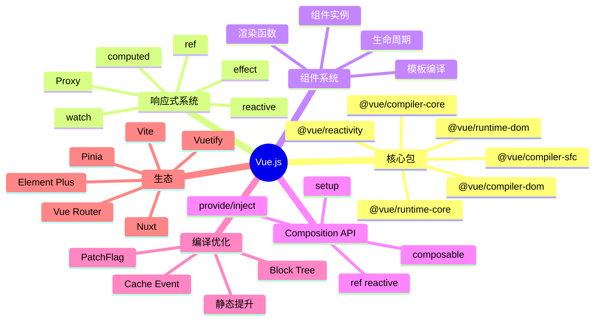

# Vue.js

> 渐进式 JavaScript 框架 — 尤雨溪开源，介于 React 与 Angular 之间的"易用 + 强大"平衡

## 一、前言

**定位**：渐进式 JavaScript 框架，从视图层（Vue 2）→ 完整应用框架（Vue 3 Composition API）

**核心价值**：
1. 渐进式 — 可只用作视图层，也可作为完整 SPA 框架
2. 响应式数据 — 基于 Proxy 的细粒度依赖追踪
3. 模板 vs 渲染函数 — 双模式，写法灵活
4. 单文件组件（SFC）— `<template> <script> <style>` 三段式
5. Composition API — 类似 React Hooks 但更灵活

**应用场景**：SPA、SSR（Nuxt）、移动端（uni-app）、桌面应用（Electron + Vue）

**版本演进**：
- **Vue 1**：Object.defineProperty 响应式，仅视图层
- **Vue 2**：组件化、Vuex、Vue Router
- **Vue 3**（2020）：Proxy 响应式、Composition API、Teleport、Suspense、TypeScript 重写

---

## 二、架构思维导图



---

## 三、关键代码

### 1. 响应式核心 — reactive / Proxy

```js
// 文件: packages/reactivity/src/reactive.ts
function reactive(target) {
  // 1. 如果已经是 reactive，直接返回（避免重复代理）
  if (target && target.__v_isReactive) {
    return target;
  }
  // 2. 只代理对象
  if (!isObject(target)) {
    return target;
  }
  // 3. 已有 proxy 复用（缓存）
  const existingProxy = reactiveMap.get(target);
  if (existingProxy) {
    return existingProxy;
  }
  // 4. 创建 proxy
  const proxy = new Proxy(target, mutableHandlers);
  reactiveMap.set(target, proxy);
  return proxy;
}

const mutableHandlers = {
  get(target, key, receiver) {
    // 1. 短路 isReactive
    if (key === '__v_isReactive') return !readonly;
    // 2. 数组方法特殊处理（避免 length 触发）
    const result = Reflect.get(target, key, receiver);
    // 3. 依赖追踪
    track(target, TrackOpTypes.GET, key);
    // 4. 嵌套对象自动 reactive（懒递归）
    if (isObject(result)) {
      return reactive(result);
    }
    return result;
  },
  set(target, key, value, receiver) {
    // 1. 旧值相等则不触发更新
    const oldValue = target[key];
    const result = Reflect.set(target, key, value, receiver);
    if (target === toRaw(receiver)) {
      if (!hadKey) {
        trigger(target, TriggerOpTypes.ADD, key, value);
      } else if (hasChanged(value, oldValue)) {
        trigger(target, TriggerOpTypes.SET, key, value, oldValue);
      }
    }
    return result;
  }
};
```

### 2. 依赖追踪 — effect / track / trigger

```js
// 文件: packages/reactivity/src/effect.ts
let activeEffect = null;          // 当前执行的 effect
const effectStack = [];            // 嵌套 effect 栈
const targetMap = new WeakMap();   // target → Map<key, Set<effect>>

function track(target, type, key) {
  if (activeEffect === undefined) {
    return;  // 没有 effect 在执行，不追踪
  }
  let depsMap = targetMap.get(target);
  if (!depsMap) {
    targetMap.set(target, (depsMap = new Map()));
  }
  let dep = depsMap.get(key);
  if (!dep) {
    depsMap.set(key, (dep = new Set()));
  }
  // 关键：把当前 effect 存到 dep（被哪些 effect 依赖）
  // 同时把 dep 存到 effect.deps（effect 依赖了哪些 dep）
  if (!dep.has(activeEffect)) {
    dep.add(activeEffect);
    activeEffect.deps.push(dep);
  }
}

function trigger(target, type, key, newValue) {
  const depsMap = targetMap.get(target);
  if (!depsMap) return;
  const effects = new Set();
  const add = (effectsToAdd) => {
    if (effectsToAdd) {
      effectsToAdd.forEach(effect => {
        if (effect !== activeEffect || effect.allowRecurse) {
          effects.add(effect);
        }
      });
    }
  };
  // 收集：精确 + 数组 length 等
  if (key !== undefined) {
    add(depsMap.get(key));
  }
  if (type === TriggerOpTypes.ADD || type === TriggerOpTypes.DELETE) {
    add(depsMap.get(ITERATE_KEY));
  }
  // 调度执行
  effects.forEach(effect => {
    if (effect.scheduler) {
      effect.scheduler();
    } else {
      effect.run();
    }
  });
}
```

### 3. 编译优化 — PatchFlag

```js
// 文件: packages/compiler-core/src/transforms/transformElement.ts
// 编译时给动态节点打 flag，运行时只 diff 标记的
const enum PatchFlags {
  TEXT = 1,                  // 动态文本
  CLASS = 1 << 1,            // 动态 class
  STYLE = 1 << 2,            // 动态 style
  PROPS = 1 << 3,            // 动态 props
  FULL_PROPS = 1 << 4,       // 完整 props diff
  NEED_HYDRATION = 1 << 5,   // 需要水合
  STABLE_FRAGMENT = 1 << 6,
  KEYED_FRAGMENT = 1 << 7,
  UNKEYED_FRAGMENT = 1 << 8,
  NEED_PATCH = 1 << 9,
  DYNAMIC_SLOTS = 1 << 10,
  // ... 31 种

  HOISTED = -1,              // 静态提升，跳过 diff
  BAIL = -2,                  // 优化退出，走 vdom diff
}

// 模板：
//   <div :class="cls">{{ msg }}</div>
// 编译为：
//   createElementVNode("div", { class: cls }, msg, 3 /* TEXT + CLASS */)
```

---

## 四、核心洞察

1. **Proxy 响应式 vs React VDOM**：Vue 精确追踪每个属性的依赖，组件级别自动更新；React 走 diff 树，组件级别 re-render
2. **编译时优化**：Vue 3 编译器分析模板，给动态节点打 PatchFlag（31 种），运行时跳过静态节点，性能比 Vue 2 提升 1.3-2x
3. **Composition API 哲学**：把相关逻辑（state + method）聚合到一个 setup 函数，类似 React Hooks 但用 ref/reactive 显式声明
4. **ref vs reactive**：ref 包装值类型（.value 访问），reactive 包装对象（Proxy），ref 内部自动用 reactive 处理 .value
5. **nextTick 必要性**：DOM 更新是异步的（patch 阶段），改完 state 后要 nextTick 才能拿到新 DOM
6. **Vue 3 vs React 19**：都支持组件级优化、Suspense、Teleport；Vue 模板更接近 HTML，React JSX 接近 JS
7. **生态对比**：Vue 生态较集中（Vuex → Pinia，Vue Router，Nuxt），React 生态分散（Redux/Zustand/Jotai/Recoil...）
8. **SSR 性能**：Vue 3 + Nuxt 3 引入 streaming SSR，TTFB 优化 30-50%

## 五、跨项目引用

- [[./react|React]] — 同样声明式 UI，路径不同
- [[./angular|Angular]] — 都强调完整框架，Angular 更重
- [[../项目代码包/A-前端框架/vite|Vite]] — Vue 团队开发，构建工具首选

---

**项目地址**：`G:\实战案例\GitHub顶尖项目\vue`
**类型**：前端框架 | **Stars**: 207k+ | **License**: MIT
