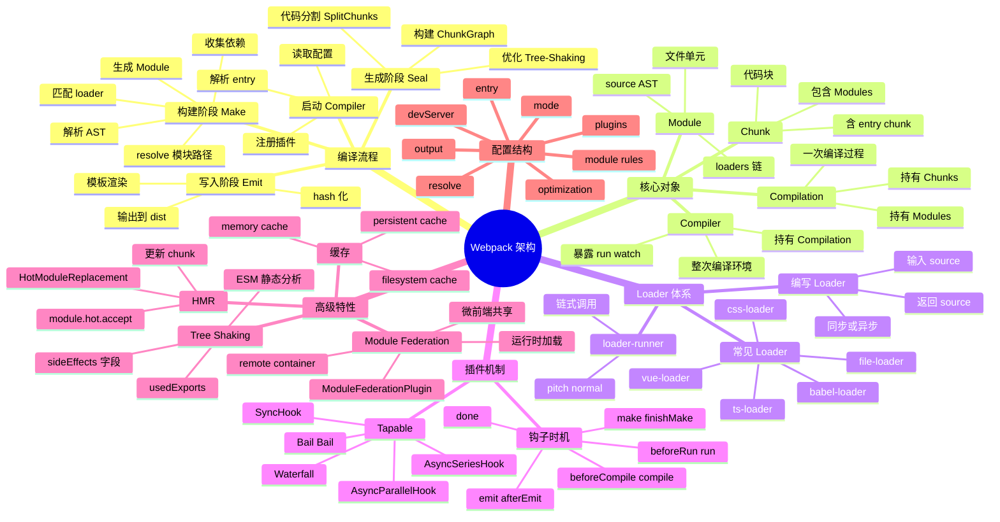

# Webpack

## 一、前言

**定位**：现代 JavaScript 应用的静态模块打包器（Static Module Bundler），由 Tobias Koppers 于 2012 年创建，2014 年被 Pulumi 团队接手，现为前端工程化的事实标准。

**核心价值**：
- 把任意资源（JS/CSS/图片/字体/视频）当作"模块"统一处理
- 强大的 Loader 体系让任意文件可被 `require`
- 插件机制（Tapable）覆盖从编译到产物优化的全生命周期
- 支持代码分割、Tree Shaking、Module Federation 等高级特性

**五大特性**：
1. **一切皆模块**：JS/CSS/图片/字体通过 Loader 都能 `import`
2. **依赖图（Dependency Graph）**：从 entry 出发递归解析所有依赖
3. **代码分割（Code Splitting）**：SplitChunks、动态 import 减少首屏体积
4. **模块联邦（Module Federation）**：跨应用运行时共享模块（微前端利器）
5. **Tapable 插件架构**：200+ 钩子让构建流程可任意编排

**与同类对比**：

| 工具 | 速度 | 配置灵活度 | 适用场景 | 产物优化 |
|---|---|---|---|---|
| Webpack | 较慢（首次冷启动） | 极高 | 大型 SPA/微前端 | 极致 |
| Vite | 极快（ESM + esbuild） | 中等 | 现代 SPA/库 | 良好 |
| Rollup | 中等 | 高 | 类库/SDK | 优秀（Tree-Shaking） |
| Parcel | 快（零配置） | 低 | 中小项目原型 | 良好 |
| esbuild | 极快 | 中等 | 通用打包/转译 | 一般 |

## 二、架构思维导图



## 三、关键代码

### 1. Compiler 与 Compilation 入口（lib/index.js）

```js
// 简化的 webpack 启动流程
const Compiler = require('./Compiler');
const NodeEnvironmentPlugin = require('./node/NodeEnvironmentPlugin');
const WebpackOptionsApply = require('./WebpackOptionsApply');

const compiler = new Compiler(context);
compiler.options = options;

// 1. 注入 Node 环境插件（文件读写、缓存目录）
new NodeEnvironmentPlugin().apply(compiler);

// 2. 注册用户自定义插件
if (options.plugins) {
  for (const plugin of options.plugins) {
    plugin.apply(compiler);
  }
}

// 3. 加载 webpack 内置插件（EntryPlugin、FlagDependency 等）
compiler.hooks.environment.call();
compiler.hooks.afterEnvironment.call();
new WebpackOptionsApply().process(options, compiler);

// 4. 启动编译
compiler.run((err, stats) => {
  // stats 包含模块、chunk、错误、警告、耗时等统计
  compiler.close((closeErr) => {
    // 关闭监听
  });
});
```

**解析**：
- `Compiler` 是**全局单例**，代表一次 webpack 进程的完整生命周期
- `Compilation` 则是**每次重新编译**的产物，`watch` 模式下每次文件变更都会生成新 Compilation
- `hooks.environment` → 配置就绪但未编译；`afterEnvironment` → 内部插件注册完成

### 2. Loader 链式调用（lib/loader-runner.js）

```js
// 简化的 loader-runner 核心循环
function iterateNormalLoaders(options, loaderContext, args, callback) {
  const loaders = options.loaders;
  let idx = 0;

  function step() {
    if (idx < loaders.length) {
      const loader = loaders[idx++];
      // loaderContext 包含 resourcePath、resourceQuery、addDependency 等
      loader.call(loaderContext, args[0], (err, source) => {
        if (err) return callback(err);
        args[0] = source; // 上一 loader 的输出 → 下一 loader 的输入
        step();
      });
    } else {
      callback(null, args[0]);
    }
  }
  step();
}

// pitch 阶段：与 normal 反向，先执行最后一个 loader 的 pitch
function iteratePitchingLoaders(options, loaderContext, callback) {
  const loaders = options.loaders;
  let idx = loaders.length - 1;

  function step() {
    if (idx >= 0) {
      const loader = loaders[idx--];
      loader.pitch && loader.pitch.call(loaderContext, ...args, (err, result) => {
        if (err) callback(err);
        if (result !== undefined) return callback(null, result); // 熔断，跳过 normal
        step();
      });
    } else {
      callback(null, args[0]);
    }
  }
  step();
}
```

**解析**：
- **normal 阶段**：从右到左执行（最后注册的最先处理），输入是源文件 / 上一 loader 输出
- **pitch 阶段**：从左到右执行，可提前返回结果**熔断**后续 loader，常用于缓存、跳过处理
- 一个文件被处理时会经过 N 个 loader：源文件 → loader1(source) → loader2(loader1输出) → JS 字符串

### 3. Tapable 同步/异步钩子（lib/Tapable.js）

```js
const { SyncHook, AsyncSeriesHook, AsyncParallelHook } = require('tapable');

// 1. 同步钩子
const myHook = new SyncHook(['source', 'target']);
myHook.tap('PluginA', (source, target) => {
  console.log(`A: ${source} -> ${target}`);
});
myHook.tap('PluginB', (source, target) => {
  console.log(`B: ${source} -> ${target}`);
});
myHook.call('foo', 'bar');
// 同步、串行、不关心返回值

// 2. 异步串行钩子
const asyncHook = new AsyncSeriesHook(['data']);
asyncHook.tapPromise('AsyncPlugin', (data) => {
  return fetch(data).then(res => res.json());
});
asyncHook.callAsync({ url: '...' }, (err) => {
  // 所有 tapPromise 串行执行完后回调
});

// 3. 异步并行钩子
const parallelHook = new AsyncParallelHook(['files']);
parallelHook.tapAsync('ParallelPlugin', (files, cb) => {
  Promise.all(files.map(processFile)).then(() => cb());
});
```

**解析**：
- `SyncHook`：同步、串行、无返回值（最快）
- `BailHook`：首个返回非 undefined 的 tap 即熔断
- `WaterfallHook`：上一步返回值作为下一步参数传递
- `AsyncSeriesHook`：异步、串行、`tapAsync`/`tapPromise` 风格
- `AsyncParallelHook`：异步、并行、所有完成后回调

### 4. Module Federation 配置（webpack.config.js）

```js
const { ModuleFederationPlugin } = require('webpack').container;
const path = require('path');

// 宿主应用 (Host)
module.exports = {
  plugins: [
    new ModuleFederationPlugin({
      name: 'hostApp',
      remotes: {
        // 远程模块名 → 远程入口 URL
        remoteApp: 'remoteApp@http://localhost:3001/remoteEntry.js',
      },
      shared: {
        // 共享依赖（避免重复打包 React）
        react: { singleton: true, requiredVersion: '^18.0.0' },
        'react-dom': { singleton: true },
      },
    }),
  ],
};

// 远程应用 (Remote)
module.exports = {
  output: { path: path.resolve(__dirname, 'dist') },
  plugins: [
    new ModuleFederationPlugin({
      name: 'remoteApp',
      filename: 'remoteEntry.js',
      exposes: {
        // 暴露模块路径
        './Button': './src/Button',
        './Header': './src/Header',
      },
      shared: { react: { singleton: true }, 'react-dom': { singleton: true } },
    }),
  ],
};

// 使用方代码：
// import Header from 'remoteApp/Header'; // 运行时按需加载
```

**解析**：
- `exposes` 定义该应用对外暴露的模块
- `remotes` 声明依赖的远程模块及其入口
- `shared` 是去重关键，宿主/远程通过协商版本只加载一份
- 底层走 `webpack/container/entry` 的运行时，动态创建 `<script>` 加载 `remoteEntry.js`，并通过 `window['remoteApp']` 全局挂载

## 四、核心洞察

1. **编译流程是有限状态机**：环境就绪 → Make（构建模块） → Seal（构建 ChunkGraph） → Emit（写入） → Done，每阶段都有数十个 Tapable 钩子。
2. **Module Federation 改变微前端**：传统微前端走 iframe / qiankun 沙箱；Module Federation 走运行时 ESM 共享，**真正共享依赖、共享运行时**，是 Webpack 5 最大的范式革新。
3. **Loader 是函数式管道**：每个 Loader 只做"输入字符串 → 输出字符串"，可组合、可链式、可用 pitch 熔断，写法极简但能力无边。
4. **Tapable 让插件无敌**：200+ 钩子把构建的每个细节都开放出来，这也是 Webpack 生态繁荣的根源——任何编译需求都能找到对应钩子编写插件。
5. **Vite 不是 Webpack 的替代品**：Vite 用 ESM + esbuild 牺牲了部分 Webpack 能力（如 Module Federation 复杂分包），Webpack 在大型 monorepo / 微前端场景仍是首选。
6. **缓存是性能生命线**：`cache: { type: 'filesystem' }` 把中间产物落盘，二次构建提速 5-10 倍；持久化缓存 + 增量编译是 CI 提速的关键。
7. **生产环境必开 SplitChunks**：默认只抽离 node_modules 到 vendors；手动配置 `splitChunks.cacheGroups` 可按路由、按组件库精细分割，配合路由懒加载效果最佳。
8. **SourceMap 选择有讲究**：`eval-cheap-module-source-map` 开发首选（构建快、定位准）；生产禁用 `inline-source-map`（会泄露源码），用 `hidden-source-map` 配合 Sentry。

## 五、跨项目引用

- [./vite.md](./vite.md) — Vite 用 esbuild 预构建依赖 + Rollup 打包生产，对比 Webpack 的全量打包哲学
- [./rollup.md](./rollup.md) — Rollup 是 Webpack 的灵感来源之一，Tree-Shaking 鼻祖
- [./react.md](./react.md) — CRA (Create React App) 内部就是 Webpack 5
- [./vue.md](./vue.md) — Vite 是 Vue 团队尤雨溪推出，作为 Webpack 替代
- [./next.js.md](./next.js.md) — Next.js 默认 Webpack，可切换为 Turbopack
- [./angular.md](./angular.md) — Angular CLI 基于 Webpack，自定义 `@angular-devkit/build-angular`
- [./babel.md](./babel.md) — `babel-loader` 是 JS/TS 转译的事实标准
- [../D-构建与UI/eslint.md](../D-构建与UI/eslint.md) — `eslint-loader` / `eslint-webpack-plugin` 集成
- [../D-构建与UI/postcss.md](../D-构建与UI/postcss.md) — `postcss-loader` 处理现代 CSS
- [../B-后端服务/nest.md](../B-后端服务/nest.md) — NestJS 内部使用 Webpack 构建 monorepo
