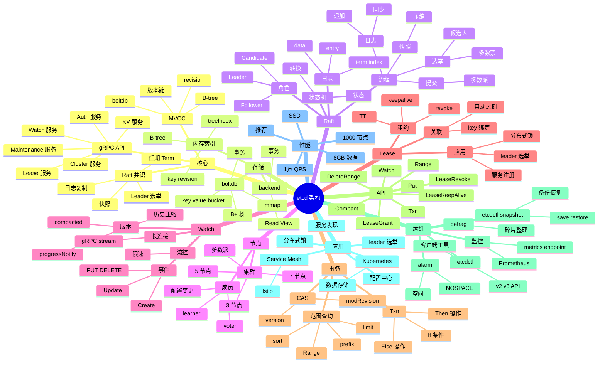

# etcd

## 一、前言

**定位**：分布式、可靠的 **键值存储系统**，专为 Kubernetes 集群配置和服务发现设计，由 CoreOS 团队 2013 年开源，现为 CNCF 毕业项目。

**核心价值**：
- **强一致性**：基于 Raft 共识算法，所有节点数据一致
- **Watch 机制**：客户端可监听 key 变化，毫秒级通知
- **Lease 租约**：TTL 自动过期，常用于服务注册/健康检查
- **事务与版本**：支持 MVCC、Compare-And-Swap、Range 查询
- **Kubernetes 核心依赖**：所有 k8s 资源都存在 etcd

**五大特性**：
1. **Raft 一致性**：3/5/7 节点奇数集群，2N+1 容错
2. **MVCC 多版本**：每次写入分配版本号，事务支持
3. **Watch 长连接**：HTTP/2 + gRPC 流式推送变更
4. **Lease 租约**：key 与 lease 绑定，lease 过期 key 失效
5. **事务 Txn**：If-Then-Else 原子操作

**与同类对比**：

| 系统 | 一致性 | 性能 | 适用场景 |
|---|---|---|---|
| etcd | Raft 强一致 | 中（1万 QPS） | 集群元数据、配置中心 |
| ZooKeeper | ZAB 强一致 | 中 | Hadoop/Dubbo 生态 |
| Consul | Raft 强一致 | 中 | 服务发现 + 健康检查 |
| Redis Cluster | 最终一致 | 极高（10万 QPS） | 缓存、消息队列 |
| MySQL Group Replication | 强一致 | 中 | 关系数据 |

## 二、架构思维导图



## 三、关键代码

### 1. KV 基础操作（Go 客户端）

```go
package main

import (
    "context"
    "fmt"
    "log"
    "time"

    clientv3 "go.etcd.io/etcd/client/v3"
)

func main() {
    // 1. 创建客户端
    cli, err := clientv3.New(clientv3.Config{
        Endpoints:   []string{"localhost:2379"},
        DialTimeout: 5 * time.Second,
        // 鉴权
        Username: "root",
        Password: "123456",
    })
    if err != nil {
        log.Fatal(err)
    }
    defer cli.Close()

    ctx, cancel := context.WithTimeout(context.Background(), 5*time.Second)
    defer cancel()

    // 2. Put / Get
    _, err = cli.Put(ctx, "/config/db/host", "10.0.0.1")
    if err != nil {
        log.Fatal(err)
    }

    resp, err := cli.Get(ctx, "/config/db/host")
    if err != nil {
        log.Fatal(err)
    }
    for _, ev := range resp.Kvs {
        fmt.Printf("Key: %s, Value: %s, Version: %d\n", ev.Key, ev.Value, ev.Version)
    }

    // 3. 带租约的 key（自动过期）
    lease, err := cli.Grant(ctx, 10)  // 10 秒
    if err != nil {
        log.Fatal(err)
    }

    _, err = cli.Put(ctx, "/services/api/instance-1", "192.168.1.10:8080", clientv3.WithLease(lease.ID))
    if err != nil {
        log.Fatal(err)
    }

    // KeepAlive 续约（实际项目用单独的 keep-alive 协程）
    keepResp, err := cli.KeepAlive(ctx, lease.ID)
    if err != nil {
        log.Fatal(err)
    }
    go func() {
        for ka := range keepResp {
            fmt.Printf("Lease %d kept alive at %d\n", ka.ID, ka.TTL)
        }
    }()

    // 4. 前缀查询
    resp, err = cli.Get(ctx, "/services/api/", clientv3.WithPrefix())
    if err != nil {
        log.Fatal(err)
    }
    for _, ev := range resp.Kvs {
        fmt.Printf("Service: %s = %s\n", ev.Key, ev.Value)
    }
}
```

**解析**：
- **`WithLease` 是 etcd 核心能力**：key 关联 lease，lease 过期 key 自动删除；服务注册的标准做法
- **KeepAlive 用 channel**：续约响应异步推送到 channel，单独协程处理
- **`WithPrefix` 等价于 `LIKE '%prefix%'`**：但底层是 Range 扫描，性能高

### 2. Watch 监听 key 变化

```go
// 监听单个 key
rch := cli.Watch(ctx, "/config/db/host")
for wresp := range rch {
    for _, ev := range wresp.Events {
        switch ev.Type {
        case clientv3.EventTypePut:
            fmt.Printf("Modified: %s = %s (rev=%d)\n", ev.Kv.Key, ev.Kv.Value, wresp.Header.Revision)
        case clientv3.EventTypeDelete:
            fmt.Printf("Deleted: %s\n", ev.Kv.Key)
        }
    }
}

// 监听前缀（服务发现经典）
rch := cli.Watch(ctx, "/services/api/", clientv3.WithPrefix())
for wresp := range rch {
    for _, ev := range wresp.Events {
        if ev.Type == clientv3.EventTypePut {
            fmt.Printf("Service added/updated: %s\n", ev.Kv.Value)
        } else if ev.Type == clientv3.EventTypeDelete {
            fmt.Printf("Service removed: %s\n", ev.Kv.Key)
        }
    }
}

// 从指定版本开始监听（避免遗漏）
rch := cli.Watch(ctx, "/config/db/host", clientv3.WithRev(100))
```

**解析**：
- **Watch 是 gRPC stream**：服务端主动推送变更，毫秒级延迟
- **`WithRev(100)`** 从 revision 100 开始监听，**保证不漏**——这是 etcd Watch 相比 ZK Watch 的关键改进
- **生产注意 `progress_notify`**：服务端会定期发心跳，避免连接假死

### 3. 事务（Compare-And-Swap）

```go
// 经典场景：分布式锁
lockKey := "/locks/order-1001"
myID := "worker-1"

// 尝试加锁
txn := cli.Txn(ctx).
    If(clientv3.Compare(clientv3.CreateRevision(lockKey), "=", 0)).  // key 不存在
    Then(clientv3.OpPut(lockKey, myID, clientv3.WithLease(lease.ID))).
    Else(clientv3.OpGet(lockKey))

resp, err := txn.Commit()
if err != nil {
    log.Fatal(err)
}
if resp.Succeeded {
    fmt.Println("Lock acquired")
} else {
    fmt.Println("Lock already held by:", resp.Responses[0].GetResponseRange().Kvs[0].Value)
}

// ============================================================================

// CAS 原子更新（乐观锁）
type User struct {
    Name string
    Age  int
}

// 读取当前版本
resp, _ := cli.Get(ctx, "/users/1001")
currentRev := resp.Kvs[0].ModRevision
currentVal := string(resp.Kvs[0].Value)

// 条件更新
txn = cli.Txn(ctx).
    If(clientv3.Compare(clientv3.ModRevision("/users/1001"), "=", currentRev)).
    Then(clientv3.OpPut("/users/1001", `{"name":"Alice","age":31}`)).
    Else(clientv3.OpGet("/users/1001"))

resp, err = txn.Commit()
if !resp.Succeeded {
    fmt.Println("Update failed: key was modified by another writer")
}
```

**解析**：
- **CAS 用 ModRevision 或 Version**：每次写入版本号 +1，更新时检查版本；冲突则重试
- **分布式锁的简洁实现**：create-revision=0（不存在）即加锁成功，否则失败；比 Redis SETNX 更强一致
- **事务保证 If-Then 原子**：If 条件不成立时不会执行 Then，避免竞态

### 4. 租约与服务注册

```go
// 完整的服务注册示例
type ServiceRegistry struct {
    cli     *clientv3.Client
    leaseID clientv3.LeaseID
    keepAliveCh <-chan *clientv3.LeaseKeepAliveResponse
    serviceInfo Service
}

type Service struct {
    Name     string
    Address  string
    Metadata map[string]string
}

func (r *ServiceRegistry) Register(svc Service) error {
    r.serviceInfo = svc

    // 1. 创建租约（30 秒 TTL）
    lease, err := r.cli.Grant(context.Background(), 30)
    if err != nil {
        return err
    }
    r.leaseID = lease.ID

    // 2. 注册服务
    data, _ := json.Marshal(svc)
    key := fmt.Sprintf("/services/%s/%s", svc.Name, uuid.NewString())
    _, err = r.cli.Put(context.Background(), key, string(data), clientv3.WithLease(lease.ID))
    if err != nil {
        return err
    }

    // 3. 启动 keep-alive
    r.keepAliveCh, err = r.cli.KeepAlive(context.Background(), lease.ID)
    if err != nil {
        return err
    }

    // 4. 处理 keep-alive 响应
    go func() {
        for ka := range r.keepAliveCh {
            if ka == nil {
                log.Println("Lease expired, need to re-register")
                // 自动重连逻辑
            }
        }
    }()

    return nil
}

func (r *ServiceRegistry) Deregister() error {
    _, err := r.cli.Revoke(context.Background(), r.leaseID)
    return err
}

// 服务发现
func (r *ServiceRegistry) Discover(serviceName string) ([]Service, error) {
    resp, err := r.cli.Get(context.Background(), fmt.Sprintf("/services/%s/", serviceName), clientv3.WithPrefix())
    if err != nil {
        return nil, err
    }
    var services []Service
    for _, kv := range resp.Kvs {
        var svc Service
        json.Unmarshal(kv.Value, &svc)
        services = append(services, svc)
    }
    return services, nil
}
```

**应用场景**：
- **服务注册/发现**：服务启动时注册到 etcd，心跳保持；消费者 Watch 服务列表变化
- **配置中心**：应用 Watch 配置 key，配置变更自动 reload
- **leader 选举**：抢 lease，最小 lease.ID 即 leader
- **分布式锁**：CAS 创建临时节点

## 四、核心洞察

1. **Raft 强一致是 etcd 立身之本**：ZAB（Paxos 变种）vs Raft 都是共识算法；Raft 因可理解性（论文 `In Search of an Understandable Consensus Algorithm`）被工程界广泛采用。
2. **MVCC 让 Watch 历史可回溯**：每次写入分配全局递增的 revision；可从指定 revision 开始 Watch，**保证不漏事件**。
3. **Lease + KeepAlive 是服务注册/锁的核心**：TTL 过期自动释放 key，避免僵尸节点；比 ZK 的临时节点更显式可控。
4. **boltdb 是嵌入式 KV 引擎**：基于 B+ 树 + mmap，单文件存储；事务支持（ACID），但不适合大 value（>1MB 性能下降）。
5. **2N+1 节点奇数原则**：3 节点容忍 1 故障；5 节点容忍 2 故障；偶数节点浪费且不影响容错。
6. **磁盘 IO 是性能瓶颈**：1万 QPS 写入需要 SSD + fsync 优化；HDD 在 100 QPS 就可能成为瓶颈。
7. **Watch 假死问题**：gRPC stream 长时间无事件可能被中间设备（LB/防火墙）断开；etcd 用 `progress_notify` 定期心跳 + 客户端重连缓解。
8. **Kubernetes 把 etcd 推到基础设施核心**：所有 K8s 资源（Pod/Service/ConfigMap）都存在 etcd；etcd 故障 = 集群不可用。

## 五、跨项目引用

- [./k8s.md](./k8s.md) — K8s 用 etcd 存储所有集群数据，是 K8s 的大脑
- [./consul.md](./consul.md) — Consul 也用 Raft，提供服务发现 + 健康检查
- [./zookeeper.md](./zookeeper.md) — ZK 是 etcd 之前的同类，Hadoop/Dubbo 生态依赖
- [./redis.md](./redis.md) — Redis Cluster 是另一种分布式 KV（最终一致，性能更高）
- [./prometheus.md](./prometheus.md) — etcd 暴露 metrics 给 Prometheus
- [./istio.md](./istio.md) — Istio 用 etcd 存储配置和路由规则
- [./traefik.md](./traefik.md) — Traefik 可用 etcd 作为配置后端
- [./grpc.md](./grpc.md) — etcd 内部用 gRPC 通信
