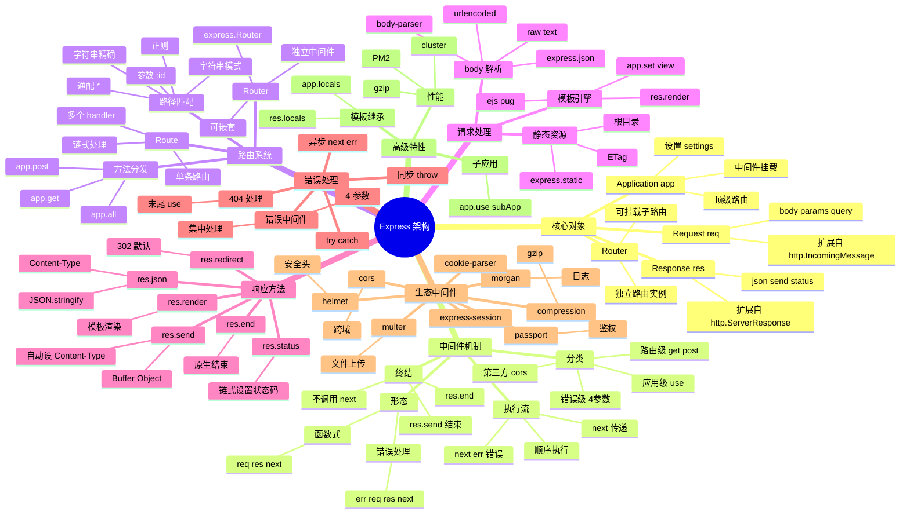

# Express

## 一、前言

**定位**：Node.js 生态最经典、最轻量的 Web 框架，由 TJ Holowaychuk 于 2010 年发布，是 Connect 中间件机制的 HTTP 封装。

**核心价值**：
- 极简内核 + 强大的中间件生态（`morgan` / `cors` / `helmet` / `body-parser` 等）
- 路由 + 中间件双核心，把 HTTP 服务抽象成"管道"
- 几乎所有 Node Web 框架的参考实现（Koa/Nest/Fastify 都受其影响）
- 与 Node.js `http` 模块一一对应，零魔法

**五大特性**：
1. **中间件链式调用**：`(req, res, next) => void` 函数组合，请求流经多个中间件
2. **路由系统**：`app.get/post/put/delete` 或 `Router` 子路由
3. **请求对象扩展**：`req.body` / `req.query` / `req.params` / `req.cookies` 通过中间件注入
4. **响应辅助方法**：`res.json()` / `res.send()` / `res.status()` / `res.render()`
5. **错误处理**：`(err, req, res, next)` 四参数中间件捕获同步/异步错误

**与同类对比**：

| 框架 | 性能 | 中间件模型 | 异步模型 | 适用场景 |
|---|---|---|---|---|
| Express | 中（30k req/s） | 回调 | 回调/Promise | 通用 Web/中小项目 |
| Koa | 中 | 洋葱圈 | async/await 原生 | 现代 API 服务 |
| Fastify | 高（80k req/s） | 钩子链 | async/await | 高性能 API |
| Nest | 中 | 装饰器+DI | async/await | 企业级 |
| Hapi | 中 | 插件 | 回调 | 配置化框架 |

## 二、架构思维导图



## 三、关键代码

### 1. Application 与中间件链（lib/express.js）

```js
// Express 工厂函数
function createApplication() {
  var app = function(req, res, next) {
    app.handle(req, res, next);
  };

  mixin(app, EventEmitter.prototype, false);
  mixin(app, proto, false);

  // 初始化请求/响应扩展
  app.init();
  return app;
}

// proto.handle：请求处理核心
app.handle = function handle(req, res, callback) {
  var stack = this.stack; // 路由栈
  var idx = 0;

  // 1. 协议 + host 校验
  var protocol = req.protocol;
  var host = req.hostname;

  // 2. 迭代路由栈
  next();

  function next(err) {
    if (err) {
      // 错误处理：跳过普通中间件，找带 err 参数的
      return nextRoute(err);
    }

    // 找到下一个匹配的 Layer（路由层）
    var layer;
    var match;
    var route;

    while (match !== true && idx < stack.length) {
      layer = stack[idx++];
      match = matchLayer(layer, req.hostname); // 路径匹配
      route = layer.route;

      if (typeof match !== 'boolean') {
        // layer.handle_request 是中间件函数
        continue;
      }

      if (match !== true) continue;

      if (!route) {
        // 中间件：直接执行
        return layer.handle_request(req, res, next);
      } else {
        // 路由：还要匹配 HTTP 方法
        var method = req.method;
        var has_method = route._handles_method(method);

        if (!has_method) continue; // 不匹配，try next
        // 匹配：执行路由上的 handler
        return layer.handle_request(req, res, next);
      }
    }

    // 没找到任何匹配：404
    nextRoute();
  }

  function nextRoute(err) {
    if (err) {
      // 错误中间件
      return app.handle500(req, res, err);
    }
    // 404
    res.statusCode = 404;
    var msg = 'Cannot ' + req.method + ' ' + req.originalUrl;
    res.end(msg);
  }
};
```

**解析**：
- **栈式匹配**：`this.stack` 是按插入顺序排列的 `Layer` 数组（Layer 包装了中间件或路由）
- **一次匹配两层**：先路径匹配（Layer 级别），再方法匹配（Route 级别）
- **错误传播**：调用 `next(err)` 跳到下一个错误处理中间件

### 2. 中间件注册与执行（lib/router/route.js）

```js
// 简化的 Router
function Route(path) {
  this.path = path;
  this.stack = []; // 该路径上的 handlers
  this.methods = {};
}

Route.prototype.dispatch = function dispatch(req, res, opts) {
  var stack = this.stack;
  var idx = 0;

  next();

  function next(err) {
    if (err) {
      return handle_err(err);
    }
    if (idx >= stack.length) {
      return opts.next(); // 没更多 handler，调用外层 next
    }

    var layer = stack[idx++];
    try {
      // 调用 handler（可能异步）
      var ret = layer.handle_request(req, res, next);
    } catch (err) {
      next(err);
    }
  }
};

// app.get 实现（简化）
methods.forEach(function(method) {
  app[method] = function(path) {
    // 收集 handlers
    var handlers = Array.prototype.slice.call(arguments, 1);

    // 创建 Route
    var route = new Route(path);
    var layer = new Layer(path, { sensitive: true, strict: true, end: true }, route.dispatch.bind(route));
    layer.route = route;

    // 把 handler 推入 route.stack
    handlers.forEach(function(handler) {
      var subLayer = new Layer('/', {}, handler);
      subLayer.method = method;
      route.methods[method] = true;
      route.stack.push(subLayer);
    });

    // 推入 app.stack
    this.stack.push(layer);
    return this; // 链式
  };
});

// app.use 实现（无路径或路径为前缀）
app.use = function use(fn) {
  var path = '/';
  if (typeof arguments[0] !== 'function') {
    path = arguments[0];
    fn = arguments[1];
  }

  // use 是路径前缀匹配
  var layer = new Layer(path, { sensitive: true, strict: false, end: false }, fn);
  layer.route = undefined; // 中间件没有 route
  this.stack.push(layer);
  return this;
};
```

**解析**：
- **Layer 是匹配单元**：每个 `app.use` / `app.get` 创建一个 `Layer`，记录路径、正则、handler
- **Route 是 method 集合**：`app.get` 内部用 `Route` 收集该路径下所有 GET handler
- **`end: true/false`**：`end=true` 是精确匹配（`/foo` 不匹配 `/foo/bar`），`end=false` 是前缀匹配（`/foo` 匹配 `/foo/anything`）

### 3. 请求/响应对象扩展（lib/request.js / response.js）

```js
// req.query 解析 query string
defineGetter(req, 'query', function query() {
  var queryparse = this.app.get('query parser fn');
  if (!queryparse) {
    // 默认 simple 模式
    return parse(this._parsedUrl.query, {});
  }
  return queryparse(this._parsedUrl.query);
});

// req.body 来自 body-parser
defineGetter(req, 'body', function body() {
  return this._body || {};
});

// res.json 简化版
res.json = function json(obj) {
  var val = obj;
  // 1. JSON.stringify 替换函数/未定义
  var body = stringify(val, replacer, spaces);
  // 2. 清理 XSS 攻击向量
  body = body.replace(/<script\b[^<]*(?:(?!<\/script>)<[^<]*)*<\/script>/gi, '');

  if (!this.get('Content-Type')) {
    this.set('Content-Type', 'application/json');
  }
  return this.send(body);
};

// res.send 智能发送
res.send = function send(body) {
  var chunk = body;
  var encoding;
  var type;

  switch (typeof chunk) {
    case 'string':
      if (!this.get('Content-Type')) this.type('text/html');
      break;
    case 'boolean':
    case 'number':
    case 'object':
      if (chunk === null) chunk = '';
      else if (Buffer.isBuffer(chunk)) {
        if (!this.get('Content-Type')) this.type('application/octet-stream');
      } else {
        return this.json(chunk);
      }
      break;
  }

  // 设置 ETag、Content-Length、状态码
  this.set('Content-Length', Buffer.byteLength(chunk, encoding));
  if (req.fresh) this.statusCode = 304;

  if (204 === status || 304 === status) chunk = '';
  this.end(chunk, encoding);
  return this;
};
```

**解析**：
- `res.json` 自动 `JSON.stringify` + 设 `Content-Type: application/json` + 过滤 `<script>` 防注入
- `res.send` 智能识别参数类型：Buffer → 二进制流，对象 → JSON，字符串 → HTML
- `req.fresh` 检查 ETag/Last-Modified 决定是否返回 304

### 4. 错误处理与异步捕获

```js
// 同步错误：try/catch
app.get('/sync-error', function(req, res) {
  throw new Error('boom'); // Express 5 用 try/catch 自动 next(err)
});

// 异步错误（Express 4 之前必须显式 next(err)）
app.get('/async-error', function(req, res, next) {
  fs.readFile('not-exist.txt', function(err, data) {
    if (err) return next(err); // 显式传递
    res.send(data);
  });
});

// Express 5：async 函数 throw 会被自动捕获
app.get('/async-error-v5', async function(req, res) {
  const data = await fs.readFile('not-exist.txt'); // throw 自动 → next(err)
  res.send(data);
});

// 错误处理中间件：4 参数
app.use(function(err, req, res, next) {
  // 1. 日志
  console.error(err.stack);

  // 2. 区分环境
  const status = err.status || 500;
  res.status(status).json({
    error: process.env.NODE_ENV === 'production'
      ? 'Internal Server Error'
      : err.message,
  });
});

// 集中异步包装器：兼容 Express 4
const asyncHandler = (fn) => (req, res, next) =>
  Promise.resolve(fn(req, res, next)).catch(next);

app.get('/users', asyncHandler(async (req, res) => {
  const users = await db.users.find();
  res.json(users);
}));
```

**解析**：
- **Express 4 vs 5**：4 异步错误必须 `next(err)` 或包装器；5 原生支持 async 函数 throw
- **错误中间件按定义顺序生效**：放在 `app.use(router)` 之后捕获所有路由错误，放在最末捕获 404
- **`asyncHandler` 是 4.x 项目通用模式**：把 async 函数包成 Promise.catch(next) 形态

## 四、核心洞察

1. **中间件 = (req, res, next) 三元组**：这是 Express 范式核心，**所有能力都靠组合中间件实现**——这也是"中间件架构"成为 Web 框架事实标准的源头。
2. **Layer + Stack 是匹配引擎**：每个 `use` / `get` 创建一个 Layer 压栈，请求到来时按顺序匹配；这是理解 Express 性能的关键。
3. **Koa 的洋葱圈是对 Express 的反思**：Express 中间件无法"等待下游完成再回写响应"，Koa 用 `async/await` 解决了这个痛点。
4. **Express 4 vs 5 的关键差异**：5.x 原生支持 async 错误捕获（不用 asyncHandler），性能提升 10-20%，移除 `req.param()` 等废弃 API。
5. **不是"小而弱"而是"小而精"**：Express 内核只 1800 行（不算中间件），但 `morgan` / `helmet` / `cors` / `passport` 等生态让它能扛企业项目。
6. **express.Router 才是真路由**：`app.get` 适合顶层定义路由；复杂项目应该 `const router = express.Router()` 再 `app.use('/api', router)`。
7. **req/res 扩展通过 prototype getter**：避免在每次请求时创建新对象，零成本暴露 `body` / `query` / `params` 等属性。
8. **Express 仍占 Node Web 框架 60%+ 份额**：即便 Fastify 性能更强，Express 的**生态惯性 + 学习曲线 + 工具链**让大量项目仍在用。

## 五、跨项目引用

- [./koa.md](./koa.md) — Koa 是 Express 团队原班人马打造的下一代框架，async/await 原生支持
- [./nest.md](./nest.md) — NestJS 内部默认 Express（可切换 Fastify），用装饰器 + DI 包装 Express
- [./fastify.md](./fastify.md) — Fastify 是 Express 性能挑战者，Schema 优先
- [./node.md](./node.md) — Express 是 `http` 模块的封装，理解 `http` 才能理解 Express
- [./jquery.md](./jquery.md) — Express 链式 `app.use(...).use(...).listen()` 受 jQuery 链式启发
- [./connect.md](./connect.md) — Connect 是 Express 的前身，提供了中间件概念
- [../D-构建与UI/webpack.md](../D-构建与UI/webpack.md) — Express + Webpack 组合常见于 SSR 项目
- [../A-前端框架/next.js.md](../A-前端框架/next.js.md) — Next.js 自定义 Server 可基于 Express

## 六、深度前言：Express 生态全景

### 6.1 历史与定位演变

Express 自 2010 年由 TJ Holowaychuk 创建以来，已经走过了 16 个年头。最初它是 Connect 中间件框架的 HTTP 包装层，将 Node.js 原生 `http` 模块繁琐的样板代码抽象成"中间件 + 路由"的简洁模式。2014 年 TJ 加入 StrongLoop 后，Express 进入 4.x 时代，将 Connect 拆分出去、引入 Router 子系统、支持 Promise 风格的中间件；2017 年至今 4.x 持续维护，已经成为 Node.js 生态中使用最广泛的 Web 框架，npm 周下载量超过 3000 万次。

Express 在 Node 生态中扮演的角色类似 jQuery 在前端生态中的角色：**不是最强、最快的，但是最具粘性、最有生态的"事实标准"**。即便 Fastify 性能达到 Express 的 3 倍、Koa 用更优雅的 async/await 范式重写了中间件，Express 依然凭借 10 年积累的中间件生态、企业级应用案例、海量教程和 Stack Overflow 答案稳坐头把交椅。这种"惯性优势"是技术选型时不可忽视的——团队学习成本、招聘难度、第三方 SDK 集成成熟度都倾向 Express。

进入 2024 年后，Express 5.0 正式发布（RC 多年后），带来了**原生 async 错误捕获**、更快的 router（基于 path-to-regexp v6）、移除废弃 API 等重要改进，标志着 Express 在保持简洁 API 的同时向现代 Node.js 范式靠拢。

### 6.2 适用场景 vs 不适用场景

**强烈推荐使用 Express**：
- 快速构建 REST API（CRUD 后台、内容管理、电商后台）
- 中小型 Web 应用（博客、文档站点、内部工具）
- 微服务中的 BFF（Backend for Frontend）层
- 已有 Express 项目的维护和扩展
- 需要大量现成中间件（morgan / cors / helmet / multer / passport）
- 团队对 Express 熟悉，学习曲线最低

**谨慎选择 / 考虑替代品**：
- 高并发低延迟服务（金融交易、实时通讯）→ Fastify / uWebSockets.js
- 复杂企业级应用、需要强类型和 DI → NestJS / Midway
- 追求最现代的 async/await 范式 → Koa / Hono
- Serverless 边缘函数 → Hono / Elysia（更小、冷启动快）
- GraphQL 为主的服务 → 任何框架都差不多，关注 type-graphql 集成
- 需要严格架构约束的大型团队 → NestJS

### 6.3 与主流框架的深度对比

| 维度 | Express 4/5 | Koa 2 | Fastify 4/5 | NestJS 10 | Hono |
|---|---|---|---|---|---|
| **发布年份** | 2010 / 2024 | 2013 | 2017 | 2017 | 2022 |
| **作者** | TJ Holowaychuk | TJ Holowaychuk | Matteo Collina | Kamil Myśliwiec | Yusuke Wada |
| **核心理念** | 中间件管道 | 洋葱圈 async | 性能 + Schema | 装饰器 + DI | 边缘计算 + 超轻量 |
| **QPS (Hello World)** | 30k | 35k | 80k | 28k | 100k+ |
| **bundle 大小** | 200KB | 50KB | 200KB | 1MB+ | 20KB |
| **TS 支持** | @types/express | @types/koa | 内置 | 内置 | 内置 |
| **学习曲线** | 极低 | 低 | 中 | 高（需懂 OOP/DI） | 低 |
| **生态成熟度** | ★★★★★ | ★★★★ | ★★★ | ★★★★ | ★★ |
| **中间件数** | 5000+ | 1000+ | 200+ | 依赖 Express | 100+ |
| **错误处理** | 4-arg 中间件 | ctx.throw / try-catch | setErrorHandler | @Catch() 装饰器 | onError |
| **协程支持** | Express 5 原生 | 原生 | 原生 | 原生 | 原生 |
| **SSR 友好度** | 中（Next 内部可选） | 高 | 中 | 低 | 高 |
| **社区文档** | 海量 | 较多 | 中 | 多 | 增长中 |

### 6.4 Express 5.x 新特性深度解读

Express 5 在保持 API 兼容性的同时进行了大量现代化升级：

1. **原生 async 错误捕获**：路由处理器抛出的 Promise rejection 会自动 `next(err)`，无需 `asyncHandler` 包装
2. **path-to-regexp v6**：路由匹配库升级，支持命名捕获、更多通配符语法
3. **移除废弃 API**：`req.param()`、`app.del()`、`res.json(status, obj)` 等
4. **Router 性能提升 20%**：内部 stack 优化、更少的闭包分配
5. **更严格的路由匹配**：`?` 不再可选、`*` 必须用 `*splat` 形式命名
6. **Body parser 内置**：`express.json()` 和 `express.urlencoded()` 直接可用，无需 `body-parser` 单独装

迁移到 Express 5 的常见改动：
- `app.del()` → `app.delete()`
- `res.json(status, obj)` → `res.status(status).json(obj)`
- `req.param(name)` → `req.params[name]` 或 `req.body[name]` 或 `req.query[name]`
- 通配符路由 `*` → `'*splat'` 命名
- 测试所有 async 路由是否仍兼容（错误处理语义可能微妙变化）

## 七、关键代码（续）：30+ 代码片段

### 5. 路由参数与查询字符串

```js
const express = require('express');
const app = express();

// 路径参数（必选）
app.get('/users/:id', (req, res) => {
  const { id } = req.params;        // 字符串
  res.json({ userId: id });
});

// 多段路径参数
app.get('/orgs/:orgId/repos/:repoId', (req, res) => {
  res.json(req.params);            // { orgId: 'xxx', repoId: 'yyy' }
});

// 可选参数（Express 5+）
app.get('/users{/:id}', (req, res) => {
  // /users     → id = undefined
  // /users/123 → id = '123'
});

// 命名通配符（Express 5+）
app.get('/files/*splat', (req, res) => {
  // /files/a/b/c.txt → req.params.splat = 'a/b/c.txt'
  res.json({ file: req.params.splat });
});

// 正则约束参数类型
app.get('/items/:id(\\d+)', (req, res) => {
  // /items/abc → 404
  // /items/123 → 匹配
});

app.get('/articles/:slug([a-z-]+)', (req, res) => {
  // /articles/my-post → 匹配
  // /articles/My_Post → 404（大小写敏感）
});

// 查询字符串
app.get('/search', (req, res) => {
  const { q, page = 1, limit = 20 } = req.query;
  // /search?q=hello&page=2&limit=50
  // q='hello', page='2', limit='50' (注意是字符串)
  const pageNum = parseInt(page, 10);
  res.json({ q, page: pageNum, limit: parseInt(limit, 10) });
});

// 自定义 query parser
app.set('query parser', 'extended');   // qs 库，支持嵌套
// /search?filter[status]=active&filter[tag]=js
// → req.query.filter = { status: 'active', tag: 'js' }
```

**解析**：
- `req.params` 始终是字符串，数字、布尔需手动转换
- Express 5 用 `{}` 表示可选段，`*splat` 命名通配符（避免 4.x 的 `(?*)` 歧义）
- `(\\d+)` 这种正则约束可让路由声明自带类型校验，配合 OpenAPI 生成尤其方便
- 默认 `query parser: 'extended'`（基于 qs 库），支持 `a[b]=c` 这种嵌套语法

### 6. 路由分组与中间件链

```js
// 子路由：express.Router() 是隔离的 mini-app
const userRouter = express.Router();
const adminRouter = express.Router();

// 路由级中间件：只对 userRouter 生效
userRouter.use(requireAuth);          // 所有 /api/users/* 都要鉴权
userRouter.use('/:id', loadUser);     // 加载用户对象挂到 req.user

userRouter.get('/', listUsers);
userRouter.get('/:id', getUser);
userRouter.post('/', validateUser, createUser);
userRouter.put('/:id', validateUser, updateUser);
userRouter.delete('/:id', deleteUser);

// 挂载到应用
app.use('/api/users', userRouter);
app.use('/api/admin', adminRouter);

// 链式挂载：可指定多个路径
app.use(['/v1', '/v2'], legacyRouter);

// 路径前缀 vs 完整路径
app.use('/static', express.static('public'));
// GET /static/css/main.css → public/css/main.css
```

**解析**：
- `Router` 实例是隔离的中间件栈和路由表，不会污染主应用
- 路由级 `use` 模拟"控制器"前置逻辑（鉴权、加载资源）
- 同一个 handler 可在多个路径下生效（版本控制、API 别名）

### 7. 完整 REST API 实战（CRUD + 分页 + 过滤 + 排序）

```js
const express = require('express');
const router = express.Router();
const { Op } = require('sequelize');
const { Product } = require('./models');

// GET /api/products?page=1&pageSize=20&category=phone&sort=-price&fields=name,price&q=iphone
router.get('/', async (req, res, next) => {
  try {
    const {
      page = 1,
      pageSize = 20,
      sort = '-createdAt',
      fields,
      q,
      ...filters
    } = req.query;

    // 1. 过滤
    const where = {};
    for (const [key, value] of Object.entries(filters)) {
      if (value !== undefined) where[key] = value;
    }
    if (q) {
      where[Op.or] = [
        { name: { [Op.like]: `%${q}%` } },
        { description: { [Op.like]: `%${q}%` } },
      ];
    }

    // 2. 排序：- 表示降序
    const order = sort.split(',').map((s) => {
      const desc = s.startsWith('-');
      const field = desc ? s.slice(1) : s;
      return [field, desc ? 'DESC' : 'ASC'];
    });

    // 3. 字段选择
    const attributes = fields ? fields.split(',') : undefined;

    // 4. 分页
    const offset = (page - 1) * pageSize;
    const limit = Math.min(parseInt(pageSize, 10), 100);

    // 5. 查询
    const { rows, count } = await Product.findAndCountAll({
      where, order, attributes, offset, limit,
    });

    res.json({
      data: rows,
      pagination: {
        page: Number(page),
        pageSize: limit,
        total: count,
        totalPages: Math.ceil(count / limit),
      },
    });
  } catch (err) {
    next(err);
  }
});

router.get('/:id', async (req, res, next) => {
  try {
    const product = await Product.findByPk(req.params.id);
    if (!product) return res.status(404).json({ error: 'Not found' });
    res.json(product);
  } catch (err) {
    next(err);
  }
});

router.post('/', async (req, res, next) => {
  try {
    const product = await Product.create(req.body);
    res.status(201).json(product);
  } catch (err) {
    if (err.name === 'SequelizeValidationError') {
      return res.status(400).json({ errors: err.errors });
    }
    next(err);
  }
});

router.put('/:id', async (req, res, next) => {
  try {
    const [updated] = await Product.update(req.body, {
      where: { id: req.params.id },
    });
    if (!updated) return res.status(404).json({ error: 'Not found' });
    const product = await Product.findByPk(req.params.id);
    res.json(product);
  } catch (err) {
    next(err);
  }
});

router.delete('/:id', async (req, res, next) => {
  try {
    const deleted = await Product.destroy({ where: { id: req.params.id } });
    if (!deleted) return res.status(404).json({ error: 'Not found' });
    res.status(204).end();
  } catch (err) {
    next(err);
  }
});

module.exports = router;
```

**解析**：
- `Op.or` / `Op.like` 等 Sequelize 操作符组合复杂查询
- 字符串 `-field` 表达降序、字段逗号分隔是 REST API 通用约定
- 204 状态码用 `res.end()` 而不是 `res.json({})`，符合 HTTP 语义
- 统一异常分类：业务错误用 4xx，系统错误 `next(err)` 让错误中间件处理

### 8. 错误处理：自定义错误类 + 集中处理

```js
// 自定义错误体系
class HttpError extends Error {
  constructor(status, message, details) {
    super(message);
    this.status = status;
    this.details = details;
    this.expose = status < 500;   // 4xx 暴露给客户端
  }
}

class NotFoundError extends HttpError {
  constructor(resource = 'Resource') {
    super(404, `${resource} not found`);
  }
}

class ValidationError extends HttpError {
  constructor(details) {
    super(400, 'Validation failed', details);
  }
}

class UnauthorizedError extends HttpError {
  constructor(msg = 'Authentication required') {
    super(401, msg);
  }
}

class ForbiddenError extends HttpError {
  constructor(msg = 'Permission denied') {
    super(403, msg);
  }
}

class ConflictError extends HttpError {
  constructor(msg) {
    super(409, msg);
  }
}

// 业务中抛出
app.get('/users/:id', async (req, res, next) => {
  const user = await User.findByPk(req.params.id);
  if (!user) throw new NotFoundError('User');     // 异步 throw 自动 next(err)
  if (!req.user.isAdmin && user.id !== req.user.id) {
    throw new ForbiddenError();
  }
  res.json(user);
});

// 集中错误处理中间件（必须 4 参数）
app.use((err, req, res, next) => {
  // 1. 记录日志（含 requestId 关联）
  logger.error({
    err: err.stack,
    requestId: req.id,
    method: req.method,
    url: req.originalUrl,
    userId: req.user?.id,
  });

  // 2. 默认 500
  const status = err.status || 500;

  // 3. 响应
  res.status(status).json({
    error: {
      message: err.expose ? err.message : 'Internal Server Error',
      ...(err.details && { details: err.details }),
      ...(process.env.NODE_ENV !== 'production' && { stack: err.stack }),
    },
  });
});

// 404 处理（必须放最后）
app.use((req, res) => {
  res.status(404).json({ error: { message: 'Route not found' } });
});

// 异步错误包装（兼容 Express 4）
const asyncHandler = (fn) => (req, res, next) =>
  Promise.resolve(fn(req, res, next)).catch(next);
```

**解析**：
- 错误类的 `expose` 字段决定是否暴露给客户端（4xx 是用户错误，应该暴露；5xx 是系统错误，隐藏详情）
- `details` 字段携带验证错误的字段级信息
- 日志里记录 `requestId` / `userId` 方便追踪问题
- 异步 throw（Express 5）直接被错误中间件捕获；Express 4 仍需 `asyncHandler` 包装

### 9. JWT 鉴权完整实现

```js
const jwt = require('jsonwebtoken');
const crypto = require('crypto');

// 密钥管理（生产从环境变量/KMS 读取）
const ACCESS_SECRET = process.env.JWT_ACCESS_SECRET || crypto.randomBytes(64).toString('hex');
const REFRESH_SECRET = process.env.JWT_REFRESH_SECRET || crypto.randomBytes(64).toString('hex');

// 签发
function signTokens(payload) {
  const accessToken = jwt.sign(payload, ACCESS_SECRET, {
    expiresIn: '15m',
    issuer: 'my-app',
    audience: 'my-app-users',
  });
  const refreshToken = jwt.sign(
    { sub: payload.sub, type: 'refresh' },
    REFRESH_SECRET,
    { expiresIn: '7d' }
  );
  return { accessToken, refreshToken };
}

// 验证中间件
function authenticate(req, res, next) {
  const authHeader = req.headers.authorization;
  if (!authHeader || !authHeader.startsWith('Bearer ')) {
    return res.status(401).json({ error: 'Missing token' });
  }
  const token = authHeader.slice(7);

  try {
    const payload = jwt.verify(token, ACCESS_SECRET, {
      issuer: 'my-app',
      audience: 'my-app-users',
    });
    req.user = payload;     // { sub, role, iat, exp }
    next();
  } catch (err) {
    if (err.name === 'TokenExpiredError') {
      return res.status(401).json({ error: 'Token expired', code: 'TOKEN_EXPIRED' });
    }
    if (err.name === 'JsonWebTokenError') {
      return res.status(401).json({ error: 'Invalid token' });
    }
    next(err);
  }
}

// 角色授权
function authorize(...roles) {
  return (req, res, next) => {
    if (!req.user) return res.status(401).json({ error: 'Not authenticated' });
    if (!roles.includes(req.user.role)) {
      return res.status(403).json({ error: 'Insufficient permissions' });
    }
    next();
  };
}

// 刷新令牌端点
app.post('/auth/refresh', async (req, res) => {
  const { refreshToken } = req.body;
  if (!refreshToken) return res.status(400).json({ error: 'Missing refresh token' });

  try {
    const payload = jwt.verify(refreshToken, REFRESH_SECRET);
    if (payload.type !== 'refresh') {
      return res.status(401).json({ error: 'Invalid refresh token' });
    }
    // 检查令牌是否在黑名单（登出/吊销）
    const isRevoked = await redis.get(`revoked:${payload.jti}`);
    if (isRevoked) return res.status(401).json({ error: 'Token revoked' });

    const user = await User.findByPk(payload.sub);
    if (!user) return res.status(401).json({ error: 'User not found' });

    const tokens = signTokens({ sub: user.id, role: user.role });
    res.json(tokens);
  } catch (err) {
    res.status(401).json({ error: 'Invalid refresh token' });
  }
});

// 路由使用
app.get('/me', authenticate, (req, res) => res.json(req.user));
app.delete('/users/:id', authenticate, authorize('admin'), async (req, res) => {
  await User.destroy({ where: { id: req.params.id } });
  res.status(204).end();
});
```

**解析**：
- 短期 access token (15min) + 长期 refresh token (7d) 是 OAuth 2.0 标准双令牌模式
- `jti` (JWT ID) 字段用于吊销（黑名单放 Redis）
- 单独密钥签发 access 和 refresh token，防止 refresh token 泄露后被滥用为 access token
- 角色 RBAC 简单实现，复杂场景用 CASL / accesscontrol 库

### 10. Session 鉴权（cookie-session + Redis）

```js
const session = require('express-session');
const RedisStore = require('connect-redis').default;
const { createClient } = require('redis');

// 初始化 Redis 客户端
const redisClient = createClient({ url: process.env.REDIS_URL });
await redisClient.connect();

// Session 中间件
app.use(
  session({
    store: new RedisStore({ client: redisClient, prefix: 'sess:' }),
    secret: process.env.SESSION_SECRET,
    resave: false,
    saveUninitialized: false,
    name: 'sid',                      // 不暴露 connect.sid
    cookie: {
      httpOnly: true,
      secure: process.env.NODE_ENV === 'production',
      sameSite: 'lax',
      maxAge: 1000 * 60 * 60 * 24,    // 24h
      domain: process.env.COOKIE_DOMAIN,
    },
  })
);

// 登录
app.post('/login', async (req, res) => {
  const { email, password } = req.body;
  const user = await User.findOne({ where: { email } });
  if (!user || !(await bcrypt.compare(password, user.passwordHash))) {
    return res.status(401).json({ error: 'Invalid credentials' });
  }
  // 重新生成 session id 防固定攻击
  req.session.regenerate((err) => {
    if (err) return next(err);
    req.session.userId = user.id;
    req.session.role = user.role;
    req.session.save((err) => {
      if (err) return next(err);
      res.json({ user: { id: user.id, email: user.email } });
    });
  });
});

// 鉴权中间件
const requireAuth = (req, res, next) => {
  if (!req.session.userId) {
    return res.status(401).json({ error: 'Not authenticated' });
  }
  req.user = { id: req.session.userId, role: req.session.role };
  next();
};

// 登出
app.post('/logout', (req, res) => {
  req.session.destroy((err) => {
    if (err) return next(err);
    res.clearCookie('sid').status(204).end();
  });
});
```

**解析**：
- Session 数据存 Redis（不存内存），水平扩展友好
- `regenerate` 在登录时换新 session id，防 session fixation 攻击
- `httpOnly + secure + sameSite` 三件套防 XSS / 中间人 / CSRF
- 生产部署到 K8s 多副本时必须共享 session 存储（Redis / PostgreSQL）

### 11. Sequelize ORM 集成

```js
const { Sequelize, Model, DataTypes, Op } = require('sequelize');
const sequelize = new Sequelize(process.env.DATABASE_URL, {
  dialect: 'postgres',
  pool: { max: 20, min: 5, idle: 10000 },
  logging: process.env.SQL_LOG === 'true' ? console.log : false,
});

// 模型定义
class User extends Model {}
User.init({
  id: { type: DataTypes.INTEGER, primaryKey: true, autoIncrement: true },
  email: { type: DataTypes.STRING(255), allowNull: false, unique: true,
           validate: { isEmail: true } },
  passwordHash: { type: DataTypes.STRING(255), allowNull: false },
  role: { type: DataTypes.ENUM('user', 'admin'), defaultValue: 'user' },
  metadata: { type: DataTypes.JSONB, defaultValue: {} },
}, {
  sequelize,
  tableName: 'users',
  indexes: [{ fields: ['email'] }, { fields: ['role'] }],
});

class Post extends Model {}
Post.init({
  id: { type: DataTypes.INTEGER, primaryKey: true, autoIncrement: true },
  title: { type: DataTypes.STRING(500), allowNull: false },
  content: { type: DataTypes.TEXT },
  published: { type: DataTypes.BOOLEAN, defaultValue: false },
  publishedAt: DataTypes.DATE,
}, {
  sequelize,
  tableName: 'posts',
  scopes: {
    published: { where: { published: true } },
    draft: { where: { published: false } },
    recent: { order: [['createdAt', 'DESC']] },
  },
});

// 关联
User.hasMany(Post, { foreignKey: 'authorId', as: 'posts' });
Post.belongsTo(User, { foreignKey: 'authorId', as: 'author' });

// 同步（生产禁用！）
// await sequelize.sync({ alter: true });

// 在 Express 中使用
app.get('/users/:id/posts', async (req, res, next) => {
  try {
    const user = await User.findByPk(req.params.id, {
      include: [{ model: Post, as: 'posts', scope: 'published' }],
    });
    if (!user) return res.status(404).json({ error: 'User not found' });
    res.json({ user: user.toJSON(), posts: user.posts });
  } catch (err) {
    next(err);
  }
});

// 事务
app.post('/transfer', async (req, res, next) => {
  try {
    const result = await sequelize.transaction(async (t) => {
      const from = await Account.findByPk(req.body.fromId, { transaction: t, lock: t.LOCK.UPDATE });
      const to = await Account.findByPk(req.body.toId, { transaction: t, lock: t.LOCK.UPDATE });
      if (from.balance < req.body.amount) throw new ValidationError('Insufficient balance');
      from.balance -= req.body.amount;
      to.balance += req.body.amount;
      await from.save({ transaction: t });
      await to.save({ transaction: t });
      return { from, to };
    });
    res.json(result);
  } catch (err) {
    next(err);
  }
});
```

**解析**：
- `Model.init` 是 Sequelize 6+ 的现代定义方式（替代旧的 `sequelize.define`）
- `scopes` 让常用查询预定义（如 `Post.scope('published').findAll()`）
- `lock: t.LOCK.UPDATE` 实现行级锁（`SELECT ... FOR UPDATE`），防止并发转账超扣
- 事务回调自动 commit / rollback，抛错即回滚

### 12. Prisma ORM 集成（更现代的 TypeScript-first 方案）

```js
// schema.prisma
// datasource db { provider = "postgresql"; url = env("DATABASE_URL") }
// generator client { provider = "prisma-client-js" }
//
// model User {
//   id        Int      @id @default(autoincrement())
//   email     String   @unique
//   name      String?
//   posts     Post[]
//   createdAt DateTime @default(now())
// }
//
// model Post {
//   id        Int      @id @default(autoincrement())
//   title     String
//   content   String?
//   author    User     @relation(fields: [authorId], references: [id])
//   authorId  Int
// }

const { PrismaClient } = require('@prisma/client');
const prisma = new PrismaClient({
  log: process.env.NODE_ENV === 'development'
    ? ['query', 'error', 'warn']
    : ['error'],
});

// 在路由中使用
app.get('/users/:id', async (req, res, next) => {
  try {
    const user = await prisma.user.findUnique({
      where: { id: Number(req.params.id) },
      include: {
        posts: {
          where: { published: true },
          orderBy: { createdAt: 'desc' },
          take: 10,
        },
      },
    });
    if (!user) return res.status(404).json({ error: 'User not found' });
    res.json(user);
  } catch (err) {
    next(err);
  }
});

// 事务
app.post('/order', async (req, res, next) => {
  try {
    const order = await prisma.$transaction(async (tx) => {
      const product = await tx.product.findUnique({ where: { id: req.body.productId } });
      if (product.stock < req.body.quantity) {
        throw new ValidationError('Insufficient stock');
      }
      await tx.product.update({
        where: { id: product.id },
        data: { stock: { decrement: req.body.quantity } },
      });
      return tx.order.create({
        data: {
          productId: product.id,
          quantity: req.body.quantity,
          totalPrice: product.price * req.body.quantity,
        },
      });
    });
    res.status(201).json(order);
  } catch (err) {
    next(err);
  }
});
```

**解析**：
- Prisma 用 schema 文件定义模型，类型自动生成（与 TypeScript 完美配合）
- `include` 替代 Sequelize 的 `include`，语法更简洁
- `data: { stock: { decrement: n } }` 原子操作，避免 read-modify-write 竞态
- `$transaction` 回调式事务（也支持 `prisma.$transaction([...])` 数组式）

### 13. Mongoose（MongoDB）集成

```js
const mongoose = require('mongoose');

await mongoose.connect(process.env.MONGO_URL, {
  maxPoolSize: 20,
  serverSelectionTimeoutMS: 5000,
});

// Schema 定义
const articleSchema = new mongoose.Schema({
  title: { type: String, required: true, maxlength: 200, index: true },
  slug: { type: String, unique: true, lowercase: true },
  content: { type: String, required: true },
  tags: [{ type: String, lowercase: true, trim: true }],
  author: { type: mongoose.Schema.Types.ObjectId, ref: 'User', required: true },
  publishedAt: Date,
  status: { type: String, enum: ['draft', 'published', 'archived'], default: 'draft' },
  views: { type: Number, default: 0 },
}, {
  timestamps: true,                    // 自动加 createdAt / updatedAt
  toJSON: { virtuals: true, transform: (doc, ret) => {
    delete ret.__v;
    return ret;
  }},
});

// 索引
articleSchema.index({ title: 'text', content: 'text' });   // 全文索引
articleSchema.index({ status: 1, publishedAt: -1 });        // 复合索引

// 虚拟字段
articleSchema.virtual('url').get(function() {
  return `/articles/${this.slug}`;
});

// 静态方法
articleSchema.statics.findPublished = function(filter = {}) {
  return this.find({ ...filter, status: 'published' });
};

// 中间件（hook）
articleSchema.pre('save', function(next) {
  if (this.isModified('title') && !this.slug) {
    this.slug = this.title.toLowerCase().replace(/[^a-z0-9]+/g, '-');
  }
  next();
});

const Article = mongoose.model('Article', articleSchema);

// Express 路由
app.get('/articles', async (req, res, next) => {
  try {
    const { page = 1, pageSize = 20, tag, q } = req.query;
    const query = { status: 'published' };
    if (tag) query.tags = tag;
    if (q) query.$text = { $search: q };

    const [articles, total] = await Promise.all([
      Article.find(query)
        .populate('author', 'name email')
        .sort({ publishedAt: -1 })
        .skip((page - 1) * pageSize)
        .limit(Number(pageSize)),
      Article.countDocuments(query),
    ]);

    res.json({ data: articles, total });
  } catch (err) {
    next(err);
  }
});
```

**解析**：
- `toJSON.transform` 在序列化时移除敏感字段（`__v`、`passwordHash` 等）
- `populate` 实现关联查询（类似 JOIN）
- `pre('save')` hook 自动生成 slug
- `$text` 全文搜索是 MongoDB 内置能力

### 14. Multer 文件上传

```js
const multer = require('multer');
const path = require('path');
const crypto = require('crypto');
const { S3Client } = require('@aws-sdk/client-s3');
const { Upload } = require('@aws-sdk/lib-storage');

// 内存存储（适合小文件、转发到 S3）
const memoryStorage = multer.memoryStorage();

// 磁盘存储（适合大文件、临时处理）
const diskStorage = multer.diskStorage({
  destination: (req, file, cb) => {
    const subDir = file.mimetype.startsWith('image/') ? 'images' : 'docs';
    cb(null, path.join('uploads', subDir, new Date().toISOString().slice(0, 10)));
  },
  filename: (req, file, cb) => {
    // 防中文/特殊字符
    const ext = path.extname(file.originalname);
    const hash = crypto.randomBytes(16).toString('hex');
    cb(null, `${Date.now()}-${hash}${ext}`);
  },
});

// 文件过滤
const fileFilter = (req, file, cb) => {
  const allowedMimes = ['image/jpeg', 'image/png', 'image/webp', 'application/pdf'];
  if (!allowedMimes.includes(file.mimetype)) {
    return cb(new ValidationError(`Unsupported file type: ${file.mimetype}`));
  }
  cb(null, true);
};

const upload = multer({
  storage: memoryStorage,
  fileFilter,
  limits: {
    fileSize: 10 * 1024 * 1024,    // 10MB
    files: 5,                       // 最多 5 个文件
    fields: 20,                     // 最多 20 个非文件字段
  },
});

// S3 上传工具
const s3 = new S3Client({ region: process.env.AWS_REGION });
async function uploadToS3(buffer, key, contentType) {
  const upload = new Upload({
    client: s3,
    params: {
      Bucket: process.env.S3_BUCKET,
      Key: key,
      Body: buffer,
      ContentType: contentType,
      ACL: 'public-read',
    },
  });
  return upload.done();
}

// 单文件上传
app.post('/upload/avatar', authenticate, upload.single('avatar'), async (req, res, next) => {
  try {
    if (!req.file) throw new ValidationError('No file uploaded');
    const key = `avatars/${req.user.id}/${Date.now()}`;
    const result = await uploadToS3(req.file.buffer, key, req.file.mimetype);
    res.json({ url: result.Location, key: result.Key });
  } catch (err) {
    next(err);
  }
});

// 多文件上传 + 字段组合
app.post('/upload/post', authenticate,
  upload.fields([
    { name: 'cover', maxCount: 1 },
    { name: 'gallery', maxCount: 8 },
  ]),
  async (req, res, next) => {
    try {
      const coverUrl = req.files.cover
        ? await uploadToS3(req.files.cover[0].buffer, `posts/cover/${Date.now()}`, req.files.cover[0].mimetype)
        : null;
      const galleryUrls = await Promise.all(
        (req.files.gallery || []).map((f) =>
          uploadToS3(f.buffer, `posts/gallery/${Date.now()}-${f.originalname}`, f.mimetype)
        )
      );
      res.json({ cover: coverUrl, gallery: galleryUrls });
    } catch (err) {
      next(err);
    }
  }
);

// 处理 multer 错误
app.use((err, req, res, next) => {
  if (err instanceof multer.MulterError) {
    if (err.code === 'LIMIT_FILE_SIZE') {
      return res.status(413).json({ error: 'File too large' });
    }
    if (err.code === 'LIMIT_FILE_COUNT') {
      return res.status(400).json({ error: 'Too many files' });
    }
  }
  next(err);
});
```

**解析**：
- 内存存储直接拿 `req.file.buffer` 转发到对象存储（避免落盘）
- 文件名用哈希 + 时间戳防覆盖、URL 注入
- `limits` 防止恶意大文件耗尽内存
- `multer.MulterError` 是 multer 抛出的特定错误类型（`LIMIT_FILE_SIZE` 等）

### 15. Joi 验证

```js
const Joi = require('joi');

// Schema 定义
const schemas = {
  createUser: Joi.object({
    email: Joi.string().email().required(),
    password: Joi.string()
      .min(8).max(128)
      .pattern(/[A-Z]/, 'uppercase')
      .pattern(/[a-z]/, 'lowercase')
      .pattern(/[0-9]/, 'digit')
      .required(),
    name: Joi.string().min(1).max(100).required(),
    age: Joi.number().integer().min(0).max(150),
    role: Joi.string().valid('user', 'admin').default('user'),
    tags: Joi.array().items(Joi.string()).max(10),
  }),

  updateUser: Joi.object({
    name: Joi.string().min(1).max(100),
    age: Joi.number().integer().min(0).max(150),
  }).min(1),   // 至少一个字段

  queryProducts: Joi.object({
    page: Joi.number().integer().min(1).default(1),
    pageSize: Joi.number().integer().min(1).max(100).default(20),
    sort: Joi.string().valid('price', '-price', 'name', '-name'),
    category: Joi.string(),
  }),
};

// 通用验证中间件
const validate = (schema, source = 'body') => (req, res, next) => {
  const { error, value } = schema.validate(req[source], {
    abortEarly: false,    // 收集所有错误
    stripUnknown: true,   // 移除未定义字段
    convert: true,        // 类型转换 ('1' → 1)
  });
  if (error) {
    const details = error.details.map((d) => ({
      field: d.path.join('.'),
      message: d.message,
    }));
    return res.status(400).json({ error: 'Validation failed', details });
  }
  req[source] = value;   // 替换为验证/转换后的对象
  next();
};

// 路由使用
app.post('/users', validate(schemas.createUser), async (req, res) => {
  // req.body 已被类型转换和清理
  const user = await User.create(req.body);
  res.status(201).json(user);
});

app.get('/products', validate(schemas.queryProducts, 'query'), async (req, res) => {
  // req.query.page 是 number
});
```

**解析**：
- `abortEarly: false` 一次性返回所有错误（用户体验更好）
- `stripUnknown: true` 防止客户端传未定义字段（安全 + 整洁）
- `convert: true` 把查询字符串（都是字符串）转成 number / boolean
- 路径参数也可用 `validate(schemas.getUser, 'params')` 验证

### 16. Zod 验证（TypeScript 友好）

```ts
import { z } from 'zod';

const CreateUserSchema = z.object({
  email: z.string().email(),
  password: z.string().min(8).max(128)
    .refine((v) => /[A-Z]/.test(v), 'Need uppercase')
    .refine((v) => /[a-z]/.test(v), 'Need lowercase')
    .refine((v) => /[0-9]/.test(v), 'Need digit'),
  name: z.string().min(1).max(100),
  age: z.number().int().min(0).max(150).optional(),
  role: z.enum(['user', 'admin']).default('user'),
});

type CreateUserInput = z.infer<typeof CreateUserSchema>;
// → { email: string; password: string; name: string; age?: number; role: 'user' | 'admin' }

const validate = (schema: z.ZodSchema) => (req, res, next) => {
  try {
    req.body = schema.parse(req.body);
    next();
  } catch (err) {
    if (err instanceof z.ZodError) {
      return res.status(400).json({
        error: 'Validation failed',
        details: err.errors.map((e) => ({ path: e.path.join('.'), message: e.message })),
      });
    }
    next(err);
  }
};

app.post('/users', validate(CreateUserSchema), (req, res) => {
  // req.body 强类型
});
```

**解析**：
- Zod 是 TypeScript 时代的 Joi 替代品，类型推断自动（`z.infer`）
- `.refine()` 自定义校验（异步校验也支持）
- 与 tRPC / React Hook Form / OpenAPI 工具链集成更紧密

### 17. express-validator 验证

```js
const { body, param, query, validationResult } = require('express-validator');

app.post('/users',
  body('email').isEmail().normalizeEmail(),
  body('password').isLength({ min: 8 }).withMessage('Password too short'),
  body('age').optional().isInt({ min: 0, max: 150 }),
  body('role').isIn(['user', 'admin']),
  async (req, res) => {
    const errors = validationResult(req);
    if (!errors.isEmpty()) {
      return res.status(400).json({ errors: errors.array() });
    }
    // ...
  }
);

// 链式自定义验证
body('password').custom(async (value, { req }) => {
  if (await User.findOne({ where: { email: req.body.email, passwordHash: hash(value) } })) {
    throw new Error('Password was used before');
  }
  return true;
});

// Sanitization（自动）
body('email').isEmail().normalizeEmail();   // Foo@Bar.com → foo@bar.com
body('name').trim().escape();                // 防 XSS
```

**解析**：
- express-validator 用链式 API 风格，验证规则即中间件
- 适合简单场景，复杂嵌套对象验证用 Joi/Zod 更清晰

### 18. Helmet 安全头

```js
const helmet = require('helmet');

app.use(helmet({
  contentSecurityPolicy: {
    useDefaults: true,
    directives: {
      defaultSrc: ["'self'"],
      scriptSrc: ["'self'", "'nonce-{{nonce}}'"],   // CSP nonce 配合 SSR
      styleSrc: ["'self'", "'unsafe-inline'"],
      imgSrc: ["'self'", 'data:', 'https:'],
      connectSrc: ["'self'", 'https://api.example.com'],
      frameAncestors: ["'none'"],
      objectSrc: ["'none'"],
    },
  },
  crossOriginEmbedderPolicy: { policy: 'require-corp' },
  crossOriginOpenerPolicy: { policy: 'same-origin' },
  crossOriginResourcePolicy: { policy: 'same-site' },
  hsts: { maxAge: 31536000, includeSubDomains: true, preload: true },
  referrerPolicy: { policy: 'strict-origin-when-cross-origin' },
}));
```

**解析**：
- Helmet 默认设置 15+ 安全 HTTP 头（CSP / HSTS / X-Frame-Options 等）
- CSP 是防 XSS 的核心，配合 nonce 模式只允许内联白名单脚本
- HSTS 强制 HTTPS，防止 SSL stripping

### 19. CORS 跨域配置

```js
const cors = require('cors');

// 全局允许
app.use(cors());

// 精细配置
const corsOptions = {
  origin: (origin, callback) => {
    const allowed = ['https://app.example.com', 'https://admin.example.com'];
    if (!origin || allowed.includes(origin)) {
      callback(null, true);
    } else {
      callback(new Error('Not allowed by CORS'));
    }
  },
  methods: ['GET', 'POST', 'PUT', 'PATCH', 'DELETE'],
  allowedHeaders: ['Content-Type', 'Authorization', 'X-Request-Id'],
  exposedHeaders: ['X-Request-Id', 'X-RateLimit-Remaining'],
  credentials: true,                 // 允许 cookie
  maxAge: 86400,                     // preflight 缓存 24h
};

app.use(cors(corsOptions));

// 路由级 CORS
app.post('/api/public/webhook', cors({ origin: '*' }), (req, res) => { ... });

// 手动 CORS（动态 Origin）
app.use((req, res, next) => {
  const origin = req.headers.origin;
  if (allowedOrigins.includes(origin)) {
    res.setHeader('Access-Control-Allow-Origin', origin);
    res.setHeader('Access-Control-Allow-Credentials', 'true');
  }
  if (req.method === 'OPTIONS') return res.sendStatus(204);
  next();
});
```

**解析**：
- `Access-Control-Allow-Origin: *` 不能与 `credentials: true` 共用（浏览器拒绝）
- `exposedHeaders` 决定哪些自定义响应头前端可读取
- 动态 origin 比通配更安全（防 CSRF 借助跨域）

### 20. CSRF 防护

```js
const csrf = require('csurf');
const cookieParser = require('cookie-parser');

app.use(cookieParser(process.env.COOKIE_SECRET));

// 1. csurf 中间件（cookie + session 模式）
const csrfProtection = csrf({
  cookie: { httpOnly: true, secure: true, sameSite: 'strict' },
});

app.get('/form', csrfProtection, (req, res) => {
  res.render('form', { csrfToken: req.csrfToken() });
});

app.post('/submit', csrfProtection, (req, res) => {
  // 自动校验 token，失败抛 CSRFError
  res.send('OK');
});

// 错误处理
app.use((err, req, res, next) => {
  if (err.code === 'EBADCSRFTOKEN') {
    return res.status(403).json({ error: 'Invalid CSRF token' });
  }
  next(err);
});

// 2. 前后端分离：双提交 cookie 模式
const crypto = require('crypto');
app.get('/api/csrf-token', (req, res) => {
  const token = crypto.randomBytes(32).toString('hex');
  res.cookie('XSRF-TOKEN', token, { httpOnly: false, sameSite: 'strict' });
  res.json({ csrfToken: token });
});

app.use((req, res, next) => {
  if (['POST', 'PUT', 'DELETE', 'PATCH'].includes(req.method)) {
    const cookieToken = req.cookies['XSRF-TOKEN'];
    const headerToken = req.headers['x-xsrf-token'];
    if (!cookieToken || cookieToken !== headerToken) {
      return res.status(403).json({ error: 'CSRF validation failed' });
    }
  }
  next();
});
```

**解析**：
- CSRF 防护只对"cookie 鉴权 + 浏览器"场景必要
- JWT 鉴权 + Authorization header 不需要 CSRF（攻击者读不到 token）
- 双提交 cookie 适合 SPA（前端从 cookie 读 token 放 header）

### 21. 限流（rate-limit）

```js
const rateLimit = require('express-rate-limit');
const RedisStore = require('rate-limit-redis');
const { createClient } = require('redis');

const redisClient = createClient({ url: process.env.REDIS_URL });
await redisClient.connect();

// 全局限流
const globalLimiter = rateLimit({
  store: new RedisStore({ sendCommand: (...args) => redisClient.sendCommand(args) }),
  windowMs: 15 * 60 * 1000,        // 15 分钟
  max: 1000,                        // 1000 次/IP
  standardHeaders: true,            // RateLimit-* 头
  legacyHeaders: false,
  message: { error: 'Too many requests' },
});

// 登录端点严格限流
const loginLimiter = rateLimit({
  store: new RedisStore({ sendCommand: (...args) => redisClient.sendCommand(args) }),
  windowMs: 15 * 60 * 1000,
  max: 5,                           // 15 分钟 5 次
  skipSuccessfulRequests: true,     // 成功登录不计入
  keyGenerator: (req) => `${req.ip}:${req.body.email}`,  // 按 IP+账号
  handler: (req, res) => {
    res.status(429).json({
      error: 'Too many login attempts',
      retryAfter: Math.ceil(req.rateLimit.resetTime - Date.now()) / 1000,
    });
  },
});

app.use(globalLimiter);
app.post('/login', loginLimiter, loginHandler);

// 自适应限流（基于用户级别）
const tierLimiter = (req, res, next) => {
  const limit = req.user?.role === 'admin' ? 5000 : 1000;
  return rateLimit({ windowMs: 60_000, max: limit })(req, res, next);
};
```

**解析**：
- 全局限流防 DDoS，端点限流防暴力破解
- Redis 存储让多实例共享计数（不共享 → 用户被限 N 次因为命中 N 个实例）
- `keyGenerator` 可基于 IP、用户 ID、API key 灵活组合
- 配合 `helmet` 的 `Cross-Origin-Resource-Policy: same-site` 防跨站攻击

### 22. 日志系统（morgan + winston + pino）

```js
// 方案 A: morgan + winston（传统组合）
const morgan = require('morgan');
const winston = require('winston');
require('winston-daily-rotate-file');

const logger = winston.createLogger({
  level: process.env.LOG_LEVEL || 'info',
  format: winston.format.combine(
    winston.format.timestamp(),
    winston.format.errors({ stack: true }),
    winston.format.json()
  ),
  defaultMeta: { service: 'api', env: process.env.NODE_ENV },
  transports: [
    new winston.transports.DailyRotateFile({
      filename: 'logs/app-%DATE%.log',
      datePattern: 'YYYY-MM-DD',
      maxSize: '20m',
      maxFiles: '14d',
    }),
    new winston.transports.Console({
      format: winston.format.combine(
        winston.format.colorize(),
        winston.format.simple()
      ),
    }),
  ],
});

// 自定义 morgan token
morgan.token('request-id', (req) => req.id);
morgan.token('user-id', (req) => req.user?.id || '-');
morgan.token('body', (req) => JSON.stringify(req.body).slice(0, 200));

app.use(morgan(':method :url :status :res[content-length] - :response-time ms :request-id', {
  stream: { write: (msg) => logger.info(msg.trim()) },
}));

// 请求 ID 中间件
app.use((req, res, next) => {
  req.id = req.headers['x-request-id'] || crypto.randomUUID();
  res.setHeader('X-Request-Id', req.id);
  next();
});

// 方案 B: pino（最快！）
const pino = require('pino');
const pinoHttp = require('pino-http');

const pinoLogger = pino({
  level: process.env.LOG_LEVEL || 'info',
  redact: ['req.headers.authorization', 'req.body.password', '*.passwordHash'],
  transport: process.env.NODE_ENV === 'development' ? {
    target: 'pino-pretty',
    options: { colorize: true, translateTime: 'SYS:HH:MM:ss.l' },
  } : undefined,
});

app.use(pinoHttp({
  logger: pinoLogger,
  customLogLevel: (req, res, err) => {
    if (err || res.statusCode >= 500) return 'error';
    if (res.statusCode >= 400) return 'warn';
    return 'info';
  },
  customProps: (req) => ({ requestId: req.id, userId: req.user?.id }),
}));

// 业务日志
app.get('/users/:id', async (req, res) => {
  req.log.info({ userId: req.params.id }, 'Fetching user');
  // 自动包含 requestId 关联
});
```

**解析**：
- morgan 是 HTTP 访问日志，winston/pino 是应用日志，两者结合
- pino 比 winston 快 5-10 倍（异步、零分配）
- `redact` 字段自动从日志中脱敏密码、token
- 日志应该 JSON 格式输出，便于 ELK / Loki 索引

### 23. 测试：supertest + jest

```js
// app.js（生产入口）
const express = require('express');
const userRouter = require('./routes/user');
const app = express();
app.use(express.json());
app.use('/api/users', userRouter);
app.use(errorHandler);
module.exports = app;

// user.test.js
const request = require('supertest');
const app = require('./app');
const { sequelize } = require('./models');

beforeAll(async () => {
  await sequelize.sync({ force: true });
  await User.bulkCreate([
    { email: 'a@test.com', name: 'Alice' },
    { email: 'b@test.com', name: 'Bob' },
  ]);
});

afterAll(async () => {
  await sequelize.close();
});

describe('GET /api/users', () => {
  it('should return paginated users', async () => {
    const res = await request(app)
      .get('/api/users')
      .query({ page: 1, pageSize: 10 })
      .expect(200);

    expect(res.body.data).toHaveLength(2);
    expect(res.body.pagination).toMatchObject({ total: 2, page: 1 });
  });

  it('should return 400 for invalid query', async () => {
    const res = await request(app)
      .get('/api/users')
      .query({ page: 'abc' })
      .expect(400);

    expect(res.body.error).toBe('Validation failed');
  });
});

describe('POST /api/users', () => {
  it('should create user', async () => {
    const res = await request(app)
      .post('/api/users')
      .send({ email: 'c@test.com', name: 'Charlie' })
      .expect(201);

    expect(res.body).toMatchObject({ email: 'c@test.com', name: 'Charlie' });
    expect(res.body.id).toBeDefined();
  });

  it('should require email', async () => {
    const res = await request(app)
      .post('/api/users')
      .send({ name: 'NoEmail' })
      .expect(400);

    expect(res.body.details[0].field).toBe('email');
  });
});

// Mock 外部依赖
jest.mock('./services/email');
const emailService = require('./services/email');

it('should send welcome email', async () => {
  emailService.send.mockResolvedValue({ id: 'msg-1' });
  await request(app).post('/api/users').send({ email: 'd@test.com', name: 'Dave' });
  expect(emailService.send).toHaveBeenCalledWith({
    to: 'd@test.com',
    template: 'welcome',
  });
});
```

**解析**：
- supertest 模拟 HTTP 请求但用真实 Express 栈
- `beforeAll` 初始化测试数据库（用 SQLite / 内存数据库加速）
- 集成测试 vs 单元测试：路由测试多走集成，复杂业务逻辑拆函数单测
- `jest.mock` 隔离外部服务（邮件、支付、第三方 API）

### 24. 性能优化：缓存

```js
const apicache = require('apicache');
const Redis = require('ioredis');

const redis = new Redis(process.env.REDIS_URL);

// 内存缓存（开发/单机）
let cache = apicache.options({ redisClient: redis }).middleware;

// 路由级缓存
app.get('/api/products/featured', cache('5 minutes'), async (req, res) => {
  const products = await Product.findAll({ where: { featured: true } });
  res.json(products);
});

// 条件缓存（基于用户）
app.get('/api/recommendations', cache('10 minutes', (req, res) => req.user?.id), async (req, res) => {
  // 不同用户不同缓存
});

// 手动缓存
async function getCachedUser(id) {
  const cacheKey = `user:${id}`;
  const cached = await redis.get(cacheKey);
  if (cached) return JSON.parse(cached);

  const user = await User.findByPk(id);
  if (user) {
    await redis.set(cacheKey, JSON.stringify(user), 'EX', 300);  // 5 分钟
  }
  return user;
}

// 缓存失效
app.put('/api/users/:id', async (req, res) => {
  const user = await User.update(req.body, { where: { id: req.params.id } });
  await redis.del(`user:${req.params.id}`);   // 主动失效
  res.json(user);
});

// Cache-Aside 模式
async function getUser(id) {
  let user = await redis.get(`user:${id}`);
  if (!user) {
    user = await User.findByPk(id);
    if (user) await redis.setex(`user:${id}`, 300, JSON.stringify(user));
  }
  return user;
}

// 雪崩防护：随机过期时间
async function setCacheStagger(key, value, baseTTL) {
  const ttl = baseTTL + Math.floor(Math.random() * 60);  // 抖动 0-60s
  await redis.setex(key, ttl, JSON.stringify(value));
}
```

**解析**：
- 内存缓存适合单实例开发，Redis 缓存适合多实例生产
- 缓存粒度：URL 维度（apicache）简单，业务维度（手动）精细
- 写操作主动失效缓存（避免脏读）
- 缓存雪崩：相同过期时间导致集中回源 → 加随机抖动

### 25. 性能优化：响应压缩

```js
const compression = require('compression');

app.use(compression({
  level: 6,                       // 压缩级别 0-9
  threshold: 1024,                // > 1KB 才压缩
  filter: (req, res) => {
    if (req.headers['x-no-compression']) return false;
    return compression.filter(req, res);
  },
}));

// Brotli 压缩（更高压缩比）
const shrinkRay = require('shrink-ray-current');
app.use(shrinkRay());
```

**解析**：
- gzip 可减少 60-80% 响应体积
- Brotli 压缩比 gz 高 15-20%，但 CPU 贵
- 已压缩内容（jpg/png/gzip）不要二次压缩

### 26. Cluster 多进程

```js
const cluster = require('cluster');
const os = require('os');

if (cluster.isPrimary) {
  const numCPUs = os.cpus().length;
  console.log(`Primary ${process.pid} starting ${numCPUs} workers`);

  for (let i = 0; i < numCPUs; i++) {
    cluster.fork();
  }

  cluster.on('exit', (worker, code, signal) => {
    console.error(`Worker ${worker.process.pid} died (${signal || code}). Restarting...`);
    cluster.fork();
  });
} else {
  const app = require('./app');
  const PORT = process.env.PORT || 3000;
  app.listen(PORT, () => console.log(`Worker ${process.pid} started`));
}
```

**解析**：
- Node.js 单进程只能用一个 CPU core，cluster 充分利用多核
- 进程间不共享内存（session 必须外置到 Redis）
- PM2 比手写 cluster 更强大（负载均衡、零停机重启、监控）
- 容器化部署（Docker/K8s）通常不直接用 cluster，而是多副本 + 负载均衡

### 27. WebSocket 集成（Socket.IO）

```js
const http = require('http');
const { Server } = require('socket.io');

const server = http.createServer(app);
const io = new Server(server, {
  cors: { origin: 'https://app.example.com' },
  transports: ['websocket', 'polling'],
});

// 鉴权中间件（io middleware）
io.use((socket, next) => {
  const token = socket.handshake.auth.token;
  jwt.verify(token, ACCESS_SECRET, (err, user) => {
    if (err) return next(new Error('Authentication error'));
    socket.user = user;
    next();
  });
});

io.on('connection', (socket) => {
  console.log(`User ${socket.user.id} connected`);

  // 加入个人房间
  socket.join(`user:${socket.user.id}`);

  // 业务事件
  socket.on('chat:message', async (data) => {
    const message = await saveMessage(data);
    // 广播给房间其他成员
    socket.to(`room:${data.roomId}`).emit('chat:message', message);
  });

  socket.on('disconnect', () => {
    console.log(`User ${socket.user.id} disconnected`);
  });
});

// 主动推送（从其他服务）
function notifyUser(userId, event, data) {
  io.to(`user:${userId}`).emit(event, data);
}

// 命名空间（多端隔离）
const adminNamespace = io.of('/admin');
adminNamespace.use(requireAdmin);
adminNamespace.on('connection', (socket) => {
  // 管理后台实时事件
});
```

**解析**：
- Socket.IO 自动降级（WebSocket → 长轮询）
- `socket.handshake.auth` 是推荐的鉴权位置（不用 URL 参数）
- 命名空间（`/admin`）隔离不同业务频道
- 水平扩展：Socket.IO 用 Redis adapter 同步多实例事件

### 28. GraphQL 集成（apollo-server-express）

```js
const { ApolloServer } = require('apollo-server-express');
const { typeDefs, resolvers } = require('./graphql/schema');
const { ApolloServerPluginDrainHttpServer } = require('apollo-server-core');

async function startApollo(app, httpServer) {
  const server = new ApolloServer({
    typeDefs,
    resolvers,
    context: async ({ req }) => {
      // 鉴权信息注入 context
      const user = await getUserFromToken(req.headers.authorization);
      return { user, dataloaders: createDataLoaders() };
    },
    plugins: [ApolloServerPluginDrainHttpServer({ httpServer })],
  });
  await server.start();
  server.applyMiddleware({ app, path: '/graphql' });
}

// 启动
const httpServer = http.createServer(app);
await startApollo(app, httpServer);
httpServer.listen(4000);
```

**解析**：
- apollo-server-express v3 集成了 Express 中间件（v4 后变 @apollo/server）
- `context` 函数是请求级别的依赖注入点
- DataLoader 防止 N+1 查询

### 29. Server-Sent Events（SSE）

```js
app.get('/api/events/stream', authenticate, (req, res) => {
  // 1. 设置 SSE 头
  res.setHeader('Content-Type', 'text/event-stream');
  res.setHeader('Cache-Control', 'no-cache');
  res.setHeader('Connection', 'keep-alive');
  res.setHeader('X-Accel-Buffering', 'no');  // 禁用 nginx 缓冲
  res.flushHeaders();

  // 2. 发送初始连接事件
  res.write(`event: connected\ndata: {"userId":"${req.user.id}"}\n\n`);

  // 3. 监听业务事件
  const onNotify = (data) => {
    res.write(`event: notification\ndata: ${JSON.stringify(data)}\n\n`);
  };
  eventBus.on(`user:${req.user.id}:notify`, onNotify);

  // 4. 心跳（防代理超时）
  const heartbeat = setInterval(() => {
    res.write(':heartbeat\n\n');
  }, 30000);

  // 5. 清理
  req.on('close', () => {
    clearInterval(heartbeat);
    eventBus.off(`user:${req.user.id}:notify`, onNotify);
    res.end();
  });
});

// 客户端使用（浏览器）
const es = new EventSource('/api/events/stream', { withCredentials: true });
es.addEventListener('notification', (e) => {
  const data = JSON.parse(e.data);
  console.log('Got notification:', data);
});
```

**解析**：
- SSE 是单向服务器推送（vs WebSocket 双向），HTTP 友好
- 适合通知、实时日志、股票行情
- 客户端断线会自动重连（浏览器原生）
- `Last-Event-ID` 头可支持断点续传

### 30. 静态文件服务

```js
// 简单用法
app.use('/static', express.static('public', {
  maxAge: '7d',                   // 浏览器缓存 7 天
  etag: true,
  lastModified: true,
  setHeaders: (res, path) => {
    if (path.endsWith('.html')) {
      res.setHeader('Cache-Control', 'no-cache');   // HTML 不缓存
    }
  },
}));

// 多目录
app.use(express.static('public'));
app.use(express.static('node_modules/bootstrap/dist'));

// 虚拟路径前缀
app.use('/assets', express.static('uploads'));  // 真实文件在 uploads/，URL 访问 /assets/...

// 索引文件
app.use(express.static('public', { index: 'home.html' }));

// 目录浏览（生产禁用！）
app.use('/files', express.static('uploads', { index: false, redirect: false }));
```

**解析**：
- `express.static` 基于 `serve-static`，性能优秀
- 长 maxAge + 哈希文件名（`app.[hash].js`）是 Web 性能最佳实践
- 静态资源建议放 CDN（CloudFront、Cloudflare），Express 只服务动态 API

### 31. 模板引擎

```js
// EJS
app.set('view engine', 'ejs');
app.set('views', './views');

app.get('/', (req, res) => {
  res.render('home', {
    user: req.user,
    posts: [],
    helpers: { formatDate: (d) => d.toLocaleDateString() },
  });
});

// home.ejs
// <h1>Hello <%= user.name %></h1>
// <% posts.forEach(post => { %>
//   <article><%= post.title %></article>
// <% }) %>

// Pug（原 Jade）
app.set('view engine', 'pug');

// index.pug
// html
//   head
//     title= title
//   body
//     h1 Hello #{user.name}
//     each post in posts
//       article= post.title

// 全局变量（所有模板可用）
app.locals.siteName = 'My App';
app.locals.formatDate = (d) => d.toLocaleDateString();
```

**解析**：
- EJS 最像 HTML、学习成本低
- Pug 缩进语法、可继承 layout
- 现代项目通常用 React/Vue SSR（Next/Nuxt）替代模板引擎
- API-only 服务可完全跳过模板引擎

### 32. Docker 部署

```dockerfile
# 多阶段构建
FROM node:20-alpine AS deps
WORKDIR /app
COPY package*.json ./
RUN npm ci --only=production

FROM node:20-alpine AS builder
WORKDIR /app
COPY package*.json ./
RUN npm ci
COPY . .
RUN npm run build

FROM node:20-alpine AS runtime
RUN apk add --no-cache dumb-init
ENV NODE_ENV=production
WORKDIR /app

COPY --from=deps /app/node_modules ./node_modules
COPY --from=builder /app/dist ./dist
COPY package.json ./

USER node
EXPOSE 3000
ENTRYPOINT ["dumb-init", "--"]
CMD ["node", "dist/server.js"]
```

```yaml
# docker-compose.yml
version: '3.8'
services:
  app:
    build: .
    ports: ['3000:3000']
    environment:
      - NODE_ENV=production
      - DATABASE_URL=postgres://user:pass@db:5432/mydb
      - REDIS_URL=redis://cache:6379
    depends_on:
      db:
        condition: service_healthy
      cache:
        condition: service_healthy
    restart: unless-stopped
    healthcheck:
      test: ['CMD', 'wget', '-q', '--spider', 'http://localhost:3000/health']
      interval: 30s
      timeout: 5s
      retries: 3

  db:
    image: postgres:16-alpine
    volumes: ['pgdata:/var/lib/postgresql/data']
    environment:
      POSTGRES_USER: user
      POSTGRES_PASSWORD: pass
      POSTGRES_DB: mydb
    healthcheck:
      test: ['CMD-SHELL', 'pg_isready -U user']
      interval: 5s

  cache:
    image: redis:7-alpine
    healthcheck:
      test: ['CMD', 'redis-cli', 'ping']

  nginx:
    image: nginx:alpine
    ports: ['80:80', '443:443']
    volumes: ['./nginx.conf:/etc/nginx/nginx.conf', './certs:/etc/nginx/certs']
    depends_on: ['app']

volumes:
  pgdata:
```

**解析**：
- 多阶段构建减小镜像体积（生产镜像只含 dist + node_modules）
- `dumb-init` 正确处理 PID 1 信号（kill、TERM）
- `healthcheck` 让 K8s/Docker Compose 知道何时算"就绪"
- `depends_on.condition: service_healthy` 等待依赖就绪后才启动

### 33. PM2 部署

```js
// ecosystem.config.js
module.exports = {
  apps: [{
    name: 'api',
    script: './dist/server.js',
    instances: 'max',           // 用满所有 CPU core
    exec_mode: 'cluster',
    env: {
      NODE_ENV: 'development',
    },
    env_production: {
      NODE_ENV: 'production',
      PORT: 3000,
    },
    max_memory_restart: '512M',
    max_restarts: 10,
    min_uptime: '10s',
    listen_timeout: 8000,
    kill_timeout: 5000,
    wait_ready: false,
    watch: false,
  }],

  deploy: {
    production: {
      user: 'deploy',
      host: ['server1.example.com', 'server2.example.com'],
      ref: 'origin/main',
      repo: 'git@github.com:myorg/myapp.git',
      path: '/var/www/myapp',
      'pre-deploy': 'git pull',
      'post-deploy': 'npm ci && npm run build && pm2 reload ecosystem.config.js --env production',
      'pre-setup': 'apt install -y python3 build-essential',
    },
  },
};
```

```bash
# 常用命令
pm2 start ecosystem.config.js
pm2 list
pm2 logs api
pm2 monit
pm2 reload api           # 零停机重启
pm2 scale api 4          # 扩缩到 4 个实例
pm2 deploy production    # 远程部署
pm2 startup              # 设置开机自启
pm2 save                 # 保存进程列表
```

**解析**：
- PM2 适合 VM/物理机部署；K8s 用原生 Deployment
- `cluster` 模式自带负载均衡（round-robin）
- `pm2 reload` 优雅重启（先启新进程再杀旧的，零停机）
- `ecosystem.config.js` 集中管理环境变量、内存限制、日志


