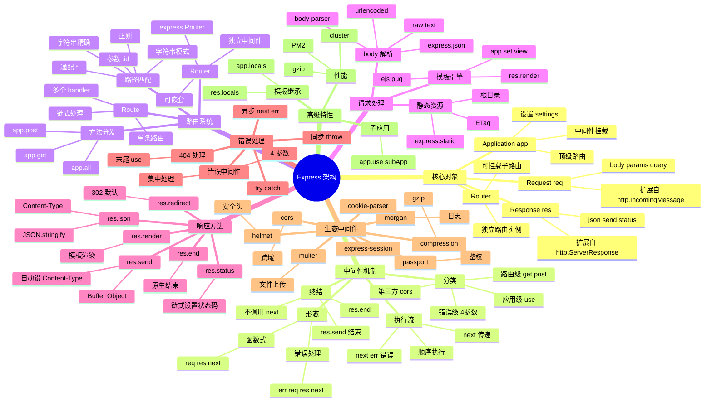

# Express

## 一、前言

**定位**：Node.js 生态最经典、最轻量的 Web 框架，由 TJ Holowaychuk 于 2010 年发布，是 Connect 中间件机制的 HTTP 封装。

**核心价值**：
- 极简内核 + 强大的中间件生态（`morgan` / `cors` / `helmet` / `body-parser` 等）
- 路由 + 中间件双核心，把 HTTP 服务抽象成"管道"
- 几乎所有 Node Web 框架的参考实现（Koa/Nest/Fastify 都受其影响）
- 与 Node.js `http` 模块一一对应，零魔法

**五大特性**：
1. **中间件链式调用**：`(req, res, next) => void` 函数组合，请求流经多个中间件
2. **路由系统**：`app.get/post/put/delete` 或 `Router` 子路由
3. **请求对象扩展**：`req.body` / `req.query` / `req.params` / `req.cookies` 通过中间件注入
4. **响应辅助方法**：`res.json()` / `res.send()` / `res.status()` / `res.render()`
5. **错误处理**：`(err, req, res, next)` 四参数中间件捕获同步/异步错误

**与同类对比**：

| 框架 | 性能 | 中间件模型 | 异步模型 | 适用场景 |
|---|---|---|---|---|
| Express | 中（30k req/s） | 回调 | 回调/Promise | 通用 Web/中小项目 |
| Koa | 中 | 洋葱圈 | async/await 原生 | 现代 API 服务 |
| Fastify | 高（80k req/s） | 钩子链 | async/await | 高性能 API |
| Nest | 中 | 装饰器+DI | async/await | 企业级 |
| Hapi | 中 | 插件 | 回调 | 配置化框架 |

## 二、架构思维导图



## 三、关键代码

### 1. Application 与中间件链（lib/express.js）

```js
// Express 工厂函数
function createApplication() {
  var app = function(req, res, next) {
    app.handle(req, res, next);
  };

  mixin(app, EventEmitter.prototype, false);
  mixin(app, proto, false);

  // 初始化请求/响应扩展
  app.init();
  return app;
}

// proto.handle：请求处理核心
app.handle = function handle(req, res, callback) {
  var stack = this.stack; // 路由栈
  var idx = 0;

  // 1. 协议 + host 校验
  var protocol = req.protocol;
  var host = req.hostname;

  // 2. 迭代路由栈
  next();

  function next(err) {
    if (err) {
      // 错误处理：跳过普通中间件，找带 err 参数的
      return nextRoute(err);
    }

    // 找到下一个匹配的 Layer（路由层）
    var layer;
    var match;
    var route;

    while (match !== true && idx < stack.length) {
      layer = stack[idx++];
      match = matchLayer(layer, req.hostname); // 路径匹配
      route = layer.route;

      if (typeof match !== 'boolean') {
        // layer.handle_request 是中间件函数
        continue;
      }

      if (match !== true) continue;

      if (!route) {
        // 中间件：直接执行
        return layer.handle_request(req, res, next);
      } else {
        // 路由：还要匹配 HTTP 方法
        var method = req.method;
        var has_method = route._handles_method(method);

        if (!has_method) continue; // 不匹配，try next
        // 匹配：执行路由上的 handler
        return layer.handle_request(req, res, next);
      }
    }

    // 没找到任何匹配：404
    nextRoute();
  }

  function nextRoute(err) {
    if (err) {
      // 错误中间件
      return app.handle500(req, res, err);
    }
    // 404
    res.statusCode = 404;
    var msg = 'Cannot ' + req.method + ' ' + req.originalUrl;
    res.end(msg);
  }
};
```

**解析**：
- **栈式匹配**：`this.stack` 是按插入顺序排列的 `Layer` 数组（Layer 包装了中间件或路由）
- **一次匹配两层**：先路径匹配（Layer 级别），再方法匹配（Route 级别）
- **错误传播**：调用 `next(err)` 跳到下一个错误处理中间件

### 2. 中间件注册与执行（lib/router/route.js）

```js
// 简化的 Router
function Route(path) {
  this.path = path;
  this.stack = []; // 该路径上的 handlers
  this.methods = {};
}

Route.prototype.dispatch = function dispatch(req, res, opts) {
  var stack = this.stack;
  var idx = 0;

  next();

  function next(err) {
    if (err) {
      return handle_err(err);
    }
    if (idx >= stack.length) {
      return opts.next(); // 没更多 handler，调用外层 next
    }

    var layer = stack[idx++];
    try {
      // 调用 handler（可能异步）
      var ret = layer.handle_request(req, res, next);
    } catch (err) {
      next(err);
    }
  }
};

// app.get 实现（简化）
methods.forEach(function(method) {
  app[method] = function(path) {
    // 收集 handlers
    var handlers = Array.prototype.slice.call(arguments, 1);

    // 创建 Route
    var route = new Route(path);
    var layer = new Layer(path, { sensitive: true, strict: true, end: true }, route.dispatch.bind(route));
    layer.route = route;

    // 把 handler 推入 route.stack
    handlers.forEach(function(handler) {
      var subLayer = new Layer('/', {}, handler);
      subLayer.method = method;
      route.methods[method] = true;
      route.stack.push(subLayer);
    });

    // 推入 app.stack
    this.stack.push(layer);
    return this; // 链式
  };
});

// app.use 实现（无路径或路径为前缀）
app.use = function use(fn) {
  var path = '/';
  if (typeof arguments[0] !== 'function') {
    path = arguments[0];
    fn = arguments[1];
  }

  // use 是路径前缀匹配
  var layer = new Layer(path, { sensitive: true, strict: false, end: false }, fn);
  layer.route = undefined; // 中间件没有 route
  this.stack.push(layer);
  return this;
};
```

**解析**：
- **Layer 是匹配单元**：每个 `app.use` / `app.get` 创建一个 `Layer`，记录路径、正则、handler
- **Route 是 method 集合**：`app.get` 内部用 `Route` 收集该路径下所有 GET handler
- **`end: true/false`**：`end=true` 是精确匹配（`/foo` 不匹配 `/foo/bar`），`end=false` 是前缀匹配（`/foo` 匹配 `/foo/anything`）

### 3. 请求/响应对象扩展（lib/request.js / response.js）

```js
// req.query 解析 query string
defineGetter(req, 'query', function query() {
  var queryparse = this.app.get('query parser fn');
  if (!queryparse) {
    // 默认 simple 模式
    return parse(this._parsedUrl.query, {});
  }
  return queryparse(this._parsedUrl.query);
});

// req.body 来自 body-parser
defineGetter(req, 'body', function body() {
  return this._body || {};
});

// res.json 简化版
res.json = function json(obj) {
  var val = obj;
  // 1. JSON.stringify 替换函数/未定义
  var body = stringify(val, replacer, spaces);
  // 2. 清理 XSS 攻击向量
  body = body.replace(/<script\b[^<]*(?:(?!<\/script>)<[^<]*)*<\/script>/gi, '');

  if (!this.get('Content-Type')) {
    this.set('Content-Type', 'application/json');
  }
  return this.send(body);
};

// res.send 智能发送
res.send = function send(body) {
  var chunk = body;
  var encoding;
  var type;

  switch (typeof chunk) {
    case 'string':
      if (!this.get('Content-Type')) this.type('text/html');
      break;
    case 'boolean':
    case 'number':
    case 'object':
      if (chunk === null) chunk = '';
      else if (Buffer.isBuffer(chunk)) {
        if (!this.get('Content-Type')) this.type('application/octet-stream');
      } else {
        return this.json(chunk);
      }
      break;
  }

  // 设置 ETag、Content-Length、状态码
  this.set('Content-Length', Buffer.byteLength(chunk, encoding));
  if (req.fresh) this.statusCode = 304;

  if (204 === status || 304 === status) chunk = '';
  this.end(chunk, encoding);
  return this;
};
```

**解析**：
- `res.json` 自动 `JSON.stringify` + 设 `Content-Type: application/json` + 过滤 `<script>` 防注入
- `res.send` 智能识别参数类型：Buffer → 二进制流，对象 → JSON，字符串 → HTML
- `req.fresh` 检查 ETag/Last-Modified 决定是否返回 304

### 4. 错误处理与异步捕获

```js
// 同步错误：try/catch
app.get('/sync-error', function(req, res) {
  throw new Error('boom'); // Express 5 用 try/catch 自动 next(err)
});

// 异步错误（Express 4 之前必须显式 next(err)）
app.get('/async-error', function(req, res, next) {
  fs.readFile('not-exist.txt', function(err, data) {
    if (err) return next(err); // 显式传递
    res.send(data);
  });
});

// Express 5：async 函数 throw 会被自动捕获
app.get('/async-error-v5', async function(req, res) {
  const data = await fs.readFile('not-exist.txt'); // throw 自动 → next(err)
  res.send(data);
});

// 错误处理中间件：4 参数
app.use(function(err, req, res, next) {
  // 1. 日志
  console.error(err.stack);

  // 2. 区分环境
  const status = err.status || 500;
  res.status(status).json({
    error: process.env.NODE_ENV === 'production'
      ? 'Internal Server Error'
      : err.message,
  });
});

// 集中异步包装器：兼容 Express 4
const asyncHandler = (fn) => (req, res, next) =>
  Promise.resolve(fn(req, res, next)).catch(next);

app.get('/users', asyncHandler(async (req, res) => {
  const users = await db.users.find();
  res.json(users);
}));
```

**解析**：
- **Express 4 vs 5**：4 异步错误必须 `next(err)` 或包装器；5 原生支持 async 函数 throw
- **错误中间件按定义顺序生效**：放在 `app.use(router)` 之后捕获所有路由错误，放在最末捕获 404
- **`asyncHandler` 是 4.x 项目通用模式**：把 async 函数包成 Promise.catch(next) 形态

## 四、核心洞察

1. **中间件 = (req, res, next) 三元组**：这是 Express 范式核心，**所有能力都靠组合中间件实现**——这也是"中间件架构"成为 Web 框架事实标准的源头。
2. **Layer + Stack 是匹配引擎**：每个 `use` / `get` 创建一个 Layer 压栈，请求到来时按顺序匹配；这是理解 Express 性能的关键。
3. **Koa 的洋葱圈是对 Express 的反思**：Express 中间件无法"等待下游完成再回写响应"，Koa 用 `async/await` 解决了这个痛点。
4. **Express 4 vs 5 的关键差异**：5.x 原生支持 async 错误捕获（不用 asyncHandler），性能提升 10-20%，移除 `req.param()` 等废弃 API。
5. **不是"小而弱"而是"小而精"**：Express 内核只 1800 行（不算中间件），但 `morgan` / `helmet` / `cors` / `passport` 等生态让它能扛企业项目。
6. **express.Router 才是真路由**：`app.get` 适合顶层定义路由；复杂项目应该 `const router = express.Router()` 再 `app.use('/api', router)`。
7. **req/res 扩展通过 prototype getter**：避免在每次请求时创建新对象，零成本暴露 `body` / `query` / `params` 等属性。
8. **Express 仍占 Node Web 框架 60%+ 份额**：即便 Fastify 性能更强，Express 的**生态惯性 + 学习曲线 + 工具链**让大量项目仍在用。

## 五、跨项目引用

- [./koa.md](./koa.md) — Koa 是 Express 团队原班人马打造的下一代框架，async/await 原生支持
- [./nest.md](./nest.md) — NestJS 内部默认 Express（可切换 Fastify），用装饰器 + DI 包装 Express
- [./fastify.md](./fastify.md) — Fastify 是 Express 性能挑战者，Schema 优先
- [./node.md](./node.md) — Express 是 `http` 模块的封装，理解 `http` 才能理解 Express
- [./jquery.md](./jquery.md) — Express 链式 `app.use(...).use(...).listen()` 受 jQuery 链式启发
- [./connect.md](./connect.md) — Connect 是 Express 的前身，提供了中间件概念
- [../D-构建与UI/webpack.md](../D-构建与UI/webpack.md) — Express + Webpack 组合常见于 SSR 项目
- [../A-前端框架/next.js.md](../A-前端框架/next.js.md) — Next.js 自定义 Server 可基于 Express
