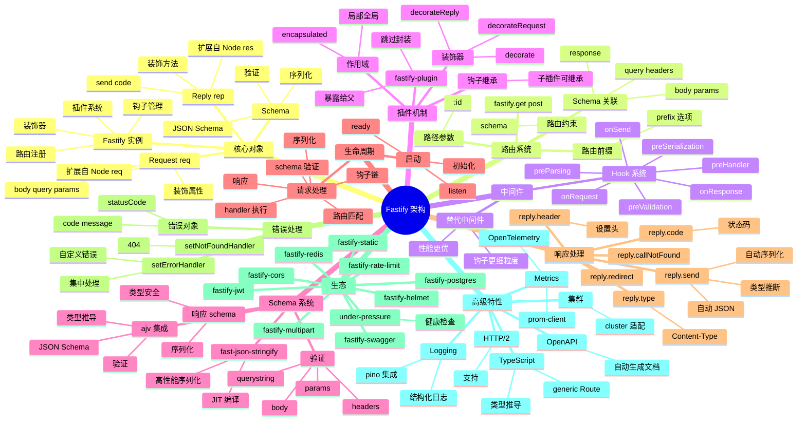

# Fastify

## 一、前言

**定位**：高性能、低开销的 Node.js Web 框架，由 Matteo Collina（Node.js TSC 成员）于 2016 年发布。设计目标是**最快的 Node 框架之一**（仅次于 uWebSockets.js 等 native 实现）。

**核心价值**：
- **Schema 优先**：基于 JSON Schema 验证请求/响应，比手写校验快 5-10 倍
- **插件架构**：`fastify-plugin` 装饰器模式，比 Koa/Express 中间件更结构化
- **性能极致**：默认 30k+ req/s，启用 schema 后可达 70k+ req/s
- **TypeScript 友好**：核心代码 TS 写就，类型定义一等公民
- **可观测性**：内置 OpenAPI、metrics、logging hooks

**五大特性**：
1. **JSON Schema 验证**：路由 schema 自动校验 body/query/params/headers
2. **插件装饰器**：通过 `fastify.decorate()` 给实例/请求/响应扩展方法
3. **生命周期钩子**：`onRequest` / `preParsing` / `preValidation` / `preHandler` / `preSerialization` / `onSend` / `onResponse`
4. **封装与继承**：`fastify-plugin` 跳过封装，让插件逻辑暴露给父作用域
5. **高性能序列化**：用 `fast-json-stringify`（JIT 编译 schema）替代原生 `JSON.stringify`

**性能对比**（TechEmpower Round 21 风格基准）：

| 框架 | req/s | 延迟 p99 | 内存占用 |
|---|---|---|---|
| Fastify | 78k | 1.3ms | 低 |
| Koa | 35k | 2.8ms | 中 |
| Express | 30k | 3.5ms | 中 |
| Nest (Express) | 28k | 3.8ms | 高 |
| uWebSockets.js | 200k+ | 0.5ms | 极低 |
| Bun.serve | 100k+ | 1.0ms | 极低 |

## 二、架构思维导图



## 三、关键代码

### 1. 极简启动与 Schema 路由

```js
const Fastify = require('fastify');

const fastify = Fastify({
  logger: {
    level: 'info',
    transport: { target: 'pino-pretty' },
  },
});

// Schema：JSON Schema
const userSchema = {
  type: 'object',
  properties: {
    id: { type: 'string' },
    name: { type: 'string', minLength: 1, maxLength: 100 },
    email: { type: 'string', format: 'email' },
    age: { type: 'integer', minimum: 0, maximum: 150 },
  },
  required: ['name', 'email'],
};

// 路由：Handler + Schema
fastify.post(
  '/api/users',
  {
    schema: {
      body: userSchema,           // 入参验证
      response: {                 // 响应序列化
        201: {
          type: 'object',
          properties: {
            id: { type: 'string' },
            name: { type: 'string' },
            createdAt: { type: 'string', format: 'date-time' },
          },
        },
      },
    },
  },
  async (request, reply) => {
    // request.body 已经通过 schema 验证
    const user = await db.users.create(request.body);
    reply.code(201);
    return user;  // 直接返回对象，Fastify 自动 JSON 序列化
  }
);

fastify.get('/api/users/:id', {
  schema: {
    params: {
      type: 'object',
      properties: { id: { type: 'string' } },
      required: ['id'],
    },
  },
  async (request) => {
    const user = await db.users.findById(request.params.id);
    if (!user) {
      const err = new Error('User not found');
      err.statusCode = 404;
      throw err;
    }
    return user;
  },
});

// 启动
fastify.listen({ port: 3000, host: '0.0.0.0' }, (err, address) => {
  if (err) throw err;
  fastify.log.info(`server listening on ${address}`);
});
```

**解析**：
- **Schema 即契约**：body 自动验证，response 自动按 schema 序列化（增删字段不被允许）
- **handler 返回对象即响应**：不必 `reply.send()`，Fastify 自动 JSON 化
- **错误用 throw**：抛带 `statusCode` 的 Error 对象，自动返回对应状态码

### 2. 插件与装饰器

```js
// auth-plugin.js：自封装插件
const fp = require('fastify-plugin');
const jwt = require('jsonwebtoken');

async function authPlugin(fastify, opts) {
  // 装饰 fastify 实例
  fastify.decorate('authenticate', async (request, reply) => {
    const token = request.headers.authorization?.replace('Bearer ', '');
    if (!token) {
      reply.code(401).send({ error: 'Missing token' });
      return; // 提前返回，阻止 handler 执行
    }
    try {
      request.user = jwt.verify(token, opts.secret);
    } catch (err) {
      reply.code(401).send({ error: 'Invalid token' });
    }
  });

  // 装饰请求
  fastify.decorateRequest('user', null);

  // 装饰响应
  fastify.decorateReply('success', function (data) {
    return this.send({ code: 0, data });
  });
}

// 用 fastify-plugin 跳过封装，让装饰器在父作用域生效
module.exports = fp(authPlugin, { name: 'auth' });

// app.js
const fastify = Fastify({ logger: true });

await fastify.register(require('./auth-plugin'), { secret: process.env.JWT_SECRET });
await fastify.register(require('@fastify/cors'), { origin: '*' });
await fastify.register(require('@fastify/helmet'));
await fastify.register(require('@fastify/rate-limit'), { max: 100, timeWindow: '1 minute' });

// 路由里直接用
fastify.get('/api/me', {
  onRequest: [fastify.authenticate],  // 钩子数组
}, async (request) => {
  return request.user;  // 装饰器注入的属性
});

fastify.post('/api/login', async (request, reply) => {
  const user = await db.users.findOne({ email: request.body.email });
  if (!user) throw { statusCode: 401, message: 'Invalid credentials' };
  const token = jwt.sign({ id: user.id }, process.env.JWT_SECRET);
  reply.success({ user, token });
});
```

**解析**：
- **`fastify-plugin` 关键作用**：默认情况下，插件的装饰器只在该插件作用域可见；加 `fp()` 后提升到父作用域，全局可用
- **`onRequest` 钩子**：比中间件早介入，可短路返回（如未登录直接 401）
- **`decorateRequest` / `decorateReply`**：给请求/响应加自定义属性，TS 类型可同步

### 3. 钩子系统（生命周期）

```js
// 钩子按顺序执行
fastify.addHook('onRequest', async (request, reply) => {
  // 1. 最早：请求进入，body 未解析
  request.startTime = Date.now();
  request.log.info({ url: request.url }, 'incoming');
});

fastify.addHook('preParsing', async (request, reply, payload) => {
  // 2. body 解析前，可修改 payload
  return payload;  // 也可不返回原 payload
});

fastify.addHook('preValidation', async (request, reply) => {
  // 3. schema 验证前
  if (request.headers['x-internal'] === 'true') {
    request.isInternal = true;
  }
});

fastify.addHook('preHandler', async (request, reply) => {
  // 4. handler 执行前（最常用）
  // 适合做权限检查、限流
});

fastify.addHook('preSerialization', async (request, reply, payload) => {
  // 5. 序列化前，可修改响应数据
  return { code: 0, data: payload, timestamp: Date.now() };
});

fastify.addHook('onSend', async (request, reply, payload) => {
  // 6. 发送前，可加 headers
  reply.header('X-Response-Time', Date.now() - request.startTime);
  return payload;
});

fastify.addHook('onResponse', async (request, reply) => {
  // 7. 响应完成后（适合打日志、metrics）
  const duration = Date.now() - request.startTime;
  metrics.histogram('http_request_duration_ms', duration, {
    method: request.method,
    status: reply.statusCode,
  });
});
```

**解析**：
- **7 个钩子覆盖完整生命周期**：比 Express 单层 `app.use` 细粒度得多
- **钩子可以是 async**：错误自动捕获
- **preSerialization 适合统一响应包装**：所有接口自动包 `{ code, data, timestamp }`
- **onResponse 适合打 metrics**：此时响应已发，调用开销不阻塞用户

### 4. 错误处理与日志

```js
// 集中错误处理
fastify.setErrorHandler((error, request, reply) => {
  // 区分客户端错误 vs 服务端错误
  const statusCode = error.statusCode || 500;

  // 业务错误
  if (error.code === 'USER_NOT_FOUND') {
    return reply.code(404).send({ error: error.message });
  }

  // 验证错误（来自 schema）
  if (error.validation) {
    return reply.code(400).send({
      error: 'Validation failed',
      details: error.validation,
    });
  }

  // 未知错误：5xx
  request.log.error({ err: error }, 'Unhandled error');
  return reply.code(500).send({ error: 'Internal Server Error' });
});

// 404 处理
fastify.setNotFoundHandler((request, reply) => {
  reply.code(404).send({ error: `Route ${request.method} ${request.url} not found` });
});

// 自定义业务错误
class BusinessError extends Error {
  constructor(code, message, statusCode = 400) {
    super(message);
    this.code = code;
    this.statusCode = statusCode;
  }
}

// 在 handler 中抛业务错误
fastify.post('/api/orders', async (request, reply) => {
  const stock = await db.products.stock(request.body.productId);
  if (stock < request.body.quantity) {
    throw new BusinessError('INSUFFICIENT_STOCK', '库存不足', 400);
  }
  return await db.orders.create(request.body);
});

// Pino 结构化日志
fastify.register(require('fastify'), {
  logger: {
    level: process.env.LOG_LEVEL || 'info',
    serializers: {
      req: (req) => ({ method: req.method, url: req.url, id: req.id }),
      res: (res) => ({ statusCode: res.statusCode }),
    },
    redact: ['req.headers.authorization'],  // 脱敏
  },
});
```

**解析**：
- **错误对象携带状态码**：`error.statusCode` 是约定，配合 setErrorHandler 实现统一响应
- **`error.validation` 来自 ajv**：自动捕获 schema 校验失败
- **Pino 比 winston 快 5 倍**：Fastify 默认用 Pino 做日志，适合高并发场景
- **`redact` 字段自动脱敏**：headers / cookie 等敏感字段不会打印

## 四、核心洞察

1. **Schema 优先是性能关键**：`fast-json-stringify` 把 schema 编译成 C 级别 JIT 序列化函数，比 `JSON.stringify` 快 5-10 倍。
2. **插件封装 + 装饰器是 Koa 中间件的进化**：插件是结构化的中间件，装饰器是可控的能力扩展，避免 Express 时代 `req.app.locals.foo = ...` 的全局污染。
3. **钩子细粒度是性能优化空间**：7 个钩子让你只在最必要时做处理（不必像 Express 每个中间件都串一遍）。
4. **依赖 Pino + Ajv + fast-json-stringify**：三大底层库都是极简高性能风格，Fastify 站在巨人肩上。
5. **TypeScript 体验最佳**：handler 参数自动从 schema 推导类型，零类型注释即有完整类型提示。
6. **OpenAPI 自动生成**：`@fastify/swagger` + `@fastify/swagger-ui` 从 schema 生成文档，开发效率高。
7. **生命周期钩子 vs Express 中间件**：钩子不串行（每个钩子都是独立数组），可精确控制执行点；Express 中间件必须走完整链路。
8. **生产级特性开箱即用**：健康检查 (`under-pressure`)、指标 (`fastify-metrics`)、日志 (Pino)、CORS、限流、压缩都是社区标准答案。

## 五、跨项目引用

- [./koa.md](./koa.md) — Koa 洋葱圈 → Fastify 钩子系统（更细粒度）
- [./express.md](./express.md) — Fastify 性能数倍于 Express，API 类似
- [./nest.md](./nest.md) — NestJS 可选 Fastify 作为底层平台
- [./node.md](./node.md) — Fastify 基于 Node `http` 模块，提供 `inject()` 测试 API
- [./pino.md](./pino.md) — Pino 是 Fastify 默认日志库
- [./ajv.md](./ajv.md) — Ajv 是 Fastify 的 Schema 验证器
- [./swagger.md](./swagger.md) — `@fastify/swagger` 从 schema 生成 OpenAPI
- [./prometheus.md](./prometheus.md) — Fastify 配合 prom-client 暴露 metrics
