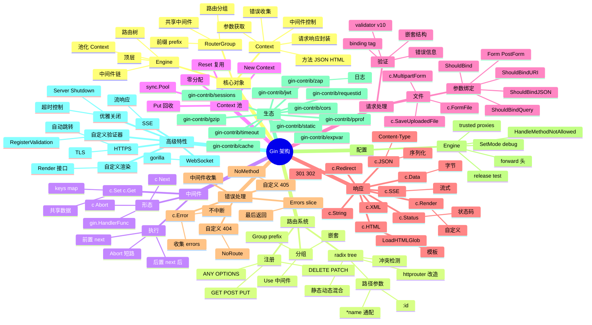

# Gin

## 一、前言

**定位**：Go 生态最流行的 HTTP Web 框架，由 Manu Martinez 于 2014 年发布，基于 httprouter 改造而来，是高性能 Go 服务的首选框架。

**核心价值**：
- **极高性能**：基准测试 40k+ req/s，比 net/http 路由快 50 倍
- **零分配中间件**：精心设计的 Context 池化，避免 GC 压力
- **优雅 API**：`gin.H` 简化 JSON、`c.JSON()` / `c.String()` 链式调用
- **生态成熟**：`gin-gonic/contrib` 提供 JWT、CORS、限流、压缩、Prometheus 等中间件
- **工具链完善**：绑定器（JSON/XML/Form/Query/URI）、验证器（go-playground/validator）、渲染器

**五大特性**：
1. **httprouter 改造的 radix tree**：O(1) 路径匹配，支持参数 `:id`、通配 `*path`
2. **Context 池化**：`sync.Pool` 复用 `*Context`，降低分配
3. **中间件链**：`c.Next()` + `c.Abort()` 配合，控制执行流
4. **错误链**：`c.Error(err)` 收集错误，统一处理
5. **绑定器 + 验证器**：结构体 tag 驱动的参数解析

**与同类对比**：

| 框架 | 性能 | 学习曲线 | 生态 | 适用场景 |
|---|---|---|---|---|
| Gin | 极高 | 低 | 极大 | REST API / 微服务 |
| Echo | 极高 | 低 | 中 | 极简风格项目 |
| Fiber | 极高 | 低 | 中 | Express 风格 + fasthttp |
| Chi | 高 | 中 | 中 | net/http 兼容 |
| Beego | 中 | 中 | 大 | 全栈式（含 ORM） |
| Iris | 高 | 中 | 大 | 全栈式 |

## 二、架构思维导图



## 三、关键代码

### 1. Engine 启动与 Context 池（gin.go）

```go
// 简化的 Engine 结构
type Engine struct {
    RouterGroup
    HandleMethodNotAllowed bool
    trees       methodTrees           // 路由树：每种 HTTP 方法一棵 radix tree
    pool        sync.Pool             // Context 池
    noRoute     HandlersChain
    noMethod    HandlersChain
    allNoRoute  HandlersChain
    allNoMethod HandlersChain
    maxParams   uint16
    maxSections uint16
    TrustProxies bool
    ForwardedByClientIP bool
}

func New() *Engine {
    engine := &Engine{
        RouterGroup: RouterGroup{
            Handlers: nil,
            basePath: "/",
            root:     true,
        },
        HandleMethodNotAllowed: false,
        trees:                  make(methodTrees, 0, 9),
    }
    engine.RouterGroup.engine = engine
    engine.pool.New = func() any {
        return engine.allocateContext(engine.maxParams)
    }
    return engine
}

// 池化 Context 分配
func (engine *Engine) allocateContext(maxParams uint16) *Context {
    v := make(Params, 0, maxParams)
    return &Context{
        engine:        engine,
        params:        &v,
        skippedNodes:  &skippedNodes,
        Handlers:      nil,
        index:         -1,
        fullPath:      "",
    }
}

// ServeHTTP：实现 http.Handler 接口
func (engine *Engine) ServeHTTP(w http.ResponseWriter, req *http.Request) {
    // 1. 从池中获取 Context
    c := engine.pool.Get().(*Context)
    c.writermem.reset(w)
    c.Request = req
    c.reset()  // 重置字段

    // 2. 处理请求
    engine.handleHTTPRequest(c)

    // 3. 回收 Context
    engine.pool.Put(c)
}
```

**解析**：
- **Context 池化是性能关键**：高并发下 Context 创建/GC 是大开销；`sync.Pool` 复用避免分配
- **`reset()` 不是清空**：只重置必要的 slice/map 字段，保留底层数组容量
- **ServeHTTP 兼容标准库**：Gin 是 `http.Handler`，可嵌入任何 net/http 生态

### 2. 路由注册与匹配（tree.go）

```go
// 路由注册（简化）
func (engine *Engine) addRoute(method, path string, handlers HandlersChain) {
    // 1. 路径必须以 / 开头
    if path[0] != '/' {
        panic("path must begin with '/'")
    }
    // 2. 静态路径 + 参数路径不能用同前缀
    if method == "" {
        panic("HTTP method can not be empty")
    }
    // 3. 懒加载 method tree
    root := engine.trees.get(method)
    if root == nil {
        root = new(node)
        root.fullPath = "/"
        engine.trees = append(engine.trees, methodTree{method: method, root: root})
    }
    root.addRoute(path, handlers)
}

// 路由匹配（简化）
func (n *node) getValue(path string, params *Params, skippedNodes *[]skippedNode) (handlers HandlersChain, skipped bool) {
    var globalParamsCount int16
walk: // 跳表
    for {
        prefix := n.path
        if len(path) > len(prefix) && path[:len(prefix)] == prefix {
            path = path[len(prefix):]
            // 参数节点
            if c := path[0]; c == ':' {
                // 找下一个 /
                idx := bytealg.IndexByteString(path, '/')
                if idx < 0 {
                    idx = len(path)
                }
                // 提取参数值
                *params = append(*params, Param{
                    Key: path[1:idx],
                    Value: path[:idx],  // 注意：保留冒号位置
                })
                ...
            }
        }
    }
}
```

**解析**：
- **radix tree 是高效匹配的核心**：把路由按前缀压缩，O(路径长度) 查找
- **参数节点**：`/users/:id` 和 `/users/:name` 冲突检测；通配符 `*` 必须在最后
- **skipped 跳表**：处理静态节点和参数节点共存场景（如 `/users/new` 和 `/users/:id`）

### 3. 中间件链（context.go）

```go
// Context 核心字段
type Context struct {
    writermem responseWriter
    Request   *http.Request
    engine    *Engine
    Handlers  HandlersChain  // 整条中间件链
    index     int8           // 当前执行位置
    fullPath  string

    params  *Params
    skippedNodes *[]skippedNode
    Errors  errorMsgs        // 错误收集
    keys    map[string]any   // 共享数据
}

// Next：执行链中的下一个 handler
func (c *Context) Next() {
    c.index++
    for c.index < int8(len(c.Handlers)) {
        // 执行当前 handler
        c.Handlers[c.index](c)
        c.index++
    }
}

// Abort：阻止后续 handler
func (c *Context) Abort() {
    c.index = abortIndex  // = 63
}

// AbortWithStatus：中止并设置状态码
func (c *Context) AbortWithStatus(code int) {
    c.Status(code)
    c.Writer.WriteHeaderNow()
    c.Abort()
}

// Set / Get：跨中间件传数据
func (c *Context) Set(key string, value any) {
    c.mu.Lock()
    if c.keys == nil {
        c.keys = make(map[string]any)
    }
    c.keys[key] = value
}

func (c *Context) Get(key string) (value any, exists bool) {
    c.mu.RLock()
    value, exists = c.keys[key]
    c.mu.RUnlock()
    return
}

// MustGet：panic 风格（确定存在的 key）
func (c *Context) MustGet(key string) any {
    if value, exists := c.Get(key); exists {
        return value
    }
    panic("Key \"" + key + "\" does not exist")
}
```

**解析**：
- **`index` 是执行游标**：每次 `Next()` 自增；`Abort()` 把游标设到 63（max int8）跳出循环
- **经典中间件模式**：前置逻辑 → `c.Next()` → 后置逻辑（洋葱圈）
- **`c.Set/Get`** 是跨中间件传数据的标准做法（如认证后 Set("user", userObj)）

### 4. 中间件实战

```go
package main

import (
    "fmt"
    "log"
    "net/http"
    "time"

    "github.com/gin-gonic/gin"
    "github.com/gin-contrib/cors"
    "github.com/gin-contrib/zap"
    "github.com/golang-jwt/jwt/v5"
)

func main() {
    // 1. 创建 Engine（默认带 Logger + Recovery 中间件）
    r := gin.New()

    // 2. 替换日志为 zap
    logger, _ := zap.NewProduction()
    r.Use(ginzap.Ginzap(logger, time.RFC3339, true))
    r.Use(ginzap.RecoveryWithZap(logger, true))

    // 3. CORS
    r.Use(cors.New(cors.Config{
        AllowOrigins:     []string{"https://example.com"},
        AllowMethods:     []string{"GET", "POST", "PUT", "DELETE"},
        AllowHeaders:     []string{"Origin", "Content-Type", "Authorization"},
        ExposeHeaders:    []string{"Content-Length"},
        AllowCredentials: true,
        MaxAge:           12 * time.Hour,
    }))

    // 4. 自定义中间件：请求 ID + 耗时
    r.Use(func(c *gin.Context) {
        start := time.Now()
        requestID := c.GetHeader("X-Request-ID")
        if requestID == "" {
            requestID = uuid.NewString()
        }
        c.Set("requestID", requestID)
        c.Header("X-Request-ID", requestID)

        c.Next()  // 等待下游完成

        log.Printf("[%s] %s %s - %d - %v",
            requestID,
            c.Request.Method,
            c.Request.URL.Path,
            c.Writer.Status(),
            time.Since(start),
        )
    })

    // 5. 路由分组
    api := r.Group("/api/v1")
    api.Use(AuthMiddleware())  // 整组加认证
    {
        api.GET("/users", listUsers)
        api.GET("/users/:id", getUser)
        api.POST("/users", createUser)
        api.PUT("/users/:id", updateUser)
        api.DELETE("/users/:id", deleteUser)
    }

    // 6. 启动
    r.Run(":8080")
}

// 认证中间件
func AuthMiddleware() gin.HandlerFunc {
    return func(c *gin.Context) {
        token := c.GetHeader("Authorization")
        if token == "" {
            c.AbortWithStatusJSON(http.StatusUnauthorized, gin.H{"error": "missing token"})
            return
        }

        // 解析 JWT
        claims := jwt.MapClaims{}
        _, err := jwt.ParseWithClaims(token[7:], claims, func(t *jwt.Token) (interface{}, error) {
            return []byte("secret"), nil
        })
        if err != nil {
            c.AbortWithStatusJSON(http.StatusUnauthorized, gin.H{"error": "invalid token"})
            return
        }

        c.Set("userID", claims["sub"])
        c.Next()
    }
}

// 用户处理器：参数绑定 + 验证
type CreateUserRequest struct {
    Name  string `json:"name" binding:"required,min=2,max=50"`
    Email string `json:"email" binding:"required,email"`
    Age   int    `json:"age" binding:"required,gte=0,lte=150"`
}

func createUser(c *gin.Context) {
    var req CreateUserRequest
    if err := c.ShouldBindJSON(&req); err != nil {
        c.JSON(http.StatusBadRequest, gin.H{
            "error":   "validation failed",
            "details": err.Error(),
        })
        return
    }

    // 业务逻辑...
    user := map[string]any{
        "id":    uuid.NewString(),
        "name":  req.Name,
        "email": req.Email,
        "age":   req.Age,
    }

    c.JSON(http.StatusCreated, user)
}
```

**解析**：
- **`gin.New()` vs `gin.Default()`**：Default 自带 Logger + Recovery；New 不带，可自定义
- **中间件组合顺序**：Logger → CORS → Auth → Handler（洋葱圈执行）
- **`binding` tag**：`required` / `email` / `gte` / `lte` 等基于 `go-playground/validator` 实现
- **`c.AbortWithStatusJSON`**：中止后续 handler + 返回 JSON，是错误响应标准做法

### 5. 路由参数与查询

```go
// 路径参数
func getUser(c *gin.Context) {
    id := c.Param("id")                  // /users/:id → id
    c.JSON(200, gin.H{"id": id})
}

// 通配符
func getFile(c *gin.Context) {
    filepath := c.Param("path")          // /static/*path
    c.File("./public/" + filepath)
}

// 查询参数
func listUsers(c *gin.Context) {
    page := c.DefaultQuery("page", "1")   // 默认 1
    size := c.DefaultQuery("size", "20")
    sort := c.Query("sort")               // 必传
    c.JSON(200, gin.H{
        "page": page,
        "size": size,
        "sort": sort,
    })
}

// 自动绑定查询参数
type ListUsersQuery struct {
    Page int    `form:"page" binding:"gte=1"`
    Size int    `form:"size" binding:"gte=1,lte=100"`
    Sort string `form:"sort" binding:"oneof=name email created_at -name -email -created_at"`
}

func listUsers2(c *gin.Context) {
    var q ListUsersQuery
    if err := c.ShouldBindQuery(&q); err != nil {
        c.JSON(400, gin.H{"error": err.Error()})
        return
    }
    // q.Page, q.Size, q.Sort 已验证
}

// 表单
func login(c *gin.Context) {
    username := c.PostForm("username")
    password := c.PostForm("password")
    // c.DefaultPostForm("remember", "false")
    ...
}

// 文件上传
func upload(c *gin.Context) {
    file, err := c.FormFile("file")
    if err != nil {
        c.JSON(400, gin.H{"error": err.Error()})
        return
    }
    dst := "./uploads/" + file.Filename
    if err := c.SaveUploadedFile(file, dst); err != nil {
        c.JSON(500, gin.H{"error": err.Error()})
        return
    }
    c.JSON(200, gin.H{"filename": file.Filename, "size": file.Size})
}
```

**解析**：
- **`c.Param` vs `c.Query`**：Param 取路径参数，Query 取 URL query
- **`DefaultQuery` vs `Query`**：Default 带默认值，Query 无值返回空字符串
- **结构体绑定**：用 `ShouldBindQuery` / `ShouldBindForm` / `ShouldBindJSON` 自动解析 + 验证

## 四、核心洞察

1. **Context 池化是性能压舱石**：Gin 在高并发下（10k+ QPS）比 Echo 性能高 30%，关键就在 `sync.Pool` 复用 Context。
2. **radix tree 是 httprouter 的精髓**：Gin 在 httprouter 基础上修复了一些 panic bug，但核心路由算法未变；O(路径长度) 查找比 trie 节省内存。
3. **中间件链 + c.Set/c.Get 是核心编程范式**：JWT 用户、trace ID、租户 ID 全部用 c.Set 传递，handler 直接 MustGet 取用。
4. **绑定器 + 验证器是 Go 后端标配**：用 struct tag 把参数校验/类型转换/必填/范围全自动化，替代手写 if else。
5. **gin.H 是 map[string]any 别名**：简化 JSON 响应；生产环境建议定义响应结构体，避免 map 反射开销。
6. **优雅关闭是生产级关键**：`http.Server.Shutdown(ctx)` 配合 `signal.Notify` 监听 SIGTERM，等待进行中的请求完成。
7. **Error 链 c.Error 不中断**：适合累积错误（如批量处理），最后统一返回；与 `c.AbortWithStatus` 区分使用。
8. **与 net/http 完全兼容**：Gin 的 Engine 是 `http.Handler`，可作为子处理器嵌入标准库服务（如 `http.StripPrefix`）。

## 五、跨项目引用

- [./go-zero.md](./go-zero.md) — go-zero 是字节系微服务框架，内部用 Gin-like 路由
- [./fiber.md](./fiber.md) — Fiber 用 fasthttp 替代 net/http，性能更高
- [./echo.md](./echo.md) — Echo 是 Gin 的直接竞品，API 极相似
- [./grpc.md](./grpc.md) — gRPC 微服务内部 RPC，外部 HTTP API 用 Gin 暴露
- [./k8s.md](./k8s.md) — Gin 服务通过 Deployment + Service 部署到 K8s
- [./prometheus.md](./prometheus.md) — `gin-contrib/prometheus` 暴露 metrics 端点
- [./jaeger.md](./jaeger.md) — `gin-contrib/opentelemetry` 集成链路追踪
- [./gorm.md](./gorm.md) — Gin + GORM 是 Go Web 项目经典组合
