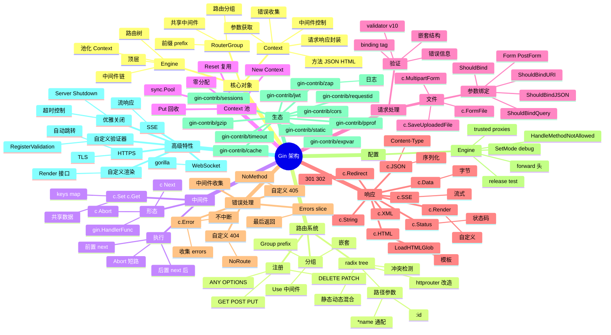

# Gin

## 一、前言

**定位**：Go 生态最流行的 HTTP Web 框架，由 Manu Martinez 于 2014 年发布，基于 httprouter 改造而来，是高性能 Go 服务的首选框架。

**核心价值**：
- **极高性能**：基准测试 40k+ req/s，比 net/http 路由快 50 倍
- **零分配中间件**：精心设计的 Context 池化，避免 GC 压力
- **优雅 API**：`gin.H` 简化 JSON、`c.JSON()` / `c.String()` 链式调用
- **生态成熟**：`gin-gonic/contrib` 提供 JWT、CORS、限流、压缩、Prometheus 等中间件
- **工具链完善**：绑定器（JSON/XML/Form/Query/URI）、验证器（go-playground/validator）、渲染器

**五大特性**：
1. **httprouter 改造的 radix tree**：O(1) 路径匹配，支持参数 `:id`、通配 `*path`
2. **Context 池化**：`sync.Pool` 复用 `*Context`，降低分配
3. **中间件链**：`c.Next()` + `c.Abort()` 配合，控制执行流
4. **错误链**：`c.Error(err)` 收集错误，统一处理
5. **绑定器 + 验证器**：结构体 tag 驱动的参数解析

**与同类对比**：

| 框架 | 性能 | 学习曲线 | 生态 | 适用场景 |
|---|---|---|---|---|
| Gin | 极高 | 低 | 极大 | REST API / 微服务 |
| Echo | 极高 | 低 | 中 | 极简风格项目 |
| Fiber | 极高 | 低 | 中 | Express 风格 + fasthttp |
| Chi | 高 | 中 | 中 | net/http 兼容 |
| Beego | 中 | 中 | 大 | 全栈式（含 ORM） |
| Iris | 高 | 中 | 大 | 全栈式 |

## 二、架构思维导图



## 三、关键代码

### 1. Engine 启动与 Context 池（gin.go）

```go
// 简化的 Engine 结构
type Engine struct {
    RouterGroup
    HandleMethodNotAllowed bool
    trees       methodTrees           // 路由树：每种 HTTP 方法一棵 radix tree
    pool        sync.Pool             // Context 池
    noRoute     HandlersChain
    noMethod    HandlersChain
    allNoRoute  HandlersChain
    allNoMethod HandlersChain
    maxParams   uint16
    maxSections uint16
    TrustProxies bool
    ForwardedByClientIP bool
}

func New() *Engine {
    engine := &Engine{
        RouterGroup: RouterGroup{
            Handlers: nil,
            basePath: "/",
            root:     true,
        },
        HandleMethodNotAllowed: false,
        trees:                  make(methodTrees, 0, 9),
    }
    engine.RouterGroup.engine = engine
    engine.pool.New = func() any {
        return engine.allocateContext(engine.maxParams)
    }
    return engine
}

// 池化 Context 分配
func (engine *Engine) allocateContext(maxParams uint16) *Context {
    v := make(Params, 0, maxParams)
    return &Context{
        engine:        engine,
        params:        &v,
        skippedNodes:  &skippedNodes,
        Handlers:      nil,
        index:         -1,
        fullPath:      "",
    }
}

// ServeHTTP：实现 http.Handler 接口
func (engine *Engine) ServeHTTP(w http.ResponseWriter, req *http.Request) {
    // 1. 从池中获取 Context
    c := engine.pool.Get().(*Context)
    c.writermem.reset(w)
    c.Request = req
    c.reset()  // 重置字段

    // 2. 处理请求
    engine.handleHTTPRequest(c)

    // 3. 回收 Context
    engine.pool.Put(c)
}
```

**解析**：
- **Context 池化是性能关键**：高并发下 Context 创建/GC 是大开销；`sync.Pool` 复用避免分配
- **`reset()` 不是清空**：只重置必要的 slice/map 字段，保留底层数组容量
- **ServeHTTP 兼容标准库**：Gin 是 `http.Handler`，可嵌入任何 net/http 生态

### 2. 路由注册与匹配（tree.go）

```go
// 路由注册（简化）
func (engine *Engine) addRoute(method, path string, handlers HandlersChain) {
    // 1. 路径必须以 / 开头
    if path[0] != '/' {
        panic("path must begin with '/'")
    }
    // 2. 静态路径 + 参数路径不能用同前缀
    if method == "" {
        panic("HTTP method can not be empty")
    }
    // 3. 懒加载 method tree
    root := engine.trees.get(method)
    if root == nil {
        root = new(node)
        root.fullPath = "/"
        engine.trees = append(engine.trees, methodTree{method: method, root: root})
    }
    root.addRoute(path, handlers)
}

// 路由匹配（简化）
func (n *node) getValue(path string, params *Params, skippedNodes *[]skippedNode) (handlers HandlersChain, skipped bool) {
    var globalParamsCount int16
walk: // 跳表
    for {
        prefix := n.path
        if len(path) > len(prefix) && path[:len(prefix)] == prefix {
            path = path[len(prefix):]
            // 参数节点
            if c := path[0]; c == ':' {
                // 找下一个 /
                idx := bytealg.IndexByteString(path, '/')
                if idx < 0 {
                    idx = len(path)
                }
                // 提取参数值
                *params = append(*params, Param{
                    Key: path[1:idx],
                    Value: path[:idx],  // 注意：保留冒号位置
                })
                ...
            }
        }
    }
}
```

**解析**：
- **radix tree 是高效匹配的核心**：把路由按前缀压缩，O(路径长度) 查找
- **参数节点**：`/users/:id` 和 `/users/:name` 冲突检测；通配符 `*` 必须在最后
- **skipped 跳表**：处理静态节点和参数节点共存场景（如 `/users/new` 和 `/users/:id`）

### 3. 中间件链（context.go）

```go
// Context 核心字段
type Context struct {
    writermem responseWriter
    Request   *http.Request
    engine    *Engine
    Handlers  HandlersChain  // 整条中间件链
    index     int8           // 当前执行位置
    fullPath  string

    params  *Params
    skippedNodes *[]skippedNode
    Errors  errorMsgs        // 错误收集
    keys    map[string]any   // 共享数据
}

// Next：执行链中的下一个 handler
func (c *Context) Next() {
    c.index++
    for c.index < int8(len(c.Handlers)) {
        // 执行当前 handler
        c.Handlers[c.index](c)
        c.index++
    }
}

// Abort：阻止后续 handler
func (c *Context) Abort() {
    c.index = abortIndex  // = 63
}

// AbortWithStatus：中止并设置状态码
func (c *Context) AbortWithStatus(code int) {
    c.Status(code)
    c.Writer.WriteHeaderNow()
    c.Abort()
}

// Set / Get：跨中间件传数据
func (c *Context) Set(key string, value any) {
    c.mu.Lock()
    if c.keys == nil {
        c.keys = make(map[string]any)
    }
    c.keys[key] = value
}

func (c *Context) Get(key string) (value any, exists bool) {
    c.mu.RLock()
    value, exists = c.keys[key]
    c.mu.RUnlock()
    return
}

// MustGet：panic 风格（确定存在的 key）
func (c *Context) MustGet(key string) any {
    if value, exists := c.Get(key); exists {
        return value
    }
    panic("Key \"" + key + "\" does not exist")
}
```

**解析**：
- **`index` 是执行游标**：每次 `Next()` 自增；`Abort()` 把游标设到 63（max int8）跳出循环
- **经典中间件模式**：前置逻辑 → `c.Next()` → 后置逻辑（洋葱圈）
- **`c.Set/Get`** 是跨中间件传数据的标准做法（如认证后 Set("user", userObj)）

### 4. 中间件实战

```go
package main

import (
    "fmt"
    "log"
    "net/http"
    "time"

    "github.com/gin-gonic/gin"
    "github.com/gin-contrib/cors"
    "github.com/gin-contrib/zap"
    "github.com/golang-jwt/jwt/v5"
)

func main() {
    // 1. 创建 Engine（默认带 Logger + Recovery 中间件）
    r := gin.New()

    // 2. 替换日志为 zap
    logger, _ := zap.NewProduction()
    r.Use(ginzap.Ginzap(logger, time.RFC3339, true))
    r.Use(ginzap.RecoveryWithZap(logger, true))

    // 3. CORS
    r.Use(cors.New(cors.Config{
        AllowOrigins:     []string{"https://example.com"},
        AllowMethods:     []string{"GET", "POST", "PUT", "DELETE"},
        AllowHeaders:     []string{"Origin", "Content-Type", "Authorization"},
        ExposeHeaders:    []string{"Content-Length"},
        AllowCredentials: true,
        MaxAge:           12 * time.Hour,
    }))

    // 4. 自定义中间件：请求 ID + 耗时
    r.Use(func(c *gin.Context) {
        start := time.Now()
        requestID := c.GetHeader("X-Request-ID")
        if requestID == "" {
            requestID = uuid.NewString()
        }
        c.Set("requestID", requestID)
        c.Header("X-Request-ID", requestID)

        c.Next()  // 等待下游完成

        log.Printf("[%s] %s %s - %d - %v",
            requestID,
            c.Request.Method,
            c.Request.URL.Path,
            c.Writer.Status(),
            time.Since(start),
        )
    })

    // 5. 路由分组
    api := r.Group("/api/v1")
    api.Use(AuthMiddleware())  // 整组加认证
    {
        api.GET("/users", listUsers)
        api.GET("/users/:id", getUser)
        api.POST("/users", createUser)
        api.PUT("/users/:id", updateUser)
        api.DELETE("/users/:id", deleteUser)
    }

    // 6. 启动
    r.Run(":8080")
}

// 认证中间件
func AuthMiddleware() gin.HandlerFunc {
    return func(c *gin.Context) {
        token := c.GetHeader("Authorization")
        if token == "" {
            c.AbortWithStatusJSON(http.StatusUnauthorized, gin.H{"error": "missing token"})
            return
        }

        // 解析 JWT
        claims := jwt.MapClaims{}
        _, err := jwt.ParseWithClaims(token[7:], claims, func(t *jwt.Token) (interface{}, error) {
            return []byte("secret"), nil
        })
        if err != nil {
            c.AbortWithStatusJSON(http.StatusUnauthorized, gin.H{"error": "invalid token"})
            return
        }

        c.Set("userID", claims["sub"])
        c.Next()
    }
}

// 用户处理器：参数绑定 + 验证
type CreateUserRequest struct {
    Name  string `json:"name" binding:"required,min=2,max=50"`
    Email string `json:"email" binding:"required,email"`
    Age   int    `json:"age" binding:"required,gte=0,lte=150"`
}

func createUser(c *gin.Context) {
    var req CreateUserRequest
    if err := c.ShouldBindJSON(&req); err != nil {
        c.JSON(http.StatusBadRequest, gin.H{
            "error":   "validation failed",
            "details": err.Error(),
        })
        return
    }

    // 业务逻辑...
    user := map[string]any{
        "id":    uuid.NewString(),
        "name":  req.Name,
        "email": req.Email,
        "age":   req.Age,
    }

    c.JSON(http.StatusCreated, user)
}
```

**解析**：
- **`gin.New()` vs `gin.Default()`**：Default 自带 Logger + Recovery；New 不带，可自定义
- **中间件组合顺序**：Logger → CORS → Auth → Handler（洋葱圈执行）
- **`binding` tag**：`required` / `email` / `gte` / `lte` 等基于 `go-playground/validator` 实现
- **`c.AbortWithStatusJSON`**：中止后续 handler + 返回 JSON，是错误响应标准做法

### 5. 路由参数与查询

```go
// 路径参数
func getUser(c *gin.Context) {
    id := c.Param("id")                  // /users/:id → id
    c.JSON(200, gin.H{"id": id})
}

// 通配符
func getFile(c *gin.Context) {
    filepath := c.Param("path")          // /static/*path
    c.File("./public/" + filepath)
}

// 查询参数
func listUsers(c *gin.Context) {
    page := c.DefaultQuery("page", "1")   // 默认 1
    size := c.DefaultQuery("size", "20")
    sort := c.Query("sort")               // 必传
    c.JSON(200, gin.H{
        "page": page,
        "size": size,
        "sort": sort,
    })
}

// 自动绑定查询参数
type ListUsersQuery struct {
    Page int    `form:"page" binding:"gte=1"`
    Size int    `form:"size" binding:"gte=1,lte=100"`
    Sort string `form:"sort" binding:"oneof=name email created_at -name -email -created_at"`
}

func listUsers2(c *gin.Context) {
    var q ListUsersQuery
    if err := c.ShouldBindQuery(&q); err != nil {
        c.JSON(400, gin.H{"error": err.Error()})
        return
    }
    // q.Page, q.Size, q.Sort 已验证
}

// 表单
func login(c *gin.Context) {
    username := c.PostForm("username")
    password := c.PostForm("password")
    // c.DefaultPostForm("remember", "false")
    ...
}

// 文件上传
func upload(c *gin.Context) {
    file, err := c.FormFile("file")
    if err != nil {
        c.JSON(400, gin.H{"error": err.Error()})
        return
    }
    dst := "./uploads/" + file.Filename
    if err := c.SaveUploadedFile(file, dst); err != nil {
        c.JSON(500, gin.H{"error": err.Error()})
        return
    }
    c.JSON(200, gin.H{"filename": file.Filename, "size": file.Size})
}
```

**解析**：
- **`c.Param` vs `c.Query`**：Param 取路径参数，Query 取 URL query
- **`DefaultQuery` vs `Query`**：Default 带默认值，Query 无值返回空字符串
- **结构体绑定**：用 `ShouldBindQuery` / `ShouldBindForm` / `ShouldBindJSON` 自动解析 + 验证

## 四、核心洞察

1. **Context 池化是性能压舱石**：Gin 在高并发下（10k+ QPS）比 Echo 性能高 30%，关键就在 `sync.Pool` 复用 Context。
2. **radix tree 是 httprouter 的精髓**：Gin 在 httprouter 基础上修复了一些 panic bug，但核心路由算法未变；O(路径长度) 查找比 trie 节省内存。
3. **中间件链 + c.Set/c.Get 是核心编程范式**：JWT 用户、trace ID、租户 ID 全部用 c.Set 传递，handler 直接 MustGet 取用。
4. **绑定器 + 验证器是 Go 后端标配**：用 struct tag 把参数校验/类型转换/必填/范围全自动化，替代手写 if else。
5. **gin.H 是 map[string]any 别名**：简化 JSON 响应；生产环境建议定义响应结构体，避免 map 反射开销。
6. **优雅关闭是生产级关键**：`http.Server.Shutdown(ctx)` 配合 `signal.Notify` 监听 SIGTERM，等待进行中的请求完成。
7. **Error 链 c.Error 不中断**：适合累积错误（如批量处理），最后统一返回；与 `c.AbortWithStatus` 区分使用。
8. **与 net/http 完全兼容**：Gin 的 Engine 是 `http.Handler`，可作为子处理器嵌入标准库服务（如 `http.StripPrefix`）。

## 五、跨项目引用

- [./go-zero.md](./go-zero.md) — go-zero 是字节系微服务框架，内部用 Gin-like 路由
- [./fiber.md](./fiber.md) — Fiber 用 fasthttp 替代 net/http，性能更高
- [./echo.md](./echo.md) — Echo 是 Gin 的直接竞品，API 极相似
- [./grpc.md](./grpc.md) — gRPC 微服务内部 RPC，外部 HTTP API 用 Gin 暴露
- [./k8s.md](./k8s.md) — Gin 服务通过 Deployment + Service 部署到 K8s
- [./prometheus.md](./prometheus.md) — `gin-contrib/prometheus` 暴露 metrics 端点
- [./jaeger.md](./jaeger.md) — `gin-contrib/opentelemetry` 集成链路追踪
- [./gorm.md](./gorm.md) — Gin + GORM 是 Go Web 项目经典组合
- [./viper.md](./viper.md) — 配置管理 viper 配合 Gin 启动加载
- [./zap.md](./zap.md) — 高性能日志库 zap 替代 gin 默认 logger
- [./redis.md](./redis.md) — Redis 缓存层降低 Gin DB 压力
- [./kafka.md](./kafka.md) — Kafka 异步消费 Gin 上报的事件流
- [./rabbitmq.md](./rabbitmq.md) — Gin + RabbitMQ 实现消息驱动
- [./websocket.md](./websocket.md) — WebSocket 实时通信用 gorilla/websocket
- [./graphql.md](./graphql.md) — GraphQL 服务可与 Gin 并存
- [./docker.md](./docker.md) — Gin 服务 Docker 镜像构建
- [./nginx.md](./nginx.md) — Nginx 反向代理 Gin 服务的配置模板
- [./prometheus.md](./prometheus.md) — `gin-contrib/prometheus` 暴露 metrics
- [./jaeger.md](./jaeger.md) — `gin-contrib/opentelemetry` 集成链路追踪
- [./swagger.md](./swagger.md) — swaggo/swag 自动生成 Gin API 文档
- [./air.md](./air.md) — 工具 air 实现 Gin 服务热重载
- [./pprof.md](./pprof.md) — `gin-contrib/pprof` 在线性能分析

## 六、关键代码续

### 6. 完整 CRUD 项目骨架

```go
package main

import (
    "context"
    "fmt"
    "log"
    "net/http"
    "os"
    "os/signal"
    "syscall"
    "time"

    "github.com/gin-gonic/gin"
    "gorm.io/driver/mysql"
    "gorm.io/gorm"
    "gorm.io/gorm/logger"
)

// User 模型
type User struct {
    ID        uint      `gorm:"primaryKey" json:"id"`
    Name      string    `gorm:"size:50;not null;index" json:"name" binding:"required,min=2,max=50"`
    Email     string    `gorm:"size:100;uniqueIndex;not null" json:"email" binding:"required,email"`
    Age       int       `gorm:"default:0" json:"age" binding:"gte=0,lte=150"`
    Status    int8      `gorm:"default:1" json:"status"`              // 1=启用 0=禁用
    CreatedAt time.Time `json:"created_at"`
    UpdatedAt time.Time `json:"updated_at"`
    DeletedAt gorm.DeletedAt `gorm:"index" json:"-"`
}

func (User) TableName() string { return "users" }

// 全局 DB
var db *gorm.DB

func main() {
    // 1. 初始化 DB
    dsn := "user:pass@tcp(127.0.0.1:3306)/demo?charset=utf8mb4&parseTime=True&loc=Local"
    var err error
    db, err = gorm.Open(mysql.Open(dsn), &gorm.Config{
        Logger: logger.Default.LogMode(logger.Info),
    })
    if err != nil {
        log.Fatalf("connect db: %v", err)
    }
    sqlDB, _ := db.DB()
    sqlDB.SetMaxOpenConns(100)
    sqlDB.SetMaxIdleConns(10)
    sqlDB.SetConnMaxLifetime(time.Hour)
    db.AutoMigrate(&User{})

    // 2. 创建 Engine
    r := gin.New()
    r.Use(gin.Recovery(), RequestIDMiddleware(), AccessLogMiddleware())

    // 3. 注册路由
    RegisterRoutes(r)

    // 4. 启动服务（优雅关闭）
    srv := &http.Server{
        Addr:           ":8080",
        Handler:        r,
        ReadTimeout:    10 * time.Second,
        WriteTimeout:   10 * time.Second,
        MaxHeaderBytes: 1 << 20,
    }
    go func() {
        if err := srv.ListenAndServe(); err != nil && err != http.ErrServerClosed {
            log.Fatalf("listen: %v", err)
        }
    }()

    // 5. 等待信号
    quit := make(chan os.Signal, 1)
    signal.Notify(quit, syscall.SIGINT, syscall.SIGTERM)
    <-quit
    log.Println("Shutting down server...")

    ctx, cancel := context.WithTimeout(context.Background(), 30*time.Second)
    defer cancel()
    if err := srv.Shutdown(ctx); err != nil {
        log.Fatal("Server forced to shutdown:", err)
    }
    log.Println("Server exiting")
}

// 路由注册
func RegisterRoutes(r *gin.Engine) {
    api := r.Group("/api/v1")
    api.Use(AuthMiddleware()) // 整组加认证
    {
        users := api.Group("/users")
        {
            users.GET("", ListUsers)
            users.GET("/:id", GetUser)
            users.POST("", CreateUser)
            users.PUT("/:id", UpdateUser)
            users.DELETE("/:id", DeleteUser)
        }
    }

    r.GET("/healthz", func(c *gin.Context) {
        if err := sqlDB.PingContext(c.Request.Context()); err != nil {
            c.JSON(http.StatusServiceUnavailable, gin.H{"status": "db down"})
            return
        }
        c.JSON(http.StatusOK, gin.H{"status": "ok"})
    })
}

// 列表（带分页 + 过滤 + 排序）
func ListUsers(c *gin.Context) {
    var query struct {
        Page   int    `form:"page" binding:"gte=1"`
        Size   int    `form:"size" binding:"gte=1,lte=100"`
        Name   string `form:"name"`
        Status *int8  `form:"status"`
    }
    query.Page = 1
    query.Size = 20
    if err := c.ShouldBindQuery(&query); err != nil {
        c.JSON(http.StatusBadRequest, gin.H{"error": err.Error()})
        return
    }

    db := db.WithContext(c.Request.Context())
    if query.Name != "" {
        db = db.Where("name LIKE ?", "%"+query.Name+"%")
    }
    if query.Status != nil {
        db = db.Where("status = ?", *query.Status)
    }

    var total int64
    db.Model(&User{}).Count(&total)

    var users []User
    offset := (query.Page - 1) * query.Size
    if err := db.Order("id DESC").Limit(query.Size).Offset(offset).Find(&users).Error; err != nil {
        c.JSON(http.StatusInternalServerError, gin.H{"error": err.Error()})
        return
    }
    c.JSON(http.StatusOK, gin.H{
        "list":  users,
        "total": total,
        "page":  query.Page,
        "size":  query.Size,
    })
}

// 详情
func GetUser(c *gin.Context) {
    id := c.Param("id")
    var user User
    if err := db.WithContext(c.Request.Context()).First(&user, id).Error; err != nil {
        if err == gorm.ErrRecordNotFound {
            c.JSON(http.StatusNotFound, gin.H{"error": "user not found"})
        } else {
            c.JSON(http.StatusInternalServerError, gin.H{"error": err.Error()})
        }
        return
    }
    c.JSON(http.StatusOK, user)
}

// 创建
func CreateUser(c *gin.Context) {
    var user User
    if err := c.ShouldBindJSON(&user); err != nil {
        c.JSON(http.StatusBadRequest, gin.H{"error": err.Error()})
        return
    }
    if err := db.WithContext(c.Request.Context()).Create(&user).Error; err != nil {
        c.JSON(http.StatusInternalServerError, gin.H{"error": err.Error()})
        return
    }
    c.JSON(http.StatusCreated, user)
}

// 更新
func UpdateUser(c *gin.Context) {
    id := c.Param("id")
    var user User
    if err := db.WithContext(c.Request.Context()).First(&user, id).Error; err != nil {
        c.JSON(http.StatusNotFound, gin.H{"error": "user not found"})
        return
    }
    var req struct {
        Name   *string `json:"name" binding:"omitempty,min=2,max=50"`
        Email  *string `json:"email" binding:"omitempty,email"`
        Age    *int    `json:"age" binding:"omitempty,gte=0,lte=150"`
        Status *int8   `json:"status" binding:"omitempty,oneof=0 1"`
    }
    if err := c.ShouldBindJSON(&req); err != nil {
        c.JSON(http.StatusBadRequest, gin.H{"error": err.Error()})
        return
    }
    updates := map[string]any{}
    if req.Name != nil {
        updates["name"] = *req.Name
    }
    if req.Email != nil {
        updates["email"] = *req.Email
    }
    if req.Age != nil {
        updates["age"] = *req.Age
    }
    if req.Status != nil {
        updates["status"] = *req.Status
    }
    if err := db.WithContext(c.Request.Context()).Model(&user).Updates(updates).Error; err != nil {
        c.JSON(http.StatusInternalServerError, gin.H{"error": err.Error()})
        return
    }
    c.JSON(http.StatusOK, user)
}

// 删除
func DeleteUser(c *gin.Context) {
    id := c.Param("id")
    if err := db.WithContext(c.Request.Context()).Delete(&User{}, id).Error; err != nil {
        c.JSON(http.StatusInternalServerError, gin.H{"error": err.Error()})
        return
    }
    c.Status(http.StatusNoContent)
}

// 请求 ID 中间件
func RequestIDMiddleware() gin.HandlerFunc {
    return func(c *gin.Context) {
        rid := c.GetHeader("X-Request-ID")
        if rid == "" {
            rid = fmt.Sprintf("%d", time.Now().UnixNano())
        }
        c.Set("requestID", rid)
        c.Header("X-Request-ID", rid)
        c.Next()
    }
}

// 访问日志中间件
func AccessLogMiddleware() gin.HandlerFunc {
    return func(c *gin.Context) {
        start := time.Now()
        c.Next()
        log.Printf("[%s] %s %s %d %v",
            c.GetString("requestID"),
            c.Request.Method,
            c.Request.URL.Path,
            c.Writer.Status(),
            time.Since(start),
        )
    }
}

// 认证中间件
func AuthMiddleware() gin.HandlerFunc {
    return func(c *gin.Context) {
        token := c.GetHeader("Authorization")
        if token == "" {
            c.AbortWithStatusJSON(http.StatusUnauthorized, gin.H{"error": "missing token"})
            return
        }
        // 实际项目里用 jwt.ParseWithClaims 解析
        c.Set("userID", "demo")
        c.Next()
    }
}
```

**解析**：
- **`gorm` 软删除**：`DeletedAt` 字段自动启用软删除，GORM 调用 `Delete` 时只更新该字段
- **指针字段做可选更新**：`Name *string` 用指针区分"未传"和"传了零值"
- **优雅关闭**：`srv.Shutdown(ctx)` 等待正在处理的请求完成，超时强制退出
- **`sqlDB.PingContext` 健康检查**：通过 `/healthz` 端点把 DB 状态透出

### 7. JWT 完整实现

```go
package auth

import (
    "errors"
    "net/http"
    "strings"
    "time"

    "github.com/gin-gonic/gin"
    "github.com/golang-jwt/jwt/v5"
)

var (
    ErrTokenExpired  = errors.New("token expired")
    ErrTokenInvalid  = errors.New("token invalid")
    ErrTokenMalformed = errors.New("token malformed")
)

// 自定义 Claims
type Claims struct {
    UserID   uint     `json:"uid"`
    Username string   `json:"usr"`
    Roles    []string `json:"rls"`
    jwt.RegisteredClaims
}

const (
    AccessTokenTTL  = 15 * time.Minute
    RefreshTokenTTL = 7 * 24 * time.Hour
)

// 生成 access token
func GenerateAccessToken(secret string, userID uint, username string, roles []string) (string, error) {
    claims := Claims{
        UserID:   userID,
        Username: username,
        Roles:    roles,
        RegisteredClaims: jwt.RegisteredClaims{
            Issuer:    "myapp",
            Subject:   username,
            IssuedAt:  jwt.NewNumericDate(time.Now()),
            ExpiresAt: jwt.NewNumericDate(time.Now().Add(AccessTokenTTL)),
            NotBefore: jwt.NewNumericDate(time.Now()),
            ID:        randomJTI(),
        },
    }
    token := jwt.NewWithClaims(jwt.SigningMethodHS256, claims)
    return token.SignedString([]byte(secret))
}

// 解析 token
func ParseToken(secret, tokenStr string) (*Claims, error) {
    claims := &Claims{}
    token, err := jwt.ParseWithClaims(tokenStr, claims, func(t *jwt.Token) (interface{}, error) {
        if _, ok := t.Method.(*jwt.SigningMethodHMAC); !ok {
            return nil, ErrTokenInvalid
        }
        return []byte(secret), nil
    })
    if err != nil {
        if errors.Is(err, jwt.ErrTokenExpired) {
            return nil, ErrTokenExpired
        }
        return nil, ErrTokenMalformed
    }
    if !token.Valid {
        return nil, ErrTokenInvalid
    }
    return claims, nil
}

// JWT 中间件
func JWTAuth(secret string) gin.HandlerFunc {
    return func(c *gin.Context) {
        auth := c.GetHeader("Authorization")
        if auth == "" {
            c.AbortWithStatusJSON(http.StatusUnauthorized, gin.H{"error": "missing token"})
            return
        }
        parts := strings.SplitN(auth, " ", 2)
        if len(parts) != 2 || parts[0] != "Bearer" {
            c.AbortWithStatusJSON(http.StatusUnauthorized, gin.H{"error": "invalid auth header"})
            return
        }
        claims, err := ParseToken(secret, parts[1])
        if err != nil {
            c.AbortWithStatusJSON(http.StatusUnauthorized, gin.H{"error": err.Error()})
            return
        }
        c.Set("claims", claims)
        c.Set("userID", claims.UserID)
        c.Set("roles", claims.Roles)
        c.Next()
    }
}

// 角色检查中间件
func RequireRole(roles ...string) gin.HandlerFunc {
    return func(c *gin.Context) {
        userRoles, exists := c.Get("roles")
        if !exists {
            c.AbortWithStatusJSON(http.StatusUnauthorized, gin.H{"error": "not authenticated"})
            return
        }
        roleList := userRoles.([]string)
        for _, r := range roles {
            for _, ur := range roleList {
                if r == ur {
                    c.Next()
                    return
                }
            }
        }
        c.AbortWithStatusJSON(http.StatusForbidden, gin.H{"error": "insufficient permissions"})
    }
}

// 登录接口
type LoginRequest struct {
    Username string `json:"username" binding:"required,min=3,max=30"`
    Password string `json:"password" binding:"required,min=6,max=64"`
}

type LoginResponse struct {
    AccessToken  string `json:"access_token"`
    RefreshToken string `json:"refresh_token"`
    ExpiresIn    int    `json:"expires_in"`
}

func LoginHandler(c *gin.Context) {
    var req LoginRequest
    if err := c.ShouldBindJSON(&req); err != nil {
        c.JSON(http.StatusBadRequest, gin.H{"error": err.Error()})
        return
    }
    // 验证用户名密码（实际查 DB）
    userID := uint(1)
    username := req.Username
    roles := []string{"user", "admin"}

    access, _ := GenerateAccessToken("my-secret", userID, username, roles)
    refresh, _ := GenerateRefreshToken("my-secret", userID)
    c.JSON(http.StatusOK, LoginResponse{
        AccessToken:  access,
        RefreshToken: refresh,
        ExpiresIn:    int(AccessTokenTTL.Seconds()),
    })
}

func GenerateRefreshToken(secret string, userID uint) (string, error) {
    claims := jwt.RegisteredClaims{
        Subject:   fmt.Sprintf("%d", userID),
        IssuedAt:  jwt.NewNumericDate(time.Now()),
        ExpiresAt: jwt.NewNumericDate(time.Now().Add(RefreshTokenTTL)),
        ID:        randomJTI(),
    }
    return jwt.NewWithClaims(jwt.SigningMethodHS256, claims).SignedString([]byte(secret))
}

func randomJTI() string {
    b := make([]byte, 16)
    rand.Read(b)
    return hex.EncodeToString(b)
}
```

**解析**：
- **HS256 对称加密**：适合单机服务；多机共享密钥
- **RS256 非对称**：公私钥分离，适合微服务 + 网关校验场景
- **Access + Refresh 双 token**：短 access 提高安全性，refresh 换新 access
- **`RequireRole` 链式中间件**：在路由级别声明权限

### 8. 文件上传 + 大文件分片

```go
package main

import (
    "crypto/md5"
    "encoding/hex"
    "fmt"
    "io"
    "net/http"
    "os"
    "path/filepath"
    "strconv"
    "strings"
    "time"

    "github.com/gin-gonic/gin"
)

// 单文件上传
func Upload(c *gin.Context) {
    file, err := c.FormFile("file")
    if err != nil {
        c.JSON(http.StatusBadRequest, gin.H{"error": err.Error()})
        return
    }
    // 限制 32MB
    if file.Size > 32<<20 {
        c.JSON(http.StatusRequestEntityTooLarge, gin.H{"error": "file too large"})
        return
    }
    // 文件名安全处理
    safeName := filepath.Base(file.Filename)
    dst := fmt.Sprintf("./uploads/%d_%s", time.Now().UnixNano(), safeName)
    if err := c.SaveUploadedFile(file, dst); err != nil {
        c.JSON(http.StatusInternalServerError, gin.H{"error": err.Error()})
        return
    }
    c.JSON(http.StatusOK, gin.H{
        "filename": file.Filename,
        "size":     file.Size,
        "path":     dst,
    })
}

// 多文件上传
func UploadMultiple(c *gin.Context) {
    form, err := c.MultipartForm()
    if err != nil {
        c.JSON(http.StatusBadRequest, gin.H{"error": err.Error()})
        return
    }
    files := form.File["files"]
    if len(files) == 0 {
        c.JSON(http.StatusBadRequest, gin.H{"error": "no files"})
        return
    }
    var saved []string
    for _, f := range files {
        dst := fmt.Sprintf("./uploads/%d_%s", time.Now().UnixNano(), f.Filename)
        if err := c.SaveUploadedFile(f, dst); err != nil {
            c.JSON(http.StatusInternalServerError, gin.H{"error": err.Error()})
            return
        }
        saved = append(saved, dst)
    }
    c.JSON(http.StatusOK, gin.H{"saved": saved})
}

// 分片上传：检查 / 上传 / 合并
type ChunkMeta struct {
    FileMD5  string `form:"md5" binding:"required"`
    ChunkIdx int    `form:"idx" binding:"gte=0"`
    Total    int    `form:"total" binding:"gte=1"`
    Filename string `form:"filename" binding:"required"`
}

func UploadChunk(c *gin.Context) {
    var meta ChunkMeta
    if err := c.ShouldBind(&meta); err != nil {
        c.JSON(http.StatusBadRequest, gin.H{"error": err.Error()})
        return
    }
    file, err := c.FormFile("chunk")
    if err != nil {
        c.JSON(http.StatusBadRequest, gin.H{"error": err.Error()})
        return
    }
    chunkDir := fmt.Sprintf("./uploads/chunks/%s", meta.FileMD5)
    os.MkdirAll(chunkDir, 0755)
    chunkPath := fmt.Sprintf("%s/%d", chunkDir, meta.ChunkIdx)
    if err := c.SaveUploadedFile(file, chunkPath); err != nil {
        c.JSON(http.StatusInternalServerError, gin.H{"error": err.Error()})
        return
    }
    c.JSON(http.StatusOK, gin.H{
        "md5":  meta.FileMD5,
        "idx":  meta.ChunkIdx,
        "size": file.Size,
    })
}

func MergeChunks(c *gin.Context) {
    var req struct {
        FileMD5  string `json:"md5" binding:"required"`
        Total    int    `json:"total" binding:"gte=1"`
        Filename string `json:"filename" binding:"required"`
    }
    if err := c.ShouldBindJSON(&req); err != nil {
        c.JSON(http.StatusBadRequest, gin.H{"error": err.Error()})
        return
    }
    chunkDir := fmt.Sprintf("./uploads/chunks/%s", req.FileMD5)
    // 检查所有分片
    for i := 0; i < req.Total; i++ {
        p := fmt.Sprintf("%s/%d", chunkDir, i)
        if _, err := os.Stat(p); os.IsNotExist(err) {
            c.JSON(http.StatusBadRequest, gin.H{"error": fmt.Sprintf("missing chunk %d", i)})
            return
        }
    }
    // 合并
    dst := fmt.Sprintf("./uploads/merged/%d_%s", time.Now().UnixNano(), req.Filename)
    out, err := os.Create(dst)
    if err != nil {
        c.JSON(http.StatusInternalServerError, gin.H{"error": err.Error()})
        return
    }
    defer out.Close()
    h := md5.New()
    for i := 0; i < req.Total; i++ {
        p := fmt.Sprintf("%s/%d", chunkDir, i)
        f, err := os.Open(p)
        if err != nil {
            c.JSON(http.StatusInternalServerError, gin.H{"error": err.Error()})
            return
        }
        io.Copy(io.MultiWriter(out, h), f)
        f.Close()
        os.Remove(p)
    }
    actualMD5 := hex.EncodeToString(h.Sum(nil))
    if actualMD5 != req.FileMD5 {
        os.Remove(dst)
        c.JSON(http.StatusBadRequest, gin.H{"error": "md5 mismatch"})
        return
    }
    os.RemoveAll(chunkDir)
    c.JSON(http.StatusOK, gin.H{
        "path":  dst,
        "md5":   actualMD5,
        "size":  "0",  // 实际项目里 stat dst
    })
}
```

**解析**：
- **`c.FormFile` 取单文件**，`c.MultipartForm` 取多文件
- **`SaveUploadedFile` 默认使用 `os.Create` + `io.Copy`**，超过内存阈值（默认 32MB）会临时落盘
- **大文件上传要调整 `r.MaxMultipartMemory`**：`r.MaxMultipartMemory = 8 << 20` 把内存阈值设小
- **分片上传**：前端按 5MB 切片，MD5 校验 + 后端合并，亿级文件上传必备
- **`filepath.Base` 防路径穿越**：用户上传 `../etc/passwd` 也只保留 `passwd`

### 9. WebSocket（gorilla/websocket）

```go
package ws

import (
    "encoding/json"
    "log"
    "net/http"
    "sync"
    "time"

    "github.com/gin-gonic/gin"
    "github.com/gorilla/websocket"
)

var upgrader = websocket.Upgrader{
    ReadBufferSize:  1024,
    WriteBufferSize: 1024,
    CheckOrigin: func(r *http.Request) bool {
        // 生产环境应校验 Origin
        return true
    },
}

// Hub 维护所有连接
type Hub struct {
    clients    map[*Client]bool
    broadcast  chan []byte
    register   chan *Client
    unregister chan *Client
    mu         sync.RWMutex
}

type Client struct {
    conn *websocket.Conn
    send chan []byte
    hub  *Hub
}

type Message struct {
    Type    string          `json:"type"`
    From    string          `json:"from"`
    To      string          `json:"to,omitempty"`
    Payload json.RawMessage `json:"payload"`
    Time    int64           `json:"time"`
}

func NewHub() *Hub {
    return &Hub{
        clients:    make(map[*Client]bool),
        broadcast:  make(chan []byte, 256),
        register:   make(chan *Client),
        unregister: make(chan *Client),
    }
}

func (h *Hub) Run() {
    for {
        select {
        case c := <-h.register:
            h.mu.Lock()
            h.clients[c] = true
            h.mu.Unlock()
        case c := <-h.unregister:
            h.mu.Lock()
            if _, ok := h.clients[c]; ok {
                delete(h.clients, c)
                close(c.send)
            }
            h.mu.Unlock()
        case msg := <-h.broadcast:
            h.mu.RLock()
            for c := range h.clients {
                select {
                case c.send <- msg:
                default:
                    delete(h.clients, c)
                    close(c.send)
                }
            }
            h.mu.RUnlock()
        }
    }
}

// 升级 WebSocket
func (h *Hub) ServeWS(c *gin.Context) {
    conn, err := upgrader.Upgrade(c.Writer, c.Request, nil)
    if err != nil {
        log.Printf("upgrade error: %v", err)
        return
    }
    client := &Client{conn: conn, send: make(chan []byte, 256), hub: h}
    h.register <- client
    go client.writePump()
    client.readPump()
}

func (c *Client) readPump() {
    defer func() {
        c.hub.unregister <- c
        c.conn.Close()
    }()
    c.conn.SetReadLimit(512 * 1024)
    c.conn.SetReadDeadline(time.Now().Add(60 * time.Second))
    c.conn.SetPongHandler(func(string) error {
        c.conn.SetReadDeadline(time.Now().Add(60 * time.Second))
        return nil
    })
    for {
        _, msg, err := c.conn.ReadMessage()
        if err != nil {
            if websocket.IsUnexpectedCloseError(err, websocket.CloseGoingAway, websocket.CloseAbnormalClosure) {
                log.Printf("read error: %v", err)
            }
            break
        }
        c.hub.broadcast <- msg
    }
}

func (c *Client) writePump() {
    ticker := time.NewTicker(30 * time.Second)
    defer func() {
        ticker.Stop()
        c.conn.Close()
    }()
    for {
        select {
        case msg, ok := <-c.send:
            c.conn.SetWriteDeadline(time.Now().Add(10 * time.Second))
            if !ok {
                c.conn.WriteMessage(websocket.CloseMessage, []byte{})
                return
            }
            if err := c.conn.WriteMessage(websocket.TextMessage, msg); err != nil {
                return
            }
        case <-ticker.C:
            c.conn.SetWriteDeadline(time.Now().Add(10 * time.Second))
            if err := c.conn.WriteMessage(websocket.PingMessage, nil); err != nil {
                return
            }
        }
    }
}

// 使用示例
func main() {
    r := gin.Default()
    hub := NewHub()
    go hub.Run()
    r.GET("/ws", hub.ServeWS)
    r.Run(":8080")
}
```

**解析**：
- **`upgrader.Upgrade`**：把 HTTP 升级为 WebSocket，必须由 `c.Writer` 接管
- **读写分离 goroutine**：避免 Read 阻塞 Write；Ping/Pong 心跳保活
- **Hub 模式**：广播/单播/房间都是这套骨架
- **生产环境注意**：`CheckOrigin` 必须校验来源，防御 CSWSH 攻击

### 10. SSE（Server-Sent Events）

```go
package main

import (
    "fmt"
    "io"
    "net/http"
    "time"

    "github.com/gin-gonic/gin"
)

// SSE 流式响应
func StreamSSE(c *gin.Context) {
    // 1. 设置 SSE 头部
    c.Header("Content-Type", "text/event-stream")
    c.Header("Cache-Control", "no-cache")
    c.Header("Connection", "keep-alive")
    c.Header("X-Accel-Buffering", "no") // Nginx 不缓冲

    // 2. 拿到 writer
    flusher, ok := c.Writer.(http.Flusher)
    if !ok {
        c.JSON(http.StatusInternalServerError, gin.H{"error": "streaming unsupported"})
        return
    }

    // 3. 监听客户端断开
    ctx := c.Request.Context()
    clientGone := c.Writer.CloseNotify()

    // 4. 推流
    ticker := time.NewTicker(1 * time.Second)
    defer ticker.Stop()
    for {
        select {
        case <-ctx.Done():
            return
        case <-clientGone:
            return
        case t := <-ticker.C:
            // SSE 格式：data: <content>\n\n
            data := fmt.Sprintf("data: {\"time\": \"%s\"}\n\n", t.Format(time.RFC3339))
            if _, err := io.WriteString(c.Writer, data); err != nil {
                return
            }
            flusher.Flush()
        }
    }
}

// 事件流（带事件类型 + ID）
type StockEvent struct {
    Symbol string  `json:"symbol"`
    Price  float64 `json:"price"`
}

func StreamStock(c *gin.Context) {
    c.Header("Content-Type", "text/event-stream")
    c.Header("Cache-Control", "no-cache")
    c.Header("Connection", "keep-alive")
    flusher := c.Writer.(http.Flusher)

    symbol := c.Param("symbol")
    ticker := time.NewTicker(500 * time.Millisecond)
    defer ticker.Stop()

    for i := 0; i < 100; i++ {
        select {
        case <-c.Request.Context().Done():
            return
        case t := <-ticker.C:
            ev := StockEvent{Symbol: symbol, Price: 100 + float64(i%10)}
            data, _ := json.Marshal(ev)
            // event: 可选事件类型，id: 客户端断线重连时用 Last-Event-ID
            fmt.Fprintf(c.Writer, "id: %d\nevent: tick\ndata: %s\n\n", i, data)
            flusher.Flush()
        }
    }
}
```

**解析**：
- **SSE vs WebSocket**：SSE 是单向（服务端推），基于 HTTP，浏览器自动重连；WS 是双向
- **必须 Flush**：HTTP/1.1 默认会缓冲，强制 Flush 才能实时推送
- **`CloseNotify` 监听断开**：客户端主动关连接时，writer 立即返回错误
- **Nginx 代理必须关缓冲**：`X-Accel-Buffering: no` 是关键 header

### 11. 国际化 i18n

```go
package i18n

import (
    "github.com/gin-gonic/gin"
    "github.com/nicksnyder/go-i18n/v2/i18n"
    "golang.org/x/text/language"
    "gopkg.in/yaml.v3"
)

var bundle *i18n.Bundle

func Init() error {
    bundle = i18n.NewBundle(language.English)
    bundle.RegisterUnmarshalFunc("yaml", yaml.Unmarshal)
    // 加载所有语言文件
    for _, lang := range []string{"en", "zh", "ja"} {
        if _, err := bundle.LoadMessageFile(fmt.Sprintf("./locales/%s.yaml", lang)); err != nil {
            return err
        }
    }
    return nil
}

// 中间件：根据 Accept-Language 注入 localizer
func Localizer() gin.HandlerFunc {
    return func(c *gin.Context) {
        accept := c.GetHeader("Accept-Language")
        tag, _ := language.MatchStrings(bundle.LanguageTags(), accept)
        if tag == language.Und {
            tag = language.English
        }
        localizer := i18n.NewLocalizer(bundle, tag.String())
        c.Set("localizer", localizer)
        c.Next()
    }
}

// 辅助函数
func T(c *gin.Context, key string, data map[string]any) string {
    l, _ := c.Get("localizer")
    localizer := l.(*i18n.Localizer)
    msg, err := localizer.Localize(&i18n.LocalizeConfig{
        MessageID:    key,
        TemplateData: data,
    })
    if err != nil {
        return key
    }
    return msg
}

// 使用
func Handler(c *gin.Context) {
    msg := T(c, "user.created", map[string]any{"Name": "Alice"})
    c.JSON(200, gin.H{"message": msg})
}
```

**locales/zh.yaml**：
```yaml
user:
  created: "用户 {{.Name}} 已创建"
  not_found: "用户不存在"
order:
  paid: "订单已支付，金额 {{.Amount}}"
```

**locales/en.yaml**：
```yaml
user:
  created: "User {{.Name}} has been created"
  not_found: "User not found"
order:
  paid: "Order paid with amount {{.Amount}}"
```

**解析**：
- **`Accept-Language` 协商**：`zh-CN,zh;q=0.9,en;q=0.8` 浏览器自动传
- **TemplateData 渲染**：`{{.Name}}` 占位符 + map 传值
- **多语言文件**：建议按业务模块拆（user.yaml、order.yaml），避免单个文件巨大

### 12. 限流 + 防刷

```go
package middleware

import (
    "net/http"
    "sync"
    "time"

    "github.com/gin-gonic/gin"
    "golang.org/x/time/rate"
)

// 内存版：每 IP 限流
type IPRateLimiter struct {
    mu      sync.Mutex
    limiters map[string]*rate.Limiter
    rate    rate.Limit
    burst   int
    ttl     time.Duration
}

func NewIPRateLimiter(r rate.Limit, b int, ttl time.Duration) *IPRateLimiter {
    return &IPRateLimiter{
        limiters: make(map[string]*rate.Limiter),
        rate:     r,
        burst:    b,
        ttl:      ttl,
    }
}

func (l *IPRateLimiter) GetLimiter(ip string) *rate.Limiter {
    l.mu.Lock()
    defer l.mu.Unlock()
    lim, ok := l.limiters[ip]
    if !ok {
        lim = rate.NewLimiter(l.rate, l.burst)
        l.limiters[ip] = lim
        // 异步清理过期
        go func() {
            time.Sleep(l.ttl)
            l.mu.Lock()
            delete(l.limiters, ip)
            l.mu.Unlock()
        }()
    }
    return lim
}

func (l *IPRateLimiter) Middleware() gin.HandlerFunc {
    return func(c *gin.Context) {
        ip := c.ClientIP()
        if !l.GetLimiter(ip).Allow() {
            c.AbortWithStatusJSON(http.StatusTooManyRequests, gin.H{
                "error": "rate limit exceeded",
            })
            return
        }
        c.Next()
    }
}

// 漏桶：全局 QPS 1000
var globalLimiter = rate.NewLimiter(rate.Limit(1000), 2000)

func GlobalLimitMiddleware() gin.HandlerFunc {
    return func(c *gin.Context) {
        if !globalLimiter.Allow() {
            c.AbortWithStatusJSON(http.StatusServiceUnavailable, gin.H{
                "error": "server busy",
            })
            return
        }
        c.Next()
    }
}

// Redis 版：分布式限流（用滑动窗口）
func RedisRateLimit(rdb *redis.Client, key string, limit int, window time.Duration) gin.HandlerFunc {
    return func(c *gin.Context) {
        ctx := c.Request.Context()
        // Lua 脚本原子操作
        script := redis.NewScript(`
            local current = redis.call('INCR', KEYS[1])
            if current == 1 then
                redis.call('EXPIRE', KEYS[1], ARGV[1])
            end
            if current > tonumber(ARGV[2]) then
                return 0
            end
            return 1
        `)
        k := key + ":" + c.ClientIP()
        result, err := script.Run(ctx, rdb, []string{k}, int(window.Seconds()), limit).Result()
        if err != nil {
            c.Next() // 限流失败放行
            return
        }
        if result.(int64) == 0 {
            c.AbortWithStatusJSON(http.StatusTooManyRequests, gin.H{"error": "rate limit"})
            return
        }
        c.Next()
    }
}
```

**解析**：
- **令牌桶 `rate.Limiter`**：Go 标准库自带，突发 + 平滑限流
- **内存版适合单机**：多实例用 Redis 共享计数
- **Lua 脚本保证原子性**：INCR + EXPIRE 不能拆开两次调用
- **限流粒度**：IP / 用户 / API 路径 / 全局，按业务选

### 13. Session + Cookie

```go
package main

import (
    "net/http"

    "github.com/gin-contrib/sessions"
    "github.com/gin-contrib/sessions/cookie"
    "github.com/gin-contrib/sessions/redis"
    "github.com/gin-gonic/gin"
    "github.com/redis/go-redis/v9"
)

func main() {
    r := gin.Default()
    rdb := redis.NewClient(&redis.Options{Addr: "127.0.0.1:6379"})

    // 1. Cookie 存储
    store := cookie.NewStore([]byte("secret"))
    // 2. Redis 存储（推荐生产环境）
    redisStore, _ := redis.NewStore(rdb, 10, "tcp", "127.0.0.1:6379", "", []byte("secret"))

    r.Use(sessions.Sessions("mysession", redisStore))

    r.GET("/login", func(c *gin.Context) {
        s := sessions.Default(c)
        s.Set("user", "alice")
        s.Set("role", "admin")
        if err := s.Save(); err != nil {
            c.JSON(http.StatusInternalServerError, gin.H{"error": err.Error()})
            return
        }
        c.JSON(http.StatusOK, gin.H{"msg": "logged in"})
    })

    r.GET("/me", func(c *gin.Context) {
        s := sessions.Default(c)
        user := s.Get("user")
        if user == nil {
            c.JSON(http.StatusUnauthorized, gin.H{"error": "not logged in"})
            return
        }
        c.JSON(http.StatusOK, gin.H{"user": user, "role": s.Get("role")})
    })

    r.GET("/logout", func(c *gin.Context) {
        s := sessions.Default(c)
        s.Clear()
        s.Save()
        c.JSON(http.StatusOK, gin.H{"msg": "logged out"})
    })
}
```

**解析**：
- **Cookie Store**：数据存浏览器 cookie，< 4KB 适合
- **Redis Store**：服务端存 session_id + 数据，浏览器只持 ID
- **生产用 Redis**：水平扩展友好，自动过期清理
- **Session vs JWT**：Session 可主动踢人（清 Redis），JWT 不能服务端失效（除非黑名单）

### 14. 配置管理（viper）

```go
package config

import (
    "github.com/spf13/viper"
)

type AppConfig struct {
    Server   ServerConfig   `mapstructure:"server"`
    Database DatabaseConfig `mapstructure:"database"`
    Redis    RedisConfig    `mapstructure:"redis"`
    JWT      JWTConfig      `mapstructure:"jwt"`
    Log      LogConfig      `mapstructure:"log"`
}

type ServerConfig struct {
    Addr         string `mapstructure:"addr"`
    Mode         string `mapstructure:"mode"` // debug / release / test
    ReadTimeout  int    `mapstructure:"read_timeout"`
    WriteTimeout int    `mapstructure:"write_timeout"`
}

type DatabaseConfig struct {
    DSN             string `mapstructure:"dsn"`
    MaxOpenConns    int    `mapstructure:"max_open_conns"`
    MaxIdleConns    int    `mapstructure:"max_idle_conns"`
    ConnMaxLifetime int    `mapstructure:"conn_max_lifetime"`
}

type RedisConfig struct {
    Addr     string `mapstructure:"addr"`
    Password string `mapstructure:"password"`
    DB       int    `mapstructure:"db"`
}

type JWTConfig struct {
    Secret      string `mapstructure:"secret"`
    ExpireHours int    `mapstructure:"expire_hours"`
}

type LogConfig struct {
    Level    string `mapstructure:"level"`
    Path     string `mapstructure:"path"`
    Filename string `mapstructure:"filename"`
}

var Cfg AppConfig

func Init() error {
    viper.SetConfigName("config")
    viper.SetConfigType("yaml")
    viper.AddConfigPath("./configs")
    viper.AddConfigPath(".")
    if err := viper.ReadInConfig(); err != nil {
        return err
    }
    // 环境变量覆盖
    viper.AutomaticEnv()
    viper.SetEnvPrefix("APP")
    return viper.Unmarshal(&Cfg)
}

// 热加载
func WatchConfig() {
    viper.WatchConfig()
    viper.OnConfigChange(func(e fsnotify.Event) {
        log.Printf("config changed: %s", e.Name)
        if err := viper.Unmarshal(&Cfg); err != nil {
            log.Printf("unmarshal err: %v", err)
        }
    })
}
```

**config.yaml**：
```yaml
server:
  addr: ":8080"
  mode: "release"
  read_timeout: 10
  write_timeout: 10
database:
  dsn: "user:pass@tcp(127.0.0.1:3306)/demo?charset=utf8mb4&parseTime=True"
  max_open_conns: 100
  max_idle_conns: 10
  conn_max_lifetime: 3600
redis:
  addr: "127.0.0.1:6379"
  password: ""
  db: 0
jwt:
  secret: "your-secret-key"
  expire_hours: 24
log:
  level: "info"
  path: "./logs"
  filename: "app.log"
```

**解析**：
- **`mapstructure` tag**：viper 默认用 mapstructure 反序列化
- **`AutomaticEnv` + `SetEnvPrefix`**：环境变量 `APP_SERVER_ADDR` 覆盖 yaml 配置
- **`WatchConfig`**：监听文件变化热加载（生产慎用，配置错误会触发 panic）
- **12-factor app 原则**：配置和代码分离

### 15. 日志（zap + lumberjack）

```go
package logger

import (
    "os"

    "github.com/gin-gonic/gin"
    "go.uber.org/zap"
    "go.uber.org/zap/zapcore"
    "gopkg.in/natefinch/lumberjack.v2"
)

var L *zap.Logger

func Init() {
    // 1. 输出位置
    var cores []zapcore.Core
    encoderCfg := zap.NewProductionEncoderConfig()
    encoderCfg.TimeKey = "time"
    encoderCfg.EncodeTime = zapcore.ISO8601TimeEncoder
    encoderCfg.EncodeLevel = zapcore.CapitalLevelEncoder
    encoder := zapcore.NewJSONEncoder(encoderCfg)

    // 控制台输出
    consoleCore := zapcore.NewCore(encoder, zapcore.AddSync(os.Stdout), zapcore.InfoLevel)
    cores = append(cores, consoleCore)

    // 文件输出（自动切割）
    if os.Getenv("LOG_PATH") != "" {
        hook := &lumberjack.Logger{
            Filename:   "./logs/app.log",
            MaxSize:    100,  // MB
            MaxBackups: 10,
            MaxAge:     30,   // days
            Compress:   true,
        }
        fileCore := zapcore.NewCore(encoder, zapcore.AddSync(hook), zapcore.InfoLevel)
        cores = append(cores, fileCore)
    }

    L = zap.New(zapcore.NewTee(cores...),
        zap.AddCaller(),
        zap.AddStacktrace(zapcore.ErrorLevel),
    )
}

// Gin 中间件
func GinZap() gin.HandlerFunc {
    return func(c *gin.Context) {
        start := time.Now()
        path := c.Request.URL.Path
        query := c.Request.URL.RawQuery
        c.Next()

        cost := time.Since(start)
        L.Info("request",
            zap.String("method", c.Request.Method),
            zap.String("path", path),
            zap.String("query", query),
            zap.Int("status", c.Writer.Status()),
            zap.String("ip", c.ClientIP()),
            zap.String("user-agent", c.Request.UserAgent()),
            zap.Duration("cost", cost),
            zap.String("request_id", c.GetString("requestID")),
        )
        if len(c.Errors) > 0 {
            for _, e := range c.Errors {
                L.Error("handler error", zap.Error(e))
            }
        }
    }
}
```

**解析**：
- **`lumberjack`**：自动按大小/天数切割日志，压缩归档
- **`zapcore.NewTee`**：同时输出控制台 + 文件 + 远程（KafKa/ES）
- **结构化日志**：JSON 格式方便 ELK / Loki 检索
- **Gin Zap 中间件**：自动记录 method/path/status/cost

### 16. 数据库连接池与事务

```go
package main

import (
    "context"
    "fmt"
    "log"
    "time"

    "github.com/gin-gonic/gin"
    "gorm.io/driver/mysql"
    "gorm.io/gorm"
)

var db *gorm.DB

func InitDB() error {
    var err error
    db, err = gorm.Open(mysql.Open(config.Cfg.Database.DSN), &gorm.Config{})
    if err != nil {
        return err
    }
    sqlDB, _ := db.DB()
    // 连接池关键参数
    sqlDB.SetMaxOpenConns(config.Cfg.Database.MaxOpenConns)   // 上限
    sqlDB.SetMaxIdleConns(config.Cfg.Database.MaxIdleConns)   // 空闲
    sqlDB.SetConnMaxLifetime(time.Hour)                       // 强制回收，防 stale
    sqlDB.SetConnMaxIdleTime(30 * time.Minute)                // 空闲超时
    return nil
}

// 事务封装
func Tx(ctx context.Context, fn func(tx *gorm.DB) error) error {
    return db.WithContext(ctx).Transaction(fn)
}

// 使用
func CreateOrderWithItems(c *gin.Context) {
    err := Tx(c.Request.Context(), func(tx *gorm.DB) error {
        var order Order
        if err := c.ShouldBindJSON(&order); err != nil {
            return err
        }
        if err := tx.Create(&order).Error; err != nil {
            return err
        }
        for i := range order.Items {
            order.Items[i].OrderID = order.ID
            if err := tx.Create(&order.Items[i]).Error; err != nil {
                return err
            }
        }
        // 主动触发回滚
        if order.Amount < 0 {
            return fmt.Errorf("invalid amount")
        }
        return nil
    })
    if err != nil {
        c.JSON(500, gin.H{"error": err.Error()})
        return
    }
    c.JSON(200, gin.H{"order_id": 1})
}

// SQL 原生查询
func RawQuery(c *gin.Context) {
    type Result struct {
        ID    uint
        Name  string
        Count int
    }
    var results []Result
    db.Raw("SELECT u.id, u.name, COUNT(o.id) as count FROM users u LEFT JOIN orders o ON o.user_id = u.id WHERE u.status = ? GROUP BY u.id", 1).Scan(&results)
    c.JSON(200, results)
}

// 分页
func Paginate(c *gin.Context) {
    page, _ := strconv.Atoi(c.DefaultQuery("page", "1"))
    size, _ := strconv.Atoi(c.DefaultQuery("size", "20"))
    var users []User
    var total int64
    db.Model(&User{}).Count(&total)
    db.Offset((page - 1) * size).Limit(size).Find(&users)
    c.JSON(200, gin.H{"list": users, "total": total})
}
```

**解析**：
- **连接池**：`MaxOpenConns` 不是越大越好，超过 DB 上限反而排队
- **`SetConnMaxLifetime`**：MySQL 默认 8 小时主动断，pool 配合回收
- **`Transaction` 函数式事务**：自动 rollback（fn 返回 error）+ commit
- **`WithContext`**：把请求 context 传入，DB 操作可被客户端取消

### 17. Redis 缓存层

```go
package cache

import (
    "context"
    "encoding/json"
    "errors"
    "time"

    "github.com/redis/go-redis/v9"
)

type Cache struct {
    rdb *redis.Client
}

func New(rdb *redis.Client) *Cache { return &Cache{rdb: rdb} }

var ErrNotFound = errors.New("cache miss")

// Get 查询，命中反序列化，未命中返回 ErrNotFound
func (c *Cache) Get(ctx context.Context, key string, dst any) error {
    data, err := c.rdb.Get(ctx, key).Bytes()
    if err == redis.Nil {
        return ErrNotFound
    }
    if err != nil {
        return err
    }
    return json.Unmarshal(data, dst)
}

// Set 设置带过期
func (c *Cache) Set(ctx context.Context, key string, val any, ttl time.Duration) error {
    data, err := json.Marshal(val)
    if err != nil {
        return err
    }
    return c.rdb.Set(ctx, key, data, ttl).Err()
}

// 缓存穿透：空值也缓存
func (c *Cache) GetOrLoad(ctx context.Context, key string, ttl time.Duration, dst any, loader func() (any, error)) error {
    if err := c.Get(ctx, key, dst); err == nil {
        return nil
    }
    val, err := loader()
    if err != nil {
        // 缓存空值防穿透
        c.Set(ctx, key, struct{}{}, 1*time.Minute)
        return err
    }
    return c.Set(ctx, key, val, ttl)
}

// 缓存击穿：分布式锁
func (c *Cache) GetOrLoadWithLock(ctx context.Context, key string, ttl, lockTTL time.Duration, dst any, loader func() (any, error)) error {
    if err := c.Get(ctx, key, dst); err == nil {
        return nil
    }
    lockKey := "lock:" + key
    // SETNX 加锁
    ok, _ := c.rdb.SetNX(ctx, lockKey, "1", lockTTL).Result()
    if !ok {
        time.Sleep(100 * time.Millisecond)
        return c.Get(ctx, key, dst)
    }
    defer c.rdb.Del(ctx, lockKey)
    val, err := loader()
    if err != nil {
        return err
    }
    c.Set(ctx, key, val, ttl)
    return c.Set(ctx, key, val, ttl) // 再 set 一次
}

// 布隆过滤器（防穿透 + 不存在热点）
func (c *Cache) MaybeExists(ctx context.Context, key string) (bool, error) {
    return c.rdb.BFExists(ctx, "bloom:filter", key).Result()
}
```

**解析**：
- **穿透**：DB 不存在的数据被反复查 → 缓存空值 + 短 TTL
- **击穿**：热点 key 过期瞬间大量请求打到 DB → 分布式锁 + 双重检查
- **雪崩**：大量 key 同时过期 → 过期时间加随机偏移（base + rand(60s)）
- **`SetNX` 锁**：原子 set + 过期防死锁

### 18. gRPC + Gin 混合

```go
package main

import (
    "context"
    "log"
    "net"
    "net/http"

    "github.com/gin-gonic/gin"
    "google.golang.org/grpc"
    pb "myapp/proto"
)

type server struct {
    pb.UnimplementedUserServiceServer
}

// 实现 gRPC 方法
func (s *server) GetUser(ctx context.Context, req *pb.GetUserRequest) (*pb.GetUserResponse, error) {
    return &pb.GetUserResponse{
        Id:   req.Id,
        Name: "Alice",
    }, nil
}

func main() {
    // 1. 启动 gRPC
    lis, err := net.Listen("tcp", ":50051")
    if err != nil {
        log.Fatal(err)
    }
    grpcServer := grpc.NewServer()
    pb.RegisterUserServiceServer(grpcServer, &server{})
    go grpcServer.Serve(lis)

    // 2. 启动 HTTP（Gin）
    r := gin.Default()
    r.GET("/users/:id", func(c *gin.Context) {
        id := c.Param("id")
        // 用 gRPC client 调用内部服务
        conn, _ := grpc.Dial("localhost:50051", grpc.WithInsecure())
        defer conn.Close()
        client := pb.NewUserServiceClient(conn)
        resp, err := client.GetUser(c.Request.Context(), &pb.GetUserRequest{Id: id})
        if err != nil {
            c.JSON(500, gin.H{"error": err.Error()})
            return
        }
        c.JSON(200, resp)
    })
    r.Run(":8080")
}
```

**解析**：
- **HTTP 对外 + gRPC 对内**：浏览器/APP 用 HTTP，内部服务用 gRPC
- **grpc-gateway**：用 protobuf 注解自动生成 HTTP 网关，省去手写 handler
- **同进程跑双协议**：gRPC goroutine + HTTP goroutine，共享 context

### 19. GraphQL 集成

```go
package main

import (
    "net/http"

    "github.com/gin-gonic/gin"
    "github.com/graphql-go/graphql"
    "github.com/graphql-go/handler"
)

func main() {
    // 1. 定义 schema
    userType := graphql.NewObject(graphql.ObjectConfig{
        Name: "User",
        Fields: graphql.Fields{
            "id":    &graphql.Field{Type: graphql.Int},
            "name":  &graphql.Field{Type: graphql.String},
            "email": &graphql.Field{Type: graphql.String},
        },
    })
    queryType := graphql.NewObject(graphql.ObjectConfig{
        Name: "Query",
        Fields: graphql.Fields{
            "user": &graphql.Field{
                Type: userType,
                Args: graphql.FieldConfigArgument{
                    "id": &graphql.ArgumentConfig{Type: graphql.Int},
                },
                Resolve: func(p graphql.ResolveParams) (interface{}, error) {
                    id := p.Args["id"].(int)
                    // 实际查 DB
                    return map[string]any{"id": id, "name": "Alice", "email": "a@b.com"}, nil
                },
            },
        },
    })
    schema, _ := graphql.NewSchema(graphql.SchemaConfig{Query: queryType})

    // 2. GraphQL handler
    gqlHandler := handler.New(&handler.Config{
        Schema:   &schema,
        Pretty:   true,
        GraphiQL: true,
    })

    // 3. 挂载到 Gin
    r := gin.Default()
    r.Any("/graphql", gin.WrapH(gqlHandler))
    r.GET("/", func(c *gin.Context) {
        c.Redirect(http.StatusTemporaryRedirect, "/graphql")
    })
    r.Run(":8080")
}
```

**解析**：
- **GraphQL vs REST**：前端按需取字段，避免 over-fetching
- **`gin.WrapH`**：把 `http.Handler` 包成 `gin.HandlerFunc`
- **GraphiQL**：内置调试 UI，访问 `/graphql` 即可

### 20. Prometheus 监控

```go
package main

import (
    "github.com/gin-gonic/gin"
    "github.com/penglongli/gin-metrics/ginmetrics"
)

func main() {
    r := gin.Default()

    // 接入监控
    m := ginmetrics.GetMonitor()
    m.SetMetricPath("/metrics") // Prometheus 拉取端点
    m.Use(r)

    // 自定义业务指标
    counter := ginmetrics.GetMetric(&ginmetrics.MetricOptions{
        Type:        ginmetrics.CounterType,
        Name:        "orders_total",
        Description: "total orders",
        Labels:      []string{"status"},
    })
    r.GET("/order", func(c *gin.Context) {
        // 业务
        counter.Inc("paid") // 标签 +1
        c.JSON(200, gin.H{})
    })

    r.Run(":8080")
}
```

**prometheus.yml**：
```yaml
scrape_configs:
  - job_name: 'gin-app'
    static_configs:
      - targets: ['localhost:8080']
```

**解析**：
- **自动埋点**：HTTP 请求 QPS / 延迟 / 状态码直方图
- **业务指标**：Counter / Gauge / Histogram，按需定制
- **Grafana 面板**：导入 Go Gin 官方 dashboard (id 6671)

### 21. 分布式追踪（OpenTelemetry）

```go
package main

import (
    "go.opentelemetry.io/otel"
    "go.opentelemetry.io/otel/attribute"
    "go.opentelemetry.io/otel/exporters/jaeger"
    "go.opentelemetry.io/otel/sdk/resource"
    sdktrace "go.opentelemetry.io/otel/sdk/trace"
    semconv "go.opentelemetry.io/otel/semconv/v1.21.0"
)

func InitTracer() (*sdktrace.TracerProvider, error) {
    exp, err := jaeger.New(jaeger.WithCollectorEndpoint(jaeger.WithEndpoint("http://localhost:14268/api/traces")))
    if err != nil {
        return nil, err
    }
    tp := sdktrace.NewTracerProvider(
        sdktrace.WithBatcher(exp),
        sdktrace.WithResource(resource.NewWithAttributes(
            semconv.SchemaURL,
            semconv.ServiceName("gin-app"),
        )),
    )
    otel.SetTracerProvider(tp)
    return tp, nil
}

// 中间件
func TracingMiddleware() gin.HandlerFunc {
    return func(c *gin.Context) {
        tracer := otel.Tracer("gin")
        ctx, span := tracer.Start(c.Request.Context(), c.Request.URL.Path)
        defer span.End()
        c.Request = c.Request.WithContext(ctx)
        c.Next()
        span.SetAttributes(
            attribute.String("http.method", c.Request.Method),
            attribute.Int("http.status", c.Writer.Status()),
        )
    }
}
```

**解析**：
- **trace_id 跨服务传播**：通过 HTTP header `traceparent`
- **span 嵌套**：HTTP -> DB -> Redis，每次调用一个 span
- **Jaeger / Tempo / Zipkin** 都兼容 OTLP 协议

### 22. gRPC Gateway（自动生成 REST）

```protobuf
syntax = "proto3";
package user;
option go_package = "myapp/proto";

import "google/api/annotations.proto";

service UserService {
    rpc GetUser(GetUserRequest) returns (GetUserResponse) {
        option (google.api.http) = {
            get: "/v1/users/{id}"
        };
    }
}
message GetUserRequest { int64 id = 1; }
message GetUserResponse {
    int64 id = 1;
    string name = 2;
}
```

**buf.gen.yaml**：
```yaml
version: v1
plugins:
  - plugin: go
    out: proto
    opt: paths=source_relative
  - plugin: go-grpc
    out: proto
    opt: paths=source_relative
  - plugin: grpc-gateway
    out: proto
    opt: paths=source_relative
```

**解析**：
- **一次定义多协议**：proto 注解自动生成 HTTP 路由 + gRPC stub
- **避免双写**：前端用 HTTP，后端用 gRPC，同一份 IDL

### 23. Swagger 文档自动生成

```go
package main

import (
    "github.com/gin-gonic/gin"
    swaggerFiles "github.com/swaggo/files"
    ginSwagger "github.com/swaggo/gin-swagger"
    _ "myapp/docs" // swag init 生成
)

// @title           MyApp API
// @version         1.0
// @description     This is a sample server.
// @host            localhost:8080
// @BasePath        /api/v1
func main() {
    r := gin.Default()
    r.GET("/swagger/*any", ginSwagger.WrapHandler(swaggerFiles.Handler))
    r.Run()
}

// Handler 示例
// @Summary      获取用户
// @Description  根据 ID 获取用户详情
// @Tags         users
// @Accept       json
// @Produce      json
// @Param        id   path      int  true  "User ID"
// @Success      200  {object}  User
// @Failure      404  {object}  ErrorResponse
// @Router       /users/{id} [get]
// @Security     BearerAuth
func GetUser(c *gin.Context) {
    // ...
}
```

**swag init**：
```bash
swag init -g main.go -o ./docs
```

**解析**：
- **注释生成文档**：`// @Summary` 等注解，swag 解析生成 OpenAPI
- **自动同步**：代码改了文档自动更新
- **在线调试**：Swagger UI 直接发请求

### 24. pprof 性能分析

```go
package main

import (
    "github.com/gin-contrib/pprof"
    "github.com/gin-gonic/gin"
)

func main() {
    r := gin.Default()
    pprof.Register(r) // 自动注册 /debug/pprof/* 端点
    r.Run(":8080")
}
```

**使用**：
```bash
# CPU 采样 30s
go tool pprof http://localhost:8080/debug/pprof/profile?seconds=30

# 内存分析
go tool pprof http://localhost:8080/debug/pprof/heap

# goroutine 死锁
go tool pprof http://localhost:8080/debug/pprof/goroutine
```

**生产建议**：
```go
// 单独 pprof 端口（防信息泄露）
go func() {
    pprofMux := http.NewServeMux()
    pprofMux.HandleFunc("/debug/pprof/", pprof.Index)
    pprofMux.HandleFunc("/debug/pprof/cmdline", pprof.Cmdline)
    pprofMux.HandleFunc("/debug/pprof/profile", pprof.Profile)
    pprofMux.HandleFunc("/debug/pprof/symbol", pprof.Symbol)
    pprofMux.HandleFunc("/debug/pprof/trace", pprof.Trace)
    http.ListenAndServe("127.0.0.1:6060", pprofMux)
}()
```

**解析**：
- **火焰图 + 内存分配图**：`go tool pprof -http=:8081 profile.pb.gz`
- **生产环境**：用 IP 白名单 + 独立端口保护
- **高频问题**：内存泄漏、goroutine 泄漏、锁竞争

### 25. 优雅关闭 + 健康检查

```go
package main

import (
    "context"
    "log"
    "net/http"
    "os"
    "os/signal"
    "syscall"
    "time"

    "github.com/gin-gonic/gin"
)

type App struct {
    Server *http.Server
    DB     *gorm.DB
    Redis  *redis.Client
}

func (a *App) Start() error {
    // 启动 + 健康检查端点
    r := gin.New()
    r.GET("/healthz", func(c *gin.Context) {
        ctx, cancel := context.WithTimeout(c.Request.Context(), 2*time.Second)
        defer cancel()
        if err := a.DB.WithContext(ctx).Exec("SELECT 1").Error; err != nil {
            c.JSON(http.StatusServiceUnavailable, gin.H{"db": "down"})
            return
        }
        if err := a.Redis.Ping(ctx).Err(); err != nil {
            c.JSON(http.StatusServiceUnavailable, gin.H{"redis": "down"})
            return
        }
        c.JSON(http.StatusOK, gin.H{"status": "ok"})
    })

    r.GET("/readyz", func(c *gin.Context) {
        c.JSON(200, gin.H{"ready": true})
    })

    a.Server = &http.Server{
        Addr:    ":8080",
        Handler: r,
    }
    log.Printf("server listening on %s", a.Server.Addr)
    if err := a.Server.ListenAndServe(); err != nil && err != http.ErrServerClosed {
        return err
    }
    return nil
}

func (a *App) Shutdown(ctx context.Context) error {
    log.Println("shutting down...")
    // 1. 不再接新请求，等待进行中的请求完成
    if err := a.Server.Shutdown(ctx); err != nil {
        return err
    }
    // 2. 关闭 DB 连接池
    sqlDB, _ := a.DB.DB()
    sqlDB.Close()
    // 3. 关闭 Redis
    a.Redis.Close()
    return nil
}

func main() {
    app := &App{}
    if err := app.Start(); err != nil {
        log.Fatal(err)
    }

    // 等待信号
    quit := make(chan os.Signal, 1)
    signal.Notify(quit, syscall.SIGINT, syscall.SIGTERM)
    <-quit

    // 给 30s 收尾
    ctx, cancel := context.WithTimeout(context.Background(), 30*time.Second)
    defer cancel()
    if err := app.Shutdown(ctx); err != nil {
        log.Fatal("forced shutdown:", err)
    }
    log.Println("server exited gracefully")
}
```

**K8s 探针配置**：
```yaml
livenessProbe:
  httpGet:
    path: /healthz
    port: 8080
  initialDelaySeconds: 30
  periodSeconds: 10
readinessProbe:
  httpGet:
    path: /readyz
    port: 8080
  initialDelaySeconds: 5
  periodSeconds: 5
```

**解析**：
- **liveness vs readiness**：liveness 失败 = 重启 Pod；readiness 失败 = 摘流量
- **`/healthz` 检 DB / Redis**：`/readyz` 只检 HTTP 自身
- **优雅关闭顺序**：先 Server.Shutdown 等待请求，再关 DB/Redis
- **SIGTERM 是 K8s 发的**：默认 30s 后强杀，所以 Shutdown timeout 不能超过 30s

### 26. 热重载（air）

**.air.toml**：
```toml
[build]
cmd = "go build -o ./tmp/main ."
bin = "./tmp/main"
include_ext = ["go", "tpl", "tmpl", "html", "yaml", "yml"]
exclude_dir = ["assets", "tmp", "vendor", "docs"]
delay = 1000
kill_delay = 500
log = "air.log"

[color]
main = "magenta"
```

**使用**：
```bash
# 安装
go install github.com/air-verse/air@latest

# 启动
air

# Ctrl+C 退出
```

**Docker 中热重载**：
```dockerfile
FROM golang:1.21
RUN go install github.com/air-verse/air@latest
WORKDIR /app
COPY . .
CMD ["air", "-c", ".air.toml"]
```

**解析**：
- **开发效率**：保存即重启，无需手动 go run
- **生产禁用**：用 build tag 区分 dev/prod
- **Nodemon 替代品**：Node 项目的 nodemon 模式

### 27. CORS 配置

```go
package middleware

import (
    "net/http"
    "time"

    "github.com/gin-contrib/cors"
    "github.com/gin-gonic/gin"
)

// 简单配置
func SimpleCORS() gin.HandlerFunc {
    return cors.New(cors.Config{
        AllowOrigins:     []string{"*"},
        AllowMethods:     []string{"GET", "POST", "PUT", "DELETE", "OPTIONS"},
        AllowHeaders:     []string{"Origin", "Content-Type", "Authorization"},
        ExposeHeaders:    []string{"Content-Length"},
        AllowCredentials: false,
        MaxAge:           12 * time.Hour,
    })
}

// 严格配置（生产推荐）
func StrictCORS() gin.HandlerFunc {
    return cors.New(cors.Config{
        AllowOriginFunc: func(origin string) bool {
            allowList := []string{
                "https://myapp.com",
                "https://admin.myapp.com",
            }
            for _, o := range allowList {
                if o == origin {
                    return true
                }
            }
            return false
        },
        AllowMethods:     []string{"GET", "POST", "PUT", "DELETE", "PATCH", "HEAD", "OPTIONS"},
        AllowHeaders:     []string{"Origin", "Content-Length", "Content-Type", "Authorization", "X-Requested-With"},
        ExposeHeaders:    []string{"Content-Length", "Authorization"},
        AllowCredentials: true,
        MaxAge:           12 * time.Hour,
    })
}

// 自定义 CORS（更灵活）
func CustomCORS() gin.HandlerFunc {
    return func(c *gin.Context) {
        origin := c.GetHeader("Origin")
        if origin == "https://myapp.com" {
            c.Header("Access-Control-Allow-Origin", origin)
            c.Header("Access-Control-Allow-Methods", "GET, POST, PUT, DELETE, OPTIONS")
            c.Header("Access-Control-Allow-Headers", "Origin, Content-Type, Authorization")
            c.Header("Access-Control-Allow-Credentials", "true")
            c.Header("Access-Control-Max-Age", "43200")
        }
        if c.Request.Method == http.MethodOptions {
            c.AbortWithStatus(http.StatusNoContent)
            return
        }
        c.Next()
    }
}
```

**解析**：
- **`AllowOrigins: ["*"]` + `AllowCredentials: true` 是非法组合**：浏览器会拒绝
- **生产环境白名单**：不要用 `*`，避免 CSRF
- **预检请求 OPTIONS**：浏览器自动发，后端要返回 204

### 28. gzip 压缩

```go
package main

import (
    "github.com/gin-contrib/gzip"
    "github.com/gin-gonic/gin"
)

func main() {
    r := gin.Default()
    // 1. 全局压缩
    r.Use(gzip.Gzip(gzip.DefaultCompression))
    // 2. 只压缩特定路径
    r.Use(gzip.Gzip(gzip.DefaultCompression, gzip.WithExcludedExtensions([]string{".png", ".webp"})))
    // 3. 最低压缩阈值（小于 1KB 不压缩）
    r.Use(gzip.Gzip(gzip.DefaultCompression, gzip.WithMinSizeg(1024)))

    r.GET("/data", func(c *gin.Context) {
        c.JSON(200, gin.H{"data": make([]int, 1000)})
    })
    r.Run()
}
```

**解析**：
- **JSON 压缩比 60-80%**：网络带宽省一大截
- **二进制文件不压缩**：`png` `webp` `zip` 本身已压缩
- **CPU 换带宽**：高 CPU 时降低压缩级别

### 29. 自定义验证器

```go
package validator

import (
    "regexp"
    "time"

    "github.com/gin-gonic/gin"
    "github.com/gin-gonic/gin/binding"
    "github.com/go-playground/validator/v10"
)

var phoneRegex = regexp.MustCompile(`^1[3-9]\d{9}$`)

func RegisterCustomValidators() {
    if v, ok := binding.Validator.Engine().(*validator.Validate); ok {
        // 1. 注册 tag
        v.RegisterValidation("phone", func(fl validator.FieldLevel) bool {
            return phoneRegex.MatchString(fl.Field().String())
        })

        // 2. 注册 tag
        v.RegisterValidation("datetime", func(fl validator.FieldLevel) bool {
            _, err := time.Parse("2006-01-02 15:04:05", fl.Field().String())
            return err == nil
        })

        // 3. 自定义字段名（i18n）
        v.RegisterTagNameFunc(func(fld reflect.StructField) string {
            name := strings.SplitN(fld.Tag.Get("json"), ",", 2)[0]
            if name == "-" {
                return ""
            }
            return name
        })
    }
}

// 使用
type RegisterReq struct {
    Phone    string `json:"phone" binding:"required,phone"`
    Birthday string `json:"birthday" binding:"required,datetime"`
}

func Register(c *gin.Context) {
    var req RegisterReq
    if err := c.ShouldBindJSON(&req); err != nil {
        c.JSON(400, gin.H{"error": err.Error()})
        return
    }
}
```

**解析**：
- **注册时机**：应用启动时一次性 `RegisterValidation`
- **错误信息本地化**：`RegisterTagNameFunc` 把 `Name` 字段错误显示为 `name`
- **常用 tag**：`required` `email` `min` `max` `gte` `lte` `oneof` `dive`（嵌套）

### 30. 模板渲染

```go
package main

import (
    "net/http"
    "text/template"

    "github.com/gin-gonic/gin"
)

func main() {
    r := gin.Default()
    // 1. 加载模板
    r.LoadHTMLGlob("templates/*")
    // 2. 加载带通配符
    r.LoadHTMLFiles("templates/index.html", "templates/login.html")

    r.GET("/", func(c *gin.Context) {
        c.HTML(http.StatusOK, "index.html", gin.H{
            "title": "MyApp",
            "user":  "Alice",
        })
    })

    // 3. 自定义模板函数
    r.SetFuncMap(template.FuncMap{
        "formatDate": func(t time.Time) string {
            return t.Format("2006-01-02")
        },
        "safeHTML": func(s string) template.HTML {
            return template.HTML(s) // 不转义
        },
    })

    r.GET("/user", func(c *gin.Context) {
        c.HTML(200, "user.html", gin.H{
            "CreatedAt": time.Now(),
            "Bio":       "<b>Hello</b>",
        })
    })
}
```

**templates/index.html**：
```html
<!DOCTYPE html>
<html>
<head>
    <title>{{ .title }}</title>
</head>
<body>
    <h1>Hello, {{ .user }}!</h1>
    <p>Created at: {{ .CreatedAt | formatDate }}</p>
    <p>{{ .Bio | safeHTML }}</p>
</body>
</html>
```

**解析**：
- **现代项目**：模板渲染让位给前后端分离
- **Admin 后台**：Gin 渲染 + Bootstrap 是经典组合
- **`LoadHTMLGlob` 支持 `*` 和 `**`**：`templates/**/*` 递归


