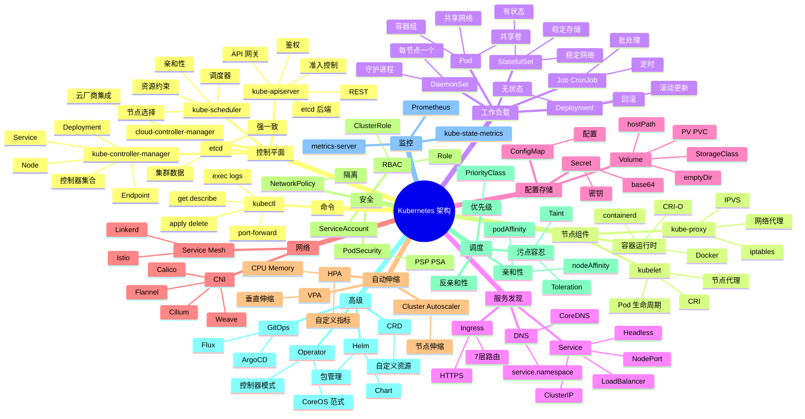

# Kubernetes (K8s)

## 一、前言

**定位**：容器编排系统的事实标准，源自 Google 内部 Borg 系统，2014 年开源，现为 CNCF 旗舰项目，统治云原生时代。

**核心价值**：
- **声明式 API**：描述期望状态，控制器自动调谐
- **自动编排**：Deployment 自愈、StatefulSet 稳定网络、HPA 自动扩缩
- **跨云可移植**：一次定义，多云（AWS/GCP/Azure/阿里云）运行
- **生态完整**：Ingress、Service Mesh、Operator、Serverless 全套
- **CNCF 核心**：围绕 K8s 构建了 1000+ 项目

**五大特性**：
1. **声明式 + 控制器模式**：kubectl apply → API Server → Controller 调谐（Reconcile Loop）
2. **Pod 抽象**：容器组（1+ 容器）+ 共享网络/存储
3. **Service + DNS**：服务发现（kube-dns / CoreDNS）
4. **Scheduler + Kubelet**：调度器决定 Pod 落点，Kubelet 启动容器
5. **CRD + Operator 范式**：自定义资源 + 自定义控制器，扩展 K8s 能力

**与同类对比**：

| 维度 | Kubernetes | Docker Swarm | Nomad | Mesos |
|---|---|---|---|---|
| 复杂度 | 高 | 低 | 中 | 高 |
| 生态 | 极大 | 小 | 中 | 中 |
| 调度 | 强 | 弱 | 强 | 强 |
| 状态负载 | 完善 | 弱 | 中 | 中 |
| 适用 | 云原生 | 小集群 | 多框架 | 大数据 |

## 二、架构思维导图



## 三、关键代码

### 1. Deployment + Service（最常见的工作负载）

```yaml
# deployment.yaml
apiVersion: apps/v1
kind: Deployment
metadata:
  name: nginx-deployment
  namespace: production
  labels:
    app: nginx
spec:
  replicas: 3                          # 副本数
  selector:
    matchLabels:
      app: nginx
  strategy:
    type: RollingUpdate
    rollingUpdate:
      maxSurge: 1                      # 滚动更新最多多 1 个 Pod
      maxUnavailable: 0                # 不可用数 0（保证 100% 可用）
  template:
    metadata:
      labels:
        app: nginx
    spec:
      containers:
      - name: nginx
        image: nginx:1.25-alpine
        ports:
        - containerPort: 80
        env:
        - name: ENV
          value: production
        envFrom:
        - configMapRef:
            name: nginx-config
        - secretRef:
            name: nginx-secret
        resources:
          requests:                     # 调度依据
            cpu: 100m
            memory: 128Mi
          limits:                       # 硬限制
            cpu: 500m
            memory: 512Mi
        readinessProbe:                 # 就绪探针（控制流量接入）
          httpGet:
            path: /healthz
            port: 80
          initialDelaySeconds: 5
          periodSeconds: 10
        livenessProbe:                  # 存活探针（失败则重启）
          httpGet:
            path: /healthz
            port: 80
          initialDelaySeconds: 15
          periodSeconds: 20
        volumeMounts:
        - name: html
          mountPath: /usr/share/nginx/html
        - name: config
          mountPath: /etc/nginx/conf.d
      volumes:
      - name: html
        configMap:
          name: html-content
      - name: config
        configMap:
          name: nginx-config
```

```yaml
# service.yaml
apiVersion: v1
kind: Service
metadata:
  name: nginx-service
  namespace: production
spec:
  selector:
    app: nginx
  ports:
  - protocol: TCP
    port: 80          # Service 端口
    targetPort: 80    # 容器端口
    nodePort: 30080   # NodePort 类型才用
  type: ClusterIP     # ClusterIP/NodePort/LoadBalancer/ExternalName
```

**解析**：
- **`replicas: 3`** + Deployment 控制器自动维持 3 个 Pod；Pod 挂了自动重建
- **滚动更新 `maxSurge: 1` + `maxUnavailable: 0`**：保证更新期间可用 Pod ≥ 3
- **就绪/存活探针分离**：就绪失败 → 流量不接入；存活失败 → 重启容器
- **resources requests/limits**：requests 用于调度决策，limits 防止容器吃光资源

### 2. ConfigMap + Secret + Volume

```yaml
# configmap.yaml
apiVersion: v1
kind: ConfigMap
metadata:
  name: nginx-config
  namespace: production
data:
  nginx.conf: |
    server {
      listen 80;
      location / {
        proxy_pass http://backend;
        proxy_set_header Host $host;
      }
    }
  max_connections: "1024"

---
# secret.yaml
apiVersion: v1
kind: Secret
metadata:
  name: nginx-secret
  namespace: production
type: Opaque
data:
  # base64 编码：echo -n "mypassword" | base64
  db-password: bXlwYXNzd29yZA==
  api-key: c2VjcmV0a2V5MTIz

---
# pv-pvc.yaml（持久化存储）
apiVersion: v1
kind: PersistentVolume
metadata:
  name: nginx-pv
spec:
  capacity:
    storage: 10Gi
  accessModes:
    - ReadWriteOnce
  persistentVolumeReclaimPolicy: Retain
  storageClassName: standard
  hostPath:
    path: /data/nginx

---
apiVersion: v1
kind: PersistentVolumeClaim
metadata:
  name: nginx-pvc
  namespace: production
spec:
  accessModes:
    - ReadWriteOnce
  resources:
    requests:
      storage: 10Gi
  storageClassName: standard

---
# 在 Deployment 里用 PVC
spec:
  template:
    spec:
      containers:
      - name: nginx
        volumeMounts:
        - name: html-storage
          mountPath: /usr/share/nginx/html
      volumes:
      - name: html-storage
        persistentVolumeClaim:
          claimName: nginx-pvc
```

**解析**：
- **ConfigMap 注入方式**：env / envFrom / volumeMount；volumeMount 支持热更新（K8s 定期重载）
- **Secret 编码非加密**：base64 编码只是避免明文；**生产用 Vault / External Secrets**
- **PV/PVC 模型**：PV 是存储资源，PVC 是消费请求；StorageClass 动态分配

### 3. Ingress（7 层路由）

```yaml
# ingress.yaml
apiVersion: networking.k8s.io/v1
kind: Ingress
metadata:
  name: app-ingress
  namespace: production
  annotations:
    nginx.ingress.kubernetes.io/rewrite-target: /
    cert-manager.io/cluster-issuer: letsencrypt-prod
spec:
  ingressClassName: nginx
  tls:
  - hosts:
    - app.example.com
    secretName: app-tls
  rules:
  - host: app.example.com
    http:
      paths:
      - path: /api
        pathType: Prefix
        backend:
          service:
            name: api-service
            port:
              number: 8080
      - path: /web
        pathType: Prefix
        backend:
          service:
            name: web-service
            port:
              number: 80
  - host: admin.example.com
    http:
      paths:
      - path: /
        pathType: Prefix
        backend:
          service:
            name: admin-service
            port:
              number: 80
```

**解析**：
- **Ingress 资源**：定义路由规则；需要 Ingress Controller（Nginx / Traefik / HAProxy）实现
- **TLS 自动签发**：cert-manager + Let's Encrypt 自动化 HTTPS 证书
- **多 host 多 path**：单 Ingress 支持多域名、多路径；生产用 `nginx.ingress.kubernetes.io/rewrite-target` 重写路径

### 4. StatefulSet + Headless Service（数据库场景）

```yaml
# statefulset.yaml（PostgreSQL 主从）
apiVersion: apps/v1
kind: StatefulSet
metadata:
  name: postgres
  namespace: database
spec:
  serviceName: postgres-headless  # 关联 Headless Service
  replicas: 3
  selector:
    matchLabels:
      app: postgres
  template:
    metadata:
      labels:
        app: postgres
    spec:
      containers:
      - name: postgres
        image: postgres:16-alpine
        ports:
        - containerPort: 5432
          name: postgres
        env:
        - name: POSTGRES_PASSWORD
          valueFrom:
            secretKeyRef:
              name: postgres-secret
              key: password
        - name: POD_NAME
          valueFrom:
            fieldRef:
              fieldPath: metadata.name
        - name: POD_NAMESPACE
          valueFrom:
            fieldRef:
              fieldPath: metadata.namespace
        volumeMounts:
        - name: data
          mountPath: /var/lib/postgresql/data
  volumeClaimTemplates:           # 自动创建 PVC 模板
  - metadata:
      name: data
    spec:
      accessModes: ["ReadWriteOnce"]
      storageClassName: ssd
      resources:
        requests:
          storage: 100Gi

---
apiVersion: v1
kind: Service
metadata:
  name: postgres-headless
  namespace: database
spec:
  clusterIP: None                # Headless Service
  selector:
    app: postgres
  ports:
  - port: 5432
    name: postgres
```

**StatefulSet 关键特性**：
- **稳定网络标识**：`postgres-0.postgres-headless.database.svc.cluster.local`
- **稳定存储**：每个 Pod 独立 PVC，Pod 重建后仍能挂载原数据
- **有序启停**：`postgres-0` 先启动，Pod-0 Ready 后才启动 Pod-1

### 5. HPA（自动伸缩）

```yaml
# hpa.yaml
apiVersion: autoscaling/v2
kind: HorizontalPodAutoscaler
metadata:
  name: web-hpa
  namespace: production
spec:
  scaleTargetRef:
    apiVersion: apps/v1
    kind: Deployment
    name: web
  minReplicas: 2
  maxReplicas: 10
  metrics:
  - type: Resource
    resource:
      name: cpu
      target:
        type: Utilization
        averageUtilization: 70
  - type: Resource
    resource:
      name: memory
      target:
        type: Utilization
        averageUtilization: 80
  - type: Pods
    pods:
      metric:
        name: http_requests_per_second
      target:
        type: AverageValue
        averageValue: "100"
  behavior:
    scaleDown:
      stabilizationWindowSeconds: 300   # 缩容前观察 5 分钟
    scaleUp:
      stabilizationWindowSeconds: 0     # 扩容立即执行
      policies:
      - type: Percent
        value: 100                       # 一次翻倍
        periodSeconds: 60
```

**解析**：
- **多指标伸缩**：CPU/内存/自定义指标（QPS/队列长度）任一达标即扩容
- **扩缩容稳定窗口**：避免抖动（防止突增流量触发频繁扩缩）
- **Custom Metrics API**：需要 `metrics-server` + `prometheus-adapter` 暴露自定义指标

## 四、核心洞察

1. **声明式 + 控制器循环是 K8s 灵魂**：`kubectl apply` 不直接执行，控制器持续监控实际状态，调谐到期望状态；这是 K8s 自愈能力的来源。
2. **Pod 是 K8s 的"原子"**：不是容器，是容器组；共享网络命名空间、共享卷；理解 Pod 才能理解 K8s。
3. **Service 只是虚拟 IP**：kube-proxy 通过 iptables/IPVS 规则把 Service IP 映射到 Pod IP；故障自动剔除健康 Pod。
4. **Scheduler 决定命运**：节点选择、资源约束、亲和性、污点容忍；复杂调度需要理解 `nodeSelector` / `nodeAffinity` / `Taint`。
5. **CRD + Operator 是扩展范式**：自定义资源（CRD）+ 自定义控制器 = Operator；etcd-operator / postgres-operator / kafka-operator 都是这个范式。
6. **Ingress 不是 L4 负载均衡**：是 L7 HTTP 路由；需要选择 Ingress Controller（Nginx/Traefik/HAProxy），不是 K8s 自带组件。
7. **生产必装组件**：metrics-server（资源指标）、kube-state-metrics（K8s 对象指标）、Ingress Controller、Cert-Manager（证书）、Prometheus（监控）。
8. **GitOps 是 K8s 部署最佳实践**：ArgoCD / Flux 监听 Git 仓库，自动同步；K8s 配置即代码，版本可追溯。

## 五、跨项目引用

- [./etcd.md](./etcd.md) — K8s 所有数据存 etcd；etcd 故障 = K8s 故障
- [./docker.md](./docker.md) — K8s 不构建镜像，只调度容器；Docker 是构建工具
- [./prometheus.md](./prometheus.md) — K8s 监控事实标准，配合 Grafana
- [./nginx.md](./nginx.md) — Nginx Ingress 是 K8s 最常用 Ingress Controller
- [./traefik.md](./traefik.md) — Traefik 是云原生时代的 Ingress 替代
- [./istio.md](./istio.md) — Istio Service Mesh 与 K8s 深度集成
- [./helm.md](./helm.md) — Helm 是 K8s 包管理工具
- [./argocd.md](./argocd.md) — ArgoCD 实现 GitOps 部署
