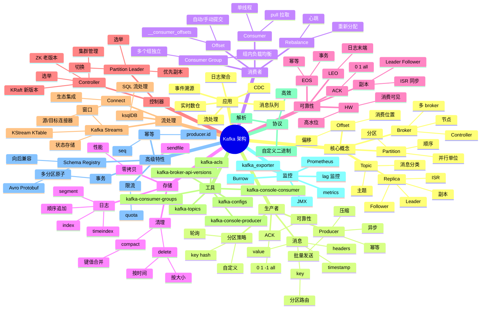

# Kafka

## 一、前言

**定位**：分布式**事件流平台**（Event Streaming Platform），由 LinkedIn 2010 年开源，现为 Apache 顶级项目，可作消息队列、日志聚合、流处理、CDC 多种用途。

**核心价值**：
- **高吞吐**：单机百万级 QPS，远超 RabbitMQ / RocketMQ
- **持久化**：消息落盘 + 副本机制，可重放历史
- **水平扩展**：Topic 分区（Partition）+ Consumer Group 并行消费
- **生态成熟**：Kafka Streams / ksqlDB / Kafka Connect / Schema Registry
- **流处理能力**：与 Flink / Spark 集成，构建实时数仓

**五大特性**：
1. **顺序写入 + 零拷贝**：磁盘顺序写性能接近内存；`sendfile()` 系统调用零拷贝消费
2. **分区模型**：Topic 拆成 N 个 Partition，并行生产/消费
3. **Consumer Group**：组内每个分区只被一个消费者消费，组间互不影响
4. **精确一次语义（EOS）**：3.0+ 通过事务 + 幂等实现 exactly-once
5. **流处理一体化**：Kafka Streams / ksqlDB 一站式事件流

**与同类对比**：

| 维度 | Kafka | RabbitMQ | RocketMQ | Pulsar |
|---|---|---|---|---|
| 吞吐 | 百万级 | 万级 | 十万级 | 百万级 |
| 延迟 | 10ms+ | 微秒级 | 10ms+ | 10ms+ |
| 顺序 | 分区有序 | 队列有序 | 队列有序 | 分区有序 |
| 协议 | 自定义 | AMQP | 自定义 | 自定义 |
| 适用 | 日志/流处理 | 业务消息 | 业务消息 | 云原生 |

## 二、架构思维导图



## 三、关键代码

### 1. 生产者（Python）

```python
from kafka import KafkaProducer
from kafka.errors import KafkaError
import json

# 1. 创建生产者
producer = KafkaProducer(
    bootstrap_servers=['kafka-1:9092', 'kafka-2:9092', 'kafka-3:9092'],
    # 序列化
    key_serializer=lambda k: k.encode('utf-8') if k else None,
    value_serializer=lambda v: json.dumps(v).encode('utf-8'),
    # 压缩
    compression_type='gzip',  # none/gzip/snappy/lz4/zstd
    # 批量发送
    batch_size=16384,  # 16KB 批量
    linger_ms=10,      # 最多等 10ms 凑批
    # 可靠性
    acks='all',        # 0/1/all
    retries=3,
    # 幂等
    enable_idempotence=True,  # 5.0+ 默认开启
    # 缓冲
    buffer_memory=33554432,  # 32MB
)

# 2. 同步发送
def send_sync():
    try:
        future = producer.send(
            'orders',
            key='order-1001',
            value={'product_id': 2001, 'qty': 3, 'user_id': 1001},
            headers=[('source', b'web')],
        )
        # 阻塞等待结果
        record_metadata = future.get(timeout=10)
        print(f"Topic: {record_metadata.topic}")
        print(f"Partition: {record_metadata.partition}")
        print(f"Offset: {record_metadata.offset}")
        print(f"Timestamp: {record_metadata.timestamp}")
    except KafkaError as e:
        print(f"Send failed: {e}")

# 3. 异步发送 + 回调
def send_async():
    def on_success(record_metadata):
        print(f"Produced: {record_metadata.topic}-{record_metadata.partition}@{record_metadata.offset}")

    def on_error(excp):
        print(f"Error: {excp}")

    # 批量发送
    for i in range(1000):
        producer.send(
            'orders',
            key=f'order-{i}',
            value={'order_id': i, 'amount': 99.9 * i},
        ).add_callback(on_success).add_errback(on_error)

    # 等待所有消息发送完成
    producer.flush()
    producer.close(timeout=30)

# 4. 自定义分区
producer.send(
    'orders',
    key='order-1001',  # 相同 key 进同一分区（保证顺序）
    value=order_data,
    # partition=0,  # 也可显式指定
)

# 5. 事务
def send_transaction():
    producer.init_transactions()
    try:
        producer.begin_transaction()
        producer.send('orders', value=order1)
        producer.send('inventory', value=inventory_update)
        producer.commit_transaction()
    except Exception:
        producer.abort_transaction()
```

**解析**：
- **`acks='all'` + `enable_idempotence=True`** 是生产级推荐配置：保证不丢 + 不重复
- **`linger_ms=10`** 让 producer 等 10ms 凑批：吞吐提升 5-10 倍，延迟可接受
- **key 决定分区**：相同 key 永远进同一分区，**保证顺序**；如订单事件用 `order_id` 作 key
- **事务保证多 topic 原子**：库存扣减失败时订单消息也不发出

### 2. 消费者（Python）

```python
from kafka import KafkaConsumer
from kafka.structs import TopicPartition
import json

# 1. 基础消费者
consumer = KafkaConsumer(
    'orders',
    bootstrap_servers=['kafka-1:9092', 'kafka-2:9092', 'kafka-3:9092'],
    # 自动提交（不推荐）
    enable_auto_commit=False,  # 手动提交 offset
    auto_offset_reset='earliest',  # 'earliest' / 'latest' / 'none'
    # 消费者组（必需）
    group_id='order-processors',
    # 批量消费
    max_poll_records=500,
    max_poll_interval_ms=300000,  # 5 分钟
    # 反序列化
    key_deserializer=lambda k: k.decode('utf-8') if k else None,
    value_deserializer=lambda v: json.loads(v.decode('utf-8')),
    # 隔离级别
    isolation_level='read_committed',  # 读已提交
    # 会话超时
    session_timeout_ms=30000,  # 30 秒
    heartbeat_interval_ms=10000,  # 10 秒
)

# 2. 消费循环
for message in consumer:
    # message 是 ConsumerRecord
    print(f"Topic: {message.topic}")
    print(f"Partition: {message.partition}")
    print(f"Offset: {message.offset}")
    print(f"Key: {message.key}")
    print(f"Value: {message.value}")
    print(f"Timestamp: {message.timestamp}")
    print(f"Headers: {message.headers}")
    
    # 业务处理
    process_order(message.value)
    
    # 手动提交（推荐）
    consumer.commit()

# 3. 手动分配分区（更精细控制）
consumer = KafkaConsumer(
    bootstrap_servers=['kafka-1:9092'],
    group_id='manual-assign',
    enable_auto_commit=False,
)

# 分配特定分区
consumer.assign([
    TopicPartition('orders', 0),
    TopicPartition('orders', 1),
])

# 定位 offset
consumer.seek(TopicPartition('orders', 0), 0)  # 从头开始
consumer.seek_to_beginning(TopicPartition('orders', 1))  # 或用 seek_to_beginning

# 4. 消费特定位置
from kafka import TopicPartition
tp = TopicPartition('orders', 0)
consumer.assign([tp])
# 从指定 offset 开始
consumer.seek(tp, 1000)
# 从时间戳开始
import time
consumer.offsets_for_times({tp: int(time.time() * 1000)})

# 5. 优雅关闭
import signal
def shutdown(signum, frame):
    consumer.close()
    exit(0)
signal.signal(signal.SIGTERM, shutdown)
signal.signal(signal.SIGINT, shutdown)
```

**解析**：
- **`enable_auto_commit=False` + 手动 commit**：避免"处理失败但已提交"，导致消息丢失
- **`group_id` 是消费者组标识**：相同 group_id 的消费者共同消费；不同 group_id 独立消费
- **Rebalance 机制**：组内消费者增/减时，分区重新分配；期间会暂停消费
- **手动 assign() 绕过 group**：用于精确控制消费某几个分区，避免 Rebalance 开销

### 3. Kafka Streams（流处理）

```java
// Kafka Streams：实时流处理
StreamsBuilder builder = new StreamsBuilder();

KStream<String, Order> orders = builder.stream(
    "orders",
    Consumed.with(Serdes.String(), new OrderSerde())  // 自定义序列化
);

// 1. 过滤 + 转换
KStream<String, EnrichedOrder> enriched = orders
    .filter((key, order) -> order.getAmount() > 100)
    .mapValues(order -> {
        order.setVip(true);
        return order;
    });

// 2. 分组聚合
KTable<String, Double> userTotal = orders
    .groupByKey()
    .aggregate(
        () -> 0.0,
        (key, order, total) -> total + order.getAmount(),
        Materialized.<String, Double, KeyValueStore<Bytes, byte[]>>as("user-total-store")
    );

// 3. 窗口聚合（5 分钟滚动窗口）
KTable<Windowed<String>, Long> ordersPer5Min = orders
    .groupByKey()
    .windowedBy(TimeWindows.ofSizeAndGrace(Duration.ofMinutes(5), Duration.ofMinutes(1)))
    .count();

// 4. 状态存储
StateStoreSupplier<KeyValueStore<String, Long>> store = Stores
    .keyValueStoreBuilder(
        Stores.persistentKeyValueStore("user-counts"),
        Serdes.String(),
        Serdes.Long()
    );

builder.addStateStore(store);

// 5. 写入输出
enriched.to("enriched-orders", Produced.with(Serdes.String(), new EnrichedOrderSerde()));

// 6. 启动
KafkaStreams streams = new KafkaStreams(builder.build(), props);
streams.start();

Runtime.getRuntime().addShutdownHook(new Thread(streams::close));
```

**解析**：
- **KStream vs KTable**：KStream 是事件流（不可变），KTable 是当前状态（changelog）
- **窗口**：滚动（Tumbling）、滑动（Sliding）、会话（Session）
- **状态存储 RocksDB**：本地持久化，支持 exactly-once
- **EOS 实现**：通过事务 + 幂等 + 状态存储 checkpoint

### 4. 监控 lag

```bash
# 1. 消费者组 lag
kafka-consumer-groups.sh \
  --bootstrap-server kafka-1:9092 \
  --describe \
  --group order-processors

# 输出：
# GROUP             TOPIC    PARTITION  CURRENT-OFFSET  LOG-END-OFFSET  LAG     CONSUMER-ID
# order-processors  orders   0          1000            1010            10      consumer-1
# order-processors  orders   1          2000            2015            15      consumer-2

# 2. 监控告警（Prometheus + Burrow）
# Burrow 是 LinkedIn 开源的 lag 监控
# 配置：consumer-group、kafka cluster、alert thresholds

# 3. 关键指标
# - consumer_lag：消费滞后（最关键）
# - records_consumed_rate
# - bytes_consumed_rate
# - rebalance_rate_per_hour
# - request_latency_avg
```

**监控告警规则**（PromQL）：
```promql
# Lag > 10000 持续 5 分钟告警
sum by (topic, partition) (kafka_consumergroup_lag) > 10000
```

## 四、核心洞察

1. **顺序写 + 零拷贝是性能关键**：磁盘顺序写 600MB/s，接近内存；`sendfile()` 跳过用户态拷贝，消费性能提升 3-5 倍。
2. **Partition 是并行单位**：增加 Partition 数量可提高吞吐（最多到 Broker 数量级），但 Partition 数量上线后会增加元数据开销（建议单 Topic < 1000）。
3. **Consumer Group 实现"队列"语义**：组内每条消息只被一个消费者处理；多个独立组可重复消费（"发布订阅"）。
4. **Kafka 不删除已消费消息**：和 RabbitMQ 完全不同；消息可被保留几天甚至永久，配合 Kafka Connect / Spark 实现数据回溯。
5. **EOS 靠幂等 + 事务 + offset 原子提交**：Producer 端用 PID + seq 实现幂等；事务把消息 + offset + 状态存储原子提交。
6. **ZK 退场是 Kafka 3.3+ 大事件**：KRaft（基于 Raft 的 Controller）取代 ZK 依赖，运维更简单（少一个组件），但生态还在迁移。
7. **日志压缩（Log Compaction）**：Kafka 1.0+ 引入，保留每个 key 的最新 value，**适合 changelog 场景**（如 KTable 状态）。
8. **Kafka 不仅是 MQ**：是**事件流平台**——日志聚合、CDC、流处理、事件溯源都能干；与 Flink 配合是实时数仓的核心。

## 五、跨项目引用

- [./rabbitmq.md](./rabbitmq.md) — RabbitMQ 适合业务消息（事务、复杂路由），Kafka 适合日志/流
- [./redis.md](./redis.md) — Redis Stream 是轻量 MQ，Kafka 是分布式流平台
- [./flink.md](./flink.md) — Flink + Kafka 是实时数仓黄金组合
- [./prometheus.md](./prometheus.md) — kafka_exporter 暴露 lag 等指标
- [./k8s.md](./k8s.md) — Kafka 集群用 StatefulSet 部署在 K8s 上（Strimzi Operator）
- [./grpc.md](./grpc.md) — Kafka 内部通信、Schema Registry 通信都基于 gRPC
- [./etcd.md](./etcd.md) — Kafka 老版本依赖 ZK，类似 etcd 角色
- [./clickhouse.md](./clickhouse.md) — Kafka + ClickHouse 是流式数据入仓经典组合
