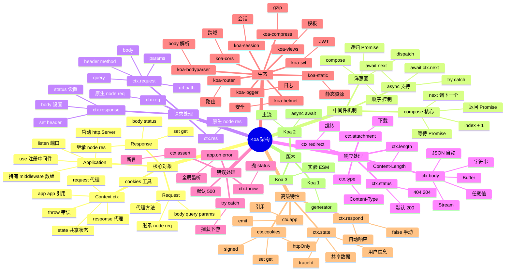

# Koa

## 一、前言

**定位**：由 Express 原班人马（TJ Holowaychuk）打造的下一代 Node.js Web 框架，2013 年发布，是"中间件洋葱圈模型"的代表。

**核心价值**：
- **async/await 原生**：中间件函数可以是 async，自动 `await` 后续 next
- **极简内核**：核心代码 ~1500 行，无任何内置中间件（路由、静态、body 解析全部靠生态）
- **Context 统一请求/响应**：`ctx` 对象把 `req` / `res` / 自定义属性整合成一个上下文
- **错误处理语义化**：`try { await next() } catch (e) { ctx.throw }` 一气呵成

**五大特性**：
1. **洋葱圈中间件**：请求从上到下，响应从下到上，可在响应阶段写逻辑
2. **ctx.request / ctx.response**：request/response 的代理（委托），访问 `ctx.body` 即 `ctx.response.body`
3. **ctx.state**：跨中间件共享状态（登录用户、CSRF token 等）
4. **错误冒泡**：async 抛错自动被上层 try/catch 捕获
5. **无内置依赖**：所有能力（路由、模板、压缩）由 `koa-router` / `koa-bodyparser` / `koa-static` 等社区提供

**与 Express 核心差异**：

| 维度 | Express | Koa |
|---|---|---|
| 中间件模型 | 顺序执行，回调式 | 洋葱圈，async/await |
| 错误处理 | 4 参数中间件 / next(err) | try/catch 自然捕获 |
| 内核 | 含 router | 不含 router |
| 上下文 | req / res 分开 | ctx 统一 |
| 异步支持 | 需 asyncHandler 包装 | 原生支持 |
| 性能 | 30k req/s | 35k req/s（更优） |
| 学习曲线 | 低 | 中（需懂 async） |

## 二、架构思维导图



## 三、关键代码

### 1. 洋葱圈核心：koa-compose（lib/compose.js）

```js
// koa-compose：把中间件数组变成"洋葱圈"
function compose(middleware) {
  // middleware: [(ctx, next) => Promise]

  return function dispatch(context, next) {
    // 1. last called middleware #
    let index = -1;
    return next(0);

    function next(i) {
      if (i <= index) {
        // 防止 next() 多次调用
        return Promise.reject(new Error('next() called multiple times'));
      }
      index = i;

      let fn = middleware[i];
      if (i === middleware.length) fn = next; // 末位：用外部 next
      if (!fn) return Promise.resolve();

      try {
        // 2. 关键：fn(ctx, dispatch.bind(null, i + 1))
        //    i+1 才是"内层"
        return Promise.resolve(fn(context, dispatch.bind(null, i + 1)));
      } catch (err) {
        return Promise.reject(err);
      }
    }
  };
}
```

**解析**：
- **递归是洋葱圈本质**：第一次调用 `next(0)` → middleware[0] → `await next()` → `next(1)` → middleware[1] → ...
- **调用栈**：`m1 start → m2 start → m3 start → 处理 → m3 end → m2 end → m1 end`
- **错误传播**：任何一层 throw，外层 `try/catch` 或 `.catch` 都能捕获（前提是 `await`）

### 2. Application 启动流程（lib/application.js）

```js
// 简化的 Koa Application
class Application extends Emitter {
  constructor() {
    super();
    this.proxy = false;
    this.middleware = [];
    this.context = Object.create(context);
    this.request = Object.create(request);
    this.response = Object.create(response);
  }

  use(fn) {
    if (typeof fn !== 'function') throw new TypeError('middleware must be a function');
    this.middleware.push(fn);
    return this; // 链式
  }

  // 创建独立 ctx（每个请求一个）
  createContext(req, res) {
    const ctx = Object.create(this.context);
    const request = ctx.request = Object.create(this.request);
    const response = ctx.response = Object.create(this.response);

    ctx.app = request.app = response.app = this;
    ctx.req = request.req = response.req = req;
    ctx.res = request.res = response.res = res;
    request.ctx = response.ctx = ctx;
    request.response = response;
    response.request = request;
    ctx.state = {};
    return ctx;
  }

  // 核心：处理请求
  handleRequest(ctx, fnMiddleware) {
    // 1. 错误兜底
    const handleResponse = () => respond(ctx);
    ctx.onfinish = handleResponse;
    onFinished(ctx.res, onerror);

    // 2. 调用 compose 链
    const onerror = err => ctx.onerror(err);
    const handleRequest = () => {
      const ret = fnMiddleware(ctx).then(handleResponse).catch(onerror);
      // 3. 把 ctx.body 写入 res
      ret.catch(onerror);
    };
    handleRequest();
  }

  listen(...args) {
    const server = http.createServer(this.callback());
    return server.listen(...args);
  }

  callback() {
    const fn = compose(this.middleware);
    return (req, res) => {
      const ctx = this.createContext(req, res);
      return this.handleRequest(ctx, fn);
    };
  }
}
```

**解析**：
- **每个请求一个 ctx**：通过 `Object.create(this.context)` 隔离，避免共享
- **request / response 代理 ctx**：访问 `ctx.body` 实际是 `ctx.response.body`
- **`compose(middleware)`** 一次性生成洋葱圈链；每个请求只是调用这个链

### 3. ctx.body 智能响应（lib/response.js）

```js
// 简化版 set body
set body(val) {
    const original = this._body;
    this._body = val;

    // no content
    if (val == null) {
      if (!statuses.empty[this.status]) {
        if (this.type === 'application/json') {
          this._body = 'null';
          return;
        }
        this.status = 204;
      }
      if (val === null) this._explicitNullBody = true;
      this.remove('Content-Type');
      this.remove('Content-Length');
      this.remove('Transfer-Encoding');
      return;
    }

    // set the status
    if (!this._explicitStatus) this.status = 200;

    // set the content-type only if not explicitly set
    if (setType) this.type = setType;

    // string
    if (typeof val === 'string') return;

    // buffer
    if (Buffer.isBuffer(val)) {
      if (setType) this.type = 'application/octet-stream';
      if (this.length == null) this.length = val.length;
      return;
    }

    // stream
    if (val instanceof Stream) {
      this.type = 'application/octet-stream';
      this.length = val.length; // 可能在 ondata 时变更
      this.body = val.pipe(createResStream(this.res));
      return;
    }

    // json
    this.remove('Content-Length');
    this.type = 'application/json';
    this.body = JSON.stringify(val);
}

// 实际写入 res
function respond(ctx) {
  if (ctx.respond === false) return; // 手动接管
  if (!ctx.writable) return;

  const res = ctx.res;
  let body = ctx.body;
  const code = ctx.status;

  // ignore body
  if (statuses.empty[code]) {
    // strip headers
    ctx.body = null;
    return res.end();
  }

  if (ctx.method === 'HEAD') {
    if (!res.headersSent && !ctx.response.has('Content-Length')) {
      const { length } = ctx.response;
      if (Number.isInteger(length)) ctx.length = length;
    }
    return res.end();
  }

  // status body
  if (null == body) {
    if (ctx.response._explicitNullBody) {
      ctx.response.remove('Content-Length');
      return res.end();
    }
    if (ctx.req.httpVersionMajor >= 2) body = String(code);
    else body = ctx.message || String(code);
    if (!res.headersSent) ctx.type = 'text';
    ctx.length = Buffer.byteLength(body);
    return res.end(body);
  }

  // responses
  if (Buffer.isBuffer(body)) return res.end(body);
  if (typeof body === 'string') return res.end(body);
  if (body instanceof Stream) return body.pipe(res);
  body = JSON.stringify(body);
  if (!res.headersSent) ctx.length = Buffer.byteLength(body);
  res.end(body);
}
```

**解析**：
- **body setter 智能识别**：string / Buffer / Stream / Object → 不同处理
- **204 / 205 / 304 等空 body 状态码**自动剥 Content-Type / Content-Length
- **HEAD 请求**只返回 headers，不返回 body

### 4. 实战：洋葱圈中间件

```js
const Koa = require('koa');
const app = new Koa();

// 中间件 1：日志（请求开始）
app.use(async (ctx, next) => {
  const start = Date.now();
  console.log(`[REQ] ${ctx.method} ${ctx.url}`);

  try {
    await next();  // 等待下游完成
  } catch (err) {
    // 统一错误处理
    ctx.status = err.status || 500;
    ctx.body = { error: err.message };
    ctx.app.emit('error', err, ctx);
  }

  const ms = Date.now() - start;
  console.log(`[RES] ${ctx.status} ${ctx.url} - ${ms}ms`);
});

// 中间件 2：用户认证
app.use(async (ctx, next) => {
  const token = ctx.headers.authorization;
  if (token) {
    ctx.state.user = await verifyToken(token);
  }
  await next();
});

// 中间件 3：业务路由
const Router = require('@koa/router');
const router = new Router();

router.get('/api/users', async (ctx) => {
  const users = await db.users.find({ tenant: ctx.state.user.tenant });
  ctx.body = users;
});

router.post('/api/users', async (ctx) => {
  const user = await db.users.create(ctx.request.body);
  ctx.status = 201;
  ctx.body = user;
});

app.use(router.routes());
app.use(router.allowedMethods());

app.listen(3000, () => console.log('Server running on 3000'));
```

**洋葱圈调用栈**：
```
请求 → 日志(start) → 认证 → 路由处理 → 路由返回
    ← 认证(end)    ← 日志(end)
```

**解析**：
- **`ctx.state` 跨中间件共享**：认证后把 `user` 放进 state，下游路由直接用
- **错误在日志中间件集中捕获**：所有下游 throw 都被日志层的 try/catch 接住
- **日志层拿到的是完整耗时**：因为它等 `await next()` 完成后才打日志

## 四、核心洞察

1. **洋葱圈是 async/await 的天然形态**：在回调时代无法实现"等下游完成再回写响应"，async/await 让递归调用栈清晰可见。
2. **ctx 是 Proxy 的艺术**：Koa 用 `Object.create` + getter 代理实现 `ctx.body` ↔ `ctx.response.body`，所有访问都"看起来直接"，实际走委托。
3. **极简内核 + 强大生态**：Koa 自身只 1500 行，但 `koa-router` + `koa-bodyparser` + `koa-jwt` 生态能搭出企业级服务。
4. **try/catch 替代 next(err)**：async 错误自然冒泡，错误处理代码量减少 50%；这是 async/await 普及后 Web 框架的范式革新。
5. **Koa 2 vs Koa 1**：1.x 用 generator（`function*(next){ yield next }`），2.x 用 async/await；2.x 是事实标准。
6. **ctx.state 替代全局变量**：跨中间件传数据用 `ctx.state.user`，避免污染全局；Koa 推荐用 `state` 共享请求级数据。
7. **与 Express 共存可平滑迁移**：`koa-convert` 可把 Express 中间件转成 Koa 2 中间件，适合渐进式迁移。
8. **Koa 不含路由是正确的选择**：路由策略差异太大（RESTful / GraphQL / RPC），不强加能让框架保持纯粹。

## 五、跨项目引用

- [./express.md](./express.md) — Koa 是 Express 团队原班人马打造，吸取 Express 中间件经验
- [./nest.md](./nest.md) — NestJS 可基于 Express 或 Fastify 平台
- [./fastify.md](./fastify.md) — Fastify 是 Koa 的性能对手
- [./node.md](./node.md) — Koa 内部用 `http.createServer` 启动
- [./deno.md](./deno.md) — Deno 生态的 Hono / Oak 框架参考 Koa 洋葱圈
- [./bun.md](./bun.md) — Bun 的内置 HTTP 服务 API 风格类似 Koa
- [../A-前端框架/koa.md](../A-前端框架/koa.md) — Koa 在前端的 SSR 场景应用（Nuxt/Next 内部都用类似思路）
- [./graphql.md](./graphql.md) — `koa-graphql` 是 Apollo Server 的 Koa 适配
