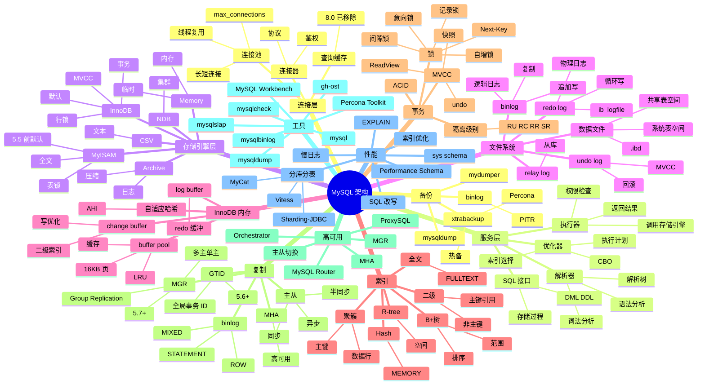

# MySQL

## 一、前言

**定位**：世界上最流行的开源**关系型数据库**，由瑞典 MySQL AB 公司 1995 年发布，2008 年被 Sun 收购，2010 年随 Sun 被 Oracle 收购。当前有 MySQL（Oracle 维护）和 MariaDB（社区维护）两个分支。

**核心价值**：
- **稳定可靠**：ACID 事务、崩溃恢复、主从复制，20+ 年生产验证
- **高性能**：InnoDB 引擎行锁 + MVCC，单机几万 QPS
- **简单易用**：相比 PG 部署更简单、运维成熟、文档丰富
- **生态繁荣**：WordPress / Magento / Discuz 等 CMS 几乎都默认 MySQL
- **云数据库基础**：AWS RDS / 阿里云 RDS / 腾讯云 CDB 全部基于 MySQL

**五大特性**：
1. **InnoDB 引擎**：行锁、MVCC、外键、事务
2. **多存储引擎**：InnoDB / MyISAM / Memory / Archive，可按场景选
3. **主从复制**：binlog + relay log，异步/半同步/同步多种模式
4. **分区表**：RANGE / LIST / HASH / KEY 分区，水平拆分
5. **连接池**：自带连接管理，配合 Druid / HikariCP / ProxySQL

**与 PG 对比**：

| 维度 | MySQL | PostgreSQL |
|---|---|---|
| 引擎 | 多引擎（InnoDB 主流） | 单引擎 |
| MVCC | undo log | xmin/xmax |
| SQL 兼容 | 偏离标准 | 高度兼容 |
| JSON | JSON 类型 | JSONB |
| 扩展 | 中 | 极强 |
| 部署 | 简单 | 中等 |
| 适用 | Web OLTP | 复杂业务/分析 |

## 二、架构思维导图



## 三、关键代码

### 1. 基础 SQL + 索引

```sql
-- 1. 建表
CREATE TABLE users (
    id BIGINT UNSIGNED PRIMARY KEY AUTO_INCREMENT,
    username VARCHAR(50) UNIQUE NOT NULL,
    email VARCHAR(100) NOT NULL,
    password_hash CHAR(60) NOT NULL,         -- bcrypt
    status TINYINT DEFAULT 1,                -- 1=active 0=disabled
    created_at TIMESTAMP DEFAULT CURRENT_TIMESTAMP,
    updated_at TIMESTAMP DEFAULT CURRENT_TIMESTAMP ON UPDATE CURRENT_TIMESTAMP,
    INDEX idx_email (email),
    INDEX idx_created (created_at)
) ENGINE=InnoDB DEFAULT CHARSET=utf8mb4 COLLATE=utf8mb4_unicode_ci;

-- 2. CRUD
INSERT INTO users (username, email, password_hash) VALUES
('alice', 'alice@example.com', '$2a$10$...'),
('bob', 'bob@example.com', '$2a$10$...');

-- 批量插入（性能优化）
INSERT INTO users (username, email, password_hash) VALUES
('user1', 'u1@example.com', '...'),
('user2', 'u2@example.com', '...'),
('user3', 'u3@example.com', '...');

-- 查询
SELECT id, username, email, created_at
FROM users
WHERE status = 1
  AND created_at >= '2024-01-01'
ORDER BY created_at DESC
LIMIT 20 OFFSET 0;

-- 更新
UPDATE users SET status = 0 WHERE id = 1001;

-- 3. 索引
-- 单列索引
CREATE INDEX idx_email ON users(email);

-- 联合索引（最左前缀）
CREATE INDEX idx_status_created ON users(status, created_at);

-- 唯一索引
CREATE UNIQUE INDEX uk_email ON users(email);

-- 覆盖索引（避免回表）
CREATE INDEX idx_username_created ON users(username, created_at);
-- SELECT username, created_at FROM users WHERE username = 'alice'; -- 索引覆盖

-- 4. EXPLAIN 分析
EXPLAIN SELECT * FROM users WHERE email = 'alice@example.com'\G
-- type: const           最佳（主键/唯一索引等值）
-- type: ref             较好（非唯一索引等值）
-- type: range           一般（索引范围）
-- type: index           差（全索引扫描）
-- type: ALL             最差（全表扫描）
```

**解析**：
- **`utf8mb4`** 是必须的：`utf8` 在 MySQL 中只支持 3 字节（无法存 emoji），`utf8mb4` 是真正的 UTF-8
- **联合索引最左前缀**：`idx(a,b,c)` 可加速 `WHERE a=?` / `WHERE a=? AND b=?`，但不能加速 `WHERE b=?`
- **覆盖索引**：`SELECT` 字段都在索引中时，不需要回表查数据行，性能提升 3-5 倍
- **EXPLAIN `type`**：从 const → ref → range → index → ALL 性能递减

### 2. 事务与锁

```sql
-- 1. 事务
BEGIN;
    UPDATE accounts SET balance = balance - 100 WHERE user_id = 1;
    UPDATE accounts SET balance = balance + 100 WHERE user_id = 2;
COMMIT;

-- 回滚
BEGIN;
    UPDATE accounts SET balance = balance - 100 WHERE user_id = 1;
    -- 失败
    ROLLBACK;

-- Savepoint
BEGIN;
    INSERT INTO orders (user_id, amount) VALUES (1, 100);
    SAVEPOINT sp1;
    INSERT INTO order_items (order_id, product_id) VALUES (LAST_INSERT_ID(), 999);
    -- 失败回滚到 sp1
    ROLLBACK TO sp1;
COMMIT;

-- 2. 隔离级别
SET SESSION TRANSACTION ISOLATION LEVEL REPEATABLE READ;
-- MySQL 默认 RR

-- 3. 锁
-- 行锁（InnoDB）
SELECT * FROM users WHERE id = 1001 FOR UPDATE;       -- X 锁
SELECT * FROM users WHERE id = 1001 LOCK IN SHARE MODE; -- S 锁

-- 4. 死锁检测
-- InnoDB 自动检测死锁，回滚代价小的事务
-- 避免死锁：按相同顺序访问多表、缩短事务、降低隔离级别

-- 5. 乐观锁
CREATE TABLE products (
    id BIGINT UNSIGNED PRIMARY KEY AUTO_INCREMENT,
    name VARCHAR(100),
    stock INT,
    version INT DEFAULT 0
);

UPDATE products
SET stock = stock - 1, version = version + 1
WHERE id = 1 AND version = 5;
-- 0 rows affected → 重试

-- ============================================================================

-- 6. SELECT FOR UPDATE SKIP LOCKED（任务队列）
-- 高效并发：跳过已锁定的行
SELECT id, data FROM jobs
WHERE status = 'pending'
ORDER BY id
LIMIT 10
FOR UPDATE SKIP LOCKED;
-- Worker A 锁住前 10 行，Worker B 直接跳到第 11 行
```

**解析**：
- **MySQL 默认 RR**：InnoDB 用 next-key locking 防幻读（间隙锁 + 记录锁）
- **`FOR UPDATE SKIP LOCKED`** 8.0+：任务队列神器，避免 worker 互相等待
- **乐观锁适用低竞争**，**悲观锁适用高竞争**；选择错误会成性能瓶颈
- **死锁不是 bug**：并发系统固有特性，关键是**控制死锁频率**（< 1次/分钟）

### 3. 主从复制

```sql
-- 主库配置（my.cnf）
[mysqld]
server-id = 1
log_bin = /var/log/mysql/mysql-bin.log
binlog_format = ROW                  -- ROW/STATEMENT/MIXED
gtid_mode = ON
enforce_gtid_consistency = ON
sync_binlog = 1                      -- 每次事务 fsync
innodb_flush_log_at_trx_commit = 1   -- ACID 级别

-- 创建复制用户
CREATE USER 'repl_user'@'%' IDENTIFIED BY 'repl_password';
GRANT REPLICATION SLAVE ON *.* TO 'repl_user'@'%';
FLUSH PRIVILEGES;

-- 从库配置
[mysqld]
server-id = 2
relay_log = /var/log/mysql/mysql-relay.log
gtid_mode = ON
enforce_gtid_consistency = ON
read_only = ON                       -- 防止从库误写
log_slave_updates = ON               -- 级联复制需要

-- 从库启动复制（GTID 模式）
CHANGE MASTER TO
    MASTER_HOST = '10.0.1.10',
    MASTER_USER = 'repl_user',
    MASTER_PASSWORD = 'repl_password',
    MASTER_AUTO_POSITION = 1;        -- GTID 自动定位

START SLAVE;
SHOW SLAVE STATUS\G
-- 重点看：
-- Slave_IO_Running: Yes
-- Slave_SQL_Running: Yes
-- Seconds_Behind_Master: 0
```

**复制模式**：
- **异步复制**：主库提交后立即返回，从库可能落后（默认）
- **半同步复制**：至少一个从库 ack 后才返回（5.7+ 默认）
- **同步复制**：所有从库都 ack（性能差，几乎不用）

**主从切换方案**：
- **MHA（Master High Availability）**：MHA Manager 监控 + 自动选主
- **MGR（Group Replication）**：5.7+ 官方多主/单主方案
- **Orchestrator**：GitHub 开源，Web 界面管理
- **ProxySQL**：代理层做读写分离 + 故障转移

### 4. JSON 与全文搜索

```sql
-- 1. JSON 类型
CREATE TABLE products (
    id BIGINT UNSIGNED PRIMARY KEY AUTO_INCREMENT,
    name VARCHAR(100),
    attrs JSON,
    INDEX idx_attrs ((CAST(attrs->>'$.brand' AS CHAR(50))))
);

INSERT INTO products (name, attrs) VALUES
('iPhone', '{"brand": "Apple", "price": 999, "specs": {"ram": 6, "storage": 128}}'),
('Pixel', '{"brand": "Google", "price": 799, "specs": {"ram": 8, "storage": 128}}');

-- JSON 操作
SELECT name, attrs->>'$.brand' AS brand FROM products;
SELECT * FROM products WHERE JSON_EXTRACT(attrs, '$.brand') = 'Apple';
SELECT * FROM products WHERE attrs->>'$.brand' = 'Apple';
SELECT * FROM products WHERE CAST(attrs->>'$.price' AS UNSIGNED) > 800;

-- JSON 函数
SELECT
    name,
    JSON_OBJECT('brand', attrs->>'$.brand', 'price', attrs->>'$.price') AS info
FROM products;

SELECT
    name,
    JSON_LENGTH(attrs, '$.specs') AS num_specs
FROM products;

-- 2. 全文搜索
CREATE TABLE articles (
    id INT UNSIGNED PRIMARY KEY AUTO_INCREMENT,
    title VARCHAR(200),
    body TEXT,
    FULLTEXT INDEX ft_idx (title, body) WITH PARSER ngram       -- 中文分词
) ENGINE=InnoDB;

-- 自然语言搜索
SELECT * FROM articles
WHERE MATCH(title, body) AGAINST('PostgreSQL' IN NATURAL LANGUAGE MODE);

-- 布尔搜索
SELECT * FROM articles
WHERE MATCH(title, body) AGAINST('+MySQL -Oracle' IN BOOLEAN MODE);
-- + 必须包含  - 排除  * 通配  "..." 短语

-- 中文搜索
INSERT INTO articles (title, body) VALUES
('数据库教程', '学习 MySQL 基础知识'),
('MySQL 全文搜索', '使用 ngram 解析器');

SELECT * FROM articles
WHERE MATCH(title, body) AGAINST('MySQL' IN BOOLEAN MODE);
```

**解析**：
- **MySQL JSON 比 PG JSONB 弱**：JSON 函数较基础，**没有操作符索引**（PG `@>` + GIN 索引组合）
- **`WITH PARSER ngram`** 是 MySQL 5.7+ 的中文分词器，绕开词库问题
- **全文搜索规模小时用 MySQL，大规模用 ES**：MySQL 全文不支持相关性调优

### 5. 性能优化实战

```sql
-- 1. 慢查询分析
SET GLOBAL slow_query_log = ON;
SET GLOBAL long_query_time = 1;          -- 1 秒
SET GLOBAL slow_query_log_file = '/var/log/mysql/slow.log';

-- pt-query-digest（Percona Toolkit）
pt-query-digest /var/log/mysql/slow.log > report.txt

-- 2. SHOW PROFILE（8.0 已弃用但仍有场景）
SET profiling = ON;
SELECT * FROM users WHERE id = 1001;
SHOW PROFILES;
SHOW PROFILE FOR QUERY 1;

-- 3. Performance Schema（8.0 推荐）
SELECT * FROM performance_schema.events_statements_summary_by_digest
ORDER BY sum_timer_wait DESC LIMIT 10;
-- 找出执行最频繁 / 总耗时最高的 SQL

-- 4. 优化技巧
-- 避免 SELECT *（覆盖索引失效）
-- 避免在 WHERE 子句对字段做函数（索引失效）
SELECT * FROM users WHERE DATE(created_at) = '2024-01-01';  -- ❌
SELECT * FROM users WHERE created_at >= '2024-01-01' AND created_at < '2024-01-02';  -- ✅

-- 大批量 INSERT 分批
-- 错误：1 万条一条 INSERT
-- 正确：每批 1000 条 + 事务

-- 5. 索引失效场景
-- - 使用函数或表达式
-- - 类型转换
-- - LIKE 以 % 开头
-- - OR 条件不全有索引
-- - 联合索引不满足最左前缀

-- 6. 分库分表（Sharding-JDBC）
-- 水平拆分：按 user_id 取模
-- sharding rule: tb_user_${user_id % 16}
-- 16 张表分散到 4 个库
```

**解析**：
- **`DATE()` 函数让索引失效**：必须用范围查询 `>= AND <`
- **慢查询分析是优化第一步**：找 TOP 10 慢 SQL 优化，能解决 80% 性能问题
- **Sharding-JDBC** 是国内最常用的分库分表方案（Apache 顶级项目）

## 四、核心洞察

1. **InnoDB 是事实标准**：MySQL 5.5 之后 InnoDB 取代 MyISAM 成为默认引擎；MyISAM 只在只读/全文本场景偶尔用。
2. **MVCC + undo log 是并发核心**：InnoDB 用 undo log 链实现读不阻塞写，写不阻塞读；长事务会导致 undo 膨胀。
3. **索引不是越多越好**：每个二级索引在 INSERT/UPDATE/DELETE 时都要维护；通常单表 5-6 个索引足够。
4. **主从复制是读写分离基础**：ProxySQL / MyCat 做代理层，自动路由 SELECT 到从库、INSERT/UPDATE 到主库。
5. **连接数是隐形瓶颈**：`max_connections=1000` 不代表 1000 并发——每个连接占用线程 + buffer pool，**生产推荐 200-500**。
6. **大字段要拆表**：TEXT/BLOB 字段应单独建表，**避免在主表查询时拖慢索引扫描**。
7. **MySQL 8.0 是质的飞跃**：默认字符集 utf8mb4、JSON 增强、窗口函数、CTE、隐藏索引、降序索引；老项目升级收益明显。
8. **分库分表是终极方案**：单表 > 2000 万行性能下降；Sharding-JDBC + ProxySQL 是国内主流方案。

## 五、跨项目引用

- [./postgres.md](./postgres.md) — PG 是 MySQL 的最大对手，复杂业务选 PG
- [./redis.md](./redis.md) — Redis 缓存 MySQL 热数据，缓解读压力
- [./kafka.md](./kafka.md) — binlog + Kafka 实现 CDC 数据同步
- [./etcd.md](./etcd.md) — Orchestrator 用 etcd 协调 MySQL 集群
- [./prometheus.md](./prometheus.md) — `mysqld_exporter` 暴露 MySQL 指标
- [./shardingsphere.md](./shardingsphere.md) — ShardingSphere 是国内最常用的分库分表
- [./vitess.md](./vitess.md) — Vitess 是 YouTube 开源的 MySQL 分布式方案
- [./tidb.md](./tidb.md) — TiDB 是 MySQL 协议兼容的分布式 HTAP 数据库
