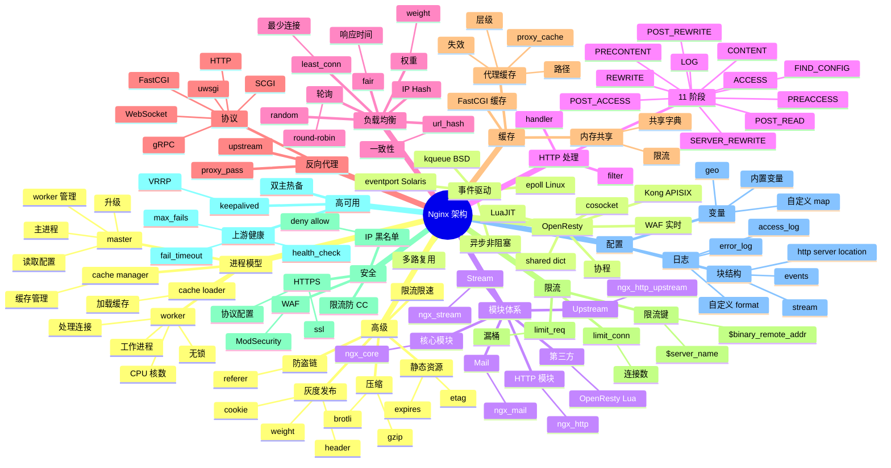

# Nginx

## 一、前言

**定位**：高性能 HTTP 和反向代理服务器，也是 IMAP/POP3/SMTP 代理。由俄罗斯工程师 Igor Sysoev 于 2004 年发布，是 Web 基础设施的事实标准。

**核心价值**：
- **事件驱动异步**：单台 Nginx 可处理 5万+ 并发连接，远胜 Apache prefork 模式
- **多用途**：HTTP 服务器、反向代理、负载均衡、邮件代理、API 网关
- **配置灵活**：location / if / upstream / map / limit_req 等指令组合
- **生产级稳定性**：开源 20 年，互联网 30%+ 网站使用
- **生态完整**：OpenResty（Lua 扩展）、Tengine（阿里）、ModSecurity（WAF）

**五大特性**：
1. **事件驱动 + 异步非阻塞**：epoll/kqueue 多路复用，单进程数万连接
2. **多进程模型**：1 个 master + N 个 worker；worker 数量 = CPU 核数
3. **模块化架构**：core / http / mail / stream；动态模块加载
4. **配置热加载**：`nginx -s reload` 零停机重载
5. **高级负载均衡**：轮询、权重、IP Hash、least_conn、fair、url_hash

**与同类对比**：

| 维度 | Nginx | Apache | HAProxy | Envoy |
|---|---|---|---|---|
| 模型 | 事件驱动 | 多处理模块 | 事件驱动 | 多线程 |
| 并发 | 极高 | 中（prefork） | 极高 | 高 |
| 协议 | HTTP/L4/邮件 | HTTP | L4/L7 | L7 |
| 配置 | 简单 | 复杂 | 中等 | YAML |
| 扩展 | OpenResty | .htaccess | Lua | C++ filter |
| 适用 | 通用 Web | 老项目 | 纯 LB | Service Mesh |

## 二、架构思维导图



## 三、关键代码

### 1. 反向代理 + 负载均衡

```nginx
# /etc/nginx/nginx.conf

user nginx;
worker_processes auto;        # worker 数量 = CPU 核数
worker_rlimit_nofile 65535;   # 每个 worker 打开文件数

error_log /var/log/nginx/error.log warn;
pid /var/run/nginx.pid;

events {
    worker_connections 4096;   # 每个 worker 最大连接数
    use epoll;                 # Linux 用 epoll
    multi_accept on;           # 一次 accept 多个连接
}

http {
    include /etc/nginx/mime.types;
    default_type application/octet-stream;

    # 日志格式
    log_format main '$remote_addr - $remote_user [$time_local] "$request" '
                    '$status $body_bytes_sent "$http_referer" '
                    '"$http_user_agent" "$http_x_forwarded_for" '
                    'rt=$request_time uct=$upstream_connect_time '
                    'uht=$upstream_header_time urt=$upstream_response_time';

    access_log /var/log/nginx/access.log main;

    sendfile on;                 # 零拷贝 sendfile()
    tcp_nopush on;
    tcp_nodelay on;
    keepalive_timeout 65;
    types_hash_max_size 2048;
    server_tokens off;           # 隐藏版本号

    # gzip 压缩
    gzip on;
    gzip_min_length 1k;
    gzip_comp_level 6;
    gzip_types text/plain text/css application/json application/javascript text/xml application/xml;
    gzip_vary on;

    # 上游：负载均衡池
    upstream backend_pool {
        # 策略
        # 1. 轮询（默认）
        # 2. least_conn（最少连接）
        # 3. ip_hash（会话保持）
        # 4. weight（权重）
        # 5. backup（备用）

        least_conn;

        server 10.0.1.10:8080 weight=5 max_fails=3 fail_timeout=30s;
        server 10.0.1.11:8080 weight=5 max_fails=3 fail_timeout=30s;
        server 10.0.1.12:8080 weight=3 max_fails=3 fail_timeout=30s;
        server 10.0.1.13:8080 weight=3 max_fails=3 fail_timeout=30s;

        # 主动健康检查（nginx-plus / openresty）
        # check interval=3000 rise=2 fall=3 timeout=1000;

        # 长连接池
        keepalive 32;            # 缓存 32 个空闲连接到上游
        keepalive_requests 100;  # 单连接最多 100 个请求
        keepalive_timeout 60s;
    }

    # 虚拟主机
    server {
        listen 80;
        server_name api.example.com;
        return 301 https://$server_name$request_uri;  # 强制 HTTPS
    }

    server {
        listen 443 ssl http2;
        server_name api.example.com;

        # SSL 配置
        ssl_certificate /etc/nginx/ssl/api.example.com.crt;
        ssl_certificate_key /etc/nginx/ssl/api.example.com.key;
        ssl_protocols TLSv1.2 TLSv1.3;
        ssl_ciphers ECDHE-ECDSA-AES128-GCM-SHA256:ECDHE-RSA-AES128-GCM-SHA256;
        ssl_prefer_server_ciphers on;
        ssl_session_cache shared:SSL:10m;
        ssl_session_timeout 1d;

        # 反向代理
        location / {
            proxy_pass http://backend_pool;
            proxy_set_header Host $host;
            proxy_set_header X-Real-IP $remote_addr;
            proxy_set_header X-Forwarded-For $proxy_add_x_forwarded_for;
            proxy_set_header X-Forwarded-Proto $scheme;

            # 超时
            proxy_connect_timeout 5s;
            proxy_send_timeout 30s;
            proxy_read_timeout 30s;

            # 重试
            proxy_next_upstream error timeout http_502 http_503;
            proxy_next_upstream_tries 2;

            # WebSocket
            proxy_http_version 1.1;
            proxy_set_header Upgrade $http_upgrade;
            proxy_set_header Connection "upgrade";
        }
    }
}
```

**解析**：
- **`keepalive 32`** 在 upstream 块：Nginx 主动维持到上游的空闲长连接池，避免每次重建 TCP
- **`proxy_set_header X-Forwarded-For $proxy_add_x_forwarded_for`**：追加真实客户端 IP
- **`least_conn`**：比 round-robin 更智能，把请求分给连接数最少的节点
- **WebSocket 升级**：`Upgrade` / `Connection` 头 + `proxy_http_version 1.1`

### 2. 限流与防 CC

```nginx
# 限流配置
http {
    # 1. 限流区域（共享内存）
    # zone=name:size（共享内存大小）
    # rate=Nr/m（每分钟 N 次）
    limit_req_zone $binary_remote_addr zone=api_limit:10m rate=10r/s;
    limit_req_zone $binary_remote_addr zone=login_limit:10m rate=5r/m;
    limit_conn_zone $binary_remote_addr zone=conn_limit:10m;

    server {
        listen 80;
        server_name api.example.com;

        # 全局连接数限制
        limit_conn conn_limit 20;     # 每 IP 最多 20 个连接

        location /api/ {
            # 漏桶算法：burst=20 排队，nodelay 不延迟立即处理
            limit_req zone=api_limit burst=20 nodelay;
            # 限流返回 503
            limit_req_status 503;

            proxy_pass http://backend_pool;
        }

        # 登录接口：更严格
        location /api/login {
            limit_req zone=login_limit burst=3 nodelay;
            proxy_pass http://backend_pool;
        }

        # 静态资源不限流
        location /static/ {
            root /var/www;
            expires 7d;
            add_header Cache-Control "public, max-age=604800";
        }
    }
}
```

**解析**：
- **漏桶算法**：`rate=10r/s burst=20 nodelay` 表示每秒 10 个请求基准，突发可到 20 个，立即处理
- **共享内存 zone**：多个 worker 共享限流计数（10m 共享内存可记录 8 万 IP）
- **不同接口不同策略**：登录限 5r/m，API 限 10r/s，静态资源不限

### 3. 代理缓存（重要性能优化）

```nginx
http {
    # 1. 缓存路径
    proxy_cache_path /var/cache/nginx/proxy
        levels=1:2                    # 目录层级：1层/2层哈希
        keys_zone=cache1:100m         # 共享内存 key 存储（100m 容纳 80 万 key）
        max_size=10g                  # 磁盘最大 10GB
        inactive=60m                  # 60 分钟未访问删除
        use_temp_path=off;            # 直接写缓存目录

    server {
        listen 80;
        server_name cdn.example.com;

        location / {
            proxy_pass http://backend_pool;
            proxy_cache cache1;
            proxy_cache_key "$scheme$request_method$host$request_uri";
            proxy_cache_valid 200 302 10m;   # 200/302 缓存 10 分钟
            proxy_cache_valid 404 1m;        # 404 缓存 1 分钟
            proxy_cache_valid any 5s;        # 其他 5 秒

            # 缓存条件
            proxy_cache_min_uses 1;          # 1 次访问即缓存
            proxy_cache_bypass $http_cache_control;  # 客户端 Cache-Control: no-cache 跳过缓存

            # 添加 X-Cache 头标识命中
            add_header X-Cache-Status $upstream_cache_status;

            # 强制响应头（可被同源覆盖）
            expires 1h;
        }
    }
}
```

**`$upstream_cache_status` 取值**：
- `HIT` / `BYPASS`（强制不缓存）
- `MISS` / `EXPIRED`（缓存过期）
- `STALE`（上游挂了，返回旧缓存）+ `UPDATING`（后台更新中）

**解析**：
- **共享内存 + 磁盘双层**：keys_zone 在内存（快速查找），实际文件在磁盘
- **`levels=1:2`** 哈希分布：避免单目录文件过多（Linux 单目录超过 10k 文件性能下降）
- **`proxy_cache_bypass`**：响应客户端 `Cache-Control: no-cache` 头，强制回源（CDN 场景）

### 4. 灰度发布（金丝雀）

```nginx
http {
    # 上游分组
    upstream prod_pool {
        server 10.0.1.10:8080;  # 稳定版
        server 10.0.1.11:8080;
    }

    upstream canary_pool {
        server 10.0.1.20:8080;  # 金丝雀版
    }

    # 用 map 根据 cookie/header 决定路由
    map $cookie_user_group $backend {
        default prod_pool;
        "canary" canary_pool;
    }

    map $http_x_canary $is_canary {
        default 0;
        "1" 1;
        "true" 1;
    }

    server {
        listen 80;
        server_name app.example.com;

        location / {
            # 1. 按 cookie 灰度
            proxy_pass http://$backend;

            # 2. 按 header 灰度
            # if ($is_canary) {
            #     proxy_pass http://canary_pool;
            # }

            # 3. 按权重灰度（用 split_clients）
            # split_clients "${remote_addr}${http_user_agent}" $variant {
            #     5% canary_pool;
            #     * prod_pool;
            # }
            # proxy_pass http://$variant;
        }
    }
}
```

**解析**：
- **cookie 灰度**：用户登录后服务端设置 `user_group=canary`，所有后续请求走金丝雀
- **header 灰度**：客户端主动加 `X-Canary: 1`，可绕过 Nginx 直接走金丝雀
- **split_clients 权重灰度**：基于 `remote_addr + user_agent` 一致性哈希，5% 流量进金丝雀（同一用户始终进同一版本）

### 5. HTTPS + HSTS + HTTP/2

```nginx
server {
    listen 443 ssl http2;
    http2_max_field_size 16k;
    http2_max_header_size 32k;

    server_name example.com;

    ssl_certificate /etc/nginx/ssl/example.com.crt;
    ssl_certificate_key /etc/nginx/ssl/example.com.key;
    ssl_dhparam /etc/nginx/ssl/dhparam.pem;

    # TLS 优化
    ssl_protocols TLSv1.2 TLSv1.3;
    ssl_ciphers ECDHE-ECDSA-AES128-GCM-SHA256:ECDHE-RSA-AES128-GCM-SHA256:ECDHE-ECDSA-CHACHA20-POLY1305;
    ssl_prefer_server_ciphers on;
    ssl_session_cache shared:SSL:10m;
    ssl_session_timeout 1d;
    ssl_session_tickets off;
    ssl_stapling on;
    ssl_stapling_verify on;

    # HSTS（强制 HTTPS）
    add_header Strict-Transport-Security "max-age=63072000; includeSubDomains; preload" always;
    add_header X-Frame-Options "SAMEORIGIN" always;
    add_header X-Content-Type-Options "nosniff" always;
    add_header X-XSS-Protection "1; mode=block" always;
    add_header Referrer-Policy "strict-origin-when-cross-origin" always;
    add_header Content-Security-Policy "default-src 'self'; script-src 'self' 'unsafe-inline'" always;
}

# HTTP 自动跳转 HTTPS
server {
    listen 80;
    server_name example.com;
    return 301 https://$server_name$request_uri;
}
```

**解析**：
- **TLS 1.3 优先**：相比 TLS 1.2 握手从 2-RTT 降到 1-RTT，性能提升 30%
- **OCSP Stapling**：服务端代客户端验证证书状态，减少 TLS 握手延迟
- **HSTS preload**：提交到浏览器 preload list，强制 HTTPS
- **CSP 头**：XSS 防护，但配置要谨慎（容易 block 自己的 inline script）

## 四、核心洞察

1. **事件驱动是性能核心**：单 worker 单线程 + epoll，可处理上万并发；worker 数 = CPU 核数（避免上下文切换）。
2. **keepalive 是性能调优银弹**：Nginx → 上游的 keepalive 池避免每次重建 TCP；Nginx → 客户端的 keepalive 减少握手。
3. **11 阶段 HTTP 处理**：请求经过 POST_READ → SERVER_REWRITE → FIND_CONFIG → ... → LOG 多个阶段，每个阶段有独立模块；理解 11 阶段才能用好 rewrite/access 等指令。
4. **proxy_cache 是 CDN 的基础**：相同配置可商用 CDN 服务（Cloudflare、CloudFront 本质都是代理缓存）。
5. **限流是生产环境必修课**：漏桶 / 令牌桶 / 连接数限制，多种策略组合应对不同攻击。
6. **OpenResty 把 Nginx 变成应用服务器**：LuaJIT + cosocket（协程网络 IO） + shared dict，可实现实时 WAF、自定义鉴权、Kong/APISIX 都基于 OpenResty。
7. **Tengine vs Nginx**：Tengine 是阿里基于 Nginx 的分支，合并了动态模块、reuse_port、jemalloc 等；国内大厂常用。
8. **监控 `stub_status` 或 `vts`**：Nginx Plus 或 OpenResty 的 `vts` 模块可看实时 QPS、状态码分布、upstream 健康。

## 五、跨项目引用

- [./k8s.md](./k8s.md) — Nginx Ingress Controller 是 K8s 7 层路由标配
- [./traefik.md](./traefik.md) — Traefik 是云原生时代的反向代理，自动发现服务
- [./envoy.md](./envoy.md) — Envoy 是 Service Mesh 时代的反向代理
- [./haproxy.md](./haproxy.md) — HAProxy 专注 L4/L7 负载均衡
- [./openresty.md](./openresty.md) — OpenResty = Nginx + Lua，扩展到应用层
- [./konga.md](./konga.md) — Kong 是基于 OpenResty 的 API 网关
- [./redis.md](./redis.md) — Nginx + Redis 实现 LRU 缓存前置
- [../A-前端框架/next.js.md](../A-前端框架/next.js.md) — Next.js 反向代理到 Nginx
