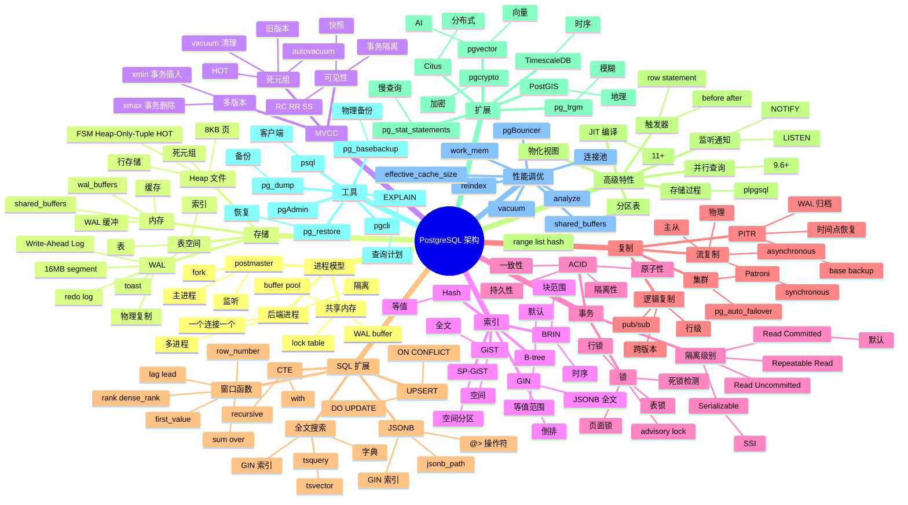

# PostgreSQL

## 一、前言

**定位**：世界上最先进的开源**关系型数据库**（The World's Most Advanced Open Source Relational Database），1986 年起源加州伯克利，Postgres → PostgreSQL，30+ 年持续演进。

**核心价值**：
- **SQL 完整实现**：标准 SQL 99/2003 + 大量扩展（窗口函数、CTE、JSONB、全文搜索）
- **扩展性极强**：自定义数据类型、函数、操作符、索引方法（GIN/GiST/BRIN）
- **MVCC 并发**：多版本并发控制，读不阻塞写，写不阻塞读
- **可靠性**：ACID 事务、WAL 日志、点时间恢复（PITR）、流复制
- **生态繁荣**：PostGIS（地理）、TimescaleDB（时序）、pgvector（向量）、Citus（分布式）

**五大特性**：
1. **MVCC 多版本并发**：每行有 xmin/xmax 系统列，事务隔离清晰
2. **JSON/JSONB 半结构化**：JSONB 二进制存储 + GIN 索引，兼有关系/文档优点
3. **丰富索引**：B-tree / Hash / GIN / GiST / BRIN / SP-GiST 六种索引方法
4. **扩展机制**：CREATE EXTENSION 加载 PostGIS、pg_trgm、pgvector 等
5. **流复制 + 逻辑复制**：物理主从 + 逻辑订阅，灵活构建主从、级联、CDC

**与同类对比**：

| 维度 | PostgreSQL | MySQL | Oracle | SQL Server |
|---|---|---|---|---|
| 协议 | PostgreSQL Wire | MySQL Protocol | TNS | TDS |
| 引擎 | 单进程多线程 | 多线程 | 多进程 | 多线程 |
| MVCC | 行级（xmin/xmax） | undo log | undo + redo | 行版本 |
| 扩展 | 极强 | 一般 | 极强 | 中 |
| SQL 标准 | 高度兼容 | 偏离标准 | 高度兼容 | 中 |
| 适用 | 复杂业务/分析 | Web OLTP | 企业 | 企业 |
| License | BSD | GPL | 商业 | 商业 |

## 二、架构思维导图



## 三、关键代码

### 1. SQL 核心：JOIN + 窗口函数 + CTE

```sql
-- 1. CTE 递归：组织架构树
WITH RECURSIVE org_tree AS (
    -- 锚点：根节点
    SELECT id, name, parent_id, 1 AS depth
    FROM departments
    WHERE parent_id IS NULL

    UNION ALL

    -- 递归：子节点
    SELECT d.id, d.name, d.parent_id, t.depth + 1
    FROM departments d
    JOIN org_tree t ON d.parent_id = t.id
)
SELECT * FROM org_tree ORDER BY depth, id;

-- 2. 窗口函数：用户消费 Top 3
SELECT
    user_id,
    order_id,
    amount,
    order_date,
    -- 按用户分区，按金额降序
    ROW_NUMBER() OVER (PARTITION BY user_id ORDER BY amount DESC) AS rank,
    -- 总和累计
    SUM(amount) OVER (PARTITION BY user_id ORDER BY order_date) AS running_total,
    -- 上一笔订单
    LAG(amount) OVER (PARTITION BY user_id ORDER BY order_date) AS prev_amount
FROM orders
WHERE order_date >= '2024-01-01'
QUALIFY ROW_NUMBER() OVER (PARTITION BY user_id ORDER BY amount DESC) <= 3;
-- QUALIFY 是 PG 13+ 语法，过滤窗口函数结果

-- 3. JSONB 查询
CREATE TABLE products (
    id SERIAL PRIMARY KEY,
    name TEXT,
    attrs JSONB
);

INSERT INTO products (name, attrs) VALUES
('iPhone', '{"brand": "Apple", "price": 999, "tags": ["phone", "premium"]}'),
('Pixel', '{"brand": "Google", "price": 799, "tags": ["phone"]}');

-- 包含查询
SELECT * FROM products WHERE attrs @> '{"brand": "Apple"}';
-- 嵌套字段
SELECT attrs->>'brand', attrs->'tags' FROM products;
-- GIN 索引
CREATE INDEX idx_products_attrs ON products USING GIN (attrs);
-- 数组查询
SELECT * FROM products WHERE attrs->'tags' ? 'premium';
```

**解析**：
- **递归 CTE**：用 `WITH RECURSIVE` 处理树形/图结构（组织架构、评论链、依赖关系）
- **窗口函数**：`PARTITION BY` 分区 + `ORDER BY` 排序，可计算排名、累计、环比
- **JSONB + GIN**：JSONB 是二进制 JSON，比 JSON 更高效（支持下标操作符 + 索引）

### 2. 事务与隔离级别

```sql
-- 事务基础
BEGIN;
    UPDATE accounts SET balance = balance - 100 WHERE user_id = 1;
    UPDATE accounts SET balance = balance + 100 WHERE user_id = 2;
COMMIT;

-- 显式回滚
BEGIN;
    UPDATE accounts SET balance = balance - 100 WHERE user_id = 1;
    -- 错误：余额不足
    ROLLBACK;

-- Savepoint：嵌套事务
BEGIN;
    INSERT INTO orders (user_id, amount) VALUES (1, 100);  -- 1
    SAVEPOINT sp1;
    INSERT INTO order_items (order_id, product_id) VALUES (1, 999);  -- 2
    -- 假设 2 失败
    ROLLBACK TO sp1;  -- 撤销 2，保留 1
    INSERT INTO order_items (order_id, product_id) VALUES (1, 888);  -- 重试
COMMIT;

-- ============================================================================

-- 隔离级别
SET TRANSACTION ISOLATION LEVEL READ COMMITTED;  -- 默认
SET TRANSACTION ISOLATION LEVEL REPEATABLE READ;
SET TRANSACTION ISOLATION LEVEL SERIALIZABLE;

-- 读已提交（默认）
BEGIN;
    SELECT balance FROM accounts WHERE user_id = 1;  -- 1000
    -- 另一事务提交 UPDATE balance = 500
    SELECT balance FROM accounts WHERE user_id = 1;  -- 500（重新读）
COMMIT;

-- 可重复读（PG 实现为快照隔离）
BEGIN ISOLATION LEVEL REPEATABLE READ;
    SELECT balance FROM accounts WHERE user_id = 1;  -- 1000
    -- 另一事务提交 UPDATE balance = 500
    SELECT balance FROM accounts WHERE user_id = 1;  -- 1000（快照）
COMMIT;

-- 串行化（SSI 序列化快照）
BEGIN ISOLATION LEVEL SERIALIZABLE;
    SELECT SUM(balance) FROM accounts;  -- 总和 5000
    -- 另一事务 INSERT balance = 100
    SELECT SUM(balance) FROM accounts;  -- 5000（仍快照）
    -- 提交时检测到冲突 → 失败
COMMIT;  -- ERROR: could not serialize access

-- ============================================================================

-- 乐观锁：version 列
CREATE TABLE products (
    id SERIAL PRIMARY KEY,
    name TEXT,
    stock INT,
    version INT DEFAULT 0
);

UPDATE products
SET stock = stock - 1, version = version + 1
WHERE id = 1 AND version = 5;  -- 假设当前 version=5

-- 0 行受影响 → version 已被其他事务更新，重试
```

**解析**：
- **PG 默认 RC**：读已提交，足够大多数场景
- **Serializable 用 SSI**：检测冲突 + 自动重试，**避免幻读**而无需加锁
- **乐观锁 vs 悲观锁**：高并发用 `version` 列 CAS；高竞争用 `SELECT FOR UPDATE`

### 3. JSONB + 全文搜索

```sql
-- JSONB 操作符
SELECT '{"a": 1, "b": 2}'::jsonb @> '{"a": 1}';          -- true（包含）
SELECT '{"a": 1}'::jsonb ? 'a';                          -- true（键存在）
SELECT '[1, 2, 3]'::jsonb @> '[1]'::jsonb;               -- true（数组包含）
SELECT '{"a": 1, "b": 2}'::jsonb - 'a';                  -- {"b": 2}（删键）
SELECT jsonb_set('{"a": 1}'::jsonb, '{b}', '2');         -- {"a": 1, "b": 2}（更新/插入）
SELECT jsonb_path_query('{"a": {"b": [1,2,3]}}'::jsonb, '$.a.b[*] ? (@ > 1)');  -- [2, 3]

-- jsonb_path_query 完整用法
SELECT
    id,
    name,
    jsonb_path_query(attrs, '$.specs.memory ? (@ > 16)') AS high_memory
FROM products
WHERE jsonb_path_exists(attrs, '$.tags[*] ? (@ == "premium")');

-- ============================================================================

-- 全文搜索
CREATE TABLE articles (
    id SERIAL PRIMARY KEY,
    title TEXT,
    body TEXT,
    tsv tsvector GENERATED ALWAYS AS (
        to_tsvector('english', coalesce(title,'') || ' ' || coalesce(body,''))
    ) STORED
);

-- 插入测试数据
INSERT INTO articles (title, body) VALUES
('PostgreSQL Tutorial', 'Learn PostgreSQL basics and advanced features.'),
('Full Text Search', 'PostgreSQL has powerful full text search capabilities.');

-- 全文查询
SELECT * FROM articles
WHERE tsv @@ to_tsquery('english', 'postgresql & search');

-- 排名（TS_RANK）
SELECT
    id, title,
    ts_rank(tsv, to_tsquery('english', 'postgresql')) AS rank
FROM articles
WHERE tsv @@ to_tsquery('english', 'postgresql')
ORDER BY rank DESC;

-- 高亮（TS_HEADLINE）
SELECT ts_headline('english', body, to_tsquery('postgresql')) FROM articles;

-- 中文全文搜索（zhparser 扩展）
CREATE EXTENSION zhparser;
CREATE TEXT SEARCH CONFIGURATION chinese (PARSER = zhparser);
ALTER TEXT SEARCH CONFIGURATION chinese ADD MAPPING FOR n,v,a,i,e,l WITH simple;
```

**解析**：
- **JSONB 是半结构化最佳实践**：相比 JSON，JSONB 去重空白、支持索引、操作符丰富
- **`@>` 是包含操作符**：GIN 索引下 O(log N)，比函数式 `jsonb_extract_path` 快 10-100 倍
- **生成列 `tsvector` GENERATED**：写入时自动计算 tsvector，省去应用层处理
- **中文搜索用 zhparser**：PG 原生不支持中文分词，zhparser 是最佳实践

### 4. 复制与高可用

```sql
-- 主从配置（postgresql.conf）
-- 主库
wal_level = replica             -- 启用流复制
max_wal_senders = 10            -- 最大 WAL sender 数量
wal_keep_size = '1GB'           -- WAL 保留大小

-- 创建复制用户
CREATE ROLE replicator WITH REPLICATION LOGIN PASSWORD 'repl_password';

-- 从库恢复
pg_basebackup -h primary -D /var/lib/postgresql/data -U replicator -P -X stream

-- 从库 postgresql.conf
primary_conninfo = 'host=primary port=5432 user=replicator password=repl_password'
hot_standby = on

-- ============================================================================

-- 逻辑复制（跨版本、跨表）
-- 主库：发布
CREATE PUBLICATION my_pub FOR TABLE users, orders;

-- 从库：订阅
CREATE SUBSCRIPTION my_sub
CONNECTION 'host=primary port=5432 user=repl_user dbname=mydb'
PUBLICATION my_pub;

-- ============================================================================

-- PITR（Point In Time Recovery）
-- 持续归档
archive_mode = on
archive_command = 'cp %p /var/lib/pgsql/wal_archive/%f'

-- 恢复：基于 base backup + WAL 归档
-- recovery.conf（PG 12+ 改用 postgresql.auto.conf）
restore_command = 'cp /var/lib/pgsql/wal_archive/%f %p'
recovery_target_time = '2024-01-01 12:00:00'

-- ============================================================================

-- Patroni 集群管理（生产级方案）
-- etcd + Patroni + PostgreSQL
-- 优势：自动 failover、监控集成、健康检查
```

**解析**：
- **流复制**：物理块级复制，从库是主库的"完整副本"；延迟通常 < 1s
- **逻辑复制**：行级复制，可只复制部分表、支持跨版本；适合数据分发、CDC
- **PITR 是终极安全网**：误操作可恢复到任意时间点（前提是 WAL 归档完整）
- **生产必用 Patroni**：自管理 PG 集群有难度，Patroni + etcd 是事实标准

## 四、核心洞察

1. **MVCC 是 PG 的核心**：每行有 xmin/xmax 系统列；`VACUUM` 清理死元组，HOT 优化减少膨胀。
2. **JSONB + GIN 是 PG 杀手锏**：相比 MySQL JSON，PG JSONB 支持丰富操作符 + 高效索引；一个数据库可同时干关系/文档两件事。
3. **扩展性是 PG 的护城河**：PostGIS（地理）、pgvector（向量 AI）、TimescaleDB（时序）让 PG 一个数据库吃下多种场景。
4. **WAL 是可靠性的核心**：所有修改先写 WAL，再写数据页；崩溃时从 WAL 重做（REDO）。
5. **查询计划器是工业级**：基于成本的优化器（CBO）+ 统计信息 + GEQO 遗传算法；大多数情况下不需要手写 hint。
6. **连接池是生产必装**：PG 是多进程模型，每个连接 fork 一个后端；1000+ 连接会让 DB 崩溃；**pgBouncer 必备**。
7. **PG 16/17 持续进化**：逻辑复制改进、增量备份、`pg_stat_io`、并行化、SQL/JSON 增强。
8. **PG vs MySQL 的本质区别**：PG 强 SQL 标准 + 高级特性，MySQL 简单快速；新项目首选 PG，遗留系统可保留 MySQL。

## 五、跨项目引用

- [./mysql.md](./mysql.md) — MySQL 是 PG 的最大对手，OLTP 简单场景
- [./redis.md](./redis.md) — Redis 缓存 PG 热数据，缓解读压力
- [./clickhouse.md](./clickhouse.md) — ClickHouse 处理 PG 难以胜任的 OLAP 大查询
- [./kafka.md](./kafka.md) — 逻辑复制 + Kafka 实现 CDC
- [./etcd.md](./etcd.md) — Patroni 用 etcd 协调 PG 集群
- [./prometheus.md](./prometheus.md) — `pg_exporter` 暴露 PG 指标
- [./timescaledb.md](./timescaledb.md) — TimescaleDB 是 PG 时序扩展
- [./pgvector.md](./pgvector.md) — pgvector 是 PG 向量检索扩展，对接 AI
