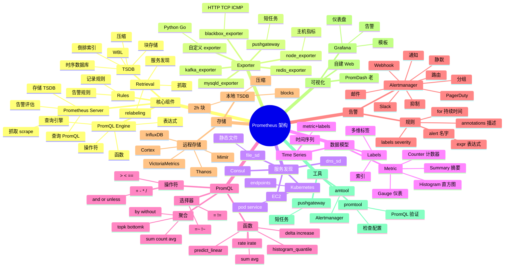

# Prometheus

## 一、前言

**定位**：云原生时代的**监控系统**事实标准，由 SoundCloud 2012 年开源，2016 年加入 CNCF，2018 年毕业。与 Kubernetes 同为 CNCF 旗舰项目。

**核心价值**：
- **时序数据库**：专门为指标数据优化的 TSDB，存储数百万时序
- **拉取模型**：Prometheus 主动拉取目标 HTTP /metrics 端点
- **PromQL 查询**：强大函数式查询语言，灵活聚合多维数据
- **告警系统**：Alertmanager 统一告警路由、分组、静默
- **服务发现**：自动发现 K8s Pod、Consul、EC2 等目标

**五大特性**：
1. **多维数据模型**：metric name + labels（key=value），灵活查询
2. **拉取模式**：`scrape_interval` 定期拉取，简单可靠（防火墙友好）
3. **PromQL**：函数式查询语言，支持 rate / histogram_quantile 等函数
4. **生态完整**：node_exporter / mysqld_exporter / redis_exporter / kafka_exporter 等 200+ 官方/社区 exporter
5. **告警评估**：用 PromQL 表达式定义告警规则，Alertmanager 路由

**Prometheus 生态**：

```
┌─────────────────────────────────────┐
│            Grafana                  │  ← 可视化
│      Prometheus 数据源              │
└──────────────┬──────────────────────┘
               │
       ┌───────▼──────┐
       │ Prometheus   │  ← 指标采集 + TSDB + PromQL + 告警评估
       │   Server     │
       └──────┬───────┘
              │ scrape (pull)
    ┌─────────┼─────────┐
    ▼         ▼         ▼
┌──────┐ ┌──────┐  ┌──────┐
│ node │ │ mysq │  │ redis│  ← exporter 暴露 /metrics
│exp   │ │ exp  │  │ exp  │
└──────┘ └──────┘  └──────┘
   ▲         ▲         ▲
   │         │         │
[主机]   [MySQL]  [Redis]   ← 被监控目标
```

**与同类对比**：

| 维度 | Prometheus | InfluxDB | Datadog | Zabbix |
|---|---|---|---|---|
| 模型 | 拉取 | 推/拉 | 推 | 推/拉 |
| 数据库 | 自带 TSDB | 自带 TSDB | 商业 | MySQL/PG |
| 生态 | 极强 | 强 | 极强 | 强 |
| 部署 | 自建 | 自建 | SaaS | 自建 |
| 告警 | 强大 | 中 | 内置 | 内置 |
| 适用 | 云原生 | 通用 | 企业 | 传统 |

## 二、架构思维导图



## 三、关键代码

### 1. prometheus.yml 配置

```yaml
# /etc/prometheus/prometheus.yml

global:
  scrape_interval: 15s           # 全局抓取间隔
  scrape_timeout: 10s
  evaluation_interval: 15s       # 规则评估间隔
  external_labels:
    cluster: prod
    region: cn-east-1

# 告警规则文件
rule_files:
  - "rules/*.yml"

# Alertmanager 配置
alerting:
  alertmanagers:
    - static_configs:
        - targets: ['alertmanager:9093']

# 抓取配置
scrape_configs:
  # Prometheus 自身
  - job_name: 'prometheus'
    static_configs:
      - targets: ['localhost:9090']

  # Node Exporter（主机）
  - job_name: 'node'
    static_configs:
      - targets:
        - '10.0.1.10:9100'
        - '10.0.1.11:9100'
        - '10.0.1.12:9100'
    relabel_configs:
      - source_labels: [__address__]
        regex: '([^:]+):.*'
        target_label: 'instance'
        replacement: '${1}'

  # Kubernetes 服务发现
  - job_name: 'kubernetes-pods'
    kubernetes_sd_configs:
      - role: pod
    relabel_configs:
      # 只采集带特定 annotation 的 Pod
      - source_labels: [__meta_kubernetes_pod_annotation_prometheus_io_scrape]
        action: keep
        regex: true
      - source_labels: [__meta_kubernetes_pod_annotation_prometheus_io_path]
        action: replace
        target_label: __metrics_path__
        regex: (.+)
      - source_labels: [__address__, __meta_kubernetes_pod_annotation_prometheus_io_port]
        action: replace
        regex: ([^:]+)(?::\d+)?;(\d+)
        replacement: $1:$2
        target_label: __address__
      - action: labelmap
        regex: __meta_kubernetes_pod_label_(.+)
      - source_labels: [__meta_kubernetes_namespace]
        target_label: namespace
      - source_labels: [__meta_kubernetes_pod_name]
        target_label: pod

  # MySQL Exporter
  - job_name: 'mysql'
    static_configs:
      - targets:
        - 'mysql-exporter:9104'
        labels:
          service: mysql
          env: production
```

**解析**：
- **服务发现（SD）**：从 K8s/Consul/EC2 自动拉取目标列表，动态扩展
- **relabel_configs**：在采集时修改 label，是 Prometheus 配置的核心难点
- **`__address__` 特殊 label**：目标地址，可在 relabel 时改写
- **`action: keep` + `regex: true`**：只保留符合 annotation 条件的 Pod

### 2. PromQL 查询实战

```promql
# 1. CPU 使用率（5 分钟平均）
100 - (avg by (instance) (rate(node_cpu_seconds_total{mode="idle"}[5m])) * 100)

# 2. 内存使用率
(1 - (node_memory_MemAvailable_bytes / node_memory_MemTotal_bytes)) * 100

# 3. 磁盘使用率
(node_filesystem_size_bytes - node_filesystem_avail_bytes) / node_filesystem_size_bytes * 100

# 4. HTTP 请求 QPS
sum(rate(http_requests_total[5m])) by (service)

# 5. P99 延迟
histogram_quantile(0.99,
    sum(rate(http_request_duration_seconds_bucket[5m])) by (le, service)
)

# 6. 错误率
sum(rate(http_requests_total{status=~"5.."}[5m]))
/
sum(rate(http_requests_total[5m]))

# 7. 预测磁盘空间（4 小时后用满）
predict_linear(node_filesystem_avail_bytes{mountpoint="/"}[1h], 4*3600) < 0

# 8. 容器重启次数
increase(kube_pod_container_status_restarts_total[1h])

# 9. 服务的请求延迟分布
sum(rate(http_request_duration_seconds_sum[5m])) by (service)
/ sum(rate(http_request_duration_seconds_count[5m])) by (service)

# 10. 业务关键指标
# 订单创建 QPS
rate(orders_created_total[5m])
# 在线用户数
sum(gateway_connections_active) by (region)
```

**解析**：
- **`rate()` 是核心函数**：计算时间窗口内的平均增长率
- **`histogram_quantile()`**：从 histogram 类型计算分位数（要 `sum by (le)` 聚合）
- **`predict_linear()`**：线性回归预测，用于容量规划
- **`{label=~"5.."}` 正则匹配**：5 开头所有 3 位状态码

### 3. 告警规则

```yaml
# /etc/prometheus/rules/alerts.yml

groups:
  - name: host_alerts
    interval: 30s
    rules:
      # 1. CPU 高使用率
      - alert: HighCpuUsage
        expr: |
          100 - (avg by (instance) (rate(node_cpu_seconds_total{mode="idle"}[5m])) * 100) > 80
        for: 5m                  # 持续 5 分钟才告警（避免抖动）
        labels:
          severity: warning
          team: ops
        annotations:
          summary: "Instance {{ $labels.instance }} CPU > 80%"
          description: "CPU 使用率 {{ $value | printf \"%.1f\" }}% 超过 80%（持续 5 分钟）"
          runbook_url: "https://wiki.example.com/runbook/high-cpu"

      # 2. 磁盘空间不足
      - alert: DiskSpaceLow
        expr: |
          (node_filesystem_avail_bytes{mountpoint="/"} / node_filesystem_size_bytes) * 100 < 10
        for: 10m
        labels:
          severity: critical
        annotations:
          summary: "磁盘空间不足 {{ $labels.instance }}"
          description: "剩余 {{ $value | printf \"%.1f\" }}%"

      # 3. 服务 down
      - alert: ServiceDown
        expr: up{job="kubernetes-pods"} == 0
        for: 1m
        labels:
          severity: critical
        annotations:
          summary: "服务 {{ $labels.pod }} down"

      - name: application_alerts
        rules:
      # 4. HTTP 错误率过高
      - alert: HighErrorRate
        expr: |
          sum(rate(http_requests_total{status=~"5.."}[5m])) by (service)
          /
          sum(rate(http_requests_total[5m])) by (service)
          > 0.05
        for: 5m
        labels:
          severity: warning
        annotations:
          summary: "服务 {{ $labels.service }} 5xx 错误率 {{ $value | printf \"%.2f\" }}"

      # 5. P99 延迟过高
      - alert: HighP99Latency
        expr: |
          histogram_quantile(0.99,
            sum(rate(http_request_duration_seconds_bucket{service="api"}[5m])) by (le)
          ) > 1
        for: 5m
        labels:
          severity: warning
        annotations:
          summary: "API P99 延迟 {{ $value }}s"
```

### 4. Alertmanager 配置

```yaml
# /etc/alertmanager/alertmanager.yml

global:
  smtp_smarthost: 'smtp.example.com:587'
  smtp_from: 'alert@example.com'
  smtp_auth_username: 'alert@example.com'
  smtp_auth_password: 'password'

# 路由树
route:
  receiver: 'default'
  group_by: ['alertname', 'cluster']    # 按告警名+集群分组
  group_wait: 30s                       # 首次告警等待
  group_interval: 5m                    # 后续告警间隔
  repeat_interval: 4h                   # 重复告警间隔
  routes:
    # critical 告警 → PagerDuty（24x7 值班）
    - match_re:
        severity: critical
      receiver: 'pagerduty'
      continue: true                      # 继续匹配下级路由

    # 数据库告警 → DBA 团队
    - match_re:
        service: mysql|postgres|redis
      receiver: 'dba-team'

    # 业务告警 → 业务团队
    - match_re:
        team: business
      receiver: 'business-team'

# 抑制规则（critical 时不通知 warning）
inhibit_rules:
  - source_match:
      severity: 'critical'
    target_match:
      severity: 'warning'
    equal: ['alertname', 'cluster']

# 接收器
receivers:
  - name: 'default'
    email_configs:
      - to: 'ops@example.com'
        send_resolved: true                # 恢复时也发邮件

  - name: 'pagerduty'
    pagerduty_configs:
      - service_key: 'pagerduty-key'
        send_resolved: true

  - name: 'dba-team'
    webhook_configs:
      - url: 'https://chat.example.com/webhook/dba'
        send_resolved: true

  - name: 'business-team'
    slack_configs:
      - api_url: 'https://hooks.slack.com/services/...'
        channel: '#alerts-business'
        send_resolved: true

# 静默规则（维护窗口期）
mute_time_intervals:
  - name: business-hours-silence
    time_intervals:
      - weekdays: ['saturday', 'sunday']
      - times:
          - start_time: '02:00'
            end_time: '06:00'
```

**解析**：
- **路由树**：按 label 匹配分发到不同接收器；`continue: true` 让一条告警可发到多个接收器
- **抑制规则**：上游问题（如节点 down）不重复通知下游告警（如 pod 不可用）
- **group_by**：合并同类型告警，避免告警风暴（5 分钟内 100 个 pod down 只发 1 封邮件）
- **静默窗口**：维护期、夜间避免打扰

### 5. 自定义指标（Go 客户端）

```go
package main

import (
    "github.com/prometheus/client_golang/prometheus"
    "github.com/prometheus/client_golang/prometheus/promhttp"
    "net/http"
)

var (
    // Counter：累计计数
    httpRequestsTotal = prometheus.NewCounterVec(
        prometheus.CounterOpts{
            Name: "http_requests_total",
            Help: "Total number of HTTP requests",
        },
        []string{"method", "endpoint", "status"},
    )

    // Histogram：延迟分布
    httpRequestDuration = prometheus.NewHistogramVec(
        prometheus.HistogramOpts{
            Name:    "http_request_duration_seconds",
            Help:    "HTTP request duration in seconds",
            Buckets: prometheus.DefBuckets,  // [.005, .01, .025, .05, .1, .25, .5, 1, 2.5, 5, 10]
        },
        []string{"method", "endpoint"},
    )

    // Gauge：当前状态
    activeConnections = prometheus.NewGauge(prometheus.GaugeOpts{
        Name: "active_connections",
        Help: "Number of active connections",
    })
)

func main() {
    // 注册指标
    prometheus.MustRegister(httpRequestsTotal, httpRequestDuration, activeConnections)

    http.HandleFunc("/api/users", func(w http.ResponseWriter, r *http.Request) {
        timer := prometheus.NewTimer(httpRequestDuration.WithLabelValues(r.Method, "/api/users"))
        defer timer.ObserveDuration()

        // 业务逻辑
        w.WriteHeader(200)
        w.Write([]byte(`{"users": []}`))

        httpRequestsTotal.WithLabelValues(r.Method, "/api/users", "200").Inc()
    })

    // 暴露 /metrics 端点
    http.Handle("/metrics", promhttp.Handler())
    http.ListenAndServe(":8080", nil)
}
```

**解析**：
- **Counter**：单调递增，累计计数（QPS、错误数）
- **Histogram**：分桶统计延迟，P50/P95/P99 计算
- **Gauge**：当前快照值（连接数、内存、队列长度）
- **`prometheus.MustRegister`**：注册自定义指标，`/metrics` 自动暴露

## 四、核心洞察

1. **拉取 vs 推送是设计哲学**：拉取简单（防火墙友好）、易控制采样率、易做服务发现；推送（StatsD）实时但易丢。
2. **多维标签是真正的杀手锏**：单个 metric 配 5-10 个 label（service / region / status / method），查询时可任意聚合。
3. **Histogram vs Summary 选哪个**：Histogram 服务端可重聚合（适分布式），Summary 客户端计算（更精确但不可聚合）；**生产优先 Histogram**。
4. **PromQL 的 `rate` 必须有数据点**：`rate(http_requests_total[5m])` 需要 5 分钟内至少 2 个数据点；冷启动可能 `0/0` NaN。
5. **存储成本是最大痛点**：单 Prometheus 2 实例建议 2-10M 时序；大规模需 **Thanos / Cortex / Mimir / VictoriaMetrics** 解决长期存储。
6. **告警规则要写给值班人看**：`annotations` 必须含 `summary` / `description` / `runbook_url`，值班人能在 30s 内判断是否需要处理。
7. **Grafana 是事实 UI 标准**：所有 dashboard 模板在 [grafana.com/dashboards](https://grafana.com/dashboards) 共享；Node Exporter Full、Prometheus Stats 是最常用的。
8. **Prometheus 不适合日志/Trace**：是**指标**系统；日志用 Loki / ELK，Trace 用 Jaeger / Tempo，三者配合（PLG 栈）才是完整可观测性。

## 五、跨项目引用

- [./grafana.md](./grafana.md) — Grafana 是 Prometheus 事实 UI 标配
- [./alertmanager.md](./alertmanager.md) — Alertmanager 处理 Prometheus 告警
- [./loki.md](./loki.md) — Loki 是日志聚合，Prometheus 是指标
- [./jaeger.md](./jaeger.md) — Jaeger 是分布式追踪
- [./k8s.md](./k8s.md) — Prometheus + K8s 服务发现是云原生标配
- [./thanos.md](./thanos.md) — Thanos 解决 Prometheus 长期存储与跨集群
- [./node-exporter.md](./node-exporter.md) — 主机指标采集
- [./otel-collector.md](./otel-collector.md) — OpenTelemetry Collector 统一采集指标/日志/Trace
