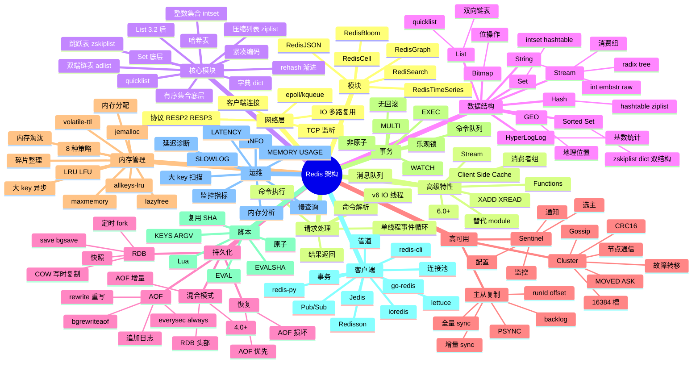

# Redis

## 一、前言

**定位**：Remote Dictionary Server，2009 年由 Salvatore Sanfilippo（antirez）发布，**内存数据结构存储系统**，可作数据库、缓存、消息队列、流处理、搜索引擎使用。

**核心价值**：
- **亚毫秒级延迟**：纯内存操作 + IO 多路复用，单机 10w+ QPS
- **丰富数据结构**：String / List / Hash / Set / Sorted Set / Stream / Bitmap / HyperLogLog / GEO
- **持久化可选**：RDB 快照 + AOF 日志，兼顾性能与安全
- **集群与高可用**：Redis Sentinel / Redis Cluster 6.x 原生分片
- **生态成熟**：几乎所有语言都有客户端，Spring Data Redis、ioredis、go-redis、redis-py 等

**五大特性**：
1. **内存优先 + 异步持久化**：数据常驻内存，RDB/AOF 异步落盘
2. **单线程事件循环**：v6.0 之前核心命令单线程（epoll），避免锁竞争
3. **RESP 协议**：文本 + 二进制混合协议，客户端实现简单
4. **Lua 脚本**：服务端原子执行复杂操作
5. **模块化**：RedisJSON / RediSearch / RedisGraph / RedisTimeSeries 等扩展

**Redis vs Memcached**：

| 维度 | Redis | Memcached |
|---|---|---|
| 数据结构 | 9 种 | KV 字符串 |
| 持久化 | RDB + AOF | 无 |
| 集群 | Sentinel + Cluster | mcrouter 客户端 |
| 复制 | 主从 / 集群 | 无 |
| 线程 | 单线程（v6 多 IO 线程） | 多线程 |
| 内存 | 优化（ziplist 等） | 简单 slab |
| Lua | 支持 | 不支持 |
| 适用 | 复杂业务、持久化 | 简单缓存 |

## 二、架构思维导图



## 三、关键代码

### 1. 字符串与哈希（SET/HSET）

```bash
# 字符串 SET 基础
SET user:1001:name "Alice"
GET user:1001:name
# Alice

# SET 选项
SET counter 0 EX 60        # 60 秒过期
SET counter 0 PX 60000     # 60 毫秒过期
SET counter 0 NX           # 不存在才设置（分布式锁）
SET counter 0 XX           # 存在才更新

# 原子操作
INCR counter               # +1
INCRBY counter 10          # +10
DECR counter               # -1
DECRBY counter 5           # -5
INCRBYFLOAT price 0.5      # 浮点

# 批量操作（MSET 原子）
MSET key1 val1 key2 val2
MGET key1 key2

# 哈希（HSET 适合对象）
HSET user:1001 name "Alice" age 30 email "alice@example.com"
HGET user:1001 name
# Alice
HGETALL user:1001
# 1) "name"
# 2) "Alice"
# 3) "age"
# 4) "30"
# 5) "email"
# 6) "alice@example.com"

# 哈希原子增减
HINCRBY user:1001 age 1    # 31
HSETNX user:1001 nick "al" # 字段不存在才设置

# 哈希序列化
HMSET user:1001 name "Bob" age 25
HMGET user:1001 name age
```

**底层结构**：
- String：`int` (整数) / `embstr` (≤44 字节) / `raw` (>44 字节) 三种编码
- Hash：field 少且值小用 `ziplist`（连续内存，节省空间）；多用 `hashtable`

### 2. 列表与发布订阅（List + Pub/Sub）

```bash
# 列表：双向链表 / quicklist
LPUSH tasks "task1" "task2" "task3"   # 左推
RPUSH tasks "task4"                   # 右推
LRANGE tasks 0 -1                     # 查看所有
# 1) "task1"
# 2) "task2"
# 3) "task3"
# 4) "task4"

LPOP tasks                            # 弹左
RPOP tasks                            # 弹右
RPOPLPUSH src dst                     # 原子从 src 弹右 → dst 推左（任务队列）

# 阻塞操作（消息队列核心）
BLPOP tasks 0                         # 阻塞等待，直到有元素
BRPOPLPUSH tasks processing 5         # 5 秒超时

# 修剪
LTRIM tasks 0 99                      # 只保留前 100 个
LLEN tasks                            # 长度

# 列表底层：3.2 后统一为 quicklist（多个 ziplist 通过双向指针连接）

# ============================================================================

# 发布订阅（实时消息）
SUBSCRIBE news                         # 订阅
PUBLISH news "Hello World"            # 发布
# 客户端收到：message news Hello World

# 模式订阅
PSUBSCRIBE news.*                     # 订阅 news.tech / news.sports 等
```

**应用场景**：
- **List + LPUSH/BRPOP**：实现简易消息队列（但生产推荐 Stream）
- **Pub/Sub**：实时通知、聊天广播（**不持久化**，订阅者不在线消息丢失）

### 3. 有序集合（Sorted Set / ZSet）

```bash
# ZSet：跳表 + 字典双结构
ZADD leaderboard 100 "alice" 200 "bob" 150 "charlie"

# 排行榜查询
ZREVRANGE leaderboard 0 9 WITHSCORES  # 前 10 名（高到低）
ZRANGE leaderboard 0 9 WITHSCORES    # 前 10 名（低到高）

# 分数操作
ZINCRBY leaderboard 50 "alice"        # alice +50
ZSCORE leaderboard "alice"            # 查分数

# 排名
ZRANK leaderboard "alice"             # 从低到高排名
ZREVRANK leaderboard "alice"          # 从高到低排名

# 范围查询
ZRANGEBYSCORE leaderboard 100 200     # 分数 100-200 之间

# 集合运算
ZUNIONSTORE union1 2 set1 set2         # 并集
ZINTERSTORE inter1 2 set1 set2         # 交集

# ============================================================================

# 实际应用：滑动窗口限流
ZADD ratelimit:user:1001 $(date +%s) "req-uuid-1"
ZREMRANGEBYSCORE ratelimit:user:1001 0 $(($(date +%s) - 60))
ZCARD ratelimit:user:1001
# 如果 > 100，限流
```

**应用场景**：
- **排行榜**：分数即排名分数，ZREVRANGE 取前 N
- **滑动窗口限流**：ZADD + ZREMRANGEBYSCORE + ZCARD
- **延迟队列**：score 是执行时间戳，定期 ZRANGEBYSCORE 取出到期任务
- **底层**：跳跃表（`zskiplist`）实现范围查询 O(log N)，字典实现 score → member 映射 O(1)

### 4. Lua 脚本与发布订阅

```bash
# 分布式锁（经典 Lua 脚本）
SET lock:order:1001 "worker-1" NX EX 30
# 抢锁

# 释放锁（必须是持有者才能释放）
EVAL "
  if redis.call('get', KEYS[1]) == ARGV[1] then
    return redis.call('del', KEYS[1])
  else
    return 0
  end
" 1 lock:order:1001 "worker-1"

# ============================================================================

# 库存扣减（原子操作）
EVAL "
  local stock = tonumber(redis.call('get', KEYS[1]))
  local qty = tonumber(ARGV[1])
  if stock >= qty then
    redis.call('decrby', KEYS[1], qty)
    return qty
  else
    return -1
  end
" 1 stock:product:2001 3

# ============================================================================

# 复杂业务：分布式限流（滑动窗口 + Lua）
EVAL "
  local key = KEYS[1]
  local now = tonumber(ARGV[1])
  local window = tonumber(ARGV[2])
  local limit = tonumber(ARGV[3])
  redis.call('zremrangebyscore', key, 0, now - window)
  local count = redis.call('zcard', key)
  if count < limit then
    redis.call('zadd', key, now, now .. ':' .. math.random())
    redis.call('expire', key, window)
    return 1
  end
  return 0
" 1 ratelimit:api 1700000000 60 100
```

**解析**：
- **Lua 脚本原子性**：执行期间不会被其他命令打断，避免竞态
- **KEYS 与 ARGV 分离**：KEYS 是 Redis 自动收集的，集群模式下按 key 分片到对应节点
- **SCRIPT LOAD + EVALSHA**：避免每次传输脚本，先 `SCRIPT LOAD` 拿到 SHA，后续用 SHA 调用

### 5. Stream（5.0+ 消息队列）

```bash
# Stream：消息流 + 消费组（替代 Kafka 简单场景）
XADD orders * product 2001 qty 3 user 1001
# 返回 ID：1700000000000-0

XADD orders * product 2002 qty 1 user 1002
XADD orders * product 2003 qty 5 user 1001

XRANGE orders - +                       # 查看所有消息

# 创建消费组
XGROUP CREATE orders order-processors $

# 消费者读取
XREADGROUP GROUP order-processors worker-1 COUNT 10 BLOCK 5000 STREAMS orders >
# 阻塞 5 秒，等待新消息

# 确认消息
XACK orders order-processors 1700000000000-0

# 失败重试：XPENDING + XCLAIM
XPENDING orders order-processors
XCLAIM orders order-processors worker-2 60000 1700000000000-0
```

**应用场景**：
- **消息队列**：相比 List + BRPOP，Stream 支持消费组、ACK、重试、消息回溯
- **事件溯源**：XRANGE 读取历史事件
- **多消费者**：一个 Stream 多个消费组，互不影响

## 四、核心洞察

1. **单线程不是性能瓶颈**：IO 多路复用（epoll）+ 内存操作 + 协议简单，单线程反而避免锁竞争；v6.0 引入 IO 线程分担网络读写。
2. **数据结构是 Redis 真正护城河**：9 种结构覆盖 90% 业务场景（排行榜、限流、消息队列、计数器），远胜 Memcached。
3. **持久化是双刃剑**：AOF everysec 丢 1 秒数据；always 安全但性能降 50%；选 RDB + AOF 混合模式是最佳实践。
4. **Cluster 的 16384 槽位设计**：CRC16 哈希 mod 16384，2^14 远小于 2^32（节省 Gossip 消息带宽），又能均匀分布 1000+ 节点。
5. **大 key 是隐形杀手**：Hash/List/Set 单 key 元素 > 10000 会阻塞主线程；用 `SCAN` + `MEMORY USAGE` 定期扫描，必要时拆 key。
6. **内存淘汰策略决定生死**：8 种策略（allkeys-lru / volatile-ttl 等），缓存场景首选 `allkeys-lru`；锁场景绝对不能淘汰（用 noeviction）。
7. **Lua 解决原子与性能双诉求**：替代事务（事务非原子无回滚），一次往返完成复杂逻辑，避免网络开销。
8. **生产环境必备监控**：`redis-cli --stat` / `INFO` / `SLOWLOG` / Prometheus exporter，关键指标：used_memory、connected_clients、ops/sec、hit_rate、evicted_keys。

## 五、跨项目引用

- [./memcached.md](./memcached.md) — Memcached 是 Redis 简单缓存场景的替代
- [./kafka.md](./kafka.md) — Kafka 适合大规模消息流；Redis Stream 适合中小规模
- [./etcd.md](./etcd.md) — etcd 用 Raft 一致性，Redis Cluster 用 Gossip
- [./prometheus.md](./prometheus.md) — Redis Exporter 是 Prometheus 监控 Redis 的标准
- [./clickhouse.md](./clickhouse.md) — ClickHouse 处理 OLAP 大数据；Redis 处理热数据
- [./postgres.md](./postgres.md) — PostgreSQL 用 `LISTEN/NOTIFY` 实现发布订阅；Redis Pub/Sub 更轻
- [./nginx.md](./nginx.md) — Nginx + Redis 实现 LRU 缓存前置
- [./go-redis.md](./go-redis.md) — Go 生态最流行的 Redis 客户端
- [./ioredis.md](./ioredis.md) — Node 生态最流行的 Redis 客户端，支持 Cluster
- [../A-前端框架/koa.md](../A-前端框架/koa.md) — Koa 中间件 + Redis 做 session 存储
