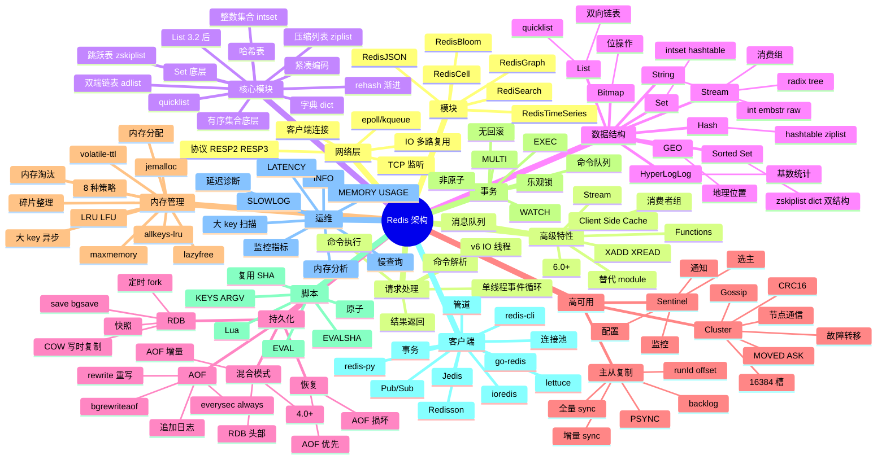

# Redis

## 一、前言

**定位**：Remote Dictionary Server，2009 年由 Salvatore Sanfilippo（antirez）发布，**内存数据结构存储系统**，可作数据库、缓存、消息队列、流处理、搜索引擎使用。

**核心价值**：
- **亚毫秒级延迟**：纯内存操作 + IO 多路复用，单机 10w+ QPS
- **丰富数据结构**：String / List / Hash / Set / Sorted Set / Stream / Bitmap / HyperLogLog / GEO
- **持久化可选**：RDB 快照 + AOF 日志，兼顾性能与安全
- **集群与高可用**：Redis Sentinel / Redis Cluster 6.x 原生分片
- **生态成熟**：几乎所有语言都有客户端，Spring Data Redis、ioredis、go-redis、redis-py 等

**五大特性**：
1. **内存优先 + 异步持久化**：数据常驻内存，RDB/AOF 异步落盘
2. **单线程事件循环**：v6.0 之前核心命令单线程（epoll），避免锁竞争
3. **RESP 协议**：文本 + 二进制混合协议，客户端实现简单
4. **Lua 脚本**：服务端原子执行复杂操作
5. **模块化**：RedisJSON / RediSearch / RedisGraph / RedisTimeSeries 等扩展

**Redis vs Memcached**：

| 维度 | Redis | Memcached |
|---|---|---|
| 数据结构 | 9 种 | KV 字符串 |
| 持久化 | RDB + AOF | 无 |
| 集群 | Sentinel + Cluster | mcrouter 客户端 |
| 复制 | 主从 / 集群 | 无 |
| 线程 | 单线程（v6 多 IO 线程） | 多线程 |
| 内存 | 优化（ziplist 等） | 简单 slab |
| Lua | 支持 | 不支持 |
| 适用 | 复杂业务、持久化 | 简单缓存 |

## 二、架构思维导图



## 三、关键代码

### 1. 字符串与哈希（SET/HSET）

```bash
# 字符串 SET 基础
SET user:1001:name "Alice"
GET user:1001:name
# Alice

# SET 选项
SET counter 0 EX 60        # 60 秒过期
SET counter 0 PX 60000     # 60 毫秒过期
SET counter 0 NX           # 不存在才设置（分布式锁）
SET counter 0 XX           # 存在才更新

# 原子操作
INCR counter               # +1
INCRBY counter 10          # +10
DECR counter               # -1
DECRBY counter 5           # -5
INCRBYFLOAT price 0.5      # 浮点

# 批量操作（MSET 原子）
MSET key1 val1 key2 val2
MGET key1 key2

# 哈希（HSET 适合对象）
HSET user:1001 name "Alice" age 30 email "alice@example.com"
HGET user:1001 name
# Alice
HGETALL user:1001
# 1) "name"
# 2) "Alice"
# 3) "age"
# 4) "30"
# 5) "email"
# 6) "alice@example.com"

# 哈希原子增减
HINCRBY user:1001 age 1    # 31
HSETNX user:1001 nick "al" # 字段不存在才设置

# 哈希序列化
HMSET user:1001 name "Bob" age 25
HMGET user:1001 name age
```

**底层结构**：
- String：`int` (整数) / `embstr` (≤44 字节) / `raw` (>44 字节) 三种编码
- Hash：field 少且值小用 `ziplist`（连续内存，节省空间）；多用 `hashtable`

### 2. 列表与发布订阅（List + Pub/Sub）

```bash
# 列表：双向链表 / quicklist
LPUSH tasks "task1" "task2" "task3"   # 左推
RPUSH tasks "task4"                   # 右推
LRANGE tasks 0 -1                     # 查看所有
# 1) "task1"
# 2) "task2"
# 3) "task3"
# 4) "task4"

LPOP tasks                            # 弹左
RPOP tasks                            # 弹右
RPOPLPUSH src dst                     # 原子从 src 弹右 → dst 推左（任务队列）

# 阻塞操作（消息队列核心）
BLPOP tasks 0                         # 阻塞等待，直到有元素
BRPOPLPUSH tasks processing 5         # 5 秒超时

# 修剪
LTRIM tasks 0 99                      # 只保留前 100 个
LLEN tasks                            # 长度

# 列表底层：3.2 后统一为 quicklist（多个 ziplist 通过双向指针连接）

# ============================================================================

# 发布订阅（实时消息）
SUBSCRIBE news                         # 订阅
PUBLISH news "Hello World"            # 发布
# 客户端收到：message news Hello World

# 模式订阅
PSUBSCRIBE news.*                     # 订阅 news.tech / news.sports 等
```

**应用场景**：
- **List + LPUSH/BRPOP**：实现简易消息队列（但生产推荐 Stream）
- **Pub/Sub**：实时通知、聊天广播（**不持久化**，订阅者不在线消息丢失）

### 3. 有序集合（Sorted Set / ZSet）

```bash
# ZSet：跳表 + 字典双结构
ZADD leaderboard 100 "alice" 200 "bob" 150 "charlie"

# 排行榜查询
ZREVRANGE leaderboard 0 9 WITHSCORES  # 前 10 名（高到低）
ZRANGE leaderboard 0 9 WITHSCORES    # 前 10 名（低到高）

# 分数操作
ZINCRBY leaderboard 50 "alice"        # alice +50
ZSCORE leaderboard "alice"            # 查分数

# 排名
ZRANK leaderboard "alice"             # 从低到高排名
ZREVRANK leaderboard "alice"          # 从高到低排名

# 范围查询
ZRANGEBYSCORE leaderboard 100 200     # 分数 100-200 之间

# 集合运算
ZUNIONSTORE union1 2 set1 set2         # 并集
ZINTERSTORE inter1 2 set1 set2         # 交集

# ============================================================================

# 实际应用：滑动窗口限流
ZADD ratelimit:user:1001 $(date +%s) "req-uuid-1"
ZREMRANGEBYSCORE ratelimit:user:1001 0 $(($(date +%s) - 60))
ZCARD ratelimit:user:1001
# 如果 > 100，限流
```

**应用场景**：
- **排行榜**：分数即排名分数，ZREVRANGE 取前 N
- **滑动窗口限流**：ZADD + ZREMRANGEBYSCORE + ZCARD
- **延迟队列**：score 是执行时间戳，定期 ZRANGEBYSCORE 取出到期任务
- **底层**：跳跃表（`zskiplist`）实现范围查询 O(log N)，字典实现 score → member 映射 O(1)

### 4. Lua 脚本与发布订阅

```bash
# 分布式锁（经典 Lua 脚本）
SET lock:order:1001 "worker-1" NX EX 30
# 抢锁

# 释放锁（必须是持有者才能释放）
EVAL "
  if redis.call('get', KEYS[1]) == ARGV[1] then
    return redis.call('del', KEYS[1])
  else
    return 0
  end
" 1 lock:order:1001 "worker-1"

# ============================================================================

# 库存扣减（原子操作）
EVAL "
  local stock = tonumber(redis.call('get', KEYS[1]))
  local qty = tonumber(ARGV[1])
  if stock >= qty then
    redis.call('decrby', KEYS[1], qty)
    return qty
  else
    return -1
  end
" 1 stock:product:2001 3

# ============================================================================

# 复杂业务：分布式限流（滑动窗口 + Lua）
EVAL "
  local key = KEYS[1]
  local now = tonumber(ARGV[1])
  local window = tonumber(ARGV[2])
  local limit = tonumber(ARGV[3])
  redis.call('zremrangebyscore', key, 0, now - window)
  local count = redis.call('zcard', key)
  if count < limit then
    redis.call('zadd', key, now, now .. ':' .. math.random())
    redis.call('expire', key, window)
    return 1
  end
  return 0
" 1 ratelimit:api 1700000000 60 100
```

**解析**：
- **Lua 脚本原子性**：执行期间不会被其他命令打断，避免竞态
- **KEYS 与 ARGV 分离**：KEYS 是 Redis 自动收集的，集群模式下按 key 分片到对应节点
- **SCRIPT LOAD + EVALSHA**：避免每次传输脚本，先 `SCRIPT LOAD` 拿到 SHA，后续用 SHA 调用

### 5. Stream（5.0+ 消息队列）

```bash
# Stream：消息流 + 消费组（替代 Kafka 简单场景）
XADD orders * product 2001 qty 3 user 1001
# 返回 ID：1700000000000-0

XADD orders * product 2002 qty 1 user 1002
XADD orders * product 2003 qty 5 user 1001

XRANGE orders - +                       # 查看所有消息

# 创建消费组
XGROUP CREATE orders order-processors $

# 消费者读取
XREADGROUP GROUP order-processors worker-1 COUNT 10 BLOCK 5000 STREAMS orders >
# 阻塞 5 秒，等待新消息

# 确认消息
XACK orders order-processors 1700000000000-0

# 失败重试：XPENDING + XCLAIM
XPENDING orders order-processors
XCLAIM orders order-processors worker-2 60000 1700000000000-0
```

**应用场景**：
- **消息队列**：相比 List + BRPOP，Stream 支持消费组、ACK、重试、消息回溯
- **事件溯源**：XRANGE 读取历史事件
- **多消费者**：一个 Stream 多个消费组，互不影响

## 四、核心洞察

1. **单线程不是性能瓶颈**：IO 多路复用（epoll）+ 内存操作 + 协议简单，单线程反而避免锁竞争；v6.0 引入 IO 线程分担网络读写。
2. **数据结构是 Redis 真正护城河**：9 种结构覆盖 90% 业务场景（排行榜、限流、消息队列、计数器），远胜 Memcached。
3. **持久化是双刃剑**：AOF everysec 丢 1 秒数据；always 安全但性能降 50%；选 RDB + AOF 混合模式是最佳实践。
4. **Cluster 的 16384 槽位设计**：CRC16 哈希 mod 16384，2^14 远小于 2^32（节省 Gossip 消息带宽），又能均匀分布 1000+ 节点。
5. **大 key 是隐形杀手**：Hash/List/Set 单 key 元素 > 10000 会阻塞主线程；用 `SCAN` + `MEMORY USAGE` 定期扫描，必要时拆 key。
6. **内存淘汰策略决定生死**：8 种策略（allkeys-lru / volatile-ttl 等），缓存场景首选 `allkeys-lru`；锁场景绝对不能淘汰（用 noeviction）。
7. **Lua 解决原子与性能双诉求**：替代事务（事务非原子无回滚），一次往返完成复杂逻辑，避免网络开销。
8. **生产环境必备监控**：`redis-cli --stat` / `INFO` / `SLOWLOG` / Prometheus exporter，关键指标：used_memory、connected_clients、ops/sec、hit_rate、evicted_keys。

## 五、跨项目引用

- [./memcached.md](./memcached.md) — Memcached 是 Redis 简单缓存场景的替代
- [./kafka.md](./kafka.md) — Kafka 适合大规模消息流；Redis Stream 适合中小规模
- [./etcd.md](./etcd.md) — etcd 用 Raft 一致性，Redis Cluster 用 Gossip
- [./prometheus.md](./prometheus.md) — Redis Exporter 是 Prometheus 监控 Redis 的标准
- [./clickhouse.md](./clickhouse.md) — ClickHouse 处理 OLAP 大数据；Redis 处理热数据
- [./postgres.md](./postgres.md) — PostgreSQL 用 `LISTEN/NOTIFY` 实现发布订阅；Redis Pub/Sub 更轻
- [./nginx.md](./nginx.md) — Nginx + Redis 实现 LRU 缓存前置
- [./go-redis.md](./go-redis.md) — Go 生态最流行的 Redis 客户端
- [./ioredis.md](./ioredis.md) — Node 生态最流行的 Redis 客户端，支持 Cluster
- [../A-前端框架/koa.md](../A-前端框架/koa.md) — Koa 中间件 + Redis 做 session 存储

## 六、Bitmap / HyperLogLog / GEO 三大高级结构

### 6.1 Bitmap 位图

```bash
# 位操作：每个 bit 存 0/1，1 亿用户日活只需 12MB
SETBIT user:active:20260604 1001 1   # 用户 1001 当日活跃
GETBIT user:active:20260604 1001     # 查活跃
BITCOUNT user:active:20260604         # 统计活跃数（DAU）
BITOP OR dest src1 src2               # 多天合并（周活/月活）
BITPOS user:active:20260604 1         # 第一个 1 的位置
```

**应用场景**：
- **日活/月活统计**：10 亿用户年活跃 365 天只需 365 亿 bit ≈ 4.3GB
- **签到系统**：每天一个 key，1 bit 一人
- **布隆过滤器替代**：轻量级去重
- **用户标签**：性别/年龄段等多维标签
- **优势**：比 SET 节省 30 倍内存

### 6.2 HyperLogLog 基数统计

```bash
# 基数统计：误差 0.81%，12KB 内存统计 2^64 个元素
PFADD uv:page:home "user:1001" "user:1002" "user:1003"
PFCOUNT uv:page:home                   # 返回 3

# 合并多个 HLL
PFMERGE uv:weekly uv:mon uv:tue uv:wed uv:thu uv:fri
PFCOUNT uv:weekly                      # 一周 UV

# 内部使用 16384 个 6-bit 寄存器（12KB），通过调和平均估算基数
```

**应用场景**：
- **UV 统计**：页面/接口独立访客数
- **搜索词去重**：统计搜索关键词基数
- **海量数据基数估算**：用户/IP/搜索词
- **不适用场景**：需要精确值、需要删除元素

### 6.3 GEO 地理位置

```bash
# GEO 底层用 Sorted Set（geohash 编码）
GEOADD cities 116.405285 39.904989 "Beijing"      # 经度 纬度 名称
GEOADD cities 121.472644 31.231706 "Shanghai"
GEOADD cities 113.264385 23.129110 "Guangzhou"

# 计算距离
GEODIST cities Beijing Shanghai km                # 1067.5306 km

# 半径查询（找附近 500km 的城市）
GEORADIUS cities 116.40 39.90 500 km WITHCOORD WITHDIST

# 矩形查询
GEOSEARCH cities FROMLONLAT 116 39 BYRADIUS 1000 km

# 取出 geohash
GEOHASH cities Beijing
# "wx4g0b7xrt0"
```

**应用场景**：
- **附近的人/车/店**：LBS 应用核心
- **外卖配送范围**：圆形/多边形配送区
- **打车定位**：附近司机匹配
- **底层**：geohash 二维编码 + Sorted Set 排序
- **性能**：百万级 POI 半径查询 < 10ms

## 七、Redis 7.0+ 新特性详解

### 7.1 Redis Functions（替代 module 脚本）

```bash
# Redis 7 引入：服务端持久化函数，替代 EVAL 模式
# 1. 加载函数库
FUNCTION LOAD "#!lua name=mylib\nredis.register_function('double', function(keys, args) return tonumber(args[1]) * 2 end)"

# 2. 调用函数
FCALL double 0 5
# 返回 10

# 3. 列出所有函数
FUNCTION LIST

# 4. 删除函数
FUNCTION DELETE mylib
```

**优势**：
- 持久化：函数存储在 Redis，重启不丢失
- 复用：跨客户端共享
- 调试：FUNCTION DUMP / RESTORE
- 相比 EVAL：避免每次传输脚本，支持版本管理

### 7.2 Multi-part AOF（多段 AOF）

```bash
# Redis 7 AOF 拆分为 Base + Incr + History 三段
# Base：RDB 格式的全量快照
# Incr：增量 AOF 命令
# History：被重写覆盖的旧 AOF（用于故障恢复）

# 配置
aof-use-rdb-preamble yes       # 启用 RDB 前导
aof-tmp-dir /tmp/redis-aof     # 临时目录

# 优势：
# 1. 重写不再阻塞主线程
# 2. 失败时可用 History 兜底
# 3. 恢复速度提升 2-3 倍
```

### 7.3 Client Side Cache（客户端缓存）

```python
# Redis 7 客户端缓存协议 RESP3
# 服务端主动通知客户端 key 失效

import redis
r = redis.Redis(host='localhost', port=6379, decode_responses=True)

# 开启客户端跟踪
r.execute_command('CLIENT', 'TRACKING', 'ON', 'REDIRECT', 9999, 'BCAST')

# 当其他客户端修改了 key，当前客户端收到失效通知：
# 1) ">"
# 2) ["invalidate", "key1", "key2"]
# 应用：本地缓存 + Redis 失效广播，命中 90%+ 走本地内存
```

**应用场景**：
- **热点数据本地缓存**：商品详情、配置中心
- **数据库查询缓存**：避免重复打 DB
- **替代多级缓存架构**：Memcached + Redis 双缓存
- **性能**：从 Redis 50us → 本地 100ns，提升 500 倍

### 7.4 ACL 访问控制（Redis 6+）

```bash
# 创建用户
ACL SETUSER app-user on >password123 ~app:* &* +@read +@write -@dangerous

# 用户权限字段
# on/off        启用/禁用
# >password     密码
# ~pattern      key 模式（~* 表示所有）
# &pattern      pubsub channel 模式
# +@category    允许命令类别（+@read +@write +@all）
# -command      禁止特定命令
# +command      允许特定命令（白名单模式）

# 切换用户
ACL WHOAMI
AUTH app-user password123

# 列出所有用户
ACL LIST

# 查看命令分类
ACL CAT @read    # 列出所有读命令

# 持久化到配置文件
ACL SAVE          # 写入 aclfile，重启生效
ACL LOAD          # 从 aclfile 重新加载

# 实战：多租户隔离
# 用户 A 只能操作 user:1001:* key
ACL SETUSER tenant-a on >passA ~user:1001:* +@read +@write
# 用户 B 只能操作 user:1002:* key
ACL SETUSER tenant-b on >passB ~user:1002:* +@read +@write
```

### 7.5 Sharded Pub/Sub（分片发布订阅）

```bash
# Redis 7 Cluster 模式下的分片 Pub/Sub
# 解决普通 Pub/Sub 只能在单节点广播的问题
SPUBLISH news.tech "Hello Cluster"     # 分片发布
SSUBSCRIBE news.*                      # 分片订阅

# 区别：
# PUBLISH/SUBSCRIBE：全节点广播，所有节点都知道
# SPUBLISH/SSUBSCRIBE：只在 key 所在分片广播，节省带宽
```

### 7.6 其他 Redis 7 增强

```bash
# 1. 零拷贝大 key 淘汰（lazyfree 增强）
lazyfree-lazy-user-flush yes

# 2. 慢日志增强
slowlog-max-len 256
slowlog-log-slower-than 10000          # 10ms 记录

# 3. LIST 类型支持 MULTI/EXEC
# 旧版 EXEC 内 List 命令可能有问题，7.0 修复

# 4. 子命令自动补全
# redis-cli 输入 SET 后按 Tab 自动补全选项

# 5. 集群 slot 迁移增强
# 支持在线迁移、增量同步、错误回滚

# 6. RESP3 协议默认启用
# 支持推送类型（Push），Pub/Sub 更高效
```

## 八、缓存三大模式深度对比

### 8.1 Cache-Aside（旁路缓存，最常用）

```python
# 经典流程：先查缓存，miss 查 DB，再回写
def get_user(user_id):
    # 1. 查缓存
    cached = redis.get(f"user:{user_id}")
    if cached:
        return json.loads(cached)
    
    # 2. 查 DB
    user = db.query("SELECT * FROM users WHERE id = %s", user_id)
    if not user:
        return None
    
    # 3. 回写缓存（设置 TTL）
    redis.setex(f"user:{user_id}", 3600, json.dumps(user))
    return user

# 写操作：先写 DB，再失效缓存（不是更新）
def update_user(user_id, data):
    db.execute("UPDATE users SET ... WHERE id = %s", user_id, data)
    redis.delete(f"user:{user_id}")  # 失效而非更新
```

**特点**：
- 应用主导缓存逻辑，简单可控
- 适合读多写少
- 缺点：首次 miss 必打 DB
- 业界标准：Facebook Memcache、Twitter Redis

### 8.2 Write-Through（同步直写）

```python
# 写时同步更新缓存和 DB
def set_user(user_id, data):
    # 1. 写 DB
    db.execute("UPDATE users SET ... WHERE id = %s", user_id, data)
    # 2. 同步写缓存
    redis.setex(f"user:{user_id}", 3600, json.dumps(data))
    return data

# 读操作
def get_user(user_id):
    cached = redis.get(f"user:{user_id}")
    if cached:
        return json.loads(cached)
    # miss 时回源
    return set_user(user_id, db.query(...))
```

**特点**：
- 缓存和 DB 强一致
- 适合写多读多
- 缺点：写延迟高（两次写）

### 8.3 Write-Behind（异步回写）

```python
# 写时只写缓存，异步批量写 DB
def set_user(user_id, data):
    # 1. 只写 Redis
    redis.setex(f"user:{user_id}", 3600, json.dumps(data))
    # 2. 加入异步队列
    redis.lpush("db:write:queue", json.dumps({"id": user_id, "data": data}))

# 后台 worker 消费队列
def worker():
    while True:
        item = redis.brpop("db:write:queue", timeout=5)
        if item:
            db.bulk_update([json.loads(item[1])])
        time.sleep(1)
```

**特点**：
- 写性能极高（只写内存）
- 适合日志、计数器、点赞数
- 风险：宕机可能丢数据
- 进阶：用 Stream 替代 List 持久化队列

### 8.4 模式对比表

| 维度 | Cache-Aside | Write-Through | Write-Behind |
|---|---|---|---|
| 一致性 | 弱 | 强 | 弱 |
| 写延迟 | 低 | 高 | 极低 |
| 复杂度 | 低 | 中 | 高 |
| 适用 | 读多写少 | 写多读多 | 写多读多 |
| 风险 | 缓存击穿 | 写慢 | 数据丢失 |
| 代表 | FB Memcache | 业务库 | 计数器 |

## 九、四语言客户端代码库

### 9.1 Python (redis-py)

```python
# pip install redis[hiredis]  # hiredis 是 C 扩展，性能提升 5 倍
import redis
import json
from typing import Optional

class RedisClient:
    def __init__(self, host='localhost', port=6379, db=0, password=None):
        # 连接池：复用 TCP 连接，避免握手开销
        self.pool = redis.ConnectionPool(
            host=host, port=port, db=db, password=password,
            max_connections=50,           # 最大连接数
            socket_keepalive=True,        # TCP keepalive
            socket_connect_timeout=5,     # 连接超时
            retry_on_timeout=True,        # 超时重试
            health_check_interval=30      # 健康检查
        )
        self.r = redis.Redis(connection_pool=self.pool, decode_responses=True)
    
    def get_user(self, uid: int) -> Optional[dict]:
        """Cache-Aside 模式：查缓存 → 查 DB → 回写"""
        # 1. 查缓存
        key = f"user:{uid}"
        cached = self.r.get(key)
        if cached:
            return json.loads(cached)
        
        # 2. miss 时回源
        user = self._db_query(uid)
        if user:
            # 3. 回写 + 随机过期（防止雪崩）
            ttl = 3600 + random.randint(-300, 300)
            self.r.setex(key, ttl, json.dumps(user))
        return user
    
    def update_user(self, uid: int, data: dict):
        """更新：先 DB 后失效缓存（不是更新）"""
        self._db_update(uid, data)
        self.r.delete(f"user:{uid}")
    
    def cache_breakdown_safe(self, uid: int) -> Optional[dict]:
        """防缓存击穿：分布式锁 + 单飞（Single Flight）"""
        key = f"user:{uid}"
        # 1. 先查缓存
        cached = self.r.get(key)
        if cached:
            return json.loads(cached)
        
        # 2. 用 SETNX 抢锁
        lock_key = f"lock:{key}"
        if self.r.set(lock_key, "1", nx=True, ex=10):
            try:
                # 抢到锁：从 DB 加载
                user = self._db_query(uid)
                if user:
                    self.r.setex(key, 3600, json.dumps(user))
                return user
            finally:
                self.r.delete(lock_key)
        else:
            # 没抢到：sleep 后重试
            time.sleep(0.1)
            return self.get_user(uid)
    
    def pipeline_demo(self):
        """Pipeline 管道：批量命令一次往返"""
        pipe = self.r.pipeline(transaction=False)
        pipe.set("a", 1)
        pipe.incr("b")
        pipe.get("c")
        results = pipe.execute()  # 一次发送
        return results
    
    def lua_lock_demo(self):
        """Lua 释放锁（必须持有者）"""
        lua = """
        if redis.call('get', KEYS[1]) == ARGV[1] then
            return redis.call('del', KEYS[1])
        else
            return 0
        end
        """
        return self.r.eval(lua, 1, "lock:order:1", "worker-1")
    
    def stream_consume(self):
        """Stream 消费者组"""
        # 创建消费组
        try:
            self.r.xgroup_create("orders", "processors", id="$", mkstream=True)
        except redis.exceptions.ResponseError:
            pass  # 组已存在
        
        # 循环消费
        while True:
            messages = self.r.xreadgroup(
                "processors", "worker-1",
                {"orders": ">"}, count=10, block=5000
            )
            for stream, msgs in messages:
                for msg_id, data in msgs:
                    try:
                        self._process_order(data)
                        self.r.xack("orders", "processors", msg_id)
                    except Exception:
                        # 失败重试
                        pass
    
    def scan_big_key(self, pattern="*", count=1000):
        """SCAN 替代 KEYS（生产禁用 KEYS）"""
        cursor = 0
        big_keys = []
        while True:
            cursor, keys = self.r.scan(cursor=cursor, match=pattern, count=count)
            for key in keys:
                size = self.r.memory_usage(key) or 0
                if size > 1024 * 1024:  # > 1MB
                    big_keys.append((key, size))
            if cursor == 0:
                break
        return big_keys

# 用法
client = RedisClient(password='your_password')
user = client.get_user(1001)
```

### 9.2 Go (go-redis)

```go
package main

import (
    "context"
    "encoding/json"
    "fmt"
    "time"
    
    "github.com/redis/go-redis/v9"
)

var ctx = context.Background()

func NewClient() *redis.Client {
    rdb := redis.NewClient(&redis.Options{
        Addr:         "localhost:6379",
        Password:     "your_password",
        DB:           0,
        PoolSize:     50,              // 连接池大小
        MinIdleConns: 10,              // 最小空闲连接
        DialTimeout:  5 * time.Second, // 连接超时
        ReadTimeout:  3 * time.Second, // 读超时
        WriteTimeout: 3 * time.Second, // 写超时
        IdleTimeout:  5 * time.Minute, // 空闲连接超时
        
        // 集群模式
        // Addrs: []string{"node1:6379", "node2:6379", "node3:6379"},
    })
    
    // 健康检查
    if err := rdb.Ping(ctx).Err(); err != nil {
        panic(err)
    }
    return rdb
}

// Cache-Aside 模式
func GetUser(rdb *redis.Client, uid int) (map[string]interface{}, error) {
    key := fmt.Sprintf("user:%d", uid)
    
    // 1. 查缓存
    cached, err := rdb.Get(ctx, key).Result()
    if err == nil {
        var user map[string]interface{}
        json.Unmarshal([]byte(cached), &user)
        return user, nil
    }
    
    // 2. miss 查 DB（伪代码）
    user := queryDB(uid)
    if user == nil {
        return nil, nil
    }
    
    // 3. 回写
    data, _ := json.Marshal(user)
    rdb.Set(ctx, key, data, time.Hour)
    return user, nil
}

// 分布式锁（基于 SETNX）
func AcquireLock(rdb *redis.Client, resource, owner string, ttl time.Duration) bool {
    ok, err := rdb.SetNX(ctx, "lock:"+resource, owner, ttl).Result()
    return err == nil && ok
}

func ReleaseLock(rdb *redis.Client, resource, owner string) error {
    // Lua 脚本保证原子
    script := redis.NewScript(`
        if redis.call("get", KEYS[1]) == ARGV[1] then
            return redis.call("del", KEYS[1])
        else
            return 0
        end
    `)
    return script.Run(ctx, rdb, []string{"lock:" + resource}, owner).Err()
}

// Pipeline 管道
func PipelineDemo(rdb *redis.Client) {
    pipe := rdb.Pipeline()
    pipe.Set(ctx, "k1", "v1", 0)
    pipe.Incr(ctx, "counter")
    pipe.Get(ctx, "k2")
    cmds, err := pipe.Exec(ctx)
    if err != nil {
        panic(err)
    }
    for _, cmd := range cmds {
        fmt.Println(cmd)
    }
}

// Pub/Sub 订阅
func Subscribe(rdb *redis.Client) {
    pubsub := rdb.Subscribe(ctx, "news", "news.tech")
    defer pubsub.Close()
    
    ch := pubsub.Channel()
    for msg := range ch {
        fmt.Printf("Channel: %s, Msg: %s\n", msg.Channel, msg.Payload)
    }
}

// Stream 消费者
func ConsumeStream(rdb *redis.Client) {
    // 创建消费组
    rdb.XGroupCreateMkStream(ctx, "orders", "processors", "$")
    
    for {
        streams, err := rdb.XReadGroup(ctx, &redis.XReadGroupArgs{
            Group:    "processors",
            Consumer: "worker-1",
            Streams:  []string{"orders", ">"},
            Count:    10,
            Block:    5 * time.Second,
        }).Result()
        if err != nil {
            continue
        }
        for _, stream := range streams {
            for _, msg := range stream.Messages {
                fmt.Printf("ID: %s, Data: %v\n", msg.ID, msg.Values)
                rdb.XAck(ctx, "orders", "processors", msg.ID)
            }
        }
    }
}

// 集群模式
func NewClusterClient() *redis.ClusterClient {
    return redis.NewClusterClient(&redis.ClusterOptions{
        Addrs:    []string{":7000", ":7001", ":7002", ":7003", ":7004", ":7005"},
        Password: "your_password",
        // 自动计算 slot
        ReadOnly: false,
        // 错误重试
        MaxRetries:      3,
        MinRetryBackoff: 8 * time.Millisecond,
        MaxRetryBackoff: 512 * time.Millisecond,
    })
}

func main() {
    rdb := NewClient()
    defer rdb.Close()
    
    // 使用示例
    user, _ := GetUser(rdb, 1001)
    fmt.Println(user)
    
    // 订阅
    go Subscribe(rdb)
    
    // 消费 Stream
    ConsumeStream(rdb)
}
```

### 9.3 Node.js (ioredis)

```javascript
// npm install ioredis
const Redis = require('ioredis');

// 单机模式
const redis = new Redis({
  host: '127.0.0.1',
  port: 6379,
  password: 'your_password',
  db: 0,
  // 连接池
  maxRetriesPerRequest: 3,
  enableReadyCheck: true,
  enableOfflineQueue: true,
  connectTimeout: 5000,
  // 重连
  retryStrategy(times) {
    return Math.min(times * 50, 2000);
  },
});

// 集群模式
const cluster = new Redis.Cluster([
  { host: 'node1', port: 7000 },
  { host: 'node2', port: 7001 },
  { host: 'node3', port: 7002 },
], {
  redisOptions: { password: 'your_password' },
  scaleReads: 'slave',     // 读从节点
  enableReadyCheck: true,
  slotsRefreshTimeout: 10000,
  // NAT：disableDnsLookup
});

// Sentinel 模式
const sentinel = new Redis({
  sentinels: [
    { host: 'sentinel1', port: 26379 },
    { host: 'sentinel2', port: 26379 },
    { host: 'sentinel3', port: 26379 },
  ],
  name: 'mymaster',
  password: 'your_password',
  db: 0,
});

// 基础操作
async function basicOps() {
  // String
  await redis.set('user:1001:name', 'Alice', 'EX', 3600);
  const name = await redis.get('user:1001:name');
  
  // Hash
  await redis.hset('user:1001', {
    name: 'Alice', age: 30, email: 'alice@example.com'
  });
  const user = await redis.hgetall('user:1001');
  
  // 原子增减
  const counter = await redis.incr('page:views');
  
  // Pipeline（自动 pipeline）
  const results = await redis.multi()
    .set('k1', 'v1')
    .incr('counter')
    .get('k2')
    .exec();
  // results = [[null, 'OK'], [null, 1], [null, 'v2']]
}

// Lua 脚本
async function luaDemo() {
  // 1. 定义脚本
  const lockScript = `
    if redis.call('get', KEYS[1]) == ARGV[1] then
      return redis.call('del', KEYS[1])
    else
      return 0
    end
  `;
  
  // 2. ioredis 自动管理 SHA 缓存
  redis.defineCommand('releaseLock', {
    numberOfKeys: 1,
    lua: lockScript,
  });
  
  // 3. 调用
  const result = await redis.releaseLock('lock:order:1', 'worker-1');
}

// 限流（滑动窗口）
async function rateLimit(userId, limit = 100, windowSec = 60) {
  const lua = `
    local key = KEYS[1]
    local now = tonumber(ARGV[1])
    local window = tonumber(ARGV[2])
    local limit = tonumber(ARGV[3])
    redis.call('zremrangebyscore', key, 0, now - window)
    local count = redis.call('zcard', key)
    if count < limit then
      redis.call('zadd', key, now, now .. ':' .. math.random())
      redis.call('expire', key, window)
      return 1
    else
      return 0
    end
  `;
  redis.defineCommand('rateLimit', { numberOfKeys: 1, lua });
  const allowed = await redis.rateLimit(
    `ratelimit:user:${userId}`,
    Date.now(),
    windowSec * 1000,
    limit
  );
  return allowed === 1;
}

// 分布式锁（Redlock 简化版）
async function tryLock(resource, ttlMs) {
  const token = `${process.pid}:${Date.now()}:${Math.random()}`;
  const ok = await redis.set(`lock:${resource}`, token, 'PX', ttlMs, 'NX');
  return ok === 'OK' ? token : null;
}

async function unlock(resource, token) {
  const lua = `
    if redis.call('get', KEYS[1]) == ARGV[1] then
      return redis.call('del', KEYS[1])
    else
      return 0
    end
  `;
  return redis.eval(lua, 1, `lock:${resource}`, token);
}

// Express 中间件：session 存储
function sessionMiddleware() {
  return async (req, res, next) => {
    const sid = req.cookies.sid;
    if (!sid) {
      req.session = {};
      return next();
    }
    const data = await redis.get(`session:${sid}`);
    req.session = data ? JSON.parse(data) : {};
    
    // 包装 set 方法，自动写入 Redis
    const originalSet = req.session;
    Object.defineProperty(req, 'session', {
      value: new Proxy(originalSet, {
        set(target, key, value) {
          target[key] = value;
          redis.setex(`session:${sid}`, 3600, JSON.stringify(target));
          return true;
        }
      }),
      writable: true
    });
    next();
  };
}

// 连接事件
redis.on('connect', () => console.log('Redis connected'));
redis.on('error', (err) => console.error('Redis error:', err));
redis.on('reconnecting', (delay) => console.log(`Reconnecting in ${delay}ms`));

// 优雅关闭
process.on('SIGTERM', async () => {
  await redis.quit();
  process.exit(0);
});

module.exports = { redis, cluster, sentinel };
```

### 9.4 Java (Jedis / Lettuce / Redisson)

```java
// Spring Boot 3.x + Lettuce（推荐，支持响应式）
// pom.xml
// <dependency>
//   <groupId>org.springframework.boot</groupId>
//   <artifactId>spring-boot-starter-data-redis</artifactId>
// </dependency>

import org.springframework.beans.factory.annotation.Autowired;
import org.springframework.data.redis.core.*;
import org.springframework.data.redis.connection.RedisConnectionFactory;
import org.springframework.data.redis.serializer.GenericJackson2JsonRedisSerializer;
import org.springframework.data.redis.serializer.StringRedisSerializer;
import org.springframework.context.annotation.Bean;
import org.springframework.context.annotation.Configuration;

@Configuration
public class RedisConfig {
    
    @Bean
    public RedisTemplate<String, Object> redisTemplate(RedisConnectionFactory factory) {
        RedisTemplate<String, Object> template = new RedisTemplate<>();
        template.setConnectionFactory(factory);
        
        // Key 用 String 序列化
        template.setKeySerializer(new StringRedisSerializer());
        template.setHashKeySerializer(new StringRedisSerializer());
        
        // Value 用 JSON 序列化
        template.setValueSerializer(new GenericJackson2JsonRedisSerializer());
        template.setHashValueSerializer(new GenericJackson2JsonRedisSerializer());
        
        template.afterPropertiesSet();
        return template;
    }
}

@Service
public class UserService {
    @Autowired
    private RedisTemplate<String, Object> redisTemplate;
    
    @Autowired
    private UserRepository userRepository;
    
    public User getUser(Long id) {
        String key = "user:" + id;
        
        // 1. 查缓存
        User user = (User) redisTemplate.opsForValue().get(key);
        if (user != null) {
            return user;
        }
        
        // 2. miss 查 DB
        user = userRepository.findById(id).orElse(null);
        if (user != null) {
            // 3. 回写缓存
            redisTemplate.opsForValue().set(key, user, Duration.ofHours(1));
        }
        return user;
    }
    
    public void updateUser(User user) {
        userRepository.save(user);
        redisTemplate.delete("user:" + user.getId());
    }
    
    // Hash 操作
    public void saveUserProfile(Long id, Map<String, String> profile) {
        String key = "user:profile:" + id;
        redisTemplate.opsForHash().putAll(key, profile);
        redisTemplate.expire(key, Duration.ofHours(2));
    }
    
    public Map<Object, Object> getUserProfile(Long id) {
        return redisTemplate.opsForHash().entries("user:profile:" + id);
    }
    
    // Lua 脚本
    public boolean releaseLock(String lockKey, String ownerId) {
        DefaultRedisScript<Long> script = new DefaultRedisScript<>();
        script.setScriptText(
            "if redis.call('get', KEYS[1]) == ARGV[1] then " +
            "  return redis.call('del', KEYS[1]) " +
            "else " +
            "  return 0 " +
            "end"
        );
        script.setResultType(Long.class);
        
        Long result = redisTemplate.execute(script, 
            Collections.singletonList(lockKey), ownerId);
        return result != null && result == 1L;
    }
    
    // 分布式限流
    public boolean tryAcquire(String key, int limit, int windowSec) {
        long now = System.currentTimeMillis();
        long window = windowSec * 1000L;
        
        String lua = 
            "local key = KEYS[1] " +
            "local now = tonumber(ARGV[1]) " +
            "local window = tonumber(ARGV[2]) " +
            "local limit = tonumber(ARGV[3]) " +
            "redis.call('zremrangebyscore', key, 0, now - window) " +
            "local count = redis.call('zcard', key) " +
            "if count < limit then " +
            "  redis.call('zadd', key, now, now .. ':' .. math.random()) " +
            "  redis.call('expire', key, window) " +
            "  return 1 " +
            "else " +
            "  return 0 " +
            "end";
        
        DefaultRedisScript<Long> script = new DefaultRedisScript<>();
        script.setScriptText(lua);
        script.setResultType(Long.class);
        
        Long allowed = redisTemplate.execute(script,
            Collections.singletonList(key),
            String.valueOf(now), String.valueOf(window), String.valueOf(limit));
        return allowed != null && allowed == 1L;
    }
    
    // Stream 消费
    @PostConstruct
    public void startConsumer() {
        new Thread(() -> {
            while (true) {
                try {
                    // XREADGROUP
                    List<MapRecord<String, Object, Object>> messages = 
                        redisTemplate.opsForStream().read(
                            Consumer.from("processors", "worker-1"),
                            StreamReadOptions.empty().count(10).block(Duration.ofSeconds(5)),
                            StreamOffset.create("orders", ReadOffset.lastConsumed())
                        );
                    
                    for (MapRecord<String, Object, Object> msg : messages) {
                        try {
                            processOrder(msg.getValue());
                            redisTemplate.opsForStream().acknowledge("orders", "processors", msg.getId());
                        } catch (Exception e) {
                            log.error("Process order failed: {}", e.getMessage());
                        }
                    }
                } catch (Exception e) {
                    log.error("Stream read error: {}", e.getMessage());
                }
            }
        }).start();
    }
}

// Redisson（高级特性，分布式锁/集合/队列）
// 依赖：redisson-spring-boot-starter
import org.redisson.api.*;

@Service
public class RedissonService {
    @Autowired
    private RedissonClient redisson;
    
    // 分布式锁（看门狗自动续期）
    public void doWithLock(String key) {
        RLock lock = redisson.getLock("lock:" + key);
        try {
            // 默认 30s 锁，看门狗每 10s 续期到 30s
            lock.lock();
            // 业务逻辑
            doSomething();
        } finally {
            lock.unlock();
        }
    }
    
    // 公平锁
    public void fairLock(String key) {
        RLock fairLock = redisson.getFairLock("lock:" + key);
        fairLock.lock();
        try {
            doSomething();
        } finally {
            fairLock.unlock();
        }
    }
    
    // 分布式集合
    public void setOps() {
        RSet<String> set = redisson.getSet("my:set");
        set.add("a", "b", "c");
        boolean exists = set.contains("a");
        
        RList<String> list = redisson.getList("my:list");
        list.add("first");
        list.add(0, "zero");
        
        RMap<String, String> map = redisson.getMap("my:map");
        map.put("key1", "value1");
        map.expire(Duration.ofHours(1));
    }
    
    // 限流器
    public boolean tryRateLimit(String key, int rate, int interval) {
        RRateLimiter limiter = redisson.getRateLimiter("rate:" + key);
        limiter.trySetRate(RateType.OVERALL, rate, interval, RateIntervalUnit.SECONDS);
        return limiter.tryAcquire();
    }
    
    // 分布式队列
    public void useQueue() {
        RQueue<String> queue = redisson.getQueue("my:queue");
        queue.add("task1");
        String task = queue.poll();
        
        // 延迟队列
        RDelayedQueue<String> delayed = redisson.getDelayedQueue(queue);
        delayed.offer("task", 10, TimeUnit.SECONDS);
    }
}
```
