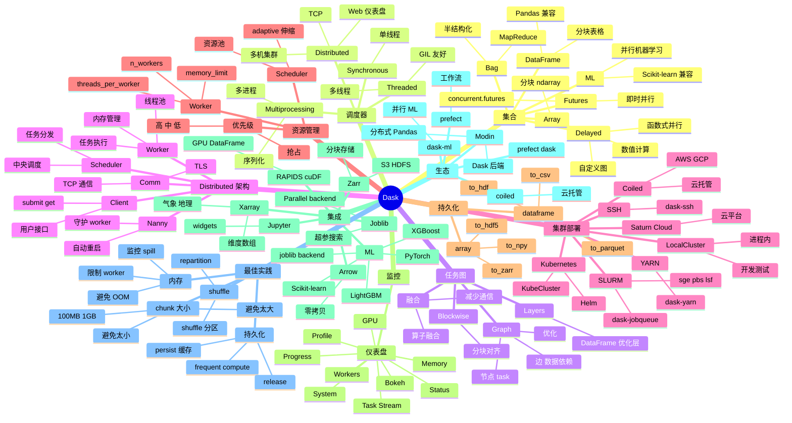

# Dask

## 一、前言

Dask 是 Python 生态中并行与分布式计算的"事实标准"库，由 Continuum Analytics（Anaconda 公司）的 Matthew Rocklin 于 2015 年发起，2017 年加入 NumFOCUS。它把 NumPy / Pandas / Scikit-learn 的 API 扩展到多核 CPU 和分布式集群，让单机写好的数据科学代码几乎零修改即可横向扩展到 TB 级数据。截至 2025 年，Dask 已被 NASA、Anaconda、Microsoft、Coiled、Saturn Cloud 等广泛使用，是替代 Spark 进行 Python 原生大规模计算的最主流选择。

Dask 的核心价值在于"熟悉的 API + 弹性调度 + Python 原生"。① 熟悉的 API——`dask.array` ≈ NumPy、`dask.dataframe` ≈ Pandas、`dask.ml` ≈ Scikit-learn，迁移成本极低；② 弹性调度——Dask Scheduler 有 Threaded（单机多线程，适合数值计算）、Multiprocessing（单机多进程）、Distributed（多机集群，TCP 通信）三种，统一调度器接口；③ Python 原生——Dask 完全用 Python 写（核心 Cython 优化），与 NumPy/Pandas/Scikit-learn 生态无缝融合；④ 惰性计算——构建任务图，按需执行，自动优化；⑤ 实时仪表盘——内置 Bokeh 仪表盘监控任务进度、内存、CPU、任务图。

Dask 的关键能力包括：① Dask Array（分块多维数组，NumPy 兼容）；② Dask DataFrame（分块表格，Pandas 兼容）；③ Dask Bag（半结构化数据，MapReduce 风格）；④ Dask ML（并行机器学习，Scikit-learn 兼容）；⑤ Dask Delayed（函数式并行，类似 Spark RDD）；⑥ Dask Futures（即时计算，concurrent.futures 兼容）；⑦ Distributed Scheduler（多机集群、弹性伸缩、容错）；⑧ YARN/Kubernetes/Mesos 部署；⑨ 实时仪表盘（Task Stream、Progress、Memory）；⑩ 与 RAPIDS/cuDF/GPU 集成。

Dask 与其他并行/分布式计算框架的对比：

| 工具 | 定位 | 优势 | 局限 |
|------|------|------|------|
| Dask | Python 原生分布式 | API 兼容、Pythonic、易用、仪表盘 | 性能不如 Spark、SQL 弱、生态小 |
| Apache Spark | 分布式大数据 | TB/PB 级、JVM 性能、SQL/Streaming/ML 完整 | 启动慢、Python API 弱、Python 进程开销 |
| Ray | 通用分布式计算 | Actor 模型、超低任务开销、RL/Hyperparam 强 | 资源调度弱于 Dask、需自建集群 |
| Modin | Pandas 透明加速 | 1 行 import 改 pandas、单机分布式 | 依赖 Dask/Ray、生态有限 |
| Polars | Rust 内核 DataFrame | 速度 5-10x Pandas、内存省、并行 | 集群模式弱、Python 生态浅 |
| cuDF | GPU DataFrame | 极致速度、Apache Arrow 兼容 | 需 NVIDIA GPU、单机 |
| Vaex | 懒加载 DataFrame | 内存映射、亿行表秒级 | 写操作弱、生态小 |
| Apache Beam | 统一批流 | Google 开源、跨 runner | Python 性能弱、模型复杂 |

Dask 的核心应用场景：① TB 级数据 ETL（Pandas 装不下的 Parquet/CSV/JSON 处理）；② 分布式超参搜索（`dask.delayed` + `joblib` backend）；③ 大规模机器学习（Dask ML 配合 XGBoost-LightGBM-Scikit-learn 并行）；④ 单机多核加速（无需建集群，`dask.array` 自动用满多核）；⑤ 自定义并行流水线（`delayed` + `compute()` 优雅实现 MapReduce）；⑥ 替代 Spark（数据量 GB-TB、Python 工程师为主的团队）；⑦ 地理空间计算（Dask + GeoPandas + Xarray）；⑧ 时间序列（`dask.dataframe` + `groupby` + 滚动窗口）。

Dask 5 大核心特性：① NumPy/Pandas/Scikit-learn API 100% 兼容（迁移成本几乎为零）；② 三层调度器（Threaded / Multiprocessing / Distributed），单机多机统一接口；③ 惰性任务图（`compute()` 之前全部是构建 DAG，自动优化）；④ 实时 Bokeh 仪表盘（任务进度、内存、CPU、任务流可视化）；⑤ 与 RAPIDS/cuDF/Xarray/Zarr/Arrow 深度集成（数据科学全栈并行化）。

## 二、架构思维导图



## 三、关键代码

### 3.1 Dask Array：分块多维数组

```python
# 文件：dask/array/core.py
import dask.array as da
import numpy as np

# ──────── 创建分块数组 ────────
# 从 NumPy 数组分块
x = da.from_array(np.random.rand(10000, 10000), chunks=(1000, 1000))
# 10000x10000 = 800MB 太大 → 分成 100 个 1000x1000 块

# 直接创建（无需先建 NumPy）
x = da.ones((10000, 10000), chunks=(1000, 1000))
y = da.random.normal(0, 1, (10000, 10000), chunks=(1000, 1000))

# 从分块文件（如 HDF5、Zarr）
# da.from_zarr("data.zarr")
# da.from_hdf5("data.h5", "/dataset", chunks=(1000, 1000))

# ──────── 计算（NumPy-like API） ────────
z = (x + y) * 2                                     # 惰性：构建任务图
z = z.mean(axis=0)                                  # 惰性
result = z.compute()                                # 显式执行 → numpy.ndarray

# ──────── 性能：自动并行 ────────
import dask
print(dask.config.get("scheduler", "default"))     # 默认 'threads'

# 显式设置
with dask.config.set(scheduler="threads", num_workers=4):
    result = z.compute()                            # 4 线程

# ──────── 持久化到磁盘 ────────
# 节省重复计算
z = z.persist()                                     # 内存中保留中间结果
final = z.sum().compute()                           # 后续计算从缓存读

# ──────── 线性代数 ────────
A = da.random.random((5000, 5000), chunks=(1000, 1000))
B = da.random.random((5000, 5000), chunks=(1000, 1000))
C = A @ B                                           # 自动使用 BLAS/块算法
# da.linalg.svd / qr / cholesky / solve

# ──────── 与 NumPy 互操作 ────────
np_arr = z.compute()                                # dask → numpy
dask_arr = da.from_array(np_arr, chunks=1000)       # numpy → dask
# 大型 NumPy 数组用 dask 包装后可用所有 dask 算子
```

### 3.2 Dask DataFrame：分块表格

```python
# 文件：dask/dataframe/core.py
import dask.dataframe as dd
import pandas as pd

# ──────── 读取大文件 ────────
# 单个 CSV
df = dd.read_csv("data.csv", blocksize="64MB")
# 多文件
df = dd.read_csv("data-*.csv", parse_dates=["timestamp"])
# Parquet（推荐，列式压缩）
df = dd.read_parquet("data.parquet/", engine="pyarrow")
df = dd.read_parquet("s3://bucket/data/year=2024/*/data.parquet")

# 显式查看分区
print(df.npartitions)                                # 分区数
print(df.divisions)                                  # 分区边界（按 index 排序）

# ──────── Pandas-like API ────────
# 全部惰性
filtered = df[df["age"] > 25]
agg = filtered.groupby("category").agg({
    "price": "sum",
    "user_id": "count",
})
result = agg.compute()                              # 显式执行 → pandas.DataFrame

# ──────── 关键操作 ────────
# 1. set_index：性能影响大
df = df.set_index("timestamp")                      # 触发 shuffle，但让后续 query 飞快
# 2. 排序
df = df.sort_values("user_id")
# 3. 透视表
pivot = df.pivot_table(
    index="category", columns="month",
    values="price", aggfunc="sum",
).compute()
# 4. 时间序列
df["date"] = dd.to_datetime(df["timestamp"])
daily = df.resample("1D").mean().compute()          # 重新采样
# 5. 缺失值
df_filled = df.fillna({"age": df["age"].mean(), "name": "UNKNOWN"})

# ──────── 与 Pandas 互操作 ────────
small_pdf = df.head(1000).compute()                 # 前 1000 行 → pandas
# 大数据写入
df.to_parquet("output/", engine="pyarrow", partition_on=["year", "month"])

# ──────── Shuffle 性能调优 ────────
# set_index / sort_values / groupby 触发 shuffle
# 可设置：dask.config.set(shuffle="tasks")  # 或 "disk" / "p2p"
# 高版本默认 p2p（点对点），速度更快
```

### 3.3 Dask Distributed + 实时仪表盘

```python
# 文件：distributed/client.py / distributed/dashboard
from dask.distributed import Client, LocalCluster

# ──────── 启动本地集群 ────────
cluster = LocalCluster(
    n_workers=4,                                    # 4 worker 进程
    threads_per_worker=2,                            # 每 worker 2 线程
    memory_limit="4GB",                              # 内存限制
    dashboard_address=":8787",                      # 仪表盘端口
)
client = Client(cluster)
print(client)                                       # 打印连接信息
# http://localhost:8787/status                     # 浏览器看仪表盘

# ──────── 提交任务 ────────
import time
def slow_func(x):
    time.sleep(1)
    return x * 2

# 异步
futures = client.map(slow_func, range(100))          # 提交 100 个任务
results = client.gather(futures)                     # 等待并收集
print(results[:5])

# 即时执行
future = client.submit(slow_func, 42)                # 提交单个
print(future.result())                              # 等待结果

# ──────── Future 取消 / 依赖 ────────
future = client.submit(slow_func, 100)
future.cancel()                                      # 取消未执行的任务
dep = client.submit(lambda x: x + 1, future)        # 任务依赖

# ──────── scatter：广播大数据 ────────
big_data = np.random.rand(1_000_000, 100)
future = client.scatter(big_data)                   # 一次性分发到 worker
# 后续所有任务共享此数据，避免重复传输
result = client.submit(slow_func, future).result()

# ──────── adaptive 弹性伸缩 ────────
cluster.adapt(minimum=2, maximum=10)                # 根据负载自动伸缩 worker

# ──────── 集群部署（K8s / SLURM / SSH） ────────
# 1. Kubernetes
# from dask_kubernetes import KubeCluster
# cluster = KubeCluster("dask-worker.yaml")
# cluster.scale(20)

# 2. SLURM
# from dask_jobqueue import SLURMCluster
# cluster = SLURMCluster(cores=32, memory="128GB", queue="normal")
# cluster.scale(20)

# 3. Coiled（云托管）
# import coiled
# cluster = coiled.Cluster(name="my-cluster", n_workers=20)
```

### 3.4 Dask ML + 集成生态

```python
# 文件：dask_ml / dask.array / dask.delayed
import dask.dataframe as dd
import dask.array as da
from dask_ml.model_selection import train_test_split, GridSearchCV
from dask_ml.preprocessing import StandardScaler
from dask_ml.linear_model import LogisticRegression
from dask_ml.cluster import KMeans
import joblib

# ──────── 设置 joblib backend：Dask 并行 sklearn ────────
# 任何 sklearn GridSearchCV / cross_val_score 自动并行到 Dask 集群
from sklearn.linear_model import LogisticRegression
from sklearn.model_selection import GridSearchCV
from sklearn.datasets import make_classification

# Dask 替代 joblib 后端
import distributed
client = distributed.Client()                       # 启动本地集群

X, y = make_classification(n_samples=10000, n_features=100, random_state=42)

param_grid = {"C": [0.01, 0.1, 1.0, 10.0], "penalty": ["l1", "l2"]}
with joblib.parallel_backend("dask"):
    grid = GridSearchCV(
        LogisticRegression(solver="saga", max_iter=1000),
        param_grid,
        cv=5,
        n_jobs=-1,                                  # 全部用 Dask worker
    )
    grid.fit(X, y)
print(grid.best_params_, grid.best_score_)

# ──────── Dask ML 原生模型 ────────
# KMeans 分布式聚类
km = KMeans(n_clusters=8)
km.fit(da.from_array(X, chunks=2000))                # 数据可超过内存

# LogisticRegression
clf = LogisticRegression()
clf.fit(X_dask, y_dask)                             # X_dask 是 dask.array

# StandardScaler（增量计算均值/方差）
scaler = StandardScaler()
X_scaled = scaler.fit_transform(X_dask)             # 一次扫描全数据

# ──────── XGBoost + Dask 并行训练 ────────
import xgboost as xgb
import dask.array as da

X = da.random.random((1_000_000, 100), chunks=(10_000, 100))
y = da.random.randint(0, 2, (1_000_000,), chunks=(10_000,))

dtrain = xgb.DMatrix(X, y)
dtest  = xgb.DMatrix(X[:1000], y[:1000])
params = {"tree_method": "hist", "objective": "binary:logistic"}
# 训练（Dask 集成：xgb.train 自动用 Dask 集群）
bst = xgb.train(
    params, dtrain, num_boost_round=100,
    evals=[(dtest, "test")],
)
# 训练任务自动分片到 Dask worker，每 worker 训练子树，全局 reduce
```

## 四、核心洞察

- **"熟悉的 API + 横向扩展"是 Dask 的核心比喻**：Dask 的设计哲学是"如果你的代码用 NumPy/Pandas 写好了，把它扩展到大数据"。`dask.array` 是 NumPy 的分块实现、`dask.dataframe` 是 Pandas 的分块实现、`dask.ml` 是 Scikit-learn 的并行实现。`x.compute()` 这一行是 NumPy 数组世界和分布式世界的分水岭。

- **Block（分块）是核心抽象**：Dask 把大数据切分成小块（chunk），每块是 NumPy 数组/Pandas DataFrame。计算任务被表达为对块的操作图（Task Graph），Scheduler 调度时按块分配给 worker，最终聚合成结果。Block 大小是核心调参——太小（<10MB）调度开销大，太大（>1GB）并行度不足、worker 内存易爆，经验值 100MB-1GB。

- **三调度器统一接口**：`dask.config.set(scheduler="threads")` 切换到多线程（NumPy 等 C 扩展释放 GIL 的场景最高效）、`"processes"` 切换到多进程（独立内存、避免 GIL 阻塞）、`"distributed"` 切换到多机集群（TCP 通信、容错、仪表盘）。生产环境几乎都用 distributed 调度器，但单机的 `threads` 调度器已经能让大部分 Pandas 代码自动多核加速。

- **Dask Distributed = 现代化集群调度**：① Scheduler 进程负责任务调度、资源管理、任务优化；② Worker 进程执行任务，每 worker 内部用线程池；③ Client 是用户接口，提交任务、获取结果；④ Nanny 守护 worker，崩溃自动重启；⑤ 任务调度有优先级、抢占、自适应伸缩。仪表盘是 Dask 的"杀手锏"——实时看任务流、内存、CPU、Profile、Task Graph。

- **Dask 与 Spark 的设计哲学差异**：Spark 是"中心化、JVM、RDD/DataFrame 抽象、SQL 友好"；Dask 是"轻量、Python 原生、任务图（无中心化数据抽象）、与科学计算栈深度集成"。Dask 启动时间 < 1s（Spark 30s+）、Dask 任务开销 < 1ms（Spark 100ms+）、Dask 适合 GB-TB 单次任务（Spark 适合 TB+ 长任务）。Python 数据科学团队首选 Dask，大数据 Java/SQL 团队选 Spark。

- **Dask ML 的核心价值是把单机 sklearn 扩展到多机**：`dask_ml.model_selection.GridSearchCV` + `joblib.parallel_backend("dask")` 让 5 折 × 100 参数组合 × 1000 万样本的网格搜索在 100 核集群上从 1 周缩到 1 小时。`XGBoost.train(...).fit()` + Dask cluster 训练 XGBoost 模型自动并行（每 worker 训练子树，全局 reduce）。Dask ML 不会"重新发明"算法，而是把已有 sklearn/xgboost 库并行化。

- **Task Graph 优化是 Dask 的灵魂**：用户写 `df.groupby("a").sum()`，Dask 构建 Task Graph：① 读取数据（read 节点）→ ② 分组（groupby 节点）→ ③ 聚合（sum 节点）→ ④ 合并（merge 节点）。Dask 在执行前做优化：① 算子融合（filter + select + groupby 合并为单次扫描）；② Blockwise 优化（避免不必要的数据移动）；③ Layer 优化（DataFrame 的多层抽象）。`df.visualize()` 可视化任务图。

- **Shuffle 是 Dask DataFrame 性能瓶颈**：`set_index` / `groupby` / `sort_values` / `join` 触发 shuffle（数据按 key 重分布到 worker），是分布式 DataFrame 最慢的操作。Dask 提供多种 shuffle 实现：① `tasks`（传统，shuffle 数据序列化到磁盘）；② `disk`（写盘换性能）；③ `p2p`（点对点，2023+ 默认，10-100x 加速）。`dask.config.set(shuffle="p2p")` 一行启用。

- **持久化与 Shuffle 的"双刃剑"**：Dask 的每个 `compute()` 都重新执行整个任务图（除非 `.persist()`）。`df.persist()` 把中间结果保持在 worker 内存中（不序列化），后续 `compute()` 直接读缓存——但会占 worker 内存。`dask.distributed.wait(persist_result)` 等待持久化完成。生产中 "compute + persist + drop" 是核心节奏，monitoring `worker.memory` 防止 OOM。

- **Dask 生态全景**：① Modin（`import modin.pandas as pd` 透明加速 Pandas）；② Coiled（云托管 Dask 集群，AWS/GCP）；③ dask-ml（并行机器学习）；④ XGBoost/LightGBM（分布式训练）；⑤ RAPIDS cuDF（GPU DataFrame）；⑥ Xarray（维度数组，地理/气象）；⑦ Zarr（分块存储，S3/HDFS）；⑧ Prefect / Airflow（DaskExecutor 任务调度）。Dask 已成为 Python 分布式计算的"事实层"。

## 五、跨项目引用

- **[NumPy 基础](./numpy.md)**：Dask Array 是 NumPy 的分块实现，80%+ API 直接对应（`da.ones / arange / random / dot / mean / linalg.svd`），唯一区别是 `compute()` 才真正执行。NumPy 代码迁移到 Dask：把 `import numpy as np` 改成 `import dask.array as da` + `da.from_array(arr, chunks=1000)` + 末尾加 `.compute()`。

- **[Pandas 数据分析](./pandas.md)**：Dask DataFrame 是 Pandas 的分块实现，API 高度兼容（`dd.read_csv / read_parquet / groupby / merge / pivot_table / resample`）。Pandas 数据量大到内存装不下时（>10GB），直接换 Dask：把 `pd.read_csv` 改 `dd.read_csv` 即可，剩余代码不变。

- **[Scikit-learn 机器学习](./scikit-learn.md)**：Dask ML 几乎一对一扩展 Scikit-learn。`dask_ml.model_selection.GridSearchCV` + `joblib.parallel_backend("dask")` 把 1 台机器的超参搜索并行到 100 核集群；`dask_ml.linear_model.LogisticRegression` 训练数据可超过内存；`dask_ml.preprocessing.StandardScaler` 增量计算均值/方差。

- **[PyTorch 训练](./pytorch.md)**：Dask 可作为 PyTorch 的数据加载层。`dd.read_parquet("...")` → `Dataset.from_dask_dataframe(df)` → `DataLoader(dataset, batch_size=32)` 实现"训练数据大于内存"场景。`dask.distributed.Client` + `torch.distributed` 配合做数据并行（Dask 拉数据 + PyTorch 训模型）。

- **[Spark 大数据]**：Dask 与 Spark 是 Python 生态的两大分布式计算引擎。Dask 启动快、Pythonic、内存小；Spark 性能高、生态丰富、SQL/Streaming/ML 完整。中小规模（GB-TB）Python 团队首选 Dask；大规模（TB-PB）数据工程团队选 Spark。两者可通过 Koalas（Spark）+ Modin（Dask）实现 API 互通。

- **[Polars 替代]**：Polars（Rust 内核 DataFrame）在单机性能上 5-10x 优于 Dask DataFrame，但分布式能力仍在早期。Dask 优势在成熟的分布式生态（Coiled/Coiled Cloud + K8s/SLURM）；Polars 优势在单机极致性能。新项目用 Polars 处理单节点数据，集群规模才上 Dask。

- **[Jupyter Notebook](./jupyter.md)**：Dask + Jupyter 是大数据探索的黄金组合。`Client(cluster)` 在 cell 中启动集群 → `dd.read_csv` 读 TB 数据 → `df.head(5)` 看样本 → `df.groupby(...).compute()` 出结果 → `df.visualize()` 看任务图。`dask.diagnostics.ProgressBar()` 在 cell 下显示进度条；`%load_ext distributed` 启用内联仪表盘。

- **[Ollama / Llama 模型训练](./llama.md)**：大规模 LLM 数据预处理用 Dask +  Arrow + Polars。`dd.read_jsonl("data-*.jsonl")` 读 1TB 文本 → `df["text"].str.len().describe().compute()` 看长度分布 → `df["text"].apply(tokenize_fn).compute()` 分词 → 写 Parquet 给训练框架。`pandas + multiprocessing` 难支撑 TB 级，Dask 是首选。
