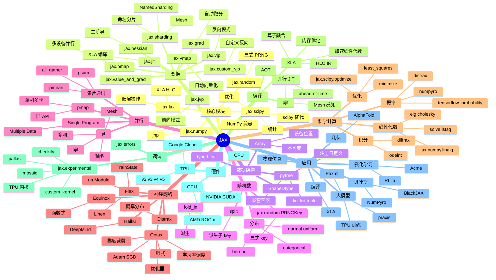

# JAX

## 一、前言

JAX 是 Google 推出的高性能数值计算与机器学习库，2018 年由 Matt Johnson 等人发起，2020 年开源。它把 NumPy 熟悉的 API 加上自动微分、XLA 编译、GPU/TPU 加速、函数式变换（`grad` / `jit` / `vmap` / `pmap`）整合到一个统一的接口中。JAX 当前是 Google DeepMind（AlphaFold、AlphaCode、Gemini）的核心数值栈，也是 Flax、Optax、Equinox、Distrax、RLlib 等高层库的事实后端。截至 2025 年，JAX 在学术界的影响力已接近甚至超过 PyTorch，特别是物理仿真、强化学习、贝叶斯推断、几何深度学习等领域。

JAX 的核心价值在于"NumPy 兼容性 + 函数式自动微分 + 跨硬件加速"。① NumPy 兼容性——`jax.numpy` 是 NumPy 的近完全替代品，多数 Numpy 数组代码零修改即可运行；② 函数式自动微分——`jax.grad(f)(x)` 即可对任意函数求导，支持高阶导数 `grad(grad(f))` 与前向/反向模式自动选择（基于 `jvp`/`vjp`）；③ XLA 编译——`@jax.jit` 把 Python 函数编译到 GPU/TPU，匹配 C++/CUDA 性能；④ 函数式变换——`vmap` 自动向量化、`pmap` 跨设备并行、`grad` 自动微分、`jit` 即时编译；⑤ 跨硬件统一 API——同一份代码在 CPU/GPU/TPU 上无缝切换。

JAX 的关键能力包括：① `jax.numpy` 数组 API（80%+ 兼容 NumPy）；② `jax.grad` / `jax.value_and_grad` 自动微分（前向/反向模式）；③ `jax.jit` XLA 即时编译（CPU/GPU/TPU）；④ `jax.vmap` 自动向量化（取代手写 batch 维度）；⑤ `jax.pmap` / `jax.sharding` 跨设备并行（多卡/多机）；⑥ `jax.scipy` 科学计算（优化、积分、统计、线性代数）；⑦ `jax.random` PRNG 显式随机数；⑧ `jax.lax` 低层操作（控制流、custom_vjp）；⑨ 神经网络库 Flax/Optax/PennyLane；⑩ 生态：Flax（NN 库）、Optax（优化器）、RLlib/Acme（强化学习）、Distrax（概率分布）、Equinox（函数式 NN）、NumPyro（贝叶斯）、Haiku（DeepMind NN）。

JAX 与其他数值计算框架的对比：

| 框架 | 定位 | 优势 | 局限 |
|------|------|------|------|
| JAX | 数值计算 + 深度学习 | 自动微分、XLA、函数式、跨硬件 | 不可变、调试弱、pytree 学习成本 |
| NumPy | CPU 数组 | 标准、生态、零编译 | 无 GPU、无微分、无 JIT |
| PyTorch | 深度学习研究 | 动态图、Pythonic、生态丰富 | XLA 支持弱、跨设备需手动 |
| TensorFlow | 工业部署 | 工业级、TPU、TF Lite | 静态图（TF 1）、学习曲线 |
| MXNet | 分布式 | 灵活、Symbolic + Imperative | 维护减少 |
| Julia | 科学计算 | JIT、原生 GPU、高性能 | 生态小于 Python |
| Zygote.jl | Julia 自动微分 | 源到源、与生态融合 | Julia 生态 |

JAX 的核心应用场景：① 物理仿真（粒子系统、分子动力学、气候建模）；② 强化学习（环境、策略、价值函数的高频求导）；③ 贝叶斯深度学习（MCMC、变分推断、HMC、NUTS）；④ 几何深度学习（蛋白质结构、图神经网络、3D 视觉）；⑤ 大模型训练（TPU 训练、混合精度、sharding 数据并行）；⑥ 科学计算（优化、PDE、约束求解）；⑦ 编译研究（XLA、HLO 算子融合、自动并行化）。

JAX 5 大核心特性：① 函数式不可变（无副作用、所有 op 是纯函数）；② 自动微分 `grad`/`jacfwd`/`jacrev` 一行求任意阶导数；③ `jit` XLA 编译（CPU/GPU/TPU 性能 10-100x）；④ `vmap`/`pmap` 自动向量化与跨设备并行（不用手写 batch/shard）；⑤ Flax/Optax 神经网络生态（Transformer/Diffusion/RL 全覆盖）。

## 二、架构思维导图



## 三、关键代码

### 3.1 基础：数组 + 不可变 + PRNG

```python
# 文件：jax/numpy/__init__.py
import jax
import jax.numpy as jnp
import numpy as np

# ──────── jax.numpy：与 NumPy 几乎兼容 ────────
x = jnp.array([1, 2, 3], dtype=jnp.float32)
y = jnp.arange(12).reshape(3, 4)
z = jnp.dot(y, y.T)                                # 矩阵乘
print(z.shape, z.dtype, z.device)                  # 设备位置（CPU/GPU/TPU）

# 默认 dtype 不同
print(jnp.zeros((2, 3)).dtype)                      # float32（NumPy 是 float64）
# 可通过 jax_enable_x64 启用 64 位

# ──────── 不可变！修改会报错 ────────
# x[0] = 99                                       # ❌ TypeError
# 必须用 .at[index].set(value) 不可变更新
new_x = x.at[0].set(99)
new_x2 = x.at[1:3].add(10)                         # .add / .multiply / .min / .max
print(x)                                           # 原始不变 [1,2,3]
print(new_x)                                       # [99,2,3]

# ──────── PRNG：显式随机数（无全局状态） ────────
key = jax.random.PRNGKey(42)                       # 显式种子
k1, k2 = jax.random.split(key)                     # 派生两个子 key
mat = jax.random.normal(k1, (3, 3))
# 重要原则：永远不要在一个 key 上重复 random，split 后传给子函数
```

### 3.2 自动微分 + JIT 编译

```python
# 文件：jax/_src/api.py
import jax
import jax.numpy as jnp

# ──────── grad：自动微分 ────────
def f(x):
    return jnp.sum(x ** 2)

x = jnp.array([1.0, 2.0, 3.0])
df_dx = jax.grad(f)(x)                             # [2., 4., 6.]
print(df_dx)

# value_and_grad：同时返回值和梯度
val, grad = jax.value_and_grad(f)(x)

# 高阶导数
d2f_dx2 = jax.grad(jax.grad(f))(x)                 # [2., 2., 2.]

# 多元函数（多参数）
def loss(w, b, x, y):
    pred = x @ w + b
    return jnp.mean((pred - y) ** 2)

w = jnp.zeros((3,))
b = jnp.array(0.0)
x = jnp.ones((10, 3))
y = jnp.arange(10.0)
grads = jax.grad(loss, argnums=(0, 1))(w, b, x, y)
gw, gb = grads
print(gw, gb)

# ──────── jit：XLA 即时编译 ────────
@jax.jit                                          # 装饰器
def slow_fn(x):
    return jnp.sin(x) ** 2 + jnp.cos(x) ** 2

x = jnp.linspace(0, 1, 1_000_000)
%timeit slow_fn(x).block_until_ready()
# 编译后 1-2 ms；非 jit 5-10 ms；提升 5-10x

# 显式 jit
def add(a, b):
    return a + b
fast_add = jax.jit(add)
print(fast_add(jnp.array([1, 2]), jnp.array([3, 4])))

# ──────── jit 限制 ────────
# 1. 不支持字符串/字典等非 pytree
# 2. 控制流需用 jax.lax.cond / while_loop / scan（不能在 jit 内用 Python if）
# 3. 不支持 print（用 jax.debug.print）

# ──────── 训练循环：jit + grad ────────
@jax.jit
def update(params, x, y, lr=0.01):
    grads = jax.grad(loss, argnums=0)(params["w"], params["b"], x, y)
    params["w"] = params["w"] - lr * grads
    return params

params = {"w": jnp.zeros((3,)), "b": jnp.array(0.0)}
for epoch in range(100):
    params = update(params, x, y)
```

### 3.3 vmap / pmap：自动向量化与跨设备并行

```python
# 文件：jax/_src/api.py
import jax
import jax.numpy as jnp

# ──────── vmap：自动沿 batch 维度并行 ────────
def per_example_loss(params, x, y):
    pred = x @ params["w"] + params["b"]
    return jnp.mean((pred - y) ** 2)

# 单样本函数
def loss(params, x, y):
    return jnp.mean(jax.vmap(per_example_loss, in_axes=(None, 0, 0))(params, x, y))

# 等价手写
def loss_manual(params, x, y):
    pred = x @ params["w"] + params["b"]            # 已经是 batch
    return jnp.mean((pred - y) ** 2)

# vmap 的威力：把单样本函数自动向量化
# 例如环境 step：env.step(action) -> (obs, reward, done)
# vmap 后变成 batched_step：env.step(actions) -> (obs, reward, done)

# ──────── pmap：多 GPU 训练（旧 API，逐步被 sharding 取代） ────────
# 检查设备
print(jax.devices())                               # [cuda:0, cuda:1, ...]
print(jax.local_devices())
print(jax.process_count(), jax.process_index())

# 简单 pmap
def f(x):
    return x ** 2

x = jnp.arange(8).reshape((jax.device_count(), 2))
# 沿 axis 0 分发到每个设备
y = jax.pmap(f)(x)
print(y)                                           # 每设备独立计算

# ──────── 命名分片（pjit / NamedSharding）：现代并行方式 ────────
from jax.experimental import mesh_utils
from jax.sharding import Mesh, NamedSharding, PartitionSpec as P

# 创建 mesh：4 个设备，命名 'data' 维度
devices = mesh_utils.create_device_mesh((4,))
mesh = Mesh(devices, axis_names=("data",))

# 参数分片策略
sharding = NamedSharding(mesh, P("data", None))   # 第一维分片
params = jax.random.normal(jax.random.PRNGKey(0), (16, 4))
sharded_params = jax.device_put(params, sharding)
print(sharded_params.sharding)

# 计算自动分片
@jax.jit
def matmul(x, w):
    return x @ w

x = jax.random.normal(jax.random.PRNGKey(1), (16, 4))
x = jax.device_put(x, NamedSharding(mesh, P("data", None)))
w = jnp.ones((4, 8))
# 输出沿 data 维度分片
y = matmul(x, w)
print(y.shape)                                     # (16, 8)
```

### 3.4 Flax 神经网络 + 训练

```python
# 文件：flax/linen/module.py
import jax
import jax.numpy as jnp
from flax import linen as nn
from flax.training import train_state
import optax

# ──────── 定义模型（Flax Linen） ────────
class MLP(nn.Module):
    features: int

    @nn.compact
    def __call__(self, x):
        x = nn.Dense(128)(x)
        x = nn.relu(x)
        x = nn.Dense(64)(x)
        x = nn.relu(x)
        x = nn.Dense(self.features)(x)
        return x

model = MLP(features=10)

# ──────── 初始化参数（必须显式 init） ────────
key = jax.random.PRNGKey(0)
dummy = jnp.ones((1, 784))
params = model.init(key, dummy)
print(jax.tree_map(lambda x: x.shape, params))     # 嵌套 dict 形状

# ──────── 训练状态（Optax 优化器） ────────
@jax.jit
def cross_entropy(params, x, y):
    logits = model.apply(params, x)
    return optax.softmax_cross_entropy_with_integer_labels(logits, y).mean()

@jax.jit
def compute_accuracy(params, x, y):
    return (jnp.argmax(model.apply(params, x), axis=-1) == y).mean()

# 创建 train state
optimizer = optax.adam(learning_rate=1e-3)
state = train_state.TrainState.create(
    apply_fn=model.apply,
    params=params,
    tx=optimizer,
)

@jax.jit
def train_step(state, x, y):
    loss, grads = jax.value_and_grad(cross_entropy)(state.params, x, y)
    return state.apply_gradients(grads=grads), loss

# 训练循环
for epoch in range(10):
    state, loss = train_step(state, x_train, y_train)
    if epoch % 1 == 0:
        acc = compute_accuracy(state.params, x_test, y_test)
        print(f"Epoch {epoch}: loss={loss:.4f} acc={acc:.4f}")

# ──────── 复杂模型：Transformer ────────
class TransformerBlock(nn.Module):
    embed_dim: int
    num_heads: int
    mlp_dim: int

    @nn.compact
    def __call__(self, x, mask=None):
        # Self-Attention
        y = nn.LayerNorm()(x)
        y = nn.MultiHeadDotProductAttention(
            num_heads=self.num_heads, qkv_features=self.embed_dim
        )(y, mask=mask)
        x = x + y
        # FFN
        y = nn.LayerNorm()(x)
        y = nn.Dense(self.mlp_dim)(y)
        y = nn.gelu(y)
        y = nn.Dense(self.embed_dim)(y)
        return x + y

# ──────── diffrax：微分方程求解器 ────────
import diffrax

def vector_field(t, y, args):
    return -0.5 * y                                   # dy/dt = -0.5y

term = diffrax.ODETerm(vector_field)
solver = diffrax.Dopri5()
y0 = jnp.array([1.0])
ts = jnp.linspace(0, 5, 100)
solution = diffrax.diffeqsolve(term, solver, t0=0, t1=5, dt0=0.1, y0=y0, saveat=diffrax.SaveAt(ts=ts))
print(solution.ys.shape)                              # (100, 1)
```

## 四、核心洞察

- **函数式不可变是 JAX 的灵魂**：NumPy/PyTorch 是命令式可变（`x[0]=99` 直接修改），JAX 是函数式不可变（`x = x.at[0].set(99)` 返回新数组）。这一设计让 XLA 编译、跨设备并行、自动微分都变得简单——因为没有"共享可变状态"，编译器可以自由重排和分片。代价是学习曲线：开发者必须适应"返回新值"的风格。

- **jvp/vjp/grad 三角是微分基础**：`jvp`（Jacobian-vector product，前向模式）适合"少输入多输出"（f: R^n→R^m, n<<m）；`vjp`（vector-Jacobian product，反向模式）适合"多输入少输出"（f: R^n→R, n>>1，深度学习的 99%）；`grad` 就是 `vjp` 在 scalar 输出下的简化版。理解这一三角关系能写出更高效的微分代码。

- **jit 是性能开关，但有代价**：`@jax.jit` 把函数编译为 HLO 在 XLA 上执行，性能可追平 C++/CUDA，但代价是：① 首次调用有编译延迟（10s-1min）；② 不支持 Python 控制流（用 `lax.cond`/`while_loop`/`scan`）；③ 不支持 print（用 `jax.debug.print`）；④ 函数签名变化会重新编译。最佳实践：jit 包粒度适中的函数（单层 / 整 step / 整 epoch 都可能），别 jit 太大。

- **vmap 是"零成本 batch"**：PyTorch 写 batch 时手动加 batch 维度（易错、难维护），JAX 写"单样本函数"然后 vmap 自动向量化——`jax.vmap(per_example_loss, in_axes=(None, 0, 0))` 让单样本函数批处理。RL 场景下把"单环境 step 函数"vmap 成"批量环境并行"特别优雅。`vmap` 也可以嵌套（`vmap(vmap(f))`）实现双重向量化。

- **pjit + NamedSharding 是大规模训练未来**：`pmap`（旧 API）每个设备跑完整程序副本；`pjit`（新 API）让 XLA 自动把单程序拆分到多设备/多机。`NamedSharding` 把"逻辑分片策略"（`P("data", None)`）和"物理 mesh"（4x4 设备网格）解耦——一份代码在小机器和大集群上自动适配。`jax.experimental.pallas` 还支持在内核级别手写 TPU 程序（Mosaic）。

- **Flax vs Equinox vs Haiku 三大 NN 库**：Flax Linen（`nn.Module` + `nn.compact`）最常用，Google Research 主推；Equinox 函数式（`eqx.Module`），更接近 PyTorch nn.Module，适合新项目；Haiku（DeepMind）`@hk.transform` 风格，把状态隐藏在闭包外。Optax 提供所有优化器（Adam/AdamW/Lion/SGD + 学习率调度 + 梯度裁剪），是 JAX 训练的事实标准。

- **TPU + JAX = 大模型训练答案**：Google TPU v5p（8960 芯片 pod 提供 4.6 EFLOPS BF16）+ JAX + pjit + NamedSharding 是当前大模型训练最高性价比方案。Llama 3 405B 用 16K TPU v5p 训练；Gemini 用 1.0+ TPU v5；AlphaFold 3 训练也跑在 TPU。JAX 对 TPU 的支持远好于 PyTorch（`jax.jit` 编译 + `pjit` 分片 + `pallas` 写底层 kernel）。

- **科学计算利器：diffrax / NumPyro / PennyLane**：① diffrax——JAX 上可微分 ODE/SDE 求解器（SciPy `odeint` 的现代替代），支持 GPU/TPU；② NumPyro（Pyro 兄弟）——PyMC 风格的贝叶斯推断（HMC/NUTS/变分），纯 JAX 写；③ PennyLane——量子机器学习，自动微分桥接量子电路；④ Distrax——概率分布库（TF Probability 的 JAX 版）；⑤ Jaxopt——硬件加速的优化器（梯度下降/牛顿/L-BFGS/SQP）。这一整套让 JAX 成为科学计算的"瑞士军刀"。

- **生态位与局限**：JAX 优势在 ① 科学计算 + 自动微分（无人能敌）；② TPU 训练（无出其右）；③ 函数式代码（数学友好）；④ 编译优化（XLA + pjit）。短板：① 不可变对 OOP 程序员不友好；② 调试器支持差（不能下断点到 jit 函数内）；③ pytree 序列化复杂；④ 移动端/浏览器支持弱；⑤ 生态仍小于 PyTorch。JAX 与 PyTorch 越来越像姐妹语言——共享 `torch_xla2` 等桥接，Flax/Torch 都向对方兼容。

## 五、跨项目引用

- **[NumPy 基础](./numpy.md)**：JAX 起步就是 NumPy 替代品（`import jax.numpy as jnp`），80%+ API 直接对应 NumPy。`jnp.array / arange / linspace / dot / sum` 一致。但 JAX 不可变、默认 float32、PRNG 显式。NumPy 代码迁移到 JAX 一般只需改 import 和可变操作。

- **[PyTorch 训练](./pytorch.md)**：JAX 与 PyTorch 是"研究两强"。PyTorch 适合快速实验（Pythonic、动态图），JAX 适合需要 JIT/TPU/大规模/科学计算的场景。`torch_xla` 让 PyTorch 跑 TPU，但性能/易用性远不如 JAX 原生。`torch2jax` 双向转换、Flax 借鉴了 PyTorch nn.Module 设计、Equinox 几乎一对一映射 PyTorch API。

- **[Llama 模型训练](./llama.md)**：Llama 3 405B 用 16K TPU v5p + JAX + pjit 训练，是 JAX 大模型训练的标杆。`pjit(model_apply_fn, in_shardings=..., out_shardings=...)` 把模型分片到 TPU pod；`optax.lion(learning_rate=1e-4, weight_decay=0.01)` 训练 1.4M TPU-hours。中小规模 LLM 训练用 Flax/Optax 也是常见组合。

- **[Ollama 本地运行](./ollama.md)**：Ollama 跑的是"已训练好"的模型（GGUF 格式），JAX/Flax 是"训练模型"的工具。两者的工作流互补：JAX 训练基座 → 转换 GGUF → Ollama 部署推理；或者用 vLLM 部署 JAX 训练出的模型。

- **[TensorFlow 训练](./tensorflow.md)**：JAX 与 TensorFlow 共享 XLA 编译器（`jax2tf` 把 JAX 函数转换为 TF SavedModel），让 JAX 训练的模型可部署到 TF Serving / TF Lite / TF.js。Google 内部 TPU 训练逐步从 TF 转向 JAX（Gemini、AlphaFold 3、Gemma 部分）。

- **[Scikit-learn 机器学习](./scikit-learn.md)**：传统 ML（GBDT/线性/SVM/KNN）仍用 Scikit-learn；JAX 主要服务深度学习与科学计算。JAX 也有 `jax.scipy` 提供 scipy.optimize.minimize 等，可在小数据集上做可微分优化，但 GBDT 任务直接用 XGBoost/LightGBM 更香。

- **[Jupyter Notebook](./jupyter.md)**：JAX + Jupyter 是科学计算的黄金组合。`%timeit` 测 jit 前后的性能差异；`@jax.jit` + `%timeit` 直观展示 5-10x 加速；JAX 调试可用 `jax.config.update("jax_disable_jit", True)` 关闭 jit 让错误信息更清晰。

- **[NumPyro / BlackJAX / Distrax]**：JAX 上的贝叶斯推断生态。NumPyro 提供 NUTS/HMC/变分推断/Stan-style 建模；BlackJAX 是轻量级采样库；Distrax 提供概率分布。把 PyMC / Stan 风格的工作流带到 GPU/TPU。
