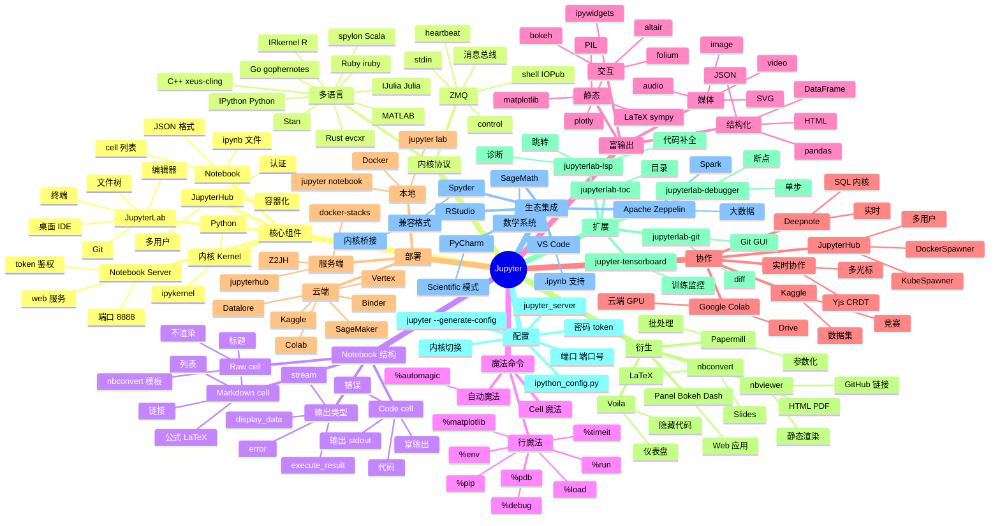

# Jupyter

## 一、前言

Jupyter 是交互式计算与数据科学的"事实工作台"，源自 2014 年 IPython 团队的 Project Jupyter（名字取自 Julia + Python + R 三种语言），核心产品 Jupyter Notebook 现已发展为 JupyterLab、Jupyter Notebook、Voila、Binder、nbconvert 等完整生态。Jupyter 笔记本（.ipynb）以"代码 + 富文本 + 可视化 + 输出"四合一的交互式文档形式，让数据探索、机器学习实验、教学演示、报告生成在同一个网页界面中完成。截至 2025 年，Jupyter 已被 Google Colab、Kaggle、Microsoft Azure Notebooks、AWS SageMaker、Datalore、Deepnote 等几乎所有云端数据科学平台默认采用，累计用户超过 1000 万，是数据科学 / AI 领域最普及的工具。

Jupyter 的核心价值在于"交互式探索 + 可复现性 + 教学/分享友好"。① 交互式探索——cell（单元格）按需执行、部分运行、即时反馈，告别"全部重跑"的痛苦；② 可复现性——.ipynb 文件包含代码 + 文本 + 输出一并保存，他人拿到即可"Restart Kernel and Run All"完整复现；③ 教学/分享友好——Markdown 单元格支持 LaTeX/图片/表格/HTML，配合 nbconvert 导出 PDF/HTML/Slides，配合 Binder / Colab 一键云端运行；④ 多语言——支持 100+ 编程内核（Python/R/Julia/Scala/JavaScript/Go/Ruby/C++/SQL/SAS/MATLAB/Stan），统一交互界面。

Jupyter 的关键能力包括：① Notebook 文件格式（.ipynb，JSON 描述 cell 列表）；② 内核协议（ZMQ-based Jupyter Kernel Protocol，跨语言消息总线）；③ JupyterLab 桌面 IDE（文件树、编辑器、终端、Git 集成、扩展系统）；④ 内核管理（ipykernel、多个虚拟环境切换、远程内核）；⑤ 魔法命令（%timeit / %run / %debug / %matplotlib inline / %load_ext）；⑥ 富输出（matplotlib / Plotly / bokeh / PIL / HTML / LaTeX / JavaScript widgets）；⑦ 协作（JupyterHub 多用户、JupyterLab 实时协作、Gooogle Docs 风格实时编辑）；⑧ 部署（Binder 一键从 GitHub 仓库运行、nbviewer 静态渲染、Voila 仪表盘化）。

Jupyter 与其他 Notebook 工具的对比：

| 工具 | 定位 | 优势 | 局限 |
|------|------|------|------|
| Jupyter Notebook/Lab | 通用交互式计算 | 标准格式、跨语言、生态最丰富 | 单元隔离弱、版本控制不友好 |
| Google Colab | 云端 Jupyter + GPU | 免费 GPU/TPU、Google Drive 集成 | 内核断连、超时限制 |
| Kaggle Notebooks | 数据科学竞赛 Notebook | 免费 GPU、丰富数据集、竞赛社区 | 仅 Python/R、内核限制 |
| VS Code Notebooks | IDE 内置 Notebook | IDE 体验、Git 友好、Polly 集成 | 部分高级功能不如原生 Jupyter |
| Databricks Notebook | 分布式 Spark | Spark 原生、Delta Lake、协作 | 商业许可、Spark 绑定 |
| Observable | JavaScript Notebook | 可视化、响应式、前端友好 | 仅 JavaScript |
| Polynote | Netflix 多语言 Notebook | 多语言混编、Scala/Spark 友好 | 已停止维护 |
| Marimo | 现代化 Notebook | 反应式、无状态、Git 友好 | 生态尚浅、传统兼容弱 |

Jupyter 的核心应用场景：① 数据科学/机器学习 EDA（数据探索、特征分析、可视化）；② 教学与培训（交互式课件、Kaggle Learn、fast.ai 课程）；③ 学术论文复现（nbconvert 导出 PDF，论文 supplementary）；④ 算法演示（数学公式 + 代码 + 输出）；⑤ 数据报告（Voila 隐藏代码、纯输出展示）；⑥ 探索性编程（API 调试、爬虫试验、数据 ETL）；⑦ 远程计算（SSH 远程内核、Spark/YARN 远程集群）；⑧ 团队协作（Google Colab 实时光标共享、JupyterLab 实时协作）。

Jupyter 5 大核心特性：① Notebook = 代码 + Markdown + 输出 + 媒体的统一容器；② 100+ 语言内核（Python/IPython 主流、R/IRkernel、Beziers Julia、Scala/spylon-kernel）；③ JupyterLab 桌面 IDE（编辑器 + 终端 + 文件树 + Git + 扩展）；④ 魔法命令系统（%magics / %%cell / %env / %run）；⑤ Binder / Colab / Voila / nbconvert 衍生生态（云端运行、隐藏代码、格式转换）。

## 二、架构思维导图



## 三、关键代码

### 3.1 启动与基本操作

```bash
# 文件：jupyter_server / jupyterlab

# ──────── 安装 ────────
pip install jupyterlab           # JupyterLab（推荐）
pip install notebook             # 经典 Notebook
pip install jupyterhub           # 多用户（生产）

# ──────── 启动 ────────
jupyter lab                                  # 默认 http://localhost:8888/lab
jupyter lab --port 9000                      # 自定义端口
jupyter lab --no-browser                     # 远程服务器
jupyter lab --ip=0.0.0.0 --port=8888 \
            --ServerApp.token='mysecret'     # 远程访问

# 配置（生成配置文件）
jupyter lab --generate-config
# ~/.jupyter/jupyter_lab_config.py / jupyter_server_config.py

# ──────── 安装内核（多环境） ────────
python -m ipykernel install --user --name=myenv --display-name="Python (myenv)"
# 列出内核
jupyter kernelspec list
# 删除内核
jupyter kernelspec uninstall myenv

# ──────── 安装扩展 ────────
pip install jupyterlab-lsp        # 代码补全 / 跳转
pip install jupyterlab-git        # Git GUI
pip install jupyterlab-toc        # 目录
pip install jupyterlab-tensorboard # 训练监控
```

### 3.2 Notebook 核心：代码 / Markdown / 魔法命令

```python
# 文件：Jupyter Notebook 单元格示例
# %% [markdown]
# # 数据科学入门
# 这是一个 **Markdown** 单元格，支持：
# - 列表
# - `代码`
# - [链接](https://jupyter.org)
# 
# $$\int_0^1 x^2 dx = \frac{1}{3}$$
# 
# 

# ──────── 代码单元格 ────────
import numpy as np
import pandas as pd
import matplotlib.pyplot as plt

# 普通 Python 代码
arr = np.random.randn(1000).cumsum()
plt.plot(arr)
plt.title("Random Walk")
plt.show()

# ──────── 行魔法命令 ────────
%timeit sum(range(10000))                            # 性能测试
# 12.4 µs ± 89.1 ns per loop

%run my_script.py                                    # 跑 .py 脚本
%load my_script.py                                   # 把脚本加载到 cell
%run -i my_module.py                                 # 共享当前命名空间
%load_ext line_profiler                              # 加载扩展
%env OMP_NUM_THREADS=4                               # 临时环境变量
%pip install seaborn                                 # 装包（等价于 !pip）
%matplotlib inline                                   # matplotlib 内联显示
# %matplotlib widget                                # 交互式后端
%debug                                               # 进入调试器
%pdb on                                             # 自动进入 pdb

# ──────── Cell 魔法命令 ────────
%%time
total = sum(range(10**7))
print(total)

%%writefile helper.py
# 把 cell 内容写入文件
def greet(name):
    return f"Hello, {name}!"

%%html
<h1 style="color: red">HTML 输出</h1>
<table>
  <tr><td>1</td><td>2</td></tr>
</table>

%%javascript
console.log("JavaScript 输出到浏览器控制台");
element.text("JS 实时操作 DOM");

%%bash
echo "Hello from Bash"
ls -la *.py

%%script env name="world"
print(f"Hello, {name}!")                              # subprocess 内运行 Python

# ──────── Shell 命令 ────────
!ls -la                                             # shell 命令
files = !ls *.py                                    # 捕获输出到变量
%cd /tmp                                            # 切换目录
%bookmark myproj /home/user/project                 # 书签
```

### 3.3 富输出与交互

```python
# 文件：Jupyter 富输出示例
import pandas as pd
import numpy as np
import matplotlib.pyplot as plt
import plotly.express as px
import ipywidgets as widgets
from IPython.display import display, HTML, Image, Audio, Markdown, Latex

# ──────── pandas DataFrame 漂亮输出 ────────
df = pd.DataFrame({
    "name":   ["Alice", "Bob", "Charlie", "Diana"],
    "age":    [25, 30, 35, 28],
    "salary": [70000, 85000, 95000, 72000],
    "city":   ["NY", "SF", "LA", "NY"],
})
df                                                   # 自动渲染 HTML 表格

# ──────── matplotlib 内联显示 ────────
%matplotlib inline
fig, ax = plt.subplots(figsize=(8, 4))
ax.plot([1, 2, 3], [1, 4, 9])
ax.set_title("Inline matplotlib")

# ──────── plotly 交互式 ────────
fig = px.scatter(df, x="age", y="salary", color="city",
                 size="salary", hover_data=["name"])
fig.show()                                           # 鼠标悬停、缩放

# ──────── ipywidgets 交互控件 ────────
@widgets.interact(
    n=(1, 100, 1),
    color=["red", "green", "blue"],
    show_grid=True,
)
def draw_plot(n, color, show_grid):
    x = np.linspace(0, 2 * np.pi, n)
    y = np.sin(x)
    plt.plot(x, y, color=color)
    plt.grid(show_grid)
    plt.show()

# Dropdown / Button / Slider
dd = widgets.Dropdown(options=["A", "B", "C"], value="A", description="选择:")
btn = widgets.Button(description="点击", button_style="success")
out = widgets.Output()

def on_click(b):
    with out:
        out.clear_output()
        print(f"已选择: {dd.value}")

btn.on_click(on_click)
display(dd, btn, out)

# ──────── 多媒体输出 ────────
display(HTML("<h2>富 HTML</h2>"))
display(Latex(r"$\int_0^1 x^2 dx = \frac{1}{3}$"))
display(Markdown("**Markdown** 输出"))
# Image 资源
# display(Image("logo.png"))
# Audio 播放
# display(Audio("voice.mp3", autoplay=True))

# ──────── SymPy 数学公式 ────────
import sympy as sp
x = sp.symbols("x")
expr = sp.integrate(sp.sin(x) ** 2, (x, 0, sp.pi))
display(expr)                                       # π/2 公式
```

### 3.4 协作 / 部署 / 转换

```python
# 文件：Jupyter 协作与部署示例
import papermill as pm
from nbformat import write, read

# ──────── Papermill：参数化执行 Notebook ────────
# 创建模板：template.ipynb 用 parameters tag 的 cell 写入变量
pm.execute_notebook(
    input_path="template.ipynb",
    output_path="run_2024_01.ipynb",
    parameters={
        "city":        "Beijing",
        "model_type":  "xgboost",
        "n_estimators": 200,
    },
    kernel_name="python3",
    log_output=True,                              # 实时打印
)

# 批量跑（不同城市 / 不同参数）
cities = ["Beijing", "Shanghai", "Guangzhou"]
for c in cities:
    pm.execute_notebook(
        "template.ipynb",
        f"output_{c}.ipynb",
        parameters={"city": c},
    )

# ──────── nbconvert：格式转换 ────────
# 命令行
# jupyter nbconvert --to html notebook.ipynb
# jupyter nbconvert --to pdf  notebook.ipynb     # 需 LaTeX
# jupyter nbconvert --to script notebook.py       # 代码提取为 .py
# jupyter nbconvert --to slides notebook.ipynb --reveal-prefix

# Python API
import nbformat
from nbconvert import HTMLExporter, PDFExporter, SlidesExporter

notebook = nbformat.read("notebook.ipynb", as_version=4)

# HTML
html_exp = HTMLExporter(template_name="classic")
(body, resources) = html_exp.from_notebook_node(notebook)
with open("notebook.html", "w") as f:
    f.write(body)

# Slide (Reveal.js)
slide_exp = SlidesExporter(reveal_theme="black")
(body, _) = slide_exp.from_notebook_node(notebook)
with open("slides.html", "w") as f:
    f.write(body)

# ──────── Voila：把 Notebook 变成 Web 应用 ────────
# 命令行：voila dashboard.ipynb
# 隐藏代码、只显示输出和交互控件
# 适合构建内部 BI 仪表盘 / 报告

# ──────── 内核信息：%connect_info ────────
# 在远端机器上启动内核并连接到本地
# 远端: jupyter lab --no-browser --port=8889 --ip=0.0.0.0
# 本地: %connect_info  # 复制连接字符串，在本地 Jupyter 粘贴

# ──────── 时间回放（jupyterlab-tensorboard） ────────
# %load_ext tensorboard
# %tensorboard --logdir ./logs --port 6006

# ──────── 自定义魔法 ────────
from IPython.core.magic import register_line_magic, register_cell_magic

@register_line_magic
def hello(line):
    print(f"Hello, {line or 'world'}!")

%hello Claude                                       # Hello, Claude!

@register_cell_magic
def sql(line, cell):
    import sqlite3
    conn = sqlite3.connect("data.db")
    result = pd.read_sql(cell, conn)
    conn.close()
    return result

# %%sql
# SELECT * FROM users WHERE age > 25;
```

## 四、核心洞察

- **Cell 是核心抽象**：Jupyter 把所有内容抽象为 Cell（Code / Markdown / Raw），Code Cell 按需执行、保留状态，Markdown Cell 写文档，Raw Cell 给 nbconvert 当模板。这种"小步快跑、随时解释"的模式让探索性编程比 .py 脚本高效 10x。代价是执行顺序与书写顺序解耦（用户可能 cell 3 → cell 1 → cell 2），生产化前必须重跑 `Restart Kernel and Run All`。

- **内核协议是跨语言核心**：Jupyter 协议（JEP）基于 ZeroMQ（消息总线）把前端（Web UI）与后端（Kernel）解耦。前端 Notebook、Console、Qt Console、VS Code、PyCharm 全部用同一套协议；后端 IPython、IRkernel、IJulia、spylon-kernel、gophernotes、evcxr 全部实现同一套协议。这就是"100+ 语言支持"的技术原理。

- **状态管理是双刃剑**：Jupyter 同一内核的 cell 共享命名空间（变量可跨 cell 累积），方便探索但导致"幽灵依赖"——cell 5 用了 cell 1 的变量但读者看不到 cell 1 已删除。最佳实践：① 命名规范（小写+下划线）；② 关键变量在 cell 0 显式初始化；③ cell 顶部加注释说明依赖；④ 用 `Restart Kernel and Run All` 验证可复现性；⑤ 重要变量 `del` 释放（防止污染）。

- **%timeit 与 %%time 是性能实验利器**：%timeit 自动调整循环次数（默认 7 次 × N 循环，统计最佳 5 次），结果可靠；%%time 测整 cell 一次时间，更接近真实；%prun / %lprun 逐行 / 逐函数剖析，定位热点；%memit 测内存。配合 `py-spy dump` 可生成火焰图。性能优化第一步永远是 measure。

- **可视化内联 vs 交互**：① matplotlib 内联模式（`%matplotlib inline`）输出静态 PNG，Cell 间可显示、Notebook 通用，但交互弱；② `%matplotlib widget` 或 `%matplotlib notebook` 启用交互后端（缩放、平移、保存），但 Notebooks 在 GitHub 静态渲染时无法交互；③ Plotly/Bokeh 输出 HTML+JS，GitHub 渲染丢失交互但导出 HTML 完整保留；④ ipywidgets 真正的 Python 内交互控件，搭配 Voila 可做仪表盘。选错会让 Notebook 体积爆炸（10MB+）。

- **IPython 是基础，Jupyter 是外壳**：Jupyter Notebook/JupyterLab 本身只是 IPython 套的"壳"，IPython 提供所有交互能力（自动补全、对象检查 `?`/??、magic 命令、shell 集成、history）。`%run -i` 把脚本导入当前命名空间、`%edit` 调用外部编辑器、`%recall` 调出历史——这些都比 .py REPL 强大。VS Code / PyCharm 终端的 IPython 模式已部分复刻。

- **Binder / Colab 让"一键可复现"**：Binder（mybinder.org）把 GitHub 仓库转成可运行的 Jupyter 环境，requirements.txt + repo URL → 10s 内启动在线 Jupyter；Google Colab 提供免费 GPU/TPU，集成 Google Drive；Kaggle Notebooks 集成数据集 + 比赛。学术论文 supplementary notebook + Binder 徽章 = 审稿人/读者 0 成本复现。

- **JupyterLab 是新一代 UI**：JupyterLab = 经典 Notebook + 文件树 + 文本编辑器 + 终端 + 调试器 + 扩展管理器 + 多 Tab + 拖拽布局。它解决了经典 Notebook 的单文档限制，集成度接近 PyCharm / VS Code，但仍是浏览器纯前端 + 远程内核。`jupyterlab-lsp`（语言服务协议）+ `jupyterlab-debugger`（可视化断点）让 JupyterLab 从"玩具"变成"专业 IDE"。

- **.ipynb 源码是 JSON**：`notebook.ipynb` 是结构化 JSON：`cells[]`（每个 cell 含 `cell_type`/`source[]`/`metadata`）+ `metadata.kernelspec`（内核名）+ `metadata.language_info`（Python 版本）+ `nbformat`。这让版本控制、单元测试、参数化（Papermill）都成为可能。但 JSON 噪音大——`output.execute_result.data['text/plain']` 里塞着一坨输出。`jupyter nbconvert --clear-output` 提交前清理，`pre-commit` 钩子可用 `nbstripout` 工具自动化。

- **协作仍不完美**：JupyterLab 实时协作（Yjs CRDT）已可用但不及 Google Docs 流畅；JupyterHub 多用户部署复杂；Google Colab 协作最丝滑（Google Docs 风）。Microsoft Garz 也是实时协作方向。Notebook 不是为"多人同时编辑同一 cell"设计的——更适合"各自跑各自的 cell，结果汇总到 Repository"。

## 五、跨项目引用

- **[NumPy 基础](./numpy.md)**：Jupyter 是 NumPy / Pandas / Scikit-learn / PyTorch 的"展示台"。`%matplotlib inline` 让 NumPy 数组 `plt.plot(arr)` 立即看到图形；`arr.shape`、`arr.dtype` 在 cell 内可交互检查。NumPy 的"探索式"特性（不同 shape 试错）与 Jupyter 完美契合。

- **[Pandas 数据分析](./pandas.md)**：`pd.DataFrame` 在 Jupyter 中自动渲染为带索引的 HTML 表格，配合 `df.head(20)` / `df.describe()` / `df.plot()` 形成完整的数据探索工作流。`%timeit df.groupby("col").mean()` 直接评估性能；`df.query("...")` 在 cell 内试 SQL 表达式。

- **[Scikit-learn 机器学习](./scikit-learn.md)**：经典 Kaggle / fast.ai 课程都是 Jupyter Notebook——`pd.read_csv → df.head → df.describe → train_test_split → pipe.fit → predict → confusion_matrix display` 全部 cell by cell。`from sklearn import metrics; metrics.classification_report(...)` 直接打印；`%timeit pipe.fit(X, y)` 评训练时间。

- **[PyTorch 训练](./pytorch.md)**：Jupyter 是 PyTorch 调试与可视化首选环境。`tensor.shape` / `tensor.grad` / `tensor.cuda()` 即时检查；`torchvision.utils.make_grid` 在 cell 内可视化 batch；`tensorboard --logdir ./runs` + `jupyterlab-tensorboard` 集成；`%pdb on` 自动进入断点调试。

- **[LangChain LLM 应用](./langchain.md)**：LangChain 教程、LlamaIndex 文档、Llama Cookbook 全是 Jupyter Notebook。RAG 流水线 `from langchain.document_loaders import ...; chunks = loader.load(); vectorstore = FAISS.from_documents(chunks); vectorstore.as_retriever().get_relevant_documents(query)` 逐 cell 试错；`%load_ext autoreload` + `%autoreload 2` 改源码自动重载。

- **[Ollama 本地运行](./ollama.md)**：Ollama + Jupyter 是本地 LLM 实验的黄金组合。在 cell 内 `import requests; requests.post("http://localhost:11434/api/generate", json={"model":"qwen3:8b", "prompt":...}).json()["response"]` 即可调试 prompt；封装为 `def ollama_chat(prompt, model="qwen3:8b")` 后批量跑评估。

- **[Voila / Streamlit / Gradio]**：把 Notebook 变成 Web 应用的工具。Voila：保留输出，隐藏代码，最简；Streamlit：`st.write(df)` 等价于 cell 输出，自定义布局强；Gradio：模型 Demo 友好，3 行起 Web 端 UI。Jupyter 是开发环境、Voila/Streamlit/Gradio 是生产化路径。

- **[Papermill + Airflow / Argo / KubeFlow]**：Papermill 把 Notebook 参数化执行能力注入到生产调度。Notebook 模板 + 参数 dict + 调度器 = MLOps。`pm.execute_notebook(input, output, parameters={...})` 在 Python 脚本中调用，输出保留为 .ipynb 可追溯。Kaggle / DataRobot / Neptune.ai 内部都基于此模式。

- **[nbconvert + Pandoc + Sphinx + MkDocs]**：把 .ipynb 融入文档体系。`nbconvert --to html` 输出网页；`nbsphinx` 让 Sphinx 文档直接渲染 .ipynb；`mkdocs-jupyter` 让 MkDocs 站点支持 Notebook；`pandoc` 支持 ipynb ↔ md/html/pdf/docx 互转。开源项目 README、官方教程、学术 supplementary 都依赖这条链路。
