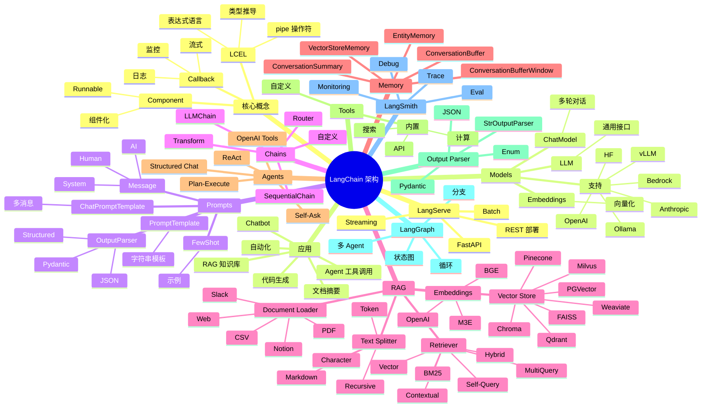

# LangChain

## 一、前言

**定位**：Harrison Chase 2022 年 10 月开源的**大模型应用开发框架**，目标是"让 LLM 应用构建像搭积木一样简单"。LCEL（LangChain Expression Language）已成为 LLM 应用编排事实标准。

**核心价值**：
- **链式编排**：把 Prompt / LLM / Parser / Tool 组合成 Chain
- **多模型支持**：OpenAI / Anthropic / Hugging Face / Ollama / 本地模型
- **RAG 一站式**：Document Loader + Splitter + Embeddings + Vector Store + Retriever
- **Agent 框架**：让 LLM 调用工具完成任务（ReAct / OpenAI Functions）
- **生产级特性**：LangSmith 监控 / LangServe 部署 / Streaming

**五大特性**：
1. **LCEL 表达式语言**：用 `|` 组合组件，类型安全的 Runnable 协议
2. **RAG 工具链**：20+ 向量数据库、50+ 文档加载器、20+ 文本切分器
3. **Agent 框架**：ReAct / OpenAI Tools / Structured Chat 等多模式
4. **Memory 机制**：短期/长期/Entity 记忆管理
5. **Callbacks**：日志、监控、流式输出统一接入

**生态**：

```
┌──────────────────────────────────────┐
│            LangChain                 │
│  (Python + JavaScript 两个版本)      │
└──────┬──────┬──────┬──────┬─────────┘
       │      │      │      │
       ▼      ▼      ▼      ▼
   langchain-community   LangSmith
   (第三方集成)         (监控调试)
   langgraph            LangServe
   (有状态 Agent)       (REST 部署)
```

**与同类对比**：

| 维度 | LangChain | LlamaIndex | Haystack | Semantic Kernel |
|---|---|---|---|---|
| 定位 | 通用 LLM 框架 | RAG 优先 | 工业 NLP 流水线 | .NET 集成 |
| 学习曲线 | 中 | 低 | 中 | 中 |
| Agent 能力 | 强 | 中 | 弱 | 中 |
| 文档支持 | 极多 | 多 | 中 | 少 |
| 性能优化 | 中 | 高 | 高 | 中 |

## 二、架构思维导图



## 三、关键代码

### 1. LCEL 基础链式

```python
from langchain_openai import ChatOpenAI
from langchain_core.prompts import ChatPromptTemplate
from langchain_core.output_parsers import StrOutputParser
import os

os.environ['OPENAI_API_KEY'] = '...'

# 1. 组件
prompt = ChatPromptTemplate.from_messages([
    ('system', '你是一个专业翻译，擅长中英文互译。'),
    ('user', '把以下文本翻译成英文：{text}'),
])

llm = ChatOpenAI(model='gpt-4o-mini', temperature=0)

output_parser = StrOutputParser()

# 2. 用 | 组合（LCEL）
chain = prompt | llm | output_parser

# 3. 调用
result = chain.invoke({'text': '今天天气真好'})
print(result)  # "The weather is really nice today."

# 4. 流式
for chunk in chain.stream({'text': '你好世界'}):
    print(chunk, end='', flush=True)

# 5. 批量
results = chain.batch([
    {'text': '苹果'},
    {'text': '香蕉'},
    {'text': '橙子'},
])
print(results)  # ['Apple', 'Banana', 'Orange']

# 6. 异步
import asyncio
async def main():
    result = await chain.ainvoke({'text': '异步调用'})
    print(result)
asyncio.run(main())
```

**解析**：
- **LCEL 的 `|` 是 Runnable 协议**：`prompt → llm → parser` 数据流管道化
- **统一 API**：`invoke` / `stream` / `batch` / `ainvoke` 四种调用方式
- **类型推导**：输入输出类型自动检测，IDE 自动补全友好

### 2. RAG 检索增强生成

```python
from langchain_community.document_loaders import WebPageLoader, PyPDFLoader
from langchain_text_splitters import RecursiveCharacterTextSplitter
from langchain_openai import OpenAIEmbeddings
from langchain_community.vectorstores import FAISS
from langchain_core.runnables import RunnablePassthrough

# 1. 加载文档
loader = WebPageLoader('https://docs.python.org/3/whatsnew/3.12.html')
docs = loader.load()
# PDF: PyPDFLoader('file.pdf')

# 2. 文本切分
text_splitter = RecursiveCharacterTextSplitter(
    chunk_size=1000,
    chunk_overlap=200,
    separators=['\n\n', '\n', '。', '！', '？', ' ', ''],
)
splits = text_splitter.split_documents(docs)
print(f'切分为 {len(splits)} 个 chunk')

# 3. Embedding + 向量库
embeddings = OpenAIEmbeddings(model='text-embedding-3-small')
vectorstore = FAISS.from_documents(splits, embeddings)

# 4. Retriever
retriever = vectorstore.as_retriever(
    search_type='similarity',
    search_kwargs={'k': 4},  # 检索 top-4
)

# 5. RAG 链
from langchain_core.prompts import ChatPromptTemplate
template = """基于以下上下文回答问题。如果不知道就说不知道。
上下文：{context}
问题：{question}
"""
prompt = ChatPromptTemplate.from_template(template)
llm = ChatOpenAI(model='gpt-4o-mini')

def format_docs(docs):
    return '\n\n'.join(doc.page_content for doc in docs)

rag_chain = (
    {'context': retriever | format_docs, 'question': RunnablePassthrough()}
    | prompt
    | llm
    | StrOutputParser()
)

# 6. 问答
answer = rag_chain.invoke('Python 3.12 有什么新特性？')
print(answer)

# 7. 流式
for chunk in rag_chain.stream('Python 3.12 性能优化'):
    print(chunk, end='', flush=True)

# 8. 带源文档
from langchain_core.runnables import RunnableParallel
rag_chain_with_source = RunnableParallel(
    {'context': retriever, 'question': RunnablePassthrough()}
).assign(answer=(
    RunnablePassthrough.assign(context=lambda x: format_docs(x['context']))
    | prompt | llm | StrOutputParser()
))
result = rag_chain_with_source.invoke('Python 3.12 性能优化')
print(result['context'])  # 源文档
print(result['answer'])  # 答案
```

**解析**：
- **`RecursiveCharacterTextSplitter`** 是 RAG 黄金标准：按段落→句→词逐级切，保留语义
- **`format_docs`** 把检索到的 chunks 拼成上下文
- **`RunnablePassthrough`** 是数据透传：让 `question` 原样透传，context 由 retriever 填充
- **`RunnableParallel`** 让两个分支并行（检索 + 透传）

### 3. Agent 工具调用

```python
from langchain.agents import create_tool_calling_agent, AgentExecutor
from langchain_core.tools import tool
from langchain_openai import ChatOpenAI

# 1. 定义工具
@tool
def get_weather(city: str) -> str:
    """查询指定城市的天气"""
    # 实际调用天气 API
    weather_data = {
        '北京': '晴，25度',
        '上海': '多云，22度',
        '深圳': '雷阵雨，30度',
    }
    return weather_data.get(city, f'暂无 {city} 天气数据')

@tool
def calculate(expression: str) -> str:
    """计算数学表达式"""
    try:
        return str(eval(expression))
    except Exception as e:
        return f'计算错误: {e}'

@tool
def search_docs(query: str) -> str:
    """在内部文档中搜索"""
    # 实际连接到 RAG 检索
    return f"搜索 '{query}' 的结果：..."

# 2. 创建 Agent
tools = [get_weather, calculate, search_docs]
llm = ChatOpenAI(model='gpt-4o-mini')

prompt = ChatPromptTemplate.from_messages([
    ('system', '你可以使用以下工具回答问题。'),
    ('human', '{input}'),
    ('placeholder', '{agent_scratchpad}'),
])

agent = create_tool_calling_agent(llm, tools, prompt)
agent_executor = AgentExecutor(agent=agent, tools=tools, verbose=True)

# 3. 调用
result = agent_executor.invoke({
    'input': '北京今天天气怎么样？上海的温度高还是低？两者温度差多少？'
})
print(result['output'])

# 4. 多步骤 Agent
result = agent_executor.invoke({
    'input': '计算 100 * 2.5 + 50 / 2，然后告诉我上海今天天气'
})
# Agent 自动选择 calculate + get_weather 工具
```

**解析**：
- **`@tool` 装饰器** 把普通函数变成 LangChain 工具，自动推断 schema
- **`create_tool_calling_agent`** 是 OpenAI 工具调用模式（function calling），比 ReAct 更稳定
- **`verbose=True`** 打印思考过程，便于调试
- **多步骤任务**：LLM 自动决定调用哪些工具、按什么顺序

### 4. 记忆（Memory）

```python
from langchain_core.chat_history import BaseChatMessageHistory, InMemoryChatMessageHistory
from langchain_core.runnables.history import RunnableWithMessageHistory

# 1. 多用户会话管理
store = {}

def get_session_history(session_id: str) -> BaseChatMessageHistory:
    if session_id not in store:
        store[session_id] = InMemoryChatMessageHistory()
    return store[session_id]

# 2. 带历史的链
prompt = ChatPromptTemplate.from_messages([
    ('system', '你是一个友好的助手。'),
    ('placeholder', '{chat_history}'),
    ('human', '{input}'),
])

chain = prompt | ChatOpenAI(model='gpt-4o-mini')

with_message_history = RunnableWithMessageHistory(
    chain,
    get_session_history,
    input_messages_key='input',
    history_messages_key='chat_history',
)

config = {'configurable': {'session_id': 'user-1001'}}

# 3. 多轮对话
print(with_message_history.invoke({'input': '我叫小明'}, config=config).content)
# "你好小明！"
print(with_message_history.invoke({'input': '我叫什么？'}, config=config).content)
# "你叫小明。" ← LLM 记住了历史

# 4. SQLite 持久化（生产环境）
from langchain_community.chat_message_histories import SQLChatMessageHistory
def get_persistent_history(session_id: str):
    return SQLChatMessageHistory(
        session_id=session_id,
        connection_string='sqlite:///chat.db',
    )
```

**解析**：
- **会话级 memory**：每个 session_id 独立历史
- **`RunnableWithMessageHistory`** 是 LCEL 与 memory 的桥梁
- **持久化用 SQL/Redis**：单进程内存只适合 demo

### 5. 部署：LangServe

```python
# server.py
from fastapi import FastAPI
from langserve import add_routes
from langchain_openai import ChatOpenAI
from langchain_core.prompts import ChatPromptTemplate

app = FastAPI(title='My LLM Server')

# 1. 简单链
model = ChatOpenAI(model='gpt-4o-mini')
prompt = ChatPromptTemplate.from_template('用一句话解释 {concept}')
chain = prompt | model

# 2. 暴露路由
add_routes(app, chain, path='/explain')

# 启动：uvicorn server:app --host 0.0.0.0 --port 8000

# 客户端调用
# POST /explain/invoke
# {"input": {"concept": "量子纠缠"}}
# {"output": "量子纠缠是两个粒子即使相隔很远..."}

# 流式：POST /explain/stream
# Batch：POST /explain/batch
# OpenAPI 文档：GET /docs
```

**解析**：
- **LangServe 把 LCEL 链转 REST API**：自动生成 OpenAPI 文档、支持 invoke/stream/batch
- **底层是 FastAPI**：可与现有 FastAPI 服务无缝集成
- **生产推荐 TGI / vLLM**：LangServe 性能不如专用推理服务

## 四、核心洞察

1. **LCEL 是 LangChain 真正的范式**：`prompt | llm | parser` 链式语法成为 LLM 应用编排事实标准；0.1.x 老 Chain API 已淘汰。
2. **RAG 是 LangChain 杀手锏**：20+ 向量库 + 50+ 文档加载器 + 10+ 切分器 + 5+ 检索器，RAG 工具链最完整。
3. **Agent 是 LangChain 最不稳定部分**：Tool calling 经常失败、循环卡死；生产需要严格的 prompt 工程 + 限制步数 + 错误重试。
4. **LangGraph 是 Agent 的未来**：状态图 + 循环 + 多 Agent 协作，比传统 Agent 更可控；推荐用于复杂工作流。
5. **LangSmith 是关键监控工具**：trace 调试 LLM 应用、eval 评估 prompt 效果、monitor 生产质量；10 美元/月起。
6. **LangChain 抽象泄漏问题**：用户经常抱怨"想用 LangChain 但被它绑架"；LangChain 0.3+ 在向"轻核心 + 强生态"方向改进。
7. **向量数据库选型**：FAISS（本地/小规模）、Chroma（原型）、PGVector（生产 + PG 已有）、Milvus/Qdrant（亿级 +）。
8. **Embedding 模型选择**：中文 BGE-large-zh-v1.5 / M3E / Text2Vec；英文 text-embedding-3-small / bge-large-en；多语言 BGE-M3。

## 五、跨项目引用

- [./transformers.md](./transformers.md) — LangChain 集成 Hugging Face 模型
- [./llama.md](./llama.md) — LangChain 集成本地 LLaMA 模型
- [./ollama.md](./ollama.md) — LangChain 集成 Ollama 本地推理
- [./vllm.md](./vllm.md) — vLLM 是 LangChain 后端推理引擎
- [./pytorch.md](./pytorch.md) — LangChain 底层多基于 PyTorch 模型
- [./chromadb.md](./chromadb.md) — Chroma 是 LangChain 默认向量库
- [./milvus.md](./milvus.md) — Milvus 是亿级向量场景的 LangChain 搭档
- [./openai.md](./openai.md) — LangChain 与 OpenAI 生态最深度集成
