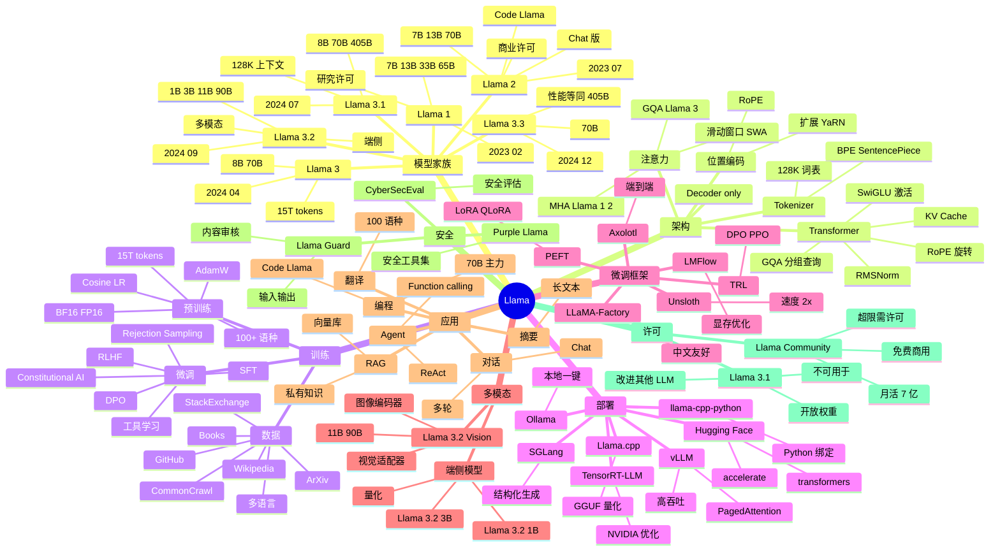

# Llama

## 一、前言

Llama（Large Language Model Meta AI）是 Meta 公司（原 Facebook）发布的开源大语言模型系列，由 Yann LeCun 领导的 Meta AI 研究院（FAIR）开发。第一代 Llama 1 于 2023 年 2 月发布（仅研究许可），第二代 Llama 2 于 2023 年 7 月发布（可商用），第三代 Llama 3 于 2024 年 4 月发布，Llama 3.1（405B）于 2024 年 7 月发布（首批开源旗舰级），Llama 3.2/3.3 在 2024 年底到 2025 年初发布多模态与轻量版本。截至 2025 年，Llama 系列累计下载量超过 6 亿次，是全球下载量最大的开源 LLM 系列，被 Mistral、阿里、字节、Microsoft Azure、AWS Bedrock、Hugging Face、Ollama 等几乎所有 AI 平台默认支持。

Llama 的核心价值在于"开源旗舰 + 商业友好 + 生态丰富 + 多模态扩展"。① 开源旗舰——Llama 3.1 405B 是首批参数规模匹敌 GPT-4 的开源模型；② 商业友好——Llama 2/3 起采用 Llama Community License，7B/8B 模型允许月活 7 亿以下企业免费商用；③ 生态丰富——vLLM/Llama.cpp/Hugging Face/Ollama/LangChain/LlamaIndex 全平台支持；④ 多模态——Llama 3.2 起支持 11B/90B 视觉模型、1B/3B 端侧模型；⑤ 工具链完善——Llama-Factory / Axolotl / Unsloth / PEFT 提供完整微调方案。

Llama 的关键能力包括：① 标准 Transformer Decoder-only 架构（RoPE 旋转位置编码、SwiGLU 激活、GQA 分组查询注意力、RMSNorm 归一化）；② 训练数据 15T+ tokens（Llama 3）；③ 上下文窗口 128K（Llama 3.1）；④ 多语言支持（100+ 语言，以英语/欧洲/亚洲语种为主）；⑤ 工具调用（function calling）与 JSON 结构化输出；⑥ 多模态（视觉理解，Llama 3.2）；⑦ 长文本处理（RoPE 位置外推、YaRN/LongRoPE 扩展 1M+ 上下文）；⑧ 完整微调生态（LoRA、QLoRA、DPO、RLHF、IFT、SFT）。

Llama 与其他主流 LLM 的对比：

| 模型 | 参数量 | 发布方 | 上下文 | 许可 | 优势 | 局限 |
|------|--------|--------|--------|------|------|------|
| Llama 3.1 | 8B/70B/405B | Meta | 128K | Llama Community | 开源旗舰、工具链完善 | 405B 部署需多卡 |
| Qwen3 | 0.6B-235B | 阿里 | 128K | Apache 2.0 | 中文最强、MoE 创新 | 英文略弱于 Llama |
| Mistral/Mixtral | 7B-22B(MoE) | Mistral AI | 32K-128K | Apache 2.0 | 速度快、欧洲语种强 | 模型规模有限 |
| DeepSeek-V3/R1 | 67B(MoE)/671B(MoE) | DeepSeek | 64K-128K | MIT | 推理极强、MLA 创新 | 需多卡部署 |
| Gemma 2/3 | 2B-27B | Google | 8K-128K | Gemma License | 轻量、教育友好 | 不如 Llama/Qwen 规模 |
| Phi-3/4 | 3.8B-14B | Microsoft | 4K-128K | MIT | 极致小而强 | 知识广度受限 |
| GPT-4o | 未公开 | OpenAI | 128K | 闭源 | 性能最强、视觉/语音 | 闭源、贵 |
| Claude 3.5/4 | 未公开 | Anthropic | 200K-1M | 闭源 | 长文本、代码 | 闭源 |

Llama 的核心应用场景：① 企业级 RAG（私有知识库 + Llama 3.1 70B + LangChain/LlamaIndex）；② 边缘设备（Llama 3.2 1B/3B 跑在手机/IoT/浏览器）；③ 多模态（Llama 3.2 11B/90B Vision 做图像理解）；④ 编程助手（Code Llama 替代 Copilot）；⑤ 多语言翻译/对话；⑥ 学术研究（架构分析、训练方法、alignment）；⑦ Agent/ReAct 框架（function calling + ReAct loop）。

Llama 5 大核心特性：① 旗舰开源（405B 匹敌 GPT-4、128K 上下文、GQA 注意力）；② 工具链完整（Ollama/vLLM/Llama.cpp/Hugging Face/Llama-Factory 全覆盖）；③ 商业友好（Llama Community License 月活 7 亿以下免费商用）；④ 多模态（Llama 3.2 视觉理解、端侧 1B/3B）；⑤ 多语言（100+ 语种，Llama 3 起中文大幅增强）。

## 二、架构思维导图



## 三、关键代码

### 3.1 Hugging Face Transformers 调用 Llama

```python
# 文件：transformers/models/llama/modeling_llama.py
import torch
from transformers import AutoTokenizer, AutoModelForCausalLM, pipeline

# ──────── 加载模型 ────────
model_id = "meta-llama/Meta-Llama-3.1-8B-Instruct"

tokenizer = AutoTokenizer.from_pretrained(model_id)
model = AutoModelForCausalLM.from_pretrained(
    model_id,
    torch_dtype=torch.bfloat16,                # 节省显存
    device_map="auto",                         # 自动分配到 GPU
    attn_implementation="sdpa",                # 缩放点积注意力
)
model.eval()

# ──────── chat 模板（官方格式） ────────
messages = [
    {"role": "system", "content": "你是一位 Python 专家"},
    {"role": "user",   "content": "用一行 Python 实现快速排序"},
]
input_ids = tokenizer.apply_chat_template(
    messages,
    add_generation_prompt=True,
    return_tensors="pt",
).to(model.device)

# ──────── 推理 ────────
with torch.no_grad():
    output = model.generate(
        input_ids,
        max_new_tokens=512,
        do_sample=True,
        temperature=0.7,
        top_p=0.9,
        repetition_penalty=1.05,
        pad_token_id=tokenizer.eos_token_id,
    )

response = tokenizer.decode(
    output[0][input_ids.shape[-1]:],
    skip_special_tokens=True,
)
print(response)

# ──────── pipeline 简化调用 ────────
pipe = pipeline(
    "text-generation",
    model=model,
    tokenizer=tokenizer,
    max_new_tokens=256,
    temperature=0.7,
)
out = pipe(messages)
print(out[0]["generated_text"][-1]["content"])
```

### 3.2 工具调用 (Function Calling) + JSON 模式

```python
# 文件：transformers + Function Calling
import torch
from transformers import AutoTokenizer, AutoModelForCausalLM
import json

model_id = "meta-llama/Meta-Llama-3.1-8B-Instruct"
tokenizer = AutoTokenizer.from_pretrained(model_id)
model = AutoModelForCausalLM.from_pretrained(
    model_id, torch_dtype=torch.bfloat16, device_map="auto",
)

# ──────── 定义工具（JSON Schema） ────────
tools = [
    {
        "type": "function",
        "function": {
            "name": "get_weather",
            "description": "查询指定城市的天气",
            "parameters": {
                "type": "object",
                "properties": {
                    "city": {"type": "string", "description": "城市名"},
                    "unit": {"type": "enum": ["celsius", "fahrenheit"]},
                },
                "required": ["city"],
            },
        },
    },
    {
        "type": "function",
        "function": {
            "name": "search_docs",
            "description": "在企业知识库搜索",
            "parameters": {
                "type": "object",
                "properties": {
                    "query": {"type": "string"},
                    "top_k": {"type": "integer", "default": 5},
                },
                "required": ["query"],
            },
        },
    },
]

# ──────── 模型决策工具调用 ────────
messages = [{"role": "user", "content": "上海现在天气如何？"}]
input_ids = tokenizer.apply_chat_template(
    messages,
    tools=tools,
    add_generation_prompt=True,
    return_tensors="pt",
).to(model.device)

with torch.no_grad():
    out = model.generate(input_ids, max_new_tokens=256, do_sample=False)
tool_call_text = tokenizer.decode(
    out[0][input_ids.shape[-1]:], skip_special_tokens=True
)
# 输出形如：<|python_tag|>{"name": "get_weather", "parameters": {"city": "上海"}}

# ──────── JSON 结构化输出 ────────
schema = {
    "type": "object",
    "properties": {
        "sentiment": {"type": "string", "enum": ["positive", "negative", "neutral"]},
        "score":     {"type": "number", "minimum": 0, "maximum": 1},
    },
    "required": ["sentiment", "score"],
}
messages = [
    {"role": "system", "content": f"严格按 JSON 输出：{json.dumps(schema, ensure_ascii=False)}"},
    {"role": "user",   "content": "评论：'这个产品太棒了！'"},
]
input_ids = tokenizer.apply_chat_template(
    messages, add_generation_prompt=True, return_tensors="pt"
).to(model.device)
out = model.generate(input_ids, max_new_tokens=128)
result = tokenizer.decode(out[0][input_ids.shape[-1]:], skip_special_tokens=True)
data = json.loads(result)
print(data)  # {'sentiment': 'positive', 'score': 0.95}
```

### 3.3 PEFT 微调：LoRA + QLoRA

```python
# 文件：peft/src/peft/tuners/lora.py + transformers Trainer
import torch
from datasets import load_dataset
from transformers import (
    AutoTokenizer, AutoModelForCausalLM,
    TrainingArguments, Trainer, BitsAndBytesConfig,
)
from peft import LoraConfig, get_peft_model, prepare_model_for_kbit_training, TaskType

model_id = "meta-llama/Meta-Llama-3.1-8B-Instruct"

# ──────── 量化配置（QLoRA：4-bit 基座 + LoRA 适配器） ────────
bnb_config = BitsAndBytesConfig(
    load_in_4bit=True,
    bnb_4bit_quant_type="nf4",
    bnb_4bit_compute_dtype=torch.bfloat16,
    bnb_4bit_use_double_quant=True,
)

tokenizer = AutoTokenizer.from_pretrained(model_id)
tokenizer.pad_token = tokenizer.eos_token

model = AutoModelForCausalLM.from_pretrained(
    model_id,
    quantization_config=bnb_config,
    device_map="auto",
    attn_implementation="sdpa",
)
model = prepare_model_for_kbit_training(model)

# ──────── LoRA 配置 ────────
lora_config = LoraConfig(
    r=16,                                  # 秩
    lora_alpha=32,
    target_modules=[
        "q_proj", "k_proj", "v_proj", "o_proj",  # 注意力
        "gate_proj", "up_proj", "down_proj",     # FFN
    ],
    lora_dropout=0.05,
    bias="none",
    task_type=TaskType.CAUSAL_LM,
)
model = get_peft_model(model, lora_config)
model.print_trainable_parameters()
# trainable params: 16,252,928 || all params: 8,043,892,736 || trainable%: 0.20%

# ──────── 数据准备 ────────
dataset = load_dataset("yahma/alpaca-cleaned", split="train[:5000]")

def format_prompt(example):
    return {
        "text": (
            f"### Instruction:\n{example['instruction']}\n\n"
            f"### Input:\n{example['input']}\n\n"
            f"### Response:\n{example['output']}"
        )
    }
dataset = dataset.map(format_prompt)

def tokenize(batch):
    return tokenizer(
        batch["text"],
        truncation=True,
        max_length=512,
        padding="max_length",
    )
dataset = dataset.map(tokenize, batched=True)

# ──────── 训练 ────────
training_args = TrainingArguments(
    output_dir="./llama3-lora",
    num_train_epochs=3,
    per_device_train_batch_size=4,
    gradient_accumulation_steps=4,
    learning_rate=2e-4,
    bf16=True,
    save_strategy="epoch",
    logging_steps=10,
    warmup_ratio=0.03,
    lr_scheduler_type="cosine",
    optim="paged_adamw_8bit",
)

trainer = Trainer(
    model=model,
    args=training_args,
    train_dataset=dataset,
)
trainer.train()
model.save_pretrained("./llama3-lora-final")
tokenizer.save_pretrained("./llama3-lora-final")

# ──────── 合并 LoRA 并导出 ────────
from peft import AutoPeftModelForCausalLM
merged = AutoPeftModelForCausalLM.from_pretrained(
    "./llama3-lora-final", torch_dtype=torch.bfloat16, device_map="auto"
)
merged = merged.merge_and_unload()
merged.save_pretrained("./llama3-merged", safe_serialization=True)
```

### 3.4 部署与生产化（vLLM + Llama.cpp + Ollama）

```python
# 文件：vLLM 服务端
# ──────── vLLM 高吞吐推理（生产首选） ────────
# pip install vllm

# 命令行启动 OpenAI 兼容服务
# vllm serve meta-llama/Meta-Llama-3.1-8B-Instruct \
#     --host 0.0.0.0 \
#     --port 8000 \
#     --tensor-parallel-size 1 \
#     --gpu-memory-utilization 0.9 \
#     --max-model-len 8192 \
#     --served-model-name llama-3.1-8b

# Python 调用
from vllm import LLM, SamplingParams

llm = LLM(
    model="meta-llama/Meta-Llama-3.1-8B-Instruct",
    tensor_parallel_size=1,
    gpu_memory_utilization=0.9,
    max_model_len=8192,
    dtype="bfloat16",
    enforce_eager=False,                       # True 跳过 CUDA graph
)

prompts = [
    "解释 Transformer 中的 Self-Attention",
    "用 Python 写一个 HTTP 服务器",
]
sampling_params = SamplingParams(
    temperature=0.7,
    top_p=0.9,
    max_tokens=512,
    stop=["<|eot_id|>"],
)
outputs = llm.generate(prompts, sampling_params)
for o in outputs:
    print(f"PROMPT: {o.prompt[:50]}...")
    print(f"OUTPUT: {o.outputs[0].text}\n")

# ──────── llama.cpp + GGUF 量化（CPU/边缘） ────────
# 1. 下载并转换 GGUF
# git clone https://github.com/ggerganov/llama.cpp
# python convert_hf_to_gguf.py meta-llama/Meta-Llama-3.1-8B-Instruct --outfile llama-3.1-8b-f16.gguf
# ./llama-quantize llama-3.1-8b-f16.gguf llama-3.1-8b-q4_k_m.gguf Q4_K_M

# 2. llama-cpp-python
from llama_cpp import Llama

llm = Llama(
    model_path="./llama-3.1-8b-q4_k_m.gguf",
    n_ctx=4096,
    n_threads=8,                                # CPU 线程
    n_gpu_layers=35,                            # 35 层 offload GPU
    chat_format="llama-3",                      # Llama 3 chat 模板
)

response = llm.create_chat_completion(
    messages=[{"role": "user", "content": "你好，介绍下自己"}],
    temperature=0.7,
    max_tokens=256,
)
print(response["choices"][0]["message"]["content"])

# ──────── Ollama 部署 ────────
# Modelfile
cat > Modelfile <<EOF
FROM llama-3.1-8b-q4_k_m.gguf
SYSTEM 你是一位资深 Go 工程师
PARAMETER temperature 0.3
PARAMETER num_ctx 8192
EOF
# ollama create my-llama -f Modelfile
# ollama run my-llama

# OpenAI 兼容调用
from openai import OpenAI
client = OpenAI(base_url="http://localhost:11434/v1", api_key="ollama")
resp = client.chat.completions.create(
    model="my-llama",
    messages=[{"role": "user", "content": "用 Gin 实现中间件"}],
)
print(resp.choices[0].message.content)
```

## 四、核心洞察

- **Llama 是开源 LLM 的"基线"**：自 2023 年发布以来，Llama 系列定义了开源 LLM 的事实标准——Transformer Decoder + RoPE + SwiGLU + GQA + RMSNorm 这套架构被 Mistral、Qwen、DeepSeek、Gemma 等几乎所有主流模型沿用。理解 Llama 架构等于理解 90% 现代 LLM。

- **RoPE（Rotary Position Embedding）是位置编码的胜利**：传统 Transformer 用绝对位置编码（sin/cos 加到 embedding）或相对位置编码（ALiBi），Llama 全系列采用 RoPE——把位置信息编码为复数旋转，乘到 Query/Key 上。RoPE 的优雅在于：① 长度可外推（YaRN/LongRoPE 扩展到 1M+）；② 注意力分数天然相对化；③ 数学上与"相对位置"完全等价但实现更简单。

- **GQA（Grouped Query Attention）降低显存**：标准 MHA（Multi-Head Attention）每个 Query 头都有独立的 Key/Value 头，KV cache 与头数线性增长；GQA 把多个 Query 头共享一个 KV 头（如 8 Q 头共享 1 KV 头），KV cache 减少 4-8x 而几乎不损精度。Llama 3 起全系列使用 GQA，70B 模型推理时 KV cache 从 80GB 降到 20GB，让单卡 4090 也能跑 70B 量化版。

- **Llama 3.1 405B 重新定义开源**：2024 年 7 月发布的 405B 是首批"开源版 GPT-4 级"模型，128K 上下文、多语言、工具调用、SFT/DPO 全套。它证明开源模型不仅在 8B/70B 规模追平闭源，405B 旗舰级也能匹敌。代价是部署门槛——单卡放不下，需 tensor parallel 8×H100 或量化后 8×A100/4090。

- **微调生态是 Llama 真正护城河**：Llama 之所以"生态最丰富"，核心不是模型本身，而是配套工具链——Hugging Face transformers / PEFT（LoRA/QLoRA）、Axolotl / LLaMA-Factory / Unsloth / TRL（DPO/PPO/GRPO）一站式微调；vLLM / SGLang / TensorRT-LLM / llama.cpp / Ollama 推理；Llama Guard / Purple Llama 安全。这让企业能"基座 + 数据 + 微调 + 部署"全流程跑通。

- **Function Calling 实战要点**：Llama 3.1 起支持原生 function calling，但 prompt 格式与 OpenAI 略有差异。`tokenizer.apply_chat_template(messages, tools=tools, add_generation_prompt=True)` 自动转换；模型输出包含 `<|python_tag|>` 包裹的 JSON；需要手动 parse 后执行再回传。`enforce_eager=False` 启用 CUDA graph 加速（首次推理有编译开销），生产环境用 SGLang 配合结构化生成更稳。

- **QLoRA 让 8B 微调上消费级 GPU**：QLoRA = 4-bit 量化基座 + LoRA 适配器 + paged optimizer，把 8B 模型微调显存从 80GB 降到 10GB，单张 4090/RTX 3090 即可训练。`BitsAndBytesConfig(load_in_4bit=True, bnb_4bit_quant_type="nf4")` + `prepare_model_for_kbit_training` + `LoraConfig(r=16, target_modules=["q_proj","k_proj","v_proj","o_proj","gate_proj","up_proj","down_proj"])` 是黄金组合。

- **Llama 3.2 多模态 + 端侧布局**：① Vision 11B/90B 引入图像理解（独立的 vision encoder + cross-attention 适配器），与文本模型联合微调；② 1B/3B 端侧模型用 128K 词表的 BPE + GQA，目标跑在手机/IoT（iPhone/Android/树莓派/Jetson）；这意味着 Meta 想让 Llama 同时覆盖云端（405B）+ 桌面（8B/70B）+ 端侧（1B/3B）的全谱系。

- **商业许可需注意**：Llama Community License 允许月活 7 亿以下企业免费商用（Llama 3.1 起），但有几个限制：① 不得用 Llama 训练/改进其他 LLM（不能蒸馏为竞品）；② 月活超 7 亿需联系 Meta 申请；③ 不得用于违法/有害/大规模监控用途；④ 必须在显著位置标注 "Built with Llama"。相比 Qwen（Apache 2.0）和 DeepSeek（MIT），Llama 许可约束更严但仍属开源友好。

## 五、跨项目引用

- **[PyTorch 训练](./pytorch.md)**：Llama 的训练与微调几乎完全基于 PyTorch。`transformers.AutoModelForCausalLM.from_pretrained(..., torch_dtype=torch.bfloat16, attn_implementation="sdpa")` 是标准加载方式；LoRA/QLoRA 用 PEFT；DPO/PPO 用 TRL。Llama 3 训练数据 15T tokens、AdamW + Cosine LR + 1.4M H100-hours 训练 54 天——是当前 SOTA LLM 训练方案的标杆。

- **[Ollama 本地运行](./ollama.md)**：Ollama 内部 `ollama pull llama3.1:8b` 一键下载并启动 Llama 量化版（GGUF Q4_K_M），通过 OpenAI 兼容 API（`base_url=http://localhost:11434/v1`）暴露。`ollama create my-llama -f Modelfile` 可基于 Llama 基座自定义系统提示、参数、LoRA 适配器，是本地化部署 Llama 的最简方案。

- **[LangChain LLM 应用](./langchain.md)**：`ChatHuggingFace`（Hugging Face transformers）、`ChatOpenAI(base_url="...")` 配合 vLLM/Ollama 服务端、LlamaIndex `HuggingFaceLLM`，可让 Llama 成为 RAG/Agent/工具调用框架的 LLM 核心。`tokenizer.apply_chat_template(messages, tools=tools)` 是把 LangChain Message 列表转为 Llama 3 官方 chat 格式的关键。

- **[Transformers 库]**：Llama 模型类（`LlamaForCausalLM`、`LlamaForSequenceClassification`）由 `transformers/models/llama/modeling_llama.py` 实现。理解 LlamaConfig（hidden_size=4096 / num_attention_heads=32 / num_key_value_heads=8 / num_hidden_layers=32）有助于诊断显存占用、配置 LoRA 目标、调试推理速度。

- **[vLLM 生产级推理]**：vLLM 是 Llama 系列生产部署的事实标准，OpenAI 兼容 API + PagedAttention + Continuous Batching 让 8B 模型单卡吞吐从 50 tok/s 提升到 500+ tok/s。`vllm serve meta-llama/Meta-Llama-3.1-8B-Instruct --tensor-parallel-size 1 --max-model-len 8192` 一行启动。

- **[Datasets / PEFT / TRL / Axolotl / LLaMA-Factory / Unsloth]**：Llama 微调生态全家桶。Hugging Face `datasets` 加载数据；`peft` 提供 LoRA/QLoRA；`trl` 提供 SFT/DPO/PPO/GRPO；`transformers.Trainer` 一站式训练；`LLaMA-Factory` 是中文友好、配置化的统一入口（支持 100+ 模型包括 Llama 全系）；`Unsloth` 速度 2-5x、显存省 40%。

- **[Hugging Face Hub]**：Llama 模型权重官方托管在 `meta-llama/Meta-Llama-3.1-8B-Instruct` 等仓库（需申请 Meta 许可后才能下载），社区微调版在 `NousResearch/Meta-Llama-3.1-8B-Instruct`、`unsloth/llama-3.1-8b-instruct-bnb-4bit` 等。Hugging Face Spaces 还有大量基于 Llama 的 Demo 应用。

- **[Mistral / Qwen / DeepSeek / Gemma / Phi]**：Llama 的主要竞品/互补品。Qwen3 中文最强且 Apache 2.0 许可更宽松；DeepSeek-R1 推理能力极强采用 MIT 许可；Mistral 欧洲语种优势；Gemma/Phi 轻量端侧。生产中常组合多模型——RAG 用 Qwen 嵌入、生成用 Llama、推理用 DeepSeek-R1。
