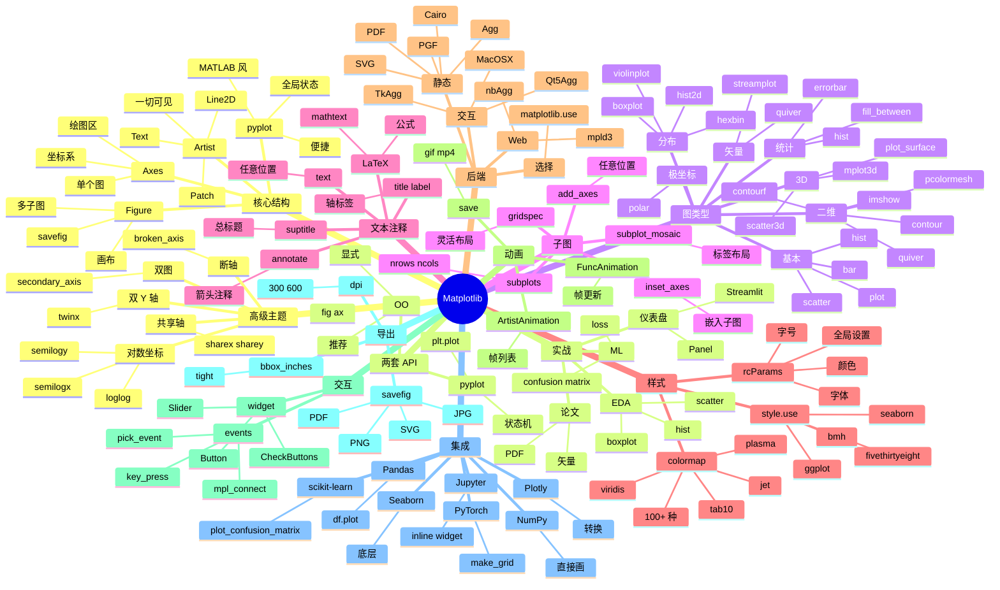

# Matplotlib

## 一、前言

Matplotlib 是 Python 生态最老牌、最基础的二维可视化库，由 John D. Hunter 于 2003 年发起，灵感来自 MATLAB 的绘图 API。它把"画图"这个动作从 MATLAB 风格的命令式 API（`pyplot` 模块）扩展到面向对象的精确控制（`Figure` / `Axes` / `Artist` 三层架构），并通过 `pyplot` 提供"复制-粘贴即可用"的便捷接口。截至 2025 年，Matplotlib GitHub 20 万+ Star、PyPI 月下载量超过 1.2 亿次，是几乎所有 Python 数据科学栈（NumPy / Pandas / Scikit-learn / PyTorch / TensorFlow / Jupyter）的"默认画笔"，也是 Seaborn / Plotly / Pandas `.plot()` / NetworkX / GeoPandas 等高层可视化库的渲染后端。

Matplotlib 的核心价值在于"完全控制 + 极广覆盖 + 无处不在"。① 完全控制——从单个像素到整张图、从字体到颜色映射、从坐标系到子图布局，100% 暴露给用户；② 极广覆盖——折线、散点、柱状、直方、饼图、等高线、热力图、3D、动画、流场、矢量场，几乎所有二维图都能画；③ 无处不在——任何 Python 数据科学栈默认都带 Matplotlib 依赖；④ 多后端导出——PNG、PDF、SVG、EPS、JPG、PGF（LaTeX）；⑤ 跨平台——在 Jupyter / Qt / Tk / Wx / Web（mpld3）都能渲染。

Matplotlib 的关键能力包括：① 两种 API 风格（`pyplot` 便捷 vs `Axes` 精确）；② Figure / Axes / Artist 三层架构；③ 50+ 种图类型（plot、scatter、bar、hist、pie、imshow、contour、quiver、streamplot、bar3d、mplot3d）；④ 数十种 colormap（viridis、plasma、jet、tab10）；⑤ 文字与注释（text、annotate、LaTeX 公式、字体管理）；⑥ 子图布局（subplots、gridspec、subplot_mosaic）；⑦ 后端系统（agg、svg、pdf、Qt、Tk、Web）；⑧ 动画（FuncAnimation、ArtistAnimation）；⑨ 风格系统（plt.style.use 切换 ggplot / seaborn / fivethirtyeight）；⑨ 与 Pandas/NumPy 深度集成（`df.plot()` 背后就是 Matplotlib）。

Matplotlib 与其他 Python 可视化库的对比：

| 库 | 定位 | 优势 | 局限 |
|------|------|------|------|
| Matplotlib | 基础二维可视化 | 完全控制、生态标准、PDF 出版级 | API 啰嗦、样式丑（默认）、交互弱 |
| Seaborn | 统计可视化 | 高级接口、美观默认、统计图 | 灵活性弱、底层仍走 Matplotlib |
| Plotly | 交互可视化 | 交互强、Web 友好、3D 强 | 体积大、出版级 PDF 弱、需 JS 渲染 |
| Bokeh | Web 交互 | 大数据流、服务器端推送 | 学习曲线陡、3D 弱 |
| Altair | 声明式可视化 | Vega-Lite 语法、简洁优雅 | 复杂图受限、大数据性能差 |
| ggplot | R 风 ggplot 风格 | 图形语法、声明式 | 维护放缓、不再是主流 |
| pyecharts | 百度 ECharts 绑定 | 中国用户友好、丰富图类型 | 性能中等、文档英文为主 |
| VisPy | GPU 加速 | 大数据、实时 | API 复杂、稳定性一般 |

Matplotlib 的核心应用场景：① 论文 / 报告出版（Nature、Science 级 PDF）；② 数据探索 EDA（快速看分布、趋势、关系）；③ 仪表盘（嵌入到 Streamlit / Gradio / Panel）；④ 机器学习可视化（loss 曲线、混淆矩阵、特征图）；⑤ 深度学习（`torchvision.utils.make_grid` 底层是 Matplotlib 风格）；⑥ 信号处理（时域图、频谱图）；⑦ 地理空间（与 Cartopy / Basemap 配合）；⑧ 任何需要"可发表"的图表。

Matplotlib 5 大核心特性：① Figure / Axes / Artist 三层架构（OO 接口完全控制）；② pyplot 便捷接口（MATLAB 风、`plt.plot()` 1 行出图）；③ 100+ 种图类型（2D / 3D / 极坐标 / 地理坐标 / 矢量场）；④ 多后端渲染（PNG / PDF / SVG / 屏幕 / Web）；⑤ 风格系统 + colormap（`plt.style.use('ggplot')` 切换主题，viridis 默认科学配色）。

## 二、架构思维导图



## 三、关键代码

### 3.1 两种 API 风格：pyplot vs OO

```python
# 文件：matplotlib/pyplot.py / matplotlib/axes/_axes.py
import matplotlib.pyplot as plt
import numpy as np

# ──────── pyplot 风格（MATLAB 风，1 行出图） ────────
x = np.linspace(0, 2 * np.pi, 100)
plt.figure(figsize=(8, 4))
plt.plot(x, np.sin(x), label="sin")                  # 自动创建 figure + axes
plt.plot(x, np.cos(x), label="cos")
plt.xlabel("x")
plt.ylabel("y")
plt.title("Trig Functions")
plt.legend()
plt.grid(True)
plt.show()

# ──────── OO 风格（显式控制，推荐） ────────
fig, ax = plt.subplots(figsize=(8, 4), dpi=100)     # 显式创建
ax.plot(x, np.sin(x), label="sin", linewidth=2)
ax.plot(x, np.cos(x), label="cos", linewidth=2)
ax.set_xlabel("x")                                  # OO 用 set_*
ax.set_ylabel("y")
ax.set_title("Trig Functions")
ax.legend()
ax.grid(True, alpha=0.3)
plt.show()

# ──────── 多子图：subplots ────────
fig, axes = plt.subplots(2, 2, figsize=(10, 8))     # 2x2 子图网格
axes[0, 0].plot(x, np.sin(x))
axes[0, 0].set_title("sin")
axes[0, 1].plot(x, np.cos(x), color="orange")
axes[0, 1].set_title("cos")
axes[1, 0].plot(x, np.tan(x))
axes[1, 0].set_ylim(-5, 5)
axes[1, 0].set_title("tan")
axes[1, 1].plot(x, -np.sin(x), color="green")
axes[1, 1].set_title("-sin")
plt.tight_layout()                                   # 自动调整间距

# ──────── 复杂布局：gridspec ────────
fig = plt.figure(figsize=(10, 6))
gs = fig.add_gridspec(3, 3)
ax_big = fig.add_subplot(gs[:2, :2])                 # 占 2x2 大格
ax_big.plot(x, np.sin(x))
ax_right = fig.add_subplot(gs[:2, 2])               # 右侧 2 行 1 列
ax_right.hist(np.random.randn(1000), bins=30, orientation="horizontal")
ax_bottom = fig.add_subplot(gs[2, :])                # 底部 1 行 3 列
ax_bottom.plot(x, np.cumsum(np.random.randn(100)))

# ──────── 标签布局：subplot_mosaic（最直观） ────────
fig, axes = plt.subplot_mosaic(
    """
    AB
    AC
    DD
    """,
    figsize=(10, 6),
)
axes["A"].plot(x, np.sin(x))
axes["B"].scatter(np.random.randn(100), np.random.randn(100))
axes["C"].bar(["A", "B", "C"], [3, 7, 5])
axes["D"].hist(np.random.randn(1000), bins=30)
```

### 3.2 各类图：分布 / 关系 / 分类 / 二维

```python
# 文件：matplotlib/axes/_axes.py
import matplotlib.pyplot as plt
import numpy as np

np.random.seed(42)

# ──────── 散点 + 颜色 + 大小 ────────
fig, ax = plt.subplots(figsize=(8, 6))
n = 200
x = np.random.randn(n)
y = 2 * x + np.random.randn(n) * 0.5
colors = np.random.rand(n)
sizes = 100 * np.random.rand(n) + 20
sc = ax.scatter(x, y, c=colors, s=sizes, alpha=0.6, cmap="viridis", edgecolors="black")
fig.colorbar(sc, ax=ax, label="color value")
ax.set_xlabel("x")
ax.set_ylabel("y")
ax.set_title("Scatter with color & size encoding")

# ──────── 直方图 + 核密度 ────────
fig, ax = plt.subplots(figsize=(8, 4))
data = np.random.randn(1000)
n_bins = 30
counts, bins, patches = ax.hist(data, bins=n_bins, density=True, alpha=0.7, color="steelblue", edgecolor="black")
# 叠加正态分布
from scipy.stats import norm
x_norm = np.linspace(-4, 4, 200)
ax.plot(x_norm, norm.pdf(x_norm), "r-", lw=2, label="N(0,1)")
ax.legend()

# ──────── 柱状图 + 误差棒 ────────
fig, ax = plt.subplots(figsize=(8, 4))
categories = ["A", "B", "C", "D", "E"]
means = [3.2, 5.4, 2.8, 6.1, 4.3]
stds = [0.5, 0.8, 0.3, 0.6, 0.4]
bars = ax.bar(categories, means, yerr=stds, capsize=5, color="skyblue", edgecolor="navy")
ax.set_ylabel("Value")
ax.set_title("Bar Chart with Error Bars")
# 在柱顶标数值
for bar, mean in zip(bars, means):
    ax.text(bar.get_x() + bar.get_width() / 2, mean + 0.1,
            f"{mean:.1f}", ha="center")

# ──────── 热力图（imshow / pcolormesh） ────────
fig, axes = plt.subplots(1, 2, figsize=(12, 5))
# imshow（用于图像 / 矩阵）
matrix = np.random.randn(10, 10)
im = axes[0].imshow(matrix, cmap="RdBu_r", aspect="auto")
axes[0].set_title("imshow")
fig.colorbar(im, ax=axes[0])
# pcolormesh（用于非规则网格）
x = np.random.rand(1000)
y = np.random.rand(1000)
z = np.sin(5 * x) * np.cos(5 * y)
axes[1].tricontourf(x, y, z, levels=20, cmap="viridis")
axes[1].scatter(x, y, c="black", s=1, alpha=0.3)
axes[1].set_title("tricontourf")

# ──────── 等高线 ────────
fig, ax = plt.subplots(figsize=(7, 6))
x_grid, y_grid = np.meshgrid(np.linspace(-3, 3, 100), np.linspace(-3, 3, 100))
z = np.sin(x_grid) * np.cos(y_grid) * np.exp(-(x_grid**2 + y_grid**2) / 5)
cs = ax.contourf(x_grid, y_grid, z, levels=15, cmap="viridis")
ax.contour(x_grid, y_grid, z, levels=10, colors="black", linewidths=0.5, alpha=0.5)
fig.colorbar(cs, ax=ax)

# ──────── 箱线图 / 小提琴图 / 散点矩阵 ────────
fig, ax = plt.subplots(figsize=(8, 5))
data = [np.random.randn(100) + i for i in range(4)]
bp = ax.boxplot(data, labels=["A", "B", "C", "D"], patch_artist=True)
for patch, color in zip(bp["boxes"], ["#FF9999", "#66B2FF", "#99FF99", "#FFCC99"]):
    patch.set_facecolor(color)

# ──────── 共享轴 / 双 Y 轴 ────────
fig, ax1 = plt.subplots(figsize=(8, 4))
x = np.arange(10)
ax1.bar(x, np.random.rand(10), color="steelblue", alpha=0.7, label="series 1")
ax1.set_ylabel("Series 1", color="steelblue")
ax2 = ax1.twinx()                                   # 共享 X 轴
ax2.plot(x, np.random.rand(10) * 100, "ro-", label="series 2")
ax2.set_ylabel("Series 2", color="red")
```

### 3.3 样式 / 字体 / 颜色 / 注释

```python
# 文件：matplotlib/style / matplotlib/text / matplotlib/colors
import matplotlib.pyplot as plt
import numpy as np

# ──────── 切换全局样式 ────────
plt.style.use("ggplot")                             # ggplot / seaborn-v0_8 / fivethirtyeight / bmh
# 列出全部可用样式
print(plt.style.available)

# ──────── rcParams 全局配置 ────────
plt.rcParams.update({
    "font.family":      "sans-serif",
    "font.sans-serif":  ["DejaVu Sans", "Arial Unicode MS", "Microsoft YaHei"],  # 中文字体
    "font.size":        12,
    "axes.unicode_minus": False,                    # 解决负号显示问题
    "figure.dpi":       100,
    "savefig.dpi":      300,
    "figure.figsize":   (8, 6),
    "axes.grid":        True,
    "grid.alpha":       0.3,
})

# ──────── 中文字体配置（跨平台） ────────
from matplotlib import font_manager
# 列出系统所有字体
fonts = [f.name for f in font_manager.fontManager.ttflist]
# Windows 中文字体：SimHei / Microsoft YaHei / SimSun
# macOS 中文字体：PingFang SC / Heiti SC
# Linux 中文字体：WenQuanYi Micro Hei / Noto Sans CJK SC

# ──────── 文本与注释 ────────
fig, ax = plt.subplots(figsize=(8, 5))
x = np.linspace(0, 10, 100)
y = np.sin(x) * np.exp(-x / 5)
ax.plot(x, y, "b-", lw=2, label="damped sine")

# 文字
ax.text(2, 0.5, "峰值区域", fontsize=14, color="red",
        bbox=dict(boxstyle="round", facecolor="yellow", alpha=0.5))

# 箭头注释
ax.annotate(
    "最大值", xy=(np.pi / 2, np.exp(-np.pi / 10)),   # 箭头落点
    xytext=(4, 0.6),                                  # 文字位置
    arrowprops=dict(arrowstyle="->", color="red", lw=2),
    fontsize=12, color="darkred",
)

# LaTeX 公式
ax.set_title(r"$\int_0^\infty e^{-x^2} dx = \frac{\sqrt{\pi}}{2}$")
ax.set_xlabel(r"$\theta$ (rad)")
ax.set_ylabel(r"$f(\theta)$")

# ──────── colormap 与颜色 ────────
# 1) 命名颜色
ax.plot(x, y, color="steelblue", lw=2)
# 2) hex
ax.plot(x, y * 0.9, color="#FF6B6B", lw=2)
# 3) RGB tuple
ax.plot(x, y * 0.8, color=(0.2, 0.4, 0.6, 0.8), lw=2)  # 第四个为 alpha
# 4) colormap
cmap = plt.cm.viridis
colors = cmap(np.linspace(0, 1, 10))
for i, c in enumerate(colors):
    ax.plot(x, np.sin(x + i * 0.5), color=c, lw=1.5)

# ──────── 区域填充 ────────
ax.fill_between(x, y * 0.9, y * 1.1, alpha=0.2, color="steelblue", label="±10% range")
ax.fill_between(x, 0, y, where=(y > 0), color="green", alpha=0.3, label="positive")
ax.fill_between(x, 0, y, where=(y < 0), color="red", alpha=0.3, label="negative")
ax.legend()

# ──────── 箭头 / 标尺 / 比例尺 ────────
ax.axhline(y=0, color="black", lw=0.5, linestyle="--")
ax.axvline(x=np.pi, color="gray", lw=0.5, linestyle=":")
ax.set_xlim(0, 10)
ax.set_ylim(-1, 1)
```

### 3.4 实战：ML 可视化 + 出版级图

```python
# 文件：matplotlib实战 / sklearn_metrics
import matplotlib.pyplot as plt
import numpy as np
from sklearn.metrics import confusion_matrix, roc_curve, auc
from sklearn.datasets import make_classification

# ──────── 1. 训练曲线 ────────
fig, axes = plt.subplots(1, 2, figsize=(12, 4))
epochs = np.arange(1, 51)
train_loss = 2.0 * np.exp(-epochs / 10) + 0.1 + np.random.rand(50) * 0.05
val_loss = 2.0 * np.exp(-epochs / 12) + 0.15 + np.random.rand(50) * 0.08
train_acc = 1 - np.exp(-epochs / 8) + np.random.rand(50) * 0.02
val_acc = 1 - np.exp(-epochs / 10) + np.random.rand(50) * 0.03

axes[0].plot(epochs, train_loss, "b-", label="train", lw=2)
axes[0].plot(epochs, val_loss, "r-", label="val", lw=2)
axes[0].set_xlabel("Epoch")
axes[0].set_ylabel("Loss")
axes[0].set_title("Loss Curve")
axes[0].legend()
axes[0].grid(True, alpha=0.3)

axes[1].plot(epochs, train_acc, "b-", label="train", lw=2)
axes[1].plot(epochs, val_acc, "r-", label="val", lw=2)
axes[1].set_xlabel("Epoch")
axes[1].set_ylabel("Accuracy")
axes[1].set_title("Accuracy Curve")
axes[1].legend()
axes[1].grid(True, alpha=0.3)

# ──────── 2. 混淆矩阵 ────────
y_true = np.random.randint(0, 3, 100)
y_pred = y_true.copy()
y_pred[np.random.rand(100) < 0.1] = np.random.randint(0, 3, 100)  # 加 10% 错误
cm = confusion_matrix(y_true, y_pred)

fig, ax = plt.subplots(figsize=(6, 6))
im = ax.imshow(cm, cmap="Blues")
ax.set_xticks(range(3))
ax.set_yticks(range(3))
ax.set_xticklabels(["Class 0", "Class 1", "Class 2"])
ax.set_yticklabels(["Class 0", "Class 1", "Class 2"])
ax.set_xlabel("Predicted")
ax.set_ylabel("True")
# 写入数字
for i in range(3):
    for j in range(3):
        ax.text(j, i, cm[i, j], ha="center", va="center",
                color="white" if cm[i, j] > cm.max() / 2 else "black")
fig.colorbar(im, ax=ax)
ax.set_title("Confusion Matrix")

# ──────── 3. ROC 曲线 ────────
X, y = make_classification(n_samples=1000, n_classes=2, random_state=42)
from sklearn.linear_model import LogisticRegression
clf = LogisticRegression().fit(X, y)
y_score = clf.predict_proba(X)[:, 1]
fpr, tpr, _ = roc_curve(y, y_score)
roc_auc = auc(fpr, tpr)

fig, ax = plt.subplots(figsize=(7, 6))
ax.plot(fpr, tpr, color="darkorange", lw=2, label=f"ROC (AUC = {roc_auc:.2f})")
ax.plot([0, 1], [0, 1], color="navy", lw=2, linestyle="--", label="random")
ax.set_xlim([0, 1])
ax.set_ylim([0, 1.05])
ax.set_xlabel("False Positive Rate")
ax.set_ylabel("True Positive Rate")
ax.set_title("ROC Curve")
ax.legend(loc="lower right")
ax.grid(True, alpha=0.3)

# ──────── 4. 出版级图（Nature / Science 风） ────────
# 关键：DPI 300+，无衬线字体，白底，矢量保存
plt.rcParams.update({
    "font.family":     "Arial",
    "font.size":       8,
    "axes.linewidth":  0.8,
    "axes.labelsize":  9,
    "xtick.labelsize": 8,
    "ytick.labelsize": 8,
    "legend.fontsize": 8,
    "figure.dpi":      300,
    "savefig.dpi":     600,
})

fig, ax = plt.subplots(figsize=(3.5, 2.5))            # 期刊单栏宽
x = np.linspace(0, 10, 200)
ax.plot(x, np.sin(x), "k-", lw=1)                    # 黑白线
ax.scatter([2, 4, 6], [0.5, -0.5, 0.8], s=10, c="black", marker="o")
ax.set_xlabel("Time (s)")
ax.set_ylabel("Amplitude (mV)")
ax.set_xlim(0, 10)
ax.spines["top"].set_visible(False)                   # 去掉上边框
ax.spines["right"].set_visible(False)                 # 去掉右边框
ax.tick_params(direction="out", length=3, width=0.8)
plt.tight_layout()
plt.savefig("figure.pdf", bbox_inches="tight", pad_inches=0.05)
plt.savefig("figure.png", bbox_inches="tight", pad_inches=0.05, dpi=600)

# ──────── 5. 3D 曲面 ────────
from mpl_toolkits.mplot3d import Axes3D
fig = plt.figure(figsize=(8, 6))
ax = fig.add_subplot(111, projection="3d")
x = np.linspace(-5, 5, 50)
y = np.linspace(-5, 5, 50)
X, Y = np.meshgrid(x, y)
Z = np.sin(np.sqrt(X**2 + Y**2))
ax.plot_surface(X, Y, Z, cmap="viridis", alpha=0.8)
ax.set_xlabel("X")
ax.set_ylabel("Y")
ax.set_zlabel("Z")

# ──────── 6. 动画 ────────
from matplotlib.animation import FuncAnimation
fig, ax = plt.subplots(figsize=(6, 6))
x = np.linspace(0, 2 * np.pi, 200)
line, = ax.plot(x, np.sin(x))
ax.set_ylim(-1.5, 1.5)

def update(frame):
    line.set_ydata(np.sin(x + frame / 10))
    return line,

ani = FuncAnimation(fig, update, frames=100, interval=50, blit=True)
# ani.save("animation.gif", writer="pillow")         # 保存为 GIF
# ani.save("animation.mp4", writer="ffmpeg")         # 保存为 MP4
plt.show()

# ──────── 7. Streamlit 集成 ────────
# import streamlit as st
# fig, ax = plt.subplots()
# ax.plot([1, 2, 3], [1, 4, 9])
# st.pyplot(fig)                                      # 一行嵌入 Streamlit
```

## 四、核心洞察

- **Figure / Axes / Artist 是核心架构**：Matplotlib 把所有可视化抽象为三层：① Figure（画布/顶层容器）、② Axes（一个坐标系/子图）、③ Artist（一切可见元素——Line2D、Text、Patch、Collection）。OO 风格 `fig, ax = plt.subplots()` 显式创建这两层，避免 pyplot 的全局状态污染。生产代码几乎都该用 OO 风格，pyplot 适合 Jupyter 探索。

- **两种 API 是"便捷 vs 精确"的取舍**：`plt.plot()` 一行出图（pyplot 状态机自动管理当前 figure/axes），但多图时容易混乱；`fig, ax = plt.subplots(); ax.plot()` 显式控制，多图/子图/嵌入场景必备。一个最佳实践：**函数内部用 OO 风格**，只在脚本/Notebook 顶层用 pyplot 探索。

- **后端系统决定渲染目标**：Matplotlib 把"画图逻辑"和"画到哪"解耦——同一份代码可以输出到 PNG（`Agg`）、PDF（`PdfPages`）、SVG、屏幕（`Qt5Agg`）、Web（`mpld3`）。`matplotlib.use("Agg")` 在服务器无显示环境下强制非交互；`%matplotlib widget` 在 Jupyter 里启用交互。Docker 容器跑 Matplotlib 必须 `MPLBACKEND=Agg`。

- **出版级图的"4 个开关"**：① DPI ≥ 300（屏幕 96-150、印刷 300-600）；② 字体统一（Arial / Times New Roman 期刊要求）；③ 去掉上右边框（`ax.spines['top'].set_visible(False)`）；④ 矢量保存 PDF/SVG（无损缩放）。Nature / Science 投稿的图都遵循这套规范。

- **colormap 不是装饰是数据语义**：连续数据用 `viridis`/`plasma`/`inferno`（感知均匀、色盲友好），分类数据用 `tab10`/`Set1`（区分度高），发散数据用 `RdBu_r`/`coolwarm`（双向偏离）。Jet 是经典反例（感知不均、色盲不友好），matplotlib 3.0+ 已改为默认 `viridis`。

- **样式系统让"美观"无需手写**：`plt.style.use("ggplot")` 一行切换 ggplot 主题；`plt.style.use("seaborn-v0_8")` 一行美化（虽然 Seaborn 已是独立库）；`plt.style.use("fivethirtyeight")` 模仿 538 风格；`plt.style.use("bmh")` BayeStyle 风。`plt.rcParams` 是底层配置入口，Jupyter 起手第一段常是 `rcParams` 配置。

- **Pandas / Seaborn 底层都是 Matplotlib**：`df.plot()` 返回的就是 `Axes` 对象；`seaborn.histplot()` 也返回 `Axes`。这意味着 Matplotlib 知识对 Pandas/Seaborn 都有效——"懂 Matplotlib 就懂了一半的可视化生态"。`fig, ax = plt.subplots(); sns.histplot(df, ax=ax); ax.set_title(...)` 是混合用法典范。

- **与 Plotly 不是替代是互补**：Matplotlib 出版级 PDF 静态图、Plotly 交互 Web 图。`mpld3` 把 Matplotlib 转为 D3.js；`plotly.tools.mpl_to_plotly()` 把 Matplotlib 转为 Plotly（部分支持）。一个项目常组合：探索用 Plotly 出交互版（缩放、悬停），报告用 Matplotlib 出 PDF 版（出版级）。

- **学习曲线与瓶颈**：Matplotlib API 庞大（2000+ 函数），但**常用 API 只有 30 个**——`plot` / `scatter` / `bar` / `hist` / `imshow` / `subplots` / `xlabel` / `legend` / `savefig` / `set_title` / `set_xlim` / `grid` / `tight_layout` / `rcParams`。3 天上手 80% 场景，剩下 20% 查 StackOverflow / `ax.set_*` 文档。瓶颈是"精细控制"——子图比例、双 Y 轴对齐、自定义 colormap，需要读源码和反复试。

- **局限与生态**：① 交互弱（点缩放/平移/悬停都用 mpld3 或 Plotly 替代）；② 大数据慢（100 万点以上考虑 Datashader / Plotly / VisPy）；③ 默认样式丑（解决：`plt.style.use('seaborn-v0_8')`）；④ 3D 弱（mplot3d 勉强用，复杂 3D 用 Plotly / Mayavi）。Seaborn 补统计图、Plotly 补交互、Altair 补声明式、mplfinance 补 K 线——生态补齐所有短板。

## 五、跨项目引用

- **[NumPy 基础](./numpy.md)**：Matplotlib 的输入 99% 是 NumPy 数组。`np.linspace` 生成 x 轴数据、`np.sin` / `np.cos` 生成 y、`np.random.randn` 生成散点。NumPy 的 `shape` / `dtype` / 广播规则直接决定 Matplotlib 能画什么。`ax.imshow(np_2d_array)` 把矩阵画成热力图、`ax.plot(np_1d_array)` 把向量画成折线是基本操作。

- **[Pandas 数据分析](./pandas.md)**：`df.plot()` 背后是 Matplotlib，返回 `Axes` 对象。`df.plot.scatter(x="a", y="b", c="c", colormap="viridis")`、`df.plot.bar()`、`df.plot.hist(bins=30)` 一行出图。DataFrame 的 `plot.box()` / `plot.kde()` / `plot.pie()` / `plot.area()` 全部基于 Matplotlib。Matplotlib + Pandas 是 EDA 标准组合。

- **[Scikit-learn 机器学习](./scikit-learn.md)**：Scikit-learn 的所有可视化函数都返回 Matplotlib `Figure` 对象。`sklearn.metrics.plot_confusion_matrix(clf, X, y)` / `plot_roc_curve(clf, X, y)` / `plot_precision_recall_curve` 全部基于 Matplotlib。`from sklearn.tree import plot_tree; plot_tree(clf)` 画决策树。掌握 Matplotlib 才能定制这些默认图。

- **[Seaborn 统计可视化]**：Seaborn 100% 建立在 Matplotlib 之上。`sns.histplot()` / `sns.boxplot()` / `sns.heatmap()` / `sns.pairplot()` 返回 `Axes` 或 `Figure`，可以继续用 Matplotlib `ax.set_title()` 修整。Seaborn 美化 Matplotlib 默认样式，Matplotlib 反过来提供 Seaborn 没有的精细控制。

- **[PyTorch 训练](./pytorch.md)**：PyTorch 的 `torchvision.utils.make_grid` 把 batch 张量拼成网格图（底层是 Matplotlib 风格），`tensor.cpu().numpy().transpose(1,2,0)` 后用 `plt.imshow` 显示。训练循环里 `ax.plot(losses)` 画 loss 曲线、`ax.imshow(grid)` 看卷积层 feature map。Matplotlib + PyTorch 是深度学习调试标配。

- **[Jupyter Notebook](./jupyter.md)**：Jupyter 是 Matplotlib 的"最佳搭档"。`%matplotlib inline` 把图内联到 cell（静态 PNG）；`%matplotlib widget` 或 `%matplotlib notebook` 启用交互（缩放、平移、保存）。`plt.gcf()` 拿当前 figure 改属性。`from IPython.display import display; display(fig)` 强制显示特定图。Notebook 探索 + Matplotlib 是数据科学黄金组合。

- **[SciPy 科学计算](./scipy.md)**：SciPy 的 `signal` / `stats` / `spatial` 模块常配 Matplotlib。`signal.spectrogram` 输出频谱图给 `plt.pcolormesh`；`stats.probplot` Q-Q 图；`spatial.distance_matrix` 用 `plt.imshow` 看距离矩阵。`scipy.integrate.solve_ivp` 的解用 Matplotlib 画时间序列。

- **[DuckDB 嵌入式 OLAP](./duckdb.md)**：DuckDB 查出来的结果（`con.execute().df()`）转 Pandas，再走 `df.plot()` 走 Matplotlib 流程：`result = duckdb.sql("SELECT * FROM 'data.parquet'").df(); result.plot(x="ts", y="value")`。`pl.DataFrame.plot()`（Polars）底层也是 Matplotlib。整个 OLAP + 统计 + 可视化流水线：`DuckDB 查 → Polars 处理 → Matplotlib 画`。

- **[Plotly 交互可视化]**：Plotly 是 Matplotlib 的"交互补集"。`plotly.tools.mpl_to_plotly(fig)` 把 Matplotlib 图转 Plotly（部分支持），或者直接用 Plotly Express：`px.line(df, x="ts", y="value")`。一个项目组合：探索阶段 Plotly 出交互版（缩放、悬停），报告阶段 Matplotlib 出 PDF 版（出版级）。
