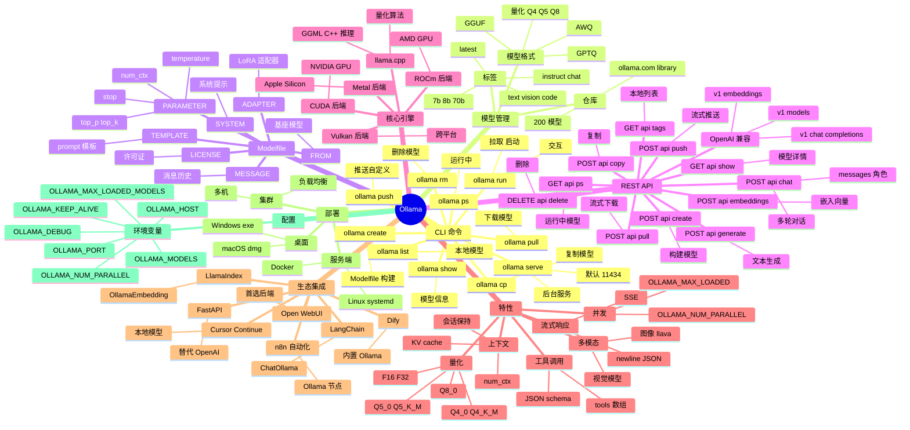

# Ollama

## 一、前言

Ollama 是一个开源的本地大语言模型（LLM）运行平台，由 Jeff Morgan 和 Michael Chiang 在 2023 年创立，总部位于美国旧金山湾区。它的目标是让用户"像运行 Docker 一样简单地运行开源 LLM"——一个二进制、一条命令即可在 macOS/Linux/Windows 上本地启动 Llama、Mistral、Qwen、DeepSeek、Gemma、Phi、CodeLlama 等几十种开源模型，并通过 OpenAI 兼容的 REST API 暴露给应用层调用。Ollama 自 2023 年发布以来迅速成为本地 LLM 工具的事实标准，截至 2025 年累计下载量超过 3000 万次，GitHub 11 万+ Star，被 LlamaIndex、LangChain、Dify、AnythingLLM、Open WebUI、Cursor 等大量工具链默认集成。

Ollama 的核心价值在于"零配置、本地化、多模型、多模态"。① 零配置——一个 `ollama run qwen3:8b` 即可在笔记本上启动模型，无需关心 CUDA 编译、模型转换、tokenizer 兼容性、依赖冲突；② 本地化——所有推理在本地完成，数据不出内网，对隐私敏感场景（医疗、法律、政务、企业内网）至关重要；③ 多模型——一个二进制管理几十个模型，支持 `pull` / `run` / `push` / `cp` / `rm` / `list` 等 Docker-like 指令；④ 多模态——支持文本、图像（llava、llama3.2-vision、minicpm-v）、音频（whisper）；⑤ OpenAI 兼容——`/v1/chat/completions`、`/v1/embeddings` 端点与 OpenAI API 完全兼容，可直接替换；⑥ 跨平台——macOS（Apple Silicon/Intel）、Linux、WSL2、Windows 原生（2024 起）。

Ollama 的关键能力包括：① 模型仓库——`ollama.com/library` 提供 200+ 预构建模型（参数规模 0.5B-405B、量化 Q4_0/Q4_K_M/Q5_K_M/Q8_0）；② 模型定制——基于 `Modelfile`（类似 Dockerfile）从基座模型微调系统提示、上下文长度、采样参数；③ REST API——`/api/chat`、`/api/generate`、`/api/embeddings`、`/api/create`、`/api/push`、`/api/pull`、`/api/show`、`/api/copy`、`/api/delete`；④ 兼容 OpenAI——`/v1/chat/completions`、`/v1/embeddings`、`/v1/models`；⑤ GPU 加速——自动检测 NVIDIA CUDA、Apple Metal、AMD ROCm、Vulkan；⑥ 模型分发——`ollama push` 把自定义模型推到 ollama.com/账号；⑦ 多用户并发——`OLLAMA_NUM_PARALLEL`、`OLLAMA_MAX_LOADED_MODELS` 控制并发与显存；⑧ 工具调用——`tools` JSON schema 支持 function calling；⑨ 状态保存——多轮对话 KV cache 优化断点恢复。

Ollama 与其他本地 LLM 工具的对比：

| 工具 | 定位 | 优势 | 局限 |
|------|------|------|------|
| Ollama | 本地 LLM 一键运行 | 零配置、API 兼容 OpenAI、多模型、多平台 | 不做训练、定制受限、生态相对封闭 |
| LM Studio | 桌面 GUI LLM 运行 | 图形化、模型浏览、离线 | 桌面端、不支持服务端集群 |
| llama.cpp | 底层 C++ 推理引擎 | 极致性能、量化算法丰富 | 需自行编译、API 上手难 |
| vLLM | 生产级 LLM 服务 | 高吞吐（continuous batching）、PagedAttention | 部署复杂、需 Python 生态 |
| text-generation-inference (TGI) | HuggingFace LLM 服务 | 生产级、HuggingFace 生态 | 配置复杂、不如 Ollama 简单 |
| LocalAI | OpenAI 替代品 | API 兼容、多模型 | 性能与社区弱于 Ollama |
| Open WebUI | LLM Web 前端 | 漂亮 UI、插件、RAG | 需配合 Ollama 后端 |

Ollama 的核心应用场景：① 个人/团队的本地 LLM 实验（笔记本跑 8B-32B 模型）；② 隐私敏感场景（医疗病历、法律文书、企业内部文档、企业内网）；③ 离线/无网络环境（边缘设备、船舶、野外作业）；④ 私有 RAG（企业知识库 + Ollama + LangChain/LlamaIndex）；⑤ CI/CD 测试（GitHub Actions 自托管 runner 跑 LLM 单测）；⑥ 教育（编程教学、模型微调实验、AI 入门）；⑦ 嵌入式（树莓派、Jetson Nano 跑 1B-3B 量化模型）。

Ollama 5 大核心特性：① 一条命令 `ollama run` 启动模型，零配置零编译；② 内置模型仓库 200+ 预构建版本，覆盖 Llama/Qwen/DeepSeek/Mistral/Gemma/Phi 全家桶；③ OpenAI 兼容 REST API（`/v1/chat/completions`），无侵入替换 OpenAI；④ Modelfile 自定义系统提示、参数、模板，类似 Dockerfile；⑤ 自动检测 GPU（CUDA/Metal/ROCm），跨平台 macOS/Linux/Windows/WSL2/Docker。

## 二、架构思维导图



## 三、关键代码

### 3.1 CLI 基础：拉取 / 运行 / 列表

```bash
# 文件：Ollama CLI 入口（cmd/ollama/main.go）

# ──────── 安装 ────────
# macOS:    brew install ollama  或下载 ollama.com
# Linux:    curl -fsSL https://ollama.com/install.sh | sh
# Windows:  下载 ollama.com/download/OllamaSetup.exe
# Docker:   docker run -d -p 11434:11434 ollama/ollama

# ──────── 启动后台服务 ────────
ollama serve                # 监听 127.0.0.1:11434
# 或 macOS 上直接打开 Ollama.app（自动 serve）

# ──────── 拉取模型 ────────
ollama pull qwen3:8b                # 默认 4.7GB，Q4_K_M 量化
ollama pull llama3.2:3b             # 2.0GB，轻量
ollama pull deepseek-r1:7b          # 推理模型
ollama pull llava:7b                # 视觉
ollama pull nomic-embed-text        # 嵌入

# ──────── 交互式对话 ────────
ollama run qwen3:8b
>>> 你好，介绍下自己
我是通义千问 Qwen3，由阿里巴巴开发...（Ctrl+D 退出）

# 单次提问
ollama run qwen3:8b "写一首关于秋天的诗"

# 多模态（图像）
ollama run llava:7b "描述这张图片" < photo.jpg

# ──────── 列表 / 详情 / 删除 ────────
ollama list               # NAME ID SIZE MODIFIED
# qwen3:8b          0b3f2b...    4.7 GB  2 hours ago
# llama3.2:3b       a6eb4a...    2.0 GB  1 day ago

ollama show qwen3:8b      # 模型元信息（参数量、量化、模板）
ollama ps                 # 当前运行中的模型与显存
ollama rm qwen3:8b        # 删除
ollama cp qwen3:8b my-qwen  # 复制（创建别名）

# ──────── 模型管理（自定义 Modelfile） ────────
# Modelfile（类似 Dockerfile）
cat > Modelfile <<EOF
FROM qwen3:8b
SYSTEM 你是一位资深的 Go 语言架构师，回答需结合 Gin/GORM/Kratos 等生态。
PARAMETER temperature 0.3
PARAMETER num_ctx 8192
PARAMETER top_p 0.9
PARAMETER stop "<|im_end|>"
EOF

ollama create go-expert -f Modelfile     # 构建
ollama run go-expert "用 Gin 实现 JWT 鉴权中间件"
```

### 3.2 REST API：generate / chat / embeddings

```python
# 文件：Ollama server (server/routes.go)
import requests
import json

BASE = "http://localhost:11434"

# ──────── /api/generate：单轮文本生成 ────────
resp = requests.post(
    f"{BASE}/api/generate",
    json={
        "model":  "qwen3:8b",
        "prompt": "用 Python 写一个快排",
        "stream": False,                              # True 走流式
        "options": {
            "temperature": 0.3,
            "num_ctx": 4096,
            "top_p": 0.9,
            "stop": ["<|im_end|>"],
        },
    },
    timeout=120,
)
data = resp.json()
print(data["response"])
print(f"eval_count={data['eval_count']}  duration={data['total_duration']/1e9:.1f}s")

# ──────── 流式响应（SSE / newline-delimited JSON） ────────
resp = requests.post(
    f"{BASE}/api/generate",
    json={"model": "qwen3:8b", "prompt": "写一首诗", "stream": True},
    stream=True,
)
for line in resp.iter_lines():
    if not line:
        continue
    chunk = json.loads(line)
    print(chunk["response"], end="", flush=True)
    if chunk.get("done"):
        print(f"\n[total_duration={chunk['total_duration']/1e9:.1f}s]")

# ──────── /api/chat：多轮对话 ────────
messages = [
    {"role": "system", "content": "你是一位 Python 专家"},
    {"role": "user",   "content": "什么是 GIL？"},
]
resp = requests.post(
    f"{BASE}/api/chat",
    json={"model": "qwen3:8b", "messages": messages, "stream": False},
)
data = resp.json()
print(data["message"]["content"])
# 追加助手回复
messages.append(data["message"])
messages.append({"role": "user", "content": "如何绕过？"})
resp = requests.post(
    f"{BASE}/api/chat",
    json={"model": "qwen3:8b", "messages": messages, "stream": False},
)
print(resp.json()["message"]["content"])

# ──────── /api/embeddings：文本嵌入 ────────
resp = requests.post(
    f"{BASE}/api/embeddings",
    json={"model": "nomic-embed-text", "prompt": "Ollama 是本地 LLM 工具"},
)
vec = resp.json()["embedding"]
print(len(vec), vec[:5])                  # 768 维

# 批量嵌入（Ollama 0.4+ 支持 prompt 数组）
resp = requests.post(
    f"{BASE}/api/embeddings",
    json={"model": "nomic-embed-text", "input": ["文本1", "文本2", "文本3"]},
)
for item in resp.json()["embeddings"]:
    print(len(item))

# ──────── OpenAI 兼容 API（直接替换 OpenAI 客户端） ────────
from openai import OpenAI

client = OpenAI(
    base_url="http://localhost:11434/v1",  # 关键：指向 Ollama
    api_key="ollama",                       # 占位
)
resp = client.chat.completions.create(
    model="qwen3:8b",
    messages=[{"role": "user", "content": "你好"}],
)
print(resp.choices[0].message.content)

resp = client.embeddings.create(
    model="nomic-embed-text",
    input="Ollama",
)
print(len(resp.data[0].embedding))
```

### 3.3 工具调用 / Function Calling

```python
# 文件：Ollama server (server/routes.go + tools)
import requests
import json

BASE = "http://localhost:11434"

# ──────── 定义工具（JSON Schema） ────────
tools = [
    {
        "type": "function",
        "function": {
            "name": "get_weather",
            "description": "查询指定城市的实时天气",
            "parameters": {
                "type": "object",
                "properties": {
                    "city": {
                        "type": "string",
                        "description": "城市名，如 北京",
                    },
                    "unit": {
                        "type": "string",
                        "enum": ["celsius", "fahrenheit"],
                    },
                },
                "required": ["city"],
            },
        },
    },
    {
        "type": "function",
        "function": {
            "name": "search_docs",
            "description": "在企业知识库中搜索相关文档",
            "parameters": {
                "type": "object",
                "properties": {
                    "query": {"type": "string"},
                    "top_k": {"type": "integer", "default": 5},
                },
                "required": ["query"],
            },
        },
    },
]

# ──────── 模型决策是否调用工具 ────────
messages = [{"role": "user", "content": "北京今天天气怎么样？"}]
resp = requests.post(
    f"{BASE}/api/chat",
    json={
        "model": "qwen3:8b",
        "messages": messages,
        "tools": tools,
        "stream": False,
    },
)
data = resp.json()
print(data["message"])
# {'role': 'assistant', 'content': '',
#  'tool_calls': [{'function': {'name': 'get_weather', 'arguments': {'city': '北京'}}}]}

# ──────── 执行工具 ────────
def execute_tool(name, args):
    if name == "get_weather":
        # 实际调用天气 API
        return {"temperature": 22, "condition": "晴", "humidity": 45}
    if name == "search_docs":
        return [{"title": "Ollama 文档", "content": "..."}]

tool_call = data["message"]["tool_calls"][0]
result = execute_tool(
    tool_call["function"]["name"],
    tool_call["function"]["arguments"],
)

# ──────── 把工具结果回传模型生成最终回复 ────────
messages.append(data["message"])                  # 助手 tool_call
messages.append({
    "role":    "tool",
    "content": json.dumps(result, ensure_ascii=False),
})
resp = requests.post(
    f"{BASE}/api/chat",
    json={"model": "qwen3:8b", "messages": messages, "tools": tools},
)
print(resp.json()["message"]["content"])
# "北京今天天气晴，气温 22°C，湿度 45%，适合户外活动。"

# ──────── 视觉模型（llava / llama3.2-vision） ────────
import base64
with open("photo.jpg", "rb") as f:
    img_b64 = base64.b64encode(f.read()).decode()

resp = requests.post(
    f"{BASE}/api/chat",
    json={
        "model": "llava:7b",
        "messages": [{
            "role": "user",
            "content": "描述这张图片",
            "images": [img_b64],                 # base64 数组
        }],
    },
)
print(resp.json()["message"]["content"])
```

### 3.4 部署 + LangChain/LlamaIndex 集成

```python
# 文件：Ollama + 框架集成示例
import os
from fastapi import FastAPI
from pydantic import BaseModel

# ──────── FastAPI 包装：Ollama 替代 OpenAI ────────
app = FastAPI(title="Local LLM API (Ollama Backend)")

class ChatRequest(BaseModel):
    model: str = "qwen3:8b"
    messages: list
    temperature: float = 0.7

@app.post("/v1/chat/completions")
def chat(req: ChatRequest):
    """完全兼容 OpenAI ChatCompletion API"""
    import requests
    r = requests.post(
        "http://localhost:11434/api/chat",
        json={
            "model":  req.model,
            "messages": req.messages,
            "options": {"temperature": req.temperature},
            "stream": False,
        },
        timeout=300,
    )
    return {
        "choices": [{
            "message": r.json()["message"],
        }],
    }

# ──────── LangChain 集成 ────────
from langchain_community.chat_models import ChatOllama
from langchain_community.embeddings import OllamaEmbeddings
from langchain_core.prompts import ChatPromptTemplate
from langchain_core.output_parsers import StrOutputParser

# LLM
llm = ChatOllama(
    model="qwen3:8b",
    base_url="http://localhost:11434",
    temperature=0.5,
    num_ctx=4096,
    format="json",                  # 强制 JSON 输出
)
# Embeddings
emb = OllamaEmbeddings(
    model="nomic-embed-text",
    base_url="http://localhost:11434",
)

# Chain：Prompt → LLM → Parser
prompt = ChatPromptTemplate.from_messages([
    ("system", "你是一位 Python 专家"),
    ("user",   "{question}"),
])
chain = prompt | llm | StrOutputParser()
print(chain.invoke({"question": "什么是 GIL？"}))

# ──────── LlamaIndex 集成 ────────
from llama_index.core import VectorStoreIndex, SimpleDirectoryReader, Settings
from llama_index.llms.ollama import Ollama
from llama_index.embeddings.ollama import OllamaEmbedding

Settings.llm = Ollama(model="qwen3:8b", request_timeout=120)
Settings.embed_model = OllamaEmbedding(model_name="nomic-embed-text")

# 加载本地文档 → 索引 → 问答
docs = SimpleDirectoryReader("./data").load_data()
index = VectorStoreIndex.from_documents(docs)
query_engine = index.as_query_engine()
print(query_engine.query("总结这份文档的关键点"))
```

## 四、核心洞察

- **"Docker for LLM" 是核心比喻**：Ollama 把 LLM 抽象成镜像，命令 `ollama pull` 像 `docker pull`、`ollama run` 像 `docker run`、`Modelfile` 像 `Dockerfile`、`ollama push` 像 `docker push`、模型存在 `~/.ollama/models` 像 Docker 镜像存储。这种抽象让会 Docker 的开发者 5 分钟上手 LLM 部署。

- **底层是 llama.cpp，不是自研引擎**：Ollama 本身只是一个 Go 写的管理工具，实际推理由 `llama.cpp`（C++ 编写的 GGML 张量库）完成。这让 Ollama 自动继承 llama.cpp 全部优化：GGUF 模型格式、4-bit/5-bit/8-bit 量化（Q4_K_M 是精度/体积最佳平衡点）、Metal/CUDA/ROCm/Vulkan 全平台加速。Ollama 团队主要工作是模型管理、API 兼容、跨平台打包。

- **OpenAI 兼容性是杀手锏**：`http://localhost:11434/v1` 暴露与 OpenAI 相同的 `/v1/chat/completions`、`/v1/embeddings`、`/v1/models` 端点，参数 `model` / `messages` / `temperature` 命名完全一致。意味着把 `OpenAI(base_url=...)` 客户端代码 `base_url` 一改即可从云端切换到本地，应用层零修改。这是它在 2024 年大爆发的关键。

- **量化是本地运行的核心技术**：原始 Llama 3 70B FP16 约 140GB，普通消费级 GPU 装不下；Q4_K_M 量化后约 40GB，4090/3090 即可运行；Q2_K 量化后 20GB，Mac M2 32GB 也能跑。量化牺牲 1-3% 精度换取 3-4x 体积压缩和 2-3x 推理加速。Ollama 默认下载 Q4_K_M 版本，平衡精度与体积。

- **Modelfile 让"模型即配置"**：通过 `FROM qwen3:8b` 选基座 → `SYSTEM` 设系统提示 → `PARAMETER temperature/num_ctx/stop` 调采样 → `TEMPLATE` 改 prompt 模板 → `ADAPTER` 挂 LoRA 微调 → `ollama create my-expert -f Modelfile` 创建私有模型。这种"模型层封装系统提示"让不同业务场景（RAG/客服/代码/翻译）共用基座、各自定制。

- **并发与显存管理**：默认 `OLLAMA_NUM_PARALLEL=1`（串行处理请求）、`OLLAMA_MAX_LOADED_MODELS=1`（只保留一个模型在显存）。生产环境需调整：`OLLAMA_NUM_PARALLEL=4`（4 路并发推理）、`OLLAMA_MAX_LOADED_MODELS=2`（双模型热加载）。`OLLAMA_KEEP_ALIVE=5m` 模型闲置 5 分钟后自动卸载释放显存。`ollama ps` 实时查看显存占用。

- **Ollama vs vLLM 的定位差异**：Ollama 目标是**个人/小团队本地**（简单、零配置、单用户友好），vLLM 目标是**生产级服务端**（高吞吐、PagedAttention、continuous batching、metrics、K8s）。同硬件下 vLLM 吞吐可达 Ollama 的 5-10x，但配置复杂度高 10x。开发调试用 Ollama、生产部署用 vLLM/TGI 是常见组合。

- **生态集成已成事实标准**：LangChain（`ChatOllama`/`OllamaEmbeddings`）、LlamaIndex（`Ollama`/`OllamaEmbedding`）、Dify（内置 Ollama 节点）、Open WebUI（Ollama 首选 Web 前端）、Cursor / Continue（VS Code AI 插件）、n8n（Ollama 节点）、OpenHands / Devin（AI 编程代理）、AnythingLLM（一站式本地知识库）—— Ollama 已成为 LLM 工具链的"本地底座"。

- **局限与不擅长的场景**：① 不做训练（训练用 transformers + PEFT + Axolotl/LLaMA-Factory）；② 不擅长超大规模模型（>70B 建议用 vLLM/TGI + 多 GPU）；③ 集群模式弱（多机需自建 nginx 负载均衡或用 LiteLLM/Dify）；④ 模型市场受限于 Ollama 官方（不支持私有 registry 自托管）；⑤ API 兼容性虽强但有少量差异（function calling schema 与 OpenAI 100% 兼容，structured outputs 仅部分模型支持）。

## 五、跨项目引用

- **[LangChain LLM 应用](./langchain.md)**：Ollama 是 LangChain 的核心本地后端。`ChatOllama` 替换 `ChatOpenAI` 一行改 base_url；RAG 流水线 `OllamaEmbeddings`（nomic-embed-text / mxbai-embed-large）+ Faiss/Chroma 全部本地化。LangChain 的 Agent、Memory、Tool Calling 在 Ollama 上完全可用。

- **[LlamaIndex RAG 框架]**：LlamaIndex 提供 `Ollama` 和 `OllamaEmbedding` 一等公民集成，`Settings.llm = Ollama(model="qwen3:8b")` 切换默认 LLM。配合 `VectorStoreIndex` + `SimpleDirectoryReader` 可构建完全本地化的企业 RAG 系统（数据不出内网）。

- **[PyTorch 训练](./pytorch.md)**：Ollama 不做训练，但训练框架与 Ollama 强互补：① 训练阶段用 PyTorch + transformers + PEFT（LoRA）微调基座；② 导出 GGUF 格式（`llama.cpp` 转换脚本）；③ `ollama create my-model -f Modelfile` 加载 LoRA adapter → 部署为 Ollama 模型。Llama3/Qwen3 微调后跑在 Ollama 是当前最热门的"小模型定制"工作流。

- **[FastAPI 模型服务]**：Ollama 默认监听 11434，可直接用 FastAPI 包装一层加鉴权/限流/日志/计费。`base_url=http://ollama:11434/v1` 让任何 OpenAI 客户端（包括 Dify/LibreChat/ChatBox）零配置连入。

- **[Docker 容器化]**：Ollama 官方镜像 `ollama/ollama` 支持 GPU（`--gpus all`）/ CPU / 多模型挂载（`-v ollama:/root/.ollama`）。`docker-compose.yml` 编排 Ollama + Open WebUI + Dify + Chroma 一键拉起完整本地 AI 平台。

- **[Llama.cpp 推理引擎]**：Ollama 的推理核心。理解 GGUF 模型格式、量化算法（Q4_K_M/Q5_K_M/Q8_0）、Metal/CUDA 加速能帮助你做更精细的性能调优（自定义编译参数、CPU 推理模式、KV cache 量化）。

- **[Open WebUI 前端]**：Ollama 官方推荐的 Web UI 替代品（之前的 ChatGPT 风格），提供多模型切换、对话历史、文档上传 RAG、插件系统、用户管理、API Key 管理，是本地 LLM 体验最完整的方案。

- **[vLLM 生产级 LLM 服务]**：当 Ollama 性能不足（单请求 1-3 秒、并发 4 路），升级到 vLLM：相同硬件吞吐提升 5-10x、支持 PagedAttention、continuous batching、tensor parallel、HTTP/gRPC API、Prometheus 监控。vLLM 同样支持 OpenAI 兼容 API。
