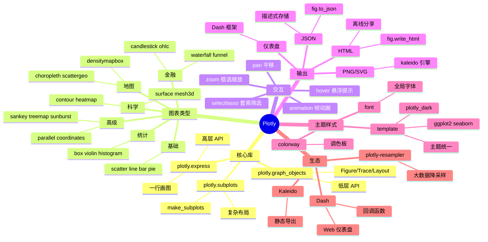

# Plotly

## 前言

**定位**：基于 D3.js 与 stack-gl 的开源交互式可视化库，支持 Python、R、JavaScript、Julia 多语言，前端用 React 渲染 SVG/WebGL。

**核心价值**：
- 一行代码生成可缩放、可悬浮、可下载的交互式图表
- 图表即数据：JSON 描述 → 前端渲染，便于嵌入 Web 与 Dash 应用
- 从 2D 散点/折线到 3D 曲面/地图/金融图，覆盖科研/商业全场景
- 与 Pandas 无缝衔接，`plotly.express` 一行画图

**五大特性**：
1. **交互开箱即用**：缩放、平移、悬浮提示、图例筛选、相机旋转无需写 JS
2. **声明式 JSON 协议**：`fig.to_json()` 输出图形描述，可独立存储/版本控制
3. **Dash 集成**：Plotly 团队自研的 Python Web 框架，构建数据仪表盘
4. **科学级图表**：等高线、热力图、三维曲面、平行坐标、对数轴
5. **离线 + 在线双模式**：`plotly.offline` 写 HTML，`chart_studio` 上传云端

**对比表**：

| 维度 | Plotly | Matplotlib | Seaborn | ECharts | Bokeh |
|---|---|---|---|---|---|
| 交互 | ✅ 强 | ❌ 静态 | ❌ 静态 | ✅ 强 | ✅ 中 |
| 学习曲线 | 低（express） | 中 | 低 | 中 | 中 |
| 3D 支持 | ✅ 强 | ✅ 弱 | ❌ | ⚠️ 中 | ⚠️ 中 |
| 仪表盘 | Dash（自研） | 无 | 无 | 无 | Bokeh Server |
| 输出格式 | HTML/JSON/PNG | PNG/SVG/PDF | PNG | JS/HTML | HTML |
| 适用场景 | Web 报告/PPT | 论文/印刷 | 统计探索 | 国内大屏 | 流式数据 |

## 思维导图



## 关键代码

### 一、express 高层 API：Pandas 风格一行画图

```python
import plotly.express as px
import pandas as pd

df = pd.read_csv("sales.csv")

# 1. 散点图：自动悬浮提示、缩放、图例筛选
fig = px.scatter(
    df, x="广告投入", y="营收",
    color="渠道",              # 按渠道着色
    size="订单数",             # 气泡大小
    hover_name="日期",         # 悬浮显示
    trendline="ols",           # 拟合 OLS 趋势线
    title="广告 ROI 分析"
)
fig.show()

# 2. 地图：自带 GeoJSON
fig = px.choropleth(
    df, locations="省代码",
    color="GMV", scope="asia",
    color_continuous_scale="RdYlGn",
    range_color=(0, 1000000)
)

# 3. 动画：时间维度自动播放
fig = px.scatter(
    df, x="GDP", y="人均收入",
    animation_frame="年份",     # 关键！
    animation_group="国家",
    size="人口", color="大洲",
    log_x=True, range_y=[0, 80000]
)
```

### 二、graph_objects 低层 API：精细控制每条 trace

```python
import plotly.graph_objects as go

fig = go.Figure()

# 多条 trace 叠加
fig.add_trace(go.Scatter(
    x=[1, 2, 3], y=[4, 5, 6],
    mode="lines+markers",
    name="实际值",
    line=dict(color="royalblue", width=3),
    marker=dict(size=12, symbol="diamond")
))

fig.add_trace(go.Scatter(
    x=[1, 2, 3], y=[3, 4, 5],
    mode="lines",
    name="预测值",
    line=dict(color="orange", dash="dash")
))

# layout 全面控制
fig.update_layout(
    title=dict(text="销量预测", x=0.5),
    xaxis=dict(title="月份", gridcolor="lightgray"),
    yaxis=dict(title="销量", rangemode="tozero"),
    hovermode="x unified",     # 同一 X 坐标多曲线统一悬浮
    template="plotly_dark",
    legend=dict(orientation="h", y=1.1)
)

fig.write_html("chart.html")   # 输出独立 HTML
fig.write_image("chart.png", scale=2)  # 高清 PNG（需 kaleido）
```

### 三、subplots 复杂布局 + 金融图

```python
from plotly.subplots import make_subplots

fig = make_subplots(
    rows=2, cols=2,
    specs=[[{"type": "xy"}, {"type": "xy"}],
           [{"type": "polar"}, {"type": "scene"}]],  # 混合坐标系
    subplot_titles=("K线", "成交量", "雷达图", "3D曲面")
)

# 子图 1：K线
fig.add_trace(go.Candlestick(
    x=df["date"], open=df["open"],
    high=df["high"], low=df["low"], close=df["close"]
), row=1, col=1)

# 子图 2：柱状
fig.add_trace(go.Bar(x=df["date"], y=df["volume"]), row=1, col=2)

# 子图 3：极坐标
fig.add_trace(go.Barpolar(theta=df["angle"], r=df["r"]), row=2, col=1)

# 子图 4：3D
fig.add_trace(go.Surface(x=x, y=y, z=z), row=2, col=2)

fig.update_layout(height=800, showlegend=False)
fig.show()
```

### 四、Dash 仪表盘：回调驱动 Web 应用

```python
import dash
from dash import dcc, html, Input, Output
import plotly.express as px

app = dash.Dash(__name__)

app.layout = html.Div([
    dcc.Dropdown(
        id="渠道",
        options=[{"label": c, "value": c} for c in df["渠道"].unique()],
        value="抖音"
    ),
    dcc.Graph(id="趋势图"),
    dcc.RangeSlider(
        id="日期范围",
        min=0, max=len(df)-1, value=[0, len(df)-1]
    )
])

# 回调：输入变化 → 输出图表
@app.callback(
    Output("趋势图", "figure"),
    Input("渠道", "value"),
    Input("日期范围", "value")
)
def update_chart(渠道, 日期范围):
    dff = df[(df["渠道"] == 渠道)].iloc[日期范围[0]:日期范围[1]]
    return px.line(dff, x="日期", y="营收")

if __name__ == "__main__":
    app.run_server(debug=True, port=8050)
```

## 核心洞察

- **JSON 是 Plotly 的灵魂**：`fig.to_json()` 输出的图形描述可存数据库、做 A/B 测试、前后端分离时只传数据不传图片，跨语言/跨平台一致
- **express vs graph_objects 是 pandas 思维 vs 图形学思维**：探索数据用 express 一行到位；生产报表用 graph_objects 精细控制每条 trace 的 hover/颜色/符号
- **Dash 不是 Plotly 的附属品**：它是 Plotly 团队 2017 年发布的生产级 Web 仪表盘框架，吸收了 Shiny（响应式）+ React（组件化）的精髓
- **WebGL 渲染是性能关键**：超过 10 万点时设置 `mode="markers"` + `marker.size` 调小，切到 WebGL 后端可渲染百万级散点
- **主题系统（template）是企业级 BI 的必备**：自研模板后全公司图表视觉统一，颜色/字体/网格统一，避免"调色盘灾难"
- **悬浮提示（hovertemplate）是数据可视化的隐形信息层**：用 `%{x:.2f}` 自定义格式，用 `<extra>标签</extra>` 隐藏默认 trace 名
- **Dash 回调链有性能陷阱**：高频回调会阻塞 UI，要用 `dcc.Store` 做客户端缓存、`@app.callback` 装饰器做防抖
- **Plotly.js 是前端独立生态**：不依赖 Python 服务，HTML 嵌入任何 Web 框架（Vue/React/Spring），是真正的"前端中立"可视化协议
- **Kaleido 解决了 Plotly 静态导出的最后一公里**：之前要依赖 `orca`（Electron 应用），Kaleido 是纯 Python 实现，部署更轻量

## 跨项目引用

- **[[numpy]]**：`px.scatter(matrix=...)` 直接吃 ndarray，3D 图的 x/y/z 网格常用 `np.meshgrid`
- **[[pandas]]**：Plotly 几乎所有 API 都接受 DataFrame，`px.line(df, x="date", y=cols)` 一次画多条线
- **[[matplotlib]]**：Plotly 是 Matplotlib 的"交互式升级版"，同一项目常并存：科研静态图用 Matplotlib，汇报用 Plotly
- **[[seaborn]]**：高阶统计图（pairplot/heatmap/catplot）Seaborn 更简洁；交互场景用 Plotly
- **[[scikit-learn]]**：`plotly.express.scatter` 是可视化 PCA/t-SNE/UMAP 降维结果的首选，配合 `color=labels` 看聚类
- **[[jupyter]]**：`fig.show()` 在 Jupyter 中直接渲染，多输出单元格友好
- **[[dash]]**：Plotly 团队自研的 Python 仪表盘框架，复用 Plotly 图表作为输出
- **[[streamlit]]**：Streamlit 的 `st.plotly_chart(fig, use_container_width=True)` 一行嵌入 Plotly
- **[[duckdb]]**：DuckDB 查询结果转 DataFrame 后丢给 Plotly 画大屏（10 亿行 SQL → 100 万点 WebGL 散点）
- **[[dask]]**：Dask 分布式 DataFrame 可直接喂给 Plotly，配合 plotly-resampler 实现亿级数据可视化
