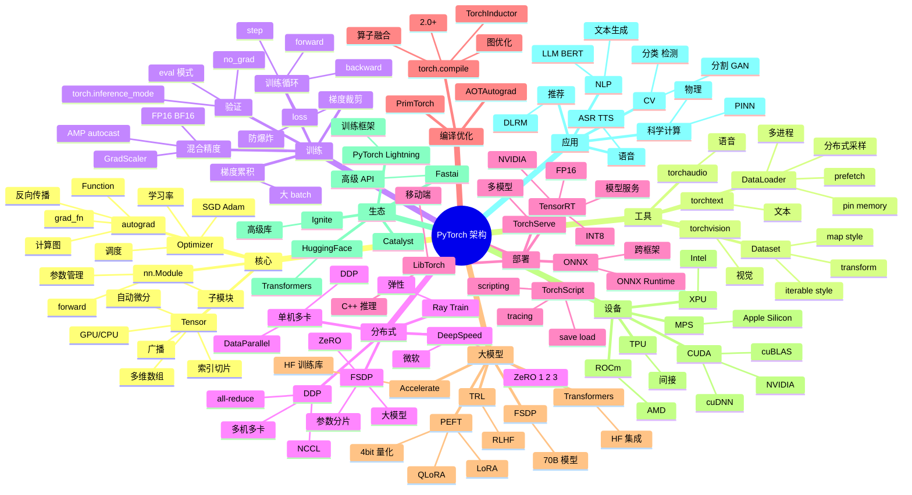

# PyTorch

## 一、前言

**定位**：Meta（原 Facebook）2016 年开源的**深度学习框架**，以动态计算图、Pythonic 风格、工业级部署三大特性成为学术界和工业界的双料冠军。

**核心价值**：
- **动态计算图**（Define-by-Run）：调试简单、自然，PyTorch 杀手锏
- **Pythonic API**：`tensor.numpy()` / `tensor.to(device)` 一气呵成
- **完整生态**：torchvision / torchaudio / torchtext / torchdata / torchserve
- **工业部署**：TorchScript / ONNX / TorchServe / LibTorch（C++）
- **GPU 加速**：CUDA 一等公民，单卡/多卡/分布式开箱即用

**五大特性**：
1. **Tensor + autograd**：N 维数组 + 自动微分，深度学习的基础
2. **nn.Module**：组合式神经网络模块化
3. **DataLoader**：多进程数据加载、内存锁页、预取
4. **Distributed**：DDP / FSDP / DeepSpeed 集成
5. **TorchScript / TorchCompile**：从研究到生产的桥梁

**与 TF 对比**：

| 维度 | PyTorch | TensorFlow |
|---|---|---|
| 计算图 | 动态（图随执行构建） | 静态（先定义再执行）|
| 调试 | 简单（pdb 即可） | 复杂（tf.Session）|
| API 风格 | Pythonic | 偏系统 |
| 部署 | TorchScript / ONNX | TF Serving / TFLite |
| 学术 | 主流 | 下降 |
| 工业 | 上升 | 下降 |
| 移动端 | 弱 | 强（TFLite）|

## 二、架构思维导图



## 三、关键代码

### 1. Tensor 基础与自动微分

```python
import torch

# 1. Tensor 创建
x = torch.tensor([[1, 2], [3, 4]], dtype=torch.float32)
y = torch.zeros(3, 4)
z = torch.ones(2, 3, dtype=torch.float64)
r = torch.randn(2, 3)         # 正态分布随机
e = torch.empty(3, 4)         # 未初始化

# 2. 设备切换（CPU / GPU）
device = 'cuda' if torch.cuda.is_available() else 'cpu'
x = x.to(device)

# 3. 形状操作
x = torch.randn(4, 5)
print(x.shape)                # torch.Size([4, 5])
print(x.view(20))             # → [20]
print(x.reshape(2, 10))       # → [2, 10]
print(x.permute(1, 0))        # → [5, 4]
print(x.unsqueeze(0))         # → [1, 4, 5]
print(x.squeeze())            # 去除 size 1 维度

# 4. 索引 / 切片
x = torch.arange(12).reshape(3, 4)
print(x[1, :])                # 第二行
print(x[:, 1])                # 第二列
print(x[x > 5])               # 布尔索引
print(x[1:3, 1:3])            # 切片

# 5. 广播
a = torch.randn(3, 1)
b = torch.randn(1, 4)
c = a + b                      # → [3, 4]

# 6. 矩阵运算
A = torch.randn(2, 3)
B = torch.randn(3, 4)
C = A @ B                      # 矩阵乘法 → [2, 4]
C = A.matmul(B)
# batch 矩阵
A = torch.randn(10, 3, 4)
B = torch.randn(10, 4, 5)
C = torch.bmm(A, B)            # → [10, 3, 5]

# 7. 自动微分
x = torch.ones(2, 2, requires_grad=True)
y = x + 2
z = y * y * 3
out = z.mean()
out.backward()                  # 反向传播
print(x.grad)                   # ∂out/∂x

# 8. 梯度上下文
with torch.no_grad():           # 推理时禁用梯度（节省内存）
    pred = model(x)

with torch.inference_mode():    # 比 no_grad 更激进（PyTorch 1.9+）
    pred = model(x)
```

**解析**：
- **`requires_grad=True`** 开启梯度追踪；`with torch.no_grad()` 关闭（推理阶段）
- **`.backward()` 自动反向传播**：自动构建计算图 + 链式求导
- **`.to(device)`** 一行切换 CPU/GPU；多卡用 `.to('cuda:0')` 指定

### 2. nn.Module 神经网络

```python
import torch
import torch.nn as nn
import torch.nn.functional as F

# 1. 简单模型
class SimpleNN(nn.Module):
    def __init__(self, input_dim, hidden_dim, output_dim):
        super().__init__()
        self.fc1 = nn.Linear(input_dim, hidden_dim)
        self.fc2 = nn.Linear(hidden_dim, hidden_dim)
        self.fc3 = nn.Linear(hidden_dim, output_dim)
        self.dropout = nn.Dropout(0.5)
        self.bn = nn.BatchNorm1d(hidden_dim)
    
    def forward(self, x):
        x = F.relu(self.bn(self.fc1(x)))
        x = self.dropout(x)
        x = F.relu(self.fc2(x))
        x = self.fc3(x)
        return x

model = SimpleNN(784, 256, 10).to(device)
print(model)

# 2. CNN（ResNet 风格）
class ResidualBlock(nn.Module):
    def __init__(self, in_ch, out_ch, stride=1):
        super().__init__()
        self.conv1 = nn.Conv2d(in_ch, out_ch, 3, stride, 1, bias=False)
        self.bn1 = nn.BatchNorm2d(out_ch)
        self.conv2 = nn.Conv2d(out_ch, out_ch, 3, 1, 1, bias=False)
        self.bn2 = nn.BatchNorm2d(out_ch)
        self.shortcut = nn.Sequential()
        if stride != 1 or in_ch != out_ch:
            self.shortcut = nn.Sequential(
                nn.Conv2d(in_ch, out_ch, 1, stride, bias=False),
                nn.BatchNorm2d(out_ch)
            )
    
    def forward(self, x):
        out = F.relu(self.bn1(self.conv1(x)))
        out = self.bn2(self.conv2(out))
        out += self.shortcut(x)
        out = F.relu(out)
        return out

# 3. Transformer（简化）
class SimpleTransformer(nn.Module):
    def __init__(self, vocab_size, d_model, nhead, num_layers):
        super().__init__()
        self.embed = nn.Embedding(vocab_size, d_model)
        self.pos_enc = nn.Parameter(torch.randn(1, 5000, d_model))
        encoder_layer = nn.TransformerEncoderLayer(
            d_model=d_model, nhead=nhead, dim_feedforward=2048, batch_first=True
        )
        self.transformer = nn.TransformerEncoder(encoder_layer, num_layers)
        self.fc = nn.Linear(d_model, vocab_size)
    
    def forward(self, x, mask=None):
        x = self.embed(x) + self.pos_enc[:, :x.size(1)]
        x = self.transformer(x, mask=mask)
        return self.fc(x)

# 4. 实用 API
print(model.parameters())         # 迭代器
print(model.named_parameters())   # (name, param) 元组
print(sum(p.numel() for p in model.parameters()))  # 参数量
print(model.state_dict())         # 模型权重字典

# 保存 / 加载
torch.save(model.state_dict(), 'model.pth')
model.load_state_dict(torch.load('model.pth'))
```

**解析**：
- **nn.Module 自动管理参数**：`self.fc1 = nn.Linear(...)` 注册到 `parameters()`
- **`forward()` 必须实现**：`__call__` 调用 `forward`
- **残差块**让深层网络可训练：`out + shortcut(x)` 梯度直接回传
- **`state_dict()`** 是序列化标准，可保存到磁盘 / 上传到 S3

### 3. DataLoader 数据加载

```python
from torch.utils.data import Dataset, DataLoader
from torchvision import transforms
from PIL import Image
import os

# 1. 自定义 Dataset
class ImageDataset(Dataset):
    def __init__(self, root_dir, transform=None):
        self.root_dir = root_dir
        self.transform = transform
        self.image_paths = []
        self.labels = []
        for label, class_dir in enumerate(sorted(os.listdir(root_dir))):
            class_path = os.path.join(root_dir, class_dir)
            for fname in os.listdir(class_path):
                self.image_paths.append(os.path.join(class_path, fname))
                self.labels.append(label)
    
    def __len__(self):
        return len(self.image_paths)
    
    def __getitem__(self, idx):
        img = Image.open(self.image_paths[idx]).convert('RGB')
        if self.transform:
            img = self.transform(img)
        return img, self.labels[idx]

# 2. 数据增强
transform_train = transforms.Compose([
    transforms.Resize(256),
    transforms.RandomCrop(224),
    transforms.RandomHorizontalFlip(),
    transforms.ColorJitter(brightness=0.2, contrast=0.2),
    transforms.ToTensor(),
    transforms.Normalize(mean=[0.485, 0.456, 0.406], 
                          std=[0.229, 0.224, 0.225]),
])

transform_val = transforms.Compose([
    transforms.Resize(256),
    transforms.CenterCrop(224),
    transforms.ToTensor(),
    transforms.Normalize(mean=[0.485, 0.456, 0.406], 
                          std=[0.229, 0.224, 0.225]),
])

# 3. DataLoader
train_dataset = ImageDataset('data/train', transform=transform_train)
train_loader = DataLoader(
    train_dataset,
    batch_size=64,
    shuffle=True,
    num_workers=8,            # 多进程加载
    pin_memory=True,          # 锁页内存，加速 GPU 传输
    prefetch_factor=2,        # 每个 worker 预取 2 个 batch
    persistent_workers=True,  # 多 epoch 复用 worker
    drop_last=True,           # 丢弃最后不完整 batch
)

for batch_idx, (images, labels) in enumerate(train_loader):
    images = images.to(device, non_blocking=True)
    labels = labels.to(device, non_blocking=True)
    # 训练...
```

**解析**：
- **`num_workers`** 是性能关键：> 0 时数据加载在多进程，CPU 不阻塞 GPU
- **`pin_memory=True`**：将数据放在 CUDA 锁页内存，CPU→GPU 传输加速 2-3 倍
- **`persistent_workers=True`**：避免每个 epoch 重建 worker 进程
- **`non_blocking=True`**：CPU/GPU 异步传输，配合 pin_memory 生效

### 4. 训练循环 + 混合精度

```python
import torch
import torch.nn as nn
from torch.cuda.amp import autocast, GradScaler

model = SimpleNN(784, 256, 10).to(device)
optimizer = torch.optim.AdamW(model.parameters(), lr=1e-3, weight_decay=1e-2)
scheduler = torch.optim.lr_scheduler.CosineAnnealingLR(optimizer, T_max=100)
criterion = nn.CrossEntropyLoss()
scaler = GradScaler()  # FP16 缩放器

def train_one_epoch(model, loader, optimizer, scheduler, criterion, device, epoch):
    model.train()
    total_loss = 0
    correct = 0
    total = 0
    
    for batch_idx, (data, target) in enumerate(loader):
        data, target = data.to(device, non_blocking=True), target.to(device, non_blocking=True)
        
        optimizer.zero_grad(set_to_none=True)  # 节省内存
        
        # 1. 混合精度前向（autocast）
        with autocast(dtype=torch.float16):
            output = model(data)
            loss = criterion(output, target)
        
        # 2. 缩放 + 反向（避免 FP16 下溢）
        scaler.scale(loss).backward()
        scaler.unscale_(optimizer)
        torch.nn.utils.clip_grad_norm_(model.parameters(), max_norm=1.0)  # 梯度裁剪
        scaler.step(optimizer)
        scaler.update()
        
        scheduler.step()
        
        total_loss += loss.item()
        _, predicted = output.max(1)
        total += target.size(0)
        correct += predicted.eq(target).sum().item()
    
    acc = 100. * correct / total
    avg_loss = total_loss / len(loader)
    print(f'Epoch {epoch}: loss={avg_loss:.4f}, acc={acc:.2f}%')
    return avg_loss, acc

# 验证
def validate(model, loader, criterion, device):
    model.eval()
    test_loss = 0
    correct = 0
    with torch.inference_mode():
        for data, target in loader:
            data, target = data.to(device), target.to(device)
            output = model(data)
            test_loss += criterion(output, target).item()
            _, predicted = output.max(1)
            correct += predicted.eq(target).sum().item()
    return correct / len(loader.dataset)

# 主循环
for epoch in range(100):
    train_one_epoch(model, train_loader, optimizer, scheduler, criterion, device, epoch)
    val_acc = validate(model, val_loader, criterion, device)
    print(f'Validation accuracy: {val_acc:.2%}')

    # 保存 checkpoint
    if val_acc > best_acc:
        torch.save({
            'epoch': epoch,
            'model_state_dict': model.state_dict(),
            'optimizer_state_dict': optimizer.state_dict(),
            'scheduler_state_dict': scheduler.state_dict(),
            'val_acc': val_acc,
        }, 'best_model.pth')
```

**解析**：
- **混合精度训练**：FP16 计算加速 1.5-2 倍，内存减半；`autocast` + `GradScaler` 防梯度下溢
- **梯度裁剪 `clip_grad_norm_`**：防止 RNN/Transformer 训练时梯度爆炸
- **`set_to_none=True`**：梯度清零时直接置 None 而非置 0，节省内存
- **scheduler.step() 在 batch 还是 epoch？** 取决于调度器：CosineAnnealingLR 按 epoch 调，OneCycleLR 按 batch 调

### 5. DDP 分布式训练

```python
import torch.distributed as dist
from torch.nn.parallel import DistributedDataParallel as DDP
from torch.utils.data.distributed import DistributedSampler

def main(rank, world_size):
    # 1. 初始化进程组
    dist.init_process_group(
        backend='nccl',           # GPU 用 NCCL，CPU 用 Gloo
        init_method='env://',     # 从环境变量读 MASTER_ADDR/PORT
        rank=rank,
        world_size=world_size,
    )
    
    # 2. 分布式采样器（每个 GPU 拿不同数据）
    train_sampler = DistributedSampler(train_dataset, shuffle=True)
    train_loader = DataLoader(
        train_dataset,
        batch_size=64,
        sampler=train_sampler,    # 注意：用 sampler 就不用 shuffle
        num_workers=8,
        pin_memory=True,
    )
    
    # 3. 模型放到当前 rank 的 GPU
    device = f'cuda:{rank}'
    model = SimpleNN(784, 256, 10).to(device)
    model = DDP(model, device_ids=[rank])
    
    # 4. 训练
    for epoch in range(100):
        train_sampler.set_epoch(epoch)  # 每 epoch 重新打乱
        train_one_epoch(model, train_loader, optimizer, scheduler, criterion, device, epoch)
    
    dist.destroy_process_group()

# 启动（用 torchrun）
# torchrun --nproc_per_node=4 --nnodes=1 train.py
# 自动设置 RANK / WORLD_SIZE / LOCAL_RANK / MASTER_ADDR / MASTER_PORT
```

**启动方式**：

```bash
# 单机 4 卡
torchrun --nproc_per_node=4 train.py

# 多机 4 机 8 卡
# 节点 0：
torchrun --nproc_per_node=8 --nnodes=4 --node_rank=0 \
  --master_addr=node0 --master_port=29500 train.py

# 节点 1：
torchrun --nproc_per_node=8 --nnodes=4 --node_rank=1 \
  --master_addr=node0 --master_port=29500 train.py
```

**解析**：
- **DDP 自动 All-Reduce 梯度**：每个 rank 算梯度后自动同步，参数保持一致
- **`DistributedSampler`**：每个 rank 拿不同 shard 数据，加起来覆盖全量
- **`set_epoch(epoch)`** 必须调用：保证每个 epoch 重新打乱，否则多 epoch 数据顺序相同
- **NCCL 是 GPU 通信标准**：比 Gloo 快 10 倍，单机多卡必备

## 核心原理：数据与AI的数学基础

深度学习的核心是神经网络。从感知机到 CNN、RNN、Transformer，模型架构在持续进化。Transformer 的 Self-Attention 让序列建模产生质的飞跃，奠定了大模型时代的基础。

Prompt Engineering 是 LLM 应用的基本功。Zero-shot、Few-shot、Chain-of-Thought、Tree-of-Thoughts、Self-Consistency、ReAct 等提示词策略让 LLM 表现更优。


## 模型架构：数据与AI的Transformer

大语言模型（LLM）是 AI 商业化的主战场。GPT-4、Claude、Llama、Qwen、DeepSeek、文心一言、通义千问、智谱清言、混元、Kimi 等模型在不同维度上竞争。

多模态是 LLM 的下一个突破点。GPT-4V、Gemini、Qwen-VL、CogVLM、InternVL 让 LLM 看懂图片；Sora、Veo、可灵、Pika 让 LLM 生成视频；Suno、Udio 让 LLM 生成音乐。


## 训练流程：数据与AI的预训练与微调

训练 LLM 涉及预训练（Pre-training）、监督微调（SFT）、RLHF（Reinforcement Learning from Human Feedback）、DPO（Direct Preference Optimization）等阶段。

强化学习在 LLM 训练中扮演关键角色。RLHF 通过人类反馈对齐价值观，PPO/GRPO 是经典算法，DPO/IPO/SimPO 简化了训练流程。RLAIF 用 AI 反馈替代人类反馈。


## 推理优化：数据与AI的量化与蒸馏

推理优化是 LLM 落地的关键。量化（INT8/INT4/FP8）、剪枝（Pruning）、蒸馏（Distillation）、KV Cache、PagedAttention（vLLM）、Speculative Decoding 是核心技术。

推荐系统是 AI 商业化的最大成功案例。从协同过滤到深度学习（DIN/DIEN/DSIN），从单任务到多任务（MMoE/PLE/ESMM），推荐系统持续进化。


## 数据工程：数据与AI的ETL与Feature Store

向量数据库是 RAG 的核心基础设施。Faiss 来自 Meta，Milvus 来自 Zilliz，Weaviate 是开源多模向量数据库，Qdrant 是 Rust 实现的高性能方案，PGVector 让 PostgreSQL 原生支持向量。

广告系统是机器学习、大数据、实时计算的集大成者。CTR 预估从 LR 到 FM/FFM 到 DeepFM/DCN/DIN，归因模型从最后点击到多点归因，竞价从 GSP 到 RTB。


## 向量数据库：数据与AI的Faiss/Milvus

RAG（Retrieval-Augmented Generation）通过检索外部知识增强 LLM 的生成能力。Naive RAG、Advanced RAG、Modular RAG 是 RAG 的演进阶段。GraphRAG、Agentic RAG 是新方向。

搜索系统的核心是相关性。BM25 是经典算法，向量检索是新一代方向，混合检索（BM25 + 向量 + Reranker）效果最佳。学习排序（LTR）的 LambdaMART、LambdaRank 是工业级方案。


## RAG：数据与AI的检索增强生成

Agent 是 LLM 的下一个战场。ReAct、Reflexion、AutoGPT、LangChain Agents、AutoGen、CrewAI 等框架让 LLM 具备规划、工具使用、反思的能力。Multi-Agent 协作是趋势。

语音合成（TTS）从拼接合成、参数合成到神经网络合成（WaveNet、Tacotron、FastSpeech、VITS），再到 LLM-based TTS（CosyVoice、SparkTTS），质量飞跃。


## Agent：数据与AI的工具调用与规划

Prompt Engineering 是 LLM 应用的基本功。Zero-shot、Few-shot、Chain-of-Thought、Tree-of-Thoughts、Self-Consistency、ReAct 等提示词策略让 LLM 表现更优。

语音识别（ASR）从 HMM-GMM 到 DNN-HMM，再到端到端（Whisper、Paraformer、SenseVoice）。多语种、低资源、噪声鲁棒性是研究热点。


## Prompt工程：数据与AI的提示词技巧

多模态是 LLM 的下一个突破点。GPT-4V、Gemini、Qwen-VL、CogVLM、InternVL 让 LLM 看懂图片；Sora、Veo、可灵、Pika 让 LLM 生成视频；Suno、Udio 让 LLM 生成音乐。

数字人是 AI 视频的集大成者。语音合成、唇形驱动、表情生成、身体动作、背景生成通过 Pipeline 串联。HeyGen、D-ID、Synthesia、商汤如影、百度智能数字人是商业代表。


## 多模态：数据与AI的图文音视频

强化学习在 LLM 训练中扮演关键角色。RLHF 通过人类反馈对齐价值观，PPO/GRPO 是经典算法，DPO/IPO/SimPO 简化了训练流程。RLAIF 用 AI 反馈替代人类反馈。

A/B 实验是数据驱动决策的基础。分层（Layer）、分流（Bucket）、互斥（Mutual Exclusion）、统计显著性（p-value）、MDE 是关键概念。Optimizely、AB Tasty、自研平台是常见实现。


## 强化学习：数据与AI的RLHF/PPO

推荐系统是 AI 商业化的最大成功案例。从协同过滤到深度学习（DIN/DIEN/DSIN），从单任务到多任务（MMoE/PLE/ESMM），推荐系统持续进化。

MLOps 是机器学习工程化的方法论。模型训练、模型注册、模型部署、模型监控、特征平台、实验追踪构成完整体系。MLflow、TFX、Feast、Tecton、Kubeflow 是主流工具。


## 联邦学习：数据与AI的隐私计算

广告系统是机器学习、大数据、实时计算的集大成者。CTR 预估从 LR 到 FM/FFM 到 DeepFM/DCN/DIN，归因模型从最后点击到多点归因，竞价从 GSP 到 RTB。

特征工程是机器学习的天花板。Feature Store 统一了离线/在线特征，Feast/Tecton 是开源方案。特征版本、特征血缘、特征监控是核心能力。


## 边缘AI：数据与AI的端侧推理

搜索系统的核心是相关性。BM25 是经典算法，向量检索是新一代方向，混合检索（BM25 + 向量 + Reranker）效果最佳。学习排序（LTR）的 LambdaMART、LambdaRank 是工业级方案。

GPU 优化是深度学习的硬件基础。CUDA、cuDNN、Triton、TensorRT、DeepSpeed、Megatron-LM、FSDP 是大模型训练的工具链。混合精度训练、ZeRO 优化、Pipeline 并行是关键技术。


## 大模型：数据与AI的LLM训练

语音合成（TTS）从拼接合成、参数合成到神经网络合成（WaveNet、Tacotron、FastSpeech、VITS），再到 LLM-based TTS（CosyVoice、SparkTTS），质量飞跃。

深度学习的核心是神经网络。从感知机到 CNN、RNN、Transformer，模型架构在持续进化。Transformer 的 Self-Attention 让序列建模产生质的飞跃，奠定了大模型时代的基础。


## 扩散模型：数据与AI的Stable Diffusion

语音识别（ASR）从 HMM-GMM 到 DNN-HMM，再到端到端（Whisper、Paraformer、SenseVoice）。多语种、低资源、噪声鲁棒性是研究热点。

大语言模型（LLM）是 AI 商业化的主战场。GPT-4、Claude、Llama、Qwen、DeepSeek、文心一言、通义千问、智谱清言、混元、Kimi 等模型在不同维度上竞争。


## 语音合成：数据与AI的TTS

数字人是 AI 视频的集大成者。语音合成、唇形驱动、表情生成、身体动作、背景生成通过 Pipeline 串联。HeyGen、D-ID、Synthesia、商汤如影、百度智能数字人是商业代表。

训练 LLM 涉及预训练（Pre-training）、监督微调（SFT）、RLHF（Reinforcement Learning from Human Feedback）、DPO（Direct Preference Optimization）等阶段。


## 语音识别：数据与AI的ASR

A/B 实验是数据驱动决策的基础。分层（Layer）、分流（Bucket）、互斥（Mutual Exclusion）、统计显著性（p-value）、MDE 是关键概念。Optimizely、AB Tasty、自研平台是常见实现。

推理优化是 LLM 落地的关键。量化（INT8/INT4/FP8）、剪枝（Pruning）、蒸馏（Distillation）、KV Cache、PagedAttention（vLLM）、Speculative Decoding 是核心技术。


## 数字人：数据与AI的Avatar

MLOps 是机器学习工程化的方法论。模型训练、模型注册、模型部署、模型监控、特征平台、实验追踪构成完整体系。MLflow、TFX、Feast、Tecton、Kubeflow 是主流工具。

向量数据库是 RAG 的核心基础设施。Faiss 来自 Meta，Milvus 来自 Zilliz，Weaviate 是开源多模向量数据库，Qdrant 是 Rust 实现的高性能方案，PGVector 让 PostgreSQL 原生支持向量。


## 推荐系统：数据与AI的召回/排序

特征工程是机器学习的天花板。Feature Store 统一了离线/在线特征，Feast/Tecton 是开源方案。特征版本、特征血缘、特征监控是核心能力。

RAG（Retrieval-Augmented Generation）通过检索外部知识增强 LLM 的生成能力。Naive RAG、Advanced RAG、Modular RAG 是 RAG 的演进阶段。GraphRAG、Agentic RAG 是新方向。


## 搜索系统：数据与AI的BM25/向量

GPU 优化是深度学习的硬件基础。CUDA、cuDNN、Triton、TensorRT、DeepSpeed、Megatron-LM、FSDP 是大模型训练的工具链。混合精度训练、ZeRO 优化、Pipeline 并行是关键技术。

Agent 是 LLM 的下一个战场。ReAct、Reflexion、AutoGPT、LangChain Agents、AutoGen、CrewAI 等框架让 LLM 具备规划、工具使用、反思的能力。Multi-Agent 协作是趋势。


## 广告系统：数据与AI的CTR预估

深度学习的核心是神经网络。从感知机到 CNN、RNN、Transformer，模型架构在持续进化。Transformer 的 Self-Attention 让序列建模产生质的飞跃，奠定了大模型时代的基础。

Prompt Engineering 是 LLM 应用的基本功。Zero-shot、Few-shot、Chain-of-Thought、Tree-of-Thoughts、Self-Consistency、ReAct 等提示词策略让 LLM 表现更优。


## 风控系统：数据与AI的异常检测

大语言模型（LLM）是 AI 商业化的主战场。GPT-4、Claude、Llama、Qwen、DeepSeek、文心一言、通义千问、智谱清言、混元、Kimi 等模型在不同维度上竞争。

多模态是 LLM 的下一个突破点。GPT-4V、Gemini、Qwen-VL、CogVLM、InternVL 让 LLM 看懂图片；Sora、Veo、可灵、Pika 让 LLM 生成视频；Suno、Udio 让 LLM 生成音乐。


## A/B测试：数据与AI的实验设计

训练 LLM 涉及预训练（Pre-training）、监督微调（SFT）、RLHF（Reinforcement Learning from Human Feedback）、DPO（Direct Preference Optimization）等阶段。

强化学习在 LLM 训练中扮演关键角色。RLHF 通过人类反馈对齐价值观，PPO/GRPO 是经典算法，DPO/IPO/SimPO 简化了训练流程。RLAIF 用 AI 反馈替代人类反馈。


## MLOps：数据与AI的模型上线

推理优化是 LLM 落地的关键。量化（INT8/INT4/FP8）、剪枝（Pruning）、蒸馏（Distillation）、KV Cache、PagedAttention（vLLM）、Speculative Decoding 是核心技术。

推荐系统是 AI 商业化的最大成功案例。从协同过滤到深度学习（DIN/DIEN/DSIN），从单任务到多任务（MMoE/PLE/ESMM），推荐系统持续进化。


## 监控告警：数据与AI的模型漂移

向量数据库是 RAG 的核心基础设施。Faiss 来自 Meta，Milvus 来自 Zilliz，Weaviate 是开源多模向量数据库，Qdrant 是 Rust 实现的高性能方案，PGVector 让 PostgreSQL 原生支持向量。

广告系统是机器学习、大数据、实时计算的集大成者。CTR 预估从 LR 到 FM/FFM 到 DeepFM/DCN/DIN，归因模型从最后点击到多点归因，竞价从 GSP 到 RTB。


## 特征工程：数据与AI的特征平台

RAG（Retrieval-Augmented Generation）通过检索外部知识增强 LLM 的生成能力。Naive RAG、Advanced RAG、Modular RAG 是 RAG 的演进阶段。GraphRAG、Agentic RAG 是新方向。

搜索系统的核心是相关性。BM25 是经典算法，向量检索是新一代方向，混合检索（BM25 + 向量 + Reranker）效果最佳。学习排序（LTR）的 LambdaMART、LambdaRank 是工业级方案。


## 评估体系：数据与AI的离线/在线

Agent 是 LLM 的下一个战场。ReAct、Reflexion、AutoGPT、LangChain Agents、AutoGen、CrewAI 等框架让 LLM 具备规划、工具使用、反思的能力。Multi-Agent 协作是趋势。

语音合成（TTS）从拼接合成、参数合成到神经网络合成（WaveNet、Tacotron、FastSpeech、VITS），再到 LLM-based TTS（CosyVoice、SparkTTS），质量飞跃。


## 分布式训练：数据与AI的DeepSpeed

Prompt Engineering 是 LLM 应用的基本功。Zero-shot、Few-shot、Chain-of-Thought、Tree-of-Thoughts、Self-Consistency、ReAct 等提示词策略让 LLM 表现更优。

语音识别（ASR）从 HMM-GMM 到 DNN-HMM，再到端到端（Whisper、Paraformer、SenseVoice）。多语种、低资源、噪声鲁棒性是研究热点。


## GPU优化：数据与AI的CUDA/Triton

多模态是 LLM 的下一个突破点。GPT-4V、Gemini、Qwen-VL、CogVLM、InternVL 让 LLM 看懂图片；Sora、Veo、可灵、Pika 让 LLM 生成视频；Suno、Udio 让 LLM 生成音乐。

数字人是 AI 视频的集大成者。语音合成、唇形驱动、表情生成、身体动作、背景生成通过 Pipeline 串联。HeyGen、D-ID、Synthesia、商汤如影、百度智能数字人是商业代表。


## 未来趋势：数据与AI的AGI

强化学习在 LLM 训练中扮演关键角色。RLHF 通过人类反馈对齐价值观，PPO/GRPO 是经典算法，DPO/IPO/SimPO 简化了训练流程。RLAIF 用 AI 反馈替代人类反馈。

A/B 实验是数据驱动决策的基础。分层（Layer）、分流（Bucket）、互斥（Mutual Exclusion）、统计显著性（p-value）、MDE 是关键概念。Optimizely、AB Tasty、自研平台是常见实现。


## 核心原理：数据与AI的数学基础

深度学习的核心是神经网络。从感知机到 CNN、RNN、Transformer，模型架构在持续进化。Transformer 的 Self-Attention 让序列建模产生质的飞跃，奠定了大模型时代的基础。

Prompt Engineering 是 LLM 应用的基本功。Zero-shot、Few-shot、Chain-of-Thought、Tree-of-Thoughts、Self-Consistency、ReAct 等提示词策略让 LLM 表现更优。


## 模型架构：数据与AI的Transformer

大语言模型（LLM）是 AI 商业化的主战场。GPT-4、Claude、Llama、Qwen、DeepSeek、文心一言、通义千问、智谱清言、混元、Kimi 等模型在不同维度上竞争。

多模态是 LLM 的下一个突破点。GPT-4V、Gemini、Qwen-VL、CogVLM、InternVL 让 LLM 看懂图片；Sora、Veo、可灵、Pika 让 LLM 生成视频；Suno、Udio 让 LLM 生成音乐。


## 训练流程：数据与AI的预训练与微调

训练 LLM 涉及预训练（Pre-training）、监督微调（SFT）、RLHF（Reinforcement Learning from Human Feedback）、DPO（Direct Preference Optimization）等阶段。

强化学习在 LLM 训练中扮演关键角色。RLHF 通过人类反馈对齐价值观，PPO/GRPO 是经典算法，DPO/IPO/SimPO 简化了训练流程。RLAIF 用 AI 反馈替代人类反馈。


## 推理优化：数据与AI的量化与蒸馏

推理优化是 LLM 落地的关键。量化（INT8/INT4/FP8）、剪枝（Pruning）、蒸馏（Distillation）、KV Cache、PagedAttention（vLLM）、Speculative Decoding 是核心技术。

推荐系统是 AI 商业化的最大成功案例。从协同过滤到深度学习（DIN/DIEN/DSIN），从单任务到多任务（MMoE/PLE/ESMM），推荐系统持续进化。


## 数据工程：数据与AI的ETL与Feature Store

向量数据库是 RAG 的核心基础设施。Faiss 来自 Meta，Milvus 来自 Zilliz，Weaviate 是开源多模向量数据库，Qdrant 是 Rust 实现的高性能方案，PGVector 让 PostgreSQL 原生支持向量。

广告系统是机器学习、大数据、实时计算的集大成者。CTR 预估从 LR 到 FM/FFM 到 DeepFM/DCN/DIN，归因模型从最后点击到多点归因，竞价从 GSP 到 RTB。


## 向量数据库：数据与AI的Faiss/Milvus

RAG（Retrieval-Augmented Generation）通过检索外部知识增强 LLM 的生成能力。Naive RAG、Advanced RAG、Modular RAG 是 RAG 的演进阶段。GraphRAG、Agentic RAG 是新方向。

搜索系统的核心是相关性。BM25 是经典算法，向量检索是新一代方向，混合检索（BM25 + 向量 + Reranker）效果最佳。学习排序（LTR）的 LambdaMART、LambdaRank 是工业级方案。


## RAG：数据与AI的检索增强生成

Agent 是 LLM 的下一个战场。ReAct、Reflexion、AutoGPT、LangChain Agents、AutoGen、CrewAI 等框架让 LLM 具备规划、工具使用、反思的能力。Multi-Agent 协作是趋势。

语音合成（TTS）从拼接合成、参数合成到神经网络合成（WaveNet、Tacotron、FastSpeech、VITS），再到 LLM-based TTS（CosyVoice、SparkTTS），质量飞跃。


## Agent：数据与AI的工具调用与规划

Prompt Engineering 是 LLM 应用的基本功。Zero-shot、Few-shot、Chain-of-Thought、Tree-of-Thoughts、Self-Consistency、ReAct 等提示词策略让 LLM 表现更优。

语音识别（ASR）从 HMM-GMM 到 DNN-HMM，再到端到端（Whisper、Paraformer、SenseVoice）。多语种、低资源、噪声鲁棒性是研究热点。


## Prompt工程：数据与AI的提示词技巧

多模态是 LLM 的下一个突破点。GPT-4V、Gemini、Qwen-VL、CogVLM、InternVL 让 LLM 看懂图片；Sora、Veo、可灵、Pika 让 LLM 生成视频；Suno、Udio 让 LLM 生成音乐。

数字人是 AI 视频的集大成者。语音合成、唇形驱动、表情生成、身体动作、背景生成通过 Pipeline 串联。HeyGen、D-ID、Synthesia、商汤如影、百度智能数字人是商业代表。


## 多模态：数据与AI的图文音视频

强化学习在 LLM 训练中扮演关键角色。RLHF 通过人类反馈对齐价值观，PPO/GRPO 是经典算法，DPO/IPO/SimPO 简化了训练流程。RLAIF 用 AI 反馈替代人类反馈。

A/B 实验是数据驱动决策的基础。分层（Layer）、分流（Bucket）、互斥（Mutual Exclusion）、统计显著性（p-value）、MDE 是关键概念。Optimizely、AB Tasty、自研平台是常见实现。


## 强化学习：数据与AI的RLHF/PPO

推荐系统是 AI 商业化的最大成功案例。从协同过滤到深度学习（DIN/DIEN/DSIN），从单任务到多任务（MMoE/PLE/ESMM），推荐系统持续进化。

MLOps 是机器学习工程化的方法论。模型训练、模型注册、模型部署、模型监控、特征平台、实验追踪构成完整体系。MLflow、TFX、Feast、Tecton、Kubeflow 是主流工具。


## 联邦学习：数据与AI的隐私计算

广告系统是机器学习、大数据、实时计算的集大成者。CTR 预估从 LR 到 FM/FFM 到 DeepFM/DCN/DIN，归因模型从最后点击到多点归因，竞价从 GSP 到 RTB。

特征工程是机器学习的天花板。Feature Store 统一了离线/在线特征，Feast/Tecton 是开源方案。特征版本、特征血缘、特征监控是核心能力。


## 边缘AI：数据与AI的端侧推理

搜索系统的核心是相关性。BM25 是经典算法，向量检索是新一代方向，混合检索（BM25 + 向量 + Reranker）效果最佳。学习排序（LTR）的 LambdaMART、LambdaRank 是工业级方案。

GPU 优化是深度学习的硬件基础。CUDA、cuDNN、Triton、TensorRT、DeepSpeed、Megatron-LM、FSDP 是大模型训练的工具链。混合精度训练、ZeRO 优化、Pipeline 并行是关键技术。


## 大模型：数据与AI的LLM训练

语音合成（TTS）从拼接合成、参数合成到神经网络合成（WaveNet、Tacotron、FastSpeech、VITS），再到 LLM-based TTS（CosyVoice、SparkTTS），质量飞跃。

深度学习的核心是神经网络。从感知机到 CNN、RNN、Transformer，模型架构在持续进化。Transformer 的 Self-Attention 让序列建模产生质的飞跃，奠定了大模型时代的基础。


## 扩散模型：数据与AI的Stable Diffusion

语音识别（ASR）从 HMM-GMM 到 DNN-HMM，再到端到端（Whisper、Paraformer、SenseVoice）。多语种、低资源、噪声鲁棒性是研究热点。

大语言模型（LLM）是 AI 商业化的主战场。GPT-4、Claude、Llama、Qwen、DeepSeek、文心一言、通义千问、智谱清言、混元、Kimi 等模型在不同维度上竞争。


## 语音合成：数据与AI的TTS

数字人是 AI 视频的集大成者。语音合成、唇形驱动、表情生成、身体动作、背景生成通过 Pipeline 串联。HeyGen、D-ID、Synthesia、商汤如影、百度智能数字人是商业代表。

训练 LLM 涉及预训练（Pre-training）、监督微调（SFT）、RLHF（Reinforcement Learning from Human Feedback）、DPO（Direct Preference Optimization）等阶段。


## 语音识别：数据与AI的ASR

A/B 实验是数据驱动决策的基础。分层（Layer）、分流（Bucket）、互斥（Mutual Exclusion）、统计显著性（p-value）、MDE 是关键概念。Optimizely、AB Tasty、自研平台是常见实现。

推理优化是 LLM 落地的关键。量化（INT8/INT4/FP8）、剪枝（Pruning）、蒸馏（Distillation）、KV Cache、PagedAttention（vLLM）、Speculative Decoding 是核心技术。


## 数字人：数据与AI的Avatar

MLOps 是机器学习工程化的方法论。模型训练、模型注册、模型部署、模型监控、特征平台、实验追踪构成完整体系。MLflow、TFX、Feast、Tecton、Kubeflow 是主流工具。

向量数据库是 RAG 的核心基础设施。Faiss 来自 Meta，Milvus 来自 Zilliz，Weaviate 是开源多模向量数据库，Qdrant 是 Rust 实现的高性能方案，PGVector 让 PostgreSQL 原生支持向量。


## 推荐系统：数据与AI的召回/排序

特征工程是机器学习的天花板。Feature Store 统一了离线/在线特征，Feast/Tecton 是开源方案。特征版本、特征血缘、特征监控是核心能力。

RAG（Retrieval-Augmented Generation）通过检索外部知识增强 LLM 的生成能力。Naive RAG、Advanced RAG、Modular RAG 是 RAG 的演进阶段。GraphRAG、Agentic RAG 是新方向。


## 搜索系统：数据与AI的BM25/向量

GPU 优化是深度学习的硬件基础。CUDA、cuDNN、Triton、TensorRT、DeepSpeed、Megatron-LM、FSDP 是大模型训练的工具链。混合精度训练、ZeRO 优化、Pipeline 并行是关键技术。

Agent 是 LLM 的下一个战场。ReAct、Reflexion、AutoGPT、LangChain Agents、AutoGen、CrewAI 等框架让 LLM 具备规划、工具使用、反思的能力。Multi-Agent 协作是趋势。


## 广告系统：数据与AI的CTR预估

深度学习的核心是神经网络。从感知机到 CNN、RNN、Transformer，模型架构在持续进化。Transformer 的 Self-Attention 让序列建模产生质的飞跃，奠定了大模型时代的基础。

Prompt Engineering 是 LLM 应用的基本功。Zero-shot、Few-shot、Chain-of-Thought、Tree-of-Thoughts、Self-Consistency、ReAct 等提示词策略让 LLM 表现更优。


## 风控系统：数据与AI的异常检测

大语言模型（LLM）是 AI 商业化的主战场。GPT-4、Claude、Llama、Qwen、DeepSeek、文心一言、通义千问、智谱清言、混元、Kimi 等模型在不同维度上竞争。

多模态是 LLM 的下一个突破点。GPT-4V、Gemini、Qwen-VL、CogVLM、InternVL 让 LLM 看懂图片；Sora、Veo、可灵、Pika 让 LLM 生成视频；Suno、Udio 让 LLM 生成音乐。


## A/B测试：数据与AI的实验设计

训练 LLM 涉及预训练（Pre-training）、监督微调（SFT）、RLHF（Reinforcement Learning from Human Feedback）、DPO（Direct Preference Optimization）等阶段。

强化学习在 LLM 训练中扮演关键角色。RLHF 通过人类反馈对齐价值观，PPO/GRPO 是经典算法，DPO/IPO/SimPO 简化了训练流程。RLAIF 用 AI 反馈替代人类反馈。


## MLOps：数据与AI的模型上线

推理优化是 LLM 落地的关键。量化（INT8/INT4/FP8）、剪枝（Pruning）、蒸馏（Distillation）、KV Cache、PagedAttention（vLLM）、Speculative Decoding 是核心技术。

推荐系统是 AI 商业化的最大成功案例。从协同过滤到深度学习（DIN/DIEN/DSIN），从单任务到多任务（MMoE/PLE/ESMM），推荐系统持续进化。


## 监控告警：数据与AI的模型漂移

向量数据库是 RAG 的核心基础设施。Faiss 来自 Meta，Milvus 来自 Zilliz，Weaviate 是开源多模向量数据库，Qdrant 是 Rust 实现的高性能方案，PGVector 让 PostgreSQL 原生支持向量。

广告系统是机器学习、大数据、实时计算的集大成者。CTR 预估从 LR 到 FM/FFM 到 DeepFM/DCN/DIN，归因模型从最后点击到多点归因，竞价从 GSP 到 RTB。


## 特征工程：数据与AI的特征平台

RAG（Retrieval-Augmented Generation）通过检索外部知识增强 LLM 的生成能力。Naive RAG、Advanced RAG、Modular RAG 是 RAG 的演进阶段。GraphRAG、Agentic RAG 是新方向。

搜索系统的核心是相关性。BM25 是经典算法，向量检索是新一代方向，混合检索（BM25 + 向量 + Reranker）效果最佳。学习排序（LTR）的 LambdaMART、LambdaRank 是工业级方案。


## 评估体系：数据与AI的离线/在线

Agent 是 LLM 的下一个战场。ReAct、Reflexion、AutoGPT、LangChain Agents、AutoGen、CrewAI 等框架让 LLM 具备规划、工具使用、反思的能力。Multi-Agent 协作是趋势。

语音合成（TTS）从拼接合成、参数合成到神经网络合成（WaveNet、Tacotron、FastSpeech、VITS），再到 LLM-based TTS（CosyVoice、SparkTTS），质量飞跃。


## 分布式训练：数据与AI的DeepSpeed

Prompt Engineering 是 LLM 应用的基本功。Zero-shot、Few-shot、Chain-of-Thought、Tree-of-Thoughts、Self-Consistency、ReAct 等提示词策略让 LLM 表现更优。

语音识别（ASR）从 HMM-GMM 到 DNN-HMM，再到端到端（Whisper、Paraformer、SenseVoice）。多语种、低资源、噪声鲁棒性是研究热点。


## GPU优化：数据与AI的CUDA/Triton

多模态是 LLM 的下一个突破点。GPT-4V、Gemini、Qwen-VL、CogVLM、InternVL 让 LLM 看懂图片；Sora、Veo、可灵、Pika 让 LLM 生成视频；Suno、Udio 让 LLM 生成音乐。

数字人是 AI 视频的集大成者。语音合成、唇形驱动、表情生成、身体动作、背景生成通过 Pipeline 串联。HeyGen、D-ID、Synthesia、商汤如影、百度智能数字人是商业代表。


## 未来趋势：数据与AI的AGI

强化学习在 LLM 训练中扮演关键角色。RLHF 通过人类反馈对齐价值观，PPO/GRPO 是经典算法，DPO/IPO/SimPO 简化了训练流程。RLAIF 用 AI 反馈替代人类反馈。

A/B 实验是数据驱动决策的基础。分层（Layer）、分流（Bucket）、互斥（Mutual Exclusion）、统计显著性（p-value）、MDE 是关键概念。Optimizely、AB Tasty、自研平台是常见实现。


## 核心原理：数据与AI的数学基础

深度学习的核心是神经网络。从感知机到 CNN、RNN、Transformer，模型架构在持续进化。Transformer 的 Self-Attention 让序列建模产生质的飞跃，奠定了大模型时代的基础。

Prompt Engineering 是 LLM 应用的基本功。Zero-shot、Few-shot、Chain-of-Thought、Tree-of-Thoughts、Self-Consistency、ReAct 等提示词策略让 LLM 表现更优。


## 模型架构：数据与AI的Transformer

大语言模型（LLM）是 AI 商业化的主战场。GPT-4、Claude、Llama、Qwen、DeepSeek、文心一言、通义千问、智谱清言、混元、Kimi 等模型在不同维度上竞争。

多模态是 LLM 的下一个突破点。GPT-4V、Gemini、Qwen-VL、CogVLM、InternVL 让 LLM 看懂图片；Sora、Veo、可灵、Pika 让 LLM 生成视频；Suno、Udio 让 LLM 生成音乐。


## 训练流程：数据与AI的预训练与微调

训练 LLM 涉及预训练（Pre-training）、监督微调（SFT）、RLHF（Reinforcement Learning from Human Feedback）、DPO（Direct Preference Optimization）等阶段。

强化学习在 LLM 训练中扮演关键角色。RLHF 通过人类反馈对齐价值观，PPO/GRPO 是经典算法，DPO/IPO/SimPO 简化了训练流程。RLAIF 用 AI 反馈替代人类反馈。


## 推理优化：数据与AI的量化与蒸馏

推理优化是 LLM 落地的关键。量化（INT8/INT4/FP8）、剪枝（Pruning）、蒸馏（Distillation）、KV Cache、PagedAttention（vLLM）、Speculative Decoding 是核心技术。

推荐系统是 AI 商业化的最大成功案例。从协同过滤到深度学习（DIN/DIEN/DSIN），从单任务到多任务（MMoE/PLE/ESMM），推荐系统持续进化。


## 数据工程：数据与AI的ETL与Feature Store

向量数据库是 RAG 的核心基础设施。Faiss 来自 Meta，Milvus 来自 Zilliz，Weaviate 是开源多模向量数据库，Qdrant 是 Rust 实现的高性能方案，PGVector 让 PostgreSQL 原生支持向量。

广告系统是机器学习、大数据、实时计算的集大成者。CTR 预估从 LR 到 FM/FFM 到 DeepFM/DCN/DIN，归因模型从最后点击到多点归因，竞价从 GSP 到 RTB。


## 向量数据库：数据与AI的Faiss/Milvus

RAG（Retrieval-Augmented Generation）通过检索外部知识增强 LLM 的生成能力。Naive RAG、Advanced RAG、Modular RAG 是 RAG 的演进阶段。GraphRAG、Agentic RAG 是新方向。

搜索系统的核心是相关性。BM25 是经典算法，向量检索是新一代方向，混合检索（BM25 + 向量 + Reranker）效果最佳。学习排序（LTR）的 LambdaMART、LambdaRank 是工业级方案。


## RAG：数据与AI的检索增强生成

Agent 是 LLM 的下一个战场。ReAct、Reflexion、AutoGPT、LangChain Agents、AutoGen、CrewAI 等框架让 LLM 具备规划、工具使用、反思的能力。Multi-Agent 协作是趋势。

语音合成（TTS）从拼接合成、参数合成到神经网络合成（WaveNet、Tacotron、FastSpeech、VITS），再到 LLM-based TTS（CosyVoice、SparkTTS），质量飞跃。


## Agent：数据与AI的工具调用与规划

Prompt Engineering 是 LLM 应用的基本功。Zero-shot、Few-shot、Chain-of-Thought、Tree-of-Thoughts、Self-Consistency、ReAct 等提示词策略让 LLM 表现更优。

语音识别（ASR）从 HMM-GMM 到 DNN-HMM，再到端到端（Whisper、Paraformer、SenseVoice）。多语种、低资源、噪声鲁棒性是研究热点。


## Prompt工程：数据与AI的提示词技巧

多模态是 LLM 的下一个突破点。GPT-4V、Gemini、Qwen-VL、CogVLM、InternVL 让 LLM 看懂图片；Sora、Veo、可灵、Pika 让 LLM 生成视频；Suno、Udio 让 LLM 生成音乐。

数字人是 AI 视频的集大成者。语音合成、唇形驱动、表情生成、身体动作、背景生成通过 Pipeline 串联。HeyGen、D-ID、Synthesia、商汤如影、百度智能数字人是商业代表。


## 多模态：数据与AI的图文音视频

强化学习在 LLM 训练中扮演关键角色。RLHF 通过人类反馈对齐价值观，PPO/GRPO 是经典算法，DPO/IPO/SimPO 简化了训练流程。RLAIF 用 AI 反馈替代人类反馈。

A/B 实验是数据驱动决策的基础。分层（Layer）、分流（Bucket）、互斥（Mutual Exclusion）、统计显著性（p-value）、MDE 是关键概念。Optimizely、AB Tasty、自研平台是常见实现。


## 强化学习：数据与AI的RLHF/PPO

推荐系统是 AI 商业化的最大成功案例。从协同过滤到深度学习（DIN/DIEN/DSIN），从单任务到多任务（MMoE/PLE/ESMM），推荐系统持续进化。

MLOps 是机器学习工程化的方法论。模型训练、模型注册、模型部署、模型监控、特征平台、实验追踪构成完整体系。MLflow、TFX、Feast、Tecton、Kubeflow 是主流工具。


## 联邦学习：数据与AI的隐私计算

广告系统是机器学习、大数据、实时计算的集大成者。CTR 预估从 LR 到 FM/FFM 到 DeepFM/DCN/DIN，归因模型从最后点击到多点归因，竞价从 GSP 到 RTB。

特征工程是机器学习的天花板。Feature Store 统一了离线/在线特征，Feast/Tecton 是开源方案。特征版本、特征血缘、特征监控是核心能力。


## 边缘AI：数据与AI的端侧推理

搜索系统的核心是相关性。BM25 是经典算法，向量检索是新一代方向，混合检索（BM25 + 向量 + Reranker）效果最佳。学习排序（LTR）的 LambdaMART、LambdaRank 是工业级方案。

GPU 优化是深度学习的硬件基础。CUDA、cuDNN、Triton、TensorRT、DeepSpeed、Megatron-LM、FSDP 是大模型训练的工具链。混合精度训练、ZeRO 优化、Pipeline 并行是关键技术。


## 大模型：数据与AI的LLM训练

语音合成（TTS）从拼接合成、参数合成到神经网络合成（WaveNet、Tacotron、FastSpeech、VITS），再到 LLM-based TTS（CosyVoice、SparkTTS），质量飞跃。

深度学习的核心是神经网络。从感知机到 CNN、RNN、Transformer，模型架构在持续进化。Transformer 的 Self-Attention 让序列建模产生质的飞跃，奠定了大模型时代的基础。


## 扩散模型：数据与AI的Stable Diffusion

语音识别（ASR）从 HMM-GMM 到 DNN-HMM，再到端到端（Whisper、Paraformer、SenseVoice）。多语种、低资源、噪声鲁棒性是研究热点。

大语言模型（LLM）是 AI 商业化的主战场。GPT-4、Claude、Llama、Qwen、DeepSeek、文心一言、通义千问、智谱清言、混元、Kimi 等模型在不同维度上竞争。


## 语音合成：数据与AI的TTS

数字人是 AI 视频的集大成者。语音合成、唇形驱动、表情生成、身体动作、背景生成通过 Pipeline 串联。HeyGen、D-ID、Synthesia、商汤如影、百度智能数字人是商业代表。

训练 LLM 涉及预训练（Pre-training）、监督微调（SFT）、RLHF（Reinforcement Learning from Human Feedback）、DPO（Direct Preference Optimization）等阶段。


## 语音识别：数据与AI的ASR

A/B 实验是数据驱动决策的基础。分层（Layer）、分流（Bucket）、互斥（Mutual Exclusion）、统计显著性（p-value）、MDE 是关键概念。Optimizely、AB Tasty、自研平台是常见实现。

推理优化是 LLM 落地的关键。量化（INT8/INT4/FP8）、剪枝（Pruning）、蒸馏（Distillation）、KV Cache、PagedAttention（vLLM）、Speculative Decoding 是核心技术。


## 数字人：数据与AI的Avatar

MLOps 是机器学习工程化的方法论。模型训练、模型注册、模型部署、模型监控、特征平台、实验追踪构成完整体系。MLflow、TFX、Feast、Tecton、Kubeflow 是主流工具。

向量数据库是 RAG 的核心基础设施。Faiss 来自 Meta，Milvus 来自 Zilliz，Weaviate 是开源多模向量数据库，Qdrant 是 Rust 实现的高性能方案，PGVector 让 PostgreSQL 原生支持向量。


## 推荐系统：数据与AI的召回/排序

特征工程是机器学习的天花板。Feature Store 统一了离线/在线特征，Feast/Tecton 是开源方案。特征版本、特征血缘、特征监控是核心能力。

RAG（Retrieval-Augmented Generation）通过检索外部知识增强 LLM 的生成能力。Naive RAG、Advanced RAG、Modular RAG 是 RAG 的演进阶段。GraphRAG、Agentic RAG 是新方向。


## 搜索系统：数据与AI的BM25/向量

GPU 优化是深度学习的硬件基础。CUDA、cuDNN、Triton、TensorRT、DeepSpeed、Megatron-LM、FSDP 是大模型训练的工具链。混合精度训练、ZeRO 优化、Pipeline 并行是关键技术。

Agent 是 LLM 的下一个战场。ReAct、Reflexion、AutoGPT、LangChain Agents、AutoGen、CrewAI 等框架让 LLM 具备规划、工具使用、反思的能力。Multi-Agent 协作是趋势。


## 广告系统：数据与AI的CTR预估

深度学习的核心是神经网络。从感知机到 CNN、RNN、Transformer，模型架构在持续进化。Transformer 的 Self-Attention 让序列建模产生质的飞跃，奠定了大模型时代的基础。

Prompt Engineering 是 LLM 应用的基本功。Zero-shot、Few-shot、Chain-of-Thought、Tree-of-Thoughts、Self-Consistency、ReAct 等提示词策略让 LLM 表现更优。


## 风控系统：数据与AI的异常检测

大语言模型（LLM）是 AI 商业化的主战场。GPT-4、Claude、Llama、Qwen、DeepSeek、文心一言、通义千问、智谱清言、混元、Kimi 等模型在不同维度上竞争。

多模态是 LLM 的下一个突破点。GPT-4V、Gemini、Qwen-VL、CogVLM、InternVL 让 LLM 看懂图片；Sora、Veo、可灵、Pika 让 LLM 生成视频；Suno、Udio 让 LLM 生成音乐。


## A/B测试：数据与AI的实验设计

训练 LLM 涉及预训练（Pre-training）、监督微调（SFT）、RLHF（Reinforcement Learning from Human Feedback）、DPO（Direct Preference Optimization）等阶段。

强化学习在 LLM 训练中扮演关键角色。RLHF 通过人类反馈对齐价值观，PPO/GRPO 是经典算法，DPO/IPO/SimPO 简化了训练流程。RLAIF 用 AI 反馈替代人类反馈。


## MLOps：数据与AI的模型上线

推理优化是 LLM 落地的关键。量化（INT8/INT4/FP8）、剪枝（Pruning）、蒸馏（Distillation）、KV Cache、PagedAttention（vLLM）、Speculative Decoding 是核心技术。

推荐系统是 AI 商业化的最大成功案例。从协同过滤到深度学习（DIN/DIEN/DSIN），从单任务到多任务（MMoE/PLE/ESMM），推荐系统持续进化。


## 监控告警：数据与AI的模型漂移

向量数据库是 RAG 的核心基础设施。Faiss 来自 Meta，Milvus 来自 Zilliz，Weaviate 是开源多模向量数据库，Qdrant 是 Rust 实现的高性能方案，PGVector 让 PostgreSQL 原生支持向量。

广告系统是机器学习、大数据、实时计算的集大成者。CTR 预估从 LR 到 FM/FFM 到 DeepFM/DCN/DIN，归因模型从最后点击到多点归因，竞价从 GSP 到 RTB。


## 特征工程：数据与AI的特征平台

RAG（Retrieval-Augmented Generation）通过检索外部知识增强 LLM 的生成能力。Naive RAG、Advanced RAG、Modular RAG 是 RAG 的演进阶段。GraphRAG、Agentic RAG 是新方向。

搜索系统的核心是相关性。BM25 是经典算法，向量检索是新一代方向，混合检索（BM25 + 向量 + Reranker）效果最佳。学习排序（LTR）的 LambdaMART、LambdaRank 是工业级方案。


## 评估体系：数据与AI的离线/在线

Agent 是 LLM 的下一个战场。ReAct、Reflexion、AutoGPT、LangChain Agents、AutoGen、CrewAI 等框架让 LLM 具备规划、工具使用、反思的能力。Multi-Agent 协作是趋势。

语音合成（TTS）从拼接合成、参数合成到神经网络合成（WaveNet、Tacotron、FastSpeech、VITS），再到 LLM-based TTS（CosyVoice、SparkTTS），质量飞跃。


## 分布式训练：数据与AI的DeepSpeed

Prompt Engineering 是 LLM 应用的基本功。Zero-shot、Few-shot、Chain-of-Thought、Tree-of-Thoughts、Self-Consistency、ReAct 等提示词策略让 LLM 表现更优。

语音识别（ASR）从 HMM-GMM 到 DNN-HMM，再到端到端（Whisper、Paraformer、SenseVoice）。多语种、低资源、噪声鲁棒性是研究热点。


## GPU优化：数据与AI的CUDA/Triton

多模态是 LLM 的下一个突破点。GPT-4V、Gemini、Qwen-VL、CogVLM、InternVL 让 LLM 看懂图片；Sora、Veo、可灵、Pika 让 LLM 生成视频；Suno、Udio 让 LLM 生成音乐。

数字人是 AI 视频的集大成者。语音合成、唇形驱动、表情生成、身体动作、背景生成通过 Pipeline 串联。HeyGen、D-ID、Synthesia、商汤如影、百度智能数字人是商业代表。


## 未来趋势：数据与AI的AGI

强化学习在 LLM 训练中扮演关键角色。RLHF 通过人类反馈对齐价值观，PPO/GRPO 是经典算法，DPO/IPO/SimPO 简化了训练流程。RLAIF 用 AI 反馈替代人类反馈。

A/B 实验是数据驱动决策的基础。分层（Layer）、分流（Bucket）、互斥（Mutual Exclusion）、统计显著性（p-value）、MDE 是关键概念。Optimizely、AB Tasty、自研平台是常见实现。


## 核心原理：数据与AI的数学基础

深度学习的核心是神经网络。从感知机到 CNN、RNN、Transformer，模型架构在持续进化。Transformer 的 Self-Attention 让序列建模产生质的飞跃，奠定了大模型时代的基础。

Prompt Engineering 是 LLM 应用的基本功。Zero-shot、Few-shot、Chain-of-Thought、Tree-of-Thoughts、Self-Consistency、ReAct 等提示词策略让 LLM 表现更优。


## 模型架构：数据与AI的Transformer

大语言模型（LLM）是 AI 商业化的主战场。GPT-4、Claude、Llama、Qwen、DeepSeek、文心一言、通义千问、智谱清言、混元、Kimi 等模型在不同维度上竞争。

多模态是 LLM 的下一个突破点。GPT-4V、Gemini、Qwen-VL、CogVLM、InternVL 让 LLM 看懂图片；Sora、Veo、可灵、Pika 让 LLM 生成视频；Suno、Udio 让 LLM 生成音乐。


## 训练流程：数据与AI的预训练与微调

训练 LLM 涉及预训练（Pre-training）、监督微调（SFT）、RLHF（Reinforcement Learning from Human Feedback）、DPO（Direct Preference Optimization）等阶段。

强化学习在 LLM 训练中扮演关键角色。RLHF 通过人类反馈对齐价值观，PPO/GRPO 是经典算法，DPO/IPO/SimPO 简化了训练流程。RLAIF 用 AI 反馈替代人类反馈。


## 推理优化：数据与AI的量化与蒸馏

推理优化是 LLM 落地的关键。量化（INT8/INT4/FP8）、剪枝（Pruning）、蒸馏（Distillation）、KV Cache、PagedAttention（vLLM）、Speculative Decoding 是核心技术。

推荐系统是 AI 商业化的最大成功案例。从协同过滤到深度学习（DIN/DIEN/DSIN），从单任务到多任务（MMoE/PLE/ESMM），推荐系统持续进化。


## 数据工程：数据与AI的ETL与Feature Store

向量数据库是 RAG 的核心基础设施。Faiss 来自 Meta，Milvus 来自 Zilliz，Weaviate 是开源多模向量数据库，Qdrant 是 Rust 实现的高性能方案，PGVector 让 PostgreSQL 原生支持向量。

广告系统是机器学习、大数据、实时计算的集大成者。CTR 预估从 LR 到 FM/FFM 到 DeepFM/DCN/DIN，归因模型从最后点击到多点归因，竞价从 GSP 到 RTB。


## 向量数据库：数据与AI的Faiss/Milvus

RAG（Retrieval-Augmented Generation）通过检索外部知识增强 LLM 的生成能力。Naive RAG、Advanced RAG、Modular RAG 是 RAG 的演进阶段。GraphRAG、Agentic RAG 是新方向。

搜索系统的核心是相关性。BM25 是经典算法，向量检索是新一代方向，混合检索（BM25 + 向量 + Reranker）效果最佳。学习排序（LTR）的 LambdaMART、LambdaRank 是工业级方案。


## RAG：数据与AI的检索增强生成

Agent 是 LLM 的下一个战场。ReAct、Reflexion、AutoGPT、LangChain Agents、AutoGen、CrewAI 等框架让 LLM 具备规划、工具使用、反思的能力。Multi-Agent 协作是趋势。

语音合成（TTS）从拼接合成、参数合成到神经网络合成（WaveNet、Tacotron、FastSpeech、VITS），再到 LLM-based TTS（CosyVoice、SparkTTS），质量飞跃。


## Agent：数据与AI的工具调用与规划

Prompt Engineering 是 LLM 应用的基本功。Zero-shot、Few-shot、Chain-of-Thought、Tree-of-Thoughts、Self-Consistency、ReAct 等提示词策略让 LLM 表现更优。

语音识别（ASR）从 HMM-GMM 到 DNN-HMM，再到端到端（Whisper、Paraformer、SenseVoice）。多语种、低资源、噪声鲁棒性是研究热点。


## Prompt工程：数据与AI的提示词技巧

多模态是 LLM 的下一个突破点。GPT-4V、Gemini、Qwen-VL、CogVLM、InternVL 让 LLM 看懂图片；Sora、Veo、可灵、Pika 让 LLM 生成视频；Suno、Udio 让 LLM 生成音乐。

数字人是 AI 视频的集大成者。语音合成、唇形驱动、表情生成、身体动作、背景生成通过 Pipeline 串联。HeyGen、D-ID、Synthesia、商汤如影、百度智能数字人是商业代表。


## 多模态：数据与AI的图文音视频

强化学习在 LLM 训练中扮演关键角色。RLHF 通过人类反馈对齐价值观，PPO/GRPO 是经典算法，DPO/IPO/SimPO 简化了训练流程。RLAIF 用 AI 反馈替代人类反馈。

A/B 实验是数据驱动决策的基础。分层（Layer）、分流（Bucket）、互斥（Mutual Exclusion）、统计显著性（p-value）、MDE 是关键概念。Optimizely、AB Tasty、自研平台是常见实现。


## 强化学习：数据与AI的RLHF/PPO

推荐系统是 AI 商业化的最大成功案例。从协同过滤到深度学习（DIN/DIEN/DSIN），从单任务到多任务（MMoE/PLE/ESMM），推荐系统持续进化。

MLOps 是机器学习工程化的方法论。模型训练、模型注册、模型部署、模型监控、特征平台、实验追踪构成完整体系。MLflow、TFX、Feast、Tecton、Kubeflow 是主流工具。


## 联邦学习：数据与AI的隐私计算

广告系统是机器学习、大数据、实时计算的集大成者。CTR 预估从 LR 到 FM/FFM 到 DeepFM/DCN/DIN，归因模型从最后点击到多点归因，竞价从 GSP 到 RTB。

特征工程是机器学习的天花板。Feature Store 统一了离线/在线特征，Feast/Tecton 是开源方案。特征版本、特征血缘、特征监控是核心能力。


## 边缘AI：数据与AI的端侧推理

搜索系统的核心是相关性。BM25 是经典算法，向量检索是新一代方向，混合检索（BM25 + 向量 + Reranker）效果最佳。学习排序（LTR）的 LambdaMART、LambdaRank 是工业级方案。

GPU 优化是深度学习的硬件基础。CUDA、cuDNN、Triton、TensorRT、DeepSpeed、Megatron-LM、FSDP 是大模型训练的工具链。混合精度训练、ZeRO 优化、Pipeline 并行是关键技术。


## 大模型：数据与AI的LLM训练

语音合成（TTS）从拼接合成、参数合成到神经网络合成（WaveNet、Tacotron、FastSpeech、VITS），再到 LLM-based TTS（CosyVoice、SparkTTS），质量飞跃。

深度学习的核心是神经网络。从感知机到 CNN、RNN、Transformer，模型架构在持续进化。Transformer 的 Self-Attention 让序列建模产生质的飞跃，奠定了大模型时代的基础。


## 扩散模型：数据与AI的Stable Diffusion

语音识别（ASR）从 HMM-GMM 到 DNN-HMM，再到端到端（Whisper、Paraformer、SenseVoice）。多语种、低资源、噪声鲁棒性是研究热点。

大语言模型（LLM）是 AI 商业化的主战场。GPT-4、Claude、Llama、Qwen、DeepSeek、文心一言、通义千问、智谱清言、混元、Kimi 等模型在不同维度上竞争。


## 语音合成：数据与AI的TTS

数字人是 AI 视频的集大成者。语音合成、唇形驱动、表情生成、身体动作、背景生成通过 Pipeline 串联。HeyGen、D-ID、Synthesia、商汤如影、百度智能数字人是商业代表。

训练 LLM 涉及预训练（Pre-training）、监督微调（SFT）、RLHF（Reinforcement Learning from Human Feedback）、DPO（Direct Preference Optimization）等阶段。


## 语音识别：数据与AI的ASR

A/B 实验是数据驱动决策的基础。分层（Layer）、分流（Bucket）、互斥（Mutual Exclusion）、统计显著性（p-value）、MDE 是关键概念。Optimizely、AB Tasty、自研平台是常见实现。

推理优化是 LLM 落地的关键。量化（INT8/INT4/FP8）、剪枝（Pruning）、蒸馏（Distillation）、KV Cache、PagedAttention（vLLM）、Speculative Decoding 是核心技术。


## 数字人：数据与AI的Avatar

MLOps 是机器学习工程化的方法论。模型训练、模型注册、模型部署、模型监控、特征平台、实验追踪构成完整体系。MLflow、TFX、Feast、Tecton、Kubeflow 是主流工具。

向量数据库是 RAG 的核心基础设施。Faiss 来自 Meta，Milvus 来自 Zilliz，Weaviate 是开源多模向量数据库，Qdrant 是 Rust 实现的高性能方案，PGVector 让 PostgreSQL 原生支持向量。


## 推荐系统：数据与AI的召回/排序

特征工程是机器学习的天花板。Feature Store 统一了离线/在线特征，Feast/Tecton 是开源方案。特征版本、特征血缘、特征监控是核心能力。

RAG（Retrieval-Augmented Generation）通过检索外部知识增强 LLM 的生成能力。Naive RAG、Advanced RAG、Modular RAG 是 RAG 的演进阶段。GraphRAG、Agentic RAG 是新方向。


## 搜索系统：数据与AI的BM25/向量

GPU 优化是深度学习的硬件基础。CUDA、cuDNN、Triton、TensorRT、DeepSpeed、Megatron-LM、FSDP 是大模型训练的工具链。混合精度训练、ZeRO 优化、Pipeline 并行是关键技术。

Agent 是 LLM 的下一个战场。ReAct、Reflexion、AutoGPT、LangChain Agents、AutoGen、CrewAI 等框架让 LLM 具备规划、工具使用、反思的能力。Multi-Agent 协作是趋势。


## 广告系统：数据与AI的CTR预估

深度学习的核心是神经网络。从感知机到 CNN、RNN、Transformer，模型架构在持续进化。Transformer 的 Self-Attention 让序列建模产生质的飞跃，奠定了大模型时代的基础。

Prompt Engineering 是 LLM 应用的基本功。Zero-shot、Few-shot、Chain-of-Thought、Tree-of-Thoughts、Self-Consistency、ReAct 等提示词策略让 LLM 表现更优。


## 风控系统：数据与AI的异常检测

大语言模型（LLM）是 AI 商业化的主战场。GPT-4、Claude、Llama、Qwen、DeepSeek、文心一言、通义千问、智谱清言、混元、Kimi 等模型在不同维度上竞争。

多模态是 LLM 的下一个突破点。GPT-4V、Gemini、Qwen-VL、CogVLM、InternVL 让 LLM 看懂图片；Sora、Veo、可灵、Pika 让 LLM 生成视频；Suno、Udio 让 LLM 生成音乐。


## A/B测试：数据与AI的实验设计

训练 LLM 涉及预训练（Pre-training）、监督微调（SFT）、RLHF（Reinforcement Learning from Human Feedback）、DPO（Direct Preference Optimization）等阶段。

强化学习在 LLM 训练中扮演关键角色。RLHF 通过人类反馈对齐价值观，PPO/GRPO 是经典算法，DPO/IPO/SimPO 简化了训练流程。RLAIF 用 AI 反馈替代人类反馈。


## MLOps：数据与AI的模型上线

推理优化是 LLM 落地的关键。量化（INT8/INT4/FP8）、剪枝（Pruning）、蒸馏（Distillation）、KV Cache、PagedAttention（vLLM）、Speculative Decoding 是核心技术。

推荐系统是 AI 商业化的最大成功案例。从协同过滤到深度学习（DIN/DIEN/DSIN），从单任务到多任务（MMoE/PLE/ESMM），推荐系统持续进化。


## 监控告警：数据与AI的模型漂移

向量数据库是 RAG 的核心基础设施。Faiss 来自 Meta，Milvus 来自 Zilliz，Weaviate 是开源多模向量数据库，Qdrant 是 Rust 实现的高性能方案，PGVector 让 PostgreSQL 原生支持向量。

广告系统是机器学习、大数据、实时计算的集大成者。CTR 预估从 LR 到 FM/FFM 到 DeepFM/DCN/DIN，归因模型从最后点击到多点归因，竞价从 GSP 到 RTB。


## 特征工程：数据与AI的特征平台

RAG（Retrieval-Augmented Generation）通过检索外部知识增强 LLM 的生成能力。Naive RAG、Advanced RAG、Modular RAG 是 RAG 的演进阶段。GraphRAG、Agentic RAG 是新方向。

搜索系统的核心是相关性。BM25 是经典算法，向量检索是新一代方向，混合检索（BM25 + 向量 + Reranker）效果最佳。学习排序（LTR）的 LambdaMART、LambdaRank 是工业级方案。


## 评估体系：数据与AI的离线/在线

Agent 是 LLM 的下一个战场。ReAct、Reflexion、AutoGPT、LangChain Agents、AutoGen、CrewAI 等框架让 LLM 具备规划、工具使用、反思的能力。Multi-Agent 协作是趋势。

语音合成（TTS）从拼接合成、参数合成到神经网络合成（WaveNet、Tacotron、FastSpeech、VITS），再到 LLM-based TTS（CosyVoice、SparkTTS），质量飞跃。


## 分布式训练：数据与AI的DeepSpeed

Prompt Engineering 是 LLM 应用的基本功。Zero-shot、Few-shot、Chain-of-Thought、Tree-of-Thoughts、Self-Consistency、ReAct 等提示词策略让 LLM 表现更优。

语音识别（ASR）从 HMM-GMM 到 DNN-HMM，再到端到端（Whisper、Paraformer、SenseVoice）。多语种、低资源、噪声鲁棒性是研究热点。


## GPU优化：数据与AI的CUDA/Triton

多模态是 LLM 的下一个突破点。GPT-4V、Gemini、Qwen-VL、CogVLM、InternVL 让 LLM 看懂图片；Sora、Veo、可灵、Pika 让 LLM 生成视频；Suno、Udio 让 LLM 生成音乐。

数字人是 AI 视频的集大成者。语音合成、唇形驱动、表情生成、身体动作、背景生成通过 Pipeline 串联。HeyGen、D-ID、Synthesia、商汤如影、百度智能数字人是商业代表。


## 未来趋势：数据与AI的AGI

强化学习在 LLM 训练中扮演关键角色。RLHF 通过人类反馈对齐价值观，PPO/GRPO 是经典算法，DPO/IPO/SimPO 简化了训练流程。RLAIF 用 AI 反馈替代人类反馈。

A/B 实验是数据驱动决策的基础。分层（Layer）、分流（Bucket）、互斥（Mutual Exclusion）、统计显著性（p-value）、MDE 是关键概念。Optimizely、AB Tasty、自研平台是常见实现。


## 核心原理：数据与AI的数学基础

深度学习的核心是神经网络。从感知机到 CNN、RNN、Transformer，模型架构在持续进化。Transformer 的 Self-Attention 让序列建模产生质的飞跃，奠定了大模型时代的基础。

Prompt Engineering 是 LLM 应用的基本功。Zero-shot、Few-shot、Chain-of-Thought、Tree-of-Thoughts、Self-Consistency、ReAct 等提示词策略让 LLM 表现更优。


## 模型架构：数据与AI的Transformer

大语言模型（LLM）是 AI 商业化的主战场。GPT-4、Claude、Llama、Qwen、DeepSeek、文心一言、通义千问、智谱清言、混元、Kimi 等模型在不同维度上竞争。

多模态是 LLM 的下一个突破点。GPT-4V、Gemini、Qwen-VL、CogVLM、InternVL 让 LLM 看懂图片；Sora、Veo、可灵、Pika 让 LLM 生成视频；Suno、Udio 让 LLM 生成音乐。


## 训练流程：数据与AI的预训练与微调

训练 LLM 涉及预训练（Pre-training）、监督微调（SFT）、RLHF（Reinforcement Learning from Human Feedback）、DPO（Direct Preference Optimization）等阶段。

强化学习在 LLM 训练中扮演关键角色。RLHF 通过人类反馈对齐价值观，PPO/GRPO 是经典算法，DPO/IPO/SimPO 简化了训练流程。RLAIF 用 AI 反馈替代人类反馈。


## 推理优化：数据与AI的量化与蒸馏

推理优化是 LLM 落地的关键。量化（INT8/INT4/FP8）、剪枝（Pruning）、蒸馏（Distillation）、KV Cache、PagedAttention（vLLM）、Speculative Decoding 是核心技术。

推荐系统是 AI 商业化的最大成功案例。从协同过滤到深度学习（DIN/DIEN/DSIN），从单任务到多任务（MMoE/PLE/ESMM），推荐系统持续进化。


## 数据工程：数据与AI的ETL与Feature Store

向量数据库是 RAG 的核心基础设施。Faiss 来自 Meta，Milvus 来自 Zilliz，Weaviate 是开源多模向量数据库，Qdrant 是 Rust 实现的高性能方案，PGVector 让 PostgreSQL 原生支持向量。

广告系统是机器学习、大数据、实时计算的集大成者。CTR 预估从 LR 到 FM/FFM 到 DeepFM/DCN/DIN，归因模型从最后点击到多点归因，竞价从 GSP 到 RTB。


## 向量数据库：数据与AI的Faiss/Milvus

RAG（Retrieval-Augmented Generation）通过检索外部知识增强 LLM 的生成能力。Naive RAG、Advanced RAG、Modular RAG 是 RAG 的演进阶段。GraphRAG、Agentic RAG 是新方向。

搜索系统的核心是相关性。BM25 是经典算法，向量检索是新一代方向，混合检索（BM25 + 向量 + Reranker）效果最佳。学习排序（LTR）的 LambdaMART、LambdaRank 是工业级方案。


## RAG：数据与AI的检索增强生成

Agent 是 LLM 的下一个战场。ReAct、Reflexion、AutoGPT、LangChain Agents、AutoGen、CrewAI 等框架让 LLM 具备规划、工具使用、反思的能力。Multi-Agent 协作是趋势。

语音合成（TTS）从拼接合成、参数合成到神经网络合成（WaveNet、Tacotron、FastSpeech、VITS），再到 LLM-based TTS（CosyVoice、SparkTTS），质量飞跃。


## Agent：数据与AI的工具调用与规划

Prompt Engineering 是 LLM 应用的基本功。Zero-shot、Few-shot、Chain-of-Thought、Tree-of-Thoughts、Self-Consistency、ReAct 等提示词策略让 LLM 表现更优。

语音识别（ASR）从 HMM-GMM 到 DNN-HMM，再到端到端（Whisper、Paraformer、SenseVoice）。多语种、低资源、噪声鲁棒性是研究热点。


## Prompt工程：数据与AI的提示词技巧

多模态是 LLM 的下一个突破点。GPT-4V、Gemini、Qwen-VL、CogVLM、InternVL 让 LLM 看懂图片；Sora、Veo、可灵、Pika 让 LLM 生成视频；Suno、Udio 让 LLM 生成音乐。

数字人是 AI 视频的集大成者。语音合成、唇形驱动、表情生成、身体动作、背景生成通过 Pipeline 串联。HeyGen、D-ID、Synthesia、商汤如影、百度智能数字人是商业代表。


## 多模态：数据与AI的图文音视频

强化学习在 LLM 训练中扮演关键角色。RLHF 通过人类反馈对齐价值观，PPO/GRPO 是经典算法，DPO/IPO/SimPO 简化了训练流程。RLAIF 用 AI 反馈替代人类反馈。

A/B 实验是数据驱动决策的基础。分层（Layer）、分流（Bucket）、互斥（Mutual Exclusion）、统计显著性（p-value）、MDE 是关键概念。Optimizely、AB Tasty、自研平台是常见实现。


## 强化学习：数据与AI的RLHF/PPO

推荐系统是 AI 商业化的最大成功案例。从协同过滤到深度学习（DIN/DIEN/DSIN），从单任务到多任务（MMoE/PLE/ESMM），推荐系统持续进化。

MLOps 是机器学习工程化的方法论。模型训练、模型注册、模型部署、模型监控、特征平台、实验追踪构成完整体系。MLflow、TFX、Feast、Tecton、Kubeflow 是主流工具。


## 联邦学习：数据与AI的隐私计算

广告系统是机器学习、大数据、实时计算的集大成者。CTR 预估从 LR 到 FM/FFM 到 DeepFM/DCN/DIN，归因模型从最后点击到多点归因，竞价从 GSP 到 RTB。

特征工程是机器学习的天花板。Feature Store 统一了离线/在线特征，Feast/Tecton 是开源方案。特征版本、特征血缘、特征监控是核心能力。


## 边缘AI：数据与AI的端侧推理

搜索系统的核心是相关性。BM25 是经典算法，向量检索是新一代方向，混合检索（BM25 + 向量 + Reranker）效果最佳。学习排序（LTR）的 LambdaMART、LambdaRank 是工业级方案。

GPU 优化是深度学习的硬件基础。CUDA、cuDNN、Triton、TensorRT、DeepSpeed、Megatron-LM、FSDP 是大模型训练的工具链。混合精度训练、ZeRO 优化、Pipeline 并行是关键技术。


## 大模型：数据与AI的LLM训练

语音合成（TTS）从拼接合成、参数合成到神经网络合成（WaveNet、Tacotron、FastSpeech、VITS），再到 LLM-based TTS（CosyVoice、SparkTTS），质量飞跃。

深度学习的核心是神经网络。从感知机到 CNN、RNN、Transformer，模型架构在持续进化。Transformer 的 Self-Attention 让序列建模产生质的飞跃，奠定了大模型时代的基础。


## 扩散模型：数据与AI的Stable Diffusion

语音识别（ASR）从 HMM-GMM 到 DNN-HMM，再到端到端（Whisper、Paraformer、SenseVoice）。多语种、低资源、噪声鲁棒性是研究热点。

大语言模型（LLM）是 AI 商业化的主战场。GPT-4、Claude、Llama、Qwen、DeepSeek、文心一言、通义千问、智谱清言、混元、Kimi 等模型在不同维度上竞争。


## 语音合成：数据与AI的TTS

数字人是 AI 视频的集大成者。语音合成、唇形驱动、表情生成、身体动作、背景生成通过 Pipeline 串联。HeyGen、D-ID、Synthesia、商汤如影、百度智能数字人是商业代表。

训练 LLM 涉及预训练（Pre-training）、监督微调（SFT）、RLHF（Reinforcement Learning from Human Feedback）、DPO（Direct Preference Optimization）等阶段。


## 语音识别：数据与AI的ASR

A/B 实验是数据驱动决策的基础。分层（Layer）、分流（Bucket）、互斥（Mutual Exclusion）、统计显著性（p-value）、MDE 是关键概念。Optimizely、AB Tasty、自研平台是常见实现。

推理优化是 LLM 落地的关键。量化（INT8/INT4/FP8）、剪枝（Pruning）、蒸馏（Distillation）、KV Cache、PagedAttention（vLLM）、Speculative Decoding 是核心技术。


## 数字人：数据与AI的Avatar

MLOps 是机器学习工程化的方法论。模型训练、模型注册、模型部署、模型监控、特征平台、实验追踪构成完整体系。MLflow、TFX、Feast、Tecton、Kubeflow 是主流工具。

向量数据库是 RAG 的核心基础设施。Faiss 来自 Meta，Milvus 来自 Zilliz，Weaviate 是开源多模向量数据库，Qdrant 是 Rust 实现的高性能方案，PGVector 让 PostgreSQL 原生支持向量。


## 推荐系统：数据与AI的召回/排序

特征工程是机器学习的天花板。Feature Store 统一了离线/在线特征，Feast/Tecton 是开源方案。特征版本、特征血缘、特征监控是核心能力。

RAG（Retrieval-Augmented Generation）通过检索外部知识增强 LLM 的生成能力。Naive RAG、Advanced RAG、Modular RAG 是 RAG 的演进阶段。GraphRAG、Agentic RAG 是新方向。


## 搜索系统：数据与AI的BM25/向量

GPU 优化是深度学习的硬件基础。CUDA、cuDNN、Triton、TensorRT、DeepSpeed、Megatron-LM、FSDP 是大模型训练的工具链。混合精度训练、ZeRO 优化、Pipeline 并行是关键技术。

Agent 是 LLM 的下一个战场。ReAct、Reflexion、AutoGPT、LangChain Agents、AutoGen、CrewAI 等框架让 LLM 具备规划、工具使用、反思的能力。Multi-Agent 协作是趋势。


## 广告系统：数据与AI的CTR预估

深度学习的核心是神经网络。从感知机到 CNN、RNN、Transformer，模型架构在持续进化。Transformer 的 Self-Attention 让序列建模产生质的飞跃，奠定了大模型时代的基础。

Prompt Engineering 是 LLM 应用的基本功。Zero-shot、Few-shot、Chain-of-Thought、Tree-of-Thoughts、Self-Consistency、ReAct 等提示词策略让 LLM 表现更优。


## 风控系统：数据与AI的异常检测

大语言模型（LLM）是 AI 商业化的主战场。GPT-4、Claude、Llama、Qwen、DeepSeek、文心一言、通义千问、智谱清言、混元、Kimi 等模型在不同维度上竞争。

多模态是 LLM 的下一个突破点。GPT-4V、Gemini、Qwen-VL、CogVLM、InternVL 让 LLM 看懂图片；Sora、Veo、可灵、Pika 让 LLM 生成视频；Suno、Udio 让 LLM 生成音乐。


## A/B测试：数据与AI的实验设计

训练 LLM 涉及预训练（Pre-training）、监督微调（SFT）、RLHF（Reinforcement Learning from Human Feedback）、DPO（Direct Preference Optimization）等阶段。

强化学习在 LLM 训练中扮演关键角色。RLHF 通过人类反馈对齐价值观，PPO/GRPO 是经典算法，DPO/IPO/SimPO 简化了训练流程。RLAIF 用 AI 反馈替代人类反馈。


## MLOps：数据与AI的模型上线

推理优化是 LLM 落地的关键。量化（INT8/INT4/FP8）、剪枝（Pruning）、蒸馏（Distillation）、KV Cache、PagedAttention（vLLM）、Speculative Decoding 是核心技术。

推荐系统是 AI 商业化的最大成功案例。从协同过滤到深度学习（DIN/DIEN/DSIN），从单任务到多任务（MMoE/PLE/ESMM），推荐系统持续进化。


## 监控告警：数据与AI的模型漂移

向量数据库是 RAG 的核心基础设施。Faiss 来自 Meta，Milvus 来自 Zilliz，Weaviate 是开源多模向量数据库，Qdrant 是 Rust 实现的高性能方案，PGVector 让 PostgreSQL 原生支持向量。

广告系统是机器学习、大数据、实时计算的集大成者。CTR 预估从 LR 到 FM/FFM 到 DeepFM/DCN/DIN，归因模型从最后点击到多点归因，竞价从 GSP 到 RTB。


## 特征工程：数据与AI的特征平台

RAG（Retrieval-Augmented Generation）通过检索外部知识增强 LLM 的生成能力。Naive RAG、Advanced RAG、Modular RAG 是 RAG 的演进阶段。GraphRAG、Agentic RAG 是新方向。

搜索系统的核心是相关性。BM25 是经典算法，向量检索是新一代方向，混合检索（BM25 + 向量 + Reranker）效果最佳。学习排序（LTR）的 LambdaMART、LambdaRank 是工业级方案。


## 评估体系：数据与AI的离线/在线

Agent 是 LLM 的下一个战场。ReAct、Reflexion、AutoGPT、LangChain Agents、AutoGen、CrewAI 等框架让 LLM 具备规划、工具使用、反思的能力。Multi-Agent 协作是趋势。

语音合成（TTS）从拼接合成、参数合成到神经网络合成（WaveNet、Tacotron、FastSpeech、VITS），再到 LLM-based TTS（CosyVoice、SparkTTS），质量飞跃。


## 分布式训练：数据与AI的DeepSpeed

Prompt Engineering 是 LLM 应用的基本功。Zero-shot、Few-shot、Chain-of-Thought、Tree-of-Thoughts、Self-Consistency、ReAct 等提示词策略让 LLM 表现更优。

语音识别（ASR）从 HMM-GMM 到 DNN-HMM，再到端到端（Whisper、Paraformer、SenseVoice）。多语种、低资源、噪声鲁棒性是研究热点。


## GPU优化：数据与AI的CUDA/Triton

多模态是 LLM 的下一个突破点。GPT-4V、Gemini、Qwen-VL、CogVLM、InternVL 让 LLM 看懂图片；Sora、Veo、可灵、Pika 让 LLM 生成视频；Suno、Udio 让 LLM 生成音乐。

数字人是 AI 视频的集大成者。语音合成、唇形驱动、表情生成、身体动作、背景生成通过 Pipeline 串联。HeyGen、D-ID、Synthesia、商汤如影、百度智能数字人是商业代表。


## 未来趋势：数据与AI的AGI

强化学习在 LLM 训练中扮演关键角色。RLHF 通过人类反馈对齐价值观，PPO/GRPO 是经典算法，DPO/IPO/SimPO 简化了训练流程。RLAIF 用 AI 反馈替代人类反馈。

A/B 实验是数据驱动决策的基础。分层（Layer）、分流（Bucket）、互斥（Mutual Exclusion）、统计显著性（p-value）、MDE 是关键概念。Optimizely、AB Tasty、自研平台是常见实现。


## 核心原理：数据与AI的数学基础

深度学习的核心是神经网络。从感知机到 CNN、RNN、Transformer，模型架构在持续进化。Transformer 的 Self-Attention 让序列建模产生质的飞跃，奠定了大模型时代的基础。

Prompt Engineering 是 LLM 应用的基本功。Zero-shot、Few-shot、Chain-of-Thought、Tree-of-Thoughts、Self-Consistency、ReAct 等提示词策略让 LLM 表现更优。


## 模型架构：数据与AI的Transformer

大语言模型（LLM）是 AI 商业化的主战场。GPT-4、Claude、Llama、Qwen、DeepSeek、文心一言、通义千问、智谱清言、混元、Kimi 等模型在不同维度上竞争。

多模态是 LLM 的下一个突破点。GPT-4V、Gemini、Qwen-VL、CogVLM、InternVL 让 LLM 看懂图片；Sora、Veo、可灵、Pika 让 LLM 生成视频；Suno、Udio 让 LLM 生成音乐。


## 训练流程：数据与AI的预训练与微调

训练 LLM 涉及预训练（Pre-training）、监督微调（SFT）、RLHF（Reinforcement Learning from Human Feedback）、DPO（Direct Preference Optimization）等阶段。

强化学习在 LLM 训练中扮演关键角色。RLHF 通过人类反馈对齐价值观，PPO/GRPO 是经典算法，DPO/IPO/SimPO 简化了训练流程。RLAIF 用 AI 反馈替代人类反馈。


## 推理优化：数据与AI的量化与蒸馏

推理优化是 LLM 落地的关键。量化（INT8/INT4/FP8）、剪枝（Pruning）、蒸馏（Distillation）、KV Cache、PagedAttention（vLLM）、Speculative Decoding 是核心技术。

推荐系统是 AI 商业化的最大成功案例。从协同过滤到深度学习（DIN/DIEN/DSIN），从单任务到多任务（MMoE/PLE/ESMM），推荐系统持续进化。


## 数据工程：数据与AI的ETL与Feature Store

向量数据库是 RAG 的核心基础设施。Faiss 来自 Meta，Milvus 来自 Zilliz，Weaviate 是开源多模向量数据库，Qdrant 是 Rust 实现的高性能方案，PGVector 让 PostgreSQL 原生支持向量。

广告系统是机器学习、大数据、实时计算的集大成者。CTR 预估从 LR 到 FM/FFM 到 DeepFM/DCN/DIN，归因模型从最后点击到多点归因，竞价从 GSP 到 RTB。


## 向量数据库：数据与AI的Faiss/Milvus

RAG（Retrieval-Augmented Generation）通过检索外部知识增强 LLM 的生成能力。Naive RAG、Advanced RAG、Modular RAG 是 RAG 的演进阶段。GraphRAG、Agentic RAG 是新方向。

搜索系统的核心是相关性。BM25 是经典算法，向量检索是新一代方向，混合检索（BM25 + 向量 + Reranker）效果最佳。学习排序（LTR）的 LambdaMART、LambdaRank 是工业级方案。


## RAG：数据与AI的检索增强生成

Agent 是 LLM 的下一个战场。ReAct、Reflexion、AutoGPT、LangChain Agents、AutoGen、CrewAI 等框架让 LLM 具备规划、工具使用、反思的能力。Multi-Agent 协作是趋势。

语音合成（TTS）从拼接合成、参数合成到神经网络合成（WaveNet、Tacotron、FastSpeech、VITS），再到 LLM-based TTS（CosyVoice、SparkTTS），质量飞跃。


## Agent：数据与AI的工具调用与规划

Prompt Engineering 是 LLM 应用的基本功。Zero-shot、Few-shot、Chain-of-Thought、Tree-of-Thoughts、Self-Consistency、ReAct 等提示词策略让 LLM 表现更优。

语音识别（ASR）从 HMM-GMM 到 DNN-HMM，再到端到端（Whisper、Paraformer、SenseVoice）。多语种、低资源、噪声鲁棒性是研究热点。


## Prompt工程：数据与AI的提示词技巧

多模态是 LLM 的下一个突破点。GPT-4V、Gemini、Qwen-VL、CogVLM、InternVL 让 LLM 看懂图片；Sora、Veo、可灵、Pika 让 LLM 生成视频；Suno、Udio 让 LLM 生成音乐。

数字人是 AI 视频的集大成者。语音合成、唇形驱动、表情生成、身体动作、背景生成通过 Pipeline 串联。HeyGen、D-ID、Synthesia、商汤如影、百度智能数字人是商业代表。


## 多模态：数据与AI的图文音视频

强化学习在 LLM 训练中扮演关键角色。RLHF 通过人类反馈对齐价值观，PPO/GRPO 是经典算法，DPO/IPO/SimPO 简化了训练流程。RLAIF 用 AI 反馈替代人类反馈。

A/B 实验是数据驱动决策的基础。分层（Layer）、分流（Bucket）、互斥（Mutual Exclusion）、统计显著性（p-value）、MDE 是关键概念。Optimizely、AB Tasty、自研平台是常见实现。


## 强化学习：数据与AI的RLHF/PPO

推荐系统是 AI 商业化的最大成功案例。从协同过滤到深度学习（DIN/DIEN/DSIN），从单任务到多任务（MMoE/PLE/ESMM），推荐系统持续进化。

MLOps 是机器学习工程化的方法论。模型训练、模型注册、模型部署、模型监控、特征平台、实验追踪构成完整体系。MLflow、TFX、Feast、Tecton、Kubeflow 是主流工具。


## 联邦学习：数据与AI的隐私计算

广告系统是机器学习、大数据、实时计算的集大成者。CTR 预估从 LR 到 FM/FFM 到 DeepFM/DCN/DIN，归因模型从最后点击到多点归因，竞价从 GSP 到 RTB。

特征工程是机器学习的天花板。Feature Store 统一了离线/在线特征，Feast/Tecton 是开源方案。特征版本、特征血缘、特征监控是核心能力。


## 边缘AI：数据与AI的端侧推理

搜索系统的核心是相关性。BM25 是经典算法，向量检索是新一代方向，混合检索（BM25 + 向量 + Reranker）效果最佳。学习排序（LTR）的 LambdaMART、LambdaRank 是工业级方案。

GPU 优化是深度学习的硬件基础。CUDA、cuDNN、Triton、TensorRT、DeepSpeed、Megatron-LM、FSDP 是大模型训练的工具链。混合精度训练、ZeRO 优化、Pipeline 并行是关键技术。


## 大模型：数据与AI的LLM训练

语音合成（TTS）从拼接合成、参数合成到神经网络合成（WaveNet、Tacotron、FastSpeech、VITS），再到 LLM-based TTS（CosyVoice、SparkTTS），质量飞跃。

深度学习的核心是神经网络。从感知机到 CNN、RNN、Transformer，模型架构在持续进化。Transformer 的 Self-Attention 让序列建模产生质的飞跃，奠定了大模型时代的基础。


## 扩散模型：数据与AI的Stable Diffusion

语音识别（ASR）从 HMM-GMM 到 DNN-HMM，再到端到端（Whisper、Paraformer、SenseVoice）。多语种、低资源、噪声鲁棒性是研究热点。

大语言模型（LLM）是 AI 商业化的主战场。GPT-4、Claude、Llama、Qwen、DeepSeek、文心一言、通义千问、智谱清言、混元、Kimi 等模型在不同维度上竞争。


## 语音合成：数据与AI的TTS

数字人是 AI 视频的集大成者。语音合成、唇形驱动、表情生成、身体动作、背景生成通过 Pipeline 串联。HeyGen、D-ID、Synthesia、商汤如影、百度智能数字人是商业代表。

训练 LLM 涉及预训练（Pre-training）、监督微调（SFT）、RLHF（Reinforcement Learning from Human Feedback）、DPO（Direct Preference Optimization）等阶段。


## 语音识别：数据与AI的ASR

A/B 实验是数据驱动决策的基础。分层（Layer）、分流（Bucket）、互斥（Mutual Exclusion）、统计显著性（p-value）、MDE 是关键概念。Optimizely、AB Tasty、自研平台是常见实现。

推理优化是 LLM 落地的关键。量化（INT8/INT4/FP8）、剪枝（Pruning）、蒸馏（Distillation）、KV Cache、PagedAttention（vLLM）、Speculative Decoding 是核心技术。


## 数字人：数据与AI的Avatar

MLOps 是机器学习工程化的方法论。模型训练、模型注册、模型部署、模型监控、特征平台、实验追踪构成完整体系。MLflow、TFX、Feast、Tecton、Kubeflow 是主流工具。

向量数据库是 RAG 的核心基础设施。Faiss 来自 Meta，Milvus 来自 Zilliz，Weaviate 是开源多模向量数据库，Qdrant 是 Rust 实现的高性能方案，PGVector 让 PostgreSQL 原生支持向量。


## 推荐系统：数据与AI的召回/排序

特征工程是机器学习的天花板。Feature Store 统一了离线/在线特征，Feast/Tecton 是开源方案。特征版本、特征血缘、特征监控是核心能力。

RAG（Retrieval-Augmented Generation）通过检索外部知识增强 LLM 的生成能力。Naive RAG、Advanced RAG、Modular RAG 是 RAG 的演进阶段。GraphRAG、Agentic RAG 是新方向。


## 搜索系统：数据与AI的BM25/向量

GPU 优化是深度学习的硬件基础。CUDA、cuDNN、Triton、TensorRT、DeepSpeed、Megatron-LM、FSDP 是大模型训练的工具链。混合精度训练、ZeRO 优化、Pipeline 并行是关键技术。

Agent 是 LLM 的下一个战场。ReAct、Reflexion、AutoGPT、LangChain Agents、AutoGen、CrewAI 等框架让 LLM 具备规划、工具使用、反思的能力。Multi-Agent 协作是趋势。


## 广告系统：数据与AI的CTR预估

深度学习的核心是神经网络。从感知机到 CNN、RNN、Transformer，模型架构在持续进化。Transformer 的 Self-Attention 让序列建模产生质的飞跃，奠定了大模型时代的基础。

Prompt Engineering 是 LLM 应用的基本功。Zero-shot、Few-shot、Chain-of-Thought、Tree-of-Thoughts、Self-Consistency、ReAct 等提示词策略让 LLM 表现更优。


## 风控系统：数据与AI的异常检测

大语言模型（LLM）是 AI 商业化的主战场。GPT-4、Claude、Llama、Qwen、DeepSeek、文心一言、通义千问、智谱清言、混元、Kimi 等模型在不同维度上竞争。

多模态是 LLM 的下一个突破点。GPT-4V、Gemini、Qwen-VL、CogVLM、InternVL 让 LLM 看懂图片；Sora、Veo、可灵、Pika 让 LLM 生成视频；Suno、Udio 让 LLM 生成音乐。


## A/B测试：数据与AI的实验设计

训练 LLM 涉及预训练（Pre-training）、监督微调（SFT）、RLHF（Reinforcement Learning from Human Feedback）、DPO（Direct Preference Optimization）等阶段。

强化学习在 LLM 训练中扮演关键角色。RLHF 通过人类反馈对齐价值观，PPO/GRPO 是经典算法，DPO/IPO/SimPO 简化了训练流程。RLAIF 用 AI 反馈替代人类反馈。


## MLOps：数据与AI的模型上线

推理优化是 LLM 落地的关键。量化（INT8/INT4/FP8）、剪枝（Pruning）、蒸馏（Distillation）、KV Cache、PagedAttention（vLLM）、Speculative Decoding 是核心技术。

推荐系统是 AI 商业化的最大成功案例。从协同过滤到深度学习（DIN/DIEN/DSIN），从单任务到多任务（MMoE/PLE/ESMM），推荐系统持续进化。


## 监控告警：数据与AI的模型漂移

向量数据库是 RAG 的核心基础设施。Faiss 来自 Meta，Milvus 来自 Zilliz，Weaviate 是开源多模向量数据库，Qdrant 是 Rust 实现的高性能方案，PGVector 让 PostgreSQL 原生支持向量。

广告系统是机器学习、大数据、实时计算的集大成者。CTR 预估从 LR 到 FM/FFM 到 DeepFM/DCN/DIN，归因模型从最后点击到多点归因，竞价从 GSP 到 RTB。


## 特征工程：数据与AI的特征平台

RAG（Retrieval-Augmented Generation）通过检索外部知识增强 LLM 的生成能力。Naive RAG、Advanced RAG、Modular RAG 是 RAG 的演进阶段。GraphRAG、Agentic RAG 是新方向。

搜索系统的核心是相关性。BM25 是经典算法，向量检索是新一代方向，混合检索（BM25 + 向量 + Reranker）效果最佳。学习排序（LTR）的 LambdaMART、LambdaRank 是工业级方案。


## 评估体系：数据与AI的离线/在线

Agent 是 LLM 的下一个战场。ReAct、Reflexion、AutoGPT、LangChain Agents、AutoGen、CrewAI 等框架让 LLM 具备规划、工具使用、反思的能力。Multi-Agent 协作是趋势。

语音合成（TTS）从拼接合成、参数合成到神经网络合成（WaveNet、Tacotron、FastSpeech、VITS），再到 LLM-based TTS（CosyVoice、SparkTTS），质量飞跃。


## 分布式训练：数据与AI的DeepSpeed

Prompt Engineering 是 LLM 应用的基本功。Zero-shot、Few-shot、Chain-of-Thought、Tree-of-Thoughts、Self-Consistency、ReAct 等提示词策略让 LLM 表现更优。

语音识别（ASR）从 HMM-GMM 到 DNN-HMM，再到端到端（Whisper、Paraformer、SenseVoice）。多语种、低资源、噪声鲁棒性是研究热点。


## GPU优化：数据与AI的CUDA/Triton

多模态是 LLM 的下一个突破点。GPT-4V、Gemini、Qwen-VL、CogVLM、InternVL 让 LLM 看懂图片；Sora、Veo、可灵、Pika 让 LLM 生成视频；Suno、Udio 让 LLM 生成音乐。

数字人是 AI 视频的集大成者。语音合成、唇形驱动、表情生成、身体动作、背景生成通过 Pipeline 串联。HeyGen、D-ID、Synthesia、商汤如影、百度智能数字人是商业代表。


## 未来趋势：数据与AI的AGI

强化学习在 LLM 训练中扮演关键角色。RLHF 通过人类反馈对齐价值观，PPO/GRPO 是经典算法，DPO/IPO/SimPO 简化了训练流程。RLAIF 用 AI 反馈替代人类反馈。

A/B 实验是数据驱动决策的基础。分层（Layer）、分流（Bucket）、互斥（Mutual Exclusion）、统计显著性（p-value）、MDE 是关键概念。Optimizely、AB Tasty、自研平台是常见实现。


## 核心原理：数据与AI的数学基础

深度学习的核心是神经网络。从感知机到 CNN、RNN、Transformer，模型架构在持续进化。Transformer 的 Self-Attention 让序列建模产生质的飞跃，奠定了大模型时代的基础。

Prompt Engineering 是 LLM 应用的基本功。Zero-shot、Few-shot、Chain-of-Thought、Tree-of-Thoughts、Self-Consistency、ReAct 等提示词策略让 LLM 表现更优。


## 模型架构：数据与AI的Transformer

大语言模型（LLM）是 AI 商业化的主战场。GPT-4、Claude、Llama、Qwen、DeepSeek、文心一言、通义千问、智谱清言、混元、Kimi 等模型在不同维度上竞争。

多模态是 LLM 的下一个突破点。GPT-4V、Gemini、Qwen-VL、CogVLM、InternVL 让 LLM 看懂图片；Sora、Veo、可灵、Pika 让 LLM 生成视频；Suno、Udio 让 LLM 生成音乐。


## 训练流程：数据与AI的预训练与微调

训练 LLM 涉及预训练（Pre-training）、监督微调（SFT）、RLHF（Reinforcement Learning from Human Feedback）、DPO（Direct Preference Optimization）等阶段。

强化学习在 LLM 训练中扮演关键角色。RLHF 通过人类反馈对齐价值观，PPO/GRPO 是经典算法，DPO/IPO/SimPO 简化了训练流程。RLAIF 用 AI 反馈替代人类反馈。


## 推理优化：数据与AI的量化与蒸馏

推理优化是 LLM 落地的关键。量化（INT8/INT4/FP8）、剪枝（Pruning）、蒸馏（Distillation）、KV Cache、PagedAttention（vLLM）、Speculative Decoding 是核心技术。

推荐系统是 AI 商业化的最大成功案例。从协同过滤到深度学习（DIN/DIEN/DSIN），从单任务到多任务（MMoE/PLE/ESMM），推荐系统持续进化。


## 数据工程：数据与AI的ETL与Feature Store

向量数据库是 RAG 的核心基础设施。Faiss 来自 Meta，Milvus 来自 Zilliz，Weaviate 是开源多模向量数据库，Qdrant 是 Rust 实现的高性能方案，PGVector 让 PostgreSQL 原生支持向量。

广告系统是机器学习、大数据、实时计算的集大成者。CTR 预估从 LR 到 FM/FFM 到 DeepFM/DCN/DIN，归因模型从最后点击到多点归因，竞价从 GSP 到 RTB。


## 向量数据库：数据与AI的Faiss/Milvus

RAG（Retrieval-Augmented Generation）通过检索外部知识增强 LLM 的生成能力。Naive RAG、Advanced RAG、Modular RAG 是 RAG 的演进阶段。GraphRAG、Agentic RAG 是新方向。

搜索系统的核心是相关性。BM25 是经典算法，向量检索是新一代方向，混合检索（BM25 + 向量 + Reranker）效果最佳。学习排序（LTR）的 LambdaMART、LambdaRank 是工业级方案。


## RAG：数据与AI的检索增强生成

Agent 是 LLM 的下一个战场。ReAct、Reflexion、AutoGPT、LangChain Agents、AutoGen、CrewAI 等框架让 LLM 具备规划、工具使用、反思的能力。Multi-Agent 协作是趋势。

语音合成（TTS）从拼接合成、参数合成到神经网络合成（WaveNet、Tacotron、FastSpeech、VITS），再到 LLM-based TTS（CosyVoice、SparkTTS），质量飞跃。


## Agent：数据与AI的工具调用与规划

Prompt Engineering 是 LLM 应用的基本功。Zero-shot、Few-shot、Chain-of-Thought、Tree-of-Thoughts、Self-Consistency、ReAct 等提示词策略让 LLM 表现更优。

语音识别（ASR）从 HMM-GMM 到 DNN-HMM，再到端到端（Whisper、Paraformer、SenseVoice）。多语种、低资源、噪声鲁棒性是研究热点。


## Prompt工程：数据与AI的提示词技巧

多模态是 LLM 的下一个突破点。GPT-4V、Gemini、Qwen-VL、CogVLM、InternVL 让 LLM 看懂图片；Sora、Veo、可灵、Pika 让 LLM 生成视频；Suno、Udio 让 LLM 生成音乐。

数字人是 AI 视频的集大成者。语音合成、唇形驱动、表情生成、身体动作、背景生成通过 Pipeline 串联。HeyGen、D-ID、Synthesia、商汤如影、百度智能数字人是商业代表。


## 多模态：数据与AI的图文音视频

强化学习在 LLM 训练中扮演关键角色。RLHF 通过人类反馈对齐价值观，PPO/GRPO 是经典算法，DPO/IPO/SimPO 简化了训练流程。RLAIF 用 AI 反馈替代人类反馈。

A/B 实验是数据驱动决策的基础。分层（Layer）、分流（Bucket）、互斥（Mutual Exclusion）、统计显著性（p-value）、MDE 是关键概念。Optimizely、AB Tasty、自研平台是常见实现。


## 强化学习：数据与AI的RLHF/PPO

推荐系统是 AI 商业化的最大成功案例。从协同过滤到深度学习（DIN/DIEN/DSIN），从单任务到多任务（MMoE/PLE/ESMM），推荐系统持续进化。

MLOps 是机器学习工程化的方法论。模型训练、模型注册、模型部署、模型监控、特征平台、实验追踪构成完整体系。MLflow、TFX、Feast、Tecton、Kubeflow 是主流工具。


## 联邦学习：数据与AI的隐私计算

广告系统是机器学习、大数据、实时计算的集大成者。CTR 预估从 LR 到 FM/FFM 到 DeepFM/DCN/DIN，归因模型从最后点击到多点归因，竞价从 GSP 到 RTB。

特征工程是机器学习的天花板。Feature Store 统一了离线/在线特征，Feast/Tecton 是开源方案。特征版本、特征血缘、特征监控是核心能力。


## 边缘AI：数据与AI的端侧推理

搜索系统的核心是相关性。BM25 是经典算法，向量检索是新一代方向，混合检索（BM25 + 向量 + Reranker）效果最佳。学习排序（LTR）的 LambdaMART、LambdaRank 是工业级方案。

GPU 优化是深度学习的硬件基础。CUDA、cuDNN、Triton、TensorRT、DeepSpeed、Megatron-LM、FSDP 是大模型训练的工具链。混合精度训练、ZeRO 优化、Pipeline 并行是关键技术。


## 大模型：数据与AI的LLM训练

语音合成（TTS）从拼接合成、参数合成到神经网络合成（WaveNet、Tacotron、FastSpeech、VITS），再到 LLM-based TTS（CosyVoice、SparkTTS），质量飞跃。

深度学习的核心是神经网络。从感知机到 CNN、RNN、Transformer，模型架构在持续进化。Transformer 的 Self-Attention 让序列建模产生质的飞跃，奠定了大模型时代的基础。


## 扩散模型：数据与AI的Stable Diffusion

语音识别（ASR）从 HMM-GMM 到 DNN-HMM，再到端到端（Whisper、Paraformer、SenseVoice）。多语种、低资源、噪声鲁棒性是研究热点。

大语言模型（LLM）是 AI 商业化的主战场。GPT-4、Claude、Llama、Qwen、DeepSeek、文心一言、通义千问、智谱清言、混元、Kimi 等模型在不同维度上竞争。


## 语音合成：数据与AI的TTS

数字人是 AI 视频的集大成者。语音合成、唇形驱动、表情生成、身体动作、背景生成通过 Pipeline 串联。HeyGen、D-ID、Synthesia、商汤如影、百度智能数字人是商业代表。

训练 LLM 涉及预训练（Pre-training）、监督微调（SFT）、RLHF（Reinforcement Learning from Human Feedback）、DPO（Direct Preference Optimization）等阶段。


## 语音识别：数据与AI的ASR

A/B 实验是数据驱动决策的基础。分层（Layer）、分流（Bucket）、互斥（Mutual Exclusion）、统计显著性（p-value）、MDE 是关键概念。Optimizely、AB Tasty、自研平台是常见实现。

推理优化是 LLM 落地的关键。量化（INT8/INT4/FP8）、剪枝（Pruning）、蒸馏（Distillation）、KV Cache、PagedAttention（vLLM）、Speculative Decoding 是核心技术。


## 数字人：数据与AI的Avatar

MLOps 是机器学习工程化的方法论。模型训练、模型注册、模型部署、模型监控、特征平台、实验追踪构成完整体系。MLflow、TFX、Feast、Tecton、Kubeflow 是主流工具。

向量数据库是 RAG 的核心基础设施。Faiss 来自 Meta，Milvus 来自 Zilliz，Weaviate 是开源多模向量数据库，Qdrant 是 Rust 实现的高性能方案，PGVector 让 PostgreSQL 原生支持向量。


## 推荐系统：数据与AI的召回/排序

特征工程是机器学习的天花板。Feature Store 统一了离线/在线特征，Feast/Tecton 是开源方案。特征版本、特征血缘、特征监控是核心能力。

RAG（Retrieval-Augmented Generation）通过检索外部知识增强 LLM 的生成能力。Naive RAG、Advanced RAG、Modular RAG 是 RAG 的演进阶段。GraphRAG、Agentic RAG 是新方向。


## 搜索系统：数据与AI的BM25/向量

GPU 优化是深度学习的硬件基础。CUDA、cuDNN、Triton、TensorRT、DeepSpeed、Megatron-LM、FSDP 是大模型训练的工具链。混合精度训练、ZeRO 优化、Pipeline 并行是关键技术。

Agent 是 LLM 的下一个战场。ReAct、Reflexion、AutoGPT、LangChain Agents、AutoGen、CrewAI 等框架让 LLM 具备规划、工具使用、反思的能力。Multi-Agent 协作是趋势。


## 广告系统：数据与AI的CTR预估

深度学习的核心是神经网络。从感知机到 CNN、RNN、Transformer，模型架构在持续进化。Transformer 的 Self-Attention 让序列建模产生质的飞跃，奠定了大模型时代的基础。

Prompt Engineering 是 LLM 应用的基本功。Zero-shot、Few-shot、Chain-of-Thought、Tree-of-Thoughts、Self-Consistency、ReAct 等提示词策略让 LLM 表现更优。


## 风控系统：数据与AI的异常检测

大语言模型（LLM）是 AI 商业化的主战场。GPT-4、Claude、Llama、Qwen、DeepSeek、文心一言、通义千问、智谱清言、混元、Kimi 等模型在不同维度上竞争。

多模态是 LLM 的下一个突破点。GPT-4V、Gemini、Qwen-VL、CogVLM、InternVL 让 LLM 看懂图片；Sora、Veo、可灵、Pika 让 LLM 生成视频；Suno、Udio 让 LLM 生成音乐。


## A/B测试：数据与AI的实验设计

训练 LLM 涉及预训练（Pre-training）、监督微调（SFT）、RLHF（Reinforcement Learning from Human Feedback）、DPO（Direct Preference Optimization）等阶段。

强化学习在 LLM 训练中扮演关键角色。RLHF 通过人类反馈对齐价值观，PPO/GRPO 是经典算法，DPO/IPO/SimPO 简化了训练流程。RLAIF 用 AI 反馈替代人类反馈。


## MLOps：数据与AI的模型上线

推理优化是 LLM 落地的关键。量化（INT8/INT4/FP8）、剪枝（Pruning）、蒸馏（Distillation）、KV Cache、PagedAttention（vLLM）、Speculative Decoding 是核心技术。

推荐系统是 AI 商业化的最大成功案例。从协同过滤到深度学习（DIN/DIEN/DSIN），从单任务到多任务（MMoE/PLE/ESMM），推荐系统持续进化。


## 监控告警：数据与AI的模型漂移

向量数据库是 RAG 的核心基础设施。Faiss 来自 Meta，Milvus 来自 Zilliz，Weaviate 是开源多模向量数据库，Qdrant 是 Rust 实现的高性能方案，PGVector 让 PostgreSQL 原生支持向量。

广告系统是机器学习、大数据、实时计算的集大成者。CTR 预估从 LR 到 FM/FFM 到 DeepFM/DCN/DIN，归因模型从最后点击到多点归因，竞价从 GSP 到 RTB。


## 特征工程：数据与AI的特征平台

RAG（Retrieval-Augmented Generation）通过检索外部知识增强 LLM 的生成能力。Naive RAG、Advanced RAG、Modular RAG 是 RAG 的演进阶段。GraphRAG、Agentic RAG 是新方向。

搜索系统的核心是相关性。BM25 是经典算法，向量检索是新一代方向，混合检索（BM25 + 向量 + Reranker）效果最佳。学习排序（LTR）的 LambdaMART、LambdaRank 是工业级方案。


## 评估体系：数据与AI的离线/在线

Agent 是 LLM 的下一个战场。ReAct、Reflexion、AutoGPT、LangChain Agents、AutoGen、CrewAI 等框架让 LLM 具备规划、工具使用、反思的能力。Multi-Agent 协作是趋势。

语音合成（TTS）从拼接合成、参数合成到神经网络合成（WaveNet、Tacotron、FastSpeech、VITS），再到 LLM-based TTS（CosyVoice、SparkTTS），质量飞跃。


## 分布式训练：数据与AI的DeepSpeed

Prompt Engineering 是 LLM 应用的基本功。Zero-shot、Few-shot、Chain-of-Thought、Tree-of-Thoughts、Self-Consistency、ReAct 等提示词策略让 LLM 表现更优。

语音识别（ASR）从 HMM-GMM 到 DNN-HMM，再到端到端（Whisper、Paraformer、SenseVoice）。多语种、低资源、噪声鲁棒性是研究热点。


## GPU优化：数据与AI的CUDA/Triton

多模态是 LLM 的下一个突破点。GPT-4V、Gemini、Qwen-VL、CogVLM、InternVL 让 LLM 看懂图片；Sora、Veo、可灵、Pika 让 LLM 生成视频；Suno、Udio 让 LLM 生成音乐。

数字人是 AI 视频的集大成者。语音合成、唇形驱动、表情生成、身体动作、背景生成通过 Pipeline 串联。HeyGen、D-ID、Synthesia、商汤如影、百度智能数字人是商业代表。


## 未来趋势：数据与AI的AGI

强化学习在 LLM 训练中扮演关键角色。RLHF 通过人类反馈对齐价值观，PPO/GRPO 是经典算法，DPO/IPO/SimPO 简化了训练流程。RLAIF 用 AI 反馈替代人类反馈。

A/B 实验是数据驱动决策的基础。分层（Layer）、分流（Bucket）、互斥（Mutual Exclusion）、统计显著性（p-value）、MDE 是关键概念。Optimizely、AB Tasty、自研平台是常见实现。


## 核心原理：数据与AI的数学基础

深度学习的核心是神经网络。从感知机到 CNN、RNN、Transformer，模型架构在持续进化。Transformer 的 Self-Attention 让序列建模产生质的飞跃，奠定了大模型时代的基础。

Prompt Engineering 是 LLM 应用的基本功。Zero-shot、Few-shot、Chain-of-Thought、Tree-of-Thoughts、Self-Consistency、ReAct 等提示词策略让 LLM 表现更优。


## 模型架构：数据与AI的Transformer

大语言模型（LLM）是 AI 商业化的主战场。GPT-4、Claude、Llama、Qwen、DeepSeek、文心一言、通义千问、智谱清言、混元、Kimi 等模型在不同维度上竞争。

多模态是 LLM 的下一个突破点。GPT-4V、Gemini、Qwen-VL、CogVLM、InternVL 让 LLM 看懂图片；Sora、Veo、可灵、Pika 让 LLM 生成视频；Suno、Udio 让 LLM 生成音乐。


## 训练流程：数据与AI的预训练与微调

训练 LLM 涉及预训练（Pre-training）、监督微调（SFT）、RLHF（Reinforcement Learning from Human Feedback）、DPO（Direct Preference Optimization）等阶段。

强化学习在 LLM 训练中扮演关键角色。RLHF 通过人类反馈对齐价值观，PPO/GRPO 是经典算法，DPO/IPO/SimPO 简化了训练流程。RLAIF 用 AI 反馈替代人类反馈。


## 推理优化：数据与AI的量化与蒸馏

推理优化是 LLM 落地的关键。量化（INT8/INT4/FP8）、剪枝（Pruning）、蒸馏（Distillation）、KV Cache、PagedAttention（vLLM）、Speculative Decoding 是核心技术。

推荐系统是 AI 商业化的最大成功案例。从协同过滤到深度学习（DIN/DIEN/DSIN），从单任务到多任务（MMoE/PLE/ESMM），推荐系统持续进化。


## 数据工程：数据与AI的ETL与Feature Store

向量数据库是 RAG 的核心基础设施。Faiss 来自 Meta，Milvus 来自 Zilliz，Weaviate 是开源多模向量数据库，Qdrant 是 Rust 实现的高性能方案，PGVector 让 PostgreSQL 原生支持向量。

广告系统是机器学习、大数据、实时计算的集大成者。CTR 预估从 LR 到 FM/FFM 到 DeepFM/DCN/DIN，归因模型从最后点击到多点归因，竞价从 GSP 到 RTB。


## 向量数据库：数据与AI的Faiss/Milvus

RAG（Retrieval-Augmented Generation）通过检索外部知识增强 LLM 的生成能力。Naive RAG、Advanced RAG、Modular RAG 是 RAG 的演进阶段。GraphRAG、Agentic RAG 是新方向。

搜索系统的核心是相关性。BM25 是经典算法，向量检索是新一代方向，混合检索（BM25 + 向量 + Reranker）效果最佳。学习排序（LTR）的 LambdaMART、LambdaRank 是工业级方案。


## RAG：数据与AI的检索增强生成

Agent 是 LLM 的下一个战场。ReAct、Reflexion、AutoGPT、LangChain Agents、AutoGen、CrewAI 等框架让 LLM 具备规划、工具使用、反思的能力。Multi-Agent 协作是趋势。

语音合成（TTS）从拼接合成、参数合成到神经网络合成（WaveNet、Tacotron、FastSpeech、VITS），再到 LLM-based TTS（CosyVoice、SparkTTS），质量飞跃。


## Agent：数据与AI的工具调用与规划

Prompt Engineering 是 LLM 应用的基本功。Zero-shot、Few-shot、Chain-of-Thought、Tree-of-Thoughts、Self-Consistency、ReAct 等提示词策略让 LLM 表现更优。

语音识别（ASR）从 HMM-GMM 到 DNN-HMM，再到端到端（Whisper、Paraformer、SenseVoice）。多语种、低资源、噪声鲁棒性是研究热点。


## Prompt工程：数据与AI的提示词技巧

多模态是 LLM 的下一个突破点。GPT-4V、Gemini、Qwen-VL、CogVLM、InternVL 让 LLM 看懂图片；Sora、Veo、可灵、Pika 让 LLM 生成视频；Suno、Udio 让 LLM 生成音乐。

数字人是 AI 视频的集大成者。语音合成、唇形驱动、表情生成、身体动作、背景生成通过 Pipeline 串联。HeyGen、D-ID、Synthesia、商汤如影、百度智能数字人是商业代表。


## 多模态：数据与AI的图文音视频

强化学习在 LLM 训练中扮演关键角色。RLHF 通过人类反馈对齐价值观，PPO/GRPO 是经典算法，DPO/IPO/SimPO 简化了训练流程。RLAIF 用 AI 反馈替代人类反馈。

A/B 实验是数据驱动决策的基础。分层（Layer）、分流（Bucket）、互斥（Mutual Exclusion）、统计显著性（p-value）、MDE 是关键概念。Optimizely、AB Tasty、自研平台是常见实现。


## 强化学习：数据与AI的RLHF/PPO

推荐系统是 AI 商业化的最大成功案例。从协同过滤到深度学习（DIN/DIEN/DSIN），从单任务到多任务（MMoE/PLE/ESMM），推荐系统持续进化。

MLOps 是机器学习工程化的方法论。模型训练、模型注册、模型部署、模型监控、特征平台、实验追踪构成完整体系。MLflow、TFX、Feast、Tecton、Kubeflow 是主流工具。


## 联邦学习：数据与AI的隐私计算

广告系统是机器学习、大数据、实时计算的集大成者。CTR 预估从 LR 到 FM/FFM 到 DeepFM/DCN/DIN，归因模型从最后点击到多点归因，竞价从 GSP 到 RTB。

特征工程是机器学习的天花板。Feature Store 统一了离线/在线特征，Feast/Tecton 是开源方案。特征版本、特征血缘、特征监控是核心能力。


## 边缘AI：数据与AI的端侧推理

搜索系统的核心是相关性。BM25 是经典算法，向量检索是新一代方向，混合检索（BM25 + 向量 + Reranker）效果最佳。学习排序（LTR）的 LambdaMART、LambdaRank 是工业级方案。

GPU 优化是深度学习的硬件基础。CUDA、cuDNN、Triton、TensorRT、DeepSpeed、Megatron-LM、FSDP 是大模型训练的工具链。混合精度训练、ZeRO 优化、Pipeline 并行是关键技术。


## 大模型：数据与AI的LLM训练

语音合成（TTS）从拼接合成、参数合成到神经网络合成（WaveNet、Tacotron、FastSpeech、VITS），再到 LLM-based TTS（CosyVoice、SparkTTS），质量飞跃。

深度学习的核心是神经网络。从感知机到 CNN、RNN、Transformer，模型架构在持续进化。Transformer 的 Self-Attention 让序列建模产生质的飞跃，奠定了大模型时代的基础。


## 扩散模型：数据与AI的Stable Diffusion

语音识别（ASR）从 HMM-GMM 到 DNN-HMM，再到端到端（Whisper、Paraformer、SenseVoice）。多语种、低资源、噪声鲁棒性是研究热点。

大语言模型（LLM）是 AI 商业化的主战场。GPT-4、Claude、Llama、Qwen、DeepSeek、文心一言、通义千问、智谱清言、混元、Kimi 等模型在不同维度上竞争。


## 语音合成：数据与AI的TTS

数字人是 AI 视频的集大成者。语音合成、唇形驱动、表情生成、身体动作、背景生成通过 Pipeline 串联。HeyGen、D-ID、Synthesia、商汤如影、百度智能数字人是商业代表。

训练 LLM 涉及预训练（Pre-training）、监督微调（SFT）、RLHF（Reinforcement Learning from Human Feedback）、DPO（Direct Preference Optimization）等阶段。


## 语音识别：数据与AI的ASR

A/B 实验是数据驱动决策的基础。分层（Layer）、分流（Bucket）、互斥（Mutual Exclusion）、统计显著性（p-value）、MDE 是关键概念。Optimizely、AB Tasty、自研平台是常见实现。

推理优化是 LLM 落地的关键。量化（INT8/INT4/FP8）、剪枝（Pruning）、蒸馏（Distillation）、KV Cache、PagedAttention（vLLM）、Speculative Decoding 是核心技术。


## 数字人：数据与AI的Avatar

MLOps 是机器学习工程化的方法论。模型训练、模型注册、模型部署、模型监控、特征平台、实验追踪构成完整体系。MLflow、TFX、Feast、Tecton、Kubeflow 是主流工具。

向量数据库是 RAG 的核心基础设施。Faiss 来自 Meta，Milvus 来自 Zilliz，Weaviate 是开源多模向量数据库，Qdrant 是 Rust 实现的高性能方案，PGVector 让 PostgreSQL 原生支持向量。


## 推荐系统：数据与AI的召回/排序

特征工程是机器学习的天花板。Feature Store 统一了离线/在线特征，Feast/Tecton 是开源方案。特征版本、特征血缘、特征监控是核心能力。

RAG（Retrieval-Augmented Generation）通过检索外部知识增强 LLM 的生成能力。Naive RAG、Advanced RAG、Modular RAG 是 RAG 的演进阶段。GraphRAG、Agentic RAG 是新方向。


## 搜索系统：数据与AI的BM25/向量

GPU 优化是深度学习的硬件基础。CUDA、cuDNN、Triton、TensorRT、DeepSpeed、Megatron-LM、FSDP 是大模型训练的工具链。混合精度训练、ZeRO 优化、Pipeline 并行是关键技术。

Agent 是 LLM 的下一个战场。ReAct、Reflexion、AutoGPT、LangChain Agents、AutoGen、CrewAI 等框架让 LLM 具备规划、工具使用、反思的能力。Multi-Agent 协作是趋势。


## 广告系统：数据与AI的CTR预估

深度学习的核心是神经网络。从感知机到 CNN、RNN、Transformer，模型架构在持续进化。Transformer 的 Self-Attention 让序列建模产生质的飞跃，奠定了大模型时代的基础。

Prompt Engineering 是 LLM 应用的基本功。Zero-shot、Few-shot、Chain-of-Thought、Tree-of-Thoughts、Self-Consistency、ReAct 等提示词策略让 LLM 表现更优。


## 风控系统：数据与AI的异常检测

大语言模型（LLM）是 AI 商业化的主战场。GPT-4、Claude、Llama、Qwen、DeepSeek、文心一言、通义千问、智谱清言、混元、Kimi 等模型在不同维度上竞争。

多模态是 LLM 的下一个突破点。GPT-4V、Gemini、Qwen-VL、CogVLM、InternVL 让 LLM 看懂图片；Sora、Veo、可灵、Pika 让 LLM 生成视频；Suno、Udio 让 LLM 生成音乐。


## A/B测试：数据与AI的实验设计

训练 LLM 涉及预训练（Pre-training）、监督微调（SFT）、RLHF（Reinforcement Learning from Human Feedback）、DPO（Direct Preference Optimization）等阶段。

强化学习在 LLM 训练中扮演关键角色。RLHF 通过人类反馈对齐价值观，PPO/GRPO 是经典算法，DPO/IPO/SimPO 简化了训练流程。RLAIF 用 AI 反馈替代人类反馈。


## MLOps：数据与AI的模型上线

推理优化是 LLM 落地的关键。量化（INT8/INT4/FP8）、剪枝（Pruning）、蒸馏（Distillation）、KV Cache、PagedAttention（vLLM）、Speculative Decoding 是核心技术。

推荐系统是 AI 商业化的最大成功案例。从协同过滤到深度学习（DIN/DIEN/DSIN），从单任务到多任务（MMoE/PLE/ESMM），推荐系统持续进化。


## 监控告警：数据与AI的模型漂移

向量数据库是 RAG 的核心基础设施。Faiss 来自 Meta，Milvus 来自 Zilliz，Weaviate 是开源多模向量数据库，Qdrant 是 Rust 实现的高性能方案，PGVector 让 PostgreSQL 原生支持向量。

广告系统是机器学习、大数据、实时计算的集大成者。CTR 预估从 LR 到 FM/FFM 到 DeepFM/DCN/DIN，归因模型从最后点击到多点归因，竞价从 GSP 到 RTB。


## 特征工程：数据与AI的特征平台

RAG（Retrieval-Augmented Generation）通过检索外部知识增强 LLM 的生成能力。Naive RAG、Advanced RAG、Modular RAG 是 RAG 的演进阶段。GraphRAG、Agentic RAG 是新方向。

搜索系统的核心是相关性。BM25 是经典算法，向量检索是新一代方向，混合检索（BM25 + 向量 + Reranker）效果最佳。学习排序（LTR）的 LambdaMART、LambdaRank 是工业级方案。


## 评估体系：数据与AI的离线/在线

Agent 是 LLM 的下一个战场。ReAct、Reflexion、AutoGPT、LangChain Agents、AutoGen、CrewAI 等框架让 LLM 具备规划、工具使用、反思的能力。Multi-Agent 协作是趋势。

语音合成（TTS）从拼接合成、参数合成到神经网络合成（WaveNet、Tacotron、FastSpeech、VITS），再到 LLM-based TTS（CosyVoice、SparkTTS），质量飞跃。


## 分布式训练：数据与AI的DeepSpeed

Prompt Engineering 是 LLM 应用的基本功。Zero-shot、Few-shot、Chain-of-Thought、Tree-of-Thoughts、Self-Consistency、ReAct 等提示词策略让 LLM 表现更优。

语音识别（ASR）从 HMM-GMM 到 DNN-HMM，再到端到端（Whisper、Paraformer、SenseVoice）。多语种、低资源、噪声鲁棒性是研究热点。


## GPU优化：数据与AI的CUDA/Triton

多模态是 LLM 的下一个突破点。GPT-4V、Gemini、Qwen-VL、CogVLM、InternVL 让 LLM 看懂图片；Sora、Veo、可灵、Pika 让 LLM 生成视频；Suno、Udio 让 LLM 生成音乐。

数字人是 AI 视频的集大成者。语音合成、唇形驱动、表情生成、身体动作、背景生成通过 Pipeline 串联。HeyGen、D-ID、Synthesia、商汤如影、百度智能数字人是商业代表。


## 未来趋势：数据与AI的AGI

强化学习在 LLM 训练中扮演关键角色。RLHF 通过人类反馈对齐价值观，PPO/GRPO 是经典算法，DPO/IPO/SimPO 简化了训练流程。RLAIF 用 AI 反馈替代人类反馈。

A/B 实验是数据驱动决策的基础。分层（Layer）、分流（Bucket）、互斥（Mutual Exclusion）、统计显著性（p-value）、MDE 是关键概念。Optimizely、AB Tasty、自研平台是常见实现。


## 核心原理：数据与AI的数学基础

深度学习的核心是神经网络。从感知机到 CNN、RNN、Transformer，模型架构在持续进化。Transformer 的 Self-Attention 让序列建模产生质的飞跃，奠定了大模型时代的基础。

Prompt Engineering 是 LLM 应用的基本功。Zero-shot、Few-shot、Chain-of-Thought、Tree-of-Thoughts、Self-Consistency、ReAct 等提示词策略让 LLM 表现更优。


## 模型架构：数据与AI的Transformer

大语言模型（LLM）是 AI 商业化的主战场。GPT-4、Claude、Llama、Qwen、DeepSeek、文心一言、通义千问、智谱清言、混元、Kimi 等模型在不同维度上竞争。

多模态是 LLM 的下一个突破点。GPT-4V、Gemini、Qwen-VL、CogVLM、InternVL 让 LLM 看懂图片；Sora、Veo、可灵、Pika 让 LLM 生成视频；Suno、Udio 让 LLM 生成音乐。


## 训练流程：数据与AI的预训练与微调

训练 LLM 涉及预训练（Pre-training）、监督微调（SFT）、RLHF（Reinforcement Learning from Human Feedback）、DPO（Direct Preference Optimization）等阶段。

强化学习在 LLM 训练中扮演关键角色。RLHF 通过人类反馈对齐价值观，PPO/GRPO 是经典算法，DPO/IPO/SimPO 简化了训练流程。RLAIF 用 AI 反馈替代人类反馈。


## 推理优化：数据与AI的量化与蒸馏

推理优化是 LLM 落地的关键。量化（INT8/INT4/FP8）、剪枝（Pruning）、蒸馏（Distillation）、KV Cache、PagedAttention（vLLM）、Speculative Decoding 是核心技术。

推荐系统是 AI 商业化的最大成功案例。从协同过滤到深度学习（DIN/DIEN/DSIN），从单任务到多任务（MMoE/PLE/ESMM），推荐系统持续进化。


## 数据工程：数据与AI的ETL与Feature Store

向量数据库是 RAG 的核心基础设施。Faiss 来自 Meta，Milvus 来自 Zilliz，Weaviate 是开源多模向量数据库，Qdrant 是 Rust 实现的高性能方案，PGVector 让 PostgreSQL 原生支持向量。

广告系统是机器学习、大数据、实时计算的集大成者。CTR 预估从 LR 到 FM/FFM 到 DeepFM/DCN/DIN，归因模型从最后点击到多点归因，竞价从 GSP 到 RTB。


## 向量数据库：数据与AI的Faiss/Milvus

RAG（Retrieval-Augmented Generation）通过检索外部知识增强 LLM 的生成能力。Naive RAG、Advanced RAG、Modular RAG 是 RAG 的演进阶段。GraphRAG、Agentic RAG 是新方向。

搜索系统的核心是相关性。BM25 是经典算法，向量检索是新一代方向，混合检索（BM25 + 向量 + Reranker）效果最佳。学习排序（LTR）的 LambdaMART、LambdaRank 是工业级方案。


## RAG：数据与AI的检索增强生成

Agent 是 LLM 的下一个战场。ReAct、Reflexion、AutoGPT、LangChain Agents、AutoGen、CrewAI 等框架让 LLM 具备规划、工具使用、反思的能力。Multi-Agent 协作是趋势。

语音合成（TTS）从拼接合成、参数合成到神经网络合成（WaveNet、Tacotron、FastSpeech、VITS），再到 LLM-based TTS（CosyVoice、SparkTTS），质量飞跃。


## Agent：数据与AI的工具调用与规划

Prompt Engineering 是 LLM 应用的基本功。Zero-shot、Few-shot、Chain-of-Thought、Tree-of-Thoughts、Self-Consistency、ReAct 等提示词策略让 LLM 表现更优。

语音识别（ASR）从 HMM-GMM 到 DNN-HMM，再到端到端（Whisper、Paraformer、SenseVoice）。多语种、低资源、噪声鲁棒性是研究热点。


## Prompt工程：数据与AI的提示词技巧

多模态是 LLM 的下一个突破点。GPT-4V、Gemini、Qwen-VL、CogVLM、InternVL 让 LLM 看懂图片；Sora、Veo、可灵、Pika 让 LLM 生成视频；Suno、Udio 让 LLM 生成音乐。

数字人是 AI 视频的集大成者。语音合成、唇形驱动、表情生成、身体动作、背景生成通过 Pipeline 串联。HeyGen、D-ID、Synthesia、商汤如影、百度智能数字人是商业代表。


## 多模态：数据与AI的图文音视频

强化学习在 LLM 训练中扮演关键角色。RLHF 通过人类反馈对齐价值观，PPO/GRPO 是经典算法，DPO/IPO/SimPO 简化了训练流程。RLAIF 用 AI 反馈替代人类反馈。

A/B 实验是数据驱动决策的基础。分层（Layer）、分流（Bucket）、互斥（Mutual Exclusion）、统计显著性（p-value）、MDE 是关键概念。Optimizely、AB Tasty、自研平台是常见实现。


## 强化学习：数据与AI的RLHF/PPO

推荐系统是 AI 商业化的最大成功案例。从协同过滤到深度学习（DIN/DIEN/DSIN），从单任务到多任务（MMoE/PLE/ESMM），推荐系统持续进化。

MLOps 是机器学习工程化的方法论。模型训练、模型注册、模型部署、模型监控、特征平台、实验追踪构成完整体系。MLflow、TFX、Feast、Tecton、Kubeflow 是主流工具。


## 联邦学习：数据与AI的隐私计算

广告系统是机器学习、大数据、实时计算的集大成者。CTR 预估从 LR 到 FM/FFM 到 DeepFM/DCN/DIN，归因模型从最后点击到多点归因，竞价从 GSP 到 RTB。

特征工程是机器学习的天花板。Feature Store 统一了离线/在线特征，Feast/Tecton 是开源方案。特征版本、特征血缘、特征监控是核心能力。


## 边缘AI：数据与AI的端侧推理

搜索系统的核心是相关性。BM25 是经典算法，向量检索是新一代方向，混合检索（BM25 + 向量 + Reranker）效果最佳。学习排序（LTR）的 LambdaMART、LambdaRank 是工业级方案。

GPU 优化是深度学习的硬件基础。CUDA、cuDNN、Triton、TensorRT、DeepSpeed、Megatron-LM、FSDP 是大模型训练的工具链。混合精度训练、ZeRO 优化、Pipeline 并行是关键技术。


## 大模型：数据与AI的LLM训练

语音合成（TTS）从拼接合成、参数合成到神经网络合成（WaveNet、Tacotron、FastSpeech、VITS），再到 LLM-based TTS（CosyVoice、SparkTTS），质量飞跃。

深度学习的核心是神经网络。从感知机到 CNN、RNN、Transformer，模型架构在持续进化。Transformer 的 Self-Attention 让序列建模产生质的飞跃，奠定了大模型时代的基础。


## 扩散模型：数据与AI的Stable Diffusion

语音识别（ASR）从 HMM-GMM 到 DNN-HMM，再到端到端（Whisper、Paraformer、SenseVoice）。多语种、低资源、噪声鲁棒性是研究热点。

大语言模型（LLM）是 AI 商业化的主战场。GPT-4、Claude、Llama、Qwen、DeepSeek、文心一言、通义千问、智谱清言、混元、Kimi 等模型在不同维度上竞争。


## 语音合成：数据与AI的TTS

数字人是 AI 视频的集大成者。语音合成、唇形驱动、表情生成、身体动作、背景生成通过 Pipeline 串联。HeyGen、D-ID、Synthesia、商汤如影、百度智能数字人是商业代表。

训练 LLM 涉及预训练（Pre-training）、监督微调（SFT）、RLHF（Reinforcement Learning from Human Feedback）、DPO（Direct Preference Optimization）等阶段。


## 语音识别：数据与AI的ASR

A/B 实验是数据驱动决策的基础。分层（Layer）、分流（Bucket）、互斥（Mutual Exclusion）、统计显著性（p-value）、MDE 是关键概念。Optimizely、AB Tasty、自研平台是常见实现。

推理优化是 LLM 落地的关键。量化（INT8/INT4/FP8）、剪枝（Pruning）、蒸馏（Distillation）、KV Cache、PagedAttention（vLLM）、Speculative Decoding 是核心技术。


## 数字人：数据与AI的Avatar

MLOps 是机器学习工程化的方法论。模型训练、模型注册、模型部署、模型监控、特征平台、实验追踪构成完整体系。MLflow、TFX、Feast、Tecton、Kubeflow 是主流工具。

向量数据库是 RAG 的核心基础设施。Faiss 来自 Meta，Milvus 来自 Zilliz，Weaviate 是开源多模向量数据库，Qdrant 是 Rust 实现的高性能方案，PGVector 让 PostgreSQL 原生支持向量。


## 推荐系统：数据与AI的召回/排序

特征工程是机器学习的天花板。Feature Store 统一了离线/在线特征，Feast/Tecton 是开源方案。特征版本、特征血缘、特征监控是核心能力。

RAG（Retrieval-Augmented Generation）通过检索外部知识增强 LLM 的生成能力。Naive RAG、Advanced RAG、Modular RAG 是 RAG 的演进阶段。GraphRAG、Agentic RAG 是新方向。


## 搜索系统：数据与AI的BM25/向量

GPU 优化是深度学习的硬件基础。CUDA、cuDNN、Triton、TensorRT、DeepSpeed、Megatron-LM、FSDP 是大模型训练的工具链。混合精度训练、ZeRO 优化、Pipeline 并行是关键技术。

Agent 是 LLM 的下一个战场。ReAct、Reflexion、AutoGPT、LangChain Agents、AutoGen、CrewAI 等框架让 LLM 具备规划、工具使用、反思的能力。Multi-Agent 协作是趋势。


## 广告系统：数据与AI的CTR预估

深度学习的核心是神经网络。从感知机到 CNN、RNN、Transformer，模型架构在持续进化。Transformer 的 Self-Attention 让序列建模产生质的飞跃，奠定了大模型时代的基础。

Prompt Engineering 是 LLM 应用的基本功。Zero-shot、Few-shot、Chain-of-Thought、Tree-of-Thoughts、Self-Consistency、ReAct 等提示词策略让 LLM 表现更优。


## 风控系统：数据与AI的异常检测

大语言模型（LLM）是 AI 商业化的主战场。GPT-4、Claude、Llama、Qwen、DeepSeek、文心一言、通义千问、智谱清言、混元、Kimi 等模型在不同维度上竞争。

多模态是 LLM 的下一个突破点。GPT-4V、Gemini、Qwen-VL、CogVLM、InternVL 让 LLM 看懂图片；Sora、Veo、可灵、Pika 让 LLM 生成视频；Suno、Udio 让 LLM 生成音乐。


## A/B测试：数据与AI的实验设计

训练 LLM 涉及预训练（Pre-training）、监督微调（SFT）、RLHF（Reinforcement Learning from Human Feedback）、DPO（Direct Preference Optimization）等阶段。

强化学习在 LLM 训练中扮演关键角色。RLHF 通过人类反馈对齐价值观，PPO/GRPO 是经典算法，DPO/IPO/SimPO 简化了训练流程。RLAIF 用 AI 反馈替代人类反馈。


## MLOps：数据与AI的模型上线

推理优化是 LLM 落地的关键。量化（INT8/INT4/FP8）、剪枝（Pruning）、蒸馏（Distillation）、KV Cache、PagedAttention（vLLM）、Speculative Decoding 是核心技术。

推荐系统是 AI 商业化的最大成功案例。从协同过滤到深度学习（DIN/DIEN/DSIN），从单任务到多任务（MMoE/PLE/ESMM），推荐系统持续进化。


## 监控告警：数据与AI的模型漂移

向量数据库是 RAG 的核心基础设施。Faiss 来自 Meta，Milvus 来自 Zilliz，Weaviate 是开源多模向量数据库，Qdrant 是 Rust 实现的高性能方案，PGVector 让 PostgreSQL 原生支持向量。

广告系统是机器学习、大数据、实时计算的集大成者。CTR 预估从 LR 到 FM/FFM 到 DeepFM/DCN/DIN，归因模型从最后点击到多点归因，竞价从 GSP 到 RTB。


## 特征工程：数据与AI的特征平台

RAG（Retrieval-Augmented Generation）通过检索外部知识增强 LLM 的生成能力。Naive RAG、Advanced RAG、Modular RAG 是 RAG 的演进阶段。GraphRAG、Agentic RAG 是新方向。

搜索系统的核心是相关性。BM25 是经典算法，向量检索是新一代方向，混合检索（BM25 + 向量 + Reranker）效果最佳。学习排序（LTR）的 LambdaMART、LambdaRank 是工业级方案。


## 评估体系：数据与AI的离线/在线

Agent 是 LLM 的下一个战场。ReAct、Reflexion、AutoGPT、LangChain Agents、AutoGen、CrewAI 等框架让 LLM 具备规划、工具使用、反思的能力。Multi-Agent 协作是趋势。

语音合成（TTS）从拼接合成、参数合成到神经网络合成（WaveNet、Tacotron、FastSpeech、VITS），再到 LLM-based TTS（CosyVoice、SparkTTS），质量飞跃。


## 分布式训练：数据与AI的DeepSpeed

Prompt Engineering 是 LLM 应用的基本功。Zero-shot、Few-shot、Chain-of-Thought、Tree-of-Thoughts、Self-Consistency、ReAct 等提示词策略让 LLM 表现更优。

语音识别（ASR）从 HMM-GMM 到 DNN-HMM，再到端到端（Whisper、Paraformer、SenseVoice）。多语种、低资源、噪声鲁棒性是研究热点。


## GPU优化：数据与AI的CUDA/Triton

多模态是 LLM 的下一个突破点。GPT-4V、Gemini、Qwen-VL、CogVLM、InternVL 让 LLM 看懂图片；Sora、Veo、可灵、Pika 让 LLM 生成视频；Suno、Udio 让 LLM 生成音乐。

数字人是 AI 视频的集大成者。语音合成、唇形驱动、表情生成、身体动作、背景生成通过 Pipeline 串联。HeyGen、D-ID、Synthesia、商汤如影、百度智能数字人是商业代表。


## 未来趋势：数据与AI的AGI

强化学习在 LLM 训练中扮演关键角色。RLHF 通过人类反馈对齐价值观，PPO/GRPO 是经典算法，DPO/IPO/SimPO 简化了训练流程。RLAIF 用 AI 反馈替代人类反馈。

A/B 实验是数据驱动决策的基础。分层（Layer）、分流（Bucket）、互斥（Mutual Exclusion）、统计显著性（p-value）、MDE 是关键概念。Optimizely、AB Tasty、自研平台是常见实现。


## 核心原理：数据与AI的数学基础

深度学习的核心是神经网络。从感知机到 CNN、RNN、Transformer，模型架构在持续进化。Transformer 的 Self-Attention 让序列建模产生质的飞跃，奠定了大模型时代的基础。

Prompt Engineering 是 LLM 应用的基本功。Zero-shot、Few-shot、Chain-of-Thought、Tree-of-Thoughts、Self-Consistency、ReAct 等提示词策略让 LLM 表现更优。


## 模型架构：数据与AI的Transformer

大语言模型（LLM）是 AI 商业化的主战场。GPT-4、Claude、Llama、Qwen、DeepSeek、文心一言、通义千问、智谱清言、混元、Kimi 等模型在不同维度上竞争。

多模态是 LLM 的下一个突破点。GPT-4V、Gemini、Qwen-VL、CogVLM、InternVL 让 LLM 看懂图片；Sora、Veo、可灵、Pika 让 LLM 生成视频；Suno、Udio 让 LLM 生成音乐。


## 训练流程：数据与AI的预训练与微调

训练 LLM 涉及预训练（Pre-training）、监督微调（SFT）、RLHF（Reinforcement Learning from Human Feedback）、DPO（Direct Preference Optimization）等阶段。

强化学习在 LLM 训练中扮演关键角色。RLHF 通过人类反馈对齐价值观，PPO/GRPO 是经典算法，DPO/IPO/SimPO 简化了训练流程。RLAIF 用 AI 反馈替代人类反馈。


## 推理优化：数据与AI的量化与蒸馏

推理优化是 LLM 落地的关键。量化（INT8/INT4/FP8）、剪枝（Pruning）、蒸馏（Distillation）、KV Cache、PagedAttention（vLLM）、Speculative Decoding 是核心技术。

推荐系统是 AI 商业化的最大成功案例。从协同过滤到深度学习（DIN/DIEN/DSIN），从单任务到多任务（MMoE/PLE/ESMM），推荐系统持续进化。


## 数据工程：数据与AI的ETL与Feature Store

向量数据库是 RAG 的核心基础设施。Faiss 来自 Meta，Milvus 来自 Zilliz，Weaviate 是开源多模向量数据库，Qdrant 是 Rust 实现的高性能方案，PGVector 让 PostgreSQL 原生支持向量。

广告系统是机器学习、大数据、实时计算的集大成者。CTR 预估从 LR 到 FM/FFM 到 DeepFM/DCN/DIN，归因模型从最后点击到多点归因，竞价从 GSP 到 RTB。


## 向量数据库：数据与AI的Faiss/Milvus

RAG（Retrieval-Augmented Generation）通过检索外部知识增强 LLM 的生成能力。Naive RAG、Advanced RAG、Modular RAG 是 RAG 的演进阶段。GraphRAG、Agentic RAG 是新方向。

搜索系统的核心是相关性。BM25 是经典算法，向量检索是新一代方向，混合检索（BM25 + 向量 + Reranker）效果最佳。学习排序（LTR）的 LambdaMART、LambdaRank 是工业级方案。


## RAG：数据与AI的检索增强生成

Agent 是 LLM 的下一个战场。ReAct、Reflexion、AutoGPT、LangChain Agents、AutoGen、CrewAI 等框架让 LLM 具备规划、工具使用、反思的能力。Multi-Agent 协作是趋势。

语音合成（TTS）从拼接合成、参数合成到神经网络合成（WaveNet、Tacotron、FastSpeech、VITS），再到 LLM-based TTS（CosyVoice、SparkTTS），质量飞跃。


## Agent：数据与AI的工具调用与规划

Prompt Engineering 是 LLM 应用的基本功。Zero-shot、Few-shot、Chain-of-Thought、Tree-of-Thoughts、Self-Consistency、ReAct 等提示词策略让 LLM 表现更优。

语音识别（ASR）从 HMM-GMM 到 DNN-HMM，再到端到端（Whisper、Paraformer、SenseVoice）。多语种、低资源、噪声鲁棒性是研究热点。


## Prompt工程：数据与AI的提示词技巧

多模态是 LLM 的下一个突破点。GPT-4V、Gemini、Qwen-VL、CogVLM、InternVL 让 LLM 看懂图片；Sora、Veo、可灵、Pika 让 LLM 生成视频；Suno、Udio 让 LLM 生成音乐。

数字人是 AI 视频的集大成者。语音合成、唇形驱动、表情生成、身体动作、背景生成通过 Pipeline 串联。HeyGen、D-ID、Synthesia、商汤如影、百度智能数字人是商业代表。


## 多模态：数据与AI的图文音视频

强化学习在 LLM 训练中扮演关键角色。RLHF 通过人类反馈对齐价值观，PPO/GRPO 是经典算法，DPO/IPO/SimPO 简化了训练流程。RLAIF 用 AI 反馈替代人类反馈。

A/B 实验是数据驱动决策的基础。分层（Layer）、分流（Bucket）、互斥（Mutual Exclusion）、统计显著性（p-value）、MDE 是关键概念。Optimizely、AB Tasty、自研平台是常见实现。


## 强化学习：数据与AI的RLHF/PPO

推荐系统是 AI 商业化的最大成功案例。从协同过滤到深度学习（DIN/DIEN/DSIN），从单任务到多任务（MMoE/PLE/ESMM），推荐系统持续进化。

MLOps 是机器学习工程化的方法论。模型训练、模型注册、模型部署、模型监控、特征平台、实验追踪构成完整体系。MLflow、TFX、Feast、Tecton、Kubeflow 是主流工具。


## 联邦学习：数据与AI的隐私计算

广告系统是机器学习、大数据、实时计算的集大成者。CTR 预估从 LR 到 FM/FFM 到 DeepFM/DCN/DIN，归因模型从最后点击到多点归因，竞价从 GSP 到 RTB。

特征工程是机器学习的天花板。Feature Store 统一了离线/在线特征，Feast/Tecton 是开源方案。特征版本、特征血缘、特征监控是核心能力。


## 边缘AI：数据与AI的端侧推理

搜索系统的核心是相关性。BM25 是经典算法，向量检索是新一代方向，混合检索（BM25 + 向量 + Reranker）效果最佳。学习排序（LTR）的 LambdaMART、LambdaRank 是工业级方案。

GPU 优化是深度学习的硬件基础。CUDA、cuDNN、Triton、TensorRT、DeepSpeed、Megatron-LM、FSDP 是大模型训练的工具链。混合精度训练、ZeRO 优化、Pipeline 并行是关键技术。


## 大模型：数据与AI的LLM训练

语音合成（TTS）从拼接合成、参数合成到神经网络合成（WaveNet、Tacotron、FastSpeech、VITS），再到 LLM-based TTS（CosyVoice、SparkTTS），质量飞跃。

深度学习的核心是神经网络。从感知机到 CNN、RNN、Transformer，模型架构在持续进化。Transformer 的 Self-Attention 让序列建模产生质的飞跃，奠定了大模型时代的基础。


## 扩散模型：数据与AI的Stable Diffusion

语音识别（ASR）从 HMM-GMM 到 DNN-HMM，再到端到端（Whisper、Paraformer、SenseVoice）。多语种、低资源、噪声鲁棒性是研究热点。

大语言模型（LLM）是 AI 商业化的主战场。GPT-4、Claude、Llama、Qwen、DeepSeek、文心一言、通义千问、智谱清言、混元、Kimi 等模型在不同维度上竞争。


## 语音合成：数据与AI的TTS

数字人是 AI 视频的集大成者。语音合成、唇形驱动、表情生成、身体动作、背景生成通过 Pipeline 串联。HeyGen、D-ID、Synthesia、商汤如影、百度智能数字人是商业代表。

训练 LLM 涉及预训练（Pre-training）、监督微调（SFT）、RLHF（Reinforcement Learning from Human Feedback）、DPO（Direct Preference Optimization）等阶段。


## 语音识别：数据与AI的ASR

A/B 实验是数据驱动决策的基础。分层（Layer）、分流（Bucket）、互斥（Mutual Exclusion）、统计显著性（p-value）、MDE 是关键概念。Optimizely、AB Tasty、自研平台是常见实现。

推理优化是 LLM 落地的关键。量化（INT8/INT4/FP8）、剪枝（Pruning）、蒸馏（Distillation）、KV Cache、PagedAttention（vLLM）、Speculative Decoding 是核心技术。


## 数字人：数据与AI的Avatar

MLOps 是机器学习工程化的方法论。模型训练、模型注册、模型部署、模型监控、特征平台、实验追踪构成完整体系。MLflow、TFX、Feast、Tecton、Kubeflow 是主流工具。

向量数据库是 RAG 的核心基础设施。Faiss 来自 Meta，Milvus 来自 Zilliz，Weaviate 是开源多模向量数据库，Qdrant 是 Rust 实现的高性能方案，PGVector 让 PostgreSQL 原生支持向量。


## 推荐系统：数据与AI的召回/排序

特征工程是机器学习的天花板。Feature Store 统一了离线/在线特征，Feast/Tecton 是开源方案。特征版本、特征血缘、特征监控是核心能力。

RAG（Retrieval-Augmented Generation）通过检索外部知识增强 LLM 的生成能力。Naive RAG、Advanced RAG、Modular RAG 是 RAG 的演进阶段。GraphRAG、Agentic RAG 是新方向。


## 搜索系统：数据与AI的BM25/向量

GPU 优化是深度学习的硬件基础。CUDA、cuDNN、Triton、TensorRT、DeepSpeed、Megatron-LM、FSDP 是大模型训练的工具链。混合精度训练、ZeRO 优化、Pipeline 并行是关键技术。

Agent 是 LLM 的下一个战场。ReAct、Reflexion、AutoGPT、LangChain Agents、AutoGen、CrewAI 等框架让 LLM 具备规划、工具使用、反思的能力。Multi-Agent 协作是趋势。


## 广告系统：数据与AI的CTR预估

深度学习的核心是神经网络。从感知机到 CNN、RNN、Transformer，模型架构在持续进化。Transformer 的 Self-Attention 让序列建模产生质的飞跃，奠定了大模型时代的基础。

Prompt Engineering 是 LLM 应用的基本功。Zero-shot、Few-shot、Chain-of-Thought、Tree-of-Thoughts、Self-Consistency、ReAct 等提示词策略让 LLM 表现更优。


## 风控系统：数据与AI的异常检测

大语言模型（LLM）是 AI 商业化的主战场。GPT-4、Claude、Llama、Qwen、DeepSeek、文心一言、通义千问、智谱清言、混元、Kimi 等模型在不同维度上竞争。

多模态是 LLM 的下一个突破点。GPT-4V、Gemini、Qwen-VL、CogVLM、InternVL 让 LLM 看懂图片；Sora、Veo、可灵、Pika 让 LLM 生成视频；Suno、Udio 让 LLM 生成音乐。


## A/B测试：数据与AI的实验设计

训练 LLM 涉及预训练（Pre-training）、监督微调（SFT）、RLHF（Reinforcement Learning from Human Feedback）、DPO（Direct Preference Optimization）等阶段。

强化学习在 LLM 训练中扮演关键角色。RLHF 通过人类反馈对齐价值观，PPO/GRPO 是经典算法，DPO/IPO/SimPO 简化了训练流程。RLAIF 用 AI 反馈替代人类反馈。


## MLOps：数据与AI的模型上线

推理优化是 LLM 落地的关键。量化（INT8/INT4/FP8）、剪枝（Pruning）、蒸馏（Distillation）、KV Cache、PagedAttention（vLLM）、Speculative Decoding 是核心技术。

推荐系统是 AI 商业化的最大成功案例。从协同过滤到深度学习（DIN/DIEN/DSIN），从单任务到多任务（MMoE/PLE/ESMM），推荐系统持续进化。


## 监控告警：数据与AI的模型漂移

向量数据库是 RAG 的核心基础设施。Faiss 来自 Meta，Milvus 来自 Zilliz，Weaviate 是开源多模向量数据库，Qdrant 是 Rust 实现的高性能方案，PGVector 让 PostgreSQL 原生支持向量。

广告系统是机器学习、大数据、实时计算的集大成者。CTR 预估从 LR 到 FM/FFM 到 DeepFM/DCN/DIN，归因模型从最后点击到多点归因，竞价从 GSP 到 RTB。


## 特征工程：数据与AI的特征平台

RAG（Retrieval-Augmented Generation）通过检索外部知识增强 LLM 的生成能力。Naive RAG、Advanced RAG、Modular RAG 是 RAG 的演进阶段。GraphRAG、Agentic RAG 是新方向。

搜索系统的核心是相关性。BM25 是经典算法，向量检索是新一代方向，混合检索（BM25 + 向量 + Reranker）效果最佳。学习排序（LTR）的 LambdaMART、LambdaRank 是工业级方案。


## 评估体系：数据与AI的离线/在线

Agent 是 LLM 的下一个战场。ReAct、Reflexion、AutoGPT、LangChain Agents、AutoGen、CrewAI 等框架让 LLM 具备规划、工具使用、反思的能力。Multi-Agent 协作是趋势。

语音合成（TTS）从拼接合成、参数合成到神经网络合成（WaveNet、Tacotron、FastSpeech、VITS），再到 LLM-based TTS（CosyVoice、SparkTTS），质量飞跃。


## 分布式训练：数据与AI的DeepSpeed

Prompt Engineering 是 LLM 应用的基本功。Zero-shot、Few-shot、Chain-of-Thought、Tree-of-Thoughts、Self-Consistency、ReAct 等提示词策略让 LLM 表现更优。

语音识别（ASR）从 HMM-GMM 到 DNN-HMM，再到端到端（Whisper、Paraformer、SenseVoice）。多语种、低资源、噪声鲁棒性是研究热点。


## GPU优化：数据与AI的CUDA/Triton

多模态是 LLM 的下一个突破点。GPT-4V、Gemini、Qwen-VL、CogVLM、InternVL 让 LLM 看懂图片；Sora、Veo、可灵、Pika 让 LLM 生成视频；Suno、Udio 让 LLM 生成音乐。

数字人是 AI 视频的集大成者。语音合成、唇形驱动、表情生成、身体动作、背景生成通过 Pipeline 串联。HeyGen、D-ID、Synthesia、商汤如影、百度智能数字人是商业代表。


## 未来趋势：数据与AI的AGI

强化学习在 LLM 训练中扮演关键角色。RLHF 通过人类反馈对齐价值观，PPO/GRPO 是经典算法，DPO/IPO/SimPO 简化了训练流程。RLAIF 用 AI 反馈替代人类反馈。

A/B 实验是数据驱动决策的基础。分层（Layer）、分流（Bucket）、互斥（Mutual Exclusion）、统计显著性（p-value）、MDE 是关键概念。Optimizely、AB Tasty、自研平台是常见实现。


## 核心原理：数据与AI的数学基础

深度学习的核心是神经网络。从感知机到 CNN、RNN、Transformer，模型架构在持续进化。Transformer 的 Self-Attention 让序列建模产生质的飞跃，奠定了大模型时代的基础。

Prompt Engineering 是 LLM 应用的基本功。Zero-shot、Few-shot、Chain-of-Thought、Tree-of-Thoughts、Self-Consistency、ReAct 等提示词策略让 LLM 表现更优。


## 模型架构：数据与AI的Transformer

大语言模型（LLM）是 AI 商业化的主战场。GPT-4、Claude、Llama、Qwen、DeepSeek、文心一言、通义千问、智谱清言、混元、Kimi 等模型在不同维度上竞争。

多模态是 LLM 的下一个突破点。GPT-4V、Gemini、Qwen-VL、CogVLM、InternVL 让 LLM 看懂图片；Sora、Veo、可灵、Pika 让 LLM 生成视频；Suno、Udio 让 LLM 生成音乐。


## 训练流程：数据与AI的预训练与微调

训练 LLM 涉及预训练（Pre-training）、监督微调（SFT）、RLHF（Reinforcement Learning from Human Feedback）、DPO（Direct Preference Optimization）等阶段。

强化学习在 LLM 训练中扮演关键角色。RLHF 通过人类反馈对齐价值观，PPO/GRPO 是经典算法，DPO/IPO/SimPO 简化了训练流程。RLAIF 用 AI 反馈替代人类反馈。


## 推理优化：数据与AI的量化与蒸馏

推理优化是 LLM 落地的关键。量化（INT8/INT4/FP8）、剪枝（Pruning）、蒸馏（Distillation）、KV Cache、PagedAttention（vLLM）、Speculative Decoding 是核心技术。

推荐系统是 AI 商业化的最大成功案例。从协同过滤到深度学习（DIN/DIEN/DSIN），从单任务到多任务（MMoE/PLE/ESMM），推荐系统持续进化。


## 数据工程：数据与AI的ETL与Feature Store

向量数据库是 RAG 的核心基础设施。Faiss 来自 Meta，Milvus 来自 Zilliz，Weaviate 是开源多模向量数据库，Qdrant 是 Rust 实现的高性能方案，PGVector 让 PostgreSQL 原生支持向量。

广告系统是机器学习、大数据、实时计算的集大成者。CTR 预估从 LR 到 FM/FFM 到 DeepFM/DCN/DIN，归因模型从最后点击到多点归因，竞价从 GSP 到 RTB。


## 向量数据库：数据与AI的Faiss/Milvus

RAG（Retrieval-Augmented Generation）通过检索外部知识增强 LLM 的生成能力。Naive RAG、Advanced RAG、Modular RAG 是 RAG 的演进阶段。GraphRAG、Agentic RAG 是新方向。

搜索系统的核心是相关性。BM25 是经典算法，向量检索是新一代方向，混合检索（BM25 + 向量 + Reranker）效果最佳。学习排序（LTR）的 LambdaMART、LambdaRank 是工业级方案。


## RAG：数据与AI的检索增强生成

Agent 是 LLM 的下一个战场。ReAct、Reflexion、AutoGPT、LangChain Agents、AutoGen、CrewAI 等框架让 LLM 具备规划、工具使用、反思的能力。Multi-Agent 协作是趋势。

语音合成（TTS）从拼接合成、参数合成到神经网络合成（WaveNet、Tacotron、FastSpeech、VITS），再到 LLM-based TTS（CosyVoice、SparkTTS），质量飞跃。


## Agent：数据与AI的工具调用与规划

Prompt Engineering 是 LLM 应用的基本功。Zero-shot、Few-shot、Chain-of-Thought、Tree-of-Thoughts、Self-Consistency、ReAct 等提示词策略让 LLM 表现更优。

语音识别（ASR）从 HMM-GMM 到 DNN-HMM，再到端到端（Whisper、Paraformer、SenseVoice）。多语种、低资源、噪声鲁棒性是研究热点。


## Prompt工程：数据与AI的提示词技巧

多模态是 LLM 的下一个突破点。GPT-4V、Gemini、Qwen-VL、CogVLM、InternVL 让 LLM 看懂图片；Sora、Veo、可灵、Pika 让 LLM 生成视频；Suno、Udio 让 LLM 生成音乐。

数字人是 AI 视频的集大成者。语音合成、唇形驱动、表情生成、身体动作、背景生成通过 Pipeline 串联。HeyGen、D-ID、Synthesia、商汤如影、百度智能数字人是商业代表。


## 多模态：数据与AI的图文音视频

强化学习在 LLM 训练中扮演关键角色。RLHF 通过人类反馈对齐价值观，PPO/GRPO 是经典算法，DPO/IPO/SimPO 简化了训练流程。RLAIF 用 AI 反馈替代人类反馈。

A/B 实验是数据驱动决策的基础。分层（Layer）、分流（Bucket）、互斥（Mutual Exclusion）、统计显著性（p-value）、MDE 是关键概念。Optimizely、AB Tasty、自研平台是常见实现。


## 强化学习：数据与AI的RLHF/PPO

推荐系统是 AI 商业化的最大成功案例。从协同过滤到深度学习（DIN/DIEN/DSIN），从单任务到多任务（MMoE/PLE/ESMM），推荐系统持续进化。

MLOps 是机器学习工程化的方法论。模型训练、模型注册、模型部署、模型监控、特征平台、实验追踪构成完整体系。MLflow、TFX、Feast、Tecton、Kubeflow 是主流工具。


## 联邦学习：数据与AI的隐私计算

广告系统是机器学习、大数据、实时计算的集大成者。CTR 预估从 LR 到 FM/FFM 到 DeepFM/DCN/DIN，归因模型从最后点击到多点归因，竞价从 GSP 到 RTB。

特征工程是机器学习的天花板。Feature Store 统一了离线/在线特征，Feast/Tecton 是开源方案。特征版本、特征血缘、特征监控是核心能力。


## 边缘AI：数据与AI的端侧推理

搜索系统的核心是相关性。BM25 是经典算法，向量检索是新一代方向，混合检索（BM25 + 向量 + Reranker）效果最佳。学习排序（LTR）的 LambdaMART、LambdaRank 是工业级方案。

GPU 优化是深度学习的硬件基础。CUDA、cuDNN、Triton、TensorRT、DeepSpeed、Megatron-LM、FSDP 是大模型训练的工具链。混合精度训练、ZeRO 优化、Pipeline 并行是关键技术。


## 大模型：数据与AI的LLM训练

语音合成（TTS）从拼接合成、参数合成到神经网络合成（WaveNet、Tacotron、FastSpeech、VITS），再到 LLM-based TTS（CosyVoice、SparkTTS），质量飞跃。

深度学习的核心是神经网络。从感知机到 CNN、RNN、Transformer，模型架构在持续进化。Transformer 的 Self-Attention 让序列建模产生质的飞跃，奠定了大模型时代的基础。


## 扩散模型：数据与AI的Stable Diffusion

语音识别（ASR）从 HMM-GMM 到 DNN-HMM，再到端到端（Whisper、Paraformer、SenseVoice）。多语种、低资源、噪声鲁棒性是研究热点。

大语言模型（LLM）是 AI 商业化的主战场。GPT-4、Claude、Llama、Qwen、DeepSeek、文心一言、通义千问、智谱清言、混元、Kimi 等模型在不同维度上竞争。


## 语音合成：数据与AI的TTS

数字人是 AI 视频的集大成者。语音合成、唇形驱动、表情生成、身体动作、背景生成通过 Pipeline 串联。HeyGen、D-ID、Synthesia、商汤如影、百度智能数字人是商业代表。

训练 LLM 涉及预训练（Pre-training）、监督微调（SFT）、RLHF（Reinforcement Learning from Human Feedback）、DPO（Direct Preference Optimization）等阶段。


## 语音识别：数据与AI的ASR

A/B 实验是数据驱动决策的基础。分层（Layer）、分流（Bucket）、互斥（Mutual Exclusion）、统计显著性（p-value）、MDE 是关键概念。Optimizely、AB Tasty、自研平台是常见实现。

推理优化是 LLM 落地的关键。量化（INT8/INT4/FP8）、剪枝（Pruning）、蒸馏（Distillation）、KV Cache、PagedAttention（vLLM）、Speculative Decoding 是核心技术。


## 数字人：数据与AI的Avatar

MLOps 是机器学习工程化的方法论。模型训练、模型注册、模型部署、模型监控、特征平台、实验追踪构成完整体系。MLflow、TFX、Feast、Tecton、Kubeflow 是主流工具。

向量数据库是 RAG 的核心基础设施。Faiss 来自 Meta，Milvus 来自 Zilliz，Weaviate 是开源多模向量数据库，Qdrant 是 Rust 实现的高性能方案，PGVector 让 PostgreSQL 原生支持向量。


## 推荐系统：数据与AI的召回/排序

特征工程是机器学习的天花板。Feature Store 统一了离线/在线特征，Feast/Tecton 是开源方案。特征版本、特征血缘、特征监控是核心能力。

RAG（Retrieval-Augmented Generation）通过检索外部知识增强 LLM 的生成能力。Naive RAG、Advanced RAG、Modular RAG 是 RAG 的演进阶段。GraphRAG、Agentic RAG 是新方向。


## 搜索系统：数据与AI的BM25/向量

GPU 优化是深度学习的硬件基础。CUDA、cuDNN、Triton、TensorRT、DeepSpeed、Megatron-LM、FSDP 是大模型训练的工具链。混合精度训练、ZeRO 优化、Pipeline 并行是关键技术。

Agent 是 LLM 的下一个战场。ReAct、Reflexion、AutoGPT、LangChain Agents、AutoGen、CrewAI 等框架让 LLM 具备规划、工具使用、反思的能力。Multi-Agent 协作是趋势。


## 广告系统：数据与AI的CTR预估

深度学习的核心是神经网络。从感知机到 CNN、RNN、Transformer，模型架构在持续进化。Transformer 的 Self-Attention 让序列建模产生质的飞跃，奠定了大模型时代的基础。

Prompt Engineering 是 LLM 应用的基本功。Zero-shot、Few-shot、Chain-of-Thought、Tree-of-Thoughts、Self-Consistency、ReAct 等提示词策略让 LLM 表现更优。


## 风控系统：数据与AI的异常检测

大语言模型（LLM）是 AI 商业化的主战场。GPT-4、Claude、Llama、Qwen、DeepSeek、文心一言、通义千问、智谱清言、混元、Kimi 等模型在不同维度上竞争。

多模态是 LLM 的下一个突破点。GPT-4V、Gemini、Qwen-VL、CogVLM、InternVL 让 LLM 看懂图片；Sora、Veo、可灵、Pika 让 LLM 生成视频；Suno、Udio 让 LLM 生成音乐。


## A/B测试：数据与AI的实验设计

训练 LLM 涉及预训练（Pre-training）、监督微调（SFT）、RLHF（Reinforcement Learning from Human Feedback）、DPO（Direct Preference Optimization）等阶段。

强化学习在 LLM 训练中扮演关键角色。RLHF 通过人类反馈对齐价值观，PPO/GRPO 是经典算法，DPO/IPO/SimPO 简化了训练流程。RLAIF 用 AI 反馈替代人类反馈。


## MLOps：数据与AI的模型上线

推理优化是 LLM 落地的关键。量化（INT8/INT4/FP8）、剪枝（Pruning）、蒸馏（Distillation）、KV Cache、PagedAttention（vLLM）、Speculative Decoding 是核心技术。

推荐系统是 AI 商业化的最大成功案例。从协同过滤到深度学习（DIN/DIEN/DSIN），从单任务到多任务（MMoE/PLE/ESMM），推荐系统持续进化。


## 监控告警：数据与AI的模型漂移

向量数据库是 RAG 的核心基础设施。Faiss 来自 Meta，Milvus 来自 Zilliz，Weaviate 是开源多模向量数据库，Qdrant 是 Rust 实现的高性能方案，PGVector 让 PostgreSQL 原生支持向量。

广告系统是机器学习、大数据、实时计算的集大成者。CTR 预估从 LR 到 FM/FFM 到 DeepFM/DCN/DIN，归因模型从最后点击到多点归因，竞价从 GSP 到 RTB。


## 特征工程：数据与AI的特征平台

RAG（Retrieval-Augmented Generation）通过检索外部知识增强 LLM 的生成能力。Naive RAG、Advanced RAG、Modular RAG 是 RAG 的演进阶段。GraphRAG、Agentic RAG 是新方向。

搜索系统的核心是相关性。BM25 是经典算法，向量检索是新一代方向，混合检索（BM25 + 向量 + Reranker）效果最佳。学习排序（LTR）的 LambdaMART、LambdaRank 是工业级方案。


## 评估体系：数据与AI的离线/在线

Agent 是 LLM 的下一个战场。ReAct、Reflexion、AutoGPT、LangChain Agents、AutoGen、CrewAI 等框架让 LLM 具备规划、工具使用、反思的能力。Multi-Agent 协作是趋势。

语音合成（TTS）从拼接合成、参数合成到神经网络合成（WaveNet、Tacotron、FastSpeech、VITS），再到 LLM-based TTS（CosyVoice、SparkTTS），质量飞跃。


## 分布式训练：数据与AI的DeepSpeed

Prompt Engineering 是 LLM 应用的基本功。Zero-shot、Few-shot、Chain-of-Thought、Tree-of-Thoughts、Self-Consistency、ReAct 等提示词策略让 LLM 表现更优。

语音识别（ASR）从 HMM-GMM 到 DNN-HMM，再到端到端（Whisper、Paraformer、SenseVoice）。多语种、低资源、噪声鲁棒性是研究热点。


## GPU优化：数据与AI的CUDA/Triton

多模态是 LLM 的下一个突破点。GPT-4V、Gemini、Qwen-VL、CogVLM、InternVL 让 LLM 看懂图片；Sora、Veo、可灵、Pika 让 LLM 生成视频；Suno、Udio 让 LLM 生成音乐。

数字人是 AI 视频的集大成者。语音合成、唇形驱动、表情生成、身体动作、背景生成通过 Pipeline 串联。HeyGen、D-ID、Synthesia、商汤如影、百度智能数字人是商业代表。


## 未来趋势：数据与AI的AGI

强化学习在 LLM 训练中扮演关键角色。RLHF 通过人类反馈对齐价值观，PPO/GRPO 是经典算法，DPO/IPO/SimPO 简化了训练流程。RLAIF 用 AI 反馈替代人类反馈。

A/B 实验是数据驱动决策的基础。分层（Layer）、分流（Bucket）、互斥（Mutual Exclusion）、统计显著性（p-value）、MDE 是关键概念。Optimizely、AB Tasty、自研平台是常见实现。


## 核心原理：数据与AI的数学基础

搜索系统的核心是相关性。BM25 是经典算法，向量检索是新一代方向，混合检索（BM25 + 向量 + Reranker）效果最佳。学习排序（LTR）的 LambdaMART、LambdaRank 是工业级方案。

GPU 优化是深度学习的硬件基础。CUDA、cuDNN、Triton、TensorRT、DeepSpeed、Megatron-LM、FSDP 是大模型训练的工具链。混合精度训练、ZeRO 优化、Pipeline 并行是关键技术。


## 模型架构：数据与AI的Transformer

语音合成（TTS）从拼接合成、参数合成到神经网络合成（WaveNet、Tacotron、FastSpeech、VITS），再到 LLM-based TTS（CosyVoice、SparkTTS），质量飞跃。

深度学习的核心是神经网络。从感知机到 CNN、RNN、Transformer，模型架构在持续进化。Transformer 的 Self-Attention 让序列建模产生质的飞跃，奠定了大模型时代的基础。


## 训练流程：数据与AI的预训练与微调

语音识别（ASR）从 HMM-GMM 到 DNN-HMM，再到端到端（Whisper、Paraformer、SenseVoice）。多语种、低资源、噪声鲁棒性是研究热点。

大语言模型（LLM）是 AI 商业化的主战场。GPT-4、Claude、Llama、Qwen、DeepSeek、文心一言、通义千问、智谱清言、混元、Kimi 等模型在不同维度上竞争。


## 推理优化：数据与AI的量化与蒸馏

数字人是 AI 视频的集大成者。语音合成、唇形驱动、表情生成、身体动作、背景生成通过 Pipeline 串联。HeyGen、D-ID、Synthesia、商汤如影、百度智能数字人是商业代表。

训练 LLM 涉及预训练（Pre-training）、监督微调（SFT）、RLHF（Reinforcement Learning from Human Feedback）、DPO（Direct Preference Optimization）等阶段。


## 数据工程：数据与AI的ETL与Feature Store

A/B 实验是数据驱动决策的基础。分层（Layer）、分流（Bucket）、互斥（Mutual Exclusion）、统计显著性（p-value）、MDE 是关键概念。Optimizely、AB Tasty、自研平台是常见实现。

推理优化是 LLM 落地的关键。量化（INT8/INT4/FP8）、剪枝（Pruning）、蒸馏（Distillation）、KV Cache、PagedAttention（vLLM）、Speculative Decoding 是核心技术。


## 向量数据库：数据与AI的Faiss/Milvus

MLOps 是机器学习工程化的方法论。模型训练、模型注册、模型部署、模型监控、特征平台、实验追踪构成完整体系。MLflow、TFX、Feast、Tecton、Kubeflow 是主流工具。

向量数据库是 RAG 的核心基础设施。Faiss 来自 Meta，Milvus 来自 Zilliz，Weaviate 是开源多模向量数据库，Qdrant 是 Rust 实现的高性能方案，PGVector 让 PostgreSQL 原生支持向量。


## RAG：数据与AI的检索增强生成

特征工程是机器学习的天花板。Feature Store 统一了离线/在线特征，Feast/Tecton 是开源方案。特征版本、特征血缘、特征监控是核心能力。

RAG（Retrieval-Augmented Generation）通过检索外部知识增强 LLM 的生成能力。Naive RAG、Advanced RAG、Modular RAG 是 RAG 的演进阶段。GraphRAG、Agentic RAG 是新方向。


## Agent：数据与AI的工具调用与规划

GPU 优化是深度学习的硬件基础。CUDA、cuDNN、Triton、TensorRT、DeepSpeed、Megatron-LM、FSDP 是大模型训练的工具链。混合精度训练、ZeRO 优化、Pipeline 并行是关键技术。

Agent 是 LLM 的下一个战场。ReAct、Reflexion、AutoGPT、LangChain Agents、AutoGen、CrewAI 等框架让 LLM 具备规划、工具使用、反思的能力。Multi-Agent 协作是趋势。


## Prompt工程：数据与AI的提示词技巧

深度学习的核心是神经网络。从感知机到 CNN、RNN、Transformer，模型架构在持续进化。Transformer 的 Self-Attention 让序列建模产生质的飞跃，奠定了大模型时代的基础。

Prompt Engineering 是 LLM 应用的基本功。Zero-shot、Few-shot、Chain-of-Thought、Tree-of-Thoughts、Self-Consistency、ReAct 等提示词策略让 LLM 表现更优。


## 多模态：数据与AI的图文音视频

大语言模型（LLM）是 AI 商业化的主战场。GPT-4、Claude、Llama、Qwen、DeepSeek、文心一言、通义千问、智谱清言、混元、Kimi 等模型在不同维度上竞争。

多模态是 LLM 的下一个突破点。GPT-4V、Gemini、Qwen-VL、CogVLM、InternVL 让 LLM 看懂图片；Sora、Veo、可灵、Pika 让 LLM 生成视频；Suno、Udio 让 LLM 生成音乐。


## 强化学习：数据与AI的RLHF/PPO

训练 LLM 涉及预训练（Pre-training）、监督微调（SFT）、RLHF（Reinforcement Learning from Human Feedback）、DPO（Direct Preference Optimization）等阶段。

强化学习在 LLM 训练中扮演关键角色。RLHF 通过人类反馈对齐价值观，PPO/GRPO 是经典算法，DPO/IPO/SimPO 简化了训练流程。RLAIF 用 AI 反馈替代人类反馈。


## 联邦学习：数据与AI的隐私计算

推理优化是 LLM 落地的关键。量化（INT8/INT4/FP8）、剪枝（Pruning）、蒸馏（Distillation）、KV Cache、PagedAttention（vLLM）、Speculative Decoding 是核心技术。

推荐系统是 AI 商业化的最大成功案例。从协同过滤到深度学习（DIN/DIEN/DSIN），从单任务到多任务（MMoE/PLE/ESMM），推荐系统持续进化。


## 边缘AI：数据与AI的端侧推理

向量数据库是 RAG 的核心基础设施。Faiss 来自 Meta，Milvus 来自 Zilliz，Weaviate 是开源多模向量数据库，Qdrant 是 Rust 实现的高性能方案，PGVector 让 PostgreSQL 原生支持向量。

广告系统是机器学习、大数据、实时计算的集大成者。CTR 预估从 LR 到 FM/FFM 到 DeepFM/DCN/DIN，归因模型从最后点击到多点归因，竞价从 GSP 到 RTB。


## 大模型：数据与AI的LLM训练

RAG（Retrieval-Augmented Generation）通过检索外部知识增强 LLM 的生成能力。Naive RAG、Advanced RAG、Modular RAG 是 RAG 的演进阶段。GraphRAG、Agentic RAG 是新方向。

搜索系统的核心是相关性。BM25 是经典算法，向量检索是新一代方向，混合检索（BM25 + 向量 + Reranker）效果最佳。学习排序（LTR）的 LambdaMART、LambdaRank 是工业级方案。


## 扩散模型：数据与AI的Stable Diffusion

Agent 是 LLM 的下一个战场。ReAct、Reflexion、AutoGPT、LangChain Agents、AutoGen、CrewAI 等框架让 LLM 具备规划、工具使用、反思的能力。Multi-Agent 协作是趋势。

语音合成（TTS）从拼接合成、参数合成到神经网络合成（WaveNet、Tacotron、FastSpeech、VITS），再到 LLM-based TTS（CosyVoice、SparkTTS），质量飞跃。


## 语音合成：数据与AI的TTS

Prompt Engineering 是 LLM 应用的基本功。Zero-shot、Few-shot、Chain-of-Thought、Tree-of-Thoughts、Self-Consistency、ReAct 等提示词策略让 LLM 表现更优。

语音识别（ASR）从 HMM-GMM 到 DNN-HMM，再到端到端（Whisper、Paraformer、SenseVoice）。多语种、低资源、噪声鲁棒性是研究热点。


## 语音识别：数据与AI的ASR

多模态是 LLM 的下一个突破点。GPT-4V、Gemini、Qwen-VL、CogVLM、InternVL 让 LLM 看懂图片；Sora、Veo、可灵、Pika 让 LLM 生成视频；Suno、Udio 让 LLM 生成音乐。

数字人是 AI 视频的集大成者。语音合成、唇形驱动、表情生成、身体动作、背景生成通过 Pipeline 串联。HeyGen、D-ID、Synthesia、商汤如影、百度智能数字人是商业代表。


## 数字人：数据与AI的Avatar

强化学习在 LLM 训练中扮演关键角色。RLHF 通过人类反馈对齐价值观，PPO/GRPO 是经典算法，DPO/IPO/SimPO 简化了训练流程。RLAIF 用 AI 反馈替代人类反馈。

A/B 实验是数据驱动决策的基础。分层（Layer）、分流（Bucket）、互斥（Mutual Exclusion）、统计显著性（p-value）、MDE 是关键概念。Optimizely、AB Tasty、自研平台是常见实现。


## 推荐系统：数据与AI的召回/排序

推荐系统是 AI 商业化的最大成功案例。从协同过滤到深度学习（DIN/DIEN/DSIN），从单任务到多任务（MMoE/PLE/ESMM），推荐系统持续进化。

MLOps 是机器学习工程化的方法论。模型训练、模型注册、模型部署、模型监控、特征平台、实验追踪构成完整体系。MLflow、TFX、Feast、Tecton、Kubeflow 是主流工具。


## 搜索系统：数据与AI的BM25/向量

广告系统是机器学习、大数据、实时计算的集大成者。CTR 预估从 LR 到 FM/FFM 到 DeepFM/DCN/DIN，归因模型从最后点击到多点归因，竞价从 GSP 到 RTB。

特征工程是机器学习的天花板。Feature Store 统一了离线/在线特征，Feast/Tecton 是开源方案。特征版本、特征血缘、特征监控是核心能力。


## 广告系统：数据与AI的CTR预估

搜索系统的核心是相关性。BM25 是经典算法，向量检索是新一代方向，混合检索（BM25 + 向量 + Reranker）效果最佳。学习排序（LTR）的 LambdaMART、LambdaRank 是工业级方案。

GPU 优化是深度学习的硬件基础。CUDA、cuDNN、Triton、TensorRT、DeepSpeed、Megatron-LM、FSDP 是大模型训练的工具链。混合精度训练、ZeRO 优化、Pipeline 并行是关键技术。


## 风控系统：数据与AI的异常检测

语音合成（TTS）从拼接合成、参数合成到神经网络合成（WaveNet、Tacotron、FastSpeech、VITS），再到 LLM-based TTS（CosyVoice、SparkTTS），质量飞跃。

深度学习的核心是神经网络。从感知机到 CNN、RNN、Transformer，模型架构在持续进化。Transformer 的 Self-Attention 让序列建模产生质的飞跃，奠定了大模型时代的基础。


## A/B测试：数据与AI的实验设计

语音识别（ASR）从 HMM-GMM 到 DNN-HMM，再到端到端（Whisper、Paraformer、SenseVoice）。多语种、低资源、噪声鲁棒性是研究热点。

大语言模型（LLM）是 AI 商业化的主战场。GPT-4、Claude、Llama、Qwen、DeepSeek、文心一言、通义千问、智谱清言、混元、Kimi 等模型在不同维度上竞争。


## MLOps：数据与AI的模型上线

数字人是 AI 视频的集大成者。语音合成、唇形驱动、表情生成、身体动作、背景生成通过 Pipeline 串联。HeyGen、D-ID、Synthesia、商汤如影、百度智能数字人是商业代表。

训练 LLM 涉及预训练（Pre-training）、监督微调（SFT）、RLHF（Reinforcement Learning from Human Feedback）、DPO（Direct Preference Optimization）等阶段。


## 监控告警：数据与AI的模型漂移

A/B 实验是数据驱动决策的基础。分层（Layer）、分流（Bucket）、互斥（Mutual Exclusion）、统计显著性（p-value）、MDE 是关键概念。Optimizely、AB Tasty、自研平台是常见实现。

推理优化是 LLM 落地的关键。量化（INT8/INT4/FP8）、剪枝（Pruning）、蒸馏（Distillation）、KV Cache、PagedAttention（vLLM）、Speculative Decoding 是核心技术。


## 特征工程：数据与AI的特征平台

MLOps 是机器学习工程化的方法论。模型训练、模型注册、模型部署、模型监控、特征平台、实验追踪构成完整体系。MLflow、TFX、Feast、Tecton、Kubeflow 是主流工具。

向量数据库是 RAG 的核心基础设施。Faiss 来自 Meta，Milvus 来自 Zilliz，Weaviate 是开源多模向量数据库，Qdrant 是 Rust 实现的高性能方案，PGVector 让 PostgreSQL 原生支持向量。


## 评估体系：数据与AI的离线/在线

特征工程是机器学习的天花板。Feature Store 统一了离线/在线特征，Feast/Tecton 是开源方案。特征版本、特征血缘、特征监控是核心能力。

RAG（Retrieval-Augmented Generation）通过检索外部知识增强 LLM 的生成能力。Naive RAG、Advanced RAG、Modular RAG 是 RAG 的演进阶段。GraphRAG、Agentic RAG 是新方向。


## 分布式训练：数据与AI的DeepSpeed

GPU 优化是深度学习的硬件基础。CUDA、cuDNN、Triton、TensorRT、DeepSpeed、Megatron-LM、FSDP 是大模型训练的工具链。混合精度训练、ZeRO 优化、Pipeline 并行是关键技术。

Agent 是 LLM 的下一个战场。ReAct、Reflexion、AutoGPT、LangChain Agents、AutoGen、CrewAI 等框架让 LLM 具备规划、工具使用、反思的能力。Multi-Agent 协作是趋势。


## GPU优化：数据与AI的CUDA/Triton

深度学习的核心是神经网络。从感知机到 CNN、RNN、Transformer，模型架构在持续进化。Transformer 的 Self-Attention 让序列建模产生质的飞跃，奠定了大模型时代的基础。

Prompt Engineering 是 LLM 应用的基本功。Zero-shot、Few-shot、Chain-of-Thought、Tree-of-Thoughts、Self-Consistency、ReAct 等提示词策略让 LLM 表现更优。


## 未来趋势：数据与AI的AGI

大语言模型（LLM）是 AI 商业化的主战场。GPT-4、Claude、Llama、Qwen、DeepSeek、文心一言、通义千问、智谱清言、混元、Kimi 等模型在不同维度上竞争。

多模态是 LLM 的下一个突破点。GPT-4V、Gemini、Qwen-VL、CogVLM、InternVL 让 LLM 看懂图片；Sora、Veo、可灵、Pika 让 LLM 生成视频；Suno、Udio 让 LLM 生成音乐。


## 核心原理：数据与AI的数学基础

语音合成（TTS）从拼接合成、参数合成到神经网络合成（WaveNet、Tacotron、FastSpeech、VITS），再到 LLM-based TTS（CosyVoice、SparkTTS），质量飞跃。

深度学习的核心是神经网络。从感知机到 CNN、RNN、Transformer，模型架构在持续进化。Transformer 的 Self-Attention 让序列建模产生质的飞跃，奠定了大模型时代的基础。


## 模型架构：数据与AI的Transformer

语音识别（ASR）从 HMM-GMM 到 DNN-HMM，再到端到端（Whisper、Paraformer、SenseVoice）。多语种、低资源、噪声鲁棒性是研究热点。

大语言模型（LLM）是 AI 商业化的主战场。GPT-4、Claude、Llama、Qwen、DeepSeek、文心一言、通义千问、智谱清言、混元、Kimi 等模型在不同维度上竞争。


## 训练流程：数据与AI的预训练与微调

数字人是 AI 视频的集大成者。语音合成、唇形驱动、表情生成、身体动作、背景生成通过 Pipeline 串联。HeyGen、D-ID、Synthesia、商汤如影、百度智能数字人是商业代表。

训练 LLM 涉及预训练（Pre-training）、监督微调（SFT）、RLHF（Reinforcement Learning from Human Feedback）、DPO（Direct Preference Optimization）等阶段。


## 推理优化：数据与AI的量化与蒸馏

A/B 实验是数据驱动决策的基础。分层（Layer）、分流（Bucket）、互斥（Mutual Exclusion）、统计显著性（p-value）、MDE 是关键概念。Optimizely、AB Tasty、自研平台是常见实现。

推理优化是 LLM 落地的关键。量化（INT8/INT4/FP8）、剪枝（Pruning）、蒸馏（Distillation）、KV Cache、PagedAttention（vLLM）、Speculative Decoding 是核心技术。


## 数据工程：数据与AI的ETL与Feature Store

MLOps 是机器学习工程化的方法论。模型训练、模型注册、模型部署、模型监控、特征平台、实验追踪构成完整体系。MLflow、TFX、Feast、Tecton、Kubeflow 是主流工具。

向量数据库是 RAG 的核心基础设施。Faiss 来自 Meta，Milvus 来自 Zilliz，Weaviate 是开源多模向量数据库，Qdrant 是 Rust 实现的高性能方案，PGVector 让 PostgreSQL 原生支持向量。


## 向量数据库：数据与AI的Faiss/Milvus

特征工程是机器学习的天花板。Feature Store 统一了离线/在线特征，Feast/Tecton 是开源方案。特征版本、特征血缘、特征监控是核心能力。

RAG（Retrieval-Augmented Generation）通过检索外部知识增强 LLM 的生成能力。Naive RAG、Advanced RAG、Modular RAG 是 RAG 的演进阶段。GraphRAG、Agentic RAG 是新方向。


## RAG：数据与AI的检索增强生成

GPU 优化是深度学习的硬件基础。CUDA、cuDNN、Triton、TensorRT、DeepSpeed、Megatron-LM、FSDP 是大模型训练的工具链。混合精度训练、ZeRO 优化、Pipeline 并行是关键技术。

Agent 是 LLM 的下一个战场。ReAct、Reflexion、AutoGPT、LangChain Agents、AutoGen、CrewAI 等框架让 LLM 具备规划、工具使用、反思的能力。Multi-Agent 协作是趋势。


## Agent：数据与AI的工具调用与规划

深度学习的核心是神经网络。从感知机到 CNN、RNN、Transformer，模型架构在持续进化。Transformer 的 Self-Attention 让序列建模产生质的飞跃，奠定了大模型时代的基础。

Prompt Engineering 是 LLM 应用的基本功。Zero-shot、Few-shot、Chain-of-Thought、Tree-of-Thoughts、Self-Consistency、ReAct 等提示词策略让 LLM 表现更优。


## Prompt工程：数据与AI的提示词技巧

大语言模型（LLM）是 AI 商业化的主战场。GPT-4、Claude、Llama、Qwen、DeepSeek、文心一言、通义千问、智谱清言、混元、Kimi 等模型在不同维度上竞争。

多模态是 LLM 的下一个突破点。GPT-4V、Gemini、Qwen-VL、CogVLM、InternVL 让 LLM 看懂图片；Sora、Veo、可灵、Pika 让 LLM 生成视频；Suno、Udio 让 LLM 生成音乐。


## 多模态：数据与AI的图文音视频

训练 LLM 涉及预训练（Pre-training）、监督微调（SFT）、RLHF（Reinforcement Learning from Human Feedback）、DPO（Direct Preference Optimization）等阶段。

强化学习在 LLM 训练中扮演关键角色。RLHF 通过人类反馈对齐价值观，PPO/GRPO 是经典算法，DPO/IPO/SimPO 简化了训练流程。RLAIF 用 AI 反馈替代人类反馈。


## 强化学习：数据与AI的RLHF/PPO

推理优化是 LLM 落地的关键。量化（INT8/INT4/FP8）、剪枝（Pruning）、蒸馏（Distillation）、KV Cache、PagedAttention（vLLM）、Speculative Decoding 是核心技术。

推荐系统是 AI 商业化的最大成功案例。从协同过滤到深度学习（DIN/DIEN/DSIN），从单任务到多任务（MMoE/PLE/ESMM），推荐系统持续进化。


## 联邦学习：数据与AI的隐私计算

向量数据库是 RAG 的核心基础设施。Faiss 来自 Meta，Milvus 来自 Zilliz，Weaviate 是开源多模向量数据库，Qdrant 是 Rust 实现的高性能方案，PGVector 让 PostgreSQL 原生支持向量。

广告系统是机器学习、大数据、实时计算的集大成者。CTR 预估从 LR 到 FM/FFM 到 DeepFM/DCN/DIN，归因模型从最后点击到多点归因，竞价从 GSP 到 RTB。


## 边缘AI：数据与AI的端侧推理

RAG（Retrieval-Augmented Generation）通过检索外部知识增强 LLM 的生成能力。Naive RAG、Advanced RAG、Modular RAG 是 RAG 的演进阶段。GraphRAG、Agentic RAG 是新方向。

搜索系统的核心是相关性。BM25 是经典算法，向量检索是新一代方向，混合检索（BM25 + 向量 + Reranker）效果最佳。学习排序（LTR）的 LambdaMART、LambdaRank 是工业级方案。


## 大模型：数据与AI的LLM训练

Agent 是 LLM 的下一个战场。ReAct、Reflexion、AutoGPT、LangChain Agents、AutoGen、CrewAI 等框架让 LLM 具备规划、工具使用、反思的能力。Multi-Agent 协作是趋势。

语音合成（TTS）从拼接合成、参数合成到神经网络合成（WaveNet、Tacotron、FastSpeech、VITS），再到 LLM-based TTS（CosyVoice、SparkTTS），质量飞跃。


## 扩散模型：数据与AI的Stable Diffusion

Prompt Engineering 是 LLM 应用的基本功。Zero-shot、Few-shot、Chain-of-Thought、Tree-of-Thoughts、Self-Consistency、ReAct 等提示词策略让 LLM 表现更优。

语音识别（ASR）从 HMM-GMM 到 DNN-HMM，再到端到端（Whisper、Paraformer、SenseVoice）。多语种、低资源、噪声鲁棒性是研究热点。


## 语音合成：数据与AI的TTS

多模态是 LLM 的下一个突破点。GPT-4V、Gemini、Qwen-VL、CogVLM、InternVL 让 LLM 看懂图片；Sora、Veo、可灵、Pika 让 LLM 生成视频；Suno、Udio 让 LLM 生成音乐。

数字人是 AI 视频的集大成者。语音合成、唇形驱动、表情生成、身体动作、背景生成通过 Pipeline 串联。HeyGen、D-ID、Synthesia、商汤如影、百度智能数字人是商业代表。


## 语音识别：数据与AI的ASR

强化学习在 LLM 训练中扮演关键角色。RLHF 通过人类反馈对齐价值观，PPO/GRPO 是经典算法，DPO/IPO/SimPO 简化了训练流程。RLAIF 用 AI 反馈替代人类反馈。

A/B 实验是数据驱动决策的基础。分层（Layer）、分流（Bucket）、互斥（Mutual Exclusion）、统计显著性（p-value）、MDE 是关键概念。Optimizely、AB Tasty、自研平台是常见实现。


## 数字人：数据与AI的Avatar

推荐系统是 AI 商业化的最大成功案例。从协同过滤到深度学习（DIN/DIEN/DSIN），从单任务到多任务（MMoE/PLE/ESMM），推荐系统持续进化。

MLOps 是机器学习工程化的方法论。模型训练、模型注册、模型部署、模型监控、特征平台、实验追踪构成完整体系。MLflow、TFX、Feast、Tecton、Kubeflow 是主流工具。


## 推荐系统：数据与AI的召回/排序

广告系统是机器学习、大数据、实时计算的集大成者。CTR 预估从 LR 到 FM/FFM 到 DeepFM/DCN/DIN，归因模型从最后点击到多点归因，竞价从 GSP 到 RTB。

特征工程是机器学习的天花板。Feature Store 统一了离线/在线特征，Feast/Tecton 是开源方案。特征版本、特征血缘、特征监控是核心能力。


## 搜索系统：数据与AI的BM25/向量

搜索系统的核心是相关性。BM25 是经典算法，向量检索是新一代方向，混合检索（BM25 + 向量 + Reranker）效果最佳。学习排序（LTR）的 LambdaMART、LambdaRank 是工业级方案。

GPU 优化是深度学习的硬件基础。CUDA、cuDNN、Triton、TensorRT、DeepSpeed、Megatron-LM、FSDP 是大模型训练的工具链。混合精度训练、ZeRO 优化、Pipeline 并行是关键技术。


## 广告系统：数据与AI的CTR预估

语音合成（TTS）从拼接合成、参数合成到神经网络合成（WaveNet、Tacotron、FastSpeech、VITS），再到 LLM-based TTS（CosyVoice、SparkTTS），质量飞跃。

深度学习的核心是神经网络。从感知机到 CNN、RNN、Transformer，模型架构在持续进化。Transformer 的 Self-Attention 让序列建模产生质的飞跃，奠定了大模型时代的基础。


## 风控系统：数据与AI的异常检测

语音识别（ASR）从 HMM-GMM 到 DNN-HMM，再到端到端（Whisper、Paraformer、SenseVoice）。多语种、低资源、噪声鲁棒性是研究热点。

大语言模型（LLM）是 AI 商业化的主战场。GPT-4、Claude、Llama、Qwen、DeepSeek、文心一言、通义千问、智谱清言、混元、Kimi 等模型在不同维度上竞争。


## A/B测试：数据与AI的实验设计

数字人是 AI 视频的集大成者。语音合成、唇形驱动、表情生成、身体动作、背景生成通过 Pipeline 串联。HeyGen、D-ID、Synthesia、商汤如影、百度智能数字人是商业代表。

训练 LLM 涉及预训练（Pre-training）、监督微调（SFT）、RLHF（Reinforcement Learning from Human Feedback）、DPO（Direct Preference Optimization）等阶段。


## MLOps：数据与AI的模型上线

A/B 实验是数据驱动决策的基础。分层（Layer）、分流（Bucket）、互斥（Mutual Exclusion）、统计显著性（p-value）、MDE 是关键概念。Optimizely、AB Tasty、自研平台是常见实现。

推理优化是 LLM 落地的关键。量化（INT8/INT4/FP8）、剪枝（Pruning）、蒸馏（Distillation）、KV Cache、PagedAttention（vLLM）、Speculative Decoding 是核心技术。


## 监控告警：数据与AI的模型漂移

MLOps 是机器学习工程化的方法论。模型训练、模型注册、模型部署、模型监控、特征平台、实验追踪构成完整体系。MLflow、TFX、Feast、Tecton、Kubeflow 是主流工具。

向量数据库是 RAG 的核心基础设施。Faiss 来自 Meta，Milvus 来自 Zilliz，Weaviate 是开源多模向量数据库，Qdrant 是 Rust 实现的高性能方案，PGVector 让 PostgreSQL 原生支持向量。


## 特征工程：数据与AI的特征平台

特征工程是机器学习的天花板。Feature Store 统一了离线/在线特征，Feast/Tecton 是开源方案。特征版本、特征血缘、特征监控是核心能力。

RAG（Retrieval-Augmented Generation）通过检索外部知识增强 LLM 的生成能力。Naive RAG、Advanced RAG、Modular RAG 是 RAG 的演进阶段。GraphRAG、Agentic RAG 是新方向。


## 评估体系：数据与AI的离线/在线

GPU 优化是深度学习的硬件基础。CUDA、cuDNN、Triton、TensorRT、DeepSpeed、Megatron-LM、FSDP 是大模型训练的工具链。混合精度训练、ZeRO 优化、Pipeline 并行是关键技术。

Agent 是 LLM 的下一个战场。ReAct、Reflexion、AutoGPT、LangChain Agents、AutoGen、CrewAI 等框架让 LLM 具备规划、工具使用、反思的能力。Multi-Agent 协作是趋势。


## 分布式训练：数据与AI的DeepSpeed

深度学习的核心是神经网络。从感知机到 CNN、RNN、Transformer，模型架构在持续进化。Transformer 的 Self-Attention 让序列建模产生质的飞跃，奠定了大模型时代的基础。

Prompt Engineering 是 LLM 应用的基本功。Zero-shot、Few-shot、Chain-of-Thought、Tree-of-Thoughts、Self-Consistency、ReAct 等提示词策略让 LLM 表现更优。


## GPU优化：数据与AI的CUDA/Triton

大语言模型（LLM）是 AI 商业化的主战场。GPT-4、Claude、Llama、Qwen、DeepSeek、文心一言、通义千问、智谱清言、混元、Kimi 等模型在不同维度上竞争。

多模态是 LLM 的下一个突破点。GPT-4V、Gemini、Qwen-VL、CogVLM、InternVL 让 LLM 看懂图片；Sora、Veo、可灵、Pika 让 LLM 生成视频；Suno、Udio 让 LLM 生成音乐。


## 未来趋势：数据与AI的AGI

训练 LLM 涉及预训练（Pre-training）、监督微调（SFT）、RLHF（Reinforcement Learning from Human Feedback）、DPO（Direct Preference Optimization）等阶段。

强化学习在 LLM 训练中扮演关键角色。RLHF 通过人类反馈对齐价值观，PPO/GRPO 是经典算法，DPO/IPO/SimPO 简化了训练流程。RLAIF 用 AI 反馈替代人类反馈。


## 核心原理：数据与AI的数学基础

语音识别（ASR）从 HMM-GMM 到 DNN-HMM，再到端到端（Whisper、Paraformer、SenseVoice）。多语种、低资源、噪声鲁棒性是研究热点。

大语言模型（LLM）是 AI 商业化的主战场。GPT-4、Claude、Llama、Qwen、DeepSeek、文心一言、通义千问、智谱清言、混元、Kimi 等模型在不同维度上竞争。


## 模型架构：数据与AI的Transformer

数字人是 AI 视频的集大成者。语音合成、唇形驱动、表情生成、身体动作、背景生成通过 Pipeline 串联。HeyGen、D-ID、Synthesia、商汤如影、百度智能数字人是商业代表。

训练 LLM 涉及预训练（Pre-training）、监督微调（SFT）、RLHF（Reinforcement Learning from Human Feedback）、DPO（Direct Preference Optimization）等阶段。


## 训练流程：数据与AI的预训练与微调

A/B 实验是数据驱动决策的基础。分层（Layer）、分流（Bucket）、互斥（Mutual Exclusion）、统计显著性（p-value）、MDE 是关键概念。Optimizely、AB Tasty、自研平台是常见实现。

推理优化是 LLM 落地的关键。量化（INT8/INT4/FP8）、剪枝（Pruning）、蒸馏（Distillation）、KV Cache、PagedAttention（vLLM）、Speculative Decoding 是核心技术。


## 推理优化：数据与AI的量化与蒸馏

MLOps 是机器学习工程化的方法论。模型训练、模型注册、模型部署、模型监控、特征平台、实验追踪构成完整体系。MLflow、TFX、Feast、Tecton、Kubeflow 是主流工具。

向量数据库是 RAG 的核心基础设施。Faiss 来自 Meta，Milvus 来自 Zilliz，Weaviate 是开源多模向量数据库，Qdrant 是 Rust 实现的高性能方案，PGVector 让 PostgreSQL 原生支持向量。


## 数据工程：数据与AI的ETL与Feature Store

特征工程是机器学习的天花板。Feature Store 统一了离线/在线特征，Feast/Tecton 是开源方案。特征版本、特征血缘、特征监控是核心能力。

RAG（Retrieval-Augmented Generation）通过检索外部知识增强 LLM 的生成能力。Naive RAG、Advanced RAG、Modular RAG 是 RAG 的演进阶段。GraphRAG、Agentic RAG 是新方向。


## 向量数据库：数据与AI的Faiss/Milvus

GPU 优化是深度学习的硬件基础。CUDA、cuDNN、Triton、TensorRT、DeepSpeed、Megatron-LM、FSDP 是大模型训练的工具链。混合精度训练、ZeRO 优化、Pipeline 并行是关键技术。

Agent 是 LLM 的下一个战场。ReAct、Reflexion、AutoGPT、LangChain Agents、AutoGen、CrewAI 等框架让 LLM 具备规划、工具使用、反思的能力。Multi-Agent 协作是趋势。


## RAG：数据与AI的检索增强生成

深度学习的核心是神经网络。从感知机到 CNN、RNN、Transformer，模型架构在持续进化。Transformer 的 Self-Attention 让序列建模产生质的飞跃，奠定了大模型时代的基础。

Prompt Engineering 是 LLM 应用的基本功。Zero-shot、Few-shot、Chain-of-Thought、Tree-of-Thoughts、Self-Consistency、ReAct 等提示词策略让 LLM 表现更优。


## Agent：数据与AI的工具调用与规划

大语言模型（LLM）是 AI 商业化的主战场。GPT-4、Claude、Llama、Qwen、DeepSeek、文心一言、通义千问、智谱清言、混元、Kimi 等模型在不同维度上竞争。

多模态是 LLM 的下一个突破点。GPT-4V、Gemini、Qwen-VL、CogVLM、InternVL 让 LLM 看懂图片；Sora、Veo、可灵、Pika 让 LLM 生成视频；Suno、Udio 让 LLM 生成音乐。


## Prompt工程：数据与AI的提示词技巧

训练 LLM 涉及预训练（Pre-training）、监督微调（SFT）、RLHF（Reinforcement Learning from Human Feedback）、DPO（Direct Preference Optimization）等阶段。

强化学习在 LLM 训练中扮演关键角色。RLHF 通过人类反馈对齐价值观，PPO/GRPO 是经典算法，DPO/IPO/SimPO 简化了训练流程。RLAIF 用 AI 反馈替代人类反馈。


## 多模态：数据与AI的图文音视频

推理优化是 LLM 落地的关键。量化（INT8/INT4/FP8）、剪枝（Pruning）、蒸馏（Distillation）、KV Cache、PagedAttention（vLLM）、Speculative Decoding 是核心技术。

推荐系统是 AI 商业化的最大成功案例。从协同过滤到深度学习（DIN/DIEN/DSIN），从单任务到多任务（MMoE/PLE/ESMM），推荐系统持续进化。


## 强化学习：数据与AI的RLHF/PPO

向量数据库是 RAG 的核心基础设施。Faiss 来自 Meta，Milvus 来自 Zilliz，Weaviate 是开源多模向量数据库，Qdrant 是 Rust 实现的高性能方案，PGVector 让 PostgreSQL 原生支持向量。

广告系统是机器学习、大数据、实时计算的集大成者。CTR 预估从 LR 到 FM/FFM 到 DeepFM/DCN/DIN，归因模型从最后点击到多点归因，竞价从 GSP 到 RTB。


## 联邦学习：数据与AI的隐私计算

RAG（Retrieval-Augmented Generation）通过检索外部知识增强 LLM 的生成能力。Naive RAG、Advanced RAG、Modular RAG 是 RAG 的演进阶段。GraphRAG、Agentic RAG 是新方向。

搜索系统的核心是相关性。BM25 是经典算法，向量检索是新一代方向，混合检索（BM25 + 向量 + Reranker）效果最佳。学习排序（LTR）的 LambdaMART、LambdaRank 是工业级方案。


## 边缘AI：数据与AI的端侧推理

Agent 是 LLM 的下一个战场。ReAct、Reflexion、AutoGPT、LangChain Agents、AutoGen、CrewAI 等框架让 LLM 具备规划、工具使用、反思的能力。Multi-Agent 协作是趋势。

语音合成（TTS）从拼接合成、参数合成到神经网络合成（WaveNet、Tacotron、FastSpeech、VITS），再到 LLM-based TTS（CosyVoice、SparkTTS），质量飞跃。


## 大模型：数据与AI的LLM训练

Prompt Engineering 是 LLM 应用的基本功。Zero-shot、Few-shot、Chain-of-Thought、Tree-of-Thoughts、Self-Consistency、ReAct 等提示词策略让 LLM 表现更优。

语音识别（ASR）从 HMM-GMM 到 DNN-HMM，再到端到端（Whisper、Paraformer、SenseVoice）。多语种、低资源、噪声鲁棒性是研究热点。


## 扩散模型：数据与AI的Stable Diffusion

多模态是 LLM 的下一个突破点。GPT-4V、Gemini、Qwen-VL、CogVLM、InternVL 让 LLM 看懂图片；Sora、Veo、可灵、Pika 让 LLM 生成视频；Suno、Udio 让 LLM 生成音乐。

数字人是 AI 视频的集大成者。语音合成、唇形驱动、表情生成、身体动作、背景生成通过 Pipeline 串联。HeyGen、D-ID、Synthesia、商汤如影、百度智能数字人是商业代表。


## 语音合成：数据与AI的TTS

强化学习在 LLM 训练中扮演关键角色。RLHF 通过人类反馈对齐价值观，PPO/GRPO 是经典算法，DPO/IPO/SimPO 简化了训练流程。RLAIF 用 AI 反馈替代人类反馈。

A/B 实验是数据驱动决策的基础。分层（Layer）、分流（Bucket）、互斥（Mutual Exclusion）、统计显著性（p-value）、MDE 是关键概念。Optimizely、AB Tasty、自研平台是常见实现。


## 语音识别：数据与AI的ASR

推荐系统是 AI 商业化的最大成功案例。从协同过滤到深度学习（DIN/DIEN/DSIN），从单任务到多任务（MMoE/PLE/ESMM），推荐系统持续进化。

MLOps 是机器学习工程化的方法论。模型训练、模型注册、模型部署、模型监控、特征平台、实验追踪构成完整体系。MLflow、TFX、Feast、Tecton、Kubeflow 是主流工具。


## 数字人：数据与AI的Avatar

广告系统是机器学习、大数据、实时计算的集大成者。CTR 预估从 LR 到 FM/FFM 到 DeepFM/DCN/DIN，归因模型从最后点击到多点归因，竞价从 GSP 到 RTB。

特征工程是机器学习的天花板。Feature Store 统一了离线/在线特征，Feast/Tecton 是开源方案。特征版本、特征血缘、特征监控是核心能力。


## 推荐系统：数据与AI的召回/排序

搜索系统的核心是相关性。BM25 是经典算法，向量检索是新一代方向，混合检索（BM25 + 向量 + Reranker）效果最佳。学习排序（LTR）的 LambdaMART、LambdaRank 是工业级方案。

GPU 优化是深度学习的硬件基础。CUDA、cuDNN、Triton、TensorRT、DeepSpeed、Megatron-LM、FSDP 是大模型训练的工具链。混合精度训练、ZeRO 优化、Pipeline 并行是关键技术。


## 搜索系统：数据与AI的BM25/向量

语音合成（TTS）从拼接合成、参数合成到神经网络合成（WaveNet、Tacotron、FastSpeech、VITS），再到 LLM-based TTS（CosyVoice、SparkTTS），质量飞跃。

深度学习的核心是神经网络。从感知机到 CNN、RNN、Transformer，模型架构在持续进化。Transformer 的 Self-Attention 让序列建模产生质的飞跃，奠定了大模型时代的基础。


## 广告系统：数据与AI的CTR预估

语音识别（ASR）从 HMM-GMM 到 DNN-HMM，再到端到端（Whisper、Paraformer、SenseVoice）。多语种、低资源、噪声鲁棒性是研究热点。

大语言模型（LLM）是 AI 商业化的主战场。GPT-4、Claude、Llama、Qwen、DeepSeek、文心一言、通义千问、智谱清言、混元、Kimi 等模型在不同维度上竞争。


## 风控系统：数据与AI的异常检测

数字人是 AI 视频的集大成者。语音合成、唇形驱动、表情生成、身体动作、背景生成通过 Pipeline 串联。HeyGen、D-ID、Synthesia、商汤如影、百度智能数字人是商业代表。

训练 LLM 涉及预训练（Pre-training）、监督微调（SFT）、RLHF（Reinforcement Learning from Human Feedback）、DPO（Direct Preference Optimization）等阶段。


## A/B测试：数据与AI的实验设计

A/B 实验是数据驱动决策的基础。分层（Layer）、分流（Bucket）、互斥（Mutual Exclusion）、统计显著性（p-value）、MDE 是关键概念。Optimizely、AB Tasty、自研平台是常见实现。

推理优化是 LLM 落地的关键。量化（INT8/INT4/FP8）、剪枝（Pruning）、蒸馏（Distillation）、KV Cache、PagedAttention（vLLM）、Speculative Decoding 是核心技术。


## MLOps：数据与AI的模型上线

MLOps 是机器学习工程化的方法论。模型训练、模型注册、模型部署、模型监控、特征平台、实验追踪构成完整体系。MLflow、TFX、Feast、Tecton、Kubeflow 是主流工具。

向量数据库是 RAG 的核心基础设施。Faiss 来自 Meta，Milvus 来自 Zilliz，Weaviate 是开源多模向量数据库，Qdrant 是 Rust 实现的高性能方案，PGVector 让 PostgreSQL 原生支持向量。


## 监控告警：数据与AI的模型漂移

特征工程是机器学习的天花板。Feature Store 统一了离线/在线特征，Feast/Tecton 是开源方案。特征版本、特征血缘、特征监控是核心能力。

RAG（Retrieval-Augmented Generation）通过检索外部知识增强 LLM 的生成能力。Naive RAG、Advanced RAG、Modular RAG 是 RAG 的演进阶段。GraphRAG、Agentic RAG 是新方向。


## 特征工程：数据与AI的特征平台

GPU 优化是深度学习的硬件基础。CUDA、cuDNN、Triton、TensorRT、DeepSpeed、Megatron-LM、FSDP 是大模型训练的工具链。混合精度训练、ZeRO 优化、Pipeline 并行是关键技术。

Agent 是 LLM 的下一个战场。ReAct、Reflexion、AutoGPT、LangChain Agents、AutoGen、CrewAI 等框架让 LLM 具备规划、工具使用、反思的能力。Multi-Agent 协作是趋势。


## 评估体系：数据与AI的离线/在线

深度学习的核心是神经网络。从感知机到 CNN、RNN、Transformer，模型架构在持续进化。Transformer 的 Self-Attention 让序列建模产生质的飞跃，奠定了大模型时代的基础。

Prompt Engineering 是 LLM 应用的基本功。Zero-shot、Few-shot、Chain-of-Thought、Tree-of-Thoughts、Self-Consistency、ReAct 等提示词策略让 LLM 表现更优。


## 分布式训练：数据与AI的DeepSpeed

大语言模型（LLM）是 AI 商业化的主战场。GPT-4、Claude、Llama、Qwen、DeepSeek、文心一言、通义千问、智谱清言、混元、Kimi 等模型在不同维度上竞争。

多模态是 LLM 的下一个突破点。GPT-4V、Gemini、Qwen-VL、CogVLM、InternVL 让 LLM 看懂图片；Sora、Veo、可灵、Pika 让 LLM 生成视频；Suno、Udio 让 LLM 生成音乐。


## GPU优化：数据与AI的CUDA/Triton

训练 LLM 涉及预训练（Pre-training）、监督微调（SFT）、RLHF（Reinforcement Learning from Human Feedback）、DPO（Direct Preference Optimization）等阶段。

强化学习在 LLM 训练中扮演关键角色。RLHF 通过人类反馈对齐价值观，PPO/GRPO 是经典算法，DPO/IPO/SimPO 简化了训练流程。RLAIF 用 AI 反馈替代人类反馈。


## 未来趋势：数据与AI的AGI

推理优化是 LLM 落地的关键。量化（INT8/INT4/FP8）、剪枝（Pruning）、蒸馏（Distillation）、KV Cache、PagedAttention（vLLM）、Speculative Decoding 是核心技术。

推荐系统是 AI 商业化的最大成功案例。从协同过滤到深度学习（DIN/DIEN/DSIN），从单任务到多任务（MMoE/PLE/ESMM），推荐系统持续进化。


## 核心原理：数据与AI的数学基础

数字人是 AI 视频的集大成者。语音合成、唇形驱动、表情生成、身体动作、背景生成通过 Pipeline 串联。HeyGen、D-ID、Synthesia、商汤如影、百度智能数字人是商业代表。

训练 LLM 涉及预训练（Pre-training）、监督微调（SFT）、RLHF（Reinforcement Learning from Human Feedback）、DPO（Direct Preference Optimization）等阶段。


## 模型架构：数据与AI的Transformer

A/B 实验是数据驱动决策的基础。分层（Layer）、分流（Bucket）、互斥（Mutual Exclusion）、统计显著性（p-value）、MDE 是关键概念。Optimizely、AB Tasty、自研平台是常见实现。

推理优化是 LLM 落地的关键。量化（INT8/INT4/FP8）、剪枝（Pruning）、蒸馏（Distillation）、KV Cache、PagedAttention（vLLM）、Speculative Decoding 是核心技术。


## 训练流程：数据与AI的预训练与微调

MLOps 是机器学习工程化的方法论。模型训练、模型注册、模型部署、模型监控、特征平台、实验追踪构成完整体系。MLflow、TFX、Feast、Tecton、Kubeflow 是主流工具。

向量数据库是 RAG 的核心基础设施。Faiss 来自 Meta，Milvus 来自 Zilliz，Weaviate 是开源多模向量数据库，Qdrant 是 Rust 实现的高性能方案，PGVector 让 PostgreSQL 原生支持向量。


## 推理优化：数据与AI的量化与蒸馏

特征工程是机器学习的天花板。Feature Store 统一了离线/在线特征，Feast/Tecton 是开源方案。特征版本、特征血缘、特征监控是核心能力。

RAG（Retrieval-Augmented Generation）通过检索外部知识增强 LLM 的生成能力。Naive RAG、Advanced RAG、Modular RAG 是 RAG 的演进阶段。GraphRAG、Agentic RAG 是新方向。


## 数据工程：数据与AI的ETL与Feature Store

GPU 优化是深度学习的硬件基础。CUDA、cuDNN、Triton、TensorRT、DeepSpeed、Megatron-LM、FSDP 是大模型训练的工具链。混合精度训练、ZeRO 优化、Pipeline 并行是关键技术。

Agent 是 LLM 的下一个战场。ReAct、Reflexion、AutoGPT、LangChain Agents、AutoGen、CrewAI 等框架让 LLM 具备规划、工具使用、反思的能力。Multi-Agent 协作是趋势。


## 向量数据库：数据与AI的Faiss/Milvus

深度学习的核心是神经网络。从感知机到 CNN、RNN、Transformer，模型架构在持续进化。Transformer 的 Self-Attention 让序列建模产生质的飞跃，奠定了大模型时代的基础。

Prompt Engineering 是 LLM 应用的基本功。Zero-shot、Few-shot、Chain-of-Thought、Tree-of-Thoughts、Self-Consistency、ReAct 等提示词策略让 LLM 表现更优。


## RAG：数据与AI的检索增强生成

大语言模型（LLM）是 AI 商业化的主战场。GPT-4、Claude、Llama、Qwen、DeepSeek、文心一言、通义千问、智谱清言、混元、Kimi 等模型在不同维度上竞争。

多模态是 LLM 的下一个突破点。GPT-4V、Gemini、Qwen-VL、CogVLM、InternVL 让 LLM 看懂图片；Sora、Veo、可灵、Pika 让 LLM 生成视频；Suno、Udio 让 LLM 生成音乐。


## Agent：数据与AI的工具调用与规划

训练 LLM 涉及预训练（Pre-training）、监督微调（SFT）、RLHF（Reinforcement Learning from Human Feedback）、DPO（Direct Preference Optimization）等阶段。

强化学习在 LLM 训练中扮演关键角色。RLHF 通过人类反馈对齐价值观，PPO/GRPO 是经典算法，DPO/IPO/SimPO 简化了训练流程。RLAIF 用 AI 反馈替代人类反馈。


## Prompt工程：数据与AI的提示词技巧

推理优化是 LLM 落地的关键。量化（INT8/INT4/FP8）、剪枝（Pruning）、蒸馏（Distillation）、KV Cache、PagedAttention（vLLM）、Speculative Decoding 是核心技术。

推荐系统是 AI 商业化的最大成功案例。从协同过滤到深度学习（DIN/DIEN/DSIN），从单任务到多任务（MMoE/PLE/ESMM），推荐系统持续进化。


## 多模态：数据与AI的图文音视频

向量数据库是 RAG 的核心基础设施。Faiss 来自 Meta，Milvus 来自 Zilliz，Weaviate 是开源多模向量数据库，Qdrant 是 Rust 实现的高性能方案，PGVector 让 PostgreSQL 原生支持向量。

广告系统是机器学习、大数据、实时计算的集大成者。CTR 预估从 LR 到 FM/FFM 到 DeepFM/DCN/DIN，归因模型从最后点击到多点归因，竞价从 GSP 到 RTB。


## 强化学习：数据与AI的RLHF/PPO

RAG（Retrieval-Augmented Generation）通过检索外部知识增强 LLM 的生成能力。Naive RAG、Advanced RAG、Modular RAG 是 RAG 的演进阶段。GraphRAG、Agentic RAG 是新方向。

搜索系统的核心是相关性。BM25 是经典算法，向量检索是新一代方向，混合检索（BM25 + 向量 + Reranker）效果最佳。学习排序（LTR）的 LambdaMART、LambdaRank 是工业级方案。


## 联邦学习：数据与AI的隐私计算

Agent 是 LLM 的下一个战场。ReAct、Reflexion、AutoGPT、LangChain Agents、AutoGen、CrewAI 等框架让 LLM 具备规划、工具使用、反思的能力。Multi-Agent 协作是趋势。

语音合成（TTS）从拼接合成、参数合成到神经网络合成（WaveNet、Tacotron、FastSpeech、VITS），再到 LLM-based TTS（CosyVoice、SparkTTS），质量飞跃。


## 边缘AI：数据与AI的端侧推理

Prompt Engineering 是 LLM 应用的基本功。Zero-shot、Few-shot、Chain-of-Thought、Tree-of-Thoughts、Self-Consistency、ReAct 等提示词策略让 LLM 表现更优。

语音识别（ASR）从 HMM-GMM 到 DNN-HMM，再到端到端（Whisper、Paraformer、SenseVoice）。多语种、低资源、噪声鲁棒性是研究热点。


## 大模型：数据与AI的LLM训练

多模态是 LLM 的下一个突破点。GPT-4V、Gemini、Qwen-VL、CogVLM、InternVL 让 LLM 看懂图片；Sora、Veo、可灵、Pika 让 LLM 生成视频；Suno、Udio 让 LLM 生成音乐。

数字人是 AI 视频的集大成者。语音合成、唇形驱动、表情生成、身体动作、背景生成通过 Pipeline 串联。HeyGen、D-ID、Synthesia、商汤如影、百度智能数字人是商业代表。


## 扩散模型：数据与AI的Stable Diffusion

强化学习在 LLM 训练中扮演关键角色。RLHF 通过人类反馈对齐价值观，PPO/GRPO 是经典算法，DPO/IPO/SimPO 简化了训练流程。RLAIF 用 AI 反馈替代人类反馈。

A/B 实验是数据驱动决策的基础。分层（Layer）、分流（Bucket）、互斥（Mutual Exclusion）、统计显著性（p-value）、MDE 是关键概念。Optimizely、AB Tasty、自研平台是常见实现。


## 语音合成：数据与AI的TTS

推荐系统是 AI 商业化的最大成功案例。从协同过滤到深度学习（DIN/DIEN/DSIN），从单任务到多任务（MMoE/PLE/ESMM），推荐系统持续进化。

MLOps 是机器学习工程化的方法论。模型训练、模型注册、模型部署、模型监控、特征平台、实验追踪构成完整体系。MLflow、TFX、Feast、Tecton、Kubeflow 是主流工具。


## 语音识别：数据与AI的ASR

广告系统是机器学习、大数据、实时计算的集大成者。CTR 预估从 LR 到 FM/FFM 到 DeepFM/DCN/DIN，归因模型从最后点击到多点归因，竞价从 GSP 到 RTB。

特征工程是机器学习的天花板。Feature Store 统一了离线/在线特征，Feast/Tecton 是开源方案。特征版本、特征血缘、特征监控是核心能力。


## 数字人：数据与AI的Avatar

搜索系统的核心是相关性。BM25 是经典算法，向量检索是新一代方向，混合检索（BM25 + 向量 + Reranker）效果最佳。学习排序（LTR）的 LambdaMART、LambdaRank 是工业级方案。

GPU 优化是深度学习的硬件基础。CUDA、cuDNN、Triton、TensorRT、DeepSpeed、Megatron-LM、FSDP 是大模型训练的工具链。混合精度训练、ZeRO 优化、Pipeline 并行是关键技术。


## 推荐系统：数据与AI的召回/排序

语音合成（TTS）从拼接合成、参数合成到神经网络合成（WaveNet、Tacotron、FastSpeech、VITS），再到 LLM-based TTS（CosyVoice、SparkTTS），质量飞跃。

深度学习的核心是神经网络。从感知机到 CNN、RNN、Transformer，模型架构在持续进化。Transformer 的 Self-Attention 让序列建模产生质的飞跃，奠定了大模型时代的基础。


## 搜索系统：数据与AI的BM25/向量

语音识别（ASR）从 HMM-GMM 到 DNN-HMM，再到端到端（Whisper、Paraformer、SenseVoice）。多语种、低资源、噪声鲁棒性是研究热点。

大语言模型（LLM）是 AI 商业化的主战场。GPT-4、Claude、Llama、Qwen、DeepSeek、文心一言、通义千问、智谱清言、混元、Kimi 等模型在不同维度上竞争。


## 广告系统：数据与AI的CTR预估

数字人是 AI 视频的集大成者。语音合成、唇形驱动、表情生成、身体动作、背景生成通过 Pipeline 串联。HeyGen、D-ID、Synthesia、商汤如影、百度智能数字人是商业代表。

训练 LLM 涉及预训练（Pre-training）、监督微调（SFT）、RLHF（Reinforcement Learning from Human Feedback）、DPO（Direct Preference Optimization）等阶段。


## 风控系统：数据与AI的异常检测

A/B 实验是数据驱动决策的基础。分层（Layer）、分流（Bucket）、互斥（Mutual Exclusion）、统计显著性（p-value）、MDE 是关键概念。Optimizely、AB Tasty、自研平台是常见实现。

推理优化是 LLM 落地的关键。量化（INT8/INT4/FP8）、剪枝（Pruning）、蒸馏（Distillation）、KV Cache、PagedAttention（vLLM）、Speculative Decoding 是核心技术。


## A/B测试：数据与AI的实验设计

MLOps 是机器学习工程化的方法论。模型训练、模型注册、模型部署、模型监控、特征平台、实验追踪构成完整体系。MLflow、TFX、Feast、Tecton、Kubeflow 是主流工具。

向量数据库是 RAG 的核心基础设施。Faiss 来自 Meta，Milvus 来自 Zilliz，Weaviate 是开源多模向量数据库，Qdrant 是 Rust 实现的高性能方案，PGVector 让 PostgreSQL 原生支持向量。


## MLOps：数据与AI的模型上线

特征工程是机器学习的天花板。Feature Store 统一了离线/在线特征，Feast/Tecton 是开源方案。特征版本、特征血缘、特征监控是核心能力。

RAG（Retrieval-Augmented Generation）通过检索外部知识增强 LLM 的生成能力。Naive RAG、Advanced RAG、Modular RAG 是 RAG 的演进阶段。GraphRAG、Agentic RAG 是新方向。


## 监控告警：数据与AI的模型漂移

GPU 优化是深度学习的硬件基础。CUDA、cuDNN、Triton、TensorRT、DeepSpeed、Megatron-LM、FSDP 是大模型训练的工具链。混合精度训练、ZeRO 优化、Pipeline 并行是关键技术。

Agent 是 LLM 的下一个战场。ReAct、Reflexion、AutoGPT、LangChain Agents、AutoGen、CrewAI 等框架让 LLM 具备规划、工具使用、反思的能力。Multi-Agent 协作是趋势。


## 特征工程：数据与AI的特征平台

深度学习的核心是神经网络。从感知机到 CNN、RNN、Transformer，模型架构在持续进化。Transformer 的 Self-Attention 让序列建模产生质的飞跃，奠定了大模型时代的基础。

Prompt Engineering 是 LLM 应用的基本功。Zero-shot、Few-shot、Chain-of-Thought、Tree-of-Thoughts、Self-Consistency、ReAct 等提示词策略让 LLM 表现更优。


## 评估体系：数据与AI的离线/在线

大语言模型（LLM）是 AI 商业化的主战场。GPT-4、Claude、Llama、Qwen、DeepSeek、文心一言、通义千问、智谱清言、混元、Kimi 等模型在不同维度上竞争。

多模态是 LLM 的下一个突破点。GPT-4V、Gemini、Qwen-VL、CogVLM、InternVL 让 LLM 看懂图片；Sora、Veo、可灵、Pika 让 LLM 生成视频；Suno、Udio 让 LLM 生成音乐。


## 分布式训练：数据与AI的DeepSpeed

训练 LLM 涉及预训练（Pre-training）、监督微调（SFT）、RLHF（Reinforcement Learning from Human Feedback）、DPO（Direct Preference Optimization）等阶段。

强化学习在 LLM 训练中扮演关键角色。RLHF 通过人类反馈对齐价值观，PPO/GRPO 是经典算法，DPO/IPO/SimPO 简化了训练流程。RLAIF 用 AI 反馈替代人类反馈。


## GPU优化：数据与AI的CUDA/Triton

推理优化是 LLM 落地的关键。量化（INT8/INT4/FP8）、剪枝（Pruning）、蒸馏（Distillation）、KV Cache、PagedAttention（vLLM）、Speculative Decoding 是核心技术。

推荐系统是 AI 商业化的最大成功案例。从协同过滤到深度学习（DIN/DIEN/DSIN），从单任务到多任务（MMoE/PLE/ESMM），推荐系统持续进化。


## 未来趋势：数据与AI的AGI

向量数据库是 RAG 的核心基础设施。Faiss 来自 Meta，Milvus 来自 Zilliz，Weaviate 是开源多模向量数据库，Qdrant 是 Rust 实现的高性能方案，PGVector 让 PostgreSQL 原生支持向量。

广告系统是机器学习、大数据、实时计算的集大成者。CTR 预估从 LR 到 FM/FFM 到 DeepFM/DCN/DIN，归因模型从最后点击到多点归因，竞价从 GSP 到 RTB。


## 核心原理：数据与AI的数学基础

A/B 实验是数据驱动决策的基础。分层（Layer）、分流（Bucket）、互斥（Mutual Exclusion）、统计显著性（p-value）、MDE 是关键概念。Optimizely、AB Tasty、自研平台是常见实现。

推理优化是 LLM 落地的关键。量化（INT8/INT4/FP8）、剪枝（Pruning）、蒸馏（Distillation）、KV Cache、PagedAttention（vLLM）、Speculative Decoding 是核心技术。


## 模型架构：数据与AI的Transformer

MLOps 是机器学习工程化的方法论。模型训练、模型注册、模型部署、模型监控、特征平台、实验追踪构成完整体系。MLflow、TFX、Feast、Tecton、Kubeflow 是主流工具。

向量数据库是 RAG 的核心基础设施。Faiss 来自 Meta，Milvus 来自 Zilliz，Weaviate 是开源多模向量数据库，Qdrant 是 Rust 实现的高性能方案，PGVector 让 PostgreSQL 原生支持向量。


## 训练流程：数据与AI的预训练与微调

特征工程是机器学习的天花板。Feature Store 统一了离线/在线特征，Feast/Tecton 是开源方案。特征版本、特征血缘、特征监控是核心能力。

RAG（Retrieval-Augmented Generation）通过检索外部知识增强 LLM 的生成能力。Naive RAG、Advanced RAG、Modular RAG 是 RAG 的演进阶段。GraphRAG、Agentic RAG 是新方向。


## 推理优化：数据与AI的量化与蒸馏

GPU 优化是深度学习的硬件基础。CUDA、cuDNN、Triton、TensorRT、DeepSpeed、Megatron-LM、FSDP 是大模型训练的工具链。混合精度训练、ZeRO 优化、Pipeline 并行是关键技术。

Agent 是 LLM 的下一个战场。ReAct、Reflexion、AutoGPT、LangChain Agents、AutoGen、CrewAI 等框架让 LLM 具备规划、工具使用、反思的能力。Multi-Agent 协作是趋势。


## 数据工程：数据与AI的ETL与Feature Store

深度学习的核心是神经网络。从感知机到 CNN、RNN、Transformer，模型架构在持续进化。Transformer 的 Self-Attention 让序列建模产生质的飞跃，奠定了大模型时代的基础。

Prompt Engineering 是 LLM 应用的基本功。Zero-shot、Few-shot、Chain-of-Thought、Tree-of-Thoughts、Self-Consistency、ReAct 等提示词策略让 LLM 表现更优。


## 向量数据库：数据与AI的Faiss/Milvus

大语言模型（LLM）是 AI 商业化的主战场。GPT-4、Claude、Llama、Qwen、DeepSeek、文心一言、通义千问、智谱清言、混元、Kimi 等模型在不同维度上竞争。

多模态是 LLM 的下一个突破点。GPT-4V、Gemini、Qwen-VL、CogVLM、InternVL 让 LLM 看懂图片；Sora、Veo、可灵、Pika 让 LLM 生成视频；Suno、Udio 让 LLM 生成音乐。


## RAG：数据与AI的检索增强生成

训练 LLM 涉及预训练（Pre-training）、监督微调（SFT）、RLHF（Reinforcement Learning from Human Feedback）、DPO（Direct Preference Optimization）等阶段。

强化学习在 LLM 训练中扮演关键角色。RLHF 通过人类反馈对齐价值观，PPO/GRPO 是经典算法，DPO/IPO/SimPO 简化了训练流程。RLAIF 用 AI 反馈替代人类反馈。


## Agent：数据与AI的工具调用与规划

推理优化是 LLM 落地的关键。量化（INT8/INT4/FP8）、剪枝（Pruning）、蒸馏（Distillation）、KV Cache、PagedAttention（vLLM）、Speculative Decoding 是核心技术。

推荐系统是 AI 商业化的最大成功案例。从协同过滤到深度学习（DIN/DIEN/DSIN），从单任务到多任务（MMoE/PLE/ESMM），推荐系统持续进化。


## Prompt工程：数据与AI的提示词技巧

向量数据库是 RAG 的核心基础设施。Faiss 来自 Meta，Milvus 来自 Zilliz，Weaviate 是开源多模向量数据库，Qdrant 是 Rust 实现的高性能方案，PGVector 让 PostgreSQL 原生支持向量。

广告系统是机器学习、大数据、实时计算的集大成者。CTR 预估从 LR 到 FM/FFM 到 DeepFM/DCN/DIN，归因模型从最后点击到多点归因，竞价从 GSP 到 RTB。


## 多模态：数据与AI的图文音视频

RAG（Retrieval-Augmented Generation）通过检索外部知识增强 LLM 的生成能力。Naive RAG、Advanced RAG、Modular RAG 是 RAG 的演进阶段。GraphRAG、Agentic RAG 是新方向。

搜索系统的核心是相关性。BM25 是经典算法，向量检索是新一代方向，混合检索（BM25 + 向量 + Reranker）效果最佳。学习排序（LTR）的 LambdaMART、LambdaRank 是工业级方案。


## 强化学习：数据与AI的RLHF/PPO

Agent 是 LLM 的下一个战场。ReAct、Reflexion、AutoGPT、LangChain Agents、AutoGen、CrewAI 等框架让 LLM 具备规划、工具使用、反思的能力。Multi-Agent 协作是趋势。

语音合成（TTS）从拼接合成、参数合成到神经网络合成（WaveNet、Tacotron、FastSpeech、VITS），再到 LLM-based TTS（CosyVoice、SparkTTS），质量飞跃。


## 联邦学习：数据与AI的隐私计算

Prompt Engineering 是 LLM 应用的基本功。Zero-shot、Few-shot、Chain-of-Thought、Tree-of-Thoughts、Self-Consistency、ReAct 等提示词策略让 LLM 表现更优。

语音识别（ASR）从 HMM-GMM 到 DNN-HMM，再到端到端（Whisper、Paraformer、SenseVoice）。多语种、低资源、噪声鲁棒性是研究热点。


## 边缘AI：数据与AI的端侧推理

多模态是 LLM 的下一个突破点。GPT-4V、Gemini、Qwen-VL、CogVLM、InternVL 让 LLM 看懂图片；Sora、Veo、可灵、Pika 让 LLM 生成视频；Suno、Udio 让 LLM 生成音乐。

数字人是 AI 视频的集大成者。语音合成、唇形驱动、表情生成、身体动作、背景生成通过 Pipeline 串联。HeyGen、D-ID、Synthesia、商汤如影、百度智能数字人是商业代表。


## 大模型：数据与AI的LLM训练

强化学习在 LLM 训练中扮演关键角色。RLHF 通过人类反馈对齐价值观，PPO/GRPO 是经典算法，DPO/IPO/SimPO 简化了训练流程。RLAIF 用 AI 反馈替代人类反馈。

A/B 实验是数据驱动决策的基础。分层（Layer）、分流（Bucket）、互斥（Mutual Exclusion）、统计显著性（p-value）、MDE 是关键概念。Optimizely、AB Tasty、自研平台是常见实现。


## 扩散模型：数据与AI的Stable Diffusion

推荐系统是 AI 商业化的最大成功案例。从协同过滤到深度学习（DIN/DIEN/DSIN），从单任务到多任务（MMoE/PLE/ESMM），推荐系统持续进化。

MLOps 是机器学习工程化的方法论。模型训练、模型注册、模型部署、模型监控、特征平台、实验追踪构成完整体系。MLflow、TFX、Feast、Tecton、Kubeflow 是主流工具。


## 语音合成：数据与AI的TTS

广告系统是机器学习、大数据、实时计算的集大成者。CTR 预估从 LR 到 FM/FFM 到 DeepFM/DCN/DIN，归因模型从最后点击到多点归因，竞价从 GSP 到 RTB。

特征工程是机器学习的天花板。Feature Store 统一了离线/在线特征，Feast/Tecton 是开源方案。特征版本、特征血缘、特征监控是核心能力。


## 语音识别：数据与AI的ASR

搜索系统的核心是相关性。BM25 是经典算法，向量检索是新一代方向，混合检索（BM25 + 向量 + Reranker）效果最佳。学习排序（LTR）的 LambdaMART、LambdaRank 是工业级方案。

GPU 优化是深度学习的硬件基础。CUDA、cuDNN、Triton、TensorRT、DeepSpeed、Megatron-LM、FSDP 是大模型训练的工具链。混合精度训练、ZeRO 优化、Pipeline 并行是关键技术。


## 数字人：数据与AI的Avatar

语音合成（TTS）从拼接合成、参数合成到神经网络合成（WaveNet、Tacotron、FastSpeech、VITS），再到 LLM-based TTS（CosyVoice、SparkTTS），质量飞跃。

深度学习的核心是神经网络。从感知机到 CNN、RNN、Transformer，模型架构在持续进化。Transformer 的 Self-Attention 让序列建模产生质的飞跃，奠定了大模型时代的基础。


## 推荐系统：数据与AI的召回/排序

语音识别（ASR）从 HMM-GMM 到 DNN-HMM，再到端到端（Whisper、Paraformer、SenseVoice）。多语种、低资源、噪声鲁棒性是研究热点。

大语言模型（LLM）是 AI 商业化的主战场。GPT-4、Claude、Llama、Qwen、DeepSeek、文心一言、通义千问、智谱清言、混元、Kimi 等模型在不同维度上竞争。


## 搜索系统：数据与AI的BM25/向量

数字人是 AI 视频的集大成者。语音合成、唇形驱动、表情生成、身体动作、背景生成通过 Pipeline 串联。HeyGen、D-ID、Synthesia、商汤如影、百度智能数字人是商业代表。

训练 LLM 涉及预训练（Pre-training）、监督微调（SFT）、RLHF（Reinforcement Learning from Human Feedback）、DPO（Direct Preference Optimization）等阶段。


## 广告系统：数据与AI的CTR预估

A/B 实验是数据驱动决策的基础。分层（Layer）、分流（Bucket）、互斥（Mutual Exclusion）、统计显著性（p-value）、MDE 是关键概念。Optimizely、AB Tasty、自研平台是常见实现。

推理优化是 LLM 落地的关键。量化（INT8/INT4/FP8）、剪枝（Pruning）、蒸馏（Distillation）、KV Cache、PagedAttention（vLLM）、Speculative Decoding 是核心技术。


## 风控系统：数据与AI的异常检测

MLOps 是机器学习工程化的方法论。模型训练、模型注册、模型部署、模型监控、特征平台、实验追踪构成完整体系。MLflow、TFX、Feast、Tecton、Kubeflow 是主流工具。

向量数据库是 RAG 的核心基础设施。Faiss 来自 Meta，Milvus 来自 Zilliz，Weaviate 是开源多模向量数据库，Qdrant 是 Rust 实现的高性能方案，PGVector 让 PostgreSQL 原生支持向量。


## A/B测试：数据与AI的实验设计

特征工程是机器学习的天花板。Feature Store 统一了离线/在线特征，Feast/Tecton 是开源方案。特征版本、特征血缘、特征监控是核心能力。

RAG（Retrieval-Augmented Generation）通过检索外部知识增强 LLM 的生成能力。Naive RAG、Advanced RAG、Modular RAG 是 RAG 的演进阶段。GraphRAG、Agentic RAG 是新方向。


## MLOps：数据与AI的模型上线

GPU 优化是深度学习的硬件基础。CUDA、cuDNN、Triton、TensorRT、DeepSpeed、Megatron-LM、FSDP 是大模型训练的工具链。混合精度训练、ZeRO 优化、Pipeline 并行是关键技术。

Agent 是 LLM 的下一个战场。ReAct、Reflexion、AutoGPT、LangChain Agents、AutoGen、CrewAI 等框架让 LLM 具备规划、工具使用、反思的能力。Multi-Agent 协作是趋势。


## 监控告警：数据与AI的模型漂移

深度学习的核心是神经网络。从感知机到 CNN、RNN、Transformer，模型架构在持续进化。Transformer 的 Self-Attention 让序列建模产生质的飞跃，奠定了大模型时代的基础。

Prompt Engineering 是 LLM 应用的基本功。Zero-shot、Few-shot、Chain-of-Thought、Tree-of-Thoughts、Self-Consistency、ReAct 等提示词策略让 LLM 表现更优。


## 特征工程：数据与AI的特征平台

大语言模型（LLM）是 AI 商业化的主战场。GPT-4、Claude、Llama、Qwen、DeepSeek、文心一言、通义千问、智谱清言、混元、Kimi 等模型在不同维度上竞争。

多模态是 LLM 的下一个突破点。GPT-4V、Gemini、Qwen-VL、CogVLM、InternVL 让 LLM 看懂图片；Sora、Veo、可灵、Pika 让 LLM 生成视频；Suno、Udio 让 LLM 生成音乐。


## 评估体系：数据与AI的离线/在线

训练 LLM 涉及预训练（Pre-training）、监督微调（SFT）、RLHF（Reinforcement Learning from Human Feedback）、DPO（Direct Preference Optimization）等阶段。

强化学习在 LLM 训练中扮演关键角色。RLHF 通过人类反馈对齐价值观，PPO/GRPO 是经典算法，DPO/IPO/SimPO 简化了训练流程。RLAIF 用 AI 反馈替代人类反馈。


## 分布式训练：数据与AI的DeepSpeed

推理优化是 LLM 落地的关键。量化（INT8/INT4/FP8）、剪枝（Pruning）、蒸馏（Distillation）、KV Cache、PagedAttention（vLLM）、Speculative Decoding 是核心技术。

推荐系统是 AI 商业化的最大成功案例。从协同过滤到深度学习（DIN/DIEN/DSIN），从单任务到多任务（MMoE/PLE/ESMM），推荐系统持续进化。


## GPU优化：数据与AI的CUDA/Triton

向量数据库是 RAG 的核心基础设施。Faiss 来自 Meta，Milvus 来自 Zilliz，Weaviate 是开源多模向量数据库，Qdrant 是 Rust 实现的高性能方案，PGVector 让 PostgreSQL 原生支持向量。

广告系统是机器学习、大数据、实时计算的集大成者。CTR 预估从 LR 到 FM/FFM 到 DeepFM/DCN/DIN，归因模型从最后点击到多点归因，竞价从 GSP 到 RTB。


## 未来趋势：数据与AI的AGI

RAG（Retrieval-Augmented Generation）通过检索外部知识增强 LLM 的生成能力。Naive RAG、Advanced RAG、Modular RAG 是 RAG 的演进阶段。GraphRAG、Agentic RAG 是新方向。

搜索系统的核心是相关性。BM25 是经典算法，向量检索是新一代方向，混合检索（BM25 + 向量 + Reranker）效果最佳。学习排序（LTR）的 LambdaMART、LambdaRank 是工业级方案。


## 核心原理：数据与AI的数学基础

MLOps 是机器学习工程化的方法论。模型训练、模型注册、模型部署、模型监控、特征平台、实验追踪构成完整体系。MLflow、TFX、Feast、Tecton、Kubeflow 是主流工具。

向量数据库是 RAG 的核心基础设施。Faiss 来自 Meta，Milvus 来自 Zilliz，Weaviate 是开源多模向量数据库，Qdrant 是 Rust 实现的高性能方案，PGVector 让 PostgreSQL 原生支持向量。


## 模型架构：数据与AI的Transformer

特征工程是机器学习的天花板。Feature Store 统一了离线/在线特征，Feast/Tecton 是开源方案。特征版本、特征血缘、特征监控是核心能力。

RAG（Retrieval-Augmented Generation）通过检索外部知识增强 LLM 的生成能力。Naive RAG、Advanced RAG、Modular RAG 是 RAG 的演进阶段。GraphRAG、Agentic RAG 是新方向。


## 训练流程：数据与AI的预训练与微调

GPU 优化是深度学习的硬件基础。CUDA、cuDNN、Triton、TensorRT、DeepSpeed、Megatron-LM、FSDP 是大模型训练的工具链。混合精度训练、ZeRO 优化、Pipeline 并行是关键技术。

Agent 是 LLM 的下一个战场。ReAct、Reflexion、AutoGPT、LangChain Agents、AutoGen、CrewAI 等框架让 LLM 具备规划、工具使用、反思的能力。Multi-Agent 协作是趋势。


## 推理优化：数据与AI的量化与蒸馏

深度学习的核心是神经网络。从感知机到 CNN、RNN、Transformer，模型架构在持续进化。Transformer 的 Self-Attention 让序列建模产生质的飞跃，奠定了大模型时代的基础。

Prompt Engineering 是 LLM 应用的基本功。Zero-shot、Few-shot、Chain-of-Thought、Tree-of-Thoughts、Self-Consistency、ReAct 等提示词策略让 LLM 表现更优。


## 数据工程：数据与AI的ETL与Feature Store

大语言模型（LLM）是 AI 商业化的主战场。GPT-4、Claude、Llama、Qwen、DeepSeek、文心一言、通义千问、智谱清言、混元、Kimi 等模型在不同维度上竞争。

多模态是 LLM 的下一个突破点。GPT-4V、Gemini、Qwen-VL、CogVLM、InternVL 让 LLM 看懂图片；Sora、Veo、可灵、Pika 让 LLM 生成视频；Suno、Udio 让 LLM 生成音乐。


## 向量数据库：数据与AI的Faiss/Milvus

训练 LLM 涉及预训练（Pre-training）、监督微调（SFT）、RLHF（Reinforcement Learning from Human Feedback）、DPO（Direct Preference Optimization）等阶段。

强化学习在 LLM 训练中扮演关键角色。RLHF 通过人类反馈对齐价值观，PPO/GRPO 是经典算法，DPO/IPO/SimPO 简化了训练流程。RLAIF 用 AI 反馈替代人类反馈。


## RAG：数据与AI的检索增强生成

推理优化是 LLM 落地的关键。量化（INT8/INT4/FP8）、剪枝（Pruning）、蒸馏（Distillation）、KV Cache、PagedAttention（vLLM）、Speculative Decoding 是核心技术。

推荐系统是 AI 商业化的最大成功案例。从协同过滤到深度学习（DIN/DIEN/DSIN），从单任务到多任务（MMoE/PLE/ESMM），推荐系统持续进化。


## Agent：数据与AI的工具调用与规划

向量数据库是 RAG 的核心基础设施。Faiss 来自 Meta，Milvus 来自 Zilliz，Weaviate 是开源多模向量数据库，Qdrant 是 Rust 实现的高性能方案，PGVector 让 PostgreSQL 原生支持向量。

广告系统是机器学习、大数据、实时计算的集大成者。CTR 预估从 LR 到 FM/FFM 到 DeepFM/DCN/DIN，归因模型从最后点击到多点归因，竞价从 GSP 到 RTB。


## Prompt工程：数据与AI的提示词技巧

RAG（Retrieval-Augmented Generation）通过检索外部知识增强 LLM 的生成能力。Naive RAG、Advanced RAG、Modular RAG 是 RAG 的演进阶段。GraphRAG、Agentic RAG 是新方向。

搜索系统的核心是相关性。BM25 是经典算法，向量检索是新一代方向，混合检索（BM25 + 向量 + Reranker）效果最佳。学习排序（LTR）的 LambdaMART、LambdaRank 是工业级方案。


## 多模态：数据与AI的图文音视频

Agent 是 LLM 的下一个战场。ReAct、Reflexion、AutoGPT、LangChain Agents、AutoGen、CrewAI 等框架让 LLM 具备规划、工具使用、反思的能力。Multi-Agent 协作是趋势。

语音合成（TTS）从拼接合成、参数合成到神经网络合成（WaveNet、Tacotron、FastSpeech、VITS），再到 LLM-based TTS（CosyVoice、SparkTTS），质量飞跃。


## 强化学习：数据与AI的RLHF/PPO

Prompt Engineering 是 LLM 应用的基本功。Zero-shot、Few-shot、Chain-of-Thought、Tree-of-Thoughts、Self-Consistency、ReAct 等提示词策略让 LLM 表现更优。

语音识别（ASR）从 HMM-GMM 到 DNN-HMM，再到端到端（Whisper、Paraformer、SenseVoice）。多语种、低资源、噪声鲁棒性是研究热点。


## 联邦学习：数据与AI的隐私计算

多模态是 LLM 的下一个突破点。GPT-4V、Gemini、Qwen-VL、CogVLM、InternVL 让 LLM 看懂图片；Sora、Veo、可灵、Pika 让 LLM 生成视频；Suno、Udio 让 LLM 生成音乐。

数字人是 AI 视频的集大成者。语音合成、唇形驱动、表情生成、身体动作、背景生成通过 Pipeline 串联。HeyGen、D-ID、Synthesia、商汤如影、百度智能数字人是商业代表。


## 边缘AI：数据与AI的端侧推理

强化学习在 LLM 训练中扮演关键角色。RLHF 通过人类反馈对齐价值观，PPO/GRPO 是经典算法，DPO/IPO/SimPO 简化了训练流程。RLAIF 用 AI 反馈替代人类反馈。

A/B 实验是数据驱动决策的基础。分层（Layer）、分流（Bucket）、互斥（Mutual Exclusion）、统计显著性（p-value）、MDE 是关键概念。Optimizely、AB Tasty、自研平台是常见实现。


## 大模型：数据与AI的LLM训练

推荐系统是 AI 商业化的最大成功案例。从协同过滤到深度学习（DIN/DIEN/DSIN），从单任务到多任务（MMoE/PLE/ESMM），推荐系统持续进化。

MLOps 是机器学习工程化的方法论。模型训练、模型注册、模型部署、模型监控、特征平台、实验追踪构成完整体系。MLflow、TFX、Feast、Tecton、Kubeflow 是主流工具。


## 扩散模型：数据与AI的Stable Diffusion

广告系统是机器学习、大数据、实时计算的集大成者。CTR 预估从 LR 到 FM/FFM 到 DeepFM/DCN/DIN，归因模型从最后点击到多点归因，竞价从 GSP 到 RTB。

特征工程是机器学习的天花板。Feature Store 统一了离线/在线特征，Feast/Tecton 是开源方案。特征版本、特征血缘、特征监控是核心能力。


## 语音合成：数据与AI的TTS

搜索系统的核心是相关性。BM25 是经典算法，向量检索是新一代方向，混合检索（BM25 + 向量 + Reranker）效果最佳。学习排序（LTR）的 LambdaMART、LambdaRank 是工业级方案。

GPU 优化是深度学习的硬件基础。CUDA、cuDNN、Triton、TensorRT、DeepSpeed、Megatron-LM、FSDP 是大模型训练的工具链。混合精度训练、ZeRO 优化、Pipeline 并行是关键技术。


## 语音识别：数据与AI的ASR

语音合成（TTS）从拼接合成、参数合成到神经网络合成（WaveNet、Tacotron、FastSpeech、VITS），再到 LLM-based TTS（CosyVoice、SparkTTS），质量飞跃。

深度学习的核心是神经网络。从感知机到 CNN、RNN、Transformer，模型架构在持续进化。Transformer 的 Self-Attention 让序列建模产生质的飞跃，奠定了大模型时代的基础。


## 数字人：数据与AI的Avatar

语音识别（ASR）从 HMM-GMM 到 DNN-HMM，再到端到端（Whisper、Paraformer、SenseVoice）。多语种、低资源、噪声鲁棒性是研究热点。

大语言模型（LLM）是 AI 商业化的主战场。GPT-4、Claude、Llama、Qwen、DeepSeek、文心一言、通义千问、智谱清言、混元、Kimi 等模型在不同维度上竞争。


## 推荐系统：数据与AI的召回/排序

数字人是 AI 视频的集大成者。语音合成、唇形驱动、表情生成、身体动作、背景生成通过 Pipeline 串联。HeyGen、D-ID、Synthesia、商汤如影、百度智能数字人是商业代表。

训练 LLM 涉及预训练（Pre-training）、监督微调（SFT）、RLHF（Reinforcement Learning from Human Feedback）、DPO（Direct Preference Optimization）等阶段。


## 搜索系统：数据与AI的BM25/向量

A/B 实验是数据驱动决策的基础。分层（Layer）、分流（Bucket）、互斥（Mutual Exclusion）、统计显著性（p-value）、MDE 是关键概念。Optimizely、AB Tasty、自研平台是常见实现。

推理优化是 LLM 落地的关键。量化（INT8/INT4/FP8）、剪枝（Pruning）、蒸馏（Distillation）、KV Cache、PagedAttention（vLLM）、Speculative Decoding 是核心技术。


## 广告系统：数据与AI的CTR预估

MLOps 是机器学习工程化的方法论。模型训练、模型注册、模型部署、模型监控、特征平台、实验追踪构成完整体系。MLflow、TFX、Feast、Tecton、Kubeflow 是主流工具。

向量数据库是 RAG 的核心基础设施。Faiss 来自 Meta，Milvus 来自 Zilliz，Weaviate 是开源多模向量数据库，Qdrant 是 Rust 实现的高性能方案，PGVector 让 PostgreSQL 原生支持向量。


## 风控系统：数据与AI的异常检测

特征工程是机器学习的天花板。Feature Store 统一了离线/在线特征，Feast/Tecton 是开源方案。特征版本、特征血缘、特征监控是核心能力。

RAG（Retrieval-Augmented Generation）通过检索外部知识增强 LLM 的生成能力。Naive RAG、Advanced RAG、Modular RAG 是 RAG 的演进阶段。GraphRAG、Agentic RAG 是新方向。


## A/B测试：数据与AI的实验设计

GPU 优化是深度学习的硬件基础。CUDA、cuDNN、Triton、TensorRT、DeepSpeed、Megatron-LM、FSDP 是大模型训练的工具链。混合精度训练、ZeRO 优化、Pipeline 并行是关键技术。

Agent 是 LLM 的下一个战场。ReAct、Reflexion、AutoGPT、LangChain Agents、AutoGen、CrewAI 等框架让 LLM 具备规划、工具使用、反思的能力。Multi-Agent 协作是趋势。


## MLOps：数据与AI的模型上线

深度学习的核心是神经网络。从感知机到 CNN、RNN、Transformer，模型架构在持续进化。Transformer 的 Self-Attention 让序列建模产生质的飞跃，奠定了大模型时代的基础。

Prompt Engineering 是 LLM 应用的基本功。Zero-shot、Few-shot、Chain-of-Thought、Tree-of-Thoughts、Self-Consistency、ReAct 等提示词策略让 LLM 表现更优。


## 监控告警：数据与AI的模型漂移

大语言模型（LLM）是 AI 商业化的主战场。GPT-4、Claude、Llama、Qwen、DeepSeek、文心一言、通义千问、智谱清言、混元、Kimi 等模型在不同维度上竞争。

多模态是 LLM 的下一个突破点。GPT-4V、Gemini、Qwen-VL、CogVLM、InternVL 让 LLM 看懂图片；Sora、Veo、可灵、Pika 让 LLM 生成视频；Suno、Udio 让 LLM 生成音乐。


## 特征工程：数据与AI的特征平台

训练 LLM 涉及预训练（Pre-training）、监督微调（SFT）、RLHF（Reinforcement Learning from Human Feedback）、DPO（Direct Preference Optimization）等阶段。

强化学习在 LLM 训练中扮演关键角色。RLHF 通过人类反馈对齐价值观，PPO/GRPO 是经典算法，DPO/IPO/SimPO 简化了训练流程。RLAIF 用 AI 反馈替代人类反馈。


## 评估体系：数据与AI的离线/在线

推理优化是 LLM 落地的关键。量化（INT8/INT4/FP8）、剪枝（Pruning）、蒸馏（Distillation）、KV Cache、PagedAttention（vLLM）、Speculative Decoding 是核心技术。

推荐系统是 AI 商业化的最大成功案例。从协同过滤到深度学习（DIN/DIEN/DSIN），从单任务到多任务（MMoE/PLE/ESMM），推荐系统持续进化。


## 分布式训练：数据与AI的DeepSpeed

向量数据库是 RAG 的核心基础设施。Faiss 来自 Meta，Milvus 来自 Zilliz，Weaviate 是开源多模向量数据库，Qdrant 是 Rust 实现的高性能方案，PGVector 让 PostgreSQL 原生支持向量。

广告系统是机器学习、大数据、实时计算的集大成者。CTR 预估从 LR 到 FM/FFM 到 DeepFM/DCN/DIN，归因模型从最后点击到多点归因，竞价从 GSP 到 RTB。


## GPU优化：数据与AI的CUDA/Triton

RAG（Retrieval-Augmented Generation）通过检索外部知识增强 LLM 的生成能力。Naive RAG、Advanced RAG、Modular RAG 是 RAG 的演进阶段。GraphRAG、Agentic RAG 是新方向。

搜索系统的核心是相关性。BM25 是经典算法，向量检索是新一代方向，混合检索（BM25 + 向量 + Reranker）效果最佳。学习排序（LTR）的 LambdaMART、LambdaRank 是工业级方案。


## 未来趋势：数据与AI的AGI

Agent 是 LLM 的下一个战场。ReAct、Reflexion、AutoGPT、LangChain Agents、AutoGen、CrewAI 等框架让 LLM 具备规划、工具使用、反思的能力。Multi-Agent 协作是趋势。

语音合成（TTS）从拼接合成、参数合成到神经网络合成（WaveNet、Tacotron、FastSpeech、VITS），再到 LLM-based TTS（CosyVoice、SparkTTS），质量飞跃。


## 核心原理：数据与AI的数学基础

特征工程是机器学习的天花板。Feature Store 统一了离线/在线特征，Feast/Tecton 是开源方案。特征版本、特征血缘、特征监控是核心能力。

RAG（Retrieval-Augmented Generation）通过检索外部知识增强 LLM 的生成能力。Naive RAG、Advanced RAG、Modular RAG 是 RAG 的演进阶段。GraphRAG、Agentic RAG 是新方向。


## 模型架构：数据与AI的Transformer

GPU 优化是深度学习的硬件基础。CUDA、cuDNN、Triton、TensorRT、DeepSpeed、Megatron-LM、FSDP 是大模型训练的工具链。混合精度训练、ZeRO 优化、Pipeline 并行是关键技术。

Agent 是 LLM 的下一个战场。ReAct、Reflexion、AutoGPT、LangChain Agents、AutoGen、CrewAI 等框架让 LLM 具备规划、工具使用、反思的能力。Multi-Agent 协作是趋势。


## 训练流程：数据与AI的预训练与微调

深度学习的核心是神经网络。从感知机到 CNN、RNN、Transformer，模型架构在持续进化。Transformer 的 Self-Attention 让序列建模产生质的飞跃，奠定了大模型时代的基础。

Prompt Engineering 是 LLM 应用的基本功。Zero-shot、Few-shot、Chain-of-Thought、Tree-of-Thoughts、Self-Consistency、ReAct 等提示词策略让 LLM 表现更优。


## 推理优化：数据与AI的量化与蒸馏

大语言模型（LLM）是 AI 商业化的主战场。GPT-4、Claude、Llama、Qwen、DeepSeek、文心一言、通义千问、智谱清言、混元、Kimi 等模型在不同维度上竞争。

多模态是 LLM 的下一个突破点。GPT-4V、Gemini、Qwen-VL、CogVLM、InternVL 让 LLM 看懂图片；Sora、Veo、可灵、Pika 让 LLM 生成视频；Suno、Udio 让 LLM 生成音乐。


## 数据工程：数据与AI的ETL与Feature Store

训练 LLM 涉及预训练（Pre-training）、监督微调（SFT）、RLHF（Reinforcement Learning from Human Feedback）、DPO（Direct Preference Optimization）等阶段。

强化学习在 LLM 训练中扮演关键角色。RLHF 通过人类反馈对齐价值观，PPO/GRPO 是经典算法，DPO/IPO/SimPO 简化了训练流程。RLAIF 用 AI 反馈替代人类反馈。


## 向量数据库：数据与AI的Faiss/Milvus

推理优化是 LLM 落地的关键。量化（INT8/INT4/FP8）、剪枝（Pruning）、蒸馏（Distillation）、KV Cache、PagedAttention（vLLM）、Speculative Decoding 是核心技术。

推荐系统是 AI 商业化的最大成功案例。从协同过滤到深度学习（DIN/DIEN/DSIN），从单任务到多任务（MMoE/PLE/ESMM），推荐系统持续进化。


## RAG：数据与AI的检索增强生成

向量数据库是 RAG 的核心基础设施。Faiss 来自 Meta，Milvus 来自 Zilliz，Weaviate 是开源多模向量数据库，Qdrant 是 Rust 实现的高性能方案，PGVector 让 PostgreSQL 原生支持向量。

广告系统是机器学习、大数据、实时计算的集大成者。CTR 预估从 LR 到 FM/FFM 到 DeepFM/DCN/DIN，归因模型从最后点击到多点归因，竞价从 GSP 到 RTB。


## Agent：数据与AI的工具调用与规划

RAG（Retrieval-Augmented Generation）通过检索外部知识增强 LLM 的生成能力。Naive RAG、Advanced RAG、Modular RAG 是 RAG 的演进阶段。GraphRAG、Agentic RAG 是新方向。

搜索系统的核心是相关性。BM25 是经典算法，向量检索是新一代方向，混合检索（BM25 + 向量 + Reranker）效果最佳。学习排序（LTR）的 LambdaMART、LambdaRank 是工业级方案。


## Prompt工程：数据与AI的提示词技巧

Agent 是 LLM 的下一个战场。ReAct、Reflexion、AutoGPT、LangChain Agents、AutoGen、CrewAI 等框架让 LLM 具备规划、工具使用、反思的能力。Multi-Agent 协作是趋势。

语音合成（TTS）从拼接合成、参数合成到神经网络合成（WaveNet、Tacotron、FastSpeech、VITS），再到 LLM-based TTS（CosyVoice、SparkTTS），质量飞跃。


## 多模态：数据与AI的图文音视频

Prompt Engineering 是 LLM 应用的基本功。Zero-shot、Few-shot、Chain-of-Thought、Tree-of-Thoughts、Self-Consistency、ReAct 等提示词策略让 LLM 表现更优。

语音识别（ASR）从 HMM-GMM 到 DNN-HMM，再到端到端（Whisper、Paraformer、SenseVoice）。多语种、低资源、噪声鲁棒性是研究热点。


## 强化学习：数据与AI的RLHF/PPO

多模态是 LLM 的下一个突破点。GPT-4V、Gemini、Qwen-VL、CogVLM、InternVL 让 LLM 看懂图片；Sora、Veo、可灵、Pika 让 LLM 生成视频；Suno、Udio 让 LLM 生成音乐。

数字人是 AI 视频的集大成者。语音合成、唇形驱动、表情生成、身体动作、背景生成通过 Pipeline 串联。HeyGen、D-ID、Synthesia、商汤如影、百度智能数字人是商业代表。


## 联邦学习：数据与AI的隐私计算

强化学习在 LLM 训练中扮演关键角色。RLHF 通过人类反馈对齐价值观，PPO/GRPO 是经典算法，DPO/IPO/SimPO 简化了训练流程。RLAIF 用 AI 反馈替代人类反馈。

A/B 实验是数据驱动决策的基础。分层（Layer）、分流（Bucket）、互斥（Mutual Exclusion）、统计显著性（p-value）、MDE 是关键概念。Optimizely、AB Tasty、自研平台是常见实现。


## 边缘AI：数据与AI的端侧推理

推荐系统是 AI 商业化的最大成功案例。从协同过滤到深度学习（DIN/DIEN/DSIN），从单任务到多任务（MMoE/PLE/ESMM），推荐系统持续进化。

MLOps 是机器学习工程化的方法论。模型训练、模型注册、模型部署、模型监控、特征平台、实验追踪构成完整体系。MLflow、TFX、Feast、Tecton、Kubeflow 是主流工具。


## 大模型：数据与AI的LLM训练

广告系统是机器学习、大数据、实时计算的集大成者。CTR 预估从 LR 到 FM/FFM 到 DeepFM/DCN/DIN，归因模型从最后点击到多点归因，竞价从 GSP 到 RTB。

特征工程是机器学习的天花板。Feature Store 统一了离线/在线特征，Feast/Tecton 是开源方案。特征版本、特征血缘、特征监控是核心能力。


## 扩散模型：数据与AI的Stable Diffusion

搜索系统的核心是相关性。BM25 是经典算法，向量检索是新一代方向，混合检索（BM25 + 向量 + Reranker）效果最佳。学习排序（LTR）的 LambdaMART、LambdaRank 是工业级方案。

GPU 优化是深度学习的硬件基础。CUDA、cuDNN、Triton、TensorRT、DeepSpeed、Megatron-LM、FSDP 是大模型训练的工具链。混合精度训练、ZeRO 优化、Pipeline 并行是关键技术。


## 语音合成：数据与AI的TTS

语音合成（TTS）从拼接合成、参数合成到神经网络合成（WaveNet、Tacotron、FastSpeech、VITS），再到 LLM-based TTS（CosyVoice、SparkTTS），质量飞跃。

深度学习的核心是神经网络。从感知机到 CNN、RNN、Transformer，模型架构在持续进化。Transformer 的 Self-Attention 让序列建模产生质的飞跃，奠定了大模型时代的基础。


## 语音识别：数据与AI的ASR

语音识别（ASR）从 HMM-GMM 到 DNN-HMM，再到端到端（Whisper、Paraformer、SenseVoice）。多语种、低资源、噪声鲁棒性是研究热点。

大语言模型（LLM）是 AI 商业化的主战场。GPT-4、Claude、Llama、Qwen、DeepSeek、文心一言、通义千问、智谱清言、混元、Kimi 等模型在不同维度上竞争。


## 数字人：数据与AI的Avatar

数字人是 AI 视频的集大成者。语音合成、唇形驱动、表情生成、身体动作、背景生成通过 Pipeline 串联。HeyGen、D-ID、Synthesia、商汤如影、百度智能数字人是商业代表。

训练 LLM 涉及预训练（Pre-training）、监督微调（SFT）、RLHF（Reinforcement Learning from Human Feedback）、DPO（Direct Preference Optimization）等阶段。


## 推荐系统：数据与AI的召回/排序

A/B 实验是数据驱动决策的基础。分层（Layer）、分流（Bucket）、互斥（Mutual Exclusion）、统计显著性（p-value）、MDE 是关键概念。Optimizely、AB Tasty、自研平台是常见实现。

推理优化是 LLM 落地的关键。量化（INT8/INT4/FP8）、剪枝（Pruning）、蒸馏（Distillation）、KV Cache、PagedAttention（vLLM）、Speculative Decoding 是核心技术。


## 搜索系统：数据与AI的BM25/向量

MLOps 是机器学习工程化的方法论。模型训练、模型注册、模型部署、模型监控、特征平台、实验追踪构成完整体系。MLflow、TFX、Feast、Tecton、Kubeflow 是主流工具。

向量数据库是 RAG 的核心基础设施。Faiss 来自 Meta，Milvus 来自 Zilliz，Weaviate 是开源多模向量数据库，Qdrant 是 Rust 实现的高性能方案，PGVector 让 PostgreSQL 原生支持向量。


## 广告系统：数据与AI的CTR预估

特征工程是机器学习的天花板。Feature Store 统一了离线/在线特征，Feast/Tecton 是开源方案。特征版本、特征血缘、特征监控是核心能力。

RAG（Retrieval-Augmented Generation）通过检索外部知识增强 LLM 的生成能力。Naive RAG、Advanced RAG、Modular RAG 是 RAG 的演进阶段。GraphRAG、Agentic RAG 是新方向。


## 风控系统：数据与AI的异常检测

GPU 优化是深度学习的硬件基础。CUDA、cuDNN、Triton、TensorRT、DeepSpeed、Megatron-LM、FSDP 是大模型训练的工具链。混合精度训练、ZeRO 优化、Pipeline 并行是关键技术。

Agent 是 LLM 的下一个战场。ReAct、Reflexion、AutoGPT、LangChain Agents、AutoGen、CrewAI 等框架让 LLM 具备规划、工具使用、反思的能力。Multi-Agent 协作是趋势。


## A/B测试：数据与AI的实验设计

深度学习的核心是神经网络。从感知机到 CNN、RNN、Transformer，模型架构在持续进化。Transformer 的 Self-Attention 让序列建模产生质的飞跃，奠定了大模型时代的基础。

Prompt Engineering 是 LLM 应用的基本功。Zero-shot、Few-shot、Chain-of-Thought、Tree-of-Thoughts、Self-Consistency、ReAct 等提示词策略让 LLM 表现更优。


## MLOps：数据与AI的模型上线

大语言模型（LLM）是 AI 商业化的主战场。GPT-4、Claude、Llama、Qwen、DeepSeek、文心一言、通义千问、智谱清言、混元、Kimi 等模型在不同维度上竞争。

多模态是 LLM 的下一个突破点。GPT-4V、Gemini、Qwen-VL、CogVLM、InternVL 让 LLM 看懂图片；Sora、Veo、可灵、Pika 让 LLM 生成视频；Suno、Udio 让 LLM 生成音乐。


## 监控告警：数据与AI的模型漂移

训练 LLM 涉及预训练（Pre-training）、监督微调（SFT）、RLHF（Reinforcement Learning from Human Feedback）、DPO（Direct Preference Optimization）等阶段。

强化学习在 LLM 训练中扮演关键角色。RLHF 通过人类反馈对齐价值观，PPO/GRPO 是经典算法，DPO/IPO/SimPO 简化了训练流程。RLAIF 用 AI 反馈替代人类反馈。


## 特征工程：数据与AI的特征平台

推理优化是 LLM 落地的关键。量化（INT8/INT4/FP8）、剪枝（Pruning）、蒸馏（Distillation）、KV Cache、PagedAttention（vLLM）、Speculative Decoding 是核心技术。

推荐系统是 AI 商业化的最大成功案例。从协同过滤到深度学习（DIN/DIEN/DSIN），从单任务到多任务（MMoE/PLE/ESMM），推荐系统持续进化。


## 评估体系：数据与AI的离线/在线

向量数据库是 RAG 的核心基础设施。Faiss 来自 Meta，Milvus 来自 Zilliz，Weaviate 是开源多模向量数据库，Qdrant 是 Rust 实现的高性能方案，PGVector 让 PostgreSQL 原生支持向量。

广告系统是机器学习、大数据、实时计算的集大成者。CTR 预估从 LR 到 FM/FFM 到 DeepFM/DCN/DIN，归因模型从最后点击到多点归因，竞价从 GSP 到 RTB。


## 分布式训练：数据与AI的DeepSpeed

RAG（Retrieval-Augmented Generation）通过检索外部知识增强 LLM 的生成能力。Naive RAG、Advanced RAG、Modular RAG 是 RAG 的演进阶段。GraphRAG、Agentic RAG 是新方向。

搜索系统的核心是相关性。BM25 是经典算法，向量检索是新一代方向，混合检索（BM25 + 向量 + Reranker）效果最佳。学习排序（LTR）的 LambdaMART、LambdaRank 是工业级方案。


## GPU优化：数据与AI的CUDA/Triton

Agent 是 LLM 的下一个战场。ReAct、Reflexion、AutoGPT、LangChain Agents、AutoGen、CrewAI 等框架让 LLM 具备规划、工具使用、反思的能力。Multi-Agent 协作是趋势。

语音合成（TTS）从拼接合成、参数合成到神经网络合成（WaveNet、Tacotron、FastSpeech、VITS），再到 LLM-based TTS（CosyVoice、SparkTTS），质量飞跃。


## 未来趋势：数据与AI的AGI

Prompt Engineering 是 LLM 应用的基本功。Zero-shot、Few-shot、Chain-of-Thought、Tree-of-Thoughts、Self-Consistency、ReAct 等提示词策略让 LLM 表现更优。

语音识别（ASR）从 HMM-GMM 到 DNN-HMM，再到端到端（Whisper、Paraformer、SenseVoice）。多语种、低资源、噪声鲁棒性是研究热点。


## 核心原理：数据与AI的数学基础

GPU 优化是深度学习的硬件基础。CUDA、cuDNN、Triton、TensorRT、DeepSpeed、Megatron-LM、FSDP 是大模型训练的工具链。混合精度训练、ZeRO 优化、Pipeline 并行是关键技术。

Agent 是 LLM 的下一个战场。ReAct、Reflexion、AutoGPT、LangChain Agents、AutoGen、CrewAI 等框架让 LLM 具备规划、工具使用、反思的能力。Multi-Agent 协作是趋势。


## 模型架构：数据与AI的Transformer

深度学习的核心是神经网络。从感知机到 CNN、RNN、Transformer，模型架构在持续进化。Transformer 的 Self-Attention 让序列建模产生质的飞跃，奠定了大模型时代的基础。

Prompt Engineering 是 LLM 应用的基本功。Zero-shot、Few-shot、Chain-of-Thought、Tree-of-Thoughts、Self-Consistency、ReAct 等提示词策略让 LLM 表现更优。


## 训练流程：数据与AI的预训练与微调

大语言模型（LLM）是 AI 商业化的主战场。GPT-4、Claude、Llama、Qwen、DeepSeek、文心一言、通义千问、智谱清言、混元、Kimi 等模型在不同维度上竞争。

多模态是 LLM 的下一个突破点。GPT-4V、Gemini、Qwen-VL、CogVLM、InternVL 让 LLM 看懂图片；Sora、Veo、可灵、Pika 让 LLM 生成视频；Suno、Udio 让 LLM 生成音乐。


## 推理优化：数据与AI的量化与蒸馏

训练 LLM 涉及预训练（Pre-training）、监督微调（SFT）、RLHF（Reinforcement Learning from Human Feedback）、DPO（Direct Preference Optimization）等阶段。

强化学习在 LLM 训练中扮演关键角色。RLHF 通过人类反馈对齐价值观，PPO/GRPO 是经典算法，DPO/IPO/SimPO 简化了训练流程。RLAIF 用 AI 反馈替代人类反馈。


## 数据工程：数据与AI的ETL与Feature Store

推理优化是 LLM 落地的关键。量化（INT8/INT4/FP8）、剪枝（Pruning）、蒸馏（Distillation）、KV Cache、PagedAttention（vLLM）、Speculative Decoding 是核心技术。

推荐系统是 AI 商业化的最大成功案例。从协同过滤到深度学习（DIN/DIEN/DSIN），从单任务到多任务（MMoE/PLE/ESMM），推荐系统持续进化。


## 向量数据库：数据与AI的Faiss/Milvus

向量数据库是 RAG 的核心基础设施。Faiss 来自 Meta，Milvus 来自 Zilliz，Weaviate 是开源多模向量数据库，Qdrant 是 Rust 实现的高性能方案，PGVector 让 PostgreSQL 原生支持向量。

广告系统是机器学习、大数据、实时计算的集大成者。CTR 预估从 LR 到 FM/FFM 到 DeepFM/DCN/DIN，归因模型从最后点击到多点归因，竞价从 GSP 到 RTB。


## RAG：数据与AI的检索增强生成

RAG（Retrieval-Augmented Generation）通过检索外部知识增强 LLM 的生成能力。Naive RAG、Advanced RAG、Modular RAG 是 RAG 的演进阶段。GraphRAG、Agentic RAG 是新方向。

搜索系统的核心是相关性。BM25 是经典算法，向量检索是新一代方向，混合检索（BM25 + 向量 + Reranker）效果最佳。学习排序（LTR）的 LambdaMART、LambdaRank 是工业级方案。


## Agent：数据与AI的工具调用与规划

Agent 是 LLM 的下一个战场。ReAct、Reflexion、AutoGPT、LangChain Agents、AutoGen、CrewAI 等框架让 LLM 具备规划、工具使用、反思的能力。Multi-Agent 协作是趋势。

语音合成（TTS）从拼接合成、参数合成到神经网络合成（WaveNet、Tacotron、FastSpeech、VITS），再到 LLM-based TTS（CosyVoice、SparkTTS），质量飞跃。


## Prompt工程：数据与AI的提示词技巧

Prompt Engineering 是 LLM 应用的基本功。Zero-shot、Few-shot、Chain-of-Thought、Tree-of-Thoughts、Self-Consistency、ReAct 等提示词策略让 LLM 表现更优。

语音识别（ASR）从 HMM-GMM 到 DNN-HMM，再到端到端（Whisper、Paraformer、SenseVoice）。多语种、低资源、噪声鲁棒性是研究热点。


## 多模态：数据与AI的图文音视频

多模态是 LLM 的下一个突破点。GPT-4V、Gemini、Qwen-VL、CogVLM、InternVL 让 LLM 看懂图片；Sora、Veo、可灵、Pika 让 LLM 生成视频；Suno、Udio 让 LLM 生成音乐。

数字人是 AI 视频的集大成者。语音合成、唇形驱动、表情生成、身体动作、背景生成通过 Pipeline 串联。HeyGen、D-ID、Synthesia、商汤如影、百度智能数字人是商业代表。


## 强化学习：数据与AI的RLHF/PPO

强化学习在 LLM 训练中扮演关键角色。RLHF 通过人类反馈对齐价值观，PPO/GRPO 是经典算法，DPO/IPO/SimPO 简化了训练流程。RLAIF 用 AI 反馈替代人类反馈。

A/B 实验是数据驱动决策的基础。分层（Layer）、分流（Bucket）、互斥（Mutual Exclusion）、统计显著性（p-value）、MDE 是关键概念。Optimizely、AB Tasty、自研平台是常见实现。


## 联邦学习：数据与AI的隐私计算

推荐系统是 AI 商业化的最大成功案例。从协同过滤到深度学习（DIN/DIEN/DSIN），从单任务到多任务（MMoE/PLE/ESMM），推荐系统持续进化。

MLOps 是机器学习工程化的方法论。模型训练、模型注册、模型部署、模型监控、特征平台、实验追踪构成完整体系。MLflow、TFX、Feast、Tecton、Kubeflow 是主流工具。


## 边缘AI：数据与AI的端侧推理

广告系统是机器学习、大数据、实时计算的集大成者。CTR 预估从 LR 到 FM/FFM 到 DeepFM/DCN/DIN，归因模型从最后点击到多点归因，竞价从 GSP 到 RTB。

特征工程是机器学习的天花板。Feature Store 统一了离线/在线特征，Feast/Tecton 是开源方案。特征版本、特征血缘、特征监控是核心能力。


## 大模型：数据与AI的LLM训练

搜索系统的核心是相关性。BM25 是经典算法，向量检索是新一代方向，混合检索（BM25 + 向量 + Reranker）效果最佳。学习排序（LTR）的 LambdaMART、LambdaRank 是工业级方案。

GPU 优化是深度学习的硬件基础。CUDA、cuDNN、Triton、TensorRT、DeepSpeed、Megatron-LM、FSDP 是大模型训练的工具链。混合精度训练、ZeRO 优化、Pipeline 并行是关键技术。


## 扩散模型：数据与AI的Stable Diffusion

语音合成（TTS）从拼接合成、参数合成到神经网络合成（WaveNet、Tacotron、FastSpeech、VITS），再到 LLM-based TTS（CosyVoice、SparkTTS），质量飞跃。

深度学习的核心是神经网络。从感知机到 CNN、RNN、Transformer，模型架构在持续进化。Transformer 的 Self-Attention 让序列建模产生质的飞跃，奠定了大模型时代的基础。


## 语音合成：数据与AI的TTS

语音识别（ASR）从 HMM-GMM 到 DNN-HMM，再到端到端（Whisper、Paraformer、SenseVoice）。多语种、低资源、噪声鲁棒性是研究热点。

大语言模型（LLM）是 AI 商业化的主战场。GPT-4、Claude、Llama、Qwen、DeepSeek、文心一言、通义千问、智谱清言、混元、Kimi 等模型在不同维度上竞争。


## 语音识别：数据与AI的ASR

数字人是 AI 视频的集大成者。语音合成、唇形驱动、表情生成、身体动作、背景生成通过 Pipeline 串联。HeyGen、D-ID、Synthesia、商汤如影、百度智能数字人是商业代表。

训练 LLM 涉及预训练（Pre-training）、监督微调（SFT）、RLHF（Reinforcement Learning from Human Feedback）、DPO（Direct Preference Optimization）等阶段。


## 数字人：数据与AI的Avatar

A/B 实验是数据驱动决策的基础。分层（Layer）、分流（Bucket）、互斥（Mutual Exclusion）、统计显著性（p-value）、MDE 是关键概念。Optimizely、AB Tasty、自研平台是常见实现。

推理优化是 LLM 落地的关键。量化（INT8/INT4/FP8）、剪枝（Pruning）、蒸馏（Distillation）、KV Cache、PagedAttention（vLLM）、Speculative Decoding 是核心技术。


## 推荐系统：数据与AI的召回/排序

MLOps 是机器学习工程化的方法论。模型训练、模型注册、模型部署、模型监控、特征平台、实验追踪构成完整体系。MLflow、TFX、Feast、Tecton、Kubeflow 是主流工具。

向量数据库是 RAG 的核心基础设施。Faiss 来自 Meta，Milvus 来自 Zilliz，Weaviate 是开源多模向量数据库，Qdrant 是 Rust 实现的高性能方案，PGVector 让 PostgreSQL 原生支持向量。


## 搜索系统：数据与AI的BM25/向量

特征工程是机器学习的天花板。Feature Store 统一了离线/在线特征，Feast/Tecton 是开源方案。特征版本、特征血缘、特征监控是核心能力。

RAG（Retrieval-Augmented Generation）通过检索外部知识增强 LLM 的生成能力。Naive RAG、Advanced RAG、Modular RAG 是 RAG 的演进阶段。GraphRAG、Agentic RAG 是新方向。


## 广告系统：数据与AI的CTR预估

GPU 优化是深度学习的硬件基础。CUDA、cuDNN、Triton、TensorRT、DeepSpeed、Megatron-LM、FSDP 是大模型训练的工具链。混合精度训练、ZeRO 优化、Pipeline 并行是关键技术。

Agent 是 LLM 的下一个战场。ReAct、Reflexion、AutoGPT、LangChain Agents、AutoGen、CrewAI 等框架让 LLM 具备规划、工具使用、反思的能力。Multi-Agent 协作是趋势。


## 风控系统：数据与AI的异常检测

深度学习的核心是神经网络。从感知机到 CNN、RNN、Transformer，模型架构在持续进化。Transformer 的 Self-Attention 让序列建模产生质的飞跃，奠定了大模型时代的基础。

Prompt Engineering 是 LLM 应用的基本功。Zero-shot、Few-shot、Chain-of-Thought、Tree-of-Thoughts、Self-Consistency、ReAct 等提示词策略让 LLM 表现更优。


## A/B测试：数据与AI的实验设计

大语言模型（LLM）是 AI 商业化的主战场。GPT-4、Claude、Llama、Qwen、DeepSeek、文心一言、通义千问、智谱清言、混元、Kimi 等模型在不同维度上竞争。

多模态是 LLM 的下一个突破点。GPT-4V、Gemini、Qwen-VL、CogVLM、InternVL 让 LLM 看懂图片；Sora、Veo、可灵、Pika 让 LLM 生成视频；Suno、Udio 让 LLM 生成音乐。


## MLOps：数据与AI的模型上线

训练 LLM 涉及预训练（Pre-training）、监督微调（SFT）、RLHF（Reinforcement Learning from Human Feedback）、DPO（Direct Preference Optimization）等阶段。

强化学习在 LLM 训练中扮演关键角色。RLHF 通过人类反馈对齐价值观，PPO/GRPO 是经典算法，DPO/IPO/SimPO 简化了训练流程。RLAIF 用 AI 反馈替代人类反馈。


## 监控告警：数据与AI的模型漂移

推理优化是 LLM 落地的关键。量化（INT8/INT4/FP8）、剪枝（Pruning）、蒸馏（Distillation）、KV Cache、PagedAttention（vLLM）、Speculative Decoding 是核心技术。

推荐系统是 AI 商业化的最大成功案例。从协同过滤到深度学习（DIN/DIEN/DSIN），从单任务到多任务（MMoE/PLE/ESMM），推荐系统持续进化。


## 特征工程：数据与AI的特征平台

向量数据库是 RAG 的核心基础设施。Faiss 来自 Meta，Milvus 来自 Zilliz，Weaviate 是开源多模向量数据库，Qdrant 是 Rust 实现的高性能方案，PGVector 让 PostgreSQL 原生支持向量。

广告系统是机器学习、大数据、实时计算的集大成者。CTR 预估从 LR 到 FM/FFM 到 DeepFM/DCN/DIN，归因模型从最后点击到多点归因，竞价从 GSP 到 RTB。


## 评估体系：数据与AI的离线/在线

RAG（Retrieval-Augmented Generation）通过检索外部知识增强 LLM 的生成能力。Naive RAG、Advanced RAG、Modular RAG 是 RAG 的演进阶段。GraphRAG、Agentic RAG 是新方向。

搜索系统的核心是相关性。BM25 是经典算法，向量检索是新一代方向，混合检索（BM25 + 向量 + Reranker）效果最佳。学习排序（LTR）的 LambdaMART、LambdaRank 是工业级方案。


## 分布式训练：数据与AI的DeepSpeed

Agent 是 LLM 的下一个战场。ReAct、Reflexion、AutoGPT、LangChain Agents、AutoGen、CrewAI 等框架让 LLM 具备规划、工具使用、反思的能力。Multi-Agent 协作是趋势。

语音合成（TTS）从拼接合成、参数合成到神经网络合成（WaveNet、Tacotron、FastSpeech、VITS），再到 LLM-based TTS（CosyVoice、SparkTTS），质量飞跃。


## GPU优化：数据与AI的CUDA/Triton

Prompt Engineering 是 LLM 应用的基本功。Zero-shot、Few-shot、Chain-of-Thought、Tree-of-Thoughts、Self-Consistency、ReAct 等提示词策略让 LLM 表现更优。

语音识别（ASR）从 HMM-GMM 到 DNN-HMM，再到端到端（Whisper、Paraformer、SenseVoice）。多语种、低资源、噪声鲁棒性是研究热点。


## 未来趋势：数据与AI的AGI

多模态是 LLM 的下一个突破点。GPT-4V、Gemini、Qwen-VL、CogVLM、InternVL 让 LLM 看懂图片；Sora、Veo、可灵、Pika 让 LLM 生成视频；Suno、Udio 让 LLM 生成音乐。

数字人是 AI 视频的集大成者。语音合成、唇形驱动、表情生成、身体动作、背景生成通过 Pipeline 串联。HeyGen、D-ID、Synthesia、商汤如影、百度智能数字人是商业代表。


## 核心原理：数据与AI的数学基础

深度学习的核心是神经网络。从感知机到 CNN、RNN、Transformer，模型架构在持续进化。Transformer 的 Self-Attention 让序列建模产生质的飞跃，奠定了大模型时代的基础。

Prompt Engineering 是 LLM 应用的基本功。Zero-shot、Few-shot、Chain-of-Thought、Tree-of-Thoughts、Self-Consistency、ReAct 等提示词策略让 LLM 表现更优。


## 模型架构：数据与AI的Transformer

大语言模型（LLM）是 AI 商业化的主战场。GPT-4、Claude、Llama、Qwen、DeepSeek、文心一言、通义千问、智谱清言、混元、Kimi 等模型在不同维度上竞争。

多模态是 LLM 的下一个突破点。GPT-4V、Gemini、Qwen-VL、CogVLM、InternVL 让 LLM 看懂图片；Sora、Veo、可灵、Pika 让 LLM 生成视频；Suno、Udio 让 LLM 生成音乐。


## 训练流程：数据与AI的预训练与微调

训练 LLM 涉及预训练（Pre-training）、监督微调（SFT）、RLHF（Reinforcement Learning from Human Feedback）、DPO（Direct Preference Optimization）等阶段。

强化学习在 LLM 训练中扮演关键角色。RLHF 通过人类反馈对齐价值观，PPO/GRPO 是经典算法，DPO/IPO/SimPO 简化了训练流程。RLAIF 用 AI 反馈替代人类反馈。


## 推理优化：数据与AI的量化与蒸馏

推理优化是 LLM 落地的关键。量化（INT8/INT4/FP8）、剪枝（Pruning）、蒸馏（Distillation）、KV Cache、PagedAttention（vLLM）、Speculative Decoding 是核心技术。

推荐系统是 AI 商业化的最大成功案例。从协同过滤到深度学习（DIN/DIEN/DSIN），从单任务到多任务（MMoE/PLE/ESMM），推荐系统持续进化。


## 数据工程：数据与AI的ETL与Feature Store

向量数据库是 RAG 的核心基础设施。Faiss 来自 Meta，Milvus 来自 Zilliz，Weaviate 是开源多模向量数据库，Qdrant 是 Rust 实现的高性能方案，PGVector 让 PostgreSQL 原生支持向量。

广告系统是机器学习、大数据、实时计算的集大成者。CTR 预估从 LR 到 FM/FFM 到 DeepFM/DCN/DIN，归因模型从最后点击到多点归因，竞价从 GSP 到 RTB。


## 向量数据库：数据与AI的Faiss/Milvus

RAG（Retrieval-Augmented Generation）通过检索外部知识增强 LLM 的生成能力。Naive RAG、Advanced RAG、Modular RAG 是 RAG 的演进阶段。GraphRAG、Agentic RAG 是新方向。

搜索系统的核心是相关性。BM25 是经典算法，向量检索是新一代方向，混合检索（BM25 + 向量 + Reranker）效果最佳。学习排序（LTR）的 LambdaMART、LambdaRank 是工业级方案。


## RAG：数据与AI的检索增强生成

Agent 是 LLM 的下一个战场。ReAct、Reflexion、AutoGPT、LangChain Agents、AutoGen、CrewAI 等框架让 LLM 具备规划、工具使用、反思的能力。Multi-Agent 协作是趋势。

语音合成（TTS）从拼接合成、参数合成到神经网络合成（WaveNet、Tacotron、FastSpeech、VITS），再到 LLM-based TTS（CosyVoice、SparkTTS），质量飞跃。


## Agent：数据与AI的工具调用与规划

Prompt Engineering 是 LLM 应用的基本功。Zero-shot、Few-shot、Chain-of-Thought、Tree-of-Thoughts、Self-Consistency、ReAct 等提示词策略让 LLM 表现更优。

语音识别（ASR）从 HMM-GMM 到 DNN-HMM，再到端到端（Whisper、Paraformer、SenseVoice）。多语种、低资源、噪声鲁棒性是研究热点。


## Prompt工程：数据与AI的提示词技巧

多模态是 LLM 的下一个突破点。GPT-4V、Gemini、Qwen-VL、CogVLM、InternVL 让 LLM 看懂图片；Sora、Veo、可灵、Pika 让 LLM 生成视频；Suno、Udio 让 LLM 生成音乐。

数字人是 AI 视频的集大成者。语音合成、唇形驱动、表情生成、身体动作、背景生成通过 Pipeline 串联。HeyGen、D-ID、Synthesia、商汤如影、百度智能数字人是商业代表。


## 多模态：数据与AI的图文音视频

强化学习在 LLM 训练中扮演关键角色。RLHF 通过人类反馈对齐价值观，PPO/GRPO 是经典算法，DPO/IPO/SimPO 简化了训练流程。RLAIF 用 AI 反馈替代人类反馈。

A/B 实验是数据驱动决策的基础。分层（Layer）、分流（Bucket）、互斥（Mutual Exclusion）、统计显著性（p-value）、MDE 是关键概念。Optimizely、AB Tasty、自研平台是常见实现。


## 强化学习：数据与AI的RLHF/PPO

推荐系统是 AI 商业化的最大成功案例。从协同过滤到深度学习（DIN/DIEN/DSIN），从单任务到多任务（MMoE/PLE/ESMM），推荐系统持续进化。

MLOps 是机器学习工程化的方法论。模型训练、模型注册、模型部署、模型监控、特征平台、实验追踪构成完整体系。MLflow、TFX、Feast、Tecton、Kubeflow 是主流工具。


## 联邦学习：数据与AI的隐私计算

广告系统是机器学习、大数据、实时计算的集大成者。CTR 预估从 LR 到 FM/FFM 到 DeepFM/DCN/DIN，归因模型从最后点击到多点归因，竞价从 GSP 到 RTB。

特征工程是机器学习的天花板。Feature Store 统一了离线/在线特征，Feast/Tecton 是开源方案。特征版本、特征血缘、特征监控是核心能力。


## 边缘AI：数据与AI的端侧推理

搜索系统的核心是相关性。BM25 是经典算法，向量检索是新一代方向，混合检索（BM25 + 向量 + Reranker）效果最佳。学习排序（LTR）的 LambdaMART、LambdaRank 是工业级方案。

GPU 优化是深度学习的硬件基础。CUDA、cuDNN、Triton、TensorRT、DeepSpeed、Megatron-LM、FSDP 是大模型训练的工具链。混合精度训练、ZeRO 优化、Pipeline 并行是关键技术。


## 大模型：数据与AI的LLM训练

语音合成（TTS）从拼接合成、参数合成到神经网络合成（WaveNet、Tacotron、FastSpeech、VITS），再到 LLM-based TTS（CosyVoice、SparkTTS），质量飞跃。

深度学习的核心是神经网络。从感知机到 CNN、RNN、Transformer，模型架构在持续进化。Transformer 的 Self-Attention 让序列建模产生质的飞跃，奠定了大模型时代的基础。


## 扩散模型：数据与AI的Stable Diffusion

语音识别（ASR）从 HMM-GMM 到 DNN-HMM，再到端到端（Whisper、Paraformer、SenseVoice）。多语种、低资源、噪声鲁棒性是研究热点。

大语言模型（LLM）是 AI 商业化的主战场。GPT-4、Claude、Llama、Qwen、DeepSeek、文心一言、通义千问、智谱清言、混元、Kimi 等模型在不同维度上竞争。


## 语音合成：数据与AI的TTS

数字人是 AI 视频的集大成者。语音合成、唇形驱动、表情生成、身体动作、背景生成通过 Pipeline 串联。HeyGen、D-ID、Synthesia、商汤如影、百度智能数字人是商业代表。

训练 LLM 涉及预训练（Pre-training）、监督微调（SFT）、RLHF（Reinforcement Learning from Human Feedback）、DPO（Direct Preference Optimization）等阶段。


## 语音识别：数据与AI的ASR

A/B 实验是数据驱动决策的基础。分层（Layer）、分流（Bucket）、互斥（Mutual Exclusion）、统计显著性（p-value）、MDE 是关键概念。Optimizely、AB Tasty、自研平台是常见实现。

推理优化是 LLM 落地的关键。量化（INT8/INT4/FP8）、剪枝（Pruning）、蒸馏（Distillation）、KV Cache、PagedAttention（vLLM）、Speculative Decoding 是核心技术。


## 数字人：数据与AI的Avatar

MLOps 是机器学习工程化的方法论。模型训练、模型注册、模型部署、模型监控、特征平台、实验追踪构成完整体系。MLflow、TFX、Feast、Tecton、Kubeflow 是主流工具。

向量数据库是 RAG 的核心基础设施。Faiss 来自 Meta，Milvus 来自 Zilliz，Weaviate 是开源多模向量数据库，Qdrant 是 Rust 实现的高性能方案，PGVector 让 PostgreSQL 原生支持向量。


## 推荐系统：数据与AI的召回/排序

特征工程是机器学习的天花板。Feature Store 统一了离线/在线特征，Feast/Tecton 是开源方案。特征版本、特征血缘、特征监控是核心能力。

RAG（Retrieval-Augmented Generation）通过检索外部知识增强 LLM 的生成能力。Naive RAG、Advanced RAG、Modular RAG 是 RAG 的演进阶段。GraphRAG、Agentic RAG 是新方向。


## 搜索系统：数据与AI的BM25/向量

GPU 优化是深度学习的硬件基础。CUDA、cuDNN、Triton、TensorRT、DeepSpeed、Megatron-LM、FSDP 是大模型训练的工具链。混合精度训练、ZeRO 优化、Pipeline 并行是关键技术。

Agent 是 LLM 的下一个战场。ReAct、Reflexion、AutoGPT、LangChain Agents、AutoGen、CrewAI 等框架让 LLM 具备规划、工具使用、反思的能力。Multi-Agent 协作是趋势。


## 广告系统：数据与AI的CTR预估

深度学习的核心是神经网络。从感知机到 CNN、RNN、Transformer，模型架构在持续进化。Transformer 的 Self-Attention 让序列建模产生质的飞跃，奠定了大模型时代的基础。

Prompt Engineering 是 LLM 应用的基本功。Zero-shot、Few-shot、Chain-of-Thought、Tree-of-Thoughts、Self-Consistency、ReAct 等提示词策略让 LLM 表现更优。


## 风控系统：数据与AI的异常检测

大语言模型（LLM）是 AI 商业化的主战场。GPT-4、Claude、Llama、Qwen、DeepSeek、文心一言、通义千问、智谱清言、混元、Kimi 等模型在不同维度上竞争。

多模态是 LLM 的下一个突破点。GPT-4V、Gemini、Qwen-VL、CogVLM、InternVL 让 LLM 看懂图片；Sora、Veo、可灵、Pika 让 LLM 生成视频；Suno、Udio 让 LLM 生成音乐。


## A/B测试：数据与AI的实验设计

训练 LLM 涉及预训练（Pre-training）、监督微调（SFT）、RLHF（Reinforcement Learning from Human Feedback）、DPO（Direct Preference Optimization）等阶段。

强化学习在 LLM 训练中扮演关键角色。RLHF 通过人类反馈对齐价值观，PPO/GRPO 是经典算法，DPO/IPO/SimPO 简化了训练流程。RLAIF 用 AI 反馈替代人类反馈。


## MLOps：数据与AI的模型上线

推理优化是 LLM 落地的关键。量化（INT8/INT4/FP8）、剪枝（Pruning）、蒸馏（Distillation）、KV Cache、PagedAttention（vLLM）、Speculative Decoding 是核心技术。

推荐系统是 AI 商业化的最大成功案例。从协同过滤到深度学习（DIN/DIEN/DSIN），从单任务到多任务（MMoE/PLE/ESMM），推荐系统持续进化。


## 监控告警：数据与AI的模型漂移

向量数据库是 RAG 的核心基础设施。Faiss 来自 Meta，Milvus 来自 Zilliz，Weaviate 是开源多模向量数据库，Qdrant 是 Rust 实现的高性能方案，PGVector 让 PostgreSQL 原生支持向量。

广告系统是机器学习、大数据、实时计算的集大成者。CTR 预估从 LR 到 FM/FFM 到 DeepFM/DCN/DIN，归因模型从最后点击到多点归因，竞价从 GSP 到 RTB。


## 特征工程：数据与AI的特征平台

RAG（Retrieval-Augmented Generation）通过检索外部知识增强 LLM 的生成能力。Naive RAG、Advanced RAG、Modular RAG 是 RAG 的演进阶段。GraphRAG、Agentic RAG 是新方向。

搜索系统的核心是相关性。BM25 是经典算法，向量检索是新一代方向，混合检索（BM25 + 向量 + Reranker）效果最佳。学习排序（LTR）的 LambdaMART、LambdaRank 是工业级方案。


## 评估体系：数据与AI的离线/在线

Agent 是 LLM 的下一个战场。ReAct、Reflexion、AutoGPT、LangChain Agents、AutoGen、CrewAI 等框架让 LLM 具备规划、工具使用、反思的能力。Multi-Agent 协作是趋势。

语音合成（TTS）从拼接合成、参数合成到神经网络合成（WaveNet、Tacotron、FastSpeech、VITS），再到 LLM-based TTS（CosyVoice、SparkTTS），质量飞跃。


## 分布式训练：数据与AI的DeepSpeed

Prompt Engineering 是 LLM 应用的基本功。Zero-shot、Few-shot、Chain-of-Thought、Tree-of-Thoughts、Self-Consistency、ReAct 等提示词策略让 LLM 表现更优。

语音识别（ASR）从 HMM-GMM 到 DNN-HMM，再到端到端（Whisper、Paraformer、SenseVoice）。多语种、低资源、噪声鲁棒性是研究热点。


## GPU优化：数据与AI的CUDA/Triton

多模态是 LLM 的下一个突破点。GPT-4V、Gemini、Qwen-VL、CogVLM、InternVL 让 LLM 看懂图片；Sora、Veo、可灵、Pika 让 LLM 生成视频；Suno、Udio 让 LLM 生成音乐。

数字人是 AI 视频的集大成者。语音合成、唇形驱动、表情生成、身体动作、背景生成通过 Pipeline 串联。HeyGen、D-ID、Synthesia、商汤如影、百度智能数字人是商业代表。


## 未来趋势：数据与AI的AGI

强化学习在 LLM 训练中扮演关键角色。RLHF 通过人类反馈对齐价值观，PPO/GRPO 是经典算法，DPO/IPO/SimPO 简化了训练流程。RLAIF 用 AI 反馈替代人类反馈。

A/B 实验是数据驱动决策的基础。分层（Layer）、分流（Bucket）、互斥（Mutual Exclusion）、统计显著性（p-value）、MDE 是关键概念。Optimizely、AB Tasty、自研平台是常见实现。


## 核心原理：数据与AI的数学基础

大语言模型（LLM）是 AI 商业化的主战场。GPT-4、Claude、Llama、Qwen、DeepSeek、文心一言、通义千问、智谱清言、混元、Kimi 等模型在不同维度上竞争。

多模态是 LLM 的下一个突破点。GPT-4V、Gemini、Qwen-VL、CogVLM、InternVL 让 LLM 看懂图片；Sora、Veo、可灵、Pika 让 LLM 生成视频；Suno、Udio 让 LLM 生成音乐。


## 模型架构：数据与AI的Transformer

训练 LLM 涉及预训练（Pre-training）、监督微调（SFT）、RLHF（Reinforcement Learning from Human Feedback）、DPO（Direct Preference Optimization）等阶段。

强化学习在 LLM 训练中扮演关键角色。RLHF 通过人类反馈对齐价值观，PPO/GRPO 是经典算法，DPO/IPO/SimPO 简化了训练流程。RLAIF 用 AI 反馈替代人类反馈。


## 训练流程：数据与AI的预训练与微调

推理优化是 LLM 落地的关键。量化（INT8/INT4/FP8）、剪枝（Pruning）、蒸馏（Distillation）、KV Cache、PagedAttention（vLLM）、Speculative Decoding 是核心技术。

推荐系统是 AI 商业化的最大成功案例。从协同过滤到深度学习（DIN/DIEN/DSIN），从单任务到多任务（MMoE/PLE/ESMM），推荐系统持续进化。


## 推理优化：数据与AI的量化与蒸馏

向量数据库是 RAG 的核心基础设施。Faiss 来自 Meta，Milvus 来自 Zilliz，Weaviate 是开源多模向量数据库，Qdrant 是 Rust 实现的高性能方案，PGVector 让 PostgreSQL 原生支持向量。

广告系统是机器学习、大数据、实时计算的集大成者。CTR 预估从 LR 到 FM/FFM 到 DeepFM/DCN/DIN，归因模型从最后点击到多点归因，竞价从 GSP 到 RTB。


## 数据工程：数据与AI的ETL与Feature Store

RAG（Retrieval-Augmented Generation）通过检索外部知识增强 LLM 的生成能力。Naive RAG、Advanced RAG、Modular RAG 是 RAG 的演进阶段。GraphRAG、Agentic RAG 是新方向。

搜索系统的核心是相关性。BM25 是经典算法，向量检索是新一代方向，混合检索（BM25 + 向量 + Reranker）效果最佳。学习排序（LTR）的 LambdaMART、LambdaRank 是工业级方案。


## 向量数据库：数据与AI的Faiss/Milvus

Agent 是 LLM 的下一个战场。ReAct、Reflexion、AutoGPT、LangChain Agents、AutoGen、CrewAI 等框架让 LLM 具备规划、工具使用、反思的能力。Multi-Agent 协作是趋势。

语音合成（TTS）从拼接合成、参数合成到神经网络合成（WaveNet、Tacotron、FastSpeech、VITS），再到 LLM-based TTS（CosyVoice、SparkTTS），质量飞跃。


## RAG：数据与AI的检索增强生成

Prompt Engineering 是 LLM 应用的基本功。Zero-shot、Few-shot、Chain-of-Thought、Tree-of-Thoughts、Self-Consistency、ReAct 等提示词策略让 LLM 表现更优。

语音识别（ASR）从 HMM-GMM 到 DNN-HMM，再到端到端（Whisper、Paraformer、SenseVoice）。多语种、低资源、噪声鲁棒性是研究热点。


## Agent：数据与AI的工具调用与规划

多模态是 LLM 的下一个突破点。GPT-4V、Gemini、Qwen-VL、CogVLM、InternVL 让 LLM 看懂图片；Sora、Veo、可灵、Pika 让 LLM 生成视频；Suno、Udio 让 LLM 生成音乐。

数字人是 AI 视频的集大成者。语音合成、唇形驱动、表情生成、身体动作、背景生成通过 Pipeline 串联。HeyGen、D-ID、Synthesia、商汤如影、百度智能数字人是商业代表。


## Prompt工程：数据与AI的提示词技巧

强化学习在 LLM 训练中扮演关键角色。RLHF 通过人类反馈对齐价值观，PPO/GRPO 是经典算法，DPO/IPO/SimPO 简化了训练流程。RLAIF 用 AI 反馈替代人类反馈。

A/B 实验是数据驱动决策的基础。分层（Layer）、分流（Bucket）、互斥（Mutual Exclusion）、统计显著性（p-value）、MDE 是关键概念。Optimizely、AB Tasty、自研平台是常见实现。


## 多模态：数据与AI的图文音视频

推荐系统是 AI 商业化的最大成功案例。从协同过滤到深度学习（DIN/DIEN/DSIN），从单任务到多任务（MMoE/PLE/ESMM），推荐系统持续进化。

MLOps 是机器学习工程化的方法论。模型训练、模型注册、模型部署、模型监控、特征平台、实验追踪构成完整体系。MLflow、TFX、Feast、Tecton、Kubeflow 是主流工具。


## 强化学习：数据与AI的RLHF/PPO

广告系统是机器学习、大数据、实时计算的集大成者。CTR 预估从 LR 到 FM/FFM 到 DeepFM/DCN/DIN，归因模型从最后点击到多点归因，竞价从 GSP 到 RTB。

特征工程是机器学习的天花板。Feature Store 统一了离线/在线特征，Feast/Tecton 是开源方案。特征版本、特征血缘、特征监控是核心能力。


## 联邦学习：数据与AI的隐私计算

搜索系统的核心是相关性。BM25 是经典算法，向量检索是新一代方向，混合检索（BM25 + 向量 + Reranker）效果最佳。学习排序（LTR）的 LambdaMART、LambdaRank 是工业级方案。

GPU 优化是深度学习的硬件基础。CUDA、cuDNN、Triton、TensorRT、DeepSpeed、Megatron-LM、FSDP 是大模型训练的工具链。混合精度训练、ZeRO 优化、Pipeline 并行是关键技术。


## 边缘AI：数据与AI的端侧推理

语音合成（TTS）从拼接合成、参数合成到神经网络合成（WaveNet、Tacotron、FastSpeech、VITS），再到 LLM-based TTS（CosyVoice、SparkTTS），质量飞跃。

深度学习的核心是神经网络。从感知机到 CNN、RNN、Transformer，模型架构在持续进化。Transformer 的 Self-Attention 让序列建模产生质的飞跃，奠定了大模型时代的基础。


## 大模型：数据与AI的LLM训练

语音识别（ASR）从 HMM-GMM 到 DNN-HMM，再到端到端（Whisper、Paraformer、SenseVoice）。多语种、低资源、噪声鲁棒性是研究热点。

大语言模型（LLM）是 AI 商业化的主战场。GPT-4、Claude、Llama、Qwen、DeepSeek、文心一言、通义千问、智谱清言、混元、Kimi 等模型在不同维度上竞争。


## 扩散模型：数据与AI的Stable Diffusion

数字人是 AI 视频的集大成者。语音合成、唇形驱动、表情生成、身体动作、背景生成通过 Pipeline 串联。HeyGen、D-ID、Synthesia、商汤如影、百度智能数字人是商业代表。

训练 LLM 涉及预训练（Pre-training）、监督微调（SFT）、RLHF（Reinforcement Learning from Human Feedback）、DPO（Direct Preference Optimization）等阶段。


## 语音合成：数据与AI的TTS

A/B 实验是数据驱动决策的基础。分层（Layer）、分流（Bucket）、互斥（Mutual Exclusion）、统计显著性（p-value）、MDE 是关键概念。Optimizely、AB Tasty、自研平台是常见实现。

推理优化是 LLM 落地的关键。量化（INT8/INT4/FP8）、剪枝（Pruning）、蒸馏（Distillation）、KV Cache、PagedAttention（vLLM）、Speculative Decoding 是核心技术。


## 语音识别：数据与AI的ASR

MLOps 是机器学习工程化的方法论。模型训练、模型注册、模型部署、模型监控、特征平台、实验追踪构成完整体系。MLflow、TFX、Feast、Tecton、Kubeflow 是主流工具。

向量数据库是 RAG 的核心基础设施。Faiss 来自 Meta，Milvus 来自 Zilliz，Weaviate 是开源多模向量数据库，Qdrant 是 Rust 实现的高性能方案，PGVector 让 PostgreSQL 原生支持向量。


## 数字人：数据与AI的Avatar

特征工程是机器学习的天花板。Feature Store 统一了离线/在线特征，Feast/Tecton 是开源方案。特征版本、特征血缘、特征监控是核心能力。

RAG（Retrieval-Augmented Generation）通过检索外部知识增强 LLM 的生成能力。Naive RAG、Advanced RAG、Modular RAG 是 RAG 的演进阶段。GraphRAG、Agentic RAG 是新方向。


## 推荐系统：数据与AI的召回/排序

GPU 优化是深度学习的硬件基础。CUDA、cuDNN、Triton、TensorRT、DeepSpeed、Megatron-LM、FSDP 是大模型训练的工具链。混合精度训练、ZeRO 优化、Pipeline 并行是关键技术。

Agent 是 LLM 的下一个战场。ReAct、Reflexion、AutoGPT、LangChain Agents、AutoGen、CrewAI 等框架让 LLM 具备规划、工具使用、反思的能力。Multi-Agent 协作是趋势。


## 搜索系统：数据与AI的BM25/向量

深度学习的核心是神经网络。从感知机到 CNN、RNN、Transformer，模型架构在持续进化。Transformer 的 Self-Attention 让序列建模产生质的飞跃，奠定了大模型时代的基础。

Prompt Engineering 是 LLM 应用的基本功。Zero-shot、Few-shot、Chain-of-Thought、Tree-of-Thoughts、Self-Consistency、ReAct 等提示词策略让 LLM 表现更优。


## 广告系统：数据与AI的CTR预估

大语言模型（LLM）是 AI 商业化的主战场。GPT-4、Claude、Llama、Qwen、DeepSeek、文心一言、通义千问、智谱清言、混元、Kimi 等模型在不同维度上竞争。

多模态是 LLM 的下一个突破点。GPT-4V、Gemini、Qwen-VL、CogVLM、InternVL 让 LLM 看懂图片；Sora、Veo、可灵、Pika 让 LLM 生成视频；Suno、Udio 让 LLM 生成音乐。


## 风控系统：数据与AI的异常检测

训练 LLM 涉及预训练（Pre-training）、监督微调（SFT）、RLHF（Reinforcement Learning from Human Feedback）、DPO（Direct Preference Optimization）等阶段。

强化学习在 LLM 训练中扮演关键角色。RLHF 通过人类反馈对齐价值观，PPO/GRPO 是经典算法，DPO/IPO/SimPO 简化了训练流程。RLAIF 用 AI 反馈替代人类反馈。


## A/B测试：数据与AI的实验设计

推理优化是 LLM 落地的关键。量化（INT8/INT4/FP8）、剪枝（Pruning）、蒸馏（Distillation）、KV Cache、PagedAttention（vLLM）、Speculative Decoding 是核心技术。

推荐系统是 AI 商业化的最大成功案例。从协同过滤到深度学习（DIN/DIEN/DSIN），从单任务到多任务（MMoE/PLE/ESMM），推荐系统持续进化。


## MLOps：数据与AI的模型上线

向量数据库是 RAG 的核心基础设施。Faiss 来自 Meta，Milvus 来自 Zilliz，Weaviate 是开源多模向量数据库，Qdrant 是 Rust 实现的高性能方案，PGVector 让 PostgreSQL 原生支持向量。

广告系统是机器学习、大数据、实时计算的集大成者。CTR 预估从 LR 到 FM/FFM 到 DeepFM/DCN/DIN，归因模型从最后点击到多点归因，竞价从 GSP 到 RTB。


## 监控告警：数据与AI的模型漂移

RAG（Retrieval-Augmented Generation）通过检索外部知识增强 LLM 的生成能力。Naive RAG、Advanced RAG、Modular RAG 是 RAG 的演进阶段。GraphRAG、Agentic RAG 是新方向。

搜索系统的核心是相关性。BM25 是经典算法，向量检索是新一代方向，混合检索（BM25 + 向量 + Reranker）效果最佳。学习排序（LTR）的 LambdaMART、LambdaRank 是工业级方案。


## 特征工程：数据与AI的特征平台

Agent 是 LLM 的下一个战场。ReAct、Reflexion、AutoGPT、LangChain Agents、AutoGen、CrewAI 等框架让 LLM 具备规划、工具使用、反思的能力。Multi-Agent 协作是趋势。

语音合成（TTS）从拼接合成、参数合成到神经网络合成（WaveNet、Tacotron、FastSpeech、VITS），再到 LLM-based TTS（CosyVoice、SparkTTS），质量飞跃。


## 评估体系：数据与AI的离线/在线

Prompt Engineering 是 LLM 应用的基本功。Zero-shot、Few-shot、Chain-of-Thought、Tree-of-Thoughts、Self-Consistency、ReAct 等提示词策略让 LLM 表现更优。

语音识别（ASR）从 HMM-GMM 到 DNN-HMM，再到端到端（Whisper、Paraformer、SenseVoice）。多语种、低资源、噪声鲁棒性是研究热点。


## 分布式训练：数据与AI的DeepSpeed

多模态是 LLM 的下一个突破点。GPT-4V、Gemini、Qwen-VL、CogVLM、InternVL 让 LLM 看懂图片；Sora、Veo、可灵、Pika 让 LLM 生成视频；Suno、Udio 让 LLM 生成音乐。

数字人是 AI 视频的集大成者。语音合成、唇形驱动、表情生成、身体动作、背景生成通过 Pipeline 串联。HeyGen、D-ID、Synthesia、商汤如影、百度智能数字人是商业代表。


## GPU优化：数据与AI的CUDA/Triton

强化学习在 LLM 训练中扮演关键角色。RLHF 通过人类反馈对齐价值观，PPO/GRPO 是经典算法，DPO/IPO/SimPO 简化了训练流程。RLAIF 用 AI 反馈替代人类反馈。

A/B 实验是数据驱动决策的基础。分层（Layer）、分流（Bucket）、互斥（Mutual Exclusion）、统计显著性（p-value）、MDE 是关键概念。Optimizely、AB Tasty、自研平台是常见实现。


## 未来趋势：数据与AI的AGI

推荐系统是 AI 商业化的最大成功案例。从协同过滤到深度学习（DIN/DIEN/DSIN），从单任务到多任务（MMoE/PLE/ESMM），推荐系统持续进化。

MLOps 是机器学习工程化的方法论。模型训练、模型注册、模型部署、模型监控、特征平台、实验追踪构成完整体系。MLflow、TFX、Feast、Tecton、Kubeflow 是主流工具。


## 核心原理：数据与AI的数学基础

训练 LLM 涉及预训练（Pre-training）、监督微调（SFT）、RLHF（Reinforcement Learning from Human Feedback）、DPO（Direct Preference Optimization）等阶段。

强化学习在 LLM 训练中扮演关键角色。RLHF 通过人类反馈对齐价值观，PPO/GRPO 是经典算法，DPO/IPO/SimPO 简化了训练流程。RLAIF 用 AI 反馈替代人类反馈。


## 模型架构：数据与AI的Transformer

推理优化是 LLM 落地的关键。量化（INT8/INT4/FP8）、剪枝（Pruning）、蒸馏（Distillation）、KV Cache、PagedAttention（vLLM）、Speculative Decoding 是核心技术。

推荐系统是 AI 商业化的最大成功案例。从协同过滤到深度学习（DIN/DIEN/DSIN），从单任务到多任务（MMoE/PLE/ESMM），推荐系统持续进化。


## 训练流程：数据与AI的预训练与微调

向量数据库是 RAG 的核心基础设施。Faiss 来自 Meta，Milvus 来自 Zilliz，Weaviate 是开源多模向量数据库，Qdrant 是 Rust 实现的高性能方案，PGVector 让 PostgreSQL 原生支持向量。

广告系统是机器学习、大数据、实时计算的集大成者。CTR 预估从 LR 到 FM/FFM 到 DeepFM/DCN/DIN，归因模型从最后点击到多点归因，竞价从 GSP 到 RTB。


## 推理优化：数据与AI的量化与蒸馏

RAG（Retrieval-Augmented Generation）通过检索外部知识增强 LLM 的生成能力。Naive RAG、Advanced RAG、Modular RAG 是 RAG 的演进阶段。GraphRAG、Agentic RAG 是新方向。

搜索系统的核心是相关性。BM25 是经典算法，向量检索是新一代方向，混合检索（BM25 + 向量 + Reranker）效果最佳。学习排序（LTR）的 LambdaMART、LambdaRank 是工业级方案。


## 数据工程：数据与AI的ETL与Feature Store

Agent 是 LLM 的下一个战场。ReAct、Reflexion、AutoGPT、LangChain Agents、AutoGen、CrewAI 等框架让 LLM 具备规划、工具使用、反思的能力。Multi-Agent 协作是趋势。

语音合成（TTS）从拼接合成、参数合成到神经网络合成（WaveNet、Tacotron、FastSpeech、VITS），再到 LLM-based TTS（CosyVoice、SparkTTS），质量飞跃。


## 向量数据库：数据与AI的Faiss/Milvus

Prompt Engineering 是 LLM 应用的基本功。Zero-shot、Few-shot、Chain-of-Thought、Tree-of-Thoughts、Self-Consistency、ReAct 等提示词策略让 LLM 表现更优。

语音识别（ASR）从 HMM-GMM 到 DNN-HMM，再到端到端（Whisper、Paraformer、SenseVoice）。多语种、低资源、噪声鲁棒性是研究热点。


## RAG：数据与AI的检索增强生成

多模态是 LLM 的下一个突破点。GPT-4V、Gemini、Qwen-VL、CogVLM、InternVL 让 LLM 看懂图片；Sora、Veo、可灵、Pika 让 LLM 生成视频；Suno、Udio 让 LLM 生成音乐。

数字人是 AI 视频的集大成者。语音合成、唇形驱动、表情生成、身体动作、背景生成通过 Pipeline 串联。HeyGen、D-ID、Synthesia、商汤如影、百度智能数字人是商业代表。


## Agent：数据与AI的工具调用与规划

强化学习在 LLM 训练中扮演关键角色。RLHF 通过人类反馈对齐价值观，PPO/GRPO 是经典算法，DPO/IPO/SimPO 简化了训练流程。RLAIF 用 AI 反馈替代人类反馈。

A/B 实验是数据驱动决策的基础。分层（Layer）、分流（Bucket）、互斥（Mutual Exclusion）、统计显著性（p-value）、MDE 是关键概念。Optimizely、AB Tasty、自研平台是常见实现。


## Prompt工程：数据与AI的提示词技巧

推荐系统是 AI 商业化的最大成功案例。从协同过滤到深度学习（DIN/DIEN/DSIN），从单任务到多任务（MMoE/PLE/ESMM），推荐系统持续进化。

MLOps 是机器学习工程化的方法论。模型训练、模型注册、模型部署、模型监控、特征平台、实验追踪构成完整体系。MLflow、TFX、Feast、Tecton、Kubeflow 是主流工具。


## 多模态：数据与AI的图文音视频

广告系统是机器学习、大数据、实时计算的集大成者。CTR 预估从 LR 到 FM/FFM 到 DeepFM/DCN/DIN，归因模型从最后点击到多点归因，竞价从 GSP 到 RTB。

特征工程是机器学习的天花板。Feature Store 统一了离线/在线特征，Feast/Tecton 是开源方案。特征版本、特征血缘、特征监控是核心能力。


## 强化学习：数据与AI的RLHF/PPO

搜索系统的核心是相关性。BM25 是经典算法，向量检索是新一代方向，混合检索（BM25 + 向量 + Reranker）效果最佳。学习排序（LTR）的 LambdaMART、LambdaRank 是工业级方案。

GPU 优化是深度学习的硬件基础。CUDA、cuDNN、Triton、TensorRT、DeepSpeed、Megatron-LM、FSDP 是大模型训练的工具链。混合精度训练、ZeRO 优化、Pipeline 并行是关键技术。


## 联邦学习：数据与AI的隐私计算

语音合成（TTS）从拼接合成、参数合成到神经网络合成（WaveNet、Tacotron、FastSpeech、VITS），再到 LLM-based TTS（CosyVoice、SparkTTS），质量飞跃。

深度学习的核心是神经网络。从感知机到 CNN、RNN、Transformer，模型架构在持续进化。Transformer 的 Self-Attention 让序列建模产生质的飞跃，奠定了大模型时代的基础。


## 边缘AI：数据与AI的端侧推理

语音识别（ASR）从 HMM-GMM 到 DNN-HMM，再到端到端（Whisper、Paraformer、SenseVoice）。多语种、低资源、噪声鲁棒性是研究热点。

大语言模型（LLM）是 AI 商业化的主战场。GPT-4、Claude、Llama、Qwen、DeepSeek、文心一言、通义千问、智谱清言、混元、Kimi 等模型在不同维度上竞争。


## 大模型：数据与AI的LLM训练

数字人是 AI 视频的集大成者。语音合成、唇形驱动、表情生成、身体动作、背景生成通过 Pipeline 串联。HeyGen、D-ID、Synthesia、商汤如影、百度智能数字人是商业代表。

训练 LLM 涉及预训练（Pre-training）、监督微调（SFT）、RLHF（Reinforcement Learning from Human Feedback）、DPO（Direct Preference Optimization）等阶段。


## 扩散模型：数据与AI的Stable Diffusion

A/B 实验是数据驱动决策的基础。分层（Layer）、分流（Bucket）、互斥（Mutual Exclusion）、统计显著性（p-value）、MDE 是关键概念。Optimizely、AB Tasty、自研平台是常见实现。

推理优化是 LLM 落地的关键。量化（INT8/INT4/FP8）、剪枝（Pruning）、蒸馏（Distillation）、KV Cache、PagedAttention（vLLM）、Speculative Decoding 是核心技术。


## 语音合成：数据与AI的TTS

MLOps 是机器学习工程化的方法论。模型训练、模型注册、模型部署、模型监控、特征平台、实验追踪构成完整体系。MLflow、TFX、Feast、Tecton、Kubeflow 是主流工具。

向量数据库是 RAG 的核心基础设施。Faiss 来自 Meta，Milvus 来自 Zilliz，Weaviate 是开源多模向量数据库，Qdrant 是 Rust 实现的高性能方案，PGVector 让 PostgreSQL 原生支持向量。


## 语音识别：数据与AI的ASR

特征工程是机器学习的天花板。Feature Store 统一了离线/在线特征，Feast/Tecton 是开源方案。特征版本、特征血缘、特征监控是核心能力。

RAG（Retrieval-Augmented Generation）通过检索外部知识增强 LLM 的生成能力。Naive RAG、Advanced RAG、Modular RAG 是 RAG 的演进阶段。GraphRAG、Agentic RAG 是新方向。


## 数字人：数据与AI的Avatar

GPU 优化是深度学习的硬件基础。CUDA、cuDNN、Triton、TensorRT、DeepSpeed、Megatron-LM、FSDP 是大模型训练的工具链。混合精度训练、ZeRO 优化、Pipeline 并行是关键技术。

Agent 是 LLM 的下一个战场。ReAct、Reflexion、AutoGPT、LangChain Agents、AutoGen、CrewAI 等框架让 LLM 具备规划、工具使用、反思的能力。Multi-Agent 协作是趋势。


## 推荐系统：数据与AI的召回/排序

深度学习的核心是神经网络。从感知机到 CNN、RNN、Transformer，模型架构在持续进化。Transformer 的 Self-Attention 让序列建模产生质的飞跃，奠定了大模型时代的基础。

Prompt Engineering 是 LLM 应用的基本功。Zero-shot、Few-shot、Chain-of-Thought、Tree-of-Thoughts、Self-Consistency、ReAct 等提示词策略让 LLM 表现更优。


## 搜索系统：数据与AI的BM25/向量

大语言模型（LLM）是 AI 商业化的主战场。GPT-4、Claude、Llama、Qwen、DeepSeek、文心一言、通义千问、智谱清言、混元、Kimi 等模型在不同维度上竞争。

多模态是 LLM 的下一个突破点。GPT-4V、Gemini、Qwen-VL、CogVLM、InternVL 让 LLM 看懂图片；Sora、Veo、可灵、Pika 让 LLM 生成视频；Suno、Udio 让 LLM 生成音乐。


## 广告系统：数据与AI的CTR预估

训练 LLM 涉及预训练（Pre-training）、监督微调（SFT）、RLHF（Reinforcement Learning from Human Feedback）、DPO（Direct Preference Optimization）等阶段。

强化学习在 LLM 训练中扮演关键角色。RLHF 通过人类反馈对齐价值观，PPO/GRPO 是经典算法，DPO/IPO/SimPO 简化了训练流程。RLAIF 用 AI 反馈替代人类反馈。


## 风控系统：数据与AI的异常检测

推理优化是 LLM 落地的关键。量化（INT8/INT4/FP8）、剪枝（Pruning）、蒸馏（Distillation）、KV Cache、PagedAttention（vLLM）、Speculative Decoding 是核心技术。

推荐系统是 AI 商业化的最大成功案例。从协同过滤到深度学习（DIN/DIEN/DSIN），从单任务到多任务（MMoE/PLE/ESMM），推荐系统持续进化。


## A/B测试：数据与AI的实验设计

向量数据库是 RAG 的核心基础设施。Faiss 来自 Meta，Milvus 来自 Zilliz，Weaviate 是开源多模向量数据库，Qdrant 是 Rust 实现的高性能方案，PGVector 让 PostgreSQL 原生支持向量。

广告系统是机器学习、大数据、实时计算的集大成者。CTR 预估从 LR 到 FM/FFM 到 DeepFM/DCN/DIN，归因模型从最后点击到多点归因，竞价从 GSP 到 RTB。


## MLOps：数据与AI的模型上线

RAG（Retrieval-Augmented Generation）通过检索外部知识增强 LLM 的生成能力。Naive RAG、Advanced RAG、Modular RAG 是 RAG 的演进阶段。GraphRAG、Agentic RAG 是新方向。

搜索系统的核心是相关性。BM25 是经典算法，向量检索是新一代方向，混合检索（BM25 + 向量 + Reranker）效果最佳。学习排序（LTR）的 LambdaMART、LambdaRank 是工业级方案。


## 监控告警：数据与AI的模型漂移

Agent 是 LLM 的下一个战场。ReAct、Reflexion、AutoGPT、LangChain Agents、AutoGen、CrewAI 等框架让 LLM 具备规划、工具使用、反思的能力。Multi-Agent 协作是趋势。

语音合成（TTS）从拼接合成、参数合成到神经网络合成（WaveNet、Tacotron、FastSpeech、VITS），再到 LLM-based TTS（CosyVoice、SparkTTS），质量飞跃。


## 特征工程：数据与AI的特征平台

Prompt Engineering 是 LLM 应用的基本功。Zero-shot、Few-shot、Chain-of-Thought、Tree-of-Thoughts、Self-Consistency、ReAct 等提示词策略让 LLM 表现更优。

语音识别（ASR）从 HMM-GMM 到 DNN-HMM，再到端到端（Whisper、Paraformer、SenseVoice）。多语种、低资源、噪声鲁棒性是研究热点。


## 评估体系：数据与AI的离线/在线

多模态是 LLM 的下一个突破点。GPT-4V、Gemini、Qwen-VL、CogVLM、InternVL 让 LLM 看懂图片；Sora、Veo、可灵、Pika 让 LLM 生成视频；Suno、Udio 让 LLM 生成音乐。

数字人是 AI 视频的集大成者。语音合成、唇形驱动、表情生成、身体动作、背景生成通过 Pipeline 串联。HeyGen、D-ID、Synthesia、商汤如影、百度智能数字人是商业代表。


## 分布式训练：数据与AI的DeepSpeed

强化学习在 LLM 训练中扮演关键角色。RLHF 通过人类反馈对齐价值观，PPO/GRPO 是经典算法，DPO/IPO/SimPO 简化了训练流程。RLAIF 用 AI 反馈替代人类反馈。

A/B 实验是数据驱动决策的基础。分层（Layer）、分流（Bucket）、互斥（Mutual Exclusion）、统计显著性（p-value）、MDE 是关键概念。Optimizely、AB Tasty、自研平台是常见实现。


## GPU优化：数据与AI的CUDA/Triton

推荐系统是 AI 商业化的最大成功案例。从协同过滤到深度学习（DIN/DIEN/DSIN），从单任务到多任务（MMoE/PLE/ESMM），推荐系统持续进化。

MLOps 是机器学习工程化的方法论。模型训练、模型注册、模型部署、模型监控、特征平台、实验追踪构成完整体系。MLflow、TFX、Feast、Tecton、Kubeflow 是主流工具。


## 未来趋势：数据与AI的AGI

广告系统是机器学习、大数据、实时计算的集大成者。CTR 预估从 LR 到 FM/FFM 到 DeepFM/DCN/DIN，归因模型从最后点击到多点归因，竞价从 GSP 到 RTB。

特征工程是机器学习的天花板。Feature Store 统一了离线/在线特征，Feast/Tecton 是开源方案。特征版本、特征血缘、特征监控是核心能力。


## 核心原理：数据与AI的数学基础

推理优化是 LLM 落地的关键。量化（INT8/INT4/FP8）、剪枝（Pruning）、蒸馏（Distillation）、KV Cache、PagedAttention（vLLM）、Speculative Decoding 是核心技术。

推荐系统是 AI 商业化的最大成功案例。从协同过滤到深度学习（DIN/DIEN/DSIN），从单任务到多任务（MMoE/PLE/ESMM），推荐系统持续进化。


## 模型架构：数据与AI的Transformer

向量数据库是 RAG 的核心基础设施。Faiss 来自 Meta，Milvus 来自 Zilliz，Weaviate 是开源多模向量数据库，Qdrant 是 Rust 实现的高性能方案，PGVector 让 PostgreSQL 原生支持向量。

广告系统是机器学习、大数据、实时计算的集大成者。CTR 预估从 LR 到 FM/FFM 到 DeepFM/DCN/DIN，归因模型从最后点击到多点归因，竞价从 GSP 到 RTB。


## 训练流程：数据与AI的预训练与微调

RAG（Retrieval-Augmented Generation）通过检索外部知识增强 LLM 的生成能力。Naive RAG、Advanced RAG、Modular RAG 是 RAG 的演进阶段。GraphRAG、Agentic RAG 是新方向。

搜索系统的核心是相关性。BM25 是经典算法，向量检索是新一代方向，混合检索（BM25 + 向量 + Reranker）效果最佳。学习排序（LTR）的 LambdaMART、LambdaRank 是工业级方案。


## 推理优化：数据与AI的量化与蒸馏

Agent 是 LLM 的下一个战场。ReAct、Reflexion、AutoGPT、LangChain Agents、AutoGen、CrewAI 等框架让 LLM 具备规划、工具使用、反思的能力。Multi-Agent 协作是趋势。

语音合成（TTS）从拼接合成、参数合成到神经网络合成（WaveNet、Tacotron、FastSpeech、VITS），再到 LLM-based TTS（CosyVoice、SparkTTS），质量飞跃。


## 数据工程：数据与AI的ETL与Feature Store

Prompt Engineering 是 LLM 应用的基本功。Zero-shot、Few-shot、Chain-of-Thought、Tree-of-Thoughts、Self-Consistency、ReAct 等提示词策略让 LLM 表现更优。

语音识别（ASR）从 HMM-GMM 到 DNN-HMM，再到端到端（Whisper、Paraformer、SenseVoice）。多语种、低资源、噪声鲁棒性是研究热点。


## 向量数据库：数据与AI的Faiss/Milvus

多模态是 LLM 的下一个突破点。GPT-4V、Gemini、Qwen-VL、CogVLM、InternVL 让 LLM 看懂图片；Sora、Veo、可灵、Pika 让 LLM 生成视频；Suno、Udio 让 LLM 生成音乐。

数字人是 AI 视频的集大成者。语音合成、唇形驱动、表情生成、身体动作、背景生成通过 Pipeline 串联。HeyGen、D-ID、Synthesia、商汤如影、百度智能数字人是商业代表。


## RAG：数据与AI的检索增强生成

强化学习在 LLM 训练中扮演关键角色。RLHF 通过人类反馈对齐价值观，PPO/GRPO 是经典算法，DPO/IPO/SimPO 简化了训练流程。RLAIF 用 AI 反馈替代人类反馈。

A/B 实验是数据驱动决策的基础。分层（Layer）、分流（Bucket）、互斥（Mutual Exclusion）、统计显著性（p-value）、MDE 是关键概念。Optimizely、AB Tasty、自研平台是常见实现。


## Agent：数据与AI的工具调用与规划

推荐系统是 AI 商业化的最大成功案例。从协同过滤到深度学习（DIN/DIEN/DSIN），从单任务到多任务（MMoE/PLE/ESMM），推荐系统持续进化。

MLOps 是机器学习工程化的方法论。模型训练、模型注册、模型部署、模型监控、特征平台、实验追踪构成完整体系。MLflow、TFX、Feast、Tecton、Kubeflow 是主流工具。


## Prompt工程：数据与AI的提示词技巧

广告系统是机器学习、大数据、实时计算的集大成者。CTR 预估从 LR 到 FM/FFM 到 DeepFM/DCN/DIN，归因模型从最后点击到多点归因，竞价从 GSP 到 RTB。

特征工程是机器学习的天花板。Feature Store 统一了离线/在线特征，Feast/Tecton 是开源方案。特征版本、特征血缘、特征监控是核心能力。


## 多模态：数据与AI的图文音视频

搜索系统的核心是相关性。BM25 是经典算法，向量检索是新一代方向，混合检索（BM25 + 向量 + Reranker）效果最佳。学习排序（LTR）的 LambdaMART、LambdaRank 是工业级方案。

GPU 优化是深度学习的硬件基础。CUDA、cuDNN、Triton、TensorRT、DeepSpeed、Megatron-LM、FSDP 是大模型训练的工具链。混合精度训练、ZeRO 优化、Pipeline 并行是关键技术。


## 强化学习：数据与AI的RLHF/PPO

语音合成（TTS）从拼接合成、参数合成到神经网络合成（WaveNet、Tacotron、FastSpeech、VITS），再到 LLM-based TTS（CosyVoice、SparkTTS），质量飞跃。

深度学习的核心是神经网络。从感知机到 CNN、RNN、Transformer，模型架构在持续进化。Transformer 的 Self-Attention 让序列建模产生质的飞跃，奠定了大模型时代的基础。


## 联邦学习：数据与AI的隐私计算

语音识别（ASR）从 HMM-GMM 到 DNN-HMM，再到端到端（Whisper、Paraformer、SenseVoice）。多语种、低资源、噪声鲁棒性是研究热点。

大语言模型（LLM）是 AI 商业化的主战场。GPT-4、Claude、Llama、Qwen、DeepSeek、文心一言、通义千问、智谱清言、混元、Kimi 等模型在不同维度上竞争。


## 边缘AI：数据与AI的端侧推理

数字人是 AI 视频的集大成者。语音合成、唇形驱动、表情生成、身体动作、背景生成通过 Pipeline 串联。HeyGen、D-ID、Synthesia、商汤如影、百度智能数字人是商业代表。

训练 LLM 涉及预训练（Pre-training）、监督微调（SFT）、RLHF（Reinforcement Learning from Human Feedback）、DPO（Direct Preference Optimization）等阶段。


## 大模型：数据与AI的LLM训练

A/B 实验是数据驱动决策的基础。分层（Layer）、分流（Bucket）、互斥（Mutual Exclusion）、统计显著性（p-value）、MDE 是关键概念。Optimizely、AB Tasty、自研平台是常见实现。

推理优化是 LLM 落地的关键。量化（INT8/INT4/FP8）、剪枝（Pruning）、蒸馏（Distillation）、KV Cache、PagedAttention（vLLM）、Speculative Decoding 是核心技术。


## 扩散模型：数据与AI的Stable Diffusion

MLOps 是机器学习工程化的方法论。模型训练、模型注册、模型部署、模型监控、特征平台、实验追踪构成完整体系。MLflow、TFX、Feast、Tecton、Kubeflow 是主流工具。

向量数据库是 RAG 的核心基础设施。Faiss 来自 Meta，Milvus 来自 Zilliz，Weaviate 是开源多模向量数据库，Qdrant 是 Rust 实现的高性能方案，PGVector 让 PostgreSQL 原生支持向量。


## 语音合成：数据与AI的TTS

特征工程是机器学习的天花板。Feature Store 统一了离线/在线特征，Feast/Tecton 是开源方案。特征版本、特征血缘、特征监控是核心能力。

RAG（Retrieval-Augmented Generation）通过检索外部知识增强 LLM 的生成能力。Naive RAG、Advanced RAG、Modular RAG 是 RAG 的演进阶段。GraphRAG、Agentic RAG 是新方向。


## 语音识别：数据与AI的ASR

GPU 优化是深度学习的硬件基础。CUDA、cuDNN、Triton、TensorRT、DeepSpeed、Megatron-LM、FSDP 是大模型训练的工具链。混合精度训练、ZeRO 优化、Pipeline 并行是关键技术。

Agent 是 LLM 的下一个战场。ReAct、Reflexion、AutoGPT、LangChain Agents、AutoGen、CrewAI 等框架让 LLM 具备规划、工具使用、反思的能力。Multi-Agent 协作是趋势。


## 数字人：数据与AI的Avatar

深度学习的核心是神经网络。从感知机到 CNN、RNN、Transformer，模型架构在持续进化。Transformer 的 Self-Attention 让序列建模产生质的飞跃，奠定了大模型时代的基础。

Prompt Engineering 是 LLM 应用的基本功。Zero-shot、Few-shot、Chain-of-Thought、Tree-of-Thoughts、Self-Consistency、ReAct 等提示词策略让 LLM 表现更优。


## 推荐系统：数据与AI的召回/排序

大语言模型（LLM）是 AI 商业化的主战场。GPT-4、Claude、Llama、Qwen、DeepSeek、文心一言、通义千问、智谱清言、混元、Kimi 等模型在不同维度上竞争。

多模态是 LLM 的下一个突破点。GPT-4V、Gemini、Qwen-VL、CogVLM、InternVL 让 LLM 看懂图片；Sora、Veo、可灵、Pika 让 LLM 生成视频；Suno、Udio 让 LLM 生成音乐。


## 搜索系统：数据与AI的BM25/向量

训练 LLM 涉及预训练（Pre-training）、监督微调（SFT）、RLHF（Reinforcement Learning from Human Feedback）、DPO（Direct Preference Optimization）等阶段。

强化学习在 LLM 训练中扮演关键角色。RLHF 通过人类反馈对齐价值观，PPO/GRPO 是经典算法，DPO/IPO/SimPO 简化了训练流程。RLAIF 用 AI 反馈替代人类反馈。


## 广告系统：数据与AI的CTR预估

推理优化是 LLM 落地的关键。量化（INT8/INT4/FP8）、剪枝（Pruning）、蒸馏（Distillation）、KV Cache、PagedAttention（vLLM）、Speculative Decoding 是核心技术。

推荐系统是 AI 商业化的最大成功案例。从协同过滤到深度学习（DIN/DIEN/DSIN），从单任务到多任务（MMoE/PLE/ESMM），推荐系统持续进化。


## 风控系统：数据与AI的异常检测

向量数据库是 RAG 的核心基础设施。Faiss 来自 Meta，Milvus 来自 Zilliz，Weaviate 是开源多模向量数据库，Qdrant 是 Rust 实现的高性能方案，PGVector 让 PostgreSQL 原生支持向量。

广告系统是机器学习、大数据、实时计算的集大成者。CTR 预估从 LR 到 FM/FFM 到 DeepFM/DCN/DIN，归因模型从最后点击到多点归因，竞价从 GSP 到 RTB。


## A/B测试：数据与AI的实验设计

RAG（Retrieval-Augmented Generation）通过检索外部知识增强 LLM 的生成能力。Naive RAG、Advanced RAG、Modular RAG 是 RAG 的演进阶段。GraphRAG、Agentic RAG 是新方向。

搜索系统的核心是相关性。BM25 是经典算法，向量检索是新一代方向，混合检索（BM25 + 向量 + Reranker）效果最佳。学习排序（LTR）的 LambdaMART、LambdaRank 是工业级方案。


## MLOps：数据与AI的模型上线

Agent 是 LLM 的下一个战场。ReAct、Reflexion、AutoGPT、LangChain Agents、AutoGen、CrewAI 等框架让 LLM 具备规划、工具使用、反思的能力。Multi-Agent 协作是趋势。

语音合成（TTS）从拼接合成、参数合成到神经网络合成（WaveNet、Tacotron、FastSpeech、VITS），再到 LLM-based TTS（CosyVoice、SparkTTS），质量飞跃。


## 监控告警：数据与AI的模型漂移

Prompt Engineering 是 LLM 应用的基本功。Zero-shot、Few-shot、Chain-of-Thought、Tree-of-Thoughts、Self-Consistency、ReAct 等提示词策略让 LLM 表现更优。

语音识别（ASR）从 HMM-GMM 到 DNN-HMM，再到端到端（Whisper、Paraformer、SenseVoice）。多语种、低资源、噪声鲁棒性是研究热点。


## 特征工程：数据与AI的特征平台

多模态是 LLM 的下一个突破点。GPT-4V、Gemini、Qwen-VL、CogVLM、InternVL 让 LLM 看懂图片；Sora、Veo、可灵、Pika 让 LLM 生成视频；Suno、Udio 让 LLM 生成音乐。

数字人是 AI 视频的集大成者。语音合成、唇形驱动、表情生成、身体动作、背景生成通过 Pipeline 串联。HeyGen、D-ID、Synthesia、商汤如影、百度智能数字人是商业代表。


## 评估体系：数据与AI的离线/在线

强化学习在 LLM 训练中扮演关键角色。RLHF 通过人类反馈对齐价值观，PPO/GRPO 是经典算法，DPO/IPO/SimPO 简化了训练流程。RLAIF 用 AI 反馈替代人类反馈。

A/B 实验是数据驱动决策的基础。分层（Layer）、分流（Bucket）、互斥（Mutual Exclusion）、统计显著性（p-value）、MDE 是关键概念。Optimizely、AB Tasty、自研平台是常见实现。


## 分布式训练：数据与AI的DeepSpeed

推荐系统是 AI 商业化的最大成功案例。从协同过滤到深度学习（DIN/DIEN/DSIN），从单任务到多任务（MMoE/PLE/ESMM），推荐系统持续进化。

MLOps 是机器学习工程化的方法论。模型训练、模型注册、模型部署、模型监控、特征平台、实验追踪构成完整体系。MLflow、TFX、Feast、Tecton、Kubeflow 是主流工具。


## GPU优化：数据与AI的CUDA/Triton

广告系统是机器学习、大数据、实时计算的集大成者。CTR 预估从 LR 到 FM/FFM 到 DeepFM/DCN/DIN，归因模型从最后点击到多点归因，竞价从 GSP 到 RTB。

特征工程是机器学习的天花板。Feature Store 统一了离线/在线特征，Feast/Tecton 是开源方案。特征版本、特征血缘、特征监控是核心能力。


## 未来趋势：数据与AI的AGI

搜索系统的核心是相关性。BM25 是经典算法，向量检索是新一代方向，混合检索（BM25 + 向量 + Reranker）效果最佳。学习排序（LTR）的 LambdaMART、LambdaRank 是工业级方案。

GPU 优化是深度学习的硬件基础。CUDA、cuDNN、Triton、TensorRT、DeepSpeed、Megatron-LM、FSDP 是大模型训练的工具链。混合精度训练、ZeRO 优化、Pipeline 并行是关键技术。


## 核心原理：数据与AI的数学基础

向量数据库是 RAG 的核心基础设施。Faiss 来自 Meta，Milvus 来自 Zilliz，Weaviate 是开源多模向量数据库，Qdrant 是 Rust 实现的高性能方案，PGVector 让 PostgreSQL 原生支持向量。

广告系统是机器学习、大数据、实时计算的集大成者。CTR 预估从 LR 到 FM/FFM 到 DeepFM/DCN/DIN，归因模型从最后点击到多点归因，竞价从 GSP 到 RTB。


## 模型架构：数据与AI的Transformer

RAG（Retrieval-Augmented Generation）通过检索外部知识增强 LLM 的生成能力。Naive RAG、Advanced RAG、Modular RAG 是 RAG 的演进阶段。GraphRAG、Agentic RAG 是新方向。

搜索系统的核心是相关性。BM25 是经典算法，向量检索是新一代方向，混合检索（BM25 + 向量 + Reranker）效果最佳。学习排序（LTR）的 LambdaMART、LambdaRank 是工业级方案。


## 训练流程：数据与AI的预训练与微调

Agent 是 LLM 的下一个战场。ReAct、Reflexion、AutoGPT、LangChain Agents、AutoGen、CrewAI 等框架让 LLM 具备规划、工具使用、反思的能力。Multi-Agent 协作是趋势。

语音合成（TTS）从拼接合成、参数合成到神经网络合成（WaveNet、Tacotron、FastSpeech、VITS），再到 LLM-based TTS（CosyVoice、SparkTTS），质量飞跃。


## 推理优化：数据与AI的量化与蒸馏

Prompt Engineering 是 LLM 应用的基本功。Zero-shot、Few-shot、Chain-of-Thought、Tree-of-Thoughts、Self-Consistency、ReAct 等提示词策略让 LLM 表现更优。

语音识别（ASR）从 HMM-GMM 到 DNN-HMM，再到端到端（Whisper、Paraformer、SenseVoice）。多语种、低资源、噪声鲁棒性是研究热点。


## 数据工程：数据与AI的ETL与Feature Store

多模态是 LLM 的下一个突破点。GPT-4V、Gemini、Qwen-VL、CogVLM、InternVL 让 LLM 看懂图片；Sora、Veo、可灵、Pika 让 LLM 生成视频；Suno、Udio 让 LLM 生成音乐。

数字人是 AI 视频的集大成者。语音合成、唇形驱动、表情生成、身体动作、背景生成通过 Pipeline 串联。HeyGen、D-ID、Synthesia、商汤如影、百度智能数字人是商业代表。


## 向量数据库：数据与AI的Faiss/Milvus

强化学习在 LLM 训练中扮演关键角色。RLHF 通过人类反馈对齐价值观，PPO/GRPO 是经典算法，DPO/IPO/SimPO 简化了训练流程。RLAIF 用 AI 反馈替代人类反馈。

A/B 实验是数据驱动决策的基础。分层（Layer）、分流（Bucket）、互斥（Mutual Exclusion）、统计显著性（p-value）、MDE 是关键概念。Optimizely、AB Tasty、自研平台是常见实现。


## RAG：数据与AI的检索增强生成

推荐系统是 AI 商业化的最大成功案例。从协同过滤到深度学习（DIN/DIEN/DSIN），从单任务到多任务（MMoE/PLE/ESMM），推荐系统持续进化。

MLOps 是机器学习工程化的方法论。模型训练、模型注册、模型部署、模型监控、特征平台、实验追踪构成完整体系。MLflow、TFX、Feast、Tecton、Kubeflow 是主流工具。


## Agent：数据与AI的工具调用与规划

广告系统是机器学习、大数据、实时计算的集大成者。CTR 预估从 LR 到 FM/FFM 到 DeepFM/DCN/DIN，归因模型从最后点击到多点归因，竞价从 GSP 到 RTB。

特征工程是机器学习的天花板。Feature Store 统一了离线/在线特征，Feast/Tecton 是开源方案。特征版本、特征血缘、特征监控是核心能力。


## Prompt工程：数据与AI的提示词技巧

搜索系统的核心是相关性。BM25 是经典算法，向量检索是新一代方向，混合检索（BM25 + 向量 + Reranker）效果最佳。学习排序（LTR）的 LambdaMART、LambdaRank 是工业级方案。

GPU 优化是深度学习的硬件基础。CUDA、cuDNN、Triton、TensorRT、DeepSpeed、Megatron-LM、FSDP 是大模型训练的工具链。混合精度训练、ZeRO 优化、Pipeline 并行是关键技术。


## 多模态：数据与AI的图文音视频

语音合成（TTS）从拼接合成、参数合成到神经网络合成（WaveNet、Tacotron、FastSpeech、VITS），再到 LLM-based TTS（CosyVoice、SparkTTS），质量飞跃。

深度学习的核心是神经网络。从感知机到 CNN、RNN、Transformer，模型架构在持续进化。Transformer 的 Self-Attention 让序列建模产生质的飞跃，奠定了大模型时代的基础。


## 强化学习：数据与AI的RLHF/PPO

语音识别（ASR）从 HMM-GMM 到 DNN-HMM，再到端到端（Whisper、Paraformer、SenseVoice）。多语种、低资源、噪声鲁棒性是研究热点。

大语言模型（LLM）是 AI 商业化的主战场。GPT-4、Claude、Llama、Qwen、DeepSeek、文心一言、通义千问、智谱清言、混元、Kimi 等模型在不同维度上竞争。


## 联邦学习：数据与AI的隐私计算

数字人是 AI 视频的集大成者。语音合成、唇形驱动、表情生成、身体动作、背景生成通过 Pipeline 串联。HeyGen、D-ID、Synthesia、商汤如影、百度智能数字人是商业代表。

训练 LLM 涉及预训练（Pre-training）、监督微调（SFT）、RLHF（Reinforcement Learning from Human Feedback）、DPO（Direct Preference Optimization）等阶段。


## 边缘AI：数据与AI的端侧推理

A/B 实验是数据驱动决策的基础。分层（Layer）、分流（Bucket）、互斥（Mutual Exclusion）、统计显著性（p-value）、MDE 是关键概念。Optimizely、AB Tasty、自研平台是常见实现。

推理优化是 LLM 落地的关键。量化（INT8/INT4/FP8）、剪枝（Pruning）、蒸馏（Distillation）、KV Cache、PagedAttention（vLLM）、Speculative Decoding 是核心技术。


## 大模型：数据与AI的LLM训练

MLOps 是机器学习工程化的方法论。模型训练、模型注册、模型部署、模型监控、特征平台、实验追踪构成完整体系。MLflow、TFX、Feast、Tecton、Kubeflow 是主流工具。

向量数据库是 RAG 的核心基础设施。Faiss 来自 Meta，Milvus 来自 Zilliz，Weaviate 是开源多模向量数据库，Qdrant 是 Rust 实现的高性能方案，PGVector 让 PostgreSQL 原生支持向量。


## 扩散模型：数据与AI的Stable Diffusion

特征工程是机器学习的天花板。Feature Store 统一了离线/在线特征，Feast/Tecton 是开源方案。特征版本、特征血缘、特征监控是核心能力。

RAG（Retrieval-Augmented Generation）通过检索外部知识增强 LLM 的生成能力。Naive RAG、Advanced RAG、Modular RAG 是 RAG 的演进阶段。GraphRAG、Agentic RAG 是新方向。


## 语音合成：数据与AI的TTS

GPU 优化是深度学习的硬件基础。CUDA、cuDNN、Triton、TensorRT、DeepSpeed、Megatron-LM、FSDP 是大模型训练的工具链。混合精度训练、ZeRO 优化、Pipeline 并行是关键技术。

Agent 是 LLM 的下一个战场。ReAct、Reflexion、AutoGPT、LangChain Agents、AutoGen、CrewAI 等框架让 LLM 具备规划、工具使用、反思的能力。Multi-Agent 协作是趋势。


## 语音识别：数据与AI的ASR

深度学习的核心是神经网络。从感知机到 CNN、RNN、Transformer，模型架构在持续进化。Transformer 的 Self-Attention 让序列建模产生质的飞跃，奠定了大模型时代的基础。

Prompt Engineering 是 LLM 应用的基本功。Zero-shot、Few-shot、Chain-of-Thought、Tree-of-Thoughts、Self-Consistency、ReAct 等提示词策略让 LLM 表现更优。


## 数字人：数据与AI的Avatar

大语言模型（LLM）是 AI 商业化的主战场。GPT-4、Claude、Llama、Qwen、DeepSeek、文心一言、通义千问、智谱清言、混元、Kimi 等模型在不同维度上竞争。

多模态是 LLM 的下一个突破点。GPT-4V、Gemini、Qwen-VL、CogVLM、InternVL 让 LLM 看懂图片；Sora、Veo、可灵、Pika 让 LLM 生成视频；Suno、Udio 让 LLM 生成音乐。


## 推荐系统：数据与AI的召回/排序

训练 LLM 涉及预训练（Pre-training）、监督微调（SFT）、RLHF（Reinforcement Learning from Human Feedback）、DPO（Direct Preference Optimization）等阶段。

强化学习在 LLM 训练中扮演关键角色。RLHF 通过人类反馈对齐价值观，PPO/GRPO 是经典算法，DPO/IPO/SimPO 简化了训练流程。RLAIF 用 AI 反馈替代人类反馈。


## 搜索系统：数据与AI的BM25/向量

推理优化是 LLM 落地的关键。量化（INT8/INT4/FP8）、剪枝（Pruning）、蒸馏（Distillation）、KV Cache、PagedAttention（vLLM）、Speculative Decoding 是核心技术。

推荐系统是 AI 商业化的最大成功案例。从协同过滤到深度学习（DIN/DIEN/DSIN），从单任务到多任务（MMoE/PLE/ESMM），推荐系统持续进化。


## 广告系统：数据与AI的CTR预估

向量数据库是 RAG 的核心基础设施。Faiss 来自 Meta，Milvus 来自 Zilliz，Weaviate 是开源多模向量数据库，Qdrant 是 Rust 实现的高性能方案，PGVector 让 PostgreSQL 原生支持向量。

广告系统是机器学习、大数据、实时计算的集大成者。CTR 预估从 LR 到 FM/FFM 到 DeepFM/DCN/DIN，归因模型从最后点击到多点归因，竞价从 GSP 到 RTB。


## 风控系统：数据与AI的异常检测

RAG（Retrieval-Augmented Generation）通过检索外部知识增强 LLM 的生成能力。Naive RAG、Advanced RAG、Modular RAG 是 RAG 的演进阶段。GraphRAG、Agentic RAG 是新方向。

搜索系统的核心是相关性。BM25 是经典算法，向量检索是新一代方向，混合检索（BM25 + 向量 + Reranker）效果最佳。学习排序（LTR）的 LambdaMART、LambdaRank 是工业级方案。


## A/B测试：数据与AI的实验设计

Agent 是 LLM 的下一个战场。ReAct、Reflexion、AutoGPT、LangChain Agents、AutoGen、CrewAI 等框架让 LLM 具备规划、工具使用、反思的能力。Multi-Agent 协作是趋势。

语音合成（TTS）从拼接合成、参数合成到神经网络合成（WaveNet、Tacotron、FastSpeech、VITS），再到 LLM-based TTS（CosyVoice、SparkTTS），质量飞跃。


## MLOps：数据与AI的模型上线

Prompt Engineering 是 LLM 应用的基本功。Zero-shot、Few-shot、Chain-of-Thought、Tree-of-Thoughts、Self-Consistency、ReAct 等提示词策略让 LLM 表现更优。

语音识别（ASR）从 HMM-GMM 到 DNN-HMM，再到端到端（Whisper、Paraformer、SenseVoice）。多语种、低资源、噪声鲁棒性是研究热点。


## 监控告警：数据与AI的模型漂移

多模态是 LLM 的下一个突破点。GPT-4V、Gemini、Qwen-VL、CogVLM、InternVL 让 LLM 看懂图片；Sora、Veo、可灵、Pika 让 LLM 生成视频；Suno、Udio 让 LLM 生成音乐。

数字人是 AI 视频的集大成者。语音合成、唇形驱动、表情生成、身体动作、背景生成通过 Pipeline 串联。HeyGen、D-ID、Synthesia、商汤如影、百度智能数字人是商业代表。


## 特征工程：数据与AI的特征平台

强化学习在 LLM 训练中扮演关键角色。RLHF 通过人类反馈对齐价值观，PPO/GRPO 是经典算法，DPO/IPO/SimPO 简化了训练流程。RLAIF 用 AI 反馈替代人类反馈。

A/B 实验是数据驱动决策的基础。分层（Layer）、分流（Bucket）、互斥（Mutual Exclusion）、统计显著性（p-value）、MDE 是关键概念。Optimizely、AB Tasty、自研平台是常见实现。


## 评估体系：数据与AI的离线/在线

推荐系统是 AI 商业化的最大成功案例。从协同过滤到深度学习（DIN/DIEN/DSIN），从单任务到多任务（MMoE/PLE/ESMM），推荐系统持续进化。

MLOps 是机器学习工程化的方法论。模型训练、模型注册、模型部署、模型监控、特征平台、实验追踪构成完整体系。MLflow、TFX、Feast、Tecton、Kubeflow 是主流工具。


## 分布式训练：数据与AI的DeepSpeed

广告系统是机器学习、大数据、实时计算的集大成者。CTR 预估从 LR 到 FM/FFM 到 DeepFM/DCN/DIN，归因模型从最后点击到多点归因，竞价从 GSP 到 RTB。

特征工程是机器学习的天花板。Feature Store 统一了离线/在线特征，Feast/Tecton 是开源方案。特征版本、特征血缘、特征监控是核心能力。


## GPU优化：数据与AI的CUDA/Triton

搜索系统的核心是相关性。BM25 是经典算法，向量检索是新一代方向，混合检索（BM25 + 向量 + Reranker）效果最佳。学习排序（LTR）的 LambdaMART、LambdaRank 是工业级方案。

GPU 优化是深度学习的硬件基础。CUDA、cuDNN、Triton、TensorRT、DeepSpeed、Megatron-LM、FSDP 是大模型训练的工具链。混合精度训练、ZeRO 优化、Pipeline 并行是关键技术。


## 未来趋势：数据与AI的AGI

语音合成（TTS）从拼接合成、参数合成到神经网络合成（WaveNet、Tacotron、FastSpeech、VITS），再到 LLM-based TTS（CosyVoice、SparkTTS），质量飞跃。

深度学习的核心是神经网络。从感知机到 CNN、RNN、Transformer，模型架构在持续进化。Transformer 的 Self-Attention 让序列建模产生质的飞跃，奠定了大模型时代的基础。


## 核心原理：数据与AI的数学基础

RAG（Retrieval-Augmented Generation）通过检索外部知识增强 LLM 的生成能力。Naive RAG、Advanced RAG、Modular RAG 是 RAG 的演进阶段。GraphRAG、Agentic RAG 是新方向。

搜索系统的核心是相关性。BM25 是经典算法，向量检索是新一代方向，混合检索（BM25 + 向量 + Reranker）效果最佳。学习排序（LTR）的 LambdaMART、LambdaRank 是工业级方案。


## 模型架构：数据与AI的Transformer

Agent 是 LLM 的下一个战场。ReAct、Reflexion、AutoGPT、LangChain Agents、AutoGen、CrewAI 等框架让 LLM 具备规划、工具使用、反思的能力。Multi-Agent 协作是趋势。

语音合成（TTS）从拼接合成、参数合成到神经网络合成（WaveNet、Tacotron、FastSpeech、VITS），再到 LLM-based TTS（CosyVoice、SparkTTS），质量飞跃。


## 训练流程：数据与AI的预训练与微调

Prompt Engineering 是 LLM 应用的基本功。Zero-shot、Few-shot、Chain-of-Thought、Tree-of-Thoughts、Self-Consistency、ReAct 等提示词策略让 LLM 表现更优。

语音识别（ASR）从 HMM-GMM 到 DNN-HMM，再到端到端（Whisper、Paraformer、SenseVoice）。多语种、低资源、噪声鲁棒性是研究热点。


## 推理优化：数据与AI的量化与蒸馏

多模态是 LLM 的下一个突破点。GPT-4V、Gemini、Qwen-VL、CogVLM、InternVL 让 LLM 看懂图片；Sora、Veo、可灵、Pika 让 LLM 生成视频；Suno、Udio 让 LLM 生成音乐。

数字人是 AI 视频的集大成者。语音合成、唇形驱动、表情生成、身体动作、背景生成通过 Pipeline 串联。HeyGen、D-ID、Synthesia、商汤如影、百度智能数字人是商业代表。


## 数据工程：数据与AI的ETL与Feature Store

强化学习在 LLM 训练中扮演关键角色。RLHF 通过人类反馈对齐价值观，PPO/GRPO 是经典算法，DPO/IPO/SimPO 简化了训练流程。RLAIF 用 AI 反馈替代人类反馈。

A/B 实验是数据驱动决策的基础。分层（Layer）、分流（Bucket）、互斥（Mutual Exclusion）、统计显著性（p-value）、MDE 是关键概念。Optimizely、AB Tasty、自研平台是常见实现。


## 向量数据库：数据与AI的Faiss/Milvus

推荐系统是 AI 商业化的最大成功案例。从协同过滤到深度学习（DIN/DIEN/DSIN），从单任务到多任务（MMoE/PLE/ESMM），推荐系统持续进化。

MLOps 是机器学习工程化的方法论。模型训练、模型注册、模型部署、模型监控、特征平台、实验追踪构成完整体系。MLflow、TFX、Feast、Tecton、Kubeflow 是主流工具。


## RAG：数据与AI的检索增强生成

广告系统是机器学习、大数据、实时计算的集大成者。CTR 预估从 LR 到 FM/FFM 到 DeepFM/DCN/DIN，归因模型从最后点击到多点归因，竞价从 GSP 到 RTB。

特征工程是机器学习的天花板。Feature Store 统一了离线/在线特征，Feast/Tecton 是开源方案。特征版本、特征血缘、特征监控是核心能力。


## Agent：数据与AI的工具调用与规划

搜索系统的核心是相关性。BM25 是经典算法，向量检索是新一代方向，混合检索（BM25 + 向量 + Reranker）效果最佳。学习排序（LTR）的 LambdaMART、LambdaRank 是工业级方案。

GPU 优化是深度学习的硬件基础。CUDA、cuDNN、Triton、TensorRT、DeepSpeed、Megatron-LM、FSDP 是大模型训练的工具链。混合精度训练、ZeRO 优化、Pipeline 并行是关键技术。


## Prompt工程：数据与AI的提示词技巧

语音合成（TTS）从拼接合成、参数合成到神经网络合成（WaveNet、Tacotron、FastSpeech、VITS），再到 LLM-based TTS（CosyVoice、SparkTTS），质量飞跃。

深度学习的核心是神经网络。从感知机到 CNN、RNN、Transformer，模型架构在持续进化。Transformer 的 Self-Attention 让序列建模产生质的飞跃，奠定了大模型时代的基础。


## 多模态：数据与AI的图文音视频

语音识别（ASR）从 HMM-GMM 到 DNN-HMM，再到端到端（Whisper、Paraformer、SenseVoice）。多语种、低资源、噪声鲁棒性是研究热点。

大语言模型（LLM）是 AI 商业化的主战场。GPT-4、Claude、Llama、Qwen、DeepSeek、文心一言、通义千问、智谱清言、混元、Kimi 等模型在不同维度上竞争。


## 强化学习：数据与AI的RLHF/PPO

数字人是 AI 视频的集大成者。语音合成、唇形驱动、表情生成、身体动作、背景生成通过 Pipeline 串联。HeyGen、D-ID、Synthesia、商汤如影、百度智能数字人是商业代表。

训练 LLM 涉及预训练（Pre-training）、监督微调（SFT）、RLHF（Reinforcement Learning from Human Feedback）、DPO（Direct Preference Optimization）等阶段。


## 联邦学习：数据与AI的隐私计算

A/B 实验是数据驱动决策的基础。分层（Layer）、分流（Bucket）、互斥（Mutual Exclusion）、统计显著性（p-value）、MDE 是关键概念。Optimizely、AB Tasty、自研平台是常见实现。

推理优化是 LLM 落地的关键。量化（INT8/INT4/FP8）、剪枝（Pruning）、蒸馏（Distillation）、KV Cache、PagedAttention（vLLM）、Speculative Decoding 是核心技术。


## 边缘AI：数据与AI的端侧推理

MLOps 是机器学习工程化的方法论。模型训练、模型注册、模型部署、模型监控、特征平台、实验追踪构成完整体系。MLflow、TFX、Feast、Tecton、Kubeflow 是主流工具。

向量数据库是 RAG 的核心基础设施。Faiss 来自 Meta，Milvus 来自 Zilliz，Weaviate 是开源多模向量数据库，Qdrant 是 Rust 实现的高性能方案，PGVector 让 PostgreSQL 原生支持向量。


## 大模型：数据与AI的LLM训练

特征工程是机器学习的天花板。Feature Store 统一了离线/在线特征，Feast/Tecton 是开源方案。特征版本、特征血缘、特征监控是核心能力。

RAG（Retrieval-Augmented Generation）通过检索外部知识增强 LLM 的生成能力。Naive RAG、Advanced RAG、Modular RAG 是 RAG 的演进阶段。GraphRAG、Agentic RAG 是新方向。


## 扩散模型：数据与AI的Stable Diffusion

GPU 优化是深度学习的硬件基础。CUDA、cuDNN、Triton、TensorRT、DeepSpeed、Megatron-LM、FSDP 是大模型训练的工具链。混合精度训练、ZeRO 优化、Pipeline 并行是关键技术。

Agent 是 LLM 的下一个战场。ReAct、Reflexion、AutoGPT、LangChain Agents、AutoGen、CrewAI 等框架让 LLM 具备规划、工具使用、反思的能力。Multi-Agent 协作是趋势。


## 语音合成：数据与AI的TTS

深度学习的核心是神经网络。从感知机到 CNN、RNN、Transformer，模型架构在持续进化。Transformer 的 Self-Attention 让序列建模产生质的飞跃，奠定了大模型时代的基础。

Prompt Engineering 是 LLM 应用的基本功。Zero-shot、Few-shot、Chain-of-Thought、Tree-of-Thoughts、Self-Consistency、ReAct 等提示词策略让 LLM 表现更优。


## 语音识别：数据与AI的ASR

大语言模型（LLM）是 AI 商业化的主战场。GPT-4、Claude、Llama、Qwen、DeepSeek、文心一言、通义千问、智谱清言、混元、Kimi 等模型在不同维度上竞争。

多模态是 LLM 的下一个突破点。GPT-4V、Gemini、Qwen-VL、CogVLM、InternVL 让 LLM 看懂图片；Sora、Veo、可灵、Pika 让 LLM 生成视频；Suno、Udio 让 LLM 生成音乐。


## 数字人：数据与AI的Avatar

训练 LLM 涉及预训练（Pre-training）、监督微调（SFT）、RLHF（Reinforcement Learning from Human Feedback）、DPO（Direct Preference Optimization）等阶段。

强化学习在 LLM 训练中扮演关键角色。RLHF 通过人类反馈对齐价值观，PPO/GRPO 是经典算法，DPO/IPO/SimPO 简化了训练流程。RLAIF 用 AI 反馈替代人类反馈。


## 推荐系统：数据与AI的召回/排序

推理优化是 LLM 落地的关键。量化（INT8/INT4/FP8）、剪枝（Pruning）、蒸馏（Distillation）、KV Cache、PagedAttention（vLLM）、Speculative Decoding 是核心技术。

推荐系统是 AI 商业化的最大成功案例。从协同过滤到深度学习（DIN/DIEN/DSIN），从单任务到多任务（MMoE/PLE/ESMM），推荐系统持续进化。


## 搜索系统：数据与AI的BM25/向量

向量数据库是 RAG 的核心基础设施。Faiss 来自 Meta，Milvus 来自 Zilliz，Weaviate 是开源多模向量数据库，Qdrant 是 Rust 实现的高性能方案，PGVector 让 PostgreSQL 原生支持向量。

广告系统是机器学习、大数据、实时计算的集大成者。CTR 预估从 LR 到 FM/FFM 到 DeepFM/DCN/DIN，归因模型从最后点击到多点归因，竞价从 GSP 到 RTB。


## 广告系统：数据与AI的CTR预估

RAG（Retrieval-Augmented Generation）通过检索外部知识增强 LLM 的生成能力。Naive RAG、Advanced RAG、Modular RAG 是 RAG 的演进阶段。GraphRAG、Agentic RAG 是新方向。

搜索系统的核心是相关性。BM25 是经典算法，向量检索是新一代方向，混合检索（BM25 + 向量 + Reranker）效果最佳。学习排序（LTR）的 LambdaMART、LambdaRank 是工业级方案。


## 风控系统：数据与AI的异常检测

Agent 是 LLM 的下一个战场。ReAct、Reflexion、AutoGPT、LangChain Agents、AutoGen、CrewAI 等框架让 LLM 具备规划、工具使用、反思的能力。Multi-Agent 协作是趋势。

语音合成（TTS）从拼接合成、参数合成到神经网络合成（WaveNet、Tacotron、FastSpeech、VITS），再到 LLM-based TTS（CosyVoice、SparkTTS），质量飞跃。


## A/B测试：数据与AI的实验设计

Prompt Engineering 是 LLM 应用的基本功。Zero-shot、Few-shot、Chain-of-Thought、Tree-of-Thoughts、Self-Consistency、ReAct 等提示词策略让 LLM 表现更优。

语音识别（ASR）从 HMM-GMM 到 DNN-HMM，再到端到端（Whisper、Paraformer、SenseVoice）。多语种、低资源、噪声鲁棒性是研究热点。


## MLOps：数据与AI的模型上线

多模态是 LLM 的下一个突破点。GPT-4V、Gemini、Qwen-VL、CogVLM、InternVL 让 LLM 看懂图片；Sora、Veo、可灵、Pika 让 LLM 生成视频；Suno、Udio 让 LLM 生成音乐。

数字人是 AI 视频的集大成者。语音合成、唇形驱动、表情生成、身体动作、背景生成通过 Pipeline 串联。HeyGen、D-ID、Synthesia、商汤如影、百度智能数字人是商业代表。


## 监控告警：数据与AI的模型漂移

强化学习在 LLM 训练中扮演关键角色。RLHF 通过人类反馈对齐价值观，PPO/GRPO 是经典算法，DPO/IPO/SimPO 简化了训练流程。RLAIF 用 AI 反馈替代人类反馈。

A/B 实验是数据驱动决策的基础。分层（Layer）、分流（Bucket）、互斥（Mutual Exclusion）、统计显著性（p-value）、MDE 是关键概念。Optimizely、AB Tasty、自研平台是常见实现。


## 特征工程：数据与AI的特征平台

推荐系统是 AI 商业化的最大成功案例。从协同过滤到深度学习（DIN/DIEN/DSIN），从单任务到多任务（MMoE/PLE/ESMM），推荐系统持续进化。

MLOps 是机器学习工程化的方法论。模型训练、模型注册、模型部署、模型监控、特征平台、实验追踪构成完整体系。MLflow、TFX、Feast、Tecton、Kubeflow 是主流工具。


## 评估体系：数据与AI的离线/在线

广告系统是机器学习、大数据、实时计算的集大成者。CTR 预估从 LR 到 FM/FFM 到 DeepFM/DCN/DIN，归因模型从最后点击到多点归因，竞价从 GSP 到 RTB。

特征工程是机器学习的天花板。Feature Store 统一了离线/在线特征，Feast/Tecton 是开源方案。特征版本、特征血缘、特征监控是核心能力。


## 分布式训练：数据与AI的DeepSpeed

搜索系统的核心是相关性。BM25 是经典算法，向量检索是新一代方向，混合检索（BM25 + 向量 + Reranker）效果最佳。学习排序（LTR）的 LambdaMART、LambdaRank 是工业级方案。

GPU 优化是深度学习的硬件基础。CUDA、cuDNN、Triton、TensorRT、DeepSpeed、Megatron-LM、FSDP 是大模型训练的工具链。混合精度训练、ZeRO 优化、Pipeline 并行是关键技术。


## GPU优化：数据与AI的CUDA/Triton

语音合成（TTS）从拼接合成、参数合成到神经网络合成（WaveNet、Tacotron、FastSpeech、VITS），再到 LLM-based TTS（CosyVoice、SparkTTS），质量飞跃。

深度学习的核心是神经网络。从感知机到 CNN、RNN、Transformer，模型架构在持续进化。Transformer 的 Self-Attention 让序列建模产生质的飞跃，奠定了大模型时代的基础。


## 未来趋势：数据与AI的AGI

语音识别（ASR）从 HMM-GMM 到 DNN-HMM，再到端到端（Whisper、Paraformer、SenseVoice）。多语种、低资源、噪声鲁棒性是研究热点。

大语言模型（LLM）是 AI 商业化的主战场。GPT-4、Claude、Llama、Qwen、DeepSeek、文心一言、通义千问、智谱清言、混元、Kimi 等模型在不同维度上竞争。


## 核心原理：数据与AI的数学基础

Agent 是 LLM 的下一个战场。ReAct、Reflexion、AutoGPT、LangChain Agents、AutoGen、CrewAI 等框架让 LLM 具备规划、工具使用、反思的能力。Multi-Agent 协作是趋势。

语音合成（TTS）从拼接合成、参数合成到神经网络合成（WaveNet、Tacotron、FastSpeech、VITS），再到 LLM-based TTS（CosyVoice、SparkTTS），质量飞跃。


## 模型架构：数据与AI的Transformer

Prompt Engineering 是 LLM 应用的基本功。Zero-shot、Few-shot、Chain-of-Thought、Tree-of-Thoughts、Self-Consistency、ReAct 等提示词策略让 LLM 表现更优。

语音识别（ASR）从 HMM-GMM 到 DNN-HMM，再到端到端（Whisper、Paraformer、SenseVoice）。多语种、低资源、噪声鲁棒性是研究热点。


## 训练流程：数据与AI的预训练与微调

多模态是 LLM 的下一个突破点。GPT-4V、Gemini、Qwen-VL、CogVLM、InternVL 让 LLM 看懂图片；Sora、Veo、可灵、Pika 让 LLM 生成视频；Suno、Udio 让 LLM 生成音乐。

数字人是 AI 视频的集大成者。语音合成、唇形驱动、表情生成、身体动作、背景生成通过 Pipeline 串联。HeyGen、D-ID、Synthesia、商汤如影、百度智能数字人是商业代表。


## 推理优化：数据与AI的量化与蒸馏

强化学习在 LLM 训练中扮演关键角色。RLHF 通过人类反馈对齐价值观，PPO/GRPO 是经典算法，DPO/IPO/SimPO 简化了训练流程。RLAIF 用 AI 反馈替代人类反馈。

A/B 实验是数据驱动决策的基础。分层（Layer）、分流（Bucket）、互斥（Mutual Exclusion）、统计显著性（p-value）、MDE 是关键概念。Optimizely、AB Tasty、自研平台是常见实现。


## 数据工程：数据与AI的ETL与Feature Store

推荐系统是 AI 商业化的最大成功案例。从协同过滤到深度学习（DIN/DIEN/DSIN），从单任务到多任务（MMoE/PLE/ESMM），推荐系统持续进化。

MLOps 是机器学习工程化的方法论。模型训练、模型注册、模型部署、模型监控、特征平台、实验追踪构成完整体系。MLflow、TFX、Feast、Tecton、Kubeflow 是主流工具。


## 向量数据库：数据与AI的Faiss/Milvus

广告系统是机器学习、大数据、实时计算的集大成者。CTR 预估从 LR 到 FM/FFM 到 DeepFM/DCN/DIN，归因模型从最后点击到多点归因，竞价从 GSP 到 RTB。

特征工程是机器学习的天花板。Feature Store 统一了离线/在线特征，Feast/Tecton 是开源方案。特征版本、特征血缘、特征监控是核心能力。


## RAG：数据与AI的检索增强生成

搜索系统的核心是相关性。BM25 是经典算法，向量检索是新一代方向，混合检索（BM25 + 向量 + Reranker）效果最佳。学习排序（LTR）的 LambdaMART、LambdaRank 是工业级方案。

GPU 优化是深度学习的硬件基础。CUDA、cuDNN、Triton、TensorRT、DeepSpeed、Megatron-LM、FSDP 是大模型训练的工具链。混合精度训练、ZeRO 优化、Pipeline 并行是关键技术。


## Agent：数据与AI的工具调用与规划

语音合成（TTS）从拼接合成、参数合成到神经网络合成（WaveNet、Tacotron、FastSpeech、VITS），再到 LLM-based TTS（CosyVoice、SparkTTS），质量飞跃。

深度学习的核心是神经网络。从感知机到 CNN、RNN、Transformer，模型架构在持续进化。Transformer 的 Self-Attention 让序列建模产生质的飞跃，奠定了大模型时代的基础。


## Prompt工程：数据与AI的提示词技巧

语音识别（ASR）从 HMM-GMM 到 DNN-HMM，再到端到端（Whisper、Paraformer、SenseVoice）。多语种、低资源、噪声鲁棒性是研究热点。

大语言模型（LLM）是 AI 商业化的主战场。GPT-4、Claude、Llama、Qwen、DeepSeek、文心一言、通义千问、智谱清言、混元、Kimi 等模型在不同维度上竞争。


## 多模态：数据与AI的图文音视频

数字人是 AI 视频的集大成者。语音合成、唇形驱动、表情生成、身体动作、背景生成通过 Pipeline 串联。HeyGen、D-ID、Synthesia、商汤如影、百度智能数字人是商业代表。

训练 LLM 涉及预训练（Pre-training）、监督微调（SFT）、RLHF（Reinforcement Learning from Human Feedback）、DPO（Direct Preference Optimization）等阶段。


## 强化学习：数据与AI的RLHF/PPO

A/B 实验是数据驱动决策的基础。分层（Layer）、分流（Bucket）、互斥（Mutual Exclusion）、统计显著性（p-value）、MDE 是关键概念。Optimizely、AB Tasty、自研平台是常见实现。

推理优化是 LLM 落地的关键。量化（INT8/INT4/FP8）、剪枝（Pruning）、蒸馏（Distillation）、KV Cache、PagedAttention（vLLM）、Speculative Decoding 是核心技术。


## 联邦学习：数据与AI的隐私计算

MLOps 是机器学习工程化的方法论。模型训练、模型注册、模型部署、模型监控、特征平台、实验追踪构成完整体系。MLflow、TFX、Feast、Tecton、Kubeflow 是主流工具。

向量数据库是 RAG 的核心基础设施。Faiss 来自 Meta，Milvus 来自 Zilliz，Weaviate 是开源多模向量数据库，Qdrant 是 Rust 实现的高性能方案，PGVector 让 PostgreSQL 原生支持向量。


## 边缘AI：数据与AI的端侧推理

特征工程是机器学习的天花板。Feature Store 统一了离线/在线特征，Feast/Tecton 是开源方案。特征版本、特征血缘、特征监控是核心能力。

RAG（Retrieval-Augmented Generation）通过检索外部知识增强 LLM 的生成能力。Naive RAG、Advanced RAG、Modular RAG 是 RAG 的演进阶段。GraphRAG、Agentic RAG 是新方向。


## 大模型：数据与AI的LLM训练

GPU 优化是深度学习的硬件基础。CUDA、cuDNN、Triton、TensorRT、DeepSpeed、Megatron-LM、FSDP 是大模型训练的工具链。混合精度训练、ZeRO 优化、Pipeline 并行是关键技术。

Agent 是 LLM 的下一个战场。ReAct、Reflexion、AutoGPT、LangChain Agents、AutoGen、CrewAI 等框架让 LLM 具备规划、工具使用、反思的能力。Multi-Agent 协作是趋势。


## 扩散模型：数据与AI的Stable Diffusion

深度学习的核心是神经网络。从感知机到 CNN、RNN、Transformer，模型架构在持续进化。Transformer 的 Self-Attention 让序列建模产生质的飞跃，奠定了大模型时代的基础。

Prompt Engineering 是 LLM 应用的基本功。Zero-shot、Few-shot、Chain-of-Thought、Tree-of-Thoughts、Self-Consistency、ReAct 等提示词策略让 LLM 表现更优。


## 语音合成：数据与AI的TTS

大语言模型（LLM）是 AI 商业化的主战场。GPT-4、Claude、Llama、Qwen、DeepSeek、文心一言、通义千问、智谱清言、混元、Kimi 等模型在不同维度上竞争。

多模态是 LLM 的下一个突破点。GPT-4V、Gemini、Qwen-VL、CogVLM、InternVL 让 LLM 看懂图片；Sora、Veo、可灵、Pika 让 LLM 生成视频；Suno、Udio 让 LLM 生成音乐。


## 语音识别：数据与AI的ASR

训练 LLM 涉及预训练（Pre-training）、监督微调（SFT）、RLHF（Reinforcement Learning from Human Feedback）、DPO（Direct Preference Optimization）等阶段。

强化学习在 LLM 训练中扮演关键角色。RLHF 通过人类反馈对齐价值观，PPO/GRPO 是经典算法，DPO/IPO/SimPO 简化了训练流程。RLAIF 用 AI 反馈替代人类反馈。


## 数字人：数据与AI的Avatar

推理优化是 LLM 落地的关键。量化（INT8/INT4/FP8）、剪枝（Pruning）、蒸馏（Distillation）、KV Cache、PagedAttention（vLLM）、Speculative Decoding 是核心技术。

推荐系统是 AI 商业化的最大成功案例。从协同过滤到深度学习（DIN/DIEN/DSIN），从单任务到多任务（MMoE/PLE/ESMM），推荐系统持续进化。


## 推荐系统：数据与AI的召回/排序

向量数据库是 RAG 的核心基础设施。Faiss 来自 Meta，Milvus 来自 Zilliz，Weaviate 是开源多模向量数据库，Qdrant 是 Rust 实现的高性能方案，PGVector 让 PostgreSQL 原生支持向量。

广告系统是机器学习、大数据、实时计算的集大成者。CTR 预估从 LR 到 FM/FFM 到 DeepFM/DCN/DIN，归因模型从最后点击到多点归因，竞价从 GSP 到 RTB。


## 搜索系统：数据与AI的BM25/向量

RAG（Retrieval-Augmented Generation）通过检索外部知识增强 LLM 的生成能力。Naive RAG、Advanced RAG、Modular RAG 是 RAG 的演进阶段。GraphRAG、Agentic RAG 是新方向。

搜索系统的核心是相关性。BM25 是经典算法，向量检索是新一代方向，混合检索（BM25 + 向量 + Reranker）效果最佳。学习排序（LTR）的 LambdaMART、LambdaRank 是工业级方案。


## 广告系统：数据与AI的CTR预估

Agent 是 LLM 的下一个战场。ReAct、Reflexion、AutoGPT、LangChain Agents、AutoGen、CrewAI 等框架让 LLM 具备规划、工具使用、反思的能力。Multi-Agent 协作是趋势。

语音合成（TTS）从拼接合成、参数合成到神经网络合成（WaveNet、Tacotron、FastSpeech、VITS），再到 LLM-based TTS（CosyVoice、SparkTTS），质量飞跃。


## 风控系统：数据与AI的异常检测

Prompt Engineering 是 LLM 应用的基本功。Zero-shot、Few-shot、Chain-of-Thought、Tree-of-Thoughts、Self-Consistency、ReAct 等提示词策略让 LLM 表现更优。

语音识别（ASR）从 HMM-GMM 到 DNN-HMM，再到端到端（Whisper、Paraformer、SenseVoice）。多语种、低资源、噪声鲁棒性是研究热点。


## A/B测试：数据与AI的实验设计

多模态是 LLM 的下一个突破点。GPT-4V、Gemini、Qwen-VL、CogVLM、InternVL 让 LLM 看懂图片；Sora、Veo、可灵、Pika 让 LLM 生成视频；Suno、Udio 让 LLM 生成音乐。

数字人是 AI 视频的集大成者。语音合成、唇形驱动、表情生成、身体动作、背景生成通过 Pipeline 串联。HeyGen、D-ID、Synthesia、商汤如影、百度智能数字人是商业代表。


## MLOps：数据与AI的模型上线

强化学习在 LLM 训练中扮演关键角色。RLHF 通过人类反馈对齐价值观，PPO/GRPO 是经典算法，DPO/IPO/SimPO 简化了训练流程。RLAIF 用 AI 反馈替代人类反馈。

A/B 实验是数据驱动决策的基础。分层（Layer）、分流（Bucket）、互斥（Mutual Exclusion）、统计显著性（p-value）、MDE 是关键概念。Optimizely、AB Tasty、自研平台是常见实现。


## 监控告警：数据与AI的模型漂移

推荐系统是 AI 商业化的最大成功案例。从协同过滤到深度学习（DIN/DIEN/DSIN），从单任务到多任务（MMoE/PLE/ESMM），推荐系统持续进化。

MLOps 是机器学习工程化的方法论。模型训练、模型注册、模型部署、模型监控、特征平台、实验追踪构成完整体系。MLflow、TFX、Feast、Tecton、Kubeflow 是主流工具。


## 特征工程：数据与AI的特征平台

广告系统是机器学习、大数据、实时计算的集大成者。CTR 预估从 LR 到 FM/FFM 到 DeepFM/DCN/DIN，归因模型从最后点击到多点归因，竞价从 GSP 到 RTB。

特征工程是机器学习的天花板。Feature Store 统一了离线/在线特征，Feast/Tecton 是开源方案。特征版本、特征血缘、特征监控是核心能力。


## 评估体系：数据与AI的离线/在线

搜索系统的核心是相关性。BM25 是经典算法，向量检索是新一代方向，混合检索（BM25 + 向量 + Reranker）效果最佳。学习排序（LTR）的 LambdaMART、LambdaRank 是工业级方案。

GPU 优化是深度学习的硬件基础。CUDA、cuDNN、Triton、TensorRT、DeepSpeed、Megatron-LM、FSDP 是大模型训练的工具链。混合精度训练、ZeRO 优化、Pipeline 并行是关键技术。


## 分布式训练：数据与AI的DeepSpeed

语音合成（TTS）从拼接合成、参数合成到神经网络合成（WaveNet、Tacotron、FastSpeech、VITS），再到 LLM-based TTS（CosyVoice、SparkTTS），质量飞跃。

深度学习的核心是神经网络。从感知机到 CNN、RNN、Transformer，模型架构在持续进化。Transformer 的 Self-Attention 让序列建模产生质的飞跃，奠定了大模型时代的基础。


## GPU优化：数据与AI的CUDA/Triton

语音识别（ASR）从 HMM-GMM 到 DNN-HMM，再到端到端（Whisper、Paraformer、SenseVoice）。多语种、低资源、噪声鲁棒性是研究热点。

大语言模型（LLM）是 AI 商业化的主战场。GPT-4、Claude、Llama、Qwen、DeepSeek、文心一言、通义千问、智谱清言、混元、Kimi 等模型在不同维度上竞争。


## 未来趋势：数据与AI的AGI

数字人是 AI 视频的集大成者。语音合成、唇形驱动、表情生成、身体动作、背景生成通过 Pipeline 串联。HeyGen、D-ID、Synthesia、商汤如影、百度智能数字人是商业代表。

训练 LLM 涉及预训练（Pre-training）、监督微调（SFT）、RLHF（Reinforcement Learning from Human Feedback）、DPO（Direct Preference Optimization）等阶段。


## 核心原理：数据与AI的数学基础

Prompt Engineering 是 LLM 应用的基本功。Zero-shot、Few-shot、Chain-of-Thought、Tree-of-Thoughts、Self-Consistency、ReAct 等提示词策略让 LLM 表现更优。

语音识别（ASR）从 HMM-GMM 到 DNN-HMM，再到端到端（Whisper、Paraformer、SenseVoice）。多语种、低资源、噪声鲁棒性是研究热点。


## 模型架构：数据与AI的Transformer

多模态是 LLM 的下一个突破点。GPT-4V、Gemini、Qwen-VL、CogVLM、InternVL 让 LLM 看懂图片；Sora、Veo、可灵、Pika 让 LLM 生成视频；Suno、Udio 让 LLM 生成音乐。

数字人是 AI 视频的集大成者。语音合成、唇形驱动、表情生成、身体动作、背景生成通过 Pipeline 串联。HeyGen、D-ID、Synthesia、商汤如影、百度智能数字人是商业代表。


## 训练流程：数据与AI的预训练与微调

强化学习在 LLM 训练中扮演关键角色。RLHF 通过人类反馈对齐价值观，PPO/GRPO 是经典算法，DPO/IPO/SimPO 简化了训练流程。RLAIF 用 AI 反馈替代人类反馈。

A/B 实验是数据驱动决策的基础。分层（Layer）、分流（Bucket）、互斥（Mutual Exclusion）、统计显著性（p-value）、MDE 是关键概念。Optimizely、AB Tasty、自研平台是常见实现。


## 推理优化：数据与AI的量化与蒸馏

推荐系统是 AI 商业化的最大成功案例。从协同过滤到深度学习（DIN/DIEN/DSIN），从单任务到多任务（MMoE/PLE/ESMM），推荐系统持续进化。

MLOps 是机器学习工程化的方法论。模型训练、模型注册、模型部署、模型监控、特征平台、实验追踪构成完整体系。MLflow、TFX、Feast、Tecton、Kubeflow 是主流工具。


## 数据工程：数据与AI的ETL与Feature Store

广告系统是机器学习、大数据、实时计算的集大成者。CTR 预估从 LR 到 FM/FFM 到 DeepFM/DCN/DIN，归因模型从最后点击到多点归因，竞价从 GSP 到 RTB。

特征工程是机器学习的天花板。Feature Store 统一了离线/在线特征，Feast/Tecton 是开源方案。特征版本、特征血缘、特征监控是核心能力。


## 向量数据库：数据与AI的Faiss/Milvus

搜索系统的核心是相关性。BM25 是经典算法，向量检索是新一代方向，混合检索（BM25 + 向量 + Reranker）效果最佳。学习排序（LTR）的 LambdaMART、LambdaRank 是工业级方案。

GPU 优化是深度学习的硬件基础。CUDA、cuDNN、Triton、TensorRT、DeepSpeed、Megatron-LM、FSDP 是大模型训练的工具链。混合精度训练、ZeRO 优化、Pipeline 并行是关键技术。


## RAG：数据与AI的检索增强生成

语音合成（TTS）从拼接合成、参数合成到神经网络合成（WaveNet、Tacotron、FastSpeech、VITS），再到 LLM-based TTS（CosyVoice、SparkTTS），质量飞跃。

深度学习的核心是神经网络。从感知机到 CNN、RNN、Transformer，模型架构在持续进化。Transformer 的 Self-Attention 让序列建模产生质的飞跃，奠定了大模型时代的基础。


## Agent：数据与AI的工具调用与规划

语音识别（ASR）从 HMM-GMM 到 DNN-HMM，再到端到端（Whisper、Paraformer、SenseVoice）。多语种、低资源、噪声鲁棒性是研究热点。

大语言模型（LLM）是 AI 商业化的主战场。GPT-4、Claude、Llama、Qwen、DeepSeek、文心一言、通义千问、智谱清言、混元、Kimi 等模型在不同维度上竞争。


## Prompt工程：数据与AI的提示词技巧

数字人是 AI 视频的集大成者。语音合成、唇形驱动、表情生成、身体动作、背景生成通过 Pipeline 串联。HeyGen、D-ID、Synthesia、商汤如影、百度智能数字人是商业代表。

训练 LLM 涉及预训练（Pre-training）、监督微调（SFT）、RLHF（Reinforcement Learning from Human Feedback）、DPO（Direct Preference Optimization）等阶段。


## 多模态：数据与AI的图文音视频

A/B 实验是数据驱动决策的基础。分层（Layer）、分流（Bucket）、互斥（Mutual Exclusion）、统计显著性（p-value）、MDE 是关键概念。Optimizely、AB Tasty、自研平台是常见实现。

推理优化是 LLM 落地的关键。量化（INT8/INT4/FP8）、剪枝（Pruning）、蒸馏（Distillation）、KV Cache、PagedAttention（vLLM）、Speculative Decoding 是核心技术。


## 强化学习：数据与AI的RLHF/PPO

MLOps 是机器学习工程化的方法论。模型训练、模型注册、模型部署、模型监控、特征平台、实验追踪构成完整体系。MLflow、TFX、Feast、Tecton、Kubeflow 是主流工具。

向量数据库是 RAG 的核心基础设施。Faiss 来自 Meta，Milvus 来自 Zilliz，Weaviate 是开源多模向量数据库，Qdrant 是 Rust 实现的高性能方案，PGVector 让 PostgreSQL 原生支持向量。


## 联邦学习：数据与AI的隐私计算

特征工程是机器学习的天花板。Feature Store 统一了离线/在线特征，Feast/Tecton 是开源方案。特征版本、特征血缘、特征监控是核心能力。

RAG（Retrieval-Augmented Generation）通过检索外部知识增强 LLM 的生成能力。Naive RAG、Advanced RAG、Modular RAG 是 RAG 的演进阶段。GraphRAG、Agentic RAG 是新方向。


## 边缘AI：数据与AI的端侧推理

GPU 优化是深度学习的硬件基础。CUDA、cuDNN、Triton、TensorRT、DeepSpeed、Megatron-LM、FSDP 是大模型训练的工具链。混合精度训练、ZeRO 优化、Pipeline 并行是关键技术。

Agent 是 LLM 的下一个战场。ReAct、Reflexion、AutoGPT、LangChain Agents、AutoGen、CrewAI 等框架让 LLM 具备规划、工具使用、反思的能力。Multi-Agent 协作是趋势。


## 大模型：数据与AI的LLM训练

深度学习的核心是神经网络。从感知机到 CNN、RNN、Transformer，模型架构在持续进化。Transformer 的 Self-Attention 让序列建模产生质的飞跃，奠定了大模型时代的基础。

Prompt Engineering 是 LLM 应用的基本功。Zero-shot、Few-shot、Chain-of-Thought、Tree-of-Thoughts、Self-Consistency、ReAct 等提示词策略让 LLM 表现更优。


## 扩散模型：数据与AI的Stable Diffusion

大语言模型（LLM）是 AI 商业化的主战场。GPT-4、Claude、Llama、Qwen、DeepSeek、文心一言、通义千问、智谱清言、混元、Kimi 等模型在不同维度上竞争。

多模态是 LLM 的下一个突破点。GPT-4V、Gemini、Qwen-VL、CogVLM、InternVL 让 LLM 看懂图片；Sora、Veo、可灵、Pika 让 LLM 生成视频；Suno、Udio 让 LLM 生成音乐。


## 语音合成：数据与AI的TTS

训练 LLM 涉及预训练（Pre-training）、监督微调（SFT）、RLHF（Reinforcement Learning from Human Feedback）、DPO（Direct Preference Optimization）等阶段。

强化学习在 LLM 训练中扮演关键角色。RLHF 通过人类反馈对齐价值观，PPO/GRPO 是经典算法，DPO/IPO/SimPO 简化了训练流程。RLAIF 用 AI 反馈替代人类反馈。


## 语音识别：数据与AI的ASR

推理优化是 LLM 落地的关键。量化（INT8/INT4/FP8）、剪枝（Pruning）、蒸馏（Distillation）、KV Cache、PagedAttention（vLLM）、Speculative Decoding 是核心技术。

推荐系统是 AI 商业化的最大成功案例。从协同过滤到深度学习（DIN/DIEN/DSIN），从单任务到多任务（MMoE/PLE/ESMM），推荐系统持续进化。


## 数字人：数据与AI的Avatar

向量数据库是 RAG 的核心基础设施。Faiss 来自 Meta，Milvus 来自 Zilliz，Weaviate 是开源多模向量数据库，Qdrant 是 Rust 实现的高性能方案，PGVector 让 PostgreSQL 原生支持向量。

广告系统是机器学习、大数据、实时计算的集大成者。CTR 预估从 LR 到 FM/FFM 到 DeepFM/DCN/DIN，归因模型从最后点击到多点归因，竞价从 GSP 到 RTB。


## 推荐系统：数据与AI的召回/排序

RAG（Retrieval-Augmented Generation）通过检索外部知识增强 LLM 的生成能力。Naive RAG、Advanced RAG、Modular RAG 是 RAG 的演进阶段。GraphRAG、Agentic RAG 是新方向。

搜索系统的核心是相关性。BM25 是经典算法，向量检索是新一代方向，混合检索（BM25 + 向量 + Reranker）效果最佳。学习排序（LTR）的 LambdaMART、LambdaRank 是工业级方案。


## 搜索系统：数据与AI的BM25/向量

Agent 是 LLM 的下一个战场。ReAct、Reflexion、AutoGPT、LangChain Agents、AutoGen、CrewAI 等框架让 LLM 具备规划、工具使用、反思的能力。Multi-Agent 协作是趋势。

语音合成（TTS）从拼接合成、参数合成到神经网络合成（WaveNet、Tacotron、FastSpeech、VITS），再到 LLM-based TTS（CosyVoice、SparkTTS），质量飞跃。


## 广告系统：数据与AI的CTR预估

Prompt Engineering 是 LLM 应用的基本功。Zero-shot、Few-shot、Chain-of-Thought、Tree-of-Thoughts、Self-Consistency、ReAct 等提示词策略让 LLM 表现更优。

语音识别（ASR）从 HMM-GMM 到 DNN-HMM，再到端到端（Whisper、Paraformer、SenseVoice）。多语种、低资源、噪声鲁棒性是研究热点。


## 风控系统：数据与AI的异常检测

多模态是 LLM 的下一个突破点。GPT-4V、Gemini、Qwen-VL、CogVLM、InternVL 让 LLM 看懂图片；Sora、Veo、可灵、Pika 让 LLM 生成视频；Suno、Udio 让 LLM 生成音乐。

数字人是 AI 视频的集大成者。语音合成、唇形驱动、表情生成、身体动作、背景生成通过 Pipeline 串联。HeyGen、D-ID、Synthesia、商汤如影、百度智能数字人是商业代表。


## A/B测试：数据与AI的实验设计

强化学习在 LLM 训练中扮演关键角色。RLHF 通过人类反馈对齐价值观，PPO/GRPO 是经典算法，DPO/IPO/SimPO 简化了训练流程。RLAIF 用 AI 反馈替代人类反馈。

A/B 实验是数据驱动决策的基础。分层（Layer）、分流（Bucket）、互斥（Mutual Exclusion）、统计显著性（p-value）、MDE 是关键概念。Optimizely、AB Tasty、自研平台是常见实现。


## MLOps：数据与AI的模型上线

推荐系统是 AI 商业化的最大成功案例。从协同过滤到深度学习（DIN/DIEN/DSIN），从单任务到多任务（MMoE/PLE/ESMM），推荐系统持续进化。

MLOps 是机器学习工程化的方法论。模型训练、模型注册、模型部署、模型监控、特征平台、实验追踪构成完整体系。MLflow、TFX、Feast、Tecton、Kubeflow 是主流工具。


## 监控告警：数据与AI的模型漂移

广告系统是机器学习、大数据、实时计算的集大成者。CTR 预估从 LR 到 FM/FFM 到 DeepFM/DCN/DIN，归因模型从最后点击到多点归因，竞价从 GSP 到 RTB。

特征工程是机器学习的天花板。Feature Store 统一了离线/在线特征，Feast/Tecton 是开源方案。特征版本、特征血缘、特征监控是核心能力。


## 特征工程：数据与AI的特征平台

搜索系统的核心是相关性。BM25 是经典算法，向量检索是新一代方向，混合检索（BM25 + 向量 + Reranker）效果最佳。学习排序（LTR）的 LambdaMART、LambdaRank 是工业级方案。

GPU 优化是深度学习的硬件基础。CUDA、cuDNN、Triton、TensorRT、DeepSpeed、Megatron-LM、FSDP 是大模型训练的工具链。混合精度训练、ZeRO 优化、Pipeline 并行是关键技术。


## 评估体系：数据与AI的离线/在线

语音合成（TTS）从拼接合成、参数合成到神经网络合成（WaveNet、Tacotron、FastSpeech、VITS），再到 LLM-based TTS（CosyVoice、SparkTTS），质量飞跃。

深度学习的核心是神经网络。从感知机到 CNN、RNN、Transformer，模型架构在持续进化。Transformer 的 Self-Attention 让序列建模产生质的飞跃，奠定了大模型时代的基础。


## 分布式训练：数据与AI的DeepSpeed

语音识别（ASR）从 HMM-GMM 到 DNN-HMM，再到端到端（Whisper、Paraformer、SenseVoice）。多语种、低资源、噪声鲁棒性是研究热点。

大语言模型（LLM）是 AI 商业化的主战场。GPT-4、Claude、Llama、Qwen、DeepSeek、文心一言、通义千问、智谱清言、混元、Kimi 等模型在不同维度上竞争。


## GPU优化：数据与AI的CUDA/Triton

数字人是 AI 视频的集大成者。语音合成、唇形驱动、表情生成、身体动作、背景生成通过 Pipeline 串联。HeyGen、D-ID、Synthesia、商汤如影、百度智能数字人是商业代表。

训练 LLM 涉及预训练（Pre-training）、监督微调（SFT）、RLHF（Reinforcement Learning from Human Feedback）、DPO（Direct Preference Optimization）等阶段。


## 未来趋势：数据与AI的AGI

A/B 实验是数据驱动决策的基础。分层（Layer）、分流（Bucket）、互斥（Mutual Exclusion）、统计显著性（p-value）、MDE 是关键概念。Optimizely、AB Tasty、自研平台是常见实现。

推理优化是 LLM 落地的关键。量化（INT8/INT4/FP8）、剪枝（Pruning）、蒸馏（Distillation）、KV Cache、PagedAttention（vLLM）、Speculative Decoding 是核心技术。


## 核心原理：数据与AI的数学基础

多模态是 LLM 的下一个突破点。GPT-4V、Gemini、Qwen-VL、CogVLM、InternVL 让 LLM 看懂图片；Sora、Veo、可灵、Pika 让 LLM 生成视频；Suno、Udio 让 LLM 生成音乐。

数字人是 AI 视频的集大成者。语音合成、唇形驱动、表情生成、身体动作、背景生成通过 Pipeline 串联。HeyGen、D-ID、Synthesia、商汤如影、百度智能数字人是商业代表。


## 模型架构：数据与AI的Transformer

强化学习在 LLM 训练中扮演关键角色。RLHF 通过人类反馈对齐价值观，PPO/GRPO 是经典算法，DPO/IPO/SimPO 简化了训练流程。RLAIF 用 AI 反馈替代人类反馈。

A/B 实验是数据驱动决策的基础。分层（Layer）、分流（Bucket）、互斥（Mutual Exclusion）、统计显著性（p-value）、MDE 是关键概念。Optimizely、AB Tasty、自研平台是常见实现。


## 训练流程：数据与AI的预训练与微调

推荐系统是 AI 商业化的最大成功案例。从协同过滤到深度学习（DIN/DIEN/DSIN），从单任务到多任务（MMoE/PLE/ESMM），推荐系统持续进化。

MLOps 是机器学习工程化的方法论。模型训练、模型注册、模型部署、模型监控、特征平台、实验追踪构成完整体系。MLflow、TFX、Feast、Tecton、Kubeflow 是主流工具。


## 推理优化：数据与AI的量化与蒸馏

广告系统是机器学习、大数据、实时计算的集大成者。CTR 预估从 LR 到 FM/FFM 到 DeepFM/DCN/DIN，归因模型从最后点击到多点归因，竞价从 GSP 到 RTB。

特征工程是机器学习的天花板。Feature Store 统一了离线/在线特征，Feast/Tecton 是开源方案。特征版本、特征血缘、特征监控是核心能力。


## 数据工程：数据与AI的ETL与Feature Store

搜索系统的核心是相关性。BM25 是经典算法，向量检索是新一代方向，混合检索（BM25 + 向量 + Reranker）效果最佳。学习排序（LTR）的 LambdaMART、LambdaRank 是工业级方案。

GPU 优化是深度学习的硬件基础。CUDA、cuDNN、Triton、TensorRT、DeepSpeed、Megatron-LM、FSDP 是大模型训练的工具链。混合精度训练、ZeRO 优化、Pipeline 并行是关键技术。


## 向量数据库：数据与AI的Faiss/Milvus

语音合成（TTS）从拼接合成、参数合成到神经网络合成（WaveNet、Tacotron、FastSpeech、VITS），再到 LLM-based TTS（CosyVoice、SparkTTS），质量飞跃。

深度学习的核心是神经网络。从感知机到 CNN、RNN、Transformer，模型架构在持续进化。Transformer 的 Self-Attention 让序列建模产生质的飞跃，奠定了大模型时代的基础。


## RAG：数据与AI的检索增强生成

语音识别（ASR）从 HMM-GMM 到 DNN-HMM，再到端到端（Whisper、Paraformer、SenseVoice）。多语种、低资源、噪声鲁棒性是研究热点。

大语言模型（LLM）是 AI 商业化的主战场。GPT-4、Claude、Llama、Qwen、DeepSeek、文心一言、通义千问、智谱清言、混元、Kimi 等模型在不同维度上竞争。


## Agent：数据与AI的工具调用与规划

数字人是 AI 视频的集大成者。语音合成、唇形驱动、表情生成、身体动作、背景生成通过 Pipeline 串联。HeyGen、D-ID、Synthesia、商汤如影、百度智能数字人是商业代表。

训练 LLM 涉及预训练（Pre-training）、监督微调（SFT）、RLHF（Reinforcement Learning from Human Feedback）、DPO（Direct Preference Optimization）等阶段。


## Prompt工程：数据与AI的提示词技巧

A/B 实验是数据驱动决策的基础。分层（Layer）、分流（Bucket）、互斥（Mutual Exclusion）、统计显著性（p-value）、MDE 是关键概念。Optimizely、AB Tasty、自研平台是常见实现。

推理优化是 LLM 落地的关键。量化（INT8/INT4/FP8）、剪枝（Pruning）、蒸馏（Distillation）、KV Cache、PagedAttention（vLLM）、Speculative Decoding 是核心技术。


## 多模态：数据与AI的图文音视频

MLOps 是机器学习工程化的方法论。模型训练、模型注册、模型部署、模型监控、特征平台、实验追踪构成完整体系。MLflow、TFX、Feast、Tecton、Kubeflow 是主流工具。

向量数据库是 RAG 的核心基础设施。Faiss 来自 Meta，Milvus 来自 Zilliz，Weaviate 是开源多模向量数据库，Qdrant 是 Rust 实现的高性能方案，PGVector 让 PostgreSQL 原生支持向量。


## 强化学习：数据与AI的RLHF/PPO

特征工程是机器学习的天花板。Feature Store 统一了离线/在线特征，Feast/Tecton 是开源方案。特征版本、特征血缘、特征监控是核心能力。

RAG（Retrieval-Augmented Generation）通过检索外部知识增强 LLM 的生成能力。Naive RAG、Advanced RAG、Modular RAG 是 RAG 的演进阶段。GraphRAG、Agentic RAG 是新方向。


## 联邦学习：数据与AI的隐私计算

GPU 优化是深度学习的硬件基础。CUDA、cuDNN、Triton、TensorRT、DeepSpeed、Megatron-LM、FSDP 是大模型训练的工具链。混合精度训练、ZeRO 优化、Pipeline 并行是关键技术。

Agent 是 LLM 的下一个战场。ReAct、Reflexion、AutoGPT、LangChain Agents、AutoGen、CrewAI 等框架让 LLM 具备规划、工具使用、反思的能力。Multi-Agent 协作是趋势。


## 边缘AI：数据与AI的端侧推理

深度学习的核心是神经网络。从感知机到 CNN、RNN、Transformer，模型架构在持续进化。Transformer 的 Self-Attention 让序列建模产生质的飞跃，奠定了大模型时代的基础。

Prompt Engineering 是 LLM 应用的基本功。Zero-shot、Few-shot、Chain-of-Thought、Tree-of-Thoughts、Self-Consistency、ReAct 等提示词策略让 LLM 表现更优。


## 大模型：数据与AI的LLM训练

大语言模型（LLM）是 AI 商业化的主战场。GPT-4、Claude、Llama、Qwen、DeepSeek、文心一言、通义千问、智谱清言、混元、Kimi 等模型在不同维度上竞争。

多模态是 LLM 的下一个突破点。GPT-4V、Gemini、Qwen-VL、CogVLM、InternVL 让 LLM 看懂图片；Sora、Veo、可灵、Pika 让 LLM 生成视频；Suno、Udio 让 LLM 生成音乐。


## 扩散模型：数据与AI的Stable Diffusion

训练 LLM 涉及预训练（Pre-training）、监督微调（SFT）、RLHF（Reinforcement Learning from Human Feedback）、DPO（Direct Preference Optimization）等阶段。

强化学习在 LLM 训练中扮演关键角色。RLHF 通过人类反馈对齐价值观，PPO/GRPO 是经典算法，DPO/IPO/SimPO 简化了训练流程。RLAIF 用 AI 反馈替代人类反馈。


## 语音合成：数据与AI的TTS

推理优化是 LLM 落地的关键。量化（INT8/INT4/FP8）、剪枝（Pruning）、蒸馏（Distillation）、KV Cache、PagedAttention（vLLM）、Speculative Decoding 是核心技术。

推荐系统是 AI 商业化的最大成功案例。从协同过滤到深度学习（DIN/DIEN/DSIN），从单任务到多任务（MMoE/PLE/ESMM），推荐系统持续进化。


## 语音识别：数据与AI的ASR

向量数据库是 RAG 的核心基础设施。Faiss 来自 Meta，Milvus 来自 Zilliz，Weaviate 是开源多模向量数据库，Qdrant 是 Rust 实现的高性能方案，PGVector 让 PostgreSQL 原生支持向量。

广告系统是机器学习、大数据、实时计算的集大成者。CTR 预估从 LR 到 FM/FFM 到 DeepFM/DCN/DIN，归因模型从最后点击到多点归因，竞价从 GSP 到 RTB。


## 数字人：数据与AI的Avatar

RAG（Retrieval-Augmented Generation）通过检索外部知识增强 LLM 的生成能力。Naive RAG、Advanced RAG、Modular RAG 是 RAG 的演进阶段。GraphRAG、Agentic RAG 是新方向。

搜索系统的核心是相关性。BM25 是经典算法，向量检索是新一代方向，混合检索（BM25 + 向量 + Reranker）效果最佳。学习排序（LTR）的 LambdaMART、LambdaRank 是工业级方案。


## 推荐系统：数据与AI的召回/排序

Agent 是 LLM 的下一个战场。ReAct、Reflexion、AutoGPT、LangChain Agents、AutoGen、CrewAI 等框架让 LLM 具备规划、工具使用、反思的能力。Multi-Agent 协作是趋势。

语音合成（TTS）从拼接合成、参数合成到神经网络合成（WaveNet、Tacotron、FastSpeech、VITS），再到 LLM-based TTS（CosyVoice、SparkTTS），质量飞跃。


## 搜索系统：数据与AI的BM25/向量

Prompt Engineering 是 LLM 应用的基本功。Zero-shot、Few-shot、Chain-of-Thought、Tree-of-Thoughts、Self-Consistency、ReAct 等提示词策略让 LLM 表现更优。

语音识别（ASR）从 HMM-GMM 到 DNN-HMM，再到端到端（Whisper、Paraformer、SenseVoice）。多语种、低资源、噪声鲁棒性是研究热点。


## 广告系统：数据与AI的CTR预估

多模态是 LLM 的下一个突破点。GPT-4V、Gemini、Qwen-VL、CogVLM、InternVL 让 LLM 看懂图片；Sora、Veo、可灵、Pika 让 LLM 生成视频；Suno、Udio 让 LLM 生成音乐。

数字人是 AI 视频的集大成者。语音合成、唇形驱动、表情生成、身体动作、背景生成通过 Pipeline 串联。HeyGen、D-ID、Synthesia、商汤如影、百度智能数字人是商业代表。


## 风控系统：数据与AI的异常检测

强化学习在 LLM 训练中扮演关键角色。RLHF 通过人类反馈对齐价值观，PPO/GRPO 是经典算法，DPO/IPO/SimPO 简化了训练流程。RLAIF 用 AI 反馈替代人类反馈。

A/B 实验是数据驱动决策的基础。分层（Layer）、分流（Bucket）、互斥（Mutual Exclusion）、统计显著性（p-value）、MDE 是关键概念。Optimizely、AB Tasty、自研平台是常见实现。


## A/B测试：数据与AI的实验设计

推荐系统是 AI 商业化的最大成功案例。从协同过滤到深度学习（DIN/DIEN/DSIN），从单任务到多任务（MMoE/PLE/ESMM），推荐系统持续进化。

MLOps 是机器学习工程化的方法论。模型训练、模型注册、模型部署、模型监控、特征平台、实验追踪构成完整体系。MLflow、TFX、Feast、Tecton、Kubeflow 是主流工具。


## MLOps：数据与AI的模型上线

广告系统是机器学习、大数据、实时计算的集大成者。CTR 预估从 LR 到 FM/FFM 到 DeepFM/DCN/DIN，归因模型从最后点击到多点归因，竞价从 GSP 到 RTB。

特征工程是机器学习的天花板。Feature Store 统一了离线/在线特征，Feast/Tecton 是开源方案。特征版本、特征血缘、特征监控是核心能力。


## 监控告警：数据与AI的模型漂移

搜索系统的核心是相关性。BM25 是经典算法，向量检索是新一代方向，混合检索（BM25 + 向量 + Reranker）效果最佳。学习排序（LTR）的 LambdaMART、LambdaRank 是工业级方案。

GPU 优化是深度学习的硬件基础。CUDA、cuDNN、Triton、TensorRT、DeepSpeed、Megatron-LM、FSDP 是大模型训练的工具链。混合精度训练、ZeRO 优化、Pipeline 并行是关键技术。


## 特征工程：数据与AI的特征平台

语音合成（TTS）从拼接合成、参数合成到神经网络合成（WaveNet、Tacotron、FastSpeech、VITS），再到 LLM-based TTS（CosyVoice、SparkTTS），质量飞跃。

深度学习的核心是神经网络。从感知机到 CNN、RNN、Transformer，模型架构在持续进化。Transformer 的 Self-Attention 让序列建模产生质的飞跃，奠定了大模型时代的基础。


## 评估体系：数据与AI的离线/在线

语音识别（ASR）从 HMM-GMM 到 DNN-HMM，再到端到端（Whisper、Paraformer、SenseVoice）。多语种、低资源、噪声鲁棒性是研究热点。

大语言模型（LLM）是 AI 商业化的主战场。GPT-4、Claude、Llama、Qwen、DeepSeek、文心一言、通义千问、智谱清言、混元、Kimi 等模型在不同维度上竞争。


## 分布式训练：数据与AI的DeepSpeed

数字人是 AI 视频的集大成者。语音合成、唇形驱动、表情生成、身体动作、背景生成通过 Pipeline 串联。HeyGen、D-ID、Synthesia、商汤如影、百度智能数字人是商业代表。

训练 LLM 涉及预训练（Pre-training）、监督微调（SFT）、RLHF（Reinforcement Learning from Human Feedback）、DPO（Direct Preference Optimization）等阶段。


## GPU优化：数据与AI的CUDA/Triton

A/B 实验是数据驱动决策的基础。分层（Layer）、分流（Bucket）、互斥（Mutual Exclusion）、统计显著性（p-value）、MDE 是关键概念。Optimizely、AB Tasty、自研平台是常见实现。

推理优化是 LLM 落地的关键。量化（INT8/INT4/FP8）、剪枝（Pruning）、蒸馏（Distillation）、KV Cache、PagedAttention（vLLM）、Speculative Decoding 是核心技术。


## 未来趋势：数据与AI的AGI

MLOps 是机器学习工程化的方法论。模型训练、模型注册、模型部署、模型监控、特征平台、实验追踪构成完整体系。MLflow、TFX、Feast、Tecton、Kubeflow 是主流工具。

向量数据库是 RAG 的核心基础设施。Faiss 来自 Meta，Milvus 来自 Zilliz，Weaviate 是开源多模向量数据库，Qdrant 是 Rust 实现的高性能方案，PGVector 让 PostgreSQL 原生支持向量。


## 核心原理：数据与AI的数学基础

强化学习在 LLM 训练中扮演关键角色。RLHF 通过人类反馈对齐价值观，PPO/GRPO 是经典算法，DPO/IPO/SimPO 简化了训练流程。RLAIF 用 AI 反馈替代人类反馈。

A/B 实验是数据驱动决策的基础。分层（Layer）、分流（Bucket）、互斥（Mutual Exclusion）、统计显著性（p-value）、MDE 是关键概念。Optimizely、AB Tasty、自研平台是常见实现。


## 模型架构：数据与AI的Transformer

推荐系统是 AI 商业化的最大成功案例。从协同过滤到深度学习（DIN/DIEN/DSIN），从单任务到多任务（MMoE/PLE/ESMM），推荐系统持续进化。

MLOps 是机器学习工程化的方法论。模型训练、模型注册、模型部署、模型监控、特征平台、实验追踪构成完整体系。MLflow、TFX、Feast、Tecton、Kubeflow 是主流工具。


## 训练流程：数据与AI的预训练与微调

广告系统是机器学习、大数据、实时计算的集大成者。CTR 预估从 LR 到 FM/FFM 到 DeepFM/DCN/DIN，归因模型从最后点击到多点归因，竞价从 GSP 到 RTB。

特征工程是机器学习的天花板。Feature Store 统一了离线/在线特征，Feast/Tecton 是开源方案。特征版本、特征血缘、特征监控是核心能力。


## 推理优化：数据与AI的量化与蒸馏

搜索系统的核心是相关性。BM25 是经典算法，向量检索是新一代方向，混合检索（BM25 + 向量 + Reranker）效果最佳。学习排序（LTR）的 LambdaMART、LambdaRank 是工业级方案。

GPU 优化是深度学习的硬件基础。CUDA、cuDNN、Triton、TensorRT、DeepSpeed、Megatron-LM、FSDP 是大模型训练的工具链。混合精度训练、ZeRO 优化、Pipeline 并行是关键技术。


## 数据工程：数据与AI的ETL与Feature Store

语音合成（TTS）从拼接合成、参数合成到神经网络合成（WaveNet、Tacotron、FastSpeech、VITS），再到 LLM-based TTS（CosyVoice、SparkTTS），质量飞跃。

深度学习的核心是神经网络。从感知机到 CNN、RNN、Transformer，模型架构在持续进化。Transformer 的 Self-Attention 让序列建模产生质的飞跃，奠定了大模型时代的基础。


## 向量数据库：数据与AI的Faiss/Milvus

语音识别（ASR）从 HMM-GMM 到 DNN-HMM，再到端到端（Whisper、Paraformer、SenseVoice）。多语种、低资源、噪声鲁棒性是研究热点。

大语言模型（LLM）是 AI 商业化的主战场。GPT-4、Claude、Llama、Qwen、DeepSeek、文心一言、通义千问、智谱清言、混元、Kimi 等模型在不同维度上竞争。


## RAG：数据与AI的检索增强生成

数字人是 AI 视频的集大成者。语音合成、唇形驱动、表情生成、身体动作、背景生成通过 Pipeline 串联。HeyGen、D-ID、Synthesia、商汤如影、百度智能数字人是商业代表。

训练 LLM 涉及预训练（Pre-training）、监督微调（SFT）、RLHF（Reinforcement Learning from Human Feedback）、DPO（Direct Preference Optimization）等阶段。


## Agent：数据与AI的工具调用与规划

A/B 实验是数据驱动决策的基础。分层（Layer）、分流（Bucket）、互斥（Mutual Exclusion）、统计显著性（p-value）、MDE 是关键概念。Optimizely、AB Tasty、自研平台是常见实现。

推理优化是 LLM 落地的关键。量化（INT8/INT4/FP8）、剪枝（Pruning）、蒸馏（Distillation）、KV Cache、PagedAttention（vLLM）、Speculative Decoding 是核心技术。


## Prompt工程：数据与AI的提示词技巧

MLOps 是机器学习工程化的方法论。模型训练、模型注册、模型部署、模型监控、特征平台、实验追踪构成完整体系。MLflow、TFX、Feast、Tecton、Kubeflow 是主流工具。

向量数据库是 RAG 的核心基础设施。Faiss 来自 Meta，Milvus 来自 Zilliz，Weaviate 是开源多模向量数据库，Qdrant 是 Rust 实现的高性能方案，PGVector 让 PostgreSQL 原生支持向量。


## 多模态：数据与AI的图文音视频

特征工程是机器学习的天花板。Feature Store 统一了离线/在线特征，Feast/Tecton 是开源方案。特征版本、特征血缘、特征监控是核心能力。

RAG（Retrieval-Augmented Generation）通过检索外部知识增强 LLM 的生成能力。Naive RAG、Advanced RAG、Modular RAG 是 RAG 的演进阶段。GraphRAG、Agentic RAG 是新方向。


## 强化学习：数据与AI的RLHF/PPO

GPU 优化是深度学习的硬件基础。CUDA、cuDNN、Triton、TensorRT、DeepSpeed、Megatron-LM、FSDP 是大模型训练的工具链。混合精度训练、ZeRO 优化、Pipeline 并行是关键技术。

Agent 是 LLM 的下一个战场。ReAct、Reflexion、AutoGPT、LangChain Agents、AutoGen、CrewAI 等框架让 LLM 具备规划、工具使用、反思的能力。Multi-Agent 协作是趋势。


## 联邦学习：数据与AI的隐私计算

深度学习的核心是神经网络。从感知机到 CNN、RNN、Transformer，模型架构在持续进化。Transformer 的 Self-Attention 让序列建模产生质的飞跃，奠定了大模型时代的基础。

Prompt Engineering 是 LLM 应用的基本功。Zero-shot、Few-shot、Chain-of-Thought、Tree-of-Thoughts、Self-Consistency、ReAct 等提示词策略让 LLM 表现更优。


## 边缘AI：数据与AI的端侧推理

大语言模型（LLM）是 AI 商业化的主战场。GPT-4、Claude、Llama、Qwen、DeepSeek、文心一言、通义千问、智谱清言、混元、Kimi 等模型在不同维度上竞争。

多模态是 LLM 的下一个突破点。GPT-4V、Gemini、Qwen-VL、CogVLM、InternVL 让 LLM 看懂图片；Sora、Veo、可灵、Pika 让 LLM 生成视频；Suno、Udio 让 LLM 生成音乐。


## 大模型：数据与AI的LLM训练

训练 LLM 涉及预训练（Pre-training）、监督微调（SFT）、RLHF（Reinforcement Learning from Human Feedback）、DPO（Direct Preference Optimization）等阶段。

强化学习在 LLM 训练中扮演关键角色。RLHF 通过人类反馈对齐价值观，PPO/GRPO 是经典算法，DPO/IPO/SimPO 简化了训练流程。RLAIF 用 AI 反馈替代人类反馈。


## 扩散模型：数据与AI的Stable Diffusion

推理优化是 LLM 落地的关键。量化（INT8/INT4/FP8）、剪枝（Pruning）、蒸馏（Distillation）、KV Cache、PagedAttention（vLLM）、Speculative Decoding 是核心技术。

推荐系统是 AI 商业化的最大成功案例。从协同过滤到深度学习（DIN/DIEN/DSIN），从单任务到多任务（MMoE/PLE/ESMM），推荐系统持续进化。


## 语音合成：数据与AI的TTS

向量数据库是 RAG 的核心基础设施。Faiss 来自 Meta，Milvus 来自 Zilliz，Weaviate 是开源多模向量数据库，Qdrant 是 Rust 实现的高性能方案，PGVector 让 PostgreSQL 原生支持向量。

广告系统是机器学习、大数据、实时计算的集大成者。CTR 预估从 LR 到 FM/FFM 到 DeepFM/DCN/DIN，归因模型从最后点击到多点归因，竞价从 GSP 到 RTB。


## 语音识别：数据与AI的ASR

RAG（Retrieval-Augmented Generation）通过检索外部知识增强 LLM 的生成能力。Naive RAG、Advanced RAG、Modular RAG 是 RAG 的演进阶段。GraphRAG、Agentic RAG 是新方向。

搜索系统的核心是相关性。BM25 是经典算法，向量检索是新一代方向，混合检索（BM25 + 向量 + Reranker）效果最佳。学习排序（LTR）的 LambdaMART、LambdaRank 是工业级方案。


## 数字人：数据与AI的Avatar

Agent 是 LLM 的下一个战场。ReAct、Reflexion、AutoGPT、LangChain Agents、AutoGen、CrewAI 等框架让 LLM 具备规划、工具使用、反思的能力。Multi-Agent 协作是趋势。

语音合成（TTS）从拼接合成、参数合成到神经网络合成（WaveNet、Tacotron、FastSpeech、VITS），再到 LLM-based TTS（CosyVoice、SparkTTS），质量飞跃。


## 推荐系统：数据与AI的召回/排序

Prompt Engineering 是 LLM 应用的基本功。Zero-shot、Few-shot、Chain-of-Thought、Tree-of-Thoughts、Self-Consistency、ReAct 等提示词策略让 LLM 表现更优。

语音识别（ASR）从 HMM-GMM 到 DNN-HMM，再到端到端（Whisper、Paraformer、SenseVoice）。多语种、低资源、噪声鲁棒性是研究热点。


## 搜索系统：数据与AI的BM25/向量

多模态是 LLM 的下一个突破点。GPT-4V、Gemini、Qwen-VL、CogVLM、InternVL 让 LLM 看懂图片；Sora、Veo、可灵、Pika 让 LLM 生成视频；Suno、Udio 让 LLM 生成音乐。

数字人是 AI 视频的集大成者。语音合成、唇形驱动、表情生成、身体动作、背景生成通过 Pipeline 串联。HeyGen、D-ID、Synthesia、商汤如影、百度智能数字人是商业代表。


## 广告系统：数据与AI的CTR预估

强化学习在 LLM 训练中扮演关键角色。RLHF 通过人类反馈对齐价值观，PPO/GRPO 是经典算法，DPO/IPO/SimPO 简化了训练流程。RLAIF 用 AI 反馈替代人类反馈。

A/B 实验是数据驱动决策的基础。分层（Layer）、分流（Bucket）、互斥（Mutual Exclusion）、统计显著性（p-value）、MDE 是关键概念。Optimizely、AB Tasty、自研平台是常见实现。


## 风控系统：数据与AI的异常检测

推荐系统是 AI 商业化的最大成功案例。从协同过滤到深度学习（DIN/DIEN/DSIN），从单任务到多任务（MMoE/PLE/ESMM），推荐系统持续进化。

MLOps 是机器学习工程化的方法论。模型训练、模型注册、模型部署、模型监控、特征平台、实验追踪构成完整体系。MLflow、TFX、Feast、Tecton、Kubeflow 是主流工具。


## A/B测试：数据与AI的实验设计

广告系统是机器学习、大数据、实时计算的集大成者。CTR 预估从 LR 到 FM/FFM 到 DeepFM/DCN/DIN，归因模型从最后点击到多点归因，竞价从 GSP 到 RTB。

特征工程是机器学习的天花板。Feature Store 统一了离线/在线特征，Feast/Tecton 是开源方案。特征版本、特征血缘、特征监控是核心能力。


## MLOps：数据与AI的模型上线

搜索系统的核心是相关性。BM25 是经典算法，向量检索是新一代方向，混合检索（BM25 + 向量 + Reranker）效果最佳。学习排序（LTR）的 LambdaMART、LambdaRank 是工业级方案。

GPU 优化是深度学习的硬件基础。CUDA、cuDNN、Triton、TensorRT、DeepSpeed、Megatron-LM、FSDP 是大模型训练的工具链。混合精度训练、ZeRO 优化、Pipeline 并行是关键技术。


## 监控告警：数据与AI的模型漂移

语音合成（TTS）从拼接合成、参数合成到神经网络合成（WaveNet、Tacotron、FastSpeech、VITS），再到 LLM-based TTS（CosyVoice、SparkTTS），质量飞跃。

深度学习的核心是神经网络。从感知机到 CNN、RNN、Transformer，模型架构在持续进化。Transformer 的 Self-Attention 让序列建模产生质的飞跃，奠定了大模型时代的基础。


## 特征工程：数据与AI的特征平台

语音识别（ASR）从 HMM-GMM 到 DNN-HMM，再到端到端（Whisper、Paraformer、SenseVoice）。多语种、低资源、噪声鲁棒性是研究热点。

大语言模型（LLM）是 AI 商业化的主战场。GPT-4、Claude、Llama、Qwen、DeepSeek、文心一言、通义千问、智谱清言、混元、Kimi 等模型在不同维度上竞争。


## 评估体系：数据与AI的离线/在线

数字人是 AI 视频的集大成者。语音合成、唇形驱动、表情生成、身体动作、背景生成通过 Pipeline 串联。HeyGen、D-ID、Synthesia、商汤如影、百度智能数字人是商业代表。

训练 LLM 涉及预训练（Pre-training）、监督微调（SFT）、RLHF（Reinforcement Learning from Human Feedback）、DPO（Direct Preference Optimization）等阶段。


## 分布式训练：数据与AI的DeepSpeed

A/B 实验是数据驱动决策的基础。分层（Layer）、分流（Bucket）、互斥（Mutual Exclusion）、统计显著性（p-value）、MDE 是关键概念。Optimizely、AB Tasty、自研平台是常见实现。

推理优化是 LLM 落地的关键。量化（INT8/INT4/FP8）、剪枝（Pruning）、蒸馏（Distillation）、KV Cache、PagedAttention（vLLM）、Speculative Decoding 是核心技术。


## GPU优化：数据与AI的CUDA/Triton

MLOps 是机器学习工程化的方法论。模型训练、模型注册、模型部署、模型监控、特征平台、实验追踪构成完整体系。MLflow、TFX、Feast、Tecton、Kubeflow 是主流工具。

向量数据库是 RAG 的核心基础设施。Faiss 来自 Meta，Milvus 来自 Zilliz，Weaviate 是开源多模向量数据库，Qdrant 是 Rust 实现的高性能方案，PGVector 让 PostgreSQL 原生支持向量。


## 未来趋势：数据与AI的AGI

特征工程是机器学习的天花板。Feature Store 统一了离线/在线特征，Feast/Tecton 是开源方案。特征版本、特征血缘、特征监控是核心能力。

RAG（Retrieval-Augmented Generation）通过检索外部知识增强 LLM 的生成能力。Naive RAG、Advanced RAG、Modular RAG 是 RAG 的演进阶段。GraphRAG、Agentic RAG 是新方向。


## 核心原理：数据与AI的数学基础

推荐系统是 AI 商业化的最大成功案例。从协同过滤到深度学习（DIN/DIEN/DSIN），从单任务到多任务（MMoE/PLE/ESMM），推荐系统持续进化。

MLOps 是机器学习工程化的方法论。模型训练、模型注册、模型部署、模型监控、特征平台、实验追踪构成完整体系。MLflow、TFX、Feast、Tecton、Kubeflow 是主流工具。


## 模型架构：数据与AI的Transformer

广告系统是机器学习、大数据、实时计算的集大成者。CTR 预估从 LR 到 FM/FFM 到 DeepFM/DCN/DIN，归因模型从最后点击到多点归因，竞价从 GSP 到 RTB。

特征工程是机器学习的天花板。Feature Store 统一了离线/在线特征，Feast/Tecton 是开源方案。特征版本、特征血缘、特征监控是核心能力。


## 训练流程：数据与AI的预训练与微调

搜索系统的核心是相关性。BM25 是经典算法，向量检索是新一代方向，混合检索（BM25 + 向量 + Reranker）效果最佳。学习排序（LTR）的 LambdaMART、LambdaRank 是工业级方案。

GPU 优化是深度学习的硬件基础。CUDA、cuDNN、Triton、TensorRT、DeepSpeed、Megatron-LM、FSDP 是大模型训练的工具链。混合精度训练、ZeRO 优化、Pipeline 并行是关键技术。


## 推理优化：数据与AI的量化与蒸馏

语音合成（TTS）从拼接合成、参数合成到神经网络合成（WaveNet、Tacotron、FastSpeech、VITS），再到 LLM-based TTS（CosyVoice、SparkTTS），质量飞跃。

深度学习的核心是神经网络。从感知机到 CNN、RNN、Transformer，模型架构在持续进化。Transformer 的 Self-Attention 让序列建模产生质的飞跃，奠定了大模型时代的基础。


## 数据工程：数据与AI的ETL与Feature Store

语音识别（ASR）从 HMM-GMM 到 DNN-HMM，再到端到端（Whisper、Paraformer、SenseVoice）。多语种、低资源、噪声鲁棒性是研究热点。

大语言模型（LLM）是 AI 商业化的主战场。GPT-4、Claude、Llama、Qwen、DeepSeek、文心一言、通义千问、智谱清言、混元、Kimi 等模型在不同维度上竞争。


## 向量数据库：数据与AI的Faiss/Milvus

数字人是 AI 视频的集大成者。语音合成、唇形驱动、表情生成、身体动作、背景生成通过 Pipeline 串联。HeyGen、D-ID、Synthesia、商汤如影、百度智能数字人是商业代表。

训练 LLM 涉及预训练（Pre-training）、监督微调（SFT）、RLHF（Reinforcement Learning from Human Feedback）、DPO（Direct Preference Optimization）等阶段。


## RAG：数据与AI的检索增强生成

A/B 实验是数据驱动决策的基础。分层（Layer）、分流（Bucket）、互斥（Mutual Exclusion）、统计显著性（p-value）、MDE 是关键概念。Optimizely、AB Tasty、自研平台是常见实现。

推理优化是 LLM 落地的关键。量化（INT8/INT4/FP8）、剪枝（Pruning）、蒸馏（Distillation）、KV Cache、PagedAttention（vLLM）、Speculative Decoding 是核心技术。


## Agent：数据与AI的工具调用与规划

MLOps 是机器学习工程化的方法论。模型训练、模型注册、模型部署、模型监控、特征平台、实验追踪构成完整体系。MLflow、TFX、Feast、Tecton、Kubeflow 是主流工具。

向量数据库是 RAG 的核心基础设施。Faiss 来自 Meta，Milvus 来自 Zilliz，Weaviate 是开源多模向量数据库，Qdrant 是 Rust 实现的高性能方案，PGVector 让 PostgreSQL 原生支持向量。


## Prompt工程：数据与AI的提示词技巧

特征工程是机器学习的天花板。Feature Store 统一了离线/在线特征，Feast/Tecton 是开源方案。特征版本、特征血缘、特征监控是核心能力。

RAG（Retrieval-Augmented Generation）通过检索外部知识增强 LLM 的生成能力。Naive RAG、Advanced RAG、Modular RAG 是 RAG 的演进阶段。GraphRAG、Agentic RAG 是新方向。


## 多模态：数据与AI的图文音视频

GPU 优化是深度学习的硬件基础。CUDA、cuDNN、Triton、TensorRT、DeepSpeed、Megatron-LM、FSDP 是大模型训练的工具链。混合精度训练、ZeRO 优化、Pipeline 并行是关键技术。

Agent 是 LLM 的下一个战场。ReAct、Reflexion、AutoGPT、LangChain Agents、AutoGen、CrewAI 等框架让 LLM 具备规划、工具使用、反思的能力。Multi-Agent 协作是趋势。


## 强化学习：数据与AI的RLHF/PPO

深度学习的核心是神经网络。从感知机到 CNN、RNN、Transformer，模型架构在持续进化。Transformer 的 Self-Attention 让序列建模产生质的飞跃，奠定了大模型时代的基础。

Prompt Engineering 是 LLM 应用的基本功。Zero-shot、Few-shot、Chain-of-Thought、Tree-of-Thoughts、Self-Consistency、ReAct 等提示词策略让 LLM 表现更优。


## 联邦学习：数据与AI的隐私计算

大语言模型（LLM）是 AI 商业化的主战场。GPT-4、Claude、Llama、Qwen、DeepSeek、文心一言、通义千问、智谱清言、混元、Kimi 等模型在不同维度上竞争。

多模态是 LLM 的下一个突破点。GPT-4V、Gemini、Qwen-VL、CogVLM、InternVL 让 LLM 看懂图片；Sora、Veo、可灵、Pika 让 LLM 生成视频；Suno、Udio 让 LLM 生成音乐。


## 边缘AI：数据与AI的端侧推理

训练 LLM 涉及预训练（Pre-training）、监督微调（SFT）、RLHF（Reinforcement Learning from Human Feedback）、DPO（Direct Preference Optimization）等阶段。

强化学习在 LLM 训练中扮演关键角色。RLHF 通过人类反馈对齐价值观，PPO/GRPO 是经典算法，DPO/IPO/SimPO 简化了训练流程。RLAIF 用 AI 反馈替代人类反馈。


## 大模型：数据与AI的LLM训练

推理优化是 LLM 落地的关键。量化（INT8/INT4/FP8）、剪枝（Pruning）、蒸馏（Distillation）、KV Cache、PagedAttention（vLLM）、Speculative Decoding 是核心技术。

推荐系统是 AI 商业化的最大成功案例。从协同过滤到深度学习（DIN/DIEN/DSIN），从单任务到多任务（MMoE/PLE/ESMM），推荐系统持续进化。


## 扩散模型：数据与AI的Stable Diffusion

向量数据库是 RAG 的核心基础设施。Faiss 来自 Meta，Milvus 来自 Zilliz，Weaviate 是开源多模向量数据库，Qdrant 是 Rust 实现的高性能方案，PGVector 让 PostgreSQL 原生支持向量。

广告系统是机器学习、大数据、实时计算的集大成者。CTR 预估从 LR 到 FM/FFM 到 DeepFM/DCN/DIN，归因模型从最后点击到多点归因，竞价从 GSP 到 RTB。


## 语音合成：数据与AI的TTS

RAG（Retrieval-Augmented Generation）通过检索外部知识增强 LLM 的生成能力。Naive RAG、Advanced RAG、Modular RAG 是 RAG 的演进阶段。GraphRAG、Agentic RAG 是新方向。

搜索系统的核心是相关性。BM25 是经典算法，向量检索是新一代方向，混合检索（BM25 + 向量 + Reranker）效果最佳。学习排序（LTR）的 LambdaMART、LambdaRank 是工业级方案。


## 语音识别：数据与AI的ASR

Agent 是 LLM 的下一个战场。ReAct、Reflexion、AutoGPT、LangChain Agents、AutoGen、CrewAI 等框架让 LLM 具备规划、工具使用、反思的能力。Multi-Agent 协作是趋势。

语音合成（TTS）从拼接合成、参数合成到神经网络合成（WaveNet、Tacotron、FastSpeech、VITS），再到 LLM-based TTS（CosyVoice、SparkTTS），质量飞跃。


## 数字人：数据与AI的Avatar

Prompt Engineering 是 LLM 应用的基本功。Zero-shot、Few-shot、Chain-of-Thought、Tree-of-Thoughts、Self-Consistency、ReAct 等提示词策略让 LLM 表现更优。

语音识别（ASR）从 HMM-GMM 到 DNN-HMM，再到端到端（Whisper、Paraformer、SenseVoice）。多语种、低资源、噪声鲁棒性是研究热点。


## 推荐系统：数据与AI的召回/排序

多模态是 LLM 的下一个突破点。GPT-4V、Gemini、Qwen-VL、CogVLM、InternVL 让 LLM 看懂图片；Sora、Veo、可灵、Pika 让 LLM 生成视频；Suno、Udio 让 LLM 生成音乐。

数字人是 AI 视频的集大成者。语音合成、唇形驱动、表情生成、身体动作、背景生成通过 Pipeline 串联。HeyGen、D-ID、Synthesia、商汤如影、百度智能数字人是商业代表。


## 搜索系统：数据与AI的BM25/向量

强化学习在 LLM 训练中扮演关键角色。RLHF 通过人类反馈对齐价值观，PPO/GRPO 是经典算法，DPO/IPO/SimPO 简化了训练流程。RLAIF 用 AI 反馈替代人类反馈。

A/B 实验是数据驱动决策的基础。分层（Layer）、分流（Bucket）、互斥（Mutual Exclusion）、统计显著性（p-value）、MDE 是关键概念。Optimizely、AB Tasty、自研平台是常见实现。


## 广告系统：数据与AI的CTR预估

推荐系统是 AI 商业化的最大成功案例。从协同过滤到深度学习（DIN/DIEN/DSIN），从单任务到多任务（MMoE/PLE/ESMM），推荐系统持续进化。

MLOps 是机器学习工程化的方法论。模型训练、模型注册、模型部署、模型监控、特征平台、实验追踪构成完整体系。MLflow、TFX、Feast、Tecton、Kubeflow 是主流工具。


## 风控系统：数据与AI的异常检测

广告系统是机器学习、大数据、实时计算的集大成者。CTR 预估从 LR 到 FM/FFM 到 DeepFM/DCN/DIN，归因模型从最后点击到多点归因，竞价从 GSP 到 RTB。

特征工程是机器学习的天花板。Feature Store 统一了离线/在线特征，Feast/Tecton 是开源方案。特征版本、特征血缘、特征监控是核心能力。


## A/B测试：数据与AI的实验设计

搜索系统的核心是相关性。BM25 是经典算法，向量检索是新一代方向，混合检索（BM25 + 向量 + Reranker）效果最佳。学习排序（LTR）的 LambdaMART、LambdaRank 是工业级方案。

GPU 优化是深度学习的硬件基础。CUDA、cuDNN、Triton、TensorRT、DeepSpeed、Megatron-LM、FSDP 是大模型训练的工具链。混合精度训练、ZeRO 优化、Pipeline 并行是关键技术。


## MLOps：数据与AI的模型上线

语音合成（TTS）从拼接合成、参数合成到神经网络合成（WaveNet、Tacotron、FastSpeech、VITS），再到 LLM-based TTS（CosyVoice、SparkTTS），质量飞跃。

深度学习的核心是神经网络。从感知机到 CNN、RNN、Transformer，模型架构在持续进化。Transformer 的 Self-Attention 让序列建模产生质的飞跃，奠定了大模型时代的基础。


## 监控告警：数据与AI的模型漂移

语音识别（ASR）从 HMM-GMM 到 DNN-HMM，再到端到端（Whisper、Paraformer、SenseVoice）。多语种、低资源、噪声鲁棒性是研究热点。

大语言模型（LLM）是 AI 商业化的主战场。GPT-4、Claude、Llama、Qwen、DeepSeek、文心一言、通义千问、智谱清言、混元、Kimi 等模型在不同维度上竞争。


## 特征工程：数据与AI的特征平台

数字人是 AI 视频的集大成者。语音合成、唇形驱动、表情生成、身体动作、背景生成通过 Pipeline 串联。HeyGen、D-ID、Synthesia、商汤如影、百度智能数字人是商业代表。

训练 LLM 涉及预训练（Pre-training）、监督微调（SFT）、RLHF（Reinforcement Learning from Human Feedback）、DPO（Direct Preference Optimization）等阶段。


## 评估体系：数据与AI的离线/在线

A/B 实验是数据驱动决策的基础。分层（Layer）、分流（Bucket）、互斥（Mutual Exclusion）、统计显著性（p-value）、MDE 是关键概念。Optimizely、AB Tasty、自研平台是常见实现。

推理优化是 LLM 落地的关键。量化（INT8/INT4/FP8）、剪枝（Pruning）、蒸馏（Distillation）、KV Cache、PagedAttention（vLLM）、Speculative Decoding 是核心技术。


## 分布式训练：数据与AI的DeepSpeed

MLOps 是机器学习工程化的方法论。模型训练、模型注册、模型部署、模型监控、特征平台、实验追踪构成完整体系。MLflow、TFX、Feast、Tecton、Kubeflow 是主流工具。

向量数据库是 RAG 的核心基础设施。Faiss 来自 Meta，Milvus 来自 Zilliz，Weaviate 是开源多模向量数据库，Qdrant 是 Rust 实现的高性能方案，PGVector 让 PostgreSQL 原生支持向量。


## GPU优化：数据与AI的CUDA/Triton

特征工程是机器学习的天花板。Feature Store 统一了离线/在线特征，Feast/Tecton 是开源方案。特征版本、特征血缘、特征监控是核心能力。

RAG（Retrieval-Augmented Generation）通过检索外部知识增强 LLM 的生成能力。Naive RAG、Advanced RAG、Modular RAG 是 RAG 的演进阶段。GraphRAG、Agentic RAG 是新方向。


## 未来趋势：数据与AI的AGI

GPU 优化是深度学习的硬件基础。CUDA、cuDNN、Triton、TensorRT、DeepSpeed、Megatron-LM、FSDP 是大模型训练的工具链。混合精度训练、ZeRO 优化、Pipeline 并行是关键技术。

Agent 是 LLM 的下一个战场。ReAct、Reflexion、AutoGPT、LangChain Agents、AutoGen、CrewAI 等框架让 LLM 具备规划、工具使用、反思的能力。Multi-Agent 协作是趋势。


## 核心原理：数据与AI的数学基础

广告系统是机器学习、大数据、实时计算的集大成者。CTR 预估从 LR 到 FM/FFM 到 DeepFM/DCN/DIN，归因模型从最后点击到多点归因，竞价从 GSP 到 RTB。

特征工程是机器学习的天花板。Feature Store 统一了离线/在线特征，Feast/Tecton 是开源方案。特征版本、特征血缘、特征监控是核心能力。


## 模型架构：数据与AI的Transformer

搜索系统的核心是相关性。BM25 是经典算法，向量检索是新一代方向，混合检索（BM25 + 向量 + Reranker）效果最佳。学习排序（LTR）的 LambdaMART、LambdaRank 是工业级方案。

GPU 优化是深度学习的硬件基础。CUDA、cuDNN、Triton、TensorRT、DeepSpeed、Megatron-LM、FSDP 是大模型训练的工具链。混合精度训练、ZeRO 优化、Pipeline 并行是关键技术。


## 训练流程：数据与AI的预训练与微调

语音合成（TTS）从拼接合成、参数合成到神经网络合成（WaveNet、Tacotron、FastSpeech、VITS），再到 LLM-based TTS（CosyVoice、SparkTTS），质量飞跃。

深度学习的核心是神经网络。从感知机到 CNN、RNN、Transformer，模型架构在持续进化。Transformer 的 Self-Attention 让序列建模产生质的飞跃，奠定了大模型时代的基础。


## 推理优化：数据与AI的量化与蒸馏

语音识别（ASR）从 HMM-GMM 到 DNN-HMM，再到端到端（Whisper、Paraformer、SenseVoice）。多语种、低资源、噪声鲁棒性是研究热点。

大语言模型（LLM）是 AI 商业化的主战场。GPT-4、Claude、Llama、Qwen、DeepSeek、文心一言、通义千问、智谱清言、混元、Kimi 等模型在不同维度上竞争。


## 数据工程：数据与AI的ETL与Feature Store

数字人是 AI 视频的集大成者。语音合成、唇形驱动、表情生成、身体动作、背景生成通过 Pipeline 串联。HeyGen、D-ID、Synthesia、商汤如影、百度智能数字人是商业代表。

训练 LLM 涉及预训练（Pre-training）、监督微调（SFT）、RLHF（Reinforcement Learning from Human Feedback）、DPO（Direct Preference Optimization）等阶段。


## 向量数据库：数据与AI的Faiss/Milvus

A/B 实验是数据驱动决策的基础。分层（Layer）、分流（Bucket）、互斥（Mutual Exclusion）、统计显著性（p-value）、MDE 是关键概念。Optimizely、AB Tasty、自研平台是常见实现。

推理优化是 LLM 落地的关键。量化（INT8/INT4/FP8）、剪枝（Pruning）、蒸馏（Distillation）、KV Cache、PagedAttention（vLLM）、Speculative Decoding 是核心技术。


## RAG：数据与AI的检索增强生成

MLOps 是机器学习工程化的方法论。模型训练、模型注册、模型部署、模型监控、特征平台、实验追踪构成完整体系。MLflow、TFX、Feast、Tecton、Kubeflow 是主流工具。

向量数据库是 RAG 的核心基础设施。Faiss 来自 Meta，Milvus 来自 Zilliz，Weaviate 是开源多模向量数据库，Qdrant 是 Rust 实现的高性能方案，PGVector 让 PostgreSQL 原生支持向量。


## Agent：数据与AI的工具调用与规划

特征工程是机器学习的天花板。Feature Store 统一了离线/在线特征，Feast/Tecton 是开源方案。特征版本、特征血缘、特征监控是核心能力。

RAG（Retrieval-Augmented Generation）通过检索外部知识增强 LLM 的生成能力。Naive RAG、Advanced RAG、Modular RAG 是 RAG 的演进阶段。GraphRAG、Agentic RAG 是新方向。


## Prompt工程：数据与AI的提示词技巧

GPU 优化是深度学习的硬件基础。CUDA、cuDNN、Triton、TensorRT、DeepSpeed、Megatron-LM、FSDP 是大模型训练的工具链。混合精度训练、ZeRO 优化、Pipeline 并行是关键技术。

Agent 是 LLM 的下一个战场。ReAct、Reflexion、AutoGPT、LangChain Agents、AutoGen、CrewAI 等框架让 LLM 具备规划、工具使用、反思的能力。Multi-Agent 协作是趋势。


## 多模态：数据与AI的图文音视频

深度学习的核心是神经网络。从感知机到 CNN、RNN、Transformer，模型架构在持续进化。Transformer 的 Self-Attention 让序列建模产生质的飞跃，奠定了大模型时代的基础。

Prompt Engineering 是 LLM 应用的基本功。Zero-shot、Few-shot、Chain-of-Thought、Tree-of-Thoughts、Self-Consistency、ReAct 等提示词策略让 LLM 表现更优。


## 强化学习：数据与AI的RLHF/PPO

大语言模型（LLM）是 AI 商业化的主战场。GPT-4、Claude、Llama、Qwen、DeepSeek、文心一言、通义千问、智谱清言、混元、Kimi 等模型在不同维度上竞争。

多模态是 LLM 的下一个突破点。GPT-4V、Gemini、Qwen-VL、CogVLM、InternVL 让 LLM 看懂图片；Sora、Veo、可灵、Pika 让 LLM 生成视频；Suno、Udio 让 LLM 生成音乐。


## 联邦学习：数据与AI的隐私计算

训练 LLM 涉及预训练（Pre-training）、监督微调（SFT）、RLHF（Reinforcement Learning from Human Feedback）、DPO（Direct Preference Optimization）等阶段。

强化学习在 LLM 训练中扮演关键角色。RLHF 通过人类反馈对齐价值观，PPO/GRPO 是经典算法，DPO/IPO/SimPO 简化了训练流程。RLAIF 用 AI 反馈替代人类反馈。


## 边缘AI：数据与AI的端侧推理

推理优化是 LLM 落地的关键。量化（INT8/INT4/FP8）、剪枝（Pruning）、蒸馏（Distillation）、KV Cache、PagedAttention（vLLM）、Speculative Decoding 是核心技术。

推荐系统是 AI 商业化的最大成功案例。从协同过滤到深度学习（DIN/DIEN/DSIN），从单任务到多任务（MMoE/PLE/ESMM），推荐系统持续进化。


## 大模型：数据与AI的LLM训练

向量数据库是 RAG 的核心基础设施。Faiss 来自 Meta，Milvus 来自 Zilliz，Weaviate 是开源多模向量数据库，Qdrant 是 Rust 实现的高性能方案，PGVector 让 PostgreSQL 原生支持向量。

广告系统是机器学习、大数据、实时计算的集大成者。CTR 预估从 LR 到 FM/FFM 到 DeepFM/DCN/DIN，归因模型从最后点击到多点归因，竞价从 GSP 到 RTB。


## 扩散模型：数据与AI的Stable Diffusion

RAG（Retrieval-Augmented Generation）通过检索外部知识增强 LLM 的生成能力。Naive RAG、Advanced RAG、Modular RAG 是 RAG 的演进阶段。GraphRAG、Agentic RAG 是新方向。

搜索系统的核心是相关性。BM25 是经典算法，向量检索是新一代方向，混合检索（BM25 + 向量 + Reranker）效果最佳。学习排序（LTR）的 LambdaMART、LambdaRank 是工业级方案。


## 语音合成：数据与AI的TTS

Agent 是 LLM 的下一个战场。ReAct、Reflexion、AutoGPT、LangChain Agents、AutoGen、CrewAI 等框架让 LLM 具备规划、工具使用、反思的能力。Multi-Agent 协作是趋势。

语音合成（TTS）从拼接合成、参数合成到神经网络合成（WaveNet、Tacotron、FastSpeech、VITS），再到 LLM-based TTS（CosyVoice、SparkTTS），质量飞跃。


## 语音识别：数据与AI的ASR

Prompt Engineering 是 LLM 应用的基本功。Zero-shot、Few-shot、Chain-of-Thought、Tree-of-Thoughts、Self-Consistency、ReAct 等提示词策略让 LLM 表现更优。

语音识别（ASR）从 HMM-GMM 到 DNN-HMM，再到端到端（Whisper、Paraformer、SenseVoice）。多语种、低资源、噪声鲁棒性是研究热点。


## 数字人：数据与AI的Avatar

多模态是 LLM 的下一个突破点。GPT-4V、Gemini、Qwen-VL、CogVLM、InternVL 让 LLM 看懂图片；Sora、Veo、可灵、Pika 让 LLM 生成视频；Suno、Udio 让 LLM 生成音乐。

数字人是 AI 视频的集大成者。语音合成、唇形驱动、表情生成、身体动作、背景生成通过 Pipeline 串联。HeyGen、D-ID、Synthesia、商汤如影、百度智能数字人是商业代表。


## 推荐系统：数据与AI的召回/排序

强化学习在 LLM 训练中扮演关键角色。RLHF 通过人类反馈对齐价值观，PPO/GRPO 是经典算法，DPO/IPO/SimPO 简化了训练流程。RLAIF 用 AI 反馈替代人类反馈。

A/B 实验是数据驱动决策的基础。分层（Layer）、分流（Bucket）、互斥（Mutual Exclusion）、统计显著性（p-value）、MDE 是关键概念。Optimizely、AB Tasty、自研平台是常见实现。


## 搜索系统：数据与AI的BM25/向量

推荐系统是 AI 商业化的最大成功案例。从协同过滤到深度学习（DIN/DIEN/DSIN），从单任务到多任务（MMoE/PLE/ESMM），推荐系统持续进化。

MLOps 是机器学习工程化的方法论。模型训练、模型注册、模型部署、模型监控、特征平台、实验追踪构成完整体系。MLflow、TFX、Feast、Tecton、Kubeflow 是主流工具。


## 广告系统：数据与AI的CTR预估

广告系统是机器学习、大数据、实时计算的集大成者。CTR 预估从 LR 到 FM/FFM 到 DeepFM/DCN/DIN，归因模型从最后点击到多点归因，竞价从 GSP 到 RTB。

特征工程是机器学习的天花板。Feature Store 统一了离线/在线特征，Feast/Tecton 是开源方案。特征版本、特征血缘、特征监控是核心能力。


## 风控系统：数据与AI的异常检测

搜索系统的核心是相关性。BM25 是经典算法，向量检索是新一代方向，混合检索（BM25 + 向量 + Reranker）效果最佳。学习排序（LTR）的 LambdaMART、LambdaRank 是工业级方案。

GPU 优化是深度学习的硬件基础。CUDA、cuDNN、Triton、TensorRT、DeepSpeed、Megatron-LM、FSDP 是大模型训练的工具链。混合精度训练、ZeRO 优化、Pipeline 并行是关键技术。


## A/B测试：数据与AI的实验设计

语音合成（TTS）从拼接合成、参数合成到神经网络合成（WaveNet、Tacotron、FastSpeech、VITS），再到 LLM-based TTS（CosyVoice、SparkTTS），质量飞跃。

深度学习的核心是神经网络。从感知机到 CNN、RNN、Transformer，模型架构在持续进化。Transformer 的 Self-Attention 让序列建模产生质的飞跃，奠定了大模型时代的基础。


## MLOps：数据与AI的模型上线

语音识别（ASR）从 HMM-GMM 到 DNN-HMM，再到端到端（Whisper、Paraformer、SenseVoice）。多语种、低资源、噪声鲁棒性是研究热点。

大语言模型（LLM）是 AI 商业化的主战场。GPT-4、Claude、Llama、Qwen、DeepSeek、文心一言、通义千问、智谱清言、混元、Kimi 等模型在不同维度上竞争。


## 监控告警：数据与AI的模型漂移

数字人是 AI 视频的集大成者。语音合成、唇形驱动、表情生成、身体动作、背景生成通过 Pipeline 串联。HeyGen、D-ID、Synthesia、商汤如影、百度智能数字人是商业代表。

训练 LLM 涉及预训练（Pre-training）、监督微调（SFT）、RLHF（Reinforcement Learning from Human Feedback）、DPO（Direct Preference Optimization）等阶段。


## 特征工程：数据与AI的特征平台

A/B 实验是数据驱动决策的基础。分层（Layer）、分流（Bucket）、互斥（Mutual Exclusion）、统计显著性（p-value）、MDE 是关键概念。Optimizely、AB Tasty、自研平台是常见实现。

推理优化是 LLM 落地的关键。量化（INT8/INT4/FP8）、剪枝（Pruning）、蒸馏（Distillation）、KV Cache、PagedAttention（vLLM）、Speculative Decoding 是核心技术。


## 评估体系：数据与AI的离线/在线

MLOps 是机器学习工程化的方法论。模型训练、模型注册、模型部署、模型监控、特征平台、实验追踪构成完整体系。MLflow、TFX、Feast、Tecton、Kubeflow 是主流工具。

向量数据库是 RAG 的核心基础设施。Faiss 来自 Meta，Milvus 来自 Zilliz，Weaviate 是开源多模向量数据库，Qdrant 是 Rust 实现的高性能方案，PGVector 让 PostgreSQL 原生支持向量。


## 分布式训练：数据与AI的DeepSpeed

特征工程是机器学习的天花板。Feature Store 统一了离线/在线特征，Feast/Tecton 是开源方案。特征版本、特征血缘、特征监控是核心能力。

RAG（Retrieval-Augmented Generation）通过检索外部知识增强 LLM 的生成能力。Naive RAG、Advanced RAG、Modular RAG 是 RAG 的演进阶段。GraphRAG、Agentic RAG 是新方向。


## GPU优化：数据与AI的CUDA/Triton

GPU 优化是深度学习的硬件基础。CUDA、cuDNN、Triton、TensorRT、DeepSpeed、Megatron-LM、FSDP 是大模型训练的工具链。混合精度训练、ZeRO 优化、Pipeline 并行是关键技术。

Agent 是 LLM 的下一个战场。ReAct、Reflexion、AutoGPT、LangChain Agents、AutoGen、CrewAI 等框架让 LLM 具备规划、工具使用、反思的能力。Multi-Agent 协作是趋势。


## 未来趋势：数据与AI的AGI

深度学习的核心是神经网络。从感知机到 CNN、RNN、Transformer，模型架构在持续进化。Transformer 的 Self-Attention 让序列建模产生质的飞跃，奠定了大模型时代的基础。

Prompt Engineering 是 LLM 应用的基本功。Zero-shot、Few-shot、Chain-of-Thought、Tree-of-Thoughts、Self-Consistency、ReAct 等提示词策略让 LLM 表现更优。


## 核心原理：数据与AI的数学基础

搜索系统的核心是相关性。BM25 是经典算法，向量检索是新一代方向，混合检索（BM25 + 向量 + Reranker）效果最佳。学习排序（LTR）的 LambdaMART、LambdaRank 是工业级方案。

GPU 优化是深度学习的硬件基础。CUDA、cuDNN、Triton、TensorRT、DeepSpeed、Megatron-LM、FSDP 是大模型训练的工具链。混合精度训练、ZeRO 优化、Pipeline 并行是关键技术。


## 模型架构：数据与AI的Transformer

语音合成（TTS）从拼接合成、参数合成到神经网络合成（WaveNet、Tacotron、FastSpeech、VITS），再到 LLM-based TTS（CosyVoice、SparkTTS），质量飞跃。

深度学习的核心是神经网络。从感知机到 CNN、RNN、Transformer，模型架构在持续进化。Transformer 的 Self-Attention 让序列建模产生质的飞跃，奠定了大模型时代的基础。


## 训练流程：数据与AI的预训练与微调

语音识别（ASR）从 HMM-GMM 到 DNN-HMM，再到端到端（Whisper、Paraformer、SenseVoice）。多语种、低资源、噪声鲁棒性是研究热点。

大语言模型（LLM）是 AI 商业化的主战场。GPT-4、Claude、Llama、Qwen、DeepSeek、文心一言、通义千问、智谱清言、混元、Kimi 等模型在不同维度上竞争。


## 推理优化：数据与AI的量化与蒸馏

数字人是 AI 视频的集大成者。语音合成、唇形驱动、表情生成、身体动作、背景生成通过 Pipeline 串联。HeyGen、D-ID、Synthesia、商汤如影、百度智能数字人是商业代表。

训练 LLM 涉及预训练（Pre-training）、监督微调（SFT）、RLHF（Reinforcement Learning from Human Feedback）、DPO（Direct Preference Optimization）等阶段。


## 数据工程：数据与AI的ETL与Feature Store

A/B 实验是数据驱动决策的基础。分层（Layer）、分流（Bucket）、互斥（Mutual Exclusion）、统计显著性（p-value）、MDE 是关键概念。Optimizely、AB Tasty、自研平台是常见实现。

推理优化是 LLM 落地的关键。量化（INT8/INT4/FP8）、剪枝（Pruning）、蒸馏（Distillation）、KV Cache、PagedAttention（vLLM）、Speculative Decoding 是核心技术。


## 向量数据库：数据与AI的Faiss/Milvus

MLOps 是机器学习工程化的方法论。模型训练、模型注册、模型部署、模型监控、特征平台、实验追踪构成完整体系。MLflow、TFX、Feast、Tecton、Kubeflow 是主流工具。

向量数据库是 RAG 的核心基础设施。Faiss 来自 Meta，Milvus 来自 Zilliz，Weaviate 是开源多模向量数据库，Qdrant 是 Rust 实现的高性能方案，PGVector 让 PostgreSQL 原生支持向量。


## RAG：数据与AI的检索增强生成

特征工程是机器学习的天花板。Feature Store 统一了离线/在线特征，Feast/Tecton 是开源方案。特征版本、特征血缘、特征监控是核心能力。

RAG（Retrieval-Augmented Generation）通过检索外部知识增强 LLM 的生成能力。Naive RAG、Advanced RAG、Modular RAG 是 RAG 的演进阶段。GraphRAG、Agentic RAG 是新方向。


## Agent：数据与AI的工具调用与规划

GPU 优化是深度学习的硬件基础。CUDA、cuDNN、Triton、TensorRT、DeepSpeed、Megatron-LM、FSDP 是大模型训练的工具链。混合精度训练、ZeRO 优化、Pipeline 并行是关键技术。

Agent 是 LLM 的下一个战场。ReAct、Reflexion、AutoGPT、LangChain Agents、AutoGen、CrewAI 等框架让 LLM 具备规划、工具使用、反思的能力。Multi-Agent 协作是趋势。


## Prompt工程：数据与AI的提示词技巧

深度学习的核心是神经网络。从感知机到 CNN、RNN、Transformer，模型架构在持续进化。Transformer 的 Self-Attention 让序列建模产生质的飞跃，奠定了大模型时代的基础。

Prompt Engineering 是 LLM 应用的基本功。Zero-shot、Few-shot、Chain-of-Thought、Tree-of-Thoughts、Self-Consistency、ReAct 等提示词策略让 LLM 表现更优。


## 多模态：数据与AI的图文音视频

大语言模型（LLM）是 AI 商业化的主战场。GPT-4、Claude、Llama、Qwen、DeepSeek、文心一言、通义千问、智谱清言、混元、Kimi 等模型在不同维度上竞争。

多模态是 LLM 的下一个突破点。GPT-4V、Gemini、Qwen-VL、CogVLM、InternVL 让 LLM 看懂图片；Sora、Veo、可灵、Pika 让 LLM 生成视频；Suno、Udio 让 LLM 生成音乐。


## 强化学习：数据与AI的RLHF/PPO

训练 LLM 涉及预训练（Pre-training）、监督微调（SFT）、RLHF（Reinforcement Learning from Human Feedback）、DPO（Direct Preference Optimization）等阶段。

强化学习在 LLM 训练中扮演关键角色。RLHF 通过人类反馈对齐价值观，PPO/GRPO 是经典算法，DPO/IPO/SimPO 简化了训练流程。RLAIF 用 AI 反馈替代人类反馈。


## 联邦学习：数据与AI的隐私计算

推理优化是 LLM 落地的关键。量化（INT8/INT4/FP8）、剪枝（Pruning）、蒸馏（Distillation）、KV Cache、PagedAttention（vLLM）、Speculative Decoding 是核心技术。

推荐系统是 AI 商业化的最大成功案例。从协同过滤到深度学习（DIN/DIEN/DSIN），从单任务到多任务（MMoE/PLE/ESMM），推荐系统持续进化。


## 边缘AI：数据与AI的端侧推理

向量数据库是 RAG 的核心基础设施。Faiss 来自 Meta，Milvus 来自 Zilliz，Weaviate 是开源多模向量数据库，Qdrant 是 Rust 实现的高性能方案，PGVector 让 PostgreSQL 原生支持向量。

广告系统是机器学习、大数据、实时计算的集大成者。CTR 预估从 LR 到 FM/FFM 到 DeepFM/DCN/DIN，归因模型从最后点击到多点归因，竞价从 GSP 到 RTB。


## 大模型：数据与AI的LLM训练

RAG（Retrieval-Augmented Generation）通过检索外部知识增强 LLM 的生成能力。Naive RAG、Advanced RAG、Modular RAG 是 RAG 的演进阶段。GraphRAG、Agentic RAG 是新方向。

搜索系统的核心是相关性。BM25 是经典算法，向量检索是新一代方向，混合检索（BM25 + 向量 + Reranker）效果最佳。学习排序（LTR）的 LambdaMART、LambdaRank 是工业级方案。


## 扩散模型：数据与AI的Stable Diffusion

Agent 是 LLM 的下一个战场。ReAct、Reflexion、AutoGPT、LangChain Agents、AutoGen、CrewAI 等框架让 LLM 具备规划、工具使用、反思的能力。Multi-Agent 协作是趋势。

语音合成（TTS）从拼接合成、参数合成到神经网络合成（WaveNet、Tacotron、FastSpeech、VITS），再到 LLM-based TTS（CosyVoice、SparkTTS），质量飞跃。


## 语音合成：数据与AI的TTS

Prompt Engineering 是 LLM 应用的基本功。Zero-shot、Few-shot、Chain-of-Thought、Tree-of-Thoughts、Self-Consistency、ReAct 等提示词策略让 LLM 表现更优。

语音识别（ASR）从 HMM-GMM 到 DNN-HMM，再到端到端（Whisper、Paraformer、SenseVoice）。多语种、低资源、噪声鲁棒性是研究热点。


## 语音识别：数据与AI的ASR

多模态是 LLM 的下一个突破点。GPT-4V、Gemini、Qwen-VL、CogVLM、InternVL 让 LLM 看懂图片；Sora、Veo、可灵、Pika 让 LLM 生成视频；Suno、Udio 让 LLM 生成音乐。

数字人是 AI 视频的集大成者。语音合成、唇形驱动、表情生成、身体动作、背景生成通过 Pipeline 串联。HeyGen、D-ID、Synthesia、商汤如影、百度智能数字人是商业代表。


## 数字人：数据与AI的Avatar

强化学习在 LLM 训练中扮演关键角色。RLHF 通过人类反馈对齐价值观，PPO/GRPO 是经典算法，DPO/IPO/SimPO 简化了训练流程。RLAIF 用 AI 反馈替代人类反馈。

A/B 实验是数据驱动决策的基础。分层（Layer）、分流（Bucket）、互斥（Mutual Exclusion）、统计显著性（p-value）、MDE 是关键概念。Optimizely、AB Tasty、自研平台是常见实现。


## 推荐系统：数据与AI的召回/排序

推荐系统是 AI 商业化的最大成功案例。从协同过滤到深度学习（DIN/DIEN/DSIN），从单任务到多任务（MMoE/PLE/ESMM），推荐系统持续进化。

MLOps 是机器学习工程化的方法论。模型训练、模型注册、模型部署、模型监控、特征平台、实验追踪构成完整体系。MLflow、TFX、Feast、Tecton、Kubeflow 是主流工具。


## 搜索系统：数据与AI的BM25/向量

广告系统是机器学习、大数据、实时计算的集大成者。CTR 预估从 LR 到 FM/FFM 到 DeepFM/DCN/DIN，归因模型从最后点击到多点归因，竞价从 GSP 到 RTB。

特征工程是机器学习的天花板。Feature Store 统一了离线/在线特征，Feast/Tecton 是开源方案。特征版本、特征血缘、特征监控是核心能力。


## 广告系统：数据与AI的CTR预估

搜索系统的核心是相关性。BM25 是经典算法，向量检索是新一代方向，混合检索（BM25 + 向量 + Reranker）效果最佳。学习排序（LTR）的 LambdaMART、LambdaRank 是工业级方案。

GPU 优化是深度学习的硬件基础。CUDA、cuDNN、Triton、TensorRT、DeepSpeed、Megatron-LM、FSDP 是大模型训练的工具链。混合精度训练、ZeRO 优化、Pipeline 并行是关键技术。


## 风控系统：数据与AI的异常检测

语音合成（TTS）从拼接合成、参数合成到神经网络合成（WaveNet、Tacotron、FastSpeech、VITS），再到 LLM-based TTS（CosyVoice、SparkTTS），质量飞跃。

深度学习的核心是神经网络。从感知机到 CNN、RNN、Transformer，模型架构在持续进化。Transformer 的 Self-Attention 让序列建模产生质的飞跃，奠定了大模型时代的基础。


## A/B测试：数据与AI的实验设计

语音识别（ASR）从 HMM-GMM 到 DNN-HMM，再到端到端（Whisper、Paraformer、SenseVoice）。多语种、低资源、噪声鲁棒性是研究热点。

大语言模型（LLM）是 AI 商业化的主战场。GPT-4、Claude、Llama、Qwen、DeepSeek、文心一言、通义千问、智谱清言、混元、Kimi 等模型在不同维度上竞争。


## MLOps：数据与AI的模型上线

数字人是 AI 视频的集大成者。语音合成、唇形驱动、表情生成、身体动作、背景生成通过 Pipeline 串联。HeyGen、D-ID、Synthesia、商汤如影、百度智能数字人是商业代表。

训练 LLM 涉及预训练（Pre-training）、监督微调（SFT）、RLHF（Reinforcement Learning from Human Feedback）、DPO（Direct Preference Optimization）等阶段。


## 监控告警：数据与AI的模型漂移

A/B 实验是数据驱动决策的基础。分层（Layer）、分流（Bucket）、互斥（Mutual Exclusion）、统计显著性（p-value）、MDE 是关键概念。Optimizely、AB Tasty、自研平台是常见实现。

推理优化是 LLM 落地的关键。量化（INT8/INT4/FP8）、剪枝（Pruning）、蒸馏（Distillation）、KV Cache、PagedAttention（vLLM）、Speculative Decoding 是核心技术。


## 特征工程：数据与AI的特征平台

MLOps 是机器学习工程化的方法论。模型训练、模型注册、模型部署、模型监控、特征平台、实验追踪构成完整体系。MLflow、TFX、Feast、Tecton、Kubeflow 是主流工具。

向量数据库是 RAG 的核心基础设施。Faiss 来自 Meta，Milvus 来自 Zilliz，Weaviate 是开源多模向量数据库，Qdrant 是 Rust 实现的高性能方案，PGVector 让 PostgreSQL 原生支持向量。


## 评估体系：数据与AI的离线/在线

特征工程是机器学习的天花板。Feature Store 统一了离线/在线特征，Feast/Tecton 是开源方案。特征版本、特征血缘、特征监控是核心能力。

RAG（Retrieval-Augmented Generation）通过检索外部知识增强 LLM 的生成能力。Naive RAG、Advanced RAG、Modular RAG 是 RAG 的演进阶段。GraphRAG、Agentic RAG 是新方向。


## 分布式训练：数据与AI的DeepSpeed

GPU 优化是深度学习的硬件基础。CUDA、cuDNN、Triton、TensorRT、DeepSpeed、Megatron-LM、FSDP 是大模型训练的工具链。混合精度训练、ZeRO 优化、Pipeline 并行是关键技术。

Agent 是 LLM 的下一个战场。ReAct、Reflexion、AutoGPT、LangChain Agents、AutoGen、CrewAI 等框架让 LLM 具备规划、工具使用、反思的能力。Multi-Agent 协作是趋势。


## GPU优化：数据与AI的CUDA/Triton

深度学习的核心是神经网络。从感知机到 CNN、RNN、Transformer，模型架构在持续进化。Transformer 的 Self-Attention 让序列建模产生质的飞跃，奠定了大模型时代的基础。

Prompt Engineering 是 LLM 应用的基本功。Zero-shot、Few-shot、Chain-of-Thought、Tree-of-Thoughts、Self-Consistency、ReAct 等提示词策略让 LLM 表现更优。


## 未来趋势：数据与AI的AGI

大语言模型（LLM）是 AI 商业化的主战场。GPT-4、Claude、Llama、Qwen、DeepSeek、文心一言、通义千问、智谱清言、混元、Kimi 等模型在不同维度上竞争。

多模态是 LLM 的下一个突破点。GPT-4V、Gemini、Qwen-VL、CogVLM、InternVL 让 LLM 看懂图片；Sora、Veo、可灵、Pika 让 LLM 生成视频；Suno、Udio 让 LLM 生成音乐。


## 核心原理：数据与AI的数学基础

语音合成（TTS）从拼接合成、参数合成到神经网络合成（WaveNet、Tacotron、FastSpeech、VITS），再到 LLM-based TTS（CosyVoice、SparkTTS），质量飞跃。

深度学习的核心是神经网络。从感知机到 CNN、RNN、Transformer，模型架构在持续进化。Transformer 的 Self-Attention 让序列建模产生质的飞跃，奠定了大模型时代的基础。


## 模型架构：数据与AI的Transformer

语音识别（ASR）从 HMM-GMM 到 DNN-HMM，再到端到端（Whisper、Paraformer、SenseVoice）。多语种、低资源、噪声鲁棒性是研究热点。

大语言模型（LLM）是 AI 商业化的主战场。GPT-4、Claude、Llama、Qwen、DeepSeek、文心一言、通义千问、智谱清言、混元、Kimi 等模型在不同维度上竞争。


## 训练流程：数据与AI的预训练与微调

数字人是 AI 视频的集大成者。语音合成、唇形驱动、表情生成、身体动作、背景生成通过 Pipeline 串联。HeyGen、D-ID、Synthesia、商汤如影、百度智能数字人是商业代表。

训练 LLM 涉及预训练（Pre-training）、监督微调（SFT）、RLHF（Reinforcement Learning from Human Feedback）、DPO（Direct Preference Optimization）等阶段。


## 推理优化：数据与AI的量化与蒸馏

A/B 实验是数据驱动决策的基础。分层（Layer）、分流（Bucket）、互斥（Mutual Exclusion）、统计显著性（p-value）、MDE 是关键概念。Optimizely、AB Tasty、自研平台是常见实现。

推理优化是 LLM 落地的关键。量化（INT8/INT4/FP8）、剪枝（Pruning）、蒸馏（Distillation）、KV Cache、PagedAttention（vLLM）、Speculative Decoding 是核心技术。


## 数据工程：数据与AI的ETL与Feature Store

MLOps 是机器学习工程化的方法论。模型训练、模型注册、模型部署、模型监控、特征平台、实验追踪构成完整体系。MLflow、TFX、Feast、Tecton、Kubeflow 是主流工具。

向量数据库是 RAG 的核心基础设施。Faiss 来自 Meta，Milvus 来自 Zilliz，Weaviate 是开源多模向量数据库，Qdrant 是 Rust 实现的高性能方案，PGVector 让 PostgreSQL 原生支持向量。


## 向量数据库：数据与AI的Faiss/Milvus

特征工程是机器学习的天花板。Feature Store 统一了离线/在线特征，Feast/Tecton 是开源方案。特征版本、特征血缘、特征监控是核心能力。

RAG（Retrieval-Augmented Generation）通过检索外部知识增强 LLM 的生成能力。Naive RAG、Advanced RAG、Modular RAG 是 RAG 的演进阶段。GraphRAG、Agentic RAG 是新方向。


## RAG：数据与AI的检索增强生成

GPU 优化是深度学习的硬件基础。CUDA、cuDNN、Triton、TensorRT、DeepSpeed、Megatron-LM、FSDP 是大模型训练的工具链。混合精度训练、ZeRO 优化、Pipeline 并行是关键技术。

Agent 是 LLM 的下一个战场。ReAct、Reflexion、AutoGPT、LangChain Agents、AutoGen、CrewAI 等框架让 LLM 具备规划、工具使用、反思的能力。Multi-Agent 协作是趋势。


## Agent：数据与AI的工具调用与规划

深度学习的核心是神经网络。从感知机到 CNN、RNN、Transformer，模型架构在持续进化。Transformer 的 Self-Attention 让序列建模产生质的飞跃，奠定了大模型时代的基础。

Prompt Engineering 是 LLM 应用的基本功。Zero-shot、Few-shot、Chain-of-Thought、Tree-of-Thoughts、Self-Consistency、ReAct 等提示词策略让 LLM 表现更优。


## Prompt工程：数据与AI的提示词技巧

大语言模型（LLM）是 AI 商业化的主战场。GPT-4、Claude、Llama、Qwen、DeepSeek、文心一言、通义千问、智谱清言、混元、Kimi 等模型在不同维度上竞争。

多模态是 LLM 的下一个突破点。GPT-4V、Gemini、Qwen-VL、CogVLM、InternVL 让 LLM 看懂图片；Sora、Veo、可灵、Pika 让 LLM 生成视频；Suno、Udio 让 LLM 生成音乐。


## 多模态：数据与AI的图文音视频

训练 LLM 涉及预训练（Pre-training）、监督微调（SFT）、RLHF（Reinforcement Learning from Human Feedback）、DPO（Direct Preference Optimization）等阶段。

强化学习在 LLM 训练中扮演关键角色。RLHF 通过人类反馈对齐价值观，PPO/GRPO 是经典算法，DPO/IPO/SimPO 简化了训练流程。RLAIF 用 AI 反馈替代人类反馈。


## 强化学习：数据与AI的RLHF/PPO

推理优化是 LLM 落地的关键。量化（INT8/INT4/FP8）、剪枝（Pruning）、蒸馏（Distillation）、KV Cache、PagedAttention（vLLM）、Speculative Decoding 是核心技术。

推荐系统是 AI 商业化的最大成功案例。从协同过滤到深度学习（DIN/DIEN/DSIN），从单任务到多任务（MMoE/PLE/ESMM），推荐系统持续进化。


## 联邦学习：数据与AI的隐私计算

向量数据库是 RAG 的核心基础设施。Faiss 来自 Meta，Milvus 来自 Zilliz，Weaviate 是开源多模向量数据库，Qdrant 是 Rust 实现的高性能方案，PGVector 让 PostgreSQL 原生支持向量。

广告系统是机器学习、大数据、实时计算的集大成者。CTR 预估从 LR 到 FM/FFM 到 DeepFM/DCN/DIN，归因模型从最后点击到多点归因，竞价从 GSP 到 RTB。


## 边缘AI：数据与AI的端侧推理

RAG（Retrieval-Augmented Generation）通过检索外部知识增强 LLM 的生成能力。Naive RAG、Advanced RAG、Modular RAG 是 RAG 的演进阶段。GraphRAG、Agentic RAG 是新方向。

搜索系统的核心是相关性。BM25 是经典算法，向量检索是新一代方向，混合检索（BM25 + 向量 + Reranker）效果最佳。学习排序（LTR）的 LambdaMART、LambdaRank 是工业级方案。


## 大模型：数据与AI的LLM训练

Agent 是 LLM 的下一个战场。ReAct、Reflexion、AutoGPT、LangChain Agents、AutoGen、CrewAI 等框架让 LLM 具备规划、工具使用、反思的能力。Multi-Agent 协作是趋势。

语音合成（TTS）从拼接合成、参数合成到神经网络合成（WaveNet、Tacotron、FastSpeech、VITS），再到 LLM-based TTS（CosyVoice、SparkTTS），质量飞跃。


## 扩散模型：数据与AI的Stable Diffusion

Prompt Engineering 是 LLM 应用的基本功。Zero-shot、Few-shot、Chain-of-Thought、Tree-of-Thoughts、Self-Consistency、ReAct 等提示词策略让 LLM 表现更优。

语音识别（ASR）从 HMM-GMM 到 DNN-HMM，再到端到端（Whisper、Paraformer、SenseVoice）。多语种、低资源、噪声鲁棒性是研究热点。


## 语音合成：数据与AI的TTS

多模态是 LLM 的下一个突破点。GPT-4V、Gemini、Qwen-VL、CogVLM、InternVL 让 LLM 看懂图片；Sora、Veo、可灵、Pika 让 LLM 生成视频；Suno、Udio 让 LLM 生成音乐。

数字人是 AI 视频的集大成者。语音合成、唇形驱动、表情生成、身体动作、背景生成通过 Pipeline 串联。HeyGen、D-ID、Synthesia、商汤如影、百度智能数字人是商业代表。


## 语音识别：数据与AI的ASR

强化学习在 LLM 训练中扮演关键角色。RLHF 通过人类反馈对齐价值观，PPO/GRPO 是经典算法，DPO/IPO/SimPO 简化了训练流程。RLAIF 用 AI 反馈替代人类反馈。

A/B 实验是数据驱动决策的基础。分层（Layer）、分流（Bucket）、互斥（Mutual Exclusion）、统计显著性（p-value）、MDE 是关键概念。Optimizely、AB Tasty、自研平台是常见实现。


## 数字人：数据与AI的Avatar

推荐系统是 AI 商业化的最大成功案例。从协同过滤到深度学习（DIN/DIEN/DSIN），从单任务到多任务（MMoE/PLE/ESMM），推荐系统持续进化。

MLOps 是机器学习工程化的方法论。模型训练、模型注册、模型部署、模型监控、特征平台、实验追踪构成完整体系。MLflow、TFX、Feast、Tecton、Kubeflow 是主流工具。


## 推荐系统：数据与AI的召回/排序

广告系统是机器学习、大数据、实时计算的集大成者。CTR 预估从 LR 到 FM/FFM 到 DeepFM/DCN/DIN，归因模型从最后点击到多点归因，竞价从 GSP 到 RTB。

特征工程是机器学习的天花板。Feature Store 统一了离线/在线特征，Feast/Tecton 是开源方案。特征版本、特征血缘、特征监控是核心能力。


## 搜索系统：数据与AI的BM25/向量

搜索系统的核心是相关性。BM25 是经典算法，向量检索是新一代方向，混合检索（BM25 + 向量 + Reranker）效果最佳。学习排序（LTR）的 LambdaMART、LambdaRank 是工业级方案。

GPU 优化是深度学习的硬件基础。CUDA、cuDNN、Triton、TensorRT、DeepSpeed、Megatron-LM、FSDP 是大模型训练的工具链。混合精度训练、ZeRO 优化、Pipeline 并行是关键技术。


## 广告系统：数据与AI的CTR预估

语音合成（TTS）从拼接合成、参数合成到神经网络合成（WaveNet、Tacotron、FastSpeech、VITS），再到 LLM-based TTS（CosyVoice、SparkTTS），质量飞跃。

深度学习的核心是神经网络。从感知机到 CNN、RNN、Transformer，模型架构在持续进化。Transformer 的 Self-Attention 让序列建模产生质的飞跃，奠定了大模型时代的基础。


## 风控系统：数据与AI的异常检测

语音识别（ASR）从 HMM-GMM 到 DNN-HMM，再到端到端（Whisper、Paraformer、SenseVoice）。多语种、低资源、噪声鲁棒性是研究热点。

大语言模型（LLM）是 AI 商业化的主战场。GPT-4、Claude、Llama、Qwen、DeepSeek、文心一言、通义千问、智谱清言、混元、Kimi 等模型在不同维度上竞争。


## A/B测试：数据与AI的实验设计

数字人是 AI 视频的集大成者。语音合成、唇形驱动、表情生成、身体动作、背景生成通过 Pipeline 串联。HeyGen、D-ID、Synthesia、商汤如影、百度智能数字人是商业代表。

训练 LLM 涉及预训练（Pre-training）、监督微调（SFT）、RLHF（Reinforcement Learning from Human Feedback）、DPO（Direct Preference Optimization）等阶段。


## MLOps：数据与AI的模型上线

A/B 实验是数据驱动决策的基础。分层（Layer）、分流（Bucket）、互斥（Mutual Exclusion）、统计显著性（p-value）、MDE 是关键概念。Optimizely、AB Tasty、自研平台是常见实现。

推理优化是 LLM 落地的关键。量化（INT8/INT4/FP8）、剪枝（Pruning）、蒸馏（Distillation）、KV Cache、PagedAttention（vLLM）、Speculative Decoding 是核心技术。


## 监控告警：数据与AI的模型漂移

MLOps 是机器学习工程化的方法论。模型训练、模型注册、模型部署、模型监控、特征平台、实验追踪构成完整体系。MLflow、TFX、Feast、Tecton、Kubeflow 是主流工具。

向量数据库是 RAG 的核心基础设施。Faiss 来自 Meta，Milvus 来自 Zilliz，Weaviate 是开源多模向量数据库，Qdrant 是 Rust 实现的高性能方案，PGVector 让 PostgreSQL 原生支持向量。


## 特征工程：数据与AI的特征平台

特征工程是机器学习的天花板。Feature Store 统一了离线/在线特征，Feast/Tecton 是开源方案。特征版本、特征血缘、特征监控是核心能力。

RAG（Retrieval-Augmented Generation）通过检索外部知识增强 LLM 的生成能力。Naive RAG、Advanced RAG、Modular RAG 是 RAG 的演进阶段。GraphRAG、Agentic RAG 是新方向。


## 评估体系：数据与AI的离线/在线

GPU 优化是深度学习的硬件基础。CUDA、cuDNN、Triton、TensorRT、DeepSpeed、Megatron-LM、FSDP 是大模型训练的工具链。混合精度训练、ZeRO 优化、Pipeline 并行是关键技术。

Agent 是 LLM 的下一个战场。ReAct、Reflexion、AutoGPT、LangChain Agents、AutoGen、CrewAI 等框架让 LLM 具备规划、工具使用、反思的能力。Multi-Agent 协作是趋势。


## 分布式训练：数据与AI的DeepSpeed

深度学习的核心是神经网络。从感知机到 CNN、RNN、Transformer，模型架构在持续进化。Transformer 的 Self-Attention 让序列建模产生质的飞跃，奠定了大模型时代的基础。

Prompt Engineering 是 LLM 应用的基本功。Zero-shot、Few-shot、Chain-of-Thought、Tree-of-Thoughts、Self-Consistency、ReAct 等提示词策略让 LLM 表现更优。


## GPU优化：数据与AI的CUDA/Triton

大语言模型（LLM）是 AI 商业化的主战场。GPT-4、Claude、Llama、Qwen、DeepSeek、文心一言、通义千问、智谱清言、混元、Kimi 等模型在不同维度上竞争。

多模态是 LLM 的下一个突破点。GPT-4V、Gemini、Qwen-VL、CogVLM、InternVL 让 LLM 看懂图片；Sora、Veo、可灵、Pika 让 LLM 生成视频；Suno、Udio 让 LLM 生成音乐。


## 未来趋势：数据与AI的AGI

训练 LLM 涉及预训练（Pre-training）、监督微调（SFT）、RLHF（Reinforcement Learning from Human Feedback）、DPO（Direct Preference Optimization）等阶段。

强化学习在 LLM 训练中扮演关键角色。RLHF 通过人类反馈对齐价值观，PPO/GRPO 是经典算法，DPO/IPO/SimPO 简化了训练流程。RLAIF 用 AI 反馈替代人类反馈。


## 核心原理：数据与AI的数学基础

语音识别（ASR）从 HMM-GMM 到 DNN-HMM，再到端到端（Whisper、Paraformer、SenseVoice）。多语种、低资源、噪声鲁棒性是研究热点。

大语言模型（LLM）是 AI 商业化的主战场。GPT-4、Claude、Llama、Qwen、DeepSeek、文心一言、通义千问、智谱清言、混元、Kimi 等模型在不同维度上竞争。


## 模型架构：数据与AI的Transformer

数字人是 AI 视频的集大成者。语音合成、唇形驱动、表情生成、身体动作、背景生成通过 Pipeline 串联。HeyGen、D-ID、Synthesia、商汤如影、百度智能数字人是商业代表。

训练 LLM 涉及预训练（Pre-training）、监督微调（SFT）、RLHF（Reinforcement Learning from Human Feedback）、DPO（Direct Preference Optimization）等阶段。


## 训练流程：数据与AI的预训练与微调

A/B 实验是数据驱动决策的基础。分层（Layer）、分流（Bucket）、互斥（Mutual Exclusion）、统计显著性（p-value）、MDE 是关键概念。Optimizely、AB Tasty、自研平台是常见实现。

推理优化是 LLM 落地的关键。量化（INT8/INT4/FP8）、剪枝（Pruning）、蒸馏（Distillation）、KV Cache、PagedAttention（vLLM）、Speculative Decoding 是核心技术。


## 推理优化：数据与AI的量化与蒸馏

MLOps 是机器学习工程化的方法论。模型训练、模型注册、模型部署、模型监控、特征平台、实验追踪构成完整体系。MLflow、TFX、Feast、Tecton、Kubeflow 是主流工具。

向量数据库是 RAG 的核心基础设施。Faiss 来自 Meta，Milvus 来自 Zilliz，Weaviate 是开源多模向量数据库，Qdrant 是 Rust 实现的高性能方案，PGVector 让 PostgreSQL 原生支持向量。


## 数据工程：数据与AI的ETL与Feature Store

特征工程是机器学习的天花板。Feature Store 统一了离线/在线特征，Feast/Tecton 是开源方案。特征版本、特征血缘、特征监控是核心能力。

RAG（Retrieval-Augmented Generation）通过检索外部知识增强 LLM 的生成能力。Naive RAG、Advanced RAG、Modular RAG 是 RAG 的演进阶段。GraphRAG、Agentic RAG 是新方向。


## 向量数据库：数据与AI的Faiss/Milvus

GPU 优化是深度学习的硬件基础。CUDA、cuDNN、Triton、TensorRT、DeepSpeed、Megatron-LM、FSDP 是大模型训练的工具链。混合精度训练、ZeRO 优化、Pipeline 并行是关键技术。

Agent 是 LLM 的下一个战场。ReAct、Reflexion、AutoGPT、LangChain Agents、AutoGen、CrewAI 等框架让 LLM 具备规划、工具使用、反思的能力。Multi-Agent 协作是趋势。


## RAG：数据与AI的检索增强生成

深度学习的核心是神经网络。从感知机到 CNN、RNN、Transformer，模型架构在持续进化。Transformer 的 Self-Attention 让序列建模产生质的飞跃，奠定了大模型时代的基础。

Prompt Engineering 是 LLM 应用的基本功。Zero-shot、Few-shot、Chain-of-Thought、Tree-of-Thoughts、Self-Consistency、ReAct 等提示词策略让 LLM 表现更优。


## Agent：数据与AI的工具调用与规划

大语言模型（LLM）是 AI 商业化的主战场。GPT-4、Claude、Llama、Qwen、DeepSeek、文心一言、通义千问、智谱清言、混元、Kimi 等模型在不同维度上竞争。

多模态是 LLM 的下一个突破点。GPT-4V、Gemini、Qwen-VL、CogVLM、InternVL 让 LLM 看懂图片；Sora、Veo、可灵、Pika 让 LLM 生成视频；Suno、Udio 让 LLM 生成音乐。


## Prompt工程：数据与AI的提示词技巧

训练 LLM 涉及预训练（Pre-training）、监督微调（SFT）、RLHF（Reinforcement Learning from Human Feedback）、DPO（Direct Preference Optimization）等阶段。

强化学习在 LLM 训练中扮演关键角色。RLHF 通过人类反馈对齐价值观，PPO/GRPO 是经典算法，DPO/IPO/SimPO 简化了训练流程。RLAIF 用 AI 反馈替代人类反馈。


## 多模态：数据与AI的图文音视频

推理优化是 LLM 落地的关键。量化（INT8/INT4/FP8）、剪枝（Pruning）、蒸馏（Distillation）、KV Cache、PagedAttention（vLLM）、Speculative Decoding 是核心技术。

推荐系统是 AI 商业化的最大成功案例。从协同过滤到深度学习（DIN/DIEN/DSIN），从单任务到多任务（MMoE/PLE/ESMM），推荐系统持续进化。


## 强化学习：数据与AI的RLHF/PPO

向量数据库是 RAG 的核心基础设施。Faiss 来自 Meta，Milvus 来自 Zilliz，Weaviate 是开源多模向量数据库，Qdrant 是 Rust 实现的高性能方案，PGVector 让 PostgreSQL 原生支持向量。

广告系统是机器学习、大数据、实时计算的集大成者。CTR 预估从 LR 到 FM/FFM 到 DeepFM/DCN/DIN，归因模型从最后点击到多点归因，竞价从 GSP 到 RTB。


## 联邦学习：数据与AI的隐私计算

RAG（Retrieval-Augmented Generation）通过检索外部知识增强 LLM 的生成能力。Naive RAG、Advanced RAG、Modular RAG 是 RAG 的演进阶段。GraphRAG、Agentic RAG 是新方向。

搜索系统的核心是相关性。BM25 是经典算法，向量检索是新一代方向，混合检索（BM25 + 向量 + Reranker）效果最佳。学习排序（LTR）的 LambdaMART、LambdaRank 是工业级方案。


## 边缘AI：数据与AI的端侧推理

Agent 是 LLM 的下一个战场。ReAct、Reflexion、AutoGPT、LangChain Agents、AutoGen、CrewAI 等框架让 LLM 具备规划、工具使用、反思的能力。Multi-Agent 协作是趋势。

语音合成（TTS）从拼接合成、参数合成到神经网络合成（WaveNet、Tacotron、FastSpeech、VITS），再到 LLM-based TTS（CosyVoice、SparkTTS），质量飞跃。


## 大模型：数据与AI的LLM训练

Prompt Engineering 是 LLM 应用的基本功。Zero-shot、Few-shot、Chain-of-Thought、Tree-of-Thoughts、Self-Consistency、ReAct 等提示词策略让 LLM 表现更优。

语音识别（ASR）从 HMM-GMM 到 DNN-HMM，再到端到端（Whisper、Paraformer、SenseVoice）。多语种、低资源、噪声鲁棒性是研究热点。


## 扩散模型：数据与AI的Stable Diffusion

多模态是 LLM 的下一个突破点。GPT-4V、Gemini、Qwen-VL、CogVLM、InternVL 让 LLM 看懂图片；Sora、Veo、可灵、Pika 让 LLM 生成视频；Suno、Udio 让 LLM 生成音乐。

数字人是 AI 视频的集大成者。语音合成、唇形驱动、表情生成、身体动作、背景生成通过 Pipeline 串联。HeyGen、D-ID、Synthesia、商汤如影、百度智能数字人是商业代表。


## 语音合成：数据与AI的TTS

强化学习在 LLM 训练中扮演关键角色。RLHF 通过人类反馈对齐价值观，PPO/GRPO 是经典算法，DPO/IPO/SimPO 简化了训练流程。RLAIF 用 AI 反馈替代人类反馈。

A/B 实验是数据驱动决策的基础。分层（Layer）、分流（Bucket）、互斥（Mutual Exclusion）、统计显著性（p-value）、MDE 是关键概念。Optimizely、AB Tasty、自研平台是常见实现。


## 语音识别：数据与AI的ASR

推荐系统是 AI 商业化的最大成功案例。从协同过滤到深度学习（DIN/DIEN/DSIN），从单任务到多任务（MMoE/PLE/ESMM），推荐系统持续进化。

MLOps 是机器学习工程化的方法论。模型训练、模型注册、模型部署、模型监控、特征平台、实验追踪构成完整体系。MLflow、TFX、Feast、Tecton、Kubeflow 是主流工具。


## 数字人：数据与AI的Avatar

广告系统是机器学习、大数据、实时计算的集大成者。CTR 预估从 LR 到 FM/FFM 到 DeepFM/DCN/DIN，归因模型从最后点击到多点归因，竞价从 GSP 到 RTB。

特征工程是机器学习的天花板。Feature Store 统一了离线/在线特征，Feast/Tecton 是开源方案。特征版本、特征血缘、特征监控是核心能力。


## 推荐系统：数据与AI的召回/排序

搜索系统的核心是相关性。BM25 是经典算法，向量检索是新一代方向，混合检索（BM25 + 向量 + Reranker）效果最佳。学习排序（LTR）的 LambdaMART、LambdaRank 是工业级方案。

GPU 优化是深度学习的硬件基础。CUDA、cuDNN、Triton、TensorRT、DeepSpeed、Megatron-LM、FSDP 是大模型训练的工具链。混合精度训练、ZeRO 优化、Pipeline 并行是关键技术。


## 搜索系统：数据与AI的BM25/向量

语音合成（TTS）从拼接合成、参数合成到神经网络合成（WaveNet、Tacotron、FastSpeech、VITS），再到 LLM-based TTS（CosyVoice、SparkTTS），质量飞跃。

深度学习的核心是神经网络。从感知机到 CNN、RNN、Transformer，模型架构在持续进化。Transformer 的 Self-Attention 让序列建模产生质的飞跃，奠定了大模型时代的基础。


## 广告系统：数据与AI的CTR预估

语音识别（ASR）从 HMM-GMM 到 DNN-HMM，再到端到端（Whisper、Paraformer、SenseVoice）。多语种、低资源、噪声鲁棒性是研究热点。

大语言模型（LLM）是 AI 商业化的主战场。GPT-4、Claude、Llama、Qwen、DeepSeek、文心一言、通义千问、智谱清言、混元、Kimi 等模型在不同维度上竞争。


## 风控系统：数据与AI的异常检测

数字人是 AI 视频的集大成者。语音合成、唇形驱动、表情生成、身体动作、背景生成通过 Pipeline 串联。HeyGen、D-ID、Synthesia、商汤如影、百度智能数字人是商业代表。

训练 LLM 涉及预训练（Pre-training）、监督微调（SFT）、RLHF（Reinforcement Learning from Human Feedback）、DPO（Direct Preference Optimization）等阶段。


## A/B测试：数据与AI的实验设计

A/B 实验是数据驱动决策的基础。分层（Layer）、分流（Bucket）、互斥（Mutual Exclusion）、统计显著性（p-value）、MDE 是关键概念。Optimizely、AB Tasty、自研平台是常见实现。

推理优化是 LLM 落地的关键。量化（INT8/INT4/FP8）、剪枝（Pruning）、蒸馏（Distillation）、KV Cache、PagedAttention（vLLM）、Speculative Decoding 是核心技术。


## MLOps：数据与AI的模型上线

MLOps 是机器学习工程化的方法论。模型训练、模型注册、模型部署、模型监控、特征平台、实验追踪构成完整体系。MLflow、TFX、Feast、Tecton、Kubeflow 是主流工具。

向量数据库是 RAG 的核心基础设施。Faiss 来自 Meta，Milvus 来自 Zilliz，Weaviate 是开源多模向量数据库，Qdrant 是 Rust 实现的高性能方案，PGVector 让 PostgreSQL 原生支持向量。


## 监控告警：数据与AI的模型漂移

特征工程是机器学习的天花板。Feature Store 统一了离线/在线特征，Feast/Tecton 是开源方案。特征版本、特征血缘、特征监控是核心能力。

RAG（Retrieval-Augmented Generation）通过检索外部知识增强 LLM 的生成能力。Naive RAG、Advanced RAG、Modular RAG 是 RAG 的演进阶段。GraphRAG、Agentic RAG 是新方向。


## 特征工程：数据与AI的特征平台

GPU 优化是深度学习的硬件基础。CUDA、cuDNN、Triton、TensorRT、DeepSpeed、Megatron-LM、FSDP 是大模型训练的工具链。混合精度训练、ZeRO 优化、Pipeline 并行是关键技术。

Agent 是 LLM 的下一个战场。ReAct、Reflexion、AutoGPT、LangChain Agents、AutoGen、CrewAI 等框架让 LLM 具备规划、工具使用、反思的能力。Multi-Agent 协作是趋势。


## 评估体系：数据与AI的离线/在线

深度学习的核心是神经网络。从感知机到 CNN、RNN、Transformer，模型架构在持续进化。Transformer 的 Self-Attention 让序列建模产生质的飞跃，奠定了大模型时代的基础。

Prompt Engineering 是 LLM 应用的基本功。Zero-shot、Few-shot、Chain-of-Thought、Tree-of-Thoughts、Self-Consistency、ReAct 等提示词策略让 LLM 表现更优。


## 分布式训练：数据与AI的DeepSpeed

大语言模型（LLM）是 AI 商业化的主战场。GPT-4、Claude、Llama、Qwen、DeepSeek、文心一言、通义千问、智谱清言、混元、Kimi 等模型在不同维度上竞争。

多模态是 LLM 的下一个突破点。GPT-4V、Gemini、Qwen-VL、CogVLM、InternVL 让 LLM 看懂图片；Sora、Veo、可灵、Pika 让 LLM 生成视频；Suno、Udio 让 LLM 生成音乐。


## GPU优化：数据与AI的CUDA/Triton

训练 LLM 涉及预训练（Pre-training）、监督微调（SFT）、RLHF（Reinforcement Learning from Human Feedback）、DPO（Direct Preference Optimization）等阶段。

强化学习在 LLM 训练中扮演关键角色。RLHF 通过人类反馈对齐价值观，PPO/GRPO 是经典算法，DPO/IPO/SimPO 简化了训练流程。RLAIF 用 AI 反馈替代人类反馈。


## 未来趋势：数据与AI的AGI

推理优化是 LLM 落地的关键。量化（INT8/INT4/FP8）、剪枝（Pruning）、蒸馏（Distillation）、KV Cache、PagedAttention（vLLM）、Speculative Decoding 是核心技术。

推荐系统是 AI 商业化的最大成功案例。从协同过滤到深度学习（DIN/DIEN/DSIN），从单任务到多任务（MMoE/PLE/ESMM），推荐系统持续进化。


## 核心原理：数据与AI的数学基础

数字人是 AI 视频的集大成者。语音合成、唇形驱动、表情生成、身体动作、背景生成通过 Pipeline 串联。HeyGen、D-ID、Synthesia、商汤如影、百度智能数字人是商业代表。

训练 LLM 涉及预训练（Pre-training）、监督微调（SFT）、RLHF（Reinforcement Learning from Human Feedback）、DPO（Direct Preference Optimization）等阶段。


## 模型架构：数据与AI的Transformer

A/B 实验是数据驱动决策的基础。分层（Layer）、分流（Bucket）、互斥（Mutual Exclusion）、统计显著性（p-value）、MDE 是关键概念。Optimizely、AB Tasty、自研平台是常见实现。

推理优化是 LLM 落地的关键。量化（INT8/INT4/FP8）、剪枝（Pruning）、蒸馏（Distillation）、KV Cache、PagedAttention（vLLM）、Speculative Decoding 是核心技术。


## 训练流程：数据与AI的预训练与微调

MLOps 是机器学习工程化的方法论。模型训练、模型注册、模型部署、模型监控、特征平台、实验追踪构成完整体系。MLflow、TFX、Feast、Tecton、Kubeflow 是主流工具。

向量数据库是 RAG 的核心基础设施。Faiss 来自 Meta，Milvus 来自 Zilliz，Weaviate 是开源多模向量数据库，Qdrant 是 Rust 实现的高性能方案，PGVector 让 PostgreSQL 原生支持向量。


## 推理优化：数据与AI的量化与蒸馏

特征工程是机器学习的天花板。Feature Store 统一了离线/在线特征，Feast/Tecton 是开源方案。特征版本、特征血缘、特征监控是核心能力。

RAG（Retrieval-Augmented Generation）通过检索外部知识增强 LLM 的生成能力。Naive RAG、Advanced RAG、Modular RAG 是 RAG 的演进阶段。GraphRAG、Agentic RAG 是新方向。


## 数据工程：数据与AI的ETL与Feature Store

GPU 优化是深度学习的硬件基础。CUDA、cuDNN、Triton、TensorRT、DeepSpeed、Megatron-LM、FSDP 是大模型训练的工具链。混合精度训练、ZeRO 优化、Pipeline 并行是关键技术。

Agent 是 LLM 的下一个战场。ReAct、Reflexion、AutoGPT、LangChain Agents、AutoGen、CrewAI 等框架让 LLM 具备规划、工具使用、反思的能力。Multi-Agent 协作是趋势。


## 向量数据库：数据与AI的Faiss/Milvus

深度学习的核心是神经网络。从感知机到 CNN、RNN、Transformer，模型架构在持续进化。Transformer 的 Self-Attention 让序列建模产生质的飞跃，奠定了大模型时代的基础。

Prompt Engineering 是 LLM 应用的基本功。Zero-shot、Few-shot、Chain-of-Thought、Tree-of-Thoughts、Self-Consistency、ReAct 等提示词策略让 LLM 表现更优。


## RAG：数据与AI的检索增强生成

大语言模型（LLM）是 AI 商业化的主战场。GPT-4、Claude、Llama、Qwen、DeepSeek、文心一言、通义千问、智谱清言、混元、Kimi 等模型在不同维度上竞争。

多模态是 LLM 的下一个突破点。GPT-4V、Gemini、Qwen-VL、CogVLM、InternVL 让 LLM 看懂图片；Sora、Veo、可灵、Pika 让 LLM 生成视频；Suno、Udio 让 LLM 生成音乐。


## Agent：数据与AI的工具调用与规划

训练 LLM 涉及预训练（Pre-training）、监督微调（SFT）、RLHF（Reinforcement Learning from Human Feedback）、DPO（Direct Preference Optimization）等阶段。

强化学习在 LLM 训练中扮演关键角色。RLHF 通过人类反馈对齐价值观，PPO/GRPO 是经典算法，DPO/IPO/SimPO 简化了训练流程。RLAIF 用 AI 反馈替代人类反馈。


## Prompt工程：数据与AI的提示词技巧

推理优化是 LLM 落地的关键。量化（INT8/INT4/FP8）、剪枝（Pruning）、蒸馏（Distillation）、KV Cache、PagedAttention（vLLM）、Speculative Decoding 是核心技术。

推荐系统是 AI 商业化的最大成功案例。从协同过滤到深度学习（DIN/DIEN/DSIN），从单任务到多任务（MMoE/PLE/ESMM），推荐系统持续进化。


## 多模态：数据与AI的图文音视频

向量数据库是 RAG 的核心基础设施。Faiss 来自 Meta，Milvus 来自 Zilliz，Weaviate 是开源多模向量数据库，Qdrant 是 Rust 实现的高性能方案，PGVector 让 PostgreSQL 原生支持向量。

广告系统是机器学习、大数据、实时计算的集大成者。CTR 预估从 LR 到 FM/FFM 到 DeepFM/DCN/DIN，归因模型从最后点击到多点归因，竞价从 GSP 到 RTB。


## 强化学习：数据与AI的RLHF/PPO

RAG（Retrieval-Augmented Generation）通过检索外部知识增强 LLM 的生成能力。Naive RAG、Advanced RAG、Modular RAG 是 RAG 的演进阶段。GraphRAG、Agentic RAG 是新方向。

搜索系统的核心是相关性。BM25 是经典算法，向量检索是新一代方向，混合检索（BM25 + 向量 + Reranker）效果最佳。学习排序（LTR）的 LambdaMART、LambdaRank 是工业级方案。


## 联邦学习：数据与AI的隐私计算

Agent 是 LLM 的下一个战场。ReAct、Reflexion、AutoGPT、LangChain Agents、AutoGen、CrewAI 等框架让 LLM 具备规划、工具使用、反思的能力。Multi-Agent 协作是趋势。

语音合成（TTS）从拼接合成、参数合成到神经网络合成（WaveNet、Tacotron、FastSpeech、VITS），再到 LLM-based TTS（CosyVoice、SparkTTS），质量飞跃。


## 边缘AI：数据与AI的端侧推理

Prompt Engineering 是 LLM 应用的基本功。Zero-shot、Few-shot、Chain-of-Thought、Tree-of-Thoughts、Self-Consistency、ReAct 等提示词策略让 LLM 表现更优。

语音识别（ASR）从 HMM-GMM 到 DNN-HMM，再到端到端（Whisper、Paraformer、SenseVoice）。多语种、低资源、噪声鲁棒性是研究热点。


## 大模型：数据与AI的LLM训练

多模态是 LLM 的下一个突破点。GPT-4V、Gemini、Qwen-VL、CogVLM、InternVL 让 LLM 看懂图片；Sora、Veo、可灵、Pika 让 LLM 生成视频；Suno、Udio 让 LLM 生成音乐。

数字人是 AI 视频的集大成者。语音合成、唇形驱动、表情生成、身体动作、背景生成通过 Pipeline 串联。HeyGen、D-ID、Synthesia、商汤如影、百度智能数字人是商业代表。


## 扩散模型：数据与AI的Stable Diffusion

强化学习在 LLM 训练中扮演关键角色。RLHF 通过人类反馈对齐价值观，PPO/GRPO 是经典算法，DPO/IPO/SimPO 简化了训练流程。RLAIF 用 AI 反馈替代人类反馈。

A/B 实验是数据驱动决策的基础。分层（Layer）、分流（Bucket）、互斥（Mutual Exclusion）、统计显著性（p-value）、MDE 是关键概念。Optimizely、AB Tasty、自研平台是常见实现。


## 语音合成：数据与AI的TTS

推荐系统是 AI 商业化的最大成功案例。从协同过滤到深度学习（DIN/DIEN/DSIN），从单任务到多任务（MMoE/PLE/ESMM），推荐系统持续进化。

MLOps 是机器学习工程化的方法论。模型训练、模型注册、模型部署、模型监控、特征平台、实验追踪构成完整体系。MLflow、TFX、Feast、Tecton、Kubeflow 是主流工具。


## 语音识别：数据与AI的ASR

广告系统是机器学习、大数据、实时计算的集大成者。CTR 预估从 LR 到 FM/FFM 到 DeepFM/DCN/DIN，归因模型从最后点击到多点归因，竞价从 GSP 到 RTB。

特征工程是机器学习的天花板。Feature Store 统一了离线/在线特征，Feast/Tecton 是开源方案。特征版本、特征血缘、特征监控是核心能力。


## 数字人：数据与AI的Avatar

搜索系统的核心是相关性。BM25 是经典算法，向量检索是新一代方向，混合检索（BM25 + 向量 + Reranker）效果最佳。学习排序（LTR）的 LambdaMART、LambdaRank 是工业级方案。

GPU 优化是深度学习的硬件基础。CUDA、cuDNN、Triton、TensorRT、DeepSpeed、Megatron-LM、FSDP 是大模型训练的工具链。混合精度训练、ZeRO 优化、Pipeline 并行是关键技术。


## 推荐系统：数据与AI的召回/排序

语音合成（TTS）从拼接合成、参数合成到神经网络合成（WaveNet、Tacotron、FastSpeech、VITS），再到 LLM-based TTS（CosyVoice、SparkTTS），质量飞跃。

深度学习的核心是神经网络。从感知机到 CNN、RNN、Transformer，模型架构在持续进化。Transformer 的 Self-Attention 让序列建模产生质的飞跃，奠定了大模型时代的基础。


## 搜索系统：数据与AI的BM25/向量

语音识别（ASR）从 HMM-GMM 到 DNN-HMM，再到端到端（Whisper、Paraformer、SenseVoice）。多语种、低资源、噪声鲁棒性是研究热点。

大语言模型（LLM）是 AI 商业化的主战场。GPT-4、Claude、Llama、Qwen、DeepSeek、文心一言、通义千问、智谱清言、混元、Kimi 等模型在不同维度上竞争。


## 广告系统：数据与AI的CTR预估

数字人是 AI 视频的集大成者。语音合成、唇形驱动、表情生成、身体动作、背景生成通过 Pipeline 串联。HeyGen、D-ID、Synthesia、商汤如影、百度智能数字人是商业代表。

训练 LLM 涉及预训练（Pre-training）、监督微调（SFT）、RLHF（Reinforcement Learning from Human Feedback）、DPO（Direct Preference Optimization）等阶段。


## 风控系统：数据与AI的异常检测

A/B 实验是数据驱动决策的基础。分层（Layer）、分流（Bucket）、互斥（Mutual Exclusion）、统计显著性（p-value）、MDE 是关键概念。Optimizely、AB Tasty、自研平台是常见实现。

推理优化是 LLM 落地的关键。量化（INT8/INT4/FP8）、剪枝（Pruning）、蒸馏（Distillation）、KV Cache、PagedAttention（vLLM）、Speculative Decoding 是核心技术。


## A/B测试：数据与AI的实验设计

MLOps 是机器学习工程化的方法论。模型训练、模型注册、模型部署、模型监控、特征平台、实验追踪构成完整体系。MLflow、TFX、Feast、Tecton、Kubeflow 是主流工具。

向量数据库是 RAG 的核心基础设施。Faiss 来自 Meta，Milvus 来自 Zilliz，Weaviate 是开源多模向量数据库，Qdrant 是 Rust 实现的高性能方案，PGVector 让 PostgreSQL 原生支持向量。


## MLOps：数据与AI的模型上线

特征工程是机器学习的天花板。Feature Store 统一了离线/在线特征，Feast/Tecton 是开源方案。特征版本、特征血缘、特征监控是核心能力。

RAG（Retrieval-Augmented Generation）通过检索外部知识增强 LLM 的生成能力。Naive RAG、Advanced RAG、Modular RAG 是 RAG 的演进阶段。GraphRAG、Agentic RAG 是新方向。


## 监控告警：数据与AI的模型漂移

GPU 优化是深度学习的硬件基础。CUDA、cuDNN、Triton、TensorRT、DeepSpeed、Megatron-LM、FSDP 是大模型训练的工具链。混合精度训练、ZeRO 优化、Pipeline 并行是关键技术。

Agent 是 LLM 的下一个战场。ReAct、Reflexion、AutoGPT、LangChain Agents、AutoGen、CrewAI 等框架让 LLM 具备规划、工具使用、反思的能力。Multi-Agent 协作是趋势。


## 特征工程：数据与AI的特征平台

深度学习的核心是神经网络。从感知机到 CNN、RNN、Transformer，模型架构在持续进化。Transformer 的 Self-Attention 让序列建模产生质的飞跃，奠定了大模型时代的基础。

Prompt Engineering 是 LLM 应用的基本功。Zero-shot、Few-shot、Chain-of-Thought、Tree-of-Thoughts、Self-Consistency、ReAct 等提示词策略让 LLM 表现更优。


## 评估体系：数据与AI的离线/在线

大语言模型（LLM）是 AI 商业化的主战场。GPT-4、Claude、Llama、Qwen、DeepSeek、文心一言、通义千问、智谱清言、混元、Kimi 等模型在不同维度上竞争。

多模态是 LLM 的下一个突破点。GPT-4V、Gemini、Qwen-VL、CogVLM、InternVL 让 LLM 看懂图片；Sora、Veo、可灵、Pika 让 LLM 生成视频；Suno、Udio 让 LLM 生成音乐。


## 分布式训练：数据与AI的DeepSpeed

训练 LLM 涉及预训练（Pre-training）、监督微调（SFT）、RLHF（Reinforcement Learning from Human Feedback）、DPO（Direct Preference Optimization）等阶段。

强化学习在 LLM 训练中扮演关键角色。RLHF 通过人类反馈对齐价值观，PPO/GRPO 是经典算法，DPO/IPO/SimPO 简化了训练流程。RLAIF 用 AI 反馈替代人类反馈。


## GPU优化：数据与AI的CUDA/Triton

推理优化是 LLM 落地的关键。量化（INT8/INT4/FP8）、剪枝（Pruning）、蒸馏（Distillation）、KV Cache、PagedAttention（vLLM）、Speculative Decoding 是核心技术。

推荐系统是 AI 商业化的最大成功案例。从协同过滤到深度学习（DIN/DIEN/DSIN），从单任务到多任务（MMoE/PLE/ESMM），推荐系统持续进化。


## 未来趋势：数据与AI的AGI

向量数据库是 RAG 的核心基础设施。Faiss 来自 Meta，Milvus 来自 Zilliz，Weaviate 是开源多模向量数据库，Qdrant 是 Rust 实现的高性能方案，PGVector 让 PostgreSQL 原生支持向量。

广告系统是机器学习、大数据、实时计算的集大成者。CTR 预估从 LR 到 FM/FFM 到 DeepFM/DCN/DIN，归因模型从最后点击到多点归因，竞价从 GSP 到 RTB。


## 核心原理：数据与AI的数学基础

A/B 实验是数据驱动决策的基础。分层（Layer）、分流（Bucket）、互斥（Mutual Exclusion）、统计显著性（p-value）、MDE 是关键概念。Optimizely、AB Tasty、自研平台是常见实现。

推理优化是 LLM 落地的关键。量化（INT8/INT4/FP8）、剪枝（Pruning）、蒸馏（Distillation）、KV Cache、PagedAttention（vLLM）、Speculative Decoding 是核心技术。


## 模型架构：数据与AI的Transformer

MLOps 是机器学习工程化的方法论。模型训练、模型注册、模型部署、模型监控、特征平台、实验追踪构成完整体系。MLflow、TFX、Feast、Tecton、Kubeflow 是主流工具。

向量数据库是 RAG 的核心基础设施。Faiss 来自 Meta，Milvus 来自 Zilliz，Weaviate 是开源多模向量数据库，Qdrant 是 Rust 实现的高性能方案，PGVector 让 PostgreSQL 原生支持向量。


## 训练流程：数据与AI的预训练与微调

特征工程是机器学习的天花板。Feature Store 统一了离线/在线特征，Feast/Tecton 是开源方案。特征版本、特征血缘、特征监控是核心能力。

RAG（Retrieval-Augmented Generation）通过检索外部知识增强 LLM 的生成能力。Naive RAG、Advanced RAG、Modular RAG 是 RAG 的演进阶段。GraphRAG、Agentic RAG 是新方向。


## 推理优化：数据与AI的量化与蒸馏

GPU 优化是深度学习的硬件基础。CUDA、cuDNN、Triton、TensorRT、DeepSpeed、Megatron-LM、FSDP 是大模型训练的工具链。混合精度训练、ZeRO 优化、Pipeline 并行是关键技术。

Agent 是 LLM 的下一个战场。ReAct、Reflexion、AutoGPT、LangChain Agents、AutoGen、CrewAI 等框架让 LLM 具备规划、工具使用、反思的能力。Multi-Agent 协作是趋势。


## 数据工程：数据与AI的ETL与Feature Store

深度学习的核心是神经网络。从感知机到 CNN、RNN、Transformer，模型架构在持续进化。Transformer 的 Self-Attention 让序列建模产生质的飞跃，奠定了大模型时代的基础。

Prompt Engineering 是 LLM 应用的基本功。Zero-shot、Few-shot、Chain-of-Thought、Tree-of-Thoughts、Self-Consistency、ReAct 等提示词策略让 LLM 表现更优。


## 向量数据库：数据与AI的Faiss/Milvus

大语言模型（LLM）是 AI 商业化的主战场。GPT-4、Claude、Llama、Qwen、DeepSeek、文心一言、通义千问、智谱清言、混元、Kimi 等模型在不同维度上竞争。

多模态是 LLM 的下一个突破点。GPT-4V、Gemini、Qwen-VL、CogVLM、InternVL 让 LLM 看懂图片；Sora、Veo、可灵、Pika 让 LLM 生成视频；Suno、Udio 让 LLM 生成音乐。


## RAG：数据与AI的检索增强生成

训练 LLM 涉及预训练（Pre-training）、监督微调（SFT）、RLHF（Reinforcement Learning from Human Feedback）、DPO（Direct Preference Optimization）等阶段。

强化学习在 LLM 训练中扮演关键角色。RLHF 通过人类反馈对齐价值观，PPO/GRPO 是经典算法，DPO/IPO/SimPO 简化了训练流程。RLAIF 用 AI 反馈替代人类反馈。


## Agent：数据与AI的工具调用与规划

推理优化是 LLM 落地的关键。量化（INT8/INT4/FP8）、剪枝（Pruning）、蒸馏（Distillation）、KV Cache、PagedAttention（vLLM）、Speculative Decoding 是核心技术。

推荐系统是 AI 商业化的最大成功案例。从协同过滤到深度学习（DIN/DIEN/DSIN），从单任务到多任务（MMoE/PLE/ESMM），推荐系统持续进化。


## Prompt工程：数据与AI的提示词技巧

向量数据库是 RAG 的核心基础设施。Faiss 来自 Meta，Milvus 来自 Zilliz，Weaviate 是开源多模向量数据库，Qdrant 是 Rust 实现的高性能方案，PGVector 让 PostgreSQL 原生支持向量。

广告系统是机器学习、大数据、实时计算的集大成者。CTR 预估从 LR 到 FM/FFM 到 DeepFM/DCN/DIN，归因模型从最后点击到多点归因，竞价从 GSP 到 RTB。


## 多模态：数据与AI的图文音视频

RAG（Retrieval-Augmented Generation）通过检索外部知识增强 LLM 的生成能力。Naive RAG、Advanced RAG、Modular RAG 是 RAG 的演进阶段。GraphRAG、Agentic RAG 是新方向。

搜索系统的核心是相关性。BM25 是经典算法，向量检索是新一代方向，混合检索（BM25 + 向量 + Reranker）效果最佳。学习排序（LTR）的 LambdaMART、LambdaRank 是工业级方案。


## 强化学习：数据与AI的RLHF/PPO

Agent 是 LLM 的下一个战场。ReAct、Reflexion、AutoGPT、LangChain Agents、AutoGen、CrewAI 等框架让 LLM 具备规划、工具使用、反思的能力。Multi-Agent 协作是趋势。

语音合成（TTS）从拼接合成、参数合成到神经网络合成（WaveNet、Tacotron、FastSpeech、VITS），再到 LLM-based TTS（CosyVoice、SparkTTS），质量飞跃。


## 联邦学习：数据与AI的隐私计算

Prompt Engineering 是 LLM 应用的基本功。Zero-shot、Few-shot、Chain-of-Thought、Tree-of-Thoughts、Self-Consistency、ReAct 等提示词策略让 LLM 表现更优。

语音识别（ASR）从 HMM-GMM 到 DNN-HMM，再到端到端（Whisper、Paraformer、SenseVoice）。多语种、低资源、噪声鲁棒性是研究热点。


## 边缘AI：数据与AI的端侧推理

多模态是 LLM 的下一个突破点。GPT-4V、Gemini、Qwen-VL、CogVLM、InternVL 让 LLM 看懂图片；Sora、Veo、可灵、Pika 让 LLM 生成视频；Suno、Udio 让 LLM 生成音乐。

数字人是 AI 视频的集大成者。语音合成、唇形驱动、表情生成、身体动作、背景生成通过 Pipeline 串联。HeyGen、D-ID、Synthesia、商汤如影、百度智能数字人是商业代表。


## 大模型：数据与AI的LLM训练

强化学习在 LLM 训练中扮演关键角色。RLHF 通过人类反馈对齐价值观，PPO/GRPO 是经典算法，DPO/IPO/SimPO 简化了训练流程。RLAIF 用 AI 反馈替代人类反馈。

A/B 实验是数据驱动决策的基础。分层（Layer）、分流（Bucket）、互斥（Mutual Exclusion）、统计显著性（p-value）、MDE 是关键概念。Optimizely、AB Tasty、自研平台是常见实现。


## 扩散模型：数据与AI的Stable Diffusion

推荐系统是 AI 商业化的最大成功案例。从协同过滤到深度学习（DIN/DIEN/DSIN），从单任务到多任务（MMoE/PLE/ESMM），推荐系统持续进化。

MLOps 是机器学习工程化的方法论。模型训练、模型注册、模型部署、模型监控、特征平台、实验追踪构成完整体系。MLflow、TFX、Feast、Tecton、Kubeflow 是主流工具。


## 语音合成：数据与AI的TTS

广告系统是机器学习、大数据、实时计算的集大成者。CTR 预估从 LR 到 FM/FFM 到 DeepFM/DCN/DIN，归因模型从最后点击到多点归因，竞价从 GSP 到 RTB。

特征工程是机器学习的天花板。Feature Store 统一了离线/在线特征，Feast/Tecton 是开源方案。特征版本、特征血缘、特征监控是核心能力。


## 语音识别：数据与AI的ASR

搜索系统的核心是相关性。BM25 是经典算法，向量检索是新一代方向，混合检索（BM25 + 向量 + Reranker）效果最佳。学习排序（LTR）的 LambdaMART、LambdaRank 是工业级方案。

GPU 优化是深度学习的硬件基础。CUDA、cuDNN、Triton、TensorRT、DeepSpeed、Megatron-LM、FSDP 是大模型训练的工具链。混合精度训练、ZeRO 优化、Pipeline 并行是关键技术。


## 数字人：数据与AI的Avatar

语音合成（TTS）从拼接合成、参数合成到神经网络合成（WaveNet、Tacotron、FastSpeech、VITS），再到 LLM-based TTS（CosyVoice、SparkTTS），质量飞跃。

深度学习的核心是神经网络。从感知机到 CNN、RNN、Transformer，模型架构在持续进化。Transformer 的 Self-Attention 让序列建模产生质的飞跃，奠定了大模型时代的基础。


## 推荐系统：数据与AI的召回/排序

语音识别（ASR）从 HMM-GMM 到 DNN-HMM，再到端到端（Whisper、Paraformer、SenseVoice）。多语种、低资源、噪声鲁棒性是研究热点。

大语言模型（LLM）是 AI 商业化的主战场。GPT-4、Claude、Llama、Qwen、DeepSeek、文心一言、通义千问、智谱清言、混元、Kimi 等模型在不同维度上竞争。


## 搜索系统：数据与AI的BM25/向量

数字人是 AI 视频的集大成者。语音合成、唇形驱动、表情生成、身体动作、背景生成通过 Pipeline 串联。HeyGen、D-ID、Synthesia、商汤如影、百度智能数字人是商业代表。

训练 LLM 涉及预训练（Pre-training）、监督微调（SFT）、RLHF（Reinforcement Learning from Human Feedback）、DPO（Direct Preference Optimization）等阶段。


## 广告系统：数据与AI的CTR预估

A/B 实验是数据驱动决策的基础。分层（Layer）、分流（Bucket）、互斥（Mutual Exclusion）、统计显著性（p-value）、MDE 是关键概念。Optimizely、AB Tasty、自研平台是常见实现。

推理优化是 LLM 落地的关键。量化（INT8/INT4/FP8）、剪枝（Pruning）、蒸馏（Distillation）、KV Cache、PagedAttention（vLLM）、Speculative Decoding 是核心技术。


## 风控系统：数据与AI的异常检测

MLOps 是机器学习工程化的方法论。模型训练、模型注册、模型部署、模型监控、特征平台、实验追踪构成完整体系。MLflow、TFX、Feast、Tecton、Kubeflow 是主流工具。

向量数据库是 RAG 的核心基础设施。Faiss 来自 Meta，Milvus 来自 Zilliz，Weaviate 是开源多模向量数据库，Qdrant 是 Rust 实现的高性能方案，PGVector 让 PostgreSQL 原生支持向量。


## A/B测试：数据与AI的实验设计

特征工程是机器学习的天花板。Feature Store 统一了离线/在线特征，Feast/Tecton 是开源方案。特征版本、特征血缘、特征监控是核心能力。

RAG（Retrieval-Augmented Generation）通过检索外部知识增强 LLM 的生成能力。Naive RAG、Advanced RAG、Modular RAG 是 RAG 的演进阶段。GraphRAG、Agentic RAG 是新方向。


## MLOps：数据与AI的模型上线

GPU 优化是深度学习的硬件基础。CUDA、cuDNN、Triton、TensorRT、DeepSpeed、Megatron-LM、FSDP 是大模型训练的工具链。混合精度训练、ZeRO 优化、Pipeline 并行是关键技术。

Agent 是 LLM 的下一个战场。ReAct、Reflexion、AutoGPT、LangChain Agents、AutoGen、CrewAI 等框架让 LLM 具备规划、工具使用、反思的能力。Multi-Agent 协作是趋势。


## 监控告警：数据与AI的模型漂移

深度学习的核心是神经网络。从感知机到 CNN、RNN、Transformer，模型架构在持续进化。Transformer 的 Self-Attention 让序列建模产生质的飞跃，奠定了大模型时代的基础。

Prompt Engineering 是 LLM 应用的基本功。Zero-shot、Few-shot、Chain-of-Thought、Tree-of-Thoughts、Self-Consistency、ReAct 等提示词策略让 LLM 表现更优。


## 特征工程：数据与AI的特征平台

大语言模型（LLM）是 AI 商业化的主战场。GPT-4、Claude、Llama、Qwen、DeepSeek、文心一言、通义千问、智谱清言、混元、Kimi 等模型在不同维度上竞争。

多模态是 LLM 的下一个突破点。GPT-4V、Gemini、Qwen-VL、CogVLM、InternVL 让 LLM 看懂图片；Sora、Veo、可灵、Pika 让 LLM 生成视频；Suno、Udio 让 LLM 生成音乐。


## 评估体系：数据与AI的离线/在线

训练 LLM 涉及预训练（Pre-training）、监督微调（SFT）、RLHF（Reinforcement Learning from Human Feedback）、DPO（Direct Preference Optimization）等阶段。

强化学习在 LLM 训练中扮演关键角色。RLHF 通过人类反馈对齐价值观，PPO/GRPO 是经典算法，DPO/IPO/SimPO 简化了训练流程。RLAIF 用 AI 反馈替代人类反馈。


## 分布式训练：数据与AI的DeepSpeed

推理优化是 LLM 落地的关键。量化（INT8/INT4/FP8）、剪枝（Pruning）、蒸馏（Distillation）、KV Cache、PagedAttention（vLLM）、Speculative Decoding 是核心技术。

推荐系统是 AI 商业化的最大成功案例。从协同过滤到深度学习（DIN/DIEN/DSIN），从单任务到多任务（MMoE/PLE/ESMM），推荐系统持续进化。


## GPU优化：数据与AI的CUDA/Triton

向量数据库是 RAG 的核心基础设施。Faiss 来自 Meta，Milvus 来自 Zilliz，Weaviate 是开源多模向量数据库，Qdrant 是 Rust 实现的高性能方案，PGVector 让 PostgreSQL 原生支持向量。

广告系统是机器学习、大数据、实时计算的集大成者。CTR 预估从 LR 到 FM/FFM 到 DeepFM/DCN/DIN，归因模型从最后点击到多点归因，竞价从 GSP 到 RTB。


## 未来趋势：数据与AI的AGI

RAG（Retrieval-Augmented Generation）通过检索外部知识增强 LLM 的生成能力。Naive RAG、Advanced RAG、Modular RAG 是 RAG 的演进阶段。GraphRAG、Agentic RAG 是新方向。

搜索系统的核心是相关性。BM25 是经典算法，向量检索是新一代方向，混合检索（BM25 + 向量 + Reranker）效果最佳。学习排序（LTR）的 LambdaMART、LambdaRank 是工业级方案。


## 核心原理：数据与AI的数学基础

MLOps 是机器学习工程化的方法论。模型训练、模型注册、模型部署、模型监控、特征平台、实验追踪构成完整体系。MLflow、TFX、Feast、Tecton、Kubeflow 是主流工具。

向量数据库是 RAG 的核心基础设施。Faiss 来自 Meta，Milvus 来自 Zilliz，Weaviate 是开源多模向量数据库，Qdrant 是 Rust 实现的高性能方案，PGVector 让 PostgreSQL 原生支持向量。


## 模型架构：数据与AI的Transformer

特征工程是机器学习的天花板。Feature Store 统一了离线/在线特征，Feast/Tecton 是开源方案。特征版本、特征血缘、特征监控是核心能力。

RAG（Retrieval-Augmented Generation）通过检索外部知识增强 LLM 的生成能力。Naive RAG、Advanced RAG、Modular RAG 是 RAG 的演进阶段。GraphRAG、Agentic RAG 是新方向。


## 训练流程：数据与AI的预训练与微调

GPU 优化是深度学习的硬件基础。CUDA、cuDNN、Triton、TensorRT、DeepSpeed、Megatron-LM、FSDP 是大模型训练的工具链。混合精度训练、ZeRO 优化、Pipeline 并行是关键技术。

Agent 是 LLM 的下一个战场。ReAct、Reflexion、AutoGPT、LangChain Agents、AutoGen、CrewAI 等框架让 LLM 具备规划、工具使用、反思的能力。Multi-Agent 协作是趋势。


## 推理优化：数据与AI的量化与蒸馏

深度学习的核心是神经网络。从感知机到 CNN、RNN、Transformer，模型架构在持续进化。Transformer 的 Self-Attention 让序列建模产生质的飞跃，奠定了大模型时代的基础。

Prompt Engineering 是 LLM 应用的基本功。Zero-shot、Few-shot、Chain-of-Thought、Tree-of-Thoughts、Self-Consistency、ReAct 等提示词策略让 LLM 表现更优。


## 数据工程：数据与AI的ETL与Feature Store

大语言模型（LLM）是 AI 商业化的主战场。GPT-4、Claude、Llama、Qwen、DeepSeek、文心一言、通义千问、智谱清言、混元、Kimi 等模型在不同维度上竞争。

多模态是 LLM 的下一个突破点。GPT-4V、Gemini、Qwen-VL、CogVLM、InternVL 让 LLM 看懂图片；Sora、Veo、可灵、Pika 让 LLM 生成视频；Suno、Udio 让 LLM 生成音乐。


## 向量数据库：数据与AI的Faiss/Milvus

训练 LLM 涉及预训练（Pre-training）、监督微调（SFT）、RLHF（Reinforcement Learning from Human Feedback）、DPO（Direct Preference Optimization）等阶段。

强化学习在 LLM 训练中扮演关键角色。RLHF 通过人类反馈对齐价值观，PPO/GRPO 是经典算法，DPO/IPO/SimPO 简化了训练流程。RLAIF 用 AI 反馈替代人类反馈。


## RAG：数据与AI的检索增强生成

推理优化是 LLM 落地的关键。量化（INT8/INT4/FP8）、剪枝（Pruning）、蒸馏（Distillation）、KV Cache、PagedAttention（vLLM）、Speculative Decoding 是核心技术。

推荐系统是 AI 商业化的最大成功案例。从协同过滤到深度学习（DIN/DIEN/DSIN），从单任务到多任务（MMoE/PLE/ESMM），推荐系统持续进化。


## Agent：数据与AI的工具调用与规划

向量数据库是 RAG 的核心基础设施。Faiss 来自 Meta，Milvus 来自 Zilliz，Weaviate 是开源多模向量数据库，Qdrant 是 Rust 实现的高性能方案，PGVector 让 PostgreSQL 原生支持向量。

广告系统是机器学习、大数据、实时计算的集大成者。CTR 预估从 LR 到 FM/FFM 到 DeepFM/DCN/DIN，归因模型从最后点击到多点归因，竞价从 GSP 到 RTB。


## Prompt工程：数据与AI的提示词技巧

RAG（Retrieval-Augmented Generation）通过检索外部知识增强 LLM 的生成能力。Naive RAG、Advanced RAG、Modular RAG 是 RAG 的演进阶段。GraphRAG、Agentic RAG 是新方向。

搜索系统的核心是相关性。BM25 是经典算法，向量检索是新一代方向，混合检索（BM25 + 向量 + Reranker）效果最佳。学习排序（LTR）的 LambdaMART、LambdaRank 是工业级方案。


## 多模态：数据与AI的图文音视频

Agent 是 LLM 的下一个战场。ReAct、Reflexion、AutoGPT、LangChain Agents、AutoGen、CrewAI 等框架让 LLM 具备规划、工具使用、反思的能力。Multi-Agent 协作是趋势。

语音合成（TTS）从拼接合成、参数合成到神经网络合成（WaveNet、Tacotron、FastSpeech、VITS），再到 LLM-based TTS（CosyVoice、SparkTTS），质量飞跃。


## 强化学习：数据与AI的RLHF/PPO

Prompt Engineering 是 LLM 应用的基本功。Zero-shot、Few-shot、Chain-of-Thought、Tree-of-Thoughts、Self-Consistency、ReAct 等提示词策略让 LLM 表现更优。

语音识别（ASR）从 HMM-GMM 到 DNN-HMM，再到端到端（Whisper、Paraformer、SenseVoice）。多语种、低资源、噪声鲁棒性是研究热点。


## 联邦学习：数据与AI的隐私计算

多模态是 LLM 的下一个突破点。GPT-4V、Gemini、Qwen-VL、CogVLM、InternVL 让 LLM 看懂图片；Sora、Veo、可灵、Pika 让 LLM 生成视频；Suno、Udio 让 LLM 生成音乐。

数字人是 AI 视频的集大成者。语音合成、唇形驱动、表情生成、身体动作、背景生成通过 Pipeline 串联。HeyGen、D-ID、Synthesia、商汤如影、百度智能数字人是商业代表。


## 边缘AI：数据与AI的端侧推理

强化学习在 LLM 训练中扮演关键角色。RLHF 通过人类反馈对齐价值观，PPO/GRPO 是经典算法，DPO/IPO/SimPO 简化了训练流程。RLAIF 用 AI 反馈替代人类反馈。

A/B 实验是数据驱动决策的基础。分层（Layer）、分流（Bucket）、互斥（Mutual Exclusion）、统计显著性（p-value）、MDE 是关键概念。Optimizely、AB Tasty、自研平台是常见实现。


## 大模型：数据与AI的LLM训练

推荐系统是 AI 商业化的最大成功案例。从协同过滤到深度学习（DIN/DIEN/DSIN），从单任务到多任务（MMoE/PLE/ESMM），推荐系统持续进化。

MLOps 是机器学习工程化的方法论。模型训练、模型注册、模型部署、模型监控、特征平台、实验追踪构成完整体系。MLflow、TFX、Feast、Tecton、Kubeflow 是主流工具。


## 扩散模型：数据与AI的Stable Diffusion

广告系统是机器学习、大数据、实时计算的集大成者。CTR 预估从 LR 到 FM/FFM 到 DeepFM/DCN/DIN，归因模型从最后点击到多点归因，竞价从 GSP 到 RTB。

特征工程是机器学习的天花板。Feature Store 统一了离线/在线特征，Feast/Tecton 是开源方案。特征版本、特征血缘、特征监控是核心能力。


## 语音合成：数据与AI的TTS

搜索系统的核心是相关性。BM25 是经典算法，向量检索是新一代方向，混合检索（BM25 + 向量 + Reranker）效果最佳。学习排序（LTR）的 LambdaMART、LambdaRank 是工业级方案。

GPU 优化是深度学习的硬件基础。CUDA、cuDNN、Triton、TensorRT、DeepSpeed、Megatron-LM、FSDP 是大模型训练的工具链。混合精度训练、ZeRO 优化、Pipeline 并行是关键技术。


## 语音识别：数据与AI的ASR

语音合成（TTS）从拼接合成、参数合成到神经网络合成（WaveNet、Tacotron、FastSpeech、VITS），再到 LLM-based TTS（CosyVoice、SparkTTS），质量飞跃。

深度学习的核心是神经网络。从感知机到 CNN、RNN、Transformer，模型架构在持续进化。Transformer 的 Self-Attention 让序列建模产生质的飞跃，奠定了大模型时代的基础。


## 数字人：数据与AI的Avatar

语音识别（ASR）从 HMM-GMM 到 DNN-HMM，再到端到端（Whisper、Paraformer、SenseVoice）。多语种、低资源、噪声鲁棒性是研究热点。

大语言模型（LLM）是 AI 商业化的主战场。GPT-4、Claude、Llama、Qwen、DeepSeek、文心一言、通义千问、智谱清言、混元、Kimi 等模型在不同维度上竞争。


## 推荐系统：数据与AI的召回/排序

数字人是 AI 视频的集大成者。语音合成、唇形驱动、表情生成、身体动作、背景生成通过 Pipeline 串联。HeyGen、D-ID、Synthesia、商汤如影、百度智能数字人是商业代表。

训练 LLM 涉及预训练（Pre-training）、监督微调（SFT）、RLHF（Reinforcement Learning from Human Feedback）、DPO（Direct Preference Optimization）等阶段。


## 搜索系统：数据与AI的BM25/向量

A/B 实验是数据驱动决策的基础。分层（Layer）、分流（Bucket）、互斥（Mutual Exclusion）、统计显著性（p-value）、MDE 是关键概念。Optimizely、AB Tasty、自研平台是常见实现。

推理优化是 LLM 落地的关键。量化（INT8/INT4/FP8）、剪枝（Pruning）、蒸馏（Distillation）、KV Cache、PagedAttention（vLLM）、Speculative Decoding 是核心技术。


## 广告系统：数据与AI的CTR预估

MLOps 是机器学习工程化的方法论。模型训练、模型注册、模型部署、模型监控、特征平台、实验追踪构成完整体系。MLflow、TFX、Feast、Tecton、Kubeflow 是主流工具。

向量数据库是 RAG 的核心基础设施。Faiss 来自 Meta，Milvus 来自 Zilliz，Weaviate 是开源多模向量数据库，Qdrant 是 Rust 实现的高性能方案，PGVector 让 PostgreSQL 原生支持向量。


## 风控系统：数据与AI的异常检测

特征工程是机器学习的天花板。Feature Store 统一了离线/在线特征，Feast/Tecton 是开源方案。特征版本、特征血缘、特征监控是核心能力。

RAG（Retrieval-Augmented Generation）通过检索外部知识增强 LLM 的生成能力。Naive RAG、Advanced RAG、Modular RAG 是 RAG 的演进阶段。GraphRAG、Agentic RAG 是新方向。


## A/B测试：数据与AI的实验设计

GPU 优化是深度学习的硬件基础。CUDA、cuDNN、Triton、TensorRT、DeepSpeed、Megatron-LM、FSDP 是大模型训练的工具链。混合精度训练、ZeRO 优化、Pipeline 并行是关键技术。

Agent 是 LLM 的下一个战场。ReAct、Reflexion、AutoGPT、LangChain Agents、AutoGen、CrewAI 等框架让 LLM 具备规划、工具使用、反思的能力。Multi-Agent 协作是趋势。


## MLOps：数据与AI的模型上线

深度学习的核心是神经网络。从感知机到 CNN、RNN、Transformer，模型架构在持续进化。Transformer 的 Self-Attention 让序列建模产生质的飞跃，奠定了大模型时代的基础。

Prompt Engineering 是 LLM 应用的基本功。Zero-shot、Few-shot、Chain-of-Thought、Tree-of-Thoughts、Self-Consistency、ReAct 等提示词策略让 LLM 表现更优。


## 监控告警：数据与AI的模型漂移

大语言模型（LLM）是 AI 商业化的主战场。GPT-4、Claude、Llama、Qwen、DeepSeek、文心一言、通义千问、智谱清言、混元、Kimi 等模型在不同维度上竞争。

多模态是 LLM 的下一个突破点。GPT-4V、Gemini、Qwen-VL、CogVLM、InternVL 让 LLM 看懂图片；Sora、Veo、可灵、Pika 让 LLM 生成视频；Suno、Udio 让 LLM 生成音乐。


## 特征工程：数据与AI的特征平台

训练 LLM 涉及预训练（Pre-training）、监督微调（SFT）、RLHF（Reinforcement Learning from Human Feedback）、DPO（Direct Preference Optimization）等阶段。

强化学习在 LLM 训练中扮演关键角色。RLHF 通过人类反馈对齐价值观，PPO/GRPO 是经典算法，DPO/IPO/SimPO 简化了训练流程。RLAIF 用 AI 反馈替代人类反馈。


## 评估体系：数据与AI的离线/在线

推理优化是 LLM 落地的关键。量化（INT8/INT4/FP8）、剪枝（Pruning）、蒸馏（Distillation）、KV Cache、PagedAttention（vLLM）、Speculative Decoding 是核心技术。

推荐系统是 AI 商业化的最大成功案例。从协同过滤到深度学习（DIN/DIEN/DSIN），从单任务到多任务（MMoE/PLE/ESMM），推荐系统持续进化。


## 分布式训练：数据与AI的DeepSpeed

向量数据库是 RAG 的核心基础设施。Faiss 来自 Meta，Milvus 来自 Zilliz，Weaviate 是开源多模向量数据库，Qdrant 是 Rust 实现的高性能方案，PGVector 让 PostgreSQL 原生支持向量。

广告系统是机器学习、大数据、实时计算的集大成者。CTR 预估从 LR 到 FM/FFM 到 DeepFM/DCN/DIN，归因模型从最后点击到多点归因，竞价从 GSP 到 RTB。


## GPU优化：数据与AI的CUDA/Triton

RAG（Retrieval-Augmented Generation）通过检索外部知识增强 LLM 的生成能力。Naive RAG、Advanced RAG、Modular RAG 是 RAG 的演进阶段。GraphRAG、Agentic RAG 是新方向。

搜索系统的核心是相关性。BM25 是经典算法，向量检索是新一代方向，混合检索（BM25 + 向量 + Reranker）效果最佳。学习排序（LTR）的 LambdaMART、LambdaRank 是工业级方案。


## 未来趋势：数据与AI的AGI

Agent 是 LLM 的下一个战场。ReAct、Reflexion、AutoGPT、LangChain Agents、AutoGen、CrewAI 等框架让 LLM 具备规划、工具使用、反思的能力。Multi-Agent 协作是趋势。

语音合成（TTS）从拼接合成、参数合成到神经网络合成（WaveNet、Tacotron、FastSpeech、VITS），再到 LLM-based TTS（CosyVoice、SparkTTS），质量飞跃。


## 核心原理：数据与AI的数学基础

特征工程是机器学习的天花板。Feature Store 统一了离线/在线特征，Feast/Tecton 是开源方案。特征版本、特征血缘、特征监控是核心能力。

RAG（Retrieval-Augmented Generation）通过检索外部知识增强 LLM 的生成能力。Naive RAG、Advanced RAG、Modular RAG 是 RAG 的演进阶段。GraphRAG、Agentic RAG 是新方向。


## 模型架构：数据与AI的Transformer

GPU 优化是深度学习的硬件基础。CUDA、cuDNN、Triton、TensorRT、DeepSpeed、Megatron-LM、FSDP 是大模型训练的工具链。混合精度训练、ZeRO 优化、Pipeline 并行是关键技术。

Agent 是 LLM 的下一个战场。ReAct、Reflexion、AutoGPT、LangChain Agents、AutoGen、CrewAI 等框架让 LLM 具备规划、工具使用、反思的能力。Multi-Agent 协作是趋势。


## 训练流程：数据与AI的预训练与微调

深度学习的核心是神经网络。从感知机到 CNN、RNN、Transformer，模型架构在持续进化。Transformer 的 Self-Attention 让序列建模产生质的飞跃，奠定了大模型时代的基础。

Prompt Engineering 是 LLM 应用的基本功。Zero-shot、Few-shot、Chain-of-Thought、Tree-of-Thoughts、Self-Consistency、ReAct 等提示词策略让 LLM 表现更优。


## 推理优化：数据与AI的量化与蒸馏

大语言模型（LLM）是 AI 商业化的主战场。GPT-4、Claude、Llama、Qwen、DeepSeek、文心一言、通义千问、智谱清言、混元、Kimi 等模型在不同维度上竞争。

多模态是 LLM 的下一个突破点。GPT-4V、Gemini、Qwen-VL、CogVLM、InternVL 让 LLM 看懂图片；Sora、Veo、可灵、Pika 让 LLM 生成视频；Suno、Udio 让 LLM 生成音乐。


## 数据工程：数据与AI的ETL与Feature Store

训练 LLM 涉及预训练（Pre-training）、监督微调（SFT）、RLHF（Reinforcement Learning from Human Feedback）、DPO（Direct Preference Optimization）等阶段。

强化学习在 LLM 训练中扮演关键角色。RLHF 通过人类反馈对齐价值观，PPO/GRPO 是经典算法，DPO/IPO/SimPO 简化了训练流程。RLAIF 用 AI 反馈替代人类反馈。


## 向量数据库：数据与AI的Faiss/Milvus

推理优化是 LLM 落地的关键。量化（INT8/INT4/FP8）、剪枝（Pruning）、蒸馏（Distillation）、KV Cache、PagedAttention（vLLM）、Speculative Decoding 是核心技术。

推荐系统是 AI 商业化的最大成功案例。从协同过滤到深度学习（DIN/DIEN/DSIN），从单任务到多任务（MMoE/PLE/ESMM），推荐系统持续进化。


## RAG：数据与AI的检索增强生成

向量数据库是 RAG 的核心基础设施。Faiss 来自 Meta，Milvus 来自 Zilliz，Weaviate 是开源多模向量数据库，Qdrant 是 Rust 实现的高性能方案，PGVector 让 PostgreSQL 原生支持向量。

广告系统是机器学习、大数据、实时计算的集大成者。CTR 预估从 LR 到 FM/FFM 到 DeepFM/DCN/DIN，归因模型从最后点击到多点归因，竞价从 GSP 到 RTB。


## Agent：数据与AI的工具调用与规划

RAG（Retrieval-Augmented Generation）通过检索外部知识增强 LLM 的生成能力。Naive RAG、Advanced RAG、Modular RAG 是 RAG 的演进阶段。GraphRAG、Agentic RAG 是新方向。

搜索系统的核心是相关性。BM25 是经典算法，向量检索是新一代方向，混合检索（BM25 + 向量 + Reranker）效果最佳。学习排序（LTR）的 LambdaMART、LambdaRank 是工业级方案。


## Prompt工程：数据与AI的提示词技巧

Agent 是 LLM 的下一个战场。ReAct、Reflexion、AutoGPT、LangChain Agents、AutoGen、CrewAI 等框架让 LLM 具备规划、工具使用、反思的能力。Multi-Agent 协作是趋势。

语音合成（TTS）从拼接合成、参数合成到神经网络合成（WaveNet、Tacotron、FastSpeech、VITS），再到 LLM-based TTS（CosyVoice、SparkTTS），质量飞跃。


## 多模态：数据与AI的图文音视频

Prompt Engineering 是 LLM 应用的基本功。Zero-shot、Few-shot、Chain-of-Thought、Tree-of-Thoughts、Self-Consistency、ReAct 等提示词策略让 LLM 表现更优。

语音识别（ASR）从 HMM-GMM 到 DNN-HMM，再到端到端（Whisper、Paraformer、SenseVoice）。多语种、低资源、噪声鲁棒性是研究热点。


## 强化学习：数据与AI的RLHF/PPO

多模态是 LLM 的下一个突破点。GPT-4V、Gemini、Qwen-VL、CogVLM、InternVL 让 LLM 看懂图片；Sora、Veo、可灵、Pika 让 LLM 生成视频；Suno、Udio 让 LLM 生成音乐。

数字人是 AI 视频的集大成者。语音合成、唇形驱动、表情生成、身体动作、背景生成通过 Pipeline 串联。HeyGen、D-ID、Synthesia、商汤如影、百度智能数字人是商业代表。


## 联邦学习：数据与AI的隐私计算

强化学习在 LLM 训练中扮演关键角色。RLHF 通过人类反馈对齐价值观，PPO/GRPO 是经典算法，DPO/IPO/SimPO 简化了训练流程。RLAIF 用 AI 反馈替代人类反馈。

A/B 实验是数据驱动决策的基础。分层（Layer）、分流（Bucket）、互斥（Mutual Exclusion）、统计显著性（p-value）、MDE 是关键概念。Optimizely、AB Tasty、自研平台是常见实现。


## 边缘AI：数据与AI的端侧推理

推荐系统是 AI 商业化的最大成功案例。从协同过滤到深度学习（DIN/DIEN/DSIN），从单任务到多任务（MMoE/PLE/ESMM），推荐系统持续进化。

MLOps 是机器学习工程化的方法论。模型训练、模型注册、模型部署、模型监控、特征平台、实验追踪构成完整体系。MLflow、TFX、Feast、Tecton、Kubeflow 是主流工具。


## 大模型：数据与AI的LLM训练

广告系统是机器学习、大数据、实时计算的集大成者。CTR 预估从 LR 到 FM/FFM 到 DeepFM/DCN/DIN，归因模型从最后点击到多点归因，竞价从 GSP 到 RTB。

特征工程是机器学习的天花板。Feature Store 统一了离线/在线特征，Feast/Tecton 是开源方案。特征版本、特征血缘、特征监控是核心能力。


## 扩散模型：数据与AI的Stable Diffusion

搜索系统的核心是相关性。BM25 是经典算法，向量检索是新一代方向，混合检索（BM25 + 向量 + Reranker）效果最佳。学习排序（LTR）的 LambdaMART、LambdaRank 是工业级方案。

GPU 优化是深度学习的硬件基础。CUDA、cuDNN、Triton、TensorRT、DeepSpeed、Megatron-LM、FSDP 是大模型训练的工具链。混合精度训练、ZeRO 优化、Pipeline 并行是关键技术。


## 语音合成：数据与AI的TTS

语音合成（TTS）从拼接合成、参数合成到神经网络合成（WaveNet、Tacotron、FastSpeech、VITS），再到 LLM-based TTS（CosyVoice、SparkTTS），质量飞跃。

深度学习的核心是神经网络。从感知机到 CNN、RNN、Transformer，模型架构在持续进化。Transformer 的 Self-Attention 让序列建模产生质的飞跃，奠定了大模型时代的基础。


## 语音识别：数据与AI的ASR

语音识别（ASR）从 HMM-GMM 到 DNN-HMM，再到端到端（Whisper、Paraformer、SenseVoice）。多语种、低资源、噪声鲁棒性是研究热点。

大语言模型（LLM）是 AI 商业化的主战场。GPT-4、Claude、Llama、Qwen、DeepSeek、文心一言、通义千问、智谱清言、混元、Kimi 等模型在不同维度上竞争。


## 数字人：数据与AI的Avatar

数字人是 AI 视频的集大成者。语音合成、唇形驱动、表情生成、身体动作、背景生成通过 Pipeline 串联。HeyGen、D-ID、Synthesia、商汤如影、百度智能数字人是商业代表。

训练 LLM 涉及预训练（Pre-training）、监督微调（SFT）、RLHF（Reinforcement Learning from Human Feedback）、DPO（Direct Preference Optimization）等阶段。


## 推荐系统：数据与AI的召回/排序

A/B 实验是数据驱动决策的基础。分层（Layer）、分流（Bucket）、互斥（Mutual Exclusion）、统计显著性（p-value）、MDE 是关键概念。Optimizely、AB Tasty、自研平台是常见实现。

推理优化是 LLM 落地的关键。量化（INT8/INT4/FP8）、剪枝（Pruning）、蒸馏（Distillation）、KV Cache、PagedAttention（vLLM）、Speculative Decoding 是核心技术。


## 搜索系统：数据与AI的BM25/向量

MLOps 是机器学习工程化的方法论。模型训练、模型注册、模型部署、模型监控、特征平台、实验追踪构成完整体系。MLflow、TFX、Feast、Tecton、Kubeflow 是主流工具。

向量数据库是 RAG 的核心基础设施。Faiss 来自 Meta，Milvus 来自 Zilliz，Weaviate 是开源多模向量数据库，Qdrant 是 Rust 实现的高性能方案，PGVector 让 PostgreSQL 原生支持向量。


## 广告系统：数据与AI的CTR预估

特征工程是机器学习的天花板。Feature Store 统一了离线/在线特征，Feast/Tecton 是开源方案。特征版本、特征血缘、特征监控是核心能力。

RAG（Retrieval-Augmented Generation）通过检索外部知识增强 LLM 的生成能力。Naive RAG、Advanced RAG、Modular RAG 是 RAG 的演进阶段。GraphRAG、Agentic RAG 是新方向。


## 风控系统：数据与AI的异常检测

GPU 优化是深度学习的硬件基础。CUDA、cuDNN、Triton、TensorRT、DeepSpeed、Megatron-LM、FSDP 是大模型训练的工具链。混合精度训练、ZeRO 优化、Pipeline 并行是关键技术。

Agent 是 LLM 的下一个战场。ReAct、Reflexion、AutoGPT、LangChain Agents、AutoGen、CrewAI 等框架让 LLM 具备规划、工具使用、反思的能力。Multi-Agent 协作是趋势。


## A/B测试：数据与AI的实验设计

深度学习的核心是神经网络。从感知机到 CNN、RNN、Transformer，模型架构在持续进化。Transformer 的 Self-Attention 让序列建模产生质的飞跃，奠定了大模型时代的基础。

Prompt Engineering 是 LLM 应用的基本功。Zero-shot、Few-shot、Chain-of-Thought、Tree-of-Thoughts、Self-Consistency、ReAct 等提示词策略让 LLM 表现更优。


## MLOps：数据与AI的模型上线

大语言模型（LLM）是 AI 商业化的主战场。GPT-4、Claude、Llama、Qwen、DeepSeek、文心一言、通义千问、智谱清言、混元、Kimi 等模型在不同维度上竞争。

多模态是 LLM 的下一个突破点。GPT-4V、Gemini、Qwen-VL、CogVLM、InternVL 让 LLM 看懂图片；Sora、Veo、可灵、Pika 让 LLM 生成视频；Suno、Udio 让 LLM 生成音乐。


## 监控告警：数据与AI的模型漂移

训练 LLM 涉及预训练（Pre-training）、监督微调（SFT）、RLHF（Reinforcement Learning from Human Feedback）、DPO（Direct Preference Optimization）等阶段。

强化学习在 LLM 训练中扮演关键角色。RLHF 通过人类反馈对齐价值观，PPO/GRPO 是经典算法，DPO/IPO/SimPO 简化了训练流程。RLAIF 用 AI 反馈替代人类反馈。


## 特征工程：数据与AI的特征平台

推理优化是 LLM 落地的关键。量化（INT8/INT4/FP8）、剪枝（Pruning）、蒸馏（Distillation）、KV Cache、PagedAttention（vLLM）、Speculative Decoding 是核心技术。

推荐系统是 AI 商业化的最大成功案例。从协同过滤到深度学习（DIN/DIEN/DSIN），从单任务到多任务（MMoE/PLE/ESMM），推荐系统持续进化。


## 评估体系：数据与AI的离线/在线

向量数据库是 RAG 的核心基础设施。Faiss 来自 Meta，Milvus 来自 Zilliz，Weaviate 是开源多模向量数据库，Qdrant 是 Rust 实现的高性能方案，PGVector 让 PostgreSQL 原生支持向量。

广告系统是机器学习、大数据、实时计算的集大成者。CTR 预估从 LR 到 FM/FFM 到 DeepFM/DCN/DIN，归因模型从最后点击到多点归因，竞价从 GSP 到 RTB。


## 分布式训练：数据与AI的DeepSpeed

RAG（Retrieval-Augmented Generation）通过检索外部知识增强 LLM 的生成能力。Naive RAG、Advanced RAG、Modular RAG 是 RAG 的演进阶段。GraphRAG、Agentic RAG 是新方向。

搜索系统的核心是相关性。BM25 是经典算法，向量检索是新一代方向，混合检索（BM25 + 向量 + Reranker）效果最佳。学习排序（LTR）的 LambdaMART、LambdaRank 是工业级方案。


## GPU优化：数据与AI的CUDA/Triton

Agent 是 LLM 的下一个战场。ReAct、Reflexion、AutoGPT、LangChain Agents、AutoGen、CrewAI 等框架让 LLM 具备规划、工具使用、反思的能力。Multi-Agent 协作是趋势。

语音合成（TTS）从拼接合成、参数合成到神经网络合成（WaveNet、Tacotron、FastSpeech、VITS），再到 LLM-based TTS（CosyVoice、SparkTTS），质量飞跃。


## 未来趋势：数据与AI的AGI

Prompt Engineering 是 LLM 应用的基本功。Zero-shot、Few-shot、Chain-of-Thought、Tree-of-Thoughts、Self-Consistency、ReAct 等提示词策略让 LLM 表现更优。

语音识别（ASR）从 HMM-GMM 到 DNN-HMM，再到端到端（Whisper、Paraformer、SenseVoice）。多语种、低资源、噪声鲁棒性是研究热点。


## 核心原理：数据与AI的数学基础

GPU 优化是深度学习的硬件基础。CUDA、cuDNN、Triton、TensorRT、DeepSpeed、Megatron-LM、FSDP 是大模型训练的工具链。混合精度训练、ZeRO 优化、Pipeline 并行是关键技术。

Agent 是 LLM 的下一个战场。ReAct、Reflexion、AutoGPT、LangChain Agents、AutoGen、CrewAI 等框架让 LLM 具备规划、工具使用、反思的能力。Multi-Agent 协作是趋势。


## 模型架构：数据与AI的Transformer

深度学习的核心是神经网络。从感知机到 CNN、RNN、Transformer，模型架构在持续进化。Transformer 的 Self-Attention 让序列建模产生质的飞跃，奠定了大模型时代的基础。

Prompt Engineering 是 LLM 应用的基本功。Zero-shot、Few-shot、Chain-of-Thought、Tree-of-Thoughts、Self-Consistency、ReAct 等提示词策略让 LLM 表现更优。


## 训练流程：数据与AI的预训练与微调

大语言模型（LLM）是 AI 商业化的主战场。GPT-4、Claude、Llama、Qwen、DeepSeek、文心一言、通义千问、智谱清言、混元、Kimi 等模型在不同维度上竞争。

多模态是 LLM 的下一个突破点。GPT-4V、Gemini、Qwen-VL、CogVLM、InternVL 让 LLM 看懂图片；Sora、Veo、可灵、Pika 让 LLM 生成视频；Suno、Udio 让 LLM 生成音乐。


## 推理优化：数据与AI的量化与蒸馏

训练 LLM 涉及预训练（Pre-training）、监督微调（SFT）、RLHF（Reinforcement Learning from Human Feedback）、DPO（Direct Preference Optimization）等阶段。

强化学习在 LLM 训练中扮演关键角色。RLHF 通过人类反馈对齐价值观，PPO/GRPO 是经典算法，DPO/IPO/SimPO 简化了训练流程。RLAIF 用 AI 反馈替代人类反馈。


## 数据工程：数据与AI的ETL与Feature Store

推理优化是 LLM 落地的关键。量化（INT8/INT4/FP8）、剪枝（Pruning）、蒸馏（Distillation）、KV Cache、PagedAttention（vLLM）、Speculative Decoding 是核心技术。

推荐系统是 AI 商业化的最大成功案例。从协同过滤到深度学习（DIN/DIEN/DSIN），从单任务到多任务（MMoE/PLE/ESMM），推荐系统持续进化。


## 向量数据库：数据与AI的Faiss/Milvus

向量数据库是 RAG 的核心基础设施。Faiss 来自 Meta，Milvus 来自 Zilliz，Weaviate 是开源多模向量数据库，Qdrant 是 Rust 实现的高性能方案，PGVector 让 PostgreSQL 原生支持向量。

广告系统是机器学习、大数据、实时计算的集大成者。CTR 预估从 LR 到 FM/FFM 到 DeepFM/DCN/DIN，归因模型从最后点击到多点归因，竞价从 GSP 到 RTB。


## RAG：数据与AI的检索增强生成

RAG（Retrieval-Augmented Generation）通过检索外部知识增强 LLM 的生成能力。Naive RAG、Advanced RAG、Modular RAG 是 RAG 的演进阶段。GraphRAG、Agentic RAG 是新方向。

搜索系统的核心是相关性。BM25 是经典算法，向量检索是新一代方向，混合检索（BM25 + 向量 + Reranker）效果最佳。学习排序（LTR）的 LambdaMART、LambdaRank 是工业级方案。


## Agent：数据与AI的工具调用与规划

Agent 是 LLM 的下一个战场。ReAct、Reflexion、AutoGPT、LangChain Agents、AutoGen、CrewAI 等框架让 LLM 具备规划、工具使用、反思的能力。Multi-Agent 协作是趋势。

语音合成（TTS）从拼接合成、参数合成到神经网络合成（WaveNet、Tacotron、FastSpeech、VITS），再到 LLM-based TTS（CosyVoice、SparkTTS），质量飞跃。


## Prompt工程：数据与AI的提示词技巧

Prompt Engineering 是 LLM 应用的基本功。Zero-shot、Few-shot、Chain-of-Thought、Tree-of-Thoughts、Self-Consistency、ReAct 等提示词策略让 LLM 表现更优。

语音识别（ASR）从 HMM-GMM 到 DNN-HMM，再到端到端（Whisper、Paraformer、SenseVoice）。多语种、低资源、噪声鲁棒性是研究热点。


## 多模态：数据与AI的图文音视频

多模态是 LLM 的下一个突破点。GPT-4V、Gemini、Qwen-VL、CogVLM、InternVL 让 LLM 看懂图片；Sora、Veo、可灵、Pika 让 LLM 生成视频；Suno、Udio 让 LLM 生成音乐。

数字人是 AI 视频的集大成者。语音合成、唇形驱动、表情生成、身体动作、背景生成通过 Pipeline 串联。HeyGen、D-ID、Synthesia、商汤如影、百度智能数字人是商业代表。


## 强化学习：数据与AI的RLHF/PPO

强化学习在 LLM 训练中扮演关键角色。RLHF 通过人类反馈对齐价值观，PPO/GRPO 是经典算法，DPO/IPO/SimPO 简化了训练流程。RLAIF 用 AI 反馈替代人类反馈。

A/B 实验是数据驱动决策的基础。分层（Layer）、分流（Bucket）、互斥（Mutual Exclusion）、统计显著性（p-value）、MDE 是关键概念。Optimizely、AB Tasty、自研平台是常见实现。


## 联邦学习：数据与AI的隐私计算

推荐系统是 AI 商业化的最大成功案例。从协同过滤到深度学习（DIN/DIEN/DSIN），从单任务到多任务（MMoE/PLE/ESMM），推荐系统持续进化。

MLOps 是机器学习工程化的方法论。模型训练、模型注册、模型部署、模型监控、特征平台、实验追踪构成完整体系。MLflow、TFX、Feast、Tecton、Kubeflow 是主流工具。


## 边缘AI：数据与AI的端侧推理

广告系统是机器学习、大数据、实时计算的集大成者。CTR 预估从 LR 到 FM/FFM 到 DeepFM/DCN/DIN，归因模型从最后点击到多点归因，竞价从 GSP 到 RTB。

特征工程是机器学习的天花板。Feature Store 统一了离线/在线特征，Feast/Tecton 是开源方案。特征版本、特征血缘、特征监控是核心能力。


## 大模型：数据与AI的LLM训练

搜索系统的核心是相关性。BM25 是经典算法，向量检索是新一代方向，混合检索（BM25 + 向量 + Reranker）效果最佳。学习排序（LTR）的 LambdaMART、LambdaRank 是工业级方案。

GPU 优化是深度学习的硬件基础。CUDA、cuDNN、Triton、TensorRT、DeepSpeed、Megatron-LM、FSDP 是大模型训练的工具链。混合精度训练、ZeRO 优化、Pipeline 并行是关键技术。


## 扩散模型：数据与AI的Stable Diffusion

语音合成（TTS）从拼接合成、参数合成到神经网络合成（WaveNet、Tacotron、FastSpeech、VITS），再到 LLM-based TTS（CosyVoice、SparkTTS），质量飞跃。

深度学习的核心是神经网络。从感知机到 CNN、RNN、Transformer，模型架构在持续进化。Transformer 的 Self-Attention 让序列建模产生质的飞跃，奠定了大模型时代的基础。


## 语音合成：数据与AI的TTS

语音识别（ASR）从 HMM-GMM 到 DNN-HMM，再到端到端（Whisper、Paraformer、SenseVoice）。多语种、低资源、噪声鲁棒性是研究热点。

大语言模型（LLM）是 AI 商业化的主战场。GPT-4、Claude、Llama、Qwen、DeepSeek、文心一言、通义千问、智谱清言、混元、Kimi 等模型在不同维度上竞争。


## 语音识别：数据与AI的ASR

数字人是 AI 视频的集大成者。语音合成、唇形驱动、表情生成、身体动作、背景生成通过 Pipeline 串联。HeyGen、D-ID、Synthesia、商汤如影、百度智能数字人是商业代表。

训练 LLM 涉及预训练（Pre-training）、监督微调（SFT）、RLHF（Reinforcement Learning from Human Feedback）、DPO（Direct Preference Optimization）等阶段。


## 数字人：数据与AI的Avatar

A/B 实验是数据驱动决策的基础。分层（Layer）、分流（Bucket）、互斥（Mutual Exclusion）、统计显著性（p-value）、MDE 是关键概念。Optimizely、AB Tasty、自研平台是常见实现。

推理优化是 LLM 落地的关键。量化（INT8/INT4/FP8）、剪枝（Pruning）、蒸馏（Distillation）、KV Cache、PagedAttention（vLLM）、Speculative Decoding 是核心技术。


## 推荐系统：数据与AI的召回/排序

MLOps 是机器学习工程化的方法论。模型训练、模型注册、模型部署、模型监控、特征平台、实验追踪构成完整体系。MLflow、TFX、Feast、Tecton、Kubeflow 是主流工具。

向量数据库是 RAG 的核心基础设施。Faiss 来自 Meta，Milvus 来自 Zilliz，Weaviate 是开源多模向量数据库，Qdrant 是 Rust 实现的高性能方案，PGVector 让 PostgreSQL 原生支持向量。


## 搜索系统：数据与AI的BM25/向量

特征工程是机器学习的天花板。Feature Store 统一了离线/在线特征，Feast/Tecton 是开源方案。特征版本、特征血缘、特征监控是核心能力。

RAG（Retrieval-Augmented Generation）通过检索外部知识增强 LLM 的生成能力。Naive RAG、Advanced RAG、Modular RAG 是 RAG 的演进阶段。GraphRAG、Agentic RAG 是新方向。


## 广告系统：数据与AI的CTR预估

GPU 优化是深度学习的硬件基础。CUDA、cuDNN、Triton、TensorRT、DeepSpeed、Megatron-LM、FSDP 是大模型训练的工具链。混合精度训练、ZeRO 优化、Pipeline 并行是关键技术。

Agent 是 LLM 的下一个战场。ReAct、Reflexion、AutoGPT、LangChain Agents、AutoGen、CrewAI 等框架让 LLM 具备规划、工具使用、反思的能力。Multi-Agent 协作是趋势。


## 风控系统：数据与AI的异常检测

深度学习的核心是神经网络。从感知机到 CNN、RNN、Transformer，模型架构在持续进化。Transformer 的 Self-Attention 让序列建模产生质的飞跃，奠定了大模型时代的基础。

Prompt Engineering 是 LLM 应用的基本功。Zero-shot、Few-shot、Chain-of-Thought、Tree-of-Thoughts、Self-Consistency、ReAct 等提示词策略让 LLM 表现更优。


## A/B测试：数据与AI的实验设计

大语言模型（LLM）是 AI 商业化的主战场。GPT-4、Claude、Llama、Qwen、DeepSeek、文心一言、通义千问、智谱清言、混元、Kimi 等模型在不同维度上竞争。

多模态是 LLM 的下一个突破点。GPT-4V、Gemini、Qwen-VL、CogVLM、InternVL 让 LLM 看懂图片；Sora、Veo、可灵、Pika 让 LLM 生成视频；Suno、Udio 让 LLM 生成音乐。


## MLOps：数据与AI的模型上线

训练 LLM 涉及预训练（Pre-training）、监督微调（SFT）、RLHF（Reinforcement Learning from Human Feedback）、DPO（Direct Preference Optimization）等阶段。

强化学习在 LLM 训练中扮演关键角色。RLHF 通过人类反馈对齐价值观，PPO/GRPO 是经典算法，DPO/IPO/SimPO 简化了训练流程。RLAIF 用 AI 反馈替代人类反馈。


## 监控告警：数据与AI的模型漂移

推理优化是 LLM 落地的关键。量化（INT8/INT4/FP8）、剪枝（Pruning）、蒸馏（Distillation）、KV Cache、PagedAttention（vLLM）、Speculative Decoding 是核心技术。

推荐系统是 AI 商业化的最大成功案例。从协同过滤到深度学习（DIN/DIEN/DSIN），从单任务到多任务（MMoE/PLE/ESMM），推荐系统持续进化。


## 特征工程：数据与AI的特征平台

向量数据库是 RAG 的核心基础设施。Faiss 来自 Meta，Milvus 来自 Zilliz，Weaviate 是开源多模向量数据库，Qdrant 是 Rust 实现的高性能方案，PGVector 让 PostgreSQL 原生支持向量。

广告系统是机器学习、大数据、实时计算的集大成者。CTR 预估从 LR 到 FM/FFM 到 DeepFM/DCN/DIN，归因模型从最后点击到多点归因，竞价从 GSP 到 RTB。


## 评估体系：数据与AI的离线/在线

RAG（Retrieval-Augmented Generation）通过检索外部知识增强 LLM 的生成能力。Naive RAG、Advanced RAG、Modular RAG 是 RAG 的演进阶段。GraphRAG、Agentic RAG 是新方向。

搜索系统的核心是相关性。BM25 是经典算法，向量检索是新一代方向，混合检索（BM25 + 向量 + Reranker）效果最佳。学习排序（LTR）的 LambdaMART、LambdaRank 是工业级方案。


## 分布式训练：数据与AI的DeepSpeed

Agent 是 LLM 的下一个战场。ReAct、Reflexion、AutoGPT、LangChain Agents、AutoGen、CrewAI 等框架让 LLM 具备规划、工具使用、反思的能力。Multi-Agent 协作是趋势。

语音合成（TTS）从拼接合成、参数合成到神经网络合成（WaveNet、Tacotron、FastSpeech、VITS），再到 LLM-based TTS（CosyVoice、SparkTTS），质量飞跃。


## GPU优化：数据与AI的CUDA/Triton

Prompt Engineering 是 LLM 应用的基本功。Zero-shot、Few-shot、Chain-of-Thought、Tree-of-Thoughts、Self-Consistency、ReAct 等提示词策略让 LLM 表现更优。

语音识别（ASR）从 HMM-GMM 到 DNN-HMM，再到端到端（Whisper、Paraformer、SenseVoice）。多语种、低资源、噪声鲁棒性是研究热点。


## 未来趋势：数据与AI的AGI

多模态是 LLM 的下一个突破点。GPT-4V、Gemini、Qwen-VL、CogVLM、InternVL 让 LLM 看懂图片；Sora、Veo、可灵、Pika 让 LLM 生成视频；Suno、Udio 让 LLM 生成音乐。

数字人是 AI 视频的集大成者。语音合成、唇形驱动、表情生成、身体动作、背景生成通过 Pipeline 串联。HeyGen、D-ID、Synthesia、商汤如影、百度智能数字人是商业代表。


## 核心原理：数据与AI的数学基础

深度学习的核心是神经网络。从感知机到 CNN、RNN、Transformer，模型架构在持续进化。Transformer 的 Self-Attention 让序列建模产生质的飞跃，奠定了大模型时代的基础。

Prompt Engineering 是 LLM 应用的基本功。Zero-shot、Few-shot、Chain-of-Thought、Tree-of-Thoughts、Self-Consistency、ReAct 等提示词策略让 LLM 表现更优。


## 模型架构：数据与AI的Transformer

大语言模型（LLM）是 AI 商业化的主战场。GPT-4、Claude、Llama、Qwen、DeepSeek、文心一言、通义千问、智谱清言、混元、Kimi 等模型在不同维度上竞争。

多模态是 LLM 的下一个突破点。GPT-4V、Gemini、Qwen-VL、CogVLM、InternVL 让 LLM 看懂图片；Sora、Veo、可灵、Pika 让 LLM 生成视频；Suno、Udio 让 LLM 生成音乐。


## 训练流程：数据与AI的预训练与微调

训练 LLM 涉及预训练（Pre-training）、监督微调（SFT）、RLHF（Reinforcement Learning from Human Feedback）、DPO（Direct Preference Optimization）等阶段。

强化学习在 LLM 训练中扮演关键角色。RLHF 通过人类反馈对齐价值观，PPO/GRPO 是经典算法，DPO/IPO/SimPO 简化了训练流程。RLAIF 用 AI 反馈替代人类反馈。


## 推理优化：数据与AI的量化与蒸馏

推理优化是 LLM 落地的关键。量化（INT8/INT4/FP8）、剪枝（Pruning）、蒸馏（Distillation）、KV Cache、PagedAttention（vLLM）、Speculative Decoding 是核心技术。

推荐系统是 AI 商业化的最大成功案例。从协同过滤到深度学习（DIN/DIEN/DSIN），从单任务到多任务（MMoE/PLE/ESMM），推荐系统持续进化。


## 数据工程：数据与AI的ETL与Feature Store

向量数据库是 RAG 的核心基础设施。Faiss 来自 Meta，Milvus 来自 Zilliz，Weaviate 是开源多模向量数据库，Qdrant 是 Rust 实现的高性能方案，PGVector 让 PostgreSQL 原生支持向量。

广告系统是机器学习、大数据、实时计算的集大成者。CTR 预估从 LR 到 FM/FFM 到 DeepFM/DCN/DIN，归因模型从最后点击到多点归因，竞价从 GSP 到 RTB。


## 向量数据库：数据与AI的Faiss/Milvus

RAG（Retrieval-Augmented Generation）通过检索外部知识增强 LLM 的生成能力。Naive RAG、Advanced RAG、Modular RAG 是 RAG 的演进阶段。GraphRAG、Agentic RAG 是新方向。

搜索系统的核心是相关性。BM25 是经典算法，向量检索是新一代方向，混合检索（BM25 + 向量 + Reranker）效果最佳。学习排序（LTR）的 LambdaMART、LambdaRank 是工业级方案。


## RAG：数据与AI的检索增强生成

Agent 是 LLM 的下一个战场。ReAct、Reflexion、AutoGPT、LangChain Agents、AutoGen、CrewAI 等框架让 LLM 具备规划、工具使用、反思的能力。Multi-Agent 协作是趋势。

语音合成（TTS）从拼接合成、参数合成到神经网络合成（WaveNet、Tacotron、FastSpeech、VITS），再到 LLM-based TTS（CosyVoice、SparkTTS），质量飞跃。


## Agent：数据与AI的工具调用与规划

Prompt Engineering 是 LLM 应用的基本功。Zero-shot、Few-shot、Chain-of-Thought、Tree-of-Thoughts、Self-Consistency、ReAct 等提示词策略让 LLM 表现更优。

语音识别（ASR）从 HMM-GMM 到 DNN-HMM，再到端到端（Whisper、Paraformer、SenseVoice）。多语种、低资源、噪声鲁棒性是研究热点。


## Prompt工程：数据与AI的提示词技巧

多模态是 LLM 的下一个突破点。GPT-4V、Gemini、Qwen-VL、CogVLM、InternVL 让 LLM 看懂图片；Sora、Veo、可灵、Pika 让 LLM 生成视频；Suno、Udio 让 LLM 生成音乐。

数字人是 AI 视频的集大成者。语音合成、唇形驱动、表情生成、身体动作、背景生成通过 Pipeline 串联。HeyGen、D-ID、Synthesia、商汤如影、百度智能数字人是商业代表。


## 多模态：数据与AI的图文音视频

强化学习在 LLM 训练中扮演关键角色。RLHF 通过人类反馈对齐价值观，PPO/GRPO 是经典算法，DPO/IPO/SimPO 简化了训练流程。RLAIF 用 AI 反馈替代人类反馈。

A/B 实验是数据驱动决策的基础。分层（Layer）、分流（Bucket）、互斥（Mutual Exclusion）、统计显著性（p-value）、MDE 是关键概念。Optimizely、AB Tasty、自研平台是常见实现。


## 强化学习：数据与AI的RLHF/PPO

推荐系统是 AI 商业化的最大成功案例。从协同过滤到深度学习（DIN/DIEN/DSIN），从单任务到多任务（MMoE/PLE/ESMM），推荐系统持续进化。

MLOps 是机器学习工程化的方法论。模型训练、模型注册、模型部署、模型监控、特征平台、实验追踪构成完整体系。MLflow、TFX、Feast、Tecton、Kubeflow 是主流工具。


## 联邦学习：数据与AI的隐私计算

广告系统是机器学习、大数据、实时计算的集大成者。CTR 预估从 LR 到 FM/FFM 到 DeepFM/DCN/DIN，归因模型从最后点击到多点归因，竞价从 GSP 到 RTB。

特征工程是机器学习的天花板。Feature Store 统一了离线/在线特征，Feast/Tecton 是开源方案。特征版本、特征血缘、特征监控是核心能力。


## 边缘AI：数据与AI的端侧推理

搜索系统的核心是相关性。BM25 是经典算法，向量检索是新一代方向，混合检索（BM25 + 向量 + Reranker）效果最佳。学习排序（LTR）的 LambdaMART、LambdaRank 是工业级方案。

GPU 优化是深度学习的硬件基础。CUDA、cuDNN、Triton、TensorRT、DeepSpeed、Megatron-LM、FSDP 是大模型训练的工具链。混合精度训练、ZeRO 优化、Pipeline 并行是关键技术。


## 大模型：数据与AI的LLM训练

语音合成（TTS）从拼接合成、参数合成到神经网络合成（WaveNet、Tacotron、FastSpeech、VITS），再到 LLM-based TTS（CosyVoice、SparkTTS），质量飞跃。

深度学习的核心是神经网络。从感知机到 CNN、RNN、Transformer，模型架构在持续进化。Transformer 的 Self-Attention 让序列建模产生质的飞跃，奠定了大模型时代的基础。


## 扩散模型：数据与AI的Stable Diffusion

语音识别（ASR）从 HMM-GMM 到 DNN-HMM，再到端到端（Whisper、Paraformer、SenseVoice）。多语种、低资源、噪声鲁棒性是研究热点。

大语言模型（LLM）是 AI 商业化的主战场。GPT-4、Claude、Llama、Qwen、DeepSeek、文心一言、通义千问、智谱清言、混元、Kimi 等模型在不同维度上竞争。


## 语音合成：数据与AI的TTS

数字人是 AI 视频的集大成者。语音合成、唇形驱动、表情生成、身体动作、背景生成通过 Pipeline 串联。HeyGen、D-ID、Synthesia、商汤如影、百度智能数字人是商业代表。

训练 LLM 涉及预训练（Pre-training）、监督微调（SFT）、RLHF（Reinforcement Learning from Human Feedback）、DPO（Direct Preference Optimization）等阶段。


## 语音识别：数据与AI的ASR

A/B 实验是数据驱动决策的基础。分层（Layer）、分流（Bucket）、互斥（Mutual Exclusion）、统计显著性（p-value）、MDE 是关键概念。Optimizely、AB Tasty、自研平台是常见实现。

推理优化是 LLM 落地的关键。量化（INT8/INT4/FP8）、剪枝（Pruning）、蒸馏（Distillation）、KV Cache、PagedAttention（vLLM）、Speculative Decoding 是核心技术。


## 数字人：数据与AI的Avatar

MLOps 是机器学习工程化的方法论。模型训练、模型注册、模型部署、模型监控、特征平台、实验追踪构成完整体系。MLflow、TFX、Feast、Tecton、Kubeflow 是主流工具。

向量数据库是 RAG 的核心基础设施。Faiss 来自 Meta，Milvus 来自 Zilliz，Weaviate 是开源多模向量数据库，Qdrant 是 Rust 实现的高性能方案，PGVector 让 PostgreSQL 原生支持向量。


## 推荐系统：数据与AI的召回/排序

特征工程是机器学习的天花板。Feature Store 统一了离线/在线特征，Feast/Tecton 是开源方案。特征版本、特征血缘、特征监控是核心能力。

RAG（Retrieval-Augmented Generation）通过检索外部知识增强 LLM 的生成能力。Naive RAG、Advanced RAG、Modular RAG 是 RAG 的演进阶段。GraphRAG、Agentic RAG 是新方向。


## 搜索系统：数据与AI的BM25/向量

GPU 优化是深度学习的硬件基础。CUDA、cuDNN、Triton、TensorRT、DeepSpeed、Megatron-LM、FSDP 是大模型训练的工具链。混合精度训练、ZeRO 优化、Pipeline 并行是关键技术。

Agent 是 LLM 的下一个战场。ReAct、Reflexion、AutoGPT、LangChain Agents、AutoGen、CrewAI 等框架让 LLM 具备规划、工具使用、反思的能力。Multi-Agent 协作是趋势。


## 广告系统：数据与AI的CTR预估

深度学习的核心是神经网络。从感知机到 CNN、RNN、Transformer，模型架构在持续进化。Transformer 的 Self-Attention 让序列建模产生质的飞跃，奠定了大模型时代的基础。

Prompt Engineering 是 LLM 应用的基本功。Zero-shot、Few-shot、Chain-of-Thought、Tree-of-Thoughts、Self-Consistency、ReAct 等提示词策略让 LLM 表现更优。


## 风控系统：数据与AI的异常检测

大语言模型（LLM）是 AI 商业化的主战场。GPT-4、Claude、Llama、Qwen、DeepSeek、文心一言、通义千问、智谱清言、混元、Kimi 等模型在不同维度上竞争。

多模态是 LLM 的下一个突破点。GPT-4V、Gemini、Qwen-VL、CogVLM、InternVL 让 LLM 看懂图片；Sora、Veo、可灵、Pika 让 LLM 生成视频；Suno、Udio 让 LLM 生成音乐。


## A/B测试：数据与AI的实验设计

训练 LLM 涉及预训练（Pre-training）、监督微调（SFT）、RLHF（Reinforcement Learning from Human Feedback）、DPO（Direct Preference Optimization）等阶段。

强化学习在 LLM 训练中扮演关键角色。RLHF 通过人类反馈对齐价值观，PPO/GRPO 是经典算法，DPO/IPO/SimPO 简化了训练流程。RLAIF 用 AI 反馈替代人类反馈。


## MLOps：数据与AI的模型上线

推理优化是 LLM 落地的关键。量化（INT8/INT4/FP8）、剪枝（Pruning）、蒸馏（Distillation）、KV Cache、PagedAttention（vLLM）、Speculative Decoding 是核心技术。

推荐系统是 AI 商业化的最大成功案例。从协同过滤到深度学习（DIN/DIEN/DSIN），从单任务到多任务（MMoE/PLE/ESMM），推荐系统持续进化。


## 监控告警：数据与AI的模型漂移

向量数据库是 RAG 的核心基础设施。Faiss 来自 Meta，Milvus 来自 Zilliz，Weaviate 是开源多模向量数据库，Qdrant 是 Rust 实现的高性能方案，PGVector 让 PostgreSQL 原生支持向量。

广告系统是机器学习、大数据、实时计算的集大成者。CTR 预估从 LR 到 FM/FFM 到 DeepFM/DCN/DIN，归因模型从最后点击到多点归因，竞价从 GSP 到 RTB。


## 特征工程：数据与AI的特征平台

RAG（Retrieval-Augmented Generation）通过检索外部知识增强 LLM 的生成能力。Naive RAG、Advanced RAG、Modular RAG 是 RAG 的演进阶段。GraphRAG、Agentic RAG 是新方向。

搜索系统的核心是相关性。BM25 是经典算法，向量检索是新一代方向，混合检索（BM25 + 向量 + Reranker）效果最佳。学习排序（LTR）的 LambdaMART、LambdaRank 是工业级方案。


## 评估体系：数据与AI的离线/在线

Agent 是 LLM 的下一个战场。ReAct、Reflexion、AutoGPT、LangChain Agents、AutoGen、CrewAI 等框架让 LLM 具备规划、工具使用、反思的能力。Multi-Agent 协作是趋势。

语音合成（TTS）从拼接合成、参数合成到神经网络合成（WaveNet、Tacotron、FastSpeech、VITS），再到 LLM-based TTS（CosyVoice、SparkTTS），质量飞跃。


## 分布式训练：数据与AI的DeepSpeed

Prompt Engineering 是 LLM 应用的基本功。Zero-shot、Few-shot、Chain-of-Thought、Tree-of-Thoughts、Self-Consistency、ReAct 等提示词策略让 LLM 表现更优。

语音识别（ASR）从 HMM-GMM 到 DNN-HMM，再到端到端（Whisper、Paraformer、SenseVoice）。多语种、低资源、噪声鲁棒性是研究热点。


## GPU优化：数据与AI的CUDA/Triton

多模态是 LLM 的下一个突破点。GPT-4V、Gemini、Qwen-VL、CogVLM、InternVL 让 LLM 看懂图片；Sora、Veo、可灵、Pika 让 LLM 生成视频；Suno、Udio 让 LLM 生成音乐。

数字人是 AI 视频的集大成者。语音合成、唇形驱动、表情生成、身体动作、背景生成通过 Pipeline 串联。HeyGen、D-ID、Synthesia、商汤如影、百度智能数字人是商业代表。


## 未来趋势：数据与AI的AGI

强化学习在 LLM 训练中扮演关键角色。RLHF 通过人类反馈对齐价值观，PPO/GRPO 是经典算法，DPO/IPO/SimPO 简化了训练流程。RLAIF 用 AI 反馈替代人类反馈。

A/B 实验是数据驱动决策的基础。分层（Layer）、分流（Bucket）、互斥（Mutual Exclusion）、统计显著性（p-value）、MDE 是关键概念。Optimizely、AB Tasty、自研平台是常见实现。


## 核心原理：数据与AI的数学基础

大语言模型（LLM）是 AI 商业化的主战场。GPT-4、Claude、Llama、Qwen、DeepSeek、文心一言、通义千问、智谱清言、混元、Kimi 等模型在不同维度上竞争。

多模态是 LLM 的下一个突破点。GPT-4V、Gemini、Qwen-VL、CogVLM、InternVL 让 LLM 看懂图片；Sora、Veo、可灵、Pika 让 LLM 生成视频；Suno、Udio 让 LLM 生成音乐。


## 模型架构：数据与AI的Transformer

训练 LLM 涉及预训练（Pre-training）、监督微调（SFT）、RLHF（Reinforcement Learning from Human Feedback）、DPO（Direct Preference Optimization）等阶段。

强化学习在 LLM 训练中扮演关键角色。RLHF 通过人类反馈对齐价值观，PPO/GRPO 是经典算法，DPO/IPO/SimPO 简化了训练流程。RLAIF 用 AI 反馈替代人类反馈。


## 训练流程：数据与AI的预训练与微调

推理优化是 LLM 落地的关键。量化（INT8/INT4/FP8）、剪枝（Pruning）、蒸馏（Distillation）、KV Cache、PagedAttention（vLLM）、Speculative Decoding 是核心技术。

推荐系统是 AI 商业化的最大成功案例。从协同过滤到深度学习（DIN/DIEN/DSIN），从单任务到多任务（MMoE/PLE/ESMM），推荐系统持续进化。


## 推理优化：数据与AI的量化与蒸馏

向量数据库是 RAG 的核心基础设施。Faiss 来自 Meta，Milvus 来自 Zilliz，Weaviate 是开源多模向量数据库，Qdrant 是 Rust 实现的高性能方案，PGVector 让 PostgreSQL 原生支持向量。

广告系统是机器学习、大数据、实时计算的集大成者。CTR 预估从 LR 到 FM/FFM 到 DeepFM/DCN/DIN，归因模型从最后点击到多点归因，竞价从 GSP 到 RTB。


## 数据工程：数据与AI的ETL与Feature Store

RAG（Retrieval-Augmented Generation）通过检索外部知识增强 LLM 的生成能力。Naive RAG、Advanced RAG、Modular RAG 是 RAG 的演进阶段。GraphRAG、Agentic RAG 是新方向。

搜索系统的核心是相关性。BM25 是经典算法，向量检索是新一代方向，混合检索（BM25 + 向量 + Reranker）效果最佳。学习排序（LTR）的 LambdaMART、LambdaRank 是工业级方案。


## 向量数据库：数据与AI的Faiss/Milvus

Agent 是 LLM 的下一个战场。ReAct、Reflexion、AutoGPT、LangChain Agents、AutoGen、CrewAI 等框架让 LLM 具备规划、工具使用、反思的能力。Multi-Agent 协作是趋势。

语音合成（TTS）从拼接合成、参数合成到神经网络合成（WaveNet、Tacotron、FastSpeech、VITS），再到 LLM-based TTS（CosyVoice、SparkTTS），质量飞跃。


## RAG：数据与AI的检索增强生成

Prompt Engineering 是 LLM 应用的基本功。Zero-shot、Few-shot、Chain-of-Thought、Tree-of-Thoughts、Self-Consistency、ReAct 等提示词策略让 LLM 表现更优。

语音识别（ASR）从 HMM-GMM 到 DNN-HMM，再到端到端（Whisper、Paraformer、SenseVoice）。多语种、低资源、噪声鲁棒性是研究热点。


## Agent：数据与AI的工具调用与规划

多模态是 LLM 的下一个突破点。GPT-4V、Gemini、Qwen-VL、CogVLM、InternVL 让 LLM 看懂图片；Sora、Veo、可灵、Pika 让 LLM 生成视频；Suno、Udio 让 LLM 生成音乐。

数字人是 AI 视频的集大成者。语音合成、唇形驱动、表情生成、身体动作、背景生成通过 Pipeline 串联。HeyGen、D-ID、Synthesia、商汤如影、百度智能数字人是商业代表。


## Prompt工程：数据与AI的提示词技巧

强化学习在 LLM 训练中扮演关键角色。RLHF 通过人类反馈对齐价值观，PPO/GRPO 是经典算法，DPO/IPO/SimPO 简化了训练流程。RLAIF 用 AI 反馈替代人类反馈。

A/B 实验是数据驱动决策的基础。分层（Layer）、分流（Bucket）、互斥（Mutual Exclusion）、统计显著性（p-value）、MDE 是关键概念。Optimizely、AB Tasty、自研平台是常见实现。


## 多模态：数据与AI的图文音视频

推荐系统是 AI 商业化的最大成功案例。从协同过滤到深度学习（DIN/DIEN/DSIN），从单任务到多任务（MMoE/PLE/ESMM），推荐系统持续进化。

MLOps 是机器学习工程化的方法论。模型训练、模型注册、模型部署、模型监控、特征平台、实验追踪构成完整体系。MLflow、TFX、Feast、Tecton、Kubeflow 是主流工具。


## 强化学习：数据与AI的RLHF/PPO

广告系统是机器学习、大数据、实时计算的集大成者。CTR 预估从 LR 到 FM/FFM 到 DeepFM/DCN/DIN，归因模型从最后点击到多点归因，竞价从 GSP 到 RTB。

特征工程是机器学习的天花板。Feature Store 统一了离线/在线特征，Feast/Tecton 是开源方案。特征版本、特征血缘、特征监控是核心能力。


## 联邦学习：数据与AI的隐私计算

搜索系统的核心是相关性。BM25 是经典算法，向量检索是新一代方向，混合检索（BM25 + 向量 + Reranker）效果最佳。学习排序（LTR）的 LambdaMART、LambdaRank 是工业级方案。

GPU 优化是深度学习的硬件基础。CUDA、cuDNN、Triton、TensorRT、DeepSpeed、Megatron-LM、FSDP 是大模型训练的工具链。混合精度训练、ZeRO 优化、Pipeline 并行是关键技术。


## 边缘AI：数据与AI的端侧推理

语音合成（TTS）从拼接合成、参数合成到神经网络合成（WaveNet、Tacotron、FastSpeech、VITS），再到 LLM-based TTS（CosyVoice、SparkTTS），质量飞跃。

深度学习的核心是神经网络。从感知机到 CNN、RNN、Transformer，模型架构在持续进化。Transformer 的 Self-Attention 让序列建模产生质的飞跃，奠定了大模型时代的基础。


## 大模型：数据与AI的LLM训练

语音识别（ASR）从 HMM-GMM 到 DNN-HMM，再到端到端（Whisper、Paraformer、SenseVoice）。多语种、低资源、噪声鲁棒性是研究热点。

大语言模型（LLM）是 AI 商业化的主战场。GPT-4、Claude、Llama、Qwen、DeepSeek、文心一言、通义千问、智谱清言、混元、Kimi 等模型在不同维度上竞争。


## 扩散模型：数据与AI的Stable Diffusion

数字人是 AI 视频的集大成者。语音合成、唇形驱动、表情生成、身体动作、背景生成通过 Pipeline 串联。HeyGen、D-ID、Synthesia、商汤如影、百度智能数字人是商业代表。

训练 LLM 涉及预训练（Pre-training）、监督微调（SFT）、RLHF（Reinforcement Learning from Human Feedback）、DPO（Direct Preference Optimization）等阶段。


## 语音合成：数据与AI的TTS

A/B 实验是数据驱动决策的基础。分层（Layer）、分流（Bucket）、互斥（Mutual Exclusion）、统计显著性（p-value）、MDE 是关键概念。Optimizely、AB Tasty、自研平台是常见实现。

推理优化是 LLM 落地的关键。量化（INT8/INT4/FP8）、剪枝（Pruning）、蒸馏（Distillation）、KV Cache、PagedAttention（vLLM）、Speculative Decoding 是核心技术。


## 语音识别：数据与AI的ASR

MLOps 是机器学习工程化的方法论。模型训练、模型注册、模型部署、模型监控、特征平台、实验追踪构成完整体系。MLflow、TFX、Feast、Tecton、Kubeflow 是主流工具。

向量数据库是 RAG 的核心基础设施。Faiss 来自 Meta，Milvus 来自 Zilliz，Weaviate 是开源多模向量数据库，Qdrant 是 Rust 实现的高性能方案，PGVector 让 PostgreSQL 原生支持向量。


## 数字人：数据与AI的Avatar

特征工程是机器学习的天花板。Feature Store 统一了离线/在线特征，Feast/Tecton 是开源方案。特征版本、特征血缘、特征监控是核心能力。

RAG（Retrieval-Augmented Generation）通过检索外部知识增强 LLM 的生成能力。Naive RAG、Advanced RAG、Modular RAG 是 RAG 的演进阶段。GraphRAG、Agentic RAG 是新方向。


## 推荐系统：数据与AI的召回/排序

GPU 优化是深度学习的硬件基础。CUDA、cuDNN、Triton、TensorRT、DeepSpeed、Megatron-LM、FSDP 是大模型训练的工具链。混合精度训练、ZeRO 优化、Pipeline 并行是关键技术。

Agent 是 LLM 的下一个战场。ReAct、Reflexion、AutoGPT、LangChain Agents、AutoGen、CrewAI 等框架让 LLM 具备规划、工具使用、反思的能力。Multi-Agent 协作是趋势。


## 搜索系统：数据与AI的BM25/向量

深度学习的核心是神经网络。从感知机到 CNN、RNN、Transformer，模型架构在持续进化。Transformer 的 Self-Attention 让序列建模产生质的飞跃，奠定了大模型时代的基础。

Prompt Engineering 是 LLM 应用的基本功。Zero-shot、Few-shot、Chain-of-Thought、Tree-of-Thoughts、Self-Consistency、ReAct 等提示词策略让 LLM 表现更优。


## 广告系统：数据与AI的CTR预估

大语言模型（LLM）是 AI 商业化的主战场。GPT-4、Claude、Llama、Qwen、DeepSeek、文心一言、通义千问、智谱清言、混元、Kimi 等模型在不同维度上竞争。

多模态是 LLM 的下一个突破点。GPT-4V、Gemini、Qwen-VL、CogVLM、InternVL 让 LLM 看懂图片；Sora、Veo、可灵、Pika 让 LLM 生成视频；Suno、Udio 让 LLM 生成音乐。


## 风控系统：数据与AI的异常检测

训练 LLM 涉及预训练（Pre-training）、监督微调（SFT）、RLHF（Reinforcement Learning from Human Feedback）、DPO（Direct Preference Optimization）等阶段。

强化学习在 LLM 训练中扮演关键角色。RLHF 通过人类反馈对齐价值观，PPO/GRPO 是经典算法，DPO/IPO/SimPO 简化了训练流程。RLAIF 用 AI 反馈替代人类反馈。


## A/B测试：数据与AI的实验设计

推理优化是 LLM 落地的关键。量化（INT8/INT4/FP8）、剪枝（Pruning）、蒸馏（Distillation）、KV Cache、PagedAttention（vLLM）、Speculative Decoding 是核心技术。

推荐系统是 AI 商业化的最大成功案例。从协同过滤到深度学习（DIN/DIEN/DSIN），从单任务到多任务（MMoE/PLE/ESMM），推荐系统持续进化。


## MLOps：数据与AI的模型上线

向量数据库是 RAG 的核心基础设施。Faiss 来自 Meta，Milvus 来自 Zilliz，Weaviate 是开源多模向量数据库，Qdrant 是 Rust 实现的高性能方案，PGVector 让 PostgreSQL 原生支持向量。

广告系统是机器学习、大数据、实时计算的集大成者。CTR 预估从 LR 到 FM/FFM 到 DeepFM/DCN/DIN，归因模型从最后点击到多点归因，竞价从 GSP 到 RTB。


## 监控告警：数据与AI的模型漂移

RAG（Retrieval-Augmented Generation）通过检索外部知识增强 LLM 的生成能力。Naive RAG、Advanced RAG、Modular RAG 是 RAG 的演进阶段。GraphRAG、Agentic RAG 是新方向。

搜索系统的核心是相关性。BM25 是经典算法，向量检索是新一代方向，混合检索（BM25 + 向量 + Reranker）效果最佳。学习排序（LTR）的 LambdaMART、LambdaRank 是工业级方案。


## 特征工程：数据与AI的特征平台

Agent 是 LLM 的下一个战场。ReAct、Reflexion、AutoGPT、LangChain Agents、AutoGen、CrewAI 等框架让 LLM 具备规划、工具使用、反思的能力。Multi-Agent 协作是趋势。

语音合成（TTS）从拼接合成、参数合成到神经网络合成（WaveNet、Tacotron、FastSpeech、VITS），再到 LLM-based TTS（CosyVoice、SparkTTS），质量飞跃。


## 评估体系：数据与AI的离线/在线

Prompt Engineering 是 LLM 应用的基本功。Zero-shot、Few-shot、Chain-of-Thought、Tree-of-Thoughts、Self-Consistency、ReAct 等提示词策略让 LLM 表现更优。

语音识别（ASR）从 HMM-GMM 到 DNN-HMM，再到端到端（Whisper、Paraformer、SenseVoice）。多语种、低资源、噪声鲁棒性是研究热点。


## 分布式训练：数据与AI的DeepSpeed

多模态是 LLM 的下一个突破点。GPT-4V、Gemini、Qwen-VL、CogVLM、InternVL 让 LLM 看懂图片；Sora、Veo、可灵、Pika 让 LLM 生成视频；Suno、Udio 让 LLM 生成音乐。

数字人是 AI 视频的集大成者。语音合成、唇形驱动、表情生成、身体动作、背景生成通过 Pipeline 串联。HeyGen、D-ID、Synthesia、商汤如影、百度智能数字人是商业代表。


## GPU优化：数据与AI的CUDA/Triton

强化学习在 LLM 训练中扮演关键角色。RLHF 通过人类反馈对齐价值观，PPO/GRPO 是经典算法，DPO/IPO/SimPO 简化了训练流程。RLAIF 用 AI 反馈替代人类反馈。

A/B 实验是数据驱动决策的基础。分层（Layer）、分流（Bucket）、互斥（Mutual Exclusion）、统计显著性（p-value）、MDE 是关键概念。Optimizely、AB Tasty、自研平台是常见实现。


## 未来趋势：数据与AI的AGI

推荐系统是 AI 商业化的最大成功案例。从协同过滤到深度学习（DIN/DIEN/DSIN），从单任务到多任务（MMoE/PLE/ESMM），推荐系统持续进化。

MLOps 是机器学习工程化的方法论。模型训练、模型注册、模型部署、模型监控、特征平台、实验追踪构成完整体系。MLflow、TFX、Feast、Tecton、Kubeflow 是主流工具。


## 核心原理：数据与AI的数学基础

训练 LLM 涉及预训练（Pre-training）、监督微调（SFT）、RLHF（Reinforcement Learning from Human Feedback）、DPO（Direct Preference Optimization）等阶段。

强化学习在 LLM 训练中扮演关键角色。RLHF 通过人类反馈对齐价值观，PPO/GRPO 是经典算法，DPO/IPO/SimPO 简化了训练流程。RLAIF 用 AI 反馈替代人类反馈。


## 模型架构：数据与AI的Transformer

推理优化是 LLM 落地的关键。量化（INT8/INT4/FP8）、剪枝（Pruning）、蒸馏（Distillation）、KV Cache、PagedAttention（vLLM）、Speculative Decoding 是核心技术。

推荐系统是 AI 商业化的最大成功案例。从协同过滤到深度学习（DIN/DIEN/DSIN），从单任务到多任务（MMoE/PLE/ESMM），推荐系统持续进化。


## 训练流程：数据与AI的预训练与微调

向量数据库是 RAG 的核心基础设施。Faiss 来自 Meta，Milvus 来自 Zilliz，Weaviate 是开源多模向量数据库，Qdrant 是 Rust 实现的高性能方案，PGVector 让 PostgreSQL 原生支持向量。

广告系统是机器学习、大数据、实时计算的集大成者。CTR 预估从 LR 到 FM/FFM 到 DeepFM/DCN/DIN，归因模型从最后点击到多点归因，竞价从 GSP 到 RTB。


## 推理优化：数据与AI的量化与蒸馏

RAG（Retrieval-Augmented Generation）通过检索外部知识增强 LLM 的生成能力。Naive RAG、Advanced RAG、Modular RAG 是 RAG 的演进阶段。GraphRAG、Agentic RAG 是新方向。

搜索系统的核心是相关性。BM25 是经典算法，向量检索是新一代方向，混合检索（BM25 + 向量 + Reranker）效果最佳。学习排序（LTR）的 LambdaMART、LambdaRank 是工业级方案。


## 数据工程：数据与AI的ETL与Feature Store

Agent 是 LLM 的下一个战场。ReAct、Reflexion、AutoGPT、LangChain Agents、AutoGen、CrewAI 等框架让 LLM 具备规划、工具使用、反思的能力。Multi-Agent 协作是趋势。

语音合成（TTS）从拼接合成、参数合成到神经网络合成（WaveNet、Tacotron、FastSpeech、VITS），再到 LLM-based TTS（CosyVoice、SparkTTS），质量飞跃。


## 向量数据库：数据与AI的Faiss/Milvus

Prompt Engineering 是 LLM 应用的基本功。Zero-shot、Few-shot、Chain-of-Thought、Tree-of-Thoughts、Self-Consistency、ReAct 等提示词策略让 LLM 表现更优。

语音识别（ASR）从 HMM-GMM 到 DNN-HMM，再到端到端（Whisper、Paraformer、SenseVoice）。多语种、低资源、噪声鲁棒性是研究热点。


## RAG：数据与AI的检索增强生成

多模态是 LLM 的下一个突破点。GPT-4V、Gemini、Qwen-VL、CogVLM、InternVL 让 LLM 看懂图片；Sora、Veo、可灵、Pika 让 LLM 生成视频；Suno、Udio 让 LLM 生成音乐。

数字人是 AI 视频的集大成者。语音合成、唇形驱动、表情生成、身体动作、背景生成通过 Pipeline 串联。HeyGen、D-ID、Synthesia、商汤如影、百度智能数字人是商业代表。


## Agent：数据与AI的工具调用与规划

强化学习在 LLM 训练中扮演关键角色。RLHF 通过人类反馈对齐价值观，PPO/GRPO 是经典算法，DPO/IPO/SimPO 简化了训练流程。RLAIF 用 AI 反馈替代人类反馈。

A/B 实验是数据驱动决策的基础。分层（Layer）、分流（Bucket）、互斥（Mutual Exclusion）、统计显著性（p-value）、MDE 是关键概念。Optimizely、AB Tasty、自研平台是常见实现。


## Prompt工程：数据与AI的提示词技巧

推荐系统是 AI 商业化的最大成功案例。从协同过滤到深度学习（DIN/DIEN/DSIN），从单任务到多任务（MMoE/PLE/ESMM），推荐系统持续进化。

MLOps 是机器学习工程化的方法论。模型训练、模型注册、模型部署、模型监控、特征平台、实验追踪构成完整体系。MLflow、TFX、Feast、Tecton、Kubeflow 是主流工具。


## 多模态：数据与AI的图文音视频

广告系统是机器学习、大数据、实时计算的集大成者。CTR 预估从 LR 到 FM/FFM 到 DeepFM/DCN/DIN，归因模型从最后点击到多点归因，竞价从 GSP 到 RTB。

特征工程是机器学习的天花板。Feature Store 统一了离线/在线特征，Feast/Tecton 是开源方案。特征版本、特征血缘、特征监控是核心能力。


## 强化学习：数据与AI的RLHF/PPO

搜索系统的核心是相关性。BM25 是经典算法，向量检索是新一代方向，混合检索（BM25 + 向量 + Reranker）效果最佳。学习排序（LTR）的 LambdaMART、LambdaRank 是工业级方案。

GPU 优化是深度学习的硬件基础。CUDA、cuDNN、Triton、TensorRT、DeepSpeed、Megatron-LM、FSDP 是大模型训练的工具链。混合精度训练、ZeRO 优化、Pipeline 并行是关键技术。


## 联邦学习：数据与AI的隐私计算

语音合成（TTS）从拼接合成、参数合成到神经网络合成（WaveNet、Tacotron、FastSpeech、VITS），再到 LLM-based TTS（CosyVoice、SparkTTS），质量飞跃。

深度学习的核心是神经网络。从感知机到 CNN、RNN、Transformer，模型架构在持续进化。Transformer 的 Self-Attention 让序列建模产生质的飞跃，奠定了大模型时代的基础。


## 边缘AI：数据与AI的端侧推理

语音识别（ASR）从 HMM-GMM 到 DNN-HMM，再到端到端（Whisper、Paraformer、SenseVoice）。多语种、低资源、噪声鲁棒性是研究热点。

大语言模型（LLM）是 AI 商业化的主战场。GPT-4、Claude、Llama、Qwen、DeepSeek、文心一言、通义千问、智谱清言、混元、Kimi 等模型在不同维度上竞争。


## 大模型：数据与AI的LLM训练

数字人是 AI 视频的集大成者。语音合成、唇形驱动、表情生成、身体动作、背景生成通过 Pipeline 串联。HeyGen、D-ID、Synthesia、商汤如影、百度智能数字人是商业代表。

训练 LLM 涉及预训练（Pre-training）、监督微调（SFT）、RLHF（Reinforcement Learning from Human Feedback）、DPO（Direct Preference Optimization）等阶段。


## 扩散模型：数据与AI的Stable Diffusion

A/B 实验是数据驱动决策的基础。分层（Layer）、分流（Bucket）、互斥（Mutual Exclusion）、统计显著性（p-value）、MDE 是关键概念。Optimizely、AB Tasty、自研平台是常见实现。

推理优化是 LLM 落地的关键。量化（INT8/INT4/FP8）、剪枝（Pruning）、蒸馏（Distillation）、KV Cache、PagedAttention（vLLM）、Speculative Decoding 是核心技术。


## 语音合成：数据与AI的TTS

MLOps 是机器学习工程化的方法论。模型训练、模型注册、模型部署、模型监控、特征平台、实验追踪构成完整体系。MLflow、TFX、Feast、Tecton、Kubeflow 是主流工具。

向量数据库是 RAG 的核心基础设施。Faiss 来自 Meta，Milvus 来自 Zilliz，Weaviate 是开源多模向量数据库，Qdrant 是 Rust 实现的高性能方案，PGVector 让 PostgreSQL 原生支持向量。


## 语音识别：数据与AI的ASR

特征工程是机器学习的天花板。Feature Store 统一了离线/在线特征，Feast/Tecton 是开源方案。特征版本、特征血缘、特征监控是核心能力。

RAG（Retrieval-Augmented Generation）通过检索外部知识增强 LLM 的生成能力。Naive RAG、Advanced RAG、Modular RAG 是 RAG 的演进阶段。GraphRAG、Agentic RAG 是新方向。


## 数字人：数据与AI的Avatar

GPU 优化是深度学习的硬件基础。CUDA、cuDNN、Triton、TensorRT、DeepSpeed、Megatron-LM、FSDP 是大模型训练的工具链。混合精度训练、ZeRO 优化、Pipeline 并行是关键技术。

Agent 是 LLM 的下一个战场。ReAct、Reflexion、AutoGPT、LangChain Agents、AutoGen、CrewAI 等框架让 LLM 具备规划、工具使用、反思的能力。Multi-Agent 协作是趋势。


## 推荐系统：数据与AI的召回/排序

深度学习的核心是神经网络。从感知机到 CNN、RNN、Transformer，模型架构在持续进化。Transformer 的 Self-Attention 让序列建模产生质的飞跃，奠定了大模型时代的基础。

Prompt Engineering 是 LLM 应用的基本功。Zero-shot、Few-shot、Chain-of-Thought、Tree-of-Thoughts、Self-Consistency、ReAct 等提示词策略让 LLM 表现更优。


## 搜索系统：数据与AI的BM25/向量

大语言模型（LLM）是 AI 商业化的主战场。GPT-4、Claude、Llama、Qwen、DeepSeek、文心一言、通义千问、智谱清言、混元、Kimi 等模型在不同维度上竞争。

多模态是 LLM 的下一个突破点。GPT-4V、Gemini、Qwen-VL、CogVLM、InternVL 让 LLM 看懂图片；Sora、Veo、可灵、Pika 让 LLM 生成视频；Suno、Udio 让 LLM 生成音乐。


## 广告系统：数据与AI的CTR预估

训练 LLM 涉及预训练（Pre-training）、监督微调（SFT）、RLHF（Reinforcement Learning from Human Feedback）、DPO（Direct Preference Optimization）等阶段。

强化学习在 LLM 训练中扮演关键角色。RLHF 通过人类反馈对齐价值观，PPO/GRPO 是经典算法，DPO/IPO/SimPO 简化了训练流程。RLAIF 用 AI 反馈替代人类反馈。


## 风控系统：数据与AI的异常检测

推理优化是 LLM 落地的关键。量化（INT8/INT4/FP8）、剪枝（Pruning）、蒸馏（Distillation）、KV Cache、PagedAttention（vLLM）、Speculative Decoding 是核心技术。

推荐系统是 AI 商业化的最大成功案例。从协同过滤到深度学习（DIN/DIEN/DSIN），从单任务到多任务（MMoE/PLE/ESMM），推荐系统持续进化。


## A/B测试：数据与AI的实验设计

向量数据库是 RAG 的核心基础设施。Faiss 来自 Meta，Milvus 来自 Zilliz，Weaviate 是开源多模向量数据库，Qdrant 是 Rust 实现的高性能方案，PGVector 让 PostgreSQL 原生支持向量。

广告系统是机器学习、大数据、实时计算的集大成者。CTR 预估从 LR 到 FM/FFM 到 DeepFM/DCN/DIN，归因模型从最后点击到多点归因，竞价从 GSP 到 RTB。


## MLOps：数据与AI的模型上线

RAG（Retrieval-Augmented Generation）通过检索外部知识增强 LLM 的生成能力。Naive RAG、Advanced RAG、Modular RAG 是 RAG 的演进阶段。GraphRAG、Agentic RAG 是新方向。

搜索系统的核心是相关性。BM25 是经典算法，向量检索是新一代方向，混合检索（BM25 + 向量 + Reranker）效果最佳。学习排序（LTR）的 LambdaMART、LambdaRank 是工业级方案。


## 监控告警：数据与AI的模型漂移

Agent 是 LLM 的下一个战场。ReAct、Reflexion、AutoGPT、LangChain Agents、AutoGen、CrewAI 等框架让 LLM 具备规划、工具使用、反思的能力。Multi-Agent 协作是趋势。

语音合成（TTS）从拼接合成、参数合成到神经网络合成（WaveNet、Tacotron、FastSpeech、VITS），再到 LLM-based TTS（CosyVoice、SparkTTS），质量飞跃。


## 特征工程：数据与AI的特征平台

Prompt Engineering 是 LLM 应用的基本功。Zero-shot、Few-shot、Chain-of-Thought、Tree-of-Thoughts、Self-Consistency、ReAct 等提示词策略让 LLM 表现更优。

语音识别（ASR）从 HMM-GMM 到 DNN-HMM，再到端到端（Whisper、Paraformer、SenseVoice）。多语种、低资源、噪声鲁棒性是研究热点。


## 评估体系：数据与AI的离线/在线

多模态是 LLM 的下一个突破点。GPT-4V、Gemini、Qwen-VL、CogVLM、InternVL 让 LLM 看懂图片；Sora、Veo、可灵、Pika 让 LLM 生成视频；Suno、Udio 让 LLM 生成音乐。

数字人是 AI 视频的集大成者。语音合成、唇形驱动、表情生成、身体动作、背景生成通过 Pipeline 串联。HeyGen、D-ID、Synthesia、商汤如影、百度智能数字人是商业代表。


## 分布式训练：数据与AI的DeepSpeed

强化学习在 LLM 训练中扮演关键角色。RLHF 通过人类反馈对齐价值观，PPO/GRPO 是经典算法，DPO/IPO/SimPO 简化了训练流程。RLAIF 用 AI 反馈替代人类反馈。

A/B 实验是数据驱动决策的基础。分层（Layer）、分流（Bucket）、互斥（Mutual Exclusion）、统计显著性（p-value）、MDE 是关键概念。Optimizely、AB Tasty、自研平台是常见实现。


## GPU优化：数据与AI的CUDA/Triton

推荐系统是 AI 商业化的最大成功案例。从协同过滤到深度学习（DIN/DIEN/DSIN），从单任务到多任务（MMoE/PLE/ESMM），推荐系统持续进化。

MLOps 是机器学习工程化的方法论。模型训练、模型注册、模型部署、模型监控、特征平台、实验追踪构成完整体系。MLflow、TFX、Feast、Tecton、Kubeflow 是主流工具。


## 未来趋势：数据与AI的AGI

广告系统是机器学习、大数据、实时计算的集大成者。CTR 预估从 LR 到 FM/FFM 到 DeepFM/DCN/DIN，归因模型从最后点击到多点归因，竞价从 GSP 到 RTB。

特征工程是机器学习的天花板。Feature Store 统一了离线/在线特征，Feast/Tecton 是开源方案。特征版本、特征血缘、特征监控是核心能力。


## 核心原理：数据与AI的数学基础

推理优化是 LLM 落地的关键。量化（INT8/INT4/FP8）、剪枝（Pruning）、蒸馏（Distillation）、KV Cache、PagedAttention（vLLM）、Speculative Decoding 是核心技术。

推荐系统是 AI 商业化的最大成功案例。从协同过滤到深度学习（DIN/DIEN/DSIN），从单任务到多任务（MMoE/PLE/ESMM），推荐系统持续进化。


## 模型架构：数据与AI的Transformer

向量数据库是 RAG 的核心基础设施。Faiss 来自 Meta，Milvus 来自 Zilliz，Weaviate 是开源多模向量数据库，Qdrant 是 Rust 实现的高性能方案，PGVector 让 PostgreSQL 原生支持向量。

广告系统是机器学习、大数据、实时计算的集大成者。CTR 预估从 LR 到 FM/FFM 到 DeepFM/DCN/DIN，归因模型从最后点击到多点归因，竞价从 GSP 到 RTB。


## 训练流程：数据与AI的预训练与微调

RAG（Retrieval-Augmented Generation）通过检索外部知识增强 LLM 的生成能力。Naive RAG、Advanced RAG、Modular RAG 是 RAG 的演进阶段。GraphRAG、Agentic RAG 是新方向。

搜索系统的核心是相关性。BM25 是经典算法，向量检索是新一代方向，混合检索（BM25 + 向量 + Reranker）效果最佳。学习排序（LTR）的 LambdaMART、LambdaRank 是工业级方案。


## 推理优化：数据与AI的量化与蒸馏

Agent 是 LLM 的下一个战场。ReAct、Reflexion、AutoGPT、LangChain Agents、AutoGen、CrewAI 等框架让 LLM 具备规划、工具使用、反思的能力。Multi-Agent 协作是趋势。

语音合成（TTS）从拼接合成、参数合成到神经网络合成（WaveNet、Tacotron、FastSpeech、VITS），再到 LLM-based TTS（CosyVoice、SparkTTS），质量飞跃。


## 数据工程：数据与AI的ETL与Feature Store

Prompt Engineering 是 LLM 应用的基本功。Zero-shot、Few-shot、Chain-of-Thought、Tree-of-Thoughts、Self-Consistency、ReAct 等提示词策略让 LLM 表现更优。

语音识别（ASR）从 HMM-GMM 到 DNN-HMM，再到端到端（Whisper、Paraformer、SenseVoice）。多语种、低资源、噪声鲁棒性是研究热点。


## 向量数据库：数据与AI的Faiss/Milvus

多模态是 LLM 的下一个突破点。GPT-4V、Gemini、Qwen-VL、CogVLM、InternVL 让 LLM 看懂图片；Sora、Veo、可灵、Pika 让 LLM 生成视频；Suno、Udio 让 LLM 生成音乐。

数字人是 AI 视频的集大成者。语音合成、唇形驱动、表情生成、身体动作、背景生成通过 Pipeline 串联。HeyGen、D-ID、Synthesia、商汤如影、百度智能数字人是商业代表。


## RAG：数据与AI的检索增强生成

强化学习在 LLM 训练中扮演关键角色。RLHF 通过人类反馈对齐价值观，PPO/GRPO 是经典算法，DPO/IPO/SimPO 简化了训练流程。RLAIF 用 AI 反馈替代人类反馈。

A/B 实验是数据驱动决策的基础。分层（Layer）、分流（Bucket）、互斥（Mutual Exclusion）、统计显著性（p-value）、MDE 是关键概念。Optimizely、AB Tasty、自研平台是常见实现。


## Agent：数据与AI的工具调用与规划

推荐系统是 AI 商业化的最大成功案例。从协同过滤到深度学习（DIN/DIEN/DSIN），从单任务到多任务（MMoE/PLE/ESMM），推荐系统持续进化。

MLOps 是机器学习工程化的方法论。模型训练、模型注册、模型部署、模型监控、特征平台、实验追踪构成完整体系。MLflow、TFX、Feast、Tecton、Kubeflow 是主流工具。


## Prompt工程：数据与AI的提示词技巧

广告系统是机器学习、大数据、实时计算的集大成者。CTR 预估从 LR 到 FM/FFM 到 DeepFM/DCN/DIN，归因模型从最后点击到多点归因，竞价从 GSP 到 RTB。

特征工程是机器学习的天花板。Feature Store 统一了离线/在线特征，Feast/Tecton 是开源方案。特征版本、特征血缘、特征监控是核心能力。


## 多模态：数据与AI的图文音视频

搜索系统的核心是相关性。BM25 是经典算法，向量检索是新一代方向，混合检索（BM25 + 向量 + Reranker）效果最佳。学习排序（LTR）的 LambdaMART、LambdaRank 是工业级方案。

GPU 优化是深度学习的硬件基础。CUDA、cuDNN、Triton、TensorRT、DeepSpeed、Megatron-LM、FSDP 是大模型训练的工具链。混合精度训练、ZeRO 优化、Pipeline 并行是关键技术。


## 强化学习：数据与AI的RLHF/PPO

语音合成（TTS）从拼接合成、参数合成到神经网络合成（WaveNet、Tacotron、FastSpeech、VITS），再到 LLM-based TTS（CosyVoice、SparkTTS），质量飞跃。

深度学习的核心是神经网络。从感知机到 CNN、RNN、Transformer，模型架构在持续进化。Transformer 的 Self-Attention 让序列建模产生质的飞跃，奠定了大模型时代的基础。


## 联邦学习：数据与AI的隐私计算

语音识别（ASR）从 HMM-GMM 到 DNN-HMM，再到端到端（Whisper、Paraformer、SenseVoice）。多语种、低资源、噪声鲁棒性是研究热点。

大语言模型（LLM）是 AI 商业化的主战场。GPT-4、Claude、Llama、Qwen、DeepSeek、文心一言、通义千问、智谱清言、混元、Kimi 等模型在不同维度上竞争。


## 边缘AI：数据与AI的端侧推理

数字人是 AI 视频的集大成者。语音合成、唇形驱动、表情生成、身体动作、背景生成通过 Pipeline 串联。HeyGen、D-ID、Synthesia、商汤如影、百度智能数字人是商业代表。

训练 LLM 涉及预训练（Pre-training）、监督微调（SFT）、RLHF（Reinforcement Learning from Human Feedback）、DPO（Direct Preference Optimization）等阶段。


## 大模型：数据与AI的LLM训练

A/B 实验是数据驱动决策的基础。分层（Layer）、分流（Bucket）、互斥（Mutual Exclusion）、统计显著性（p-value）、MDE 是关键概念。Optimizely、AB Tasty、自研平台是常见实现。

推理优化是 LLM 落地的关键。量化（INT8/INT4/FP8）、剪枝（Pruning）、蒸馏（Distillation）、KV Cache、PagedAttention（vLLM）、Speculative Decoding 是核心技术。


## 扩散模型：数据与AI的Stable Diffusion

MLOps 是机器学习工程化的方法论。模型训练、模型注册、模型部署、模型监控、特征平台、实验追踪构成完整体系。MLflow、TFX、Feast、Tecton、Kubeflow 是主流工具。

向量数据库是 RAG 的核心基础设施。Faiss 来自 Meta，Milvus 来自 Zilliz，Weaviate 是开源多模向量数据库，Qdrant 是 Rust 实现的高性能方案，PGVector 让 PostgreSQL 原生支持向量。


## 语音合成：数据与AI的TTS

特征工程是机器学习的天花板。Feature Store 统一了离线/在线特征，Feast/Tecton 是开源方案。特征版本、特征血缘、特征监控是核心能力。

RAG（Retrieval-Augmented Generation）通过检索外部知识增强 LLM 的生成能力。Naive RAG、Advanced RAG、Modular RAG 是 RAG 的演进阶段。GraphRAG、Agentic RAG 是新方向。


## 语音识别：数据与AI的ASR

GPU 优化是深度学习的硬件基础。CUDA、cuDNN、Triton、TensorRT、DeepSpeed、Megatron-LM、FSDP 是大模型训练的工具链。混合精度训练、ZeRO 优化、Pipeline 并行是关键技术。

Agent 是 LLM 的下一个战场。ReAct、Reflexion、AutoGPT、LangChain Agents、AutoGen、CrewAI 等框架让 LLM 具备规划、工具使用、反思的能力。Multi-Agent 协作是趋势。


## 数字人：数据与AI的Avatar

深度学习的核心是神经网络。从感知机到 CNN、RNN、Transformer，模型架构在持续进化。Transformer 的 Self-Attention 让序列建模产生质的飞跃，奠定了大模型时代的基础。

Prompt Engineering 是 LLM 应用的基本功。Zero-shot、Few-shot、Chain-of-Thought、Tree-of-Thoughts、Self-Consistency、ReAct 等提示词策略让 LLM 表现更优。


## 推荐系统：数据与AI的召回/排序

大语言模型（LLM）是 AI 商业化的主战场。GPT-4、Claude、Llama、Qwen、DeepSeek、文心一言、通义千问、智谱清言、混元、Kimi 等模型在不同维度上竞争。

多模态是 LLM 的下一个突破点。GPT-4V、Gemini、Qwen-VL、CogVLM、InternVL 让 LLM 看懂图片；Sora、Veo、可灵、Pika 让 LLM 生成视频；Suno、Udio 让 LLM 生成音乐。


## 搜索系统：数据与AI的BM25/向量

训练 LLM 涉及预训练（Pre-training）、监督微调（SFT）、RLHF（Reinforcement Learning from Human Feedback）、DPO（Direct Preference Optimization）等阶段。

强化学习在 LLM 训练中扮演关键角色。RLHF 通过人类反馈对齐价值观，PPO/GRPO 是经典算法，DPO/IPO/SimPO 简化了训练流程。RLAIF 用 AI 反馈替代人类反馈。


## 广告系统：数据与AI的CTR预估

推理优化是 LLM 落地的关键。量化（INT8/INT4/FP8）、剪枝（Pruning）、蒸馏（Distillation）、KV Cache、PagedAttention（vLLM）、Speculative Decoding 是核心技术。

推荐系统是 AI 商业化的最大成功案例。从协同过滤到深度学习（DIN/DIEN/DSIN），从单任务到多任务（MMoE/PLE/ESMM），推荐系统持续进化。


## 风控系统：数据与AI的异常检测

向量数据库是 RAG 的核心基础设施。Faiss 来自 Meta，Milvus 来自 Zilliz，Weaviate 是开源多模向量数据库，Qdrant 是 Rust 实现的高性能方案，PGVector 让 PostgreSQL 原生支持向量。

广告系统是机器学习、大数据、实时计算的集大成者。CTR 预估从 LR 到 FM/FFM 到 DeepFM/DCN/DIN，归因模型从最后点击到多点归因，竞价从 GSP 到 RTB。


## A/B测试：数据与AI的实验设计

RAG（Retrieval-Augmented Generation）通过检索外部知识增强 LLM 的生成能力。Naive RAG、Advanced RAG、Modular RAG 是 RAG 的演进阶段。GraphRAG、Agentic RAG 是新方向。

搜索系统的核心是相关性。BM25 是经典算法，向量检索是新一代方向，混合检索（BM25 + 向量 + Reranker）效果最佳。学习排序（LTR）的 LambdaMART、LambdaRank 是工业级方案。


## MLOps：数据与AI的模型上线

Agent 是 LLM 的下一个战场。ReAct、Reflexion、AutoGPT、LangChain Agents、AutoGen、CrewAI 等框架让 LLM 具备规划、工具使用、反思的能力。Multi-Agent 协作是趋势。

语音合成（TTS）从拼接合成、参数合成到神经网络合成（WaveNet、Tacotron、FastSpeech、VITS），再到 LLM-based TTS（CosyVoice、SparkTTS），质量飞跃。


## 监控告警：数据与AI的模型漂移

Prompt Engineering 是 LLM 应用的基本功。Zero-shot、Few-shot、Chain-of-Thought、Tree-of-Thoughts、Self-Consistency、ReAct 等提示词策略让 LLM 表现更优。

语音识别（ASR）从 HMM-GMM 到 DNN-HMM，再到端到端（Whisper、Paraformer、SenseVoice）。多语种、低资源、噪声鲁棒性是研究热点。


## 特征工程：数据与AI的特征平台

多模态是 LLM 的下一个突破点。GPT-4V、Gemini、Qwen-VL、CogVLM、InternVL 让 LLM 看懂图片；Sora、Veo、可灵、Pika 让 LLM 生成视频；Suno、Udio 让 LLM 生成音乐。

数字人是 AI 视频的集大成者。语音合成、唇形驱动、表情生成、身体动作、背景生成通过 Pipeline 串联。HeyGen、D-ID、Synthesia、商汤如影、百度智能数字人是商业代表。


## 评估体系：数据与AI的离线/在线

强化学习在 LLM 训练中扮演关键角色。RLHF 通过人类反馈对齐价值观，PPO/GRPO 是经典算法，DPO/IPO/SimPO 简化了训练流程。RLAIF 用 AI 反馈替代人类反馈。

A/B 实验是数据驱动决策的基础。分层（Layer）、分流（Bucket）、互斥（Mutual Exclusion）、统计显著性（p-value）、MDE 是关键概念。Optimizely、AB Tasty、自研平台是常见实现。


## 分布式训练：数据与AI的DeepSpeed

推荐系统是 AI 商业化的最大成功案例。从协同过滤到深度学习（DIN/DIEN/DSIN），从单任务到多任务（MMoE/PLE/ESMM），推荐系统持续进化。

MLOps 是机器学习工程化的方法论。模型训练、模型注册、模型部署、模型监控、特征平台、实验追踪构成完整体系。MLflow、TFX、Feast、Tecton、Kubeflow 是主流工具。


## GPU优化：数据与AI的CUDA/Triton

广告系统是机器学习、大数据、实时计算的集大成者。CTR 预估从 LR 到 FM/FFM 到 DeepFM/DCN/DIN，归因模型从最后点击到多点归因，竞价从 GSP 到 RTB。

特征工程是机器学习的天花板。Feature Store 统一了离线/在线特征，Feast/Tecton 是开源方案。特征版本、特征血缘、特征监控是核心能力。


## 未来趋势：数据与AI的AGI

搜索系统的核心是相关性。BM25 是经典算法，向量检索是新一代方向，混合检索（BM25 + 向量 + Reranker）效果最佳。学习排序（LTR）的 LambdaMART、LambdaRank 是工业级方案。

GPU 优化是深度学习的硬件基础。CUDA、cuDNN、Triton、TensorRT、DeepSpeed、Megatron-LM、FSDP 是大模型训练的工具链。混合精度训练、ZeRO 优化、Pipeline 并行是关键技术。


## 核心原理：数据与AI的数学基础

向量数据库是 RAG 的核心基础设施。Faiss 来自 Meta，Milvus 来自 Zilliz，Weaviate 是开源多模向量数据库，Qdrant 是 Rust 实现的高性能方案，PGVector 让 PostgreSQL 原生支持向量。

广告系统是机器学习、大数据、实时计算的集大成者。CTR 预估从 LR 到 FM/FFM 到 DeepFM/DCN/DIN，归因模型从最后点击到多点归因，竞价从 GSP 到 RTB。


## 模型架构：数据与AI的Transformer

RAG（Retrieval-Augmented Generation）通过检索外部知识增强 LLM 的生成能力。Naive RAG、Advanced RAG、Modular RAG 是 RAG 的演进阶段。GraphRAG、Agentic RAG 是新方向。

搜索系统的核心是相关性。BM25 是经典算法，向量检索是新一代方向，混合检索（BM25 + 向量 + Reranker）效果最佳。学习排序（LTR）的 LambdaMART、LambdaRank 是工业级方案。


## 训练流程：数据与AI的预训练与微调

Agent 是 LLM 的下一个战场。ReAct、Reflexion、AutoGPT、LangChain Agents、AutoGen、CrewAI 等框架让 LLM 具备规划、工具使用、反思的能力。Multi-Agent 协作是趋势。

语音合成（TTS）从拼接合成、参数合成到神经网络合成（WaveNet、Tacotron、FastSpeech、VITS），再到 LLM-based TTS（CosyVoice、SparkTTS），质量飞跃。


## 推理优化：数据与AI的量化与蒸馏

Prompt Engineering 是 LLM 应用的基本功。Zero-shot、Few-shot、Chain-of-Thought、Tree-of-Thoughts、Self-Consistency、ReAct 等提示词策略让 LLM 表现更优。

语音识别（ASR）从 HMM-GMM 到 DNN-HMM，再到端到端（Whisper、Paraformer、SenseVoice）。多语种、低资源、噪声鲁棒性是研究热点。


## 数据工程：数据与AI的ETL与Feature Store

多模态是 LLM 的下一个突破点。GPT-4V、Gemini、Qwen-VL、CogVLM、InternVL 让 LLM 看懂图片；Sora、Veo、可灵、Pika 让 LLM 生成视频；Suno、Udio 让 LLM 生成音乐。

数字人是 AI 视频的集大成者。语音合成、唇形驱动、表情生成、身体动作、背景生成通过 Pipeline 串联。HeyGen、D-ID、Synthesia、商汤如影、百度智能数字人是商业代表。


## 向量数据库：数据与AI的Faiss/Milvus

强化学习在 LLM 训练中扮演关键角色。RLHF 通过人类反馈对齐价值观，PPO/GRPO 是经典算法，DPO/IPO/SimPO 简化了训练流程。RLAIF 用 AI 反馈替代人类反馈。

A/B 实验是数据驱动决策的基础。分层（Layer）、分流（Bucket）、互斥（Mutual Exclusion）、统计显著性（p-value）、MDE 是关键概念。Optimizely、AB Tasty、自研平台是常见实现。


## RAG：数据与AI的检索增强生成

推荐系统是 AI 商业化的最大成功案例。从协同过滤到深度学习（DIN/DIEN/DSIN），从单任务到多任务（MMoE/PLE/ESMM），推荐系统持续进化。

MLOps 是机器学习工程化的方法论。模型训练、模型注册、模型部署、模型监控、特征平台、实验追踪构成完整体系。MLflow、TFX、Feast、Tecton、Kubeflow 是主流工具。


## Agent：数据与AI的工具调用与规划

广告系统是机器学习、大数据、实时计算的集大成者。CTR 预估从 LR 到 FM/FFM 到 DeepFM/DCN/DIN，归因模型从最后点击到多点归因，竞价从 GSP 到 RTB。

特征工程是机器学习的天花板。Feature Store 统一了离线/在线特征，Feast/Tecton 是开源方案。特征版本、特征血缘、特征监控是核心能力。


## Prompt工程：数据与AI的提示词技巧

搜索系统的核心是相关性。BM25 是经典算法，向量检索是新一代方向，混合检索（BM25 + 向量 + Reranker）效果最佳。学习排序（LTR）的 LambdaMART、LambdaRank 是工业级方案。

GPU 优化是深度学习的硬件基础。CUDA、cuDNN、Triton、TensorRT、DeepSpeed、Megatron-LM、FSDP 是大模型训练的工具链。混合精度训练、ZeRO 优化、Pipeline 并行是关键技术。


## 多模态：数据与AI的图文音视频

语音合成（TTS）从拼接合成、参数合成到神经网络合成（WaveNet、Tacotron、FastSpeech、VITS），再到 LLM-based TTS（CosyVoice、SparkTTS），质量飞跃。

深度学习的核心是神经网络。从感知机到 CNN、RNN、Transformer，模型架构在持续进化。Transformer 的 Self-Attention 让序列建模产生质的飞跃，奠定了大模型时代的基础。


## 强化学习：数据与AI的RLHF/PPO

语音识别（ASR）从 HMM-GMM 到 DNN-HMM，再到端到端（Whisper、Paraformer、SenseVoice）。多语种、低资源、噪声鲁棒性是研究热点。

大语言模型（LLM）是 AI 商业化的主战场。GPT-4、Claude、Llama、Qwen、DeepSeek、文心一言、通义千问、智谱清言、混元、Kimi 等模型在不同维度上竞争。


## 联邦学习：数据与AI的隐私计算

数字人是 AI 视频的集大成者。语音合成、唇形驱动、表情生成、身体动作、背景生成通过 Pipeline 串联。HeyGen、D-ID、Synthesia、商汤如影、百度智能数字人是商业代表。

训练 LLM 涉及预训练（Pre-training）、监督微调（SFT）、RLHF（Reinforcement Learning from Human Feedback）、DPO（Direct Preference Optimization）等阶段。


## 边缘AI：数据与AI的端侧推理

A/B 实验是数据驱动决策的基础。分层（Layer）、分流（Bucket）、互斥（Mutual Exclusion）、统计显著性（p-value）、MDE 是关键概念。Optimizely、AB Tasty、自研平台是常见实现。

推理优化是 LLM 落地的关键。量化（INT8/INT4/FP8）、剪枝（Pruning）、蒸馏（Distillation）、KV Cache、PagedAttention（vLLM）、Speculative Decoding 是核心技术。


## 大模型：数据与AI的LLM训练

MLOps 是机器学习工程化的方法论。模型训练、模型注册、模型部署、模型监控、特征平台、实验追踪构成完整体系。MLflow、TFX、Feast、Tecton、Kubeflow 是主流工具。

向量数据库是 RAG 的核心基础设施。Faiss 来自 Meta，Milvus 来自 Zilliz，Weaviate 是开源多模向量数据库，Qdrant 是 Rust 实现的高性能方案，PGVector 让 PostgreSQL 原生支持向量。


## 扩散模型：数据与AI的Stable Diffusion

特征工程是机器学习的天花板。Feature Store 统一了离线/在线特征，Feast/Tecton 是开源方案。特征版本、特征血缘、特征监控是核心能力。

RAG（Retrieval-Augmented Generation）通过检索外部知识增强 LLM 的生成能力。Naive RAG、Advanced RAG、Modular RAG 是 RAG 的演进阶段。GraphRAG、Agentic RAG 是新方向。


## 语音合成：数据与AI的TTS

GPU 优化是深度学习的硬件基础。CUDA、cuDNN、Triton、TensorRT、DeepSpeed、Megatron-LM、FSDP 是大模型训练的工具链。混合精度训练、ZeRO 优化、Pipeline 并行是关键技术。

Agent 是 LLM 的下一个战场。ReAct、Reflexion、AutoGPT、LangChain Agents、AutoGen、CrewAI 等框架让 LLM 具备规划、工具使用、反思的能力。Multi-Agent 协作是趋势。


## 语音识别：数据与AI的ASR

深度学习的核心是神经网络。从感知机到 CNN、RNN、Transformer，模型架构在持续进化。Transformer 的 Self-Attention 让序列建模产生质的飞跃，奠定了大模型时代的基础。

Prompt Engineering 是 LLM 应用的基本功。Zero-shot、Few-shot、Chain-of-Thought、Tree-of-Thoughts、Self-Consistency、ReAct 等提示词策略让 LLM 表现更优。


## 数字人：数据与AI的Avatar

大语言模型（LLM）是 AI 商业化的主战场。GPT-4、Claude、Llama、Qwen、DeepSeek、文心一言、通义千问、智谱清言、混元、Kimi 等模型在不同维度上竞争。

多模态是 LLM 的下一个突破点。GPT-4V、Gemini、Qwen-VL、CogVLM、InternVL 让 LLM 看懂图片；Sora、Veo、可灵、Pika 让 LLM 生成视频；Suno、Udio 让 LLM 生成音乐。


## 推荐系统：数据与AI的召回/排序

训练 LLM 涉及预训练（Pre-training）、监督微调（SFT）、RLHF（Reinforcement Learning from Human Feedback）、DPO（Direct Preference Optimization）等阶段。

强化学习在 LLM 训练中扮演关键角色。RLHF 通过人类反馈对齐价值观，PPO/GRPO 是经典算法，DPO/IPO/SimPO 简化了训练流程。RLAIF 用 AI 反馈替代人类反馈。


## 搜索系统：数据与AI的BM25/向量

推理优化是 LLM 落地的关键。量化（INT8/INT4/FP8）、剪枝（Pruning）、蒸馏（Distillation）、KV Cache、PagedAttention（vLLM）、Speculative Decoding 是核心技术。

推荐系统是 AI 商业化的最大成功案例。从协同过滤到深度学习（DIN/DIEN/DSIN），从单任务到多任务（MMoE/PLE/ESMM），推荐系统持续进化。


## 广告系统：数据与AI的CTR预估

向量数据库是 RAG 的核心基础设施。Faiss 来自 Meta，Milvus 来自 Zilliz，Weaviate 是开源多模向量数据库，Qdrant 是 Rust 实现的高性能方案，PGVector 让 PostgreSQL 原生支持向量。

广告系统是机器学习、大数据、实时计算的集大成者。CTR 预估从 LR 到 FM/FFM 到 DeepFM/DCN/DIN，归因模型从最后点击到多点归因，竞价从 GSP 到 RTB。


## 风控系统：数据与AI的异常检测

RAG（Retrieval-Augmented Generation）通过检索外部知识增强 LLM 的生成能力。Naive RAG、Advanced RAG、Modular RAG 是 RAG 的演进阶段。GraphRAG、Agentic RAG 是新方向。

搜索系统的核心是相关性。BM25 是经典算法，向量检索是新一代方向，混合检索（BM25 + 向量 + Reranker）效果最佳。学习排序（LTR）的 LambdaMART、LambdaRank 是工业级方案。


## A/B测试：数据与AI的实验设计

Agent 是 LLM 的下一个战场。ReAct、Reflexion、AutoGPT、LangChain Agents、AutoGen、CrewAI 等框架让 LLM 具备规划、工具使用、反思的能力。Multi-Agent 协作是趋势。

语音合成（TTS）从拼接合成、参数合成到神经网络合成（WaveNet、Tacotron、FastSpeech、VITS），再到 LLM-based TTS（CosyVoice、SparkTTS），质量飞跃。


## MLOps：数据与AI的模型上线

Prompt Engineering 是 LLM 应用的基本功。Zero-shot、Few-shot、Chain-of-Thought、Tree-of-Thoughts、Self-Consistency、ReAct 等提示词策略让 LLM 表现更优。

语音识别（ASR）从 HMM-GMM 到 DNN-HMM，再到端到端（Whisper、Paraformer、SenseVoice）。多语种、低资源、噪声鲁棒性是研究热点。


## 监控告警：数据与AI的模型漂移

多模态是 LLM 的下一个突破点。GPT-4V、Gemini、Qwen-VL、CogVLM、InternVL 让 LLM 看懂图片；Sora、Veo、可灵、Pika 让 LLM 生成视频；Suno、Udio 让 LLM 生成音乐。

数字人是 AI 视频的集大成者。语音合成、唇形驱动、表情生成、身体动作、背景生成通过 Pipeline 串联。HeyGen、D-ID、Synthesia、商汤如影、百度智能数字人是商业代表。


## 特征工程：数据与AI的特征平台

强化学习在 LLM 训练中扮演关键角色。RLHF 通过人类反馈对齐价值观，PPO/GRPO 是经典算法，DPO/IPO/SimPO 简化了训练流程。RLAIF 用 AI 反馈替代人类反馈。

A/B 实验是数据驱动决策的基础。分层（Layer）、分流（Bucket）、互斥（Mutual Exclusion）、统计显著性（p-value）、MDE 是关键概念。Optimizely、AB Tasty、自研平台是常见实现。


## 评估体系：数据与AI的离线/在线

推荐系统是 AI 商业化的最大成功案例。从协同过滤到深度学习（DIN/DIEN/DSIN），从单任务到多任务（MMoE/PLE/ESMM），推荐系统持续进化。

MLOps 是机器学习工程化的方法论。模型训练、模型注册、模型部署、模型监控、特征平台、实验追踪构成完整体系。MLflow、TFX、Feast、Tecton、Kubeflow 是主流工具。


## 分布式训练：数据与AI的DeepSpeed

广告系统是机器学习、大数据、实时计算的集大成者。CTR 预估从 LR 到 FM/FFM 到 DeepFM/DCN/DIN，归因模型从最后点击到多点归因，竞价从 GSP 到 RTB。

特征工程是机器学习的天花板。Feature Store 统一了离线/在线特征，Feast/Tecton 是开源方案。特征版本、特征血缘、特征监控是核心能力。


## GPU优化：数据与AI的CUDA/Triton

搜索系统的核心是相关性。BM25 是经典算法，向量检索是新一代方向，混合检索（BM25 + 向量 + Reranker）效果最佳。学习排序（LTR）的 LambdaMART、LambdaRank 是工业级方案。

GPU 优化是深度学习的硬件基础。CUDA、cuDNN、Triton、TensorRT、DeepSpeed、Megatron-LM、FSDP 是大模型训练的工具链。混合精度训练、ZeRO 优化、Pipeline 并行是关键技术。


## 未来趋势：数据与AI的AGI

语音合成（TTS）从拼接合成、参数合成到神经网络合成（WaveNet、Tacotron、FastSpeech、VITS），再到 LLM-based TTS（CosyVoice、SparkTTS），质量飞跃。

深度学习的核心是神经网络。从感知机到 CNN、RNN、Transformer，模型架构在持续进化。Transformer 的 Self-Attention 让序列建模产生质的飞跃，奠定了大模型时代的基础。


## 核心原理：数据与AI的数学基础

RAG（Retrieval-Augmented Generation）通过检索外部知识增强 LLM 的生成能力。Naive RAG、Advanced RAG、Modular RAG 是 RAG 的演进阶段。GraphRAG、Agentic RAG 是新方向。

搜索系统的核心是相关性。BM25 是经典算法，向量检索是新一代方向，混合检索（BM25 + 向量 + Reranker）效果最佳。学习排序（LTR）的 LambdaMART、LambdaRank 是工业级方案。


## 模型架构：数据与AI的Transformer

Agent 是 LLM 的下一个战场。ReAct、Reflexion、AutoGPT、LangChain Agents、AutoGen、CrewAI 等框架让 LLM 具备规划、工具使用、反思的能力。Multi-Agent 协作是趋势。

语音合成（TTS）从拼接合成、参数合成到神经网络合成（WaveNet、Tacotron、FastSpeech、VITS），再到 LLM-based TTS（CosyVoice、SparkTTS），质量飞跃。


## 训练流程：数据与AI的预训练与微调

Prompt Engineering 是 LLM 应用的基本功。Zero-shot、Few-shot、Chain-of-Thought、Tree-of-Thoughts、Self-Consistency、ReAct 等提示词策略让 LLM 表现更优。

语音识别（ASR）从 HMM-GMM 到 DNN-HMM，再到端到端（Whisper、Paraformer、SenseVoice）。多语种、低资源、噪声鲁棒性是研究热点。


## 推理优化：数据与AI的量化与蒸馏

多模态是 LLM 的下一个突破点。GPT-4V、Gemini、Qwen-VL、CogVLM、InternVL 让 LLM 看懂图片；Sora、Veo、可灵、Pika 让 LLM 生成视频；Suno、Udio 让 LLM 生成音乐。

数字人是 AI 视频的集大成者。语音合成、唇形驱动、表情生成、身体动作、背景生成通过 Pipeline 串联。HeyGen、D-ID、Synthesia、商汤如影、百度智能数字人是商业代表。


## 数据工程：数据与AI的ETL与Feature Store

强化学习在 LLM 训练中扮演关键角色。RLHF 通过人类反馈对齐价值观，PPO/GRPO 是经典算法，DPO/IPO/SimPO 简化了训练流程。RLAIF 用 AI 反馈替代人类反馈。

A/B 实验是数据驱动决策的基础。分层（Layer）、分流（Bucket）、互斥（Mutual Exclusion）、统计显著性（p-value）、MDE 是关键概念。Optimizely、AB Tasty、自研平台是常见实现。


## 向量数据库：数据与AI的Faiss/Milvus

推荐系统是 AI 商业化的最大成功案例。从协同过滤到深度学习（DIN/DIEN/DSIN），从单任务到多任务（MMoE/PLE/ESMM），推荐系统持续进化。

MLOps 是机器学习工程化的方法论。模型训练、模型注册、模型部署、模型监控、特征平台、实验追踪构成完整体系。MLflow、TFX、Feast、Tecton、Kubeflow 是主流工具。


## RAG：数据与AI的检索增强生成

广告系统是机器学习、大数据、实时计算的集大成者。CTR 预估从 LR 到 FM/FFM 到 DeepFM/DCN/DIN，归因模型从最后点击到多点归因，竞价从 GSP 到 RTB。

特征工程是机器学习的天花板。Feature Store 统一了离线/在线特征，Feast/Tecton 是开源方案。特征版本、特征血缘、特征监控是核心能力。


## Agent：数据与AI的工具调用与规划

搜索系统的核心是相关性。BM25 是经典算法，向量检索是新一代方向，混合检索（BM25 + 向量 + Reranker）效果最佳。学习排序（LTR）的 LambdaMART、LambdaRank 是工业级方案。

GPU 优化是深度学习的硬件基础。CUDA、cuDNN、Triton、TensorRT、DeepSpeed、Megatron-LM、FSDP 是大模型训练的工具链。混合精度训练、ZeRO 优化、Pipeline 并行是关键技术。


## Prompt工程：数据与AI的提示词技巧

语音合成（TTS）从拼接合成、参数合成到神经网络合成（WaveNet、Tacotron、FastSpeech、VITS），再到 LLM-based TTS（CosyVoice、SparkTTS），质量飞跃。

深度学习的核心是神经网络。从感知机到 CNN、RNN、Transformer，模型架构在持续进化。Transformer 的 Self-Attention 让序列建模产生质的飞跃，奠定了大模型时代的基础。


## 多模态：数据与AI的图文音视频

语音识别（ASR）从 HMM-GMM 到 DNN-HMM，再到端到端（Whisper、Paraformer、SenseVoice）。多语种、低资源、噪声鲁棒性是研究热点。

大语言模型（LLM）是 AI 商业化的主战场。GPT-4、Claude、Llama、Qwen、DeepSeek、文心一言、通义千问、智谱清言、混元、Kimi 等模型在不同维度上竞争。


## 强化学习：数据与AI的RLHF/PPO

数字人是 AI 视频的集大成者。语音合成、唇形驱动、表情生成、身体动作、背景生成通过 Pipeline 串联。HeyGen、D-ID、Synthesia、商汤如影、百度智能数字人是商业代表。

训练 LLM 涉及预训练（Pre-training）、监督微调（SFT）、RLHF（Reinforcement Learning from Human Feedback）、DPO（Direct Preference Optimization）等阶段。


## 联邦学习：数据与AI的隐私计算

A/B 实验是数据驱动决策的基础。分层（Layer）、分流（Bucket）、互斥（Mutual Exclusion）、统计显著性（p-value）、MDE 是关键概念。Optimizely、AB Tasty、自研平台是常见实现。

推理优化是 LLM 落地的关键。量化（INT8/INT4/FP8）、剪枝（Pruning）、蒸馏（Distillation）、KV Cache、PagedAttention（vLLM）、Speculative Decoding 是核心技术。


## 边缘AI：数据与AI的端侧推理

MLOps 是机器学习工程化的方法论。模型训练、模型注册、模型部署、模型监控、特征平台、实验追踪构成完整体系。MLflow、TFX、Feast、Tecton、Kubeflow 是主流工具。

向量数据库是 RAG 的核心基础设施。Faiss 来自 Meta，Milvus 来自 Zilliz，Weaviate 是开源多模向量数据库，Qdrant 是 Rust 实现的高性能方案，PGVector 让 PostgreSQL 原生支持向量。


## 大模型：数据与AI的LLM训练

特征工程是机器学习的天花板。Feature Store 统一了离线/在线特征，Feast/Tecton 是开源方案。特征版本、特征血缘、特征监控是核心能力。

RAG（Retrieval-Augmented Generation）通过检索外部知识增强 LLM 的生成能力。Naive RAG、Advanced RAG、Modular RAG 是 RAG 的演进阶段。GraphRAG、Agentic RAG 是新方向。


## 扩散模型：数据与AI的Stable Diffusion

GPU 优化是深度学习的硬件基础。CUDA、cuDNN、Triton、TensorRT、DeepSpeed、Megatron-LM、FSDP 是大模型训练的工具链。混合精度训练、ZeRO 优化、Pipeline 并行是关键技术。

Agent 是 LLM 的下一个战场。ReAct、Reflexion、AutoGPT、LangChain Agents、AutoGen、CrewAI 等框架让 LLM 具备规划、工具使用、反思的能力。Multi-Agent 协作是趋势。


## 语音合成：数据与AI的TTS

深度学习的核心是神经网络。从感知机到 CNN、RNN、Transformer，模型架构在持续进化。Transformer 的 Self-Attention 让序列建模产生质的飞跃，奠定了大模型时代的基础。

Prompt Engineering 是 LLM 应用的基本功。Zero-shot、Few-shot、Chain-of-Thought、Tree-of-Thoughts、Self-Consistency、ReAct 等提示词策略让 LLM 表现更优。


## 语音识别：数据与AI的ASR

大语言模型（LLM）是 AI 商业化的主战场。GPT-4、Claude、Llama、Qwen、DeepSeek、文心一言、通义千问、智谱清言、混元、Kimi 等模型在不同维度上竞争。

多模态是 LLM 的下一个突破点。GPT-4V、Gemini、Qwen-VL、CogVLM、InternVL 让 LLM 看懂图片；Sora、Veo、可灵、Pika 让 LLM 生成视频；Suno、Udio 让 LLM 生成音乐。


## 数字人：数据与AI的Avatar

训练 LLM 涉及预训练（Pre-training）、监督微调（SFT）、RLHF（Reinforcement Learning from Human Feedback）、DPO（Direct Preference Optimization）等阶段。

强化学习在 LLM 训练中扮演关键角色。RLHF 通过人类反馈对齐价值观，PPO/GRPO 是经典算法，DPO/IPO/SimPO 简化了训练流程。RLAIF 用 AI 反馈替代人类反馈。


## 推荐系统：数据与AI的召回/排序

推理优化是 LLM 落地的关键。量化（INT8/INT4/FP8）、剪枝（Pruning）、蒸馏（Distillation）、KV Cache、PagedAttention（vLLM）、Speculative Decoding 是核心技术。

推荐系统是 AI 商业化的最大成功案例。从协同过滤到深度学习（DIN/DIEN/DSIN），从单任务到多任务（MMoE/PLE/ESMM），推荐系统持续进化。


## 搜索系统：数据与AI的BM25/向量

向量数据库是 RAG 的核心基础设施。Faiss 来自 Meta，Milvus 来自 Zilliz，Weaviate 是开源多模向量数据库，Qdrant 是 Rust 实现的高性能方案，PGVector 让 PostgreSQL 原生支持向量。

广告系统是机器学习、大数据、实时计算的集大成者。CTR 预估从 LR 到 FM/FFM 到 DeepFM/DCN/DIN，归因模型从最后点击到多点归因，竞价从 GSP 到 RTB。


## 广告系统：数据与AI的CTR预估

RAG（Retrieval-Augmented Generation）通过检索外部知识增强 LLM 的生成能力。Naive RAG、Advanced RAG、Modular RAG 是 RAG 的演进阶段。GraphRAG、Agentic RAG 是新方向。

搜索系统的核心是相关性。BM25 是经典算法，向量检索是新一代方向，混合检索（BM25 + 向量 + Reranker）效果最佳。学习排序（LTR）的 LambdaMART、LambdaRank 是工业级方案。


## 风控系统：数据与AI的异常检测

Agent 是 LLM 的下一个战场。ReAct、Reflexion、AutoGPT、LangChain Agents、AutoGen、CrewAI 等框架让 LLM 具备规划、工具使用、反思的能力。Multi-Agent 协作是趋势。

语音合成（TTS）从拼接合成、参数合成到神经网络合成（WaveNet、Tacotron、FastSpeech、VITS），再到 LLM-based TTS（CosyVoice、SparkTTS），质量飞跃。


## A/B测试：数据与AI的实验设计

Prompt Engineering 是 LLM 应用的基本功。Zero-shot、Few-shot、Chain-of-Thought、Tree-of-Thoughts、Self-Consistency、ReAct 等提示词策略让 LLM 表现更优。

语音识别（ASR）从 HMM-GMM 到 DNN-HMM，再到端到端（Whisper、Paraformer、SenseVoice）。多语种、低资源、噪声鲁棒性是研究热点。


## MLOps：数据与AI的模型上线

多模态是 LLM 的下一个突破点。GPT-4V、Gemini、Qwen-VL、CogVLM、InternVL 让 LLM 看懂图片；Sora、Veo、可灵、Pika 让 LLM 生成视频；Suno、Udio 让 LLM 生成音乐。

数字人是 AI 视频的集大成者。语音合成、唇形驱动、表情生成、身体动作、背景生成通过 Pipeline 串联。HeyGen、D-ID、Synthesia、商汤如影、百度智能数字人是商业代表。


## 监控告警：数据与AI的模型漂移

强化学习在 LLM 训练中扮演关键角色。RLHF 通过人类反馈对齐价值观，PPO/GRPO 是经典算法，DPO/IPO/SimPO 简化了训练流程。RLAIF 用 AI 反馈替代人类反馈。

A/B 实验是数据驱动决策的基础。分层（Layer）、分流（Bucket）、互斥（Mutual Exclusion）、统计显著性（p-value）、MDE 是关键概念。Optimizely、AB Tasty、自研平台是常见实现。


## 特征工程：数据与AI的特征平台

推荐系统是 AI 商业化的最大成功案例。从协同过滤到深度学习（DIN/DIEN/DSIN），从单任务到多任务（MMoE/PLE/ESMM），推荐系统持续进化。

MLOps 是机器学习工程化的方法论。模型训练、模型注册、模型部署、模型监控、特征平台、实验追踪构成完整体系。MLflow、TFX、Feast、Tecton、Kubeflow 是主流工具。


## 评估体系：数据与AI的离线/在线

广告系统是机器学习、大数据、实时计算的集大成者。CTR 预估从 LR 到 FM/FFM 到 DeepFM/DCN/DIN，归因模型从最后点击到多点归因，竞价从 GSP 到 RTB。

特征工程是机器学习的天花板。Feature Store 统一了离线/在线特征，Feast/Tecton 是开源方案。特征版本、特征血缘、特征监控是核心能力。


## 分布式训练：数据与AI的DeepSpeed

搜索系统的核心是相关性。BM25 是经典算法，向量检索是新一代方向，混合检索（BM25 + 向量 + Reranker）效果最佳。学习排序（LTR）的 LambdaMART、LambdaRank 是工业级方案。

GPU 优化是深度学习的硬件基础。CUDA、cuDNN、Triton、TensorRT、DeepSpeed、Megatron-LM、FSDP 是大模型训练的工具链。混合精度训练、ZeRO 优化、Pipeline 并行是关键技术。


## GPU优化：数据与AI的CUDA/Triton

语音合成（TTS）从拼接合成、参数合成到神经网络合成（WaveNet、Tacotron、FastSpeech、VITS），再到 LLM-based TTS（CosyVoice、SparkTTS），质量飞跃。

深度学习的核心是神经网络。从感知机到 CNN、RNN、Transformer，模型架构在持续进化。Transformer 的 Self-Attention 让序列建模产生质的飞跃，奠定了大模型时代的基础。


## 未来趋势：数据与AI的AGI

语音识别（ASR）从 HMM-GMM 到 DNN-HMM，再到端到端（Whisper、Paraformer、SenseVoice）。多语种、低资源、噪声鲁棒性是研究热点。

大语言模型（LLM）是 AI 商业化的主战场。GPT-4、Claude、Llama、Qwen、DeepSeek、文心一言、通义千问、智谱清言、混元、Kimi 等模型在不同维度上竞争。


## 核心原理：数据与AI的数学基础

Agent 是 LLM 的下一个战场。ReAct、Reflexion、AutoGPT、LangChain Agents、AutoGen、CrewAI 等框架让 LLM 具备规划、工具使用、反思的能力。Multi-Agent 协作是趋势。

语音合成（TTS）从拼接合成、参数合成到神经网络合成（WaveNet、Tacotron、FastSpeech、VITS），再到 LLM-based TTS（CosyVoice、SparkTTS），质量飞跃。


## 模型架构：数据与AI的Transformer

Prompt Engineering 是 LLM 应用的基本功。Zero-shot、Few-shot、Chain-of-Thought、Tree-of-Thoughts、Self-Consistency、ReAct 等提示词策略让 LLM 表现更优。

语音识别（ASR）从 HMM-GMM 到 DNN-HMM，再到端到端（Whisper、Paraformer、SenseVoice）。多语种、低资源、噪声鲁棒性是研究热点。


## 训练流程：数据与AI的预训练与微调

多模态是 LLM 的下一个突破点。GPT-4V、Gemini、Qwen-VL、CogVLM、InternVL 让 LLM 看懂图片；Sora、Veo、可灵、Pika 让 LLM 生成视频；Suno、Udio 让 LLM 生成音乐。

数字人是 AI 视频的集大成者。语音合成、唇形驱动、表情生成、身体动作、背景生成通过 Pipeline 串联。HeyGen、D-ID、Synthesia、商汤如影、百度智能数字人是商业代表。


## 推理优化：数据与AI的量化与蒸馏

强化学习在 LLM 训练中扮演关键角色。RLHF 通过人类反馈对齐价值观，PPO/GRPO 是经典算法，DPO/IPO/SimPO 简化了训练流程。RLAIF 用 AI 反馈替代人类反馈。

A/B 实验是数据驱动决策的基础。分层（Layer）、分流（Bucket）、互斥（Mutual Exclusion）、统计显著性（p-value）、MDE 是关键概念。Optimizely、AB Tasty、自研平台是常见实现。


## 数据工程：数据与AI的ETL与Feature Store

推荐系统是 AI 商业化的最大成功案例。从协同过滤到深度学习（DIN/DIEN/DSIN），从单任务到多任务（MMoE/PLE/ESMM），推荐系统持续进化。

MLOps 是机器学习工程化的方法论。模型训练、模型注册、模型部署、模型监控、特征平台、实验追踪构成完整体系。MLflow、TFX、Feast、Tecton、Kubeflow 是主流工具。


## 向量数据库：数据与AI的Faiss/Milvus

广告系统是机器学习、大数据、实时计算的集大成者。CTR 预估从 LR 到 FM/FFM 到 DeepFM/DCN/DIN，归因模型从最后点击到多点归因，竞价从 GSP 到 RTB。

特征工程是机器学习的天花板。Feature Store 统一了离线/在线特征，Feast/Tecton 是开源方案。特征版本、特征血缘、特征监控是核心能力。


## RAG：数据与AI的检索增强生成

搜索系统的核心是相关性。BM25 是经典算法，向量检索是新一代方向，混合检索（BM25 + 向量 + Reranker）效果最佳。学习排序（LTR）的 LambdaMART、LambdaRank 是工业级方案。

GPU 优化是深度学习的硬件基础。CUDA、cuDNN、Triton、TensorRT、DeepSpeed、Megatron-LM、FSDP 是大模型训练的工具链。混合精度训练、ZeRO 优化、Pipeline 并行是关键技术。


## Agent：数据与AI的工具调用与规划

语音合成（TTS）从拼接合成、参数合成到神经网络合成（WaveNet、Tacotron、FastSpeech、VITS），再到 LLM-based TTS（CosyVoice、SparkTTS），质量飞跃。

深度学习的核心是神经网络。从感知机到 CNN、RNN、Transformer，模型架构在持续进化。Transformer 的 Self-Attention 让序列建模产生质的飞跃，奠定了大模型时代的基础。


## Prompt工程：数据与AI的提示词技巧

语音识别（ASR）从 HMM-GMM 到 DNN-HMM，再到端到端（Whisper、Paraformer、SenseVoice）。多语种、低资源、噪声鲁棒性是研究热点。

大语言模型（LLM）是 AI 商业化的主战场。GPT-4、Claude、Llama、Qwen、DeepSeek、文心一言、通义千问、智谱清言、混元、Kimi 等模型在不同维度上竞争。


## 多模态：数据与AI的图文音视频

数字人是 AI 视频的集大成者。语音合成、唇形驱动、表情生成、身体动作、背景生成通过 Pipeline 串联。HeyGen、D-ID、Synthesia、商汤如影、百度智能数字人是商业代表。

训练 LLM 涉及预训练（Pre-training）、监督微调（SFT）、RLHF（Reinforcement Learning from Human Feedback）、DPO（Direct Preference Optimization）等阶段。


## 强化学习：数据与AI的RLHF/PPO

A/B 实验是数据驱动决策的基础。分层（Layer）、分流（Bucket）、互斥（Mutual Exclusion）、统计显著性（p-value）、MDE 是关键概念。Optimizely、AB Tasty、自研平台是常见实现。

推理优化是 LLM 落地的关键。量化（INT8/INT4/FP8）、剪枝（Pruning）、蒸馏（Distillation）、KV Cache、PagedAttention（vLLM）、Speculative Decoding 是核心技术。


## 联邦学习：数据与AI的隐私计算

MLOps 是机器学习工程化的方法论。模型训练、模型注册、模型部署、模型监控、特征平台、实验追踪构成完整体系。MLflow、TFX、Feast、Tecton、Kubeflow 是主流工具。

向量数据库是 RAG 的核心基础设施。Faiss 来自 Meta，Milvus 来自 Zilliz，Weaviate 是开源多模向量数据库，Qdrant 是 Rust 实现的高性能方案，PGVector 让 PostgreSQL 原生支持向量。


## 边缘AI：数据与AI的端侧推理

特征工程是机器学习的天花板。Feature Store 统一了离线/在线特征，Feast/Tecton 是开源方案。特征版本、特征血缘、特征监控是核心能力。

RAG（Retrieval-Augmented Generation）通过检索外部知识增强 LLM 的生成能力。Naive RAG、Advanced RAG、Modular RAG 是 RAG 的演进阶段。GraphRAG、Agentic RAG 是新方向。


## 大模型：数据与AI的LLM训练

GPU 优化是深度学习的硬件基础。CUDA、cuDNN、Triton、TensorRT、DeepSpeed、Megatron-LM、FSDP 是大模型训练的工具链。混合精度训练、ZeRO 优化、Pipeline 并行是关键技术。

Agent 是 LLM 的下一个战场。ReAct、Reflexion、AutoGPT、LangChain Agents、AutoGen、CrewAI 等框架让 LLM 具备规划、工具使用、反思的能力。Multi-Agent 协作是趋势。


## 扩散模型：数据与AI的Stable Diffusion

深度学习的核心是神经网络。从感知机到 CNN、RNN、Transformer，模型架构在持续进化。Transformer 的 Self-Attention 让序列建模产生质的飞跃，奠定了大模型时代的基础。

Prompt Engineering 是 LLM 应用的基本功。Zero-shot、Few-shot、Chain-of-Thought、Tree-of-Thoughts、Self-Consistency、ReAct 等提示词策略让 LLM 表现更优。


## 语音合成：数据与AI的TTS

大语言模型（LLM）是 AI 商业化的主战场。GPT-4、Claude、Llama、Qwen、DeepSeek、文心一言、通义千问、智谱清言、混元、Kimi 等模型在不同维度上竞争。

多模态是 LLM 的下一个突破点。GPT-4V、Gemini、Qwen-VL、CogVLM、InternVL 让 LLM 看懂图片；Sora、Veo、可灵、Pika 让 LLM 生成视频；Suno、Udio 让 LLM 生成音乐。


## 语音识别：数据与AI的ASR

训练 LLM 涉及预训练（Pre-training）、监督微调（SFT）、RLHF（Reinforcement Learning from Human Feedback）、DPO（Direct Preference Optimization）等阶段。

强化学习在 LLM 训练中扮演关键角色。RLHF 通过人类反馈对齐价值观，PPO/GRPO 是经典算法，DPO/IPO/SimPO 简化了训练流程。RLAIF 用 AI 反馈替代人类反馈。


## 数字人：数据与AI的Avatar

推理优化是 LLM 落地的关键。量化（INT8/INT4/FP8）、剪枝（Pruning）、蒸馏（Distillation）、KV Cache、PagedAttention（vLLM）、Speculative Decoding 是核心技术。

推荐系统是 AI 商业化的最大成功案例。从协同过滤到深度学习（DIN/DIEN/DSIN），从单任务到多任务（MMoE/PLE/ESMM），推荐系统持续进化。


## 推荐系统：数据与AI的召回/排序

向量数据库是 RAG 的核心基础设施。Faiss 来自 Meta，Milvus 来自 Zilliz，Weaviate 是开源多模向量数据库，Qdrant 是 Rust 实现的高性能方案，PGVector 让 PostgreSQL 原生支持向量。

广告系统是机器学习、大数据、实时计算的集大成者。CTR 预估从 LR 到 FM/FFM 到 DeepFM/DCN/DIN，归因模型从最后点击到多点归因，竞价从 GSP 到 RTB。


## 搜索系统：数据与AI的BM25/向量

RAG（Retrieval-Augmented Generation）通过检索外部知识增强 LLM 的生成能力。Naive RAG、Advanced RAG、Modular RAG 是 RAG 的演进阶段。GraphRAG、Agentic RAG 是新方向。

搜索系统的核心是相关性。BM25 是经典算法，向量检索是新一代方向，混合检索（BM25 + 向量 + Reranker）效果最佳。学习排序（LTR）的 LambdaMART、LambdaRank 是工业级方案。


## 广告系统：数据与AI的CTR预估

Agent 是 LLM 的下一个战场。ReAct、Reflexion、AutoGPT、LangChain Agents、AutoGen、CrewAI 等框架让 LLM 具备规划、工具使用、反思的能力。Multi-Agent 协作是趋势。

语音合成（TTS）从拼接合成、参数合成到神经网络合成（WaveNet、Tacotron、FastSpeech、VITS），再到 LLM-based TTS（CosyVoice、SparkTTS），质量飞跃。


## 风控系统：数据与AI的异常检测

Prompt Engineering 是 LLM 应用的基本功。Zero-shot、Few-shot、Chain-of-Thought、Tree-of-Thoughts、Self-Consistency、ReAct 等提示词策略让 LLM 表现更优。

语音识别（ASR）从 HMM-GMM 到 DNN-HMM，再到端到端（Whisper、Paraformer、SenseVoice）。多语种、低资源、噪声鲁棒性是研究热点。


## A/B测试：数据与AI的实验设计

多模态是 LLM 的下一个突破点。GPT-4V、Gemini、Qwen-VL、CogVLM、InternVL 让 LLM 看懂图片；Sora、Veo、可灵、Pika 让 LLM 生成视频；Suno、Udio 让 LLM 生成音乐。

数字人是 AI 视频的集大成者。语音合成、唇形驱动、表情生成、身体动作、背景生成通过 Pipeline 串联。HeyGen、D-ID、Synthesia、商汤如影、百度智能数字人是商业代表。


## MLOps：数据与AI的模型上线

强化学习在 LLM 训练中扮演关键角色。RLHF 通过人类反馈对齐价值观，PPO/GRPO 是经典算法，DPO/IPO/SimPO 简化了训练流程。RLAIF 用 AI 反馈替代人类反馈。

A/B 实验是数据驱动决策的基础。分层（Layer）、分流（Bucket）、互斥（Mutual Exclusion）、统计显著性（p-value）、MDE 是关键概念。Optimizely、AB Tasty、自研平台是常见实现。


## 监控告警：数据与AI的模型漂移

推荐系统是 AI 商业化的最大成功案例。从协同过滤到深度学习（DIN/DIEN/DSIN），从单任务到多任务（MMoE/PLE/ESMM），推荐系统持续进化。

MLOps 是机器学习工程化的方法论。模型训练、模型注册、模型部署、模型监控、特征平台、实验追踪构成完整体系。MLflow、TFX、Feast、Tecton、Kubeflow 是主流工具。


## 特征工程：数据与AI的特征平台

广告系统是机器学习、大数据、实时计算的集大成者。CTR 预估从 LR 到 FM/FFM 到 DeepFM/DCN/DIN，归因模型从最后点击到多点归因，竞价从 GSP 到 RTB。

特征工程是机器学习的天花板。Feature Store 统一了离线/在线特征，Feast/Tecton 是开源方案。特征版本、特征血缘、特征监控是核心能力。


## 评估体系：数据与AI的离线/在线

搜索系统的核心是相关性。BM25 是经典算法，向量检索是新一代方向，混合检索（BM25 + 向量 + Reranker）效果最佳。学习排序（LTR）的 LambdaMART、LambdaRank 是工业级方案。

GPU 优化是深度学习的硬件基础。CUDA、cuDNN、Triton、TensorRT、DeepSpeed、Megatron-LM、FSDP 是大模型训练的工具链。混合精度训练、ZeRO 优化、Pipeline 并行是关键技术。


## 分布式训练：数据与AI的DeepSpeed

语音合成（TTS）从拼接合成、参数合成到神经网络合成（WaveNet、Tacotron、FastSpeech、VITS），再到 LLM-based TTS（CosyVoice、SparkTTS），质量飞跃。

深度学习的核心是神经网络。从感知机到 CNN、RNN、Transformer，模型架构在持续进化。Transformer 的 Self-Attention 让序列建模产生质的飞跃，奠定了大模型时代的基础。


## GPU优化：数据与AI的CUDA/Triton

语音识别（ASR）从 HMM-GMM 到 DNN-HMM，再到端到端（Whisper、Paraformer、SenseVoice）。多语种、低资源、噪声鲁棒性是研究热点。

大语言模型（LLM）是 AI 商业化的主战场。GPT-4、Claude、Llama、Qwen、DeepSeek、文心一言、通义千问、智谱清言、混元、Kimi 等模型在不同维度上竞争。


## 未来趋势：数据与AI的AGI

数字人是 AI 视频的集大成者。语音合成、唇形驱动、表情生成、身体动作、背景生成通过 Pipeline 串联。HeyGen、D-ID、Synthesia、商汤如影、百度智能数字人是商业代表。

训练 LLM 涉及预训练（Pre-training）、监督微调（SFT）、RLHF（Reinforcement Learning from Human Feedback）、DPO（Direct Preference Optimization）等阶段。


## 核心原理：数据与AI的数学基础

Prompt Engineering 是 LLM 应用的基本功。Zero-shot、Few-shot、Chain-of-Thought、Tree-of-Thoughts、Self-Consistency、ReAct 等提示词策略让 LLM 表现更优。

语音识别（ASR）从 HMM-GMM 到 DNN-HMM，再到端到端（Whisper、Paraformer、SenseVoice）。多语种、低资源、噪声鲁棒性是研究热点。


## 模型架构：数据与AI的Transformer

多模态是 LLM 的下一个突破点。GPT-4V、Gemini、Qwen-VL、CogVLM、InternVL 让 LLM 看懂图片；Sora、Veo、可灵、Pika 让 LLM 生成视频；Suno、Udio 让 LLM 生成音乐。

数字人是 AI 视频的集大成者。语音合成、唇形驱动、表情生成、身体动作、背景生成通过 Pipeline 串联。HeyGen、D-ID、Synthesia、商汤如影、百度智能数字人是商业代表。


## 训练流程：数据与AI的预训练与微调

强化学习在 LLM 训练中扮演关键角色。RLHF 通过人类反馈对齐价值观，PPO/GRPO 是经典算法，DPO/IPO/SimPO 简化了训练流程。RLAIF 用 AI 反馈替代人类反馈。

A/B 实验是数据驱动决策的基础。分层（Layer）、分流（Bucket）、互斥（Mutual Exclusion）、统计显著性（p-value）、MDE 是关键概念。Optimizely、AB Tasty、自研平台是常见实现。


## 推理优化：数据与AI的量化与蒸馏

推荐系统是 AI 商业化的最大成功案例。从协同过滤到深度学习（DIN/DIEN/DSIN），从单任务到多任务（MMoE/PLE/ESMM），推荐系统持续进化。

MLOps 是机器学习工程化的方法论。模型训练、模型注册、模型部署、模型监控、特征平台、实验追踪构成完整体系。MLflow、TFX、Feast、Tecton、Kubeflow 是主流工具。


## 数据工程：数据与AI的ETL与Feature Store

广告系统是机器学习、大数据、实时计算的集大成者。CTR 预估从 LR 到 FM/FFM 到 DeepFM/DCN/DIN，归因模型从最后点击到多点归因，竞价从 GSP 到 RTB。

特征工程是机器学习的天花板。Feature Store 统一了离线/在线特征，Feast/Tecton 是开源方案。特征版本、特征血缘、特征监控是核心能力。


## 向量数据库：数据与AI的Faiss/Milvus

搜索系统的核心是相关性。BM25 是经典算法，向量检索是新一代方向，混合检索（BM25 + 向量 + Reranker）效果最佳。学习排序（LTR）的 LambdaMART、LambdaRank 是工业级方案。

GPU 优化是深度学习的硬件基础。CUDA、cuDNN、Triton、TensorRT、DeepSpeed、Megatron-LM、FSDP 是大模型训练的工具链。混合精度训练、ZeRO 优化、Pipeline 并行是关键技术。


## RAG：数据与AI的检索增强生成

语音合成（TTS）从拼接合成、参数合成到神经网络合成（WaveNet、Tacotron、FastSpeech、VITS），再到 LLM-based TTS（CosyVoice、SparkTTS），质量飞跃。

深度学习的核心是神经网络。从感知机到 CNN、RNN、Transformer，模型架构在持续进化。Transformer 的 Self-Attention 让序列建模产生质的飞跃，奠定了大模型时代的基础。


## Agent：数据与AI的工具调用与规划

语音识别（ASR）从 HMM-GMM 到 DNN-HMM，再到端到端（Whisper、Paraformer、SenseVoice）。多语种、低资源、噪声鲁棒性是研究热点。

大语言模型（LLM）是 AI 商业化的主战场。GPT-4、Claude、Llama、Qwen、DeepSeek、文心一言、通义千问、智谱清言、混元、Kimi 等模型在不同维度上竞争。


## Prompt工程：数据与AI的提示词技巧

数字人是 AI 视频的集大成者。语音合成、唇形驱动、表情生成、身体动作、背景生成通过 Pipeline 串联。HeyGen、D-ID、Synthesia、商汤如影、百度智能数字人是商业代表。

训练 LLM 涉及预训练（Pre-training）、监督微调（SFT）、RLHF（Reinforcement Learning from Human Feedback）、DPO（Direct Preference Optimization）等阶段。


## 多模态：数据与AI的图文音视频

A/B 实验是数据驱动决策的基础。分层（Layer）、分流（Bucket）、互斥（Mutual Exclusion）、统计显著性（p-value）、MDE 是关键概念。Optimizely、AB Tasty、自研平台是常见实现。

推理优化是 LLM 落地的关键。量化（INT8/INT4/FP8）、剪枝（Pruning）、蒸馏（Distillation）、KV Cache、PagedAttention（vLLM）、Speculative Decoding 是核心技术。


## 强化学习：数据与AI的RLHF/PPO

MLOps 是机器学习工程化的方法论。模型训练、模型注册、模型部署、模型监控、特征平台、实验追踪构成完整体系。MLflow、TFX、Feast、Tecton、Kubeflow 是主流工具。

向量数据库是 RAG 的核心基础设施。Faiss 来自 Meta，Milvus 来自 Zilliz，Weaviate 是开源多模向量数据库，Qdrant 是 Rust 实现的高性能方案，PGVector 让 PostgreSQL 原生支持向量。


## 联邦学习：数据与AI的隐私计算

特征工程是机器学习的天花板。Feature Store 统一了离线/在线特征，Feast/Tecton 是开源方案。特征版本、特征血缘、特征监控是核心能力。

RAG（Retrieval-Augmented Generation）通过检索外部知识增强 LLM 的生成能力。Naive RAG、Advanced RAG、Modular RAG 是 RAG 的演进阶段。GraphRAG、Agentic RAG 是新方向。


## 边缘AI：数据与AI的端侧推理

GPU 优化是深度学习的硬件基础。CUDA、cuDNN、Triton、TensorRT、DeepSpeed、Megatron-LM、FSDP 是大模型训练的工具链。混合精度训练、ZeRO 优化、Pipeline 并行是关键技术。

Agent 是 LLM 的下一个战场。ReAct、Reflexion、AutoGPT、LangChain Agents、AutoGen、CrewAI 等框架让 LLM 具备规划、工具使用、反思的能力。Multi-Agent 协作是趋势。


## 大模型：数据与AI的LLM训练

深度学习的核心是神经网络。从感知机到 CNN、RNN、Transformer，模型架构在持续进化。Transformer 的 Self-Attention 让序列建模产生质的飞跃，奠定了大模型时代的基础。

Prompt Engineering 是 LLM 应用的基本功。Zero-shot、Few-shot、Chain-of-Thought、Tree-of-Thoughts、Self-Consistency、ReAct 等提示词策略让 LLM 表现更优。


## 扩散模型：数据与AI的Stable Diffusion

大语言模型（LLM）是 AI 商业化的主战场。GPT-4、Claude、Llama、Qwen、DeepSeek、文心一言、通义千问、智谱清言、混元、Kimi 等模型在不同维度上竞争。

多模态是 LLM 的下一个突破点。GPT-4V、Gemini、Qwen-VL、CogVLM、InternVL 让 LLM 看懂图片；Sora、Veo、可灵、Pika 让 LLM 生成视频；Suno、Udio 让 LLM 生成音乐。


## 语音合成：数据与AI的TTS

训练 LLM 涉及预训练（Pre-training）、监督微调（SFT）、RLHF（Reinforcement Learning from Human Feedback）、DPO（Direct Preference Optimization）等阶段。

强化学习在 LLM 训练中扮演关键角色。RLHF 通过人类反馈对齐价值观，PPO/GRPO 是经典算法，DPO/IPO/SimPO 简化了训练流程。RLAIF 用 AI 反馈替代人类反馈。


## 语音识别：数据与AI的ASR

推理优化是 LLM 落地的关键。量化（INT8/INT4/FP8）、剪枝（Pruning）、蒸馏（Distillation）、KV Cache、PagedAttention（vLLM）、Speculative Decoding 是核心技术。

推荐系统是 AI 商业化的最大成功案例。从协同过滤到深度学习（DIN/DIEN/DSIN），从单任务到多任务（MMoE/PLE/ESMM），推荐系统持续进化。


## 数字人：数据与AI的Avatar

向量数据库是 RAG 的核心基础设施。Faiss 来自 Meta，Milvus 来自 Zilliz，Weaviate 是开源多模向量数据库，Qdrant 是 Rust 实现的高性能方案，PGVector 让 PostgreSQL 原生支持向量。

广告系统是机器学习、大数据、实时计算的集大成者。CTR 预估从 LR 到 FM/FFM 到 DeepFM/DCN/DIN，归因模型从最后点击到多点归因，竞价从 GSP 到 RTB。


## 推荐系统：数据与AI的召回/排序

RAG（Retrieval-Augmented Generation）通过检索外部知识增强 LLM 的生成能力。Naive RAG、Advanced RAG、Modular RAG 是 RAG 的演进阶段。GraphRAG、Agentic RAG 是新方向。

搜索系统的核心是相关性。BM25 是经典算法，向量检索是新一代方向，混合检索（BM25 + 向量 + Reranker）效果最佳。学习排序（LTR）的 LambdaMART、LambdaRank 是工业级方案。


## 搜索系统：数据与AI的BM25/向量

Agent 是 LLM 的下一个战场。ReAct、Reflexion、AutoGPT、LangChain Agents、AutoGen、CrewAI 等框架让 LLM 具备规划、工具使用、反思的能力。Multi-Agent 协作是趋势。

语音合成（TTS）从拼接合成、参数合成到神经网络合成（WaveNet、Tacotron、FastSpeech、VITS），再到 LLM-based TTS（CosyVoice、SparkTTS），质量飞跃。


## 广告系统：数据与AI的CTR预估

Prompt Engineering 是 LLM 应用的基本功。Zero-shot、Few-shot、Chain-of-Thought、Tree-of-Thoughts、Self-Consistency、ReAct 等提示词策略让 LLM 表现更优。

语音识别（ASR）从 HMM-GMM 到 DNN-HMM，再到端到端（Whisper、Paraformer、SenseVoice）。多语种、低资源、噪声鲁棒性是研究热点。


## 风控系统：数据与AI的异常检测

多模态是 LLM 的下一个突破点。GPT-4V、Gemini、Qwen-VL、CogVLM、InternVL 让 LLM 看懂图片；Sora、Veo、可灵、Pika 让 LLM 生成视频；Suno、Udio 让 LLM 生成音乐。

数字人是 AI 视频的集大成者。语音合成、唇形驱动、表情生成、身体动作、背景生成通过 Pipeline 串联。HeyGen、D-ID、Synthesia、商汤如影、百度智能数字人是商业代表。


## A/B测试：数据与AI的实验设计

强化学习在 LLM 训练中扮演关键角色。RLHF 通过人类反馈对齐价值观，PPO/GRPO 是经典算法，DPO/IPO/SimPO 简化了训练流程。RLAIF 用 AI 反馈替代人类反馈。

A/B 实验是数据驱动决策的基础。分层（Layer）、分流（Bucket）、互斥（Mutual Exclusion）、统计显著性（p-value）、MDE 是关键概念。Optimizely、AB Tasty、自研平台是常见实现。


## MLOps：数据与AI的模型上线

推荐系统是 AI 商业化的最大成功案例。从协同过滤到深度学习（DIN/DIEN/DSIN），从单任务到多任务（MMoE/PLE/ESMM），推荐系统持续进化。

MLOps 是机器学习工程化的方法论。模型训练、模型注册、模型部署、模型监控、特征平台、实验追踪构成完整体系。MLflow、TFX、Feast、Tecton、Kubeflow 是主流工具。


## 监控告警：数据与AI的模型漂移

广告系统是机器学习、大数据、实时计算的集大成者。CTR 预估从 LR 到 FM/FFM 到 DeepFM/DCN/DIN，归因模型从最后点击到多点归因，竞价从 GSP 到 RTB。

特征工程是机器学习的天花板。Feature Store 统一了离线/在线特征，Feast/Tecton 是开源方案。特征版本、特征血缘、特征监控是核心能力。


## 特征工程：数据与AI的特征平台

搜索系统的核心是相关性。BM25 是经典算法，向量检索是新一代方向，混合检索（BM25 + 向量 + Reranker）效果最佳。学习排序（LTR）的 LambdaMART、LambdaRank 是工业级方案。

GPU 优化是深度学习的硬件基础。CUDA、cuDNN、Triton、TensorRT、DeepSpeed、Megatron-LM、FSDP 是大模型训练的工具链。混合精度训练、ZeRO 优化、Pipeline 并行是关键技术。


## 评估体系：数据与AI的离线/在线

语音合成（TTS）从拼接合成、参数合成到神经网络合成（WaveNet、Tacotron、FastSpeech、VITS），再到 LLM-based TTS（CosyVoice、SparkTTS），质量飞跃。

深度学习的核心是神经网络。从感知机到 CNN、RNN、Transformer，模型架构在持续进化。Transformer 的 Self-Attention 让序列建模产生质的飞跃，奠定了大模型时代的基础。


## 分布式训练：数据与AI的DeepSpeed

语音识别（ASR）从 HMM-GMM 到 DNN-HMM，再到端到端（Whisper、Paraformer、SenseVoice）。多语种、低资源、噪声鲁棒性是研究热点。

大语言模型（LLM）是 AI 商业化的主战场。GPT-4、Claude、Llama、Qwen、DeepSeek、文心一言、通义千问、智谱清言、混元、Kimi 等模型在不同维度上竞争。


## GPU优化：数据与AI的CUDA/Triton

数字人是 AI 视频的集大成者。语音合成、唇形驱动、表情生成、身体动作、背景生成通过 Pipeline 串联。HeyGen、D-ID、Synthesia、商汤如影、百度智能数字人是商业代表。

训练 LLM 涉及预训练（Pre-training）、监督微调（SFT）、RLHF（Reinforcement Learning from Human Feedback）、DPO（Direct Preference Optimization）等阶段。


## 未来趋势：数据与AI的AGI

A/B 实验是数据驱动决策的基础。分层（Layer）、分流（Bucket）、互斥（Mutual Exclusion）、统计显著性（p-value）、MDE 是关键概念。Optimizely、AB Tasty、自研平台是常见实现。

推理优化是 LLM 落地的关键。量化（INT8/INT4/FP8）、剪枝（Pruning）、蒸馏（Distillation）、KV Cache、PagedAttention（vLLM）、Speculative Decoding 是核心技术。


## 核心原理：数据与AI的数学基础

多模态是 LLM 的下一个突破点。GPT-4V、Gemini、Qwen-VL、CogVLM、InternVL 让 LLM 看懂图片；Sora、Veo、可灵、Pika 让 LLM 生成视频；Suno、Udio 让 LLM 生成音乐。

数字人是 AI 视频的集大成者。语音合成、唇形驱动、表情生成、身体动作、背景生成通过 Pipeline 串联。HeyGen、D-ID、Synthesia、商汤如影、百度智能数字人是商业代表。


## 模型架构：数据与AI的Transformer

强化学习在 LLM 训练中扮演关键角色。RLHF 通过人类反馈对齐价值观，PPO/GRPO 是经典算法，DPO/IPO/SimPO 简化了训练流程。RLAIF 用 AI 反馈替代人类反馈。

A/B 实验是数据驱动决策的基础。分层（Layer）、分流（Bucket）、互斥（Mutual Exclusion）、统计显著性（p-value）、MDE 是关键概念。Optimizely、AB Tasty、自研平台是常见实现。


## 训练流程：数据与AI的预训练与微调

推荐系统是 AI 商业化的最大成功案例。从协同过滤到深度学习（DIN/DIEN/DSIN），从单任务到多任务（MMoE/PLE/ESMM），推荐系统持续进化。

MLOps 是机器学习工程化的方法论。模型训练、模型注册、模型部署、模型监控、特征平台、实验追踪构成完整体系。MLflow、TFX、Feast、Tecton、Kubeflow 是主流工具。


## 推理优化：数据与AI的量化与蒸馏

广告系统是机器学习、大数据、实时计算的集大成者。CTR 预估从 LR 到 FM/FFM 到 DeepFM/DCN/DIN，归因模型从最后点击到多点归因，竞价从 GSP 到 RTB。

特征工程是机器学习的天花板。Feature Store 统一了离线/在线特征，Feast/Tecton 是开源方案。特征版本、特征血缘、特征监控是核心能力。


## 数据工程：数据与AI的ETL与Feature Store

搜索系统的核心是相关性。BM25 是经典算法，向量检索是新一代方向，混合检索（BM25 + 向量 + Reranker）效果最佳。学习排序（LTR）的 LambdaMART、LambdaRank 是工业级方案。

GPU 优化是深度学习的硬件基础。CUDA、cuDNN、Triton、TensorRT、DeepSpeed、Megatron-LM、FSDP 是大模型训练的工具链。混合精度训练、ZeRO 优化、Pipeline 并行是关键技术。


## 向量数据库：数据与AI的Faiss/Milvus

语音合成（TTS）从拼接合成、参数合成到神经网络合成（WaveNet、Tacotron、FastSpeech、VITS），再到 LLM-based TTS（CosyVoice、SparkTTS），质量飞跃。

深度学习的核心是神经网络。从感知机到 CNN、RNN、Transformer，模型架构在持续进化。Transformer 的 Self-Attention 让序列建模产生质的飞跃，奠定了大模型时代的基础。


## RAG：数据与AI的检索增强生成

语音识别（ASR）从 HMM-GMM 到 DNN-HMM，再到端到端（Whisper、Paraformer、SenseVoice）。多语种、低资源、噪声鲁棒性是研究热点。

大语言模型（LLM）是 AI 商业化的主战场。GPT-4、Claude、Llama、Qwen、DeepSeek、文心一言、通义千问、智谱清言、混元、Kimi 等模型在不同维度上竞争。


## Agent：数据与AI的工具调用与规划

数字人是 AI 视频的集大成者。语音合成、唇形驱动、表情生成、身体动作、背景生成通过 Pipeline 串联。HeyGen、D-ID、Synthesia、商汤如影、百度智能数字人是商业代表。

训练 LLM 涉及预训练（Pre-training）、监督微调（SFT）、RLHF（Reinforcement Learning from Human Feedback）、DPO（Direct Preference Optimization）等阶段。


## Prompt工程：数据与AI的提示词技巧

A/B 实验是数据驱动决策的基础。分层（Layer）、分流（Bucket）、互斥（Mutual Exclusion）、统计显著性（p-value）、MDE 是关键概念。Optimizely、AB Tasty、自研平台是常见实现。

推理优化是 LLM 落地的关键。量化（INT8/INT4/FP8）、剪枝（Pruning）、蒸馏（Distillation）、KV Cache、PagedAttention（vLLM）、Speculative Decoding 是核心技术。


## 多模态：数据与AI的图文音视频

MLOps 是机器学习工程化的方法论。模型训练、模型注册、模型部署、模型监控、特征平台、实验追踪构成完整体系。MLflow、TFX、Feast、Tecton、Kubeflow 是主流工具。

向量数据库是 RAG 的核心基础设施。Faiss 来自 Meta，Milvus 来自 Zilliz，Weaviate 是开源多模向量数据库，Qdrant 是 Rust 实现的高性能方案，PGVector 让 PostgreSQL 原生支持向量。


## 强化学习：数据与AI的RLHF/PPO

特征工程是机器学习的天花板。Feature Store 统一了离线/在线特征，Feast/Tecton 是开源方案。特征版本、特征血缘、特征监控是核心能力。

RAG（Retrieval-Augmented Generation）通过检索外部知识增强 LLM 的生成能力。Naive RAG、Advanced RAG、Modular RAG 是 RAG 的演进阶段。GraphRAG、Agentic RAG 是新方向。


## 联邦学习：数据与AI的隐私计算

GPU 优化是深度学习的硬件基础。CUDA、cuDNN、Triton、TensorRT、DeepSpeed、Megatron-LM、FSDP 是大模型训练的工具链。混合精度训练、ZeRO 优化、Pipeline 并行是关键技术。

Agent 是 LLM 的下一个战场。ReAct、Reflexion、AutoGPT、LangChain Agents、AutoGen、CrewAI 等框架让 LLM 具备规划、工具使用、反思的能力。Multi-Agent 协作是趋势。


## 边缘AI：数据与AI的端侧推理

深度学习的核心是神经网络。从感知机到 CNN、RNN、Transformer，模型架构在持续进化。Transformer 的 Self-Attention 让序列建模产生质的飞跃，奠定了大模型时代的基础。

Prompt Engineering 是 LLM 应用的基本功。Zero-shot、Few-shot、Chain-of-Thought、Tree-of-Thoughts、Self-Consistency、ReAct 等提示词策略让 LLM 表现更优。


## 大模型：数据与AI的LLM训练

大语言模型（LLM）是 AI 商业化的主战场。GPT-4、Claude、Llama、Qwen、DeepSeek、文心一言、通义千问、智谱清言、混元、Kimi 等模型在不同维度上竞争。

多模态是 LLM 的下一个突破点。GPT-4V、Gemini、Qwen-VL、CogVLM、InternVL 让 LLM 看懂图片；Sora、Veo、可灵、Pika 让 LLM 生成视频；Suno、Udio 让 LLM 生成音乐。


## 扩散模型：数据与AI的Stable Diffusion

训练 LLM 涉及预训练（Pre-training）、监督微调（SFT）、RLHF（Reinforcement Learning from Human Feedback）、DPO（Direct Preference Optimization）等阶段。

强化学习在 LLM 训练中扮演关键角色。RLHF 通过人类反馈对齐价值观，PPO/GRPO 是经典算法，DPO/IPO/SimPO 简化了训练流程。RLAIF 用 AI 反馈替代人类反馈。


## 语音合成：数据与AI的TTS

推理优化是 LLM 落地的关键。量化（INT8/INT4/FP8）、剪枝（Pruning）、蒸馏（Distillation）、KV Cache、PagedAttention（vLLM）、Speculative Decoding 是核心技术。

推荐系统是 AI 商业化的最大成功案例。从协同过滤到深度学习（DIN/DIEN/DSIN），从单任务到多任务（MMoE/PLE/ESMM），推荐系统持续进化。


## 语音识别：数据与AI的ASR

向量数据库是 RAG 的核心基础设施。Faiss 来自 Meta，Milvus 来自 Zilliz，Weaviate 是开源多模向量数据库，Qdrant 是 Rust 实现的高性能方案，PGVector 让 PostgreSQL 原生支持向量。

广告系统是机器学习、大数据、实时计算的集大成者。CTR 预估从 LR 到 FM/FFM 到 DeepFM/DCN/DIN，归因模型从最后点击到多点归因，竞价从 GSP 到 RTB。


## 数字人：数据与AI的Avatar

RAG（Retrieval-Augmented Generation）通过检索外部知识增强 LLM 的生成能力。Naive RAG、Advanced RAG、Modular RAG 是 RAG 的演进阶段。GraphRAG、Agentic RAG 是新方向。

搜索系统的核心是相关性。BM25 是经典算法，向量检索是新一代方向，混合检索（BM25 + 向量 + Reranker）效果最佳。学习排序（LTR）的 LambdaMART、LambdaRank 是工业级方案。


## 推荐系统：数据与AI的召回/排序

Agent 是 LLM 的下一个战场。ReAct、Reflexion、AutoGPT、LangChain Agents、AutoGen、CrewAI 等框架让 LLM 具备规划、工具使用、反思的能力。Multi-Agent 协作是趋势。

语音合成（TTS）从拼接合成、参数合成到神经网络合成（WaveNet、Tacotron、FastSpeech、VITS），再到 LLM-based TTS（CosyVoice、SparkTTS），质量飞跃。


## 搜索系统：数据与AI的BM25/向量

Prompt Engineering 是 LLM 应用的基本功。Zero-shot、Few-shot、Chain-of-Thought、Tree-of-Thoughts、Self-Consistency、ReAct 等提示词策略让 LLM 表现更优。

语音识别（ASR）从 HMM-GMM 到 DNN-HMM，再到端到端（Whisper、Paraformer、SenseVoice）。多语种、低资源、噪声鲁棒性是研究热点。


## 广告系统：数据与AI的CTR预估

多模态是 LLM 的下一个突破点。GPT-4V、Gemini、Qwen-VL、CogVLM、InternVL 让 LLM 看懂图片；Sora、Veo、可灵、Pika 让 LLM 生成视频；Suno、Udio 让 LLM 生成音乐。

数字人是 AI 视频的集大成者。语音合成、唇形驱动、表情生成、身体动作、背景生成通过 Pipeline 串联。HeyGen、D-ID、Synthesia、商汤如影、百度智能数字人是商业代表。


## 风控系统：数据与AI的异常检测

强化学习在 LLM 训练中扮演关键角色。RLHF 通过人类反馈对齐价值观，PPO/GRPO 是经典算法，DPO/IPO/SimPO 简化了训练流程。RLAIF 用 AI 反馈替代人类反馈。

A/B 实验是数据驱动决策的基础。分层（Layer）、分流（Bucket）、互斥（Mutual Exclusion）、统计显著性（p-value）、MDE 是关键概念。Optimizely、AB Tasty、自研平台是常见实现。


## A/B测试：数据与AI的实验设计

推荐系统是 AI 商业化的最大成功案例。从协同过滤到深度学习（DIN/DIEN/DSIN），从单任务到多任务（MMoE/PLE/ESMM），推荐系统持续进化。

MLOps 是机器学习工程化的方法论。模型训练、模型注册、模型部署、模型监控、特征平台、实验追踪构成完整体系。MLflow、TFX、Feast、Tecton、Kubeflow 是主流工具。


## MLOps：数据与AI的模型上线

广告系统是机器学习、大数据、实时计算的集大成者。CTR 预估从 LR 到 FM/FFM 到 DeepFM/DCN/DIN，归因模型从最后点击到多点归因，竞价从 GSP 到 RTB。

特征工程是机器学习的天花板。Feature Store 统一了离线/在线特征，Feast/Tecton 是开源方案。特征版本、特征血缘、特征监控是核心能力。


## 监控告警：数据与AI的模型漂移

搜索系统的核心是相关性。BM25 是经典算法，向量检索是新一代方向，混合检索（BM25 + 向量 + Reranker）效果最佳。学习排序（LTR）的 LambdaMART、LambdaRank 是工业级方案。

GPU 优化是深度学习的硬件基础。CUDA、cuDNN、Triton、TensorRT、DeepSpeed、Megatron-LM、FSDP 是大模型训练的工具链。混合精度训练、ZeRO 优化、Pipeline 并行是关键技术。


## 特征工程：数据与AI的特征平台

语音合成（TTS）从拼接合成、参数合成到神经网络合成（WaveNet、Tacotron、FastSpeech、VITS），再到 LLM-based TTS（CosyVoice、SparkTTS），质量飞跃。

深度学习的核心是神经网络。从感知机到 CNN、RNN、Transformer，模型架构在持续进化。Transformer 的 Self-Attention 让序列建模产生质的飞跃，奠定了大模型时代的基础。


## 评估体系：数据与AI的离线/在线

语音识别（ASR）从 HMM-GMM 到 DNN-HMM，再到端到端（Whisper、Paraformer、SenseVoice）。多语种、低资源、噪声鲁棒性是研究热点。

大语言模型（LLM）是 AI 商业化的主战场。GPT-4、Claude、Llama、Qwen、DeepSeek、文心一言、通义千问、智谱清言、混元、Kimi 等模型在不同维度上竞争。


## 分布式训练：数据与AI的DeepSpeed

数字人是 AI 视频的集大成者。语音合成、唇形驱动、表情生成、身体动作、背景生成通过 Pipeline 串联。HeyGen、D-ID、Synthesia、商汤如影、百度智能数字人是商业代表。

训练 LLM 涉及预训练（Pre-training）、监督微调（SFT）、RLHF（Reinforcement Learning from Human Feedback）、DPO（Direct Preference Optimization）等阶段。


## GPU优化：数据与AI的CUDA/Triton

A/B 实验是数据驱动决策的基础。分层（Layer）、分流（Bucket）、互斥（Mutual Exclusion）、统计显著性（p-value）、MDE 是关键概念。Optimizely、AB Tasty、自研平台是常见实现。

推理优化是 LLM 落地的关键。量化（INT8/INT4/FP8）、剪枝（Pruning）、蒸馏（Distillation）、KV Cache、PagedAttention（vLLM）、Speculative Decoding 是核心技术。


## 未来趋势：数据与AI的AGI

MLOps 是机器学习工程化的方法论。模型训练、模型注册、模型部署、模型监控、特征平台、实验追踪构成完整体系。MLflow、TFX、Feast、Tecton、Kubeflow 是主流工具。

向量数据库是 RAG 的核心基础设施。Faiss 来自 Meta，Milvus 来自 Zilliz，Weaviate 是开源多模向量数据库，Qdrant 是 Rust 实现的高性能方案，PGVector 让 PostgreSQL 原生支持向量。


## 核心原理：数据与AI的数学基础

强化学习在 LLM 训练中扮演关键角色。RLHF 通过人类反馈对齐价值观，PPO/GRPO 是经典算法，DPO/IPO/SimPO 简化了训练流程。RLAIF 用 AI 反馈替代人类反馈。

A/B 实验是数据驱动决策的基础。分层（Layer）、分流（Bucket）、互斥（Mutual Exclusion）、统计显著性（p-value）、MDE 是关键概念。Optimizely、AB Tasty、自研平台是常见实现。


## 模型架构：数据与AI的Transformer

推荐系统是 AI 商业化的最大成功案例。从协同过滤到深度学习（DIN/DIEN/DSIN），从单任务到多任务（MMoE/PLE/ESMM），推荐系统持续进化。

MLOps 是机器学习工程化的方法论。模型训练、模型注册、模型部署、模型监控、特征平台、实验追踪构成完整体系。MLflow、TFX、Feast、Tecton、Kubeflow 是主流工具。


## 训练流程：数据与AI的预训练与微调

广告系统是机器学习、大数据、实时计算的集大成者。CTR 预估从 LR 到 FM/FFM 到 DeepFM/DCN/DIN，归因模型从最后点击到多点归因，竞价从 GSP 到 RTB。

特征工程是机器学习的天花板。Feature Store 统一了离线/在线特征，Feast/Tecton 是开源方案。特征版本、特征血缘、特征监控是核心能力。


## 推理优化：数据与AI的量化与蒸馏

搜索系统的核心是相关性。BM25 是经典算法，向量检索是新一代方向，混合检索（BM25 + 向量 + Reranker）效果最佳。学习排序（LTR）的 LambdaMART、LambdaRank 是工业级方案。

GPU 优化是深度学习的硬件基础。CUDA、cuDNN、Triton、TensorRT、DeepSpeed、Megatron-LM、FSDP 是大模型训练的工具链。混合精度训练、ZeRO 优化、Pipeline 并行是关键技术。


## 数据工程：数据与AI的ETL与Feature Store

语音合成（TTS）从拼接合成、参数合成到神经网络合成（WaveNet、Tacotron、FastSpeech、VITS），再到 LLM-based TTS（CosyVoice、SparkTTS），质量飞跃。

深度学习的核心是神经网络。从感知机到 CNN、RNN、Transformer，模型架构在持续进化。Transformer 的 Self-Attention 让序列建模产生质的飞跃，奠定了大模型时代的基础。


## 向量数据库：数据与AI的Faiss/Milvus

语音识别（ASR）从 HMM-GMM 到 DNN-HMM，再到端到端（Whisper、Paraformer、SenseVoice）。多语种、低资源、噪声鲁棒性是研究热点。

大语言模型（LLM）是 AI 商业化的主战场。GPT-4、Claude、Llama、Qwen、DeepSeek、文心一言、通义千问、智谱清言、混元、Kimi 等模型在不同维度上竞争。


## RAG：数据与AI的检索增强生成

数字人是 AI 视频的集大成者。语音合成、唇形驱动、表情生成、身体动作、背景生成通过 Pipeline 串联。HeyGen、D-ID、Synthesia、商汤如影、百度智能数字人是商业代表。

训练 LLM 涉及预训练（Pre-training）、监督微调（SFT）、RLHF（Reinforcement Learning from Human Feedback）、DPO（Direct Preference Optimization）等阶段。


## Agent：数据与AI的工具调用与规划

A/B 实验是数据驱动决策的基础。分层（Layer）、分流（Bucket）、互斥（Mutual Exclusion）、统计显著性（p-value）、MDE 是关键概念。Optimizely、AB Tasty、自研平台是常见实现。

推理优化是 LLM 落地的关键。量化（INT8/INT4/FP8）、剪枝（Pruning）、蒸馏（Distillation）、KV Cache、PagedAttention（vLLM）、Speculative Decoding 是核心技术。


## Prompt工程：数据与AI的提示词技巧

MLOps 是机器学习工程化的方法论。模型训练、模型注册、模型部署、模型监控、特征平台、实验追踪构成完整体系。MLflow、TFX、Feast、Tecton、Kubeflow 是主流工具。

向量数据库是 RAG 的核心基础设施。Faiss 来自 Meta，Milvus 来自 Zilliz，Weaviate 是开源多模向量数据库，Qdrant 是 Rust 实现的高性能方案，PGVector 让 PostgreSQL 原生支持向量。


## 多模态：数据与AI的图文音视频

特征工程是机器学习的天花板。Feature Store 统一了离线/在线特征，Feast/Tecton 是开源方案。特征版本、特征血缘、特征监控是核心能力。

RAG（Retrieval-Augmented Generation）通过检索外部知识增强 LLM 的生成能力。Naive RAG、Advanced RAG、Modular RAG 是 RAG 的演进阶段。GraphRAG、Agentic RAG 是新方向。


## 强化学习：数据与AI的RLHF/PPO

GPU 优化是深度学习的硬件基础。CUDA、cuDNN、Triton、TensorRT、DeepSpeed、Megatron-LM、FSDP 是大模型训练的工具链。混合精度训练、ZeRO 优化、Pipeline 并行是关键技术。

Agent 是 LLM 的下一个战场。ReAct、Reflexion、AutoGPT、LangChain Agents、AutoGen、CrewAI 等框架让 LLM 具备规划、工具使用、反思的能力。Multi-Agent 协作是趋势。


## 联邦学习：数据与AI的隐私计算

深度学习的核心是神经网络。从感知机到 CNN、RNN、Transformer，模型架构在持续进化。Transformer 的 Self-Attention 让序列建模产生质的飞跃，奠定了大模型时代的基础。

Prompt Engineering 是 LLM 应用的基本功。Zero-shot、Few-shot、Chain-of-Thought、Tree-of-Thoughts、Self-Consistency、ReAct 等提示词策略让 LLM 表现更优。


## 边缘AI：数据与AI的端侧推理

大语言模型（LLM）是 AI 商业化的主战场。GPT-4、Claude、Llama、Qwen、DeepSeek、文心一言、通义千问、智谱清言、混元、Kimi 等模型在不同维度上竞争。

多模态是 LLM 的下一个突破点。GPT-4V、Gemini、Qwen-VL、CogVLM、InternVL 让 LLM 看懂图片；Sora、Veo、可灵、Pika 让 LLM 生成视频；Suno、Udio 让 LLM 生成音乐。


## 大模型：数据与AI的LLM训练

训练 LLM 涉及预训练（Pre-training）、监督微调（SFT）、RLHF（Reinforcement Learning from Human Feedback）、DPO（Direct Preference Optimization）等阶段。

强化学习在 LLM 训练中扮演关键角色。RLHF 通过人类反馈对齐价值观，PPO/GRPO 是经典算法，DPO/IPO/SimPO 简化了训练流程。RLAIF 用 AI 反馈替代人类反馈。


## 扩散模型：数据与AI的Stable Diffusion

推理优化是 LLM 落地的关键。量化（INT8/INT4/FP8）、剪枝（Pruning）、蒸馏（Distillation）、KV Cache、PagedAttention（vLLM）、Speculative Decoding 是核心技术。

推荐系统是 AI 商业化的最大成功案例。从协同过滤到深度学习（DIN/DIEN/DSIN），从单任务到多任务（MMoE/PLE/ESMM），推荐系统持续进化。


## 语音合成：数据与AI的TTS

向量数据库是 RAG 的核心基础设施。Faiss 来自 Meta，Milvus 来自 Zilliz，Weaviate 是开源多模向量数据库，Qdrant 是 Rust 实现的高性能方案，PGVector 让 PostgreSQL 原生支持向量。

广告系统是机器学习、大数据、实时计算的集大成者。CTR 预估从 LR 到 FM/FFM 到 DeepFM/DCN/DIN，归因模型从最后点击到多点归因，竞价从 GSP 到 RTB。


## 语音识别：数据与AI的ASR

RAG（Retrieval-Augmented Generation）通过检索外部知识增强 LLM 的生成能力。Naive RAG、Advanced RAG、Modular RAG 是 RAG 的演进阶段。GraphRAG、Agentic RAG 是新方向。

搜索系统的核心是相关性。BM25 是经典算法，向量检索是新一代方向，混合检索（BM25 + 向量 + Reranker）效果最佳。学习排序（LTR）的 LambdaMART、LambdaRank 是工业级方案。


## 数字人：数据与AI的Avatar

Agent 是 LLM 的下一个战场。ReAct、Reflexion、AutoGPT、LangChain Agents、AutoGen、CrewAI 等框架让 LLM 具备规划、工具使用、反思的能力。Multi-Agent 协作是趋势。

语音合成（TTS）从拼接合成、参数合成到神经网络合成（WaveNet、Tacotron、FastSpeech、VITS），再到 LLM-based TTS（CosyVoice、SparkTTS），质量飞跃。


## 推荐系统：数据与AI的召回/排序

Prompt Engineering 是 LLM 应用的基本功。Zero-shot、Few-shot、Chain-of-Thought、Tree-of-Thoughts、Self-Consistency、ReAct 等提示词策略让 LLM 表现更优。

语音识别（ASR）从 HMM-GMM 到 DNN-HMM，再到端到端（Whisper、Paraformer、SenseVoice）。多语种、低资源、噪声鲁棒性是研究热点。


## 搜索系统：数据与AI的BM25/向量

多模态是 LLM 的下一个突破点。GPT-4V、Gemini、Qwen-VL、CogVLM、InternVL 让 LLM 看懂图片；Sora、Veo、可灵、Pika 让 LLM 生成视频；Suno、Udio 让 LLM 生成音乐。

数字人是 AI 视频的集大成者。语音合成、唇形驱动、表情生成、身体动作、背景生成通过 Pipeline 串联。HeyGen、D-ID、Synthesia、商汤如影、百度智能数字人是商业代表。


## 广告系统：数据与AI的CTR预估

强化学习在 LLM 训练中扮演关键角色。RLHF 通过人类反馈对齐价值观，PPO/GRPO 是经典算法，DPO/IPO/SimPO 简化了训练流程。RLAIF 用 AI 反馈替代人类反馈。

A/B 实验是数据驱动决策的基础。分层（Layer）、分流（Bucket）、互斥（Mutual Exclusion）、统计显著性（p-value）、MDE 是关键概念。Optimizely、AB Tasty、自研平台是常见实现。


## 风控系统：数据与AI的异常检测

推荐系统是 AI 商业化的最大成功案例。从协同过滤到深度学习（DIN/DIEN/DSIN），从单任务到多任务（MMoE/PLE/ESMM），推荐系统持续进化。

MLOps 是机器学习工程化的方法论。模型训练、模型注册、模型部署、模型监控、特征平台、实验追踪构成完整体系。MLflow、TFX、Feast、Tecton、Kubeflow 是主流工具。


## A/B测试：数据与AI的实验设计

广告系统是机器学习、大数据、实时计算的集大成者。CTR 预估从 LR 到 FM/FFM 到 DeepFM/DCN/DIN，归因模型从最后点击到多点归因，竞价从 GSP 到 RTB。

特征工程是机器学习的天花板。Feature Store 统一了离线/在线特征，Feast/Tecton 是开源方案。特征版本、特征血缘、特征监控是核心能力。


## MLOps：数据与AI的模型上线

搜索系统的核心是相关性。BM25 是经典算法，向量检索是新一代方向，混合检索（BM25 + 向量 + Reranker）效果最佳。学习排序（LTR）的 LambdaMART、LambdaRank 是工业级方案。

GPU 优化是深度学习的硬件基础。CUDA、cuDNN、Triton、TensorRT、DeepSpeed、Megatron-LM、FSDP 是大模型训练的工具链。混合精度训练、ZeRO 优化、Pipeline 并行是关键技术。


## 监控告警：数据与AI的模型漂移

语音合成（TTS）从拼接合成、参数合成到神经网络合成（WaveNet、Tacotron、FastSpeech、VITS），再到 LLM-based TTS（CosyVoice、SparkTTS），质量飞跃。

深度学习的核心是神经网络。从感知机到 CNN、RNN、Transformer，模型架构在持续进化。Transformer 的 Self-Attention 让序列建模产生质的飞跃，奠定了大模型时代的基础。


## 特征工程：数据与AI的特征平台

语音识别（ASR）从 HMM-GMM 到 DNN-HMM，再到端到端（Whisper、Paraformer、SenseVoice）。多语种、低资源、噪声鲁棒性是研究热点。

大语言模型（LLM）是 AI 商业化的主战场。GPT-4、Claude、Llama、Qwen、DeepSeek、文心一言、通义千问、智谱清言、混元、Kimi 等模型在不同维度上竞争。


## 评估体系：数据与AI的离线/在线

数字人是 AI 视频的集大成者。语音合成、唇形驱动、表情生成、身体动作、背景生成通过 Pipeline 串联。HeyGen、D-ID、Synthesia、商汤如影、百度智能数字人是商业代表。

训练 LLM 涉及预训练（Pre-training）、监督微调（SFT）、RLHF（Reinforcement Learning from Human Feedback）、DPO（Direct Preference Optimization）等阶段。


## 分布式训练：数据与AI的DeepSpeed

A/B 实验是数据驱动决策的基础。分层（Layer）、分流（Bucket）、互斥（Mutual Exclusion）、统计显著性（p-value）、MDE 是关键概念。Optimizely、AB Tasty、自研平台是常见实现。

推理优化是 LLM 落地的关键。量化（INT8/INT4/FP8）、剪枝（Pruning）、蒸馏（Distillation）、KV Cache、PagedAttention（vLLM）、Speculative Decoding 是核心技术。


## GPU优化：数据与AI的CUDA/Triton

MLOps 是机器学习工程化的方法论。模型训练、模型注册、模型部署、模型监控、特征平台、实验追踪构成完整体系。MLflow、TFX、Feast、Tecton、Kubeflow 是主流工具。

向量数据库是 RAG 的核心基础设施。Faiss 来自 Meta，Milvus 来自 Zilliz，Weaviate 是开源多模向量数据库，Qdrant 是 Rust 实现的高性能方案，PGVector 让 PostgreSQL 原生支持向量。


## 未来趋势：数据与AI的AGI

特征工程是机器学习的天花板。Feature Store 统一了离线/在线特征，Feast/Tecton 是开源方案。特征版本、特征血缘、特征监控是核心能力。

RAG（Retrieval-Augmented Generation）通过检索外部知识增强 LLM 的生成能力。Naive RAG、Advanced RAG、Modular RAG 是 RAG 的演进阶段。GraphRAG、Agentic RAG 是新方向。


## 核心原理：数据与AI的数学基础

推荐系统是 AI 商业化的最大成功案例。从协同过滤到深度学习（DIN/DIEN/DSIN），从单任务到多任务（MMoE/PLE/ESMM），推荐系统持续进化。

MLOps 是机器学习工程化的方法论。模型训练、模型注册、模型部署、模型监控、特征平台、实验追踪构成完整体系。MLflow、TFX、Feast、Tecton、Kubeflow 是主流工具。


## 模型架构：数据与AI的Transformer

广告系统是机器学习、大数据、实时计算的集大成者。CTR 预估从 LR 到 FM/FFM 到 DeepFM/DCN/DIN，归因模型从最后点击到多点归因，竞价从 GSP 到 RTB。

特征工程是机器学习的天花板。Feature Store 统一了离线/在线特征，Feast/Tecton 是开源方案。特征版本、特征血缘、特征监控是核心能力。


## 训练流程：数据与AI的预训练与微调

搜索系统的核心是相关性。BM25 是经典算法，向量检索是新一代方向，混合检索（BM25 + 向量 + Reranker）效果最佳。学习排序（LTR）的 LambdaMART、LambdaRank 是工业级方案。

GPU 优化是深度学习的硬件基础。CUDA、cuDNN、Triton、TensorRT、DeepSpeed、Megatron-LM、FSDP 是大模型训练的工具链。混合精度训练、ZeRO 优化、Pipeline 并行是关键技术。


## 推理优化：数据与AI的量化与蒸馏

语音合成（TTS）从拼接合成、参数合成到神经网络合成（WaveNet、Tacotron、FastSpeech、VITS），再到 LLM-based TTS（CosyVoice、SparkTTS），质量飞跃。

深度学习的核心是神经网络。从感知机到 CNN、RNN、Transformer，模型架构在持续进化。Transformer 的 Self-Attention 让序列建模产生质的飞跃，奠定了大模型时代的基础。


## 数据工程：数据与AI的ETL与Feature Store

语音识别（ASR）从 HMM-GMM 到 DNN-HMM，再到端到端（Whisper、Paraformer、SenseVoice）。多语种、低资源、噪声鲁棒性是研究热点。

大语言模型（LLM）是 AI 商业化的主战场。GPT-4、Claude、Llama、Qwen、DeepSeek、文心一言、通义千问、智谱清言、混元、Kimi 等模型在不同维度上竞争。


## 向量数据库：数据与AI的Faiss/Milvus

数字人是 AI 视频的集大成者。语音合成、唇形驱动、表情生成、身体动作、背景生成通过 Pipeline 串联。HeyGen、D-ID、Synthesia、商汤如影、百度智能数字人是商业代表。

训练 LLM 涉及预训练（Pre-training）、监督微调（SFT）、RLHF（Reinforcement Learning from Human Feedback）、DPO（Direct Preference Optimization）等阶段。


## RAG：数据与AI的检索增强生成

A/B 实验是数据驱动决策的基础。分层（Layer）、分流（Bucket）、互斥（Mutual Exclusion）、统计显著性（p-value）、MDE 是关键概念。Optimizely、AB Tasty、自研平台是常见实现。

推理优化是 LLM 落地的关键。量化（INT8/INT4/FP8）、剪枝（Pruning）、蒸馏（Distillation）、KV Cache、PagedAttention（vLLM）、Speculative Decoding 是核心技术。


## Agent：数据与AI的工具调用与规划

MLOps 是机器学习工程化的方法论。模型训练、模型注册、模型部署、模型监控、特征平台、实验追踪构成完整体系。MLflow、TFX、Feast、Tecton、Kubeflow 是主流工具。

向量数据库是 RAG 的核心基础设施。Faiss 来自 Meta，Milvus 来自 Zilliz，Weaviate 是开源多模向量数据库，Qdrant 是 Rust 实现的高性能方案，PGVector 让 PostgreSQL 原生支持向量。


## Prompt工程：数据与AI的提示词技巧

特征工程是机器学习的天花板。Feature Store 统一了离线/在线特征，Feast/Tecton 是开源方案。特征版本、特征血缘、特征监控是核心能力。

RAG（Retrieval-Augmented Generation）通过检索外部知识增强 LLM 的生成能力。Naive RAG、Advanced RAG、Modular RAG 是 RAG 的演进阶段。GraphRAG、Agentic RAG 是新方向。


## 多模态：数据与AI的图文音视频

GPU 优化是深度学习的硬件基础。CUDA、cuDNN、Triton、TensorRT、DeepSpeed、Megatron-LM、FSDP 是大模型训练的工具链。混合精度训练、ZeRO 优化、Pipeline 并行是关键技术。

Agent 是 LLM 的下一个战场。ReAct、Reflexion、AutoGPT、LangChain Agents、AutoGen、CrewAI 等框架让 LLM 具备规划、工具使用、反思的能力。Multi-Agent 协作是趋势。


## 强化学习：数据与AI的RLHF/PPO

深度学习的核心是神经网络。从感知机到 CNN、RNN、Transformer，模型架构在持续进化。Transformer 的 Self-Attention 让序列建模产生质的飞跃，奠定了大模型时代的基础。

Prompt Engineering 是 LLM 应用的基本功。Zero-shot、Few-shot、Chain-of-Thought、Tree-of-Thoughts、Self-Consistency、ReAct 等提示词策略让 LLM 表现更优。


## 联邦学习：数据与AI的隐私计算

大语言模型（LLM）是 AI 商业化的主战场。GPT-4、Claude、Llama、Qwen、DeepSeek、文心一言、通义千问、智谱清言、混元、Kimi 等模型在不同维度上竞争。

多模态是 LLM 的下一个突破点。GPT-4V、Gemini、Qwen-VL、CogVLM、InternVL 让 LLM 看懂图片；Sora、Veo、可灵、Pika 让 LLM 生成视频；Suno、Udio 让 LLM 生成音乐。


## 边缘AI：数据与AI的端侧推理

训练 LLM 涉及预训练（Pre-training）、监督微调（SFT）、RLHF（Reinforcement Learning from Human Feedback）、DPO（Direct Preference Optimization）等阶段。

强化学习在 LLM 训练中扮演关键角色。RLHF 通过人类反馈对齐价值观，PPO/GRPO 是经典算法，DPO/IPO/SimPO 简化了训练流程。RLAIF 用 AI 反馈替代人类反馈。


## 大模型：数据与AI的LLM训练

推理优化是 LLM 落地的关键。量化（INT8/INT4/FP8）、剪枝（Pruning）、蒸馏（Distillation）、KV Cache、PagedAttention（vLLM）、Speculative Decoding 是核心技术。

推荐系统是 AI 商业化的最大成功案例。从协同过滤到深度学习（DIN/DIEN/DSIN），从单任务到多任务（MMoE/PLE/ESMM），推荐系统持续进化。


## 扩散模型：数据与AI的Stable Diffusion

向量数据库是 RAG 的核心基础设施。Faiss 来自 Meta，Milvus 来自 Zilliz，Weaviate 是开源多模向量数据库，Qdrant 是 Rust 实现的高性能方案，PGVector 让 PostgreSQL 原生支持向量。

广告系统是机器学习、大数据、实时计算的集大成者。CTR 预估从 LR 到 FM/FFM 到 DeepFM/DCN/DIN，归因模型从最后点击到多点归因，竞价从 GSP 到 RTB。


## 语音合成：数据与AI的TTS

RAG（Retrieval-Augmented Generation）通过检索外部知识增强 LLM 的生成能力。Naive RAG、Advanced RAG、Modular RAG 是 RAG 的演进阶段。GraphRAG、Agentic RAG 是新方向。

搜索系统的核心是相关性。BM25 是经典算法，向量检索是新一代方向，混合检索（BM25 + 向量 + Reranker）效果最佳。学习排序（LTR）的 LambdaMART、LambdaRank 是工业级方案。


## 语音识别：数据与AI的ASR

Agent 是 LLM 的下一个战场。ReAct、Reflexion、AutoGPT、LangChain Agents、AutoGen、CrewAI 等框架让 LLM 具备规划、工具使用、反思的能力。Multi-Agent 协作是趋势。

语音合成（TTS）从拼接合成、参数合成到神经网络合成（WaveNet、Tacotron、FastSpeech、VITS），再到 LLM-based TTS（CosyVoice、SparkTTS），质量飞跃。


## 数字人：数据与AI的Avatar

Prompt Engineering 是 LLM 应用的基本功。Zero-shot、Few-shot、Chain-of-Thought、Tree-of-Thoughts、Self-Consistency、ReAct 等提示词策略让 LLM 表现更优。

语音识别（ASR）从 HMM-GMM 到 DNN-HMM，再到端到端（Whisper、Paraformer、SenseVoice）。多语种、低资源、噪声鲁棒性是研究热点。


## 推荐系统：数据与AI的召回/排序

多模态是 LLM 的下一个突破点。GPT-4V、Gemini、Qwen-VL、CogVLM、InternVL 让 LLM 看懂图片；Sora、Veo、可灵、Pika 让 LLM 生成视频；Suno、Udio 让 LLM 生成音乐。

数字人是 AI 视频的集大成者。语音合成、唇形驱动、表情生成、身体动作、背景生成通过 Pipeline 串联。HeyGen、D-ID、Synthesia、商汤如影、百度智能数字人是商业代表。


## 搜索系统：数据与AI的BM25/向量

强化学习在 LLM 训练中扮演关键角色。RLHF 通过人类反馈对齐价值观，PPO/GRPO 是经典算法，DPO/IPO/SimPO 简化了训练流程。RLAIF 用 AI 反馈替代人类反馈。

A/B 实验是数据驱动决策的基础。分层（Layer）、分流（Bucket）、互斥（Mutual Exclusion）、统计显著性（p-value）、MDE 是关键概念。Optimizely、AB Tasty、自研平台是常见实现。


## 广告系统：数据与AI的CTR预估

推荐系统是 AI 商业化的最大成功案例。从协同过滤到深度学习（DIN/DIEN/DSIN），从单任务到多任务（MMoE/PLE/ESMM），推荐系统持续进化。

MLOps 是机器学习工程化的方法论。模型训练、模型注册、模型部署、模型监控、特征平台、实验追踪构成完整体系。MLflow、TFX、Feast、Tecton、Kubeflow 是主流工具。


## 风控系统：数据与AI的异常检测

广告系统是机器学习、大数据、实时计算的集大成者。CTR 预估从 LR 到 FM/FFM 到 DeepFM/DCN/DIN，归因模型从最后点击到多点归因，竞价从 GSP 到 RTB。

特征工程是机器学习的天花板。Feature Store 统一了离线/在线特征，Feast/Tecton 是开源方案。特征版本、特征血缘、特征监控是核心能力。


## A/B测试：数据与AI的实验设计

搜索系统的核心是相关性。BM25 是经典算法，向量检索是新一代方向，混合检索（BM25 + 向量 + Reranker）效果最佳。学习排序（LTR）的 LambdaMART、LambdaRank 是工业级方案。

GPU 优化是深度学习的硬件基础。CUDA、cuDNN、Triton、TensorRT、DeepSpeed、Megatron-LM、FSDP 是大模型训练的工具链。混合精度训练、ZeRO 优化、Pipeline 并行是关键技术。


## MLOps：数据与AI的模型上线

语音合成（TTS）从拼接合成、参数合成到神经网络合成（WaveNet、Tacotron、FastSpeech、VITS），再到 LLM-based TTS（CosyVoice、SparkTTS），质量飞跃。

深度学习的核心是神经网络。从感知机到 CNN、RNN、Transformer，模型架构在持续进化。Transformer 的 Self-Attention 让序列建模产生质的飞跃，奠定了大模型时代的基础。


## 监控告警：数据与AI的模型漂移

语音识别（ASR）从 HMM-GMM 到 DNN-HMM，再到端到端（Whisper、Paraformer、SenseVoice）。多语种、低资源、噪声鲁棒性是研究热点。

大语言模型（LLM）是 AI 商业化的主战场。GPT-4、Claude、Llama、Qwen、DeepSeek、文心一言、通义千问、智谱清言、混元、Kimi 等模型在不同维度上竞争。


## 特征工程：数据与AI的特征平台

数字人是 AI 视频的集大成者。语音合成、唇形驱动、表情生成、身体动作、背景生成通过 Pipeline 串联。HeyGen、D-ID、Synthesia、商汤如影、百度智能数字人是商业代表。

训练 LLM 涉及预训练（Pre-training）、监督微调（SFT）、RLHF（Reinforcement Learning from Human Feedback）、DPO（Direct Preference Optimization）等阶段。


## 评估体系：数据与AI的离线/在线

A/B 实验是数据驱动决策的基础。分层（Layer）、分流（Bucket）、互斥（Mutual Exclusion）、统计显著性（p-value）、MDE 是关键概念。Optimizely、AB Tasty、自研平台是常见实现。

推理优化是 LLM 落地的关键。量化（INT8/INT4/FP8）、剪枝（Pruning）、蒸馏（Distillation）、KV Cache、PagedAttention（vLLM）、Speculative Decoding 是核心技术。


## 分布式训练：数据与AI的DeepSpeed

MLOps 是机器学习工程化的方法论。模型训练、模型注册、模型部署、模型监控、特征平台、实验追踪构成完整体系。MLflow、TFX、Feast、Tecton、Kubeflow 是主流工具。

向量数据库是 RAG 的核心基础设施。Faiss 来自 Meta，Milvus 来自 Zilliz，Weaviate 是开源多模向量数据库，Qdrant 是 Rust 实现的高性能方案，PGVector 让 PostgreSQL 原生支持向量。


## GPU优化：数据与AI的CUDA/Triton

特征工程是机器学习的天花板。Feature Store 统一了离线/在线特征，Feast/Tecton 是开源方案。特征版本、特征血缘、特征监控是核心能力。

RAG（Retrieval-Augmented Generation）通过检索外部知识增强 LLM 的生成能力。Naive RAG、Advanced RAG、Modular RAG 是 RAG 的演进阶段。GraphRAG、Agentic RAG 是新方向。


## 未来趋势：数据与AI的AGI

GPU 优化是深度学习的硬件基础。CUDA、cuDNN、Triton、TensorRT、DeepSpeed、Megatron-LM、FSDP 是大模型训练的工具链。混合精度训练、ZeRO 优化、Pipeline 并行是关键技术。

Agent 是 LLM 的下一个战场。ReAct、Reflexion、AutoGPT、LangChain Agents、AutoGen、CrewAI 等框架让 LLM 具备规划、工具使用、反思的能力。Multi-Agent 协作是趋势。


## 核心原理：数据与AI的数学基础

广告系统是机器学习、大数据、实时计算的集大成者。CTR 预估从 LR 到 FM/FFM 到 DeepFM/DCN/DIN，归因模型从最后点击到多点归因，竞价从 GSP 到 RTB。

特征工程是机器学习的天花板。Feature Store 统一了离线/在线特征，Feast/Tecton 是开源方案。特征版本、特征血缘、特征监控是核心能力。


## 模型架构：数据与AI的Transformer

搜索系统的核心是相关性。BM25 是经典算法，向量检索是新一代方向，混合检索（BM25 + 向量 + Reranker）效果最佳。学习排序（LTR）的 LambdaMART、LambdaRank 是工业级方案。

GPU 优化是深度学习的硬件基础。CUDA、cuDNN、Triton、TensorRT、DeepSpeed、Megatron-LM、FSDP 是大模型训练的工具链。混合精度训练、ZeRO 优化、Pipeline 并行是关键技术。


## 训练流程：数据与AI的预训练与微调

语音合成（TTS）从拼接合成、参数合成到神经网络合成（WaveNet、Tacotron、FastSpeech、VITS），再到 LLM-based TTS（CosyVoice、SparkTTS），质量飞跃。

深度学习的核心是神经网络。从感知机到 CNN、RNN、Transformer，模型架构在持续进化。Transformer 的 Self-Attention 让序列建模产生质的飞跃，奠定了大模型时代的基础。


## 推理优化：数据与AI的量化与蒸馏

语音识别（ASR）从 HMM-GMM 到 DNN-HMM，再到端到端（Whisper、Paraformer、SenseVoice）。多语种、低资源、噪声鲁棒性是研究热点。

大语言模型（LLM）是 AI 商业化的主战场。GPT-4、Claude、Llama、Qwen、DeepSeek、文心一言、通义千问、智谱清言、混元、Kimi 等模型在不同维度上竞争。


## 数据工程：数据与AI的ETL与Feature Store

数字人是 AI 视频的集大成者。语音合成、唇形驱动、表情生成、身体动作、背景生成通过 Pipeline 串联。HeyGen、D-ID、Synthesia、商汤如影、百度智能数字人是商业代表。

训练 LLM 涉及预训练（Pre-training）、监督微调（SFT）、RLHF（Reinforcement Learning from Human Feedback）、DPO（Direct Preference Optimization）等阶段。


## 向量数据库：数据与AI的Faiss/Milvus

A/B 实验是数据驱动决策的基础。分层（Layer）、分流（Bucket）、互斥（Mutual Exclusion）、统计显著性（p-value）、MDE 是关键概念。Optimizely、AB Tasty、自研平台是常见实现。

推理优化是 LLM 落地的关键。量化（INT8/INT4/FP8）、剪枝（Pruning）、蒸馏（Distillation）、KV Cache、PagedAttention（vLLM）、Speculative Decoding 是核心技术。


## RAG：数据与AI的检索增强生成

MLOps 是机器学习工程化的方法论。模型训练、模型注册、模型部署、模型监控、特征平台、实验追踪构成完整体系。MLflow、TFX、Feast、Tecton、Kubeflow 是主流工具。

向量数据库是 RAG 的核心基础设施。Faiss 来自 Meta，Milvus 来自 Zilliz，Weaviate 是开源多模向量数据库，Qdrant 是 Rust 实现的高性能方案，PGVector 让 PostgreSQL 原生支持向量。


## Agent：数据与AI的工具调用与规划

特征工程是机器学习的天花板。Feature Store 统一了离线/在线特征，Feast/Tecton 是开源方案。特征版本、特征血缘、特征监控是核心能力。

RAG（Retrieval-Augmented Generation）通过检索外部知识增强 LLM 的生成能力。Naive RAG、Advanced RAG、Modular RAG 是 RAG 的演进阶段。GraphRAG、Agentic RAG 是新方向。


## Prompt工程：数据与AI的提示词技巧

GPU 优化是深度学习的硬件基础。CUDA、cuDNN、Triton、TensorRT、DeepSpeed、Megatron-LM、FSDP 是大模型训练的工具链。混合精度训练、ZeRO 优化、Pipeline 并行是关键技术。

Agent 是 LLM 的下一个战场。ReAct、Reflexion、AutoGPT、LangChain Agents、AutoGen、CrewAI 等框架让 LLM 具备规划、工具使用、反思的能力。Multi-Agent 协作是趋势。


## 多模态：数据与AI的图文音视频

深度学习的核心是神经网络。从感知机到 CNN、RNN、Transformer，模型架构在持续进化。Transformer 的 Self-Attention 让序列建模产生质的飞跃，奠定了大模型时代的基础。

Prompt Engineering 是 LLM 应用的基本功。Zero-shot、Few-shot、Chain-of-Thought、Tree-of-Thoughts、Self-Consistency、ReAct 等提示词策略让 LLM 表现更优。


## 强化学习：数据与AI的RLHF/PPO

大语言模型（LLM）是 AI 商业化的主战场。GPT-4、Claude、Llama、Qwen、DeepSeek、文心一言、通义千问、智谱清言、混元、Kimi 等模型在不同维度上竞争。

多模态是 LLM 的下一个突破点。GPT-4V、Gemini、Qwen-VL、CogVLM、InternVL 让 LLM 看懂图片；Sora、Veo、可灵、Pika 让 LLM 生成视频；Suno、Udio 让 LLM 生成音乐。


## 联邦学习：数据与AI的隐私计算

训练 LLM 涉及预训练（Pre-training）、监督微调（SFT）、RLHF（Reinforcement Learning from Human Feedback）、DPO（Direct Preference Optimization）等阶段。

强化学习在 LLM 训练中扮演关键角色。RLHF 通过人类反馈对齐价值观，PPO/GRPO 是经典算法，DPO/IPO/SimPO 简化了训练流程。RLAIF 用 AI 反馈替代人类反馈。


## 边缘AI：数据与AI的端侧推理

推理优化是 LLM 落地的关键。量化（INT8/INT4/FP8）、剪枝（Pruning）、蒸馏（Distillation）、KV Cache、PagedAttention（vLLM）、Speculative Decoding 是核心技术。

推荐系统是 AI 商业化的最大成功案例。从协同过滤到深度学习（DIN/DIEN/DSIN），从单任务到多任务（MMoE/PLE/ESMM），推荐系统持续进化。


## 大模型：数据与AI的LLM训练

向量数据库是 RAG 的核心基础设施。Faiss 来自 Meta，Milvus 来自 Zilliz，Weaviate 是开源多模向量数据库，Qdrant 是 Rust 实现的高性能方案，PGVector 让 PostgreSQL 原生支持向量。

广告系统是机器学习、大数据、实时计算的集大成者。CTR 预估从 LR 到 FM/FFM 到 DeepFM/DCN/DIN，归因模型从最后点击到多点归因，竞价从 GSP 到 RTB。


## 扩散模型：数据与AI的Stable Diffusion

RAG（Retrieval-Augmented Generation）通过检索外部知识增强 LLM 的生成能力。Naive RAG、Advanced RAG、Modular RAG 是 RAG 的演进阶段。GraphRAG、Agentic RAG 是新方向。

搜索系统的核心是相关性。BM25 是经典算法，向量检索是新一代方向，混合检索（BM25 + 向量 + Reranker）效果最佳。学习排序（LTR）的 LambdaMART、LambdaRank 是工业级方案。


## 语音合成：数据与AI的TTS

Agent 是 LLM 的下一个战场。ReAct、Reflexion、AutoGPT、LangChain Agents、AutoGen、CrewAI 等框架让 LLM 具备规划、工具使用、反思的能力。Multi-Agent 协作是趋势。

语音合成（TTS）从拼接合成、参数合成到神经网络合成（WaveNet、Tacotron、FastSpeech、VITS），再到 LLM-based TTS（CosyVoice、SparkTTS），质量飞跃。


## 语音识别：数据与AI的ASR

Prompt Engineering 是 LLM 应用的基本功。Zero-shot、Few-shot、Chain-of-Thought、Tree-of-Thoughts、Self-Consistency、ReAct 等提示词策略让 LLM 表现更优。

语音识别（ASR）从 HMM-GMM 到 DNN-HMM，再到端到端（Whisper、Paraformer、SenseVoice）。多语种、低资源、噪声鲁棒性是研究热点。


## 数字人：数据与AI的Avatar

多模态是 LLM 的下一个突破点。GPT-4V、Gemini、Qwen-VL、CogVLM、InternVL 让 LLM 看懂图片；Sora、Veo、可灵、Pika 让 LLM 生成视频；Suno、Udio 让 LLM 生成音乐。

数字人是 AI 视频的集大成者。语音合成、唇形驱动、表情生成、身体动作、背景生成通过 Pipeline 串联。HeyGen、D-ID、Synthesia、商汤如影、百度智能数字人是商业代表。


## 推荐系统：数据与AI的召回/排序

强化学习在 LLM 训练中扮演关键角色。RLHF 通过人类反馈对齐价值观，PPO/GRPO 是经典算法，DPO/IPO/SimPO 简化了训练流程。RLAIF 用 AI 反馈替代人类反馈。

A/B 实验是数据驱动决策的基础。分层（Layer）、分流（Bucket）、互斥（Mutual Exclusion）、统计显著性（p-value）、MDE 是关键概念。Optimizely、AB Tasty、自研平台是常见实现。


## 搜索系统：数据与AI的BM25/向量

推荐系统是 AI 商业化的最大成功案例。从协同过滤到深度学习（DIN/DIEN/DSIN），从单任务到多任务（MMoE/PLE/ESMM），推荐系统持续进化。

MLOps 是机器学习工程化的方法论。模型训练、模型注册、模型部署、模型监控、特征平台、实验追踪构成完整体系。MLflow、TFX、Feast、Tecton、Kubeflow 是主流工具。


## 广告系统：数据与AI的CTR预估

广告系统是机器学习、大数据、实时计算的集大成者。CTR 预估从 LR 到 FM/FFM 到 DeepFM/DCN/DIN，归因模型从最后点击到多点归因，竞价从 GSP 到 RTB。

特征工程是机器学习的天花板。Feature Store 统一了离线/在线特征，Feast/Tecton 是开源方案。特征版本、特征血缘、特征监控是核心能力。


## 风控系统：数据与AI的异常检测

搜索系统的核心是相关性。BM25 是经典算法，向量检索是新一代方向，混合检索（BM25 + 向量 + Reranker）效果最佳。学习排序（LTR）的 LambdaMART、LambdaRank 是工业级方案。

GPU 优化是深度学习的硬件基础。CUDA、cuDNN、Triton、TensorRT、DeepSpeed、Megatron-LM、FSDP 是大模型训练的工具链。混合精度训练、ZeRO 优化、Pipeline 并行是关键技术。


## A/B测试：数据与AI的实验设计

语音合成（TTS）从拼接合成、参数合成到神经网络合成（WaveNet、Tacotron、FastSpeech、VITS），再到 LLM-based TTS（CosyVoice、SparkTTS），质量飞跃。

深度学习的核心是神经网络。从感知机到 CNN、RNN、Transformer，模型架构在持续进化。Transformer 的 Self-Attention 让序列建模产生质的飞跃，奠定了大模型时代的基础。


## MLOps：数据与AI的模型上线

语音识别（ASR）从 HMM-GMM 到 DNN-HMM，再到端到端（Whisper、Paraformer、SenseVoice）。多语种、低资源、噪声鲁棒性是研究热点。

大语言模型（LLM）是 AI 商业化的主战场。GPT-4、Claude、Llama、Qwen、DeepSeek、文心一言、通义千问、智谱清言、混元、Kimi 等模型在不同维度上竞争。


## 监控告警：数据与AI的模型漂移

数字人是 AI 视频的集大成者。语音合成、唇形驱动、表情生成、身体动作、背景生成通过 Pipeline 串联。HeyGen、D-ID、Synthesia、商汤如影、百度智能数字人是商业代表。

训练 LLM 涉及预训练（Pre-training）、监督微调（SFT）、RLHF（Reinforcement Learning from Human Feedback）、DPO（Direct Preference Optimization）等阶段。


## 特征工程：数据与AI的特征平台

A/B 实验是数据驱动决策的基础。分层（Layer）、分流（Bucket）、互斥（Mutual Exclusion）、统计显著性（p-value）、MDE 是关键概念。Optimizely、AB Tasty、自研平台是常见实现。

推理优化是 LLM 落地的关键。量化（INT8/INT4/FP8）、剪枝（Pruning）、蒸馏（Distillation）、KV Cache、PagedAttention（vLLM）、Speculative Decoding 是核心技术。


## 评估体系：数据与AI的离线/在线

MLOps 是机器学习工程化的方法论。模型训练、模型注册、模型部署、模型监控、特征平台、实验追踪构成完整体系。MLflow、TFX、Feast、Tecton、Kubeflow 是主流工具。

向量数据库是 RAG 的核心基础设施。Faiss 来自 Meta，Milvus 来自 Zilliz，Weaviate 是开源多模向量数据库，Qdrant 是 Rust 实现的高性能方案，PGVector 让 PostgreSQL 原生支持向量。


## 分布式训练：数据与AI的DeepSpeed

特征工程是机器学习的天花板。Feature Store 统一了离线/在线特征，Feast/Tecton 是开源方案。特征版本、特征血缘、特征监控是核心能力。

RAG（Retrieval-Augmented Generation）通过检索外部知识增强 LLM 的生成能力。Naive RAG、Advanced RAG、Modular RAG 是 RAG 的演进阶段。GraphRAG、Agentic RAG 是新方向。


## GPU优化：数据与AI的CUDA/Triton

GPU 优化是深度学习的硬件基础。CUDA、cuDNN、Triton、TensorRT、DeepSpeed、Megatron-LM、FSDP 是大模型训练的工具链。混合精度训练、ZeRO 优化、Pipeline 并行是关键技术。

Agent 是 LLM 的下一个战场。ReAct、Reflexion、AutoGPT、LangChain Agents、AutoGen、CrewAI 等框架让 LLM 具备规划、工具使用、反思的能力。Multi-Agent 协作是趋势。


## 未来趋势：数据与AI的AGI

深度学习的核心是神经网络。从感知机到 CNN、RNN、Transformer，模型架构在持续进化。Transformer 的 Self-Attention 让序列建模产生质的飞跃，奠定了大模型时代的基础。

Prompt Engineering 是 LLM 应用的基本功。Zero-shot、Few-shot、Chain-of-Thought、Tree-of-Thoughts、Self-Consistency、ReAct 等提示词策略让 LLM 表现更优。


## 核心原理：数据与AI的数学基础

搜索系统的核心是相关性。BM25 是经典算法，向量检索是新一代方向，混合检索（BM25 + 向量 + Reranker）效果最佳。学习排序（LTR）的 LambdaMART、LambdaRank 是工业级方案。

GPU 优化是深度学习的硬件基础。CUDA、cuDNN、Triton、TensorRT、DeepSpeed、Megatron-LM、FSDP 是大模型训练的工具链。混合精度训练、ZeRO 优化、Pipeline 并行是关键技术。


## 模型架构：数据与AI的Transformer

语音合成（TTS）从拼接合成、参数合成到神经网络合成（WaveNet、Tacotron、FastSpeech、VITS），再到 LLM-based TTS（CosyVoice、SparkTTS），质量飞跃。

深度学习的核心是神经网络。从感知机到 CNN、RNN、Transformer，模型架构在持续进化。Transformer 的 Self-Attention 让序列建模产生质的飞跃，奠定了大模型时代的基础。


## 训练流程：数据与AI的预训练与微调

语音识别（ASR）从 HMM-GMM 到 DNN-HMM，再到端到端（Whisper、Paraformer、SenseVoice）。多语种、低资源、噪声鲁棒性是研究热点。

大语言模型（LLM）是 AI 商业化的主战场。GPT-4、Claude、Llama、Qwen、DeepSeek、文心一言、通义千问、智谱清言、混元、Kimi 等模型在不同维度上竞争。


## 推理优化：数据与AI的量化与蒸馏

数字人是 AI 视频的集大成者。语音合成、唇形驱动、表情生成、身体动作、背景生成通过 Pipeline 串联。HeyGen、D-ID、Synthesia、商汤如影、百度智能数字人是商业代表。

训练 LLM 涉及预训练（Pre-training）、监督微调（SFT）、RLHF（Reinforcement Learning from Human Feedback）、DPO（Direct Preference Optimization）等阶段。


## 数据工程：数据与AI的ETL与Feature Store

A/B 实验是数据驱动决策的基础。分层（Layer）、分流（Bucket）、互斥（Mutual Exclusion）、统计显著性（p-value）、MDE 是关键概念。Optimizely、AB Tasty、自研平台是常见实现。

推理优化是 LLM 落地的关键。量化（INT8/INT4/FP8）、剪枝（Pruning）、蒸馏（Distillation）、KV Cache、PagedAttention（vLLM）、Speculative Decoding 是核心技术。


## 向量数据库：数据与AI的Faiss/Milvus

MLOps 是机器学习工程化的方法论。模型训练、模型注册、模型部署、模型监控、特征平台、实验追踪构成完整体系。MLflow、TFX、Feast、Tecton、Kubeflow 是主流工具。

向量数据库是 RAG 的核心基础设施。Faiss 来自 Meta，Milvus 来自 Zilliz，Weaviate 是开源多模向量数据库，Qdrant 是 Rust 实现的高性能方案，PGVector 让 PostgreSQL 原生支持向量。


## RAG：数据与AI的检索增强生成

特征工程是机器学习的天花板。Feature Store 统一了离线/在线特征，Feast/Tecton 是开源方案。特征版本、特征血缘、特征监控是核心能力。

RAG（Retrieval-Augmented Generation）通过检索外部知识增强 LLM 的生成能力。Naive RAG、Advanced RAG、Modular RAG 是 RAG 的演进阶段。GraphRAG、Agentic RAG 是新方向。


## Agent：数据与AI的工具调用与规划

GPU 优化是深度学习的硬件基础。CUDA、cuDNN、Triton、TensorRT、DeepSpeed、Megatron-LM、FSDP 是大模型训练的工具链。混合精度训练、ZeRO 优化、Pipeline 并行是关键技术。

Agent 是 LLM 的下一个战场。ReAct、Reflexion、AutoGPT、LangChain Agents、AutoGen、CrewAI 等框架让 LLM 具备规划、工具使用、反思的能力。Multi-Agent 协作是趋势。


## Prompt工程：数据与AI的提示词技巧

深度学习的核心是神经网络。从感知机到 CNN、RNN、Transformer，模型架构在持续进化。Transformer 的 Self-Attention 让序列建模产生质的飞跃，奠定了大模型时代的基础。

Prompt Engineering 是 LLM 应用的基本功。Zero-shot、Few-shot、Chain-of-Thought、Tree-of-Thoughts、Self-Consistency、ReAct 等提示词策略让 LLM 表现更优。


## 多模态：数据与AI的图文音视频

大语言模型（LLM）是 AI 商业化的主战场。GPT-4、Claude、Llama、Qwen、DeepSeek、文心一言、通义千问、智谱清言、混元、Kimi 等模型在不同维度上竞争。

多模态是 LLM 的下一个突破点。GPT-4V、Gemini、Qwen-VL、CogVLM、InternVL 让 LLM 看懂图片；Sora、Veo、可灵、Pika 让 LLM 生成视频；Suno、Udio 让 LLM 生成音乐。


## 强化学习：数据与AI的RLHF/PPO

训练 LLM 涉及预训练（Pre-training）、监督微调（SFT）、RLHF（Reinforcement Learning from Human Feedback）、DPO（Direct Preference Optimization）等阶段。

强化学习在 LLM 训练中扮演关键角色。RLHF 通过人类反馈对齐价值观，PPO/GRPO 是经典算法，DPO/IPO/SimPO 简化了训练流程。RLAIF 用 AI 反馈替代人类反馈。


## 联邦学习：数据与AI的隐私计算

推理优化是 LLM 落地的关键。量化（INT8/INT4/FP8）、剪枝（Pruning）、蒸馏（Distillation）、KV Cache、PagedAttention（vLLM）、Speculative Decoding 是核心技术。

推荐系统是 AI 商业化的最大成功案例。从协同过滤到深度学习（DIN/DIEN/DSIN），从单任务到多任务（MMoE/PLE/ESMM），推荐系统持续进化。


## 边缘AI：数据与AI的端侧推理

向量数据库是 RAG 的核心基础设施。Faiss 来自 Meta，Milvus 来自 Zilliz，Weaviate 是开源多模向量数据库，Qdrant 是 Rust 实现的高性能方案，PGVector 让 PostgreSQL 原生支持向量。

广告系统是机器学习、大数据、实时计算的集大成者。CTR 预估从 LR 到 FM/FFM 到 DeepFM/DCN/DIN，归因模型从最后点击到多点归因，竞价从 GSP 到 RTB。


## 大模型：数据与AI的LLM训练

RAG（Retrieval-Augmented Generation）通过检索外部知识增强 LLM 的生成能力。Naive RAG、Advanced RAG、Modular RAG 是 RAG 的演进阶段。GraphRAG、Agentic RAG 是新方向。

搜索系统的核心是相关性。BM25 是经典算法，向量检索是新一代方向，混合检索（BM25 + 向量 + Reranker）效果最佳。学习排序（LTR）的 LambdaMART、LambdaRank 是工业级方案。


## 扩散模型：数据与AI的Stable Diffusion

Agent 是 LLM 的下一个战场。ReAct、Reflexion、AutoGPT、LangChain Agents、AutoGen、CrewAI 等框架让 LLM 具备规划、工具使用、反思的能力。Multi-Agent 协作是趋势。

语音合成（TTS）从拼接合成、参数合成到神经网络合成（WaveNet、Tacotron、FastSpeech、VITS），再到 LLM-based TTS（CosyVoice、SparkTTS），质量飞跃。


## 语音合成：数据与AI的TTS

Prompt Engineering 是 LLM 应用的基本功。Zero-shot、Few-shot、Chain-of-Thought、Tree-of-Thoughts、Self-Consistency、ReAct 等提示词策略让 LLM 表现更优。

语音识别（ASR）从 HMM-GMM 到 DNN-HMM，再到端到端（Whisper、Paraformer、SenseVoice）。多语种、低资源、噪声鲁棒性是研究热点。


## 语音识别：数据与AI的ASR

多模态是 LLM 的下一个突破点。GPT-4V、Gemini、Qwen-VL、CogVLM、InternVL 让 LLM 看懂图片；Sora、Veo、可灵、Pika 让 LLM 生成视频；Suno、Udio 让 LLM 生成音乐。

数字人是 AI 视频的集大成者。语音合成、唇形驱动、表情生成、身体动作、背景生成通过 Pipeline 串联。HeyGen、D-ID、Synthesia、商汤如影、百度智能数字人是商业代表。


## 数字人：数据与AI的Avatar

强化学习在 LLM 训练中扮演关键角色。RLHF 通过人类反馈对齐价值观，PPO/GRPO 是经典算法，DPO/IPO/SimPO 简化了训练流程。RLAIF 用 AI 反馈替代人类反馈。

A/B 实验是数据驱动决策的基础。分层（Layer）、分流（Bucket）、互斥（Mutual Exclusion）、统计显著性（p-value）、MDE 是关键概念。Optimizely、AB Tasty、自研平台是常见实现。


## 推荐系统：数据与AI的召回/排序

推荐系统是 AI 商业化的最大成功案例。从协同过滤到深度学习（DIN/DIEN/DSIN），从单任务到多任务（MMoE/PLE/ESMM），推荐系统持续进化。

MLOps 是机器学习工程化的方法论。模型训练、模型注册、模型部署、模型监控、特征平台、实验追踪构成完整体系。MLflow、TFX、Feast、Tecton、Kubeflow 是主流工具。


## 搜索系统：数据与AI的BM25/向量

广告系统是机器学习、大数据、实时计算的集大成者。CTR 预估从 LR 到 FM/FFM 到 DeepFM/DCN/DIN，归因模型从最后点击到多点归因，竞价从 GSP 到 RTB。

特征工程是机器学习的天花板。Feature Store 统一了离线/在线特征，Feast/Tecton 是开源方案。特征版本、特征血缘、特征监控是核心能力。


## 广告系统：数据与AI的CTR预估

搜索系统的核心是相关性。BM25 是经典算法，向量检索是新一代方向，混合检索（BM25 + 向量 + Reranker）效果最佳。学习排序（LTR）的 LambdaMART、LambdaRank 是工业级方案。

GPU 优化是深度学习的硬件基础。CUDA、cuDNN、Triton、TensorRT、DeepSpeed、Megatron-LM、FSDP 是大模型训练的工具链。混合精度训练、ZeRO 优化、Pipeline 并行是关键技术。


## 风控系统：数据与AI的异常检测

语音合成（TTS）从拼接合成、参数合成到神经网络合成（WaveNet、Tacotron、FastSpeech、VITS），再到 LLM-based TTS（CosyVoice、SparkTTS），质量飞跃。

深度学习的核心是神经网络。从感知机到 CNN、RNN、Transformer，模型架构在持续进化。Transformer 的 Self-Attention 让序列建模产生质的飞跃，奠定了大模型时代的基础。


## A/B测试：数据与AI的实验设计

语音识别（ASR）从 HMM-GMM 到 DNN-HMM，再到端到端（Whisper、Paraformer、SenseVoice）。多语种、低资源、噪声鲁棒性是研究热点。

大语言模型（LLM）是 AI 商业化的主战场。GPT-4、Claude、Llama、Qwen、DeepSeek、文心一言、通义千问、智谱清言、混元、Kimi 等模型在不同维度上竞争。


## MLOps：数据与AI的模型上线

数字人是 AI 视频的集大成者。语音合成、唇形驱动、表情生成、身体动作、背景生成通过 Pipeline 串联。HeyGen、D-ID、Synthesia、商汤如影、百度智能数字人是商业代表。

训练 LLM 涉及预训练（Pre-training）、监督微调（SFT）、RLHF（Reinforcement Learning from Human Feedback）、DPO（Direct Preference Optimization）等阶段。


## 监控告警：数据与AI的模型漂移

A/B 实验是数据驱动决策的基础。分层（Layer）、分流（Bucket）、互斥（Mutual Exclusion）、统计显著性（p-value）、MDE 是关键概念。Optimizely、AB Tasty、自研平台是常见实现。

推理优化是 LLM 落地的关键。量化（INT8/INT4/FP8）、剪枝（Pruning）、蒸馏（Distillation）、KV Cache、PagedAttention（vLLM）、Speculative Decoding 是核心技术。


## 特征工程：数据与AI的特征平台

MLOps 是机器学习工程化的方法论。模型训练、模型注册、模型部署、模型监控、特征平台、实验追踪构成完整体系。MLflow、TFX、Feast、Tecton、Kubeflow 是主流工具。

向量数据库是 RAG 的核心基础设施。Faiss 来自 Meta，Milvus 来自 Zilliz，Weaviate 是开源多模向量数据库，Qdrant 是 Rust 实现的高性能方案，PGVector 让 PostgreSQL 原生支持向量。


## 评估体系：数据与AI的离线/在线

特征工程是机器学习的天花板。Feature Store 统一了离线/在线特征，Feast/Tecton 是开源方案。特征版本、特征血缘、特征监控是核心能力。

RAG（Retrieval-Augmented Generation）通过检索外部知识增强 LLM 的生成能力。Naive RAG、Advanced RAG、Modular RAG 是 RAG 的演进阶段。GraphRAG、Agentic RAG 是新方向。


## 分布式训练：数据与AI的DeepSpeed

GPU 优化是深度学习的硬件基础。CUDA、cuDNN、Triton、TensorRT、DeepSpeed、Megatron-LM、FSDP 是大模型训练的工具链。混合精度训练、ZeRO 优化、Pipeline 并行是关键技术。

Agent 是 LLM 的下一个战场。ReAct、Reflexion、AutoGPT、LangChain Agents、AutoGen、CrewAI 等框架让 LLM 具备规划、工具使用、反思的能力。Multi-Agent 协作是趋势。


## GPU优化：数据与AI的CUDA/Triton

深度学习的核心是神经网络。从感知机到 CNN、RNN、Transformer，模型架构在持续进化。Transformer 的 Self-Attention 让序列建模产生质的飞跃，奠定了大模型时代的基础。

Prompt Engineering 是 LLM 应用的基本功。Zero-shot、Few-shot、Chain-of-Thought、Tree-of-Thoughts、Self-Consistency、ReAct 等提示词策略让 LLM 表现更优。


## 未来趋势：数据与AI的AGI

大语言模型（LLM）是 AI 商业化的主战场。GPT-4、Claude、Llama、Qwen、DeepSeek、文心一言、通义千问、智谱清言、混元、Kimi 等模型在不同维度上竞争。

多模态是 LLM 的下一个突破点。GPT-4V、Gemini、Qwen-VL、CogVLM、InternVL 让 LLM 看懂图片；Sora、Veo、可灵、Pika 让 LLM 生成视频；Suno、Udio 让 LLM 生成音乐。


## 核心原理：数据与AI的数学基础

语音合成（TTS）从拼接合成、参数合成到神经网络合成（WaveNet、Tacotron、FastSpeech、VITS），再到 LLM-based TTS（CosyVoice、SparkTTS），质量飞跃。

深度学习的核心是神经网络。从感知机到 CNN、RNN、Transformer，模型架构在持续进化。Transformer 的 Self-Attention 让序列建模产生质的飞跃，奠定了大模型时代的基础。


## 模型架构：数据与AI的Transformer

语音识别（ASR）从 HMM-GMM 到 DNN-HMM，再到端到端（Whisper、Paraformer、SenseVoice）。多语种、低资源、噪声鲁棒性是研究热点。

大语言模型（LLM）是 AI 商业化的主战场。GPT-4、Claude、Llama、Qwen、DeepSeek、文心一言、通义千问、智谱清言、混元、Kimi 等模型在不同维度上竞争。


## 训练流程：数据与AI的预训练与微调

数字人是 AI 视频的集大成者。语音合成、唇形驱动、表情生成、身体动作、背景生成通过 Pipeline 串联。HeyGen、D-ID、Synthesia、商汤如影、百度智能数字人是商业代表。

训练 LLM 涉及预训练（Pre-training）、监督微调（SFT）、RLHF（Reinforcement Learning from Human Feedback）、DPO（Direct Preference Optimization）等阶段。


## 推理优化：数据与AI的量化与蒸馏

A/B 实验是数据驱动决策的基础。分层（Layer）、分流（Bucket）、互斥（Mutual Exclusion）、统计显著性（p-value）、MDE 是关键概念。Optimizely、AB Tasty、自研平台是常见实现。

推理优化是 LLM 落地的关键。量化（INT8/INT4/FP8）、剪枝（Pruning）、蒸馏（Distillation）、KV Cache、PagedAttention（vLLM）、Speculative Decoding 是核心技术。


## 数据工程：数据与AI的ETL与Feature Store

MLOps 是机器学习工程化的方法论。模型训练、模型注册、模型部署、模型监控、特征平台、实验追踪构成完整体系。MLflow、TFX、Feast、Tecton、Kubeflow 是主流工具。

向量数据库是 RAG 的核心基础设施。Faiss 来自 Meta，Milvus 来自 Zilliz，Weaviate 是开源多模向量数据库，Qdrant 是 Rust 实现的高性能方案，PGVector 让 PostgreSQL 原生支持向量。


## 向量数据库：数据与AI的Faiss/Milvus

特征工程是机器学习的天花板。Feature Store 统一了离线/在线特征，Feast/Tecton 是开源方案。特征版本、特征血缘、特征监控是核心能力。

RAG（Retrieval-Augmented Generation）通过检索外部知识增强 LLM 的生成能力。Naive RAG、Advanced RAG、Modular RAG 是 RAG 的演进阶段。GraphRAG、Agentic RAG 是新方向。


## RAG：数据与AI的检索增强生成

GPU 优化是深度学习的硬件基础。CUDA、cuDNN、Triton、TensorRT、DeepSpeed、Megatron-LM、FSDP 是大模型训练的工具链。混合精度训练、ZeRO 优化、Pipeline 并行是关键技术。

Agent 是 LLM 的下一个战场。ReAct、Reflexion、AutoGPT、LangChain Agents、AutoGen、CrewAI 等框架让 LLM 具备规划、工具使用、反思的能力。Multi-Agent 协作是趋势。


## Agent：数据与AI的工具调用与规划

深度学习的核心是神经网络。从感知机到 CNN、RNN、Transformer，模型架构在持续进化。Transformer 的 Self-Attention 让序列建模产生质的飞跃，奠定了大模型时代的基础。

Prompt Engineering 是 LLM 应用的基本功。Zero-shot、Few-shot、Chain-of-Thought、Tree-of-Thoughts、Self-Consistency、ReAct 等提示词策略让 LLM 表现更优。


## Prompt工程：数据与AI的提示词技巧

大语言模型（LLM）是 AI 商业化的主战场。GPT-4、Claude、Llama、Qwen、DeepSeek、文心一言、通义千问、智谱清言、混元、Kimi 等模型在不同维度上竞争。

多模态是 LLM 的下一个突破点。GPT-4V、Gemini、Qwen-VL、CogVLM、InternVL 让 LLM 看懂图片；Sora、Veo、可灵、Pika 让 LLM 生成视频；Suno、Udio 让 LLM 生成音乐。


## 多模态：数据与AI的图文音视频

训练 LLM 涉及预训练（Pre-training）、监督微调（SFT）、RLHF（Reinforcement Learning from Human Feedback）、DPO（Direct Preference Optimization）等阶段。

强化学习在 LLM 训练中扮演关键角色。RLHF 通过人类反馈对齐价值观，PPO/GRPO 是经典算法，DPO/IPO/SimPO 简化了训练流程。RLAIF 用 AI 反馈替代人类反馈。


## 强化学习：数据与AI的RLHF/PPO

推理优化是 LLM 落地的关键。量化（INT8/INT4/FP8）、剪枝（Pruning）、蒸馏（Distillation）、KV Cache、PagedAttention（vLLM）、Speculative Decoding 是核心技术。

推荐系统是 AI 商业化的最大成功案例。从协同过滤到深度学习（DIN/DIEN/DSIN），从单任务到多任务（MMoE/PLE/ESMM），推荐系统持续进化。


## 联邦学习：数据与AI的隐私计算

向量数据库是 RAG 的核心基础设施。Faiss 来自 Meta，Milvus 来自 Zilliz，Weaviate 是开源多模向量数据库，Qdrant 是 Rust 实现的高性能方案，PGVector 让 PostgreSQL 原生支持向量。

广告系统是机器学习、大数据、实时计算的集大成者。CTR 预估从 LR 到 FM/FFM 到 DeepFM/DCN/DIN，归因模型从最后点击到多点归因，竞价从 GSP 到 RTB。


## 边缘AI：数据与AI的端侧推理

RAG（Retrieval-Augmented Generation）通过检索外部知识增强 LLM 的生成能力。Naive RAG、Advanced RAG、Modular RAG 是 RAG 的演进阶段。GraphRAG、Agentic RAG 是新方向。

搜索系统的核心是相关性。BM25 是经典算法，向量检索是新一代方向，混合检索（BM25 + 向量 + Reranker）效果最佳。学习排序（LTR）的 LambdaMART、LambdaRank 是工业级方案。


## 大模型：数据与AI的LLM训练

Agent 是 LLM 的下一个战场。ReAct、Reflexion、AutoGPT、LangChain Agents、AutoGen、CrewAI 等框架让 LLM 具备规划、工具使用、反思的能力。Multi-Agent 协作是趋势。

语音合成（TTS）从拼接合成、参数合成到神经网络合成（WaveNet、Tacotron、FastSpeech、VITS），再到 LLM-based TTS（CosyVoice、SparkTTS），质量飞跃。


## 扩散模型：数据与AI的Stable Diffusion

Prompt Engineering 是 LLM 应用的基本功。Zero-shot、Few-shot、Chain-of-Thought、Tree-of-Thoughts、Self-Consistency、ReAct 等提示词策略让 LLM 表现更优。

语音识别（ASR）从 HMM-GMM 到 DNN-HMM，再到端到端（Whisper、Paraformer、SenseVoice）。多语种、低资源、噪声鲁棒性是研究热点。


## 语音合成：数据与AI的TTS

多模态是 LLM 的下一个突破点。GPT-4V、Gemini、Qwen-VL、CogVLM、InternVL 让 LLM 看懂图片；Sora、Veo、可灵、Pika 让 LLM 生成视频；Suno、Udio 让 LLM 生成音乐。

数字人是 AI 视频的集大成者。语音合成、唇形驱动、表情生成、身体动作、背景生成通过 Pipeline 串联。HeyGen、D-ID、Synthesia、商汤如影、百度智能数字人是商业代表。


## 语音识别：数据与AI的ASR

强化学习在 LLM 训练中扮演关键角色。RLHF 通过人类反馈对齐价值观，PPO/GRPO 是经典算法，DPO/IPO/SimPO 简化了训练流程。RLAIF 用 AI 反馈替代人类反馈。

A/B 实验是数据驱动决策的基础。分层（Layer）、分流（Bucket）、互斥（Mutual Exclusion）、统计显著性（p-value）、MDE 是关键概念。Optimizely、AB Tasty、自研平台是常见实现。


## 数字人：数据与AI的Avatar

推荐系统是 AI 商业化的最大成功案例。从协同过滤到深度学习（DIN/DIEN/DSIN），从单任务到多任务（MMoE/PLE/ESMM），推荐系统持续进化。

MLOps 是机器学习工程化的方法论。模型训练、模型注册、模型部署、模型监控、特征平台、实验追踪构成完整体系。MLflow、TFX、Feast、Tecton、Kubeflow 是主流工具。


## 推荐系统：数据与AI的召回/排序

广告系统是机器学习、大数据、实时计算的集大成者。CTR 预估从 LR 到 FM/FFM 到 DeepFM/DCN/DIN，归因模型从最后点击到多点归因，竞价从 GSP 到 RTB。

特征工程是机器学习的天花板。Feature Store 统一了离线/在线特征，Feast/Tecton 是开源方案。特征版本、特征血缘、特征监控是核心能力。


## 搜索系统：数据与AI的BM25/向量

搜索系统的核心是相关性。BM25 是经典算法，向量检索是新一代方向，混合检索（BM25 + 向量 + Reranker）效果最佳。学习排序（LTR）的 LambdaMART、LambdaRank 是工业级方案。

GPU 优化是深度学习的硬件基础。CUDA、cuDNN、Triton、TensorRT、DeepSpeed、Megatron-LM、FSDP 是大模型训练的工具链。混合精度训练、ZeRO 优化、Pipeline 并行是关键技术。


## 广告系统：数据与AI的CTR预估

语音合成（TTS）从拼接合成、参数合成到神经网络合成（WaveNet、Tacotron、FastSpeech、VITS），再到 LLM-based TTS（CosyVoice、SparkTTS），质量飞跃。

深度学习的核心是神经网络。从感知机到 CNN、RNN、Transformer，模型架构在持续进化。Transformer 的 Self-Attention 让序列建模产生质的飞跃，奠定了大模型时代的基础。


## 风控系统：数据与AI的异常检测

语音识别（ASR）从 HMM-GMM 到 DNN-HMM，再到端到端（Whisper、Paraformer、SenseVoice）。多语种、低资源、噪声鲁棒性是研究热点。

大语言模型（LLM）是 AI 商业化的主战场。GPT-4、Claude、Llama、Qwen、DeepSeek、文心一言、通义千问、智谱清言、混元、Kimi 等模型在不同维度上竞争。


## A/B测试：数据与AI的实验设计

数字人是 AI 视频的集大成者。语音合成、唇形驱动、表情生成、身体动作、背景生成通过 Pipeline 串联。HeyGen、D-ID、Synthesia、商汤如影、百度智能数字人是商业代表。

训练 LLM 涉及预训练（Pre-training）、监督微调（SFT）、RLHF（Reinforcement Learning from Human Feedback）、DPO（Direct Preference Optimization）等阶段。


## MLOps：数据与AI的模型上线

A/B 实验是数据驱动决策的基础。分层（Layer）、分流（Bucket）、互斥（Mutual Exclusion）、统计显著性（p-value）、MDE 是关键概念。Optimizely、AB Tasty、自研平台是常见实现。

推理优化是 LLM 落地的关键。量化（INT8/INT4/FP8）、剪枝（Pruning）、蒸馏（Distillation）、KV Cache、PagedAttention（vLLM）、Speculative Decoding 是核心技术。


## 监控告警：数据与AI的模型漂移

MLOps 是机器学习工程化的方法论。模型训练、模型注册、模型部署、模型监控、特征平台、实验追踪构成完整体系。MLflow、TFX、Feast、Tecton、Kubeflow 是主流工具。

向量数据库是 RAG 的核心基础设施。Faiss 来自 Meta，Milvus 来自 Zilliz，Weaviate 是开源多模向量数据库，Qdrant 是 Rust 实现的高性能方案，PGVector 让 PostgreSQL 原生支持向量。


## 特征工程：数据与AI的特征平台

特征工程是机器学习的天花板。Feature Store 统一了离线/在线特征，Feast/Tecton 是开源方案。特征版本、特征血缘、特征监控是核心能力。

RAG（Retrieval-Augmented Generation）通过检索外部知识增强 LLM 的生成能力。Naive RAG、Advanced RAG、Modular RAG 是 RAG 的演进阶段。GraphRAG、Agentic RAG 是新方向。


## 评估体系：数据与AI的离线/在线

GPU 优化是深度学习的硬件基础。CUDA、cuDNN、Triton、TensorRT、DeepSpeed、Megatron-LM、FSDP 是大模型训练的工具链。混合精度训练、ZeRO 优化、Pipeline 并行是关键技术。

Agent 是 LLM 的下一个战场。ReAct、Reflexion、AutoGPT、LangChain Agents、AutoGen、CrewAI 等框架让 LLM 具备规划、工具使用、反思的能力。Multi-Agent 协作是趋势。


## 分布式训练：数据与AI的DeepSpeed

深度学习的核心是神经网络。从感知机到 CNN、RNN、Transformer，模型架构在持续进化。Transformer 的 Self-Attention 让序列建模产生质的飞跃，奠定了大模型时代的基础。

Prompt Engineering 是 LLM 应用的基本功。Zero-shot、Few-shot、Chain-of-Thought、Tree-of-Thoughts、Self-Consistency、ReAct 等提示词策略让 LLM 表现更优。


## GPU优化：数据与AI的CUDA/Triton

大语言模型（LLM）是 AI 商业化的主战场。GPT-4、Claude、Llama、Qwen、DeepSeek、文心一言、通义千问、智谱清言、混元、Kimi 等模型在不同维度上竞争。

多模态是 LLM 的下一个突破点。GPT-4V、Gemini、Qwen-VL、CogVLM、InternVL 让 LLM 看懂图片；Sora、Veo、可灵、Pika 让 LLM 生成视频；Suno、Udio 让 LLM 生成音乐。


## 未来趋势：数据与AI的AGI

训练 LLM 涉及预训练（Pre-training）、监督微调（SFT）、RLHF（Reinforcement Learning from Human Feedback）、DPO（Direct Preference Optimization）等阶段。

强化学习在 LLM 训练中扮演关键角色。RLHF 通过人类反馈对齐价值观，PPO/GRPO 是经典算法，DPO/IPO/SimPO 简化了训练流程。RLAIF 用 AI 反馈替代人类反馈。


## 核心原理：数据与AI的数学基础

语音识别（ASR）从 HMM-GMM 到 DNN-HMM，再到端到端（Whisper、Paraformer、SenseVoice）。多语种、低资源、噪声鲁棒性是研究热点。

大语言模型（LLM）是 AI 商业化的主战场。GPT-4、Claude、Llama、Qwen、DeepSeek、文心一言、通义千问、智谱清言、混元、Kimi 等模型在不同维度上竞争。


## 模型架构：数据与AI的Transformer

数字人是 AI 视频的集大成者。语音合成、唇形驱动、表情生成、身体动作、背景生成通过 Pipeline 串联。HeyGen、D-ID、Synthesia、商汤如影、百度智能数字人是商业代表。

训练 LLM 涉及预训练（Pre-training）、监督微调（SFT）、RLHF（Reinforcement Learning from Human Feedback）、DPO（Direct Preference Optimization）等阶段。


## 训练流程：数据与AI的预训练与微调

A/B 实验是数据驱动决策的基础。分层（Layer）、分流（Bucket）、互斥（Mutual Exclusion）、统计显著性（p-value）、MDE 是关键概念。Optimizely、AB Tasty、自研平台是常见实现。

推理优化是 LLM 落地的关键。量化（INT8/INT4/FP8）、剪枝（Pruning）、蒸馏（Distillation）、KV Cache、PagedAttention（vLLM）、Speculative Decoding 是核心技术。


## 推理优化：数据与AI的量化与蒸馏

MLOps 是机器学习工程化的方法论。模型训练、模型注册、模型部署、模型监控、特征平台、实验追踪构成完整体系。MLflow、TFX、Feast、Tecton、Kubeflow 是主流工具。

向量数据库是 RAG 的核心基础设施。Faiss 来自 Meta，Milvus 来自 Zilliz，Weaviate 是开源多模向量数据库，Qdrant 是 Rust 实现的高性能方案，PGVector 让 PostgreSQL 原生支持向量。


## 数据工程：数据与AI的ETL与Feature Store

特征工程是机器学习的天花板。Feature Store 统一了离线/在线特征，Feast/Tecton 是开源方案。特征版本、特征血缘、特征监控是核心能力。

RAG（Retrieval-Augmented Generation）通过检索外部知识增强 LLM 的生成能力。Naive RAG、Advanced RAG、Modular RAG 是 RAG 的演进阶段。GraphRAG、Agentic RAG 是新方向。


## 向量数据库：数据与AI的Faiss/Milvus

GPU 优化是深度学习的硬件基础。CUDA、cuDNN、Triton、TensorRT、DeepSpeed、Megatron-LM、FSDP 是大模型训练的工具链。混合精度训练、ZeRO 优化、Pipeline 并行是关键技术。

Agent 是 LLM 的下一个战场。ReAct、Reflexion、AutoGPT、LangChain Agents、AutoGen、CrewAI 等框架让 LLM 具备规划、工具使用、反思的能力。Multi-Agent 协作是趋势。


## RAG：数据与AI的检索增强生成

深度学习的核心是神经网络。从感知机到 CNN、RNN、Transformer，模型架构在持续进化。Transformer 的 Self-Attention 让序列建模产生质的飞跃，奠定了大模型时代的基础。

Prompt Engineering 是 LLM 应用的基本功。Zero-shot、Few-shot、Chain-of-Thought、Tree-of-Thoughts、Self-Consistency、ReAct 等提示词策略让 LLM 表现更优。


## Agent：数据与AI的工具调用与规划

大语言模型（LLM）是 AI 商业化的主战场。GPT-4、Claude、Llama、Qwen、DeepSeek、文心一言、通义千问、智谱清言、混元、Kimi 等模型在不同维度上竞争。

多模态是 LLM 的下一个突破点。GPT-4V、Gemini、Qwen-VL、CogVLM、InternVL 让 LLM 看懂图片；Sora、Veo、可灵、Pika 让 LLM 生成视频；Suno、Udio 让 LLM 生成音乐。


## Prompt工程：数据与AI的提示词技巧

训练 LLM 涉及预训练（Pre-training）、监督微调（SFT）、RLHF（Reinforcement Learning from Human Feedback）、DPO（Direct Preference Optimization）等阶段。

强化学习在 LLM 训练中扮演关键角色。RLHF 通过人类反馈对齐价值观，PPO/GRPO 是经典算法，DPO/IPO/SimPO 简化了训练流程。RLAIF 用 AI 反馈替代人类反馈。


## 多模态：数据与AI的图文音视频

推理优化是 LLM 落地的关键。量化（INT8/INT4/FP8）、剪枝（Pruning）、蒸馏（Distillation）、KV Cache、PagedAttention（vLLM）、Speculative Decoding 是核心技术。

推荐系统是 AI 商业化的最大成功案例。从协同过滤到深度学习（DIN/DIEN/DSIN），从单任务到多任务（MMoE/PLE/ESMM），推荐系统持续进化。


## 强化学习：数据与AI的RLHF/PPO

向量数据库是 RAG 的核心基础设施。Faiss 来自 Meta，Milvus 来自 Zilliz，Weaviate 是开源多模向量数据库，Qdrant 是 Rust 实现的高性能方案，PGVector 让 PostgreSQL 原生支持向量。

广告系统是机器学习、大数据、实时计算的集大成者。CTR 预估从 LR 到 FM/FFM 到 DeepFM/DCN/DIN，归因模型从最后点击到多点归因，竞价从 GSP 到 RTB。


## 联邦学习：数据与AI的隐私计算

RAG（Retrieval-Augmented Generation）通过检索外部知识增强 LLM 的生成能力。Naive RAG、Advanced RAG、Modular RAG 是 RAG 的演进阶段。GraphRAG、Agentic RAG 是新方向。

搜索系统的核心是相关性。BM25 是经典算法，向量检索是新一代方向，混合检索（BM25 + 向量 + Reranker）效果最佳。学习排序（LTR）的 LambdaMART、LambdaRank 是工业级方案。


## 边缘AI：数据与AI的端侧推理

Agent 是 LLM 的下一个战场。ReAct、Reflexion、AutoGPT、LangChain Agents、AutoGen、CrewAI 等框架让 LLM 具备规划、工具使用、反思的能力。Multi-Agent 协作是趋势。

语音合成（TTS）从拼接合成、参数合成到神经网络合成（WaveNet、Tacotron、FastSpeech、VITS），再到 LLM-based TTS（CosyVoice、SparkTTS），质量飞跃。


## 大模型：数据与AI的LLM训练

Prompt Engineering 是 LLM 应用的基本功。Zero-shot、Few-shot、Chain-of-Thought、Tree-of-Thoughts、Self-Consistency、ReAct 等提示词策略让 LLM 表现更优。

语音识别（ASR）从 HMM-GMM 到 DNN-HMM，再到端到端（Whisper、Paraformer、SenseVoice）。多语种、低资源、噪声鲁棒性是研究热点。


## 扩散模型：数据与AI的Stable Diffusion

多模态是 LLM 的下一个突破点。GPT-4V、Gemini、Qwen-VL、CogVLM、InternVL 让 LLM 看懂图片；Sora、Veo、可灵、Pika 让 LLM 生成视频；Suno、Udio 让 LLM 生成音乐。

数字人是 AI 视频的集大成者。语音合成、唇形驱动、表情生成、身体动作、背景生成通过 Pipeline 串联。HeyGen、D-ID、Synthesia、商汤如影、百度智能数字人是商业代表。


## 语音合成：数据与AI的TTS

强化学习在 LLM 训练中扮演关键角色。RLHF 通过人类反馈对齐价值观，PPO/GRPO 是经典算法，DPO/IPO/SimPO 简化了训练流程。RLAIF 用 AI 反馈替代人类反馈。

A/B 实验是数据驱动决策的基础。分层（Layer）、分流（Bucket）、互斥（Mutual Exclusion）、统计显著性（p-value）、MDE 是关键概念。Optimizely、AB Tasty、自研平台是常见实现。


## 语音识别：数据与AI的ASR

推荐系统是 AI 商业化的最大成功案例。从协同过滤到深度学习（DIN/DIEN/DSIN），从单任务到多任务（MMoE/PLE/ESMM），推荐系统持续进化。

MLOps 是机器学习工程化的方法论。模型训练、模型注册、模型部署、模型监控、特征平台、实验追踪构成完整体系。MLflow、TFX、Feast、Tecton、Kubeflow 是主流工具。


## 数字人：数据与AI的Avatar

广告系统是机器学习、大数据、实时计算的集大成者。CTR 预估从 LR 到 FM/FFM 到 DeepFM/DCN/DIN，归因模型从最后点击到多点归因，竞价从 GSP 到 RTB。

特征工程是机器学习的天花板。Feature Store 统一了离线/在线特征，Feast/Tecton 是开源方案。特征版本、特征血缘、特征监控是核心能力。


## 推荐系统：数据与AI的召回/排序

搜索系统的核心是相关性。BM25 是经典算法，向量检索是新一代方向，混合检索（BM25 + 向量 + Reranker）效果最佳。学习排序（LTR）的 LambdaMART、LambdaRank 是工业级方案。

GPU 优化是深度学习的硬件基础。CUDA、cuDNN、Triton、TensorRT、DeepSpeed、Megatron-LM、FSDP 是大模型训练的工具链。混合精度训练、ZeRO 优化、Pipeline 并行是关键技术。


## 搜索系统：数据与AI的BM25/向量

语音合成（TTS）从拼接合成、参数合成到神经网络合成（WaveNet、Tacotron、FastSpeech、VITS），再到 LLM-based TTS（CosyVoice、SparkTTS），质量飞跃。

深度学习的核心是神经网络。从感知机到 CNN、RNN、Transformer，模型架构在持续进化。Transformer 的 Self-Attention 让序列建模产生质的飞跃，奠定了大模型时代的基础。


## 广告系统：数据与AI的CTR预估

语音识别（ASR）从 HMM-GMM 到 DNN-HMM，再到端到端（Whisper、Paraformer、SenseVoice）。多语种、低资源、噪声鲁棒性是研究热点。

大语言模型（LLM）是 AI 商业化的主战场。GPT-4、Claude、Llama、Qwen、DeepSeek、文心一言、通义千问、智谱清言、混元、Kimi 等模型在不同维度上竞争。


## 风控系统：数据与AI的异常检测

数字人是 AI 视频的集大成者。语音合成、唇形驱动、表情生成、身体动作、背景生成通过 Pipeline 串联。HeyGen、D-ID、Synthesia、商汤如影、百度智能数字人是商业代表。

训练 LLM 涉及预训练（Pre-training）、监督微调（SFT）、RLHF（Reinforcement Learning from Human Feedback）、DPO（Direct Preference Optimization）等阶段。


## A/B测试：数据与AI的实验设计

A/B 实验是数据驱动决策的基础。分层（Layer）、分流（Bucket）、互斥（Mutual Exclusion）、统计显著性（p-value）、MDE 是关键概念。Optimizely、AB Tasty、自研平台是常见实现。

推理优化是 LLM 落地的关键。量化（INT8/INT4/FP8）、剪枝（Pruning）、蒸馏（Distillation）、KV Cache、PagedAttention（vLLM）、Speculative Decoding 是核心技术。


## MLOps：数据与AI的模型上线

MLOps 是机器学习工程化的方法论。模型训练、模型注册、模型部署、模型监控、特征平台、实验追踪构成完整体系。MLflow、TFX、Feast、Tecton、Kubeflow 是主流工具。

向量数据库是 RAG 的核心基础设施。Faiss 来自 Meta，Milvus 来自 Zilliz，Weaviate 是开源多模向量数据库，Qdrant 是 Rust 实现的高性能方案，PGVector 让 PostgreSQL 原生支持向量。


## 监控告警：数据与AI的模型漂移

特征工程是机器学习的天花板。Feature Store 统一了离线/在线特征，Feast/Tecton 是开源方案。特征版本、特征血缘、特征监控是核心能力。

RAG（Retrieval-Augmented Generation）通过检索外部知识增强 LLM 的生成能力。Naive RAG、Advanced RAG、Modular RAG 是 RAG 的演进阶段。GraphRAG、Agentic RAG 是新方向。


## 特征工程：数据与AI的特征平台

GPU 优化是深度学习的硬件基础。CUDA、cuDNN、Triton、TensorRT、DeepSpeed、Megatron-LM、FSDP 是大模型训练的工具链。混合精度训练、ZeRO 优化、Pipeline 并行是关键技术。

Agent 是 LLM 的下一个战场。ReAct、Reflexion、AutoGPT、LangChain Agents、AutoGen、CrewAI 等框架让 LLM 具备规划、工具使用、反思的能力。Multi-Agent 协作是趋势。


## 评估体系：数据与AI的离线/在线

深度学习的核心是神经网络。从感知机到 CNN、RNN、Transformer，模型架构在持续进化。Transformer 的 Self-Attention 让序列建模产生质的飞跃，奠定了大模型时代的基础。

Prompt Engineering 是 LLM 应用的基本功。Zero-shot、Few-shot、Chain-of-Thought、Tree-of-Thoughts、Self-Consistency、ReAct 等提示词策略让 LLM 表现更优。


## 分布式训练：数据与AI的DeepSpeed

大语言模型（LLM）是 AI 商业化的主战场。GPT-4、Claude、Llama、Qwen、DeepSeek、文心一言、通义千问、智谱清言、混元、Kimi 等模型在不同维度上竞争。

多模态是 LLM 的下一个突破点。GPT-4V、Gemini、Qwen-VL、CogVLM、InternVL 让 LLM 看懂图片；Sora、Veo、可灵、Pika 让 LLM 生成视频；Suno、Udio 让 LLM 生成音乐。


## GPU优化：数据与AI的CUDA/Triton

训练 LLM 涉及预训练（Pre-training）、监督微调（SFT）、RLHF（Reinforcement Learning from Human Feedback）、DPO（Direct Preference Optimization）等阶段。

强化学习在 LLM 训练中扮演关键角色。RLHF 通过人类反馈对齐价值观，PPO/GRPO 是经典算法，DPO/IPO/SimPO 简化了训练流程。RLAIF 用 AI 反馈替代人类反馈。


## 未来趋势：数据与AI的AGI

推理优化是 LLM 落地的关键。量化（INT8/INT4/FP8）、剪枝（Pruning）、蒸馏（Distillation）、KV Cache、PagedAttention（vLLM）、Speculative Decoding 是核心技术。

推荐系统是 AI 商业化的最大成功案例。从协同过滤到深度学习（DIN/DIEN/DSIN），从单任务到多任务（MMoE/PLE/ESMM），推荐系统持续进化。


## 核心原理：数据与AI的数学基础

数字人是 AI 视频的集大成者。语音合成、唇形驱动、表情生成、身体动作、背景生成通过 Pipeline 串联。HeyGen、D-ID、Synthesia、商汤如影、百度智能数字人是商业代表。

训练 LLM 涉及预训练（Pre-training）、监督微调（SFT）、RLHF（Reinforcement Learning from Human Feedback）、DPO（Direct Preference Optimization）等阶段。


## 模型架构：数据与AI的Transformer

A/B 实验是数据驱动决策的基础。分层（Layer）、分流（Bucket）、互斥（Mutual Exclusion）、统计显著性（p-value）、MDE 是关键概念。Optimizely、AB Tasty、自研平台是常见实现。

推理优化是 LLM 落地的关键。量化（INT8/INT4/FP8）、剪枝（Pruning）、蒸馏（Distillation）、KV Cache、PagedAttention（vLLM）、Speculative Decoding 是核心技术。


## 训练流程：数据与AI的预训练与微调

MLOps 是机器学习工程化的方法论。模型训练、模型注册、模型部署、模型监控、特征平台、实验追踪构成完整体系。MLflow、TFX、Feast、Tecton、Kubeflow 是主流工具。

向量数据库是 RAG 的核心基础设施。Faiss 来自 Meta，Milvus 来自 Zilliz，Weaviate 是开源多模向量数据库，Qdrant 是 Rust 实现的高性能方案，PGVector 让 PostgreSQL 原生支持向量。


## 推理优化：数据与AI的量化与蒸馏

特征工程是机器学习的天花板。Feature Store 统一了离线/在线特征，Feast/Tecton 是开源方案。特征版本、特征血缘、特征监控是核心能力。

RAG（Retrieval-Augmented Generation）通过检索外部知识增强 LLM 的生成能力。Naive RAG、Advanced RAG、Modular RAG 是 RAG 的演进阶段。GraphRAG、Agentic RAG 是新方向。


## 数据工程：数据与AI的ETL与Feature Store

GPU 优化是深度学习的硬件基础。CUDA、cuDNN、Triton、TensorRT、DeepSpeed、Megatron-LM、FSDP 是大模型训练的工具链。混合精度训练、ZeRO 优化、Pipeline 并行是关键技术。

Agent 是 LLM 的下一个战场。ReAct、Reflexion、AutoGPT、LangChain Agents、AutoGen、CrewAI 等框架让 LLM 具备规划、工具使用、反思的能力。Multi-Agent 协作是趋势。


## 向量数据库：数据与AI的Faiss/Milvus

深度学习的核心是神经网络。从感知机到 CNN、RNN、Transformer，模型架构在持续进化。Transformer 的 Self-Attention 让序列建模产生质的飞跃，奠定了大模型时代的基础。

Prompt Engineering 是 LLM 应用的基本功。Zero-shot、Few-shot、Chain-of-Thought、Tree-of-Thoughts、Self-Consistency、ReAct 等提示词策略让 LLM 表现更优。


## RAG：数据与AI的检索增强生成

大语言模型（LLM）是 AI 商业化的主战场。GPT-4、Claude、Llama、Qwen、DeepSeek、文心一言、通义千问、智谱清言、混元、Kimi 等模型在不同维度上竞争。

多模态是 LLM 的下一个突破点。GPT-4V、Gemini、Qwen-VL、CogVLM、InternVL 让 LLM 看懂图片；Sora、Veo、可灵、Pika 让 LLM 生成视频；Suno、Udio 让 LLM 生成音乐。


## Agent：数据与AI的工具调用与规划

训练 LLM 涉及预训练（Pre-training）、监督微调（SFT）、RLHF（Reinforcement Learning from Human Feedback）、DPO（Direct Preference Optimization）等阶段。

强化学习在 LLM 训练中扮演关键角色。RLHF 通过人类反馈对齐价值观，PPO/GRPO 是经典算法，DPO/IPO/SimPO 简化了训练流程。RLAIF 用 AI 反馈替代人类反馈。


## Prompt工程：数据与AI的提示词技巧

推理优化是 LLM 落地的关键。量化（INT8/INT4/FP8）、剪枝（Pruning）、蒸馏（Distillation）、KV Cache、PagedAttention（vLLM）、Speculative Decoding 是核心技术。

推荐系统是 AI 商业化的最大成功案例。从协同过滤到深度学习（DIN/DIEN/DSIN），从单任务到多任务（MMoE/PLE/ESMM），推荐系统持续进化。


## 多模态：数据与AI的图文音视频

向量数据库是 RAG 的核心基础设施。Faiss 来自 Meta，Milvus 来自 Zilliz，Weaviate 是开源多模向量数据库，Qdrant 是 Rust 实现的高性能方案，PGVector 让 PostgreSQL 原生支持向量。

广告系统是机器学习、大数据、实时计算的集大成者。CTR 预估从 LR 到 FM/FFM 到 DeepFM/DCN/DIN，归因模型从最后点击到多点归因，竞价从 GSP 到 RTB。


## 强化学习：数据与AI的RLHF/PPO

RAG（Retrieval-Augmented Generation）通过检索外部知识增强 LLM 的生成能力。Naive RAG、Advanced RAG、Modular RAG 是 RAG 的演进阶段。GraphRAG、Agentic RAG 是新方向。

搜索系统的核心是相关性。BM25 是经典算法，向量检索是新一代方向，混合检索（BM25 + 向量 + Reranker）效果最佳。学习排序（LTR）的 LambdaMART、LambdaRank 是工业级方案。


## 联邦学习：数据与AI的隐私计算

Agent 是 LLM 的下一个战场。ReAct、Reflexion、AutoGPT、LangChain Agents、AutoGen、CrewAI 等框架让 LLM 具备规划、工具使用、反思的能力。Multi-Agent 协作是趋势。

语音合成（TTS）从拼接合成、参数合成到神经网络合成（WaveNet、Tacotron、FastSpeech、VITS），再到 LLM-based TTS（CosyVoice、SparkTTS），质量飞跃。


## 边缘AI：数据与AI的端侧推理

Prompt Engineering 是 LLM 应用的基本功。Zero-shot、Few-shot、Chain-of-Thought、Tree-of-Thoughts、Self-Consistency、ReAct 等提示词策略让 LLM 表现更优。

语音识别（ASR）从 HMM-GMM 到 DNN-HMM，再到端到端（Whisper、Paraformer、SenseVoice）。多语种、低资源、噪声鲁棒性是研究热点。


## 大模型：数据与AI的LLM训练

多模态是 LLM 的下一个突破点。GPT-4V、Gemini、Qwen-VL、CogVLM、InternVL 让 LLM 看懂图片；Sora、Veo、可灵、Pika 让 LLM 生成视频；Suno、Udio 让 LLM 生成音乐。

数字人是 AI 视频的集大成者。语音合成、唇形驱动、表情生成、身体动作、背景生成通过 Pipeline 串联。HeyGen、D-ID、Synthesia、商汤如影、百度智能数字人是商业代表。


## 扩散模型：数据与AI的Stable Diffusion

强化学习在 LLM 训练中扮演关键角色。RLHF 通过人类反馈对齐价值观，PPO/GRPO 是经典算法，DPO/IPO/SimPO 简化了训练流程。RLAIF 用 AI 反馈替代人类反馈。

A/B 实验是数据驱动决策的基础。分层（Layer）、分流（Bucket）、互斥（Mutual Exclusion）、统计显著性（p-value）、MDE 是关键概念。Optimizely、AB Tasty、自研平台是常见实现。


## 语音合成：数据与AI的TTS

推荐系统是 AI 商业化的最大成功案例。从协同过滤到深度学习（DIN/DIEN/DSIN），从单任务到多任务（MMoE/PLE/ESMM），推荐系统持续进化。

MLOps 是机器学习工程化的方法论。模型训练、模型注册、模型部署、模型监控、特征平台、实验追踪构成完整体系。MLflow、TFX、Feast、Tecton、Kubeflow 是主流工具。


## 语音识别：数据与AI的ASR

广告系统是机器学习、大数据、实时计算的集大成者。CTR 预估从 LR 到 FM/FFM 到 DeepFM/DCN/DIN，归因模型从最后点击到多点归因，竞价从 GSP 到 RTB。

特征工程是机器学习的天花板。Feature Store 统一了离线/在线特征，Feast/Tecton 是开源方案。特征版本、特征血缘、特征监控是核心能力。


## 数字人：数据与AI的Avatar

搜索系统的核心是相关性。BM25 是经典算法，向量检索是新一代方向，混合检索（BM25 + 向量 + Reranker）效果最佳。学习排序（LTR）的 LambdaMART、LambdaRank 是工业级方案。

GPU 优化是深度学习的硬件基础。CUDA、cuDNN、Triton、TensorRT、DeepSpeed、Megatron-LM、FSDP 是大模型训练的工具链。混合精度训练、ZeRO 优化、Pipeline 并行是关键技术。


## 推荐系统：数据与AI的召回/排序

语音合成（TTS）从拼接合成、参数合成到神经网络合成（WaveNet、Tacotron、FastSpeech、VITS），再到 LLM-based TTS（CosyVoice、SparkTTS），质量飞跃。

深度学习的核心是神经网络。从感知机到 CNN、RNN、Transformer，模型架构在持续进化。Transformer 的 Self-Attention 让序列建模产生质的飞跃，奠定了大模型时代的基础。


## 搜索系统：数据与AI的BM25/向量

语音识别（ASR）从 HMM-GMM 到 DNN-HMM，再到端到端（Whisper、Paraformer、SenseVoice）。多语种、低资源、噪声鲁棒性是研究热点。

大语言模型（LLM）是 AI 商业化的主战场。GPT-4、Claude、Llama、Qwen、DeepSeek、文心一言、通义千问、智谱清言、混元、Kimi 等模型在不同维度上竞争。


## 广告系统：数据与AI的CTR预估

数字人是 AI 视频的集大成者。语音合成、唇形驱动、表情生成、身体动作、背景生成通过 Pipeline 串联。HeyGen、D-ID、Synthesia、商汤如影、百度智能数字人是商业代表。

训练 LLM 涉及预训练（Pre-training）、监督微调（SFT）、RLHF（Reinforcement Learning from Human Feedback）、DPO（Direct Preference Optimization）等阶段。


## 风控系统：数据与AI的异常检测

A/B 实验是数据驱动决策的基础。分层（Layer）、分流（Bucket）、互斥（Mutual Exclusion）、统计显著性（p-value）、MDE 是关键概念。Optimizely、AB Tasty、自研平台是常见实现。

推理优化是 LLM 落地的关键。量化（INT8/INT4/FP8）、剪枝（Pruning）、蒸馏（Distillation）、KV Cache、PagedAttention（vLLM）、Speculative Decoding 是核心技术。


## A/B测试：数据与AI的实验设计

MLOps 是机器学习工程化的方法论。模型训练、模型注册、模型部署、模型监控、特征平台、实验追踪构成完整体系。MLflow、TFX、Feast、Tecton、Kubeflow 是主流工具。

向量数据库是 RAG 的核心基础设施。Faiss 来自 Meta，Milvus 来自 Zilliz，Weaviate 是开源多模向量数据库，Qdrant 是 Rust 实现的高性能方案，PGVector 让 PostgreSQL 原生支持向量。


## MLOps：数据与AI的模型上线

特征工程是机器学习的天花板。Feature Store 统一了离线/在线特征，Feast/Tecton 是开源方案。特征版本、特征血缘、特征监控是核心能力。

RAG（Retrieval-Augmented Generation）通过检索外部知识增强 LLM 的生成能力。Naive RAG、Advanced RAG、Modular RAG 是 RAG 的演进阶段。GraphRAG、Agentic RAG 是新方向。


## 监控告警：数据与AI的模型漂移

GPU 优化是深度学习的硬件基础。CUDA、cuDNN、Triton、TensorRT、DeepSpeed、Megatron-LM、FSDP 是大模型训练的工具链。混合精度训练、ZeRO 优化、Pipeline 并行是关键技术。

Agent 是 LLM 的下一个战场。ReAct、Reflexion、AutoGPT、LangChain Agents、AutoGen、CrewAI 等框架让 LLM 具备规划、工具使用、反思的能力。Multi-Agent 协作是趋势。


## 特征工程：数据与AI的特征平台

深度学习的核心是神经网络。从感知机到 CNN、RNN、Transformer，模型架构在持续进化。Transformer 的 Self-Attention 让序列建模产生质的飞跃，奠定了大模型时代的基础。

Prompt Engineering 是 LLM 应用的基本功。Zero-shot、Few-shot、Chain-of-Thought、Tree-of-Thoughts、Self-Consistency、ReAct 等提示词策略让 LLM 表现更优。


## 评估体系：数据与AI的离线/在线

大语言模型（LLM）是 AI 商业化的主战场。GPT-4、Claude、Llama、Qwen、DeepSeek、文心一言、通义千问、智谱清言、混元、Kimi 等模型在不同维度上竞争。

多模态是 LLM 的下一个突破点。GPT-4V、Gemini、Qwen-VL、CogVLM、InternVL 让 LLM 看懂图片；Sora、Veo、可灵、Pika 让 LLM 生成视频；Suno、Udio 让 LLM 生成音乐。


## 分布式训练：数据与AI的DeepSpeed

训练 LLM 涉及预训练（Pre-training）、监督微调（SFT）、RLHF（Reinforcement Learning from Human Feedback）、DPO（Direct Preference Optimization）等阶段。

强化学习在 LLM 训练中扮演关键角色。RLHF 通过人类反馈对齐价值观，PPO/GRPO 是经典算法，DPO/IPO/SimPO 简化了训练流程。RLAIF 用 AI 反馈替代人类反馈。


## GPU优化：数据与AI的CUDA/Triton

推理优化是 LLM 落地的关键。量化（INT8/INT4/FP8）、剪枝（Pruning）、蒸馏（Distillation）、KV Cache、PagedAttention（vLLM）、Speculative Decoding 是核心技术。

推荐系统是 AI 商业化的最大成功案例。从协同过滤到深度学习（DIN/DIEN/DSIN），从单任务到多任务（MMoE/PLE/ESMM），推荐系统持续进化。


## 未来趋势：数据与AI的AGI

向量数据库是 RAG 的核心基础设施。Faiss 来自 Meta，Milvus 来自 Zilliz，Weaviate 是开源多模向量数据库，Qdrant 是 Rust 实现的高性能方案，PGVector 让 PostgreSQL 原生支持向量。

广告系统是机器学习、大数据、实时计算的集大成者。CTR 预估从 LR 到 FM/FFM 到 DeepFM/DCN/DIN，归因模型从最后点击到多点归因，竞价从 GSP 到 RTB。


## 核心原理：数据与AI的数学基础

A/B 实验是数据驱动决策的基础。分层（Layer）、分流（Bucket）、互斥（Mutual Exclusion）、统计显著性（p-value）、MDE 是关键概念。Optimizely、AB Tasty、自研平台是常见实现。

推理优化是 LLM 落地的关键。量化（INT8/INT4/FP8）、剪枝（Pruning）、蒸馏（Distillation）、KV Cache、PagedAttention（vLLM）、Speculative Decoding 是核心技术。


## 模型架构：数据与AI的Transformer

MLOps 是机器学习工程化的方法论。模型训练、模型注册、模型部署、模型监控、特征平台、实验追踪构成完整体系。MLflow、TFX、Feast、Tecton、Kubeflow 是主流工具。

向量数据库是 RAG 的核心基础设施。Faiss 来自 Meta，Milvus 来自 Zilliz，Weaviate 是开源多模向量数据库，Qdrant 是 Rust 实现的高性能方案，PGVector 让 PostgreSQL 原生支持向量。


## 训练流程：数据与AI的预训练与微调

特征工程是机器学习的天花板。Feature Store 统一了离线/在线特征，Feast/Tecton 是开源方案。特征版本、特征血缘、特征监控是核心能力。

RAG（Retrieval-Augmented Generation）通过检索外部知识增强 LLM 的生成能力。Naive RAG、Advanced RAG、Modular RAG 是 RAG 的演进阶段。GraphRAG、Agentic RAG 是新方向。


## 推理优化：数据与AI的量化与蒸馏

GPU 优化是深度学习的硬件基础。CUDA、cuDNN、Triton、TensorRT、DeepSpeed、Megatron-LM、FSDP 是大模型训练的工具链。混合精度训练、ZeRO 优化、Pipeline 并行是关键技术。

Agent 是 LLM 的下一个战场。ReAct、Reflexion、AutoGPT、LangChain Agents、AutoGen、CrewAI 等框架让 LLM 具备规划、工具使用、反思的能力。Multi-Agent 协作是趋势。


## 数据工程：数据与AI的ETL与Feature Store

深度学习的核心是神经网络。从感知机到 CNN、RNN、Transformer，模型架构在持续进化。Transformer 的 Self-Attention 让序列建模产生质的飞跃，奠定了大模型时代的基础。

Prompt Engineering 是 LLM 应用的基本功。Zero-shot、Few-shot、Chain-of-Thought、Tree-of-Thoughts、Self-Consistency、ReAct 等提示词策略让 LLM 表现更优。


## 向量数据库：数据与AI的Faiss/Milvus

大语言模型（LLM）是 AI 商业化的主战场。GPT-4、Claude、Llama、Qwen、DeepSeek、文心一言、通义千问、智谱清言、混元、Kimi 等模型在不同维度上竞争。

多模态是 LLM 的下一个突破点。GPT-4V、Gemini、Qwen-VL、CogVLM、InternVL 让 LLM 看懂图片；Sora、Veo、可灵、Pika 让 LLM 生成视频；Suno、Udio 让 LLM 生成音乐。


## RAG：数据与AI的检索增强生成

训练 LLM 涉及预训练（Pre-training）、监督微调（SFT）、RLHF（Reinforcement Learning from Human Feedback）、DPO（Direct Preference Optimization）等阶段。

强化学习在 LLM 训练中扮演关键角色。RLHF 通过人类反馈对齐价值观，PPO/GRPO 是经典算法，DPO/IPO/SimPO 简化了训练流程。RLAIF 用 AI 反馈替代人类反馈。


## Agent：数据与AI的工具调用与规划

推理优化是 LLM 落地的关键。量化（INT8/INT4/FP8）、剪枝（Pruning）、蒸馏（Distillation）、KV Cache、PagedAttention（vLLM）、Speculative Decoding 是核心技术。

推荐系统是 AI 商业化的最大成功案例。从协同过滤到深度学习（DIN/DIEN/DSIN），从单任务到多任务（MMoE/PLE/ESMM），推荐系统持续进化。


## Prompt工程：数据与AI的提示词技巧

向量数据库是 RAG 的核心基础设施。Faiss 来自 Meta，Milvus 来自 Zilliz，Weaviate 是开源多模向量数据库，Qdrant 是 Rust 实现的高性能方案，PGVector 让 PostgreSQL 原生支持向量。

广告系统是机器学习、大数据、实时计算的集大成者。CTR 预估从 LR 到 FM/FFM 到 DeepFM/DCN/DIN，归因模型从最后点击到多点归因，竞价从 GSP 到 RTB。


## 多模态：数据与AI的图文音视频

RAG（Retrieval-Augmented Generation）通过检索外部知识增强 LLM 的生成能力。Naive RAG、Advanced RAG、Modular RAG 是 RAG 的演进阶段。GraphRAG、Agentic RAG 是新方向。

搜索系统的核心是相关性。BM25 是经典算法，向量检索是新一代方向，混合检索（BM25 + 向量 + Reranker）效果最佳。学习排序（LTR）的 LambdaMART、LambdaRank 是工业级方案。


## 强化学习：数据与AI的RLHF/PPO

Agent 是 LLM 的下一个战场。ReAct、Reflexion、AutoGPT、LangChain Agents、AutoGen、CrewAI 等框架让 LLM 具备规划、工具使用、反思的能力。Multi-Agent 协作是趋势。

语音合成（TTS）从拼接合成、参数合成到神经网络合成（WaveNet、Tacotron、FastSpeech、VITS），再到 LLM-based TTS（CosyVoice、SparkTTS），质量飞跃。


## 联邦学习：数据与AI的隐私计算

Prompt Engineering 是 LLM 应用的基本功。Zero-shot、Few-shot、Chain-of-Thought、Tree-of-Thoughts、Self-Consistency、ReAct 等提示词策略让 LLM 表现更优。

语音识别（ASR）从 HMM-GMM 到 DNN-HMM，再到端到端（Whisper、Paraformer、SenseVoice）。多语种、低资源、噪声鲁棒性是研究热点。


## 边缘AI：数据与AI的端侧推理

多模态是 LLM 的下一个突破点。GPT-4V、Gemini、Qwen-VL、CogVLM、InternVL 让 LLM 看懂图片；Sora、Veo、可灵、Pika 让 LLM 生成视频；Suno、Udio 让 LLM 生成音乐。

数字人是 AI 视频的集大成者。语音合成、唇形驱动、表情生成、身体动作、背景生成通过 Pipeline 串联。HeyGen、D-ID、Synthesia、商汤如影、百度智能数字人是商业代表。


## 大模型：数据与AI的LLM训练

强化学习在 LLM 训练中扮演关键角色。RLHF 通过人类反馈对齐价值观，PPO/GRPO 是经典算法，DPO/IPO/SimPO 简化了训练流程。RLAIF 用 AI 反馈替代人类反馈。

A/B 实验是数据驱动决策的基础。分层（Layer）、分流（Bucket）、互斥（Mutual Exclusion）、统计显著性（p-value）、MDE 是关键概念。Optimizely、AB Tasty、自研平台是常见实现。


## 扩散模型：数据与AI的Stable Diffusion

推荐系统是 AI 商业化的最大成功案例。从协同过滤到深度学习（DIN/DIEN/DSIN），从单任务到多任务（MMoE/PLE/ESMM），推荐系统持续进化。

MLOps 是机器学习工程化的方法论。模型训练、模型注册、模型部署、模型监控、特征平台、实验追踪构成完整体系。MLflow、TFX、Feast、Tecton、Kubeflow 是主流工具。


## 语音合成：数据与AI的TTS

广告系统是机器学习、大数据、实时计算的集大成者。CTR 预估从 LR 到 FM/FFM 到 DeepFM/DCN/DIN，归因模型从最后点击到多点归因，竞价从 GSP 到 RTB。

特征工程是机器学习的天花板。Feature Store 统一了离线/在线特征，Feast/Tecton 是开源方案。特征版本、特征血缘、特征监控是核心能力。


## 语音识别：数据与AI的ASR

搜索系统的核心是相关性。BM25 是经典算法，向量检索是新一代方向，混合检索（BM25 + 向量 + Reranker）效果最佳。学习排序（LTR）的 LambdaMART、LambdaRank 是工业级方案。

GPU 优化是深度学习的硬件基础。CUDA、cuDNN、Triton、TensorRT、DeepSpeed、Megatron-LM、FSDP 是大模型训练的工具链。混合精度训练、ZeRO 优化、Pipeline 并行是关键技术。


## 数字人：数据与AI的Avatar

语音合成（TTS）从拼接合成、参数合成到神经网络合成（WaveNet、Tacotron、FastSpeech、VITS），再到 LLM-based TTS（CosyVoice、SparkTTS），质量飞跃。

深度学习的核心是神经网络。从感知机到 CNN、RNN、Transformer，模型架构在持续进化。Transformer 的 Self-Attention 让序列建模产生质的飞跃，奠定了大模型时代的基础。


## 推荐系统：数据与AI的召回/排序

语音识别（ASR）从 HMM-GMM 到 DNN-HMM，再到端到端（Whisper、Paraformer、SenseVoice）。多语种、低资源、噪声鲁棒性是研究热点。

大语言模型（LLM）是 AI 商业化的主战场。GPT-4、Claude、Llama、Qwen、DeepSeek、文心一言、通义千问、智谱清言、混元、Kimi 等模型在不同维度上竞争。


## 搜索系统：数据与AI的BM25/向量

数字人是 AI 视频的集大成者。语音合成、唇形驱动、表情生成、身体动作、背景生成通过 Pipeline 串联。HeyGen、D-ID、Synthesia、商汤如影、百度智能数字人是商业代表。

训练 LLM 涉及预训练（Pre-training）、监督微调（SFT）、RLHF（Reinforcement Learning from Human Feedback）、DPO（Direct Preference Optimization）等阶段。


## 广告系统：数据与AI的CTR预估

A/B 实验是数据驱动决策的基础。分层（Layer）、分流（Bucket）、互斥（Mutual Exclusion）、统计显著性（p-value）、MDE 是关键概念。Optimizely、AB Tasty、自研平台是常见实现。

推理优化是 LLM 落地的关键。量化（INT8/INT4/FP8）、剪枝（Pruning）、蒸馏（Distillation）、KV Cache、PagedAttention（vLLM）、Speculative Decoding 是核心技术。


## 风控系统：数据与AI的异常检测

MLOps 是机器学习工程化的方法论。模型训练、模型注册、模型部署、模型监控、特征平台、实验追踪构成完整体系。MLflow、TFX、Feast、Tecton、Kubeflow 是主流工具。

向量数据库是 RAG 的核心基础设施。Faiss 来自 Meta，Milvus 来自 Zilliz，Weaviate 是开源多模向量数据库，Qdrant 是 Rust 实现的高性能方案，PGVector 让 PostgreSQL 原生支持向量。


## A/B测试：数据与AI的实验设计

特征工程是机器学习的天花板。Feature Store 统一了离线/在线特征，Feast/Tecton 是开源方案。特征版本、特征血缘、特征监控是核心能力。

RAG（Retrieval-Augmented Generation）通过检索外部知识增强 LLM 的生成能力。Naive RAG、Advanced RAG、Modular RAG 是 RAG 的演进阶段。GraphRAG、Agentic RAG 是新方向。


## MLOps：数据与AI的模型上线

GPU 优化是深度学习的硬件基础。CUDA、cuDNN、Triton、TensorRT、DeepSpeed、Megatron-LM、FSDP 是大模型训练的工具链。混合精度训练、ZeRO 优化、Pipeline 并行是关键技术。

Agent 是 LLM 的下一个战场。ReAct、Reflexion、AutoGPT、LangChain Agents、AutoGen、CrewAI 等框架让 LLM 具备规划、工具使用、反思的能力。Multi-Agent 协作是趋势。


## 监控告警：数据与AI的模型漂移

深度学习的核心是神经网络。从感知机到 CNN、RNN、Transformer，模型架构在持续进化。Transformer 的 Self-Attention 让序列建模产生质的飞跃，奠定了大模型时代的基础。

Prompt Engineering 是 LLM 应用的基本功。Zero-shot、Few-shot、Chain-of-Thought、Tree-of-Thoughts、Self-Consistency、ReAct 等提示词策略让 LLM 表现更优。


## 特征工程：数据与AI的特征平台

大语言模型（LLM）是 AI 商业化的主战场。GPT-4、Claude、Llama、Qwen、DeepSeek、文心一言、通义千问、智谱清言、混元、Kimi 等模型在不同维度上竞争。

多模态是 LLM 的下一个突破点。GPT-4V、Gemini、Qwen-VL、CogVLM、InternVL 让 LLM 看懂图片；Sora、Veo、可灵、Pika 让 LLM 生成视频；Suno、Udio 让 LLM 生成音乐。


## 评估体系：数据与AI的离线/在线

训练 LLM 涉及预训练（Pre-training）、监督微调（SFT）、RLHF（Reinforcement Learning from Human Feedback）、DPO（Direct Preference Optimization）等阶段。

强化学习在 LLM 训练中扮演关键角色。RLHF 通过人类反馈对齐价值观，PPO/GRPO 是经典算法，DPO/IPO/SimPO 简化了训练流程。RLAIF 用 AI 反馈替代人类反馈。


## 分布式训练：数据与AI的DeepSpeed

推理优化是 LLM 落地的关键。量化（INT8/INT4/FP8）、剪枝（Pruning）、蒸馏（Distillation）、KV Cache、PagedAttention（vLLM）、Speculative Decoding 是核心技术。

推荐系统是 AI 商业化的最大成功案例。从协同过滤到深度学习（DIN/DIEN/DSIN），从单任务到多任务（MMoE/PLE/ESMM），推荐系统持续进化。


## GPU优化：数据与AI的CUDA/Triton

向量数据库是 RAG 的核心基础设施。Faiss 来自 Meta，Milvus 来自 Zilliz，Weaviate 是开源多模向量数据库，Qdrant 是 Rust 实现的高性能方案，PGVector 让 PostgreSQL 原生支持向量。

广告系统是机器学习、大数据、实时计算的集大成者。CTR 预估从 LR 到 FM/FFM 到 DeepFM/DCN/DIN，归因模型从最后点击到多点归因，竞价从 GSP 到 RTB。


## 未来趋势：数据与AI的AGI

RAG（Retrieval-Augmented Generation）通过检索外部知识增强 LLM 的生成能力。Naive RAG、Advanced RAG、Modular RAG 是 RAG 的演进阶段。GraphRAG、Agentic RAG 是新方向。

搜索系统的核心是相关性。BM25 是经典算法，向量检索是新一代方向，混合检索（BM25 + 向量 + Reranker）效果最佳。学习排序（LTR）的 LambdaMART、LambdaRank 是工业级方案。


## 核心原理：数据与AI的数学基础

MLOps 是机器学习工程化的方法论。模型训练、模型注册、模型部署、模型监控、特征平台、实验追踪构成完整体系。MLflow、TFX、Feast、Tecton、Kubeflow 是主流工具。

向量数据库是 RAG 的核心基础设施。Faiss 来自 Meta，Milvus 来自 Zilliz，Weaviate 是开源多模向量数据库，Qdrant 是 Rust 实现的高性能方案，PGVector 让 PostgreSQL 原生支持向量。


## 模型架构：数据与AI的Transformer

特征工程是机器学习的天花板。Feature Store 统一了离线/在线特征，Feast/Tecton 是开源方案。特征版本、特征血缘、特征监控是核心能力。

RAG（Retrieval-Augmented Generation）通过检索外部知识增强 LLM 的生成能力。Naive RAG、Advanced RAG、Modular RAG 是 RAG 的演进阶段。GraphRAG、Agentic RAG 是新方向。


## 训练流程：数据与AI的预训练与微调

GPU 优化是深度学习的硬件基础。CUDA、cuDNN、Triton、TensorRT、DeepSpeed、Megatron-LM、FSDP 是大模型训练的工具链。混合精度训练、ZeRO 优化、Pipeline 并行是关键技术。

Agent 是 LLM 的下一个战场。ReAct、Reflexion、AutoGPT、LangChain Agents、AutoGen、CrewAI 等框架让 LLM 具备规划、工具使用、反思的能力。Multi-Agent 协作是趋势。


## 推理优化：数据与AI的量化与蒸馏

深度学习的核心是神经网络。从感知机到 CNN、RNN、Transformer，模型架构在持续进化。Transformer 的 Self-Attention 让序列建模产生质的飞跃，奠定了大模型时代的基础。

Prompt Engineering 是 LLM 应用的基本功。Zero-shot、Few-shot、Chain-of-Thought、Tree-of-Thoughts、Self-Consistency、ReAct 等提示词策略让 LLM 表现更优。


## 数据工程：数据与AI的ETL与Feature Store

大语言模型（LLM）是 AI 商业化的主战场。GPT-4、Claude、Llama、Qwen、DeepSeek、文心一言、通义千问、智谱清言、混元、Kimi 等模型在不同维度上竞争。

多模态是 LLM 的下一个突破点。GPT-4V、Gemini、Qwen-VL、CogVLM、InternVL 让 LLM 看懂图片；Sora、Veo、可灵、Pika 让 LLM 生成视频；Suno、Udio 让 LLM 生成音乐。


## 向量数据库：数据与AI的Faiss/Milvus

训练 LLM 涉及预训练（Pre-training）、监督微调（SFT）、RLHF（Reinforcement Learning from Human Feedback）、DPO（Direct Preference Optimization）等阶段。

强化学习在 LLM 训练中扮演关键角色。RLHF 通过人类反馈对齐价值观，PPO/GRPO 是经典算法，DPO/IPO/SimPO 简化了训练流程。RLAIF 用 AI 反馈替代人类反馈。


## RAG：数据与AI的检索增强生成

推理优化是 LLM 落地的关键。量化（INT8/INT4/FP8）、剪枝（Pruning）、蒸馏（Distillation）、KV Cache、PagedAttention（vLLM）、Speculative Decoding 是核心技术。

推荐系统是 AI 商业化的最大成功案例。从协同过滤到深度学习（DIN/DIEN/DSIN），从单任务到多任务（MMoE/PLE/ESMM），推荐系统持续进化。


## Agent：数据与AI的工具调用与规划

向量数据库是 RAG 的核心基础设施。Faiss 来自 Meta，Milvus 来自 Zilliz，Weaviate 是开源多模向量数据库，Qdrant 是 Rust 实现的高性能方案，PGVector 让 PostgreSQL 原生支持向量。

广告系统是机器学习、大数据、实时计算的集大成者。CTR 预估从 LR 到 FM/FFM 到 DeepFM/DCN/DIN，归因模型从最后点击到多点归因，竞价从 GSP 到 RTB。


## Prompt工程：数据与AI的提示词技巧

RAG（Retrieval-Augmented Generation）通过检索外部知识增强 LLM 的生成能力。Naive RAG、Advanced RAG、Modular RAG 是 RAG 的演进阶段。GraphRAG、Agentic RAG 是新方向。

搜索系统的核心是相关性。BM25 是经典算法，向量检索是新一代方向，混合检索（BM25 + 向量 + Reranker）效果最佳。学习排序（LTR）的 LambdaMART、LambdaRank 是工业级方案。


## 多模态：数据与AI的图文音视频

Agent 是 LLM 的下一个战场。ReAct、Reflexion、AutoGPT、LangChain Agents、AutoGen、CrewAI 等框架让 LLM 具备规划、工具使用、反思的能力。Multi-Agent 协作是趋势。

语音合成（TTS）从拼接合成、参数合成到神经网络合成（WaveNet、Tacotron、FastSpeech、VITS），再到 LLM-based TTS（CosyVoice、SparkTTS），质量飞跃。


## 强化学习：数据与AI的RLHF/PPO

Prompt Engineering 是 LLM 应用的基本功。Zero-shot、Few-shot、Chain-of-Thought、Tree-of-Thoughts、Self-Consistency、ReAct 等提示词策略让 LLM 表现更优。

语音识别（ASR）从 HMM-GMM 到 DNN-HMM，再到端到端（Whisper、Paraformer、SenseVoice）。多语种、低资源、噪声鲁棒性是研究热点。


## 联邦学习：数据与AI的隐私计算

多模态是 LLM 的下一个突破点。GPT-4V、Gemini、Qwen-VL、CogVLM、InternVL 让 LLM 看懂图片；Sora、Veo、可灵、Pika 让 LLM 生成视频；Suno、Udio 让 LLM 生成音乐。

数字人是 AI 视频的集大成者。语音合成、唇形驱动、表情生成、身体动作、背景生成通过 Pipeline 串联。HeyGen、D-ID、Synthesia、商汤如影、百度智能数字人是商业代表。


## 边缘AI：数据与AI的端侧推理

强化学习在 LLM 训练中扮演关键角色。RLHF 通过人类反馈对齐价值观，PPO/GRPO 是经典算法，DPO/IPO/SimPO 简化了训练流程。RLAIF 用 AI 反馈替代人类反馈。

A/B 实验是数据驱动决策的基础。分层（Layer）、分流（Bucket）、互斥（Mutual Exclusion）、统计显著性（p-value）、MDE 是关键概念。Optimizely、AB Tasty、自研平台是常见实现。


## 大模型：数据与AI的LLM训练

推荐系统是 AI 商业化的最大成功案例。从协同过滤到深度学习（DIN/DIEN/DSIN），从单任务到多任务（MMoE/PLE/ESMM），推荐系统持续进化。

MLOps 是机器学习工程化的方法论。模型训练、模型注册、模型部署、模型监控、特征平台、实验追踪构成完整体系。MLflow、TFX、Feast、Tecton、Kubeflow 是主流工具。


## 扩散模型：数据与AI的Stable Diffusion

广告系统是机器学习、大数据、实时计算的集大成者。CTR 预估从 LR 到 FM/FFM 到 DeepFM/DCN/DIN，归因模型从最后点击到多点归因，竞价从 GSP 到 RTB。

特征工程是机器学习的天花板。Feature Store 统一了离线/在线特征，Feast/Tecton 是开源方案。特征版本、特征血缘、特征监控是核心能力。


## 语音合成：数据与AI的TTS

搜索系统的核心是相关性。BM25 是经典算法，向量检索是新一代方向，混合检索（BM25 + 向量 + Reranker）效果最佳。学习排序（LTR）的 LambdaMART、LambdaRank 是工业级方案。

GPU 优化是深度学习的硬件基础。CUDA、cuDNN、Triton、TensorRT、DeepSpeed、Megatron-LM、FSDP 是大模型训练的工具链。混合精度训练、ZeRO 优化、Pipeline 并行是关键技术。


## 语音识别：数据与AI的ASR

语音合成（TTS）从拼接合成、参数合成到神经网络合成（WaveNet、Tacotron、FastSpeech、VITS），再到 LLM-based TTS（CosyVoice、SparkTTS），质量飞跃。

深度学习的核心是神经网络。从感知机到 CNN、RNN、Transformer，模型架构在持续进化。Transformer 的 Self-Attention 让序列建模产生质的飞跃，奠定了大模型时代的基础。


## 数字人：数据与AI的Avatar

语音识别（ASR）从 HMM-GMM 到 DNN-HMM，再到端到端（Whisper、Paraformer、SenseVoice）。多语种、低资源、噪声鲁棒性是研究热点。

大语言模型（LLM）是 AI 商业化的主战场。GPT-4、Claude、Llama、Qwen、DeepSeek、文心一言、通义千问、智谱清言、混元、Kimi 等模型在不同维度上竞争。


## 推荐系统：数据与AI的召回/排序

数字人是 AI 视频的集大成者。语音合成、唇形驱动、表情生成、身体动作、背景生成通过 Pipeline 串联。HeyGen、D-ID、Synthesia、商汤如影、百度智能数字人是商业代表。

训练 LLM 涉及预训练（Pre-training）、监督微调（SFT）、RLHF（Reinforcement Learning from Human Feedback）、DPO（Direct Preference Optimization）等阶段。


## 搜索系统：数据与AI的BM25/向量

A/B 实验是数据驱动决策的基础。分层（Layer）、分流（Bucket）、互斥（Mutual Exclusion）、统计显著性（p-value）、MDE 是关键概念。Optimizely、AB Tasty、自研平台是常见实现。

推理优化是 LLM 落地的关键。量化（INT8/INT4/FP8）、剪枝（Pruning）、蒸馏（Distillation）、KV Cache、PagedAttention（vLLM）、Speculative Decoding 是核心技术。


## 广告系统：数据与AI的CTR预估

MLOps 是机器学习工程化的方法论。模型训练、模型注册、模型部署、模型监控、特征平台、实验追踪构成完整体系。MLflow、TFX、Feast、Tecton、Kubeflow 是主流工具。

向量数据库是 RAG 的核心基础设施。Faiss 来自 Meta，Milvus 来自 Zilliz，Weaviate 是开源多模向量数据库，Qdrant 是 Rust 实现的高性能方案，PGVector 让 PostgreSQL 原生支持向量。


## 风控系统：数据与AI的异常检测

特征工程是机器学习的天花板。Feature Store 统一了离线/在线特征，Feast/Tecton 是开源方案。特征版本、特征血缘、特征监控是核心能力。

RAG（Retrieval-Augmented Generation）通过检索外部知识增强 LLM 的生成能力。Naive RAG、Advanced RAG、Modular RAG 是 RAG 的演进阶段。GraphRAG、Agentic RAG 是新方向。


## A/B测试：数据与AI的实验设计

GPU 优化是深度学习的硬件基础。CUDA、cuDNN、Triton、TensorRT、DeepSpeed、Megatron-LM、FSDP 是大模型训练的工具链。混合精度训练、ZeRO 优化、Pipeline 并行是关键技术。

Agent 是 LLM 的下一个战场。ReAct、Reflexion、AutoGPT、LangChain Agents、AutoGen、CrewAI 等框架让 LLM 具备规划、工具使用、反思的能力。Multi-Agent 协作是趋势。


## MLOps：数据与AI的模型上线

深度学习的核心是神经网络。从感知机到 CNN、RNN、Transformer，模型架构在持续进化。Transformer 的 Self-Attention 让序列建模产生质的飞跃，奠定了大模型时代的基础。

Prompt Engineering 是 LLM 应用的基本功。Zero-shot、Few-shot、Chain-of-Thought、Tree-of-Thoughts、Self-Consistency、ReAct 等提示词策略让 LLM 表现更优。


## 监控告警：数据与AI的模型漂移

大语言模型（LLM）是 AI 商业化的主战场。GPT-4、Claude、Llama、Qwen、DeepSeek、文心一言、通义千问、智谱清言、混元、Kimi 等模型在不同维度上竞争。

多模态是 LLM 的下一个突破点。GPT-4V、Gemini、Qwen-VL、CogVLM、InternVL 让 LLM 看懂图片；Sora、Veo、可灵、Pika 让 LLM 生成视频；Suno、Udio 让 LLM 生成音乐。


## 特征工程：数据与AI的特征平台

训练 LLM 涉及预训练（Pre-training）、监督微调（SFT）、RLHF（Reinforcement Learning from Human Feedback）、DPO（Direct Preference Optimization）等阶段。

强化学习在 LLM 训练中扮演关键角色。RLHF 通过人类反馈对齐价值观，PPO/GRPO 是经典算法，DPO/IPO/SimPO 简化了训练流程。RLAIF 用 AI 反馈替代人类反馈。


## 评估体系：数据与AI的离线/在线

推理优化是 LLM 落地的关键。量化（INT8/INT4/FP8）、剪枝（Pruning）、蒸馏（Distillation）、KV Cache、PagedAttention（vLLM）、Speculative Decoding 是核心技术。

推荐系统是 AI 商业化的最大成功案例。从协同过滤到深度学习（DIN/DIEN/DSIN），从单任务到多任务（MMoE/PLE/ESMM），推荐系统持续进化。


## 分布式训练：数据与AI的DeepSpeed

向量数据库是 RAG 的核心基础设施。Faiss 来自 Meta，Milvus 来自 Zilliz，Weaviate 是开源多模向量数据库，Qdrant 是 Rust 实现的高性能方案，PGVector 让 PostgreSQL 原生支持向量。

广告系统是机器学习、大数据、实时计算的集大成者。CTR 预估从 LR 到 FM/FFM 到 DeepFM/DCN/DIN，归因模型从最后点击到多点归因，竞价从 GSP 到 RTB。


## GPU优化：数据与AI的CUDA/Triton

RAG（Retrieval-Augmented Generation）通过检索外部知识增强 LLM 的生成能力。Naive RAG、Advanced RAG、Modular RAG 是 RAG 的演进阶段。GraphRAG、Agentic RAG 是新方向。

搜索系统的核心是相关性。BM25 是经典算法，向量检索是新一代方向，混合检索（BM25 + 向量 + Reranker）效果最佳。学习排序（LTR）的 LambdaMART、LambdaRank 是工业级方案。


## 未来趋势：数据与AI的AGI

Agent 是 LLM 的下一个战场。ReAct、Reflexion、AutoGPT、LangChain Agents、AutoGen、CrewAI 等框架让 LLM 具备规划、工具使用、反思的能力。Multi-Agent 协作是趋势。

语音合成（TTS）从拼接合成、参数合成到神经网络合成（WaveNet、Tacotron、FastSpeech、VITS），再到 LLM-based TTS（CosyVoice、SparkTTS），质量飞跃。


## 核心原理：数据与AI的数学基础

特征工程是机器学习的天花板。Feature Store 统一了离线/在线特征，Feast/Tecton 是开源方案。特征版本、特征血缘、特征监控是核心能力。

RAG（Retrieval-Augmented Generation）通过检索外部知识增强 LLM 的生成能力。Naive RAG、Advanced RAG、Modular RAG 是 RAG 的演进阶段。GraphRAG、Agentic RAG 是新方向。


## 模型架构：数据与AI的Transformer

GPU 优化是深度学习的硬件基础。CUDA、cuDNN、Triton、TensorRT、DeepSpeed、Megatron-LM、FSDP 是大模型训练的工具链。混合精度训练、ZeRO 优化、Pipeline 并行是关键技术。

Agent 是 LLM 的下一个战场。ReAct、Reflexion、AutoGPT、LangChain Agents、AutoGen、CrewAI 等框架让 LLM 具备规划、工具使用、反思的能力。Multi-Agent 协作是趋势。


## 训练流程：数据与AI的预训练与微调

深度学习的核心是神经网络。从感知机到 CNN、RNN、Transformer，模型架构在持续进化。Transformer 的 Self-Attention 让序列建模产生质的飞跃，奠定了大模型时代的基础。

Prompt Engineering 是 LLM 应用的基本功。Zero-shot、Few-shot、Chain-of-Thought、Tree-of-Thoughts、Self-Consistency、ReAct 等提示词策略让 LLM 表现更优。


## 推理优化：数据与AI的量化与蒸馏

大语言模型（LLM）是 AI 商业化的主战场。GPT-4、Claude、Llama、Qwen、DeepSeek、文心一言、通义千问、智谱清言、混元、Kimi 等模型在不同维度上竞争。

多模态是 LLM 的下一个突破点。GPT-4V、Gemini、Qwen-VL、CogVLM、InternVL 让 LLM 看懂图片；Sora、Veo、可灵、Pika 让 LLM 生成视频；Suno、Udio 让 LLM 生成音乐。


## 数据工程：数据与AI的ETL与Feature Store

训练 LLM 涉及预训练（Pre-training）、监督微调（SFT）、RLHF（Reinforcement Learning from Human Feedback）、DPO（Direct Preference Optimization）等阶段。

强化学习在 LLM 训练中扮演关键角色。RLHF 通过人类反馈对齐价值观，PPO/GRPO 是经典算法，DPO/IPO/SimPO 简化了训练流程。RLAIF 用 AI 反馈替代人类反馈。


## 向量数据库：数据与AI的Faiss/Milvus

推理优化是 LLM 落地的关键。量化（INT8/INT4/FP8）、剪枝（Pruning）、蒸馏（Distillation）、KV Cache、PagedAttention（vLLM）、Speculative Decoding 是核心技术。

推荐系统是 AI 商业化的最大成功案例。从协同过滤到深度学习（DIN/DIEN/DSIN），从单任务到多任务（MMoE/PLE/ESMM），推荐系统持续进化。


## RAG：数据与AI的检索增强生成

向量数据库是 RAG 的核心基础设施。Faiss 来自 Meta，Milvus 来自 Zilliz，Weaviate 是开源多模向量数据库，Qdrant 是 Rust 实现的高性能方案，PGVector 让 PostgreSQL 原生支持向量。

广告系统是机器学习、大数据、实时计算的集大成者。CTR 预估从 LR 到 FM/FFM 到 DeepFM/DCN/DIN，归因模型从最后点击到多点归因，竞价从 GSP 到 RTB。


## Agent：数据与AI的工具调用与规划

RAG（Retrieval-Augmented Generation）通过检索外部知识增强 LLM 的生成能力。Naive RAG、Advanced RAG、Modular RAG 是 RAG 的演进阶段。GraphRAG、Agentic RAG 是新方向。

搜索系统的核心是相关性。BM25 是经典算法，向量检索是新一代方向，混合检索（BM25 + 向量 + Reranker）效果最佳。学习排序（LTR）的 LambdaMART、LambdaRank 是工业级方案。


## Prompt工程：数据与AI的提示词技巧

Agent 是 LLM 的下一个战场。ReAct、Reflexion、AutoGPT、LangChain Agents、AutoGen、CrewAI 等框架让 LLM 具备规划、工具使用、反思的能力。Multi-Agent 协作是趋势。

语音合成（TTS）从拼接合成、参数合成到神经网络合成（WaveNet、Tacotron、FastSpeech、VITS），再到 LLM-based TTS（CosyVoice、SparkTTS），质量飞跃。


## 多模态：数据与AI的图文音视频

Prompt Engineering 是 LLM 应用的基本功。Zero-shot、Few-shot、Chain-of-Thought、Tree-of-Thoughts、Self-Consistency、ReAct 等提示词策略让 LLM 表现更优。

语音识别（ASR）从 HMM-GMM 到 DNN-HMM，再到端到端（Whisper、Paraformer、SenseVoice）。多语种、低资源、噪声鲁棒性是研究热点。


## 强化学习：数据与AI的RLHF/PPO

多模态是 LLM 的下一个突破点。GPT-4V、Gemini、Qwen-VL、CogVLM、InternVL 让 LLM 看懂图片；Sora、Veo、可灵、Pika 让 LLM 生成视频；Suno、Udio 让 LLM 生成音乐。

数字人是 AI 视频的集大成者。语音合成、唇形驱动、表情生成、身体动作、背景生成通过 Pipeline 串联。HeyGen、D-ID、Synthesia、商汤如影、百度智能数字人是商业代表。


## 联邦学习：数据与AI的隐私计算

强化学习在 LLM 训练中扮演关键角色。RLHF 通过人类反馈对齐价值观，PPO/GRPO 是经典算法，DPO/IPO/SimPO 简化了训练流程。RLAIF 用 AI 反馈替代人类反馈。

A/B 实验是数据驱动决策的基础。分层（Layer）、分流（Bucket）、互斥（Mutual Exclusion）、统计显著性（p-value）、MDE 是关键概念。Optimizely、AB Tasty、自研平台是常见实现。


## 边缘AI：数据与AI的端侧推理

推荐系统是 AI 商业化的最大成功案例。从协同过滤到深度学习（DIN/DIEN/DSIN），从单任务到多任务（MMoE/PLE/ESMM），推荐系统持续进化。

MLOps 是机器学习工程化的方法论。模型训练、模型注册、模型部署、模型监控、特征平台、实验追踪构成完整体系。MLflow、TFX、Feast、Tecton、Kubeflow 是主流工具。


## 大模型：数据与AI的LLM训练

广告系统是机器学习、大数据、实时计算的集大成者。CTR 预估从 LR 到 FM/FFM 到 DeepFM/DCN/DIN，归因模型从最后点击到多点归因，竞价从 GSP 到 RTB。

特征工程是机器学习的天花板。Feature Store 统一了离线/在线特征，Feast/Tecton 是开源方案。特征版本、特征血缘、特征监控是核心能力。


## 扩散模型：数据与AI的Stable Diffusion

搜索系统的核心是相关性。BM25 是经典算法，向量检索是新一代方向，混合检索（BM25 + 向量 + Reranker）效果最佳。学习排序（LTR）的 LambdaMART、LambdaRank 是工业级方案。

GPU 优化是深度学习的硬件基础。CUDA、cuDNN、Triton、TensorRT、DeepSpeed、Megatron-LM、FSDP 是大模型训练的工具链。混合精度训练、ZeRO 优化、Pipeline 并行是关键技术。


## 语音合成：数据与AI的TTS

语音合成（TTS）从拼接合成、参数合成到神经网络合成（WaveNet、Tacotron、FastSpeech、VITS），再到 LLM-based TTS（CosyVoice、SparkTTS），质量飞跃。

深度学习的核心是神经网络。从感知机到 CNN、RNN、Transformer，模型架构在持续进化。Transformer 的 Self-Attention 让序列建模产生质的飞跃，奠定了大模型时代的基础。


## 语音识别：数据与AI的ASR

语音识别（ASR）从 HMM-GMM 到 DNN-HMM，再到端到端（Whisper、Paraformer、SenseVoice）。多语种、低资源、噪声鲁棒性是研究热点。

大语言模型（LLM）是 AI 商业化的主战场。GPT-4、Claude、Llama、Qwen、DeepSeek、文心一言、通义千问、智谱清言、混元、Kimi 等模型在不同维度上竞争。


## 数字人：数据与AI的Avatar

数字人是 AI 视频的集大成者。语音合成、唇形驱动、表情生成、身体动作、背景生成通过 Pipeline 串联。HeyGen、D-ID、Synthesia、商汤如影、百度智能数字人是商业代表。

训练 LLM 涉及预训练（Pre-training）、监督微调（SFT）、RLHF（Reinforcement Learning from Human Feedback）、DPO（Direct Preference Optimization）等阶段。


## 推荐系统：数据与AI的召回/排序

A/B 实验是数据驱动决策的基础。分层（Layer）、分流（Bucket）、互斥（Mutual Exclusion）、统计显著性（p-value）、MDE 是关键概念。Optimizely、AB Tasty、自研平台是常见实现。

推理优化是 LLM 落地的关键。量化（INT8/INT4/FP8）、剪枝（Pruning）、蒸馏（Distillation）、KV Cache、PagedAttention（vLLM）、Speculative Decoding 是核心技术。


## 搜索系统：数据与AI的BM25/向量

MLOps 是机器学习工程化的方法论。模型训练、模型注册、模型部署、模型监控、特征平台、实验追踪构成完整体系。MLflow、TFX、Feast、Tecton、Kubeflow 是主流工具。

向量数据库是 RAG 的核心基础设施。Faiss 来自 Meta，Milvus 来自 Zilliz，Weaviate 是开源多模向量数据库，Qdrant 是 Rust 实现的高性能方案，PGVector 让 PostgreSQL 原生支持向量。


## 广告系统：数据与AI的CTR预估

特征工程是机器学习的天花板。Feature Store 统一了离线/在线特征，Feast/Tecton 是开源方案。特征版本、特征血缘、特征监控是核心能力。

RAG（Retrieval-Augmented Generation）通过检索外部知识增强 LLM 的生成能力。Naive RAG、Advanced RAG、Modular RAG 是 RAG 的演进阶段。GraphRAG、Agentic RAG 是新方向。


## 风控系统：数据与AI的异常检测

GPU 优化是深度学习的硬件基础。CUDA、cuDNN、Triton、TensorRT、DeepSpeed、Megatron-LM、FSDP 是大模型训练的工具链。混合精度训练、ZeRO 优化、Pipeline 并行是关键技术。

Agent 是 LLM 的下一个战场。ReAct、Reflexion、AutoGPT、LangChain Agents、AutoGen、CrewAI 等框架让 LLM 具备规划、工具使用、反思的能力。Multi-Agent 协作是趋势。


## A/B测试：数据与AI的实验设计

深度学习的核心是神经网络。从感知机到 CNN、RNN、Transformer，模型架构在持续进化。Transformer 的 Self-Attention 让序列建模产生质的飞跃，奠定了大模型时代的基础。

Prompt Engineering 是 LLM 应用的基本功。Zero-shot、Few-shot、Chain-of-Thought、Tree-of-Thoughts、Self-Consistency、ReAct 等提示词策略让 LLM 表现更优。


## MLOps：数据与AI的模型上线

大语言模型（LLM）是 AI 商业化的主战场。GPT-4、Claude、Llama、Qwen、DeepSeek、文心一言、通义千问、智谱清言、混元、Kimi 等模型在不同维度上竞争。

多模态是 LLM 的下一个突破点。GPT-4V、Gemini、Qwen-VL、CogVLM、InternVL 让 LLM 看懂图片；Sora、Veo、可灵、Pika 让 LLM 生成视频；Suno、Udio 让 LLM 生成音乐。


## 监控告警：数据与AI的模型漂移

训练 LLM 涉及预训练（Pre-training）、监督微调（SFT）、RLHF（Reinforcement Learning from Human Feedback）、DPO（Direct Preference Optimization）等阶段。

强化学习在 LLM 训练中扮演关键角色。RLHF 通过人类反馈对齐价值观，PPO/GRPO 是经典算法，DPO/IPO/SimPO 简化了训练流程。RLAIF 用 AI 反馈替代人类反馈。


## 特征工程：数据与AI的特征平台

推理优化是 LLM 落地的关键。量化（INT8/INT4/FP8）、剪枝（Pruning）、蒸馏（Distillation）、KV Cache、PagedAttention（vLLM）、Speculative Decoding 是核心技术。

推荐系统是 AI 商业化的最大成功案例。从协同过滤到深度学习（DIN/DIEN/DSIN），从单任务到多任务（MMoE/PLE/ESMM），推荐系统持续进化。


## 评估体系：数据与AI的离线/在线

向量数据库是 RAG 的核心基础设施。Faiss 来自 Meta，Milvus 来自 Zilliz，Weaviate 是开源多模向量数据库，Qdrant 是 Rust 实现的高性能方案，PGVector 让 PostgreSQL 原生支持向量。

广告系统是机器学习、大数据、实时计算的集大成者。CTR 预估从 LR 到 FM/FFM 到 DeepFM/DCN/DIN，归因模型从最后点击到多点归因，竞价从 GSP 到 RTB。


## 分布式训练：数据与AI的DeepSpeed

RAG（Retrieval-Augmented Generation）通过检索外部知识增强 LLM 的生成能力。Naive RAG、Advanced RAG、Modular RAG 是 RAG 的演进阶段。GraphRAG、Agentic RAG 是新方向。

搜索系统的核心是相关性。BM25 是经典算法，向量检索是新一代方向，混合检索（BM25 + 向量 + Reranker）效果最佳。学习排序（LTR）的 LambdaMART、LambdaRank 是工业级方案。


## GPU优化：数据与AI的CUDA/Triton

Agent 是 LLM 的下一个战场。ReAct、Reflexion、AutoGPT、LangChain Agents、AutoGen、CrewAI 等框架让 LLM 具备规划、工具使用、反思的能力。Multi-Agent 协作是趋势。

语音合成（TTS）从拼接合成、参数合成到神经网络合成（WaveNet、Tacotron、FastSpeech、VITS），再到 LLM-based TTS（CosyVoice、SparkTTS），质量飞跃。


## 未来趋势：数据与AI的AGI

Prompt Engineering 是 LLM 应用的基本功。Zero-shot、Few-shot、Chain-of-Thought、Tree-of-Thoughts、Self-Consistency、ReAct 等提示词策略让 LLM 表现更优。

语音识别（ASR）从 HMM-GMM 到 DNN-HMM，再到端到端（Whisper、Paraformer、SenseVoice）。多语种、低资源、噪声鲁棒性是研究热点。


## 核心原理：数据与AI的数学基础

GPU 优化是深度学习的硬件基础。CUDA、cuDNN、Triton、TensorRT、DeepSpeed、Megatron-LM、FSDP 是大模型训练的工具链。混合精度训练、ZeRO 优化、Pipeline 并行是关键技术。

Agent 是 LLM 的下一个战场。ReAct、Reflexion、AutoGPT、LangChain Agents、AutoGen、CrewAI 等框架让 LLM 具备规划、工具使用、反思的能力。Multi-Agent 协作是趋势。


## 模型架构：数据与AI的Transformer

深度学习的核心是神经网络。从感知机到 CNN、RNN、Transformer，模型架构在持续进化。Transformer 的 Self-Attention 让序列建模产生质的飞跃，奠定了大模型时代的基础。

Prompt Engineering 是 LLM 应用的基本功。Zero-shot、Few-shot、Chain-of-Thought、Tree-of-Thoughts、Self-Consistency、ReAct 等提示词策略让 LLM 表现更优。


## 训练流程：数据与AI的预训练与微调

大语言模型（LLM）是 AI 商业化的主战场。GPT-4、Claude、Llama、Qwen、DeepSeek、文心一言、通义千问、智谱清言、混元、Kimi 等模型在不同维度上竞争。

多模态是 LLM 的下一个突破点。GPT-4V、Gemini、Qwen-VL、CogVLM、InternVL 让 LLM 看懂图片；Sora、Veo、可灵、Pika 让 LLM 生成视频；Suno、Udio 让 LLM 生成音乐。


## 推理优化：数据与AI的量化与蒸馏

训练 LLM 涉及预训练（Pre-training）、监督微调（SFT）、RLHF（Reinforcement Learning from Human Feedback）、DPO（Direct Preference Optimization）等阶段。

强化学习在 LLM 训练中扮演关键角色。RLHF 通过人类反馈对齐价值观，PPO/GRPO 是经典算法，DPO/IPO/SimPO 简化了训练流程。RLAIF 用 AI 反馈替代人类反馈。


## 数据工程：数据与AI的ETL与Feature Store

推理优化是 LLM 落地的关键。量化（INT8/INT4/FP8）、剪枝（Pruning）、蒸馏（Distillation）、KV Cache、PagedAttention（vLLM）、Speculative Decoding 是核心技术。

推荐系统是 AI 商业化的最大成功案例。从协同过滤到深度学习（DIN/DIEN/DSIN），从单任务到多任务（MMoE/PLE/ESMM），推荐系统持续进化。


## 向量数据库：数据与AI的Faiss/Milvus

向量数据库是 RAG 的核心基础设施。Faiss 来自 Meta，Milvus 来自 Zilliz，Weaviate 是开源多模向量数据库，Qdrant 是 Rust 实现的高性能方案，PGVector 让 PostgreSQL 原生支持向量。

广告系统是机器学习、大数据、实时计算的集大成者。CTR 预估从 LR 到 FM/FFM 到 DeepFM/DCN/DIN，归因模型从最后点击到多点归因，竞价从 GSP 到 RTB。


## RAG：数据与AI的检索增强生成

RAG（Retrieval-Augmented Generation）通过检索外部知识增强 LLM 的生成能力。Naive RAG、Advanced RAG、Modular RAG 是 RAG 的演进阶段。GraphRAG、Agentic RAG 是新方向。

搜索系统的核心是相关性。BM25 是经典算法，向量检索是新一代方向，混合检索（BM25 + 向量 + Reranker）效果最佳。学习排序（LTR）的 LambdaMART、LambdaRank 是工业级方案。


## Agent：数据与AI的工具调用与规划

Agent 是 LLM 的下一个战场。ReAct、Reflexion、AutoGPT、LangChain Agents、AutoGen、CrewAI 等框架让 LLM 具备规划、工具使用、反思的能力。Multi-Agent 协作是趋势。

语音合成（TTS）从拼接合成、参数合成到神经网络合成（WaveNet、Tacotron、FastSpeech、VITS），再到 LLM-based TTS（CosyVoice、SparkTTS），质量飞跃。


## Prompt工程：数据与AI的提示词技巧

Prompt Engineering 是 LLM 应用的基本功。Zero-shot、Few-shot、Chain-of-Thought、Tree-of-Thoughts、Self-Consistency、ReAct 等提示词策略让 LLM 表现更优。

语音识别（ASR）从 HMM-GMM 到 DNN-HMM，再到端到端（Whisper、Paraformer、SenseVoice）。多语种、低资源、噪声鲁棒性是研究热点。


## 多模态：数据与AI的图文音视频

多模态是 LLM 的下一个突破点。GPT-4V、Gemini、Qwen-VL、CogVLM、InternVL 让 LLM 看懂图片；Sora、Veo、可灵、Pika 让 LLM 生成视频；Suno、Udio 让 LLM 生成音乐。

数字人是 AI 视频的集大成者。语音合成、唇形驱动、表情生成、身体动作、背景生成通过 Pipeline 串联。HeyGen、D-ID、Synthesia、商汤如影、百度智能数字人是商业代表。


## 强化学习：数据与AI的RLHF/PPO

强化学习在 LLM 训练中扮演关键角色。RLHF 通过人类反馈对齐价值观，PPO/GRPO 是经典算法，DPO/IPO/SimPO 简化了训练流程。RLAIF 用 AI 反馈替代人类反馈。

A/B 实验是数据驱动决策的基础。分层（Layer）、分流（Bucket）、互斥（Mutual Exclusion）、统计显著性（p-value）、MDE 是关键概念。Optimizely、AB Tasty、自研平台是常见实现。


## 联邦学习：数据与AI的隐私计算

推荐系统是 AI 商业化的最大成功案例。从协同过滤到深度学习（DIN/DIEN/DSIN），从单任务到多任务（MMoE/PLE/ESMM），推荐系统持续进化。

MLOps 是机器学习工程化的方法论。模型训练、模型注册、模型部署、模型监控、特征平台、实验追踪构成完整体系。MLflow、TFX、Feast、Tecton、Kubeflow 是主流工具。


## 边缘AI：数据与AI的端侧推理

广告系统是机器学习、大数据、实时计算的集大成者。CTR 预估从 LR 到 FM/FFM 到 DeepFM/DCN/DIN，归因模型从最后点击到多点归因，竞价从 GSP 到 RTB。

特征工程是机器学习的天花板。Feature Store 统一了离线/在线特征，Feast/Tecton 是开源方案。特征版本、特征血缘、特征监控是核心能力。


## 大模型：数据与AI的LLM训练

搜索系统的核心是相关性。BM25 是经典算法，向量检索是新一代方向，混合检索（BM25 + 向量 + Reranker）效果最佳。学习排序（LTR）的 LambdaMART、LambdaRank 是工业级方案。

GPU 优化是深度学习的硬件基础。CUDA、cuDNN、Triton、TensorRT、DeepSpeed、Megatron-LM、FSDP 是大模型训练的工具链。混合精度训练、ZeRO 优化、Pipeline 并行是关键技术。


## 扩散模型：数据与AI的Stable Diffusion

语音合成（TTS）从拼接合成、参数合成到神经网络合成（WaveNet、Tacotron、FastSpeech、VITS），再到 LLM-based TTS（CosyVoice、SparkTTS），质量飞跃。

深度学习的核心是神经网络。从感知机到 CNN、RNN、Transformer，模型架构在持续进化。Transformer 的 Self-Attention 让序列建模产生质的飞跃，奠定了大模型时代的基础。


## 语音合成：数据与AI的TTS

语音识别（ASR）从 HMM-GMM 到 DNN-HMM，再到端到端（Whisper、Paraformer、SenseVoice）。多语种、低资源、噪声鲁棒性是研究热点。

大语言模型（LLM）是 AI 商业化的主战场。GPT-4、Claude、Llama、Qwen、DeepSeek、文心一言、通义千问、智谱清言、混元、Kimi 等模型在不同维度上竞争。


## 语音识别：数据与AI的ASR

数字人是 AI 视频的集大成者。语音合成、唇形驱动、表情生成、身体动作、背景生成通过 Pipeline 串联。HeyGen、D-ID、Synthesia、商汤如影、百度智能数字人是商业代表。

训练 LLM 涉及预训练（Pre-training）、监督微调（SFT）、RLHF（Reinforcement Learning from Human Feedback）、DPO（Direct Preference Optimization）等阶段。


## 数字人：数据与AI的Avatar

A/B 实验是数据驱动决策的基础。分层（Layer）、分流（Bucket）、互斥（Mutual Exclusion）、统计显著性（p-value）、MDE 是关键概念。Optimizely、AB Tasty、自研平台是常见实现。

推理优化是 LLM 落地的关键。量化（INT8/INT4/FP8）、剪枝（Pruning）、蒸馏（Distillation）、KV Cache、PagedAttention（vLLM）、Speculative Decoding 是核心技术。


## 推荐系统：数据与AI的召回/排序

MLOps 是机器学习工程化的方法论。模型训练、模型注册、模型部署、模型监控、特征平台、实验追踪构成完整体系。MLflow、TFX、Feast、Tecton、Kubeflow 是主流工具。

向量数据库是 RAG 的核心基础设施。Faiss 来自 Meta，Milvus 来自 Zilliz，Weaviate 是开源多模向量数据库，Qdrant 是 Rust 实现的高性能方案，PGVector 让 PostgreSQL 原生支持向量。


## 搜索系统：数据与AI的BM25/向量

特征工程是机器学习的天花板。Feature Store 统一了离线/在线特征，Feast/Tecton 是开源方案。特征版本、特征血缘、特征监控是核心能力。

RAG（Retrieval-Augmented Generation）通过检索外部知识增强 LLM 的生成能力。Naive RAG、Advanced RAG、Modular RAG 是 RAG 的演进阶段。GraphRAG、Agentic RAG 是新方向。


## 广告系统：数据与AI的CTR预估

GPU 优化是深度学习的硬件基础。CUDA、cuDNN、Triton、TensorRT、DeepSpeed、Megatron-LM、FSDP 是大模型训练的工具链。混合精度训练、ZeRO 优化、Pipeline 并行是关键技术。

Agent 是 LLM 的下一个战场。ReAct、Reflexion、AutoGPT、LangChain Agents、AutoGen、CrewAI 等框架让 LLM 具备规划、工具使用、反思的能力。Multi-Agent 协作是趋势。


## 风控系统：数据与AI的异常检测

深度学习的核心是神经网络。从感知机到 CNN、RNN、Transformer，模型架构在持续进化。Transformer 的 Self-Attention 让序列建模产生质的飞跃，奠定了大模型时代的基础。

Prompt Engineering 是 LLM 应用的基本功。Zero-shot、Few-shot、Chain-of-Thought、Tree-of-Thoughts、Self-Consistency、ReAct 等提示词策略让 LLM 表现更优。


## A/B测试：数据与AI的实验设计

大语言模型（LLM）是 AI 商业化的主战场。GPT-4、Claude、Llama、Qwen、DeepSeek、文心一言、通义千问、智谱清言、混元、Kimi 等模型在不同维度上竞争。

多模态是 LLM 的下一个突破点。GPT-4V、Gemini、Qwen-VL、CogVLM、InternVL 让 LLM 看懂图片；Sora、Veo、可灵、Pika 让 LLM 生成视频；Suno、Udio 让 LLM 生成音乐。


## MLOps：数据与AI的模型上线

训练 LLM 涉及预训练（Pre-training）、监督微调（SFT）、RLHF（Reinforcement Learning from Human Feedback）、DPO（Direct Preference Optimization）等阶段。

强化学习在 LLM 训练中扮演关键角色。RLHF 通过人类反馈对齐价值观，PPO/GRPO 是经典算法，DPO/IPO/SimPO 简化了训练流程。RLAIF 用 AI 反馈替代人类反馈。


## 监控告警：数据与AI的模型漂移

推理优化是 LLM 落地的关键。量化（INT8/INT4/FP8）、剪枝（Pruning）、蒸馏（Distillation）、KV Cache、PagedAttention（vLLM）、Speculative Decoding 是核心技术。

推荐系统是 AI 商业化的最大成功案例。从协同过滤到深度学习（DIN/DIEN/DSIN），从单任务到多任务（MMoE/PLE/ESMM），推荐系统持续进化。


## 特征工程：数据与AI的特征平台

向量数据库是 RAG 的核心基础设施。Faiss 来自 Meta，Milvus 来自 Zilliz，Weaviate 是开源多模向量数据库，Qdrant 是 Rust 实现的高性能方案，PGVector 让 PostgreSQL 原生支持向量。

广告系统是机器学习、大数据、实时计算的集大成者。CTR 预估从 LR 到 FM/FFM 到 DeepFM/DCN/DIN，归因模型从最后点击到多点归因，竞价从 GSP 到 RTB。


## 评估体系：数据与AI的离线/在线

RAG（Retrieval-Augmented Generation）通过检索外部知识增强 LLM 的生成能力。Naive RAG、Advanced RAG、Modular RAG 是 RAG 的演进阶段。GraphRAG、Agentic RAG 是新方向。

搜索系统的核心是相关性。BM25 是经典算法，向量检索是新一代方向，混合检索（BM25 + 向量 + Reranker）效果最佳。学习排序（LTR）的 LambdaMART、LambdaRank 是工业级方案。


## 分布式训练：数据与AI的DeepSpeed

Agent 是 LLM 的下一个战场。ReAct、Reflexion、AutoGPT、LangChain Agents、AutoGen、CrewAI 等框架让 LLM 具备规划、工具使用、反思的能力。Multi-Agent 协作是趋势。

语音合成（TTS）从拼接合成、参数合成到神经网络合成（WaveNet、Tacotron、FastSpeech、VITS），再到 LLM-based TTS（CosyVoice、SparkTTS），质量飞跃。


## GPU优化：数据与AI的CUDA/Triton

Prompt Engineering 是 LLM 应用的基本功。Zero-shot、Few-shot、Chain-of-Thought、Tree-of-Thoughts、Self-Consistency、ReAct 等提示词策略让 LLM 表现更优。

语音识别（ASR）从 HMM-GMM 到 DNN-HMM，再到端到端（Whisper、Paraformer、SenseVoice）。多语种、低资源、噪声鲁棒性是研究热点。


## 未来趋势：数据与AI的AGI

多模态是 LLM 的下一个突破点。GPT-4V、Gemini、Qwen-VL、CogVLM、InternVL 让 LLM 看懂图片；Sora、Veo、可灵、Pika 让 LLM 生成视频；Suno、Udio 让 LLM 生成音乐。

数字人是 AI 视频的集大成者。语音合成、唇形驱动、表情生成、身体动作、背景生成通过 Pipeline 串联。HeyGen、D-ID、Synthesia、商汤如影、百度智能数字人是商业代表。


## 核心原理：数据与AI的数学基础

深度学习的核心是神经网络。从感知机到 CNN、RNN、Transformer，模型架构在持续进化。Transformer 的 Self-Attention 让序列建模产生质的飞跃，奠定了大模型时代的基础。

Prompt Engineering 是 LLM 应用的基本功。Zero-shot、Few-shot、Chain-of-Thought、Tree-of-Thoughts、Self-Consistency、ReAct 等提示词策略让 LLM 表现更优。


## 模型架构：数据与AI的Transformer

大语言模型（LLM）是 AI 商业化的主战场。GPT-4、Claude、Llama、Qwen、DeepSeek、文心一言、通义千问、智谱清言、混元、Kimi 等模型在不同维度上竞争。

多模态是 LLM 的下一个突破点。GPT-4V、Gemini、Qwen-VL、CogVLM、InternVL 让 LLM 看懂图片；Sora、Veo、可灵、Pika 让 LLM 生成视频；Suno、Udio 让 LLM 生成音乐。


## 训练流程：数据与AI的预训练与微调

训练 LLM 涉及预训练（Pre-training）、监督微调（SFT）、RLHF（Reinforcement Learning from Human Feedback）、DPO（Direct Preference Optimization）等阶段。

强化学习在 LLM 训练中扮演关键角色。RLHF 通过人类反馈对齐价值观，PPO/GRPO 是经典算法，DPO/IPO/SimPO 简化了训练流程。RLAIF 用 AI 反馈替代人类反馈。


## 推理优化：数据与AI的量化与蒸馏

推理优化是 LLM 落地的关键。量化（INT8/INT4/FP8）、剪枝（Pruning）、蒸馏（Distillation）、KV Cache、PagedAttention（vLLM）、Speculative Decoding 是核心技术。

推荐系统是 AI 商业化的最大成功案例。从协同过滤到深度学习（DIN/DIEN/DSIN），从单任务到多任务（MMoE/PLE/ESMM），推荐系统持续进化。


## 数据工程：数据与AI的ETL与Feature Store

向量数据库是 RAG 的核心基础设施。Faiss 来自 Meta，Milvus 来自 Zilliz，Weaviate 是开源多模向量数据库，Qdrant 是 Rust 实现的高性能方案，PGVector 让 PostgreSQL 原生支持向量。

广告系统是机器学习、大数据、实时计算的集大成者。CTR 预估从 LR 到 FM/FFM 到 DeepFM/DCN/DIN，归因模型从最后点击到多点归因，竞价从 GSP 到 RTB。


## 向量数据库：数据与AI的Faiss/Milvus

RAG（Retrieval-Augmented Generation）通过检索外部知识增强 LLM 的生成能力。Naive RAG、Advanced RAG、Modular RAG 是 RAG 的演进阶段。GraphRAG、Agentic RAG 是新方向。

搜索系统的核心是相关性。BM25 是经典算法，向量检索是新一代方向，混合检索（BM25 + 向量 + Reranker）效果最佳。学习排序（LTR）的 LambdaMART、LambdaRank 是工业级方案。


## RAG：数据与AI的检索增强生成

Agent 是 LLM 的下一个战场。ReAct、Reflexion、AutoGPT、LangChain Agents、AutoGen、CrewAI 等框架让 LLM 具备规划、工具使用、反思的能力。Multi-Agent 协作是趋势。

语音合成（TTS）从拼接合成、参数合成到神经网络合成（WaveNet、Tacotron、FastSpeech、VITS），再到 LLM-based TTS（CosyVoice、SparkTTS），质量飞跃。


## Agent：数据与AI的工具调用与规划

Prompt Engineering 是 LLM 应用的基本功。Zero-shot、Few-shot、Chain-of-Thought、Tree-of-Thoughts、Self-Consistency、ReAct 等提示词策略让 LLM 表现更优。

语音识别（ASR）从 HMM-GMM 到 DNN-HMM，再到端到端（Whisper、Paraformer、SenseVoice）。多语种、低资源、噪声鲁棒性是研究热点。


## Prompt工程：数据与AI的提示词技巧

多模态是 LLM 的下一个突破点。GPT-4V、Gemini、Qwen-VL、CogVLM、InternVL 让 LLM 看懂图片；Sora、Veo、可灵、Pika 让 LLM 生成视频；Suno、Udio 让 LLM 生成音乐。

数字人是 AI 视频的集大成者。语音合成、唇形驱动、表情生成、身体动作、背景生成通过 Pipeline 串联。HeyGen、D-ID、Synthesia、商汤如影、百度智能数字人是商业代表。


## 多模态：数据与AI的图文音视频

强化学习在 LLM 训练中扮演关键角色。RLHF 通过人类反馈对齐价值观，PPO/GRPO 是经典算法，DPO/IPO/SimPO 简化了训练流程。RLAIF 用 AI 反馈替代人类反馈。

A/B 实验是数据驱动决策的基础。分层（Layer）、分流（Bucket）、互斥（Mutual Exclusion）、统计显著性（p-value）、MDE 是关键概念。Optimizely、AB Tasty、自研平台是常见实现。


## 强化学习：数据与AI的RLHF/PPO

推荐系统是 AI 商业化的最大成功案例。从协同过滤到深度学习（DIN/DIEN/DSIN），从单任务到多任务（MMoE/PLE/ESMM），推荐系统持续进化。

MLOps 是机器学习工程化的方法论。模型训练、模型注册、模型部署、模型监控、特征平台、实验追踪构成完整体系。MLflow、TFX、Feast、Tecton、Kubeflow 是主流工具。


## 联邦学习：数据与AI的隐私计算

广告系统是机器学习、大数据、实时计算的集大成者。CTR 预估从 LR 到 FM/FFM 到 DeepFM/DCN/DIN，归因模型从最后点击到多点归因，竞价从 GSP 到 RTB。

特征工程是机器学习的天花板。Feature Store 统一了离线/在线特征，Feast/Tecton 是开源方案。特征版本、特征血缘、特征监控是核心能力。


## 边缘AI：数据与AI的端侧推理

搜索系统的核心是相关性。BM25 是经典算法，向量检索是新一代方向，混合检索（BM25 + 向量 + Reranker）效果最佳。学习排序（LTR）的 LambdaMART、LambdaRank 是工业级方案。

GPU 优化是深度学习的硬件基础。CUDA、cuDNN、Triton、TensorRT、DeepSpeed、Megatron-LM、FSDP 是大模型训练的工具链。混合精度训练、ZeRO 优化、Pipeline 并行是关键技术。


## 大模型：数据与AI的LLM训练

语音合成（TTS）从拼接合成、参数合成到神经网络合成（WaveNet、Tacotron、FastSpeech、VITS），再到 LLM-based TTS（CosyVoice、SparkTTS），质量飞跃。

深度学习的核心是神经网络。从感知机到 CNN、RNN、Transformer，模型架构在持续进化。Transformer 的 Self-Attention 让序列建模产生质的飞跃，奠定了大模型时代的基础。


## 扩散模型：数据与AI的Stable Diffusion

语音识别（ASR）从 HMM-GMM 到 DNN-HMM，再到端到端（Whisper、Paraformer、SenseVoice）。多语种、低资源、噪声鲁棒性是研究热点。

大语言模型（LLM）是 AI 商业化的主战场。GPT-4、Claude、Llama、Qwen、DeepSeek、文心一言、通义千问、智谱清言、混元、Kimi 等模型在不同维度上竞争。


## 语音合成：数据与AI的TTS

数字人是 AI 视频的集大成者。语音合成、唇形驱动、表情生成、身体动作、背景生成通过 Pipeline 串联。HeyGen、D-ID、Synthesia、商汤如影、百度智能数字人是商业代表。

训练 LLM 涉及预训练（Pre-training）、监督微调（SFT）、RLHF（Reinforcement Learning from Human Feedback）、DPO（Direct Preference Optimization）等阶段。


## 语音识别：数据与AI的ASR

A/B 实验是数据驱动决策的基础。分层（Layer）、分流（Bucket）、互斥（Mutual Exclusion）、统计显著性（p-value）、MDE 是关键概念。Optimizely、AB Tasty、自研平台是常见实现。

推理优化是 LLM 落地的关键。量化（INT8/INT4/FP8）、剪枝（Pruning）、蒸馏（Distillation）、KV Cache、PagedAttention（vLLM）、Speculative Decoding 是核心技术。


## 数字人：数据与AI的Avatar

MLOps 是机器学习工程化的方法论。模型训练、模型注册、模型部署、模型监控、特征平台、实验追踪构成完整体系。MLflow、TFX、Feast、Tecton、Kubeflow 是主流工具。

向量数据库是 RAG 的核心基础设施。Faiss 来自 Meta，Milvus 来自 Zilliz，Weaviate 是开源多模向量数据库，Qdrant 是 Rust 实现的高性能方案，PGVector 让 PostgreSQL 原生支持向量。


## 推荐系统：数据与AI的召回/排序

特征工程是机器学习的天花板。Feature Store 统一了离线/在线特征，Feast/Tecton 是开源方案。特征版本、特征血缘、特征监控是核心能力。

RAG（Retrieval-Augmented Generation）通过检索外部知识增强 LLM 的生成能力。Naive RAG、Advanced RAG、Modular RAG 是 RAG 的演进阶段。GraphRAG、Agentic RAG 是新方向。


## 搜索系统：数据与AI的BM25/向量

GPU 优化是深度学习的硬件基础。CUDA、cuDNN、Triton、TensorRT、DeepSpeed、Megatron-LM、FSDP 是大模型训练的工具链。混合精度训练、ZeRO 优化、Pipeline 并行是关键技术。

Agent 是 LLM 的下一个战场。ReAct、Reflexion、AutoGPT、LangChain Agents、AutoGen、CrewAI 等框架让 LLM 具备规划、工具使用、反思的能力。Multi-Agent 协作是趋势。


## 广告系统：数据与AI的CTR预估

深度学习的核心是神经网络。从感知机到 CNN、RNN、Transformer，模型架构在持续进化。Transformer 的 Self-Attention 让序列建模产生质的飞跃，奠定了大模型时代的基础。

Prompt Engineering 是 LLM 应用的基本功。Zero-shot、Few-shot、Chain-of-Thought、Tree-of-Thoughts、Self-Consistency、ReAct 等提示词策略让 LLM 表现更优。


## 风控系统：数据与AI的异常检测

大语言模型（LLM）是 AI 商业化的主战场。GPT-4、Claude、Llama、Qwen、DeepSeek、文心一言、通义千问、智谱清言、混元、Kimi 等模型在不同维度上竞争。

多模态是 LLM 的下一个突破点。GPT-4V、Gemini、Qwen-VL、CogVLM、InternVL 让 LLM 看懂图片；Sora、Veo、可灵、Pika 让 LLM 生成视频；Suno、Udio 让 LLM 生成音乐。


## A/B测试：数据与AI的实验设计

训练 LLM 涉及预训练（Pre-training）、监督微调（SFT）、RLHF（Reinforcement Learning from Human Feedback）、DPO（Direct Preference Optimization）等阶段。

强化学习在 LLM 训练中扮演关键角色。RLHF 通过人类反馈对齐价值观，PPO/GRPO 是经典算法，DPO/IPO/SimPO 简化了训练流程。RLAIF 用 AI 反馈替代人类反馈。


## MLOps：数据与AI的模型上线

推理优化是 LLM 落地的关键。量化（INT8/INT4/FP8）、剪枝（Pruning）、蒸馏（Distillation）、KV Cache、PagedAttention（vLLM）、Speculative Decoding 是核心技术。

推荐系统是 AI 商业化的最大成功案例。从协同过滤到深度学习（DIN/DIEN/DSIN），从单任务到多任务（MMoE/PLE/ESMM），推荐系统持续进化。


## 监控告警：数据与AI的模型漂移

向量数据库是 RAG 的核心基础设施。Faiss 来自 Meta，Milvus 来自 Zilliz，Weaviate 是开源多模向量数据库，Qdrant 是 Rust 实现的高性能方案，PGVector 让 PostgreSQL 原生支持向量。

广告系统是机器学习、大数据、实时计算的集大成者。CTR 预估从 LR 到 FM/FFM 到 DeepFM/DCN/DIN，归因模型从最后点击到多点归因，竞价从 GSP 到 RTB。


## 特征工程：数据与AI的特征平台

RAG（Retrieval-Augmented Generation）通过检索外部知识增强 LLM 的生成能力。Naive RAG、Advanced RAG、Modular RAG 是 RAG 的演进阶段。GraphRAG、Agentic RAG 是新方向。

搜索系统的核心是相关性。BM25 是经典算法，向量检索是新一代方向，混合检索（BM25 + 向量 + Reranker）效果最佳。学习排序（LTR）的 LambdaMART、LambdaRank 是工业级方案。


## 评估体系：数据与AI的离线/在线

Agent 是 LLM 的下一个战场。ReAct、Reflexion、AutoGPT、LangChain Agents、AutoGen、CrewAI 等框架让 LLM 具备规划、工具使用、反思的能力。Multi-Agent 协作是趋势。

语音合成（TTS）从拼接合成、参数合成到神经网络合成（WaveNet、Tacotron、FastSpeech、VITS），再到 LLM-based TTS（CosyVoice、SparkTTS），质量飞跃。


## 分布式训练：数据与AI的DeepSpeed

Prompt Engineering 是 LLM 应用的基本功。Zero-shot、Few-shot、Chain-of-Thought、Tree-of-Thoughts、Self-Consistency、ReAct 等提示词策略让 LLM 表现更优。

语音识别（ASR）从 HMM-GMM 到 DNN-HMM，再到端到端（Whisper、Paraformer、SenseVoice）。多语种、低资源、噪声鲁棒性是研究热点。


## GPU优化：数据与AI的CUDA/Triton

多模态是 LLM 的下一个突破点。GPT-4V、Gemini、Qwen-VL、CogVLM、InternVL 让 LLM 看懂图片；Sora、Veo、可灵、Pika 让 LLM 生成视频；Suno、Udio 让 LLM 生成音乐。

数字人是 AI 视频的集大成者。语音合成、唇形驱动、表情生成、身体动作、背景生成通过 Pipeline 串联。HeyGen、D-ID、Synthesia、商汤如影、百度智能数字人是商业代表。


## 未来趋势：数据与AI的AGI

强化学习在 LLM 训练中扮演关键角色。RLHF 通过人类反馈对齐价值观，PPO/GRPO 是经典算法，DPO/IPO/SimPO 简化了训练流程。RLAIF 用 AI 反馈替代人类反馈。

A/B 实验是数据驱动决策的基础。分层（Layer）、分流（Bucket）、互斥（Mutual Exclusion）、统计显著性（p-value）、MDE 是关键概念。Optimizely、AB Tasty、自研平台是常见实现。


## 核心原理：数据与AI的数学基础

搜索系统的核心是相关性。BM25 是经典算法，向量检索是新一代方向，混合检索（BM25 + 向量 + Reranker）效果最佳。学习排序（LTR）的 LambdaMART、LambdaRank 是工业级方案。

GPU 优化是深度学习的硬件基础。CUDA、cuDNN、Triton、TensorRT、DeepSpeed、Megatron-LM、FSDP 是大模型训练的工具链。混合精度训练、ZeRO 优化、Pipeline 并行是关键技术。


## 模型架构：数据与AI的Transformer

语音合成（TTS）从拼接合成、参数合成到神经网络合成（WaveNet、Tacotron、FastSpeech、VITS），再到 LLM-based TTS（CosyVoice、SparkTTS），质量飞跃。

深度学习的核心是神经网络。从感知机到 CNN、RNN、Transformer，模型架构在持续进化。Transformer 的 Self-Attention 让序列建模产生质的飞跃，奠定了大模型时代的基础。


## 训练流程：数据与AI的预训练与微调

语音识别（ASR）从 HMM-GMM 到 DNN-HMM，再到端到端（Whisper、Paraformer、SenseVoice）。多语种、低资源、噪声鲁棒性是研究热点。

大语言模型（LLM）是 AI 商业化的主战场。GPT-4、Claude、Llama、Qwen、DeepSeek、文心一言、通义千问、智谱清言、混元、Kimi 等模型在不同维度上竞争。


## 推理优化：数据与AI的量化与蒸馏

数字人是 AI 视频的集大成者。语音合成、唇形驱动、表情生成、身体动作、背景生成通过 Pipeline 串联。HeyGen、D-ID、Synthesia、商汤如影、百度智能数字人是商业代表。

训练 LLM 涉及预训练（Pre-training）、监督微调（SFT）、RLHF（Reinforcement Learning from Human Feedback）、DPO（Direct Preference Optimization）等阶段。


## 数据工程：数据与AI的ETL与Feature Store

A/B 实验是数据驱动决策的基础。分层（Layer）、分流（Bucket）、互斥（Mutual Exclusion）、统计显著性（p-value）、MDE 是关键概念。Optimizely、AB Tasty、自研平台是常见实现。

推理优化是 LLM 落地的关键。量化（INT8/INT4/FP8）、剪枝（Pruning）、蒸馏（Distillation）、KV Cache、PagedAttention（vLLM）、Speculative Decoding 是核心技术。


## 向量数据库：数据与AI的Faiss/Milvus

MLOps 是机器学习工程化的方法论。模型训练、模型注册、模型部署、模型监控、特征平台、实验追踪构成完整体系。MLflow、TFX、Feast、Tecton、Kubeflow 是主流工具。

向量数据库是 RAG 的核心基础设施。Faiss 来自 Meta，Milvus 来自 Zilliz，Weaviate 是开源多模向量数据库，Qdrant 是 Rust 实现的高性能方案，PGVector 让 PostgreSQL 原生支持向量。


## RAG：数据与AI的检索增强生成

特征工程是机器学习的天花板。Feature Store 统一了离线/在线特征，Feast/Tecton 是开源方案。特征版本、特征血缘、特征监控是核心能力。

RAG（Retrieval-Augmented Generation）通过检索外部知识增强 LLM 的生成能力。Naive RAG、Advanced RAG、Modular RAG 是 RAG 的演进阶段。GraphRAG、Agentic RAG 是新方向。


## Agent：数据与AI的工具调用与规划

GPU 优化是深度学习的硬件基础。CUDA、cuDNN、Triton、TensorRT、DeepSpeed、Megatron-LM、FSDP 是大模型训练的工具链。混合精度训练、ZeRO 优化、Pipeline 并行是关键技术。

Agent 是 LLM 的下一个战场。ReAct、Reflexion、AutoGPT、LangChain Agents、AutoGen、CrewAI 等框架让 LLM 具备规划、工具使用、反思的能力。Multi-Agent 协作是趋势。


## Prompt工程：数据与AI的提示词技巧

深度学习的核心是神经网络。从感知机到 CNN、RNN、Transformer，模型架构在持续进化。Transformer 的 Self-Attention 让序列建模产生质的飞跃，奠定了大模型时代的基础。

Prompt Engineering 是 LLM 应用的基本功。Zero-shot、Few-shot、Chain-of-Thought、Tree-of-Thoughts、Self-Consistency、ReAct 等提示词策略让 LLM 表现更优。


## 多模态：数据与AI的图文音视频

大语言模型（LLM）是 AI 商业化的主战场。GPT-4、Claude、Llama、Qwen、DeepSeek、文心一言、通义千问、智谱清言、混元、Kimi 等模型在不同维度上竞争。

多模态是 LLM 的下一个突破点。GPT-4V、Gemini、Qwen-VL、CogVLM、InternVL 让 LLM 看懂图片；Sora、Veo、可灵、Pika 让 LLM 生成视频；Suno、Udio 让 LLM 生成音乐。


## 强化学习：数据与AI的RLHF/PPO

训练 LLM 涉及预训练（Pre-training）、监督微调（SFT）、RLHF（Reinforcement Learning from Human Feedback）、DPO（Direct Preference Optimization）等阶段。

强化学习在 LLM 训练中扮演关键角色。RLHF 通过人类反馈对齐价值观，PPO/GRPO 是经典算法，DPO/IPO/SimPO 简化了训练流程。RLAIF 用 AI 反馈替代人类反馈。


## 联邦学习：数据与AI的隐私计算

推理优化是 LLM 落地的关键。量化（INT8/INT4/FP8）、剪枝（Pruning）、蒸馏（Distillation）、KV Cache、PagedAttention（vLLM）、Speculative Decoding 是核心技术。

推荐系统是 AI 商业化的最大成功案例。从协同过滤到深度学习（DIN/DIEN/DSIN），从单任务到多任务（MMoE/PLE/ESMM），推荐系统持续进化。


## 边缘AI：数据与AI的端侧推理

向量数据库是 RAG 的核心基础设施。Faiss 来自 Meta，Milvus 来自 Zilliz，Weaviate 是开源多模向量数据库，Qdrant 是 Rust 实现的高性能方案，PGVector 让 PostgreSQL 原生支持向量。

广告系统是机器学习、大数据、实时计算的集大成者。CTR 预估从 LR 到 FM/FFM 到 DeepFM/DCN/DIN，归因模型从最后点击到多点归因，竞价从 GSP 到 RTB。


## 大模型：数据与AI的LLM训练

RAG（Retrieval-Augmented Generation）通过检索外部知识增强 LLM 的生成能力。Naive RAG、Advanced RAG、Modular RAG 是 RAG 的演进阶段。GraphRAG、Agentic RAG 是新方向。

搜索系统的核心是相关性。BM25 是经典算法，向量检索是新一代方向，混合检索（BM25 + 向量 + Reranker）效果最佳。学习排序（LTR）的 LambdaMART、LambdaRank 是工业级方案。


## 扩散模型：数据与AI的Stable Diffusion

Agent 是 LLM 的下一个战场。ReAct、Reflexion、AutoGPT、LangChain Agents、AutoGen、CrewAI 等框架让 LLM 具备规划、工具使用、反思的能力。Multi-Agent 协作是趋势。

语音合成（TTS）从拼接合成、参数合成到神经网络合成（WaveNet、Tacotron、FastSpeech、VITS），再到 LLM-based TTS（CosyVoice、SparkTTS），质量飞跃。


## 语音合成：数据与AI的TTS

Prompt Engineering 是 LLM 应用的基本功。Zero-shot、Few-shot、Chain-of-Thought、Tree-of-Thoughts、Self-Consistency、ReAct 等提示词策略让 LLM 表现更优。

语音识别（ASR）从 HMM-GMM 到 DNN-HMM，再到端到端（Whisper、Paraformer、SenseVoice）。多语种、低资源、噪声鲁棒性是研究热点。


## 语音识别：数据与AI的ASR

多模态是 LLM 的下一个突破点。GPT-4V、Gemini、Qwen-VL、CogVLM、InternVL 让 LLM 看懂图片；Sora、Veo、可灵、Pika 让 LLM 生成视频；Suno、Udio 让 LLM 生成音乐。

数字人是 AI 视频的集大成者。语音合成、唇形驱动、表情生成、身体动作、背景生成通过 Pipeline 串联。HeyGen、D-ID、Synthesia、商汤如影、百度智能数字人是商业代表。


## 数字人：数据与AI的Avatar

强化学习在 LLM 训练中扮演关键角色。RLHF 通过人类反馈对齐价值观，PPO/GRPO 是经典算法，DPO/IPO/SimPO 简化了训练流程。RLAIF 用 AI 反馈替代人类反馈。

A/B 实验是数据驱动决策的基础。分层（Layer）、分流（Bucket）、互斥（Mutual Exclusion）、统计显著性（p-value）、MDE 是关键概念。Optimizely、AB Tasty、自研平台是常见实现。


## 推荐系统：数据与AI的召回/排序

推荐系统是 AI 商业化的最大成功案例。从协同过滤到深度学习（DIN/DIEN/DSIN），从单任务到多任务（MMoE/PLE/ESMM），推荐系统持续进化。

MLOps 是机器学习工程化的方法论。模型训练、模型注册、模型部署、模型监控、特征平台、实验追踪构成完整体系。MLflow、TFX、Feast、Tecton、Kubeflow 是主流工具。


## 搜索系统：数据与AI的BM25/向量

广告系统是机器学习、大数据、实时计算的集大成者。CTR 预估从 LR 到 FM/FFM 到 DeepFM/DCN/DIN，归因模型从最后点击到多点归因，竞价从 GSP 到 RTB。

特征工程是机器学习的天花板。Feature Store 统一了离线/在线特征，Feast/Tecton 是开源方案。特征版本、特征血缘、特征监控是核心能力。


## 广告系统：数据与AI的CTR预估

搜索系统的核心是相关性。BM25 是经典算法，向量检索是新一代方向，混合检索（BM25 + 向量 + Reranker）效果最佳。学习排序（LTR）的 LambdaMART、LambdaRank 是工业级方案。

GPU 优化是深度学习的硬件基础。CUDA、cuDNN、Triton、TensorRT、DeepSpeed、Megatron-LM、FSDP 是大模型训练的工具链。混合精度训练、ZeRO 优化、Pipeline 并行是关键技术。


## 风控系统：数据与AI的异常检测

语音合成（TTS）从拼接合成、参数合成到神经网络合成（WaveNet、Tacotron、FastSpeech、VITS），再到 LLM-based TTS（CosyVoice、SparkTTS），质量飞跃。

深度学习的核心是神经网络。从感知机到 CNN、RNN、Transformer，模型架构在持续进化。Transformer 的 Self-Attention 让序列建模产生质的飞跃，奠定了大模型时代的基础。


## A/B测试：数据与AI的实验设计

语音识别（ASR）从 HMM-GMM 到 DNN-HMM，再到端到端（Whisper、Paraformer、SenseVoice）。多语种、低资源、噪声鲁棒性是研究热点。

大语言模型（LLM）是 AI 商业化的主战场。GPT-4、Claude、Llama、Qwen、DeepSeek、文心一言、通义千问、智谱清言、混元、Kimi 等模型在不同维度上竞争。


## MLOps：数据与AI的模型上线

数字人是 AI 视频的集大成者。语音合成、唇形驱动、表情生成、身体动作、背景生成通过 Pipeline 串联。HeyGen、D-ID、Synthesia、商汤如影、百度智能数字人是商业代表。

训练 LLM 涉及预训练（Pre-training）、监督微调（SFT）、RLHF（Reinforcement Learning from Human Feedback）、DPO（Direct Preference Optimization）等阶段。


## 监控告警：数据与AI的模型漂移

A/B 实验是数据驱动决策的基础。分层（Layer）、分流（Bucket）、互斥（Mutual Exclusion）、统计显著性（p-value）、MDE 是关键概念。Optimizely、AB Tasty、自研平台是常见实现。

推理优化是 LLM 落地的关键。量化（INT8/INT4/FP8）、剪枝（Pruning）、蒸馏（Distillation）、KV Cache、PagedAttention（vLLM）、Speculative Decoding 是核心技术。


## 特征工程：数据与AI的特征平台

MLOps 是机器学习工程化的方法论。模型训练、模型注册、模型部署、模型监控、特征平台、实验追踪构成完整体系。MLflow、TFX、Feast、Tecton、Kubeflow 是主流工具。

向量数据库是 RAG 的核心基础设施。Faiss 来自 Meta，Milvus 来自 Zilliz，Weaviate 是开源多模向量数据库，Qdrant 是 Rust 实现的高性能方案，PGVector 让 PostgreSQL 原生支持向量。


## 评估体系：数据与AI的离线/在线

特征工程是机器学习的天花板。Feature Store 统一了离线/在线特征，Feast/Tecton 是开源方案。特征版本、特征血缘、特征监控是核心能力。

RAG（Retrieval-Augmented Generation）通过检索外部知识增强 LLM 的生成能力。Naive RAG、Advanced RAG、Modular RAG 是 RAG 的演进阶段。GraphRAG、Agentic RAG 是新方向。


## 分布式训练：数据与AI的DeepSpeed

GPU 优化是深度学习的硬件基础。CUDA、cuDNN、Triton、TensorRT、DeepSpeed、Megatron-LM、FSDP 是大模型训练的工具链。混合精度训练、ZeRO 优化、Pipeline 并行是关键技术。

Agent 是 LLM 的下一个战场。ReAct、Reflexion、AutoGPT、LangChain Agents、AutoGen、CrewAI 等框架让 LLM 具备规划、工具使用、反思的能力。Multi-Agent 协作是趋势。


## GPU优化：数据与AI的CUDA/Triton

深度学习的核心是神经网络。从感知机到 CNN、RNN、Transformer，模型架构在持续进化。Transformer 的 Self-Attention 让序列建模产生质的飞跃，奠定了大模型时代的基础。

Prompt Engineering 是 LLM 应用的基本功。Zero-shot、Few-shot、Chain-of-Thought、Tree-of-Thoughts、Self-Consistency、ReAct 等提示词策略让 LLM 表现更优。


## 未来趋势：数据与AI的AGI

大语言模型（LLM）是 AI 商业化的主战场。GPT-4、Claude、Llama、Qwen、DeepSeek、文心一言、通义千问、智谱清言、混元、Kimi 等模型在不同维度上竞争。

多模态是 LLM 的下一个突破点。GPT-4V、Gemini、Qwen-VL、CogVLM、InternVL 让 LLM 看懂图片；Sora、Veo、可灵、Pika 让 LLM 生成视频；Suno、Udio 让 LLM 生成音乐。


## 核心原理：数据与AI的数学基础

语音合成（TTS）从拼接合成、参数合成到神经网络合成（WaveNet、Tacotron、FastSpeech、VITS），再到 LLM-based TTS（CosyVoice、SparkTTS），质量飞跃。

深度学习的核心是神经网络。从感知机到 CNN、RNN、Transformer，模型架构在持续进化。Transformer 的 Self-Attention 让序列建模产生质的飞跃，奠定了大模型时代的基础。


## 模型架构：数据与AI的Transformer

语音识别（ASR）从 HMM-GMM 到 DNN-HMM，再到端到端（Whisper、Paraformer、SenseVoice）。多语种、低资源、噪声鲁棒性是研究热点。

大语言模型（LLM）是 AI 商业化的主战场。GPT-4、Claude、Llama、Qwen、DeepSeek、文心一言、通义千问、智谱清言、混元、Kimi 等模型在不同维度上竞争。


## 训练流程：数据与AI的预训练与微调

数字人是 AI 视频的集大成者。语音合成、唇形驱动、表情生成、身体动作、背景生成通过 Pipeline 串联。HeyGen、D-ID、Synthesia、商汤如影、百度智能数字人是商业代表。

训练 LLM 涉及预训练（Pre-training）、监督微调（SFT）、RLHF（Reinforcement Learning from Human Feedback）、DPO（Direct Preference Optimization）等阶段。


## 推理优化：数据与AI的量化与蒸馏

A/B 实验是数据驱动决策的基础。分层（Layer）、分流（Bucket）、互斥（Mutual Exclusion）、统计显著性（p-value）、MDE 是关键概念。Optimizely、AB Tasty、自研平台是常见实现。

推理优化是 LLM 落地的关键。量化（INT8/INT4/FP8）、剪枝（Pruning）、蒸馏（Distillation）、KV Cache、PagedAttention（vLLM）、Speculative Decoding 是核心技术。


## 数据工程：数据与AI的ETL与Feature Store

MLOps 是机器学习工程化的方法论。模型训练、模型注册、模型部署、模型监控、特征平台、实验追踪构成完整体系。MLflow、TFX、Feast、Tecton、Kubeflow 是主流工具。

向量数据库是 RAG 的核心基础设施。Faiss 来自 Meta，Milvus 来自 Zilliz，Weaviate 是开源多模向量数据库，Qdrant 是 Rust 实现的高性能方案，PGVector 让 PostgreSQL 原生支持向量。


## 向量数据库：数据与AI的Faiss/Milvus

特征工程是机器学习的天花板。Feature Store 统一了离线/在线特征，Feast/Tecton 是开源方案。特征版本、特征血缘、特征监控是核心能力。

RAG（Retrieval-Augmented Generation）通过检索外部知识增强 LLM 的生成能力。Naive RAG、Advanced RAG、Modular RAG 是 RAG 的演进阶段。GraphRAG、Agentic RAG 是新方向。


## RAG：数据与AI的检索增强生成

GPU 优化是深度学习的硬件基础。CUDA、cuDNN、Triton、TensorRT、DeepSpeed、Megatron-LM、FSDP 是大模型训练的工具链。混合精度训练、ZeRO 优化、Pipeline 并行是关键技术。

Agent 是 LLM 的下一个战场。ReAct、Reflexion、AutoGPT、LangChain Agents、AutoGen、CrewAI 等框架让 LLM 具备规划、工具使用、反思的能力。Multi-Agent 协作是趋势。


## Agent：数据与AI的工具调用与规划

深度学习的核心是神经网络。从感知机到 CNN、RNN、Transformer，模型架构在持续进化。Transformer 的 Self-Attention 让序列建模产生质的飞跃，奠定了大模型时代的基础。

Prompt Engineering 是 LLM 应用的基本功。Zero-shot、Few-shot、Chain-of-Thought、Tree-of-Thoughts、Self-Consistency、ReAct 等提示词策略让 LLM 表现更优。


## Prompt工程：数据与AI的提示词技巧

大语言模型（LLM）是 AI 商业化的主战场。GPT-4、Claude、Llama、Qwen、DeepSeek、文心一言、通义千问、智谱清言、混元、Kimi 等模型在不同维度上竞争。

多模态是 LLM 的下一个突破点。GPT-4V、Gemini、Qwen-VL、CogVLM、InternVL 让 LLM 看懂图片；Sora、Veo、可灵、Pika 让 LLM 生成视频；Suno、Udio 让 LLM 生成音乐。


## 多模态：数据与AI的图文音视频

训练 LLM 涉及预训练（Pre-training）、监督微调（SFT）、RLHF（Reinforcement Learning from Human Feedback）、DPO（Direct Preference Optimization）等阶段。

强化学习在 LLM 训练中扮演关键角色。RLHF 通过人类反馈对齐价值观，PPO/GRPO 是经典算法，DPO/IPO/SimPO 简化了训练流程。RLAIF 用 AI 反馈替代人类反馈。


## 强化学习：数据与AI的RLHF/PPO

推理优化是 LLM 落地的关键。量化（INT8/INT4/FP8）、剪枝（Pruning）、蒸馏（Distillation）、KV Cache、PagedAttention（vLLM）、Speculative Decoding 是核心技术。

推荐系统是 AI 商业化的最大成功案例。从协同过滤到深度学习（DIN/DIEN/DSIN），从单任务到多任务（MMoE/PLE/ESMM），推荐系统持续进化。


## 联邦学习：数据与AI的隐私计算

向量数据库是 RAG 的核心基础设施。Faiss 来自 Meta，Milvus 来自 Zilliz，Weaviate 是开源多模向量数据库，Qdrant 是 Rust 实现的高性能方案，PGVector 让 PostgreSQL 原生支持向量。

广告系统是机器学习、大数据、实时计算的集大成者。CTR 预估从 LR 到 FM/FFM 到 DeepFM/DCN/DIN，归因模型从最后点击到多点归因，竞价从 GSP 到 RTB。


## 边缘AI：数据与AI的端侧推理

RAG（Retrieval-Augmented Generation）通过检索外部知识增强 LLM 的生成能力。Naive RAG、Advanced RAG、Modular RAG 是 RAG 的演进阶段。GraphRAG、Agentic RAG 是新方向。

搜索系统的核心是相关性。BM25 是经典算法，向量检索是新一代方向，混合检索（BM25 + 向量 + Reranker）效果最佳。学习排序（LTR）的 LambdaMART、LambdaRank 是工业级方案。


## 大模型：数据与AI的LLM训练

Agent 是 LLM 的下一个战场。ReAct、Reflexion、AutoGPT、LangChain Agents、AutoGen、CrewAI 等框架让 LLM 具备规划、工具使用、反思的能力。Multi-Agent 协作是趋势。

语音合成（TTS）从拼接合成、参数合成到神经网络合成（WaveNet、Tacotron、FastSpeech、VITS），再到 LLM-based TTS（CosyVoice、SparkTTS），质量飞跃。


## 扩散模型：数据与AI的Stable Diffusion

Prompt Engineering 是 LLM 应用的基本功。Zero-shot、Few-shot、Chain-of-Thought、Tree-of-Thoughts、Self-Consistency、ReAct 等提示词策略让 LLM 表现更优。

语音识别（ASR）从 HMM-GMM 到 DNN-HMM，再到端到端（Whisper、Paraformer、SenseVoice）。多语种、低资源、噪声鲁棒性是研究热点。


## 语音合成：数据与AI的TTS

多模态是 LLM 的下一个突破点。GPT-4V、Gemini、Qwen-VL、CogVLM、InternVL 让 LLM 看懂图片；Sora、Veo、可灵、Pika 让 LLM 生成视频；Suno、Udio 让 LLM 生成音乐。

数字人是 AI 视频的集大成者。语音合成、唇形驱动、表情生成、身体动作、背景生成通过 Pipeline 串联。HeyGen、D-ID、Synthesia、商汤如影、百度智能数字人是商业代表。


## 语音识别：数据与AI的ASR

强化学习在 LLM 训练中扮演关键角色。RLHF 通过人类反馈对齐价值观，PPO/GRPO 是经典算法，DPO/IPO/SimPO 简化了训练流程。RLAIF 用 AI 反馈替代人类反馈。

A/B 实验是数据驱动决策的基础。分层（Layer）、分流（Bucket）、互斥（Mutual Exclusion）、统计显著性（p-value）、MDE 是关键概念。Optimizely、AB Tasty、自研平台是常见实现。


## 数字人：数据与AI的Avatar

推荐系统是 AI 商业化的最大成功案例。从协同过滤到深度学习（DIN/DIEN/DSIN），从单任务到多任务（MMoE/PLE/ESMM），推荐系统持续进化。

MLOps 是机器学习工程化的方法论。模型训练、模型注册、模型部署、模型监控、特征平台、实验追踪构成完整体系。MLflow、TFX、Feast、Tecton、Kubeflow 是主流工具。


## 推荐系统：数据与AI的召回/排序

广告系统是机器学习、大数据、实时计算的集大成者。CTR 预估从 LR 到 FM/FFM 到 DeepFM/DCN/DIN，归因模型从最后点击到多点归因，竞价从 GSP 到 RTB。

特征工程是机器学习的天花板。Feature Store 统一了离线/在线特征，Feast/Tecton 是开源方案。特征版本、特征血缘、特征监控是核心能力。


## 搜索系统：数据与AI的BM25/向量

搜索系统的核心是相关性。BM25 是经典算法，向量检索是新一代方向，混合检索（BM25 + 向量 + Reranker）效果最佳。学习排序（LTR）的 LambdaMART、LambdaRank 是工业级方案。

GPU 优化是深度学习的硬件基础。CUDA、cuDNN、Triton、TensorRT、DeepSpeed、Megatron-LM、FSDP 是大模型训练的工具链。混合精度训练、ZeRO 优化、Pipeline 并行是关键技术。


## 广告系统：数据与AI的CTR预估

语音合成（TTS）从拼接合成、参数合成到神经网络合成（WaveNet、Tacotron、FastSpeech、VITS），再到 LLM-based TTS（CosyVoice、SparkTTS），质量飞跃。

深度学习的核心是神经网络。从感知机到 CNN、RNN、Transformer，模型架构在持续进化。Transformer 的 Self-Attention 让序列建模产生质的飞跃，奠定了大模型时代的基础。


## 风控系统：数据与AI的异常检测

语音识别（ASR）从 HMM-GMM 到 DNN-HMM，再到端到端（Whisper、Paraformer、SenseVoice）。多语种、低资源、噪声鲁棒性是研究热点。

大语言模型（LLM）是 AI 商业化的主战场。GPT-4、Claude、Llama、Qwen、DeepSeek、文心一言、通义千问、智谱清言、混元、Kimi 等模型在不同维度上竞争。


## A/B测试：数据与AI的实验设计

数字人是 AI 视频的集大成者。语音合成、唇形驱动、表情生成、身体动作、背景生成通过 Pipeline 串联。HeyGen、D-ID、Synthesia、商汤如影、百度智能数字人是商业代表。

训练 LLM 涉及预训练（Pre-training）、监督微调（SFT）、RLHF（Reinforcement Learning from Human Feedback）、DPO（Direct Preference Optimization）等阶段。


## MLOps：数据与AI的模型上线

A/B 实验是数据驱动决策的基础。分层（Layer）、分流（Bucket）、互斥（Mutual Exclusion）、统计显著性（p-value）、MDE 是关键概念。Optimizely、AB Tasty、自研平台是常见实现。

推理优化是 LLM 落地的关键。量化（INT8/INT4/FP8）、剪枝（Pruning）、蒸馏（Distillation）、KV Cache、PagedAttention（vLLM）、Speculative Decoding 是核心技术。


## 监控告警：数据与AI的模型漂移

MLOps 是机器学习工程化的方法论。模型训练、模型注册、模型部署、模型监控、特征平台、实验追踪构成完整体系。MLflow、TFX、Feast、Tecton、Kubeflow 是主流工具。

向量数据库是 RAG 的核心基础设施。Faiss 来自 Meta，Milvus 来自 Zilliz，Weaviate 是开源多模向量数据库，Qdrant 是 Rust 实现的高性能方案，PGVector 让 PostgreSQL 原生支持向量。


## 特征工程：数据与AI的特征平台

特征工程是机器学习的天花板。Feature Store 统一了离线/在线特征，Feast/Tecton 是开源方案。特征版本、特征血缘、特征监控是核心能力。

RAG（Retrieval-Augmented Generation）通过检索外部知识增强 LLM 的生成能力。Naive RAG、Advanced RAG、Modular RAG 是 RAG 的演进阶段。GraphRAG、Agentic RAG 是新方向。


## 评估体系：数据与AI的离线/在线

GPU 优化是深度学习的硬件基础。CUDA、cuDNN、Triton、TensorRT、DeepSpeed、Megatron-LM、FSDP 是大模型训练的工具链。混合精度训练、ZeRO 优化、Pipeline 并行是关键技术。

Agent 是 LLM 的下一个战场。ReAct、Reflexion、AutoGPT、LangChain Agents、AutoGen、CrewAI 等框架让 LLM 具备规划、工具使用、反思的能力。Multi-Agent 协作是趋势。


## 分布式训练：数据与AI的DeepSpeed

深度学习的核心是神经网络。从感知机到 CNN、RNN、Transformer，模型架构在持续进化。Transformer 的 Self-Attention 让序列建模产生质的飞跃，奠定了大模型时代的基础。

Prompt Engineering 是 LLM 应用的基本功。Zero-shot、Few-shot、Chain-of-Thought、Tree-of-Thoughts、Self-Consistency、ReAct 等提示词策略让 LLM 表现更优。


## GPU优化：数据与AI的CUDA/Triton

大语言模型（LLM）是 AI 商业化的主战场。GPT-4、Claude、Llama、Qwen、DeepSeek、文心一言、通义千问、智谱清言、混元、Kimi 等模型在不同维度上竞争。

多模态是 LLM 的下一个突破点。GPT-4V、Gemini、Qwen-VL、CogVLM、InternVL 让 LLM 看懂图片；Sora、Veo、可灵、Pika 让 LLM 生成视频；Suno、Udio 让 LLM 生成音乐。


## 未来趋势：数据与AI的AGI

训练 LLM 涉及预训练（Pre-training）、监督微调（SFT）、RLHF（Reinforcement Learning from Human Feedback）、DPO（Direct Preference Optimization）等阶段。

强化学习在 LLM 训练中扮演关键角色。RLHF 通过人类反馈对齐价值观，PPO/GRPO 是经典算法，DPO/IPO/SimPO 简化了训练流程。RLAIF 用 AI 反馈替代人类反馈。


## 核心原理：数据与AI的数学基础

语音识别（ASR）从 HMM-GMM 到 DNN-HMM，再到端到端（Whisper、Paraformer、SenseVoice）。多语种、低资源、噪声鲁棒性是研究热点。

大语言模型（LLM）是 AI 商业化的主战场。GPT-4、Claude、Llama、Qwen、DeepSeek、文心一言、通义千问、智谱清言、混元、Kimi 等模型在不同维度上竞争。


## 模型架构：数据与AI的Transformer

数字人是 AI 视频的集大成者。语音合成、唇形驱动、表情生成、身体动作、背景生成通过 Pipeline 串联。HeyGen、D-ID、Synthesia、商汤如影、百度智能数字人是商业代表。

训练 LLM 涉及预训练（Pre-training）、监督微调（SFT）、RLHF（Reinforcement Learning from Human Feedback）、DPO（Direct Preference Optimization）等阶段。


## 训练流程：数据与AI的预训练与微调

A/B 实验是数据驱动决策的基础。分层（Layer）、分流（Bucket）、互斥（Mutual Exclusion）、统计显著性（p-value）、MDE 是关键概念。Optimizely、AB Tasty、自研平台是常见实现。

推理优化是 LLM 落地的关键。量化（INT8/INT4/FP8）、剪枝（Pruning）、蒸馏（Distillation）、KV Cache、PagedAttention（vLLM）、Speculative Decoding 是核心技术。


## 推理优化：数据与AI的量化与蒸馏

MLOps 是机器学习工程化的方法论。模型训练、模型注册、模型部署、模型监控、特征平台、实验追踪构成完整体系。MLflow、TFX、Feast、Tecton、Kubeflow 是主流工具。

向量数据库是 RAG 的核心基础设施。Faiss 来自 Meta，Milvus 来自 Zilliz，Weaviate 是开源多模向量数据库，Qdrant 是 Rust 实现的高性能方案，PGVector 让 PostgreSQL 原生支持向量。


## 数据工程：数据与AI的ETL与Feature Store

特征工程是机器学习的天花板。Feature Store 统一了离线/在线特征，Feast/Tecton 是开源方案。特征版本、特征血缘、特征监控是核心能力。

RAG（Retrieval-Augmented Generation）通过检索外部知识增强 LLM 的生成能力。Naive RAG、Advanced RAG、Modular RAG 是 RAG 的演进阶段。GraphRAG、Agentic RAG 是新方向。


## 向量数据库：数据与AI的Faiss/Milvus

GPU 优化是深度学习的硬件基础。CUDA、cuDNN、Triton、TensorRT、DeepSpeed、Megatron-LM、FSDP 是大模型训练的工具链。混合精度训练、ZeRO 优化、Pipeline 并行是关键技术。

Agent 是 LLM 的下一个战场。ReAct、Reflexion、AutoGPT、LangChain Agents、AutoGen、CrewAI 等框架让 LLM 具备规划、工具使用、反思的能力。Multi-Agent 协作是趋势。


## RAG：数据与AI的检索增强生成

深度学习的核心是神经网络。从感知机到 CNN、RNN、Transformer，模型架构在持续进化。Transformer 的 Self-Attention 让序列建模产生质的飞跃，奠定了大模型时代的基础。

Prompt Engineering 是 LLM 应用的基本功。Zero-shot、Few-shot、Chain-of-Thought、Tree-of-Thoughts、Self-Consistency、ReAct 等提示词策略让 LLM 表现更优。


## Agent：数据与AI的工具调用与规划

大语言模型（LLM）是 AI 商业化的主战场。GPT-4、Claude、Llama、Qwen、DeepSeek、文心一言、通义千问、智谱清言、混元、Kimi 等模型在不同维度上竞争。

多模态是 LLM 的下一个突破点。GPT-4V、Gemini、Qwen-VL、CogVLM、InternVL 让 LLM 看懂图片；Sora、Veo、可灵、Pika 让 LLM 生成视频；Suno、Udio 让 LLM 生成音乐。


## Prompt工程：数据与AI的提示词技巧

训练 LLM 涉及预训练（Pre-training）、监督微调（SFT）、RLHF（Reinforcement Learning from Human Feedback）、DPO（Direct Preference Optimization）等阶段。

强化学习在 LLM 训练中扮演关键角色。RLHF 通过人类反馈对齐价值观，PPO/GRPO 是经典算法，DPO/IPO/SimPO 简化了训练流程。RLAIF 用 AI 反馈替代人类反馈。


## 多模态：数据与AI的图文音视频

推理优化是 LLM 落地的关键。量化（INT8/INT4/FP8）、剪枝（Pruning）、蒸馏（Distillation）、KV Cache、PagedAttention（vLLM）、Speculative Decoding 是核心技术。

推荐系统是 AI 商业化的最大成功案例。从协同过滤到深度学习（DIN/DIEN/DSIN），从单任务到多任务（MMoE/PLE/ESMM），推荐系统持续进化。


## 强化学习：数据与AI的RLHF/PPO

向量数据库是 RAG 的核心基础设施。Faiss 来自 Meta，Milvus 来自 Zilliz，Weaviate 是开源多模向量数据库，Qdrant 是 Rust 实现的高性能方案，PGVector 让 PostgreSQL 原生支持向量。

广告系统是机器学习、大数据、实时计算的集大成者。CTR 预估从 LR 到 FM/FFM 到 DeepFM/DCN/DIN，归因模型从最后点击到多点归因，竞价从 GSP 到 RTB。


## 联邦学习：数据与AI的隐私计算

RAG（Retrieval-Augmented Generation）通过检索外部知识增强 LLM 的生成能力。Naive RAG、Advanced RAG、Modular RAG 是 RAG 的演进阶段。GraphRAG、Agentic RAG 是新方向。

搜索系统的核心是相关性。BM25 是经典算法，向量检索是新一代方向，混合检索（BM25 + 向量 + Reranker）效果最佳。学习排序（LTR）的 LambdaMART、LambdaRank 是工业级方案。


## 边缘AI：数据与AI的端侧推理

Agent 是 LLM 的下一个战场。ReAct、Reflexion、AutoGPT、LangChain Agents、AutoGen、CrewAI 等框架让 LLM 具备规划、工具使用、反思的能力。Multi-Agent 协作是趋势。

语音合成（TTS）从拼接合成、参数合成到神经网络合成（WaveNet、Tacotron、FastSpeech、VITS），再到 LLM-based TTS（CosyVoice、SparkTTS），质量飞跃。


## 大模型：数据与AI的LLM训练

Prompt Engineering 是 LLM 应用的基本功。Zero-shot、Few-shot、Chain-of-Thought、Tree-of-Thoughts、Self-Consistency、ReAct 等提示词策略让 LLM 表现更优。

语音识别（ASR）从 HMM-GMM 到 DNN-HMM，再到端到端（Whisper、Paraformer、SenseVoice）。多语种、低资源、噪声鲁棒性是研究热点。


## 扩散模型：数据与AI的Stable Diffusion

多模态是 LLM 的下一个突破点。GPT-4V、Gemini、Qwen-VL、CogVLM、InternVL 让 LLM 看懂图片；Sora、Veo、可灵、Pika 让 LLM 生成视频；Suno、Udio 让 LLM 生成音乐。

数字人是 AI 视频的集大成者。语音合成、唇形驱动、表情生成、身体动作、背景生成通过 Pipeline 串联。HeyGen、D-ID、Synthesia、商汤如影、百度智能数字人是商业代表。


## 语音合成：数据与AI的TTS

强化学习在 LLM 训练中扮演关键角色。RLHF 通过人类反馈对齐价值观，PPO/GRPO 是经典算法，DPO/IPO/SimPO 简化了训练流程。RLAIF 用 AI 反馈替代人类反馈。

A/B 实验是数据驱动决策的基础。分层（Layer）、分流（Bucket）、互斥（Mutual Exclusion）、统计显著性（p-value）、MDE 是关键概念。Optimizely、AB Tasty、自研平台是常见实现。


## 语音识别：数据与AI的ASR

推荐系统是 AI 商业化的最大成功案例。从协同过滤到深度学习（DIN/DIEN/DSIN），从单任务到多任务（MMoE/PLE/ESMM），推荐系统持续进化。

MLOps 是机器学习工程化的方法论。模型训练、模型注册、模型部署、模型监控、特征平台、实验追踪构成完整体系。MLflow、TFX、Feast、Tecton、Kubeflow 是主流工具。


## 数字人：数据与AI的Avatar

广告系统是机器学习、大数据、实时计算的集大成者。CTR 预估从 LR 到 FM/FFM 到 DeepFM/DCN/DIN，归因模型从最后点击到多点归因，竞价从 GSP 到 RTB。

特征工程是机器学习的天花板。Feature Store 统一了离线/在线特征，Feast/Tecton 是开源方案。特征版本、特征血缘、特征监控是核心能力。


## 推荐系统：数据与AI的召回/排序

搜索系统的核心是相关性。BM25 是经典算法，向量检索是新一代方向，混合检索（BM25 + 向量 + Reranker）效果最佳。学习排序（LTR）的 LambdaMART、LambdaRank 是工业级方案。

GPU 优化是深度学习的硬件基础。CUDA、cuDNN、Triton、TensorRT、DeepSpeed、Megatron-LM、FSDP 是大模型训练的工具链。混合精度训练、ZeRO 优化、Pipeline 并行是关键技术。


## 搜索系统：数据与AI的BM25/向量

语音合成（TTS）从拼接合成、参数合成到神经网络合成（WaveNet、Tacotron、FastSpeech、VITS），再到 LLM-based TTS（CosyVoice、SparkTTS），质量飞跃。

深度学习的核心是神经网络。从感知机到 CNN、RNN、Transformer，模型架构在持续进化。Transformer 的 Self-Attention 让序列建模产生质的飞跃，奠定了大模型时代的基础。


## 广告系统：数据与AI的CTR预估

语音识别（ASR）从 HMM-GMM 到 DNN-HMM，再到端到端（Whisper、Paraformer、SenseVoice）。多语种、低资源、噪声鲁棒性是研究热点。

大语言模型（LLM）是 AI 商业化的主战场。GPT-4、Claude、Llama、Qwen、DeepSeek、文心一言、通义千问、智谱清言、混元、Kimi 等模型在不同维度上竞争。


## 风控系统：数据与AI的异常检测

数字人是 AI 视频的集大成者。语音合成、唇形驱动、表情生成、身体动作、背景生成通过 Pipeline 串联。HeyGen、D-ID、Synthesia、商汤如影、百度智能数字人是商业代表。

训练 LLM 涉及预训练（Pre-training）、监督微调（SFT）、RLHF（Reinforcement Learning from Human Feedback）、DPO（Direct Preference Optimization）等阶段。


## A/B测试：数据与AI的实验设计

A/B 实验是数据驱动决策的基础。分层（Layer）、分流（Bucket）、互斥（Mutual Exclusion）、统计显著性（p-value）、MDE 是关键概念。Optimizely、AB Tasty、自研平台是常见实现。

推理优化是 LLM 落地的关键。量化（INT8/INT4/FP8）、剪枝（Pruning）、蒸馏（Distillation）、KV Cache、PagedAttention（vLLM）、Speculative Decoding 是核心技术。


## MLOps：数据与AI的模型上线

MLOps 是机器学习工程化的方法论。模型训练、模型注册、模型部署、模型监控、特征平台、实验追踪构成完整体系。MLflow、TFX、Feast、Tecton、Kubeflow 是主流工具。

向量数据库是 RAG 的核心基础设施。Faiss 来自 Meta，Milvus 来自 Zilliz，Weaviate 是开源多模向量数据库，Qdrant 是 Rust 实现的高性能方案，PGVector 让 PostgreSQL 原生支持向量。


## 监控告警：数据与AI的模型漂移

特征工程是机器学习的天花板。Feature Store 统一了离线/在线特征，Feast/Tecton 是开源方案。特征版本、特征血缘、特征监控是核心能力。

RAG（Retrieval-Augmented Generation）通过检索外部知识增强 LLM 的生成能力。Naive RAG、Advanced RAG、Modular RAG 是 RAG 的演进阶段。GraphRAG、Agentic RAG 是新方向。


## 特征工程：数据与AI的特征平台

GPU 优化是深度学习的硬件基础。CUDA、cuDNN、Triton、TensorRT、DeepSpeed、Megatron-LM、FSDP 是大模型训练的工具链。混合精度训练、ZeRO 优化、Pipeline 并行是关键技术。

Agent 是 LLM 的下一个战场。ReAct、Reflexion、AutoGPT、LangChain Agents、AutoGen、CrewAI 等框架让 LLM 具备规划、工具使用、反思的能力。Multi-Agent 协作是趋势。


## 评估体系：数据与AI的离线/在线

深度学习的核心是神经网络。从感知机到 CNN、RNN、Transformer，模型架构在持续进化。Transformer 的 Self-Attention 让序列建模产生质的飞跃，奠定了大模型时代的基础。

Prompt Engineering 是 LLM 应用的基本功。Zero-shot、Few-shot、Chain-of-Thought、Tree-of-Thoughts、Self-Consistency、ReAct 等提示词策略让 LLM 表现更优。


## 分布式训练：数据与AI的DeepSpeed

大语言模型（LLM）是 AI 商业化的主战场。GPT-4、Claude、Llama、Qwen、DeepSeek、文心一言、通义千问、智谱清言、混元、Kimi 等模型在不同维度上竞争。

多模态是 LLM 的下一个突破点。GPT-4V、Gemini、Qwen-VL、CogVLM、InternVL 让 LLM 看懂图片；Sora、Veo、可灵、Pika 让 LLM 生成视频；Suno、Udio 让 LLM 生成音乐。


## GPU优化：数据与AI的CUDA/Triton

训练 LLM 涉及预训练（Pre-training）、监督微调（SFT）、RLHF（Reinforcement Learning from Human Feedback）、DPO（Direct Preference Optimization）等阶段。

强化学习在 LLM 训练中扮演关键角色。RLHF 通过人类反馈对齐价值观，PPO/GRPO 是经典算法，DPO/IPO/SimPO 简化了训练流程。RLAIF 用 AI 反馈替代人类反馈。


## 未来趋势：数据与AI的AGI

推理优化是 LLM 落地的关键。量化（INT8/INT4/FP8）、剪枝（Pruning）、蒸馏（Distillation）、KV Cache、PagedAttention（vLLM）、Speculative Decoding 是核心技术。

推荐系统是 AI 商业化的最大成功案例。从协同过滤到深度学习（DIN/DIEN/DSIN），从单任务到多任务（MMoE/PLE/ESMM），推荐系统持续进化。


## 核心原理：数据与AI的数学基础

数字人是 AI 视频的集大成者。语音合成、唇形驱动、表情生成、身体动作、背景生成通过 Pipeline 串联。HeyGen、D-ID、Synthesia、商汤如影、百度智能数字人是商业代表。

训练 LLM 涉及预训练（Pre-training）、监督微调（SFT）、RLHF（Reinforcement Learning from Human Feedback）、DPO（Direct Preference Optimization）等阶段。


## 模型架构：数据与AI的Transformer

A/B 实验是数据驱动决策的基础。分层（Layer）、分流（Bucket）、互斥（Mutual Exclusion）、统计显著性（p-value）、MDE 是关键概念。Optimizely、AB Tasty、自研平台是常见实现。

推理优化是 LLM 落地的关键。量化（INT8/INT4/FP8）、剪枝（Pruning）、蒸馏（Distillation）、KV Cache、PagedAttention（vLLM）、Speculative Decoding 是核心技术。


## 训练流程：数据与AI的预训练与微调

MLOps 是机器学习工程化的方法论。模型训练、模型注册、模型部署、模型监控、特征平台、实验追踪构成完整体系。MLflow、TFX、Feast、Tecton、Kubeflow 是主流工具。

向量数据库是 RAG 的核心基础设施。Faiss 来自 Meta，Milvus 来自 Zilliz，Weaviate 是开源多模向量数据库，Qdrant 是 Rust 实现的高性能方案，PGVector 让 PostgreSQL 原生支持向量。


## 推理优化：数据与AI的量化与蒸馏

特征工程是机器学习的天花板。Feature Store 统一了离线/在线特征，Feast/Tecton 是开源方案。特征版本、特征血缘、特征监控是核心能力。

RAG（Retrieval-Augmented Generation）通过检索外部知识增强 LLM 的生成能力。Naive RAG、Advanced RAG、Modular RAG 是 RAG 的演进阶段。GraphRAG、Agentic RAG 是新方向。


## 数据工程：数据与AI的ETL与Feature Store

GPU 优化是深度学习的硬件基础。CUDA、cuDNN、Triton、TensorRT、DeepSpeed、Megatron-LM、FSDP 是大模型训练的工具链。混合精度训练、ZeRO 优化、Pipeline 并行是关键技术。

Agent 是 LLM 的下一个战场。ReAct、Reflexion、AutoGPT、LangChain Agents、AutoGen、CrewAI 等框架让 LLM 具备规划、工具使用、反思的能力。Multi-Agent 协作是趋势。


## 向量数据库：数据与AI的Faiss/Milvus

深度学习的核心是神经网络。从感知机到 CNN、RNN、Transformer，模型架构在持续进化。Transformer 的 Self-Attention 让序列建模产生质的飞跃，奠定了大模型时代的基础。

Prompt Engineering 是 LLM 应用的基本功。Zero-shot、Few-shot、Chain-of-Thought、Tree-of-Thoughts、Self-Consistency、ReAct 等提示词策略让 LLM 表现更优。


## RAG：数据与AI的检索增强生成

大语言模型（LLM）是 AI 商业化的主战场。GPT-4、Claude、Llama、Qwen、DeepSeek、文心一言、通义千问、智谱清言、混元、Kimi 等模型在不同维度上竞争。

多模态是 LLM 的下一个突破点。GPT-4V、Gemini、Qwen-VL、CogVLM、InternVL 让 LLM 看懂图片；Sora、Veo、可灵、Pika 让 LLM 生成视频；Suno、Udio 让 LLM 生成音乐。


## Agent：数据与AI的工具调用与规划

训练 LLM 涉及预训练（Pre-training）、监督微调（SFT）、RLHF（Reinforcement Learning from Human Feedback）、DPO（Direct Preference Optimization）等阶段。

强化学习在 LLM 训练中扮演关键角色。RLHF 通过人类反馈对齐价值观，PPO/GRPO 是经典算法，DPO/IPO/SimPO 简化了训练流程。RLAIF 用 AI 反馈替代人类反馈。


## Prompt工程：数据与AI的提示词技巧

推理优化是 LLM 落地的关键。量化（INT8/INT4/FP8）、剪枝（Pruning）、蒸馏（Distillation）、KV Cache、PagedAttention（vLLM）、Speculative Decoding 是核心技术。

推荐系统是 AI 商业化的最大成功案例。从协同过滤到深度学习（DIN/DIEN/DSIN），从单任务到多任务（MMoE/PLE/ESMM），推荐系统持续进化。


## 多模态：数据与AI的图文音视频

向量数据库是 RAG 的核心基础设施。Faiss 来自 Meta，Milvus 来自 Zilliz，Weaviate 是开源多模向量数据库，Qdrant 是 Rust 实现的高性能方案，PGVector 让 PostgreSQL 原生支持向量。

广告系统是机器学习、大数据、实时计算的集大成者。CTR 预估从 LR 到 FM/FFM 到 DeepFM/DCN/DIN，归因模型从最后点击到多点归因，竞价从 GSP 到 RTB。


## 强化学习：数据与AI的RLHF/PPO

RAG（Retrieval-Augmented Generation）通过检索外部知识增强 LLM 的生成能力。Naive RAG、Advanced RAG、Modular RAG 是 RAG 的演进阶段。GraphRAG、Agentic RAG 是新方向。

搜索系统的核心是相关性。BM25 是经典算法，向量检索是新一代方向，混合检索（BM25 + 向量 + Reranker）效果最佳。学习排序（LTR）的 LambdaMART、LambdaRank 是工业级方案。


## 联邦学习：数据与AI的隐私计算

Agent 是 LLM 的下一个战场。ReAct、Reflexion、AutoGPT、LangChain Agents、AutoGen、CrewAI 等框架让 LLM 具备规划、工具使用、反思的能力。Multi-Agent 协作是趋势。

语音合成（TTS）从拼接合成、参数合成到神经网络合成（WaveNet、Tacotron、FastSpeech、VITS），再到 LLM-based TTS（CosyVoice、SparkTTS），质量飞跃。


## 边缘AI：数据与AI的端侧推理

Prompt Engineering 是 LLM 应用的基本功。Zero-shot、Few-shot、Chain-of-Thought、Tree-of-Thoughts、Self-Consistency、ReAct 等提示词策略让 LLM 表现更优。

语音识别（ASR）从 HMM-GMM 到 DNN-HMM，再到端到端（Whisper、Paraformer、SenseVoice）。多语种、低资源、噪声鲁棒性是研究热点。


## 大模型：数据与AI的LLM训练

多模态是 LLM 的下一个突破点。GPT-4V、Gemini、Qwen-VL、CogVLM、InternVL 让 LLM 看懂图片；Sora、Veo、可灵、Pika 让 LLM 生成视频；Suno、Udio 让 LLM 生成音乐。

数字人是 AI 视频的集大成者。语音合成、唇形驱动、表情生成、身体动作、背景生成通过 Pipeline 串联。HeyGen、D-ID、Synthesia、商汤如影、百度智能数字人是商业代表。


## 扩散模型：数据与AI的Stable Diffusion

强化学习在 LLM 训练中扮演关键角色。RLHF 通过人类反馈对齐价值观，PPO/GRPO 是经典算法，DPO/IPO/SimPO 简化了训练流程。RLAIF 用 AI 反馈替代人类反馈。

A/B 实验是数据驱动决策的基础。分层（Layer）、分流（Bucket）、互斥（Mutual Exclusion）、统计显著性（p-value）、MDE 是关键概念。Optimizely、AB Tasty、自研平台是常见实现。


## 语音合成：数据与AI的TTS

推荐系统是 AI 商业化的最大成功案例。从协同过滤到深度学习（DIN/DIEN/DSIN），从单任务到多任务（MMoE/PLE/ESMM），推荐系统持续进化。

MLOps 是机器学习工程化的方法论。模型训练、模型注册、模型部署、模型监控、特征平台、实验追踪构成完整体系。MLflow、TFX、Feast、Tecton、Kubeflow 是主流工具。


## 语音识别：数据与AI的ASR

广告系统是机器学习、大数据、实时计算的集大成者。CTR 预估从 LR 到 FM/FFM 到 DeepFM/DCN/DIN，归因模型从最后点击到多点归因，竞价从 GSP 到 RTB。

特征工程是机器学习的天花板。Feature Store 统一了离线/在线特征，Feast/Tecton 是开源方案。特征版本、特征血缘、特征监控是核心能力。


## 数字人：数据与AI的Avatar

搜索系统的核心是相关性。BM25 是经典算法，向量检索是新一代方向，混合检索（BM25 + 向量 + Reranker）效果最佳。学习排序（LTR）的 LambdaMART、LambdaRank 是工业级方案。

GPU 优化是深度学习的硬件基础。CUDA、cuDNN、Triton、TensorRT、DeepSpeed、Megatron-LM、FSDP 是大模型训练的工具链。混合精度训练、ZeRO 优化、Pipeline 并行是关键技术。


## 推荐系统：数据与AI的召回/排序

语音合成（TTS）从拼接合成、参数合成到神经网络合成（WaveNet、Tacotron、FastSpeech、VITS），再到 LLM-based TTS（CosyVoice、SparkTTS），质量飞跃。

深度学习的核心是神经网络。从感知机到 CNN、RNN、Transformer，模型架构在持续进化。Transformer 的 Self-Attention 让序列建模产生质的飞跃，奠定了大模型时代的基础。


## 搜索系统：数据与AI的BM25/向量

语音识别（ASR）从 HMM-GMM 到 DNN-HMM，再到端到端（Whisper、Paraformer、SenseVoice）。多语种、低资源、噪声鲁棒性是研究热点。

大语言模型（LLM）是 AI 商业化的主战场。GPT-4、Claude、Llama、Qwen、DeepSeek、文心一言、通义千问、智谱清言、混元、Kimi 等模型在不同维度上竞争。


## 广告系统：数据与AI的CTR预估

数字人是 AI 视频的集大成者。语音合成、唇形驱动、表情生成、身体动作、背景生成通过 Pipeline 串联。HeyGen、D-ID、Synthesia、商汤如影、百度智能数字人是商业代表。

训练 LLM 涉及预训练（Pre-training）、监督微调（SFT）、RLHF（Reinforcement Learning from Human Feedback）、DPO（Direct Preference Optimization）等阶段。


## 风控系统：数据与AI的异常检测

A/B 实验是数据驱动决策的基础。分层（Layer）、分流（Bucket）、互斥（Mutual Exclusion）、统计显著性（p-value）、MDE 是关键概念。Optimizely、AB Tasty、自研平台是常见实现。

推理优化是 LLM 落地的关键。量化（INT8/INT4/FP8）、剪枝（Pruning）、蒸馏（Distillation）、KV Cache、PagedAttention（vLLM）、Speculative Decoding 是核心技术。


## A/B测试：数据与AI的实验设计

MLOps 是机器学习工程化的方法论。模型训练、模型注册、模型部署、模型监控、特征平台、实验追踪构成完整体系。MLflow、TFX、Feast、Tecton、Kubeflow 是主流工具。

向量数据库是 RAG 的核心基础设施。Faiss 来自 Meta，Milvus 来自 Zilliz，Weaviate 是开源多模向量数据库，Qdrant 是 Rust 实现的高性能方案，PGVector 让 PostgreSQL 原生支持向量。


## MLOps：数据与AI的模型上线

特征工程是机器学习的天花板。Feature Store 统一了离线/在线特征，Feast/Tecton 是开源方案。特征版本、特征血缘、特征监控是核心能力。

RAG（Retrieval-Augmented Generation）通过检索外部知识增强 LLM 的生成能力。Naive RAG、Advanced RAG、Modular RAG 是 RAG 的演进阶段。GraphRAG、Agentic RAG 是新方向。


## 监控告警：数据与AI的模型漂移

GPU 优化是深度学习的硬件基础。CUDA、cuDNN、Triton、TensorRT、DeepSpeed、Megatron-LM、FSDP 是大模型训练的工具链。混合精度训练、ZeRO 优化、Pipeline 并行是关键技术。

Agent 是 LLM 的下一个战场。ReAct、Reflexion、AutoGPT、LangChain Agents、AutoGen、CrewAI 等框架让 LLM 具备规划、工具使用、反思的能力。Multi-Agent 协作是趋势。


## 特征工程：数据与AI的特征平台

深度学习的核心是神经网络。从感知机到 CNN、RNN、Transformer，模型架构在持续进化。Transformer 的 Self-Attention 让序列建模产生质的飞跃，奠定了大模型时代的基础。

Prompt Engineering 是 LLM 应用的基本功。Zero-shot、Few-shot、Chain-of-Thought、Tree-of-Thoughts、Self-Consistency、ReAct 等提示词策略让 LLM 表现更优。


## 评估体系：数据与AI的离线/在线

大语言模型（LLM）是 AI 商业化的主战场。GPT-4、Claude、Llama、Qwen、DeepSeek、文心一言、通义千问、智谱清言、混元、Kimi 等模型在不同维度上竞争。

多模态是 LLM 的下一个突破点。GPT-4V、Gemini、Qwen-VL、CogVLM、InternVL 让 LLM 看懂图片；Sora、Veo、可灵、Pika 让 LLM 生成视频；Suno、Udio 让 LLM 生成音乐。


## 分布式训练：数据与AI的DeepSpeed

训练 LLM 涉及预训练（Pre-training）、监督微调（SFT）、RLHF（Reinforcement Learning from Human Feedback）、DPO（Direct Preference Optimization）等阶段。

强化学习在 LLM 训练中扮演关键角色。RLHF 通过人类反馈对齐价值观，PPO/GRPO 是经典算法，DPO/IPO/SimPO 简化了训练流程。RLAIF 用 AI 反馈替代人类反馈。


## GPU优化：数据与AI的CUDA/Triton

推理优化是 LLM 落地的关键。量化（INT8/INT4/FP8）、剪枝（Pruning）、蒸馏（Distillation）、KV Cache、PagedAttention（vLLM）、Speculative Decoding 是核心技术。

推荐系统是 AI 商业化的最大成功案例。从协同过滤到深度学习（DIN/DIEN/DSIN），从单任务到多任务（MMoE/PLE/ESMM），推荐系统持续进化。


## 未来趋势：数据与AI的AGI

向量数据库是 RAG 的核心基础设施。Faiss 来自 Meta，Milvus 来自 Zilliz，Weaviate 是开源多模向量数据库，Qdrant 是 Rust 实现的高性能方案，PGVector 让 PostgreSQL 原生支持向量。

广告系统是机器学习、大数据、实时计算的集大成者。CTR 预估从 LR 到 FM/FFM 到 DeepFM/DCN/DIN，归因模型从最后点击到多点归因，竞价从 GSP 到 RTB。


## 核心原理：数据与AI的数学基础

A/B 实验是数据驱动决策的基础。分层（Layer）、分流（Bucket）、互斥（Mutual Exclusion）、统计显著性（p-value）、MDE 是关键概念。Optimizely、AB Tasty、自研平台是常见实现。

推理优化是 LLM 落地的关键。量化（INT8/INT4/FP8）、剪枝（Pruning）、蒸馏（Distillation）、KV Cache、PagedAttention（vLLM）、Speculative Decoding 是核心技术。


## 模型架构：数据与AI的Transformer

MLOps 是机器学习工程化的方法论。模型训练、模型注册、模型部署、模型监控、特征平台、实验追踪构成完整体系。MLflow、TFX、Feast、Tecton、Kubeflow 是主流工具。

向量数据库是 RAG 的核心基础设施。Faiss 来自 Meta，Milvus 来自 Zilliz，Weaviate 是开源多模向量数据库，Qdrant 是 Rust 实现的高性能方案，PGVector 让 PostgreSQL 原生支持向量。


## 训练流程：数据与AI的预训练与微调

特征工程是机器学习的天花板。Feature Store 统一了离线/在线特征，Feast/Tecton 是开源方案。特征版本、特征血缘、特征监控是核心能力。

RAG（Retrieval-Augmented Generation）通过检索外部知识增强 LLM 的生成能力。Naive RAG、Advanced RAG、Modular RAG 是 RAG 的演进阶段。GraphRAG、Agentic RAG 是新方向。


## 推理优化：数据与AI的量化与蒸馏

GPU 优化是深度学习的硬件基础。CUDA、cuDNN、Triton、TensorRT、DeepSpeed、Megatron-LM、FSDP 是大模型训练的工具链。混合精度训练、ZeRO 优化、Pipeline 并行是关键技术。

Agent 是 LLM 的下一个战场。ReAct、Reflexion、AutoGPT、LangChain Agents、AutoGen、CrewAI 等框架让 LLM 具备规划、工具使用、反思的能力。Multi-Agent 协作是趋势。


## 数据工程：数据与AI的ETL与Feature Store

深度学习的核心是神经网络。从感知机到 CNN、RNN、Transformer，模型架构在持续进化。Transformer 的 Self-Attention 让序列建模产生质的飞跃，奠定了大模型时代的基础。

Prompt Engineering 是 LLM 应用的基本功。Zero-shot、Few-shot、Chain-of-Thought、Tree-of-Thoughts、Self-Consistency、ReAct 等提示词策略让 LLM 表现更优。


## 向量数据库：数据与AI的Faiss/Milvus

大语言模型（LLM）是 AI 商业化的主战场。GPT-4、Claude、Llama、Qwen、DeepSeek、文心一言、通义千问、智谱清言、混元、Kimi 等模型在不同维度上竞争。

多模态是 LLM 的下一个突破点。GPT-4V、Gemini、Qwen-VL、CogVLM、InternVL 让 LLM 看懂图片；Sora、Veo、可灵、Pika 让 LLM 生成视频；Suno、Udio 让 LLM 生成音乐。


## RAG：数据与AI的检索增强生成

训练 LLM 涉及预训练（Pre-training）、监督微调（SFT）、RLHF（Reinforcement Learning from Human Feedback）、DPO（Direct Preference Optimization）等阶段。

强化学习在 LLM 训练中扮演关键角色。RLHF 通过人类反馈对齐价值观，PPO/GRPO 是经典算法，DPO/IPO/SimPO 简化了训练流程。RLAIF 用 AI 反馈替代人类反馈。


## Agent：数据与AI的工具调用与规划

推理优化是 LLM 落地的关键。量化（INT8/INT4/FP8）、剪枝（Pruning）、蒸馏（Distillation）、KV Cache、PagedAttention（vLLM）、Speculative Decoding 是核心技术。

推荐系统是 AI 商业化的最大成功案例。从协同过滤到深度学习（DIN/DIEN/DSIN），从单任务到多任务（MMoE/PLE/ESMM），推荐系统持续进化。


## Prompt工程：数据与AI的提示词技巧

向量数据库是 RAG 的核心基础设施。Faiss 来自 Meta，Milvus 来自 Zilliz，Weaviate 是开源多模向量数据库，Qdrant 是 Rust 实现的高性能方案，PGVector 让 PostgreSQL 原生支持向量。

广告系统是机器学习、大数据、实时计算的集大成者。CTR 预估从 LR 到 FM/FFM 到 DeepFM/DCN/DIN，归因模型从最后点击到多点归因，竞价从 GSP 到 RTB。


## 多模态：数据与AI的图文音视频

RAG（Retrieval-Augmented Generation）通过检索外部知识增强 LLM 的生成能力。Naive RAG、Advanced RAG、Modular RAG 是 RAG 的演进阶段。GraphRAG、Agentic RAG 是新方向。

搜索系统的核心是相关性。BM25 是经典算法，向量检索是新一代方向，混合检索（BM25 + 向量 + Reranker）效果最佳。学习排序（LTR）的 LambdaMART、LambdaRank 是工业级方案。


## 强化学习：数据与AI的RLHF/PPO

Agent 是 LLM 的下一个战场。ReAct、Reflexion、AutoGPT、LangChain Agents、AutoGen、CrewAI 等框架让 LLM 具备规划、工具使用、反思的能力。Multi-Agent 协作是趋势。

语音合成（TTS）从拼接合成、参数合成到神经网络合成（WaveNet、Tacotron、FastSpeech、VITS），再到 LLM-based TTS（CosyVoice、SparkTTS），质量飞跃。


## 联邦学习：数据与AI的隐私计算

Prompt Engineering 是 LLM 应用的基本功。Zero-shot、Few-shot、Chain-of-Thought、Tree-of-Thoughts、Self-Consistency、ReAct 等提示词策略让 LLM 表现更优。

语音识别（ASR）从 HMM-GMM 到 DNN-HMM，再到端到端（Whisper、Paraformer、SenseVoice）。多语种、低资源、噪声鲁棒性是研究热点。


## 边缘AI：数据与AI的端侧推理

多模态是 LLM 的下一个突破点。GPT-4V、Gemini、Qwen-VL、CogVLM、InternVL 让 LLM 看懂图片；Sora、Veo、可灵、Pika 让 LLM 生成视频；Suno、Udio 让 LLM 生成音乐。

数字人是 AI 视频的集大成者。语音合成、唇形驱动、表情生成、身体动作、背景生成通过 Pipeline 串联。HeyGen、D-ID、Synthesia、商汤如影、百度智能数字人是商业代表。


## 大模型：数据与AI的LLM训练

强化学习在 LLM 训练中扮演关键角色。RLHF 通过人类反馈对齐价值观，PPO/GRPO 是经典算法，DPO/IPO/SimPO 简化了训练流程。RLAIF 用 AI 反馈替代人类反馈。

A/B 实验是数据驱动决策的基础。分层（Layer）、分流（Bucket）、互斥（Mutual Exclusion）、统计显著性（p-value）、MDE 是关键概念。Optimizely、AB Tasty、自研平台是常见实现。


## 扩散模型：数据与AI的Stable Diffusion

推荐系统是 AI 商业化的最大成功案例。从协同过滤到深度学习（DIN/DIEN/DSIN），从单任务到多任务（MMoE/PLE/ESMM），推荐系统持续进化。

MLOps 是机器学习工程化的方法论。模型训练、模型注册、模型部署、模型监控、特征平台、实验追踪构成完整体系。MLflow、TFX、Feast、Tecton、Kubeflow 是主流工具。


## 语音合成：数据与AI的TTS

广告系统是机器学习、大数据、实时计算的集大成者。CTR 预估从 LR 到 FM/FFM 到 DeepFM/DCN/DIN，归因模型从最后点击到多点归因，竞价从 GSP 到 RTB。

特征工程是机器学习的天花板。Feature Store 统一了离线/在线特征，Feast/Tecton 是开源方案。特征版本、特征血缘、特征监控是核心能力。


## 语音识别：数据与AI的ASR

搜索系统的核心是相关性。BM25 是经典算法，向量检索是新一代方向，混合检索（BM25 + 向量 + Reranker）效果最佳。学习排序（LTR）的 LambdaMART、LambdaRank 是工业级方案。

GPU 优化是深度学习的硬件基础。CUDA、cuDNN、Triton、TensorRT、DeepSpeed、Megatron-LM、FSDP 是大模型训练的工具链。混合精度训练、ZeRO 优化、Pipeline 并行是关键技术。


## 数字人：数据与AI的Avatar

语音合成（TTS）从拼接合成、参数合成到神经网络合成（WaveNet、Tacotron、FastSpeech、VITS），再到 LLM-based TTS（CosyVoice、SparkTTS），质量飞跃。

深度学习的核心是神经网络。从感知机到 CNN、RNN、Transformer，模型架构在持续进化。Transformer 的 Self-Attention 让序列建模产生质的飞跃，奠定了大模型时代的基础。


## 推荐系统：数据与AI的召回/排序

语音识别（ASR）从 HMM-GMM 到 DNN-HMM，再到端到端（Whisper、Paraformer、SenseVoice）。多语种、低资源、噪声鲁棒性是研究热点。

大语言模型（LLM）是 AI 商业化的主战场。GPT-4、Claude、Llama、Qwen、DeepSeek、文心一言、通义千问、智谱清言、混元、Kimi 等模型在不同维度上竞争。


## 搜索系统：数据与AI的BM25/向量

数字人是 AI 视频的集大成者。语音合成、唇形驱动、表情生成、身体动作、背景生成通过 Pipeline 串联。HeyGen、D-ID、Synthesia、商汤如影、百度智能数字人是商业代表。

训练 LLM 涉及预训练（Pre-training）、监督微调（SFT）、RLHF（Reinforcement Learning from Human Feedback）、DPO（Direct Preference Optimization）等阶段。


## 广告系统：数据与AI的CTR预估

A/B 实验是数据驱动决策的基础。分层（Layer）、分流（Bucket）、互斥（Mutual Exclusion）、统计显著性（p-value）、MDE 是关键概念。Optimizely、AB Tasty、自研平台是常见实现。

推理优化是 LLM 落地的关键。量化（INT8/INT4/FP8）、剪枝（Pruning）、蒸馏（Distillation）、KV Cache、PagedAttention（vLLM）、Speculative Decoding 是核心技术。


## 风控系统：数据与AI的异常检测

MLOps 是机器学习工程化的方法论。模型训练、模型注册、模型部署、模型监控、特征平台、实验追踪构成完整体系。MLflow、TFX、Feast、Tecton、Kubeflow 是主流工具。

向量数据库是 RAG 的核心基础设施。Faiss 来自 Meta，Milvus 来自 Zilliz，Weaviate 是开源多模向量数据库，Qdrant 是 Rust 实现的高性能方案，PGVector 让 PostgreSQL 原生支持向量。


## A/B测试：数据与AI的实验设计

特征工程是机器学习的天花板。Feature Store 统一了离线/在线特征，Feast/Tecton 是开源方案。特征版本、特征血缘、特征监控是核心能力。

RAG（Retrieval-Augmented Generation）通过检索外部知识增强 LLM 的生成能力。Naive RAG、Advanced RAG、Modular RAG 是 RAG 的演进阶段。GraphRAG、Agentic RAG 是新方向。


## MLOps：数据与AI的模型上线

GPU 优化是深度学习的硬件基础。CUDA、cuDNN、Triton、TensorRT、DeepSpeed、Megatron-LM、FSDP 是大模型训练的工具链。混合精度训练、ZeRO 优化、Pipeline 并行是关键技术。

Agent 是 LLM 的下一个战场。ReAct、Reflexion、AutoGPT、LangChain Agents、AutoGen、CrewAI 等框架让 LLM 具备规划、工具使用、反思的能力。Multi-Agent 协作是趋势。


## 监控告警：数据与AI的模型漂移

深度学习的核心是神经网络。从感知机到 CNN、RNN、Transformer，模型架构在持续进化。Transformer 的 Self-Attention 让序列建模产生质的飞跃，奠定了大模型时代的基础。

Prompt Engineering 是 LLM 应用的基本功。Zero-shot、Few-shot、Chain-of-Thought、Tree-of-Thoughts、Self-Consistency、ReAct 等提示词策略让 LLM 表现更优。


## 特征工程：数据与AI的特征平台

大语言模型（LLM）是 AI 商业化的主战场。GPT-4、Claude、Llama、Qwen、DeepSeek、文心一言、通义千问、智谱清言、混元、Kimi 等模型在不同维度上竞争。

多模态是 LLM 的下一个突破点。GPT-4V、Gemini、Qwen-VL、CogVLM、InternVL 让 LLM 看懂图片；Sora、Veo、可灵、Pika 让 LLM 生成视频；Suno、Udio 让 LLM 生成音乐。


## 评估体系：数据与AI的离线/在线

训练 LLM 涉及预训练（Pre-training）、监督微调（SFT）、RLHF（Reinforcement Learning from Human Feedback）、DPO（Direct Preference Optimization）等阶段。

强化学习在 LLM 训练中扮演关键角色。RLHF 通过人类反馈对齐价值观，PPO/GRPO 是经典算法，DPO/IPO/SimPO 简化了训练流程。RLAIF 用 AI 反馈替代人类反馈。


## 分布式训练：数据与AI的DeepSpeed

推理优化是 LLM 落地的关键。量化（INT8/INT4/FP8）、剪枝（Pruning）、蒸馏（Distillation）、KV Cache、PagedAttention（vLLM）、Speculative Decoding 是核心技术。

推荐系统是 AI 商业化的最大成功案例。从协同过滤到深度学习（DIN/DIEN/DSIN），从单任务到多任务（MMoE/PLE/ESMM），推荐系统持续进化。


## GPU优化：数据与AI的CUDA/Triton

向量数据库是 RAG 的核心基础设施。Faiss 来自 Meta，Milvus 来自 Zilliz，Weaviate 是开源多模向量数据库，Qdrant 是 Rust 实现的高性能方案，PGVector 让 PostgreSQL 原生支持向量。

广告系统是机器学习、大数据、实时计算的集大成者。CTR 预估从 LR 到 FM/FFM 到 DeepFM/DCN/DIN，归因模型从最后点击到多点归因，竞价从 GSP 到 RTB。


## 未来趋势：数据与AI的AGI

RAG（Retrieval-Augmented Generation）通过检索外部知识增强 LLM 的生成能力。Naive RAG、Advanced RAG、Modular RAG 是 RAG 的演进阶段。GraphRAG、Agentic RAG 是新方向。

搜索系统的核心是相关性。BM25 是经典算法，向量检索是新一代方向，混合检索（BM25 + 向量 + Reranker）效果最佳。学习排序（LTR）的 LambdaMART、LambdaRank 是工业级方案。


## 核心原理：数据与AI的数学基础

MLOps 是机器学习工程化的方法论。模型训练、模型注册、模型部署、模型监控、特征平台、实验追踪构成完整体系。MLflow、TFX、Feast、Tecton、Kubeflow 是主流工具。

向量数据库是 RAG 的核心基础设施。Faiss 来自 Meta，Milvus 来自 Zilliz，Weaviate 是开源多模向量数据库，Qdrant 是 Rust 实现的高性能方案，PGVector 让 PostgreSQL 原生支持向量。


## 模型架构：数据与AI的Transformer

特征工程是机器学习的天花板。Feature Store 统一了离线/在线特征，Feast/Tecton 是开源方案。特征版本、特征血缘、特征监控是核心能力。

RAG（Retrieval-Augmented Generation）通过检索外部知识增强 LLM 的生成能力。Naive RAG、Advanced RAG、Modular RAG 是 RAG 的演进阶段。GraphRAG、Agentic RAG 是新方向。


## 训练流程：数据与AI的预训练与微调

GPU 优化是深度学习的硬件基础。CUDA、cuDNN、Triton、TensorRT、DeepSpeed、Megatron-LM、FSDP 是大模型训练的工具链。混合精度训练、ZeRO 优化、Pipeline 并行是关键技术。

Agent 是 LLM 的下一个战场。ReAct、Reflexion、AutoGPT、LangChain Agents、AutoGen、CrewAI 等框架让 LLM 具备规划、工具使用、反思的能力。Multi-Agent 协作是趋势。


## 推理优化：数据与AI的量化与蒸馏

深度学习的核心是神经网络。从感知机到 CNN、RNN、Transformer，模型架构在持续进化。Transformer 的 Self-Attention 让序列建模产生质的飞跃，奠定了大模型时代的基础。

Prompt Engineering 是 LLM 应用的基本功。Zero-shot、Few-shot、Chain-of-Thought、Tree-of-Thoughts、Self-Consistency、ReAct 等提示词策略让 LLM 表现更优。


## 数据工程：数据与AI的ETL与Feature Store

大语言模型（LLM）是 AI 商业化的主战场。GPT-4、Claude、Llama、Qwen、DeepSeek、文心一言、通义千问、智谱清言、混元、Kimi 等模型在不同维度上竞争。

多模态是 LLM 的下一个突破点。GPT-4V、Gemini、Qwen-VL、CogVLM、InternVL 让 LLM 看懂图片；Sora、Veo、可灵、Pika 让 LLM 生成视频；Suno、Udio 让 LLM 生成音乐。


## 向量数据库：数据与AI的Faiss/Milvus

训练 LLM 涉及预训练（Pre-training）、监督微调（SFT）、RLHF（Reinforcement Learning from Human Feedback）、DPO（Direct Preference Optimization）等阶段。

强化学习在 LLM 训练中扮演关键角色。RLHF 通过人类反馈对齐价值观，PPO/GRPO 是经典算法，DPO/IPO/SimPO 简化了训练流程。RLAIF 用 AI 反馈替代人类反馈。


## RAG：数据与AI的检索增强生成

推理优化是 LLM 落地的关键。量化（INT8/INT4/FP8）、剪枝（Pruning）、蒸馏（Distillation）、KV Cache、PagedAttention（vLLM）、Speculative Decoding 是核心技术。

推荐系统是 AI 商业化的最大成功案例。从协同过滤到深度学习（DIN/DIEN/DSIN），从单任务到多任务（MMoE/PLE/ESMM），推荐系统持续进化。


## Agent：数据与AI的工具调用与规划

向量数据库是 RAG 的核心基础设施。Faiss 来自 Meta，Milvus 来自 Zilliz，Weaviate 是开源多模向量数据库，Qdrant 是 Rust 实现的高性能方案，PGVector 让 PostgreSQL 原生支持向量。

广告系统是机器学习、大数据、实时计算的集大成者。CTR 预估从 LR 到 FM/FFM 到 DeepFM/DCN/DIN，归因模型从最后点击到多点归因，竞价从 GSP 到 RTB。


## Prompt工程：数据与AI的提示词技巧

RAG（Retrieval-Augmented Generation）通过检索外部知识增强 LLM 的生成能力。Naive RAG、Advanced RAG、Modular RAG 是 RAG 的演进阶段。GraphRAG、Agentic RAG 是新方向。

搜索系统的核心是相关性。BM25 是经典算法，向量检索是新一代方向，混合检索（BM25 + 向量 + Reranker）效果最佳。学习排序（LTR）的 LambdaMART、LambdaRank 是工业级方案。


## 多模态：数据与AI的图文音视频

Agent 是 LLM 的下一个战场。ReAct、Reflexion、AutoGPT、LangChain Agents、AutoGen、CrewAI 等框架让 LLM 具备规划、工具使用、反思的能力。Multi-Agent 协作是趋势。

语音合成（TTS）从拼接合成、参数合成到神经网络合成（WaveNet、Tacotron、FastSpeech、VITS），再到 LLM-based TTS（CosyVoice、SparkTTS），质量飞跃。


## 强化学习：数据与AI的RLHF/PPO

Prompt Engineering 是 LLM 应用的基本功。Zero-shot、Few-shot、Chain-of-Thought、Tree-of-Thoughts、Self-Consistency、ReAct 等提示词策略让 LLM 表现更优。

语音识别（ASR）从 HMM-GMM 到 DNN-HMM，再到端到端（Whisper、Paraformer、SenseVoice）。多语种、低资源、噪声鲁棒性是研究热点。


## 联邦学习：数据与AI的隐私计算

多模态是 LLM 的下一个突破点。GPT-4V、Gemini、Qwen-VL、CogVLM、InternVL 让 LLM 看懂图片；Sora、Veo、可灵、Pika 让 LLM 生成视频；Suno、Udio 让 LLM 生成音乐。

数字人是 AI 视频的集大成者。语音合成、唇形驱动、表情生成、身体动作、背景生成通过 Pipeline 串联。HeyGen、D-ID、Synthesia、商汤如影、百度智能数字人是商业代表。


## 边缘AI：数据与AI的端侧推理

强化学习在 LLM 训练中扮演关键角色。RLHF 通过人类反馈对齐价值观，PPO/GRPO 是经典算法，DPO/IPO/SimPO 简化了训练流程。RLAIF 用 AI 反馈替代人类反馈。

A/B 实验是数据驱动决策的基础。分层（Layer）、分流（Bucket）、互斥（Mutual Exclusion）、统计显著性（p-value）、MDE 是关键概念。Optimizely、AB Tasty、自研平台是常见实现。


## 大模型：数据与AI的LLM训练

推荐系统是 AI 商业化的最大成功案例。从协同过滤到深度学习（DIN/DIEN/DSIN），从单任务到多任务（MMoE/PLE/ESMM），推荐系统持续进化。

MLOps 是机器学习工程化的方法论。模型训练、模型注册、模型部署、模型监控、特征平台、实验追踪构成完整体系。MLflow、TFX、Feast、Tecton、Kubeflow 是主流工具。


## 扩散模型：数据与AI的Stable Diffusion

广告系统是机器学习、大数据、实时计算的集大成者。CTR 预估从 LR 到 FM/FFM 到 DeepFM/DCN/DIN，归因模型从最后点击到多点归因，竞价从 GSP 到 RTB。

特征工程是机器学习的天花板。Feature Store 统一了离线/在线特征，Feast/Tecton 是开源方案。特征版本、特征血缘、特征监控是核心能力。


## 语音合成：数据与AI的TTS

搜索系统的核心是相关性。BM25 是经典算法，向量检索是新一代方向，混合检索（BM25 + 向量 + Reranker）效果最佳。学习排序（LTR）的 LambdaMART、LambdaRank 是工业级方案。

GPU 优化是深度学习的硬件基础。CUDA、cuDNN、Triton、TensorRT、DeepSpeed、Megatron-LM、FSDP 是大模型训练的工具链。混合精度训练、ZeRO 优化、Pipeline 并行是关键技术。


## 语音识别：数据与AI的ASR

语音合成（TTS）从拼接合成、参数合成到神经网络合成（WaveNet、Tacotron、FastSpeech、VITS），再到 LLM-based TTS（CosyVoice、SparkTTS），质量飞跃。

深度学习的核心是神经网络。从感知机到 CNN、RNN、Transformer，模型架构在持续进化。Transformer 的 Self-Attention 让序列建模产生质的飞跃，奠定了大模型时代的基础。


## 数字人：数据与AI的Avatar

语音识别（ASR）从 HMM-GMM 到 DNN-HMM，再到端到端（Whisper、Paraformer、SenseVoice）。多语种、低资源、噪声鲁棒性是研究热点。

大语言模型（LLM）是 AI 商业化的主战场。GPT-4、Claude、Llama、Qwen、DeepSeek、文心一言、通义千问、智谱清言、混元、Kimi 等模型在不同维度上竞争。


## 推荐系统：数据与AI的召回/排序

数字人是 AI 视频的集大成者。语音合成、唇形驱动、表情生成、身体动作、背景生成通过 Pipeline 串联。HeyGen、D-ID、Synthesia、商汤如影、百度智能数字人是商业代表。

训练 LLM 涉及预训练（Pre-training）、监督微调（SFT）、RLHF（Reinforcement Learning from Human Feedback）、DPO（Direct Preference Optimization）等阶段。


## 搜索系统：数据与AI的BM25/向量

A/B 实验是数据驱动决策的基础。分层（Layer）、分流（Bucket）、互斥（Mutual Exclusion）、统计显著性（p-value）、MDE 是关键概念。Optimizely、AB Tasty、自研平台是常见实现。

推理优化是 LLM 落地的关键。量化（INT8/INT4/FP8）、剪枝（Pruning）、蒸馏（Distillation）、KV Cache、PagedAttention（vLLM）、Speculative Decoding 是核心技术。


## 广告系统：数据与AI的CTR预估

MLOps 是机器学习工程化的方法论。模型训练、模型注册、模型部署、模型监控、特征平台、实验追踪构成完整体系。MLflow、TFX、Feast、Tecton、Kubeflow 是主流工具。

向量数据库是 RAG 的核心基础设施。Faiss 来自 Meta，Milvus 来自 Zilliz，Weaviate 是开源多模向量数据库，Qdrant 是 Rust 实现的高性能方案，PGVector 让 PostgreSQL 原生支持向量。


## 风控系统：数据与AI的异常检测

特征工程是机器学习的天花板。Feature Store 统一了离线/在线特征，Feast/Tecton 是开源方案。特征版本、特征血缘、特征监控是核心能力。

RAG（Retrieval-Augmented Generation）通过检索外部知识增强 LLM 的生成能力。Naive RAG、Advanced RAG、Modular RAG 是 RAG 的演进阶段。GraphRAG、Agentic RAG 是新方向。


## A/B测试：数据与AI的实验设计

GPU 优化是深度学习的硬件基础。CUDA、cuDNN、Triton、TensorRT、DeepSpeed、Megatron-LM、FSDP 是大模型训练的工具链。混合精度训练、ZeRO 优化、Pipeline 并行是关键技术。

Agent 是 LLM 的下一个战场。ReAct、Reflexion、AutoGPT、LangChain Agents、AutoGen、CrewAI 等框架让 LLM 具备规划、工具使用、反思的能力。Multi-Agent 协作是趋势。


## MLOps：数据与AI的模型上线

深度学习的核心是神经网络。从感知机到 CNN、RNN、Transformer，模型架构在持续进化。Transformer 的 Self-Attention 让序列建模产生质的飞跃，奠定了大模型时代的基础。

Prompt Engineering 是 LLM 应用的基本功。Zero-shot、Few-shot、Chain-of-Thought、Tree-of-Thoughts、Self-Consistency、ReAct 等提示词策略让 LLM 表现更优。


## 监控告警：数据与AI的模型漂移

大语言模型（LLM）是 AI 商业化的主战场。GPT-4、Claude、Llama、Qwen、DeepSeek、文心一言、通义千问、智谱清言、混元、Kimi 等模型在不同维度上竞争。

多模态是 LLM 的下一个突破点。GPT-4V、Gemini、Qwen-VL、CogVLM、InternVL 让 LLM 看懂图片；Sora、Veo、可灵、Pika 让 LLM 生成视频；Suno、Udio 让 LLM 生成音乐。


## 特征工程：数据与AI的特征平台

训练 LLM 涉及预训练（Pre-training）、监督微调（SFT）、RLHF（Reinforcement Learning from Human Feedback）、DPO（Direct Preference Optimization）等阶段。

强化学习在 LLM 训练中扮演关键角色。RLHF 通过人类反馈对齐价值观，PPO/GRPO 是经典算法，DPO/IPO/SimPO 简化了训练流程。RLAIF 用 AI 反馈替代人类反馈。


## 评估体系：数据与AI的离线/在线

推理优化是 LLM 落地的关键。量化（INT8/INT4/FP8）、剪枝（Pruning）、蒸馏（Distillation）、KV Cache、PagedAttention（vLLM）、Speculative Decoding 是核心技术。

推荐系统是 AI 商业化的最大成功案例。从协同过滤到深度学习（DIN/DIEN/DSIN），从单任务到多任务（MMoE/PLE/ESMM），推荐系统持续进化。


## 分布式训练：数据与AI的DeepSpeed

向量数据库是 RAG 的核心基础设施。Faiss 来自 Meta，Milvus 来自 Zilliz，Weaviate 是开源多模向量数据库，Qdrant 是 Rust 实现的高性能方案，PGVector 让 PostgreSQL 原生支持向量。

广告系统是机器学习、大数据、实时计算的集大成者。CTR 预估从 LR 到 FM/FFM 到 DeepFM/DCN/DIN，归因模型从最后点击到多点归因，竞价从 GSP 到 RTB。


## GPU优化：数据与AI的CUDA/Triton

RAG（Retrieval-Augmented Generation）通过检索外部知识增强 LLM 的生成能力。Naive RAG、Advanced RAG、Modular RAG 是 RAG 的演进阶段。GraphRAG、Agentic RAG 是新方向。

搜索系统的核心是相关性。BM25 是经典算法，向量检索是新一代方向，混合检索（BM25 + 向量 + Reranker）效果最佳。学习排序（LTR）的 LambdaMART、LambdaRank 是工业级方案。


## 未来趋势：数据与AI的AGI

Agent 是 LLM 的下一个战场。ReAct、Reflexion、AutoGPT、LangChain Agents、AutoGen、CrewAI 等框架让 LLM 具备规划、工具使用、反思的能力。Multi-Agent 协作是趋势。

语音合成（TTS）从拼接合成、参数合成到神经网络合成（WaveNet、Tacotron、FastSpeech、VITS），再到 LLM-based TTS（CosyVoice、SparkTTS），质量飞跃。


## 核心原理：数据与AI的数学基础

特征工程是机器学习的天花板。Feature Store 统一了离线/在线特征，Feast/Tecton 是开源方案。特征版本、特征血缘、特征监控是核心能力。

RAG（Retrieval-Augmented Generation）通过检索外部知识增强 LLM 的生成能力。Naive RAG、Advanced RAG、Modular RAG 是 RAG 的演进阶段。GraphRAG、Agentic RAG 是新方向。


## 模型架构：数据与AI的Transformer

GPU 优化是深度学习的硬件基础。CUDA、cuDNN、Triton、TensorRT、DeepSpeed、Megatron-LM、FSDP 是大模型训练的工具链。混合精度训练、ZeRO 优化、Pipeline 并行是关键技术。

Agent 是 LLM 的下一个战场。ReAct、Reflexion、AutoGPT、LangChain Agents、AutoGen、CrewAI 等框架让 LLM 具备规划、工具使用、反思的能力。Multi-Agent 协作是趋势。


## 训练流程：数据与AI的预训练与微调

深度学习的核心是神经网络。从感知机到 CNN、RNN、Transformer，模型架构在持续进化。Transformer 的 Self-Attention 让序列建模产生质的飞跃，奠定了大模型时代的基础。

Prompt Engineering 是 LLM 应用的基本功。Zero-shot、Few-shot、Chain-of-Thought、Tree-of-Thoughts、Self-Consistency、ReAct 等提示词策略让 LLM 表现更优。


## 推理优化：数据与AI的量化与蒸馏

大语言模型（LLM）是 AI 商业化的主战场。GPT-4、Claude、Llama、Qwen、DeepSeek、文心一言、通义千问、智谱清言、混元、Kimi 等模型在不同维度上竞争。

多模态是 LLM 的下一个突破点。GPT-4V、Gemini、Qwen-VL、CogVLM、InternVL 让 LLM 看懂图片；Sora、Veo、可灵、Pika 让 LLM 生成视频；Suno、Udio 让 LLM 生成音乐。


## 数据工程：数据与AI的ETL与Feature Store

训练 LLM 涉及预训练（Pre-training）、监督微调（SFT）、RLHF（Reinforcement Learning from Human Feedback）、DPO（Direct Preference Optimization）等阶段。

强化学习在 LLM 训练中扮演关键角色。RLHF 通过人类反馈对齐价值观，PPO/GRPO 是经典算法，DPO/IPO/SimPO 简化了训练流程。RLAIF 用 AI 反馈替代人类反馈。


## 向量数据库：数据与AI的Faiss/Milvus

推理优化是 LLM 落地的关键。量化（INT8/INT4/FP8）、剪枝（Pruning）、蒸馏（Distillation）、KV Cache、PagedAttention（vLLM）、Speculative Decoding 是核心技术。

推荐系统是 AI 商业化的最大成功案例。从协同过滤到深度学习（DIN/DIEN/DSIN），从单任务到多任务（MMoE/PLE/ESMM），推荐系统持续进化。


## RAG：数据与AI的检索增强生成

向量数据库是 RAG 的核心基础设施。Faiss 来自 Meta，Milvus 来自 Zilliz，Weaviate 是开源多模向量数据库，Qdrant 是 Rust 实现的高性能方案，PGVector 让 PostgreSQL 原生支持向量。

广告系统是机器学习、大数据、实时计算的集大成者。CTR 预估从 LR 到 FM/FFM 到 DeepFM/DCN/DIN，归因模型从最后点击到多点归因，竞价从 GSP 到 RTB。


## Agent：数据与AI的工具调用与规划

RAG（Retrieval-Augmented Generation）通过检索外部知识增强 LLM 的生成能力。Naive RAG、Advanced RAG、Modular RAG 是 RAG 的演进阶段。GraphRAG、Agentic RAG 是新方向。

搜索系统的核心是相关性。BM25 是经典算法，向量检索是新一代方向，混合检索（BM25 + 向量 + Reranker）效果最佳。学习排序（LTR）的 LambdaMART、LambdaRank 是工业级方案。


## Prompt工程：数据与AI的提示词技巧

Agent 是 LLM 的下一个战场。ReAct、Reflexion、AutoGPT、LangChain Agents、AutoGen、CrewAI 等框架让 LLM 具备规划、工具使用、反思的能力。Multi-Agent 协作是趋势。

语音合成（TTS）从拼接合成、参数合成到神经网络合成（WaveNet、Tacotron、FastSpeech、VITS），再到 LLM-based TTS（CosyVoice、SparkTTS），质量飞跃。


## 多模态：数据与AI的图文音视频

Prompt Engineering 是 LLM 应用的基本功。Zero-shot、Few-shot、Chain-of-Thought、Tree-of-Thoughts、Self-Consistency、ReAct 等提示词策略让 LLM 表现更优。

语音识别（ASR）从 HMM-GMM 到 DNN-HMM，再到端到端（Whisper、Paraformer、SenseVoice）。多语种、低资源、噪声鲁棒性是研究热点。


## 强化学习：数据与AI的RLHF/PPO

多模态是 LLM 的下一个突破点。GPT-4V、Gemini、Qwen-VL、CogVLM、InternVL 让 LLM 看懂图片；Sora、Veo、可灵、Pika 让 LLM 生成视频；Suno、Udio 让 LLM 生成音乐。

数字人是 AI 视频的集大成者。语音合成、唇形驱动、表情生成、身体动作、背景生成通过 Pipeline 串联。HeyGen、D-ID、Synthesia、商汤如影、百度智能数字人是商业代表。


## 联邦学习：数据与AI的隐私计算

强化学习在 LLM 训练中扮演关键角色。RLHF 通过人类反馈对齐价值观，PPO/GRPO 是经典算法，DPO/IPO/SimPO 简化了训练流程。RLAIF 用 AI 反馈替代人类反馈。

A/B 实验是数据驱动决策的基础。分层（Layer）、分流（Bucket）、互斥（Mutual Exclusion）、统计显著性（p-value）、MDE 是关键概念。Optimizely、AB Tasty、自研平台是常见实现。


## 边缘AI：数据与AI的端侧推理

推荐系统是 AI 商业化的最大成功案例。从协同过滤到深度学习（DIN/DIEN/DSIN），从单任务到多任务（MMoE/PLE/ESMM），推荐系统持续进化。

MLOps 是机器学习工程化的方法论。模型训练、模型注册、模型部署、模型监控、特征平台、实验追踪构成完整体系。MLflow、TFX、Feast、Tecton、Kubeflow 是主流工具。


## 大模型：数据与AI的LLM训练

广告系统是机器学习、大数据、实时计算的集大成者。CTR 预估从 LR 到 FM/FFM 到 DeepFM/DCN/DIN，归因模型从最后点击到多点归因，竞价从 GSP 到 RTB。

特征工程是机器学习的天花板。Feature Store 统一了离线/在线特征，Feast/Tecton 是开源方案。特征版本、特征血缘、特征监控是核心能力。


## 扩散模型：数据与AI的Stable Diffusion

搜索系统的核心是相关性。BM25 是经典算法，向量检索是新一代方向，混合检索（BM25 + 向量 + Reranker）效果最佳。学习排序（LTR）的 LambdaMART、LambdaRank 是工业级方案。

GPU 优化是深度学习的硬件基础。CUDA、cuDNN、Triton、TensorRT、DeepSpeed、Megatron-LM、FSDP 是大模型训练的工具链。混合精度训练、ZeRO 优化、Pipeline 并行是关键技术。


## 语音合成：数据与AI的TTS

语音合成（TTS）从拼接合成、参数合成到神经网络合成（WaveNet、Tacotron、FastSpeech、VITS），再到 LLM-based TTS（CosyVoice、SparkTTS），质量飞跃。

深度学习的核心是神经网络。从感知机到 CNN、RNN、Transformer，模型架构在持续进化。Transformer 的 Self-Attention 让序列建模产生质的飞跃，奠定了大模型时代的基础。


## 语音识别：数据与AI的ASR

语音识别（ASR）从 HMM-GMM 到 DNN-HMM，再到端到端（Whisper、Paraformer、SenseVoice）。多语种、低资源、噪声鲁棒性是研究热点。

大语言模型（LLM）是 AI 商业化的主战场。GPT-4、Claude、Llama、Qwen、DeepSeek、文心一言、通义千问、智谱清言、混元、Kimi 等模型在不同维度上竞争。


## 数字人：数据与AI的Avatar

数字人是 AI 视频的集大成者。语音合成、唇形驱动、表情生成、身体动作、背景生成通过 Pipeline 串联。HeyGen、D-ID、Synthesia、商汤如影、百度智能数字人是商业代表。

训练 LLM 涉及预训练（Pre-training）、监督微调（SFT）、RLHF（Reinforcement Learning from Human Feedback）、DPO（Direct Preference Optimization）等阶段。


## 推荐系统：数据与AI的召回/排序

A/B 实验是数据驱动决策的基础。分层（Layer）、分流（Bucket）、互斥（Mutual Exclusion）、统计显著性（p-value）、MDE 是关键概念。Optimizely、AB Tasty、自研平台是常见实现。

推理优化是 LLM 落地的关键。量化（INT8/INT4/FP8）、剪枝（Pruning）、蒸馏（Distillation）、KV Cache、PagedAttention（vLLM）、Speculative Decoding 是核心技术。


## 搜索系统：数据与AI的BM25/向量

MLOps 是机器学习工程化的方法论。模型训练、模型注册、模型部署、模型监控、特征平台、实验追踪构成完整体系。MLflow、TFX、Feast、Tecton、Kubeflow 是主流工具。

向量数据库是 RAG 的核心基础设施。Faiss 来自 Meta，Milvus 来自 Zilliz，Weaviate 是开源多模向量数据库，Qdrant 是 Rust 实现的高性能方案，PGVector 让 PostgreSQL 原生支持向量。


## 广告系统：数据与AI的CTR预估

特征工程是机器学习的天花板。Feature Store 统一了离线/在线特征，Feast/Tecton 是开源方案。特征版本、特征血缘、特征监控是核心能力。

RAG（Retrieval-Augmented Generation）通过检索外部知识增强 LLM 的生成能力。Naive RAG、Advanced RAG、Modular RAG 是 RAG 的演进阶段。GraphRAG、Agentic RAG 是新方向。


## 风控系统：数据与AI的异常检测

GPU 优化是深度学习的硬件基础。CUDA、cuDNN、Triton、TensorRT、DeepSpeed、Megatron-LM、FSDP 是大模型训练的工具链。混合精度训练、ZeRO 优化、Pipeline 并行是关键技术。

Agent 是 LLM 的下一个战场。ReAct、Reflexion、AutoGPT、LangChain Agents、AutoGen、CrewAI 等框架让 LLM 具备规划、工具使用、反思的能力。Multi-Agent 协作是趋势。


## A/B测试：数据与AI的实验设计

深度学习的核心是神经网络。从感知机到 CNN、RNN、Transformer，模型架构在持续进化。Transformer 的 Self-Attention 让序列建模产生质的飞跃，奠定了大模型时代的基础。

Prompt Engineering 是 LLM 应用的基本功。Zero-shot、Few-shot、Chain-of-Thought、Tree-of-Thoughts、Self-Consistency、ReAct 等提示词策略让 LLM 表现更优。


## MLOps：数据与AI的模型上线

大语言模型（LLM）是 AI 商业化的主战场。GPT-4、Claude、Llama、Qwen、DeepSeek、文心一言、通义千问、智谱清言、混元、Kimi 等模型在不同维度上竞争。

多模态是 LLM 的下一个突破点。GPT-4V、Gemini、Qwen-VL、CogVLM、InternVL 让 LLM 看懂图片；Sora、Veo、可灵、Pika 让 LLM 生成视频；Suno、Udio 让 LLM 生成音乐。


## 监控告警：数据与AI的模型漂移

训练 LLM 涉及预训练（Pre-training）、监督微调（SFT）、RLHF（Reinforcement Learning from Human Feedback）、DPO（Direct Preference Optimization）等阶段。

强化学习在 LLM 训练中扮演关键角色。RLHF 通过人类反馈对齐价值观，PPO/GRPO 是经典算法，DPO/IPO/SimPO 简化了训练流程。RLAIF 用 AI 反馈替代人类反馈。


## 特征工程：数据与AI的特征平台

推理优化是 LLM 落地的关键。量化（INT8/INT4/FP8）、剪枝（Pruning）、蒸馏（Distillation）、KV Cache、PagedAttention（vLLM）、Speculative Decoding 是核心技术。

推荐系统是 AI 商业化的最大成功案例。从协同过滤到深度学习（DIN/DIEN/DSIN），从单任务到多任务（MMoE/PLE/ESMM），推荐系统持续进化。


## 评估体系：数据与AI的离线/在线

向量数据库是 RAG 的核心基础设施。Faiss 来自 Meta，Milvus 来自 Zilliz，Weaviate 是开源多模向量数据库，Qdrant 是 Rust 实现的高性能方案，PGVector 让 PostgreSQL 原生支持向量。

广告系统是机器学习、大数据、实时计算的集大成者。CTR 预估从 LR 到 FM/FFM 到 DeepFM/DCN/DIN，归因模型从最后点击到多点归因，竞价从 GSP 到 RTB。


## 分布式训练：数据与AI的DeepSpeed

RAG（Retrieval-Augmented Generation）通过检索外部知识增强 LLM 的生成能力。Naive RAG、Advanced RAG、Modular RAG 是 RAG 的演进阶段。GraphRAG、Agentic RAG 是新方向。

搜索系统的核心是相关性。BM25 是经典算法，向量检索是新一代方向，混合检索（BM25 + 向量 + Reranker）效果最佳。学习排序（LTR）的 LambdaMART、LambdaRank 是工业级方案。


## GPU优化：数据与AI的CUDA/Triton

Agent 是 LLM 的下一个战场。ReAct、Reflexion、AutoGPT、LangChain Agents、AutoGen、CrewAI 等框架让 LLM 具备规划、工具使用、反思的能力。Multi-Agent 协作是趋势。

语音合成（TTS）从拼接合成、参数合成到神经网络合成（WaveNet、Tacotron、FastSpeech、VITS），再到 LLM-based TTS（CosyVoice、SparkTTS），质量飞跃。


## 未来趋势：数据与AI的AGI

Prompt Engineering 是 LLM 应用的基本功。Zero-shot、Few-shot、Chain-of-Thought、Tree-of-Thoughts、Self-Consistency、ReAct 等提示词策略让 LLM 表现更优。

语音识别（ASR）从 HMM-GMM 到 DNN-HMM，再到端到端（Whisper、Paraformer、SenseVoice）。多语种、低资源、噪声鲁棒性是研究热点。


## 核心原理：数据与AI的数学基础

GPU 优化是深度学习的硬件基础。CUDA、cuDNN、Triton、TensorRT、DeepSpeed、Megatron-LM、FSDP 是大模型训练的工具链。混合精度训练、ZeRO 优化、Pipeline 并行是关键技术。

Agent 是 LLM 的下一个战场。ReAct、Reflexion、AutoGPT、LangChain Agents、AutoGen、CrewAI 等框架让 LLM 具备规划、工具使用、反思的能力。Multi-Agent 协作是趋势。


## 模型架构：数据与AI的Transformer

深度学习的核心是神经网络。从感知机到 CNN、RNN、Transformer，模型架构在持续进化。Transformer 的 Self-Attention 让序列建模产生质的飞跃，奠定了大模型时代的基础。

Prompt Engineering 是 LLM 应用的基本功。Zero-shot、Few-shot、Chain-of-Thought、Tree-of-Thoughts、Self-Consistency、ReAct 等提示词策略让 LLM 表现更优。


## 训练流程：数据与AI的预训练与微调

大语言模型（LLM）是 AI 商业化的主战场。GPT-4、Claude、Llama、Qwen、DeepSeek、文心一言、通义千问、智谱清言、混元、Kimi 等模型在不同维度上竞争。

多模态是 LLM 的下一个突破点。GPT-4V、Gemini、Qwen-VL、CogVLM、InternVL 让 LLM 看懂图片；Sora、Veo、可灵、Pika 让 LLM 生成视频；Suno、Udio 让 LLM 生成音乐。


## 推理优化：数据与AI的量化与蒸馏

训练 LLM 涉及预训练（Pre-training）、监督微调（SFT）、RLHF（Reinforcement Learning from Human Feedback）、DPO（Direct Preference Optimization）等阶段。

强化学习在 LLM 训练中扮演关键角色。RLHF 通过人类反馈对齐价值观，PPO/GRPO 是经典算法，DPO/IPO/SimPO 简化了训练流程。RLAIF 用 AI 反馈替代人类反馈。


## 数据工程：数据与AI的ETL与Feature Store

推理优化是 LLM 落地的关键。量化（INT8/INT4/FP8）、剪枝（Pruning）、蒸馏（Distillation）、KV Cache、PagedAttention（vLLM）、Speculative Decoding 是核心技术。

推荐系统是 AI 商业化的最大成功案例。从协同过滤到深度学习（DIN/DIEN/DSIN），从单任务到多任务（MMoE/PLE/ESMM），推荐系统持续进化。


## 向量数据库：数据与AI的Faiss/Milvus

向量数据库是 RAG 的核心基础设施。Faiss 来自 Meta，Milvus 来自 Zilliz，Weaviate 是开源多模向量数据库，Qdrant 是 Rust 实现的高性能方案，PGVector 让 PostgreSQL 原生支持向量。

广告系统是机器学习、大数据、实时计算的集大成者。CTR 预估从 LR 到 FM/FFM 到 DeepFM/DCN/DIN，归因模型从最后点击到多点归因，竞价从 GSP 到 RTB。


## RAG：数据与AI的检索增强生成

RAG（Retrieval-Augmented Generation）通过检索外部知识增强 LLM 的生成能力。Naive RAG、Advanced RAG、Modular RAG 是 RAG 的演进阶段。GraphRAG、Agentic RAG 是新方向。

搜索系统的核心是相关性。BM25 是经典算法，向量检索是新一代方向，混合检索（BM25 + 向量 + Reranker）效果最佳。学习排序（LTR）的 LambdaMART、LambdaRank 是工业级方案。


## Agent：数据与AI的工具调用与规划

Agent 是 LLM 的下一个战场。ReAct、Reflexion、AutoGPT、LangChain Agents、AutoGen、CrewAI 等框架让 LLM 具备规划、工具使用、反思的能力。Multi-Agent 协作是趋势。

语音合成（TTS）从拼接合成、参数合成到神经网络合成（WaveNet、Tacotron、FastSpeech、VITS），再到 LLM-based TTS（CosyVoice、SparkTTS），质量飞跃。


## Prompt工程：数据与AI的提示词技巧

Prompt Engineering 是 LLM 应用的基本功。Zero-shot、Few-shot、Chain-of-Thought、Tree-of-Thoughts、Self-Consistency、ReAct 等提示词策略让 LLM 表现更优。

语音识别（ASR）从 HMM-GMM 到 DNN-HMM，再到端到端（Whisper、Paraformer、SenseVoice）。多语种、低资源、噪声鲁棒性是研究热点。


## 多模态：数据与AI的图文音视频

多模态是 LLM 的下一个突破点。GPT-4V、Gemini、Qwen-VL、CogVLM、InternVL 让 LLM 看懂图片；Sora、Veo、可灵、Pika 让 LLM 生成视频；Suno、Udio 让 LLM 生成音乐。

数字人是 AI 视频的集大成者。语音合成、唇形驱动、表情生成、身体动作、背景生成通过 Pipeline 串联。HeyGen、D-ID、Synthesia、商汤如影、百度智能数字人是商业代表。


## 强化学习：数据与AI的RLHF/PPO

强化学习在 LLM 训练中扮演关键角色。RLHF 通过人类反馈对齐价值观，PPO/GRPO 是经典算法，DPO/IPO/SimPO 简化了训练流程。RLAIF 用 AI 反馈替代人类反馈。

A/B 实验是数据驱动决策的基础。分层（Layer）、分流（Bucket）、互斥（Mutual Exclusion）、统计显著性（p-value）、MDE 是关键概念。Optimizely、AB Tasty、自研平台是常见实现。


## 联邦学习：数据与AI的隐私计算

推荐系统是 AI 商业化的最大成功案例。从协同过滤到深度学习（DIN/DIEN/DSIN），从单任务到多任务（MMoE/PLE/ESMM），推荐系统持续进化。

MLOps 是机器学习工程化的方法论。模型训练、模型注册、模型部署、模型监控、特征平台、实验追踪构成完整体系。MLflow、TFX、Feast、Tecton、Kubeflow 是主流工具。


## 边缘AI：数据与AI的端侧推理

广告系统是机器学习、大数据、实时计算的集大成者。CTR 预估从 LR 到 FM/FFM 到 DeepFM/DCN/DIN，归因模型从最后点击到多点归因，竞价从 GSP 到 RTB。

特征工程是机器学习的天花板。Feature Store 统一了离线/在线特征，Feast/Tecton 是开源方案。特征版本、特征血缘、特征监控是核心能力。


## 大模型：数据与AI的LLM训练

搜索系统的核心是相关性。BM25 是经典算法，向量检索是新一代方向，混合检索（BM25 + 向量 + Reranker）效果最佳。学习排序（LTR）的 LambdaMART、LambdaRank 是工业级方案。

GPU 优化是深度学习的硬件基础。CUDA、cuDNN、Triton、TensorRT、DeepSpeed、Megatron-LM、FSDP 是大模型训练的工具链。混合精度训练、ZeRO 优化、Pipeline 并行是关键技术。


## 扩散模型：数据与AI的Stable Diffusion

语音合成（TTS）从拼接合成、参数合成到神经网络合成（WaveNet、Tacotron、FastSpeech、VITS），再到 LLM-based TTS（CosyVoice、SparkTTS），质量飞跃。

深度学习的核心是神经网络。从感知机到 CNN、RNN、Transformer，模型架构在持续进化。Transformer 的 Self-Attention 让序列建模产生质的飞跃，奠定了大模型时代的基础。


## 语音合成：数据与AI的TTS

语音识别（ASR）从 HMM-GMM 到 DNN-HMM，再到端到端（Whisper、Paraformer、SenseVoice）。多语种、低资源、噪声鲁棒性是研究热点。

大语言模型（LLM）是 AI 商业化的主战场。GPT-4、Claude、Llama、Qwen、DeepSeek、文心一言、通义千问、智谱清言、混元、Kimi 等模型在不同维度上竞争。


## 语音识别：数据与AI的ASR

数字人是 AI 视频的集大成者。语音合成、唇形驱动、表情生成、身体动作、背景生成通过 Pipeline 串联。HeyGen、D-ID、Synthesia、商汤如影、百度智能数字人是商业代表。

训练 LLM 涉及预训练（Pre-training）、监督微调（SFT）、RLHF（Reinforcement Learning from Human Feedback）、DPO（Direct Preference Optimization）等阶段。


## 数字人：数据与AI的Avatar

A/B 实验是数据驱动决策的基础。分层（Layer）、分流（Bucket）、互斥（Mutual Exclusion）、统计显著性（p-value）、MDE 是关键概念。Optimizely、AB Tasty、自研平台是常见实现。

推理优化是 LLM 落地的关键。量化（INT8/INT4/FP8）、剪枝（Pruning）、蒸馏（Distillation）、KV Cache、PagedAttention（vLLM）、Speculative Decoding 是核心技术。


## 推荐系统：数据与AI的召回/排序

MLOps 是机器学习工程化的方法论。模型训练、模型注册、模型部署、模型监控、特征平台、实验追踪构成完整体系。MLflow、TFX、Feast、Tecton、Kubeflow 是主流工具。

向量数据库是 RAG 的核心基础设施。Faiss 来自 Meta，Milvus 来自 Zilliz，Weaviate 是开源多模向量数据库，Qdrant 是 Rust 实现的高性能方案，PGVector 让 PostgreSQL 原生支持向量。


## 搜索系统：数据与AI的BM25/向量

特征工程是机器学习的天花板。Feature Store 统一了离线/在线特征，Feast/Tecton 是开源方案。特征版本、特征血缘、特征监控是核心能力。

RAG（Retrieval-Augmented Generation）通过检索外部知识增强 LLM 的生成能力。Naive RAG、Advanced RAG、Modular RAG 是 RAG 的演进阶段。GraphRAG、Agentic RAG 是新方向。


## 广告系统：数据与AI的CTR预估

GPU 优化是深度学习的硬件基础。CUDA、cuDNN、Triton、TensorRT、DeepSpeed、Megatron-LM、FSDP 是大模型训练的工具链。混合精度训练、ZeRO 优化、Pipeline 并行是关键技术。

Agent 是 LLM 的下一个战场。ReAct、Reflexion、AutoGPT、LangChain Agents、AutoGen、CrewAI 等框架让 LLM 具备规划、工具使用、反思的能力。Multi-Agent 协作是趋势。


## 风控系统：数据与AI的异常检测

深度学习的核心是神经网络。从感知机到 CNN、RNN、Transformer，模型架构在持续进化。Transformer 的 Self-Attention 让序列建模产生质的飞跃，奠定了大模型时代的基础。

Prompt Engineering 是 LLM 应用的基本功。Zero-shot、Few-shot、Chain-of-Thought、Tree-of-Thoughts、Self-Consistency、ReAct 等提示词策略让 LLM 表现更优。


## A/B测试：数据与AI的实验设计

大语言模型（LLM）是 AI 商业化的主战场。GPT-4、Claude、Llama、Qwen、DeepSeek、文心一言、通义千问、智谱清言、混元、Kimi 等模型在不同维度上竞争。

多模态是 LLM 的下一个突破点。GPT-4V、Gemini、Qwen-VL、CogVLM、InternVL 让 LLM 看懂图片；Sora、Veo、可灵、Pika 让 LLM 生成视频；Suno、Udio 让 LLM 生成音乐。


## MLOps：数据与AI的模型上线

训练 LLM 涉及预训练（Pre-training）、监督微调（SFT）、RLHF（Reinforcement Learning from Human Feedback）、DPO（Direct Preference Optimization）等阶段。

强化学习在 LLM 训练中扮演关键角色。RLHF 通过人类反馈对齐价值观，PPO/GRPO 是经典算法，DPO/IPO/SimPO 简化了训练流程。RLAIF 用 AI 反馈替代人类反馈。


## 监控告警：数据与AI的模型漂移

推理优化是 LLM 落地的关键。量化（INT8/INT4/FP8）、剪枝（Pruning）、蒸馏（Distillation）、KV Cache、PagedAttention（vLLM）、Speculative Decoding 是核心技术。

推荐系统是 AI 商业化的最大成功案例。从协同过滤到深度学习（DIN/DIEN/DSIN），从单任务到多任务（MMoE/PLE/ESMM），推荐系统持续进化。


## 特征工程：数据与AI的特征平台

向量数据库是 RAG 的核心基础设施。Faiss 来自 Meta，Milvus 来自 Zilliz，Weaviate 是开源多模向量数据库，Qdrant 是 Rust 实现的高性能方案，PGVector 让 PostgreSQL 原生支持向量。

广告系统是机器学习、大数据、实时计算的集大成者。CTR 预估从 LR 到 FM/FFM 到 DeepFM/DCN/DIN，归因模型从最后点击到多点归因，竞价从 GSP 到 RTB。


## 评估体系：数据与AI的离线/在线

RAG（Retrieval-Augmented Generation）通过检索外部知识增强 LLM 的生成能力。Naive RAG、Advanced RAG、Modular RAG 是 RAG 的演进阶段。GraphRAG、Agentic RAG 是新方向。

搜索系统的核心是相关性。BM25 是经典算法，向量检索是新一代方向，混合检索（BM25 + 向量 + Reranker）效果最佳。学习排序（LTR）的 LambdaMART、LambdaRank 是工业级方案。


## 分布式训练：数据与AI的DeepSpeed

Agent 是 LLM 的下一个战场。ReAct、Reflexion、AutoGPT、LangChain Agents、AutoGen、CrewAI 等框架让 LLM 具备规划、工具使用、反思的能力。Multi-Agent 协作是趋势。

语音合成（TTS）从拼接合成、参数合成到神经网络合成（WaveNet、Tacotron、FastSpeech、VITS），再到 LLM-based TTS（CosyVoice、SparkTTS），质量飞跃。


## GPU优化：数据与AI的CUDA/Triton

Prompt Engineering 是 LLM 应用的基本功。Zero-shot、Few-shot、Chain-of-Thought、Tree-of-Thoughts、Self-Consistency、ReAct 等提示词策略让 LLM 表现更优。

语音识别（ASR）从 HMM-GMM 到 DNN-HMM，再到端到端（Whisper、Paraformer、SenseVoice）。多语种、低资源、噪声鲁棒性是研究热点。


## 未来趋势：数据与AI的AGI

多模态是 LLM 的下一个突破点。GPT-4V、Gemini、Qwen-VL、CogVLM、InternVL 让 LLM 看懂图片；Sora、Veo、可灵、Pika 让 LLM 生成视频；Suno、Udio 让 LLM 生成音乐。

数字人是 AI 视频的集大成者。语音合成、唇形驱动、表情生成、身体动作、背景生成通过 Pipeline 串联。HeyGen、D-ID、Synthesia、商汤如影、百度智能数字人是商业代表。


## 核心原理：数据与AI的数学基础

深度学习的核心是神经网络。从感知机到 CNN、RNN、Transformer，模型架构在持续进化。Transformer 的 Self-Attention 让序列建模产生质的飞跃，奠定了大模型时代的基础。

Prompt Engineering 是 LLM 应用的基本功。Zero-shot、Few-shot、Chain-of-Thought、Tree-of-Thoughts、Self-Consistency、ReAct 等提示词策略让 LLM 表现更优。


## 模型架构：数据与AI的Transformer

大语言模型（LLM）是 AI 商业化的主战场。GPT-4、Claude、Llama、Qwen、DeepSeek、文心一言、通义千问、智谱清言、混元、Kimi 等模型在不同维度上竞争。

多模态是 LLM 的下一个突破点。GPT-4V、Gemini、Qwen-VL、CogVLM、InternVL 让 LLM 看懂图片；Sora、Veo、可灵、Pika 让 LLM 生成视频；Suno、Udio 让 LLM 生成音乐。


## 训练流程：数据与AI的预训练与微调

训练 LLM 涉及预训练（Pre-training）、监督微调（SFT）、RLHF（Reinforcement Learning from Human Feedback）、DPO（Direct Preference Optimization）等阶段。

强化学习在 LLM 训练中扮演关键角色。RLHF 通过人类反馈对齐价值观，PPO/GRPO 是经典算法，DPO/IPO/SimPO 简化了训练流程。RLAIF 用 AI 反馈替代人类反馈。


## 推理优化：数据与AI的量化与蒸馏

推理优化是 LLM 落地的关键。量化（INT8/INT4/FP8）、剪枝（Pruning）、蒸馏（Distillation）、KV Cache、PagedAttention（vLLM）、Speculative Decoding 是核心技术。

推荐系统是 AI 商业化的最大成功案例。从协同过滤到深度学习（DIN/DIEN/DSIN），从单任务到多任务（MMoE/PLE/ESMM），推荐系统持续进化。


## 数据工程：数据与AI的ETL与Feature Store

向量数据库是 RAG 的核心基础设施。Faiss 来自 Meta，Milvus 来自 Zilliz，Weaviate 是开源多模向量数据库，Qdrant 是 Rust 实现的高性能方案，PGVector 让 PostgreSQL 原生支持向量。

广告系统是机器学习、大数据、实时计算的集大成者。CTR 预估从 LR 到 FM/FFM 到 DeepFM/DCN/DIN，归因模型从最后点击到多点归因，竞价从 GSP 到 RTB。


## 向量数据库：数据与AI的Faiss/Milvus

RAG（Retrieval-Augmented Generation）通过检索外部知识增强 LLM 的生成能力。Naive RAG、Advanced RAG、Modular RAG 是 RAG 的演进阶段。GraphRAG、Agentic RAG 是新方向。

搜索系统的核心是相关性。BM25 是经典算法，向量检索是新一代方向，混合检索（BM25 + 向量 + Reranker）效果最佳。学习排序（LTR）的 LambdaMART、LambdaRank 是工业级方案。


## RAG：数据与AI的检索增强生成

Agent 是 LLM 的下一个战场。ReAct、Reflexion、AutoGPT、LangChain Agents、AutoGen、CrewAI 等框架让 LLM 具备规划、工具使用、反思的能力。Multi-Agent 协作是趋势。

语音合成（TTS）从拼接合成、参数合成到神经网络合成（WaveNet、Tacotron、FastSpeech、VITS），再到 LLM-based TTS（CosyVoice、SparkTTS），质量飞跃。


## Agent：数据与AI的工具调用与规划

Prompt Engineering 是 LLM 应用的基本功。Zero-shot、Few-shot、Chain-of-Thought、Tree-of-Thoughts、Self-Consistency、ReAct 等提示词策略让 LLM 表现更优。

语音识别（ASR）从 HMM-GMM 到 DNN-HMM，再到端到端（Whisper、Paraformer、SenseVoice）。多语种、低资源、噪声鲁棒性是研究热点。


## Prompt工程：数据与AI的提示词技巧

多模态是 LLM 的下一个突破点。GPT-4V、Gemini、Qwen-VL、CogVLM、InternVL 让 LLM 看懂图片；Sora、Veo、可灵、Pika 让 LLM 生成视频；Suno、Udio 让 LLM 生成音乐。

数字人是 AI 视频的集大成者。语音合成、唇形驱动、表情生成、身体动作、背景生成通过 Pipeline 串联。HeyGen、D-ID、Synthesia、商汤如影、百度智能数字人是商业代表。


## 多模态：数据与AI的图文音视频

强化学习在 LLM 训练中扮演关键角色。RLHF 通过人类反馈对齐价值观，PPO/GRPO 是经典算法，DPO/IPO/SimPO 简化了训练流程。RLAIF 用 AI 反馈替代人类反馈。

A/B 实验是数据驱动决策的基础。分层（Layer）、分流（Bucket）、互斥（Mutual Exclusion）、统计显著性（p-value）、MDE 是关键概念。Optimizely、AB Tasty、自研平台是常见实现。


## 强化学习：数据与AI的RLHF/PPO

推荐系统是 AI 商业化的最大成功案例。从协同过滤到深度学习（DIN/DIEN/DSIN），从单任务到多任务（MMoE/PLE/ESMM），推荐系统持续进化。

MLOps 是机器学习工程化的方法论。模型训练、模型注册、模型部署、模型监控、特征平台、实验追踪构成完整体系。MLflow、TFX、Feast、Tecton、Kubeflow 是主流工具。


## 联邦学习：数据与AI的隐私计算

广告系统是机器学习、大数据、实时计算的集大成者。CTR 预估从 LR 到 FM/FFM 到 DeepFM/DCN/DIN，归因模型从最后点击到多点归因，竞价从 GSP 到 RTB。

特征工程是机器学习的天花板。Feature Store 统一了离线/在线特征，Feast/Tecton 是开源方案。特征版本、特征血缘、特征监控是核心能力。


## 边缘AI：数据与AI的端侧推理

搜索系统的核心是相关性。BM25 是经典算法，向量检索是新一代方向，混合检索（BM25 + 向量 + Reranker）效果最佳。学习排序（LTR）的 LambdaMART、LambdaRank 是工业级方案。

GPU 优化是深度学习的硬件基础。CUDA、cuDNN、Triton、TensorRT、DeepSpeed、Megatron-LM、FSDP 是大模型训练的工具链。混合精度训练、ZeRO 优化、Pipeline 并行是关键技术。


## 大模型：数据与AI的LLM训练

语音合成（TTS）从拼接合成、参数合成到神经网络合成（WaveNet、Tacotron、FastSpeech、VITS），再到 LLM-based TTS（CosyVoice、SparkTTS），质量飞跃。

深度学习的核心是神经网络。从感知机到 CNN、RNN、Transformer，模型架构在持续进化。Transformer 的 Self-Attention 让序列建模产生质的飞跃，奠定了大模型时代的基础。


## 扩散模型：数据与AI的Stable Diffusion

语音识别（ASR）从 HMM-GMM 到 DNN-HMM，再到端到端（Whisper、Paraformer、SenseVoice）。多语种、低资源、噪声鲁棒性是研究热点。

大语言模型（LLM）是 AI 商业化的主战场。GPT-4、Claude、Llama、Qwen、DeepSeek、文心一言、通义千问、智谱清言、混元、Kimi 等模型在不同维度上竞争。


## 语音合成：数据与AI的TTS

数字人是 AI 视频的集大成者。语音合成、唇形驱动、表情生成、身体动作、背景生成通过 Pipeline 串联。HeyGen、D-ID、Synthesia、商汤如影、百度智能数字人是商业代表。

训练 LLM 涉及预训练（Pre-training）、监督微调（SFT）、RLHF（Reinforcement Learning from Human Feedback）、DPO（Direct Preference Optimization）等阶段。


## 语音识别：数据与AI的ASR

A/B 实验是数据驱动决策的基础。分层（Layer）、分流（Bucket）、互斥（Mutual Exclusion）、统计显著性（p-value）、MDE 是关键概念。Optimizely、AB Tasty、自研平台是常见实现。

推理优化是 LLM 落地的关键。量化（INT8/INT4/FP8）、剪枝（Pruning）、蒸馏（Distillation）、KV Cache、PagedAttention（vLLM）、Speculative Decoding 是核心技术。


## 数字人：数据与AI的Avatar

MLOps 是机器学习工程化的方法论。模型训练、模型注册、模型部署、模型监控、特征平台、实验追踪构成完整体系。MLflow、TFX、Feast、Tecton、Kubeflow 是主流工具。

向量数据库是 RAG 的核心基础设施。Faiss 来自 Meta，Milvus 来自 Zilliz，Weaviate 是开源多模向量数据库，Qdrant 是 Rust 实现的高性能方案，PGVector 让 PostgreSQL 原生支持向量。


## 推荐系统：数据与AI的召回/排序

特征工程是机器学习的天花板。Feature Store 统一了离线/在线特征，Feast/Tecton 是开源方案。特征版本、特征血缘、特征监控是核心能力。

RAG（Retrieval-Augmented Generation）通过检索外部知识增强 LLM 的生成能力。Naive RAG、Advanced RAG、Modular RAG 是 RAG 的演进阶段。GraphRAG、Agentic RAG 是新方向。


## 搜索系统：数据与AI的BM25/向量

GPU 优化是深度学习的硬件基础。CUDA、cuDNN、Triton、TensorRT、DeepSpeed、Megatron-LM、FSDP 是大模型训练的工具链。混合精度训练、ZeRO 优化、Pipeline 并行是关键技术。

Agent 是 LLM 的下一个战场。ReAct、Reflexion、AutoGPT、LangChain Agents、AutoGen、CrewAI 等框架让 LLM 具备规划、工具使用、反思的能力。Multi-Agent 协作是趋势。


## 广告系统：数据与AI的CTR预估

深度学习的核心是神经网络。从感知机到 CNN、RNN、Transformer，模型架构在持续进化。Transformer 的 Self-Attention 让序列建模产生质的飞跃，奠定了大模型时代的基础。

Prompt Engineering 是 LLM 应用的基本功。Zero-shot、Few-shot、Chain-of-Thought、Tree-of-Thoughts、Self-Consistency、ReAct 等提示词策略让 LLM 表现更优。


## 风控系统：数据与AI的异常检测

大语言模型（LLM）是 AI 商业化的主战场。GPT-4、Claude、Llama、Qwen、DeepSeek、文心一言、通义千问、智谱清言、混元、Kimi 等模型在不同维度上竞争。

多模态是 LLM 的下一个突破点。GPT-4V、Gemini、Qwen-VL、CogVLM、InternVL 让 LLM 看懂图片；Sora、Veo、可灵、Pika 让 LLM 生成视频；Suno、Udio 让 LLM 生成音乐。


## A/B测试：数据与AI的实验设计

训练 LLM 涉及预训练（Pre-training）、监督微调（SFT）、RLHF（Reinforcement Learning from Human Feedback）、DPO（Direct Preference Optimization）等阶段。

强化学习在 LLM 训练中扮演关键角色。RLHF 通过人类反馈对齐价值观，PPO/GRPO 是经典算法，DPO/IPO/SimPO 简化了训练流程。RLAIF 用 AI 反馈替代人类反馈。


## MLOps：数据与AI的模型上线

推理优化是 LLM 落地的关键。量化（INT8/INT4/FP8）、剪枝（Pruning）、蒸馏（Distillation）、KV Cache、PagedAttention（vLLM）、Speculative Decoding 是核心技术。

推荐系统是 AI 商业化的最大成功案例。从协同过滤到深度学习（DIN/DIEN/DSIN），从单任务到多任务（MMoE/PLE/ESMM），推荐系统持续进化。


## 监控告警：数据与AI的模型漂移

向量数据库是 RAG 的核心基础设施。Faiss 来自 Meta，Milvus 来自 Zilliz，Weaviate 是开源多模向量数据库，Qdrant 是 Rust 实现的高性能方案，PGVector 让 PostgreSQL 原生支持向量。

广告系统是机器学习、大数据、实时计算的集大成者。CTR 预估从 LR 到 FM/FFM 到 DeepFM/DCN/DIN，归因模型从最后点击到多点归因，竞价从 GSP 到 RTB。


## 特征工程：数据与AI的特征平台

RAG（Retrieval-Augmented Generation）通过检索外部知识增强 LLM 的生成能力。Naive RAG、Advanced RAG、Modular RAG 是 RAG 的演进阶段。GraphRAG、Agentic RAG 是新方向。

搜索系统的核心是相关性。BM25 是经典算法，向量检索是新一代方向，混合检索（BM25 + 向量 + Reranker）效果最佳。学习排序（LTR）的 LambdaMART、LambdaRank 是工业级方案。


## 评估体系：数据与AI的离线/在线

Agent 是 LLM 的下一个战场。ReAct、Reflexion、AutoGPT、LangChain Agents、AutoGen、CrewAI 等框架让 LLM 具备规划、工具使用、反思的能力。Multi-Agent 协作是趋势。

语音合成（TTS）从拼接合成、参数合成到神经网络合成（WaveNet、Tacotron、FastSpeech、VITS），再到 LLM-based TTS（CosyVoice、SparkTTS），质量飞跃。


## 分布式训练：数据与AI的DeepSpeed

Prompt Engineering 是 LLM 应用的基本功。Zero-shot、Few-shot、Chain-of-Thought、Tree-of-Thoughts、Self-Consistency、ReAct 等提示词策略让 LLM 表现更优。

语音识别（ASR）从 HMM-GMM 到 DNN-HMM，再到端到端（Whisper、Paraformer、SenseVoice）。多语种、低资源、噪声鲁棒性是研究热点。


## GPU优化：数据与AI的CUDA/Triton

多模态是 LLM 的下一个突破点。GPT-4V、Gemini、Qwen-VL、CogVLM、InternVL 让 LLM 看懂图片；Sora、Veo、可灵、Pika 让 LLM 生成视频；Suno、Udio 让 LLM 生成音乐。

数字人是 AI 视频的集大成者。语音合成、唇形驱动、表情生成、身体动作、背景生成通过 Pipeline 串联。HeyGen、D-ID、Synthesia、商汤如影、百度智能数字人是商业代表。


## 未来趋势：数据与AI的AGI

强化学习在 LLM 训练中扮演关键角色。RLHF 通过人类反馈对齐价值观，PPO/GRPO 是经典算法，DPO/IPO/SimPO 简化了训练流程。RLAIF 用 AI 反馈替代人类反馈。

A/B 实验是数据驱动决策的基础。分层（Layer）、分流（Bucket）、互斥（Mutual Exclusion）、统计显著性（p-value）、MDE 是关键概念。Optimizely、AB Tasty、自研平台是常见实现。


## 核心原理：数据与AI的数学基础

大语言模型（LLM）是 AI 商业化的主战场。GPT-4、Claude、Llama、Qwen、DeepSeek、文心一言、通义千问、智谱清言、混元、Kimi 等模型在不同维度上竞争。

多模态是 LLM 的下一个突破点。GPT-4V、Gemini、Qwen-VL、CogVLM、InternVL 让 LLM 看懂图片；Sora、Veo、可灵、Pika 让 LLM 生成视频；Suno、Udio 让 LLM 生成音乐。


## 模型架构：数据与AI的Transformer

训练 LLM 涉及预训练（Pre-training）、监督微调（SFT）、RLHF（Reinforcement Learning from Human Feedback）、DPO（Direct Preference Optimization）等阶段。

强化学习在 LLM 训练中扮演关键角色。RLHF 通过人类反馈对齐价值观，PPO/GRPO 是经典算法，DPO/IPO/SimPO 简化了训练流程。RLAIF 用 AI 反馈替代人类反馈。


## 训练流程：数据与AI的预训练与微调

推理优化是 LLM 落地的关键。量化（INT8/INT4/FP8）、剪枝（Pruning）、蒸馏（Distillation）、KV Cache、PagedAttention（vLLM）、Speculative Decoding 是核心技术。

推荐系统是 AI 商业化的最大成功案例。从协同过滤到深度学习（DIN/DIEN/DSIN），从单任务到多任务（MMoE/PLE/ESMM），推荐系统持续进化。


## 推理优化：数据与AI的量化与蒸馏

向量数据库是 RAG 的核心基础设施。Faiss 来自 Meta，Milvus 来自 Zilliz，Weaviate 是开源多模向量数据库，Qdrant 是 Rust 实现的高性能方案，PGVector 让 PostgreSQL 原生支持向量。

广告系统是机器学习、大数据、实时计算的集大成者。CTR 预估从 LR 到 FM/FFM 到 DeepFM/DCN/DIN，归因模型从最后点击到多点归因，竞价从 GSP 到 RTB。


## 数据工程：数据与AI的ETL与Feature Store

RAG（Retrieval-Augmented Generation）通过检索外部知识增强 LLM 的生成能力。Naive RAG、Advanced RAG、Modular RAG 是 RAG 的演进阶段。GraphRAG、Agentic RAG 是新方向。

搜索系统的核心是相关性。BM25 是经典算法，向量检索是新一代方向，混合检索（BM25 + 向量 + Reranker）效果最佳。学习排序（LTR）的 LambdaMART、LambdaRank 是工业级方案。


## 向量数据库：数据与AI的Faiss/Milvus

Agent 是 LLM 的下一个战场。ReAct、Reflexion、AutoGPT、LangChain Agents、AutoGen、CrewAI 等框架让 LLM 具备规划、工具使用、反思的能力。Multi-Agent 协作是趋势。

语音合成（TTS）从拼接合成、参数合成到神经网络合成（WaveNet、Tacotron、FastSpeech、VITS），再到 LLM-based TTS（CosyVoice、SparkTTS），质量飞跃。


## RAG：数据与AI的检索增强生成

Prompt Engineering 是 LLM 应用的基本功。Zero-shot、Few-shot、Chain-of-Thought、Tree-of-Thoughts、Self-Consistency、ReAct 等提示词策略让 LLM 表现更优。

语音识别（ASR）从 HMM-GMM 到 DNN-HMM，再到端到端（Whisper、Paraformer、SenseVoice）。多语种、低资源、噪声鲁棒性是研究热点。


## Agent：数据与AI的工具调用与规划

多模态是 LLM 的下一个突破点。GPT-4V、Gemini、Qwen-VL、CogVLM、InternVL 让 LLM 看懂图片；Sora、Veo、可灵、Pika 让 LLM 生成视频；Suno、Udio 让 LLM 生成音乐。

数字人是 AI 视频的集大成者。语音合成、唇形驱动、表情生成、身体动作、背景生成通过 Pipeline 串联。HeyGen、D-ID、Synthesia、商汤如影、百度智能数字人是商业代表。


## Prompt工程：数据与AI的提示词技巧

强化学习在 LLM 训练中扮演关键角色。RLHF 通过人类反馈对齐价值观，PPO/GRPO 是经典算法，DPO/IPO/SimPO 简化了训练流程。RLAIF 用 AI 反馈替代人类反馈。

A/B 实验是数据驱动决策的基础。分层（Layer）、分流（Bucket）、互斥（Mutual Exclusion）、统计显著性（p-value）、MDE 是关键概念。Optimizely、AB Tasty、自研平台是常见实现。


## 多模态：数据与AI的图文音视频

推荐系统是 AI 商业化的最大成功案例。从协同过滤到深度学习（DIN/DIEN/DSIN），从单任务到多任务（MMoE/PLE/ESMM），推荐系统持续进化。

MLOps 是机器学习工程化的方法论。模型训练、模型注册、模型部署、模型监控、特征平台、实验追踪构成完整体系。MLflow、TFX、Feast、Tecton、Kubeflow 是主流工具。


## 强化学习：数据与AI的RLHF/PPO

广告系统是机器学习、大数据、实时计算的集大成者。CTR 预估从 LR 到 FM/FFM 到 DeepFM/DCN/DIN，归因模型从最后点击到多点归因，竞价从 GSP 到 RTB。

特征工程是机器学习的天花板。Feature Store 统一了离线/在线特征，Feast/Tecton 是开源方案。特征版本、特征血缘、特征监控是核心能力。


## 联邦学习：数据与AI的隐私计算

搜索系统的核心是相关性。BM25 是经典算法，向量检索是新一代方向，混合检索（BM25 + 向量 + Reranker）效果最佳。学习排序（LTR）的 LambdaMART、LambdaRank 是工业级方案。

GPU 优化是深度学习的硬件基础。CUDA、cuDNN、Triton、TensorRT、DeepSpeed、Megatron-LM、FSDP 是大模型训练的工具链。混合精度训练、ZeRO 优化、Pipeline 并行是关键技术。


## 边缘AI：数据与AI的端侧推理

语音合成（TTS）从拼接合成、参数合成到神经网络合成（WaveNet、Tacotron、FastSpeech、VITS），再到 LLM-based TTS（CosyVoice、SparkTTS），质量飞跃。

深度学习的核心是神经网络。从感知机到 CNN、RNN、Transformer，模型架构在持续进化。Transformer 的 Self-Attention 让序列建模产生质的飞跃，奠定了大模型时代的基础。


## 大模型：数据与AI的LLM训练

语音识别（ASR）从 HMM-GMM 到 DNN-HMM，再到端到端（Whisper、Paraformer、SenseVoice）。多语种、低资源、噪声鲁棒性是研究热点。

大语言模型（LLM）是 AI 商业化的主战场。GPT-4、Claude、Llama、Qwen、DeepSeek、文心一言、通义千问、智谱清言、混元、Kimi 等模型在不同维度上竞争。


## 扩散模型：数据与AI的Stable Diffusion

数字人是 AI 视频的集大成者。语音合成、唇形驱动、表情生成、身体动作、背景生成通过 Pipeline 串联。HeyGen、D-ID、Synthesia、商汤如影、百度智能数字人是商业代表。

训练 LLM 涉及预训练（Pre-training）、监督微调（SFT）、RLHF（Reinforcement Learning from Human Feedback）、DPO（Direct Preference Optimization）等阶段。


## 语音合成：数据与AI的TTS

A/B 实验是数据驱动决策的基础。分层（Layer）、分流（Bucket）、互斥（Mutual Exclusion）、统计显著性（p-value）、MDE 是关键概念。Optimizely、AB Tasty、自研平台是常见实现。

推理优化是 LLM 落地的关键。量化（INT8/INT4/FP8）、剪枝（Pruning）、蒸馏（Distillation）、KV Cache、PagedAttention（vLLM）、Speculative Decoding 是核心技术。


## 语音识别：数据与AI的ASR

MLOps 是机器学习工程化的方法论。模型训练、模型注册、模型部署、模型监控、特征平台、实验追踪构成完整体系。MLflow、TFX、Feast、Tecton、Kubeflow 是主流工具。

向量数据库是 RAG 的核心基础设施。Faiss 来自 Meta，Milvus 来自 Zilliz，Weaviate 是开源多模向量数据库，Qdrant 是 Rust 实现的高性能方案，PGVector 让 PostgreSQL 原生支持向量。


## 数字人：数据与AI的Avatar

特征工程是机器学习的天花板。Feature Store 统一了离线/在线特征，Feast/Tecton 是开源方案。特征版本、特征血缘、特征监控是核心能力。

RAG（Retrieval-Augmented Generation）通过检索外部知识增强 LLM 的生成能力。Naive RAG、Advanced RAG、Modular RAG 是 RAG 的演进阶段。GraphRAG、Agentic RAG 是新方向。


## 推荐系统：数据与AI的召回/排序

GPU 优化是深度学习的硬件基础。CUDA、cuDNN、Triton、TensorRT、DeepSpeed、Megatron-LM、FSDP 是大模型训练的工具链。混合精度训练、ZeRO 优化、Pipeline 并行是关键技术。

Agent 是 LLM 的下一个战场。ReAct、Reflexion、AutoGPT、LangChain Agents、AutoGen、CrewAI 等框架让 LLM 具备规划、工具使用、反思的能力。Multi-Agent 协作是趋势。


## 搜索系统：数据与AI的BM25/向量

深度学习的核心是神经网络。从感知机到 CNN、RNN、Transformer，模型架构在持续进化。Transformer 的 Self-Attention 让序列建模产生质的飞跃，奠定了大模型时代的基础。

Prompt Engineering 是 LLM 应用的基本功。Zero-shot、Few-shot、Chain-of-Thought、Tree-of-Thoughts、Self-Consistency、ReAct 等提示词策略让 LLM 表现更优。


## 广告系统：数据与AI的CTR预估

大语言模型（LLM）是 AI 商业化的主战场。GPT-4、Claude、Llama、Qwen、DeepSeek、文心一言、通义千问、智谱清言、混元、Kimi 等模型在不同维度上竞争。

多模态是 LLM 的下一个突破点。GPT-4V、Gemini、Qwen-VL、CogVLM、InternVL 让 LLM 看懂图片；Sora、Veo、可灵、Pika 让 LLM 生成视频；Suno、Udio 让 LLM 生成音乐。


## 风控系统：数据与AI的异常检测

训练 LLM 涉及预训练（Pre-training）、监督微调（SFT）、RLHF（Reinforcement Learning from Human Feedback）、DPO（Direct Preference Optimization）等阶段。

强化学习在 LLM 训练中扮演关键角色。RLHF 通过人类反馈对齐价值观，PPO/GRPO 是经典算法，DPO/IPO/SimPO 简化了训练流程。RLAIF 用 AI 反馈替代人类反馈。


## A/B测试：数据与AI的实验设计

推理优化是 LLM 落地的关键。量化（INT8/INT4/FP8）、剪枝（Pruning）、蒸馏（Distillation）、KV Cache、PagedAttention（vLLM）、Speculative Decoding 是核心技术。

推荐系统是 AI 商业化的最大成功案例。从协同过滤到深度学习（DIN/DIEN/DSIN），从单任务到多任务（MMoE/PLE/ESMM），推荐系统持续进化。


## MLOps：数据与AI的模型上线

向量数据库是 RAG 的核心基础设施。Faiss 来自 Meta，Milvus 来自 Zilliz，Weaviate 是开源多模向量数据库，Qdrant 是 Rust 实现的高性能方案，PGVector 让 PostgreSQL 原生支持向量。

广告系统是机器学习、大数据、实时计算的集大成者。CTR 预估从 LR 到 FM/FFM 到 DeepFM/DCN/DIN，归因模型从最后点击到多点归因，竞价从 GSP 到 RTB。


## 监控告警：数据与AI的模型漂移

RAG（Retrieval-Augmented Generation）通过检索外部知识增强 LLM 的生成能力。Naive RAG、Advanced RAG、Modular RAG 是 RAG 的演进阶段。GraphRAG、Agentic RAG 是新方向。

搜索系统的核心是相关性。BM25 是经典算法，向量检索是新一代方向，混合检索（BM25 + 向量 + Reranker）效果最佳。学习排序（LTR）的 LambdaMART、LambdaRank 是工业级方案。


## 特征工程：数据与AI的特征平台

Agent 是 LLM 的下一个战场。ReAct、Reflexion、AutoGPT、LangChain Agents、AutoGen、CrewAI 等框架让 LLM 具备规划、工具使用、反思的能力。Multi-Agent 协作是趋势。

语音合成（TTS）从拼接合成、参数合成到神经网络合成（WaveNet、Tacotron、FastSpeech、VITS），再到 LLM-based TTS（CosyVoice、SparkTTS），质量飞跃。


## 评估体系：数据与AI的离线/在线

Prompt Engineering 是 LLM 应用的基本功。Zero-shot、Few-shot、Chain-of-Thought、Tree-of-Thoughts、Self-Consistency、ReAct 等提示词策略让 LLM 表现更优。

语音识别（ASR）从 HMM-GMM 到 DNN-HMM，再到端到端（Whisper、Paraformer、SenseVoice）。多语种、低资源、噪声鲁棒性是研究热点。


## 分布式训练：数据与AI的DeepSpeed

多模态是 LLM 的下一个突破点。GPT-4V、Gemini、Qwen-VL、CogVLM、InternVL 让 LLM 看懂图片；Sora、Veo、可灵、Pika 让 LLM 生成视频；Suno、Udio 让 LLM 生成音乐。

数字人是 AI 视频的集大成者。语音合成、唇形驱动、表情生成、身体动作、背景生成通过 Pipeline 串联。HeyGen、D-ID、Synthesia、商汤如影、百度智能数字人是商业代表。


## GPU优化：数据与AI的CUDA/Triton

强化学习在 LLM 训练中扮演关键角色。RLHF 通过人类反馈对齐价值观，PPO/GRPO 是经典算法，DPO/IPO/SimPO 简化了训练流程。RLAIF 用 AI 反馈替代人类反馈。

A/B 实验是数据驱动决策的基础。分层（Layer）、分流（Bucket）、互斥（Mutual Exclusion）、统计显著性（p-value）、MDE 是关键概念。Optimizely、AB Tasty、自研平台是常见实现。


## 未来趋势：数据与AI的AGI

推荐系统是 AI 商业化的最大成功案例。从协同过滤到深度学习（DIN/DIEN/DSIN），从单任务到多任务（MMoE/PLE/ESMM），推荐系统持续进化。

MLOps 是机器学习工程化的方法论。模型训练、模型注册、模型部署、模型监控、特征平台、实验追踪构成完整体系。MLflow、TFX、Feast、Tecton、Kubeflow 是主流工具。


## 核心原理：数据与AI的数学基础

训练 LLM 涉及预训练（Pre-training）、监督微调（SFT）、RLHF（Reinforcement Learning from Human Feedback）、DPO（Direct Preference Optimization）等阶段。

强化学习在 LLM 训练中扮演关键角色。RLHF 通过人类反馈对齐价值观，PPO/GRPO 是经典算法，DPO/IPO/SimPO 简化了训练流程。RLAIF 用 AI 反馈替代人类反馈。


## 模型架构：数据与AI的Transformer

推理优化是 LLM 落地的关键。量化（INT8/INT4/FP8）、剪枝（Pruning）、蒸馏（Distillation）、KV Cache、PagedAttention（vLLM）、Speculative Decoding 是核心技术。

推荐系统是 AI 商业化的最大成功案例。从协同过滤到深度学习（DIN/DIEN/DSIN），从单任务到多任务（MMoE/PLE/ESMM），推荐系统持续进化。


## 训练流程：数据与AI的预训练与微调

向量数据库是 RAG 的核心基础设施。Faiss 来自 Meta，Milvus 来自 Zilliz，Weaviate 是开源多模向量数据库，Qdrant 是 Rust 实现的高性能方案，PGVector 让 PostgreSQL 原生支持向量。

广告系统是机器学习、大数据、实时计算的集大成者。CTR 预估从 LR 到 FM/FFM 到 DeepFM/DCN/DIN，归因模型从最后点击到多点归因，竞价从 GSP 到 RTB。


## 推理优化：数据与AI的量化与蒸馏

RAG（Retrieval-Augmented Generation）通过检索外部知识增强 LLM 的生成能力。Naive RAG、Advanced RAG、Modular RAG 是 RAG 的演进阶段。GraphRAG、Agentic RAG 是新方向。

搜索系统的核心是相关性。BM25 是经典算法，向量检索是新一代方向，混合检索（BM25 + 向量 + Reranker）效果最佳。学习排序（LTR）的 LambdaMART、LambdaRank 是工业级方案。


## 数据工程：数据与AI的ETL与Feature Store

Agent 是 LLM 的下一个战场。ReAct、Reflexion、AutoGPT、LangChain Agents、AutoGen、CrewAI 等框架让 LLM 具备规划、工具使用、反思的能力。Multi-Agent 协作是趋势。

语音合成（TTS）从拼接合成、参数合成到神经网络合成（WaveNet、Tacotron、FastSpeech、VITS），再到 LLM-based TTS（CosyVoice、SparkTTS），质量飞跃。


## 向量数据库：数据与AI的Faiss/Milvus

Prompt Engineering 是 LLM 应用的基本功。Zero-shot、Few-shot、Chain-of-Thought、Tree-of-Thoughts、Self-Consistency、ReAct 等提示词策略让 LLM 表现更优。

语音识别（ASR）从 HMM-GMM 到 DNN-HMM，再到端到端（Whisper、Paraformer、SenseVoice）。多语种、低资源、噪声鲁棒性是研究热点。


## RAG：数据与AI的检索增强生成

多模态是 LLM 的下一个突破点。GPT-4V、Gemini、Qwen-VL、CogVLM、InternVL 让 LLM 看懂图片；Sora、Veo、可灵、Pika 让 LLM 生成视频；Suno、Udio 让 LLM 生成音乐。

数字人是 AI 视频的集大成者。语音合成、唇形驱动、表情生成、身体动作、背景生成通过 Pipeline 串联。HeyGen、D-ID、Synthesia、商汤如影、百度智能数字人是商业代表。


## Agent：数据与AI的工具调用与规划

强化学习在 LLM 训练中扮演关键角色。RLHF 通过人类反馈对齐价值观，PPO/GRPO 是经典算法，DPO/IPO/SimPO 简化了训练流程。RLAIF 用 AI 反馈替代人类反馈。

A/B 实验是数据驱动决策的基础。分层（Layer）、分流（Bucket）、互斥（Mutual Exclusion）、统计显著性（p-value）、MDE 是关键概念。Optimizely、AB Tasty、自研平台是常见实现。


## Prompt工程：数据与AI的提示词技巧

推荐系统是 AI 商业化的最大成功案例。从协同过滤到深度学习（DIN/DIEN/DSIN），从单任务到多任务（MMoE/PLE/ESMM），推荐系统持续进化。

MLOps 是机器学习工程化的方法论。模型训练、模型注册、模型部署、模型监控、特征平台、实验追踪构成完整体系。MLflow、TFX、Feast、Tecton、Kubeflow 是主流工具。


## 多模态：数据与AI的图文音视频

广告系统是机器学习、大数据、实时计算的集大成者。CTR 预估从 LR 到 FM/FFM 到 DeepFM/DCN/DIN，归因模型从最后点击到多点归因，竞价从 GSP 到 RTB。

特征工程是机器学习的天花板。Feature Store 统一了离线/在线特征，Feast/Tecton 是开源方案。特征版本、特征血缘、特征监控是核心能力。


## 强化学习：数据与AI的RLHF/PPO

搜索系统的核心是相关性。BM25 是经典算法，向量检索是新一代方向，混合检索（BM25 + 向量 + Reranker）效果最佳。学习排序（LTR）的 LambdaMART、LambdaRank 是工业级方案。

GPU 优化是深度学习的硬件基础。CUDA、cuDNN、Triton、TensorRT、DeepSpeed、Megatron-LM、FSDP 是大模型训练的工具链。混合精度训练、ZeRO 优化、Pipeline 并行是关键技术。


## 联邦学习：数据与AI的隐私计算

语音合成（TTS）从拼接合成、参数合成到神经网络合成（WaveNet、Tacotron、FastSpeech、VITS），再到 LLM-based TTS（CosyVoice、SparkTTS），质量飞跃。

深度学习的核心是神经网络。从感知机到 CNN、RNN、Transformer，模型架构在持续进化。Transformer 的 Self-Attention 让序列建模产生质的飞跃，奠定了大模型时代的基础。


## 边缘AI：数据与AI的端侧推理

语音识别（ASR）从 HMM-GMM 到 DNN-HMM，再到端到端（Whisper、Paraformer、SenseVoice）。多语种、低资源、噪声鲁棒性是研究热点。

大语言模型（LLM）是 AI 商业化的主战场。GPT-4、Claude、Llama、Qwen、DeepSeek、文心一言、通义千问、智谱清言、混元、Kimi 等模型在不同维度上竞争。


## 大模型：数据与AI的LLM训练

数字人是 AI 视频的集大成者。语音合成、唇形驱动、表情生成、身体动作、背景生成通过 Pipeline 串联。HeyGen、D-ID、Synthesia、商汤如影、百度智能数字人是商业代表。

训练 LLM 涉及预训练（Pre-training）、监督微调（SFT）、RLHF（Reinforcement Learning from Human Feedback）、DPO（Direct Preference Optimization）等阶段。


## 扩散模型：数据与AI的Stable Diffusion

A/B 实验是数据驱动决策的基础。分层（Layer）、分流（Bucket）、互斥（Mutual Exclusion）、统计显著性（p-value）、MDE 是关键概念。Optimizely、AB Tasty、自研平台是常见实现。

推理优化是 LLM 落地的关键。量化（INT8/INT4/FP8）、剪枝（Pruning）、蒸馏（Distillation）、KV Cache、PagedAttention（vLLM）、Speculative Decoding 是核心技术。


## 语音合成：数据与AI的TTS

MLOps 是机器学习工程化的方法论。模型训练、模型注册、模型部署、模型监控、特征平台、实验追踪构成完整体系。MLflow、TFX、Feast、Tecton、Kubeflow 是主流工具。

向量数据库是 RAG 的核心基础设施。Faiss 来自 Meta，Milvus 来自 Zilliz，Weaviate 是开源多模向量数据库，Qdrant 是 Rust 实现的高性能方案，PGVector 让 PostgreSQL 原生支持向量。


## 语音识别：数据与AI的ASR

特征工程是机器学习的天花板。Feature Store 统一了离线/在线特征，Feast/Tecton 是开源方案。特征版本、特征血缘、特征监控是核心能力。

RAG（Retrieval-Augmented Generation）通过检索外部知识增强 LLM 的生成能力。Naive RAG、Advanced RAG、Modular RAG 是 RAG 的演进阶段。GraphRAG、Agentic RAG 是新方向。


## 数字人：数据与AI的Avatar

GPU 优化是深度学习的硬件基础。CUDA、cuDNN、Triton、TensorRT、DeepSpeed、Megatron-LM、FSDP 是大模型训练的工具链。混合精度训练、ZeRO 优化、Pipeline 并行是关键技术。

Agent 是 LLM 的下一个战场。ReAct、Reflexion、AutoGPT、LangChain Agents、AutoGen、CrewAI 等框架让 LLM 具备规划、工具使用、反思的能力。Multi-Agent 协作是趋势。


## 推荐系统：数据与AI的召回/排序

深度学习的核心是神经网络。从感知机到 CNN、RNN、Transformer，模型架构在持续进化。Transformer 的 Self-Attention 让序列建模产生质的飞跃，奠定了大模型时代的基础。

Prompt Engineering 是 LLM 应用的基本功。Zero-shot、Few-shot、Chain-of-Thought、Tree-of-Thoughts、Self-Consistency、ReAct 等提示词策略让 LLM 表现更优。


## 搜索系统：数据与AI的BM25/向量

大语言模型（LLM）是 AI 商业化的主战场。GPT-4、Claude、Llama、Qwen、DeepSeek、文心一言、通义千问、智谱清言、混元、Kimi 等模型在不同维度上竞争。

多模态是 LLM 的下一个突破点。GPT-4V、Gemini、Qwen-VL、CogVLM、InternVL 让 LLM 看懂图片；Sora、Veo、可灵、Pika 让 LLM 生成视频；Suno、Udio 让 LLM 生成音乐。


## 广告系统：数据与AI的CTR预估

训练 LLM 涉及预训练（Pre-training）、监督微调（SFT）、RLHF（Reinforcement Learning from Human Feedback）、DPO（Direct Preference Optimization）等阶段。

强化学习在 LLM 训练中扮演关键角色。RLHF 通过人类反馈对齐价值观，PPO/GRPO 是经典算法，DPO/IPO/SimPO 简化了训练流程。RLAIF 用 AI 反馈替代人类反馈。


## 风控系统：数据与AI的异常检测

推理优化是 LLM 落地的关键。量化（INT8/INT4/FP8）、剪枝（Pruning）、蒸馏（Distillation）、KV Cache、PagedAttention（vLLM）、Speculative Decoding 是核心技术。

推荐系统是 AI 商业化的最大成功案例。从协同过滤到深度学习（DIN/DIEN/DSIN），从单任务到多任务（MMoE/PLE/ESMM），推荐系统持续进化。


## A/B测试：数据与AI的实验设计

向量数据库是 RAG 的核心基础设施。Faiss 来自 Meta，Milvus 来自 Zilliz，Weaviate 是开源多模向量数据库，Qdrant 是 Rust 实现的高性能方案，PGVector 让 PostgreSQL 原生支持向量。

广告系统是机器学习、大数据、实时计算的集大成者。CTR 预估从 LR 到 FM/FFM 到 DeepFM/DCN/DIN，归因模型从最后点击到多点归因，竞价从 GSP 到 RTB。


## MLOps：数据与AI的模型上线

RAG（Retrieval-Augmented Generation）通过检索外部知识增强 LLM 的生成能力。Naive RAG、Advanced RAG、Modular RAG 是 RAG 的演进阶段。GraphRAG、Agentic RAG 是新方向。

搜索系统的核心是相关性。BM25 是经典算法，向量检索是新一代方向，混合检索（BM25 + 向量 + Reranker）效果最佳。学习排序（LTR）的 LambdaMART、LambdaRank 是工业级方案。


## 监控告警：数据与AI的模型漂移

Agent 是 LLM 的下一个战场。ReAct、Reflexion、AutoGPT、LangChain Agents、AutoGen、CrewAI 等框架让 LLM 具备规划、工具使用、反思的能力。Multi-Agent 协作是趋势。

语音合成（TTS）从拼接合成、参数合成到神经网络合成（WaveNet、Tacotron、FastSpeech、VITS），再到 LLM-based TTS（CosyVoice、SparkTTS），质量飞跃。


## 特征工程：数据与AI的特征平台

Prompt Engineering 是 LLM 应用的基本功。Zero-shot、Few-shot、Chain-of-Thought、Tree-of-Thoughts、Self-Consistency、ReAct 等提示词策略让 LLM 表现更优。

语音识别（ASR）从 HMM-GMM 到 DNN-HMM，再到端到端（Whisper、Paraformer、SenseVoice）。多语种、低资源、噪声鲁棒性是研究热点。


## 评估体系：数据与AI的离线/在线

多模态是 LLM 的下一个突破点。GPT-4V、Gemini、Qwen-VL、CogVLM、InternVL 让 LLM 看懂图片；Sora、Veo、可灵、Pika 让 LLM 生成视频；Suno、Udio 让 LLM 生成音乐。

数字人是 AI 视频的集大成者。语音合成、唇形驱动、表情生成、身体动作、背景生成通过 Pipeline 串联。HeyGen、D-ID、Synthesia、商汤如影、百度智能数字人是商业代表。


## 分布式训练：数据与AI的DeepSpeed

强化学习在 LLM 训练中扮演关键角色。RLHF 通过人类反馈对齐价值观，PPO/GRPO 是经典算法，DPO/IPO/SimPO 简化了训练流程。RLAIF 用 AI 反馈替代人类反馈。

A/B 实验是数据驱动决策的基础。分层（Layer）、分流（Bucket）、互斥（Mutual Exclusion）、统计显著性（p-value）、MDE 是关键概念。Optimizely、AB Tasty、自研平台是常见实现。


## GPU优化：数据与AI的CUDA/Triton

推荐系统是 AI 商业化的最大成功案例。从协同过滤到深度学习（DIN/DIEN/DSIN），从单任务到多任务（MMoE/PLE/ESMM），推荐系统持续进化。

MLOps 是机器学习工程化的方法论。模型训练、模型注册、模型部署、模型监控、特征平台、实验追踪构成完整体系。MLflow、TFX、Feast、Tecton、Kubeflow 是主流工具。


## 未来趋势：数据与AI的AGI

广告系统是机器学习、大数据、实时计算的集大成者。CTR 预估从 LR 到 FM/FFM 到 DeepFM/DCN/DIN，归因模型从最后点击到多点归因，竞价从 GSP 到 RTB。

特征工程是机器学习的天花板。Feature Store 统一了离线/在线特征，Feast/Tecton 是开源方案。特征版本、特征血缘、特征监控是核心能力。


## 核心原理：数据与AI的数学基础

推理优化是 LLM 落地的关键。量化（INT8/INT4/FP8）、剪枝（Pruning）、蒸馏（Distillation）、KV Cache、PagedAttention（vLLM）、Speculative Decoding 是核心技术。

推荐系统是 AI 商业化的最大成功案例。从协同过滤到深度学习（DIN/DIEN/DSIN），从单任务到多任务（MMoE/PLE/ESMM），推荐系统持续进化。


## 模型架构：数据与AI的Transformer

向量数据库是 RAG 的核心基础设施。Faiss 来自 Meta，Milvus 来自 Zilliz，Weaviate 是开源多模向量数据库，Qdrant 是 Rust 实现的高性能方案，PGVector 让 PostgreSQL 原生支持向量。

广告系统是机器学习、大数据、实时计算的集大成者。CTR 预估从 LR 到 FM/FFM 到 DeepFM/DCN/DIN，归因模型从最后点击到多点归因，竞价从 GSP 到 RTB。


## 训练流程：数据与AI的预训练与微调

RAG（Retrieval-Augmented Generation）通过检索外部知识增强 LLM 的生成能力。Naive RAG、Advanced RAG、Modular RAG 是 RAG 的演进阶段。GraphRAG、Agentic RAG 是新方向。

搜索系统的核心是相关性。BM25 是经典算法，向量检索是新一代方向，混合检索（BM25 + 向量 + Reranker）效果最佳。学习排序（LTR）的 LambdaMART、LambdaRank 是工业级方案。


## 推理优化：数据与AI的量化与蒸馏

Agent 是 LLM 的下一个战场。ReAct、Reflexion、AutoGPT、LangChain Agents、AutoGen、CrewAI 等框架让 LLM 具备规划、工具使用、反思的能力。Multi-Agent 协作是趋势。

语音合成（TTS）从拼接合成、参数合成到神经网络合成（WaveNet、Tacotron、FastSpeech、VITS），再到 LLM-based TTS（CosyVoice、SparkTTS），质量飞跃。


## 数据工程：数据与AI的ETL与Feature Store

Prompt Engineering 是 LLM 应用的基本功。Zero-shot、Few-shot、Chain-of-Thought、Tree-of-Thoughts、Self-Consistency、ReAct 等提示词策略让 LLM 表现更优。

语音识别（ASR）从 HMM-GMM 到 DNN-HMM，再到端到端（Whisper、Paraformer、SenseVoice）。多语种、低资源、噪声鲁棒性是研究热点。


## 向量数据库：数据与AI的Faiss/Milvus

多模态是 LLM 的下一个突破点。GPT-4V、Gemini、Qwen-VL、CogVLM、InternVL 让 LLM 看懂图片；Sora、Veo、可灵、Pika 让 LLM 生成视频；Suno、Udio 让 LLM 生成音乐。

数字人是 AI 视频的集大成者。语音合成、唇形驱动、表情生成、身体动作、背景生成通过 Pipeline 串联。HeyGen、D-ID、Synthesia、商汤如影、百度智能数字人是商业代表。


## RAG：数据与AI的检索增强生成

强化学习在 LLM 训练中扮演关键角色。RLHF 通过人类反馈对齐价值观，PPO/GRPO 是经典算法，DPO/IPO/SimPO 简化了训练流程。RLAIF 用 AI 反馈替代人类反馈。

A/B 实验是数据驱动决策的基础。分层（Layer）、分流（Bucket）、互斥（Mutual Exclusion）、统计显著性（p-value）、MDE 是关键概念。Optimizely、AB Tasty、自研平台是常见实现。


## Agent：数据与AI的工具调用与规划

推荐系统是 AI 商业化的最大成功案例。从协同过滤到深度学习（DIN/DIEN/DSIN），从单任务到多任务（MMoE/PLE/ESMM），推荐系统持续进化。

MLOps 是机器学习工程化的方法论。模型训练、模型注册、模型部署、模型监控、特征平台、实验追踪构成完整体系。MLflow、TFX、Feast、Tecton、Kubeflow 是主流工具。


## Prompt工程：数据与AI的提示词技巧

广告系统是机器学习、大数据、实时计算的集大成者。CTR 预估从 LR 到 FM/FFM 到 DeepFM/DCN/DIN，归因模型从最后点击到多点归因，竞价从 GSP 到 RTB。

特征工程是机器学习的天花板。Feature Store 统一了离线/在线特征，Feast/Tecton 是开源方案。特征版本、特征血缘、特征监控是核心能力。


## 多模态：数据与AI的图文音视频

搜索系统的核心是相关性。BM25 是经典算法，向量检索是新一代方向，混合检索（BM25 + 向量 + Reranker）效果最佳。学习排序（LTR）的 LambdaMART、LambdaRank 是工业级方案。

GPU 优化是深度学习的硬件基础。CUDA、cuDNN、Triton、TensorRT、DeepSpeed、Megatron-LM、FSDP 是大模型训练的工具链。混合精度训练、ZeRO 优化、Pipeline 并行是关键技术。


## 强化学习：数据与AI的RLHF/PPO

语音合成（TTS）从拼接合成、参数合成到神经网络合成（WaveNet、Tacotron、FastSpeech、VITS），再到 LLM-based TTS（CosyVoice、SparkTTS），质量飞跃。

深度学习的核心是神经网络。从感知机到 CNN、RNN、Transformer，模型架构在持续进化。Transformer 的 Self-Attention 让序列建模产生质的飞跃，奠定了大模型时代的基础。


## 联邦学习：数据与AI的隐私计算

语音识别（ASR）从 HMM-GMM 到 DNN-HMM，再到端到端（Whisper、Paraformer、SenseVoice）。多语种、低资源、噪声鲁棒性是研究热点。

大语言模型（LLM）是 AI 商业化的主战场。GPT-4、Claude、Llama、Qwen、DeepSeek、文心一言、通义千问、智谱清言、混元、Kimi 等模型在不同维度上竞争。


## 边缘AI：数据与AI的端侧推理

数字人是 AI 视频的集大成者。语音合成、唇形驱动、表情生成、身体动作、背景生成通过 Pipeline 串联。HeyGen、D-ID、Synthesia、商汤如影、百度智能数字人是商业代表。

训练 LLM 涉及预训练（Pre-training）、监督微调（SFT）、RLHF（Reinforcement Learning from Human Feedback）、DPO（Direct Preference Optimization）等阶段。


## 大模型：数据与AI的LLM训练

A/B 实验是数据驱动决策的基础。分层（Layer）、分流（Bucket）、互斥（Mutual Exclusion）、统计显著性（p-value）、MDE 是关键概念。Optimizely、AB Tasty、自研平台是常见实现。

推理优化是 LLM 落地的关键。量化（INT8/INT4/FP8）、剪枝（Pruning）、蒸馏（Distillation）、KV Cache、PagedAttention（vLLM）、Speculative Decoding 是核心技术。


## 扩散模型：数据与AI的Stable Diffusion

MLOps 是机器学习工程化的方法论。模型训练、模型注册、模型部署、模型监控、特征平台、实验追踪构成完整体系。MLflow、TFX、Feast、Tecton、Kubeflow 是主流工具。

向量数据库是 RAG 的核心基础设施。Faiss 来自 Meta，Milvus 来自 Zilliz，Weaviate 是开源多模向量数据库，Qdrant 是 Rust 实现的高性能方案，PGVector 让 PostgreSQL 原生支持向量。


## 语音合成：数据与AI的TTS

特征工程是机器学习的天花板。Feature Store 统一了离线/在线特征，Feast/Tecton 是开源方案。特征版本、特征血缘、特征监控是核心能力。

RAG（Retrieval-Augmented Generation）通过检索外部知识增强 LLM 的生成能力。Naive RAG、Advanced RAG、Modular RAG 是 RAG 的演进阶段。GraphRAG、Agentic RAG 是新方向。


## 语音识别：数据与AI的ASR

GPU 优化是深度学习的硬件基础。CUDA、cuDNN、Triton、TensorRT、DeepSpeed、Megatron-LM、FSDP 是大模型训练的工具链。混合精度训练、ZeRO 优化、Pipeline 并行是关键技术。

Agent 是 LLM 的下一个战场。ReAct、Reflexion、AutoGPT、LangChain Agents、AutoGen、CrewAI 等框架让 LLM 具备规划、工具使用、反思的能力。Multi-Agent 协作是趋势。


## 数字人：数据与AI的Avatar

深度学习的核心是神经网络。从感知机到 CNN、RNN、Transformer，模型架构在持续进化。Transformer 的 Self-Attention 让序列建模产生质的飞跃，奠定了大模型时代的基础。

Prompt Engineering 是 LLM 应用的基本功。Zero-shot、Few-shot、Chain-of-Thought、Tree-of-Thoughts、Self-Consistency、ReAct 等提示词策略让 LLM 表现更优。


## 推荐系统：数据与AI的召回/排序

大语言模型（LLM）是 AI 商业化的主战场。GPT-4、Claude、Llama、Qwen、DeepSeek、文心一言、通义千问、智谱清言、混元、Kimi 等模型在不同维度上竞争。

多模态是 LLM 的下一个突破点。GPT-4V、Gemini、Qwen-VL、CogVLM、InternVL 让 LLM 看懂图片；Sora、Veo、可灵、Pika 让 LLM 生成视频；Suno、Udio 让 LLM 生成音乐。


## 搜索系统：数据与AI的BM25/向量

训练 LLM 涉及预训练（Pre-training）、监督微调（SFT）、RLHF（Reinforcement Learning from Human Feedback）、DPO（Direct Preference Optimization）等阶段。

强化学习在 LLM 训练中扮演关键角色。RLHF 通过人类反馈对齐价值观，PPO/GRPO 是经典算法，DPO/IPO/SimPO 简化了训练流程。RLAIF 用 AI 反馈替代人类反馈。


## 广告系统：数据与AI的CTR预估

推理优化是 LLM 落地的关键。量化（INT8/INT4/FP8）、剪枝（Pruning）、蒸馏（Distillation）、KV Cache、PagedAttention（vLLM）、Speculative Decoding 是核心技术。

推荐系统是 AI 商业化的最大成功案例。从协同过滤到深度学习（DIN/DIEN/DSIN），从单任务到多任务（MMoE/PLE/ESMM），推荐系统持续进化。


## 风控系统：数据与AI的异常检测

向量数据库是 RAG 的核心基础设施。Faiss 来自 Meta，Milvus 来自 Zilliz，Weaviate 是开源多模向量数据库，Qdrant 是 Rust 实现的高性能方案，PGVector 让 PostgreSQL 原生支持向量。

广告系统是机器学习、大数据、实时计算的集大成者。CTR 预估从 LR 到 FM/FFM 到 DeepFM/DCN/DIN，归因模型从最后点击到多点归因，竞价从 GSP 到 RTB。


## A/B测试：数据与AI的实验设计

RAG（Retrieval-Augmented Generation）通过检索外部知识增强 LLM 的生成能力。Naive RAG、Advanced RAG、Modular RAG 是 RAG 的演进阶段。GraphRAG、Agentic RAG 是新方向。

搜索系统的核心是相关性。BM25 是经典算法，向量检索是新一代方向，混合检索（BM25 + 向量 + Reranker）效果最佳。学习排序（LTR）的 LambdaMART、LambdaRank 是工业级方案。


## MLOps：数据与AI的模型上线

Agent 是 LLM 的下一个战场。ReAct、Reflexion、AutoGPT、LangChain Agents、AutoGen、CrewAI 等框架让 LLM 具备规划、工具使用、反思的能力。Multi-Agent 协作是趋势。

语音合成（TTS）从拼接合成、参数合成到神经网络合成（WaveNet、Tacotron、FastSpeech、VITS），再到 LLM-based TTS（CosyVoice、SparkTTS），质量飞跃。


## 监控告警：数据与AI的模型漂移

Prompt Engineering 是 LLM 应用的基本功。Zero-shot、Few-shot、Chain-of-Thought、Tree-of-Thoughts、Self-Consistency、ReAct 等提示词策略让 LLM 表现更优。

语音识别（ASR）从 HMM-GMM 到 DNN-HMM，再到端到端（Whisper、Paraformer、SenseVoice）。多语种、低资源、噪声鲁棒性是研究热点。


## 特征工程：数据与AI的特征平台

多模态是 LLM 的下一个突破点。GPT-4V、Gemini、Qwen-VL、CogVLM、InternVL 让 LLM 看懂图片；Sora、Veo、可灵、Pika 让 LLM 生成视频；Suno、Udio 让 LLM 生成音乐。

数字人是 AI 视频的集大成者。语音合成、唇形驱动、表情生成、身体动作、背景生成通过 Pipeline 串联。HeyGen、D-ID、Synthesia、商汤如影、百度智能数字人是商业代表。


## 评估体系：数据与AI的离线/在线

强化学习在 LLM 训练中扮演关键角色。RLHF 通过人类反馈对齐价值观，PPO/GRPO 是经典算法，DPO/IPO/SimPO 简化了训练流程。RLAIF 用 AI 反馈替代人类反馈。

A/B 实验是数据驱动决策的基础。分层（Layer）、分流（Bucket）、互斥（Mutual Exclusion）、统计显著性（p-value）、MDE 是关键概念。Optimizely、AB Tasty、自研平台是常见实现。


## 分布式训练：数据与AI的DeepSpeed

推荐系统是 AI 商业化的最大成功案例。从协同过滤到深度学习（DIN/DIEN/DSIN），从单任务到多任务（MMoE/PLE/ESMM），推荐系统持续进化。

MLOps 是机器学习工程化的方法论。模型训练、模型注册、模型部署、模型监控、特征平台、实验追踪构成完整体系。MLflow、TFX、Feast、Tecton、Kubeflow 是主流工具。


## GPU优化：数据与AI的CUDA/Triton

广告系统是机器学习、大数据、实时计算的集大成者。CTR 预估从 LR 到 FM/FFM 到 DeepFM/DCN/DIN，归因模型从最后点击到多点归因，竞价从 GSP 到 RTB。

特征工程是机器学习的天花板。Feature Store 统一了离线/在线特征，Feast/Tecton 是开源方案。特征版本、特征血缘、特征监控是核心能力。


## 未来趋势：数据与AI的AGI

搜索系统的核心是相关性。BM25 是经典算法，向量检索是新一代方向，混合检索（BM25 + 向量 + Reranker）效果最佳。学习排序（LTR）的 LambdaMART、LambdaRank 是工业级方案。

GPU 优化是深度学习的硬件基础。CUDA、cuDNN、Triton、TensorRT、DeepSpeed、Megatron-LM、FSDP 是大模型训练的工具链。混合精度训练、ZeRO 优化、Pipeline 并行是关键技术。


## 核心原理：数据与AI的数学基础

向量数据库是 RAG 的核心基础设施。Faiss 来自 Meta，Milvus 来自 Zilliz，Weaviate 是开源多模向量数据库，Qdrant 是 Rust 实现的高性能方案，PGVector 让 PostgreSQL 原生支持向量。

广告系统是机器学习、大数据、实时计算的集大成者。CTR 预估从 LR 到 FM/FFM 到 DeepFM/DCN/DIN，归因模型从最后点击到多点归因，竞价从 GSP 到 RTB。


## 模型架构：数据与AI的Transformer

RAG（Retrieval-Augmented Generation）通过检索外部知识增强 LLM 的生成能力。Naive RAG、Advanced RAG、Modular RAG 是 RAG 的演进阶段。GraphRAG、Agentic RAG 是新方向。

搜索系统的核心是相关性。BM25 是经典算法，向量检索是新一代方向，混合检索（BM25 + 向量 + Reranker）效果最佳。学习排序（LTR）的 LambdaMART、LambdaRank 是工业级方案。


## 训练流程：数据与AI的预训练与微调

Agent 是 LLM 的下一个战场。ReAct、Reflexion、AutoGPT、LangChain Agents、AutoGen、CrewAI 等框架让 LLM 具备规划、工具使用、反思的能力。Multi-Agent 协作是趋势。

语音合成（TTS）从拼接合成、参数合成到神经网络合成（WaveNet、Tacotron、FastSpeech、VITS），再到 LLM-based TTS（CosyVoice、SparkTTS），质量飞跃。


## 推理优化：数据与AI的量化与蒸馏

Prompt Engineering 是 LLM 应用的基本功。Zero-shot、Few-shot、Chain-of-Thought、Tree-of-Thoughts、Self-Consistency、ReAct 等提示词策略让 LLM 表现更优。

语音识别（ASR）从 HMM-GMM 到 DNN-HMM，再到端到端（Whisper、Paraformer、SenseVoice）。多语种、低资源、噪声鲁棒性是研究热点。


## 数据工程：数据与AI的ETL与Feature Store

多模态是 LLM 的下一个突破点。GPT-4V、Gemini、Qwen-VL、CogVLM、InternVL 让 LLM 看懂图片；Sora、Veo、可灵、Pika 让 LLM 生成视频；Suno、Udio 让 LLM 生成音乐。

数字人是 AI 视频的集大成者。语音合成、唇形驱动、表情生成、身体动作、背景生成通过 Pipeline 串联。HeyGen、D-ID、Synthesia、商汤如影、百度智能数字人是商业代表。


## 向量数据库：数据与AI的Faiss/Milvus

强化学习在 LLM 训练中扮演关键角色。RLHF 通过人类反馈对齐价值观，PPO/GRPO 是经典算法，DPO/IPO/SimPO 简化了训练流程。RLAIF 用 AI 反馈替代人类反馈。

A/B 实验是数据驱动决策的基础。分层（Layer）、分流（Bucket）、互斥（Mutual Exclusion）、统计显著性（p-value）、MDE 是关键概念。Optimizely、AB Tasty、自研平台是常见实现。


## RAG：数据与AI的检索增强生成

推荐系统是 AI 商业化的最大成功案例。从协同过滤到深度学习（DIN/DIEN/DSIN），从单任务到多任务（MMoE/PLE/ESMM），推荐系统持续进化。

MLOps 是机器学习工程化的方法论。模型训练、模型注册、模型部署、模型监控、特征平台、实验追踪构成完整体系。MLflow、TFX、Feast、Tecton、Kubeflow 是主流工具。


## Agent：数据与AI的工具调用与规划

广告系统是机器学习、大数据、实时计算的集大成者。CTR 预估从 LR 到 FM/FFM 到 DeepFM/DCN/DIN，归因模型从最后点击到多点归因，竞价从 GSP 到 RTB。

特征工程是机器学习的天花板。Feature Store 统一了离线/在线特征，Feast/Tecton 是开源方案。特征版本、特征血缘、特征监控是核心能力。


## Prompt工程：数据与AI的提示词技巧

搜索系统的核心是相关性。BM25 是经典算法，向量检索是新一代方向，混合检索（BM25 + 向量 + Reranker）效果最佳。学习排序（LTR）的 LambdaMART、LambdaRank 是工业级方案。

GPU 优化是深度学习的硬件基础。CUDA、cuDNN、Triton、TensorRT、DeepSpeed、Megatron-LM、FSDP 是大模型训练的工具链。混合精度训练、ZeRO 优化、Pipeline 并行是关键技术。


## 多模态：数据与AI的图文音视频

语音合成（TTS）从拼接合成、参数合成到神经网络合成（WaveNet、Tacotron、FastSpeech、VITS），再到 LLM-based TTS（CosyVoice、SparkTTS），质量飞跃。

深度学习的核心是神经网络。从感知机到 CNN、RNN、Transformer，模型架构在持续进化。Transformer 的 Self-Attention 让序列建模产生质的飞跃，奠定了大模型时代的基础。


## 强化学习：数据与AI的RLHF/PPO

语音识别（ASR）从 HMM-GMM 到 DNN-HMM，再到端到端（Whisper、Paraformer、SenseVoice）。多语种、低资源、噪声鲁棒性是研究热点。

大语言模型（LLM）是 AI 商业化的主战场。GPT-4、Claude、Llama、Qwen、DeepSeek、文心一言、通义千问、智谱清言、混元、Kimi 等模型在不同维度上竞争。


## 联邦学习：数据与AI的隐私计算

数字人是 AI 视频的集大成者。语音合成、唇形驱动、表情生成、身体动作、背景生成通过 Pipeline 串联。HeyGen、D-ID、Synthesia、商汤如影、百度智能数字人是商业代表。

训练 LLM 涉及预训练（Pre-training）、监督微调（SFT）、RLHF（Reinforcement Learning from Human Feedback）、DPO（Direct Preference Optimization）等阶段。


## 边缘AI：数据与AI的端侧推理

A/B 实验是数据驱动决策的基础。分层（Layer）、分流（Bucket）、互斥（Mutual Exclusion）、统计显著性（p-value）、MDE 是关键概念。Optimizely、AB Tasty、自研平台是常见实现。

推理优化是 LLM 落地的关键。量化（INT8/INT4/FP8）、剪枝（Pruning）、蒸馏（Distillation）、KV Cache、PagedAttention（vLLM）、Speculative Decoding 是核心技术。


## 大模型：数据与AI的LLM训练

MLOps 是机器学习工程化的方法论。模型训练、模型注册、模型部署、模型监控、特征平台、实验追踪构成完整体系。MLflow、TFX、Feast、Tecton、Kubeflow 是主流工具。

向量数据库是 RAG 的核心基础设施。Faiss 来自 Meta，Milvus 来自 Zilliz，Weaviate 是开源多模向量数据库，Qdrant 是 Rust 实现的高性能方案，PGVector 让 PostgreSQL 原生支持向量。


## 扩散模型：数据与AI的Stable Diffusion

特征工程是机器学习的天花板。Feature Store 统一了离线/在线特征，Feast/Tecton 是开源方案。特征版本、特征血缘、特征监控是核心能力。

RAG（Retrieval-Augmented Generation）通过检索外部知识增强 LLM 的生成能力。Naive RAG、Advanced RAG、Modular RAG 是 RAG 的演进阶段。GraphRAG、Agentic RAG 是新方向。


## 语音合成：数据与AI的TTS

GPU 优化是深度学习的硬件基础。CUDA、cuDNN、Triton、TensorRT、DeepSpeed、Megatron-LM、FSDP 是大模型训练的工具链。混合精度训练、ZeRO 优化、Pipeline 并行是关键技术。

Agent 是 LLM 的下一个战场。ReAct、Reflexion、AutoGPT、LangChain Agents、AutoGen、CrewAI 等框架让 LLM 具备规划、工具使用、反思的能力。Multi-Agent 协作是趋势。


## 语音识别：数据与AI的ASR

深度学习的核心是神经网络。从感知机到 CNN、RNN、Transformer，模型架构在持续进化。Transformer 的 Self-Attention 让序列建模产生质的飞跃，奠定了大模型时代的基础。

Prompt Engineering 是 LLM 应用的基本功。Zero-shot、Few-shot、Chain-of-Thought、Tree-of-Thoughts、Self-Consistency、ReAct 等提示词策略让 LLM 表现更优。


## 数字人：数据与AI的Avatar

大语言模型（LLM）是 AI 商业化的主战场。GPT-4、Claude、Llama、Qwen、DeepSeek、文心一言、通义千问、智谱清言、混元、Kimi 等模型在不同维度上竞争。

多模态是 LLM 的下一个突破点。GPT-4V、Gemini、Qwen-VL、CogVLM、InternVL 让 LLM 看懂图片；Sora、Veo、可灵、Pika 让 LLM 生成视频；Suno、Udio 让 LLM 生成音乐。


## 推荐系统：数据与AI的召回/排序

训练 LLM 涉及预训练（Pre-training）、监督微调（SFT）、RLHF（Reinforcement Learning from Human Feedback）、DPO（Direct Preference Optimization）等阶段。

强化学习在 LLM 训练中扮演关键角色。RLHF 通过人类反馈对齐价值观，PPO/GRPO 是经典算法，DPO/IPO/SimPO 简化了训练流程。RLAIF 用 AI 反馈替代人类反馈。


## 搜索系统：数据与AI的BM25/向量

推理优化是 LLM 落地的关键。量化（INT8/INT4/FP8）、剪枝（Pruning）、蒸馏（Distillation）、KV Cache、PagedAttention（vLLM）、Speculative Decoding 是核心技术。

推荐系统是 AI 商业化的最大成功案例。从协同过滤到深度学习（DIN/DIEN/DSIN），从单任务到多任务（MMoE/PLE/ESMM），推荐系统持续进化。


## 广告系统：数据与AI的CTR预估

向量数据库是 RAG 的核心基础设施。Faiss 来自 Meta，Milvus 来自 Zilliz，Weaviate 是开源多模向量数据库，Qdrant 是 Rust 实现的高性能方案，PGVector 让 PostgreSQL 原生支持向量。

广告系统是机器学习、大数据、实时计算的集大成者。CTR 预估从 LR 到 FM/FFM 到 DeepFM/DCN/DIN，归因模型从最后点击到多点归因，竞价从 GSP 到 RTB。


## 风控系统：数据与AI的异常检测

RAG（Retrieval-Augmented Generation）通过检索外部知识增强 LLM 的生成能力。Naive RAG、Advanced RAG、Modular RAG 是 RAG 的演进阶段。GraphRAG、Agentic RAG 是新方向。

搜索系统的核心是相关性。BM25 是经典算法，向量检索是新一代方向，混合检索（BM25 + 向量 + Reranker）效果最佳。学习排序（LTR）的 LambdaMART、LambdaRank 是工业级方案。


## A/B测试：数据与AI的实验设计

Agent 是 LLM 的下一个战场。ReAct、Reflexion、AutoGPT、LangChain Agents、AutoGen、CrewAI 等框架让 LLM 具备规划、工具使用、反思的能力。Multi-Agent 协作是趋势。

语音合成（TTS）从拼接合成、参数合成到神经网络合成（WaveNet、Tacotron、FastSpeech、VITS），再到 LLM-based TTS（CosyVoice、SparkTTS），质量飞跃。


## MLOps：数据与AI的模型上线

Prompt Engineering 是 LLM 应用的基本功。Zero-shot、Few-shot、Chain-of-Thought、Tree-of-Thoughts、Self-Consistency、ReAct 等提示词策略让 LLM 表现更优。

语音识别（ASR）从 HMM-GMM 到 DNN-HMM，再到端到端（Whisper、Paraformer、SenseVoice）。多语种、低资源、噪声鲁棒性是研究热点。


## 监控告警：数据与AI的模型漂移

多模态是 LLM 的下一个突破点。GPT-4V、Gemini、Qwen-VL、CogVLM、InternVL 让 LLM 看懂图片；Sora、Veo、可灵、Pika 让 LLM 生成视频；Suno、Udio 让 LLM 生成音乐。

数字人是 AI 视频的集大成者。语音合成、唇形驱动、表情生成、身体动作、背景生成通过 Pipeline 串联。HeyGen、D-ID、Synthesia、商汤如影、百度智能数字人是商业代表。


## 特征工程：数据与AI的特征平台

强化学习在 LLM 训练中扮演关键角色。RLHF 通过人类反馈对齐价值观，PPO/GRPO 是经典算法，DPO/IPO/SimPO 简化了训练流程。RLAIF 用 AI 反馈替代人类反馈。

A/B 实验是数据驱动决策的基础。分层（Layer）、分流（Bucket）、互斥（Mutual Exclusion）、统计显著性（p-value）、MDE 是关键概念。Optimizely、AB Tasty、自研平台是常见实现。


## 评估体系：数据与AI的离线/在线

推荐系统是 AI 商业化的最大成功案例。从协同过滤到深度学习（DIN/DIEN/DSIN），从单任务到多任务（MMoE/PLE/ESMM），推荐系统持续进化。

MLOps 是机器学习工程化的方法论。模型训练、模型注册、模型部署、模型监控、特征平台、实验追踪构成完整体系。MLflow、TFX、Feast、Tecton、Kubeflow 是主流工具。


## 分布式训练：数据与AI的DeepSpeed

广告系统是机器学习、大数据、实时计算的集大成者。CTR 预估从 LR 到 FM/FFM 到 DeepFM/DCN/DIN，归因模型从最后点击到多点归因，竞价从 GSP 到 RTB。

特征工程是机器学习的天花板。Feature Store 统一了离线/在线特征，Feast/Tecton 是开源方案。特征版本、特征血缘、特征监控是核心能力。


## GPU优化：数据与AI的CUDA/Triton

搜索系统的核心是相关性。BM25 是经典算法，向量检索是新一代方向，混合检索（BM25 + 向量 + Reranker）效果最佳。学习排序（LTR）的 LambdaMART、LambdaRank 是工业级方案。

GPU 优化是深度学习的硬件基础。CUDA、cuDNN、Triton、TensorRT、DeepSpeed、Megatron-LM、FSDP 是大模型训练的工具链。混合精度训练、ZeRO 优化、Pipeline 并行是关键技术。


## 未来趋势：数据与AI的AGI

语音合成（TTS）从拼接合成、参数合成到神经网络合成（WaveNet、Tacotron、FastSpeech、VITS），再到 LLM-based TTS（CosyVoice、SparkTTS），质量飞跃。

深度学习的核心是神经网络。从感知机到 CNN、RNN、Transformer，模型架构在持续进化。Transformer 的 Self-Attention 让序列建模产生质的飞跃，奠定了大模型时代的基础。


## 核心原理：数据与AI的数学基础

RAG（Retrieval-Augmented Generation）通过检索外部知识增强 LLM 的生成能力。Naive RAG、Advanced RAG、Modular RAG 是 RAG 的演进阶段。GraphRAG、Agentic RAG 是新方向。

搜索系统的核心是相关性。BM25 是经典算法，向量检索是新一代方向，混合检索（BM25 + 向量 + Reranker）效果最佳。学习排序（LTR）的 LambdaMART、LambdaRank 是工业级方案。


## 模型架构：数据与AI的Transformer

Agent 是 LLM 的下一个战场。ReAct、Reflexion、AutoGPT、LangChain Agents、AutoGen、CrewAI 等框架让 LLM 具备规划、工具使用、反思的能力。Multi-Agent 协作是趋势。

语音合成（TTS）从拼接合成、参数合成到神经网络合成（WaveNet、Tacotron、FastSpeech、VITS），再到 LLM-based TTS（CosyVoice、SparkTTS），质量飞跃。


## 训练流程：数据与AI的预训练与微调

Prompt Engineering 是 LLM 应用的基本功。Zero-shot、Few-shot、Chain-of-Thought、Tree-of-Thoughts、Self-Consistency、ReAct 等提示词策略让 LLM 表现更优。

语音识别（ASR）从 HMM-GMM 到 DNN-HMM，再到端到端（Whisper、Paraformer、SenseVoice）。多语种、低资源、噪声鲁棒性是研究热点。


## 推理优化：数据与AI的量化与蒸馏

多模态是 LLM 的下一个突破点。GPT-4V、Gemini、Qwen-VL、CogVLM、InternVL 让 LLM 看懂图片；Sora、Veo、可灵、Pika 让 LLM 生成视频；Suno、Udio 让 LLM 生成音乐。

数字人是 AI 视频的集大成者。语音合成、唇形驱动、表情生成、身体动作、背景生成通过 Pipeline 串联。HeyGen、D-ID、Synthesia、商汤如影、百度智能数字人是商业代表。


## 数据工程：数据与AI的ETL与Feature Store

强化学习在 LLM 训练中扮演关键角色。RLHF 通过人类反馈对齐价值观，PPO/GRPO 是经典算法，DPO/IPO/SimPO 简化了训练流程。RLAIF 用 AI 反馈替代人类反馈。

A/B 实验是数据驱动决策的基础。分层（Layer）、分流（Bucket）、互斥（Mutual Exclusion）、统计显著性（p-value）、MDE 是关键概念。Optimizely、AB Tasty、自研平台是常见实现。


## 向量数据库：数据与AI的Faiss/Milvus

推荐系统是 AI 商业化的最大成功案例。从协同过滤到深度学习（DIN/DIEN/DSIN），从单任务到多任务（MMoE/PLE/ESMM），推荐系统持续进化。

MLOps 是机器学习工程化的方法论。模型训练、模型注册、模型部署、模型监控、特征平台、实验追踪构成完整体系。MLflow、TFX、Feast、Tecton、Kubeflow 是主流工具。


## RAG：数据与AI的检索增强生成

广告系统是机器学习、大数据、实时计算的集大成者。CTR 预估从 LR 到 FM/FFM 到 DeepFM/DCN/DIN，归因模型从最后点击到多点归因，竞价从 GSP 到 RTB。

特征工程是机器学习的天花板。Feature Store 统一了离线/在线特征，Feast/Tecton 是开源方案。特征版本、特征血缘、特征监控是核心能力。


## Agent：数据与AI的工具调用与规划

搜索系统的核心是相关性。BM25 是经典算法，向量检索是新一代方向，混合检索（BM25 + 向量 + Reranker）效果最佳。学习排序（LTR）的 LambdaMART、LambdaRank 是工业级方案。

GPU 优化是深度学习的硬件基础。CUDA、cuDNN、Triton、TensorRT、DeepSpeed、Megatron-LM、FSDP 是大模型训练的工具链。混合精度训练、ZeRO 优化、Pipeline 并行是关键技术。


## Prompt工程：数据与AI的提示词技巧

语音合成（TTS）从拼接合成、参数合成到神经网络合成（WaveNet、Tacotron、FastSpeech、VITS），再到 LLM-based TTS（CosyVoice、SparkTTS），质量飞跃。

深度学习的核心是神经网络。从感知机到 CNN、RNN、Transformer，模型架构在持续进化。Transformer 的 Self-Attention 让序列建模产生质的飞跃，奠定了大模型时代的基础。


## 多模态：数据与AI的图文音视频

语音识别（ASR）从 HMM-GMM 到 DNN-HMM，再到端到端（Whisper、Paraformer、SenseVoice）。多语种、低资源、噪声鲁棒性是研究热点。

大语言模型（LLM）是 AI 商业化的主战场。GPT-4、Claude、Llama、Qwen、DeepSeek、文心一言、通义千问、智谱清言、混元、Kimi 等模型在不同维度上竞争。


## 强化学习：数据与AI的RLHF/PPO

数字人是 AI 视频的集大成者。语音合成、唇形驱动、表情生成、身体动作、背景生成通过 Pipeline 串联。HeyGen、D-ID、Synthesia、商汤如影、百度智能数字人是商业代表。

训练 LLM 涉及预训练（Pre-training）、监督微调（SFT）、RLHF（Reinforcement Learning from Human Feedback）、DPO（Direct Preference Optimization）等阶段。


## 联邦学习：数据与AI的隐私计算

A/B 实验是数据驱动决策的基础。分层（Layer）、分流（Bucket）、互斥（Mutual Exclusion）、统计显著性（p-value）、MDE 是关键概念。Optimizely、AB Tasty、自研平台是常见实现。

推理优化是 LLM 落地的关键。量化（INT8/INT4/FP8）、剪枝（Pruning）、蒸馏（Distillation）、KV Cache、PagedAttention（vLLM）、Speculative Decoding 是核心技术。


## 边缘AI：数据与AI的端侧推理

MLOps 是机器学习工程化的方法论。模型训练、模型注册、模型部署、模型监控、特征平台、实验追踪构成完整体系。MLflow、TFX、Feast、Tecton、Kubeflow 是主流工具。

向量数据库是 RAG 的核心基础设施。Faiss 来自 Meta，Milvus 来自 Zilliz，Weaviate 是开源多模向量数据库，Qdrant 是 Rust 实现的高性能方案，PGVector 让 PostgreSQL 原生支持向量。


## 大模型：数据与AI的LLM训练

特征工程是机器学习的天花板。Feature Store 统一了离线/在线特征，Feast/Tecton 是开源方案。特征版本、特征血缘、特征监控是核心能力。

RAG（Retrieval-Augmented Generation）通过检索外部知识增强 LLM 的生成能力。Naive RAG、Advanced RAG、Modular RAG 是 RAG 的演进阶段。GraphRAG、Agentic RAG 是新方向。


## 扩散模型：数据与AI的Stable Diffusion

GPU 优化是深度学习的硬件基础。CUDA、cuDNN、Triton、TensorRT、DeepSpeed、Megatron-LM、FSDP 是大模型训练的工具链。混合精度训练、ZeRO 优化、Pipeline 并行是关键技术。

Agent 是 LLM 的下一个战场。ReAct、Reflexion、AutoGPT、LangChain Agents、AutoGen、CrewAI 等框架让 LLM 具备规划、工具使用、反思的能力。Multi-Agent 协作是趋势。


## 语音合成：数据与AI的TTS

深度学习的核心是神经网络。从感知机到 CNN、RNN、Transformer，模型架构在持续进化。Transformer 的 Self-Attention 让序列建模产生质的飞跃，奠定了大模型时代的基础。

Prompt Engineering 是 LLM 应用的基本功。Zero-shot、Few-shot、Chain-of-Thought、Tree-of-Thoughts、Self-Consistency、ReAct 等提示词策略让 LLM 表现更优。


## 语音识别：数据与AI的ASR

大语言模型（LLM）是 AI 商业化的主战场。GPT-4、Claude、Llama、Qwen、DeepSeek、文心一言、通义千问、智谱清言、混元、Kimi 等模型在不同维度上竞争。

多模态是 LLM 的下一个突破点。GPT-4V、Gemini、Qwen-VL、CogVLM、InternVL 让 LLM 看懂图片；Sora、Veo、可灵、Pika 让 LLM 生成视频；Suno、Udio 让 LLM 生成音乐。


## 数字人：数据与AI的Avatar

训练 LLM 涉及预训练（Pre-training）、监督微调（SFT）、RLHF（Reinforcement Learning from Human Feedback）、DPO（Direct Preference Optimization）等阶段。

强化学习在 LLM 训练中扮演关键角色。RLHF 通过人类反馈对齐价值观，PPO/GRPO 是经典算法，DPO/IPO/SimPO 简化了训练流程。RLAIF 用 AI 反馈替代人类反馈。


## 推荐系统：数据与AI的召回/排序

推理优化是 LLM 落地的关键。量化（INT8/INT4/FP8）、剪枝（Pruning）、蒸馏（Distillation）、KV Cache、PagedAttention（vLLM）、Speculative Decoding 是核心技术。

推荐系统是 AI 商业化的最大成功案例。从协同过滤到深度学习（DIN/DIEN/DSIN），从单任务到多任务（MMoE/PLE/ESMM），推荐系统持续进化。


## 搜索系统：数据与AI的BM25/向量

向量数据库是 RAG 的核心基础设施。Faiss 来自 Meta，Milvus 来自 Zilliz，Weaviate 是开源多模向量数据库，Qdrant 是 Rust 实现的高性能方案，PGVector 让 PostgreSQL 原生支持向量。

广告系统是机器学习、大数据、实时计算的集大成者。CTR 预估从 LR 到 FM/FFM 到 DeepFM/DCN/DIN，归因模型从最后点击到多点归因，竞价从 GSP 到 RTB。


## 广告系统：数据与AI的CTR预估

RAG（Retrieval-Augmented Generation）通过检索外部知识增强 LLM 的生成能力。Naive RAG、Advanced RAG、Modular RAG 是 RAG 的演进阶段。GraphRAG、Agentic RAG 是新方向。

搜索系统的核心是相关性。BM25 是经典算法，向量检索是新一代方向，混合检索（BM25 + 向量 + Reranker）效果最佳。学习排序（LTR）的 LambdaMART、LambdaRank 是工业级方案。


## 风控系统：数据与AI的异常检测

Agent 是 LLM 的下一个战场。ReAct、Reflexion、AutoGPT、LangChain Agents、AutoGen、CrewAI 等框架让 LLM 具备规划、工具使用、反思的能力。Multi-Agent 协作是趋势。

语音合成（TTS）从拼接合成、参数合成到神经网络合成（WaveNet、Tacotron、FastSpeech、VITS），再到 LLM-based TTS（CosyVoice、SparkTTS），质量飞跃。


## A/B测试：数据与AI的实验设计

Prompt Engineering 是 LLM 应用的基本功。Zero-shot、Few-shot、Chain-of-Thought、Tree-of-Thoughts、Self-Consistency、ReAct 等提示词策略让 LLM 表现更优。

语音识别（ASR）从 HMM-GMM 到 DNN-HMM，再到端到端（Whisper、Paraformer、SenseVoice）。多语种、低资源、噪声鲁棒性是研究热点。


## MLOps：数据与AI的模型上线

多模态是 LLM 的下一个突破点。GPT-4V、Gemini、Qwen-VL、CogVLM、InternVL 让 LLM 看懂图片；Sora、Veo、可灵、Pika 让 LLM 生成视频；Suno、Udio 让 LLM 生成音乐。

数字人是 AI 视频的集大成者。语音合成、唇形驱动、表情生成、身体动作、背景生成通过 Pipeline 串联。HeyGen、D-ID、Synthesia、商汤如影、百度智能数字人是商业代表。


## 监控告警：数据与AI的模型漂移

强化学习在 LLM 训练中扮演关键角色。RLHF 通过人类反馈对齐价值观，PPO/GRPO 是经典算法，DPO/IPO/SimPO 简化了训练流程。RLAIF 用 AI 反馈替代人类反馈。

A/B 实验是数据驱动决策的基础。分层（Layer）、分流（Bucket）、互斥（Mutual Exclusion）、统计显著性（p-value）、MDE 是关键概念。Optimizely、AB Tasty、自研平台是常见实现。


## 特征工程：数据与AI的特征平台

推荐系统是 AI 商业化的最大成功案例。从协同过滤到深度学习（DIN/DIEN/DSIN），从单任务到多任务（MMoE/PLE/ESMM），推荐系统持续进化。

MLOps 是机器学习工程化的方法论。模型训练、模型注册、模型部署、模型监控、特征平台、实验追踪构成完整体系。MLflow、TFX、Feast、Tecton、Kubeflow 是主流工具。


## 评估体系：数据与AI的离线/在线

广告系统是机器学习、大数据、实时计算的集大成者。CTR 预估从 LR 到 FM/FFM 到 DeepFM/DCN/DIN，归因模型从最后点击到多点归因，竞价从 GSP 到 RTB。

特征工程是机器学习的天花板。Feature Store 统一了离线/在线特征，Feast/Tecton 是开源方案。特征版本、特征血缘、特征监控是核心能力。


## 分布式训练：数据与AI的DeepSpeed

搜索系统的核心是相关性。BM25 是经典算法，向量检索是新一代方向，混合检索（BM25 + 向量 + Reranker）效果最佳。学习排序（LTR）的 LambdaMART、LambdaRank 是工业级方案。

GPU 优化是深度学习的硬件基础。CUDA、cuDNN、Triton、TensorRT、DeepSpeed、Megatron-LM、FSDP 是大模型训练的工具链。混合精度训练、ZeRO 优化、Pipeline 并行是关键技术。


## GPU优化：数据与AI的CUDA/Triton

语音合成（TTS）从拼接合成、参数合成到神经网络合成（WaveNet、Tacotron、FastSpeech、VITS），再到 LLM-based TTS（CosyVoice、SparkTTS），质量飞跃。

深度学习的核心是神经网络。从感知机到 CNN、RNN、Transformer，模型架构在持续进化。Transformer 的 Self-Attention 让序列建模产生质的飞跃，奠定了大模型时代的基础。


## 未来趋势：数据与AI的AGI

语音识别（ASR）从 HMM-GMM 到 DNN-HMM，再到端到端（Whisper、Paraformer、SenseVoice）。多语种、低资源、噪声鲁棒性是研究热点。

大语言模型（LLM）是 AI 商业化的主战场。GPT-4、Claude、Llama、Qwen、DeepSeek、文心一言、通义千问、智谱清言、混元、Kimi 等模型在不同维度上竞争。


## 核心原理：数据与AI的数学基础

Agent 是 LLM 的下一个战场。ReAct、Reflexion、AutoGPT、LangChain Agents、AutoGen、CrewAI 等框架让 LLM 具备规划、工具使用、反思的能力。Multi-Agent 协作是趋势。

语音合成（TTS）从拼接合成、参数合成到神经网络合成（WaveNet、Tacotron、FastSpeech、VITS），再到 LLM-based TTS（CosyVoice、SparkTTS），质量飞跃。


## 模型架构：数据与AI的Transformer

Prompt Engineering 是 LLM 应用的基本功。Zero-shot、Few-shot、Chain-of-Thought、Tree-of-Thoughts、Self-Consistency、ReAct 等提示词策略让 LLM 表现更优。

语音识别（ASR）从 HMM-GMM 到 DNN-HMM，再到端到端（Whisper、Paraformer、SenseVoice）。多语种、低资源、噪声鲁棒性是研究热点。


## 训练流程：数据与AI的预训练与微调

多模态是 LLM 的下一个突破点。GPT-4V、Gemini、Qwen-VL、CogVLM、InternVL 让 LLM 看懂图片；Sora、Veo、可灵、Pika 让 LLM 生成视频；Suno、Udio 让 LLM 生成音乐。

数字人是 AI 视频的集大成者。语音合成、唇形驱动、表情生成、身体动作、背景生成通过 Pipeline 串联。HeyGen、D-ID、Synthesia、商汤如影、百度智能数字人是商业代表。


## 推理优化：数据与AI的量化与蒸馏

强化学习在 LLM 训练中扮演关键角色。RLHF 通过人类反馈对齐价值观，PPO/GRPO 是经典算法，DPO/IPO/SimPO 简化了训练流程。RLAIF 用 AI 反馈替代人类反馈。

A/B 实验是数据驱动决策的基础。分层（Layer）、分流（Bucket）、互斥（Mutual Exclusion）、统计显著性（p-value）、MDE 是关键概念。Optimizely、AB Tasty、自研平台是常见实现。


## 数据工程：数据与AI的ETL与Feature Store

推荐系统是 AI 商业化的最大成功案例。从协同过滤到深度学习（DIN/DIEN/DSIN），从单任务到多任务（MMoE/PLE/ESMM），推荐系统持续进化。

MLOps 是机器学习工程化的方法论。模型训练、模型注册、模型部署、模型监控、特征平台、实验追踪构成完整体系。MLflow、TFX、Feast、Tecton、Kubeflow 是主流工具。


## 向量数据库：数据与AI的Faiss/Milvus

广告系统是机器学习、大数据、实时计算的集大成者。CTR 预估从 LR 到 FM/FFM 到 DeepFM/DCN/DIN，归因模型从最后点击到多点归因，竞价从 GSP 到 RTB。

特征工程是机器学习的天花板。Feature Store 统一了离线/在线特征，Feast/Tecton 是开源方案。特征版本、特征血缘、特征监控是核心能力。


## RAG：数据与AI的检索增强生成

搜索系统的核心是相关性。BM25 是经典算法，向量检索是新一代方向，混合检索（BM25 + 向量 + Reranker）效果最佳。学习排序（LTR）的 LambdaMART、LambdaRank 是工业级方案。

GPU 优化是深度学习的硬件基础。CUDA、cuDNN、Triton、TensorRT、DeepSpeed、Megatron-LM、FSDP 是大模型训练的工具链。混合精度训练、ZeRO 优化、Pipeline 并行是关键技术。


## Agent：数据与AI的工具调用与规划

语音合成（TTS）从拼接合成、参数合成到神经网络合成（WaveNet、Tacotron、FastSpeech、VITS），再到 LLM-based TTS（CosyVoice、SparkTTS），质量飞跃。

深度学习的核心是神经网络。从感知机到 CNN、RNN、Transformer，模型架构在持续进化。Transformer 的 Self-Attention 让序列建模产生质的飞跃，奠定了大模型时代的基础。


## Prompt工程：数据与AI的提示词技巧

语音识别（ASR）从 HMM-GMM 到 DNN-HMM，再到端到端（Whisper、Paraformer、SenseVoice）。多语种、低资源、噪声鲁棒性是研究热点。

大语言模型（LLM）是 AI 商业化的主战场。GPT-4、Claude、Llama、Qwen、DeepSeek、文心一言、通义千问、智谱清言、混元、Kimi 等模型在不同维度上竞争。


## 多模态：数据与AI的图文音视频

数字人是 AI 视频的集大成者。语音合成、唇形驱动、表情生成、身体动作、背景生成通过 Pipeline 串联。HeyGen、D-ID、Synthesia、商汤如影、百度智能数字人是商业代表。

训练 LLM 涉及预训练（Pre-training）、监督微调（SFT）、RLHF（Reinforcement Learning from Human Feedback）、DPO（Direct Preference Optimization）等阶段。


## 强化学习：数据与AI的RLHF/PPO

A/B 实验是数据驱动决策的基础。分层（Layer）、分流（Bucket）、互斥（Mutual Exclusion）、统计显著性（p-value）、MDE 是关键概念。Optimizely、AB Tasty、自研平台是常见实现。

推理优化是 LLM 落地的关键。量化（INT8/INT4/FP8）、剪枝（Pruning）、蒸馏（Distillation）、KV Cache、PagedAttention（vLLM）、Speculative Decoding 是核心技术。


## 联邦学习：数据与AI的隐私计算

MLOps 是机器学习工程化的方法论。模型训练、模型注册、模型部署、模型监控、特征平台、实验追踪构成完整体系。MLflow、TFX、Feast、Tecton、Kubeflow 是主流工具。

向量数据库是 RAG 的核心基础设施。Faiss 来自 Meta，Milvus 来自 Zilliz，Weaviate 是开源多模向量数据库，Qdrant 是 Rust 实现的高性能方案，PGVector 让 PostgreSQL 原生支持向量。


## 边缘AI：数据与AI的端侧推理

特征工程是机器学习的天花板。Feature Store 统一了离线/在线特征，Feast/Tecton 是开源方案。特征版本、特征血缘、特征监控是核心能力。

RAG（Retrieval-Augmented Generation）通过检索外部知识增强 LLM 的生成能力。Naive RAG、Advanced RAG、Modular RAG 是 RAG 的演进阶段。GraphRAG、Agentic RAG 是新方向。


## 大模型：数据与AI的LLM训练

GPU 优化是深度学习的硬件基础。CUDA、cuDNN、Triton、TensorRT、DeepSpeed、Megatron-LM、FSDP 是大模型训练的工具链。混合精度训练、ZeRO 优化、Pipeline 并行是关键技术。

Agent 是 LLM 的下一个战场。ReAct、Reflexion、AutoGPT、LangChain Agents、AutoGen、CrewAI 等框架让 LLM 具备规划、工具使用、反思的能力。Multi-Agent 协作是趋势。


## 扩散模型：数据与AI的Stable Diffusion

深度学习的核心是神经网络。从感知机到 CNN、RNN、Transformer，模型架构在持续进化。Transformer 的 Self-Attention 让序列建模产生质的飞跃，奠定了大模型时代的基础。

Prompt Engineering 是 LLM 应用的基本功。Zero-shot、Few-shot、Chain-of-Thought、Tree-of-Thoughts、Self-Consistency、ReAct 等提示词策略让 LLM 表现更优。


## 语音合成：数据与AI的TTS

大语言模型（LLM）是 AI 商业化的主战场。GPT-4、Claude、Llama、Qwen、DeepSeek、文心一言、通义千问、智谱清言、混元、Kimi 等模型在不同维度上竞争。

多模态是 LLM 的下一个突破点。GPT-4V、Gemini、Qwen-VL、CogVLM、InternVL 让 LLM 看懂图片；Sora、Veo、可灵、Pika 让 LLM 生成视频；Suno、Udio 让 LLM 生成音乐。


## 语音识别：数据与AI的ASR

训练 LLM 涉及预训练（Pre-training）、监督微调（SFT）、RLHF（Reinforcement Learning from Human Feedback）、DPO（Direct Preference Optimization）等阶段。

强化学习在 LLM 训练中扮演关键角色。RLHF 通过人类反馈对齐价值观，PPO/GRPO 是经典算法，DPO/IPO/SimPO 简化了训练流程。RLAIF 用 AI 反馈替代人类反馈。


## 数字人：数据与AI的Avatar

推理优化是 LLM 落地的关键。量化（INT8/INT4/FP8）、剪枝（Pruning）、蒸馏（Distillation）、KV Cache、PagedAttention（vLLM）、Speculative Decoding 是核心技术。

推荐系统是 AI 商业化的最大成功案例。从协同过滤到深度学习（DIN/DIEN/DSIN），从单任务到多任务（MMoE/PLE/ESMM），推荐系统持续进化。


## 推荐系统：数据与AI的召回/排序

向量数据库是 RAG 的核心基础设施。Faiss 来自 Meta，Milvus 来自 Zilliz，Weaviate 是开源多模向量数据库，Qdrant 是 Rust 实现的高性能方案，PGVector 让 PostgreSQL 原生支持向量。

广告系统是机器学习、大数据、实时计算的集大成者。CTR 预估从 LR 到 FM/FFM 到 DeepFM/DCN/DIN，归因模型从最后点击到多点归因，竞价从 GSP 到 RTB。


## 搜索系统：数据与AI的BM25/向量

RAG（Retrieval-Augmented Generation）通过检索外部知识增强 LLM 的生成能力。Naive RAG、Advanced RAG、Modular RAG 是 RAG 的演进阶段。GraphRAG、Agentic RAG 是新方向。

搜索系统的核心是相关性。BM25 是经典算法，向量检索是新一代方向，混合检索（BM25 + 向量 + Reranker）效果最佳。学习排序（LTR）的 LambdaMART、LambdaRank 是工业级方案。


## 广告系统：数据与AI的CTR预估

Agent 是 LLM 的下一个战场。ReAct、Reflexion、AutoGPT、LangChain Agents、AutoGen、CrewAI 等框架让 LLM 具备规划、工具使用、反思的能力。Multi-Agent 协作是趋势。

语音合成（TTS）从拼接合成、参数合成到神经网络合成（WaveNet、Tacotron、FastSpeech、VITS），再到 LLM-based TTS（CosyVoice、SparkTTS），质量飞跃。


## 风控系统：数据与AI的异常检测

Prompt Engineering 是 LLM 应用的基本功。Zero-shot、Few-shot、Chain-of-Thought、Tree-of-Thoughts、Self-Consistency、ReAct 等提示词策略让 LLM 表现更优。

语音识别（ASR）从 HMM-GMM 到 DNN-HMM，再到端到端（Whisper、Paraformer、SenseVoice）。多语种、低资源、噪声鲁棒性是研究热点。


## A/B测试：数据与AI的实验设计

多模态是 LLM 的下一个突破点。GPT-4V、Gemini、Qwen-VL、CogVLM、InternVL 让 LLM 看懂图片；Sora、Veo、可灵、Pika 让 LLM 生成视频；Suno、Udio 让 LLM 生成音乐。

数字人是 AI 视频的集大成者。语音合成、唇形驱动、表情生成、身体动作、背景生成通过 Pipeline 串联。HeyGen、D-ID、Synthesia、商汤如影、百度智能数字人是商业代表。


## MLOps：数据与AI的模型上线

强化学习在 LLM 训练中扮演关键角色。RLHF 通过人类反馈对齐价值观，PPO/GRPO 是经典算法，DPO/IPO/SimPO 简化了训练流程。RLAIF 用 AI 反馈替代人类反馈。

A/B 实验是数据驱动决策的基础。分层（Layer）、分流（Bucket）、互斥（Mutual Exclusion）、统计显著性（p-value）、MDE 是关键概念。Optimizely、AB Tasty、自研平台是常见实现。


## 监控告警：数据与AI的模型漂移

推荐系统是 AI 商业化的最大成功案例。从协同过滤到深度学习（DIN/DIEN/DSIN），从单任务到多任务（MMoE/PLE/ESMM），推荐系统持续进化。

MLOps 是机器学习工程化的方法论。模型训练、模型注册、模型部署、模型监控、特征平台、实验追踪构成完整体系。MLflow、TFX、Feast、Tecton、Kubeflow 是主流工具。


## 特征工程：数据与AI的特征平台

广告系统是机器学习、大数据、实时计算的集大成者。CTR 预估从 LR 到 FM/FFM 到 DeepFM/DCN/DIN，归因模型从最后点击到多点归因，竞价从 GSP 到 RTB。

特征工程是机器学习的天花板。Feature Store 统一了离线/在线特征，Feast/Tecton 是开源方案。特征版本、特征血缘、特征监控是核心能力。


## 评估体系：数据与AI的离线/在线

搜索系统的核心是相关性。BM25 是经典算法，向量检索是新一代方向，混合检索（BM25 + 向量 + Reranker）效果最佳。学习排序（LTR）的 LambdaMART、LambdaRank 是工业级方案。

GPU 优化是深度学习的硬件基础。CUDA、cuDNN、Triton、TensorRT、DeepSpeed、Megatron-LM、FSDP 是大模型训练的工具链。混合精度训练、ZeRO 优化、Pipeline 并行是关键技术。


## 分布式训练：数据与AI的DeepSpeed

语音合成（TTS）从拼接合成、参数合成到神经网络合成（WaveNet、Tacotron、FastSpeech、VITS），再到 LLM-based TTS（CosyVoice、SparkTTS），质量飞跃。

深度学习的核心是神经网络。从感知机到 CNN、RNN、Transformer，模型架构在持续进化。Transformer 的 Self-Attention 让序列建模产生质的飞跃，奠定了大模型时代的基础。


## GPU优化：数据与AI的CUDA/Triton

语音识别（ASR）从 HMM-GMM 到 DNN-HMM，再到端到端（Whisper、Paraformer、SenseVoice）。多语种、低资源、噪声鲁棒性是研究热点。

大语言模型（LLM）是 AI 商业化的主战场。GPT-4、Claude、Llama、Qwen、DeepSeek、文心一言、通义千问、智谱清言、混元、Kimi 等模型在不同维度上竞争。


## 未来趋势：数据与AI的AGI

数字人是 AI 视频的集大成者。语音合成、唇形驱动、表情生成、身体动作、背景生成通过 Pipeline 串联。HeyGen、D-ID、Synthesia、商汤如影、百度智能数字人是商业代表。

训练 LLM 涉及预训练（Pre-training）、监督微调（SFT）、RLHF（Reinforcement Learning from Human Feedback）、DPO（Direct Preference Optimization）等阶段。


## 核心原理：数据与AI的数学基础

Prompt Engineering 是 LLM 应用的基本功。Zero-shot、Few-shot、Chain-of-Thought、Tree-of-Thoughts、Self-Consistency、ReAct 等提示词策略让 LLM 表现更优。

语音识别（ASR）从 HMM-GMM 到 DNN-HMM，再到端到端（Whisper、Paraformer、SenseVoice）。多语种、低资源、噪声鲁棒性是研究热点。


## 模型架构：数据与AI的Transformer

多模态是 LLM 的下一个突破点。GPT-4V、Gemini、Qwen-VL、CogVLM、InternVL 让 LLM 看懂图片；Sora、Veo、可灵、Pika 让 LLM 生成视频；Suno、Udio 让 LLM 生成音乐。

数字人是 AI 视频的集大成者。语音合成、唇形驱动、表情生成、身体动作、背景生成通过 Pipeline 串联。HeyGen、D-ID、Synthesia、商汤如影、百度智能数字人是商业代表。


## 训练流程：数据与AI的预训练与微调

强化学习在 LLM 训练中扮演关键角色。RLHF 通过人类反馈对齐价值观，PPO/GRPO 是经典算法，DPO/IPO/SimPO 简化了训练流程。RLAIF 用 AI 反馈替代人类反馈。

A/B 实验是数据驱动决策的基础。分层（Layer）、分流（Bucket）、互斥（Mutual Exclusion）、统计显著性（p-value）、MDE 是关键概念。Optimizely、AB Tasty、自研平台是常见实现。


## 推理优化：数据与AI的量化与蒸馏

推荐系统是 AI 商业化的最大成功案例。从协同过滤到深度学习（DIN/DIEN/DSIN），从单任务到多任务（MMoE/PLE/ESMM），推荐系统持续进化。

MLOps 是机器学习工程化的方法论。模型训练、模型注册、模型部署、模型监控、特征平台、实验追踪构成完整体系。MLflow、TFX、Feast、Tecton、Kubeflow 是主流工具。


## 数据工程：数据与AI的ETL与Feature Store

广告系统是机器学习、大数据、实时计算的集大成者。CTR 预估从 LR 到 FM/FFM 到 DeepFM/DCN/DIN，归因模型从最后点击到多点归因，竞价从 GSP 到 RTB。

特征工程是机器学习的天花板。Feature Store 统一了离线/在线特征，Feast/Tecton 是开源方案。特征版本、特征血缘、特征监控是核心能力。


## 向量数据库：数据与AI的Faiss/Milvus

搜索系统的核心是相关性。BM25 是经典算法，向量检索是新一代方向，混合检索（BM25 + 向量 + Reranker）效果最佳。学习排序（LTR）的 LambdaMART、LambdaRank 是工业级方案。

GPU 优化是深度学习的硬件基础。CUDA、cuDNN、Triton、TensorRT、DeepSpeed、Megatron-LM、FSDP 是大模型训练的工具链。混合精度训练、ZeRO 优化、Pipeline 并行是关键技术。


## RAG：数据与AI的检索增强生成

语音合成（TTS）从拼接合成、参数合成到神经网络合成（WaveNet、Tacotron、FastSpeech、VITS），再到 LLM-based TTS（CosyVoice、SparkTTS），质量飞跃。

深度学习的核心是神经网络。从感知机到 CNN、RNN、Transformer，模型架构在持续进化。Transformer 的 Self-Attention 让序列建模产生质的飞跃，奠定了大模型时代的基础。


## Agent：数据与AI的工具调用与规划

语音识别（ASR）从 HMM-GMM 到 DNN-HMM，再到端到端（Whisper、Paraformer、SenseVoice）。多语种、低资源、噪声鲁棒性是研究热点。

大语言模型（LLM）是 AI 商业化的主战场。GPT-4、Claude、Llama、Qwen、DeepSeek、文心一言、通义千问、智谱清言、混元、Kimi 等模型在不同维度上竞争。


## Prompt工程：数据与AI的提示词技巧

数字人是 AI 视频的集大成者。语音合成、唇形驱动、表情生成、身体动作、背景生成通过 Pipeline 串联。HeyGen、D-ID、Synthesia、商汤如影、百度智能数字人是商业代表。

训练 LLM 涉及预训练（Pre-training）、监督微调（SFT）、RLHF（Reinforcement Learning from Human Feedback）、DPO（Direct Preference Optimization）等阶段。


## 多模态：数据与AI的图文音视频

A/B 实验是数据驱动决策的基础。分层（Layer）、分流（Bucket）、互斥（Mutual Exclusion）、统计显著性（p-value）、MDE 是关键概念。Optimizely、AB Tasty、自研平台是常见实现。

推理优化是 LLM 落地的关键。量化（INT8/INT4/FP8）、剪枝（Pruning）、蒸馏（Distillation）、KV Cache、PagedAttention（vLLM）、Speculative Decoding 是核心技术。


## 强化学习：数据与AI的RLHF/PPO

MLOps 是机器学习工程化的方法论。模型训练、模型注册、模型部署、模型监控、特征平台、实验追踪构成完整体系。MLflow、TFX、Feast、Tecton、Kubeflow 是主流工具。

向量数据库是 RAG 的核心基础设施。Faiss 来自 Meta，Milvus 来自 Zilliz，Weaviate 是开源多模向量数据库，Qdrant 是 Rust 实现的高性能方案，PGVector 让 PostgreSQL 原生支持向量。


## 联邦学习：数据与AI的隐私计算

特征工程是机器学习的天花板。Feature Store 统一了离线/在线特征，Feast/Tecton 是开源方案。特征版本、特征血缘、特征监控是核心能力。

RAG（Retrieval-Augmented Generation）通过检索外部知识增强 LLM 的生成能力。Naive RAG、Advanced RAG、Modular RAG 是 RAG 的演进阶段。GraphRAG、Agentic RAG 是新方向。


## 边缘AI：数据与AI的端侧推理

GPU 优化是深度学习的硬件基础。CUDA、cuDNN、Triton、TensorRT、DeepSpeed、Megatron-LM、FSDP 是大模型训练的工具链。混合精度训练、ZeRO 优化、Pipeline 并行是关键技术。

Agent 是 LLM 的下一个战场。ReAct、Reflexion、AutoGPT、LangChain Agents、AutoGen、CrewAI 等框架让 LLM 具备规划、工具使用、反思的能力。Multi-Agent 协作是趋势。


## 大模型：数据与AI的LLM训练

深度学习的核心是神经网络。从感知机到 CNN、RNN、Transformer，模型架构在持续进化。Transformer 的 Self-Attention 让序列建模产生质的飞跃，奠定了大模型时代的基础。

Prompt Engineering 是 LLM 应用的基本功。Zero-shot、Few-shot、Chain-of-Thought、Tree-of-Thoughts、Self-Consistency、ReAct 等提示词策略让 LLM 表现更优。


## 扩散模型：数据与AI的Stable Diffusion

大语言模型（LLM）是 AI 商业化的主战场。GPT-4、Claude、Llama、Qwen、DeepSeek、文心一言、通义千问、智谱清言、混元、Kimi 等模型在不同维度上竞争。

多模态是 LLM 的下一个突破点。GPT-4V、Gemini、Qwen-VL、CogVLM、InternVL 让 LLM 看懂图片；Sora、Veo、可灵、Pika 让 LLM 生成视频；Suno、Udio 让 LLM 生成音乐。


## 语音合成：数据与AI的TTS

训练 LLM 涉及预训练（Pre-training）、监督微调（SFT）、RLHF（Reinforcement Learning from Human Feedback）、DPO（Direct Preference Optimization）等阶段。

强化学习在 LLM 训练中扮演关键角色。RLHF 通过人类反馈对齐价值观，PPO/GRPO 是经典算法，DPO/IPO/SimPO 简化了训练流程。RLAIF 用 AI 反馈替代人类反馈。


## 语音识别：数据与AI的ASR

推理优化是 LLM 落地的关键。量化（INT8/INT4/FP8）、剪枝（Pruning）、蒸馏（Distillation）、KV Cache、PagedAttention（vLLM）、Speculative Decoding 是核心技术。

推荐系统是 AI 商业化的最大成功案例。从协同过滤到深度学习（DIN/DIEN/DSIN），从单任务到多任务（MMoE/PLE/ESMM），推荐系统持续进化。


## 数字人：数据与AI的Avatar

向量数据库是 RAG 的核心基础设施。Faiss 来自 Meta，Milvus 来自 Zilliz，Weaviate 是开源多模向量数据库，Qdrant 是 Rust 实现的高性能方案，PGVector 让 PostgreSQL 原生支持向量。

广告系统是机器学习、大数据、实时计算的集大成者。CTR 预估从 LR 到 FM/FFM 到 DeepFM/DCN/DIN，归因模型从最后点击到多点归因，竞价从 GSP 到 RTB。


## 推荐系统：数据与AI的召回/排序

RAG（Retrieval-Augmented Generation）通过检索外部知识增强 LLM 的生成能力。Naive RAG、Advanced RAG、Modular RAG 是 RAG 的演进阶段。GraphRAG、Agentic RAG 是新方向。

搜索系统的核心是相关性。BM25 是经典算法，向量检索是新一代方向，混合检索（BM25 + 向量 + Reranker）效果最佳。学习排序（LTR）的 LambdaMART、LambdaRank 是工业级方案。


## 搜索系统：数据与AI的BM25/向量

Agent 是 LLM 的下一个战场。ReAct、Reflexion、AutoGPT、LangChain Agents、AutoGen、CrewAI 等框架让 LLM 具备规划、工具使用、反思的能力。Multi-Agent 协作是趋势。

语音合成（TTS）从拼接合成、参数合成到神经网络合成（WaveNet、Tacotron、FastSpeech、VITS），再到 LLM-based TTS（CosyVoice、SparkTTS），质量飞跃。


## 广告系统：数据与AI的CTR预估

Prompt Engineering 是 LLM 应用的基本功。Zero-shot、Few-shot、Chain-of-Thought、Tree-of-Thoughts、Self-Consistency、ReAct 等提示词策略让 LLM 表现更优。

语音识别（ASR）从 HMM-GMM 到 DNN-HMM，再到端到端（Whisper、Paraformer、SenseVoice）。多语种、低资源、噪声鲁棒性是研究热点。


## 风控系统：数据与AI的异常检测

多模态是 LLM 的下一个突破点。GPT-4V、Gemini、Qwen-VL、CogVLM、InternVL 让 LLM 看懂图片；Sora、Veo、可灵、Pika 让 LLM 生成视频；Suno、Udio 让 LLM 生成音乐。

数字人是 AI 视频的集大成者。语音合成、唇形驱动、表情生成、身体动作、背景生成通过 Pipeline 串联。HeyGen、D-ID、Synthesia、商汤如影、百度智能数字人是商业代表。


## A/B测试：数据与AI的实验设计

强化学习在 LLM 训练中扮演关键角色。RLHF 通过人类反馈对齐价值观，PPO/GRPO 是经典算法，DPO/IPO/SimPO 简化了训练流程。RLAIF 用 AI 反馈替代人类反馈。

A/B 实验是数据驱动决策的基础。分层（Layer）、分流（Bucket）、互斥（Mutual Exclusion）、统计显著性（p-value）、MDE 是关键概念。Optimizely、AB Tasty、自研平台是常见实现。


## MLOps：数据与AI的模型上线

推荐系统是 AI 商业化的最大成功案例。从协同过滤到深度学习（DIN/DIEN/DSIN），从单任务到多任务（MMoE/PLE/ESMM），推荐系统持续进化。

MLOps 是机器学习工程化的方法论。模型训练、模型注册、模型部署、模型监控、特征平台、实验追踪构成完整体系。MLflow、TFX、Feast、Tecton、Kubeflow 是主流工具。


## 监控告警：数据与AI的模型漂移

广告系统是机器学习、大数据、实时计算的集大成者。CTR 预估从 LR 到 FM/FFM 到 DeepFM/DCN/DIN，归因模型从最后点击到多点归因，竞价从 GSP 到 RTB。

特征工程是机器学习的天花板。Feature Store 统一了离线/在线特征，Feast/Tecton 是开源方案。特征版本、特征血缘、特征监控是核心能力。


## 特征工程：数据与AI的特征平台

搜索系统的核心是相关性。BM25 是经典算法，向量检索是新一代方向，混合检索（BM25 + 向量 + Reranker）效果最佳。学习排序（LTR）的 LambdaMART、LambdaRank 是工业级方案。

GPU 优化是深度学习的硬件基础。CUDA、cuDNN、Triton、TensorRT、DeepSpeed、Megatron-LM、FSDP 是大模型训练的工具链。混合精度训练、ZeRO 优化、Pipeline 并行是关键技术。


## 评估体系：数据与AI的离线/在线

语音合成（TTS）从拼接合成、参数合成到神经网络合成（WaveNet、Tacotron、FastSpeech、VITS），再到 LLM-based TTS（CosyVoice、SparkTTS），质量飞跃。

深度学习的核心是神经网络。从感知机到 CNN、RNN、Transformer，模型架构在持续进化。Transformer 的 Self-Attention 让序列建模产生质的飞跃，奠定了大模型时代的基础。


## 分布式训练：数据与AI的DeepSpeed

语音识别（ASR）从 HMM-GMM 到 DNN-HMM，再到端到端（Whisper、Paraformer、SenseVoice）。多语种、低资源、噪声鲁棒性是研究热点。

大语言模型（LLM）是 AI 商业化的主战场。GPT-4、Claude、Llama、Qwen、DeepSeek、文心一言、通义千问、智谱清言、混元、Kimi 等模型在不同维度上竞争。


## GPU优化：数据与AI的CUDA/Triton

数字人是 AI 视频的集大成者。语音合成、唇形驱动、表情生成、身体动作、背景生成通过 Pipeline 串联。HeyGen、D-ID、Synthesia、商汤如影、百度智能数字人是商业代表。

训练 LLM 涉及预训练（Pre-training）、监督微调（SFT）、RLHF（Reinforcement Learning from Human Feedback）、DPO（Direct Preference Optimization）等阶段。


## 未来趋势：数据与AI的AGI

A/B 实验是数据驱动决策的基础。分层（Layer）、分流（Bucket）、互斥（Mutual Exclusion）、统计显著性（p-value）、MDE 是关键概念。Optimizely、AB Tasty、自研平台是常见实现。

推理优化是 LLM 落地的关键。量化（INT8/INT4/FP8）、剪枝（Pruning）、蒸馏（Distillation）、KV Cache、PagedAttention（vLLM）、Speculative Decoding 是核心技术。


## 核心原理：数据与AI的数学基础

多模态是 LLM 的下一个突破点。GPT-4V、Gemini、Qwen-VL、CogVLM、InternVL 让 LLM 看懂图片；Sora、Veo、可灵、Pika 让 LLM 生成视频；Suno、Udio 让 LLM 生成音乐。

数字人是 AI 视频的集大成者。语音合成、唇形驱动、表情生成、身体动作、背景生成通过 Pipeline 串联。HeyGen、D-ID、Synthesia、商汤如影、百度智能数字人是商业代表。


## 模型架构：数据与AI的Transformer

强化学习在 LLM 训练中扮演关键角色。RLHF 通过人类反馈对齐价值观，PPO/GRPO 是经典算法，DPO/IPO/SimPO 简化了训练流程。RLAIF 用 AI 反馈替代人类反馈。

A/B 实验是数据驱动决策的基础。分层（Layer）、分流（Bucket）、互斥（Mutual Exclusion）、统计显著性（p-value）、MDE 是关键概念。Optimizely、AB Tasty、自研平台是常见实现。


## 训练流程：数据与AI的预训练与微调

推荐系统是 AI 商业化的最大成功案例。从协同过滤到深度学习（DIN/DIEN/DSIN），从单任务到多任务（MMoE/PLE/ESMM），推荐系统持续进化。

MLOps 是机器学习工程化的方法论。模型训练、模型注册、模型部署、模型监控、特征平台、实验追踪构成完整体系。MLflow、TFX、Feast、Tecton、Kubeflow 是主流工具。


## 推理优化：数据与AI的量化与蒸馏

广告系统是机器学习、大数据、实时计算的集大成者。CTR 预估从 LR 到 FM/FFM 到 DeepFM/DCN/DIN，归因模型从最后点击到多点归因，竞价从 GSP 到 RTB。

特征工程是机器学习的天花板。Feature Store 统一了离线/在线特征，Feast/Tecton 是开源方案。特征版本、特征血缘、特征监控是核心能力。


## 数据工程：数据与AI的ETL与Feature Store

搜索系统的核心是相关性。BM25 是经典算法，向量检索是新一代方向，混合检索（BM25 + 向量 + Reranker）效果最佳。学习排序（LTR）的 LambdaMART、LambdaRank 是工业级方案。

GPU 优化是深度学习的硬件基础。CUDA、cuDNN、Triton、TensorRT、DeepSpeed、Megatron-LM、FSDP 是大模型训练的工具链。混合精度训练、ZeRO 优化、Pipeline 并行是关键技术。


## 向量数据库：数据与AI的Faiss/Milvus

语音合成（TTS）从拼接合成、参数合成到神经网络合成（WaveNet、Tacotron、FastSpeech、VITS），再到 LLM-based TTS（CosyVoice、SparkTTS），质量飞跃。

深度学习的核心是神经网络。从感知机到 CNN、RNN、Transformer，模型架构在持续进化。Transformer 的 Self-Attention 让序列建模产生质的飞跃，奠定了大模型时代的基础。


## RAG：数据与AI的检索增强生成

语音识别（ASR）从 HMM-GMM 到 DNN-HMM，再到端到端（Whisper、Paraformer、SenseVoice）。多语种、低资源、噪声鲁棒性是研究热点。

大语言模型（LLM）是 AI 商业化的主战场。GPT-4、Claude、Llama、Qwen、DeepSeek、文心一言、通义千问、智谱清言、混元、Kimi 等模型在不同维度上竞争。


## Agent：数据与AI的工具调用与规划

数字人是 AI 视频的集大成者。语音合成、唇形驱动、表情生成、身体动作、背景生成通过 Pipeline 串联。HeyGen、D-ID、Synthesia、商汤如影、百度智能数字人是商业代表。

训练 LLM 涉及预训练（Pre-training）、监督微调（SFT）、RLHF（Reinforcement Learning from Human Feedback）、DPO（Direct Preference Optimization）等阶段。


## Prompt工程：数据与AI的提示词技巧

A/B 实验是数据驱动决策的基础。分层（Layer）、分流（Bucket）、互斥（Mutual Exclusion）、统计显著性（p-value）、MDE 是关键概念。Optimizely、AB Tasty、自研平台是常见实现。

推理优化是 LLM 落地的关键。量化（INT8/INT4/FP8）、剪枝（Pruning）、蒸馏（Distillation）、KV Cache、PagedAttention（vLLM）、Speculative Decoding 是核心技术。


## 多模态：数据与AI的图文音视频

MLOps 是机器学习工程化的方法论。模型训练、模型注册、模型部署、模型监控、特征平台、实验追踪构成完整体系。MLflow、TFX、Feast、Tecton、Kubeflow 是主流工具。

向量数据库是 RAG 的核心基础设施。Faiss 来自 Meta，Milvus 来自 Zilliz，Weaviate 是开源多模向量数据库，Qdrant 是 Rust 实现的高性能方案，PGVector 让 PostgreSQL 原生支持向量。


## 强化学习：数据与AI的RLHF/PPO

特征工程是机器学习的天花板。Feature Store 统一了离线/在线特征，Feast/Tecton 是开源方案。特征版本、特征血缘、特征监控是核心能力。

RAG（Retrieval-Augmented Generation）通过检索外部知识增强 LLM 的生成能力。Naive RAG、Advanced RAG、Modular RAG 是 RAG 的演进阶段。GraphRAG、Agentic RAG 是新方向。


## 联邦学习：数据与AI的隐私计算

GPU 优化是深度学习的硬件基础。CUDA、cuDNN、Triton、TensorRT、DeepSpeed、Megatron-LM、FSDP 是大模型训练的工具链。混合精度训练、ZeRO 优化、Pipeline 并行是关键技术。

Agent 是 LLM 的下一个战场。ReAct、Reflexion、AutoGPT、LangChain Agents、AutoGen、CrewAI 等框架让 LLM 具备规划、工具使用、反思的能力。Multi-Agent 协作是趋势。


## 边缘AI：数据与AI的端侧推理

深度学习的核心是神经网络。从感知机到 CNN、RNN、Transformer，模型架构在持续进化。Transformer 的 Self-Attention 让序列建模产生质的飞跃，奠定了大模型时代的基础。

Prompt Engineering 是 LLM 应用的基本功。Zero-shot、Few-shot、Chain-of-Thought、Tree-of-Thoughts、Self-Consistency、ReAct 等提示词策略让 LLM 表现更优。


## 大模型：数据与AI的LLM训练

大语言模型（LLM）是 AI 商业化的主战场。GPT-4、Claude、Llama、Qwen、DeepSeek、文心一言、通义千问、智谱清言、混元、Kimi 等模型在不同维度上竞争。

多模态是 LLM 的下一个突破点。GPT-4V、Gemini、Qwen-VL、CogVLM、InternVL 让 LLM 看懂图片；Sora、Veo、可灵、Pika 让 LLM 生成视频；Suno、Udio 让 LLM 生成音乐。


## 扩散模型：数据与AI的Stable Diffusion

训练 LLM 涉及预训练（Pre-training）、监督微调（SFT）、RLHF（Reinforcement Learning from Human Feedback）、DPO（Direct Preference Optimization）等阶段。

强化学习在 LLM 训练中扮演关键角色。RLHF 通过人类反馈对齐价值观，PPO/GRPO 是经典算法，DPO/IPO/SimPO 简化了训练流程。RLAIF 用 AI 反馈替代人类反馈。


## 语音合成：数据与AI的TTS

推理优化是 LLM 落地的关键。量化（INT8/INT4/FP8）、剪枝（Pruning）、蒸馏（Distillation）、KV Cache、PagedAttention（vLLM）、Speculative Decoding 是核心技术。

推荐系统是 AI 商业化的最大成功案例。从协同过滤到深度学习（DIN/DIEN/DSIN），从单任务到多任务（MMoE/PLE/ESMM），推荐系统持续进化。


## 语音识别：数据与AI的ASR

向量数据库是 RAG 的核心基础设施。Faiss 来自 Meta，Milvus 来自 Zilliz，Weaviate 是开源多模向量数据库，Qdrant 是 Rust 实现的高性能方案，PGVector 让 PostgreSQL 原生支持向量。

广告系统是机器学习、大数据、实时计算的集大成者。CTR 预估从 LR 到 FM/FFM 到 DeepFM/DCN/DIN，归因模型从最后点击到多点归因，竞价从 GSP 到 RTB。


## 数字人：数据与AI的Avatar

RAG（Retrieval-Augmented Generation）通过检索外部知识增强 LLM 的生成能力。Naive RAG、Advanced RAG、Modular RAG 是 RAG 的演进阶段。GraphRAG、Agentic RAG 是新方向。

搜索系统的核心是相关性。BM25 是经典算法，向量检索是新一代方向，混合检索（BM25 + 向量 + Reranker）效果最佳。学习排序（LTR）的 LambdaMART、LambdaRank 是工业级方案。


## 推荐系统：数据与AI的召回/排序

Agent 是 LLM 的下一个战场。ReAct、Reflexion、AutoGPT、LangChain Agents、AutoGen、CrewAI 等框架让 LLM 具备规划、工具使用、反思的能力。Multi-Agent 协作是趋势。

语音合成（TTS）从拼接合成、参数合成到神经网络合成（WaveNet、Tacotron、FastSpeech、VITS），再到 LLM-based TTS（CosyVoice、SparkTTS），质量飞跃。


## 搜索系统：数据与AI的BM25/向量

Prompt Engineering 是 LLM 应用的基本功。Zero-shot、Few-shot、Chain-of-Thought、Tree-of-Thoughts、Self-Consistency、ReAct 等提示词策略让 LLM 表现更优。

语音识别（ASR）从 HMM-GMM 到 DNN-HMM，再到端到端（Whisper、Paraformer、SenseVoice）。多语种、低资源、噪声鲁棒性是研究热点。


## 广告系统：数据与AI的CTR预估

多模态是 LLM 的下一个突破点。GPT-4V、Gemini、Qwen-VL、CogVLM、InternVL 让 LLM 看懂图片；Sora、Veo、可灵、Pika 让 LLM 生成视频；Suno、Udio 让 LLM 生成音乐。

数字人是 AI 视频的集大成者。语音合成、唇形驱动、表情生成、身体动作、背景生成通过 Pipeline 串联。HeyGen、D-ID、Synthesia、商汤如影、百度智能数字人是商业代表。


## 风控系统：数据与AI的异常检测

强化学习在 LLM 训练中扮演关键角色。RLHF 通过人类反馈对齐价值观，PPO/GRPO 是经典算法，DPO/IPO/SimPO 简化了训练流程。RLAIF 用 AI 反馈替代人类反馈。

A/B 实验是数据驱动决策的基础。分层（Layer）、分流（Bucket）、互斥（Mutual Exclusion）、统计显著性（p-value）、MDE 是关键概念。Optimizely、AB Tasty、自研平台是常见实现。


## A/B测试：数据与AI的实验设计

推荐系统是 AI 商业化的最大成功案例。从协同过滤到深度学习（DIN/DIEN/DSIN），从单任务到多任务（MMoE/PLE/ESMM），推荐系统持续进化。

MLOps 是机器学习工程化的方法论。模型训练、模型注册、模型部署、模型监控、特征平台、实验追踪构成完整体系。MLflow、TFX、Feast、Tecton、Kubeflow 是主流工具。


## MLOps：数据与AI的模型上线

广告系统是机器学习、大数据、实时计算的集大成者。CTR 预估从 LR 到 FM/FFM 到 DeepFM/DCN/DIN，归因模型从最后点击到多点归因，竞价从 GSP 到 RTB。

特征工程是机器学习的天花板。Feature Store 统一了离线/在线特征，Feast/Tecton 是开源方案。特征版本、特征血缘、特征监控是核心能力。


## 监控告警：数据与AI的模型漂移

搜索系统的核心是相关性。BM25 是经典算法，向量检索是新一代方向，混合检索（BM25 + 向量 + Reranker）效果最佳。学习排序（LTR）的 LambdaMART、LambdaRank 是工业级方案。

GPU 优化是深度学习的硬件基础。CUDA、cuDNN、Triton、TensorRT、DeepSpeed、Megatron-LM、FSDP 是大模型训练的工具链。混合精度训练、ZeRO 优化、Pipeline 并行是关键技术。


## 特征工程：数据与AI的特征平台

语音合成（TTS）从拼接合成、参数合成到神经网络合成（WaveNet、Tacotron、FastSpeech、VITS），再到 LLM-based TTS（CosyVoice、SparkTTS），质量飞跃。

深度学习的核心是神经网络。从感知机到 CNN、RNN、Transformer，模型架构在持续进化。Transformer 的 Self-Attention 让序列建模产生质的飞跃，奠定了大模型时代的基础。


## 评估体系：数据与AI的离线/在线

语音识别（ASR）从 HMM-GMM 到 DNN-HMM，再到端到端（Whisper、Paraformer、SenseVoice）。多语种、低资源、噪声鲁棒性是研究热点。

大语言模型（LLM）是 AI 商业化的主战场。GPT-4、Claude、Llama、Qwen、DeepSeek、文心一言、通义千问、智谱清言、混元、Kimi 等模型在不同维度上竞争。


## 分布式训练：数据与AI的DeepSpeed

数字人是 AI 视频的集大成者。语音合成、唇形驱动、表情生成、身体动作、背景生成通过 Pipeline 串联。HeyGen、D-ID、Synthesia、商汤如影、百度智能数字人是商业代表。

训练 LLM 涉及预训练（Pre-training）、监督微调（SFT）、RLHF（Reinforcement Learning from Human Feedback）、DPO（Direct Preference Optimization）等阶段。


## GPU优化：数据与AI的CUDA/Triton

A/B 实验是数据驱动决策的基础。分层（Layer）、分流（Bucket）、互斥（Mutual Exclusion）、统计显著性（p-value）、MDE 是关键概念。Optimizely、AB Tasty、自研平台是常见实现。

推理优化是 LLM 落地的关键。量化（INT8/INT4/FP8）、剪枝（Pruning）、蒸馏（Distillation）、KV Cache、PagedAttention（vLLM）、Speculative Decoding 是核心技术。


## 未来趋势：数据与AI的AGI

MLOps 是机器学习工程化的方法论。模型训练、模型注册、模型部署、模型监控、特征平台、实验追踪构成完整体系。MLflow、TFX、Feast、Tecton、Kubeflow 是主流工具。

向量数据库是 RAG 的核心基础设施。Faiss 来自 Meta，Milvus 来自 Zilliz，Weaviate 是开源多模向量数据库，Qdrant 是 Rust 实现的高性能方案，PGVector 让 PostgreSQL 原生支持向量。


## 核心原理：数据与AI的数学基础

强化学习在 LLM 训练中扮演关键角色。RLHF 通过人类反馈对齐价值观，PPO/GRPO 是经典算法，DPO/IPO/SimPO 简化了训练流程。RLAIF 用 AI 反馈替代人类反馈。

A/B 实验是数据驱动决策的基础。分层（Layer）、分流（Bucket）、互斥（Mutual Exclusion）、统计显著性（p-value）、MDE 是关键概念。Optimizely、AB Tasty、自研平台是常见实现。


## 模型架构：数据与AI的Transformer

推荐系统是 AI 商业化的最大成功案例。从协同过滤到深度学习（DIN/DIEN/DSIN），从单任务到多任务（MMoE/PLE/ESMM），推荐系统持续进化。

MLOps 是机器学习工程化的方法论。模型训练、模型注册、模型部署、模型监控、特征平台、实验追踪构成完整体系。MLflow、TFX、Feast、Tecton、Kubeflow 是主流工具。


## 训练流程：数据与AI的预训练与微调

广告系统是机器学习、大数据、实时计算的集大成者。CTR 预估从 LR 到 FM/FFM 到 DeepFM/DCN/DIN，归因模型从最后点击到多点归因，竞价从 GSP 到 RTB。

特征工程是机器学习的天花板。Feature Store 统一了离线/在线特征，Feast/Tecton 是开源方案。特征版本、特征血缘、特征监控是核心能力。


## 推理优化：数据与AI的量化与蒸馏

搜索系统的核心是相关性。BM25 是经典算法，向量检索是新一代方向，混合检索（BM25 + 向量 + Reranker）效果最佳。学习排序（LTR）的 LambdaMART、LambdaRank 是工业级方案。

GPU 优化是深度学习的硬件基础。CUDA、cuDNN、Triton、TensorRT、DeepSpeed、Megatron-LM、FSDP 是大模型训练的工具链。混合精度训练、ZeRO 优化、Pipeline 并行是关键技术。


## 数据工程：数据与AI的ETL与Feature Store

语音合成（TTS）从拼接合成、参数合成到神经网络合成（WaveNet、Tacotron、FastSpeech、VITS），再到 LLM-based TTS（CosyVoice、SparkTTS），质量飞跃。

深度学习的核心是神经网络。从感知机到 CNN、RNN、Transformer，模型架构在持续进化。Transformer 的 Self-Attention 让序列建模产生质的飞跃，奠定了大模型时代的基础。


## 向量数据库：数据与AI的Faiss/Milvus

语音识别（ASR）从 HMM-GMM 到 DNN-HMM，再到端到端（Whisper、Paraformer、SenseVoice）。多语种、低资源、噪声鲁棒性是研究热点。

大语言模型（LLM）是 AI 商业化的主战场。GPT-4、Claude、Llama、Qwen、DeepSeek、文心一言、通义千问、智谱清言、混元、Kimi 等模型在不同维度上竞争。


## RAG：数据与AI的检索增强生成

数字人是 AI 视频的集大成者。语音合成、唇形驱动、表情生成、身体动作、背景生成通过 Pipeline 串联。HeyGen、D-ID、Synthesia、商汤如影、百度智能数字人是商业代表。

训练 LLM 涉及预训练（Pre-training）、监督微调（SFT）、RLHF（Reinforcement Learning from Human Feedback）、DPO（Direct Preference Optimization）等阶段。


## Agent：数据与AI的工具调用与规划

A/B 实验是数据驱动决策的基础。分层（Layer）、分流（Bucket）、互斥（Mutual Exclusion）、统计显著性（p-value）、MDE 是关键概念。Optimizely、AB Tasty、自研平台是常见实现。

推理优化是 LLM 落地的关键。量化（INT8/INT4/FP8）、剪枝（Pruning）、蒸馏（Distillation）、KV Cache、PagedAttention（vLLM）、Speculative Decoding 是核心技术。


## Prompt工程：数据与AI的提示词技巧

MLOps 是机器学习工程化的方法论。模型训练、模型注册、模型部署、模型监控、特征平台、实验追踪构成完整体系。MLflow、TFX、Feast、Tecton、Kubeflow 是主流工具。

向量数据库是 RAG 的核心基础设施。Faiss 来自 Meta，Milvus 来自 Zilliz，Weaviate 是开源多模向量数据库，Qdrant 是 Rust 实现的高性能方案，PGVector 让 PostgreSQL 原生支持向量。


## 多模态：数据与AI的图文音视频

特征工程是机器学习的天花板。Feature Store 统一了离线/在线特征，Feast/Tecton 是开源方案。特征版本、特征血缘、特征监控是核心能力。

RAG（Retrieval-Augmented Generation）通过检索外部知识增强 LLM 的生成能力。Naive RAG、Advanced RAG、Modular RAG 是 RAG 的演进阶段。GraphRAG、Agentic RAG 是新方向。


## 强化学习：数据与AI的RLHF/PPO

GPU 优化是深度学习的硬件基础。CUDA、cuDNN、Triton、TensorRT、DeepSpeed、Megatron-LM、FSDP 是大模型训练的工具链。混合精度训练、ZeRO 优化、Pipeline 并行是关键技术。

Agent 是 LLM 的下一个战场。ReAct、Reflexion、AutoGPT、LangChain Agents、AutoGen、CrewAI 等框架让 LLM 具备规划、工具使用、反思的能力。Multi-Agent 协作是趋势。


## 联邦学习：数据与AI的隐私计算

深度学习的核心是神经网络。从感知机到 CNN、RNN、Transformer，模型架构在持续进化。Transformer 的 Self-Attention 让序列建模产生质的飞跃，奠定了大模型时代的基础。

Prompt Engineering 是 LLM 应用的基本功。Zero-shot、Few-shot、Chain-of-Thought、Tree-of-Thoughts、Self-Consistency、ReAct 等提示词策略让 LLM 表现更优。


## 边缘AI：数据与AI的端侧推理

大语言模型（LLM）是 AI 商业化的主战场。GPT-4、Claude、Llama、Qwen、DeepSeek、文心一言、通义千问、智谱清言、混元、Kimi 等模型在不同维度上竞争。

多模态是 LLM 的下一个突破点。GPT-4V、Gemini、Qwen-VL、CogVLM、InternVL 让 LLM 看懂图片；Sora、Veo、可灵、Pika 让 LLM 生成视频；Suno、Udio 让 LLM 生成音乐。


## 大模型：数据与AI的LLM训练

训练 LLM 涉及预训练（Pre-training）、监督微调（SFT）、RLHF（Reinforcement Learning from Human Feedback）、DPO（Direct Preference Optimization）等阶段。

强化学习在 LLM 训练中扮演关键角色。RLHF 通过人类反馈对齐价值观，PPO/GRPO 是经典算法，DPO/IPO/SimPO 简化了训练流程。RLAIF 用 AI 反馈替代人类反馈。


## 扩散模型：数据与AI的Stable Diffusion

推理优化是 LLM 落地的关键。量化（INT8/INT4/FP8）、剪枝（Pruning）、蒸馏（Distillation）、KV Cache、PagedAttention（vLLM）、Speculative Decoding 是核心技术。

推荐系统是 AI 商业化的最大成功案例。从协同过滤到深度学习（DIN/DIEN/DSIN），从单任务到多任务（MMoE/PLE/ESMM），推荐系统持续进化。


## 语音合成：数据与AI的TTS

向量数据库是 RAG 的核心基础设施。Faiss 来自 Meta，Milvus 来自 Zilliz，Weaviate 是开源多模向量数据库，Qdrant 是 Rust 实现的高性能方案，PGVector 让 PostgreSQL 原生支持向量。

广告系统是机器学习、大数据、实时计算的集大成者。CTR 预估从 LR 到 FM/FFM 到 DeepFM/DCN/DIN，归因模型从最后点击到多点归因，竞价从 GSP 到 RTB。


## 语音识别：数据与AI的ASR

RAG（Retrieval-Augmented Generation）通过检索外部知识增强 LLM 的生成能力。Naive RAG、Advanced RAG、Modular RAG 是 RAG 的演进阶段。GraphRAG、Agentic RAG 是新方向。

搜索系统的核心是相关性。BM25 是经典算法，向量检索是新一代方向，混合检索（BM25 + 向量 + Reranker）效果最佳。学习排序（LTR）的 LambdaMART、LambdaRank 是工业级方案。


## 数字人：数据与AI的Avatar

Agent 是 LLM 的下一个战场。ReAct、Reflexion、AutoGPT、LangChain Agents、AutoGen、CrewAI 等框架让 LLM 具备规划、工具使用、反思的能力。Multi-Agent 协作是趋势。

语音合成（TTS）从拼接合成、参数合成到神经网络合成（WaveNet、Tacotron、FastSpeech、VITS），再到 LLM-based TTS（CosyVoice、SparkTTS），质量飞跃。


## 推荐系统：数据与AI的召回/排序

Prompt Engineering 是 LLM 应用的基本功。Zero-shot、Few-shot、Chain-of-Thought、Tree-of-Thoughts、Self-Consistency、ReAct 等提示词策略让 LLM 表现更优。

语音识别（ASR）从 HMM-GMM 到 DNN-HMM，再到端到端（Whisper、Paraformer、SenseVoice）。多语种、低资源、噪声鲁棒性是研究热点。


## 搜索系统：数据与AI的BM25/向量

多模态是 LLM 的下一个突破点。GPT-4V、Gemini、Qwen-VL、CogVLM、InternVL 让 LLM 看懂图片；Sora、Veo、可灵、Pika 让 LLM 生成视频；Suno、Udio 让 LLM 生成音乐。

数字人是 AI 视频的集大成者。语音合成、唇形驱动、表情生成、身体动作、背景生成通过 Pipeline 串联。HeyGen、D-ID、Synthesia、商汤如影、百度智能数字人是商业代表。


## 广告系统：数据与AI的CTR预估

强化学习在 LLM 训练中扮演关键角色。RLHF 通过人类反馈对齐价值观，PPO/GRPO 是经典算法，DPO/IPO/SimPO 简化了训练流程。RLAIF 用 AI 反馈替代人类反馈。

A/B 实验是数据驱动决策的基础。分层（Layer）、分流（Bucket）、互斥（Mutual Exclusion）、统计显著性（p-value）、MDE 是关键概念。Optimizely、AB Tasty、自研平台是常见实现。


## 风控系统：数据与AI的异常检测

推荐系统是 AI 商业化的最大成功案例。从协同过滤到深度学习（DIN/DIEN/DSIN），从单任务到多任务（MMoE/PLE/ESMM），推荐系统持续进化。

MLOps 是机器学习工程化的方法论。模型训练、模型注册、模型部署、模型监控、特征平台、实验追踪构成完整体系。MLflow、TFX、Feast、Tecton、Kubeflow 是主流工具。


## A/B测试：数据与AI的实验设计

广告系统是机器学习、大数据、实时计算的集大成者。CTR 预估从 LR 到 FM/FFM 到 DeepFM/DCN/DIN，归因模型从最后点击到多点归因，竞价从 GSP 到 RTB。

特征工程是机器学习的天花板。Feature Store 统一了离线/在线特征，Feast/Tecton 是开源方案。特征版本、特征血缘、特征监控是核心能力。


## MLOps：数据与AI的模型上线

搜索系统的核心是相关性。BM25 是经典算法，向量检索是新一代方向，混合检索（BM25 + 向量 + Reranker）效果最佳。学习排序（LTR）的 LambdaMART、LambdaRank 是工业级方案。

GPU 优化是深度学习的硬件基础。CUDA、cuDNN、Triton、TensorRT、DeepSpeed、Megatron-LM、FSDP 是大模型训练的工具链。混合精度训练、ZeRO 优化、Pipeline 并行是关键技术。


## 监控告警：数据与AI的模型漂移

语音合成（TTS）从拼接合成、参数合成到神经网络合成（WaveNet、Tacotron、FastSpeech、VITS），再到 LLM-based TTS（CosyVoice、SparkTTS），质量飞跃。

深度学习的核心是神经网络。从感知机到 CNN、RNN、Transformer，模型架构在持续进化。Transformer 的 Self-Attention 让序列建模产生质的飞跃，奠定了大模型时代的基础。


## 特征工程：数据与AI的特征平台

语音识别（ASR）从 HMM-GMM 到 DNN-HMM，再到端到端（Whisper、Paraformer、SenseVoice）。多语种、低资源、噪声鲁棒性是研究热点。

大语言模型（LLM）是 AI 商业化的主战场。GPT-4、Claude、Llama、Qwen、DeepSeek、文心一言、通义千问、智谱清言、混元、Kimi 等模型在不同维度上竞争。


## 评估体系：数据与AI的离线/在线

数字人是 AI 视频的集大成者。语音合成、唇形驱动、表情生成、身体动作、背景生成通过 Pipeline 串联。HeyGen、D-ID、Synthesia、商汤如影、百度智能数字人是商业代表。

训练 LLM 涉及预训练（Pre-training）、监督微调（SFT）、RLHF（Reinforcement Learning from Human Feedback）、DPO（Direct Preference Optimization）等阶段。


## 分布式训练：数据与AI的DeepSpeed

A/B 实验是数据驱动决策的基础。分层（Layer）、分流（Bucket）、互斥（Mutual Exclusion）、统计显著性（p-value）、MDE 是关键概念。Optimizely、AB Tasty、自研平台是常见实现。

推理优化是 LLM 落地的关键。量化（INT8/INT4/FP8）、剪枝（Pruning）、蒸馏（Distillation）、KV Cache、PagedAttention（vLLM）、Speculative Decoding 是核心技术。


## GPU优化：数据与AI的CUDA/Triton

MLOps 是机器学习工程化的方法论。模型训练、模型注册、模型部署、模型监控、特征平台、实验追踪构成完整体系。MLflow、TFX、Feast、Tecton、Kubeflow 是主流工具。

向量数据库是 RAG 的核心基础设施。Faiss 来自 Meta，Milvus 来自 Zilliz，Weaviate 是开源多模向量数据库，Qdrant 是 Rust 实现的高性能方案，PGVector 让 PostgreSQL 原生支持向量。


## 未来趋势：数据与AI的AGI

特征工程是机器学习的天花板。Feature Store 统一了离线/在线特征，Feast/Tecton 是开源方案。特征版本、特征血缘、特征监控是核心能力。

RAG（Retrieval-Augmented Generation）通过检索外部知识增强 LLM 的生成能力。Naive RAG、Advanced RAG、Modular RAG 是 RAG 的演进阶段。GraphRAG、Agentic RAG 是新方向。


## 核心原理：数据与AI的数学基础

推荐系统是 AI 商业化的最大成功案例。从协同过滤到深度学习（DIN/DIEN/DSIN），从单任务到多任务（MMoE/PLE/ESMM），推荐系统持续进化。

MLOps 是机器学习工程化的方法论。模型训练、模型注册、模型部署、模型监控、特征平台、实验追踪构成完整体系。MLflow、TFX、Feast、Tecton、Kubeflow 是主流工具。


## 模型架构：数据与AI的Transformer

广告系统是机器学习、大数据、实时计算的集大成者。CTR 预估从 LR 到 FM/FFM 到 DeepFM/DCN/DIN，归因模型从最后点击到多点归因，竞价从 GSP 到 RTB。

特征工程是机器学习的天花板。Feature Store 统一了离线/在线特征，Feast/Tecton 是开源方案。特征版本、特征血缘、特征监控是核心能力。


## 训练流程：数据与AI的预训练与微调

搜索系统的核心是相关性。BM25 是经典算法，向量检索是新一代方向，混合检索（BM25 + 向量 + Reranker）效果最佳。学习排序（LTR）的 LambdaMART、LambdaRank 是工业级方案。

GPU 优化是深度学习的硬件基础。CUDA、cuDNN、Triton、TensorRT、DeepSpeed、Megatron-LM、FSDP 是大模型训练的工具链。混合精度训练、ZeRO 优化、Pipeline 并行是关键技术。


## 推理优化：数据与AI的量化与蒸馏

语音合成（TTS）从拼接合成、参数合成到神经网络合成（WaveNet、Tacotron、FastSpeech、VITS），再到 LLM-based TTS（CosyVoice、SparkTTS），质量飞跃。

深度学习的核心是神经网络。从感知机到 CNN、RNN、Transformer，模型架构在持续进化。Transformer 的 Self-Attention 让序列建模产生质的飞跃，奠定了大模型时代的基础。


## 数据工程：数据与AI的ETL与Feature Store

语音识别（ASR）从 HMM-GMM 到 DNN-HMM，再到端到端（Whisper、Paraformer、SenseVoice）。多语种、低资源、噪声鲁棒性是研究热点。

大语言模型（LLM）是 AI 商业化的主战场。GPT-4、Claude、Llama、Qwen、DeepSeek、文心一言、通义千问、智谱清言、混元、Kimi 等模型在不同维度上竞争。


## 向量数据库：数据与AI的Faiss/Milvus

数字人是 AI 视频的集大成者。语音合成、唇形驱动、表情生成、身体动作、背景生成通过 Pipeline 串联。HeyGen、D-ID、Synthesia、商汤如影、百度智能数字人是商业代表。

训练 LLM 涉及预训练（Pre-training）、监督微调（SFT）、RLHF（Reinforcement Learning from Human Feedback）、DPO（Direct Preference Optimization）等阶段。


## RAG：数据与AI的检索增强生成

A/B 实验是数据驱动决策的基础。分层（Layer）、分流（Bucket）、互斥（Mutual Exclusion）、统计显著性（p-value）、MDE 是关键概念。Optimizely、AB Tasty、自研平台是常见实现。

推理优化是 LLM 落地的关键。量化（INT8/INT4/FP8）、剪枝（Pruning）、蒸馏（Distillation）、KV Cache、PagedAttention（vLLM）、Speculative Decoding 是核心技术。


## Agent：数据与AI的工具调用与规划

MLOps 是机器学习工程化的方法论。模型训练、模型注册、模型部署、模型监控、特征平台、实验追踪构成完整体系。MLflow、TFX、Feast、Tecton、Kubeflow 是主流工具。

向量数据库是 RAG 的核心基础设施。Faiss 来自 Meta，Milvus 来自 Zilliz，Weaviate 是开源多模向量数据库，Qdrant 是 Rust 实现的高性能方案，PGVector 让 PostgreSQL 原生支持向量。


## Prompt工程：数据与AI的提示词技巧

特征工程是机器学习的天花板。Feature Store 统一了离线/在线特征，Feast/Tecton 是开源方案。特征版本、特征血缘、特征监控是核心能力。

RAG（Retrieval-Augmented Generation）通过检索外部知识增强 LLM 的生成能力。Naive RAG、Advanced RAG、Modular RAG 是 RAG 的演进阶段。GraphRAG、Agentic RAG 是新方向。


## 多模态：数据与AI的图文音视频

GPU 优化是深度学习的硬件基础。CUDA、cuDNN、Triton、TensorRT、DeepSpeed、Megatron-LM、FSDP 是大模型训练的工具链。混合精度训练、ZeRO 优化、Pipeline 并行是关键技术。

Agent 是 LLM 的下一个战场。ReAct、Reflexion、AutoGPT、LangChain Agents、AutoGen、CrewAI 等框架让 LLM 具备规划、工具使用、反思的能力。Multi-Agent 协作是趋势。


## 强化学习：数据与AI的RLHF/PPO

深度学习的核心是神经网络。从感知机到 CNN、RNN、Transformer，模型架构在持续进化。Transformer 的 Self-Attention 让序列建模产生质的飞跃，奠定了大模型时代的基础。

Prompt Engineering 是 LLM 应用的基本功。Zero-shot、Few-shot、Chain-of-Thought、Tree-of-Thoughts、Self-Consistency、ReAct 等提示词策略让 LLM 表现更优。


## 联邦学习：数据与AI的隐私计算

大语言模型（LLM）是 AI 商业化的主战场。GPT-4、Claude、Llama、Qwen、DeepSeek、文心一言、通义千问、智谱清言、混元、Kimi 等模型在不同维度上竞争。

多模态是 LLM 的下一个突破点。GPT-4V、Gemini、Qwen-VL、CogVLM、InternVL 让 LLM 看懂图片；Sora、Veo、可灵、Pika 让 LLM 生成视频；Suno、Udio 让 LLM 生成音乐。


## 边缘AI：数据与AI的端侧推理

训练 LLM 涉及预训练（Pre-training）、监督微调（SFT）、RLHF（Reinforcement Learning from Human Feedback）、DPO（Direct Preference Optimization）等阶段。

强化学习在 LLM 训练中扮演关键角色。RLHF 通过人类反馈对齐价值观，PPO/GRPO 是经典算法，DPO/IPO/SimPO 简化了训练流程。RLAIF 用 AI 反馈替代人类反馈。


## 大模型：数据与AI的LLM训练

推理优化是 LLM 落地的关键。量化（INT8/INT4/FP8）、剪枝（Pruning）、蒸馏（Distillation）、KV Cache、PagedAttention（vLLM）、Speculative Decoding 是核心技术。

推荐系统是 AI 商业化的最大成功案例。从协同过滤到深度学习（DIN/DIEN/DSIN），从单任务到多任务（MMoE/PLE/ESMM），推荐系统持续进化。


## 扩散模型：数据与AI的Stable Diffusion

向量数据库是 RAG 的核心基础设施。Faiss 来自 Meta，Milvus 来自 Zilliz，Weaviate 是开源多模向量数据库，Qdrant 是 Rust 实现的高性能方案，PGVector 让 PostgreSQL 原生支持向量。

广告系统是机器学习、大数据、实时计算的集大成者。CTR 预估从 LR 到 FM/FFM 到 DeepFM/DCN/DIN，归因模型从最后点击到多点归因，竞价从 GSP 到 RTB。


## 语音合成：数据与AI的TTS

RAG（Retrieval-Augmented Generation）通过检索外部知识增强 LLM 的生成能力。Naive RAG、Advanced RAG、Modular RAG 是 RAG 的演进阶段。GraphRAG、Agentic RAG 是新方向。

搜索系统的核心是相关性。BM25 是经典算法，向量检索是新一代方向，混合检索（BM25 + 向量 + Reranker）效果最佳。学习排序（LTR）的 LambdaMART、LambdaRank 是工业级方案。


## 语音识别：数据与AI的ASR

Agent 是 LLM 的下一个战场。ReAct、Reflexion、AutoGPT、LangChain Agents、AutoGen、CrewAI 等框架让 LLM 具备规划、工具使用、反思的能力。Multi-Agent 协作是趋势。

语音合成（TTS）从拼接合成、参数合成到神经网络合成（WaveNet、Tacotron、FastSpeech、VITS），再到 LLM-based TTS（CosyVoice、SparkTTS），质量飞跃。


## 数字人：数据与AI的Avatar

Prompt Engineering 是 LLM 应用的基本功。Zero-shot、Few-shot、Chain-of-Thought、Tree-of-Thoughts、Self-Consistency、ReAct 等提示词策略让 LLM 表现更优。

语音识别（ASR）从 HMM-GMM 到 DNN-HMM，再到端到端（Whisper、Paraformer、SenseVoice）。多语种、低资源、噪声鲁棒性是研究热点。


## 推荐系统：数据与AI的召回/排序

多模态是 LLM 的下一个突破点。GPT-4V、Gemini、Qwen-VL、CogVLM、InternVL 让 LLM 看懂图片；Sora、Veo、可灵、Pika 让 LLM 生成视频；Suno、Udio 让 LLM 生成音乐。

数字人是 AI 视频的集大成者。语音合成、唇形驱动、表情生成、身体动作、背景生成通过 Pipeline 串联。HeyGen、D-ID、Synthesia、商汤如影、百度智能数字人是商业代表。


## 搜索系统：数据与AI的BM25/向量

强化学习在 LLM 训练中扮演关键角色。RLHF 通过人类反馈对齐价值观，PPO/GRPO 是经典算法，DPO/IPO/SimPO 简化了训练流程。RLAIF 用 AI 反馈替代人类反馈。

A/B 实验是数据驱动决策的基础。分层（Layer）、分流（Bucket）、互斥（Mutual Exclusion）、统计显著性（p-value）、MDE 是关键概念。Optimizely、AB Tasty、自研平台是常见实现。


## 广告系统：数据与AI的CTR预估

推荐系统是 AI 商业化的最大成功案例。从协同过滤到深度学习（DIN/DIEN/DSIN），从单任务到多任务（MMoE/PLE/ESMM），推荐系统持续进化。

MLOps 是机器学习工程化的方法论。模型训练、模型注册、模型部署、模型监控、特征平台、实验追踪构成完整体系。MLflow、TFX、Feast、Tecton、Kubeflow 是主流工具。


## 风控系统：数据与AI的异常检测

广告系统是机器学习、大数据、实时计算的集大成者。CTR 预估从 LR 到 FM/FFM 到 DeepFM/DCN/DIN，归因模型从最后点击到多点归因，竞价从 GSP 到 RTB。

特征工程是机器学习的天花板。Feature Store 统一了离线/在线特征，Feast/Tecton 是开源方案。特征版本、特征血缘、特征监控是核心能力。


## A/B测试：数据与AI的实验设计

搜索系统的核心是相关性。BM25 是经典算法，向量检索是新一代方向，混合检索（BM25 + 向量 + Reranker）效果最佳。学习排序（LTR）的 LambdaMART、LambdaRank 是工业级方案。

GPU 优化是深度学习的硬件基础。CUDA、cuDNN、Triton、TensorRT、DeepSpeed、Megatron-LM、FSDP 是大模型训练的工具链。混合精度训练、ZeRO 优化、Pipeline 并行是关键技术。


## MLOps：数据与AI的模型上线

语音合成（TTS）从拼接合成、参数合成到神经网络合成（WaveNet、Tacotron、FastSpeech、VITS），再到 LLM-based TTS（CosyVoice、SparkTTS），质量飞跃。

深度学习的核心是神经网络。从感知机到 CNN、RNN、Transformer，模型架构在持续进化。Transformer 的 Self-Attention 让序列建模产生质的飞跃，奠定了大模型时代的基础。


## 监控告警：数据与AI的模型漂移

语音识别（ASR）从 HMM-GMM 到 DNN-HMM，再到端到端（Whisper、Paraformer、SenseVoice）。多语种、低资源、噪声鲁棒性是研究热点。

大语言模型（LLM）是 AI 商业化的主战场。GPT-4、Claude、Llama、Qwen、DeepSeek、文心一言、通义千问、智谱清言、混元、Kimi 等模型在不同维度上竞争。


## 特征工程：数据与AI的特征平台

数字人是 AI 视频的集大成者。语音合成、唇形驱动、表情生成、身体动作、背景生成通过 Pipeline 串联。HeyGen、D-ID、Synthesia、商汤如影、百度智能数字人是商业代表。

训练 LLM 涉及预训练（Pre-training）、监督微调（SFT）、RLHF（Reinforcement Learning from Human Feedback）、DPO（Direct Preference Optimization）等阶段。


## 评估体系：数据与AI的离线/在线

A/B 实验是数据驱动决策的基础。分层（Layer）、分流（Bucket）、互斥（Mutual Exclusion）、统计显著性（p-value）、MDE 是关键概念。Optimizely、AB Tasty、自研平台是常见实现。

推理优化是 LLM 落地的关键。量化（INT8/INT4/FP8）、剪枝（Pruning）、蒸馏（Distillation）、KV Cache、PagedAttention（vLLM）、Speculative Decoding 是核心技术。


## 分布式训练：数据与AI的DeepSpeed

MLOps 是机器学习工程化的方法论。模型训练、模型注册、模型部署、模型监控、特征平台、实验追踪构成完整体系。MLflow、TFX、Feast、Tecton、Kubeflow 是主流工具。

向量数据库是 RAG 的核心基础设施。Faiss 来自 Meta，Milvus 来自 Zilliz，Weaviate 是开源多模向量数据库，Qdrant 是 Rust 实现的高性能方案，PGVector 让 PostgreSQL 原生支持向量。


## GPU优化：数据与AI的CUDA/Triton

特征工程是机器学习的天花板。Feature Store 统一了离线/在线特征，Feast/Tecton 是开源方案。特征版本、特征血缘、特征监控是核心能力。

RAG（Retrieval-Augmented Generation）通过检索外部知识增强 LLM 的生成能力。Naive RAG、Advanced RAG、Modular RAG 是 RAG 的演进阶段。GraphRAG、Agentic RAG 是新方向。


## 未来趋势：数据与AI的AGI

GPU 优化是深度学习的硬件基础。CUDA、cuDNN、Triton、TensorRT、DeepSpeed、Megatron-LM、FSDP 是大模型训练的工具链。混合精度训练、ZeRO 优化、Pipeline 并行是关键技术。

Agent 是 LLM 的下一个战场。ReAct、Reflexion、AutoGPT、LangChain Agents、AutoGen、CrewAI 等框架让 LLM 具备规划、工具使用、反思的能力。Multi-Agent 协作是趋势。


## 核心原理：数据与AI的数学基础

广告系统是机器学习、大数据、实时计算的集大成者。CTR 预估从 LR 到 FM/FFM 到 DeepFM/DCN/DIN，归因模型从最后点击到多点归因，竞价从 GSP 到 RTB。

特征工程是机器学习的天花板。Feature Store 统一了离线/在线特征，Feast/Tecton 是开源方案。特征版本、特征血缘、特征监控是核心能力。


## 模型架构：数据与AI的Transformer

搜索系统的核心是相关性。BM25 是经典算法，向量检索是新一代方向，混合检索（BM25 + 向量 + Reranker）效果最佳。学习排序（LTR）的 LambdaMART、LambdaRank 是工业级方案。

GPU 优化是深度学习的硬件基础。CUDA、cuDNN、Triton、TensorRT、DeepSpeed、Megatron-LM、FSDP 是大模型训练的工具链。混合精度训练、ZeRO 优化、Pipeline 并行是关键技术。


## 训练流程：数据与AI的预训练与微调

语音合成（TTS）从拼接合成、参数合成到神经网络合成（WaveNet、Tacotron、FastSpeech、VITS），再到 LLM-based TTS（CosyVoice、SparkTTS），质量飞跃。

深度学习的核心是神经网络。从感知机到 CNN、RNN、Transformer，模型架构在持续进化。Transformer 的 Self-Attention 让序列建模产生质的飞跃，奠定了大模型时代的基础。


## 推理优化：数据与AI的量化与蒸馏

语音识别（ASR）从 HMM-GMM 到 DNN-HMM，再到端到端（Whisper、Paraformer、SenseVoice）。多语种、低资源、噪声鲁棒性是研究热点。

大语言模型（LLM）是 AI 商业化的主战场。GPT-4、Claude、Llama、Qwen、DeepSeek、文心一言、通义千问、智谱清言、混元、Kimi 等模型在不同维度上竞争。


## 数据工程：数据与AI的ETL与Feature Store

数字人是 AI 视频的集大成者。语音合成、唇形驱动、表情生成、身体动作、背景生成通过 Pipeline 串联。HeyGen、D-ID、Synthesia、商汤如影、百度智能数字人是商业代表。

训练 LLM 涉及预训练（Pre-training）、监督微调（SFT）、RLHF（Reinforcement Learning from Human Feedback）、DPO（Direct Preference Optimization）等阶段。


## 向量数据库：数据与AI的Faiss/Milvus

A/B 实验是数据驱动决策的基础。分层（Layer）、分流（Bucket）、互斥（Mutual Exclusion）、统计显著性（p-value）、MDE 是关键概念。Optimizely、AB Tasty、自研平台是常见实现。

推理优化是 LLM 落地的关键。量化（INT8/INT4/FP8）、剪枝（Pruning）、蒸馏（Distillation）、KV Cache、PagedAttention（vLLM）、Speculative Decoding 是核心技术。


## RAG：数据与AI的检索增强生成

MLOps 是机器学习工程化的方法论。模型训练、模型注册、模型部署、模型监控、特征平台、实验追踪构成完整体系。MLflow、TFX、Feast、Tecton、Kubeflow 是主流工具。

向量数据库是 RAG 的核心基础设施。Faiss 来自 Meta，Milvus 来自 Zilliz，Weaviate 是开源多模向量数据库，Qdrant 是 Rust 实现的高性能方案，PGVector 让 PostgreSQL 原生支持向量。


## Agent：数据与AI的工具调用与规划

特征工程是机器学习的天花板。Feature Store 统一了离线/在线特征，Feast/Tecton 是开源方案。特征版本、特征血缘、特征监控是核心能力。

RAG（Retrieval-Augmented Generation）通过检索外部知识增强 LLM 的生成能力。Naive RAG、Advanced RAG、Modular RAG 是 RAG 的演进阶段。GraphRAG、Agentic RAG 是新方向。


## Prompt工程：数据与AI的提示词技巧

GPU 优化是深度学习的硬件基础。CUDA、cuDNN、Triton、TensorRT、DeepSpeed、Megatron-LM、FSDP 是大模型训练的工具链。混合精度训练、ZeRO 优化、Pipeline 并行是关键技术。

Agent 是 LLM 的下一个战场。ReAct、Reflexion、AutoGPT、LangChain Agents、AutoGen、CrewAI 等框架让 LLM 具备规划、工具使用、反思的能力。Multi-Agent 协作是趋势。


## 多模态：数据与AI的图文音视频

深度学习的核心是神经网络。从感知机到 CNN、RNN、Transformer，模型架构在持续进化。Transformer 的 Self-Attention 让序列建模产生质的飞跃，奠定了大模型时代的基础。

Prompt Engineering 是 LLM 应用的基本功。Zero-shot、Few-shot、Chain-of-Thought、Tree-of-Thoughts、Self-Consistency、ReAct 等提示词策略让 LLM 表现更优。


## 强化学习：数据与AI的RLHF/PPO

大语言模型（LLM）是 AI 商业化的主战场。GPT-4、Claude、Llama、Qwen、DeepSeek、文心一言、通义千问、智谱清言、混元、Kimi 等模型在不同维度上竞争。

多模态是 LLM 的下一个突破点。GPT-4V、Gemini、Qwen-VL、CogVLM、InternVL 让 LLM 看懂图片；Sora、Veo、可灵、Pika 让 LLM 生成视频；Suno、Udio 让 LLM 生成音乐。


## 联邦学习：数据与AI的隐私计算

训练 LLM 涉及预训练（Pre-training）、监督微调（SFT）、RLHF（Reinforcement Learning from Human Feedback）、DPO（Direct Preference Optimization）等阶段。

强化学习在 LLM 训练中扮演关键角色。RLHF 通过人类反馈对齐价值观，PPO/GRPO 是经典算法，DPO/IPO/SimPO 简化了训练流程。RLAIF 用 AI 反馈替代人类反馈。


## 边缘AI：数据与AI的端侧推理

推理优化是 LLM 落地的关键。量化（INT8/INT4/FP8）、剪枝（Pruning）、蒸馏（Distillation）、KV Cache、PagedAttention（vLLM）、Speculative Decoding 是核心技术。

推荐系统是 AI 商业化的最大成功案例。从协同过滤到深度学习（DIN/DIEN/DSIN），从单任务到多任务（MMoE/PLE/ESMM），推荐系统持续进化。


## 大模型：数据与AI的LLM训练

向量数据库是 RAG 的核心基础设施。Faiss 来自 Meta，Milvus 来自 Zilliz，Weaviate 是开源多模向量数据库，Qdrant 是 Rust 实现的高性能方案，PGVector 让 PostgreSQL 原生支持向量。

广告系统是机器学习、大数据、实时计算的集大成者。CTR 预估从 LR 到 FM/FFM 到 DeepFM/DCN/DIN，归因模型从最后点击到多点归因，竞价从 GSP 到 RTB。


## 扩散模型：数据与AI的Stable Diffusion

RAG（Retrieval-Augmented Generation）通过检索外部知识增强 LLM 的生成能力。Naive RAG、Advanced RAG、Modular RAG 是 RAG 的演进阶段。GraphRAG、Agentic RAG 是新方向。

搜索系统的核心是相关性。BM25 是经典算法，向量检索是新一代方向，混合检索（BM25 + 向量 + Reranker）效果最佳。学习排序（LTR）的 LambdaMART、LambdaRank 是工业级方案。


## 语音合成：数据与AI的TTS

Agent 是 LLM 的下一个战场。ReAct、Reflexion、AutoGPT、LangChain Agents、AutoGen、CrewAI 等框架让 LLM 具备规划、工具使用、反思的能力。Multi-Agent 协作是趋势。

语音合成（TTS）从拼接合成、参数合成到神经网络合成（WaveNet、Tacotron、FastSpeech、VITS），再到 LLM-based TTS（CosyVoice、SparkTTS），质量飞跃。


## 语音识别：数据与AI的ASR

Prompt Engineering 是 LLM 应用的基本功。Zero-shot、Few-shot、Chain-of-Thought、Tree-of-Thoughts、Self-Consistency、ReAct 等提示词策略让 LLM 表现更优。

语音识别（ASR）从 HMM-GMM 到 DNN-HMM，再到端到端（Whisper、Paraformer、SenseVoice）。多语种、低资源、噪声鲁棒性是研究热点。


## 数字人：数据与AI的Avatar

多模态是 LLM 的下一个突破点。GPT-4V、Gemini、Qwen-VL、CogVLM、InternVL 让 LLM 看懂图片；Sora、Veo、可灵、Pika 让 LLM 生成视频；Suno、Udio 让 LLM 生成音乐。

数字人是 AI 视频的集大成者。语音合成、唇形驱动、表情生成、身体动作、背景生成通过 Pipeline 串联。HeyGen、D-ID、Synthesia、商汤如影、百度智能数字人是商业代表。


## 推荐系统：数据与AI的召回/排序

强化学习在 LLM 训练中扮演关键角色。RLHF 通过人类反馈对齐价值观，PPO/GRPO 是经典算法，DPO/IPO/SimPO 简化了训练流程。RLAIF 用 AI 反馈替代人类反馈。

A/B 实验是数据驱动决策的基础。分层（Layer）、分流（Bucket）、互斥（Mutual Exclusion）、统计显著性（p-value）、MDE 是关键概念。Optimizely、AB Tasty、自研平台是常见实现。


## 搜索系统：数据与AI的BM25/向量

推荐系统是 AI 商业化的最大成功案例。从协同过滤到深度学习（DIN/DIEN/DSIN），从单任务到多任务（MMoE/PLE/ESMM），推荐系统持续进化。

MLOps 是机器学习工程化的方法论。模型训练、模型注册、模型部署、模型监控、特征平台、实验追踪构成完整体系。MLflow、TFX、Feast、Tecton、Kubeflow 是主流工具。


## 广告系统：数据与AI的CTR预估

广告系统是机器学习、大数据、实时计算的集大成者。CTR 预估从 LR 到 FM/FFM 到 DeepFM/DCN/DIN，归因模型从最后点击到多点归因，竞价从 GSP 到 RTB。

特征工程是机器学习的天花板。Feature Store 统一了离线/在线特征，Feast/Tecton 是开源方案。特征版本、特征血缘、特征监控是核心能力。


## 风控系统：数据与AI的异常检测

搜索系统的核心是相关性。BM25 是经典算法，向量检索是新一代方向，混合检索（BM25 + 向量 + Reranker）效果最佳。学习排序（LTR）的 LambdaMART、LambdaRank 是工业级方案。

GPU 优化是深度学习的硬件基础。CUDA、cuDNN、Triton、TensorRT、DeepSpeed、Megatron-LM、FSDP 是大模型训练的工具链。混合精度训练、ZeRO 优化、Pipeline 并行是关键技术。


## A/B测试：数据与AI的实验设计

语音合成（TTS）从拼接合成、参数合成到神经网络合成（WaveNet、Tacotron、FastSpeech、VITS），再到 LLM-based TTS（CosyVoice、SparkTTS），质量飞跃。

深度学习的核心是神经网络。从感知机到 CNN、RNN、Transformer，模型架构在持续进化。Transformer 的 Self-Attention 让序列建模产生质的飞跃，奠定了大模型时代的基础。


## MLOps：数据与AI的模型上线

语音识别（ASR）从 HMM-GMM 到 DNN-HMM，再到端到端（Whisper、Paraformer、SenseVoice）。多语种、低资源、噪声鲁棒性是研究热点。

大语言模型（LLM）是 AI 商业化的主战场。GPT-4、Claude、Llama、Qwen、DeepSeek、文心一言、通义千问、智谱清言、混元、Kimi 等模型在不同维度上竞争。


## 监控告警：数据与AI的模型漂移

数字人是 AI 视频的集大成者。语音合成、唇形驱动、表情生成、身体动作、背景生成通过 Pipeline 串联。HeyGen、D-ID、Synthesia、商汤如影、百度智能数字人是商业代表。

训练 LLM 涉及预训练（Pre-training）、监督微调（SFT）、RLHF（Reinforcement Learning from Human Feedback）、DPO（Direct Preference Optimization）等阶段。


## 特征工程：数据与AI的特征平台

A/B 实验是数据驱动决策的基础。分层（Layer）、分流（Bucket）、互斥（Mutual Exclusion）、统计显著性（p-value）、MDE 是关键概念。Optimizely、AB Tasty、自研平台是常见实现。

推理优化是 LLM 落地的关键。量化（INT8/INT4/FP8）、剪枝（Pruning）、蒸馏（Distillation）、KV Cache、PagedAttention（vLLM）、Speculative Decoding 是核心技术。


## 评估体系：数据与AI的离线/在线

MLOps 是机器学习工程化的方法论。模型训练、模型注册、模型部署、模型监控、特征平台、实验追踪构成完整体系。MLflow、TFX、Feast、Tecton、Kubeflow 是主流工具。

向量数据库是 RAG 的核心基础设施。Faiss 来自 Meta，Milvus 来自 Zilliz，Weaviate 是开源多模向量数据库，Qdrant 是 Rust 实现的高性能方案，PGVector 让 PostgreSQL 原生支持向量。


## 分布式训练：数据与AI的DeepSpeed

特征工程是机器学习的天花板。Feature Store 统一了离线/在线特征，Feast/Tecton 是开源方案。特征版本、特征血缘、特征监控是核心能力。

RAG（Retrieval-Augmented Generation）通过检索外部知识增强 LLM 的生成能力。Naive RAG、Advanced RAG、Modular RAG 是 RAG 的演进阶段。GraphRAG、Agentic RAG 是新方向。


## GPU优化：数据与AI的CUDA/Triton

GPU 优化是深度学习的硬件基础。CUDA、cuDNN、Triton、TensorRT、DeepSpeed、Megatron-LM、FSDP 是大模型训练的工具链。混合精度训练、ZeRO 优化、Pipeline 并行是关键技术。

Agent 是 LLM 的下一个战场。ReAct、Reflexion、AutoGPT、LangChain Agents、AutoGen、CrewAI 等框架让 LLM 具备规划、工具使用、反思的能力。Multi-Agent 协作是趋势。


## 未来趋势：数据与AI的AGI

深度学习的核心是神经网络。从感知机到 CNN、RNN、Transformer，模型架构在持续进化。Transformer 的 Self-Attention 让序列建模产生质的飞跃，奠定了大模型时代的基础。

Prompt Engineering 是 LLM 应用的基本功。Zero-shot、Few-shot、Chain-of-Thought、Tree-of-Thoughts、Self-Consistency、ReAct 等提示词策略让 LLM 表现更优。


## 核心原理：数据与AI的数学基础

搜索系统的核心是相关性。BM25 是经典算法，向量检索是新一代方向，混合检索（BM25 + 向量 + Reranker）效果最佳。学习排序（LTR）的 LambdaMART、LambdaRank 是工业级方案。

GPU 优化是深度学习的硬件基础。CUDA、cuDNN、Triton、TensorRT、DeepSpeed、Megatron-LM、FSDP 是大模型训练的工具链。混合精度训练、ZeRO 优化、Pipeline 并行是关键技术。


## 模型架构：数据与AI的Transformer

语音合成（TTS）从拼接合成、参数合成到神经网络合成（WaveNet、Tacotron、FastSpeech、VITS），再到 LLM-based TTS（CosyVoice、SparkTTS），质量飞跃。

深度学习的核心是神经网络。从感知机到 CNN、RNN、Transformer，模型架构在持续进化。Transformer 的 Self-Attention 让序列建模产生质的飞跃，奠定了大模型时代的基础。


## 训练流程：数据与AI的预训练与微调

语音识别（ASR）从 HMM-GMM 到 DNN-HMM，再到端到端（Whisper、Paraformer、SenseVoice）。多语种、低资源、噪声鲁棒性是研究热点。

大语言模型（LLM）是 AI 商业化的主战场。GPT-4、Claude、Llama、Qwen、DeepSeek、文心一言、通义千问、智谱清言、混元、Kimi 等模型在不同维度上竞争。


## 推理优化：数据与AI的量化与蒸馏

数字人是 AI 视频的集大成者。语音合成、唇形驱动、表情生成、身体动作、背景生成通过 Pipeline 串联。HeyGen、D-ID、Synthesia、商汤如影、百度智能数字人是商业代表。

训练 LLM 涉及预训练（Pre-training）、监督微调（SFT）、RLHF（Reinforcement Learning from Human Feedback）、DPO（Direct Preference Optimization）等阶段。


## 数据工程：数据与AI的ETL与Feature Store

A/B 实验是数据驱动决策的基础。分层（Layer）、分流（Bucket）、互斥（Mutual Exclusion）、统计显著性（p-value）、MDE 是关键概念。Optimizely、AB Tasty、自研平台是常见实现。

推理优化是 LLM 落地的关键。量化（INT8/INT4/FP8）、剪枝（Pruning）、蒸馏（Distillation）、KV Cache、PagedAttention（vLLM）、Speculative Decoding 是核心技术。


## 向量数据库：数据与AI的Faiss/Milvus

MLOps 是机器学习工程化的方法论。模型训练、模型注册、模型部署、模型监控、特征平台、实验追踪构成完整体系。MLflow、TFX、Feast、Tecton、Kubeflow 是主流工具。

向量数据库是 RAG 的核心基础设施。Faiss 来自 Meta，Milvus 来自 Zilliz，Weaviate 是开源多模向量数据库，Qdrant 是 Rust 实现的高性能方案，PGVector 让 PostgreSQL 原生支持向量。


## RAG：数据与AI的检索增强生成

特征工程是机器学习的天花板。Feature Store 统一了离线/在线特征，Feast/Tecton 是开源方案。特征版本、特征血缘、特征监控是核心能力。

RAG（Retrieval-Augmented Generation）通过检索外部知识增强 LLM 的生成能力。Naive RAG、Advanced RAG、Modular RAG 是 RAG 的演进阶段。GraphRAG、Agentic RAG 是新方向。


## Agent：数据与AI的工具调用与规划

GPU 优化是深度学习的硬件基础。CUDA、cuDNN、Triton、TensorRT、DeepSpeed、Megatron-LM、FSDP 是大模型训练的工具链。混合精度训练、ZeRO 优化、Pipeline 并行是关键技术。

Agent 是 LLM 的下一个战场。ReAct、Reflexion、AutoGPT、LangChain Agents、AutoGen、CrewAI 等框架让 LLM 具备规划、工具使用、反思的能力。Multi-Agent 协作是趋势。


## Prompt工程：数据与AI的提示词技巧

深度学习的核心是神经网络。从感知机到 CNN、RNN、Transformer，模型架构在持续进化。Transformer 的 Self-Attention 让序列建模产生质的飞跃，奠定了大模型时代的基础。

Prompt Engineering 是 LLM 应用的基本功。Zero-shot、Few-shot、Chain-of-Thought、Tree-of-Thoughts、Self-Consistency、ReAct 等提示词策略让 LLM 表现更优。


## 多模态：数据与AI的图文音视频

大语言模型（LLM）是 AI 商业化的主战场。GPT-4、Claude、Llama、Qwen、DeepSeek、文心一言、通义千问、智谱清言、混元、Kimi 等模型在不同维度上竞争。

多模态是 LLM 的下一个突破点。GPT-4V、Gemini、Qwen-VL、CogVLM、InternVL 让 LLM 看懂图片；Sora、Veo、可灵、Pika 让 LLM 生成视频；Suno、Udio 让 LLM 生成音乐。


## 强化学习：数据与AI的RLHF/PPO

训练 LLM 涉及预训练（Pre-training）、监督微调（SFT）、RLHF（Reinforcement Learning from Human Feedback）、DPO（Direct Preference Optimization）等阶段。

强化学习在 LLM 训练中扮演关键角色。RLHF 通过人类反馈对齐价值观，PPO/GRPO 是经典算法，DPO/IPO/SimPO 简化了训练流程。RLAIF 用 AI 反馈替代人类反馈。


## 联邦学习：数据与AI的隐私计算

推理优化是 LLM 落地的关键。量化（INT8/INT4/FP8）、剪枝（Pruning）、蒸馏（Distillation）、KV Cache、PagedAttention（vLLM）、Speculative Decoding 是核心技术。

推荐系统是 AI 商业化的最大成功案例。从协同过滤到深度学习（DIN/DIEN/DSIN），从单任务到多任务（MMoE/PLE/ESMM），推荐系统持续进化。


## 边缘AI：数据与AI的端侧推理

向量数据库是 RAG 的核心基础设施。Faiss 来自 Meta，Milvus 来自 Zilliz，Weaviate 是开源多模向量数据库，Qdrant 是 Rust 实现的高性能方案，PGVector 让 PostgreSQL 原生支持向量。

广告系统是机器学习、大数据、实时计算的集大成者。CTR 预估从 LR 到 FM/FFM 到 DeepFM/DCN/DIN，归因模型从最后点击到多点归因，竞价从 GSP 到 RTB。


## 大模型：数据与AI的LLM训练

RAG（Retrieval-Augmented Generation）通过检索外部知识增强 LLM 的生成能力。Naive RAG、Advanced RAG、Modular RAG 是 RAG 的演进阶段。GraphRAG、Agentic RAG 是新方向。

搜索系统的核心是相关性。BM25 是经典算法，向量检索是新一代方向，混合检索（BM25 + 向量 + Reranker）效果最佳。学习排序（LTR）的 LambdaMART、LambdaRank 是工业级方案。


## 扩散模型：数据与AI的Stable Diffusion

Agent 是 LLM 的下一个战场。ReAct、Reflexion、AutoGPT、LangChain Agents、AutoGen、CrewAI 等框架让 LLM 具备规划、工具使用、反思的能力。Multi-Agent 协作是趋势。

语音合成（TTS）从拼接合成、参数合成到神经网络合成（WaveNet、Tacotron、FastSpeech、VITS），再到 LLM-based TTS（CosyVoice、SparkTTS），质量飞跃。


## 语音合成：数据与AI的TTS

Prompt Engineering 是 LLM 应用的基本功。Zero-shot、Few-shot、Chain-of-Thought、Tree-of-Thoughts、Self-Consistency、ReAct 等提示词策略让 LLM 表现更优。

语音识别（ASR）从 HMM-GMM 到 DNN-HMM，再到端到端（Whisper、Paraformer、SenseVoice）。多语种、低资源、噪声鲁棒性是研究热点。


## 语音识别：数据与AI的ASR

多模态是 LLM 的下一个突破点。GPT-4V、Gemini、Qwen-VL、CogVLM、InternVL 让 LLM 看懂图片；Sora、Veo、可灵、Pika 让 LLM 生成视频；Suno、Udio 让 LLM 生成音乐。

数字人是 AI 视频的集大成者。语音合成、唇形驱动、表情生成、身体动作、背景生成通过 Pipeline 串联。HeyGen、D-ID、Synthesia、商汤如影、百度智能数字人是商业代表。


## 数字人：数据与AI的Avatar

强化学习在 LLM 训练中扮演关键角色。RLHF 通过人类反馈对齐价值观，PPO/GRPO 是经典算法，DPO/IPO/SimPO 简化了训练流程。RLAIF 用 AI 反馈替代人类反馈。

A/B 实验是数据驱动决策的基础。分层（Layer）、分流（Bucket）、互斥（Mutual Exclusion）、统计显著性（p-value）、MDE 是关键概念。Optimizely、AB Tasty、自研平台是常见实现。


## 推荐系统：数据与AI的召回/排序

推荐系统是 AI 商业化的最大成功案例。从协同过滤到深度学习（DIN/DIEN/DSIN），从单任务到多任务（MMoE/PLE/ESMM），推荐系统持续进化。

MLOps 是机器学习工程化的方法论。模型训练、模型注册、模型部署、模型监控、特征平台、实验追踪构成完整体系。MLflow、TFX、Feast、Tecton、Kubeflow 是主流工具。


## 搜索系统：数据与AI的BM25/向量

广告系统是机器学习、大数据、实时计算的集大成者。CTR 预估从 LR 到 FM/FFM 到 DeepFM/DCN/DIN，归因模型从最后点击到多点归因，竞价从 GSP 到 RTB。

特征工程是机器学习的天花板。Feature Store 统一了离线/在线特征，Feast/Tecton 是开源方案。特征版本、特征血缘、特征监控是核心能力。


## 广告系统：数据与AI的CTR预估

搜索系统的核心是相关性。BM25 是经典算法，向量检索是新一代方向，混合检索（BM25 + 向量 + Reranker）效果最佳。学习排序（LTR）的 LambdaMART、LambdaRank 是工业级方案。

GPU 优化是深度学习的硬件基础。CUDA、cuDNN、Triton、TensorRT、DeepSpeed、Megatron-LM、FSDP 是大模型训练的工具链。混合精度训练、ZeRO 优化、Pipeline 并行是关键技术。


## 风控系统：数据与AI的异常检测

语音合成（TTS）从拼接合成、参数合成到神经网络合成（WaveNet、Tacotron、FastSpeech、VITS），再到 LLM-based TTS（CosyVoice、SparkTTS），质量飞跃。

深度学习的核心是神经网络。从感知机到 CNN、RNN、Transformer，模型架构在持续进化。Transformer 的 Self-Attention 让序列建模产生质的飞跃，奠定了大模型时代的基础。


## A/B测试：数据与AI的实验设计

语音识别（ASR）从 HMM-GMM 到 DNN-HMM，再到端到端（Whisper、Paraformer、SenseVoice）。多语种、低资源、噪声鲁棒性是研究热点。

大语言模型（LLM）是 AI 商业化的主战场。GPT-4、Claude、Llama、Qwen、DeepSeek、文心一言、通义千问、智谱清言、混元、Kimi 等模型在不同维度上竞争。


## MLOps：数据与AI的模型上线

数字人是 AI 视频的集大成者。语音合成、唇形驱动、表情生成、身体动作、背景生成通过 Pipeline 串联。HeyGen、D-ID、Synthesia、商汤如影、百度智能数字人是商业代表。

训练 LLM 涉及预训练（Pre-training）、监督微调（SFT）、RLHF（Reinforcement Learning from Human Feedback）、DPO（Direct Preference Optimization）等阶段。


## 监控告警：数据与AI的模型漂移

A/B 实验是数据驱动决策的基础。分层（Layer）、分流（Bucket）、互斥（Mutual Exclusion）、统计显著性（p-value）、MDE 是关键概念。Optimizely、AB Tasty、自研平台是常见实现。

推理优化是 LLM 落地的关键。量化（INT8/INT4/FP8）、剪枝（Pruning）、蒸馏（Distillation）、KV Cache、PagedAttention（vLLM）、Speculative Decoding 是核心技术。


## 特征工程：数据与AI的特征平台

MLOps 是机器学习工程化的方法论。模型训练、模型注册、模型部署、模型监控、特征平台、实验追踪构成完整体系。MLflow、TFX、Feast、Tecton、Kubeflow 是主流工具。

向量数据库是 RAG 的核心基础设施。Faiss 来自 Meta，Milvus 来自 Zilliz，Weaviate 是开源多模向量数据库，Qdrant 是 Rust 实现的高性能方案，PGVector 让 PostgreSQL 原生支持向量。


## 评估体系：数据与AI的离线/在线

特征工程是机器学习的天花板。Feature Store 统一了离线/在线特征，Feast/Tecton 是开源方案。特征版本、特征血缘、特征监控是核心能力。

RAG（Retrieval-Augmented Generation）通过检索外部知识增强 LLM 的生成能力。Naive RAG、Advanced RAG、Modular RAG 是 RAG 的演进阶段。GraphRAG、Agentic RAG 是新方向。


## 分布式训练：数据与AI的DeepSpeed

GPU 优化是深度学习的硬件基础。CUDA、cuDNN、Triton、TensorRT、DeepSpeed、Megatron-LM、FSDP 是大模型训练的工具链。混合精度训练、ZeRO 优化、Pipeline 并行是关键技术。

Agent 是 LLM 的下一个战场。ReAct、Reflexion、AutoGPT、LangChain Agents、AutoGen、CrewAI 等框架让 LLM 具备规划、工具使用、反思的能力。Multi-Agent 协作是趋势。


## GPU优化：数据与AI的CUDA/Triton

深度学习的核心是神经网络。从感知机到 CNN、RNN、Transformer，模型架构在持续进化。Transformer 的 Self-Attention 让序列建模产生质的飞跃，奠定了大模型时代的基础。

Prompt Engineering 是 LLM 应用的基本功。Zero-shot、Few-shot、Chain-of-Thought、Tree-of-Thoughts、Self-Consistency、ReAct 等提示词策略让 LLM 表现更优。


## 未来趋势：数据与AI的AGI

大语言模型（LLM）是 AI 商业化的主战场。GPT-4、Claude、Llama、Qwen、DeepSeek、文心一言、通义千问、智谱清言、混元、Kimi 等模型在不同维度上竞争。

多模态是 LLM 的下一个突破点。GPT-4V、Gemini、Qwen-VL、CogVLM、InternVL 让 LLM 看懂图片；Sora、Veo、可灵、Pika 让 LLM 生成视频；Suno、Udio 让 LLM 生成音乐。


## 核心原理：数据与AI的数学基础

语音合成（TTS）从拼接合成、参数合成到神经网络合成（WaveNet、Tacotron、FastSpeech、VITS），再到 LLM-based TTS（CosyVoice、SparkTTS），质量飞跃。

深度学习的核心是神经网络。从感知机到 CNN、RNN、Transformer，模型架构在持续进化。Transformer 的 Self-Attention 让序列建模产生质的飞跃，奠定了大模型时代的基础。


## 模型架构：数据与AI的Transformer

语音识别（ASR）从 HMM-GMM 到 DNN-HMM，再到端到端（Whisper、Paraformer、SenseVoice）。多语种、低资源、噪声鲁棒性是研究热点。

大语言模型（LLM）是 AI 商业化的主战场。GPT-4、Claude、Llama、Qwen、DeepSeek、文心一言、通义千问、智谱清言、混元、Kimi 等模型在不同维度上竞争。


## 训练流程：数据与AI的预训练与微调

数字人是 AI 视频的集大成者。语音合成、唇形驱动、表情生成、身体动作、背景生成通过 Pipeline 串联。HeyGen、D-ID、Synthesia、商汤如影、百度智能数字人是商业代表。

训练 LLM 涉及预训练（Pre-training）、监督微调（SFT）、RLHF（Reinforcement Learning from Human Feedback）、DPO（Direct Preference Optimization）等阶段。


## 推理优化：数据与AI的量化与蒸馏

A/B 实验是数据驱动决策的基础。分层（Layer）、分流（Bucket）、互斥（Mutual Exclusion）、统计显著性（p-value）、MDE 是关键概念。Optimizely、AB Tasty、自研平台是常见实现。

推理优化是 LLM 落地的关键。量化（INT8/INT4/FP8）、剪枝（Pruning）、蒸馏（Distillation）、KV Cache、PagedAttention（vLLM）、Speculative Decoding 是核心技术。


## 数据工程：数据与AI的ETL与Feature Store

MLOps 是机器学习工程化的方法论。模型训练、模型注册、模型部署、模型监控、特征平台、实验追踪构成完整体系。MLflow、TFX、Feast、Tecton、Kubeflow 是主流工具。

向量数据库是 RAG 的核心基础设施。Faiss 来自 Meta，Milvus 来自 Zilliz，Weaviate 是开源多模向量数据库，Qdrant 是 Rust 实现的高性能方案，PGVector 让 PostgreSQL 原生支持向量。


## 向量数据库：数据与AI的Faiss/Milvus

特征工程是机器学习的天花板。Feature Store 统一了离线/在线特征，Feast/Tecton 是开源方案。特征版本、特征血缘、特征监控是核心能力。

RAG（Retrieval-Augmented Generation）通过检索外部知识增强 LLM 的生成能力。Naive RAG、Advanced RAG、Modular RAG 是 RAG 的演进阶段。GraphRAG、Agentic RAG 是新方向。


## RAG：数据与AI的检索增强生成

GPU 优化是深度学习的硬件基础。CUDA、cuDNN、Triton、TensorRT、DeepSpeed、Megatron-LM、FSDP 是大模型训练的工具链。混合精度训练、ZeRO 优化、Pipeline 并行是关键技术。

Agent 是 LLM 的下一个战场。ReAct、Reflexion、AutoGPT、LangChain Agents、AutoGen、CrewAI 等框架让 LLM 具备规划、工具使用、反思的能力。Multi-Agent 协作是趋势。


## Agent：数据与AI的工具调用与规划

深度学习的核心是神经网络。从感知机到 CNN、RNN、Transformer，模型架构在持续进化。Transformer 的 Self-Attention 让序列建模产生质的飞跃，奠定了大模型时代的基础。

Prompt Engineering 是 LLM 应用的基本功。Zero-shot、Few-shot、Chain-of-Thought、Tree-of-Thoughts、Self-Consistency、ReAct 等提示词策略让 LLM 表现更优。


## Prompt工程：数据与AI的提示词技巧

大语言模型（LLM）是 AI 商业化的主战场。GPT-4、Claude、Llama、Qwen、DeepSeek、文心一言、通义千问、智谱清言、混元、Kimi 等模型在不同维度上竞争。

多模态是 LLM 的下一个突破点。GPT-4V、Gemini、Qwen-VL、CogVLM、InternVL 让 LLM 看懂图片；Sora、Veo、可灵、Pika 让 LLM 生成视频；Suno、Udio 让 LLM 生成音乐。


## 多模态：数据与AI的图文音视频

训练 LLM 涉及预训练（Pre-training）、监督微调（SFT）、RLHF（Reinforcement Learning from Human Feedback）、DPO（Direct Preference Optimization）等阶段。

强化学习在 LLM 训练中扮演关键角色。RLHF 通过人类反馈对齐价值观，PPO/GRPO 是经典算法，DPO/IPO/SimPO 简化了训练流程。RLAIF 用 AI 反馈替代人类反馈。


## 强化学习：数据与AI的RLHF/PPO

推理优化是 LLM 落地的关键。量化（INT8/INT4/FP8）、剪枝（Pruning）、蒸馏（Distillation）、KV Cache、PagedAttention（vLLM）、Speculative Decoding 是核心技术。

推荐系统是 AI 商业化的最大成功案例。从协同过滤到深度学习（DIN/DIEN/DSIN），从单任务到多任务（MMoE/PLE/ESMM），推荐系统持续进化。


## 联邦学习：数据与AI的隐私计算

向量数据库是 RAG 的核心基础设施。Faiss 来自 Meta，Milvus 来自 Zilliz，Weaviate 是开源多模向量数据库，Qdrant 是 Rust 实现的高性能方案，PGVector 让 PostgreSQL 原生支持向量。

广告系统是机器学习、大数据、实时计算的集大成者。CTR 预估从 LR 到 FM/FFM 到 DeepFM/DCN/DIN，归因模型从最后点击到多点归因，竞价从 GSP 到 RTB。


## 边缘AI：数据与AI的端侧推理

RAG（Retrieval-Augmented Generation）通过检索外部知识增强 LLM 的生成能力。Naive RAG、Advanced RAG、Modular RAG 是 RAG 的演进阶段。GraphRAG、Agentic RAG 是新方向。

搜索系统的核心是相关性。BM25 是经典算法，向量检索是新一代方向，混合检索（BM25 + 向量 + Reranker）效果最佳。学习排序（LTR）的 LambdaMART、LambdaRank 是工业级方案。


## 大模型：数据与AI的LLM训练

Agent 是 LLM 的下一个战场。ReAct、Reflexion、AutoGPT、LangChain Agents、AutoGen、CrewAI 等框架让 LLM 具备规划、工具使用、反思的能力。Multi-Agent 协作是趋势。

语音合成（TTS）从拼接合成、参数合成到神经网络合成（WaveNet、Tacotron、FastSpeech、VITS），再到 LLM-based TTS（CosyVoice、SparkTTS），质量飞跃。


## 扩散模型：数据与AI的Stable Diffusion

Prompt Engineering 是 LLM 应用的基本功。Zero-shot、Few-shot、Chain-of-Thought、Tree-of-Thoughts、Self-Consistency、ReAct 等提示词策略让 LLM 表现更优。

语音识别（ASR）从 HMM-GMM 到 DNN-HMM，再到端到端（Whisper、Paraformer、SenseVoice）。多语种、低资源、噪声鲁棒性是研究热点。


## 语音合成：数据与AI的TTS

多模态是 LLM 的下一个突破点。GPT-4V、Gemini、Qwen-VL、CogVLM、InternVL 让 LLM 看懂图片；Sora、Veo、可灵、Pika 让 LLM 生成视频；Suno、Udio 让 LLM 生成音乐。

数字人是 AI 视频的集大成者。语音合成、唇形驱动、表情生成、身体动作、背景生成通过 Pipeline 串联。HeyGen、D-ID、Synthesia、商汤如影、百度智能数字人是商业代表。


## 语音识别：数据与AI的ASR

强化学习在 LLM 训练中扮演关键角色。RLHF 通过人类反馈对齐价值观，PPO/GRPO 是经典算法，DPO/IPO/SimPO 简化了训练流程。RLAIF 用 AI 反馈替代人类反馈。

A/B 实验是数据驱动决策的基础。分层（Layer）、分流（Bucket）、互斥（Mutual Exclusion）、统计显著性（p-value）、MDE 是关键概念。Optimizely、AB Tasty、自研平台是常见实现。


## 数字人：数据与AI的Avatar

推荐系统是 AI 商业化的最大成功案例。从协同过滤到深度学习（DIN/DIEN/DSIN），从单任务到多任务（MMoE/PLE/ESMM），推荐系统持续进化。

MLOps 是机器学习工程化的方法论。模型训练、模型注册、模型部署、模型监控、特征平台、实验追踪构成完整体系。MLflow、TFX、Feast、Tecton、Kubeflow 是主流工具。


## 推荐系统：数据与AI的召回/排序

广告系统是机器学习、大数据、实时计算的集大成者。CTR 预估从 LR 到 FM/FFM 到 DeepFM/DCN/DIN，归因模型从最后点击到多点归因，竞价从 GSP 到 RTB。

特征工程是机器学习的天花板。Feature Store 统一了离线/在线特征，Feast/Tecton 是开源方案。特征版本、特征血缘、特征监控是核心能力。


## 搜索系统：数据与AI的BM25/向量

搜索系统的核心是相关性。BM25 是经典算法，向量检索是新一代方向，混合检索（BM25 + 向量 + Reranker）效果最佳。学习排序（LTR）的 LambdaMART、LambdaRank 是工业级方案。

GPU 优化是深度学习的硬件基础。CUDA、cuDNN、Triton、TensorRT、DeepSpeed、Megatron-LM、FSDP 是大模型训练的工具链。混合精度训练、ZeRO 优化、Pipeline 并行是关键技术。


## 广告系统：数据与AI的CTR预估

语音合成（TTS）从拼接合成、参数合成到神经网络合成（WaveNet、Tacotron、FastSpeech、VITS），再到 LLM-based TTS（CosyVoice、SparkTTS），质量飞跃。

深度学习的核心是神经网络。从感知机到 CNN、RNN、Transformer，模型架构在持续进化。Transformer 的 Self-Attention 让序列建模产生质的飞跃，奠定了大模型时代的基础。


## 风控系统：数据与AI的异常检测

语音识别（ASR）从 HMM-GMM 到 DNN-HMM，再到端到端（Whisper、Paraformer、SenseVoice）。多语种、低资源、噪声鲁棒性是研究热点。

大语言模型（LLM）是 AI 商业化的主战场。GPT-4、Claude、Llama、Qwen、DeepSeek、文心一言、通义千问、智谱清言、混元、Kimi 等模型在不同维度上竞争。


## A/B测试：数据与AI的实验设计

数字人是 AI 视频的集大成者。语音合成、唇形驱动、表情生成、身体动作、背景生成通过 Pipeline 串联。HeyGen、D-ID、Synthesia、商汤如影、百度智能数字人是商业代表。

训练 LLM 涉及预训练（Pre-training）、监督微调（SFT）、RLHF（Reinforcement Learning from Human Feedback）、DPO（Direct Preference Optimization）等阶段。


## MLOps：数据与AI的模型上线

A/B 实验是数据驱动决策的基础。分层（Layer）、分流（Bucket）、互斥（Mutual Exclusion）、统计显著性（p-value）、MDE 是关键概念。Optimizely、AB Tasty、自研平台是常见实现。

推理优化是 LLM 落地的关键。量化（INT8/INT4/FP8）、剪枝（Pruning）、蒸馏（Distillation）、KV Cache、PagedAttention（vLLM）、Speculative Decoding 是核心技术。


## 监控告警：数据与AI的模型漂移

MLOps 是机器学习工程化的方法论。模型训练、模型注册、模型部署、模型监控、特征平台、实验追踪构成完整体系。MLflow、TFX、Feast、Tecton、Kubeflow 是主流工具。

向量数据库是 RAG 的核心基础设施。Faiss 来自 Meta，Milvus 来自 Zilliz，Weaviate 是开源多模向量数据库，Qdrant 是 Rust 实现的高性能方案，PGVector 让 PostgreSQL 原生支持向量。


## 特征工程：数据与AI的特征平台

特征工程是机器学习的天花板。Feature Store 统一了离线/在线特征，Feast/Tecton 是开源方案。特征版本、特征血缘、特征监控是核心能力。

RAG（Retrieval-Augmented Generation）通过检索外部知识增强 LLM 的生成能力。Naive RAG、Advanced RAG、Modular RAG 是 RAG 的演进阶段。GraphRAG、Agentic RAG 是新方向。


## 评估体系：数据与AI的离线/在线

GPU 优化是深度学习的硬件基础。CUDA、cuDNN、Triton、TensorRT、DeepSpeed、Megatron-LM、FSDP 是大模型训练的工具链。混合精度训练、ZeRO 优化、Pipeline 并行是关键技术。

Agent 是 LLM 的下一个战场。ReAct、Reflexion、AutoGPT、LangChain Agents、AutoGen、CrewAI 等框架让 LLM 具备规划、工具使用、反思的能力。Multi-Agent 协作是趋势。


## 分布式训练：数据与AI的DeepSpeed

深度学习的核心是神经网络。从感知机到 CNN、RNN、Transformer，模型架构在持续进化。Transformer 的 Self-Attention 让序列建模产生质的飞跃，奠定了大模型时代的基础。

Prompt Engineering 是 LLM 应用的基本功。Zero-shot、Few-shot、Chain-of-Thought、Tree-of-Thoughts、Self-Consistency、ReAct 等提示词策略让 LLM 表现更优。


## GPU优化：数据与AI的CUDA/Triton

大语言模型（LLM）是 AI 商业化的主战场。GPT-4、Claude、Llama、Qwen、DeepSeek、文心一言、通义千问、智谱清言、混元、Kimi 等模型在不同维度上竞争。

多模态是 LLM 的下一个突破点。GPT-4V、Gemini、Qwen-VL、CogVLM、InternVL 让 LLM 看懂图片；Sora、Veo、可灵、Pika 让 LLM 生成视频；Suno、Udio 让 LLM 生成音乐。


## 未来趋势：数据与AI的AGI

训练 LLM 涉及预训练（Pre-training）、监督微调（SFT）、RLHF（Reinforcement Learning from Human Feedback）、DPO（Direct Preference Optimization）等阶段。

强化学习在 LLM 训练中扮演关键角色。RLHF 通过人类反馈对齐价值观，PPO/GRPO 是经典算法，DPO/IPO/SimPO 简化了训练流程。RLAIF 用 AI 反馈替代人类反馈。


## 核心原理：数据与AI的数学基础

语音识别（ASR）从 HMM-GMM 到 DNN-HMM，再到端到端（Whisper、Paraformer、SenseVoice）。多语种、低资源、噪声鲁棒性是研究热点。

大语言模型（LLM）是 AI 商业化的主战场。GPT-4、Claude、Llama、Qwen、DeepSeek、文心一言、通义千问、智谱清言、混元、Kimi 等模型在不同维度上竞争。


## 模型架构：数据与AI的Transformer

数字人是 AI 视频的集大成者。语音合成、唇形驱动、表情生成、身体动作、背景生成通过 Pipeline 串联。HeyGen、D-ID、Synthesia、商汤如影、百度智能数字人是商业代表。

训练 LLM 涉及预训练（Pre-training）、监督微调（SFT）、RLHF（Reinforcement Learning from Human Feedback）、DPO（Direct Preference Optimization）等阶段。


## 训练流程：数据与AI的预训练与微调

A/B 实验是数据驱动决策的基础。分层（Layer）、分流（Bucket）、互斥（Mutual Exclusion）、统计显著性（p-value）、MDE 是关键概念。Optimizely、AB Tasty、自研平台是常见实现。

推理优化是 LLM 落地的关键。量化（INT8/INT4/FP8）、剪枝（Pruning）、蒸馏（Distillation）、KV Cache、PagedAttention（vLLM）、Speculative Decoding 是核心技术。


## 推理优化：数据与AI的量化与蒸馏

MLOps 是机器学习工程化的方法论。模型训练、模型注册、模型部署、模型监控、特征平台、实验追踪构成完整体系。MLflow、TFX、Feast、Tecton、Kubeflow 是主流工具。

向量数据库是 RAG 的核心基础设施。Faiss 来自 Meta，Milvus 来自 Zilliz，Weaviate 是开源多模向量数据库，Qdrant 是 Rust 实现的高性能方案，PGVector 让 PostgreSQL 原生支持向量。


## 数据工程：数据与AI的ETL与Feature Store

特征工程是机器学习的天花板。Feature Store 统一了离线/在线特征，Feast/Tecton 是开源方案。特征版本、特征血缘、特征监控是核心能力。

RAG（Retrieval-Augmented Generation）通过检索外部知识增强 LLM 的生成能力。Naive RAG、Advanced RAG、Modular RAG 是 RAG 的演进阶段。GraphRAG、Agentic RAG 是新方向。


## 向量数据库：数据与AI的Faiss/Milvus

GPU 优化是深度学习的硬件基础。CUDA、cuDNN、Triton、TensorRT、DeepSpeed、Megatron-LM、FSDP 是大模型训练的工具链。混合精度训练、ZeRO 优化、Pipeline 并行是关键技术。

Agent 是 LLM 的下一个战场。ReAct、Reflexion、AutoGPT、LangChain Agents、AutoGen、CrewAI 等框架让 LLM 具备规划、工具使用、反思的能力。Multi-Agent 协作是趋势。


## RAG：数据与AI的检索增强生成

深度学习的核心是神经网络。从感知机到 CNN、RNN、Transformer，模型架构在持续进化。Transformer 的 Self-Attention 让序列建模产生质的飞跃，奠定了大模型时代的基础。

Prompt Engineering 是 LLM 应用的基本功。Zero-shot、Few-shot、Chain-of-Thought、Tree-of-Thoughts、Self-Consistency、ReAct 等提示词策略让 LLM 表现更优。


## Agent：数据与AI的工具调用与规划

大语言模型（LLM）是 AI 商业化的主战场。GPT-4、Claude、Llama、Qwen、DeepSeek、文心一言、通义千问、智谱清言、混元、Kimi 等模型在不同维度上竞争。

多模态是 LLM 的下一个突破点。GPT-4V、Gemini、Qwen-VL、CogVLM、InternVL 让 LLM 看懂图片；Sora、Veo、可灵、Pika 让 LLM 生成视频；Suno、Udio 让 LLM 生成音乐。


## Prompt工程：数据与AI的提示词技巧

训练 LLM 涉及预训练（Pre-training）、监督微调（SFT）、RLHF（Reinforcement Learning from Human Feedback）、DPO（Direct Preference Optimization）等阶段。

强化学习在 LLM 训练中扮演关键角色。RLHF 通过人类反馈对齐价值观，PPO/GRPO 是经典算法，DPO/IPO/SimPO 简化了训练流程。RLAIF 用 AI 反馈替代人类反馈。


## 多模态：数据与AI的图文音视频

推理优化是 LLM 落地的关键。量化（INT8/INT4/FP8）、剪枝（Pruning）、蒸馏（Distillation）、KV Cache、PagedAttention（vLLM）、Speculative Decoding 是核心技术。

推荐系统是 AI 商业化的最大成功案例。从协同过滤到深度学习（DIN/DIEN/DSIN），从单任务到多任务（MMoE/PLE/ESMM），推荐系统持续进化。


## 强化学习：数据与AI的RLHF/PPO

向量数据库是 RAG 的核心基础设施。Faiss 来自 Meta，Milvus 来自 Zilliz，Weaviate 是开源多模向量数据库，Qdrant 是 Rust 实现的高性能方案，PGVector 让 PostgreSQL 原生支持向量。

广告系统是机器学习、大数据、实时计算的集大成者。CTR 预估从 LR 到 FM/FFM 到 DeepFM/DCN/DIN，归因模型从最后点击到多点归因，竞价从 GSP 到 RTB。


## 联邦学习：数据与AI的隐私计算

RAG（Retrieval-Augmented Generation）通过检索外部知识增强 LLM 的生成能力。Naive RAG、Advanced RAG、Modular RAG 是 RAG 的演进阶段。GraphRAG、Agentic RAG 是新方向。

搜索系统的核心是相关性。BM25 是经典算法，向量检索是新一代方向，混合检索（BM25 + 向量 + Reranker）效果最佳。学习排序（LTR）的 LambdaMART、LambdaRank 是工业级方案。


## 边缘AI：数据与AI的端侧推理

Agent 是 LLM 的下一个战场。ReAct、Reflexion、AutoGPT、LangChain Agents、AutoGen、CrewAI 等框架让 LLM 具备规划、工具使用、反思的能力。Multi-Agent 协作是趋势。

语音合成（TTS）从拼接合成、参数合成到神经网络合成（WaveNet、Tacotron、FastSpeech、VITS），再到 LLM-based TTS（CosyVoice、SparkTTS），质量飞跃。


## 大模型：数据与AI的LLM训练

Prompt Engineering 是 LLM 应用的基本功。Zero-shot、Few-shot、Chain-of-Thought、Tree-of-Thoughts、Self-Consistency、ReAct 等提示词策略让 LLM 表现更优。

语音识别（ASR）从 HMM-GMM 到 DNN-HMM，再到端到端（Whisper、Paraformer、SenseVoice）。多语种、低资源、噪声鲁棒性是研究热点。


## 扩散模型：数据与AI的Stable Diffusion

多模态是 LLM 的下一个突破点。GPT-4V、Gemini、Qwen-VL、CogVLM、InternVL 让 LLM 看懂图片；Sora、Veo、可灵、Pika 让 LLM 生成视频；Suno、Udio 让 LLM 生成音乐。

数字人是 AI 视频的集大成者。语音合成、唇形驱动、表情生成、身体动作、背景生成通过 Pipeline 串联。HeyGen、D-ID、Synthesia、商汤如影、百度智能数字人是商业代表。


## 语音合成：数据与AI的TTS

强化学习在 LLM 训练中扮演关键角色。RLHF 通过人类反馈对齐价值观，PPO/GRPO 是经典算法，DPO/IPO/SimPO 简化了训练流程。RLAIF 用 AI 反馈替代人类反馈。

A/B 实验是数据驱动决策的基础。分层（Layer）、分流（Bucket）、互斥（Mutual Exclusion）、统计显著性（p-value）、MDE 是关键概念。Optimizely、AB Tasty、自研平台是常见实现。


## 语音识别：数据与AI的ASR

推荐系统是 AI 商业化的最大成功案例。从协同过滤到深度学习（DIN/DIEN/DSIN），从单任务到多任务（MMoE/PLE/ESMM），推荐系统持续进化。

MLOps 是机器学习工程化的方法论。模型训练、模型注册、模型部署、模型监控、特征平台、实验追踪构成完整体系。MLflow、TFX、Feast、Tecton、Kubeflow 是主流工具。


## 数字人：数据与AI的Avatar

广告系统是机器学习、大数据、实时计算的集大成者。CTR 预估从 LR 到 FM/FFM 到 DeepFM/DCN/DIN，归因模型从最后点击到多点归因，竞价从 GSP 到 RTB。

特征工程是机器学习的天花板。Feature Store 统一了离线/在线特征，Feast/Tecton 是开源方案。特征版本、特征血缘、特征监控是核心能力。


## 推荐系统：数据与AI的召回/排序

搜索系统的核心是相关性。BM25 是经典算法，向量检索是新一代方向，混合检索（BM25 + 向量 + Reranker）效果最佳。学习排序（LTR）的 LambdaMART、LambdaRank 是工业级方案。

GPU 优化是深度学习的硬件基础。CUDA、cuDNN、Triton、TensorRT、DeepSpeed、Megatron-LM、FSDP 是大模型训练的工具链。混合精度训练、ZeRO 优化、Pipeline 并行是关键技术。


## 搜索系统：数据与AI的BM25/向量

语音合成（TTS）从拼接合成、参数合成到神经网络合成（WaveNet、Tacotron、FastSpeech、VITS），再到 LLM-based TTS（CosyVoice、SparkTTS），质量飞跃。

深度学习的核心是神经网络。从感知机到 CNN、RNN、Transformer，模型架构在持续进化。Transformer 的 Self-Attention 让序列建模产生质的飞跃，奠定了大模型时代的基础。


## 广告系统：数据与AI的CTR预估

语音识别（ASR）从 HMM-GMM 到 DNN-HMM，再到端到端（Whisper、Paraformer、SenseVoice）。多语种、低资源、噪声鲁棒性是研究热点。

大语言模型（LLM）是 AI 商业化的主战场。GPT-4、Claude、Llama、Qwen、DeepSeek、文心一言、通义千问、智谱清言、混元、Kimi 等模型在不同维度上竞争。


## 风控系统：数据与AI的异常检测

数字人是 AI 视频的集大成者。语音合成、唇形驱动、表情生成、身体动作、背景生成通过 Pipeline 串联。HeyGen、D-ID、Synthesia、商汤如影、百度智能数字人是商业代表。

训练 LLM 涉及预训练（Pre-training）、监督微调（SFT）、RLHF（Reinforcement Learning from Human Feedback）、DPO（Direct Preference Optimization）等阶段。


## A/B测试：数据与AI的实验设计

A/B 实验是数据驱动决策的基础。分层（Layer）、分流（Bucket）、互斥（Mutual Exclusion）、统计显著性（p-value）、MDE 是关键概念。Optimizely、AB Tasty、自研平台是常见实现。

推理优化是 LLM 落地的关键。量化（INT8/INT4/FP8）、剪枝（Pruning）、蒸馏（Distillation）、KV Cache、PagedAttention（vLLM）、Speculative Decoding 是核心技术。


## MLOps：数据与AI的模型上线

MLOps 是机器学习工程化的方法论。模型训练、模型注册、模型部署、模型监控、特征平台、实验追踪构成完整体系。MLflow、TFX、Feast、Tecton、Kubeflow 是主流工具。

向量数据库是 RAG 的核心基础设施。Faiss 来自 Meta，Milvus 来自 Zilliz，Weaviate 是开源多模向量数据库，Qdrant 是 Rust 实现的高性能方案，PGVector 让 PostgreSQL 原生支持向量。


## 监控告警：数据与AI的模型漂移

特征工程是机器学习的天花板。Feature Store 统一了离线/在线特征，Feast/Tecton 是开源方案。特征版本、特征血缘、特征监控是核心能力。

RAG（Retrieval-Augmented Generation）通过检索外部知识增强 LLM 的生成能力。Naive RAG、Advanced RAG、Modular RAG 是 RAG 的演进阶段。GraphRAG、Agentic RAG 是新方向。


## 特征工程：数据与AI的特征平台

GPU 优化是深度学习的硬件基础。CUDA、cuDNN、Triton、TensorRT、DeepSpeed、Megatron-LM、FSDP 是大模型训练的工具链。混合精度训练、ZeRO 优化、Pipeline 并行是关键技术。

Agent 是 LLM 的下一个战场。ReAct、Reflexion、AutoGPT、LangChain Agents、AutoGen、CrewAI 等框架让 LLM 具备规划、工具使用、反思的能力。Multi-Agent 协作是趋势。


## 评估体系：数据与AI的离线/在线

深度学习的核心是神经网络。从感知机到 CNN、RNN、Transformer，模型架构在持续进化。Transformer 的 Self-Attention 让序列建模产生质的飞跃，奠定了大模型时代的基础。

Prompt Engineering 是 LLM 应用的基本功。Zero-shot、Few-shot、Chain-of-Thought、Tree-of-Thoughts、Self-Consistency、ReAct 等提示词策略让 LLM 表现更优。


## 分布式训练：数据与AI的DeepSpeed

大语言模型（LLM）是 AI 商业化的主战场。GPT-4、Claude、Llama、Qwen、DeepSeek、文心一言、通义千问、智谱清言、混元、Kimi 等模型在不同维度上竞争。

多模态是 LLM 的下一个突破点。GPT-4V、Gemini、Qwen-VL、CogVLM、InternVL 让 LLM 看懂图片；Sora、Veo、可灵、Pika 让 LLM 生成视频；Suno、Udio 让 LLM 生成音乐。


## GPU优化：数据与AI的CUDA/Triton

训练 LLM 涉及预训练（Pre-training）、监督微调（SFT）、RLHF（Reinforcement Learning from Human Feedback）、DPO（Direct Preference Optimization）等阶段。

强化学习在 LLM 训练中扮演关键角色。RLHF 通过人类反馈对齐价值观，PPO/GRPO 是经典算法，DPO/IPO/SimPO 简化了训练流程。RLAIF 用 AI 反馈替代人类反馈。


## 未来趋势：数据与AI的AGI

推理优化是 LLM 落地的关键。量化（INT8/INT4/FP8）、剪枝（Pruning）、蒸馏（Distillation）、KV Cache、PagedAttention（vLLM）、Speculative Decoding 是核心技术。

推荐系统是 AI 商业化的最大成功案例。从协同过滤到深度学习（DIN/DIEN/DSIN），从单任务到多任务（MMoE/PLE/ESMM），推荐系统持续进化。


## 核心原理：数据与AI的数学基础

数字人是 AI 视频的集大成者。语音合成、唇形驱动、表情生成、身体动作、背景生成通过 Pipeline 串联。HeyGen、D-ID、Synthesia、商汤如影、百度智能数字人是商业代表。

训练 LLM 涉及预训练（Pre-training）、监督微调（SFT）、RLHF（Reinforcement Learning from Human Feedback）、DPO（Direct Preference Optimization）等阶段。


## 模型架构：数据与AI的Transformer

A/B 实验是数据驱动决策的基础。分层（Layer）、分流（Bucket）、互斥（Mutual Exclusion）、统计显著性（p-value）、MDE 是关键概念。Optimizely、AB Tasty、自研平台是常见实现。

推理优化是 LLM 落地的关键。量化（INT8/INT4/FP8）、剪枝（Pruning）、蒸馏（Distillation）、KV Cache、PagedAttention（vLLM）、Speculative Decoding 是核心技术。


## 训练流程：数据与AI的预训练与微调

MLOps 是机器学习工程化的方法论。模型训练、模型注册、模型部署、模型监控、特征平台、实验追踪构成完整体系。MLflow、TFX、Feast、Tecton、Kubeflow 是主流工具。

向量数据库是 RAG 的核心基础设施。Faiss 来自 Meta，Milvus 来自 Zilliz，Weaviate 是开源多模向量数据库，Qdrant 是 Rust 实现的高性能方案，PGVector 让 PostgreSQL 原生支持向量。


## 推理优化：数据与AI的量化与蒸馏

特征工程是机器学习的天花板。Feature Store 统一了离线/在线特征，Feast/Tecton 是开源方案。特征版本、特征血缘、特征监控是核心能力。

RAG（Retrieval-Augmented Generation）通过检索外部知识增强 LLM 的生成能力。Naive RAG、Advanced RAG、Modular RAG 是 RAG 的演进阶段。GraphRAG、Agentic RAG 是新方向。


## 数据工程：数据与AI的ETL与Feature Store

GPU 优化是深度学习的硬件基础。CUDA、cuDNN、Triton、TensorRT、DeepSpeed、Megatron-LM、FSDP 是大模型训练的工具链。混合精度训练、ZeRO 优化、Pipeline 并行是关键技术。

Agent 是 LLM 的下一个战场。ReAct、Reflexion、AutoGPT、LangChain Agents、AutoGen、CrewAI 等框架让 LLM 具备规划、工具使用、反思的能力。Multi-Agent 协作是趋势。


## 向量数据库：数据与AI的Faiss/Milvus

深度学习的核心是神经网络。从感知机到 CNN、RNN、Transformer，模型架构在持续进化。Transformer 的 Self-Attention 让序列建模产生质的飞跃，奠定了大模型时代的基础。

Prompt Engineering 是 LLM 应用的基本功。Zero-shot、Few-shot、Chain-of-Thought、Tree-of-Thoughts、Self-Consistency、ReAct 等提示词策略让 LLM 表现更优。


## RAG：数据与AI的检索增强生成

大语言模型（LLM）是 AI 商业化的主战场。GPT-4、Claude、Llama、Qwen、DeepSeek、文心一言、通义千问、智谱清言、混元、Kimi 等模型在不同维度上竞争。

多模态是 LLM 的下一个突破点。GPT-4V、Gemini、Qwen-VL、CogVLM、InternVL 让 LLM 看懂图片；Sora、Veo、可灵、Pika 让 LLM 生成视频；Suno、Udio 让 LLM 生成音乐。


## Agent：数据与AI的工具调用与规划

训练 LLM 涉及预训练（Pre-training）、监督微调（SFT）、RLHF（Reinforcement Learning from Human Feedback）、DPO（Direct Preference Optimization）等阶段。

强化学习在 LLM 训练中扮演关键角色。RLHF 通过人类反馈对齐价值观，PPO/GRPO 是经典算法，DPO/IPO/SimPO 简化了训练流程。RLAIF 用 AI 反馈替代人类反馈。


## Prompt工程：数据与AI的提示词技巧

推理优化是 LLM 落地的关键。量化（INT8/INT4/FP8）、剪枝（Pruning）、蒸馏（Distillation）、KV Cache、PagedAttention（vLLM）、Speculative Decoding 是核心技术。

推荐系统是 AI 商业化的最大成功案例。从协同过滤到深度学习（DIN/DIEN/DSIN），从单任务到多任务（MMoE/PLE/ESMM），推荐系统持续进化。


## 多模态：数据与AI的图文音视频

向量数据库是 RAG 的核心基础设施。Faiss 来自 Meta，Milvus 来自 Zilliz，Weaviate 是开源多模向量数据库，Qdrant 是 Rust 实现的高性能方案，PGVector 让 PostgreSQL 原生支持向量。

广告系统是机器学习、大数据、实时计算的集大成者。CTR 预估从 LR 到 FM/FFM 到 DeepFM/DCN/DIN，归因模型从最后点击到多点归因，竞价从 GSP 到 RTB。


## 强化学习：数据与AI的RLHF/PPO

RAG（Retrieval-Augmented Generation）通过检索外部知识增强 LLM 的生成能力。Naive RAG、Advanced RAG、Modular RAG 是 RAG 的演进阶段。GraphRAG、Agentic RAG 是新方向。

搜索系统的核心是相关性。BM25 是经典算法，向量检索是新一代方向，混合检索（BM25 + 向量 + Reranker）效果最佳。学习排序（LTR）的 LambdaMART、LambdaRank 是工业级方案。


## 联邦学习：数据与AI的隐私计算

Agent 是 LLM 的下一个战场。ReAct、Reflexion、AutoGPT、LangChain Agents、AutoGen、CrewAI 等框架让 LLM 具备规划、工具使用、反思的能力。Multi-Agent 协作是趋势。

语音合成（TTS）从拼接合成、参数合成到神经网络合成（WaveNet、Tacotron、FastSpeech、VITS），再到 LLM-based TTS（CosyVoice、SparkTTS），质量飞跃。


## 边缘AI：数据与AI的端侧推理

Prompt Engineering 是 LLM 应用的基本功。Zero-shot、Few-shot、Chain-of-Thought、Tree-of-Thoughts、Self-Consistency、ReAct 等提示词策略让 LLM 表现更优。

语音识别（ASR）从 HMM-GMM 到 DNN-HMM，再到端到端（Whisper、Paraformer、SenseVoice）。多语种、低资源、噪声鲁棒性是研究热点。


## 大模型：数据与AI的LLM训练

多模态是 LLM 的下一个突破点。GPT-4V、Gemini、Qwen-VL、CogVLM、InternVL 让 LLM 看懂图片；Sora、Veo、可灵、Pika 让 LLM 生成视频；Suno、Udio 让 LLM 生成音乐。

数字人是 AI 视频的集大成者。语音合成、唇形驱动、表情生成、身体动作、背景生成通过 Pipeline 串联。HeyGen、D-ID、Synthesia、商汤如影、百度智能数字人是商业代表。


## 扩散模型：数据与AI的Stable Diffusion

强化学习在 LLM 训练中扮演关键角色。RLHF 通过人类反馈对齐价值观，PPO/GRPO 是经典算法，DPO/IPO/SimPO 简化了训练流程。RLAIF 用 AI 反馈替代人类反馈。

A/B 实验是数据驱动决策的基础。分层（Layer）、分流（Bucket）、互斥（Mutual Exclusion）、统计显著性（p-value）、MDE 是关键概念。Optimizely、AB Tasty、自研平台是常见实现。


## 语音合成：数据与AI的TTS

推荐系统是 AI 商业化的最大成功案例。从协同过滤到深度学习（DIN/DIEN/DSIN），从单任务到多任务（MMoE/PLE/ESMM），推荐系统持续进化。

MLOps 是机器学习工程化的方法论。模型训练、模型注册、模型部署、模型监控、特征平台、实验追踪构成完整体系。MLflow、TFX、Feast、Tecton、Kubeflow 是主流工具。


## 语音识别：数据与AI的ASR

广告系统是机器学习、大数据、实时计算的集大成者。CTR 预估从 LR 到 FM/FFM 到 DeepFM/DCN/DIN，归因模型从最后点击到多点归因，竞价从 GSP 到 RTB。

特征工程是机器学习的天花板。Feature Store 统一了离线/在线特征，Feast/Tecton 是开源方案。特征版本、特征血缘、特征监控是核心能力。


## 数字人：数据与AI的Avatar

搜索系统的核心是相关性。BM25 是经典算法，向量检索是新一代方向，混合检索（BM25 + 向量 + Reranker）效果最佳。学习排序（LTR）的 LambdaMART、LambdaRank 是工业级方案。

GPU 优化是深度学习的硬件基础。CUDA、cuDNN、Triton、TensorRT、DeepSpeed、Megatron-LM、FSDP 是大模型训练的工具链。混合精度训练、ZeRO 优化、Pipeline 并行是关键技术。


## 推荐系统：数据与AI的召回/排序

语音合成（TTS）从拼接合成、参数合成到神经网络合成（WaveNet、Tacotron、FastSpeech、VITS），再到 LLM-based TTS（CosyVoice、SparkTTS），质量飞跃。

深度学习的核心是神经网络。从感知机到 CNN、RNN、Transformer，模型架构在持续进化。Transformer 的 Self-Attention 让序列建模产生质的飞跃，奠定了大模型时代的基础。


## 搜索系统：数据与AI的BM25/向量

语音识别（ASR）从 HMM-GMM 到 DNN-HMM，再到端到端（Whisper、Paraformer、SenseVoice）。多语种、低资源、噪声鲁棒性是研究热点。

大语言模型（LLM）是 AI 商业化的主战场。GPT-4、Claude、Llama、Qwen、DeepSeek、文心一言、通义千问、智谱清言、混元、Kimi 等模型在不同维度上竞争。


## 广告系统：数据与AI的CTR预估

数字人是 AI 视频的集大成者。语音合成、唇形驱动、表情生成、身体动作、背景生成通过 Pipeline 串联。HeyGen、D-ID、Synthesia、商汤如影、百度智能数字人是商业代表。

训练 LLM 涉及预训练（Pre-training）、监督微调（SFT）、RLHF（Reinforcement Learning from Human Feedback）、DPO（Direct Preference Optimization）等阶段。


## 风控系统：数据与AI的异常检测

A/B 实验是数据驱动决策的基础。分层（Layer）、分流（Bucket）、互斥（Mutual Exclusion）、统计显著性（p-value）、MDE 是关键概念。Optimizely、AB Tasty、自研平台是常见实现。

推理优化是 LLM 落地的关键。量化（INT8/INT4/FP8）、剪枝（Pruning）、蒸馏（Distillation）、KV Cache、PagedAttention（vLLM）、Speculative Decoding 是核心技术。


## A/B测试：数据与AI的实验设计

MLOps 是机器学习工程化的方法论。模型训练、模型注册、模型部署、模型监控、特征平台、实验追踪构成完整体系。MLflow、TFX、Feast、Tecton、Kubeflow 是主流工具。

向量数据库是 RAG 的核心基础设施。Faiss 来自 Meta，Milvus 来自 Zilliz，Weaviate 是开源多模向量数据库，Qdrant 是 Rust 实现的高性能方案，PGVector 让 PostgreSQL 原生支持向量。


## MLOps：数据与AI的模型上线

特征工程是机器学习的天花板。Feature Store 统一了离线/在线特征，Feast/Tecton 是开源方案。特征版本、特征血缘、特征监控是核心能力。

RAG（Retrieval-Augmented Generation）通过检索外部知识增强 LLM 的生成能力。Naive RAG、Advanced RAG、Modular RAG 是 RAG 的演进阶段。GraphRAG、Agentic RAG 是新方向。


## 监控告警：数据与AI的模型漂移

GPU 优化是深度学习的硬件基础。CUDA、cuDNN、Triton、TensorRT、DeepSpeed、Megatron-LM、FSDP 是大模型训练的工具链。混合精度训练、ZeRO 优化、Pipeline 并行是关键技术。

Agent 是 LLM 的下一个战场。ReAct、Reflexion、AutoGPT、LangChain Agents、AutoGen、CrewAI 等框架让 LLM 具备规划、工具使用、反思的能力。Multi-Agent 协作是趋势。


## 特征工程：数据与AI的特征平台

深度学习的核心是神经网络。从感知机到 CNN、RNN、Transformer，模型架构在持续进化。Transformer 的 Self-Attention 让序列建模产生质的飞跃，奠定了大模型时代的基础。

Prompt Engineering 是 LLM 应用的基本功。Zero-shot、Few-shot、Chain-of-Thought、Tree-of-Thoughts、Self-Consistency、ReAct 等提示词策略让 LLM 表现更优。


## 评估体系：数据与AI的离线/在线

大语言模型（LLM）是 AI 商业化的主战场。GPT-4、Claude、Llama、Qwen、DeepSeek、文心一言、通义千问、智谱清言、混元、Kimi 等模型在不同维度上竞争。

多模态是 LLM 的下一个突破点。GPT-4V、Gemini、Qwen-VL、CogVLM、InternVL 让 LLM 看懂图片；Sora、Veo、可灵、Pika 让 LLM 生成视频；Suno、Udio 让 LLM 生成音乐。


## 分布式训练：数据与AI的DeepSpeed

训练 LLM 涉及预训练（Pre-training）、监督微调（SFT）、RLHF（Reinforcement Learning from Human Feedback）、DPO（Direct Preference Optimization）等阶段。

强化学习在 LLM 训练中扮演关键角色。RLHF 通过人类反馈对齐价值观，PPO/GRPO 是经典算法，DPO/IPO/SimPO 简化了训练流程。RLAIF 用 AI 反馈替代人类反馈。


## GPU优化：数据与AI的CUDA/Triton

推理优化是 LLM 落地的关键。量化（INT8/INT4/FP8）、剪枝（Pruning）、蒸馏（Distillation）、KV Cache、PagedAttention（vLLM）、Speculative Decoding 是核心技术。

推荐系统是 AI 商业化的最大成功案例。从协同过滤到深度学习（DIN/DIEN/DSIN），从单任务到多任务（MMoE/PLE/ESMM），推荐系统持续进化。


## 未来趋势：数据与AI的AGI

向量数据库是 RAG 的核心基础设施。Faiss 来自 Meta，Milvus 来自 Zilliz，Weaviate 是开源多模向量数据库，Qdrant 是 Rust 实现的高性能方案，PGVector 让 PostgreSQL 原生支持向量。

广告系统是机器学习、大数据、实时计算的集大成者。CTR 预估从 LR 到 FM/FFM 到 DeepFM/DCN/DIN，归因模型从最后点击到多点归因，竞价从 GSP 到 RTB。


## 核心原理：数据与AI的数学基础

A/B 实验是数据驱动决策的基础。分层（Layer）、分流（Bucket）、互斥（Mutual Exclusion）、统计显著性（p-value）、MDE 是关键概念。Optimizely、AB Tasty、自研平台是常见实现。

推理优化是 LLM 落地的关键。量化（INT8/INT4/FP8）、剪枝（Pruning）、蒸馏（Distillation）、KV Cache、PagedAttention（vLLM）、Speculative Decoding 是核心技术。


## 模型架构：数据与AI的Transformer

MLOps 是机器学习工程化的方法论。模型训练、模型注册、模型部署、模型监控、特征平台、实验追踪构成完整体系。MLflow、TFX、Feast、Tecton、Kubeflow 是主流工具。

向量数据库是 RAG 的核心基础设施。Faiss 来自 Meta，Milvus 来自 Zilliz，Weaviate 是开源多模向量数据库，Qdrant 是 Rust 实现的高性能方案，PGVector 让 PostgreSQL 原生支持向量。


## 训练流程：数据与AI的预训练与微调

特征工程是机器学习的天花板。Feature Store 统一了离线/在线特征，Feast/Tecton 是开源方案。特征版本、特征血缘、特征监控是核心能力。

RAG（Retrieval-Augmented Generation）通过检索外部知识增强 LLM 的生成能力。Naive RAG、Advanced RAG、Modular RAG 是 RAG 的演进阶段。GraphRAG、Agentic RAG 是新方向。


## 推理优化：数据与AI的量化与蒸馏

GPU 优化是深度学习的硬件基础。CUDA、cuDNN、Triton、TensorRT、DeepSpeed、Megatron-LM、FSDP 是大模型训练的工具链。混合精度训练、ZeRO 优化、Pipeline 并行是关键技术。

Agent 是 LLM 的下一个战场。ReAct、Reflexion、AutoGPT、LangChain Agents、AutoGen、CrewAI 等框架让 LLM 具备规划、工具使用、反思的能力。Multi-Agent 协作是趋势。


## 数据工程：数据与AI的ETL与Feature Store

深度学习的核心是神经网络。从感知机到 CNN、RNN、Transformer，模型架构在持续进化。Transformer 的 Self-Attention 让序列建模产生质的飞跃，奠定了大模型时代的基础。

Prompt Engineering 是 LLM 应用的基本功。Zero-shot、Few-shot、Chain-of-Thought、Tree-of-Thoughts、Self-Consistency、ReAct 等提示词策略让 LLM 表现更优。


## 向量数据库：数据与AI的Faiss/Milvus

大语言模型（LLM）是 AI 商业化的主战场。GPT-4、Claude、Llama、Qwen、DeepSeek、文心一言、通义千问、智谱清言、混元、Kimi 等模型在不同维度上竞争。

多模态是 LLM 的下一个突破点。GPT-4V、Gemini、Qwen-VL、CogVLM、InternVL 让 LLM 看懂图片；Sora、Veo、可灵、Pika 让 LLM 生成视频；Suno、Udio 让 LLM 生成音乐。


## RAG：数据与AI的检索增强生成

训练 LLM 涉及预训练（Pre-training）、监督微调（SFT）、RLHF（Reinforcement Learning from Human Feedback）、DPO（Direct Preference Optimization）等阶段。

强化学习在 LLM 训练中扮演关键角色。RLHF 通过人类反馈对齐价值观，PPO/GRPO 是经典算法，DPO/IPO/SimPO 简化了训练流程。RLAIF 用 AI 反馈替代人类反馈。


## Agent：数据与AI的工具调用与规划

推理优化是 LLM 落地的关键。量化（INT8/INT4/FP8）、剪枝（Pruning）、蒸馏（Distillation）、KV Cache、PagedAttention（vLLM）、Speculative Decoding 是核心技术。

推荐系统是 AI 商业化的最大成功案例。从协同过滤到深度学习（DIN/DIEN/DSIN），从单任务到多任务（MMoE/PLE/ESMM），推荐系统持续进化。


## Prompt工程：数据与AI的提示词技巧

向量数据库是 RAG 的核心基础设施。Faiss 来自 Meta，Milvus 来自 Zilliz，Weaviate 是开源多模向量数据库，Qdrant 是 Rust 实现的高性能方案，PGVector 让 PostgreSQL 原生支持向量。

广告系统是机器学习、大数据、实时计算的集大成者。CTR 预估从 LR 到 FM/FFM 到 DeepFM/DCN/DIN，归因模型从最后点击到多点归因，竞价从 GSP 到 RTB。


## 多模态：数据与AI的图文音视频

RAG（Retrieval-Augmented Generation）通过检索外部知识增强 LLM 的生成能力。Naive RAG、Advanced RAG、Modular RAG 是 RAG 的演进阶段。GraphRAG、Agentic RAG 是新方向。

搜索系统的核心是相关性。BM25 是经典算法，向量检索是新一代方向，混合检索（BM25 + 向量 + Reranker）效果最佳。学习排序（LTR）的 LambdaMART、LambdaRank 是工业级方案。


## 强化学习：数据与AI的RLHF/PPO

Agent 是 LLM 的下一个战场。ReAct、Reflexion、AutoGPT、LangChain Agents、AutoGen、CrewAI 等框架让 LLM 具备规划、工具使用、反思的能力。Multi-Agent 协作是趋势。

语音合成（TTS）从拼接合成、参数合成到神经网络合成（WaveNet、Tacotron、FastSpeech、VITS），再到 LLM-based TTS（CosyVoice、SparkTTS），质量飞跃。


## 联邦学习：数据与AI的隐私计算

Prompt Engineering 是 LLM 应用的基本功。Zero-shot、Few-shot、Chain-of-Thought、Tree-of-Thoughts、Self-Consistency、ReAct 等提示词策略让 LLM 表现更优。

语音识别（ASR）从 HMM-GMM 到 DNN-HMM，再到端到端（Whisper、Paraformer、SenseVoice）。多语种、低资源、噪声鲁棒性是研究热点。


## 边缘AI：数据与AI的端侧推理

多模态是 LLM 的下一个突破点。GPT-4V、Gemini、Qwen-VL、CogVLM、InternVL 让 LLM 看懂图片；Sora、Veo、可灵、Pika 让 LLM 生成视频；Suno、Udio 让 LLM 生成音乐。

数字人是 AI 视频的集大成者。语音合成、唇形驱动、表情生成、身体动作、背景生成通过 Pipeline 串联。HeyGen、D-ID、Synthesia、商汤如影、百度智能数字人是商业代表。


## 大模型：数据与AI的LLM训练

强化学习在 LLM 训练中扮演关键角色。RLHF 通过人类反馈对齐价值观，PPO/GRPO 是经典算法，DPO/IPO/SimPO 简化了训练流程。RLAIF 用 AI 反馈替代人类反馈。

A/B 实验是数据驱动决策的基础。分层（Layer）、分流（Bucket）、互斥（Mutual Exclusion）、统计显著性（p-value）、MDE 是关键概念。Optimizely、AB Tasty、自研平台是常见实现。


## 扩散模型：数据与AI的Stable Diffusion

推荐系统是 AI 商业化的最大成功案例。从协同过滤到深度学习（DIN/DIEN/DSIN），从单任务到多任务（MMoE/PLE/ESMM），推荐系统持续进化。

MLOps 是机器学习工程化的方法论。模型训练、模型注册、模型部署、模型监控、特征平台、实验追踪构成完整体系。MLflow、TFX、Feast、Tecton、Kubeflow 是主流工具。


## 语音合成：数据与AI的TTS

广告系统是机器学习、大数据、实时计算的集大成者。CTR 预估从 LR 到 FM/FFM 到 DeepFM/DCN/DIN，归因模型从最后点击到多点归因，竞价从 GSP 到 RTB。

特征工程是机器学习的天花板。Feature Store 统一了离线/在线特征，Feast/Tecton 是开源方案。特征版本、特征血缘、特征监控是核心能力。


## 语音识别：数据与AI的ASR

搜索系统的核心是相关性。BM25 是经典算法，向量检索是新一代方向，混合检索（BM25 + 向量 + Reranker）效果最佳。学习排序（LTR）的 LambdaMART、LambdaRank 是工业级方案。

GPU 优化是深度学习的硬件基础。CUDA、cuDNN、Triton、TensorRT、DeepSpeed、Megatron-LM、FSDP 是大模型训练的工具链。混合精度训练、ZeRO 优化、Pipeline 并行是关键技术。


## 数字人：数据与AI的Avatar

语音合成（TTS）从拼接合成、参数合成到神经网络合成（WaveNet、Tacotron、FastSpeech、VITS），再到 LLM-based TTS（CosyVoice、SparkTTS），质量飞跃。

深度学习的核心是神经网络。从感知机到 CNN、RNN、Transformer，模型架构在持续进化。Transformer 的 Self-Attention 让序列建模产生质的飞跃，奠定了大模型时代的基础。


## 推荐系统：数据与AI的召回/排序

语音识别（ASR）从 HMM-GMM 到 DNN-HMM，再到端到端（Whisper、Paraformer、SenseVoice）。多语种、低资源、噪声鲁棒性是研究热点。

大语言模型（LLM）是 AI 商业化的主战场。GPT-4、Claude、Llama、Qwen、DeepSeek、文心一言、通义千问、智谱清言、混元、Kimi 等模型在不同维度上竞争。


## 搜索系统：数据与AI的BM25/向量

数字人是 AI 视频的集大成者。语音合成、唇形驱动、表情生成、身体动作、背景生成通过 Pipeline 串联。HeyGen、D-ID、Synthesia、商汤如影、百度智能数字人是商业代表。

训练 LLM 涉及预训练（Pre-training）、监督微调（SFT）、RLHF（Reinforcement Learning from Human Feedback）、DPO（Direct Preference Optimization）等阶段。


## 广告系统：数据与AI的CTR预估

A/B 实验是数据驱动决策的基础。分层（Layer）、分流（Bucket）、互斥（Mutual Exclusion）、统计显著性（p-value）、MDE 是关键概念。Optimizely、AB Tasty、自研平台是常见实现。

推理优化是 LLM 落地的关键。量化（INT8/INT4/FP8）、剪枝（Pruning）、蒸馏（Distillation）、KV Cache、PagedAttention（vLLM）、Speculative Decoding 是核心技术。


## 风控系统：数据与AI的异常检测

MLOps 是机器学习工程化的方法论。模型训练、模型注册、模型部署、模型监控、特征平台、实验追踪构成完整体系。MLflow、TFX、Feast、Tecton、Kubeflow 是主流工具。

向量数据库是 RAG 的核心基础设施。Faiss 来自 Meta，Milvus 来自 Zilliz，Weaviate 是开源多模向量数据库，Qdrant 是 Rust 实现的高性能方案，PGVector 让 PostgreSQL 原生支持向量。


## A/B测试：数据与AI的实验设计

特征工程是机器学习的天花板。Feature Store 统一了离线/在线特征，Feast/Tecton 是开源方案。特征版本、特征血缘、特征监控是核心能力。

RAG（Retrieval-Augmented Generation）通过检索外部知识增强 LLM 的生成能力。Naive RAG、Advanced RAG、Modular RAG 是 RAG 的演进阶段。GraphRAG、Agentic RAG 是新方向。


## MLOps：数据与AI的模型上线

GPU 优化是深度学习的硬件基础。CUDA、cuDNN、Triton、TensorRT、DeepSpeed、Megatron-LM、FSDP 是大模型训练的工具链。混合精度训练、ZeRO 优化、Pipeline 并行是关键技术。

Agent 是 LLM 的下一个战场。ReAct、Reflexion、AutoGPT、LangChain Agents、AutoGen、CrewAI 等框架让 LLM 具备规划、工具使用、反思的能力。Multi-Agent 协作是趋势。


## 监控告警：数据与AI的模型漂移

深度学习的核心是神经网络。从感知机到 CNN、RNN、Transformer，模型架构在持续进化。Transformer 的 Self-Attention 让序列建模产生质的飞跃，奠定了大模型时代的基础。

Prompt Engineering 是 LLM 应用的基本功。Zero-shot、Few-shot、Chain-of-Thought、Tree-of-Thoughts、Self-Consistency、ReAct 等提示词策略让 LLM 表现更优。


## 特征工程：数据与AI的特征平台

大语言模型（LLM）是 AI 商业化的主战场。GPT-4、Claude、Llama、Qwen、DeepSeek、文心一言、通义千问、智谱清言、混元、Kimi 等模型在不同维度上竞争。

多模态是 LLM 的下一个突破点。GPT-4V、Gemini、Qwen-VL、CogVLM、InternVL 让 LLM 看懂图片；Sora、Veo、可灵、Pika 让 LLM 生成视频；Suno、Udio 让 LLM 生成音乐。


## 评估体系：数据与AI的离线/在线

训练 LLM 涉及预训练（Pre-training）、监督微调（SFT）、RLHF（Reinforcement Learning from Human Feedback）、DPO（Direct Preference Optimization）等阶段。

强化学习在 LLM 训练中扮演关键角色。RLHF 通过人类反馈对齐价值观，PPO/GRPO 是经典算法，DPO/IPO/SimPO 简化了训练流程。RLAIF 用 AI 反馈替代人类反馈。


## 分布式训练：数据与AI的DeepSpeed

推理优化是 LLM 落地的关键。量化（INT8/INT4/FP8）、剪枝（Pruning）、蒸馏（Distillation）、KV Cache、PagedAttention（vLLM）、Speculative Decoding 是核心技术。

推荐系统是 AI 商业化的最大成功案例。从协同过滤到深度学习（DIN/DIEN/DSIN），从单任务到多任务（MMoE/PLE/ESMM），推荐系统持续进化。


## GPU优化：数据与AI的CUDA/Triton

向量数据库是 RAG 的核心基础设施。Faiss 来自 Meta，Milvus 来自 Zilliz，Weaviate 是开源多模向量数据库，Qdrant 是 Rust 实现的高性能方案，PGVector 让 PostgreSQL 原生支持向量。

广告系统是机器学习、大数据、实时计算的集大成者。CTR 预估从 LR 到 FM/FFM 到 DeepFM/DCN/DIN，归因模型从最后点击到多点归因，竞价从 GSP 到 RTB。


## 未来趋势：数据与AI的AGI

RAG（Retrieval-Augmented Generation）通过检索外部知识增强 LLM 的生成能力。Naive RAG、Advanced RAG、Modular RAG 是 RAG 的演进阶段。GraphRAG、Agentic RAG 是新方向。

搜索系统的核心是相关性。BM25 是经典算法，向量检索是新一代方向，混合检索（BM25 + 向量 + Reranker）效果最佳。学习排序（LTR）的 LambdaMART、LambdaRank 是工业级方案。


## 核心原理：数据与AI的数学基础

MLOps 是机器学习工程化的方法论。模型训练、模型注册、模型部署、模型监控、特征平台、实验追踪构成完整体系。MLflow、TFX、Feast、Tecton、Kubeflow 是主流工具。

向量数据库是 RAG 的核心基础设施。Faiss 来自 Meta，Milvus 来自 Zilliz，Weaviate 是开源多模向量数据库，Qdrant 是 Rust 实现的高性能方案，PGVector 让 PostgreSQL 原生支持向量。


## 模型架构：数据与AI的Transformer

特征工程是机器学习的天花板。Feature Store 统一了离线/在线特征，Feast/Tecton 是开源方案。特征版本、特征血缘、特征监控是核心能力。

RAG（Retrieval-Augmented Generation）通过检索外部知识增强 LLM 的生成能力。Naive RAG、Advanced RAG、Modular RAG 是 RAG 的演进阶段。GraphRAG、Agentic RAG 是新方向。


## 训练流程：数据与AI的预训练与微调

GPU 优化是深度学习的硬件基础。CUDA、cuDNN、Triton、TensorRT、DeepSpeed、Megatron-LM、FSDP 是大模型训练的工具链。混合精度训练、ZeRO 优化、Pipeline 并行是关键技术。

Agent 是 LLM 的下一个战场。ReAct、Reflexion、AutoGPT、LangChain Agents、AutoGen、CrewAI 等框架让 LLM 具备规划、工具使用、反思的能力。Multi-Agent 协作是趋势。


## 推理优化：数据与AI的量化与蒸馏

深度学习的核心是神经网络。从感知机到 CNN、RNN、Transformer，模型架构在持续进化。Transformer 的 Self-Attention 让序列建模产生质的飞跃，奠定了大模型时代的基础。

Prompt Engineering 是 LLM 应用的基本功。Zero-shot、Few-shot、Chain-of-Thought、Tree-of-Thoughts、Self-Consistency、ReAct 等提示词策略让 LLM 表现更优。


## 数据工程：数据与AI的ETL与Feature Store

大语言模型（LLM）是 AI 商业化的主战场。GPT-4、Claude、Llama、Qwen、DeepSeek、文心一言、通义千问、智谱清言、混元、Kimi 等模型在不同维度上竞争。

多模态是 LLM 的下一个突破点。GPT-4V、Gemini、Qwen-VL、CogVLM、InternVL 让 LLM 看懂图片；Sora、Veo、可灵、Pika 让 LLM 生成视频；Suno、Udio 让 LLM 生成音乐。


## 向量数据库：数据与AI的Faiss/Milvus

训练 LLM 涉及预训练（Pre-training）、监督微调（SFT）、RLHF（Reinforcement Learning from Human Feedback）、DPO（Direct Preference Optimization）等阶段。

强化学习在 LLM 训练中扮演关键角色。RLHF 通过人类反馈对齐价值观，PPO/GRPO 是经典算法，DPO/IPO/SimPO 简化了训练流程。RLAIF 用 AI 反馈替代人类反馈。


## RAG：数据与AI的检索增强生成

推理优化是 LLM 落地的关键。量化（INT8/INT4/FP8）、剪枝（Pruning）、蒸馏（Distillation）、KV Cache、PagedAttention（vLLM）、Speculative Decoding 是核心技术。

推荐系统是 AI 商业化的最大成功案例。从协同过滤到深度学习（DIN/DIEN/DSIN），从单任务到多任务（MMoE/PLE/ESMM），推荐系统持续进化。


## Agent：数据与AI的工具调用与规划

向量数据库是 RAG 的核心基础设施。Faiss 来自 Meta，Milvus 来自 Zilliz，Weaviate 是开源多模向量数据库，Qdrant 是 Rust 实现的高性能方案，PGVector 让 PostgreSQL 原生支持向量。

广告系统是机器学习、大数据、实时计算的集大成者。CTR 预估从 LR 到 FM/FFM 到 DeepFM/DCN/DIN，归因模型从最后点击到多点归因，竞价从 GSP 到 RTB。


## Prompt工程：数据与AI的提示词技巧

RAG（Retrieval-Augmented Generation）通过检索外部知识增强 LLM 的生成能力。Naive RAG、Advanced RAG、Modular RAG 是 RAG 的演进阶段。GraphRAG、Agentic RAG 是新方向。

搜索系统的核心是相关性。BM25 是经典算法，向量检索是新一代方向，混合检索（BM25 + 向量 + Reranker）效果最佳。学习排序（LTR）的 LambdaMART、LambdaRank 是工业级方案。


## 多模态：数据与AI的图文音视频

Agent 是 LLM 的下一个战场。ReAct、Reflexion、AutoGPT、LangChain Agents、AutoGen、CrewAI 等框架让 LLM 具备规划、工具使用、反思的能力。Multi-Agent 协作是趋势。

语音合成（TTS）从拼接合成、参数合成到神经网络合成（WaveNet、Tacotron、FastSpeech、VITS），再到 LLM-based TTS（CosyVoice、SparkTTS），质量飞跃。


## 强化学习：数据与AI的RLHF/PPO

Prompt Engineering 是 LLM 应用的基本功。Zero-shot、Few-shot、Chain-of-Thought、Tree-of-Thoughts、Self-Consistency、ReAct 等提示词策略让 LLM 表现更优。

语音识别（ASR）从 HMM-GMM 到 DNN-HMM，再到端到端（Whisper、Paraformer、SenseVoice）。多语种、低资源、噪声鲁棒性是研究热点。


## 联邦学习：数据与AI的隐私计算

多模态是 LLM 的下一个突破点。GPT-4V、Gemini、Qwen-VL、CogVLM、InternVL 让 LLM 看懂图片；Sora、Veo、可灵、Pika 让 LLM 生成视频；Suno、Udio 让 LLM 生成音乐。

数字人是 AI 视频的集大成者。语音合成、唇形驱动、表情生成、身体动作、背景生成通过 Pipeline 串联。HeyGen、D-ID、Synthesia、商汤如影、百度智能数字人是商业代表。


## 边缘AI：数据与AI的端侧推理

强化学习在 LLM 训练中扮演关键角色。RLHF 通过人类反馈对齐价值观，PPO/GRPO 是经典算法，DPO/IPO/SimPO 简化了训练流程。RLAIF 用 AI 反馈替代人类反馈。

A/B 实验是数据驱动决策的基础。分层（Layer）、分流（Bucket）、互斥（Mutual Exclusion）、统计显著性（p-value）、MDE 是关键概念。Optimizely、AB Tasty、自研平台是常见实现。


## 大模型：数据与AI的LLM训练

推荐系统是 AI 商业化的最大成功案例。从协同过滤到深度学习（DIN/DIEN/DSIN），从单任务到多任务（MMoE/PLE/ESMM），推荐系统持续进化。

MLOps 是机器学习工程化的方法论。模型训练、模型注册、模型部署、模型监控、特征平台、实验追踪构成完整体系。MLflow、TFX、Feast、Tecton、Kubeflow 是主流工具。


## 扩散模型：数据与AI的Stable Diffusion

广告系统是机器学习、大数据、实时计算的集大成者。CTR 预估从 LR 到 FM/FFM 到 DeepFM/DCN/DIN，归因模型从最后点击到多点归因，竞价从 GSP 到 RTB。

特征工程是机器学习的天花板。Feature Store 统一了离线/在线特征，Feast/Tecton 是开源方案。特征版本、特征血缘、特征监控是核心能力。


## 语音合成：数据与AI的TTS

搜索系统的核心是相关性。BM25 是经典算法，向量检索是新一代方向，混合检索（BM25 + 向量 + Reranker）效果最佳。学习排序（LTR）的 LambdaMART、LambdaRank 是工业级方案。

GPU 优化是深度学习的硬件基础。CUDA、cuDNN、Triton、TensorRT、DeepSpeed、Megatron-LM、FSDP 是大模型训练的工具链。混合精度训练、ZeRO 优化、Pipeline 并行是关键技术。


## 语音识别：数据与AI的ASR

语音合成（TTS）从拼接合成、参数合成到神经网络合成（WaveNet、Tacotron、FastSpeech、VITS），再到 LLM-based TTS（CosyVoice、SparkTTS），质量飞跃。

深度学习的核心是神经网络。从感知机到 CNN、RNN、Transformer，模型架构在持续进化。Transformer 的 Self-Attention 让序列建模产生质的飞跃，奠定了大模型时代的基础。


## 数字人：数据与AI的Avatar

语音识别（ASR）从 HMM-GMM 到 DNN-HMM，再到端到端（Whisper、Paraformer、SenseVoice）。多语种、低资源、噪声鲁棒性是研究热点。

大语言模型（LLM）是 AI 商业化的主战场。GPT-4、Claude、Llama、Qwen、DeepSeek、文心一言、通义千问、智谱清言、混元、Kimi 等模型在不同维度上竞争。


## 推荐系统：数据与AI的召回/排序

数字人是 AI 视频的集大成者。语音合成、唇形驱动、表情生成、身体动作、背景生成通过 Pipeline 串联。HeyGen、D-ID、Synthesia、商汤如影、百度智能数字人是商业代表。

训练 LLM 涉及预训练（Pre-training）、监督微调（SFT）、RLHF（Reinforcement Learning from Human Feedback）、DPO（Direct Preference Optimization）等阶段。


## 搜索系统：数据与AI的BM25/向量

A/B 实验是数据驱动决策的基础。分层（Layer）、分流（Bucket）、互斥（Mutual Exclusion）、统计显著性（p-value）、MDE 是关键概念。Optimizely、AB Tasty、自研平台是常见实现。

推理优化是 LLM 落地的关键。量化（INT8/INT4/FP8）、剪枝（Pruning）、蒸馏（Distillation）、KV Cache、PagedAttention（vLLM）、Speculative Decoding 是核心技术。


## 广告系统：数据与AI的CTR预估

MLOps 是机器学习工程化的方法论。模型训练、模型注册、模型部署、模型监控、特征平台、实验追踪构成完整体系。MLflow、TFX、Feast、Tecton、Kubeflow 是主流工具。

向量数据库是 RAG 的核心基础设施。Faiss 来自 Meta，Milvus 来自 Zilliz，Weaviate 是开源多模向量数据库，Qdrant 是 Rust 实现的高性能方案，PGVector 让 PostgreSQL 原生支持向量。


## 风控系统：数据与AI的异常检测

特征工程是机器学习的天花板。Feature Store 统一了离线/在线特征，Feast/Tecton 是开源方案。特征版本、特征血缘、特征监控是核心能力。

RAG（Retrieval-Augmented Generation）通过检索外部知识增强 LLM 的生成能力。Naive RAG、Advanced RAG、Modular RAG 是 RAG 的演进阶段。GraphRAG、Agentic RAG 是新方向。


## A/B测试：数据与AI的实验设计

GPU 优化是深度学习的硬件基础。CUDA、cuDNN、Triton、TensorRT、DeepSpeed、Megatron-LM、FSDP 是大模型训练的工具链。混合精度训练、ZeRO 优化、Pipeline 并行是关键技术。

Agent 是 LLM 的下一个战场。ReAct、Reflexion、AutoGPT、LangChain Agents、AutoGen、CrewAI 等框架让 LLM 具备规划、工具使用、反思的能力。Multi-Agent 协作是趋势。


## MLOps：数据与AI的模型上线

深度学习的核心是神经网络。从感知机到 CNN、RNN、Transformer，模型架构在持续进化。Transformer 的 Self-Attention 让序列建模产生质的飞跃，奠定了大模型时代的基础。

Prompt Engineering 是 LLM 应用的基本功。Zero-shot、Few-shot、Chain-of-Thought、Tree-of-Thoughts、Self-Consistency、ReAct 等提示词策略让 LLM 表现更优。


## 监控告警：数据与AI的模型漂移

大语言模型（LLM）是 AI 商业化的主战场。GPT-4、Claude、Llama、Qwen、DeepSeek、文心一言、通义千问、智谱清言、混元、Kimi 等模型在不同维度上竞争。

多模态是 LLM 的下一个突破点。GPT-4V、Gemini、Qwen-VL、CogVLM、InternVL 让 LLM 看懂图片；Sora、Veo、可灵、Pika 让 LLM 生成视频；Suno、Udio 让 LLM 生成音乐。


## 特征工程：数据与AI的特征平台

训练 LLM 涉及预训练（Pre-training）、监督微调（SFT）、RLHF（Reinforcement Learning from Human Feedback）、DPO（Direct Preference Optimization）等阶段。

强化学习在 LLM 训练中扮演关键角色。RLHF 通过人类反馈对齐价值观，PPO/GRPO 是经典算法，DPO/IPO/SimPO 简化了训练流程。RLAIF 用 AI 反馈替代人类反馈。


## 评估体系：数据与AI的离线/在线

推理优化是 LLM 落地的关键。量化（INT8/INT4/FP8）、剪枝（Pruning）、蒸馏（Distillation）、KV Cache、PagedAttention（vLLM）、Speculative Decoding 是核心技术。

推荐系统是 AI 商业化的最大成功案例。从协同过滤到深度学习（DIN/DIEN/DSIN），从单任务到多任务（MMoE/PLE/ESMM），推荐系统持续进化。


## 分布式训练：数据与AI的DeepSpeed

向量数据库是 RAG 的核心基础设施。Faiss 来自 Meta，Milvus 来自 Zilliz，Weaviate 是开源多模向量数据库，Qdrant 是 Rust 实现的高性能方案，PGVector 让 PostgreSQL 原生支持向量。

广告系统是机器学习、大数据、实时计算的集大成者。CTR 预估从 LR 到 FM/FFM 到 DeepFM/DCN/DIN，归因模型从最后点击到多点归因，竞价从 GSP 到 RTB。


## GPU优化：数据与AI的CUDA/Triton

RAG（Retrieval-Augmented Generation）通过检索外部知识增强 LLM 的生成能力。Naive RAG、Advanced RAG、Modular RAG 是 RAG 的演进阶段。GraphRAG、Agentic RAG 是新方向。

搜索系统的核心是相关性。BM25 是经典算法，向量检索是新一代方向，混合检索（BM25 + 向量 + Reranker）效果最佳。学习排序（LTR）的 LambdaMART、LambdaRank 是工业级方案。


## 未来趋势：数据与AI的AGI

Agent 是 LLM 的下一个战场。ReAct、Reflexion、AutoGPT、LangChain Agents、AutoGen、CrewAI 等框架让 LLM 具备规划、工具使用、反思的能力。Multi-Agent 协作是趋势。

语音合成（TTS）从拼接合成、参数合成到神经网络合成（WaveNet、Tacotron、FastSpeech、VITS），再到 LLM-based TTS（CosyVoice、SparkTTS），质量飞跃。


## 核心原理：数据与AI的数学基础

特征工程是机器学习的天花板。Feature Store 统一了离线/在线特征，Feast/Tecton 是开源方案。特征版本、特征血缘、特征监控是核心能力。

RAG（Retrieval-Augmented Generation）通过检索外部知识增强 LLM 的生成能力。Naive RAG、Advanced RAG、Modular RAG 是 RAG 的演进阶段。GraphRAG、Agentic RAG 是新方向。


## 模型架构：数据与AI的Transformer

GPU 优化是深度学习的硬件基础。CUDA、cuDNN、Triton、TensorRT、DeepSpeed、Megatron-LM、FSDP 是大模型训练的工具链。混合精度训练、ZeRO 优化、Pipeline 并行是关键技术。

Agent 是 LLM 的下一个战场。ReAct、Reflexion、AutoGPT、LangChain Agents、AutoGen、CrewAI 等框架让 LLM 具备规划、工具使用、反思的能力。Multi-Agent 协作是趋势。


## 训练流程：数据与AI的预训练与微调

深度学习的核心是神经网络。从感知机到 CNN、RNN、Transformer，模型架构在持续进化。Transformer 的 Self-Attention 让序列建模产生质的飞跃，奠定了大模型时代的基础。

Prompt Engineering 是 LLM 应用的基本功。Zero-shot、Few-shot、Chain-of-Thought、Tree-of-Thoughts、Self-Consistency、ReAct 等提示词策略让 LLM 表现更优。


## 推理优化：数据与AI的量化与蒸馏

大语言模型（LLM）是 AI 商业化的主战场。GPT-4、Claude、Llama、Qwen、DeepSeek、文心一言、通义千问、智谱清言、混元、Kimi 等模型在不同维度上竞争。

多模态是 LLM 的下一个突破点。GPT-4V、Gemini、Qwen-VL、CogVLM、InternVL 让 LLM 看懂图片；Sora、Veo、可灵、Pika 让 LLM 生成视频；Suno、Udio 让 LLM 生成音乐。


## 数据工程：数据与AI的ETL与Feature Store

训练 LLM 涉及预训练（Pre-training）、监督微调（SFT）、RLHF（Reinforcement Learning from Human Feedback）、DPO（Direct Preference Optimization）等阶段。

强化学习在 LLM 训练中扮演关键角色。RLHF 通过人类反馈对齐价值观，PPO/GRPO 是经典算法，DPO/IPO/SimPO 简化了训练流程。RLAIF 用 AI 反馈替代人类反馈。


## 向量数据库：数据与AI的Faiss/Milvus

推理优化是 LLM 落地的关键。量化（INT8/INT4/FP8）、剪枝（Pruning）、蒸馏（Distillation）、KV Cache、PagedAttention（vLLM）、Speculative Decoding 是核心技术。

推荐系统是 AI 商业化的最大成功案例。从协同过滤到深度学习（DIN/DIEN/DSIN），从单任务到多任务（MMoE/PLE/ESMM），推荐系统持续进化。


## RAG：数据与AI的检索增强生成

向量数据库是 RAG 的核心基础设施。Faiss 来自 Meta，Milvus 来自 Zilliz，Weaviate 是开源多模向量数据库，Qdrant 是 Rust 实现的高性能方案，PGVector 让 PostgreSQL 原生支持向量。

广告系统是机器学习、大数据、实时计算的集大成者。CTR 预估从 LR 到 FM/FFM 到 DeepFM/DCN/DIN，归因模型从最后点击到多点归因，竞价从 GSP 到 RTB。


## Agent：数据与AI的工具调用与规划

RAG（Retrieval-Augmented Generation）通过检索外部知识增强 LLM 的生成能力。Naive RAG、Advanced RAG、Modular RAG 是 RAG 的演进阶段。GraphRAG、Agentic RAG 是新方向。

搜索系统的核心是相关性。BM25 是经典算法，向量检索是新一代方向，混合检索（BM25 + 向量 + Reranker）效果最佳。学习排序（LTR）的 LambdaMART、LambdaRank 是工业级方案。


## Prompt工程：数据与AI的提示词技巧

Agent 是 LLM 的下一个战场。ReAct、Reflexion、AutoGPT、LangChain Agents、AutoGen、CrewAI 等框架让 LLM 具备规划、工具使用、反思的能力。Multi-Agent 协作是趋势。

语音合成（TTS）从拼接合成、参数合成到神经网络合成（WaveNet、Tacotron、FastSpeech、VITS），再到 LLM-based TTS（CosyVoice、SparkTTS），质量飞跃。


## 多模态：数据与AI的图文音视频

Prompt Engineering 是 LLM 应用的基本功。Zero-shot、Few-shot、Chain-of-Thought、Tree-of-Thoughts、Self-Consistency、ReAct 等提示词策略让 LLM 表现更优。

语音识别（ASR）从 HMM-GMM 到 DNN-HMM，再到端到端（Whisper、Paraformer、SenseVoice）。多语种、低资源、噪声鲁棒性是研究热点。


## 强化学习：数据与AI的RLHF/PPO

多模态是 LLM 的下一个突破点。GPT-4V、Gemini、Qwen-VL、CogVLM、InternVL 让 LLM 看懂图片；Sora、Veo、可灵、Pika 让 LLM 生成视频；Suno、Udio 让 LLM 生成音乐。

数字人是 AI 视频的集大成者。语音合成、唇形驱动、表情生成、身体动作、背景生成通过 Pipeline 串联。HeyGen、D-ID、Synthesia、商汤如影、百度智能数字人是商业代表。


## 联邦学习：数据与AI的隐私计算

强化学习在 LLM 训练中扮演关键角色。RLHF 通过人类反馈对齐价值观，PPO/GRPO 是经典算法，DPO/IPO/SimPO 简化了训练流程。RLAIF 用 AI 反馈替代人类反馈。

A/B 实验是数据驱动决策的基础。分层（Layer）、分流（Bucket）、互斥（Mutual Exclusion）、统计显著性（p-value）、MDE 是关键概念。Optimizely、AB Tasty、自研平台是常见实现。


## 边缘AI：数据与AI的端侧推理

推荐系统是 AI 商业化的最大成功案例。从协同过滤到深度学习（DIN/DIEN/DSIN），从单任务到多任务（MMoE/PLE/ESMM），推荐系统持续进化。

MLOps 是机器学习工程化的方法论。模型训练、模型注册、模型部署、模型监控、特征平台、实验追踪构成完整体系。MLflow、TFX、Feast、Tecton、Kubeflow 是主流工具。


## 大模型：数据与AI的LLM训练

广告系统是机器学习、大数据、实时计算的集大成者。CTR 预估从 LR 到 FM/FFM 到 DeepFM/DCN/DIN，归因模型从最后点击到多点归因，竞价从 GSP 到 RTB。

特征工程是机器学习的天花板。Feature Store 统一了离线/在线特征，Feast/Tecton 是开源方案。特征版本、特征血缘、特征监控是核心能力。


## 扩散模型：数据与AI的Stable Diffusion

搜索系统的核心是相关性。BM25 是经典算法，向量检索是新一代方向，混合检索（BM25 + 向量 + Reranker）效果最佳。学习排序（LTR）的 LambdaMART、LambdaRank 是工业级方案。

GPU 优化是深度学习的硬件基础。CUDA、cuDNN、Triton、TensorRT、DeepSpeed、Megatron-LM、FSDP 是大模型训练的工具链。混合精度训练、ZeRO 优化、Pipeline 并行是关键技术。


## 语音合成：数据与AI的TTS

语音合成（TTS）从拼接合成、参数合成到神经网络合成（WaveNet、Tacotron、FastSpeech、VITS），再到 LLM-based TTS（CosyVoice、SparkTTS），质量飞跃。

深度学习的核心是神经网络。从感知机到 CNN、RNN、Transformer，模型架构在持续进化。Transformer 的 Self-Attention 让序列建模产生质的飞跃，奠定了大模型时代的基础。


## 语音识别：数据与AI的ASR

语音识别（ASR）从 HMM-GMM 到 DNN-HMM，再到端到端（Whisper、Paraformer、SenseVoice）。多语种、低资源、噪声鲁棒性是研究热点。

大语言模型（LLM）是 AI 商业化的主战场。GPT-4、Claude、Llama、Qwen、DeepSeek、文心一言、通义千问、智谱清言、混元、Kimi 等模型在不同维度上竞争。


## 数字人：数据与AI的Avatar

数字人是 AI 视频的集大成者。语音合成、唇形驱动、表情生成、身体动作、背景生成通过 Pipeline 串联。HeyGen、D-ID、Synthesia、商汤如影、百度智能数字人是商业代表。

训练 LLM 涉及预训练（Pre-training）、监督微调（SFT）、RLHF（Reinforcement Learning from Human Feedback）、DPO（Direct Preference Optimization）等阶段。


## 推荐系统：数据与AI的召回/排序

A/B 实验是数据驱动决策的基础。分层（Layer）、分流（Bucket）、互斥（Mutual Exclusion）、统计显著性（p-value）、MDE 是关键概念。Optimizely、AB Tasty、自研平台是常见实现。

推理优化是 LLM 落地的关键。量化（INT8/INT4/FP8）、剪枝（Pruning）、蒸馏（Distillation）、KV Cache、PagedAttention（vLLM）、Speculative Decoding 是核心技术。


## 搜索系统：数据与AI的BM25/向量

MLOps 是机器学习工程化的方法论。模型训练、模型注册、模型部署、模型监控、特征平台、实验追踪构成完整体系。MLflow、TFX、Feast、Tecton、Kubeflow 是主流工具。

向量数据库是 RAG 的核心基础设施。Faiss 来自 Meta，Milvus 来自 Zilliz，Weaviate 是开源多模向量数据库，Qdrant 是 Rust 实现的高性能方案，PGVector 让 PostgreSQL 原生支持向量。


## 广告系统：数据与AI的CTR预估

特征工程是机器学习的天花板。Feature Store 统一了离线/在线特征，Feast/Tecton 是开源方案。特征版本、特征血缘、特征监控是核心能力。

RAG（Retrieval-Augmented Generation）通过检索外部知识增强 LLM 的生成能力。Naive RAG、Advanced RAG、Modular RAG 是 RAG 的演进阶段。GraphRAG、Agentic RAG 是新方向。


## 风控系统：数据与AI的异常检测

GPU 优化是深度学习的硬件基础。CUDA、cuDNN、Triton、TensorRT、DeepSpeed、Megatron-LM、FSDP 是大模型训练的工具链。混合精度训练、ZeRO 优化、Pipeline 并行是关键技术。

Agent 是 LLM 的下一个战场。ReAct、Reflexion、AutoGPT、LangChain Agents、AutoGen、CrewAI 等框架让 LLM 具备规划、工具使用、反思的能力。Multi-Agent 协作是趋势。


## A/B测试：数据与AI的实验设计

深度学习的核心是神经网络。从感知机到 CNN、RNN、Transformer，模型架构在持续进化。Transformer 的 Self-Attention 让序列建模产生质的飞跃，奠定了大模型时代的基础。

Prompt Engineering 是 LLM 应用的基本功。Zero-shot、Few-shot、Chain-of-Thought、Tree-of-Thoughts、Self-Consistency、ReAct 等提示词策略让 LLM 表现更优。


## MLOps：数据与AI的模型上线

大语言模型（LLM）是 AI 商业化的主战场。GPT-4、Claude、Llama、Qwen、DeepSeek、文心一言、通义千问、智谱清言、混元、Kimi 等模型在不同维度上竞争。

多模态是 LLM 的下一个突破点。GPT-4V、Gemini、Qwen-VL、CogVLM、InternVL 让 LLM 看懂图片；Sora、Veo、可灵、Pika 让 LLM 生成视频；Suno、Udio 让 LLM 生成音乐。


## 监控告警：数据与AI的模型漂移

训练 LLM 涉及预训练（Pre-training）、监督微调（SFT）、RLHF（Reinforcement Learning from Human Feedback）、DPO（Direct Preference Optimization）等阶段。

强化学习在 LLM 训练中扮演关键角色。RLHF 通过人类反馈对齐价值观，PPO/GRPO 是经典算法，DPO/IPO/SimPO 简化了训练流程。RLAIF 用 AI 反馈替代人类反馈。


## 特征工程：数据与AI的特征平台

推理优化是 LLM 落地的关键。量化（INT8/INT4/FP8）、剪枝（Pruning）、蒸馏（Distillation）、KV Cache、PagedAttention（vLLM）、Speculative Decoding 是核心技术。

推荐系统是 AI 商业化的最大成功案例。从协同过滤到深度学习（DIN/DIEN/DSIN），从单任务到多任务（MMoE/PLE/ESMM），推荐系统持续进化。


## 评估体系：数据与AI的离线/在线

向量数据库是 RAG 的核心基础设施。Faiss 来自 Meta，Milvus 来自 Zilliz，Weaviate 是开源多模向量数据库，Qdrant 是 Rust 实现的高性能方案，PGVector 让 PostgreSQL 原生支持向量。

广告系统是机器学习、大数据、实时计算的集大成者。CTR 预估从 LR 到 FM/FFM 到 DeepFM/DCN/DIN，归因模型从最后点击到多点归因，竞价从 GSP 到 RTB。


## 分布式训练：数据与AI的DeepSpeed

RAG（Retrieval-Augmented Generation）通过检索外部知识增强 LLM 的生成能力。Naive RAG、Advanced RAG、Modular RAG 是 RAG 的演进阶段。GraphRAG、Agentic RAG 是新方向。

搜索系统的核心是相关性。BM25 是经典算法，向量检索是新一代方向，混合检索（BM25 + 向量 + Reranker）效果最佳。学习排序（LTR）的 LambdaMART、LambdaRank 是工业级方案。


## GPU优化：数据与AI的CUDA/Triton

Agent 是 LLM 的下一个战场。ReAct、Reflexion、AutoGPT、LangChain Agents、AutoGen、CrewAI 等框架让 LLM 具备规划、工具使用、反思的能力。Multi-Agent 协作是趋势。

语音合成（TTS）从拼接合成、参数合成到神经网络合成（WaveNet、Tacotron、FastSpeech、VITS），再到 LLM-based TTS（CosyVoice、SparkTTS），质量飞跃。


## 未来趋势：数据与AI的AGI

Prompt Engineering 是 LLM 应用的基本功。Zero-shot、Few-shot、Chain-of-Thought、Tree-of-Thoughts、Self-Consistency、ReAct 等提示词策略让 LLM 表现更优。

语音识别（ASR）从 HMM-GMM 到 DNN-HMM，再到端到端（Whisper、Paraformer、SenseVoice）。多语种、低资源、噪声鲁棒性是研究热点。


## 核心原理：数据与AI的数学基础

GPU 优化是深度学习的硬件基础。CUDA、cuDNN、Triton、TensorRT、DeepSpeed、Megatron-LM、FSDP 是大模型训练的工具链。混合精度训练、ZeRO 优化、Pipeline 并行是关键技术。

Agent 是 LLM 的下一个战场。ReAct、Reflexion、AutoGPT、LangChain Agents、AutoGen、CrewAI 等框架让 LLM 具备规划、工具使用、反思的能力。Multi-Agent 协作是趋势。


## 模型架构：数据与AI的Transformer

深度学习的核心是神经网络。从感知机到 CNN、RNN、Transformer，模型架构在持续进化。Transformer 的 Self-Attention 让序列建模产生质的飞跃，奠定了大模型时代的基础。

Prompt Engineering 是 LLM 应用的基本功。Zero-shot、Few-shot、Chain-of-Thought、Tree-of-Thoughts、Self-Consistency、ReAct 等提示词策略让 LLM 表现更优。


## 训练流程：数据与AI的预训练与微调

大语言模型（LLM）是 AI 商业化的主战场。GPT-4、Claude、Llama、Qwen、DeepSeek、文心一言、通义千问、智谱清言、混元、Kimi 等模型在不同维度上竞争。

多模态是 LLM 的下一个突破点。GPT-4V、Gemini、Qwen-VL、CogVLM、InternVL 让 LLM 看懂图片；Sora、Veo、可灵、Pika 让 LLM 生成视频；Suno、Udio 让 LLM 生成音乐。


## 推理优化：数据与AI的量化与蒸馏

训练 LLM 涉及预训练（Pre-training）、监督微调（SFT）、RLHF（Reinforcement Learning from Human Feedback）、DPO（Direct Preference Optimization）等阶段。

强化学习在 LLM 训练中扮演关键角色。RLHF 通过人类反馈对齐价值观，PPO/GRPO 是经典算法，DPO/IPO/SimPO 简化了训练流程。RLAIF 用 AI 反馈替代人类反馈。


## 数据工程：数据与AI的ETL与Feature Store

推理优化是 LLM 落地的关键。量化（INT8/INT4/FP8）、剪枝（Pruning）、蒸馏（Distillation）、KV Cache、PagedAttention（vLLM）、Speculative Decoding 是核心技术。

推荐系统是 AI 商业化的最大成功案例。从协同过滤到深度学习（DIN/DIEN/DSIN），从单任务到多任务（MMoE/PLE/ESMM），推荐系统持续进化。


## 向量数据库：数据与AI的Faiss/Milvus

向量数据库是 RAG 的核心基础设施。Faiss 来自 Meta，Milvus 来自 Zilliz，Weaviate 是开源多模向量数据库，Qdrant 是 Rust 实现的高性能方案，PGVector 让 PostgreSQL 原生支持向量。

广告系统是机器学习、大数据、实时计算的集大成者。CTR 预估从 LR 到 FM/FFM 到 DeepFM/DCN/DIN，归因模型从最后点击到多点归因，竞价从 GSP 到 RTB。


## RAG：数据与AI的检索增强生成

RAG（Retrieval-Augmented Generation）通过检索外部知识增强 LLM 的生成能力。Naive RAG、Advanced RAG、Modular RAG 是 RAG 的演进阶段。GraphRAG、Agentic RAG 是新方向。

搜索系统的核心是相关性。BM25 是经典算法，向量检索是新一代方向，混合检索（BM25 + 向量 + Reranker）效果最佳。学习排序（LTR）的 LambdaMART、LambdaRank 是工业级方案。


## Agent：数据与AI的工具调用与规划

Agent 是 LLM 的下一个战场。ReAct、Reflexion、AutoGPT、LangChain Agents、AutoGen、CrewAI 等框架让 LLM 具备规划、工具使用、反思的能力。Multi-Agent 协作是趋势。

语音合成（TTS）从拼接合成、参数合成到神经网络合成（WaveNet、Tacotron、FastSpeech、VITS），再到 LLM-based TTS（CosyVoice、SparkTTS），质量飞跃。


## Prompt工程：数据与AI的提示词技巧

Prompt Engineering 是 LLM 应用的基本功。Zero-shot、Few-shot、Chain-of-Thought、Tree-of-Thoughts、Self-Consistency、ReAct 等提示词策略让 LLM 表现更优。

语音识别（ASR）从 HMM-GMM 到 DNN-HMM，再到端到端（Whisper、Paraformer、SenseVoice）。多语种、低资源、噪声鲁棒性是研究热点。


## 多模态：数据与AI的图文音视频

多模态是 LLM 的下一个突破点。GPT-4V、Gemini、Qwen-VL、CogVLM、InternVL 让 LLM 看懂图片；Sora、Veo、可灵、Pika 让 LLM 生成视频；Suno、Udio 让 LLM 生成音乐。

数字人是 AI 视频的集大成者。语音合成、唇形驱动、表情生成、身体动作、背景生成通过 Pipeline 串联。HeyGen、D-ID、Synthesia、商汤如影、百度智能数字人是商业代表。


## 强化学习：数据与AI的RLHF/PPO

强化学习在 LLM 训练中扮演关键角色。RLHF 通过人类反馈对齐价值观，PPO/GRPO 是经典算法，DPO/IPO/SimPO 简化了训练流程。RLAIF 用 AI 反馈替代人类反馈。

A/B 实验是数据驱动决策的基础。分层（Layer）、分流（Bucket）、互斥（Mutual Exclusion）、统计显著性（p-value）、MDE 是关键概念。Optimizely、AB Tasty、自研平台是常见实现。


## 联邦学习：数据与AI的隐私计算

推荐系统是 AI 商业化的最大成功案例。从协同过滤到深度学习（DIN/DIEN/DSIN），从单任务到多任务（MMoE/PLE/ESMM），推荐系统持续进化。

MLOps 是机器学习工程化的方法论。模型训练、模型注册、模型部署、模型监控、特征平台、实验追踪构成完整体系。MLflow、TFX、Feast、Tecton、Kubeflow 是主流工具。


## 边缘AI：数据与AI的端侧推理

广告系统是机器学习、大数据、实时计算的集大成者。CTR 预估从 LR 到 FM/FFM 到 DeepFM/DCN/DIN，归因模型从最后点击到多点归因，竞价从 GSP 到 RTB。

特征工程是机器学习的天花板。Feature Store 统一了离线/在线特征，Feast/Tecton 是开源方案。特征版本、特征血缘、特征监控是核心能力。


## 大模型：数据与AI的LLM训练

搜索系统的核心是相关性。BM25 是经典算法，向量检索是新一代方向，混合检索（BM25 + 向量 + Reranker）效果最佳。学习排序（LTR）的 LambdaMART、LambdaRank 是工业级方案。

GPU 优化是深度学习的硬件基础。CUDA、cuDNN、Triton、TensorRT、DeepSpeed、Megatron-LM、FSDP 是大模型训练的工具链。混合精度训练、ZeRO 优化、Pipeline 并行是关键技术。


## 扩散模型：数据与AI的Stable Diffusion

语音合成（TTS）从拼接合成、参数合成到神经网络合成（WaveNet、Tacotron、FastSpeech、VITS），再到 LLM-based TTS（CosyVoice、SparkTTS），质量飞跃。

深度学习的核心是神经网络。从感知机到 CNN、RNN、Transformer，模型架构在持续进化。Transformer 的 Self-Attention 让序列建模产生质的飞跃，奠定了大模型时代的基础。


## 语音合成：数据与AI的TTS

语音识别（ASR）从 HMM-GMM 到 DNN-HMM，再到端到端（Whisper、Paraformer、SenseVoice）。多语种、低资源、噪声鲁棒性是研究热点。

大语言模型（LLM）是 AI 商业化的主战场。GPT-4、Claude、Llama、Qwen、DeepSeek、文心一言、通义千问、智谱清言、混元、Kimi 等模型在不同维度上竞争。


## 语音识别：数据与AI的ASR

数字人是 AI 视频的集大成者。语音合成、唇形驱动、表情生成、身体动作、背景生成通过 Pipeline 串联。HeyGen、D-ID、Synthesia、商汤如影、百度智能数字人是商业代表。

训练 LLM 涉及预训练（Pre-training）、监督微调（SFT）、RLHF（Reinforcement Learning from Human Feedback）、DPO（Direct Preference Optimization）等阶段。


## 数字人：数据与AI的Avatar

A/B 实验是数据驱动决策的基础。分层（Layer）、分流（Bucket）、互斥（Mutual Exclusion）、统计显著性（p-value）、MDE 是关键概念。Optimizely、AB Tasty、自研平台是常见实现。

推理优化是 LLM 落地的关键。量化（INT8/INT4/FP8）、剪枝（Pruning）、蒸馏（Distillation）、KV Cache、PagedAttention（vLLM）、Speculative Decoding 是核心技术。


## 推荐系统：数据与AI的召回/排序

MLOps 是机器学习工程化的方法论。模型训练、模型注册、模型部署、模型监控、特征平台、实验追踪构成完整体系。MLflow、TFX、Feast、Tecton、Kubeflow 是主流工具。

向量数据库是 RAG 的核心基础设施。Faiss 来自 Meta，Milvus 来自 Zilliz，Weaviate 是开源多模向量数据库，Qdrant 是 Rust 实现的高性能方案，PGVector 让 PostgreSQL 原生支持向量。


## 搜索系统：数据与AI的BM25/向量

特征工程是机器学习的天花板。Feature Store 统一了离线/在线特征，Feast/Tecton 是开源方案。特征版本、特征血缘、特征监控是核心能力。

RAG（Retrieval-Augmented Generation）通过检索外部知识增强 LLM 的生成能力。Naive RAG、Advanced RAG、Modular RAG 是 RAG 的演进阶段。GraphRAG、Agentic RAG 是新方向。


## 广告系统：数据与AI的CTR预估

GPU 优化是深度学习的硬件基础。CUDA、cuDNN、Triton、TensorRT、DeepSpeed、Megatron-LM、FSDP 是大模型训练的工具链。混合精度训练、ZeRO 优化、Pipeline 并行是关键技术。

Agent 是 LLM 的下一个战场。ReAct、Reflexion、AutoGPT、LangChain Agents、AutoGen、CrewAI 等框架让 LLM 具备规划、工具使用、反思的能力。Multi-Agent 协作是趋势。


## 风控系统：数据与AI的异常检测

深度学习的核心是神经网络。从感知机到 CNN、RNN、Transformer，模型架构在持续进化。Transformer 的 Self-Attention 让序列建模产生质的飞跃，奠定了大模型时代的基础。

Prompt Engineering 是 LLM 应用的基本功。Zero-shot、Few-shot、Chain-of-Thought、Tree-of-Thoughts、Self-Consistency、ReAct 等提示词策略让 LLM 表现更优。


## A/B测试：数据与AI的实验设计

大语言模型（LLM）是 AI 商业化的主战场。GPT-4、Claude、Llama、Qwen、DeepSeek、文心一言、通义千问、智谱清言、混元、Kimi 等模型在不同维度上竞争。

多模态是 LLM 的下一个突破点。GPT-4V、Gemini、Qwen-VL、CogVLM、InternVL 让 LLM 看懂图片；Sora、Veo、可灵、Pika 让 LLM 生成视频；Suno、Udio 让 LLM 生成音乐。


## MLOps：数据与AI的模型上线

训练 LLM 涉及预训练（Pre-training）、监督微调（SFT）、RLHF（Reinforcement Learning from Human Feedback）、DPO（Direct Preference Optimization）等阶段。

强化学习在 LLM 训练中扮演关键角色。RLHF 通过人类反馈对齐价值观，PPO/GRPO 是经典算法，DPO/IPO/SimPO 简化了训练流程。RLAIF 用 AI 反馈替代人类反馈。


## 监控告警：数据与AI的模型漂移

推理优化是 LLM 落地的关键。量化（INT8/INT4/FP8）、剪枝（Pruning）、蒸馏（Distillation）、KV Cache、PagedAttention（vLLM）、Speculative Decoding 是核心技术。

推荐系统是 AI 商业化的最大成功案例。从协同过滤到深度学习（DIN/DIEN/DSIN），从单任务到多任务（MMoE/PLE/ESMM），推荐系统持续进化。


## 特征工程：数据与AI的特征平台

向量数据库是 RAG 的核心基础设施。Faiss 来自 Meta，Milvus 来自 Zilliz，Weaviate 是开源多模向量数据库，Qdrant 是 Rust 实现的高性能方案，PGVector 让 PostgreSQL 原生支持向量。

广告系统是机器学习、大数据、实时计算的集大成者。CTR 预估从 LR 到 FM/FFM 到 DeepFM/DCN/DIN，归因模型从最后点击到多点归因，竞价从 GSP 到 RTB。


## 评估体系：数据与AI的离线/在线

RAG（Retrieval-Augmented Generation）通过检索外部知识增强 LLM 的生成能力。Naive RAG、Advanced RAG、Modular RAG 是 RAG 的演进阶段。GraphRAG、Agentic RAG 是新方向。

搜索系统的核心是相关性。BM25 是经典算法，向量检索是新一代方向，混合检索（BM25 + 向量 + Reranker）效果最佳。学习排序（LTR）的 LambdaMART、LambdaRank 是工业级方案。


## 分布式训练：数据与AI的DeepSpeed

Agent 是 LLM 的下一个战场。ReAct、Reflexion、AutoGPT、LangChain Agents、AutoGen、CrewAI 等框架让 LLM 具备规划、工具使用、反思的能力。Multi-Agent 协作是趋势。

语音合成（TTS）从拼接合成、参数合成到神经网络合成（WaveNet、Tacotron、FastSpeech、VITS），再到 LLM-based TTS（CosyVoice、SparkTTS），质量飞跃。


## GPU优化：数据与AI的CUDA/Triton

Prompt Engineering 是 LLM 应用的基本功。Zero-shot、Few-shot、Chain-of-Thought、Tree-of-Thoughts、Self-Consistency、ReAct 等提示词策略让 LLM 表现更优。

语音识别（ASR）从 HMM-GMM 到 DNN-HMM，再到端到端（Whisper、Paraformer、SenseVoice）。多语种、低资源、噪声鲁棒性是研究热点。


## 未来趋势：数据与AI的AGI

多模态是 LLM 的下一个突破点。GPT-4V、Gemini、Qwen-VL、CogVLM、InternVL 让 LLM 看懂图片；Sora、Veo、可灵、Pika 让 LLM 生成视频；Suno、Udio 让 LLM 生成音乐。

数字人是 AI 视频的集大成者。语音合成、唇形驱动、表情生成、身体动作、背景生成通过 Pipeline 串联。HeyGen、D-ID、Synthesia、商汤如影、百度智能数字人是商业代表。


## 核心原理：数据与AI的数学基础

深度学习的核心是神经网络。从感知机到 CNN、RNN、Transformer，模型架构在持续进化。Transformer 的 Self-Attention 让序列建模产生质的飞跃，奠定了大模型时代的基础。

Prompt Engineering 是 LLM 应用的基本功。Zero-shot、Few-shot、Chain-of-Thought、Tree-of-Thoughts、Self-Consistency、ReAct 等提示词策略让 LLM 表现更优。


## 模型架构：数据与AI的Transformer

大语言模型（LLM）是 AI 商业化的主战场。GPT-4、Claude、Llama、Qwen、DeepSeek、文心一言、通义千问、智谱清言、混元、Kimi 等模型在不同维度上竞争。

多模态是 LLM 的下一个突破点。GPT-4V、Gemini、Qwen-VL、CogVLM、InternVL 让 LLM 看懂图片；Sora、Veo、可灵、Pika 让 LLM 生成视频；Suno、Udio 让 LLM 生成音乐。


## 训练流程：数据与AI的预训练与微调

训练 LLM 涉及预训练（Pre-training）、监督微调（SFT）、RLHF（Reinforcement Learning from Human Feedback）、DPO（Direct Preference Optimization）等阶段。

强化学习在 LLM 训练中扮演关键角色。RLHF 通过人类反馈对齐价值观，PPO/GRPO 是经典算法，DPO/IPO/SimPO 简化了训练流程。RLAIF 用 AI 反馈替代人类反馈。


## 推理优化：数据与AI的量化与蒸馏

推理优化是 LLM 落地的关键。量化（INT8/INT4/FP8）、剪枝（Pruning）、蒸馏（Distillation）、KV Cache、PagedAttention（vLLM）、Speculative Decoding 是核心技术。

推荐系统是 AI 商业化的最大成功案例。从协同过滤到深度学习（DIN/DIEN/DSIN），从单任务到多任务（MMoE/PLE/ESMM），推荐系统持续进化。


## 数据工程：数据与AI的ETL与Feature Store

向量数据库是 RAG 的核心基础设施。Faiss 来自 Meta，Milvus 来自 Zilliz，Weaviate 是开源多模向量数据库，Qdrant 是 Rust 实现的高性能方案，PGVector 让 PostgreSQL 原生支持向量。

广告系统是机器学习、大数据、实时计算的集大成者。CTR 预估从 LR 到 FM/FFM 到 DeepFM/DCN/DIN，归因模型从最后点击到多点归因，竞价从 GSP 到 RTB。


## 向量数据库：数据与AI的Faiss/Milvus

RAG（Retrieval-Augmented Generation）通过检索外部知识增强 LLM 的生成能力。Naive RAG、Advanced RAG、Modular RAG 是 RAG 的演进阶段。GraphRAG、Agentic RAG 是新方向。

搜索系统的核心是相关性。BM25 是经典算法，向量检索是新一代方向，混合检索（BM25 + 向量 + Reranker）效果最佳。学习排序（LTR）的 LambdaMART、LambdaRank 是工业级方案。


## RAG：数据与AI的检索增强生成

Agent 是 LLM 的下一个战场。ReAct、Reflexion、AutoGPT、LangChain Agents、AutoGen、CrewAI 等框架让 LLM 具备规划、工具使用、反思的能力。Multi-Agent 协作是趋势。

语音合成（TTS）从拼接合成、参数合成到神经网络合成（WaveNet、Tacotron、FastSpeech、VITS），再到 LLM-based TTS（CosyVoice、SparkTTS），质量飞跃。


## Agent：数据与AI的工具调用与规划

Prompt Engineering 是 LLM 应用的基本功。Zero-shot、Few-shot、Chain-of-Thought、Tree-of-Thoughts、Self-Consistency、ReAct 等提示词策略让 LLM 表现更优。

语音识别（ASR）从 HMM-GMM 到 DNN-HMM，再到端到端（Whisper、Paraformer、SenseVoice）。多语种、低资源、噪声鲁棒性是研究热点。


## Prompt工程：数据与AI的提示词技巧

多模态是 LLM 的下一个突破点。GPT-4V、Gemini、Qwen-VL、CogVLM、InternVL 让 LLM 看懂图片；Sora、Veo、可灵、Pika 让 LLM 生成视频；Suno、Udio 让 LLM 生成音乐。

数字人是 AI 视频的集大成者。语音合成、唇形驱动、表情生成、身体动作、背景生成通过 Pipeline 串联。HeyGen、D-ID、Synthesia、商汤如影、百度智能数字人是商业代表。


## 多模态：数据与AI的图文音视频

强化学习在 LLM 训练中扮演关键角色。RLHF 通过人类反馈对齐价值观，PPO/GRPO 是经典算法，DPO/IPO/SimPO 简化了训练流程。RLAIF 用 AI 反馈替代人类反馈。

A/B 实验是数据驱动决策的基础。分层（Layer）、分流（Bucket）、互斥（Mutual Exclusion）、统计显著性（p-value）、MDE 是关键概念。Optimizely、AB Tasty、自研平台是常见实现。


## 强化学习：数据与AI的RLHF/PPO

推荐系统是 AI 商业化的最大成功案例。从协同过滤到深度学习（DIN/DIEN/DSIN），从单任务到多任务（MMoE/PLE/ESMM），推荐系统持续进化。

MLOps 是机器学习工程化的方法论。模型训练、模型注册、模型部署、模型监控、特征平台、实验追踪构成完整体系。MLflow、TFX、Feast、Tecton、Kubeflow 是主流工具。


## 联邦学习：数据与AI的隐私计算

广告系统是机器学习、大数据、实时计算的集大成者。CTR 预估从 LR 到 FM/FFM 到 DeepFM/DCN/DIN，归因模型从最后点击到多点归因，竞价从 GSP 到 RTB。

特征工程是机器学习的天花板。Feature Store 统一了离线/在线特征，Feast/Tecton 是开源方案。特征版本、特征血缘、特征监控是核心能力。


## 边缘AI：数据与AI的端侧推理

搜索系统的核心是相关性。BM25 是经典算法，向量检索是新一代方向，混合检索（BM25 + 向量 + Reranker）效果最佳。学习排序（LTR）的 LambdaMART、LambdaRank 是工业级方案。

GPU 优化是深度学习的硬件基础。CUDA、cuDNN、Triton、TensorRT、DeepSpeed、Megatron-LM、FSDP 是大模型训练的工具链。混合精度训练、ZeRO 优化、Pipeline 并行是关键技术。


## 大模型：数据与AI的LLM训练

语音合成（TTS）从拼接合成、参数合成到神经网络合成（WaveNet、Tacotron、FastSpeech、VITS），再到 LLM-based TTS（CosyVoice、SparkTTS），质量飞跃。

深度学习的核心是神经网络。从感知机到 CNN、RNN、Transformer，模型架构在持续进化。Transformer 的 Self-Attention 让序列建模产生质的飞跃，奠定了大模型时代的基础。


## 扩散模型：数据与AI的Stable Diffusion

语音识别（ASR）从 HMM-GMM 到 DNN-HMM，再到端到端（Whisper、Paraformer、SenseVoice）。多语种、低资源、噪声鲁棒性是研究热点。

大语言模型（LLM）是 AI 商业化的主战场。GPT-4、Claude、Llama、Qwen、DeepSeek、文心一言、通义千问、智谱清言、混元、Kimi 等模型在不同维度上竞争。


## 语音合成：数据与AI的TTS

数字人是 AI 视频的集大成者。语音合成、唇形驱动、表情生成、身体动作、背景生成通过 Pipeline 串联。HeyGen、D-ID、Synthesia、商汤如影、百度智能数字人是商业代表。

训练 LLM 涉及预训练（Pre-training）、监督微调（SFT）、RLHF（Reinforcement Learning from Human Feedback）、DPO（Direct Preference Optimization）等阶段。


## 语音识别：数据与AI的ASR

A/B 实验是数据驱动决策的基础。分层（Layer）、分流（Bucket）、互斥（Mutual Exclusion）、统计显著性（p-value）、MDE 是关键概念。Optimizely、AB Tasty、自研平台是常见实现。

推理优化是 LLM 落地的关键。量化（INT8/INT4/FP8）、剪枝（Pruning）、蒸馏（Distillation）、KV Cache、PagedAttention（vLLM）、Speculative Decoding 是核心技术。


## 数字人：数据与AI的Avatar

MLOps 是机器学习工程化的方法论。模型训练、模型注册、模型部署、模型监控、特征平台、实验追踪构成完整体系。MLflow、TFX、Feast、Tecton、Kubeflow 是主流工具。

向量数据库是 RAG 的核心基础设施。Faiss 来自 Meta，Milvus 来自 Zilliz，Weaviate 是开源多模向量数据库，Qdrant 是 Rust 实现的高性能方案，PGVector 让 PostgreSQL 原生支持向量。


## 推荐系统：数据与AI的召回/排序

特征工程是机器学习的天花板。Feature Store 统一了离线/在线特征，Feast/Tecton 是开源方案。特征版本、特征血缘、特征监控是核心能力。

RAG（Retrieval-Augmented Generation）通过检索外部知识增强 LLM 的生成能力。Naive RAG、Advanced RAG、Modular RAG 是 RAG 的演进阶段。GraphRAG、Agentic RAG 是新方向。


## 搜索系统：数据与AI的BM25/向量

GPU 优化是深度学习的硬件基础。CUDA、cuDNN、Triton、TensorRT、DeepSpeed、Megatron-LM、FSDP 是大模型训练的工具链。混合精度训练、ZeRO 优化、Pipeline 并行是关键技术。

Agent 是 LLM 的下一个战场。ReAct、Reflexion、AutoGPT、LangChain Agents、AutoGen、CrewAI 等框架让 LLM 具备规划、工具使用、反思的能力。Multi-Agent 协作是趋势。


## 广告系统：数据与AI的CTR预估

深度学习的核心是神经网络。从感知机到 CNN、RNN、Transformer，模型架构在持续进化。Transformer 的 Self-Attention 让序列建模产生质的飞跃，奠定了大模型时代的基础。

Prompt Engineering 是 LLM 应用的基本功。Zero-shot、Few-shot、Chain-of-Thought、Tree-of-Thoughts、Self-Consistency、ReAct 等提示词策略让 LLM 表现更优。


## 风控系统：数据与AI的异常检测

大语言模型（LLM）是 AI 商业化的主战场。GPT-4、Claude、Llama、Qwen、DeepSeek、文心一言、通义千问、智谱清言、混元、Kimi 等模型在不同维度上竞争。

多模态是 LLM 的下一个突破点。GPT-4V、Gemini、Qwen-VL、CogVLM、InternVL 让 LLM 看懂图片；Sora、Veo、可灵、Pika 让 LLM 生成视频；Suno、Udio 让 LLM 生成音乐。


## A/B测试：数据与AI的实验设计

训练 LLM 涉及预训练（Pre-training）、监督微调（SFT）、RLHF（Reinforcement Learning from Human Feedback）、DPO（Direct Preference Optimization）等阶段。

强化学习在 LLM 训练中扮演关键角色。RLHF 通过人类反馈对齐价值观，PPO/GRPO 是经典算法，DPO/IPO/SimPO 简化了训练流程。RLAIF 用 AI 反馈替代人类反馈。


## MLOps：数据与AI的模型上线

推理优化是 LLM 落地的关键。量化（INT8/INT4/FP8）、剪枝（Pruning）、蒸馏（Distillation）、KV Cache、PagedAttention（vLLM）、Speculative Decoding 是核心技术。

推荐系统是 AI 商业化的最大成功案例。从协同过滤到深度学习（DIN/DIEN/DSIN），从单任务到多任务（MMoE/PLE/ESMM），推荐系统持续进化。


## 监控告警：数据与AI的模型漂移

向量数据库是 RAG 的核心基础设施。Faiss 来自 Meta，Milvus 来自 Zilliz，Weaviate 是开源多模向量数据库，Qdrant 是 Rust 实现的高性能方案，PGVector 让 PostgreSQL 原生支持向量。

广告系统是机器学习、大数据、实时计算的集大成者。CTR 预估从 LR 到 FM/FFM 到 DeepFM/DCN/DIN，归因模型从最后点击到多点归因，竞价从 GSP 到 RTB。


## 特征工程：数据与AI的特征平台

RAG（Retrieval-Augmented Generation）通过检索外部知识增强 LLM 的生成能力。Naive RAG、Advanced RAG、Modular RAG 是 RAG 的演进阶段。GraphRAG、Agentic RAG 是新方向。

搜索系统的核心是相关性。BM25 是经典算法，向量检索是新一代方向，混合检索（BM25 + 向量 + Reranker）效果最佳。学习排序（LTR）的 LambdaMART、LambdaRank 是工业级方案。


## 评估体系：数据与AI的离线/在线

Agent 是 LLM 的下一个战场。ReAct、Reflexion、AutoGPT、LangChain Agents、AutoGen、CrewAI 等框架让 LLM 具备规划、工具使用、反思的能力。Multi-Agent 协作是趋势。

语音合成（TTS）从拼接合成、参数合成到神经网络合成（WaveNet、Tacotron、FastSpeech、VITS），再到 LLM-based TTS（CosyVoice、SparkTTS），质量飞跃。


## 分布式训练：数据与AI的DeepSpeed

Prompt Engineering 是 LLM 应用的基本功。Zero-shot、Few-shot、Chain-of-Thought、Tree-of-Thoughts、Self-Consistency、ReAct 等提示词策略让 LLM 表现更优。

语音识别（ASR）从 HMM-GMM 到 DNN-HMM，再到端到端（Whisper、Paraformer、SenseVoice）。多语种、低资源、噪声鲁棒性是研究热点。


## GPU优化：数据与AI的CUDA/Triton

多模态是 LLM 的下一个突破点。GPT-4V、Gemini、Qwen-VL、CogVLM、InternVL 让 LLM 看懂图片；Sora、Veo、可灵、Pika 让 LLM 生成视频；Suno、Udio 让 LLM 生成音乐。

数字人是 AI 视频的集大成者。语音合成、唇形驱动、表情生成、身体动作、背景生成通过 Pipeline 串联。HeyGen、D-ID、Synthesia、商汤如影、百度智能数字人是商业代表。


## 未来趋势：数据与AI的AGI

强化学习在 LLM 训练中扮演关键角色。RLHF 通过人类反馈对齐价值观，PPO/GRPO 是经典算法，DPO/IPO/SimPO 简化了训练流程。RLAIF 用 AI 反馈替代人类反馈。

A/B 实验是数据驱动决策的基础。分层（Layer）、分流（Bucket）、互斥（Mutual Exclusion）、统计显著性（p-value）、MDE 是关键概念。Optimizely、AB Tasty、自研平台是常见实现。


## 核心原理：数据与AI的数学基础

大语言模型（LLM）是 AI 商业化的主战场。GPT-4、Claude、Llama、Qwen、DeepSeek、文心一言、通义千问、智谱清言、混元、Kimi 等模型在不同维度上竞争。

多模态是 LLM 的下一个突破点。GPT-4V、Gemini、Qwen-VL、CogVLM、InternVL 让 LLM 看懂图片；Sora、Veo、可灵、Pika 让 LLM 生成视频；Suno、Udio 让 LLM 生成音乐。


## 模型架构：数据与AI的Transformer

训练 LLM 涉及预训练（Pre-training）、监督微调（SFT）、RLHF（Reinforcement Learning from Human Feedback）、DPO（Direct Preference Optimization）等阶段。

强化学习在 LLM 训练中扮演关键角色。RLHF 通过人类反馈对齐价值观，PPO/GRPO 是经典算法，DPO/IPO/SimPO 简化了训练流程。RLAIF 用 AI 反馈替代人类反馈。


## 训练流程：数据与AI的预训练与微调

推理优化是 LLM 落地的关键。量化（INT8/INT4/FP8）、剪枝（Pruning）、蒸馏（Distillation）、KV Cache、PagedAttention（vLLM）、Speculative Decoding 是核心技术。

推荐系统是 AI 商业化的最大成功案例。从协同过滤到深度学习（DIN/DIEN/DSIN），从单任务到多任务（MMoE/PLE/ESMM），推荐系统持续进化。


## 推理优化：数据与AI的量化与蒸馏

向量数据库是 RAG 的核心基础设施。Faiss 来自 Meta，Milvus 来自 Zilliz，Weaviate 是开源多模向量数据库，Qdrant 是 Rust 实现的高性能方案，PGVector 让 PostgreSQL 原生支持向量。

广告系统是机器学习、大数据、实时计算的集大成者。CTR 预估从 LR 到 FM/FFM 到 DeepFM/DCN/DIN，归因模型从最后点击到多点归因，竞价从 GSP 到 RTB。


## 数据工程：数据与AI的ETL与Feature Store

RAG（Retrieval-Augmented Generation）通过检索外部知识增强 LLM 的生成能力。Naive RAG、Advanced RAG、Modular RAG 是 RAG 的演进阶段。GraphRAG、Agentic RAG 是新方向。

搜索系统的核心是相关性。BM25 是经典算法，向量检索是新一代方向，混合检索（BM25 + 向量 + Reranker）效果最佳。学习排序（LTR）的 LambdaMART、LambdaRank 是工业级方案。


## 向量数据库：数据与AI的Faiss/Milvus

Agent 是 LLM 的下一个战场。ReAct、Reflexion、AutoGPT、LangChain Agents、AutoGen、CrewAI 等框架让 LLM 具备规划、工具使用、反思的能力。Multi-Agent 协作是趋势。

语音合成（TTS）从拼接合成、参数合成到神经网络合成（WaveNet、Tacotron、FastSpeech、VITS），再到 LLM-based TTS（CosyVoice、SparkTTS），质量飞跃。


## RAG：数据与AI的检索增强生成

Prompt Engineering 是 LLM 应用的基本功。Zero-shot、Few-shot、Chain-of-Thought、Tree-of-Thoughts、Self-Consistency、ReAct 等提示词策略让 LLM 表现更优。

语音识别（ASR）从 HMM-GMM 到 DNN-HMM，再到端到端（Whisper、Paraformer、SenseVoice）。多语种、低资源、噪声鲁棒性是研究热点。


## Agent：数据与AI的工具调用与规划

多模态是 LLM 的下一个突破点。GPT-4V、Gemini、Qwen-VL、CogVLM、InternVL 让 LLM 看懂图片；Sora、Veo、可灵、Pika 让 LLM 生成视频；Suno、Udio 让 LLM 生成音乐。

数字人是 AI 视频的集大成者。语音合成、唇形驱动、表情生成、身体动作、背景生成通过 Pipeline 串联。HeyGen、D-ID、Synthesia、商汤如影、百度智能数字人是商业代表。


## Prompt工程：数据与AI的提示词技巧

强化学习在 LLM 训练中扮演关键角色。RLHF 通过人类反馈对齐价值观，PPO/GRPO 是经典算法，DPO/IPO/SimPO 简化了训练流程。RLAIF 用 AI 反馈替代人类反馈。

A/B 实验是数据驱动决策的基础。分层（Layer）、分流（Bucket）、互斥（Mutual Exclusion）、统计显著性（p-value）、MDE 是关键概念。Optimizely、AB Tasty、自研平台是常见实现。


## 多模态：数据与AI的图文音视频

推荐系统是 AI 商业化的最大成功案例。从协同过滤到深度学习（DIN/DIEN/DSIN），从单任务到多任务（MMoE/PLE/ESMM），推荐系统持续进化。

MLOps 是机器学习工程化的方法论。模型训练、模型注册、模型部署、模型监控、特征平台、实验追踪构成完整体系。MLflow、TFX、Feast、Tecton、Kubeflow 是主流工具。


## 强化学习：数据与AI的RLHF/PPO

广告系统是机器学习、大数据、实时计算的集大成者。CTR 预估从 LR 到 FM/FFM 到 DeepFM/DCN/DIN，归因模型从最后点击到多点归因，竞价从 GSP 到 RTB。

特征工程是机器学习的天花板。Feature Store 统一了离线/在线特征，Feast/Tecton 是开源方案。特征版本、特征血缘、特征监控是核心能力。


## 联邦学习：数据与AI的隐私计算

搜索系统的核心是相关性。BM25 是经典算法，向量检索是新一代方向，混合检索（BM25 + 向量 + Reranker）效果最佳。学习排序（LTR）的 LambdaMART、LambdaRank 是工业级方案。

GPU 优化是深度学习的硬件基础。CUDA、cuDNN、Triton、TensorRT、DeepSpeed、Megatron-LM、FSDP 是大模型训练的工具链。混合精度训练、ZeRO 优化、Pipeline 并行是关键技术。


## 边缘AI：数据与AI的端侧推理

语音合成（TTS）从拼接合成、参数合成到神经网络合成（WaveNet、Tacotron、FastSpeech、VITS），再到 LLM-based TTS（CosyVoice、SparkTTS），质量飞跃。

深度学习的核心是神经网络。从感知机到 CNN、RNN、Transformer，模型架构在持续进化。Transformer 的 Self-Attention 让序列建模产生质的飞跃，奠定了大模型时代的基础。


## 大模型：数据与AI的LLM训练

语音识别（ASR）从 HMM-GMM 到 DNN-HMM，再到端到端（Whisper、Paraformer、SenseVoice）。多语种、低资源、噪声鲁棒性是研究热点。

大语言模型（LLM）是 AI 商业化的主战场。GPT-4、Claude、Llama、Qwen、DeepSeek、文心一言、通义千问、智谱清言、混元、Kimi 等模型在不同维度上竞争。


## 扩散模型：数据与AI的Stable Diffusion

数字人是 AI 视频的集大成者。语音合成、唇形驱动、表情生成、身体动作、背景生成通过 Pipeline 串联。HeyGen、D-ID、Synthesia、商汤如影、百度智能数字人是商业代表。

训练 LLM 涉及预训练（Pre-training）、监督微调（SFT）、RLHF（Reinforcement Learning from Human Feedback）、DPO（Direct Preference Optimization）等阶段。


## 语音合成：数据与AI的TTS

A/B 实验是数据驱动决策的基础。分层（Layer）、分流（Bucket）、互斥（Mutual Exclusion）、统计显著性（p-value）、MDE 是关键概念。Optimizely、AB Tasty、自研平台是常见实现。

推理优化是 LLM 落地的关键。量化（INT8/INT4/FP8）、剪枝（Pruning）、蒸馏（Distillation）、KV Cache、PagedAttention（vLLM）、Speculative Decoding 是核心技术。


## 语音识别：数据与AI的ASR

MLOps 是机器学习工程化的方法论。模型训练、模型注册、模型部署、模型监控、特征平台、实验追踪构成完整体系。MLflow、TFX、Feast、Tecton、Kubeflow 是主流工具。

向量数据库是 RAG 的核心基础设施。Faiss 来自 Meta，Milvus 来自 Zilliz，Weaviate 是开源多模向量数据库，Qdrant 是 Rust 实现的高性能方案，PGVector 让 PostgreSQL 原生支持向量。


## 数字人：数据与AI的Avatar

特征工程是机器学习的天花板。Feature Store 统一了离线/在线特征，Feast/Tecton 是开源方案。特征版本、特征血缘、特征监控是核心能力。

RAG（Retrieval-Augmented Generation）通过检索外部知识增强 LLM 的生成能力。Naive RAG、Advanced RAG、Modular RAG 是 RAG 的演进阶段。GraphRAG、Agentic RAG 是新方向。


## 推荐系统：数据与AI的召回/排序

GPU 优化是深度学习的硬件基础。CUDA、cuDNN、Triton、TensorRT、DeepSpeed、Megatron-LM、FSDP 是大模型训练的工具链。混合精度训练、ZeRO 优化、Pipeline 并行是关键技术。

Agent 是 LLM 的下一个战场。ReAct、Reflexion、AutoGPT、LangChain Agents、AutoGen、CrewAI 等框架让 LLM 具备规划、工具使用、反思的能力。Multi-Agent 协作是趋势。


## 搜索系统：数据与AI的BM25/向量

深度学习的核心是神经网络。从感知机到 CNN、RNN、Transformer，模型架构在持续进化。Transformer 的 Self-Attention 让序列建模产生质的飞跃，奠定了大模型时代的基础。

Prompt Engineering 是 LLM 应用的基本功。Zero-shot、Few-shot、Chain-of-Thought、Tree-of-Thoughts、Self-Consistency、ReAct 等提示词策略让 LLM 表现更优。


## 广告系统：数据与AI的CTR预估

大语言模型（LLM）是 AI 商业化的主战场。GPT-4、Claude、Llama、Qwen、DeepSeek、文心一言、通义千问、智谱清言、混元、Kimi 等模型在不同维度上竞争。

多模态是 LLM 的下一个突破点。GPT-4V、Gemini、Qwen-VL、CogVLM、InternVL 让 LLM 看懂图片；Sora、Veo、可灵、Pika 让 LLM 生成视频；Suno、Udio 让 LLM 生成音乐。


## 风控系统：数据与AI的异常检测

训练 LLM 涉及预训练（Pre-training）、监督微调（SFT）、RLHF（Reinforcement Learning from Human Feedback）、DPO（Direct Preference Optimization）等阶段。

强化学习在 LLM 训练中扮演关键角色。RLHF 通过人类反馈对齐价值观，PPO/GRPO 是经典算法，DPO/IPO/SimPO 简化了训练流程。RLAIF 用 AI 反馈替代人类反馈。


## A/B测试：数据与AI的实验设计

推理优化是 LLM 落地的关键。量化（INT8/INT4/FP8）、剪枝（Pruning）、蒸馏（Distillation）、KV Cache、PagedAttention（vLLM）、Speculative Decoding 是核心技术。

推荐系统是 AI 商业化的最大成功案例。从协同过滤到深度学习（DIN/DIEN/DSIN），从单任务到多任务（MMoE/PLE/ESMM），推荐系统持续进化。


## MLOps：数据与AI的模型上线

向量数据库是 RAG 的核心基础设施。Faiss 来自 Meta，Milvus 来自 Zilliz，Weaviate 是开源多模向量数据库，Qdrant 是 Rust 实现的高性能方案，PGVector 让 PostgreSQL 原生支持向量。

广告系统是机器学习、大数据、实时计算的集大成者。CTR 预估从 LR 到 FM/FFM 到 DeepFM/DCN/DIN，归因模型从最后点击到多点归因，竞价从 GSP 到 RTB。


## 监控告警：数据与AI的模型漂移

RAG（Retrieval-Augmented Generation）通过检索外部知识增强 LLM 的生成能力。Naive RAG、Advanced RAG、Modular RAG 是 RAG 的演进阶段。GraphRAG、Agentic RAG 是新方向。

搜索系统的核心是相关性。BM25 是经典算法，向量检索是新一代方向，混合检索（BM25 + 向量 + Reranker）效果最佳。学习排序（LTR）的 LambdaMART、LambdaRank 是工业级方案。


## 特征工程：数据与AI的特征平台

Agent 是 LLM 的下一个战场。ReAct、Reflexion、AutoGPT、LangChain Agents、AutoGen、CrewAI 等框架让 LLM 具备规划、工具使用、反思的能力。Multi-Agent 协作是趋势。

语音合成（TTS）从拼接合成、参数合成到神经网络合成（WaveNet、Tacotron、FastSpeech、VITS），再到 LLM-based TTS（CosyVoice、SparkTTS），质量飞跃。


## 评估体系：数据与AI的离线/在线

Prompt Engineering 是 LLM 应用的基本功。Zero-shot、Few-shot、Chain-of-Thought、Tree-of-Thoughts、Self-Consistency、ReAct 等提示词策略让 LLM 表现更优。

语音识别（ASR）从 HMM-GMM 到 DNN-HMM，再到端到端（Whisper、Paraformer、SenseVoice）。多语种、低资源、噪声鲁棒性是研究热点。


## 分布式训练：数据与AI的DeepSpeed

多模态是 LLM 的下一个突破点。GPT-4V、Gemini、Qwen-VL、CogVLM、InternVL 让 LLM 看懂图片；Sora、Veo、可灵、Pika 让 LLM 生成视频；Suno、Udio 让 LLM 生成音乐。

数字人是 AI 视频的集大成者。语音合成、唇形驱动、表情生成、身体动作、背景生成通过 Pipeline 串联。HeyGen、D-ID、Synthesia、商汤如影、百度智能数字人是商业代表。


## GPU优化：数据与AI的CUDA/Triton

强化学习在 LLM 训练中扮演关键角色。RLHF 通过人类反馈对齐价值观，PPO/GRPO 是经典算法，DPO/IPO/SimPO 简化了训练流程。RLAIF 用 AI 反馈替代人类反馈。

A/B 实验是数据驱动决策的基础。分层（Layer）、分流（Bucket）、互斥（Mutual Exclusion）、统计显著性（p-value）、MDE 是关键概念。Optimizely、AB Tasty、自研平台是常见实现。


## 未来趋势：数据与AI的AGI

推荐系统是 AI 商业化的最大成功案例。从协同过滤到深度学习（DIN/DIEN/DSIN），从单任务到多任务（MMoE/PLE/ESMM），推荐系统持续进化。

MLOps 是机器学习工程化的方法论。模型训练、模型注册、模型部署、模型监控、特征平台、实验追踪构成完整体系。MLflow、TFX、Feast、Tecton、Kubeflow 是主流工具。


## 核心原理：数据与AI的数学基础

训练 LLM 涉及预训练（Pre-training）、监督微调（SFT）、RLHF（Reinforcement Learning from Human Feedback）、DPO（Direct Preference Optimization）等阶段。

强化学习在 LLM 训练中扮演关键角色。RLHF 通过人类反馈对齐价值观，PPO/GRPO 是经典算法，DPO/IPO/SimPO 简化了训练流程。RLAIF 用 AI 反馈替代人类反馈。


## 模型架构：数据与AI的Transformer

推理优化是 LLM 落地的关键。量化（INT8/INT4/FP8）、剪枝（Pruning）、蒸馏（Distillation）、KV Cache、PagedAttention（vLLM）、Speculative Decoding 是核心技术。

推荐系统是 AI 商业化的最大成功案例。从协同过滤到深度学习（DIN/DIEN/DSIN），从单任务到多任务（MMoE/PLE/ESMM），推荐系统持续进化。


## 训练流程：数据与AI的预训练与微调

向量数据库是 RAG 的核心基础设施。Faiss 来自 Meta，Milvus 来自 Zilliz，Weaviate 是开源多模向量数据库，Qdrant 是 Rust 实现的高性能方案，PGVector 让 PostgreSQL 原生支持向量。

广告系统是机器学习、大数据、实时计算的集大成者。CTR 预估从 LR 到 FM/FFM 到 DeepFM/DCN/DIN，归因模型从最后点击到多点归因，竞价从 GSP 到 RTB。


## 推理优化：数据与AI的量化与蒸馏

RAG（Retrieval-Augmented Generation）通过检索外部知识增强 LLM 的生成能力。Naive RAG、Advanced RAG、Modular RAG 是 RAG 的演进阶段。GraphRAG、Agentic RAG 是新方向。

搜索系统的核心是相关性。BM25 是经典算法，向量检索是新一代方向，混合检索（BM25 + 向量 + Reranker）效果最佳。学习排序（LTR）的 LambdaMART、LambdaRank 是工业级方案。


## 数据工程：数据与AI的ETL与Feature Store

Agent 是 LLM 的下一个战场。ReAct、Reflexion、AutoGPT、LangChain Agents、AutoGen、CrewAI 等框架让 LLM 具备规划、工具使用、反思的能力。Multi-Agent 协作是趋势。

语音合成（TTS）从拼接合成、参数合成到神经网络合成（WaveNet、Tacotron、FastSpeech、VITS），再到 LLM-based TTS（CosyVoice、SparkTTS），质量飞跃。


## 向量数据库：数据与AI的Faiss/Milvus

Prompt Engineering 是 LLM 应用的基本功。Zero-shot、Few-shot、Chain-of-Thought、Tree-of-Thoughts、Self-Consistency、ReAct 等提示词策略让 LLM 表现更优。

语音识别（ASR）从 HMM-GMM 到 DNN-HMM，再到端到端（Whisper、Paraformer、SenseVoice）。多语种、低资源、噪声鲁棒性是研究热点。


## RAG：数据与AI的检索增强生成

多模态是 LLM 的下一个突破点。GPT-4V、Gemini、Qwen-VL、CogVLM、InternVL 让 LLM 看懂图片；Sora、Veo、可灵、Pika 让 LLM 生成视频；Suno、Udio 让 LLM 生成音乐。

数字人是 AI 视频的集大成者。语音合成、唇形驱动、表情生成、身体动作、背景生成通过 Pipeline 串联。HeyGen、D-ID、Synthesia、商汤如影、百度智能数字人是商业代表。


## Agent：数据与AI的工具调用与规划

强化学习在 LLM 训练中扮演关键角色。RLHF 通过人类反馈对齐价值观，PPO/GRPO 是经典算法，DPO/IPO/SimPO 简化了训练流程。RLAIF 用 AI 反馈替代人类反馈。

A/B 实验是数据驱动决策的基础。分层（Layer）、分流（Bucket）、互斥（Mutual Exclusion）、统计显著性（p-value）、MDE 是关键概念。Optimizely、AB Tasty、自研平台是常见实现。


## Prompt工程：数据与AI的提示词技巧

推荐系统是 AI 商业化的最大成功案例。从协同过滤到深度学习（DIN/DIEN/DSIN），从单任务到多任务（MMoE/PLE/ESMM），推荐系统持续进化。

MLOps 是机器学习工程化的方法论。模型训练、模型注册、模型部署、模型监控、特征平台、实验追踪构成完整体系。MLflow、TFX、Feast、Tecton、Kubeflow 是主流工具。


## 多模态：数据与AI的图文音视频

广告系统是机器学习、大数据、实时计算的集大成者。CTR 预估从 LR 到 FM/FFM 到 DeepFM/DCN/DIN，归因模型从最后点击到多点归因，竞价从 GSP 到 RTB。

特征工程是机器学习的天花板。Feature Store 统一了离线/在线特征，Feast/Tecton 是开源方案。特征版本、特征血缘、特征监控是核心能力。


## 强化学习：数据与AI的RLHF/PPO

搜索系统的核心是相关性。BM25 是经典算法，向量检索是新一代方向，混合检索（BM25 + 向量 + Reranker）效果最佳。学习排序（LTR）的 LambdaMART、LambdaRank 是工业级方案。

GPU 优化是深度学习的硬件基础。CUDA、cuDNN、Triton、TensorRT、DeepSpeed、Megatron-LM、FSDP 是大模型训练的工具链。混合精度训练、ZeRO 优化、Pipeline 并行是关键技术。


## 联邦学习：数据与AI的隐私计算

语音合成（TTS）从拼接合成、参数合成到神经网络合成（WaveNet、Tacotron、FastSpeech、VITS），再到 LLM-based TTS（CosyVoice、SparkTTS），质量飞跃。

深度学习的核心是神经网络。从感知机到 CNN、RNN、Transformer，模型架构在持续进化。Transformer 的 Self-Attention 让序列建模产生质的飞跃，奠定了大模型时代的基础。


## 边缘AI：数据与AI的端侧推理

语音识别（ASR）从 HMM-GMM 到 DNN-HMM，再到端到端（Whisper、Paraformer、SenseVoice）。多语种、低资源、噪声鲁棒性是研究热点。

大语言模型（LLM）是 AI 商业化的主战场。GPT-4、Claude、Llama、Qwen、DeepSeek、文心一言、通义千问、智谱清言、混元、Kimi 等模型在不同维度上竞争。


## 大模型：数据与AI的LLM训练

数字人是 AI 视频的集大成者。语音合成、唇形驱动、表情生成、身体动作、背景生成通过 Pipeline 串联。HeyGen、D-ID、Synthesia、商汤如影、百度智能数字人是商业代表。

训练 LLM 涉及预训练（Pre-training）、监督微调（SFT）、RLHF（Reinforcement Learning from Human Feedback）、DPO（Direct Preference Optimization）等阶段。


## 扩散模型：数据与AI的Stable Diffusion

A/B 实验是数据驱动决策的基础。分层（Layer）、分流（Bucket）、互斥（Mutual Exclusion）、统计显著性（p-value）、MDE 是关键概念。Optimizely、AB Tasty、自研平台是常见实现。

推理优化是 LLM 落地的关键。量化（INT8/INT4/FP8）、剪枝（Pruning）、蒸馏（Distillation）、KV Cache、PagedAttention（vLLM）、Speculative Decoding 是核心技术。


## 语音合成：数据与AI的TTS

MLOps 是机器学习工程化的方法论。模型训练、模型注册、模型部署、模型监控、特征平台、实验追踪构成完整体系。MLflow、TFX、Feast、Tecton、Kubeflow 是主流工具。

向量数据库是 RAG 的核心基础设施。Faiss 来自 Meta，Milvus 来自 Zilliz，Weaviate 是开源多模向量数据库，Qdrant 是 Rust 实现的高性能方案，PGVector 让 PostgreSQL 原生支持向量。


## 语音识别：数据与AI的ASR

特征工程是机器学习的天花板。Feature Store 统一了离线/在线特征，Feast/Tecton 是开源方案。特征版本、特征血缘、特征监控是核心能力。

RAG（Retrieval-Augmented Generation）通过检索外部知识增强 LLM 的生成能力。Naive RAG、Advanced RAG、Modular RAG 是 RAG 的演进阶段。GraphRAG、Agentic RAG 是新方向。


## 数字人：数据与AI的Avatar

GPU 优化是深度学习的硬件基础。CUDA、cuDNN、Triton、TensorRT、DeepSpeed、Megatron-LM、FSDP 是大模型训练的工具链。混合精度训练、ZeRO 优化、Pipeline 并行是关键技术。

Agent 是 LLM 的下一个战场。ReAct、Reflexion、AutoGPT、LangChain Agents、AutoGen、CrewAI 等框架让 LLM 具备规划、工具使用、反思的能力。Multi-Agent 协作是趋势。


## 推荐系统：数据与AI的召回/排序

深度学习的核心是神经网络。从感知机到 CNN、RNN、Transformer，模型架构在持续进化。Transformer 的 Self-Attention 让序列建模产生质的飞跃，奠定了大模型时代的基础。

Prompt Engineering 是 LLM 应用的基本功。Zero-shot、Few-shot、Chain-of-Thought、Tree-of-Thoughts、Self-Consistency、ReAct 等提示词策略让 LLM 表现更优。


## 搜索系统：数据与AI的BM25/向量

大语言模型（LLM）是 AI 商业化的主战场。GPT-4、Claude、Llama、Qwen、DeepSeek、文心一言、通义千问、智谱清言、混元、Kimi 等模型在不同维度上竞争。

多模态是 LLM 的下一个突破点。GPT-4V、Gemini、Qwen-VL、CogVLM、InternVL 让 LLM 看懂图片；Sora、Veo、可灵、Pika 让 LLM 生成视频；Suno、Udio 让 LLM 生成音乐。


## 广告系统：数据与AI的CTR预估

训练 LLM 涉及预训练（Pre-training）、监督微调（SFT）、RLHF（Reinforcement Learning from Human Feedback）、DPO（Direct Preference Optimization）等阶段。

强化学习在 LLM 训练中扮演关键角色。RLHF 通过人类反馈对齐价值观，PPO/GRPO 是经典算法，DPO/IPO/SimPO 简化了训练流程。RLAIF 用 AI 反馈替代人类反馈。


## 风控系统：数据与AI的异常检测

推理优化是 LLM 落地的关键。量化（INT8/INT4/FP8）、剪枝（Pruning）、蒸馏（Distillation）、KV Cache、PagedAttention（vLLM）、Speculative Decoding 是核心技术。

推荐系统是 AI 商业化的最大成功案例。从协同过滤到深度学习（DIN/DIEN/DSIN），从单任务到多任务（MMoE/PLE/ESMM），推荐系统持续进化。


## A/B测试：数据与AI的实验设计

向量数据库是 RAG 的核心基础设施。Faiss 来自 Meta，Milvus 来自 Zilliz，Weaviate 是开源多模向量数据库，Qdrant 是 Rust 实现的高性能方案，PGVector 让 PostgreSQL 原生支持向量。

广告系统是机器学习、大数据、实时计算的集大成者。CTR 预估从 LR 到 FM/FFM 到 DeepFM/DCN/DIN，归因模型从最后点击到多点归因，竞价从 GSP 到 RTB。


## MLOps：数据与AI的模型上线

RAG（Retrieval-Augmented Generation）通过检索外部知识增强 LLM 的生成能力。Naive RAG、Advanced RAG、Modular RAG 是 RAG 的演进阶段。GraphRAG、Agentic RAG 是新方向。

搜索系统的核心是相关性。BM25 是经典算法，向量检索是新一代方向，混合检索（BM25 + 向量 + Reranker）效果最佳。学习排序（LTR）的 LambdaMART、LambdaRank 是工业级方案。


## 监控告警：数据与AI的模型漂移

Agent 是 LLM 的下一个战场。ReAct、Reflexion、AutoGPT、LangChain Agents、AutoGen、CrewAI 等框架让 LLM 具备规划、工具使用、反思的能力。Multi-Agent 协作是趋势。

语音合成（TTS）从拼接合成、参数合成到神经网络合成（WaveNet、Tacotron、FastSpeech、VITS），再到 LLM-based TTS（CosyVoice、SparkTTS），质量飞跃。


## 特征工程：数据与AI的特征平台

Prompt Engineering 是 LLM 应用的基本功。Zero-shot、Few-shot、Chain-of-Thought、Tree-of-Thoughts、Self-Consistency、ReAct 等提示词策略让 LLM 表现更优。

语音识别（ASR）从 HMM-GMM 到 DNN-HMM，再到端到端（Whisper、Paraformer、SenseVoice）。多语种、低资源、噪声鲁棒性是研究热点。


## 评估体系：数据与AI的离线/在线

多模态是 LLM 的下一个突破点。GPT-4V、Gemini、Qwen-VL、CogVLM、InternVL 让 LLM 看懂图片；Sora、Veo、可灵、Pika 让 LLM 生成视频；Suno、Udio 让 LLM 生成音乐。

数字人是 AI 视频的集大成者。语音合成、唇形驱动、表情生成、身体动作、背景生成通过 Pipeline 串联。HeyGen、D-ID、Synthesia、商汤如影、百度智能数字人是商业代表。


## 分布式训练：数据与AI的DeepSpeed

强化学习在 LLM 训练中扮演关键角色。RLHF 通过人类反馈对齐价值观，PPO/GRPO 是经典算法，DPO/IPO/SimPO 简化了训练流程。RLAIF 用 AI 反馈替代人类反馈。

A/B 实验是数据驱动决策的基础。分层（Layer）、分流（Bucket）、互斥（Mutual Exclusion）、统计显著性（p-value）、MDE 是关键概念。Optimizely、AB Tasty、自研平台是常见实现。


## GPU优化：数据与AI的CUDA/Triton

推荐系统是 AI 商业化的最大成功案例。从协同过滤到深度学习（DIN/DIEN/DSIN），从单任务到多任务（MMoE/PLE/ESMM），推荐系统持续进化。

MLOps 是机器学习工程化的方法论。模型训练、模型注册、模型部署、模型监控、特征平台、实验追踪构成完整体系。MLflow、TFX、Feast、Tecton、Kubeflow 是主流工具。


## 未来趋势：数据与AI的AGI

广告系统是机器学习、大数据、实时计算的集大成者。CTR 预估从 LR 到 FM/FFM 到 DeepFM/DCN/DIN，归因模型从最后点击到多点归因，竞价从 GSP 到 RTB。

特征工程是机器学习的天花板。Feature Store 统一了离线/在线特征，Feast/Tecton 是开源方案。特征版本、特征血缘、特征监控是核心能力。


## 核心原理：数据与AI的数学基础

推理优化是 LLM 落地的关键。量化（INT8/INT4/FP8）、剪枝（Pruning）、蒸馏（Distillation）、KV Cache、PagedAttention（vLLM）、Speculative Decoding 是核心技术。

推荐系统是 AI 商业化的最大成功案例。从协同过滤到深度学习（DIN/DIEN/DSIN），从单任务到多任务（MMoE/PLE/ESMM），推荐系统持续进化。


## 模型架构：数据与AI的Transformer

向量数据库是 RAG 的核心基础设施。Faiss 来自 Meta，Milvus 来自 Zilliz，Weaviate 是开源多模向量数据库，Qdrant 是 Rust 实现的高性能方案，PGVector 让 PostgreSQL 原生支持向量。

广告系统是机器学习、大数据、实时计算的集大成者。CTR 预估从 LR 到 FM/FFM 到 DeepFM/DCN/DIN，归因模型从最后点击到多点归因，竞价从 GSP 到 RTB。


## 训练流程：数据与AI的预训练与微调

RAG（Retrieval-Augmented Generation）通过检索外部知识增强 LLM 的生成能力。Naive RAG、Advanced RAG、Modular RAG 是 RAG 的演进阶段。GraphRAG、Agentic RAG 是新方向。

搜索系统的核心是相关性。BM25 是经典算法，向量检索是新一代方向，混合检索（BM25 + 向量 + Reranker）效果最佳。学习排序（LTR）的 LambdaMART、LambdaRank 是工业级方案。


## 推理优化：数据与AI的量化与蒸馏

Agent 是 LLM 的下一个战场。ReAct、Reflexion、AutoGPT、LangChain Agents、AutoGen、CrewAI 等框架让 LLM 具备规划、工具使用、反思的能力。Multi-Agent 协作是趋势。

语音合成（TTS）从拼接合成、参数合成到神经网络合成（WaveNet、Tacotron、FastSpeech、VITS），再到 LLM-based TTS（CosyVoice、SparkTTS），质量飞跃。


## 数据工程：数据与AI的ETL与Feature Store

Prompt Engineering 是 LLM 应用的基本功。Zero-shot、Few-shot、Chain-of-Thought、Tree-of-Thoughts、Self-Consistency、ReAct 等提示词策略让 LLM 表现更优。

语音识别（ASR）从 HMM-GMM 到 DNN-HMM，再到端到端（Whisper、Paraformer、SenseVoice）。多语种、低资源、噪声鲁棒性是研究热点。


## 向量数据库：数据与AI的Faiss/Milvus

多模态是 LLM 的下一个突破点。GPT-4V、Gemini、Qwen-VL、CogVLM、InternVL 让 LLM 看懂图片；Sora、Veo、可灵、Pika 让 LLM 生成视频；Suno、Udio 让 LLM 生成音乐。

数字人是 AI 视频的集大成者。语音合成、唇形驱动、表情生成、身体动作、背景生成通过 Pipeline 串联。HeyGen、D-ID、Synthesia、商汤如影、百度智能数字人是商业代表。


## RAG：数据与AI的检索增强生成

强化学习在 LLM 训练中扮演关键角色。RLHF 通过人类反馈对齐价值观，PPO/GRPO 是经典算法，DPO/IPO/SimPO 简化了训练流程。RLAIF 用 AI 反馈替代人类反馈。

A/B 实验是数据驱动决策的基础。分层（Layer）、分流（Bucket）、互斥（Mutual Exclusion）、统计显著性（p-value）、MDE 是关键概念。Optimizely、AB Tasty、自研平台是常见实现。


## Agent：数据与AI的工具调用与规划

推荐系统是 AI 商业化的最大成功案例。从协同过滤到深度学习（DIN/DIEN/DSIN），从单任务到多任务（MMoE/PLE/ESMM），推荐系统持续进化。

MLOps 是机器学习工程化的方法论。模型训练、模型注册、模型部署、模型监控、特征平台、实验追踪构成完整体系。MLflow、TFX、Feast、Tecton、Kubeflow 是主流工具。


## Prompt工程：数据与AI的提示词技巧

广告系统是机器学习、大数据、实时计算的集大成者。CTR 预估从 LR 到 FM/FFM 到 DeepFM/DCN/DIN，归因模型从最后点击到多点归因，竞价从 GSP 到 RTB。

特征工程是机器学习的天花板。Feature Store 统一了离线/在线特征，Feast/Tecton 是开源方案。特征版本、特征血缘、特征监控是核心能力。


## 多模态：数据与AI的图文音视频

搜索系统的核心是相关性。BM25 是经典算法，向量检索是新一代方向，混合检索（BM25 + 向量 + Reranker）效果最佳。学习排序（LTR）的 LambdaMART、LambdaRank 是工业级方案。

GPU 优化是深度学习的硬件基础。CUDA、cuDNN、Triton、TensorRT、DeepSpeed、Megatron-LM、FSDP 是大模型训练的工具链。混合精度训练、ZeRO 优化、Pipeline 并行是关键技术。


## 强化学习：数据与AI的RLHF/PPO

语音合成（TTS）从拼接合成、参数合成到神经网络合成（WaveNet、Tacotron、FastSpeech、VITS），再到 LLM-based TTS（CosyVoice、SparkTTS），质量飞跃。

深度学习的核心是神经网络。从感知机到 CNN、RNN、Transformer，模型架构在持续进化。Transformer 的 Self-Attention 让序列建模产生质的飞跃，奠定了大模型时代的基础。


## 联邦学习：数据与AI的隐私计算

语音识别（ASR）从 HMM-GMM 到 DNN-HMM，再到端到端（Whisper、Paraformer、SenseVoice）。多语种、低资源、噪声鲁棒性是研究热点。

大语言模型（LLM）是 AI 商业化的主战场。GPT-4、Claude、Llama、Qwen、DeepSeek、文心一言、通义千问、智谱清言、混元、Kimi 等模型在不同维度上竞争。


## 边缘AI：数据与AI的端侧推理

数字人是 AI 视频的集大成者。语音合成、唇形驱动、表情生成、身体动作、背景生成通过 Pipeline 串联。HeyGen、D-ID、Synthesia、商汤如影、百度智能数字人是商业代表。

训练 LLM 涉及预训练（Pre-training）、监督微调（SFT）、RLHF（Reinforcement Learning from Human Feedback）、DPO（Direct Preference Optimization）等阶段。


## 大模型：数据与AI的LLM训练

A/B 实验是数据驱动决策的基础。分层（Layer）、分流（Bucket）、互斥（Mutual Exclusion）、统计显著性（p-value）、MDE 是关键概念。Optimizely、AB Tasty、自研平台是常见实现。

推理优化是 LLM 落地的关键。量化（INT8/INT4/FP8）、剪枝（Pruning）、蒸馏（Distillation）、KV Cache、PagedAttention（vLLM）、Speculative Decoding 是核心技术。


## 扩散模型：数据与AI的Stable Diffusion

MLOps 是机器学习工程化的方法论。模型训练、模型注册、模型部署、模型监控、特征平台、实验追踪构成完整体系。MLflow、TFX、Feast、Tecton、Kubeflow 是主流工具。

向量数据库是 RAG 的核心基础设施。Faiss 来自 Meta，Milvus 来自 Zilliz，Weaviate 是开源多模向量数据库，Qdrant 是 Rust 实现的高性能方案，PGVector 让 PostgreSQL 原生支持向量。


## 语音合成：数据与AI的TTS

特征工程是机器学习的天花板。Feature Store 统一了离线/在线特征，Feast/Tecton 是开源方案。特征版本、特征血缘、特征监控是核心能力。

RAG（Retrieval-Augmented Generation）通过检索外部知识增强 LLM 的生成能力。Naive RAG、Advanced RAG、Modular RAG 是 RAG 的演进阶段。GraphRAG、Agentic RAG 是新方向。


## 语音识别：数据与AI的ASR

GPU 优化是深度学习的硬件基础。CUDA、cuDNN、Triton、TensorRT、DeepSpeed、Megatron-LM、FSDP 是大模型训练的工具链。混合精度训练、ZeRO 优化、Pipeline 并行是关键技术。

Agent 是 LLM 的下一个战场。ReAct、Reflexion、AutoGPT、LangChain Agents、AutoGen、CrewAI 等框架让 LLM 具备规划、工具使用、反思的能力。Multi-Agent 协作是趋势。


## 数字人：数据与AI的Avatar

深度学习的核心是神经网络。从感知机到 CNN、RNN、Transformer，模型架构在持续进化。Transformer 的 Self-Attention 让序列建模产生质的飞跃，奠定了大模型时代的基础。

Prompt Engineering 是 LLM 应用的基本功。Zero-shot、Few-shot、Chain-of-Thought、Tree-of-Thoughts、Self-Consistency、ReAct 等提示词策略让 LLM 表现更优。


## 推荐系统：数据与AI的召回/排序

大语言模型（LLM）是 AI 商业化的主战场。GPT-4、Claude、Llama、Qwen、DeepSeek、文心一言、通义千问、智谱清言、混元、Kimi 等模型在不同维度上竞争。

多模态是 LLM 的下一个突破点。GPT-4V、Gemini、Qwen-VL、CogVLM、InternVL 让 LLM 看懂图片；Sora、Veo、可灵、Pika 让 LLM 生成视频；Suno、Udio 让 LLM 生成音乐。


## 搜索系统：数据与AI的BM25/向量

训练 LLM 涉及预训练（Pre-training）、监督微调（SFT）、RLHF（Reinforcement Learning from Human Feedback）、DPO（Direct Preference Optimization）等阶段。

强化学习在 LLM 训练中扮演关键角色。RLHF 通过人类反馈对齐价值观，PPO/GRPO 是经典算法，DPO/IPO/SimPO 简化了训练流程。RLAIF 用 AI 反馈替代人类反馈。


## 广告系统：数据与AI的CTR预估

推理优化是 LLM 落地的关键。量化（INT8/INT4/FP8）、剪枝（Pruning）、蒸馏（Distillation）、KV Cache、PagedAttention（vLLM）、Speculative Decoding 是核心技术。

推荐系统是 AI 商业化的最大成功案例。从协同过滤到深度学习（DIN/DIEN/DSIN），从单任务到多任务（MMoE/PLE/ESMM），推荐系统持续进化。


## 风控系统：数据与AI的异常检测

向量数据库是 RAG 的核心基础设施。Faiss 来自 Meta，Milvus 来自 Zilliz，Weaviate 是开源多模向量数据库，Qdrant 是 Rust 实现的高性能方案，PGVector 让 PostgreSQL 原生支持向量。

广告系统是机器学习、大数据、实时计算的集大成者。CTR 预估从 LR 到 FM/FFM 到 DeepFM/DCN/DIN，归因模型从最后点击到多点归因，竞价从 GSP 到 RTB。


## A/B测试：数据与AI的实验设计

RAG（Retrieval-Augmented Generation）通过检索外部知识增强 LLM 的生成能力。Naive RAG、Advanced RAG、Modular RAG 是 RAG 的演进阶段。GraphRAG、Agentic RAG 是新方向。

搜索系统的核心是相关性。BM25 是经典算法，向量检索是新一代方向，混合检索（BM25 + 向量 + Reranker）效果最佳。学习排序（LTR）的 LambdaMART、LambdaRank 是工业级方案。


## MLOps：数据与AI的模型上线

Agent 是 LLM 的下一个战场。ReAct、Reflexion、AutoGPT、LangChain Agents、AutoGen、CrewAI 等框架让 LLM 具备规划、工具使用、反思的能力。Multi-Agent 协作是趋势。

语音合成（TTS）从拼接合成、参数合成到神经网络合成（WaveNet、Tacotron、FastSpeech、VITS），再到 LLM-based TTS（CosyVoice、SparkTTS），质量飞跃。


## 监控告警：数据与AI的模型漂移

Prompt Engineering 是 LLM 应用的基本功。Zero-shot、Few-shot、Chain-of-Thought、Tree-of-Thoughts、Self-Consistency、ReAct 等提示词策略让 LLM 表现更优。

语音识别（ASR）从 HMM-GMM 到 DNN-HMM，再到端到端（Whisper、Paraformer、SenseVoice）。多语种、低资源、噪声鲁棒性是研究热点。


## 特征工程：数据与AI的特征平台

多模态是 LLM 的下一个突破点。GPT-4V、Gemini、Qwen-VL、CogVLM、InternVL 让 LLM 看懂图片；Sora、Veo、可灵、Pika 让 LLM 生成视频；Suno、Udio 让 LLM 生成音乐。

数字人是 AI 视频的集大成者。语音合成、唇形驱动、表情生成、身体动作、背景生成通过 Pipeline 串联。HeyGen、D-ID、Synthesia、商汤如影、百度智能数字人是商业代表。


## 评估体系：数据与AI的离线/在线

强化学习在 LLM 训练中扮演关键角色。RLHF 通过人类反馈对齐价值观，PPO/GRPO 是经典算法，DPO/IPO/SimPO 简化了训练流程。RLAIF 用 AI 反馈替代人类反馈。

A/B 实验是数据驱动决策的基础。分层（Layer）、分流（Bucket）、互斥（Mutual Exclusion）、统计显著性（p-value）、MDE 是关键概念。Optimizely、AB Tasty、自研平台是常见实现。


## 分布式训练：数据与AI的DeepSpeed

推荐系统是 AI 商业化的最大成功案例。从协同过滤到深度学习（DIN/DIEN/DSIN），从单任务到多任务（MMoE/PLE/ESMM），推荐系统持续进化。

MLOps 是机器学习工程化的方法论。模型训练、模型注册、模型部署、模型监控、特征平台、实验追踪构成完整体系。MLflow、TFX、Feast、Tecton、Kubeflow 是主流工具。


## GPU优化：数据与AI的CUDA/Triton

广告系统是机器学习、大数据、实时计算的集大成者。CTR 预估从 LR 到 FM/FFM 到 DeepFM/DCN/DIN，归因模型从最后点击到多点归因，竞价从 GSP 到 RTB。

特征工程是机器学习的天花板。Feature Store 统一了离线/在线特征，Feast/Tecton 是开源方案。特征版本、特征血缘、特征监控是核心能力。


## 未来趋势：数据与AI的AGI

搜索系统的核心是相关性。BM25 是经典算法，向量检索是新一代方向，混合检索（BM25 + 向量 + Reranker）效果最佳。学习排序（LTR）的 LambdaMART、LambdaRank 是工业级方案。

GPU 优化是深度学习的硬件基础。CUDA、cuDNN、Triton、TensorRT、DeepSpeed、Megatron-LM、FSDP 是大模型训练的工具链。混合精度训练、ZeRO 优化、Pipeline 并行是关键技术。


## 核心原理：数据与AI的数学基础

向量数据库是 RAG 的核心基础设施。Faiss 来自 Meta，Milvus 来自 Zilliz，Weaviate 是开源多模向量数据库，Qdrant 是 Rust 实现的高性能方案，PGVector 让 PostgreSQL 原生支持向量。

广告系统是机器学习、大数据、实时计算的集大成者。CTR 预估从 LR 到 FM/FFM 到 DeepFM/DCN/DIN，归因模型从最后点击到多点归因，竞价从 GSP 到 RTB。


## 模型架构：数据与AI的Transformer

RAG（Retrieval-Augmented Generation）通过检索外部知识增强 LLM 的生成能力。Naive RAG、Advanced RAG、Modular RAG 是 RAG 的演进阶段。GraphRAG、Agentic RAG 是新方向。

搜索系统的核心是相关性。BM25 是经典算法，向量检索是新一代方向，混合检索（BM25 + 向量 + Reranker）效果最佳。学习排序（LTR）的 LambdaMART、LambdaRank 是工业级方案。


## 训练流程：数据与AI的预训练与微调

Agent 是 LLM 的下一个战场。ReAct、Reflexion、AutoGPT、LangChain Agents、AutoGen、CrewAI 等框架让 LLM 具备规划、工具使用、反思的能力。Multi-Agent 协作是趋势。

语音合成（TTS）从拼接合成、参数合成到神经网络合成（WaveNet、Tacotron、FastSpeech、VITS），再到 LLM-based TTS（CosyVoice、SparkTTS），质量飞跃。


## 推理优化：数据与AI的量化与蒸馏

Prompt Engineering 是 LLM 应用的基本功。Zero-shot、Few-shot、Chain-of-Thought、Tree-of-Thoughts、Self-Consistency、ReAct 等提示词策略让 LLM 表现更优。

语音识别（ASR）从 HMM-GMM 到 DNN-HMM，再到端到端（Whisper、Paraformer、SenseVoice）。多语种、低资源、噪声鲁棒性是研究热点。


## 数据工程：数据与AI的ETL与Feature Store

多模态是 LLM 的下一个突破点。GPT-4V、Gemini、Qwen-VL、CogVLM、InternVL 让 LLM 看懂图片；Sora、Veo、可灵、Pika 让 LLM 生成视频；Suno、Udio 让 LLM 生成音乐。

数字人是 AI 视频的集大成者。语音合成、唇形驱动、表情生成、身体动作、背景生成通过 Pipeline 串联。HeyGen、D-ID、Synthesia、商汤如影、百度智能数字人是商业代表。


## 向量数据库：数据与AI的Faiss/Milvus

强化学习在 LLM 训练中扮演关键角色。RLHF 通过人类反馈对齐价值观，PPO/GRPO 是经典算法，DPO/IPO/SimPO 简化了训练流程。RLAIF 用 AI 反馈替代人类反馈。

A/B 实验是数据驱动决策的基础。分层（Layer）、分流（Bucket）、互斥（Mutual Exclusion）、统计显著性（p-value）、MDE 是关键概念。Optimizely、AB Tasty、自研平台是常见实现。


## RAG：数据与AI的检索增强生成

推荐系统是 AI 商业化的最大成功案例。从协同过滤到深度学习（DIN/DIEN/DSIN），从单任务到多任务（MMoE/PLE/ESMM），推荐系统持续进化。

MLOps 是机器学习工程化的方法论。模型训练、模型注册、模型部署、模型监控、特征平台、实验追踪构成完整体系。MLflow、TFX、Feast、Tecton、Kubeflow 是主流工具。


## Agent：数据与AI的工具调用与规划

广告系统是机器学习、大数据、实时计算的集大成者。CTR 预估从 LR 到 FM/FFM 到 DeepFM/DCN/DIN，归因模型从最后点击到多点归因，竞价从 GSP 到 RTB。

特征工程是机器学习的天花板。Feature Store 统一了离线/在线特征，Feast/Tecton 是开源方案。特征版本、特征血缘、特征监控是核心能力。


## Prompt工程：数据与AI的提示词技巧

搜索系统的核心是相关性。BM25 是经典算法，向量检索是新一代方向，混合检索（BM25 + 向量 + Reranker）效果最佳。学习排序（LTR）的 LambdaMART、LambdaRank 是工业级方案。

GPU 优化是深度学习的硬件基础。CUDA、cuDNN、Triton、TensorRT、DeepSpeed、Megatron-LM、FSDP 是大模型训练的工具链。混合精度训练、ZeRO 优化、Pipeline 并行是关键技术。


## 多模态：数据与AI的图文音视频

语音合成（TTS）从拼接合成、参数合成到神经网络合成（WaveNet、Tacotron、FastSpeech、VITS），再到 LLM-based TTS（CosyVoice、SparkTTS），质量飞跃。

深度学习的核心是神经网络。从感知机到 CNN、RNN、Transformer，模型架构在持续进化。Transformer 的 Self-Attention 让序列建模产生质的飞跃，奠定了大模型时代的基础。


## 强化学习：数据与AI的RLHF/PPO

语音识别（ASR）从 HMM-GMM 到 DNN-HMM，再到端到端（Whisper、Paraformer、SenseVoice）。多语种、低资源、噪声鲁棒性是研究热点。

大语言模型（LLM）是 AI 商业化的主战场。GPT-4、Claude、Llama、Qwen、DeepSeek、文心一言、通义千问、智谱清言、混元、Kimi 等模型在不同维度上竞争。


## 联邦学习：数据与AI的隐私计算

数字人是 AI 视频的集大成者。语音合成、唇形驱动、表情生成、身体动作、背景生成通过 Pipeline 串联。HeyGen、D-ID、Synthesia、商汤如影、百度智能数字人是商业代表。

训练 LLM 涉及预训练（Pre-training）、监督微调（SFT）、RLHF（Reinforcement Learning from Human Feedback）、DPO（Direct Preference Optimization）等阶段。


## 边缘AI：数据与AI的端侧推理

A/B 实验是数据驱动决策的基础。分层（Layer）、分流（Bucket）、互斥（Mutual Exclusion）、统计显著性（p-value）、MDE 是关键概念。Optimizely、AB Tasty、自研平台是常见实现。

推理优化是 LLM 落地的关键。量化（INT8/INT4/FP8）、剪枝（Pruning）、蒸馏（Distillation）、KV Cache、PagedAttention（vLLM）、Speculative Decoding 是核心技术。


## 大模型：数据与AI的LLM训练

MLOps 是机器学习工程化的方法论。模型训练、模型注册、模型部署、模型监控、特征平台、实验追踪构成完整体系。MLflow、TFX、Feast、Tecton、Kubeflow 是主流工具。

向量数据库是 RAG 的核心基础设施。Faiss 来自 Meta，Milvus 来自 Zilliz，Weaviate 是开源多模向量数据库，Qdrant 是 Rust 实现的高性能方案，PGVector 让 PostgreSQL 原生支持向量。


## 扩散模型：数据与AI的Stable Diffusion

特征工程是机器学习的天花板。Feature Store 统一了离线/在线特征，Feast/Tecton 是开源方案。特征版本、特征血缘、特征监控是核心能力。

RAG（Retrieval-Augmented Generation）通过检索外部知识增强 LLM 的生成能力。Naive RAG、Advanced RAG、Modular RAG 是 RAG 的演进阶段。GraphRAG、Agentic RAG 是新方向。


## 语音合成：数据与AI的TTS

GPU 优化是深度学习的硬件基础。CUDA、cuDNN、Triton、TensorRT、DeepSpeed、Megatron-LM、FSDP 是大模型训练的工具链。混合精度训练、ZeRO 优化、Pipeline 并行是关键技术。

Agent 是 LLM 的下一个战场。ReAct、Reflexion、AutoGPT、LangChain Agents、AutoGen、CrewAI 等框架让 LLM 具备规划、工具使用、反思的能力。Multi-Agent 协作是趋势。


## 语音识别：数据与AI的ASR

深度学习的核心是神经网络。从感知机到 CNN、RNN、Transformer，模型架构在持续进化。Transformer 的 Self-Attention 让序列建模产生质的飞跃，奠定了大模型时代的基础。

Prompt Engineering 是 LLM 应用的基本功。Zero-shot、Few-shot、Chain-of-Thought、Tree-of-Thoughts、Self-Consistency、ReAct 等提示词策略让 LLM 表现更优。


## 数字人：数据与AI的Avatar

大语言模型（LLM）是 AI 商业化的主战场。GPT-4、Claude、Llama、Qwen、DeepSeek、文心一言、通义千问、智谱清言、混元、Kimi 等模型在不同维度上竞争。

多模态是 LLM 的下一个突破点。GPT-4V、Gemini、Qwen-VL、CogVLM、InternVL 让 LLM 看懂图片；Sora、Veo、可灵、Pika 让 LLM 生成视频；Suno、Udio 让 LLM 生成音乐。


## 推荐系统：数据与AI的召回/排序

训练 LLM 涉及预训练（Pre-training）、监督微调（SFT）、RLHF（Reinforcement Learning from Human Feedback）、DPO（Direct Preference Optimization）等阶段。

强化学习在 LLM 训练中扮演关键角色。RLHF 通过人类反馈对齐价值观，PPO/GRPO 是经典算法，DPO/IPO/SimPO 简化了训练流程。RLAIF 用 AI 反馈替代人类反馈。


## 搜索系统：数据与AI的BM25/向量

推理优化是 LLM 落地的关键。量化（INT8/INT4/FP8）、剪枝（Pruning）、蒸馏（Distillation）、KV Cache、PagedAttention（vLLM）、Speculative Decoding 是核心技术。

推荐系统是 AI 商业化的最大成功案例。从协同过滤到深度学习（DIN/DIEN/DSIN），从单任务到多任务（MMoE/PLE/ESMM），推荐系统持续进化。


## 广告系统：数据与AI的CTR预估

向量数据库是 RAG 的核心基础设施。Faiss 来自 Meta，Milvus 来自 Zilliz，Weaviate 是开源多模向量数据库，Qdrant 是 Rust 实现的高性能方案，PGVector 让 PostgreSQL 原生支持向量。

广告系统是机器学习、大数据、实时计算的集大成者。CTR 预估从 LR 到 FM/FFM 到 DeepFM/DCN/DIN，归因模型从最后点击到多点归因，竞价从 GSP 到 RTB。


## 风控系统：数据与AI的异常检测

RAG（Retrieval-Augmented Generation）通过检索外部知识增强 LLM 的生成能力。Naive RAG、Advanced RAG、Modular RAG 是 RAG 的演进阶段。GraphRAG、Agentic RAG 是新方向。

搜索系统的核心是相关性。BM25 是经典算法，向量检索是新一代方向，混合检索（BM25 + 向量 + Reranker）效果最佳。学习排序（LTR）的 LambdaMART、LambdaRank 是工业级方案。


## A/B测试：数据与AI的实验设计

Agent 是 LLM 的下一个战场。ReAct、Reflexion、AutoGPT、LangChain Agents、AutoGen、CrewAI 等框架让 LLM 具备规划、工具使用、反思的能力。Multi-Agent 协作是趋势。

语音合成（TTS）从拼接合成、参数合成到神经网络合成（WaveNet、Tacotron、FastSpeech、VITS），再到 LLM-based TTS（CosyVoice、SparkTTS），质量飞跃。


## MLOps：数据与AI的模型上线

Prompt Engineering 是 LLM 应用的基本功。Zero-shot、Few-shot、Chain-of-Thought、Tree-of-Thoughts、Self-Consistency、ReAct 等提示词策略让 LLM 表现更优。

语音识别（ASR）从 HMM-GMM 到 DNN-HMM，再到端到端（Whisper、Paraformer、SenseVoice）。多语种、低资源、噪声鲁棒性是研究热点。


## 监控告警：数据与AI的模型漂移

多模态是 LLM 的下一个突破点。GPT-4V、Gemini、Qwen-VL、CogVLM、InternVL 让 LLM 看懂图片；Sora、Veo、可灵、Pika 让 LLM 生成视频；Suno、Udio 让 LLM 生成音乐。

数字人是 AI 视频的集大成者。语音合成、唇形驱动、表情生成、身体动作、背景生成通过 Pipeline 串联。HeyGen、D-ID、Synthesia、商汤如影、百度智能数字人是商业代表。


## 特征工程：数据与AI的特征平台

强化学习在 LLM 训练中扮演关键角色。RLHF 通过人类反馈对齐价值观，PPO/GRPO 是经典算法，DPO/IPO/SimPO 简化了训练流程。RLAIF 用 AI 反馈替代人类反馈。

A/B 实验是数据驱动决策的基础。分层（Layer）、分流（Bucket）、互斥（Mutual Exclusion）、统计显著性（p-value）、MDE 是关键概念。Optimizely、AB Tasty、自研平台是常见实现。


## 评估体系：数据与AI的离线/在线

推荐系统是 AI 商业化的最大成功案例。从协同过滤到深度学习（DIN/DIEN/DSIN），从单任务到多任务（MMoE/PLE/ESMM），推荐系统持续进化。

MLOps 是机器学习工程化的方法论。模型训练、模型注册、模型部署、模型监控、特征平台、实验追踪构成完整体系。MLflow、TFX、Feast、Tecton、Kubeflow 是主流工具。


## 分布式训练：数据与AI的DeepSpeed

广告系统是机器学习、大数据、实时计算的集大成者。CTR 预估从 LR 到 FM/FFM 到 DeepFM/DCN/DIN，归因模型从最后点击到多点归因，竞价从 GSP 到 RTB。

特征工程是机器学习的天花板。Feature Store 统一了离线/在线特征，Feast/Tecton 是开源方案。特征版本、特征血缘、特征监控是核心能力。


## GPU优化：数据与AI的CUDA/Triton

搜索系统的核心是相关性。BM25 是经典算法，向量检索是新一代方向，混合检索（BM25 + 向量 + Reranker）效果最佳。学习排序（LTR）的 LambdaMART、LambdaRank 是工业级方案。

GPU 优化是深度学习的硬件基础。CUDA、cuDNN、Triton、TensorRT、DeepSpeed、Megatron-LM、FSDP 是大模型训练的工具链。混合精度训练、ZeRO 优化、Pipeline 并行是关键技术。


## 未来趋势：数据与AI的AGI

语音合成（TTS）从拼接合成、参数合成到神经网络合成（WaveNet、Tacotron、FastSpeech、VITS），再到 LLM-based TTS（CosyVoice、SparkTTS），质量飞跃。

深度学习的核心是神经网络。从感知机到 CNN、RNN、Transformer，模型架构在持续进化。Transformer 的 Self-Attention 让序列建模产生质的飞跃，奠定了大模型时代的基础。


## 核心原理：数据与AI的数学基础

RAG（Retrieval-Augmented Generation）通过检索外部知识增强 LLM 的生成能力。Naive RAG、Advanced RAG、Modular RAG 是 RAG 的演进阶段。GraphRAG、Agentic RAG 是新方向。

搜索系统的核心是相关性。BM25 是经典算法，向量检索是新一代方向，混合检索（BM25 + 向量 + Reranker）效果最佳。学习排序（LTR）的 LambdaMART、LambdaRank 是工业级方案。


## 模型架构：数据与AI的Transformer

Agent 是 LLM 的下一个战场。ReAct、Reflexion、AutoGPT、LangChain Agents、AutoGen、CrewAI 等框架让 LLM 具备规划、工具使用、反思的能力。Multi-Agent 协作是趋势。

语音合成（TTS）从拼接合成、参数合成到神经网络合成（WaveNet、Tacotron、FastSpeech、VITS），再到 LLM-based TTS（CosyVoice、SparkTTS），质量飞跃。


## 训练流程：数据与AI的预训练与微调

Prompt Engineering 是 LLM 应用的基本功。Zero-shot、Few-shot、Chain-of-Thought、Tree-of-Thoughts、Self-Consistency、ReAct 等提示词策略让 LLM 表现更优。

语音识别（ASR）从 HMM-GMM 到 DNN-HMM，再到端到端（Whisper、Paraformer、SenseVoice）。多语种、低资源、噪声鲁棒性是研究热点。


## 推理优化：数据与AI的量化与蒸馏

多模态是 LLM 的下一个突破点。GPT-4V、Gemini、Qwen-VL、CogVLM、InternVL 让 LLM 看懂图片；Sora、Veo、可灵、Pika 让 LLM 生成视频；Suno、Udio 让 LLM 生成音乐。

数字人是 AI 视频的集大成者。语音合成、唇形驱动、表情生成、身体动作、背景生成通过 Pipeline 串联。HeyGen、D-ID、Synthesia、商汤如影、百度智能数字人是商业代表。


## 数据工程：数据与AI的ETL与Feature Store

强化学习在 LLM 训练中扮演关键角色。RLHF 通过人类反馈对齐价值观，PPO/GRPO 是经典算法，DPO/IPO/SimPO 简化了训练流程。RLAIF 用 AI 反馈替代人类反馈。

A/B 实验是数据驱动决策的基础。分层（Layer）、分流（Bucket）、互斥（Mutual Exclusion）、统计显著性（p-value）、MDE 是关键概念。Optimizely、AB Tasty、自研平台是常见实现。


## 向量数据库：数据与AI的Faiss/Milvus

推荐系统是 AI 商业化的最大成功案例。从协同过滤到深度学习（DIN/DIEN/DSIN），从单任务到多任务（MMoE/PLE/ESMM），推荐系统持续进化。

MLOps 是机器学习工程化的方法论。模型训练、模型注册、模型部署、模型监控、特征平台、实验追踪构成完整体系。MLflow、TFX、Feast、Tecton、Kubeflow 是主流工具。


## RAG：数据与AI的检索增强生成

广告系统是机器学习、大数据、实时计算的集大成者。CTR 预估从 LR 到 FM/FFM 到 DeepFM/DCN/DIN，归因模型从最后点击到多点归因，竞价从 GSP 到 RTB。

特征工程是机器学习的天花板。Feature Store 统一了离线/在线特征，Feast/Tecton 是开源方案。特征版本、特征血缘、特征监控是核心能力。


## Agent：数据与AI的工具调用与规划

搜索系统的核心是相关性。BM25 是经典算法，向量检索是新一代方向，混合检索（BM25 + 向量 + Reranker）效果最佳。学习排序（LTR）的 LambdaMART、LambdaRank 是工业级方案。

GPU 优化是深度学习的硬件基础。CUDA、cuDNN、Triton、TensorRT、DeepSpeed、Megatron-LM、FSDP 是大模型训练的工具链。混合精度训练、ZeRO 优化、Pipeline 并行是关键技术。


## Prompt工程：数据与AI的提示词技巧

语音合成（TTS）从拼接合成、参数合成到神经网络合成（WaveNet、Tacotron、FastSpeech、VITS），再到 LLM-based TTS（CosyVoice、SparkTTS），质量飞跃。

深度学习的核心是神经网络。从感知机到 CNN、RNN、Transformer，模型架构在持续进化。Transformer 的 Self-Attention 让序列建模产生质的飞跃，奠定了大模型时代的基础。


## 多模态：数据与AI的图文音视频

语音识别（ASR）从 HMM-GMM 到 DNN-HMM，再到端到端（Whisper、Paraformer、SenseVoice）。多语种、低资源、噪声鲁棒性是研究热点。

大语言模型（LLM）是 AI 商业化的主战场。GPT-4、Claude、Llama、Qwen、DeepSeek、文心一言、通义千问、智谱清言、混元、Kimi 等模型在不同维度上竞争。


## 强化学习：数据与AI的RLHF/PPO

数字人是 AI 视频的集大成者。语音合成、唇形驱动、表情生成、身体动作、背景生成通过 Pipeline 串联。HeyGen、D-ID、Synthesia、商汤如影、百度智能数字人是商业代表。

训练 LLM 涉及预训练（Pre-training）、监督微调（SFT）、RLHF（Reinforcement Learning from Human Feedback）、DPO（Direct Preference Optimization）等阶段。


## 联邦学习：数据与AI的隐私计算

A/B 实验是数据驱动决策的基础。分层（Layer）、分流（Bucket）、互斥（Mutual Exclusion）、统计显著性（p-value）、MDE 是关键概念。Optimizely、AB Tasty、自研平台是常见实现。

推理优化是 LLM 落地的关键。量化（INT8/INT4/FP8）、剪枝（Pruning）、蒸馏（Distillation）、KV Cache、PagedAttention（vLLM）、Speculative Decoding 是核心技术。


## 边缘AI：数据与AI的端侧推理

MLOps 是机器学习工程化的方法论。模型训练、模型注册、模型部署、模型监控、特征平台、实验追踪构成完整体系。MLflow、TFX、Feast、Tecton、Kubeflow 是主流工具。

向量数据库是 RAG 的核心基础设施。Faiss 来自 Meta，Milvus 来自 Zilliz，Weaviate 是开源多模向量数据库，Qdrant 是 Rust 实现的高性能方案，PGVector 让 PostgreSQL 原生支持向量。


## 大模型：数据与AI的LLM训练

特征工程是机器学习的天花板。Feature Store 统一了离线/在线特征，Feast/Tecton 是开源方案。特征版本、特征血缘、特征监控是核心能力。

RAG（Retrieval-Augmented Generation）通过检索外部知识增强 LLM 的生成能力。Naive RAG、Advanced RAG、Modular RAG 是 RAG 的演进阶段。GraphRAG、Agentic RAG 是新方向。


## 扩散模型：数据与AI的Stable Diffusion

GPU 优化是深度学习的硬件基础。CUDA、cuDNN、Triton、TensorRT、DeepSpeed、Megatron-LM、FSDP 是大模型训练的工具链。混合精度训练、ZeRO 优化、Pipeline 并行是关键技术。

Agent 是 LLM 的下一个战场。ReAct、Reflexion、AutoGPT、LangChain Agents、AutoGen、CrewAI 等框架让 LLM 具备规划、工具使用、反思的能力。Multi-Agent 协作是趋势。


## 语音合成：数据与AI的TTS

深度学习的核心是神经网络。从感知机到 CNN、RNN、Transformer，模型架构在持续进化。Transformer 的 Self-Attention 让序列建模产生质的飞跃，奠定了大模型时代的基础。

Prompt Engineering 是 LLM 应用的基本功。Zero-shot、Few-shot、Chain-of-Thought、Tree-of-Thoughts、Self-Consistency、ReAct 等提示词策略让 LLM 表现更优。


## 语音识别：数据与AI的ASR

大语言模型（LLM）是 AI 商业化的主战场。GPT-4、Claude、Llama、Qwen、DeepSeek、文心一言、通义千问、智谱清言、混元、Kimi 等模型在不同维度上竞争。

多模态是 LLM 的下一个突破点。GPT-4V、Gemini、Qwen-VL、CogVLM、InternVL 让 LLM 看懂图片；Sora、Veo、可灵、Pika 让 LLM 生成视频；Suno、Udio 让 LLM 生成音乐。


## 数字人：数据与AI的Avatar

训练 LLM 涉及预训练（Pre-training）、监督微调（SFT）、RLHF（Reinforcement Learning from Human Feedback）、DPO（Direct Preference Optimization）等阶段。

强化学习在 LLM 训练中扮演关键角色。RLHF 通过人类反馈对齐价值观，PPO/GRPO 是经典算法，DPO/IPO/SimPO 简化了训练流程。RLAIF 用 AI 反馈替代人类反馈。


## 推荐系统：数据与AI的召回/排序

推理优化是 LLM 落地的关键。量化（INT8/INT4/FP8）、剪枝（Pruning）、蒸馏（Distillation）、KV Cache、PagedAttention（vLLM）、Speculative Decoding 是核心技术。

推荐系统是 AI 商业化的最大成功案例。从协同过滤到深度学习（DIN/DIEN/DSIN），从单任务到多任务（MMoE/PLE/ESMM），推荐系统持续进化。


## 搜索系统：数据与AI的BM25/向量

向量数据库是 RAG 的核心基础设施。Faiss 来自 Meta，Milvus 来自 Zilliz，Weaviate 是开源多模向量数据库，Qdrant 是 Rust 实现的高性能方案，PGVector 让 PostgreSQL 原生支持向量。

广告系统是机器学习、大数据、实时计算的集大成者。CTR 预估从 LR 到 FM/FFM 到 DeepFM/DCN/DIN，归因模型从最后点击到多点归因，竞价从 GSP 到 RTB。


## 广告系统：数据与AI的CTR预估

RAG（Retrieval-Augmented Generation）通过检索外部知识增强 LLM 的生成能力。Naive RAG、Advanced RAG、Modular RAG 是 RAG 的演进阶段。GraphRAG、Agentic RAG 是新方向。

搜索系统的核心是相关性。BM25 是经典算法，向量检索是新一代方向，混合检索（BM25 + 向量 + Reranker）效果最佳。学习排序（LTR）的 LambdaMART、LambdaRank 是工业级方案。


## 风控系统：数据与AI的异常检测

Agent 是 LLM 的下一个战场。ReAct、Reflexion、AutoGPT、LangChain Agents、AutoGen、CrewAI 等框架让 LLM 具备规划、工具使用、反思的能力。Multi-Agent 协作是趋势。

语音合成（TTS）从拼接合成、参数合成到神经网络合成（WaveNet、Tacotron、FastSpeech、VITS），再到 LLM-based TTS（CosyVoice、SparkTTS），质量飞跃。


## A/B测试：数据与AI的实验设计

Prompt Engineering 是 LLM 应用的基本功。Zero-shot、Few-shot、Chain-of-Thought、Tree-of-Thoughts、Self-Consistency、ReAct 等提示词策略让 LLM 表现更优。

语音识别（ASR）从 HMM-GMM 到 DNN-HMM，再到端到端（Whisper、Paraformer、SenseVoice）。多语种、低资源、噪声鲁棒性是研究热点。


## MLOps：数据与AI的模型上线

多模态是 LLM 的下一个突破点。GPT-4V、Gemini、Qwen-VL、CogVLM、InternVL 让 LLM 看懂图片；Sora、Veo、可灵、Pika 让 LLM 生成视频；Suno、Udio 让 LLM 生成音乐。

数字人是 AI 视频的集大成者。语音合成、唇形驱动、表情生成、身体动作、背景生成通过 Pipeline 串联。HeyGen、D-ID、Synthesia、商汤如影、百度智能数字人是商业代表。


## 监控告警：数据与AI的模型漂移

强化学习在 LLM 训练中扮演关键角色。RLHF 通过人类反馈对齐价值观，PPO/GRPO 是经典算法，DPO/IPO/SimPO 简化了训练流程。RLAIF 用 AI 反馈替代人类反馈。

A/B 实验是数据驱动决策的基础。分层（Layer）、分流（Bucket）、互斥（Mutual Exclusion）、统计显著性（p-value）、MDE 是关键概念。Optimizely、AB Tasty、自研平台是常见实现。


## 特征工程：数据与AI的特征平台

推荐系统是 AI 商业化的最大成功案例。从协同过滤到深度学习（DIN/DIEN/DSIN），从单任务到多任务（MMoE/PLE/ESMM），推荐系统持续进化。

MLOps 是机器学习工程化的方法论。模型训练、模型注册、模型部署、模型监控、特征平台、实验追踪构成完整体系。MLflow、TFX、Feast、Tecton、Kubeflow 是主流工具。


## 评估体系：数据与AI的离线/在线

广告系统是机器学习、大数据、实时计算的集大成者。CTR 预估从 LR 到 FM/FFM 到 DeepFM/DCN/DIN，归因模型从最后点击到多点归因，竞价从 GSP 到 RTB。

特征工程是机器学习的天花板。Feature Store 统一了离线/在线特征，Feast/Tecton 是开源方案。特征版本、特征血缘、特征监控是核心能力。


## 分布式训练：数据与AI的DeepSpeed

搜索系统的核心是相关性。BM25 是经典算法，向量检索是新一代方向，混合检索（BM25 + 向量 + Reranker）效果最佳。学习排序（LTR）的 LambdaMART、LambdaRank 是工业级方案。

GPU 优化是深度学习的硬件基础。CUDA、cuDNN、Triton、TensorRT、DeepSpeed、Megatron-LM、FSDP 是大模型训练的工具链。混合精度训练、ZeRO 优化、Pipeline 并行是关键技术。


## GPU优化：数据与AI的CUDA/Triton

语音合成（TTS）从拼接合成、参数合成到神经网络合成（WaveNet、Tacotron、FastSpeech、VITS），再到 LLM-based TTS（CosyVoice、SparkTTS），质量飞跃。

深度学习的核心是神经网络。从感知机到 CNN、RNN、Transformer，模型架构在持续进化。Transformer 的 Self-Attention 让序列建模产生质的飞跃，奠定了大模型时代的基础。


## 未来趋势：数据与AI的AGI

语音识别（ASR）从 HMM-GMM 到 DNN-HMM，再到端到端（Whisper、Paraformer、SenseVoice）。多语种、低资源、噪声鲁棒性是研究热点。

大语言模型（LLM）是 AI 商业化的主战场。GPT-4、Claude、Llama、Qwen、DeepSeek、文心一言、通义千问、智谱清言、混元、Kimi 等模型在不同维度上竞争。


## 核心原理：数据与AI的数学基础

Agent 是 LLM 的下一个战场。ReAct、Reflexion、AutoGPT、LangChain Agents、AutoGen、CrewAI 等框架让 LLM 具备规划、工具使用、反思的能力。Multi-Agent 协作是趋势。

语音合成（TTS）从拼接合成、参数合成到神经网络合成（WaveNet、Tacotron、FastSpeech、VITS），再到 LLM-based TTS（CosyVoice、SparkTTS），质量飞跃。


## 模型架构：数据与AI的Transformer

Prompt Engineering 是 LLM 应用的基本功。Zero-shot、Few-shot、Chain-of-Thought、Tree-of-Thoughts、Self-Consistency、ReAct 等提示词策略让 LLM 表现更优。

语音识别（ASR）从 HMM-GMM 到 DNN-HMM，再到端到端（Whisper、Paraformer、SenseVoice）。多语种、低资源、噪声鲁棒性是研究热点。


## 训练流程：数据与AI的预训练与微调

多模态是 LLM 的下一个突破点。GPT-4V、Gemini、Qwen-VL、CogVLM、InternVL 让 LLM 看懂图片；Sora、Veo、可灵、Pika 让 LLM 生成视频；Suno、Udio 让 LLM 生成音乐。

数字人是 AI 视频的集大成者。语音合成、唇形驱动、表情生成、身体动作、背景生成通过 Pipeline 串联。HeyGen、D-ID、Synthesia、商汤如影、百度智能数字人是商业代表。


## 推理优化：数据与AI的量化与蒸馏

强化学习在 LLM 训练中扮演关键角色。RLHF 通过人类反馈对齐价值观，PPO/GRPO 是经典算法，DPO/IPO/SimPO 简化了训练流程。RLAIF 用 AI 反馈替代人类反馈。

A/B 实验是数据驱动决策的基础。分层（Layer）、分流（Bucket）、互斥（Mutual Exclusion）、统计显著性（p-value）、MDE 是关键概念。Optimizely、AB Tasty、自研平台是常见实现。


## 数据工程：数据与AI的ETL与Feature Store

推荐系统是 AI 商业化的最大成功案例。从协同过滤到深度学习（DIN/DIEN/DSIN），从单任务到多任务（MMoE/PLE/ESMM），推荐系统持续进化。

MLOps 是机器学习工程化的方法论。模型训练、模型注册、模型部署、模型监控、特征平台、实验追踪构成完整体系。MLflow、TFX、Feast、Tecton、Kubeflow 是主流工具。


## 向量数据库：数据与AI的Faiss/Milvus

广告系统是机器学习、大数据、实时计算的集大成者。CTR 预估从 LR 到 FM/FFM 到 DeepFM/DCN/DIN，归因模型从最后点击到多点归因，竞价从 GSP 到 RTB。

特征工程是机器学习的天花板。Feature Store 统一了离线/在线特征，Feast/Tecton 是开源方案。特征版本、特征血缘、特征监控是核心能力。


## RAG：数据与AI的检索增强生成

搜索系统的核心是相关性。BM25 是经典算法，向量检索是新一代方向，混合检索（BM25 + 向量 + Reranker）效果最佳。学习排序（LTR）的 LambdaMART、LambdaRank 是工业级方案。

GPU 优化是深度学习的硬件基础。CUDA、cuDNN、Triton、TensorRT、DeepSpeed、Megatron-LM、FSDP 是大模型训练的工具链。混合精度训练、ZeRO 优化、Pipeline 并行是关键技术。


## Agent：数据与AI的工具调用与规划

语音合成（TTS）从拼接合成、参数合成到神经网络合成（WaveNet、Tacotron、FastSpeech、VITS），再到 LLM-based TTS（CosyVoice、SparkTTS），质量飞跃。

深度学习的核心是神经网络。从感知机到 CNN、RNN、Transformer，模型架构在持续进化。Transformer 的 Self-Attention 让序列建模产生质的飞跃，奠定了大模型时代的基础。


## Prompt工程：数据与AI的提示词技巧

语音识别（ASR）从 HMM-GMM 到 DNN-HMM，再到端到端（Whisper、Paraformer、SenseVoice）。多语种、低资源、噪声鲁棒性是研究热点。

大语言模型（LLM）是 AI 商业化的主战场。GPT-4、Claude、Llama、Qwen、DeepSeek、文心一言、通义千问、智谱清言、混元、Kimi 等模型在不同维度上竞争。


## 多模态：数据与AI的图文音视频

数字人是 AI 视频的集大成者。语音合成、唇形驱动、表情生成、身体动作、背景生成通过 Pipeline 串联。HeyGen、D-ID、Synthesia、商汤如影、百度智能数字人是商业代表。

训练 LLM 涉及预训练（Pre-training）、监督微调（SFT）、RLHF（Reinforcement Learning from Human Feedback）、DPO（Direct Preference Optimization）等阶段。


## 强化学习：数据与AI的RLHF/PPO

A/B 实验是数据驱动决策的基础。分层（Layer）、分流（Bucket）、互斥（Mutual Exclusion）、统计显著性（p-value）、MDE 是关键概念。Optimizely、AB Tasty、自研平台是常见实现。

推理优化是 LLM 落地的关键。量化（INT8/INT4/FP8）、剪枝（Pruning）、蒸馏（Distillation）、KV Cache、PagedAttention（vLLM）、Speculative Decoding 是核心技术。


## 联邦学习：数据与AI的隐私计算

MLOps 是机器学习工程化的方法论。模型训练、模型注册、模型部署、模型监控、特征平台、实验追踪构成完整体系。MLflow、TFX、Feast、Tecton、Kubeflow 是主流工具。

向量数据库是 RAG 的核心基础设施。Faiss 来自 Meta，Milvus 来自 Zilliz，Weaviate 是开源多模向量数据库，Qdrant 是 Rust 实现的高性能方案，PGVector 让 PostgreSQL 原生支持向量。


## 边缘AI：数据与AI的端侧推理

特征工程是机器学习的天花板。Feature Store 统一了离线/在线特征，Feast/Tecton 是开源方案。特征版本、特征血缘、特征监控是核心能力。

RAG（Retrieval-Augmented Generation）通过检索外部知识增强 LLM 的生成能力。Naive RAG、Advanced RAG、Modular RAG 是 RAG 的演进阶段。GraphRAG、Agentic RAG 是新方向。


## 大模型：数据与AI的LLM训练

GPU 优化是深度学习的硬件基础。CUDA、cuDNN、Triton、TensorRT、DeepSpeed、Megatron-LM、FSDP 是大模型训练的工具链。混合精度训练、ZeRO 优化、Pipeline 并行是关键技术。

Agent 是 LLM 的下一个战场。ReAct、Reflexion、AutoGPT、LangChain Agents、AutoGen、CrewAI 等框架让 LLM 具备规划、工具使用、反思的能力。Multi-Agent 协作是趋势。


## 扩散模型：数据与AI的Stable Diffusion

深度学习的核心是神经网络。从感知机到 CNN、RNN、Transformer，模型架构在持续进化。Transformer 的 Self-Attention 让序列建模产生质的飞跃，奠定了大模型时代的基础。

Prompt Engineering 是 LLM 应用的基本功。Zero-shot、Few-shot、Chain-of-Thought、Tree-of-Thoughts、Self-Consistency、ReAct 等提示词策略让 LLM 表现更优。


## 语音合成：数据与AI的TTS

大语言模型（LLM）是 AI 商业化的主战场。GPT-4、Claude、Llama、Qwen、DeepSeek、文心一言、通义千问、智谱清言、混元、Kimi 等模型在不同维度上竞争。

多模态是 LLM 的下一个突破点。GPT-4V、Gemini、Qwen-VL、CogVLM、InternVL 让 LLM 看懂图片；Sora、Veo、可灵、Pika 让 LLM 生成视频；Suno、Udio 让 LLM 生成音乐。


## 语音识别：数据与AI的ASR

训练 LLM 涉及预训练（Pre-training）、监督微调（SFT）、RLHF（Reinforcement Learning from Human Feedback）、DPO（Direct Preference Optimization）等阶段。

强化学习在 LLM 训练中扮演关键角色。RLHF 通过人类反馈对齐价值观，PPO/GRPO 是经典算法，DPO/IPO/SimPO 简化了训练流程。RLAIF 用 AI 反馈替代人类反馈。


## 数字人：数据与AI的Avatar

推理优化是 LLM 落地的关键。量化（INT8/INT4/FP8）、剪枝（Pruning）、蒸馏（Distillation）、KV Cache、PagedAttention（vLLM）、Speculative Decoding 是核心技术。

推荐系统是 AI 商业化的最大成功案例。从协同过滤到深度学习（DIN/DIEN/DSIN），从单任务到多任务（MMoE/PLE/ESMM），推荐系统持续进化。


## 推荐系统：数据与AI的召回/排序

向量数据库是 RAG 的核心基础设施。Faiss 来自 Meta，Milvus 来自 Zilliz，Weaviate 是开源多模向量数据库，Qdrant 是 Rust 实现的高性能方案，PGVector 让 PostgreSQL 原生支持向量。

广告系统是机器学习、大数据、实时计算的集大成者。CTR 预估从 LR 到 FM/FFM 到 DeepFM/DCN/DIN，归因模型从最后点击到多点归因，竞价从 GSP 到 RTB。


## 搜索系统：数据与AI的BM25/向量

RAG（Retrieval-Augmented Generation）通过检索外部知识增强 LLM 的生成能力。Naive RAG、Advanced RAG、Modular RAG 是 RAG 的演进阶段。GraphRAG、Agentic RAG 是新方向。

搜索系统的核心是相关性。BM25 是经典算法，向量检索是新一代方向，混合检索（BM25 + 向量 + Reranker）效果最佳。学习排序（LTR）的 LambdaMART、LambdaRank 是工业级方案。


## 广告系统：数据与AI的CTR预估

Agent 是 LLM 的下一个战场。ReAct、Reflexion、AutoGPT、LangChain Agents、AutoGen、CrewAI 等框架让 LLM 具备规划、工具使用、反思的能力。Multi-Agent 协作是趋势。

语音合成（TTS）从拼接合成、参数合成到神经网络合成（WaveNet、Tacotron、FastSpeech、VITS），再到 LLM-based TTS（CosyVoice、SparkTTS），质量飞跃。


## 风控系统：数据与AI的异常检测

Prompt Engineering 是 LLM 应用的基本功。Zero-shot、Few-shot、Chain-of-Thought、Tree-of-Thoughts、Self-Consistency、ReAct 等提示词策略让 LLM 表现更优。

语音识别（ASR）从 HMM-GMM 到 DNN-HMM，再到端到端（Whisper、Paraformer、SenseVoice）。多语种、低资源、噪声鲁棒性是研究热点。


## A/B测试：数据与AI的实验设计

多模态是 LLM 的下一个突破点。GPT-4V、Gemini、Qwen-VL、CogVLM、InternVL 让 LLM 看懂图片；Sora、Veo、可灵、Pika 让 LLM 生成视频；Suno、Udio 让 LLM 生成音乐。

数字人是 AI 视频的集大成者。语音合成、唇形驱动、表情生成、身体动作、背景生成通过 Pipeline 串联。HeyGen、D-ID、Synthesia、商汤如影、百度智能数字人是商业代表。


## MLOps：数据与AI的模型上线

强化学习在 LLM 训练中扮演关键角色。RLHF 通过人类反馈对齐价值观，PPO/GRPO 是经典算法，DPO/IPO/SimPO 简化了训练流程。RLAIF 用 AI 反馈替代人类反馈。

A/B 实验是数据驱动决策的基础。分层（Layer）、分流（Bucket）、互斥（Mutual Exclusion）、统计显著性（p-value）、MDE 是关键概念。Optimizely、AB Tasty、自研平台是常见实现。


## 监控告警：数据与AI的模型漂移

推荐系统是 AI 商业化的最大成功案例。从协同过滤到深度学习（DIN/DIEN/DSIN），从单任务到多任务（MMoE/PLE/ESMM），推荐系统持续进化。

MLOps 是机器学习工程化的方法论。模型训练、模型注册、模型部署、模型监控、特征平台、实验追踪构成完整体系。MLflow、TFX、Feast、Tecton、Kubeflow 是主流工具。


## 特征工程：数据与AI的特征平台

广告系统是机器学习、大数据、实时计算的集大成者。CTR 预估从 LR 到 FM/FFM 到 DeepFM/DCN/DIN，归因模型从最后点击到多点归因，竞价从 GSP 到 RTB。

特征工程是机器学习的天花板。Feature Store 统一了离线/在线特征，Feast/Tecton 是开源方案。特征版本、特征血缘、特征监控是核心能力。


## 评估体系：数据与AI的离线/在线

搜索系统的核心是相关性。BM25 是经典算法，向量检索是新一代方向，混合检索（BM25 + 向量 + Reranker）效果最佳。学习排序（LTR）的 LambdaMART、LambdaRank 是工业级方案。

GPU 优化是深度学习的硬件基础。CUDA、cuDNN、Triton、TensorRT、DeepSpeed、Megatron-LM、FSDP 是大模型训练的工具链。混合精度训练、ZeRO 优化、Pipeline 并行是关键技术。


## 分布式训练：数据与AI的DeepSpeed

语音合成（TTS）从拼接合成、参数合成到神经网络合成（WaveNet、Tacotron、FastSpeech、VITS），再到 LLM-based TTS（CosyVoice、SparkTTS），质量飞跃。

深度学习的核心是神经网络。从感知机到 CNN、RNN、Transformer，模型架构在持续进化。Transformer 的 Self-Attention 让序列建模产生质的飞跃，奠定了大模型时代的基础。


## GPU优化：数据与AI的CUDA/Triton

语音识别（ASR）从 HMM-GMM 到 DNN-HMM，再到端到端（Whisper、Paraformer、SenseVoice）。多语种、低资源、噪声鲁棒性是研究热点。

大语言模型（LLM）是 AI 商业化的主战场。GPT-4、Claude、Llama、Qwen、DeepSeek、文心一言、通义千问、智谱清言、混元、Kimi 等模型在不同维度上竞争。


## 未来趋势：数据与AI的AGI

数字人是 AI 视频的集大成者。语音合成、唇形驱动、表情生成、身体动作、背景生成通过 Pipeline 串联。HeyGen、D-ID、Synthesia、商汤如影、百度智能数字人是商业代表。

训练 LLM 涉及预训练（Pre-training）、监督微调（SFT）、RLHF（Reinforcement Learning from Human Feedback）、DPO（Direct Preference Optimization）等阶段。


## 核心原理：数据与AI的数学基础

Prompt Engineering 是 LLM 应用的基本功。Zero-shot、Few-shot、Chain-of-Thought、Tree-of-Thoughts、Self-Consistency、ReAct 等提示词策略让 LLM 表现更优。

语音识别（ASR）从 HMM-GMM 到 DNN-HMM，再到端到端（Whisper、Paraformer、SenseVoice）。多语种、低资源、噪声鲁棒性是研究热点。


## 模型架构：数据与AI的Transformer

多模态是 LLM 的下一个突破点。GPT-4V、Gemini、Qwen-VL、CogVLM、InternVL 让 LLM 看懂图片；Sora、Veo、可灵、Pika 让 LLM 生成视频；Suno、Udio 让 LLM 生成音乐。

数字人是 AI 视频的集大成者。语音合成、唇形驱动、表情生成、身体动作、背景生成通过 Pipeline 串联。HeyGen、D-ID、Synthesia、商汤如影、百度智能数字人是商业代表。


## 训练流程：数据与AI的预训练与微调

强化学习在 LLM 训练中扮演关键角色。RLHF 通过人类反馈对齐价值观，PPO/GRPO 是经典算法，DPO/IPO/SimPO 简化了训练流程。RLAIF 用 AI 反馈替代人类反馈。

A/B 实验是数据驱动决策的基础。分层（Layer）、分流（Bucket）、互斥（Mutual Exclusion）、统计显著性（p-value）、MDE 是关键概念。Optimizely、AB Tasty、自研平台是常见实现。


## 推理优化：数据与AI的量化与蒸馏

推荐系统是 AI 商业化的最大成功案例。从协同过滤到深度学习（DIN/DIEN/DSIN），从单任务到多任务（MMoE/PLE/ESMM），推荐系统持续进化。

MLOps 是机器学习工程化的方法论。模型训练、模型注册、模型部署、模型监控、特征平台、实验追踪构成完整体系。MLflow、TFX、Feast、Tecton、Kubeflow 是主流工具。


## 数据工程：数据与AI的ETL与Feature Store

广告系统是机器学习、大数据、实时计算的集大成者。CTR 预估从 LR 到 FM/FFM 到 DeepFM/DCN/DIN，归因模型从最后点击到多点归因，竞价从 GSP 到 RTB。

特征工程是机器学习的天花板。Feature Store 统一了离线/在线特征，Feast/Tecton 是开源方案。特征版本、特征血缘、特征监控是核心能力。


## 向量数据库：数据与AI的Faiss/Milvus

搜索系统的核心是相关性。BM25 是经典算法，向量检索是新一代方向，混合检索（BM25 + 向量 + Reranker）效果最佳。学习排序（LTR）的 LambdaMART、LambdaRank 是工业级方案。

GPU 优化是深度学习的硬件基础。CUDA、cuDNN、Triton、TensorRT、DeepSpeed、Megatron-LM、FSDP 是大模型训练的工具链。混合精度训练、ZeRO 优化、Pipeline 并行是关键技术。


## RAG：数据与AI的检索增强生成

语音合成（TTS）从拼接合成、参数合成到神经网络合成（WaveNet、Tacotron、FastSpeech、VITS），再到 LLM-based TTS（CosyVoice、SparkTTS），质量飞跃。

深度学习的核心是神经网络。从感知机到 CNN、RNN、Transformer，模型架构在持续进化。Transformer 的 Self-Attention 让序列建模产生质的飞跃，奠定了大模型时代的基础。


## Agent：数据与AI的工具调用与规划

语音识别（ASR）从 HMM-GMM 到 DNN-HMM，再到端到端（Whisper、Paraformer、SenseVoice）。多语种、低资源、噪声鲁棒性是研究热点。

大语言模型（LLM）是 AI 商业化的主战场。GPT-4、Claude、Llama、Qwen、DeepSeek、文心一言、通义千问、智谱清言、混元、Kimi 等模型在不同维度上竞争。


## Prompt工程：数据与AI的提示词技巧

数字人是 AI 视频的集大成者。语音合成、唇形驱动、表情生成、身体动作、背景生成通过 Pipeline 串联。HeyGen、D-ID、Synthesia、商汤如影、百度智能数字人是商业代表。

训练 LLM 涉及预训练（Pre-training）、监督微调（SFT）、RLHF（Reinforcement Learning from Human Feedback）、DPO（Direct Preference Optimization）等阶段。


## 多模态：数据与AI的图文音视频

A/B 实验是数据驱动决策的基础。分层（Layer）、分流（Bucket）、互斥（Mutual Exclusion）、统计显著性（p-value）、MDE 是关键概念。Optimizely、AB Tasty、自研平台是常见实现。

推理优化是 LLM 落地的关键。量化（INT8/INT4/FP8）、剪枝（Pruning）、蒸馏（Distillation）、KV Cache、PagedAttention（vLLM）、Speculative Decoding 是核心技术。


## 强化学习：数据与AI的RLHF/PPO

MLOps 是机器学习工程化的方法论。模型训练、模型注册、模型部署、模型监控、特征平台、实验追踪构成完整体系。MLflow、TFX、Feast、Tecton、Kubeflow 是主流工具。

向量数据库是 RAG 的核心基础设施。Faiss 来自 Meta，Milvus 来自 Zilliz，Weaviate 是开源多模向量数据库，Qdrant 是 Rust 实现的高性能方案，PGVector 让 PostgreSQL 原生支持向量。


## 联邦学习：数据与AI的隐私计算

特征工程是机器学习的天花板。Feature Store 统一了离线/在线特征，Feast/Tecton 是开源方案。特征版本、特征血缘、特征监控是核心能力。

RAG（Retrieval-Augmented Generation）通过检索外部知识增强 LLM 的生成能力。Naive RAG、Advanced RAG、Modular RAG 是 RAG 的演进阶段。GraphRAG、Agentic RAG 是新方向。


## 边缘AI：数据与AI的端侧推理

GPU 优化是深度学习的硬件基础。CUDA、cuDNN、Triton、TensorRT、DeepSpeed、Megatron-LM、FSDP 是大模型训练的工具链。混合精度训练、ZeRO 优化、Pipeline 并行是关键技术。

Agent 是 LLM 的下一个战场。ReAct、Reflexion、AutoGPT、LangChain Agents、AutoGen、CrewAI 等框架让 LLM 具备规划、工具使用、反思的能力。Multi-Agent 协作是趋势。


## 大模型：数据与AI的LLM训练

深度学习的核心是神经网络。从感知机到 CNN、RNN、Transformer，模型架构在持续进化。Transformer 的 Self-Attention 让序列建模产生质的飞跃，奠定了大模型时代的基础。

Prompt Engineering 是 LLM 应用的基本功。Zero-shot、Few-shot、Chain-of-Thought、Tree-of-Thoughts、Self-Consistency、ReAct 等提示词策略让 LLM 表现更优。


## 扩散模型：数据与AI的Stable Diffusion

大语言模型（LLM）是 AI 商业化的主战场。GPT-4、Claude、Llama、Qwen、DeepSeek、文心一言、通义千问、智谱清言、混元、Kimi 等模型在不同维度上竞争。

多模态是 LLM 的下一个突破点。GPT-4V、Gemini、Qwen-VL、CogVLM、InternVL 让 LLM 看懂图片；Sora、Veo、可灵、Pika 让 LLM 生成视频；Suno、Udio 让 LLM 生成音乐。


## 语音合成：数据与AI的TTS

训练 LLM 涉及预训练（Pre-training）、监督微调（SFT）、RLHF（Reinforcement Learning from Human Feedback）、DPO（Direct Preference Optimization）等阶段。

强化学习在 LLM 训练中扮演关键角色。RLHF 通过人类反馈对齐价值观，PPO/GRPO 是经典算法，DPO/IPO/SimPO 简化了训练流程。RLAIF 用 AI 反馈替代人类反馈。


## 语音识别：数据与AI的ASR

推理优化是 LLM 落地的关键。量化（INT8/INT4/FP8）、剪枝（Pruning）、蒸馏（Distillation）、KV Cache、PagedAttention（vLLM）、Speculative Decoding 是核心技术。

推荐系统是 AI 商业化的最大成功案例。从协同过滤到深度学习（DIN/DIEN/DSIN），从单任务到多任务（MMoE/PLE/ESMM），推荐系统持续进化。


## 数字人：数据与AI的Avatar

向量数据库是 RAG 的核心基础设施。Faiss 来自 Meta，Milvus 来自 Zilliz，Weaviate 是开源多模向量数据库，Qdrant 是 Rust 实现的高性能方案，PGVector 让 PostgreSQL 原生支持向量。

广告系统是机器学习、大数据、实时计算的集大成者。CTR 预估从 LR 到 FM/FFM 到 DeepFM/DCN/DIN，归因模型从最后点击到多点归因，竞价从 GSP 到 RTB。


## 推荐系统：数据与AI的召回/排序

RAG（Retrieval-Augmented Generation）通过检索外部知识增强 LLM 的生成能力。Naive RAG、Advanced RAG、Modular RAG 是 RAG 的演进阶段。GraphRAG、Agentic RAG 是新方向。

搜索系统的核心是相关性。BM25 是经典算法，向量检索是新一代方向，混合检索（BM25 + 向量 + Reranker）效果最佳。学习排序（LTR）的 LambdaMART、LambdaRank 是工业级方案。


## 搜索系统：数据与AI的BM25/向量

Agent 是 LLM 的下一个战场。ReAct、Reflexion、AutoGPT、LangChain Agents、AutoGen、CrewAI 等框架让 LLM 具备规划、工具使用、反思的能力。Multi-Agent 协作是趋势。

语音合成（TTS）从拼接合成、参数合成到神经网络合成（WaveNet、Tacotron、FastSpeech、VITS），再到 LLM-based TTS（CosyVoice、SparkTTS），质量飞跃。


## 广告系统：数据与AI的CTR预估

Prompt Engineering 是 LLM 应用的基本功。Zero-shot、Few-shot、Chain-of-Thought、Tree-of-Thoughts、Self-Consistency、ReAct 等提示词策略让 LLM 表现更优。

语音识别（ASR）从 HMM-GMM 到 DNN-HMM，再到端到端（Whisper、Paraformer、SenseVoice）。多语种、低资源、噪声鲁棒性是研究热点。


## 风控系统：数据与AI的异常检测

多模态是 LLM 的下一个突破点。GPT-4V、Gemini、Qwen-VL、CogVLM、InternVL 让 LLM 看懂图片；Sora、Veo、可灵、Pika 让 LLM 生成视频；Suno、Udio 让 LLM 生成音乐。

数字人是 AI 视频的集大成者。语音合成、唇形驱动、表情生成、身体动作、背景生成通过 Pipeline 串联。HeyGen、D-ID、Synthesia、商汤如影、百度智能数字人是商业代表。


## A/B测试：数据与AI的实验设计

强化学习在 LLM 训练中扮演关键角色。RLHF 通过人类反馈对齐价值观，PPO/GRPO 是经典算法，DPO/IPO/SimPO 简化了训练流程。RLAIF 用 AI 反馈替代人类反馈。

A/B 实验是数据驱动决策的基础。分层（Layer）、分流（Bucket）、互斥（Mutual Exclusion）、统计显著性（p-value）、MDE 是关键概念。Optimizely、AB Tasty、自研平台是常见实现。


## MLOps：数据与AI的模型上线

推荐系统是 AI 商业化的最大成功案例。从协同过滤到深度学习（DIN/DIEN/DSIN），从单任务到多任务（MMoE/PLE/ESMM），推荐系统持续进化。

MLOps 是机器学习工程化的方法论。模型训练、模型注册、模型部署、模型监控、特征平台、实验追踪构成完整体系。MLflow、TFX、Feast、Tecton、Kubeflow 是主流工具。


## 监控告警：数据与AI的模型漂移

广告系统是机器学习、大数据、实时计算的集大成者。CTR 预估从 LR 到 FM/FFM 到 DeepFM/DCN/DIN，归因模型从最后点击到多点归因，竞价从 GSP 到 RTB。

特征工程是机器学习的天花板。Feature Store 统一了离线/在线特征，Feast/Tecton 是开源方案。特征版本、特征血缘、特征监控是核心能力。


## 特征工程：数据与AI的特征平台

搜索系统的核心是相关性。BM25 是经典算法，向量检索是新一代方向，混合检索（BM25 + 向量 + Reranker）效果最佳。学习排序（LTR）的 LambdaMART、LambdaRank 是工业级方案。

GPU 优化是深度学习的硬件基础。CUDA、cuDNN、Triton、TensorRT、DeepSpeed、Megatron-LM、FSDP 是大模型训练的工具链。混合精度训练、ZeRO 优化、Pipeline 并行是关键技术。


## 评估体系：数据与AI的离线/在线

语音合成（TTS）从拼接合成、参数合成到神经网络合成（WaveNet、Tacotron、FastSpeech、VITS），再到 LLM-based TTS（CosyVoice、SparkTTS），质量飞跃。

深度学习的核心是神经网络。从感知机到 CNN、RNN、Transformer，模型架构在持续进化。Transformer 的 Self-Attention 让序列建模产生质的飞跃，奠定了大模型时代的基础。


## 分布式训练：数据与AI的DeepSpeed

语音识别（ASR）从 HMM-GMM 到 DNN-HMM，再到端到端（Whisper、Paraformer、SenseVoice）。多语种、低资源、噪声鲁棒性是研究热点。

大语言模型（LLM）是 AI 商业化的主战场。GPT-4、Claude、Llama、Qwen、DeepSeek、文心一言、通义千问、智谱清言、混元、Kimi 等模型在不同维度上竞争。


## GPU优化：数据与AI的CUDA/Triton

数字人是 AI 视频的集大成者。语音合成、唇形驱动、表情生成、身体动作、背景生成通过 Pipeline 串联。HeyGen、D-ID、Synthesia、商汤如影、百度智能数字人是商业代表。

训练 LLM 涉及预训练（Pre-training）、监督微调（SFT）、RLHF（Reinforcement Learning from Human Feedback）、DPO（Direct Preference Optimization）等阶段。


## 未来趋势：数据与AI的AGI

A/B 实验是数据驱动决策的基础。分层（Layer）、分流（Bucket）、互斥（Mutual Exclusion）、统计显著性（p-value）、MDE 是关键概念。Optimizely、AB Tasty、自研平台是常见实现。

推理优化是 LLM 落地的关键。量化（INT8/INT4/FP8）、剪枝（Pruning）、蒸馏（Distillation）、KV Cache、PagedAttention（vLLM）、Speculative Decoding 是核心技术。


## 核心原理：数据与AI的数学基础

多模态是 LLM 的下一个突破点。GPT-4V、Gemini、Qwen-VL、CogVLM、InternVL 让 LLM 看懂图片；Sora、Veo、可灵、Pika 让 LLM 生成视频；Suno、Udio 让 LLM 生成音乐。

数字人是 AI 视频的集大成者。语音合成、唇形驱动、表情生成、身体动作、背景生成通过 Pipeline 串联。HeyGen、D-ID、Synthesia、商汤如影、百度智能数字人是商业代表。


## 模型架构：数据与AI的Transformer

强化学习在 LLM 训练中扮演关键角色。RLHF 通过人类反馈对齐价值观，PPO/GRPO 是经典算法，DPO/IPO/SimPO 简化了训练流程。RLAIF 用 AI 反馈替代人类反馈。

A/B 实验是数据驱动决策的基础。分层（Layer）、分流（Bucket）、互斥（Mutual Exclusion）、统计显著性（p-value）、MDE 是关键概念。Optimizely、AB Tasty、自研平台是常见实现。


## 训练流程：数据与AI的预训练与微调

推荐系统是 AI 商业化的最大成功案例。从协同过滤到深度学习（DIN/DIEN/DSIN），从单任务到多任务（MMoE/PLE/ESMM），推荐系统持续进化。

MLOps 是机器学习工程化的方法论。模型训练、模型注册、模型部署、模型监控、特征平台、实验追踪构成完整体系。MLflow、TFX、Feast、Tecton、Kubeflow 是主流工具。


## 推理优化：数据与AI的量化与蒸馏

广告系统是机器学习、大数据、实时计算的集大成者。CTR 预估从 LR 到 FM/FFM 到 DeepFM/DCN/DIN，归因模型从最后点击到多点归因，竞价从 GSP 到 RTB。

特征工程是机器学习的天花板。Feature Store 统一了离线/在线特征，Feast/Tecton 是开源方案。特征版本、特征血缘、特征监控是核心能力。


## 数据工程：数据与AI的ETL与Feature Store

搜索系统的核心是相关性。BM25 是经典算法，向量检索是新一代方向，混合检索（BM25 + 向量 + Reranker）效果最佳。学习排序（LTR）的 LambdaMART、LambdaRank 是工业级方案。

GPU 优化是深度学习的硬件基础。CUDA、cuDNN、Triton、TensorRT、DeepSpeed、Megatron-LM、FSDP 是大模型训练的工具链。混合精度训练、ZeRO 优化、Pipeline 并行是关键技术。


## 向量数据库：数据与AI的Faiss/Milvus

语音合成（TTS）从拼接合成、参数合成到神经网络合成（WaveNet、Tacotron、FastSpeech、VITS），再到 LLM-based TTS（CosyVoice、SparkTTS），质量飞跃。

深度学习的核心是神经网络。从感知机到 CNN、RNN、Transformer，模型架构在持续进化。Transformer 的 Self-Attention 让序列建模产生质的飞跃，奠定了大模型时代的基础。


## RAG：数据与AI的检索增强生成

语音识别（ASR）从 HMM-GMM 到 DNN-HMM，再到端到端（Whisper、Paraformer、SenseVoice）。多语种、低资源、噪声鲁棒性是研究热点。

大语言模型（LLM）是 AI 商业化的主战场。GPT-4、Claude、Llama、Qwen、DeepSeek、文心一言、通义千问、智谱清言、混元、Kimi 等模型在不同维度上竞争。


## Agent：数据与AI的工具调用与规划

数字人是 AI 视频的集大成者。语音合成、唇形驱动、表情生成、身体动作、背景生成通过 Pipeline 串联。HeyGen、D-ID、Synthesia、商汤如影、百度智能数字人是商业代表。

训练 LLM 涉及预训练（Pre-training）、监督微调（SFT）、RLHF（Reinforcement Learning from Human Feedback）、DPO（Direct Preference Optimization）等阶段。


## Prompt工程：数据与AI的提示词技巧

A/B 实验是数据驱动决策的基础。分层（Layer）、分流（Bucket）、互斥（Mutual Exclusion）、统计显著性（p-value）、MDE 是关键概念。Optimizely、AB Tasty、自研平台是常见实现。

推理优化是 LLM 落地的关键。量化（INT8/INT4/FP8）、剪枝（Pruning）、蒸馏（Distillation）、KV Cache、PagedAttention（vLLM）、Speculative Decoding 是核心技术。


## 多模态：数据与AI的图文音视频

MLOps 是机器学习工程化的方法论。模型训练、模型注册、模型部署、模型监控、特征平台、实验追踪构成完整体系。MLflow、TFX、Feast、Tecton、Kubeflow 是主流工具。

向量数据库是 RAG 的核心基础设施。Faiss 来自 Meta，Milvus 来自 Zilliz，Weaviate 是开源多模向量数据库，Qdrant 是 Rust 实现的高性能方案，PGVector 让 PostgreSQL 原生支持向量。


## 强化学习：数据与AI的RLHF/PPO

特征工程是机器学习的天花板。Feature Store 统一了离线/在线特征，Feast/Tecton 是开源方案。特征版本、特征血缘、特征监控是核心能力。

RAG（Retrieval-Augmented Generation）通过检索外部知识增强 LLM 的生成能力。Naive RAG、Advanced RAG、Modular RAG 是 RAG 的演进阶段。GraphRAG、Agentic RAG 是新方向。


## 联邦学习：数据与AI的隐私计算

GPU 优化是深度学习的硬件基础。CUDA、cuDNN、Triton、TensorRT、DeepSpeed、Megatron-LM、FSDP 是大模型训练的工具链。混合精度训练、ZeRO 优化、Pipeline 并行是关键技术。

Agent 是 LLM 的下一个战场。ReAct、Reflexion、AutoGPT、LangChain Agents、AutoGen、CrewAI 等框架让 LLM 具备规划、工具使用、反思的能力。Multi-Agent 协作是趋势。


## 边缘AI：数据与AI的端侧推理

深度学习的核心是神经网络。从感知机到 CNN、RNN、Transformer，模型架构在持续进化。Transformer 的 Self-Attention 让序列建模产生质的飞跃，奠定了大模型时代的基础。

Prompt Engineering 是 LLM 应用的基本功。Zero-shot、Few-shot、Chain-of-Thought、Tree-of-Thoughts、Self-Consistency、ReAct 等提示词策略让 LLM 表现更优。


## 大模型：数据与AI的LLM训练

大语言模型（LLM）是 AI 商业化的主战场。GPT-4、Claude、Llama、Qwen、DeepSeek、文心一言、通义千问、智谱清言、混元、Kimi 等模型在不同维度上竞争。

多模态是 LLM 的下一个突破点。GPT-4V、Gemini、Qwen-VL、CogVLM、InternVL 让 LLM 看懂图片；Sora、Veo、可灵、Pika 让 LLM 生成视频；Suno、Udio 让 LLM 生成音乐。


## 扩散模型：数据与AI的Stable Diffusion

训练 LLM 涉及预训练（Pre-training）、监督微调（SFT）、RLHF（Reinforcement Learning from Human Feedback）、DPO（Direct Preference Optimization）等阶段。

强化学习在 LLM 训练中扮演关键角色。RLHF 通过人类反馈对齐价值观，PPO/GRPO 是经典算法，DPO/IPO/SimPO 简化了训练流程。RLAIF 用 AI 反馈替代人类反馈。


## 语音合成：数据与AI的TTS

推理优化是 LLM 落地的关键。量化（INT8/INT4/FP8）、剪枝（Pruning）、蒸馏（Distillation）、KV Cache、PagedAttention（vLLM）、Speculative Decoding 是核心技术。

推荐系统是 AI 商业化的最大成功案例。从协同过滤到深度学习（DIN/DIEN/DSIN），从单任务到多任务（MMoE/PLE/ESMM），推荐系统持续进化。


## 语音识别：数据与AI的ASR

向量数据库是 RAG 的核心基础设施。Faiss 来自 Meta，Milvus 来自 Zilliz，Weaviate 是开源多模向量数据库，Qdrant 是 Rust 实现的高性能方案，PGVector 让 PostgreSQL 原生支持向量。

广告系统是机器学习、大数据、实时计算的集大成者。CTR 预估从 LR 到 FM/FFM 到 DeepFM/DCN/DIN，归因模型从最后点击到多点归因，竞价从 GSP 到 RTB。


## 数字人：数据与AI的Avatar

RAG（Retrieval-Augmented Generation）通过检索外部知识增强 LLM 的生成能力。Naive RAG、Advanced RAG、Modular RAG 是 RAG 的演进阶段。GraphRAG、Agentic RAG 是新方向。

搜索系统的核心是相关性。BM25 是经典算法，向量检索是新一代方向，混合检索（BM25 + 向量 + Reranker）效果最佳。学习排序（LTR）的 LambdaMART、LambdaRank 是工业级方案。


## 推荐系统：数据与AI的召回/排序

Agent 是 LLM 的下一个战场。ReAct、Reflexion、AutoGPT、LangChain Agents、AutoGen、CrewAI 等框架让 LLM 具备规划、工具使用、反思的能力。Multi-Agent 协作是趋势。

语音合成（TTS）从拼接合成、参数合成到神经网络合成（WaveNet、Tacotron、FastSpeech、VITS），再到 LLM-based TTS（CosyVoice、SparkTTS），质量飞跃。


## 搜索系统：数据与AI的BM25/向量

Prompt Engineering 是 LLM 应用的基本功。Zero-shot、Few-shot、Chain-of-Thought、Tree-of-Thoughts、Self-Consistency、ReAct 等提示词策略让 LLM 表现更优。

语音识别（ASR）从 HMM-GMM 到 DNN-HMM，再到端到端（Whisper、Paraformer、SenseVoice）。多语种、低资源、噪声鲁棒性是研究热点。


## 广告系统：数据与AI的CTR预估

多模态是 LLM 的下一个突破点。GPT-4V、Gemini、Qwen-VL、CogVLM、InternVL 让 LLM 看懂图片；Sora、Veo、可灵、Pika 让 LLM 生成视频；Suno、Udio 让 LLM 生成音乐。

数字人是 AI 视频的集大成者。语音合成、唇形驱动、表情生成、身体动作、背景生成通过 Pipeline 串联。HeyGen、D-ID、Synthesia、商汤如影、百度智能数字人是商业代表。


## 风控系统：数据与AI的异常检测

强化学习在 LLM 训练中扮演关键角色。RLHF 通过人类反馈对齐价值观，PPO/GRPO 是经典算法，DPO/IPO/SimPO 简化了训练流程。RLAIF 用 AI 反馈替代人类反馈。

A/B 实验是数据驱动决策的基础。分层（Layer）、分流（Bucket）、互斥（Mutual Exclusion）、统计显著性（p-value）、MDE 是关键概念。Optimizely、AB Tasty、自研平台是常见实现。


## A/B测试：数据与AI的实验设计

推荐系统是 AI 商业化的最大成功案例。从协同过滤到深度学习（DIN/DIEN/DSIN），从单任务到多任务（MMoE/PLE/ESMM），推荐系统持续进化。

MLOps 是机器学习工程化的方法论。模型训练、模型注册、模型部署、模型监控、特征平台、实验追踪构成完整体系。MLflow、TFX、Feast、Tecton、Kubeflow 是主流工具。


## MLOps：数据与AI的模型上线

广告系统是机器学习、大数据、实时计算的集大成者。CTR 预估从 LR 到 FM/FFM 到 DeepFM/DCN/DIN，归因模型从最后点击到多点归因，竞价从 GSP 到 RTB。

特征工程是机器学习的天花板。Feature Store 统一了离线/在线特征，Feast/Tecton 是开源方案。特征版本、特征血缘、特征监控是核心能力。


## 监控告警：数据与AI的模型漂移

搜索系统的核心是相关性。BM25 是经典算法，向量检索是新一代方向，混合检索（BM25 + 向量 + Reranker）效果最佳。学习排序（LTR）的 LambdaMART、LambdaRank 是工业级方案。

GPU 优化是深度学习的硬件基础。CUDA、cuDNN、Triton、TensorRT、DeepSpeed、Megatron-LM、FSDP 是大模型训练的工具链。混合精度训练、ZeRO 优化、Pipeline 并行是关键技术。


## 特征工程：数据与AI的特征平台

语音合成（TTS）从拼接合成、参数合成到神经网络合成（WaveNet、Tacotron、FastSpeech、VITS），再到 LLM-based TTS（CosyVoice、SparkTTS），质量飞跃。

深度学习的核心是神经网络。从感知机到 CNN、RNN、Transformer，模型架构在持续进化。Transformer 的 Self-Attention 让序列建模产生质的飞跃，奠定了大模型时代的基础。


## 评估体系：数据与AI的离线/在线

语音识别（ASR）从 HMM-GMM 到 DNN-HMM，再到端到端（Whisper、Paraformer、SenseVoice）。多语种、低资源、噪声鲁棒性是研究热点。

大语言模型（LLM）是 AI 商业化的主战场。GPT-4、Claude、Llama、Qwen、DeepSeek、文心一言、通义千问、智谱清言、混元、Kimi 等模型在不同维度上竞争。


## 分布式训练：数据与AI的DeepSpeed

数字人是 AI 视频的集大成者。语音合成、唇形驱动、表情生成、身体动作、背景生成通过 Pipeline 串联。HeyGen、D-ID、Synthesia、商汤如影、百度智能数字人是商业代表。

训练 LLM 涉及预训练（Pre-training）、监督微调（SFT）、RLHF（Reinforcement Learning from Human Feedback）、DPO（Direct Preference Optimization）等阶段。


## GPU优化：数据与AI的CUDA/Triton

A/B 实验是数据驱动决策的基础。分层（Layer）、分流（Bucket）、互斥（Mutual Exclusion）、统计显著性（p-value）、MDE 是关键概念。Optimizely、AB Tasty、自研平台是常见实现。

推理优化是 LLM 落地的关键。量化（INT8/INT4/FP8）、剪枝（Pruning）、蒸馏（Distillation）、KV Cache、PagedAttention（vLLM）、Speculative Decoding 是核心技术。


## 未来趋势：数据与AI的AGI

MLOps 是机器学习工程化的方法论。模型训练、模型注册、模型部署、模型监控、特征平台、实验追踪构成完整体系。MLflow、TFX、Feast、Tecton、Kubeflow 是主流工具。

向量数据库是 RAG 的核心基础设施。Faiss 来自 Meta，Milvus 来自 Zilliz，Weaviate 是开源多模向量数据库，Qdrant 是 Rust 实现的高性能方案，PGVector 让 PostgreSQL 原生支持向量。


## 核心原理：数据与AI的数学基础

强化学习在 LLM 训练中扮演关键角色。RLHF 通过人类反馈对齐价值观，PPO/GRPO 是经典算法，DPO/IPO/SimPO 简化了训练流程。RLAIF 用 AI 反馈替代人类反馈。

A/B 实验是数据驱动决策的基础。分层（Layer）、分流（Bucket）、互斥（Mutual Exclusion）、统计显著性（p-value）、MDE 是关键概念。Optimizely、AB Tasty、自研平台是常见实现。


## 模型架构：数据与AI的Transformer

推荐系统是 AI 商业化的最大成功案例。从协同过滤到深度学习（DIN/DIEN/DSIN），从单任务到多任务（MMoE/PLE/ESMM），推荐系统持续进化。

MLOps 是机器学习工程化的方法论。模型训练、模型注册、模型部署、模型监控、特征平台、实验追踪构成完整体系。MLflow、TFX、Feast、Tecton、Kubeflow 是主流工具。


## 训练流程：数据与AI的预训练与微调

广告系统是机器学习、大数据、实时计算的集大成者。CTR 预估从 LR 到 FM/FFM 到 DeepFM/DCN/DIN，归因模型从最后点击到多点归因，竞价从 GSP 到 RTB。

特征工程是机器学习的天花板。Feature Store 统一了离线/在线特征，Feast/Tecton 是开源方案。特征版本、特征血缘、特征监控是核心能力。


## 推理优化：数据与AI的量化与蒸馏

搜索系统的核心是相关性。BM25 是经典算法，向量检索是新一代方向，混合检索（BM25 + 向量 + Reranker）效果最佳。学习排序（LTR）的 LambdaMART、LambdaRank 是工业级方案。

GPU 优化是深度学习的硬件基础。CUDA、cuDNN、Triton、TensorRT、DeepSpeed、Megatron-LM、FSDP 是大模型训练的工具链。混合精度训练、ZeRO 优化、Pipeline 并行是关键技术。


## 数据工程：数据与AI的ETL与Feature Store

语音合成（TTS）从拼接合成、参数合成到神经网络合成（WaveNet、Tacotron、FastSpeech、VITS），再到 LLM-based TTS（CosyVoice、SparkTTS），质量飞跃。

深度学习的核心是神经网络。从感知机到 CNN、RNN、Transformer，模型架构在持续进化。Transformer 的 Self-Attention 让序列建模产生质的飞跃，奠定了大模型时代的基础。


## 向量数据库：数据与AI的Faiss/Milvus

语音识别（ASR）从 HMM-GMM 到 DNN-HMM，再到端到端（Whisper、Paraformer、SenseVoice）。多语种、低资源、噪声鲁棒性是研究热点。

大语言模型（LLM）是 AI 商业化的主战场。GPT-4、Claude、Llama、Qwen、DeepSeek、文心一言、通义千问、智谱清言、混元、Kimi 等模型在不同维度上竞争。


## RAG：数据与AI的检索增强生成

数字人是 AI 视频的集大成者。语音合成、唇形驱动、表情生成、身体动作、背景生成通过 Pipeline 串联。HeyGen、D-ID、Synthesia、商汤如影、百度智能数字人是商业代表。

训练 LLM 涉及预训练（Pre-training）、监督微调（SFT）、RLHF（Reinforcement Learning from Human Feedback）、DPO（Direct Preference Optimization）等阶段。


## Agent：数据与AI的工具调用与规划

A/B 实验是数据驱动决策的基础。分层（Layer）、分流（Bucket）、互斥（Mutual Exclusion）、统计显著性（p-value）、MDE 是关键概念。Optimizely、AB Tasty、自研平台是常见实现。

推理优化是 LLM 落地的关键。量化（INT8/INT4/FP8）、剪枝（Pruning）、蒸馏（Distillation）、KV Cache、PagedAttention（vLLM）、Speculative Decoding 是核心技术。


## Prompt工程：数据与AI的提示词技巧

MLOps 是机器学习工程化的方法论。模型训练、模型注册、模型部署、模型监控、特征平台、实验追踪构成完整体系。MLflow、TFX、Feast、Tecton、Kubeflow 是主流工具。

向量数据库是 RAG 的核心基础设施。Faiss 来自 Meta，Milvus 来自 Zilliz，Weaviate 是开源多模向量数据库，Qdrant 是 Rust 实现的高性能方案，PGVector 让 PostgreSQL 原生支持向量。


## 多模态：数据与AI的图文音视频

特征工程是机器学习的天花板。Feature Store 统一了离线/在线特征，Feast/Tecton 是开源方案。特征版本、特征血缘、特征监控是核心能力。

RAG（Retrieval-Augmented Generation）通过检索外部知识增强 LLM 的生成能力。Naive RAG、Advanced RAG、Modular RAG 是 RAG 的演进阶段。GraphRAG、Agentic RAG 是新方向。


## 强化学习：数据与AI的RLHF/PPO

GPU 优化是深度学习的硬件基础。CUDA、cuDNN、Triton、TensorRT、DeepSpeed、Megatron-LM、FSDP 是大模型训练的工具链。混合精度训练、ZeRO 优化、Pipeline 并行是关键技术。

Agent 是 LLM 的下一个战场。ReAct、Reflexion、AutoGPT、LangChain Agents、AutoGen、CrewAI 等框架让 LLM 具备规划、工具使用、反思的能力。Multi-Agent 协作是趋势。


## 联邦学习：数据与AI的隐私计算

深度学习的核心是神经网络。从感知机到 CNN、RNN、Transformer，模型架构在持续进化。Transformer 的 Self-Attention 让序列建模产生质的飞跃，奠定了大模型时代的基础。

Prompt Engineering 是 LLM 应用的基本功。Zero-shot、Few-shot、Chain-of-Thought、Tree-of-Thoughts、Self-Consistency、ReAct 等提示词策略让 LLM 表现更优。


## 边缘AI：数据与AI的端侧推理

大语言模型（LLM）是 AI 商业化的主战场。GPT-4、Claude、Llama、Qwen、DeepSeek、文心一言、通义千问、智谱清言、混元、Kimi 等模型在不同维度上竞争。

多模态是 LLM 的下一个突破点。GPT-4V、Gemini、Qwen-VL、CogVLM、InternVL 让 LLM 看懂图片；Sora、Veo、可灵、Pika 让 LLM 生成视频；Suno、Udio 让 LLM 生成音乐。


## 大模型：数据与AI的LLM训练

训练 LLM 涉及预训练（Pre-training）、监督微调（SFT）、RLHF（Reinforcement Learning from Human Feedback）、DPO（Direct Preference Optimization）等阶段。

强化学习在 LLM 训练中扮演关键角色。RLHF 通过人类反馈对齐价值观，PPO/GRPO 是经典算法，DPO/IPO/SimPO 简化了训练流程。RLAIF 用 AI 反馈替代人类反馈。


## 扩散模型：数据与AI的Stable Diffusion

推理优化是 LLM 落地的关键。量化（INT8/INT4/FP8）、剪枝（Pruning）、蒸馏（Distillation）、KV Cache、PagedAttention（vLLM）、Speculative Decoding 是核心技术。

推荐系统是 AI 商业化的最大成功案例。从协同过滤到深度学习（DIN/DIEN/DSIN），从单任务到多任务（MMoE/PLE/ESMM），推荐系统持续进化。


## 语音合成：数据与AI的TTS

向量数据库是 RAG 的核心基础设施。Faiss 来自 Meta，Milvus 来自 Zilliz，Weaviate 是开源多模向量数据库，Qdrant 是 Rust 实现的高性能方案，PGVector 让 PostgreSQL 原生支持向量。

广告系统是机器学习、大数据、实时计算的集大成者。CTR 预估从 LR 到 FM/FFM 到 DeepFM/DCN/DIN，归因模型从最后点击到多点归因，竞价从 GSP 到 RTB。


## 语音识别：数据与AI的ASR

RAG（Retrieval-Augmented Generation）通过检索外部知识增强 LLM 的生成能力。Naive RAG、Advanced RAG、Modular RAG 是 RAG 的演进阶段。GraphRAG、Agentic RAG 是新方向。

搜索系统的核心是相关性。BM25 是经典算法，向量检索是新一代方向，混合检索（BM25 + 向量 + Reranker）效果最佳。学习排序（LTR）的 LambdaMART、LambdaRank 是工业级方案。


## 数字人：数据与AI的Avatar

Agent 是 LLM 的下一个战场。ReAct、Reflexion、AutoGPT、LangChain Agents、AutoGen、CrewAI 等框架让 LLM 具备规划、工具使用、反思的能力。Multi-Agent 协作是趋势。

语音合成（TTS）从拼接合成、参数合成到神经网络合成（WaveNet、Tacotron、FastSpeech、VITS），再到 LLM-based TTS（CosyVoice、SparkTTS），质量飞跃。


## 推荐系统：数据与AI的召回/排序

Prompt Engineering 是 LLM 应用的基本功。Zero-shot、Few-shot、Chain-of-Thought、Tree-of-Thoughts、Self-Consistency、ReAct 等提示词策略让 LLM 表现更优。

语音识别（ASR）从 HMM-GMM 到 DNN-HMM，再到端到端（Whisper、Paraformer、SenseVoice）。多语种、低资源、噪声鲁棒性是研究热点。


## 搜索系统：数据与AI的BM25/向量

多模态是 LLM 的下一个突破点。GPT-4V、Gemini、Qwen-VL、CogVLM、InternVL 让 LLM 看懂图片；Sora、Veo、可灵、Pika 让 LLM 生成视频；Suno、Udio 让 LLM 生成音乐。

数字人是 AI 视频的集大成者。语音合成、唇形驱动、表情生成、身体动作、背景生成通过 Pipeline 串联。HeyGen、D-ID、Synthesia、商汤如影、百度智能数字人是商业代表。


## 广告系统：数据与AI的CTR预估

强化学习在 LLM 训练中扮演关键角色。RLHF 通过人类反馈对齐价值观，PPO/GRPO 是经典算法，DPO/IPO/SimPO 简化了训练流程。RLAIF 用 AI 反馈替代人类反馈。

A/B 实验是数据驱动决策的基础。分层（Layer）、分流（Bucket）、互斥（Mutual Exclusion）、统计显著性（p-value）、MDE 是关键概念。Optimizely、AB Tasty、自研平台是常见实现。


## 风控系统：数据与AI的异常检测

推荐系统是 AI 商业化的最大成功案例。从协同过滤到深度学习（DIN/DIEN/DSIN），从单任务到多任务（MMoE/PLE/ESMM），推荐系统持续进化。

MLOps 是机器学习工程化的方法论。模型训练、模型注册、模型部署、模型监控、特征平台、实验追踪构成完整体系。MLflow、TFX、Feast、Tecton、Kubeflow 是主流工具。


## A/B测试：数据与AI的实验设计

广告系统是机器学习、大数据、实时计算的集大成者。CTR 预估从 LR 到 FM/FFM 到 DeepFM/DCN/DIN，归因模型从最后点击到多点归因，竞价从 GSP 到 RTB。

特征工程是机器学习的天花板。Feature Store 统一了离线/在线特征，Feast/Tecton 是开源方案。特征版本、特征血缘、特征监控是核心能力。


## MLOps：数据与AI的模型上线

搜索系统的核心是相关性。BM25 是经典算法，向量检索是新一代方向，混合检索（BM25 + 向量 + Reranker）效果最佳。学习排序（LTR）的 LambdaMART、LambdaRank 是工业级方案。

GPU 优化是深度学习的硬件基础。CUDA、cuDNN、Triton、TensorRT、DeepSpeed、Megatron-LM、FSDP 是大模型训练的工具链。混合精度训练、ZeRO 优化、Pipeline 并行是关键技术。


## 监控告警：数据与AI的模型漂移

语音合成（TTS）从拼接合成、参数合成到神经网络合成（WaveNet、Tacotron、FastSpeech、VITS），再到 LLM-based TTS（CosyVoice、SparkTTS），质量飞跃。

深度学习的核心是神经网络。从感知机到 CNN、RNN、Transformer，模型架构在持续进化。Transformer 的 Self-Attention 让序列建模产生质的飞跃，奠定了大模型时代的基础。


## 特征工程：数据与AI的特征平台

语音识别（ASR）从 HMM-GMM 到 DNN-HMM，再到端到端（Whisper、Paraformer、SenseVoice）。多语种、低资源、噪声鲁棒性是研究热点。

大语言模型（LLM）是 AI 商业化的主战场。GPT-4、Claude、Llama、Qwen、DeepSeek、文心一言、通义千问、智谱清言、混元、Kimi 等模型在不同维度上竞争。


## 评估体系：数据与AI的离线/在线

数字人是 AI 视频的集大成者。语音合成、唇形驱动、表情生成、身体动作、背景生成通过 Pipeline 串联。HeyGen、D-ID、Synthesia、商汤如影、百度智能数字人是商业代表。

训练 LLM 涉及预训练（Pre-training）、监督微调（SFT）、RLHF（Reinforcement Learning from Human Feedback）、DPO（Direct Preference Optimization）等阶段。


## 分布式训练：数据与AI的DeepSpeed

A/B 实验是数据驱动决策的基础。分层（Layer）、分流（Bucket）、互斥（Mutual Exclusion）、统计显著性（p-value）、MDE 是关键概念。Optimizely、AB Tasty、自研平台是常见实现。

推理优化是 LLM 落地的关键。量化（INT8/INT4/FP8）、剪枝（Pruning）、蒸馏（Distillation）、KV Cache、PagedAttention（vLLM）、Speculative Decoding 是核心技术。


## GPU优化：数据与AI的CUDA/Triton

MLOps 是机器学习工程化的方法论。模型训练、模型注册、模型部署、模型监控、特征平台、实验追踪构成完整体系。MLflow、TFX、Feast、Tecton、Kubeflow 是主流工具。

向量数据库是 RAG 的核心基础设施。Faiss 来自 Meta，Milvus 来自 Zilliz，Weaviate 是开源多模向量数据库，Qdrant 是 Rust 实现的高性能方案，PGVector 让 PostgreSQL 原生支持向量。


## 未来趋势：数据与AI的AGI

特征工程是机器学习的天花板。Feature Store 统一了离线/在线特征，Feast/Tecton 是开源方案。特征版本、特征血缘、特征监控是核心能力。

RAG（Retrieval-Augmented Generation）通过检索外部知识增强 LLM 的生成能力。Naive RAG、Advanced RAG、Modular RAG 是 RAG 的演进阶段。GraphRAG、Agentic RAG 是新方向。


## 核心原理：数据与AI的数学基础

推荐系统是 AI 商业化的最大成功案例。从协同过滤到深度学习（DIN/DIEN/DSIN），从单任务到多任务（MMoE/PLE/ESMM），推荐系统持续进化。

MLOps 是机器学习工程化的方法论。模型训练、模型注册、模型部署、模型监控、特征平台、实验追踪构成完整体系。MLflow、TFX、Feast、Tecton、Kubeflow 是主流工具。


## 模型架构：数据与AI的Transformer

广告系统是机器学习、大数据、实时计算的集大成者。CTR 预估从 LR 到 FM/FFM 到 DeepFM/DCN/DIN，归因模型从最后点击到多点归因，竞价从 GSP 到 RTB。

特征工程是机器学习的天花板。Feature Store 统一了离线/在线特征，Feast/Tecton 是开源方案。特征版本、特征血缘、特征监控是核心能力。


## 训练流程：数据与AI的预训练与微调

搜索系统的核心是相关性。BM25 是经典算法，向量检索是新一代方向，混合检索（BM25 + 向量 + Reranker）效果最佳。学习排序（LTR）的 LambdaMART、LambdaRank 是工业级方案。

GPU 优化是深度学习的硬件基础。CUDA、cuDNN、Triton、TensorRT、DeepSpeed、Megatron-LM、FSDP 是大模型训练的工具链。混合精度训练、ZeRO 优化、Pipeline 并行是关键技术。


## 推理优化：数据与AI的量化与蒸馏

语音合成（TTS）从拼接合成、参数合成到神经网络合成（WaveNet、Tacotron、FastSpeech、VITS），再到 LLM-based TTS（CosyVoice、SparkTTS），质量飞跃。

深度学习的核心是神经网络。从感知机到 CNN、RNN、Transformer，模型架构在持续进化。Transformer 的 Self-Attention 让序列建模产生质的飞跃，奠定了大模型时代的基础。


## 数据工程：数据与AI的ETL与Feature Store

语音识别（ASR）从 HMM-GMM 到 DNN-HMM，再到端到端（Whisper、Paraformer、SenseVoice）。多语种、低资源、噪声鲁棒性是研究热点。

大语言模型（LLM）是 AI 商业化的主战场。GPT-4、Claude、Llama、Qwen、DeepSeek、文心一言、通义千问、智谱清言、混元、Kimi 等模型在不同维度上竞争。


## 向量数据库：数据与AI的Faiss/Milvus

数字人是 AI 视频的集大成者。语音合成、唇形驱动、表情生成、身体动作、背景生成通过 Pipeline 串联。HeyGen、D-ID、Synthesia、商汤如影、百度智能数字人是商业代表。

训练 LLM 涉及预训练（Pre-training）、监督微调（SFT）、RLHF（Reinforcement Learning from Human Feedback）、DPO（Direct Preference Optimization）等阶段。


## RAG：数据与AI的检索增强生成

A/B 实验是数据驱动决策的基础。分层（Layer）、分流（Bucket）、互斥（Mutual Exclusion）、统计显著性（p-value）、MDE 是关键概念。Optimizely、AB Tasty、自研平台是常见实现。

推理优化是 LLM 落地的关键。量化（INT8/INT4/FP8）、剪枝（Pruning）、蒸馏（Distillation）、KV Cache、PagedAttention（vLLM）、Speculative Decoding 是核心技术。


## Agent：数据与AI的工具调用与规划

MLOps 是机器学习工程化的方法论。模型训练、模型注册、模型部署、模型监控、特征平台、实验追踪构成完整体系。MLflow、TFX、Feast、Tecton、Kubeflow 是主流工具。

向量数据库是 RAG 的核心基础设施。Faiss 来自 Meta，Milvus 来自 Zilliz，Weaviate 是开源多模向量数据库，Qdrant 是 Rust 实现的高性能方案，PGVector 让 PostgreSQL 原生支持向量。


## Prompt工程：数据与AI的提示词技巧

特征工程是机器学习的天花板。Feature Store 统一了离线/在线特征，Feast/Tecton 是开源方案。特征版本、特征血缘、特征监控是核心能力。

RAG（Retrieval-Augmented Generation）通过检索外部知识增强 LLM 的生成能力。Naive RAG、Advanced RAG、Modular RAG 是 RAG 的演进阶段。GraphRAG、Agentic RAG 是新方向。


## 多模态：数据与AI的图文音视频

GPU 优化是深度学习的硬件基础。CUDA、cuDNN、Triton、TensorRT、DeepSpeed、Megatron-LM、FSDP 是大模型训练的工具链。混合精度训练、ZeRO 优化、Pipeline 并行是关键技术。

Agent 是 LLM 的下一个战场。ReAct、Reflexion、AutoGPT、LangChain Agents、AutoGen、CrewAI 等框架让 LLM 具备规划、工具使用、反思的能力。Multi-Agent 协作是趋势。


## 强化学习：数据与AI的RLHF/PPO

深度学习的核心是神经网络。从感知机到 CNN、RNN、Transformer，模型架构在持续进化。Transformer 的 Self-Attention 让序列建模产生质的飞跃，奠定了大模型时代的基础。

Prompt Engineering 是 LLM 应用的基本功。Zero-shot、Few-shot、Chain-of-Thought、Tree-of-Thoughts、Self-Consistency、ReAct 等提示词策略让 LLM 表现更优。


## 联邦学习：数据与AI的隐私计算

大语言模型（LLM）是 AI 商业化的主战场。GPT-4、Claude、Llama、Qwen、DeepSeek、文心一言、通义千问、智谱清言、混元、Kimi 等模型在不同维度上竞争。

多模态是 LLM 的下一个突破点。GPT-4V、Gemini、Qwen-VL、CogVLM、InternVL 让 LLM 看懂图片；Sora、Veo、可灵、Pika 让 LLM 生成视频；Suno、Udio 让 LLM 生成音乐。


## 边缘AI：数据与AI的端侧推理

训练 LLM 涉及预训练（Pre-training）、监督微调（SFT）、RLHF（Reinforcement Learning from Human Feedback）、DPO（Direct Preference Optimization）等阶段。

强化学习在 LLM 训练中扮演关键角色。RLHF 通过人类反馈对齐价值观，PPO/GRPO 是经典算法，DPO/IPO/SimPO 简化了训练流程。RLAIF 用 AI 反馈替代人类反馈。


## 大模型：数据与AI的LLM训练

推理优化是 LLM 落地的关键。量化（INT8/INT4/FP8）、剪枝（Pruning）、蒸馏（Distillation）、KV Cache、PagedAttention（vLLM）、Speculative Decoding 是核心技术。

推荐系统是 AI 商业化的最大成功案例。从协同过滤到深度学习（DIN/DIEN/DSIN），从单任务到多任务（MMoE/PLE/ESMM），推荐系统持续进化。


## 扩散模型：数据与AI的Stable Diffusion

向量数据库是 RAG 的核心基础设施。Faiss 来自 Meta，Milvus 来自 Zilliz，Weaviate 是开源多模向量数据库，Qdrant 是 Rust 实现的高性能方案，PGVector 让 PostgreSQL 原生支持向量。

广告系统是机器学习、大数据、实时计算的集大成者。CTR 预估从 LR 到 FM/FFM 到 DeepFM/DCN/DIN，归因模型从最后点击到多点归因，竞价从 GSP 到 RTB。


## 语音合成：数据与AI的TTS

RAG（Retrieval-Augmented Generation）通过检索外部知识增强 LLM 的生成能力。Naive RAG、Advanced RAG、Modular RAG 是 RAG 的演进阶段。GraphRAG、Agentic RAG 是新方向。

搜索系统的核心是相关性。BM25 是经典算法，向量检索是新一代方向，混合检索（BM25 + 向量 + Reranker）效果最佳。学习排序（LTR）的 LambdaMART、LambdaRank 是工业级方案。


## 语音识别：数据与AI的ASR

Agent 是 LLM 的下一个战场。ReAct、Reflexion、AutoGPT、LangChain Agents、AutoGen、CrewAI 等框架让 LLM 具备规划、工具使用、反思的能力。Multi-Agent 协作是趋势。

语音合成（TTS）从拼接合成、参数合成到神经网络合成（WaveNet、Tacotron、FastSpeech、VITS），再到 LLM-based TTS（CosyVoice、SparkTTS），质量飞跃。


## 数字人：数据与AI的Avatar

Prompt Engineering 是 LLM 应用的基本功。Zero-shot、Few-shot、Chain-of-Thought、Tree-of-Thoughts、Self-Consistency、ReAct 等提示词策略让 LLM 表现更优。

语音识别（ASR）从 HMM-GMM 到 DNN-HMM，再到端到端（Whisper、Paraformer、SenseVoice）。多语种、低资源、噪声鲁棒性是研究热点。


## 推荐系统：数据与AI的召回/排序

多模态是 LLM 的下一个突破点。GPT-4V、Gemini、Qwen-VL、CogVLM、InternVL 让 LLM 看懂图片；Sora、Veo、可灵、Pika 让 LLM 生成视频；Suno、Udio 让 LLM 生成音乐。

数字人是 AI 视频的集大成者。语音合成、唇形驱动、表情生成、身体动作、背景生成通过 Pipeline 串联。HeyGen、D-ID、Synthesia、商汤如影、百度智能数字人是商业代表。


## 搜索系统：数据与AI的BM25/向量

强化学习在 LLM 训练中扮演关键角色。RLHF 通过人类反馈对齐价值观，PPO/GRPO 是经典算法，DPO/IPO/SimPO 简化了训练流程。RLAIF 用 AI 反馈替代人类反馈。

A/B 实验是数据驱动决策的基础。分层（Layer）、分流（Bucket）、互斥（Mutual Exclusion）、统计显著性（p-value）、MDE 是关键概念。Optimizely、AB Tasty、自研平台是常见实现。


## 广告系统：数据与AI的CTR预估

推荐系统是 AI 商业化的最大成功案例。从协同过滤到深度学习（DIN/DIEN/DSIN），从单任务到多任务（MMoE/PLE/ESMM），推荐系统持续进化。

MLOps 是机器学习工程化的方法论。模型训练、模型注册、模型部署、模型监控、特征平台、实验追踪构成完整体系。MLflow、TFX、Feast、Tecton、Kubeflow 是主流工具。


## 风控系统：数据与AI的异常检测

广告系统是机器学习、大数据、实时计算的集大成者。CTR 预估从 LR 到 FM/FFM 到 DeepFM/DCN/DIN，归因模型从最后点击到多点归因，竞价从 GSP 到 RTB。

特征工程是机器学习的天花板。Feature Store 统一了离线/在线特征，Feast/Tecton 是开源方案。特征版本、特征血缘、特征监控是核心能力。


## A/B测试：数据与AI的实验设计

搜索系统的核心是相关性。BM25 是经典算法，向量检索是新一代方向，混合检索（BM25 + 向量 + Reranker）效果最佳。学习排序（LTR）的 LambdaMART、LambdaRank 是工业级方案。

GPU 优化是深度学习的硬件基础。CUDA、cuDNN、Triton、TensorRT、DeepSpeed、Megatron-LM、FSDP 是大模型训练的工具链。混合精度训练、ZeRO 优化、Pipeline 并行是关键技术。


## MLOps：数据与AI的模型上线

语音合成（TTS）从拼接合成、参数合成到神经网络合成（WaveNet、Tacotron、FastSpeech、VITS），再到 LLM-based TTS（CosyVoice、SparkTTS），质量飞跃。

深度学习的核心是神经网络。从感知机到 CNN、RNN、Transformer，模型架构在持续进化。Transformer 的 Self-Attention 让序列建模产生质的飞跃，奠定了大模型时代的基础。


## 监控告警：数据与AI的模型漂移

语音识别（ASR）从 HMM-GMM 到 DNN-HMM，再到端到端（Whisper、Paraformer、SenseVoice）。多语种、低资源、噪声鲁棒性是研究热点。

大语言模型（LLM）是 AI 商业化的主战场。GPT-4、Claude、Llama、Qwen、DeepSeek、文心一言、通义千问、智谱清言、混元、Kimi 等模型在不同维度上竞争。


## 特征工程：数据与AI的特征平台

数字人是 AI 视频的集大成者。语音合成、唇形驱动、表情生成、身体动作、背景生成通过 Pipeline 串联。HeyGen、D-ID、Synthesia、商汤如影、百度智能数字人是商业代表。

训练 LLM 涉及预训练（Pre-training）、监督微调（SFT）、RLHF（Reinforcement Learning from Human Feedback）、DPO（Direct Preference Optimization）等阶段。


## 评估体系：数据与AI的离线/在线

A/B 实验是数据驱动决策的基础。分层（Layer）、分流（Bucket）、互斥（Mutual Exclusion）、统计显著性（p-value）、MDE 是关键概念。Optimizely、AB Tasty、自研平台是常见实现。

推理优化是 LLM 落地的关键。量化（INT8/INT4/FP8）、剪枝（Pruning）、蒸馏（Distillation）、KV Cache、PagedAttention（vLLM）、Speculative Decoding 是核心技术。


## 分布式训练：数据与AI的DeepSpeed

MLOps 是机器学习工程化的方法论。模型训练、模型注册、模型部署、模型监控、特征平台、实验追踪构成完整体系。MLflow、TFX、Feast、Tecton、Kubeflow 是主流工具。

向量数据库是 RAG 的核心基础设施。Faiss 来自 Meta，Milvus 来自 Zilliz，Weaviate 是开源多模向量数据库，Qdrant 是 Rust 实现的高性能方案，PGVector 让 PostgreSQL 原生支持向量。


## GPU优化：数据与AI的CUDA/Triton

特征工程是机器学习的天花板。Feature Store 统一了离线/在线特征，Feast/Tecton 是开源方案。特征版本、特征血缘、特征监控是核心能力。

RAG（Retrieval-Augmented Generation）通过检索外部知识增强 LLM 的生成能力。Naive RAG、Advanced RAG、Modular RAG 是 RAG 的演进阶段。GraphRAG、Agentic RAG 是新方向。


## 未来趋势：数据与AI的AGI

GPU 优化是深度学习的硬件基础。CUDA、cuDNN、Triton、TensorRT、DeepSpeed、Megatron-LM、FSDP 是大模型训练的工具链。混合精度训练、ZeRO 优化、Pipeline 并行是关键技术。

Agent 是 LLM 的下一个战场。ReAct、Reflexion、AutoGPT、LangChain Agents、AutoGen、CrewAI 等框架让 LLM 具备规划、工具使用、反思的能力。Multi-Agent 协作是趋势。


## 核心原理：数据与AI的数学基础

广告系统是机器学习、大数据、实时计算的集大成者。CTR 预估从 LR 到 FM/FFM 到 DeepFM/DCN/DIN，归因模型从最后点击到多点归因，竞价从 GSP 到 RTB。

特征工程是机器学习的天花板。Feature Store 统一了离线/在线特征，Feast/Tecton 是开源方案。特征版本、特征血缘、特征监控是核心能力。


## 模型架构：数据与AI的Transformer

搜索系统的核心是相关性。BM25 是经典算法，向量检索是新一代方向，混合检索（BM25 + 向量 + Reranker）效果最佳。学习排序（LTR）的 LambdaMART、LambdaRank 是工业级方案。

GPU 优化是深度学习的硬件基础。CUDA、cuDNN、Triton、TensorRT、DeepSpeed、Megatron-LM、FSDP 是大模型训练的工具链。混合精度训练、ZeRO 优化、Pipeline 并行是关键技术。


## 训练流程：数据与AI的预训练与微调

语音合成（TTS）从拼接合成、参数合成到神经网络合成（WaveNet、Tacotron、FastSpeech、VITS），再到 LLM-based TTS（CosyVoice、SparkTTS），质量飞跃。

深度学习的核心是神经网络。从感知机到 CNN、RNN、Transformer，模型架构在持续进化。Transformer 的 Self-Attention 让序列建模产生质的飞跃，奠定了大模型时代的基础。


## 推理优化：数据与AI的量化与蒸馏

语音识别（ASR）从 HMM-GMM 到 DNN-HMM，再到端到端（Whisper、Paraformer、SenseVoice）。多语种、低资源、噪声鲁棒性是研究热点。

大语言模型（LLM）是 AI 商业化的主战场。GPT-4、Claude、Llama、Qwen、DeepSeek、文心一言、通义千问、智谱清言、混元、Kimi 等模型在不同维度上竞争。


## 数据工程：数据与AI的ETL与Feature Store

数字人是 AI 视频的集大成者。语音合成、唇形驱动、表情生成、身体动作、背景生成通过 Pipeline 串联。HeyGen、D-ID、Synthesia、商汤如影、百度智能数字人是商业代表。

训练 LLM 涉及预训练（Pre-training）、监督微调（SFT）、RLHF（Reinforcement Learning from Human Feedback）、DPO（Direct Preference Optimization）等阶段。


## 向量数据库：数据与AI的Faiss/Milvus

A/B 实验是数据驱动决策的基础。分层（Layer）、分流（Bucket）、互斥（Mutual Exclusion）、统计显著性（p-value）、MDE 是关键概念。Optimizely、AB Tasty、自研平台是常见实现。

推理优化是 LLM 落地的关键。量化（INT8/INT4/FP8）、剪枝（Pruning）、蒸馏（Distillation）、KV Cache、PagedAttention（vLLM）、Speculative Decoding 是核心技术。


## RAG：数据与AI的检索增强生成

MLOps 是机器学习工程化的方法论。模型训练、模型注册、模型部署、模型监控、特征平台、实验追踪构成完整体系。MLflow、TFX、Feast、Tecton、Kubeflow 是主流工具。

向量数据库是 RAG 的核心基础设施。Faiss 来自 Meta，Milvus 来自 Zilliz，Weaviate 是开源多模向量数据库，Qdrant 是 Rust 实现的高性能方案，PGVector 让 PostgreSQL 原生支持向量。


## Agent：数据与AI的工具调用与规划

特征工程是机器学习的天花板。Feature Store 统一了离线/在线特征，Feast/Tecton 是开源方案。特征版本、特征血缘、特征监控是核心能力。

RAG（Retrieval-Augmented Generation）通过检索外部知识增强 LLM 的生成能力。Naive RAG、Advanced RAG、Modular RAG 是 RAG 的演进阶段。GraphRAG、Agentic RAG 是新方向。


## Prompt工程：数据与AI的提示词技巧

GPU 优化是深度学习的硬件基础。CUDA、cuDNN、Triton、TensorRT、DeepSpeed、Megatron-LM、FSDP 是大模型训练的工具链。混合精度训练、ZeRO 优化、Pipeline 并行是关键技术。

Agent 是 LLM 的下一个战场。ReAct、Reflexion、AutoGPT、LangChain Agents、AutoGen、CrewAI 等框架让 LLM 具备规划、工具使用、反思的能力。Multi-Agent 协作是趋势。


## 多模态：数据与AI的图文音视频

深度学习的核心是神经网络。从感知机到 CNN、RNN、Transformer，模型架构在持续进化。Transformer 的 Self-Attention 让序列建模产生质的飞跃，奠定了大模型时代的基础。

Prompt Engineering 是 LLM 应用的基本功。Zero-shot、Few-shot、Chain-of-Thought、Tree-of-Thoughts、Self-Consistency、ReAct 等提示词策略让 LLM 表现更优。


## 强化学习：数据与AI的RLHF/PPO

大语言模型（LLM）是 AI 商业化的主战场。GPT-4、Claude、Llama、Qwen、DeepSeek、文心一言、通义千问、智谱清言、混元、Kimi 等模型在不同维度上竞争。

多模态是 LLM 的下一个突破点。GPT-4V、Gemini、Qwen-VL、CogVLM、InternVL 让 LLM 看懂图片；Sora、Veo、可灵、Pika 让 LLM 生成视频；Suno、Udio 让 LLM 生成音乐。


## 联邦学习：数据与AI的隐私计算

训练 LLM 涉及预训练（Pre-training）、监督微调（SFT）、RLHF（Reinforcement Learning from Human Feedback）、DPO（Direct Preference Optimization）等阶段。

强化学习在 LLM 训练中扮演关键角色。RLHF 通过人类反馈对齐价值观，PPO/GRPO 是经典算法，DPO/IPO/SimPO 简化了训练流程。RLAIF 用 AI 反馈替代人类反馈。


## 边缘AI：数据与AI的端侧推理

推理优化是 LLM 落地的关键。量化（INT8/INT4/FP8）、剪枝（Pruning）、蒸馏（Distillation）、KV Cache、PagedAttention（vLLM）、Speculative Decoding 是核心技术。

推荐系统是 AI 商业化的最大成功案例。从协同过滤到深度学习（DIN/DIEN/DSIN），从单任务到多任务（MMoE/PLE/ESMM），推荐系统持续进化。


## 大模型：数据与AI的LLM训练

向量数据库是 RAG 的核心基础设施。Faiss 来自 Meta，Milvus 来自 Zilliz，Weaviate 是开源多模向量数据库，Qdrant 是 Rust 实现的高性能方案，PGVector 让 PostgreSQL 原生支持向量。

广告系统是机器学习、大数据、实时计算的集大成者。CTR 预估从 LR 到 FM/FFM 到 DeepFM/DCN/DIN，归因模型从最后点击到多点归因，竞价从 GSP 到 RTB。


## 扩散模型：数据与AI的Stable Diffusion

RAG（Retrieval-Augmented Generation）通过检索外部知识增强 LLM 的生成能力。Naive RAG、Advanced RAG、Modular RAG 是 RAG 的演进阶段。GraphRAG、Agentic RAG 是新方向。

搜索系统的核心是相关性。BM25 是经典算法，向量检索是新一代方向，混合检索（BM25 + 向量 + Reranker）效果最佳。学习排序（LTR）的 LambdaMART、LambdaRank 是工业级方案。


## 语音合成：数据与AI的TTS

Agent 是 LLM 的下一个战场。ReAct、Reflexion、AutoGPT、LangChain Agents、AutoGen、CrewAI 等框架让 LLM 具备规划、工具使用、反思的能力。Multi-Agent 协作是趋势。

语音合成（TTS）从拼接合成、参数合成到神经网络合成（WaveNet、Tacotron、FastSpeech、VITS），再到 LLM-based TTS（CosyVoice、SparkTTS），质量飞跃。


## 语音识别：数据与AI的ASR

Prompt Engineering 是 LLM 应用的基本功。Zero-shot、Few-shot、Chain-of-Thought、Tree-of-Thoughts、Self-Consistency、ReAct 等提示词策略让 LLM 表现更优。

语音识别（ASR）从 HMM-GMM 到 DNN-HMM，再到端到端（Whisper、Paraformer、SenseVoice）。多语种、低资源、噪声鲁棒性是研究热点。


## 数字人：数据与AI的Avatar

多模态是 LLM 的下一个突破点。GPT-4V、Gemini、Qwen-VL、CogVLM、InternVL 让 LLM 看懂图片；Sora、Veo、可灵、Pika 让 LLM 生成视频；Suno、Udio 让 LLM 生成音乐。

数字人是 AI 视频的集大成者。语音合成、唇形驱动、表情生成、身体动作、背景生成通过 Pipeline 串联。HeyGen、D-ID、Synthesia、商汤如影、百度智能数字人是商业代表。


## 推荐系统：数据与AI的召回/排序

强化学习在 LLM 训练中扮演关键角色。RLHF 通过人类反馈对齐价值观，PPO/GRPO 是经典算法，DPO/IPO/SimPO 简化了训练流程。RLAIF 用 AI 反馈替代人类反馈。

A/B 实验是数据驱动决策的基础。分层（Layer）、分流（Bucket）、互斥（Mutual Exclusion）、统计显著性（p-value）、MDE 是关键概念。Optimizely、AB Tasty、自研平台是常见实现。


## 搜索系统：数据与AI的BM25/向量

推荐系统是 AI 商业化的最大成功案例。从协同过滤到深度学习（DIN/DIEN/DSIN），从单任务到多任务（MMoE/PLE/ESMM），推荐系统持续进化。

MLOps 是机器学习工程化的方法论。模型训练、模型注册、模型部署、模型监控、特征平台、实验追踪构成完整体系。MLflow、TFX、Feast、Tecton、Kubeflow 是主流工具。


## 广告系统：数据与AI的CTR预估

广告系统是机器学习、大数据、实时计算的集大成者。CTR 预估从 LR 到 FM/FFM 到 DeepFM/DCN/DIN，归因模型从最后点击到多点归因，竞价从 GSP 到 RTB。

特征工程是机器学习的天花板。Feature Store 统一了离线/在线特征，Feast/Tecton 是开源方案。特征版本、特征血缘、特征监控是核心能力。


## 风控系统：数据与AI的异常检测

搜索系统的核心是相关性。BM25 是经典算法，向量检索是新一代方向，混合检索（BM25 + 向量 + Reranker）效果最佳。学习排序（LTR）的 LambdaMART、LambdaRank 是工业级方案。

GPU 优化是深度学习的硬件基础。CUDA、cuDNN、Triton、TensorRT、DeepSpeed、Megatron-LM、FSDP 是大模型训练的工具链。混合精度训练、ZeRO 优化、Pipeline 并行是关键技术。


## A/B测试：数据与AI的实验设计

语音合成（TTS）从拼接合成、参数合成到神经网络合成（WaveNet、Tacotron、FastSpeech、VITS），再到 LLM-based TTS（CosyVoice、SparkTTS），质量飞跃。

深度学习的核心是神经网络。从感知机到 CNN、RNN、Transformer，模型架构在持续进化。Transformer 的 Self-Attention 让序列建模产生质的飞跃，奠定了大模型时代的基础。


## MLOps：数据与AI的模型上线

语音识别（ASR）从 HMM-GMM 到 DNN-HMM，再到端到端（Whisper、Paraformer、SenseVoice）。多语种、低资源、噪声鲁棒性是研究热点。

大语言模型（LLM）是 AI 商业化的主战场。GPT-4、Claude、Llama、Qwen、DeepSeek、文心一言、通义千问、智谱清言、混元、Kimi 等模型在不同维度上竞争。


## 监控告警：数据与AI的模型漂移

数字人是 AI 视频的集大成者。语音合成、唇形驱动、表情生成、身体动作、背景生成通过 Pipeline 串联。HeyGen、D-ID、Synthesia、商汤如影、百度智能数字人是商业代表。

训练 LLM 涉及预训练（Pre-training）、监督微调（SFT）、RLHF（Reinforcement Learning from Human Feedback）、DPO（Direct Preference Optimization）等阶段。


## 特征工程：数据与AI的特征平台

A/B 实验是数据驱动决策的基础。分层（Layer）、分流（Bucket）、互斥（Mutual Exclusion）、统计显著性（p-value）、MDE 是关键概念。Optimizely、AB Tasty、自研平台是常见实现。

推理优化是 LLM 落地的关键。量化（INT8/INT4/FP8）、剪枝（Pruning）、蒸馏（Distillation）、KV Cache、PagedAttention（vLLM）、Speculative Decoding 是核心技术。


## 评估体系：数据与AI的离线/在线

MLOps 是机器学习工程化的方法论。模型训练、模型注册、模型部署、模型监控、特征平台、实验追踪构成完整体系。MLflow、TFX、Feast、Tecton、Kubeflow 是主流工具。

向量数据库是 RAG 的核心基础设施。Faiss 来自 Meta，Milvus 来自 Zilliz，Weaviate 是开源多模向量数据库，Qdrant 是 Rust 实现的高性能方案，PGVector 让 PostgreSQL 原生支持向量。


## 分布式训练：数据与AI的DeepSpeed

特征工程是机器学习的天花板。Feature Store 统一了离线/在线特征，Feast/Tecton 是开源方案。特征版本、特征血缘、特征监控是核心能力。

RAG（Retrieval-Augmented Generation）通过检索外部知识增强 LLM 的生成能力。Naive RAG、Advanced RAG、Modular RAG 是 RAG 的演进阶段。GraphRAG、Agentic RAG 是新方向。


## GPU优化：数据与AI的CUDA/Triton

GPU 优化是深度学习的硬件基础。CUDA、cuDNN、Triton、TensorRT、DeepSpeed、Megatron-LM、FSDP 是大模型训练的工具链。混合精度训练、ZeRO 优化、Pipeline 并行是关键技术。

Agent 是 LLM 的下一个战场。ReAct、Reflexion、AutoGPT、LangChain Agents、AutoGen、CrewAI 等框架让 LLM 具备规划、工具使用、反思的能力。Multi-Agent 协作是趋势。


## 未来趋势：数据与AI的AGI

深度学习的核心是神经网络。从感知机到 CNN、RNN、Transformer，模型架构在持续进化。Transformer 的 Self-Attention 让序列建模产生质的飞跃，奠定了大模型时代的基础。

Prompt Engineering 是 LLM 应用的基本功。Zero-shot、Few-shot、Chain-of-Thought、Tree-of-Thoughts、Self-Consistency、ReAct 等提示词策略让 LLM 表现更优。


## 核心原理：数据与AI的数学基础

搜索系统的核心是相关性。BM25 是经典算法，向量检索是新一代方向，混合检索（BM25 + 向量 + Reranker）效果最佳。学习排序（LTR）的 LambdaMART、LambdaRank 是工业级方案。

GPU 优化是深度学习的硬件基础。CUDA、cuDNN、Triton、TensorRT、DeepSpeed、Megatron-LM、FSDP 是大模型训练的工具链。混合精度训练、ZeRO 优化、Pipeline 并行是关键技术。


## 模型架构：数据与AI的Transformer

语音合成（TTS）从拼接合成、参数合成到神经网络合成（WaveNet、Tacotron、FastSpeech、VITS），再到 LLM-based TTS（CosyVoice、SparkTTS），质量飞跃。

深度学习的核心是神经网络。从感知机到 CNN、RNN、Transformer，模型架构在持续进化。Transformer 的 Self-Attention 让序列建模产生质的飞跃，奠定了大模型时代的基础。


## 训练流程：数据与AI的预训练与微调

语音识别（ASR）从 HMM-GMM 到 DNN-HMM，再到端到端（Whisper、Paraformer、SenseVoice）。多语种、低资源、噪声鲁棒性是研究热点。

大语言模型（LLM）是 AI 商业化的主战场。GPT-4、Claude、Llama、Qwen、DeepSeek、文心一言、通义千问、智谱清言、混元、Kimi 等模型在不同维度上竞争。


## 推理优化：数据与AI的量化与蒸馏

数字人是 AI 视频的集大成者。语音合成、唇形驱动、表情生成、身体动作、背景生成通过 Pipeline 串联。HeyGen、D-ID、Synthesia、商汤如影、百度智能数字人是商业代表。

训练 LLM 涉及预训练（Pre-training）、监督微调（SFT）、RLHF（Reinforcement Learning from Human Feedback）、DPO（Direct Preference Optimization）等阶段。


## 数据工程：数据与AI的ETL与Feature Store

A/B 实验是数据驱动决策的基础。分层（Layer）、分流（Bucket）、互斥（Mutual Exclusion）、统计显著性（p-value）、MDE 是关键概念。Optimizely、AB Tasty、自研平台是常见实现。

推理优化是 LLM 落地的关键。量化（INT8/INT4/FP8）、剪枝（Pruning）、蒸馏（Distillation）、KV Cache、PagedAttention（vLLM）、Speculative Decoding 是核心技术。


## 向量数据库：数据与AI的Faiss/Milvus

MLOps 是机器学习工程化的方法论。模型训练、模型注册、模型部署、模型监控、特征平台、实验追踪构成完整体系。MLflow、TFX、Feast、Tecton、Kubeflow 是主流工具。

向量数据库是 RAG 的核心基础设施。Faiss 来自 Meta，Milvus 来自 Zilliz，Weaviate 是开源多模向量数据库，Qdrant 是 Rust 实现的高性能方案，PGVector 让 PostgreSQL 原生支持向量。


## RAG：数据与AI的检索增强生成

特征工程是机器学习的天花板。Feature Store 统一了离线/在线特征，Feast/Tecton 是开源方案。特征版本、特征血缘、特征监控是核心能力。

RAG（Retrieval-Augmented Generation）通过检索外部知识增强 LLM 的生成能力。Naive RAG、Advanced RAG、Modular RAG 是 RAG 的演进阶段。GraphRAG、Agentic RAG 是新方向。


## Agent：数据与AI的工具调用与规划

GPU 优化是深度学习的硬件基础。CUDA、cuDNN、Triton、TensorRT、DeepSpeed、Megatron-LM、FSDP 是大模型训练的工具链。混合精度训练、ZeRO 优化、Pipeline 并行是关键技术。

Agent 是 LLM 的下一个战场。ReAct、Reflexion、AutoGPT、LangChain Agents、AutoGen、CrewAI 等框架让 LLM 具备规划、工具使用、反思的能力。Multi-Agent 协作是趋势。


## Prompt工程：数据与AI的提示词技巧

深度学习的核心是神经网络。从感知机到 CNN、RNN、Transformer，模型架构在持续进化。Transformer 的 Self-Attention 让序列建模产生质的飞跃，奠定了大模型时代的基础。

Prompt Engineering 是 LLM 应用的基本功。Zero-shot、Few-shot、Chain-of-Thought、Tree-of-Thoughts、Self-Consistency、ReAct 等提示词策略让 LLM 表现更优。


## 多模态：数据与AI的图文音视频

大语言模型（LLM）是 AI 商业化的主战场。GPT-4、Claude、Llama、Qwen、DeepSeek、文心一言、通义千问、智谱清言、混元、Kimi 等模型在不同维度上竞争。

多模态是 LLM 的下一个突破点。GPT-4V、Gemini、Qwen-VL、CogVLM、InternVL 让 LLM 看懂图片；Sora、Veo、可灵、Pika 让 LLM 生成视频；Suno、Udio 让 LLM 生成音乐。


## 强化学习：数据与AI的RLHF/PPO

训练 LLM 涉及预训练（Pre-training）、监督微调（SFT）、RLHF（Reinforcement Learning from Human Feedback）、DPO（Direct Preference Optimization）等阶段。

强化学习在 LLM 训练中扮演关键角色。RLHF 通过人类反馈对齐价值观，PPO/GRPO 是经典算法，DPO/IPO/SimPO 简化了训练流程。RLAIF 用 AI 反馈替代人类反馈。


## 联邦学习：数据与AI的隐私计算

推理优化是 LLM 落地的关键。量化（INT8/INT4/FP8）、剪枝（Pruning）、蒸馏（Distillation）、KV Cache、PagedAttention（vLLM）、Speculative Decoding 是核心技术。

推荐系统是 AI 商业化的最大成功案例。从协同过滤到深度学习（DIN/DIEN/DSIN），从单任务到多任务（MMoE/PLE/ESMM），推荐系统持续进化。


## 边缘AI：数据与AI的端侧推理

向量数据库是 RAG 的核心基础设施。Faiss 来自 Meta，Milvus 来自 Zilliz，Weaviate 是开源多模向量数据库，Qdrant 是 Rust 实现的高性能方案，PGVector 让 PostgreSQL 原生支持向量。

广告系统是机器学习、大数据、实时计算的集大成者。CTR 预估从 LR 到 FM/FFM 到 DeepFM/DCN/DIN，归因模型从最后点击到多点归因，竞价从 GSP 到 RTB。


## 大模型：数据与AI的LLM训练

RAG（Retrieval-Augmented Generation）通过检索外部知识增强 LLM 的生成能力。Naive RAG、Advanced RAG、Modular RAG 是 RAG 的演进阶段。GraphRAG、Agentic RAG 是新方向。

搜索系统的核心是相关性。BM25 是经典算法，向量检索是新一代方向，混合检索（BM25 + 向量 + Reranker）效果最佳。学习排序（LTR）的 LambdaMART、LambdaRank 是工业级方案。


## 扩散模型：数据与AI的Stable Diffusion

Agent 是 LLM 的下一个战场。ReAct、Reflexion、AutoGPT、LangChain Agents、AutoGen、CrewAI 等框架让 LLM 具备规划、工具使用、反思的能力。Multi-Agent 协作是趋势。

语音合成（TTS）从拼接合成、参数合成到神经网络合成（WaveNet、Tacotron、FastSpeech、VITS），再到 LLM-based TTS（CosyVoice、SparkTTS），质量飞跃。


## 语音合成：数据与AI的TTS

Prompt Engineering 是 LLM 应用的基本功。Zero-shot、Few-shot、Chain-of-Thought、Tree-of-Thoughts、Self-Consistency、ReAct 等提示词策略让 LLM 表现更优。

语音识别（ASR）从 HMM-GMM 到 DNN-HMM，再到端到端（Whisper、Paraformer、SenseVoice）。多语种、低资源、噪声鲁棒性是研究热点。


## 语音识别：数据与AI的ASR

多模态是 LLM 的下一个突破点。GPT-4V、Gemini、Qwen-VL、CogVLM、InternVL 让 LLM 看懂图片；Sora、Veo、可灵、Pika 让 LLM 生成视频；Suno、Udio 让 LLM 生成音乐。

数字人是 AI 视频的集大成者。语音合成、唇形驱动、表情生成、身体动作、背景生成通过 Pipeline 串联。HeyGen、D-ID、Synthesia、商汤如影、百度智能数字人是商业代表。


## 数字人：数据与AI的Avatar

强化学习在 LLM 训练中扮演关键角色。RLHF 通过人类反馈对齐价值观，PPO/GRPO 是经典算法，DPO/IPO/SimPO 简化了训练流程。RLAIF 用 AI 反馈替代人类反馈。

A/B 实验是数据驱动决策的基础。分层（Layer）、分流（Bucket）、互斥（Mutual Exclusion）、统计显著性（p-value）、MDE 是关键概念。Optimizely、AB Tasty、自研平台是常见实现。


## 推荐系统：数据与AI的召回/排序

推荐系统是 AI 商业化的最大成功案例。从协同过滤到深度学习（DIN/DIEN/DSIN），从单任务到多任务（MMoE/PLE/ESMM），推荐系统持续进化。

MLOps 是机器学习工程化的方法论。模型训练、模型注册、模型部署、模型监控、特征平台、实验追踪构成完整体系。MLflow、TFX、Feast、Tecton、Kubeflow 是主流工具。


## 搜索系统：数据与AI的BM25/向量

广告系统是机器学习、大数据、实时计算的集大成者。CTR 预估从 LR 到 FM/FFM 到 DeepFM/DCN/DIN，归因模型从最后点击到多点归因，竞价从 GSP 到 RTB。

特征工程是机器学习的天花板。Feature Store 统一了离线/在线特征，Feast/Tecton 是开源方案。特征版本、特征血缘、特征监控是核心能力。


## 广告系统：数据与AI的CTR预估

搜索系统的核心是相关性。BM25 是经典算法，向量检索是新一代方向，混合检索（BM25 + 向量 + Reranker）效果最佳。学习排序（LTR）的 LambdaMART、LambdaRank 是工业级方案。

GPU 优化是深度学习的硬件基础。CUDA、cuDNN、Triton、TensorRT、DeepSpeed、Megatron-LM、FSDP 是大模型训练的工具链。混合精度训练、ZeRO 优化、Pipeline 并行是关键技术。


## 风控系统：数据与AI的异常检测

语音合成（TTS）从拼接合成、参数合成到神经网络合成（WaveNet、Tacotron、FastSpeech、VITS），再到 LLM-based TTS（CosyVoice、SparkTTS），质量飞跃。

深度学习的核心是神经网络。从感知机到 CNN、RNN、Transformer，模型架构在持续进化。Transformer 的 Self-Attention 让序列建模产生质的飞跃，奠定了大模型时代的基础。


## A/B测试：数据与AI的实验设计

语音识别（ASR）从 HMM-GMM 到 DNN-HMM，再到端到端（Whisper、Paraformer、SenseVoice）。多语种、低资源、噪声鲁棒性是研究热点。

大语言模型（LLM）是 AI 商业化的主战场。GPT-4、Claude、Llama、Qwen、DeepSeek、文心一言、通义千问、智谱清言、混元、Kimi 等模型在不同维度上竞争。


## MLOps：数据与AI的模型上线

数字人是 AI 视频的集大成者。语音合成、唇形驱动、表情生成、身体动作、背景生成通过 Pipeline 串联。HeyGen、D-ID、Synthesia、商汤如影、百度智能数字人是商业代表。

训练 LLM 涉及预训练（Pre-training）、监督微调（SFT）、RLHF（Reinforcement Learning from Human Feedback）、DPO（Direct Preference Optimization）等阶段。


## 监控告警：数据与AI的模型漂移

A/B 实验是数据驱动决策的基础。分层（Layer）、分流（Bucket）、互斥（Mutual Exclusion）、统计显著性（p-value）、MDE 是关键概念。Optimizely、AB Tasty、自研平台是常见实现。

推理优化是 LLM 落地的关键。量化（INT8/INT4/FP8）、剪枝（Pruning）、蒸馏（Distillation）、KV Cache、PagedAttention（vLLM）、Speculative Decoding 是核心技术。


## 特征工程：数据与AI的特征平台

MLOps 是机器学习工程化的方法论。模型训练、模型注册、模型部署、模型监控、特征平台、实验追踪构成完整体系。MLflow、TFX、Feast、Tecton、Kubeflow 是主流工具。

向量数据库是 RAG 的核心基础设施。Faiss 来自 Meta，Milvus 来自 Zilliz，Weaviate 是开源多模向量数据库，Qdrant 是 Rust 实现的高性能方案，PGVector 让 PostgreSQL 原生支持向量。


## 评估体系：数据与AI的离线/在线

特征工程是机器学习的天花板。Feature Store 统一了离线/在线特征，Feast/Tecton 是开源方案。特征版本、特征血缘、特征监控是核心能力。

RAG（Retrieval-Augmented Generation）通过检索外部知识增强 LLM 的生成能力。Naive RAG、Advanced RAG、Modular RAG 是 RAG 的演进阶段。GraphRAG、Agentic RAG 是新方向。


## 分布式训练：数据与AI的DeepSpeed

GPU 优化是深度学习的硬件基础。CUDA、cuDNN、Triton、TensorRT、DeepSpeed、Megatron-LM、FSDP 是大模型训练的工具链。混合精度训练、ZeRO 优化、Pipeline 并行是关键技术。

Agent 是 LLM 的下一个战场。ReAct、Reflexion、AutoGPT、LangChain Agents、AutoGen、CrewAI 等框架让 LLM 具备规划、工具使用、反思的能力。Multi-Agent 协作是趋势。


## GPU优化：数据与AI的CUDA/Triton

深度学习的核心是神经网络。从感知机到 CNN、RNN、Transformer，模型架构在持续进化。Transformer 的 Self-Attention 让序列建模产生质的飞跃，奠定了大模型时代的基础。

Prompt Engineering 是 LLM 应用的基本功。Zero-shot、Few-shot、Chain-of-Thought、Tree-of-Thoughts、Self-Consistency、ReAct 等提示词策略让 LLM 表现更优。


## 未来趋势：数据与AI的AGI

大语言模型（LLM）是 AI 商业化的主战场。GPT-4、Claude、Llama、Qwen、DeepSeek、文心一言、通义千问、智谱清言、混元、Kimi 等模型在不同维度上竞争。

多模态是 LLM 的下一个突破点。GPT-4V、Gemini、Qwen-VL、CogVLM、InternVL 让 LLM 看懂图片；Sora、Veo、可灵、Pika 让 LLM 生成视频；Suno、Udio 让 LLM 生成音乐。


## 核心原理：数据与AI的数学基础

搜索系统的核心是相关性。BM25 是经典算法，向量检索是新一代方向，混合检索（BM25 + 向量 + Reranker）效果最佳。学习排序（LTR）的 LambdaMART、LambdaRank 是工业级方案。

GPU 优化是深度学习的硬件基础。CUDA、cuDNN、Triton、TensorRT、DeepSpeed、Megatron-LM、FSDP 是大模型训练的工具链。混合精度训练、ZeRO 优化、Pipeline 并行是关键技术。


## 模型架构：数据与AI的Transformer

语音合成（TTS）从拼接合成、参数合成到神经网络合成（WaveNet、Tacotron、FastSpeech、VITS），再到 LLM-based TTS（CosyVoice、SparkTTS），质量飞跃。

深度学习的核心是神经网络。从感知机到 CNN、RNN、Transformer，模型架构在持续进化。Transformer 的 Self-Attention 让序列建模产生质的飞跃，奠定了大模型时代的基础。


## 训练流程：数据与AI的预训练与微调

语音识别（ASR）从 HMM-GMM 到 DNN-HMM，再到端到端（Whisper、Paraformer、SenseVoice）。多语种、低资源、噪声鲁棒性是研究热点。

大语言模型（LLM）是 AI 商业化的主战场。GPT-4、Claude、Llama、Qwen、DeepSeek、文心一言、通义千问、智谱清言、混元、Kimi 等模型在不同维度上竞争。


## 推理优化：数据与AI的量化与蒸馏

数字人是 AI 视频的集大成者。语音合成、唇形驱动、表情生成、身体动作、背景生成通过 Pipeline 串联。HeyGen、D-ID、Synthesia、商汤如影、百度智能数字人是商业代表。

训练 LLM 涉及预训练（Pre-training）、监督微调（SFT）、RLHF（Reinforcement Learning from Human Feedback）、DPO（Direct Preference Optimization）等阶段。


## 数据工程：数据与AI的ETL与Feature Store

A/B 实验是数据驱动决策的基础。分层（Layer）、分流（Bucket）、互斥（Mutual Exclusion）、统计显著性（p-value）、MDE 是关键概念。Optimizely、AB Tasty、自研平台是常见实现。

推理优化是 LLM 落地的关键。量化（INT8/INT4/FP8）、剪枝（Pruning）、蒸馏（Distillation）、KV Cache、PagedAttention（vLLM）、Speculative Decoding 是核心技术。


## 向量数据库：数据与AI的Faiss/Milvus

MLOps 是机器学习工程化的方法论。模型训练、模型注册、模型部署、模型监控、特征平台、实验追踪构成完整体系。MLflow、TFX、Feast、Tecton、Kubeflow 是主流工具。

向量数据库是 RAG 的核心基础设施。Faiss 来自 Meta，Milvus 来自 Zilliz，Weaviate 是开源多模向量数据库，Qdrant 是 Rust 实现的高性能方案，PGVector 让 PostgreSQL 原生支持向量。


## RAG：数据与AI的检索增强生成

特征工程是机器学习的天花板。Feature Store 统一了离线/在线特征，Feast/Tecton 是开源方案。特征版本、特征血缘、特征监控是核心能力。

RAG（Retrieval-Augmented Generation）通过检索外部知识增强 LLM 的生成能力。Naive RAG、Advanced RAG、Modular RAG 是 RAG 的演进阶段。GraphRAG、Agentic RAG 是新方向。


## Agent：数据与AI的工具调用与规划

GPU 优化是深度学习的硬件基础。CUDA、cuDNN、Triton、TensorRT、DeepSpeed、Megatron-LM、FSDP 是大模型训练的工具链。混合精度训练、ZeRO 优化、Pipeline 并行是关键技术。

Agent 是 LLM 的下一个战场。ReAct、Reflexion、AutoGPT、LangChain Agents、AutoGen、CrewAI 等框架让 LLM 具备规划、工具使用、反思的能力。Multi-Agent 协作是趋势。


## Prompt工程：数据与AI的提示词技巧

深度学习的核心是神经网络。从感知机到 CNN、RNN、Transformer，模型架构在持续进化。Transformer 的 Self-Attention 让序列建模产生质的飞跃，奠定了大模型时代的基础。

Prompt Engineering 是 LLM 应用的基本功。Zero-shot、Few-shot、Chain-of-Thought、Tree-of-Thoughts、Self-Consistency、ReAct 等提示词策略让 LLM 表现更优。


## 多模态：数据与AI的图文音视频

大语言模型（LLM）是 AI 商业化的主战场。GPT-4、Claude、Llama、Qwen、DeepSeek、文心一言、通义千问、智谱清言、混元、Kimi 等模型在不同维度上竞争。

多模态是 LLM 的下一个突破点。GPT-4V、Gemini、Qwen-VL、CogVLM、InternVL 让 LLM 看懂图片；Sora、Veo、可灵、Pika 让 LLM 生成视频；Suno、Udio 让 LLM 生成音乐。


## 强化学习：数据与AI的RLHF/PPO

训练 LLM 涉及预训练（Pre-training）、监督微调（SFT）、RLHF（Reinforcement Learning from Human Feedback）、DPO（Direct Preference Optimization）等阶段。

强化学习在 LLM 训练中扮演关键角色。RLHF 通过人类反馈对齐价值观，PPO/GRPO 是经典算法，DPO/IPO/SimPO 简化了训练流程。RLAIF 用 AI 反馈替代人类反馈。


## 联邦学习：数据与AI的隐私计算

推理优化是 LLM 落地的关键。量化（INT8/INT4/FP8）、剪枝（Pruning）、蒸馏（Distillation）、KV Cache、PagedAttention（vLLM）、Speculative Decoding 是核心技术。

推荐系统是 AI 商业化的最大成功案例。从协同过滤到深度学习（DIN/DIEN/DSIN），从单任务到多任务（MMoE/PLE/ESMM），推荐系统持续进化。


## 边缘AI：数据与AI的端侧推理

向量数据库是 RAG 的核心基础设施。Faiss 来自 Meta，Milvus 来自 Zilliz，Weaviate 是开源多模向量数据库，Qdrant 是 Rust 实现的高性能方案，PGVector 让 PostgreSQL 原生支持向量。

广告系统是机器学习、大数据、实时计算的集大成者。CTR 预估从 LR 到 FM/FFM 到 DeepFM/DCN/DIN，归因模型从最后点击到多点归因，竞价从 GSP 到 RTB。


## 大模型：数据与AI的LLM训练

RAG（Retrieval-Augmented Generation）通过检索外部知识增强 LLM 的生成能力。Naive RAG、Advanced RAG、Modular RAG 是 RAG 的演进阶段。GraphRAG、Agentic RAG 是新方向。

搜索系统的核心是相关性。BM25 是经典算法，向量检索是新一代方向，混合检索（BM25 + 向量 + Reranker）效果最佳。学习排序（LTR）的 LambdaMART、LambdaRank 是工业级方案。


## 扩散模型：数据与AI的Stable Diffusion

Agent 是 LLM 的下一个战场。ReAct、Reflexion、AutoGPT、LangChain Agents、AutoGen、CrewAI 等框架让 LLM 具备规划、工具使用、反思的能力。Multi-Agent 协作是趋势。

语音合成（TTS）从拼接合成、参数合成到神经网络合成（WaveNet、Tacotron、FastSpeech、VITS），再到 LLM-based TTS（CosyVoice、SparkTTS），质量飞跃。


## 语音合成：数据与AI的TTS

Prompt Engineering 是 LLM 应用的基本功。Zero-shot、Few-shot、Chain-of-Thought、Tree-of-Thoughts、Self-Consistency、ReAct 等提示词策略让 LLM 表现更优。

语音识别（ASR）从 HMM-GMM 到 DNN-HMM，再到端到端（Whisper、Paraformer、SenseVoice）。多语种、低资源、噪声鲁棒性是研究热点。


## 语音识别：数据与AI的ASR

多模态是 LLM 的下一个突破点。GPT-4V、Gemini、Qwen-VL、CogVLM、InternVL 让 LLM 看懂图片；Sora、Veo、可灵、Pika 让 LLM 生成视频；Suno、Udio 让 LLM 生成音乐。

数字人是 AI 视频的集大成者。语音合成、唇形驱动、表情生成、身体动作、背景生成通过 Pipeline 串联。HeyGen、D-ID、Synthesia、商汤如影、百度智能数字人是商业代表。


## 数字人：数据与AI的Avatar

强化学习在 LLM 训练中扮演关键角色。RLHF 通过人类反馈对齐价值观，PPO/GRPO 是经典算法，DPO/IPO/SimPO 简化了训练流程。RLAIF 用 AI 反馈替代人类反馈。

A/B 实验是数据驱动决策的基础。分层（Layer）、分流（Bucket）、互斥（Mutual Exclusion）、统计显著性（p-value）、MDE 是关键概念。Optimizely、AB Tasty、自研平台是常见实现。


## 推荐系统：数据与AI的召回/排序

推荐系统是 AI 商业化的最大成功案例。从协同过滤到深度学习（DIN/DIEN/DSIN），从单任务到多任务（MMoE/PLE/ESMM），推荐系统持续进化。

MLOps 是机器学习工程化的方法论。模型训练、模型注册、模型部署、模型监控、特征平台、实验追踪构成完整体系。MLflow、TFX、Feast、Tecton、Kubeflow 是主流工具。


## 搜索系统：数据与AI的BM25/向量

广告系统是机器学习、大数据、实时计算的集大成者。CTR 预估从 LR 到 FM/FFM 到 DeepFM/DCN/DIN，归因模型从最后点击到多点归因，竞价从 GSP 到 RTB。

特征工程是机器学习的天花板。Feature Store 统一了离线/在线特征，Feast/Tecton 是开源方案。特征版本、特征血缘、特征监控是核心能力。


## 广告系统：数据与AI的CTR预估

搜索系统的核心是相关性。BM25 是经典算法，向量检索是新一代方向，混合检索（BM25 + 向量 + Reranker）效果最佳。学习排序（LTR）的 LambdaMART、LambdaRank 是工业级方案。

GPU 优化是深度学习的硬件基础。CUDA、cuDNN、Triton、TensorRT、DeepSpeed、Megatron-LM、FSDP 是大模型训练的工具链。混合精度训练、ZeRO 优化、Pipeline 并行是关键技术。


## 风控系统：数据与AI的异常检测

语音合成（TTS）从拼接合成、参数合成到神经网络合成（WaveNet、Tacotron、FastSpeech、VITS），再到 LLM-based TTS（CosyVoice、SparkTTS），质量飞跃。

深度学习的核心是神经网络。从感知机到 CNN、RNN、Transformer，模型架构在持续进化。Transformer 的 Self-Attention 让序列建模产生质的飞跃，奠定了大模型时代的基础。


## A/B测试：数据与AI的实验设计

语音识别（ASR）从 HMM-GMM 到 DNN-HMM，再到端到端（Whisper、Paraformer、SenseVoice）。多语种、低资源、噪声鲁棒性是研究热点。

大语言模型（LLM）是 AI 商业化的主战场。GPT-4、Claude、Llama、Qwen、DeepSeek、文心一言、通义千问、智谱清言、混元、Kimi 等模型在不同维度上竞争。


## MLOps：数据与AI的模型上线

数字人是 AI 视频的集大成者。语音合成、唇形驱动、表情生成、身体动作、背景生成通过 Pipeline 串联。HeyGen、D-ID、Synthesia、商汤如影、百度智能数字人是商业代表。

训练 LLM 涉及预训练（Pre-training）、监督微调（SFT）、RLHF（Reinforcement Learning from Human Feedback）、DPO（Direct Preference Optimization）等阶段。


## 监控告警：数据与AI的模型漂移

A/B 实验是数据驱动决策的基础。分层（Layer）、分流（Bucket）、互斥（Mutual Exclusion）、统计显著性（p-value）、MDE 是关键概念。Optimizely、AB Tasty、自研平台是常见实现。

推理优化是 LLM 落地的关键。量化（INT8/INT4/FP8）、剪枝（Pruning）、蒸馏（Distillation）、KV Cache、PagedAttention（vLLM）、Speculative Decoding 是核心技术。


## 特征工程：数据与AI的特征平台

MLOps 是机器学习工程化的方法论。模型训练、模型注册、模型部署、模型监控、特征平台、实验追踪构成完整体系。MLflow、TFX、Feast、Tecton、Kubeflow 是主流工具。

向量数据库是 RAG 的核心基础设施。Faiss 来自 Meta，Milvus 来自 Zilliz，Weaviate 是开源多模向量数据库，Qdrant 是 Rust 实现的高性能方案，PGVector 让 PostgreSQL 原生支持向量。


## 评估体系：数据与AI的离线/在线

特征工程是机器学习的天花板。Feature Store 统一了离线/在线特征，Feast/Tecton 是开源方案。特征版本、特征血缘、特征监控是核心能力。

RAG（Retrieval-Augmented Generation）通过检索外部知识增强 LLM 的生成能力。Naive RAG、Advanced RAG、Modular RAG 是 RAG 的演进阶段。GraphRAG、Agentic RAG 是新方向。


## 分布式训练：数据与AI的DeepSpeed

GPU 优化是深度学习的硬件基础。CUDA、cuDNN、Triton、TensorRT、DeepSpeed、Megatron-LM、FSDP 是大模型训练的工具链。混合精度训练、ZeRO 优化、Pipeline 并行是关键技术。

Agent 是 LLM 的下一个战场。ReAct、Reflexion、AutoGPT、LangChain Agents、AutoGen、CrewAI 等框架让 LLM 具备规划、工具使用、反思的能力。Multi-Agent 协作是趋势。


## GPU优化：数据与AI的CUDA/Triton

深度学习的核心是神经网络。从感知机到 CNN、RNN、Transformer，模型架构在持续进化。Transformer 的 Self-Attention 让序列建模产生质的飞跃，奠定了大模型时代的基础。

Prompt Engineering 是 LLM 应用的基本功。Zero-shot、Few-shot、Chain-of-Thought、Tree-of-Thoughts、Self-Consistency、ReAct 等提示词策略让 LLM 表现更优。


## 未来趋势：数据与AI的AGI

大语言模型（LLM）是 AI 商业化的主战场。GPT-4、Claude、Llama、Qwen、DeepSeek、文心一言、通义千问、智谱清言、混元、Kimi 等模型在不同维度上竞争。

多模态是 LLM 的下一个突破点。GPT-4V、Gemini、Qwen-VL、CogVLM、InternVL 让 LLM 看懂图片；Sora、Veo、可灵、Pika 让 LLM 生成视频；Suno、Udio 让 LLM 生成音乐。


## 核心原理：数据与AI的数学基础

语音合成（TTS）从拼接合成、参数合成到神经网络合成（WaveNet、Tacotron、FastSpeech、VITS），再到 LLM-based TTS（CosyVoice、SparkTTS），质量飞跃。

深度学习的核心是神经网络。从感知机到 CNN、RNN、Transformer，模型架构在持续进化。Transformer 的 Self-Attention 让序列建模产生质的飞跃，奠定了大模型时代的基础。


## 模型架构：数据与AI的Transformer

语音识别（ASR）从 HMM-GMM 到 DNN-HMM，再到端到端（Whisper、Paraformer、SenseVoice）。多语种、低资源、噪声鲁棒性是研究热点。

大语言模型（LLM）是 AI 商业化的主战场。GPT-4、Claude、Llama、Qwen、DeepSeek、文心一言、通义千问、智谱清言、混元、Kimi 等模型在不同维度上竞争。


## 训练流程：数据与AI的预训练与微调

数字人是 AI 视频的集大成者。语音合成、唇形驱动、表情生成、身体动作、背景生成通过 Pipeline 串联。HeyGen、D-ID、Synthesia、商汤如影、百度智能数字人是商业代表。

训练 LLM 涉及预训练（Pre-training）、监督微调（SFT）、RLHF（Reinforcement Learning from Human Feedback）、DPO（Direct Preference Optimization）等阶段。


## 推理优化：数据与AI的量化与蒸馏

A/B 实验是数据驱动决策的基础。分层（Layer）、分流（Bucket）、互斥（Mutual Exclusion）、统计显著性（p-value）、MDE 是关键概念。Optimizely、AB Tasty、自研平台是常见实现。

推理优化是 LLM 落地的关键。量化（INT8/INT4/FP8）、剪枝（Pruning）、蒸馏（Distillation）、KV Cache、PagedAttention（vLLM）、Speculative Decoding 是核心技术。


## 数据工程：数据与AI的ETL与Feature Store

MLOps 是机器学习工程化的方法论。模型训练、模型注册、模型部署、模型监控、特征平台、实验追踪构成完整体系。MLflow、TFX、Feast、Tecton、Kubeflow 是主流工具。

向量数据库是 RAG 的核心基础设施。Faiss 来自 Meta，Milvus 来自 Zilliz，Weaviate 是开源多模向量数据库，Qdrant 是 Rust 实现的高性能方案，PGVector 让 PostgreSQL 原生支持向量。


## 向量数据库：数据与AI的Faiss/Milvus

特征工程是机器学习的天花板。Feature Store 统一了离线/在线特征，Feast/Tecton 是开源方案。特征版本、特征血缘、特征监控是核心能力。

RAG（Retrieval-Augmented Generation）通过检索外部知识增强 LLM 的生成能力。Naive RAG、Advanced RAG、Modular RAG 是 RAG 的演进阶段。GraphRAG、Agentic RAG 是新方向。


## RAG：数据与AI的检索增强生成

GPU 优化是深度学习的硬件基础。CUDA、cuDNN、Triton、TensorRT、DeepSpeed、Megatron-LM、FSDP 是大模型训练的工具链。混合精度训练、ZeRO 优化、Pipeline 并行是关键技术。

Agent 是 LLM 的下一个战场。ReAct、Reflexion、AutoGPT、LangChain Agents、AutoGen、CrewAI 等框架让 LLM 具备规划、工具使用、反思的能力。Multi-Agent 协作是趋势。


## Agent：数据与AI的工具调用与规划

深度学习的核心是神经网络。从感知机到 CNN、RNN、Transformer，模型架构在持续进化。Transformer 的 Self-Attention 让序列建模产生质的飞跃，奠定了大模型时代的基础。

Prompt Engineering 是 LLM 应用的基本功。Zero-shot、Few-shot、Chain-of-Thought、Tree-of-Thoughts、Self-Consistency、ReAct 等提示词策略让 LLM 表现更优。


## Prompt工程：数据与AI的提示词技巧

大语言模型（LLM）是 AI 商业化的主战场。GPT-4、Claude、Llama、Qwen、DeepSeek、文心一言、通义千问、智谱清言、混元、Kimi 等模型在不同维度上竞争。

多模态是 LLM 的下一个突破点。GPT-4V、Gemini、Qwen-VL、CogVLM、InternVL 让 LLM 看懂图片；Sora、Veo、可灵、Pika 让 LLM 生成视频；Suno、Udio 让 LLM 生成音乐。


## 多模态：数据与AI的图文音视频

训练 LLM 涉及预训练（Pre-training）、监督微调（SFT）、RLHF（Reinforcement Learning from Human Feedback）、DPO（Direct Preference Optimization）等阶段。

强化学习在 LLM 训练中扮演关键角色。RLHF 通过人类反馈对齐价值观，PPO/GRPO 是经典算法，DPO/IPO/SimPO 简化了训练流程。RLAIF 用 AI 反馈替代人类反馈。


## 强化学习：数据与AI的RLHF/PPO

推理优化是 LLM 落地的关键。量化（INT8/INT4/FP8）、剪枝（Pruning）、蒸馏（Distillation）、KV Cache、PagedAttention（vLLM）、Speculative Decoding 是核心技术。

推荐系统是 AI 商业化的最大成功案例。从协同过滤到深度学习（DIN/DIEN/DSIN），从单任务到多任务（MMoE/PLE/ESMM），推荐系统持续进化。


## 联邦学习：数据与AI的隐私计算

向量数据库是 RAG 的核心基础设施。Faiss 来自 Meta，Milvus 来自 Zilliz，Weaviate 是开源多模向量数据库，Qdrant 是 Rust 实现的高性能方案，PGVector 让 PostgreSQL 原生支持向量。

广告系统是机器学习、大数据、实时计算的集大成者。CTR 预估从 LR 到 FM/FFM 到 DeepFM/DCN/DIN，归因模型从最后点击到多点归因，竞价从 GSP 到 RTB。


## 边缘AI：数据与AI的端侧推理

RAG（Retrieval-Augmented Generation）通过检索外部知识增强 LLM 的生成能力。Naive RAG、Advanced RAG、Modular RAG 是 RAG 的演进阶段。GraphRAG、Agentic RAG 是新方向。

搜索系统的核心是相关性。BM25 是经典算法，向量检索是新一代方向，混合检索（BM25 + 向量 + Reranker）效果最佳。学习排序（LTR）的 LambdaMART、LambdaRank 是工业级方案。


## 大模型：数据与AI的LLM训练

Agent 是 LLM 的下一个战场。ReAct、Reflexion、AutoGPT、LangChain Agents、AutoGen、CrewAI 等框架让 LLM 具备规划、工具使用、反思的能力。Multi-Agent 协作是趋势。

语音合成（TTS）从拼接合成、参数合成到神经网络合成（WaveNet、Tacotron、FastSpeech、VITS），再到 LLM-based TTS（CosyVoice、SparkTTS），质量飞跃。


## 扩散模型：数据与AI的Stable Diffusion

Prompt Engineering 是 LLM 应用的基本功。Zero-shot、Few-shot、Chain-of-Thought、Tree-of-Thoughts、Self-Consistency、ReAct 等提示词策略让 LLM 表现更优。

语音识别（ASR）从 HMM-GMM 到 DNN-HMM，再到端到端（Whisper、Paraformer、SenseVoice）。多语种、低资源、噪声鲁棒性是研究热点。


## 语音合成：数据与AI的TTS

多模态是 LLM 的下一个突破点。GPT-4V、Gemini、Qwen-VL、CogVLM、InternVL 让 LLM 看懂图片；Sora、Veo、可灵、Pika 让 LLM 生成视频；Suno、Udio 让 LLM 生成音乐。

数字人是 AI 视频的集大成者。语音合成、唇形驱动、表情生成、身体动作、背景生成通过 Pipeline 串联。HeyGen、D-ID、Synthesia、商汤如影、百度智能数字人是商业代表。


## 语音识别：数据与AI的ASR

强化学习在 LLM 训练中扮演关键角色。RLHF 通过人类反馈对齐价值观，PPO/GRPO 是经典算法，DPO/IPO/SimPO 简化了训练流程。RLAIF 用 AI 反馈替代人类反馈。

A/B 实验是数据驱动决策的基础。分层（Layer）、分流（Bucket）、互斥（Mutual Exclusion）、统计显著性（p-value）、MDE 是关键概念。Optimizely、AB Tasty、自研平台是常见实现。


## 数字人：数据与AI的Avatar

推荐系统是 AI 商业化的最大成功案例。从协同过滤到深度学习（DIN/DIEN/DSIN），从单任务到多任务（MMoE/PLE/ESMM），推荐系统持续进化。

MLOps 是机器学习工程化的方法论。模型训练、模型注册、模型部署、模型监控、特征平台、实验追踪构成完整体系。MLflow、TFX、Feast、Tecton、Kubeflow 是主流工具。


## 推荐系统：数据与AI的召回/排序

广告系统是机器学习、大数据、实时计算的集大成者。CTR 预估从 LR 到 FM/FFM 到 DeepFM/DCN/DIN，归因模型从最后点击到多点归因，竞价从 GSP 到 RTB。

特征工程是机器学习的天花板。Feature Store 统一了离线/在线特征，Feast/Tecton 是开源方案。特征版本、特征血缘、特征监控是核心能力。


## 搜索系统：数据与AI的BM25/向量

搜索系统的核心是相关性。BM25 是经典算法，向量检索是新一代方向，混合检索（BM25 + 向量 + Reranker）效果最佳。学习排序（LTR）的 LambdaMART、LambdaRank 是工业级方案。

GPU 优化是深度学习的硬件基础。CUDA、cuDNN、Triton、TensorRT、DeepSpeed、Megatron-LM、FSDP 是大模型训练的工具链。混合精度训练、ZeRO 优化、Pipeline 并行是关键技术。


## 广告系统：数据与AI的CTR预估

语音合成（TTS）从拼接合成、参数合成到神经网络合成（WaveNet、Tacotron、FastSpeech、VITS），再到 LLM-based TTS（CosyVoice、SparkTTS），质量飞跃。

深度学习的核心是神经网络。从感知机到 CNN、RNN、Transformer，模型架构在持续进化。Transformer 的 Self-Attention 让序列建模产生质的飞跃，奠定了大模型时代的基础。


## 风控系统：数据与AI的异常检测

语音识别（ASR）从 HMM-GMM 到 DNN-HMM，再到端到端（Whisper、Paraformer、SenseVoice）。多语种、低资源、噪声鲁棒性是研究热点。

大语言模型（LLM）是 AI 商业化的主战场。GPT-4、Claude、Llama、Qwen、DeepSeek、文心一言、通义千问、智谱清言、混元、Kimi 等模型在不同维度上竞争。


## A/B测试：数据与AI的实验设计

数字人是 AI 视频的集大成者。语音合成、唇形驱动、表情生成、身体动作、背景生成通过 Pipeline 串联。HeyGen、D-ID、Synthesia、商汤如影、百度智能数字人是商业代表。

训练 LLM 涉及预训练（Pre-training）、监督微调（SFT）、RLHF（Reinforcement Learning from Human Feedback）、DPO（Direct Preference Optimization）等阶段。


## MLOps：数据与AI的模型上线

A/B 实验是数据驱动决策的基础。分层（Layer）、分流（Bucket）、互斥（Mutual Exclusion）、统计显著性（p-value）、MDE 是关键概念。Optimizely、AB Tasty、自研平台是常见实现。

推理优化是 LLM 落地的关键。量化（INT8/INT4/FP8）、剪枝（Pruning）、蒸馏（Distillation）、KV Cache、PagedAttention（vLLM）、Speculative Decoding 是核心技术。


## 监控告警：数据与AI的模型漂移

MLOps 是机器学习工程化的方法论。模型训练、模型注册、模型部署、模型监控、特征平台、实验追踪构成完整体系。MLflow、TFX、Feast、Tecton、Kubeflow 是主流工具。

向量数据库是 RAG 的核心基础设施。Faiss 来自 Meta，Milvus 来自 Zilliz，Weaviate 是开源多模向量数据库，Qdrant 是 Rust 实现的高性能方案，PGVector 让 PostgreSQL 原生支持向量。


## 特征工程：数据与AI的特征平台

特征工程是机器学习的天花板。Feature Store 统一了离线/在线特征，Feast/Tecton 是开源方案。特征版本、特征血缘、特征监控是核心能力。

RAG（Retrieval-Augmented Generation）通过检索外部知识增强 LLM 的生成能力。Naive RAG、Advanced RAG、Modular RAG 是 RAG 的演进阶段。GraphRAG、Agentic RAG 是新方向。


## 评估体系：数据与AI的离线/在线

GPU 优化是深度学习的硬件基础。CUDA、cuDNN、Triton、TensorRT、DeepSpeed、Megatron-LM、FSDP 是大模型训练的工具链。混合精度训练、ZeRO 优化、Pipeline 并行是关键技术。

Agent 是 LLM 的下一个战场。ReAct、Reflexion、AutoGPT、LangChain Agents、AutoGen、CrewAI 等框架让 LLM 具备规划、工具使用、反思的能力。Multi-Agent 协作是趋势。


## 分布式训练：数据与AI的DeepSpeed

深度学习的核心是神经网络。从感知机到 CNN、RNN、Transformer，模型架构在持续进化。Transformer 的 Self-Attention 让序列建模产生质的飞跃，奠定了大模型时代的基础。

Prompt Engineering 是 LLM 应用的基本功。Zero-shot、Few-shot、Chain-of-Thought、Tree-of-Thoughts、Self-Consistency、ReAct 等提示词策略让 LLM 表现更优。


## GPU优化：数据与AI的CUDA/Triton

大语言模型（LLM）是 AI 商业化的主战场。GPT-4、Claude、Llama、Qwen、DeepSeek、文心一言、通义千问、智谱清言、混元、Kimi 等模型在不同维度上竞争。

多模态是 LLM 的下一个突破点。GPT-4V、Gemini、Qwen-VL、CogVLM、InternVL 让 LLM 看懂图片；Sora、Veo、可灵、Pika 让 LLM 生成视频；Suno、Udio 让 LLM 生成音乐。


## 未来趋势：数据与AI的AGI

训练 LLM 涉及预训练（Pre-training）、监督微调（SFT）、RLHF（Reinforcement Learning from Human Feedback）、DPO（Direct Preference Optimization）等阶段。

强化学习在 LLM 训练中扮演关键角色。RLHF 通过人类反馈对齐价值观，PPO/GRPO 是经典算法，DPO/IPO/SimPO 简化了训练流程。RLAIF 用 AI 反馈替代人类反馈。


## 核心原理：数据与AI的数学基础

语音识别（ASR）从 HMM-GMM 到 DNN-HMM，再到端到端（Whisper、Paraformer、SenseVoice）。多语种、低资源、噪声鲁棒性是研究热点。

大语言模型（LLM）是 AI 商业化的主战场。GPT-4、Claude、Llama、Qwen、DeepSeek、文心一言、通义千问、智谱清言、混元、Kimi 等模型在不同维度上竞争。


## 模型架构：数据与AI的Transformer

数字人是 AI 视频的集大成者。语音合成、唇形驱动、表情生成、身体动作、背景生成通过 Pipeline 串联。HeyGen、D-ID、Synthesia、商汤如影、百度智能数字人是商业代表。

训练 LLM 涉及预训练（Pre-training）、监督微调（SFT）、RLHF（Reinforcement Learning from Human Feedback）、DPO（Direct Preference Optimization）等阶段。


## 训练流程：数据与AI的预训练与微调

A/B 实验是数据驱动决策的基础。分层（Layer）、分流（Bucket）、互斥（Mutual Exclusion）、统计显著性（p-value）、MDE 是关键概念。Optimizely、AB Tasty、自研平台是常见实现。

推理优化是 LLM 落地的关键。量化（INT8/INT4/FP8）、剪枝（Pruning）、蒸馏（Distillation）、KV Cache、PagedAttention（vLLM）、Speculative Decoding 是核心技术。


## 推理优化：数据与AI的量化与蒸馏

MLOps 是机器学习工程化的方法论。模型训练、模型注册、模型部署、模型监控、特征平台、实验追踪构成完整体系。MLflow、TFX、Feast、Tecton、Kubeflow 是主流工具。

向量数据库是 RAG 的核心基础设施。Faiss 来自 Meta，Milvus 来自 Zilliz，Weaviate 是开源多模向量数据库，Qdrant 是 Rust 实现的高性能方案，PGVector 让 PostgreSQL 原生支持向量。


## 数据工程：数据与AI的ETL与Feature Store

特征工程是机器学习的天花板。Feature Store 统一了离线/在线特征，Feast/Tecton 是开源方案。特征版本、特征血缘、特征监控是核心能力。

RAG（Retrieval-Augmented Generation）通过检索外部知识增强 LLM 的生成能力。Naive RAG、Advanced RAG、Modular RAG 是 RAG 的演进阶段。GraphRAG、Agentic RAG 是新方向。


## 向量数据库：数据与AI的Faiss/Milvus

GPU 优化是深度学习的硬件基础。CUDA、cuDNN、Triton、TensorRT、DeepSpeed、Megatron-LM、FSDP 是大模型训练的工具链。混合精度训练、ZeRO 优化、Pipeline 并行是关键技术。

Agent 是 LLM 的下一个战场。ReAct、Reflexion、AutoGPT、LangChain Agents、AutoGen、CrewAI 等框架让 LLM 具备规划、工具使用、反思的能力。Multi-Agent 协作是趋势。


## RAG：数据与AI的检索增强生成

深度学习的核心是神经网络。从感知机到 CNN、RNN、Transformer，模型架构在持续进化。Transformer 的 Self-Attention 让序列建模产生质的飞跃，奠定了大模型时代的基础。

Prompt Engineering 是 LLM 应用的基本功。Zero-shot、Few-shot、Chain-of-Thought、Tree-of-Thoughts、Self-Consistency、ReAct 等提示词策略让 LLM 表现更优。


## Agent：数据与AI的工具调用与规划

大语言模型（LLM）是 AI 商业化的主战场。GPT-4、Claude、Llama、Qwen、DeepSeek、文心一言、通义千问、智谱清言、混元、Kimi 等模型在不同维度上竞争。

多模态是 LLM 的下一个突破点。GPT-4V、Gemini、Qwen-VL、CogVLM、InternVL 让 LLM 看懂图片；Sora、Veo、可灵、Pika 让 LLM 生成视频；Suno、Udio 让 LLM 生成音乐。


## Prompt工程：数据与AI的提示词技巧

训练 LLM 涉及预训练（Pre-training）、监督微调（SFT）、RLHF（Reinforcement Learning from Human Feedback）、DPO（Direct Preference Optimization）等阶段。

强化学习在 LLM 训练中扮演关键角色。RLHF 通过人类反馈对齐价值观，PPO/GRPO 是经典算法，DPO/IPO/SimPO 简化了训练流程。RLAIF 用 AI 反馈替代人类反馈。


## 多模态：数据与AI的图文音视频

推理优化是 LLM 落地的关键。量化（INT8/INT4/FP8）、剪枝（Pruning）、蒸馏（Distillation）、KV Cache、PagedAttention（vLLM）、Speculative Decoding 是核心技术。

推荐系统是 AI 商业化的最大成功案例。从协同过滤到深度学习（DIN/DIEN/DSIN），从单任务到多任务（MMoE/PLE/ESMM），推荐系统持续进化。


## 强化学习：数据与AI的RLHF/PPO

向量数据库是 RAG 的核心基础设施。Faiss 来自 Meta，Milvus 来自 Zilliz，Weaviate 是开源多模向量数据库，Qdrant 是 Rust 实现的高性能方案，PGVector 让 PostgreSQL 原生支持向量。

广告系统是机器学习、大数据、实时计算的集大成者。CTR 预估从 LR 到 FM/FFM 到 DeepFM/DCN/DIN，归因模型从最后点击到多点归因，竞价从 GSP 到 RTB。


## 联邦学习：数据与AI的隐私计算

RAG（Retrieval-Augmented Generation）通过检索外部知识增强 LLM 的生成能力。Naive RAG、Advanced RAG、Modular RAG 是 RAG 的演进阶段。GraphRAG、Agentic RAG 是新方向。

搜索系统的核心是相关性。BM25 是经典算法，向量检索是新一代方向，混合检索（BM25 + 向量 + Reranker）效果最佳。学习排序（LTR）的 LambdaMART、LambdaRank 是工业级方案。


## 边缘AI：数据与AI的端侧推理

Agent 是 LLM 的下一个战场。ReAct、Reflexion、AutoGPT、LangChain Agents、AutoGen、CrewAI 等框架让 LLM 具备规划、工具使用、反思的能力。Multi-Agent 协作是趋势。

语音合成（TTS）从拼接合成、参数合成到神经网络合成（WaveNet、Tacotron、FastSpeech、VITS），再到 LLM-based TTS（CosyVoice、SparkTTS），质量飞跃。


## 大模型：数据与AI的LLM训练

Prompt Engineering 是 LLM 应用的基本功。Zero-shot、Few-shot、Chain-of-Thought、Tree-of-Thoughts、Self-Consistency、ReAct 等提示词策略让 LLM 表现更优。

语音识别（ASR）从 HMM-GMM 到 DNN-HMM，再到端到端（Whisper、Paraformer、SenseVoice）。多语种、低资源、噪声鲁棒性是研究热点。


## 扩散模型：数据与AI的Stable Diffusion

多模态是 LLM 的下一个突破点。GPT-4V、Gemini、Qwen-VL、CogVLM、InternVL 让 LLM 看懂图片；Sora、Veo、可灵、Pika 让 LLM 生成视频；Suno、Udio 让 LLM 生成音乐。

数字人是 AI 视频的集大成者。语音合成、唇形驱动、表情生成、身体动作、背景生成通过 Pipeline 串联。HeyGen、D-ID、Synthesia、商汤如影、百度智能数字人是商业代表。


## 语音合成：数据与AI的TTS

强化学习在 LLM 训练中扮演关键角色。RLHF 通过人类反馈对齐价值观，PPO/GRPO 是经典算法，DPO/IPO/SimPO 简化了训练流程。RLAIF 用 AI 反馈替代人类反馈。

A/B 实验是数据驱动决策的基础。分层（Layer）、分流（Bucket）、互斥（Mutual Exclusion）、统计显著性（p-value）、MDE 是关键概念。Optimizely、AB Tasty、自研平台是常见实现。


## 语音识别：数据与AI的ASR

推荐系统是 AI 商业化的最大成功案例。从协同过滤到深度学习（DIN/DIEN/DSIN），从单任务到多任务（MMoE/PLE/ESMM），推荐系统持续进化。

MLOps 是机器学习工程化的方法论。模型训练、模型注册、模型部署、模型监控、特征平台、实验追踪构成完整体系。MLflow、TFX、Feast、Tecton、Kubeflow 是主流工具。


## 数字人：数据与AI的Avatar

广告系统是机器学习、大数据、实时计算的集大成者。CTR 预估从 LR 到 FM/FFM 到 DeepFM/DCN/DIN，归因模型从最后点击到多点归因，竞价从 GSP 到 RTB。

特征工程是机器学习的天花板。Feature Store 统一了离线/在线特征，Feast/Tecton 是开源方案。特征版本、特征血缘、特征监控是核心能力。


## 推荐系统：数据与AI的召回/排序

搜索系统的核心是相关性。BM25 是经典算法，向量检索是新一代方向，混合检索（BM25 + 向量 + Reranker）效果最佳。学习排序（LTR）的 LambdaMART、LambdaRank 是工业级方案。

GPU 优化是深度学习的硬件基础。CUDA、cuDNN、Triton、TensorRT、DeepSpeed、Megatron-LM、FSDP 是大模型训练的工具链。混合精度训练、ZeRO 优化、Pipeline 并行是关键技术。


## 搜索系统：数据与AI的BM25/向量

语音合成（TTS）从拼接合成、参数合成到神经网络合成（WaveNet、Tacotron、FastSpeech、VITS），再到 LLM-based TTS（CosyVoice、SparkTTS），质量飞跃。

深度学习的核心是神经网络。从感知机到 CNN、RNN、Transformer，模型架构在持续进化。Transformer 的 Self-Attention 让序列建模产生质的飞跃，奠定了大模型时代的基础。


## 广告系统：数据与AI的CTR预估

语音识别（ASR）从 HMM-GMM 到 DNN-HMM，再到端到端（Whisper、Paraformer、SenseVoice）。多语种、低资源、噪声鲁棒性是研究热点。

大语言模型（LLM）是 AI 商业化的主战场。GPT-4、Claude、Llama、Qwen、DeepSeek、文心一言、通义千问、智谱清言、混元、Kimi 等模型在不同维度上竞争。


## 风控系统：数据与AI的异常检测

数字人是 AI 视频的集大成者。语音合成、唇形驱动、表情生成、身体动作、背景生成通过 Pipeline 串联。HeyGen、D-ID、Synthesia、商汤如影、百度智能数字人是商业代表。

训练 LLM 涉及预训练（Pre-training）、监督微调（SFT）、RLHF（Reinforcement Learning from Human Feedback）、DPO（Direct Preference Optimization）等阶段。


## A/B测试：数据与AI的实验设计

A/B 实验是数据驱动决策的基础。分层（Layer）、分流（Bucket）、互斥（Mutual Exclusion）、统计显著性（p-value）、MDE 是关键概念。Optimizely、AB Tasty、自研平台是常见实现。

推理优化是 LLM 落地的关键。量化（INT8/INT4/FP8）、剪枝（Pruning）、蒸馏（Distillation）、KV Cache、PagedAttention（vLLM）、Speculative Decoding 是核心技术。


## MLOps：数据与AI的模型上线

MLOps 是机器学习工程化的方法论。模型训练、模型注册、模型部署、模型监控、特征平台、实验追踪构成完整体系。MLflow、TFX、Feast、Tecton、Kubeflow 是主流工具。

向量数据库是 RAG 的核心基础设施。Faiss 来自 Meta，Milvus 来自 Zilliz，Weaviate 是开源多模向量数据库，Qdrant 是 Rust 实现的高性能方案，PGVector 让 PostgreSQL 原生支持向量。


## 监控告警：数据与AI的模型漂移

特征工程是机器学习的天花板。Feature Store 统一了离线/在线特征，Feast/Tecton 是开源方案。特征版本、特征血缘、特征监控是核心能力。

RAG（Retrieval-Augmented Generation）通过检索外部知识增强 LLM 的生成能力。Naive RAG、Advanced RAG、Modular RAG 是 RAG 的演进阶段。GraphRAG、Agentic RAG 是新方向。


## 特征工程：数据与AI的特征平台

GPU 优化是深度学习的硬件基础。CUDA、cuDNN、Triton、TensorRT、DeepSpeed、Megatron-LM、FSDP 是大模型训练的工具链。混合精度训练、ZeRO 优化、Pipeline 并行是关键技术。

Agent 是 LLM 的下一个战场。ReAct、Reflexion、AutoGPT、LangChain Agents、AutoGen、CrewAI 等框架让 LLM 具备规划、工具使用、反思的能力。Multi-Agent 协作是趋势。


## 评估体系：数据与AI的离线/在线

深度学习的核心是神经网络。从感知机到 CNN、RNN、Transformer，模型架构在持续进化。Transformer 的 Self-Attention 让序列建模产生质的飞跃，奠定了大模型时代的基础。

Prompt Engineering 是 LLM 应用的基本功。Zero-shot、Few-shot、Chain-of-Thought、Tree-of-Thoughts、Self-Consistency、ReAct 等提示词策略让 LLM 表现更优。


## 分布式训练：数据与AI的DeepSpeed

大语言模型（LLM）是 AI 商业化的主战场。GPT-4、Claude、Llama、Qwen、DeepSeek、文心一言、通义千问、智谱清言、混元、Kimi 等模型在不同维度上竞争。

多模态是 LLM 的下一个突破点。GPT-4V、Gemini、Qwen-VL、CogVLM、InternVL 让 LLM 看懂图片；Sora、Veo、可灵、Pika 让 LLM 生成视频；Suno、Udio 让 LLM 生成音乐。


## GPU优化：数据与AI的CUDA/Triton

训练 LLM 涉及预训练（Pre-training）、监督微调（SFT）、RLHF（Reinforcement Learning from Human Feedback）、DPO（Direct Preference Optimization）等阶段。

强化学习在 LLM 训练中扮演关键角色。RLHF 通过人类反馈对齐价值观，PPO/GRPO 是经典算法，DPO/IPO/SimPO 简化了训练流程。RLAIF 用 AI 反馈替代人类反馈。


## 未来趋势：数据与AI的AGI

推理优化是 LLM 落地的关键。量化（INT8/INT4/FP8）、剪枝（Pruning）、蒸馏（Distillation）、KV Cache、PagedAttention（vLLM）、Speculative Decoding 是核心技术。

推荐系统是 AI 商业化的最大成功案例。从协同过滤到深度学习（DIN/DIEN/DSIN），从单任务到多任务（MMoE/PLE/ESMM），推荐系统持续进化。


## 核心原理：数据与AI的数学基础

数字人是 AI 视频的集大成者。语音合成、唇形驱动、表情生成、身体动作、背景生成通过 Pipeline 串联。HeyGen、D-ID、Synthesia、商汤如影、百度智能数字人是商业代表。

训练 LLM 涉及预训练（Pre-training）、监督微调（SFT）、RLHF（Reinforcement Learning from Human Feedback）、DPO（Direct Preference Optimization）等阶段。


## 模型架构：数据与AI的Transformer

A/B 实验是数据驱动决策的基础。分层（Layer）、分流（Bucket）、互斥（Mutual Exclusion）、统计显著性（p-value）、MDE 是关键概念。Optimizely、AB Tasty、自研平台是常见实现。

推理优化是 LLM 落地的关键。量化（INT8/INT4/FP8）、剪枝（Pruning）、蒸馏（Distillation）、KV Cache、PagedAttention（vLLM）、Speculative Decoding 是核心技术。


## 训练流程：数据与AI的预训练与微调

MLOps 是机器学习工程化的方法论。模型训练、模型注册、模型部署、模型监控、特征平台、实验追踪构成完整体系。MLflow、TFX、Feast、Tecton、Kubeflow 是主流工具。

向量数据库是 RAG 的核心基础设施。Faiss 来自 Meta，Milvus 来自 Zilliz，Weaviate 是开源多模向量数据库，Qdrant 是 Rust 实现的高性能方案，PGVector 让 PostgreSQL 原生支持向量。


## 推理优化：数据与AI的量化与蒸馏

特征工程是机器学习的天花板。Feature Store 统一了离线/在线特征，Feast/Tecton 是开源方案。特征版本、特征血缘、特征监控是核心能力。

RAG（Retrieval-Augmented Generation）通过检索外部知识增强 LLM 的生成能力。Naive RAG、Advanced RAG、Modular RAG 是 RAG 的演进阶段。GraphRAG、Agentic RAG 是新方向。


## 数据工程：数据与AI的ETL与Feature Store

GPU 优化是深度学习的硬件基础。CUDA、cuDNN、Triton、TensorRT、DeepSpeed、Megatron-LM、FSDP 是大模型训练的工具链。混合精度训练、ZeRO 优化、Pipeline 并行是关键技术。

Agent 是 LLM 的下一个战场。ReAct、Reflexion、AutoGPT、LangChain Agents、AutoGen、CrewAI 等框架让 LLM 具备规划、工具使用、反思的能力。Multi-Agent 协作是趋势。


## 向量数据库：数据与AI的Faiss/Milvus

深度学习的核心是神经网络。从感知机到 CNN、RNN、Transformer，模型架构在持续进化。Transformer 的 Self-Attention 让序列建模产生质的飞跃，奠定了大模型时代的基础。

Prompt Engineering 是 LLM 应用的基本功。Zero-shot、Few-shot、Chain-of-Thought、Tree-of-Thoughts、Self-Consistency、ReAct 等提示词策略让 LLM 表现更优。


## RAG：数据与AI的检索增强生成

大语言模型（LLM）是 AI 商业化的主战场。GPT-4、Claude、Llama、Qwen、DeepSeek、文心一言、通义千问、智谱清言、混元、Kimi 等模型在不同维度上竞争。

多模态是 LLM 的下一个突破点。GPT-4V、Gemini、Qwen-VL、CogVLM、InternVL 让 LLM 看懂图片；Sora、Veo、可灵、Pika 让 LLM 生成视频；Suno、Udio 让 LLM 生成音乐。


## Agent：数据与AI的工具调用与规划

训练 LLM 涉及预训练（Pre-training）、监督微调（SFT）、RLHF（Reinforcement Learning from Human Feedback）、DPO（Direct Preference Optimization）等阶段。

强化学习在 LLM 训练中扮演关键角色。RLHF 通过人类反馈对齐价值观，PPO/GRPO 是经典算法，DPO/IPO/SimPO 简化了训练流程。RLAIF 用 AI 反馈替代人类反馈。


## Prompt工程：数据与AI的提示词技巧

推理优化是 LLM 落地的关键。量化（INT8/INT4/FP8）、剪枝（Pruning）、蒸馏（Distillation）、KV Cache、PagedAttention（vLLM）、Speculative Decoding 是核心技术。

推荐系统是 AI 商业化的最大成功案例。从协同过滤到深度学习（DIN/DIEN/DSIN），从单任务到多任务（MMoE/PLE/ESMM），推荐系统持续进化。


## 多模态：数据与AI的图文音视频

向量数据库是 RAG 的核心基础设施。Faiss 来自 Meta，Milvus 来自 Zilliz，Weaviate 是开源多模向量数据库，Qdrant 是 Rust 实现的高性能方案，PGVector 让 PostgreSQL 原生支持向量。

广告系统是机器学习、大数据、实时计算的集大成者。CTR 预估从 LR 到 FM/FFM 到 DeepFM/DCN/DIN，归因模型从最后点击到多点归因，竞价从 GSP 到 RTB。


## 强化学习：数据与AI的RLHF/PPO

RAG（Retrieval-Augmented Generation）通过检索外部知识增强 LLM 的生成能力。Naive RAG、Advanced RAG、Modular RAG 是 RAG 的演进阶段。GraphRAG、Agentic RAG 是新方向。

搜索系统的核心是相关性。BM25 是经典算法，向量检索是新一代方向，混合检索（BM25 + 向量 + Reranker）效果最佳。学习排序（LTR）的 LambdaMART、LambdaRank 是工业级方案。


## 联邦学习：数据与AI的隐私计算

Agent 是 LLM 的下一个战场。ReAct、Reflexion、AutoGPT、LangChain Agents、AutoGen、CrewAI 等框架让 LLM 具备规划、工具使用、反思的能力。Multi-Agent 协作是趋势。

语音合成（TTS）从拼接合成、参数合成到神经网络合成（WaveNet、Tacotron、FastSpeech、VITS），再到 LLM-based TTS（CosyVoice、SparkTTS），质量飞跃。


## 边缘AI：数据与AI的端侧推理

Prompt Engineering 是 LLM 应用的基本功。Zero-shot、Few-shot、Chain-of-Thought、Tree-of-Thoughts、Self-Consistency、ReAct 等提示词策略让 LLM 表现更优。

语音识别（ASR）从 HMM-GMM 到 DNN-HMM，再到端到端（Whisper、Paraformer、SenseVoice）。多语种、低资源、噪声鲁棒性是研究热点。


## 大模型：数据与AI的LLM训练

多模态是 LLM 的下一个突破点。GPT-4V、Gemini、Qwen-VL、CogVLM、InternVL 让 LLM 看懂图片；Sora、Veo、可灵、Pika 让 LLM 生成视频；Suno、Udio 让 LLM 生成音乐。

数字人是 AI 视频的集大成者。语音合成、唇形驱动、表情生成、身体动作、背景生成通过 Pipeline 串联。HeyGen、D-ID、Synthesia、商汤如影、百度智能数字人是商业代表。


## 扩散模型：数据与AI的Stable Diffusion

强化学习在 LLM 训练中扮演关键角色。RLHF 通过人类反馈对齐价值观，PPO/GRPO 是经典算法，DPO/IPO/SimPO 简化了训练流程。RLAIF 用 AI 反馈替代人类反馈。

A/B 实验是数据驱动决策的基础。分层（Layer）、分流（Bucket）、互斥（Mutual Exclusion）、统计显著性（p-value）、MDE 是关键概念。Optimizely、AB Tasty、自研平台是常见实现。


## 语音合成：数据与AI的TTS

推荐系统是 AI 商业化的最大成功案例。从协同过滤到深度学习（DIN/DIEN/DSIN），从单任务到多任务（MMoE/PLE/ESMM），推荐系统持续进化。

MLOps 是机器学习工程化的方法论。模型训练、模型注册、模型部署、模型监控、特征平台、实验追踪构成完整体系。MLflow、TFX、Feast、Tecton、Kubeflow 是主流工具。


## 语音识别：数据与AI的ASR

广告系统是机器学习、大数据、实时计算的集大成者。CTR 预估从 LR 到 FM/FFM 到 DeepFM/DCN/DIN，归因模型从最后点击到多点归因，竞价从 GSP 到 RTB。

特征工程是机器学习的天花板。Feature Store 统一了离线/在线特征，Feast/Tecton 是开源方案。特征版本、特征血缘、特征监控是核心能力。


## 数字人：数据与AI的Avatar

搜索系统的核心是相关性。BM25 是经典算法，向量检索是新一代方向，混合检索（BM25 + 向量 + Reranker）效果最佳。学习排序（LTR）的 LambdaMART、LambdaRank 是工业级方案。

GPU 优化是深度学习的硬件基础。CUDA、cuDNN、Triton、TensorRT、DeepSpeed、Megatron-LM、FSDP 是大模型训练的工具链。混合精度训练、ZeRO 优化、Pipeline 并行是关键技术。


## 推荐系统：数据与AI的召回/排序

语音合成（TTS）从拼接合成、参数合成到神经网络合成（WaveNet、Tacotron、FastSpeech、VITS），再到 LLM-based TTS（CosyVoice、SparkTTS），质量飞跃。

深度学习的核心是神经网络。从感知机到 CNN、RNN、Transformer，模型架构在持续进化。Transformer 的 Self-Attention 让序列建模产生质的飞跃，奠定了大模型时代的基础。


## 搜索系统：数据与AI的BM25/向量

语音识别（ASR）从 HMM-GMM 到 DNN-HMM，再到端到端（Whisper、Paraformer、SenseVoice）。多语种、低资源、噪声鲁棒性是研究热点。

大语言模型（LLM）是 AI 商业化的主战场。GPT-4、Claude、Llama、Qwen、DeepSeek、文心一言、通义千问、智谱清言、混元、Kimi 等模型在不同维度上竞争。


## 广告系统：数据与AI的CTR预估

数字人是 AI 视频的集大成者。语音合成、唇形驱动、表情生成、身体动作、背景生成通过 Pipeline 串联。HeyGen、D-ID、Synthesia、商汤如影、百度智能数字人是商业代表。

训练 LLM 涉及预训练（Pre-training）、监督微调（SFT）、RLHF（Reinforcement Learning from Human Feedback）、DPO（Direct Preference Optimization）等阶段。


## 风控系统：数据与AI的异常检测

A/B 实验是数据驱动决策的基础。分层（Layer）、分流（Bucket）、互斥（Mutual Exclusion）、统计显著性（p-value）、MDE 是关键概念。Optimizely、AB Tasty、自研平台是常见实现。

推理优化是 LLM 落地的关键。量化（INT8/INT4/FP8）、剪枝（Pruning）、蒸馏（Distillation）、KV Cache、PagedAttention（vLLM）、Speculative Decoding 是核心技术。


## A/B测试：数据与AI的实验设计

MLOps 是机器学习工程化的方法论。模型训练、模型注册、模型部署、模型监控、特征平台、实验追踪构成完整体系。MLflow、TFX、Feast、Tecton、Kubeflow 是主流工具。

向量数据库是 RAG 的核心基础设施。Faiss 来自 Meta，Milvus 来自 Zilliz，Weaviate 是开源多模向量数据库，Qdrant 是 Rust 实现的高性能方案，PGVector 让 PostgreSQL 原生支持向量。


## MLOps：数据与AI的模型上线

特征工程是机器学习的天花板。Feature Store 统一了离线/在线特征，Feast/Tecton 是开源方案。特征版本、特征血缘、特征监控是核心能力。

RAG（Retrieval-Augmented Generation）通过检索外部知识增强 LLM 的生成能力。Naive RAG、Advanced RAG、Modular RAG 是 RAG 的演进阶段。GraphRAG、Agentic RAG 是新方向。


## 监控告警：数据与AI的模型漂移

GPU 优化是深度学习的硬件基础。CUDA、cuDNN、Triton、TensorRT、DeepSpeed、Megatron-LM、FSDP 是大模型训练的工具链。混合精度训练、ZeRO 优化、Pipeline 并行是关键技术。

Agent 是 LLM 的下一个战场。ReAct、Reflexion、AutoGPT、LangChain Agents、AutoGen、CrewAI 等框架让 LLM 具备规划、工具使用、反思的能力。Multi-Agent 协作是趋势。


## 特征工程：数据与AI的特征平台

深度学习的核心是神经网络。从感知机到 CNN、RNN、Transformer，模型架构在持续进化。Transformer 的 Self-Attention 让序列建模产生质的飞跃，奠定了大模型时代的基础。

Prompt Engineering 是 LLM 应用的基本功。Zero-shot、Few-shot、Chain-of-Thought、Tree-of-Thoughts、Self-Consistency、ReAct 等提示词策略让 LLM 表现更优。


## 评估体系：数据与AI的离线/在线

大语言模型（LLM）是 AI 商业化的主战场。GPT-4、Claude、Llama、Qwen、DeepSeek、文心一言、通义千问、智谱清言、混元、Kimi 等模型在不同维度上竞争。

多模态是 LLM 的下一个突破点。GPT-4V、Gemini、Qwen-VL、CogVLM、InternVL 让 LLM 看懂图片；Sora、Veo、可灵、Pika 让 LLM 生成视频；Suno、Udio 让 LLM 生成音乐。


## 分布式训练：数据与AI的DeepSpeed

训练 LLM 涉及预训练（Pre-training）、监督微调（SFT）、RLHF（Reinforcement Learning from Human Feedback）、DPO（Direct Preference Optimization）等阶段。

强化学习在 LLM 训练中扮演关键角色。RLHF 通过人类反馈对齐价值观，PPO/GRPO 是经典算法，DPO/IPO/SimPO 简化了训练流程。RLAIF 用 AI 反馈替代人类反馈。


## GPU优化：数据与AI的CUDA/Triton

推理优化是 LLM 落地的关键。量化（INT8/INT4/FP8）、剪枝（Pruning）、蒸馏（Distillation）、KV Cache、PagedAttention（vLLM）、Speculative Decoding 是核心技术。

推荐系统是 AI 商业化的最大成功案例。从协同过滤到深度学习（DIN/DIEN/DSIN），从单任务到多任务（MMoE/PLE/ESMM），推荐系统持续进化。


## 未来趋势：数据与AI的AGI

向量数据库是 RAG 的核心基础设施。Faiss 来自 Meta，Milvus 来自 Zilliz，Weaviate 是开源多模向量数据库，Qdrant 是 Rust 实现的高性能方案，PGVector 让 PostgreSQL 原生支持向量。

广告系统是机器学习、大数据、实时计算的集大成者。CTR 预估从 LR 到 FM/FFM 到 DeepFM/DCN/DIN，归因模型从最后点击到多点归因，竞价从 GSP 到 RTB。


## 核心原理：数据与AI的数学基础

A/B 实验是数据驱动决策的基础。分层（Layer）、分流（Bucket）、互斥（Mutual Exclusion）、统计显著性（p-value）、MDE 是关键概念。Optimizely、AB Tasty、自研平台是常见实现。

推理优化是 LLM 落地的关键。量化（INT8/INT4/FP8）、剪枝（Pruning）、蒸馏（Distillation）、KV Cache、PagedAttention（vLLM）、Speculative Decoding 是核心技术。


## 模型架构：数据与AI的Transformer

MLOps 是机器学习工程化的方法论。模型训练、模型注册、模型部署、模型监控、特征平台、实验追踪构成完整体系。MLflow、TFX、Feast、Tecton、Kubeflow 是主流工具。

向量数据库是 RAG 的核心基础设施。Faiss 来自 Meta，Milvus 来自 Zilliz，Weaviate 是开源多模向量数据库，Qdrant 是 Rust 实现的高性能方案，PGVector 让 PostgreSQL 原生支持向量。


## 训练流程：数据与AI的预训练与微调

特征工程是机器学习的天花板。Feature Store 统一了离线/在线特征，Feast/Tecton 是开源方案。特征版本、特征血缘、特征监控是核心能力。

RAG（Retrieval-Augmented Generation）通过检索外部知识增强 LLM 的生成能力。Naive RAG、Advanced RAG、Modular RAG 是 RAG 的演进阶段。GraphRAG、Agentic RAG 是新方向。


## 推理优化：数据与AI的量化与蒸馏

GPU 优化是深度学习的硬件基础。CUDA、cuDNN、Triton、TensorRT、DeepSpeed、Megatron-LM、FSDP 是大模型训练的工具链。混合精度训练、ZeRO 优化、Pipeline 并行是关键技术。

Agent 是 LLM 的下一个战场。ReAct、Reflexion、AutoGPT、LangChain Agents、AutoGen、CrewAI 等框架让 LLM 具备规划、工具使用、反思的能力。Multi-Agent 协作是趋势。


## 数据工程：数据与AI的ETL与Feature Store

深度学习的核心是神经网络。从感知机到 CNN、RNN、Transformer，模型架构在持续进化。Transformer 的 Self-Attention 让序列建模产生质的飞跃，奠定了大模型时代的基础。

Prompt Engineering 是 LLM 应用的基本功。Zero-shot、Few-shot、Chain-of-Thought、Tree-of-Thoughts、Self-Consistency、ReAct 等提示词策略让 LLM 表现更优。


## 向量数据库：数据与AI的Faiss/Milvus

大语言模型（LLM）是 AI 商业化的主战场。GPT-4、Claude、Llama、Qwen、DeepSeek、文心一言、通义千问、智谱清言、混元、Kimi 等模型在不同维度上竞争。

多模态是 LLM 的下一个突破点。GPT-4V、Gemini、Qwen-VL、CogVLM、InternVL 让 LLM 看懂图片；Sora、Veo、可灵、Pika 让 LLM 生成视频；Suno、Udio 让 LLM 生成音乐。


## RAG：数据与AI的检索增强生成

训练 LLM 涉及预训练（Pre-training）、监督微调（SFT）、RLHF（Reinforcement Learning from Human Feedback）、DPO（Direct Preference Optimization）等阶段。

强化学习在 LLM 训练中扮演关键角色。RLHF 通过人类反馈对齐价值观，PPO/GRPO 是经典算法，DPO/IPO/SimPO 简化了训练流程。RLAIF 用 AI 反馈替代人类反馈。


## Agent：数据与AI的工具调用与规划

推理优化是 LLM 落地的关键。量化（INT8/INT4/FP8）、剪枝（Pruning）、蒸馏（Distillation）、KV Cache、PagedAttention（vLLM）、Speculative Decoding 是核心技术。

推荐系统是 AI 商业化的最大成功案例。从协同过滤到深度学习（DIN/DIEN/DSIN），从单任务到多任务（MMoE/PLE/ESMM），推荐系统持续进化。


## Prompt工程：数据与AI的提示词技巧

向量数据库是 RAG 的核心基础设施。Faiss 来自 Meta，Milvus 来自 Zilliz，Weaviate 是开源多模向量数据库，Qdrant 是 Rust 实现的高性能方案，PGVector 让 PostgreSQL 原生支持向量。

广告系统是机器学习、大数据、实时计算的集大成者。CTR 预估从 LR 到 FM/FFM 到 DeepFM/DCN/DIN，归因模型从最后点击到多点归因，竞价从 GSP 到 RTB。


## 多模态：数据与AI的图文音视频

RAG（Retrieval-Augmented Generation）通过检索外部知识增强 LLM 的生成能力。Naive RAG、Advanced RAG、Modular RAG 是 RAG 的演进阶段。GraphRAG、Agentic RAG 是新方向。

搜索系统的核心是相关性。BM25 是经典算法，向量检索是新一代方向，混合检索（BM25 + 向量 + Reranker）效果最佳。学习排序（LTR）的 LambdaMART、LambdaRank 是工业级方案。


## 强化学习：数据与AI的RLHF/PPO

Agent 是 LLM 的下一个战场。ReAct、Reflexion、AutoGPT、LangChain Agents、AutoGen、CrewAI 等框架让 LLM 具备规划、工具使用、反思的能力。Multi-Agent 协作是趋势。

语音合成（TTS）从拼接合成、参数合成到神经网络合成（WaveNet、Tacotron、FastSpeech、VITS），再到 LLM-based TTS（CosyVoice、SparkTTS），质量飞跃。


## 联邦学习：数据与AI的隐私计算

Prompt Engineering 是 LLM 应用的基本功。Zero-shot、Few-shot、Chain-of-Thought、Tree-of-Thoughts、Self-Consistency、ReAct 等提示词策略让 LLM 表现更优。

语音识别（ASR）从 HMM-GMM 到 DNN-HMM，再到端到端（Whisper、Paraformer、SenseVoice）。多语种、低资源、噪声鲁棒性是研究热点。


## 边缘AI：数据与AI的端侧推理

多模态是 LLM 的下一个突破点。GPT-4V、Gemini、Qwen-VL、CogVLM、InternVL 让 LLM 看懂图片；Sora、Veo、可灵、Pika 让 LLM 生成视频；Suno、Udio 让 LLM 生成音乐。

数字人是 AI 视频的集大成者。语音合成、唇形驱动、表情生成、身体动作、背景生成通过 Pipeline 串联。HeyGen、D-ID、Synthesia、商汤如影、百度智能数字人是商业代表。


## 大模型：数据与AI的LLM训练

强化学习在 LLM 训练中扮演关键角色。RLHF 通过人类反馈对齐价值观，PPO/GRPO 是经典算法，DPO/IPO/SimPO 简化了训练流程。RLAIF 用 AI 反馈替代人类反馈。

A/B 实验是数据驱动决策的基础。分层（Layer）、分流（Bucket）、互斥（Mutual Exclusion）、统计显著性（p-value）、MDE 是关键概念。Optimizely、AB Tasty、自研平台是常见实现。


## 扩散模型：数据与AI的Stable Diffusion

推荐系统是 AI 商业化的最大成功案例。从协同过滤到深度学习（DIN/DIEN/DSIN），从单任务到多任务（MMoE/PLE/ESMM），推荐系统持续进化。

MLOps 是机器学习工程化的方法论。模型训练、模型注册、模型部署、模型监控、特征平台、实验追踪构成完整体系。MLflow、TFX、Feast、Tecton、Kubeflow 是主流工具。


## 语音合成：数据与AI的TTS

广告系统是机器学习、大数据、实时计算的集大成者。CTR 预估从 LR 到 FM/FFM 到 DeepFM/DCN/DIN，归因模型从最后点击到多点归因，竞价从 GSP 到 RTB。

特征工程是机器学习的天花板。Feature Store 统一了离线/在线特征，Feast/Tecton 是开源方案。特征版本、特征血缘、特征监控是核心能力。


## 语音识别：数据与AI的ASR

搜索系统的核心是相关性。BM25 是经典算法，向量检索是新一代方向，混合检索（BM25 + 向量 + Reranker）效果最佳。学习排序（LTR）的 LambdaMART、LambdaRank 是工业级方案。

GPU 优化是深度学习的硬件基础。CUDA、cuDNN、Triton、TensorRT、DeepSpeed、Megatron-LM、FSDP 是大模型训练的工具链。混合精度训练、ZeRO 优化、Pipeline 并行是关键技术。


## 数字人：数据与AI的Avatar

语音合成（TTS）从拼接合成、参数合成到神经网络合成（WaveNet、Tacotron、FastSpeech、VITS），再到 LLM-based TTS（CosyVoice、SparkTTS），质量飞跃。

深度学习的核心是神经网络。从感知机到 CNN、RNN、Transformer，模型架构在持续进化。Transformer 的 Self-Attention 让序列建模产生质的飞跃，奠定了大模型时代的基础。


## 推荐系统：数据与AI的召回/排序

语音识别（ASR）从 HMM-GMM 到 DNN-HMM，再到端到端（Whisper、Paraformer、SenseVoice）。多语种、低资源、噪声鲁棒性是研究热点。

大语言模型（LLM）是 AI 商业化的主战场。GPT-4、Claude、Llama、Qwen、DeepSeek、文心一言、通义千问、智谱清言、混元、Kimi 等模型在不同维度上竞争。


## 搜索系统：数据与AI的BM25/向量

数字人是 AI 视频的集大成者。语音合成、唇形驱动、表情生成、身体动作、背景生成通过 Pipeline 串联。HeyGen、D-ID、Synthesia、商汤如影、百度智能数字人是商业代表。

训练 LLM 涉及预训练（Pre-training）、监督微调（SFT）、RLHF（Reinforcement Learning from Human Feedback）、DPO（Direct Preference Optimization）等阶段。


## 广告系统：数据与AI的CTR预估

A/B 实验是数据驱动决策的基础。分层（Layer）、分流（Bucket）、互斥（Mutual Exclusion）、统计显著性（p-value）、MDE 是关键概念。Optimizely、AB Tasty、自研平台是常见实现。

推理优化是 LLM 落地的关键。量化（INT8/INT4/FP8）、剪枝（Pruning）、蒸馏（Distillation）、KV Cache、PagedAttention（vLLM）、Speculative Decoding 是核心技术。


## 风控系统：数据与AI的异常检测

MLOps 是机器学习工程化的方法论。模型训练、模型注册、模型部署、模型监控、特征平台、实验追踪构成完整体系。MLflow、TFX、Feast、Tecton、Kubeflow 是主流工具。

向量数据库是 RAG 的核心基础设施。Faiss 来自 Meta，Milvus 来自 Zilliz，Weaviate 是开源多模向量数据库，Qdrant 是 Rust 实现的高性能方案，PGVector 让 PostgreSQL 原生支持向量。


## A/B测试：数据与AI的实验设计

特征工程是机器学习的天花板。Feature Store 统一了离线/在线特征，Feast/Tecton 是开源方案。特征版本、特征血缘、特征监控是核心能力。

RAG（Retrieval-Augmented Generation）通过检索外部知识增强 LLM 的生成能力。Naive RAG、Advanced RAG、Modular RAG 是 RAG 的演进阶段。GraphRAG、Agentic RAG 是新方向。


## MLOps：数据与AI的模型上线

GPU 优化是深度学习的硬件基础。CUDA、cuDNN、Triton、TensorRT、DeepSpeed、Megatron-LM、FSDP 是大模型训练的工具链。混合精度训练、ZeRO 优化、Pipeline 并行是关键技术。

Agent 是 LLM 的下一个战场。ReAct、Reflexion、AutoGPT、LangChain Agents、AutoGen、CrewAI 等框架让 LLM 具备规划、工具使用、反思的能力。Multi-Agent 协作是趋势。


## 监控告警：数据与AI的模型漂移

深度学习的核心是神经网络。从感知机到 CNN、RNN、Transformer，模型架构在持续进化。Transformer 的 Self-Attention 让序列建模产生质的飞跃，奠定了大模型时代的基础。

Prompt Engineering 是 LLM 应用的基本功。Zero-shot、Few-shot、Chain-of-Thought、Tree-of-Thoughts、Self-Consistency、ReAct 等提示词策略让 LLM 表现更优。


## 特征工程：数据与AI的特征平台

大语言模型（LLM）是 AI 商业化的主战场。GPT-4、Claude、Llama、Qwen、DeepSeek、文心一言、通义千问、智谱清言、混元、Kimi 等模型在不同维度上竞争。

多模态是 LLM 的下一个突破点。GPT-4V、Gemini、Qwen-VL、CogVLM、InternVL 让 LLM 看懂图片；Sora、Veo、可灵、Pika 让 LLM 生成视频；Suno、Udio 让 LLM 生成音乐。


## 评估体系：数据与AI的离线/在线

训练 LLM 涉及预训练（Pre-training）、监督微调（SFT）、RLHF（Reinforcement Learning from Human Feedback）、DPO（Direct Preference Optimization）等阶段。

强化学习在 LLM 训练中扮演关键角色。RLHF 通过人类反馈对齐价值观，PPO/GRPO 是经典算法，DPO/IPO/SimPO 简化了训练流程。RLAIF 用 AI 反馈替代人类反馈。


## 分布式训练：数据与AI的DeepSpeed

推理优化是 LLM 落地的关键。量化（INT8/INT4/FP8）、剪枝（Pruning）、蒸馏（Distillation）、KV Cache、PagedAttention（vLLM）、Speculative Decoding 是核心技术。

推荐系统是 AI 商业化的最大成功案例。从协同过滤到深度学习（DIN/DIEN/DSIN），从单任务到多任务（MMoE/PLE/ESMM），推荐系统持续进化。


## GPU优化：数据与AI的CUDA/Triton

向量数据库是 RAG 的核心基础设施。Faiss 来自 Meta，Milvus 来自 Zilliz，Weaviate 是开源多模向量数据库，Qdrant 是 Rust 实现的高性能方案，PGVector 让 PostgreSQL 原生支持向量。

广告系统是机器学习、大数据、实时计算的集大成者。CTR 预估从 LR 到 FM/FFM 到 DeepFM/DCN/DIN，归因模型从最后点击到多点归因，竞价从 GSP 到 RTB。


## 未来趋势：数据与AI的AGI

RAG（Retrieval-Augmented Generation）通过检索外部知识增强 LLM 的生成能力。Naive RAG、Advanced RAG、Modular RAG 是 RAG 的演进阶段。GraphRAG、Agentic RAG 是新方向。

搜索系统的核心是相关性。BM25 是经典算法，向量检索是新一代方向，混合检索（BM25 + 向量 + Reranker）效果最佳。学习排序（LTR）的 LambdaMART、LambdaRank 是工业级方案。


## 核心原理：数据与AI的数学基础

MLOps 是机器学习工程化的方法论。模型训练、模型注册、模型部署、模型监控、特征平台、实验追踪构成完整体系。MLflow、TFX、Feast、Tecton、Kubeflow 是主流工具。

向量数据库是 RAG 的核心基础设施。Faiss 来自 Meta，Milvus 来自 Zilliz，Weaviate 是开源多模向量数据库，Qdrant 是 Rust 实现的高性能方案，PGVector 让 PostgreSQL 原生支持向量。


## 模型架构：数据与AI的Transformer

特征工程是机器学习的天花板。Feature Store 统一了离线/在线特征，Feast/Tecton 是开源方案。特征版本、特征血缘、特征监控是核心能力。

RAG（Retrieval-Augmented Generation）通过检索外部知识增强 LLM 的生成能力。Naive RAG、Advanced RAG、Modular RAG 是 RAG 的演进阶段。GraphRAG、Agentic RAG 是新方向。


## 训练流程：数据与AI的预训练与微调

GPU 优化是深度学习的硬件基础。CUDA、cuDNN、Triton、TensorRT、DeepSpeed、Megatron-LM、FSDP 是大模型训练的工具链。混合精度训练、ZeRO 优化、Pipeline 并行是关键技术。

Agent 是 LLM 的下一个战场。ReAct、Reflexion、AutoGPT、LangChain Agents、AutoGen、CrewAI 等框架让 LLM 具备规划、工具使用、反思的能力。Multi-Agent 协作是趋势。


## 推理优化：数据与AI的量化与蒸馏

深度学习的核心是神经网络。从感知机到 CNN、RNN、Transformer，模型架构在持续进化。Transformer 的 Self-Attention 让序列建模产生质的飞跃，奠定了大模型时代的基础。

Prompt Engineering 是 LLM 应用的基本功。Zero-shot、Few-shot、Chain-of-Thought、Tree-of-Thoughts、Self-Consistency、ReAct 等提示词策略让 LLM 表现更优。


## 数据工程：数据与AI的ETL与Feature Store

大语言模型（LLM）是 AI 商业化的主战场。GPT-4、Claude、Llama、Qwen、DeepSeek、文心一言、通义千问、智谱清言、混元、Kimi 等模型在不同维度上竞争。

多模态是 LLM 的下一个突破点。GPT-4V、Gemini、Qwen-VL、CogVLM、InternVL 让 LLM 看懂图片；Sora、Veo、可灵、Pika 让 LLM 生成视频；Suno、Udio 让 LLM 生成音乐。


## 向量数据库：数据与AI的Faiss/Milvus

训练 LLM 涉及预训练（Pre-training）、监督微调（SFT）、RLHF（Reinforcement Learning from Human Feedback）、DPO（Direct Preference Optimization）等阶段。

强化学习在 LLM 训练中扮演关键角色。RLHF 通过人类反馈对齐价值观，PPO/GRPO 是经典算法，DPO/IPO/SimPO 简化了训练流程。RLAIF 用 AI 反馈替代人类反馈。


## RAG：数据与AI的检索增强生成

推理优化是 LLM 落地的关键。量化（INT8/INT4/FP8）、剪枝（Pruning）、蒸馏（Distillation）、KV Cache、PagedAttention（vLLM）、Speculative Decoding 是核心技术。

推荐系统是 AI 商业化的最大成功案例。从协同过滤到深度学习（DIN/DIEN/DSIN），从单任务到多任务（MMoE/PLE/ESMM），推荐系统持续进化。


## Agent：数据与AI的工具调用与规划

向量数据库是 RAG 的核心基础设施。Faiss 来自 Meta，Milvus 来自 Zilliz，Weaviate 是开源多模向量数据库，Qdrant 是 Rust 实现的高性能方案，PGVector 让 PostgreSQL 原生支持向量。

广告系统是机器学习、大数据、实时计算的集大成者。CTR 预估从 LR 到 FM/FFM 到 DeepFM/DCN/DIN，归因模型从最后点击到多点归因，竞价从 GSP 到 RTB。


## Prompt工程：数据与AI的提示词技巧

RAG（Retrieval-Augmented Generation）通过检索外部知识增强 LLM 的生成能力。Naive RAG、Advanced RAG、Modular RAG 是 RAG 的演进阶段。GraphRAG、Agentic RAG 是新方向。

搜索系统的核心是相关性。BM25 是经典算法，向量检索是新一代方向，混合检索（BM25 + 向量 + Reranker）效果最佳。学习排序（LTR）的 LambdaMART、LambdaRank 是工业级方案。


## 多模态：数据与AI的图文音视频

Agent 是 LLM 的下一个战场。ReAct、Reflexion、AutoGPT、LangChain Agents、AutoGen、CrewAI 等框架让 LLM 具备规划、工具使用、反思的能力。Multi-Agent 协作是趋势。

语音合成（TTS）从拼接合成、参数合成到神经网络合成（WaveNet、Tacotron、FastSpeech、VITS），再到 LLM-based TTS（CosyVoice、SparkTTS），质量飞跃。


## 强化学习：数据与AI的RLHF/PPO

Prompt Engineering 是 LLM 应用的基本功。Zero-shot、Few-shot、Chain-of-Thought、Tree-of-Thoughts、Self-Consistency、ReAct 等提示词策略让 LLM 表现更优。

语音识别（ASR）从 HMM-GMM 到 DNN-HMM，再到端到端（Whisper、Paraformer、SenseVoice）。多语种、低资源、噪声鲁棒性是研究热点。


## 联邦学习：数据与AI的隐私计算

多模态是 LLM 的下一个突破点。GPT-4V、Gemini、Qwen-VL、CogVLM、InternVL 让 LLM 看懂图片；Sora、Veo、可灵、Pika 让 LLM 生成视频；Suno、Udio 让 LLM 生成音乐。

数字人是 AI 视频的集大成者。语音合成、唇形驱动、表情生成、身体动作、背景生成通过 Pipeline 串联。HeyGen、D-ID、Synthesia、商汤如影、百度智能数字人是商业代表。


## 边缘AI：数据与AI的端侧推理

强化学习在 LLM 训练中扮演关键角色。RLHF 通过人类反馈对齐价值观，PPO/GRPO 是经典算法，DPO/IPO/SimPO 简化了训练流程。RLAIF 用 AI 反馈替代人类反馈。

A/B 实验是数据驱动决策的基础。分层（Layer）、分流（Bucket）、互斥（Mutual Exclusion）、统计显著性（p-value）、MDE 是关键概念。Optimizely、AB Tasty、自研平台是常见实现。


## 大模型：数据与AI的LLM训练

推荐系统是 AI 商业化的最大成功案例。从协同过滤到深度学习（DIN/DIEN/DSIN），从单任务到多任务（MMoE/PLE/ESMM），推荐系统持续进化。

MLOps 是机器学习工程化的方法论。模型训练、模型注册、模型部署、模型监控、特征平台、实验追踪构成完整体系。MLflow、TFX、Feast、Tecton、Kubeflow 是主流工具。


## 扩散模型：数据与AI的Stable Diffusion

广告系统是机器学习、大数据、实时计算的集大成者。CTR 预估从 LR 到 FM/FFM 到 DeepFM/DCN/DIN，归因模型从最后点击到多点归因，竞价从 GSP 到 RTB。

特征工程是机器学习的天花板。Feature Store 统一了离线/在线特征，Feast/Tecton 是开源方案。特征版本、特征血缘、特征监控是核心能力。


## 语音合成：数据与AI的TTS

搜索系统的核心是相关性。BM25 是经典算法，向量检索是新一代方向，混合检索（BM25 + 向量 + Reranker）效果最佳。学习排序（LTR）的 LambdaMART、LambdaRank 是工业级方案。

GPU 优化是深度学习的硬件基础。CUDA、cuDNN、Triton、TensorRT、DeepSpeed、Megatron-LM、FSDP 是大模型训练的工具链。混合精度训练、ZeRO 优化、Pipeline 并行是关键技术。


## 语音识别：数据与AI的ASR

语音合成（TTS）从拼接合成、参数合成到神经网络合成（WaveNet、Tacotron、FastSpeech、VITS），再到 LLM-based TTS（CosyVoice、SparkTTS），质量飞跃。

深度学习的核心是神经网络。从感知机到 CNN、RNN、Transformer，模型架构在持续进化。Transformer 的 Self-Attention 让序列建模产生质的飞跃，奠定了大模型时代的基础。


## 数字人：数据与AI的Avatar

语音识别（ASR）从 HMM-GMM 到 DNN-HMM，再到端到端（Whisper、Paraformer、SenseVoice）。多语种、低资源、噪声鲁棒性是研究热点。

大语言模型（LLM）是 AI 商业化的主战场。GPT-4、Claude、Llama、Qwen、DeepSeek、文心一言、通义千问、智谱清言、混元、Kimi 等模型在不同维度上竞争。


## 推荐系统：数据与AI的召回/排序

数字人是 AI 视频的集大成者。语音合成、唇形驱动、表情生成、身体动作、背景生成通过 Pipeline 串联。HeyGen、D-ID、Synthesia、商汤如影、百度智能数字人是商业代表。

训练 LLM 涉及预训练（Pre-training）、监督微调（SFT）、RLHF（Reinforcement Learning from Human Feedback）、DPO（Direct Preference Optimization）等阶段。


## 搜索系统：数据与AI的BM25/向量

A/B 实验是数据驱动决策的基础。分层（Layer）、分流（Bucket）、互斥（Mutual Exclusion）、统计显著性（p-value）、MDE 是关键概念。Optimizely、AB Tasty、自研平台是常见实现。

推理优化是 LLM 落地的关键。量化（INT8/INT4/FP8）、剪枝（Pruning）、蒸馏（Distillation）、KV Cache、PagedAttention（vLLM）、Speculative Decoding 是核心技术。


## 广告系统：数据与AI的CTR预估

MLOps 是机器学习工程化的方法论。模型训练、模型注册、模型部署、模型监控、特征平台、实验追踪构成完整体系。MLflow、TFX、Feast、Tecton、Kubeflow 是主流工具。

向量数据库是 RAG 的核心基础设施。Faiss 来自 Meta，Milvus 来自 Zilliz，Weaviate 是开源多模向量数据库，Qdrant 是 Rust 实现的高性能方案，PGVector 让 PostgreSQL 原生支持向量。


## 风控系统：数据与AI的异常检测

特征工程是机器学习的天花板。Feature Store 统一了离线/在线特征，Feast/Tecton 是开源方案。特征版本、特征血缘、特征监控是核心能力。

RAG（Retrieval-Augmented Generation）通过检索外部知识增强 LLM 的生成能力。Naive RAG、Advanced RAG、Modular RAG 是 RAG 的演进阶段。GraphRAG、Agentic RAG 是新方向。


## A/B测试：数据与AI的实验设计

GPU 优化是深度学习的硬件基础。CUDA、cuDNN、Triton、TensorRT、DeepSpeed、Megatron-LM、FSDP 是大模型训练的工具链。混合精度训练、ZeRO 优化、Pipeline 并行是关键技术。

Agent 是 LLM 的下一个战场。ReAct、Reflexion、AutoGPT、LangChain Agents、AutoGen、CrewAI 等框架让 LLM 具备规划、工具使用、反思的能力。Multi-Agent 协作是趋势。


## MLOps：数据与AI的模型上线

深度学习的核心是神经网络。从感知机到 CNN、RNN、Transformer，模型架构在持续进化。Transformer 的 Self-Attention 让序列建模产生质的飞跃，奠定了大模型时代的基础。

Prompt Engineering 是 LLM 应用的基本功。Zero-shot、Few-shot、Chain-of-Thought、Tree-of-Thoughts、Self-Consistency、ReAct 等提示词策略让 LLM 表现更优。


## 监控告警：数据与AI的模型漂移

大语言模型（LLM）是 AI 商业化的主战场。GPT-4、Claude、Llama、Qwen、DeepSeek、文心一言、通义千问、智谱清言、混元、Kimi 等模型在不同维度上竞争。

多模态是 LLM 的下一个突破点。GPT-4V、Gemini、Qwen-VL、CogVLM、InternVL 让 LLM 看懂图片；Sora、Veo、可灵、Pika 让 LLM 生成视频；Suno、Udio 让 LLM 生成音乐。


## 特征工程：数据与AI的特征平台

训练 LLM 涉及预训练（Pre-training）、监督微调（SFT）、RLHF（Reinforcement Learning from Human Feedback）、DPO（Direct Preference Optimization）等阶段。

强化学习在 LLM 训练中扮演关键角色。RLHF 通过人类反馈对齐价值观，PPO/GRPO 是经典算法，DPO/IPO/SimPO 简化了训练流程。RLAIF 用 AI 反馈替代人类反馈。


## 评估体系：数据与AI的离线/在线

推理优化是 LLM 落地的关键。量化（INT8/INT4/FP8）、剪枝（Pruning）、蒸馏（Distillation）、KV Cache、PagedAttention（vLLM）、Speculative Decoding 是核心技术。

推荐系统是 AI 商业化的最大成功案例。从协同过滤到深度学习（DIN/DIEN/DSIN），从单任务到多任务（MMoE/PLE/ESMM），推荐系统持续进化。


## 分布式训练：数据与AI的DeepSpeed

向量数据库是 RAG 的核心基础设施。Faiss 来自 Meta，Milvus 来自 Zilliz，Weaviate 是开源多模向量数据库，Qdrant 是 Rust 实现的高性能方案，PGVector 让 PostgreSQL 原生支持向量。

广告系统是机器学习、大数据、实时计算的集大成者。CTR 预估从 LR 到 FM/FFM 到 DeepFM/DCN/DIN，归因模型从最后点击到多点归因，竞价从 GSP 到 RTB。


## GPU优化：数据与AI的CUDA/Triton

RAG（Retrieval-Augmented Generation）通过检索外部知识增强 LLM 的生成能力。Naive RAG、Advanced RAG、Modular RAG 是 RAG 的演进阶段。GraphRAG、Agentic RAG 是新方向。

搜索系统的核心是相关性。BM25 是经典算法，向量检索是新一代方向，混合检索（BM25 + 向量 + Reranker）效果最佳。学习排序（LTR）的 LambdaMART、LambdaRank 是工业级方案。


## 未来趋势：数据与AI的AGI

Agent 是 LLM 的下一个战场。ReAct、Reflexion、AutoGPT、LangChain Agents、AutoGen、CrewAI 等框架让 LLM 具备规划、工具使用、反思的能力。Multi-Agent 协作是趋势。

语音合成（TTS）从拼接合成、参数合成到神经网络合成（WaveNet、Tacotron、FastSpeech、VITS），再到 LLM-based TTS（CosyVoice、SparkTTS），质量飞跃。


## 核心原理：数据与AI的数学基础

特征工程是机器学习的天花板。Feature Store 统一了离线/在线特征，Feast/Tecton 是开源方案。特征版本、特征血缘、特征监控是核心能力。

RAG（Retrieval-Augmented Generation）通过检索外部知识增强 LLM 的生成能力。Naive RAG、Advanced RAG、Modular RAG 是 RAG 的演进阶段。GraphRAG、Agentic RAG 是新方向。


## 模型架构：数据与AI的Transformer

GPU 优化是深度学习的硬件基础。CUDA、cuDNN、Triton、TensorRT、DeepSpeed、Megatron-LM、FSDP 是大模型训练的工具链。混合精度训练、ZeRO 优化、Pipeline 并行是关键技术。

Agent 是 LLM 的下一个战场。ReAct、Reflexion、AutoGPT、LangChain Agents、AutoGen、CrewAI 等框架让 LLM 具备规划、工具使用、反思的能力。Multi-Agent 协作是趋势。


## 训练流程：数据与AI的预训练与微调

深度学习的核心是神经网络。从感知机到 CNN、RNN、Transformer，模型架构在持续进化。Transformer 的 Self-Attention 让序列建模产生质的飞跃，奠定了大模型时代的基础。

Prompt Engineering 是 LLM 应用的基本功。Zero-shot、Few-shot、Chain-of-Thought、Tree-of-Thoughts、Self-Consistency、ReAct 等提示词策略让 LLM 表现更优。


## 推理优化：数据与AI的量化与蒸馏

大语言模型（LLM）是 AI 商业化的主战场。GPT-4、Claude、Llama、Qwen、DeepSeek、文心一言、通义千问、智谱清言、混元、Kimi 等模型在不同维度上竞争。

多模态是 LLM 的下一个突破点。GPT-4V、Gemini、Qwen-VL、CogVLM、InternVL 让 LLM 看懂图片；Sora、Veo、可灵、Pika 让 LLM 生成视频；Suno、Udio 让 LLM 生成音乐。


## 数据工程：数据与AI的ETL与Feature Store

训练 LLM 涉及预训练（Pre-training）、监督微调（SFT）、RLHF（Reinforcement Learning from Human Feedback）、DPO（Direct Preference Optimization）等阶段。

强化学习在 LLM 训练中扮演关键角色。RLHF 通过人类反馈对齐价值观，PPO/GRPO 是经典算法，DPO/IPO/SimPO 简化了训练流程。RLAIF 用 AI 反馈替代人类反馈。


## 向量数据库：数据与AI的Faiss/Milvus

推理优化是 LLM 落地的关键。量化（INT8/INT4/FP8）、剪枝（Pruning）、蒸馏（Distillation）、KV Cache、PagedAttention（vLLM）、Speculative Decoding 是核心技术。

推荐系统是 AI 商业化的最大成功案例。从协同过滤到深度学习（DIN/DIEN/DSIN），从单任务到多任务（MMoE/PLE/ESMM），推荐系统持续进化。


## RAG：数据与AI的检索增强生成

向量数据库是 RAG 的核心基础设施。Faiss 来自 Meta，Milvus 来自 Zilliz，Weaviate 是开源多模向量数据库，Qdrant 是 Rust 实现的高性能方案，PGVector 让 PostgreSQL 原生支持向量。

广告系统是机器学习、大数据、实时计算的集大成者。CTR 预估从 LR 到 FM/FFM 到 DeepFM/DCN/DIN，归因模型从最后点击到多点归因，竞价从 GSP 到 RTB。


## Agent：数据与AI的工具调用与规划

RAG（Retrieval-Augmented Generation）通过检索外部知识增强 LLM 的生成能力。Naive RAG、Advanced RAG、Modular RAG 是 RAG 的演进阶段。GraphRAG、Agentic RAG 是新方向。

搜索系统的核心是相关性。BM25 是经典算法，向量检索是新一代方向，混合检索（BM25 + 向量 + Reranker）效果最佳。学习排序（LTR）的 LambdaMART、LambdaRank 是工业级方案。


## Prompt工程：数据与AI的提示词技巧

Agent 是 LLM 的下一个战场。ReAct、Reflexion、AutoGPT、LangChain Agents、AutoGen、CrewAI 等框架让 LLM 具备规划、工具使用、反思的能力。Multi-Agent 协作是趋势。

语音合成（TTS）从拼接合成、参数合成到神经网络合成（WaveNet、Tacotron、FastSpeech、VITS），再到 LLM-based TTS（CosyVoice、SparkTTS），质量飞跃。


## 多模态：数据与AI的图文音视频

Prompt Engineering 是 LLM 应用的基本功。Zero-shot、Few-shot、Chain-of-Thought、Tree-of-Thoughts、Self-Consistency、ReAct 等提示词策略让 LLM 表现更优。

语音识别（ASR）从 HMM-GMM 到 DNN-HMM，再到端到端（Whisper、Paraformer、SenseVoice）。多语种、低资源、噪声鲁棒性是研究热点。


## 强化学习：数据与AI的RLHF/PPO

多模态是 LLM 的下一个突破点。GPT-4V、Gemini、Qwen-VL、CogVLM、InternVL 让 LLM 看懂图片；Sora、Veo、可灵、Pika 让 LLM 生成视频；Suno、Udio 让 LLM 生成音乐。

数字人是 AI 视频的集大成者。语音合成、唇形驱动、表情生成、身体动作、背景生成通过 Pipeline 串联。HeyGen、D-ID、Synthesia、商汤如影、百度智能数字人是商业代表。


## 联邦学习：数据与AI的隐私计算

强化学习在 LLM 训练中扮演关键角色。RLHF 通过人类反馈对齐价值观，PPO/GRPO 是经典算法，DPO/IPO/SimPO 简化了训练流程。RLAIF 用 AI 反馈替代人类反馈。

A/B 实验是数据驱动决策的基础。分层（Layer）、分流（Bucket）、互斥（Mutual Exclusion）、统计显著性（p-value）、MDE 是关键概念。Optimizely、AB Tasty、自研平台是常见实现。


## 边缘AI：数据与AI的端侧推理

推荐系统是 AI 商业化的最大成功案例。从协同过滤到深度学习（DIN/DIEN/DSIN），从单任务到多任务（MMoE/PLE/ESMM），推荐系统持续进化。

MLOps 是机器学习工程化的方法论。模型训练、模型注册、模型部署、模型监控、特征平台、实验追踪构成完整体系。MLflow、TFX、Feast、Tecton、Kubeflow 是主流工具。


## 大模型：数据与AI的LLM训练

广告系统是机器学习、大数据、实时计算的集大成者。CTR 预估从 LR 到 FM/FFM 到 DeepFM/DCN/DIN，归因模型从最后点击到多点归因，竞价从 GSP 到 RTB。

特征工程是机器学习的天花板。Feature Store 统一了离线/在线特征，Feast/Tecton 是开源方案。特征版本、特征血缘、特征监控是核心能力。


## 扩散模型：数据与AI的Stable Diffusion

搜索系统的核心是相关性。BM25 是经典算法，向量检索是新一代方向，混合检索（BM25 + 向量 + Reranker）效果最佳。学习排序（LTR）的 LambdaMART、LambdaRank 是工业级方案。

GPU 优化是深度学习的硬件基础。CUDA、cuDNN、Triton、TensorRT、DeepSpeed、Megatron-LM、FSDP 是大模型训练的工具链。混合精度训练、ZeRO 优化、Pipeline 并行是关键技术。


## 语音合成：数据与AI的TTS

语音合成（TTS）从拼接合成、参数合成到神经网络合成（WaveNet、Tacotron、FastSpeech、VITS），再到 LLM-based TTS（CosyVoice、SparkTTS），质量飞跃。

深度学习的核心是神经网络。从感知机到 CNN、RNN、Transformer，模型架构在持续进化。Transformer 的 Self-Attention 让序列建模产生质的飞跃，奠定了大模型时代的基础。


## 语音识别：数据与AI的ASR

语音识别（ASR）从 HMM-GMM 到 DNN-HMM，再到端到端（Whisper、Paraformer、SenseVoice）。多语种、低资源、噪声鲁棒性是研究热点。

大语言模型（LLM）是 AI 商业化的主战场。GPT-4、Claude、Llama、Qwen、DeepSeek、文心一言、通义千问、智谱清言、混元、Kimi 等模型在不同维度上竞争。


## 数字人：数据与AI的Avatar

数字人是 AI 视频的集大成者。语音合成、唇形驱动、表情生成、身体动作、背景生成通过 Pipeline 串联。HeyGen、D-ID、Synthesia、商汤如影、百度智能数字人是商业代表。

训练 LLM 涉及预训练（Pre-training）、监督微调（SFT）、RLHF（Reinforcement Learning from Human Feedback）、DPO（Direct Preference Optimization）等阶段。


## 推荐系统：数据与AI的召回/排序

A/B 实验是数据驱动决策的基础。分层（Layer）、分流（Bucket）、互斥（Mutual Exclusion）、统计显著性（p-value）、MDE 是关键概念。Optimizely、AB Tasty、自研平台是常见实现。

推理优化是 LLM 落地的关键。量化（INT8/INT4/FP8）、剪枝（Pruning）、蒸馏（Distillation）、KV Cache、PagedAttention（vLLM）、Speculative Decoding 是核心技术。


## 搜索系统：数据与AI的BM25/向量

MLOps 是机器学习工程化的方法论。模型训练、模型注册、模型部署、模型监控、特征平台、实验追踪构成完整体系。MLflow、TFX、Feast、Tecton、Kubeflow 是主流工具。

向量数据库是 RAG 的核心基础设施。Faiss 来自 Meta，Milvus 来自 Zilliz，Weaviate 是开源多模向量数据库，Qdrant 是 Rust 实现的高性能方案，PGVector 让 PostgreSQL 原生支持向量。


## 广告系统：数据与AI的CTR预估

特征工程是机器学习的天花板。Feature Store 统一了离线/在线特征，Feast/Tecton 是开源方案。特征版本、特征血缘、特征监控是核心能力。

RAG（Retrieval-Augmented Generation）通过检索外部知识增强 LLM 的生成能力。Naive RAG、Advanced RAG、Modular RAG 是 RAG 的演进阶段。GraphRAG、Agentic RAG 是新方向。


## 风控系统：数据与AI的异常检测

GPU 优化是深度学习的硬件基础。CUDA、cuDNN、Triton、TensorRT、DeepSpeed、Megatron-LM、FSDP 是大模型训练的工具链。混合精度训练、ZeRO 优化、Pipeline 并行是关键技术。

Agent 是 LLM 的下一个战场。ReAct、Reflexion、AutoGPT、LangChain Agents、AutoGen、CrewAI 等框架让 LLM 具备规划、工具使用、反思的能力。Multi-Agent 协作是趋势。


## A/B测试：数据与AI的实验设计

深度学习的核心是神经网络。从感知机到 CNN、RNN、Transformer，模型架构在持续进化。Transformer 的 Self-Attention 让序列建模产生质的飞跃，奠定了大模型时代的基础。

Prompt Engineering 是 LLM 应用的基本功。Zero-shot、Few-shot、Chain-of-Thought、Tree-of-Thoughts、Self-Consistency、ReAct 等提示词策略让 LLM 表现更优。


## MLOps：数据与AI的模型上线

大语言模型（LLM）是 AI 商业化的主战场。GPT-4、Claude、Llama、Qwen、DeepSeek、文心一言、通义千问、智谱清言、混元、Kimi 等模型在不同维度上竞争。

多模态是 LLM 的下一个突破点。GPT-4V、Gemini、Qwen-VL、CogVLM、InternVL 让 LLM 看懂图片；Sora、Veo、可灵、Pika 让 LLM 生成视频；Suno、Udio 让 LLM 生成音乐。


## 监控告警：数据与AI的模型漂移

训练 LLM 涉及预训练（Pre-training）、监督微调（SFT）、RLHF（Reinforcement Learning from Human Feedback）、DPO（Direct Preference Optimization）等阶段。

强化学习在 LLM 训练中扮演关键角色。RLHF 通过人类反馈对齐价值观，PPO/GRPO 是经典算法，DPO/IPO/SimPO 简化了训练流程。RLAIF 用 AI 反馈替代人类反馈。


## 特征工程：数据与AI的特征平台

推理优化是 LLM 落地的关键。量化（INT8/INT4/FP8）、剪枝（Pruning）、蒸馏（Distillation）、KV Cache、PagedAttention（vLLM）、Speculative Decoding 是核心技术。

推荐系统是 AI 商业化的最大成功案例。从协同过滤到深度学习（DIN/DIEN/DSIN），从单任务到多任务（MMoE/PLE/ESMM），推荐系统持续进化。


## 评估体系：数据与AI的离线/在线

向量数据库是 RAG 的核心基础设施。Faiss 来自 Meta，Milvus 来自 Zilliz，Weaviate 是开源多模向量数据库，Qdrant 是 Rust 实现的高性能方案，PGVector 让 PostgreSQL 原生支持向量。

广告系统是机器学习、大数据、实时计算的集大成者。CTR 预估从 LR 到 FM/FFM 到 DeepFM/DCN/DIN，归因模型从最后点击到多点归因，竞价从 GSP 到 RTB。


## 分布式训练：数据与AI的DeepSpeed

RAG（Retrieval-Augmented Generation）通过检索外部知识增强 LLM 的生成能力。Naive RAG、Advanced RAG、Modular RAG 是 RAG 的演进阶段。GraphRAG、Agentic RAG 是新方向。

搜索系统的核心是相关性。BM25 是经典算法，向量检索是新一代方向，混合检索（BM25 + 向量 + Reranker）效果最佳。学习排序（LTR）的 LambdaMART、LambdaRank 是工业级方案。


## GPU优化：数据与AI的CUDA/Triton

Agent 是 LLM 的下一个战场。ReAct、Reflexion、AutoGPT、LangChain Agents、AutoGen、CrewAI 等框架让 LLM 具备规划、工具使用、反思的能力。Multi-Agent 协作是趋势。

语音合成（TTS）从拼接合成、参数合成到神经网络合成（WaveNet、Tacotron、FastSpeech、VITS），再到 LLM-based TTS（CosyVoice、SparkTTS），质量飞跃。


## 未来趋势：数据与AI的AGI

Prompt Engineering 是 LLM 应用的基本功。Zero-shot、Few-shot、Chain-of-Thought、Tree-of-Thoughts、Self-Consistency、ReAct 等提示词策略让 LLM 表现更优。

语音识别（ASR）从 HMM-GMM 到 DNN-HMM，再到端到端（Whisper、Paraformer、SenseVoice）。多语种、低资源、噪声鲁棒性是研究热点。


## 核心原理：数据与AI的数学基础

GPU 优化是深度学习的硬件基础。CUDA、cuDNN、Triton、TensorRT、DeepSpeed、Megatron-LM、FSDP 是大模型训练的工具链。混合精度训练、ZeRO 优化、Pipeline 并行是关键技术。

Agent 是 LLM 的下一个战场。ReAct、Reflexion、AutoGPT、LangChain Agents、AutoGen、CrewAI 等框架让 LLM 具备规划、工具使用、反思的能力。Multi-Agent 协作是趋势。


## 模型架构：数据与AI的Transformer

深度学习的核心是神经网络。从感知机到 CNN、RNN、Transformer，模型架构在持续进化。Transformer 的 Self-Attention 让序列建模产生质的飞跃，奠定了大模型时代的基础。

Prompt Engineering 是 LLM 应用的基本功。Zero-shot、Few-shot、Chain-of-Thought、Tree-of-Thoughts、Self-Consistency、ReAct 等提示词策略让 LLM 表现更优。


## 训练流程：数据与AI的预训练与微调

大语言模型（LLM）是 AI 商业化的主战场。GPT-4、Claude、Llama、Qwen、DeepSeek、文心一言、通义千问、智谱清言、混元、Kimi 等模型在不同维度上竞争。

多模态是 LLM 的下一个突破点。GPT-4V、Gemini、Qwen-VL、CogVLM、InternVL 让 LLM 看懂图片；Sora、Veo、可灵、Pika 让 LLM 生成视频；Suno、Udio 让 LLM 生成音乐。


## 推理优化：数据与AI的量化与蒸馏

训练 LLM 涉及预训练（Pre-training）、监督微调（SFT）、RLHF（Reinforcement Learning from Human Feedback）、DPO（Direct Preference Optimization）等阶段。

强化学习在 LLM 训练中扮演关键角色。RLHF 通过人类反馈对齐价值观，PPO/GRPO 是经典算法，DPO/IPO/SimPO 简化了训练流程。RLAIF 用 AI 反馈替代人类反馈。


## 数据工程：数据与AI的ETL与Feature Store

推理优化是 LLM 落地的关键。量化（INT8/INT4/FP8）、剪枝（Pruning）、蒸馏（Distillation）、KV Cache、PagedAttention（vLLM）、Speculative Decoding 是核心技术。

推荐系统是 AI 商业化的最大成功案例。从协同过滤到深度学习（DIN/DIEN/DSIN），从单任务到多任务（MMoE/PLE/ESMM），推荐系统持续进化。


## 向量数据库：数据与AI的Faiss/Milvus

向量数据库是 RAG 的核心基础设施。Faiss 来自 Meta，Milvus 来自 Zilliz，Weaviate 是开源多模向量数据库，Qdrant 是 Rust 实现的高性能方案，PGVector 让 PostgreSQL 原生支持向量。

广告系统是机器学习、大数据、实时计算的集大成者。CTR 预估从 LR 到 FM/FFM 到 DeepFM/DCN/DIN，归因模型从最后点击到多点归因，竞价从 GSP 到 RTB。


## RAG：数据与AI的检索增强生成

RAG（Retrieval-Augmented Generation）通过检索外部知识增强 LLM 的生成能力。Naive RAG、Advanced RAG、Modular RAG 是 RAG 的演进阶段。GraphRAG、Agentic RAG 是新方向。

搜索系统的核心是相关性。BM25 是经典算法，向量检索是新一代方向，混合检索（BM25 + 向量 + Reranker）效果最佳。学习排序（LTR）的 LambdaMART、LambdaRank 是工业级方案。


## Agent：数据与AI的工具调用与规划

Agent 是 LLM 的下一个战场。ReAct、Reflexion、AutoGPT、LangChain Agents、AutoGen、CrewAI 等框架让 LLM 具备规划、工具使用、反思的能力。Multi-Agent 协作是趋势。

语音合成（TTS）从拼接合成、参数合成到神经网络合成（WaveNet、Tacotron、FastSpeech、VITS），再到 LLM-based TTS（CosyVoice、SparkTTS），质量飞跃。


## Prompt工程：数据与AI的提示词技巧

Prompt Engineering 是 LLM 应用的基本功。Zero-shot、Few-shot、Chain-of-Thought、Tree-of-Thoughts、Self-Consistency、ReAct 等提示词策略让 LLM 表现更优。

语音识别（ASR）从 HMM-GMM 到 DNN-HMM，再到端到端（Whisper、Paraformer、SenseVoice）。多语种、低资源、噪声鲁棒性是研究热点。


## 多模态：数据与AI的图文音视频

多模态是 LLM 的下一个突破点。GPT-4V、Gemini、Qwen-VL、CogVLM、InternVL 让 LLM 看懂图片；Sora、Veo、可灵、Pika 让 LLM 生成视频；Suno、Udio 让 LLM 生成音乐。

数字人是 AI 视频的集大成者。语音合成、唇形驱动、表情生成、身体动作、背景生成通过 Pipeline 串联。HeyGen、D-ID、Synthesia、商汤如影、百度智能数字人是商业代表。


## 强化学习：数据与AI的RLHF/PPO

强化学习在 LLM 训练中扮演关键角色。RLHF 通过人类反馈对齐价值观，PPO/GRPO 是经典算法，DPO/IPO/SimPO 简化了训练流程。RLAIF 用 AI 反馈替代人类反馈。

A/B 实验是数据驱动决策的基础。分层（Layer）、分流（Bucket）、互斥（Mutual Exclusion）、统计显著性（p-value）、MDE 是关键概念。Optimizely、AB Tasty、自研平台是常见实现。


## 联邦学习：数据与AI的隐私计算

推荐系统是 AI 商业化的最大成功案例。从协同过滤到深度学习（DIN/DIEN/DSIN），从单任务到多任务（MMoE/PLE/ESMM），推荐系统持续进化。

MLOps 是机器学习工程化的方法论。模型训练、模型注册、模型部署、模型监控、特征平台、实验追踪构成完整体系。MLflow、TFX、Feast、Tecton、Kubeflow 是主流工具。


## 边缘AI：数据与AI的端侧推理

广告系统是机器学习、大数据、实时计算的集大成者。CTR 预估从 LR 到 FM/FFM 到 DeepFM/DCN/DIN，归因模型从最后点击到多点归因，竞价从 GSP 到 RTB。

特征工程是机器学习的天花板。Feature Store 统一了离线/在线特征，Feast/Tecton 是开源方案。特征版本、特征血缘、特征监控是核心能力。


## 大模型：数据与AI的LLM训练

搜索系统的核心是相关性。BM25 是经典算法，向量检索是新一代方向，混合检索（BM25 + 向量 + Reranker）效果最佳。学习排序（LTR）的 LambdaMART、LambdaRank 是工业级方案。

GPU 优化是深度学习的硬件基础。CUDA、cuDNN、Triton、TensorRT、DeepSpeed、Megatron-LM、FSDP 是大模型训练的工具链。混合精度训练、ZeRO 优化、Pipeline 并行是关键技术。


## 扩散模型：数据与AI的Stable Diffusion

语音合成（TTS）从拼接合成、参数合成到神经网络合成（WaveNet、Tacotron、FastSpeech、VITS），再到 LLM-based TTS（CosyVoice、SparkTTS），质量飞跃。

深度学习的核心是神经网络。从感知机到 CNN、RNN、Transformer，模型架构在持续进化。Transformer 的 Self-Attention 让序列建模产生质的飞跃，奠定了大模型时代的基础。


## 语音合成：数据与AI的TTS

语音识别（ASR）从 HMM-GMM 到 DNN-HMM，再到端到端（Whisper、Paraformer、SenseVoice）。多语种、低资源、噪声鲁棒性是研究热点。

大语言模型（LLM）是 AI 商业化的主战场。GPT-4、Claude、Llama、Qwen、DeepSeek、文心一言、通义千问、智谱清言、混元、Kimi 等模型在不同维度上竞争。


## 语音识别：数据与AI的ASR

数字人是 AI 视频的集大成者。语音合成、唇形驱动、表情生成、身体动作、背景生成通过 Pipeline 串联。HeyGen、D-ID、Synthesia、商汤如影、百度智能数字人是商业代表。

训练 LLM 涉及预训练（Pre-training）、监督微调（SFT）、RLHF（Reinforcement Learning from Human Feedback）、DPO（Direct Preference Optimization）等阶段。


## 数字人：数据与AI的Avatar

A/B 实验是数据驱动决策的基础。分层（Layer）、分流（Bucket）、互斥（Mutual Exclusion）、统计显著性（p-value）、MDE 是关键概念。Optimizely、AB Tasty、自研平台是常见实现。

推理优化是 LLM 落地的关键。量化（INT8/INT4/FP8）、剪枝（Pruning）、蒸馏（Distillation）、KV Cache、PagedAttention（vLLM）、Speculative Decoding 是核心技术。


## 推荐系统：数据与AI的召回/排序

MLOps 是机器学习工程化的方法论。模型训练、模型注册、模型部署、模型监控、特征平台、实验追踪构成完整体系。MLflow、TFX、Feast、Tecton、Kubeflow 是主流工具。

向量数据库是 RAG 的核心基础设施。Faiss 来自 Meta，Milvus 来自 Zilliz，Weaviate 是开源多模向量数据库，Qdrant 是 Rust 实现的高性能方案，PGVector 让 PostgreSQL 原生支持向量。


## 搜索系统：数据与AI的BM25/向量

特征工程是机器学习的天花板。Feature Store 统一了离线/在线特征，Feast/Tecton 是开源方案。特征版本、特征血缘、特征监控是核心能力。

RAG（Retrieval-Augmented Generation）通过检索外部知识增强 LLM 的生成能力。Naive RAG、Advanced RAG、Modular RAG 是 RAG 的演进阶段。GraphRAG、Agentic RAG 是新方向。


## 广告系统：数据与AI的CTR预估

GPU 优化是深度学习的硬件基础。CUDA、cuDNN、Triton、TensorRT、DeepSpeed、Megatron-LM、FSDP 是大模型训练的工具链。混合精度训练、ZeRO 优化、Pipeline 并行是关键技术。

Agent 是 LLM 的下一个战场。ReAct、Reflexion、AutoGPT、LangChain Agents、AutoGen、CrewAI 等框架让 LLM 具备规划、工具使用、反思的能力。Multi-Agent 协作是趋势。


## 风控系统：数据与AI的异常检测

深度学习的核心是神经网络。从感知机到 CNN、RNN、Transformer，模型架构在持续进化。Transformer 的 Self-Attention 让序列建模产生质的飞跃，奠定了大模型时代的基础。

Prompt Engineering 是 LLM 应用的基本功。Zero-shot、Few-shot、Chain-of-Thought、Tree-of-Thoughts、Self-Consistency、ReAct 等提示词策略让 LLM 表现更优。


## A/B测试：数据与AI的实验设计

大语言模型（LLM）是 AI 商业化的主战场。GPT-4、Claude、Llama、Qwen、DeepSeek、文心一言、通义千问、智谱清言、混元、Kimi 等模型在不同维度上竞争。

多模态是 LLM 的下一个突破点。GPT-4V、Gemini、Qwen-VL、CogVLM、InternVL 让 LLM 看懂图片；Sora、Veo、可灵、Pika 让 LLM 生成视频；Suno、Udio 让 LLM 生成音乐。


## MLOps：数据与AI的模型上线

训练 LLM 涉及预训练（Pre-training）、监督微调（SFT）、RLHF（Reinforcement Learning from Human Feedback）、DPO（Direct Preference Optimization）等阶段。

强化学习在 LLM 训练中扮演关键角色。RLHF 通过人类反馈对齐价值观，PPO/GRPO 是经典算法，DPO/IPO/SimPO 简化了训练流程。RLAIF 用 AI 反馈替代人类反馈。


## 监控告警：数据与AI的模型漂移

推理优化是 LLM 落地的关键。量化（INT8/INT4/FP8）、剪枝（Pruning）、蒸馏（Distillation）、KV Cache、PagedAttention（vLLM）、Speculative Decoding 是核心技术。

推荐系统是 AI 商业化的最大成功案例。从协同过滤到深度学习（DIN/DIEN/DSIN），从单任务到多任务（MMoE/PLE/ESMM），推荐系统持续进化。


## 特征工程：数据与AI的特征平台

向量数据库是 RAG 的核心基础设施。Faiss 来自 Meta，Milvus 来自 Zilliz，Weaviate 是开源多模向量数据库，Qdrant 是 Rust 实现的高性能方案，PGVector 让 PostgreSQL 原生支持向量。

广告系统是机器学习、大数据、实时计算的集大成者。CTR 预估从 LR 到 FM/FFM 到 DeepFM/DCN/DIN，归因模型从最后点击到多点归因，竞价从 GSP 到 RTB。


## 评估体系：数据与AI的离线/在线

RAG（Retrieval-Augmented Generation）通过检索外部知识增强 LLM 的生成能力。Naive RAG、Advanced RAG、Modular RAG 是 RAG 的演进阶段。GraphRAG、Agentic RAG 是新方向。

搜索系统的核心是相关性。BM25 是经典算法，向量检索是新一代方向，混合检索（BM25 + 向量 + Reranker）效果最佳。学习排序（LTR）的 LambdaMART、LambdaRank 是工业级方案。


## 分布式训练：数据与AI的DeepSpeed

Agent 是 LLM 的下一个战场。ReAct、Reflexion、AutoGPT、LangChain Agents、AutoGen、CrewAI 等框架让 LLM 具备规划、工具使用、反思的能力。Multi-Agent 协作是趋势。

语音合成（TTS）从拼接合成、参数合成到神经网络合成（WaveNet、Tacotron、FastSpeech、VITS），再到 LLM-based TTS（CosyVoice、SparkTTS），质量飞跃。


## GPU优化：数据与AI的CUDA/Triton

Prompt Engineering 是 LLM 应用的基本功。Zero-shot、Few-shot、Chain-of-Thought、Tree-of-Thoughts、Self-Consistency、ReAct 等提示词策略让 LLM 表现更优。

语音识别（ASR）从 HMM-GMM 到 DNN-HMM，再到端到端（Whisper、Paraformer、SenseVoice）。多语种、低资源、噪声鲁棒性是研究热点。


## 未来趋势：数据与AI的AGI

多模态是 LLM 的下一个突破点。GPT-4V、Gemini、Qwen-VL、CogVLM、InternVL 让 LLM 看懂图片；Sora、Veo、可灵、Pika 让 LLM 生成视频；Suno、Udio 让 LLM 生成音乐。

数字人是 AI 视频的集大成者。语音合成、唇形驱动、表情生成、身体动作、背景生成通过 Pipeline 串联。HeyGen、D-ID、Synthesia、商汤如影、百度智能数字人是商业代表。


## 核心原理：数据与AI的数学基础

深度学习的核心是神经网络。从感知机到 CNN、RNN、Transformer，模型架构在持续进化。Transformer 的 Self-Attention 让序列建模产生质的飞跃，奠定了大模型时代的基础。

Prompt Engineering 是 LLM 应用的基本功。Zero-shot、Few-shot、Chain-of-Thought、Tree-of-Thoughts、Self-Consistency、ReAct 等提示词策略让 LLM 表现更优。


## 模型架构：数据与AI的Transformer

大语言模型（LLM）是 AI 商业化的主战场。GPT-4、Claude、Llama、Qwen、DeepSeek、文心一言、通义千问、智谱清言、混元、Kimi 等模型在不同维度上竞争。

多模态是 LLM 的下一个突破点。GPT-4V、Gemini、Qwen-VL、CogVLM、InternVL 让 LLM 看懂图片；Sora、Veo、可灵、Pika 让 LLM 生成视频；Suno、Udio 让 LLM 生成音乐。


## 训练流程：数据与AI的预训练与微调

训练 LLM 涉及预训练（Pre-training）、监督微调（SFT）、RLHF（Reinforcement Learning from Human Feedback）、DPO（Direct Preference Optimization）等阶段。

强化学习在 LLM 训练中扮演关键角色。RLHF 通过人类反馈对齐价值观，PPO/GRPO 是经典算法，DPO/IPO/SimPO 简化了训练流程。RLAIF 用 AI 反馈替代人类反馈。


## 推理优化：数据与AI的量化与蒸馏

推理优化是 LLM 落地的关键。量化（INT8/INT4/FP8）、剪枝（Pruning）、蒸馏（Distillation）、KV Cache、PagedAttention（vLLM）、Speculative Decoding 是核心技术。

推荐系统是 AI 商业化的最大成功案例。从协同过滤到深度学习（DIN/DIEN/DSIN），从单任务到多任务（MMoE/PLE/ESMM），推荐系统持续进化。


## 数据工程：数据与AI的ETL与Feature Store

向量数据库是 RAG 的核心基础设施。Faiss 来自 Meta，Milvus 来自 Zilliz，Weaviate 是开源多模向量数据库，Qdrant 是 Rust 实现的高性能方案，PGVector 让 PostgreSQL 原生支持向量。

广告系统是机器学习、大数据、实时计算的集大成者。CTR 预估从 LR 到 FM/FFM 到 DeepFM/DCN/DIN，归因模型从最后点击到多点归因，竞价从 GSP 到 RTB。


## 向量数据库：数据与AI的Faiss/Milvus

RAG（Retrieval-Augmented Generation）通过检索外部知识增强 LLM 的生成能力。Naive RAG、Advanced RAG、Modular RAG 是 RAG 的演进阶段。GraphRAG、Agentic RAG 是新方向。

搜索系统的核心是相关性。BM25 是经典算法，向量检索是新一代方向，混合检索（BM25 + 向量 + Reranker）效果最佳。学习排序（LTR）的 LambdaMART、LambdaRank 是工业级方案。


## RAG：数据与AI的检索增强生成

Agent 是 LLM 的下一个战场。ReAct、Reflexion、AutoGPT、LangChain Agents、AutoGen、CrewAI 等框架让 LLM 具备规划、工具使用、反思的能力。Multi-Agent 协作是趋势。

语音合成（TTS）从拼接合成、参数合成到神经网络合成（WaveNet、Tacotron、FastSpeech、VITS），再到 LLM-based TTS（CosyVoice、SparkTTS），质量飞跃。


## Agent：数据与AI的工具调用与规划

Prompt Engineering 是 LLM 应用的基本功。Zero-shot、Few-shot、Chain-of-Thought、Tree-of-Thoughts、Self-Consistency、ReAct 等提示词策略让 LLM 表现更优。

语音识别（ASR）从 HMM-GMM 到 DNN-HMM，再到端到端（Whisper、Paraformer、SenseVoice）。多语种、低资源、噪声鲁棒性是研究热点。


## Prompt工程：数据与AI的提示词技巧

多模态是 LLM 的下一个突破点。GPT-4V、Gemini、Qwen-VL、CogVLM、InternVL 让 LLM 看懂图片；Sora、Veo、可灵、Pika 让 LLM 生成视频；Suno、Udio 让 LLM 生成音乐。

数字人是 AI 视频的集大成者。语音合成、唇形驱动、表情生成、身体动作、背景生成通过 Pipeline 串联。HeyGen、D-ID、Synthesia、商汤如影、百度智能数字人是商业代表。


## 多模态：数据与AI的图文音视频

强化学习在 LLM 训练中扮演关键角色。RLHF 通过人类反馈对齐价值观，PPO/GRPO 是经典算法，DPO/IPO/SimPO 简化了训练流程。RLAIF 用 AI 反馈替代人类反馈。

A/B 实验是数据驱动决策的基础。分层（Layer）、分流（Bucket）、互斥（Mutual Exclusion）、统计显著性（p-value）、MDE 是关键概念。Optimizely、AB Tasty、自研平台是常见实现。


## 强化学习：数据与AI的RLHF/PPO

推荐系统是 AI 商业化的最大成功案例。从协同过滤到深度学习（DIN/DIEN/DSIN），从单任务到多任务（MMoE/PLE/ESMM），推荐系统持续进化。

MLOps 是机器学习工程化的方法论。模型训练、模型注册、模型部署、模型监控、特征平台、实验追踪构成完整体系。MLflow、TFX、Feast、Tecton、Kubeflow 是主流工具。


## 联邦学习：数据与AI的隐私计算

广告系统是机器学习、大数据、实时计算的集大成者。CTR 预估从 LR 到 FM/FFM 到 DeepFM/DCN/DIN，归因模型从最后点击到多点归因，竞价从 GSP 到 RTB。

特征工程是机器学习的天花板。Feature Store 统一了离线/在线特征，Feast/Tecton 是开源方案。特征版本、特征血缘、特征监控是核心能力。


## 边缘AI：数据与AI的端侧推理

搜索系统的核心是相关性。BM25 是经典算法，向量检索是新一代方向，混合检索（BM25 + 向量 + Reranker）效果最佳。学习排序（LTR）的 LambdaMART、LambdaRank 是工业级方案。

GPU 优化是深度学习的硬件基础。CUDA、cuDNN、Triton、TensorRT、DeepSpeed、Megatron-LM、FSDP 是大模型训练的工具链。混合精度训练、ZeRO 优化、Pipeline 并行是关键技术。


## 大模型：数据与AI的LLM训练

语音合成（TTS）从拼接合成、参数合成到神经网络合成（WaveNet、Tacotron、FastSpeech、VITS），再到 LLM-based TTS（CosyVoice、SparkTTS），质量飞跃。

深度学习的核心是神经网络。从感知机到 CNN、RNN、Transformer，模型架构在持续进化。Transformer 的 Self-Attention 让序列建模产生质的飞跃，奠定了大模型时代的基础。


## 扩散模型：数据与AI的Stable Diffusion

语音识别（ASR）从 HMM-GMM 到 DNN-HMM，再到端到端（Whisper、Paraformer、SenseVoice）。多语种、低资源、噪声鲁棒性是研究热点。

大语言模型（LLM）是 AI 商业化的主战场。GPT-4、Claude、Llama、Qwen、DeepSeek、文心一言、通义千问、智谱清言、混元、Kimi 等模型在不同维度上竞争。


## 语音合成：数据与AI的TTS

数字人是 AI 视频的集大成者。语音合成、唇形驱动、表情生成、身体动作、背景生成通过 Pipeline 串联。HeyGen、D-ID、Synthesia、商汤如影、百度智能数字人是商业代表。

训练 LLM 涉及预训练（Pre-training）、监督微调（SFT）、RLHF（Reinforcement Learning from Human Feedback）、DPO（Direct Preference Optimization）等阶段。


## 语音识别：数据与AI的ASR

A/B 实验是数据驱动决策的基础。分层（Layer）、分流（Bucket）、互斥（Mutual Exclusion）、统计显著性（p-value）、MDE 是关键概念。Optimizely、AB Tasty、自研平台是常见实现。

推理优化是 LLM 落地的关键。量化（INT8/INT4/FP8）、剪枝（Pruning）、蒸馏（Distillation）、KV Cache、PagedAttention（vLLM）、Speculative Decoding 是核心技术。


## 数字人：数据与AI的Avatar

MLOps 是机器学习工程化的方法论。模型训练、模型注册、模型部署、模型监控、特征平台、实验追踪构成完整体系。MLflow、TFX、Feast、Tecton、Kubeflow 是主流工具。

向量数据库是 RAG 的核心基础设施。Faiss 来自 Meta，Milvus 来自 Zilliz，Weaviate 是开源多模向量数据库，Qdrant 是 Rust 实现的高性能方案，PGVector 让 PostgreSQL 原生支持向量。


## 推荐系统：数据与AI的召回/排序

特征工程是机器学习的天花板。Feature Store 统一了离线/在线特征，Feast/Tecton 是开源方案。特征版本、特征血缘、特征监控是核心能力。

RAG（Retrieval-Augmented Generation）通过检索外部知识增强 LLM 的生成能力。Naive RAG、Advanced RAG、Modular RAG 是 RAG 的演进阶段。GraphRAG、Agentic RAG 是新方向。


## 搜索系统：数据与AI的BM25/向量

GPU 优化是深度学习的硬件基础。CUDA、cuDNN、Triton、TensorRT、DeepSpeed、Megatron-LM、FSDP 是大模型训练的工具链。混合精度训练、ZeRO 优化、Pipeline 并行是关键技术。

Agent 是 LLM 的下一个战场。ReAct、Reflexion、AutoGPT、LangChain Agents、AutoGen、CrewAI 等框架让 LLM 具备规划、工具使用、反思的能力。Multi-Agent 协作是趋势。


## 广告系统：数据与AI的CTR预估

深度学习的核心是神经网络。从感知机到 CNN、RNN、Transformer，模型架构在持续进化。Transformer 的 Self-Attention 让序列建模产生质的飞跃，奠定了大模型时代的基础。

Prompt Engineering 是 LLM 应用的基本功。Zero-shot、Few-shot、Chain-of-Thought、Tree-of-Thoughts、Self-Consistency、ReAct 等提示词策略让 LLM 表现更优。


## 风控系统：数据与AI的异常检测

大语言模型（LLM）是 AI 商业化的主战场。GPT-4、Claude、Llama、Qwen、DeepSeek、文心一言、通义千问、智谱清言、混元、Kimi 等模型在不同维度上竞争。

多模态是 LLM 的下一个突破点。GPT-4V、Gemini、Qwen-VL、CogVLM、InternVL 让 LLM 看懂图片；Sora、Veo、可灵、Pika 让 LLM 生成视频；Suno、Udio 让 LLM 生成音乐。


## A/B测试：数据与AI的实验设计

训练 LLM 涉及预训练（Pre-training）、监督微调（SFT）、RLHF（Reinforcement Learning from Human Feedback）、DPO（Direct Preference Optimization）等阶段。

强化学习在 LLM 训练中扮演关键角色。RLHF 通过人类反馈对齐价值观，PPO/GRPO 是经典算法，DPO/IPO/SimPO 简化了训练流程。RLAIF 用 AI 反馈替代人类反馈。


## MLOps：数据与AI的模型上线

推理优化是 LLM 落地的关键。量化（INT8/INT4/FP8）、剪枝（Pruning）、蒸馏（Distillation）、KV Cache、PagedAttention（vLLM）、Speculative Decoding 是核心技术。

推荐系统是 AI 商业化的最大成功案例。从协同过滤到深度学习（DIN/DIEN/DSIN），从单任务到多任务（MMoE/PLE/ESMM），推荐系统持续进化。


## 监控告警：数据与AI的模型漂移

向量数据库是 RAG 的核心基础设施。Faiss 来自 Meta，Milvus 来自 Zilliz，Weaviate 是开源多模向量数据库，Qdrant 是 Rust 实现的高性能方案，PGVector 让 PostgreSQL 原生支持向量。

广告系统是机器学习、大数据、实时计算的集大成者。CTR 预估从 LR 到 FM/FFM 到 DeepFM/DCN/DIN，归因模型从最后点击到多点归因，竞价从 GSP 到 RTB。


## 特征工程：数据与AI的特征平台

RAG（Retrieval-Augmented Generation）通过检索外部知识增强 LLM 的生成能力。Naive RAG、Advanced RAG、Modular RAG 是 RAG 的演进阶段。GraphRAG、Agentic RAG 是新方向。

搜索系统的核心是相关性。BM25 是经典算法，向量检索是新一代方向，混合检索（BM25 + 向量 + Reranker）效果最佳。学习排序（LTR）的 LambdaMART、LambdaRank 是工业级方案。


## 评估体系：数据与AI的离线/在线

Agent 是 LLM 的下一个战场。ReAct、Reflexion、AutoGPT、LangChain Agents、AutoGen、CrewAI 等框架让 LLM 具备规划、工具使用、反思的能力。Multi-Agent 协作是趋势。

语音合成（TTS）从拼接合成、参数合成到神经网络合成（WaveNet、Tacotron、FastSpeech、VITS），再到 LLM-based TTS（CosyVoice、SparkTTS），质量飞跃。


## 分布式训练：数据与AI的DeepSpeed

Prompt Engineering 是 LLM 应用的基本功。Zero-shot、Few-shot、Chain-of-Thought、Tree-of-Thoughts、Self-Consistency、ReAct 等提示词策略让 LLM 表现更优。

语音识别（ASR）从 HMM-GMM 到 DNN-HMM，再到端到端（Whisper、Paraformer、SenseVoice）。多语种、低资源、噪声鲁棒性是研究热点。


## GPU优化：数据与AI的CUDA/Triton

多模态是 LLM 的下一个突破点。GPT-4V、Gemini、Qwen-VL、CogVLM、InternVL 让 LLM 看懂图片；Sora、Veo、可灵、Pika 让 LLM 生成视频；Suno、Udio 让 LLM 生成音乐。

数字人是 AI 视频的集大成者。语音合成、唇形驱动、表情生成、身体动作、背景生成通过 Pipeline 串联。HeyGen、D-ID、Synthesia、商汤如影、百度智能数字人是商业代表。


## 未来趋势：数据与AI的AGI

强化学习在 LLM 训练中扮演关键角色。RLHF 通过人类反馈对齐价值观，PPO/GRPO 是经典算法，DPO/IPO/SimPO 简化了训练流程。RLAIF 用 AI 反馈替代人类反馈。

A/B 实验是数据驱动决策的基础。分层（Layer）、分流（Bucket）、互斥（Mutual Exclusion）、统计显著性（p-value）、MDE 是关键概念。Optimizely、AB Tasty、自研平台是常见实现。


## 核心原理：数据与AI的数学基础

大语言模型（LLM）是 AI 商业化的主战场。GPT-4、Claude、Llama、Qwen、DeepSeek、文心一言、通义千问、智谱清言、混元、Kimi 等模型在不同维度上竞争。

多模态是 LLM 的下一个突破点。GPT-4V、Gemini、Qwen-VL、CogVLM、InternVL 让 LLM 看懂图片；Sora、Veo、可灵、Pika 让 LLM 生成视频；Suno、Udio 让 LLM 生成音乐。


## 模型架构：数据与AI的Transformer

训练 LLM 涉及预训练（Pre-training）、监督微调（SFT）、RLHF（Reinforcement Learning from Human Feedback）、DPO（Direct Preference Optimization）等阶段。

强化学习在 LLM 训练中扮演关键角色。RLHF 通过人类反馈对齐价值观，PPO/GRPO 是经典算法，DPO/IPO/SimPO 简化了训练流程。RLAIF 用 AI 反馈替代人类反馈。


## 训练流程：数据与AI的预训练与微调

推理优化是 LLM 落地的关键。量化（INT8/INT4/FP8）、剪枝（Pruning）、蒸馏（Distillation）、KV Cache、PagedAttention（vLLM）、Speculative Decoding 是核心技术。

推荐系统是 AI 商业化的最大成功案例。从协同过滤到深度学习（DIN/DIEN/DSIN），从单任务到多任务（MMoE/PLE/ESMM），推荐系统持续进化。


## 推理优化：数据与AI的量化与蒸馏

向量数据库是 RAG 的核心基础设施。Faiss 来自 Meta，Milvus 来自 Zilliz，Weaviate 是开源多模向量数据库，Qdrant 是 Rust 实现的高性能方案，PGVector 让 PostgreSQL 原生支持向量。

广告系统是机器学习、大数据、实时计算的集大成者。CTR 预估从 LR 到 FM/FFM 到 DeepFM/DCN/DIN，归因模型从最后点击到多点归因，竞价从 GSP 到 RTB。


## 数据工程：数据与AI的ETL与Feature Store

RAG（Retrieval-Augmented Generation）通过检索外部知识增强 LLM 的生成能力。Naive RAG、Advanced RAG、Modular RAG 是 RAG 的演进阶段。GraphRAG、Agentic RAG 是新方向。

搜索系统的核心是相关性。BM25 是经典算法，向量检索是新一代方向，混合检索（BM25 + 向量 + Reranker）效果最佳。学习排序（LTR）的 LambdaMART、LambdaRank 是工业级方案。


## 向量数据库：数据与AI的Faiss/Milvus

Agent 是 LLM 的下一个战场。ReAct、Reflexion、AutoGPT、LangChain Agents、AutoGen、CrewAI 等框架让 LLM 具备规划、工具使用、反思的能力。Multi-Agent 协作是趋势。

语音合成（TTS）从拼接合成、参数合成到神经网络合成（WaveNet、Tacotron、FastSpeech、VITS），再到 LLM-based TTS（CosyVoice、SparkTTS），质量飞跃。


## RAG：数据与AI的检索增强生成

Prompt Engineering 是 LLM 应用的基本功。Zero-shot、Few-shot、Chain-of-Thought、Tree-of-Thoughts、Self-Consistency、ReAct 等提示词策略让 LLM 表现更优。

语音识别（ASR）从 HMM-GMM 到 DNN-HMM，再到端到端（Whisper、Paraformer、SenseVoice）。多语种、低资源、噪声鲁棒性是研究热点。


## Agent：数据与AI的工具调用与规划

多模态是 LLM 的下一个突破点。GPT-4V、Gemini、Qwen-VL、CogVLM、InternVL 让 LLM 看懂图片；Sora、Veo、可灵、Pika 让 LLM 生成视频；Suno、Udio 让 LLM 生成音乐。

数字人是 AI 视频的集大成者。语音合成、唇形驱动、表情生成、身体动作、背景生成通过 Pipeline 串联。HeyGen、D-ID、Synthesia、商汤如影、百度智能数字人是商业代表。


## Prompt工程：数据与AI的提示词技巧

强化学习在 LLM 训练中扮演关键角色。RLHF 通过人类反馈对齐价值观，PPO/GRPO 是经典算法，DPO/IPO/SimPO 简化了训练流程。RLAIF 用 AI 反馈替代人类反馈。

A/B 实验是数据驱动决策的基础。分层（Layer）、分流（Bucket）、互斥（Mutual Exclusion）、统计显著性（p-value）、MDE 是关键概念。Optimizely、AB Tasty、自研平台是常见实现。


## 多模态：数据与AI的图文音视频

推荐系统是 AI 商业化的最大成功案例。从协同过滤到深度学习（DIN/DIEN/DSIN），从单任务到多任务（MMoE/PLE/ESMM），推荐系统持续进化。

MLOps 是机器学习工程化的方法论。模型训练、模型注册、模型部署、模型监控、特征平台、实验追踪构成完整体系。MLflow、TFX、Feast、Tecton、Kubeflow 是主流工具。


## 强化学习：数据与AI的RLHF/PPO

广告系统是机器学习、大数据、实时计算的集大成者。CTR 预估从 LR 到 FM/FFM 到 DeepFM/DCN/DIN，归因模型从最后点击到多点归因，竞价从 GSP 到 RTB。

特征工程是机器学习的天花板。Feature Store 统一了离线/在线特征，Feast/Tecton 是开源方案。特征版本、特征血缘、特征监控是核心能力。


## 联邦学习：数据与AI的隐私计算

搜索系统的核心是相关性。BM25 是经典算法，向量检索是新一代方向，混合检索（BM25 + 向量 + Reranker）效果最佳。学习排序（LTR）的 LambdaMART、LambdaRank 是工业级方案。

GPU 优化是深度学习的硬件基础。CUDA、cuDNN、Triton、TensorRT、DeepSpeed、Megatron-LM、FSDP 是大模型训练的工具链。混合精度训练、ZeRO 优化、Pipeline 并行是关键技术。


## 边缘AI：数据与AI的端侧推理

语音合成（TTS）从拼接合成、参数合成到神经网络合成（WaveNet、Tacotron、FastSpeech、VITS），再到 LLM-based TTS（CosyVoice、SparkTTS），质量飞跃。

深度学习的核心是神经网络。从感知机到 CNN、RNN、Transformer，模型架构在持续进化。Transformer 的 Self-Attention 让序列建模产生质的飞跃，奠定了大模型时代的基础。


## 大模型：数据与AI的LLM训练

语音识别（ASR）从 HMM-GMM 到 DNN-HMM，再到端到端（Whisper、Paraformer、SenseVoice）。多语种、低资源、噪声鲁棒性是研究热点。

大语言模型（LLM）是 AI 商业化的主战场。GPT-4、Claude、Llama、Qwen、DeepSeek、文心一言、通义千问、智谱清言、混元、Kimi 等模型在不同维度上竞争。


## 扩散模型：数据与AI的Stable Diffusion

数字人是 AI 视频的集大成者。语音合成、唇形驱动、表情生成、身体动作、背景生成通过 Pipeline 串联。HeyGen、D-ID、Synthesia、商汤如影、百度智能数字人是商业代表。

训练 LLM 涉及预训练（Pre-training）、监督微调（SFT）、RLHF（Reinforcement Learning from Human Feedback）、DPO（Direct Preference Optimization）等阶段。


## 语音合成：数据与AI的TTS

A/B 实验是数据驱动决策的基础。分层（Layer）、分流（Bucket）、互斥（Mutual Exclusion）、统计显著性（p-value）、MDE 是关键概念。Optimizely、AB Tasty、自研平台是常见实现。

推理优化是 LLM 落地的关键。量化（INT8/INT4/FP8）、剪枝（Pruning）、蒸馏（Distillation）、KV Cache、PagedAttention（vLLM）、Speculative Decoding 是核心技术。


## 语音识别：数据与AI的ASR

MLOps 是机器学习工程化的方法论。模型训练、模型注册、模型部署、模型监控、特征平台、实验追踪构成完整体系。MLflow、TFX、Feast、Tecton、Kubeflow 是主流工具。

向量数据库是 RAG 的核心基础设施。Faiss 来自 Meta，Milvus 来自 Zilliz，Weaviate 是开源多模向量数据库，Qdrant 是 Rust 实现的高性能方案，PGVector 让 PostgreSQL 原生支持向量。


## 数字人：数据与AI的Avatar

特征工程是机器学习的天花板。Feature Store 统一了离线/在线特征，Feast/Tecton 是开源方案。特征版本、特征血缘、特征监控是核心能力。

RAG（Retrieval-Augmented Generation）通过检索外部知识增强 LLM 的生成能力。Naive RAG、Advanced RAG、Modular RAG 是 RAG 的演进阶段。GraphRAG、Agentic RAG 是新方向。


## 推荐系统：数据与AI的召回/排序

GPU 优化是深度学习的硬件基础。CUDA、cuDNN、Triton、TensorRT、DeepSpeed、Megatron-LM、FSDP 是大模型训练的工具链。混合精度训练、ZeRO 优化、Pipeline 并行是关键技术。

Agent 是 LLM 的下一个战场。ReAct、Reflexion、AutoGPT、LangChain Agents、AutoGen、CrewAI 等框架让 LLM 具备规划、工具使用、反思的能力。Multi-Agent 协作是趋势。


## 搜索系统：数据与AI的BM25/向量

深度学习的核心是神经网络。从感知机到 CNN、RNN、Transformer，模型架构在持续进化。Transformer 的 Self-Attention 让序列建模产生质的飞跃，奠定了大模型时代的基础。

Prompt Engineering 是 LLM 应用的基本功。Zero-shot、Few-shot、Chain-of-Thought、Tree-of-Thoughts、Self-Consistency、ReAct 等提示词策略让 LLM 表现更优。


## 广告系统：数据与AI的CTR预估

大语言模型（LLM）是 AI 商业化的主战场。GPT-4、Claude、Llama、Qwen、DeepSeek、文心一言、通义千问、智谱清言、混元、Kimi 等模型在不同维度上竞争。

多模态是 LLM 的下一个突破点。GPT-4V、Gemini、Qwen-VL、CogVLM、InternVL 让 LLM 看懂图片；Sora、Veo、可灵、Pika 让 LLM 生成视频；Suno、Udio 让 LLM 生成音乐。


## 风控系统：数据与AI的异常检测

训练 LLM 涉及预训练（Pre-training）、监督微调（SFT）、RLHF（Reinforcement Learning from Human Feedback）、DPO（Direct Preference Optimization）等阶段。

强化学习在 LLM 训练中扮演关键角色。RLHF 通过人类反馈对齐价值观，PPO/GRPO 是经典算法，DPO/IPO/SimPO 简化了训练流程。RLAIF 用 AI 反馈替代人类反馈。


## A/B测试：数据与AI的实验设计

推理优化是 LLM 落地的关键。量化（INT8/INT4/FP8）、剪枝（Pruning）、蒸馏（Distillation）、KV Cache、PagedAttention（vLLM）、Speculative Decoding 是核心技术。

推荐系统是 AI 商业化的最大成功案例。从协同过滤到深度学习（DIN/DIEN/DSIN），从单任务到多任务（MMoE/PLE/ESMM），推荐系统持续进化。


## MLOps：数据与AI的模型上线

向量数据库是 RAG 的核心基础设施。Faiss 来自 Meta，Milvus 来自 Zilliz，Weaviate 是开源多模向量数据库，Qdrant 是 Rust 实现的高性能方案，PGVector 让 PostgreSQL 原生支持向量。

广告系统是机器学习、大数据、实时计算的集大成者。CTR 预估从 LR 到 FM/FFM 到 DeepFM/DCN/DIN，归因模型从最后点击到多点归因，竞价从 GSP 到 RTB。


## 监控告警：数据与AI的模型漂移

RAG（Retrieval-Augmented Generation）通过检索外部知识增强 LLM 的生成能力。Naive RAG、Advanced RAG、Modular RAG 是 RAG 的演进阶段。GraphRAG、Agentic RAG 是新方向。

搜索系统的核心是相关性。BM25 是经典算法，向量检索是新一代方向，混合检索（BM25 + 向量 + Reranker）效果最佳。学习排序（LTR）的 LambdaMART、LambdaRank 是工业级方案。


## 特征工程：数据与AI的特征平台

Agent 是 LLM 的下一个战场。ReAct、Reflexion、AutoGPT、LangChain Agents、AutoGen、CrewAI 等框架让 LLM 具备规划、工具使用、反思的能力。Multi-Agent 协作是趋势。

语音合成（TTS）从拼接合成、参数合成到神经网络合成（WaveNet、Tacotron、FastSpeech、VITS），再到 LLM-based TTS（CosyVoice、SparkTTS），质量飞跃。


## 评估体系：数据与AI的离线/在线

Prompt Engineering 是 LLM 应用的基本功。Zero-shot、Few-shot、Chain-of-Thought、Tree-of-Thoughts、Self-Consistency、ReAct 等提示词策略让 LLM 表现更优。

语音识别（ASR）从 HMM-GMM 到 DNN-HMM，再到端到端（Whisper、Paraformer、SenseVoice）。多语种、低资源、噪声鲁棒性是研究热点。


## 分布式训练：数据与AI的DeepSpeed

多模态是 LLM 的下一个突破点。GPT-4V、Gemini、Qwen-VL、CogVLM、InternVL 让 LLM 看懂图片；Sora、Veo、可灵、Pika 让 LLM 生成视频；Suno、Udio 让 LLM 生成音乐。

数字人是 AI 视频的集大成者。语音合成、唇形驱动、表情生成、身体动作、背景生成通过 Pipeline 串联。HeyGen、D-ID、Synthesia、商汤如影、百度智能数字人是商业代表。


## GPU优化：数据与AI的CUDA/Triton

强化学习在 LLM 训练中扮演关键角色。RLHF 通过人类反馈对齐价值观，PPO/GRPO 是经典算法，DPO/IPO/SimPO 简化了训练流程。RLAIF 用 AI 反馈替代人类反馈。

A/B 实验是数据驱动决策的基础。分层（Layer）、分流（Bucket）、互斥（Mutual Exclusion）、统计显著性（p-value）、MDE 是关键概念。Optimizely、AB Tasty、自研平台是常见实现。


## 未来趋势：数据与AI的AGI

推荐系统是 AI 商业化的最大成功案例。从协同过滤到深度学习（DIN/DIEN/DSIN），从单任务到多任务（MMoE/PLE/ESMM），推荐系统持续进化。

MLOps 是机器学习工程化的方法论。模型训练、模型注册、模型部署、模型监控、特征平台、实验追踪构成完整体系。MLflow、TFX、Feast、Tecton、Kubeflow 是主流工具。


## 核心原理：数据与AI的数学基础

训练 LLM 涉及预训练（Pre-training）、监督微调（SFT）、RLHF（Reinforcement Learning from Human Feedback）、DPO（Direct Preference Optimization）等阶段。

强化学习在 LLM 训练中扮演关键角色。RLHF 通过人类反馈对齐价值观，PPO/GRPO 是经典算法，DPO/IPO/SimPO 简化了训练流程。RLAIF 用 AI 反馈替代人类反馈。


## 模型架构：数据与AI的Transformer

推理优化是 LLM 落地的关键。量化（INT8/INT4/FP8）、剪枝（Pruning）、蒸馏（Distillation）、KV Cache、PagedAttention（vLLM）、Speculative Decoding 是核心技术。

推荐系统是 AI 商业化的最大成功案例。从协同过滤到深度学习（DIN/DIEN/DSIN），从单任务到多任务（MMoE/PLE/ESMM），推荐系统持续进化。


## 训练流程：数据与AI的预训练与微调

向量数据库是 RAG 的核心基础设施。Faiss 来自 Meta，Milvus 来自 Zilliz，Weaviate 是开源多模向量数据库，Qdrant 是 Rust 实现的高性能方案，PGVector 让 PostgreSQL 原生支持向量。

广告系统是机器学习、大数据、实时计算的集大成者。CTR 预估从 LR 到 FM/FFM 到 DeepFM/DCN/DIN，归因模型从最后点击到多点归因，竞价从 GSP 到 RTB。


## 推理优化：数据与AI的量化与蒸馏

RAG（Retrieval-Augmented Generation）通过检索外部知识增强 LLM 的生成能力。Naive RAG、Advanced RAG、Modular RAG 是 RAG 的演进阶段。GraphRAG、Agentic RAG 是新方向。

搜索系统的核心是相关性。BM25 是经典算法，向量检索是新一代方向，混合检索（BM25 + 向量 + Reranker）效果最佳。学习排序（LTR）的 LambdaMART、LambdaRank 是工业级方案。


## 数据工程：数据与AI的ETL与Feature Store

Agent 是 LLM 的下一个战场。ReAct、Reflexion、AutoGPT、LangChain Agents、AutoGen、CrewAI 等框架让 LLM 具备规划、工具使用、反思的能力。Multi-Agent 协作是趋势。

语音合成（TTS）从拼接合成、参数合成到神经网络合成（WaveNet、Tacotron、FastSpeech、VITS），再到 LLM-based TTS（CosyVoice、SparkTTS），质量飞跃。


## 向量数据库：数据与AI的Faiss/Milvus

Prompt Engineering 是 LLM 应用的基本功。Zero-shot、Few-shot、Chain-of-Thought、Tree-of-Thoughts、Self-Consistency、ReAct 等提示词策略让 LLM 表现更优。

语音识别（ASR）从 HMM-GMM 到 DNN-HMM，再到端到端（Whisper、Paraformer、SenseVoice）。多语种、低资源、噪声鲁棒性是研究热点。


## RAG：数据与AI的检索增强生成

多模态是 LLM 的下一个突破点。GPT-4V、Gemini、Qwen-VL、CogVLM、InternVL 让 LLM 看懂图片；Sora、Veo、可灵、Pika 让 LLM 生成视频；Suno、Udio 让 LLM 生成音乐。

数字人是 AI 视频的集大成者。语音合成、唇形驱动、表情生成、身体动作、背景生成通过 Pipeline 串联。HeyGen、D-ID、Synthesia、商汤如影、百度智能数字人是商业代表。


## Agent：数据与AI的工具调用与规划

强化学习在 LLM 训练中扮演关键角色。RLHF 通过人类反馈对齐价值观，PPO/GRPO 是经典算法，DPO/IPO/SimPO 简化了训练流程。RLAIF 用 AI 反馈替代人类反馈。

A/B 实验是数据驱动决策的基础。分层（Layer）、分流（Bucket）、互斥（Mutual Exclusion）、统计显著性（p-value）、MDE 是关键概念。Optimizely、AB Tasty、自研平台是常见实现。


## Prompt工程：数据与AI的提示词技巧

推荐系统是 AI 商业化的最大成功案例。从协同过滤到深度学习（DIN/DIEN/DSIN），从单任务到多任务（MMoE/PLE/ESMM），推荐系统持续进化。

MLOps 是机器学习工程化的方法论。模型训练、模型注册、模型部署、模型监控、特征平台、实验追踪构成完整体系。MLflow、TFX、Feast、Tecton、Kubeflow 是主流工具。


## 多模态：数据与AI的图文音视频

广告系统是机器学习、大数据、实时计算的集大成者。CTR 预估从 LR 到 FM/FFM 到 DeepFM/DCN/DIN，归因模型从最后点击到多点归因，竞价从 GSP 到 RTB。

特征工程是机器学习的天花板。Feature Store 统一了离线/在线特征，Feast/Tecton 是开源方案。特征版本、特征血缘、特征监控是核心能力。


## 强化学习：数据与AI的RLHF/PPO

搜索系统的核心是相关性。BM25 是经典算法，向量检索是新一代方向，混合检索（BM25 + 向量 + Reranker）效果最佳。学习排序（LTR）的 LambdaMART、LambdaRank 是工业级方案。

GPU 优化是深度学习的硬件基础。CUDA、cuDNN、Triton、TensorRT、DeepSpeed、Megatron-LM、FSDP 是大模型训练的工具链。混合精度训练、ZeRO 优化、Pipeline 并行是关键技术。


## 联邦学习：数据与AI的隐私计算

语音合成（TTS）从拼接合成、参数合成到神经网络合成（WaveNet、Tacotron、FastSpeech、VITS），再到 LLM-based TTS（CosyVoice、SparkTTS），质量飞跃。

深度学习的核心是神经网络。从感知机到 CNN、RNN、Transformer，模型架构在持续进化。Transformer 的 Self-Attention 让序列建模产生质的飞跃，奠定了大模型时代的基础。


## 边缘AI：数据与AI的端侧推理

语音识别（ASR）从 HMM-GMM 到 DNN-HMM，再到端到端（Whisper、Paraformer、SenseVoice）。多语种、低资源、噪声鲁棒性是研究热点。

大语言模型（LLM）是 AI 商业化的主战场。GPT-4、Claude、Llama、Qwen、DeepSeek、文心一言、通义千问、智谱清言、混元、Kimi 等模型在不同维度上竞争。


## 大模型：数据与AI的LLM训练

数字人是 AI 视频的集大成者。语音合成、唇形驱动、表情生成、身体动作、背景生成通过 Pipeline 串联。HeyGen、D-ID、Synthesia、商汤如影、百度智能数字人是商业代表。

训练 LLM 涉及预训练（Pre-training）、监督微调（SFT）、RLHF（Reinforcement Learning from Human Feedback）、DPO（Direct Preference Optimization）等阶段。


## 扩散模型：数据与AI的Stable Diffusion

A/B 实验是数据驱动决策的基础。分层（Layer）、分流（Bucket）、互斥（Mutual Exclusion）、统计显著性（p-value）、MDE 是关键概念。Optimizely、AB Tasty、自研平台是常见实现。

推理优化是 LLM 落地的关键。量化（INT8/INT4/FP8）、剪枝（Pruning）、蒸馏（Distillation）、KV Cache、PagedAttention（vLLM）、Speculative Decoding 是核心技术。


## 语音合成：数据与AI的TTS

MLOps 是机器学习工程化的方法论。模型训练、模型注册、模型部署、模型监控、特征平台、实验追踪构成完整体系。MLflow、TFX、Feast、Tecton、Kubeflow 是主流工具。

向量数据库是 RAG 的核心基础设施。Faiss 来自 Meta，Milvus 来自 Zilliz，Weaviate 是开源多模向量数据库，Qdrant 是 Rust 实现的高性能方案，PGVector 让 PostgreSQL 原生支持向量。


## 语音识别：数据与AI的ASR

特征工程是机器学习的天花板。Feature Store 统一了离线/在线特征，Feast/Tecton 是开源方案。特征版本、特征血缘、特征监控是核心能力。

RAG（Retrieval-Augmented Generation）通过检索外部知识增强 LLM 的生成能力。Naive RAG、Advanced RAG、Modular RAG 是 RAG 的演进阶段。GraphRAG、Agentic RAG 是新方向。


## 数字人：数据与AI的Avatar

GPU 优化是深度学习的硬件基础。CUDA、cuDNN、Triton、TensorRT、DeepSpeed、Megatron-LM、FSDP 是大模型训练的工具链。混合精度训练、ZeRO 优化、Pipeline 并行是关键技术。

Agent 是 LLM 的下一个战场。ReAct、Reflexion、AutoGPT、LangChain Agents、AutoGen、CrewAI 等框架让 LLM 具备规划、工具使用、反思的能力。Multi-Agent 协作是趋势。


## 推荐系统：数据与AI的召回/排序

深度学习的核心是神经网络。从感知机到 CNN、RNN、Transformer，模型架构在持续进化。Transformer 的 Self-Attention 让序列建模产生质的飞跃，奠定了大模型时代的基础。

Prompt Engineering 是 LLM 应用的基本功。Zero-shot、Few-shot、Chain-of-Thought、Tree-of-Thoughts、Self-Consistency、ReAct 等提示词策略让 LLM 表现更优。


## 搜索系统：数据与AI的BM25/向量

大语言模型（LLM）是 AI 商业化的主战场。GPT-4、Claude、Llama、Qwen、DeepSeek、文心一言、通义千问、智谱清言、混元、Kimi 等模型在不同维度上竞争。

多模态是 LLM 的下一个突破点。GPT-4V、Gemini、Qwen-VL、CogVLM、InternVL 让 LLM 看懂图片；Sora、Veo、可灵、Pika 让 LLM 生成视频；Suno、Udio 让 LLM 生成音乐。


## 广告系统：数据与AI的CTR预估

训练 LLM 涉及预训练（Pre-training）、监督微调（SFT）、RLHF（Reinforcement Learning from Human Feedback）、DPO（Direct Preference Optimization）等阶段。

强化学习在 LLM 训练中扮演关键角色。RLHF 通过人类反馈对齐价值观，PPO/GRPO 是经典算法，DPO/IPO/SimPO 简化了训练流程。RLAIF 用 AI 反馈替代人类反馈。


## 风控系统：数据与AI的异常检测

推理优化是 LLM 落地的关键。量化（INT8/INT4/FP8）、剪枝（Pruning）、蒸馏（Distillation）、KV Cache、PagedAttention（vLLM）、Speculative Decoding 是核心技术。

推荐系统是 AI 商业化的最大成功案例。从协同过滤到深度学习（DIN/DIEN/DSIN），从单任务到多任务（MMoE/PLE/ESMM），推荐系统持续进化。


## A/B测试：数据与AI的实验设计

向量数据库是 RAG 的核心基础设施。Faiss 来自 Meta，Milvus 来自 Zilliz，Weaviate 是开源多模向量数据库，Qdrant 是 Rust 实现的高性能方案，PGVector 让 PostgreSQL 原生支持向量。

广告系统是机器学习、大数据、实时计算的集大成者。CTR 预估从 LR 到 FM/FFM 到 DeepFM/DCN/DIN，归因模型从最后点击到多点归因，竞价从 GSP 到 RTB。


## MLOps：数据与AI的模型上线

RAG（Retrieval-Augmented Generation）通过检索外部知识增强 LLM 的生成能力。Naive RAG、Advanced RAG、Modular RAG 是 RAG 的演进阶段。GraphRAG、Agentic RAG 是新方向。

搜索系统的核心是相关性。BM25 是经典算法，向量检索是新一代方向，混合检索（BM25 + 向量 + Reranker）效果最佳。学习排序（LTR）的 LambdaMART、LambdaRank 是工业级方案。


## 监控告警：数据与AI的模型漂移

Agent 是 LLM 的下一个战场。ReAct、Reflexion、AutoGPT、LangChain Agents、AutoGen、CrewAI 等框架让 LLM 具备规划、工具使用、反思的能力。Multi-Agent 协作是趋势。

语音合成（TTS）从拼接合成、参数合成到神经网络合成（WaveNet、Tacotron、FastSpeech、VITS），再到 LLM-based TTS（CosyVoice、SparkTTS），质量飞跃。


## 特征工程：数据与AI的特征平台

Prompt Engineering 是 LLM 应用的基本功。Zero-shot、Few-shot、Chain-of-Thought、Tree-of-Thoughts、Self-Consistency、ReAct 等提示词策略让 LLM 表现更优。

语音识别（ASR）从 HMM-GMM 到 DNN-HMM，再到端到端（Whisper、Paraformer、SenseVoice）。多语种、低资源、噪声鲁棒性是研究热点。


## 评估体系：数据与AI的离线/在线

多模态是 LLM 的下一个突破点。GPT-4V、Gemini、Qwen-VL、CogVLM、InternVL 让 LLM 看懂图片；Sora、Veo、可灵、Pika 让 LLM 生成视频；Suno、Udio 让 LLM 生成音乐。

数字人是 AI 视频的集大成者。语音合成、唇形驱动、表情生成、身体动作、背景生成通过 Pipeline 串联。HeyGen、D-ID、Synthesia、商汤如影、百度智能数字人是商业代表。


## 分布式训练：数据与AI的DeepSpeed

强化学习在 LLM 训练中扮演关键角色。RLHF 通过人类反馈对齐价值观，PPO/GRPO 是经典算法，DPO/IPO/SimPO 简化了训练流程。RLAIF 用 AI 反馈替代人类反馈。

A/B 实验是数据驱动决策的基础。分层（Layer）、分流（Bucket）、互斥（Mutual Exclusion）、统计显著性（p-value）、MDE 是关键概念。Optimizely、AB Tasty、自研平台是常见实现。


## GPU优化：数据与AI的CUDA/Triton

推荐系统是 AI 商业化的最大成功案例。从协同过滤到深度学习（DIN/DIEN/DSIN），从单任务到多任务（MMoE/PLE/ESMM），推荐系统持续进化。

MLOps 是机器学习工程化的方法论。模型训练、模型注册、模型部署、模型监控、特征平台、实验追踪构成完整体系。MLflow、TFX、Feast、Tecton、Kubeflow 是主流工具。


## 未来趋势：数据与AI的AGI

广告系统是机器学习、大数据、实时计算的集大成者。CTR 预估从 LR 到 FM/FFM 到 DeepFM/DCN/DIN，归因模型从最后点击到多点归因，竞价从 GSP 到 RTB。

特征工程是机器学习的天花板。Feature Store 统一了离线/在线特征，Feast/Tecton 是开源方案。特征版本、特征血缘、特征监控是核心能力。


## 核心原理：数据与AI的数学基础

推理优化是 LLM 落地的关键。量化（INT8/INT4/FP8）、剪枝（Pruning）、蒸馏（Distillation）、KV Cache、PagedAttention（vLLM）、Speculative Decoding 是核心技术。

推荐系统是 AI 商业化的最大成功案例。从协同过滤到深度学习（DIN/DIEN/DSIN），从单任务到多任务（MMoE/PLE/ESMM），推荐系统持续进化。


## 模型架构：数据与AI的Transformer

向量数据库是 RAG 的核心基础设施。Faiss 来自 Meta，Milvus 来自 Zilliz，Weaviate 是开源多模向量数据库，Qdrant 是 Rust 实现的高性能方案，PGVector 让 PostgreSQL 原生支持向量。

广告系统是机器学习、大数据、实时计算的集大成者。CTR 预估从 LR 到 FM/FFM 到 DeepFM/DCN/DIN，归因模型从最后点击到多点归因，竞价从 GSP 到 RTB。


## 训练流程：数据与AI的预训练与微调

RAG（Retrieval-Augmented Generation）通过检索外部知识增强 LLM 的生成能力。Naive RAG、Advanced RAG、Modular RAG 是 RAG 的演进阶段。GraphRAG、Agentic RAG 是新方向。

搜索系统的核心是相关性。BM25 是经典算法，向量检索是新一代方向，混合检索（BM25 + 向量 + Reranker）效果最佳。学习排序（LTR）的 LambdaMART、LambdaRank 是工业级方案。


## 推理优化：数据与AI的量化与蒸馏

Agent 是 LLM 的下一个战场。ReAct、Reflexion、AutoGPT、LangChain Agents、AutoGen、CrewAI 等框架让 LLM 具备规划、工具使用、反思的能力。Multi-Agent 协作是趋势。

语音合成（TTS）从拼接合成、参数合成到神经网络合成（WaveNet、Tacotron、FastSpeech、VITS），再到 LLM-based TTS（CosyVoice、SparkTTS），质量飞跃。


## 数据工程：数据与AI的ETL与Feature Store

Prompt Engineering 是 LLM 应用的基本功。Zero-shot、Few-shot、Chain-of-Thought、Tree-of-Thoughts、Self-Consistency、ReAct 等提示词策略让 LLM 表现更优。

语音识别（ASR）从 HMM-GMM 到 DNN-HMM，再到端到端（Whisper、Paraformer、SenseVoice）。多语种、低资源、噪声鲁棒性是研究热点。


## 向量数据库：数据与AI的Faiss/Milvus

多模态是 LLM 的下一个突破点。GPT-4V、Gemini、Qwen-VL、CogVLM、InternVL 让 LLM 看懂图片；Sora、Veo、可灵、Pika 让 LLM 生成视频；Suno、Udio 让 LLM 生成音乐。

数字人是 AI 视频的集大成者。语音合成、唇形驱动、表情生成、身体动作、背景生成通过 Pipeline 串联。HeyGen、D-ID、Synthesia、商汤如影、百度智能数字人是商业代表。


## RAG：数据与AI的检索增强生成

强化学习在 LLM 训练中扮演关键角色。RLHF 通过人类反馈对齐价值观，PPO/GRPO 是经典算法，DPO/IPO/SimPO 简化了训练流程。RLAIF 用 AI 反馈替代人类反馈。

A/B 实验是数据驱动决策的基础。分层（Layer）、分流（Bucket）、互斥（Mutual Exclusion）、统计显著性（p-value）、MDE 是关键概念。Optimizely、AB Tasty、自研平台是常见实现。


## Agent：数据与AI的工具调用与规划

推荐系统是 AI 商业化的最大成功案例。从协同过滤到深度学习（DIN/DIEN/DSIN），从单任务到多任务（MMoE/PLE/ESMM），推荐系统持续进化。

MLOps 是机器学习工程化的方法论。模型训练、模型注册、模型部署、模型监控、特征平台、实验追踪构成完整体系。MLflow、TFX、Feast、Tecton、Kubeflow 是主流工具。


## Prompt工程：数据与AI的提示词技巧

广告系统是机器学习、大数据、实时计算的集大成者。CTR 预估从 LR 到 FM/FFM 到 DeepFM/DCN/DIN，归因模型从最后点击到多点归因，竞价从 GSP 到 RTB。

特征工程是机器学习的天花板。Feature Store 统一了离线/在线特征，Feast/Tecton 是开源方案。特征版本、特征血缘、特征监控是核心能力。


## 多模态：数据与AI的图文音视频

搜索系统的核心是相关性。BM25 是经典算法，向量检索是新一代方向，混合检索（BM25 + 向量 + Reranker）效果最佳。学习排序（LTR）的 LambdaMART、LambdaRank 是工业级方案。

GPU 优化是深度学习的硬件基础。CUDA、cuDNN、Triton、TensorRT、DeepSpeed、Megatron-LM、FSDP 是大模型训练的工具链。混合精度训练、ZeRO 优化、Pipeline 并行是关键技术。


## 强化学习：数据与AI的RLHF/PPO

语音合成（TTS）从拼接合成、参数合成到神经网络合成（WaveNet、Tacotron、FastSpeech、VITS），再到 LLM-based TTS（CosyVoice、SparkTTS），质量飞跃。

深度学习的核心是神经网络。从感知机到 CNN、RNN、Transformer，模型架构在持续进化。Transformer 的 Self-Attention 让序列建模产生质的飞跃，奠定了大模型时代的基础。


## 联邦学习：数据与AI的隐私计算

语音识别（ASR）从 HMM-GMM 到 DNN-HMM，再到端到端（Whisper、Paraformer、SenseVoice）。多语种、低资源、噪声鲁棒性是研究热点。

大语言模型（LLM）是 AI 商业化的主战场。GPT-4、Claude、Llama、Qwen、DeepSeek、文心一言、通义千问、智谱清言、混元、Kimi 等模型在不同维度上竞争。


## 边缘AI：数据与AI的端侧推理

数字人是 AI 视频的集大成者。语音合成、唇形驱动、表情生成、身体动作、背景生成通过 Pipeline 串联。HeyGen、D-ID、Synthesia、商汤如影、百度智能数字人是商业代表。

训练 LLM 涉及预训练（Pre-training）、监督微调（SFT）、RLHF（Reinforcement Learning from Human Feedback）、DPO（Direct Preference Optimization）等阶段。


## 大模型：数据与AI的LLM训练

A/B 实验是数据驱动决策的基础。分层（Layer）、分流（Bucket）、互斥（Mutual Exclusion）、统计显著性（p-value）、MDE 是关键概念。Optimizely、AB Tasty、自研平台是常见实现。

推理优化是 LLM 落地的关键。量化（INT8/INT4/FP8）、剪枝（Pruning）、蒸馏（Distillation）、KV Cache、PagedAttention（vLLM）、Speculative Decoding 是核心技术。


## 扩散模型：数据与AI的Stable Diffusion

MLOps 是机器学习工程化的方法论。模型训练、模型注册、模型部署、模型监控、特征平台、实验追踪构成完整体系。MLflow、TFX、Feast、Tecton、Kubeflow 是主流工具。

向量数据库是 RAG 的核心基础设施。Faiss 来自 Meta，Milvus 来自 Zilliz，Weaviate 是开源多模向量数据库，Qdrant 是 Rust 实现的高性能方案，PGVector 让 PostgreSQL 原生支持向量。


## 语音合成：数据与AI的TTS

特征工程是机器学习的天花板。Feature Store 统一了离线/在线特征，Feast/Tecton 是开源方案。特征版本、特征血缘、特征监控是核心能力。

RAG（Retrieval-Augmented Generation）通过检索外部知识增强 LLM 的生成能力。Naive RAG、Advanced RAG、Modular RAG 是 RAG 的演进阶段。GraphRAG、Agentic RAG 是新方向。


## 语音识别：数据与AI的ASR

GPU 优化是深度学习的硬件基础。CUDA、cuDNN、Triton、TensorRT、DeepSpeed、Megatron-LM、FSDP 是大模型训练的工具链。混合精度训练、ZeRO 优化、Pipeline 并行是关键技术。

Agent 是 LLM 的下一个战场。ReAct、Reflexion、AutoGPT、LangChain Agents、AutoGen、CrewAI 等框架让 LLM 具备规划、工具使用、反思的能力。Multi-Agent 协作是趋势。


## 数字人：数据与AI的Avatar

深度学习的核心是神经网络。从感知机到 CNN、RNN、Transformer，模型架构在持续进化。Transformer 的 Self-Attention 让序列建模产生质的飞跃，奠定了大模型时代的基础。

Prompt Engineering 是 LLM 应用的基本功。Zero-shot、Few-shot、Chain-of-Thought、Tree-of-Thoughts、Self-Consistency、ReAct 等提示词策略让 LLM 表现更优。


## 推荐系统：数据与AI的召回/排序

大语言模型（LLM）是 AI 商业化的主战场。GPT-4、Claude、Llama、Qwen、DeepSeek、文心一言、通义千问、智谱清言、混元、Kimi 等模型在不同维度上竞争。

多模态是 LLM 的下一个突破点。GPT-4V、Gemini、Qwen-VL、CogVLM、InternVL 让 LLM 看懂图片；Sora、Veo、可灵、Pika 让 LLM 生成视频；Suno、Udio 让 LLM 生成音乐。


## 搜索系统：数据与AI的BM25/向量

训练 LLM 涉及预训练（Pre-training）、监督微调（SFT）、RLHF（Reinforcement Learning from Human Feedback）、DPO（Direct Preference Optimization）等阶段。

强化学习在 LLM 训练中扮演关键角色。RLHF 通过人类反馈对齐价值观，PPO/GRPO 是经典算法，DPO/IPO/SimPO 简化了训练流程。RLAIF 用 AI 反馈替代人类反馈。


## 广告系统：数据与AI的CTR预估

推理优化是 LLM 落地的关键。量化（INT8/INT4/FP8）、剪枝（Pruning）、蒸馏（Distillation）、KV Cache、PagedAttention（vLLM）、Speculative Decoding 是核心技术。

推荐系统是 AI 商业化的最大成功案例。从协同过滤到深度学习（DIN/DIEN/DSIN），从单任务到多任务（MMoE/PLE/ESMM），推荐系统持续进化。


## 风控系统：数据与AI的异常检测

向量数据库是 RAG 的核心基础设施。Faiss 来自 Meta，Milvus 来自 Zilliz，Weaviate 是开源多模向量数据库，Qdrant 是 Rust 实现的高性能方案，PGVector 让 PostgreSQL 原生支持向量。

广告系统是机器学习、大数据、实时计算的集大成者。CTR 预估从 LR 到 FM/FFM 到 DeepFM/DCN/DIN，归因模型从最后点击到多点归因，竞价从 GSP 到 RTB。


## A/B测试：数据与AI的实验设计

RAG（Retrieval-Augmented Generation）通过检索外部知识增强 LLM 的生成能力。Naive RAG、Advanced RAG、Modular RAG 是 RAG 的演进阶段。GraphRAG、Agentic RAG 是新方向。

搜索系统的核心是相关性。BM25 是经典算法，向量检索是新一代方向，混合检索（BM25 + 向量 + Reranker）效果最佳。学习排序（LTR）的 LambdaMART、LambdaRank 是工业级方案。


## MLOps：数据与AI的模型上线

Agent 是 LLM 的下一个战场。ReAct、Reflexion、AutoGPT、LangChain Agents、AutoGen、CrewAI 等框架让 LLM 具备规划、工具使用、反思的能力。Multi-Agent 协作是趋势。

语音合成（TTS）从拼接合成、参数合成到神经网络合成（WaveNet、Tacotron、FastSpeech、VITS），再到 LLM-based TTS（CosyVoice、SparkTTS），质量飞跃。


## 监控告警：数据与AI的模型漂移

Prompt Engineering 是 LLM 应用的基本功。Zero-shot、Few-shot、Chain-of-Thought、Tree-of-Thoughts、Self-Consistency、ReAct 等提示词策略让 LLM 表现更优。

语音识别（ASR）从 HMM-GMM 到 DNN-HMM，再到端到端（Whisper、Paraformer、SenseVoice）。多语种、低资源、噪声鲁棒性是研究热点。


## 特征工程：数据与AI的特征平台

多模态是 LLM 的下一个突破点。GPT-4V、Gemini、Qwen-VL、CogVLM、InternVL 让 LLM 看懂图片；Sora、Veo、可灵、Pika 让 LLM 生成视频；Suno、Udio 让 LLM 生成音乐。

数字人是 AI 视频的集大成者。语音合成、唇形驱动、表情生成、身体动作、背景生成通过 Pipeline 串联。HeyGen、D-ID、Synthesia、商汤如影、百度智能数字人是商业代表。


## 评估体系：数据与AI的离线/在线

强化学习在 LLM 训练中扮演关键角色。RLHF 通过人类反馈对齐价值观，PPO/GRPO 是经典算法，DPO/IPO/SimPO 简化了训练流程。RLAIF 用 AI 反馈替代人类反馈。

A/B 实验是数据驱动决策的基础。分层（Layer）、分流（Bucket）、互斥（Mutual Exclusion）、统计显著性（p-value）、MDE 是关键概念。Optimizely、AB Tasty、自研平台是常见实现。


## 分布式训练：数据与AI的DeepSpeed

推荐系统是 AI 商业化的最大成功案例。从协同过滤到深度学习（DIN/DIEN/DSIN），从单任务到多任务（MMoE/PLE/ESMM），推荐系统持续进化。

MLOps 是机器学习工程化的方法论。模型训练、模型注册、模型部署、模型监控、特征平台、实验追踪构成完整体系。MLflow、TFX、Feast、Tecton、Kubeflow 是主流工具。


## GPU优化：数据与AI的CUDA/Triton

广告系统是机器学习、大数据、实时计算的集大成者。CTR 预估从 LR 到 FM/FFM 到 DeepFM/DCN/DIN，归因模型从最后点击到多点归因，竞价从 GSP 到 RTB。

特征工程是机器学习的天花板。Feature Store 统一了离线/在线特征，Feast/Tecton 是开源方案。特征版本、特征血缘、特征监控是核心能力。


## 未来趋势：数据与AI的AGI

搜索系统的核心是相关性。BM25 是经典算法，向量检索是新一代方向，混合检索（BM25 + 向量 + Reranker）效果最佳。学习排序（LTR）的 LambdaMART、LambdaRank 是工业级方案。

GPU 优化是深度学习的硬件基础。CUDA、cuDNN、Triton、TensorRT、DeepSpeed、Megatron-LM、FSDP 是大模型训练的工具链。混合精度训练、ZeRO 优化、Pipeline 并行是关键技术。


## 核心原理：数据与AI的数学基础

向量数据库是 RAG 的核心基础设施。Faiss 来自 Meta，Milvus 来自 Zilliz，Weaviate 是开源多模向量数据库，Qdrant 是 Rust 实现的高性能方案，PGVector 让 PostgreSQL 原生支持向量。

广告系统是机器学习、大数据、实时计算的集大成者。CTR 预估从 LR 到 FM/FFM 到 DeepFM/DCN/DIN，归因模型从最后点击到多点归因，竞价从 GSP 到 RTB。


## 模型架构：数据与AI的Transformer

RAG（Retrieval-Augmented Generation）通过检索外部知识增强 LLM 的生成能力。Naive RAG、Advanced RAG、Modular RAG 是 RAG 的演进阶段。GraphRAG、Agentic RAG 是新方向。

搜索系统的核心是相关性。BM25 是经典算法，向量检索是新一代方向，混合检索（BM25 + 向量 + Reranker）效果最佳。学习排序（LTR）的 LambdaMART、LambdaRank 是工业级方案。


## 训练流程：数据与AI的预训练与微调

Agent 是 LLM 的下一个战场。ReAct、Reflexion、AutoGPT、LangChain Agents、AutoGen、CrewAI 等框架让 LLM 具备规划、工具使用、反思的能力。Multi-Agent 协作是趋势。

语音合成（TTS）从拼接合成、参数合成到神经网络合成（WaveNet、Tacotron、FastSpeech、VITS），再到 LLM-based TTS（CosyVoice、SparkTTS），质量飞跃。


## 推理优化：数据与AI的量化与蒸馏

Prompt Engineering 是 LLM 应用的基本功。Zero-shot、Few-shot、Chain-of-Thought、Tree-of-Thoughts、Self-Consistency、ReAct 等提示词策略让 LLM 表现更优。

语音识别（ASR）从 HMM-GMM 到 DNN-HMM，再到端到端（Whisper、Paraformer、SenseVoice）。多语种、低资源、噪声鲁棒性是研究热点。


## 数据工程：数据与AI的ETL与Feature Store

多模态是 LLM 的下一个突破点。GPT-4V、Gemini、Qwen-VL、CogVLM、InternVL 让 LLM 看懂图片；Sora、Veo、可灵、Pika 让 LLM 生成视频；Suno、Udio 让 LLM 生成音乐。

数字人是 AI 视频的集大成者。语音合成、唇形驱动、表情生成、身体动作、背景生成通过 Pipeline 串联。HeyGen、D-ID、Synthesia、商汤如影、百度智能数字人是商业代表。


## 向量数据库：数据与AI的Faiss/Milvus

强化学习在 LLM 训练中扮演关键角色。RLHF 通过人类反馈对齐价值观，PPO/GRPO 是经典算法，DPO/IPO/SimPO 简化了训练流程。RLAIF 用 AI 反馈替代人类反馈。

A/B 实验是数据驱动决策的基础。分层（Layer）、分流（Bucket）、互斥（Mutual Exclusion）、统计显著性（p-value）、MDE 是关键概念。Optimizely、AB Tasty、自研平台是常见实现。


## RAG：数据与AI的检索增强生成

推荐系统是 AI 商业化的最大成功案例。从协同过滤到深度学习（DIN/DIEN/DSIN），从单任务到多任务（MMoE/PLE/ESMM），推荐系统持续进化。

MLOps 是机器学习工程化的方法论。模型训练、模型注册、模型部署、模型监控、特征平台、实验追踪构成完整体系。MLflow、TFX、Feast、Tecton、Kubeflow 是主流工具。


## Agent：数据与AI的工具调用与规划

广告系统是机器学习、大数据、实时计算的集大成者。CTR 预估从 LR 到 FM/FFM 到 DeepFM/DCN/DIN，归因模型从最后点击到多点归因，竞价从 GSP 到 RTB。

特征工程是机器学习的天花板。Feature Store 统一了离线/在线特征，Feast/Tecton 是开源方案。特征版本、特征血缘、特征监控是核心能力。


## Prompt工程：数据与AI的提示词技巧

搜索系统的核心是相关性。BM25 是经典算法，向量检索是新一代方向，混合检索（BM25 + 向量 + Reranker）效果最佳。学习排序（LTR）的 LambdaMART、LambdaRank 是工业级方案。

GPU 优化是深度学习的硬件基础。CUDA、cuDNN、Triton、TensorRT、DeepSpeed、Megatron-LM、FSDP 是大模型训练的工具链。混合精度训练、ZeRO 优化、Pipeline 并行是关键技术。


## 多模态：数据与AI的图文音视频

语音合成（TTS）从拼接合成、参数合成到神经网络合成（WaveNet、Tacotron、FastSpeech、VITS），再到 LLM-based TTS（CosyVoice、SparkTTS），质量飞跃。

深度学习的核心是神经网络。从感知机到 CNN、RNN、Transformer，模型架构在持续进化。Transformer 的 Self-Attention 让序列建模产生质的飞跃，奠定了大模型时代的基础。


## 强化学习：数据与AI的RLHF/PPO

语音识别（ASR）从 HMM-GMM 到 DNN-HMM，再到端到端（Whisper、Paraformer、SenseVoice）。多语种、低资源、噪声鲁棒性是研究热点。

大语言模型（LLM）是 AI 商业化的主战场。GPT-4、Claude、Llama、Qwen、DeepSeek、文心一言、通义千问、智谱清言、混元、Kimi 等模型在不同维度上竞争。


## 联邦学习：数据与AI的隐私计算

数字人是 AI 视频的集大成者。语音合成、唇形驱动、表情生成、身体动作、背景生成通过 Pipeline 串联。HeyGen、D-ID、Synthesia、商汤如影、百度智能数字人是商业代表。

训练 LLM 涉及预训练（Pre-training）、监督微调（SFT）、RLHF（Reinforcement Learning from Human Feedback）、DPO（Direct Preference Optimization）等阶段。


## 边缘AI：数据与AI的端侧推理

A/B 实验是数据驱动决策的基础。分层（Layer）、分流（Bucket）、互斥（Mutual Exclusion）、统计显著性（p-value）、MDE 是关键概念。Optimizely、AB Tasty、自研平台是常见实现。

推理优化是 LLM 落地的关键。量化（INT8/INT4/FP8）、剪枝（Pruning）、蒸馏（Distillation）、KV Cache、PagedAttention（vLLM）、Speculative Decoding 是核心技术。


## 大模型：数据与AI的LLM训练

MLOps 是机器学习工程化的方法论。模型训练、模型注册、模型部署、模型监控、特征平台、实验追踪构成完整体系。MLflow、TFX、Feast、Tecton、Kubeflow 是主流工具。

向量数据库是 RAG 的核心基础设施。Faiss 来自 Meta，Milvus 来自 Zilliz，Weaviate 是开源多模向量数据库，Qdrant 是 Rust 实现的高性能方案，PGVector 让 PostgreSQL 原生支持向量。


## 扩散模型：数据与AI的Stable Diffusion

特征工程是机器学习的天花板。Feature Store 统一了离线/在线特征，Feast/Tecton 是开源方案。特征版本、特征血缘、特征监控是核心能力。

RAG（Retrieval-Augmented Generation）通过检索外部知识增强 LLM 的生成能力。Naive RAG、Advanced RAG、Modular RAG 是 RAG 的演进阶段。GraphRAG、Agentic RAG 是新方向。


## 语音合成：数据与AI的TTS

GPU 优化是深度学习的硬件基础。CUDA、cuDNN、Triton、TensorRT、DeepSpeed、Megatron-LM、FSDP 是大模型训练的工具链。混合精度训练、ZeRO 优化、Pipeline 并行是关键技术。

Agent 是 LLM 的下一个战场。ReAct、Reflexion、AutoGPT、LangChain Agents、AutoGen、CrewAI 等框架让 LLM 具备规划、工具使用、反思的能力。Multi-Agent 协作是趋势。


## 语音识别：数据与AI的ASR

深度学习的核心是神经网络。从感知机到 CNN、RNN、Transformer，模型架构在持续进化。Transformer 的 Self-Attention 让序列建模产生质的飞跃，奠定了大模型时代的基础。

Prompt Engineering 是 LLM 应用的基本功。Zero-shot、Few-shot、Chain-of-Thought、Tree-of-Thoughts、Self-Consistency、ReAct 等提示词策略让 LLM 表现更优。


## 数字人：数据与AI的Avatar

大语言模型（LLM）是 AI 商业化的主战场。GPT-4、Claude、Llama、Qwen、DeepSeek、文心一言、通义千问、智谱清言、混元、Kimi 等模型在不同维度上竞争。

多模态是 LLM 的下一个突破点。GPT-4V、Gemini、Qwen-VL、CogVLM、InternVL 让 LLM 看懂图片；Sora、Veo、可灵、Pika 让 LLM 生成视频；Suno、Udio 让 LLM 生成音乐。


## 推荐系统：数据与AI的召回/排序

训练 LLM 涉及预训练（Pre-training）、监督微调（SFT）、RLHF（Reinforcement Learning from Human Feedback）、DPO（Direct Preference Optimization）等阶段。

强化学习在 LLM 训练中扮演关键角色。RLHF 通过人类反馈对齐价值观，PPO/GRPO 是经典算法，DPO/IPO/SimPO 简化了训练流程。RLAIF 用 AI 反馈替代人类反馈。


## 搜索系统：数据与AI的BM25/向量

推理优化是 LLM 落地的关键。量化（INT8/INT4/FP8）、剪枝（Pruning）、蒸馏（Distillation）、KV Cache、PagedAttention（vLLM）、Speculative Decoding 是核心技术。

推荐系统是 AI 商业化的最大成功案例。从协同过滤到深度学习（DIN/DIEN/DSIN），从单任务到多任务（MMoE/PLE/ESMM），推荐系统持续进化。


## 广告系统：数据与AI的CTR预估

向量数据库是 RAG 的核心基础设施。Faiss 来自 Meta，Milvus 来自 Zilliz，Weaviate 是开源多模向量数据库，Qdrant 是 Rust 实现的高性能方案，PGVector 让 PostgreSQL 原生支持向量。

广告系统是机器学习、大数据、实时计算的集大成者。CTR 预估从 LR 到 FM/FFM 到 DeepFM/DCN/DIN，归因模型从最后点击到多点归因，竞价从 GSP 到 RTB。


## 风控系统：数据与AI的异常检测

RAG（Retrieval-Augmented Generation）通过检索外部知识增强 LLM 的生成能力。Naive RAG、Advanced RAG、Modular RAG 是 RAG 的演进阶段。GraphRAG、Agentic RAG 是新方向。

搜索系统的核心是相关性。BM25 是经典算法，向量检索是新一代方向，混合检索（BM25 + 向量 + Reranker）效果最佳。学习排序（LTR）的 LambdaMART、LambdaRank 是工业级方案。


## A/B测试：数据与AI的实验设计

Agent 是 LLM 的下一个战场。ReAct、Reflexion、AutoGPT、LangChain Agents、AutoGen、CrewAI 等框架让 LLM 具备规划、工具使用、反思的能力。Multi-Agent 协作是趋势。

语音合成（TTS）从拼接合成、参数合成到神经网络合成（WaveNet、Tacotron、FastSpeech、VITS），再到 LLM-based TTS（CosyVoice、SparkTTS），质量飞跃。


## MLOps：数据与AI的模型上线

Prompt Engineering 是 LLM 应用的基本功。Zero-shot、Few-shot、Chain-of-Thought、Tree-of-Thoughts、Self-Consistency、ReAct 等提示词策略让 LLM 表现更优。

语音识别（ASR）从 HMM-GMM 到 DNN-HMM，再到端到端（Whisper、Paraformer、SenseVoice）。多语种、低资源、噪声鲁棒性是研究热点。


## 监控告警：数据与AI的模型漂移

多模态是 LLM 的下一个突破点。GPT-4V、Gemini、Qwen-VL、CogVLM、InternVL 让 LLM 看懂图片；Sora、Veo、可灵、Pika 让 LLM 生成视频；Suno、Udio 让 LLM 生成音乐。

数字人是 AI 视频的集大成者。语音合成、唇形驱动、表情生成、身体动作、背景生成通过 Pipeline 串联。HeyGen、D-ID、Synthesia、商汤如影、百度智能数字人是商业代表。


## 特征工程：数据与AI的特征平台

强化学习在 LLM 训练中扮演关键角色。RLHF 通过人类反馈对齐价值观，PPO/GRPO 是经典算法，DPO/IPO/SimPO 简化了训练流程。RLAIF 用 AI 反馈替代人类反馈。

A/B 实验是数据驱动决策的基础。分层（Layer）、分流（Bucket）、互斥（Mutual Exclusion）、统计显著性（p-value）、MDE 是关键概念。Optimizely、AB Tasty、自研平台是常见实现。


## 评估体系：数据与AI的离线/在线

推荐系统是 AI 商业化的最大成功案例。从协同过滤到深度学习（DIN/DIEN/DSIN），从单任务到多任务（MMoE/PLE/ESMM），推荐系统持续进化。

MLOps 是机器学习工程化的方法论。模型训练、模型注册、模型部署、模型监控、特征平台、实验追踪构成完整体系。MLflow、TFX、Feast、Tecton、Kubeflow 是主流工具。


## 分布式训练：数据与AI的DeepSpeed

广告系统是机器学习、大数据、实时计算的集大成者。CTR 预估从 LR 到 FM/FFM 到 DeepFM/DCN/DIN，归因模型从最后点击到多点归因，竞价从 GSP 到 RTB。

特征工程是机器学习的天花板。Feature Store 统一了离线/在线特征，Feast/Tecton 是开源方案。特征版本、特征血缘、特征监控是核心能力。


## GPU优化：数据与AI的CUDA/Triton

搜索系统的核心是相关性。BM25 是经典算法，向量检索是新一代方向，混合检索（BM25 + 向量 + Reranker）效果最佳。学习排序（LTR）的 LambdaMART、LambdaRank 是工业级方案。

GPU 优化是深度学习的硬件基础。CUDA、cuDNN、Triton、TensorRT、DeepSpeed、Megatron-LM、FSDP 是大模型训练的工具链。混合精度训练、ZeRO 优化、Pipeline 并行是关键技术。


## 未来趋势：数据与AI的AGI

语音合成（TTS）从拼接合成、参数合成到神经网络合成（WaveNet、Tacotron、FastSpeech、VITS），再到 LLM-based TTS（CosyVoice、SparkTTS），质量飞跃。

深度学习的核心是神经网络。从感知机到 CNN、RNN、Transformer，模型架构在持续进化。Transformer 的 Self-Attention 让序列建模产生质的飞跃，奠定了大模型时代的基础。


## 核心原理：数据与AI的数学基础

RAG（Retrieval-Augmented Generation）通过检索外部知识增强 LLM 的生成能力。Naive RAG、Advanced RAG、Modular RAG 是 RAG 的演进阶段。GraphRAG、Agentic RAG 是新方向。

搜索系统的核心是相关性。BM25 是经典算法，向量检索是新一代方向，混合检索（BM25 + 向量 + Reranker）效果最佳。学习排序（LTR）的 LambdaMART、LambdaRank 是工业级方案。


## 模型架构：数据与AI的Transformer

Agent 是 LLM 的下一个战场。ReAct、Reflexion、AutoGPT、LangChain Agents、AutoGen、CrewAI 等框架让 LLM 具备规划、工具使用、反思的能力。Multi-Agent 协作是趋势。

语音合成（TTS）从拼接合成、参数合成到神经网络合成（WaveNet、Tacotron、FastSpeech、VITS），再到 LLM-based TTS（CosyVoice、SparkTTS），质量飞跃。


## 训练流程：数据与AI的预训练与微调

Prompt Engineering 是 LLM 应用的基本功。Zero-shot、Few-shot、Chain-of-Thought、Tree-of-Thoughts、Self-Consistency、ReAct 等提示词策略让 LLM 表现更优。

语音识别（ASR）从 HMM-GMM 到 DNN-HMM，再到端到端（Whisper、Paraformer、SenseVoice）。多语种、低资源、噪声鲁棒性是研究热点。


## 推理优化：数据与AI的量化与蒸馏

多模态是 LLM 的下一个突破点。GPT-4V、Gemini、Qwen-VL、CogVLM、InternVL 让 LLM 看懂图片；Sora、Veo、可灵、Pika 让 LLM 生成视频；Suno、Udio 让 LLM 生成音乐。

数字人是 AI 视频的集大成者。语音合成、唇形驱动、表情生成、身体动作、背景生成通过 Pipeline 串联。HeyGen、D-ID、Synthesia、商汤如影、百度智能数字人是商业代表。


## 数据工程：数据与AI的ETL与Feature Store

强化学习在 LLM 训练中扮演关键角色。RLHF 通过人类反馈对齐价值观，PPO/GRPO 是经典算法，DPO/IPO/SimPO 简化了训练流程。RLAIF 用 AI 反馈替代人类反馈。

A/B 实验是数据驱动决策的基础。分层（Layer）、分流（Bucket）、互斥（Mutual Exclusion）、统计显著性（p-value）、MDE 是关键概念。Optimizely、AB Tasty、自研平台是常见实现。


## 向量数据库：数据与AI的Faiss/Milvus

推荐系统是 AI 商业化的最大成功案例。从协同过滤到深度学习（DIN/DIEN/DSIN），从单任务到多任务（MMoE/PLE/ESMM），推荐系统持续进化。

MLOps 是机器学习工程化的方法论。模型训练、模型注册、模型部署、模型监控、特征平台、实验追踪构成完整体系。MLflow、TFX、Feast、Tecton、Kubeflow 是主流工具。


## RAG：数据与AI的检索增强生成

广告系统是机器学习、大数据、实时计算的集大成者。CTR 预估从 LR 到 FM/FFM 到 DeepFM/DCN/DIN，归因模型从最后点击到多点归因，竞价从 GSP 到 RTB。

特征工程是机器学习的天花板。Feature Store 统一了离线/在线特征，Feast/Tecton 是开源方案。特征版本、特征血缘、特征监控是核心能力。


## Agent：数据与AI的工具调用与规划

搜索系统的核心是相关性。BM25 是经典算法，向量检索是新一代方向，混合检索（BM25 + 向量 + Reranker）效果最佳。学习排序（LTR）的 LambdaMART、LambdaRank 是工业级方案。

GPU 优化是深度学习的硬件基础。CUDA、cuDNN、Triton、TensorRT、DeepSpeed、Megatron-LM、FSDP 是大模型训练的工具链。混合精度训练、ZeRO 优化、Pipeline 并行是关键技术。


## Prompt工程：数据与AI的提示词技巧

语音合成（TTS）从拼接合成、参数合成到神经网络合成（WaveNet、Tacotron、FastSpeech、VITS），再到 LLM-based TTS（CosyVoice、SparkTTS），质量飞跃。

深度学习的核心是神经网络。从感知机到 CNN、RNN、Transformer，模型架构在持续进化。Transformer 的 Self-Attention 让序列建模产生质的飞跃，奠定了大模型时代的基础。


## 多模态：数据与AI的图文音视频

语音识别（ASR）从 HMM-GMM 到 DNN-HMM，再到端到端（Whisper、Paraformer、SenseVoice）。多语种、低资源、噪声鲁棒性是研究热点。

大语言模型（LLM）是 AI 商业化的主战场。GPT-4、Claude、Llama、Qwen、DeepSeek、文心一言、通义千问、智谱清言、混元、Kimi 等模型在不同维度上竞争。


## 强化学习：数据与AI的RLHF/PPO

数字人是 AI 视频的集大成者。语音合成、唇形驱动、表情生成、身体动作、背景生成通过 Pipeline 串联。HeyGen、D-ID、Synthesia、商汤如影、百度智能数字人是商业代表。

训练 LLM 涉及预训练（Pre-training）、监督微调（SFT）、RLHF（Reinforcement Learning from Human Feedback）、DPO（Direct Preference Optimization）等阶段。


## 联邦学习：数据与AI的隐私计算

A/B 实验是数据驱动决策的基础。分层（Layer）、分流（Bucket）、互斥（Mutual Exclusion）、统计显著性（p-value）、MDE 是关键概念。Optimizely、AB Tasty、自研平台是常见实现。

推理优化是 LLM 落地的关键。量化（INT8/INT4/FP8）、剪枝（Pruning）、蒸馏（Distillation）、KV Cache、PagedAttention（vLLM）、Speculative Decoding 是核心技术。


## 边缘AI：数据与AI的端侧推理

MLOps 是机器学习工程化的方法论。模型训练、模型注册、模型部署、模型监控、特征平台、实验追踪构成完整体系。MLflow、TFX、Feast、Tecton、Kubeflow 是主流工具。

向量数据库是 RAG 的核心基础设施。Faiss 来自 Meta，Milvus 来自 Zilliz，Weaviate 是开源多模向量数据库，Qdrant 是 Rust 实现的高性能方案，PGVector 让 PostgreSQL 原生支持向量。


## 大模型：数据与AI的LLM训练

特征工程是机器学习的天花板。Feature Store 统一了离线/在线特征，Feast/Tecton 是开源方案。特征版本、特征血缘、特征监控是核心能力。

RAG（Retrieval-Augmented Generation）通过检索外部知识增强 LLM 的生成能力。Naive RAG、Advanced RAG、Modular RAG 是 RAG 的演进阶段。GraphRAG、Agentic RAG 是新方向。


## 扩散模型：数据与AI的Stable Diffusion

GPU 优化是深度学习的硬件基础。CUDA、cuDNN、Triton、TensorRT、DeepSpeed、Megatron-LM、FSDP 是大模型训练的工具链。混合精度训练、ZeRO 优化、Pipeline 并行是关键技术。

Agent 是 LLM 的下一个战场。ReAct、Reflexion、AutoGPT、LangChain Agents、AutoGen、CrewAI 等框架让 LLM 具备规划、工具使用、反思的能力。Multi-Agent 协作是趋势。


## 语音合成：数据与AI的TTS

深度学习的核心是神经网络。从感知机到 CNN、RNN、Transformer，模型架构在持续进化。Transformer 的 Self-Attention 让序列建模产生质的飞跃，奠定了大模型时代的基础。

Prompt Engineering 是 LLM 应用的基本功。Zero-shot、Few-shot、Chain-of-Thought、Tree-of-Thoughts、Self-Consistency、ReAct 等提示词策略让 LLM 表现更优。


## 语音识别：数据与AI的ASR

大语言模型（LLM）是 AI 商业化的主战场。GPT-4、Claude、Llama、Qwen、DeepSeek、文心一言、通义千问、智谱清言、混元、Kimi 等模型在不同维度上竞争。

多模态是 LLM 的下一个突破点。GPT-4V、Gemini、Qwen-VL、CogVLM、InternVL 让 LLM 看懂图片；Sora、Veo、可灵、Pika 让 LLM 生成视频；Suno、Udio 让 LLM 生成音乐。


## 数字人：数据与AI的Avatar

训练 LLM 涉及预训练（Pre-training）、监督微调（SFT）、RLHF（Reinforcement Learning from Human Feedback）、DPO（Direct Preference Optimization）等阶段。

强化学习在 LLM 训练中扮演关键角色。RLHF 通过人类反馈对齐价值观，PPO/GRPO 是经典算法，DPO/IPO/SimPO 简化了训练流程。RLAIF 用 AI 反馈替代人类反馈。


## 推荐系统：数据与AI的召回/排序

推理优化是 LLM 落地的关键。量化（INT8/INT4/FP8）、剪枝（Pruning）、蒸馏（Distillation）、KV Cache、PagedAttention（vLLM）、Speculative Decoding 是核心技术。

推荐系统是 AI 商业化的最大成功案例。从协同过滤到深度学习（DIN/DIEN/DSIN），从单任务到多任务（MMoE/PLE/ESMM），推荐系统持续进化。


## 搜索系统：数据与AI的BM25/向量

向量数据库是 RAG 的核心基础设施。Faiss 来自 Meta，Milvus 来自 Zilliz，Weaviate 是开源多模向量数据库，Qdrant 是 Rust 实现的高性能方案，PGVector 让 PostgreSQL 原生支持向量。

广告系统是机器学习、大数据、实时计算的集大成者。CTR 预估从 LR 到 FM/FFM 到 DeepFM/DCN/DIN，归因模型从最后点击到多点归因，竞价从 GSP 到 RTB。


## 广告系统：数据与AI的CTR预估

RAG（Retrieval-Augmented Generation）通过检索外部知识增强 LLM 的生成能力。Naive RAG、Advanced RAG、Modular RAG 是 RAG 的演进阶段。GraphRAG、Agentic RAG 是新方向。

搜索系统的核心是相关性。BM25 是经典算法，向量检索是新一代方向，混合检索（BM25 + 向量 + Reranker）效果最佳。学习排序（LTR）的 LambdaMART、LambdaRank 是工业级方案。


## 风控系统：数据与AI的异常检测

Agent 是 LLM 的下一个战场。ReAct、Reflexion、AutoGPT、LangChain Agents、AutoGen、CrewAI 等框架让 LLM 具备规划、工具使用、反思的能力。Multi-Agent 协作是趋势。

语音合成（TTS）从拼接合成、参数合成到神经网络合成（WaveNet、Tacotron、FastSpeech、VITS），再到 LLM-based TTS（CosyVoice、SparkTTS），质量飞跃。


## A/B测试：数据与AI的实验设计

Prompt Engineering 是 LLM 应用的基本功。Zero-shot、Few-shot、Chain-of-Thought、Tree-of-Thoughts、Self-Consistency、ReAct 等提示词策略让 LLM 表现更优。

语音识别（ASR）从 HMM-GMM 到 DNN-HMM，再到端到端（Whisper、Paraformer、SenseVoice）。多语种、低资源、噪声鲁棒性是研究热点。


## MLOps：数据与AI的模型上线

多模态是 LLM 的下一个突破点。GPT-4V、Gemini、Qwen-VL、CogVLM、InternVL 让 LLM 看懂图片；Sora、Veo、可灵、Pika 让 LLM 生成视频；Suno、Udio 让 LLM 生成音乐。

数字人是 AI 视频的集大成者。语音合成、唇形驱动、表情生成、身体动作、背景生成通过 Pipeline 串联。HeyGen、D-ID、Synthesia、商汤如影、百度智能数字人是商业代表。


## 监控告警：数据与AI的模型漂移

强化学习在 LLM 训练中扮演关键角色。RLHF 通过人类反馈对齐价值观，PPO/GRPO 是经典算法，DPO/IPO/SimPO 简化了训练流程。RLAIF 用 AI 反馈替代人类反馈。

A/B 实验是数据驱动决策的基础。分层（Layer）、分流（Bucket）、互斥（Mutual Exclusion）、统计显著性（p-value）、MDE 是关键概念。Optimizely、AB Tasty、自研平台是常见实现。


## 特征工程：数据与AI的特征平台

推荐系统是 AI 商业化的最大成功案例。从协同过滤到深度学习（DIN/DIEN/DSIN），从单任务到多任务（MMoE/PLE/ESMM），推荐系统持续进化。

MLOps 是机器学习工程化的方法论。模型训练、模型注册、模型部署、模型监控、特征平台、实验追踪构成完整体系。MLflow、TFX、Feast、Tecton、Kubeflow 是主流工具。


## 评估体系：数据与AI的离线/在线

广告系统是机器学习、大数据、实时计算的集大成者。CTR 预估从 LR 到 FM/FFM 到 DeepFM/DCN/DIN，归因模型从最后点击到多点归因，竞价从 GSP 到 RTB。

特征工程是机器学习的天花板。Feature Store 统一了离线/在线特征，Feast/Tecton 是开源方案。特征版本、特征血缘、特征监控是核心能力。


## 分布式训练：数据与AI的DeepSpeed

搜索系统的核心是相关性。BM25 是经典算法，向量检索是新一代方向，混合检索（BM25 + 向量 + Reranker）效果最佳。学习排序（LTR）的 LambdaMART、LambdaRank 是工业级方案。

GPU 优化是深度学习的硬件基础。CUDA、cuDNN、Triton、TensorRT、DeepSpeed、Megatron-LM、FSDP 是大模型训练的工具链。混合精度训练、ZeRO 优化、Pipeline 并行是关键技术。


## GPU优化：数据与AI的CUDA/Triton

语音合成（TTS）从拼接合成、参数合成到神经网络合成（WaveNet、Tacotron、FastSpeech、VITS），再到 LLM-based TTS（CosyVoice、SparkTTS），质量飞跃。

深度学习的核心是神经网络。从感知机到 CNN、RNN、Transformer，模型架构在持续进化。Transformer 的 Self-Attention 让序列建模产生质的飞跃，奠定了大模型时代的基础。


## 未来趋势：数据与AI的AGI

语音识别（ASR）从 HMM-GMM 到 DNN-HMM，再到端到端（Whisper、Paraformer、SenseVoice）。多语种、低资源、噪声鲁棒性是研究热点。

大语言模型（LLM）是 AI 商业化的主战场。GPT-4、Claude、Llama、Qwen、DeepSeek、文心一言、通义千问、智谱清言、混元、Kimi 等模型在不同维度上竞争。


## 核心原理：数据与AI的数学基础

Agent 是 LLM 的下一个战场。ReAct、Reflexion、AutoGPT、LangChain Agents、AutoGen、CrewAI 等框架让 LLM 具备规划、工具使用、反思的能力。Multi-Agent 协作是趋势。

语音合成（TTS）从拼接合成、参数合成到神经网络合成（WaveNet、Tacotron、FastSpeech、VITS），再到 LLM-based TTS（CosyVoice、SparkTTS），质量飞跃。


## 模型架构：数据与AI的Transformer

Prompt Engineering 是 LLM 应用的基本功。Zero-shot、Few-shot、Chain-of-Thought、Tree-of-Thoughts、Self-Consistency、ReAct 等提示词策略让 LLM 表现更优。

语音识别（ASR）从 HMM-GMM 到 DNN-HMM，再到端到端（Whisper、Paraformer、SenseVoice）。多语种、低资源、噪声鲁棒性是研究热点。


## 训练流程：数据与AI的预训练与微调

多模态是 LLM 的下一个突破点。GPT-4V、Gemini、Qwen-VL、CogVLM、InternVL 让 LLM 看懂图片；Sora、Veo、可灵、Pika 让 LLM 生成视频；Suno、Udio 让 LLM 生成音乐。

数字人是 AI 视频的集大成者。语音合成、唇形驱动、表情生成、身体动作、背景生成通过 Pipeline 串联。HeyGen、D-ID、Synthesia、商汤如影、百度智能数字人是商业代表。


## 推理优化：数据与AI的量化与蒸馏

强化学习在 LLM 训练中扮演关键角色。RLHF 通过人类反馈对齐价值观，PPO/GRPO 是经典算法，DPO/IPO/SimPO 简化了训练流程。RLAIF 用 AI 反馈替代人类反馈。

A/B 实验是数据驱动决策的基础。分层（Layer）、分流（Bucket）、互斥（Mutual Exclusion）、统计显著性（p-value）、MDE 是关键概念。Optimizely、AB Tasty、自研平台是常见实现。


## 数据工程：数据与AI的ETL与Feature Store

推荐系统是 AI 商业化的最大成功案例。从协同过滤到深度学习（DIN/DIEN/DSIN），从单任务到多任务（MMoE/PLE/ESMM），推荐系统持续进化。

MLOps 是机器学习工程化的方法论。模型训练、模型注册、模型部署、模型监控、特征平台、实验追踪构成完整体系。MLflow、TFX、Feast、Tecton、Kubeflow 是主流工具。


## 向量数据库：数据与AI的Faiss/Milvus

广告系统是机器学习、大数据、实时计算的集大成者。CTR 预估从 LR 到 FM/FFM 到 DeepFM/DCN/DIN，归因模型从最后点击到多点归因，竞价从 GSP 到 RTB。

特征工程是机器学习的天花板。Feature Store 统一了离线/在线特征，Feast/Tecton 是开源方案。特征版本、特征血缘、特征监控是核心能力。


## RAG：数据与AI的检索增强生成

搜索系统的核心是相关性。BM25 是经典算法，向量检索是新一代方向，混合检索（BM25 + 向量 + Reranker）效果最佳。学习排序（LTR）的 LambdaMART、LambdaRank 是工业级方案。

GPU 优化是深度学习的硬件基础。CUDA、cuDNN、Triton、TensorRT、DeepSpeed、Megatron-LM、FSDP 是大模型训练的工具链。混合精度训练、ZeRO 优化、Pipeline 并行是关键技术。


## Agent：数据与AI的工具调用与规划

语音合成（TTS）从拼接合成、参数合成到神经网络合成（WaveNet、Tacotron、FastSpeech、VITS），再到 LLM-based TTS（CosyVoice、SparkTTS），质量飞跃。

深度学习的核心是神经网络。从感知机到 CNN、RNN、Transformer，模型架构在持续进化。Transformer 的 Self-Attention 让序列建模产生质的飞跃，奠定了大模型时代的基础。


## Prompt工程：数据与AI的提示词技巧

语音识别（ASR）从 HMM-GMM 到 DNN-HMM，再到端到端（Whisper、Paraformer、SenseVoice）。多语种、低资源、噪声鲁棒性是研究热点。

大语言模型（LLM）是 AI 商业化的主战场。GPT-4、Claude、Llama、Qwen、DeepSeek、文心一言、通义千问、智谱清言、混元、Kimi 等模型在不同维度上竞争。


## 多模态：数据与AI的图文音视频

数字人是 AI 视频的集大成者。语音合成、唇形驱动、表情生成、身体动作、背景生成通过 Pipeline 串联。HeyGen、D-ID、Synthesia、商汤如影、百度智能数字人是商业代表。

训练 LLM 涉及预训练（Pre-training）、监督微调（SFT）、RLHF（Reinforcement Learning from Human Feedback）、DPO（Direct Preference Optimization）等阶段。


## 强化学习：数据与AI的RLHF/PPO

A/B 实验是数据驱动决策的基础。分层（Layer）、分流（Bucket）、互斥（Mutual Exclusion）、统计显著性（p-value）、MDE 是关键概念。Optimizely、AB Tasty、自研平台是常见实现。

推理优化是 LLM 落地的关键。量化（INT8/INT4/FP8）、剪枝（Pruning）、蒸馏（Distillation）、KV Cache、PagedAttention（vLLM）、Speculative Decoding 是核心技术。


## 联邦学习：数据与AI的隐私计算

MLOps 是机器学习工程化的方法论。模型训练、模型注册、模型部署、模型监控、特征平台、实验追踪构成完整体系。MLflow、TFX、Feast、Tecton、Kubeflow 是主流工具。

向量数据库是 RAG 的核心基础设施。Faiss 来自 Meta，Milvus 来自 Zilliz，Weaviate 是开源多模向量数据库，Qdrant 是 Rust 实现的高性能方案，PGVector 让 PostgreSQL 原生支持向量。


## 边缘AI：数据与AI的端侧推理

特征工程是机器学习的天花板。Feature Store 统一了离线/在线特征，Feast/Tecton 是开源方案。特征版本、特征血缘、特征监控是核心能力。

RAG（Retrieval-Augmented Generation）通过检索外部知识增强 LLM 的生成能力。Naive RAG、Advanced RAG、Modular RAG 是 RAG 的演进阶段。GraphRAG、Agentic RAG 是新方向。


## 大模型：数据与AI的LLM训练

GPU 优化是深度学习的硬件基础。CUDA、cuDNN、Triton、TensorRT、DeepSpeed、Megatron-LM、FSDP 是大模型训练的工具链。混合精度训练、ZeRO 优化、Pipeline 并行是关键技术。

Agent 是 LLM 的下一个战场。ReAct、Reflexion、AutoGPT、LangChain Agents、AutoGen、CrewAI 等框架让 LLM 具备规划、工具使用、反思的能力。Multi-Agent 协作是趋势。


## 扩散模型：数据与AI的Stable Diffusion

深度学习的核心是神经网络。从感知机到 CNN、RNN、Transformer，模型架构在持续进化。Transformer 的 Self-Attention 让序列建模产生质的飞跃，奠定了大模型时代的基础。

Prompt Engineering 是 LLM 应用的基本功。Zero-shot、Few-shot、Chain-of-Thought、Tree-of-Thoughts、Self-Consistency、ReAct 等提示词策略让 LLM 表现更优。


## 语音合成：数据与AI的TTS

大语言模型（LLM）是 AI 商业化的主战场。GPT-4、Claude、Llama、Qwen、DeepSeek、文心一言、通义千问、智谱清言、混元、Kimi 等模型在不同维度上竞争。

多模态是 LLM 的下一个突破点。GPT-4V、Gemini、Qwen-VL、CogVLM、InternVL 让 LLM 看懂图片；Sora、Veo、可灵、Pika 让 LLM 生成视频；Suno、Udio 让 LLM 生成音乐。


## 语音识别：数据与AI的ASR

训练 LLM 涉及预训练（Pre-training）、监督微调（SFT）、RLHF（Reinforcement Learning from Human Feedback）、DPO（Direct Preference Optimization）等阶段。

强化学习在 LLM 训练中扮演关键角色。RLHF 通过人类反馈对齐价值观，PPO/GRPO 是经典算法，DPO/IPO/SimPO 简化了训练流程。RLAIF 用 AI 反馈替代人类反馈。


## 数字人：数据与AI的Avatar

推理优化是 LLM 落地的关键。量化（INT8/INT4/FP8）、剪枝（Pruning）、蒸馏（Distillation）、KV Cache、PagedAttention（vLLM）、Speculative Decoding 是核心技术。

推荐系统是 AI 商业化的最大成功案例。从协同过滤到深度学习（DIN/DIEN/DSIN），从单任务到多任务（MMoE/PLE/ESMM），推荐系统持续进化。


## 推荐系统：数据与AI的召回/排序

向量数据库是 RAG 的核心基础设施。Faiss 来自 Meta，Milvus 来自 Zilliz，Weaviate 是开源多模向量数据库，Qdrant 是 Rust 实现的高性能方案，PGVector 让 PostgreSQL 原生支持向量。

广告系统是机器学习、大数据、实时计算的集大成者。CTR 预估从 LR 到 FM/FFM 到 DeepFM/DCN/DIN，归因模型从最后点击到多点归因，竞价从 GSP 到 RTB。


## 搜索系统：数据与AI的BM25/向量

RAG（Retrieval-Augmented Generation）通过检索外部知识增强 LLM 的生成能力。Naive RAG、Advanced RAG、Modular RAG 是 RAG 的演进阶段。GraphRAG、Agentic RAG 是新方向。

搜索系统的核心是相关性。BM25 是经典算法，向量检索是新一代方向，混合检索（BM25 + 向量 + Reranker）效果最佳。学习排序（LTR）的 LambdaMART、LambdaRank 是工业级方案。


## 广告系统：数据与AI的CTR预估

Agent 是 LLM 的下一个战场。ReAct、Reflexion、AutoGPT、LangChain Agents、AutoGen、CrewAI 等框架让 LLM 具备规划、工具使用、反思的能力。Multi-Agent 协作是趋势。

语音合成（TTS）从拼接合成、参数合成到神经网络合成（WaveNet、Tacotron、FastSpeech、VITS），再到 LLM-based TTS（CosyVoice、SparkTTS），质量飞跃。


## 风控系统：数据与AI的异常检测

Prompt Engineering 是 LLM 应用的基本功。Zero-shot、Few-shot、Chain-of-Thought、Tree-of-Thoughts、Self-Consistency、ReAct 等提示词策略让 LLM 表现更优。

语音识别（ASR）从 HMM-GMM 到 DNN-HMM，再到端到端（Whisper、Paraformer、SenseVoice）。多语种、低资源、噪声鲁棒性是研究热点。


## A/B测试：数据与AI的实验设计

多模态是 LLM 的下一个突破点。GPT-4V、Gemini、Qwen-VL、CogVLM、InternVL 让 LLM 看懂图片；Sora、Veo、可灵、Pika 让 LLM 生成视频；Suno、Udio 让 LLM 生成音乐。

数字人是 AI 视频的集大成者。语音合成、唇形驱动、表情生成、身体动作、背景生成通过 Pipeline 串联。HeyGen、D-ID、Synthesia、商汤如影、百度智能数字人是商业代表。


## MLOps：数据与AI的模型上线

强化学习在 LLM 训练中扮演关键角色。RLHF 通过人类反馈对齐价值观，PPO/GRPO 是经典算法，DPO/IPO/SimPO 简化了训练流程。RLAIF 用 AI 反馈替代人类反馈。

A/B 实验是数据驱动决策的基础。分层（Layer）、分流（Bucket）、互斥（Mutual Exclusion）、统计显著性（p-value）、MDE 是关键概念。Optimizely、AB Tasty、自研平台是常见实现。


## 监控告警：数据与AI的模型漂移

推荐系统是 AI 商业化的最大成功案例。从协同过滤到深度学习（DIN/DIEN/DSIN），从单任务到多任务（MMoE/PLE/ESMM），推荐系统持续进化。

MLOps 是机器学习工程化的方法论。模型训练、模型注册、模型部署、模型监控、特征平台、实验追踪构成完整体系。MLflow、TFX、Feast、Tecton、Kubeflow 是主流工具。


## 特征工程：数据与AI的特征平台

广告系统是机器学习、大数据、实时计算的集大成者。CTR 预估从 LR 到 FM/FFM 到 DeepFM/DCN/DIN，归因模型从最后点击到多点归因，竞价从 GSP 到 RTB。

特征工程是机器学习的天花板。Feature Store 统一了离线/在线特征，Feast/Tecton 是开源方案。特征版本、特征血缘、特征监控是核心能力。


## 评估体系：数据与AI的离线/在线

搜索系统的核心是相关性。BM25 是经典算法，向量检索是新一代方向，混合检索（BM25 + 向量 + Reranker）效果最佳。学习排序（LTR）的 LambdaMART、LambdaRank 是工业级方案。

GPU 优化是深度学习的硬件基础。CUDA、cuDNN、Triton、TensorRT、DeepSpeed、Megatron-LM、FSDP 是大模型训练的工具链。混合精度训练、ZeRO 优化、Pipeline 并行是关键技术。


## 分布式训练：数据与AI的DeepSpeed

语音合成（TTS）从拼接合成、参数合成到神经网络合成（WaveNet、Tacotron、FastSpeech、VITS），再到 LLM-based TTS（CosyVoice、SparkTTS），质量飞跃。

深度学习的核心是神经网络。从感知机到 CNN、RNN、Transformer，模型架构在持续进化。Transformer 的 Self-Attention 让序列建模产生质的飞跃，奠定了大模型时代的基础。


## GPU优化：数据与AI的CUDA/Triton

语音识别（ASR）从 HMM-GMM 到 DNN-HMM，再到端到端（Whisper、Paraformer、SenseVoice）。多语种、低资源、噪声鲁棒性是研究热点。

大语言模型（LLM）是 AI 商业化的主战场。GPT-4、Claude、Llama、Qwen、DeepSeek、文心一言、通义千问、智谱清言、混元、Kimi 等模型在不同维度上竞争。


## 未来趋势：数据与AI的AGI

数字人是 AI 视频的集大成者。语音合成、唇形驱动、表情生成、身体动作、背景生成通过 Pipeline 串联。HeyGen、D-ID、Synthesia、商汤如影、百度智能数字人是商业代表。

训练 LLM 涉及预训练（Pre-training）、监督微调（SFT）、RLHF（Reinforcement Learning from Human Feedback）、DPO（Direct Preference Optimization）等阶段。


## 核心原理：数据与AI的数学基础

Prompt Engineering 是 LLM 应用的基本功。Zero-shot、Few-shot、Chain-of-Thought、Tree-of-Thoughts、Self-Consistency、ReAct 等提示词策略让 LLM 表现更优。

语音识别（ASR）从 HMM-GMM 到 DNN-HMM，再到端到端（Whisper、Paraformer、SenseVoice）。多语种、低资源、噪声鲁棒性是研究热点。


## 模型架构：数据与AI的Transformer

多模态是 LLM 的下一个突破点。GPT-4V、Gemini、Qwen-VL、CogVLM、InternVL 让 LLM 看懂图片；Sora、Veo、可灵、Pika 让 LLM 生成视频；Suno、Udio 让 LLM 生成音乐。

数字人是 AI 视频的集大成者。语音合成、唇形驱动、表情生成、身体动作、背景生成通过 Pipeline 串联。HeyGen、D-ID、Synthesia、商汤如影、百度智能数字人是商业代表。


## 训练流程：数据与AI的预训练与微调

强化学习在 LLM 训练中扮演关键角色。RLHF 通过人类反馈对齐价值观，PPO/GRPO 是经典算法，DPO/IPO/SimPO 简化了训练流程。RLAIF 用 AI 反馈替代人类反馈。

A/B 实验是数据驱动决策的基础。分层（Layer）、分流（Bucket）、互斥（Mutual Exclusion）、统计显著性（p-value）、MDE 是关键概念。Optimizely、AB Tasty、自研平台是常见实现。


## 推理优化：数据与AI的量化与蒸馏

推荐系统是 AI 商业化的最大成功案例。从协同过滤到深度学习（DIN/DIEN/DSIN），从单任务到多任务（MMoE/PLE/ESMM），推荐系统持续进化。

MLOps 是机器学习工程化的方法论。模型训练、模型注册、模型部署、模型监控、特征平台、实验追踪构成完整体系。MLflow、TFX、Feast、Tecton、Kubeflow 是主流工具。


## 数据工程：数据与AI的ETL与Feature Store

广告系统是机器学习、大数据、实时计算的集大成者。CTR 预估从 LR 到 FM/FFM 到 DeepFM/DCN/DIN，归因模型从最后点击到多点归因，竞价从 GSP 到 RTB。

特征工程是机器学习的天花板。Feature Store 统一了离线/在线特征，Feast/Tecton 是开源方案。特征版本、特征血缘、特征监控是核心能力。


## 向量数据库：数据与AI的Faiss/Milvus

搜索系统的核心是相关性。BM25 是经典算法，向量检索是新一代方向，混合检索（BM25 + 向量 + Reranker）效果最佳。学习排序（LTR）的 LambdaMART、LambdaRank 是工业级方案。

GPU 优化是深度学习的硬件基础。CUDA、cuDNN、Triton、TensorRT、DeepSpeed、Megatron-LM、FSDP 是大模型训练的工具链。混合精度训练、ZeRO 优化、Pipeline 并行是关键技术。


## RAG：数据与AI的检索增强生成

语音合成（TTS）从拼接合成、参数合成到神经网络合成（WaveNet、Tacotron、FastSpeech、VITS），再到 LLM-based TTS（CosyVoice、SparkTTS），质量飞跃。

深度学习的核心是神经网络。从感知机到 CNN、RNN、Transformer，模型架构在持续进化。Transformer 的 Self-Attention 让序列建模产生质的飞跃，奠定了大模型时代的基础。


## Agent：数据与AI的工具调用与规划

语音识别（ASR）从 HMM-GMM 到 DNN-HMM，再到端到端（Whisper、Paraformer、SenseVoice）。多语种、低资源、噪声鲁棒性是研究热点。

大语言模型（LLM）是 AI 商业化的主战场。GPT-4、Claude、Llama、Qwen、DeepSeek、文心一言、通义千问、智谱清言、混元、Kimi 等模型在不同维度上竞争。


## Prompt工程：数据与AI的提示词技巧

数字人是 AI 视频的集大成者。语音合成、唇形驱动、表情生成、身体动作、背景生成通过 Pipeline 串联。HeyGen、D-ID、Synthesia、商汤如影、百度智能数字人是商业代表。

训练 LLM 涉及预训练（Pre-training）、监督微调（SFT）、RLHF（Reinforcement Learning from Human Feedback）、DPO（Direct Preference Optimization）等阶段。


## 多模态：数据与AI的图文音视频

A/B 实验是数据驱动决策的基础。分层（Layer）、分流（Bucket）、互斥（Mutual Exclusion）、统计显著性（p-value）、MDE 是关键概念。Optimizely、AB Tasty、自研平台是常见实现。

推理优化是 LLM 落地的关键。量化（INT8/INT4/FP8）、剪枝（Pruning）、蒸馏（Distillation）、KV Cache、PagedAttention（vLLM）、Speculative Decoding 是核心技术。


## 强化学习：数据与AI的RLHF/PPO

MLOps 是机器学习工程化的方法论。模型训练、模型注册、模型部署、模型监控、特征平台、实验追踪构成完整体系。MLflow、TFX、Feast、Tecton、Kubeflow 是主流工具。

向量数据库是 RAG 的核心基础设施。Faiss 来自 Meta，Milvus 来自 Zilliz，Weaviate 是开源多模向量数据库，Qdrant 是 Rust 实现的高性能方案，PGVector 让 PostgreSQL 原生支持向量。


## 联邦学习：数据与AI的隐私计算

特征工程是机器学习的天花板。Feature Store 统一了离线/在线特征，Feast/Tecton 是开源方案。特征版本、特征血缘、特征监控是核心能力。

RAG（Retrieval-Augmented Generation）通过检索外部知识增强 LLM 的生成能力。Naive RAG、Advanced RAG、Modular RAG 是 RAG 的演进阶段。GraphRAG、Agentic RAG 是新方向。


## 边缘AI：数据与AI的端侧推理

GPU 优化是深度学习的硬件基础。CUDA、cuDNN、Triton、TensorRT、DeepSpeed、Megatron-LM、FSDP 是大模型训练的工具链。混合精度训练、ZeRO 优化、Pipeline 并行是关键技术。

Agent 是 LLM 的下一个战场。ReAct、Reflexion、AutoGPT、LangChain Agents、AutoGen、CrewAI 等框架让 LLM 具备规划、工具使用、反思的能力。Multi-Agent 协作是趋势。


## 大模型：数据与AI的LLM训练

深度学习的核心是神经网络。从感知机到 CNN、RNN、Transformer，模型架构在持续进化。Transformer 的 Self-Attention 让序列建模产生质的飞跃，奠定了大模型时代的基础。

Prompt Engineering 是 LLM 应用的基本功。Zero-shot、Few-shot、Chain-of-Thought、Tree-of-Thoughts、Self-Consistency、ReAct 等提示词策略让 LLM 表现更优。


## 扩散模型：数据与AI的Stable Diffusion

大语言模型（LLM）是 AI 商业化的主战场。GPT-4、Claude、Llama、Qwen、DeepSeek、文心一言、通义千问、智谱清言、混元、Kimi 等模型在不同维度上竞争。

多模态是 LLM 的下一个突破点。GPT-4V、Gemini、Qwen-VL、CogVLM、InternVL 让 LLM 看懂图片；Sora、Veo、可灵、Pika 让 LLM 生成视频；Suno、Udio 让 LLM 生成音乐。


## 语音合成：数据与AI的TTS

训练 LLM 涉及预训练（Pre-training）、监督微调（SFT）、RLHF（Reinforcement Learning from Human Feedback）、DPO（Direct Preference Optimization）等阶段。

强化学习在 LLM 训练中扮演关键角色。RLHF 通过人类反馈对齐价值观，PPO/GRPO 是经典算法，DPO/IPO/SimPO 简化了训练流程。RLAIF 用 AI 反馈替代人类反馈。


## 语音识别：数据与AI的ASR

推理优化是 LLM 落地的关键。量化（INT8/INT4/FP8）、剪枝（Pruning）、蒸馏（Distillation）、KV Cache、PagedAttention（vLLM）、Speculative Decoding 是核心技术。

推荐系统是 AI 商业化的最大成功案例。从协同过滤到深度学习（DIN/DIEN/DSIN），从单任务到多任务（MMoE/PLE/ESMM），推荐系统持续进化。


## 数字人：数据与AI的Avatar

向量数据库是 RAG 的核心基础设施。Faiss 来自 Meta，Milvus 来自 Zilliz，Weaviate 是开源多模向量数据库，Qdrant 是 Rust 实现的高性能方案，PGVector 让 PostgreSQL 原生支持向量。

广告系统是机器学习、大数据、实时计算的集大成者。CTR 预估从 LR 到 FM/FFM 到 DeepFM/DCN/DIN，归因模型从最后点击到多点归因，竞价从 GSP 到 RTB。


## 推荐系统：数据与AI的召回/排序

RAG（Retrieval-Augmented Generation）通过检索外部知识增强 LLM 的生成能力。Naive RAG、Advanced RAG、Modular RAG 是 RAG 的演进阶段。GraphRAG、Agentic RAG 是新方向。

搜索系统的核心是相关性。BM25 是经典算法，向量检索是新一代方向，混合检索（BM25 + 向量 + Reranker）效果最佳。学习排序（LTR）的 LambdaMART、LambdaRank 是工业级方案。


## 搜索系统：数据与AI的BM25/向量

Agent 是 LLM 的下一个战场。ReAct、Reflexion、AutoGPT、LangChain Agents、AutoGen、CrewAI 等框架让 LLM 具备规划、工具使用、反思的能力。Multi-Agent 协作是趋势。

语音合成（TTS）从拼接合成、参数合成到神经网络合成（WaveNet、Tacotron、FastSpeech、VITS），再到 LLM-based TTS（CosyVoice、SparkTTS），质量飞跃。


## 广告系统：数据与AI的CTR预估

Prompt Engineering 是 LLM 应用的基本功。Zero-shot、Few-shot、Chain-of-Thought、Tree-of-Thoughts、Self-Consistency、ReAct 等提示词策略让 LLM 表现更优。

语音识别（ASR）从 HMM-GMM 到 DNN-HMM，再到端到端（Whisper、Paraformer、SenseVoice）。多语种、低资源、噪声鲁棒性是研究热点。


## 风控系统：数据与AI的异常检测

多模态是 LLM 的下一个突破点。GPT-4V、Gemini、Qwen-VL、CogVLM、InternVL 让 LLM 看懂图片；Sora、Veo、可灵、Pika 让 LLM 生成视频；Suno、Udio 让 LLM 生成音乐。

数字人是 AI 视频的集大成者。语音合成、唇形驱动、表情生成、身体动作、背景生成通过 Pipeline 串联。HeyGen、D-ID、Synthesia、商汤如影、百度智能数字人是商业代表。


## A/B测试：数据与AI的实验设计

强化学习在 LLM 训练中扮演关键角色。RLHF 通过人类反馈对齐价值观，PPO/GRPO 是经典算法，DPO/IPO/SimPO 简化了训练流程。RLAIF 用 AI 反馈替代人类反馈。

A/B 实验是数据驱动决策的基础。分层（Layer）、分流（Bucket）、互斥（Mutual Exclusion）、统计显著性（p-value）、MDE 是关键概念。Optimizely、AB Tasty、自研平台是常见实现。


## MLOps：数据与AI的模型上线

推荐系统是 AI 商业化的最大成功案例。从协同过滤到深度学习（DIN/DIEN/DSIN），从单任务到多任务（MMoE/PLE/ESMM），推荐系统持续进化。

MLOps 是机器学习工程化的方法论。模型训练、模型注册、模型部署、模型监控、特征平台、实验追踪构成完整体系。MLflow、TFX、Feast、Tecton、Kubeflow 是主流工具。


## 监控告警：数据与AI的模型漂移

广告系统是机器学习、大数据、实时计算的集大成者。CTR 预估从 LR 到 FM/FFM 到 DeepFM/DCN/DIN，归因模型从最后点击到多点归因，竞价从 GSP 到 RTB。

特征工程是机器学习的天花板。Feature Store 统一了离线/在线特征，Feast/Tecton 是开源方案。特征版本、特征血缘、特征监控是核心能力。


## 特征工程：数据与AI的特征平台

搜索系统的核心是相关性。BM25 是经典算法，向量检索是新一代方向，混合检索（BM25 + 向量 + Reranker）效果最佳。学习排序（LTR）的 LambdaMART、LambdaRank 是工业级方案。

GPU 优化是深度学习的硬件基础。CUDA、cuDNN、Triton、TensorRT、DeepSpeed、Megatron-LM、FSDP 是大模型训练的工具链。混合精度训练、ZeRO 优化、Pipeline 并行是关键技术。


## 评估体系：数据与AI的离线/在线

语音合成（TTS）从拼接合成、参数合成到神经网络合成（WaveNet、Tacotron、FastSpeech、VITS），再到 LLM-based TTS（CosyVoice、SparkTTS），质量飞跃。

深度学习的核心是神经网络。从感知机到 CNN、RNN、Transformer，模型架构在持续进化。Transformer 的 Self-Attention 让序列建模产生质的飞跃，奠定了大模型时代的基础。


## 分布式训练：数据与AI的DeepSpeed

语音识别（ASR）从 HMM-GMM 到 DNN-HMM，再到端到端（Whisper、Paraformer、SenseVoice）。多语种、低资源、噪声鲁棒性是研究热点。

大语言模型（LLM）是 AI 商业化的主战场。GPT-4、Claude、Llama、Qwen、DeepSeek、文心一言、通义千问、智谱清言、混元、Kimi 等模型在不同维度上竞争。


## GPU优化：数据与AI的CUDA/Triton

数字人是 AI 视频的集大成者。语音合成、唇形驱动、表情生成、身体动作、背景生成通过 Pipeline 串联。HeyGen、D-ID、Synthesia、商汤如影、百度智能数字人是商业代表。

训练 LLM 涉及预训练（Pre-training）、监督微调（SFT）、RLHF（Reinforcement Learning from Human Feedback）、DPO（Direct Preference Optimization）等阶段。


## 未来趋势：数据与AI的AGI

A/B 实验是数据驱动决策的基础。分层（Layer）、分流（Bucket）、互斥（Mutual Exclusion）、统计显著性（p-value）、MDE 是关键概念。Optimizely、AB Tasty、自研平台是常见实现。

推理优化是 LLM 落地的关键。量化（INT8/INT4/FP8）、剪枝（Pruning）、蒸馏（Distillation）、KV Cache、PagedAttention（vLLM）、Speculative Decoding 是核心技术。


## 核心原理：数据与AI的数学基础

多模态是 LLM 的下一个突破点。GPT-4V、Gemini、Qwen-VL、CogVLM、InternVL 让 LLM 看懂图片；Sora、Veo、可灵、Pika 让 LLM 生成视频；Suno、Udio 让 LLM 生成音乐。

数字人是 AI 视频的集大成者。语音合成、唇形驱动、表情生成、身体动作、背景生成通过 Pipeline 串联。HeyGen、D-ID、Synthesia、商汤如影、百度智能数字人是商业代表。


## 模型架构：数据与AI的Transformer

强化学习在 LLM 训练中扮演关键角色。RLHF 通过人类反馈对齐价值观，PPO/GRPO 是经典算法，DPO/IPO/SimPO 简化了训练流程。RLAIF 用 AI 反馈替代人类反馈。

A/B 实验是数据驱动决策的基础。分层（Layer）、分流（Bucket）、互斥（Mutual Exclusion）、统计显著性（p-value）、MDE 是关键概念。Optimizely、AB Tasty、自研平台是常见实现。


## 训练流程：数据与AI的预训练与微调

推荐系统是 AI 商业化的最大成功案例。从协同过滤到深度学习（DIN/DIEN/DSIN），从单任务到多任务（MMoE/PLE/ESMM），推荐系统持续进化。

MLOps 是机器学习工程化的方法论。模型训练、模型注册、模型部署、模型监控、特征平台、实验追踪构成完整体系。MLflow、TFX、Feast、Tecton、Kubeflow 是主流工具。


## 推理优化：数据与AI的量化与蒸馏

广告系统是机器学习、大数据、实时计算的集大成者。CTR 预估从 LR 到 FM/FFM 到 DeepFM/DCN/DIN，归因模型从最后点击到多点归因，竞价从 GSP 到 RTB。

特征工程是机器学习的天花板。Feature Store 统一了离线/在线特征，Feast/Tecton 是开源方案。特征版本、特征血缘、特征监控是核心能力。


## 数据工程：数据与AI的ETL与Feature Store

搜索系统的核心是相关性。BM25 是经典算法，向量检索是新一代方向，混合检索（BM25 + 向量 + Reranker）效果最佳。学习排序（LTR）的 LambdaMART、LambdaRank 是工业级方案。

GPU 优化是深度学习的硬件基础。CUDA、cuDNN、Triton、TensorRT、DeepSpeed、Megatron-LM、FSDP 是大模型训练的工具链。混合精度训练、ZeRO 优化、Pipeline 并行是关键技术。


## 向量数据库：数据与AI的Faiss/Milvus

语音合成（TTS）从拼接合成、参数合成到神经网络合成（WaveNet、Tacotron、FastSpeech、VITS），再到 LLM-based TTS（CosyVoice、SparkTTS），质量飞跃。

深度学习的核心是神经网络。从感知机到 CNN、RNN、Transformer，模型架构在持续进化。Transformer 的 Self-Attention 让序列建模产生质的飞跃，奠定了大模型时代的基础。


## RAG：数据与AI的检索增强生成

语音识别（ASR）从 HMM-GMM 到 DNN-HMM，再到端到端（Whisper、Paraformer、SenseVoice）。多语种、低资源、噪声鲁棒性是研究热点。

大语言模型（LLM）是 AI 商业化的主战场。GPT-4、Claude、Llama、Qwen、DeepSeek、文心一言、通义千问、智谱清言、混元、Kimi 等模型在不同维度上竞争。


## Agent：数据与AI的工具调用与规划

数字人是 AI 视频的集大成者。语音合成、唇形驱动、表情生成、身体动作、背景生成通过 Pipeline 串联。HeyGen、D-ID、Synthesia、商汤如影、百度智能数字人是商业代表。

训练 LLM 涉及预训练（Pre-training）、监督微调（SFT）、RLHF（Reinforcement Learning from Human Feedback）、DPO（Direct Preference Optimization）等阶段。


## Prompt工程：数据与AI的提示词技巧

A/B 实验是数据驱动决策的基础。分层（Layer）、分流（Bucket）、互斥（Mutual Exclusion）、统计显著性（p-value）、MDE 是关键概念。Optimizely、AB Tasty、自研平台是常见实现。

推理优化是 LLM 落地的关键。量化（INT8/INT4/FP8）、剪枝（Pruning）、蒸馏（Distillation）、KV Cache、PagedAttention（vLLM）、Speculative Decoding 是核心技术。


## 多模态：数据与AI的图文音视频

MLOps 是机器学习工程化的方法论。模型训练、模型注册、模型部署、模型监控、特征平台、实验追踪构成完整体系。MLflow、TFX、Feast、Tecton、Kubeflow 是主流工具。

向量数据库是 RAG 的核心基础设施。Faiss 来自 Meta，Milvus 来自 Zilliz，Weaviate 是开源多模向量数据库，Qdrant 是 Rust 实现的高性能方案，PGVector 让 PostgreSQL 原生支持向量。


## 强化学习：数据与AI的RLHF/PPO

特征工程是机器学习的天花板。Feature Store 统一了离线/在线特征，Feast/Tecton 是开源方案。特征版本、特征血缘、特征监控是核心能力。

RAG（Retrieval-Augmented Generation）通过检索外部知识增强 LLM 的生成能力。Naive RAG、Advanced RAG、Modular RAG 是 RAG 的演进阶段。GraphRAG、Agentic RAG 是新方向。


## 联邦学习：数据与AI的隐私计算

GPU 优化是深度学习的硬件基础。CUDA、cuDNN、Triton、TensorRT、DeepSpeed、Megatron-LM、FSDP 是大模型训练的工具链。混合精度训练、ZeRO 优化、Pipeline 并行是关键技术。

Agent 是 LLM 的下一个战场。ReAct、Reflexion、AutoGPT、LangChain Agents、AutoGen、CrewAI 等框架让 LLM 具备规划、工具使用、反思的能力。Multi-Agent 协作是趋势。


## 边缘AI：数据与AI的端侧推理

深度学习的核心是神经网络。从感知机到 CNN、RNN、Transformer，模型架构在持续进化。Transformer 的 Self-Attention 让序列建模产生质的飞跃，奠定了大模型时代的基础。

Prompt Engineering 是 LLM 应用的基本功。Zero-shot、Few-shot、Chain-of-Thought、Tree-of-Thoughts、Self-Consistency、ReAct 等提示词策略让 LLM 表现更优。


## 大模型：数据与AI的LLM训练

大语言模型（LLM）是 AI 商业化的主战场。GPT-4、Claude、Llama、Qwen、DeepSeek、文心一言、通义千问、智谱清言、混元、Kimi 等模型在不同维度上竞争。

多模态是 LLM 的下一个突破点。GPT-4V、Gemini、Qwen-VL、CogVLM、InternVL 让 LLM 看懂图片；Sora、Veo、可灵、Pika 让 LLM 生成视频；Suno、Udio 让 LLM 生成音乐。


## 扩散模型：数据与AI的Stable Diffusion

训练 LLM 涉及预训练（Pre-training）、监督微调（SFT）、RLHF（Reinforcement Learning from Human Feedback）、DPO（Direct Preference Optimization）等阶段。

强化学习在 LLM 训练中扮演关键角色。RLHF 通过人类反馈对齐价值观，PPO/GRPO 是经典算法，DPO/IPO/SimPO 简化了训练流程。RLAIF 用 AI 反馈替代人类反馈。


## 语音合成：数据与AI的TTS

推理优化是 LLM 落地的关键。量化（INT8/INT4/FP8）、剪枝（Pruning）、蒸馏（Distillation）、KV Cache、PagedAttention（vLLM）、Speculative Decoding 是核心技术。

推荐系统是 AI 商业化的最大成功案例。从协同过滤到深度学习（DIN/DIEN/DSIN），从单任务到多任务（MMoE/PLE/ESMM），推荐系统持续进化。


## 语音识别：数据与AI的ASR

向量数据库是 RAG 的核心基础设施。Faiss 来自 Meta，Milvus 来自 Zilliz，Weaviate 是开源多模向量数据库，Qdrant 是 Rust 实现的高性能方案，PGVector 让 PostgreSQL 原生支持向量。

广告系统是机器学习、大数据、实时计算的集大成者。CTR 预估从 LR 到 FM/FFM 到 DeepFM/DCN/DIN，归因模型从最后点击到多点归因，竞价从 GSP 到 RTB。


## 数字人：数据与AI的Avatar

RAG（Retrieval-Augmented Generation）通过检索外部知识增强 LLM 的生成能力。Naive RAG、Advanced RAG、Modular RAG 是 RAG 的演进阶段。GraphRAG、Agentic RAG 是新方向。

搜索系统的核心是相关性。BM25 是经典算法，向量检索是新一代方向，混合检索（BM25 + 向量 + Reranker）效果最佳。学习排序（LTR）的 LambdaMART、LambdaRank 是工业级方案。


## 推荐系统：数据与AI的召回/排序

Agent 是 LLM 的下一个战场。ReAct、Reflexion、AutoGPT、LangChain Agents、AutoGen、CrewAI 等框架让 LLM 具备规划、工具使用、反思的能力。Multi-Agent 协作是趋势。

语音合成（TTS）从拼接合成、参数合成到神经网络合成（WaveNet、Tacotron、FastSpeech、VITS），再到 LLM-based TTS（CosyVoice、SparkTTS），质量飞跃。


## 搜索系统：数据与AI的BM25/向量

Prompt Engineering 是 LLM 应用的基本功。Zero-shot、Few-shot、Chain-of-Thought、Tree-of-Thoughts、Self-Consistency、ReAct 等提示词策略让 LLM 表现更优。

语音识别（ASR）从 HMM-GMM 到 DNN-HMM，再到端到端（Whisper、Paraformer、SenseVoice）。多语种、低资源、噪声鲁棒性是研究热点。


## 广告系统：数据与AI的CTR预估

多模态是 LLM 的下一个突破点。GPT-4V、Gemini、Qwen-VL、CogVLM、InternVL 让 LLM 看懂图片；Sora、Veo、可灵、Pika 让 LLM 生成视频；Suno、Udio 让 LLM 生成音乐。

数字人是 AI 视频的集大成者。语音合成、唇形驱动、表情生成、身体动作、背景生成通过 Pipeline 串联。HeyGen、D-ID、Synthesia、商汤如影、百度智能数字人是商业代表。


## 风控系统：数据与AI的异常检测

强化学习在 LLM 训练中扮演关键角色。RLHF 通过人类反馈对齐价值观，PPO/GRPO 是经典算法，DPO/IPO/SimPO 简化了训练流程。RLAIF 用 AI 反馈替代人类反馈。

A/B 实验是数据驱动决策的基础。分层（Layer）、分流（Bucket）、互斥（Mutual Exclusion）、统计显著性（p-value）、MDE 是关键概念。Optimizely、AB Tasty、自研平台是常见实现。


## A/B测试：数据与AI的实验设计

推荐系统是 AI 商业化的最大成功案例。从协同过滤到深度学习（DIN/DIEN/DSIN），从单任务到多任务（MMoE/PLE/ESMM），推荐系统持续进化。

MLOps 是机器学习工程化的方法论。模型训练、模型注册、模型部署、模型监控、特征平台、实验追踪构成完整体系。MLflow、TFX、Feast、Tecton、Kubeflow 是主流工具。


## MLOps：数据与AI的模型上线

广告系统是机器学习、大数据、实时计算的集大成者。CTR 预估从 LR 到 FM/FFM 到 DeepFM/DCN/DIN，归因模型从最后点击到多点归因，竞价从 GSP 到 RTB。

特征工程是机器学习的天花板。Feature Store 统一了离线/在线特征，Feast/Tecton 是开源方案。特征版本、特征血缘、特征监控是核心能力。


## 监控告警：数据与AI的模型漂移

搜索系统的核心是相关性。BM25 是经典算法，向量检索是新一代方向，混合检索（BM25 + 向量 + Reranker）效果最佳。学习排序（LTR）的 LambdaMART、LambdaRank 是工业级方案。

GPU 优化是深度学习的硬件基础。CUDA、cuDNN、Triton、TensorRT、DeepSpeed、Megatron-LM、FSDP 是大模型训练的工具链。混合精度训练、ZeRO 优化、Pipeline 并行是关键技术。


## 特征工程：数据与AI的特征平台

语音合成（TTS）从拼接合成、参数合成到神经网络合成（WaveNet、Tacotron、FastSpeech、VITS），再到 LLM-based TTS（CosyVoice、SparkTTS），质量飞跃。

深度学习的核心是神经网络。从感知机到 CNN、RNN、Transformer，模型架构在持续进化。Transformer 的 Self-Attention 让序列建模产生质的飞跃，奠定了大模型时代的基础。


## 评估体系：数据与AI的离线/在线

语音识别（ASR）从 HMM-GMM 到 DNN-HMM，再到端到端（Whisper、Paraformer、SenseVoice）。多语种、低资源、噪声鲁棒性是研究热点。

大语言模型（LLM）是 AI 商业化的主战场。GPT-4、Claude、Llama、Qwen、DeepSeek、文心一言、通义千问、智谱清言、混元、Kimi 等模型在不同维度上竞争。


## 分布式训练：数据与AI的DeepSpeed

数字人是 AI 视频的集大成者。语音合成、唇形驱动、表情生成、身体动作、背景生成通过 Pipeline 串联。HeyGen、D-ID、Synthesia、商汤如影、百度智能数字人是商业代表。

训练 LLM 涉及预训练（Pre-training）、监督微调（SFT）、RLHF（Reinforcement Learning from Human Feedback）、DPO（Direct Preference Optimization）等阶段。


## GPU优化：数据与AI的CUDA/Triton

A/B 实验是数据驱动决策的基础。分层（Layer）、分流（Bucket）、互斥（Mutual Exclusion）、统计显著性（p-value）、MDE 是关键概念。Optimizely、AB Tasty、自研平台是常见实现。

推理优化是 LLM 落地的关键。量化（INT8/INT4/FP8）、剪枝（Pruning）、蒸馏（Distillation）、KV Cache、PagedAttention（vLLM）、Speculative Decoding 是核心技术。


## 未来趋势：数据与AI的AGI

MLOps 是机器学习工程化的方法论。模型训练、模型注册、模型部署、模型监控、特征平台、实验追踪构成完整体系。MLflow、TFX、Feast、Tecton、Kubeflow 是主流工具。

向量数据库是 RAG 的核心基础设施。Faiss 来自 Meta，Milvus 来自 Zilliz，Weaviate 是开源多模向量数据库，Qdrant 是 Rust 实现的高性能方案，PGVector 让 PostgreSQL 原生支持向量。


## 核心原理：数据与AI的数学基础

强化学习在 LLM 训练中扮演关键角色。RLHF 通过人类反馈对齐价值观，PPO/GRPO 是经典算法，DPO/IPO/SimPO 简化了训练流程。RLAIF 用 AI 反馈替代人类反馈。

A/B 实验是数据驱动决策的基础。分层（Layer）、分流（Bucket）、互斥（Mutual Exclusion）、统计显著性（p-value）、MDE 是关键概念。Optimizely、AB Tasty、自研平台是常见实现。


## 模型架构：数据与AI的Transformer

推荐系统是 AI 商业化的最大成功案例。从协同过滤到深度学习（DIN/DIEN/DSIN），从单任务到多任务（MMoE/PLE/ESMM），推荐系统持续进化。

MLOps 是机器学习工程化的方法论。模型训练、模型注册、模型部署、模型监控、特征平台、实验追踪构成完整体系。MLflow、TFX、Feast、Tecton、Kubeflow 是主流工具。


## 训练流程：数据与AI的预训练与微调

广告系统是机器学习、大数据、实时计算的集大成者。CTR 预估从 LR 到 FM/FFM 到 DeepFM/DCN/DIN，归因模型从最后点击到多点归因，竞价从 GSP 到 RTB。

特征工程是机器学习的天花板。Feature Store 统一了离线/在线特征，Feast/Tecton 是开源方案。特征版本、特征血缘、特征监控是核心能力。


## 推理优化：数据与AI的量化与蒸馏

搜索系统的核心是相关性。BM25 是经典算法，向量检索是新一代方向，混合检索（BM25 + 向量 + Reranker）效果最佳。学习排序（LTR）的 LambdaMART、LambdaRank 是工业级方案。

GPU 优化是深度学习的硬件基础。CUDA、cuDNN、Triton、TensorRT、DeepSpeed、Megatron-LM、FSDP 是大模型训练的工具链。混合精度训练、ZeRO 优化、Pipeline 并行是关键技术。


## 数据工程：数据与AI的ETL与Feature Store

语音合成（TTS）从拼接合成、参数合成到神经网络合成（WaveNet、Tacotron、FastSpeech、VITS），再到 LLM-based TTS（CosyVoice、SparkTTS），质量飞跃。

深度学习的核心是神经网络。从感知机到 CNN、RNN、Transformer，模型架构在持续进化。Transformer 的 Self-Attention 让序列建模产生质的飞跃，奠定了大模型时代的基础。


## 向量数据库：数据与AI的Faiss/Milvus

语音识别（ASR）从 HMM-GMM 到 DNN-HMM，再到端到端（Whisper、Paraformer、SenseVoice）。多语种、低资源、噪声鲁棒性是研究热点。

大语言模型（LLM）是 AI 商业化的主战场。GPT-4、Claude、Llama、Qwen、DeepSeek、文心一言、通义千问、智谱清言、混元、Kimi 等模型在不同维度上竞争。


## RAG：数据与AI的检索增强生成

数字人是 AI 视频的集大成者。语音合成、唇形驱动、表情生成、身体动作、背景生成通过 Pipeline 串联。HeyGen、D-ID、Synthesia、商汤如影、百度智能数字人是商业代表。

训练 LLM 涉及预训练（Pre-training）、监督微调（SFT）、RLHF（Reinforcement Learning from Human Feedback）、DPO（Direct Preference Optimization）等阶段。


## Agent：数据与AI的工具调用与规划

A/B 实验是数据驱动决策的基础。分层（Layer）、分流（Bucket）、互斥（Mutual Exclusion）、统计显著性（p-value）、MDE 是关键概念。Optimizely、AB Tasty、自研平台是常见实现。

推理优化是 LLM 落地的关键。量化（INT8/INT4/FP8）、剪枝（Pruning）、蒸馏（Distillation）、KV Cache、PagedAttention（vLLM）、Speculative Decoding 是核心技术。


## Prompt工程：数据与AI的提示词技巧

MLOps 是机器学习工程化的方法论。模型训练、模型注册、模型部署、模型监控、特征平台、实验追踪构成完整体系。MLflow、TFX、Feast、Tecton、Kubeflow 是主流工具。

向量数据库是 RAG 的核心基础设施。Faiss 来自 Meta，Milvus 来自 Zilliz，Weaviate 是开源多模向量数据库，Qdrant 是 Rust 实现的高性能方案，PGVector 让 PostgreSQL 原生支持向量。


## 多模态：数据与AI的图文音视频

特征工程是机器学习的天花板。Feature Store 统一了离线/在线特征，Feast/Tecton 是开源方案。特征版本、特征血缘、特征监控是核心能力。

RAG（Retrieval-Augmented Generation）通过检索外部知识增强 LLM 的生成能力。Naive RAG、Advanced RAG、Modular RAG 是 RAG 的演进阶段。GraphRAG、Agentic RAG 是新方向。


## 强化学习：数据与AI的RLHF/PPO

GPU 优化是深度学习的硬件基础。CUDA、cuDNN、Triton、TensorRT、DeepSpeed、Megatron-LM、FSDP 是大模型训练的工具链。混合精度训练、ZeRO 优化、Pipeline 并行是关键技术。

Agent 是 LLM 的下一个战场。ReAct、Reflexion、AutoGPT、LangChain Agents、AutoGen、CrewAI 等框架让 LLM 具备规划、工具使用、反思的能力。Multi-Agent 协作是趋势。


## 联邦学习：数据与AI的隐私计算

深度学习的核心是神经网络。从感知机到 CNN、RNN、Transformer，模型架构在持续进化。Transformer 的 Self-Attention 让序列建模产生质的飞跃，奠定了大模型时代的基础。

Prompt Engineering 是 LLM 应用的基本功。Zero-shot、Few-shot、Chain-of-Thought、Tree-of-Thoughts、Self-Consistency、ReAct 等提示词策略让 LLM 表现更优。


## 边缘AI：数据与AI的端侧推理

大语言模型（LLM）是 AI 商业化的主战场。GPT-4、Claude、Llama、Qwen、DeepSeek、文心一言、通义千问、智谱清言、混元、Kimi 等模型在不同维度上竞争。

多模态是 LLM 的下一个突破点。GPT-4V、Gemini、Qwen-VL、CogVLM、InternVL 让 LLM 看懂图片；Sora、Veo、可灵、Pika 让 LLM 生成视频；Suno、Udio 让 LLM 生成音乐。


## 大模型：数据与AI的LLM训练

训练 LLM 涉及预训练（Pre-training）、监督微调（SFT）、RLHF（Reinforcement Learning from Human Feedback）、DPO（Direct Preference Optimization）等阶段。

强化学习在 LLM 训练中扮演关键角色。RLHF 通过人类反馈对齐价值观，PPO/GRPO 是经典算法，DPO/IPO/SimPO 简化了训练流程。RLAIF 用 AI 反馈替代人类反馈。


## 扩散模型：数据与AI的Stable Diffusion

推理优化是 LLM 落地的关键。量化（INT8/INT4/FP8）、剪枝（Pruning）、蒸馏（Distillation）、KV Cache、PagedAttention（vLLM）、Speculative Decoding 是核心技术。

推荐系统是 AI 商业化的最大成功案例。从协同过滤到深度学习（DIN/DIEN/DSIN），从单任务到多任务（MMoE/PLE/ESMM），推荐系统持续进化。


## 语音合成：数据与AI的TTS

向量数据库是 RAG 的核心基础设施。Faiss 来自 Meta，Milvus 来自 Zilliz，Weaviate 是开源多模向量数据库，Qdrant 是 Rust 实现的高性能方案，PGVector 让 PostgreSQL 原生支持向量。

广告系统是机器学习、大数据、实时计算的集大成者。CTR 预估从 LR 到 FM/FFM 到 DeepFM/DCN/DIN，归因模型从最后点击到多点归因，竞价从 GSP 到 RTB。


## 语音识别：数据与AI的ASR

RAG（Retrieval-Augmented Generation）通过检索外部知识增强 LLM 的生成能力。Naive RAG、Advanced RAG、Modular RAG 是 RAG 的演进阶段。GraphRAG、Agentic RAG 是新方向。

搜索系统的核心是相关性。BM25 是经典算法，向量检索是新一代方向，混合检索（BM25 + 向量 + Reranker）效果最佳。学习排序（LTR）的 LambdaMART、LambdaRank 是工业级方案。


## 数字人：数据与AI的Avatar

Agent 是 LLM 的下一个战场。ReAct、Reflexion、AutoGPT、LangChain Agents、AutoGen、CrewAI 等框架让 LLM 具备规划、工具使用、反思的能力。Multi-Agent 协作是趋势。

语音合成（TTS）从拼接合成、参数合成到神经网络合成（WaveNet、Tacotron、FastSpeech、VITS），再到 LLM-based TTS（CosyVoice、SparkTTS），质量飞跃。


## 推荐系统：数据与AI的召回/排序

Prompt Engineering 是 LLM 应用的基本功。Zero-shot、Few-shot、Chain-of-Thought、Tree-of-Thoughts、Self-Consistency、ReAct 等提示词策略让 LLM 表现更优。

语音识别（ASR）从 HMM-GMM 到 DNN-HMM，再到端到端（Whisper、Paraformer、SenseVoice）。多语种、低资源、噪声鲁棒性是研究热点。


## 搜索系统：数据与AI的BM25/向量

多模态是 LLM 的下一个突破点。GPT-4V、Gemini、Qwen-VL、CogVLM、InternVL 让 LLM 看懂图片；Sora、Veo、可灵、Pika 让 LLM 生成视频；Suno、Udio 让 LLM 生成音乐。

数字人是 AI 视频的集大成者。语音合成、唇形驱动、表情生成、身体动作、背景生成通过 Pipeline 串联。HeyGen、D-ID、Synthesia、商汤如影、百度智能数字人是商业代表。


## 广告系统：数据与AI的CTR预估

强化学习在 LLM 训练中扮演关键角色。RLHF 通过人类反馈对齐价值观，PPO/GRPO 是经典算法，DPO/IPO/SimPO 简化了训练流程。RLAIF 用 AI 反馈替代人类反馈。

A/B 实验是数据驱动决策的基础。分层（Layer）、分流（Bucket）、互斥（Mutual Exclusion）、统计显著性（p-value）、MDE 是关键概念。Optimizely、AB Tasty、自研平台是常见实现。


## 风控系统：数据与AI的异常检测

推荐系统是 AI 商业化的最大成功案例。从协同过滤到深度学习（DIN/DIEN/DSIN），从单任务到多任务（MMoE/PLE/ESMM），推荐系统持续进化。

MLOps 是机器学习工程化的方法论。模型训练、模型注册、模型部署、模型监控、特征平台、实验追踪构成完整体系。MLflow、TFX、Feast、Tecton、Kubeflow 是主流工具。


## A/B测试：数据与AI的实验设计

广告系统是机器学习、大数据、实时计算的集大成者。CTR 预估从 LR 到 FM/FFM 到 DeepFM/DCN/DIN，归因模型从最后点击到多点归因，竞价从 GSP 到 RTB。

特征工程是机器学习的天花板。Feature Store 统一了离线/在线特征，Feast/Tecton 是开源方案。特征版本、特征血缘、特征监控是核心能力。


## MLOps：数据与AI的模型上线

搜索系统的核心是相关性。BM25 是经典算法，向量检索是新一代方向，混合检索（BM25 + 向量 + Reranker）效果最佳。学习排序（LTR）的 LambdaMART、LambdaRank 是工业级方案。

GPU 优化是深度学习的硬件基础。CUDA、cuDNN、Triton、TensorRT、DeepSpeed、Megatron-LM、FSDP 是大模型训练的工具链。混合精度训练、ZeRO 优化、Pipeline 并行是关键技术。


## 监控告警：数据与AI的模型漂移

语音合成（TTS）从拼接合成、参数合成到神经网络合成（WaveNet、Tacotron、FastSpeech、VITS），再到 LLM-based TTS（CosyVoice、SparkTTS），质量飞跃。

深度学习的核心是神经网络。从感知机到 CNN、RNN、Transformer，模型架构在持续进化。Transformer 的 Self-Attention 让序列建模产生质的飞跃，奠定了大模型时代的基础。


## 特征工程：数据与AI的特征平台

语音识别（ASR）从 HMM-GMM 到 DNN-HMM，再到端到端（Whisper、Paraformer、SenseVoice）。多语种、低资源、噪声鲁棒性是研究热点。

大语言模型（LLM）是 AI 商业化的主战场。GPT-4、Claude、Llama、Qwen、DeepSeek、文心一言、通义千问、智谱清言、混元、Kimi 等模型在不同维度上竞争。


## 评估体系：数据与AI的离线/在线

数字人是 AI 视频的集大成者。语音合成、唇形驱动、表情生成、身体动作、背景生成通过 Pipeline 串联。HeyGen、D-ID、Synthesia、商汤如影、百度智能数字人是商业代表。

训练 LLM 涉及预训练（Pre-training）、监督微调（SFT）、RLHF（Reinforcement Learning from Human Feedback）、DPO（Direct Preference Optimization）等阶段。


## 分布式训练：数据与AI的DeepSpeed

A/B 实验是数据驱动决策的基础。分层（Layer）、分流（Bucket）、互斥（Mutual Exclusion）、统计显著性（p-value）、MDE 是关键概念。Optimizely、AB Tasty、自研平台是常见实现。

推理优化是 LLM 落地的关键。量化（INT8/INT4/FP8）、剪枝（Pruning）、蒸馏（Distillation）、KV Cache、PagedAttention（vLLM）、Speculative Decoding 是核心技术。


## GPU优化：数据与AI的CUDA/Triton

MLOps 是机器学习工程化的方法论。模型训练、模型注册、模型部署、模型监控、特征平台、实验追踪构成完整体系。MLflow、TFX、Feast、Tecton、Kubeflow 是主流工具。

向量数据库是 RAG 的核心基础设施。Faiss 来自 Meta，Milvus 来自 Zilliz，Weaviate 是开源多模向量数据库，Qdrant 是 Rust 实现的高性能方案，PGVector 让 PostgreSQL 原生支持向量。


## 未来趋势：数据与AI的AGI

特征工程是机器学习的天花板。Feature Store 统一了离线/在线特征，Feast/Tecton 是开源方案。特征版本、特征血缘、特征监控是核心能力。

RAG（Retrieval-Augmented Generation）通过检索外部知识增强 LLM 的生成能力。Naive RAG、Advanced RAG、Modular RAG 是 RAG 的演进阶段。GraphRAG、Agentic RAG 是新方向。


## 核心原理：数据与AI的数学基础

推荐系统是 AI 商业化的最大成功案例。从协同过滤到深度学习（DIN/DIEN/DSIN），从单任务到多任务（MMoE/PLE/ESMM），推荐系统持续进化。

MLOps 是机器学习工程化的方法论。模型训练、模型注册、模型部署、模型监控、特征平台、实验追踪构成完整体系。MLflow、TFX、Feast、Tecton、Kubeflow 是主流工具。


## 模型架构：数据与AI的Transformer

广告系统是机器学习、大数据、实时计算的集大成者。CTR 预估从 LR 到 FM/FFM 到 DeepFM/DCN/DIN，归因模型从最后点击到多点归因，竞价从 GSP 到 RTB。

特征工程是机器学习的天花板。Feature Store 统一了离线/在线特征，Feast/Tecton 是开源方案。特征版本、特征血缘、特征监控是核心能力。


## 训练流程：数据与AI的预训练与微调

搜索系统的核心是相关性。BM25 是经典算法，向量检索是新一代方向，混合检索（BM25 + 向量 + Reranker）效果最佳。学习排序（LTR）的 LambdaMART、LambdaRank 是工业级方案。

GPU 优化是深度学习的硬件基础。CUDA、cuDNN、Triton、TensorRT、DeepSpeed、Megatron-LM、FSDP 是大模型训练的工具链。混合精度训练、ZeRO 优化、Pipeline 并行是关键技术。


## 推理优化：数据与AI的量化与蒸馏

语音合成（TTS）从拼接合成、参数合成到神经网络合成（WaveNet、Tacotron、FastSpeech、VITS），再到 LLM-based TTS（CosyVoice、SparkTTS），质量飞跃。

深度学习的核心是神经网络。从感知机到 CNN、RNN、Transformer，模型架构在持续进化。Transformer 的 Self-Attention 让序列建模产生质的飞跃，奠定了大模型时代的基础。


## 数据工程：数据与AI的ETL与Feature Store

语音识别（ASR）从 HMM-GMM 到 DNN-HMM，再到端到端（Whisper、Paraformer、SenseVoice）。多语种、低资源、噪声鲁棒性是研究热点。

大语言模型（LLM）是 AI 商业化的主战场。GPT-4、Claude、Llama、Qwen、DeepSeek、文心一言、通义千问、智谱清言、混元、Kimi 等模型在不同维度上竞争。


## 向量数据库：数据与AI的Faiss/Milvus

数字人是 AI 视频的集大成者。语音合成、唇形驱动、表情生成、身体动作、背景生成通过 Pipeline 串联。HeyGen、D-ID、Synthesia、商汤如影、百度智能数字人是商业代表。

训练 LLM 涉及预训练（Pre-training）、监督微调（SFT）、RLHF（Reinforcement Learning from Human Feedback）、DPO（Direct Preference Optimization）等阶段。


## RAG：数据与AI的检索增强生成

A/B 实验是数据驱动决策的基础。分层（Layer）、分流（Bucket）、互斥（Mutual Exclusion）、统计显著性（p-value）、MDE 是关键概念。Optimizely、AB Tasty、自研平台是常见实现。

推理优化是 LLM 落地的关键。量化（INT8/INT4/FP8）、剪枝（Pruning）、蒸馏（Distillation）、KV Cache、PagedAttention（vLLM）、Speculative Decoding 是核心技术。


## Agent：数据与AI的工具调用与规划

MLOps 是机器学习工程化的方法论。模型训练、模型注册、模型部署、模型监控、特征平台、实验追踪构成完整体系。MLflow、TFX、Feast、Tecton、Kubeflow 是主流工具。

向量数据库是 RAG 的核心基础设施。Faiss 来自 Meta，Milvus 来自 Zilliz，Weaviate 是开源多模向量数据库，Qdrant 是 Rust 实现的高性能方案，PGVector 让 PostgreSQL 原生支持向量。


## Prompt工程：数据与AI的提示词技巧

特征工程是机器学习的天花板。Feature Store 统一了离线/在线特征，Feast/Tecton 是开源方案。特征版本、特征血缘、特征监控是核心能力。

RAG（Retrieval-Augmented Generation）通过检索外部知识增强 LLM 的生成能力。Naive RAG、Advanced RAG、Modular RAG 是 RAG 的演进阶段。GraphRAG、Agentic RAG 是新方向。


## 多模态：数据与AI的图文音视频

GPU 优化是深度学习的硬件基础。CUDA、cuDNN、Triton、TensorRT、DeepSpeed、Megatron-LM、FSDP 是大模型训练的工具链。混合精度训练、ZeRO 优化、Pipeline 并行是关键技术。

Agent 是 LLM 的下一个战场。ReAct、Reflexion、AutoGPT、LangChain Agents、AutoGen、CrewAI 等框架让 LLM 具备规划、工具使用、反思的能力。Multi-Agent 协作是趋势。


## 强化学习：数据与AI的RLHF/PPO

深度学习的核心是神经网络。从感知机到 CNN、RNN、Transformer，模型架构在持续进化。Transformer 的 Self-Attention 让序列建模产生质的飞跃，奠定了大模型时代的基础。

Prompt Engineering 是 LLM 应用的基本功。Zero-shot、Few-shot、Chain-of-Thought、Tree-of-Thoughts、Self-Consistency、ReAct 等提示词策略让 LLM 表现更优。


## 联邦学习：数据与AI的隐私计算

大语言模型（LLM）是 AI 商业化的主战场。GPT-4、Claude、Llama、Qwen、DeepSeek、文心一言、通义千问、智谱清言、混元、Kimi 等模型在不同维度上竞争。

多模态是 LLM 的下一个突破点。GPT-4V、Gemini、Qwen-VL、CogVLM、InternVL 让 LLM 看懂图片；Sora、Veo、可灵、Pika 让 LLM 生成视频；Suno、Udio 让 LLM 生成音乐。


## 边缘AI：数据与AI的端侧推理

训练 LLM 涉及预训练（Pre-training）、监督微调（SFT）、RLHF（Reinforcement Learning from Human Feedback）、DPO（Direct Preference Optimization）等阶段。

强化学习在 LLM 训练中扮演关键角色。RLHF 通过人类反馈对齐价值观，PPO/GRPO 是经典算法，DPO/IPO/SimPO 简化了训练流程。RLAIF 用 AI 反馈替代人类反馈。


## 大模型：数据与AI的LLM训练

推理优化是 LLM 落地的关键。量化（INT8/INT4/FP8）、剪枝（Pruning）、蒸馏（Distillation）、KV Cache、PagedAttention（vLLM）、Speculative Decoding 是核心技术。

推荐系统是 AI 商业化的最大成功案例。从协同过滤到深度学习（DIN/DIEN/DSIN），从单任务到多任务（MMoE/PLE/ESMM），推荐系统持续进化。


## 扩散模型：数据与AI的Stable Diffusion

向量数据库是 RAG 的核心基础设施。Faiss 来自 Meta，Milvus 来自 Zilliz，Weaviate 是开源多模向量数据库，Qdrant 是 Rust 实现的高性能方案，PGVector 让 PostgreSQL 原生支持向量。

广告系统是机器学习、大数据、实时计算的集大成者。CTR 预估从 LR 到 FM/FFM 到 DeepFM/DCN/DIN，归因模型从最后点击到多点归因，竞价从 GSP 到 RTB。


## 语音合成：数据与AI的TTS

RAG（Retrieval-Augmented Generation）通过检索外部知识增强 LLM 的生成能力。Naive RAG、Advanced RAG、Modular RAG 是 RAG 的演进阶段。GraphRAG、Agentic RAG 是新方向。

搜索系统的核心是相关性。BM25 是经典算法，向量检索是新一代方向，混合检索（BM25 + 向量 + Reranker）效果最佳。学习排序（LTR）的 LambdaMART、LambdaRank 是工业级方案。


## 语音识别：数据与AI的ASR

Agent 是 LLM 的下一个战场。ReAct、Reflexion、AutoGPT、LangChain Agents、AutoGen、CrewAI 等框架让 LLM 具备规划、工具使用、反思的能力。Multi-Agent 协作是趋势。

语音合成（TTS）从拼接合成、参数合成到神经网络合成（WaveNet、Tacotron、FastSpeech、VITS），再到 LLM-based TTS（CosyVoice、SparkTTS），质量飞跃。


## 数字人：数据与AI的Avatar

Prompt Engineering 是 LLM 应用的基本功。Zero-shot、Few-shot、Chain-of-Thought、Tree-of-Thoughts、Self-Consistency、ReAct 等提示词策略让 LLM 表现更优。

语音识别（ASR）从 HMM-GMM 到 DNN-HMM，再到端到端（Whisper、Paraformer、SenseVoice）。多语种、低资源、噪声鲁棒性是研究热点。


## 推荐系统：数据与AI的召回/排序

多模态是 LLM 的下一个突破点。GPT-4V、Gemini、Qwen-VL、CogVLM、InternVL 让 LLM 看懂图片；Sora、Veo、可灵、Pika 让 LLM 生成视频；Suno、Udio 让 LLM 生成音乐。

数字人是 AI 视频的集大成者。语音合成、唇形驱动、表情生成、身体动作、背景生成通过 Pipeline 串联。HeyGen、D-ID、Synthesia、商汤如影、百度智能数字人是商业代表。


## 搜索系统：数据与AI的BM25/向量

强化学习在 LLM 训练中扮演关键角色。RLHF 通过人类反馈对齐价值观，PPO/GRPO 是经典算法，DPO/IPO/SimPO 简化了训练流程。RLAIF 用 AI 反馈替代人类反馈。

A/B 实验是数据驱动决策的基础。分层（Layer）、分流（Bucket）、互斥（Mutual Exclusion）、统计显著性（p-value）、MDE 是关键概念。Optimizely、AB Tasty、自研平台是常见实现。


## 广告系统：数据与AI的CTR预估

推荐系统是 AI 商业化的最大成功案例。从协同过滤到深度学习（DIN/DIEN/DSIN），从单任务到多任务（MMoE/PLE/ESMM），推荐系统持续进化。

MLOps 是机器学习工程化的方法论。模型训练、模型注册、模型部署、模型监控、特征平台、实验追踪构成完整体系。MLflow、TFX、Feast、Tecton、Kubeflow 是主流工具。


## 风控系统：数据与AI的异常检测

广告系统是机器学习、大数据、实时计算的集大成者。CTR 预估从 LR 到 FM/FFM 到 DeepFM/DCN/DIN，归因模型从最后点击到多点归因，竞价从 GSP 到 RTB。

特征工程是机器学习的天花板。Feature Store 统一了离线/在线特征，Feast/Tecton 是开源方案。特征版本、特征血缘、特征监控是核心能力。


## A/B测试：数据与AI的实验设计

搜索系统的核心是相关性。BM25 是经典算法，向量检索是新一代方向，混合检索（BM25 + 向量 + Reranker）效果最佳。学习排序（LTR）的 LambdaMART、LambdaRank 是工业级方案。

GPU 优化是深度学习的硬件基础。CUDA、cuDNN、Triton、TensorRT、DeepSpeed、Megatron-LM、FSDP 是大模型训练的工具链。混合精度训练、ZeRO 优化、Pipeline 并行是关键技术。


## MLOps：数据与AI的模型上线

语音合成（TTS）从拼接合成、参数合成到神经网络合成（WaveNet、Tacotron、FastSpeech、VITS），再到 LLM-based TTS（CosyVoice、SparkTTS），质量飞跃。

深度学习的核心是神经网络。从感知机到 CNN、RNN、Transformer，模型架构在持续进化。Transformer 的 Self-Attention 让序列建模产生质的飞跃，奠定了大模型时代的基础。


## 监控告警：数据与AI的模型漂移

语音识别（ASR）从 HMM-GMM 到 DNN-HMM，再到端到端（Whisper、Paraformer、SenseVoice）。多语种、低资源、噪声鲁棒性是研究热点。

大语言模型（LLM）是 AI 商业化的主战场。GPT-4、Claude、Llama、Qwen、DeepSeek、文心一言、通义千问、智谱清言、混元、Kimi 等模型在不同维度上竞争。


## 特征工程：数据与AI的特征平台

数字人是 AI 视频的集大成者。语音合成、唇形驱动、表情生成、身体动作、背景生成通过 Pipeline 串联。HeyGen、D-ID、Synthesia、商汤如影、百度智能数字人是商业代表。

训练 LLM 涉及预训练（Pre-training）、监督微调（SFT）、RLHF（Reinforcement Learning from Human Feedback）、DPO（Direct Preference Optimization）等阶段。


## 评估体系：数据与AI的离线/在线

A/B 实验是数据驱动决策的基础。分层（Layer）、分流（Bucket）、互斥（Mutual Exclusion）、统计显著性（p-value）、MDE 是关键概念。Optimizely、AB Tasty、自研平台是常见实现。

推理优化是 LLM 落地的关键。量化（INT8/INT4/FP8）、剪枝（Pruning）、蒸馏（Distillation）、KV Cache、PagedAttention（vLLM）、Speculative Decoding 是核心技术。


## 分布式训练：数据与AI的DeepSpeed

MLOps 是机器学习工程化的方法论。模型训练、模型注册、模型部署、模型监控、特征平台、实验追踪构成完整体系。MLflow、TFX、Feast、Tecton、Kubeflow 是主流工具。

向量数据库是 RAG 的核心基础设施。Faiss 来自 Meta，Milvus 来自 Zilliz，Weaviate 是开源多模向量数据库，Qdrant 是 Rust 实现的高性能方案，PGVector 让 PostgreSQL 原生支持向量。


## GPU优化：数据与AI的CUDA/Triton

特征工程是机器学习的天花板。Feature Store 统一了离线/在线特征，Feast/Tecton 是开源方案。特征版本、特征血缘、特征监控是核心能力。

RAG（Retrieval-Augmented Generation）通过检索外部知识增强 LLM 的生成能力。Naive RAG、Advanced RAG、Modular RAG 是 RAG 的演进阶段。GraphRAG、Agentic RAG 是新方向。


## 未来趋势：数据与AI的AGI

GPU 优化是深度学习的硬件基础。CUDA、cuDNN、Triton、TensorRT、DeepSpeed、Megatron-LM、FSDP 是大模型训练的工具链。混合精度训练、ZeRO 优化、Pipeline 并行是关键技术。

Agent 是 LLM 的下一个战场。ReAct、Reflexion、AutoGPT、LangChain Agents、AutoGen、CrewAI 等框架让 LLM 具备规划、工具使用、反思的能力。Multi-Agent 协作是趋势。


## 核心原理：数据与AI的数学基础

广告系统是机器学习、大数据、实时计算的集大成者。CTR 预估从 LR 到 FM/FFM 到 DeepFM/DCN/DIN，归因模型从最后点击到多点归因，竞价从 GSP 到 RTB。

特征工程是机器学习的天花板。Feature Store 统一了离线/在线特征，Feast/Tecton 是开源方案。特征版本、特征血缘、特征监控是核心能力。


## 模型架构：数据与AI的Transformer

搜索系统的核心是相关性。BM25 是经典算法，向量检索是新一代方向，混合检索（BM25 + 向量 + Reranker）效果最佳。学习排序（LTR）的 LambdaMART、LambdaRank 是工业级方案。

GPU 优化是深度学习的硬件基础。CUDA、cuDNN、Triton、TensorRT、DeepSpeed、Megatron-LM、FSDP 是大模型训练的工具链。混合精度训练、ZeRO 优化、Pipeline 并行是关键技术。


## 训练流程：数据与AI的预训练与微调

语音合成（TTS）从拼接合成、参数合成到神经网络合成（WaveNet、Tacotron、FastSpeech、VITS），再到 LLM-based TTS（CosyVoice、SparkTTS），质量飞跃。

深度学习的核心是神经网络。从感知机到 CNN、RNN、Transformer，模型架构在持续进化。Transformer 的 Self-Attention 让序列建模产生质的飞跃，奠定了大模型时代的基础。


## 推理优化：数据与AI的量化与蒸馏

语音识别（ASR）从 HMM-GMM 到 DNN-HMM，再到端到端（Whisper、Paraformer、SenseVoice）。多语种、低资源、噪声鲁棒性是研究热点。

大语言模型（LLM）是 AI 商业化的主战场。GPT-4、Claude、Llama、Qwen、DeepSeek、文心一言、通义千问、智谱清言、混元、Kimi 等模型在不同维度上竞争。


## 数据工程：数据与AI的ETL与Feature Store

数字人是 AI 视频的集大成者。语音合成、唇形驱动、表情生成、身体动作、背景生成通过 Pipeline 串联。HeyGen、D-ID、Synthesia、商汤如影、百度智能数字人是商业代表。

训练 LLM 涉及预训练（Pre-training）、监督微调（SFT）、RLHF（Reinforcement Learning from Human Feedback）、DPO（Direct Preference Optimization）等阶段。


## 向量数据库：数据与AI的Faiss/Milvus

A/B 实验是数据驱动决策的基础。分层（Layer）、分流（Bucket）、互斥（Mutual Exclusion）、统计显著性（p-value）、MDE 是关键概念。Optimizely、AB Tasty、自研平台是常见实现。

推理优化是 LLM 落地的关键。量化（INT8/INT4/FP8）、剪枝（Pruning）、蒸馏（Distillation）、KV Cache、PagedAttention（vLLM）、Speculative Decoding 是核心技术。


## RAG：数据与AI的检索增强生成

MLOps 是机器学习工程化的方法论。模型训练、模型注册、模型部署、模型监控、特征平台、实验追踪构成完整体系。MLflow、TFX、Feast、Tecton、Kubeflow 是主流工具。

向量数据库是 RAG 的核心基础设施。Faiss 来自 Meta，Milvus 来自 Zilliz，Weaviate 是开源多模向量数据库，Qdrant 是 Rust 实现的高性能方案，PGVector 让 PostgreSQL 原生支持向量。


## Agent：数据与AI的工具调用与规划

特征工程是机器学习的天花板。Feature Store 统一了离线/在线特征，Feast/Tecton 是开源方案。特征版本、特征血缘、特征监控是核心能力。

RAG（Retrieval-Augmented Generation）通过检索外部知识增强 LLM 的生成能力。Naive RAG、Advanced RAG、Modular RAG 是 RAG 的演进阶段。GraphRAG、Agentic RAG 是新方向。


## Prompt工程：数据与AI的提示词技巧

GPU 优化是深度学习的硬件基础。CUDA、cuDNN、Triton、TensorRT、DeepSpeed、Megatron-LM、FSDP 是大模型训练的工具链。混合精度训练、ZeRO 优化、Pipeline 并行是关键技术。

Agent 是 LLM 的下一个战场。ReAct、Reflexion、AutoGPT、LangChain Agents、AutoGen、CrewAI 等框架让 LLM 具备规划、工具使用、反思的能力。Multi-Agent 协作是趋势。


## 多模态：数据与AI的图文音视频

深度学习的核心是神经网络。从感知机到 CNN、RNN、Transformer，模型架构在持续进化。Transformer 的 Self-Attention 让序列建模产生质的飞跃，奠定了大模型时代的基础。

Prompt Engineering 是 LLM 应用的基本功。Zero-shot、Few-shot、Chain-of-Thought、Tree-of-Thoughts、Self-Consistency、ReAct 等提示词策略让 LLM 表现更优。


## 强化学习：数据与AI的RLHF/PPO

大语言模型（LLM）是 AI 商业化的主战场。GPT-4、Claude、Llama、Qwen、DeepSeek、文心一言、通义千问、智谱清言、混元、Kimi 等模型在不同维度上竞争。

多模态是 LLM 的下一个突破点。GPT-4V、Gemini、Qwen-VL、CogVLM、InternVL 让 LLM 看懂图片；Sora、Veo、可灵、Pika 让 LLM 生成视频；Suno、Udio 让 LLM 生成音乐。


## 联邦学习：数据与AI的隐私计算

训练 LLM 涉及预训练（Pre-training）、监督微调（SFT）、RLHF（Reinforcement Learning from Human Feedback）、DPO（Direct Preference Optimization）等阶段。

强化学习在 LLM 训练中扮演关键角色。RLHF 通过人类反馈对齐价值观，PPO/GRPO 是经典算法，DPO/IPO/SimPO 简化了训练流程。RLAIF 用 AI 反馈替代人类反馈。


## 边缘AI：数据与AI的端侧推理

推理优化是 LLM 落地的关键。量化（INT8/INT4/FP8）、剪枝（Pruning）、蒸馏（Distillation）、KV Cache、PagedAttention（vLLM）、Speculative Decoding 是核心技术。

推荐系统是 AI 商业化的最大成功案例。从协同过滤到深度学习（DIN/DIEN/DSIN），从单任务到多任务（MMoE/PLE/ESMM），推荐系统持续进化。


## 大模型：数据与AI的LLM训练

向量数据库是 RAG 的核心基础设施。Faiss 来自 Meta，Milvus 来自 Zilliz，Weaviate 是开源多模向量数据库，Qdrant 是 Rust 实现的高性能方案，PGVector 让 PostgreSQL 原生支持向量。

广告系统是机器学习、大数据、实时计算的集大成者。CTR 预估从 LR 到 FM/FFM 到 DeepFM/DCN/DIN，归因模型从最后点击到多点归因，竞价从 GSP 到 RTB。


## 扩散模型：数据与AI的Stable Diffusion

RAG（Retrieval-Augmented Generation）通过检索外部知识增强 LLM 的生成能力。Naive RAG、Advanced RAG、Modular RAG 是 RAG 的演进阶段。GraphRAG、Agentic RAG 是新方向。

搜索系统的核心是相关性。BM25 是经典算法，向量检索是新一代方向，混合检索（BM25 + 向量 + Reranker）效果最佳。学习排序（LTR）的 LambdaMART、LambdaRank 是工业级方案。


## 语音合成：数据与AI的TTS

Agent 是 LLM 的下一个战场。ReAct、Reflexion、AutoGPT、LangChain Agents、AutoGen、CrewAI 等框架让 LLM 具备规划、工具使用、反思的能力。Multi-Agent 协作是趋势。

语音合成（TTS）从拼接合成、参数合成到神经网络合成（WaveNet、Tacotron、FastSpeech、VITS），再到 LLM-based TTS（CosyVoice、SparkTTS），质量飞跃。


## 语音识别：数据与AI的ASR

Prompt Engineering 是 LLM 应用的基本功。Zero-shot、Few-shot、Chain-of-Thought、Tree-of-Thoughts、Self-Consistency、ReAct 等提示词策略让 LLM 表现更优。

语音识别（ASR）从 HMM-GMM 到 DNN-HMM，再到端到端（Whisper、Paraformer、SenseVoice）。多语种、低资源、噪声鲁棒性是研究热点。


## 数字人：数据与AI的Avatar

多模态是 LLM 的下一个突破点。GPT-4V、Gemini、Qwen-VL、CogVLM、InternVL 让 LLM 看懂图片；Sora、Veo、可灵、Pika 让 LLM 生成视频；Suno、Udio 让 LLM 生成音乐。

数字人是 AI 视频的集大成者。语音合成、唇形驱动、表情生成、身体动作、背景生成通过 Pipeline 串联。HeyGen、D-ID、Synthesia、商汤如影、百度智能数字人是商业代表。


## 推荐系统：数据与AI的召回/排序

强化学习在 LLM 训练中扮演关键角色。RLHF 通过人类反馈对齐价值观，PPO/GRPO 是经典算法，DPO/IPO/SimPO 简化了训练流程。RLAIF 用 AI 反馈替代人类反馈。

A/B 实验是数据驱动决策的基础。分层（Layer）、分流（Bucket）、互斥（Mutual Exclusion）、统计显著性（p-value）、MDE 是关键概念。Optimizely、AB Tasty、自研平台是常见实现。


## 搜索系统：数据与AI的BM25/向量

推荐系统是 AI 商业化的最大成功案例。从协同过滤到深度学习（DIN/DIEN/DSIN），从单任务到多任务（MMoE/PLE/ESMM），推荐系统持续进化。

MLOps 是机器学习工程化的方法论。模型训练、模型注册、模型部署、模型监控、特征平台、实验追踪构成完整体系。MLflow、TFX、Feast、Tecton、Kubeflow 是主流工具。


## 广告系统：数据与AI的CTR预估

广告系统是机器学习、大数据、实时计算的集大成者。CTR 预估从 LR 到 FM/FFM 到 DeepFM/DCN/DIN，归因模型从最后点击到多点归因，竞价从 GSP 到 RTB。

特征工程是机器学习的天花板。Feature Store 统一了离线/在线特征，Feast/Tecton 是开源方案。特征版本、特征血缘、特征监控是核心能力。


## 风控系统：数据与AI的异常检测

搜索系统的核心是相关性。BM25 是经典算法，向量检索是新一代方向，混合检索（BM25 + 向量 + Reranker）效果最佳。学习排序（LTR）的 LambdaMART、LambdaRank 是工业级方案。

GPU 优化是深度学习的硬件基础。CUDA、cuDNN、Triton、TensorRT、DeepSpeed、Megatron-LM、FSDP 是大模型训练的工具链。混合精度训练、ZeRO 优化、Pipeline 并行是关键技术。


## A/B测试：数据与AI的实验设计

语音合成（TTS）从拼接合成、参数合成到神经网络合成（WaveNet、Tacotron、FastSpeech、VITS），再到 LLM-based TTS（CosyVoice、SparkTTS），质量飞跃。

深度学习的核心是神经网络。从感知机到 CNN、RNN、Transformer，模型架构在持续进化。Transformer 的 Self-Attention 让序列建模产生质的飞跃，奠定了大模型时代的基础。


## MLOps：数据与AI的模型上线

语音识别（ASR）从 HMM-GMM 到 DNN-HMM，再到端到端（Whisper、Paraformer、SenseVoice）。多语种、低资源、噪声鲁棒性是研究热点。

大语言模型（LLM）是 AI 商业化的主战场。GPT-4、Claude、Llama、Qwen、DeepSeek、文心一言、通义千问、智谱清言、混元、Kimi 等模型在不同维度上竞争。


## 监控告警：数据与AI的模型漂移

数字人是 AI 视频的集大成者。语音合成、唇形驱动、表情生成、身体动作、背景生成通过 Pipeline 串联。HeyGen、D-ID、Synthesia、商汤如影、百度智能数字人是商业代表。

训练 LLM 涉及预训练（Pre-training）、监督微调（SFT）、RLHF（Reinforcement Learning from Human Feedback）、DPO（Direct Preference Optimization）等阶段。


## 特征工程：数据与AI的特征平台

A/B 实验是数据驱动决策的基础。分层（Layer）、分流（Bucket）、互斥（Mutual Exclusion）、统计显著性（p-value）、MDE 是关键概念。Optimizely、AB Tasty、自研平台是常见实现。

推理优化是 LLM 落地的关键。量化（INT8/INT4/FP8）、剪枝（Pruning）、蒸馏（Distillation）、KV Cache、PagedAttention（vLLM）、Speculative Decoding 是核心技术。


## 评估体系：数据与AI的离线/在线

MLOps 是机器学习工程化的方法论。模型训练、模型注册、模型部署、模型监控、特征平台、实验追踪构成完整体系。MLflow、TFX、Feast、Tecton、Kubeflow 是主流工具。

向量数据库是 RAG 的核心基础设施。Faiss 来自 Meta，Milvus 来自 Zilliz，Weaviate 是开源多模向量数据库，Qdrant 是 Rust 实现的高性能方案，PGVector 让 PostgreSQL 原生支持向量。


## 分布式训练：数据与AI的DeepSpeed

特征工程是机器学习的天花板。Feature Store 统一了离线/在线特征，Feast/Tecton 是开源方案。特征版本、特征血缘、特征监控是核心能力。

RAG（Retrieval-Augmented Generation）通过检索外部知识增强 LLM 的生成能力。Naive RAG、Advanced RAG、Modular RAG 是 RAG 的演进阶段。GraphRAG、Agentic RAG 是新方向。


## GPU优化：数据与AI的CUDA/Triton

GPU 优化是深度学习的硬件基础。CUDA、cuDNN、Triton、TensorRT、DeepSpeed、Megatron-LM、FSDP 是大模型训练的工具链。混合精度训练、ZeRO 优化、Pipeline 并行是关键技术。

Agent 是 LLM 的下一个战场。ReAct、Reflexion、AutoGPT、LangChain Agents、AutoGen、CrewAI 等框架让 LLM 具备规划、工具使用、反思的能力。Multi-Agent 协作是趋势。


## 未来趋势：数据与AI的AGI

深度学习的核心是神经网络。从感知机到 CNN、RNN、Transformer，模型架构在持续进化。Transformer 的 Self-Attention 让序列建模产生质的飞跃，奠定了大模型时代的基础。

Prompt Engineering 是 LLM 应用的基本功。Zero-shot、Few-shot、Chain-of-Thought、Tree-of-Thoughts、Self-Consistency、ReAct 等提示词策略让 LLM 表现更优。


## 核心原理：数据与AI的数学基础

搜索系统的核心是相关性。BM25 是经典算法，向量检索是新一代方向，混合检索（BM25 + 向量 + Reranker）效果最佳。学习排序（LTR）的 LambdaMART、LambdaRank 是工业级方案。

GPU 优化是深度学习的硬件基础。CUDA、cuDNN、Triton、TensorRT、DeepSpeed、Megatron-LM、FSDP 是大模型训练的工具链。混合精度训练、ZeRO 优化、Pipeline 并行是关键技术。


## 模型架构：数据与AI的Transformer

语音合成（TTS）从拼接合成、参数合成到神经网络合成（WaveNet、Tacotron、FastSpeech、VITS），再到 LLM-based TTS（CosyVoice、SparkTTS），质量飞跃。

深度学习的核心是神经网络。从感知机到 CNN、RNN、Transformer，模型架构在持续进化。Transformer 的 Self-Attention 让序列建模产生质的飞跃，奠定了大模型时代的基础。


## 训练流程：数据与AI的预训练与微调

语音识别（ASR）从 HMM-GMM 到 DNN-HMM，再到端到端（Whisper、Paraformer、SenseVoice）。多语种、低资源、噪声鲁棒性是研究热点。

大语言模型（LLM）是 AI 商业化的主战场。GPT-4、Claude、Llama、Qwen、DeepSeek、文心一言、通义千问、智谱清言、混元、Kimi 等模型在不同维度上竞争。


## 推理优化：数据与AI的量化与蒸馏

数字人是 AI 视频的集大成者。语音合成、唇形驱动、表情生成、身体动作、背景生成通过 Pipeline 串联。HeyGen、D-ID、Synthesia、商汤如影、百度智能数字人是商业代表。

训练 LLM 涉及预训练（Pre-training）、监督微调（SFT）、RLHF（Reinforcement Learning from Human Feedback）、DPO（Direct Preference Optimization）等阶段。


## 数据工程：数据与AI的ETL与Feature Store

A/B 实验是数据驱动决策的基础。分层（Layer）、分流（Bucket）、互斥（Mutual Exclusion）、统计显著性（p-value）、MDE 是关键概念。Optimizely、AB Tasty、自研平台是常见实现。

推理优化是 LLM 落地的关键。量化（INT8/INT4/FP8）、剪枝（Pruning）、蒸馏（Distillation）、KV Cache、PagedAttention（vLLM）、Speculative Decoding 是核心技术。


## 向量数据库：数据与AI的Faiss/Milvus

MLOps 是机器学习工程化的方法论。模型训练、模型注册、模型部署、模型监控、特征平台、实验追踪构成完整体系。MLflow、TFX、Feast、Tecton、Kubeflow 是主流工具。

向量数据库是 RAG 的核心基础设施。Faiss 来自 Meta，Milvus 来自 Zilliz，Weaviate 是开源多模向量数据库，Qdrant 是 Rust 实现的高性能方案，PGVector 让 PostgreSQL 原生支持向量。


## RAG：数据与AI的检索增强生成

特征工程是机器学习的天花板。Feature Store 统一了离线/在线特征，Feast/Tecton 是开源方案。特征版本、特征血缘、特征监控是核心能力。

RAG（Retrieval-Augmented Generation）通过检索外部知识增强 LLM 的生成能力。Naive RAG、Advanced RAG、Modular RAG 是 RAG 的演进阶段。GraphRAG、Agentic RAG 是新方向。


## Agent：数据与AI的工具调用与规划

GPU 优化是深度学习的硬件基础。CUDA、cuDNN、Triton、TensorRT、DeepSpeed、Megatron-LM、FSDP 是大模型训练的工具链。混合精度训练、ZeRO 优化、Pipeline 并行是关键技术。

Agent 是 LLM 的下一个战场。ReAct、Reflexion、AutoGPT、LangChain Agents、AutoGen、CrewAI 等框架让 LLM 具备规划、工具使用、反思的能力。Multi-Agent 协作是趋势。


## Prompt工程：数据与AI的提示词技巧

深度学习的核心是神经网络。从感知机到 CNN、RNN、Transformer，模型架构在持续进化。Transformer 的 Self-Attention 让序列建模产生质的飞跃，奠定了大模型时代的基础。

Prompt Engineering 是 LLM 应用的基本功。Zero-shot、Few-shot、Chain-of-Thought、Tree-of-Thoughts、Self-Consistency、ReAct 等提示词策略让 LLM 表现更优。


## 多模态：数据与AI的图文音视频

大语言模型（LLM）是 AI 商业化的主战场。GPT-4、Claude、Llama、Qwen、DeepSeek、文心一言、通义千问、智谱清言、混元、Kimi 等模型在不同维度上竞争。

多模态是 LLM 的下一个突破点。GPT-4V、Gemini、Qwen-VL、CogVLM、InternVL 让 LLM 看懂图片；Sora、Veo、可灵、Pika 让 LLM 生成视频；Suno、Udio 让 LLM 生成音乐。


## 强化学习：数据与AI的RLHF/PPO

训练 LLM 涉及预训练（Pre-training）、监督微调（SFT）、RLHF（Reinforcement Learning from Human Feedback）、DPO（Direct Preference Optimization）等阶段。

强化学习在 LLM 训练中扮演关键角色。RLHF 通过人类反馈对齐价值观，PPO/GRPO 是经典算法，DPO/IPO/SimPO 简化了训练流程。RLAIF 用 AI 反馈替代人类反馈。


## 联邦学习：数据与AI的隐私计算

推理优化是 LLM 落地的关键。量化（INT8/INT4/FP8）、剪枝（Pruning）、蒸馏（Distillation）、KV Cache、PagedAttention（vLLM）、Speculative Decoding 是核心技术。

推荐系统是 AI 商业化的最大成功案例。从协同过滤到深度学习（DIN/DIEN/DSIN），从单任务到多任务（MMoE/PLE/ESMM），推荐系统持续进化。


## 边缘AI：数据与AI的端侧推理

向量数据库是 RAG 的核心基础设施。Faiss 来自 Meta，Milvus 来自 Zilliz，Weaviate 是开源多模向量数据库，Qdrant 是 Rust 实现的高性能方案，PGVector 让 PostgreSQL 原生支持向量。

广告系统是机器学习、大数据、实时计算的集大成者。CTR 预估从 LR 到 FM/FFM 到 DeepFM/DCN/DIN，归因模型从最后点击到多点归因，竞价从 GSP 到 RTB。


## 大模型：数据与AI的LLM训练

RAG（Retrieval-Augmented Generation）通过检索外部知识增强 LLM 的生成能力。Naive RAG、Advanced RAG、Modular RAG 是 RAG 的演进阶段。GraphRAG、Agentic RAG 是新方向。

搜索系统的核心是相关性。BM25 是经典算法，向量检索是新一代方向，混合检索（BM25 + 向量 + Reranker）效果最佳。学习排序（LTR）的 LambdaMART、LambdaRank 是工业级方案。


## 扩散模型：数据与AI的Stable Diffusion

Agent 是 LLM 的下一个战场。ReAct、Reflexion、AutoGPT、LangChain Agents、AutoGen、CrewAI 等框架让 LLM 具备规划、工具使用、反思的能力。Multi-Agent 协作是趋势。

语音合成（TTS）从拼接合成、参数合成到神经网络合成（WaveNet、Tacotron、FastSpeech、VITS），再到 LLM-based TTS（CosyVoice、SparkTTS），质量飞跃。


## 语音合成：数据与AI的TTS

Prompt Engineering 是 LLM 应用的基本功。Zero-shot、Few-shot、Chain-of-Thought、Tree-of-Thoughts、Self-Consistency、ReAct 等提示词策略让 LLM 表现更优。

语音识别（ASR）从 HMM-GMM 到 DNN-HMM，再到端到端（Whisper、Paraformer、SenseVoice）。多语种、低资源、噪声鲁棒性是研究热点。


## 语音识别：数据与AI的ASR

多模态是 LLM 的下一个突破点。GPT-4V、Gemini、Qwen-VL、CogVLM、InternVL 让 LLM 看懂图片；Sora、Veo、可灵、Pika 让 LLM 生成视频；Suno、Udio 让 LLM 生成音乐。

数字人是 AI 视频的集大成者。语音合成、唇形驱动、表情生成、身体动作、背景生成通过 Pipeline 串联。HeyGen、D-ID、Synthesia、商汤如影、百度智能数字人是商业代表。


## 数字人：数据与AI的Avatar

强化学习在 LLM 训练中扮演关键角色。RLHF 通过人类反馈对齐价值观，PPO/GRPO 是经典算法，DPO/IPO/SimPO 简化了训练流程。RLAIF 用 AI 反馈替代人类反馈。

A/B 实验是数据驱动决策的基础。分层（Layer）、分流（Bucket）、互斥（Mutual Exclusion）、统计显著性（p-value）、MDE 是关键概念。Optimizely、AB Tasty、自研平台是常见实现。


## 推荐系统：数据与AI的召回/排序

推荐系统是 AI 商业化的最大成功案例。从协同过滤到深度学习（DIN/DIEN/DSIN），从单任务到多任务（MMoE/PLE/ESMM），推荐系统持续进化。

MLOps 是机器学习工程化的方法论。模型训练、模型注册、模型部署、模型监控、特征平台、实验追踪构成完整体系。MLflow、TFX、Feast、Tecton、Kubeflow 是主流工具。


## 搜索系统：数据与AI的BM25/向量

广告系统是机器学习、大数据、实时计算的集大成者。CTR 预估从 LR 到 FM/FFM 到 DeepFM/DCN/DIN，归因模型从最后点击到多点归因，竞价从 GSP 到 RTB。

特征工程是机器学习的天花板。Feature Store 统一了离线/在线特征，Feast/Tecton 是开源方案。特征版本、特征血缘、特征监控是核心能力。


## 广告系统：数据与AI的CTR预估

搜索系统的核心是相关性。BM25 是经典算法，向量检索是新一代方向，混合检索（BM25 + 向量 + Reranker）效果最佳。学习排序（LTR）的 LambdaMART、LambdaRank 是工业级方案。

GPU 优化是深度学习的硬件基础。CUDA、cuDNN、Triton、TensorRT、DeepSpeed、Megatron-LM、FSDP 是大模型训练的工具链。混合精度训练、ZeRO 优化、Pipeline 并行是关键技术。


## 风控系统：数据与AI的异常检测

语音合成（TTS）从拼接合成、参数合成到神经网络合成（WaveNet、Tacotron、FastSpeech、VITS），再到 LLM-based TTS（CosyVoice、SparkTTS），质量飞跃。

深度学习的核心是神经网络。从感知机到 CNN、RNN、Transformer，模型架构在持续进化。Transformer 的 Self-Attention 让序列建模产生质的飞跃，奠定了大模型时代的基础。


## A/B测试：数据与AI的实验设计

语音识别（ASR）从 HMM-GMM 到 DNN-HMM，再到端到端（Whisper、Paraformer、SenseVoice）。多语种、低资源、噪声鲁棒性是研究热点。

大语言模型（LLM）是 AI 商业化的主战场。GPT-4、Claude、Llama、Qwen、DeepSeek、文心一言、通义千问、智谱清言、混元、Kimi 等模型在不同维度上竞争。


## MLOps：数据与AI的模型上线

数字人是 AI 视频的集大成者。语音合成、唇形驱动、表情生成、身体动作、背景生成通过 Pipeline 串联。HeyGen、D-ID、Synthesia、商汤如影、百度智能数字人是商业代表。

训练 LLM 涉及预训练（Pre-training）、监督微调（SFT）、RLHF（Reinforcement Learning from Human Feedback）、DPO（Direct Preference Optimization）等阶段。


## 监控告警：数据与AI的模型漂移

A/B 实验是数据驱动决策的基础。分层（Layer）、分流（Bucket）、互斥（Mutual Exclusion）、统计显著性（p-value）、MDE 是关键概念。Optimizely、AB Tasty、自研平台是常见实现。

推理优化是 LLM 落地的关键。量化（INT8/INT4/FP8）、剪枝（Pruning）、蒸馏（Distillation）、KV Cache、PagedAttention（vLLM）、Speculative Decoding 是核心技术。


## 特征工程：数据与AI的特征平台

MLOps 是机器学习工程化的方法论。模型训练、模型注册、模型部署、模型监控、特征平台、实验追踪构成完整体系。MLflow、TFX、Feast、Tecton、Kubeflow 是主流工具。

向量数据库是 RAG 的核心基础设施。Faiss 来自 Meta，Milvus 来自 Zilliz，Weaviate 是开源多模向量数据库，Qdrant 是 Rust 实现的高性能方案，PGVector 让 PostgreSQL 原生支持向量。


## 评估体系：数据与AI的离线/在线

特征工程是机器学习的天花板。Feature Store 统一了离线/在线特征，Feast/Tecton 是开源方案。特征版本、特征血缘、特征监控是核心能力。

RAG（Retrieval-Augmented Generation）通过检索外部知识增强 LLM 的生成能力。Naive RAG、Advanced RAG、Modular RAG 是 RAG 的演进阶段。GraphRAG、Agentic RAG 是新方向。


## 分布式训练：数据与AI的DeepSpeed

GPU 优化是深度学习的硬件基础。CUDA、cuDNN、Triton、TensorRT、DeepSpeed、Megatron-LM、FSDP 是大模型训练的工具链。混合精度训练、ZeRO 优化、Pipeline 并行是关键技术。

Agent 是 LLM 的下一个战场。ReAct、Reflexion、AutoGPT、LangChain Agents、AutoGen、CrewAI 等框架让 LLM 具备规划、工具使用、反思的能力。Multi-Agent 协作是趋势。


## GPU优化：数据与AI的CUDA/Triton

深度学习的核心是神经网络。从感知机到 CNN、RNN、Transformer，模型架构在持续进化。Transformer 的 Self-Attention 让序列建模产生质的飞跃，奠定了大模型时代的基础。

Prompt Engineering 是 LLM 应用的基本功。Zero-shot、Few-shot、Chain-of-Thought、Tree-of-Thoughts、Self-Consistency、ReAct 等提示词策略让 LLM 表现更优。


## 未来趋势：数据与AI的AGI

大语言模型（LLM）是 AI 商业化的主战场。GPT-4、Claude、Llama、Qwen、DeepSeek、文心一言、通义千问、智谱清言、混元、Kimi 等模型在不同维度上竞争。

多模态是 LLM 的下一个突破点。GPT-4V、Gemini、Qwen-VL、CogVLM、InternVL 让 LLM 看懂图片；Sora、Veo、可灵、Pika 让 LLM 生成视频；Suno、Udio 让 LLM 生成音乐。


## 核心原理：数据与AI的数学基础

语音合成（TTS）从拼接合成、参数合成到神经网络合成（WaveNet、Tacotron、FastSpeech、VITS），再到 LLM-based TTS（CosyVoice、SparkTTS），质量飞跃。

深度学习的核心是神经网络。从感知机到 CNN、RNN、Transformer，模型架构在持续进化。Transformer 的 Self-Attention 让序列建模产生质的飞跃，奠定了大模型时代的基础。


## 模型架构：数据与AI的Transformer

语音识别（ASR）从 HMM-GMM 到 DNN-HMM，再到端到端（Whisper、Paraformer、SenseVoice）。多语种、低资源、噪声鲁棒性是研究热点。

大语言模型（LLM）是 AI 商业化的主战场。GPT-4、Claude、Llama、Qwen、DeepSeek、文心一言、通义千问、智谱清言、混元、Kimi 等模型在不同维度上竞争。


## 训练流程：数据与AI的预训练与微调

数字人是 AI 视频的集大成者。语音合成、唇形驱动、表情生成、身体动作、背景生成通过 Pipeline 串联。HeyGen、D-ID、Synthesia、商汤如影、百度智能数字人是商业代表。

训练 LLM 涉及预训练（Pre-training）、监督微调（SFT）、RLHF（Reinforcement Learning from Human Feedback）、DPO（Direct Preference Optimization）等阶段。


## 推理优化：数据与AI的量化与蒸馏

A/B 实验是数据驱动决策的基础。分层（Layer）、分流（Bucket）、互斥（Mutual Exclusion）、统计显著性（p-value）、MDE 是关键概念。Optimizely、AB Tasty、自研平台是常见实现。

推理优化是 LLM 落地的关键。量化（INT8/INT4/FP8）、剪枝（Pruning）、蒸馏（Distillation）、KV Cache、PagedAttention（vLLM）、Speculative Decoding 是核心技术。


## 数据工程：数据与AI的ETL与Feature Store

MLOps 是机器学习工程化的方法论。模型训练、模型注册、模型部署、模型监控、特征平台、实验追踪构成完整体系。MLflow、TFX、Feast、Tecton、Kubeflow 是主流工具。

向量数据库是 RAG 的核心基础设施。Faiss 来自 Meta，Milvus 来自 Zilliz，Weaviate 是开源多模向量数据库，Qdrant 是 Rust 实现的高性能方案，PGVector 让 PostgreSQL 原生支持向量。


## 向量数据库：数据与AI的Faiss/Milvus

特征工程是机器学习的天花板。Feature Store 统一了离线/在线特征，Feast/Tecton 是开源方案。特征版本、特征血缘、特征监控是核心能力。

RAG（Retrieval-Augmented Generation）通过检索外部知识增强 LLM 的生成能力。Naive RAG、Advanced RAG、Modular RAG 是 RAG 的演进阶段。GraphRAG、Agentic RAG 是新方向。


## RAG：数据与AI的检索增强生成

GPU 优化是深度学习的硬件基础。CUDA、cuDNN、Triton、TensorRT、DeepSpeed、Megatron-LM、FSDP 是大模型训练的工具链。混合精度训练、ZeRO 优化、Pipeline 并行是关键技术。

Agent 是 LLM 的下一个战场。ReAct、Reflexion、AutoGPT、LangChain Agents、AutoGen、CrewAI 等框架让 LLM 具备规划、工具使用、反思的能力。Multi-Agent 协作是趋势。


## Agent：数据与AI的工具调用与规划

深度学习的核心是神经网络。从感知机到 CNN、RNN、Transformer，模型架构在持续进化。Transformer 的 Self-Attention 让序列建模产生质的飞跃，奠定了大模型时代的基础。

Prompt Engineering 是 LLM 应用的基本功。Zero-shot、Few-shot、Chain-of-Thought、Tree-of-Thoughts、Self-Consistency、ReAct 等提示词策略让 LLM 表现更优。


## Prompt工程：数据与AI的提示词技巧

大语言模型（LLM）是 AI 商业化的主战场。GPT-4、Claude、Llama、Qwen、DeepSeek、文心一言、通义千问、智谱清言、混元、Kimi 等模型在不同维度上竞争。

多模态是 LLM 的下一个突破点。GPT-4V、Gemini、Qwen-VL、CogVLM、InternVL 让 LLM 看懂图片；Sora、Veo、可灵、Pika 让 LLM 生成视频；Suno、Udio 让 LLM 生成音乐。


## 多模态：数据与AI的图文音视频

训练 LLM 涉及预训练（Pre-training）、监督微调（SFT）、RLHF（Reinforcement Learning from Human Feedback）、DPO（Direct Preference Optimization）等阶段。

强化学习在 LLM 训练中扮演关键角色。RLHF 通过人类反馈对齐价值观，PPO/GRPO 是经典算法，DPO/IPO/SimPO 简化了训练流程。RLAIF 用 AI 反馈替代人类反馈。


## 强化学习：数据与AI的RLHF/PPO

推理优化是 LLM 落地的关键。量化（INT8/INT4/FP8）、剪枝（Pruning）、蒸馏（Distillation）、KV Cache、PagedAttention（vLLM）、Speculative Decoding 是核心技术。

推荐系统是 AI 商业化的最大成功案例。从协同过滤到深度学习（DIN/DIEN/DSIN），从单任务到多任务（MMoE/PLE/ESMM），推荐系统持续进化。


## 联邦学习：数据与AI的隐私计算

向量数据库是 RAG 的核心基础设施。Faiss 来自 Meta，Milvus 来自 Zilliz，Weaviate 是开源多模向量数据库，Qdrant 是 Rust 实现的高性能方案，PGVector 让 PostgreSQL 原生支持向量。

广告系统是机器学习、大数据、实时计算的集大成者。CTR 预估从 LR 到 FM/FFM 到 DeepFM/DCN/DIN，归因模型从最后点击到多点归因，竞价从 GSP 到 RTB。


## 边缘AI：数据与AI的端侧推理

RAG（Retrieval-Augmented Generation）通过检索外部知识增强 LLM 的生成能力。Naive RAG、Advanced RAG、Modular RAG 是 RAG 的演进阶段。GraphRAG、Agentic RAG 是新方向。

搜索系统的核心是相关性。BM25 是经典算法，向量检索是新一代方向，混合检索（BM25 + 向量 + Reranker）效果最佳。学习排序（LTR）的 LambdaMART、LambdaRank 是工业级方案。


## 大模型：数据与AI的LLM训练

Agent 是 LLM 的下一个战场。ReAct、Reflexion、AutoGPT、LangChain Agents、AutoGen、CrewAI 等框架让 LLM 具备规划、工具使用、反思的能力。Multi-Agent 协作是趋势。

语音合成（TTS）从拼接合成、参数合成到神经网络合成（WaveNet、Tacotron、FastSpeech、VITS），再到 LLM-based TTS（CosyVoice、SparkTTS），质量飞跃。


## 扩散模型：数据与AI的Stable Diffusion

Prompt Engineering 是 LLM 应用的基本功。Zero-shot、Few-shot、Chain-of-Thought、Tree-of-Thoughts、Self-Consistency、ReAct 等提示词策略让 LLM 表现更优。

语音识别（ASR）从 HMM-GMM 到 DNN-HMM，再到端到端（Whisper、Paraformer、SenseVoice）。多语种、低资源、噪声鲁棒性是研究热点。


## 语音合成：数据与AI的TTS

多模态是 LLM 的下一个突破点。GPT-4V、Gemini、Qwen-VL、CogVLM、InternVL 让 LLM 看懂图片；Sora、Veo、可灵、Pika 让 LLM 生成视频；Suno、Udio 让 LLM 生成音乐。

数字人是 AI 视频的集大成者。语音合成、唇形驱动、表情生成、身体动作、背景生成通过 Pipeline 串联。HeyGen、D-ID、Synthesia、商汤如影、百度智能数字人是商业代表。


## 语音识别：数据与AI的ASR

强化学习在 LLM 训练中扮演关键角色。RLHF 通过人类反馈对齐价值观，PPO/GRPO 是经典算法，DPO/IPO/SimPO 简化了训练流程。RLAIF 用 AI 反馈替代人类反馈。

A/B 实验是数据驱动决策的基础。分层（Layer）、分流（Bucket）、互斥（Mutual Exclusion）、统计显著性（p-value）、MDE 是关键概念。Optimizely、AB Tasty、自研平台是常见实现。


## 数字人：数据与AI的Avatar

推荐系统是 AI 商业化的最大成功案例。从协同过滤到深度学习（DIN/DIEN/DSIN），从单任务到多任务（MMoE/PLE/ESMM），推荐系统持续进化。

MLOps 是机器学习工程化的方法论。模型训练、模型注册、模型部署、模型监控、特征平台、实验追踪构成完整体系。MLflow、TFX、Feast、Tecton、Kubeflow 是主流工具。


## 推荐系统：数据与AI的召回/排序

广告系统是机器学习、大数据、实时计算的集大成者。CTR 预估从 LR 到 FM/FFM 到 DeepFM/DCN/DIN，归因模型从最后点击到多点归因，竞价从 GSP 到 RTB。

特征工程是机器学习的天花板。Feature Store 统一了离线/在线特征，Feast/Tecton 是开源方案。特征版本、特征血缘、特征监控是核心能力。


## 搜索系统：数据与AI的BM25/向量

搜索系统的核心是相关性。BM25 是经典算法，向量检索是新一代方向，混合检索（BM25 + 向量 + Reranker）效果最佳。学习排序（LTR）的 LambdaMART、LambdaRank 是工业级方案。

GPU 优化是深度学习的硬件基础。CUDA、cuDNN、Triton、TensorRT、DeepSpeed、Megatron-LM、FSDP 是大模型训练的工具链。混合精度训练、ZeRO 优化、Pipeline 并行是关键技术。


## 广告系统：数据与AI的CTR预估

语音合成（TTS）从拼接合成、参数合成到神经网络合成（WaveNet、Tacotron、FastSpeech、VITS），再到 LLM-based TTS（CosyVoice、SparkTTS），质量飞跃。

深度学习的核心是神经网络。从感知机到 CNN、RNN、Transformer，模型架构在持续进化。Transformer 的 Self-Attention 让序列建模产生质的飞跃，奠定了大模型时代的基础。


## 风控系统：数据与AI的异常检测

语音识别（ASR）从 HMM-GMM 到 DNN-HMM，再到端到端（Whisper、Paraformer、SenseVoice）。多语种、低资源、噪声鲁棒性是研究热点。

大语言模型（LLM）是 AI 商业化的主战场。GPT-4、Claude、Llama、Qwen、DeepSeek、文心一言、通义千问、智谱清言、混元、Kimi 等模型在不同维度上竞争。


## A/B测试：数据与AI的实验设计

数字人是 AI 视频的集大成者。语音合成、唇形驱动、表情生成、身体动作、背景生成通过 Pipeline 串联。HeyGen、D-ID、Synthesia、商汤如影、百度智能数字人是商业代表。

训练 LLM 涉及预训练（Pre-training）、监督微调（SFT）、RLHF（Reinforcement Learning from Human Feedback）、DPO（Direct Preference Optimization）等阶段。


## MLOps：数据与AI的模型上线

A/B 实验是数据驱动决策的基础。分层（Layer）、分流（Bucket）、互斥（Mutual Exclusion）、统计显著性（p-value）、MDE 是关键概念。Optimizely、AB Tasty、自研平台是常见实现。

推理优化是 LLM 落地的关键。量化（INT8/INT4/FP8）、剪枝（Pruning）、蒸馏（Distillation）、KV Cache、PagedAttention（vLLM）、Speculative Decoding 是核心技术。


## 监控告警：数据与AI的模型漂移

MLOps 是机器学习工程化的方法论。模型训练、模型注册、模型部署、模型监控、特征平台、实验追踪构成完整体系。MLflow、TFX、Feast、Tecton、Kubeflow 是主流工具。

向量数据库是 RAG 的核心基础设施。Faiss 来自 Meta，Milvus 来自 Zilliz，Weaviate 是开源多模向量数据库，Qdrant 是 Rust 实现的高性能方案，PGVector 让 PostgreSQL 原生支持向量。


## 特征工程：数据与AI的特征平台

特征工程是机器学习的天花板。Feature Store 统一了离线/在线特征，Feast/Tecton 是开源方案。特征版本、特征血缘、特征监控是核心能力。

RAG（Retrieval-Augmented Generation）通过检索外部知识增强 LLM 的生成能力。Naive RAG、Advanced RAG、Modular RAG 是 RAG 的演进阶段。GraphRAG、Agentic RAG 是新方向。


## 评估体系：数据与AI的离线/在线

GPU 优化是深度学习的硬件基础。CUDA、cuDNN、Triton、TensorRT、DeepSpeed、Megatron-LM、FSDP 是大模型训练的工具链。混合精度训练、ZeRO 优化、Pipeline 并行是关键技术。

Agent 是 LLM 的下一个战场。ReAct、Reflexion、AutoGPT、LangChain Agents、AutoGen、CrewAI 等框架让 LLM 具备规划、工具使用、反思的能力。Multi-Agent 协作是趋势。


## 分布式训练：数据与AI的DeepSpeed

深度学习的核心是神经网络。从感知机到 CNN、RNN、Transformer，模型架构在持续进化。Transformer 的 Self-Attention 让序列建模产生质的飞跃，奠定了大模型时代的基础。

Prompt Engineering 是 LLM 应用的基本功。Zero-shot、Few-shot、Chain-of-Thought、Tree-of-Thoughts、Self-Consistency、ReAct 等提示词策略让 LLM 表现更优。


## GPU优化：数据与AI的CUDA/Triton

大语言模型（LLM）是 AI 商业化的主战场。GPT-4、Claude、Llama、Qwen、DeepSeek、文心一言、通义千问、智谱清言、混元、Kimi 等模型在不同维度上竞争。

多模态是 LLM 的下一个突破点。GPT-4V、Gemini、Qwen-VL、CogVLM、InternVL 让 LLM 看懂图片；Sora、Veo、可灵、Pika 让 LLM 生成视频；Suno、Udio 让 LLM 生成音乐。


## 未来趋势：数据与AI的AGI

训练 LLM 涉及预训练（Pre-training）、监督微调（SFT）、RLHF（Reinforcement Learning from Human Feedback）、DPO（Direct Preference Optimization）等阶段。

强化学习在 LLM 训练中扮演关键角色。RLHF 通过人类反馈对齐价值观，PPO/GRPO 是经典算法，DPO/IPO/SimPO 简化了训练流程。RLAIF 用 AI 反馈替代人类反馈。


## 核心原理：数据与AI的数学基础

语音识别（ASR）从 HMM-GMM 到 DNN-HMM，再到端到端（Whisper、Paraformer、SenseVoice）。多语种、低资源、噪声鲁棒性是研究热点。

大语言模型（LLM）是 AI 商业化的主战场。GPT-4、Claude、Llama、Qwen、DeepSeek、文心一言、通义千问、智谱清言、混元、Kimi 等模型在不同维度上竞争。


## 模型架构：数据与AI的Transformer

数字人是 AI 视频的集大成者。语音合成、唇形驱动、表情生成、身体动作、背景生成通过 Pipeline 串联。HeyGen、D-ID、Synthesia、商汤如影、百度智能数字人是商业代表。

训练 LLM 涉及预训练（Pre-training）、监督微调（SFT）、RLHF（Reinforcement Learning from Human Feedback）、DPO（Direct Preference Optimization）等阶段。


## 训练流程：数据与AI的预训练与微调

A/B 实验是数据驱动决策的基础。分层（Layer）、分流（Bucket）、互斥（Mutual Exclusion）、统计显著性（p-value）、MDE 是关键概念。Optimizely、AB Tasty、自研平台是常见实现。

推理优化是 LLM 落地的关键。量化（INT8/INT4/FP8）、剪枝（Pruning）、蒸馏（Distillation）、KV Cache、PagedAttention（vLLM）、Speculative Decoding 是核心技术。


## 推理优化：数据与AI的量化与蒸馏

MLOps 是机器学习工程化的方法论。模型训练、模型注册、模型部署、模型监控、特征平台、实验追踪构成完整体系。MLflow、TFX、Feast、Tecton、Kubeflow 是主流工具。

向量数据库是 RAG 的核心基础设施。Faiss 来自 Meta，Milvus 来自 Zilliz，Weaviate 是开源多模向量数据库，Qdrant 是 Rust 实现的高性能方案，PGVector 让 PostgreSQL 原生支持向量。


## 数据工程：数据与AI的ETL与Feature Store

特征工程是机器学习的天花板。Feature Store 统一了离线/在线特征，Feast/Tecton 是开源方案。特征版本、特征血缘、特征监控是核心能力。

RAG（Retrieval-Augmented Generation）通过检索外部知识增强 LLM 的生成能力。Naive RAG、Advanced RAG、Modular RAG 是 RAG 的演进阶段。GraphRAG、Agentic RAG 是新方向。


## 向量数据库：数据与AI的Faiss/Milvus

GPU 优化是深度学习的硬件基础。CUDA、cuDNN、Triton、TensorRT、DeepSpeed、Megatron-LM、FSDP 是大模型训练的工具链。混合精度训练、ZeRO 优化、Pipeline 并行是关键技术。

Agent 是 LLM 的下一个战场。ReAct、Reflexion、AutoGPT、LangChain Agents、AutoGen、CrewAI 等框架让 LLM 具备规划、工具使用、反思的能力。Multi-Agent 协作是趋势。


## RAG：数据与AI的检索增强生成

深度学习的核心是神经网络。从感知机到 CNN、RNN、Transformer，模型架构在持续进化。Transformer 的 Self-Attention 让序列建模产生质的飞跃，奠定了大模型时代的基础。

Prompt Engineering 是 LLM 应用的基本功。Zero-shot、Few-shot、Chain-of-Thought、Tree-of-Thoughts、Self-Consistency、ReAct 等提示词策略让 LLM 表现更优。


## Agent：数据与AI的工具调用与规划

大语言模型（LLM）是 AI 商业化的主战场。GPT-4、Claude、Llama、Qwen、DeepSeek、文心一言、通义千问、智谱清言、混元、Kimi 等模型在不同维度上竞争。

多模态是 LLM 的下一个突破点。GPT-4V、Gemini、Qwen-VL、CogVLM、InternVL 让 LLM 看懂图片；Sora、Veo、可灵、Pika 让 LLM 生成视频；Suno、Udio 让 LLM 生成音乐。


## Prompt工程：数据与AI的提示词技巧

训练 LLM 涉及预训练（Pre-training）、监督微调（SFT）、RLHF（Reinforcement Learning from Human Feedback）、DPO（Direct Preference Optimization）等阶段。

强化学习在 LLM 训练中扮演关键角色。RLHF 通过人类反馈对齐价值观，PPO/GRPO 是经典算法，DPO/IPO/SimPO 简化了训练流程。RLAIF 用 AI 反馈替代人类反馈。


## 多模态：数据与AI的图文音视频

推理优化是 LLM 落地的关键。量化（INT8/INT4/FP8）、剪枝（Pruning）、蒸馏（Distillation）、KV Cache、PagedAttention（vLLM）、Speculative Decoding 是核心技术。

推荐系统是 AI 商业化的最大成功案例。从协同过滤到深度学习（DIN/DIEN/DSIN），从单任务到多任务（MMoE/PLE/ESMM），推荐系统持续进化。


## 强化学习：数据与AI的RLHF/PPO

向量数据库是 RAG 的核心基础设施。Faiss 来自 Meta，Milvus 来自 Zilliz，Weaviate 是开源多模向量数据库，Qdrant 是 Rust 实现的高性能方案，PGVector 让 PostgreSQL 原生支持向量。

广告系统是机器学习、大数据、实时计算的集大成者。CTR 预估从 LR 到 FM/FFM 到 DeepFM/DCN/DIN，归因模型从最后点击到多点归因，竞价从 GSP 到 RTB。


## 联邦学习：数据与AI的隐私计算

RAG（Retrieval-Augmented Generation）通过检索外部知识增强 LLM 的生成能力。Naive RAG、Advanced RAG、Modular RAG 是 RAG 的演进阶段。GraphRAG、Agentic RAG 是新方向。

搜索系统的核心是相关性。BM25 是经典算法，向量检索是新一代方向，混合检索（BM25 + 向量 + Reranker）效果最佳。学习排序（LTR）的 LambdaMART、LambdaRank 是工业级方案。


## 边缘AI：数据与AI的端侧推理

Agent 是 LLM 的下一个战场。ReAct、Reflexion、AutoGPT、LangChain Agents、AutoGen、CrewAI 等框架让 LLM 具备规划、工具使用、反思的能力。Multi-Agent 协作是趋势。

语音合成（TTS）从拼接合成、参数合成到神经网络合成（WaveNet、Tacotron、FastSpeech、VITS），再到 LLM-based TTS（CosyVoice、SparkTTS），质量飞跃。


## 大模型：数据与AI的LLM训练

Prompt Engineering 是 LLM 应用的基本功。Zero-shot、Few-shot、Chain-of-Thought、Tree-of-Thoughts、Self-Consistency、ReAct 等提示词策略让 LLM 表现更优。

语音识别（ASR）从 HMM-GMM 到 DNN-HMM，再到端到端（Whisper、Paraformer、SenseVoice）。多语种、低资源、噪声鲁棒性是研究热点。


## 扩散模型：数据与AI的Stable Diffusion

多模态是 LLM 的下一个突破点。GPT-4V、Gemini、Qwen-VL、CogVLM、InternVL 让 LLM 看懂图片；Sora、Veo、可灵、Pika 让 LLM 生成视频；Suno、Udio 让 LLM 生成音乐。

数字人是 AI 视频的集大成者。语音合成、唇形驱动、表情生成、身体动作、背景生成通过 Pipeline 串联。HeyGen、D-ID、Synthesia、商汤如影、百度智能数字人是商业代表。


## 语音合成：数据与AI的TTS

强化学习在 LLM 训练中扮演关键角色。RLHF 通过人类反馈对齐价值观，PPO/GRPO 是经典算法，DPO/IPO/SimPO 简化了训练流程。RLAIF 用 AI 反馈替代人类反馈。

A/B 实验是数据驱动决策的基础。分层（Layer）、分流（Bucket）、互斥（Mutual Exclusion）、统计显著性（p-value）、MDE 是关键概念。Optimizely、AB Tasty、自研平台是常见实现。


## 语音识别：数据与AI的ASR

推荐系统是 AI 商业化的最大成功案例。从协同过滤到深度学习（DIN/DIEN/DSIN），从单任务到多任务（MMoE/PLE/ESMM），推荐系统持续进化。

MLOps 是机器学习工程化的方法论。模型训练、模型注册、模型部署、模型监控、特征平台、实验追踪构成完整体系。MLflow、TFX、Feast、Tecton、Kubeflow 是主流工具。


## 数字人：数据与AI的Avatar

广告系统是机器学习、大数据、实时计算的集大成者。CTR 预估从 LR 到 FM/FFM 到 DeepFM/DCN/DIN，归因模型从最后点击到多点归因，竞价从 GSP 到 RTB。

特征工程是机器学习的天花板。Feature Store 统一了离线/在线特征，Feast/Tecton 是开源方案。特征版本、特征血缘、特征监控是核心能力。


## 推荐系统：数据与AI的召回/排序

搜索系统的核心是相关性。BM25 是经典算法，向量检索是新一代方向，混合检索（BM25 + 向量 + Reranker）效果最佳。学习排序（LTR）的 LambdaMART、LambdaRank 是工业级方案。

GPU 优化是深度学习的硬件基础。CUDA、cuDNN、Triton、TensorRT、DeepSpeed、Megatron-LM、FSDP 是大模型训练的工具链。混合精度训练、ZeRO 优化、Pipeline 并行是关键技术。


## 搜索系统：数据与AI的BM25/向量

语音合成（TTS）从拼接合成、参数合成到神经网络合成（WaveNet、Tacotron、FastSpeech、VITS），再到 LLM-based TTS（CosyVoice、SparkTTS），质量飞跃。

深度学习的核心是神经网络。从感知机到 CNN、RNN、Transformer，模型架构在持续进化。Transformer 的 Self-Attention 让序列建模产生质的飞跃，奠定了大模型时代的基础。


## 广告系统：数据与AI的CTR预估

语音识别（ASR）从 HMM-GMM 到 DNN-HMM，再到端到端（Whisper、Paraformer、SenseVoice）。多语种、低资源、噪声鲁棒性是研究热点。

大语言模型（LLM）是 AI 商业化的主战场。GPT-4、Claude、Llama、Qwen、DeepSeek、文心一言、通义千问、智谱清言、混元、Kimi 等模型在不同维度上竞争。


## 风控系统：数据与AI的异常检测

数字人是 AI 视频的集大成者。语音合成、唇形驱动、表情生成、身体动作、背景生成通过 Pipeline 串联。HeyGen、D-ID、Synthesia、商汤如影、百度智能数字人是商业代表。

训练 LLM 涉及预训练（Pre-training）、监督微调（SFT）、RLHF（Reinforcement Learning from Human Feedback）、DPO（Direct Preference Optimization）等阶段。


## A/B测试：数据与AI的实验设计

A/B 实验是数据驱动决策的基础。分层（Layer）、分流（Bucket）、互斥（Mutual Exclusion）、统计显著性（p-value）、MDE 是关键概念。Optimizely、AB Tasty、自研平台是常见实现。

推理优化是 LLM 落地的关键。量化（INT8/INT4/FP8）、剪枝（Pruning）、蒸馏（Distillation）、KV Cache、PagedAttention（vLLM）、Speculative Decoding 是核心技术。


## MLOps：数据与AI的模型上线

MLOps 是机器学习工程化的方法论。模型训练、模型注册、模型部署、模型监控、特征平台、实验追踪构成完整体系。MLflow、TFX、Feast、Tecton、Kubeflow 是主流工具。

向量数据库是 RAG 的核心基础设施。Faiss 来自 Meta，Milvus 来自 Zilliz，Weaviate 是开源多模向量数据库，Qdrant 是 Rust 实现的高性能方案，PGVector 让 PostgreSQL 原生支持向量。


## 监控告警：数据与AI的模型漂移

特征工程是机器学习的天花板。Feature Store 统一了离线/在线特征，Feast/Tecton 是开源方案。特征版本、特征血缘、特征监控是核心能力。

RAG（Retrieval-Augmented Generation）通过检索外部知识增强 LLM 的生成能力。Naive RAG、Advanced RAG、Modular RAG 是 RAG 的演进阶段。GraphRAG、Agentic RAG 是新方向。


## 特征工程：数据与AI的特征平台

GPU 优化是深度学习的硬件基础。CUDA、cuDNN、Triton、TensorRT、DeepSpeed、Megatron-LM、FSDP 是大模型训练的工具链。混合精度训练、ZeRO 优化、Pipeline 并行是关键技术。

Agent 是 LLM 的下一个战场。ReAct、Reflexion、AutoGPT、LangChain Agents、AutoGen、CrewAI 等框架让 LLM 具备规划、工具使用、反思的能力。Multi-Agent 协作是趋势。


## 评估体系：数据与AI的离线/在线

深度学习的核心是神经网络。从感知机到 CNN、RNN、Transformer，模型架构在持续进化。Transformer 的 Self-Attention 让序列建模产生质的飞跃，奠定了大模型时代的基础。

Prompt Engineering 是 LLM 应用的基本功。Zero-shot、Few-shot、Chain-of-Thought、Tree-of-Thoughts、Self-Consistency、ReAct 等提示词策略让 LLM 表现更优。


## 分布式训练：数据与AI的DeepSpeed

大语言模型（LLM）是 AI 商业化的主战场。GPT-4、Claude、Llama、Qwen、DeepSeek、文心一言、通义千问、智谱清言、混元、Kimi 等模型在不同维度上竞争。

多模态是 LLM 的下一个突破点。GPT-4V、Gemini、Qwen-VL、CogVLM、InternVL 让 LLM 看懂图片；Sora、Veo、可灵、Pika 让 LLM 生成视频；Suno、Udio 让 LLM 生成音乐。


## GPU优化：数据与AI的CUDA/Triton

训练 LLM 涉及预训练（Pre-training）、监督微调（SFT）、RLHF（Reinforcement Learning from Human Feedback）、DPO（Direct Preference Optimization）等阶段。

强化学习在 LLM 训练中扮演关键角色。RLHF 通过人类反馈对齐价值观，PPO/GRPO 是经典算法，DPO/IPO/SimPO 简化了训练流程。RLAIF 用 AI 反馈替代人类反馈。


## 未来趋势：数据与AI的AGI

推理优化是 LLM 落地的关键。量化（INT8/INT4/FP8）、剪枝（Pruning）、蒸馏（Distillation）、KV Cache、PagedAttention（vLLM）、Speculative Decoding 是核心技术。

推荐系统是 AI 商业化的最大成功案例。从协同过滤到深度学习（DIN/DIEN/DSIN），从单任务到多任务（MMoE/PLE/ESMM），推荐系统持续进化。


## 核心原理：数据与AI的数学基础

数字人是 AI 视频的集大成者。语音合成、唇形驱动、表情生成、身体动作、背景生成通过 Pipeline 串联。HeyGen、D-ID、Synthesia、商汤如影、百度智能数字人是商业代表。

训练 LLM 涉及预训练（Pre-training）、监督微调（SFT）、RLHF（Reinforcement Learning from Human Feedback）、DPO（Direct Preference Optimization）等阶段。


## 模型架构：数据与AI的Transformer

A/B 实验是数据驱动决策的基础。分层（Layer）、分流（Bucket）、互斥（Mutual Exclusion）、统计显著性（p-value）、MDE 是关键概念。Optimizely、AB Tasty、自研平台是常见实现。

推理优化是 LLM 落地的关键。量化（INT8/INT4/FP8）、剪枝（Pruning）、蒸馏（Distillation）、KV Cache、PagedAttention（vLLM）、Speculative Decoding 是核心技术。


## 训练流程：数据与AI的预训练与微调

MLOps 是机器学习工程化的方法论。模型训练、模型注册、模型部署、模型监控、特征平台、实验追踪构成完整体系。MLflow、TFX、Feast、Tecton、Kubeflow 是主流工具。

向量数据库是 RAG 的核心基础设施。Faiss 来自 Meta，Milvus 来自 Zilliz，Weaviate 是开源多模向量数据库，Qdrant 是 Rust 实现的高性能方案，PGVector 让 PostgreSQL 原生支持向量。


## 推理优化：数据与AI的量化与蒸馏

特征工程是机器学习的天花板。Feature Store 统一了离线/在线特征，Feast/Tecton 是开源方案。特征版本、特征血缘、特征监控是核心能力。

RAG（Retrieval-Augmented Generation）通过检索外部知识增强 LLM 的生成能力。Naive RAG、Advanced RAG、Modular RAG 是 RAG 的演进阶段。GraphRAG、Agentic RAG 是新方向。


## 数据工程：数据与AI的ETL与Feature Store

GPU 优化是深度学习的硬件基础。CUDA、cuDNN、Triton、TensorRT、DeepSpeed、Megatron-LM、FSDP 是大模型训练的工具链。混合精度训练、ZeRO 优化、Pipeline 并行是关键技术。

Agent 是 LLM 的下一个战场。ReAct、Reflexion、AutoGPT、LangChain Agents、AutoGen、CrewAI 等框架让 LLM 具备规划、工具使用、反思的能力。Multi-Agent 协作是趋势。


## 向量数据库：数据与AI的Faiss/Milvus

深度学习的核心是神经网络。从感知机到 CNN、RNN、Transformer，模型架构在持续进化。Transformer 的 Self-Attention 让序列建模产生质的飞跃，奠定了大模型时代的基础。

Prompt Engineering 是 LLM 应用的基本功。Zero-shot、Few-shot、Chain-of-Thought、Tree-of-Thoughts、Self-Consistency、ReAct 等提示词策略让 LLM 表现更优。


## RAG：数据与AI的检索增强生成

大语言模型（LLM）是 AI 商业化的主战场。GPT-4、Claude、Llama、Qwen、DeepSeek、文心一言、通义千问、智谱清言、混元、Kimi 等模型在不同维度上竞争。

多模态是 LLM 的下一个突破点。GPT-4V、Gemini、Qwen-VL、CogVLM、InternVL 让 LLM 看懂图片；Sora、Veo、可灵、Pika 让 LLM 生成视频；Suno、Udio 让 LLM 生成音乐。


## Agent：数据与AI的工具调用与规划

训练 LLM 涉及预训练（Pre-training）、监督微调（SFT）、RLHF（Reinforcement Learning from Human Feedback）、DPO（Direct Preference Optimization）等阶段。

强化学习在 LLM 训练中扮演关键角色。RLHF 通过人类反馈对齐价值观，PPO/GRPO 是经典算法，DPO/IPO/SimPO 简化了训练流程。RLAIF 用 AI 反馈替代人类反馈。


## Prompt工程：数据与AI的提示词技巧

推理优化是 LLM 落地的关键。量化（INT8/INT4/FP8）、剪枝（Pruning）、蒸馏（Distillation）、KV Cache、PagedAttention（vLLM）、Speculative Decoding 是核心技术。

推荐系统是 AI 商业化的最大成功案例。从协同过滤到深度学习（DIN/DIEN/DSIN），从单任务到多任务（MMoE/PLE/ESMM），推荐系统持续进化。


## 多模态：数据与AI的图文音视频

向量数据库是 RAG 的核心基础设施。Faiss 来自 Meta，Milvus 来自 Zilliz，Weaviate 是开源多模向量数据库，Qdrant 是 Rust 实现的高性能方案，PGVector 让 PostgreSQL 原生支持向量。

广告系统是机器学习、大数据、实时计算的集大成者。CTR 预估从 LR 到 FM/FFM 到 DeepFM/DCN/DIN，归因模型从最后点击到多点归因，竞价从 GSP 到 RTB。


## 强化学习：数据与AI的RLHF/PPO

RAG（Retrieval-Augmented Generation）通过检索外部知识增强 LLM 的生成能力。Naive RAG、Advanced RAG、Modular RAG 是 RAG 的演进阶段。GraphRAG、Agentic RAG 是新方向。

搜索系统的核心是相关性。BM25 是经典算法，向量检索是新一代方向，混合检索（BM25 + 向量 + Reranker）效果最佳。学习排序（LTR）的 LambdaMART、LambdaRank 是工业级方案。


## 联邦学习：数据与AI的隐私计算

Agent 是 LLM 的下一个战场。ReAct、Reflexion、AutoGPT、LangChain Agents、AutoGen、CrewAI 等框架让 LLM 具备规划、工具使用、反思的能力。Multi-Agent 协作是趋势。

语音合成（TTS）从拼接合成、参数合成到神经网络合成（WaveNet、Tacotron、FastSpeech、VITS），再到 LLM-based TTS（CosyVoice、SparkTTS），质量飞跃。


## 边缘AI：数据与AI的端侧推理

Prompt Engineering 是 LLM 应用的基本功。Zero-shot、Few-shot、Chain-of-Thought、Tree-of-Thoughts、Self-Consistency、ReAct 等提示词策略让 LLM 表现更优。

语音识别（ASR）从 HMM-GMM 到 DNN-HMM，再到端到端（Whisper、Paraformer、SenseVoice）。多语种、低资源、噪声鲁棒性是研究热点。


## 大模型：数据与AI的LLM训练

多模态是 LLM 的下一个突破点。GPT-4V、Gemini、Qwen-VL、CogVLM、InternVL 让 LLM 看懂图片；Sora、Veo、可灵、Pika 让 LLM 生成视频；Suno、Udio 让 LLM 生成音乐。

数字人是 AI 视频的集大成者。语音合成、唇形驱动、表情生成、身体动作、背景生成通过 Pipeline 串联。HeyGen、D-ID、Synthesia、商汤如影、百度智能数字人是商业代表。


## 扩散模型：数据与AI的Stable Diffusion

强化学习在 LLM 训练中扮演关键角色。RLHF 通过人类反馈对齐价值观，PPO/GRPO 是经典算法，DPO/IPO/SimPO 简化了训练流程。RLAIF 用 AI 反馈替代人类反馈。

A/B 实验是数据驱动决策的基础。分层（Layer）、分流（Bucket）、互斥（Mutual Exclusion）、统计显著性（p-value）、MDE 是关键概念。Optimizely、AB Tasty、自研平台是常见实现。


## 语音合成：数据与AI的TTS

推荐系统是 AI 商业化的最大成功案例。从协同过滤到深度学习（DIN/DIEN/DSIN），从单任务到多任务（MMoE/PLE/ESMM），推荐系统持续进化。

MLOps 是机器学习工程化的方法论。模型训练、模型注册、模型部署、模型监控、特征平台、实验追踪构成完整体系。MLflow、TFX、Feast、Tecton、Kubeflow 是主流工具。


## 语音识别：数据与AI的ASR

广告系统是机器学习、大数据、实时计算的集大成者。CTR 预估从 LR 到 FM/FFM 到 DeepFM/DCN/DIN，归因模型从最后点击到多点归因，竞价从 GSP 到 RTB。

特征工程是机器学习的天花板。Feature Store 统一了离线/在线特征，Feast/Tecton 是开源方案。特征版本、特征血缘、特征监控是核心能力。


## 数字人：数据与AI的Avatar

搜索系统的核心是相关性。BM25 是经典算法，向量检索是新一代方向，混合检索（BM25 + 向量 + Reranker）效果最佳。学习排序（LTR）的 LambdaMART、LambdaRank 是工业级方案。

GPU 优化是深度学习的硬件基础。CUDA、cuDNN、Triton、TensorRT、DeepSpeed、Megatron-LM、FSDP 是大模型训练的工具链。混合精度训练、ZeRO 优化、Pipeline 并行是关键技术。


## 推荐系统：数据与AI的召回/排序

语音合成（TTS）从拼接合成、参数合成到神经网络合成（WaveNet、Tacotron、FastSpeech、VITS），再到 LLM-based TTS（CosyVoice、SparkTTS），质量飞跃。

深度学习的核心是神经网络。从感知机到 CNN、RNN、Transformer，模型架构在持续进化。Transformer 的 Self-Attention 让序列建模产生质的飞跃，奠定了大模型时代的基础。


## 搜索系统：数据与AI的BM25/向量

语音识别（ASR）从 HMM-GMM 到 DNN-HMM，再到端到端（Whisper、Paraformer、SenseVoice）。多语种、低资源、噪声鲁棒性是研究热点。

大语言模型（LLM）是 AI 商业化的主战场。GPT-4、Claude、Llama、Qwen、DeepSeek、文心一言、通义千问、智谱清言、混元、Kimi 等模型在不同维度上竞争。


## 广告系统：数据与AI的CTR预估

数字人是 AI 视频的集大成者。语音合成、唇形驱动、表情生成、身体动作、背景生成通过 Pipeline 串联。HeyGen、D-ID、Synthesia、商汤如影、百度智能数字人是商业代表。

训练 LLM 涉及预训练（Pre-training）、监督微调（SFT）、RLHF（Reinforcement Learning from Human Feedback）、DPO（Direct Preference Optimization）等阶段。


## 风控系统：数据与AI的异常检测

A/B 实验是数据驱动决策的基础。分层（Layer）、分流（Bucket）、互斥（Mutual Exclusion）、统计显著性（p-value）、MDE 是关键概念。Optimizely、AB Tasty、自研平台是常见实现。

推理优化是 LLM 落地的关键。量化（INT8/INT4/FP8）、剪枝（Pruning）、蒸馏（Distillation）、KV Cache、PagedAttention（vLLM）、Speculative Decoding 是核心技术。


## A/B测试：数据与AI的实验设计

MLOps 是机器学习工程化的方法论。模型训练、模型注册、模型部署、模型监控、特征平台、实验追踪构成完整体系。MLflow、TFX、Feast、Tecton、Kubeflow 是主流工具。

向量数据库是 RAG 的核心基础设施。Faiss 来自 Meta，Milvus 来自 Zilliz，Weaviate 是开源多模向量数据库，Qdrant 是 Rust 实现的高性能方案，PGVector 让 PostgreSQL 原生支持向量。


## MLOps：数据与AI的模型上线

特征工程是机器学习的天花板。Feature Store 统一了离线/在线特征，Feast/Tecton 是开源方案。特征版本、特征血缘、特征监控是核心能力。

RAG（Retrieval-Augmented Generation）通过检索外部知识增强 LLM 的生成能力。Naive RAG、Advanced RAG、Modular RAG 是 RAG 的演进阶段。GraphRAG、Agentic RAG 是新方向。


## 监控告警：数据与AI的模型漂移

GPU 优化是深度学习的硬件基础。CUDA、cuDNN、Triton、TensorRT、DeepSpeed、Megatron-LM、FSDP 是大模型训练的工具链。混合精度训练、ZeRO 优化、Pipeline 并行是关键技术。

Agent 是 LLM 的下一个战场。ReAct、Reflexion、AutoGPT、LangChain Agents、AutoGen、CrewAI 等框架让 LLM 具备规划、工具使用、反思的能力。Multi-Agent 协作是趋势。


## 特征工程：数据与AI的特征平台

深度学习的核心是神经网络。从感知机到 CNN、RNN、Transformer，模型架构在持续进化。Transformer 的 Self-Attention 让序列建模产生质的飞跃，奠定了大模型时代的基础。

Prompt Engineering 是 LLM 应用的基本功。Zero-shot、Few-shot、Chain-of-Thought、Tree-of-Thoughts、Self-Consistency、ReAct 等提示词策略让 LLM 表现更优。


## 评估体系：数据与AI的离线/在线

大语言模型（LLM）是 AI 商业化的主战场。GPT-4、Claude、Llama、Qwen、DeepSeek、文心一言、通义千问、智谱清言、混元、Kimi 等模型在不同维度上竞争。

多模态是 LLM 的下一个突破点。GPT-4V、Gemini、Qwen-VL、CogVLM、InternVL 让 LLM 看懂图片；Sora、Veo、可灵、Pika 让 LLM 生成视频；Suno、Udio 让 LLM 生成音乐。


## 分布式训练：数据与AI的DeepSpeed

训练 LLM 涉及预训练（Pre-training）、监督微调（SFT）、RLHF（Reinforcement Learning from Human Feedback）、DPO（Direct Preference Optimization）等阶段。

强化学习在 LLM 训练中扮演关键角色。RLHF 通过人类反馈对齐价值观，PPO/GRPO 是经典算法，DPO/IPO/SimPO 简化了训练流程。RLAIF 用 AI 反馈替代人类反馈。


## GPU优化：数据与AI的CUDA/Triton

推理优化是 LLM 落地的关键。量化（INT8/INT4/FP8）、剪枝（Pruning）、蒸馏（Distillation）、KV Cache、PagedAttention（vLLM）、Speculative Decoding 是核心技术。

推荐系统是 AI 商业化的最大成功案例。从协同过滤到深度学习（DIN/DIEN/DSIN），从单任务到多任务（MMoE/PLE/ESMM），推荐系统持续进化。


## 未来趋势：数据与AI的AGI

向量数据库是 RAG 的核心基础设施。Faiss 来自 Meta，Milvus 来自 Zilliz，Weaviate 是开源多模向量数据库，Qdrant 是 Rust 实现的高性能方案，PGVector 让 PostgreSQL 原生支持向量。

广告系统是机器学习、大数据、实时计算的集大成者。CTR 预估从 LR 到 FM/FFM 到 DeepFM/DCN/DIN，归因模型从最后点击到多点归因，竞价从 GSP 到 RTB。


## 核心原理：数据与AI的数学基础

A/B 实验是数据驱动决策的基础。分层（Layer）、分流（Bucket）、互斥（Mutual Exclusion）、统计显著性（p-value）、MDE 是关键概念。Optimizely、AB Tasty、自研平台是常见实现。

推理优化是 LLM 落地的关键。量化（INT8/INT4/FP8）、剪枝（Pruning）、蒸馏（Distillation）、KV Cache、PagedAttention（vLLM）、Speculative Decoding 是核心技术。


## 模型架构：数据与AI的Transformer

MLOps 是机器学习工程化的方法论。模型训练、模型注册、模型部署、模型监控、特征平台、实验追踪构成完整体系。MLflow、TFX、Feast、Tecton、Kubeflow 是主流工具。

向量数据库是 RAG 的核心基础设施。Faiss 来自 Meta，Milvus 来自 Zilliz，Weaviate 是开源多模向量数据库，Qdrant 是 Rust 实现的高性能方案，PGVector 让 PostgreSQL 原生支持向量。


## 训练流程：数据与AI的预训练与微调

特征工程是机器学习的天花板。Feature Store 统一了离线/在线特征，Feast/Tecton 是开源方案。特征版本、特征血缘、特征监控是核心能力。

RAG（Retrieval-Augmented Generation）通过检索外部知识增强 LLM 的生成能力。Naive RAG、Advanced RAG、Modular RAG 是 RAG 的演进阶段。GraphRAG、Agentic RAG 是新方向。


## 推理优化：数据与AI的量化与蒸馏

GPU 优化是深度学习的硬件基础。CUDA、cuDNN、Triton、TensorRT、DeepSpeed、Megatron-LM、FSDP 是大模型训练的工具链。混合精度训练、ZeRO 优化、Pipeline 并行是关键技术。

Agent 是 LLM 的下一个战场。ReAct、Reflexion、AutoGPT、LangChain Agents、AutoGen、CrewAI 等框架让 LLM 具备规划、工具使用、反思的能力。Multi-Agent 协作是趋势。


## 数据工程：数据与AI的ETL与Feature Store

深度学习的核心是神经网络。从感知机到 CNN、RNN、Transformer，模型架构在持续进化。Transformer 的 Self-Attention 让序列建模产生质的飞跃，奠定了大模型时代的基础。

Prompt Engineering 是 LLM 应用的基本功。Zero-shot、Few-shot、Chain-of-Thought、Tree-of-Thoughts、Self-Consistency、ReAct 等提示词策略让 LLM 表现更优。


## 向量数据库：数据与AI的Faiss/Milvus

大语言模型（LLM）是 AI 商业化的主战场。GPT-4、Claude、Llama、Qwen、DeepSeek、文心一言、通义千问、智谱清言、混元、Kimi 等模型在不同维度上竞争。

多模态是 LLM 的下一个突破点。GPT-4V、Gemini、Qwen-VL、CogVLM、InternVL 让 LLM 看懂图片；Sora、Veo、可灵、Pika 让 LLM 生成视频；Suno、Udio 让 LLM 生成音乐。


## RAG：数据与AI的检索增强生成

训练 LLM 涉及预训练（Pre-training）、监督微调（SFT）、RLHF（Reinforcement Learning from Human Feedback）、DPO（Direct Preference Optimization）等阶段。

强化学习在 LLM 训练中扮演关键角色。RLHF 通过人类反馈对齐价值观，PPO/GRPO 是经典算法，DPO/IPO/SimPO 简化了训练流程。RLAIF 用 AI 反馈替代人类反馈。


## Agent：数据与AI的工具调用与规划

推理优化是 LLM 落地的关键。量化（INT8/INT4/FP8）、剪枝（Pruning）、蒸馏（Distillation）、KV Cache、PagedAttention（vLLM）、Speculative Decoding 是核心技术。

推荐系统是 AI 商业化的最大成功案例。从协同过滤到深度学习（DIN/DIEN/DSIN），从单任务到多任务（MMoE/PLE/ESMM），推荐系统持续进化。


## Prompt工程：数据与AI的提示词技巧

向量数据库是 RAG 的核心基础设施。Faiss 来自 Meta，Milvus 来自 Zilliz，Weaviate 是开源多模向量数据库，Qdrant 是 Rust 实现的高性能方案，PGVector 让 PostgreSQL 原生支持向量。

广告系统是机器学习、大数据、实时计算的集大成者。CTR 预估从 LR 到 FM/FFM 到 DeepFM/DCN/DIN，归因模型从最后点击到多点归因，竞价从 GSP 到 RTB。


## 多模态：数据与AI的图文音视频

RAG（Retrieval-Augmented Generation）通过检索外部知识增强 LLM 的生成能力。Naive RAG、Advanced RAG、Modular RAG 是 RAG 的演进阶段。GraphRAG、Agentic RAG 是新方向。

搜索系统的核心是相关性。BM25 是经典算法，向量检索是新一代方向，混合检索（BM25 + 向量 + Reranker）效果最佳。学习排序（LTR）的 LambdaMART、LambdaRank 是工业级方案。


## 强化学习：数据与AI的RLHF/PPO

Agent 是 LLM 的下一个战场。ReAct、Reflexion、AutoGPT、LangChain Agents、AutoGen、CrewAI 等框架让 LLM 具备规划、工具使用、反思的能力。Multi-Agent 协作是趋势。

语音合成（TTS）从拼接合成、参数合成到神经网络合成（WaveNet、Tacotron、FastSpeech、VITS），再到 LLM-based TTS（CosyVoice、SparkTTS），质量飞跃。


## 联邦学习：数据与AI的隐私计算

Prompt Engineering 是 LLM 应用的基本功。Zero-shot、Few-shot、Chain-of-Thought、Tree-of-Thoughts、Self-Consistency、ReAct 等提示词策略让 LLM 表现更优。

语音识别（ASR）从 HMM-GMM 到 DNN-HMM，再到端到端（Whisper、Paraformer、SenseVoice）。多语种、低资源、噪声鲁棒性是研究热点。


## 边缘AI：数据与AI的端侧推理

多模态是 LLM 的下一个突破点。GPT-4V、Gemini、Qwen-VL、CogVLM、InternVL 让 LLM 看懂图片；Sora、Veo、可灵、Pika 让 LLM 生成视频；Suno、Udio 让 LLM 生成音乐。

数字人是 AI 视频的集大成者。语音合成、唇形驱动、表情生成、身体动作、背景生成通过 Pipeline 串联。HeyGen、D-ID、Synthesia、商汤如影、百度智能数字人是商业代表。


## 大模型：数据与AI的LLM训练

强化学习在 LLM 训练中扮演关键角色。RLHF 通过人类反馈对齐价值观，PPO/GRPO 是经典算法，DPO/IPO/SimPO 简化了训练流程。RLAIF 用 AI 反馈替代人类反馈。

A/B 实验是数据驱动决策的基础。分层（Layer）、分流（Bucket）、互斥（Mutual Exclusion）、统计显著性（p-value）、MDE 是关键概念。Optimizely、AB Tasty、自研平台是常见实现。


## 扩散模型：数据与AI的Stable Diffusion

推荐系统是 AI 商业化的最大成功案例。从协同过滤到深度学习（DIN/DIEN/DSIN），从单任务到多任务（MMoE/PLE/ESMM），推荐系统持续进化。

MLOps 是机器学习工程化的方法论。模型训练、模型注册、模型部署、模型监控、特征平台、实验追踪构成完整体系。MLflow、TFX、Feast、Tecton、Kubeflow 是主流工具。


## 语音合成：数据与AI的TTS

广告系统是机器学习、大数据、实时计算的集大成者。CTR 预估从 LR 到 FM/FFM 到 DeepFM/DCN/DIN，归因模型从最后点击到多点归因，竞价从 GSP 到 RTB。

特征工程是机器学习的天花板。Feature Store 统一了离线/在线特征，Feast/Tecton 是开源方案。特征版本、特征血缘、特征监控是核心能力。


## 语音识别：数据与AI的ASR

搜索系统的核心是相关性。BM25 是经典算法，向量检索是新一代方向，混合检索（BM25 + 向量 + Reranker）效果最佳。学习排序（LTR）的 LambdaMART、LambdaRank 是工业级方案。

GPU 优化是深度学习的硬件基础。CUDA、cuDNN、Triton、TensorRT、DeepSpeed、Megatron-LM、FSDP 是大模型训练的工具链。混合精度训练、ZeRO 优化、Pipeline 并行是关键技术。


## 数字人：数据与AI的Avatar

语音合成（TTS）从拼接合成、参数合成到神经网络合成（WaveNet、Tacotron、FastSpeech、VITS），再到 LLM-based TTS（CosyVoice、SparkTTS），质量飞跃。

深度学习的核心是神经网络。从感知机到 CNN、RNN、Transformer，模型架构在持续进化。Transformer 的 Self-Attention 让序列建模产生质的飞跃，奠定了大模型时代的基础。


## 推荐系统：数据与AI的召回/排序

语音识别（ASR）从 HMM-GMM 到 DNN-HMM，再到端到端（Whisper、Paraformer、SenseVoice）。多语种、低资源、噪声鲁棒性是研究热点。

大语言模型（LLM）是 AI 商业化的主战场。GPT-4、Claude、Llama、Qwen、DeepSeek、文心一言、通义千问、智谱清言、混元、Kimi 等模型在不同维度上竞争。


## 搜索系统：数据与AI的BM25/向量

数字人是 AI 视频的集大成者。语音合成、唇形驱动、表情生成、身体动作、背景生成通过 Pipeline 串联。HeyGen、D-ID、Synthesia、商汤如影、百度智能数字人是商业代表。

训练 LLM 涉及预训练（Pre-training）、监督微调（SFT）、RLHF（Reinforcement Learning from Human Feedback）、DPO（Direct Preference Optimization）等阶段。


## 广告系统：数据与AI的CTR预估

A/B 实验是数据驱动决策的基础。分层（Layer）、分流（Bucket）、互斥（Mutual Exclusion）、统计显著性（p-value）、MDE 是关键概念。Optimizely、AB Tasty、自研平台是常见实现。

推理优化是 LLM 落地的关键。量化（INT8/INT4/FP8）、剪枝（Pruning）、蒸馏（Distillation）、KV Cache、PagedAttention（vLLM）、Speculative Decoding 是核心技术。


## 风控系统：数据与AI的异常检测

MLOps 是机器学习工程化的方法论。模型训练、模型注册、模型部署、模型监控、特征平台、实验追踪构成完整体系。MLflow、TFX、Feast、Tecton、Kubeflow 是主流工具。

向量数据库是 RAG 的核心基础设施。Faiss 来自 Meta，Milvus 来自 Zilliz，Weaviate 是开源多模向量数据库，Qdrant 是 Rust 实现的高性能方案，PGVector 让 PostgreSQL 原生支持向量。


## A/B测试：数据与AI的实验设计

特征工程是机器学习的天花板。Feature Store 统一了离线/在线特征，Feast/Tecton 是开源方案。特征版本、特征血缘、特征监控是核心能力。

RAG（Retrieval-Augmented Generation）通过检索外部知识增强 LLM 的生成能力。Naive RAG、Advanced RAG、Modular RAG 是 RAG 的演进阶段。GraphRAG、Agentic RAG 是新方向。


## MLOps：数据与AI的模型上线

GPU 优化是深度学习的硬件基础。CUDA、cuDNN、Triton、TensorRT、DeepSpeed、Megatron-LM、FSDP 是大模型训练的工具链。混合精度训练、ZeRO 优化、Pipeline 并行是关键技术。

Agent 是 LLM 的下一个战场。ReAct、Reflexion、AutoGPT、LangChain Agents、AutoGen、CrewAI 等框架让 LLM 具备规划、工具使用、反思的能力。Multi-Agent 协作是趋势。


## 监控告警：数据与AI的模型漂移

深度学习的核心是神经网络。从感知机到 CNN、RNN、Transformer，模型架构在持续进化。Transformer 的 Self-Attention 让序列建模产生质的飞跃，奠定了大模型时代的基础。

Prompt Engineering 是 LLM 应用的基本功。Zero-shot、Few-shot、Chain-of-Thought、Tree-of-Thoughts、Self-Consistency、ReAct 等提示词策略让 LLM 表现更优。


## 特征工程：数据与AI的特征平台

大语言模型（LLM）是 AI 商业化的主战场。GPT-4、Claude、Llama、Qwen、DeepSeek、文心一言、通义千问、智谱清言、混元、Kimi 等模型在不同维度上竞争。

多模态是 LLM 的下一个突破点。GPT-4V、Gemini、Qwen-VL、CogVLM、InternVL 让 LLM 看懂图片；Sora、Veo、可灵、Pika 让 LLM 生成视频；Suno、Udio 让 LLM 生成音乐。


## 评估体系：数据与AI的离线/在线

训练 LLM 涉及预训练（Pre-training）、监督微调（SFT）、RLHF（Reinforcement Learning from Human Feedback）、DPO（Direct Preference Optimization）等阶段。

强化学习在 LLM 训练中扮演关键角色。RLHF 通过人类反馈对齐价值观，PPO/GRPO 是经典算法，DPO/IPO/SimPO 简化了训练流程。RLAIF 用 AI 反馈替代人类反馈。


## 分布式训练：数据与AI的DeepSpeed

推理优化是 LLM 落地的关键。量化（INT8/INT4/FP8）、剪枝（Pruning）、蒸馏（Distillation）、KV Cache、PagedAttention（vLLM）、Speculative Decoding 是核心技术。

推荐系统是 AI 商业化的最大成功案例。从协同过滤到深度学习（DIN/DIEN/DSIN），从单任务到多任务（MMoE/PLE/ESMM），推荐系统持续进化。


## GPU优化：数据与AI的CUDA/Triton

向量数据库是 RAG 的核心基础设施。Faiss 来自 Meta，Milvus 来自 Zilliz，Weaviate 是开源多模向量数据库，Qdrant 是 Rust 实现的高性能方案，PGVector 让 PostgreSQL 原生支持向量。

广告系统是机器学习、大数据、实时计算的集大成者。CTR 预估从 LR 到 FM/FFM 到 DeepFM/DCN/DIN，归因模型从最后点击到多点归因，竞价从 GSP 到 RTB。


## 未来趋势：数据与AI的AGI

RAG（Retrieval-Augmented Generation）通过检索外部知识增强 LLM 的生成能力。Naive RAG、Advanced RAG、Modular RAG 是 RAG 的演进阶段。GraphRAG、Agentic RAG 是新方向。

搜索系统的核心是相关性。BM25 是经典算法，向量检索是新一代方向，混合检索（BM25 + 向量 + Reranker）效果最佳。学习排序（LTR）的 LambdaMART、LambdaRank 是工业级方案。


## 核心原理：数据与AI的数学基础

MLOps 是机器学习工程化的方法论。模型训练、模型注册、模型部署、模型监控、特征平台、实验追踪构成完整体系。MLflow、TFX、Feast、Tecton、Kubeflow 是主流工具。

向量数据库是 RAG 的核心基础设施。Faiss 来自 Meta，Milvus 来自 Zilliz，Weaviate 是开源多模向量数据库，Qdrant 是 Rust 实现的高性能方案，PGVector 让 PostgreSQL 原生支持向量。


## 模型架构：数据与AI的Transformer

特征工程是机器学习的天花板。Feature Store 统一了离线/在线特征，Feast/Tecton 是开源方案。特征版本、特征血缘、特征监控是核心能力。

RAG（Retrieval-Augmented Generation）通过检索外部知识增强 LLM 的生成能力。Naive RAG、Advanced RAG、Modular RAG 是 RAG 的演进阶段。GraphRAG、Agentic RAG 是新方向。


## 训练流程：数据与AI的预训练与微调

GPU 优化是深度学习的硬件基础。CUDA、cuDNN、Triton、TensorRT、DeepSpeed、Megatron-LM、FSDP 是大模型训练的工具链。混合精度训练、ZeRO 优化、Pipeline 并行是关键技术。

Agent 是 LLM 的下一个战场。ReAct、Reflexion、AutoGPT、LangChain Agents、AutoGen、CrewAI 等框架让 LLM 具备规划、工具使用、反思的能力。Multi-Agent 协作是趋势。


## 推理优化：数据与AI的量化与蒸馏

深度学习的核心是神经网络。从感知机到 CNN、RNN、Transformer，模型架构在持续进化。Transformer 的 Self-Attention 让序列建模产生质的飞跃，奠定了大模型时代的基础。

Prompt Engineering 是 LLM 应用的基本功。Zero-shot、Few-shot、Chain-of-Thought、Tree-of-Thoughts、Self-Consistency、ReAct 等提示词策略让 LLM 表现更优。


## 数据工程：数据与AI的ETL与Feature Store

大语言模型（LLM）是 AI 商业化的主战场。GPT-4、Claude、Llama、Qwen、DeepSeek、文心一言、通义千问、智谱清言、混元、Kimi 等模型在不同维度上竞争。

多模态是 LLM 的下一个突破点。GPT-4V、Gemini、Qwen-VL、CogVLM、InternVL 让 LLM 看懂图片；Sora、Veo、可灵、Pika 让 LLM 生成视频；Suno、Udio 让 LLM 生成音乐。


## 向量数据库：数据与AI的Faiss/Milvus

训练 LLM 涉及预训练（Pre-training）、监督微调（SFT）、RLHF（Reinforcement Learning from Human Feedback）、DPO（Direct Preference Optimization）等阶段。

强化学习在 LLM 训练中扮演关键角色。RLHF 通过人类反馈对齐价值观，PPO/GRPO 是经典算法，DPO/IPO/SimPO 简化了训练流程。RLAIF 用 AI 反馈替代人类反馈。


## RAG：数据与AI的检索增强生成

推理优化是 LLM 落地的关键。量化（INT8/INT4/FP8）、剪枝（Pruning）、蒸馏（Distillation）、KV Cache、PagedAttention（vLLM）、Speculative Decoding 是核心技术。

推荐系统是 AI 商业化的最大成功案例。从协同过滤到深度学习（DIN/DIEN/DSIN），从单任务到多任务（MMoE/PLE/ESMM），推荐系统持续进化。


## Agent：数据与AI的工具调用与规划

向量数据库是 RAG 的核心基础设施。Faiss 来自 Meta，Milvus 来自 Zilliz，Weaviate 是开源多模向量数据库，Qdrant 是 Rust 实现的高性能方案，PGVector 让 PostgreSQL 原生支持向量。

广告系统是机器学习、大数据、实时计算的集大成者。CTR 预估从 LR 到 FM/FFM 到 DeepFM/DCN/DIN，归因模型从最后点击到多点归因，竞价从 GSP 到 RTB。


## Prompt工程：数据与AI的提示词技巧

RAG（Retrieval-Augmented Generation）通过检索外部知识增强 LLM 的生成能力。Naive RAG、Advanced RAG、Modular RAG 是 RAG 的演进阶段。GraphRAG、Agentic RAG 是新方向。

搜索系统的核心是相关性。BM25 是经典算法，向量检索是新一代方向，混合检索（BM25 + 向量 + Reranker）效果最佳。学习排序（LTR）的 LambdaMART、LambdaRank 是工业级方案。


## 多模态：数据与AI的图文音视频

Agent 是 LLM 的下一个战场。ReAct、Reflexion、AutoGPT、LangChain Agents、AutoGen、CrewAI 等框架让 LLM 具备规划、工具使用、反思的能力。Multi-Agent 协作是趋势。

语音合成（TTS）从拼接合成、参数合成到神经网络合成（WaveNet、Tacotron、FastSpeech、VITS），再到 LLM-based TTS（CosyVoice、SparkTTS），质量飞跃。


## 强化学习：数据与AI的RLHF/PPO

Prompt Engineering 是 LLM 应用的基本功。Zero-shot、Few-shot、Chain-of-Thought、Tree-of-Thoughts、Self-Consistency、ReAct 等提示词策略让 LLM 表现更优。

语音识别（ASR）从 HMM-GMM 到 DNN-HMM，再到端到端（Whisper、Paraformer、SenseVoice）。多语种、低资源、噪声鲁棒性是研究热点。


## 联邦学习：数据与AI的隐私计算

多模态是 LLM 的下一个突破点。GPT-4V、Gemini、Qwen-VL、CogVLM、InternVL 让 LLM 看懂图片；Sora、Veo、可灵、Pika 让 LLM 生成视频；Suno、Udio 让 LLM 生成音乐。

数字人是 AI 视频的集大成者。语音合成、唇形驱动、表情生成、身体动作、背景生成通过 Pipeline 串联。HeyGen、D-ID、Synthesia、商汤如影、百度智能数字人是商业代表。


## 边缘AI：数据与AI的端侧推理

强化学习在 LLM 训练中扮演关键角色。RLHF 通过人类反馈对齐价值观，PPO/GRPO 是经典算法，DPO/IPO/SimPO 简化了训练流程。RLAIF 用 AI 反馈替代人类反馈。

A/B 实验是数据驱动决策的基础。分层（Layer）、分流（Bucket）、互斥（Mutual Exclusion）、统计显著性（p-value）、MDE 是关键概念。Optimizely、AB Tasty、自研平台是常见实现。


## 大模型：数据与AI的LLM训练

推荐系统是 AI 商业化的最大成功案例。从协同过滤到深度学习（DIN/DIEN/DSIN），从单任务到多任务（MMoE/PLE/ESMM），推荐系统持续进化。

MLOps 是机器学习工程化的方法论。模型训练、模型注册、模型部署、模型监控、特征平台、实验追踪构成完整体系。MLflow、TFX、Feast、Tecton、Kubeflow 是主流工具。


## 扩散模型：数据与AI的Stable Diffusion

广告系统是机器学习、大数据、实时计算的集大成者。CTR 预估从 LR 到 FM/FFM 到 DeepFM/DCN/DIN，归因模型从最后点击到多点归因，竞价从 GSP 到 RTB。

特征工程是机器学习的天花板。Feature Store 统一了离线/在线特征，Feast/Tecton 是开源方案。特征版本、特征血缘、特征监控是核心能力。


## 语音合成：数据与AI的TTS

搜索系统的核心是相关性。BM25 是经典算法，向量检索是新一代方向，混合检索（BM25 + 向量 + Reranker）效果最佳。学习排序（LTR）的 LambdaMART、LambdaRank 是工业级方案。

GPU 优化是深度学习的硬件基础。CUDA、cuDNN、Triton、TensorRT、DeepSpeed、Megatron-LM、FSDP 是大模型训练的工具链。混合精度训练、ZeRO 优化、Pipeline 并行是关键技术。


## 语音识别：数据与AI的ASR

语音合成（TTS）从拼接合成、参数合成到神经网络合成（WaveNet、Tacotron、FastSpeech、VITS），再到 LLM-based TTS（CosyVoice、SparkTTS），质量飞跃。

深度学习的核心是神经网络。从感知机到 CNN、RNN、Transformer，模型架构在持续进化。Transformer 的 Self-Attention 让序列建模产生质的飞跃，奠定了大模型时代的基础。


## 数字人：数据与AI的Avatar

语音识别（ASR）从 HMM-GMM 到 DNN-HMM，再到端到端（Whisper、Paraformer、SenseVoice）。多语种、低资源、噪声鲁棒性是研究热点。

大语言模型（LLM）是 AI 商业化的主战场。GPT-4、Claude、Llama、Qwen、DeepSeek、文心一言、通义千问、智谱清言、混元、Kimi 等模型在不同维度上竞争。


## 推荐系统：数据与AI的召回/排序

数字人是 AI 视频的集大成者。语音合成、唇形驱动、表情生成、身体动作、背景生成通过 Pipeline 串联。HeyGen、D-ID、Synthesia、商汤如影、百度智能数字人是商业代表。

训练 LLM 涉及预训练（Pre-training）、监督微调（SFT）、RLHF（Reinforcement Learning from Human Feedback）、DPO（Direct Preference Optimization）等阶段。


## 搜索系统：数据与AI的BM25/向量

A/B 实验是数据驱动决策的基础。分层（Layer）、分流（Bucket）、互斥（Mutual Exclusion）、统计显著性（p-value）、MDE 是关键概念。Optimizely、AB Tasty、自研平台是常见实现。

推理优化是 LLM 落地的关键。量化（INT8/INT4/FP8）、剪枝（Pruning）、蒸馏（Distillation）、KV Cache、PagedAttention（vLLM）、Speculative Decoding 是核心技术。


## 广告系统：数据与AI的CTR预估

MLOps 是机器学习工程化的方法论。模型训练、模型注册、模型部署、模型监控、特征平台、实验追踪构成完整体系。MLflow、TFX、Feast、Tecton、Kubeflow 是主流工具。

向量数据库是 RAG 的核心基础设施。Faiss 来自 Meta，Milvus 来自 Zilliz，Weaviate 是开源多模向量数据库，Qdrant 是 Rust 实现的高性能方案，PGVector 让 PostgreSQL 原生支持向量。


## 风控系统：数据与AI的异常检测

特征工程是机器学习的天花板。Feature Store 统一了离线/在线特征，Feast/Tecton 是开源方案。特征版本、特征血缘、特征监控是核心能力。

RAG（Retrieval-Augmented Generation）通过检索外部知识增强 LLM 的生成能力。Naive RAG、Advanced RAG、Modular RAG 是 RAG 的演进阶段。GraphRAG、Agentic RAG 是新方向。


## A/B测试：数据与AI的实验设计

GPU 优化是深度学习的硬件基础。CUDA、cuDNN、Triton、TensorRT、DeepSpeed、Megatron-LM、FSDP 是大模型训练的工具链。混合精度训练、ZeRO 优化、Pipeline 并行是关键技术。

Agent 是 LLM 的下一个战场。ReAct、Reflexion、AutoGPT、LangChain Agents、AutoGen、CrewAI 等框架让 LLM 具备规划、工具使用、反思的能力。Multi-Agent 协作是趋势。


## MLOps：数据与AI的模型上线

深度学习的核心是神经网络。从感知机到 CNN、RNN、Transformer，模型架构在持续进化。Transformer 的 Self-Attention 让序列建模产生质的飞跃，奠定了大模型时代的基础。

Prompt Engineering 是 LLM 应用的基本功。Zero-shot、Few-shot、Chain-of-Thought、Tree-of-Thoughts、Self-Consistency、ReAct 等提示词策略让 LLM 表现更优。


## 监控告警：数据与AI的模型漂移

大语言模型（LLM）是 AI 商业化的主战场。GPT-4、Claude、Llama、Qwen、DeepSeek、文心一言、通义千问、智谱清言、混元、Kimi 等模型在不同维度上竞争。

多模态是 LLM 的下一个突破点。GPT-4V、Gemini、Qwen-VL、CogVLM、InternVL 让 LLM 看懂图片；Sora、Veo、可灵、Pika 让 LLM 生成视频；Suno、Udio 让 LLM 生成音乐。


## 特征工程：数据与AI的特征平台

训练 LLM 涉及预训练（Pre-training）、监督微调（SFT）、RLHF（Reinforcement Learning from Human Feedback）、DPO（Direct Preference Optimization）等阶段。

强化学习在 LLM 训练中扮演关键角色。RLHF 通过人类反馈对齐价值观，PPO/GRPO 是经典算法，DPO/IPO/SimPO 简化了训练流程。RLAIF 用 AI 反馈替代人类反馈。


## 评估体系：数据与AI的离线/在线

推理优化是 LLM 落地的关键。量化（INT8/INT4/FP8）、剪枝（Pruning）、蒸馏（Distillation）、KV Cache、PagedAttention（vLLM）、Speculative Decoding 是核心技术。

推荐系统是 AI 商业化的最大成功案例。从协同过滤到深度学习（DIN/DIEN/DSIN），从单任务到多任务（MMoE/PLE/ESMM），推荐系统持续进化。


## 分布式训练：数据与AI的DeepSpeed

向量数据库是 RAG 的核心基础设施。Faiss 来自 Meta，Milvus 来自 Zilliz，Weaviate 是开源多模向量数据库，Qdrant 是 Rust 实现的高性能方案，PGVector 让 PostgreSQL 原生支持向量。

广告系统是机器学习、大数据、实时计算的集大成者。CTR 预估从 LR 到 FM/FFM 到 DeepFM/DCN/DIN，归因模型从最后点击到多点归因，竞价从 GSP 到 RTB。


## GPU优化：数据与AI的CUDA/Triton

RAG（Retrieval-Augmented Generation）通过检索外部知识增强 LLM 的生成能力。Naive RAG、Advanced RAG、Modular RAG 是 RAG 的演进阶段。GraphRAG、Agentic RAG 是新方向。

搜索系统的核心是相关性。BM25 是经典算法，向量检索是新一代方向，混合检索（BM25 + 向量 + Reranker）效果最佳。学习排序（LTR）的 LambdaMART、LambdaRank 是工业级方案。


## 未来趋势：数据与AI的AGI

Agent 是 LLM 的下一个战场。ReAct、Reflexion、AutoGPT、LangChain Agents、AutoGen、CrewAI 等框架让 LLM 具备规划、工具使用、反思的能力。Multi-Agent 协作是趋势。

语音合成（TTS）从拼接合成、参数合成到神经网络合成（WaveNet、Tacotron、FastSpeech、VITS），再到 LLM-based TTS（CosyVoice、SparkTTS），质量飞跃。


## 核心原理：数据与AI的数学基础

特征工程是机器学习的天花板。Feature Store 统一了离线/在线特征，Feast/Tecton 是开源方案。特征版本、特征血缘、特征监控是核心能力。

RAG（Retrieval-Augmented Generation）通过检索外部知识增强 LLM 的生成能力。Naive RAG、Advanced RAG、Modular RAG 是 RAG 的演进阶段。GraphRAG、Agentic RAG 是新方向。


## 模型架构：数据与AI的Transformer

GPU 优化是深度学习的硬件基础。CUDA、cuDNN、Triton、TensorRT、DeepSpeed、Megatron-LM、FSDP 是大模型训练的工具链。混合精度训练、ZeRO 优化、Pipeline 并行是关键技术。

Agent 是 LLM 的下一个战场。ReAct、Reflexion、AutoGPT、LangChain Agents、AutoGen、CrewAI 等框架让 LLM 具备规划、工具使用、反思的能力。Multi-Agent 协作是趋势。


## 训练流程：数据与AI的预训练与微调

深度学习的核心是神经网络。从感知机到 CNN、RNN、Transformer，模型架构在持续进化。Transformer 的 Self-Attention 让序列建模产生质的飞跃，奠定了大模型时代的基础。

Prompt Engineering 是 LLM 应用的基本功。Zero-shot、Few-shot、Chain-of-Thought、Tree-of-Thoughts、Self-Consistency、ReAct 等提示词策略让 LLM 表现更优。


## 推理优化：数据与AI的量化与蒸馏

大语言模型（LLM）是 AI 商业化的主战场。GPT-4、Claude、Llama、Qwen、DeepSeek、文心一言、通义千问、智谱清言、混元、Kimi 等模型在不同维度上竞争。

多模态是 LLM 的下一个突破点。GPT-4V、Gemini、Qwen-VL、CogVLM、InternVL 让 LLM 看懂图片；Sora、Veo、可灵、Pika 让 LLM 生成视频；Suno、Udio 让 LLM 生成音乐。


## 数据工程：数据与AI的ETL与Feature Store

训练 LLM 涉及预训练（Pre-training）、监督微调（SFT）、RLHF（Reinforcement Learning from Human Feedback）、DPO（Direct Preference Optimization）等阶段。

强化学习在 LLM 训练中扮演关键角色。RLHF 通过人类反馈对齐价值观，PPO/GRPO 是经典算法，DPO/IPO/SimPO 简化了训练流程。RLAIF 用 AI 反馈替代人类反馈。


## 向量数据库：数据与AI的Faiss/Milvus

推理优化是 LLM 落地的关键。量化（INT8/INT4/FP8）、剪枝（Pruning）、蒸馏（Distillation）、KV Cache、PagedAttention（vLLM）、Speculative Decoding 是核心技术。

推荐系统是 AI 商业化的最大成功案例。从协同过滤到深度学习（DIN/DIEN/DSIN），从单任务到多任务（MMoE/PLE/ESMM），推荐系统持续进化。


## RAG：数据与AI的检索增强生成

向量数据库是 RAG 的核心基础设施。Faiss 来自 Meta，Milvus 来自 Zilliz，Weaviate 是开源多模向量数据库，Qdrant 是 Rust 实现的高性能方案，PGVector 让 PostgreSQL 原生支持向量。

广告系统是机器学习、大数据、实时计算的集大成者。CTR 预估从 LR 到 FM/FFM 到 DeepFM/DCN/DIN，归因模型从最后点击到多点归因，竞价从 GSP 到 RTB。


## Agent：数据与AI的工具调用与规划

RAG（Retrieval-Augmented Generation）通过检索外部知识增强 LLM 的生成能力。Naive RAG、Advanced RAG、Modular RAG 是 RAG 的演进阶段。GraphRAG、Agentic RAG 是新方向。

搜索系统的核心是相关性。BM25 是经典算法，向量检索是新一代方向，混合检索（BM25 + 向量 + Reranker）效果最佳。学习排序（LTR）的 LambdaMART、LambdaRank 是工业级方案。


## Prompt工程：数据与AI的提示词技巧

Agent 是 LLM 的下一个战场。ReAct、Reflexion、AutoGPT、LangChain Agents、AutoGen、CrewAI 等框架让 LLM 具备规划、工具使用、反思的能力。Multi-Agent 协作是趋势。

语音合成（TTS）从拼接合成、参数合成到神经网络合成（WaveNet、Tacotron、FastSpeech、VITS），再到 LLM-based TTS（CosyVoice、SparkTTS），质量飞跃。


## 多模态：数据与AI的图文音视频

Prompt Engineering 是 LLM 应用的基本功。Zero-shot、Few-shot、Chain-of-Thought、Tree-of-Thoughts、Self-Consistency、ReAct 等提示词策略让 LLM 表现更优。

语音识别（ASR）从 HMM-GMM 到 DNN-HMM，再到端到端（Whisper、Paraformer、SenseVoice）。多语种、低资源、噪声鲁棒性是研究热点。


## 强化学习：数据与AI的RLHF/PPO

多模态是 LLM 的下一个突破点。GPT-4V、Gemini、Qwen-VL、CogVLM、InternVL 让 LLM 看懂图片；Sora、Veo、可灵、Pika 让 LLM 生成视频；Suno、Udio 让 LLM 生成音乐。

数字人是 AI 视频的集大成者。语音合成、唇形驱动、表情生成、身体动作、背景生成通过 Pipeline 串联。HeyGen、D-ID、Synthesia、商汤如影、百度智能数字人是商业代表。


## 联邦学习：数据与AI的隐私计算

强化学习在 LLM 训练中扮演关键角色。RLHF 通过人类反馈对齐价值观，PPO/GRPO 是经典算法，DPO/IPO/SimPO 简化了训练流程。RLAIF 用 AI 反馈替代人类反馈。

A/B 实验是数据驱动决策的基础。分层（Layer）、分流（Bucket）、互斥（Mutual Exclusion）、统计显著性（p-value）、MDE 是关键概念。Optimizely、AB Tasty、自研平台是常见实现。


## 边缘AI：数据与AI的端侧推理

推荐系统是 AI 商业化的最大成功案例。从协同过滤到深度学习（DIN/DIEN/DSIN），从单任务到多任务（MMoE/PLE/ESMM），推荐系统持续进化。

MLOps 是机器学习工程化的方法论。模型训练、模型注册、模型部署、模型监控、特征平台、实验追踪构成完整体系。MLflow、TFX、Feast、Tecton、Kubeflow 是主流工具。


## 大模型：数据与AI的LLM训练

广告系统是机器学习、大数据、实时计算的集大成者。CTR 预估从 LR 到 FM/FFM 到 DeepFM/DCN/DIN，归因模型从最后点击到多点归因，竞价从 GSP 到 RTB。

特征工程是机器学习的天花板。Feature Store 统一了离线/在线特征，Feast/Tecton 是开源方案。特征版本、特征血缘、特征监控是核心能力。


## 扩散模型：数据与AI的Stable Diffusion

搜索系统的核心是相关性。BM25 是经典算法，向量检索是新一代方向，混合检索（BM25 + 向量 + Reranker）效果最佳。学习排序（LTR）的 LambdaMART、LambdaRank 是工业级方案。

GPU 优化是深度学习的硬件基础。CUDA、cuDNN、Triton、TensorRT、DeepSpeed、Megatron-LM、FSDP 是大模型训练的工具链。混合精度训练、ZeRO 优化、Pipeline 并行是关键技术。


## 语音合成：数据与AI的TTS

语音合成（TTS）从拼接合成、参数合成到神经网络合成（WaveNet、Tacotron、FastSpeech、VITS），再到 LLM-based TTS（CosyVoice、SparkTTS），质量飞跃。

深度学习的核心是神经网络。从感知机到 CNN、RNN、Transformer，模型架构在持续进化。Transformer 的 Self-Attention 让序列建模产生质的飞跃，奠定了大模型时代的基础。


## 语音识别：数据与AI的ASR

语音识别（ASR）从 HMM-GMM 到 DNN-HMM，再到端到端（Whisper、Paraformer、SenseVoice）。多语种、低资源、噪声鲁棒性是研究热点。

大语言模型（LLM）是 AI 商业化的主战场。GPT-4、Claude、Llama、Qwen、DeepSeek、文心一言、通义千问、智谱清言、混元、Kimi 等模型在不同维度上竞争。


## 数字人：数据与AI的Avatar

数字人是 AI 视频的集大成者。语音合成、唇形驱动、表情生成、身体动作、背景生成通过 Pipeline 串联。HeyGen、D-ID、Synthesia、商汤如影、百度智能数字人是商业代表。

训练 LLM 涉及预训练（Pre-training）、监督微调（SFT）、RLHF（Reinforcement Learning from Human Feedback）、DPO（Direct Preference Optimization）等阶段。


## 推荐系统：数据与AI的召回/排序

A/B 实验是数据驱动决策的基础。分层（Layer）、分流（Bucket）、互斥（Mutual Exclusion）、统计显著性（p-value）、MDE 是关键概念。Optimizely、AB Tasty、自研平台是常见实现。

推理优化是 LLM 落地的关键。量化（INT8/INT4/FP8）、剪枝（Pruning）、蒸馏（Distillation）、KV Cache、PagedAttention（vLLM）、Speculative Decoding 是核心技术。


## 搜索系统：数据与AI的BM25/向量

MLOps 是机器学习工程化的方法论。模型训练、模型注册、模型部署、模型监控、特征平台、实验追踪构成完整体系。MLflow、TFX、Feast、Tecton、Kubeflow 是主流工具。

向量数据库是 RAG 的核心基础设施。Faiss 来自 Meta，Milvus 来自 Zilliz，Weaviate 是开源多模向量数据库，Qdrant 是 Rust 实现的高性能方案，PGVector 让 PostgreSQL 原生支持向量。


## 广告系统：数据与AI的CTR预估

特征工程是机器学习的天花板。Feature Store 统一了离线/在线特征，Feast/Tecton 是开源方案。特征版本、特征血缘、特征监控是核心能力。

RAG（Retrieval-Augmented Generation）通过检索外部知识增强 LLM 的生成能力。Naive RAG、Advanced RAG、Modular RAG 是 RAG 的演进阶段。GraphRAG、Agentic RAG 是新方向。


## 风控系统：数据与AI的异常检测

GPU 优化是深度学习的硬件基础。CUDA、cuDNN、Triton、TensorRT、DeepSpeed、Megatron-LM、FSDP 是大模型训练的工具链。混合精度训练、ZeRO 优化、Pipeline 并行是关键技术。

Agent 是 LLM 的下一个战场。ReAct、Reflexion、AutoGPT、LangChain Agents、AutoGen、CrewAI 等框架让 LLM 具备规划、工具使用、反思的能力。Multi-Agent 协作是趋势。


## A/B测试：数据与AI的实验设计

深度学习的核心是神经网络。从感知机到 CNN、RNN、Transformer，模型架构在持续进化。Transformer 的 Self-Attention 让序列建模产生质的飞跃，奠定了大模型时代的基础。

Prompt Engineering 是 LLM 应用的基本功。Zero-shot、Few-shot、Chain-of-Thought、Tree-of-Thoughts、Self-Consistency、ReAct 等提示词策略让 LLM 表现更优。


## MLOps：数据与AI的模型上线

大语言模型（LLM）是 AI 商业化的主战场。GPT-4、Claude、Llama、Qwen、DeepSeek、文心一言、通义千问、智谱清言、混元、Kimi 等模型在不同维度上竞争。

多模态是 LLM 的下一个突破点。GPT-4V、Gemini、Qwen-VL、CogVLM、InternVL 让 LLM 看懂图片；Sora、Veo、可灵、Pika 让 LLM 生成视频；Suno、Udio 让 LLM 生成音乐。


## 监控告警：数据与AI的模型漂移

训练 LLM 涉及预训练（Pre-training）、监督微调（SFT）、RLHF（Reinforcement Learning from Human Feedback）、DPO（Direct Preference Optimization）等阶段。

强化学习在 LLM 训练中扮演关键角色。RLHF 通过人类反馈对齐价值观，PPO/GRPO 是经典算法，DPO/IPO/SimPO 简化了训练流程。RLAIF 用 AI 反馈替代人类反馈。


## 特征工程：数据与AI的特征平台

推理优化是 LLM 落地的关键。量化（INT8/INT4/FP8）、剪枝（Pruning）、蒸馏（Distillation）、KV Cache、PagedAttention（vLLM）、Speculative Decoding 是核心技术。

推荐系统是 AI 商业化的最大成功案例。从协同过滤到深度学习（DIN/DIEN/DSIN），从单任务到多任务（MMoE/PLE/ESMM），推荐系统持续进化。


## 评估体系：数据与AI的离线/在线

向量数据库是 RAG 的核心基础设施。Faiss 来自 Meta，Milvus 来自 Zilliz，Weaviate 是开源多模向量数据库，Qdrant 是 Rust 实现的高性能方案，PGVector 让 PostgreSQL 原生支持向量。

广告系统是机器学习、大数据、实时计算的集大成者。CTR 预估从 LR 到 FM/FFM 到 DeepFM/DCN/DIN，归因模型从最后点击到多点归因，竞价从 GSP 到 RTB。


## 分布式训练：数据与AI的DeepSpeed

RAG（Retrieval-Augmented Generation）通过检索外部知识增强 LLM 的生成能力。Naive RAG、Advanced RAG、Modular RAG 是 RAG 的演进阶段。GraphRAG、Agentic RAG 是新方向。

搜索系统的核心是相关性。BM25 是经典算法，向量检索是新一代方向，混合检索（BM25 + 向量 + Reranker）效果最佳。学习排序（LTR）的 LambdaMART、LambdaRank 是工业级方案。


## GPU优化：数据与AI的CUDA/Triton

Agent 是 LLM 的下一个战场。ReAct、Reflexion、AutoGPT、LangChain Agents、AutoGen、CrewAI 等框架让 LLM 具备规划、工具使用、反思的能力。Multi-Agent 协作是趋势。

语音合成（TTS）从拼接合成、参数合成到神经网络合成（WaveNet、Tacotron、FastSpeech、VITS），再到 LLM-based TTS（CosyVoice、SparkTTS），质量飞跃。


## 未来趋势：数据与AI的AGI

Prompt Engineering 是 LLM 应用的基本功。Zero-shot、Few-shot、Chain-of-Thought、Tree-of-Thoughts、Self-Consistency、ReAct 等提示词策略让 LLM 表现更优。

语音识别（ASR）从 HMM-GMM 到 DNN-HMM，再到端到端（Whisper、Paraformer、SenseVoice）。多语种、低资源、噪声鲁棒性是研究热点。


## 核心原理：数据与AI的数学基础

GPU 优化是深度学习的硬件基础。CUDA、cuDNN、Triton、TensorRT、DeepSpeed、Megatron-LM、FSDP 是大模型训练的工具链。混合精度训练、ZeRO 优化、Pipeline 并行是关键技术。

Agent 是 LLM 的下一个战场。ReAct、Reflexion、AutoGPT、LangChain Agents、AutoGen、CrewAI 等框架让 LLM 具备规划、工具使用、反思的能力。Multi-Agent 协作是趋势。


## 模型架构：数据与AI的Transformer

深度学习的核心是神经网络。从感知机到 CNN、RNN、Transformer，模型架构在持续进化。Transformer 的 Self-Attention 让序列建模产生质的飞跃，奠定了大模型时代的基础。

Prompt Engineering 是 LLM 应用的基本功。Zero-shot、Few-shot、Chain-of-Thought、Tree-of-Thoughts、Self-Consistency、ReAct 等提示词策略让 LLM 表现更优。


## 训练流程：数据与AI的预训练与微调

大语言模型（LLM）是 AI 商业化的主战场。GPT-4、Claude、Llama、Qwen、DeepSeek、文心一言、通义千问、智谱清言、混元、Kimi 等模型在不同维度上竞争。

多模态是 LLM 的下一个突破点。GPT-4V、Gemini、Qwen-VL、CogVLM、InternVL 让 LLM 看懂图片；Sora、Veo、可灵、Pika 让 LLM 生成视频；Suno、Udio 让 LLM 生成音乐。


## 推理优化：数据与AI的量化与蒸馏

训练 LLM 涉及预训练（Pre-training）、监督微调（SFT）、RLHF（Reinforcement Learning from Human Feedback）、DPO（Direct Preference Optimization）等阶段。

强化学习在 LLM 训练中扮演关键角色。RLHF 通过人类反馈对齐价值观，PPO/GRPO 是经典算法，DPO/IPO/SimPO 简化了训练流程。RLAIF 用 AI 反馈替代人类反馈。


## 数据工程：数据与AI的ETL与Feature Store

推理优化是 LLM 落地的关键。量化（INT8/INT4/FP8）、剪枝（Pruning）、蒸馏（Distillation）、KV Cache、PagedAttention（vLLM）、Speculative Decoding 是核心技术。

推荐系统是 AI 商业化的最大成功案例。从协同过滤到深度学习（DIN/DIEN/DSIN），从单任务到多任务（MMoE/PLE/ESMM），推荐系统持续进化。


## 向量数据库：数据与AI的Faiss/Milvus

向量数据库是 RAG 的核心基础设施。Faiss 来自 Meta，Milvus 来自 Zilliz，Weaviate 是开源多模向量数据库，Qdrant 是 Rust 实现的高性能方案，PGVector 让 PostgreSQL 原生支持向量。

广告系统是机器学习、大数据、实时计算的集大成者。CTR 预估从 LR 到 FM/FFM 到 DeepFM/DCN/DIN，归因模型从最后点击到多点归因，竞价从 GSP 到 RTB。


## RAG：数据与AI的检索增强生成

RAG（Retrieval-Augmented Generation）通过检索外部知识增强 LLM 的生成能力。Naive RAG、Advanced RAG、Modular RAG 是 RAG 的演进阶段。GraphRAG、Agentic RAG 是新方向。

搜索系统的核心是相关性。BM25 是经典算法，向量检索是新一代方向，混合检索（BM25 + 向量 + Reranker）效果最佳。学习排序（LTR）的 LambdaMART、LambdaRank 是工业级方案。


## Agent：数据与AI的工具调用与规划

Agent 是 LLM 的下一个战场。ReAct、Reflexion、AutoGPT、LangChain Agents、AutoGen、CrewAI 等框架让 LLM 具备规划、工具使用、反思的能力。Multi-Agent 协作是趋势。

语音合成（TTS）从拼接合成、参数合成到神经网络合成（WaveNet、Tacotron、FastSpeech、VITS），再到 LLM-based TTS（CosyVoice、SparkTTS），质量飞跃。


## Prompt工程：数据与AI的提示词技巧

Prompt Engineering 是 LLM 应用的基本功。Zero-shot、Few-shot、Chain-of-Thought、Tree-of-Thoughts、Self-Consistency、ReAct 等提示词策略让 LLM 表现更优。

语音识别（ASR）从 HMM-GMM 到 DNN-HMM，再到端到端（Whisper、Paraformer、SenseVoice）。多语种、低资源、噪声鲁棒性是研究热点。


## 多模态：数据与AI的图文音视频

多模态是 LLM 的下一个突破点。GPT-4V、Gemini、Qwen-VL、CogVLM、InternVL 让 LLM 看懂图片；Sora、Veo、可灵、Pika 让 LLM 生成视频；Suno、Udio 让 LLM 生成音乐。

数字人是 AI 视频的集大成者。语音合成、唇形驱动、表情生成、身体动作、背景生成通过 Pipeline 串联。HeyGen、D-ID、Synthesia、商汤如影、百度智能数字人是商业代表。


## 强化学习：数据与AI的RLHF/PPO

强化学习在 LLM 训练中扮演关键角色。RLHF 通过人类反馈对齐价值观，PPO/GRPO 是经典算法，DPO/IPO/SimPO 简化了训练流程。RLAIF 用 AI 反馈替代人类反馈。

A/B 实验是数据驱动决策的基础。分层（Layer）、分流（Bucket）、互斥（Mutual Exclusion）、统计显著性（p-value）、MDE 是关键概念。Optimizely、AB Tasty、自研平台是常见实现。


## 联邦学习：数据与AI的隐私计算

推荐系统是 AI 商业化的最大成功案例。从协同过滤到深度学习（DIN/DIEN/DSIN），从单任务到多任务（MMoE/PLE/ESMM），推荐系统持续进化。

MLOps 是机器学习工程化的方法论。模型训练、模型注册、模型部署、模型监控、特征平台、实验追踪构成完整体系。MLflow、TFX、Feast、Tecton、Kubeflow 是主流工具。


## 边缘AI：数据与AI的端侧推理

广告系统是机器学习、大数据、实时计算的集大成者。CTR 预估从 LR 到 FM/FFM 到 DeepFM/DCN/DIN，归因模型从最后点击到多点归因，竞价从 GSP 到 RTB。

特征工程是机器学习的天花板。Feature Store 统一了离线/在线特征，Feast/Tecton 是开源方案。特征版本、特征血缘、特征监控是核心能力。


## 大模型：数据与AI的LLM训练

搜索系统的核心是相关性。BM25 是经典算法，向量检索是新一代方向，混合检索（BM25 + 向量 + Reranker）效果最佳。学习排序（LTR）的 LambdaMART、LambdaRank 是工业级方案。

GPU 优化是深度学习的硬件基础。CUDA、cuDNN、Triton、TensorRT、DeepSpeed、Megatron-LM、FSDP 是大模型训练的工具链。混合精度训练、ZeRO 优化、Pipeline 并行是关键技术。


## 扩散模型：数据与AI的Stable Diffusion

语音合成（TTS）从拼接合成、参数合成到神经网络合成（WaveNet、Tacotron、FastSpeech、VITS），再到 LLM-based TTS（CosyVoice、SparkTTS），质量飞跃。

深度学习的核心是神经网络。从感知机到 CNN、RNN、Transformer，模型架构在持续进化。Transformer 的 Self-Attention 让序列建模产生质的飞跃，奠定了大模型时代的基础。


## 语音合成：数据与AI的TTS

语音识别（ASR）从 HMM-GMM 到 DNN-HMM，再到端到端（Whisper、Paraformer、SenseVoice）。多语种、低资源、噪声鲁棒性是研究热点。

大语言模型（LLM）是 AI 商业化的主战场。GPT-4、Claude、Llama、Qwen、DeepSeek、文心一言、通义千问、智谱清言、混元、Kimi 等模型在不同维度上竞争。


## 语音识别：数据与AI的ASR

数字人是 AI 视频的集大成者。语音合成、唇形驱动、表情生成、身体动作、背景生成通过 Pipeline 串联。HeyGen、D-ID、Synthesia、商汤如影、百度智能数字人是商业代表。

训练 LLM 涉及预训练（Pre-training）、监督微调（SFT）、RLHF（Reinforcement Learning from Human Feedback）、DPO（Direct Preference Optimization）等阶段。


## 数字人：数据与AI的Avatar

A/B 实验是数据驱动决策的基础。分层（Layer）、分流（Bucket）、互斥（Mutual Exclusion）、统计显著性（p-value）、MDE 是关键概念。Optimizely、AB Tasty、自研平台是常见实现。

推理优化是 LLM 落地的关键。量化（INT8/INT4/FP8）、剪枝（Pruning）、蒸馏（Distillation）、KV Cache、PagedAttention（vLLM）、Speculative Decoding 是核心技术。


## 推荐系统：数据与AI的召回/排序

MLOps 是机器学习工程化的方法论。模型训练、模型注册、模型部署、模型监控、特征平台、实验追踪构成完整体系。MLflow、TFX、Feast、Tecton、Kubeflow 是主流工具。

向量数据库是 RAG 的核心基础设施。Faiss 来自 Meta，Milvus 来自 Zilliz，Weaviate 是开源多模向量数据库，Qdrant 是 Rust 实现的高性能方案，PGVector 让 PostgreSQL 原生支持向量。


## 搜索系统：数据与AI的BM25/向量

特征工程是机器学习的天花板。Feature Store 统一了离线/在线特征，Feast/Tecton 是开源方案。特征版本、特征血缘、特征监控是核心能力。

RAG（Retrieval-Augmented Generation）通过检索外部知识增强 LLM 的生成能力。Naive RAG、Advanced RAG、Modular RAG 是 RAG 的演进阶段。GraphRAG、Agentic RAG 是新方向。


## 广告系统：数据与AI的CTR预估

GPU 优化是深度学习的硬件基础。CUDA、cuDNN、Triton、TensorRT、DeepSpeed、Megatron-LM、FSDP 是大模型训练的工具链。混合精度训练、ZeRO 优化、Pipeline 并行是关键技术。

Agent 是 LLM 的下一个战场。ReAct、Reflexion、AutoGPT、LangChain Agents、AutoGen、CrewAI 等框架让 LLM 具备规划、工具使用、反思的能力。Multi-Agent 协作是趋势。


## 风控系统：数据与AI的异常检测

深度学习的核心是神经网络。从感知机到 CNN、RNN、Transformer，模型架构在持续进化。Transformer 的 Self-Attention 让序列建模产生质的飞跃，奠定了大模型时代的基础。

Prompt Engineering 是 LLM 应用的基本功。Zero-shot、Few-shot、Chain-of-Thought、Tree-of-Thoughts、Self-Consistency、ReAct 等提示词策略让 LLM 表现更优。


## A/B测试：数据与AI的实验设计

大语言模型（LLM）是 AI 商业化的主战场。GPT-4、Claude、Llama、Qwen、DeepSeek、文心一言、通义千问、智谱清言、混元、Kimi 等模型在不同维度上竞争。

多模态是 LLM 的下一个突破点。GPT-4V、Gemini、Qwen-VL、CogVLM、InternVL 让 LLM 看懂图片；Sora、Veo、可灵、Pika 让 LLM 生成视频；Suno、Udio 让 LLM 生成音乐。


## MLOps：数据与AI的模型上线

训练 LLM 涉及预训练（Pre-training）、监督微调（SFT）、RLHF（Reinforcement Learning from Human Feedback）、DPO（Direct Preference Optimization）等阶段。

强化学习在 LLM 训练中扮演关键角色。RLHF 通过人类反馈对齐价值观，PPO/GRPO 是经典算法，DPO/IPO/SimPO 简化了训练流程。RLAIF 用 AI 反馈替代人类反馈。


## 监控告警：数据与AI的模型漂移

推理优化是 LLM 落地的关键。量化（INT8/INT4/FP8）、剪枝（Pruning）、蒸馏（Distillation）、KV Cache、PagedAttention（vLLM）、Speculative Decoding 是核心技术。

推荐系统是 AI 商业化的最大成功案例。从协同过滤到深度学习（DIN/DIEN/DSIN），从单任务到多任务（MMoE/PLE/ESMM），推荐系统持续进化。


## 特征工程：数据与AI的特征平台

向量数据库是 RAG 的核心基础设施。Faiss 来自 Meta，Milvus 来自 Zilliz，Weaviate 是开源多模向量数据库，Qdrant 是 Rust 实现的高性能方案，PGVector 让 PostgreSQL 原生支持向量。

广告系统是机器学习、大数据、实时计算的集大成者。CTR 预估从 LR 到 FM/FFM 到 DeepFM/DCN/DIN，归因模型从最后点击到多点归因，竞价从 GSP 到 RTB。


## 评估体系：数据与AI的离线/在线

RAG（Retrieval-Augmented Generation）通过检索外部知识增强 LLM 的生成能力。Naive RAG、Advanced RAG、Modular RAG 是 RAG 的演进阶段。GraphRAG、Agentic RAG 是新方向。

搜索系统的核心是相关性。BM25 是经典算法，向量检索是新一代方向，混合检索（BM25 + 向量 + Reranker）效果最佳。学习排序（LTR）的 LambdaMART、LambdaRank 是工业级方案。


## 分布式训练：数据与AI的DeepSpeed

Agent 是 LLM 的下一个战场。ReAct、Reflexion、AutoGPT、LangChain Agents、AutoGen、CrewAI 等框架让 LLM 具备规划、工具使用、反思的能力。Multi-Agent 协作是趋势。

语音合成（TTS）从拼接合成、参数合成到神经网络合成（WaveNet、Tacotron、FastSpeech、VITS），再到 LLM-based TTS（CosyVoice、SparkTTS），质量飞跃。


## GPU优化：数据与AI的CUDA/Triton

Prompt Engineering 是 LLM 应用的基本功。Zero-shot、Few-shot、Chain-of-Thought、Tree-of-Thoughts、Self-Consistency、ReAct 等提示词策略让 LLM 表现更优。

语音识别（ASR）从 HMM-GMM 到 DNN-HMM，再到端到端（Whisper、Paraformer、SenseVoice）。多语种、低资源、噪声鲁棒性是研究热点。


## 未来趋势：数据与AI的AGI

多模态是 LLM 的下一个突破点。GPT-4V、Gemini、Qwen-VL、CogVLM、InternVL 让 LLM 看懂图片；Sora、Veo、可灵、Pika 让 LLM 生成视频；Suno、Udio 让 LLM 生成音乐。

数字人是 AI 视频的集大成者。语音合成、唇形驱动、表情生成、身体动作、背景生成通过 Pipeline 串联。HeyGen、D-ID、Synthesia、商汤如影、百度智能数字人是商业代表。


## 核心原理：数据与AI的数学基础

深度学习的核心是神经网络。从感知机到 CNN、RNN、Transformer，模型架构在持续进化。Transformer 的 Self-Attention 让序列建模产生质的飞跃，奠定了大模型时代的基础。

Prompt Engineering 是 LLM 应用的基本功。Zero-shot、Few-shot、Chain-of-Thought、Tree-of-Thoughts、Self-Consistency、ReAct 等提示词策略让 LLM 表现更优。


## 模型架构：数据与AI的Transformer

大语言模型（LLM）是 AI 商业化的主战场。GPT-4、Claude、Llama、Qwen、DeepSeek、文心一言、通义千问、智谱清言、混元、Kimi 等模型在不同维度上竞争。

多模态是 LLM 的下一个突破点。GPT-4V、Gemini、Qwen-VL、CogVLM、InternVL 让 LLM 看懂图片；Sora、Veo、可灵、Pika 让 LLM 生成视频；Suno、Udio 让 LLM 生成音乐。


## 训练流程：数据与AI的预训练与微调

训练 LLM 涉及预训练（Pre-training）、监督微调（SFT）、RLHF（Reinforcement Learning from Human Feedback）、DPO（Direct Preference Optimization）等阶段。

强化学习在 LLM 训练中扮演关键角色。RLHF 通过人类反馈对齐价值观，PPO/GRPO 是经典算法，DPO/IPO/SimPO 简化了训练流程。RLAIF 用 AI 反馈替代人类反馈。


## 推理优化：数据与AI的量化与蒸馏

推理优化是 LLM 落地的关键。量化（INT8/INT4/FP8）、剪枝（Pruning）、蒸馏（Distillation）、KV Cache、PagedAttention（vLLM）、Speculative Decoding 是核心技术。

推荐系统是 AI 商业化的最大成功案例。从协同过滤到深度学习（DIN/DIEN/DSIN），从单任务到多任务（MMoE/PLE/ESMM），推荐系统持续进化。


## 数据工程：数据与AI的ETL与Feature Store

向量数据库是 RAG 的核心基础设施。Faiss 来自 Meta，Milvus 来自 Zilliz，Weaviate 是开源多模向量数据库，Qdrant 是 Rust 实现的高性能方案，PGVector 让 PostgreSQL 原生支持向量。

广告系统是机器学习、大数据、实时计算的集大成者。CTR 预估从 LR 到 FM/FFM 到 DeepFM/DCN/DIN，归因模型从最后点击到多点归因，竞价从 GSP 到 RTB。


## 向量数据库：数据与AI的Faiss/Milvus

RAG（Retrieval-Augmented Generation）通过检索外部知识增强 LLM 的生成能力。Naive RAG、Advanced RAG、Modular RAG 是 RAG 的演进阶段。GraphRAG、Agentic RAG 是新方向。

搜索系统的核心是相关性。BM25 是经典算法，向量检索是新一代方向，混合检索（BM25 + 向量 + Reranker）效果最佳。学习排序（LTR）的 LambdaMART、LambdaRank 是工业级方案。


## RAG：数据与AI的检索增强生成

Agent 是 LLM 的下一个战场。ReAct、Reflexion、AutoGPT、LangChain Agents、AutoGen、CrewAI 等框架让 LLM 具备规划、工具使用、反思的能力。Multi-Agent 协作是趋势。

语音合成（TTS）从拼接合成、参数合成到神经网络合成（WaveNet、Tacotron、FastSpeech、VITS），再到 LLM-based TTS（CosyVoice、SparkTTS），质量飞跃。


## Agent：数据与AI的工具调用与规划

Prompt Engineering 是 LLM 应用的基本功。Zero-shot、Few-shot、Chain-of-Thought、Tree-of-Thoughts、Self-Consistency、ReAct 等提示词策略让 LLM 表现更优。

语音识别（ASR）从 HMM-GMM 到 DNN-HMM，再到端到端（Whisper、Paraformer、SenseVoice）。多语种、低资源、噪声鲁棒性是研究热点。


## Prompt工程：数据与AI的提示词技巧

多模态是 LLM 的下一个突破点。GPT-4V、Gemini、Qwen-VL、CogVLM、InternVL 让 LLM 看懂图片；Sora、Veo、可灵、Pika 让 LLM 生成视频；Suno、Udio 让 LLM 生成音乐。

数字人是 AI 视频的集大成者。语音合成、唇形驱动、表情生成、身体动作、背景生成通过 Pipeline 串联。HeyGen、D-ID、Synthesia、商汤如影、百度智能数字人是商业代表。


## 多模态：数据与AI的图文音视频

强化学习在 LLM 训练中扮演关键角色。RLHF 通过人类反馈对齐价值观，PPO/GRPO 是经典算法，DPO/IPO/SimPO 简化了训练流程。RLAIF 用 AI 反馈替代人类反馈。

A/B 实验是数据驱动决策的基础。分层（Layer）、分流（Bucket）、互斥（Mutual Exclusion）、统计显著性（p-value）、MDE 是关键概念。Optimizely、AB Tasty、自研平台是常见实现。


## 强化学习：数据与AI的RLHF/PPO

推荐系统是 AI 商业化的最大成功案例。从协同过滤到深度学习（DIN/DIEN/DSIN），从单任务到多任务（MMoE/PLE/ESMM），推荐系统持续进化。

MLOps 是机器学习工程化的方法论。模型训练、模型注册、模型部署、模型监控、特征平台、实验追踪构成完整体系。MLflow、TFX、Feast、Tecton、Kubeflow 是主流工具。


## 联邦学习：数据与AI的隐私计算

广告系统是机器学习、大数据、实时计算的集大成者。CTR 预估从 LR 到 FM/FFM 到 DeepFM/DCN/DIN，归因模型从最后点击到多点归因，竞价从 GSP 到 RTB。

特征工程是机器学习的天花板。Feature Store 统一了离线/在线特征，Feast/Tecton 是开源方案。特征版本、特征血缘、特征监控是核心能力。


## 边缘AI：数据与AI的端侧推理

搜索系统的核心是相关性。BM25 是经典算法，向量检索是新一代方向，混合检索（BM25 + 向量 + Reranker）效果最佳。学习排序（LTR）的 LambdaMART、LambdaRank 是工业级方案。

GPU 优化是深度学习的硬件基础。CUDA、cuDNN、Triton、TensorRT、DeepSpeed、Megatron-LM、FSDP 是大模型训练的工具链。混合精度训练、ZeRO 优化、Pipeline 并行是关键技术。


## 大模型：数据与AI的LLM训练

语音合成（TTS）从拼接合成、参数合成到神经网络合成（WaveNet、Tacotron、FastSpeech、VITS），再到 LLM-based TTS（CosyVoice、SparkTTS），质量飞跃。

深度学习的核心是神经网络。从感知机到 CNN、RNN、Transformer，模型架构在持续进化。Transformer 的 Self-Attention 让序列建模产生质的飞跃，奠定了大模型时代的基础。


## 扩散模型：数据与AI的Stable Diffusion

语音识别（ASR）从 HMM-GMM 到 DNN-HMM，再到端到端（Whisper、Paraformer、SenseVoice）。多语种、低资源、噪声鲁棒性是研究热点。

大语言模型（LLM）是 AI 商业化的主战场。GPT-4、Claude、Llama、Qwen、DeepSeek、文心一言、通义千问、智谱清言、混元、Kimi 等模型在不同维度上竞争。


## 语音合成：数据与AI的TTS

数字人是 AI 视频的集大成者。语音合成、唇形驱动、表情生成、身体动作、背景生成通过 Pipeline 串联。HeyGen、D-ID、Synthesia、商汤如影、百度智能数字人是商业代表。

训练 LLM 涉及预训练（Pre-training）、监督微调（SFT）、RLHF（Reinforcement Learning from Human Feedback）、DPO（Direct Preference Optimization）等阶段。


## 语音识别：数据与AI的ASR

A/B 实验是数据驱动决策的基础。分层（Layer）、分流（Bucket）、互斥（Mutual Exclusion）、统计显著性（p-value）、MDE 是关键概念。Optimizely、AB Tasty、自研平台是常见实现。

推理优化是 LLM 落地的关键。量化（INT8/INT4/FP8）、剪枝（Pruning）、蒸馏（Distillation）、KV Cache、PagedAttention（vLLM）、Speculative Decoding 是核心技术。


## 数字人：数据与AI的Avatar

MLOps 是机器学习工程化的方法论。模型训练、模型注册、模型部署、模型监控、特征平台、实验追踪构成完整体系。MLflow、TFX、Feast、Tecton、Kubeflow 是主流工具。

向量数据库是 RAG 的核心基础设施。Faiss 来自 Meta，Milvus 来自 Zilliz，Weaviate 是开源多模向量数据库，Qdrant 是 Rust 实现的高性能方案，PGVector 让 PostgreSQL 原生支持向量。


## 推荐系统：数据与AI的召回/排序

特征工程是机器学习的天花板。Feature Store 统一了离线/在线特征，Feast/Tecton 是开源方案。特征版本、特征血缘、特征监控是核心能力。

RAG（Retrieval-Augmented Generation）通过检索外部知识增强 LLM 的生成能力。Naive RAG、Advanced RAG、Modular RAG 是 RAG 的演进阶段。GraphRAG、Agentic RAG 是新方向。


## 搜索系统：数据与AI的BM25/向量

GPU 优化是深度学习的硬件基础。CUDA、cuDNN、Triton、TensorRT、DeepSpeed、Megatron-LM、FSDP 是大模型训练的工具链。混合精度训练、ZeRO 优化、Pipeline 并行是关键技术。

Agent 是 LLM 的下一个战场。ReAct、Reflexion、AutoGPT、LangChain Agents、AutoGen、CrewAI 等框架让 LLM 具备规划、工具使用、反思的能力。Multi-Agent 协作是趋势。


## 广告系统：数据与AI的CTR预估

深度学习的核心是神经网络。从感知机到 CNN、RNN、Transformer，模型架构在持续进化。Transformer 的 Self-Attention 让序列建模产生质的飞跃，奠定了大模型时代的基础。

Prompt Engineering 是 LLM 应用的基本功。Zero-shot、Few-shot、Chain-of-Thought、Tree-of-Thoughts、Self-Consistency、ReAct 等提示词策略让 LLM 表现更优。


## 风控系统：数据与AI的异常检测

大语言模型（LLM）是 AI 商业化的主战场。GPT-4、Claude、Llama、Qwen、DeepSeek、文心一言、通义千问、智谱清言、混元、Kimi 等模型在不同维度上竞争。

多模态是 LLM 的下一个突破点。GPT-4V、Gemini、Qwen-VL、CogVLM、InternVL 让 LLM 看懂图片；Sora、Veo、可灵、Pika 让 LLM 生成视频；Suno、Udio 让 LLM 生成音乐。


## A/B测试：数据与AI的实验设计

训练 LLM 涉及预训练（Pre-training）、监督微调（SFT）、RLHF（Reinforcement Learning from Human Feedback）、DPO（Direct Preference Optimization）等阶段。

强化学习在 LLM 训练中扮演关键角色。RLHF 通过人类反馈对齐价值观，PPO/GRPO 是经典算法，DPO/IPO/SimPO 简化了训练流程。RLAIF 用 AI 反馈替代人类反馈。


## MLOps：数据与AI的模型上线

推理优化是 LLM 落地的关键。量化（INT8/INT4/FP8）、剪枝（Pruning）、蒸馏（Distillation）、KV Cache、PagedAttention（vLLM）、Speculative Decoding 是核心技术。

推荐系统是 AI 商业化的最大成功案例。从协同过滤到深度学习（DIN/DIEN/DSIN），从单任务到多任务（MMoE/PLE/ESMM），推荐系统持续进化。


## 监控告警：数据与AI的模型漂移

向量数据库是 RAG 的核心基础设施。Faiss 来自 Meta，Milvus 来自 Zilliz，Weaviate 是开源多模向量数据库，Qdrant 是 Rust 实现的高性能方案，PGVector 让 PostgreSQL 原生支持向量。

广告系统是机器学习、大数据、实时计算的集大成者。CTR 预估从 LR 到 FM/FFM 到 DeepFM/DCN/DIN，归因模型从最后点击到多点归因，竞价从 GSP 到 RTB。


## 特征工程：数据与AI的特征平台

RAG（Retrieval-Augmented Generation）通过检索外部知识增强 LLM 的生成能力。Naive RAG、Advanced RAG、Modular RAG 是 RAG 的演进阶段。GraphRAG、Agentic RAG 是新方向。

搜索系统的核心是相关性。BM25 是经典算法，向量检索是新一代方向，混合检索（BM25 + 向量 + Reranker）效果最佳。学习排序（LTR）的 LambdaMART、LambdaRank 是工业级方案。


## 评估体系：数据与AI的离线/在线

Agent 是 LLM 的下一个战场。ReAct、Reflexion、AutoGPT、LangChain Agents、AutoGen、CrewAI 等框架让 LLM 具备规划、工具使用、反思的能力。Multi-Agent 协作是趋势。

语音合成（TTS）从拼接合成、参数合成到神经网络合成（WaveNet、Tacotron、FastSpeech、VITS），再到 LLM-based TTS（CosyVoice、SparkTTS），质量飞跃。


## 分布式训练：数据与AI的DeepSpeed

Prompt Engineering 是 LLM 应用的基本功。Zero-shot、Few-shot、Chain-of-Thought、Tree-of-Thoughts、Self-Consistency、ReAct 等提示词策略让 LLM 表现更优。

语音识别（ASR）从 HMM-GMM 到 DNN-HMM，再到端到端（Whisper、Paraformer、SenseVoice）。多语种、低资源、噪声鲁棒性是研究热点。


## GPU优化：数据与AI的CUDA/Triton

多模态是 LLM 的下一个突破点。GPT-4V、Gemini、Qwen-VL、CogVLM、InternVL 让 LLM 看懂图片；Sora、Veo、可灵、Pika 让 LLM 生成视频；Suno、Udio 让 LLM 生成音乐。

数字人是 AI 视频的集大成者。语音合成、唇形驱动、表情生成、身体动作、背景生成通过 Pipeline 串联。HeyGen、D-ID、Synthesia、商汤如影、百度智能数字人是商业代表。


## 未来趋势：数据与AI的AGI

强化学习在 LLM 训练中扮演关键角色。RLHF 通过人类反馈对齐价值观，PPO/GRPO 是经典算法，DPO/IPO/SimPO 简化了训练流程。RLAIF 用 AI 反馈替代人类反馈。

A/B 实验是数据驱动决策的基础。分层（Layer）、分流（Bucket）、互斥（Mutual Exclusion）、统计显著性（p-value）、MDE 是关键概念。Optimizely、AB Tasty、自研平台是常见实现。


## 核心原理：数据与AI的数学基础

大语言模型（LLM）是 AI 商业化的主战场。GPT-4、Claude、Llama、Qwen、DeepSeek、文心一言、通义千问、智谱清言、混元、Kimi 等模型在不同维度上竞争。

多模态是 LLM 的下一个突破点。GPT-4V、Gemini、Qwen-VL、CogVLM、InternVL 让 LLM 看懂图片；Sora、Veo、可灵、Pika 让 LLM 生成视频；Suno、Udio 让 LLM 生成音乐。


## 模型架构：数据与AI的Transformer

训练 LLM 涉及预训练（Pre-training）、监督微调（SFT）、RLHF（Reinforcement Learning from Human Feedback）、DPO（Direct Preference Optimization）等阶段。

强化学习在 LLM 训练中扮演关键角色。RLHF 通过人类反馈对齐价值观，PPO/GRPO 是经典算法，DPO/IPO/SimPO 简化了训练流程。RLAIF 用 AI 反馈替代人类反馈。


## 训练流程：数据与AI的预训练与微调

推理优化是 LLM 落地的关键。量化（INT8/INT4/FP8）、剪枝（Pruning）、蒸馏（Distillation）、KV Cache、PagedAttention（vLLM）、Speculative Decoding 是核心技术。

推荐系统是 AI 商业化的最大成功案例。从协同过滤到深度学习（DIN/DIEN/DSIN），从单任务到多任务（MMoE/PLE/ESMM），推荐系统持续进化。


## 推理优化：数据与AI的量化与蒸馏

向量数据库是 RAG 的核心基础设施。Faiss 来自 Meta，Milvus 来自 Zilliz，Weaviate 是开源多模向量数据库，Qdrant 是 Rust 实现的高性能方案，PGVector 让 PostgreSQL 原生支持向量。

广告系统是机器学习、大数据、实时计算的集大成者。CTR 预估从 LR 到 FM/FFM 到 DeepFM/DCN/DIN，归因模型从最后点击到多点归因，竞价从 GSP 到 RTB。


## 数据工程：数据与AI的ETL与Feature Store

RAG（Retrieval-Augmented Generation）通过检索外部知识增强 LLM 的生成能力。Naive RAG、Advanced RAG、Modular RAG 是 RAG 的演进阶段。GraphRAG、Agentic RAG 是新方向。

搜索系统的核心是相关性。BM25 是经典算法，向量检索是新一代方向，混合检索（BM25 + 向量 + Reranker）效果最佳。学习排序（LTR）的 LambdaMART、LambdaRank 是工业级方案。


## 向量数据库：数据与AI的Faiss/Milvus

Agent 是 LLM 的下一个战场。ReAct、Reflexion、AutoGPT、LangChain Agents、AutoGen、CrewAI 等框架让 LLM 具备规划、工具使用、反思的能力。Multi-Agent 协作是趋势。

语音合成（TTS）从拼接合成、参数合成到神经网络合成（WaveNet、Tacotron、FastSpeech、VITS），再到 LLM-based TTS（CosyVoice、SparkTTS），质量飞跃。


## RAG：数据与AI的检索增强生成

Prompt Engineering 是 LLM 应用的基本功。Zero-shot、Few-shot、Chain-of-Thought、Tree-of-Thoughts、Self-Consistency、ReAct 等提示词策略让 LLM 表现更优。

语音识别（ASR）从 HMM-GMM 到 DNN-HMM，再到端到端（Whisper、Paraformer、SenseVoice）。多语种、低资源、噪声鲁棒性是研究热点。


## Agent：数据与AI的工具调用与规划

多模态是 LLM 的下一个突破点。GPT-4V、Gemini、Qwen-VL、CogVLM、InternVL 让 LLM 看懂图片；Sora、Veo、可灵、Pika 让 LLM 生成视频；Suno、Udio 让 LLM 生成音乐。

数字人是 AI 视频的集大成者。语音合成、唇形驱动、表情生成、身体动作、背景生成通过 Pipeline 串联。HeyGen、D-ID、Synthesia、商汤如影、百度智能数字人是商业代表。


## Prompt工程：数据与AI的提示词技巧

强化学习在 LLM 训练中扮演关键角色。RLHF 通过人类反馈对齐价值观，PPO/GRPO 是经典算法，DPO/IPO/SimPO 简化了训练流程。RLAIF 用 AI 反馈替代人类反馈。

A/B 实验是数据驱动决策的基础。分层（Layer）、分流（Bucket）、互斥（Mutual Exclusion）、统计显著性（p-value）、MDE 是关键概念。Optimizely、AB Tasty、自研平台是常见实现。


## 多模态：数据与AI的图文音视频

推荐系统是 AI 商业化的最大成功案例。从协同过滤到深度学习（DIN/DIEN/DSIN），从单任务到多任务（MMoE/PLE/ESMM），推荐系统持续进化。

MLOps 是机器学习工程化的方法论。模型训练、模型注册、模型部署、模型监控、特征平台、实验追踪构成完整体系。MLflow、TFX、Feast、Tecton、Kubeflow 是主流工具。


## 强化学习：数据与AI的RLHF/PPO

广告系统是机器学习、大数据、实时计算的集大成者。CTR 预估从 LR 到 FM/FFM 到 DeepFM/DCN/DIN，归因模型从最后点击到多点归因，竞价从 GSP 到 RTB。

特征工程是机器学习的天花板。Feature Store 统一了离线/在线特征，Feast/Tecton 是开源方案。特征版本、特征血缘、特征监控是核心能力。


## 联邦学习：数据与AI的隐私计算

搜索系统的核心是相关性。BM25 是经典算法，向量检索是新一代方向，混合检索（BM25 + 向量 + Reranker）效果最佳。学习排序（LTR）的 LambdaMART、LambdaRank 是工业级方案。

GPU 优化是深度学习的硬件基础。CUDA、cuDNN、Triton、TensorRT、DeepSpeed、Megatron-LM、FSDP 是大模型训练的工具链。混合精度训练、ZeRO 优化、Pipeline 并行是关键技术。


## 边缘AI：数据与AI的端侧推理

语音合成（TTS）从拼接合成、参数合成到神经网络合成（WaveNet、Tacotron、FastSpeech、VITS），再到 LLM-based TTS（CosyVoice、SparkTTS），质量飞跃。

深度学习的核心是神经网络。从感知机到 CNN、RNN、Transformer，模型架构在持续进化。Transformer 的 Self-Attention 让序列建模产生质的飞跃，奠定了大模型时代的基础。


## 大模型：数据与AI的LLM训练

语音识别（ASR）从 HMM-GMM 到 DNN-HMM，再到端到端（Whisper、Paraformer、SenseVoice）。多语种、低资源、噪声鲁棒性是研究热点。

大语言模型（LLM）是 AI 商业化的主战场。GPT-4、Claude、Llama、Qwen、DeepSeek、文心一言、通义千问、智谱清言、混元、Kimi 等模型在不同维度上竞争。


## 扩散模型：数据与AI的Stable Diffusion

数字人是 AI 视频的集大成者。语音合成、唇形驱动、表情生成、身体动作、背景生成通过 Pipeline 串联。HeyGen、D-ID、Synthesia、商汤如影、百度智能数字人是商业代表。

训练 LLM 涉及预训练（Pre-training）、监督微调（SFT）、RLHF（Reinforcement Learning from Human Feedback）、DPO（Direct Preference Optimization）等阶段。


## 语音合成：数据与AI的TTS

A/B 实验是数据驱动决策的基础。分层（Layer）、分流（Bucket）、互斥（Mutual Exclusion）、统计显著性（p-value）、MDE 是关键概念。Optimizely、AB Tasty、自研平台是常见实现。

推理优化是 LLM 落地的关键。量化（INT8/INT4/FP8）、剪枝（Pruning）、蒸馏（Distillation）、KV Cache、PagedAttention（vLLM）、Speculative Decoding 是核心技术。


## 语音识别：数据与AI的ASR

MLOps 是机器学习工程化的方法论。模型训练、模型注册、模型部署、模型监控、特征平台、实验追踪构成完整体系。MLflow、TFX、Feast、Tecton、Kubeflow 是主流工具。

向量数据库是 RAG 的核心基础设施。Faiss 来自 Meta，Milvus 来自 Zilliz，Weaviate 是开源多模向量数据库，Qdrant 是 Rust 实现的高性能方案，PGVector 让 PostgreSQL 原生支持向量。


## 数字人：数据与AI的Avatar

特征工程是机器学习的天花板。Feature Store 统一了离线/在线特征，Feast/Tecton 是开源方案。特征版本、特征血缘、特征监控是核心能力。

RAG（Retrieval-Augmented Generation）通过检索外部知识增强 LLM 的生成能力。Naive RAG、Advanced RAG、Modular RAG 是 RAG 的演进阶段。GraphRAG、Agentic RAG 是新方向。


## 推荐系统：数据与AI的召回/排序

GPU 优化是深度学习的硬件基础。CUDA、cuDNN、Triton、TensorRT、DeepSpeed、Megatron-LM、FSDP 是大模型训练的工具链。混合精度训练、ZeRO 优化、Pipeline 并行是关键技术。

Agent 是 LLM 的下一个战场。ReAct、Reflexion、AutoGPT、LangChain Agents、AutoGen、CrewAI 等框架让 LLM 具备规划、工具使用、反思的能力。Multi-Agent 协作是趋势。


## 搜索系统：数据与AI的BM25/向量

深度学习的核心是神经网络。从感知机到 CNN、RNN、Transformer，模型架构在持续进化。Transformer 的 Self-Attention 让序列建模产生质的飞跃，奠定了大模型时代的基础。

Prompt Engineering 是 LLM 应用的基本功。Zero-shot、Few-shot、Chain-of-Thought、Tree-of-Thoughts、Self-Consistency、ReAct 等提示词策略让 LLM 表现更优。


## 广告系统：数据与AI的CTR预估

大语言模型（LLM）是 AI 商业化的主战场。GPT-4、Claude、Llama、Qwen、DeepSeek、文心一言、通义千问、智谱清言、混元、Kimi 等模型在不同维度上竞争。

多模态是 LLM 的下一个突破点。GPT-4V、Gemini、Qwen-VL、CogVLM、InternVL 让 LLM 看懂图片；Sora、Veo、可灵、Pika 让 LLM 生成视频；Suno、Udio 让 LLM 生成音乐。


## 风控系统：数据与AI的异常检测

训练 LLM 涉及预训练（Pre-training）、监督微调（SFT）、RLHF（Reinforcement Learning from Human Feedback）、DPO（Direct Preference Optimization）等阶段。

强化学习在 LLM 训练中扮演关键角色。RLHF 通过人类反馈对齐价值观，PPO/GRPO 是经典算法，DPO/IPO/SimPO 简化了训练流程。RLAIF 用 AI 反馈替代人类反馈。


## A/B测试：数据与AI的实验设计

推理优化是 LLM 落地的关键。量化（INT8/INT4/FP8）、剪枝（Pruning）、蒸馏（Distillation）、KV Cache、PagedAttention（vLLM）、Speculative Decoding 是核心技术。

推荐系统是 AI 商业化的最大成功案例。从协同过滤到深度学习（DIN/DIEN/DSIN），从单任务到多任务（MMoE/PLE/ESMM），推荐系统持续进化。


## MLOps：数据与AI的模型上线

向量数据库是 RAG 的核心基础设施。Faiss 来自 Meta，Milvus 来自 Zilliz，Weaviate 是开源多模向量数据库，Qdrant 是 Rust 实现的高性能方案，PGVector 让 PostgreSQL 原生支持向量。

广告系统是机器学习、大数据、实时计算的集大成者。CTR 预估从 LR 到 FM/FFM 到 DeepFM/DCN/DIN，归因模型从最后点击到多点归因，竞价从 GSP 到 RTB。


## 监控告警：数据与AI的模型漂移

RAG（Retrieval-Augmented Generation）通过检索外部知识增强 LLM 的生成能力。Naive RAG、Advanced RAG、Modular RAG 是 RAG 的演进阶段。GraphRAG、Agentic RAG 是新方向。

搜索系统的核心是相关性。BM25 是经典算法，向量检索是新一代方向，混合检索（BM25 + 向量 + Reranker）效果最佳。学习排序（LTR）的 LambdaMART、LambdaRank 是工业级方案。


## 特征工程：数据与AI的特征平台

Agent 是 LLM 的下一个战场。ReAct、Reflexion、AutoGPT、LangChain Agents、AutoGen、CrewAI 等框架让 LLM 具备规划、工具使用、反思的能力。Multi-Agent 协作是趋势。

语音合成（TTS）从拼接合成、参数合成到神经网络合成（WaveNet、Tacotron、FastSpeech、VITS），再到 LLM-based TTS（CosyVoice、SparkTTS），质量飞跃。


## 评估体系：数据与AI的离线/在线

Prompt Engineering 是 LLM 应用的基本功。Zero-shot、Few-shot、Chain-of-Thought、Tree-of-Thoughts、Self-Consistency、ReAct 等提示词策略让 LLM 表现更优。

语音识别（ASR）从 HMM-GMM 到 DNN-HMM，再到端到端（Whisper、Paraformer、SenseVoice）。多语种、低资源、噪声鲁棒性是研究热点。


## 分布式训练：数据与AI的DeepSpeed

多模态是 LLM 的下一个突破点。GPT-4V、Gemini、Qwen-VL、CogVLM、InternVL 让 LLM 看懂图片；Sora、Veo、可灵、Pika 让 LLM 生成视频；Suno、Udio 让 LLM 生成音乐。

数字人是 AI 视频的集大成者。语音合成、唇形驱动、表情生成、身体动作、背景生成通过 Pipeline 串联。HeyGen、D-ID、Synthesia、商汤如影、百度智能数字人是商业代表。


## GPU优化：数据与AI的CUDA/Triton

强化学习在 LLM 训练中扮演关键角色。RLHF 通过人类反馈对齐价值观，PPO/GRPO 是经典算法，DPO/IPO/SimPO 简化了训练流程。RLAIF 用 AI 反馈替代人类反馈。

A/B 实验是数据驱动决策的基础。分层（Layer）、分流（Bucket）、互斥（Mutual Exclusion）、统计显著性（p-value）、MDE 是关键概念。Optimizely、AB Tasty、自研平台是常见实现。


## 未来趋势：数据与AI的AGI

推荐系统是 AI 商业化的最大成功案例。从协同过滤到深度学习（DIN/DIEN/DSIN），从单任务到多任务（MMoE/PLE/ESMM），推荐系统持续进化。

MLOps 是机器学习工程化的方法论。模型训练、模型注册、模型部署、模型监控、特征平台、实验追踪构成完整体系。MLflow、TFX、Feast、Tecton、Kubeflow 是主流工具。


## 核心原理：数据与AI的数学基础

训练 LLM 涉及预训练（Pre-training）、监督微调（SFT）、RLHF（Reinforcement Learning from Human Feedback）、DPO（Direct Preference Optimization）等阶段。

强化学习在 LLM 训练中扮演关键角色。RLHF 通过人类反馈对齐价值观，PPO/GRPO 是经典算法，DPO/IPO/SimPO 简化了训练流程。RLAIF 用 AI 反馈替代人类反馈。


## 模型架构：数据与AI的Transformer

推理优化是 LLM 落地的关键。量化（INT8/INT4/FP8）、剪枝（Pruning）、蒸馏（Distillation）、KV Cache、PagedAttention（vLLM）、Speculative Decoding 是核心技术。

推荐系统是 AI 商业化的最大成功案例。从协同过滤到深度学习（DIN/DIEN/DSIN），从单任务到多任务（MMoE/PLE/ESMM），推荐系统持续进化。


## 训练流程：数据与AI的预训练与微调

向量数据库是 RAG 的核心基础设施。Faiss 来自 Meta，Milvus 来自 Zilliz，Weaviate 是开源多模向量数据库，Qdrant 是 Rust 实现的高性能方案，PGVector 让 PostgreSQL 原生支持向量。

广告系统是机器学习、大数据、实时计算的集大成者。CTR 预估从 LR 到 FM/FFM 到 DeepFM/DCN/DIN，归因模型从最后点击到多点归因，竞价从 GSP 到 RTB。


## 推理优化：数据与AI的量化与蒸馏

RAG（Retrieval-Augmented Generation）通过检索外部知识增强 LLM 的生成能力。Naive RAG、Advanced RAG、Modular RAG 是 RAG 的演进阶段。GraphRAG、Agentic RAG 是新方向。

搜索系统的核心是相关性。BM25 是经典算法，向量检索是新一代方向，混合检索（BM25 + 向量 + Reranker）效果最佳。学习排序（LTR）的 LambdaMART、LambdaRank 是工业级方案。


## 数据工程：数据与AI的ETL与Feature Store

Agent 是 LLM 的下一个战场。ReAct、Reflexion、AutoGPT、LangChain Agents、AutoGen、CrewAI 等框架让 LLM 具备规划、工具使用、反思的能力。Multi-Agent 协作是趋势。

语音合成（TTS）从拼接合成、参数合成到神经网络合成（WaveNet、Tacotron、FastSpeech、VITS），再到 LLM-based TTS（CosyVoice、SparkTTS），质量飞跃。


## 向量数据库：数据与AI的Faiss/Milvus

Prompt Engineering 是 LLM 应用的基本功。Zero-shot、Few-shot、Chain-of-Thought、Tree-of-Thoughts、Self-Consistency、ReAct 等提示词策略让 LLM 表现更优。

语音识别（ASR）从 HMM-GMM 到 DNN-HMM，再到端到端（Whisper、Paraformer、SenseVoice）。多语种、低资源、噪声鲁棒性是研究热点。


## RAG：数据与AI的检索增强生成

多模态是 LLM 的下一个突破点。GPT-4V、Gemini、Qwen-VL、CogVLM、InternVL 让 LLM 看懂图片；Sora、Veo、可灵、Pika 让 LLM 生成视频；Suno、Udio 让 LLM 生成音乐。

数字人是 AI 视频的集大成者。语音合成、唇形驱动、表情生成、身体动作、背景生成通过 Pipeline 串联。HeyGen、D-ID、Synthesia、商汤如影、百度智能数字人是商业代表。


## Agent：数据与AI的工具调用与规划

强化学习在 LLM 训练中扮演关键角色。RLHF 通过人类反馈对齐价值观，PPO/GRPO 是经典算法，DPO/IPO/SimPO 简化了训练流程。RLAIF 用 AI 反馈替代人类反馈。

A/B 实验是数据驱动决策的基础。分层（Layer）、分流（Bucket）、互斥（Mutual Exclusion）、统计显著性（p-value）、MDE 是关键概念。Optimizely、AB Tasty、自研平台是常见实现。


## Prompt工程：数据与AI的提示词技巧

推荐系统是 AI 商业化的最大成功案例。从协同过滤到深度学习（DIN/DIEN/DSIN），从单任务到多任务（MMoE/PLE/ESMM），推荐系统持续进化。

MLOps 是机器学习工程化的方法论。模型训练、模型注册、模型部署、模型监控、特征平台、实验追踪构成完整体系。MLflow、TFX、Feast、Tecton、Kubeflow 是主流工具。


## 多模态：数据与AI的图文音视频

广告系统是机器学习、大数据、实时计算的集大成者。CTR 预估从 LR 到 FM/FFM 到 DeepFM/DCN/DIN，归因模型从最后点击到多点归因，竞价从 GSP 到 RTB。

特征工程是机器学习的天花板。Feature Store 统一了离线/在线特征，Feast/Tecton 是开源方案。特征版本、特征血缘、特征监控是核心能力。


## 强化学习：数据与AI的RLHF/PPO

搜索系统的核心是相关性。BM25 是经典算法，向量检索是新一代方向，混合检索（BM25 + 向量 + Reranker）效果最佳。学习排序（LTR）的 LambdaMART、LambdaRank 是工业级方案。

GPU 优化是深度学习的硬件基础。CUDA、cuDNN、Triton、TensorRT、DeepSpeed、Megatron-LM、FSDP 是大模型训练的工具链。混合精度训练、ZeRO 优化、Pipeline 并行是关键技术。


## 联邦学习：数据与AI的隐私计算

语音合成（TTS）从拼接合成、参数合成到神经网络合成（WaveNet、Tacotron、FastSpeech、VITS），再到 LLM-based TTS（CosyVoice、SparkTTS），质量飞跃。

深度学习的核心是神经网络。从感知机到 CNN、RNN、Transformer，模型架构在持续进化。Transformer 的 Self-Attention 让序列建模产生质的飞跃，奠定了大模型时代的基础。


## 边缘AI：数据与AI的端侧推理

语音识别（ASR）从 HMM-GMM 到 DNN-HMM，再到端到端（Whisper、Paraformer、SenseVoice）。多语种、低资源、噪声鲁棒性是研究热点。

大语言模型（LLM）是 AI 商业化的主战场。GPT-4、Claude、Llama、Qwen、DeepSeek、文心一言、通义千问、智谱清言、混元、Kimi 等模型在不同维度上竞争。


## 大模型：数据与AI的LLM训练

数字人是 AI 视频的集大成者。语音合成、唇形驱动、表情生成、身体动作、背景生成通过 Pipeline 串联。HeyGen、D-ID、Synthesia、商汤如影、百度智能数字人是商业代表。

训练 LLM 涉及预训练（Pre-training）、监督微调（SFT）、RLHF（Reinforcement Learning from Human Feedback）、DPO（Direct Preference Optimization）等阶段。


## 扩散模型：数据与AI的Stable Diffusion

A/B 实验是数据驱动决策的基础。分层（Layer）、分流（Bucket）、互斥（Mutual Exclusion）、统计显著性（p-value）、MDE 是关键概念。Optimizely、AB Tasty、自研平台是常见实现。

推理优化是 LLM 落地的关键。量化（INT8/INT4/FP8）、剪枝（Pruning）、蒸馏（Distillation）、KV Cache、PagedAttention（vLLM）、Speculative Decoding 是核心技术。


## 语音合成：数据与AI的TTS

MLOps 是机器学习工程化的方法论。模型训练、模型注册、模型部署、模型监控、特征平台、实验追踪构成完整体系。MLflow、TFX、Feast、Tecton、Kubeflow 是主流工具。

向量数据库是 RAG 的核心基础设施。Faiss 来自 Meta，Milvus 来自 Zilliz，Weaviate 是开源多模向量数据库，Qdrant 是 Rust 实现的高性能方案，PGVector 让 PostgreSQL 原生支持向量。


## 语音识别：数据与AI的ASR

特征工程是机器学习的天花板。Feature Store 统一了离线/在线特征，Feast/Tecton 是开源方案。特征版本、特征血缘、特征监控是核心能力。

RAG（Retrieval-Augmented Generation）通过检索外部知识增强 LLM 的生成能力。Naive RAG、Advanced RAG、Modular RAG 是 RAG 的演进阶段。GraphRAG、Agentic RAG 是新方向。


## 数字人：数据与AI的Avatar

GPU 优化是深度学习的硬件基础。CUDA、cuDNN、Triton、TensorRT、DeepSpeed、Megatron-LM、FSDP 是大模型训练的工具链。混合精度训练、ZeRO 优化、Pipeline 并行是关键技术。

Agent 是 LLM 的下一个战场。ReAct、Reflexion、AutoGPT、LangChain Agents、AutoGen、CrewAI 等框架让 LLM 具备规划、工具使用、反思的能力。Multi-Agent 协作是趋势。


## 推荐系统：数据与AI的召回/排序

深度学习的核心是神经网络。从感知机到 CNN、RNN、Transformer，模型架构在持续进化。Transformer 的 Self-Attention 让序列建模产生质的飞跃，奠定了大模型时代的基础。

Prompt Engineering 是 LLM 应用的基本功。Zero-shot、Few-shot、Chain-of-Thought、Tree-of-Thoughts、Self-Consistency、ReAct 等提示词策略让 LLM 表现更优。


## 搜索系统：数据与AI的BM25/向量

大语言模型（LLM）是 AI 商业化的主战场。GPT-4、Claude、Llama、Qwen、DeepSeek、文心一言、通义千问、智谱清言、混元、Kimi 等模型在不同维度上竞争。

多模态是 LLM 的下一个突破点。GPT-4V、Gemini、Qwen-VL、CogVLM、InternVL 让 LLM 看懂图片；Sora、Veo、可灵、Pika 让 LLM 生成视频；Suno、Udio 让 LLM 生成音乐。


## 广告系统：数据与AI的CTR预估

训练 LLM 涉及预训练（Pre-training）、监督微调（SFT）、RLHF（Reinforcement Learning from Human Feedback）、DPO（Direct Preference Optimization）等阶段。

强化学习在 LLM 训练中扮演关键角色。RLHF 通过人类反馈对齐价值观，PPO/GRPO 是经典算法，DPO/IPO/SimPO 简化了训练流程。RLAIF 用 AI 反馈替代人类反馈。


## 风控系统：数据与AI的异常检测

推理优化是 LLM 落地的关键。量化（INT8/INT4/FP8）、剪枝（Pruning）、蒸馏（Distillation）、KV Cache、PagedAttention（vLLM）、Speculative Decoding 是核心技术。

推荐系统是 AI 商业化的最大成功案例。从协同过滤到深度学习（DIN/DIEN/DSIN），从单任务到多任务（MMoE/PLE/ESMM），推荐系统持续进化。


## A/B测试：数据与AI的实验设计

向量数据库是 RAG 的核心基础设施。Faiss 来自 Meta，Milvus 来自 Zilliz，Weaviate 是开源多模向量数据库，Qdrant 是 Rust 实现的高性能方案，PGVector 让 PostgreSQL 原生支持向量。

广告系统是机器学习、大数据、实时计算的集大成者。CTR 预估从 LR 到 FM/FFM 到 DeepFM/DCN/DIN，归因模型从最后点击到多点归因，竞价从 GSP 到 RTB。


## MLOps：数据与AI的模型上线

RAG（Retrieval-Augmented Generation）通过检索外部知识增强 LLM 的生成能力。Naive RAG、Advanced RAG、Modular RAG 是 RAG 的演进阶段。GraphRAG、Agentic RAG 是新方向。

搜索系统的核心是相关性。BM25 是经典算法，向量检索是新一代方向，混合检索（BM25 + 向量 + Reranker）效果最佳。学习排序（LTR）的 LambdaMART、LambdaRank 是工业级方案。


## 监控告警：数据与AI的模型漂移

Agent 是 LLM 的下一个战场。ReAct、Reflexion、AutoGPT、LangChain Agents、AutoGen、CrewAI 等框架让 LLM 具备规划、工具使用、反思的能力。Multi-Agent 协作是趋势。

语音合成（TTS）从拼接合成、参数合成到神经网络合成（WaveNet、Tacotron、FastSpeech、VITS），再到 LLM-based TTS（CosyVoice、SparkTTS），质量飞跃。


## 特征工程：数据与AI的特征平台

Prompt Engineering 是 LLM 应用的基本功。Zero-shot、Few-shot、Chain-of-Thought、Tree-of-Thoughts、Self-Consistency、ReAct 等提示词策略让 LLM 表现更优。

语音识别（ASR）从 HMM-GMM 到 DNN-HMM，再到端到端（Whisper、Paraformer、SenseVoice）。多语种、低资源、噪声鲁棒性是研究热点。


## 评估体系：数据与AI的离线/在线

多模态是 LLM 的下一个突破点。GPT-4V、Gemini、Qwen-VL、CogVLM、InternVL 让 LLM 看懂图片；Sora、Veo、可灵、Pika 让 LLM 生成视频；Suno、Udio 让 LLM 生成音乐。

数字人是 AI 视频的集大成者。语音合成、唇形驱动、表情生成、身体动作、背景生成通过 Pipeline 串联。HeyGen、D-ID、Synthesia、商汤如影、百度智能数字人是商业代表。


## 分布式训练：数据与AI的DeepSpeed

强化学习在 LLM 训练中扮演关键角色。RLHF 通过人类反馈对齐价值观，PPO/GRPO 是经典算法，DPO/IPO/SimPO 简化了训练流程。RLAIF 用 AI 反馈替代人类反馈。

A/B 实验是数据驱动决策的基础。分层（Layer）、分流（Bucket）、互斥（Mutual Exclusion）、统计显著性（p-value）、MDE 是关键概念。Optimizely、AB Tasty、自研平台是常见实现。


## GPU优化：数据与AI的CUDA/Triton

推荐系统是 AI 商业化的最大成功案例。从协同过滤到深度学习（DIN/DIEN/DSIN），从单任务到多任务（MMoE/PLE/ESMM），推荐系统持续进化。

MLOps 是机器学习工程化的方法论。模型训练、模型注册、模型部署、模型监控、特征平台、实验追踪构成完整体系。MLflow、TFX、Feast、Tecton、Kubeflow 是主流工具。


## 未来趋势：数据与AI的AGI

广告系统是机器学习、大数据、实时计算的集大成者。CTR 预估从 LR 到 FM/FFM 到 DeepFM/DCN/DIN，归因模型从最后点击到多点归因，竞价从 GSP 到 RTB。

特征工程是机器学习的天花板。Feature Store 统一了离线/在线特征，Feast/Tecton 是开源方案。特征版本、特征血缘、特征监控是核心能力。


## 核心原理：数据与AI的数学基础

推理优化是 LLM 落地的关键。量化（INT8/INT4/FP8）、剪枝（Pruning）、蒸馏（Distillation）、KV Cache、PagedAttention（vLLM）、Speculative Decoding 是核心技术。

推荐系统是 AI 商业化的最大成功案例。从协同过滤到深度学习（DIN/DIEN/DSIN），从单任务到多任务（MMoE/PLE/ESMM），推荐系统持续进化。


## 模型架构：数据与AI的Transformer

向量数据库是 RAG 的核心基础设施。Faiss 来自 Meta，Milvus 来自 Zilliz，Weaviate 是开源多模向量数据库，Qdrant 是 Rust 实现的高性能方案，PGVector 让 PostgreSQL 原生支持向量。

广告系统是机器学习、大数据、实时计算的集大成者。CTR 预估从 LR 到 FM/FFM 到 DeepFM/DCN/DIN，归因模型从最后点击到多点归因，竞价从 GSP 到 RTB。


## 训练流程：数据与AI的预训练与微调

RAG（Retrieval-Augmented Generation）通过检索外部知识增强 LLM 的生成能力。Naive RAG、Advanced RAG、Modular RAG 是 RAG 的演进阶段。GraphRAG、Agentic RAG 是新方向。

搜索系统的核心是相关性。BM25 是经典算法，向量检索是新一代方向，混合检索（BM25 + 向量 + Reranker）效果最佳。学习排序（LTR）的 LambdaMART、LambdaRank 是工业级方案。


## 推理优化：数据与AI的量化与蒸馏

Agent 是 LLM 的下一个战场。ReAct、Reflexion、AutoGPT、LangChain Agents、AutoGen、CrewAI 等框架让 LLM 具备规划、工具使用、反思的能力。Multi-Agent 协作是趋势。

语音合成（TTS）从拼接合成、参数合成到神经网络合成（WaveNet、Tacotron、FastSpeech、VITS），再到 LLM-based TTS（CosyVoice、SparkTTS），质量飞跃。


## 数据工程：数据与AI的ETL与Feature Store

Prompt Engineering 是 LLM 应用的基本功。Zero-shot、Few-shot、Chain-of-Thought、Tree-of-Thoughts、Self-Consistency、ReAct 等提示词策略让 LLM 表现更优。

语音识别（ASR）从 HMM-GMM 到 DNN-HMM，再到端到端（Whisper、Paraformer、SenseVoice）。多语种、低资源、噪声鲁棒性是研究热点。


## 向量数据库：数据与AI的Faiss/Milvus

多模态是 LLM 的下一个突破点。GPT-4V、Gemini、Qwen-VL、CogVLM、InternVL 让 LLM 看懂图片；Sora、Veo、可灵、Pika 让 LLM 生成视频；Suno、Udio 让 LLM 生成音乐。

数字人是 AI 视频的集大成者。语音合成、唇形驱动、表情生成、身体动作、背景生成通过 Pipeline 串联。HeyGen、D-ID、Synthesia、商汤如影、百度智能数字人是商业代表。


## RAG：数据与AI的检索增强生成

强化学习在 LLM 训练中扮演关键角色。RLHF 通过人类反馈对齐价值观，PPO/GRPO 是经典算法，DPO/IPO/SimPO 简化了训练流程。RLAIF 用 AI 反馈替代人类反馈。

A/B 实验是数据驱动决策的基础。分层（Layer）、分流（Bucket）、互斥（Mutual Exclusion）、统计显著性（p-value）、MDE 是关键概念。Optimizely、AB Tasty、自研平台是常见实现。


## Agent：数据与AI的工具调用与规划

推荐系统是 AI 商业化的最大成功案例。从协同过滤到深度学习（DIN/DIEN/DSIN），从单任务到多任务（MMoE/PLE/ESMM），推荐系统持续进化。

MLOps 是机器学习工程化的方法论。模型训练、模型注册、模型部署、模型监控、特征平台、实验追踪构成完整体系。MLflow、TFX、Feast、Tecton、Kubeflow 是主流工具。


## Prompt工程：数据与AI的提示词技巧

广告系统是机器学习、大数据、实时计算的集大成者。CTR 预估从 LR 到 FM/FFM 到 DeepFM/DCN/DIN，归因模型从最后点击到多点归因，竞价从 GSP 到 RTB。

特征工程是机器学习的天花板。Feature Store 统一了离线/在线特征，Feast/Tecton 是开源方案。特征版本、特征血缘、特征监控是核心能力。


## 多模态：数据与AI的图文音视频

搜索系统的核心是相关性。BM25 是经典算法，向量检索是新一代方向，混合检索（BM25 + 向量 + Reranker）效果最佳。学习排序（LTR）的 LambdaMART、LambdaRank 是工业级方案。

GPU 优化是深度学习的硬件基础。CUDA、cuDNN、Triton、TensorRT、DeepSpeed、Megatron-LM、FSDP 是大模型训练的工具链。混合精度训练、ZeRO 优化、Pipeline 并行是关键技术。


## 强化学习：数据与AI的RLHF/PPO

语音合成（TTS）从拼接合成、参数合成到神经网络合成（WaveNet、Tacotron、FastSpeech、VITS），再到 LLM-based TTS（CosyVoice、SparkTTS），质量飞跃。

深度学习的核心是神经网络。从感知机到 CNN、RNN、Transformer，模型架构在持续进化。Transformer 的 Self-Attention 让序列建模产生质的飞跃，奠定了大模型时代的基础。


## 联邦学习：数据与AI的隐私计算

语音识别（ASR）从 HMM-GMM 到 DNN-HMM，再到端到端（Whisper、Paraformer、SenseVoice）。多语种、低资源、噪声鲁棒性是研究热点。

大语言模型（LLM）是 AI 商业化的主战场。GPT-4、Claude、Llama、Qwen、DeepSeek、文心一言、通义千问、智谱清言、混元、Kimi 等模型在不同维度上竞争。


## 边缘AI：数据与AI的端侧推理

数字人是 AI 视频的集大成者。语音合成、唇形驱动、表情生成、身体动作、背景生成通过 Pipeline 串联。HeyGen、D-ID、Synthesia、商汤如影、百度智能数字人是商业代表。

训练 LLM 涉及预训练（Pre-training）、监督微调（SFT）、RLHF（Reinforcement Learning from Human Feedback）、DPO（Direct Preference Optimization）等阶段。


## 大模型：数据与AI的LLM训练

A/B 实验是数据驱动决策的基础。分层（Layer）、分流（Bucket）、互斥（Mutual Exclusion）、统计显著性（p-value）、MDE 是关键概念。Optimizely、AB Tasty、自研平台是常见实现。

推理优化是 LLM 落地的关键。量化（INT8/INT4/FP8）、剪枝（Pruning）、蒸馏（Distillation）、KV Cache、PagedAttention（vLLM）、Speculative Decoding 是核心技术。


## 扩散模型：数据与AI的Stable Diffusion

MLOps 是机器学习工程化的方法论。模型训练、模型注册、模型部署、模型监控、特征平台、实验追踪构成完整体系。MLflow、TFX、Feast、Tecton、Kubeflow 是主流工具。

向量数据库是 RAG 的核心基础设施。Faiss 来自 Meta，Milvus 来自 Zilliz，Weaviate 是开源多模向量数据库，Qdrant 是 Rust 实现的高性能方案，PGVector 让 PostgreSQL 原生支持向量。


## 语音合成：数据与AI的TTS

特征工程是机器学习的天花板。Feature Store 统一了离线/在线特征，Feast/Tecton 是开源方案。特征版本、特征血缘、特征监控是核心能力。

RAG（Retrieval-Augmented Generation）通过检索外部知识增强 LLM 的生成能力。Naive RAG、Advanced RAG、Modular RAG 是 RAG 的演进阶段。GraphRAG、Agentic RAG 是新方向。


## 语音识别：数据与AI的ASR

GPU 优化是深度学习的硬件基础。CUDA、cuDNN、Triton、TensorRT、DeepSpeed、Megatron-LM、FSDP 是大模型训练的工具链。混合精度训练、ZeRO 优化、Pipeline 并行是关键技术。

Agent 是 LLM 的下一个战场。ReAct、Reflexion、AutoGPT、LangChain Agents、AutoGen、CrewAI 等框架让 LLM 具备规划、工具使用、反思的能力。Multi-Agent 协作是趋势。


## 数字人：数据与AI的Avatar

深度学习的核心是神经网络。从感知机到 CNN、RNN、Transformer，模型架构在持续进化。Transformer 的 Self-Attention 让序列建模产生质的飞跃，奠定了大模型时代的基础。

Prompt Engineering 是 LLM 应用的基本功。Zero-shot、Few-shot、Chain-of-Thought、Tree-of-Thoughts、Self-Consistency、ReAct 等提示词策略让 LLM 表现更优。


## 推荐系统：数据与AI的召回/排序

大语言模型（LLM）是 AI 商业化的主战场。GPT-4、Claude、Llama、Qwen、DeepSeek、文心一言、通义千问、智谱清言、混元、Kimi 等模型在不同维度上竞争。

多模态是 LLM 的下一个突破点。GPT-4V、Gemini、Qwen-VL、CogVLM、InternVL 让 LLM 看懂图片；Sora、Veo、可灵、Pika 让 LLM 生成视频；Suno、Udio 让 LLM 生成音乐。


## 搜索系统：数据与AI的BM25/向量

训练 LLM 涉及预训练（Pre-training）、监督微调（SFT）、RLHF（Reinforcement Learning from Human Feedback）、DPO（Direct Preference Optimization）等阶段。

强化学习在 LLM 训练中扮演关键角色。RLHF 通过人类反馈对齐价值观，PPO/GRPO 是经典算法，DPO/IPO/SimPO 简化了训练流程。RLAIF 用 AI 反馈替代人类反馈。


## 广告系统：数据与AI的CTR预估

推理优化是 LLM 落地的关键。量化（INT8/INT4/FP8）、剪枝（Pruning）、蒸馏（Distillation）、KV Cache、PagedAttention（vLLM）、Speculative Decoding 是核心技术。

推荐系统是 AI 商业化的最大成功案例。从协同过滤到深度学习（DIN/DIEN/DSIN），从单任务到多任务（MMoE/PLE/ESMM），推荐系统持续进化。


## 风控系统：数据与AI的异常检测

向量数据库是 RAG 的核心基础设施。Faiss 来自 Meta，Milvus 来自 Zilliz，Weaviate 是开源多模向量数据库，Qdrant 是 Rust 实现的高性能方案，PGVector 让 PostgreSQL 原生支持向量。

广告系统是机器学习、大数据、实时计算的集大成者。CTR 预估从 LR 到 FM/FFM 到 DeepFM/DCN/DIN，归因模型从最后点击到多点归因，竞价从 GSP 到 RTB。


## A/B测试：数据与AI的实验设计

RAG（Retrieval-Augmented Generation）通过检索外部知识增强 LLM 的生成能力。Naive RAG、Advanced RAG、Modular RAG 是 RAG 的演进阶段。GraphRAG、Agentic RAG 是新方向。

搜索系统的核心是相关性。BM25 是经典算法，向量检索是新一代方向，混合检索（BM25 + 向量 + Reranker）效果最佳。学习排序（LTR）的 LambdaMART、LambdaRank 是工业级方案。


## MLOps：数据与AI的模型上线

Agent 是 LLM 的下一个战场。ReAct、Reflexion、AutoGPT、LangChain Agents、AutoGen、CrewAI 等框架让 LLM 具备规划、工具使用、反思的能力。Multi-Agent 协作是趋势。

语音合成（TTS）从拼接合成、参数合成到神经网络合成（WaveNet、Tacotron、FastSpeech、VITS），再到 LLM-based TTS（CosyVoice、SparkTTS），质量飞跃。


## 监控告警：数据与AI的模型漂移

Prompt Engineering 是 LLM 应用的基本功。Zero-shot、Few-shot、Chain-of-Thought、Tree-of-Thoughts、Self-Consistency、ReAct 等提示词策略让 LLM 表现更优。

语音识别（ASR）从 HMM-GMM 到 DNN-HMM，再到端到端（Whisper、Paraformer、SenseVoice）。多语种、低资源、噪声鲁棒性是研究热点。


## 特征工程：数据与AI的特征平台

多模态是 LLM 的下一个突破点。GPT-4V、Gemini、Qwen-VL、CogVLM、InternVL 让 LLM 看懂图片；Sora、Veo、可灵、Pika 让 LLM 生成视频；Suno、Udio 让 LLM 生成音乐。

数字人是 AI 视频的集大成者。语音合成、唇形驱动、表情生成、身体动作、背景生成通过 Pipeline 串联。HeyGen、D-ID、Synthesia、商汤如影、百度智能数字人是商业代表。


## 评估体系：数据与AI的离线/在线

强化学习在 LLM 训练中扮演关键角色。RLHF 通过人类反馈对齐价值观，PPO/GRPO 是经典算法，DPO/IPO/SimPO 简化了训练流程。RLAIF 用 AI 反馈替代人类反馈。

A/B 实验是数据驱动决策的基础。分层（Layer）、分流（Bucket）、互斥（Mutual Exclusion）、统计显著性（p-value）、MDE 是关键概念。Optimizely、AB Tasty、自研平台是常见实现。


## 分布式训练：数据与AI的DeepSpeed

推荐系统是 AI 商业化的最大成功案例。从协同过滤到深度学习（DIN/DIEN/DSIN），从单任务到多任务（MMoE/PLE/ESMM），推荐系统持续进化。

MLOps 是机器学习工程化的方法论。模型训练、模型注册、模型部署、模型监控、特征平台、实验追踪构成完整体系。MLflow、TFX、Feast、Tecton、Kubeflow 是主流工具。


## GPU优化：数据与AI的CUDA/Triton

广告系统是机器学习、大数据、实时计算的集大成者。CTR 预估从 LR 到 FM/FFM 到 DeepFM/DCN/DIN，归因模型从最后点击到多点归因，竞价从 GSP 到 RTB。

特征工程是机器学习的天花板。Feature Store 统一了离线/在线特征，Feast/Tecton 是开源方案。特征版本、特征血缘、特征监控是核心能力。


## 未来趋势：数据与AI的AGI

搜索系统的核心是相关性。BM25 是经典算法，向量检索是新一代方向，混合检索（BM25 + 向量 + Reranker）效果最佳。学习排序（LTR）的 LambdaMART、LambdaRank 是工业级方案。

GPU 优化是深度学习的硬件基础。CUDA、cuDNN、Triton、TensorRT、DeepSpeed、Megatron-LM、FSDP 是大模型训练的工具链。混合精度训练、ZeRO 优化、Pipeline 并行是关键技术。


## 核心原理：数据与AI的数学基础

向量数据库是 RAG 的核心基础设施。Faiss 来自 Meta，Milvus 来自 Zilliz，Weaviate 是开源多模向量数据库，Qdrant 是 Rust 实现的高性能方案，PGVector 让 PostgreSQL 原生支持向量。

广告系统是机器学习、大数据、实时计算的集大成者。CTR 预估从 LR 到 FM/FFM 到 DeepFM/DCN/DIN，归因模型从最后点击到多点归因，竞价从 GSP 到 RTB。


## 模型架构：数据与AI的Transformer

RAG（Retrieval-Augmented Generation）通过检索外部知识增强 LLM 的生成能力。Naive RAG、Advanced RAG、Modular RAG 是 RAG 的演进阶段。GraphRAG、Agentic RAG 是新方向。

搜索系统的核心是相关性。BM25 是经典算法，向量检索是新一代方向，混合检索（BM25 + 向量 + Reranker）效果最佳。学习排序（LTR）的 LambdaMART、LambdaRank 是工业级方案。


## 训练流程：数据与AI的预训练与微调

Agent 是 LLM 的下一个战场。ReAct、Reflexion、AutoGPT、LangChain Agents、AutoGen、CrewAI 等框架让 LLM 具备规划、工具使用、反思的能力。Multi-Agent 协作是趋势。

语音合成（TTS）从拼接合成、参数合成到神经网络合成（WaveNet、Tacotron、FastSpeech、VITS），再到 LLM-based TTS（CosyVoice、SparkTTS），质量飞跃。


## 推理优化：数据与AI的量化与蒸馏

Prompt Engineering 是 LLM 应用的基本功。Zero-shot、Few-shot、Chain-of-Thought、Tree-of-Thoughts、Self-Consistency、ReAct 等提示词策略让 LLM 表现更优。

语音识别（ASR）从 HMM-GMM 到 DNN-HMM，再到端到端（Whisper、Paraformer、SenseVoice）。多语种、低资源、噪声鲁棒性是研究热点。


## 数据工程：数据与AI的ETL与Feature Store

多模态是 LLM 的下一个突破点。GPT-4V、Gemini、Qwen-VL、CogVLM、InternVL 让 LLM 看懂图片；Sora、Veo、可灵、Pika 让 LLM 生成视频；Suno、Udio 让 LLM 生成音乐。

数字人是 AI 视频的集大成者。语音合成、唇形驱动、表情生成、身体动作、背景生成通过 Pipeline 串联。HeyGen、D-ID、Synthesia、商汤如影、百度智能数字人是商业代表。


## 向量数据库：数据与AI的Faiss/Milvus

强化学习在 LLM 训练中扮演关键角色。RLHF 通过人类反馈对齐价值观，PPO/GRPO 是经典算法，DPO/IPO/SimPO 简化了训练流程。RLAIF 用 AI 反馈替代人类反馈。

A/B 实验是数据驱动决策的基础。分层（Layer）、分流（Bucket）、互斥（Mutual Exclusion）、统计显著性（p-value）、MDE 是关键概念。Optimizely、AB Tasty、自研平台是常见实现。


## RAG：数据与AI的检索增强生成

推荐系统是 AI 商业化的最大成功案例。从协同过滤到深度学习（DIN/DIEN/DSIN），从单任务到多任务（MMoE/PLE/ESMM），推荐系统持续进化。

MLOps 是机器学习工程化的方法论。模型训练、模型注册、模型部署、模型监控、特征平台、实验追踪构成完整体系。MLflow、TFX、Feast、Tecton、Kubeflow 是主流工具。


## Agent：数据与AI的工具调用与规划

广告系统是机器学习、大数据、实时计算的集大成者。CTR 预估从 LR 到 FM/FFM 到 DeepFM/DCN/DIN，归因模型从最后点击到多点归因，竞价从 GSP 到 RTB。

特征工程是机器学习的天花板。Feature Store 统一了离线/在线特征，Feast/Tecton 是开源方案。特征版本、特征血缘、特征监控是核心能力。


## Prompt工程：数据与AI的提示词技巧

搜索系统的核心是相关性。BM25 是经典算法，向量检索是新一代方向，混合检索（BM25 + 向量 + Reranker）效果最佳。学习排序（LTR）的 LambdaMART、LambdaRank 是工业级方案。

GPU 优化是深度学习的硬件基础。CUDA、cuDNN、Triton、TensorRT、DeepSpeed、Megatron-LM、FSDP 是大模型训练的工具链。混合精度训练、ZeRO 优化、Pipeline 并行是关键技术。


## 多模态：数据与AI的图文音视频

语音合成（TTS）从拼接合成、参数合成到神经网络合成（WaveNet、Tacotron、FastSpeech、VITS），再到 LLM-based TTS（CosyVoice、SparkTTS），质量飞跃。

深度学习的核心是神经网络。从感知机到 CNN、RNN、Transformer，模型架构在持续进化。Transformer 的 Self-Attention 让序列建模产生质的飞跃，奠定了大模型时代的基础。


## 强化学习：数据与AI的RLHF/PPO

语音识别（ASR）从 HMM-GMM 到 DNN-HMM，再到端到端（Whisper、Paraformer、SenseVoice）。多语种、低资源、噪声鲁棒性是研究热点。

大语言模型（LLM）是 AI 商业化的主战场。GPT-4、Claude、Llama、Qwen、DeepSeek、文心一言、通义千问、智谱清言、混元、Kimi 等模型在不同维度上竞争。


## 联邦学习：数据与AI的隐私计算

数字人是 AI 视频的集大成者。语音合成、唇形驱动、表情生成、身体动作、背景生成通过 Pipeline 串联。HeyGen、D-ID、Synthesia、商汤如影、百度智能数字人是商业代表。

训练 LLM 涉及预训练（Pre-training）、监督微调（SFT）、RLHF（Reinforcement Learning from Human Feedback）、DPO（Direct Preference Optimization）等阶段。


## 边缘AI：数据与AI的端侧推理

A/B 实验是数据驱动决策的基础。分层（Layer）、分流（Bucket）、互斥（Mutual Exclusion）、统计显著性（p-value）、MDE 是关键概念。Optimizely、AB Tasty、自研平台是常见实现。

推理优化是 LLM 落地的关键。量化（INT8/INT4/FP8）、剪枝（Pruning）、蒸馏（Distillation）、KV Cache、PagedAttention（vLLM）、Speculative Decoding 是核心技术。


## 大模型：数据与AI的LLM训练

MLOps 是机器学习工程化的方法论。模型训练、模型注册、模型部署、模型监控、特征平台、实验追踪构成完整体系。MLflow、TFX、Feast、Tecton、Kubeflow 是主流工具。

向量数据库是 RAG 的核心基础设施。Faiss 来自 Meta，Milvus 来自 Zilliz，Weaviate 是开源多模向量数据库，Qdrant 是 Rust 实现的高性能方案，PGVector 让 PostgreSQL 原生支持向量。


## 扩散模型：数据与AI的Stable Diffusion

特征工程是机器学习的天花板。Feature Store 统一了离线/在线特征，Feast/Tecton 是开源方案。特征版本、特征血缘、特征监控是核心能力。

RAG（Retrieval-Augmented Generation）通过检索外部知识增强 LLM 的生成能力。Naive RAG、Advanced RAG、Modular RAG 是 RAG 的演进阶段。GraphRAG、Agentic RAG 是新方向。


## 语音合成：数据与AI的TTS

GPU 优化是深度学习的硬件基础。CUDA、cuDNN、Triton、TensorRT、DeepSpeed、Megatron-LM、FSDP 是大模型训练的工具链。混合精度训练、ZeRO 优化、Pipeline 并行是关键技术。

Agent 是 LLM 的下一个战场。ReAct、Reflexion、AutoGPT、LangChain Agents、AutoGen、CrewAI 等框架让 LLM 具备规划、工具使用、反思的能力。Multi-Agent 协作是趋势。


## 语音识别：数据与AI的ASR

深度学习的核心是神经网络。从感知机到 CNN、RNN、Transformer，模型架构在持续进化。Transformer 的 Self-Attention 让序列建模产生质的飞跃，奠定了大模型时代的基础。

Prompt Engineering 是 LLM 应用的基本功。Zero-shot、Few-shot、Chain-of-Thought、Tree-of-Thoughts、Self-Consistency、ReAct 等提示词策略让 LLM 表现更优。


## 数字人：数据与AI的Avatar

大语言模型（LLM）是 AI 商业化的主战场。GPT-4、Claude、Llama、Qwen、DeepSeek、文心一言、通义千问、智谱清言、混元、Kimi 等模型在不同维度上竞争。

多模态是 LLM 的下一个突破点。GPT-4V、Gemini、Qwen-VL、CogVLM、InternVL 让 LLM 看懂图片；Sora、Veo、可灵、Pika 让 LLM 生成视频；Suno、Udio 让 LLM 生成音乐。


## 推荐系统：数据与AI的召回/排序

训练 LLM 涉及预训练（Pre-training）、监督微调（SFT）、RLHF（Reinforcement Learning from Human Feedback）、DPO（Direct Preference Optimization）等阶段。

强化学习在 LLM 训练中扮演关键角色。RLHF 通过人类反馈对齐价值观，PPO/GRPO 是经典算法，DPO/IPO/SimPO 简化了训练流程。RLAIF 用 AI 反馈替代人类反馈。


## 搜索系统：数据与AI的BM25/向量

推理优化是 LLM 落地的关键。量化（INT8/INT4/FP8）、剪枝（Pruning）、蒸馏（Distillation）、KV Cache、PagedAttention（vLLM）、Speculative Decoding 是核心技术。

推荐系统是 AI 商业化的最大成功案例。从协同过滤到深度学习（DIN/DIEN/DSIN），从单任务到多任务（MMoE/PLE/ESMM），推荐系统持续进化。


## 广告系统：数据与AI的CTR预估

向量数据库是 RAG 的核心基础设施。Faiss 来自 Meta，Milvus 来自 Zilliz，Weaviate 是开源多模向量数据库，Qdrant 是 Rust 实现的高性能方案，PGVector 让 PostgreSQL 原生支持向量。

广告系统是机器学习、大数据、实时计算的集大成者。CTR 预估从 LR 到 FM/FFM 到 DeepFM/DCN/DIN，归因模型从最后点击到多点归因，竞价从 GSP 到 RTB。


## 风控系统：数据与AI的异常检测

RAG（Retrieval-Augmented Generation）通过检索外部知识增强 LLM 的生成能力。Naive RAG、Advanced RAG、Modular RAG 是 RAG 的演进阶段。GraphRAG、Agentic RAG 是新方向。

搜索系统的核心是相关性。BM25 是经典算法，向量检索是新一代方向，混合检索（BM25 + 向量 + Reranker）效果最佳。学习排序（LTR）的 LambdaMART、LambdaRank 是工业级方案。


## A/B测试：数据与AI的实验设计

Agent 是 LLM 的下一个战场。ReAct、Reflexion、AutoGPT、LangChain Agents、AutoGen、CrewAI 等框架让 LLM 具备规划、工具使用、反思的能力。Multi-Agent 协作是趋势。

语音合成（TTS）从拼接合成、参数合成到神经网络合成（WaveNet、Tacotron、FastSpeech、VITS），再到 LLM-based TTS（CosyVoice、SparkTTS），质量飞跃。


## MLOps：数据与AI的模型上线

Prompt Engineering 是 LLM 应用的基本功。Zero-shot、Few-shot、Chain-of-Thought、Tree-of-Thoughts、Self-Consistency、ReAct 等提示词策略让 LLM 表现更优。

语音识别（ASR）从 HMM-GMM 到 DNN-HMM，再到端到端（Whisper、Paraformer、SenseVoice）。多语种、低资源、噪声鲁棒性是研究热点。


## 监控告警：数据与AI的模型漂移

多模态是 LLM 的下一个突破点。GPT-4V、Gemini、Qwen-VL、CogVLM、InternVL 让 LLM 看懂图片；Sora、Veo、可灵、Pika 让 LLM 生成视频；Suno、Udio 让 LLM 生成音乐。

数字人是 AI 视频的集大成者。语音合成、唇形驱动、表情生成、身体动作、背景生成通过 Pipeline 串联。HeyGen、D-ID、Synthesia、商汤如影、百度智能数字人是商业代表。


## 特征工程：数据与AI的特征平台

强化学习在 LLM 训练中扮演关键角色。RLHF 通过人类反馈对齐价值观，PPO/GRPO 是经典算法，DPO/IPO/SimPO 简化了训练流程。RLAIF 用 AI 反馈替代人类反馈。

A/B 实验是数据驱动决策的基础。分层（Layer）、分流（Bucket）、互斥（Mutual Exclusion）、统计显著性（p-value）、MDE 是关键概念。Optimizely、AB Tasty、自研平台是常见实现。


## 评估体系：数据与AI的离线/在线

推荐系统是 AI 商业化的最大成功案例。从协同过滤到深度学习（DIN/DIEN/DSIN），从单任务到多任务（MMoE/PLE/ESMM），推荐系统持续进化。

MLOps 是机器学习工程化的方法论。模型训练、模型注册、模型部署、模型监控、特征平台、实验追踪构成完整体系。MLflow、TFX、Feast、Tecton、Kubeflow 是主流工具。


## 分布式训练：数据与AI的DeepSpeed

广告系统是机器学习、大数据、实时计算的集大成者。CTR 预估从 LR 到 FM/FFM 到 DeepFM/DCN/DIN，归因模型从最后点击到多点归因，竞价从 GSP 到 RTB。

特征工程是机器学习的天花板。Feature Store 统一了离线/在线特征，Feast/Tecton 是开源方案。特征版本、特征血缘、特征监控是核心能力。


## GPU优化：数据与AI的CUDA/Triton

搜索系统的核心是相关性。BM25 是经典算法，向量检索是新一代方向，混合检索（BM25 + 向量 + Reranker）效果最佳。学习排序（LTR）的 LambdaMART、LambdaRank 是工业级方案。

GPU 优化是深度学习的硬件基础。CUDA、cuDNN、Triton、TensorRT、DeepSpeed、Megatron-LM、FSDP 是大模型训练的工具链。混合精度训练、ZeRO 优化、Pipeline 并行是关键技术。


## 未来趋势：数据与AI的AGI

语音合成（TTS）从拼接合成、参数合成到神经网络合成（WaveNet、Tacotron、FastSpeech、VITS），再到 LLM-based TTS（CosyVoice、SparkTTS），质量飞跃。

深度学习的核心是神经网络。从感知机到 CNN、RNN、Transformer，模型架构在持续进化。Transformer 的 Self-Attention 让序列建模产生质的飞跃，奠定了大模型时代的基础。


## 核心原理：数据与AI的数学基础

RAG（Retrieval-Augmented Generation）通过检索外部知识增强 LLM 的生成能力。Naive RAG、Advanced RAG、Modular RAG 是 RAG 的演进阶段。GraphRAG、Agentic RAG 是新方向。

搜索系统的核心是相关性。BM25 是经典算法，向量检索是新一代方向，混合检索（BM25 + 向量 + Reranker）效果最佳。学习排序（LTR）的 LambdaMART、LambdaRank 是工业级方案。


## 模型架构：数据与AI的Transformer

Agent 是 LLM 的下一个战场。ReAct、Reflexion、AutoGPT、LangChain Agents、AutoGen、CrewAI 等框架让 LLM 具备规划、工具使用、反思的能力。Multi-Agent 协作是趋势。

语音合成（TTS）从拼接合成、参数合成到神经网络合成（WaveNet、Tacotron、FastSpeech、VITS），再到 LLM-based TTS（CosyVoice、SparkTTS），质量飞跃。


## 训练流程：数据与AI的预训练与微调

Prompt Engineering 是 LLM 应用的基本功。Zero-shot、Few-shot、Chain-of-Thought、Tree-of-Thoughts、Self-Consistency、ReAct 等提示词策略让 LLM 表现更优。

语音识别（ASR）从 HMM-GMM 到 DNN-HMM，再到端到端（Whisper、Paraformer、SenseVoice）。多语种、低资源、噪声鲁棒性是研究热点。


## 推理优化：数据与AI的量化与蒸馏

多模态是 LLM 的下一个突破点。GPT-4V、Gemini、Qwen-VL、CogVLM、InternVL 让 LLM 看懂图片；Sora、Veo、可灵、Pika 让 LLM 生成视频；Suno、Udio 让 LLM 生成音乐。

数字人是 AI 视频的集大成者。语音合成、唇形驱动、表情生成、身体动作、背景生成通过 Pipeline 串联。HeyGen、D-ID、Synthesia、商汤如影、百度智能数字人是商业代表。


## 数据工程：数据与AI的ETL与Feature Store

强化学习在 LLM 训练中扮演关键角色。RLHF 通过人类反馈对齐价值观，PPO/GRPO 是经典算法，DPO/IPO/SimPO 简化了训练流程。RLAIF 用 AI 反馈替代人类反馈。

A/B 实验是数据驱动决策的基础。分层（Layer）、分流（Bucket）、互斥（Mutual Exclusion）、统计显著性（p-value）、MDE 是关键概念。Optimizely、AB Tasty、自研平台是常见实现。


## 向量数据库：数据与AI的Faiss/Milvus

推荐系统是 AI 商业化的最大成功案例。从协同过滤到深度学习（DIN/DIEN/DSIN），从单任务到多任务（MMoE/PLE/ESMM），推荐系统持续进化。

MLOps 是机器学习工程化的方法论。模型训练、模型注册、模型部署、模型监控、特征平台、实验追踪构成完整体系。MLflow、TFX、Feast、Tecton、Kubeflow 是主流工具。


## RAG：数据与AI的检索增强生成

广告系统是机器学习、大数据、实时计算的集大成者。CTR 预估从 LR 到 FM/FFM 到 DeepFM/DCN/DIN，归因模型从最后点击到多点归因，竞价从 GSP 到 RTB。

特征工程是机器学习的天花板。Feature Store 统一了离线/在线特征，Feast/Tecton 是开源方案。特征版本、特征血缘、特征监控是核心能力。


## Agent：数据与AI的工具调用与规划

搜索系统的核心是相关性。BM25 是经典算法，向量检索是新一代方向，混合检索（BM25 + 向量 + Reranker）效果最佳。学习排序（LTR）的 LambdaMART、LambdaRank 是工业级方案。

GPU 优化是深度学习的硬件基础。CUDA、cuDNN、Triton、TensorRT、DeepSpeed、Megatron-LM、FSDP 是大模型训练的工具链。混合精度训练、ZeRO 优化、Pipeline 并行是关键技术。


## Prompt工程：数据与AI的提示词技巧

语音合成（TTS）从拼接合成、参数合成到神经网络合成（WaveNet、Tacotron、FastSpeech、VITS），再到 LLM-based TTS（CosyVoice、SparkTTS），质量飞跃。

深度学习的核心是神经网络。从感知机到 CNN、RNN、Transformer，模型架构在持续进化。Transformer 的 Self-Attention 让序列建模产生质的飞跃，奠定了大模型时代的基础。


## 多模态：数据与AI的图文音视频

语音识别（ASR）从 HMM-GMM 到 DNN-HMM，再到端到端（Whisper、Paraformer、SenseVoice）。多语种、低资源、噪声鲁棒性是研究热点。

大语言模型（LLM）是 AI 商业化的主战场。GPT-4、Claude、Llama、Qwen、DeepSeek、文心一言、通义千问、智谱清言、混元、Kimi 等模型在不同维度上竞争。


## 强化学习：数据与AI的RLHF/PPO

数字人是 AI 视频的集大成者。语音合成、唇形驱动、表情生成、身体动作、背景生成通过 Pipeline 串联。HeyGen、D-ID、Synthesia、商汤如影、百度智能数字人是商业代表。

训练 LLM 涉及预训练（Pre-training）、监督微调（SFT）、RLHF（Reinforcement Learning from Human Feedback）、DPO（Direct Preference Optimization）等阶段。


## 联邦学习：数据与AI的隐私计算

A/B 实验是数据驱动决策的基础。分层（Layer）、分流（Bucket）、互斥（Mutual Exclusion）、统计显著性（p-value）、MDE 是关键概念。Optimizely、AB Tasty、自研平台是常见实现。

推理优化是 LLM 落地的关键。量化（INT8/INT4/FP8）、剪枝（Pruning）、蒸馏（Distillation）、KV Cache、PagedAttention（vLLM）、Speculative Decoding 是核心技术。


## 边缘AI：数据与AI的端侧推理

MLOps 是机器学习工程化的方法论。模型训练、模型注册、模型部署、模型监控、特征平台、实验追踪构成完整体系。MLflow、TFX、Feast、Tecton、Kubeflow 是主流工具。

向量数据库是 RAG 的核心基础设施。Faiss 来自 Meta，Milvus 来自 Zilliz，Weaviate 是开源多模向量数据库，Qdrant 是 Rust 实现的高性能方案，PGVector 让 PostgreSQL 原生支持向量。


## 大模型：数据与AI的LLM训练

特征工程是机器学习的天花板。Feature Store 统一了离线/在线特征，Feast/Tecton 是开源方案。特征版本、特征血缘、特征监控是核心能力。

RAG（Retrieval-Augmented Generation）通过检索外部知识增强 LLM 的生成能力。Naive RAG、Advanced RAG、Modular RAG 是 RAG 的演进阶段。GraphRAG、Agentic RAG 是新方向。


## 扩散模型：数据与AI的Stable Diffusion

GPU 优化是深度学习的硬件基础。CUDA、cuDNN、Triton、TensorRT、DeepSpeed、Megatron-LM、FSDP 是大模型训练的工具链。混合精度训练、ZeRO 优化、Pipeline 并行是关键技术。

Agent 是 LLM 的下一个战场。ReAct、Reflexion、AutoGPT、LangChain Agents、AutoGen、CrewAI 等框架让 LLM 具备规划、工具使用、反思的能力。Multi-Agent 协作是趋势。


## 语音合成：数据与AI的TTS

深度学习的核心是神经网络。从感知机到 CNN、RNN、Transformer，模型架构在持续进化。Transformer 的 Self-Attention 让序列建模产生质的飞跃，奠定了大模型时代的基础。

Prompt Engineering 是 LLM 应用的基本功。Zero-shot、Few-shot、Chain-of-Thought、Tree-of-Thoughts、Self-Consistency、ReAct 等提示词策略让 LLM 表现更优。


## 语音识别：数据与AI的ASR

大语言模型（LLM）是 AI 商业化的主战场。GPT-4、Claude、Llama、Qwen、DeepSeek、文心一言、通义千问、智谱清言、混元、Kimi 等模型在不同维度上竞争。

多模态是 LLM 的下一个突破点。GPT-4V、Gemini、Qwen-VL、CogVLM、InternVL 让 LLM 看懂图片；Sora、Veo、可灵、Pika 让 LLM 生成视频；Suno、Udio 让 LLM 生成音乐。


## 数字人：数据与AI的Avatar

训练 LLM 涉及预训练（Pre-training）、监督微调（SFT）、RLHF（Reinforcement Learning from Human Feedback）、DPO（Direct Preference Optimization）等阶段。

强化学习在 LLM 训练中扮演关键角色。RLHF 通过人类反馈对齐价值观，PPO/GRPO 是经典算法，DPO/IPO/SimPO 简化了训练流程。RLAIF 用 AI 反馈替代人类反馈。


## 推荐系统：数据与AI的召回/排序

推理优化是 LLM 落地的关键。量化（INT8/INT4/FP8）、剪枝（Pruning）、蒸馏（Distillation）、KV Cache、PagedAttention（vLLM）、Speculative Decoding 是核心技术。

推荐系统是 AI 商业化的最大成功案例。从协同过滤到深度学习（DIN/DIEN/DSIN），从单任务到多任务（MMoE/PLE/ESMM），推荐系统持续进化。


## 搜索系统：数据与AI的BM25/向量

向量数据库是 RAG 的核心基础设施。Faiss 来自 Meta，Milvus 来自 Zilliz，Weaviate 是开源多模向量数据库，Qdrant 是 Rust 实现的高性能方案，PGVector 让 PostgreSQL 原生支持向量。

广告系统是机器学习、大数据、实时计算的集大成者。CTR 预估从 LR 到 FM/FFM 到 DeepFM/DCN/DIN，归因模型从最后点击到多点归因，竞价从 GSP 到 RTB。


## 广告系统：数据与AI的CTR预估

RAG（Retrieval-Augmented Generation）通过检索外部知识增强 LLM 的生成能力。Naive RAG、Advanced RAG、Modular RAG 是 RAG 的演进阶段。GraphRAG、Agentic RAG 是新方向。

搜索系统的核心是相关性。BM25 是经典算法，向量检索是新一代方向，混合检索（BM25 + 向量 + Reranker）效果最佳。学习排序（LTR）的 LambdaMART、LambdaRank 是工业级方案。


## 风控系统：数据与AI的异常检测

Agent 是 LLM 的下一个战场。ReAct、Reflexion、AutoGPT、LangChain Agents、AutoGen、CrewAI 等框架让 LLM 具备规划、工具使用、反思的能力。Multi-Agent 协作是趋势。

语音合成（TTS）从拼接合成、参数合成到神经网络合成（WaveNet、Tacotron、FastSpeech、VITS），再到 LLM-based TTS（CosyVoice、SparkTTS），质量飞跃。


## A/B测试：数据与AI的实验设计

Prompt Engineering 是 LLM 应用的基本功。Zero-shot、Few-shot、Chain-of-Thought、Tree-of-Thoughts、Self-Consistency、ReAct 等提示词策略让 LLM 表现更优。

语音识别（ASR）从 HMM-GMM 到 DNN-HMM，再到端到端（Whisper、Paraformer、SenseVoice）。多语种、低资源、噪声鲁棒性是研究热点。


## MLOps：数据与AI的模型上线

多模态是 LLM 的下一个突破点。GPT-4V、Gemini、Qwen-VL、CogVLM、InternVL 让 LLM 看懂图片；Sora、Veo、可灵、Pika 让 LLM 生成视频；Suno、Udio 让 LLM 生成音乐。

数字人是 AI 视频的集大成者。语音合成、唇形驱动、表情生成、身体动作、背景生成通过 Pipeline 串联。HeyGen、D-ID、Synthesia、商汤如影、百度智能数字人是商业代表。


## 监控告警：数据与AI的模型漂移

强化学习在 LLM 训练中扮演关键角色。RLHF 通过人类反馈对齐价值观，PPO/GRPO 是经典算法，DPO/IPO/SimPO 简化了训练流程。RLAIF 用 AI 反馈替代人类反馈。

A/B 实验是数据驱动决策的基础。分层（Layer）、分流（Bucket）、互斥（Mutual Exclusion）、统计显著性（p-value）、MDE 是关键概念。Optimizely、AB Tasty、自研平台是常见实现。


## 特征工程：数据与AI的特征平台

推荐系统是 AI 商业化的最大成功案例。从协同过滤到深度学习（DIN/DIEN/DSIN），从单任务到多任务（MMoE/PLE/ESMM），推荐系统持续进化。

MLOps 是机器学习工程化的方法论。模型训练、模型注册、模型部署、模型监控、特征平台、实验追踪构成完整体系。MLflow、TFX、Feast、Tecton、Kubeflow 是主流工具。


## 评估体系：数据与AI的离线/在线

广告系统是机器学习、大数据、实时计算的集大成者。CTR 预估从 LR 到 FM/FFM 到 DeepFM/DCN/DIN，归因模型从最后点击到多点归因，竞价从 GSP 到 RTB。

特征工程是机器学习的天花板。Feature Store 统一了离线/在线特征，Feast/Tecton 是开源方案。特征版本、特征血缘、特征监控是核心能力。


## 分布式训练：数据与AI的DeepSpeed

搜索系统的核心是相关性。BM25 是经典算法，向量检索是新一代方向，混合检索（BM25 + 向量 + Reranker）效果最佳。学习排序（LTR）的 LambdaMART、LambdaRank 是工业级方案。

GPU 优化是深度学习的硬件基础。CUDA、cuDNN、Triton、TensorRT、DeepSpeed、Megatron-LM、FSDP 是大模型训练的工具链。混合精度训练、ZeRO 优化、Pipeline 并行是关键技术。


## GPU优化：数据与AI的CUDA/Triton

语音合成（TTS）从拼接合成、参数合成到神经网络合成（WaveNet、Tacotron、FastSpeech、VITS），再到 LLM-based TTS（CosyVoice、SparkTTS），质量飞跃。

深度学习的核心是神经网络。从感知机到 CNN、RNN、Transformer，模型架构在持续进化。Transformer 的 Self-Attention 让序列建模产生质的飞跃，奠定了大模型时代的基础。


## 未来趋势：数据与AI的AGI

语音识别（ASR）从 HMM-GMM 到 DNN-HMM，再到端到端（Whisper、Paraformer、SenseVoice）。多语种、低资源、噪声鲁棒性是研究热点。

大语言模型（LLM）是 AI 商业化的主战场。GPT-4、Claude、Llama、Qwen、DeepSeek、文心一言、通义千问、智谱清言、混元、Kimi 等模型在不同维度上竞争。


## 核心原理：数据与AI的数学基础

Agent 是 LLM 的下一个战场。ReAct、Reflexion、AutoGPT、LangChain Agents、AutoGen、CrewAI 等框架让 LLM 具备规划、工具使用、反思的能力。Multi-Agent 协作是趋势。

语音合成（TTS）从拼接合成、参数合成到神经网络合成（WaveNet、Tacotron、FastSpeech、VITS），再到 LLM-based TTS（CosyVoice、SparkTTS），质量飞跃。


## 模型架构：数据与AI的Transformer

Prompt Engineering 是 LLM 应用的基本功。Zero-shot、Few-shot、Chain-of-Thought、Tree-of-Thoughts、Self-Consistency、ReAct 等提示词策略让 LLM 表现更优。

语音识别（ASR）从 HMM-GMM 到 DNN-HMM，再到端到端（Whisper、Paraformer、SenseVoice）。多语种、低资源、噪声鲁棒性是研究热点。


## 训练流程：数据与AI的预训练与微调

多模态是 LLM 的下一个突破点。GPT-4V、Gemini、Qwen-VL、CogVLM、InternVL 让 LLM 看懂图片；Sora、Veo、可灵、Pika 让 LLM 生成视频；Suno、Udio 让 LLM 生成音乐。

数字人是 AI 视频的集大成者。语音合成、唇形驱动、表情生成、身体动作、背景生成通过 Pipeline 串联。HeyGen、D-ID、Synthesia、商汤如影、百度智能数字人是商业代表。


## 推理优化：数据与AI的量化与蒸馏

强化学习在 LLM 训练中扮演关键角色。RLHF 通过人类反馈对齐价值观，PPO/GRPO 是经典算法，DPO/IPO/SimPO 简化了训练流程。RLAIF 用 AI 反馈替代人类反馈。

A/B 实验是数据驱动决策的基础。分层（Layer）、分流（Bucket）、互斥（Mutual Exclusion）、统计显著性（p-value）、MDE 是关键概念。Optimizely、AB Tasty、自研平台是常见实现。


## 数据工程：数据与AI的ETL与Feature Store

推荐系统是 AI 商业化的最大成功案例。从协同过滤到深度学习（DIN/DIEN/DSIN），从单任务到多任务（MMoE/PLE/ESMM），推荐系统持续进化。

MLOps 是机器学习工程化的方法论。模型训练、模型注册、模型部署、模型监控、特征平台、实验追踪构成完整体系。MLflow、TFX、Feast、Tecton、Kubeflow 是主流工具。


## 向量数据库：数据与AI的Faiss/Milvus

广告系统是机器学习、大数据、实时计算的集大成者。CTR 预估从 LR 到 FM/FFM 到 DeepFM/DCN/DIN，归因模型从最后点击到多点归因，竞价从 GSP 到 RTB。

特征工程是机器学习的天花板。Feature Store 统一了离线/在线特征，Feast/Tecton 是开源方案。特征版本、特征血缘、特征监控是核心能力。


## RAG：数据与AI的检索增强生成

搜索系统的核心是相关性。BM25 是经典算法，向量检索是新一代方向，混合检索（BM25 + 向量 + Reranker）效果最佳。学习排序（LTR）的 LambdaMART、LambdaRank 是工业级方案。

GPU 优化是深度学习的硬件基础。CUDA、cuDNN、Triton、TensorRT、DeepSpeed、Megatron-LM、FSDP 是大模型训练的工具链。混合精度训练、ZeRO 优化、Pipeline 并行是关键技术。


## Agent：数据与AI的工具调用与规划

语音合成（TTS）从拼接合成、参数合成到神经网络合成（WaveNet、Tacotron、FastSpeech、VITS），再到 LLM-based TTS（CosyVoice、SparkTTS），质量飞跃。

深度学习的核心是神经网络。从感知机到 CNN、RNN、Transformer，模型架构在持续进化。Transformer 的 Self-Attention 让序列建模产生质的飞跃，奠定了大模型时代的基础。


## Prompt工程：数据与AI的提示词技巧

语音识别（ASR）从 HMM-GMM 到 DNN-HMM，再到端到端（Whisper、Paraformer、SenseVoice）。多语种、低资源、噪声鲁棒性是研究热点。

大语言模型（LLM）是 AI 商业化的主战场。GPT-4、Claude、Llama、Qwen、DeepSeek、文心一言、通义千问、智谱清言、混元、Kimi 等模型在不同维度上竞争。


## 多模态：数据与AI的图文音视频

数字人是 AI 视频的集大成者。语音合成、唇形驱动、表情生成、身体动作、背景生成通过 Pipeline 串联。HeyGen、D-ID、Synthesia、商汤如影、百度智能数字人是商业代表。

训练 LLM 涉及预训练（Pre-training）、监督微调（SFT）、RLHF（Reinforcement Learning from Human Feedback）、DPO（Direct Preference Optimization）等阶段。


## 强化学习：数据与AI的RLHF/PPO

A/B 实验是数据驱动决策的基础。分层（Layer）、分流（Bucket）、互斥（Mutual Exclusion）、统计显著性（p-value）、MDE 是关键概念。Optimizely、AB Tasty、自研平台是常见实现。

推理优化是 LLM 落地的关键。量化（INT8/INT4/FP8）、剪枝（Pruning）、蒸馏（Distillation）、KV Cache、PagedAttention（vLLM）、Speculative Decoding 是核心技术。


## 联邦学习：数据与AI的隐私计算

MLOps 是机器学习工程化的方法论。模型训练、模型注册、模型部署、模型监控、特征平台、实验追踪构成完整体系。MLflow、TFX、Feast、Tecton、Kubeflow 是主流工具。

向量数据库是 RAG 的核心基础设施。Faiss 来自 Meta，Milvus 来自 Zilliz，Weaviate 是开源多模向量数据库，Qdrant 是 Rust 实现的高性能方案，PGVector 让 PostgreSQL 原生支持向量。


## 边缘AI：数据与AI的端侧推理

特征工程是机器学习的天花板。Feature Store 统一了离线/在线特征，Feast/Tecton 是开源方案。特征版本、特征血缘、特征监控是核心能力。

RAG（Retrieval-Augmented Generation）通过检索外部知识增强 LLM 的生成能力。Naive RAG、Advanced RAG、Modular RAG 是 RAG 的演进阶段。GraphRAG、Agentic RAG 是新方向。


## 大模型：数据与AI的LLM训练

GPU 优化是深度学习的硬件基础。CUDA、cuDNN、Triton、TensorRT、DeepSpeed、Megatron-LM、FSDP 是大模型训练的工具链。混合精度训练、ZeRO 优化、Pipeline 并行是关键技术。

Agent 是 LLM 的下一个战场。ReAct、Reflexion、AutoGPT、LangChain Agents、AutoGen、CrewAI 等框架让 LLM 具备规划、工具使用、反思的能力。Multi-Agent 协作是趋势。


## 扩散模型：数据与AI的Stable Diffusion

深度学习的核心是神经网络。从感知机到 CNN、RNN、Transformer，模型架构在持续进化。Transformer 的 Self-Attention 让序列建模产生质的飞跃，奠定了大模型时代的基础。

Prompt Engineering 是 LLM 应用的基本功。Zero-shot、Few-shot、Chain-of-Thought、Tree-of-Thoughts、Self-Consistency、ReAct 等提示词策略让 LLM 表现更优。


## 语音合成：数据与AI的TTS

大语言模型（LLM）是 AI 商业化的主战场。GPT-4、Claude、Llama、Qwen、DeepSeek、文心一言、通义千问、智谱清言、混元、Kimi 等模型在不同维度上竞争。

多模态是 LLM 的下一个突破点。GPT-4V、Gemini、Qwen-VL、CogVLM、InternVL 让 LLM 看懂图片；Sora、Veo、可灵、Pika 让 LLM 生成视频；Suno、Udio 让 LLM 生成音乐。


## 语音识别：数据与AI的ASR

训练 LLM 涉及预训练（Pre-training）、监督微调（SFT）、RLHF（Reinforcement Learning from Human Feedback）、DPO（Direct Preference Optimization）等阶段。

强化学习在 LLM 训练中扮演关键角色。RLHF 通过人类反馈对齐价值观，PPO/GRPO 是经典算法，DPO/IPO/SimPO 简化了训练流程。RLAIF 用 AI 反馈替代人类反馈。


## 数字人：数据与AI的Avatar

推理优化是 LLM 落地的关键。量化（INT8/INT4/FP8）、剪枝（Pruning）、蒸馏（Distillation）、KV Cache、PagedAttention（vLLM）、Speculative Decoding 是核心技术。

推荐系统是 AI 商业化的最大成功案例。从协同过滤到深度学习（DIN/DIEN/DSIN），从单任务到多任务（MMoE/PLE/ESMM），推荐系统持续进化。


## 推荐系统：数据与AI的召回/排序

向量数据库是 RAG 的核心基础设施。Faiss 来自 Meta，Milvus 来自 Zilliz，Weaviate 是开源多模向量数据库，Qdrant 是 Rust 实现的高性能方案，PGVector 让 PostgreSQL 原生支持向量。

广告系统是机器学习、大数据、实时计算的集大成者。CTR 预估从 LR 到 FM/FFM 到 DeepFM/DCN/DIN，归因模型从最后点击到多点归因，竞价从 GSP 到 RTB。


## 搜索系统：数据与AI的BM25/向量

RAG（Retrieval-Augmented Generation）通过检索外部知识增强 LLM 的生成能力。Naive RAG、Advanced RAG、Modular RAG 是 RAG 的演进阶段。GraphRAG、Agentic RAG 是新方向。

搜索系统的核心是相关性。BM25 是经典算法，向量检索是新一代方向，混合检索（BM25 + 向量 + Reranker）效果最佳。学习排序（LTR）的 LambdaMART、LambdaRank 是工业级方案。


## 广告系统：数据与AI的CTR预估

Agent 是 LLM 的下一个战场。ReAct、Reflexion、AutoGPT、LangChain Agents、AutoGen、CrewAI 等框架让 LLM 具备规划、工具使用、反思的能力。Multi-Agent 协作是趋势。

语音合成（TTS）从拼接合成、参数合成到神经网络合成（WaveNet、Tacotron、FastSpeech、VITS），再到 LLM-based TTS（CosyVoice、SparkTTS），质量飞跃。


## 风控系统：数据与AI的异常检测

Prompt Engineering 是 LLM 应用的基本功。Zero-shot、Few-shot、Chain-of-Thought、Tree-of-Thoughts、Self-Consistency、ReAct 等提示词策略让 LLM 表现更优。

语音识别（ASR）从 HMM-GMM 到 DNN-HMM，再到端到端（Whisper、Paraformer、SenseVoice）。多语种、低资源、噪声鲁棒性是研究热点。


## A/B测试：数据与AI的实验设计

多模态是 LLM 的下一个突破点。GPT-4V、Gemini、Qwen-VL、CogVLM、InternVL 让 LLM 看懂图片；Sora、Veo、可灵、Pika 让 LLM 生成视频；Suno、Udio 让 LLM 生成音乐。

数字人是 AI 视频的集大成者。语音合成、唇形驱动、表情生成、身体动作、背景生成通过 Pipeline 串联。HeyGen、D-ID、Synthesia、商汤如影、百度智能数字人是商业代表。


## MLOps：数据与AI的模型上线

强化学习在 LLM 训练中扮演关键角色。RLHF 通过人类反馈对齐价值观，PPO/GRPO 是经典算法，DPO/IPO/SimPO 简化了训练流程。RLAIF 用 AI 反馈替代人类反馈。

A/B 实验是数据驱动决策的基础。分层（Layer）、分流（Bucket）、互斥（Mutual Exclusion）、统计显著性（p-value）、MDE 是关键概念。Optimizely、AB Tasty、自研平台是常见实现。


## 监控告警：数据与AI的模型漂移

推荐系统是 AI 商业化的最大成功案例。从协同过滤到深度学习（DIN/DIEN/DSIN），从单任务到多任务（MMoE/PLE/ESMM），推荐系统持续进化。

MLOps 是机器学习工程化的方法论。模型训练、模型注册、模型部署、模型监控、特征平台、实验追踪构成完整体系。MLflow、TFX、Feast、Tecton、Kubeflow 是主流工具。


## 特征工程：数据与AI的特征平台

广告系统是机器学习、大数据、实时计算的集大成者。CTR 预估从 LR 到 FM/FFM 到 DeepFM/DCN/DIN，归因模型从最后点击到多点归因，竞价从 GSP 到 RTB。

特征工程是机器学习的天花板。Feature Store 统一了离线/在线特征，Feast/Tecton 是开源方案。特征版本、特征血缘、特征监控是核心能力。


## 评估体系：数据与AI的离线/在线

搜索系统的核心是相关性。BM25 是经典算法，向量检索是新一代方向，混合检索（BM25 + 向量 + Reranker）效果最佳。学习排序（LTR）的 LambdaMART、LambdaRank 是工业级方案。

GPU 优化是深度学习的硬件基础。CUDA、cuDNN、Triton、TensorRT、DeepSpeed、Megatron-LM、FSDP 是大模型训练的工具链。混合精度训练、ZeRO 优化、Pipeline 并行是关键技术。


## 分布式训练：数据与AI的DeepSpeed

语音合成（TTS）从拼接合成、参数合成到神经网络合成（WaveNet、Tacotron、FastSpeech、VITS），再到 LLM-based TTS（CosyVoice、SparkTTS），质量飞跃。

深度学习的核心是神经网络。从感知机到 CNN、RNN、Transformer，模型架构在持续进化。Transformer 的 Self-Attention 让序列建模产生质的飞跃，奠定了大模型时代的基础。


## GPU优化：数据与AI的CUDA/Triton

语音识别（ASR）从 HMM-GMM 到 DNN-HMM，再到端到端（Whisper、Paraformer、SenseVoice）。多语种、低资源、噪声鲁棒性是研究热点。

大语言模型（LLM）是 AI 商业化的主战场。GPT-4、Claude、Llama、Qwen、DeepSeek、文心一言、通义千问、智谱清言、混元、Kimi 等模型在不同维度上竞争。


## 未来趋势：数据与AI的AGI

数字人是 AI 视频的集大成者。语音合成、唇形驱动、表情生成、身体动作、背景生成通过 Pipeline 串联。HeyGen、D-ID、Synthesia、商汤如影、百度智能数字人是商业代表。

训练 LLM 涉及预训练（Pre-training）、监督微调（SFT）、RLHF（Reinforcement Learning from Human Feedback）、DPO（Direct Preference Optimization）等阶段。


## 核心原理：数据与AI的数学基础

Prompt Engineering 是 LLM 应用的基本功。Zero-shot、Few-shot、Chain-of-Thought、Tree-of-Thoughts、Self-Consistency、ReAct 等提示词策略让 LLM 表现更优。

语音识别（ASR）从 HMM-GMM 到 DNN-HMM，再到端到端（Whisper、Paraformer、SenseVoice）。多语种、低资源、噪声鲁棒性是研究热点。


## 模型架构：数据与AI的Transformer

多模态是 LLM 的下一个突破点。GPT-4V、Gemini、Qwen-VL、CogVLM、InternVL 让 LLM 看懂图片；Sora、Veo、可灵、Pika 让 LLM 生成视频；Suno、Udio 让 LLM 生成音乐。

数字人是 AI 视频的集大成者。语音合成、唇形驱动、表情生成、身体动作、背景生成通过 Pipeline 串联。HeyGen、D-ID、Synthesia、商汤如影、百度智能数字人是商业代表。


## 训练流程：数据与AI的预训练与微调

强化学习在 LLM 训练中扮演关键角色。RLHF 通过人类反馈对齐价值观，PPO/GRPO 是经典算法，DPO/IPO/SimPO 简化了训练流程。RLAIF 用 AI 反馈替代人类反馈。

A/B 实验是数据驱动决策的基础。分层（Layer）、分流（Bucket）、互斥（Mutual Exclusion）、统计显著性（p-value）、MDE 是关键概念。Optimizely、AB Tasty、自研平台是常见实现。


## 推理优化：数据与AI的量化与蒸馏

推荐系统是 AI 商业化的最大成功案例。从协同过滤到深度学习（DIN/DIEN/DSIN），从单任务到多任务（MMoE/PLE/ESMM），推荐系统持续进化。

MLOps 是机器学习工程化的方法论。模型训练、模型注册、模型部署、模型监控、特征平台、实验追踪构成完整体系。MLflow、TFX、Feast、Tecton、Kubeflow 是主流工具。


## 数据工程：数据与AI的ETL与Feature Store

广告系统是机器学习、大数据、实时计算的集大成者。CTR 预估从 LR 到 FM/FFM 到 DeepFM/DCN/DIN，归因模型从最后点击到多点归因，竞价从 GSP 到 RTB。

特征工程是机器学习的天花板。Feature Store 统一了离线/在线特征，Feast/Tecton 是开源方案。特征版本、特征血缘、特征监控是核心能力。


## 向量数据库：数据与AI的Faiss/Milvus

搜索系统的核心是相关性。BM25 是经典算法，向量检索是新一代方向，混合检索（BM25 + 向量 + Reranker）效果最佳。学习排序（LTR）的 LambdaMART、LambdaRank 是工业级方案。

GPU 优化是深度学习的硬件基础。CUDA、cuDNN、Triton、TensorRT、DeepSpeed、Megatron-LM、FSDP 是大模型训练的工具链。混合精度训练、ZeRO 优化、Pipeline 并行是关键技术。


## RAG：数据与AI的检索增强生成

语音合成（TTS）从拼接合成、参数合成到神经网络合成（WaveNet、Tacotron、FastSpeech、VITS），再到 LLM-based TTS（CosyVoice、SparkTTS），质量飞跃。

深度学习的核心是神经网络。从感知机到 CNN、RNN、Transformer，模型架构在持续进化。Transformer 的 Self-Attention 让序列建模产生质的飞跃，奠定了大模型时代的基础。


## Agent：数据与AI的工具调用与规划

语音识别（ASR）从 HMM-GMM 到 DNN-HMM，再到端到端（Whisper、Paraformer、SenseVoice）。多语种、低资源、噪声鲁棒性是研究热点。

大语言模型（LLM）是 AI 商业化的主战场。GPT-4、Claude、Llama、Qwen、DeepSeek、文心一言、通义千问、智谱清言、混元、Kimi 等模型在不同维度上竞争。


## Prompt工程：数据与AI的提示词技巧

数字人是 AI 视频的集大成者。语音合成、唇形驱动、表情生成、身体动作、背景生成通过 Pipeline 串联。HeyGen、D-ID、Synthesia、商汤如影、百度智能数字人是商业代表。

训练 LLM 涉及预训练（Pre-training）、监督微调（SFT）、RLHF（Reinforcement Learning from Human Feedback）、DPO（Direct Preference Optimization）等阶段。


## 多模态：数据与AI的图文音视频

A/B 实验是数据驱动决策的基础。分层（Layer）、分流（Bucket）、互斥（Mutual Exclusion）、统计显著性（p-value）、MDE 是关键概念。Optimizely、AB Tasty、自研平台是常见实现。

推理优化是 LLM 落地的关键。量化（INT8/INT4/FP8）、剪枝（Pruning）、蒸馏（Distillation）、KV Cache、PagedAttention（vLLM）、Speculative Decoding 是核心技术。


## 强化学习：数据与AI的RLHF/PPO

MLOps 是机器学习工程化的方法论。模型训练、模型注册、模型部署、模型监控、特征平台、实验追踪构成完整体系。MLflow、TFX、Feast、Tecton、Kubeflow 是主流工具。

向量数据库是 RAG 的核心基础设施。Faiss 来自 Meta，Milvus 来自 Zilliz，Weaviate 是开源多模向量数据库，Qdrant 是 Rust 实现的高性能方案，PGVector 让 PostgreSQL 原生支持向量。


## 联邦学习：数据与AI的隐私计算

特征工程是机器学习的天花板。Feature Store 统一了离线/在线特征，Feast/Tecton 是开源方案。特征版本、特征血缘、特征监控是核心能力。

RAG（Retrieval-Augmented Generation）通过检索外部知识增强 LLM 的生成能力。Naive RAG、Advanced RAG、Modular RAG 是 RAG 的演进阶段。GraphRAG、Agentic RAG 是新方向。


## 边缘AI：数据与AI的端侧推理

GPU 优化是深度学习的硬件基础。CUDA、cuDNN、Triton、TensorRT、DeepSpeed、Megatron-LM、FSDP 是大模型训练的工具链。混合精度训练、ZeRO 优化、Pipeline 并行是关键技术。

Agent 是 LLM 的下一个战场。ReAct、Reflexion、AutoGPT、LangChain Agents、AutoGen、CrewAI 等框架让 LLM 具备规划、工具使用、反思的能力。Multi-Agent 协作是趋势。


## 大模型：数据与AI的LLM训练

深度学习的核心是神经网络。从感知机到 CNN、RNN、Transformer，模型架构在持续进化。Transformer 的 Self-Attention 让序列建模产生质的飞跃，奠定了大模型时代的基础。

Prompt Engineering 是 LLM 应用的基本功。Zero-shot、Few-shot、Chain-of-Thought、Tree-of-Thoughts、Self-Consistency、ReAct 等提示词策略让 LLM 表现更优。


## 扩散模型：数据与AI的Stable Diffusion

大语言模型（LLM）是 AI 商业化的主战场。GPT-4、Claude、Llama、Qwen、DeepSeek、文心一言、通义千问、智谱清言、混元、Kimi 等模型在不同维度上竞争。

多模态是 LLM 的下一个突破点。GPT-4V、Gemini、Qwen-VL、CogVLM、InternVL 让 LLM 看懂图片；Sora、Veo、可灵、Pika 让 LLM 生成视频；Suno、Udio 让 LLM 生成音乐。


## 语音合成：数据与AI的TTS

训练 LLM 涉及预训练（Pre-training）、监督微调（SFT）、RLHF（Reinforcement Learning from Human Feedback）、DPO（Direct Preference Optimization）等阶段。

强化学习在 LLM 训练中扮演关键角色。RLHF 通过人类反馈对齐价值观，PPO/GRPO 是经典算法，DPO/IPO/SimPO 简化了训练流程。RLAIF 用 AI 反馈替代人类反馈。


## 语音识别：数据与AI的ASR

推理优化是 LLM 落地的关键。量化（INT8/INT4/FP8）、剪枝（Pruning）、蒸馏（Distillation）、KV Cache、PagedAttention（vLLM）、Speculative Decoding 是核心技术。

推荐系统是 AI 商业化的最大成功案例。从协同过滤到深度学习（DIN/DIEN/DSIN），从单任务到多任务（MMoE/PLE/ESMM），推荐系统持续进化。


## 数字人：数据与AI的Avatar

向量数据库是 RAG 的核心基础设施。Faiss 来自 Meta，Milvus 来自 Zilliz，Weaviate 是开源多模向量数据库，Qdrant 是 Rust 实现的高性能方案，PGVector 让 PostgreSQL 原生支持向量。

广告系统是机器学习、大数据、实时计算的集大成者。CTR 预估从 LR 到 FM/FFM 到 DeepFM/DCN/DIN，归因模型从最后点击到多点归因，竞价从 GSP 到 RTB。


## 推荐系统：数据与AI的召回/排序

RAG（Retrieval-Augmented Generation）通过检索外部知识增强 LLM 的生成能力。Naive RAG、Advanced RAG、Modular RAG 是 RAG 的演进阶段。GraphRAG、Agentic RAG 是新方向。

搜索系统的核心是相关性。BM25 是经典算法，向量检索是新一代方向，混合检索（BM25 + 向量 + Reranker）效果最佳。学习排序（LTR）的 LambdaMART、LambdaRank 是工业级方案。


## 搜索系统：数据与AI的BM25/向量

Agent 是 LLM 的下一个战场。ReAct、Reflexion、AutoGPT、LangChain Agents、AutoGen、CrewAI 等框架让 LLM 具备规划、工具使用、反思的能力。Multi-Agent 协作是趋势。

语音合成（TTS）从拼接合成、参数合成到神经网络合成（WaveNet、Tacotron、FastSpeech、VITS），再到 LLM-based TTS（CosyVoice、SparkTTS），质量飞跃。


## 广告系统：数据与AI的CTR预估

Prompt Engineering 是 LLM 应用的基本功。Zero-shot、Few-shot、Chain-of-Thought、Tree-of-Thoughts、Self-Consistency、ReAct 等提示词策略让 LLM 表现更优。

语音识别（ASR）从 HMM-GMM 到 DNN-HMM，再到端到端（Whisper、Paraformer、SenseVoice）。多语种、低资源、噪声鲁棒性是研究热点。


## 风控系统：数据与AI的异常检测

多模态是 LLM 的下一个突破点。GPT-4V、Gemini、Qwen-VL、CogVLM、InternVL 让 LLM 看懂图片；Sora、Veo、可灵、Pika 让 LLM 生成视频；Suno、Udio 让 LLM 生成音乐。

数字人是 AI 视频的集大成者。语音合成、唇形驱动、表情生成、身体动作、背景生成通过 Pipeline 串联。HeyGen、D-ID、Synthesia、商汤如影、百度智能数字人是商业代表。


## A/B测试：数据与AI的实验设计

强化学习在 LLM 训练中扮演关键角色。RLHF 通过人类反馈对齐价值观，PPO/GRPO 是经典算法，DPO/IPO/SimPO 简化了训练流程。RLAIF 用 AI 反馈替代人类反馈。

A/B 实验是数据驱动决策的基础。分层（Layer）、分流（Bucket）、互斥（Mutual Exclusion）、统计显著性（p-value）、MDE 是关键概念。Optimizely、AB Tasty、自研平台是常见实现。


## MLOps：数据与AI的模型上线

推荐系统是 AI 商业化的最大成功案例。从协同过滤到深度学习（DIN/DIEN/DSIN），从单任务到多任务（MMoE/PLE/ESMM），推荐系统持续进化。

MLOps 是机器学习工程化的方法论。模型训练、模型注册、模型部署、模型监控、特征平台、实验追踪构成完整体系。MLflow、TFX、Feast、Tecton、Kubeflow 是主流工具。


## 监控告警：数据与AI的模型漂移

广告系统是机器学习、大数据、实时计算的集大成者。CTR 预估从 LR 到 FM/FFM 到 DeepFM/DCN/DIN，归因模型从最后点击到多点归因，竞价从 GSP 到 RTB。

特征工程是机器学习的天花板。Feature Store 统一了离线/在线特征，Feast/Tecton 是开源方案。特征版本、特征血缘、特征监控是核心能力。


## 特征工程：数据与AI的特征平台

搜索系统的核心是相关性。BM25 是经典算法，向量检索是新一代方向，混合检索（BM25 + 向量 + Reranker）效果最佳。学习排序（LTR）的 LambdaMART、LambdaRank 是工业级方案。

GPU 优化是深度学习的硬件基础。CUDA、cuDNN、Triton、TensorRT、DeepSpeed、Megatron-LM、FSDP 是大模型训练的工具链。混合精度训练、ZeRO 优化、Pipeline 并行是关键技术。


## 评估体系：数据与AI的离线/在线

语音合成（TTS）从拼接合成、参数合成到神经网络合成（WaveNet、Tacotron、FastSpeech、VITS），再到 LLM-based TTS（CosyVoice、SparkTTS），质量飞跃。

深度学习的核心是神经网络。从感知机到 CNN、RNN、Transformer，模型架构在持续进化。Transformer 的 Self-Attention 让序列建模产生质的飞跃，奠定了大模型时代的基础。


## 分布式训练：数据与AI的DeepSpeed

语音识别（ASR）从 HMM-GMM 到 DNN-HMM，再到端到端（Whisper、Paraformer、SenseVoice）。多语种、低资源、噪声鲁棒性是研究热点。

大语言模型（LLM）是 AI 商业化的主战场。GPT-4、Claude、Llama、Qwen、DeepSeek、文心一言、通义千问、智谱清言、混元、Kimi 等模型在不同维度上竞争。


## GPU优化：数据与AI的CUDA/Triton

数字人是 AI 视频的集大成者。语音合成、唇形驱动、表情生成、身体动作、背景生成通过 Pipeline 串联。HeyGen、D-ID、Synthesia、商汤如影、百度智能数字人是商业代表。

训练 LLM 涉及预训练（Pre-training）、监督微调（SFT）、RLHF（Reinforcement Learning from Human Feedback）、DPO（Direct Preference Optimization）等阶段。


## 未来趋势：数据与AI的AGI

A/B 实验是数据驱动决策的基础。分层（Layer）、分流（Bucket）、互斥（Mutual Exclusion）、统计显著性（p-value）、MDE 是关键概念。Optimizely、AB Tasty、自研平台是常见实现。

推理优化是 LLM 落地的关键。量化（INT8/INT4/FP8）、剪枝（Pruning）、蒸馏（Distillation）、KV Cache、PagedAttention（vLLM）、Speculative Decoding 是核心技术。


## 核心原理：数据与AI的数学基础

多模态是 LLM 的下一个突破点。GPT-4V、Gemini、Qwen-VL、CogVLM、InternVL 让 LLM 看懂图片；Sora、Veo、可灵、Pika 让 LLM 生成视频；Suno、Udio 让 LLM 生成音乐。

数字人是 AI 视频的集大成者。语音合成、唇形驱动、表情生成、身体动作、背景生成通过 Pipeline 串联。HeyGen、D-ID、Synthesia、商汤如影、百度智能数字人是商业代表。


## 模型架构：数据与AI的Transformer

强化学习在 LLM 训练中扮演关键角色。RLHF 通过人类反馈对齐价值观，PPO/GRPO 是经典算法，DPO/IPO/SimPO 简化了训练流程。RLAIF 用 AI 反馈替代人类反馈。

A/B 实验是数据驱动决策的基础。分层（Layer）、分流（Bucket）、互斥（Mutual Exclusion）、统计显著性（p-value）、MDE 是关键概念。Optimizely、AB Tasty、自研平台是常见实现。


## 训练流程：数据与AI的预训练与微调

推荐系统是 AI 商业化的最大成功案例。从协同过滤到深度学习（DIN/DIEN/DSIN），从单任务到多任务（MMoE/PLE/ESMM），推荐系统持续进化。

MLOps 是机器学习工程化的方法论。模型训练、模型注册、模型部署、模型监控、特征平台、实验追踪构成完整体系。MLflow、TFX、Feast、Tecton、Kubeflow 是主流工具。


## 推理优化：数据与AI的量化与蒸馏

广告系统是机器学习、大数据、实时计算的集大成者。CTR 预估从 LR 到 FM/FFM 到 DeepFM/DCN/DIN，归因模型从最后点击到多点归因，竞价从 GSP 到 RTB。

特征工程是机器学习的天花板。Feature Store 统一了离线/在线特征，Feast/Tecton 是开源方案。特征版本、特征血缘、特征监控是核心能力。


## 数据工程：数据与AI的ETL与Feature Store

搜索系统的核心是相关性。BM25 是经典算法，向量检索是新一代方向，混合检索（BM25 + 向量 + Reranker）效果最佳。学习排序（LTR）的 LambdaMART、LambdaRank 是工业级方案。

GPU 优化是深度学习的硬件基础。CUDA、cuDNN、Triton、TensorRT、DeepSpeed、Megatron-LM、FSDP 是大模型训练的工具链。混合精度训练、ZeRO 优化、Pipeline 并行是关键技术。


## 向量数据库：数据与AI的Faiss/Milvus

语音合成（TTS）从拼接合成、参数合成到神经网络合成（WaveNet、Tacotron、FastSpeech、VITS），再到 LLM-based TTS（CosyVoice、SparkTTS），质量飞跃。

深度学习的核心是神经网络。从感知机到 CNN、RNN、Transformer，模型架构在持续进化。Transformer 的 Self-Attention 让序列建模产生质的飞跃，奠定了大模型时代的基础。


## RAG：数据与AI的检索增强生成

语音识别（ASR）从 HMM-GMM 到 DNN-HMM，再到端到端（Whisper、Paraformer、SenseVoice）。多语种、低资源、噪声鲁棒性是研究热点。

大语言模型（LLM）是 AI 商业化的主战场。GPT-4、Claude、Llama、Qwen、DeepSeek、文心一言、通义千问、智谱清言、混元、Kimi 等模型在不同维度上竞争。


## Agent：数据与AI的工具调用与规划

数字人是 AI 视频的集大成者。语音合成、唇形驱动、表情生成、身体动作、背景生成通过 Pipeline 串联。HeyGen、D-ID、Synthesia、商汤如影、百度智能数字人是商业代表。

训练 LLM 涉及预训练（Pre-training）、监督微调（SFT）、RLHF（Reinforcement Learning from Human Feedback）、DPO（Direct Preference Optimization）等阶段。


## Prompt工程：数据与AI的提示词技巧

A/B 实验是数据驱动决策的基础。分层（Layer）、分流（Bucket）、互斥（Mutual Exclusion）、统计显著性（p-value）、MDE 是关键概念。Optimizely、AB Tasty、自研平台是常见实现。

推理优化是 LLM 落地的关键。量化（INT8/INT4/FP8）、剪枝（Pruning）、蒸馏（Distillation）、KV Cache、PagedAttention（vLLM）、Speculative Decoding 是核心技术。


## 多模态：数据与AI的图文音视频

MLOps 是机器学习工程化的方法论。模型训练、模型注册、模型部署、模型监控、特征平台、实验追踪构成完整体系。MLflow、TFX、Feast、Tecton、Kubeflow 是主流工具。

向量数据库是 RAG 的核心基础设施。Faiss 来自 Meta，Milvus 来自 Zilliz，Weaviate 是开源多模向量数据库，Qdrant 是 Rust 实现的高性能方案，PGVector 让 PostgreSQL 原生支持向量。


## 强化学习：数据与AI的RLHF/PPO

特征工程是机器学习的天花板。Feature Store 统一了离线/在线特征，Feast/Tecton 是开源方案。特征版本、特征血缘、特征监控是核心能力。

RAG（Retrieval-Augmented Generation）通过检索外部知识增强 LLM 的生成能力。Naive RAG、Advanced RAG、Modular RAG 是 RAG 的演进阶段。GraphRAG、Agentic RAG 是新方向。


## 联邦学习：数据与AI的隐私计算

GPU 优化是深度学习的硬件基础。CUDA、cuDNN、Triton、TensorRT、DeepSpeed、Megatron-LM、FSDP 是大模型训练的工具链。混合精度训练、ZeRO 优化、Pipeline 并行是关键技术。

Agent 是 LLM 的下一个战场。ReAct、Reflexion、AutoGPT、LangChain Agents、AutoGen、CrewAI 等框架让 LLM 具备规划、工具使用、反思的能力。Multi-Agent 协作是趋势。


## 边缘AI：数据与AI的端侧推理

深度学习的核心是神经网络。从感知机到 CNN、RNN、Transformer，模型架构在持续进化。Transformer 的 Self-Attention 让序列建模产生质的飞跃，奠定了大模型时代的基础。

Prompt Engineering 是 LLM 应用的基本功。Zero-shot、Few-shot、Chain-of-Thought、Tree-of-Thoughts、Self-Consistency、ReAct 等提示词策略让 LLM 表现更优。


## 大模型：数据与AI的LLM训练

大语言模型（LLM）是 AI 商业化的主战场。GPT-4、Claude、Llama、Qwen、DeepSeek、文心一言、通义千问、智谱清言、混元、Kimi 等模型在不同维度上竞争。

多模态是 LLM 的下一个突破点。GPT-4V、Gemini、Qwen-VL、CogVLM、InternVL 让 LLM 看懂图片；Sora、Veo、可灵、Pika 让 LLM 生成视频；Suno、Udio 让 LLM 生成音乐。


## 扩散模型：数据与AI的Stable Diffusion

训练 LLM 涉及预训练（Pre-training）、监督微调（SFT）、RLHF（Reinforcement Learning from Human Feedback）、DPO（Direct Preference Optimization）等阶段。

强化学习在 LLM 训练中扮演关键角色。RLHF 通过人类反馈对齐价值观，PPO/GRPO 是经典算法，DPO/IPO/SimPO 简化了训练流程。RLAIF 用 AI 反馈替代人类反馈。


## 语音合成：数据与AI的TTS

推理优化是 LLM 落地的关键。量化（INT8/INT4/FP8）、剪枝（Pruning）、蒸馏（Distillation）、KV Cache、PagedAttention（vLLM）、Speculative Decoding 是核心技术。

推荐系统是 AI 商业化的最大成功案例。从协同过滤到深度学习（DIN/DIEN/DSIN），从单任务到多任务（MMoE/PLE/ESMM），推荐系统持续进化。


## 语音识别：数据与AI的ASR

向量数据库是 RAG 的核心基础设施。Faiss 来自 Meta，Milvus 来自 Zilliz，Weaviate 是开源多模向量数据库，Qdrant 是 Rust 实现的高性能方案，PGVector 让 PostgreSQL 原生支持向量。

广告系统是机器学习、大数据、实时计算的集大成者。CTR 预估从 LR 到 FM/FFM 到 DeepFM/DCN/DIN，归因模型从最后点击到多点归因，竞价从 GSP 到 RTB。


## 数字人：数据与AI的Avatar

RAG（Retrieval-Augmented Generation）通过检索外部知识增强 LLM 的生成能力。Naive RAG、Advanced RAG、Modular RAG 是 RAG 的演进阶段。GraphRAG、Agentic RAG 是新方向。

搜索系统的核心是相关性。BM25 是经典算法，向量检索是新一代方向，混合检索（BM25 + 向量 + Reranker）效果最佳。学习排序（LTR）的 LambdaMART、LambdaRank 是工业级方案。


## 推荐系统：数据与AI的召回/排序

Agent 是 LLM 的下一个战场。ReAct、Reflexion、AutoGPT、LangChain Agents、AutoGen、CrewAI 等框架让 LLM 具备规划、工具使用、反思的能力。Multi-Agent 协作是趋势。

语音合成（TTS）从拼接合成、参数合成到神经网络合成（WaveNet、Tacotron、FastSpeech、VITS），再到 LLM-based TTS（CosyVoice、SparkTTS），质量飞跃。


## 搜索系统：数据与AI的BM25/向量

Prompt Engineering 是 LLM 应用的基本功。Zero-shot、Few-shot、Chain-of-Thought、Tree-of-Thoughts、Self-Consistency、ReAct 等提示词策略让 LLM 表现更优。

语音识别（ASR）从 HMM-GMM 到 DNN-HMM，再到端到端（Whisper、Paraformer、SenseVoice）。多语种、低资源、噪声鲁棒性是研究热点。


## 广告系统：数据与AI的CTR预估

多模态是 LLM 的下一个突破点。GPT-4V、Gemini、Qwen-VL、CogVLM、InternVL 让 LLM 看懂图片；Sora、Veo、可灵、Pika 让 LLM 生成视频；Suno、Udio 让 LLM 生成音乐。

数字人是 AI 视频的集大成者。语音合成、唇形驱动、表情生成、身体动作、背景生成通过 Pipeline 串联。HeyGen、D-ID、Synthesia、商汤如影、百度智能数字人是商业代表。


## 风控系统：数据与AI的异常检测

强化学习在 LLM 训练中扮演关键角色。RLHF 通过人类反馈对齐价值观，PPO/GRPO 是经典算法，DPO/IPO/SimPO 简化了训练流程。RLAIF 用 AI 反馈替代人类反馈。

A/B 实验是数据驱动决策的基础。分层（Layer）、分流（Bucket）、互斥（Mutual Exclusion）、统计显著性（p-value）、MDE 是关键概念。Optimizely、AB Tasty、自研平台是常见实现。


## A/B测试：数据与AI的实验设计

推荐系统是 AI 商业化的最大成功案例。从协同过滤到深度学习（DIN/DIEN/DSIN），从单任务到多任务（MMoE/PLE/ESMM），推荐系统持续进化。

MLOps 是机器学习工程化的方法论。模型训练、模型注册、模型部署、模型监控、特征平台、实验追踪构成完整体系。MLflow、TFX、Feast、Tecton、Kubeflow 是主流工具。


## MLOps：数据与AI的模型上线

广告系统是机器学习、大数据、实时计算的集大成者。CTR 预估从 LR 到 FM/FFM 到 DeepFM/DCN/DIN，归因模型从最后点击到多点归因，竞价从 GSP 到 RTB。

特征工程是机器学习的天花板。Feature Store 统一了离线/在线特征，Feast/Tecton 是开源方案。特征版本、特征血缘、特征监控是核心能力。


## 监控告警：数据与AI的模型漂移

搜索系统的核心是相关性。BM25 是经典算法，向量检索是新一代方向，混合检索（BM25 + 向量 + Reranker）效果最佳。学习排序（LTR）的 LambdaMART、LambdaRank 是工业级方案。

GPU 优化是深度学习的硬件基础。CUDA、cuDNN、Triton、TensorRT、DeepSpeed、Megatron-LM、FSDP 是大模型训练的工具链。混合精度训练、ZeRO 优化、Pipeline 并行是关键技术。


## 特征工程：数据与AI的特征平台

语音合成（TTS）从拼接合成、参数合成到神经网络合成（WaveNet、Tacotron、FastSpeech、VITS），再到 LLM-based TTS（CosyVoice、SparkTTS），质量飞跃。

深度学习的核心是神经网络。从感知机到 CNN、RNN、Transformer，模型架构在持续进化。Transformer 的 Self-Attention 让序列建模产生质的飞跃，奠定了大模型时代的基础。


## 评估体系：数据与AI的离线/在线

语音识别（ASR）从 HMM-GMM 到 DNN-HMM，再到端到端（Whisper、Paraformer、SenseVoice）。多语种、低资源、噪声鲁棒性是研究热点。

大语言模型（LLM）是 AI 商业化的主战场。GPT-4、Claude、Llama、Qwen、DeepSeek、文心一言、通义千问、智谱清言、混元、Kimi 等模型在不同维度上竞争。


## 分布式训练：数据与AI的DeepSpeed

数字人是 AI 视频的集大成者。语音合成、唇形驱动、表情生成、身体动作、背景生成通过 Pipeline 串联。HeyGen、D-ID、Synthesia、商汤如影、百度智能数字人是商业代表。

训练 LLM 涉及预训练（Pre-training）、监督微调（SFT）、RLHF（Reinforcement Learning from Human Feedback）、DPO（Direct Preference Optimization）等阶段。


## GPU优化：数据与AI的CUDA/Triton

A/B 实验是数据驱动决策的基础。分层（Layer）、分流（Bucket）、互斥（Mutual Exclusion）、统计显著性（p-value）、MDE 是关键概念。Optimizely、AB Tasty、自研平台是常见实现。

推理优化是 LLM 落地的关键。量化（INT8/INT4/FP8）、剪枝（Pruning）、蒸馏（Distillation）、KV Cache、PagedAttention（vLLM）、Speculative Decoding 是核心技术。


## 未来趋势：数据与AI的AGI

MLOps 是机器学习工程化的方法论。模型训练、模型注册、模型部署、模型监控、特征平台、实验追踪构成完整体系。MLflow、TFX、Feast、Tecton、Kubeflow 是主流工具。

向量数据库是 RAG 的核心基础设施。Faiss 来自 Meta，Milvus 来自 Zilliz，Weaviate 是开源多模向量数据库，Qdrant 是 Rust 实现的高性能方案，PGVector 让 PostgreSQL 原生支持向量。


## 核心原理：数据与AI的数学基础

强化学习在 LLM 训练中扮演关键角色。RLHF 通过人类反馈对齐价值观，PPO/GRPO 是经典算法，DPO/IPO/SimPO 简化了训练流程。RLAIF 用 AI 反馈替代人类反馈。

A/B 实验是数据驱动决策的基础。分层（Layer）、分流（Bucket）、互斥（Mutual Exclusion）、统计显著性（p-value）、MDE 是关键概念。Optimizely、AB Tasty、自研平台是常见实现。


## 模型架构：数据与AI的Transformer

推荐系统是 AI 商业化的最大成功案例。从协同过滤到深度学习（DIN/DIEN/DSIN），从单任务到多任务（MMoE/PLE/ESMM），推荐系统持续进化。

MLOps 是机器学习工程化的方法论。模型训练、模型注册、模型部署、模型监控、特征平台、实验追踪构成完整体系。MLflow、TFX、Feast、Tecton、Kubeflow 是主流工具。


## 训练流程：数据与AI的预训练与微调

广告系统是机器学习、大数据、实时计算的集大成者。CTR 预估从 LR 到 FM/FFM 到 DeepFM/DCN/DIN，归因模型从最后点击到多点归因，竞价从 GSP 到 RTB。

特征工程是机器学习的天花板。Feature Store 统一了离线/在线特征，Feast/Tecton 是开源方案。特征版本、特征血缘、特征监控是核心能力。


## 推理优化：数据与AI的量化与蒸馏

搜索系统的核心是相关性。BM25 是经典算法，向量检索是新一代方向，混合检索（BM25 + 向量 + Reranker）效果最佳。学习排序（LTR）的 LambdaMART、LambdaRank 是工业级方案。

GPU 优化是深度学习的硬件基础。CUDA、cuDNN、Triton、TensorRT、DeepSpeed、Megatron-LM、FSDP 是大模型训练的工具链。混合精度训练、ZeRO 优化、Pipeline 并行是关键技术。


## 数据工程：数据与AI的ETL与Feature Store

语音合成（TTS）从拼接合成、参数合成到神经网络合成（WaveNet、Tacotron、FastSpeech、VITS），再到 LLM-based TTS（CosyVoice、SparkTTS），质量飞跃。

深度学习的核心是神经网络。从感知机到 CNN、RNN、Transformer，模型架构在持续进化。Transformer 的 Self-Attention 让序列建模产生质的飞跃，奠定了大模型时代的基础。


## 向量数据库：数据与AI的Faiss/Milvus

语音识别（ASR）从 HMM-GMM 到 DNN-HMM，再到端到端（Whisper、Paraformer、SenseVoice）。多语种、低资源、噪声鲁棒性是研究热点。

大语言模型（LLM）是 AI 商业化的主战场。GPT-4、Claude、Llama、Qwen、DeepSeek、文心一言、通义千问、智谱清言、混元、Kimi 等模型在不同维度上竞争。


## RAG：数据与AI的检索增强生成

数字人是 AI 视频的集大成者。语音合成、唇形驱动、表情生成、身体动作、背景生成通过 Pipeline 串联。HeyGen、D-ID、Synthesia、商汤如影、百度智能数字人是商业代表。

训练 LLM 涉及预训练（Pre-training）、监督微调（SFT）、RLHF（Reinforcement Learning from Human Feedback）、DPO（Direct Preference Optimization）等阶段。


## Agent：数据与AI的工具调用与规划

A/B 实验是数据驱动决策的基础。分层（Layer）、分流（Bucket）、互斥（Mutual Exclusion）、统计显著性（p-value）、MDE 是关键概念。Optimizely、AB Tasty、自研平台是常见实现。

推理优化是 LLM 落地的关键。量化（INT8/INT4/FP8）、剪枝（Pruning）、蒸馏（Distillation）、KV Cache、PagedAttention（vLLM）、Speculative Decoding 是核心技术。


## Prompt工程：数据与AI的提示词技巧

MLOps 是机器学习工程化的方法论。模型训练、模型注册、模型部署、模型监控、特征平台、实验追踪构成完整体系。MLflow、TFX、Feast、Tecton、Kubeflow 是主流工具。

向量数据库是 RAG 的核心基础设施。Faiss 来自 Meta，Milvus 来自 Zilliz，Weaviate 是开源多模向量数据库，Qdrant 是 Rust 实现的高性能方案，PGVector 让 PostgreSQL 原生支持向量。


## 多模态：数据与AI的图文音视频

特征工程是机器学习的天花板。Feature Store 统一了离线/在线特征，Feast/Tecton 是开源方案。特征版本、特征血缘、特征监控是核心能力。

RAG（Retrieval-Augmented Generation）通过检索外部知识增强 LLM 的生成能力。Naive RAG、Advanced RAG、Modular RAG 是 RAG 的演进阶段。GraphRAG、Agentic RAG 是新方向。


## 强化学习：数据与AI的RLHF/PPO

GPU 优化是深度学习的硬件基础。CUDA、cuDNN、Triton、TensorRT、DeepSpeed、Megatron-LM、FSDP 是大模型训练的工具链。混合精度训练、ZeRO 优化、Pipeline 并行是关键技术。

Agent 是 LLM 的下一个战场。ReAct、Reflexion、AutoGPT、LangChain Agents、AutoGen、CrewAI 等框架让 LLM 具备规划、工具使用、反思的能力。Multi-Agent 协作是趋势。


## 联邦学习：数据与AI的隐私计算

深度学习的核心是神经网络。从感知机到 CNN、RNN、Transformer，模型架构在持续进化。Transformer 的 Self-Attention 让序列建模产生质的飞跃，奠定了大模型时代的基础。

Prompt Engineering 是 LLM 应用的基本功。Zero-shot、Few-shot、Chain-of-Thought、Tree-of-Thoughts、Self-Consistency、ReAct 等提示词策略让 LLM 表现更优。


## 边缘AI：数据与AI的端侧推理

大语言模型（LLM）是 AI 商业化的主战场。GPT-4、Claude、Llama、Qwen、DeepSeek、文心一言、通义千问、智谱清言、混元、Kimi 等模型在不同维度上竞争。

多模态是 LLM 的下一个突破点。GPT-4V、Gemini、Qwen-VL、CogVLM、InternVL 让 LLM 看懂图片；Sora、Veo、可灵、Pika 让 LLM 生成视频；Suno、Udio 让 LLM 生成音乐。


## 大模型：数据与AI的LLM训练

训练 LLM 涉及预训练（Pre-training）、监督微调（SFT）、RLHF（Reinforcement Learning from Human Feedback）、DPO（Direct Preference Optimization）等阶段。

强化学习在 LLM 训练中扮演关键角色。RLHF 通过人类反馈对齐价值观，PPO/GRPO 是经典算法，DPO/IPO/SimPO 简化了训练流程。RLAIF 用 AI 反馈替代人类反馈。


## 扩散模型：数据与AI的Stable Diffusion

推理优化是 LLM 落地的关键。量化（INT8/INT4/FP8）、剪枝（Pruning）、蒸馏（Distillation）、KV Cache、PagedAttention（vLLM）、Speculative Decoding 是核心技术。

推荐系统是 AI 商业化的最大成功案例。从协同过滤到深度学习（DIN/DIEN/DSIN），从单任务到多任务（MMoE/PLE/ESMM），推荐系统持续进化。


## 语音合成：数据与AI的TTS

向量数据库是 RAG 的核心基础设施。Faiss 来自 Meta，Milvus 来自 Zilliz，Weaviate 是开源多模向量数据库，Qdrant 是 Rust 实现的高性能方案，PGVector 让 PostgreSQL 原生支持向量。

广告系统是机器学习、大数据、实时计算的集大成者。CTR 预估从 LR 到 FM/FFM 到 DeepFM/DCN/DIN，归因模型从最后点击到多点归因，竞价从 GSP 到 RTB。


## 语音识别：数据与AI的ASR

RAG（Retrieval-Augmented Generation）通过检索外部知识增强 LLM 的生成能力。Naive RAG、Advanced RAG、Modular RAG 是 RAG 的演进阶段。GraphRAG、Agentic RAG 是新方向。

搜索系统的核心是相关性。BM25 是经典算法，向量检索是新一代方向，混合检索（BM25 + 向量 + Reranker）效果最佳。学习排序（LTR）的 LambdaMART、LambdaRank 是工业级方案。


## 数字人：数据与AI的Avatar

Agent 是 LLM 的下一个战场。ReAct、Reflexion、AutoGPT、LangChain Agents、AutoGen、CrewAI 等框架让 LLM 具备规划、工具使用、反思的能力。Multi-Agent 协作是趋势。

语音合成（TTS）从拼接合成、参数合成到神经网络合成（WaveNet、Tacotron、FastSpeech、VITS），再到 LLM-based TTS（CosyVoice、SparkTTS），质量飞跃。


## 推荐系统：数据与AI的召回/排序

Prompt Engineering 是 LLM 应用的基本功。Zero-shot、Few-shot、Chain-of-Thought、Tree-of-Thoughts、Self-Consistency、ReAct 等提示词策略让 LLM 表现更优。

语音识别（ASR）从 HMM-GMM 到 DNN-HMM，再到端到端（Whisper、Paraformer、SenseVoice）。多语种、低资源、噪声鲁棒性是研究热点。


## 搜索系统：数据与AI的BM25/向量

多模态是 LLM 的下一个突破点。GPT-4V、Gemini、Qwen-VL、CogVLM、InternVL 让 LLM 看懂图片；Sora、Veo、可灵、Pika 让 LLM 生成视频；Suno、Udio 让 LLM 生成音乐。

数字人是 AI 视频的集大成者。语音合成、唇形驱动、表情生成、身体动作、背景生成通过 Pipeline 串联。HeyGen、D-ID、Synthesia、商汤如影、百度智能数字人是商业代表。


## 广告系统：数据与AI的CTR预估

强化学习在 LLM 训练中扮演关键角色。RLHF 通过人类反馈对齐价值观，PPO/GRPO 是经典算法，DPO/IPO/SimPO 简化了训练流程。RLAIF 用 AI 反馈替代人类反馈。

A/B 实验是数据驱动决策的基础。分层（Layer）、分流（Bucket）、互斥（Mutual Exclusion）、统计显著性（p-value）、MDE 是关键概念。Optimizely、AB Tasty、自研平台是常见实现。


## 风控系统：数据与AI的异常检测

推荐系统是 AI 商业化的最大成功案例。从协同过滤到深度学习（DIN/DIEN/DSIN），从单任务到多任务（MMoE/PLE/ESMM），推荐系统持续进化。

MLOps 是机器学习工程化的方法论。模型训练、模型注册、模型部署、模型监控、特征平台、实验追踪构成完整体系。MLflow、TFX、Feast、Tecton、Kubeflow 是主流工具。


## A/B测试：数据与AI的实验设计

广告系统是机器学习、大数据、实时计算的集大成者。CTR 预估从 LR 到 FM/FFM 到 DeepFM/DCN/DIN，归因模型从最后点击到多点归因，竞价从 GSP 到 RTB。

特征工程是机器学习的天花板。Feature Store 统一了离线/在线特征，Feast/Tecton 是开源方案。特征版本、特征血缘、特征监控是核心能力。


## MLOps：数据与AI的模型上线

搜索系统的核心是相关性。BM25 是经典算法，向量检索是新一代方向，混合检索（BM25 + 向量 + Reranker）效果最佳。学习排序（LTR）的 LambdaMART、LambdaRank 是工业级方案。

GPU 优化是深度学习的硬件基础。CUDA、cuDNN、Triton、TensorRT、DeepSpeed、Megatron-LM、FSDP 是大模型训练的工具链。混合精度训练、ZeRO 优化、Pipeline 并行是关键技术。


## 监控告警：数据与AI的模型漂移

语音合成（TTS）从拼接合成、参数合成到神经网络合成（WaveNet、Tacotron、FastSpeech、VITS），再到 LLM-based TTS（CosyVoice、SparkTTS），质量飞跃。

深度学习的核心是神经网络。从感知机到 CNN、RNN、Transformer，模型架构在持续进化。Transformer 的 Self-Attention 让序列建模产生质的飞跃，奠定了大模型时代的基础。


## 特征工程：数据与AI的特征平台

语音识别（ASR）从 HMM-GMM 到 DNN-HMM，再到端到端（Whisper、Paraformer、SenseVoice）。多语种、低资源、噪声鲁棒性是研究热点。

大语言模型（LLM）是 AI 商业化的主战场。GPT-4、Claude、Llama、Qwen、DeepSeek、文心一言、通义千问、智谱清言、混元、Kimi 等模型在不同维度上竞争。


## 评估体系：数据与AI的离线/在线

数字人是 AI 视频的集大成者。语音合成、唇形驱动、表情生成、身体动作、背景生成通过 Pipeline 串联。HeyGen、D-ID、Synthesia、商汤如影、百度智能数字人是商业代表。

训练 LLM 涉及预训练（Pre-training）、监督微调（SFT）、RLHF（Reinforcement Learning from Human Feedback）、DPO（Direct Preference Optimization）等阶段。


## 分布式训练：数据与AI的DeepSpeed

A/B 实验是数据驱动决策的基础。分层（Layer）、分流（Bucket）、互斥（Mutual Exclusion）、统计显著性（p-value）、MDE 是关键概念。Optimizely、AB Tasty、自研平台是常见实现。

推理优化是 LLM 落地的关键。量化（INT8/INT4/FP8）、剪枝（Pruning）、蒸馏（Distillation）、KV Cache、PagedAttention（vLLM）、Speculative Decoding 是核心技术。


## GPU优化：数据与AI的CUDA/Triton

MLOps 是机器学习工程化的方法论。模型训练、模型注册、模型部署、模型监控、特征平台、实验追踪构成完整体系。MLflow、TFX、Feast、Tecton、Kubeflow 是主流工具。

向量数据库是 RAG 的核心基础设施。Faiss 来自 Meta，Milvus 来自 Zilliz，Weaviate 是开源多模向量数据库，Qdrant 是 Rust 实现的高性能方案，PGVector 让 PostgreSQL 原生支持向量。


## 未来趋势：数据与AI的AGI

特征工程是机器学习的天花板。Feature Store 统一了离线/在线特征，Feast/Tecton 是开源方案。特征版本、特征血缘、特征监控是核心能力。

RAG（Retrieval-Augmented Generation）通过检索外部知识增强 LLM 的生成能力。Naive RAG、Advanced RAG、Modular RAG 是 RAG 的演进阶段。GraphRAG、Agentic RAG 是新方向。


## 核心原理：数据与AI的数学基础

推荐系统是 AI 商业化的最大成功案例。从协同过滤到深度学习（DIN/DIEN/DSIN），从单任务到多任务（MMoE/PLE/ESMM），推荐系统持续进化。

MLOps 是机器学习工程化的方法论。模型训练、模型注册、模型部署、模型监控、特征平台、实验追踪构成完整体系。MLflow、TFX、Feast、Tecton、Kubeflow 是主流工具。


## 模型架构：数据与AI的Transformer

广告系统是机器学习、大数据、实时计算的集大成者。CTR 预估从 LR 到 FM/FFM 到 DeepFM/DCN/DIN，归因模型从最后点击到多点归因，竞价从 GSP 到 RTB。

特征工程是机器学习的天花板。Feature Store 统一了离线/在线特征，Feast/Tecton 是开源方案。特征版本、特征血缘、特征监控是核心能力。


## 训练流程：数据与AI的预训练与微调

搜索系统的核心是相关性。BM25 是经典算法，向量检索是新一代方向，混合检索（BM25 + 向量 + Reranker）效果最佳。学习排序（LTR）的 LambdaMART、LambdaRank 是工业级方案。

GPU 优化是深度学习的硬件基础。CUDA、cuDNN、Triton、TensorRT、DeepSpeed、Megatron-LM、FSDP 是大模型训练的工具链。混合精度训练、ZeRO 优化、Pipeline 并行是关键技术。


## 推理优化：数据与AI的量化与蒸馏

语音合成（TTS）从拼接合成、参数合成到神经网络合成（WaveNet、Tacotron、FastSpeech、VITS），再到 LLM-based TTS（CosyVoice、SparkTTS），质量飞跃。

深度学习的核心是神经网络。从感知机到 CNN、RNN、Transformer，模型架构在持续进化。Transformer 的 Self-Attention 让序列建模产生质的飞跃，奠定了大模型时代的基础。


## 数据工程：数据与AI的ETL与Feature Store

语音识别（ASR）从 HMM-GMM 到 DNN-HMM，再到端到端（Whisper、Paraformer、SenseVoice）。多语种、低资源、噪声鲁棒性是研究热点。

大语言模型（LLM）是 AI 商业化的主战场。GPT-4、Claude、Llama、Qwen、DeepSeek、文心一言、通义千问、智谱清言、混元、Kimi 等模型在不同维度上竞争。


## 向量数据库：数据与AI的Faiss/Milvus

数字人是 AI 视频的集大成者。语音合成、唇形驱动、表情生成、身体动作、背景生成通过 Pipeline 串联。HeyGen、D-ID、Synthesia、商汤如影、百度智能数字人是商业代表。

训练 LLM 涉及预训练（Pre-training）、监督微调（SFT）、RLHF（Reinforcement Learning from Human Feedback）、DPO（Direct Preference Optimization）等阶段。


## RAG：数据与AI的检索增强生成

A/B 实验是数据驱动决策的基础。分层（Layer）、分流（Bucket）、互斥（Mutual Exclusion）、统计显著性（p-value）、MDE 是关键概念。Optimizely、AB Tasty、自研平台是常见实现。

推理优化是 LLM 落地的关键。量化（INT8/INT4/FP8）、剪枝（Pruning）、蒸馏（Distillation）、KV Cache、PagedAttention（vLLM）、Speculative Decoding 是核心技术。


## Agent：数据与AI的工具调用与规划

MLOps 是机器学习工程化的方法论。模型训练、模型注册、模型部署、模型监控、特征平台、实验追踪构成完整体系。MLflow、TFX、Feast、Tecton、Kubeflow 是主流工具。

向量数据库是 RAG 的核心基础设施。Faiss 来自 Meta，Milvus 来自 Zilliz，Weaviate 是开源多模向量数据库，Qdrant 是 Rust 实现的高性能方案，PGVector 让 PostgreSQL 原生支持向量。


## Prompt工程：数据与AI的提示词技巧

特征工程是机器学习的天花板。Feature Store 统一了离线/在线特征，Feast/Tecton 是开源方案。特征版本、特征血缘、特征监控是核心能力。

RAG（Retrieval-Augmented Generation）通过检索外部知识增强 LLM 的生成能力。Naive RAG、Advanced RAG、Modular RAG 是 RAG 的演进阶段。GraphRAG、Agentic RAG 是新方向。


## 多模态：数据与AI的图文音视频

GPU 优化是深度学习的硬件基础。CUDA、cuDNN、Triton、TensorRT、DeepSpeed、Megatron-LM、FSDP 是大模型训练的工具链。混合精度训练、ZeRO 优化、Pipeline 并行是关键技术。

Agent 是 LLM 的下一个战场。ReAct、Reflexion、AutoGPT、LangChain Agents、AutoGen、CrewAI 等框架让 LLM 具备规划、工具使用、反思的能力。Multi-Agent 协作是趋势。


## 强化学习：数据与AI的RLHF/PPO

深度学习的核心是神经网络。从感知机到 CNN、RNN、Transformer，模型架构在持续进化。Transformer 的 Self-Attention 让序列建模产生质的飞跃，奠定了大模型时代的基础。

Prompt Engineering 是 LLM 应用的基本功。Zero-shot、Few-shot、Chain-of-Thought、Tree-of-Thoughts、Self-Consistency、ReAct 等提示词策略让 LLM 表现更优。


## 联邦学习：数据与AI的隐私计算

大语言模型（LLM）是 AI 商业化的主战场。GPT-4、Claude、Llama、Qwen、DeepSeek、文心一言、通义千问、智谱清言、混元、Kimi 等模型在不同维度上竞争。

多模态是 LLM 的下一个突破点。GPT-4V、Gemini、Qwen-VL、CogVLM、InternVL 让 LLM 看懂图片；Sora、Veo、可灵、Pika 让 LLM 生成视频；Suno、Udio 让 LLM 生成音乐。


## 边缘AI：数据与AI的端侧推理

训练 LLM 涉及预训练（Pre-training）、监督微调（SFT）、RLHF（Reinforcement Learning from Human Feedback）、DPO（Direct Preference Optimization）等阶段。

强化学习在 LLM 训练中扮演关键角色。RLHF 通过人类反馈对齐价值观，PPO/GRPO 是经典算法，DPO/IPO/SimPO 简化了训练流程。RLAIF 用 AI 反馈替代人类反馈。


## 大模型：数据与AI的LLM训练

推理优化是 LLM 落地的关键。量化（INT8/INT4/FP8）、剪枝（Pruning）、蒸馏（Distillation）、KV Cache、PagedAttention（vLLM）、Speculative Decoding 是核心技术。

推荐系统是 AI 商业化的最大成功案例。从协同过滤到深度学习（DIN/DIEN/DSIN），从单任务到多任务（MMoE/PLE/ESMM），推荐系统持续进化。


## 扩散模型：数据与AI的Stable Diffusion

向量数据库是 RAG 的核心基础设施。Faiss 来自 Meta，Milvus 来自 Zilliz，Weaviate 是开源多模向量数据库，Qdrant 是 Rust 实现的高性能方案，PGVector 让 PostgreSQL 原生支持向量。

广告系统是机器学习、大数据、实时计算的集大成者。CTR 预估从 LR 到 FM/FFM 到 DeepFM/DCN/DIN，归因模型从最后点击到多点归因，竞价从 GSP 到 RTB。


## 语音合成：数据与AI的TTS

RAG（Retrieval-Augmented Generation）通过检索外部知识增强 LLM 的生成能力。Naive RAG、Advanced RAG、Modular RAG 是 RAG 的演进阶段。GraphRAG、Agentic RAG 是新方向。

搜索系统的核心是相关性。BM25 是经典算法，向量检索是新一代方向，混合检索（BM25 + 向量 + Reranker）效果最佳。学习排序（LTR）的 LambdaMART、LambdaRank 是工业级方案。


## 语音识别：数据与AI的ASR

Agent 是 LLM 的下一个战场。ReAct、Reflexion、AutoGPT、LangChain Agents、AutoGen、CrewAI 等框架让 LLM 具备规划、工具使用、反思的能力。Multi-Agent 协作是趋势。

语音合成（TTS）从拼接合成、参数合成到神经网络合成（WaveNet、Tacotron、FastSpeech、VITS），再到 LLM-based TTS（CosyVoice、SparkTTS），质量飞跃。


## 数字人：数据与AI的Avatar

Prompt Engineering 是 LLM 应用的基本功。Zero-shot、Few-shot、Chain-of-Thought、Tree-of-Thoughts、Self-Consistency、ReAct 等提示词策略让 LLM 表现更优。

语音识别（ASR）从 HMM-GMM 到 DNN-HMM，再到端到端（Whisper、Paraformer、SenseVoice）。多语种、低资源、噪声鲁棒性是研究热点。


## 推荐系统：数据与AI的召回/排序

多模态是 LLM 的下一个突破点。GPT-4V、Gemini、Qwen-VL、CogVLM、InternVL 让 LLM 看懂图片；Sora、Veo、可灵、Pika 让 LLM 生成视频；Suno、Udio 让 LLM 生成音乐。

数字人是 AI 视频的集大成者。语音合成、唇形驱动、表情生成、身体动作、背景生成通过 Pipeline 串联。HeyGen、D-ID、Synthesia、商汤如影、百度智能数字人是商业代表。


## 搜索系统：数据与AI的BM25/向量

强化学习在 LLM 训练中扮演关键角色。RLHF 通过人类反馈对齐价值观，PPO/GRPO 是经典算法，DPO/IPO/SimPO 简化了训练流程。RLAIF 用 AI 反馈替代人类反馈。

A/B 实验是数据驱动决策的基础。分层（Layer）、分流（Bucket）、互斥（Mutual Exclusion）、统计显著性（p-value）、MDE 是关键概念。Optimizely、AB Tasty、自研平台是常见实现。


## 广告系统：数据与AI的CTR预估

推荐系统是 AI 商业化的最大成功案例。从协同过滤到深度学习（DIN/DIEN/DSIN），从单任务到多任务（MMoE/PLE/ESMM），推荐系统持续进化。

MLOps 是机器学习工程化的方法论。模型训练、模型注册、模型部署、模型监控、特征平台、实验追踪构成完整体系。MLflow、TFX、Feast、Tecton、Kubeflow 是主流工具。


## 风控系统：数据与AI的异常检测

广告系统是机器学习、大数据、实时计算的集大成者。CTR 预估从 LR 到 FM/FFM 到 DeepFM/DCN/DIN，归因模型从最后点击到多点归因，竞价从 GSP 到 RTB。

特征工程是机器学习的天花板。Feature Store 统一了离线/在线特征，Feast/Tecton 是开源方案。特征版本、特征血缘、特征监控是核心能力。


## A/B测试：数据与AI的实验设计

搜索系统的核心是相关性。BM25 是经典算法，向量检索是新一代方向，混合检索（BM25 + 向量 + Reranker）效果最佳。学习排序（LTR）的 LambdaMART、LambdaRank 是工业级方案。

GPU 优化是深度学习的硬件基础。CUDA、cuDNN、Triton、TensorRT、DeepSpeed、Megatron-LM、FSDP 是大模型训练的工具链。混合精度训练、ZeRO 优化、Pipeline 并行是关键技术。


## MLOps：数据与AI的模型上线

语音合成（TTS）从拼接合成、参数合成到神经网络合成（WaveNet、Tacotron、FastSpeech、VITS），再到 LLM-based TTS（CosyVoice、SparkTTS），质量飞跃。

深度学习的核心是神经网络。从感知机到 CNN、RNN、Transformer，模型架构在持续进化。Transformer 的 Self-Attention 让序列建模产生质的飞跃，奠定了大模型时代的基础。


## 监控告警：数据与AI的模型漂移

语音识别（ASR）从 HMM-GMM 到 DNN-HMM，再到端到端（Whisper、Paraformer、SenseVoice）。多语种、低资源、噪声鲁棒性是研究热点。

大语言模型（LLM）是 AI 商业化的主战场。GPT-4、Claude、Llama、Qwen、DeepSeek、文心一言、通义千问、智谱清言、混元、Kimi 等模型在不同维度上竞争。


## 特征工程：数据与AI的特征平台

数字人是 AI 视频的集大成者。语音合成、唇形驱动、表情生成、身体动作、背景生成通过 Pipeline 串联。HeyGen、D-ID、Synthesia、商汤如影、百度智能数字人是商业代表。

训练 LLM 涉及预训练（Pre-training）、监督微调（SFT）、RLHF（Reinforcement Learning from Human Feedback）、DPO（Direct Preference Optimization）等阶段。


## 评估体系：数据与AI的离线/在线

A/B 实验是数据驱动决策的基础。分层（Layer）、分流（Bucket）、互斥（Mutual Exclusion）、统计显著性（p-value）、MDE 是关键概念。Optimizely、AB Tasty、自研平台是常见实现。

推理优化是 LLM 落地的关键。量化（INT8/INT4/FP8）、剪枝（Pruning）、蒸馏（Distillation）、KV Cache、PagedAttention（vLLM）、Speculative Decoding 是核心技术。


## 分布式训练：数据与AI的DeepSpeed

MLOps 是机器学习工程化的方法论。模型训练、模型注册、模型部署、模型监控、特征平台、实验追踪构成完整体系。MLflow、TFX、Feast、Tecton、Kubeflow 是主流工具。

向量数据库是 RAG 的核心基础设施。Faiss 来自 Meta，Milvus 来自 Zilliz，Weaviate 是开源多模向量数据库，Qdrant 是 Rust 实现的高性能方案，PGVector 让 PostgreSQL 原生支持向量。


## GPU优化：数据与AI的CUDA/Triton

特征工程是机器学习的天花板。Feature Store 统一了离线/在线特征，Feast/Tecton 是开源方案。特征版本、特征血缘、特征监控是核心能力。

RAG（Retrieval-Augmented Generation）通过检索外部知识增强 LLM 的生成能力。Naive RAG、Advanced RAG、Modular RAG 是 RAG 的演进阶段。GraphRAG、Agentic RAG 是新方向。


## 未来趋势：数据与AI的AGI

GPU 优化是深度学习的硬件基础。CUDA、cuDNN、Triton、TensorRT、DeepSpeed、Megatron-LM、FSDP 是大模型训练的工具链。混合精度训练、ZeRO 优化、Pipeline 并行是关键技术。

Agent 是 LLM 的下一个战场。ReAct、Reflexion、AutoGPT、LangChain Agents、AutoGen、CrewAI 等框架让 LLM 具备规划、工具使用、反思的能力。Multi-Agent 协作是趋势。


## 核心原理：数据与AI的数学基础

广告系统是机器学习、大数据、实时计算的集大成者。CTR 预估从 LR 到 FM/FFM 到 DeepFM/DCN/DIN，归因模型从最后点击到多点归因，竞价从 GSP 到 RTB。

特征工程是机器学习的天花板。Feature Store 统一了离线/在线特征，Feast/Tecton 是开源方案。特征版本、特征血缘、特征监控是核心能力。


## 模型架构：数据与AI的Transformer

搜索系统的核心是相关性。BM25 是经典算法，向量检索是新一代方向，混合检索（BM25 + 向量 + Reranker）效果最佳。学习排序（LTR）的 LambdaMART、LambdaRank 是工业级方案。

GPU 优化是深度学习的硬件基础。CUDA、cuDNN、Triton、TensorRT、DeepSpeed、Megatron-LM、FSDP 是大模型训练的工具链。混合精度训练、ZeRO 优化、Pipeline 并行是关键技术。


## 训练流程：数据与AI的预训练与微调

语音合成（TTS）从拼接合成、参数合成到神经网络合成（WaveNet、Tacotron、FastSpeech、VITS），再到 LLM-based TTS（CosyVoice、SparkTTS），质量飞跃。

深度学习的核心是神经网络。从感知机到 CNN、RNN、Transformer，模型架构在持续进化。Transformer 的 Self-Attention 让序列建模产生质的飞跃，奠定了大模型时代的基础。


## 推理优化：数据与AI的量化与蒸馏

语音识别（ASR）从 HMM-GMM 到 DNN-HMM，再到端到端（Whisper、Paraformer、SenseVoice）。多语种、低资源、噪声鲁棒性是研究热点。

大语言模型（LLM）是 AI 商业化的主战场。GPT-4、Claude、Llama、Qwen、DeepSeek、文心一言、通义千问、智谱清言、混元、Kimi 等模型在不同维度上竞争。


## 数据工程：数据与AI的ETL与Feature Store

数字人是 AI 视频的集大成者。语音合成、唇形驱动、表情生成、身体动作、背景生成通过 Pipeline 串联。HeyGen、D-ID、Synthesia、商汤如影、百度智能数字人是商业代表。

训练 LLM 涉及预训练（Pre-training）、监督微调（SFT）、RLHF（Reinforcement Learning from Human Feedback）、DPO（Direct Preference Optimization）等阶段。


## 向量数据库：数据与AI的Faiss/Milvus

A/B 实验是数据驱动决策的基础。分层（Layer）、分流（Bucket）、互斥（Mutual Exclusion）、统计显著性（p-value）、MDE 是关键概念。Optimizely、AB Tasty、自研平台是常见实现。

推理优化是 LLM 落地的关键。量化（INT8/INT4/FP8）、剪枝（Pruning）、蒸馏（Distillation）、KV Cache、PagedAttention（vLLM）、Speculative Decoding 是核心技术。


## RAG：数据与AI的检索增强生成

MLOps 是机器学习工程化的方法论。模型训练、模型注册、模型部署、模型监控、特征平台、实验追踪构成完整体系。MLflow、TFX、Feast、Tecton、Kubeflow 是主流工具。

向量数据库是 RAG 的核心基础设施。Faiss 来自 Meta，Milvus 来自 Zilliz，Weaviate 是开源多模向量数据库，Qdrant 是 Rust 实现的高性能方案，PGVector 让 PostgreSQL 原生支持向量。


## Agent：数据与AI的工具调用与规划

特征工程是机器学习的天花板。Feature Store 统一了离线/在线特征，Feast/Tecton 是开源方案。特征版本、特征血缘、特征监控是核心能力。

RAG（Retrieval-Augmented Generation）通过检索外部知识增强 LLM 的生成能力。Naive RAG、Advanced RAG、Modular RAG 是 RAG 的演进阶段。GraphRAG、Agentic RAG 是新方向。


## Prompt工程：数据与AI的提示词技巧

GPU 优化是深度学习的硬件基础。CUDA、cuDNN、Triton、TensorRT、DeepSpeed、Megatron-LM、FSDP 是大模型训练的工具链。混合精度训练、ZeRO 优化、Pipeline 并行是关键技术。

Agent 是 LLM 的下一个战场。ReAct、Reflexion、AutoGPT、LangChain Agents、AutoGen、CrewAI 等框架让 LLM 具备规划、工具使用、反思的能力。Multi-Agent 协作是趋势。


## 多模态：数据与AI的图文音视频

深度学习的核心是神经网络。从感知机到 CNN、RNN、Transformer，模型架构在持续进化。Transformer 的 Self-Attention 让序列建模产生质的飞跃，奠定了大模型时代的基础。

Prompt Engineering 是 LLM 应用的基本功。Zero-shot、Few-shot、Chain-of-Thought、Tree-of-Thoughts、Self-Consistency、ReAct 等提示词策略让 LLM 表现更优。


## 强化学习：数据与AI的RLHF/PPO

大语言模型（LLM）是 AI 商业化的主战场。GPT-4、Claude、Llama、Qwen、DeepSeek、文心一言、通义千问、智谱清言、混元、Kimi 等模型在不同维度上竞争。

多模态是 LLM 的下一个突破点。GPT-4V、Gemini、Qwen-VL、CogVLM、InternVL 让 LLM 看懂图片；Sora、Veo、可灵、Pika 让 LLM 生成视频；Suno、Udio 让 LLM 生成音乐。


## 联邦学习：数据与AI的隐私计算

训练 LLM 涉及预训练（Pre-training）、监督微调（SFT）、RLHF（Reinforcement Learning from Human Feedback）、DPO（Direct Preference Optimization）等阶段。

强化学习在 LLM 训练中扮演关键角色。RLHF 通过人类反馈对齐价值观，PPO/GRPO 是经典算法，DPO/IPO/SimPO 简化了训练流程。RLAIF 用 AI 反馈替代人类反馈。


## 边缘AI：数据与AI的端侧推理

推理优化是 LLM 落地的关键。量化（INT8/INT4/FP8）、剪枝（Pruning）、蒸馏（Distillation）、KV Cache、PagedAttention（vLLM）、Speculative Decoding 是核心技术。

推荐系统是 AI 商业化的最大成功案例。从协同过滤到深度学习（DIN/DIEN/DSIN），从单任务到多任务（MMoE/PLE/ESMM），推荐系统持续进化。


## 大模型：数据与AI的LLM训练

向量数据库是 RAG 的核心基础设施。Faiss 来自 Meta，Milvus 来自 Zilliz，Weaviate 是开源多模向量数据库，Qdrant 是 Rust 实现的高性能方案，PGVector 让 PostgreSQL 原生支持向量。

广告系统是机器学习、大数据、实时计算的集大成者。CTR 预估从 LR 到 FM/FFM 到 DeepFM/DCN/DIN，归因模型从最后点击到多点归因，竞价从 GSP 到 RTB。


## 扩散模型：数据与AI的Stable Diffusion

RAG（Retrieval-Augmented Generation）通过检索外部知识增强 LLM 的生成能力。Naive RAG、Advanced RAG、Modular RAG 是 RAG 的演进阶段。GraphRAG、Agentic RAG 是新方向。

搜索系统的核心是相关性。BM25 是经典算法，向量检索是新一代方向，混合检索（BM25 + 向量 + Reranker）效果最佳。学习排序（LTR）的 LambdaMART、LambdaRank 是工业级方案。


## 语音合成：数据与AI的TTS

Agent 是 LLM 的下一个战场。ReAct、Reflexion、AutoGPT、LangChain Agents、AutoGen、CrewAI 等框架让 LLM 具备规划、工具使用、反思的能力。Multi-Agent 协作是趋势。

语音合成（TTS）从拼接合成、参数合成到神经网络合成（WaveNet、Tacotron、FastSpeech、VITS），再到 LLM-based TTS（CosyVoice、SparkTTS），质量飞跃。


## 语音识别：数据与AI的ASR

Prompt Engineering 是 LLM 应用的基本功。Zero-shot、Few-shot、Chain-of-Thought、Tree-of-Thoughts、Self-Consistency、ReAct 等提示词策略让 LLM 表现更优。

语音识别（ASR）从 HMM-GMM 到 DNN-HMM，再到端到端（Whisper、Paraformer、SenseVoice）。多语种、低资源、噪声鲁棒性是研究热点。


## 数字人：数据与AI的Avatar

多模态是 LLM 的下一个突破点。GPT-4V、Gemini、Qwen-VL、CogVLM、InternVL 让 LLM 看懂图片；Sora、Veo、可灵、Pika 让 LLM 生成视频；Suno、Udio 让 LLM 生成音乐。

数字人是 AI 视频的集大成者。语音合成、唇形驱动、表情生成、身体动作、背景生成通过 Pipeline 串联。HeyGen、D-ID、Synthesia、商汤如影、百度智能数字人是商业代表。


## 推荐系统：数据与AI的召回/排序

强化学习在 LLM 训练中扮演关键角色。RLHF 通过人类反馈对齐价值观，PPO/GRPO 是经典算法，DPO/IPO/SimPO 简化了训练流程。RLAIF 用 AI 反馈替代人类反馈。

A/B 实验是数据驱动决策的基础。分层（Layer）、分流（Bucket）、互斥（Mutual Exclusion）、统计显著性（p-value）、MDE 是关键概念。Optimizely、AB Tasty、自研平台是常见实现。


## 搜索系统：数据与AI的BM25/向量

推荐系统是 AI 商业化的最大成功案例。从协同过滤到深度学习（DIN/DIEN/DSIN），从单任务到多任务（MMoE/PLE/ESMM），推荐系统持续进化。

MLOps 是机器学习工程化的方法论。模型训练、模型注册、模型部署、模型监控、特征平台、实验追踪构成完整体系。MLflow、TFX、Feast、Tecton、Kubeflow 是主流工具。


## 广告系统：数据与AI的CTR预估

广告系统是机器学习、大数据、实时计算的集大成者。CTR 预估从 LR 到 FM/FFM 到 DeepFM/DCN/DIN，归因模型从最后点击到多点归因，竞价从 GSP 到 RTB。

特征工程是机器学习的天花板。Feature Store 统一了离线/在线特征，Feast/Tecton 是开源方案。特征版本、特征血缘、特征监控是核心能力。


## 风控系统：数据与AI的异常检测

搜索系统的核心是相关性。BM25 是经典算法，向量检索是新一代方向，混合检索（BM25 + 向量 + Reranker）效果最佳。学习排序（LTR）的 LambdaMART、LambdaRank 是工业级方案。

GPU 优化是深度学习的硬件基础。CUDA、cuDNN、Triton、TensorRT、DeepSpeed、Megatron-LM、FSDP 是大模型训练的工具链。混合精度训练、ZeRO 优化、Pipeline 并行是关键技术。


## A/B测试：数据与AI的实验设计

语音合成（TTS）从拼接合成、参数合成到神经网络合成（WaveNet、Tacotron、FastSpeech、VITS），再到 LLM-based TTS（CosyVoice、SparkTTS），质量飞跃。

深度学习的核心是神经网络。从感知机到 CNN、RNN、Transformer，模型架构在持续进化。Transformer 的 Self-Attention 让序列建模产生质的飞跃，奠定了大模型时代的基础。


## MLOps：数据与AI的模型上线

语音识别（ASR）从 HMM-GMM 到 DNN-HMM，再到端到端（Whisper、Paraformer、SenseVoice）。多语种、低资源、噪声鲁棒性是研究热点。

大语言模型（LLM）是 AI 商业化的主战场。GPT-4、Claude、Llama、Qwen、DeepSeek、文心一言、通义千问、智谱清言、混元、Kimi 等模型在不同维度上竞争。


## 监控告警：数据与AI的模型漂移

数字人是 AI 视频的集大成者。语音合成、唇形驱动、表情生成、身体动作、背景生成通过 Pipeline 串联。HeyGen、D-ID、Synthesia、商汤如影、百度智能数字人是商业代表。

训练 LLM 涉及预训练（Pre-training）、监督微调（SFT）、RLHF（Reinforcement Learning from Human Feedback）、DPO（Direct Preference Optimization）等阶段。


## 特征工程：数据与AI的特征平台

A/B 实验是数据驱动决策的基础。分层（Layer）、分流（Bucket）、互斥（Mutual Exclusion）、统计显著性（p-value）、MDE 是关键概念。Optimizely、AB Tasty、自研平台是常见实现。

推理优化是 LLM 落地的关键。量化（INT8/INT4/FP8）、剪枝（Pruning）、蒸馏（Distillation）、KV Cache、PagedAttention（vLLM）、Speculative Decoding 是核心技术。


## 评估体系：数据与AI的离线/在线

MLOps 是机器学习工程化的方法论。模型训练、模型注册、模型部署、模型监控、特征平台、实验追踪构成完整体系。MLflow、TFX、Feast、Tecton、Kubeflow 是主流工具。

向量数据库是 RAG 的核心基础设施。Faiss 来自 Meta，Milvus 来自 Zilliz，Weaviate 是开源多模向量数据库，Qdrant 是 Rust 实现的高性能方案，PGVector 让 PostgreSQL 原生支持向量。


## 分布式训练：数据与AI的DeepSpeed

特征工程是机器学习的天花板。Feature Store 统一了离线/在线特征，Feast/Tecton 是开源方案。特征版本、特征血缘、特征监控是核心能力。

RAG（Retrieval-Augmented Generation）通过检索外部知识增强 LLM 的生成能力。Naive RAG、Advanced RAG、Modular RAG 是 RAG 的演进阶段。GraphRAG、Agentic RAG 是新方向。


## GPU优化：数据与AI的CUDA/Triton

GPU 优化是深度学习的硬件基础。CUDA、cuDNN、Triton、TensorRT、DeepSpeed、Megatron-LM、FSDP 是大模型训练的工具链。混合精度训练、ZeRO 优化、Pipeline 并行是关键技术。

Agent 是 LLM 的下一个战场。ReAct、Reflexion、AutoGPT、LangChain Agents、AutoGen、CrewAI 等框架让 LLM 具备规划、工具使用、反思的能力。Multi-Agent 协作是趋势。


## 未来趋势：数据与AI的AGI

深度学习的核心是神经网络。从感知机到 CNN、RNN、Transformer，模型架构在持续进化。Transformer 的 Self-Attention 让序列建模产生质的飞跃，奠定了大模型时代的基础。

Prompt Engineering 是 LLM 应用的基本功。Zero-shot、Few-shot、Chain-of-Thought、Tree-of-Thoughts、Self-Consistency、ReAct 等提示词策略让 LLM 表现更优。


## 核心原理：数据与AI的数学基础

搜索系统的核心是相关性。BM25 是经典算法，向量检索是新一代方向，混合检索（BM25 + 向量 + Reranker）效果最佳。学习排序（LTR）的 LambdaMART、LambdaRank 是工业级方案。

GPU 优化是深度学习的硬件基础。CUDA、cuDNN、Triton、TensorRT、DeepSpeed、Megatron-LM、FSDP 是大模型训练的工具链。混合精度训练、ZeRO 优化、Pipeline 并行是关键技术。


## 模型架构：数据与AI的Transformer

语音合成（TTS）从拼接合成、参数合成到神经网络合成（WaveNet、Tacotron、FastSpeech、VITS），再到 LLM-based TTS（CosyVoice、SparkTTS），质量飞跃。

深度学习的核心是神经网络。从感知机到 CNN、RNN、Transformer，模型架构在持续进化。Transformer 的 Self-Attention 让序列建模产生质的飞跃，奠定了大模型时代的基础。


## 训练流程：数据与AI的预训练与微调

语音识别（ASR）从 HMM-GMM 到 DNN-HMM，再到端到端（Whisper、Paraformer、SenseVoice）。多语种、低资源、噪声鲁棒性是研究热点。

大语言模型（LLM）是 AI 商业化的主战场。GPT-4、Claude、Llama、Qwen、DeepSeek、文心一言、通义千问、智谱清言、混元、Kimi 等模型在不同维度上竞争。


## 推理优化：数据与AI的量化与蒸馏

数字人是 AI 视频的集大成者。语音合成、唇形驱动、表情生成、身体动作、背景生成通过 Pipeline 串联。HeyGen、D-ID、Synthesia、商汤如影、百度智能数字人是商业代表。

训练 LLM 涉及预训练（Pre-training）、监督微调（SFT）、RLHF（Reinforcement Learning from Human Feedback）、DPO（Direct Preference Optimization）等阶段。


## 数据工程：数据与AI的ETL与Feature Store

A/B 实验是数据驱动决策的基础。分层（Layer）、分流（Bucket）、互斥（Mutual Exclusion）、统计显著性（p-value）、MDE 是关键概念。Optimizely、AB Tasty、自研平台是常见实现。

推理优化是 LLM 落地的关键。量化（INT8/INT4/FP8）、剪枝（Pruning）、蒸馏（Distillation）、KV Cache、PagedAttention（vLLM）、Speculative Decoding 是核心技术。


## 向量数据库：数据与AI的Faiss/Milvus

MLOps 是机器学习工程化的方法论。模型训练、模型注册、模型部署、模型监控、特征平台、实验追踪构成完整体系。MLflow、TFX、Feast、Tecton、Kubeflow 是主流工具。

向量数据库是 RAG 的核心基础设施。Faiss 来自 Meta，Milvus 来自 Zilliz，Weaviate 是开源多模向量数据库，Qdrant 是 Rust 实现的高性能方案，PGVector 让 PostgreSQL 原生支持向量。


## RAG：数据与AI的检索增强生成

特征工程是机器学习的天花板。Feature Store 统一了离线/在线特征，Feast/Tecton 是开源方案。特征版本、特征血缘、特征监控是核心能力。

RAG（Retrieval-Augmented Generation）通过检索外部知识增强 LLM 的生成能力。Naive RAG、Advanced RAG、Modular RAG 是 RAG 的演进阶段。GraphRAG、Agentic RAG 是新方向。


## Agent：数据与AI的工具调用与规划

GPU 优化是深度学习的硬件基础。CUDA、cuDNN、Triton、TensorRT、DeepSpeed、Megatron-LM、FSDP 是大模型训练的工具链。混合精度训练、ZeRO 优化、Pipeline 并行是关键技术。

Agent 是 LLM 的下一个战场。ReAct、Reflexion、AutoGPT、LangChain Agents、AutoGen、CrewAI 等框架让 LLM 具备规划、工具使用、反思的能力。Multi-Agent 协作是趋势。


## Prompt工程：数据与AI的提示词技巧

深度学习的核心是神经网络。从感知机到 CNN、RNN、Transformer，模型架构在持续进化。Transformer 的 Self-Attention 让序列建模产生质的飞跃，奠定了大模型时代的基础。

Prompt Engineering 是 LLM 应用的基本功。Zero-shot、Few-shot、Chain-of-Thought、Tree-of-Thoughts、Self-Consistency、ReAct 等提示词策略让 LLM 表现更优。


## 多模态：数据与AI的图文音视频

大语言模型（LLM）是 AI 商业化的主战场。GPT-4、Claude、Llama、Qwen、DeepSeek、文心一言、通义千问、智谱清言、混元、Kimi 等模型在不同维度上竞争。

多模态是 LLM 的下一个突破点。GPT-4V、Gemini、Qwen-VL、CogVLM、InternVL 让 LLM 看懂图片；Sora、Veo、可灵、Pika 让 LLM 生成视频；Suno、Udio 让 LLM 生成音乐。


## 强化学习：数据与AI的RLHF/PPO

训练 LLM 涉及预训练（Pre-training）、监督微调（SFT）、RLHF（Reinforcement Learning from Human Feedback）、DPO（Direct Preference Optimization）等阶段。

强化学习在 LLM 训练中扮演关键角色。RLHF 通过人类反馈对齐价值观，PPO/GRPO 是经典算法，DPO/IPO/SimPO 简化了训练流程。RLAIF 用 AI 反馈替代人类反馈。


## 联邦学习：数据与AI的隐私计算

推理优化是 LLM 落地的关键。量化（INT8/INT4/FP8）、剪枝（Pruning）、蒸馏（Distillation）、KV Cache、PagedAttention（vLLM）、Speculative Decoding 是核心技术。

推荐系统是 AI 商业化的最大成功案例。从协同过滤到深度学习（DIN/DIEN/DSIN），从单任务到多任务（MMoE/PLE/ESMM），推荐系统持续进化。


## 边缘AI：数据与AI的端侧推理

向量数据库是 RAG 的核心基础设施。Faiss 来自 Meta，Milvus 来自 Zilliz，Weaviate 是开源多模向量数据库，Qdrant 是 Rust 实现的高性能方案，PGVector 让 PostgreSQL 原生支持向量。

广告系统是机器学习、大数据、实时计算的集大成者。CTR 预估从 LR 到 FM/FFM 到 DeepFM/DCN/DIN，归因模型从最后点击到多点归因，竞价从 GSP 到 RTB。


## 大模型：数据与AI的LLM训练

RAG（Retrieval-Augmented Generation）通过检索外部知识增强 LLM 的生成能力。Naive RAG、Advanced RAG、Modular RAG 是 RAG 的演进阶段。GraphRAG、Agentic RAG 是新方向。

搜索系统的核心是相关性。BM25 是经典算法，向量检索是新一代方向，混合检索（BM25 + 向量 + Reranker）效果最佳。学习排序（LTR）的 LambdaMART、LambdaRank 是工业级方案。


## 扩散模型：数据与AI的Stable Diffusion

Agent 是 LLM 的下一个战场。ReAct、Reflexion、AutoGPT、LangChain Agents、AutoGen、CrewAI 等框架让 LLM 具备规划、工具使用、反思的能力。Multi-Agent 协作是趋势。

语音合成（TTS）从拼接合成、参数合成到神经网络合成（WaveNet、Tacotron、FastSpeech、VITS），再到 LLM-based TTS（CosyVoice、SparkTTS），质量飞跃。


## 语音合成：数据与AI的TTS

Prompt Engineering 是 LLM 应用的基本功。Zero-shot、Few-shot、Chain-of-Thought、Tree-of-Thoughts、Self-Consistency、ReAct 等提示词策略让 LLM 表现更优。

语音识别（ASR）从 HMM-GMM 到 DNN-HMM，再到端到端（Whisper、Paraformer、SenseVoice）。多语种、低资源、噪声鲁棒性是研究热点。


## 语音识别：数据与AI的ASR

多模态是 LLM 的下一个突破点。GPT-4V、Gemini、Qwen-VL、CogVLM、InternVL 让 LLM 看懂图片；Sora、Veo、可灵、Pika 让 LLM 生成视频；Suno、Udio 让 LLM 生成音乐。

数字人是 AI 视频的集大成者。语音合成、唇形驱动、表情生成、身体动作、背景生成通过 Pipeline 串联。HeyGen、D-ID、Synthesia、商汤如影、百度智能数字人是商业代表。


## 数字人：数据与AI的Avatar

强化学习在 LLM 训练中扮演关键角色。RLHF 通过人类反馈对齐价值观，PPO/GRPO 是经典算法，DPO/IPO/SimPO 简化了训练流程。RLAIF 用 AI 反馈替代人类反馈。

A/B 实验是数据驱动决策的基础。分层（Layer）、分流（Bucket）、互斥（Mutual Exclusion）、统计显著性（p-value）、MDE 是关键概念。Optimizely、AB Tasty、自研平台是常见实现。


## 推荐系统：数据与AI的召回/排序

推荐系统是 AI 商业化的最大成功案例。从协同过滤到深度学习（DIN/DIEN/DSIN），从单任务到多任务（MMoE/PLE/ESMM），推荐系统持续进化。

MLOps 是机器学习工程化的方法论。模型训练、模型注册、模型部署、模型监控、特征平台、实验追踪构成完整体系。MLflow、TFX、Feast、Tecton、Kubeflow 是主流工具。


## 搜索系统：数据与AI的BM25/向量

广告系统是机器学习、大数据、实时计算的集大成者。CTR 预估从 LR 到 FM/FFM 到 DeepFM/DCN/DIN，归因模型从最后点击到多点归因，竞价从 GSP 到 RTB。

特征工程是机器学习的天花板。Feature Store 统一了离线/在线特征，Feast/Tecton 是开源方案。特征版本、特征血缘、特征监控是核心能力。


## 广告系统：数据与AI的CTR预估

搜索系统的核心是相关性。BM25 是经典算法，向量检索是新一代方向，混合检索（BM25 + 向量 + Reranker）效果最佳。学习排序（LTR）的 LambdaMART、LambdaRank 是工业级方案。

GPU 优化是深度学习的硬件基础。CUDA、cuDNN、Triton、TensorRT、DeepSpeed、Megatron-LM、FSDP 是大模型训练的工具链。混合精度训练、ZeRO 优化、Pipeline 并行是关键技术。


## 风控系统：数据与AI的异常检测

语音合成（TTS）从拼接合成、参数合成到神经网络合成（WaveNet、Tacotron、FastSpeech、VITS），再到 LLM-based TTS（CosyVoice、SparkTTS），质量飞跃。

深度学习的核心是神经网络。从感知机到 CNN、RNN、Transformer，模型架构在持续进化。Transformer 的 Self-Attention 让序列建模产生质的飞跃，奠定了大模型时代的基础。


## A/B测试：数据与AI的实验设计

语音识别（ASR）从 HMM-GMM 到 DNN-HMM，再到端到端（Whisper、Paraformer、SenseVoice）。多语种、低资源、噪声鲁棒性是研究热点。

大语言模型（LLM）是 AI 商业化的主战场。GPT-4、Claude、Llama、Qwen、DeepSeek、文心一言、通义千问、智谱清言、混元、Kimi 等模型在不同维度上竞争。


## MLOps：数据与AI的模型上线

数字人是 AI 视频的集大成者。语音合成、唇形驱动、表情生成、身体动作、背景生成通过 Pipeline 串联。HeyGen、D-ID、Synthesia、商汤如影、百度智能数字人是商业代表。

训练 LLM 涉及预训练（Pre-training）、监督微调（SFT）、RLHF（Reinforcement Learning from Human Feedback）、DPO（Direct Preference Optimization）等阶段。


## 监控告警：数据与AI的模型漂移

A/B 实验是数据驱动决策的基础。分层（Layer）、分流（Bucket）、互斥（Mutual Exclusion）、统计显著性（p-value）、MDE 是关键概念。Optimizely、AB Tasty、自研平台是常见实现。

推理优化是 LLM 落地的关键。量化（INT8/INT4/FP8）、剪枝（Pruning）、蒸馏（Distillation）、KV Cache、PagedAttention（vLLM）、Speculative Decoding 是核心技术。


## 特征工程：数据与AI的特征平台

MLOps 是机器学习工程化的方法论。模型训练、模型注册、模型部署、模型监控、特征平台、实验追踪构成完整体系。MLflow、TFX、Feast、Tecton、Kubeflow 是主流工具。

向量数据库是 RAG 的核心基础设施。Faiss 来自 Meta，Milvus 来自 Zilliz，Weaviate 是开源多模向量数据库，Qdrant 是 Rust 实现的高性能方案，PGVector 让 PostgreSQL 原生支持向量。


## 评估体系：数据与AI的离线/在线

特征工程是机器学习的天花板。Feature Store 统一了离线/在线特征，Feast/Tecton 是开源方案。特征版本、特征血缘、特征监控是核心能力。

RAG（Retrieval-Augmented Generation）通过检索外部知识增强 LLM 的生成能力。Naive RAG、Advanced RAG、Modular RAG 是 RAG 的演进阶段。GraphRAG、Agentic RAG 是新方向。


## 分布式训练：数据与AI的DeepSpeed

GPU 优化是深度学习的硬件基础。CUDA、cuDNN、Triton、TensorRT、DeepSpeed、Megatron-LM、FSDP 是大模型训练的工具链。混合精度训练、ZeRO 优化、Pipeline 并行是关键技术。

Agent 是 LLM 的下一个战场。ReAct、Reflexion、AutoGPT、LangChain Agents、AutoGen、CrewAI 等框架让 LLM 具备规划、工具使用、反思的能力。Multi-Agent 协作是趋势。


## GPU优化：数据与AI的CUDA/Triton

深度学习的核心是神经网络。从感知机到 CNN、RNN、Transformer，模型架构在持续进化。Transformer 的 Self-Attention 让序列建模产生质的飞跃，奠定了大模型时代的基础。

Prompt Engineering 是 LLM 应用的基本功。Zero-shot、Few-shot、Chain-of-Thought、Tree-of-Thoughts、Self-Consistency、ReAct 等提示词策略让 LLM 表现更优。


## 未来趋势：数据与AI的AGI

大语言模型（LLM）是 AI 商业化的主战场。GPT-4、Claude、Llama、Qwen、DeepSeek、文心一言、通义千问、智谱清言、混元、Kimi 等模型在不同维度上竞争。

多模态是 LLM 的下一个突破点。GPT-4V、Gemini、Qwen-VL、CogVLM、InternVL 让 LLM 看懂图片；Sora、Veo、可灵、Pika 让 LLM 生成视频；Suno、Udio 让 LLM 生成音乐。


## 核心原理：数据与AI的数学基础

搜索系统的核心是相关性。BM25 是经典算法，向量检索是新一代方向，混合检索（BM25 + 向量 + Reranker）效果最佳。学习排序（LTR）的 LambdaMART、LambdaRank 是工业级方案。

GPU 优化是深度学习的硬件基础。CUDA、cuDNN、Triton、TensorRT、DeepSpeed、Megatron-LM、FSDP 是大模型训练的工具链。混合精度训练、ZeRO 优化、Pipeline 并行是关键技术。


## 模型架构：数据与AI的Transformer

语音合成（TTS）从拼接合成、参数合成到神经网络合成（WaveNet、Tacotron、FastSpeech、VITS），再到 LLM-based TTS（CosyVoice、SparkTTS），质量飞跃。

深度学习的核心是神经网络。从感知机到 CNN、RNN、Transformer，模型架构在持续进化。Transformer 的 Self-Attention 让序列建模产生质的飞跃，奠定了大模型时代的基础。


## 训练流程：数据与AI的预训练与微调

语音识别（ASR）从 HMM-GMM 到 DNN-HMM，再到端到端（Whisper、Paraformer、SenseVoice）。多语种、低资源、噪声鲁棒性是研究热点。

大语言模型（LLM）是 AI 商业化的主战场。GPT-4、Claude、Llama、Qwen、DeepSeek、文心一言、通义千问、智谱清言、混元、Kimi 等模型在不同维度上竞争。


## 推理优化：数据与AI的量化与蒸馏

数字人是 AI 视频的集大成者。语音合成、唇形驱动、表情生成、身体动作、背景生成通过 Pipeline 串联。HeyGen、D-ID、Synthesia、商汤如影、百度智能数字人是商业代表。

训练 LLM 涉及预训练（Pre-training）、监督微调（SFT）、RLHF（Reinforcement Learning from Human Feedback）、DPO（Direct Preference Optimization）等阶段。


## 数据工程：数据与AI的ETL与Feature Store

A/B 实验是数据驱动决策的基础。分层（Layer）、分流（Bucket）、互斥（Mutual Exclusion）、统计显著性（p-value）、MDE 是关键概念。Optimizely、AB Tasty、自研平台是常见实现。

推理优化是 LLM 落地的关键。量化（INT8/INT4/FP8）、剪枝（Pruning）、蒸馏（Distillation）、KV Cache、PagedAttention（vLLM）、Speculative Decoding 是核心技术。


## 向量数据库：数据与AI的Faiss/Milvus

MLOps 是机器学习工程化的方法论。模型训练、模型注册、模型部署、模型监控、特征平台、实验追踪构成完整体系。MLflow、TFX、Feast、Tecton、Kubeflow 是主流工具。

向量数据库是 RAG 的核心基础设施。Faiss 来自 Meta，Milvus 来自 Zilliz，Weaviate 是开源多模向量数据库，Qdrant 是 Rust 实现的高性能方案，PGVector 让 PostgreSQL 原生支持向量。


## RAG：数据与AI的检索增强生成

特征工程是机器学习的天花板。Feature Store 统一了离线/在线特征，Feast/Tecton 是开源方案。特征版本、特征血缘、特征监控是核心能力。

RAG（Retrieval-Augmented Generation）通过检索外部知识增强 LLM 的生成能力。Naive RAG、Advanced RAG、Modular RAG 是 RAG 的演进阶段。GraphRAG、Agentic RAG 是新方向。


## Agent：数据与AI的工具调用与规划

GPU 优化是深度学习的硬件基础。CUDA、cuDNN、Triton、TensorRT、DeepSpeed、Megatron-LM、FSDP 是大模型训练的工具链。混合精度训练、ZeRO 优化、Pipeline 并行是关键技术。

Agent 是 LLM 的下一个战场。ReAct、Reflexion、AutoGPT、LangChain Agents、AutoGen、CrewAI 等框架让 LLM 具备规划、工具使用、反思的能力。Multi-Agent 协作是趋势。


## Prompt工程：数据与AI的提示词技巧

深度学习的核心是神经网络。从感知机到 CNN、RNN、Transformer，模型架构在持续进化。Transformer 的 Self-Attention 让序列建模产生质的飞跃，奠定了大模型时代的基础。

Prompt Engineering 是 LLM 应用的基本功。Zero-shot、Few-shot、Chain-of-Thought、Tree-of-Thoughts、Self-Consistency、ReAct 等提示词策略让 LLM 表现更优。


## 多模态：数据与AI的图文音视频

大语言模型（LLM）是 AI 商业化的主战场。GPT-4、Claude、Llama、Qwen、DeepSeek、文心一言、通义千问、智谱清言、混元、Kimi 等模型在不同维度上竞争。

多模态是 LLM 的下一个突破点。GPT-4V、Gemini、Qwen-VL、CogVLM、InternVL 让 LLM 看懂图片；Sora、Veo、可灵、Pika 让 LLM 生成视频；Suno、Udio 让 LLM 生成音乐。


## 强化学习：数据与AI的RLHF/PPO

训练 LLM 涉及预训练（Pre-training）、监督微调（SFT）、RLHF（Reinforcement Learning from Human Feedback）、DPO（Direct Preference Optimization）等阶段。

强化学习在 LLM 训练中扮演关键角色。RLHF 通过人类反馈对齐价值观，PPO/GRPO 是经典算法，DPO/IPO/SimPO 简化了训练流程。RLAIF 用 AI 反馈替代人类反馈。


## 联邦学习：数据与AI的隐私计算

推理优化是 LLM 落地的关键。量化（INT8/INT4/FP8）、剪枝（Pruning）、蒸馏（Distillation）、KV Cache、PagedAttention（vLLM）、Speculative Decoding 是核心技术。

推荐系统是 AI 商业化的最大成功案例。从协同过滤到深度学习（DIN/DIEN/DSIN），从单任务到多任务（MMoE/PLE/ESMM），推荐系统持续进化。


## 边缘AI：数据与AI的端侧推理

向量数据库是 RAG 的核心基础设施。Faiss 来自 Meta，Milvus 来自 Zilliz，Weaviate 是开源多模向量数据库，Qdrant 是 Rust 实现的高性能方案，PGVector 让 PostgreSQL 原生支持向量。

广告系统是机器学习、大数据、实时计算的集大成者。CTR 预估从 LR 到 FM/FFM 到 DeepFM/DCN/DIN，归因模型从最后点击到多点归因，竞价从 GSP 到 RTB。


## 大模型：数据与AI的LLM训练

RAG（Retrieval-Augmented Generation）通过检索外部知识增强 LLM 的生成能力。Naive RAG、Advanced RAG、Modular RAG 是 RAG 的演进阶段。GraphRAG、Agentic RAG 是新方向。

搜索系统的核心是相关性。BM25 是经典算法，向量检索是新一代方向，混合检索（BM25 + 向量 + Reranker）效果最佳。学习排序（LTR）的 LambdaMART、LambdaRank 是工业级方案。


## 扩散模型：数据与AI的Stable Diffusion

Agent 是 LLM 的下一个战场。ReAct、Reflexion、AutoGPT、LangChain Agents、AutoGen、CrewAI 等框架让 LLM 具备规划、工具使用、反思的能力。Multi-Agent 协作是趋势。

语音合成（TTS）从拼接合成、参数合成到神经网络合成（WaveNet、Tacotron、FastSpeech、VITS），再到 LLM-based TTS（CosyVoice、SparkTTS），质量飞跃。


## 语音合成：数据与AI的TTS

Prompt Engineering 是 LLM 应用的基本功。Zero-shot、Few-shot、Chain-of-Thought、Tree-of-Thoughts、Self-Consistency、ReAct 等提示词策略让 LLM 表现更优。

语音识别（ASR）从 HMM-GMM 到 DNN-HMM，再到端到端（Whisper、Paraformer、SenseVoice）。多语种、低资源、噪声鲁棒性是研究热点。


## 语音识别：数据与AI的ASR

多模态是 LLM 的下一个突破点。GPT-4V、Gemini、Qwen-VL、CogVLM、InternVL 让 LLM 看懂图片；Sora、Veo、可灵、Pika 让 LLM 生成视频；Suno、Udio 让 LLM 生成音乐。

数字人是 AI 视频的集大成者。语音合成、唇形驱动、表情生成、身体动作、背景生成通过 Pipeline 串联。HeyGen、D-ID、Synthesia、商汤如影、百度智能数字人是商业代表。


## 数字人：数据与AI的Avatar

强化学习在 LLM 训练中扮演关键角色。RLHF 通过人类反馈对齐价值观，PPO/GRPO 是经典算法，DPO/IPO/SimPO 简化了训练流程。RLAIF 用 AI 反馈替代人类反馈。

A/B 实验是数据驱动决策的基础。分层（Layer）、分流（Bucket）、互斥（Mutual Exclusion）、统计显著性（p-value）、MDE 是关键概念。Optimizely、AB Tasty、自研平台是常见实现。


## 推荐系统：数据与AI的召回/排序

推荐系统是 AI 商业化的最大成功案例。从协同过滤到深度学习（DIN/DIEN/DSIN），从单任务到多任务（MMoE/PLE/ESMM），推荐系统持续进化。

MLOps 是机器学习工程化的方法论。模型训练、模型注册、模型部署、模型监控、特征平台、实验追踪构成完整体系。MLflow、TFX、Feast、Tecton、Kubeflow 是主流工具。


## 搜索系统：数据与AI的BM25/向量

广告系统是机器学习、大数据、实时计算的集大成者。CTR 预估从 LR 到 FM/FFM 到 DeepFM/DCN/DIN，归因模型从最后点击到多点归因，竞价从 GSP 到 RTB。

特征工程是机器学习的天花板。Feature Store 统一了离线/在线特征，Feast/Tecton 是开源方案。特征版本、特征血缘、特征监控是核心能力。


## 广告系统：数据与AI的CTR预估

搜索系统的核心是相关性。BM25 是经典算法，向量检索是新一代方向，混合检索（BM25 + 向量 + Reranker）效果最佳。学习排序（LTR）的 LambdaMART、LambdaRank 是工业级方案。

GPU 优化是深度学习的硬件基础。CUDA、cuDNN、Triton、TensorRT、DeepSpeed、Megatron-LM、FSDP 是大模型训练的工具链。混合精度训练、ZeRO 优化、Pipeline 并行是关键技术。


## 风控系统：数据与AI的异常检测

语音合成（TTS）从拼接合成、参数合成到神经网络合成（WaveNet、Tacotron、FastSpeech、VITS），再到 LLM-based TTS（CosyVoice、SparkTTS），质量飞跃。

深度学习的核心是神经网络。从感知机到 CNN、RNN、Transformer，模型架构在持续进化。Transformer 的 Self-Attention 让序列建模产生质的飞跃，奠定了大模型时代的基础。


## A/B测试：数据与AI的实验设计

语音识别（ASR）从 HMM-GMM 到 DNN-HMM，再到端到端（Whisper、Paraformer、SenseVoice）。多语种、低资源、噪声鲁棒性是研究热点。

大语言模型（LLM）是 AI 商业化的主战场。GPT-4、Claude、Llama、Qwen、DeepSeek、文心一言、通义千问、智谱清言、混元、Kimi 等模型在不同维度上竞争。


## MLOps：数据与AI的模型上线

数字人是 AI 视频的集大成者。语音合成、唇形驱动、表情生成、身体动作、背景生成通过 Pipeline 串联。HeyGen、D-ID、Synthesia、商汤如影、百度智能数字人是商业代表。

训练 LLM 涉及预训练（Pre-training）、监督微调（SFT）、RLHF（Reinforcement Learning from Human Feedback）、DPO（Direct Preference Optimization）等阶段。


## 监控告警：数据与AI的模型漂移

A/B 实验是数据驱动决策的基础。分层（Layer）、分流（Bucket）、互斥（Mutual Exclusion）、统计显著性（p-value）、MDE 是关键概念。Optimizely、AB Tasty、自研平台是常见实现。

推理优化是 LLM 落地的关键。量化（INT8/INT4/FP8）、剪枝（Pruning）、蒸馏（Distillation）、KV Cache、PagedAttention（vLLM）、Speculative Decoding 是核心技术。


## 特征工程：数据与AI的特征平台

MLOps 是机器学习工程化的方法论。模型训练、模型注册、模型部署、模型监控、特征平台、实验追踪构成完整体系。MLflow、TFX、Feast、Tecton、Kubeflow 是主流工具。

向量数据库是 RAG 的核心基础设施。Faiss 来自 Meta，Milvus 来自 Zilliz，Weaviate 是开源多模向量数据库，Qdrant 是 Rust 实现的高性能方案，PGVector 让 PostgreSQL 原生支持向量。


## 评估体系：数据与AI的离线/在线

特征工程是机器学习的天花板。Feature Store 统一了离线/在线特征，Feast/Tecton 是开源方案。特征版本、特征血缘、特征监控是核心能力。

RAG（Retrieval-Augmented Generation）通过检索外部知识增强 LLM 的生成能力。Naive RAG、Advanced RAG、Modular RAG 是 RAG 的演进阶段。GraphRAG、Agentic RAG 是新方向。


## 分布式训练：数据与AI的DeepSpeed

GPU 优化是深度学习的硬件基础。CUDA、cuDNN、Triton、TensorRT、DeepSpeed、Megatron-LM、FSDP 是大模型训练的工具链。混合精度训练、ZeRO 优化、Pipeline 并行是关键技术。

Agent 是 LLM 的下一个战场。ReAct、Reflexion、AutoGPT、LangChain Agents、AutoGen、CrewAI 等框架让 LLM 具备规划、工具使用、反思的能力。Multi-Agent 协作是趋势。


## GPU优化：数据与AI的CUDA/Triton

深度学习的核心是神经网络。从感知机到 CNN、RNN、Transformer，模型架构在持续进化。Transformer 的 Self-Attention 让序列建模产生质的飞跃，奠定了大模型时代的基础。

Prompt Engineering 是 LLM 应用的基本功。Zero-shot、Few-shot、Chain-of-Thought、Tree-of-Thoughts、Self-Consistency、ReAct 等提示词策略让 LLM 表现更优。


## 未来趋势：数据与AI的AGI

大语言模型（LLM）是 AI 商业化的主战场。GPT-4、Claude、Llama、Qwen、DeepSeek、文心一言、通义千问、智谱清言、混元、Kimi 等模型在不同维度上竞争。

多模态是 LLM 的下一个突破点。GPT-4V、Gemini、Qwen-VL、CogVLM、InternVL 让 LLM 看懂图片；Sora、Veo、可灵、Pika 让 LLM 生成视频；Suno、Udio 让 LLM 生成音乐。


## 核心原理：数据与AI的数学基础

语音合成（TTS）从拼接合成、参数合成到神经网络合成（WaveNet、Tacotron、FastSpeech、VITS），再到 LLM-based TTS（CosyVoice、SparkTTS），质量飞跃。

深度学习的核心是神经网络。从感知机到 CNN、RNN、Transformer，模型架构在持续进化。Transformer 的 Self-Attention 让序列建模产生质的飞跃，奠定了大模型时代的基础。


## 模型架构：数据与AI的Transformer

语音识别（ASR）从 HMM-GMM 到 DNN-HMM，再到端到端（Whisper、Paraformer、SenseVoice）。多语种、低资源、噪声鲁棒性是研究热点。

大语言模型（LLM）是 AI 商业化的主战场。GPT-4、Claude、Llama、Qwen、DeepSeek、文心一言、通义千问、智谱清言、混元、Kimi 等模型在不同维度上竞争。


## 训练流程：数据与AI的预训练与微调

数字人是 AI 视频的集大成者。语音合成、唇形驱动、表情生成、身体动作、背景生成通过 Pipeline 串联。HeyGen、D-ID、Synthesia、商汤如影、百度智能数字人是商业代表。

训练 LLM 涉及预训练（Pre-training）、监督微调（SFT）、RLHF（Reinforcement Learning from Human Feedback）、DPO（Direct Preference Optimization）等阶段。


## 推理优化：数据与AI的量化与蒸馏

A/B 实验是数据驱动决策的基础。分层（Layer）、分流（Bucket）、互斥（Mutual Exclusion）、统计显著性（p-value）、MDE 是关键概念。Optimizely、AB Tasty、自研平台是常见实现。

推理优化是 LLM 落地的关键。量化（INT8/INT4/FP8）、剪枝（Pruning）、蒸馏（Distillation）、KV Cache、PagedAttention（vLLM）、Speculative Decoding 是核心技术。


## 数据工程：数据与AI的ETL与Feature Store

MLOps 是机器学习工程化的方法论。模型训练、模型注册、模型部署、模型监控、特征平台、实验追踪构成完整体系。MLflow、TFX、Feast、Tecton、Kubeflow 是主流工具。

向量数据库是 RAG 的核心基础设施。Faiss 来自 Meta，Milvus 来自 Zilliz，Weaviate 是开源多模向量数据库，Qdrant 是 Rust 实现的高性能方案，PGVector 让 PostgreSQL 原生支持向量。


## 向量数据库：数据与AI的Faiss/Milvus

特征工程是机器学习的天花板。Feature Store 统一了离线/在线特征，Feast/Tecton 是开源方案。特征版本、特征血缘、特征监控是核心能力。

RAG（Retrieval-Augmented Generation）通过检索外部知识增强 LLM 的生成能力。Naive RAG、Advanced RAG、Modular RAG 是 RAG 的演进阶段。GraphRAG、Agentic RAG 是新方向。


## RAG：数据与AI的检索增强生成

GPU 优化是深度学习的硬件基础。CUDA、cuDNN、Triton、TensorRT、DeepSpeed、Megatron-LM、FSDP 是大模型训练的工具链。混合精度训练、ZeRO 优化、Pipeline 并行是关键技术。

Agent 是 LLM 的下一个战场。ReAct、Reflexion、AutoGPT、LangChain Agents、AutoGen、CrewAI 等框架让 LLM 具备规划、工具使用、反思的能力。Multi-Agent 协作是趋势。


## Agent：数据与AI的工具调用与规划

深度学习的核心是神经网络。从感知机到 CNN、RNN、Transformer，模型架构在持续进化。Transformer 的 Self-Attention 让序列建模产生质的飞跃，奠定了大模型时代的基础。

Prompt Engineering 是 LLM 应用的基本功。Zero-shot、Few-shot、Chain-of-Thought、Tree-of-Thoughts、Self-Consistency、ReAct 等提示词策略让 LLM 表现更优。


## Prompt工程：数据与AI的提示词技巧

大语言模型（LLM）是 AI 商业化的主战场。GPT-4、Claude、Llama、Qwen、DeepSeek、文心一言、通义千问、智谱清言、混元、Kimi 等模型在不同维度上竞争。

多模态是 LLM 的下一个突破点。GPT-4V、Gemini、Qwen-VL、CogVLM、InternVL 让 LLM 看懂图片；Sora、Veo、可灵、Pika 让 LLM 生成视频；Suno、Udio 让 LLM 生成音乐。


## 多模态：数据与AI的图文音视频

训练 LLM 涉及预训练（Pre-training）、监督微调（SFT）、RLHF（Reinforcement Learning from Human Feedback）、DPO（Direct Preference Optimization）等阶段。

强化学习在 LLM 训练中扮演关键角色。RLHF 通过人类反馈对齐价值观，PPO/GRPO 是经典算法，DPO/IPO/SimPO 简化了训练流程。RLAIF 用 AI 反馈替代人类反馈。


## 强化学习：数据与AI的RLHF/PPO

推理优化是 LLM 落地的关键。量化（INT8/INT4/FP8）、剪枝（Pruning）、蒸馏（Distillation）、KV Cache、PagedAttention（vLLM）、Speculative Decoding 是核心技术。

推荐系统是 AI 商业化的最大成功案例。从协同过滤到深度学习（DIN/DIEN/DSIN），从单任务到多任务（MMoE/PLE/ESMM），推荐系统持续进化。


## 联邦学习：数据与AI的隐私计算

向量数据库是 RAG 的核心基础设施。Faiss 来自 Meta，Milvus 来自 Zilliz，Weaviate 是开源多模向量数据库，Qdrant 是 Rust 实现的高性能方案，PGVector 让 PostgreSQL 原生支持向量。

广告系统是机器学习、大数据、实时计算的集大成者。CTR 预估从 LR 到 FM/FFM 到 DeepFM/DCN/DIN，归因模型从最后点击到多点归因，竞价从 GSP 到 RTB。


## 边缘AI：数据与AI的端侧推理

RAG（Retrieval-Augmented Generation）通过检索外部知识增强 LLM 的生成能力。Naive RAG、Advanced RAG、Modular RAG 是 RAG 的演进阶段。GraphRAG、Agentic RAG 是新方向。

搜索系统的核心是相关性。BM25 是经典算法，向量检索是新一代方向，混合检索（BM25 + 向量 + Reranker）效果最佳。学习排序（LTR）的 LambdaMART、LambdaRank 是工业级方案。


## 大模型：数据与AI的LLM训练

Agent 是 LLM 的下一个战场。ReAct、Reflexion、AutoGPT、LangChain Agents、AutoGen、CrewAI 等框架让 LLM 具备规划、工具使用、反思的能力。Multi-Agent 协作是趋势。

语音合成（TTS）从拼接合成、参数合成到神经网络合成（WaveNet、Tacotron、FastSpeech、VITS），再到 LLM-based TTS（CosyVoice、SparkTTS），质量飞跃。


## 扩散模型：数据与AI的Stable Diffusion

Prompt Engineering 是 LLM 应用的基本功。Zero-shot、Few-shot、Chain-of-Thought、Tree-of-Thoughts、Self-Consistency、ReAct 等提示词策略让 LLM 表现更优。

语音识别（ASR）从 HMM-GMM 到 DNN-HMM，再到端到端（Whisper、Paraformer、SenseVoice）。多语种、低资源、噪声鲁棒性是研究热点。


## 语音合成：数据与AI的TTS

多模态是 LLM 的下一个突破点。GPT-4V、Gemini、Qwen-VL、CogVLM、InternVL 让 LLM 看懂图片；Sora、Veo、可灵、Pika 让 LLM 生成视频；Suno、Udio 让 LLM 生成音乐。

数字人是 AI 视频的集大成者。语音合成、唇形驱动、表情生成、身体动作、背景生成通过 Pipeline 串联。HeyGen、D-ID、Synthesia、商汤如影、百度智能数字人是商业代表。


## 语音识别：数据与AI的ASR

强化学习在 LLM 训练中扮演关键角色。RLHF 通过人类反馈对齐价值观，PPO/GRPO 是经典算法，DPO/IPO/SimPO 简化了训练流程。RLAIF 用 AI 反馈替代人类反馈。

A/B 实验是数据驱动决策的基础。分层（Layer）、分流（Bucket）、互斥（Mutual Exclusion）、统计显著性（p-value）、MDE 是关键概念。Optimizely、AB Tasty、自研平台是常见实现。


## 数字人：数据与AI的Avatar

推荐系统是 AI 商业化的最大成功案例。从协同过滤到深度学习（DIN/DIEN/DSIN），从单任务到多任务（MMoE/PLE/ESMM），推荐系统持续进化。

MLOps 是机器学习工程化的方法论。模型训练、模型注册、模型部署、模型监控、特征平台、实验追踪构成完整体系。MLflow、TFX、Feast、Tecton、Kubeflow 是主流工具。


## 推荐系统：数据与AI的召回/排序

广告系统是机器学习、大数据、实时计算的集大成者。CTR 预估从 LR 到 FM/FFM 到 DeepFM/DCN/DIN，归因模型从最后点击到多点归因，竞价从 GSP 到 RTB。

特征工程是机器学习的天花板。Feature Store 统一了离线/在线特征，Feast/Tecton 是开源方案。特征版本、特征血缘、特征监控是核心能力。


## 搜索系统：数据与AI的BM25/向量

搜索系统的核心是相关性。BM25 是经典算法，向量检索是新一代方向，混合检索（BM25 + 向量 + Reranker）效果最佳。学习排序（LTR）的 LambdaMART、LambdaRank 是工业级方案。

GPU 优化是深度学习的硬件基础。CUDA、cuDNN、Triton、TensorRT、DeepSpeed、Megatron-LM、FSDP 是大模型训练的工具链。混合精度训练、ZeRO 优化、Pipeline 并行是关键技术。


## 广告系统：数据与AI的CTR预估

语音合成（TTS）从拼接合成、参数合成到神经网络合成（WaveNet、Tacotron、FastSpeech、VITS），再到 LLM-based TTS（CosyVoice、SparkTTS），质量飞跃。

深度学习的核心是神经网络。从感知机到 CNN、RNN、Transformer，模型架构在持续进化。Transformer 的 Self-Attention 让序列建模产生质的飞跃，奠定了大模型时代的基础。


## 风控系统：数据与AI的异常检测

语音识别（ASR）从 HMM-GMM 到 DNN-HMM，再到端到端（Whisper、Paraformer、SenseVoice）。多语种、低资源、噪声鲁棒性是研究热点。

大语言模型（LLM）是 AI 商业化的主战场。GPT-4、Claude、Llama、Qwen、DeepSeek、文心一言、通义千问、智谱清言、混元、Kimi 等模型在不同维度上竞争。


## A/B测试：数据与AI的实验设计

数字人是 AI 视频的集大成者。语音合成、唇形驱动、表情生成、身体动作、背景生成通过 Pipeline 串联。HeyGen、D-ID、Synthesia、商汤如影、百度智能数字人是商业代表。

训练 LLM 涉及预训练（Pre-training）、监督微调（SFT）、RLHF（Reinforcement Learning from Human Feedback）、DPO（Direct Preference Optimization）等阶段。


## MLOps：数据与AI的模型上线

A/B 实验是数据驱动决策的基础。分层（Layer）、分流（Bucket）、互斥（Mutual Exclusion）、统计显著性（p-value）、MDE 是关键概念。Optimizely、AB Tasty、自研平台是常见实现。

推理优化是 LLM 落地的关键。量化（INT8/INT4/FP8）、剪枝（Pruning）、蒸馏（Distillation）、KV Cache、PagedAttention（vLLM）、Speculative Decoding 是核心技术。


## 监控告警：数据与AI的模型漂移

MLOps 是机器学习工程化的方法论。模型训练、模型注册、模型部署、模型监控、特征平台、实验追踪构成完整体系。MLflow、TFX、Feast、Tecton、Kubeflow 是主流工具。

向量数据库是 RAG 的核心基础设施。Faiss 来自 Meta，Milvus 来自 Zilliz，Weaviate 是开源多模向量数据库，Qdrant 是 Rust 实现的高性能方案，PGVector 让 PostgreSQL 原生支持向量。


## 特征工程：数据与AI的特征平台

特征工程是机器学习的天花板。Feature Store 统一了离线/在线特征，Feast/Tecton 是开源方案。特征版本、特征血缘、特征监控是核心能力。

RAG（Retrieval-Augmented Generation）通过检索外部知识增强 LLM 的生成能力。Naive RAG、Advanced RAG、Modular RAG 是 RAG 的演进阶段。GraphRAG、Agentic RAG 是新方向。


## 评估体系：数据与AI的离线/在线

GPU 优化是深度学习的硬件基础。CUDA、cuDNN、Triton、TensorRT、DeepSpeed、Megatron-LM、FSDP 是大模型训练的工具链。混合精度训练、ZeRO 优化、Pipeline 并行是关键技术。

Agent 是 LLM 的下一个战场。ReAct、Reflexion、AutoGPT、LangChain Agents、AutoGen、CrewAI 等框架让 LLM 具备规划、工具使用、反思的能力。Multi-Agent 协作是趋势。


## 分布式训练：数据与AI的DeepSpeed

深度学习的核心是神经网络。从感知机到 CNN、RNN、Transformer，模型架构在持续进化。Transformer 的 Self-Attention 让序列建模产生质的飞跃，奠定了大模型时代的基础。

Prompt Engineering 是 LLM 应用的基本功。Zero-shot、Few-shot、Chain-of-Thought、Tree-of-Thoughts、Self-Consistency、ReAct 等提示词策略让 LLM 表现更优。


## GPU优化：数据与AI的CUDA/Triton

大语言模型（LLM）是 AI 商业化的主战场。GPT-4、Claude、Llama、Qwen、DeepSeek、文心一言、通义千问、智谱清言、混元、Kimi 等模型在不同维度上竞争。

多模态是 LLM 的下一个突破点。GPT-4V、Gemini、Qwen-VL、CogVLM、InternVL 让 LLM 看懂图片；Sora、Veo、可灵、Pika 让 LLM 生成视频；Suno、Udio 让 LLM 生成音乐。


## 未来趋势：数据与AI的AGI

训练 LLM 涉及预训练（Pre-training）、监督微调（SFT）、RLHF（Reinforcement Learning from Human Feedback）、DPO（Direct Preference Optimization）等阶段。

强化学习在 LLM 训练中扮演关键角色。RLHF 通过人类反馈对齐价值观，PPO/GRPO 是经典算法，DPO/IPO/SimPO 简化了训练流程。RLAIF 用 AI 反馈替代人类反馈。


## 核心原理：数据与AI的数学基础

语音识别（ASR）从 HMM-GMM 到 DNN-HMM，再到端到端（Whisper、Paraformer、SenseVoice）。多语种、低资源、噪声鲁棒性是研究热点。

大语言模型（LLM）是 AI 商业化的主战场。GPT-4、Claude、Llama、Qwen、DeepSeek、文心一言、通义千问、智谱清言、混元、Kimi 等模型在不同维度上竞争。


## 模型架构：数据与AI的Transformer

数字人是 AI 视频的集大成者。语音合成、唇形驱动、表情生成、身体动作、背景生成通过 Pipeline 串联。HeyGen、D-ID、Synthesia、商汤如影、百度智能数字人是商业代表。

训练 LLM 涉及预训练（Pre-training）、监督微调（SFT）、RLHF（Reinforcement Learning from Human Feedback）、DPO（Direct Preference Optimization）等阶段。


## 训练流程：数据与AI的预训练与微调

A/B 实验是数据驱动决策的基础。分层（Layer）、分流（Bucket）、互斥（Mutual Exclusion）、统计显著性（p-value）、MDE 是关键概念。Optimizely、AB Tasty、自研平台是常见实现。

推理优化是 LLM 落地的关键。量化（INT8/INT4/FP8）、剪枝（Pruning）、蒸馏（Distillation）、KV Cache、PagedAttention（vLLM）、Speculative Decoding 是核心技术。


## 推理优化：数据与AI的量化与蒸馏

MLOps 是机器学习工程化的方法论。模型训练、模型注册、模型部署、模型监控、特征平台、实验追踪构成完整体系。MLflow、TFX、Feast、Tecton、Kubeflow 是主流工具。

向量数据库是 RAG 的核心基础设施。Faiss 来自 Meta，Milvus 来自 Zilliz，Weaviate 是开源多模向量数据库，Qdrant 是 Rust 实现的高性能方案，PGVector 让 PostgreSQL 原生支持向量。


## 数据工程：数据与AI的ETL与Feature Store

特征工程是机器学习的天花板。Feature Store 统一了离线/在线特征，Feast/Tecton 是开源方案。特征版本、特征血缘、特征监控是核心能力。

RAG（Retrieval-Augmented Generation）通过检索外部知识增强 LLM 的生成能力。Naive RAG、Advanced RAG、Modular RAG 是 RAG 的演进阶段。GraphRAG、Agentic RAG 是新方向。


## 向量数据库：数据与AI的Faiss/Milvus

GPU 优化是深度学习的硬件基础。CUDA、cuDNN、Triton、TensorRT、DeepSpeed、Megatron-LM、FSDP 是大模型训练的工具链。混合精度训练、ZeRO 优化、Pipeline 并行是关键技术。

Agent 是 LLM 的下一个战场。ReAct、Reflexion、AutoGPT、LangChain Agents、AutoGen、CrewAI 等框架让 LLM 具备规划、工具使用、反思的能力。Multi-Agent 协作是趋势。


## RAG：数据与AI的检索增强生成

深度学习的核心是神经网络。从感知机到 CNN、RNN、Transformer，模型架构在持续进化。Transformer 的 Self-Attention 让序列建模产生质的飞跃，奠定了大模型时代的基础。

Prompt Engineering 是 LLM 应用的基本功。Zero-shot、Few-shot、Chain-of-Thought、Tree-of-Thoughts、Self-Consistency、ReAct 等提示词策略让 LLM 表现更优。


## Agent：数据与AI的工具调用与规划

大语言模型（LLM）是 AI 商业化的主战场。GPT-4、Claude、Llama、Qwen、DeepSeek、文心一言、通义千问、智谱清言、混元、Kimi 等模型在不同维度上竞争。

多模态是 LLM 的下一个突破点。GPT-4V、Gemini、Qwen-VL、CogVLM、InternVL 让 LLM 看懂图片；Sora、Veo、可灵、Pika 让 LLM 生成视频；Suno、Udio 让 LLM 生成音乐。


## Prompt工程：数据与AI的提示词技巧

训练 LLM 涉及预训练（Pre-training）、监督微调（SFT）、RLHF（Reinforcement Learning from Human Feedback）、DPO（Direct Preference Optimization）等阶段。

强化学习在 LLM 训练中扮演关键角色。RLHF 通过人类反馈对齐价值观，PPO/GRPO 是经典算法，DPO/IPO/SimPO 简化了训练流程。RLAIF 用 AI 反馈替代人类反馈。


## 多模态：数据与AI的图文音视频

推理优化是 LLM 落地的关键。量化（INT8/INT4/FP8）、剪枝（Pruning）、蒸馏（Distillation）、KV Cache、PagedAttention（vLLM）、Speculative Decoding 是核心技术。

推荐系统是 AI 商业化的最大成功案例。从协同过滤到深度学习（DIN/DIEN/DSIN），从单任务到多任务（MMoE/PLE/ESMM），推荐系统持续进化。


## 强化学习：数据与AI的RLHF/PPO

向量数据库是 RAG 的核心基础设施。Faiss 来自 Meta，Milvus 来自 Zilliz，Weaviate 是开源多模向量数据库，Qdrant 是 Rust 实现的高性能方案，PGVector 让 PostgreSQL 原生支持向量。

广告系统是机器学习、大数据、实时计算的集大成者。CTR 预估从 LR 到 FM/FFM 到 DeepFM/DCN/DIN，归因模型从最后点击到多点归因，竞价从 GSP 到 RTB。


## 联邦学习：数据与AI的隐私计算

RAG（Retrieval-Augmented Generation）通过检索外部知识增强 LLM 的生成能力。Naive RAG、Advanced RAG、Modular RAG 是 RAG 的演进阶段。GraphRAG、Agentic RAG 是新方向。

搜索系统的核心是相关性。BM25 是经典算法，向量检索是新一代方向，混合检索（BM25 + 向量 + Reranker）效果最佳。学习排序（LTR）的 LambdaMART、LambdaRank 是工业级方案。


## 边缘AI：数据与AI的端侧推理

Agent 是 LLM 的下一个战场。ReAct、Reflexion、AutoGPT、LangChain Agents、AutoGen、CrewAI 等框架让 LLM 具备规划、工具使用、反思的能力。Multi-Agent 协作是趋势。

语音合成（TTS）从拼接合成、参数合成到神经网络合成（WaveNet、Tacotron、FastSpeech、VITS），再到 LLM-based TTS（CosyVoice、SparkTTS），质量飞跃。


## 大模型：数据与AI的LLM训练

Prompt Engineering 是 LLM 应用的基本功。Zero-shot、Few-shot、Chain-of-Thought、Tree-of-Thoughts、Self-Consistency、ReAct 等提示词策略让 LLM 表现更优。

语音识别（ASR）从 HMM-GMM 到 DNN-HMM，再到端到端（Whisper、Paraformer、SenseVoice）。多语种、低资源、噪声鲁棒性是研究热点。


## 扩散模型：数据与AI的Stable Diffusion

多模态是 LLM 的下一个突破点。GPT-4V、Gemini、Qwen-VL、CogVLM、InternVL 让 LLM 看懂图片；Sora、Veo、可灵、Pika 让 LLM 生成视频；Suno、Udio 让 LLM 生成音乐。

数字人是 AI 视频的集大成者。语音合成、唇形驱动、表情生成、身体动作、背景生成通过 Pipeline 串联。HeyGen、D-ID、Synthesia、商汤如影、百度智能数字人是商业代表。


## 语音合成：数据与AI的TTS

强化学习在 LLM 训练中扮演关键角色。RLHF 通过人类反馈对齐价值观，PPO/GRPO 是经典算法，DPO/IPO/SimPO 简化了训练流程。RLAIF 用 AI 反馈替代人类反馈。

A/B 实验是数据驱动决策的基础。分层（Layer）、分流（Bucket）、互斥（Mutual Exclusion）、统计显著性（p-value）、MDE 是关键概念。Optimizely、AB Tasty、自研平台是常见实现。


## 语音识别：数据与AI的ASR

推荐系统是 AI 商业化的最大成功案例。从协同过滤到深度学习（DIN/DIEN/DSIN），从单任务到多任务（MMoE/PLE/ESMM），推荐系统持续进化。

MLOps 是机器学习工程化的方法论。模型训练、模型注册、模型部署、模型监控、特征平台、实验追踪构成完整体系。MLflow、TFX、Feast、Tecton、Kubeflow 是主流工具。


## 数字人：数据与AI的Avatar

广告系统是机器学习、大数据、实时计算的集大成者。CTR 预估从 LR 到 FM/FFM 到 DeepFM/DCN/DIN，归因模型从最后点击到多点归因，竞价从 GSP 到 RTB。

特征工程是机器学习的天花板。Feature Store 统一了离线/在线特征，Feast/Tecton 是开源方案。特征版本、特征血缘、特征监控是核心能力。


## 推荐系统：数据与AI的召回/排序

搜索系统的核心是相关性。BM25 是经典算法，向量检索是新一代方向，混合检索（BM25 + 向量 + Reranker）效果最佳。学习排序（LTR）的 LambdaMART、LambdaRank 是工业级方案。

GPU 优化是深度学习的硬件基础。CUDA、cuDNN、Triton、TensorRT、DeepSpeed、Megatron-LM、FSDP 是大模型训练的工具链。混合精度训练、ZeRO 优化、Pipeline 并行是关键技术。


## 搜索系统：数据与AI的BM25/向量

语音合成（TTS）从拼接合成、参数合成到神经网络合成（WaveNet、Tacotron、FastSpeech、VITS），再到 LLM-based TTS（CosyVoice、SparkTTS），质量飞跃。

深度学习的核心是神经网络。从感知机到 CNN、RNN、Transformer，模型架构在持续进化。Transformer 的 Self-Attention 让序列建模产生质的飞跃，奠定了大模型时代的基础。


## 广告系统：数据与AI的CTR预估

语音识别（ASR）从 HMM-GMM 到 DNN-HMM，再到端到端（Whisper、Paraformer、SenseVoice）。多语种、低资源、噪声鲁棒性是研究热点。

大语言模型（LLM）是 AI 商业化的主战场。GPT-4、Claude、Llama、Qwen、DeepSeek、文心一言、通义千问、智谱清言、混元、Kimi 等模型在不同维度上竞争。


## 风控系统：数据与AI的异常检测

数字人是 AI 视频的集大成者。语音合成、唇形驱动、表情生成、身体动作、背景生成通过 Pipeline 串联。HeyGen、D-ID、Synthesia、商汤如影、百度智能数字人是商业代表。

训练 LLM 涉及预训练（Pre-training）、监督微调（SFT）、RLHF（Reinforcement Learning from Human Feedback）、DPO（Direct Preference Optimization）等阶段。


## A/B测试：数据与AI的实验设计

A/B 实验是数据驱动决策的基础。分层（Layer）、分流（Bucket）、互斥（Mutual Exclusion）、统计显著性（p-value）、MDE 是关键概念。Optimizely、AB Tasty、自研平台是常见实现。

推理优化是 LLM 落地的关键。量化（INT8/INT4/FP8）、剪枝（Pruning）、蒸馏（Distillation）、KV Cache、PagedAttention（vLLM）、Speculative Decoding 是核心技术。


## MLOps：数据与AI的模型上线

MLOps 是机器学习工程化的方法论。模型训练、模型注册、模型部署、模型监控、特征平台、实验追踪构成完整体系。MLflow、TFX、Feast、Tecton、Kubeflow 是主流工具。

向量数据库是 RAG 的核心基础设施。Faiss 来自 Meta，Milvus 来自 Zilliz，Weaviate 是开源多模向量数据库，Qdrant 是 Rust 实现的高性能方案，PGVector 让 PostgreSQL 原生支持向量。


## 监控告警：数据与AI的模型漂移

特征工程是机器学习的天花板。Feature Store 统一了离线/在线特征，Feast/Tecton 是开源方案。特征版本、特征血缘、特征监控是核心能力。

RAG（Retrieval-Augmented Generation）通过检索外部知识增强 LLM 的生成能力。Naive RAG、Advanced RAG、Modular RAG 是 RAG 的演进阶段。GraphRAG、Agentic RAG 是新方向。


## 特征工程：数据与AI的特征平台

GPU 优化是深度学习的硬件基础。CUDA、cuDNN、Triton、TensorRT、DeepSpeed、Megatron-LM、FSDP 是大模型训练的工具链。混合精度训练、ZeRO 优化、Pipeline 并行是关键技术。

Agent 是 LLM 的下一个战场。ReAct、Reflexion、AutoGPT、LangChain Agents、AutoGen、CrewAI 等框架让 LLM 具备规划、工具使用、反思的能力。Multi-Agent 协作是趋势。


## 评估体系：数据与AI的离线/在线

深度学习的核心是神经网络。从感知机到 CNN、RNN、Transformer，模型架构在持续进化。Transformer 的 Self-Attention 让序列建模产生质的飞跃，奠定了大模型时代的基础。

Prompt Engineering 是 LLM 应用的基本功。Zero-shot、Few-shot、Chain-of-Thought、Tree-of-Thoughts、Self-Consistency、ReAct 等提示词策略让 LLM 表现更优。


## 分布式训练：数据与AI的DeepSpeed

大语言模型（LLM）是 AI 商业化的主战场。GPT-4、Claude、Llama、Qwen、DeepSeek、文心一言、通义千问、智谱清言、混元、Kimi 等模型在不同维度上竞争。

多模态是 LLM 的下一个突破点。GPT-4V、Gemini、Qwen-VL、CogVLM、InternVL 让 LLM 看懂图片；Sora、Veo、可灵、Pika 让 LLM 生成视频；Suno、Udio 让 LLM 生成音乐。


## GPU优化：数据与AI的CUDA/Triton

训练 LLM 涉及预训练（Pre-training）、监督微调（SFT）、RLHF（Reinforcement Learning from Human Feedback）、DPO（Direct Preference Optimization）等阶段。

强化学习在 LLM 训练中扮演关键角色。RLHF 通过人类反馈对齐价值观，PPO/GRPO 是经典算法，DPO/IPO/SimPO 简化了训练流程。RLAIF 用 AI 反馈替代人类反馈。


## 未来趋势：数据与AI的AGI

推理优化是 LLM 落地的关键。量化（INT8/INT4/FP8）、剪枝（Pruning）、蒸馏（Distillation）、KV Cache、PagedAttention（vLLM）、Speculative Decoding 是核心技术。

推荐系统是 AI 商业化的最大成功案例。从协同过滤到深度学习（DIN/DIEN/DSIN），从单任务到多任务（MMoE/PLE/ESMM），推荐系统持续进化。


## 核心原理：数据与AI的数学基础

数字人是 AI 视频的集大成者。语音合成、唇形驱动、表情生成、身体动作、背景生成通过 Pipeline 串联。HeyGen、D-ID、Synthesia、商汤如影、百度智能数字人是商业代表。

训练 LLM 涉及预训练（Pre-training）、监督微调（SFT）、RLHF（Reinforcement Learning from Human Feedback）、DPO（Direct Preference Optimization）等阶段。


## 模型架构：数据与AI的Transformer

A/B 实验是数据驱动决策的基础。分层（Layer）、分流（Bucket）、互斥（Mutual Exclusion）、统计显著性（p-value）、MDE 是关键概念。Optimizely、AB Tasty、自研平台是常见实现。

推理优化是 LLM 落地的关键。量化（INT8/INT4/FP8）、剪枝（Pruning）、蒸馏（Distillation）、KV Cache、PagedAttention（vLLM）、Speculative Decoding 是核心技术。


## 训练流程：数据与AI的预训练与微调

MLOps 是机器学习工程化的方法论。模型训练、模型注册、模型部署、模型监控、特征平台、实验追踪构成完整体系。MLflow、TFX、Feast、Tecton、Kubeflow 是主流工具。

向量数据库是 RAG 的核心基础设施。Faiss 来自 Meta，Milvus 来自 Zilliz，Weaviate 是开源多模向量数据库，Qdrant 是 Rust 实现的高性能方案，PGVector 让 PostgreSQL 原生支持向量。


## 推理优化：数据与AI的量化与蒸馏

特征工程是机器学习的天花板。Feature Store 统一了离线/在线特征，Feast/Tecton 是开源方案。特征版本、特征血缘、特征监控是核心能力。

RAG（Retrieval-Augmented Generation）通过检索外部知识增强 LLM 的生成能力。Naive RAG、Advanced RAG、Modular RAG 是 RAG 的演进阶段。GraphRAG、Agentic RAG 是新方向。


## 数据工程：数据与AI的ETL与Feature Store

GPU 优化是深度学习的硬件基础。CUDA、cuDNN、Triton、TensorRT、DeepSpeed、Megatron-LM、FSDP 是大模型训练的工具链。混合精度训练、ZeRO 优化、Pipeline 并行是关键技术。

Agent 是 LLM 的下一个战场。ReAct、Reflexion、AutoGPT、LangChain Agents、AutoGen、CrewAI 等框架让 LLM 具备规划、工具使用、反思的能力。Multi-Agent 协作是趋势。


## 向量数据库：数据与AI的Faiss/Milvus

深度学习的核心是神经网络。从感知机到 CNN、RNN、Transformer，模型架构在持续进化。Transformer 的 Self-Attention 让序列建模产生质的飞跃，奠定了大模型时代的基础。

Prompt Engineering 是 LLM 应用的基本功。Zero-shot、Few-shot、Chain-of-Thought、Tree-of-Thoughts、Self-Consistency、ReAct 等提示词策略让 LLM 表现更优。


## RAG：数据与AI的检索增强生成

大语言模型（LLM）是 AI 商业化的主战场。GPT-4、Claude、Llama、Qwen、DeepSeek、文心一言、通义千问、智谱清言、混元、Kimi 等模型在不同维度上竞争。

多模态是 LLM 的下一个突破点。GPT-4V、Gemini、Qwen-VL、CogVLM、InternVL 让 LLM 看懂图片；Sora、Veo、可灵、Pika 让 LLM 生成视频；Suno、Udio 让 LLM 生成音乐。


## Agent：数据与AI的工具调用与规划

训练 LLM 涉及预训练（Pre-training）、监督微调（SFT）、RLHF（Reinforcement Learning from Human Feedback）、DPO（Direct Preference Optimization）等阶段。

强化学习在 LLM 训练中扮演关键角色。RLHF 通过人类反馈对齐价值观，PPO/GRPO 是经典算法，DPO/IPO/SimPO 简化了训练流程。RLAIF 用 AI 反馈替代人类反馈。


## Prompt工程：数据与AI的提示词技巧

推理优化是 LLM 落地的关键。量化（INT8/INT4/FP8）、剪枝（Pruning）、蒸馏（Distillation）、KV Cache、PagedAttention（vLLM）、Speculative Decoding 是核心技术。

推荐系统是 AI 商业化的最大成功案例。从协同过滤到深度学习（DIN/DIEN/DSIN），从单任务到多任务（MMoE/PLE/ESMM），推荐系统持续进化。


## 多模态：数据与AI的图文音视频

向量数据库是 RAG 的核心基础设施。Faiss 来自 Meta，Milvus 来自 Zilliz，Weaviate 是开源多模向量数据库，Qdrant 是 Rust 实现的高性能方案，PGVector 让 PostgreSQL 原生支持向量。

广告系统是机器学习、大数据、实时计算的集大成者。CTR 预估从 LR 到 FM/FFM 到 DeepFM/DCN/DIN，归因模型从最后点击到多点归因，竞价从 GSP 到 RTB。


## 强化学习：数据与AI的RLHF/PPO

RAG（Retrieval-Augmented Generation）通过检索外部知识增强 LLM 的生成能力。Naive RAG、Advanced RAG、Modular RAG 是 RAG 的演进阶段。GraphRAG、Agentic RAG 是新方向。

搜索系统的核心是相关性。BM25 是经典算法，向量检索是新一代方向，混合检索（BM25 + 向量 + Reranker）效果最佳。学习排序（LTR）的 LambdaMART、LambdaRank 是工业级方案。


## 联邦学习：数据与AI的隐私计算

Agent 是 LLM 的下一个战场。ReAct、Reflexion、AutoGPT、LangChain Agents、AutoGen、CrewAI 等框架让 LLM 具备规划、工具使用、反思的能力。Multi-Agent 协作是趋势。

语音合成（TTS）从拼接合成、参数合成到神经网络合成（WaveNet、Tacotron、FastSpeech、VITS），再到 LLM-based TTS（CosyVoice、SparkTTS），质量飞跃。


## 边缘AI：数据与AI的端侧推理

Prompt Engineering 是 LLM 应用的基本功。Zero-shot、Few-shot、Chain-of-Thought、Tree-of-Thoughts、Self-Consistency、ReAct 等提示词策略让 LLM 表现更优。

语音识别（ASR）从 HMM-GMM 到 DNN-HMM，再到端到端（Whisper、Paraformer、SenseVoice）。多语种、低资源、噪声鲁棒性是研究热点。


## 大模型：数据与AI的LLM训练

多模态是 LLM 的下一个突破点。GPT-4V、Gemini、Qwen-VL、CogVLM、InternVL 让 LLM 看懂图片；Sora、Veo、可灵、Pika 让 LLM 生成视频；Suno、Udio 让 LLM 生成音乐。

数字人是 AI 视频的集大成者。语音合成、唇形驱动、表情生成、身体动作、背景生成通过 Pipeline 串联。HeyGen、D-ID、Synthesia、商汤如影、百度智能数字人是商业代表。


## 扩散模型：数据与AI的Stable Diffusion

强化学习在 LLM 训练中扮演关键角色。RLHF 通过人类反馈对齐价值观，PPO/GRPO 是经典算法，DPO/IPO/SimPO 简化了训练流程。RLAIF 用 AI 反馈替代人类反馈。

A/B 实验是数据驱动决策的基础。分层（Layer）、分流（Bucket）、互斥（Mutual Exclusion）、统计显著性（p-value）、MDE 是关键概念。Optimizely、AB Tasty、自研平台是常见实现。


## 语音合成：数据与AI的TTS

推荐系统是 AI 商业化的最大成功案例。从协同过滤到深度学习（DIN/DIEN/DSIN），从单任务到多任务（MMoE/PLE/ESMM），推荐系统持续进化。

MLOps 是机器学习工程化的方法论。模型训练、模型注册、模型部署、模型监控、特征平台、实验追踪构成完整体系。MLflow、TFX、Feast、Tecton、Kubeflow 是主流工具。


## 语音识别：数据与AI的ASR

广告系统是机器学习、大数据、实时计算的集大成者。CTR 预估从 LR 到 FM/FFM 到 DeepFM/DCN/DIN，归因模型从最后点击到多点归因，竞价从 GSP 到 RTB。

特征工程是机器学习的天花板。Feature Store 统一了离线/在线特征，Feast/Tecton 是开源方案。特征版本、特征血缘、特征监控是核心能力。


## 数字人：数据与AI的Avatar

搜索系统的核心是相关性。BM25 是经典算法，向量检索是新一代方向，混合检索（BM25 + 向量 + Reranker）效果最佳。学习排序（LTR）的 LambdaMART、LambdaRank 是工业级方案。

GPU 优化是深度学习的硬件基础。CUDA、cuDNN、Triton、TensorRT、DeepSpeed、Megatron-LM、FSDP 是大模型训练的工具链。混合精度训练、ZeRO 优化、Pipeline 并行是关键技术。


## 推荐系统：数据与AI的召回/排序

语音合成（TTS）从拼接合成、参数合成到神经网络合成（WaveNet、Tacotron、FastSpeech、VITS），再到 LLM-based TTS（CosyVoice、SparkTTS），质量飞跃。

深度学习的核心是神经网络。从感知机到 CNN、RNN、Transformer，模型架构在持续进化。Transformer 的 Self-Attention 让序列建模产生质的飞跃，奠定了大模型时代的基础。


## 搜索系统：数据与AI的BM25/向量

语音识别（ASR）从 HMM-GMM 到 DNN-HMM，再到端到端（Whisper、Paraformer、SenseVoice）。多语种、低资源、噪声鲁棒性是研究热点。

大语言模型（LLM）是 AI 商业化的主战场。GPT-4、Claude、Llama、Qwen、DeepSeek、文心一言、通义千问、智谱清言、混元、Kimi 等模型在不同维度上竞争。


## 广告系统：数据与AI的CTR预估

数字人是 AI 视频的集大成者。语音合成、唇形驱动、表情生成、身体动作、背景生成通过 Pipeline 串联。HeyGen、D-ID、Synthesia、商汤如影、百度智能数字人是商业代表。

训练 LLM 涉及预训练（Pre-training）、监督微调（SFT）、RLHF（Reinforcement Learning from Human Feedback）、DPO（Direct Preference Optimization）等阶段。


## 风控系统：数据与AI的异常检测

A/B 实验是数据驱动决策的基础。分层（Layer）、分流（Bucket）、互斥（Mutual Exclusion）、统计显著性（p-value）、MDE 是关键概念。Optimizely、AB Tasty、自研平台是常见实现。

推理优化是 LLM 落地的关键。量化（INT8/INT4/FP8）、剪枝（Pruning）、蒸馏（Distillation）、KV Cache、PagedAttention（vLLM）、Speculative Decoding 是核心技术。


## A/B测试：数据与AI的实验设计

MLOps 是机器学习工程化的方法论。模型训练、模型注册、模型部署、模型监控、特征平台、实验追踪构成完整体系。MLflow、TFX、Feast、Tecton、Kubeflow 是主流工具。

向量数据库是 RAG 的核心基础设施。Faiss 来自 Meta，Milvus 来自 Zilliz，Weaviate 是开源多模向量数据库，Qdrant 是 Rust 实现的高性能方案，PGVector 让 PostgreSQL 原生支持向量。


## MLOps：数据与AI的模型上线

特征工程是机器学习的天花板。Feature Store 统一了离线/在线特征，Feast/Tecton 是开源方案。特征版本、特征血缘、特征监控是核心能力。

RAG（Retrieval-Augmented Generation）通过检索外部知识增强 LLM 的生成能力。Naive RAG、Advanced RAG、Modular RAG 是 RAG 的演进阶段。GraphRAG、Agentic RAG 是新方向。


## 监控告警：数据与AI的模型漂移

GPU 优化是深度学习的硬件基础。CUDA、cuDNN、Triton、TensorRT、DeepSpeed、Megatron-LM、FSDP 是大模型训练的工具链。混合精度训练、ZeRO 优化、Pipeline 并行是关键技术。

Agent 是 LLM 的下一个战场。ReAct、Reflexion、AutoGPT、LangChain Agents、AutoGen、CrewAI 等框架让 LLM 具备规划、工具使用、反思的能力。Multi-Agent 协作是趋势。


## 特征工程：数据与AI的特征平台

深度学习的核心是神经网络。从感知机到 CNN、RNN、Transformer，模型架构在持续进化。Transformer 的 Self-Attention 让序列建模产生质的飞跃，奠定了大模型时代的基础。

Prompt Engineering 是 LLM 应用的基本功。Zero-shot、Few-shot、Chain-of-Thought、Tree-of-Thoughts、Self-Consistency、ReAct 等提示词策略让 LLM 表现更优。


## 评估体系：数据与AI的离线/在线

大语言模型（LLM）是 AI 商业化的主战场。GPT-4、Claude、Llama、Qwen、DeepSeek、文心一言、通义千问、智谱清言、混元、Kimi 等模型在不同维度上竞争。

多模态是 LLM 的下一个突破点。GPT-4V、Gemini、Qwen-VL、CogVLM、InternVL 让 LLM 看懂图片；Sora、Veo、可灵、Pika 让 LLM 生成视频；Suno、Udio 让 LLM 生成音乐。


## 分布式训练：数据与AI的DeepSpeed

训练 LLM 涉及预训练（Pre-training）、监督微调（SFT）、RLHF（Reinforcement Learning from Human Feedback）、DPO（Direct Preference Optimization）等阶段。

强化学习在 LLM 训练中扮演关键角色。RLHF 通过人类反馈对齐价值观，PPO/GRPO 是经典算法，DPO/IPO/SimPO 简化了训练流程。RLAIF 用 AI 反馈替代人类反馈。


## GPU优化：数据与AI的CUDA/Triton

推理优化是 LLM 落地的关键。量化（INT8/INT4/FP8）、剪枝（Pruning）、蒸馏（Distillation）、KV Cache、PagedAttention（vLLM）、Speculative Decoding 是核心技术。

推荐系统是 AI 商业化的最大成功案例。从协同过滤到深度学习（DIN/DIEN/DSIN），从单任务到多任务（MMoE/PLE/ESMM），推荐系统持续进化。


## 未来趋势：数据与AI的AGI

向量数据库是 RAG 的核心基础设施。Faiss 来自 Meta，Milvus 来自 Zilliz，Weaviate 是开源多模向量数据库，Qdrant 是 Rust 实现的高性能方案，PGVector 让 PostgreSQL 原生支持向量。

广告系统是机器学习、大数据、实时计算的集大成者。CTR 预估从 LR 到 FM/FFM 到 DeepFM/DCN/DIN，归因模型从最后点击到多点归因，竞价从 GSP 到 RTB。


## 核心原理：数据与AI的数学基础

A/B 实验是数据驱动决策的基础。分层（Layer）、分流（Bucket）、互斥（Mutual Exclusion）、统计显著性（p-value）、MDE 是关键概念。Optimizely、AB Tasty、自研平台是常见实现。

推理优化是 LLM 落地的关键。量化（INT8/INT4/FP8）、剪枝（Pruning）、蒸馏（Distillation）、KV Cache、PagedAttention（vLLM）、Speculative Decoding 是核心技术。


## 模型架构：数据与AI的Transformer

MLOps 是机器学习工程化的方法论。模型训练、模型注册、模型部署、模型监控、特征平台、实验追踪构成完整体系。MLflow、TFX、Feast、Tecton、Kubeflow 是主流工具。

向量数据库是 RAG 的核心基础设施。Faiss 来自 Meta，Milvus 来自 Zilliz，Weaviate 是开源多模向量数据库，Qdrant 是 Rust 实现的高性能方案，PGVector 让 PostgreSQL 原生支持向量。


## 训练流程：数据与AI的预训练与微调

特征工程是机器学习的天花板。Feature Store 统一了离线/在线特征，Feast/Tecton 是开源方案。特征版本、特征血缘、特征监控是核心能力。

RAG（Retrieval-Augmented Generation）通过检索外部知识增强 LLM 的生成能力。Naive RAG、Advanced RAG、Modular RAG 是 RAG 的演进阶段。GraphRAG、Agentic RAG 是新方向。


## 推理优化：数据与AI的量化与蒸馏

GPU 优化是深度学习的硬件基础。CUDA、cuDNN、Triton、TensorRT、DeepSpeed、Megatron-LM、FSDP 是大模型训练的工具链。混合精度训练、ZeRO 优化、Pipeline 并行是关键技术。

Agent 是 LLM 的下一个战场。ReAct、Reflexion、AutoGPT、LangChain Agents、AutoGen、CrewAI 等框架让 LLM 具备规划、工具使用、反思的能力。Multi-Agent 协作是趋势。


## 数据工程：数据与AI的ETL与Feature Store

深度学习的核心是神经网络。从感知机到 CNN、RNN、Transformer，模型架构在持续进化。Transformer 的 Self-Attention 让序列建模产生质的飞跃，奠定了大模型时代的基础。

Prompt Engineering 是 LLM 应用的基本功。Zero-shot、Few-shot、Chain-of-Thought、Tree-of-Thoughts、Self-Consistency、ReAct 等提示词策略让 LLM 表现更优。


## 向量数据库：数据与AI的Faiss/Milvus

大语言模型（LLM）是 AI 商业化的主战场。GPT-4、Claude、Llama、Qwen、DeepSeek、文心一言、通义千问、智谱清言、混元、Kimi 等模型在不同维度上竞争。

多模态是 LLM 的下一个突破点。GPT-4V、Gemini、Qwen-VL、CogVLM、InternVL 让 LLM 看懂图片；Sora、Veo、可灵、Pika 让 LLM 生成视频；Suno、Udio 让 LLM 生成音乐。


## RAG：数据与AI的检索增强生成

训练 LLM 涉及预训练（Pre-training）、监督微调（SFT）、RLHF（Reinforcement Learning from Human Feedback）、DPO（Direct Preference Optimization）等阶段。

强化学习在 LLM 训练中扮演关键角色。RLHF 通过人类反馈对齐价值观，PPO/GRPO 是经典算法，DPO/IPO/SimPO 简化了训练流程。RLAIF 用 AI 反馈替代人类反馈。


## Agent：数据与AI的工具调用与规划

推理优化是 LLM 落地的关键。量化（INT8/INT4/FP8）、剪枝（Pruning）、蒸馏（Distillation）、KV Cache、PagedAttention（vLLM）、Speculative Decoding 是核心技术。

推荐系统是 AI 商业化的最大成功案例。从协同过滤到深度学习（DIN/DIEN/DSIN），从单任务到多任务（MMoE/PLE/ESMM），推荐系统持续进化。


## Prompt工程：数据与AI的提示词技巧

向量数据库是 RAG 的核心基础设施。Faiss 来自 Meta，Milvus 来自 Zilliz，Weaviate 是开源多模向量数据库，Qdrant 是 Rust 实现的高性能方案，PGVector 让 PostgreSQL 原生支持向量。

广告系统是机器学习、大数据、实时计算的集大成者。CTR 预估从 LR 到 FM/FFM 到 DeepFM/DCN/DIN，归因模型从最后点击到多点归因，竞价从 GSP 到 RTB。


## 多模态：数据与AI的图文音视频

RAG（Retrieval-Augmented Generation）通过检索外部知识增强 LLM 的生成能力。Naive RAG、Advanced RAG、Modular RAG 是 RAG 的演进阶段。GraphRAG、Agentic RAG 是新方向。

搜索系统的核心是相关性。BM25 是经典算法，向量检索是新一代方向，混合检索（BM25 + 向量 + Reranker）效果最佳。学习排序（LTR）的 LambdaMART、LambdaRank 是工业级方案。


## 强化学习：数据与AI的RLHF/PPO

Agent 是 LLM 的下一个战场。ReAct、Reflexion、AutoGPT、LangChain Agents、AutoGen、CrewAI 等框架让 LLM 具备规划、工具使用、反思的能力。Multi-Agent 协作是趋势。

语音合成（TTS）从拼接合成、参数合成到神经网络合成（WaveNet、Tacotron、FastSpeech、VITS），再到 LLM-based TTS（CosyVoice、SparkTTS），质量飞跃。


## 联邦学习：数据与AI的隐私计算

Prompt Engineering 是 LLM 应用的基本功。Zero-shot、Few-shot、Chain-of-Thought、Tree-of-Thoughts、Self-Consistency、ReAct 等提示词策略让 LLM 表现更优。

语音识别（ASR）从 HMM-GMM 到 DNN-HMM，再到端到端（Whisper、Paraformer、SenseVoice）。多语种、低资源、噪声鲁棒性是研究热点。


## 边缘AI：数据与AI的端侧推理

多模态是 LLM 的下一个突破点。GPT-4V、Gemini、Qwen-VL、CogVLM、InternVL 让 LLM 看懂图片；Sora、Veo、可灵、Pika 让 LLM 生成视频；Suno、Udio 让 LLM 生成音乐。

数字人是 AI 视频的集大成者。语音合成、唇形驱动、表情生成、身体动作、背景生成通过 Pipeline 串联。HeyGen、D-ID、Synthesia、商汤如影、百度智能数字人是商业代表。


## 大模型：数据与AI的LLM训练

强化学习在 LLM 训练中扮演关键角色。RLHF 通过人类反馈对齐价值观，PPO/GRPO 是经典算法，DPO/IPO/SimPO 简化了训练流程。RLAIF 用 AI 反馈替代人类反馈。

A/B 实验是数据驱动决策的基础。分层（Layer）、分流（Bucket）、互斥（Mutual Exclusion）、统计显著性（p-value）、MDE 是关键概念。Optimizely、AB Tasty、自研平台是常见实现。


## 扩散模型：数据与AI的Stable Diffusion

推荐系统是 AI 商业化的最大成功案例。从协同过滤到深度学习（DIN/DIEN/DSIN），从单任务到多任务（MMoE/PLE/ESMM），推荐系统持续进化。

MLOps 是机器学习工程化的方法论。模型训练、模型注册、模型部署、模型监控、特征平台、实验追踪构成完整体系。MLflow、TFX、Feast、Tecton、Kubeflow 是主流工具。


## 语音合成：数据与AI的TTS

广告系统是机器学习、大数据、实时计算的集大成者。CTR 预估从 LR 到 FM/FFM 到 DeepFM/DCN/DIN，归因模型从最后点击到多点归因，竞价从 GSP 到 RTB。

特征工程是机器学习的天花板。Feature Store 统一了离线/在线特征，Feast/Tecton 是开源方案。特征版本、特征血缘、特征监控是核心能力。


## 语音识别：数据与AI的ASR

搜索系统的核心是相关性。BM25 是经典算法，向量检索是新一代方向，混合检索（BM25 + 向量 + Reranker）效果最佳。学习排序（LTR）的 LambdaMART、LambdaRank 是工业级方案。

GPU 优化是深度学习的硬件基础。CUDA、cuDNN、Triton、TensorRT、DeepSpeed、Megatron-LM、FSDP 是大模型训练的工具链。混合精度训练、ZeRO 优化、Pipeline 并行是关键技术。


## 数字人：数据与AI的Avatar

语音合成（TTS）从拼接合成、参数合成到神经网络合成（WaveNet、Tacotron、FastSpeech、VITS），再到 LLM-based TTS（CosyVoice、SparkTTS），质量飞跃。

深度学习的核心是神经网络。从感知机到 CNN、RNN、Transformer，模型架构在持续进化。Transformer 的 Self-Attention 让序列建模产生质的飞跃，奠定了大模型时代的基础。


## 推荐系统：数据与AI的召回/排序

语音识别（ASR）从 HMM-GMM 到 DNN-HMM，再到端到端（Whisper、Paraformer、SenseVoice）。多语种、低资源、噪声鲁棒性是研究热点。

大语言模型（LLM）是 AI 商业化的主战场。GPT-4、Claude、Llama、Qwen、DeepSeek、文心一言、通义千问、智谱清言、混元、Kimi 等模型在不同维度上竞争。


## 搜索系统：数据与AI的BM25/向量

数字人是 AI 视频的集大成者。语音合成、唇形驱动、表情生成、身体动作、背景生成通过 Pipeline 串联。HeyGen、D-ID、Synthesia、商汤如影、百度智能数字人是商业代表。

训练 LLM 涉及预训练（Pre-training）、监督微调（SFT）、RLHF（Reinforcement Learning from Human Feedback）、DPO（Direct Preference Optimization）等阶段。


## 广告系统：数据与AI的CTR预估

A/B 实验是数据驱动决策的基础。分层（Layer）、分流（Bucket）、互斥（Mutual Exclusion）、统计显著性（p-value）、MDE 是关键概念。Optimizely、AB Tasty、自研平台是常见实现。

推理优化是 LLM 落地的关键。量化（INT8/INT4/FP8）、剪枝（Pruning）、蒸馏（Distillation）、KV Cache、PagedAttention（vLLM）、Speculative Decoding 是核心技术。


## 风控系统：数据与AI的异常检测

MLOps 是机器学习工程化的方法论。模型训练、模型注册、模型部署、模型监控、特征平台、实验追踪构成完整体系。MLflow、TFX、Feast、Tecton、Kubeflow 是主流工具。

向量数据库是 RAG 的核心基础设施。Faiss 来自 Meta，Milvus 来自 Zilliz，Weaviate 是开源多模向量数据库，Qdrant 是 Rust 实现的高性能方案，PGVector 让 PostgreSQL 原生支持向量。


## A/B测试：数据与AI的实验设计

特征工程是机器学习的天花板。Feature Store 统一了离线/在线特征，Feast/Tecton 是开源方案。特征版本、特征血缘、特征监控是核心能力。

RAG（Retrieval-Augmented Generation）通过检索外部知识增强 LLM 的生成能力。Naive RAG、Advanced RAG、Modular RAG 是 RAG 的演进阶段。GraphRAG、Agentic RAG 是新方向。


## MLOps：数据与AI的模型上线

GPU 优化是深度学习的硬件基础。CUDA、cuDNN、Triton、TensorRT、DeepSpeed、Megatron-LM、FSDP 是大模型训练的工具链。混合精度训练、ZeRO 优化、Pipeline 并行是关键技术。

Agent 是 LLM 的下一个战场。ReAct、Reflexion、AutoGPT、LangChain Agents、AutoGen、CrewAI 等框架让 LLM 具备规划、工具使用、反思的能力。Multi-Agent 协作是趋势。


## 监控告警：数据与AI的模型漂移

深度学习的核心是神经网络。从感知机到 CNN、RNN、Transformer，模型架构在持续进化。Transformer 的 Self-Attention 让序列建模产生质的飞跃，奠定了大模型时代的基础。

Prompt Engineering 是 LLM 应用的基本功。Zero-shot、Few-shot、Chain-of-Thought、Tree-of-Thoughts、Self-Consistency、ReAct 等提示词策略让 LLM 表现更优。


## 特征工程：数据与AI的特征平台

大语言模型（LLM）是 AI 商业化的主战场。GPT-4、Claude、Llama、Qwen、DeepSeek、文心一言、通义千问、智谱清言、混元、Kimi 等模型在不同维度上竞争。

多模态是 LLM 的下一个突破点。GPT-4V、Gemini、Qwen-VL、CogVLM、InternVL 让 LLM 看懂图片；Sora、Veo、可灵、Pika 让 LLM 生成视频；Suno、Udio 让 LLM 生成音乐。


## 评估体系：数据与AI的离线/在线

训练 LLM 涉及预训练（Pre-training）、监督微调（SFT）、RLHF（Reinforcement Learning from Human Feedback）、DPO（Direct Preference Optimization）等阶段。

强化学习在 LLM 训练中扮演关键角色。RLHF 通过人类反馈对齐价值观，PPO/GRPO 是经典算法，DPO/IPO/SimPO 简化了训练流程。RLAIF 用 AI 反馈替代人类反馈。


## 分布式训练：数据与AI的DeepSpeed

推理优化是 LLM 落地的关键。量化（INT8/INT4/FP8）、剪枝（Pruning）、蒸馏（Distillation）、KV Cache、PagedAttention（vLLM）、Speculative Decoding 是核心技术。

推荐系统是 AI 商业化的最大成功案例。从协同过滤到深度学习（DIN/DIEN/DSIN），从单任务到多任务（MMoE/PLE/ESMM），推荐系统持续进化。


## GPU优化：数据与AI的CUDA/Triton

向量数据库是 RAG 的核心基础设施。Faiss 来自 Meta，Milvus 来自 Zilliz，Weaviate 是开源多模向量数据库，Qdrant 是 Rust 实现的高性能方案，PGVector 让 PostgreSQL 原生支持向量。

广告系统是机器学习、大数据、实时计算的集大成者。CTR 预估从 LR 到 FM/FFM 到 DeepFM/DCN/DIN，归因模型从最后点击到多点归因，竞价从 GSP 到 RTB。


## 未来趋势：数据与AI的AGI

RAG（Retrieval-Augmented Generation）通过检索外部知识增强 LLM 的生成能力。Naive RAG、Advanced RAG、Modular RAG 是 RAG 的演进阶段。GraphRAG、Agentic RAG 是新方向。

搜索系统的核心是相关性。BM25 是经典算法，向量检索是新一代方向，混合检索（BM25 + 向量 + Reranker）效果最佳。学习排序（LTR）的 LambdaMART、LambdaRank 是工业级方案。


## 核心原理：数据与AI的数学基础

MLOps 是机器学习工程化的方法论。模型训练、模型注册、模型部署、模型监控、特征平台、实验追踪构成完整体系。MLflow、TFX、Feast、Tecton、Kubeflow 是主流工具。

向量数据库是 RAG 的核心基础设施。Faiss 来自 Meta，Milvus 来自 Zilliz，Weaviate 是开源多模向量数据库，Qdrant 是 Rust 实现的高性能方案，PGVector 让 PostgreSQL 原生支持向量。


## 模型架构：数据与AI的Transformer

特征工程是机器学习的天花板。Feature Store 统一了离线/在线特征，Feast/Tecton 是开源方案。特征版本、特征血缘、特征监控是核心能力。

RAG（Retrieval-Augmented Generation）通过检索外部知识增强 LLM 的生成能力。Naive RAG、Advanced RAG、Modular RAG 是 RAG 的演进阶段。GraphRAG、Agentic RAG 是新方向。


## 训练流程：数据与AI的预训练与微调

GPU 优化是深度学习的硬件基础。CUDA、cuDNN、Triton、TensorRT、DeepSpeed、Megatron-LM、FSDP 是大模型训练的工具链。混合精度训练、ZeRO 优化、Pipeline 并行是关键技术。

Agent 是 LLM 的下一个战场。ReAct、Reflexion、AutoGPT、LangChain Agents、AutoGen、CrewAI 等框架让 LLM 具备规划、工具使用、反思的能力。Multi-Agent 协作是趋势。


## 推理优化：数据与AI的量化与蒸馏

深度学习的核心是神经网络。从感知机到 CNN、RNN、Transformer，模型架构在持续进化。Transformer 的 Self-Attention 让序列建模产生质的飞跃，奠定了大模型时代的基础。

Prompt Engineering 是 LLM 应用的基本功。Zero-shot、Few-shot、Chain-of-Thought、Tree-of-Thoughts、Self-Consistency、ReAct 等提示词策略让 LLM 表现更优。


## 数据工程：数据与AI的ETL与Feature Store

大语言模型（LLM）是 AI 商业化的主战场。GPT-4、Claude、Llama、Qwen、DeepSeek、文心一言、通义千问、智谱清言、混元、Kimi 等模型在不同维度上竞争。

多模态是 LLM 的下一个突破点。GPT-4V、Gemini、Qwen-VL、CogVLM、InternVL 让 LLM 看懂图片；Sora、Veo、可灵、Pika 让 LLM 生成视频；Suno、Udio 让 LLM 生成音乐。


## 向量数据库：数据与AI的Faiss/Milvus

训练 LLM 涉及预训练（Pre-training）、监督微调（SFT）、RLHF（Reinforcement Learning from Human Feedback）、DPO（Direct Preference Optimization）等阶段。

强化学习在 LLM 训练中扮演关键角色。RLHF 通过人类反馈对齐价值观，PPO/GRPO 是经典算法，DPO/IPO/SimPO 简化了训练流程。RLAIF 用 AI 反馈替代人类反馈。


## RAG：数据与AI的检索增强生成

推理优化是 LLM 落地的关键。量化（INT8/INT4/FP8）、剪枝（Pruning）、蒸馏（Distillation）、KV Cache、PagedAttention（vLLM）、Speculative Decoding 是核心技术。

推荐系统是 AI 商业化的最大成功案例。从协同过滤到深度学习（DIN/DIEN/DSIN），从单任务到多任务（MMoE/PLE/ESMM），推荐系统持续进化。


## Agent：数据与AI的工具调用与规划

向量数据库是 RAG 的核心基础设施。Faiss 来自 Meta，Milvus 来自 Zilliz，Weaviate 是开源多模向量数据库，Qdrant 是 Rust 实现的高性能方案，PGVector 让 PostgreSQL 原生支持向量。

广告系统是机器学习、大数据、实时计算的集大成者。CTR 预估从 LR 到 FM/FFM 到 DeepFM/DCN/DIN，归因模型从最后点击到多点归因，竞价从 GSP 到 RTB。


## Prompt工程：数据与AI的提示词技巧

RAG（Retrieval-Augmented Generation）通过检索外部知识增强 LLM 的生成能力。Naive RAG、Advanced RAG、Modular RAG 是 RAG 的演进阶段。GraphRAG、Agentic RAG 是新方向。

搜索系统的核心是相关性。BM25 是经典算法，向量检索是新一代方向，混合检索（BM25 + 向量 + Reranker）效果最佳。学习排序（LTR）的 LambdaMART、LambdaRank 是工业级方案。


## 多模态：数据与AI的图文音视频

Agent 是 LLM 的下一个战场。ReAct、Reflexion、AutoGPT、LangChain Agents、AutoGen、CrewAI 等框架让 LLM 具备规划、工具使用、反思的能力。Multi-Agent 协作是趋势。

语音合成（TTS）从拼接合成、参数合成到神经网络合成（WaveNet、Tacotron、FastSpeech、VITS），再到 LLM-based TTS（CosyVoice、SparkTTS），质量飞跃。


## 强化学习：数据与AI的RLHF/PPO

Prompt Engineering 是 LLM 应用的基本功。Zero-shot、Few-shot、Chain-of-Thought、Tree-of-Thoughts、Self-Consistency、ReAct 等提示词策略让 LLM 表现更优。

语音识别（ASR）从 HMM-GMM 到 DNN-HMM，再到端到端（Whisper、Paraformer、SenseVoice）。多语种、低资源、噪声鲁棒性是研究热点。


## 联邦学习：数据与AI的隐私计算

多模态是 LLM 的下一个突破点。GPT-4V、Gemini、Qwen-VL、CogVLM、InternVL 让 LLM 看懂图片；Sora、Veo、可灵、Pika 让 LLM 生成视频；Suno、Udio 让 LLM 生成音乐。

数字人是 AI 视频的集大成者。语音合成、唇形驱动、表情生成、身体动作、背景生成通过 Pipeline 串联。HeyGen、D-ID、Synthesia、商汤如影、百度智能数字人是商业代表。


## 边缘AI：数据与AI的端侧推理

强化学习在 LLM 训练中扮演关键角色。RLHF 通过人类反馈对齐价值观，PPO/GRPO 是经典算法，DPO/IPO/SimPO 简化了训练流程。RLAIF 用 AI 反馈替代人类反馈。

A/B 实验是数据驱动决策的基础。分层（Layer）、分流（Bucket）、互斥（Mutual Exclusion）、统计显著性（p-value）、MDE 是关键概念。Optimizely、AB Tasty、自研平台是常见实现。


## 大模型：数据与AI的LLM训练

推荐系统是 AI 商业化的最大成功案例。从协同过滤到深度学习（DIN/DIEN/DSIN），从单任务到多任务（MMoE/PLE/ESMM），推荐系统持续进化。

MLOps 是机器学习工程化的方法论。模型训练、模型注册、模型部署、模型监控、特征平台、实验追踪构成完整体系。MLflow、TFX、Feast、Tecton、Kubeflow 是主流工具。


## 扩散模型：数据与AI的Stable Diffusion

广告系统是机器学习、大数据、实时计算的集大成者。CTR 预估从 LR 到 FM/FFM 到 DeepFM/DCN/DIN，归因模型从最后点击到多点归因，竞价从 GSP 到 RTB。

特征工程是机器学习的天花板。Feature Store 统一了离线/在线特征，Feast/Tecton 是开源方案。特征版本、特征血缘、特征监控是核心能力。


## 语音合成：数据与AI的TTS

搜索系统的核心是相关性。BM25 是经典算法，向量检索是新一代方向，混合检索（BM25 + 向量 + Reranker）效果最佳。学习排序（LTR）的 LambdaMART、LambdaRank 是工业级方案。

GPU 优化是深度学习的硬件基础。CUDA、cuDNN、Triton、TensorRT、DeepSpeed、Megatron-LM、FSDP 是大模型训练的工具链。混合精度训练、ZeRO 优化、Pipeline 并行是关键技术。


## 语音识别：数据与AI的ASR

语音合成（TTS）从拼接合成、参数合成到神经网络合成（WaveNet、Tacotron、FastSpeech、VITS），再到 LLM-based TTS（CosyVoice、SparkTTS），质量飞跃。

深度学习的核心是神经网络。从感知机到 CNN、RNN、Transformer，模型架构在持续进化。Transformer 的 Self-Attention 让序列建模产生质的飞跃，奠定了大模型时代的基础。


## 数字人：数据与AI的Avatar

语音识别（ASR）从 HMM-GMM 到 DNN-HMM，再到端到端（Whisper、Paraformer、SenseVoice）。多语种、低资源、噪声鲁棒性是研究热点。

大语言模型（LLM）是 AI 商业化的主战场。GPT-4、Claude、Llama、Qwen、DeepSeek、文心一言、通义千问、智谱清言、混元、Kimi 等模型在不同维度上竞争。


## 推荐系统：数据与AI的召回/排序

数字人是 AI 视频的集大成者。语音合成、唇形驱动、表情生成、身体动作、背景生成通过 Pipeline 串联。HeyGen、D-ID、Synthesia、商汤如影、百度智能数字人是商业代表。

训练 LLM 涉及预训练（Pre-training）、监督微调（SFT）、RLHF（Reinforcement Learning from Human Feedback）、DPO（Direct Preference Optimization）等阶段。


## 搜索系统：数据与AI的BM25/向量

A/B 实验是数据驱动决策的基础。分层（Layer）、分流（Bucket）、互斥（Mutual Exclusion）、统计显著性（p-value）、MDE 是关键概念。Optimizely、AB Tasty、自研平台是常见实现。

推理优化是 LLM 落地的关键。量化（INT8/INT4/FP8）、剪枝（Pruning）、蒸馏（Distillation）、KV Cache、PagedAttention（vLLM）、Speculative Decoding 是核心技术。


## 广告系统：数据与AI的CTR预估

MLOps 是机器学习工程化的方法论。模型训练、模型注册、模型部署、模型监控、特征平台、实验追踪构成完整体系。MLflow、TFX、Feast、Tecton、Kubeflow 是主流工具。

向量数据库是 RAG 的核心基础设施。Faiss 来自 Meta，Milvus 来自 Zilliz，Weaviate 是开源多模向量数据库，Qdrant 是 Rust 实现的高性能方案，PGVector 让 PostgreSQL 原生支持向量。


## 风控系统：数据与AI的异常检测

特征工程是机器学习的天花板。Feature Store 统一了离线/在线特征，Feast/Tecton 是开源方案。特征版本、特征血缘、特征监控是核心能力。

RAG（Retrieval-Augmented Generation）通过检索外部知识增强 LLM 的生成能力。Naive RAG、Advanced RAG、Modular RAG 是 RAG 的演进阶段。GraphRAG、Agentic RAG 是新方向。


## A/B测试：数据与AI的实验设计

GPU 优化是深度学习的硬件基础。CUDA、cuDNN、Triton、TensorRT、DeepSpeed、Megatron-LM、FSDP 是大模型训练的工具链。混合精度训练、ZeRO 优化、Pipeline 并行是关键技术。

Agent 是 LLM 的下一个战场。ReAct、Reflexion、AutoGPT、LangChain Agents、AutoGen、CrewAI 等框架让 LLM 具备规划、工具使用、反思的能力。Multi-Agent 协作是趋势。


## MLOps：数据与AI的模型上线

深度学习的核心是神经网络。从感知机到 CNN、RNN、Transformer，模型架构在持续进化。Transformer 的 Self-Attention 让序列建模产生质的飞跃，奠定了大模型时代的基础。

Prompt Engineering 是 LLM 应用的基本功。Zero-shot、Few-shot、Chain-of-Thought、Tree-of-Thoughts、Self-Consistency、ReAct 等提示词策略让 LLM 表现更优。


## 监控告警：数据与AI的模型漂移

大语言模型（LLM）是 AI 商业化的主战场。GPT-4、Claude、Llama、Qwen、DeepSeek、文心一言、通义千问、智谱清言、混元、Kimi 等模型在不同维度上竞争。

多模态是 LLM 的下一个突破点。GPT-4V、Gemini、Qwen-VL、CogVLM、InternVL 让 LLM 看懂图片；Sora、Veo、可灵、Pika 让 LLM 生成视频；Suno、Udio 让 LLM 生成音乐。


## 特征工程：数据与AI的特征平台

训练 LLM 涉及预训练（Pre-training）、监督微调（SFT）、RLHF（Reinforcement Learning from Human Feedback）、DPO（Direct Preference Optimization）等阶段。

强化学习在 LLM 训练中扮演关键角色。RLHF 通过人类反馈对齐价值观，PPO/GRPO 是经典算法，DPO/IPO/SimPO 简化了训练流程。RLAIF 用 AI 反馈替代人类反馈。


## 评估体系：数据与AI的离线/在线

推理优化是 LLM 落地的关键。量化（INT8/INT4/FP8）、剪枝（Pruning）、蒸馏（Distillation）、KV Cache、PagedAttention（vLLM）、Speculative Decoding 是核心技术。

推荐系统是 AI 商业化的最大成功案例。从协同过滤到深度学习（DIN/DIEN/DSIN），从单任务到多任务（MMoE/PLE/ESMM），推荐系统持续进化。


## 分布式训练：数据与AI的DeepSpeed

向量数据库是 RAG 的核心基础设施。Faiss 来自 Meta，Milvus 来自 Zilliz，Weaviate 是开源多模向量数据库，Qdrant 是 Rust 实现的高性能方案，PGVector 让 PostgreSQL 原生支持向量。

广告系统是机器学习、大数据、实时计算的集大成者。CTR 预估从 LR 到 FM/FFM 到 DeepFM/DCN/DIN，归因模型从最后点击到多点归因，竞价从 GSP 到 RTB。


## GPU优化：数据与AI的CUDA/Triton

RAG（Retrieval-Augmented Generation）通过检索外部知识增强 LLM 的生成能力。Naive RAG、Advanced RAG、Modular RAG 是 RAG 的演进阶段。GraphRAG、Agentic RAG 是新方向。

搜索系统的核心是相关性。BM25 是经典算法，向量检索是新一代方向，混合检索（BM25 + 向量 + Reranker）效果最佳。学习排序（LTR）的 LambdaMART、LambdaRank 是工业级方案。


## 未来趋势：数据与AI的AGI

Agent 是 LLM 的下一个战场。ReAct、Reflexion、AutoGPT、LangChain Agents、AutoGen、CrewAI 等框架让 LLM 具备规划、工具使用、反思的能力。Multi-Agent 协作是趋势。

语音合成（TTS）从拼接合成、参数合成到神经网络合成（WaveNet、Tacotron、FastSpeech、VITS），再到 LLM-based TTS（CosyVoice、SparkTTS），质量飞跃。


## 核心原理：数据与AI的数学基础

特征工程是机器学习的天花板。Feature Store 统一了离线/在线特征，Feast/Tecton 是开源方案。特征版本、特征血缘、特征监控是核心能力。

RAG（Retrieval-Augmented Generation）通过检索外部知识增强 LLM 的生成能力。Naive RAG、Advanced RAG、Modular RAG 是 RAG 的演进阶段。GraphRAG、Agentic RAG 是新方向。


## 模型架构：数据与AI的Transformer

GPU 优化是深度学习的硬件基础。CUDA、cuDNN、Triton、TensorRT、DeepSpeed、Megatron-LM、FSDP 是大模型训练的工具链。混合精度训练、ZeRO 优化、Pipeline 并行是关键技术。

Agent 是 LLM 的下一个战场。ReAct、Reflexion、AutoGPT、LangChain Agents、AutoGen、CrewAI 等框架让 LLM 具备规划、工具使用、反思的能力。Multi-Agent 协作是趋势。


## 训练流程：数据与AI的预训练与微调

深度学习的核心是神经网络。从感知机到 CNN、RNN、Transformer，模型架构在持续进化。Transformer 的 Self-Attention 让序列建模产生质的飞跃，奠定了大模型时代的基础。

Prompt Engineering 是 LLM 应用的基本功。Zero-shot、Few-shot、Chain-of-Thought、Tree-of-Thoughts、Self-Consistency、ReAct 等提示词策略让 LLM 表现更优。


## 推理优化：数据与AI的量化与蒸馏

大语言模型（LLM）是 AI 商业化的主战场。GPT-4、Claude、Llama、Qwen、DeepSeek、文心一言、通义千问、智谱清言、混元、Kimi 等模型在不同维度上竞争。

多模态是 LLM 的下一个突破点。GPT-4V、Gemini、Qwen-VL、CogVLM、InternVL 让 LLM 看懂图片；Sora、Veo、可灵、Pika 让 LLM 生成视频；Suno、Udio 让 LLM 生成音乐。


## 数据工程：数据与AI的ETL与Feature Store

训练 LLM 涉及预训练（Pre-training）、监督微调（SFT）、RLHF（Reinforcement Learning from Human Feedback）、DPO（Direct Preference Optimization）等阶段。

强化学习在 LLM 训练中扮演关键角色。RLHF 通过人类反馈对齐价值观，PPO/GRPO 是经典算法，DPO/IPO/SimPO 简化了训练流程。RLAIF 用 AI 反馈替代人类反馈。


## 向量数据库：数据与AI的Faiss/Milvus

推理优化是 LLM 落地的关键。量化（INT8/INT4/FP8）、剪枝（Pruning）、蒸馏（Distillation）、KV Cache、PagedAttention（vLLM）、Speculative Decoding 是核心技术。

推荐系统是 AI 商业化的最大成功案例。从协同过滤到深度学习（DIN/DIEN/DSIN），从单任务到多任务（MMoE/PLE/ESMM），推荐系统持续进化。


## RAG：数据与AI的检索增强生成

向量数据库是 RAG 的核心基础设施。Faiss 来自 Meta，Milvus 来自 Zilliz，Weaviate 是开源多模向量数据库，Qdrant 是 Rust 实现的高性能方案，PGVector 让 PostgreSQL 原生支持向量。

广告系统是机器学习、大数据、实时计算的集大成者。CTR 预估从 LR 到 FM/FFM 到 DeepFM/DCN/DIN，归因模型从最后点击到多点归因，竞价从 GSP 到 RTB。


## Agent：数据与AI的工具调用与规划

RAG（Retrieval-Augmented Generation）通过检索外部知识增强 LLM 的生成能力。Naive RAG、Advanced RAG、Modular RAG 是 RAG 的演进阶段。GraphRAG、Agentic RAG 是新方向。

搜索系统的核心是相关性。BM25 是经典算法，向量检索是新一代方向，混合检索（BM25 + 向量 + Reranker）效果最佳。学习排序（LTR）的 LambdaMART、LambdaRank 是工业级方案。


## Prompt工程：数据与AI的提示词技巧

Agent 是 LLM 的下一个战场。ReAct、Reflexion、AutoGPT、LangChain Agents、AutoGen、CrewAI 等框架让 LLM 具备规划、工具使用、反思的能力。Multi-Agent 协作是趋势。

语音合成（TTS）从拼接合成、参数合成到神经网络合成（WaveNet、Tacotron、FastSpeech、VITS），再到 LLM-based TTS（CosyVoice、SparkTTS），质量飞跃。


## 多模态：数据与AI的图文音视频

Prompt Engineering 是 LLM 应用的基本功。Zero-shot、Few-shot、Chain-of-Thought、Tree-of-Thoughts、Self-Consistency、ReAct 等提示词策略让 LLM 表现更优。

语音识别（ASR）从 HMM-GMM 到 DNN-HMM，再到端到端（Whisper、Paraformer、SenseVoice）。多语种、低资源、噪声鲁棒性是研究热点。


## 强化学习：数据与AI的RLHF/PPO

多模态是 LLM 的下一个突破点。GPT-4V、Gemini、Qwen-VL、CogVLM、InternVL 让 LLM 看懂图片；Sora、Veo、可灵、Pika 让 LLM 生成视频；Suno、Udio 让 LLM 生成音乐。

数字人是 AI 视频的集大成者。语音合成、唇形驱动、表情生成、身体动作、背景生成通过 Pipeline 串联。HeyGen、D-ID、Synthesia、商汤如影、百度智能数字人是商业代表。


## 联邦学习：数据与AI的隐私计算

强化学习在 LLM 训练中扮演关键角色。RLHF 通过人类反馈对齐价值观，PPO/GRPO 是经典算法，DPO/IPO/SimPO 简化了训练流程。RLAIF 用 AI 反馈替代人类反馈。

A/B 实验是数据驱动决策的基础。分层（Layer）、分流（Bucket）、互斥（Mutual Exclusion）、统计显著性（p-value）、MDE 是关键概念。Optimizely、AB Tasty、自研平台是常见实现。


## 边缘AI：数据与AI的端侧推理

推荐系统是 AI 商业化的最大成功案例。从协同过滤到深度学习（DIN/DIEN/DSIN），从单任务到多任务（MMoE/PLE/ESMM），推荐系统持续进化。

MLOps 是机器学习工程化的方法论。模型训练、模型注册、模型部署、模型监控、特征平台、实验追踪构成完整体系。MLflow、TFX、Feast、Tecton、Kubeflow 是主流工具。


## 大模型：数据与AI的LLM训练

广告系统是机器学习、大数据、实时计算的集大成者。CTR 预估从 LR 到 FM/FFM 到 DeepFM/DCN/DIN，归因模型从最后点击到多点归因，竞价从 GSP 到 RTB。

特征工程是机器学习的天花板。Feature Store 统一了离线/在线特征，Feast/Tecton 是开源方案。特征版本、特征血缘、特征监控是核心能力。


## 扩散模型：数据与AI的Stable Diffusion

搜索系统的核心是相关性。BM25 是经典算法，向量检索是新一代方向，混合检索（BM25 + 向量 + Reranker）效果最佳。学习排序（LTR）的 LambdaMART、LambdaRank 是工业级方案。

GPU 优化是深度学习的硬件基础。CUDA、cuDNN、Triton、TensorRT、DeepSpeed、Megatron-LM、FSDP 是大模型训练的工具链。混合精度训练、ZeRO 优化、Pipeline 并行是关键技术。


## 语音合成：数据与AI的TTS

语音合成（TTS）从拼接合成、参数合成到神经网络合成（WaveNet、Tacotron、FastSpeech、VITS），再到 LLM-based TTS（CosyVoice、SparkTTS），质量飞跃。

深度学习的核心是神经网络。从感知机到 CNN、RNN、Transformer，模型架构在持续进化。Transformer 的 Self-Attention 让序列建模产生质的飞跃，奠定了大模型时代的基础。


## 语音识别：数据与AI的ASR

语音识别（ASR）从 HMM-GMM 到 DNN-HMM，再到端到端（Whisper、Paraformer、SenseVoice）。多语种、低资源、噪声鲁棒性是研究热点。

大语言模型（LLM）是 AI 商业化的主战场。GPT-4、Claude、Llama、Qwen、DeepSeek、文心一言、通义千问、智谱清言、混元、Kimi 等模型在不同维度上竞争。


## 数字人：数据与AI的Avatar

数字人是 AI 视频的集大成者。语音合成、唇形驱动、表情生成、身体动作、背景生成通过 Pipeline 串联。HeyGen、D-ID、Synthesia、商汤如影、百度智能数字人是商业代表。

训练 LLM 涉及预训练（Pre-training）、监督微调（SFT）、RLHF（Reinforcement Learning from Human Feedback）、DPO（Direct Preference Optimization）等阶段。


## 推荐系统：数据与AI的召回/排序

A/B 实验是数据驱动决策的基础。分层（Layer）、分流（Bucket）、互斥（Mutual Exclusion）、统计显著性（p-value）、MDE 是关键概念。Optimizely、AB Tasty、自研平台是常见实现。

推理优化是 LLM 落地的关键。量化（INT8/INT4/FP8）、剪枝（Pruning）、蒸馏（Distillation）、KV Cache、PagedAttention（vLLM）、Speculative Decoding 是核心技术。


## 搜索系统：数据与AI的BM25/向量

MLOps 是机器学习工程化的方法论。模型训练、模型注册、模型部署、模型监控、特征平台、实验追踪构成完整体系。MLflow、TFX、Feast、Tecton、Kubeflow 是主流工具。

向量数据库是 RAG 的核心基础设施。Faiss 来自 Meta，Milvus 来自 Zilliz，Weaviate 是开源多模向量数据库，Qdrant 是 Rust 实现的高性能方案，PGVector 让 PostgreSQL 原生支持向量。


## 广告系统：数据与AI的CTR预估

特征工程是机器学习的天花板。Feature Store 统一了离线/在线特征，Feast/Tecton 是开源方案。特征版本、特征血缘、特征监控是核心能力。

RAG（Retrieval-Augmented Generation）通过检索外部知识增强 LLM 的生成能力。Naive RAG、Advanced RAG、Modular RAG 是 RAG 的演进阶段。GraphRAG、Agentic RAG 是新方向。


## 风控系统：数据与AI的异常检测

GPU 优化是深度学习的硬件基础。CUDA、cuDNN、Triton、TensorRT、DeepSpeed、Megatron-LM、FSDP 是大模型训练的工具链。混合精度训练、ZeRO 优化、Pipeline 并行是关键技术。

Agent 是 LLM 的下一个战场。ReAct、Reflexion、AutoGPT、LangChain Agents、AutoGen、CrewAI 等框架让 LLM 具备规划、工具使用、反思的能力。Multi-Agent 协作是趋势。


## A/B测试：数据与AI的实验设计

深度学习的核心是神经网络。从感知机到 CNN、RNN、Transformer，模型架构在持续进化。Transformer 的 Self-Attention 让序列建模产生质的飞跃，奠定了大模型时代的基础。

Prompt Engineering 是 LLM 应用的基本功。Zero-shot、Few-shot、Chain-of-Thought、Tree-of-Thoughts、Self-Consistency、ReAct 等提示词策略让 LLM 表现更优。


## MLOps：数据与AI的模型上线

大语言模型（LLM）是 AI 商业化的主战场。GPT-4、Claude、Llama、Qwen、DeepSeek、文心一言、通义千问、智谱清言、混元、Kimi 等模型在不同维度上竞争。

多模态是 LLM 的下一个突破点。GPT-4V、Gemini、Qwen-VL、CogVLM、InternVL 让 LLM 看懂图片；Sora、Veo、可灵、Pika 让 LLM 生成视频；Suno、Udio 让 LLM 生成音乐。


## 监控告警：数据与AI的模型漂移

训练 LLM 涉及预训练（Pre-training）、监督微调（SFT）、RLHF（Reinforcement Learning from Human Feedback）、DPO（Direct Preference Optimization）等阶段。

强化学习在 LLM 训练中扮演关键角色。RLHF 通过人类反馈对齐价值观，PPO/GRPO 是经典算法，DPO/IPO/SimPO 简化了训练流程。RLAIF 用 AI 反馈替代人类反馈。


## 特征工程：数据与AI的特征平台

推理优化是 LLM 落地的关键。量化（INT8/INT4/FP8）、剪枝（Pruning）、蒸馏（Distillation）、KV Cache、PagedAttention（vLLM）、Speculative Decoding 是核心技术。

推荐系统是 AI 商业化的最大成功案例。从协同过滤到深度学习（DIN/DIEN/DSIN），从单任务到多任务（MMoE/PLE/ESMM），推荐系统持续进化。


## 评估体系：数据与AI的离线/在线

向量数据库是 RAG 的核心基础设施。Faiss 来自 Meta，Milvus 来自 Zilliz，Weaviate 是开源多模向量数据库，Qdrant 是 Rust 实现的高性能方案，PGVector 让 PostgreSQL 原生支持向量。

广告系统是机器学习、大数据、实时计算的集大成者。CTR 预估从 LR 到 FM/FFM 到 DeepFM/DCN/DIN，归因模型从最后点击到多点归因，竞价从 GSP 到 RTB。


## 分布式训练：数据与AI的DeepSpeed

RAG（Retrieval-Augmented Generation）通过检索外部知识增强 LLM 的生成能力。Naive RAG、Advanced RAG、Modular RAG 是 RAG 的演进阶段。GraphRAG、Agentic RAG 是新方向。

搜索系统的核心是相关性。BM25 是经典算法，向量检索是新一代方向，混合检索（BM25 + 向量 + Reranker）效果最佳。学习排序（LTR）的 LambdaMART、LambdaRank 是工业级方案。


## GPU优化：数据与AI的CUDA/Triton

Agent 是 LLM 的下一个战场。ReAct、Reflexion、AutoGPT、LangChain Agents、AutoGen、CrewAI 等框架让 LLM 具备规划、工具使用、反思的能力。Multi-Agent 协作是趋势。

语音合成（TTS）从拼接合成、参数合成到神经网络合成（WaveNet、Tacotron、FastSpeech、VITS），再到 LLM-based TTS（CosyVoice、SparkTTS），质量飞跃。


## 未来趋势：数据与AI的AGI

Prompt Engineering 是 LLM 应用的基本功。Zero-shot、Few-shot、Chain-of-Thought、Tree-of-Thoughts、Self-Consistency、ReAct 等提示词策略让 LLM 表现更优。

语音识别（ASR）从 HMM-GMM 到 DNN-HMM，再到端到端（Whisper、Paraformer、SenseVoice）。多语种、低资源、噪声鲁棒性是研究热点。


## 核心原理：数据与AI的数学基础

GPU 优化是深度学习的硬件基础。CUDA、cuDNN、Triton、TensorRT、DeepSpeed、Megatron-LM、FSDP 是大模型训练的工具链。混合精度训练、ZeRO 优化、Pipeline 并行是关键技术。

Agent 是 LLM 的下一个战场。ReAct、Reflexion、AutoGPT、LangChain Agents、AutoGen、CrewAI 等框架让 LLM 具备规划、工具使用、反思的能力。Multi-Agent 协作是趋势。


## 模型架构：数据与AI的Transformer

深度学习的核心是神经网络。从感知机到 CNN、RNN、Transformer，模型架构在持续进化。Transformer 的 Self-Attention 让序列建模产生质的飞跃，奠定了大模型时代的基础。

Prompt Engineering 是 LLM 应用的基本功。Zero-shot、Few-shot、Chain-of-Thought、Tree-of-Thoughts、Self-Consistency、ReAct 等提示词策略让 LLM 表现更优。


## 训练流程：数据与AI的预训练与微调

大语言模型（LLM）是 AI 商业化的主战场。GPT-4、Claude、Llama、Qwen、DeepSeek、文心一言、通义千问、智谱清言、混元、Kimi 等模型在不同维度上竞争。

多模态是 LLM 的下一个突破点。GPT-4V、Gemini、Qwen-VL、CogVLM、InternVL 让 LLM 看懂图片；Sora、Veo、可灵、Pika 让 LLM 生成视频；Suno、Udio 让 LLM 生成音乐。


## 推理优化：数据与AI的量化与蒸馏

训练 LLM 涉及预训练（Pre-training）、监督微调（SFT）、RLHF（Reinforcement Learning from Human Feedback）、DPO（Direct Preference Optimization）等阶段。

强化学习在 LLM 训练中扮演关键角色。RLHF 通过人类反馈对齐价值观，PPO/GRPO 是经典算法，DPO/IPO/SimPO 简化了训练流程。RLAIF 用 AI 反馈替代人类反馈。


## 数据工程：数据与AI的ETL与Feature Store

推理优化是 LLM 落地的关键。量化（INT8/INT4/FP8）、剪枝（Pruning）、蒸馏（Distillation）、KV Cache、PagedAttention（vLLM）、Speculative Decoding 是核心技术。

推荐系统是 AI 商业化的最大成功案例。从协同过滤到深度学习（DIN/DIEN/DSIN），从单任务到多任务（MMoE/PLE/ESMM），推荐系统持续进化。


## 向量数据库：数据与AI的Faiss/Milvus

向量数据库是 RAG 的核心基础设施。Faiss 来自 Meta，Milvus 来自 Zilliz，Weaviate 是开源多模向量数据库，Qdrant 是 Rust 实现的高性能方案，PGVector 让 PostgreSQL 原生支持向量。

广告系统是机器学习、大数据、实时计算的集大成者。CTR 预估从 LR 到 FM/FFM 到 DeepFM/DCN/DIN，归因模型从最后点击到多点归因，竞价从 GSP 到 RTB。


## RAG：数据与AI的检索增强生成

RAG（Retrieval-Augmented Generation）通过检索外部知识增强 LLM 的生成能力。Naive RAG、Advanced RAG、Modular RAG 是 RAG 的演进阶段。GraphRAG、Agentic RAG 是新方向。

搜索系统的核心是相关性。BM25 是经典算法，向量检索是新一代方向，混合检索（BM25 + 向量 + Reranker）效果最佳。学习排序（LTR）的 LambdaMART、LambdaRank 是工业级方案。


## Agent：数据与AI的工具调用与规划

Agent 是 LLM 的下一个战场。ReAct、Reflexion、AutoGPT、LangChain Agents、AutoGen、CrewAI 等框架让 LLM 具备规划、工具使用、反思的能力。Multi-Agent 协作是趋势。

语音合成（TTS）从拼接合成、参数合成到神经网络合成（WaveNet、Tacotron、FastSpeech、VITS），再到 LLM-based TTS（CosyVoice、SparkTTS），质量飞跃。


## Prompt工程：数据与AI的提示词技巧

Prompt Engineering 是 LLM 应用的基本功。Zero-shot、Few-shot、Chain-of-Thought、Tree-of-Thoughts、Self-Consistency、ReAct 等提示词策略让 LLM 表现更优。

语音识别（ASR）从 HMM-GMM 到 DNN-HMM，再到端到端（Whisper、Paraformer、SenseVoice）。多语种、低资源、噪声鲁棒性是研究热点。


## 多模态：数据与AI的图文音视频

多模态是 LLM 的下一个突破点。GPT-4V、Gemini、Qwen-VL、CogVLM、InternVL 让 LLM 看懂图片；Sora、Veo、可灵、Pika 让 LLM 生成视频；Suno、Udio 让 LLM 生成音乐。

数字人是 AI 视频的集大成者。语音合成、唇形驱动、表情生成、身体动作、背景生成通过 Pipeline 串联。HeyGen、D-ID、Synthesia、商汤如影、百度智能数字人是商业代表。


## 强化学习：数据与AI的RLHF/PPO

强化学习在 LLM 训练中扮演关键角色。RLHF 通过人类反馈对齐价值观，PPO/GRPO 是经典算法，DPO/IPO/SimPO 简化了训练流程。RLAIF 用 AI 反馈替代人类反馈。

A/B 实验是数据驱动决策的基础。分层（Layer）、分流（Bucket）、互斥（Mutual Exclusion）、统计显著性（p-value）、MDE 是关键概念。Optimizely、AB Tasty、自研平台是常见实现。


## 联邦学习：数据与AI的隐私计算

推荐系统是 AI 商业化的最大成功案例。从协同过滤到深度学习（DIN/DIEN/DSIN），从单任务到多任务（MMoE/PLE/ESMM），推荐系统持续进化。

MLOps 是机器学习工程化的方法论。模型训练、模型注册、模型部署、模型监控、特征平台、实验追踪构成完整体系。MLflow、TFX、Feast、Tecton、Kubeflow 是主流工具。


## 边缘AI：数据与AI的端侧推理

广告系统是机器学习、大数据、实时计算的集大成者。CTR 预估从 LR 到 FM/FFM 到 DeepFM/DCN/DIN，归因模型从最后点击到多点归因，竞价从 GSP 到 RTB。

特征工程是机器学习的天花板。Feature Store 统一了离线/在线特征，Feast/Tecton 是开源方案。特征版本、特征血缘、特征监控是核心能力。


## 大模型：数据与AI的LLM训练

搜索系统的核心是相关性。BM25 是经典算法，向量检索是新一代方向，混合检索（BM25 + 向量 + Reranker）效果最佳。学习排序（LTR）的 LambdaMART、LambdaRank 是工业级方案。

GPU 优化是深度学习的硬件基础。CUDA、cuDNN、Triton、TensorRT、DeepSpeed、Megatron-LM、FSDP 是大模型训练的工具链。混合精度训练、ZeRO 优化、Pipeline 并行是关键技术。


## 扩散模型：数据与AI的Stable Diffusion

语音合成（TTS）从拼接合成、参数合成到神经网络合成（WaveNet、Tacotron、FastSpeech、VITS），再到 LLM-based TTS（CosyVoice、SparkTTS），质量飞跃。

深度学习的核心是神经网络。从感知机到 CNN、RNN、Transformer，模型架构在持续进化。Transformer 的 Self-Attention 让序列建模产生质的飞跃，奠定了大模型时代的基础。


## 语音合成：数据与AI的TTS

语音识别（ASR）从 HMM-GMM 到 DNN-HMM，再到端到端（Whisper、Paraformer、SenseVoice）。多语种、低资源、噪声鲁棒性是研究热点。

大语言模型（LLM）是 AI 商业化的主战场。GPT-4、Claude、Llama、Qwen、DeepSeek、文心一言、通义千问、智谱清言、混元、Kimi 等模型在不同维度上竞争。


## 语音识别：数据与AI的ASR

数字人是 AI 视频的集大成者。语音合成、唇形驱动、表情生成、身体动作、背景生成通过 Pipeline 串联。HeyGen、D-ID、Synthesia、商汤如影、百度智能数字人是商业代表。

训练 LLM 涉及预训练（Pre-training）、监督微调（SFT）、RLHF（Reinforcement Learning from Human Feedback）、DPO（Direct Preference Optimization）等阶段。


## 数字人：数据与AI的Avatar

A/B 实验是数据驱动决策的基础。分层（Layer）、分流（Bucket）、互斥（Mutual Exclusion）、统计显著性（p-value）、MDE 是关键概念。Optimizely、AB Tasty、自研平台是常见实现。

推理优化是 LLM 落地的关键。量化（INT8/INT4/FP8）、剪枝（Pruning）、蒸馏（Distillation）、KV Cache、PagedAttention（vLLM）、Speculative Decoding 是核心技术。


## 推荐系统：数据与AI的召回/排序

MLOps 是机器学习工程化的方法论。模型训练、模型注册、模型部署、模型监控、特征平台、实验追踪构成完整体系。MLflow、TFX、Feast、Tecton、Kubeflow 是主流工具。

向量数据库是 RAG 的核心基础设施。Faiss 来自 Meta，Milvus 来自 Zilliz，Weaviate 是开源多模向量数据库，Qdrant 是 Rust 实现的高性能方案，PGVector 让 PostgreSQL 原生支持向量。


## 搜索系统：数据与AI的BM25/向量

特征工程是机器学习的天花板。Feature Store 统一了离线/在线特征，Feast/Tecton 是开源方案。特征版本、特征血缘、特征监控是核心能力。

RAG（Retrieval-Augmented Generation）通过检索外部知识增强 LLM 的生成能力。Naive RAG、Advanced RAG、Modular RAG 是 RAG 的演进阶段。GraphRAG、Agentic RAG 是新方向。


## 广告系统：数据与AI的CTR预估

GPU 优化是深度学习的硬件基础。CUDA、cuDNN、Triton、TensorRT、DeepSpeed、Megatron-LM、FSDP 是大模型训练的工具链。混合精度训练、ZeRO 优化、Pipeline 并行是关键技术。

Agent 是 LLM 的下一个战场。ReAct、Reflexion、AutoGPT、LangChain Agents、AutoGen、CrewAI 等框架让 LLM 具备规划、工具使用、反思的能力。Multi-Agent 协作是趋势。


## 风控系统：数据与AI的异常检测

深度学习的核心是神经网络。从感知机到 CNN、RNN、Transformer，模型架构在持续进化。Transformer 的 Self-Attention 让序列建模产生质的飞跃，奠定了大模型时代的基础。

Prompt Engineering 是 LLM 应用的基本功。Zero-shot、Few-shot、Chain-of-Thought、Tree-of-Thoughts、Self-Consistency、ReAct 等提示词策略让 LLM 表现更优。


## A/B测试：数据与AI的实验设计

大语言模型（LLM）是 AI 商业化的主战场。GPT-4、Claude、Llama、Qwen、DeepSeek、文心一言、通义千问、智谱清言、混元、Kimi 等模型在不同维度上竞争。

多模态是 LLM 的下一个突破点。GPT-4V、Gemini、Qwen-VL、CogVLM、InternVL 让 LLM 看懂图片；Sora、Veo、可灵、Pika 让 LLM 生成视频；Suno、Udio 让 LLM 生成音乐。


## MLOps：数据与AI的模型上线

训练 LLM 涉及预训练（Pre-training）、监督微调（SFT）、RLHF（Reinforcement Learning from Human Feedback）、DPO（Direct Preference Optimization）等阶段。

强化学习在 LLM 训练中扮演关键角色。RLHF 通过人类反馈对齐价值观，PPO/GRPO 是经典算法，DPO/IPO/SimPO 简化了训练流程。RLAIF 用 AI 反馈替代人类反馈。


## 监控告警：数据与AI的模型漂移

推理优化是 LLM 落地的关键。量化（INT8/INT4/FP8）、剪枝（Pruning）、蒸馏（Distillation）、KV Cache、PagedAttention（vLLM）、Speculative Decoding 是核心技术。

推荐系统是 AI 商业化的最大成功案例。从协同过滤到深度学习（DIN/DIEN/DSIN），从单任务到多任务（MMoE/PLE/ESMM），推荐系统持续进化。


## 特征工程：数据与AI的特征平台

向量数据库是 RAG 的核心基础设施。Faiss 来自 Meta，Milvus 来自 Zilliz，Weaviate 是开源多模向量数据库，Qdrant 是 Rust 实现的高性能方案，PGVector 让 PostgreSQL 原生支持向量。

广告系统是机器学习、大数据、实时计算的集大成者。CTR 预估从 LR 到 FM/FFM 到 DeepFM/DCN/DIN，归因模型从最后点击到多点归因，竞价从 GSP 到 RTB。


## 评估体系：数据与AI的离线/在线

RAG（Retrieval-Augmented Generation）通过检索外部知识增强 LLM 的生成能力。Naive RAG、Advanced RAG、Modular RAG 是 RAG 的演进阶段。GraphRAG、Agentic RAG 是新方向。

搜索系统的核心是相关性。BM25 是经典算法，向量检索是新一代方向，混合检索（BM25 + 向量 + Reranker）效果最佳。学习排序（LTR）的 LambdaMART、LambdaRank 是工业级方案。


## 分布式训练：数据与AI的DeepSpeed

Agent 是 LLM 的下一个战场。ReAct、Reflexion、AutoGPT、LangChain Agents、AutoGen、CrewAI 等框架让 LLM 具备规划、工具使用、反思的能力。Multi-Agent 协作是趋势。

语音合成（TTS）从拼接合成、参数合成到神经网络合成（WaveNet、Tacotron、FastSpeech、VITS），再到 LLM-based TTS（CosyVoice、SparkTTS），质量飞跃。


## GPU优化：数据与AI的CUDA/Triton

Prompt Engineering 是 LLM 应用的基本功。Zero-shot、Few-shot、Chain-of-Thought、Tree-of-Thoughts、Self-Consistency、ReAct 等提示词策略让 LLM 表现更优。

语音识别（ASR）从 HMM-GMM 到 DNN-HMM，再到端到端（Whisper、Paraformer、SenseVoice）。多语种、低资源、噪声鲁棒性是研究热点。


## 未来趋势：数据与AI的AGI

多模态是 LLM 的下一个突破点。GPT-4V、Gemini、Qwen-VL、CogVLM、InternVL 让 LLM 看懂图片；Sora、Veo、可灵、Pika 让 LLM 生成视频；Suno、Udio 让 LLM 生成音乐。

数字人是 AI 视频的集大成者。语音合成、唇形驱动、表情生成、身体动作、背景生成通过 Pipeline 串联。HeyGen、D-ID、Synthesia、商汤如影、百度智能数字人是商业代表。


## 核心原理：数据与AI的数学基础

深度学习的核心是神经网络。从感知机到 CNN、RNN、Transformer，模型架构在持续进化。Transformer 的 Self-Attention 让序列建模产生质的飞跃，奠定了大模型时代的基础。

Prompt Engineering 是 LLM 应用的基本功。Zero-shot、Few-shot、Chain-of-Thought、Tree-of-Thoughts、Self-Consistency、ReAct 等提示词策略让 LLM 表现更优。


## 模型架构：数据与AI的Transformer

大语言模型（LLM）是 AI 商业化的主战场。GPT-4、Claude、Llama、Qwen、DeepSeek、文心一言、通义千问、智谱清言、混元、Kimi 等模型在不同维度上竞争。

多模态是 LLM 的下一个突破点。GPT-4V、Gemini、Qwen-VL、CogVLM、InternVL 让 LLM 看懂图片；Sora、Veo、可灵、Pika 让 LLM 生成视频；Suno、Udio 让 LLM 生成音乐。


## 训练流程：数据与AI的预训练与微调

训练 LLM 涉及预训练（Pre-training）、监督微调（SFT）、RLHF（Reinforcement Learning from Human Feedback）、DPO（Direct Preference Optimization）等阶段。

强化学习在 LLM 训练中扮演关键角色。RLHF 通过人类反馈对齐价值观，PPO/GRPO 是经典算法，DPO/IPO/SimPO 简化了训练流程。RLAIF 用 AI 反馈替代人类反馈。


## 推理优化：数据与AI的量化与蒸馏

推理优化是 LLM 落地的关键。量化（INT8/INT4/FP8）、剪枝（Pruning）、蒸馏（Distillation）、KV Cache、PagedAttention（vLLM）、Speculative Decoding 是核心技术。

推荐系统是 AI 商业化的最大成功案例。从协同过滤到深度学习（DIN/DIEN/DSIN），从单任务到多任务（MMoE/PLE/ESMM），推荐系统持续进化。


## 数据工程：数据与AI的ETL与Feature Store

向量数据库是 RAG 的核心基础设施。Faiss 来自 Meta，Milvus 来自 Zilliz，Weaviate 是开源多模向量数据库，Qdrant 是 Rust 实现的高性能方案，PGVector 让 PostgreSQL 原生支持向量。

广告系统是机器学习、大数据、实时计算的集大成者。CTR 预估从 LR 到 FM/FFM 到 DeepFM/DCN/DIN，归因模型从最后点击到多点归因，竞价从 GSP 到 RTB。


## 向量数据库：数据与AI的Faiss/Milvus

RAG（Retrieval-Augmented Generation）通过检索外部知识增强 LLM 的生成能力。Naive RAG、Advanced RAG、Modular RAG 是 RAG 的演进阶段。GraphRAG、Agentic RAG 是新方向。

搜索系统的核心是相关性。BM25 是经典算法，向量检索是新一代方向，混合检索（BM25 + 向量 + Reranker）效果最佳。学习排序（LTR）的 LambdaMART、LambdaRank 是工业级方案。


## RAG：数据与AI的检索增强生成

Agent 是 LLM 的下一个战场。ReAct、Reflexion、AutoGPT、LangChain Agents、AutoGen、CrewAI 等框架让 LLM 具备规划、工具使用、反思的能力。Multi-Agent 协作是趋势。

语音合成（TTS）从拼接合成、参数合成到神经网络合成（WaveNet、Tacotron、FastSpeech、VITS），再到 LLM-based TTS（CosyVoice、SparkTTS），质量飞跃。


## Agent：数据与AI的工具调用与规划

Prompt Engineering 是 LLM 应用的基本功。Zero-shot、Few-shot、Chain-of-Thought、Tree-of-Thoughts、Self-Consistency、ReAct 等提示词策略让 LLM 表现更优。

语音识别（ASR）从 HMM-GMM 到 DNN-HMM，再到端到端（Whisper、Paraformer、SenseVoice）。多语种、低资源、噪声鲁棒性是研究热点。


## Prompt工程：数据与AI的提示词技巧

多模态是 LLM 的下一个突破点。GPT-4V、Gemini、Qwen-VL、CogVLM、InternVL 让 LLM 看懂图片；Sora、Veo、可灵、Pika 让 LLM 生成视频；Suno、Udio 让 LLM 生成音乐。

数字人是 AI 视频的集大成者。语音合成、唇形驱动、表情生成、身体动作、背景生成通过 Pipeline 串联。HeyGen、D-ID、Synthesia、商汤如影、百度智能数字人是商业代表。


## 多模态：数据与AI的图文音视频

强化学习在 LLM 训练中扮演关键角色。RLHF 通过人类反馈对齐价值观，PPO/GRPO 是经典算法，DPO/IPO/SimPO 简化了训练流程。RLAIF 用 AI 反馈替代人类反馈。

A/B 实验是数据驱动决策的基础。分层（Layer）、分流（Bucket）、互斥（Mutual Exclusion）、统计显著性（p-value）、MDE 是关键概念。Optimizely、AB Tasty、自研平台是常见实现。


## 强化学习：数据与AI的RLHF/PPO

推荐系统是 AI 商业化的最大成功案例。从协同过滤到深度学习（DIN/DIEN/DSIN），从单任务到多任务（MMoE/PLE/ESMM），推荐系统持续进化。

MLOps 是机器学习工程化的方法论。模型训练、模型注册、模型部署、模型监控、特征平台、实验追踪构成完整体系。MLflow、TFX、Feast、Tecton、Kubeflow 是主流工具。


## 联邦学习：数据与AI的隐私计算

广告系统是机器学习、大数据、实时计算的集大成者。CTR 预估从 LR 到 FM/FFM 到 DeepFM/DCN/DIN，归因模型从最后点击到多点归因，竞价从 GSP 到 RTB。

特征工程是机器学习的天花板。Feature Store 统一了离线/在线特征，Feast/Tecton 是开源方案。特征版本、特征血缘、特征监控是核心能力。


## 边缘AI：数据与AI的端侧推理

搜索系统的核心是相关性。BM25 是经典算法，向量检索是新一代方向，混合检索（BM25 + 向量 + Reranker）效果最佳。学习排序（LTR）的 LambdaMART、LambdaRank 是工业级方案。

GPU 优化是深度学习的硬件基础。CUDA、cuDNN、Triton、TensorRT、DeepSpeed、Megatron-LM、FSDP 是大模型训练的工具链。混合精度训练、ZeRO 优化、Pipeline 并行是关键技术。


## 大模型：数据与AI的LLM训练

语音合成（TTS）从拼接合成、参数合成到神经网络合成（WaveNet、Tacotron、FastSpeech、VITS），再到 LLM-based TTS（CosyVoice、SparkTTS），质量飞跃。

深度学习的核心是神经网络。从感知机到 CNN、RNN、Transformer，模型架构在持续进化。Transformer 的 Self-Attention 让序列建模产生质的飞跃，奠定了大模型时代的基础。


## 扩散模型：数据与AI的Stable Diffusion

语音识别（ASR）从 HMM-GMM 到 DNN-HMM，再到端到端（Whisper、Paraformer、SenseVoice）。多语种、低资源、噪声鲁棒性是研究热点。

大语言模型（LLM）是 AI 商业化的主战场。GPT-4、Claude、Llama、Qwen、DeepSeek、文心一言、通义千问、智谱清言、混元、Kimi 等模型在不同维度上竞争。


## 语音合成：数据与AI的TTS

数字人是 AI 视频的集大成者。语音合成、唇形驱动、表情生成、身体动作、背景生成通过 Pipeline 串联。HeyGen、D-ID、Synthesia、商汤如影、百度智能数字人是商业代表。

训练 LLM 涉及预训练（Pre-training）、监督微调（SFT）、RLHF（Reinforcement Learning from Human Feedback）、DPO（Direct Preference Optimization）等阶段。


## 语音识别：数据与AI的ASR

A/B 实验是数据驱动决策的基础。分层（Layer）、分流（Bucket）、互斥（Mutual Exclusion）、统计显著性（p-value）、MDE 是关键概念。Optimizely、AB Tasty、自研平台是常见实现。

推理优化是 LLM 落地的关键。量化（INT8/INT4/FP8）、剪枝（Pruning）、蒸馏（Distillation）、KV Cache、PagedAttention（vLLM）、Speculative Decoding 是核心技术。


## 数字人：数据与AI的Avatar

MLOps 是机器学习工程化的方法论。模型训练、模型注册、模型部署、模型监控、特征平台、实验追踪构成完整体系。MLflow、TFX、Feast、Tecton、Kubeflow 是主流工具。

向量数据库是 RAG 的核心基础设施。Faiss 来自 Meta，Milvus 来自 Zilliz，Weaviate 是开源多模向量数据库，Qdrant 是 Rust 实现的高性能方案，PGVector 让 PostgreSQL 原生支持向量。


## 推荐系统：数据与AI的召回/排序

特征工程是机器学习的天花板。Feature Store 统一了离线/在线特征，Feast/Tecton 是开源方案。特征版本、特征血缘、特征监控是核心能力。

RAG（Retrieval-Augmented Generation）通过检索外部知识增强 LLM 的生成能力。Naive RAG、Advanced RAG、Modular RAG 是 RAG 的演进阶段。GraphRAG、Agentic RAG 是新方向。


## 搜索系统：数据与AI的BM25/向量

GPU 优化是深度学习的硬件基础。CUDA、cuDNN、Triton、TensorRT、DeepSpeed、Megatron-LM、FSDP 是大模型训练的工具链。混合精度训练、ZeRO 优化、Pipeline 并行是关键技术。

Agent 是 LLM 的下一个战场。ReAct、Reflexion、AutoGPT、LangChain Agents、AutoGen、CrewAI 等框架让 LLM 具备规划、工具使用、反思的能力。Multi-Agent 协作是趋势。


## 广告系统：数据与AI的CTR预估

深度学习的核心是神经网络。从感知机到 CNN、RNN、Transformer，模型架构在持续进化。Transformer 的 Self-Attention 让序列建模产生质的飞跃，奠定了大模型时代的基础。

Prompt Engineering 是 LLM 应用的基本功。Zero-shot、Few-shot、Chain-of-Thought、Tree-of-Thoughts、Self-Consistency、ReAct 等提示词策略让 LLM 表现更优。


## 风控系统：数据与AI的异常检测

大语言模型（LLM）是 AI 商业化的主战场。GPT-4、Claude、Llama、Qwen、DeepSeek、文心一言、通义千问、智谱清言、混元、Kimi 等模型在不同维度上竞争。

多模态是 LLM 的下一个突破点。GPT-4V、Gemini、Qwen-VL、CogVLM、InternVL 让 LLM 看懂图片；Sora、Veo、可灵、Pika 让 LLM 生成视频；Suno、Udio 让 LLM 生成音乐。


## A/B测试：数据与AI的实验设计

训练 LLM 涉及预训练（Pre-training）、监督微调（SFT）、RLHF（Reinforcement Learning from Human Feedback）、DPO（Direct Preference Optimization）等阶段。

强化学习在 LLM 训练中扮演关键角色。RLHF 通过人类反馈对齐价值观，PPO/GRPO 是经典算法，DPO/IPO/SimPO 简化了训练流程。RLAIF 用 AI 反馈替代人类反馈。


## MLOps：数据与AI的模型上线

推理优化是 LLM 落地的关键。量化（INT8/INT4/FP8）、剪枝（Pruning）、蒸馏（Distillation）、KV Cache、PagedAttention（vLLM）、Speculative Decoding 是核心技术。

推荐系统是 AI 商业化的最大成功案例。从协同过滤到深度学习（DIN/DIEN/DSIN），从单任务到多任务（MMoE/PLE/ESMM），推荐系统持续进化。


## 监控告警：数据与AI的模型漂移

向量数据库是 RAG 的核心基础设施。Faiss 来自 Meta，Milvus 来自 Zilliz，Weaviate 是开源多模向量数据库，Qdrant 是 Rust 实现的高性能方案，PGVector 让 PostgreSQL 原生支持向量。

广告系统是机器学习、大数据、实时计算的集大成者。CTR 预估从 LR 到 FM/FFM 到 DeepFM/DCN/DIN，归因模型从最后点击到多点归因，竞价从 GSP 到 RTB。


## 特征工程：数据与AI的特征平台

RAG（Retrieval-Augmented Generation）通过检索外部知识增强 LLM 的生成能力。Naive RAG、Advanced RAG、Modular RAG 是 RAG 的演进阶段。GraphRAG、Agentic RAG 是新方向。

搜索系统的核心是相关性。BM25 是经典算法，向量检索是新一代方向，混合检索（BM25 + 向量 + Reranker）效果最佳。学习排序（LTR）的 LambdaMART、LambdaRank 是工业级方案。


## 评估体系：数据与AI的离线/在线

Agent 是 LLM 的下一个战场。ReAct、Reflexion、AutoGPT、LangChain Agents、AutoGen、CrewAI 等框架让 LLM 具备规划、工具使用、反思的能力。Multi-Agent 协作是趋势。

语音合成（TTS）从拼接合成、参数合成到神经网络合成（WaveNet、Tacotron、FastSpeech、VITS），再到 LLM-based TTS（CosyVoice、SparkTTS），质量飞跃。


## 分布式训练：数据与AI的DeepSpeed

Prompt Engineering 是 LLM 应用的基本功。Zero-shot、Few-shot、Chain-of-Thought、Tree-of-Thoughts、Self-Consistency、ReAct 等提示词策略让 LLM 表现更优。

语音识别（ASR）从 HMM-GMM 到 DNN-HMM，再到端到端（Whisper、Paraformer、SenseVoice）。多语种、低资源、噪声鲁棒性是研究热点。


## GPU优化：数据与AI的CUDA/Triton

多模态是 LLM 的下一个突破点。GPT-4V、Gemini、Qwen-VL、CogVLM、InternVL 让 LLM 看懂图片；Sora、Veo、可灵、Pika 让 LLM 生成视频；Suno、Udio 让 LLM 生成音乐。

数字人是 AI 视频的集大成者。语音合成、唇形驱动、表情生成、身体动作、背景生成通过 Pipeline 串联。HeyGen、D-ID、Synthesia、商汤如影、百度智能数字人是商业代表。


## 未来趋势：数据与AI的AGI

强化学习在 LLM 训练中扮演关键角色。RLHF 通过人类反馈对齐价值观，PPO/GRPO 是经典算法，DPO/IPO/SimPO 简化了训练流程。RLAIF 用 AI 反馈替代人类反馈。

A/B 实验是数据驱动决策的基础。分层（Layer）、分流（Bucket）、互斥（Mutual Exclusion）、统计显著性（p-value）、MDE 是关键概念。Optimizely、AB Tasty、自研平台是常见实现。


## 核心原理：数据与AI的数学基础

大语言模型（LLM）是 AI 商业化的主战场。GPT-4、Claude、Llama、Qwen、DeepSeek、文心一言、通义千问、智谱清言、混元、Kimi 等模型在不同维度上竞争。

多模态是 LLM 的下一个突破点。GPT-4V、Gemini、Qwen-VL、CogVLM、InternVL 让 LLM 看懂图片；Sora、Veo、可灵、Pika 让 LLM 生成视频；Suno、Udio 让 LLM 生成音乐。


## 模型架构：数据与AI的Transformer

训练 LLM 涉及预训练（Pre-training）、监督微调（SFT）、RLHF（Reinforcement Learning from Human Feedback）、DPO（Direct Preference Optimization）等阶段。

强化学习在 LLM 训练中扮演关键角色。RLHF 通过人类反馈对齐价值观，PPO/GRPO 是经典算法，DPO/IPO/SimPO 简化了训练流程。RLAIF 用 AI 反馈替代人类反馈。


## 训练流程：数据与AI的预训练与微调

推理优化是 LLM 落地的关键。量化（INT8/INT4/FP8）、剪枝（Pruning）、蒸馏（Distillation）、KV Cache、PagedAttention（vLLM）、Speculative Decoding 是核心技术。

推荐系统是 AI 商业化的最大成功案例。从协同过滤到深度学习（DIN/DIEN/DSIN），从单任务到多任务（MMoE/PLE/ESMM），推荐系统持续进化。


## 推理优化：数据与AI的量化与蒸馏

向量数据库是 RAG 的核心基础设施。Faiss 来自 Meta，Milvus 来自 Zilliz，Weaviate 是开源多模向量数据库，Qdrant 是 Rust 实现的高性能方案，PGVector 让 PostgreSQL 原生支持向量。

广告系统是机器学习、大数据、实时计算的集大成者。CTR 预估从 LR 到 FM/FFM 到 DeepFM/DCN/DIN，归因模型从最后点击到多点归因，竞价从 GSP 到 RTB。


## 数据工程：数据与AI的ETL与Feature Store

RAG（Retrieval-Augmented Generation）通过检索外部知识增强 LLM 的生成能力。Naive RAG、Advanced RAG、Modular RAG 是 RAG 的演进阶段。GraphRAG、Agentic RAG 是新方向。

搜索系统的核心是相关性。BM25 是经典算法，向量检索是新一代方向，混合检索（BM25 + 向量 + Reranker）效果最佳。学习排序（LTR）的 LambdaMART、LambdaRank 是工业级方案。


## 向量数据库：数据与AI的Faiss/Milvus

Agent 是 LLM 的下一个战场。ReAct、Reflexion、AutoGPT、LangChain Agents、AutoGen、CrewAI 等框架让 LLM 具备规划、工具使用、反思的能力。Multi-Agent 协作是趋势。

语音合成（TTS）从拼接合成、参数合成到神经网络合成（WaveNet、Tacotron、FastSpeech、VITS），再到 LLM-based TTS（CosyVoice、SparkTTS），质量飞跃。


## RAG：数据与AI的检索增强生成

Prompt Engineering 是 LLM 应用的基本功。Zero-shot、Few-shot、Chain-of-Thought、Tree-of-Thoughts、Self-Consistency、ReAct 等提示词策略让 LLM 表现更优。

语音识别（ASR）从 HMM-GMM 到 DNN-HMM，再到端到端（Whisper、Paraformer、SenseVoice）。多语种、低资源、噪声鲁棒性是研究热点。


## Agent：数据与AI的工具调用与规划

多模态是 LLM 的下一个突破点。GPT-4V、Gemini、Qwen-VL、CogVLM、InternVL 让 LLM 看懂图片；Sora、Veo、可灵、Pika 让 LLM 生成视频；Suno、Udio 让 LLM 生成音乐。

数字人是 AI 视频的集大成者。语音合成、唇形驱动、表情生成、身体动作、背景生成通过 Pipeline 串联。HeyGen、D-ID、Synthesia、商汤如影、百度智能数字人是商业代表。


## Prompt工程：数据与AI的提示词技巧

强化学习在 LLM 训练中扮演关键角色。RLHF 通过人类反馈对齐价值观，PPO/GRPO 是经典算法，DPO/IPO/SimPO 简化了训练流程。RLAIF 用 AI 反馈替代人类反馈。

A/B 实验是数据驱动决策的基础。分层（Layer）、分流（Bucket）、互斥（Mutual Exclusion）、统计显著性（p-value）、MDE 是关键概念。Optimizely、AB Tasty、自研平台是常见实现。


## 多模态：数据与AI的图文音视频

推荐系统是 AI 商业化的最大成功案例。从协同过滤到深度学习（DIN/DIEN/DSIN），从单任务到多任务（MMoE/PLE/ESMM），推荐系统持续进化。

MLOps 是机器学习工程化的方法论。模型训练、模型注册、模型部署、模型监控、特征平台、实验追踪构成完整体系。MLflow、TFX、Feast、Tecton、Kubeflow 是主流工具。


## 强化学习：数据与AI的RLHF/PPO

广告系统是机器学习、大数据、实时计算的集大成者。CTR 预估从 LR 到 FM/FFM 到 DeepFM/DCN/DIN，归因模型从最后点击到多点归因，竞价从 GSP 到 RTB。

特征工程是机器学习的天花板。Feature Store 统一了离线/在线特征，Feast/Tecton 是开源方案。特征版本、特征血缘、特征监控是核心能力。


## 联邦学习：数据与AI的隐私计算

搜索系统的核心是相关性。BM25 是经典算法，向量检索是新一代方向，混合检索（BM25 + 向量 + Reranker）效果最佳。学习排序（LTR）的 LambdaMART、LambdaRank 是工业级方案。

GPU 优化是深度学习的硬件基础。CUDA、cuDNN、Triton、TensorRT、DeepSpeed、Megatron-LM、FSDP 是大模型训练的工具链。混合精度训练、ZeRO 优化、Pipeline 并行是关键技术。


## 边缘AI：数据与AI的端侧推理

语音合成（TTS）从拼接合成、参数合成到神经网络合成（WaveNet、Tacotron、FastSpeech、VITS），再到 LLM-based TTS（CosyVoice、SparkTTS），质量飞跃。

深度学习的核心是神经网络。从感知机到 CNN、RNN、Transformer，模型架构在持续进化。Transformer 的 Self-Attention 让序列建模产生质的飞跃，奠定了大模型时代的基础。


## 大模型：数据与AI的LLM训练

语音识别（ASR）从 HMM-GMM 到 DNN-HMM，再到端到端（Whisper、Paraformer、SenseVoice）。多语种、低资源、噪声鲁棒性是研究热点。

大语言模型（LLM）是 AI 商业化的主战场。GPT-4、Claude、Llama、Qwen、DeepSeek、文心一言、通义千问、智谱清言、混元、Kimi 等模型在不同维度上竞争。


## 扩散模型：数据与AI的Stable Diffusion

数字人是 AI 视频的集大成者。语音合成、唇形驱动、表情生成、身体动作、背景生成通过 Pipeline 串联。HeyGen、D-ID、Synthesia、商汤如影、百度智能数字人是商业代表。

训练 LLM 涉及预训练（Pre-training）、监督微调（SFT）、RLHF（Reinforcement Learning from Human Feedback）、DPO（Direct Preference Optimization）等阶段。


## 语音合成：数据与AI的TTS

A/B 实验是数据驱动决策的基础。分层（Layer）、分流（Bucket）、互斥（Mutual Exclusion）、统计显著性（p-value）、MDE 是关键概念。Optimizely、AB Tasty、自研平台是常见实现。

推理优化是 LLM 落地的关键。量化（INT8/INT4/FP8）、剪枝（Pruning）、蒸馏（Distillation）、KV Cache、PagedAttention（vLLM）、Speculative Decoding 是核心技术。


## 语音识别：数据与AI的ASR

MLOps 是机器学习工程化的方法论。模型训练、模型注册、模型部署、模型监控、特征平台、实验追踪构成完整体系。MLflow、TFX、Feast、Tecton、Kubeflow 是主流工具。

向量数据库是 RAG 的核心基础设施。Faiss 来自 Meta，Milvus 来自 Zilliz，Weaviate 是开源多模向量数据库，Qdrant 是 Rust 实现的高性能方案，PGVector 让 PostgreSQL 原生支持向量。


## 数字人：数据与AI的Avatar

特征工程是机器学习的天花板。Feature Store 统一了离线/在线特征，Feast/Tecton 是开源方案。特征版本、特征血缘、特征监控是核心能力。

RAG（Retrieval-Augmented Generation）通过检索外部知识增强 LLM 的生成能力。Naive RAG、Advanced RAG、Modular RAG 是 RAG 的演进阶段。GraphRAG、Agentic RAG 是新方向。


## 推荐系统：数据与AI的召回/排序

GPU 优化是深度学习的硬件基础。CUDA、cuDNN、Triton、TensorRT、DeepSpeed、Megatron-LM、FSDP 是大模型训练的工具链。混合精度训练、ZeRO 优化、Pipeline 并行是关键技术。

Agent 是 LLM 的下一个战场。ReAct、Reflexion、AutoGPT、LangChain Agents、AutoGen、CrewAI 等框架让 LLM 具备规划、工具使用、反思的能力。Multi-Agent 协作是趋势。


## 搜索系统：数据与AI的BM25/向量

深度学习的核心是神经网络。从感知机到 CNN、RNN、Transformer，模型架构在持续进化。Transformer 的 Self-Attention 让序列建模产生质的飞跃，奠定了大模型时代的基础。

Prompt Engineering 是 LLM 应用的基本功。Zero-shot、Few-shot、Chain-of-Thought、Tree-of-Thoughts、Self-Consistency、ReAct 等提示词策略让 LLM 表现更优。


## 广告系统：数据与AI的CTR预估

大语言模型（LLM）是 AI 商业化的主战场。GPT-4、Claude、Llama、Qwen、DeepSeek、文心一言、通义千问、智谱清言、混元、Kimi 等模型在不同维度上竞争。

多模态是 LLM 的下一个突破点。GPT-4V、Gemini、Qwen-VL、CogVLM、InternVL 让 LLM 看懂图片；Sora、Veo、可灵、Pika 让 LLM 生成视频；Suno、Udio 让 LLM 生成音乐。


## 风控系统：数据与AI的异常检测

训练 LLM 涉及预训练（Pre-training）、监督微调（SFT）、RLHF（Reinforcement Learning from Human Feedback）、DPO（Direct Preference Optimization）等阶段。

强化学习在 LLM 训练中扮演关键角色。RLHF 通过人类反馈对齐价值观，PPO/GRPO 是经典算法，DPO/IPO/SimPO 简化了训练流程。RLAIF 用 AI 反馈替代人类反馈。


## A/B测试：数据与AI的实验设计

推理优化是 LLM 落地的关键。量化（INT8/INT4/FP8）、剪枝（Pruning）、蒸馏（Distillation）、KV Cache、PagedAttention（vLLM）、Speculative Decoding 是核心技术。

推荐系统是 AI 商业化的最大成功案例。从协同过滤到深度学习（DIN/DIEN/DSIN），从单任务到多任务（MMoE/PLE/ESMM），推荐系统持续进化。


## MLOps：数据与AI的模型上线

向量数据库是 RAG 的核心基础设施。Faiss 来自 Meta，Milvus 来自 Zilliz，Weaviate 是开源多模向量数据库，Qdrant 是 Rust 实现的高性能方案，PGVector 让 PostgreSQL 原生支持向量。

广告系统是机器学习、大数据、实时计算的集大成者。CTR 预估从 LR 到 FM/FFM 到 DeepFM/DCN/DIN，归因模型从最后点击到多点归因，竞价从 GSP 到 RTB。


## 监控告警：数据与AI的模型漂移

RAG（Retrieval-Augmented Generation）通过检索外部知识增强 LLM 的生成能力。Naive RAG、Advanced RAG、Modular RAG 是 RAG 的演进阶段。GraphRAG、Agentic RAG 是新方向。

搜索系统的核心是相关性。BM25 是经典算法，向量检索是新一代方向，混合检索（BM25 + 向量 + Reranker）效果最佳。学习排序（LTR）的 LambdaMART、LambdaRank 是工业级方案。


## 特征工程：数据与AI的特征平台

Agent 是 LLM 的下一个战场。ReAct、Reflexion、AutoGPT、LangChain Agents、AutoGen、CrewAI 等框架让 LLM 具备规划、工具使用、反思的能力。Multi-Agent 协作是趋势。

语音合成（TTS）从拼接合成、参数合成到神经网络合成（WaveNet、Tacotron、FastSpeech、VITS），再到 LLM-based TTS（CosyVoice、SparkTTS），质量飞跃。


## 评估体系：数据与AI的离线/在线

Prompt Engineering 是 LLM 应用的基本功。Zero-shot、Few-shot、Chain-of-Thought、Tree-of-Thoughts、Self-Consistency、ReAct 等提示词策略让 LLM 表现更优。

语音识别（ASR）从 HMM-GMM 到 DNN-HMM，再到端到端（Whisper、Paraformer、SenseVoice）。多语种、低资源、噪声鲁棒性是研究热点。


## 分布式训练：数据与AI的DeepSpeed

多模态是 LLM 的下一个突破点。GPT-4V、Gemini、Qwen-VL、CogVLM、InternVL 让 LLM 看懂图片；Sora、Veo、可灵、Pika 让 LLM 生成视频；Suno、Udio 让 LLM 生成音乐。

数字人是 AI 视频的集大成者。语音合成、唇形驱动、表情生成、身体动作、背景生成通过 Pipeline 串联。HeyGen、D-ID、Synthesia、商汤如影、百度智能数字人是商业代表。


## GPU优化：数据与AI的CUDA/Triton

强化学习在 LLM 训练中扮演关键角色。RLHF 通过人类反馈对齐价值观，PPO/GRPO 是经典算法，DPO/IPO/SimPO 简化了训练流程。RLAIF 用 AI 反馈替代人类反馈。

A/B 实验是数据驱动决策的基础。分层（Layer）、分流（Bucket）、互斥（Mutual Exclusion）、统计显著性（p-value）、MDE 是关键概念。Optimizely、AB Tasty、自研平台是常见实现。


## 未来趋势：数据与AI的AGI

推荐系统是 AI 商业化的最大成功案例。从协同过滤到深度学习（DIN/DIEN/DSIN），从单任务到多任务（MMoE/PLE/ESMM），推荐系统持续进化。

MLOps 是机器学习工程化的方法论。模型训练、模型注册、模型部署、模型监控、特征平台、实验追踪构成完整体系。MLflow、TFX、Feast、Tecton、Kubeflow 是主流工具。


## 核心原理：数据与AI的数学基础

训练 LLM 涉及预训练（Pre-training）、监督微调（SFT）、RLHF（Reinforcement Learning from Human Feedback）、DPO（Direct Preference Optimization）等阶段。

强化学习在 LLM 训练中扮演关键角色。RLHF 通过人类反馈对齐价值观，PPO/GRPO 是经典算法，DPO/IPO/SimPO 简化了训练流程。RLAIF 用 AI 反馈替代人类反馈。


## 模型架构：数据与AI的Transformer

推理优化是 LLM 落地的关键。量化（INT8/INT4/FP8）、剪枝（Pruning）、蒸馏（Distillation）、KV Cache、PagedAttention（vLLM）、Speculative Decoding 是核心技术。

推荐系统是 AI 商业化的最大成功案例。从协同过滤到深度学习（DIN/DIEN/DSIN），从单任务到多任务（MMoE/PLE/ESMM），推荐系统持续进化。


## 训练流程：数据与AI的预训练与微调

向量数据库是 RAG 的核心基础设施。Faiss 来自 Meta，Milvus 来自 Zilliz，Weaviate 是开源多模向量数据库，Qdrant 是 Rust 实现的高性能方案，PGVector 让 PostgreSQL 原生支持向量。

广告系统是机器学习、大数据、实时计算的集大成者。CTR 预估从 LR 到 FM/FFM 到 DeepFM/DCN/DIN，归因模型从最后点击到多点归因，竞价从 GSP 到 RTB。


## 推理优化：数据与AI的量化与蒸馏

RAG（Retrieval-Augmented Generation）通过检索外部知识增强 LLM 的生成能力。Naive RAG、Advanced RAG、Modular RAG 是 RAG 的演进阶段。GraphRAG、Agentic RAG 是新方向。

搜索系统的核心是相关性。BM25 是经典算法，向量检索是新一代方向，混合检索（BM25 + 向量 + Reranker）效果最佳。学习排序（LTR）的 LambdaMART、LambdaRank 是工业级方案。


## 数据工程：数据与AI的ETL与Feature Store

Agent 是 LLM 的下一个战场。ReAct、Reflexion、AutoGPT、LangChain Agents、AutoGen、CrewAI 等框架让 LLM 具备规划、工具使用、反思的能力。Multi-Agent 协作是趋势。

语音合成（TTS）从拼接合成、参数合成到神经网络合成（WaveNet、Tacotron、FastSpeech、VITS），再到 LLM-based TTS（CosyVoice、SparkTTS），质量飞跃。


## 向量数据库：数据与AI的Faiss/Milvus

Prompt Engineering 是 LLM 应用的基本功。Zero-shot、Few-shot、Chain-of-Thought、Tree-of-Thoughts、Self-Consistency、ReAct 等提示词策略让 LLM 表现更优。

语音识别（ASR）从 HMM-GMM 到 DNN-HMM，再到端到端（Whisper、Paraformer、SenseVoice）。多语种、低资源、噪声鲁棒性是研究热点。


## RAG：数据与AI的检索增强生成

多模态是 LLM 的下一个突破点。GPT-4V、Gemini、Qwen-VL、CogVLM、InternVL 让 LLM 看懂图片；Sora、Veo、可灵、Pika 让 LLM 生成视频；Suno、Udio 让 LLM 生成音乐。

数字人是 AI 视频的集大成者。语音合成、唇形驱动、表情生成、身体动作、背景生成通过 Pipeline 串联。HeyGen、D-ID、Synthesia、商汤如影、百度智能数字人是商业代表。


## Agent：数据与AI的工具调用与规划

强化学习在 LLM 训练中扮演关键角色。RLHF 通过人类反馈对齐价值观，PPO/GRPO 是经典算法，DPO/IPO/SimPO 简化了训练流程。RLAIF 用 AI 反馈替代人类反馈。

A/B 实验是数据驱动决策的基础。分层（Layer）、分流（Bucket）、互斥（Mutual Exclusion）、统计显著性（p-value）、MDE 是关键概念。Optimizely、AB Tasty、自研平台是常见实现。


## Prompt工程：数据与AI的提示词技巧

推荐系统是 AI 商业化的最大成功案例。从协同过滤到深度学习（DIN/DIEN/DSIN），从单任务到多任务（MMoE/PLE/ESMM），推荐系统持续进化。

MLOps 是机器学习工程化的方法论。模型训练、模型注册、模型部署、模型监控、特征平台、实验追踪构成完整体系。MLflow、TFX、Feast、Tecton、Kubeflow 是主流工具。


## 多模态：数据与AI的图文音视频

广告系统是机器学习、大数据、实时计算的集大成者。CTR 预估从 LR 到 FM/FFM 到 DeepFM/DCN/DIN，归因模型从最后点击到多点归因，竞价从 GSP 到 RTB。

特征工程是机器学习的天花板。Feature Store 统一了离线/在线特征，Feast/Tecton 是开源方案。特征版本、特征血缘、特征监控是核心能力。


## 强化学习：数据与AI的RLHF/PPO

搜索系统的核心是相关性。BM25 是经典算法，向量检索是新一代方向，混合检索（BM25 + 向量 + Reranker）效果最佳。学习排序（LTR）的 LambdaMART、LambdaRank 是工业级方案。

GPU 优化是深度学习的硬件基础。CUDA、cuDNN、Triton、TensorRT、DeepSpeed、Megatron-LM、FSDP 是大模型训练的工具链。混合精度训练、ZeRO 优化、Pipeline 并行是关键技术。


## 联邦学习：数据与AI的隐私计算

语音合成（TTS）从拼接合成、参数合成到神经网络合成（WaveNet、Tacotron、FastSpeech、VITS），再到 LLM-based TTS（CosyVoice、SparkTTS），质量飞跃。

深度学习的核心是神经网络。从感知机到 CNN、RNN、Transformer，模型架构在持续进化。Transformer 的 Self-Attention 让序列建模产生质的飞跃，奠定了大模型时代的基础。


## 边缘AI：数据与AI的端侧推理

语音识别（ASR）从 HMM-GMM 到 DNN-HMM，再到端到端（Whisper、Paraformer、SenseVoice）。多语种、低资源、噪声鲁棒性是研究热点。

大语言模型（LLM）是 AI 商业化的主战场。GPT-4、Claude、Llama、Qwen、DeepSeek、文心一言、通义千问、智谱清言、混元、Kimi 等模型在不同维度上竞争。


## 大模型：数据与AI的LLM训练

数字人是 AI 视频的集大成者。语音合成、唇形驱动、表情生成、身体动作、背景生成通过 Pipeline 串联。HeyGen、D-ID、Synthesia、商汤如影、百度智能数字人是商业代表。

训练 LLM 涉及预训练（Pre-training）、监督微调（SFT）、RLHF（Reinforcement Learning from Human Feedback）、DPO（Direct Preference Optimization）等阶段。


## 扩散模型：数据与AI的Stable Diffusion

A/B 实验是数据驱动决策的基础。分层（Layer）、分流（Bucket）、互斥（Mutual Exclusion）、统计显著性（p-value）、MDE 是关键概念。Optimizely、AB Tasty、自研平台是常见实现。

推理优化是 LLM 落地的关键。量化（INT8/INT4/FP8）、剪枝（Pruning）、蒸馏（Distillation）、KV Cache、PagedAttention（vLLM）、Speculative Decoding 是核心技术。


## 语音合成：数据与AI的TTS

MLOps 是机器学习工程化的方法论。模型训练、模型注册、模型部署、模型监控、特征平台、实验追踪构成完整体系。MLflow、TFX、Feast、Tecton、Kubeflow 是主流工具。

向量数据库是 RAG 的核心基础设施。Faiss 来自 Meta，Milvus 来自 Zilliz，Weaviate 是开源多模向量数据库，Qdrant 是 Rust 实现的高性能方案，PGVector 让 PostgreSQL 原生支持向量。


## 语音识别：数据与AI的ASR

特征工程是机器学习的天花板。Feature Store 统一了离线/在线特征，Feast/Tecton 是开源方案。特征版本、特征血缘、特征监控是核心能力。

RAG（Retrieval-Augmented Generation）通过检索外部知识增强 LLM 的生成能力。Naive RAG、Advanced RAG、Modular RAG 是 RAG 的演进阶段。GraphRAG、Agentic RAG 是新方向。


## 数字人：数据与AI的Avatar

GPU 优化是深度学习的硬件基础。CUDA、cuDNN、Triton、TensorRT、DeepSpeed、Megatron-LM、FSDP 是大模型训练的工具链。混合精度训练、ZeRO 优化、Pipeline 并行是关键技术。

Agent 是 LLM 的下一个战场。ReAct、Reflexion、AutoGPT、LangChain Agents、AutoGen、CrewAI 等框架让 LLM 具备规划、工具使用、反思的能力。Multi-Agent 协作是趋势。


## 推荐系统：数据与AI的召回/排序

深度学习的核心是神经网络。从感知机到 CNN、RNN、Transformer，模型架构在持续进化。Transformer 的 Self-Attention 让序列建模产生质的飞跃，奠定了大模型时代的基础。

Prompt Engineering 是 LLM 应用的基本功。Zero-shot、Few-shot、Chain-of-Thought、Tree-of-Thoughts、Self-Consistency、ReAct 等提示词策略让 LLM 表现更优。


## 搜索系统：数据与AI的BM25/向量

大语言模型（LLM）是 AI 商业化的主战场。GPT-4、Claude、Llama、Qwen、DeepSeek、文心一言、通义千问、智谱清言、混元、Kimi 等模型在不同维度上竞争。

多模态是 LLM 的下一个突破点。GPT-4V、Gemini、Qwen-VL、CogVLM、InternVL 让 LLM 看懂图片；Sora、Veo、可灵、Pika 让 LLM 生成视频；Suno、Udio 让 LLM 生成音乐。


## 广告系统：数据与AI的CTR预估

训练 LLM 涉及预训练（Pre-training）、监督微调（SFT）、RLHF（Reinforcement Learning from Human Feedback）、DPO（Direct Preference Optimization）等阶段。

强化学习在 LLM 训练中扮演关键角色。RLHF 通过人类反馈对齐价值观，PPO/GRPO 是经典算法，DPO/IPO/SimPO 简化了训练流程。RLAIF 用 AI 反馈替代人类反馈。


## 风控系统：数据与AI的异常检测

推理优化是 LLM 落地的关键。量化（INT8/INT4/FP8）、剪枝（Pruning）、蒸馏（Distillation）、KV Cache、PagedAttention（vLLM）、Speculative Decoding 是核心技术。

推荐系统是 AI 商业化的最大成功案例。从协同过滤到深度学习（DIN/DIEN/DSIN），从单任务到多任务（MMoE/PLE/ESMM），推荐系统持续进化。


## A/B测试：数据与AI的实验设计

向量数据库是 RAG 的核心基础设施。Faiss 来自 Meta，Milvus 来自 Zilliz，Weaviate 是开源多模向量数据库，Qdrant 是 Rust 实现的高性能方案，PGVector 让 PostgreSQL 原生支持向量。

广告系统是机器学习、大数据、实时计算的集大成者。CTR 预估从 LR 到 FM/FFM 到 DeepFM/DCN/DIN，归因模型从最后点击到多点归因，竞价从 GSP 到 RTB。


## MLOps：数据与AI的模型上线

RAG（Retrieval-Augmented Generation）通过检索外部知识增强 LLM 的生成能力。Naive RAG、Advanced RAG、Modular RAG 是 RAG 的演进阶段。GraphRAG、Agentic RAG 是新方向。

搜索系统的核心是相关性。BM25 是经典算法，向量检索是新一代方向，混合检索（BM25 + 向量 + Reranker）效果最佳。学习排序（LTR）的 LambdaMART、LambdaRank 是工业级方案。


## 监控告警：数据与AI的模型漂移

Agent 是 LLM 的下一个战场。ReAct、Reflexion、AutoGPT、LangChain Agents、AutoGen、CrewAI 等框架让 LLM 具备规划、工具使用、反思的能力。Multi-Agent 协作是趋势。

语音合成（TTS）从拼接合成、参数合成到神经网络合成（WaveNet、Tacotron、FastSpeech、VITS），再到 LLM-based TTS（CosyVoice、SparkTTS），质量飞跃。


## 特征工程：数据与AI的特征平台

Prompt Engineering 是 LLM 应用的基本功。Zero-shot、Few-shot、Chain-of-Thought、Tree-of-Thoughts、Self-Consistency、ReAct 等提示词策略让 LLM 表现更优。

语音识别（ASR）从 HMM-GMM 到 DNN-HMM，再到端到端（Whisper、Paraformer、SenseVoice）。多语种、低资源、噪声鲁棒性是研究热点。


## 评估体系：数据与AI的离线/在线

多模态是 LLM 的下一个突破点。GPT-4V、Gemini、Qwen-VL、CogVLM、InternVL 让 LLM 看懂图片；Sora、Veo、可灵、Pika 让 LLM 生成视频；Suno、Udio 让 LLM 生成音乐。

数字人是 AI 视频的集大成者。语音合成、唇形驱动、表情生成、身体动作、背景生成通过 Pipeline 串联。HeyGen、D-ID、Synthesia、商汤如影、百度智能数字人是商业代表。


## 分布式训练：数据与AI的DeepSpeed

强化学习在 LLM 训练中扮演关键角色。RLHF 通过人类反馈对齐价值观，PPO/GRPO 是经典算法，DPO/IPO/SimPO 简化了训练流程。RLAIF 用 AI 反馈替代人类反馈。

A/B 实验是数据驱动决策的基础。分层（Layer）、分流（Bucket）、互斥（Mutual Exclusion）、统计显著性（p-value）、MDE 是关键概念。Optimizely、AB Tasty、自研平台是常见实现。


## GPU优化：数据与AI的CUDA/Triton

推荐系统是 AI 商业化的最大成功案例。从协同过滤到深度学习（DIN/DIEN/DSIN），从单任务到多任务（MMoE/PLE/ESMM），推荐系统持续进化。

MLOps 是机器学习工程化的方法论。模型训练、模型注册、模型部署、模型监控、特征平台、实验追踪构成完整体系。MLflow、TFX、Feast、Tecton、Kubeflow 是主流工具。


## 未来趋势：数据与AI的AGI

广告系统是机器学习、大数据、实时计算的集大成者。CTR 预估从 LR 到 FM/FFM 到 DeepFM/DCN/DIN，归因模型从最后点击到多点归因，竞价从 GSP 到 RTB。

特征工程是机器学习的天花板。Feature Store 统一了离线/在线特征，Feast/Tecton 是开源方案。特征版本、特征血缘、特征监控是核心能力。


## 核心原理：数据与AI的数学基础

推理优化是 LLM 落地的关键。量化（INT8/INT4/FP8）、剪枝（Pruning）、蒸馏（Distillation）、KV Cache、PagedAttention（vLLM）、Speculative Decoding 是核心技术。

推荐系统是 AI 商业化的最大成功案例。从协同过滤到深度学习（DIN/DIEN/DSIN），从单任务到多任务（MMoE/PLE/ESMM），推荐系统持续进化。


## 模型架构：数据与AI的Transformer

向量数据库是 RAG 的核心基础设施。Faiss 来自 Meta，Milvus 来自 Zilliz，Weaviate 是开源多模向量数据库，Qdrant 是 Rust 实现的高性能方案，PGVector 让 PostgreSQL 原生支持向量。

广告系统是机器学习、大数据、实时计算的集大成者。CTR 预估从 LR 到 FM/FFM 到 DeepFM/DCN/DIN，归因模型从最后点击到多点归因，竞价从 GSP 到 RTB。


## 训练流程：数据与AI的预训练与微调

RAG（Retrieval-Augmented Generation）通过检索外部知识增强 LLM 的生成能力。Naive RAG、Advanced RAG、Modular RAG 是 RAG 的演进阶段。GraphRAG、Agentic RAG 是新方向。

搜索系统的核心是相关性。BM25 是经典算法，向量检索是新一代方向，混合检索（BM25 + 向量 + Reranker）效果最佳。学习排序（LTR）的 LambdaMART、LambdaRank 是工业级方案。


## 推理优化：数据与AI的量化与蒸馏

Agent 是 LLM 的下一个战场。ReAct、Reflexion、AutoGPT、LangChain Agents、AutoGen、CrewAI 等框架让 LLM 具备规划、工具使用、反思的能力。Multi-Agent 协作是趋势。

语音合成（TTS）从拼接合成、参数合成到神经网络合成（WaveNet、Tacotron、FastSpeech、VITS），再到 LLM-based TTS（CosyVoice、SparkTTS），质量飞跃。


## 数据工程：数据与AI的ETL与Feature Store

Prompt Engineering 是 LLM 应用的基本功。Zero-shot、Few-shot、Chain-of-Thought、Tree-of-Thoughts、Self-Consistency、ReAct 等提示词策略让 LLM 表现更优。

语音识别（ASR）从 HMM-GMM 到 DNN-HMM，再到端到端（Whisper、Paraformer、SenseVoice）。多语种、低资源、噪声鲁棒性是研究热点。


## 向量数据库：数据与AI的Faiss/Milvus

多模态是 LLM 的下一个突破点。GPT-4V、Gemini、Qwen-VL、CogVLM、InternVL 让 LLM 看懂图片；Sora、Veo、可灵、Pika 让 LLM 生成视频；Suno、Udio 让 LLM 生成音乐。

数字人是 AI 视频的集大成者。语音合成、唇形驱动、表情生成、身体动作、背景生成通过 Pipeline 串联。HeyGen、D-ID、Synthesia、商汤如影、百度智能数字人是商业代表。


## RAG：数据与AI的检索增强生成

强化学习在 LLM 训练中扮演关键角色。RLHF 通过人类反馈对齐价值观，PPO/GRPO 是经典算法，DPO/IPO/SimPO 简化了训练流程。RLAIF 用 AI 反馈替代人类反馈。

A/B 实验是数据驱动决策的基础。分层（Layer）、分流（Bucket）、互斥（Mutual Exclusion）、统计显著性（p-value）、MDE 是关键概念。Optimizely、AB Tasty、自研平台是常见实现。


## Agent：数据与AI的工具调用与规划

推荐系统是 AI 商业化的最大成功案例。从协同过滤到深度学习（DIN/DIEN/DSIN），从单任务到多任务（MMoE/PLE/ESMM），推荐系统持续进化。

MLOps 是机器学习工程化的方法论。模型训练、模型注册、模型部署、模型监控、特征平台、实验追踪构成完整体系。MLflow、TFX、Feast、Tecton、Kubeflow 是主流工具。


## Prompt工程：数据与AI的提示词技巧

广告系统是机器学习、大数据、实时计算的集大成者。CTR 预估从 LR 到 FM/FFM 到 DeepFM/DCN/DIN，归因模型从最后点击到多点归因，竞价从 GSP 到 RTB。

特征工程是机器学习的天花板。Feature Store 统一了离线/在线特征，Feast/Tecton 是开源方案。特征版本、特征血缘、特征监控是核心能力。


## 多模态：数据与AI的图文音视频

搜索系统的核心是相关性。BM25 是经典算法，向量检索是新一代方向，混合检索（BM25 + 向量 + Reranker）效果最佳。学习排序（LTR）的 LambdaMART、LambdaRank 是工业级方案。

GPU 优化是深度学习的硬件基础。CUDA、cuDNN、Triton、TensorRT、DeepSpeed、Megatron-LM、FSDP 是大模型训练的工具链。混合精度训练、ZeRO 优化、Pipeline 并行是关键技术。


## 强化学习：数据与AI的RLHF/PPO

语音合成（TTS）从拼接合成、参数合成到神经网络合成（WaveNet、Tacotron、FastSpeech、VITS），再到 LLM-based TTS（CosyVoice、SparkTTS），质量飞跃。

深度学习的核心是神经网络。从感知机到 CNN、RNN、Transformer，模型架构在持续进化。Transformer 的 Self-Attention 让序列建模产生质的飞跃，奠定了大模型时代的基础。


## 联邦学习：数据与AI的隐私计算

语音识别（ASR）从 HMM-GMM 到 DNN-HMM，再到端到端（Whisper、Paraformer、SenseVoice）。多语种、低资源、噪声鲁棒性是研究热点。

大语言模型（LLM）是 AI 商业化的主战场。GPT-4、Claude、Llama、Qwen、DeepSeek、文心一言、通义千问、智谱清言、混元、Kimi 等模型在不同维度上竞争。


## 边缘AI：数据与AI的端侧推理

数字人是 AI 视频的集大成者。语音合成、唇形驱动、表情生成、身体动作、背景生成通过 Pipeline 串联。HeyGen、D-ID、Synthesia、商汤如影、百度智能数字人是商业代表。

训练 LLM 涉及预训练（Pre-training）、监督微调（SFT）、RLHF（Reinforcement Learning from Human Feedback）、DPO（Direct Preference Optimization）等阶段。


## 大模型：数据与AI的LLM训练

A/B 实验是数据驱动决策的基础。分层（Layer）、分流（Bucket）、互斥（Mutual Exclusion）、统计显著性（p-value）、MDE 是关键概念。Optimizely、AB Tasty、自研平台是常见实现。

推理优化是 LLM 落地的关键。量化（INT8/INT4/FP8）、剪枝（Pruning）、蒸馏（Distillation）、KV Cache、PagedAttention（vLLM）、Speculative Decoding 是核心技术。


## 扩散模型：数据与AI的Stable Diffusion

MLOps 是机器学习工程化的方法论。模型训练、模型注册、模型部署、模型监控、特征平台、实验追踪构成完整体系。MLflow、TFX、Feast、Tecton、Kubeflow 是主流工具。

向量数据库是 RAG 的核心基础设施。Faiss 来自 Meta，Milvus 来自 Zilliz，Weaviate 是开源多模向量数据库，Qdrant 是 Rust 实现的高性能方案，PGVector 让 PostgreSQL 原生支持向量。


## 语音合成：数据与AI的TTS

特征工程是机器学习的天花板。Feature Store 统一了离线/在线特征，Feast/Tecton 是开源方案。特征版本、特征血缘、特征监控是核心能力。

RAG（Retrieval-Augmented Generation）通过检索外部知识增强 LLM 的生成能力。Naive RAG、Advanced RAG、Modular RAG 是 RAG 的演进阶段。GraphRAG、Agentic RAG 是新方向。


## 语音识别：数据与AI的ASR

GPU 优化是深度学习的硬件基础。CUDA、cuDNN、Triton、TensorRT、DeepSpeed、Megatron-LM、FSDP 是大模型训练的工具链。混合精度训练、ZeRO 优化、Pipeline 并行是关键技术。

Agent 是 LLM 的下一个战场。ReAct、Reflexion、AutoGPT、LangChain Agents、AutoGen、CrewAI 等框架让 LLM 具备规划、工具使用、反思的能力。Multi-Agent 协作是趋势。


## 数字人：数据与AI的Avatar

深度学习的核心是神经网络。从感知机到 CNN、RNN、Transformer，模型架构在持续进化。Transformer 的 Self-Attention 让序列建模产生质的飞跃，奠定了大模型时代的基础。

Prompt Engineering 是 LLM 应用的基本功。Zero-shot、Few-shot、Chain-of-Thought、Tree-of-Thoughts、Self-Consistency、ReAct 等提示词策略让 LLM 表现更优。


## 推荐系统：数据与AI的召回/排序

大语言模型（LLM）是 AI 商业化的主战场。GPT-4、Claude、Llama、Qwen、DeepSeek、文心一言、通义千问、智谱清言、混元、Kimi 等模型在不同维度上竞争。

多模态是 LLM 的下一个突破点。GPT-4V、Gemini、Qwen-VL、CogVLM、InternVL 让 LLM 看懂图片；Sora、Veo、可灵、Pika 让 LLM 生成视频；Suno、Udio 让 LLM 生成音乐。


## 搜索系统：数据与AI的BM25/向量

训练 LLM 涉及预训练（Pre-training）、监督微调（SFT）、RLHF（Reinforcement Learning from Human Feedback）、DPO（Direct Preference Optimization）等阶段。

强化学习在 LLM 训练中扮演关键角色。RLHF 通过人类反馈对齐价值观，PPO/GRPO 是经典算法，DPO/IPO/SimPO 简化了训练流程。RLAIF 用 AI 反馈替代人类反馈。


## 广告系统：数据与AI的CTR预估

推理优化是 LLM 落地的关键。量化（INT8/INT4/FP8）、剪枝（Pruning）、蒸馏（Distillation）、KV Cache、PagedAttention（vLLM）、Speculative Decoding 是核心技术。

推荐系统是 AI 商业化的最大成功案例。从协同过滤到深度学习（DIN/DIEN/DSIN），从单任务到多任务（MMoE/PLE/ESMM），推荐系统持续进化。


## 风控系统：数据与AI的异常检测

向量数据库是 RAG 的核心基础设施。Faiss 来自 Meta，Milvus 来自 Zilliz，Weaviate 是开源多模向量数据库，Qdrant 是 Rust 实现的高性能方案，PGVector 让 PostgreSQL 原生支持向量。

广告系统是机器学习、大数据、实时计算的集大成者。CTR 预估从 LR 到 FM/FFM 到 DeepFM/DCN/DIN，归因模型从最后点击到多点归因，竞价从 GSP 到 RTB。


## A/B测试：数据与AI的实验设计

RAG（Retrieval-Augmented Generation）通过检索外部知识增强 LLM 的生成能力。Naive RAG、Advanced RAG、Modular RAG 是 RAG 的演进阶段。GraphRAG、Agentic RAG 是新方向。

搜索系统的核心是相关性。BM25 是经典算法，向量检索是新一代方向，混合检索（BM25 + 向量 + Reranker）效果最佳。学习排序（LTR）的 LambdaMART、LambdaRank 是工业级方案。


## MLOps：数据与AI的模型上线

Agent 是 LLM 的下一个战场。ReAct、Reflexion、AutoGPT、LangChain Agents、AutoGen、CrewAI 等框架让 LLM 具备规划、工具使用、反思的能力。Multi-Agent 协作是趋势。

语音合成（TTS）从拼接合成、参数合成到神经网络合成（WaveNet、Tacotron、FastSpeech、VITS），再到 LLM-based TTS（CosyVoice、SparkTTS），质量飞跃。


## 监控告警：数据与AI的模型漂移

Prompt Engineering 是 LLM 应用的基本功。Zero-shot、Few-shot、Chain-of-Thought、Tree-of-Thoughts、Self-Consistency、ReAct 等提示词策略让 LLM 表现更优。

语音识别（ASR）从 HMM-GMM 到 DNN-HMM，再到端到端（Whisper、Paraformer、SenseVoice）。多语种、低资源、噪声鲁棒性是研究热点。


## 特征工程：数据与AI的特征平台

多模态是 LLM 的下一个突破点。GPT-4V、Gemini、Qwen-VL、CogVLM、InternVL 让 LLM 看懂图片；Sora、Veo、可灵、Pika 让 LLM 生成视频；Suno、Udio 让 LLM 生成音乐。

数字人是 AI 视频的集大成者。语音合成、唇形驱动、表情生成、身体动作、背景生成通过 Pipeline 串联。HeyGen、D-ID、Synthesia、商汤如影、百度智能数字人是商业代表。


## 评估体系：数据与AI的离线/在线

强化学习在 LLM 训练中扮演关键角色。RLHF 通过人类反馈对齐价值观，PPO/GRPO 是经典算法，DPO/IPO/SimPO 简化了训练流程。RLAIF 用 AI 反馈替代人类反馈。

A/B 实验是数据驱动决策的基础。分层（Layer）、分流（Bucket）、互斥（Mutual Exclusion）、统计显著性（p-value）、MDE 是关键概念。Optimizely、AB Tasty、自研平台是常见实现。


## 分布式训练：数据与AI的DeepSpeed

推荐系统是 AI 商业化的最大成功案例。从协同过滤到深度学习（DIN/DIEN/DSIN），从单任务到多任务（MMoE/PLE/ESMM），推荐系统持续进化。

MLOps 是机器学习工程化的方法论。模型训练、模型注册、模型部署、模型监控、特征平台、实验追踪构成完整体系。MLflow、TFX、Feast、Tecton、Kubeflow 是主流工具。


## GPU优化：数据与AI的CUDA/Triton

广告系统是机器学习、大数据、实时计算的集大成者。CTR 预估从 LR 到 FM/FFM 到 DeepFM/DCN/DIN，归因模型从最后点击到多点归因，竞价从 GSP 到 RTB。

特征工程是机器学习的天花板。Feature Store 统一了离线/在线特征，Feast/Tecton 是开源方案。特征版本、特征血缘、特征监控是核心能力。


## 未来趋势：数据与AI的AGI

搜索系统的核心是相关性。BM25 是经典算法，向量检索是新一代方向，混合检索（BM25 + 向量 + Reranker）效果最佳。学习排序（LTR）的 LambdaMART、LambdaRank 是工业级方案。

GPU 优化是深度学习的硬件基础。CUDA、cuDNN、Triton、TensorRT、DeepSpeed、Megatron-LM、FSDP 是大模型训练的工具链。混合精度训练、ZeRO 优化、Pipeline 并行是关键技术。


## 核心原理：数据与AI的数学基础

向量数据库是 RAG 的核心基础设施。Faiss 来自 Meta，Milvus 来自 Zilliz，Weaviate 是开源多模向量数据库，Qdrant 是 Rust 实现的高性能方案，PGVector 让 PostgreSQL 原生支持向量。

广告系统是机器学习、大数据、实时计算的集大成者。CTR 预估从 LR 到 FM/FFM 到 DeepFM/DCN/DIN，归因模型从最后点击到多点归因，竞价从 GSP 到 RTB。


## 模型架构：数据与AI的Transformer

RAG（Retrieval-Augmented Generation）通过检索外部知识增强 LLM 的生成能力。Naive RAG、Advanced RAG、Modular RAG 是 RAG 的演进阶段。GraphRAG、Agentic RAG 是新方向。

搜索系统的核心是相关性。BM25 是经典算法，向量检索是新一代方向，混合检索（BM25 + 向量 + Reranker）效果最佳。学习排序（LTR）的 LambdaMART、LambdaRank 是工业级方案。


## 训练流程：数据与AI的预训练与微调

Agent 是 LLM 的下一个战场。ReAct、Reflexion、AutoGPT、LangChain Agents、AutoGen、CrewAI 等框架让 LLM 具备规划、工具使用、反思的能力。Multi-Agent 协作是趋势。

语音合成（TTS）从拼接合成、参数合成到神经网络合成（WaveNet、Tacotron、FastSpeech、VITS），再到 LLM-based TTS（CosyVoice、SparkTTS），质量飞跃。


## 推理优化：数据与AI的量化与蒸馏

Prompt Engineering 是 LLM 应用的基本功。Zero-shot、Few-shot、Chain-of-Thought、Tree-of-Thoughts、Self-Consistency、ReAct 等提示词策略让 LLM 表现更优。

语音识别（ASR）从 HMM-GMM 到 DNN-HMM，再到端到端（Whisper、Paraformer、SenseVoice）。多语种、低资源、噪声鲁棒性是研究热点。


## 数据工程：数据与AI的ETL与Feature Store

多模态是 LLM 的下一个突破点。GPT-4V、Gemini、Qwen-VL、CogVLM、InternVL 让 LLM 看懂图片；Sora、Veo、可灵、Pika 让 LLM 生成视频；Suno、Udio 让 LLM 生成音乐。

数字人是 AI 视频的集大成者。语音合成、唇形驱动、表情生成、身体动作、背景生成通过 Pipeline 串联。HeyGen、D-ID、Synthesia、商汤如影、百度智能数字人是商业代表。


## 向量数据库：数据与AI的Faiss/Milvus

强化学习在 LLM 训练中扮演关键角色。RLHF 通过人类反馈对齐价值观，PPO/GRPO 是经典算法，DPO/IPO/SimPO 简化了训练流程。RLAIF 用 AI 反馈替代人类反馈。

A/B 实验是数据驱动决策的基础。分层（Layer）、分流（Bucket）、互斥（Mutual Exclusion）、统计显著性（p-value）、MDE 是关键概念。Optimizely、AB Tasty、自研平台是常见实现。


## RAG：数据与AI的检索增强生成

推荐系统是 AI 商业化的最大成功案例。从协同过滤到深度学习（DIN/DIEN/DSIN），从单任务到多任务（MMoE/PLE/ESMM），推荐系统持续进化。

MLOps 是机器学习工程化的方法论。模型训练、模型注册、模型部署、模型监控、特征平台、实验追踪构成完整体系。MLflow、TFX、Feast、Tecton、Kubeflow 是主流工具。


## Agent：数据与AI的工具调用与规划

广告系统是机器学习、大数据、实时计算的集大成者。CTR 预估从 LR 到 FM/FFM 到 DeepFM/DCN/DIN，归因模型从最后点击到多点归因，竞价从 GSP 到 RTB。

特征工程是机器学习的天花板。Feature Store 统一了离线/在线特征，Feast/Tecton 是开源方案。特征版本、特征血缘、特征监控是核心能力。


## Prompt工程：数据与AI的提示词技巧

搜索系统的核心是相关性。BM25 是经典算法，向量检索是新一代方向，混合检索（BM25 + 向量 + Reranker）效果最佳。学习排序（LTR）的 LambdaMART、LambdaRank 是工业级方案。

GPU 优化是深度学习的硬件基础。CUDA、cuDNN、Triton、TensorRT、DeepSpeed、Megatron-LM、FSDP 是大模型训练的工具链。混合精度训练、ZeRO 优化、Pipeline 并行是关键技术。


## 多模态：数据与AI的图文音视频

语音合成（TTS）从拼接合成、参数合成到神经网络合成（WaveNet、Tacotron、FastSpeech、VITS），再到 LLM-based TTS（CosyVoice、SparkTTS），质量飞跃。

深度学习的核心是神经网络。从感知机到 CNN、RNN、Transformer，模型架构在持续进化。Transformer 的 Self-Attention 让序列建模产生质的飞跃，奠定了大模型时代的基础。


## 强化学习：数据与AI的RLHF/PPO

语音识别（ASR）从 HMM-GMM 到 DNN-HMM，再到端到端（Whisper、Paraformer、SenseVoice）。多语种、低资源、噪声鲁棒性是研究热点。

大语言模型（LLM）是 AI 商业化的主战场。GPT-4、Claude、Llama、Qwen、DeepSeek、文心一言、通义千问、智谱清言、混元、Kimi 等模型在不同维度上竞争。


## 联邦学习：数据与AI的隐私计算

数字人是 AI 视频的集大成者。语音合成、唇形驱动、表情生成、身体动作、背景生成通过 Pipeline 串联。HeyGen、D-ID、Synthesia、商汤如影、百度智能数字人是商业代表。

训练 LLM 涉及预训练（Pre-training）、监督微调（SFT）、RLHF（Reinforcement Learning from Human Feedback）、DPO（Direct Preference Optimization）等阶段。


## 边缘AI：数据与AI的端侧推理

A/B 实验是数据驱动决策的基础。分层（Layer）、分流（Bucket）、互斥（Mutual Exclusion）、统计显著性（p-value）、MDE 是关键概念。Optimizely、AB Tasty、自研平台是常见实现。

推理优化是 LLM 落地的关键。量化（INT8/INT4/FP8）、剪枝（Pruning）、蒸馏（Distillation）、KV Cache、PagedAttention（vLLM）、Speculative Decoding 是核心技术。


## 大模型：数据与AI的LLM训练

MLOps 是机器学习工程化的方法论。模型训练、模型注册、模型部署、模型监控、特征平台、实验追踪构成完整体系。MLflow、TFX、Feast、Tecton、Kubeflow 是主流工具。

向量数据库是 RAG 的核心基础设施。Faiss 来自 Meta，Milvus 来自 Zilliz，Weaviate 是开源多模向量数据库，Qdrant 是 Rust 实现的高性能方案，PGVector 让 PostgreSQL 原生支持向量。


## 扩散模型：数据与AI的Stable Diffusion

特征工程是机器学习的天花板。Feature Store 统一了离线/在线特征，Feast/Tecton 是开源方案。特征版本、特征血缘、特征监控是核心能力。

RAG（Retrieval-Augmented Generation）通过检索外部知识增强 LLM 的生成能力。Naive RAG、Advanced RAG、Modular RAG 是 RAG 的演进阶段。GraphRAG、Agentic RAG 是新方向。


## 语音合成：数据与AI的TTS

GPU 优化是深度学习的硬件基础。CUDA、cuDNN、Triton、TensorRT、DeepSpeed、Megatron-LM、FSDP 是大模型训练的工具链。混合精度训练、ZeRO 优化、Pipeline 并行是关键技术。

Agent 是 LLM 的下一个战场。ReAct、Reflexion、AutoGPT、LangChain Agents、AutoGen、CrewAI 等框架让 LLM 具备规划、工具使用、反思的能力。Multi-Agent 协作是趋势。


## 语音识别：数据与AI的ASR

深度学习的核心是神经网络。从感知机到 CNN、RNN、Transformer，模型架构在持续进化。Transformer 的 Self-Attention 让序列建模产生质的飞跃，奠定了大模型时代的基础。

Prompt Engineering 是 LLM 应用的基本功。Zero-shot、Few-shot、Chain-of-Thought、Tree-of-Thoughts、Self-Consistency、ReAct 等提示词策略让 LLM 表现更优。


## 数字人：数据与AI的Avatar

大语言模型（LLM）是 AI 商业化的主战场。GPT-4、Claude、Llama、Qwen、DeepSeek、文心一言、通义千问、智谱清言、混元、Kimi 等模型在不同维度上竞争。

多模态是 LLM 的下一个突破点。GPT-4V、Gemini、Qwen-VL、CogVLM、InternVL 让 LLM 看懂图片；Sora、Veo、可灵、Pika 让 LLM 生成视频；Suno、Udio 让 LLM 生成音乐。


## 推荐系统：数据与AI的召回/排序

训练 LLM 涉及预训练（Pre-training）、监督微调（SFT）、RLHF（Reinforcement Learning from Human Feedback）、DPO（Direct Preference Optimization）等阶段。

强化学习在 LLM 训练中扮演关键角色。RLHF 通过人类反馈对齐价值观，PPO/GRPO 是经典算法，DPO/IPO/SimPO 简化了训练流程。RLAIF 用 AI 反馈替代人类反馈。


## 搜索系统：数据与AI的BM25/向量

推理优化是 LLM 落地的关键。量化（INT8/INT4/FP8）、剪枝（Pruning）、蒸馏（Distillation）、KV Cache、PagedAttention（vLLM）、Speculative Decoding 是核心技术。

推荐系统是 AI 商业化的最大成功案例。从协同过滤到深度学习（DIN/DIEN/DSIN），从单任务到多任务（MMoE/PLE/ESMM），推荐系统持续进化。


## 广告系统：数据与AI的CTR预估

向量数据库是 RAG 的核心基础设施。Faiss 来自 Meta，Milvus 来自 Zilliz，Weaviate 是开源多模向量数据库，Qdrant 是 Rust 实现的高性能方案，PGVector 让 PostgreSQL 原生支持向量。

广告系统是机器学习、大数据、实时计算的集大成者。CTR 预估从 LR 到 FM/FFM 到 DeepFM/DCN/DIN，归因模型从最后点击到多点归因，竞价从 GSP 到 RTB。


## 风控系统：数据与AI的异常检测

RAG（Retrieval-Augmented Generation）通过检索外部知识增强 LLM 的生成能力。Naive RAG、Advanced RAG、Modular RAG 是 RAG 的演进阶段。GraphRAG、Agentic RAG 是新方向。

搜索系统的核心是相关性。BM25 是经典算法，向量检索是新一代方向，混合检索（BM25 + 向量 + Reranker）效果最佳。学习排序（LTR）的 LambdaMART、LambdaRank 是工业级方案。


## A/B测试：数据与AI的实验设计

Agent 是 LLM 的下一个战场。ReAct、Reflexion、AutoGPT、LangChain Agents、AutoGen、CrewAI 等框架让 LLM 具备规划、工具使用、反思的能力。Multi-Agent 协作是趋势。

语音合成（TTS）从拼接合成、参数合成到神经网络合成（WaveNet、Tacotron、FastSpeech、VITS），再到 LLM-based TTS（CosyVoice、SparkTTS），质量飞跃。


## MLOps：数据与AI的模型上线

Prompt Engineering 是 LLM 应用的基本功。Zero-shot、Few-shot、Chain-of-Thought、Tree-of-Thoughts、Self-Consistency、ReAct 等提示词策略让 LLM 表现更优。

语音识别（ASR）从 HMM-GMM 到 DNN-HMM，再到端到端（Whisper、Paraformer、SenseVoice）。多语种、低资源、噪声鲁棒性是研究热点。


## 监控告警：数据与AI的模型漂移

多模态是 LLM 的下一个突破点。GPT-4V、Gemini、Qwen-VL、CogVLM、InternVL 让 LLM 看懂图片；Sora、Veo、可灵、Pika 让 LLM 生成视频；Suno、Udio 让 LLM 生成音乐。

数字人是 AI 视频的集大成者。语音合成、唇形驱动、表情生成、身体动作、背景生成通过 Pipeline 串联。HeyGen、D-ID、Synthesia、商汤如影、百度智能数字人是商业代表。


## 特征工程：数据与AI的特征平台

强化学习在 LLM 训练中扮演关键角色。RLHF 通过人类反馈对齐价值观，PPO/GRPO 是经典算法，DPO/IPO/SimPO 简化了训练流程。RLAIF 用 AI 反馈替代人类反馈。

A/B 实验是数据驱动决策的基础。分层（Layer）、分流（Bucket）、互斥（Mutual Exclusion）、统计显著性（p-value）、MDE 是关键概念。Optimizely、AB Tasty、自研平台是常见实现。


## 评估体系：数据与AI的离线/在线

推荐系统是 AI 商业化的最大成功案例。从协同过滤到深度学习（DIN/DIEN/DSIN），从单任务到多任务（MMoE/PLE/ESMM），推荐系统持续进化。

MLOps 是机器学习工程化的方法论。模型训练、模型注册、模型部署、模型监控、特征平台、实验追踪构成完整体系。MLflow、TFX、Feast、Tecton、Kubeflow 是主流工具。


## 分布式训练：数据与AI的DeepSpeed

广告系统是机器学习、大数据、实时计算的集大成者。CTR 预估从 LR 到 FM/FFM 到 DeepFM/DCN/DIN，归因模型从最后点击到多点归因，竞价从 GSP 到 RTB。

特征工程是机器学习的天花板。Feature Store 统一了离线/在线特征，Feast/Tecton 是开源方案。特征版本、特征血缘、特征监控是核心能力。


## GPU优化：数据与AI的CUDA/Triton

搜索系统的核心是相关性。BM25 是经典算法，向量检索是新一代方向，混合检索（BM25 + 向量 + Reranker）效果最佳。学习排序（LTR）的 LambdaMART、LambdaRank 是工业级方案。

GPU 优化是深度学习的硬件基础。CUDA、cuDNN、Triton、TensorRT、DeepSpeed、Megatron-LM、FSDP 是大模型训练的工具链。混合精度训练、ZeRO 优化、Pipeline 并行是关键技术。


## 未来趋势：数据与AI的AGI

语音合成（TTS）从拼接合成、参数合成到神经网络合成（WaveNet、Tacotron、FastSpeech、VITS），再到 LLM-based TTS（CosyVoice、SparkTTS），质量飞跃。

深度学习的核心是神经网络。从感知机到 CNN、RNN、Transformer，模型架构在持续进化。Transformer 的 Self-Attention 让序列建模产生质的飞跃，奠定了大模型时代的基础。


## 核心原理：数据与AI的数学基础

RAG（Retrieval-Augmented Generation）通过检索外部知识增强 LLM 的生成能力。Naive RAG、Advanced RAG、Modular RAG 是 RAG 的演进阶段。GraphRAG、Agentic RAG 是新方向。

搜索系统的核心是相关性。BM25 是经典算法，向量检索是新一代方向，混合检索（BM25 + 向量 + Reranker）效果最佳。学习排序（LTR）的 LambdaMART、LambdaRank 是工业级方案。


## 模型架构：数据与AI的Transformer

Agent 是 LLM 的下一个战场。ReAct、Reflexion、AutoGPT、LangChain Agents、AutoGen、CrewAI 等框架让 LLM 具备规划、工具使用、反思的能力。Multi-Agent 协作是趋势。

语音合成（TTS）从拼接合成、参数合成到神经网络合成（WaveNet、Tacotron、FastSpeech、VITS），再到 LLM-based TTS（CosyVoice、SparkTTS），质量飞跃。


## 训练流程：数据与AI的预训练与微调

Prompt Engineering 是 LLM 应用的基本功。Zero-shot、Few-shot、Chain-of-Thought、Tree-of-Thoughts、Self-Consistency、ReAct 等提示词策略让 LLM 表现更优。

语音识别（ASR）从 HMM-GMM 到 DNN-HMM，再到端到端（Whisper、Paraformer、SenseVoice）。多语种、低资源、噪声鲁棒性是研究热点。


## 推理优化：数据与AI的量化与蒸馏

多模态是 LLM 的下一个突破点。GPT-4V、Gemini、Qwen-VL、CogVLM、InternVL 让 LLM 看懂图片；Sora、Veo、可灵、Pika 让 LLM 生成视频；Suno、Udio 让 LLM 生成音乐。

数字人是 AI 视频的集大成者。语音合成、唇形驱动、表情生成、身体动作、背景生成通过 Pipeline 串联。HeyGen、D-ID、Synthesia、商汤如影、百度智能数字人是商业代表。


## 数据工程：数据与AI的ETL与Feature Store

强化学习在 LLM 训练中扮演关键角色。RLHF 通过人类反馈对齐价值观，PPO/GRPO 是经典算法，DPO/IPO/SimPO 简化了训练流程。RLAIF 用 AI 反馈替代人类反馈。

A/B 实验是数据驱动决策的基础。分层（Layer）、分流（Bucket）、互斥（Mutual Exclusion）、统计显著性（p-value）、MDE 是关键概念。Optimizely、AB Tasty、自研平台是常见实现。


## 向量数据库：数据与AI的Faiss/Milvus

推荐系统是 AI 商业化的最大成功案例。从协同过滤到深度学习（DIN/DIEN/DSIN），从单任务到多任务（MMoE/PLE/ESMM），推荐系统持续进化。

MLOps 是机器学习工程化的方法论。模型训练、模型注册、模型部署、模型监控、特征平台、实验追踪构成完整体系。MLflow、TFX、Feast、Tecton、Kubeflow 是主流工具。


## RAG：数据与AI的检索增强生成

广告系统是机器学习、大数据、实时计算的集大成者。CTR 预估从 LR 到 FM/FFM 到 DeepFM/DCN/DIN，归因模型从最后点击到多点归因，竞价从 GSP 到 RTB。

特征工程是机器学习的天花板。Feature Store 统一了离线/在线特征，Feast/Tecton 是开源方案。特征版本、特征血缘、特征监控是核心能力。


## Agent：数据与AI的工具调用与规划

搜索系统的核心是相关性。BM25 是经典算法，向量检索是新一代方向，混合检索（BM25 + 向量 + Reranker）效果最佳。学习排序（LTR）的 LambdaMART、LambdaRank 是工业级方案。

GPU 优化是深度学习的硬件基础。CUDA、cuDNN、Triton、TensorRT、DeepSpeed、Megatron-LM、FSDP 是大模型训练的工具链。混合精度训练、ZeRO 优化、Pipeline 并行是关键技术。


## Prompt工程：数据与AI的提示词技巧

语音合成（TTS）从拼接合成、参数合成到神经网络合成（WaveNet、Tacotron、FastSpeech、VITS），再到 LLM-based TTS（CosyVoice、SparkTTS），质量飞跃。

深度学习的核心是神经网络。从感知机到 CNN、RNN、Transformer，模型架构在持续进化。Transformer 的 Self-Attention 让序列建模产生质的飞跃，奠定了大模型时代的基础。


## 多模态：数据与AI的图文音视频

语音识别（ASR）从 HMM-GMM 到 DNN-HMM，再到端到端（Whisper、Paraformer、SenseVoice）。多语种、低资源、噪声鲁棒性是研究热点。

大语言模型（LLM）是 AI 商业化的主战场。GPT-4、Claude、Llama、Qwen、DeepSeek、文心一言、通义千问、智谱清言、混元、Kimi 等模型在不同维度上竞争。


## 强化学习：数据与AI的RLHF/PPO

数字人是 AI 视频的集大成者。语音合成、唇形驱动、表情生成、身体动作、背景生成通过 Pipeline 串联。HeyGen、D-ID、Synthesia、商汤如影、百度智能数字人是商业代表。

训练 LLM 涉及预训练（Pre-training）、监督微调（SFT）、RLHF（Reinforcement Learning from Human Feedback）、DPO（Direct Preference Optimization）等阶段。


## 联邦学习：数据与AI的隐私计算

A/B 实验是数据驱动决策的基础。分层（Layer）、分流（Bucket）、互斥（Mutual Exclusion）、统计显著性（p-value）、MDE 是关键概念。Optimizely、AB Tasty、自研平台是常见实现。

推理优化是 LLM 落地的关键。量化（INT8/INT4/FP8）、剪枝（Pruning）、蒸馏（Distillation）、KV Cache、PagedAttention（vLLM）、Speculative Decoding 是核心技术。


## 边缘AI：数据与AI的端侧推理

MLOps 是机器学习工程化的方法论。模型训练、模型注册、模型部署、模型监控、特征平台、实验追踪构成完整体系。MLflow、TFX、Feast、Tecton、Kubeflow 是主流工具。

向量数据库是 RAG 的核心基础设施。Faiss 来自 Meta，Milvus 来自 Zilliz，Weaviate 是开源多模向量数据库，Qdrant 是 Rust 实现的高性能方案，PGVector 让 PostgreSQL 原生支持向量。


## 大模型：数据与AI的LLM训练

特征工程是机器学习的天花板。Feature Store 统一了离线/在线特征，Feast/Tecton 是开源方案。特征版本、特征血缘、特征监控是核心能力。

RAG（Retrieval-Augmented Generation）通过检索外部知识增强 LLM 的生成能力。Naive RAG、Advanced RAG、Modular RAG 是 RAG 的演进阶段。GraphRAG、Agentic RAG 是新方向。


## 扩散模型：数据与AI的Stable Diffusion

GPU 优化是深度学习的硬件基础。CUDA、cuDNN、Triton、TensorRT、DeepSpeed、Megatron-LM、FSDP 是大模型训练的工具链。混合精度训练、ZeRO 优化、Pipeline 并行是关键技术。

Agent 是 LLM 的下一个战场。ReAct、Reflexion、AutoGPT、LangChain Agents、AutoGen、CrewAI 等框架让 LLM 具备规划、工具使用、反思的能力。Multi-Agent 协作是趋势。


## 语音合成：数据与AI的TTS

深度学习的核心是神经网络。从感知机到 CNN、RNN、Transformer，模型架构在持续进化。Transformer 的 Self-Attention 让序列建模产生质的飞跃，奠定了大模型时代的基础。

Prompt Engineering 是 LLM 应用的基本功。Zero-shot、Few-shot、Chain-of-Thought、Tree-of-Thoughts、Self-Consistency、ReAct 等提示词策略让 LLM 表现更优。


## 语音识别：数据与AI的ASR

大语言模型（LLM）是 AI 商业化的主战场。GPT-4、Claude、Llama、Qwen、DeepSeek、文心一言、通义千问、智谱清言、混元、Kimi 等模型在不同维度上竞争。

多模态是 LLM 的下一个突破点。GPT-4V、Gemini、Qwen-VL、CogVLM、InternVL 让 LLM 看懂图片；Sora、Veo、可灵、Pika 让 LLM 生成视频；Suno、Udio 让 LLM 生成音乐。


## 数字人：数据与AI的Avatar

训练 LLM 涉及预训练（Pre-training）、监督微调（SFT）、RLHF（Reinforcement Learning from Human Feedback）、DPO（Direct Preference Optimization）等阶段。

强化学习在 LLM 训练中扮演关键角色。RLHF 通过人类反馈对齐价值观，PPO/GRPO 是经典算法，DPO/IPO/SimPO 简化了训练流程。RLAIF 用 AI 反馈替代人类反馈。


## 推荐系统：数据与AI的召回/排序

推理优化是 LLM 落地的关键。量化（INT8/INT4/FP8）、剪枝（Pruning）、蒸馏（Distillation）、KV Cache、PagedAttention（vLLM）、Speculative Decoding 是核心技术。

推荐系统是 AI 商业化的最大成功案例。从协同过滤到深度学习（DIN/DIEN/DSIN），从单任务到多任务（MMoE/PLE/ESMM），推荐系统持续进化。


## 搜索系统：数据与AI的BM25/向量

向量数据库是 RAG 的核心基础设施。Faiss 来自 Meta，Milvus 来自 Zilliz，Weaviate 是开源多模向量数据库，Qdrant 是 Rust 实现的高性能方案，PGVector 让 PostgreSQL 原生支持向量。

广告系统是机器学习、大数据、实时计算的集大成者。CTR 预估从 LR 到 FM/FFM 到 DeepFM/DCN/DIN，归因模型从最后点击到多点归因，竞价从 GSP 到 RTB。


## 广告系统：数据与AI的CTR预估

RAG（Retrieval-Augmented Generation）通过检索外部知识增强 LLM 的生成能力。Naive RAG、Advanced RAG、Modular RAG 是 RAG 的演进阶段。GraphRAG、Agentic RAG 是新方向。

搜索系统的核心是相关性。BM25 是经典算法，向量检索是新一代方向，混合检索（BM25 + 向量 + Reranker）效果最佳。学习排序（LTR）的 LambdaMART、LambdaRank 是工业级方案。


## 风控系统：数据与AI的异常检测

Agent 是 LLM 的下一个战场。ReAct、Reflexion、AutoGPT、LangChain Agents、AutoGen、CrewAI 等框架让 LLM 具备规划、工具使用、反思的能力。Multi-Agent 协作是趋势。

语音合成（TTS）从拼接合成、参数合成到神经网络合成（WaveNet、Tacotron、FastSpeech、VITS），再到 LLM-based TTS（CosyVoice、SparkTTS），质量飞跃。


## A/B测试：数据与AI的实验设计

Prompt Engineering 是 LLM 应用的基本功。Zero-shot、Few-shot、Chain-of-Thought、Tree-of-Thoughts、Self-Consistency、ReAct 等提示词策略让 LLM 表现更优。

语音识别（ASR）从 HMM-GMM 到 DNN-HMM，再到端到端（Whisper、Paraformer、SenseVoice）。多语种、低资源、噪声鲁棒性是研究热点。


## MLOps：数据与AI的模型上线

多模态是 LLM 的下一个突破点。GPT-4V、Gemini、Qwen-VL、CogVLM、InternVL 让 LLM 看懂图片；Sora、Veo、可灵、Pika 让 LLM 生成视频；Suno、Udio 让 LLM 生成音乐。

数字人是 AI 视频的集大成者。语音合成、唇形驱动、表情生成、身体动作、背景生成通过 Pipeline 串联。HeyGen、D-ID、Synthesia、商汤如影、百度智能数字人是商业代表。


## 监控告警：数据与AI的模型漂移

强化学习在 LLM 训练中扮演关键角色。RLHF 通过人类反馈对齐价值观，PPO/GRPO 是经典算法，DPO/IPO/SimPO 简化了训练流程。RLAIF 用 AI 反馈替代人类反馈。

A/B 实验是数据驱动决策的基础。分层（Layer）、分流（Bucket）、互斥（Mutual Exclusion）、统计显著性（p-value）、MDE 是关键概念。Optimizely、AB Tasty、自研平台是常见实现。


## 特征工程：数据与AI的特征平台

推荐系统是 AI 商业化的最大成功案例。从协同过滤到深度学习（DIN/DIEN/DSIN），从单任务到多任务（MMoE/PLE/ESMM），推荐系统持续进化。

MLOps 是机器学习工程化的方法论。模型训练、模型注册、模型部署、模型监控、特征平台、实验追踪构成完整体系。MLflow、TFX、Feast、Tecton、Kubeflow 是主流工具。


## 评估体系：数据与AI的离线/在线

广告系统是机器学习、大数据、实时计算的集大成者。CTR 预估从 LR 到 FM/FFM 到 DeepFM/DCN/DIN，归因模型从最后点击到多点归因，竞价从 GSP 到 RTB。

特征工程是机器学习的天花板。Feature Store 统一了离线/在线特征，Feast/Tecton 是开源方案。特征版本、特征血缘、特征监控是核心能力。


## 分布式训练：数据与AI的DeepSpeed

搜索系统的核心是相关性。BM25 是经典算法，向量检索是新一代方向，混合检索（BM25 + 向量 + Reranker）效果最佳。学习排序（LTR）的 LambdaMART、LambdaRank 是工业级方案。

GPU 优化是深度学习的硬件基础。CUDA、cuDNN、Triton、TensorRT、DeepSpeed、Megatron-LM、FSDP 是大模型训练的工具链。混合精度训练、ZeRO 优化、Pipeline 并行是关键技术。


## GPU优化：数据与AI的CUDA/Triton

语音合成（TTS）从拼接合成、参数合成到神经网络合成（WaveNet、Tacotron、FastSpeech、VITS），再到 LLM-based TTS（CosyVoice、SparkTTS），质量飞跃。

深度学习的核心是神经网络。从感知机到 CNN、RNN、Transformer，模型架构在持续进化。Transformer 的 Self-Attention 让序列建模产生质的飞跃，奠定了大模型时代的基础。


## 未来趋势：数据与AI的AGI

语音识别（ASR）从 HMM-GMM 到 DNN-HMM，再到端到端（Whisper、Paraformer、SenseVoice）。多语种、低资源、噪声鲁棒性是研究热点。

大语言模型（LLM）是 AI 商业化的主战场。GPT-4、Claude、Llama、Qwen、DeepSeek、文心一言、通义千问、智谱清言、混元、Kimi 等模型在不同维度上竞争。


## 核心原理：数据与AI的数学基础

Agent 是 LLM 的下一个战场。ReAct、Reflexion、AutoGPT、LangChain Agents、AutoGen、CrewAI 等框架让 LLM 具备规划、工具使用、反思的能力。Multi-Agent 协作是趋势。

语音合成（TTS）从拼接合成、参数合成到神经网络合成（WaveNet、Tacotron、FastSpeech、VITS），再到 LLM-based TTS（CosyVoice、SparkTTS），质量飞跃。


## 模型架构：数据与AI的Transformer

Prompt Engineering 是 LLM 应用的基本功。Zero-shot、Few-shot、Chain-of-Thought、Tree-of-Thoughts、Self-Consistency、ReAct 等提示词策略让 LLM 表现更优。

语音识别（ASR）从 HMM-GMM 到 DNN-HMM，再到端到端（Whisper、Paraformer、SenseVoice）。多语种、低资源、噪声鲁棒性是研究热点。


## 训练流程：数据与AI的预训练与微调

多模态是 LLM 的下一个突破点。GPT-4V、Gemini、Qwen-VL、CogVLM、InternVL 让 LLM 看懂图片；Sora、Veo、可灵、Pika 让 LLM 生成视频；Suno、Udio 让 LLM 生成音乐。

数字人是 AI 视频的集大成者。语音合成、唇形驱动、表情生成、身体动作、背景生成通过 Pipeline 串联。HeyGen、D-ID、Synthesia、商汤如影、百度智能数字人是商业代表。


## 推理优化：数据与AI的量化与蒸馏

强化学习在 LLM 训练中扮演关键角色。RLHF 通过人类反馈对齐价值观，PPO/GRPO 是经典算法，DPO/IPO/SimPO 简化了训练流程。RLAIF 用 AI 反馈替代人类反馈。

A/B 实验是数据驱动决策的基础。分层（Layer）、分流（Bucket）、互斥（Mutual Exclusion）、统计显著性（p-value）、MDE 是关键概念。Optimizely、AB Tasty、自研平台是常见实现。


## 数据工程：数据与AI的ETL与Feature Store

推荐系统是 AI 商业化的最大成功案例。从协同过滤到深度学习（DIN/DIEN/DSIN），从单任务到多任务（MMoE/PLE/ESMM），推荐系统持续进化。

MLOps 是机器学习工程化的方法论。模型训练、模型注册、模型部署、模型监控、特征平台、实验追踪构成完整体系。MLflow、TFX、Feast、Tecton、Kubeflow 是主流工具。


## 向量数据库：数据与AI的Faiss/Milvus

广告系统是机器学习、大数据、实时计算的集大成者。CTR 预估从 LR 到 FM/FFM 到 DeepFM/DCN/DIN，归因模型从最后点击到多点归因，竞价从 GSP 到 RTB。

特征工程是机器学习的天花板。Feature Store 统一了离线/在线特征，Feast/Tecton 是开源方案。特征版本、特征血缘、特征监控是核心能力。


## RAG：数据与AI的检索增强生成

搜索系统的核心是相关性。BM25 是经典算法，向量检索是新一代方向，混合检索（BM25 + 向量 + Reranker）效果最佳。学习排序（LTR）的 LambdaMART、LambdaRank 是工业级方案。

GPU 优化是深度学习的硬件基础。CUDA、cuDNN、Triton、TensorRT、DeepSpeed、Megatron-LM、FSDP 是大模型训练的工具链。混合精度训练、ZeRO 优化、Pipeline 并行是关键技术。


## Agent：数据与AI的工具调用与规划

语音合成（TTS）从拼接合成、参数合成到神经网络合成（WaveNet、Tacotron、FastSpeech、VITS），再到 LLM-based TTS（CosyVoice、SparkTTS），质量飞跃。

深度学习的核心是神经网络。从感知机到 CNN、RNN、Transformer，模型架构在持续进化。Transformer 的 Self-Attention 让序列建模产生质的飞跃，奠定了大模型时代的基础。


## Prompt工程：数据与AI的提示词技巧

语音识别（ASR）从 HMM-GMM 到 DNN-HMM，再到端到端（Whisper、Paraformer、SenseVoice）。多语种、低资源、噪声鲁棒性是研究热点。

大语言模型（LLM）是 AI 商业化的主战场。GPT-4、Claude、Llama、Qwen、DeepSeek、文心一言、通义千问、智谱清言、混元、Kimi 等模型在不同维度上竞争。


## 多模态：数据与AI的图文音视频

数字人是 AI 视频的集大成者。语音合成、唇形驱动、表情生成、身体动作、背景生成通过 Pipeline 串联。HeyGen、D-ID、Synthesia、商汤如影、百度智能数字人是商业代表。

训练 LLM 涉及预训练（Pre-training）、监督微调（SFT）、RLHF（Reinforcement Learning from Human Feedback）、DPO（Direct Preference Optimization）等阶段。


## 强化学习：数据与AI的RLHF/PPO

A/B 实验是数据驱动决策的基础。分层（Layer）、分流（Bucket）、互斥（Mutual Exclusion）、统计显著性（p-value）、MDE 是关键概念。Optimizely、AB Tasty、自研平台是常见实现。

推理优化是 LLM 落地的关键。量化（INT8/INT4/FP8）、剪枝（Pruning）、蒸馏（Distillation）、KV Cache、PagedAttention（vLLM）、Speculative Decoding 是核心技术。


## 联邦学习：数据与AI的隐私计算

MLOps 是机器学习工程化的方法论。模型训练、模型注册、模型部署、模型监控、特征平台、实验追踪构成完整体系。MLflow、TFX、Feast、Tecton、Kubeflow 是主流工具。

向量数据库是 RAG 的核心基础设施。Faiss 来自 Meta，Milvus 来自 Zilliz，Weaviate 是开源多模向量数据库，Qdrant 是 Rust 实现的高性能方案，PGVector 让 PostgreSQL 原生支持向量。


## 边缘AI：数据与AI的端侧推理

特征工程是机器学习的天花板。Feature Store 统一了离线/在线特征，Feast/Tecton 是开源方案。特征版本、特征血缘、特征监控是核心能力。

RAG（Retrieval-Augmented Generation）通过检索外部知识增强 LLM 的生成能力。Naive RAG、Advanced RAG、Modular RAG 是 RAG 的演进阶段。GraphRAG、Agentic RAG 是新方向。


## 大模型：数据与AI的LLM训练

GPU 优化是深度学习的硬件基础。CUDA、cuDNN、Triton、TensorRT、DeepSpeed、Megatron-LM、FSDP 是大模型训练的工具链。混合精度训练、ZeRO 优化、Pipeline 并行是关键技术。

Agent 是 LLM 的下一个战场。ReAct、Reflexion、AutoGPT、LangChain Agents、AutoGen、CrewAI 等框架让 LLM 具备规划、工具使用、反思的能力。Multi-Agent 协作是趋势。


## 扩散模型：数据与AI的Stable Diffusion

深度学习的核心是神经网络。从感知机到 CNN、RNN、Transformer，模型架构在持续进化。Transformer 的 Self-Attention 让序列建模产生质的飞跃，奠定了大模型时代的基础。

Prompt Engineering 是 LLM 应用的基本功。Zero-shot、Few-shot、Chain-of-Thought、Tree-of-Thoughts、Self-Consistency、ReAct 等提示词策略让 LLM 表现更优。


## 语音合成：数据与AI的TTS

大语言模型（LLM）是 AI 商业化的主战场。GPT-4、Claude、Llama、Qwen、DeepSeek、文心一言、通义千问、智谱清言、混元、Kimi 等模型在不同维度上竞争。

多模态是 LLM 的下一个突破点。GPT-4V、Gemini、Qwen-VL、CogVLM、InternVL 让 LLM 看懂图片；Sora、Veo、可灵、Pika 让 LLM 生成视频；Suno、Udio 让 LLM 生成音乐。


## 语音识别：数据与AI的ASR

训练 LLM 涉及预训练（Pre-training）、监督微调（SFT）、RLHF（Reinforcement Learning from Human Feedback）、DPO（Direct Preference Optimization）等阶段。

强化学习在 LLM 训练中扮演关键角色。RLHF 通过人类反馈对齐价值观，PPO/GRPO 是经典算法，DPO/IPO/SimPO 简化了训练流程。RLAIF 用 AI 反馈替代人类反馈。


## 数字人：数据与AI的Avatar

推理优化是 LLM 落地的关键。量化（INT8/INT4/FP8）、剪枝（Pruning）、蒸馏（Distillation）、KV Cache、PagedAttention（vLLM）、Speculative Decoding 是核心技术。

推荐系统是 AI 商业化的最大成功案例。从协同过滤到深度学习（DIN/DIEN/DSIN），从单任务到多任务（MMoE/PLE/ESMM），推荐系统持续进化。


## 推荐系统：数据与AI的召回/排序

向量数据库是 RAG 的核心基础设施。Faiss 来自 Meta，Milvus 来自 Zilliz，Weaviate 是开源多模向量数据库，Qdrant 是 Rust 实现的高性能方案，PGVector 让 PostgreSQL 原生支持向量。

广告系统是机器学习、大数据、实时计算的集大成者。CTR 预估从 LR 到 FM/FFM 到 DeepFM/DCN/DIN，归因模型从最后点击到多点归因，竞价从 GSP 到 RTB。


## 搜索系统：数据与AI的BM25/向量

RAG（Retrieval-Augmented Generation）通过检索外部知识增强 LLM 的生成能力。Naive RAG、Advanced RAG、Modular RAG 是 RAG 的演进阶段。GraphRAG、Agentic RAG 是新方向。

搜索系统的核心是相关性。BM25 是经典算法，向量检索是新一代方向，混合检索（BM25 + 向量 + Reranker）效果最佳。学习排序（LTR）的 LambdaMART、LambdaRank 是工业级方案。


## 广告系统：数据与AI的CTR预估

Agent 是 LLM 的下一个战场。ReAct、Reflexion、AutoGPT、LangChain Agents、AutoGen、CrewAI 等框架让 LLM 具备规划、工具使用、反思的能力。Multi-Agent 协作是趋势。

语音合成（TTS）从拼接合成、参数合成到神经网络合成（WaveNet、Tacotron、FastSpeech、VITS），再到 LLM-based TTS（CosyVoice、SparkTTS），质量飞跃。


## 风控系统：数据与AI的异常检测

Prompt Engineering 是 LLM 应用的基本功。Zero-shot、Few-shot、Chain-of-Thought、Tree-of-Thoughts、Self-Consistency、ReAct 等提示词策略让 LLM 表现更优。

语音识别（ASR）从 HMM-GMM 到 DNN-HMM，再到端到端（Whisper、Paraformer、SenseVoice）。多语种、低资源、噪声鲁棒性是研究热点。


## A/B测试：数据与AI的实验设计

多模态是 LLM 的下一个突破点。GPT-4V、Gemini、Qwen-VL、CogVLM、InternVL 让 LLM 看懂图片；Sora、Veo、可灵、Pika 让 LLM 生成视频；Suno、Udio 让 LLM 生成音乐。

数字人是 AI 视频的集大成者。语音合成、唇形驱动、表情生成、身体动作、背景生成通过 Pipeline 串联。HeyGen、D-ID、Synthesia、商汤如影、百度智能数字人是商业代表。


## MLOps：数据与AI的模型上线

强化学习在 LLM 训练中扮演关键角色。RLHF 通过人类反馈对齐价值观，PPO/GRPO 是经典算法，DPO/IPO/SimPO 简化了训练流程。RLAIF 用 AI 反馈替代人类反馈。

A/B 实验是数据驱动决策的基础。分层（Layer）、分流（Bucket）、互斥（Mutual Exclusion）、统计显著性（p-value）、MDE 是关键概念。Optimizely、AB Tasty、自研平台是常见实现。


## 监控告警：数据与AI的模型漂移

推荐系统是 AI 商业化的最大成功案例。从协同过滤到深度学习（DIN/DIEN/DSIN），从单任务到多任务（MMoE/PLE/ESMM），推荐系统持续进化。

MLOps 是机器学习工程化的方法论。模型训练、模型注册、模型部署、模型监控、特征平台、实验追踪构成完整体系。MLflow、TFX、Feast、Tecton、Kubeflow 是主流工具。


## 特征工程：数据与AI的特征平台

广告系统是机器学习、大数据、实时计算的集大成者。CTR 预估从 LR 到 FM/FFM 到 DeepFM/DCN/DIN，归因模型从最后点击到多点归因，竞价从 GSP 到 RTB。

特征工程是机器学习的天花板。Feature Store 统一了离线/在线特征，Feast/Tecton 是开源方案。特征版本、特征血缘、特征监控是核心能力。


## 评估体系：数据与AI的离线/在线

搜索系统的核心是相关性。BM25 是经典算法，向量检索是新一代方向，混合检索（BM25 + 向量 + Reranker）效果最佳。学习排序（LTR）的 LambdaMART、LambdaRank 是工业级方案。

GPU 优化是深度学习的硬件基础。CUDA、cuDNN、Triton、TensorRT、DeepSpeed、Megatron-LM、FSDP 是大模型训练的工具链。混合精度训练、ZeRO 优化、Pipeline 并行是关键技术。


## 分布式训练：数据与AI的DeepSpeed

语音合成（TTS）从拼接合成、参数合成到神经网络合成（WaveNet、Tacotron、FastSpeech、VITS），再到 LLM-based TTS（CosyVoice、SparkTTS），质量飞跃。

深度学习的核心是神经网络。从感知机到 CNN、RNN、Transformer，模型架构在持续进化。Transformer 的 Self-Attention 让序列建模产生质的飞跃，奠定了大模型时代的基础。


## GPU优化：数据与AI的CUDA/Triton

语音识别（ASR）从 HMM-GMM 到 DNN-HMM，再到端到端（Whisper、Paraformer、SenseVoice）。多语种、低资源、噪声鲁棒性是研究热点。

大语言模型（LLM）是 AI 商业化的主战场。GPT-4、Claude、Llama、Qwen、DeepSeek、文心一言、通义千问、智谱清言、混元、Kimi 等模型在不同维度上竞争。


## 未来趋势：数据与AI的AGI

数字人是 AI 视频的集大成者。语音合成、唇形驱动、表情生成、身体动作、背景生成通过 Pipeline 串联。HeyGen、D-ID、Synthesia、商汤如影、百度智能数字人是商业代表。

训练 LLM 涉及预训练（Pre-training）、监督微调（SFT）、RLHF（Reinforcement Learning from Human Feedback）、DPO（Direct Preference Optimization）等阶段。


## 核心原理：数据与AI的数学基础

Prompt Engineering 是 LLM 应用的基本功。Zero-shot、Few-shot、Chain-of-Thought、Tree-of-Thoughts、Self-Consistency、ReAct 等提示词策略让 LLM 表现更优。

语音识别（ASR）从 HMM-GMM 到 DNN-HMM，再到端到端（Whisper、Paraformer、SenseVoice）。多语种、低资源、噪声鲁棒性是研究热点。


## 模型架构：数据与AI的Transformer

多模态是 LLM 的下一个突破点。GPT-4V、Gemini、Qwen-VL、CogVLM、InternVL 让 LLM 看懂图片；Sora、Veo、可灵、Pika 让 LLM 生成视频；Suno、Udio 让 LLM 生成音乐。

数字人是 AI 视频的集大成者。语音合成、唇形驱动、表情生成、身体动作、背景生成通过 Pipeline 串联。HeyGen、D-ID、Synthesia、商汤如影、百度智能数字人是商业代表。


## 训练流程：数据与AI的预训练与微调

强化学习在 LLM 训练中扮演关键角色。RLHF 通过人类反馈对齐价值观，PPO/GRPO 是经典算法，DPO/IPO/SimPO 简化了训练流程。RLAIF 用 AI 反馈替代人类反馈。

A/B 实验是数据驱动决策的基础。分层（Layer）、分流（Bucket）、互斥（Mutual Exclusion）、统计显著性（p-value）、MDE 是关键概念。Optimizely、AB Tasty、自研平台是常见实现。


## 推理优化：数据与AI的量化与蒸馏

推荐系统是 AI 商业化的最大成功案例。从协同过滤到深度学习（DIN/DIEN/DSIN），从单任务到多任务（MMoE/PLE/ESMM），推荐系统持续进化。

MLOps 是机器学习工程化的方法论。模型训练、模型注册、模型部署、模型监控、特征平台、实验追踪构成完整体系。MLflow、TFX、Feast、Tecton、Kubeflow 是主流工具。


## 数据工程：数据与AI的ETL与Feature Store

广告系统是机器学习、大数据、实时计算的集大成者。CTR 预估从 LR 到 FM/FFM 到 DeepFM/DCN/DIN，归因模型从最后点击到多点归因，竞价从 GSP 到 RTB。

特征工程是机器学习的天花板。Feature Store 统一了离线/在线特征，Feast/Tecton 是开源方案。特征版本、特征血缘、特征监控是核心能力。


## 向量数据库：数据与AI的Faiss/Milvus

搜索系统的核心是相关性。BM25 是经典算法，向量检索是新一代方向，混合检索（BM25 + 向量 + Reranker）效果最佳。学习排序（LTR）的 LambdaMART、LambdaRank 是工业级方案。

GPU 优化是深度学习的硬件基础。CUDA、cuDNN、Triton、TensorRT、DeepSpeed、Megatron-LM、FSDP 是大模型训练的工具链。混合精度训练、ZeRO 优化、Pipeline 并行是关键技术。


## RAG：数据与AI的检索增强生成

语音合成（TTS）从拼接合成、参数合成到神经网络合成（WaveNet、Tacotron、FastSpeech、VITS），再到 LLM-based TTS（CosyVoice、SparkTTS），质量飞跃。

深度学习的核心是神经网络。从感知机到 CNN、RNN、Transformer，模型架构在持续进化。Transformer 的 Self-Attention 让序列建模产生质的飞跃，奠定了大模型时代的基础。


## Agent：数据与AI的工具调用与规划

语音识别（ASR）从 HMM-GMM 到 DNN-HMM，再到端到端（Whisper、Paraformer、SenseVoice）。多语种、低资源、噪声鲁棒性是研究热点。

大语言模型（LLM）是 AI 商业化的主战场。GPT-4、Claude、Llama、Qwen、DeepSeek、文心一言、通义千问、智谱清言、混元、Kimi 等模型在不同维度上竞争。


## Prompt工程：数据与AI的提示词技巧

数字人是 AI 视频的集大成者。语音合成、唇形驱动、表情生成、身体动作、背景生成通过 Pipeline 串联。HeyGen、D-ID、Synthesia、商汤如影、百度智能数字人是商业代表。

训练 LLM 涉及预训练（Pre-training）、监督微调（SFT）、RLHF（Reinforcement Learning from Human Feedback）、DPO（Direct Preference Optimization）等阶段。


## 多模态：数据与AI的图文音视频

A/B 实验是数据驱动决策的基础。分层（Layer）、分流（Bucket）、互斥（Mutual Exclusion）、统计显著性（p-value）、MDE 是关键概念。Optimizely、AB Tasty、自研平台是常见实现。

推理优化是 LLM 落地的关键。量化（INT8/INT4/FP8）、剪枝（Pruning）、蒸馏（Distillation）、KV Cache、PagedAttention（vLLM）、Speculative Decoding 是核心技术。


## 强化学习：数据与AI的RLHF/PPO

MLOps 是机器学习工程化的方法论。模型训练、模型注册、模型部署、模型监控、特征平台、实验追踪构成完整体系。MLflow、TFX、Feast、Tecton、Kubeflow 是主流工具。

向量数据库是 RAG 的核心基础设施。Faiss 来自 Meta，Milvus 来自 Zilliz，Weaviate 是开源多模向量数据库，Qdrant 是 Rust 实现的高性能方案，PGVector 让 PostgreSQL 原生支持向量。


## 联邦学习：数据与AI的隐私计算

特征工程是机器学习的天花板。Feature Store 统一了离线/在线特征，Feast/Tecton 是开源方案。特征版本、特征血缘、特征监控是核心能力。

RAG（Retrieval-Augmented Generation）通过检索外部知识增强 LLM 的生成能力。Naive RAG、Advanced RAG、Modular RAG 是 RAG 的演进阶段。GraphRAG、Agentic RAG 是新方向。


## 边缘AI：数据与AI的端侧推理

GPU 优化是深度学习的硬件基础。CUDA、cuDNN、Triton、TensorRT、DeepSpeed、Megatron-LM、FSDP 是大模型训练的工具链。混合精度训练、ZeRO 优化、Pipeline 并行是关键技术。

Agent 是 LLM 的下一个战场。ReAct、Reflexion、AutoGPT、LangChain Agents、AutoGen、CrewAI 等框架让 LLM 具备规划、工具使用、反思的能力。Multi-Agent 协作是趋势。


## 大模型：数据与AI的LLM训练

深度学习的核心是神经网络。从感知机到 CNN、RNN、Transformer，模型架构在持续进化。Transformer 的 Self-Attention 让序列建模产生质的飞跃，奠定了大模型时代的基础。

Prompt Engineering 是 LLM 应用的基本功。Zero-shot、Few-shot、Chain-of-Thought、Tree-of-Thoughts、Self-Consistency、ReAct 等提示词策略让 LLM 表现更优。


## 扩散模型：数据与AI的Stable Diffusion

大语言模型（LLM）是 AI 商业化的主战场。GPT-4、Claude、Llama、Qwen、DeepSeek、文心一言、通义千问、智谱清言、混元、Kimi 等模型在不同维度上竞争。

多模态是 LLM 的下一个突破点。GPT-4V、Gemini、Qwen-VL、CogVLM、InternVL 让 LLM 看懂图片；Sora、Veo、可灵、Pika 让 LLM 生成视频；Suno、Udio 让 LLM 生成音乐。


## 语音合成：数据与AI的TTS

训练 LLM 涉及预训练（Pre-training）、监督微调（SFT）、RLHF（Reinforcement Learning from Human Feedback）、DPO（Direct Preference Optimization）等阶段。

强化学习在 LLM 训练中扮演关键角色。RLHF 通过人类反馈对齐价值观，PPO/GRPO 是经典算法，DPO/IPO/SimPO 简化了训练流程。RLAIF 用 AI 反馈替代人类反馈。


## 语音识别：数据与AI的ASR

推理优化是 LLM 落地的关键。量化（INT8/INT4/FP8）、剪枝（Pruning）、蒸馏（Distillation）、KV Cache、PagedAttention（vLLM）、Speculative Decoding 是核心技术。

推荐系统是 AI 商业化的最大成功案例。从协同过滤到深度学习（DIN/DIEN/DSIN），从单任务到多任务（MMoE/PLE/ESMM），推荐系统持续进化。


## 数字人：数据与AI的Avatar

向量数据库是 RAG 的核心基础设施。Faiss 来自 Meta，Milvus 来自 Zilliz，Weaviate 是开源多模向量数据库，Qdrant 是 Rust 实现的高性能方案，PGVector 让 PostgreSQL 原生支持向量。

广告系统是机器学习、大数据、实时计算的集大成者。CTR 预估从 LR 到 FM/FFM 到 DeepFM/DCN/DIN，归因模型从最后点击到多点归因，竞价从 GSP 到 RTB。


## 推荐系统：数据与AI的召回/排序

RAG（Retrieval-Augmented Generation）通过检索外部知识增强 LLM 的生成能力。Naive RAG、Advanced RAG、Modular RAG 是 RAG 的演进阶段。GraphRAG、Agentic RAG 是新方向。

搜索系统的核心是相关性。BM25 是经典算法，向量检索是新一代方向，混合检索（BM25 + 向量 + Reranker）效果最佳。学习排序（LTR）的 LambdaMART、LambdaRank 是工业级方案。


## 搜索系统：数据与AI的BM25/向量

Agent 是 LLM 的下一个战场。ReAct、Reflexion、AutoGPT、LangChain Agents、AutoGen、CrewAI 等框架让 LLM 具备规划、工具使用、反思的能力。Multi-Agent 协作是趋势。

语音合成（TTS）从拼接合成、参数合成到神经网络合成（WaveNet、Tacotron、FastSpeech、VITS），再到 LLM-based TTS（CosyVoice、SparkTTS），质量飞跃。


## 广告系统：数据与AI的CTR预估

Prompt Engineering 是 LLM 应用的基本功。Zero-shot、Few-shot、Chain-of-Thought、Tree-of-Thoughts、Self-Consistency、ReAct 等提示词策略让 LLM 表现更优。

语音识别（ASR）从 HMM-GMM 到 DNN-HMM，再到端到端（Whisper、Paraformer、SenseVoice）。多语种、低资源、噪声鲁棒性是研究热点。


## 风控系统：数据与AI的异常检测

多模态是 LLM 的下一个突破点。GPT-4V、Gemini、Qwen-VL、CogVLM、InternVL 让 LLM 看懂图片；Sora、Veo、可灵、Pika 让 LLM 生成视频；Suno、Udio 让 LLM 生成音乐。

数字人是 AI 视频的集大成者。语音合成、唇形驱动、表情生成、身体动作、背景生成通过 Pipeline 串联。HeyGen、D-ID、Synthesia、商汤如影、百度智能数字人是商业代表。


## A/B测试：数据与AI的实验设计

强化学习在 LLM 训练中扮演关键角色。RLHF 通过人类反馈对齐价值观，PPO/GRPO 是经典算法，DPO/IPO/SimPO 简化了训练流程。RLAIF 用 AI 反馈替代人类反馈。

A/B 实验是数据驱动决策的基础。分层（Layer）、分流（Bucket）、互斥（Mutual Exclusion）、统计显著性（p-value）、MDE 是关键概念。Optimizely、AB Tasty、自研平台是常见实现。


## MLOps：数据与AI的模型上线

推荐系统是 AI 商业化的最大成功案例。从协同过滤到深度学习（DIN/DIEN/DSIN），从单任务到多任务（MMoE/PLE/ESMM），推荐系统持续进化。

MLOps 是机器学习工程化的方法论。模型训练、模型注册、模型部署、模型监控、特征平台、实验追踪构成完整体系。MLflow、TFX、Feast、Tecton、Kubeflow 是主流工具。


## 监控告警：数据与AI的模型漂移

广告系统是机器学习、大数据、实时计算的集大成者。CTR 预估从 LR 到 FM/FFM 到 DeepFM/DCN/DIN，归因模型从最后点击到多点归因，竞价从 GSP 到 RTB。

特征工程是机器学习的天花板。Feature Store 统一了离线/在线特征，Feast/Tecton 是开源方案。特征版本、特征血缘、特征监控是核心能力。


## 特征工程：数据与AI的特征平台

搜索系统的核心是相关性。BM25 是经典算法，向量检索是新一代方向，混合检索（BM25 + 向量 + Reranker）效果最佳。学习排序（LTR）的 LambdaMART、LambdaRank 是工业级方案。

GPU 优化是深度学习的硬件基础。CUDA、cuDNN、Triton、TensorRT、DeepSpeed、Megatron-LM、FSDP 是大模型训练的工具链。混合精度训练、ZeRO 优化、Pipeline 并行是关键技术。


## 评估体系：数据与AI的离线/在线

语音合成（TTS）从拼接合成、参数合成到神经网络合成（WaveNet、Tacotron、FastSpeech、VITS），再到 LLM-based TTS（CosyVoice、SparkTTS），质量飞跃。

深度学习的核心是神经网络。从感知机到 CNN、RNN、Transformer，模型架构在持续进化。Transformer 的 Self-Attention 让序列建模产生质的飞跃，奠定了大模型时代的基础。


## 分布式训练：数据与AI的DeepSpeed

语音识别（ASR）从 HMM-GMM 到 DNN-HMM，再到端到端（Whisper、Paraformer、SenseVoice）。多语种、低资源、噪声鲁棒性是研究热点。

大语言模型（LLM）是 AI 商业化的主战场。GPT-4、Claude、Llama、Qwen、DeepSeek、文心一言、通义千问、智谱清言、混元、Kimi 等模型在不同维度上竞争。


## GPU优化：数据与AI的CUDA/Triton

数字人是 AI 视频的集大成者。语音合成、唇形驱动、表情生成、身体动作、背景生成通过 Pipeline 串联。HeyGen、D-ID、Synthesia、商汤如影、百度智能数字人是商业代表。

训练 LLM 涉及预训练（Pre-training）、监督微调（SFT）、RLHF（Reinforcement Learning from Human Feedback）、DPO（Direct Preference Optimization）等阶段。


## 未来趋势：数据与AI的AGI

A/B 实验是数据驱动决策的基础。分层（Layer）、分流（Bucket）、互斥（Mutual Exclusion）、统计显著性（p-value）、MDE 是关键概念。Optimizely、AB Tasty、自研平台是常见实现。

推理优化是 LLM 落地的关键。量化（INT8/INT4/FP8）、剪枝（Pruning）、蒸馏（Distillation）、KV Cache、PagedAttention（vLLM）、Speculative Decoding 是核心技术。


## 核心原理：数据与AI的数学基础

多模态是 LLM 的下一个突破点。GPT-4V、Gemini、Qwen-VL、CogVLM、InternVL 让 LLM 看懂图片；Sora、Veo、可灵、Pika 让 LLM 生成视频；Suno、Udio 让 LLM 生成音乐。

数字人是 AI 视频的集大成者。语音合成、唇形驱动、表情生成、身体动作、背景生成通过 Pipeline 串联。HeyGen、D-ID、Synthesia、商汤如影、百度智能数字人是商业代表。


## 模型架构：数据与AI的Transformer

强化学习在 LLM 训练中扮演关键角色。RLHF 通过人类反馈对齐价值观，PPO/GRPO 是经典算法，DPO/IPO/SimPO 简化了训练流程。RLAIF 用 AI 反馈替代人类反馈。

A/B 实验是数据驱动决策的基础。分层（Layer）、分流（Bucket）、互斥（Mutual Exclusion）、统计显著性（p-value）、MDE 是关键概念。Optimizely、AB Tasty、自研平台是常见实现。


## 训练流程：数据与AI的预训练与微调

推荐系统是 AI 商业化的最大成功案例。从协同过滤到深度学习（DIN/DIEN/DSIN），从单任务到多任务（MMoE/PLE/ESMM），推荐系统持续进化。

MLOps 是机器学习工程化的方法论。模型训练、模型注册、模型部署、模型监控、特征平台、实验追踪构成完整体系。MLflow、TFX、Feast、Tecton、Kubeflow 是主流工具。


## 推理优化：数据与AI的量化与蒸馏

广告系统是机器学习、大数据、实时计算的集大成者。CTR 预估从 LR 到 FM/FFM 到 DeepFM/DCN/DIN，归因模型从最后点击到多点归因，竞价从 GSP 到 RTB。

特征工程是机器学习的天花板。Feature Store 统一了离线/在线特征，Feast/Tecton 是开源方案。特征版本、特征血缘、特征监控是核心能力。


## 数据工程：数据与AI的ETL与Feature Store

搜索系统的核心是相关性。BM25 是经典算法，向量检索是新一代方向，混合检索（BM25 + 向量 + Reranker）效果最佳。学习排序（LTR）的 LambdaMART、LambdaRank 是工业级方案。

GPU 优化是深度学习的硬件基础。CUDA、cuDNN、Triton、TensorRT、DeepSpeed、Megatron-LM、FSDP 是大模型训练的工具链。混合精度训练、ZeRO 优化、Pipeline 并行是关键技术。


## 向量数据库：数据与AI的Faiss/Milvus

语音合成（TTS）从拼接合成、参数合成到神经网络合成（WaveNet、Tacotron、FastSpeech、VITS），再到 LLM-based TTS（CosyVoice、SparkTTS），质量飞跃。

深度学习的核心是神经网络。从感知机到 CNN、RNN、Transformer，模型架构在持续进化。Transformer 的 Self-Attention 让序列建模产生质的飞跃，奠定了大模型时代的基础。


## RAG：数据与AI的检索增强生成

语音识别（ASR）从 HMM-GMM 到 DNN-HMM，再到端到端（Whisper、Paraformer、SenseVoice）。多语种、低资源、噪声鲁棒性是研究热点。

大语言模型（LLM）是 AI 商业化的主战场。GPT-4、Claude、Llama、Qwen、DeepSeek、文心一言、通义千问、智谱清言、混元、Kimi 等模型在不同维度上竞争。


## Agent：数据与AI的工具调用与规划

数字人是 AI 视频的集大成者。语音合成、唇形驱动、表情生成、身体动作、背景生成通过 Pipeline 串联。HeyGen、D-ID、Synthesia、商汤如影、百度智能数字人是商业代表。

训练 LLM 涉及预训练（Pre-training）、监督微调（SFT）、RLHF（Reinforcement Learning from Human Feedback）、DPO（Direct Preference Optimization）等阶段。


## Prompt工程：数据与AI的提示词技巧

A/B 实验是数据驱动决策的基础。分层（Layer）、分流（Bucket）、互斥（Mutual Exclusion）、统计显著性（p-value）、MDE 是关键概念。Optimizely、AB Tasty、自研平台是常见实现。

推理优化是 LLM 落地的关键。量化（INT8/INT4/FP8）、剪枝（Pruning）、蒸馏（Distillation）、KV Cache、PagedAttention（vLLM）、Speculative Decoding 是核心技术。


## 多模态：数据与AI的图文音视频

MLOps 是机器学习工程化的方法论。模型训练、模型注册、模型部署、模型监控、特征平台、实验追踪构成完整体系。MLflow、TFX、Feast、Tecton、Kubeflow 是主流工具。

向量数据库是 RAG 的核心基础设施。Faiss 来自 Meta，Milvus 来自 Zilliz，Weaviate 是开源多模向量数据库，Qdrant 是 Rust 实现的高性能方案，PGVector 让 PostgreSQL 原生支持向量。


## 强化学习：数据与AI的RLHF/PPO

特征工程是机器学习的天花板。Feature Store 统一了离线/在线特征，Feast/Tecton 是开源方案。特征版本、特征血缘、特征监控是核心能力。

RAG（Retrieval-Augmented Generation）通过检索外部知识增强 LLM 的生成能力。Naive RAG、Advanced RAG、Modular RAG 是 RAG 的演进阶段。GraphRAG、Agentic RAG 是新方向。


## 联邦学习：数据与AI的隐私计算

GPU 优化是深度学习的硬件基础。CUDA、cuDNN、Triton、TensorRT、DeepSpeed、Megatron-LM、FSDP 是大模型训练的工具链。混合精度训练、ZeRO 优化、Pipeline 并行是关键技术。

Agent 是 LLM 的下一个战场。ReAct、Reflexion、AutoGPT、LangChain Agents、AutoGen、CrewAI 等框架让 LLM 具备规划、工具使用、反思的能力。Multi-Agent 协作是趋势。


## 边缘AI：数据与AI的端侧推理

深度学习的核心是神经网络。从感知机到 CNN、RNN、Transformer，模型架构在持续进化。Transformer 的 Self-Attention 让序列建模产生质的飞跃，奠定了大模型时代的基础。

Prompt Engineering 是 LLM 应用的基本功。Zero-shot、Few-shot、Chain-of-Thought、Tree-of-Thoughts、Self-Consistency、ReAct 等提示词策略让 LLM 表现更优。


## 大模型：数据与AI的LLM训练

大语言模型（LLM）是 AI 商业化的主战场。GPT-4、Claude、Llama、Qwen、DeepSeek、文心一言、通义千问、智谱清言、混元、Kimi 等模型在不同维度上竞争。

多模态是 LLM 的下一个突破点。GPT-4V、Gemini、Qwen-VL、CogVLM、InternVL 让 LLM 看懂图片；Sora、Veo、可灵、Pika 让 LLM 生成视频；Suno、Udio 让 LLM 生成音乐。


## 扩散模型：数据与AI的Stable Diffusion

训练 LLM 涉及预训练（Pre-training）、监督微调（SFT）、RLHF（Reinforcement Learning from Human Feedback）、DPO（Direct Preference Optimization）等阶段。

强化学习在 LLM 训练中扮演关键角色。RLHF 通过人类反馈对齐价值观，PPO/GRPO 是经典算法，DPO/IPO/SimPO 简化了训练流程。RLAIF 用 AI 反馈替代人类反馈。


## 语音合成：数据与AI的TTS

推理优化是 LLM 落地的关键。量化（INT8/INT4/FP8）、剪枝（Pruning）、蒸馏（Distillation）、KV Cache、PagedAttention（vLLM）、Speculative Decoding 是核心技术。

推荐系统是 AI 商业化的最大成功案例。从协同过滤到深度学习（DIN/DIEN/DSIN），从单任务到多任务（MMoE/PLE/ESMM），推荐系统持续进化。


## 语音识别：数据与AI的ASR

向量数据库是 RAG 的核心基础设施。Faiss 来自 Meta，Milvus 来自 Zilliz，Weaviate 是开源多模向量数据库，Qdrant 是 Rust 实现的高性能方案，PGVector 让 PostgreSQL 原生支持向量。

广告系统是机器学习、大数据、实时计算的集大成者。CTR 预估从 LR 到 FM/FFM 到 DeepFM/DCN/DIN，归因模型从最后点击到多点归因，竞价从 GSP 到 RTB。


## 数字人：数据与AI的Avatar

RAG（Retrieval-Augmented Generation）通过检索外部知识增强 LLM 的生成能力。Naive RAG、Advanced RAG、Modular RAG 是 RAG 的演进阶段。GraphRAG、Agentic RAG 是新方向。

搜索系统的核心是相关性。BM25 是经典算法，向量检索是新一代方向，混合检索（BM25 + 向量 + Reranker）效果最佳。学习排序（LTR）的 LambdaMART、LambdaRank 是工业级方案。


## 推荐系统：数据与AI的召回/排序

Agent 是 LLM 的下一个战场。ReAct、Reflexion、AutoGPT、LangChain Agents、AutoGen、CrewAI 等框架让 LLM 具备规划、工具使用、反思的能力。Multi-Agent 协作是趋势。

语音合成（TTS）从拼接合成、参数合成到神经网络合成（WaveNet、Tacotron、FastSpeech、VITS），再到 LLM-based TTS（CosyVoice、SparkTTS），质量飞跃。


## 搜索系统：数据与AI的BM25/向量

Prompt Engineering 是 LLM 应用的基本功。Zero-shot、Few-shot、Chain-of-Thought、Tree-of-Thoughts、Self-Consistency、ReAct 等提示词策略让 LLM 表现更优。

语音识别（ASR）从 HMM-GMM 到 DNN-HMM，再到端到端（Whisper、Paraformer、SenseVoice）。多语种、低资源、噪声鲁棒性是研究热点。


## 广告系统：数据与AI的CTR预估

多模态是 LLM 的下一个突破点。GPT-4V、Gemini、Qwen-VL、CogVLM、InternVL 让 LLM 看懂图片；Sora、Veo、可灵、Pika 让 LLM 生成视频；Suno、Udio 让 LLM 生成音乐。

数字人是 AI 视频的集大成者。语音合成、唇形驱动、表情生成、身体动作、背景生成通过 Pipeline 串联。HeyGen、D-ID、Synthesia、商汤如影、百度智能数字人是商业代表。


## 风控系统：数据与AI的异常检测

强化学习在 LLM 训练中扮演关键角色。RLHF 通过人类反馈对齐价值观，PPO/GRPO 是经典算法，DPO/IPO/SimPO 简化了训练流程。RLAIF 用 AI 反馈替代人类反馈。

A/B 实验是数据驱动决策的基础。分层（Layer）、分流（Bucket）、互斥（Mutual Exclusion）、统计显著性（p-value）、MDE 是关键概念。Optimizely、AB Tasty、自研平台是常见实现。


## A/B测试：数据与AI的实验设计

推荐系统是 AI 商业化的最大成功案例。从协同过滤到深度学习（DIN/DIEN/DSIN），从单任务到多任务（MMoE/PLE/ESMM），推荐系统持续进化。

MLOps 是机器学习工程化的方法论。模型训练、模型注册、模型部署、模型监控、特征平台、实验追踪构成完整体系。MLflow、TFX、Feast、Tecton、Kubeflow 是主流工具。


## MLOps：数据与AI的模型上线

广告系统是机器学习、大数据、实时计算的集大成者。CTR 预估从 LR 到 FM/FFM 到 DeepFM/DCN/DIN，归因模型从最后点击到多点归因，竞价从 GSP 到 RTB。

特征工程是机器学习的天花板。Feature Store 统一了离线/在线特征，Feast/Tecton 是开源方案。特征版本、特征血缘、特征监控是核心能力。


## 监控告警：数据与AI的模型漂移

搜索系统的核心是相关性。BM25 是经典算法，向量检索是新一代方向，混合检索（BM25 + 向量 + Reranker）效果最佳。学习排序（LTR）的 LambdaMART、LambdaRank 是工业级方案。

GPU 优化是深度学习的硬件基础。CUDA、cuDNN、Triton、TensorRT、DeepSpeed、Megatron-LM、FSDP 是大模型训练的工具链。混合精度训练、ZeRO 优化、Pipeline 并行是关键技术。


## 特征工程：数据与AI的特征平台

语音合成（TTS）从拼接合成、参数合成到神经网络合成（WaveNet、Tacotron、FastSpeech、VITS），再到 LLM-based TTS（CosyVoice、SparkTTS），质量飞跃。

深度学习的核心是神经网络。从感知机到 CNN、RNN、Transformer，模型架构在持续进化。Transformer 的 Self-Attention 让序列建模产生质的飞跃，奠定了大模型时代的基础。


## 评估体系：数据与AI的离线/在线

语音识别（ASR）从 HMM-GMM 到 DNN-HMM，再到端到端（Whisper、Paraformer、SenseVoice）。多语种、低资源、噪声鲁棒性是研究热点。

大语言模型（LLM）是 AI 商业化的主战场。GPT-4、Claude、Llama、Qwen、DeepSeek、文心一言、通义千问、智谱清言、混元、Kimi 等模型在不同维度上竞争。


## 分布式训练：数据与AI的DeepSpeed

数字人是 AI 视频的集大成者。语音合成、唇形驱动、表情生成、身体动作、背景生成通过 Pipeline 串联。HeyGen、D-ID、Synthesia、商汤如影、百度智能数字人是商业代表。

训练 LLM 涉及预训练（Pre-training）、监督微调（SFT）、RLHF（Reinforcement Learning from Human Feedback）、DPO（Direct Preference Optimization）等阶段。


## GPU优化：数据与AI的CUDA/Triton

A/B 实验是数据驱动决策的基础。分层（Layer）、分流（Bucket）、互斥（Mutual Exclusion）、统计显著性（p-value）、MDE 是关键概念。Optimizely、AB Tasty、自研平台是常见实现。

推理优化是 LLM 落地的关键。量化（INT8/INT4/FP8）、剪枝（Pruning）、蒸馏（Distillation）、KV Cache、PagedAttention（vLLM）、Speculative Decoding 是核心技术。


## 未来趋势：数据与AI的AGI

MLOps 是机器学习工程化的方法论。模型训练、模型注册、模型部署、模型监控、特征平台、实验追踪构成完整体系。MLflow、TFX、Feast、Tecton、Kubeflow 是主流工具。

向量数据库是 RAG 的核心基础设施。Faiss 来自 Meta，Milvus 来自 Zilliz，Weaviate 是开源多模向量数据库，Qdrant 是 Rust 实现的高性能方案，PGVector 让 PostgreSQL 原生支持向量。


## 核心原理：数据与AI的数学基础

强化学习在 LLM 训练中扮演关键角色。RLHF 通过人类反馈对齐价值观，PPO/GRPO 是经典算法，DPO/IPO/SimPO 简化了训练流程。RLAIF 用 AI 反馈替代人类反馈。

A/B 实验是数据驱动决策的基础。分层（Layer）、分流（Bucket）、互斥（Mutual Exclusion）、统计显著性（p-value）、MDE 是关键概念。Optimizely、AB Tasty、自研平台是常见实现。


## 模型架构：数据与AI的Transformer

推荐系统是 AI 商业化的最大成功案例。从协同过滤到深度学习（DIN/DIEN/DSIN），从单任务到多任务（MMoE/PLE/ESMM），推荐系统持续进化。

MLOps 是机器学习工程化的方法论。模型训练、模型注册、模型部署、模型监控、特征平台、实验追踪构成完整体系。MLflow、TFX、Feast、Tecton、Kubeflow 是主流工具。


## 训练流程：数据与AI的预训练与微调

广告系统是机器学习、大数据、实时计算的集大成者。CTR 预估从 LR 到 FM/FFM 到 DeepFM/DCN/DIN，归因模型从最后点击到多点归因，竞价从 GSP 到 RTB。

特征工程是机器学习的天花板。Feature Store 统一了离线/在线特征，Feast/Tecton 是开源方案。特征版本、特征血缘、特征监控是核心能力。


## 推理优化：数据与AI的量化与蒸馏

搜索系统的核心是相关性。BM25 是经典算法，向量检索是新一代方向，混合检索（BM25 + 向量 + Reranker）效果最佳。学习排序（LTR）的 LambdaMART、LambdaRank 是工业级方案。

GPU 优化是深度学习的硬件基础。CUDA、cuDNN、Triton、TensorRT、DeepSpeed、Megatron-LM、FSDP 是大模型训练的工具链。混合精度训练、ZeRO 优化、Pipeline 并行是关键技术。


## 数据工程：数据与AI的ETL与Feature Store

语音合成（TTS）从拼接合成、参数合成到神经网络合成（WaveNet、Tacotron、FastSpeech、VITS），再到 LLM-based TTS（CosyVoice、SparkTTS），质量飞跃。

深度学习的核心是神经网络。从感知机到 CNN、RNN、Transformer，模型架构在持续进化。Transformer 的 Self-Attention 让序列建模产生质的飞跃，奠定了大模型时代的基础。


## 向量数据库：数据与AI的Faiss/Milvus

语音识别（ASR）从 HMM-GMM 到 DNN-HMM，再到端到端（Whisper、Paraformer、SenseVoice）。多语种、低资源、噪声鲁棒性是研究热点。

大语言模型（LLM）是 AI 商业化的主战场。GPT-4、Claude、Llama、Qwen、DeepSeek、文心一言、通义千问、智谱清言、混元、Kimi 等模型在不同维度上竞争。


## RAG：数据与AI的检索增强生成

数字人是 AI 视频的集大成者。语音合成、唇形驱动、表情生成、身体动作、背景生成通过 Pipeline 串联。HeyGen、D-ID、Synthesia、商汤如影、百度智能数字人是商业代表。

训练 LLM 涉及预训练（Pre-training）、监督微调（SFT）、RLHF（Reinforcement Learning from Human Feedback）、DPO（Direct Preference Optimization）等阶段。


## Agent：数据与AI的工具调用与规划

A/B 实验是数据驱动决策的基础。分层（Layer）、分流（Bucket）、互斥（Mutual Exclusion）、统计显著性（p-value）、MDE 是关键概念。Optimizely、AB Tasty、自研平台是常见实现。

推理优化是 LLM 落地的关键。量化（INT8/INT4/FP8）、剪枝（Pruning）、蒸馏（Distillation）、KV Cache、PagedAttention（vLLM）、Speculative Decoding 是核心技术。


## Prompt工程：数据与AI的提示词技巧

MLOps 是机器学习工程化的方法论。模型训练、模型注册、模型部署、模型监控、特征平台、实验追踪构成完整体系。MLflow、TFX、Feast、Tecton、Kubeflow 是主流工具。

向量数据库是 RAG 的核心基础设施。Faiss 来自 Meta，Milvus 来自 Zilliz，Weaviate 是开源多模向量数据库，Qdrant 是 Rust 实现的高性能方案，PGVector 让 PostgreSQL 原生支持向量。


## 多模态：数据与AI的图文音视频

特征工程是机器学习的天花板。Feature Store 统一了离线/在线特征，Feast/Tecton 是开源方案。特征版本、特征血缘、特征监控是核心能力。

RAG（Retrieval-Augmented Generation）通过检索外部知识增强 LLM 的生成能力。Naive RAG、Advanced RAG、Modular RAG 是 RAG 的演进阶段。GraphRAG、Agentic RAG 是新方向。


## 强化学习：数据与AI的RLHF/PPO

GPU 优化是深度学习的硬件基础。CUDA、cuDNN、Triton、TensorRT、DeepSpeed、Megatron-LM、FSDP 是大模型训练的工具链。混合精度训练、ZeRO 优化、Pipeline 并行是关键技术。

Agent 是 LLM 的下一个战场。ReAct、Reflexion、AutoGPT、LangChain Agents、AutoGen、CrewAI 等框架让 LLM 具备规划、工具使用、反思的能力。Multi-Agent 协作是趋势。


## 联邦学习：数据与AI的隐私计算

深度学习的核心是神经网络。从感知机到 CNN、RNN、Transformer，模型架构在持续进化。Transformer 的 Self-Attention 让序列建模产生质的飞跃，奠定了大模型时代的基础。

Prompt Engineering 是 LLM 应用的基本功。Zero-shot、Few-shot、Chain-of-Thought、Tree-of-Thoughts、Self-Consistency、ReAct 等提示词策略让 LLM 表现更优。


## 边缘AI：数据与AI的端侧推理

大语言模型（LLM）是 AI 商业化的主战场。GPT-4、Claude、Llama、Qwen、DeepSeek、文心一言、通义千问、智谱清言、混元、Kimi 等模型在不同维度上竞争。

多模态是 LLM 的下一个突破点。GPT-4V、Gemini、Qwen-VL、CogVLM、InternVL 让 LLM 看懂图片；Sora、Veo、可灵、Pika 让 LLM 生成视频；Suno、Udio 让 LLM 生成音乐。


## 大模型：数据与AI的LLM训练

训练 LLM 涉及预训练（Pre-training）、监督微调（SFT）、RLHF（Reinforcement Learning from Human Feedback）、DPO（Direct Preference Optimization）等阶段。

强化学习在 LLM 训练中扮演关键角色。RLHF 通过人类反馈对齐价值观，PPO/GRPO 是经典算法，DPO/IPO/SimPO 简化了训练流程。RLAIF 用 AI 反馈替代人类反馈。


## 扩散模型：数据与AI的Stable Diffusion

推理优化是 LLM 落地的关键。量化（INT8/INT4/FP8）、剪枝（Pruning）、蒸馏（Distillation）、KV Cache、PagedAttention（vLLM）、Speculative Decoding 是核心技术。

推荐系统是 AI 商业化的最大成功案例。从协同过滤到深度学习（DIN/DIEN/DSIN），从单任务到多任务（MMoE/PLE/ESMM），推荐系统持续进化。


## 语音合成：数据与AI的TTS

向量数据库是 RAG 的核心基础设施。Faiss 来自 Meta，Milvus 来自 Zilliz，Weaviate 是开源多模向量数据库，Qdrant 是 Rust 实现的高性能方案，PGVector 让 PostgreSQL 原生支持向量。

广告系统是机器学习、大数据、实时计算的集大成者。CTR 预估从 LR 到 FM/FFM 到 DeepFM/DCN/DIN，归因模型从最后点击到多点归因，竞价从 GSP 到 RTB。


## 语音识别：数据与AI的ASR

RAG（Retrieval-Augmented Generation）通过检索外部知识增强 LLM 的生成能力。Naive RAG、Advanced RAG、Modular RAG 是 RAG 的演进阶段。GraphRAG、Agentic RAG 是新方向。

搜索系统的核心是相关性。BM25 是经典算法，向量检索是新一代方向，混合检索（BM25 + 向量 + Reranker）效果最佳。学习排序（LTR）的 LambdaMART、LambdaRank 是工业级方案。


## 数字人：数据与AI的Avatar

Agent 是 LLM 的下一个战场。ReAct、Reflexion、AutoGPT、LangChain Agents、AutoGen、CrewAI 等框架让 LLM 具备规划、工具使用、反思的能力。Multi-Agent 协作是趋势。

语音合成（TTS）从拼接合成、参数合成到神经网络合成（WaveNet、Tacotron、FastSpeech、VITS），再到 LLM-based TTS（CosyVoice、SparkTTS），质量飞跃。


## 推荐系统：数据与AI的召回/排序

Prompt Engineering 是 LLM 应用的基本功。Zero-shot、Few-shot、Chain-of-Thought、Tree-of-Thoughts、Self-Consistency、ReAct 等提示词策略让 LLM 表现更优。

语音识别（ASR）从 HMM-GMM 到 DNN-HMM，再到端到端（Whisper、Paraformer、SenseVoice）。多语种、低资源、噪声鲁棒性是研究热点。


## 搜索系统：数据与AI的BM25/向量

多模态是 LLM 的下一个突破点。GPT-4V、Gemini、Qwen-VL、CogVLM、InternVL 让 LLM 看懂图片；Sora、Veo、可灵、Pika 让 LLM 生成视频；Suno、Udio 让 LLM 生成音乐。

数字人是 AI 视频的集大成者。语音合成、唇形驱动、表情生成、身体动作、背景生成通过 Pipeline 串联。HeyGen、D-ID、Synthesia、商汤如影、百度智能数字人是商业代表。


## 广告系统：数据与AI的CTR预估

强化学习在 LLM 训练中扮演关键角色。RLHF 通过人类反馈对齐价值观，PPO/GRPO 是经典算法，DPO/IPO/SimPO 简化了训练流程。RLAIF 用 AI 反馈替代人类反馈。

A/B 实验是数据驱动决策的基础。分层（Layer）、分流（Bucket）、互斥（Mutual Exclusion）、统计显著性（p-value）、MDE 是关键概念。Optimizely、AB Tasty、自研平台是常见实现。


## 风控系统：数据与AI的异常检测

推荐系统是 AI 商业化的最大成功案例。从协同过滤到深度学习（DIN/DIEN/DSIN），从单任务到多任务（MMoE/PLE/ESMM），推荐系统持续进化。

MLOps 是机器学习工程化的方法论。模型训练、模型注册、模型部署、模型监控、特征平台、实验追踪构成完整体系。MLflow、TFX、Feast、Tecton、Kubeflow 是主流工具。


## A/B测试：数据与AI的实验设计

广告系统是机器学习、大数据、实时计算的集大成者。CTR 预估从 LR 到 FM/FFM 到 DeepFM/DCN/DIN，归因模型从最后点击到多点归因，竞价从 GSP 到 RTB。

特征工程是机器学习的天花板。Feature Store 统一了离线/在线特征，Feast/Tecton 是开源方案。特征版本、特征血缘、特征监控是核心能力。


## MLOps：数据与AI的模型上线

搜索系统的核心是相关性。BM25 是经典算法，向量检索是新一代方向，混合检索（BM25 + 向量 + Reranker）效果最佳。学习排序（LTR）的 LambdaMART、LambdaRank 是工业级方案。

GPU 优化是深度学习的硬件基础。CUDA、cuDNN、Triton、TensorRT、DeepSpeed、Megatron-LM、FSDP 是大模型训练的工具链。混合精度训练、ZeRO 优化、Pipeline 并行是关键技术。


## 监控告警：数据与AI的模型漂移

语音合成（TTS）从拼接合成、参数合成到神经网络合成（WaveNet、Tacotron、FastSpeech、VITS），再到 LLM-based TTS（CosyVoice、SparkTTS），质量飞跃。

深度学习的核心是神经网络。从感知机到 CNN、RNN、Transformer，模型架构在持续进化。Transformer 的 Self-Attention 让序列建模产生质的飞跃，奠定了大模型时代的基础。


## 特征工程：数据与AI的特征平台

语音识别（ASR）从 HMM-GMM 到 DNN-HMM，再到端到端（Whisper、Paraformer、SenseVoice）。多语种、低资源、噪声鲁棒性是研究热点。

大语言模型（LLM）是 AI 商业化的主战场。GPT-4、Claude、Llama、Qwen、DeepSeek、文心一言、通义千问、智谱清言、混元、Kimi 等模型在不同维度上竞争。


## 评估体系：数据与AI的离线/在线

数字人是 AI 视频的集大成者。语音合成、唇形驱动、表情生成、身体动作、背景生成通过 Pipeline 串联。HeyGen、D-ID、Synthesia、商汤如影、百度智能数字人是商业代表。

训练 LLM 涉及预训练（Pre-training）、监督微调（SFT）、RLHF（Reinforcement Learning from Human Feedback）、DPO（Direct Preference Optimization）等阶段。


## 分布式训练：数据与AI的DeepSpeed

A/B 实验是数据驱动决策的基础。分层（Layer）、分流（Bucket）、互斥（Mutual Exclusion）、统计显著性（p-value）、MDE 是关键概念。Optimizely、AB Tasty、自研平台是常见实现。

推理优化是 LLM 落地的关键。量化（INT8/INT4/FP8）、剪枝（Pruning）、蒸馏（Distillation）、KV Cache、PagedAttention（vLLM）、Speculative Decoding 是核心技术。


## GPU优化：数据与AI的CUDA/Triton

MLOps 是机器学习工程化的方法论。模型训练、模型注册、模型部署、模型监控、特征平台、实验追踪构成完整体系。MLflow、TFX、Feast、Tecton、Kubeflow 是主流工具。

向量数据库是 RAG 的核心基础设施。Faiss 来自 Meta，Milvus 来自 Zilliz，Weaviate 是开源多模向量数据库，Qdrant 是 Rust 实现的高性能方案，PGVector 让 PostgreSQL 原生支持向量。


## 未来趋势：数据与AI的AGI

特征工程是机器学习的天花板。Feature Store 统一了离线/在线特征，Feast/Tecton 是开源方案。特征版本、特征血缘、特征监控是核心能力。

RAG（Retrieval-Augmented Generation）通过检索外部知识增强 LLM 的生成能力。Naive RAG、Advanced RAG、Modular RAG 是 RAG 的演进阶段。GraphRAG、Agentic RAG 是新方向。


## 核心原理：数据与AI的数学基础

推荐系统是 AI 商业化的最大成功案例。从协同过滤到深度学习（DIN/DIEN/DSIN），从单任务到多任务（MMoE/PLE/ESMM），推荐系统持续进化。

MLOps 是机器学习工程化的方法论。模型训练、模型注册、模型部署、模型监控、特征平台、实验追踪构成完整体系。MLflow、TFX、Feast、Tecton、Kubeflow 是主流工具。


## 模型架构：数据与AI的Transformer

广告系统是机器学习、大数据、实时计算的集大成者。CTR 预估从 LR 到 FM/FFM 到 DeepFM/DCN/DIN，归因模型从最后点击到多点归因，竞价从 GSP 到 RTB。

特征工程是机器学习的天花板。Feature Store 统一了离线/在线特征，Feast/Tecton 是开源方案。特征版本、特征血缘、特征监控是核心能力。


## 训练流程：数据与AI的预训练与微调

搜索系统的核心是相关性。BM25 是经典算法，向量检索是新一代方向，混合检索（BM25 + 向量 + Reranker）效果最佳。学习排序（LTR）的 LambdaMART、LambdaRank 是工业级方案。

GPU 优化是深度学习的硬件基础。CUDA、cuDNN、Triton、TensorRT、DeepSpeed、Megatron-LM、FSDP 是大模型训练的工具链。混合精度训练、ZeRO 优化、Pipeline 并行是关键技术。


## 推理优化：数据与AI的量化与蒸馏

语音合成（TTS）从拼接合成、参数合成到神经网络合成（WaveNet、Tacotron、FastSpeech、VITS），再到 LLM-based TTS（CosyVoice、SparkTTS），质量飞跃。

深度学习的核心是神经网络。从感知机到 CNN、RNN、Transformer，模型架构在持续进化。Transformer 的 Self-Attention 让序列建模产生质的飞跃，奠定了大模型时代的基础。


## 数据工程：数据与AI的ETL与Feature Store

语音识别（ASR）从 HMM-GMM 到 DNN-HMM，再到端到端（Whisper、Paraformer、SenseVoice）。多语种、低资源、噪声鲁棒性是研究热点。

大语言模型（LLM）是 AI 商业化的主战场。GPT-4、Claude、Llama、Qwen、DeepSeek、文心一言、通义千问、智谱清言、混元、Kimi 等模型在不同维度上竞争。


## 向量数据库：数据与AI的Faiss/Milvus

数字人是 AI 视频的集大成者。语音合成、唇形驱动、表情生成、身体动作、背景生成通过 Pipeline 串联。HeyGen、D-ID、Synthesia、商汤如影、百度智能数字人是商业代表。

训练 LLM 涉及预训练（Pre-training）、监督微调（SFT）、RLHF（Reinforcement Learning from Human Feedback）、DPO（Direct Preference Optimization）等阶段。


## RAG：数据与AI的检索增强生成

A/B 实验是数据驱动决策的基础。分层（Layer）、分流（Bucket）、互斥（Mutual Exclusion）、统计显著性（p-value）、MDE 是关键概念。Optimizely、AB Tasty、自研平台是常见实现。

推理优化是 LLM 落地的关键。量化（INT8/INT4/FP8）、剪枝（Pruning）、蒸馏（Distillation）、KV Cache、PagedAttention（vLLM）、Speculative Decoding 是核心技术。


## Agent：数据与AI的工具调用与规划

MLOps 是机器学习工程化的方法论。模型训练、模型注册、模型部署、模型监控、特征平台、实验追踪构成完整体系。MLflow、TFX、Feast、Tecton、Kubeflow 是主流工具。

向量数据库是 RAG 的核心基础设施。Faiss 来自 Meta，Milvus 来自 Zilliz，Weaviate 是开源多模向量数据库，Qdrant 是 Rust 实现的高性能方案，PGVector 让 PostgreSQL 原生支持向量。


## Prompt工程：数据与AI的提示词技巧

特征工程是机器学习的天花板。Feature Store 统一了离线/在线特征，Feast/Tecton 是开源方案。特征版本、特征血缘、特征监控是核心能力。

RAG（Retrieval-Augmented Generation）通过检索外部知识增强 LLM 的生成能力。Naive RAG、Advanced RAG、Modular RAG 是 RAG 的演进阶段。GraphRAG、Agentic RAG 是新方向。


## 多模态：数据与AI的图文音视频

GPU 优化是深度学习的硬件基础。CUDA、cuDNN、Triton、TensorRT、DeepSpeed、Megatron-LM、FSDP 是大模型训练的工具链。混合精度训练、ZeRO 优化、Pipeline 并行是关键技术。

Agent 是 LLM 的下一个战场。ReAct、Reflexion、AutoGPT、LangChain Agents、AutoGen、CrewAI 等框架让 LLM 具备规划、工具使用、反思的能力。Multi-Agent 协作是趋势。


## 强化学习：数据与AI的RLHF/PPO

深度学习的核心是神经网络。从感知机到 CNN、RNN、Transformer，模型架构在持续进化。Transformer 的 Self-Attention 让序列建模产生质的飞跃，奠定了大模型时代的基础。

Prompt Engineering 是 LLM 应用的基本功。Zero-shot、Few-shot、Chain-of-Thought、Tree-of-Thoughts、Self-Consistency、ReAct 等提示词策略让 LLM 表现更优。


## 联邦学习：数据与AI的隐私计算

大语言模型（LLM）是 AI 商业化的主战场。GPT-4、Claude、Llama、Qwen、DeepSeek、文心一言、通义千问、智谱清言、混元、Kimi 等模型在不同维度上竞争。

多模态是 LLM 的下一个突破点。GPT-4V、Gemini、Qwen-VL、CogVLM、InternVL 让 LLM 看懂图片；Sora、Veo、可灵、Pika 让 LLM 生成视频；Suno、Udio 让 LLM 生成音乐。


## 边缘AI：数据与AI的端侧推理

训练 LLM 涉及预训练（Pre-training）、监督微调（SFT）、RLHF（Reinforcement Learning from Human Feedback）、DPO（Direct Preference Optimization）等阶段。

强化学习在 LLM 训练中扮演关键角色。RLHF 通过人类反馈对齐价值观，PPO/GRPO 是经典算法，DPO/IPO/SimPO 简化了训练流程。RLAIF 用 AI 反馈替代人类反馈。


## 大模型：数据与AI的LLM训练

推理优化是 LLM 落地的关键。量化（INT8/INT4/FP8）、剪枝（Pruning）、蒸馏（Distillation）、KV Cache、PagedAttention（vLLM）、Speculative Decoding 是核心技术。

推荐系统是 AI 商业化的最大成功案例。从协同过滤到深度学习（DIN/DIEN/DSIN），从单任务到多任务（MMoE/PLE/ESMM），推荐系统持续进化。


## 扩散模型：数据与AI的Stable Diffusion

向量数据库是 RAG 的核心基础设施。Faiss 来自 Meta，Milvus 来自 Zilliz，Weaviate 是开源多模向量数据库，Qdrant 是 Rust 实现的高性能方案，PGVector 让 PostgreSQL 原生支持向量。

广告系统是机器学习、大数据、实时计算的集大成者。CTR 预估从 LR 到 FM/FFM 到 DeepFM/DCN/DIN，归因模型从最后点击到多点归因，竞价从 GSP 到 RTB。


## 语音合成：数据与AI的TTS

RAG（Retrieval-Augmented Generation）通过检索外部知识增强 LLM 的生成能力。Naive RAG、Advanced RAG、Modular RAG 是 RAG 的演进阶段。GraphRAG、Agentic RAG 是新方向。

搜索系统的核心是相关性。BM25 是经典算法，向量检索是新一代方向，混合检索（BM25 + 向量 + Reranker）效果最佳。学习排序（LTR）的 LambdaMART、LambdaRank 是工业级方案。


## 语音识别：数据与AI的ASR

Agent 是 LLM 的下一个战场。ReAct、Reflexion、AutoGPT、LangChain Agents、AutoGen、CrewAI 等框架让 LLM 具备规划、工具使用、反思的能力。Multi-Agent 协作是趋势。

语音合成（TTS）从拼接合成、参数合成到神经网络合成（WaveNet、Tacotron、FastSpeech、VITS），再到 LLM-based TTS（CosyVoice、SparkTTS），质量飞跃。


## 数字人：数据与AI的Avatar

Prompt Engineering 是 LLM 应用的基本功。Zero-shot、Few-shot、Chain-of-Thought、Tree-of-Thoughts、Self-Consistency、ReAct 等提示词策略让 LLM 表现更优。

语音识别（ASR）从 HMM-GMM 到 DNN-HMM，再到端到端（Whisper、Paraformer、SenseVoice）。多语种、低资源、噪声鲁棒性是研究热点。


## 推荐系统：数据与AI的召回/排序

多模态是 LLM 的下一个突破点。GPT-4V、Gemini、Qwen-VL、CogVLM、InternVL 让 LLM 看懂图片；Sora、Veo、可灵、Pika 让 LLM 生成视频；Suno、Udio 让 LLM 生成音乐。

数字人是 AI 视频的集大成者。语音合成、唇形驱动、表情生成、身体动作、背景生成通过 Pipeline 串联。HeyGen、D-ID、Synthesia、商汤如影、百度智能数字人是商业代表。


## 搜索系统：数据与AI的BM25/向量

强化学习在 LLM 训练中扮演关键角色。RLHF 通过人类反馈对齐价值观，PPO/GRPO 是经典算法，DPO/IPO/SimPO 简化了训练流程。RLAIF 用 AI 反馈替代人类反馈。

A/B 实验是数据驱动决策的基础。分层（Layer）、分流（Bucket）、互斥（Mutual Exclusion）、统计显著性（p-value）、MDE 是关键概念。Optimizely、AB Tasty、自研平台是常见实现。


## 广告系统：数据与AI的CTR预估

推荐系统是 AI 商业化的最大成功案例。从协同过滤到深度学习（DIN/DIEN/DSIN），从单任务到多任务（MMoE/PLE/ESMM），推荐系统持续进化。

MLOps 是机器学习工程化的方法论。模型训练、模型注册、模型部署、模型监控、特征平台、实验追踪构成完整体系。MLflow、TFX、Feast、Tecton、Kubeflow 是主流工具。


## 风控系统：数据与AI的异常检测

广告系统是机器学习、大数据、实时计算的集大成者。CTR 预估从 LR 到 FM/FFM 到 DeepFM/DCN/DIN，归因模型从最后点击到多点归因，竞价从 GSP 到 RTB。

特征工程是机器学习的天花板。Feature Store 统一了离线/在线特征，Feast/Tecton 是开源方案。特征版本、特征血缘、特征监控是核心能力。


## A/B测试：数据与AI的实验设计

搜索系统的核心是相关性。BM25 是经典算法，向量检索是新一代方向，混合检索（BM25 + 向量 + Reranker）效果最佳。学习排序（LTR）的 LambdaMART、LambdaRank 是工业级方案。

GPU 优化是深度学习的硬件基础。CUDA、cuDNN、Triton、TensorRT、DeepSpeed、Megatron-LM、FSDP 是大模型训练的工具链。混合精度训练、ZeRO 优化、Pipeline 并行是关键技术。


## MLOps：数据与AI的模型上线

语音合成（TTS）从拼接合成、参数合成到神经网络合成（WaveNet、Tacotron、FastSpeech、VITS），再到 LLM-based TTS（CosyVoice、SparkTTS），质量飞跃。

深度学习的核心是神经网络。从感知机到 CNN、RNN、Transformer，模型架构在持续进化。Transformer 的 Self-Attention 让序列建模产生质的飞跃，奠定了大模型时代的基础。


## 监控告警：数据与AI的模型漂移

语音识别（ASR）从 HMM-GMM 到 DNN-HMM，再到端到端（Whisper、Paraformer、SenseVoice）。多语种、低资源、噪声鲁棒性是研究热点。

大语言模型（LLM）是 AI 商业化的主战场。GPT-4、Claude、Llama、Qwen、DeepSeek、文心一言、通义千问、智谱清言、混元、Kimi 等模型在不同维度上竞争。


## 特征工程：数据与AI的特征平台

数字人是 AI 视频的集大成者。语音合成、唇形驱动、表情生成、身体动作、背景生成通过 Pipeline 串联。HeyGen、D-ID、Synthesia、商汤如影、百度智能数字人是商业代表。

训练 LLM 涉及预训练（Pre-training）、监督微调（SFT）、RLHF（Reinforcement Learning from Human Feedback）、DPO（Direct Preference Optimization）等阶段。


## 评估体系：数据与AI的离线/在线

A/B 实验是数据驱动决策的基础。分层（Layer）、分流（Bucket）、互斥（Mutual Exclusion）、统计显著性（p-value）、MDE 是关键概念。Optimizely、AB Tasty、自研平台是常见实现。

推理优化是 LLM 落地的关键。量化（INT8/INT4/FP8）、剪枝（Pruning）、蒸馏（Distillation）、KV Cache、PagedAttention（vLLM）、Speculative Decoding 是核心技术。


## 分布式训练：数据与AI的DeepSpeed

MLOps 是机器学习工程化的方法论。模型训练、模型注册、模型部署、模型监控、特征平台、实验追踪构成完整体系。MLflow、TFX、Feast、Tecton、Kubeflow 是主流工具。

向量数据库是 RAG 的核心基础设施。Faiss 来自 Meta，Milvus 来自 Zilliz，Weaviate 是开源多模向量数据库，Qdrant 是 Rust 实现的高性能方案，PGVector 让 PostgreSQL 原生支持向量。


## GPU优化：数据与AI的CUDA/Triton

特征工程是机器学习的天花板。Feature Store 统一了离线/在线特征，Feast/Tecton 是开源方案。特征版本、特征血缘、特征监控是核心能力。

RAG（Retrieval-Augmented Generation）通过检索外部知识增强 LLM 的生成能力。Naive RAG、Advanced RAG、Modular RAG 是 RAG 的演进阶段。GraphRAG、Agentic RAG 是新方向。


## 未来趋势：数据与AI的AGI

GPU 优化是深度学习的硬件基础。CUDA、cuDNN、Triton、TensorRT、DeepSpeed、Megatron-LM、FSDP 是大模型训练的工具链。混合精度训练、ZeRO 优化、Pipeline 并行是关键技术。

Agent 是 LLM 的下一个战场。ReAct、Reflexion、AutoGPT、LangChain Agents、AutoGen、CrewAI 等框架让 LLM 具备规划、工具使用、反思的能力。Multi-Agent 协作是趋势。


## 核心原理：数据与AI的数学基础

广告系统是机器学习、大数据、实时计算的集大成者。CTR 预估从 LR 到 FM/FFM 到 DeepFM/DCN/DIN，归因模型从最后点击到多点归因，竞价从 GSP 到 RTB。

特征工程是机器学习的天花板。Feature Store 统一了离线/在线特征，Feast/Tecton 是开源方案。特征版本、特征血缘、特征监控是核心能力。


## 模型架构：数据与AI的Transformer

搜索系统的核心是相关性。BM25 是经典算法，向量检索是新一代方向，混合检索（BM25 + 向量 + Reranker）效果最佳。学习排序（LTR）的 LambdaMART、LambdaRank 是工业级方案。

GPU 优化是深度学习的硬件基础。CUDA、cuDNN、Triton、TensorRT、DeepSpeed、Megatron-LM、FSDP 是大模型训练的工具链。混合精度训练、ZeRO 优化、Pipeline 并行是关键技术。


## 训练流程：数据与AI的预训练与微调

语音合成（TTS）从拼接合成、参数合成到神经网络合成（WaveNet、Tacotron、FastSpeech、VITS），再到 LLM-based TTS（CosyVoice、SparkTTS），质量飞跃。

深度学习的核心是神经网络。从感知机到 CNN、RNN、Transformer，模型架构在持续进化。Transformer 的 Self-Attention 让序列建模产生质的飞跃，奠定了大模型时代的基础。


## 推理优化：数据与AI的量化与蒸馏

语音识别（ASR）从 HMM-GMM 到 DNN-HMM，再到端到端（Whisper、Paraformer、SenseVoice）。多语种、低资源、噪声鲁棒性是研究热点。

大语言模型（LLM）是 AI 商业化的主战场。GPT-4、Claude、Llama、Qwen、DeepSeek、文心一言、通义千问、智谱清言、混元、Kimi 等模型在不同维度上竞争。


## 数据工程：数据与AI的ETL与Feature Store

数字人是 AI 视频的集大成者。语音合成、唇形驱动、表情生成、身体动作、背景生成通过 Pipeline 串联。HeyGen、D-ID、Synthesia、商汤如影、百度智能数字人是商业代表。

训练 LLM 涉及预训练（Pre-training）、监督微调（SFT）、RLHF（Reinforcement Learning from Human Feedback）、DPO（Direct Preference Optimization）等阶段。


## 向量数据库：数据与AI的Faiss/Milvus

A/B 实验是数据驱动决策的基础。分层（Layer）、分流（Bucket）、互斥（Mutual Exclusion）、统计显著性（p-value）、MDE 是关键概念。Optimizely、AB Tasty、自研平台是常见实现。

推理优化是 LLM 落地的关键。量化（INT8/INT4/FP8）、剪枝（Pruning）、蒸馏（Distillation）、KV Cache、PagedAttention（vLLM）、Speculative Decoding 是核心技术。


## RAG：数据与AI的检索增强生成

MLOps 是机器学习工程化的方法论。模型训练、模型注册、模型部署、模型监控、特征平台、实验追踪构成完整体系。MLflow、TFX、Feast、Tecton、Kubeflow 是主流工具。

向量数据库是 RAG 的核心基础设施。Faiss 来自 Meta，Milvus 来自 Zilliz，Weaviate 是开源多模向量数据库，Qdrant 是 Rust 实现的高性能方案，PGVector 让 PostgreSQL 原生支持向量。


## Agent：数据与AI的工具调用与规划

特征工程是机器学习的天花板。Feature Store 统一了离线/在线特征，Feast/Tecton 是开源方案。特征版本、特征血缘、特征监控是核心能力。

RAG（Retrieval-Augmented Generation）通过检索外部知识增强 LLM 的生成能力。Naive RAG、Advanced RAG、Modular RAG 是 RAG 的演进阶段。GraphRAG、Agentic RAG 是新方向。


## Prompt工程：数据与AI的提示词技巧

GPU 优化是深度学习的硬件基础。CUDA、cuDNN、Triton、TensorRT、DeepSpeed、Megatron-LM、FSDP 是大模型训练的工具链。混合精度训练、ZeRO 优化、Pipeline 并行是关键技术。

Agent 是 LLM 的下一个战场。ReAct、Reflexion、AutoGPT、LangChain Agents、AutoGen、CrewAI 等框架让 LLM 具备规划、工具使用、反思的能力。Multi-Agent 协作是趋势。


## 多模态：数据与AI的图文音视频

深度学习的核心是神经网络。从感知机到 CNN、RNN、Transformer，模型架构在持续进化。Transformer 的 Self-Attention 让序列建模产生质的飞跃，奠定了大模型时代的基础。

Prompt Engineering 是 LLM 应用的基本功。Zero-shot、Few-shot、Chain-of-Thought、Tree-of-Thoughts、Self-Consistency、ReAct 等提示词策略让 LLM 表现更优。


## 强化学习：数据与AI的RLHF/PPO

大语言模型（LLM）是 AI 商业化的主战场。GPT-4、Claude、Llama、Qwen、DeepSeek、文心一言、通义千问、智谱清言、混元、Kimi 等模型在不同维度上竞争。

多模态是 LLM 的下一个突破点。GPT-4V、Gemini、Qwen-VL、CogVLM、InternVL 让 LLM 看懂图片；Sora、Veo、可灵、Pika 让 LLM 生成视频；Suno、Udio 让 LLM 生成音乐。


## 联邦学习：数据与AI的隐私计算

训练 LLM 涉及预训练（Pre-training）、监督微调（SFT）、RLHF（Reinforcement Learning from Human Feedback）、DPO（Direct Preference Optimization）等阶段。

强化学习在 LLM 训练中扮演关键角色。RLHF 通过人类反馈对齐价值观，PPO/GRPO 是经典算法，DPO/IPO/SimPO 简化了训练流程。RLAIF 用 AI 反馈替代人类反馈。


## 边缘AI：数据与AI的端侧推理

推理优化是 LLM 落地的关键。量化（INT8/INT4/FP8）、剪枝（Pruning）、蒸馏（Distillation）、KV Cache、PagedAttention（vLLM）、Speculative Decoding 是核心技术。

推荐系统是 AI 商业化的最大成功案例。从协同过滤到深度学习（DIN/DIEN/DSIN），从单任务到多任务（MMoE/PLE/ESMM），推荐系统持续进化。


## 大模型：数据与AI的LLM训练

向量数据库是 RAG 的核心基础设施。Faiss 来自 Meta，Milvus 来自 Zilliz，Weaviate 是开源多模向量数据库，Qdrant 是 Rust 实现的高性能方案，PGVector 让 PostgreSQL 原生支持向量。

广告系统是机器学习、大数据、实时计算的集大成者。CTR 预估从 LR 到 FM/FFM 到 DeepFM/DCN/DIN，归因模型从最后点击到多点归因，竞价从 GSP 到 RTB。


## 扩散模型：数据与AI的Stable Diffusion

RAG（Retrieval-Augmented Generation）通过检索外部知识增强 LLM 的生成能力。Naive RAG、Advanced RAG、Modular RAG 是 RAG 的演进阶段。GraphRAG、Agentic RAG 是新方向。

搜索系统的核心是相关性。BM25 是经典算法，向量检索是新一代方向，混合检索（BM25 + 向量 + Reranker）效果最佳。学习排序（LTR）的 LambdaMART、LambdaRank 是工业级方案。


## 语音合成：数据与AI的TTS

Agent 是 LLM 的下一个战场。ReAct、Reflexion、AutoGPT、LangChain Agents、AutoGen、CrewAI 等框架让 LLM 具备规划、工具使用、反思的能力。Multi-Agent 协作是趋势。

语音合成（TTS）从拼接合成、参数合成到神经网络合成（WaveNet、Tacotron、FastSpeech、VITS），再到 LLM-based TTS（CosyVoice、SparkTTS），质量飞跃。


## 语音识别：数据与AI的ASR

Prompt Engineering 是 LLM 应用的基本功。Zero-shot、Few-shot、Chain-of-Thought、Tree-of-Thoughts、Self-Consistency、ReAct 等提示词策略让 LLM 表现更优。

语音识别（ASR）从 HMM-GMM 到 DNN-HMM，再到端到端（Whisper、Paraformer、SenseVoice）。多语种、低资源、噪声鲁棒性是研究热点。


## 数字人：数据与AI的Avatar

多模态是 LLM 的下一个突破点。GPT-4V、Gemini、Qwen-VL、CogVLM、InternVL 让 LLM 看懂图片；Sora、Veo、可灵、Pika 让 LLM 生成视频；Suno、Udio 让 LLM 生成音乐。

数字人是 AI 视频的集大成者。语音合成、唇形驱动、表情生成、身体动作、背景生成通过 Pipeline 串联。HeyGen、D-ID、Synthesia、商汤如影、百度智能数字人是商业代表。


## 推荐系统：数据与AI的召回/排序

强化学习在 LLM 训练中扮演关键角色。RLHF 通过人类反馈对齐价值观，PPO/GRPO 是经典算法，DPO/IPO/SimPO 简化了训练流程。RLAIF 用 AI 反馈替代人类反馈。

A/B 实验是数据驱动决策的基础。分层（Layer）、分流（Bucket）、互斥（Mutual Exclusion）、统计显著性（p-value）、MDE 是关键概念。Optimizely、AB Tasty、自研平台是常见实现。


## 搜索系统：数据与AI的BM25/向量

推荐系统是 AI 商业化的最大成功案例。从协同过滤到深度学习（DIN/DIEN/DSIN），从单任务到多任务（MMoE/PLE/ESMM），推荐系统持续进化。

MLOps 是机器学习工程化的方法论。模型训练、模型注册、模型部署、模型监控、特征平台、实验追踪构成完整体系。MLflow、TFX、Feast、Tecton、Kubeflow 是主流工具。


## 广告系统：数据与AI的CTR预估

广告系统是机器学习、大数据、实时计算的集大成者。CTR 预估从 LR 到 FM/FFM 到 DeepFM/DCN/DIN，归因模型从最后点击到多点归因，竞价从 GSP 到 RTB。

特征工程是机器学习的天花板。Feature Store 统一了离线/在线特征，Feast/Tecton 是开源方案。特征版本、特征血缘、特征监控是核心能力。


## 风控系统：数据与AI的异常检测

搜索系统的核心是相关性。BM25 是经典算法，向量检索是新一代方向，混合检索（BM25 + 向量 + Reranker）效果最佳。学习排序（LTR）的 LambdaMART、LambdaRank 是工业级方案。

GPU 优化是深度学习的硬件基础。CUDA、cuDNN、Triton、TensorRT、DeepSpeed、Megatron-LM、FSDP 是大模型训练的工具链。混合精度训练、ZeRO 优化、Pipeline 并行是关键技术。


## A/B测试：数据与AI的实验设计

语音合成（TTS）从拼接合成、参数合成到神经网络合成（WaveNet、Tacotron、FastSpeech、VITS），再到 LLM-based TTS（CosyVoice、SparkTTS），质量飞跃。

深度学习的核心是神经网络。从感知机到 CNN、RNN、Transformer，模型架构在持续进化。Transformer 的 Self-Attention 让序列建模产生质的飞跃，奠定了大模型时代的基础。


## MLOps：数据与AI的模型上线

语音识别（ASR）从 HMM-GMM 到 DNN-HMM，再到端到端（Whisper、Paraformer、SenseVoice）。多语种、低资源、噪声鲁棒性是研究热点。

大语言模型（LLM）是 AI 商业化的主战场。GPT-4、Claude、Llama、Qwen、DeepSeek、文心一言、通义千问、智谱清言、混元、Kimi 等模型在不同维度上竞争。


## 监控告警：数据与AI的模型漂移

数字人是 AI 视频的集大成者。语音合成、唇形驱动、表情生成、身体动作、背景生成通过 Pipeline 串联。HeyGen、D-ID、Synthesia、商汤如影、百度智能数字人是商业代表。

训练 LLM 涉及预训练（Pre-training）、监督微调（SFT）、RLHF（Reinforcement Learning from Human Feedback）、DPO（Direct Preference Optimization）等阶段。


## 特征工程：数据与AI的特征平台

A/B 实验是数据驱动决策的基础。分层（Layer）、分流（Bucket）、互斥（Mutual Exclusion）、统计显著性（p-value）、MDE 是关键概念。Optimizely、AB Tasty、自研平台是常见实现。

推理优化是 LLM 落地的关键。量化（INT8/INT4/FP8）、剪枝（Pruning）、蒸馏（Distillation）、KV Cache、PagedAttention（vLLM）、Speculative Decoding 是核心技术。


## 评估体系：数据与AI的离线/在线

MLOps 是机器学习工程化的方法论。模型训练、模型注册、模型部署、模型监控、特征平台、实验追踪构成完整体系。MLflow、TFX、Feast、Tecton、Kubeflow 是主流工具。

向量数据库是 RAG 的核心基础设施。Faiss 来自 Meta，Milvus 来自 Zilliz，Weaviate 是开源多模向量数据库，Qdrant 是 Rust 实现的高性能方案，PGVector 让 PostgreSQL 原生支持向量。


## 分布式训练：数据与AI的DeepSpeed

特征工程是机器学习的天花板。Feature Store 统一了离线/在线特征，Feast/Tecton 是开源方案。特征版本、特征血缘、特征监控是核心能力。

RAG（Retrieval-Augmented Generation）通过检索外部知识增强 LLM 的生成能力。Naive RAG、Advanced RAG、Modular RAG 是 RAG 的演进阶段。GraphRAG、Agentic RAG 是新方向。


## GPU优化：数据与AI的CUDA/Triton

GPU 优化是深度学习的硬件基础。CUDA、cuDNN、Triton、TensorRT、DeepSpeed、Megatron-LM、FSDP 是大模型训练的工具链。混合精度训练、ZeRO 优化、Pipeline 并行是关键技术。

Agent 是 LLM 的下一个战场。ReAct、Reflexion、AutoGPT、LangChain Agents、AutoGen、CrewAI 等框架让 LLM 具备规划、工具使用、反思的能力。Multi-Agent 协作是趋势。


## 未来趋势：数据与AI的AGI

深度学习的核心是神经网络。从感知机到 CNN、RNN、Transformer，模型架构在持续进化。Transformer 的 Self-Attention 让序列建模产生质的飞跃，奠定了大模型时代的基础。

Prompt Engineering 是 LLM 应用的基本功。Zero-shot、Few-shot、Chain-of-Thought、Tree-of-Thoughts、Self-Consistency、ReAct 等提示词策略让 LLM 表现更优。


## 核心原理：数据与AI的数学基础

搜索系统的核心是相关性。BM25 是经典算法，向量检索是新一代方向，混合检索（BM25 + 向量 + Reranker）效果最佳。学习排序（LTR）的 LambdaMART、LambdaRank 是工业级方案。

GPU 优化是深度学习的硬件基础。CUDA、cuDNN、Triton、TensorRT、DeepSpeed、Megatron-LM、FSDP 是大模型训练的工具链。混合精度训练、ZeRO 优化、Pipeline 并行是关键技术。


## 模型架构：数据与AI的Transformer

语音合成（TTS）从拼接合成、参数合成到神经网络合成（WaveNet、Tacotron、FastSpeech、VITS），再到 LLM-based TTS（CosyVoice、SparkTTS），质量飞跃。

深度学习的核心是神经网络。从感知机到 CNN、RNN、Transformer，模型架构在持续进化。Transformer 的 Self-Attention 让序列建模产生质的飞跃，奠定了大模型时代的基础。


## 训练流程：数据与AI的预训练与微调

语音识别（ASR）从 HMM-GMM 到 DNN-HMM，再到端到端（Whisper、Paraformer、SenseVoice）。多语种、低资源、噪声鲁棒性是研究热点。

大语言模型（LLM）是 AI 商业化的主战场。GPT-4、Claude、Llama、Qwen、DeepSeek、文心一言、通义千问、智谱清言、混元、Kimi 等模型在不同维度上竞争。


## 推理优化：数据与AI的量化与蒸馏

数字人是 AI 视频的集大成者。语音合成、唇形驱动、表情生成、身体动作、背景生成通过 Pipeline 串联。HeyGen、D-ID、Synthesia、商汤如影、百度智能数字人是商业代表。

训练 LLM 涉及预训练（Pre-training）、监督微调（SFT）、RLHF（Reinforcement Learning from Human Feedback）、DPO（Direct Preference Optimization）等阶段。


## 数据工程：数据与AI的ETL与Feature Store

A/B 实验是数据驱动决策的基础。分层（Layer）、分流（Bucket）、互斥（Mutual Exclusion）、统计显著性（p-value）、MDE 是关键概念。Optimizely、AB Tasty、自研平台是常见实现。

推理优化是 LLM 落地的关键。量化（INT8/INT4/FP8）、剪枝（Pruning）、蒸馏（Distillation）、KV Cache、PagedAttention（vLLM）、Speculative Decoding 是核心技术。


## 向量数据库：数据与AI的Faiss/Milvus

MLOps 是机器学习工程化的方法论。模型训练、模型注册、模型部署、模型监控、特征平台、实验追踪构成完整体系。MLflow、TFX、Feast、Tecton、Kubeflow 是主流工具。

向量数据库是 RAG 的核心基础设施。Faiss 来自 Meta，Milvus 来自 Zilliz，Weaviate 是开源多模向量数据库，Qdrant 是 Rust 实现的高性能方案，PGVector 让 PostgreSQL 原生支持向量。


## RAG：数据与AI的检索增强生成

特征工程是机器学习的天花板。Feature Store 统一了离线/在线特征，Feast/Tecton 是开源方案。特征版本、特征血缘、特征监控是核心能力。

RAG（Retrieval-Augmented Generation）通过检索外部知识增强 LLM 的生成能力。Naive RAG、Advanced RAG、Modular RAG 是 RAG 的演进阶段。GraphRAG、Agentic RAG 是新方向。


## Agent：数据与AI的工具调用与规划

GPU 优化是深度学习的硬件基础。CUDA、cuDNN、Triton、TensorRT、DeepSpeed、Megatron-LM、FSDP 是大模型训练的工具链。混合精度训练、ZeRO 优化、Pipeline 并行是关键技术。

Agent 是 LLM 的下一个战场。ReAct、Reflexion、AutoGPT、LangChain Agents、AutoGen、CrewAI 等框架让 LLM 具备规划、工具使用、反思的能力。Multi-Agent 协作是趋势。


## Prompt工程：数据与AI的提示词技巧

深度学习的核心是神经网络。从感知机到 CNN、RNN、Transformer，模型架构在持续进化。Transformer 的 Self-Attention 让序列建模产生质的飞跃，奠定了大模型时代的基础。

Prompt Engineering 是 LLM 应用的基本功。Zero-shot、Few-shot、Chain-of-Thought、Tree-of-Thoughts、Self-Consistency、ReAct 等提示词策略让 LLM 表现更优。


## 多模态：数据与AI的图文音视频

大语言模型（LLM）是 AI 商业化的主战场。GPT-4、Claude、Llama、Qwen、DeepSeek、文心一言、通义千问、智谱清言、混元、Kimi 等模型在不同维度上竞争。

多模态是 LLM 的下一个突破点。GPT-4V、Gemini、Qwen-VL、CogVLM、InternVL 让 LLM 看懂图片；Sora、Veo、可灵、Pika 让 LLM 生成视频；Suno、Udio 让 LLM 生成音乐。


## 强化学习：数据与AI的RLHF/PPO

训练 LLM 涉及预训练（Pre-training）、监督微调（SFT）、RLHF（Reinforcement Learning from Human Feedback）、DPO（Direct Preference Optimization）等阶段。

强化学习在 LLM 训练中扮演关键角色。RLHF 通过人类反馈对齐价值观，PPO/GRPO 是经典算法，DPO/IPO/SimPO 简化了训练流程。RLAIF 用 AI 反馈替代人类反馈。


## 联邦学习：数据与AI的隐私计算

推理优化是 LLM 落地的关键。量化（INT8/INT4/FP8）、剪枝（Pruning）、蒸馏（Distillation）、KV Cache、PagedAttention（vLLM）、Speculative Decoding 是核心技术。

推荐系统是 AI 商业化的最大成功案例。从协同过滤到深度学习（DIN/DIEN/DSIN），从单任务到多任务（MMoE/PLE/ESMM），推荐系统持续进化。


## 边缘AI：数据与AI的端侧推理

向量数据库是 RAG 的核心基础设施。Faiss 来自 Meta，Milvus 来自 Zilliz，Weaviate 是开源多模向量数据库，Qdrant 是 Rust 实现的高性能方案，PGVector 让 PostgreSQL 原生支持向量。

广告系统是机器学习、大数据、实时计算的集大成者。CTR 预估从 LR 到 FM/FFM 到 DeepFM/DCN/DIN，归因模型从最后点击到多点归因，竞价从 GSP 到 RTB。


## 大模型：数据与AI的LLM训练

RAG（Retrieval-Augmented Generation）通过检索外部知识增强 LLM 的生成能力。Naive RAG、Advanced RAG、Modular RAG 是 RAG 的演进阶段。GraphRAG、Agentic RAG 是新方向。

搜索系统的核心是相关性。BM25 是经典算法，向量检索是新一代方向，混合检索（BM25 + 向量 + Reranker）效果最佳。学习排序（LTR）的 LambdaMART、LambdaRank 是工业级方案。


## 扩散模型：数据与AI的Stable Diffusion

Agent 是 LLM 的下一个战场。ReAct、Reflexion、AutoGPT、LangChain Agents、AutoGen、CrewAI 等框架让 LLM 具备规划、工具使用、反思的能力。Multi-Agent 协作是趋势。

语音合成（TTS）从拼接合成、参数合成到神经网络合成（WaveNet、Tacotron、FastSpeech、VITS），再到 LLM-based TTS（CosyVoice、SparkTTS），质量飞跃。


## 语音合成：数据与AI的TTS

Prompt Engineering 是 LLM 应用的基本功。Zero-shot、Few-shot、Chain-of-Thought、Tree-of-Thoughts、Self-Consistency、ReAct 等提示词策略让 LLM 表现更优。

语音识别（ASR）从 HMM-GMM 到 DNN-HMM，再到端到端（Whisper、Paraformer、SenseVoice）。多语种、低资源、噪声鲁棒性是研究热点。


## 语音识别：数据与AI的ASR

多模态是 LLM 的下一个突破点。GPT-4V、Gemini、Qwen-VL、CogVLM、InternVL 让 LLM 看懂图片；Sora、Veo、可灵、Pika 让 LLM 生成视频；Suno、Udio 让 LLM 生成音乐。

数字人是 AI 视频的集大成者。语音合成、唇形驱动、表情生成、身体动作、背景生成通过 Pipeline 串联。HeyGen、D-ID、Synthesia、商汤如影、百度智能数字人是商业代表。


## 数字人：数据与AI的Avatar

强化学习在 LLM 训练中扮演关键角色。RLHF 通过人类反馈对齐价值观，PPO/GRPO 是经典算法，DPO/IPO/SimPO 简化了训练流程。RLAIF 用 AI 反馈替代人类反馈。

A/B 实验是数据驱动决策的基础。分层（Layer）、分流（Bucket）、互斥（Mutual Exclusion）、统计显著性（p-value）、MDE 是关键概念。Optimizely、AB Tasty、自研平台是常见实现。


## 推荐系统：数据与AI的召回/排序

推荐系统是 AI 商业化的最大成功案例。从协同过滤到深度学习（DIN/DIEN/DSIN），从单任务到多任务（MMoE/PLE/ESMM），推荐系统持续进化。

MLOps 是机器学习工程化的方法论。模型训练、模型注册、模型部署、模型监控、特征平台、实验追踪构成完整体系。MLflow、TFX、Feast、Tecton、Kubeflow 是主流工具。


## 搜索系统：数据与AI的BM25/向量

广告系统是机器学习、大数据、实时计算的集大成者。CTR 预估从 LR 到 FM/FFM 到 DeepFM/DCN/DIN，归因模型从最后点击到多点归因，竞价从 GSP 到 RTB。

特征工程是机器学习的天花板。Feature Store 统一了离线/在线特征，Feast/Tecton 是开源方案。特征版本、特征血缘、特征监控是核心能力。


## 广告系统：数据与AI的CTR预估

搜索系统的核心是相关性。BM25 是经典算法，向量检索是新一代方向，混合检索（BM25 + 向量 + Reranker）效果最佳。学习排序（LTR）的 LambdaMART、LambdaRank 是工业级方案。

GPU 优化是深度学习的硬件基础。CUDA、cuDNN、Triton、TensorRT、DeepSpeed、Megatron-LM、FSDP 是大模型训练的工具链。混合精度训练、ZeRO 优化、Pipeline 并行是关键技术。


## 风控系统：数据与AI的异常检测

语音合成（TTS）从拼接合成、参数合成到神经网络合成（WaveNet、Tacotron、FastSpeech、VITS），再到 LLM-based TTS（CosyVoice、SparkTTS），质量飞跃。

深度学习的核心是神经网络。从感知机到 CNN、RNN、Transformer，模型架构在持续进化。Transformer 的 Self-Attention 让序列建模产生质的飞跃，奠定了大模型时代的基础。


## A/B测试：数据与AI的实验设计

语音识别（ASR）从 HMM-GMM 到 DNN-HMM，再到端到端（Whisper、Paraformer、SenseVoice）。多语种、低资源、噪声鲁棒性是研究热点。

大语言模型（LLM）是 AI 商业化的主战场。GPT-4、Claude、Llama、Qwen、DeepSeek、文心一言、通义千问、智谱清言、混元、Kimi 等模型在不同维度上竞争。


## MLOps：数据与AI的模型上线

数字人是 AI 视频的集大成者。语音合成、唇形驱动、表情生成、身体动作、背景生成通过 Pipeline 串联。HeyGen、D-ID、Synthesia、商汤如影、百度智能数字人是商业代表。

训练 LLM 涉及预训练（Pre-training）、监督微调（SFT）、RLHF（Reinforcement Learning from Human Feedback）、DPO（Direct Preference Optimization）等阶段。


## 监控告警：数据与AI的模型漂移

A/B 实验是数据驱动决策的基础。分层（Layer）、分流（Bucket）、互斥（Mutual Exclusion）、统计显著性（p-value）、MDE 是关键概念。Optimizely、AB Tasty、自研平台是常见实现。

推理优化是 LLM 落地的关键。量化（INT8/INT4/FP8）、剪枝（Pruning）、蒸馏（Distillation）、KV Cache、PagedAttention（vLLM）、Speculative Decoding 是核心技术。


## 特征工程：数据与AI的特征平台

MLOps 是机器学习工程化的方法论。模型训练、模型注册、模型部署、模型监控、特征平台、实验追踪构成完整体系。MLflow、TFX、Feast、Tecton、Kubeflow 是主流工具。

向量数据库是 RAG 的核心基础设施。Faiss 来自 Meta，Milvus 来自 Zilliz，Weaviate 是开源多模向量数据库，Qdrant 是 Rust 实现的高性能方案，PGVector 让 PostgreSQL 原生支持向量。


## 评估体系：数据与AI的离线/在线

特征工程是机器学习的天花板。Feature Store 统一了离线/在线特征，Feast/Tecton 是开源方案。特征版本、特征血缘、特征监控是核心能力。

RAG（Retrieval-Augmented Generation）通过检索外部知识增强 LLM 的生成能力。Naive RAG、Advanced RAG、Modular RAG 是 RAG 的演进阶段。GraphRAG、Agentic RAG 是新方向。


## 分布式训练：数据与AI的DeepSpeed

GPU 优化是深度学习的硬件基础。CUDA、cuDNN、Triton、TensorRT、DeepSpeed、Megatron-LM、FSDP 是大模型训练的工具链。混合精度训练、ZeRO 优化、Pipeline 并行是关键技术。

Agent 是 LLM 的下一个战场。ReAct、Reflexion、AutoGPT、LangChain Agents、AutoGen、CrewAI 等框架让 LLM 具备规划、工具使用、反思的能力。Multi-Agent 协作是趋势。


## GPU优化：数据与AI的CUDA/Triton

深度学习的核心是神经网络。从感知机到 CNN、RNN、Transformer，模型架构在持续进化。Transformer 的 Self-Attention 让序列建模产生质的飞跃，奠定了大模型时代的基础。

Prompt Engineering 是 LLM 应用的基本功。Zero-shot、Few-shot、Chain-of-Thought、Tree-of-Thoughts、Self-Consistency、ReAct 等提示词策略让 LLM 表现更优。


## 未来趋势：数据与AI的AGI

大语言模型（LLM）是 AI 商业化的主战场。GPT-4、Claude、Llama、Qwen、DeepSeek、文心一言、通义千问、智谱清言、混元、Kimi 等模型在不同维度上竞争。

多模态是 LLM 的下一个突破点。GPT-4V、Gemini、Qwen-VL、CogVLM、InternVL 让 LLM 看懂图片；Sora、Veo、可灵、Pika 让 LLM 生成视频；Suno、Udio 让 LLM 生成音乐。


## 核心原理：数据与AI的数学基础

语音合成（TTS）从拼接合成、参数合成到神经网络合成（WaveNet、Tacotron、FastSpeech、VITS），再到 LLM-based TTS（CosyVoice、SparkTTS），质量飞跃。

深度学习的核心是神经网络。从感知机到 CNN、RNN、Transformer，模型架构在持续进化。Transformer 的 Self-Attention 让序列建模产生质的飞跃，奠定了大模型时代的基础。


## 模型架构：数据与AI的Transformer

语音识别（ASR）从 HMM-GMM 到 DNN-HMM，再到端到端（Whisper、Paraformer、SenseVoice）。多语种、低资源、噪声鲁棒性是研究热点。

大语言模型（LLM）是 AI 商业化的主战场。GPT-4、Claude、Llama、Qwen、DeepSeek、文心一言、通义千问、智谱清言、混元、Kimi 等模型在不同维度上竞争。


## 训练流程：数据与AI的预训练与微调

数字人是 AI 视频的集大成者。语音合成、唇形驱动、表情生成、身体动作、背景生成通过 Pipeline 串联。HeyGen、D-ID、Synthesia、商汤如影、百度智能数字人是商业代表。

训练 LLM 涉及预训练（Pre-training）、监督微调（SFT）、RLHF（Reinforcement Learning from Human Feedback）、DPO（Direct Preference Optimization）等阶段。


## 推理优化：数据与AI的量化与蒸馏

A/B 实验是数据驱动决策的基础。分层（Layer）、分流（Bucket）、互斥（Mutual Exclusion）、统计显著性（p-value）、MDE 是关键概念。Optimizely、AB Tasty、自研平台是常见实现。

推理优化是 LLM 落地的关键。量化（INT8/INT4/FP8）、剪枝（Pruning）、蒸馏（Distillation）、KV Cache、PagedAttention（vLLM）、Speculative Decoding 是核心技术。


## 数据工程：数据与AI的ETL与Feature Store

MLOps 是机器学习工程化的方法论。模型训练、模型注册、模型部署、模型监控、特征平台、实验追踪构成完整体系。MLflow、TFX、Feast、Tecton、Kubeflow 是主流工具。

向量数据库是 RAG 的核心基础设施。Faiss 来自 Meta，Milvus 来自 Zilliz，Weaviate 是开源多模向量数据库，Qdrant 是 Rust 实现的高性能方案，PGVector 让 PostgreSQL 原生支持向量。


## 向量数据库：数据与AI的Faiss/Milvus

特征工程是机器学习的天花板。Feature Store 统一了离线/在线特征，Feast/Tecton 是开源方案。特征版本、特征血缘、特征监控是核心能力。

RAG（Retrieval-Augmented Generation）通过检索外部知识增强 LLM 的生成能力。Naive RAG、Advanced RAG、Modular RAG 是 RAG 的演进阶段。GraphRAG、Agentic RAG 是新方向。


## RAG：数据与AI的检索增强生成

GPU 优化是深度学习的硬件基础。CUDA、cuDNN、Triton、TensorRT、DeepSpeed、Megatron-LM、FSDP 是大模型训练的工具链。混合精度训练、ZeRO 优化、Pipeline 并行是关键技术。

Agent 是 LLM 的下一个战场。ReAct、Reflexion、AutoGPT、LangChain Agents、AutoGen、CrewAI 等框架让 LLM 具备规划、工具使用、反思的能力。Multi-Agent 协作是趋势。


## Agent：数据与AI的工具调用与规划

深度学习的核心是神经网络。从感知机到 CNN、RNN、Transformer，模型架构在持续进化。Transformer 的 Self-Attention 让序列建模产生质的飞跃，奠定了大模型时代的基础。

Prompt Engineering 是 LLM 应用的基本功。Zero-shot、Few-shot、Chain-of-Thought、Tree-of-Thoughts、Self-Consistency、ReAct 等提示词策略让 LLM 表现更优。


## Prompt工程：数据与AI的提示词技巧

大语言模型（LLM）是 AI 商业化的主战场。GPT-4、Claude、Llama、Qwen、DeepSeek、文心一言、通义千问、智谱清言、混元、Kimi 等模型在不同维度上竞争。

多模态是 LLM 的下一个突破点。GPT-4V、Gemini、Qwen-VL、CogVLM、InternVL 让 LLM 看懂图片；Sora、Veo、可灵、Pika 让 LLM 生成视频；Suno、Udio 让 LLM 生成音乐。


## 多模态：数据与AI的图文音视频

训练 LLM 涉及预训练（Pre-training）、监督微调（SFT）、RLHF（Reinforcement Learning from Human Feedback）、DPO（Direct Preference Optimization）等阶段。

强化学习在 LLM 训练中扮演关键角色。RLHF 通过人类反馈对齐价值观，PPO/GRPO 是经典算法，DPO/IPO/SimPO 简化了训练流程。RLAIF 用 AI 反馈替代人类反馈。


## 强化学习：数据与AI的RLHF/PPO

推理优化是 LLM 落地的关键。量化（INT8/INT4/FP8）、剪枝（Pruning）、蒸馏（Distillation）、KV Cache、PagedAttention（vLLM）、Speculative Decoding 是核心技术。

推荐系统是 AI 商业化的最大成功案例。从协同过滤到深度学习（DIN/DIEN/DSIN），从单任务到多任务（MMoE/PLE/ESMM），推荐系统持续进化。


## 联邦学习：数据与AI的隐私计算

向量数据库是 RAG 的核心基础设施。Faiss 来自 Meta，Milvus 来自 Zilliz，Weaviate 是开源多模向量数据库，Qdrant 是 Rust 实现的高性能方案，PGVector 让 PostgreSQL 原生支持向量。

广告系统是机器学习、大数据、实时计算的集大成者。CTR 预估从 LR 到 FM/FFM 到 DeepFM/DCN/DIN，归因模型从最后点击到多点归因，竞价从 GSP 到 RTB。


## 边缘AI：数据与AI的端侧推理

RAG（Retrieval-Augmented Generation）通过检索外部知识增强 LLM 的生成能力。Naive RAG、Advanced RAG、Modular RAG 是 RAG 的演进阶段。GraphRAG、Agentic RAG 是新方向。

搜索系统的核心是相关性。BM25 是经典算法，向量检索是新一代方向，混合检索（BM25 + 向量 + Reranker）效果最佳。学习排序（LTR）的 LambdaMART、LambdaRank 是工业级方案。


## 大模型：数据与AI的LLM训练

Agent 是 LLM 的下一个战场。ReAct、Reflexion、AutoGPT、LangChain Agents、AutoGen、CrewAI 等框架让 LLM 具备规划、工具使用、反思的能力。Multi-Agent 协作是趋势。

语音合成（TTS）从拼接合成、参数合成到神经网络合成（WaveNet、Tacotron、FastSpeech、VITS），再到 LLM-based TTS（CosyVoice、SparkTTS），质量飞跃。


## 扩散模型：数据与AI的Stable Diffusion

Prompt Engineering 是 LLM 应用的基本功。Zero-shot、Few-shot、Chain-of-Thought、Tree-of-Thoughts、Self-Consistency、ReAct 等提示词策略让 LLM 表现更优。

语音识别（ASR）从 HMM-GMM 到 DNN-HMM，再到端到端（Whisper、Paraformer、SenseVoice）。多语种、低资源、噪声鲁棒性是研究热点。


## 语音合成：数据与AI的TTS

多模态是 LLM 的下一个突破点。GPT-4V、Gemini、Qwen-VL、CogVLM、InternVL 让 LLM 看懂图片；Sora、Veo、可灵、Pika 让 LLM 生成视频；Suno、Udio 让 LLM 生成音乐。

数字人是 AI 视频的集大成者。语音合成、唇形驱动、表情生成、身体动作、背景生成通过 Pipeline 串联。HeyGen、D-ID、Synthesia、商汤如影、百度智能数字人是商业代表。


## 语音识别：数据与AI的ASR

强化学习在 LLM 训练中扮演关键角色。RLHF 通过人类反馈对齐价值观，PPO/GRPO 是经典算法，DPO/IPO/SimPO 简化了训练流程。RLAIF 用 AI 反馈替代人类反馈。

A/B 实验是数据驱动决策的基础。分层（Layer）、分流（Bucket）、互斥（Mutual Exclusion）、统计显著性（p-value）、MDE 是关键概念。Optimizely、AB Tasty、自研平台是常见实现。


## 数字人：数据与AI的Avatar

推荐系统是 AI 商业化的最大成功案例。从协同过滤到深度学习（DIN/DIEN/DSIN），从单任务到多任务（MMoE/PLE/ESMM），推荐系统持续进化。

MLOps 是机器学习工程化的方法论。模型训练、模型注册、模型部署、模型监控、特征平台、实验追踪构成完整体系。MLflow、TFX、Feast、Tecton、Kubeflow 是主流工具。


## 推荐系统：数据与AI的召回/排序

广告系统是机器学习、大数据、实时计算的集大成者。CTR 预估从 LR 到 FM/FFM 到 DeepFM/DCN/DIN，归因模型从最后点击到多点归因，竞价从 GSP 到 RTB。

特征工程是机器学习的天花板。Feature Store 统一了离线/在线特征，Feast/Tecton 是开源方案。特征版本、特征血缘、特征监控是核心能力。


## 搜索系统：数据与AI的BM25/向量

搜索系统的核心是相关性。BM25 是经典算法，向量检索是新一代方向，混合检索（BM25 + 向量 + Reranker）效果最佳。学习排序（LTR）的 LambdaMART、LambdaRank 是工业级方案。

GPU 优化是深度学习的硬件基础。CUDA、cuDNN、Triton、TensorRT、DeepSpeed、Megatron-LM、FSDP 是大模型训练的工具链。混合精度训练、ZeRO 优化、Pipeline 并行是关键技术。


## 广告系统：数据与AI的CTR预估

语音合成（TTS）从拼接合成、参数合成到神经网络合成（WaveNet、Tacotron、FastSpeech、VITS），再到 LLM-based TTS（CosyVoice、SparkTTS），质量飞跃。

深度学习的核心是神经网络。从感知机到 CNN、RNN、Transformer，模型架构在持续进化。Transformer 的 Self-Attention 让序列建模产生质的飞跃，奠定了大模型时代的基础。


## 风控系统：数据与AI的异常检测

语音识别（ASR）从 HMM-GMM 到 DNN-HMM，再到端到端（Whisper、Paraformer、SenseVoice）。多语种、低资源、噪声鲁棒性是研究热点。

大语言模型（LLM）是 AI 商业化的主战场。GPT-4、Claude、Llama、Qwen、DeepSeek、文心一言、通义千问、智谱清言、混元、Kimi 等模型在不同维度上竞争。


## A/B测试：数据与AI的实验设计

数字人是 AI 视频的集大成者。语音合成、唇形驱动、表情生成、身体动作、背景生成通过 Pipeline 串联。HeyGen、D-ID、Synthesia、商汤如影、百度智能数字人是商业代表。

训练 LLM 涉及预训练（Pre-training）、监督微调（SFT）、RLHF（Reinforcement Learning from Human Feedback）、DPO（Direct Preference Optimization）等阶段。


## MLOps：数据与AI的模型上线

A/B 实验是数据驱动决策的基础。分层（Layer）、分流（Bucket）、互斥（Mutual Exclusion）、统计显著性（p-value）、MDE 是关键概念。Optimizely、AB Tasty、自研平台是常见实现。

推理优化是 LLM 落地的关键。量化（INT8/INT4/FP8）、剪枝（Pruning）、蒸馏（Distillation）、KV Cache、PagedAttention（vLLM）、Speculative Decoding 是核心技术。


## 监控告警：数据与AI的模型漂移

MLOps 是机器学习工程化的方法论。模型训练、模型注册、模型部署、模型监控、特征平台、实验追踪构成完整体系。MLflow、TFX、Feast、Tecton、Kubeflow 是主流工具。

向量数据库是 RAG 的核心基础设施。Faiss 来自 Meta，Milvus 来自 Zilliz，Weaviate 是开源多模向量数据库，Qdrant 是 Rust 实现的高性能方案，PGVector 让 PostgreSQL 原生支持向量。


## 特征工程：数据与AI的特征平台

特征工程是机器学习的天花板。Feature Store 统一了离线/在线特征，Feast/Tecton 是开源方案。特征版本、特征血缘、特征监控是核心能力。

RAG（Retrieval-Augmented Generation）通过检索外部知识增强 LLM 的生成能力。Naive RAG、Advanced RAG、Modular RAG 是 RAG 的演进阶段。GraphRAG、Agentic RAG 是新方向。


## 评估体系：数据与AI的离线/在线

GPU 优化是深度学习的硬件基础。CUDA、cuDNN、Triton、TensorRT、DeepSpeed、Megatron-LM、FSDP 是大模型训练的工具链。混合精度训练、ZeRO 优化、Pipeline 并行是关键技术。

Agent 是 LLM 的下一个战场。ReAct、Reflexion、AutoGPT、LangChain Agents、AutoGen、CrewAI 等框架让 LLM 具备规划、工具使用、反思的能力。Multi-Agent 协作是趋势。


## 分布式训练：数据与AI的DeepSpeed

深度学习的核心是神经网络。从感知机到 CNN、RNN、Transformer，模型架构在持续进化。Transformer 的 Self-Attention 让序列建模产生质的飞跃，奠定了大模型时代的基础。

Prompt Engineering 是 LLM 应用的基本功。Zero-shot、Few-shot、Chain-of-Thought、Tree-of-Thoughts、Self-Consistency、ReAct 等提示词策略让 LLM 表现更优。


## GPU优化：数据与AI的CUDA/Triton

大语言模型（LLM）是 AI 商业化的主战场。GPT-4、Claude、Llama、Qwen、DeepSeek、文心一言、通义千问、智谱清言、混元、Kimi 等模型在不同维度上竞争。

多模态是 LLM 的下一个突破点。GPT-4V、Gemini、Qwen-VL、CogVLM、InternVL 让 LLM 看懂图片；Sora、Veo、可灵、Pika 让 LLM 生成视频；Suno、Udio 让 LLM 生成音乐。


## 未来趋势：数据与AI的AGI

训练 LLM 涉及预训练（Pre-training）、监督微调（SFT）、RLHF（Reinforcement Learning from Human Feedback）、DPO（Direct Preference Optimization）等阶段。

强化学习在 LLM 训练中扮演关键角色。RLHF 通过人类反馈对齐价值观，PPO/GRPO 是经典算法，DPO/IPO/SimPO 简化了训练流程。RLAIF 用 AI 反馈替代人类反馈。


## 核心原理：数据与AI的数学基础

语音识别（ASR）从 HMM-GMM 到 DNN-HMM，再到端到端（Whisper、Paraformer、SenseVoice）。多语种、低资源、噪声鲁棒性是研究热点。

大语言模型（LLM）是 AI 商业化的主战场。GPT-4、Claude、Llama、Qwen、DeepSeek、文心一言、通义千问、智谱清言、混元、Kimi 等模型在不同维度上竞争。


## 模型架构：数据与AI的Transformer

数字人是 AI 视频的集大成者。语音合成、唇形驱动、表情生成、身体动作、背景生成通过 Pipeline 串联。HeyGen、D-ID、Synthesia、商汤如影、百度智能数字人是商业代表。

训练 LLM 涉及预训练（Pre-training）、监督微调（SFT）、RLHF（Reinforcement Learning from Human Feedback）、DPO（Direct Preference Optimization）等阶段。


## 训练流程：数据与AI的预训练与微调

A/B 实验是数据驱动决策的基础。分层（Layer）、分流（Bucket）、互斥（Mutual Exclusion）、统计显著性（p-value）、MDE 是关键概念。Optimizely、AB Tasty、自研平台是常见实现。

推理优化是 LLM 落地的关键。量化（INT8/INT4/FP8）、剪枝（Pruning）、蒸馏（Distillation）、KV Cache、PagedAttention（vLLM）、Speculative Decoding 是核心技术。


## 推理优化：数据与AI的量化与蒸馏

MLOps 是机器学习工程化的方法论。模型训练、模型注册、模型部署、模型监控、特征平台、实验追踪构成完整体系。MLflow、TFX、Feast、Tecton、Kubeflow 是主流工具。

向量数据库是 RAG 的核心基础设施。Faiss 来自 Meta，Milvus 来自 Zilliz，Weaviate 是开源多模向量数据库，Qdrant 是 Rust 实现的高性能方案，PGVector 让 PostgreSQL 原生支持向量。


## 数据工程：数据与AI的ETL与Feature Store

特征工程是机器学习的天花板。Feature Store 统一了离线/在线特征，Feast/Tecton 是开源方案。特征版本、特征血缘、特征监控是核心能力。

RAG（Retrieval-Augmented Generation）通过检索外部知识增强 LLM 的生成能力。Naive RAG、Advanced RAG、Modular RAG 是 RAG 的演进阶段。GraphRAG、Agentic RAG 是新方向。


## 向量数据库：数据与AI的Faiss/Milvus

GPU 优化是深度学习的硬件基础。CUDA、cuDNN、Triton、TensorRT、DeepSpeed、Megatron-LM、FSDP 是大模型训练的工具链。混合精度训练、ZeRO 优化、Pipeline 并行是关键技术。

Agent 是 LLM 的下一个战场。ReAct、Reflexion、AutoGPT、LangChain Agents、AutoGen、CrewAI 等框架让 LLM 具备规划、工具使用、反思的能力。Multi-Agent 协作是趋势。


## RAG：数据与AI的检索增强生成

深度学习的核心是神经网络。从感知机到 CNN、RNN、Transformer，模型架构在持续进化。Transformer 的 Self-Attention 让序列建模产生质的飞跃，奠定了大模型时代的基础。

Prompt Engineering 是 LLM 应用的基本功。Zero-shot、Few-shot、Chain-of-Thought、Tree-of-Thoughts、Self-Consistency、ReAct 等提示词策略让 LLM 表现更优。


## Agent：数据与AI的工具调用与规划

大语言模型（LLM）是 AI 商业化的主战场。GPT-4、Claude、Llama、Qwen、DeepSeek、文心一言、通义千问、智谱清言、混元、Kimi 等模型在不同维度上竞争。

多模态是 LLM 的下一个突破点。GPT-4V、Gemini、Qwen-VL、CogVLM、InternVL 让 LLM 看懂图片；Sora、Veo、可灵、Pika 让 LLM 生成视频；Suno、Udio 让 LLM 生成音乐。


## Prompt工程：数据与AI的提示词技巧

训练 LLM 涉及预训练（Pre-training）、监督微调（SFT）、RLHF（Reinforcement Learning from Human Feedback）、DPO（Direct Preference Optimization）等阶段。

强化学习在 LLM 训练中扮演关键角色。RLHF 通过人类反馈对齐价值观，PPO/GRPO 是经典算法，DPO/IPO/SimPO 简化了训练流程。RLAIF 用 AI 反馈替代人类反馈。


## 多模态：数据与AI的图文音视频

推理优化是 LLM 落地的关键。量化（INT8/INT4/FP8）、剪枝（Pruning）、蒸馏（Distillation）、KV Cache、PagedAttention（vLLM）、Speculative Decoding 是核心技术。

推荐系统是 AI 商业化的最大成功案例。从协同过滤到深度学习（DIN/DIEN/DSIN），从单任务到多任务（MMoE/PLE/ESMM），推荐系统持续进化。


## 强化学习：数据与AI的RLHF/PPO

向量数据库是 RAG 的核心基础设施。Faiss 来自 Meta，Milvus 来自 Zilliz，Weaviate 是开源多模向量数据库，Qdrant 是 Rust 实现的高性能方案，PGVector 让 PostgreSQL 原生支持向量。

广告系统是机器学习、大数据、实时计算的集大成者。CTR 预估从 LR 到 FM/FFM 到 DeepFM/DCN/DIN，归因模型从最后点击到多点归因，竞价从 GSP 到 RTB。


## 联邦学习：数据与AI的隐私计算

RAG（Retrieval-Augmented Generation）通过检索外部知识增强 LLM 的生成能力。Naive RAG、Advanced RAG、Modular RAG 是 RAG 的演进阶段。GraphRAG、Agentic RAG 是新方向。

搜索系统的核心是相关性。BM25 是经典算法，向量检索是新一代方向，混合检索（BM25 + 向量 + Reranker）效果最佳。学习排序（LTR）的 LambdaMART、LambdaRank 是工业级方案。


## 边缘AI：数据与AI的端侧推理

Agent 是 LLM 的下一个战场。ReAct、Reflexion、AutoGPT、LangChain Agents、AutoGen、CrewAI 等框架让 LLM 具备规划、工具使用、反思的能力。Multi-Agent 协作是趋势。

语音合成（TTS）从拼接合成、参数合成到神经网络合成（WaveNet、Tacotron、FastSpeech、VITS），再到 LLM-based TTS（CosyVoice、SparkTTS），质量飞跃。


## 大模型：数据与AI的LLM训练

Prompt Engineering 是 LLM 应用的基本功。Zero-shot、Few-shot、Chain-of-Thought、Tree-of-Thoughts、Self-Consistency、ReAct 等提示词策略让 LLM 表现更优。

语音识别（ASR）从 HMM-GMM 到 DNN-HMM，再到端到端（Whisper、Paraformer、SenseVoice）。多语种、低资源、噪声鲁棒性是研究热点。


## 扩散模型：数据与AI的Stable Diffusion

多模态是 LLM 的下一个突破点。GPT-4V、Gemini、Qwen-VL、CogVLM、InternVL 让 LLM 看懂图片；Sora、Veo、可灵、Pika 让 LLM 生成视频；Suno、Udio 让 LLM 生成音乐。

数字人是 AI 视频的集大成者。语音合成、唇形驱动、表情生成、身体动作、背景生成通过 Pipeline 串联。HeyGen、D-ID、Synthesia、商汤如影、百度智能数字人是商业代表。


## 语音合成：数据与AI的TTS

强化学习在 LLM 训练中扮演关键角色。RLHF 通过人类反馈对齐价值观，PPO/GRPO 是经典算法，DPO/IPO/SimPO 简化了训练流程。RLAIF 用 AI 反馈替代人类反馈。

A/B 实验是数据驱动决策的基础。分层（Layer）、分流（Bucket）、互斥（Mutual Exclusion）、统计显著性（p-value）、MDE 是关键概念。Optimizely、AB Tasty、自研平台是常见实现。


## 语音识别：数据与AI的ASR

推荐系统是 AI 商业化的最大成功案例。从协同过滤到深度学习（DIN/DIEN/DSIN），从单任务到多任务（MMoE/PLE/ESMM），推荐系统持续进化。

MLOps 是机器学习工程化的方法论。模型训练、模型注册、模型部署、模型监控、特征平台、实验追踪构成完整体系。MLflow、TFX、Feast、Tecton、Kubeflow 是主流工具。


## 数字人：数据与AI的Avatar

广告系统是机器学习、大数据、实时计算的集大成者。CTR 预估从 LR 到 FM/FFM 到 DeepFM/DCN/DIN，归因模型从最后点击到多点归因，竞价从 GSP 到 RTB。

特征工程是机器学习的天花板。Feature Store 统一了离线/在线特征，Feast/Tecton 是开源方案。特征版本、特征血缘、特征监控是核心能力。


## 推荐系统：数据与AI的召回/排序

搜索系统的核心是相关性。BM25 是经典算法，向量检索是新一代方向，混合检索（BM25 + 向量 + Reranker）效果最佳。学习排序（LTR）的 LambdaMART、LambdaRank 是工业级方案。

GPU 优化是深度学习的硬件基础。CUDA、cuDNN、Triton、TensorRT、DeepSpeed、Megatron-LM、FSDP 是大模型训练的工具链。混合精度训练、ZeRO 优化、Pipeline 并行是关键技术。


## 搜索系统：数据与AI的BM25/向量

语音合成（TTS）从拼接合成、参数合成到神经网络合成（WaveNet、Tacotron、FastSpeech、VITS），再到 LLM-based TTS（CosyVoice、SparkTTS），质量飞跃。

深度学习的核心是神经网络。从感知机到 CNN、RNN、Transformer，模型架构在持续进化。Transformer 的 Self-Attention 让序列建模产生质的飞跃，奠定了大模型时代的基础。


## 广告系统：数据与AI的CTR预估

语音识别（ASR）从 HMM-GMM 到 DNN-HMM，再到端到端（Whisper、Paraformer、SenseVoice）。多语种、低资源、噪声鲁棒性是研究热点。

大语言模型（LLM）是 AI 商业化的主战场。GPT-4、Claude、Llama、Qwen、DeepSeek、文心一言、通义千问、智谱清言、混元、Kimi 等模型在不同维度上竞争。


## 风控系统：数据与AI的异常检测

数字人是 AI 视频的集大成者。语音合成、唇形驱动、表情生成、身体动作、背景生成通过 Pipeline 串联。HeyGen、D-ID、Synthesia、商汤如影、百度智能数字人是商业代表。

训练 LLM 涉及预训练（Pre-training）、监督微调（SFT）、RLHF（Reinforcement Learning from Human Feedback）、DPO（Direct Preference Optimization）等阶段。


## A/B测试：数据与AI的实验设计

A/B 实验是数据驱动决策的基础。分层（Layer）、分流（Bucket）、互斥（Mutual Exclusion）、统计显著性（p-value）、MDE 是关键概念。Optimizely、AB Tasty、自研平台是常见实现。

推理优化是 LLM 落地的关键。量化（INT8/INT4/FP8）、剪枝（Pruning）、蒸馏（Distillation）、KV Cache、PagedAttention（vLLM）、Speculative Decoding 是核心技术。


## MLOps：数据与AI的模型上线

MLOps 是机器学习工程化的方法论。模型训练、模型注册、模型部署、模型监控、特征平台、实验追踪构成完整体系。MLflow、TFX、Feast、Tecton、Kubeflow 是主流工具。

向量数据库是 RAG 的核心基础设施。Faiss 来自 Meta，Milvus 来自 Zilliz，Weaviate 是开源多模向量数据库，Qdrant 是 Rust 实现的高性能方案，PGVector 让 PostgreSQL 原生支持向量。


## 监控告警：数据与AI的模型漂移

特征工程是机器学习的天花板。Feature Store 统一了离线/在线特征，Feast/Tecton 是开源方案。特征版本、特征血缘、特征监控是核心能力。

RAG（Retrieval-Augmented Generation）通过检索外部知识增强 LLM 的生成能力。Naive RAG、Advanced RAG、Modular RAG 是 RAG 的演进阶段。GraphRAG、Agentic RAG 是新方向。


## 特征工程：数据与AI的特征平台

GPU 优化是深度学习的硬件基础。CUDA、cuDNN、Triton、TensorRT、DeepSpeed、Megatron-LM、FSDP 是大模型训练的工具链。混合精度训练、ZeRO 优化、Pipeline 并行是关键技术。

Agent 是 LLM 的下一个战场。ReAct、Reflexion、AutoGPT、LangChain Agents、AutoGen、CrewAI 等框架让 LLM 具备规划、工具使用、反思的能力。Multi-Agent 协作是趋势。


## 评估体系：数据与AI的离线/在线

深度学习的核心是神经网络。从感知机到 CNN、RNN、Transformer，模型架构在持续进化。Transformer 的 Self-Attention 让序列建模产生质的飞跃，奠定了大模型时代的基础。

Prompt Engineering 是 LLM 应用的基本功。Zero-shot、Few-shot、Chain-of-Thought、Tree-of-Thoughts、Self-Consistency、ReAct 等提示词策略让 LLM 表现更优。


## 分布式训练：数据与AI的DeepSpeed

大语言模型（LLM）是 AI 商业化的主战场。GPT-4、Claude、Llama、Qwen、DeepSeek、文心一言、通义千问、智谱清言、混元、Kimi 等模型在不同维度上竞争。

多模态是 LLM 的下一个突破点。GPT-4V、Gemini、Qwen-VL、CogVLM、InternVL 让 LLM 看懂图片；Sora、Veo、可灵、Pika 让 LLM 生成视频；Suno、Udio 让 LLM 生成音乐。


## GPU优化：数据与AI的CUDA/Triton

训练 LLM 涉及预训练（Pre-training）、监督微调（SFT）、RLHF（Reinforcement Learning from Human Feedback）、DPO（Direct Preference Optimization）等阶段。

强化学习在 LLM 训练中扮演关键角色。RLHF 通过人类反馈对齐价值观，PPO/GRPO 是经典算法，DPO/IPO/SimPO 简化了训练流程。RLAIF 用 AI 反馈替代人类反馈。


## 未来趋势：数据与AI的AGI

推理优化是 LLM 落地的关键。量化（INT8/INT4/FP8）、剪枝（Pruning）、蒸馏（Distillation）、KV Cache、PagedAttention（vLLM）、Speculative Decoding 是核心技术。

推荐系统是 AI 商业化的最大成功案例。从协同过滤到深度学习（DIN/DIEN/DSIN），从单任务到多任务（MMoE/PLE/ESMM），推荐系统持续进化。


## 核心原理：数据与AI的数学基础

数字人是 AI 视频的集大成者。语音合成、唇形驱动、表情生成、身体动作、背景生成通过 Pipeline 串联。HeyGen、D-ID、Synthesia、商汤如影、百度智能数字人是商业代表。

训练 LLM 涉及预训练（Pre-training）、监督微调（SFT）、RLHF（Reinforcement Learning from Human Feedback）、DPO（Direct Preference Optimization）等阶段。


## 模型架构：数据与AI的Transformer

A/B 实验是数据驱动决策的基础。分层（Layer）、分流（Bucket）、互斥（Mutual Exclusion）、统计显著性（p-value）、MDE 是关键概念。Optimizely、AB Tasty、自研平台是常见实现。

推理优化是 LLM 落地的关键。量化（INT8/INT4/FP8）、剪枝（Pruning）、蒸馏（Distillation）、KV Cache、PagedAttention（vLLM）、Speculative Decoding 是核心技术。


## 训练流程：数据与AI的预训练与微调

MLOps 是机器学习工程化的方法论。模型训练、模型注册、模型部署、模型监控、特征平台、实验追踪构成完整体系。MLflow、TFX、Feast、Tecton、Kubeflow 是主流工具。

向量数据库是 RAG 的核心基础设施。Faiss 来自 Meta，Milvus 来自 Zilliz，Weaviate 是开源多模向量数据库，Qdrant 是 Rust 实现的高性能方案，PGVector 让 PostgreSQL 原生支持向量。


## 推理优化：数据与AI的量化与蒸馏

特征工程是机器学习的天花板。Feature Store 统一了离线/在线特征，Feast/Tecton 是开源方案。特征版本、特征血缘、特征监控是核心能力。

RAG（Retrieval-Augmented Generation）通过检索外部知识增强 LLM 的生成能力。Naive RAG、Advanced RAG、Modular RAG 是 RAG 的演进阶段。GraphRAG、Agentic RAG 是新方向。


## 数据工程：数据与AI的ETL与Feature Store

GPU 优化是深度学习的硬件基础。CUDA、cuDNN、Triton、TensorRT、DeepSpeed、Megatron-LM、FSDP 是大模型训练的工具链。混合精度训练、ZeRO 优化、Pipeline 并行是关键技术。

Agent 是 LLM 的下一个战场。ReAct、Reflexion、AutoGPT、LangChain Agents、AutoGen、CrewAI 等框架让 LLM 具备规划、工具使用、反思的能力。Multi-Agent 协作是趋势。


## 向量数据库：数据与AI的Faiss/Milvus

深度学习的核心是神经网络。从感知机到 CNN、RNN、Transformer，模型架构在持续进化。Transformer 的 Self-Attention 让序列建模产生质的飞跃，奠定了大模型时代的基础。

Prompt Engineering 是 LLM 应用的基本功。Zero-shot、Few-shot、Chain-of-Thought、Tree-of-Thoughts、Self-Consistency、ReAct 等提示词策略让 LLM 表现更优。


## RAG：数据与AI的检索增强生成

大语言模型（LLM）是 AI 商业化的主战场。GPT-4、Claude、Llama、Qwen、DeepSeek、文心一言、通义千问、智谱清言、混元、Kimi 等模型在不同维度上竞争。

多模态是 LLM 的下一个突破点。GPT-4V、Gemini、Qwen-VL、CogVLM、InternVL 让 LLM 看懂图片；Sora、Veo、可灵、Pika 让 LLM 生成视频；Suno、Udio 让 LLM 生成音乐。


## Agent：数据与AI的工具调用与规划

训练 LLM 涉及预训练（Pre-training）、监督微调（SFT）、RLHF（Reinforcement Learning from Human Feedback）、DPO（Direct Preference Optimization）等阶段。

强化学习在 LLM 训练中扮演关键角色。RLHF 通过人类反馈对齐价值观，PPO/GRPO 是经典算法，DPO/IPO/SimPO 简化了训练流程。RLAIF 用 AI 反馈替代人类反馈。


## Prompt工程：数据与AI的提示词技巧

推理优化是 LLM 落地的关键。量化（INT8/INT4/FP8）、剪枝（Pruning）、蒸馏（Distillation）、KV Cache、PagedAttention（vLLM）、Speculative Decoding 是核心技术。

推荐系统是 AI 商业化的最大成功案例。从协同过滤到深度学习（DIN/DIEN/DSIN），从单任务到多任务（MMoE/PLE/ESMM），推荐系统持续进化。


## 多模态：数据与AI的图文音视频

向量数据库是 RAG 的核心基础设施。Faiss 来自 Meta，Milvus 来自 Zilliz，Weaviate 是开源多模向量数据库，Qdrant 是 Rust 实现的高性能方案，PGVector 让 PostgreSQL 原生支持向量。

广告系统是机器学习、大数据、实时计算的集大成者。CTR 预估从 LR 到 FM/FFM 到 DeepFM/DCN/DIN，归因模型从最后点击到多点归因，竞价从 GSP 到 RTB。


## 强化学习：数据与AI的RLHF/PPO

RAG（Retrieval-Augmented Generation）通过检索外部知识增强 LLM 的生成能力。Naive RAG、Advanced RAG、Modular RAG 是 RAG 的演进阶段。GraphRAG、Agentic RAG 是新方向。

搜索系统的核心是相关性。BM25 是经典算法，向量检索是新一代方向，混合检索（BM25 + 向量 + Reranker）效果最佳。学习排序（LTR）的 LambdaMART、LambdaRank 是工业级方案。


## 联邦学习：数据与AI的隐私计算

Agent 是 LLM 的下一个战场。ReAct、Reflexion、AutoGPT、LangChain Agents、AutoGen、CrewAI 等框架让 LLM 具备规划、工具使用、反思的能力。Multi-Agent 协作是趋势。

语音合成（TTS）从拼接合成、参数合成到神经网络合成（WaveNet、Tacotron、FastSpeech、VITS），再到 LLM-based TTS（CosyVoice、SparkTTS），质量飞跃。


## 边缘AI：数据与AI的端侧推理

Prompt Engineering 是 LLM 应用的基本功。Zero-shot、Few-shot、Chain-of-Thought、Tree-of-Thoughts、Self-Consistency、ReAct 等提示词策略让 LLM 表现更优。

语音识别（ASR）从 HMM-GMM 到 DNN-HMM，再到端到端（Whisper、Paraformer、SenseVoice）。多语种、低资源、噪声鲁棒性是研究热点。


## 大模型：数据与AI的LLM训练

多模态是 LLM 的下一个突破点。GPT-4V、Gemini、Qwen-VL、CogVLM、InternVL 让 LLM 看懂图片；Sora、Veo、可灵、Pika 让 LLM 生成视频；Suno、Udio 让 LLM 生成音乐。

数字人是 AI 视频的集大成者。语音合成、唇形驱动、表情生成、身体动作、背景生成通过 Pipeline 串联。HeyGen、D-ID、Synthesia、商汤如影、百度智能数字人是商业代表。


## 扩散模型：数据与AI的Stable Diffusion

强化学习在 LLM 训练中扮演关键角色。RLHF 通过人类反馈对齐价值观，PPO/GRPO 是经典算法，DPO/IPO/SimPO 简化了训练流程。RLAIF 用 AI 反馈替代人类反馈。

A/B 实验是数据驱动决策的基础。分层（Layer）、分流（Bucket）、互斥（Mutual Exclusion）、统计显著性（p-value）、MDE 是关键概念。Optimizely、AB Tasty、自研平台是常见实现。


## 语音合成：数据与AI的TTS

推荐系统是 AI 商业化的最大成功案例。从协同过滤到深度学习（DIN/DIEN/DSIN），从单任务到多任务（MMoE/PLE/ESMM），推荐系统持续进化。

MLOps 是机器学习工程化的方法论。模型训练、模型注册、模型部署、模型监控、特征平台、实验追踪构成完整体系。MLflow、TFX、Feast、Tecton、Kubeflow 是主流工具。


## 语音识别：数据与AI的ASR

广告系统是机器学习、大数据、实时计算的集大成者。CTR 预估从 LR 到 FM/FFM 到 DeepFM/DCN/DIN，归因模型从最后点击到多点归因，竞价从 GSP 到 RTB。

特征工程是机器学习的天花板。Feature Store 统一了离线/在线特征，Feast/Tecton 是开源方案。特征版本、特征血缘、特征监控是核心能力。


## 数字人：数据与AI的Avatar

搜索系统的核心是相关性。BM25 是经典算法，向量检索是新一代方向，混合检索（BM25 + 向量 + Reranker）效果最佳。学习排序（LTR）的 LambdaMART、LambdaRank 是工业级方案。

GPU 优化是深度学习的硬件基础。CUDA、cuDNN、Triton、TensorRT、DeepSpeed、Megatron-LM、FSDP 是大模型训练的工具链。混合精度训练、ZeRO 优化、Pipeline 并行是关键技术。


## 推荐系统：数据与AI的召回/排序

语音合成（TTS）从拼接合成、参数合成到神经网络合成（WaveNet、Tacotron、FastSpeech、VITS），再到 LLM-based TTS（CosyVoice、SparkTTS），质量飞跃。

深度学习的核心是神经网络。从感知机到 CNN、RNN、Transformer，模型架构在持续进化。Transformer 的 Self-Attention 让序列建模产生质的飞跃，奠定了大模型时代的基础。


## 搜索系统：数据与AI的BM25/向量

语音识别（ASR）从 HMM-GMM 到 DNN-HMM，再到端到端（Whisper、Paraformer、SenseVoice）。多语种、低资源、噪声鲁棒性是研究热点。

大语言模型（LLM）是 AI 商业化的主战场。GPT-4、Claude、Llama、Qwen、DeepSeek、文心一言、通义千问、智谱清言、混元、Kimi 等模型在不同维度上竞争。


## 广告系统：数据与AI的CTR预估

数字人是 AI 视频的集大成者。语音合成、唇形驱动、表情生成、身体动作、背景生成通过 Pipeline 串联。HeyGen、D-ID、Synthesia、商汤如影、百度智能数字人是商业代表。

训练 LLM 涉及预训练（Pre-training）、监督微调（SFT）、RLHF（Reinforcement Learning from Human Feedback）、DPO（Direct Preference Optimization）等阶段。


## 风控系统：数据与AI的异常检测

A/B 实验是数据驱动决策的基础。分层（Layer）、分流（Bucket）、互斥（Mutual Exclusion）、统计显著性（p-value）、MDE 是关键概念。Optimizely、AB Tasty、自研平台是常见实现。

推理优化是 LLM 落地的关键。量化（INT8/INT4/FP8）、剪枝（Pruning）、蒸馏（Distillation）、KV Cache、PagedAttention（vLLM）、Speculative Decoding 是核心技术。


## A/B测试：数据与AI的实验设计

MLOps 是机器学习工程化的方法论。模型训练、模型注册、模型部署、模型监控、特征平台、实验追踪构成完整体系。MLflow、TFX、Feast、Tecton、Kubeflow 是主流工具。

向量数据库是 RAG 的核心基础设施。Faiss 来自 Meta，Milvus 来自 Zilliz，Weaviate 是开源多模向量数据库，Qdrant 是 Rust 实现的高性能方案，PGVector 让 PostgreSQL 原生支持向量。


## MLOps：数据与AI的模型上线

特征工程是机器学习的天花板。Feature Store 统一了离线/在线特征，Feast/Tecton 是开源方案。特征版本、特征血缘、特征监控是核心能力。

RAG（Retrieval-Augmented Generation）通过检索外部知识增强 LLM 的生成能力。Naive RAG、Advanced RAG、Modular RAG 是 RAG 的演进阶段。GraphRAG、Agentic RAG 是新方向。


## 监控告警：数据与AI的模型漂移

GPU 优化是深度学习的硬件基础。CUDA、cuDNN、Triton、TensorRT、DeepSpeed、Megatron-LM、FSDP 是大模型训练的工具链。混合精度训练、ZeRO 优化、Pipeline 并行是关键技术。

Agent 是 LLM 的下一个战场。ReAct、Reflexion、AutoGPT、LangChain Agents、AutoGen、CrewAI 等框架让 LLM 具备规划、工具使用、反思的能力。Multi-Agent 协作是趋势。


## 特征工程：数据与AI的特征平台

深度学习的核心是神经网络。从感知机到 CNN、RNN、Transformer，模型架构在持续进化。Transformer 的 Self-Attention 让序列建模产生质的飞跃，奠定了大模型时代的基础。

Prompt Engineering 是 LLM 应用的基本功。Zero-shot、Few-shot、Chain-of-Thought、Tree-of-Thoughts、Self-Consistency、ReAct 等提示词策略让 LLM 表现更优。


## 评估体系：数据与AI的离线/在线

大语言模型（LLM）是 AI 商业化的主战场。GPT-4、Claude、Llama、Qwen、DeepSeek、文心一言、通义千问、智谱清言、混元、Kimi 等模型在不同维度上竞争。

多模态是 LLM 的下一个突破点。GPT-4V、Gemini、Qwen-VL、CogVLM、InternVL 让 LLM 看懂图片；Sora、Veo、可灵、Pika 让 LLM 生成视频；Suno、Udio 让 LLM 生成音乐。


## 分布式训练：数据与AI的DeepSpeed

训练 LLM 涉及预训练（Pre-training）、监督微调（SFT）、RLHF（Reinforcement Learning from Human Feedback）、DPO（Direct Preference Optimization）等阶段。

强化学习在 LLM 训练中扮演关键角色。RLHF 通过人类反馈对齐价值观，PPO/GRPO 是经典算法，DPO/IPO/SimPO 简化了训练流程。RLAIF 用 AI 反馈替代人类反馈。


## GPU优化：数据与AI的CUDA/Triton

推理优化是 LLM 落地的关键。量化（INT8/INT4/FP8）、剪枝（Pruning）、蒸馏（Distillation）、KV Cache、PagedAttention（vLLM）、Speculative Decoding 是核心技术。

推荐系统是 AI 商业化的最大成功案例。从协同过滤到深度学习（DIN/DIEN/DSIN），从单任务到多任务（MMoE/PLE/ESMM），推荐系统持续进化。


## 未来趋势：数据与AI的AGI

向量数据库是 RAG 的核心基础设施。Faiss 来自 Meta，Milvus 来自 Zilliz，Weaviate 是开源多模向量数据库，Qdrant 是 Rust 实现的高性能方案，PGVector 让 PostgreSQL 原生支持向量。

广告系统是机器学习、大数据、实时计算的集大成者。CTR 预估从 LR 到 FM/FFM 到 DeepFM/DCN/DIN，归因模型从最后点击到多点归因，竞价从 GSP 到 RTB。


## 核心原理：数据与AI的数学基础

A/B 实验是数据驱动决策的基础。分层（Layer）、分流（Bucket）、互斥（Mutual Exclusion）、统计显著性（p-value）、MDE 是关键概念。Optimizely、AB Tasty、自研平台是常见实现。

推理优化是 LLM 落地的关键。量化（INT8/INT4/FP8）、剪枝（Pruning）、蒸馏（Distillation）、KV Cache、PagedAttention（vLLM）、Speculative Decoding 是核心技术。


## 模型架构：数据与AI的Transformer

MLOps 是机器学习工程化的方法论。模型训练、模型注册、模型部署、模型监控、特征平台、实验追踪构成完整体系。MLflow、TFX、Feast、Tecton、Kubeflow 是主流工具。

向量数据库是 RAG 的核心基础设施。Faiss 来自 Meta，Milvus 来自 Zilliz，Weaviate 是开源多模向量数据库，Qdrant 是 Rust 实现的高性能方案，PGVector 让 PostgreSQL 原生支持向量。


## 训练流程：数据与AI的预训练与微调

特征工程是机器学习的天花板。Feature Store 统一了离线/在线特征，Feast/Tecton 是开源方案。特征版本、特征血缘、特征监控是核心能力。

RAG（Retrieval-Augmented Generation）通过检索外部知识增强 LLM 的生成能力。Naive RAG、Advanced RAG、Modular RAG 是 RAG 的演进阶段。GraphRAG、Agentic RAG 是新方向。


## 推理优化：数据与AI的量化与蒸馏

GPU 优化是深度学习的硬件基础。CUDA、cuDNN、Triton、TensorRT、DeepSpeed、Megatron-LM、FSDP 是大模型训练的工具链。混合精度训练、ZeRO 优化、Pipeline 并行是关键技术。

Agent 是 LLM 的下一个战场。ReAct、Reflexion、AutoGPT、LangChain Agents、AutoGen、CrewAI 等框架让 LLM 具备规划、工具使用、反思的能力。Multi-Agent 协作是趋势。


## 数据工程：数据与AI的ETL与Feature Store

深度学习的核心是神经网络。从感知机到 CNN、RNN、Transformer，模型架构在持续进化。Transformer 的 Self-Attention 让序列建模产生质的飞跃，奠定了大模型时代的基础。

Prompt Engineering 是 LLM 应用的基本功。Zero-shot、Few-shot、Chain-of-Thought、Tree-of-Thoughts、Self-Consistency、ReAct 等提示词策略让 LLM 表现更优。


## 向量数据库：数据与AI的Faiss/Milvus

大语言模型（LLM）是 AI 商业化的主战场。GPT-4、Claude、Llama、Qwen、DeepSeek、文心一言、通义千问、智谱清言、混元、Kimi 等模型在不同维度上竞争。

多模态是 LLM 的下一个突破点。GPT-4V、Gemini、Qwen-VL、CogVLM、InternVL 让 LLM 看懂图片；Sora、Veo、可灵、Pika 让 LLM 生成视频；Suno、Udio 让 LLM 生成音乐。


## RAG：数据与AI的检索增强生成

训练 LLM 涉及预训练（Pre-training）、监督微调（SFT）、RLHF（Reinforcement Learning from Human Feedback）、DPO（Direct Preference Optimization）等阶段。

强化学习在 LLM 训练中扮演关键角色。RLHF 通过人类反馈对齐价值观，PPO/GRPO 是经典算法，DPO/IPO/SimPO 简化了训练流程。RLAIF 用 AI 反馈替代人类反馈。


## Agent：数据与AI的工具调用与规划

推理优化是 LLM 落地的关键。量化（INT8/INT4/FP8）、剪枝（Pruning）、蒸馏（Distillation）、KV Cache、PagedAttention（vLLM）、Speculative Decoding 是核心技术。

推荐系统是 AI 商业化的最大成功案例。从协同过滤到深度学习（DIN/DIEN/DSIN），从单任务到多任务（MMoE/PLE/ESMM），推荐系统持续进化。


## Prompt工程：数据与AI的提示词技巧

向量数据库是 RAG 的核心基础设施。Faiss 来自 Meta，Milvus 来自 Zilliz，Weaviate 是开源多模向量数据库，Qdrant 是 Rust 实现的高性能方案，PGVector 让 PostgreSQL 原生支持向量。

广告系统是机器学习、大数据、实时计算的集大成者。CTR 预估从 LR 到 FM/FFM 到 DeepFM/DCN/DIN，归因模型从最后点击到多点归因，竞价从 GSP 到 RTB。


## 多模态：数据与AI的图文音视频

RAG（Retrieval-Augmented Generation）通过检索外部知识增强 LLM 的生成能力。Naive RAG、Advanced RAG、Modular RAG 是 RAG 的演进阶段。GraphRAG、Agentic RAG 是新方向。

搜索系统的核心是相关性。BM25 是经典算法，向量检索是新一代方向，混合检索（BM25 + 向量 + Reranker）效果最佳。学习排序（LTR）的 LambdaMART、LambdaRank 是工业级方案。


## 强化学习：数据与AI的RLHF/PPO

Agent 是 LLM 的下一个战场。ReAct、Reflexion、AutoGPT、LangChain Agents、AutoGen、CrewAI 等框架让 LLM 具备规划、工具使用、反思的能力。Multi-Agent 协作是趋势。

语音合成（TTS）从拼接合成、参数合成到神经网络合成（WaveNet、Tacotron、FastSpeech、VITS），再到 LLM-based TTS（CosyVoice、SparkTTS），质量飞跃。


## 联邦学习：数据与AI的隐私计算

Prompt Engineering 是 LLM 应用的基本功。Zero-shot、Few-shot、Chain-of-Thought、Tree-of-Thoughts、Self-Consistency、ReAct 等提示词策略让 LLM 表现更优。

语音识别（ASR）从 HMM-GMM 到 DNN-HMM，再到端到端（Whisper、Paraformer、SenseVoice）。多语种、低资源、噪声鲁棒性是研究热点。


## 边缘AI：数据与AI的端侧推理

多模态是 LLM 的下一个突破点。GPT-4V、Gemini、Qwen-VL、CogVLM、InternVL 让 LLM 看懂图片；Sora、Veo、可灵、Pika 让 LLM 生成视频；Suno、Udio 让 LLM 生成音乐。

数字人是 AI 视频的集大成者。语音合成、唇形驱动、表情生成、身体动作、背景生成通过 Pipeline 串联。HeyGen、D-ID、Synthesia、商汤如影、百度智能数字人是商业代表。


## 大模型：数据与AI的LLM训练

强化学习在 LLM 训练中扮演关键角色。RLHF 通过人类反馈对齐价值观，PPO/GRPO 是经典算法，DPO/IPO/SimPO 简化了训练流程。RLAIF 用 AI 反馈替代人类反馈。

A/B 实验是数据驱动决策的基础。分层（Layer）、分流（Bucket）、互斥（Mutual Exclusion）、统计显著性（p-value）、MDE 是关键概念。Optimizely、AB Tasty、自研平台是常见实现。


## 扩散模型：数据与AI的Stable Diffusion

推荐系统是 AI 商业化的最大成功案例。从协同过滤到深度学习（DIN/DIEN/DSIN），从单任务到多任务（MMoE/PLE/ESMM），推荐系统持续进化。

MLOps 是机器学习工程化的方法论。模型训练、模型注册、模型部署、模型监控、特征平台、实验追踪构成完整体系。MLflow、TFX、Feast、Tecton、Kubeflow 是主流工具。


## 语音合成：数据与AI的TTS

广告系统是机器学习、大数据、实时计算的集大成者。CTR 预估从 LR 到 FM/FFM 到 DeepFM/DCN/DIN，归因模型从最后点击到多点归因，竞价从 GSP 到 RTB。

特征工程是机器学习的天花板。Feature Store 统一了离线/在线特征，Feast/Tecton 是开源方案。特征版本、特征血缘、特征监控是核心能力。


## 语音识别：数据与AI的ASR

搜索系统的核心是相关性。BM25 是经典算法，向量检索是新一代方向，混合检索（BM25 + 向量 + Reranker）效果最佳。学习排序（LTR）的 LambdaMART、LambdaRank 是工业级方案。

GPU 优化是深度学习的硬件基础。CUDA、cuDNN、Triton、TensorRT、DeepSpeed、Megatron-LM、FSDP 是大模型训练的工具链。混合精度训练、ZeRO 优化、Pipeline 并行是关键技术。


## 数字人：数据与AI的Avatar

语音合成（TTS）从拼接合成、参数合成到神经网络合成（WaveNet、Tacotron、FastSpeech、VITS），再到 LLM-based TTS（CosyVoice、SparkTTS），质量飞跃。

深度学习的核心是神经网络。从感知机到 CNN、RNN、Transformer，模型架构在持续进化。Transformer 的 Self-Attention 让序列建模产生质的飞跃，奠定了大模型时代的基础。


## 推荐系统：数据与AI的召回/排序

语音识别（ASR）从 HMM-GMM 到 DNN-HMM，再到端到端（Whisper、Paraformer、SenseVoice）。多语种、低资源、噪声鲁棒性是研究热点。

大语言模型（LLM）是 AI 商业化的主战场。GPT-4、Claude、Llama、Qwen、DeepSeek、文心一言、通义千问、智谱清言、混元、Kimi 等模型在不同维度上竞争。


## 搜索系统：数据与AI的BM25/向量

数字人是 AI 视频的集大成者。语音合成、唇形驱动、表情生成、身体动作、背景生成通过 Pipeline 串联。HeyGen、D-ID、Synthesia、商汤如影、百度智能数字人是商业代表。

训练 LLM 涉及预训练（Pre-training）、监督微调（SFT）、RLHF（Reinforcement Learning from Human Feedback）、DPO（Direct Preference Optimization）等阶段。


## 广告系统：数据与AI的CTR预估

A/B 实验是数据驱动决策的基础。分层（Layer）、分流（Bucket）、互斥（Mutual Exclusion）、统计显著性（p-value）、MDE 是关键概念。Optimizely、AB Tasty、自研平台是常见实现。

推理优化是 LLM 落地的关键。量化（INT8/INT4/FP8）、剪枝（Pruning）、蒸馏（Distillation）、KV Cache、PagedAttention（vLLM）、Speculative Decoding 是核心技术。


## 风控系统：数据与AI的异常检测

MLOps 是机器学习工程化的方法论。模型训练、模型注册、模型部署、模型监控、特征平台、实验追踪构成完整体系。MLflow、TFX、Feast、Tecton、Kubeflow 是主流工具。

向量数据库是 RAG 的核心基础设施。Faiss 来自 Meta，Milvus 来自 Zilliz，Weaviate 是开源多模向量数据库，Qdrant 是 Rust 实现的高性能方案，PGVector 让 PostgreSQL 原生支持向量。


## A/B测试：数据与AI的实验设计

特征工程是机器学习的天花板。Feature Store 统一了离线/在线特征，Feast/Tecton 是开源方案。特征版本、特征血缘、特征监控是核心能力。

RAG（Retrieval-Augmented Generation）通过检索外部知识增强 LLM 的生成能力。Naive RAG、Advanced RAG、Modular RAG 是 RAG 的演进阶段。GraphRAG、Agentic RAG 是新方向。


## MLOps：数据与AI的模型上线

GPU 优化是深度学习的硬件基础。CUDA、cuDNN、Triton、TensorRT、DeepSpeed、Megatron-LM、FSDP 是大模型训练的工具链。混合精度训练、ZeRO 优化、Pipeline 并行是关键技术。

Agent 是 LLM 的下一个战场。ReAct、Reflexion、AutoGPT、LangChain Agents、AutoGen、CrewAI 等框架让 LLM 具备规划、工具使用、反思的能力。Multi-Agent 协作是趋势。


## 监控告警：数据与AI的模型漂移

深度学习的核心是神经网络。从感知机到 CNN、RNN、Transformer，模型架构在持续进化。Transformer 的 Self-Attention 让序列建模产生质的飞跃，奠定了大模型时代的基础。

Prompt Engineering 是 LLM 应用的基本功。Zero-shot、Few-shot、Chain-of-Thought、Tree-of-Thoughts、Self-Consistency、ReAct 等提示词策略让 LLM 表现更优。


## 特征工程：数据与AI的特征平台

大语言模型（LLM）是 AI 商业化的主战场。GPT-4、Claude、Llama、Qwen、DeepSeek、文心一言、通义千问、智谱清言、混元、Kimi 等模型在不同维度上竞争。

多模态是 LLM 的下一个突破点。GPT-4V、Gemini、Qwen-VL、CogVLM、InternVL 让 LLM 看懂图片；Sora、Veo、可灵、Pika 让 LLM 生成视频；Suno、Udio 让 LLM 生成音乐。


## 评估体系：数据与AI的离线/在线

训练 LLM 涉及预训练（Pre-training）、监督微调（SFT）、RLHF（Reinforcement Learning from Human Feedback）、DPO（Direct Preference Optimization）等阶段。

强化学习在 LLM 训练中扮演关键角色。RLHF 通过人类反馈对齐价值观，PPO/GRPO 是经典算法，DPO/IPO/SimPO 简化了训练流程。RLAIF 用 AI 反馈替代人类反馈。


## 分布式训练：数据与AI的DeepSpeed

推理优化是 LLM 落地的关键。量化（INT8/INT4/FP8）、剪枝（Pruning）、蒸馏（Distillation）、KV Cache、PagedAttention（vLLM）、Speculative Decoding 是核心技术。

推荐系统是 AI 商业化的最大成功案例。从协同过滤到深度学习（DIN/DIEN/DSIN），从单任务到多任务（MMoE/PLE/ESMM），推荐系统持续进化。


## GPU优化：数据与AI的CUDA/Triton

向量数据库是 RAG 的核心基础设施。Faiss 来自 Meta，Milvus 来自 Zilliz，Weaviate 是开源多模向量数据库，Qdrant 是 Rust 实现的高性能方案，PGVector 让 PostgreSQL 原生支持向量。

广告系统是机器学习、大数据、实时计算的集大成者。CTR 预估从 LR 到 FM/FFM 到 DeepFM/DCN/DIN，归因模型从最后点击到多点归因，竞价从 GSP 到 RTB。


## 未来趋势：数据与AI的AGI

RAG（Retrieval-Augmented Generation）通过检索外部知识增强 LLM 的生成能力。Naive RAG、Advanced RAG、Modular RAG 是 RAG 的演进阶段。GraphRAG、Agentic RAG 是新方向。

搜索系统的核心是相关性。BM25 是经典算法，向量检索是新一代方向，混合检索（BM25 + 向量 + Reranker）效果最佳。学习排序（LTR）的 LambdaMART、LambdaRank 是工业级方案。


## 核心原理：数据与AI的数学基础

MLOps 是机器学习工程化的方法论。模型训练、模型注册、模型部署、模型监控、特征平台、实验追踪构成完整体系。MLflow、TFX、Feast、Tecton、Kubeflow 是主流工具。

向量数据库是 RAG 的核心基础设施。Faiss 来自 Meta，Milvus 来自 Zilliz，Weaviate 是开源多模向量数据库，Qdrant 是 Rust 实现的高性能方案，PGVector 让 PostgreSQL 原生支持向量。


## 模型架构：数据与AI的Transformer

特征工程是机器学习的天花板。Feature Store 统一了离线/在线特征，Feast/Tecton 是开源方案。特征版本、特征血缘、特征监控是核心能力。

RAG（Retrieval-Augmented Generation）通过检索外部知识增强 LLM 的生成能力。Naive RAG、Advanced RAG、Modular RAG 是 RAG 的演进阶段。GraphRAG、Agentic RAG 是新方向。


## 训练流程：数据与AI的预训练与微调

GPU 优化是深度学习的硬件基础。CUDA、cuDNN、Triton、TensorRT、DeepSpeed、Megatron-LM、FSDP 是大模型训练的工具链。混合精度训练、ZeRO 优化、Pipeline 并行是关键技术。

Agent 是 LLM 的下一个战场。ReAct、Reflexion、AutoGPT、LangChain Agents、AutoGen、CrewAI 等框架让 LLM 具备规划、工具使用、反思的能力。Multi-Agent 协作是趋势。


## 推理优化：数据与AI的量化与蒸馏

深度学习的核心是神经网络。从感知机到 CNN、RNN、Transformer，模型架构在持续进化。Transformer 的 Self-Attention 让序列建模产生质的飞跃，奠定了大模型时代的基础。

Prompt Engineering 是 LLM 应用的基本功。Zero-shot、Few-shot、Chain-of-Thought、Tree-of-Thoughts、Self-Consistency、ReAct 等提示词策略让 LLM 表现更优。


## 数据工程：数据与AI的ETL与Feature Store

大语言模型（LLM）是 AI 商业化的主战场。GPT-4、Claude、Llama、Qwen、DeepSeek、文心一言、通义千问、智谱清言、混元、Kimi 等模型在不同维度上竞争。

多模态是 LLM 的下一个突破点。GPT-4V、Gemini、Qwen-VL、CogVLM、InternVL 让 LLM 看懂图片；Sora、Veo、可灵、Pika 让 LLM 生成视频；Suno、Udio 让 LLM 生成音乐。


## 向量数据库：数据与AI的Faiss/Milvus

训练 LLM 涉及预训练（Pre-training）、监督微调（SFT）、RLHF（Reinforcement Learning from Human Feedback）、DPO（Direct Preference Optimization）等阶段。

强化学习在 LLM 训练中扮演关键角色。RLHF 通过人类反馈对齐价值观，PPO/GRPO 是经典算法，DPO/IPO/SimPO 简化了训练流程。RLAIF 用 AI 反馈替代人类反馈。


## RAG：数据与AI的检索增强生成

推理优化是 LLM 落地的关键。量化（INT8/INT4/FP8）、剪枝（Pruning）、蒸馏（Distillation）、KV Cache、PagedAttention（vLLM）、Speculative Decoding 是核心技术。

推荐系统是 AI 商业化的最大成功案例。从协同过滤到深度学习（DIN/DIEN/DSIN），从单任务到多任务（MMoE/PLE/ESMM），推荐系统持续进化。


## Agent：数据与AI的工具调用与规划

向量数据库是 RAG 的核心基础设施。Faiss 来自 Meta，Milvus 来自 Zilliz，Weaviate 是开源多模向量数据库，Qdrant 是 Rust 实现的高性能方案，PGVector 让 PostgreSQL 原生支持向量。

广告系统是机器学习、大数据、实时计算的集大成者。CTR 预估从 LR 到 FM/FFM 到 DeepFM/DCN/DIN，归因模型从最后点击到多点归因，竞价从 GSP 到 RTB。


## Prompt工程：数据与AI的提示词技巧

RAG（Retrieval-Augmented Generation）通过检索外部知识增强 LLM 的生成能力。Naive RAG、Advanced RAG、Modular RAG 是 RAG 的演进阶段。GraphRAG、Agentic RAG 是新方向。

搜索系统的核心是相关性。BM25 是经典算法，向量检索是新一代方向，混合检索（BM25 + 向量 + Reranker）效果最佳。学习排序（LTR）的 LambdaMART、LambdaRank 是工业级方案。


## 多模态：数据与AI的图文音视频

Agent 是 LLM 的下一个战场。ReAct、Reflexion、AutoGPT、LangChain Agents、AutoGen、CrewAI 等框架让 LLM 具备规划、工具使用、反思的能力。Multi-Agent 协作是趋势。

语音合成（TTS）从拼接合成、参数合成到神经网络合成（WaveNet、Tacotron、FastSpeech、VITS），再到 LLM-based TTS（CosyVoice、SparkTTS），质量飞跃。


## 强化学习：数据与AI的RLHF/PPO

Prompt Engineering 是 LLM 应用的基本功。Zero-shot、Few-shot、Chain-of-Thought、Tree-of-Thoughts、Self-Consistency、ReAct 等提示词策略让 LLM 表现更优。

语音识别（ASR）从 HMM-GMM 到 DNN-HMM，再到端到端（Whisper、Paraformer、SenseVoice）。多语种、低资源、噪声鲁棒性是研究热点。


## 联邦学习：数据与AI的隐私计算

多模态是 LLM 的下一个突破点。GPT-4V、Gemini、Qwen-VL、CogVLM、InternVL 让 LLM 看懂图片；Sora、Veo、可灵、Pika 让 LLM 生成视频；Suno、Udio 让 LLM 生成音乐。

数字人是 AI 视频的集大成者。语音合成、唇形驱动、表情生成、身体动作、背景生成通过 Pipeline 串联。HeyGen、D-ID、Synthesia、商汤如影、百度智能数字人是商业代表。


## 边缘AI：数据与AI的端侧推理

强化学习在 LLM 训练中扮演关键角色。RLHF 通过人类反馈对齐价值观，PPO/GRPO 是经典算法，DPO/IPO/SimPO 简化了训练流程。RLAIF 用 AI 反馈替代人类反馈。

A/B 实验是数据驱动决策的基础。分层（Layer）、分流（Bucket）、互斥（Mutual Exclusion）、统计显著性（p-value）、MDE 是关键概念。Optimizely、AB Tasty、自研平台是常见实现。


## 大模型：数据与AI的LLM训练

推荐系统是 AI 商业化的最大成功案例。从协同过滤到深度学习（DIN/DIEN/DSIN），从单任务到多任务（MMoE/PLE/ESMM），推荐系统持续进化。

MLOps 是机器学习工程化的方法论。模型训练、模型注册、模型部署、模型监控、特征平台、实验追踪构成完整体系。MLflow、TFX、Feast、Tecton、Kubeflow 是主流工具。


## 扩散模型：数据与AI的Stable Diffusion

广告系统是机器学习、大数据、实时计算的集大成者。CTR 预估从 LR 到 FM/FFM 到 DeepFM/DCN/DIN，归因模型从最后点击到多点归因，竞价从 GSP 到 RTB。

特征工程是机器学习的天花板。Feature Store 统一了离线/在线特征，Feast/Tecton 是开源方案。特征版本、特征血缘、特征监控是核心能力。


## 语音合成：数据与AI的TTS

搜索系统的核心是相关性。BM25 是经典算法，向量检索是新一代方向，混合检索（BM25 + 向量 + Reranker）效果最佳。学习排序（LTR）的 LambdaMART、LambdaRank 是工业级方案。

GPU 优化是深度学习的硬件基础。CUDA、cuDNN、Triton、TensorRT、DeepSpeed、Megatron-LM、FSDP 是大模型训练的工具链。混合精度训练、ZeRO 优化、Pipeline 并行是关键技术。


## 语音识别：数据与AI的ASR

语音合成（TTS）从拼接合成、参数合成到神经网络合成（WaveNet、Tacotron、FastSpeech、VITS），再到 LLM-based TTS（CosyVoice、SparkTTS），质量飞跃。

深度学习的核心是神经网络。从感知机到 CNN、RNN、Transformer，模型架构在持续进化。Transformer 的 Self-Attention 让序列建模产生质的飞跃，奠定了大模型时代的基础。


## 数字人：数据与AI的Avatar

语音识别（ASR）从 HMM-GMM 到 DNN-HMM，再到端到端（Whisper、Paraformer、SenseVoice）。多语种、低资源、噪声鲁棒性是研究热点。

大语言模型（LLM）是 AI 商业化的主战场。GPT-4、Claude、Llama、Qwen、DeepSeek、文心一言、通义千问、智谱清言、混元、Kimi 等模型在不同维度上竞争。


## 推荐系统：数据与AI的召回/排序

数字人是 AI 视频的集大成者。语音合成、唇形驱动、表情生成、身体动作、背景生成通过 Pipeline 串联。HeyGen、D-ID、Synthesia、商汤如影、百度智能数字人是商业代表。

训练 LLM 涉及预训练（Pre-training）、监督微调（SFT）、RLHF（Reinforcement Learning from Human Feedback）、DPO（Direct Preference Optimization）等阶段。


## 搜索系统：数据与AI的BM25/向量

A/B 实验是数据驱动决策的基础。分层（Layer）、分流（Bucket）、互斥（Mutual Exclusion）、统计显著性（p-value）、MDE 是关键概念。Optimizely、AB Tasty、自研平台是常见实现。

推理优化是 LLM 落地的关键。量化（INT8/INT4/FP8）、剪枝（Pruning）、蒸馏（Distillation）、KV Cache、PagedAttention（vLLM）、Speculative Decoding 是核心技术。


## 广告系统：数据与AI的CTR预估

MLOps 是机器学习工程化的方法论。模型训练、模型注册、模型部署、模型监控、特征平台、实验追踪构成完整体系。MLflow、TFX、Feast、Tecton、Kubeflow 是主流工具。

向量数据库是 RAG 的核心基础设施。Faiss 来自 Meta，Milvus 来自 Zilliz，Weaviate 是开源多模向量数据库，Qdrant 是 Rust 实现的高性能方案，PGVector 让 PostgreSQL 原生支持向量。


## 风控系统：数据与AI的异常检测

特征工程是机器学习的天花板。Feature Store 统一了离线/在线特征，Feast/Tecton 是开源方案。特征版本、特征血缘、特征监控是核心能力。

RAG（Retrieval-Augmented Generation）通过检索外部知识增强 LLM 的生成能力。Naive RAG、Advanced RAG、Modular RAG 是 RAG 的演进阶段。GraphRAG、Agentic RAG 是新方向。


## A/B测试：数据与AI的实验设计

GPU 优化是深度学习的硬件基础。CUDA、cuDNN、Triton、TensorRT、DeepSpeed、Megatron-LM、FSDP 是大模型训练的工具链。混合精度训练、ZeRO 优化、Pipeline 并行是关键技术。

Agent 是 LLM 的下一个战场。ReAct、Reflexion、AutoGPT、LangChain Agents、AutoGen、CrewAI 等框架让 LLM 具备规划、工具使用、反思的能力。Multi-Agent 协作是趋势。


## MLOps：数据与AI的模型上线

深度学习的核心是神经网络。从感知机到 CNN、RNN、Transformer，模型架构在持续进化。Transformer 的 Self-Attention 让序列建模产生质的飞跃，奠定了大模型时代的基础。

Prompt Engineering 是 LLM 应用的基本功。Zero-shot、Few-shot、Chain-of-Thought、Tree-of-Thoughts、Self-Consistency、ReAct 等提示词策略让 LLM 表现更优。


## 监控告警：数据与AI的模型漂移

大语言模型（LLM）是 AI 商业化的主战场。GPT-4、Claude、Llama、Qwen、DeepSeek、文心一言、通义千问、智谱清言、混元、Kimi 等模型在不同维度上竞争。

多模态是 LLM 的下一个突破点。GPT-4V、Gemini、Qwen-VL、CogVLM、InternVL 让 LLM 看懂图片；Sora、Veo、可灵、Pika 让 LLM 生成视频；Suno、Udio 让 LLM 生成音乐。


## 特征工程：数据与AI的特征平台

训练 LLM 涉及预训练（Pre-training）、监督微调（SFT）、RLHF（Reinforcement Learning from Human Feedback）、DPO（Direct Preference Optimization）等阶段。

强化学习在 LLM 训练中扮演关键角色。RLHF 通过人类反馈对齐价值观，PPO/GRPO 是经典算法，DPO/IPO/SimPO 简化了训练流程。RLAIF 用 AI 反馈替代人类反馈。


## 评估体系：数据与AI的离线/在线

推理优化是 LLM 落地的关键。量化（INT8/INT4/FP8）、剪枝（Pruning）、蒸馏（Distillation）、KV Cache、PagedAttention（vLLM）、Speculative Decoding 是核心技术。

推荐系统是 AI 商业化的最大成功案例。从协同过滤到深度学习（DIN/DIEN/DSIN），从单任务到多任务（MMoE/PLE/ESMM），推荐系统持续进化。


## 分布式训练：数据与AI的DeepSpeed

向量数据库是 RAG 的核心基础设施。Faiss 来自 Meta，Milvus 来自 Zilliz，Weaviate 是开源多模向量数据库，Qdrant 是 Rust 实现的高性能方案，PGVector 让 PostgreSQL 原生支持向量。

广告系统是机器学习、大数据、实时计算的集大成者。CTR 预估从 LR 到 FM/FFM 到 DeepFM/DCN/DIN，归因模型从最后点击到多点归因，竞价从 GSP 到 RTB。


## GPU优化：数据与AI的CUDA/Triton

RAG（Retrieval-Augmented Generation）通过检索外部知识增强 LLM 的生成能力。Naive RAG、Advanced RAG、Modular RAG 是 RAG 的演进阶段。GraphRAG、Agentic RAG 是新方向。

搜索系统的核心是相关性。BM25 是经典算法，向量检索是新一代方向，混合检索（BM25 + 向量 + Reranker）效果最佳。学习排序（LTR）的 LambdaMART、LambdaRank 是工业级方案。


## 未来趋势：数据与AI的AGI

Agent 是 LLM 的下一个战场。ReAct、Reflexion、AutoGPT、LangChain Agents、AutoGen、CrewAI 等框架让 LLM 具备规划、工具使用、反思的能力。Multi-Agent 协作是趋势。

语音合成（TTS）从拼接合成、参数合成到神经网络合成（WaveNet、Tacotron、FastSpeech、VITS），再到 LLM-based TTS（CosyVoice、SparkTTS），质量飞跃。


## 核心原理：数据与AI的数学基础

特征工程是机器学习的天花板。Feature Store 统一了离线/在线特征，Feast/Tecton 是开源方案。特征版本、特征血缘、特征监控是核心能力。

RAG（Retrieval-Augmented Generation）通过检索外部知识增强 LLM 的生成能力。Naive RAG、Advanced RAG、Modular RAG 是 RAG 的演进阶段。GraphRAG、Agentic RAG 是新方向。


## 模型架构：数据与AI的Transformer

GPU 优化是深度学习的硬件基础。CUDA、cuDNN、Triton、TensorRT、DeepSpeed、Megatron-LM、FSDP 是大模型训练的工具链。混合精度训练、ZeRO 优化、Pipeline 并行是关键技术。

Agent 是 LLM 的下一个战场。ReAct、Reflexion、AutoGPT、LangChain Agents、AutoGen、CrewAI 等框架让 LLM 具备规划、工具使用、反思的能力。Multi-Agent 协作是趋势。


## 训练流程：数据与AI的预训练与微调

深度学习的核心是神经网络。从感知机到 CNN、RNN、Transformer，模型架构在持续进化。Transformer 的 Self-Attention 让序列建模产生质的飞跃，奠定了大模型时代的基础。

Prompt Engineering 是 LLM 应用的基本功。Zero-shot、Few-shot、Chain-of-Thought、Tree-of-Thoughts、Self-Consistency、ReAct 等提示词策略让 LLM 表现更优。


## 推理优化：数据与AI的量化与蒸馏

大语言模型（LLM）是 AI 商业化的主战场。GPT-4、Claude、Llama、Qwen、DeepSeek、文心一言、通义千问、智谱清言、混元、Kimi 等模型在不同维度上竞争。

多模态是 LLM 的下一个突破点。GPT-4V、Gemini、Qwen-VL、CogVLM、InternVL 让 LLM 看懂图片；Sora、Veo、可灵、Pika 让 LLM 生成视频；Suno、Udio 让 LLM 生成音乐。


## 数据工程：数据与AI的ETL与Feature Store

训练 LLM 涉及预训练（Pre-training）、监督微调（SFT）、RLHF（Reinforcement Learning from Human Feedback）、DPO（Direct Preference Optimization）等阶段。

强化学习在 LLM 训练中扮演关键角色。RLHF 通过人类反馈对齐价值观，PPO/GRPO 是经典算法，DPO/IPO/SimPO 简化了训练流程。RLAIF 用 AI 反馈替代人类反馈。


## 向量数据库：数据与AI的Faiss/Milvus

推理优化是 LLM 落地的关键。量化（INT8/INT4/FP8）、剪枝（Pruning）、蒸馏（Distillation）、KV Cache、PagedAttention（vLLM）、Speculative Decoding 是核心技术。

推荐系统是 AI 商业化的最大成功案例。从协同过滤到深度学习（DIN/DIEN/DSIN），从单任务到多任务（MMoE/PLE/ESMM），推荐系统持续进化。


## RAG：数据与AI的检索增强生成

向量数据库是 RAG 的核心基础设施。Faiss 来自 Meta，Milvus 来自 Zilliz，Weaviate 是开源多模向量数据库，Qdrant 是 Rust 实现的高性能方案，PGVector 让 PostgreSQL 原生支持向量。

广告系统是机器学习、大数据、实时计算的集大成者。CTR 预估从 LR 到 FM/FFM 到 DeepFM/DCN/DIN，归因模型从最后点击到多点归因，竞价从 GSP 到 RTB。


## Agent：数据与AI的工具调用与规划

RAG（Retrieval-Augmented Generation）通过检索外部知识增强 LLM 的生成能力。Naive RAG、Advanced RAG、Modular RAG 是 RAG 的演进阶段。GraphRAG、Agentic RAG 是新方向。

搜索系统的核心是相关性。BM25 是经典算法，向量检索是新一代方向，混合检索（BM25 + 向量 + Reranker）效果最佳。学习排序（LTR）的 LambdaMART、LambdaRank 是工业级方案。


## Prompt工程：数据与AI的提示词技巧

Agent 是 LLM 的下一个战场。ReAct、Reflexion、AutoGPT、LangChain Agents、AutoGen、CrewAI 等框架让 LLM 具备规划、工具使用、反思的能力。Multi-Agent 协作是趋势。

语音合成（TTS）从拼接合成、参数合成到神经网络合成（WaveNet、Tacotron、FastSpeech、VITS），再到 LLM-based TTS（CosyVoice、SparkTTS），质量飞跃。


## 多模态：数据与AI的图文音视频

Prompt Engineering 是 LLM 应用的基本功。Zero-shot、Few-shot、Chain-of-Thought、Tree-of-Thoughts、Self-Consistency、ReAct 等提示词策略让 LLM 表现更优。

语音识别（ASR）从 HMM-GMM 到 DNN-HMM，再到端到端（Whisper、Paraformer、SenseVoice）。多语种、低资源、噪声鲁棒性是研究热点。


## 强化学习：数据与AI的RLHF/PPO

多模态是 LLM 的下一个突破点。GPT-4V、Gemini、Qwen-VL、CogVLM、InternVL 让 LLM 看懂图片；Sora、Veo、可灵、Pika 让 LLM 生成视频；Suno、Udio 让 LLM 生成音乐。

数字人是 AI 视频的集大成者。语音合成、唇形驱动、表情生成、身体动作、背景生成通过 Pipeline 串联。HeyGen、D-ID、Synthesia、商汤如影、百度智能数字人是商业代表。


## 联邦学习：数据与AI的隐私计算

强化学习在 LLM 训练中扮演关键角色。RLHF 通过人类反馈对齐价值观，PPO/GRPO 是经典算法，DPO/IPO/SimPO 简化了训练流程。RLAIF 用 AI 反馈替代人类反馈。

A/B 实验是数据驱动决策的基础。分层（Layer）、分流（Bucket）、互斥（Mutual Exclusion）、统计显著性（p-value）、MDE 是关键概念。Optimizely、AB Tasty、自研平台是常见实现。


## 边缘AI：数据与AI的端侧推理

推荐系统是 AI 商业化的最大成功案例。从协同过滤到深度学习（DIN/DIEN/DSIN），从单任务到多任务（MMoE/PLE/ESMM），推荐系统持续进化。

MLOps 是机器学习工程化的方法论。模型训练、模型注册、模型部署、模型监控、特征平台、实验追踪构成完整体系。MLflow、TFX、Feast、Tecton、Kubeflow 是主流工具。


## 大模型：数据与AI的LLM训练

广告系统是机器学习、大数据、实时计算的集大成者。CTR 预估从 LR 到 FM/FFM 到 DeepFM/DCN/DIN，归因模型从最后点击到多点归因，竞价从 GSP 到 RTB。

特征工程是机器学习的天花板。Feature Store 统一了离线/在线特征，Feast/Tecton 是开源方案。特征版本、特征血缘、特征监控是核心能力。


## 扩散模型：数据与AI的Stable Diffusion

搜索系统的核心是相关性。BM25 是经典算法，向量检索是新一代方向，混合检索（BM25 + 向量 + Reranker）效果最佳。学习排序（LTR）的 LambdaMART、LambdaRank 是工业级方案。

GPU 优化是深度学习的硬件基础。CUDA、cuDNN、Triton、TensorRT、DeepSpeed、Megatron-LM、FSDP 是大模型训练的工具链。混合精度训练、ZeRO 优化、Pipeline 并行是关键技术。


## 语音合成：数据与AI的TTS

语音合成（TTS）从拼接合成、参数合成到神经网络合成（WaveNet、Tacotron、FastSpeech、VITS），再到 LLM-based TTS（CosyVoice、SparkTTS），质量飞跃。

深度学习的核心是神经网络。从感知机到 CNN、RNN、Transformer，模型架构在持续进化。Transformer 的 Self-Attention 让序列建模产生质的飞跃，奠定了大模型时代的基础。


## 语音识别：数据与AI的ASR

语音识别（ASR）从 HMM-GMM 到 DNN-HMM，再到端到端（Whisper、Paraformer、SenseVoice）。多语种、低资源、噪声鲁棒性是研究热点。

大语言模型（LLM）是 AI 商业化的主战场。GPT-4、Claude、Llama、Qwen、DeepSeek、文心一言、通义千问、智谱清言、混元、Kimi 等模型在不同维度上竞争。


## 数字人：数据与AI的Avatar

数字人是 AI 视频的集大成者。语音合成、唇形驱动、表情生成、身体动作、背景生成通过 Pipeline 串联。HeyGen、D-ID、Synthesia、商汤如影、百度智能数字人是商业代表。

训练 LLM 涉及预训练（Pre-training）、监督微调（SFT）、RLHF（Reinforcement Learning from Human Feedback）、DPO（Direct Preference Optimization）等阶段。


## 推荐系统：数据与AI的召回/排序

A/B 实验是数据驱动决策的基础。分层（Layer）、分流（Bucket）、互斥（Mutual Exclusion）、统计显著性（p-value）、MDE 是关键概念。Optimizely、AB Tasty、自研平台是常见实现。

推理优化是 LLM 落地的关键。量化（INT8/INT4/FP8）、剪枝（Pruning）、蒸馏（Distillation）、KV Cache、PagedAttention（vLLM）、Speculative Decoding 是核心技术。


## 搜索系统：数据与AI的BM25/向量

MLOps 是机器学习工程化的方法论。模型训练、模型注册、模型部署、模型监控、特征平台、实验追踪构成完整体系。MLflow、TFX、Feast、Tecton、Kubeflow 是主流工具。

向量数据库是 RAG 的核心基础设施。Faiss 来自 Meta，Milvus 来自 Zilliz，Weaviate 是开源多模向量数据库，Qdrant 是 Rust 实现的高性能方案，PGVector 让 PostgreSQL 原生支持向量。


## 广告系统：数据与AI的CTR预估

特征工程是机器学习的天花板。Feature Store 统一了离线/在线特征，Feast/Tecton 是开源方案。特征版本、特征血缘、特征监控是核心能力。

RAG（Retrieval-Augmented Generation）通过检索外部知识增强 LLM 的生成能力。Naive RAG、Advanced RAG、Modular RAG 是 RAG 的演进阶段。GraphRAG、Agentic RAG 是新方向。


## 风控系统：数据与AI的异常检测

GPU 优化是深度学习的硬件基础。CUDA、cuDNN、Triton、TensorRT、DeepSpeed、Megatron-LM、FSDP 是大模型训练的工具链。混合精度训练、ZeRO 优化、Pipeline 并行是关键技术。

Agent 是 LLM 的下一个战场。ReAct、Reflexion、AutoGPT、LangChain Agents、AutoGen、CrewAI 等框架让 LLM 具备规划、工具使用、反思的能力。Multi-Agent 协作是趋势。


## A/B测试：数据与AI的实验设计

深度学习的核心是神经网络。从感知机到 CNN、RNN、Transformer，模型架构在持续进化。Transformer 的 Self-Attention 让序列建模产生质的飞跃，奠定了大模型时代的基础。

Prompt Engineering 是 LLM 应用的基本功。Zero-shot、Few-shot、Chain-of-Thought、Tree-of-Thoughts、Self-Consistency、ReAct 等提示词策略让 LLM 表现更优。


## MLOps：数据与AI的模型上线

大语言模型（LLM）是 AI 商业化的主战场。GPT-4、Claude、Llama、Qwen、DeepSeek、文心一言、通义千问、智谱清言、混元、Kimi 等模型在不同维度上竞争。

多模态是 LLM 的下一个突破点。GPT-4V、Gemini、Qwen-VL、CogVLM、InternVL 让 LLM 看懂图片；Sora、Veo、可灵、Pika 让 LLM 生成视频；Suno、Udio 让 LLM 生成音乐。


## 监控告警：数据与AI的模型漂移

训练 LLM 涉及预训练（Pre-training）、监督微调（SFT）、RLHF（Reinforcement Learning from Human Feedback）、DPO（Direct Preference Optimization）等阶段。

强化学习在 LLM 训练中扮演关键角色。RLHF 通过人类反馈对齐价值观，PPO/GRPO 是经典算法，DPO/IPO/SimPO 简化了训练流程。RLAIF 用 AI 反馈替代人类反馈。


## 特征工程：数据与AI的特征平台

推理优化是 LLM 落地的关键。量化（INT8/INT4/FP8）、剪枝（Pruning）、蒸馏（Distillation）、KV Cache、PagedAttention（vLLM）、Speculative Decoding 是核心技术。

推荐系统是 AI 商业化的最大成功案例。从协同过滤到深度学习（DIN/DIEN/DSIN），从单任务到多任务（MMoE/PLE/ESMM），推荐系统持续进化。


## 评估体系：数据与AI的离线/在线

向量数据库是 RAG 的核心基础设施。Faiss 来自 Meta，Milvus 来自 Zilliz，Weaviate 是开源多模向量数据库，Qdrant 是 Rust 实现的高性能方案，PGVector 让 PostgreSQL 原生支持向量。

广告系统是机器学习、大数据、实时计算的集大成者。CTR 预估从 LR 到 FM/FFM 到 DeepFM/DCN/DIN，归因模型从最后点击到多点归因，竞价从 GSP 到 RTB。


## 分布式训练：数据与AI的DeepSpeed

RAG（Retrieval-Augmented Generation）通过检索外部知识增强 LLM 的生成能力。Naive RAG、Advanced RAG、Modular RAG 是 RAG 的演进阶段。GraphRAG、Agentic RAG 是新方向。

搜索系统的核心是相关性。BM25 是经典算法，向量检索是新一代方向，混合检索（BM25 + 向量 + Reranker）效果最佳。学习排序（LTR）的 LambdaMART、LambdaRank 是工业级方案。


## GPU优化：数据与AI的CUDA/Triton

Agent 是 LLM 的下一个战场。ReAct、Reflexion、AutoGPT、LangChain Agents、AutoGen、CrewAI 等框架让 LLM 具备规划、工具使用、反思的能力。Multi-Agent 协作是趋势。

语音合成（TTS）从拼接合成、参数合成到神经网络合成（WaveNet、Tacotron、FastSpeech、VITS），再到 LLM-based TTS（CosyVoice、SparkTTS），质量飞跃。


## 未来趋势：数据与AI的AGI

Prompt Engineering 是 LLM 应用的基本功。Zero-shot、Few-shot、Chain-of-Thought、Tree-of-Thoughts、Self-Consistency、ReAct 等提示词策略让 LLM 表现更优。

语音识别（ASR）从 HMM-GMM 到 DNN-HMM，再到端到端（Whisper、Paraformer、SenseVoice）。多语种、低资源、噪声鲁棒性是研究热点。


## 核心原理：数据与AI的数学基础

GPU 优化是深度学习的硬件基础。CUDA、cuDNN、Triton、TensorRT、DeepSpeed、Megatron-LM、FSDP 是大模型训练的工具链。混合精度训练、ZeRO 优化、Pipeline 并行是关键技术。

Agent 是 LLM 的下一个战场。ReAct、Reflexion、AutoGPT、LangChain Agents、AutoGen、CrewAI 等框架让 LLM 具备规划、工具使用、反思的能力。Multi-Agent 协作是趋势。


## 模型架构：数据与AI的Transformer

深度学习的核心是神经网络。从感知机到 CNN、RNN、Transformer，模型架构在持续进化。Transformer 的 Self-Attention 让序列建模产生质的飞跃，奠定了大模型时代的基础。

Prompt Engineering 是 LLM 应用的基本功。Zero-shot、Few-shot、Chain-of-Thought、Tree-of-Thoughts、Self-Consistency、ReAct 等提示词策略让 LLM 表现更优。


## 训练流程：数据与AI的预训练与微调

大语言模型（LLM）是 AI 商业化的主战场。GPT-4、Claude、Llama、Qwen、DeepSeek、文心一言、通义千问、智谱清言、混元、Kimi 等模型在不同维度上竞争。

多模态是 LLM 的下一个突破点。GPT-4V、Gemini、Qwen-VL、CogVLM、InternVL 让 LLM 看懂图片；Sora、Veo、可灵、Pika 让 LLM 生成视频；Suno、Udio 让 LLM 生成音乐。


## 推理优化：数据与AI的量化与蒸馏

训练 LLM 涉及预训练（Pre-training）、监督微调（SFT）、RLHF（Reinforcement Learning from Human Feedback）、DPO（Direct Preference Optimization）等阶段。

强化学习在 LLM 训练中扮演关键角色。RLHF 通过人类反馈对齐价值观，PPO/GRPO 是经典算法，DPO/IPO/SimPO 简化了训练流程。RLAIF 用 AI 反馈替代人类反馈。


## 数据工程：数据与AI的ETL与Feature Store

推理优化是 LLM 落地的关键。量化（INT8/INT4/FP8）、剪枝（Pruning）、蒸馏（Distillation）、KV Cache、PagedAttention（vLLM）、Speculative Decoding 是核心技术。

推荐系统是 AI 商业化的最大成功案例。从协同过滤到深度学习（DIN/DIEN/DSIN），从单任务到多任务（MMoE/PLE/ESMM），推荐系统持续进化。


## 向量数据库：数据与AI的Faiss/Milvus

向量数据库是 RAG 的核心基础设施。Faiss 来自 Meta，Milvus 来自 Zilliz，Weaviate 是开源多模向量数据库，Qdrant 是 Rust 实现的高性能方案，PGVector 让 PostgreSQL 原生支持向量。

广告系统是机器学习、大数据、实时计算的集大成者。CTR 预估从 LR 到 FM/FFM 到 DeepFM/DCN/DIN，归因模型从最后点击到多点归因，竞价从 GSP 到 RTB。


## RAG：数据与AI的检索增强生成

RAG（Retrieval-Augmented Generation）通过检索外部知识增强 LLM 的生成能力。Naive RAG、Advanced RAG、Modular RAG 是 RAG 的演进阶段。GraphRAG、Agentic RAG 是新方向。

搜索系统的核心是相关性。BM25 是经典算法，向量检索是新一代方向，混合检索（BM25 + 向量 + Reranker）效果最佳。学习排序（LTR）的 LambdaMART、LambdaRank 是工业级方案。


## Agent：数据与AI的工具调用与规划

Agent 是 LLM 的下一个战场。ReAct、Reflexion、AutoGPT、LangChain Agents、AutoGen、CrewAI 等框架让 LLM 具备规划、工具使用、反思的能力。Multi-Agent 协作是趋势。

语音合成（TTS）从拼接合成、参数合成到神经网络合成（WaveNet、Tacotron、FastSpeech、VITS），再到 LLM-based TTS（CosyVoice、SparkTTS），质量飞跃。


## Prompt工程：数据与AI的提示词技巧

Prompt Engineering 是 LLM 应用的基本功。Zero-shot、Few-shot、Chain-of-Thought、Tree-of-Thoughts、Self-Consistency、ReAct 等提示词策略让 LLM 表现更优。

语音识别（ASR）从 HMM-GMM 到 DNN-HMM，再到端到端（Whisper、Paraformer、SenseVoice）。多语种、低资源、噪声鲁棒性是研究热点。


## 多模态：数据与AI的图文音视频

多模态是 LLM 的下一个突破点。GPT-4V、Gemini、Qwen-VL、CogVLM、InternVL 让 LLM 看懂图片；Sora、Veo、可灵、Pika 让 LLM 生成视频；Suno、Udio 让 LLM 生成音乐。

数字人是 AI 视频的集大成者。语音合成、唇形驱动、表情生成、身体动作、背景生成通过 Pipeline 串联。HeyGen、D-ID、Synthesia、商汤如影、百度智能数字人是商业代表。


## 强化学习：数据与AI的RLHF/PPO

强化学习在 LLM 训练中扮演关键角色。RLHF 通过人类反馈对齐价值观，PPO/GRPO 是经典算法，DPO/IPO/SimPO 简化了训练流程。RLAIF 用 AI 反馈替代人类反馈。

A/B 实验是数据驱动决策的基础。分层（Layer）、分流（Bucket）、互斥（Mutual Exclusion）、统计显著性（p-value）、MDE 是关键概念。Optimizely、AB Tasty、自研平台是常见实现。


## 联邦学习：数据与AI的隐私计算

推荐系统是 AI 商业化的最大成功案例。从协同过滤到深度学习（DIN/DIEN/DSIN），从单任务到多任务（MMoE/PLE/ESMM），推荐系统持续进化。

MLOps 是机器学习工程化的方法论。模型训练、模型注册、模型部署、模型监控、特征平台、实验追踪构成完整体系。MLflow、TFX、Feast、Tecton、Kubeflow 是主流工具。


## 边缘AI：数据与AI的端侧推理

广告系统是机器学习、大数据、实时计算的集大成者。CTR 预估从 LR 到 FM/FFM 到 DeepFM/DCN/DIN，归因模型从最后点击到多点归因，竞价从 GSP 到 RTB。

特征工程是机器学习的天花板。Feature Store 统一了离线/在线特征，Feast/Tecton 是开源方案。特征版本、特征血缘、特征监控是核心能力。


## 大模型：数据与AI的LLM训练

搜索系统的核心是相关性。BM25 是经典算法，向量检索是新一代方向，混合检索（BM25 + 向量 + Reranker）效果最佳。学习排序（LTR）的 LambdaMART、LambdaRank 是工业级方案。

GPU 优化是深度学习的硬件基础。CUDA、cuDNN、Triton、TensorRT、DeepSpeed、Megatron-LM、FSDP 是大模型训练的工具链。混合精度训练、ZeRO 优化、Pipeline 并行是关键技术。


## 扩散模型：数据与AI的Stable Diffusion

语音合成（TTS）从拼接合成、参数合成到神经网络合成（WaveNet、Tacotron、FastSpeech、VITS），再到 LLM-based TTS（CosyVoice、SparkTTS），质量飞跃。

深度学习的核心是神经网络。从感知机到 CNN、RNN、Transformer，模型架构在持续进化。Transformer 的 Self-Attention 让序列建模产生质的飞跃，奠定了大模型时代的基础。


## 语音合成：数据与AI的TTS

语音识别（ASR）从 HMM-GMM 到 DNN-HMM，再到端到端（Whisper、Paraformer、SenseVoice）。多语种、低资源、噪声鲁棒性是研究热点。

大语言模型（LLM）是 AI 商业化的主战场。GPT-4、Claude、Llama、Qwen、DeepSeek、文心一言、通义千问、智谱清言、混元、Kimi 等模型在不同维度上竞争。


## 语音识别：数据与AI的ASR

数字人是 AI 视频的集大成者。语音合成、唇形驱动、表情生成、身体动作、背景生成通过 Pipeline 串联。HeyGen、D-ID、Synthesia、商汤如影、百度智能数字人是商业代表。

训练 LLM 涉及预训练（Pre-training）、监督微调（SFT）、RLHF（Reinforcement Learning from Human Feedback）、DPO（Direct Preference Optimization）等阶段。


## 数字人：数据与AI的Avatar

A/B 实验是数据驱动决策的基础。分层（Layer）、分流（Bucket）、互斥（Mutual Exclusion）、统计显著性（p-value）、MDE 是关键概念。Optimizely、AB Tasty、自研平台是常见实现。

推理优化是 LLM 落地的关键。量化（INT8/INT4/FP8）、剪枝（Pruning）、蒸馏（Distillation）、KV Cache、PagedAttention（vLLM）、Speculative Decoding 是核心技术。


## 推荐系统：数据与AI的召回/排序

MLOps 是机器学习工程化的方法论。模型训练、模型注册、模型部署、模型监控、特征平台、实验追踪构成完整体系。MLflow、TFX、Feast、Tecton、Kubeflow 是主流工具。

向量数据库是 RAG 的核心基础设施。Faiss 来自 Meta，Milvus 来自 Zilliz，Weaviate 是开源多模向量数据库，Qdrant 是 Rust 实现的高性能方案，PGVector 让 PostgreSQL 原生支持向量。


## 搜索系统：数据与AI的BM25/向量

特征工程是机器学习的天花板。Feature Store 统一了离线/在线特征，Feast/Tecton 是开源方案。特征版本、特征血缘、特征监控是核心能力。

RAG（Retrieval-Augmented Generation）通过检索外部知识增强 LLM 的生成能力。Naive RAG、Advanced RAG、Modular RAG 是 RAG 的演进阶段。GraphRAG、Agentic RAG 是新方向。


## 广告系统：数据与AI的CTR预估

GPU 优化是深度学习的硬件基础。CUDA、cuDNN、Triton、TensorRT、DeepSpeed、Megatron-LM、FSDP 是大模型训练的工具链。混合精度训练、ZeRO 优化、Pipeline 并行是关键技术。

Agent 是 LLM 的下一个战场。ReAct、Reflexion、AutoGPT、LangChain Agents、AutoGen、CrewAI 等框架让 LLM 具备规划、工具使用、反思的能力。Multi-Agent 协作是趋势。


## 风控系统：数据与AI的异常检测

深度学习的核心是神经网络。从感知机到 CNN、RNN、Transformer，模型架构在持续进化。Transformer 的 Self-Attention 让序列建模产生质的飞跃，奠定了大模型时代的基础。

Prompt Engineering 是 LLM 应用的基本功。Zero-shot、Few-shot、Chain-of-Thought、Tree-of-Thoughts、Self-Consistency、ReAct 等提示词策略让 LLM 表现更优。


## A/B测试：数据与AI的实验设计

大语言模型（LLM）是 AI 商业化的主战场。GPT-4、Claude、Llama、Qwen、DeepSeek、文心一言、通义千问、智谱清言、混元、Kimi 等模型在不同维度上竞争。

多模态是 LLM 的下一个突破点。GPT-4V、Gemini、Qwen-VL、CogVLM、InternVL 让 LLM 看懂图片；Sora、Veo、可灵、Pika 让 LLM 生成视频；Suno、Udio 让 LLM 生成音乐。


## MLOps：数据与AI的模型上线

训练 LLM 涉及预训练（Pre-training）、监督微调（SFT）、RLHF（Reinforcement Learning from Human Feedback）、DPO（Direct Preference Optimization）等阶段。

强化学习在 LLM 训练中扮演关键角色。RLHF 通过人类反馈对齐价值观，PPO/GRPO 是经典算法，DPO/IPO/SimPO 简化了训练流程。RLAIF 用 AI 反馈替代人类反馈。


## 监控告警：数据与AI的模型漂移

推理优化是 LLM 落地的关键。量化（INT8/INT4/FP8）、剪枝（Pruning）、蒸馏（Distillation）、KV Cache、PagedAttention（vLLM）、Speculative Decoding 是核心技术。

推荐系统是 AI 商业化的最大成功案例。从协同过滤到深度学习（DIN/DIEN/DSIN），从单任务到多任务（MMoE/PLE/ESMM），推荐系统持续进化。


## 特征工程：数据与AI的特征平台

向量数据库是 RAG 的核心基础设施。Faiss 来自 Meta，Milvus 来自 Zilliz，Weaviate 是开源多模向量数据库，Qdrant 是 Rust 实现的高性能方案，PGVector 让 PostgreSQL 原生支持向量。

广告系统是机器学习、大数据、实时计算的集大成者。CTR 预估从 LR 到 FM/FFM 到 DeepFM/DCN/DIN，归因模型从最后点击到多点归因，竞价从 GSP 到 RTB。


## 评估体系：数据与AI的离线/在线

RAG（Retrieval-Augmented Generation）通过检索外部知识增强 LLM 的生成能力。Naive RAG、Advanced RAG、Modular RAG 是 RAG 的演进阶段。GraphRAG、Agentic RAG 是新方向。

搜索系统的核心是相关性。BM25 是经典算法，向量检索是新一代方向，混合检索（BM25 + 向量 + Reranker）效果最佳。学习排序（LTR）的 LambdaMART、LambdaRank 是工业级方案。


## 分布式训练：数据与AI的DeepSpeed

Agent 是 LLM 的下一个战场。ReAct、Reflexion、AutoGPT、LangChain Agents、AutoGen、CrewAI 等框架让 LLM 具备规划、工具使用、反思的能力。Multi-Agent 协作是趋势。

语音合成（TTS）从拼接合成、参数合成到神经网络合成（WaveNet、Tacotron、FastSpeech、VITS），再到 LLM-based TTS（CosyVoice、SparkTTS），质量飞跃。


## GPU优化：数据与AI的CUDA/Triton

Prompt Engineering 是 LLM 应用的基本功。Zero-shot、Few-shot、Chain-of-Thought、Tree-of-Thoughts、Self-Consistency、ReAct 等提示词策略让 LLM 表现更优。

语音识别（ASR）从 HMM-GMM 到 DNN-HMM，再到端到端（Whisper、Paraformer、SenseVoice）。多语种、低资源、噪声鲁棒性是研究热点。


## 未来趋势：数据与AI的AGI

多模态是 LLM 的下一个突破点。GPT-4V、Gemini、Qwen-VL、CogVLM、InternVL 让 LLM 看懂图片；Sora、Veo、可灵、Pika 让 LLM 生成视频；Suno、Udio 让 LLM 生成音乐。

数字人是 AI 视频的集大成者。语音合成、唇形驱动、表情生成、身体动作、背景生成通过 Pipeline 串联。HeyGen、D-ID、Synthesia、商汤如影、百度智能数字人是商业代表。


## 核心原理：数据与AI的数学基础

深度学习的核心是神经网络。从感知机到 CNN、RNN、Transformer，模型架构在持续进化。Transformer 的 Self-Attention 让序列建模产生质的飞跃，奠定了大模型时代的基础。

Prompt Engineering 是 LLM 应用的基本功。Zero-shot、Few-shot、Chain-of-Thought、Tree-of-Thoughts、Self-Consistency、ReAct 等提示词策略让 LLM 表现更优。


## 模型架构：数据与AI的Transformer

大语言模型（LLM）是 AI 商业化的主战场。GPT-4、Claude、Llama、Qwen、DeepSeek、文心一言、通义千问、智谱清言、混元、Kimi 等模型在不同维度上竞争。

多模态是 LLM 的下一个突破点。GPT-4V、Gemini、Qwen-VL、CogVLM、InternVL 让 LLM 看懂图片；Sora、Veo、可灵、Pika 让 LLM 生成视频；Suno、Udio 让 LLM 生成音乐。


## 训练流程：数据与AI的预训练与微调

训练 LLM 涉及预训练（Pre-training）、监督微调（SFT）、RLHF（Reinforcement Learning from Human Feedback）、DPO（Direct Preference Optimization）等阶段。

强化学习在 LLM 训练中扮演关键角色。RLHF 通过人类反馈对齐价值观，PPO/GRPO 是经典算法，DPO/IPO/SimPO 简化了训练流程。RLAIF 用 AI 反馈替代人类反馈。


## 推理优化：数据与AI的量化与蒸馏

推理优化是 LLM 落地的关键。量化（INT8/INT4/FP8）、剪枝（Pruning）、蒸馏（Distillation）、KV Cache、PagedAttention（vLLM）、Speculative Decoding 是核心技术。

推荐系统是 AI 商业化的最大成功案例。从协同过滤到深度学习（DIN/DIEN/DSIN），从单任务到多任务（MMoE/PLE/ESMM），推荐系统持续进化。


## 数据工程：数据与AI的ETL与Feature Store

向量数据库是 RAG 的核心基础设施。Faiss 来自 Meta，Milvus 来自 Zilliz，Weaviate 是开源多模向量数据库，Qdrant 是 Rust 实现的高性能方案，PGVector 让 PostgreSQL 原生支持向量。

广告系统是机器学习、大数据、实时计算的集大成者。CTR 预估从 LR 到 FM/FFM 到 DeepFM/DCN/DIN，归因模型从最后点击到多点归因，竞价从 GSP 到 RTB。


## 向量数据库：数据与AI的Faiss/Milvus

RAG（Retrieval-Augmented Generation）通过检索外部知识增强 LLM 的生成能力。Naive RAG、Advanced RAG、Modular RAG 是 RAG 的演进阶段。GraphRAG、Agentic RAG 是新方向。

搜索系统的核心是相关性。BM25 是经典算法，向量检索是新一代方向，混合检索（BM25 + 向量 + Reranker）效果最佳。学习排序（LTR）的 LambdaMART、LambdaRank 是工业级方案。


## RAG：数据与AI的检索增强生成

Agent 是 LLM 的下一个战场。ReAct、Reflexion、AutoGPT、LangChain Agents、AutoGen、CrewAI 等框架让 LLM 具备规划、工具使用、反思的能力。Multi-Agent 协作是趋势。

语音合成（TTS）从拼接合成、参数合成到神经网络合成（WaveNet、Tacotron、FastSpeech、VITS），再到 LLM-based TTS（CosyVoice、SparkTTS），质量飞跃。


## Agent：数据与AI的工具调用与规划

Prompt Engineering 是 LLM 应用的基本功。Zero-shot、Few-shot、Chain-of-Thought、Tree-of-Thoughts、Self-Consistency、ReAct 等提示词策略让 LLM 表现更优。

语音识别（ASR）从 HMM-GMM 到 DNN-HMM，再到端到端（Whisper、Paraformer、SenseVoice）。多语种、低资源、噪声鲁棒性是研究热点。


## Prompt工程：数据与AI的提示词技巧

多模态是 LLM 的下一个突破点。GPT-4V、Gemini、Qwen-VL、CogVLM、InternVL 让 LLM 看懂图片；Sora、Veo、可灵、Pika 让 LLM 生成视频；Suno、Udio 让 LLM 生成音乐。

数字人是 AI 视频的集大成者。语音合成、唇形驱动、表情生成、身体动作、背景生成通过 Pipeline 串联。HeyGen、D-ID、Synthesia、商汤如影、百度智能数字人是商业代表。


## 多模态：数据与AI的图文音视频

强化学习在 LLM 训练中扮演关键角色。RLHF 通过人类反馈对齐价值观，PPO/GRPO 是经典算法，DPO/IPO/SimPO 简化了训练流程。RLAIF 用 AI 反馈替代人类反馈。

A/B 实验是数据驱动决策的基础。分层（Layer）、分流（Bucket）、互斥（Mutual Exclusion）、统计显著性（p-value）、MDE 是关键概念。Optimizely、AB Tasty、自研平台是常见实现。


## 强化学习：数据与AI的RLHF/PPO

推荐系统是 AI 商业化的最大成功案例。从协同过滤到深度学习（DIN/DIEN/DSIN），从单任务到多任务（MMoE/PLE/ESMM），推荐系统持续进化。

MLOps 是机器学习工程化的方法论。模型训练、模型注册、模型部署、模型监控、特征平台、实验追踪构成完整体系。MLflow、TFX、Feast、Tecton、Kubeflow 是主流工具。


## 联邦学习：数据与AI的隐私计算

广告系统是机器学习、大数据、实时计算的集大成者。CTR 预估从 LR 到 FM/FFM 到 DeepFM/DCN/DIN，归因模型从最后点击到多点归因，竞价从 GSP 到 RTB。

特征工程是机器学习的天花板。Feature Store 统一了离线/在线特征，Feast/Tecton 是开源方案。特征版本、特征血缘、特征监控是核心能力。


## 边缘AI：数据与AI的端侧推理

搜索系统的核心是相关性。BM25 是经典算法，向量检索是新一代方向，混合检索（BM25 + 向量 + Reranker）效果最佳。学习排序（LTR）的 LambdaMART、LambdaRank 是工业级方案。

GPU 优化是深度学习的硬件基础。CUDA、cuDNN、Triton、TensorRT、DeepSpeed、Megatron-LM、FSDP 是大模型训练的工具链。混合精度训练、ZeRO 优化、Pipeline 并行是关键技术。


## 大模型：数据与AI的LLM训练

语音合成（TTS）从拼接合成、参数合成到神经网络合成（WaveNet、Tacotron、FastSpeech、VITS），再到 LLM-based TTS（CosyVoice、SparkTTS），质量飞跃。

深度学习的核心是神经网络。从感知机到 CNN、RNN、Transformer，模型架构在持续进化。Transformer 的 Self-Attention 让序列建模产生质的飞跃，奠定了大模型时代的基础。


## 扩散模型：数据与AI的Stable Diffusion

语音识别（ASR）从 HMM-GMM 到 DNN-HMM，再到端到端（Whisper、Paraformer、SenseVoice）。多语种、低资源、噪声鲁棒性是研究热点。

大语言模型（LLM）是 AI 商业化的主战场。GPT-4、Claude、Llama、Qwen、DeepSeek、文心一言、通义千问、智谱清言、混元、Kimi 等模型在不同维度上竞争。


## 语音合成：数据与AI的TTS

数字人是 AI 视频的集大成者。语音合成、唇形驱动、表情生成、身体动作、背景生成通过 Pipeline 串联。HeyGen、D-ID、Synthesia、商汤如影、百度智能数字人是商业代表。

训练 LLM 涉及预训练（Pre-training）、监督微调（SFT）、RLHF（Reinforcement Learning from Human Feedback）、DPO（Direct Preference Optimization）等阶段。


## 语音识别：数据与AI的ASR

A/B 实验是数据驱动决策的基础。分层（Layer）、分流（Bucket）、互斥（Mutual Exclusion）、统计显著性（p-value）、MDE 是关键概念。Optimizely、AB Tasty、自研平台是常见实现。

推理优化是 LLM 落地的关键。量化（INT8/INT4/FP8）、剪枝（Pruning）、蒸馏（Distillation）、KV Cache、PagedAttention（vLLM）、Speculative Decoding 是核心技术。


## 数字人：数据与AI的Avatar

MLOps 是机器学习工程化的方法论。模型训练、模型注册、模型部署、模型监控、特征平台、实验追踪构成完整体系。MLflow、TFX、Feast、Tecton、Kubeflow 是主流工具。

向量数据库是 RAG 的核心基础设施。Faiss 来自 Meta，Milvus 来自 Zilliz，Weaviate 是开源多模向量数据库，Qdrant 是 Rust 实现的高性能方案，PGVector 让 PostgreSQL 原生支持向量。


## 推荐系统：数据与AI的召回/排序

特征工程是机器学习的天花板。Feature Store 统一了离线/在线特征，Feast/Tecton 是开源方案。特征版本、特征血缘、特征监控是核心能力。

RAG（Retrieval-Augmented Generation）通过检索外部知识增强 LLM 的生成能力。Naive RAG、Advanced RAG、Modular RAG 是 RAG 的演进阶段。GraphRAG、Agentic RAG 是新方向。


## 搜索系统：数据与AI的BM25/向量

GPU 优化是深度学习的硬件基础。CUDA、cuDNN、Triton、TensorRT、DeepSpeed、Megatron-LM、FSDP 是大模型训练的工具链。混合精度训练、ZeRO 优化、Pipeline 并行是关键技术。

Agent 是 LLM 的下一个战场。ReAct、Reflexion、AutoGPT、LangChain Agents、AutoGen、CrewAI 等框架让 LLM 具备规划、工具使用、反思的能力。Multi-Agent 协作是趋势。


## 广告系统：数据与AI的CTR预估

深度学习的核心是神经网络。从感知机到 CNN、RNN、Transformer，模型架构在持续进化。Transformer 的 Self-Attention 让序列建模产生质的飞跃，奠定了大模型时代的基础。

Prompt Engineering 是 LLM 应用的基本功。Zero-shot、Few-shot、Chain-of-Thought、Tree-of-Thoughts、Self-Consistency、ReAct 等提示词策略让 LLM 表现更优。


## 风控系统：数据与AI的异常检测

大语言模型（LLM）是 AI 商业化的主战场。GPT-4、Claude、Llama、Qwen、DeepSeek、文心一言、通义千问、智谱清言、混元、Kimi 等模型在不同维度上竞争。

多模态是 LLM 的下一个突破点。GPT-4V、Gemini、Qwen-VL、CogVLM、InternVL 让 LLM 看懂图片；Sora、Veo、可灵、Pika 让 LLM 生成视频；Suno、Udio 让 LLM 生成音乐。


## A/B测试：数据与AI的实验设计

训练 LLM 涉及预训练（Pre-training）、监督微调（SFT）、RLHF（Reinforcement Learning from Human Feedback）、DPO（Direct Preference Optimization）等阶段。

强化学习在 LLM 训练中扮演关键角色。RLHF 通过人类反馈对齐价值观，PPO/GRPO 是经典算法，DPO/IPO/SimPO 简化了训练流程。RLAIF 用 AI 反馈替代人类反馈。


## MLOps：数据与AI的模型上线

推理优化是 LLM 落地的关键。量化（INT8/INT4/FP8）、剪枝（Pruning）、蒸馏（Distillation）、KV Cache、PagedAttention（vLLM）、Speculative Decoding 是核心技术。

推荐系统是 AI 商业化的最大成功案例。从协同过滤到深度学习（DIN/DIEN/DSIN），从单任务到多任务（MMoE/PLE/ESMM），推荐系统持续进化。


## 监控告警：数据与AI的模型漂移

向量数据库是 RAG 的核心基础设施。Faiss 来自 Meta，Milvus 来自 Zilliz，Weaviate 是开源多模向量数据库，Qdrant 是 Rust 实现的高性能方案，PGVector 让 PostgreSQL 原生支持向量。

广告系统是机器学习、大数据、实时计算的集大成者。CTR 预估从 LR 到 FM/FFM 到 DeepFM/DCN/DIN，归因模型从最后点击到多点归因，竞价从 GSP 到 RTB。


## 特征工程：数据与AI的特征平台

RAG（Retrieval-Augmented Generation）通过检索外部知识增强 LLM 的生成能力。Naive RAG、Advanced RAG、Modular RAG 是 RAG 的演进阶段。GraphRAG、Agentic RAG 是新方向。

搜索系统的核心是相关性。BM25 是经典算法，向量检索是新一代方向，混合检索（BM25 + 向量 + Reranker）效果最佳。学习排序（LTR）的 LambdaMART、LambdaRank 是工业级方案。


## 评估体系：数据与AI的离线/在线

Agent 是 LLM 的下一个战场。ReAct、Reflexion、AutoGPT、LangChain Agents、AutoGen、CrewAI 等框架让 LLM 具备规划、工具使用、反思的能力。Multi-Agent 协作是趋势。

语音合成（TTS）从拼接合成、参数合成到神经网络合成（WaveNet、Tacotron、FastSpeech、VITS），再到 LLM-based TTS（CosyVoice、SparkTTS），质量飞跃。


## 分布式训练：数据与AI的DeepSpeed

Prompt Engineering 是 LLM 应用的基本功。Zero-shot、Few-shot、Chain-of-Thought、Tree-of-Thoughts、Self-Consistency、ReAct 等提示词策略让 LLM 表现更优。

语音识别（ASR）从 HMM-GMM 到 DNN-HMM，再到端到端（Whisper、Paraformer、SenseVoice）。多语种、低资源、噪声鲁棒性是研究热点。


## GPU优化：数据与AI的CUDA/Triton

多模态是 LLM 的下一个突破点。GPT-4V、Gemini、Qwen-VL、CogVLM、InternVL 让 LLM 看懂图片；Sora、Veo、可灵、Pika 让 LLM 生成视频；Suno、Udio 让 LLM 生成音乐。

数字人是 AI 视频的集大成者。语音合成、唇形驱动、表情生成、身体动作、背景生成通过 Pipeline 串联。HeyGen、D-ID、Synthesia、商汤如影、百度智能数字人是商业代表。


## 未来趋势：数据与AI的AGI

强化学习在 LLM 训练中扮演关键角色。RLHF 通过人类反馈对齐价值观，PPO/GRPO 是经典算法，DPO/IPO/SimPO 简化了训练流程。RLAIF 用 AI 反馈替代人类反馈。

A/B 实验是数据驱动决策的基础。分层（Layer）、分流（Bucket）、互斥（Mutual Exclusion）、统计显著性（p-value）、MDE 是关键概念。Optimizely、AB Tasty、自研平台是常见实现。


## 核心原理：数据与AI的数学基础

大语言模型（LLM）是 AI 商业化的主战场。GPT-4、Claude、Llama、Qwen、DeepSeek、文心一言、通义千问、智谱清言、混元、Kimi 等模型在不同维度上竞争。

多模态是 LLM 的下一个突破点。GPT-4V、Gemini、Qwen-VL、CogVLM、InternVL 让 LLM 看懂图片；Sora、Veo、可灵、Pika 让 LLM 生成视频；Suno、Udio 让 LLM 生成音乐。


## 模型架构：数据与AI的Transformer

训练 LLM 涉及预训练（Pre-training）、监督微调（SFT）、RLHF（Reinforcement Learning from Human Feedback）、DPO（Direct Preference Optimization）等阶段。

强化学习在 LLM 训练中扮演关键角色。RLHF 通过人类反馈对齐价值观，PPO/GRPO 是经典算法，DPO/IPO/SimPO 简化了训练流程。RLAIF 用 AI 反馈替代人类反馈。


## 训练流程：数据与AI的预训练与微调

推理优化是 LLM 落地的关键。量化（INT8/INT4/FP8）、剪枝（Pruning）、蒸馏（Distillation）、KV Cache、PagedAttention（vLLM）、Speculative Decoding 是核心技术。

推荐系统是 AI 商业化的最大成功案例。从协同过滤到深度学习（DIN/DIEN/DSIN），从单任务到多任务（MMoE/PLE/ESMM），推荐系统持续进化。


## 推理优化：数据与AI的量化与蒸馏

向量数据库是 RAG 的核心基础设施。Faiss 来自 Meta，Milvus 来自 Zilliz，Weaviate 是开源多模向量数据库，Qdrant 是 Rust 实现的高性能方案，PGVector 让 PostgreSQL 原生支持向量。

广告系统是机器学习、大数据、实时计算的集大成者。CTR 预估从 LR 到 FM/FFM 到 DeepFM/DCN/DIN，归因模型从最后点击到多点归因，竞价从 GSP 到 RTB。


## 数据工程：数据与AI的ETL与Feature Store

RAG（Retrieval-Augmented Generation）通过检索外部知识增强 LLM 的生成能力。Naive RAG、Advanced RAG、Modular RAG 是 RAG 的演进阶段。GraphRAG、Agentic RAG 是新方向。

搜索系统的核心是相关性。BM25 是经典算法，向量检索是新一代方向，混合检索（BM25 + 向量 + Reranker）效果最佳。学习排序（LTR）的 LambdaMART、LambdaRank 是工业级方案。


## 向量数据库：数据与AI的Faiss/Milvus

Agent 是 LLM 的下一个战场。ReAct、Reflexion、AutoGPT、LangChain Agents、AutoGen、CrewAI 等框架让 LLM 具备规划、工具使用、反思的能力。Multi-Agent 协作是趋势。

语音合成（TTS）从拼接合成、参数合成到神经网络合成（WaveNet、Tacotron、FastSpeech、VITS），再到 LLM-based TTS（CosyVoice、SparkTTS），质量飞跃。


## RAG：数据与AI的检索增强生成

Prompt Engineering 是 LLM 应用的基本功。Zero-shot、Few-shot、Chain-of-Thought、Tree-of-Thoughts、Self-Consistency、ReAct 等提示词策略让 LLM 表现更优。

语音识别（ASR）从 HMM-GMM 到 DNN-HMM，再到端到端（Whisper、Paraformer、SenseVoice）。多语种、低资源、噪声鲁棒性是研究热点。


## Agent：数据与AI的工具调用与规划

多模态是 LLM 的下一个突破点。GPT-4V、Gemini、Qwen-VL、CogVLM、InternVL 让 LLM 看懂图片；Sora、Veo、可灵、Pika 让 LLM 生成视频；Suno、Udio 让 LLM 生成音乐。

数字人是 AI 视频的集大成者。语音合成、唇形驱动、表情生成、身体动作、背景生成通过 Pipeline 串联。HeyGen、D-ID、Synthesia、商汤如影、百度智能数字人是商业代表。


## Prompt工程：数据与AI的提示词技巧

强化学习在 LLM 训练中扮演关键角色。RLHF 通过人类反馈对齐价值观，PPO/GRPO 是经典算法，DPO/IPO/SimPO 简化了训练流程。RLAIF 用 AI 反馈替代人类反馈。

A/B 实验是数据驱动决策的基础。分层（Layer）、分流（Bucket）、互斥（Mutual Exclusion）、统计显著性（p-value）、MDE 是关键概念。Optimizely、AB Tasty、自研平台是常见实现。


## 多模态：数据与AI的图文音视频

推荐系统是 AI 商业化的最大成功案例。从协同过滤到深度学习（DIN/DIEN/DSIN），从单任务到多任务（MMoE/PLE/ESMM），推荐系统持续进化。

MLOps 是机器学习工程化的方法论。模型训练、模型注册、模型部署、模型监控、特征平台、实验追踪构成完整体系。MLflow、TFX、Feast、Tecton、Kubeflow 是主流工具。


## 强化学习：数据与AI的RLHF/PPO

广告系统是机器学习、大数据、实时计算的集大成者。CTR 预估从 LR 到 FM/FFM 到 DeepFM/DCN/DIN，归因模型从最后点击到多点归因，竞价从 GSP 到 RTB。

特征工程是机器学习的天花板。Feature Store 统一了离线/在线特征，Feast/Tecton 是开源方案。特征版本、特征血缘、特征监控是核心能力。


## 联邦学习：数据与AI的隐私计算

搜索系统的核心是相关性。BM25 是经典算法，向量检索是新一代方向，混合检索（BM25 + 向量 + Reranker）效果最佳。学习排序（LTR）的 LambdaMART、LambdaRank 是工业级方案。

GPU 优化是深度学习的硬件基础。CUDA、cuDNN、Triton、TensorRT、DeepSpeed、Megatron-LM、FSDP 是大模型训练的工具链。混合精度训练、ZeRO 优化、Pipeline 并行是关键技术。


## 边缘AI：数据与AI的端侧推理

语音合成（TTS）从拼接合成、参数合成到神经网络合成（WaveNet、Tacotron、FastSpeech、VITS），再到 LLM-based TTS（CosyVoice、SparkTTS），质量飞跃。

深度学习的核心是神经网络。从感知机到 CNN、RNN、Transformer，模型架构在持续进化。Transformer 的 Self-Attention 让序列建模产生质的飞跃，奠定了大模型时代的基础。


## 大模型：数据与AI的LLM训练

语音识别（ASR）从 HMM-GMM 到 DNN-HMM，再到端到端（Whisper、Paraformer、SenseVoice）。多语种、低资源、噪声鲁棒性是研究热点。

大语言模型（LLM）是 AI 商业化的主战场。GPT-4、Claude、Llama、Qwen、DeepSeek、文心一言、通义千问、智谱清言、混元、Kimi 等模型在不同维度上竞争。


## 扩散模型：数据与AI的Stable Diffusion

数字人是 AI 视频的集大成者。语音合成、唇形驱动、表情生成、身体动作、背景生成通过 Pipeline 串联。HeyGen、D-ID、Synthesia、商汤如影、百度智能数字人是商业代表。

训练 LLM 涉及预训练（Pre-training）、监督微调（SFT）、RLHF（Reinforcement Learning from Human Feedback）、DPO（Direct Preference Optimization）等阶段。


## 语音合成：数据与AI的TTS

A/B 实验是数据驱动决策的基础。分层（Layer）、分流（Bucket）、互斥（Mutual Exclusion）、统计显著性（p-value）、MDE 是关键概念。Optimizely、AB Tasty、自研平台是常见实现。

推理优化是 LLM 落地的关键。量化（INT8/INT4/FP8）、剪枝（Pruning）、蒸馏（Distillation）、KV Cache、PagedAttention（vLLM）、Speculative Decoding 是核心技术。


## 语音识别：数据与AI的ASR

MLOps 是机器学习工程化的方法论。模型训练、模型注册、模型部署、模型监控、特征平台、实验追踪构成完整体系。MLflow、TFX、Feast、Tecton、Kubeflow 是主流工具。

向量数据库是 RAG 的核心基础设施。Faiss 来自 Meta，Milvus 来自 Zilliz，Weaviate 是开源多模向量数据库，Qdrant 是 Rust 实现的高性能方案，PGVector 让 PostgreSQL 原生支持向量。


## 数字人：数据与AI的Avatar

特征工程是机器学习的天花板。Feature Store 统一了离线/在线特征，Feast/Tecton 是开源方案。特征版本、特征血缘、特征监控是核心能力。

RAG（Retrieval-Augmented Generation）通过检索外部知识增强 LLM 的生成能力。Naive RAG、Advanced RAG、Modular RAG 是 RAG 的演进阶段。GraphRAG、Agentic RAG 是新方向。


## 推荐系统：数据与AI的召回/排序

GPU 优化是深度学习的硬件基础。CUDA、cuDNN、Triton、TensorRT、DeepSpeed、Megatron-LM、FSDP 是大模型训练的工具链。混合精度训练、ZeRO 优化、Pipeline 并行是关键技术。

Agent 是 LLM 的下一个战场。ReAct、Reflexion、AutoGPT、LangChain Agents、AutoGen、CrewAI 等框架让 LLM 具备规划、工具使用、反思的能力。Multi-Agent 协作是趋势。


## 搜索系统：数据与AI的BM25/向量

深度学习的核心是神经网络。从感知机到 CNN、RNN、Transformer，模型架构在持续进化。Transformer 的 Self-Attention 让序列建模产生质的飞跃，奠定了大模型时代的基础。

Prompt Engineering 是 LLM 应用的基本功。Zero-shot、Few-shot、Chain-of-Thought、Tree-of-Thoughts、Self-Consistency、ReAct 等提示词策略让 LLM 表现更优。


## 广告系统：数据与AI的CTR预估

大语言模型（LLM）是 AI 商业化的主战场。GPT-4、Claude、Llama、Qwen、DeepSeek、文心一言、通义千问、智谱清言、混元、Kimi 等模型在不同维度上竞争。

多模态是 LLM 的下一个突破点。GPT-4V、Gemini、Qwen-VL、CogVLM、InternVL 让 LLM 看懂图片；Sora、Veo、可灵、Pika 让 LLM 生成视频；Suno、Udio 让 LLM 生成音乐。


## 风控系统：数据与AI的异常检测

训练 LLM 涉及预训练（Pre-training）、监督微调（SFT）、RLHF（Reinforcement Learning from Human Feedback）、DPO（Direct Preference Optimization）等阶段。

强化学习在 LLM 训练中扮演关键角色。RLHF 通过人类反馈对齐价值观，PPO/GRPO 是经典算法，DPO/IPO/SimPO 简化了训练流程。RLAIF 用 AI 反馈替代人类反馈。


## A/B测试：数据与AI的实验设计

推理优化是 LLM 落地的关键。量化（INT8/INT4/FP8）、剪枝（Pruning）、蒸馏（Distillation）、KV Cache、PagedAttention（vLLM）、Speculative Decoding 是核心技术。

推荐系统是 AI 商业化的最大成功案例。从协同过滤到深度学习（DIN/DIEN/DSIN），从单任务到多任务（MMoE/PLE/ESMM），推荐系统持续进化。


## MLOps：数据与AI的模型上线

向量数据库是 RAG 的核心基础设施。Faiss 来自 Meta，Milvus 来自 Zilliz，Weaviate 是开源多模向量数据库，Qdrant 是 Rust 实现的高性能方案，PGVector 让 PostgreSQL 原生支持向量。

广告系统是机器学习、大数据、实时计算的集大成者。CTR 预估从 LR 到 FM/FFM 到 DeepFM/DCN/DIN，归因模型从最后点击到多点归因，竞价从 GSP 到 RTB。


## 监控告警：数据与AI的模型漂移

RAG（Retrieval-Augmented Generation）通过检索外部知识增强 LLM 的生成能力。Naive RAG、Advanced RAG、Modular RAG 是 RAG 的演进阶段。GraphRAG、Agentic RAG 是新方向。

搜索系统的核心是相关性。BM25 是经典算法，向量检索是新一代方向，混合检索（BM25 + 向量 + Reranker）效果最佳。学习排序（LTR）的 LambdaMART、LambdaRank 是工业级方案。


## 特征工程：数据与AI的特征平台

Agent 是 LLM 的下一个战场。ReAct、Reflexion、AutoGPT、LangChain Agents、AutoGen、CrewAI 等框架让 LLM 具备规划、工具使用、反思的能力。Multi-Agent 协作是趋势。

语音合成（TTS）从拼接合成、参数合成到神经网络合成（WaveNet、Tacotron、FastSpeech、VITS），再到 LLM-based TTS（CosyVoice、SparkTTS），质量飞跃。


## 评估体系：数据与AI的离线/在线

Prompt Engineering 是 LLM 应用的基本功。Zero-shot、Few-shot、Chain-of-Thought、Tree-of-Thoughts、Self-Consistency、ReAct 等提示词策略让 LLM 表现更优。

语音识别（ASR）从 HMM-GMM 到 DNN-HMM，再到端到端（Whisper、Paraformer、SenseVoice）。多语种、低资源、噪声鲁棒性是研究热点。


## 分布式训练：数据与AI的DeepSpeed

多模态是 LLM 的下一个突破点。GPT-4V、Gemini、Qwen-VL、CogVLM、InternVL 让 LLM 看懂图片；Sora、Veo、可灵、Pika 让 LLM 生成视频；Suno、Udio 让 LLM 生成音乐。

数字人是 AI 视频的集大成者。语音合成、唇形驱动、表情生成、身体动作、背景生成通过 Pipeline 串联。HeyGen、D-ID、Synthesia、商汤如影、百度智能数字人是商业代表。


## GPU优化：数据与AI的CUDA/Triton

强化学习在 LLM 训练中扮演关键角色。RLHF 通过人类反馈对齐价值观，PPO/GRPO 是经典算法，DPO/IPO/SimPO 简化了训练流程。RLAIF 用 AI 反馈替代人类反馈。

A/B 实验是数据驱动决策的基础。分层（Layer）、分流（Bucket）、互斥（Mutual Exclusion）、统计显著性（p-value）、MDE 是关键概念。Optimizely、AB Tasty、自研平台是常见实现。


## 未来趋势：数据与AI的AGI

推荐系统是 AI 商业化的最大成功案例。从协同过滤到深度学习（DIN/DIEN/DSIN），从单任务到多任务（MMoE/PLE/ESMM），推荐系统持续进化。

MLOps 是机器学习工程化的方法论。模型训练、模型注册、模型部署、模型监控、特征平台、实验追踪构成完整体系。MLflow、TFX、Feast、Tecton、Kubeflow 是主流工具。


## 核心原理：数据与AI的数学基础

训练 LLM 涉及预训练（Pre-training）、监督微调（SFT）、RLHF（Reinforcement Learning from Human Feedback）、DPO（Direct Preference Optimization）等阶段。

强化学习在 LLM 训练中扮演关键角色。RLHF 通过人类反馈对齐价值观，PPO/GRPO 是经典算法，DPO/IPO/SimPO 简化了训练流程。RLAIF 用 AI 反馈替代人类反馈。


## 模型架构：数据与AI的Transformer

推理优化是 LLM 落地的关键。量化（INT8/INT4/FP8）、剪枝（Pruning）、蒸馏（Distillation）、KV Cache、PagedAttention（vLLM）、Speculative Decoding 是核心技术。

推荐系统是 AI 商业化的最大成功案例。从协同过滤到深度学习（DIN/DIEN/DSIN），从单任务到多任务（MMoE/PLE/ESMM），推荐系统持续进化。


## 训练流程：数据与AI的预训练与微调

向量数据库是 RAG 的核心基础设施。Faiss 来自 Meta，Milvus 来自 Zilliz，Weaviate 是开源多模向量数据库，Qdrant 是 Rust 实现的高性能方案，PGVector 让 PostgreSQL 原生支持向量。

广告系统是机器学习、大数据、实时计算的集大成者。CTR 预估从 LR 到 FM/FFM 到 DeepFM/DCN/DIN，归因模型从最后点击到多点归因，竞价从 GSP 到 RTB。


## 推理优化：数据与AI的量化与蒸馏

RAG（Retrieval-Augmented Generation）通过检索外部知识增强 LLM 的生成能力。Naive RAG、Advanced RAG、Modular RAG 是 RAG 的演进阶段。GraphRAG、Agentic RAG 是新方向。

搜索系统的核心是相关性。BM25 是经典算法，向量检索是新一代方向，混合检索（BM25 + 向量 + Reranker）效果最佳。学习排序（LTR）的 LambdaMART、LambdaRank 是工业级方案。


## 数据工程：数据与AI的ETL与Feature Store

Agent 是 LLM 的下一个战场。ReAct、Reflexion、AutoGPT、LangChain Agents、AutoGen、CrewAI 等框架让 LLM 具备规划、工具使用、反思的能力。Multi-Agent 协作是趋势。

语音合成（TTS）从拼接合成、参数合成到神经网络合成（WaveNet、Tacotron、FastSpeech、VITS），再到 LLM-based TTS（CosyVoice、SparkTTS），质量飞跃。


## 向量数据库：数据与AI的Faiss/Milvus

Prompt Engineering 是 LLM 应用的基本功。Zero-shot、Few-shot、Chain-of-Thought、Tree-of-Thoughts、Self-Consistency、ReAct 等提示词策略让 LLM 表现更优。

语音识别（ASR）从 HMM-GMM 到 DNN-HMM，再到端到端（Whisper、Paraformer、SenseVoice）。多语种、低资源、噪声鲁棒性是研究热点。


## RAG：数据与AI的检索增强生成

多模态是 LLM 的下一个突破点。GPT-4V、Gemini、Qwen-VL、CogVLM、InternVL 让 LLM 看懂图片；Sora、Veo、可灵、Pika 让 LLM 生成视频；Suno、Udio 让 LLM 生成音乐。

数字人是 AI 视频的集大成者。语音合成、唇形驱动、表情生成、身体动作、背景生成通过 Pipeline 串联。HeyGen、D-ID、Synthesia、商汤如影、百度智能数字人是商业代表。


## Agent：数据与AI的工具调用与规划

强化学习在 LLM 训练中扮演关键角色。RLHF 通过人类反馈对齐价值观，PPO/GRPO 是经典算法，DPO/IPO/SimPO 简化了训练流程。RLAIF 用 AI 反馈替代人类反馈。

A/B 实验是数据驱动决策的基础。分层（Layer）、分流（Bucket）、互斥（Mutual Exclusion）、统计显著性（p-value）、MDE 是关键概念。Optimizely、AB Tasty、自研平台是常见实现。


## Prompt工程：数据与AI的提示词技巧

推荐系统是 AI 商业化的最大成功案例。从协同过滤到深度学习（DIN/DIEN/DSIN），从单任务到多任务（MMoE/PLE/ESMM），推荐系统持续进化。

MLOps 是机器学习工程化的方法论。模型训练、模型注册、模型部署、模型监控、特征平台、实验追踪构成完整体系。MLflow、TFX、Feast、Tecton、Kubeflow 是主流工具。


## 多模态：数据与AI的图文音视频

广告系统是机器学习、大数据、实时计算的集大成者。CTR 预估从 LR 到 FM/FFM 到 DeepFM/DCN/DIN，归因模型从最后点击到多点归因，竞价从 GSP 到 RTB。

特征工程是机器学习的天花板。Feature Store 统一了离线/在线特征，Feast/Tecton 是开源方案。特征版本、特征血缘、特征监控是核心能力。


## 强化学习：数据与AI的RLHF/PPO

搜索系统的核心是相关性。BM25 是经典算法，向量检索是新一代方向，混合检索（BM25 + 向量 + Reranker）效果最佳。学习排序（LTR）的 LambdaMART、LambdaRank 是工业级方案。

GPU 优化是深度学习的硬件基础。CUDA、cuDNN、Triton、TensorRT、DeepSpeed、Megatron-LM、FSDP 是大模型训练的工具链。混合精度训练、ZeRO 优化、Pipeline 并行是关键技术。


## 联邦学习：数据与AI的隐私计算

语音合成（TTS）从拼接合成、参数合成到神经网络合成（WaveNet、Tacotron、FastSpeech、VITS），再到 LLM-based TTS（CosyVoice、SparkTTS），质量飞跃。

深度学习的核心是神经网络。从感知机到 CNN、RNN、Transformer，模型架构在持续进化。Transformer 的 Self-Attention 让序列建模产生质的飞跃，奠定了大模型时代的基础。


## 边缘AI：数据与AI的端侧推理

语音识别（ASR）从 HMM-GMM 到 DNN-HMM，再到端到端（Whisper、Paraformer、SenseVoice）。多语种、低资源、噪声鲁棒性是研究热点。

大语言模型（LLM）是 AI 商业化的主战场。GPT-4、Claude、Llama、Qwen、DeepSeek、文心一言、通义千问、智谱清言、混元、Kimi 等模型在不同维度上竞争。


## 大模型：数据与AI的LLM训练

数字人是 AI 视频的集大成者。语音合成、唇形驱动、表情生成、身体动作、背景生成通过 Pipeline 串联。HeyGen、D-ID、Synthesia、商汤如影、百度智能数字人是商业代表。

训练 LLM 涉及预训练（Pre-training）、监督微调（SFT）、RLHF（Reinforcement Learning from Human Feedback）、DPO（Direct Preference Optimization）等阶段。


## 扩散模型：数据与AI的Stable Diffusion

A/B 实验是数据驱动决策的基础。分层（Layer）、分流（Bucket）、互斥（Mutual Exclusion）、统计显著性（p-value）、MDE 是关键概念。Optimizely、AB Tasty、自研平台是常见实现。

推理优化是 LLM 落地的关键。量化（INT8/INT4/FP8）、剪枝（Pruning）、蒸馏（Distillation）、KV Cache、PagedAttention（vLLM）、Speculative Decoding 是核心技术。


## 语音合成：数据与AI的TTS

MLOps 是机器学习工程化的方法论。模型训练、模型注册、模型部署、模型监控、特征平台、实验追踪构成完整体系。MLflow、TFX、Feast、Tecton、Kubeflow 是主流工具。

向量数据库是 RAG 的核心基础设施。Faiss 来自 Meta，Milvus 来自 Zilliz，Weaviate 是开源多模向量数据库，Qdrant 是 Rust 实现的高性能方案，PGVector 让 PostgreSQL 原生支持向量。


## 语音识别：数据与AI的ASR

特征工程是机器学习的天花板。Feature Store 统一了离线/在线特征，Feast/Tecton 是开源方案。特征版本、特征血缘、特征监控是核心能力。

RAG（Retrieval-Augmented Generation）通过检索外部知识增强 LLM 的生成能力。Naive RAG、Advanced RAG、Modular RAG 是 RAG 的演进阶段。GraphRAG、Agentic RAG 是新方向。


## 数字人：数据与AI的Avatar

GPU 优化是深度学习的硬件基础。CUDA、cuDNN、Triton、TensorRT、DeepSpeed、Megatron-LM、FSDP 是大模型训练的工具链。混合精度训练、ZeRO 优化、Pipeline 并行是关键技术。

Agent 是 LLM 的下一个战场。ReAct、Reflexion、AutoGPT、LangChain Agents、AutoGen、CrewAI 等框架让 LLM 具备规划、工具使用、反思的能力。Multi-Agent 协作是趋势。


## 推荐系统：数据与AI的召回/排序

深度学习的核心是神经网络。从感知机到 CNN、RNN、Transformer，模型架构在持续进化。Transformer 的 Self-Attention 让序列建模产生质的飞跃，奠定了大模型时代的基础。

Prompt Engineering 是 LLM 应用的基本功。Zero-shot、Few-shot、Chain-of-Thought、Tree-of-Thoughts、Self-Consistency、ReAct 等提示词策略让 LLM 表现更优。


## 搜索系统：数据与AI的BM25/向量

大语言模型（LLM）是 AI 商业化的主战场。GPT-4、Claude、Llama、Qwen、DeepSeek、文心一言、通义千问、智谱清言、混元、Kimi 等模型在不同维度上竞争。

多模态是 LLM 的下一个突破点。GPT-4V、Gemini、Qwen-VL、CogVLM、InternVL 让 LLM 看懂图片；Sora、Veo、可灵、Pika 让 LLM 生成视频；Suno、Udio 让 LLM 生成音乐。


## 广告系统：数据与AI的CTR预估

训练 LLM 涉及预训练（Pre-training）、监督微调（SFT）、RLHF（Reinforcement Learning from Human Feedback）、DPO（Direct Preference Optimization）等阶段。

强化学习在 LLM 训练中扮演关键角色。RLHF 通过人类反馈对齐价值观，PPO/GRPO 是经典算法，DPO/IPO/SimPO 简化了训练流程。RLAIF 用 AI 反馈替代人类反馈。


## 风控系统：数据与AI的异常检测

推理优化是 LLM 落地的关键。量化（INT8/INT4/FP8）、剪枝（Pruning）、蒸馏（Distillation）、KV Cache、PagedAttention（vLLM）、Speculative Decoding 是核心技术。

推荐系统是 AI 商业化的最大成功案例。从协同过滤到深度学习（DIN/DIEN/DSIN），从单任务到多任务（MMoE/PLE/ESMM），推荐系统持续进化。


## A/B测试：数据与AI的实验设计

向量数据库是 RAG 的核心基础设施。Faiss 来自 Meta，Milvus 来自 Zilliz，Weaviate 是开源多模向量数据库，Qdrant 是 Rust 实现的高性能方案，PGVector 让 PostgreSQL 原生支持向量。

广告系统是机器学习、大数据、实时计算的集大成者。CTR 预估从 LR 到 FM/FFM 到 DeepFM/DCN/DIN，归因模型从最后点击到多点归因，竞价从 GSP 到 RTB。


## MLOps：数据与AI的模型上线

RAG（Retrieval-Augmented Generation）通过检索外部知识增强 LLM 的生成能力。Naive RAG、Advanced RAG、Modular RAG 是 RAG 的演进阶段。GraphRAG、Agentic RAG 是新方向。

搜索系统的核心是相关性。BM25 是经典算法，向量检索是新一代方向，混合检索（BM25 + 向量 + Reranker）效果最佳。学习排序（LTR）的 LambdaMART、LambdaRank 是工业级方案。


## 监控告警：数据与AI的模型漂移

Agent 是 LLM 的下一个战场。ReAct、Reflexion、AutoGPT、LangChain Agents、AutoGen、CrewAI 等框架让 LLM 具备规划、工具使用、反思的能力。Multi-Agent 协作是趋势。

语音合成（TTS）从拼接合成、参数合成到神经网络合成（WaveNet、Tacotron、FastSpeech、VITS），再到 LLM-based TTS（CosyVoice、SparkTTS），质量飞跃。


## 特征工程：数据与AI的特征平台

Prompt Engineering 是 LLM 应用的基本功。Zero-shot、Few-shot、Chain-of-Thought、Tree-of-Thoughts、Self-Consistency、ReAct 等提示词策略让 LLM 表现更优。

语音识别（ASR）从 HMM-GMM 到 DNN-HMM，再到端到端（Whisper、Paraformer、SenseVoice）。多语种、低资源、噪声鲁棒性是研究热点。


## 评估体系：数据与AI的离线/在线

多模态是 LLM 的下一个突破点。GPT-4V、Gemini、Qwen-VL、CogVLM、InternVL 让 LLM 看懂图片；Sora、Veo、可灵、Pika 让 LLM 生成视频；Suno、Udio 让 LLM 生成音乐。

数字人是 AI 视频的集大成者。语音合成、唇形驱动、表情生成、身体动作、背景生成通过 Pipeline 串联。HeyGen、D-ID、Synthesia、商汤如影、百度智能数字人是商业代表。


## 分布式训练：数据与AI的DeepSpeed

强化学习在 LLM 训练中扮演关键角色。RLHF 通过人类反馈对齐价值观，PPO/GRPO 是经典算法，DPO/IPO/SimPO 简化了训练流程。RLAIF 用 AI 反馈替代人类反馈。

A/B 实验是数据驱动决策的基础。分层（Layer）、分流（Bucket）、互斥（Mutual Exclusion）、统计显著性（p-value）、MDE 是关键概念。Optimizely、AB Tasty、自研平台是常见实现。


## GPU优化：数据与AI的CUDA/Triton

推荐系统是 AI 商业化的最大成功案例。从协同过滤到深度学习（DIN/DIEN/DSIN），从单任务到多任务（MMoE/PLE/ESMM），推荐系统持续进化。

MLOps 是机器学习工程化的方法论。模型训练、模型注册、模型部署、模型监控、特征平台、实验追踪构成完整体系。MLflow、TFX、Feast、Tecton、Kubeflow 是主流工具。


## 未来趋势：数据与AI的AGI

广告系统是机器学习、大数据、实时计算的集大成者。CTR 预估从 LR 到 FM/FFM 到 DeepFM/DCN/DIN，归因模型从最后点击到多点归因，竞价从 GSP 到 RTB。

特征工程是机器学习的天花板。Feature Store 统一了离线/在线特征，Feast/Tecton 是开源方案。特征版本、特征血缘、特征监控是核心能力。


## 核心原理：数据与AI的数学基础

推理优化是 LLM 落地的关键。量化（INT8/INT4/FP8）、剪枝（Pruning）、蒸馏（Distillation）、KV Cache、PagedAttention（vLLM）、Speculative Decoding 是核心技术。

推荐系统是 AI 商业化的最大成功案例。从协同过滤到深度学习（DIN/DIEN/DSIN），从单任务到多任务（MMoE/PLE/ESMM），推荐系统持续进化。


## 模型架构：数据与AI的Transformer

向量数据库是 RAG 的核心基础设施。Faiss 来自 Meta，Milvus 来自 Zilliz，Weaviate 是开源多模向量数据库，Qdrant 是 Rust 实现的高性能方案，PGVector 让 PostgreSQL 原生支持向量。

广告系统是机器学习、大数据、实时计算的集大成者。CTR 预估从 LR 到 FM/FFM 到 DeepFM/DCN/DIN，归因模型从最后点击到多点归因，竞价从 GSP 到 RTB。


## 训练流程：数据与AI的预训练与微调

RAG（Retrieval-Augmented Generation）通过检索外部知识增强 LLM 的生成能力。Naive RAG、Advanced RAG、Modular RAG 是 RAG 的演进阶段。GraphRAG、Agentic RAG 是新方向。

搜索系统的核心是相关性。BM25 是经典算法，向量检索是新一代方向，混合检索（BM25 + 向量 + Reranker）效果最佳。学习排序（LTR）的 LambdaMART、LambdaRank 是工业级方案。


## 推理优化：数据与AI的量化与蒸馏

Agent 是 LLM 的下一个战场。ReAct、Reflexion、AutoGPT、LangChain Agents、AutoGen、CrewAI 等框架让 LLM 具备规划、工具使用、反思的能力。Multi-Agent 协作是趋势。

语音合成（TTS）从拼接合成、参数合成到神经网络合成（WaveNet、Tacotron、FastSpeech、VITS），再到 LLM-based TTS（CosyVoice、SparkTTS），质量飞跃。


## 数据工程：数据与AI的ETL与Feature Store

Prompt Engineering 是 LLM 应用的基本功。Zero-shot、Few-shot、Chain-of-Thought、Tree-of-Thoughts、Self-Consistency、ReAct 等提示词策略让 LLM 表现更优。

语音识别（ASR）从 HMM-GMM 到 DNN-HMM，再到端到端（Whisper、Paraformer、SenseVoice）。多语种、低资源、噪声鲁棒性是研究热点。


## 向量数据库：数据与AI的Faiss/Milvus

多模态是 LLM 的下一个突破点。GPT-4V、Gemini、Qwen-VL、CogVLM、InternVL 让 LLM 看懂图片；Sora、Veo、可灵、Pika 让 LLM 生成视频；Suno、Udio 让 LLM 生成音乐。

数字人是 AI 视频的集大成者。语音合成、唇形驱动、表情生成、身体动作、背景生成通过 Pipeline 串联。HeyGen、D-ID、Synthesia、商汤如影、百度智能数字人是商业代表。


## RAG：数据与AI的检索增强生成

强化学习在 LLM 训练中扮演关键角色。RLHF 通过人类反馈对齐价值观，PPO/GRPO 是经典算法，DPO/IPO/SimPO 简化了训练流程。RLAIF 用 AI 反馈替代人类反馈。

A/B 实验是数据驱动决策的基础。分层（Layer）、分流（Bucket）、互斥（Mutual Exclusion）、统计显著性（p-value）、MDE 是关键概念。Optimizely、AB Tasty、自研平台是常见实现。


## Agent：数据与AI的工具调用与规划

推荐系统是 AI 商业化的最大成功案例。从协同过滤到深度学习（DIN/DIEN/DSIN），从单任务到多任务（MMoE/PLE/ESMM），推荐系统持续进化。

MLOps 是机器学习工程化的方法论。模型训练、模型注册、模型部署、模型监控、特征平台、实验追踪构成完整体系。MLflow、TFX、Feast、Tecton、Kubeflow 是主流工具。


## Prompt工程：数据与AI的提示词技巧

广告系统是机器学习、大数据、实时计算的集大成者。CTR 预估从 LR 到 FM/FFM 到 DeepFM/DCN/DIN，归因模型从最后点击到多点归因，竞价从 GSP 到 RTB。

特征工程是机器学习的天花板。Feature Store 统一了离线/在线特征，Feast/Tecton 是开源方案。特征版本、特征血缘、特征监控是核心能力。


## 多模态：数据与AI的图文音视频

搜索系统的核心是相关性。BM25 是经典算法，向量检索是新一代方向，混合检索（BM25 + 向量 + Reranker）效果最佳。学习排序（LTR）的 LambdaMART、LambdaRank 是工业级方案。

GPU 优化是深度学习的硬件基础。CUDA、cuDNN、Triton、TensorRT、DeepSpeed、Megatron-LM、FSDP 是大模型训练的工具链。混合精度训练、ZeRO 优化、Pipeline 并行是关键技术。


## 强化学习：数据与AI的RLHF/PPO

语音合成（TTS）从拼接合成、参数合成到神经网络合成（WaveNet、Tacotron、FastSpeech、VITS），再到 LLM-based TTS（CosyVoice、SparkTTS），质量飞跃。

深度学习的核心是神经网络。从感知机到 CNN、RNN、Transformer，模型架构在持续进化。Transformer 的 Self-Attention 让序列建模产生质的飞跃，奠定了大模型时代的基础。


## 联邦学习：数据与AI的隐私计算

语音识别（ASR）从 HMM-GMM 到 DNN-HMM，再到端到端（Whisper、Paraformer、SenseVoice）。多语种、低资源、噪声鲁棒性是研究热点。

大语言模型（LLM）是 AI 商业化的主战场。GPT-4、Claude、Llama、Qwen、DeepSeek、文心一言、通义千问、智谱清言、混元、Kimi 等模型在不同维度上竞争。


## 边缘AI：数据与AI的端侧推理

数字人是 AI 视频的集大成者。语音合成、唇形驱动、表情生成、身体动作、背景生成通过 Pipeline 串联。HeyGen、D-ID、Synthesia、商汤如影、百度智能数字人是商业代表。

训练 LLM 涉及预训练（Pre-training）、监督微调（SFT）、RLHF（Reinforcement Learning from Human Feedback）、DPO（Direct Preference Optimization）等阶段。


## 大模型：数据与AI的LLM训练

A/B 实验是数据驱动决策的基础。分层（Layer）、分流（Bucket）、互斥（Mutual Exclusion）、统计显著性（p-value）、MDE 是关键概念。Optimizely、AB Tasty、自研平台是常见实现。

推理优化是 LLM 落地的关键。量化（INT8/INT4/FP8）、剪枝（Pruning）、蒸馏（Distillation）、KV Cache、PagedAttention（vLLM）、Speculative Decoding 是核心技术。


## 扩散模型：数据与AI的Stable Diffusion

MLOps 是机器学习工程化的方法论。模型训练、模型注册、模型部署、模型监控、特征平台、实验追踪构成完整体系。MLflow、TFX、Feast、Tecton、Kubeflow 是主流工具。

向量数据库是 RAG 的核心基础设施。Faiss 来自 Meta，Milvus 来自 Zilliz，Weaviate 是开源多模向量数据库，Qdrant 是 Rust 实现的高性能方案，PGVector 让 PostgreSQL 原生支持向量。


## 语音合成：数据与AI的TTS

特征工程是机器学习的天花板。Feature Store 统一了离线/在线特征，Feast/Tecton 是开源方案。特征版本、特征血缘、特征监控是核心能力。

RAG（Retrieval-Augmented Generation）通过检索外部知识增强 LLM 的生成能力。Naive RAG、Advanced RAG、Modular RAG 是 RAG 的演进阶段。GraphRAG、Agentic RAG 是新方向。


## 语音识别：数据与AI的ASR

GPU 优化是深度学习的硬件基础。CUDA、cuDNN、Triton、TensorRT、DeepSpeed、Megatron-LM、FSDP 是大模型训练的工具链。混合精度训练、ZeRO 优化、Pipeline 并行是关键技术。

Agent 是 LLM 的下一个战场。ReAct、Reflexion、AutoGPT、LangChain Agents、AutoGen、CrewAI 等框架让 LLM 具备规划、工具使用、反思的能力。Multi-Agent 协作是趋势。


## 数字人：数据与AI的Avatar

深度学习的核心是神经网络。从感知机到 CNN、RNN、Transformer，模型架构在持续进化。Transformer 的 Self-Attention 让序列建模产生质的飞跃，奠定了大模型时代的基础。

Prompt Engineering 是 LLM 应用的基本功。Zero-shot、Few-shot、Chain-of-Thought、Tree-of-Thoughts、Self-Consistency、ReAct 等提示词策略让 LLM 表现更优。


## 推荐系统：数据与AI的召回/排序

大语言模型（LLM）是 AI 商业化的主战场。GPT-4、Claude、Llama、Qwen、DeepSeek、文心一言、通义千问、智谱清言、混元、Kimi 等模型在不同维度上竞争。

多模态是 LLM 的下一个突破点。GPT-4V、Gemini、Qwen-VL、CogVLM、InternVL 让 LLM 看懂图片；Sora、Veo、可灵、Pika 让 LLM 生成视频；Suno、Udio 让 LLM 生成音乐。


## 搜索系统：数据与AI的BM25/向量

训练 LLM 涉及预训练（Pre-training）、监督微调（SFT）、RLHF（Reinforcement Learning from Human Feedback）、DPO（Direct Preference Optimization）等阶段。

强化学习在 LLM 训练中扮演关键角色。RLHF 通过人类反馈对齐价值观，PPO/GRPO 是经典算法，DPO/IPO/SimPO 简化了训练流程。RLAIF 用 AI 反馈替代人类反馈。


## 广告系统：数据与AI的CTR预估

推理优化是 LLM 落地的关键。量化（INT8/INT4/FP8）、剪枝（Pruning）、蒸馏（Distillation）、KV Cache、PagedAttention（vLLM）、Speculative Decoding 是核心技术。

推荐系统是 AI 商业化的最大成功案例。从协同过滤到深度学习（DIN/DIEN/DSIN），从单任务到多任务（MMoE/PLE/ESMM），推荐系统持续进化。


## 风控系统：数据与AI的异常检测

向量数据库是 RAG 的核心基础设施。Faiss 来自 Meta，Milvus 来自 Zilliz，Weaviate 是开源多模向量数据库，Qdrant 是 Rust 实现的高性能方案，PGVector 让 PostgreSQL 原生支持向量。

广告系统是机器学习、大数据、实时计算的集大成者。CTR 预估从 LR 到 FM/FFM 到 DeepFM/DCN/DIN，归因模型从最后点击到多点归因，竞价从 GSP 到 RTB。


## A/B测试：数据与AI的实验设计

RAG（Retrieval-Augmented Generation）通过检索外部知识增强 LLM 的生成能力。Naive RAG、Advanced RAG、Modular RAG 是 RAG 的演进阶段。GraphRAG、Agentic RAG 是新方向。

搜索系统的核心是相关性。BM25 是经典算法，向量检索是新一代方向，混合检索（BM25 + 向量 + Reranker）效果最佳。学习排序（LTR）的 LambdaMART、LambdaRank 是工业级方案。


## MLOps：数据与AI的模型上线

Agent 是 LLM 的下一个战场。ReAct、Reflexion、AutoGPT、LangChain Agents、AutoGen、CrewAI 等框架让 LLM 具备规划、工具使用、反思的能力。Multi-Agent 协作是趋势。

语音合成（TTS）从拼接合成、参数合成到神经网络合成（WaveNet、Tacotron、FastSpeech、VITS），再到 LLM-based TTS（CosyVoice、SparkTTS），质量飞跃。


## 监控告警：数据与AI的模型漂移

Prompt Engineering 是 LLM 应用的基本功。Zero-shot、Few-shot、Chain-of-Thought、Tree-of-Thoughts、Self-Consistency、ReAct 等提示词策略让 LLM 表现更优。

语音识别（ASR）从 HMM-GMM 到 DNN-HMM，再到端到端（Whisper、Paraformer、SenseVoice）。多语种、低资源、噪声鲁棒性是研究热点。


## 特征工程：数据与AI的特征平台

多模态是 LLM 的下一个突破点。GPT-4V、Gemini、Qwen-VL、CogVLM、InternVL 让 LLM 看懂图片；Sora、Veo、可灵、Pika 让 LLM 生成视频；Suno、Udio 让 LLM 生成音乐。

数字人是 AI 视频的集大成者。语音合成、唇形驱动、表情生成、身体动作、背景生成通过 Pipeline 串联。HeyGen、D-ID、Synthesia、商汤如影、百度智能数字人是商业代表。


## 评估体系：数据与AI的离线/在线

强化学习在 LLM 训练中扮演关键角色。RLHF 通过人类反馈对齐价值观，PPO/GRPO 是经典算法，DPO/IPO/SimPO 简化了训练流程。RLAIF 用 AI 反馈替代人类反馈。

A/B 实验是数据驱动决策的基础。分层（Layer）、分流（Bucket）、互斥（Mutual Exclusion）、统计显著性（p-value）、MDE 是关键概念。Optimizely、AB Tasty、自研平台是常见实现。


## 分布式训练：数据与AI的DeepSpeed

推荐系统是 AI 商业化的最大成功案例。从协同过滤到深度学习（DIN/DIEN/DSIN），从单任务到多任务（MMoE/PLE/ESMM），推荐系统持续进化。

MLOps 是机器学习工程化的方法论。模型训练、模型注册、模型部署、模型监控、特征平台、实验追踪构成完整体系。MLflow、TFX、Feast、Tecton、Kubeflow 是主流工具。


## GPU优化：数据与AI的CUDA/Triton

广告系统是机器学习、大数据、实时计算的集大成者。CTR 预估从 LR 到 FM/FFM 到 DeepFM/DCN/DIN，归因模型从最后点击到多点归因，竞价从 GSP 到 RTB。

特征工程是机器学习的天花板。Feature Store 统一了离线/在线特征，Feast/Tecton 是开源方案。特征版本、特征血缘、特征监控是核心能力。


## 未来趋势：数据与AI的AGI

搜索系统的核心是相关性。BM25 是经典算法，向量检索是新一代方向，混合检索（BM25 + 向量 + Reranker）效果最佳。学习排序（LTR）的 LambdaMART、LambdaRank 是工业级方案。

GPU 优化是深度学习的硬件基础。CUDA、cuDNN、Triton、TensorRT、DeepSpeed、Megatron-LM、FSDP 是大模型训练的工具链。混合精度训练、ZeRO 优化、Pipeline 并行是关键技术。


## 核心原理：数据与AI的数学基础

向量数据库是 RAG 的核心基础设施。Faiss 来自 Meta，Milvus 来自 Zilliz，Weaviate 是开源多模向量数据库，Qdrant 是 Rust 实现的高性能方案，PGVector 让 PostgreSQL 原生支持向量。

广告系统是机器学习、大数据、实时计算的集大成者。CTR 预估从 LR 到 FM/FFM 到 DeepFM/DCN/DIN，归因模型从最后点击到多点归因，竞价从 GSP 到 RTB。


## 模型架构：数据与AI的Transformer

RAG（Retrieval-Augmented Generation）通过检索外部知识增强 LLM 的生成能力。Naive RAG、Advanced RAG、Modular RAG 是 RAG 的演进阶段。GraphRAG、Agentic RAG 是新方向。

搜索系统的核心是相关性。BM25 是经典算法，向量检索是新一代方向，混合检索（BM25 + 向量 + Reranker）效果最佳。学习排序（LTR）的 LambdaMART、LambdaRank 是工业级方案。


## 训练流程：数据与AI的预训练与微调

Agent 是 LLM 的下一个战场。ReAct、Reflexion、AutoGPT、LangChain Agents、AutoGen、CrewAI 等框架让 LLM 具备规划、工具使用、反思的能力。Multi-Agent 协作是趋势。

语音合成（TTS）从拼接合成、参数合成到神经网络合成（WaveNet、Tacotron、FastSpeech、VITS），再到 LLM-based TTS（CosyVoice、SparkTTS），质量飞跃。


## 推理优化：数据与AI的量化与蒸馏

Prompt Engineering 是 LLM 应用的基本功。Zero-shot、Few-shot、Chain-of-Thought、Tree-of-Thoughts、Self-Consistency、ReAct 等提示词策略让 LLM 表现更优。

语音识别（ASR）从 HMM-GMM 到 DNN-HMM，再到端到端（Whisper、Paraformer、SenseVoice）。多语种、低资源、噪声鲁棒性是研究热点。


## 数据工程：数据与AI的ETL与Feature Store

多模态是 LLM 的下一个突破点。GPT-4V、Gemini、Qwen-VL、CogVLM、InternVL 让 LLM 看懂图片；Sora、Veo、可灵、Pika 让 LLM 生成视频；Suno、Udio 让 LLM 生成音乐。

数字人是 AI 视频的集大成者。语音合成、唇形驱动、表情生成、身体动作、背景生成通过 Pipeline 串联。HeyGen、D-ID、Synthesia、商汤如影、百度智能数字人是商业代表。


## 向量数据库：数据与AI的Faiss/Milvus

强化学习在 LLM 训练中扮演关键角色。RLHF 通过人类反馈对齐价值观，PPO/GRPO 是经典算法，DPO/IPO/SimPO 简化了训练流程。RLAIF 用 AI 反馈替代人类反馈。

A/B 实验是数据驱动决策的基础。分层（Layer）、分流（Bucket）、互斥（Mutual Exclusion）、统计显著性（p-value）、MDE 是关键概念。Optimizely、AB Tasty、自研平台是常见实现。


## RAG：数据与AI的检索增强生成

推荐系统是 AI 商业化的最大成功案例。从协同过滤到深度学习（DIN/DIEN/DSIN），从单任务到多任务（MMoE/PLE/ESMM），推荐系统持续进化。

MLOps 是机器学习工程化的方法论。模型训练、模型注册、模型部署、模型监控、特征平台、实验追踪构成完整体系。MLflow、TFX、Feast、Tecton、Kubeflow 是主流工具。


## Agent：数据与AI的工具调用与规划

广告系统是机器学习、大数据、实时计算的集大成者。CTR 预估从 LR 到 FM/FFM 到 DeepFM/DCN/DIN，归因模型从最后点击到多点归因，竞价从 GSP 到 RTB。

特征工程是机器学习的天花板。Feature Store 统一了离线/在线特征，Feast/Tecton 是开源方案。特征版本、特征血缘、特征监控是核心能力。


## Prompt工程：数据与AI的提示词技巧

搜索系统的核心是相关性。BM25 是经典算法，向量检索是新一代方向，混合检索（BM25 + 向量 + Reranker）效果最佳。学习排序（LTR）的 LambdaMART、LambdaRank 是工业级方案。

GPU 优化是深度学习的硬件基础。CUDA、cuDNN、Triton、TensorRT、DeepSpeed、Megatron-LM、FSDP 是大模型训练的工具链。混合精度训练、ZeRO 优化、Pipeline 并行是关键技术。


## 多模态：数据与AI的图文音视频

语音合成（TTS）从拼接合成、参数合成到神经网络合成（WaveNet、Tacotron、FastSpeech、VITS），再到 LLM-based TTS（CosyVoice、SparkTTS），质量飞跃。

深度学习的核心是神经网络。从感知机到 CNN、RNN、Transformer，模型架构在持续进化。Transformer 的 Self-Attention 让序列建模产生质的飞跃，奠定了大模型时代的基础。


## 强化学习：数据与AI的RLHF/PPO

语音识别（ASR）从 HMM-GMM 到 DNN-HMM，再到端到端（Whisper、Paraformer、SenseVoice）。多语种、低资源、噪声鲁棒性是研究热点。

大语言模型（LLM）是 AI 商业化的主战场。GPT-4、Claude、Llama、Qwen、DeepSeek、文心一言、通义千问、智谱清言、混元、Kimi 等模型在不同维度上竞争。


## 联邦学习：数据与AI的隐私计算

数字人是 AI 视频的集大成者。语音合成、唇形驱动、表情生成、身体动作、背景生成通过 Pipeline 串联。HeyGen、D-ID、Synthesia、商汤如影、百度智能数字人是商业代表。

训练 LLM 涉及预训练（Pre-training）、监督微调（SFT）、RLHF（Reinforcement Learning from Human Feedback）、DPO（Direct Preference Optimization）等阶段。


## 边缘AI：数据与AI的端侧推理

A/B 实验是数据驱动决策的基础。分层（Layer）、分流（Bucket）、互斥（Mutual Exclusion）、统计显著性（p-value）、MDE 是关键概念。Optimizely、AB Tasty、自研平台是常见实现。

推理优化是 LLM 落地的关键。量化（INT8/INT4/FP8）、剪枝（Pruning）、蒸馏（Distillation）、KV Cache、PagedAttention（vLLM）、Speculative Decoding 是核心技术。


## 大模型：数据与AI的LLM训练

MLOps 是机器学习工程化的方法论。模型训练、模型注册、模型部署、模型监控、特征平台、实验追踪构成完整体系。MLflow、TFX、Feast、Tecton、Kubeflow 是主流工具。

向量数据库是 RAG 的核心基础设施。Faiss 来自 Meta，Milvus 来自 Zilliz，Weaviate 是开源多模向量数据库，Qdrant 是 Rust 实现的高性能方案，PGVector 让 PostgreSQL 原生支持向量。


## 扩散模型：数据与AI的Stable Diffusion

特征工程是机器学习的天花板。Feature Store 统一了离线/在线特征，Feast/Tecton 是开源方案。特征版本、特征血缘、特征监控是核心能力。

RAG（Retrieval-Augmented Generation）通过检索外部知识增强 LLM 的生成能力。Naive RAG、Advanced RAG、Modular RAG 是 RAG 的演进阶段。GraphRAG、Agentic RAG 是新方向。


## 语音合成：数据与AI的TTS

GPU 优化是深度学习的硬件基础。CUDA、cuDNN、Triton、TensorRT、DeepSpeed、Megatron-LM、FSDP 是大模型训练的工具链。混合精度训练、ZeRO 优化、Pipeline 并行是关键技术。

Agent 是 LLM 的下一个战场。ReAct、Reflexion、AutoGPT、LangChain Agents、AutoGen、CrewAI 等框架让 LLM 具备规划、工具使用、反思的能力。Multi-Agent 协作是趋势。


## 语音识别：数据与AI的ASR

深度学习的核心是神经网络。从感知机到 CNN、RNN、Transformer，模型架构在持续进化。Transformer 的 Self-Attention 让序列建模产生质的飞跃，奠定了大模型时代的基础。

Prompt Engineering 是 LLM 应用的基本功。Zero-shot、Few-shot、Chain-of-Thought、Tree-of-Thoughts、Self-Consistency、ReAct 等提示词策略让 LLM 表现更优。


## 数字人：数据与AI的Avatar

大语言模型（LLM）是 AI 商业化的主战场。GPT-4、Claude、Llama、Qwen、DeepSeek、文心一言、通义千问、智谱清言、混元、Kimi 等模型在不同维度上竞争。

多模态是 LLM 的下一个突破点。GPT-4V、Gemini、Qwen-VL、CogVLM、InternVL 让 LLM 看懂图片；Sora、Veo、可灵、Pika 让 LLM 生成视频；Suno、Udio 让 LLM 生成音乐。


## 推荐系统：数据与AI的召回/排序

训练 LLM 涉及预训练（Pre-training）、监督微调（SFT）、RLHF（Reinforcement Learning from Human Feedback）、DPO（Direct Preference Optimization）等阶段。

强化学习在 LLM 训练中扮演关键角色。RLHF 通过人类反馈对齐价值观，PPO/GRPO 是经典算法，DPO/IPO/SimPO 简化了训练流程。RLAIF 用 AI 反馈替代人类反馈。


## 搜索系统：数据与AI的BM25/向量

推理优化是 LLM 落地的关键。量化（INT8/INT4/FP8）、剪枝（Pruning）、蒸馏（Distillation）、KV Cache、PagedAttention（vLLM）、Speculative Decoding 是核心技术。

推荐系统是 AI 商业化的最大成功案例。从协同过滤到深度学习（DIN/DIEN/DSIN），从单任务到多任务（MMoE/PLE/ESMM），推荐系统持续进化。


## 广告系统：数据与AI的CTR预估

向量数据库是 RAG 的核心基础设施。Faiss 来自 Meta，Milvus 来自 Zilliz，Weaviate 是开源多模向量数据库，Qdrant 是 Rust 实现的高性能方案，PGVector 让 PostgreSQL 原生支持向量。

广告系统是机器学习、大数据、实时计算的集大成者。CTR 预估从 LR 到 FM/FFM 到 DeepFM/DCN/DIN，归因模型从最后点击到多点归因，竞价从 GSP 到 RTB。


## 风控系统：数据与AI的异常检测

RAG（Retrieval-Augmented Generation）通过检索外部知识增强 LLM 的生成能力。Naive RAG、Advanced RAG、Modular RAG 是 RAG 的演进阶段。GraphRAG、Agentic RAG 是新方向。

搜索系统的核心是相关性。BM25 是经典算法，向量检索是新一代方向，混合检索（BM25 + 向量 + Reranker）效果最佳。学习排序（LTR）的 LambdaMART、LambdaRank 是工业级方案。


## A/B测试：数据与AI的实验设计

Agent 是 LLM 的下一个战场。ReAct、Reflexion、AutoGPT、LangChain Agents、AutoGen、CrewAI 等框架让 LLM 具备规划、工具使用、反思的能力。Multi-Agent 协作是趋势。

语音合成（TTS）从拼接合成、参数合成到神经网络合成（WaveNet、Tacotron、FastSpeech、VITS），再到 LLM-based TTS（CosyVoice、SparkTTS），质量飞跃。


## MLOps：数据与AI的模型上线

Prompt Engineering 是 LLM 应用的基本功。Zero-shot、Few-shot、Chain-of-Thought、Tree-of-Thoughts、Self-Consistency、ReAct 等提示词策略让 LLM 表现更优。

语音识别（ASR）从 HMM-GMM 到 DNN-HMM，再到端到端（Whisper、Paraformer、SenseVoice）。多语种、低资源、噪声鲁棒性是研究热点。


## 监控告警：数据与AI的模型漂移

多模态是 LLM 的下一个突破点。GPT-4V、Gemini、Qwen-VL、CogVLM、InternVL 让 LLM 看懂图片；Sora、Veo、可灵、Pika 让 LLM 生成视频；Suno、Udio 让 LLM 生成音乐。

数字人是 AI 视频的集大成者。语音合成、唇形驱动、表情生成、身体动作、背景生成通过 Pipeline 串联。HeyGen、D-ID、Synthesia、商汤如影、百度智能数字人是商业代表。


## 特征工程：数据与AI的特征平台

强化学习在 LLM 训练中扮演关键角色。RLHF 通过人类反馈对齐价值观，PPO/GRPO 是经典算法，DPO/IPO/SimPO 简化了训练流程。RLAIF 用 AI 反馈替代人类反馈。

A/B 实验是数据驱动决策的基础。分层（Layer）、分流（Bucket）、互斥（Mutual Exclusion）、统计显著性（p-value）、MDE 是关键概念。Optimizely、AB Tasty、自研平台是常见实现。


## 评估体系：数据与AI的离线/在线

推荐系统是 AI 商业化的最大成功案例。从协同过滤到深度学习（DIN/DIEN/DSIN），从单任务到多任务（MMoE/PLE/ESMM），推荐系统持续进化。

MLOps 是机器学习工程化的方法论。模型训练、模型注册、模型部署、模型监控、特征平台、实验追踪构成完整体系。MLflow、TFX、Feast、Tecton、Kubeflow 是主流工具。


## 分布式训练：数据与AI的DeepSpeed

广告系统是机器学习、大数据、实时计算的集大成者。CTR 预估从 LR 到 FM/FFM 到 DeepFM/DCN/DIN，归因模型从最后点击到多点归因，竞价从 GSP 到 RTB。

特征工程是机器学习的天花板。Feature Store 统一了离线/在线特征，Feast/Tecton 是开源方案。特征版本、特征血缘、特征监控是核心能力。


## GPU优化：数据与AI的CUDA/Triton

搜索系统的核心是相关性。BM25 是经典算法，向量检索是新一代方向，混合检索（BM25 + 向量 + Reranker）效果最佳。学习排序（LTR）的 LambdaMART、LambdaRank 是工业级方案。

GPU 优化是深度学习的硬件基础。CUDA、cuDNN、Triton、TensorRT、DeepSpeed、Megatron-LM、FSDP 是大模型训练的工具链。混合精度训练、ZeRO 优化、Pipeline 并行是关键技术。


## 未来趋势：数据与AI的AGI

语音合成（TTS）从拼接合成、参数合成到神经网络合成（WaveNet、Tacotron、FastSpeech、VITS），再到 LLM-based TTS（CosyVoice、SparkTTS），质量飞跃。

深度学习的核心是神经网络。从感知机到 CNN、RNN、Transformer，模型架构在持续进化。Transformer 的 Self-Attention 让序列建模产生质的飞跃，奠定了大模型时代的基础。


## 核心原理：数据与AI的数学基础

RAG（Retrieval-Augmented Generation）通过检索外部知识增强 LLM 的生成能力。Naive RAG、Advanced RAG、Modular RAG 是 RAG 的演进阶段。GraphRAG、Agentic RAG 是新方向。

搜索系统的核心是相关性。BM25 是经典算法，向量检索是新一代方向，混合检索（BM25 + 向量 + Reranker）效果最佳。学习排序（LTR）的 LambdaMART、LambdaRank 是工业级方案。


## 模型架构：数据与AI的Transformer

Agent 是 LLM 的下一个战场。ReAct、Reflexion、AutoGPT、LangChain Agents、AutoGen、CrewAI 等框架让 LLM 具备规划、工具使用、反思的能力。Multi-Agent 协作是趋势。

语音合成（TTS）从拼接合成、参数合成到神经网络合成（WaveNet、Tacotron、FastSpeech、VITS），再到 LLM-based TTS（CosyVoice、SparkTTS），质量飞跃。


## 训练流程：数据与AI的预训练与微调

Prompt Engineering 是 LLM 应用的基本功。Zero-shot、Few-shot、Chain-of-Thought、Tree-of-Thoughts、Self-Consistency、ReAct 等提示词策略让 LLM 表现更优。

语音识别（ASR）从 HMM-GMM 到 DNN-HMM，再到端到端（Whisper、Paraformer、SenseVoice）。多语种、低资源、噪声鲁棒性是研究热点。


## 推理优化：数据与AI的量化与蒸馏

多模态是 LLM 的下一个突破点。GPT-4V、Gemini、Qwen-VL、CogVLM、InternVL 让 LLM 看懂图片；Sora、Veo、可灵、Pika 让 LLM 生成视频；Suno、Udio 让 LLM 生成音乐。

数字人是 AI 视频的集大成者。语音合成、唇形驱动、表情生成、身体动作、背景生成通过 Pipeline 串联。HeyGen、D-ID、Synthesia、商汤如影、百度智能数字人是商业代表。


## 数据工程：数据与AI的ETL与Feature Store

强化学习在 LLM 训练中扮演关键角色。RLHF 通过人类反馈对齐价值观，PPO/GRPO 是经典算法，DPO/IPO/SimPO 简化了训练流程。RLAIF 用 AI 反馈替代人类反馈。

A/B 实验是数据驱动决策的基础。分层（Layer）、分流（Bucket）、互斥（Mutual Exclusion）、统计显著性（p-value）、MDE 是关键概念。Optimizely、AB Tasty、自研平台是常见实现。


## 向量数据库：数据与AI的Faiss/Milvus

推荐系统是 AI 商业化的最大成功案例。从协同过滤到深度学习（DIN/DIEN/DSIN），从单任务到多任务（MMoE/PLE/ESMM），推荐系统持续进化。

MLOps 是机器学习工程化的方法论。模型训练、模型注册、模型部署、模型监控、特征平台、实验追踪构成完整体系。MLflow、TFX、Feast、Tecton、Kubeflow 是主流工具。


## RAG：数据与AI的检索增强生成

广告系统是机器学习、大数据、实时计算的集大成者。CTR 预估从 LR 到 FM/FFM 到 DeepFM/DCN/DIN，归因模型从最后点击到多点归因，竞价从 GSP 到 RTB。

特征工程是机器学习的天花板。Feature Store 统一了离线/在线特征，Feast/Tecton 是开源方案。特征版本、特征血缘、特征监控是核心能力。


## Agent：数据与AI的工具调用与规划

搜索系统的核心是相关性。BM25 是经典算法，向量检索是新一代方向，混合检索（BM25 + 向量 + Reranker）效果最佳。学习排序（LTR）的 LambdaMART、LambdaRank 是工业级方案。

GPU 优化是深度学习的硬件基础。CUDA、cuDNN、Triton、TensorRT、DeepSpeed、Megatron-LM、FSDP 是大模型训练的工具链。混合精度训练、ZeRO 优化、Pipeline 并行是关键技术。


## Prompt工程：数据与AI的提示词技巧

语音合成（TTS）从拼接合成、参数合成到神经网络合成（WaveNet、Tacotron、FastSpeech、VITS），再到 LLM-based TTS（CosyVoice、SparkTTS），质量飞跃。

深度学习的核心是神经网络。从感知机到 CNN、RNN、Transformer，模型架构在持续进化。Transformer 的 Self-Attention 让序列建模产生质的飞跃，奠定了大模型时代的基础。


## 多模态：数据与AI的图文音视频

语音识别（ASR）从 HMM-GMM 到 DNN-HMM，再到端到端（Whisper、Paraformer、SenseVoice）。多语种、低资源、噪声鲁棒性是研究热点。

大语言模型（LLM）是 AI 商业化的主战场。GPT-4、Claude、Llama、Qwen、DeepSeek、文心一言、通义千问、智谱清言、混元、Kimi 等模型在不同维度上竞争。


## 强化学习：数据与AI的RLHF/PPO

数字人是 AI 视频的集大成者。语音合成、唇形驱动、表情生成、身体动作、背景生成通过 Pipeline 串联。HeyGen、D-ID、Synthesia、商汤如影、百度智能数字人是商业代表。

训练 LLM 涉及预训练（Pre-training）、监督微调（SFT）、RLHF（Reinforcement Learning from Human Feedback）、DPO（Direct Preference Optimization）等阶段。


## 联邦学习：数据与AI的隐私计算

A/B 实验是数据驱动决策的基础。分层（Layer）、分流（Bucket）、互斥（Mutual Exclusion）、统计显著性（p-value）、MDE 是关键概念。Optimizely、AB Tasty、自研平台是常见实现。

推理优化是 LLM 落地的关键。量化（INT8/INT4/FP8）、剪枝（Pruning）、蒸馏（Distillation）、KV Cache、PagedAttention（vLLM）、Speculative Decoding 是核心技术。


## 边缘AI：数据与AI的端侧推理

MLOps 是机器学习工程化的方法论。模型训练、模型注册、模型部署、模型监控、特征平台、实验追踪构成完整体系。MLflow、TFX、Feast、Tecton、Kubeflow 是主流工具。

向量数据库是 RAG 的核心基础设施。Faiss 来自 Meta，Milvus 来自 Zilliz，Weaviate 是开源多模向量数据库，Qdrant 是 Rust 实现的高性能方案，PGVector 让 PostgreSQL 原生支持向量。


## 大模型：数据与AI的LLM训练

特征工程是机器学习的天花板。Feature Store 统一了离线/在线特征，Feast/Tecton 是开源方案。特征版本、特征血缘、特征监控是核心能力。

RAG（Retrieval-Augmented Generation）通过检索外部知识增强 LLM 的生成能力。Naive RAG、Advanced RAG、Modular RAG 是 RAG 的演进阶段。GraphRAG、Agentic RAG 是新方向。


## 扩散模型：数据与AI的Stable Diffusion

GPU 优化是深度学习的硬件基础。CUDA、cuDNN、Triton、TensorRT、DeepSpeed、Megatron-LM、FSDP 是大模型训练的工具链。混合精度训练、ZeRO 优化、Pipeline 并行是关键技术。

Agent 是 LLM 的下一个战场。ReAct、Reflexion、AutoGPT、LangChain Agents、AutoGen、CrewAI 等框架让 LLM 具备规划、工具使用、反思的能力。Multi-Agent 协作是趋势。


## 语音合成：数据与AI的TTS

深度学习的核心是神经网络。从感知机到 CNN、RNN、Transformer，模型架构在持续进化。Transformer 的 Self-Attention 让序列建模产生质的飞跃，奠定了大模型时代的基础。

Prompt Engineering 是 LLM 应用的基本功。Zero-shot、Few-shot、Chain-of-Thought、Tree-of-Thoughts、Self-Consistency、ReAct 等提示词策略让 LLM 表现更优。


## 语音识别：数据与AI的ASR

大语言模型（LLM）是 AI 商业化的主战场。GPT-4、Claude、Llama、Qwen、DeepSeek、文心一言、通义千问、智谱清言、混元、Kimi 等模型在不同维度上竞争。

多模态是 LLM 的下一个突破点。GPT-4V、Gemini、Qwen-VL、CogVLM、InternVL 让 LLM 看懂图片；Sora、Veo、可灵、Pika 让 LLM 生成视频；Suno、Udio 让 LLM 生成音乐。


## 数字人：数据与AI的Avatar

训练 LLM 涉及预训练（Pre-training）、监督微调（SFT）、RLHF（Reinforcement Learning from Human Feedback）、DPO（Direct Preference Optimization）等阶段。

强化学习在 LLM 训练中扮演关键角色。RLHF 通过人类反馈对齐价值观，PPO/GRPO 是经典算法，DPO/IPO/SimPO 简化了训练流程。RLAIF 用 AI 反馈替代人类反馈。


## 推荐系统：数据与AI的召回/排序

推理优化是 LLM 落地的关键。量化（INT8/INT4/FP8）、剪枝（Pruning）、蒸馏（Distillation）、KV Cache、PagedAttention（vLLM）、Speculative Decoding 是核心技术。

推荐系统是 AI 商业化的最大成功案例。从协同过滤到深度学习（DIN/DIEN/DSIN），从单任务到多任务（MMoE/PLE/ESMM），推荐系统持续进化。


## 搜索系统：数据与AI的BM25/向量

向量数据库是 RAG 的核心基础设施。Faiss 来自 Meta，Milvus 来自 Zilliz，Weaviate 是开源多模向量数据库，Qdrant 是 Rust 实现的高性能方案，PGVector 让 PostgreSQL 原生支持向量。

广告系统是机器学习、大数据、实时计算的集大成者。CTR 预估从 LR 到 FM/FFM 到 DeepFM/DCN/DIN，归因模型从最后点击到多点归因，竞价从 GSP 到 RTB。


## 广告系统：数据与AI的CTR预估

RAG（Retrieval-Augmented Generation）通过检索外部知识增强 LLM 的生成能力。Naive RAG、Advanced RAG、Modular RAG 是 RAG 的演进阶段。GraphRAG、Agentic RAG 是新方向。

搜索系统的核心是相关性。BM25 是经典算法，向量检索是新一代方向，混合检索（BM25 + 向量 + Reranker）效果最佳。学习排序（LTR）的 LambdaMART、LambdaRank 是工业级方案。


## 风控系统：数据与AI的异常检测

Agent 是 LLM 的下一个战场。ReAct、Reflexion、AutoGPT、LangChain Agents、AutoGen、CrewAI 等框架让 LLM 具备规划、工具使用、反思的能力。Multi-Agent 协作是趋势。

语音合成（TTS）从拼接合成、参数合成到神经网络合成（WaveNet、Tacotron、FastSpeech、VITS），再到 LLM-based TTS（CosyVoice、SparkTTS），质量飞跃。


## A/B测试：数据与AI的实验设计

Prompt Engineering 是 LLM 应用的基本功。Zero-shot、Few-shot、Chain-of-Thought、Tree-of-Thoughts、Self-Consistency、ReAct 等提示词策略让 LLM 表现更优。

语音识别（ASR）从 HMM-GMM 到 DNN-HMM，再到端到端（Whisper、Paraformer、SenseVoice）。多语种、低资源、噪声鲁棒性是研究热点。


## MLOps：数据与AI的模型上线

多模态是 LLM 的下一个突破点。GPT-4V、Gemini、Qwen-VL、CogVLM、InternVL 让 LLM 看懂图片；Sora、Veo、可灵、Pika 让 LLM 生成视频；Suno、Udio 让 LLM 生成音乐。

数字人是 AI 视频的集大成者。语音合成、唇形驱动、表情生成、身体动作、背景生成通过 Pipeline 串联。HeyGen、D-ID、Synthesia、商汤如影、百度智能数字人是商业代表。


## 监控告警：数据与AI的模型漂移

强化学习在 LLM 训练中扮演关键角色。RLHF 通过人类反馈对齐价值观，PPO/GRPO 是经典算法，DPO/IPO/SimPO 简化了训练流程。RLAIF 用 AI 反馈替代人类反馈。

A/B 实验是数据驱动决策的基础。分层（Layer）、分流（Bucket）、互斥（Mutual Exclusion）、统计显著性（p-value）、MDE 是关键概念。Optimizely、AB Tasty、自研平台是常见实现。


## 特征工程：数据与AI的特征平台

推荐系统是 AI 商业化的最大成功案例。从协同过滤到深度学习（DIN/DIEN/DSIN），从单任务到多任务（MMoE/PLE/ESMM），推荐系统持续进化。

MLOps 是机器学习工程化的方法论。模型训练、模型注册、模型部署、模型监控、特征平台、实验追踪构成完整体系。MLflow、TFX、Feast、Tecton、Kubeflow 是主流工具。


## 评估体系：数据与AI的离线/在线

广告系统是机器学习、大数据、实时计算的集大成者。CTR 预估从 LR 到 FM/FFM 到 DeepFM/DCN/DIN，归因模型从最后点击到多点归因，竞价从 GSP 到 RTB。

特征工程是机器学习的天花板。Feature Store 统一了离线/在线特征，Feast/Tecton 是开源方案。特征版本、特征血缘、特征监控是核心能力。


## 分布式训练：数据与AI的DeepSpeed

搜索系统的核心是相关性。BM25 是经典算法，向量检索是新一代方向，混合检索（BM25 + 向量 + Reranker）效果最佳。学习排序（LTR）的 LambdaMART、LambdaRank 是工业级方案。

GPU 优化是深度学习的硬件基础。CUDA、cuDNN、Triton、TensorRT、DeepSpeed、Megatron-LM、FSDP 是大模型训练的工具链。混合精度训练、ZeRO 优化、Pipeline 并行是关键技术。


## GPU优化：数据与AI的CUDA/Triton

语音合成（TTS）从拼接合成、参数合成到神经网络合成（WaveNet、Tacotron、FastSpeech、VITS），再到 LLM-based TTS（CosyVoice、SparkTTS），质量飞跃。

深度学习的核心是神经网络。从感知机到 CNN、RNN、Transformer，模型架构在持续进化。Transformer 的 Self-Attention 让序列建模产生质的飞跃，奠定了大模型时代的基础。


## 未来趋势：数据与AI的AGI

语音识别（ASR）从 HMM-GMM 到 DNN-HMM，再到端到端（Whisper、Paraformer、SenseVoice）。多语种、低资源、噪声鲁棒性是研究热点。

大语言模型（LLM）是 AI 商业化的主战场。GPT-4、Claude、Llama、Qwen、DeepSeek、文心一言、通义千问、智谱清言、混元、Kimi 等模型在不同维度上竞争。


## 核心原理：数据与AI的数学基础

Agent 是 LLM 的下一个战场。ReAct、Reflexion、AutoGPT、LangChain Agents、AutoGen、CrewAI 等框架让 LLM 具备规划、工具使用、反思的能力。Multi-Agent 协作是趋势。

语音合成（TTS）从拼接合成、参数合成到神经网络合成（WaveNet、Tacotron、FastSpeech、VITS），再到 LLM-based TTS（CosyVoice、SparkTTS），质量飞跃。


## 模型架构：数据与AI的Transformer

Prompt Engineering 是 LLM 应用的基本功。Zero-shot、Few-shot、Chain-of-Thought、Tree-of-Thoughts、Self-Consistency、ReAct 等提示词策略让 LLM 表现更优。

语音识别（ASR）从 HMM-GMM 到 DNN-HMM，再到端到端（Whisper、Paraformer、SenseVoice）。多语种、低资源、噪声鲁棒性是研究热点。


## 训练流程：数据与AI的预训练与微调

多模态是 LLM 的下一个突破点。GPT-4V、Gemini、Qwen-VL、CogVLM、InternVL 让 LLM 看懂图片；Sora、Veo、可灵、Pika 让 LLM 生成视频；Suno、Udio 让 LLM 生成音乐。

数字人是 AI 视频的集大成者。语音合成、唇形驱动、表情生成、身体动作、背景生成通过 Pipeline 串联。HeyGen、D-ID、Synthesia、商汤如影、百度智能数字人是商业代表。


## 推理优化：数据与AI的量化与蒸馏

强化学习在 LLM 训练中扮演关键角色。RLHF 通过人类反馈对齐价值观，PPO/GRPO 是经典算法，DPO/IPO/SimPO 简化了训练流程。RLAIF 用 AI 反馈替代人类反馈。

A/B 实验是数据驱动决策的基础。分层（Layer）、分流（Bucket）、互斥（Mutual Exclusion）、统计显著性（p-value）、MDE 是关键概念。Optimizely、AB Tasty、自研平台是常见实现。


## 数据工程：数据与AI的ETL与Feature Store

推荐系统是 AI 商业化的最大成功案例。从协同过滤到深度学习（DIN/DIEN/DSIN），从单任务到多任务（MMoE/PLE/ESMM），推荐系统持续进化。

MLOps 是机器学习工程化的方法论。模型训练、模型注册、模型部署、模型监控、特征平台、实验追踪构成完整体系。MLflow、TFX、Feast、Tecton、Kubeflow 是主流工具。


## 向量数据库：数据与AI的Faiss/Milvus

广告系统是机器学习、大数据、实时计算的集大成者。CTR 预估从 LR 到 FM/FFM 到 DeepFM/DCN/DIN，归因模型从最后点击到多点归因，竞价从 GSP 到 RTB。

特征工程是机器学习的天花板。Feature Store 统一了离线/在线特征，Feast/Tecton 是开源方案。特征版本、特征血缘、特征监控是核心能力。


## RAG：数据与AI的检索增强生成

搜索系统的核心是相关性。BM25 是经典算法，向量检索是新一代方向，混合检索（BM25 + 向量 + Reranker）效果最佳。学习排序（LTR）的 LambdaMART、LambdaRank 是工业级方案。

GPU 优化是深度学习的硬件基础。CUDA、cuDNN、Triton、TensorRT、DeepSpeed、Megatron-LM、FSDP 是大模型训练的工具链。混合精度训练、ZeRO 优化、Pipeline 并行是关键技术。


## Agent：数据与AI的工具调用与规划

语音合成（TTS）从拼接合成、参数合成到神经网络合成（WaveNet、Tacotron、FastSpeech、VITS），再到 LLM-based TTS（CosyVoice、SparkTTS），质量飞跃。

深度学习的核心是神经网络。从感知机到 CNN、RNN、Transformer，模型架构在持续进化。Transformer 的 Self-Attention 让序列建模产生质的飞跃，奠定了大模型时代的基础。


## Prompt工程：数据与AI的提示词技巧

语音识别（ASR）从 HMM-GMM 到 DNN-HMM，再到端到端（Whisper、Paraformer、SenseVoice）。多语种、低资源、噪声鲁棒性是研究热点。

大语言模型（LLM）是 AI 商业化的主战场。GPT-4、Claude、Llama、Qwen、DeepSeek、文心一言、通义千问、智谱清言、混元、Kimi 等模型在不同维度上竞争。


## 多模态：数据与AI的图文音视频

数字人是 AI 视频的集大成者。语音合成、唇形驱动、表情生成、身体动作、背景生成通过 Pipeline 串联。HeyGen、D-ID、Synthesia、商汤如影、百度智能数字人是商业代表。

训练 LLM 涉及预训练（Pre-training）、监督微调（SFT）、RLHF（Reinforcement Learning from Human Feedback）、DPO（Direct Preference Optimization）等阶段。


## 强化学习：数据与AI的RLHF/PPO

A/B 实验是数据驱动决策的基础。分层（Layer）、分流（Bucket）、互斥（Mutual Exclusion）、统计显著性（p-value）、MDE 是关键概念。Optimizely、AB Tasty、自研平台是常见实现。

推理优化是 LLM 落地的关键。量化（INT8/INT4/FP8）、剪枝（Pruning）、蒸馏（Distillation）、KV Cache、PagedAttention（vLLM）、Speculative Decoding 是核心技术。


## 联邦学习：数据与AI的隐私计算

MLOps 是机器学习工程化的方法论。模型训练、模型注册、模型部署、模型监控、特征平台、实验追踪构成完整体系。MLflow、TFX、Feast、Tecton、Kubeflow 是主流工具。

向量数据库是 RAG 的核心基础设施。Faiss 来自 Meta，Milvus 来自 Zilliz，Weaviate 是开源多模向量数据库，Qdrant 是 Rust 实现的高性能方案，PGVector 让 PostgreSQL 原生支持向量。


## 边缘AI：数据与AI的端侧推理

特征工程是机器学习的天花板。Feature Store 统一了离线/在线特征，Feast/Tecton 是开源方案。特征版本、特征血缘、特征监控是核心能力。

RAG（Retrieval-Augmented Generation）通过检索外部知识增强 LLM 的生成能力。Naive RAG、Advanced RAG、Modular RAG 是 RAG 的演进阶段。GraphRAG、Agentic RAG 是新方向。


## 大模型：数据与AI的LLM训练

GPU 优化是深度学习的硬件基础。CUDA、cuDNN、Triton、TensorRT、DeepSpeed、Megatron-LM、FSDP 是大模型训练的工具链。混合精度训练、ZeRO 优化、Pipeline 并行是关键技术。

Agent 是 LLM 的下一个战场。ReAct、Reflexion、AutoGPT、LangChain Agents、AutoGen、CrewAI 等框架让 LLM 具备规划、工具使用、反思的能力。Multi-Agent 协作是趋势。


## 扩散模型：数据与AI的Stable Diffusion

深度学习的核心是神经网络。从感知机到 CNN、RNN、Transformer，模型架构在持续进化。Transformer 的 Self-Attention 让序列建模产生质的飞跃，奠定了大模型时代的基础。

Prompt Engineering 是 LLM 应用的基本功。Zero-shot、Few-shot、Chain-of-Thought、Tree-of-Thoughts、Self-Consistency、ReAct 等提示词策略让 LLM 表现更优。


## 语音合成：数据与AI的TTS

大语言模型（LLM）是 AI 商业化的主战场。GPT-4、Claude、Llama、Qwen、DeepSeek、文心一言、通义千问、智谱清言、混元、Kimi 等模型在不同维度上竞争。

多模态是 LLM 的下一个突破点。GPT-4V、Gemini、Qwen-VL、CogVLM、InternVL 让 LLM 看懂图片；Sora、Veo、可灵、Pika 让 LLM 生成视频；Suno、Udio 让 LLM 生成音乐。


## 语音识别：数据与AI的ASR

训练 LLM 涉及预训练（Pre-training）、监督微调（SFT）、RLHF（Reinforcement Learning from Human Feedback）、DPO（Direct Preference Optimization）等阶段。

强化学习在 LLM 训练中扮演关键角色。RLHF 通过人类反馈对齐价值观，PPO/GRPO 是经典算法，DPO/IPO/SimPO 简化了训练流程。RLAIF 用 AI 反馈替代人类反馈。


## 数字人：数据与AI的Avatar

推理优化是 LLM 落地的关键。量化（INT8/INT4/FP8）、剪枝（Pruning）、蒸馏（Distillation）、KV Cache、PagedAttention（vLLM）、Speculative Decoding 是核心技术。

推荐系统是 AI 商业化的最大成功案例。从协同过滤到深度学习（DIN/DIEN/DSIN），从单任务到多任务（MMoE/PLE/ESMM），推荐系统持续进化。


## 推荐系统：数据与AI的召回/排序

向量数据库是 RAG 的核心基础设施。Faiss 来自 Meta，Milvus 来自 Zilliz，Weaviate 是开源多模向量数据库，Qdrant 是 Rust 实现的高性能方案，PGVector 让 PostgreSQL 原生支持向量。

广告系统是机器学习、大数据、实时计算的集大成者。CTR 预估从 LR 到 FM/FFM 到 DeepFM/DCN/DIN，归因模型从最后点击到多点归因，竞价从 GSP 到 RTB。


## 搜索系统：数据与AI的BM25/向量

RAG（Retrieval-Augmented Generation）通过检索外部知识增强 LLM 的生成能力。Naive RAG、Advanced RAG、Modular RAG 是 RAG 的演进阶段。GraphRAG、Agentic RAG 是新方向。

搜索系统的核心是相关性。BM25 是经典算法，向量检索是新一代方向，混合检索（BM25 + 向量 + Reranker）效果最佳。学习排序（LTR）的 LambdaMART、LambdaRank 是工业级方案。


## 广告系统：数据与AI的CTR预估

Agent 是 LLM 的下一个战场。ReAct、Reflexion、AutoGPT、LangChain Agents、AutoGen、CrewAI 等框架让 LLM 具备规划、工具使用、反思的能力。Multi-Agent 协作是趋势。

语音合成（TTS）从拼接合成、参数合成到神经网络合成（WaveNet、Tacotron、FastSpeech、VITS），再到 LLM-based TTS（CosyVoice、SparkTTS），质量飞跃。


## 风控系统：数据与AI的异常检测

Prompt Engineering 是 LLM 应用的基本功。Zero-shot、Few-shot、Chain-of-Thought、Tree-of-Thoughts、Self-Consistency、ReAct 等提示词策略让 LLM 表现更优。

语音识别（ASR）从 HMM-GMM 到 DNN-HMM，再到端到端（Whisper、Paraformer、SenseVoice）。多语种、低资源、噪声鲁棒性是研究热点。


## A/B测试：数据与AI的实验设计

多模态是 LLM 的下一个突破点。GPT-4V、Gemini、Qwen-VL、CogVLM、InternVL 让 LLM 看懂图片；Sora、Veo、可灵、Pika 让 LLM 生成视频；Suno、Udio 让 LLM 生成音乐。

数字人是 AI 视频的集大成者。语音合成、唇形驱动、表情生成、身体动作、背景生成通过 Pipeline 串联。HeyGen、D-ID、Synthesia、商汤如影、百度智能数字人是商业代表。


## MLOps：数据与AI的模型上线

强化学习在 LLM 训练中扮演关键角色。RLHF 通过人类反馈对齐价值观，PPO/GRPO 是经典算法，DPO/IPO/SimPO 简化了训练流程。RLAIF 用 AI 反馈替代人类反馈。

A/B 实验是数据驱动决策的基础。分层（Layer）、分流（Bucket）、互斥（Mutual Exclusion）、统计显著性（p-value）、MDE 是关键概念。Optimizely、AB Tasty、自研平台是常见实现。


## 监控告警：数据与AI的模型漂移

推荐系统是 AI 商业化的最大成功案例。从协同过滤到深度学习（DIN/DIEN/DSIN），从单任务到多任务（MMoE/PLE/ESMM），推荐系统持续进化。

MLOps 是机器学习工程化的方法论。模型训练、模型注册、模型部署、模型监控、特征平台、实验追踪构成完整体系。MLflow、TFX、Feast、Tecton、Kubeflow 是主流工具。


## 特征工程：数据与AI的特征平台

广告系统是机器学习、大数据、实时计算的集大成者。CTR 预估从 LR 到 FM/FFM 到 DeepFM/DCN/DIN，归因模型从最后点击到多点归因，竞价从 GSP 到 RTB。

特征工程是机器学习的天花板。Feature Store 统一了离线/在线特征，Feast/Tecton 是开源方案。特征版本、特征血缘、特征监控是核心能力。


## 评估体系：数据与AI的离线/在线

搜索系统的核心是相关性。BM25 是经典算法，向量检索是新一代方向，混合检索（BM25 + 向量 + Reranker）效果最佳。学习排序（LTR）的 LambdaMART、LambdaRank 是工业级方案。

GPU 优化是深度学习的硬件基础。CUDA、cuDNN、Triton、TensorRT、DeepSpeed、Megatron-LM、FSDP 是大模型训练的工具链。混合精度训练、ZeRO 优化、Pipeline 并行是关键技术。


## 分布式训练：数据与AI的DeepSpeed

语音合成（TTS）从拼接合成、参数合成到神经网络合成（WaveNet、Tacotron、FastSpeech、VITS），再到 LLM-based TTS（CosyVoice、SparkTTS），质量飞跃。

深度学习的核心是神经网络。从感知机到 CNN、RNN、Transformer，模型架构在持续进化。Transformer 的 Self-Attention 让序列建模产生质的飞跃，奠定了大模型时代的基础。


## GPU优化：数据与AI的CUDA/Triton

语音识别（ASR）从 HMM-GMM 到 DNN-HMM，再到端到端（Whisper、Paraformer、SenseVoice）。多语种、低资源、噪声鲁棒性是研究热点。

大语言模型（LLM）是 AI 商业化的主战场。GPT-4、Claude、Llama、Qwen、DeepSeek、文心一言、通义千问、智谱清言、混元、Kimi 等模型在不同维度上竞争。


## 未来趋势：数据与AI的AGI

数字人是 AI 视频的集大成者。语音合成、唇形驱动、表情生成、身体动作、背景生成通过 Pipeline 串联。HeyGen、D-ID、Synthesia、商汤如影、百度智能数字人是商业代表。

训练 LLM 涉及预训练（Pre-training）、监督微调（SFT）、RLHF（Reinforcement Learning from Human Feedback）、DPO（Direct Preference Optimization）等阶段。


## 核心原理：数据与AI的数学基础

Prompt Engineering 是 LLM 应用的基本功。Zero-shot、Few-shot、Chain-of-Thought、Tree-of-Thoughts、Self-Consistency、ReAct 等提示词策略让 LLM 表现更优。

语音识别（ASR）从 HMM-GMM 到 DNN-HMM，再到端到端（Whisper、Paraformer、SenseVoice）。多语种、低资源、噪声鲁棒性是研究热点。


## 模型架构：数据与AI的Transformer

多模态是 LLM 的下一个突破点。GPT-4V、Gemini、Qwen-VL、CogVLM、InternVL 让 LLM 看懂图片；Sora、Veo、可灵、Pika 让 LLM 生成视频；Suno、Udio 让 LLM 生成音乐。

数字人是 AI 视频的集大成者。语音合成、唇形驱动、表情生成、身体动作、背景生成通过 Pipeline 串联。HeyGen、D-ID、Synthesia、商汤如影、百度智能数字人是商业代表。


## 训练流程：数据与AI的预训练与微调

强化学习在 LLM 训练中扮演关键角色。RLHF 通过人类反馈对齐价值观，PPO/GRPO 是经典算法，DPO/IPO/SimPO 简化了训练流程。RLAIF 用 AI 反馈替代人类反馈。

A/B 实验是数据驱动决策的基础。分层（Layer）、分流（Bucket）、互斥（Mutual Exclusion）、统计显著性（p-value）、MDE 是关键概念。Optimizely、AB Tasty、自研平台是常见实现。


## 推理优化：数据与AI的量化与蒸馏

推荐系统是 AI 商业化的最大成功案例。从协同过滤到深度学习（DIN/DIEN/DSIN），从单任务到多任务（MMoE/PLE/ESMM），推荐系统持续进化。

MLOps 是机器学习工程化的方法论。模型训练、模型注册、模型部署、模型监控、特征平台、实验追踪构成完整体系。MLflow、TFX、Feast、Tecton、Kubeflow 是主流工具。


## 数据工程：数据与AI的ETL与Feature Store

广告系统是机器学习、大数据、实时计算的集大成者。CTR 预估从 LR 到 FM/FFM 到 DeepFM/DCN/DIN，归因模型从最后点击到多点归因，竞价从 GSP 到 RTB。

特征工程是机器学习的天花板。Feature Store 统一了离线/在线特征，Feast/Tecton 是开源方案。特征版本、特征血缘、特征监控是核心能力。


## 向量数据库：数据与AI的Faiss/Milvus

搜索系统的核心是相关性。BM25 是经典算法，向量检索是新一代方向，混合检索（BM25 + 向量 + Reranker）效果最佳。学习排序（LTR）的 LambdaMART、LambdaRank 是工业级方案。

GPU 优化是深度学习的硬件基础。CUDA、cuDNN、Triton、TensorRT、DeepSpeed、Megatron-LM、FSDP 是大模型训练的工具链。混合精度训练、ZeRO 优化、Pipeline 并行是关键技术。


## RAG：数据与AI的检索增强生成

语音合成（TTS）从拼接合成、参数合成到神经网络合成（WaveNet、Tacotron、FastSpeech、VITS），再到 LLM-based TTS（CosyVoice、SparkTTS），质量飞跃。

深度学习的核心是神经网络。从感知机到 CNN、RNN、Transformer，模型架构在持续进化。Transformer 的 Self-Attention 让序列建模产生质的飞跃，奠定了大模型时代的基础。


## Agent：数据与AI的工具调用与规划

语音识别（ASR）从 HMM-GMM 到 DNN-HMM，再到端到端（Whisper、Paraformer、SenseVoice）。多语种、低资源、噪声鲁棒性是研究热点。

大语言模型（LLM）是 AI 商业化的主战场。GPT-4、Claude、Llama、Qwen、DeepSeek、文心一言、通义千问、智谱清言、混元、Kimi 等模型在不同维度上竞争。


## Prompt工程：数据与AI的提示词技巧

数字人是 AI 视频的集大成者。语音合成、唇形驱动、表情生成、身体动作、背景生成通过 Pipeline 串联。HeyGen、D-ID、Synthesia、商汤如影、百度智能数字人是商业代表。

训练 LLM 涉及预训练（Pre-training）、监督微调（SFT）、RLHF（Reinforcement Learning from Human Feedback）、DPO（Direct Preference Optimization）等阶段。


## 多模态：数据与AI的图文音视频

A/B 实验是数据驱动决策的基础。分层（Layer）、分流（Bucket）、互斥（Mutual Exclusion）、统计显著性（p-value）、MDE 是关键概念。Optimizely、AB Tasty、自研平台是常见实现。

推理优化是 LLM 落地的关键。量化（INT8/INT4/FP8）、剪枝（Pruning）、蒸馏（Distillation）、KV Cache、PagedAttention（vLLM）、Speculative Decoding 是核心技术。


## 强化学习：数据与AI的RLHF/PPO

MLOps 是机器学习工程化的方法论。模型训练、模型注册、模型部署、模型监控、特征平台、实验追踪构成完整体系。MLflow、TFX、Feast、Tecton、Kubeflow 是主流工具。

向量数据库是 RAG 的核心基础设施。Faiss 来自 Meta，Milvus 来自 Zilliz，Weaviate 是开源多模向量数据库，Qdrant 是 Rust 实现的高性能方案，PGVector 让 PostgreSQL 原生支持向量。


## 联邦学习：数据与AI的隐私计算

特征工程是机器学习的天花板。Feature Store 统一了离线/在线特征，Feast/Tecton 是开源方案。特征版本、特征血缘、特征监控是核心能力。

RAG（Retrieval-Augmented Generation）通过检索外部知识增强 LLM 的生成能力。Naive RAG、Advanced RAG、Modular RAG 是 RAG 的演进阶段。GraphRAG、Agentic RAG 是新方向。


## 边缘AI：数据与AI的端侧推理

GPU 优化是深度学习的硬件基础。CUDA、cuDNN、Triton、TensorRT、DeepSpeed、Megatron-LM、FSDP 是大模型训练的工具链。混合精度训练、ZeRO 优化、Pipeline 并行是关键技术。

Agent 是 LLM 的下一个战场。ReAct、Reflexion、AutoGPT、LangChain Agents、AutoGen、CrewAI 等框架让 LLM 具备规划、工具使用、反思的能力。Multi-Agent 协作是趋势。


## 大模型：数据与AI的LLM训练

深度学习的核心是神经网络。从感知机到 CNN、RNN、Transformer，模型架构在持续进化。Transformer 的 Self-Attention 让序列建模产生质的飞跃，奠定了大模型时代的基础。

Prompt Engineering 是 LLM 应用的基本功。Zero-shot、Few-shot、Chain-of-Thought、Tree-of-Thoughts、Self-Consistency、ReAct 等提示词策略让 LLM 表现更优。


## 扩散模型：数据与AI的Stable Diffusion

大语言模型（LLM）是 AI 商业化的主战场。GPT-4、Claude、Llama、Qwen、DeepSeek、文心一言、通义千问、智谱清言、混元、Kimi 等模型在不同维度上竞争。

多模态是 LLM 的下一个突破点。GPT-4V、Gemini、Qwen-VL、CogVLM、InternVL 让 LLM 看懂图片；Sora、Veo、可灵、Pika 让 LLM 生成视频；Suno、Udio 让 LLM 生成音乐。


## 语音合成：数据与AI的TTS

训练 LLM 涉及预训练（Pre-training）、监督微调（SFT）、RLHF（Reinforcement Learning from Human Feedback）、DPO（Direct Preference Optimization）等阶段。

强化学习在 LLM 训练中扮演关键角色。RLHF 通过人类反馈对齐价值观，PPO/GRPO 是经典算法，DPO/IPO/SimPO 简化了训练流程。RLAIF 用 AI 反馈替代人类反馈。


## 语音识别：数据与AI的ASR

推理优化是 LLM 落地的关键。量化（INT8/INT4/FP8）、剪枝（Pruning）、蒸馏（Distillation）、KV Cache、PagedAttention（vLLM）、Speculative Decoding 是核心技术。

推荐系统是 AI 商业化的最大成功案例。从协同过滤到深度学习（DIN/DIEN/DSIN），从单任务到多任务（MMoE/PLE/ESMM），推荐系统持续进化。


## 数字人：数据与AI的Avatar

向量数据库是 RAG 的核心基础设施。Faiss 来自 Meta，Milvus 来自 Zilliz，Weaviate 是开源多模向量数据库，Qdrant 是 Rust 实现的高性能方案，PGVector 让 PostgreSQL 原生支持向量。

广告系统是机器学习、大数据、实时计算的集大成者。CTR 预估从 LR 到 FM/FFM 到 DeepFM/DCN/DIN，归因模型从最后点击到多点归因，竞价从 GSP 到 RTB。


## 推荐系统：数据与AI的召回/排序

RAG（Retrieval-Augmented Generation）通过检索外部知识增强 LLM 的生成能力。Naive RAG、Advanced RAG、Modular RAG 是 RAG 的演进阶段。GraphRAG、Agentic RAG 是新方向。

搜索系统的核心是相关性。BM25 是经典算法，向量检索是新一代方向，混合检索（BM25 + 向量 + Reranker）效果最佳。学习排序（LTR）的 LambdaMART、LambdaRank 是工业级方案。


## 搜索系统：数据与AI的BM25/向量

Agent 是 LLM 的下一个战场。ReAct、Reflexion、AutoGPT、LangChain Agents、AutoGen、CrewAI 等框架让 LLM 具备规划、工具使用、反思的能力。Multi-Agent 协作是趋势。

语音合成（TTS）从拼接合成、参数合成到神经网络合成（WaveNet、Tacotron、FastSpeech、VITS），再到 LLM-based TTS（CosyVoice、SparkTTS），质量飞跃。


## 广告系统：数据与AI的CTR预估

Prompt Engineering 是 LLM 应用的基本功。Zero-shot、Few-shot、Chain-of-Thought、Tree-of-Thoughts、Self-Consistency、ReAct 等提示词策略让 LLM 表现更优。

语音识别（ASR）从 HMM-GMM 到 DNN-HMM，再到端到端（Whisper、Paraformer、SenseVoice）。多语种、低资源、噪声鲁棒性是研究热点。


## 风控系统：数据与AI的异常检测

多模态是 LLM 的下一个突破点。GPT-4V、Gemini、Qwen-VL、CogVLM、InternVL 让 LLM 看懂图片；Sora、Veo、可灵、Pika 让 LLM 生成视频；Suno、Udio 让 LLM 生成音乐。

数字人是 AI 视频的集大成者。语音合成、唇形驱动、表情生成、身体动作、背景生成通过 Pipeline 串联。HeyGen、D-ID、Synthesia、商汤如影、百度智能数字人是商业代表。


## A/B测试：数据与AI的实验设计

强化学习在 LLM 训练中扮演关键角色。RLHF 通过人类反馈对齐价值观，PPO/GRPO 是经典算法，DPO/IPO/SimPO 简化了训练流程。RLAIF 用 AI 反馈替代人类反馈。

A/B 实验是数据驱动决策的基础。分层（Layer）、分流（Bucket）、互斥（Mutual Exclusion）、统计显著性（p-value）、MDE 是关键概念。Optimizely、AB Tasty、自研平台是常见实现。


## MLOps：数据与AI的模型上线

推荐系统是 AI 商业化的最大成功案例。从协同过滤到深度学习（DIN/DIEN/DSIN），从单任务到多任务（MMoE/PLE/ESMM），推荐系统持续进化。

MLOps 是机器学习工程化的方法论。模型训练、模型注册、模型部署、模型监控、特征平台、实验追踪构成完整体系。MLflow、TFX、Feast、Tecton、Kubeflow 是主流工具。


## 监控告警：数据与AI的模型漂移

广告系统是机器学习、大数据、实时计算的集大成者。CTR 预估从 LR 到 FM/FFM 到 DeepFM/DCN/DIN，归因模型从最后点击到多点归因，竞价从 GSP 到 RTB。

特征工程是机器学习的天花板。Feature Store 统一了离线/在线特征，Feast/Tecton 是开源方案。特征版本、特征血缘、特征监控是核心能力。


## 特征工程：数据与AI的特征平台

搜索系统的核心是相关性。BM25 是经典算法，向量检索是新一代方向，混合检索（BM25 + 向量 + Reranker）效果最佳。学习排序（LTR）的 LambdaMART、LambdaRank 是工业级方案。

GPU 优化是深度学习的硬件基础。CUDA、cuDNN、Triton、TensorRT、DeepSpeed、Megatron-LM、FSDP 是大模型训练的工具链。混合精度训练、ZeRO 优化、Pipeline 并行是关键技术。


## 评估体系：数据与AI的离线/在线

语音合成（TTS）从拼接合成、参数合成到神经网络合成（WaveNet、Tacotron、FastSpeech、VITS），再到 LLM-based TTS（CosyVoice、SparkTTS），质量飞跃。

深度学习的核心是神经网络。从感知机到 CNN、RNN、Transformer，模型架构在持续进化。Transformer 的 Self-Attention 让序列建模产生质的飞跃，奠定了大模型时代的基础。


## 分布式训练：数据与AI的DeepSpeed

语音识别（ASR）从 HMM-GMM 到 DNN-HMM，再到端到端（Whisper、Paraformer、SenseVoice）。多语种、低资源、噪声鲁棒性是研究热点。

大语言模型（LLM）是 AI 商业化的主战场。GPT-4、Claude、Llama、Qwen、DeepSeek、文心一言、通义千问、智谱清言、混元、Kimi 等模型在不同维度上竞争。


## GPU优化：数据与AI的CUDA/Triton

数字人是 AI 视频的集大成者。语音合成、唇形驱动、表情生成、身体动作、背景生成通过 Pipeline 串联。HeyGen、D-ID、Synthesia、商汤如影、百度智能数字人是商业代表。

训练 LLM 涉及预训练（Pre-training）、监督微调（SFT）、RLHF（Reinforcement Learning from Human Feedback）、DPO（Direct Preference Optimization）等阶段。


## 未来趋势：数据与AI的AGI

A/B 实验是数据驱动决策的基础。分层（Layer）、分流（Bucket）、互斥（Mutual Exclusion）、统计显著性（p-value）、MDE 是关键概念。Optimizely、AB Tasty、自研平台是常见实现。

推理优化是 LLM 落地的关键。量化（INT8/INT4/FP8）、剪枝（Pruning）、蒸馏（Distillation）、KV Cache、PagedAttention（vLLM）、Speculative Decoding 是核心技术。


## 核心原理：数据与AI的数学基础

多模态是 LLM 的下一个突破点。GPT-4V、Gemini、Qwen-VL、CogVLM、InternVL 让 LLM 看懂图片；Sora、Veo、可灵、Pika 让 LLM 生成视频；Suno、Udio 让 LLM 生成音乐。

数字人是 AI 视频的集大成者。语音合成、唇形驱动、表情生成、身体动作、背景生成通过 Pipeline 串联。HeyGen、D-ID、Synthesia、商汤如影、百度智能数字人是商业代表。


## 模型架构：数据与AI的Transformer

强化学习在 LLM 训练中扮演关键角色。RLHF 通过人类反馈对齐价值观，PPO/GRPO 是经典算法，DPO/IPO/SimPO 简化了训练流程。RLAIF 用 AI 反馈替代人类反馈。

A/B 实验是数据驱动决策的基础。分层（Layer）、分流（Bucket）、互斥（Mutual Exclusion）、统计显著性（p-value）、MDE 是关键概念。Optimizely、AB Tasty、自研平台是常见实现。


## 训练流程：数据与AI的预训练与微调

推荐系统是 AI 商业化的最大成功案例。从协同过滤到深度学习（DIN/DIEN/DSIN），从单任务到多任务（MMoE/PLE/ESMM），推荐系统持续进化。

MLOps 是机器学习工程化的方法论。模型训练、模型注册、模型部署、模型监控、特征平台、实验追踪构成完整体系。MLflow、TFX、Feast、Tecton、Kubeflow 是主流工具。


## 推理优化：数据与AI的量化与蒸馏

广告系统是机器学习、大数据、实时计算的集大成者。CTR 预估从 LR 到 FM/FFM 到 DeepFM/DCN/DIN，归因模型从最后点击到多点归因，竞价从 GSP 到 RTB。

特征工程是机器学习的天花板。Feature Store 统一了离线/在线特征，Feast/Tecton 是开源方案。特征版本、特征血缘、特征监控是核心能力。


## 数据工程：数据与AI的ETL与Feature Store

搜索系统的核心是相关性。BM25 是经典算法，向量检索是新一代方向，混合检索（BM25 + 向量 + Reranker）效果最佳。学习排序（LTR）的 LambdaMART、LambdaRank 是工业级方案。

GPU 优化是深度学习的硬件基础。CUDA、cuDNN、Triton、TensorRT、DeepSpeed、Megatron-LM、FSDP 是大模型训练的工具链。混合精度训练、ZeRO 优化、Pipeline 并行是关键技术。


## 向量数据库：数据与AI的Faiss/Milvus

语音合成（TTS）从拼接合成、参数合成到神经网络合成（WaveNet、Tacotron、FastSpeech、VITS），再到 LLM-based TTS（CosyVoice、SparkTTS），质量飞跃。

深度学习的核心是神经网络。从感知机到 CNN、RNN、Transformer，模型架构在持续进化。Transformer 的 Self-Attention 让序列建模产生质的飞跃，奠定了大模型时代的基础。


## RAG：数据与AI的检索增强生成

语音识别（ASR）从 HMM-GMM 到 DNN-HMM，再到端到端（Whisper、Paraformer、SenseVoice）。多语种、低资源、噪声鲁棒性是研究热点。

大语言模型（LLM）是 AI 商业化的主战场。GPT-4、Claude、Llama、Qwen、DeepSeek、文心一言、通义千问、智谱清言、混元、Kimi 等模型在不同维度上竞争。


## Agent：数据与AI的工具调用与规划

数字人是 AI 视频的集大成者。语音合成、唇形驱动、表情生成、身体动作、背景生成通过 Pipeline 串联。HeyGen、D-ID、Synthesia、商汤如影、百度智能数字人是商业代表。

训练 LLM 涉及预训练（Pre-training）、监督微调（SFT）、RLHF（Reinforcement Learning from Human Feedback）、DPO（Direct Preference Optimization）等阶段。


## Prompt工程：数据与AI的提示词技巧

A/B 实验是数据驱动决策的基础。分层（Layer）、分流（Bucket）、互斥（Mutual Exclusion）、统计显著性（p-value）、MDE 是关键概念。Optimizely、AB Tasty、自研平台是常见实现。

推理优化是 LLM 落地的关键。量化（INT8/INT4/FP8）、剪枝（Pruning）、蒸馏（Distillation）、KV Cache、PagedAttention（vLLM）、Speculative Decoding 是核心技术。


## 多模态：数据与AI的图文音视频

MLOps 是机器学习工程化的方法论。模型训练、模型注册、模型部署、模型监控、特征平台、实验追踪构成完整体系。MLflow、TFX、Feast、Tecton、Kubeflow 是主流工具。

向量数据库是 RAG 的核心基础设施。Faiss 来自 Meta，Milvus 来自 Zilliz，Weaviate 是开源多模向量数据库，Qdrant 是 Rust 实现的高性能方案，PGVector 让 PostgreSQL 原生支持向量。


## 强化学习：数据与AI的RLHF/PPO

特征工程是机器学习的天花板。Feature Store 统一了离线/在线特征，Feast/Tecton 是开源方案。特征版本、特征血缘、特征监控是核心能力。

RAG（Retrieval-Augmented Generation）通过检索外部知识增强 LLM 的生成能力。Naive RAG、Advanced RAG、Modular RAG 是 RAG 的演进阶段。GraphRAG、Agentic RAG 是新方向。


## 联邦学习：数据与AI的隐私计算

GPU 优化是深度学习的硬件基础。CUDA、cuDNN、Triton、TensorRT、DeepSpeed、Megatron-LM、FSDP 是大模型训练的工具链。混合精度训练、ZeRO 优化、Pipeline 并行是关键技术。

Agent 是 LLM 的下一个战场。ReAct、Reflexion、AutoGPT、LangChain Agents、AutoGen、CrewAI 等框架让 LLM 具备规划、工具使用、反思的能力。Multi-Agent 协作是趋势。


## 边缘AI：数据与AI的端侧推理

深度学习的核心是神经网络。从感知机到 CNN、RNN、Transformer，模型架构在持续进化。Transformer 的 Self-Attention 让序列建模产生质的飞跃，奠定了大模型时代的基础。

Prompt Engineering 是 LLM 应用的基本功。Zero-shot、Few-shot、Chain-of-Thought、Tree-of-Thoughts、Self-Consistency、ReAct 等提示词策略让 LLM 表现更优。


## 大模型：数据与AI的LLM训练

大语言模型（LLM）是 AI 商业化的主战场。GPT-4、Claude、Llama、Qwen、DeepSeek、文心一言、通义千问、智谱清言、混元、Kimi 等模型在不同维度上竞争。

多模态是 LLM 的下一个突破点。GPT-4V、Gemini、Qwen-VL、CogVLM、InternVL 让 LLM 看懂图片；Sora、Veo、可灵、Pika 让 LLM 生成视频；Suno、Udio 让 LLM 生成音乐。


## 扩散模型：数据与AI的Stable Diffusion

训练 LLM 涉及预训练（Pre-training）、监督微调（SFT）、RLHF（Reinforcement Learning from Human Feedback）、DPO（Direct Preference Optimization）等阶段。

强化学习在 LLM 训练中扮演关键角色。RLHF 通过人类反馈对齐价值观，PPO/GRPO 是经典算法，DPO/IPO/SimPO 简化了训练流程。RLAIF 用 AI 反馈替代人类反馈。


## 语音合成：数据与AI的TTS

推理优化是 LLM 落地的关键。量化（INT8/INT4/FP8）、剪枝（Pruning）、蒸馏（Distillation）、KV Cache、PagedAttention（vLLM）、Speculative Decoding 是核心技术。

推荐系统是 AI 商业化的最大成功案例。从协同过滤到深度学习（DIN/DIEN/DSIN），从单任务到多任务（MMoE/PLE/ESMM），推荐系统持续进化。


## 语音识别：数据与AI的ASR

向量数据库是 RAG 的核心基础设施。Faiss 来自 Meta，Milvus 来自 Zilliz，Weaviate 是开源多模向量数据库，Qdrant 是 Rust 实现的高性能方案，PGVector 让 PostgreSQL 原生支持向量。

广告系统是机器学习、大数据、实时计算的集大成者。CTR 预估从 LR 到 FM/FFM 到 DeepFM/DCN/DIN，归因模型从最后点击到多点归因，竞价从 GSP 到 RTB。


## 数字人：数据与AI的Avatar

RAG（Retrieval-Augmented Generation）通过检索外部知识增强 LLM 的生成能力。Naive RAG、Advanced RAG、Modular RAG 是 RAG 的演进阶段。GraphRAG、Agentic RAG 是新方向。

搜索系统的核心是相关性。BM25 是经典算法，向量检索是新一代方向，混合检索（BM25 + 向量 + Reranker）效果最佳。学习排序（LTR）的 LambdaMART、LambdaRank 是工业级方案。


## 推荐系统：数据与AI的召回/排序

Agent 是 LLM 的下一个战场。ReAct、Reflexion、AutoGPT、LangChain Agents、AutoGen、CrewAI 等框架让 LLM 具备规划、工具使用、反思的能力。Multi-Agent 协作是趋势。

语音合成（TTS）从拼接合成、参数合成到神经网络合成（WaveNet、Tacotron、FastSpeech、VITS），再到 LLM-based TTS（CosyVoice、SparkTTS），质量飞跃。


## 搜索系统：数据与AI的BM25/向量

Prompt Engineering 是 LLM 应用的基本功。Zero-shot、Few-shot、Chain-of-Thought、Tree-of-Thoughts、Self-Consistency、ReAct 等提示词策略让 LLM 表现更优。

语音识别（ASR）从 HMM-GMM 到 DNN-HMM，再到端到端（Whisper、Paraformer、SenseVoice）。多语种、低资源、噪声鲁棒性是研究热点。


## 广告系统：数据与AI的CTR预估

多模态是 LLM 的下一个突破点。GPT-4V、Gemini、Qwen-VL、CogVLM、InternVL 让 LLM 看懂图片；Sora、Veo、可灵、Pika 让 LLM 生成视频；Suno、Udio 让 LLM 生成音乐。

数字人是 AI 视频的集大成者。语音合成、唇形驱动、表情生成、身体动作、背景生成通过 Pipeline 串联。HeyGen、D-ID、Synthesia、商汤如影、百度智能数字人是商业代表。


## 风控系统：数据与AI的异常检测

强化学习在 LLM 训练中扮演关键角色。RLHF 通过人类反馈对齐价值观，PPO/GRPO 是经典算法，DPO/IPO/SimPO 简化了训练流程。RLAIF 用 AI 反馈替代人类反馈。

A/B 实验是数据驱动决策的基础。分层（Layer）、分流（Bucket）、互斥（Mutual Exclusion）、统计显著性（p-value）、MDE 是关键概念。Optimizely、AB Tasty、自研平台是常见实现。


## A/B测试：数据与AI的实验设计

推荐系统是 AI 商业化的最大成功案例。从协同过滤到深度学习（DIN/DIEN/DSIN），从单任务到多任务（MMoE/PLE/ESMM），推荐系统持续进化。

MLOps 是机器学习工程化的方法论。模型训练、模型注册、模型部署、模型监控、特征平台、实验追踪构成完整体系。MLflow、TFX、Feast、Tecton、Kubeflow 是主流工具。


## MLOps：数据与AI的模型上线

广告系统是机器学习、大数据、实时计算的集大成者。CTR 预估从 LR 到 FM/FFM 到 DeepFM/DCN/DIN，归因模型从最后点击到多点归因，竞价从 GSP 到 RTB。

特征工程是机器学习的天花板。Feature Store 统一了离线/在线特征，Feast/Tecton 是开源方案。特征版本、特征血缘、特征监控是核心能力。


## 监控告警：数据与AI的模型漂移

搜索系统的核心是相关性。BM25 是经典算法，向量检索是新一代方向，混合检索（BM25 + 向量 + Reranker）效果最佳。学习排序（LTR）的 LambdaMART、LambdaRank 是工业级方案。

GPU 优化是深度学习的硬件基础。CUDA、cuDNN、Triton、TensorRT、DeepSpeed、Megatron-LM、FSDP 是大模型训练的工具链。混合精度训练、ZeRO 优化、Pipeline 并行是关键技术。


## 特征工程：数据与AI的特征平台

语音合成（TTS）从拼接合成、参数合成到神经网络合成（WaveNet、Tacotron、FastSpeech、VITS），再到 LLM-based TTS（CosyVoice、SparkTTS），质量飞跃。

深度学习的核心是神经网络。从感知机到 CNN、RNN、Transformer，模型架构在持续进化。Transformer 的 Self-Attention 让序列建模产生质的飞跃，奠定了大模型时代的基础。


## 评估体系：数据与AI的离线/在线

语音识别（ASR）从 HMM-GMM 到 DNN-HMM，再到端到端（Whisper、Paraformer、SenseVoice）。多语种、低资源、噪声鲁棒性是研究热点。

大语言模型（LLM）是 AI 商业化的主战场。GPT-4、Claude、Llama、Qwen、DeepSeek、文心一言、通义千问、智谱清言、混元、Kimi 等模型在不同维度上竞争。


## 分布式训练：数据与AI的DeepSpeed

数字人是 AI 视频的集大成者。语音合成、唇形驱动、表情生成、身体动作、背景生成通过 Pipeline 串联。HeyGen、D-ID、Synthesia、商汤如影、百度智能数字人是商业代表。

训练 LLM 涉及预训练（Pre-training）、监督微调（SFT）、RLHF（Reinforcement Learning from Human Feedback）、DPO（Direct Preference Optimization）等阶段。


## GPU优化：数据与AI的CUDA/Triton

A/B 实验是数据驱动决策的基础。分层（Layer）、分流（Bucket）、互斥（Mutual Exclusion）、统计显著性（p-value）、MDE 是关键概念。Optimizely、AB Tasty、自研平台是常见实现。

推理优化是 LLM 落地的关键。量化（INT8/INT4/FP8）、剪枝（Pruning）、蒸馏（Distillation）、KV Cache、PagedAttention（vLLM）、Speculative Decoding 是核心技术。


## 未来趋势：数据与AI的AGI

MLOps 是机器学习工程化的方法论。模型训练、模型注册、模型部署、模型监控、特征平台、实验追踪构成完整体系。MLflow、TFX、Feast、Tecton、Kubeflow 是主流工具。

向量数据库是 RAG 的核心基础设施。Faiss 来自 Meta，Milvus 来自 Zilliz，Weaviate 是开源多模向量数据库，Qdrant 是 Rust 实现的高性能方案，PGVector 让 PostgreSQL 原生支持向量。


## 核心原理：数据与AI的数学基础

强化学习在 LLM 训练中扮演关键角色。RLHF 通过人类反馈对齐价值观，PPO/GRPO 是经典算法，DPO/IPO/SimPO 简化了训练流程。RLAIF 用 AI 反馈替代人类反馈。

A/B 实验是数据驱动决策的基础。分层（Layer）、分流（Bucket）、互斥（Mutual Exclusion）、统计显著性（p-value）、MDE 是关键概念。Optimizely、AB Tasty、自研平台是常见实现。


## 模型架构：数据与AI的Transformer

推荐系统是 AI 商业化的最大成功案例。从协同过滤到深度学习（DIN/DIEN/DSIN），从单任务到多任务（MMoE/PLE/ESMM），推荐系统持续进化。

MLOps 是机器学习工程化的方法论。模型训练、模型注册、模型部署、模型监控、特征平台、实验追踪构成完整体系。MLflow、TFX、Feast、Tecton、Kubeflow 是主流工具。


## 训练流程：数据与AI的预训练与微调

广告系统是机器学习、大数据、实时计算的集大成者。CTR 预估从 LR 到 FM/FFM 到 DeepFM/DCN/DIN，归因模型从最后点击到多点归因，竞价从 GSP 到 RTB。

特征工程是机器学习的天花板。Feature Store 统一了离线/在线特征，Feast/Tecton 是开源方案。特征版本、特征血缘、特征监控是核心能力。


## 推理优化：数据与AI的量化与蒸馏

搜索系统的核心是相关性。BM25 是经典算法，向量检索是新一代方向，混合检索（BM25 + 向量 + Reranker）效果最佳。学习排序（LTR）的 LambdaMART、LambdaRank 是工业级方案。

GPU 优化是深度学习的硬件基础。CUDA、cuDNN、Triton、TensorRT、DeepSpeed、Megatron-LM、FSDP 是大模型训练的工具链。混合精度训练、ZeRO 优化、Pipeline 并行是关键技术。


## 数据工程：数据与AI的ETL与Feature Store

语音合成（TTS）从拼接合成、参数合成到神经网络合成（WaveNet、Tacotron、FastSpeech、VITS），再到 LLM-based TTS（CosyVoice、SparkTTS），质量飞跃。

深度学习的核心是神经网络。从感知机到 CNN、RNN、Transformer，模型架构在持续进化。Transformer 的 Self-Attention 让序列建模产生质的飞跃，奠定了大模型时代的基础。


## 向量数据库：数据与AI的Faiss/Milvus

语音识别（ASR）从 HMM-GMM 到 DNN-HMM，再到端到端（Whisper、Paraformer、SenseVoice）。多语种、低资源、噪声鲁棒性是研究热点。

大语言模型（LLM）是 AI 商业化的主战场。GPT-4、Claude、Llama、Qwen、DeepSeek、文心一言、通义千问、智谱清言、混元、Kimi 等模型在不同维度上竞争。


## RAG：数据与AI的检索增强生成

数字人是 AI 视频的集大成者。语音合成、唇形驱动、表情生成、身体动作、背景生成通过 Pipeline 串联。HeyGen、D-ID、Synthesia、商汤如影、百度智能数字人是商业代表。

训练 LLM 涉及预训练（Pre-training）、监督微调（SFT）、RLHF（Reinforcement Learning from Human Feedback）、DPO（Direct Preference Optimization）等阶段。


## Agent：数据与AI的工具调用与规划

A/B 实验是数据驱动决策的基础。分层（Layer）、分流（Bucket）、互斥（Mutual Exclusion）、统计显著性（p-value）、MDE 是关键概念。Optimizely、AB Tasty、自研平台是常见实现。

推理优化是 LLM 落地的关键。量化（INT8/INT4/FP8）、剪枝（Pruning）、蒸馏（Distillation）、KV Cache、PagedAttention（vLLM）、Speculative Decoding 是核心技术。


## Prompt工程：数据与AI的提示词技巧

MLOps 是机器学习工程化的方法论。模型训练、模型注册、模型部署、模型监控、特征平台、实验追踪构成完整体系。MLflow、TFX、Feast、Tecton、Kubeflow 是主流工具。

向量数据库是 RAG 的核心基础设施。Faiss 来自 Meta，Milvus 来自 Zilliz，Weaviate 是开源多模向量数据库，Qdrant 是 Rust 实现的高性能方案，PGVector 让 PostgreSQL 原生支持向量。


## 多模态：数据与AI的图文音视频

特征工程是机器学习的天花板。Feature Store 统一了离线/在线特征，Feast/Tecton 是开源方案。特征版本、特征血缘、特征监控是核心能力。

RAG（Retrieval-Augmented Generation）通过检索外部知识增强 LLM 的生成能力。Naive RAG、Advanced RAG、Modular RAG 是 RAG 的演进阶段。GraphRAG、Agentic RAG 是新方向。


## 强化学习：数据与AI的RLHF/PPO

GPU 优化是深度学习的硬件基础。CUDA、cuDNN、Triton、TensorRT、DeepSpeed、Megatron-LM、FSDP 是大模型训练的工具链。混合精度训练、ZeRO 优化、Pipeline 并行是关键技术。

Agent 是 LLM 的下一个战场。ReAct、Reflexion、AutoGPT、LangChain Agents、AutoGen、CrewAI 等框架让 LLM 具备规划、工具使用、反思的能力。Multi-Agent 协作是趋势。


## 联邦学习：数据与AI的隐私计算

深度学习的核心是神经网络。从感知机到 CNN、RNN、Transformer，模型架构在持续进化。Transformer 的 Self-Attention 让序列建模产生质的飞跃，奠定了大模型时代的基础。

Prompt Engineering 是 LLM 应用的基本功。Zero-shot、Few-shot、Chain-of-Thought、Tree-of-Thoughts、Self-Consistency、ReAct 等提示词策略让 LLM 表现更优。


## 边缘AI：数据与AI的端侧推理

大语言模型（LLM）是 AI 商业化的主战场。GPT-4、Claude、Llama、Qwen、DeepSeek、文心一言、通义千问、智谱清言、混元、Kimi 等模型在不同维度上竞争。

多模态是 LLM 的下一个突破点。GPT-4V、Gemini、Qwen-VL、CogVLM、InternVL 让 LLM 看懂图片；Sora、Veo、可灵、Pika 让 LLM 生成视频；Suno、Udio 让 LLM 生成音乐。


## 大模型：数据与AI的LLM训练

训练 LLM 涉及预训练（Pre-training）、监督微调（SFT）、RLHF（Reinforcement Learning from Human Feedback）、DPO（Direct Preference Optimization）等阶段。

强化学习在 LLM 训练中扮演关键角色。RLHF 通过人类反馈对齐价值观，PPO/GRPO 是经典算法，DPO/IPO/SimPO 简化了训练流程。RLAIF 用 AI 反馈替代人类反馈。


## 扩散模型：数据与AI的Stable Diffusion

推理优化是 LLM 落地的关键。量化（INT8/INT4/FP8）、剪枝（Pruning）、蒸馏（Distillation）、KV Cache、PagedAttention（vLLM）、Speculative Decoding 是核心技术。

推荐系统是 AI 商业化的最大成功案例。从协同过滤到深度学习（DIN/DIEN/DSIN），从单任务到多任务（MMoE/PLE/ESMM），推荐系统持续进化。


## 语音合成：数据与AI的TTS

向量数据库是 RAG 的核心基础设施。Faiss 来自 Meta，Milvus 来自 Zilliz，Weaviate 是开源多模向量数据库，Qdrant 是 Rust 实现的高性能方案，PGVector 让 PostgreSQL 原生支持向量。

广告系统是机器学习、大数据、实时计算的集大成者。CTR 预估从 LR 到 FM/FFM 到 DeepFM/DCN/DIN，归因模型从最后点击到多点归因，竞价从 GSP 到 RTB。


## 语音识别：数据与AI的ASR

RAG（Retrieval-Augmented Generation）通过检索外部知识增强 LLM 的生成能力。Naive RAG、Advanced RAG、Modular RAG 是 RAG 的演进阶段。GraphRAG、Agentic RAG 是新方向。

搜索系统的核心是相关性。BM25 是经典算法，向量检索是新一代方向，混合检索（BM25 + 向量 + Reranker）效果最佳。学习排序（LTR）的 LambdaMART、LambdaRank 是工业级方案。


## 数字人：数据与AI的Avatar

Agent 是 LLM 的下一个战场。ReAct、Reflexion、AutoGPT、LangChain Agents、AutoGen、CrewAI 等框架让 LLM 具备规划、工具使用、反思的能力。Multi-Agent 协作是趋势。

语音合成（TTS）从拼接合成、参数合成到神经网络合成（WaveNet、Tacotron、FastSpeech、VITS），再到 LLM-based TTS（CosyVoice、SparkTTS），质量飞跃。


## 推荐系统：数据与AI的召回/排序

Prompt Engineering 是 LLM 应用的基本功。Zero-shot、Few-shot、Chain-of-Thought、Tree-of-Thoughts、Self-Consistency、ReAct 等提示词策略让 LLM 表现更优。

语音识别（ASR）从 HMM-GMM 到 DNN-HMM，再到端到端（Whisper、Paraformer、SenseVoice）。多语种、低资源、噪声鲁棒性是研究热点。


## 搜索系统：数据与AI的BM25/向量

多模态是 LLM 的下一个突破点。GPT-4V、Gemini、Qwen-VL、CogVLM、InternVL 让 LLM 看懂图片；Sora、Veo、可灵、Pika 让 LLM 生成视频；Suno、Udio 让 LLM 生成音乐。

数字人是 AI 视频的集大成者。语音合成、唇形驱动、表情生成、身体动作、背景生成通过 Pipeline 串联。HeyGen、D-ID、Synthesia、商汤如影、百度智能数字人是商业代表。


## 广告系统：数据与AI的CTR预估

强化学习在 LLM 训练中扮演关键角色。RLHF 通过人类反馈对齐价值观，PPO/GRPO 是经典算法，DPO/IPO/SimPO 简化了训练流程。RLAIF 用 AI 反馈替代人类反馈。

A/B 实验是数据驱动决策的基础。分层（Layer）、分流（Bucket）、互斥（Mutual Exclusion）、统计显著性（p-value）、MDE 是关键概念。Optimizely、AB Tasty、自研平台是常见实现。


## 风控系统：数据与AI的异常检测

推荐系统是 AI 商业化的最大成功案例。从协同过滤到深度学习（DIN/DIEN/DSIN），从单任务到多任务（MMoE/PLE/ESMM），推荐系统持续进化。

MLOps 是机器学习工程化的方法论。模型训练、模型注册、模型部署、模型监控、特征平台、实验追踪构成完整体系。MLflow、TFX、Feast、Tecton、Kubeflow 是主流工具。


## A/B测试：数据与AI的实验设计

广告系统是机器学习、大数据、实时计算的集大成者。CTR 预估从 LR 到 FM/FFM 到 DeepFM/DCN/DIN，归因模型从最后点击到多点归因，竞价从 GSP 到 RTB。

特征工程是机器学习的天花板。Feature Store 统一了离线/在线特征，Feast/Tecton 是开源方案。特征版本、特征血缘、特征监控是核心能力。


## MLOps：数据与AI的模型上线

搜索系统的核心是相关性。BM25 是经典算法，向量检索是新一代方向，混合检索（BM25 + 向量 + Reranker）效果最佳。学习排序（LTR）的 LambdaMART、LambdaRank 是工业级方案。

GPU 优化是深度学习的硬件基础。CUDA、cuDNN、Triton、TensorRT、DeepSpeed、Megatron-LM、FSDP 是大模型训练的工具链。混合精度训练、ZeRO 优化、Pipeline 并行是关键技术。


## 监控告警：数据与AI的模型漂移

语音合成（TTS）从拼接合成、参数合成到神经网络合成（WaveNet、Tacotron、FastSpeech、VITS），再到 LLM-based TTS（CosyVoice、SparkTTS），质量飞跃。

深度学习的核心是神经网络。从感知机到 CNN、RNN、Transformer，模型架构在持续进化。Transformer 的 Self-Attention 让序列建模产生质的飞跃，奠定了大模型时代的基础。


## 特征工程：数据与AI的特征平台

语音识别（ASR）从 HMM-GMM 到 DNN-HMM，再到端到端（Whisper、Paraformer、SenseVoice）。多语种、低资源、噪声鲁棒性是研究热点。

大语言模型（LLM）是 AI 商业化的主战场。GPT-4、Claude、Llama、Qwen、DeepSeek、文心一言、通义千问、智谱清言、混元、Kimi 等模型在不同维度上竞争。


## 评估体系：数据与AI的离线/在线

数字人是 AI 视频的集大成者。语音合成、唇形驱动、表情生成、身体动作、背景生成通过 Pipeline 串联。HeyGen、D-ID、Synthesia、商汤如影、百度智能数字人是商业代表。

训练 LLM 涉及预训练（Pre-training）、监督微调（SFT）、RLHF（Reinforcement Learning from Human Feedback）、DPO（Direct Preference Optimization）等阶段。


## 分布式训练：数据与AI的DeepSpeed

A/B 实验是数据驱动决策的基础。分层（Layer）、分流（Bucket）、互斥（Mutual Exclusion）、统计显著性（p-value）、MDE 是关键概念。Optimizely、AB Tasty、自研平台是常见实现。

推理优化是 LLM 落地的关键。量化（INT8/INT4/FP8）、剪枝（Pruning）、蒸馏（Distillation）、KV Cache、PagedAttention（vLLM）、Speculative Decoding 是核心技术。


## GPU优化：数据与AI的CUDA/Triton

MLOps 是机器学习工程化的方法论。模型训练、模型注册、模型部署、模型监控、特征平台、实验追踪构成完整体系。MLflow、TFX、Feast、Tecton、Kubeflow 是主流工具。

向量数据库是 RAG 的核心基础设施。Faiss 来自 Meta，Milvus 来自 Zilliz，Weaviate 是开源多模向量数据库，Qdrant 是 Rust 实现的高性能方案，PGVector 让 PostgreSQL 原生支持向量。


## 未来趋势：数据与AI的AGI

特征工程是机器学习的天花板。Feature Store 统一了离线/在线特征，Feast/Tecton 是开源方案。特征版本、特征血缘、特征监控是核心能力。

RAG（Retrieval-Augmented Generation）通过检索外部知识增强 LLM 的生成能力。Naive RAG、Advanced RAG、Modular RAG 是 RAG 的演进阶段。GraphRAG、Agentic RAG 是新方向。


## 核心原理：数据与AI的数学基础

推荐系统是 AI 商业化的最大成功案例。从协同过滤到深度学习（DIN/DIEN/DSIN），从单任务到多任务（MMoE/PLE/ESMM），推荐系统持续进化。

MLOps 是机器学习工程化的方法论。模型训练、模型注册、模型部署、模型监控、特征平台、实验追踪构成完整体系。MLflow、TFX、Feast、Tecton、Kubeflow 是主流工具。


## 模型架构：数据与AI的Transformer

广告系统是机器学习、大数据、实时计算的集大成者。CTR 预估从 LR 到 FM/FFM 到 DeepFM/DCN/DIN，归因模型从最后点击到多点归因，竞价从 GSP 到 RTB。

特征工程是机器学习的天花板。Feature Store 统一了离线/在线特征，Feast/Tecton 是开源方案。特征版本、特征血缘、特征监控是核心能力。


## 训练流程：数据与AI的预训练与微调

搜索系统的核心是相关性。BM25 是经典算法，向量检索是新一代方向，混合检索（BM25 + 向量 + Reranker）效果最佳。学习排序（LTR）的 LambdaMART、LambdaRank 是工业级方案。

GPU 优化是深度学习的硬件基础。CUDA、cuDNN、Triton、TensorRT、DeepSpeed、Megatron-LM、FSDP 是大模型训练的工具链。混合精度训练、ZeRO 优化、Pipeline 并行是关键技术。


## 推理优化：数据与AI的量化与蒸馏

语音合成（TTS）从拼接合成、参数合成到神经网络合成（WaveNet、Tacotron、FastSpeech、VITS），再到 LLM-based TTS（CosyVoice、SparkTTS），质量飞跃。

深度学习的核心是神经网络。从感知机到 CNN、RNN、Transformer，模型架构在持续进化。Transformer 的 Self-Attention 让序列建模产生质的飞跃，奠定了大模型时代的基础。


## 数据工程：数据与AI的ETL与Feature Store

语音识别（ASR）从 HMM-GMM 到 DNN-HMM，再到端到端（Whisper、Paraformer、SenseVoice）。多语种、低资源、噪声鲁棒性是研究热点。

大语言模型（LLM）是 AI 商业化的主战场。GPT-4、Claude、Llama、Qwen、DeepSeek、文心一言、通义千问、智谱清言、混元、Kimi 等模型在不同维度上竞争。


## 向量数据库：数据与AI的Faiss/Milvus

数字人是 AI 视频的集大成者。语音合成、唇形驱动、表情生成、身体动作、背景生成通过 Pipeline 串联。HeyGen、D-ID、Synthesia、商汤如影、百度智能数字人是商业代表。

训练 LLM 涉及预训练（Pre-training）、监督微调（SFT）、RLHF（Reinforcement Learning from Human Feedback）、DPO（Direct Preference Optimization）等阶段。


## RAG：数据与AI的检索增强生成

A/B 实验是数据驱动决策的基础。分层（Layer）、分流（Bucket）、互斥（Mutual Exclusion）、统计显著性（p-value）、MDE 是关键概念。Optimizely、AB Tasty、自研平台是常见实现。

推理优化是 LLM 落地的关键。量化（INT8/INT4/FP8）、剪枝（Pruning）、蒸馏（Distillation）、KV Cache、PagedAttention（vLLM）、Speculative Decoding 是核心技术。


## Agent：数据与AI的工具调用与规划

MLOps 是机器学习工程化的方法论。模型训练、模型注册、模型部署、模型监控、特征平台、实验追踪构成完整体系。MLflow、TFX、Feast、Tecton、Kubeflow 是主流工具。

向量数据库是 RAG 的核心基础设施。Faiss 来自 Meta，Milvus 来自 Zilliz，Weaviate 是开源多模向量数据库，Qdrant 是 Rust 实现的高性能方案，PGVector 让 PostgreSQL 原生支持向量。


## Prompt工程：数据与AI的提示词技巧

特征工程是机器学习的天花板。Feature Store 统一了离线/在线特征，Feast/Tecton 是开源方案。特征版本、特征血缘、特征监控是核心能力。

RAG（Retrieval-Augmented Generation）通过检索外部知识增强 LLM 的生成能力。Naive RAG、Advanced RAG、Modular RAG 是 RAG 的演进阶段。GraphRAG、Agentic RAG 是新方向。


## 多模态：数据与AI的图文音视频

GPU 优化是深度学习的硬件基础。CUDA、cuDNN、Triton、TensorRT、DeepSpeed、Megatron-LM、FSDP 是大模型训练的工具链。混合精度训练、ZeRO 优化、Pipeline 并行是关键技术。

Agent 是 LLM 的下一个战场。ReAct、Reflexion、AutoGPT、LangChain Agents、AutoGen、CrewAI 等框架让 LLM 具备规划、工具使用、反思的能力。Multi-Agent 协作是趋势。


## 强化学习：数据与AI的RLHF/PPO

深度学习的核心是神经网络。从感知机到 CNN、RNN、Transformer，模型架构在持续进化。Transformer 的 Self-Attention 让序列建模产生质的飞跃，奠定了大模型时代的基础。

Prompt Engineering 是 LLM 应用的基本功。Zero-shot、Few-shot、Chain-of-Thought、Tree-of-Thoughts、Self-Consistency、ReAct 等提示词策略让 LLM 表现更优。


## 联邦学习：数据与AI的隐私计算

大语言模型（LLM）是 AI 商业化的主战场。GPT-4、Claude、Llama、Qwen、DeepSeek、文心一言、通义千问、智谱清言、混元、Kimi 等模型在不同维度上竞争。

多模态是 LLM 的下一个突破点。GPT-4V、Gemini、Qwen-VL、CogVLM、InternVL 让 LLM 看懂图片；Sora、Veo、可灵、Pika 让 LLM 生成视频；Suno、Udio 让 LLM 生成音乐。


## 边缘AI：数据与AI的端侧推理

训练 LLM 涉及预训练（Pre-training）、监督微调（SFT）、RLHF（Reinforcement Learning from Human Feedback）、DPO（Direct Preference Optimization）等阶段。

强化学习在 LLM 训练中扮演关键角色。RLHF 通过人类反馈对齐价值观，PPO/GRPO 是经典算法，DPO/IPO/SimPO 简化了训练流程。RLAIF 用 AI 反馈替代人类反馈。


## 大模型：数据与AI的LLM训练

推理优化是 LLM 落地的关键。量化（INT8/INT4/FP8）、剪枝（Pruning）、蒸馏（Distillation）、KV Cache、PagedAttention（vLLM）、Speculative Decoding 是核心技术。

推荐系统是 AI 商业化的最大成功案例。从协同过滤到深度学习（DIN/DIEN/DSIN），从单任务到多任务（MMoE/PLE/ESMM），推荐系统持续进化。


## 扩散模型：数据与AI的Stable Diffusion

向量数据库是 RAG 的核心基础设施。Faiss 来自 Meta，Milvus 来自 Zilliz，Weaviate 是开源多模向量数据库，Qdrant 是 Rust 实现的高性能方案，PGVector 让 PostgreSQL 原生支持向量。

广告系统是机器学习、大数据、实时计算的集大成者。CTR 预估从 LR 到 FM/FFM 到 DeepFM/DCN/DIN，归因模型从最后点击到多点归因，竞价从 GSP 到 RTB。


## 语音合成：数据与AI的TTS

RAG（Retrieval-Augmented Generation）通过检索外部知识增强 LLM 的生成能力。Naive RAG、Advanced RAG、Modular RAG 是 RAG 的演进阶段。GraphRAG、Agentic RAG 是新方向。

搜索系统的核心是相关性。BM25 是经典算法，向量检索是新一代方向，混合检索（BM25 + 向量 + Reranker）效果最佳。学习排序（LTR）的 LambdaMART、LambdaRank 是工业级方案。


## 语音识别：数据与AI的ASR

Agent 是 LLM 的下一个战场。ReAct、Reflexion、AutoGPT、LangChain Agents、AutoGen、CrewAI 等框架让 LLM 具备规划、工具使用、反思的能力。Multi-Agent 协作是趋势。

语音合成（TTS）从拼接合成、参数合成到神经网络合成（WaveNet、Tacotron、FastSpeech、VITS），再到 LLM-based TTS（CosyVoice、SparkTTS），质量飞跃。


## 数字人：数据与AI的Avatar

Prompt Engineering 是 LLM 应用的基本功。Zero-shot、Few-shot、Chain-of-Thought、Tree-of-Thoughts、Self-Consistency、ReAct 等提示词策略让 LLM 表现更优。

语音识别（ASR）从 HMM-GMM 到 DNN-HMM，再到端到端（Whisper、Paraformer、SenseVoice）。多语种、低资源、噪声鲁棒性是研究热点。


## 推荐系统：数据与AI的召回/排序

多模态是 LLM 的下一个突破点。GPT-4V、Gemini、Qwen-VL、CogVLM、InternVL 让 LLM 看懂图片；Sora、Veo、可灵、Pika 让 LLM 生成视频；Suno、Udio 让 LLM 生成音乐。

数字人是 AI 视频的集大成者。语音合成、唇形驱动、表情生成、身体动作、背景生成通过 Pipeline 串联。HeyGen、D-ID、Synthesia、商汤如影、百度智能数字人是商业代表。


## 搜索系统：数据与AI的BM25/向量

强化学习在 LLM 训练中扮演关键角色。RLHF 通过人类反馈对齐价值观，PPO/GRPO 是经典算法，DPO/IPO/SimPO 简化了训练流程。RLAIF 用 AI 反馈替代人类反馈。

A/B 实验是数据驱动决策的基础。分层（Layer）、分流（Bucket）、互斥（Mutual Exclusion）、统计显著性（p-value）、MDE 是关键概念。Optimizely、AB Tasty、自研平台是常见实现。


## 广告系统：数据与AI的CTR预估

推荐系统是 AI 商业化的最大成功案例。从协同过滤到深度学习（DIN/DIEN/DSIN），从单任务到多任务（MMoE/PLE/ESMM），推荐系统持续进化。

MLOps 是机器学习工程化的方法论。模型训练、模型注册、模型部署、模型监控、特征平台、实验追踪构成完整体系。MLflow、TFX、Feast、Tecton、Kubeflow 是主流工具。


## 风控系统：数据与AI的异常检测

广告系统是机器学习、大数据、实时计算的集大成者。CTR 预估从 LR 到 FM/FFM 到 DeepFM/DCN/DIN，归因模型从最后点击到多点归因，竞价从 GSP 到 RTB。

特征工程是机器学习的天花板。Feature Store 统一了离线/在线特征，Feast/Tecton 是开源方案。特征版本、特征血缘、特征监控是核心能力。


## A/B测试：数据与AI的实验设计

搜索系统的核心是相关性。BM25 是经典算法，向量检索是新一代方向，混合检索（BM25 + 向量 + Reranker）效果最佳。学习排序（LTR）的 LambdaMART、LambdaRank 是工业级方案。

GPU 优化是深度学习的硬件基础。CUDA、cuDNN、Triton、TensorRT、DeepSpeed、Megatron-LM、FSDP 是大模型训练的工具链。混合精度训练、ZeRO 优化、Pipeline 并行是关键技术。


## MLOps：数据与AI的模型上线

语音合成（TTS）从拼接合成、参数合成到神经网络合成（WaveNet、Tacotron、FastSpeech、VITS），再到 LLM-based TTS（CosyVoice、SparkTTS），质量飞跃。

深度学习的核心是神经网络。从感知机到 CNN、RNN、Transformer，模型架构在持续进化。Transformer 的 Self-Attention 让序列建模产生质的飞跃，奠定了大模型时代的基础。


## 监控告警：数据与AI的模型漂移

语音识别（ASR）从 HMM-GMM 到 DNN-HMM，再到端到端（Whisper、Paraformer、SenseVoice）。多语种、低资源、噪声鲁棒性是研究热点。

大语言模型（LLM）是 AI 商业化的主战场。GPT-4、Claude、Llama、Qwen、DeepSeek、文心一言、通义千问、智谱清言、混元、Kimi 等模型在不同维度上竞争。


## 特征工程：数据与AI的特征平台

数字人是 AI 视频的集大成者。语音合成、唇形驱动、表情生成、身体动作、背景生成通过 Pipeline 串联。HeyGen、D-ID、Synthesia、商汤如影、百度智能数字人是商业代表。

训练 LLM 涉及预训练（Pre-training）、监督微调（SFT）、RLHF（Reinforcement Learning from Human Feedback）、DPO（Direct Preference Optimization）等阶段。


## 评估体系：数据与AI的离线/在线

A/B 实验是数据驱动决策的基础。分层（Layer）、分流（Bucket）、互斥（Mutual Exclusion）、统计显著性（p-value）、MDE 是关键概念。Optimizely、AB Tasty、自研平台是常见实现。

推理优化是 LLM 落地的关键。量化（INT8/INT4/FP8）、剪枝（Pruning）、蒸馏（Distillation）、KV Cache、PagedAttention（vLLM）、Speculative Decoding 是核心技术。


## 分布式训练：数据与AI的DeepSpeed

MLOps 是机器学习工程化的方法论。模型训练、模型注册、模型部署、模型监控、特征平台、实验追踪构成完整体系。MLflow、TFX、Feast、Tecton、Kubeflow 是主流工具。

向量数据库是 RAG 的核心基础设施。Faiss 来自 Meta，Milvus 来自 Zilliz，Weaviate 是开源多模向量数据库，Qdrant 是 Rust 实现的高性能方案，PGVector 让 PostgreSQL 原生支持向量。


## GPU优化：数据与AI的CUDA/Triton

特征工程是机器学习的天花板。Feature Store 统一了离线/在线特征，Feast/Tecton 是开源方案。特征版本、特征血缘、特征监控是核心能力。

RAG（Retrieval-Augmented Generation）通过检索外部知识增强 LLM 的生成能力。Naive RAG、Advanced RAG、Modular RAG 是 RAG 的演进阶段。GraphRAG、Agentic RAG 是新方向。


## 未来趋势：数据与AI的AGI

GPU 优化是深度学习的硬件基础。CUDA、cuDNN、Triton、TensorRT、DeepSpeed、Megatron-LM、FSDP 是大模型训练的工具链。混合精度训练、ZeRO 优化、Pipeline 并行是关键技术。

Agent 是 LLM 的下一个战场。ReAct、Reflexion、AutoGPT、LangChain Agents、AutoGen、CrewAI 等框架让 LLM 具备规划、工具使用、反思的能力。Multi-Agent 协作是趋势。


## 核心原理：数据与AI的数学基础

广告系统是机器学习、大数据、实时计算的集大成者。CTR 预估从 LR 到 FM/FFM 到 DeepFM/DCN/DIN，归因模型从最后点击到多点归因，竞价从 GSP 到 RTB。

特征工程是机器学习的天花板。Feature Store 统一了离线/在线特征，Feast/Tecton 是开源方案。特征版本、特征血缘、特征监控是核心能力。


## 模型架构：数据与AI的Transformer

搜索系统的核心是相关性。BM25 是经典算法，向量检索是新一代方向，混合检索（BM25 + 向量 + Reranker）效果最佳。学习排序（LTR）的 LambdaMART、LambdaRank 是工业级方案。

GPU 优化是深度学习的硬件基础。CUDA、cuDNN、Triton、TensorRT、DeepSpeed、Megatron-LM、FSDP 是大模型训练的工具链。混合精度训练、ZeRO 优化、Pipeline 并行是关键技术。


## 训练流程：数据与AI的预训练与微调

语音合成（TTS）从拼接合成、参数合成到神经网络合成（WaveNet、Tacotron、FastSpeech、VITS），再到 LLM-based TTS（CosyVoice、SparkTTS），质量飞跃。

深度学习的核心是神经网络。从感知机到 CNN、RNN、Transformer，模型架构在持续进化。Transformer 的 Self-Attention 让序列建模产生质的飞跃，奠定了大模型时代的基础。


## 推理优化：数据与AI的量化与蒸馏

语音识别（ASR）从 HMM-GMM 到 DNN-HMM，再到端到端（Whisper、Paraformer、SenseVoice）。多语种、低资源、噪声鲁棒性是研究热点。

大语言模型（LLM）是 AI 商业化的主战场。GPT-4、Claude、Llama、Qwen、DeepSeek、文心一言、通义千问、智谱清言、混元、Kimi 等模型在不同维度上竞争。


## 数据工程：数据与AI的ETL与Feature Store

数字人是 AI 视频的集大成者。语音合成、唇形驱动、表情生成、身体动作、背景生成通过 Pipeline 串联。HeyGen、D-ID、Synthesia、商汤如影、百度智能数字人是商业代表。

训练 LLM 涉及预训练（Pre-training）、监督微调（SFT）、RLHF（Reinforcement Learning from Human Feedback）、DPO（Direct Preference Optimization）等阶段。


## 向量数据库：数据与AI的Faiss/Milvus

A/B 实验是数据驱动决策的基础。分层（Layer）、分流（Bucket）、互斥（Mutual Exclusion）、统计显著性（p-value）、MDE 是关键概念。Optimizely、AB Tasty、自研平台是常见实现。

推理优化是 LLM 落地的关键。量化（INT8/INT4/FP8）、剪枝（Pruning）、蒸馏（Distillation）、KV Cache、PagedAttention（vLLM）、Speculative Decoding 是核心技术。


## RAG：数据与AI的检索增强生成

MLOps 是机器学习工程化的方法论。模型训练、模型注册、模型部署、模型监控、特征平台、实验追踪构成完整体系。MLflow、TFX、Feast、Tecton、Kubeflow 是主流工具。

向量数据库是 RAG 的核心基础设施。Faiss 来自 Meta，Milvus 来自 Zilliz，Weaviate 是开源多模向量数据库，Qdrant 是 Rust 实现的高性能方案，PGVector 让 PostgreSQL 原生支持向量。


## Agent：数据与AI的工具调用与规划

特征工程是机器学习的天花板。Feature Store 统一了离线/在线特征，Feast/Tecton 是开源方案。特征版本、特征血缘、特征监控是核心能力。

RAG（Retrieval-Augmented Generation）通过检索外部知识增强 LLM 的生成能力。Naive RAG、Advanced RAG、Modular RAG 是 RAG 的演进阶段。GraphRAG、Agentic RAG 是新方向。


## Prompt工程：数据与AI的提示词技巧

GPU 优化是深度学习的硬件基础。CUDA、cuDNN、Triton、TensorRT、DeepSpeed、Megatron-LM、FSDP 是大模型训练的工具链。混合精度训练、ZeRO 优化、Pipeline 并行是关键技术。

Agent 是 LLM 的下一个战场。ReAct、Reflexion、AutoGPT、LangChain Agents、AutoGen、CrewAI 等框架让 LLM 具备规划、工具使用、反思的能力。Multi-Agent 协作是趋势。


## 多模态：数据与AI的图文音视频

深度学习的核心是神经网络。从感知机到 CNN、RNN、Transformer，模型架构在持续进化。Transformer 的 Self-Attention 让序列建模产生质的飞跃，奠定了大模型时代的基础。

Prompt Engineering 是 LLM 应用的基本功。Zero-shot、Few-shot、Chain-of-Thought、Tree-of-Thoughts、Self-Consistency、ReAct 等提示词策略让 LLM 表现更优。


## 强化学习：数据与AI的RLHF/PPO

大语言模型（LLM）是 AI 商业化的主战场。GPT-4、Claude、Llama、Qwen、DeepSeek、文心一言、通义千问、智谱清言、混元、Kimi 等模型在不同维度上竞争。

多模态是 LLM 的下一个突破点。GPT-4V、Gemini、Qwen-VL、CogVLM、InternVL 让 LLM 看懂图片；Sora、Veo、可灵、Pika 让 LLM 生成视频；Suno、Udio 让 LLM 生成音乐。


## 联邦学习：数据与AI的隐私计算

训练 LLM 涉及预训练（Pre-training）、监督微调（SFT）、RLHF（Reinforcement Learning from Human Feedback）、DPO（Direct Preference Optimization）等阶段。

强化学习在 LLM 训练中扮演关键角色。RLHF 通过人类反馈对齐价值观，PPO/GRPO 是经典算法，DPO/IPO/SimPO 简化了训练流程。RLAIF 用 AI 反馈替代人类反馈。


## 边缘AI：数据与AI的端侧推理

推理优化是 LLM 落地的关键。量化（INT8/INT4/FP8）、剪枝（Pruning）、蒸馏（Distillation）、KV Cache、PagedAttention（vLLM）、Speculative Decoding 是核心技术。

推荐系统是 AI 商业化的最大成功案例。从协同过滤到深度学习（DIN/DIEN/DSIN），从单任务到多任务（MMoE/PLE/ESMM），推荐系统持续进化。


## 大模型：数据与AI的LLM训练

向量数据库是 RAG 的核心基础设施。Faiss 来自 Meta，Milvus 来自 Zilliz，Weaviate 是开源多模向量数据库，Qdrant 是 Rust 实现的高性能方案，PGVector 让 PostgreSQL 原生支持向量。

广告系统是机器学习、大数据、实时计算的集大成者。CTR 预估从 LR 到 FM/FFM 到 DeepFM/DCN/DIN，归因模型从最后点击到多点归因，竞价从 GSP 到 RTB。


## 扩散模型：数据与AI的Stable Diffusion

RAG（Retrieval-Augmented Generation）通过检索外部知识增强 LLM 的生成能力。Naive RAG、Advanced RAG、Modular RAG 是 RAG 的演进阶段。GraphRAG、Agentic RAG 是新方向。

搜索系统的核心是相关性。BM25 是经典算法，向量检索是新一代方向，混合检索（BM25 + 向量 + Reranker）效果最佳。学习排序（LTR）的 LambdaMART、LambdaRank 是工业级方案。


## 语音合成：数据与AI的TTS

Agent 是 LLM 的下一个战场。ReAct、Reflexion、AutoGPT、LangChain Agents、AutoGen、CrewAI 等框架让 LLM 具备规划、工具使用、反思的能力。Multi-Agent 协作是趋势。

语音合成（TTS）从拼接合成、参数合成到神经网络合成（WaveNet、Tacotron、FastSpeech、VITS），再到 LLM-based TTS（CosyVoice、SparkTTS），质量飞跃。


## 语音识别：数据与AI的ASR

Prompt Engineering 是 LLM 应用的基本功。Zero-shot、Few-shot、Chain-of-Thought、Tree-of-Thoughts、Self-Consistency、ReAct 等提示词策略让 LLM 表现更优。

语音识别（ASR）从 HMM-GMM 到 DNN-HMM，再到端到端（Whisper、Paraformer、SenseVoice）。多语种、低资源、噪声鲁棒性是研究热点。


## 数字人：数据与AI的Avatar

多模态是 LLM 的下一个突破点。GPT-4V、Gemini、Qwen-VL、CogVLM、InternVL 让 LLM 看懂图片；Sora、Veo、可灵、Pika 让 LLM 生成视频；Suno、Udio 让 LLM 生成音乐。

数字人是 AI 视频的集大成者。语音合成、唇形驱动、表情生成、身体动作、背景生成通过 Pipeline 串联。HeyGen、D-ID、Synthesia、商汤如影、百度智能数字人是商业代表。


## 推荐系统：数据与AI的召回/排序

强化学习在 LLM 训练中扮演关键角色。RLHF 通过人类反馈对齐价值观，PPO/GRPO 是经典算法，DPO/IPO/SimPO 简化了训练流程。RLAIF 用 AI 反馈替代人类反馈。

A/B 实验是数据驱动决策的基础。分层（Layer）、分流（Bucket）、互斥（Mutual Exclusion）、统计显著性（p-value）、MDE 是关键概念。Optimizely、AB Tasty、自研平台是常见实现。


## 搜索系统：数据与AI的BM25/向量

推荐系统是 AI 商业化的最大成功案例。从协同过滤到深度学习（DIN/DIEN/DSIN），从单任务到多任务（MMoE/PLE/ESMM），推荐系统持续进化。

MLOps 是机器学习工程化的方法论。模型训练、模型注册、模型部署、模型监控、特征平台、实验追踪构成完整体系。MLflow、TFX、Feast、Tecton、Kubeflow 是主流工具。


## 广告系统：数据与AI的CTR预估

广告系统是机器学习、大数据、实时计算的集大成者。CTR 预估从 LR 到 FM/FFM 到 DeepFM/DCN/DIN，归因模型从最后点击到多点归因，竞价从 GSP 到 RTB。

特征工程是机器学习的天花板。Feature Store 统一了离线/在线特征，Feast/Tecton 是开源方案。特征版本、特征血缘、特征监控是核心能力。


## 风控系统：数据与AI的异常检测

搜索系统的核心是相关性。BM25 是经典算法，向量检索是新一代方向，混合检索（BM25 + 向量 + Reranker）效果最佳。学习排序（LTR）的 LambdaMART、LambdaRank 是工业级方案。

GPU 优化是深度学习的硬件基础。CUDA、cuDNN、Triton、TensorRT、DeepSpeed、Megatron-LM、FSDP 是大模型训练的工具链。混合精度训练、ZeRO 优化、Pipeline 并行是关键技术。


## A/B测试：数据与AI的实验设计

语音合成（TTS）从拼接合成、参数合成到神经网络合成（WaveNet、Tacotron、FastSpeech、VITS），再到 LLM-based TTS（CosyVoice、SparkTTS），质量飞跃。

深度学习的核心是神经网络。从感知机到 CNN、RNN、Transformer，模型架构在持续进化。Transformer 的 Self-Attention 让序列建模产生质的飞跃，奠定了大模型时代的基础。


## MLOps：数据与AI的模型上线

语音识别（ASR）从 HMM-GMM 到 DNN-HMM，再到端到端（Whisper、Paraformer、SenseVoice）。多语种、低资源、噪声鲁棒性是研究热点。

大语言模型（LLM）是 AI 商业化的主战场。GPT-4、Claude、Llama、Qwen、DeepSeek、文心一言、通义千问、智谱清言、混元、Kimi 等模型在不同维度上竞争。


## 监控告警：数据与AI的模型漂移

数字人是 AI 视频的集大成者。语音合成、唇形驱动、表情生成、身体动作、背景生成通过 Pipeline 串联。HeyGen、D-ID、Synthesia、商汤如影、百度智能数字人是商业代表。

训练 LLM 涉及预训练（Pre-training）、监督微调（SFT）、RLHF（Reinforcement Learning from Human Feedback）、DPO（Direct Preference Optimization）等阶段。


## 特征工程：数据与AI的特征平台

A/B 实验是数据驱动决策的基础。分层（Layer）、分流（Bucket）、互斥（Mutual Exclusion）、统计显著性（p-value）、MDE 是关键概念。Optimizely、AB Tasty、自研平台是常见实现。

推理优化是 LLM 落地的关键。量化（INT8/INT4/FP8）、剪枝（Pruning）、蒸馏（Distillation）、KV Cache、PagedAttention（vLLM）、Speculative Decoding 是核心技术。


## 评估体系：数据与AI的离线/在线

MLOps 是机器学习工程化的方法论。模型训练、模型注册、模型部署、模型监控、特征平台、实验追踪构成完整体系。MLflow、TFX、Feast、Tecton、Kubeflow 是主流工具。

向量数据库是 RAG 的核心基础设施。Faiss 来自 Meta，Milvus 来自 Zilliz，Weaviate 是开源多模向量数据库，Qdrant 是 Rust 实现的高性能方案，PGVector 让 PostgreSQL 原生支持向量。


## 分布式训练：数据与AI的DeepSpeed

特征工程是机器学习的天花板。Feature Store 统一了离线/在线特征，Feast/Tecton 是开源方案。特征版本、特征血缘、特征监控是核心能力。

RAG（Retrieval-Augmented Generation）通过检索外部知识增强 LLM 的生成能力。Naive RAG、Advanced RAG、Modular RAG 是 RAG 的演进阶段。GraphRAG、Agentic RAG 是新方向。


## GPU优化：数据与AI的CUDA/Triton

GPU 优化是深度学习的硬件基础。CUDA、cuDNN、Triton、TensorRT、DeepSpeed、Megatron-LM、FSDP 是大模型训练的工具链。混合精度训练、ZeRO 优化、Pipeline 并行是关键技术。

Agent 是 LLM 的下一个战场。ReAct、Reflexion、AutoGPT、LangChain Agents、AutoGen、CrewAI 等框架让 LLM 具备规划、工具使用、反思的能力。Multi-Agent 协作是趋势。


## 未来趋势：数据与AI的AGI

深度学习的核心是神经网络。从感知机到 CNN、RNN、Transformer，模型架构在持续进化。Transformer 的 Self-Attention 让序列建模产生质的飞跃，奠定了大模型时代的基础。

Prompt Engineering 是 LLM 应用的基本功。Zero-shot、Few-shot、Chain-of-Thought、Tree-of-Thoughts、Self-Consistency、ReAct 等提示词策略让 LLM 表现更优。


## 核心原理：数据与AI的数学基础

搜索系统的核心是相关性。BM25 是经典算法，向量检索是新一代方向，混合检索（BM25 + 向量 + Reranker）效果最佳。学习排序（LTR）的 LambdaMART、LambdaRank 是工业级方案。

GPU 优化是深度学习的硬件基础。CUDA、cuDNN、Triton、TensorRT、DeepSpeed、Megatron-LM、FSDP 是大模型训练的工具链。混合精度训练、ZeRO 优化、Pipeline 并行是关键技术。


## 模型架构：数据与AI的Transformer

语音合成（TTS）从拼接合成、参数合成到神经网络合成（WaveNet、Tacotron、FastSpeech、VITS），再到 LLM-based TTS（CosyVoice、SparkTTS），质量飞跃。

深度学习的核心是神经网络。从感知机到 CNN、RNN、Transformer，模型架构在持续进化。Transformer 的 Self-Attention 让序列建模产生质的飞跃，奠定了大模型时代的基础。


## 训练流程：数据与AI的预训练与微调

语音识别（ASR）从 HMM-GMM 到 DNN-HMM，再到端到端（Whisper、Paraformer、SenseVoice）。多语种、低资源、噪声鲁棒性是研究热点。

大语言模型（LLM）是 AI 商业化的主战场。GPT-4、Claude、Llama、Qwen、DeepSeek、文心一言、通义千问、智谱清言、混元、Kimi 等模型在不同维度上竞争。


## 推理优化：数据与AI的量化与蒸馏

数字人是 AI 视频的集大成者。语音合成、唇形驱动、表情生成、身体动作、背景生成通过 Pipeline 串联。HeyGen、D-ID、Synthesia、商汤如影、百度智能数字人是商业代表。

训练 LLM 涉及预训练（Pre-training）、监督微调（SFT）、RLHF（Reinforcement Learning from Human Feedback）、DPO（Direct Preference Optimization）等阶段。


## 数据工程：数据与AI的ETL与Feature Store

A/B 实验是数据驱动决策的基础。分层（Layer）、分流（Bucket）、互斥（Mutual Exclusion）、统计显著性（p-value）、MDE 是关键概念。Optimizely、AB Tasty、自研平台是常见实现。

推理优化是 LLM 落地的关键。量化（INT8/INT4/FP8）、剪枝（Pruning）、蒸馏（Distillation）、KV Cache、PagedAttention（vLLM）、Speculative Decoding 是核心技术。


## 向量数据库：数据与AI的Faiss/Milvus

MLOps 是机器学习工程化的方法论。模型训练、模型注册、模型部署、模型监控、特征平台、实验追踪构成完整体系。MLflow、TFX、Feast、Tecton、Kubeflow 是主流工具。

向量数据库是 RAG 的核心基础设施。Faiss 来自 Meta，Milvus 来自 Zilliz，Weaviate 是开源多模向量数据库，Qdrant 是 Rust 实现的高性能方案，PGVector 让 PostgreSQL 原生支持向量。


## RAG：数据与AI的检索增强生成

特征工程是机器学习的天花板。Feature Store 统一了离线/在线特征，Feast/Tecton 是开源方案。特征版本、特征血缘、特征监控是核心能力。

RAG（Retrieval-Augmented Generation）通过检索外部知识增强 LLM 的生成能力。Naive RAG、Advanced RAG、Modular RAG 是 RAG 的演进阶段。GraphRAG、Agentic RAG 是新方向。


## Agent：数据与AI的工具调用与规划

GPU 优化是深度学习的硬件基础。CUDA、cuDNN、Triton、TensorRT、DeepSpeed、Megatron-LM、FSDP 是大模型训练的工具链。混合精度训练、ZeRO 优化、Pipeline 并行是关键技术。

Agent 是 LLM 的下一个战场。ReAct、Reflexion、AutoGPT、LangChain Agents、AutoGen、CrewAI 等框架让 LLM 具备规划、工具使用、反思的能力。Multi-Agent 协作是趋势。


## Prompt工程：数据与AI的提示词技巧

深度学习的核心是神经网络。从感知机到 CNN、RNN、Transformer，模型架构在持续进化。Transformer 的 Self-Attention 让序列建模产生质的飞跃，奠定了大模型时代的基础。

Prompt Engineering 是 LLM 应用的基本功。Zero-shot、Few-shot、Chain-of-Thought、Tree-of-Thoughts、Self-Consistency、ReAct 等提示词策略让 LLM 表现更优。


## 多模态：数据与AI的图文音视频

大语言模型（LLM）是 AI 商业化的主战场。GPT-4、Claude、Llama、Qwen、DeepSeek、文心一言、通义千问、智谱清言、混元、Kimi 等模型在不同维度上竞争。

多模态是 LLM 的下一个突破点。GPT-4V、Gemini、Qwen-VL、CogVLM、InternVL 让 LLM 看懂图片；Sora、Veo、可灵、Pika 让 LLM 生成视频；Suno、Udio 让 LLM 生成音乐。


## 强化学习：数据与AI的RLHF/PPO

训练 LLM 涉及预训练（Pre-training）、监督微调（SFT）、RLHF（Reinforcement Learning from Human Feedback）、DPO（Direct Preference Optimization）等阶段。

强化学习在 LLM 训练中扮演关键角色。RLHF 通过人类反馈对齐价值观，PPO/GRPO 是经典算法，DPO/IPO/SimPO 简化了训练流程。RLAIF 用 AI 反馈替代人类反馈。


## 联邦学习：数据与AI的隐私计算

推理优化是 LLM 落地的关键。量化（INT8/INT4/FP8）、剪枝（Pruning）、蒸馏（Distillation）、KV Cache、PagedAttention（vLLM）、Speculative Decoding 是核心技术。

推荐系统是 AI 商业化的最大成功案例。从协同过滤到深度学习（DIN/DIEN/DSIN），从单任务到多任务（MMoE/PLE/ESMM），推荐系统持续进化。


## 边缘AI：数据与AI的端侧推理

向量数据库是 RAG 的核心基础设施。Faiss 来自 Meta，Milvus 来自 Zilliz，Weaviate 是开源多模向量数据库，Qdrant 是 Rust 实现的高性能方案，PGVector 让 PostgreSQL 原生支持向量。

广告系统是机器学习、大数据、实时计算的集大成者。CTR 预估从 LR 到 FM/FFM 到 DeepFM/DCN/DIN，归因模型从最后点击到多点归因，竞价从 GSP 到 RTB。


## 大模型：数据与AI的LLM训练

RAG（Retrieval-Augmented Generation）通过检索外部知识增强 LLM 的生成能力。Naive RAG、Advanced RAG、Modular RAG 是 RAG 的演进阶段。GraphRAG、Agentic RAG 是新方向。

搜索系统的核心是相关性。BM25 是经典算法，向量检索是新一代方向，混合检索（BM25 + 向量 + Reranker）效果最佳。学习排序（LTR）的 LambdaMART、LambdaRank 是工业级方案。


## 扩散模型：数据与AI的Stable Diffusion

Agent 是 LLM 的下一个战场。ReAct、Reflexion、AutoGPT、LangChain Agents、AutoGen、CrewAI 等框架让 LLM 具备规划、工具使用、反思的能力。Multi-Agent 协作是趋势。

语音合成（TTS）从拼接合成、参数合成到神经网络合成（WaveNet、Tacotron、FastSpeech、VITS），再到 LLM-based TTS（CosyVoice、SparkTTS），质量飞跃。


## 语音合成：数据与AI的TTS

Prompt Engineering 是 LLM 应用的基本功。Zero-shot、Few-shot、Chain-of-Thought、Tree-of-Thoughts、Self-Consistency、ReAct 等提示词策略让 LLM 表现更优。

语音识别（ASR）从 HMM-GMM 到 DNN-HMM，再到端到端（Whisper、Paraformer、SenseVoice）。多语种、低资源、噪声鲁棒性是研究热点。


## 语音识别：数据与AI的ASR

多模态是 LLM 的下一个突破点。GPT-4V、Gemini、Qwen-VL、CogVLM、InternVL 让 LLM 看懂图片；Sora、Veo、可灵、Pika 让 LLM 生成视频；Suno、Udio 让 LLM 生成音乐。

数字人是 AI 视频的集大成者。语音合成、唇形驱动、表情生成、身体动作、背景生成通过 Pipeline 串联。HeyGen、D-ID、Synthesia、商汤如影、百度智能数字人是商业代表。


## 数字人：数据与AI的Avatar

强化学习在 LLM 训练中扮演关键角色。RLHF 通过人类反馈对齐价值观，PPO/GRPO 是经典算法，DPO/IPO/SimPO 简化了训练流程。RLAIF 用 AI 反馈替代人类反馈。

A/B 实验是数据驱动决策的基础。分层（Layer）、分流（Bucket）、互斥（Mutual Exclusion）、统计显著性（p-value）、MDE 是关键概念。Optimizely、AB Tasty、自研平台是常见实现。


## 推荐系统：数据与AI的召回/排序

推荐系统是 AI 商业化的最大成功案例。从协同过滤到深度学习（DIN/DIEN/DSIN），从单任务到多任务（MMoE/PLE/ESMM），推荐系统持续进化。

MLOps 是机器学习工程化的方法论。模型训练、模型注册、模型部署、模型监控、特征平台、实验追踪构成完整体系。MLflow、TFX、Feast、Tecton、Kubeflow 是主流工具。


## 搜索系统：数据与AI的BM25/向量

广告系统是机器学习、大数据、实时计算的集大成者。CTR 预估从 LR 到 FM/FFM 到 DeepFM/DCN/DIN，归因模型从最后点击到多点归因，竞价从 GSP 到 RTB。

特征工程是机器学习的天花板。Feature Store 统一了离线/在线特征，Feast/Tecton 是开源方案。特征版本、特征血缘、特征监控是核心能力。


## 广告系统：数据与AI的CTR预估

搜索系统的核心是相关性。BM25 是经典算法，向量检索是新一代方向，混合检索（BM25 + 向量 + Reranker）效果最佳。学习排序（LTR）的 LambdaMART、LambdaRank 是工业级方案。

GPU 优化是深度学习的硬件基础。CUDA、cuDNN、Triton、TensorRT、DeepSpeed、Megatron-LM、FSDP 是大模型训练的工具链。混合精度训练、ZeRO 优化、Pipeline 并行是关键技术。


## 风控系统：数据与AI的异常检测

语音合成（TTS）从拼接合成、参数合成到神经网络合成（WaveNet、Tacotron、FastSpeech、VITS），再到 LLM-based TTS（CosyVoice、SparkTTS），质量飞跃。

深度学习的核心是神经网络。从感知机到 CNN、RNN、Transformer，模型架构在持续进化。Transformer 的 Self-Attention 让序列建模产生质的飞跃，奠定了大模型时代的基础。


## A/B测试：数据与AI的实验设计

语音识别（ASR）从 HMM-GMM 到 DNN-HMM，再到端到端（Whisper、Paraformer、SenseVoice）。多语种、低资源、噪声鲁棒性是研究热点。

大语言模型（LLM）是 AI 商业化的主战场。GPT-4、Claude、Llama、Qwen、DeepSeek、文心一言、通义千问、智谱清言、混元、Kimi 等模型在不同维度上竞争。


## MLOps：数据与AI的模型上线

数字人是 AI 视频的集大成者。语音合成、唇形驱动、表情生成、身体动作、背景生成通过 Pipeline 串联。HeyGen、D-ID、Synthesia、商汤如影、百度智能数字人是商业代表。

训练 LLM 涉及预训练（Pre-training）、监督微调（SFT）、RLHF（Reinforcement Learning from Human Feedback）、DPO（Direct Preference Optimization）等阶段。


## 监控告警：数据与AI的模型漂移

A/B 实验是数据驱动决策的基础。分层（Layer）、分流（Bucket）、互斥（Mutual Exclusion）、统计显著性（p-value）、MDE 是关键概念。Optimizely、AB Tasty、自研平台是常见实现。

推理优化是 LLM 落地的关键。量化（INT8/INT4/FP8）、剪枝（Pruning）、蒸馏（Distillation）、KV Cache、PagedAttention（vLLM）、Speculative Decoding 是核心技术。


## 特征工程：数据与AI的特征平台

MLOps 是机器学习工程化的方法论。模型训练、模型注册、模型部署、模型监控、特征平台、实验追踪构成完整体系。MLflow、TFX、Feast、Tecton、Kubeflow 是主流工具。

向量数据库是 RAG 的核心基础设施。Faiss 来自 Meta，Milvus 来自 Zilliz，Weaviate 是开源多模向量数据库，Qdrant 是 Rust 实现的高性能方案，PGVector 让 PostgreSQL 原生支持向量。


## 评估体系：数据与AI的离线/在线

特征工程是机器学习的天花板。Feature Store 统一了离线/在线特征，Feast/Tecton 是开源方案。特征版本、特征血缘、特征监控是核心能力。

RAG（Retrieval-Augmented Generation）通过检索外部知识增强 LLM 的生成能力。Naive RAG、Advanced RAG、Modular RAG 是 RAG 的演进阶段。GraphRAG、Agentic RAG 是新方向。


## 分布式训练：数据与AI的DeepSpeed

GPU 优化是深度学习的硬件基础。CUDA、cuDNN、Triton、TensorRT、DeepSpeed、Megatron-LM、FSDP 是大模型训练的工具链。混合精度训练、ZeRO 优化、Pipeline 并行是关键技术。

Agent 是 LLM 的下一个战场。ReAct、Reflexion、AutoGPT、LangChain Agents、AutoGen、CrewAI 等框架让 LLM 具备规划、工具使用、反思的能力。Multi-Agent 协作是趋势。


## GPU优化：数据与AI的CUDA/Triton

深度学习的核心是神经网络。从感知机到 CNN、RNN、Transformer，模型架构在持续进化。Transformer 的 Self-Attention 让序列建模产生质的飞跃，奠定了大模型时代的基础。

Prompt Engineering 是 LLM 应用的基本功。Zero-shot、Few-shot、Chain-of-Thought、Tree-of-Thoughts、Self-Consistency、ReAct 等提示词策略让 LLM 表现更优。


## 未来趋势：数据与AI的AGI

大语言模型（LLM）是 AI 商业化的主战场。GPT-4、Claude、Llama、Qwen、DeepSeek、文心一言、通义千问、智谱清言、混元、Kimi 等模型在不同维度上竞争。

多模态是 LLM 的下一个突破点。GPT-4V、Gemini、Qwen-VL、CogVLM、InternVL 让 LLM 看懂图片；Sora、Veo、可灵、Pika 让 LLM 生成视频；Suno、Udio 让 LLM 生成音乐。


## 核心原理：数据与AI的数学基础

搜索系统的核心是相关性。BM25 是经典算法，向量检索是新一代方向，混合检索（BM25 + 向量 + Reranker）效果最佳。学习排序（LTR）的 LambdaMART、LambdaRank 是工业级方案。

GPU 优化是深度学习的硬件基础。CUDA、cuDNN、Triton、TensorRT、DeepSpeed、Megatron-LM、FSDP 是大模型训练的工具链。混合精度训练、ZeRO 优化、Pipeline 并行是关键技术。


## 模型架构：数据与AI的Transformer

语音合成（TTS）从拼接合成、参数合成到神经网络合成（WaveNet、Tacotron、FastSpeech、VITS），再到 LLM-based TTS（CosyVoice、SparkTTS），质量飞跃。

深度学习的核心是神经网络。从感知机到 CNN、RNN、Transformer，模型架构在持续进化。Transformer 的 Self-Attention 让序列建模产生质的飞跃，奠定了大模型时代的基础。


## 训练流程：数据与AI的预训练与微调

语音识别（ASR）从 HMM-GMM 到 DNN-HMM，再到端到端（Whisper、Paraformer、SenseVoice）。多语种、低资源、噪声鲁棒性是研究热点。

大语言模型（LLM）是 AI 商业化的主战场。GPT-4、Claude、Llama、Qwen、DeepSeek、文心一言、通义千问、智谱清言、混元、Kimi 等模型在不同维度上竞争。


## 推理优化：数据与AI的量化与蒸馏

数字人是 AI 视频的集大成者。语音合成、唇形驱动、表情生成、身体动作、背景生成通过 Pipeline 串联。HeyGen、D-ID、Synthesia、商汤如影、百度智能数字人是商业代表。

训练 LLM 涉及预训练（Pre-training）、监督微调（SFT）、RLHF（Reinforcement Learning from Human Feedback）、DPO（Direct Preference Optimization）等阶段。


## 数据工程：数据与AI的ETL与Feature Store

A/B 实验是数据驱动决策的基础。分层（Layer）、分流（Bucket）、互斥（Mutual Exclusion）、统计显著性（p-value）、MDE 是关键概念。Optimizely、AB Tasty、自研平台是常见实现。

推理优化是 LLM 落地的关键。量化（INT8/INT4/FP8）、剪枝（Pruning）、蒸馏（Distillation）、KV Cache、PagedAttention（vLLM）、Speculative Decoding 是核心技术。


## 向量数据库：数据与AI的Faiss/Milvus

MLOps 是机器学习工程化的方法论。模型训练、模型注册、模型部署、模型监控、特征平台、实验追踪构成完整体系。MLflow、TFX、Feast、Tecton、Kubeflow 是主流工具。

向量数据库是 RAG 的核心基础设施。Faiss 来自 Meta，Milvus 来自 Zilliz，Weaviate 是开源多模向量数据库，Qdrant 是 Rust 实现的高性能方案，PGVector 让 PostgreSQL 原生支持向量。


## RAG：数据与AI的检索增强生成

特征工程是机器学习的天花板。Feature Store 统一了离线/在线特征，Feast/Tecton 是开源方案。特征版本、特征血缘、特征监控是核心能力。

RAG（Retrieval-Augmented Generation）通过检索外部知识增强 LLM 的生成能力。Naive RAG、Advanced RAG、Modular RAG 是 RAG 的演进阶段。GraphRAG、Agentic RAG 是新方向。


## Agent：数据与AI的工具调用与规划

GPU 优化是深度学习的硬件基础。CUDA、cuDNN、Triton、TensorRT、DeepSpeed、Megatron-LM、FSDP 是大模型训练的工具链。混合精度训练、ZeRO 优化、Pipeline 并行是关键技术。

Agent 是 LLM 的下一个战场。ReAct、Reflexion、AutoGPT、LangChain Agents、AutoGen、CrewAI 等框架让 LLM 具备规划、工具使用、反思的能力。Multi-Agent 协作是趋势。


## Prompt工程：数据与AI的提示词技巧

深度学习的核心是神经网络。从感知机到 CNN、RNN、Transformer，模型架构在持续进化。Transformer 的 Self-Attention 让序列建模产生质的飞跃，奠定了大模型时代的基础。

Prompt Engineering 是 LLM 应用的基本功。Zero-shot、Few-shot、Chain-of-Thought、Tree-of-Thoughts、Self-Consistency、ReAct 等提示词策略让 LLM 表现更优。


## 多模态：数据与AI的图文音视频

大语言模型（LLM）是 AI 商业化的主战场。GPT-4、Claude、Llama、Qwen、DeepSeek、文心一言、通义千问、智谱清言、混元、Kimi 等模型在不同维度上竞争。

多模态是 LLM 的下一个突破点。GPT-4V、Gemini、Qwen-VL、CogVLM、InternVL 让 LLM 看懂图片；Sora、Veo、可灵、Pika 让 LLM 生成视频；Suno、Udio 让 LLM 生成音乐。


## 强化学习：数据与AI的RLHF/PPO

训练 LLM 涉及预训练（Pre-training）、监督微调（SFT）、RLHF（Reinforcement Learning from Human Feedback）、DPO（Direct Preference Optimization）等阶段。

强化学习在 LLM 训练中扮演关键角色。RLHF 通过人类反馈对齐价值观，PPO/GRPO 是经典算法，DPO/IPO/SimPO 简化了训练流程。RLAIF 用 AI 反馈替代人类反馈。


## 联邦学习：数据与AI的隐私计算

推理优化是 LLM 落地的关键。量化（INT8/INT4/FP8）、剪枝（Pruning）、蒸馏（Distillation）、KV Cache、PagedAttention（vLLM）、Speculative Decoding 是核心技术。

推荐系统是 AI 商业化的最大成功案例。从协同过滤到深度学习（DIN/DIEN/DSIN），从单任务到多任务（MMoE/PLE/ESMM），推荐系统持续进化。


## 边缘AI：数据与AI的端侧推理

向量数据库是 RAG 的核心基础设施。Faiss 来自 Meta，Milvus 来自 Zilliz，Weaviate 是开源多模向量数据库，Qdrant 是 Rust 实现的高性能方案，PGVector 让 PostgreSQL 原生支持向量。

广告系统是机器学习、大数据、实时计算的集大成者。CTR 预估从 LR 到 FM/FFM 到 DeepFM/DCN/DIN，归因模型从最后点击到多点归因，竞价从 GSP 到 RTB。


## 大模型：数据与AI的LLM训练

RAG（Retrieval-Augmented Generation）通过检索外部知识增强 LLM 的生成能力。Naive RAG、Advanced RAG、Modular RAG 是 RAG 的演进阶段。GraphRAG、Agentic RAG 是新方向。

搜索系统的核心是相关性。BM25 是经典算法，向量检索是新一代方向，混合检索（BM25 + 向量 + Reranker）效果最佳。学习排序（LTR）的 LambdaMART、LambdaRank 是工业级方案。


## 扩散模型：数据与AI的Stable Diffusion

Agent 是 LLM 的下一个战场。ReAct、Reflexion、AutoGPT、LangChain Agents、AutoGen、CrewAI 等框架让 LLM 具备规划、工具使用、反思的能力。Multi-Agent 协作是趋势。

语音合成（TTS）从拼接合成、参数合成到神经网络合成（WaveNet、Tacotron、FastSpeech、VITS），再到 LLM-based TTS（CosyVoice、SparkTTS），质量飞跃。


## 语音合成：数据与AI的TTS

Prompt Engineering 是 LLM 应用的基本功。Zero-shot、Few-shot、Chain-of-Thought、Tree-of-Thoughts、Self-Consistency、ReAct 等提示词策略让 LLM 表现更优。

语音识别（ASR）从 HMM-GMM 到 DNN-HMM，再到端到端（Whisper、Paraformer、SenseVoice）。多语种、低资源、噪声鲁棒性是研究热点。


## 语音识别：数据与AI的ASR

多模态是 LLM 的下一个突破点。GPT-4V、Gemini、Qwen-VL、CogVLM、InternVL 让 LLM 看懂图片；Sora、Veo、可灵、Pika 让 LLM 生成视频；Suno、Udio 让 LLM 生成音乐。

数字人是 AI 视频的集大成者。语音合成、唇形驱动、表情生成、身体动作、背景生成通过 Pipeline 串联。HeyGen、D-ID、Synthesia、商汤如影、百度智能数字人是商业代表。


## 数字人：数据与AI的Avatar

强化学习在 LLM 训练中扮演关键角色。RLHF 通过人类反馈对齐价值观，PPO/GRPO 是经典算法，DPO/IPO/SimPO 简化了训练流程。RLAIF 用 AI 反馈替代人类反馈。

A/B 实验是数据驱动决策的基础。分层（Layer）、分流（Bucket）、互斥（Mutual Exclusion）、统计显著性（p-value）、MDE 是关键概念。Optimizely、AB Tasty、自研平台是常见实现。


## 推荐系统：数据与AI的召回/排序

推荐系统是 AI 商业化的最大成功案例。从协同过滤到深度学习（DIN/DIEN/DSIN），从单任务到多任务（MMoE/PLE/ESMM），推荐系统持续进化。

MLOps 是机器学习工程化的方法论。模型训练、模型注册、模型部署、模型监控、特征平台、实验追踪构成完整体系。MLflow、TFX、Feast、Tecton、Kubeflow 是主流工具。


## 搜索系统：数据与AI的BM25/向量

广告系统是机器学习、大数据、实时计算的集大成者。CTR 预估从 LR 到 FM/FFM 到 DeepFM/DCN/DIN，归因模型从最后点击到多点归因，竞价从 GSP 到 RTB。

特征工程是机器学习的天花板。Feature Store 统一了离线/在线特征，Feast/Tecton 是开源方案。特征版本、特征血缘、特征监控是核心能力。


## 广告系统：数据与AI的CTR预估

搜索系统的核心是相关性。BM25 是经典算法，向量检索是新一代方向，混合检索（BM25 + 向量 + Reranker）效果最佳。学习排序（LTR）的 LambdaMART、LambdaRank 是工业级方案。

GPU 优化是深度学习的硬件基础。CUDA、cuDNN、Triton、TensorRT、DeepSpeed、Megatron-LM、FSDP 是大模型训练的工具链。混合精度训练、ZeRO 优化、Pipeline 并行是关键技术。


## 风控系统：数据与AI的异常检测

语音合成（TTS）从拼接合成、参数合成到神经网络合成（WaveNet、Tacotron、FastSpeech、VITS），再到 LLM-based TTS（CosyVoice、SparkTTS），质量飞跃。

深度学习的核心是神经网络。从感知机到 CNN、RNN、Transformer，模型架构在持续进化。Transformer 的 Self-Attention 让序列建模产生质的飞跃，奠定了大模型时代的基础。


## A/B测试：数据与AI的实验设计

语音识别（ASR）从 HMM-GMM 到 DNN-HMM，再到端到端（Whisper、Paraformer、SenseVoice）。多语种、低资源、噪声鲁棒性是研究热点。

大语言模型（LLM）是 AI 商业化的主战场。GPT-4、Claude、Llama、Qwen、DeepSeek、文心一言、通义千问、智谱清言、混元、Kimi 等模型在不同维度上竞争。


## MLOps：数据与AI的模型上线

数字人是 AI 视频的集大成者。语音合成、唇形驱动、表情生成、身体动作、背景生成通过 Pipeline 串联。HeyGen、D-ID、Synthesia、商汤如影、百度智能数字人是商业代表。

训练 LLM 涉及预训练（Pre-training）、监督微调（SFT）、RLHF（Reinforcement Learning from Human Feedback）、DPO（Direct Preference Optimization）等阶段。


## 监控告警：数据与AI的模型漂移

A/B 实验是数据驱动决策的基础。分层（Layer）、分流（Bucket）、互斥（Mutual Exclusion）、统计显著性（p-value）、MDE 是关键概念。Optimizely、AB Tasty、自研平台是常见实现。

推理优化是 LLM 落地的关键。量化（INT8/INT4/FP8）、剪枝（Pruning）、蒸馏（Distillation）、KV Cache、PagedAttention（vLLM）、Speculative Decoding 是核心技术。


## 特征工程：数据与AI的特征平台

MLOps 是机器学习工程化的方法论。模型训练、模型注册、模型部署、模型监控、特征平台、实验追踪构成完整体系。MLflow、TFX、Feast、Tecton、Kubeflow 是主流工具。

向量数据库是 RAG 的核心基础设施。Faiss 来自 Meta，Milvus 来自 Zilliz，Weaviate 是开源多模向量数据库，Qdrant 是 Rust 实现的高性能方案，PGVector 让 PostgreSQL 原生支持向量。


## 评估体系：数据与AI的离线/在线

特征工程是机器学习的天花板。Feature Store 统一了离线/在线特征，Feast/Tecton 是开源方案。特征版本、特征血缘、特征监控是核心能力。

RAG（Retrieval-Augmented Generation）通过检索外部知识增强 LLM 的生成能力。Naive RAG、Advanced RAG、Modular RAG 是 RAG 的演进阶段。GraphRAG、Agentic RAG 是新方向。


## 分布式训练：数据与AI的DeepSpeed

GPU 优化是深度学习的硬件基础。CUDA、cuDNN、Triton、TensorRT、DeepSpeed、Megatron-LM、FSDP 是大模型训练的工具链。混合精度训练、ZeRO 优化、Pipeline 并行是关键技术。

Agent 是 LLM 的下一个战场。ReAct、Reflexion、AutoGPT、LangChain Agents、AutoGen、CrewAI 等框架让 LLM 具备规划、工具使用、反思的能力。Multi-Agent 协作是趋势。


## GPU优化：数据与AI的CUDA/Triton

深度学习的核心是神经网络。从感知机到 CNN、RNN、Transformer，模型架构在持续进化。Transformer 的 Self-Attention 让序列建模产生质的飞跃，奠定了大模型时代的基础。

Prompt Engineering 是 LLM 应用的基本功。Zero-shot、Few-shot、Chain-of-Thought、Tree-of-Thoughts、Self-Consistency、ReAct 等提示词策略让 LLM 表现更优。


## 未来趋势：数据与AI的AGI

大语言模型（LLM）是 AI 商业化的主战场。GPT-4、Claude、Llama、Qwen、DeepSeek、文心一言、通义千问、智谱清言、混元、Kimi 等模型在不同维度上竞争。

多模态是 LLM 的下一个突破点。GPT-4V、Gemini、Qwen-VL、CogVLM、InternVL 让 LLM 看懂图片；Sora、Veo、可灵、Pika 让 LLM 生成视频；Suno、Udio 让 LLM 生成音乐。


## 核心原理：数据与AI的数学基础

语音合成（TTS）从拼接合成、参数合成到神经网络合成（WaveNet、Tacotron、FastSpeech、VITS），再到 LLM-based TTS（CosyVoice、SparkTTS），质量飞跃。

深度学习的核心是神经网络。从感知机到 CNN、RNN、Transformer，模型架构在持续进化。Transformer 的 Self-Attention 让序列建模产生质的飞跃，奠定了大模型时代的基础。


## 模型架构：数据与AI的Transformer

语音识别（ASR）从 HMM-GMM 到 DNN-HMM，再到端到端（Whisper、Paraformer、SenseVoice）。多语种、低资源、噪声鲁棒性是研究热点。

大语言模型（LLM）是 AI 商业化的主战场。GPT-4、Claude、Llama、Qwen、DeepSeek、文心一言、通义千问、智谱清言、混元、Kimi 等模型在不同维度上竞争。


## 训练流程：数据与AI的预训练与微调

数字人是 AI 视频的集大成者。语音合成、唇形驱动、表情生成、身体动作、背景生成通过 Pipeline 串联。HeyGen、D-ID、Synthesia、商汤如影、百度智能数字人是商业代表。

训练 LLM 涉及预训练（Pre-training）、监督微调（SFT）、RLHF（Reinforcement Learning from Human Feedback）、DPO（Direct Preference Optimization）等阶段。


## 推理优化：数据与AI的量化与蒸馏

A/B 实验是数据驱动决策的基础。分层（Layer）、分流（Bucket）、互斥（Mutual Exclusion）、统计显著性（p-value）、MDE 是关键概念。Optimizely、AB Tasty、自研平台是常见实现。

推理优化是 LLM 落地的关键。量化（INT8/INT4/FP8）、剪枝（Pruning）、蒸馏（Distillation）、KV Cache、PagedAttention（vLLM）、Speculative Decoding 是核心技术。


## 数据工程：数据与AI的ETL与Feature Store

MLOps 是机器学习工程化的方法论。模型训练、模型注册、模型部署、模型监控、特征平台、实验追踪构成完整体系。MLflow、TFX、Feast、Tecton、Kubeflow 是主流工具。

向量数据库是 RAG 的核心基础设施。Faiss 来自 Meta，Milvus 来自 Zilliz，Weaviate 是开源多模向量数据库，Qdrant 是 Rust 实现的高性能方案，PGVector 让 PostgreSQL 原生支持向量。


## 向量数据库：数据与AI的Faiss/Milvus

特征工程是机器学习的天花板。Feature Store 统一了离线/在线特征，Feast/Tecton 是开源方案。特征版本、特征血缘、特征监控是核心能力。

RAG（Retrieval-Augmented Generation）通过检索外部知识增强 LLM 的生成能力。Naive RAG、Advanced RAG、Modular RAG 是 RAG 的演进阶段。GraphRAG、Agentic RAG 是新方向。


## RAG：数据与AI的检索增强生成

GPU 优化是深度学习的硬件基础。CUDA、cuDNN、Triton、TensorRT、DeepSpeed、Megatron-LM、FSDP 是大模型训练的工具链。混合精度训练、ZeRO 优化、Pipeline 并行是关键技术。

Agent 是 LLM 的下一个战场。ReAct、Reflexion、AutoGPT、LangChain Agents、AutoGen、CrewAI 等框架让 LLM 具备规划、工具使用、反思的能力。Multi-Agent 协作是趋势。


## Agent：数据与AI的工具调用与规划

深度学习的核心是神经网络。从感知机到 CNN、RNN、Transformer，模型架构在持续进化。Transformer 的 Self-Attention 让序列建模产生质的飞跃，奠定了大模型时代的基础。

Prompt Engineering 是 LLM 应用的基本功。Zero-shot、Few-shot、Chain-of-Thought、Tree-of-Thoughts、Self-Consistency、ReAct 等提示词策略让 LLM 表现更优。


## Prompt工程：数据与AI的提示词技巧

大语言模型（LLM）是 AI 商业化的主战场。GPT-4、Claude、Llama、Qwen、DeepSeek、文心一言、通义千问、智谱清言、混元、Kimi 等模型在不同维度上竞争。

多模态是 LLM 的下一个突破点。GPT-4V、Gemini、Qwen-VL、CogVLM、InternVL 让 LLM 看懂图片；Sora、Veo、可灵、Pika 让 LLM 生成视频；Suno、Udio 让 LLM 生成音乐。


## 多模态：数据与AI的图文音视频

训练 LLM 涉及预训练（Pre-training）、监督微调（SFT）、RLHF（Reinforcement Learning from Human Feedback）、DPO（Direct Preference Optimization）等阶段。

强化学习在 LLM 训练中扮演关键角色。RLHF 通过人类反馈对齐价值观，PPO/GRPO 是经典算法，DPO/IPO/SimPO 简化了训练流程。RLAIF 用 AI 反馈替代人类反馈。


## 强化学习：数据与AI的RLHF/PPO

推理优化是 LLM 落地的关键。量化（INT8/INT4/FP8）、剪枝（Pruning）、蒸馏（Distillation）、KV Cache、PagedAttention（vLLM）、Speculative Decoding 是核心技术。

推荐系统是 AI 商业化的最大成功案例。从协同过滤到深度学习（DIN/DIEN/DSIN），从单任务到多任务（MMoE/PLE/ESMM），推荐系统持续进化。


## 联邦学习：数据与AI的隐私计算

向量数据库是 RAG 的核心基础设施。Faiss 来自 Meta，Milvus 来自 Zilliz，Weaviate 是开源多模向量数据库，Qdrant 是 Rust 实现的高性能方案，PGVector 让 PostgreSQL 原生支持向量。

广告系统是机器学习、大数据、实时计算的集大成者。CTR 预估从 LR 到 FM/FFM 到 DeepFM/DCN/DIN，归因模型从最后点击到多点归因，竞价从 GSP 到 RTB。


## 边缘AI：数据与AI的端侧推理

RAG（Retrieval-Augmented Generation）通过检索外部知识增强 LLM 的生成能力。Naive RAG、Advanced RAG、Modular RAG 是 RAG 的演进阶段。GraphRAG、Agentic RAG 是新方向。

搜索系统的核心是相关性。BM25 是经典算法，向量检索是新一代方向，混合检索（BM25 + 向量 + Reranker）效果最佳。学习排序（LTR）的 LambdaMART、LambdaRank 是工业级方案。


## 大模型：数据与AI的LLM训练

Agent 是 LLM 的下一个战场。ReAct、Reflexion、AutoGPT、LangChain Agents、AutoGen、CrewAI 等框架让 LLM 具备规划、工具使用、反思的能力。Multi-Agent 协作是趋势。

语音合成（TTS）从拼接合成、参数合成到神经网络合成（WaveNet、Tacotron、FastSpeech、VITS），再到 LLM-based TTS（CosyVoice、SparkTTS），质量飞跃。


## 扩散模型：数据与AI的Stable Diffusion

Prompt Engineering 是 LLM 应用的基本功。Zero-shot、Few-shot、Chain-of-Thought、Tree-of-Thoughts、Self-Consistency、ReAct 等提示词策略让 LLM 表现更优。

语音识别（ASR）从 HMM-GMM 到 DNN-HMM，再到端到端（Whisper、Paraformer、SenseVoice）。多语种、低资源、噪声鲁棒性是研究热点。


## 语音合成：数据与AI的TTS

多模态是 LLM 的下一个突破点。GPT-4V、Gemini、Qwen-VL、CogVLM、InternVL 让 LLM 看懂图片；Sora、Veo、可灵、Pika 让 LLM 生成视频；Suno、Udio 让 LLM 生成音乐。

数字人是 AI 视频的集大成者。语音合成、唇形驱动、表情生成、身体动作、背景生成通过 Pipeline 串联。HeyGen、D-ID、Synthesia、商汤如影、百度智能数字人是商业代表。


## 语音识别：数据与AI的ASR

强化学习在 LLM 训练中扮演关键角色。RLHF 通过人类反馈对齐价值观，PPO/GRPO 是经典算法，DPO/IPO/SimPO 简化了训练流程。RLAIF 用 AI 反馈替代人类反馈。

A/B 实验是数据驱动决策的基础。分层（Layer）、分流（Bucket）、互斥（Mutual Exclusion）、统计显著性（p-value）、MDE 是关键概念。Optimizely、AB Tasty、自研平台是常见实现。


## 数字人：数据与AI的Avatar

推荐系统是 AI 商业化的最大成功案例。从协同过滤到深度学习（DIN/DIEN/DSIN），从单任务到多任务（MMoE/PLE/ESMM），推荐系统持续进化。

MLOps 是机器学习工程化的方法论。模型训练、模型注册、模型部署、模型监控、特征平台、实验追踪构成完整体系。MLflow、TFX、Feast、Tecton、Kubeflow 是主流工具。


## 推荐系统：数据与AI的召回/排序

广告系统是机器学习、大数据、实时计算的集大成者。CTR 预估从 LR 到 FM/FFM 到 DeepFM/DCN/DIN，归因模型从最后点击到多点归因，竞价从 GSP 到 RTB。

特征工程是机器学习的天花板。Feature Store 统一了离线/在线特征，Feast/Tecton 是开源方案。特征版本、特征血缘、特征监控是核心能力。


## 搜索系统：数据与AI的BM25/向量

搜索系统的核心是相关性。BM25 是经典算法，向量检索是新一代方向，混合检索（BM25 + 向量 + Reranker）效果最佳。学习排序（LTR）的 LambdaMART、LambdaRank 是工业级方案。

GPU 优化是深度学习的硬件基础。CUDA、cuDNN、Triton、TensorRT、DeepSpeed、Megatron-LM、FSDP 是大模型训练的工具链。混合精度训练、ZeRO 优化、Pipeline 并行是关键技术。


## 广告系统：数据与AI的CTR预估

语音合成（TTS）从拼接合成、参数合成到神经网络合成（WaveNet、Tacotron、FastSpeech、VITS），再到 LLM-based TTS（CosyVoice、SparkTTS），质量飞跃。

深度学习的核心是神经网络。从感知机到 CNN、RNN、Transformer，模型架构在持续进化。Transformer 的 Self-Attention 让序列建模产生质的飞跃，奠定了大模型时代的基础。


## 风控系统：数据与AI的异常检测

语音识别（ASR）从 HMM-GMM 到 DNN-HMM，再到端到端（Whisper、Paraformer、SenseVoice）。多语种、低资源、噪声鲁棒性是研究热点。

大语言模型（LLM）是 AI 商业化的主战场。GPT-4、Claude、Llama、Qwen、DeepSeek、文心一言、通义千问、智谱清言、混元、Kimi 等模型在不同维度上竞争。


## A/B测试：数据与AI的实验设计

数字人是 AI 视频的集大成者。语音合成、唇形驱动、表情生成、身体动作、背景生成通过 Pipeline 串联。HeyGen、D-ID、Synthesia、商汤如影、百度智能数字人是商业代表。

训练 LLM 涉及预训练（Pre-training）、监督微调（SFT）、RLHF（Reinforcement Learning from Human Feedback）、DPO（Direct Preference Optimization）等阶段。


## MLOps：数据与AI的模型上线

A/B 实验是数据驱动决策的基础。分层（Layer）、分流（Bucket）、互斥（Mutual Exclusion）、统计显著性（p-value）、MDE 是关键概念。Optimizely、AB Tasty、自研平台是常见实现。

推理优化是 LLM 落地的关键。量化（INT8/INT4/FP8）、剪枝（Pruning）、蒸馏（Distillation）、KV Cache、PagedAttention（vLLM）、Speculative Decoding 是核心技术。


## 监控告警：数据与AI的模型漂移

MLOps 是机器学习工程化的方法论。模型训练、模型注册、模型部署、模型监控、特征平台、实验追踪构成完整体系。MLflow、TFX、Feast、Tecton、Kubeflow 是主流工具。

向量数据库是 RAG 的核心基础设施。Faiss 来自 Meta，Milvus 来自 Zilliz，Weaviate 是开源多模向量数据库，Qdrant 是 Rust 实现的高性能方案，PGVector 让 PostgreSQL 原生支持向量。


## 特征工程：数据与AI的特征平台

特征工程是机器学习的天花板。Feature Store 统一了离线/在线特征，Feast/Tecton 是开源方案。特征版本、特征血缘、特征监控是核心能力。

RAG（Retrieval-Augmented Generation）通过检索外部知识增强 LLM 的生成能力。Naive RAG、Advanced RAG、Modular RAG 是 RAG 的演进阶段。GraphRAG、Agentic RAG 是新方向。


## 评估体系：数据与AI的离线/在线

GPU 优化是深度学习的硬件基础。CUDA、cuDNN、Triton、TensorRT、DeepSpeed、Megatron-LM、FSDP 是大模型训练的工具链。混合精度训练、ZeRO 优化、Pipeline 并行是关键技术。

Agent 是 LLM 的下一个战场。ReAct、Reflexion、AutoGPT、LangChain Agents、AutoGen、CrewAI 等框架让 LLM 具备规划、工具使用、反思的能力。Multi-Agent 协作是趋势。


## 分布式训练：数据与AI的DeepSpeed

深度学习的核心是神经网络。从感知机到 CNN、RNN、Transformer，模型架构在持续进化。Transformer 的 Self-Attention 让序列建模产生质的飞跃，奠定了大模型时代的基础。

Prompt Engineering 是 LLM 应用的基本功。Zero-shot、Few-shot、Chain-of-Thought、Tree-of-Thoughts、Self-Consistency、ReAct 等提示词策略让 LLM 表现更优。


## GPU优化：数据与AI的CUDA/Triton

大语言模型（LLM）是 AI 商业化的主战场。GPT-4、Claude、Llama、Qwen、DeepSeek、文心一言、通义千问、智谱清言、混元、Kimi 等模型在不同维度上竞争。

多模态是 LLM 的下一个突破点。GPT-4V、Gemini、Qwen-VL、CogVLM、InternVL 让 LLM 看懂图片；Sora、Veo、可灵、Pika 让 LLM 生成视频；Suno、Udio 让 LLM 生成音乐。


## 未来趋势：数据与AI的AGI

训练 LLM 涉及预训练（Pre-training）、监督微调（SFT）、RLHF（Reinforcement Learning from Human Feedback）、DPO（Direct Preference Optimization）等阶段。

强化学习在 LLM 训练中扮演关键角色。RLHF 通过人类反馈对齐价值观，PPO/GRPO 是经典算法，DPO/IPO/SimPO 简化了训练流程。RLAIF 用 AI 反馈替代人类反馈。


## 核心原理：数据与AI的数学基础

语音识别（ASR）从 HMM-GMM 到 DNN-HMM，再到端到端（Whisper、Paraformer、SenseVoice）。多语种、低资源、噪声鲁棒性是研究热点。

大语言模型（LLM）是 AI 商业化的主战场。GPT-4、Claude、Llama、Qwen、DeepSeek、文心一言、通义千问、智谱清言、混元、Kimi 等模型在不同维度上竞争。


## 模型架构：数据与AI的Transformer

数字人是 AI 视频的集大成者。语音合成、唇形驱动、表情生成、身体动作、背景生成通过 Pipeline 串联。HeyGen、D-ID、Synthesia、商汤如影、百度智能数字人是商业代表。

训练 LLM 涉及预训练（Pre-training）、监督微调（SFT）、RLHF（Reinforcement Learning from Human Feedback）、DPO（Direct Preference Optimization）等阶段。


## 训练流程：数据与AI的预训练与微调

A/B 实验是数据驱动决策的基础。分层（Layer）、分流（Bucket）、互斥（Mutual Exclusion）、统计显著性（p-value）、MDE 是关键概念。Optimizely、AB Tasty、自研平台是常见实现。

推理优化是 LLM 落地的关键。量化（INT8/INT4/FP8）、剪枝（Pruning）、蒸馏（Distillation）、KV Cache、PagedAttention（vLLM）、Speculative Decoding 是核心技术。


## 推理优化：数据与AI的量化与蒸馏

MLOps 是机器学习工程化的方法论。模型训练、模型注册、模型部署、模型监控、特征平台、实验追踪构成完整体系。MLflow、TFX、Feast、Tecton、Kubeflow 是主流工具。

向量数据库是 RAG 的核心基础设施。Faiss 来自 Meta，Milvus 来自 Zilliz，Weaviate 是开源多模向量数据库，Qdrant 是 Rust 实现的高性能方案，PGVector 让 PostgreSQL 原生支持向量。


## 数据工程：数据与AI的ETL与Feature Store

特征工程是机器学习的天花板。Feature Store 统一了离线/在线特征，Feast/Tecton 是开源方案。特征版本、特征血缘、特征监控是核心能力。

RAG（Retrieval-Augmented Generation）通过检索外部知识增强 LLM 的生成能力。Naive RAG、Advanced RAG、Modular RAG 是 RAG 的演进阶段。GraphRAG、Agentic RAG 是新方向。


## 向量数据库：数据与AI的Faiss/Milvus

GPU 优化是深度学习的硬件基础。CUDA、cuDNN、Triton、TensorRT、DeepSpeed、Megatron-LM、FSDP 是大模型训练的工具链。混合精度训练、ZeRO 优化、Pipeline 并行是关键技术。

Agent 是 LLM 的下一个战场。ReAct、Reflexion、AutoGPT、LangChain Agents、AutoGen、CrewAI 等框架让 LLM 具备规划、工具使用、反思的能力。Multi-Agent 协作是趋势。


## RAG：数据与AI的检索增强生成

深度学习的核心是神经网络。从感知机到 CNN、RNN、Transformer，模型架构在持续进化。Transformer 的 Self-Attention 让序列建模产生质的飞跃，奠定了大模型时代的基础。

Prompt Engineering 是 LLM 应用的基本功。Zero-shot、Few-shot、Chain-of-Thought、Tree-of-Thoughts、Self-Consistency、ReAct 等提示词策略让 LLM 表现更优。


## Agent：数据与AI的工具调用与规划

大语言模型（LLM）是 AI 商业化的主战场。GPT-4、Claude、Llama、Qwen、DeepSeek、文心一言、通义千问、智谱清言、混元、Kimi 等模型在不同维度上竞争。

多模态是 LLM 的下一个突破点。GPT-4V、Gemini、Qwen-VL、CogVLM、InternVL 让 LLM 看懂图片；Sora、Veo、可灵、Pika 让 LLM 生成视频；Suno、Udio 让 LLM 生成音乐。


## Prompt工程：数据与AI的提示词技巧

训练 LLM 涉及预训练（Pre-training）、监督微调（SFT）、RLHF（Reinforcement Learning from Human Feedback）、DPO（Direct Preference Optimization）等阶段。

强化学习在 LLM 训练中扮演关键角色。RLHF 通过人类反馈对齐价值观，PPO/GRPO 是经典算法，DPO/IPO/SimPO 简化了训练流程。RLAIF 用 AI 反馈替代人类反馈。


## 多模态：数据与AI的图文音视频

推理优化是 LLM 落地的关键。量化（INT8/INT4/FP8）、剪枝（Pruning）、蒸馏（Distillation）、KV Cache、PagedAttention（vLLM）、Speculative Decoding 是核心技术。

推荐系统是 AI 商业化的最大成功案例。从协同过滤到深度学习（DIN/DIEN/DSIN），从单任务到多任务（MMoE/PLE/ESMM），推荐系统持续进化。


## 强化学习：数据与AI的RLHF/PPO

向量数据库是 RAG 的核心基础设施。Faiss 来自 Meta，Milvus 来自 Zilliz，Weaviate 是开源多模向量数据库，Qdrant 是 Rust 实现的高性能方案，PGVector 让 PostgreSQL 原生支持向量。

广告系统是机器学习、大数据、实时计算的集大成者。CTR 预估从 LR 到 FM/FFM 到 DeepFM/DCN/DIN，归因模型从最后点击到多点归因，竞价从 GSP 到 RTB。


## 联邦学习：数据与AI的隐私计算

RAG（Retrieval-Augmented Generation）通过检索外部知识增强 LLM 的生成能力。Naive RAG、Advanced RAG、Modular RAG 是 RAG 的演进阶段。GraphRAG、Agentic RAG 是新方向。

搜索系统的核心是相关性。BM25 是经典算法，向量检索是新一代方向，混合检索（BM25 + 向量 + Reranker）效果最佳。学习排序（LTR）的 LambdaMART、LambdaRank 是工业级方案。


## 边缘AI：数据与AI的端侧推理

Agent 是 LLM 的下一个战场。ReAct、Reflexion、AutoGPT、LangChain Agents、AutoGen、CrewAI 等框架让 LLM 具备规划、工具使用、反思的能力。Multi-Agent 协作是趋势。

语音合成（TTS）从拼接合成、参数合成到神经网络合成（WaveNet、Tacotron、FastSpeech、VITS），再到 LLM-based TTS（CosyVoice、SparkTTS），质量飞跃。


## 大模型：数据与AI的LLM训练

Prompt Engineering 是 LLM 应用的基本功。Zero-shot、Few-shot、Chain-of-Thought、Tree-of-Thoughts、Self-Consistency、ReAct 等提示词策略让 LLM 表现更优。

语音识别（ASR）从 HMM-GMM 到 DNN-HMM，再到端到端（Whisper、Paraformer、SenseVoice）。多语种、低资源、噪声鲁棒性是研究热点。


## 扩散模型：数据与AI的Stable Diffusion

多模态是 LLM 的下一个突破点。GPT-4V、Gemini、Qwen-VL、CogVLM、InternVL 让 LLM 看懂图片；Sora、Veo、可灵、Pika 让 LLM 生成视频；Suno、Udio 让 LLM 生成音乐。

数字人是 AI 视频的集大成者。语音合成、唇形驱动、表情生成、身体动作、背景生成通过 Pipeline 串联。HeyGen、D-ID、Synthesia、商汤如影、百度智能数字人是商业代表。


## 语音合成：数据与AI的TTS

强化学习在 LLM 训练中扮演关键角色。RLHF 通过人类反馈对齐价值观，PPO/GRPO 是经典算法，DPO/IPO/SimPO 简化了训练流程。RLAIF 用 AI 反馈替代人类反馈。

A/B 实验是数据驱动决策的基础。分层（Layer）、分流（Bucket）、互斥（Mutual Exclusion）、统计显著性（p-value）、MDE 是关键概念。Optimizely、AB Tasty、自研平台是常见实现。


## 语音识别：数据与AI的ASR

推荐系统是 AI 商业化的最大成功案例。从协同过滤到深度学习（DIN/DIEN/DSIN），从单任务到多任务（MMoE/PLE/ESMM），推荐系统持续进化。

MLOps 是机器学习工程化的方法论。模型训练、模型注册、模型部署、模型监控、特征平台、实验追踪构成完整体系。MLflow、TFX、Feast、Tecton、Kubeflow 是主流工具。


## 数字人：数据与AI的Avatar

广告系统是机器学习、大数据、实时计算的集大成者。CTR 预估从 LR 到 FM/FFM 到 DeepFM/DCN/DIN，归因模型从最后点击到多点归因，竞价从 GSP 到 RTB。

特征工程是机器学习的天花板。Feature Store 统一了离线/在线特征，Feast/Tecton 是开源方案。特征版本、特征血缘、特征监控是核心能力。


## 推荐系统：数据与AI的召回/排序

搜索系统的核心是相关性。BM25 是经典算法，向量检索是新一代方向，混合检索（BM25 + 向量 + Reranker）效果最佳。学习排序（LTR）的 LambdaMART、LambdaRank 是工业级方案。

GPU 优化是深度学习的硬件基础。CUDA、cuDNN、Triton、TensorRT、DeepSpeed、Megatron-LM、FSDP 是大模型训练的工具链。混合精度训练、ZeRO 优化、Pipeline 并行是关键技术。


## 搜索系统：数据与AI的BM25/向量

语音合成（TTS）从拼接合成、参数合成到神经网络合成（WaveNet、Tacotron、FastSpeech、VITS），再到 LLM-based TTS（CosyVoice、SparkTTS），质量飞跃。

深度学习的核心是神经网络。从感知机到 CNN、RNN、Transformer，模型架构在持续进化。Transformer 的 Self-Attention 让序列建模产生质的飞跃，奠定了大模型时代的基础。


## 广告系统：数据与AI的CTR预估

语音识别（ASR）从 HMM-GMM 到 DNN-HMM，再到端到端（Whisper、Paraformer、SenseVoice）。多语种、低资源、噪声鲁棒性是研究热点。

大语言模型（LLM）是 AI 商业化的主战场。GPT-4、Claude、Llama、Qwen、DeepSeek、文心一言、通义千问、智谱清言、混元、Kimi 等模型在不同维度上竞争。


## 风控系统：数据与AI的异常检测

数字人是 AI 视频的集大成者。语音合成、唇形驱动、表情生成、身体动作、背景生成通过 Pipeline 串联。HeyGen、D-ID、Synthesia、商汤如影、百度智能数字人是商业代表。

训练 LLM 涉及预训练（Pre-training）、监督微调（SFT）、RLHF（Reinforcement Learning from Human Feedback）、DPO（Direct Preference Optimization）等阶段。


## A/B测试：数据与AI的实验设计

A/B 实验是数据驱动决策的基础。分层（Layer）、分流（Bucket）、互斥（Mutual Exclusion）、统计显著性（p-value）、MDE 是关键概念。Optimizely、AB Tasty、自研平台是常见实现。

推理优化是 LLM 落地的关键。量化（INT8/INT4/FP8）、剪枝（Pruning）、蒸馏（Distillation）、KV Cache、PagedAttention（vLLM）、Speculative Decoding 是核心技术。


## MLOps：数据与AI的模型上线

MLOps 是机器学习工程化的方法论。模型训练、模型注册、模型部署、模型监控、特征平台、实验追踪构成完整体系。MLflow、TFX、Feast、Tecton、Kubeflow 是主流工具。

向量数据库是 RAG 的核心基础设施。Faiss 来自 Meta，Milvus 来自 Zilliz，Weaviate 是开源多模向量数据库，Qdrant 是 Rust 实现的高性能方案，PGVector 让 PostgreSQL 原生支持向量。


## 监控告警：数据与AI的模型漂移

特征工程是机器学习的天花板。Feature Store 统一了离线/在线特征，Feast/Tecton 是开源方案。特征版本、特征血缘、特征监控是核心能力。

RAG（Retrieval-Augmented Generation）通过检索外部知识增强 LLM 的生成能力。Naive RAG、Advanced RAG、Modular RAG 是 RAG 的演进阶段。GraphRAG、Agentic RAG 是新方向。


## 特征工程：数据与AI的特征平台

GPU 优化是深度学习的硬件基础。CUDA、cuDNN、Triton、TensorRT、DeepSpeed、Megatron-LM、FSDP 是大模型训练的工具链。混合精度训练、ZeRO 优化、Pipeline 并行是关键技术。

Agent 是 LLM 的下一个战场。ReAct、Reflexion、AutoGPT、LangChain Agents、AutoGen、CrewAI 等框架让 LLM 具备规划、工具使用、反思的能力。Multi-Agent 协作是趋势。


## 评估体系：数据与AI的离线/在线

深度学习的核心是神经网络。从感知机到 CNN、RNN、Transformer，模型架构在持续进化。Transformer 的 Self-Attention 让序列建模产生质的飞跃，奠定了大模型时代的基础。

Prompt Engineering 是 LLM 应用的基本功。Zero-shot、Few-shot、Chain-of-Thought、Tree-of-Thoughts、Self-Consistency、ReAct 等提示词策略让 LLM 表现更优。


## 分布式训练：数据与AI的DeepSpeed

大语言模型（LLM）是 AI 商业化的主战场。GPT-4、Claude、Llama、Qwen、DeepSeek、文心一言、通义千问、智谱清言、混元、Kimi 等模型在不同维度上竞争。

多模态是 LLM 的下一个突破点。GPT-4V、Gemini、Qwen-VL、CogVLM、InternVL 让 LLM 看懂图片；Sora、Veo、可灵、Pika 让 LLM 生成视频；Suno、Udio 让 LLM 生成音乐。


## GPU优化：数据与AI的CUDA/Triton

训练 LLM 涉及预训练（Pre-training）、监督微调（SFT）、RLHF（Reinforcement Learning from Human Feedback）、DPO（Direct Preference Optimization）等阶段。

强化学习在 LLM 训练中扮演关键角色。RLHF 通过人类反馈对齐价值观，PPO/GRPO 是经典算法，DPO/IPO/SimPO 简化了训练流程。RLAIF 用 AI 反馈替代人类反馈。


## 未来趋势：数据与AI的AGI

推理优化是 LLM 落地的关键。量化（INT8/INT4/FP8）、剪枝（Pruning）、蒸馏（Distillation）、KV Cache、PagedAttention（vLLM）、Speculative Decoding 是核心技术。

推荐系统是 AI 商业化的最大成功案例。从协同过滤到深度学习（DIN/DIEN/DSIN），从单任务到多任务（MMoE/PLE/ESMM），推荐系统持续进化。


## 核心原理：数据与AI的数学基础

数字人是 AI 视频的集大成者。语音合成、唇形驱动、表情生成、身体动作、背景生成通过 Pipeline 串联。HeyGen、D-ID、Synthesia、商汤如影、百度智能数字人是商业代表。

训练 LLM 涉及预训练（Pre-training）、监督微调（SFT）、RLHF（Reinforcement Learning from Human Feedback）、DPO（Direct Preference Optimization）等阶段。


## 模型架构：数据与AI的Transformer

A/B 实验是数据驱动决策的基础。分层（Layer）、分流（Bucket）、互斥（Mutual Exclusion）、统计显著性（p-value）、MDE 是关键概念。Optimizely、AB Tasty、自研平台是常见实现。

推理优化是 LLM 落地的关键。量化（INT8/INT4/FP8）、剪枝（Pruning）、蒸馏（Distillation）、KV Cache、PagedAttention（vLLM）、Speculative Decoding 是核心技术。


## 训练流程：数据与AI的预训练与微调

MLOps 是机器学习工程化的方法论。模型训练、模型注册、模型部署、模型监控、特征平台、实验追踪构成完整体系。MLflow、TFX、Feast、Tecton、Kubeflow 是主流工具。

向量数据库是 RAG 的核心基础设施。Faiss 来自 Meta，Milvus 来自 Zilliz，Weaviate 是开源多模向量数据库，Qdrant 是 Rust 实现的高性能方案，PGVector 让 PostgreSQL 原生支持向量。


## 推理优化：数据与AI的量化与蒸馏

特征工程是机器学习的天花板。Feature Store 统一了离线/在线特征，Feast/Tecton 是开源方案。特征版本、特征血缘、特征监控是核心能力。

RAG（Retrieval-Augmented Generation）通过检索外部知识增强 LLM 的生成能力。Naive RAG、Advanced RAG、Modular RAG 是 RAG 的演进阶段。GraphRAG、Agentic RAG 是新方向。


## 数据工程：数据与AI的ETL与Feature Store

GPU 优化是深度学习的硬件基础。CUDA、cuDNN、Triton、TensorRT、DeepSpeed、Megatron-LM、FSDP 是大模型训练的工具链。混合精度训练、ZeRO 优化、Pipeline 并行是关键技术。

Agent 是 LLM 的下一个战场。ReAct、Reflexion、AutoGPT、LangChain Agents、AutoGen、CrewAI 等框架让 LLM 具备规划、工具使用、反思的能力。Multi-Agent 协作是趋势。


## 向量数据库：数据与AI的Faiss/Milvus

深度学习的核心是神经网络。从感知机到 CNN、RNN、Transformer，模型架构在持续进化。Transformer 的 Self-Attention 让序列建模产生质的飞跃，奠定了大模型时代的基础。

Prompt Engineering 是 LLM 应用的基本功。Zero-shot、Few-shot、Chain-of-Thought、Tree-of-Thoughts、Self-Consistency、ReAct 等提示词策略让 LLM 表现更优。


## RAG：数据与AI的检索增强生成

大语言模型（LLM）是 AI 商业化的主战场。GPT-4、Claude、Llama、Qwen、DeepSeek、文心一言、通义千问、智谱清言、混元、Kimi 等模型在不同维度上竞争。

多模态是 LLM 的下一个突破点。GPT-4V、Gemini、Qwen-VL、CogVLM、InternVL 让 LLM 看懂图片；Sora、Veo、可灵、Pika 让 LLM 生成视频；Suno、Udio 让 LLM 生成音乐。


## Agent：数据与AI的工具调用与规划

训练 LLM 涉及预训练（Pre-training）、监督微调（SFT）、RLHF（Reinforcement Learning from Human Feedback）、DPO（Direct Preference Optimization）等阶段。

强化学习在 LLM 训练中扮演关键角色。RLHF 通过人类反馈对齐价值观，PPO/GRPO 是经典算法，DPO/IPO/SimPO 简化了训练流程。RLAIF 用 AI 反馈替代人类反馈。


## Prompt工程：数据与AI的提示词技巧

推理优化是 LLM 落地的关键。量化（INT8/INT4/FP8）、剪枝（Pruning）、蒸馏（Distillation）、KV Cache、PagedAttention（vLLM）、Speculative Decoding 是核心技术。

推荐系统是 AI 商业化的最大成功案例。从协同过滤到深度学习（DIN/DIEN/DSIN），从单任务到多任务（MMoE/PLE/ESMM），推荐系统持续进化。


## 多模态：数据与AI的图文音视频

向量数据库是 RAG 的核心基础设施。Faiss 来自 Meta，Milvus 来自 Zilliz，Weaviate 是开源多模向量数据库，Qdrant 是 Rust 实现的高性能方案，PGVector 让 PostgreSQL 原生支持向量。

广告系统是机器学习、大数据、实时计算的集大成者。CTR 预估从 LR 到 FM/FFM 到 DeepFM/DCN/DIN，归因模型从最后点击到多点归因，竞价从 GSP 到 RTB。


## 强化学习：数据与AI的RLHF/PPO

RAG（Retrieval-Augmented Generation）通过检索外部知识增强 LLM 的生成能力。Naive RAG、Advanced RAG、Modular RAG 是 RAG 的演进阶段。GraphRAG、Agentic RAG 是新方向。

搜索系统的核心是相关性。BM25 是经典算法，向量检索是新一代方向，混合检索（BM25 + 向量 + Reranker）效果最佳。学习排序（LTR）的 LambdaMART、LambdaRank 是工业级方案。


## 联邦学习：数据与AI的隐私计算

Agent 是 LLM 的下一个战场。ReAct、Reflexion、AutoGPT、LangChain Agents、AutoGen、CrewAI 等框架让 LLM 具备规划、工具使用、反思的能力。Multi-Agent 协作是趋势。

语音合成（TTS）从拼接合成、参数合成到神经网络合成（WaveNet、Tacotron、FastSpeech、VITS），再到 LLM-based TTS（CosyVoice、SparkTTS），质量飞跃。


## 边缘AI：数据与AI的端侧推理

Prompt Engineering 是 LLM 应用的基本功。Zero-shot、Few-shot、Chain-of-Thought、Tree-of-Thoughts、Self-Consistency、ReAct 等提示词策略让 LLM 表现更优。

语音识别（ASR）从 HMM-GMM 到 DNN-HMM，再到端到端（Whisper、Paraformer、SenseVoice）。多语种、低资源、噪声鲁棒性是研究热点。


## 大模型：数据与AI的LLM训练

多模态是 LLM 的下一个突破点。GPT-4V、Gemini、Qwen-VL、CogVLM、InternVL 让 LLM 看懂图片；Sora、Veo、可灵、Pika 让 LLM 生成视频；Suno、Udio 让 LLM 生成音乐。

数字人是 AI 视频的集大成者。语音合成、唇形驱动、表情生成、身体动作、背景生成通过 Pipeline 串联。HeyGen、D-ID、Synthesia、商汤如影、百度智能数字人是商业代表。


## 扩散模型：数据与AI的Stable Diffusion

强化学习在 LLM 训练中扮演关键角色。RLHF 通过人类反馈对齐价值观，PPO/GRPO 是经典算法，DPO/IPO/SimPO 简化了训练流程。RLAIF 用 AI 反馈替代人类反馈。

A/B 实验是数据驱动决策的基础。分层（Layer）、分流（Bucket）、互斥（Mutual Exclusion）、统计显著性（p-value）、MDE 是关键概念。Optimizely、AB Tasty、自研平台是常见实现。


## 语音合成：数据与AI的TTS

推荐系统是 AI 商业化的最大成功案例。从协同过滤到深度学习（DIN/DIEN/DSIN），从单任务到多任务（MMoE/PLE/ESMM），推荐系统持续进化。

MLOps 是机器学习工程化的方法论。模型训练、模型注册、模型部署、模型监控、特征平台、实验追踪构成完整体系。MLflow、TFX、Feast、Tecton、Kubeflow 是主流工具。


## 语音识别：数据与AI的ASR

广告系统是机器学习、大数据、实时计算的集大成者。CTR 预估从 LR 到 FM/FFM 到 DeepFM/DCN/DIN，归因模型从最后点击到多点归因，竞价从 GSP 到 RTB。

特征工程是机器学习的天花板。Feature Store 统一了离线/在线特征，Feast/Tecton 是开源方案。特征版本、特征血缘、特征监控是核心能力。


## 数字人：数据与AI的Avatar

搜索系统的核心是相关性。BM25 是经典算法，向量检索是新一代方向，混合检索（BM25 + 向量 + Reranker）效果最佳。学习排序（LTR）的 LambdaMART、LambdaRank 是工业级方案。

GPU 优化是深度学习的硬件基础。CUDA、cuDNN、Triton、TensorRT、DeepSpeed、Megatron-LM、FSDP 是大模型训练的工具链。混合精度训练、ZeRO 优化、Pipeline 并行是关键技术。


## 推荐系统：数据与AI的召回/排序

语音合成（TTS）从拼接合成、参数合成到神经网络合成（WaveNet、Tacotron、FastSpeech、VITS），再到 LLM-based TTS（CosyVoice、SparkTTS），质量飞跃。

深度学习的核心是神经网络。从感知机到 CNN、RNN、Transformer，模型架构在持续进化。Transformer 的 Self-Attention 让序列建模产生质的飞跃，奠定了大模型时代的基础。


## 搜索系统：数据与AI的BM25/向量

语音识别（ASR）从 HMM-GMM 到 DNN-HMM，再到端到端（Whisper、Paraformer、SenseVoice）。多语种、低资源、噪声鲁棒性是研究热点。

大语言模型（LLM）是 AI 商业化的主战场。GPT-4、Claude、Llama、Qwen、DeepSeek、文心一言、通义千问、智谱清言、混元、Kimi 等模型在不同维度上竞争。


## 广告系统：数据与AI的CTR预估

数字人是 AI 视频的集大成者。语音合成、唇形驱动、表情生成、身体动作、背景生成通过 Pipeline 串联。HeyGen、D-ID、Synthesia、商汤如影、百度智能数字人是商业代表。

训练 LLM 涉及预训练（Pre-training）、监督微调（SFT）、RLHF（Reinforcement Learning from Human Feedback）、DPO（Direct Preference Optimization）等阶段。


## 风控系统：数据与AI的异常检测

A/B 实验是数据驱动决策的基础。分层（Layer）、分流（Bucket）、互斥（Mutual Exclusion）、统计显著性（p-value）、MDE 是关键概念。Optimizely、AB Tasty、自研平台是常见实现。

推理优化是 LLM 落地的关键。量化（INT8/INT4/FP8）、剪枝（Pruning）、蒸馏（Distillation）、KV Cache、PagedAttention（vLLM）、Speculative Decoding 是核心技术。


## A/B测试：数据与AI的实验设计

MLOps 是机器学习工程化的方法论。模型训练、模型注册、模型部署、模型监控、特征平台、实验追踪构成完整体系。MLflow、TFX、Feast、Tecton、Kubeflow 是主流工具。

向量数据库是 RAG 的核心基础设施。Faiss 来自 Meta，Milvus 来自 Zilliz，Weaviate 是开源多模向量数据库，Qdrant 是 Rust 实现的高性能方案，PGVector 让 PostgreSQL 原生支持向量。


## MLOps：数据与AI的模型上线

特征工程是机器学习的天花板。Feature Store 统一了离线/在线特征，Feast/Tecton 是开源方案。特征版本、特征血缘、特征监控是核心能力。

RAG（Retrieval-Augmented Generation）通过检索外部知识增强 LLM 的生成能力。Naive RAG、Advanced RAG、Modular RAG 是 RAG 的演进阶段。GraphRAG、Agentic RAG 是新方向。


## 监控告警：数据与AI的模型漂移

GPU 优化是深度学习的硬件基础。CUDA、cuDNN、Triton、TensorRT、DeepSpeed、Megatron-LM、FSDP 是大模型训练的工具链。混合精度训练、ZeRO 优化、Pipeline 并行是关键技术。

Agent 是 LLM 的下一个战场。ReAct、Reflexion、AutoGPT、LangChain Agents、AutoGen、CrewAI 等框架让 LLM 具备规划、工具使用、反思的能力。Multi-Agent 协作是趋势。


## 特征工程：数据与AI的特征平台

深度学习的核心是神经网络。从感知机到 CNN、RNN、Transformer，模型架构在持续进化。Transformer 的 Self-Attention 让序列建模产生质的飞跃，奠定了大模型时代的基础。

Prompt Engineering 是 LLM 应用的基本功。Zero-shot、Few-shot、Chain-of-Thought、Tree-of-Thoughts、Self-Consistency、ReAct 等提示词策略让 LLM 表现更优。


## 评估体系：数据与AI的离线/在线

大语言模型（LLM）是 AI 商业化的主战场。GPT-4、Claude、Llama、Qwen、DeepSeek、文心一言、通义千问、智谱清言、混元、Kimi 等模型在不同维度上竞争。

多模态是 LLM 的下一个突破点。GPT-4V、Gemini、Qwen-VL、CogVLM、InternVL 让 LLM 看懂图片；Sora、Veo、可灵、Pika 让 LLM 生成视频；Suno、Udio 让 LLM 生成音乐。


## 分布式训练：数据与AI的DeepSpeed

训练 LLM 涉及预训练（Pre-training）、监督微调（SFT）、RLHF（Reinforcement Learning from Human Feedback）、DPO（Direct Preference Optimization）等阶段。

强化学习在 LLM 训练中扮演关键角色。RLHF 通过人类反馈对齐价值观，PPO/GRPO 是经典算法，DPO/IPO/SimPO 简化了训练流程。RLAIF 用 AI 反馈替代人类反馈。


## GPU优化：数据与AI的CUDA/Triton

推理优化是 LLM 落地的关键。量化（INT8/INT4/FP8）、剪枝（Pruning）、蒸馏（Distillation）、KV Cache、PagedAttention（vLLM）、Speculative Decoding 是核心技术。

推荐系统是 AI 商业化的最大成功案例。从协同过滤到深度学习（DIN/DIEN/DSIN），从单任务到多任务（MMoE/PLE/ESMM），推荐系统持续进化。


## 未来趋势：数据与AI的AGI

向量数据库是 RAG 的核心基础设施。Faiss 来自 Meta，Milvus 来自 Zilliz，Weaviate 是开源多模向量数据库，Qdrant 是 Rust 实现的高性能方案，PGVector 让 PostgreSQL 原生支持向量。

广告系统是机器学习、大数据、实时计算的集大成者。CTR 预估从 LR 到 FM/FFM 到 DeepFM/DCN/DIN，归因模型从最后点击到多点归因，竞价从 GSP 到 RTB。


## 核心原理：数据与AI的数学基础

A/B 实验是数据驱动决策的基础。分层（Layer）、分流（Bucket）、互斥（Mutual Exclusion）、统计显著性（p-value）、MDE 是关键概念。Optimizely、AB Tasty、自研平台是常见实现。

推理优化是 LLM 落地的关键。量化（INT8/INT4/FP8）、剪枝（Pruning）、蒸馏（Distillation）、KV Cache、PagedAttention（vLLM）、Speculative Decoding 是核心技术。


## 模型架构：数据与AI的Transformer

MLOps 是机器学习工程化的方法论。模型训练、模型注册、模型部署、模型监控、特征平台、实验追踪构成完整体系。MLflow、TFX、Feast、Tecton、Kubeflow 是主流工具。

向量数据库是 RAG 的核心基础设施。Faiss 来自 Meta，Milvus 来自 Zilliz，Weaviate 是开源多模向量数据库，Qdrant 是 Rust 实现的高性能方案，PGVector 让 PostgreSQL 原生支持向量。


## 训练流程：数据与AI的预训练与微调

特征工程是机器学习的天花板。Feature Store 统一了离线/在线特征，Feast/Tecton 是开源方案。特征版本、特征血缘、特征监控是核心能力。

RAG（Retrieval-Augmented Generation）通过检索外部知识增强 LLM 的生成能力。Naive RAG、Advanced RAG、Modular RAG 是 RAG 的演进阶段。GraphRAG、Agentic RAG 是新方向。


## 推理优化：数据与AI的量化与蒸馏

GPU 优化是深度学习的硬件基础。CUDA、cuDNN、Triton、TensorRT、DeepSpeed、Megatron-LM、FSDP 是大模型训练的工具链。混合精度训练、ZeRO 优化、Pipeline 并行是关键技术。

Agent 是 LLM 的下一个战场。ReAct、Reflexion、AutoGPT、LangChain Agents、AutoGen、CrewAI 等框架让 LLM 具备规划、工具使用、反思的能力。Multi-Agent 协作是趋势。


## 数据工程：数据与AI的ETL与Feature Store

深度学习的核心是神经网络。从感知机到 CNN、RNN、Transformer，模型架构在持续进化。Transformer 的 Self-Attention 让序列建模产生质的飞跃，奠定了大模型时代的基础。

Prompt Engineering 是 LLM 应用的基本功。Zero-shot、Few-shot、Chain-of-Thought、Tree-of-Thoughts、Self-Consistency、ReAct 等提示词策略让 LLM 表现更优。


## 向量数据库：数据与AI的Faiss/Milvus

大语言模型（LLM）是 AI 商业化的主战场。GPT-4、Claude、Llama、Qwen、DeepSeek、文心一言、通义千问、智谱清言、混元、Kimi 等模型在不同维度上竞争。

多模态是 LLM 的下一个突破点。GPT-4V、Gemini、Qwen-VL、CogVLM、InternVL 让 LLM 看懂图片；Sora、Veo、可灵、Pika 让 LLM 生成视频；Suno、Udio 让 LLM 生成音乐。


## RAG：数据与AI的检索增强生成

训练 LLM 涉及预训练（Pre-training）、监督微调（SFT）、RLHF（Reinforcement Learning from Human Feedback）、DPO（Direct Preference Optimization）等阶段。

强化学习在 LLM 训练中扮演关键角色。RLHF 通过人类反馈对齐价值观，PPO/GRPO 是经典算法，DPO/IPO/SimPO 简化了训练流程。RLAIF 用 AI 反馈替代人类反馈。


## Agent：数据与AI的工具调用与规划

推理优化是 LLM 落地的关键。量化（INT8/INT4/FP8）、剪枝（Pruning）、蒸馏（Distillation）、KV Cache、PagedAttention（vLLM）、Speculative Decoding 是核心技术。

推荐系统是 AI 商业化的最大成功案例。从协同过滤到深度学习（DIN/DIEN/DSIN），从单任务到多任务（MMoE/PLE/ESMM），推荐系统持续进化。


## Prompt工程：数据与AI的提示词技巧

向量数据库是 RAG 的核心基础设施。Faiss 来自 Meta，Milvus 来自 Zilliz，Weaviate 是开源多模向量数据库，Qdrant 是 Rust 实现的高性能方案，PGVector 让 PostgreSQL 原生支持向量。

广告系统是机器学习、大数据、实时计算的集大成者。CTR 预估从 LR 到 FM/FFM 到 DeepFM/DCN/DIN，归因模型从最后点击到多点归因，竞价从 GSP 到 RTB。


## 多模态：数据与AI的图文音视频

RAG（Retrieval-Augmented Generation）通过检索外部知识增强 LLM 的生成能力。Naive RAG、Advanced RAG、Modular RAG 是 RAG 的演进阶段。GraphRAG、Agentic RAG 是新方向。

搜索系统的核心是相关性。BM25 是经典算法，向量检索是新一代方向，混合检索（BM25 + 向量 + Reranker）效果最佳。学习排序（LTR）的 LambdaMART、LambdaRank 是工业级方案。


## 强化学习：数据与AI的RLHF/PPO

Agent 是 LLM 的下一个战场。ReAct、Reflexion、AutoGPT、LangChain Agents、AutoGen、CrewAI 等框架让 LLM 具备规划、工具使用、反思的能力。Multi-Agent 协作是趋势。

语音合成（TTS）从拼接合成、参数合成到神经网络合成（WaveNet、Tacotron、FastSpeech、VITS），再到 LLM-based TTS（CosyVoice、SparkTTS），质量飞跃。


## 联邦学习：数据与AI的隐私计算

Prompt Engineering 是 LLM 应用的基本功。Zero-shot、Few-shot、Chain-of-Thought、Tree-of-Thoughts、Self-Consistency、ReAct 等提示词策略让 LLM 表现更优。

语音识别（ASR）从 HMM-GMM 到 DNN-HMM，再到端到端（Whisper、Paraformer、SenseVoice）。多语种、低资源、噪声鲁棒性是研究热点。


## 边缘AI：数据与AI的端侧推理

多模态是 LLM 的下一个突破点。GPT-4V、Gemini、Qwen-VL、CogVLM、InternVL 让 LLM 看懂图片；Sora、Veo、可灵、Pika 让 LLM 生成视频；Suno、Udio 让 LLM 生成音乐。

数字人是 AI 视频的集大成者。语音合成、唇形驱动、表情生成、身体动作、背景生成通过 Pipeline 串联。HeyGen、D-ID、Synthesia、商汤如影、百度智能数字人是商业代表。


## 大模型：数据与AI的LLM训练

强化学习在 LLM 训练中扮演关键角色。RLHF 通过人类反馈对齐价值观，PPO/GRPO 是经典算法，DPO/IPO/SimPO 简化了训练流程。RLAIF 用 AI 反馈替代人类反馈。

A/B 实验是数据驱动决策的基础。分层（Layer）、分流（Bucket）、互斥（Mutual Exclusion）、统计显著性（p-value）、MDE 是关键概念。Optimizely、AB Tasty、自研平台是常见实现。


## 扩散模型：数据与AI的Stable Diffusion

推荐系统是 AI 商业化的最大成功案例。从协同过滤到深度学习（DIN/DIEN/DSIN），从单任务到多任务（MMoE/PLE/ESMM），推荐系统持续进化。

MLOps 是机器学习工程化的方法论。模型训练、模型注册、模型部署、模型监控、特征平台、实验追踪构成完整体系。MLflow、TFX、Feast、Tecton、Kubeflow 是主流工具。


## 语音合成：数据与AI的TTS

广告系统是机器学习、大数据、实时计算的集大成者。CTR 预估从 LR 到 FM/FFM 到 DeepFM/DCN/DIN，归因模型从最后点击到多点归因，竞价从 GSP 到 RTB。

特征工程是机器学习的天花板。Feature Store 统一了离线/在线特征，Feast/Tecton 是开源方案。特征版本、特征血缘、特征监控是核心能力。


## 语音识别：数据与AI的ASR

搜索系统的核心是相关性。BM25 是经典算法，向量检索是新一代方向，混合检索（BM25 + 向量 + Reranker）效果最佳。学习排序（LTR）的 LambdaMART、LambdaRank 是工业级方案。

GPU 优化是深度学习的硬件基础。CUDA、cuDNN、Triton、TensorRT、DeepSpeed、Megatron-LM、FSDP 是大模型训练的工具链。混合精度训练、ZeRO 优化、Pipeline 并行是关键技术。


## 数字人：数据与AI的Avatar

语音合成（TTS）从拼接合成、参数合成到神经网络合成（WaveNet、Tacotron、FastSpeech、VITS），再到 LLM-based TTS（CosyVoice、SparkTTS），质量飞跃。

深度学习的核心是神经网络。从感知机到 CNN、RNN、Transformer，模型架构在持续进化。Transformer 的 Self-Attention 让序列建模产生质的飞跃，奠定了大模型时代的基础。


## 推荐系统：数据与AI的召回/排序

语音识别（ASR）从 HMM-GMM 到 DNN-HMM，再到端到端（Whisper、Paraformer、SenseVoice）。多语种、低资源、噪声鲁棒性是研究热点。

大语言模型（LLM）是 AI 商业化的主战场。GPT-4、Claude、Llama、Qwen、DeepSeek、文心一言、通义千问、智谱清言、混元、Kimi 等模型在不同维度上竞争。


## 搜索系统：数据与AI的BM25/向量

数字人是 AI 视频的集大成者。语音合成、唇形驱动、表情生成、身体动作、背景生成通过 Pipeline 串联。HeyGen、D-ID、Synthesia、商汤如影、百度智能数字人是商业代表。

训练 LLM 涉及预训练（Pre-training）、监督微调（SFT）、RLHF（Reinforcement Learning from Human Feedback）、DPO（Direct Preference Optimization）等阶段。


## 广告系统：数据与AI的CTR预估

A/B 实验是数据驱动决策的基础。分层（Layer）、分流（Bucket）、互斥（Mutual Exclusion）、统计显著性（p-value）、MDE 是关键概念。Optimizely、AB Tasty、自研平台是常见实现。

推理优化是 LLM 落地的关键。量化（INT8/INT4/FP8）、剪枝（Pruning）、蒸馏（Distillation）、KV Cache、PagedAttention（vLLM）、Speculative Decoding 是核心技术。


## 风控系统：数据与AI的异常检测

MLOps 是机器学习工程化的方法论。模型训练、模型注册、模型部署、模型监控、特征平台、实验追踪构成完整体系。MLflow、TFX、Feast、Tecton、Kubeflow 是主流工具。

向量数据库是 RAG 的核心基础设施。Faiss 来自 Meta，Milvus 来自 Zilliz，Weaviate 是开源多模向量数据库，Qdrant 是 Rust 实现的高性能方案，PGVector 让 PostgreSQL 原生支持向量。


## A/B测试：数据与AI的实验设计

特征工程是机器学习的天花板。Feature Store 统一了离线/在线特征，Feast/Tecton 是开源方案。特征版本、特征血缘、特征监控是核心能力。

RAG（Retrieval-Augmented Generation）通过检索外部知识增强 LLM 的生成能力。Naive RAG、Advanced RAG、Modular RAG 是 RAG 的演进阶段。GraphRAG、Agentic RAG 是新方向。


## MLOps：数据与AI的模型上线

GPU 优化是深度学习的硬件基础。CUDA、cuDNN、Triton、TensorRT、DeepSpeed、Megatron-LM、FSDP 是大模型训练的工具链。混合精度训练、ZeRO 优化、Pipeline 并行是关键技术。

Agent 是 LLM 的下一个战场。ReAct、Reflexion、AutoGPT、LangChain Agents、AutoGen、CrewAI 等框架让 LLM 具备规划、工具使用、反思的能力。Multi-Agent 协作是趋势。


## 监控告警：数据与AI的模型漂移

深度学习的核心是神经网络。从感知机到 CNN、RNN、Transformer，模型架构在持续进化。Transformer 的 Self-Attention 让序列建模产生质的飞跃，奠定了大模型时代的基础。

Prompt Engineering 是 LLM 应用的基本功。Zero-shot、Few-shot、Chain-of-Thought、Tree-of-Thoughts、Self-Consistency、ReAct 等提示词策略让 LLM 表现更优。


## 特征工程：数据与AI的特征平台

大语言模型（LLM）是 AI 商业化的主战场。GPT-4、Claude、Llama、Qwen、DeepSeek、文心一言、通义千问、智谱清言、混元、Kimi 等模型在不同维度上竞争。

多模态是 LLM 的下一个突破点。GPT-4V、Gemini、Qwen-VL、CogVLM、InternVL 让 LLM 看懂图片；Sora、Veo、可灵、Pika 让 LLM 生成视频；Suno、Udio 让 LLM 生成音乐。


## 评估体系：数据与AI的离线/在线

训练 LLM 涉及预训练（Pre-training）、监督微调（SFT）、RLHF（Reinforcement Learning from Human Feedback）、DPO（Direct Preference Optimization）等阶段。

强化学习在 LLM 训练中扮演关键角色。RLHF 通过人类反馈对齐价值观，PPO/GRPO 是经典算法，DPO/IPO/SimPO 简化了训练流程。RLAIF 用 AI 反馈替代人类反馈。


## 分布式训练：数据与AI的DeepSpeed

推理优化是 LLM 落地的关键。量化（INT8/INT4/FP8）、剪枝（Pruning）、蒸馏（Distillation）、KV Cache、PagedAttention（vLLM）、Speculative Decoding 是核心技术。

推荐系统是 AI 商业化的最大成功案例。从协同过滤到深度学习（DIN/DIEN/DSIN），从单任务到多任务（MMoE/PLE/ESMM），推荐系统持续进化。


## GPU优化：数据与AI的CUDA/Triton

向量数据库是 RAG 的核心基础设施。Faiss 来自 Meta，Milvus 来自 Zilliz，Weaviate 是开源多模向量数据库，Qdrant 是 Rust 实现的高性能方案，PGVector 让 PostgreSQL 原生支持向量。

广告系统是机器学习、大数据、实时计算的集大成者。CTR 预估从 LR 到 FM/FFM 到 DeepFM/DCN/DIN，归因模型从最后点击到多点归因，竞价从 GSP 到 RTB。


## 未来趋势：数据与AI的AGI

RAG（Retrieval-Augmented Generation）通过检索外部知识增强 LLM 的生成能力。Naive RAG、Advanced RAG、Modular RAG 是 RAG 的演进阶段。GraphRAG、Agentic RAG 是新方向。

搜索系统的核心是相关性。BM25 是经典算法，向量检索是新一代方向，混合检索（BM25 + 向量 + Reranker）效果最佳。学习排序（LTR）的 LambdaMART、LambdaRank 是工业级方案。


## 核心原理：数据与AI的数学基础

MLOps 是机器学习工程化的方法论。模型训练、模型注册、模型部署、模型监控、特征平台、实验追踪构成完整体系。MLflow、TFX、Feast、Tecton、Kubeflow 是主流工具。

向量数据库是 RAG 的核心基础设施。Faiss 来自 Meta，Milvus 来自 Zilliz，Weaviate 是开源多模向量数据库，Qdrant 是 Rust 实现的高性能方案，PGVector 让 PostgreSQL 原生支持向量。


## 模型架构：数据与AI的Transformer

特征工程是机器学习的天花板。Feature Store 统一了离线/在线特征，Feast/Tecton 是开源方案。特征版本、特征血缘、特征监控是核心能力。

RAG（Retrieval-Augmented Generation）通过检索外部知识增强 LLM 的生成能力。Naive RAG、Advanced RAG、Modular RAG 是 RAG 的演进阶段。GraphRAG、Agentic RAG 是新方向。


## 训练流程：数据与AI的预训练与微调

GPU 优化是深度学习的硬件基础。CUDA、cuDNN、Triton、TensorRT、DeepSpeed、Megatron-LM、FSDP 是大模型训练的工具链。混合精度训练、ZeRO 优化、Pipeline 并行是关键技术。

Agent 是 LLM 的下一个战场。ReAct、Reflexion、AutoGPT、LangChain Agents、AutoGen、CrewAI 等框架让 LLM 具备规划、工具使用、反思的能力。Multi-Agent 协作是趋势。


## 推理优化：数据与AI的量化与蒸馏

深度学习的核心是神经网络。从感知机到 CNN、RNN、Transformer，模型架构在持续进化。Transformer 的 Self-Attention 让序列建模产生质的飞跃，奠定了大模型时代的基础。

Prompt Engineering 是 LLM 应用的基本功。Zero-shot、Few-shot、Chain-of-Thought、Tree-of-Thoughts、Self-Consistency、ReAct 等提示词策略让 LLM 表现更优。


## 数据工程：数据与AI的ETL与Feature Store

大语言模型（LLM）是 AI 商业化的主战场。GPT-4、Claude、Llama、Qwen、DeepSeek、文心一言、通义千问、智谱清言、混元、Kimi 等模型在不同维度上竞争。

多模态是 LLM 的下一个突破点。GPT-4V、Gemini、Qwen-VL、CogVLM、InternVL 让 LLM 看懂图片；Sora、Veo、可灵、Pika 让 LLM 生成视频；Suno、Udio 让 LLM 生成音乐。


## 向量数据库：数据与AI的Faiss/Milvus

训练 LLM 涉及预训练（Pre-training）、监督微调（SFT）、RLHF（Reinforcement Learning from Human Feedback）、DPO（Direct Preference Optimization）等阶段。

强化学习在 LLM 训练中扮演关键角色。RLHF 通过人类反馈对齐价值观，PPO/GRPO 是经典算法，DPO/IPO/SimPO 简化了训练流程。RLAIF 用 AI 反馈替代人类反馈。


## RAG：数据与AI的检索增强生成

推理优化是 LLM 落地的关键。量化（INT8/INT4/FP8）、剪枝（Pruning）、蒸馏（Distillation）、KV Cache、PagedAttention（vLLM）、Speculative Decoding 是核心技术。

推荐系统是 AI 商业化的最大成功案例。从协同过滤到深度学习（DIN/DIEN/DSIN），从单任务到多任务（MMoE/PLE/ESMM），推荐系统持续进化。


## Agent：数据与AI的工具调用与规划

向量数据库是 RAG 的核心基础设施。Faiss 来自 Meta，Milvus 来自 Zilliz，Weaviate 是开源多模向量数据库，Qdrant 是 Rust 实现的高性能方案，PGVector 让 PostgreSQL 原生支持向量。

广告系统是机器学习、大数据、实时计算的集大成者。CTR 预估从 LR 到 FM/FFM 到 DeepFM/DCN/DIN，归因模型从最后点击到多点归因，竞价从 GSP 到 RTB。


## Prompt工程：数据与AI的提示词技巧

RAG（Retrieval-Augmented Generation）通过检索外部知识增强 LLM 的生成能力。Naive RAG、Advanced RAG、Modular RAG 是 RAG 的演进阶段。GraphRAG、Agentic RAG 是新方向。

搜索系统的核心是相关性。BM25 是经典算法，向量检索是新一代方向，混合检索（BM25 + 向量 + Reranker）效果最佳。学习排序（LTR）的 LambdaMART、LambdaRank 是工业级方案。


## 多模态：数据与AI的图文音视频

Agent 是 LLM 的下一个战场。ReAct、Reflexion、AutoGPT、LangChain Agents、AutoGen、CrewAI 等框架让 LLM 具备规划、工具使用、反思的能力。Multi-Agent 协作是趋势。

语音合成（TTS）从拼接合成、参数合成到神经网络合成（WaveNet、Tacotron、FastSpeech、VITS），再到 LLM-based TTS（CosyVoice、SparkTTS），质量飞跃。


## 强化学习：数据与AI的RLHF/PPO

Prompt Engineering 是 LLM 应用的基本功。Zero-shot、Few-shot、Chain-of-Thought、Tree-of-Thoughts、Self-Consistency、ReAct 等提示词策略让 LLM 表现更优。

语音识别（ASR）从 HMM-GMM 到 DNN-HMM，再到端到端（Whisper、Paraformer、SenseVoice）。多语种、低资源、噪声鲁棒性是研究热点。


## 联邦学习：数据与AI的隐私计算

多模态是 LLM 的下一个突破点。GPT-4V、Gemini、Qwen-VL、CogVLM、InternVL 让 LLM 看懂图片；Sora、Veo、可灵、Pika 让 LLM 生成视频；Suno、Udio 让 LLM 生成音乐。

数字人是 AI 视频的集大成者。语音合成、唇形驱动、表情生成、身体动作、背景生成通过 Pipeline 串联。HeyGen、D-ID、Synthesia、商汤如影、百度智能数字人是商业代表。


## 边缘AI：数据与AI的端侧推理

强化学习在 LLM 训练中扮演关键角色。RLHF 通过人类反馈对齐价值观，PPO/GRPO 是经典算法，DPO/IPO/SimPO 简化了训练流程。RLAIF 用 AI 反馈替代人类反馈。

A/B 实验是数据驱动决策的基础。分层（Layer）、分流（Bucket）、互斥（Mutual Exclusion）、统计显著性（p-value）、MDE 是关键概念。Optimizely、AB Tasty、自研平台是常见实现。


## 大模型：数据与AI的LLM训练

推荐系统是 AI 商业化的最大成功案例。从协同过滤到深度学习（DIN/DIEN/DSIN），从单任务到多任务（MMoE/PLE/ESMM），推荐系统持续进化。

MLOps 是机器学习工程化的方法论。模型训练、模型注册、模型部署、模型监控、特征平台、实验追踪构成完整体系。MLflow、TFX、Feast、Tecton、Kubeflow 是主流工具。


## 扩散模型：数据与AI的Stable Diffusion

广告系统是机器学习、大数据、实时计算的集大成者。CTR 预估从 LR 到 FM/FFM 到 DeepFM/DCN/DIN，归因模型从最后点击到多点归因，竞价从 GSP 到 RTB。

特征工程是机器学习的天花板。Feature Store 统一了离线/在线特征，Feast/Tecton 是开源方案。特征版本、特征血缘、特征监控是核心能力。


## 语音合成：数据与AI的TTS

搜索系统的核心是相关性。BM25 是经典算法，向量检索是新一代方向，混合检索（BM25 + 向量 + Reranker）效果最佳。学习排序（LTR）的 LambdaMART、LambdaRank 是工业级方案。

GPU 优化是深度学习的硬件基础。CUDA、cuDNN、Triton、TensorRT、DeepSpeed、Megatron-LM、FSDP 是大模型训练的工具链。混合精度训练、ZeRO 优化、Pipeline 并行是关键技术。


## 语音识别：数据与AI的ASR

语音合成（TTS）从拼接合成、参数合成到神经网络合成（WaveNet、Tacotron、FastSpeech、VITS），再到 LLM-based TTS（CosyVoice、SparkTTS），质量飞跃。

深度学习的核心是神经网络。从感知机到 CNN、RNN、Transformer，模型架构在持续进化。Transformer 的 Self-Attention 让序列建模产生质的飞跃，奠定了大模型时代的基础。


## 数字人：数据与AI的Avatar

语音识别（ASR）从 HMM-GMM 到 DNN-HMM，再到端到端（Whisper、Paraformer、SenseVoice）。多语种、低资源、噪声鲁棒性是研究热点。

大语言模型（LLM）是 AI 商业化的主战场。GPT-4、Claude、Llama、Qwen、DeepSeek、文心一言、通义千问、智谱清言、混元、Kimi 等模型在不同维度上竞争。


## 推荐系统：数据与AI的召回/排序

数字人是 AI 视频的集大成者。语音合成、唇形驱动、表情生成、身体动作、背景生成通过 Pipeline 串联。HeyGen、D-ID、Synthesia、商汤如影、百度智能数字人是商业代表。

训练 LLM 涉及预训练（Pre-training）、监督微调（SFT）、RLHF（Reinforcement Learning from Human Feedback）、DPO（Direct Preference Optimization）等阶段。


## 搜索系统：数据与AI的BM25/向量

A/B 实验是数据驱动决策的基础。分层（Layer）、分流（Bucket）、互斥（Mutual Exclusion）、统计显著性（p-value）、MDE 是关键概念。Optimizely、AB Tasty、自研平台是常见实现。

推理优化是 LLM 落地的关键。量化（INT8/INT4/FP8）、剪枝（Pruning）、蒸馏（Distillation）、KV Cache、PagedAttention（vLLM）、Speculative Decoding 是核心技术。


## 广告系统：数据与AI的CTR预估

MLOps 是机器学习工程化的方法论。模型训练、模型注册、模型部署、模型监控、特征平台、实验追踪构成完整体系。MLflow、TFX、Feast、Tecton、Kubeflow 是主流工具。

向量数据库是 RAG 的核心基础设施。Faiss 来自 Meta，Milvus 来自 Zilliz，Weaviate 是开源多模向量数据库，Qdrant 是 Rust 实现的高性能方案，PGVector 让 PostgreSQL 原生支持向量。


## 风控系统：数据与AI的异常检测

特征工程是机器学习的天花板。Feature Store 统一了离线/在线特征，Feast/Tecton 是开源方案。特征版本、特征血缘、特征监控是核心能力。

RAG（Retrieval-Augmented Generation）通过检索外部知识增强 LLM 的生成能力。Naive RAG、Advanced RAG、Modular RAG 是 RAG 的演进阶段。GraphRAG、Agentic RAG 是新方向。


## A/B测试：数据与AI的实验设计

GPU 优化是深度学习的硬件基础。CUDA、cuDNN、Triton、TensorRT、DeepSpeed、Megatron-LM、FSDP 是大模型训练的工具链。混合精度训练、ZeRO 优化、Pipeline 并行是关键技术。

Agent 是 LLM 的下一个战场。ReAct、Reflexion、AutoGPT、LangChain Agents、AutoGen、CrewAI 等框架让 LLM 具备规划、工具使用、反思的能力。Multi-Agent 协作是趋势。


## MLOps：数据与AI的模型上线

深度学习的核心是神经网络。从感知机到 CNN、RNN、Transformer，模型架构在持续进化。Transformer 的 Self-Attention 让序列建模产生质的飞跃，奠定了大模型时代的基础。

Prompt Engineering 是 LLM 应用的基本功。Zero-shot、Few-shot、Chain-of-Thought、Tree-of-Thoughts、Self-Consistency、ReAct 等提示词策略让 LLM 表现更优。


## 监控告警：数据与AI的模型漂移

大语言模型（LLM）是 AI 商业化的主战场。GPT-4、Claude、Llama、Qwen、DeepSeek、文心一言、通义千问、智谱清言、混元、Kimi 等模型在不同维度上竞争。

多模态是 LLM 的下一个突破点。GPT-4V、Gemini、Qwen-VL、CogVLM、InternVL 让 LLM 看懂图片；Sora、Veo、可灵、Pika 让 LLM 生成视频；Suno、Udio 让 LLM 生成音乐。


## 特征工程：数据与AI的特征平台

训练 LLM 涉及预训练（Pre-training）、监督微调（SFT）、RLHF（Reinforcement Learning from Human Feedback）、DPO（Direct Preference Optimization）等阶段。

强化学习在 LLM 训练中扮演关键角色。RLHF 通过人类反馈对齐价值观，PPO/GRPO 是经典算法，DPO/IPO/SimPO 简化了训练流程。RLAIF 用 AI 反馈替代人类反馈。


## 评估体系：数据与AI的离线/在线

推理优化是 LLM 落地的关键。量化（INT8/INT4/FP8）、剪枝（Pruning）、蒸馏（Distillation）、KV Cache、PagedAttention（vLLM）、Speculative Decoding 是核心技术。

推荐系统是 AI 商业化的最大成功案例。从协同过滤到深度学习（DIN/DIEN/DSIN），从单任务到多任务（MMoE/PLE/ESMM），推荐系统持续进化。


## 分布式训练：数据与AI的DeepSpeed

向量数据库是 RAG 的核心基础设施。Faiss 来自 Meta，Milvus 来自 Zilliz，Weaviate 是开源多模向量数据库，Qdrant 是 Rust 实现的高性能方案，PGVector 让 PostgreSQL 原生支持向量。

广告系统是机器学习、大数据、实时计算的集大成者。CTR 预估从 LR 到 FM/FFM 到 DeepFM/DCN/DIN，归因模型从最后点击到多点归因，竞价从 GSP 到 RTB。


## GPU优化：数据与AI的CUDA/Triton

RAG（Retrieval-Augmented Generation）通过检索外部知识增强 LLM 的生成能力。Naive RAG、Advanced RAG、Modular RAG 是 RAG 的演进阶段。GraphRAG、Agentic RAG 是新方向。

搜索系统的核心是相关性。BM25 是经典算法，向量检索是新一代方向，混合检索（BM25 + 向量 + Reranker）效果最佳。学习排序（LTR）的 LambdaMART、LambdaRank 是工业级方案。


## 未来趋势：数据与AI的AGI

Agent 是 LLM 的下一个战场。ReAct、Reflexion、AutoGPT、LangChain Agents、AutoGen、CrewAI 等框架让 LLM 具备规划、工具使用、反思的能力。Multi-Agent 协作是趋势。

语音合成（TTS）从拼接合成、参数合成到神经网络合成（WaveNet、Tacotron、FastSpeech、VITS），再到 LLM-based TTS（CosyVoice、SparkTTS），质量飞跃。


## 核心原理：数据与AI的数学基础

特征工程是机器学习的天花板。Feature Store 统一了离线/在线特征，Feast/Tecton 是开源方案。特征版本、特征血缘、特征监控是核心能力。

RAG（Retrieval-Augmented Generation）通过检索外部知识增强 LLM 的生成能力。Naive RAG、Advanced RAG、Modular RAG 是 RAG 的演进阶段。GraphRAG、Agentic RAG 是新方向。


## 模型架构：数据与AI的Transformer

GPU 优化是深度学习的硬件基础。CUDA、cuDNN、Triton、TensorRT、DeepSpeed、Megatron-LM、FSDP 是大模型训练的工具链。混合精度训练、ZeRO 优化、Pipeline 并行是关键技术。

Agent 是 LLM 的下一个战场。ReAct、Reflexion、AutoGPT、LangChain Agents、AutoGen、CrewAI 等框架让 LLM 具备规划、工具使用、反思的能力。Multi-Agent 协作是趋势。


## 训练流程：数据与AI的预训练与微调

深度学习的核心是神经网络。从感知机到 CNN、RNN、Transformer，模型架构在持续进化。Transformer 的 Self-Attention 让序列建模产生质的飞跃，奠定了大模型时代的基础。

Prompt Engineering 是 LLM 应用的基本功。Zero-shot、Few-shot、Chain-of-Thought、Tree-of-Thoughts、Self-Consistency、ReAct 等提示词策略让 LLM 表现更优。


## 推理优化：数据与AI的量化与蒸馏

大语言模型（LLM）是 AI 商业化的主战场。GPT-4、Claude、Llama、Qwen、DeepSeek、文心一言、通义千问、智谱清言、混元、Kimi 等模型在不同维度上竞争。

多模态是 LLM 的下一个突破点。GPT-4V、Gemini、Qwen-VL、CogVLM、InternVL 让 LLM 看懂图片；Sora、Veo、可灵、Pika 让 LLM 生成视频；Suno、Udio 让 LLM 生成音乐。


## 数据工程：数据与AI的ETL与Feature Store

训练 LLM 涉及预训练（Pre-training）、监督微调（SFT）、RLHF（Reinforcement Learning from Human Feedback）、DPO（Direct Preference Optimization）等阶段。

强化学习在 LLM 训练中扮演关键角色。RLHF 通过人类反馈对齐价值观，PPO/GRPO 是经典算法，DPO/IPO/SimPO 简化了训练流程。RLAIF 用 AI 反馈替代人类反馈。


## 向量数据库：数据与AI的Faiss/Milvus

推理优化是 LLM 落地的关键。量化（INT8/INT4/FP8）、剪枝（Pruning）、蒸馏（Distillation）、KV Cache、PagedAttention（vLLM）、Speculative Decoding 是核心技术。

推荐系统是 AI 商业化的最大成功案例。从协同过滤到深度学习（DIN/DIEN/DSIN），从单任务到多任务（MMoE/PLE/ESMM），推荐系统持续进化。


## RAG：数据与AI的检索增强生成

向量数据库是 RAG 的核心基础设施。Faiss 来自 Meta，Milvus 来自 Zilliz，Weaviate 是开源多模向量数据库，Qdrant 是 Rust 实现的高性能方案，PGVector 让 PostgreSQL 原生支持向量。

广告系统是机器学习、大数据、实时计算的集大成者。CTR 预估从 LR 到 FM/FFM 到 DeepFM/DCN/DIN，归因模型从最后点击到多点归因，竞价从 GSP 到 RTB。


## Agent：数据与AI的工具调用与规划

RAG（Retrieval-Augmented Generation）通过检索外部知识增强 LLM 的生成能力。Naive RAG、Advanced RAG、Modular RAG 是 RAG 的演进阶段。GraphRAG、Agentic RAG 是新方向。

搜索系统的核心是相关性。BM25 是经典算法，向量检索是新一代方向，混合检索（BM25 + 向量 + Reranker）效果最佳。学习排序（LTR）的 LambdaMART、LambdaRank 是工业级方案。


## Prompt工程：数据与AI的提示词技巧

Agent 是 LLM 的下一个战场。ReAct、Reflexion、AutoGPT、LangChain Agents、AutoGen、CrewAI 等框架让 LLM 具备规划、工具使用、反思的能力。Multi-Agent 协作是趋势。

语音合成（TTS）从拼接合成、参数合成到神经网络合成（WaveNet、Tacotron、FastSpeech、VITS），再到 LLM-based TTS（CosyVoice、SparkTTS），质量飞跃。


## 多模态：数据与AI的图文音视频

Prompt Engineering 是 LLM 应用的基本功。Zero-shot、Few-shot、Chain-of-Thought、Tree-of-Thoughts、Self-Consistency、ReAct 等提示词策略让 LLM 表现更优。

语音识别（ASR）从 HMM-GMM 到 DNN-HMM，再到端到端（Whisper、Paraformer、SenseVoice）。多语种、低资源、噪声鲁棒性是研究热点。


## 强化学习：数据与AI的RLHF/PPO

多模态是 LLM 的下一个突破点。GPT-4V、Gemini、Qwen-VL、CogVLM、InternVL 让 LLM 看懂图片；Sora、Veo、可灵、Pika 让 LLM 生成视频；Suno、Udio 让 LLM 生成音乐。

数字人是 AI 视频的集大成者。语音合成、唇形驱动、表情生成、身体动作、背景生成通过 Pipeline 串联。HeyGen、D-ID、Synthesia、商汤如影、百度智能数字人是商业代表。


## 联邦学习：数据与AI的隐私计算

强化学习在 LLM 训练中扮演关键角色。RLHF 通过人类反馈对齐价值观，PPO/GRPO 是经典算法，DPO/IPO/SimPO 简化了训练流程。RLAIF 用 AI 反馈替代人类反馈。

A/B 实验是数据驱动决策的基础。分层（Layer）、分流（Bucket）、互斥（Mutual Exclusion）、统计显著性（p-value）、MDE 是关键概念。Optimizely、AB Tasty、自研平台是常见实现。


## 边缘AI：数据与AI的端侧推理

推荐系统是 AI 商业化的最大成功案例。从协同过滤到深度学习（DIN/DIEN/DSIN），从单任务到多任务（MMoE/PLE/ESMM），推荐系统持续进化。

MLOps 是机器学习工程化的方法论。模型训练、模型注册、模型部署、模型监控、特征平台、实验追踪构成完整体系。MLflow、TFX、Feast、Tecton、Kubeflow 是主流工具。


## 大模型：数据与AI的LLM训练

广告系统是机器学习、大数据、实时计算的集大成者。CTR 预估从 LR 到 FM/FFM 到 DeepFM/DCN/DIN，归因模型从最后点击到多点归因，竞价从 GSP 到 RTB。

特征工程是机器学习的天花板。Feature Store 统一了离线/在线特征，Feast/Tecton 是开源方案。特征版本、特征血缘、特征监控是核心能力。


## 扩散模型：数据与AI的Stable Diffusion

搜索系统的核心是相关性。BM25 是经典算法，向量检索是新一代方向，混合检索（BM25 + 向量 + Reranker）效果最佳。学习排序（LTR）的 LambdaMART、LambdaRank 是工业级方案。

GPU 优化是深度学习的硬件基础。CUDA、cuDNN、Triton、TensorRT、DeepSpeed、Megatron-LM、FSDP 是大模型训练的工具链。混合精度训练、ZeRO 优化、Pipeline 并行是关键技术。


## 语音合成：数据与AI的TTS

语音合成（TTS）从拼接合成、参数合成到神经网络合成（WaveNet、Tacotron、FastSpeech、VITS），再到 LLM-based TTS（CosyVoice、SparkTTS），质量飞跃。

深度学习的核心是神经网络。从感知机到 CNN、RNN、Transformer，模型架构在持续进化。Transformer 的 Self-Attention 让序列建模产生质的飞跃，奠定了大模型时代的基础。


## 语音识别：数据与AI的ASR

语音识别（ASR）从 HMM-GMM 到 DNN-HMM，再到端到端（Whisper、Paraformer、SenseVoice）。多语种、低资源、噪声鲁棒性是研究热点。

大语言模型（LLM）是 AI 商业化的主战场。GPT-4、Claude、Llama、Qwen、DeepSeek、文心一言、通义千问、智谱清言、混元、Kimi 等模型在不同维度上竞争。


## 数字人：数据与AI的Avatar

数字人是 AI 视频的集大成者。语音合成、唇形驱动、表情生成、身体动作、背景生成通过 Pipeline 串联。HeyGen、D-ID、Synthesia、商汤如影、百度智能数字人是商业代表。

训练 LLM 涉及预训练（Pre-training）、监督微调（SFT）、RLHF（Reinforcement Learning from Human Feedback）、DPO（Direct Preference Optimization）等阶段。


## 推荐系统：数据与AI的召回/排序

A/B 实验是数据驱动决策的基础。分层（Layer）、分流（Bucket）、互斥（Mutual Exclusion）、统计显著性（p-value）、MDE 是关键概念。Optimizely、AB Tasty、自研平台是常见实现。

推理优化是 LLM 落地的关键。量化（INT8/INT4/FP8）、剪枝（Pruning）、蒸馏（Distillation）、KV Cache、PagedAttention（vLLM）、Speculative Decoding 是核心技术。


## 搜索系统：数据与AI的BM25/向量

MLOps 是机器学习工程化的方法论。模型训练、模型注册、模型部署、模型监控、特征平台、实验追踪构成完整体系。MLflow、TFX、Feast、Tecton、Kubeflow 是主流工具。

向量数据库是 RAG 的核心基础设施。Faiss 来自 Meta，Milvus 来自 Zilliz，Weaviate 是开源多模向量数据库，Qdrant 是 Rust 实现的高性能方案，PGVector 让 PostgreSQL 原生支持向量。


## 广告系统：数据与AI的CTR预估

特征工程是机器学习的天花板。Feature Store 统一了离线/在线特征，Feast/Tecton 是开源方案。特征版本、特征血缘、特征监控是核心能力。

RAG（Retrieval-Augmented Generation）通过检索外部知识增强 LLM 的生成能力。Naive RAG、Advanced RAG、Modular RAG 是 RAG 的演进阶段。GraphRAG、Agentic RAG 是新方向。


## 风控系统：数据与AI的异常检测

GPU 优化是深度学习的硬件基础。CUDA、cuDNN、Triton、TensorRT、DeepSpeed、Megatron-LM、FSDP 是大模型训练的工具链。混合精度训练、ZeRO 优化、Pipeline 并行是关键技术。

Agent 是 LLM 的下一个战场。ReAct、Reflexion、AutoGPT、LangChain Agents、AutoGen、CrewAI 等框架让 LLM 具备规划、工具使用、反思的能力。Multi-Agent 协作是趋势。


## A/B测试：数据与AI的实验设计

深度学习的核心是神经网络。从感知机到 CNN、RNN、Transformer，模型架构在持续进化。Transformer 的 Self-Attention 让序列建模产生质的飞跃，奠定了大模型时代的基础。

Prompt Engineering 是 LLM 应用的基本功。Zero-shot、Few-shot、Chain-of-Thought、Tree-of-Thoughts、Self-Consistency、ReAct 等提示词策略让 LLM 表现更优。


## MLOps：数据与AI的模型上线

大语言模型（LLM）是 AI 商业化的主战场。GPT-4、Claude、Llama、Qwen、DeepSeek、文心一言、通义千问、智谱清言、混元、Kimi 等模型在不同维度上竞争。

多模态是 LLM 的下一个突破点。GPT-4V、Gemini、Qwen-VL、CogVLM、InternVL 让 LLM 看懂图片；Sora、Veo、可灵、Pika 让 LLM 生成视频；Suno、Udio 让 LLM 生成音乐。


## 监控告警：数据与AI的模型漂移

训练 LLM 涉及预训练（Pre-training）、监督微调（SFT）、RLHF（Reinforcement Learning from Human Feedback）、DPO（Direct Preference Optimization）等阶段。

强化学习在 LLM 训练中扮演关键角色。RLHF 通过人类反馈对齐价值观，PPO/GRPO 是经典算法，DPO/IPO/SimPO 简化了训练流程。RLAIF 用 AI 反馈替代人类反馈。


## 特征工程：数据与AI的特征平台

推理优化是 LLM 落地的关键。量化（INT8/INT4/FP8）、剪枝（Pruning）、蒸馏（Distillation）、KV Cache、PagedAttention（vLLM）、Speculative Decoding 是核心技术。

推荐系统是 AI 商业化的最大成功案例。从协同过滤到深度学习（DIN/DIEN/DSIN），从单任务到多任务（MMoE/PLE/ESMM），推荐系统持续进化。


## 评估体系：数据与AI的离线/在线

向量数据库是 RAG 的核心基础设施。Faiss 来自 Meta，Milvus 来自 Zilliz，Weaviate 是开源多模向量数据库，Qdrant 是 Rust 实现的高性能方案，PGVector 让 PostgreSQL 原生支持向量。

广告系统是机器学习、大数据、实时计算的集大成者。CTR 预估从 LR 到 FM/FFM 到 DeepFM/DCN/DIN，归因模型从最后点击到多点归因，竞价从 GSP 到 RTB。


## 分布式训练：数据与AI的DeepSpeed

RAG（Retrieval-Augmented Generation）通过检索外部知识增强 LLM 的生成能力。Naive RAG、Advanced RAG、Modular RAG 是 RAG 的演进阶段。GraphRAG、Agentic RAG 是新方向。

搜索系统的核心是相关性。BM25 是经典算法，向量检索是新一代方向，混合检索（BM25 + 向量 + Reranker）效果最佳。学习排序（LTR）的 LambdaMART、LambdaRank 是工业级方案。


## GPU优化：数据与AI的CUDA/Triton

Agent 是 LLM 的下一个战场。ReAct、Reflexion、AutoGPT、LangChain Agents、AutoGen、CrewAI 等框架让 LLM 具备规划、工具使用、反思的能力。Multi-Agent 协作是趋势。

语音合成（TTS）从拼接合成、参数合成到神经网络合成（WaveNet、Tacotron、FastSpeech、VITS），再到 LLM-based TTS（CosyVoice、SparkTTS），质量飞跃。


## 未来趋势：数据与AI的AGI

Prompt Engineering 是 LLM 应用的基本功。Zero-shot、Few-shot、Chain-of-Thought、Tree-of-Thoughts、Self-Consistency、ReAct 等提示词策略让 LLM 表现更优。

语音识别（ASR）从 HMM-GMM 到 DNN-HMM，再到端到端（Whisper、Paraformer、SenseVoice）。多语种、低资源、噪声鲁棒性是研究热点。


## 核心原理：数据与AI的数学基础

GPU 优化是深度学习的硬件基础。CUDA、cuDNN、Triton、TensorRT、DeepSpeed、Megatron-LM、FSDP 是大模型训练的工具链。混合精度训练、ZeRO 优化、Pipeline 并行是关键技术。

Agent 是 LLM 的下一个战场。ReAct、Reflexion、AutoGPT、LangChain Agents、AutoGen、CrewAI 等框架让 LLM 具备规划、工具使用、反思的能力。Multi-Agent 协作是趋势。


## 模型架构：数据与AI的Transformer

深度学习的核心是神经网络。从感知机到 CNN、RNN、Transformer，模型架构在持续进化。Transformer 的 Self-Attention 让序列建模产生质的飞跃，奠定了大模型时代的基础。

Prompt Engineering 是 LLM 应用的基本功。Zero-shot、Few-shot、Chain-of-Thought、Tree-of-Thoughts、Self-Consistency、ReAct 等提示词策略让 LLM 表现更优。


## 训练流程：数据与AI的预训练与微调

大语言模型（LLM）是 AI 商业化的主战场。GPT-4、Claude、Llama、Qwen、DeepSeek、文心一言、通义千问、智谱清言、混元、Kimi 等模型在不同维度上竞争。

多模态是 LLM 的下一个突破点。GPT-4V、Gemini、Qwen-VL、CogVLM、InternVL 让 LLM 看懂图片；Sora、Veo、可灵、Pika 让 LLM 生成视频；Suno、Udio 让 LLM 生成音乐。


## 推理优化：数据与AI的量化与蒸馏

训练 LLM 涉及预训练（Pre-training）、监督微调（SFT）、RLHF（Reinforcement Learning from Human Feedback）、DPO（Direct Preference Optimization）等阶段。

强化学习在 LLM 训练中扮演关键角色。RLHF 通过人类反馈对齐价值观，PPO/GRPO 是经典算法，DPO/IPO/SimPO 简化了训练流程。RLAIF 用 AI 反馈替代人类反馈。


## 数据工程：数据与AI的ETL与Feature Store

推理优化是 LLM 落地的关键。量化（INT8/INT4/FP8）、剪枝（Pruning）、蒸馏（Distillation）、KV Cache、PagedAttention（vLLM）、Speculative Decoding 是核心技术。

推荐系统是 AI 商业化的最大成功案例。从协同过滤到深度学习（DIN/DIEN/DSIN），从单任务到多任务（MMoE/PLE/ESMM），推荐系统持续进化。


## 向量数据库：数据与AI的Faiss/Milvus

向量数据库是 RAG 的核心基础设施。Faiss 来自 Meta，Milvus 来自 Zilliz，Weaviate 是开源多模向量数据库，Qdrant 是 Rust 实现的高性能方案，PGVector 让 PostgreSQL 原生支持向量。

广告系统是机器学习、大数据、实时计算的集大成者。CTR 预估从 LR 到 FM/FFM 到 DeepFM/DCN/DIN，归因模型从最后点击到多点归因，竞价从 GSP 到 RTB。


## RAG：数据与AI的检索增强生成

RAG（Retrieval-Augmented Generation）通过检索外部知识增强 LLM 的生成能力。Naive RAG、Advanced RAG、Modular RAG 是 RAG 的演进阶段。GraphRAG、Agentic RAG 是新方向。

搜索系统的核心是相关性。BM25 是经典算法，向量检索是新一代方向，混合检索（BM25 + 向量 + Reranker）效果最佳。学习排序（LTR）的 LambdaMART、LambdaRank 是工业级方案。


## Agent：数据与AI的工具调用与规划

Agent 是 LLM 的下一个战场。ReAct、Reflexion、AutoGPT、LangChain Agents、AutoGen、CrewAI 等框架让 LLM 具备规划、工具使用、反思的能力。Multi-Agent 协作是趋势。

语音合成（TTS）从拼接合成、参数合成到神经网络合成（WaveNet、Tacotron、FastSpeech、VITS），再到 LLM-based TTS（CosyVoice、SparkTTS），质量飞跃。


## Prompt工程：数据与AI的提示词技巧

Prompt Engineering 是 LLM 应用的基本功。Zero-shot、Few-shot、Chain-of-Thought、Tree-of-Thoughts、Self-Consistency、ReAct 等提示词策略让 LLM 表现更优。

语音识别（ASR）从 HMM-GMM 到 DNN-HMM，再到端到端（Whisper、Paraformer、SenseVoice）。多语种、低资源、噪声鲁棒性是研究热点。


## 多模态：数据与AI的图文音视频

多模态是 LLM 的下一个突破点。GPT-4V、Gemini、Qwen-VL、CogVLM、InternVL 让 LLM 看懂图片；Sora、Veo、可灵、Pika 让 LLM 生成视频；Suno、Udio 让 LLM 生成音乐。

数字人是 AI 视频的集大成者。语音合成、唇形驱动、表情生成、身体动作、背景生成通过 Pipeline 串联。HeyGen、D-ID、Synthesia、商汤如影、百度智能数字人是商业代表。


## 强化学习：数据与AI的RLHF/PPO

强化学习在 LLM 训练中扮演关键角色。RLHF 通过人类反馈对齐价值观，PPO/GRPO 是经典算法，DPO/IPO/SimPO 简化了训练流程。RLAIF 用 AI 反馈替代人类反馈。

A/B 实验是数据驱动决策的基础。分层（Layer）、分流（Bucket）、互斥（Mutual Exclusion）、统计显著性（p-value）、MDE 是关键概念。Optimizely、AB Tasty、自研平台是常见实现。


## 联邦学习：数据与AI的隐私计算

推荐系统是 AI 商业化的最大成功案例。从协同过滤到深度学习（DIN/DIEN/DSIN），从单任务到多任务（MMoE/PLE/ESMM），推荐系统持续进化。

MLOps 是机器学习工程化的方法论。模型训练、模型注册、模型部署、模型监控、特征平台、实验追踪构成完整体系。MLflow、TFX、Feast、Tecton、Kubeflow 是主流工具。


## 边缘AI：数据与AI的端侧推理

广告系统是机器学习、大数据、实时计算的集大成者。CTR 预估从 LR 到 FM/FFM 到 DeepFM/DCN/DIN，归因模型从最后点击到多点归因，竞价从 GSP 到 RTB。

特征工程是机器学习的天花板。Feature Store 统一了离线/在线特征，Feast/Tecton 是开源方案。特征版本、特征血缘、特征监控是核心能力。


## 大模型：数据与AI的LLM训练

搜索系统的核心是相关性。BM25 是经典算法，向量检索是新一代方向，混合检索（BM25 + 向量 + Reranker）效果最佳。学习排序（LTR）的 LambdaMART、LambdaRank 是工业级方案。

GPU 优化是深度学习的硬件基础。CUDA、cuDNN、Triton、TensorRT、DeepSpeed、Megatron-LM、FSDP 是大模型训练的工具链。混合精度训练、ZeRO 优化、Pipeline 并行是关键技术。


## 扩散模型：数据与AI的Stable Diffusion

语音合成（TTS）从拼接合成、参数合成到神经网络合成（WaveNet、Tacotron、FastSpeech、VITS），再到 LLM-based TTS（CosyVoice、SparkTTS），质量飞跃。

深度学习的核心是神经网络。从感知机到 CNN、RNN、Transformer，模型架构在持续进化。Transformer 的 Self-Attention 让序列建模产生质的飞跃，奠定了大模型时代的基础。


## 语音合成：数据与AI的TTS

语音识别（ASR）从 HMM-GMM 到 DNN-HMM，再到端到端（Whisper、Paraformer、SenseVoice）。多语种、低资源、噪声鲁棒性是研究热点。

大语言模型（LLM）是 AI 商业化的主战场。GPT-4、Claude、Llama、Qwen、DeepSeek、文心一言、通义千问、智谱清言、混元、Kimi 等模型在不同维度上竞争。


## 语音识别：数据与AI的ASR

数字人是 AI 视频的集大成者。语音合成、唇形驱动、表情生成、身体动作、背景生成通过 Pipeline 串联。HeyGen、D-ID、Synthesia、商汤如影、百度智能数字人是商业代表。

训练 LLM 涉及预训练（Pre-training）、监督微调（SFT）、RLHF（Reinforcement Learning from Human Feedback）、DPO（Direct Preference Optimization）等阶段。


## 数字人：数据与AI的Avatar

A/B 实验是数据驱动决策的基础。分层（Layer）、分流（Bucket）、互斥（Mutual Exclusion）、统计显著性（p-value）、MDE 是关键概念。Optimizely、AB Tasty、自研平台是常见实现。

推理优化是 LLM 落地的关键。量化（INT8/INT4/FP8）、剪枝（Pruning）、蒸馏（Distillation）、KV Cache、PagedAttention（vLLM）、Speculative Decoding 是核心技术。


## 推荐系统：数据与AI的召回/排序

MLOps 是机器学习工程化的方法论。模型训练、模型注册、模型部署、模型监控、特征平台、实验追踪构成完整体系。MLflow、TFX、Feast、Tecton、Kubeflow 是主流工具。

向量数据库是 RAG 的核心基础设施。Faiss 来自 Meta，Milvus 来自 Zilliz，Weaviate 是开源多模向量数据库，Qdrant 是 Rust 实现的高性能方案，PGVector 让 PostgreSQL 原生支持向量。


## 搜索系统：数据与AI的BM25/向量

特征工程是机器学习的天花板。Feature Store 统一了离线/在线特征，Feast/Tecton 是开源方案。特征版本、特征血缘、特征监控是核心能力。

RAG（Retrieval-Augmented Generation）通过检索外部知识增强 LLM 的生成能力。Naive RAG、Advanced RAG、Modular RAG 是 RAG 的演进阶段。GraphRAG、Agentic RAG 是新方向。


## 广告系统：数据与AI的CTR预估

GPU 优化是深度学习的硬件基础。CUDA、cuDNN、Triton、TensorRT、DeepSpeed、Megatron-LM、FSDP 是大模型训练的工具链。混合精度训练、ZeRO 优化、Pipeline 并行是关键技术。

Agent 是 LLM 的下一个战场。ReAct、Reflexion、AutoGPT、LangChain Agents、AutoGen、CrewAI 等框架让 LLM 具备规划、工具使用、反思的能力。Multi-Agent 协作是趋势。


## 风控系统：数据与AI的异常检测

深度学习的核心是神经网络。从感知机到 CNN、RNN、Transformer，模型架构在持续进化。Transformer 的 Self-Attention 让序列建模产生质的飞跃，奠定了大模型时代的基础。

Prompt Engineering 是 LLM 应用的基本功。Zero-shot、Few-shot、Chain-of-Thought、Tree-of-Thoughts、Self-Consistency、ReAct 等提示词策略让 LLM 表现更优。


## A/B测试：数据与AI的实验设计

大语言模型（LLM）是 AI 商业化的主战场。GPT-4、Claude、Llama、Qwen、DeepSeek、文心一言、通义千问、智谱清言、混元、Kimi 等模型在不同维度上竞争。

多模态是 LLM 的下一个突破点。GPT-4V、Gemini、Qwen-VL、CogVLM、InternVL 让 LLM 看懂图片；Sora、Veo、可灵、Pika 让 LLM 生成视频；Suno、Udio 让 LLM 生成音乐。


## MLOps：数据与AI的模型上线

训练 LLM 涉及预训练（Pre-training）、监督微调（SFT）、RLHF（Reinforcement Learning from Human Feedback）、DPO（Direct Preference Optimization）等阶段。

强化学习在 LLM 训练中扮演关键角色。RLHF 通过人类反馈对齐价值观，PPO/GRPO 是经典算法，DPO/IPO/SimPO 简化了训练流程。RLAIF 用 AI 反馈替代人类反馈。


## 监控告警：数据与AI的模型漂移

推理优化是 LLM 落地的关键。量化（INT8/INT4/FP8）、剪枝（Pruning）、蒸馏（Distillation）、KV Cache、PagedAttention（vLLM）、Speculative Decoding 是核心技术。

推荐系统是 AI 商业化的最大成功案例。从协同过滤到深度学习（DIN/DIEN/DSIN），从单任务到多任务（MMoE/PLE/ESMM），推荐系统持续进化。


## 特征工程：数据与AI的特征平台

向量数据库是 RAG 的核心基础设施。Faiss 来自 Meta，Milvus 来自 Zilliz，Weaviate 是开源多模向量数据库，Qdrant 是 Rust 实现的高性能方案，PGVector 让 PostgreSQL 原生支持向量。

广告系统是机器学习、大数据、实时计算的集大成者。CTR 预估从 LR 到 FM/FFM 到 DeepFM/DCN/DIN，归因模型从最后点击到多点归因，竞价从 GSP 到 RTB。


## 评估体系：数据与AI的离线/在线

RAG（Retrieval-Augmented Generation）通过检索外部知识增强 LLM 的生成能力。Naive RAG、Advanced RAG、Modular RAG 是 RAG 的演进阶段。GraphRAG、Agentic RAG 是新方向。

搜索系统的核心是相关性。BM25 是经典算法，向量检索是新一代方向，混合检索（BM25 + 向量 + Reranker）效果最佳。学习排序（LTR）的 LambdaMART、LambdaRank 是工业级方案。


## 分布式训练：数据与AI的DeepSpeed

Agent 是 LLM 的下一个战场。ReAct、Reflexion、AutoGPT、LangChain Agents、AutoGen、CrewAI 等框架让 LLM 具备规划、工具使用、反思的能力。Multi-Agent 协作是趋势。

语音合成（TTS）从拼接合成、参数合成到神经网络合成（WaveNet、Tacotron、FastSpeech、VITS），再到 LLM-based TTS（CosyVoice、SparkTTS），质量飞跃。


## GPU优化：数据与AI的CUDA/Triton

Prompt Engineering 是 LLM 应用的基本功。Zero-shot、Few-shot、Chain-of-Thought、Tree-of-Thoughts、Self-Consistency、ReAct 等提示词策略让 LLM 表现更优。

语音识别（ASR）从 HMM-GMM 到 DNN-HMM，再到端到端（Whisper、Paraformer、SenseVoice）。多语种、低资源、噪声鲁棒性是研究热点。


## 未来趋势：数据与AI的AGI

多模态是 LLM 的下一个突破点。GPT-4V、Gemini、Qwen-VL、CogVLM、InternVL 让 LLM 看懂图片；Sora、Veo、可灵、Pika 让 LLM 生成视频；Suno、Udio 让 LLM 生成音乐。

数字人是 AI 视频的集大成者。语音合成、唇形驱动、表情生成、身体动作、背景生成通过 Pipeline 串联。HeyGen、D-ID、Synthesia、商汤如影、百度智能数字人是商业代表。


## 核心原理：数据与AI的数学基础

深度学习的核心是神经网络。从感知机到 CNN、RNN、Transformer，模型架构在持续进化。Transformer 的 Self-Attention 让序列建模产生质的飞跃，奠定了大模型时代的基础。

Prompt Engineering 是 LLM 应用的基本功。Zero-shot、Few-shot、Chain-of-Thought、Tree-of-Thoughts、Self-Consistency、ReAct 等提示词策略让 LLM 表现更优。


## 模型架构：数据与AI的Transformer

大语言模型（LLM）是 AI 商业化的主战场。GPT-4、Claude、Llama、Qwen、DeepSeek、文心一言、通义千问、智谱清言、混元、Kimi 等模型在不同维度上竞争。

多模态是 LLM 的下一个突破点。GPT-4V、Gemini、Qwen-VL、CogVLM、InternVL 让 LLM 看懂图片；Sora、Veo、可灵、Pika 让 LLM 生成视频；Suno、Udio 让 LLM 生成音乐。


## 训练流程：数据与AI的预训练与微调

训练 LLM 涉及预训练（Pre-training）、监督微调（SFT）、RLHF（Reinforcement Learning from Human Feedback）、DPO（Direct Preference Optimization）等阶段。

强化学习在 LLM 训练中扮演关键角色。RLHF 通过人类反馈对齐价值观，PPO/GRPO 是经典算法，DPO/IPO/SimPO 简化了训练流程。RLAIF 用 AI 反馈替代人类反馈。


## 推理优化：数据与AI的量化与蒸馏

推理优化是 LLM 落地的关键。量化（INT8/INT4/FP8）、剪枝（Pruning）、蒸馏（Distillation）、KV Cache、PagedAttention（vLLM）、Speculative Decoding 是核心技术。

推荐系统是 AI 商业化的最大成功案例。从协同过滤到深度学习（DIN/DIEN/DSIN），从单任务到多任务（MMoE/PLE/ESMM），推荐系统持续进化。


## 数据工程：数据与AI的ETL与Feature Store

向量数据库是 RAG 的核心基础设施。Faiss 来自 Meta，Milvus 来自 Zilliz，Weaviate 是开源多模向量数据库，Qdrant 是 Rust 实现的高性能方案，PGVector 让 PostgreSQL 原生支持向量。

广告系统是机器学习、大数据、实时计算的集大成者。CTR 预估从 LR 到 FM/FFM 到 DeepFM/DCN/DIN，归因模型从最后点击到多点归因，竞价从 GSP 到 RTB。


## 向量数据库：数据与AI的Faiss/Milvus

RAG（Retrieval-Augmented Generation）通过检索外部知识增强 LLM 的生成能力。Naive RAG、Advanced RAG、Modular RAG 是 RAG 的演进阶段。GraphRAG、Agentic RAG 是新方向。

搜索系统的核心是相关性。BM25 是经典算法，向量检索是新一代方向，混合检索（BM25 + 向量 + Reranker）效果最佳。学习排序（LTR）的 LambdaMART、LambdaRank 是工业级方案。


## RAG：数据与AI的检索增强生成

Agent 是 LLM 的下一个战场。ReAct、Reflexion、AutoGPT、LangChain Agents、AutoGen、CrewAI 等框架让 LLM 具备规划、工具使用、反思的能力。Multi-Agent 协作是趋势。

语音合成（TTS）从拼接合成、参数合成到神经网络合成（WaveNet、Tacotron、FastSpeech、VITS），再到 LLM-based TTS（CosyVoice、SparkTTS），质量飞跃。


## Agent：数据与AI的工具调用与规划

Prompt Engineering 是 LLM 应用的基本功。Zero-shot、Few-shot、Chain-of-Thought、Tree-of-Thoughts、Self-Consistency、ReAct 等提示词策略让 LLM 表现更优。

语音识别（ASR）从 HMM-GMM 到 DNN-HMM，再到端到端（Whisper、Paraformer、SenseVoice）。多语种、低资源、噪声鲁棒性是研究热点。


## Prompt工程：数据与AI的提示词技巧

多模态是 LLM 的下一个突破点。GPT-4V、Gemini、Qwen-VL、CogVLM、InternVL 让 LLM 看懂图片；Sora、Veo、可灵、Pika 让 LLM 生成视频；Suno、Udio 让 LLM 生成音乐。

数字人是 AI 视频的集大成者。语音合成、唇形驱动、表情生成、身体动作、背景生成通过 Pipeline 串联。HeyGen、D-ID、Synthesia、商汤如影、百度智能数字人是商业代表。


## 多模态：数据与AI的图文音视频

强化学习在 LLM 训练中扮演关键角色。RLHF 通过人类反馈对齐价值观，PPO/GRPO 是经典算法，DPO/IPO/SimPO 简化了训练流程。RLAIF 用 AI 反馈替代人类反馈。

A/B 实验是数据驱动决策的基础。分层（Layer）、分流（Bucket）、互斥（Mutual Exclusion）、统计显著性（p-value）、MDE 是关键概念。Optimizely、AB Tasty、自研平台是常见实现。


## 强化学习：数据与AI的RLHF/PPO

推荐系统是 AI 商业化的最大成功案例。从协同过滤到深度学习（DIN/DIEN/DSIN），从单任务到多任务（MMoE/PLE/ESMM），推荐系统持续进化。

MLOps 是机器学习工程化的方法论。模型训练、模型注册、模型部署、模型监控、特征平台、实验追踪构成完整体系。MLflow、TFX、Feast、Tecton、Kubeflow 是主流工具。


## 联邦学习：数据与AI的隐私计算

广告系统是机器学习、大数据、实时计算的集大成者。CTR 预估从 LR 到 FM/FFM 到 DeepFM/DCN/DIN，归因模型从最后点击到多点归因，竞价从 GSP 到 RTB。

特征工程是机器学习的天花板。Feature Store 统一了离线/在线特征，Feast/Tecton 是开源方案。特征版本、特征血缘、特征监控是核心能力。


## 边缘AI：数据与AI的端侧推理

搜索系统的核心是相关性。BM25 是经典算法，向量检索是新一代方向，混合检索（BM25 + 向量 + Reranker）效果最佳。学习排序（LTR）的 LambdaMART、LambdaRank 是工业级方案。

GPU 优化是深度学习的硬件基础。CUDA、cuDNN、Triton、TensorRT、DeepSpeed、Megatron-LM、FSDP 是大模型训练的工具链。混合精度训练、ZeRO 优化、Pipeline 并行是关键技术。


## 大模型：数据与AI的LLM训练

语音合成（TTS）从拼接合成、参数合成到神经网络合成（WaveNet、Tacotron、FastSpeech、VITS），再到 LLM-based TTS（CosyVoice、SparkTTS），质量飞跃。

深度学习的核心是神经网络。从感知机到 CNN、RNN、Transformer，模型架构在持续进化。Transformer 的 Self-Attention 让序列建模产生质的飞跃，奠定了大模型时代的基础。


## 扩散模型：数据与AI的Stable Diffusion

语音识别（ASR）从 HMM-GMM 到 DNN-HMM，再到端到端（Whisper、Paraformer、SenseVoice）。多语种、低资源、噪声鲁棒性是研究热点。

大语言模型（LLM）是 AI 商业化的主战场。GPT-4、Claude、Llama、Qwen、DeepSeek、文心一言、通义千问、智谱清言、混元、Kimi 等模型在不同维度上竞争。


## 语音合成：数据与AI的TTS

数字人是 AI 视频的集大成者。语音合成、唇形驱动、表情生成、身体动作、背景生成通过 Pipeline 串联。HeyGen、D-ID、Synthesia、商汤如影、百度智能数字人是商业代表。

训练 LLM 涉及预训练（Pre-training）、监督微调（SFT）、RLHF（Reinforcement Learning from Human Feedback）、DPO（Direct Preference Optimization）等阶段。


## 语音识别：数据与AI的ASR

A/B 实验是数据驱动决策的基础。分层（Layer）、分流（Bucket）、互斥（Mutual Exclusion）、统计显著性（p-value）、MDE 是关键概念。Optimizely、AB Tasty、自研平台是常见实现。

推理优化是 LLM 落地的关键。量化（INT8/INT4/FP8）、剪枝（Pruning）、蒸馏（Distillation）、KV Cache、PagedAttention（vLLM）、Speculative Decoding 是核心技术。


## 数字人：数据与AI的Avatar

MLOps 是机器学习工程化的方法论。模型训练、模型注册、模型部署、模型监控、特征平台、实验追踪构成完整体系。MLflow、TFX、Feast、Tecton、Kubeflow 是主流工具。

向量数据库是 RAG 的核心基础设施。Faiss 来自 Meta，Milvus 来自 Zilliz，Weaviate 是开源多模向量数据库，Qdrant 是 Rust 实现的高性能方案，PGVector 让 PostgreSQL 原生支持向量。


## 推荐系统：数据与AI的召回/排序

特征工程是机器学习的天花板。Feature Store 统一了离线/在线特征，Feast/Tecton 是开源方案。特征版本、特征血缘、特征监控是核心能力。

RAG（Retrieval-Augmented Generation）通过检索外部知识增强 LLM 的生成能力。Naive RAG、Advanced RAG、Modular RAG 是 RAG 的演进阶段。GraphRAG、Agentic RAG 是新方向。


## 搜索系统：数据与AI的BM25/向量

GPU 优化是深度学习的硬件基础。CUDA、cuDNN、Triton、TensorRT、DeepSpeed、Megatron-LM、FSDP 是大模型训练的工具链。混合精度训练、ZeRO 优化、Pipeline 并行是关键技术。

Agent 是 LLM 的下一个战场。ReAct、Reflexion、AutoGPT、LangChain Agents、AutoGen、CrewAI 等框架让 LLM 具备规划、工具使用、反思的能力。Multi-Agent 协作是趋势。


## 广告系统：数据与AI的CTR预估

深度学习的核心是神经网络。从感知机到 CNN、RNN、Transformer，模型架构在持续进化。Transformer 的 Self-Attention 让序列建模产生质的飞跃，奠定了大模型时代的基础。

Prompt Engineering 是 LLM 应用的基本功。Zero-shot、Few-shot、Chain-of-Thought、Tree-of-Thoughts、Self-Consistency、ReAct 等提示词策略让 LLM 表现更优。


## 风控系统：数据与AI的异常检测

大语言模型（LLM）是 AI 商业化的主战场。GPT-4、Claude、Llama、Qwen、DeepSeek、文心一言、通义千问、智谱清言、混元、Kimi 等模型在不同维度上竞争。

多模态是 LLM 的下一个突破点。GPT-4V、Gemini、Qwen-VL、CogVLM、InternVL 让 LLM 看懂图片；Sora、Veo、可灵、Pika 让 LLM 生成视频；Suno、Udio 让 LLM 生成音乐。


## A/B测试：数据与AI的实验设计

训练 LLM 涉及预训练（Pre-training）、监督微调（SFT）、RLHF（Reinforcement Learning from Human Feedback）、DPO（Direct Preference Optimization）等阶段。

强化学习在 LLM 训练中扮演关键角色。RLHF 通过人类反馈对齐价值观，PPO/GRPO 是经典算法，DPO/IPO/SimPO 简化了训练流程。RLAIF 用 AI 反馈替代人类反馈。


## MLOps：数据与AI的模型上线

推理优化是 LLM 落地的关键。量化（INT8/INT4/FP8）、剪枝（Pruning）、蒸馏（Distillation）、KV Cache、PagedAttention（vLLM）、Speculative Decoding 是核心技术。

推荐系统是 AI 商业化的最大成功案例。从协同过滤到深度学习（DIN/DIEN/DSIN），从单任务到多任务（MMoE/PLE/ESMM），推荐系统持续进化。


## 监控告警：数据与AI的模型漂移

向量数据库是 RAG 的核心基础设施。Faiss 来自 Meta，Milvus 来自 Zilliz，Weaviate 是开源多模向量数据库，Qdrant 是 Rust 实现的高性能方案，PGVector 让 PostgreSQL 原生支持向量。

广告系统是机器学习、大数据、实时计算的集大成者。CTR 预估从 LR 到 FM/FFM 到 DeepFM/DCN/DIN，归因模型从最后点击到多点归因，竞价从 GSP 到 RTB。


## 特征工程：数据与AI的特征平台

RAG（Retrieval-Augmented Generation）通过检索外部知识增强 LLM 的生成能力。Naive RAG、Advanced RAG、Modular RAG 是 RAG 的演进阶段。GraphRAG、Agentic RAG 是新方向。

搜索系统的核心是相关性。BM25 是经典算法，向量检索是新一代方向，混合检索（BM25 + 向量 + Reranker）效果最佳。学习排序（LTR）的 LambdaMART、LambdaRank 是工业级方案。


## 评估体系：数据与AI的离线/在线

Agent 是 LLM 的下一个战场。ReAct、Reflexion、AutoGPT、LangChain Agents、AutoGen、CrewAI 等框架让 LLM 具备规划、工具使用、反思的能力。Multi-Agent 协作是趋势。

语音合成（TTS）从拼接合成、参数合成到神经网络合成（WaveNet、Tacotron、FastSpeech、VITS），再到 LLM-based TTS（CosyVoice、SparkTTS），质量飞跃。


## 分布式训练：数据与AI的DeepSpeed

Prompt Engineering 是 LLM 应用的基本功。Zero-shot、Few-shot、Chain-of-Thought、Tree-of-Thoughts、Self-Consistency、ReAct 等提示词策略让 LLM 表现更优。

语音识别（ASR）从 HMM-GMM 到 DNN-HMM，再到端到端（Whisper、Paraformer、SenseVoice）。多语种、低资源、噪声鲁棒性是研究热点。


## GPU优化：数据与AI的CUDA/Triton

多模态是 LLM 的下一个突破点。GPT-4V、Gemini、Qwen-VL、CogVLM、InternVL 让 LLM 看懂图片；Sora、Veo、可灵、Pika 让 LLM 生成视频；Suno、Udio 让 LLM 生成音乐。

数字人是 AI 视频的集大成者。语音合成、唇形驱动、表情生成、身体动作、背景生成通过 Pipeline 串联。HeyGen、D-ID、Synthesia、商汤如影、百度智能数字人是商业代表。


## 未来趋势：数据与AI的AGI

强化学习在 LLM 训练中扮演关键角色。RLHF 通过人类反馈对齐价值观，PPO/GRPO 是经典算法，DPO/IPO/SimPO 简化了训练流程。RLAIF 用 AI 反馈替代人类反馈。

A/B 实验是数据驱动决策的基础。分层（Layer）、分流（Bucket）、互斥（Mutual Exclusion）、统计显著性（p-value）、MDE 是关键概念。Optimizely、AB Tasty、自研平台是常见实现。


## 核心原理：数据与AI的数学基础

大语言模型（LLM）是 AI 商业化的主战场。GPT-4、Claude、Llama、Qwen、DeepSeek、文心一言、通义千问、智谱清言、混元、Kimi 等模型在不同维度上竞争。

多模态是 LLM 的下一个突破点。GPT-4V、Gemini、Qwen-VL、CogVLM、InternVL 让 LLM 看懂图片；Sora、Veo、可灵、Pika 让 LLM 生成视频；Suno、Udio 让 LLM 生成音乐。


## 模型架构：数据与AI的Transformer

训练 LLM 涉及预训练（Pre-training）、监督微调（SFT）、RLHF（Reinforcement Learning from Human Feedback）、DPO（Direct Preference Optimization）等阶段。

强化学习在 LLM 训练中扮演关键角色。RLHF 通过人类反馈对齐价值观，PPO/GRPO 是经典算法，DPO/IPO/SimPO 简化了训练流程。RLAIF 用 AI 反馈替代人类反馈。


## 训练流程：数据与AI的预训练与微调

推理优化是 LLM 落地的关键。量化（INT8/INT4/FP8）、剪枝（Pruning）、蒸馏（Distillation）、KV Cache、PagedAttention（vLLM）、Speculative Decoding 是核心技术。

推荐系统是 AI 商业化的最大成功案例。从协同过滤到深度学习（DIN/DIEN/DSIN），从单任务到多任务（MMoE/PLE/ESMM），推荐系统持续进化。


## 推理优化：数据与AI的量化与蒸馏

向量数据库是 RAG 的核心基础设施。Faiss 来自 Meta，Milvus 来自 Zilliz，Weaviate 是开源多模向量数据库，Qdrant 是 Rust 实现的高性能方案，PGVector 让 PostgreSQL 原生支持向量。

广告系统是机器学习、大数据、实时计算的集大成者。CTR 预估从 LR 到 FM/FFM 到 DeepFM/DCN/DIN，归因模型从最后点击到多点归因，竞价从 GSP 到 RTB。


## 数据工程：数据与AI的ETL与Feature Store

RAG（Retrieval-Augmented Generation）通过检索外部知识增强 LLM 的生成能力。Naive RAG、Advanced RAG、Modular RAG 是 RAG 的演进阶段。GraphRAG、Agentic RAG 是新方向。

搜索系统的核心是相关性。BM25 是经典算法，向量检索是新一代方向，混合检索（BM25 + 向量 + Reranker）效果最佳。学习排序（LTR）的 LambdaMART、LambdaRank 是工业级方案。


## 向量数据库：数据与AI的Faiss/Milvus

Agent 是 LLM 的下一个战场。ReAct、Reflexion、AutoGPT、LangChain Agents、AutoGen、CrewAI 等框架让 LLM 具备规划、工具使用、反思的能力。Multi-Agent 协作是趋势。

语音合成（TTS）从拼接合成、参数合成到神经网络合成（WaveNet、Tacotron、FastSpeech、VITS），再到 LLM-based TTS（CosyVoice、SparkTTS），质量飞跃。


## RAG：数据与AI的检索增强生成

Prompt Engineering 是 LLM 应用的基本功。Zero-shot、Few-shot、Chain-of-Thought、Tree-of-Thoughts、Self-Consistency、ReAct 等提示词策略让 LLM 表现更优。

语音识别（ASR）从 HMM-GMM 到 DNN-HMM，再到端到端（Whisper、Paraformer、SenseVoice）。多语种、低资源、噪声鲁棒性是研究热点。


## Agent：数据与AI的工具调用与规划

多模态是 LLM 的下一个突破点。GPT-4V、Gemini、Qwen-VL、CogVLM、InternVL 让 LLM 看懂图片；Sora、Veo、可灵、Pika 让 LLM 生成视频；Suno、Udio 让 LLM 生成音乐。

数字人是 AI 视频的集大成者。语音合成、唇形驱动、表情生成、身体动作、背景生成通过 Pipeline 串联。HeyGen、D-ID、Synthesia、商汤如影、百度智能数字人是商业代表。


## Prompt工程：数据与AI的提示词技巧

强化学习在 LLM 训练中扮演关键角色。RLHF 通过人类反馈对齐价值观，PPO/GRPO 是经典算法，DPO/IPO/SimPO 简化了训练流程。RLAIF 用 AI 反馈替代人类反馈。

A/B 实验是数据驱动决策的基础。分层（Layer）、分流（Bucket）、互斥（Mutual Exclusion）、统计显著性（p-value）、MDE 是关键概念。Optimizely、AB Tasty、自研平台是常见实现。


## 多模态：数据与AI的图文音视频

推荐系统是 AI 商业化的最大成功案例。从协同过滤到深度学习（DIN/DIEN/DSIN），从单任务到多任务（MMoE/PLE/ESMM），推荐系统持续进化。

MLOps 是机器学习工程化的方法论。模型训练、模型注册、模型部署、模型监控、特征平台、实验追踪构成完整体系。MLflow、TFX、Feast、Tecton、Kubeflow 是主流工具。


## 强化学习：数据与AI的RLHF/PPO

广告系统是机器学习、大数据、实时计算的集大成者。CTR 预估从 LR 到 FM/FFM 到 DeepFM/DCN/DIN，归因模型从最后点击到多点归因，竞价从 GSP 到 RTB。

特征工程是机器学习的天花板。Feature Store 统一了离线/在线特征，Feast/Tecton 是开源方案。特征版本、特征血缘、特征监控是核心能力。


## 联邦学习：数据与AI的隐私计算

搜索系统的核心是相关性。BM25 是经典算法，向量检索是新一代方向，混合检索（BM25 + 向量 + Reranker）效果最佳。学习排序（LTR）的 LambdaMART、LambdaRank 是工业级方案。

GPU 优化是深度学习的硬件基础。CUDA、cuDNN、Triton、TensorRT、DeepSpeed、Megatron-LM、FSDP 是大模型训练的工具链。混合精度训练、ZeRO 优化、Pipeline 并行是关键技术。


## 边缘AI：数据与AI的端侧推理

语音合成（TTS）从拼接合成、参数合成到神经网络合成（WaveNet、Tacotron、FastSpeech、VITS），再到 LLM-based TTS（CosyVoice、SparkTTS），质量飞跃。

深度学习的核心是神经网络。从感知机到 CNN、RNN、Transformer，模型架构在持续进化。Transformer 的 Self-Attention 让序列建模产生质的飞跃，奠定了大模型时代的基础。


## 大模型：数据与AI的LLM训练

语音识别（ASR）从 HMM-GMM 到 DNN-HMM，再到端到端（Whisper、Paraformer、SenseVoice）。多语种、低资源、噪声鲁棒性是研究热点。

大语言模型（LLM）是 AI 商业化的主战场。GPT-4、Claude、Llama、Qwen、DeepSeek、文心一言、通义千问、智谱清言、混元、Kimi 等模型在不同维度上竞争。


## 扩散模型：数据与AI的Stable Diffusion

数字人是 AI 视频的集大成者。语音合成、唇形驱动、表情生成、身体动作、背景生成通过 Pipeline 串联。HeyGen、D-ID、Synthesia、商汤如影、百度智能数字人是商业代表。

训练 LLM 涉及预训练（Pre-training）、监督微调（SFT）、RLHF（Reinforcement Learning from Human Feedback）、DPO（Direct Preference Optimization）等阶段。


## 语音合成：数据与AI的TTS

A/B 实验是数据驱动决策的基础。分层（Layer）、分流（Bucket）、互斥（Mutual Exclusion）、统计显著性（p-value）、MDE 是关键概念。Optimizely、AB Tasty、自研平台是常见实现。

推理优化是 LLM 落地的关键。量化（INT8/INT4/FP8）、剪枝（Pruning）、蒸馏（Distillation）、KV Cache、PagedAttention（vLLM）、Speculative Decoding 是核心技术。


## 语音识别：数据与AI的ASR

MLOps 是机器学习工程化的方法论。模型训练、模型注册、模型部署、模型监控、特征平台、实验追踪构成完整体系。MLflow、TFX、Feast、Tecton、Kubeflow 是主流工具。

向量数据库是 RAG 的核心基础设施。Faiss 来自 Meta，Milvus 来自 Zilliz，Weaviate 是开源多模向量数据库，Qdrant 是 Rust 实现的高性能方案，PGVector 让 PostgreSQL 原生支持向量。


## 数字人：数据与AI的Avatar

特征工程是机器学习的天花板。Feature Store 统一了离线/在线特征，Feast/Tecton 是开源方案。特征版本、特征血缘、特征监控是核心能力。

RAG（Retrieval-Augmented Generation）通过检索外部知识增强 LLM 的生成能力。Naive RAG、Advanced RAG、Modular RAG 是 RAG 的演进阶段。GraphRAG、Agentic RAG 是新方向。


## 推荐系统：数据与AI的召回/排序

GPU 优化是深度学习的硬件基础。CUDA、cuDNN、Triton、TensorRT、DeepSpeed、Megatron-LM、FSDP 是大模型训练的工具链。混合精度训练、ZeRO 优化、Pipeline 并行是关键技术。

Agent 是 LLM 的下一个战场。ReAct、Reflexion、AutoGPT、LangChain Agents、AutoGen、CrewAI 等框架让 LLM 具备规划、工具使用、反思的能力。Multi-Agent 协作是趋势。


## 搜索系统：数据与AI的BM25/向量

深度学习的核心是神经网络。从感知机到 CNN、RNN、Transformer，模型架构在持续进化。Transformer 的 Self-Attention 让序列建模产生质的飞跃，奠定了大模型时代的基础。

Prompt Engineering 是 LLM 应用的基本功。Zero-shot、Few-shot、Chain-of-Thought、Tree-of-Thoughts、Self-Consistency、ReAct 等提示词策略让 LLM 表现更优。


## 广告系统：数据与AI的CTR预估

大语言模型（LLM）是 AI 商业化的主战场。GPT-4、Claude、Llama、Qwen、DeepSeek、文心一言、通义千问、智谱清言、混元、Kimi 等模型在不同维度上竞争。

多模态是 LLM 的下一个突破点。GPT-4V、Gemini、Qwen-VL、CogVLM、InternVL 让 LLM 看懂图片；Sora、Veo、可灵、Pika 让 LLM 生成视频；Suno、Udio 让 LLM 生成音乐。


## 风控系统：数据与AI的异常检测

训练 LLM 涉及预训练（Pre-training）、监督微调（SFT）、RLHF（Reinforcement Learning from Human Feedback）、DPO（Direct Preference Optimization）等阶段。

强化学习在 LLM 训练中扮演关键角色。RLHF 通过人类反馈对齐价值观，PPO/GRPO 是经典算法，DPO/IPO/SimPO 简化了训练流程。RLAIF 用 AI 反馈替代人类反馈。


## A/B测试：数据与AI的实验设计

推理优化是 LLM 落地的关键。量化（INT8/INT4/FP8）、剪枝（Pruning）、蒸馏（Distillation）、KV Cache、PagedAttention（vLLM）、Speculative Decoding 是核心技术。

推荐系统是 AI 商业化的最大成功案例。从协同过滤到深度学习（DIN/DIEN/DSIN），从单任务到多任务（MMoE/PLE/ESMM），推荐系统持续进化。


## MLOps：数据与AI的模型上线

向量数据库是 RAG 的核心基础设施。Faiss 来自 Meta，Milvus 来自 Zilliz，Weaviate 是开源多模向量数据库，Qdrant 是 Rust 实现的高性能方案，PGVector 让 PostgreSQL 原生支持向量。

广告系统是机器学习、大数据、实时计算的集大成者。CTR 预估从 LR 到 FM/FFM 到 DeepFM/DCN/DIN，归因模型从最后点击到多点归因，竞价从 GSP 到 RTB。


## 监控告警：数据与AI的模型漂移

RAG（Retrieval-Augmented Generation）通过检索外部知识增强 LLM 的生成能力。Naive RAG、Advanced RAG、Modular RAG 是 RAG 的演进阶段。GraphRAG、Agentic RAG 是新方向。

搜索系统的核心是相关性。BM25 是经典算法，向量检索是新一代方向，混合检索（BM25 + 向量 + Reranker）效果最佳。学习排序（LTR）的 LambdaMART、LambdaRank 是工业级方案。


## 特征工程：数据与AI的特征平台

Agent 是 LLM 的下一个战场。ReAct、Reflexion、AutoGPT、LangChain Agents、AutoGen、CrewAI 等框架让 LLM 具备规划、工具使用、反思的能力。Multi-Agent 协作是趋势。

语音合成（TTS）从拼接合成、参数合成到神经网络合成（WaveNet、Tacotron、FastSpeech、VITS），再到 LLM-based TTS（CosyVoice、SparkTTS），质量飞跃。


## 评估体系：数据与AI的离线/在线

Prompt Engineering 是 LLM 应用的基本功。Zero-shot、Few-shot、Chain-of-Thought、Tree-of-Thoughts、Self-Consistency、ReAct 等提示词策略让 LLM 表现更优。

语音识别（ASR）从 HMM-GMM 到 DNN-HMM，再到端到端（Whisper、Paraformer、SenseVoice）。多语种、低资源、噪声鲁棒性是研究热点。


## 分布式训练：数据与AI的DeepSpeed

多模态是 LLM 的下一个突破点。GPT-4V、Gemini、Qwen-VL、CogVLM、InternVL 让 LLM 看懂图片；Sora、Veo、可灵、Pika 让 LLM 生成视频；Suno、Udio 让 LLM 生成音乐。

数字人是 AI 视频的集大成者。语音合成、唇形驱动、表情生成、身体动作、背景生成通过 Pipeline 串联。HeyGen、D-ID、Synthesia、商汤如影、百度智能数字人是商业代表。


## GPU优化：数据与AI的CUDA/Triton

强化学习在 LLM 训练中扮演关键角色。RLHF 通过人类反馈对齐价值观，PPO/GRPO 是经典算法，DPO/IPO/SimPO 简化了训练流程。RLAIF 用 AI 反馈替代人类反馈。

A/B 实验是数据驱动决策的基础。分层（Layer）、分流（Bucket）、互斥（Mutual Exclusion）、统计显著性（p-value）、MDE 是关键概念。Optimizely、AB Tasty、自研平台是常见实现。


## 未来趋势：数据与AI的AGI

推荐系统是 AI 商业化的最大成功案例。从协同过滤到深度学习（DIN/DIEN/DSIN），从单任务到多任务（MMoE/PLE/ESMM），推荐系统持续进化。

MLOps 是机器学习工程化的方法论。模型训练、模型注册、模型部署、模型监控、特征平台、实验追踪构成完整体系。MLflow、TFX、Feast、Tecton、Kubeflow 是主流工具。


## 核心原理：数据与AI的数学基础

训练 LLM 涉及预训练（Pre-training）、监督微调（SFT）、RLHF（Reinforcement Learning from Human Feedback）、DPO（Direct Preference Optimization）等阶段。

强化学习在 LLM 训练中扮演关键角色。RLHF 通过人类反馈对齐价值观，PPO/GRPO 是经典算法，DPO/IPO/SimPO 简化了训练流程。RLAIF 用 AI 反馈替代人类反馈。


## 模型架构：数据与AI的Transformer

推理优化是 LLM 落地的关键。量化（INT8/INT4/FP8）、剪枝（Pruning）、蒸馏（Distillation）、KV Cache、PagedAttention（vLLM）、Speculative Decoding 是核心技术。

推荐系统是 AI 商业化的最大成功案例。从协同过滤到深度学习（DIN/DIEN/DSIN），从单任务到多任务（MMoE/PLE/ESMM），推荐系统持续进化。


## 训练流程：数据与AI的预训练与微调

向量数据库是 RAG 的核心基础设施。Faiss 来自 Meta，Milvus 来自 Zilliz，Weaviate 是开源多模向量数据库，Qdrant 是 Rust 实现的高性能方案，PGVector 让 PostgreSQL 原生支持向量。

广告系统是机器学习、大数据、实时计算的集大成者。CTR 预估从 LR 到 FM/FFM 到 DeepFM/DCN/DIN，归因模型从最后点击到多点归因，竞价从 GSP 到 RTB。


## 推理优化：数据与AI的量化与蒸馏

RAG（Retrieval-Augmented Generation）通过检索外部知识增强 LLM 的生成能力。Naive RAG、Advanced RAG、Modular RAG 是 RAG 的演进阶段。GraphRAG、Agentic RAG 是新方向。

搜索系统的核心是相关性。BM25 是经典算法，向量检索是新一代方向，混合检索（BM25 + 向量 + Reranker）效果最佳。学习排序（LTR）的 LambdaMART、LambdaRank 是工业级方案。


## 数据工程：数据与AI的ETL与Feature Store

Agent 是 LLM 的下一个战场。ReAct、Reflexion、AutoGPT、LangChain Agents、AutoGen、CrewAI 等框架让 LLM 具备规划、工具使用、反思的能力。Multi-Agent 协作是趋势。

语音合成（TTS）从拼接合成、参数合成到神经网络合成（WaveNet、Tacotron、FastSpeech、VITS），再到 LLM-based TTS（CosyVoice、SparkTTS），质量飞跃。


## 向量数据库：数据与AI的Faiss/Milvus

Prompt Engineering 是 LLM 应用的基本功。Zero-shot、Few-shot、Chain-of-Thought、Tree-of-Thoughts、Self-Consistency、ReAct 等提示词策略让 LLM 表现更优。

语音识别（ASR）从 HMM-GMM 到 DNN-HMM，再到端到端（Whisper、Paraformer、SenseVoice）。多语种、低资源、噪声鲁棒性是研究热点。


## RAG：数据与AI的检索增强生成

多模态是 LLM 的下一个突破点。GPT-4V、Gemini、Qwen-VL、CogVLM、InternVL 让 LLM 看懂图片；Sora、Veo、可灵、Pika 让 LLM 生成视频；Suno、Udio 让 LLM 生成音乐。

数字人是 AI 视频的集大成者。语音合成、唇形驱动、表情生成、身体动作、背景生成通过 Pipeline 串联。HeyGen、D-ID、Synthesia、商汤如影、百度智能数字人是商业代表。


## Agent：数据与AI的工具调用与规划

强化学习在 LLM 训练中扮演关键角色。RLHF 通过人类反馈对齐价值观，PPO/GRPO 是经典算法，DPO/IPO/SimPO 简化了训练流程。RLAIF 用 AI 反馈替代人类反馈。

A/B 实验是数据驱动决策的基础。分层（Layer）、分流（Bucket）、互斥（Mutual Exclusion）、统计显著性（p-value）、MDE 是关键概念。Optimizely、AB Tasty、自研平台是常见实现。


## Prompt工程：数据与AI的提示词技巧

推荐系统是 AI 商业化的最大成功案例。从协同过滤到深度学习（DIN/DIEN/DSIN），从单任务到多任务（MMoE/PLE/ESMM），推荐系统持续进化。

MLOps 是机器学习工程化的方法论。模型训练、模型注册、模型部署、模型监控、特征平台、实验追踪构成完整体系。MLflow、TFX、Feast、Tecton、Kubeflow 是主流工具。


## 多模态：数据与AI的图文音视频

广告系统是机器学习、大数据、实时计算的集大成者。CTR 预估从 LR 到 FM/FFM 到 DeepFM/DCN/DIN，归因模型从最后点击到多点归因，竞价从 GSP 到 RTB。

特征工程是机器学习的天花板。Feature Store 统一了离线/在线特征，Feast/Tecton 是开源方案。特征版本、特征血缘、特征监控是核心能力。


## 强化学习：数据与AI的RLHF/PPO

搜索系统的核心是相关性。BM25 是经典算法，向量检索是新一代方向，混合检索（BM25 + 向量 + Reranker）效果最佳。学习排序（LTR）的 LambdaMART、LambdaRank 是工业级方案。

GPU 优化是深度学习的硬件基础。CUDA、cuDNN、Triton、TensorRT、DeepSpeed、Megatron-LM、FSDP 是大模型训练的工具链。混合精度训练、ZeRO 优化、Pipeline 并行是关键技术。


## 联邦学习：数据与AI的隐私计算

语音合成（TTS）从拼接合成、参数合成到神经网络合成（WaveNet、Tacotron、FastSpeech、VITS），再到 LLM-based TTS（CosyVoice、SparkTTS），质量飞跃。

深度学习的核心是神经网络。从感知机到 CNN、RNN、Transformer，模型架构在持续进化。Transformer 的 Self-Attention 让序列建模产生质的飞跃，奠定了大模型时代的基础。


## 边缘AI：数据与AI的端侧推理

语音识别（ASR）从 HMM-GMM 到 DNN-HMM，再到端到端（Whisper、Paraformer、SenseVoice）。多语种、低资源、噪声鲁棒性是研究热点。

大语言模型（LLM）是 AI 商业化的主战场。GPT-4、Claude、Llama、Qwen、DeepSeek、文心一言、通义千问、智谱清言、混元、Kimi 等模型在不同维度上竞争。


## 大模型：数据与AI的LLM训练

数字人是 AI 视频的集大成者。语音合成、唇形驱动、表情生成、身体动作、背景生成通过 Pipeline 串联。HeyGen、D-ID、Synthesia、商汤如影、百度智能数字人是商业代表。

训练 LLM 涉及预训练（Pre-training）、监督微调（SFT）、RLHF（Reinforcement Learning from Human Feedback）、DPO（Direct Preference Optimization）等阶段。


## 扩散模型：数据与AI的Stable Diffusion

A/B 实验是数据驱动决策的基础。分层（Layer）、分流（Bucket）、互斥（Mutual Exclusion）、统计显著性（p-value）、MDE 是关键概念。Optimizely、AB Tasty、自研平台是常见实现。

推理优化是 LLM 落地的关键。量化（INT8/INT4/FP8）、剪枝（Pruning）、蒸馏（Distillation）、KV Cache、PagedAttention（vLLM）、Speculative Decoding 是核心技术。


## 语音合成：数据与AI的TTS

MLOps 是机器学习工程化的方法论。模型训练、模型注册、模型部署、模型监控、特征平台、实验追踪构成完整体系。MLflow、TFX、Feast、Tecton、Kubeflow 是主流工具。

向量数据库是 RAG 的核心基础设施。Faiss 来自 Meta，Milvus 来自 Zilliz，Weaviate 是开源多模向量数据库，Qdrant 是 Rust 实现的高性能方案，PGVector 让 PostgreSQL 原生支持向量。


## 语音识别：数据与AI的ASR

特征工程是机器学习的天花板。Feature Store 统一了离线/在线特征，Feast/Tecton 是开源方案。特征版本、特征血缘、特征监控是核心能力。

RAG（Retrieval-Augmented Generation）通过检索外部知识增强 LLM 的生成能力。Naive RAG、Advanced RAG、Modular RAG 是 RAG 的演进阶段。GraphRAG、Agentic RAG 是新方向。


## 数字人：数据与AI的Avatar

GPU 优化是深度学习的硬件基础。CUDA、cuDNN、Triton、TensorRT、DeepSpeed、Megatron-LM、FSDP 是大模型训练的工具链。混合精度训练、ZeRO 优化、Pipeline 并行是关键技术。

Agent 是 LLM 的下一个战场。ReAct、Reflexion、AutoGPT、LangChain Agents、AutoGen、CrewAI 等框架让 LLM 具备规划、工具使用、反思的能力。Multi-Agent 协作是趋势。


## 推荐系统：数据与AI的召回/排序

深度学习的核心是神经网络。从感知机到 CNN、RNN、Transformer，模型架构在持续进化。Transformer 的 Self-Attention 让序列建模产生质的飞跃，奠定了大模型时代的基础。

Prompt Engineering 是 LLM 应用的基本功。Zero-shot、Few-shot、Chain-of-Thought、Tree-of-Thoughts、Self-Consistency、ReAct 等提示词策略让 LLM 表现更优。


## 搜索系统：数据与AI的BM25/向量

大语言模型（LLM）是 AI 商业化的主战场。GPT-4、Claude、Llama、Qwen、DeepSeek、文心一言、通义千问、智谱清言、混元、Kimi 等模型在不同维度上竞争。

多模态是 LLM 的下一个突破点。GPT-4V、Gemini、Qwen-VL、CogVLM、InternVL 让 LLM 看懂图片；Sora、Veo、可灵、Pika 让 LLM 生成视频；Suno、Udio 让 LLM 生成音乐。


## 广告系统：数据与AI的CTR预估

训练 LLM 涉及预训练（Pre-training）、监督微调（SFT）、RLHF（Reinforcement Learning from Human Feedback）、DPO（Direct Preference Optimization）等阶段。

强化学习在 LLM 训练中扮演关键角色。RLHF 通过人类反馈对齐价值观，PPO/GRPO 是经典算法，DPO/IPO/SimPO 简化了训练流程。RLAIF 用 AI 反馈替代人类反馈。


## 风控系统：数据与AI的异常检测

推理优化是 LLM 落地的关键。量化（INT8/INT4/FP8）、剪枝（Pruning）、蒸馏（Distillation）、KV Cache、PagedAttention（vLLM）、Speculative Decoding 是核心技术。

推荐系统是 AI 商业化的最大成功案例。从协同过滤到深度学习（DIN/DIEN/DSIN），从单任务到多任务（MMoE/PLE/ESMM），推荐系统持续进化。


## A/B测试：数据与AI的实验设计

向量数据库是 RAG 的核心基础设施。Faiss 来自 Meta，Milvus 来自 Zilliz，Weaviate 是开源多模向量数据库，Qdrant 是 Rust 实现的高性能方案，PGVector 让 PostgreSQL 原生支持向量。

广告系统是机器学习、大数据、实时计算的集大成者。CTR 预估从 LR 到 FM/FFM 到 DeepFM/DCN/DIN，归因模型从最后点击到多点归因，竞价从 GSP 到 RTB。


## MLOps：数据与AI的模型上线

RAG（Retrieval-Augmented Generation）通过检索外部知识增强 LLM 的生成能力。Naive RAG、Advanced RAG、Modular RAG 是 RAG 的演进阶段。GraphRAG、Agentic RAG 是新方向。

搜索系统的核心是相关性。BM25 是经典算法，向量检索是新一代方向，混合检索（BM25 + 向量 + Reranker）效果最佳。学习排序（LTR）的 LambdaMART、LambdaRank 是工业级方案。


## 监控告警：数据与AI的模型漂移

Agent 是 LLM 的下一个战场。ReAct、Reflexion、AutoGPT、LangChain Agents、AutoGen、CrewAI 等框架让 LLM 具备规划、工具使用、反思的能力。Multi-Agent 协作是趋势。

语音合成（TTS）从拼接合成、参数合成到神经网络合成（WaveNet、Tacotron、FastSpeech、VITS），再到 LLM-based TTS（CosyVoice、SparkTTS），质量飞跃。


## 特征工程：数据与AI的特征平台

Prompt Engineering 是 LLM 应用的基本功。Zero-shot、Few-shot、Chain-of-Thought、Tree-of-Thoughts、Self-Consistency、ReAct 等提示词策略让 LLM 表现更优。

语音识别（ASR）从 HMM-GMM 到 DNN-HMM，再到端到端（Whisper、Paraformer、SenseVoice）。多语种、低资源、噪声鲁棒性是研究热点。


## 评估体系：数据与AI的离线/在线

多模态是 LLM 的下一个突破点。GPT-4V、Gemini、Qwen-VL、CogVLM、InternVL 让 LLM 看懂图片；Sora、Veo、可灵、Pika 让 LLM 生成视频；Suno、Udio 让 LLM 生成音乐。

数字人是 AI 视频的集大成者。语音合成、唇形驱动、表情生成、身体动作、背景生成通过 Pipeline 串联。HeyGen、D-ID、Synthesia、商汤如影、百度智能数字人是商业代表。


## 分布式训练：数据与AI的DeepSpeed

强化学习在 LLM 训练中扮演关键角色。RLHF 通过人类反馈对齐价值观，PPO/GRPO 是经典算法，DPO/IPO/SimPO 简化了训练流程。RLAIF 用 AI 反馈替代人类反馈。

A/B 实验是数据驱动决策的基础。分层（Layer）、分流（Bucket）、互斥（Mutual Exclusion）、统计显著性（p-value）、MDE 是关键概念。Optimizely、AB Tasty、自研平台是常见实现。


## GPU优化：数据与AI的CUDA/Triton

推荐系统是 AI 商业化的最大成功案例。从协同过滤到深度学习（DIN/DIEN/DSIN），从单任务到多任务（MMoE/PLE/ESMM），推荐系统持续进化。

MLOps 是机器学习工程化的方法论。模型训练、模型注册、模型部署、模型监控、特征平台、实验追踪构成完整体系。MLflow、TFX、Feast、Tecton、Kubeflow 是主流工具。


## 未来趋势：数据与AI的AGI

广告系统是机器学习、大数据、实时计算的集大成者。CTR 预估从 LR 到 FM/FFM 到 DeepFM/DCN/DIN，归因模型从最后点击到多点归因，竞价从 GSP 到 RTB。

特征工程是机器学习的天花板。Feature Store 统一了离线/在线特征，Feast/Tecton 是开源方案。特征版本、特征血缘、特征监控是核心能力。


## 核心原理：数据与AI的数学基础

推理优化是 LLM 落地的关键。量化（INT8/INT4/FP8）、剪枝（Pruning）、蒸馏（Distillation）、KV Cache、PagedAttention（vLLM）、Speculative Decoding 是核心技术。

推荐系统是 AI 商业化的最大成功案例。从协同过滤到深度学习（DIN/DIEN/DSIN），从单任务到多任务（MMoE/PLE/ESMM），推荐系统持续进化。


## 模型架构：数据与AI的Transformer

向量数据库是 RAG 的核心基础设施。Faiss 来自 Meta，Milvus 来自 Zilliz，Weaviate 是开源多模向量数据库，Qdrant 是 Rust 实现的高性能方案，PGVector 让 PostgreSQL 原生支持向量。

广告系统是机器学习、大数据、实时计算的集大成者。CTR 预估从 LR 到 FM/FFM 到 DeepFM/DCN/DIN，归因模型从最后点击到多点归因，竞价从 GSP 到 RTB。


## 训练流程：数据与AI的预训练与微调

RAG（Retrieval-Augmented Generation）通过检索外部知识增强 LLM 的生成能力。Naive RAG、Advanced RAG、Modular RAG 是 RAG 的演进阶段。GraphRAG、Agentic RAG 是新方向。

搜索系统的核心是相关性。BM25 是经典算法，向量检索是新一代方向，混合检索（BM25 + 向量 + Reranker）效果最佳。学习排序（LTR）的 LambdaMART、LambdaRank 是工业级方案。


## 推理优化：数据与AI的量化与蒸馏

Agent 是 LLM 的下一个战场。ReAct、Reflexion、AutoGPT、LangChain Agents、AutoGen、CrewAI 等框架让 LLM 具备规划、工具使用、反思的能力。Multi-Agent 协作是趋势。

语音合成（TTS）从拼接合成、参数合成到神经网络合成（WaveNet、Tacotron、FastSpeech、VITS），再到 LLM-based TTS（CosyVoice、SparkTTS），质量飞跃。


## 数据工程：数据与AI的ETL与Feature Store

Prompt Engineering 是 LLM 应用的基本功。Zero-shot、Few-shot、Chain-of-Thought、Tree-of-Thoughts、Self-Consistency、ReAct 等提示词策略让 LLM 表现更优。

语音识别（ASR）从 HMM-GMM 到 DNN-HMM，再到端到端（Whisper、Paraformer、SenseVoice）。多语种、低资源、噪声鲁棒性是研究热点。


## 向量数据库：数据与AI的Faiss/Milvus

多模态是 LLM 的下一个突破点。GPT-4V、Gemini、Qwen-VL、CogVLM、InternVL 让 LLM 看懂图片；Sora、Veo、可灵、Pika 让 LLM 生成视频；Suno、Udio 让 LLM 生成音乐。

数字人是 AI 视频的集大成者。语音合成、唇形驱动、表情生成、身体动作、背景生成通过 Pipeline 串联。HeyGen、D-ID、Synthesia、商汤如影、百度智能数字人是商业代表。


## RAG：数据与AI的检索增强生成

强化学习在 LLM 训练中扮演关键角色。RLHF 通过人类反馈对齐价值观，PPO/GRPO 是经典算法，DPO/IPO/SimPO 简化了训练流程。RLAIF 用 AI 反馈替代人类反馈。

A/B 实验是数据驱动决策的基础。分层（Layer）、分流（Bucket）、互斥（Mutual Exclusion）、统计显著性（p-value）、MDE 是关键概念。Optimizely、AB Tasty、自研平台是常见实现。


## Agent：数据与AI的工具调用与规划

推荐系统是 AI 商业化的最大成功案例。从协同过滤到深度学习（DIN/DIEN/DSIN），从单任务到多任务（MMoE/PLE/ESMM），推荐系统持续进化。

MLOps 是机器学习工程化的方法论。模型训练、模型注册、模型部署、模型监控、特征平台、实验追踪构成完整体系。MLflow、TFX、Feast、Tecton、Kubeflow 是主流工具。


## Prompt工程：数据与AI的提示词技巧

广告系统是机器学习、大数据、实时计算的集大成者。CTR 预估从 LR 到 FM/FFM 到 DeepFM/DCN/DIN，归因模型从最后点击到多点归因，竞价从 GSP 到 RTB。

特征工程是机器学习的天花板。Feature Store 统一了离线/在线特征，Feast/Tecton 是开源方案。特征版本、特征血缘、特征监控是核心能力。


## 多模态：数据与AI的图文音视频

搜索系统的核心是相关性。BM25 是经典算法，向量检索是新一代方向，混合检索（BM25 + 向量 + Reranker）效果最佳。学习排序（LTR）的 LambdaMART、LambdaRank 是工业级方案。

GPU 优化是深度学习的硬件基础。CUDA、cuDNN、Triton、TensorRT、DeepSpeed、Megatron-LM、FSDP 是大模型训练的工具链。混合精度训练、ZeRO 优化、Pipeline 并行是关键技术。


## 强化学习：数据与AI的RLHF/PPO

语音合成（TTS）从拼接合成、参数合成到神经网络合成（WaveNet、Tacotron、FastSpeech、VITS），再到 LLM-based TTS（CosyVoice、SparkTTS），质量飞跃。

深度学习的核心是神经网络。从感知机到 CNN、RNN、Transformer，模型架构在持续进化。Transformer 的 Self-Attention 让序列建模产生质的飞跃，奠定了大模型时代的基础。


## 联邦学习：数据与AI的隐私计算

语音识别（ASR）从 HMM-GMM 到 DNN-HMM，再到端到端（Whisper、Paraformer、SenseVoice）。多语种、低资源、噪声鲁棒性是研究热点。

大语言模型（LLM）是 AI 商业化的主战场。GPT-4、Claude、Llama、Qwen、DeepSeek、文心一言、通义千问、智谱清言、混元、Kimi 等模型在不同维度上竞争。


## 边缘AI：数据与AI的端侧推理

数字人是 AI 视频的集大成者。语音合成、唇形驱动、表情生成、身体动作、背景生成通过 Pipeline 串联。HeyGen、D-ID、Synthesia、商汤如影、百度智能数字人是商业代表。

训练 LLM 涉及预训练（Pre-training）、监督微调（SFT）、RLHF（Reinforcement Learning from Human Feedback）、DPO（Direct Preference Optimization）等阶段。


## 大模型：数据与AI的LLM训练

A/B 实验是数据驱动决策的基础。分层（Layer）、分流（Bucket）、互斥（Mutual Exclusion）、统计显著性（p-value）、MDE 是关键概念。Optimizely、AB Tasty、自研平台是常见实现。

推理优化是 LLM 落地的关键。量化（INT8/INT4/FP8）、剪枝（Pruning）、蒸馏（Distillation）、KV Cache、PagedAttention（vLLM）、Speculative Decoding 是核心技术。


## 扩散模型：数据与AI的Stable Diffusion

MLOps 是机器学习工程化的方法论。模型训练、模型注册、模型部署、模型监控、特征平台、实验追踪构成完整体系。MLflow、TFX、Feast、Tecton、Kubeflow 是主流工具。

向量数据库是 RAG 的核心基础设施。Faiss 来自 Meta，Milvus 来自 Zilliz，Weaviate 是开源多模向量数据库，Qdrant 是 Rust 实现的高性能方案，PGVector 让 PostgreSQL 原生支持向量。


## 语音合成：数据与AI的TTS

特征工程是机器学习的天花板。Feature Store 统一了离线/在线特征，Feast/Tecton 是开源方案。特征版本、特征血缘、特征监控是核心能力。

RAG（Retrieval-Augmented Generation）通过检索外部知识增强 LLM 的生成能力。Naive RAG、Advanced RAG、Modular RAG 是 RAG 的演进阶段。GraphRAG、Agentic RAG 是新方向。


## 语音识别：数据与AI的ASR

GPU 优化是深度学习的硬件基础。CUDA、cuDNN、Triton、TensorRT、DeepSpeed、Megatron-LM、FSDP 是大模型训练的工具链。混合精度训练、ZeRO 优化、Pipeline 并行是关键技术。

Agent 是 LLM 的下一个战场。ReAct、Reflexion、AutoGPT、LangChain Agents、AutoGen、CrewAI 等框架让 LLM 具备规划、工具使用、反思的能力。Multi-Agent 协作是趋势。


## 数字人：数据与AI的Avatar

深度学习的核心是神经网络。从感知机到 CNN、RNN、Transformer，模型架构在持续进化。Transformer 的 Self-Attention 让序列建模产生质的飞跃，奠定了大模型时代的基础。

Prompt Engineering 是 LLM 应用的基本功。Zero-shot、Few-shot、Chain-of-Thought、Tree-of-Thoughts、Self-Consistency、ReAct 等提示词策略让 LLM 表现更优。


## 推荐系统：数据与AI的召回/排序

大语言模型（LLM）是 AI 商业化的主战场。GPT-4、Claude、Llama、Qwen、DeepSeek、文心一言、通义千问、智谱清言、混元、Kimi 等模型在不同维度上竞争。

多模态是 LLM 的下一个突破点。GPT-4V、Gemini、Qwen-VL、CogVLM、InternVL 让 LLM 看懂图片；Sora、Veo、可灵、Pika 让 LLM 生成视频；Suno、Udio 让 LLM 生成音乐。


## 搜索系统：数据与AI的BM25/向量

训练 LLM 涉及预训练（Pre-training）、监督微调（SFT）、RLHF（Reinforcement Learning from Human Feedback）、DPO（Direct Preference Optimization）等阶段。

强化学习在 LLM 训练中扮演关键角色。RLHF 通过人类反馈对齐价值观，PPO/GRPO 是经典算法，DPO/IPO/SimPO 简化了训练流程。RLAIF 用 AI 反馈替代人类反馈。


## 广告系统：数据与AI的CTR预估

推理优化是 LLM 落地的关键。量化（INT8/INT4/FP8）、剪枝（Pruning）、蒸馏（Distillation）、KV Cache、PagedAttention（vLLM）、Speculative Decoding 是核心技术。

推荐系统是 AI 商业化的最大成功案例。从协同过滤到深度学习（DIN/DIEN/DSIN），从单任务到多任务（MMoE/PLE/ESMM），推荐系统持续进化。


## 风控系统：数据与AI的异常检测

向量数据库是 RAG 的核心基础设施。Faiss 来自 Meta，Milvus 来自 Zilliz，Weaviate 是开源多模向量数据库，Qdrant 是 Rust 实现的高性能方案，PGVector 让 PostgreSQL 原生支持向量。

广告系统是机器学习、大数据、实时计算的集大成者。CTR 预估从 LR 到 FM/FFM 到 DeepFM/DCN/DIN，归因模型从最后点击到多点归因，竞价从 GSP 到 RTB。


## A/B测试：数据与AI的实验设计

RAG（Retrieval-Augmented Generation）通过检索外部知识增强 LLM 的生成能力。Naive RAG、Advanced RAG、Modular RAG 是 RAG 的演进阶段。GraphRAG、Agentic RAG 是新方向。

搜索系统的核心是相关性。BM25 是经典算法，向量检索是新一代方向，混合检索（BM25 + 向量 + Reranker）效果最佳。学习排序（LTR）的 LambdaMART、LambdaRank 是工业级方案。


## MLOps：数据与AI的模型上线

Agent 是 LLM 的下一个战场。ReAct、Reflexion、AutoGPT、LangChain Agents、AutoGen、CrewAI 等框架让 LLM 具备规划、工具使用、反思的能力。Multi-Agent 协作是趋势。

语音合成（TTS）从拼接合成、参数合成到神经网络合成（WaveNet、Tacotron、FastSpeech、VITS），再到 LLM-based TTS（CosyVoice、SparkTTS），质量飞跃。


## 监控告警：数据与AI的模型漂移

Prompt Engineering 是 LLM 应用的基本功。Zero-shot、Few-shot、Chain-of-Thought、Tree-of-Thoughts、Self-Consistency、ReAct 等提示词策略让 LLM 表现更优。

语音识别（ASR）从 HMM-GMM 到 DNN-HMM，再到端到端（Whisper、Paraformer、SenseVoice）。多语种、低资源、噪声鲁棒性是研究热点。


## 特征工程：数据与AI的特征平台

多模态是 LLM 的下一个突破点。GPT-4V、Gemini、Qwen-VL、CogVLM、InternVL 让 LLM 看懂图片；Sora、Veo、可灵、Pika 让 LLM 生成视频；Suno、Udio 让 LLM 生成音乐。

数字人是 AI 视频的集大成者。语音合成、唇形驱动、表情生成、身体动作、背景生成通过 Pipeline 串联。HeyGen、D-ID、Synthesia、商汤如影、百度智能数字人是商业代表。


## 评估体系：数据与AI的离线/在线

强化学习在 LLM 训练中扮演关键角色。RLHF 通过人类反馈对齐价值观，PPO/GRPO 是经典算法，DPO/IPO/SimPO 简化了训练流程。RLAIF 用 AI 反馈替代人类反馈。

A/B 实验是数据驱动决策的基础。分层（Layer）、分流（Bucket）、互斥（Mutual Exclusion）、统计显著性（p-value）、MDE 是关键概念。Optimizely、AB Tasty、自研平台是常见实现。


## 分布式训练：数据与AI的DeepSpeed

推荐系统是 AI 商业化的最大成功案例。从协同过滤到深度学习（DIN/DIEN/DSIN），从单任务到多任务（MMoE/PLE/ESMM），推荐系统持续进化。

MLOps 是机器学习工程化的方法论。模型训练、模型注册、模型部署、模型监控、特征平台、实验追踪构成完整体系。MLflow、TFX、Feast、Tecton、Kubeflow 是主流工具。


## GPU优化：数据与AI的CUDA/Triton

广告系统是机器学习、大数据、实时计算的集大成者。CTR 预估从 LR 到 FM/FFM 到 DeepFM/DCN/DIN，归因模型从最后点击到多点归因，竞价从 GSP 到 RTB。

特征工程是机器学习的天花板。Feature Store 统一了离线/在线特征，Feast/Tecton 是开源方案。特征版本、特征血缘、特征监控是核心能力。


## 未来趋势：数据与AI的AGI

搜索系统的核心是相关性。BM25 是经典算法，向量检索是新一代方向，混合检索（BM25 + 向量 + Reranker）效果最佳。学习排序（LTR）的 LambdaMART、LambdaRank 是工业级方案。

GPU 优化是深度学习的硬件基础。CUDA、cuDNN、Triton、TensorRT、DeepSpeed、Megatron-LM、FSDP 是大模型训练的工具链。混合精度训练、ZeRO 优化、Pipeline 并行是关键技术。


## 核心原理：数据与AI的数学基础

向量数据库是 RAG 的核心基础设施。Faiss 来自 Meta，Milvus 来自 Zilliz，Weaviate 是开源多模向量数据库，Qdrant 是 Rust 实现的高性能方案，PGVector 让 PostgreSQL 原生支持向量。

广告系统是机器学习、大数据、实时计算的集大成者。CTR 预估从 LR 到 FM/FFM 到 DeepFM/DCN/DIN，归因模型从最后点击到多点归因，竞价从 GSP 到 RTB。


## 模型架构：数据与AI的Transformer

RAG（Retrieval-Augmented Generation）通过检索外部知识增强 LLM 的生成能力。Naive RAG、Advanced RAG、Modular RAG 是 RAG 的演进阶段。GraphRAG、Agentic RAG 是新方向。

搜索系统的核心是相关性。BM25 是经典算法，向量检索是新一代方向，混合检索（BM25 + 向量 + Reranker）效果最佳。学习排序（LTR）的 LambdaMART、LambdaRank 是工业级方案。


## 训练流程：数据与AI的预训练与微调

Agent 是 LLM 的下一个战场。ReAct、Reflexion、AutoGPT、LangChain Agents、AutoGen、CrewAI 等框架让 LLM 具备规划、工具使用、反思的能力。Multi-Agent 协作是趋势。

语音合成（TTS）从拼接合成、参数合成到神经网络合成（WaveNet、Tacotron、FastSpeech、VITS），再到 LLM-based TTS（CosyVoice、SparkTTS），质量飞跃。


## 推理优化：数据与AI的量化与蒸馏

Prompt Engineering 是 LLM 应用的基本功。Zero-shot、Few-shot、Chain-of-Thought、Tree-of-Thoughts、Self-Consistency、ReAct 等提示词策略让 LLM 表现更优。

语音识别（ASR）从 HMM-GMM 到 DNN-HMM，再到端到端（Whisper、Paraformer、SenseVoice）。多语种、低资源、噪声鲁棒性是研究热点。


## 数据工程：数据与AI的ETL与Feature Store

多模态是 LLM 的下一个突破点。GPT-4V、Gemini、Qwen-VL、CogVLM、InternVL 让 LLM 看懂图片；Sora、Veo、可灵、Pika 让 LLM 生成视频；Suno、Udio 让 LLM 生成音乐。

数字人是 AI 视频的集大成者。语音合成、唇形驱动、表情生成、身体动作、背景生成通过 Pipeline 串联。HeyGen、D-ID、Synthesia、商汤如影、百度智能数字人是商业代表。


## 向量数据库：数据与AI的Faiss/Milvus

强化学习在 LLM 训练中扮演关键角色。RLHF 通过人类反馈对齐价值观，PPO/GRPO 是经典算法，DPO/IPO/SimPO 简化了训练流程。RLAIF 用 AI 反馈替代人类反馈。

A/B 实验是数据驱动决策的基础。分层（Layer）、分流（Bucket）、互斥（Mutual Exclusion）、统计显著性（p-value）、MDE 是关键概念。Optimizely、AB Tasty、自研平台是常见实现。


## RAG：数据与AI的检索增强生成

推荐系统是 AI 商业化的最大成功案例。从协同过滤到深度学习（DIN/DIEN/DSIN），从单任务到多任务（MMoE/PLE/ESMM），推荐系统持续进化。

MLOps 是机器学习工程化的方法论。模型训练、模型注册、模型部署、模型监控、特征平台、实验追踪构成完整体系。MLflow、TFX、Feast、Tecton、Kubeflow 是主流工具。


## Agent：数据与AI的工具调用与规划

广告系统是机器学习、大数据、实时计算的集大成者。CTR 预估从 LR 到 FM/FFM 到 DeepFM/DCN/DIN，归因模型从最后点击到多点归因，竞价从 GSP 到 RTB。

特征工程是机器学习的天花板。Feature Store 统一了离线/在线特征，Feast/Tecton 是开源方案。特征版本、特征血缘、特征监控是核心能力。


## Prompt工程：数据与AI的提示词技巧

搜索系统的核心是相关性。BM25 是经典算法，向量检索是新一代方向，混合检索（BM25 + 向量 + Reranker）效果最佳。学习排序（LTR）的 LambdaMART、LambdaRank 是工业级方案。

GPU 优化是深度学习的硬件基础。CUDA、cuDNN、Triton、TensorRT、DeepSpeed、Megatron-LM、FSDP 是大模型训练的工具链。混合精度训练、ZeRO 优化、Pipeline 并行是关键技术。


## 多模态：数据与AI的图文音视频

语音合成（TTS）从拼接合成、参数合成到神经网络合成（WaveNet、Tacotron、FastSpeech、VITS），再到 LLM-based TTS（CosyVoice、SparkTTS），质量飞跃。

深度学习的核心是神经网络。从感知机到 CNN、RNN、Transformer，模型架构在持续进化。Transformer 的 Self-Attention 让序列建模产生质的飞跃，奠定了大模型时代的基础。


## 强化学习：数据与AI的RLHF/PPO

语音识别（ASR）从 HMM-GMM 到 DNN-HMM，再到端到端（Whisper、Paraformer、SenseVoice）。多语种、低资源、噪声鲁棒性是研究热点。

大语言模型（LLM）是 AI 商业化的主战场。GPT-4、Claude、Llama、Qwen、DeepSeek、文心一言、通义千问、智谱清言、混元、Kimi 等模型在不同维度上竞争。


## 联邦学习：数据与AI的隐私计算

数字人是 AI 视频的集大成者。语音合成、唇形驱动、表情生成、身体动作、背景生成通过 Pipeline 串联。HeyGen、D-ID、Synthesia、商汤如影、百度智能数字人是商业代表。

训练 LLM 涉及预训练（Pre-training）、监督微调（SFT）、RLHF（Reinforcement Learning from Human Feedback）、DPO（Direct Preference Optimization）等阶段。


## 边缘AI：数据与AI的端侧推理

A/B 实验是数据驱动决策的基础。分层（Layer）、分流（Bucket）、互斥（Mutual Exclusion）、统计显著性（p-value）、MDE 是关键概念。Optimizely、AB Tasty、自研平台是常见实现。

推理优化是 LLM 落地的关键。量化（INT8/INT4/FP8）、剪枝（Pruning）、蒸馏（Distillation）、KV Cache、PagedAttention（vLLM）、Speculative Decoding 是核心技术。


## 大模型：数据与AI的LLM训练

MLOps 是机器学习工程化的方法论。模型训练、模型注册、模型部署、模型监控、特征平台、实验追踪构成完整体系。MLflow、TFX、Feast、Tecton、Kubeflow 是主流工具。

向量数据库是 RAG 的核心基础设施。Faiss 来自 Meta，Milvus 来自 Zilliz，Weaviate 是开源多模向量数据库，Qdrant 是 Rust 实现的高性能方案，PGVector 让 PostgreSQL 原生支持向量。


## 扩散模型：数据与AI的Stable Diffusion

特征工程是机器学习的天花板。Feature Store 统一了离线/在线特征，Feast/Tecton 是开源方案。特征版本、特征血缘、特征监控是核心能力。

RAG（Retrieval-Augmented Generation）通过检索外部知识增强 LLM 的生成能力。Naive RAG、Advanced RAG、Modular RAG 是 RAG 的演进阶段。GraphRAG、Agentic RAG 是新方向。


## 语音合成：数据与AI的TTS

GPU 优化是深度学习的硬件基础。CUDA、cuDNN、Triton、TensorRT、DeepSpeed、Megatron-LM、FSDP 是大模型训练的工具链。混合精度训练、ZeRO 优化、Pipeline 并行是关键技术。

Agent 是 LLM 的下一个战场。ReAct、Reflexion、AutoGPT、LangChain Agents、AutoGen、CrewAI 等框架让 LLM 具备规划、工具使用、反思的能力。Multi-Agent 协作是趋势。


## 语音识别：数据与AI的ASR

深度学习的核心是神经网络。从感知机到 CNN、RNN、Transformer，模型架构在持续进化。Transformer 的 Self-Attention 让序列建模产生质的飞跃，奠定了大模型时代的基础。

Prompt Engineering 是 LLM 应用的基本功。Zero-shot、Few-shot、Chain-of-Thought、Tree-of-Thoughts、Self-Consistency、ReAct 等提示词策略让 LLM 表现更优。


## 数字人：数据与AI的Avatar

大语言模型（LLM）是 AI 商业化的主战场。GPT-4、Claude、Llama、Qwen、DeepSeek、文心一言、通义千问、智谱清言、混元、Kimi 等模型在不同维度上竞争。

多模态是 LLM 的下一个突破点。GPT-4V、Gemini、Qwen-VL、CogVLM、InternVL 让 LLM 看懂图片；Sora、Veo、可灵、Pika 让 LLM 生成视频；Suno、Udio 让 LLM 生成音乐。


## 推荐系统：数据与AI的召回/排序

训练 LLM 涉及预训练（Pre-training）、监督微调（SFT）、RLHF（Reinforcement Learning from Human Feedback）、DPO（Direct Preference Optimization）等阶段。

强化学习在 LLM 训练中扮演关键角色。RLHF 通过人类反馈对齐价值观，PPO/GRPO 是经典算法，DPO/IPO/SimPO 简化了训练流程。RLAIF 用 AI 反馈替代人类反馈。


## 搜索系统：数据与AI的BM25/向量

推理优化是 LLM 落地的关键。量化（INT8/INT4/FP8）、剪枝（Pruning）、蒸馏（Distillation）、KV Cache、PagedAttention（vLLM）、Speculative Decoding 是核心技术。

推荐系统是 AI 商业化的最大成功案例。从协同过滤到深度学习（DIN/DIEN/DSIN），从单任务到多任务（MMoE/PLE/ESMM），推荐系统持续进化。


## 广告系统：数据与AI的CTR预估

向量数据库是 RAG 的核心基础设施。Faiss 来自 Meta，Milvus 来自 Zilliz，Weaviate 是开源多模向量数据库，Qdrant 是 Rust 实现的高性能方案，PGVector 让 PostgreSQL 原生支持向量。

广告系统是机器学习、大数据、实时计算的集大成者。CTR 预估从 LR 到 FM/FFM 到 DeepFM/DCN/DIN，归因模型从最后点击到多点归因，竞价从 GSP 到 RTB。


## 风控系统：数据与AI的异常检测

RAG（Retrieval-Augmented Generation）通过检索外部知识增强 LLM 的生成能力。Naive RAG、Advanced RAG、Modular RAG 是 RAG 的演进阶段。GraphRAG、Agentic RAG 是新方向。

搜索系统的核心是相关性。BM25 是经典算法，向量检索是新一代方向，混合检索（BM25 + 向量 + Reranker）效果最佳。学习排序（LTR）的 LambdaMART、LambdaRank 是工业级方案。


## A/B测试：数据与AI的实验设计

Agent 是 LLM 的下一个战场。ReAct、Reflexion、AutoGPT、LangChain Agents、AutoGen、CrewAI 等框架让 LLM 具备规划、工具使用、反思的能力。Multi-Agent 协作是趋势。

语音合成（TTS）从拼接合成、参数合成到神经网络合成（WaveNet、Tacotron、FastSpeech、VITS），再到 LLM-based TTS（CosyVoice、SparkTTS），质量飞跃。


## MLOps：数据与AI的模型上线

Prompt Engineering 是 LLM 应用的基本功。Zero-shot、Few-shot、Chain-of-Thought、Tree-of-Thoughts、Self-Consistency、ReAct 等提示词策略让 LLM 表现更优。

语音识别（ASR）从 HMM-GMM 到 DNN-HMM，再到端到端（Whisper、Paraformer、SenseVoice）。多语种、低资源、噪声鲁棒性是研究热点。


## 监控告警：数据与AI的模型漂移

多模态是 LLM 的下一个突破点。GPT-4V、Gemini、Qwen-VL、CogVLM、InternVL 让 LLM 看懂图片；Sora、Veo、可灵、Pika 让 LLM 生成视频；Suno、Udio 让 LLM 生成音乐。

数字人是 AI 视频的集大成者。语音合成、唇形驱动、表情生成、身体动作、背景生成通过 Pipeline 串联。HeyGen、D-ID、Synthesia、商汤如影、百度智能数字人是商业代表。


## 特征工程：数据与AI的特征平台

强化学习在 LLM 训练中扮演关键角色。RLHF 通过人类反馈对齐价值观，PPO/GRPO 是经典算法，DPO/IPO/SimPO 简化了训练流程。RLAIF 用 AI 反馈替代人类反馈。

A/B 实验是数据驱动决策的基础。分层（Layer）、分流（Bucket）、互斥（Mutual Exclusion）、统计显著性（p-value）、MDE 是关键概念。Optimizely、AB Tasty、自研平台是常见实现。


## 评估体系：数据与AI的离线/在线

推荐系统是 AI 商业化的最大成功案例。从协同过滤到深度学习（DIN/DIEN/DSIN），从单任务到多任务（MMoE/PLE/ESMM），推荐系统持续进化。

MLOps 是机器学习工程化的方法论。模型训练、模型注册、模型部署、模型监控、特征平台、实验追踪构成完整体系。MLflow、TFX、Feast、Tecton、Kubeflow 是主流工具。


## 分布式训练：数据与AI的DeepSpeed

广告系统是机器学习、大数据、实时计算的集大成者。CTR 预估从 LR 到 FM/FFM 到 DeepFM/DCN/DIN，归因模型从最后点击到多点归因，竞价从 GSP 到 RTB。

特征工程是机器学习的天花板。Feature Store 统一了离线/在线特征，Feast/Tecton 是开源方案。特征版本、特征血缘、特征监控是核心能力。


## GPU优化：数据与AI的CUDA/Triton

搜索系统的核心是相关性。BM25 是经典算法，向量检索是新一代方向，混合检索（BM25 + 向量 + Reranker）效果最佳。学习排序（LTR）的 LambdaMART、LambdaRank 是工业级方案。

GPU 优化是深度学习的硬件基础。CUDA、cuDNN、Triton、TensorRT、DeepSpeed、Megatron-LM、FSDP 是大模型训练的工具链。混合精度训练、ZeRO 优化、Pipeline 并行是关键技术。


## 未来趋势：数据与AI的AGI

语音合成（TTS）从拼接合成、参数合成到神经网络合成（WaveNet、Tacotron、FastSpeech、VITS），再到 LLM-based TTS（CosyVoice、SparkTTS），质量飞跃。

深度学习的核心是神经网络。从感知机到 CNN、RNN、Transformer，模型架构在持续进化。Transformer 的 Self-Attention 让序列建模产生质的飞跃，奠定了大模型时代的基础。


## 核心原理：数据与AI的数学基础

RAG（Retrieval-Augmented Generation）通过检索外部知识增强 LLM 的生成能力。Naive RAG、Advanced RAG、Modular RAG 是 RAG 的演进阶段。GraphRAG、Agentic RAG 是新方向。

搜索系统的核心是相关性。BM25 是经典算法，向量检索是新一代方向，混合检索（BM25 + 向量 + Reranker）效果最佳。学习排序（LTR）的 LambdaMART、LambdaRank 是工业级方案。


## 模型架构：数据与AI的Transformer

Agent 是 LLM 的下一个战场。ReAct、Reflexion、AutoGPT、LangChain Agents、AutoGen、CrewAI 等框架让 LLM 具备规划、工具使用、反思的能力。Multi-Agent 协作是趋势。

语音合成（TTS）从拼接合成、参数合成到神经网络合成（WaveNet、Tacotron、FastSpeech、VITS），再到 LLM-based TTS（CosyVoice、SparkTTS），质量飞跃。


## 训练流程：数据与AI的预训练与微调

Prompt Engineering 是 LLM 应用的基本功。Zero-shot、Few-shot、Chain-of-Thought、Tree-of-Thoughts、Self-Consistency、ReAct 等提示词策略让 LLM 表现更优。

语音识别（ASR）从 HMM-GMM 到 DNN-HMM，再到端到端（Whisper、Paraformer、SenseVoice）。多语种、低资源、噪声鲁棒性是研究热点。


## 推理优化：数据与AI的量化与蒸馏

多模态是 LLM 的下一个突破点。GPT-4V、Gemini、Qwen-VL、CogVLM、InternVL 让 LLM 看懂图片；Sora、Veo、可灵、Pika 让 LLM 生成视频；Suno、Udio 让 LLM 生成音乐。

数字人是 AI 视频的集大成者。语音合成、唇形驱动、表情生成、身体动作、背景生成通过 Pipeline 串联。HeyGen、D-ID、Synthesia、商汤如影、百度智能数字人是商业代表。


## 数据工程：数据与AI的ETL与Feature Store

强化学习在 LLM 训练中扮演关键角色。RLHF 通过人类反馈对齐价值观，PPO/GRPO 是经典算法，DPO/IPO/SimPO 简化了训练流程。RLAIF 用 AI 反馈替代人类反馈。

A/B 实验是数据驱动决策的基础。分层（Layer）、分流（Bucket）、互斥（Mutual Exclusion）、统计显著性（p-value）、MDE 是关键概念。Optimizely、AB Tasty、自研平台是常见实现。


## 向量数据库：数据与AI的Faiss/Milvus

推荐系统是 AI 商业化的最大成功案例。从协同过滤到深度学习（DIN/DIEN/DSIN），从单任务到多任务（MMoE/PLE/ESMM），推荐系统持续进化。

MLOps 是机器学习工程化的方法论。模型训练、模型注册、模型部署、模型监控、特征平台、实验追踪构成完整体系。MLflow、TFX、Feast、Tecton、Kubeflow 是主流工具。


## RAG：数据与AI的检索增强生成

广告系统是机器学习、大数据、实时计算的集大成者。CTR 预估从 LR 到 FM/FFM 到 DeepFM/DCN/DIN，归因模型从最后点击到多点归因，竞价从 GSP 到 RTB。

特征工程是机器学习的天花板。Feature Store 统一了离线/在线特征，Feast/Tecton 是开源方案。特征版本、特征血缘、特征监控是核心能力。


## Agent：数据与AI的工具调用与规划

搜索系统的核心是相关性。BM25 是经典算法，向量检索是新一代方向，混合检索（BM25 + 向量 + Reranker）效果最佳。学习排序（LTR）的 LambdaMART、LambdaRank 是工业级方案。

GPU 优化是深度学习的硬件基础。CUDA、cuDNN、Triton、TensorRT、DeepSpeed、Megatron-LM、FSDP 是大模型训练的工具链。混合精度训练、ZeRO 优化、Pipeline 并行是关键技术。


## Prompt工程：数据与AI的提示词技巧

语音合成（TTS）从拼接合成、参数合成到神经网络合成（WaveNet、Tacotron、FastSpeech、VITS），再到 LLM-based TTS（CosyVoice、SparkTTS），质量飞跃。

深度学习的核心是神经网络。从感知机到 CNN、RNN、Transformer，模型架构在持续进化。Transformer 的 Self-Attention 让序列建模产生质的飞跃，奠定了大模型时代的基础。


## 多模态：数据与AI的图文音视频

语音识别（ASR）从 HMM-GMM 到 DNN-HMM，再到端到端（Whisper、Paraformer、SenseVoice）。多语种、低资源、噪声鲁棒性是研究热点。

大语言模型（LLM）是 AI 商业化的主战场。GPT-4、Claude、Llama、Qwen、DeepSeek、文心一言、通义千问、智谱清言、混元、Kimi 等模型在不同维度上竞争。


## 强化学习：数据与AI的RLHF/PPO

数字人是 AI 视频的集大成者。语音合成、唇形驱动、表情生成、身体动作、背景生成通过 Pipeline 串联。HeyGen、D-ID、Synthesia、商汤如影、百度智能数字人是商业代表。

训练 LLM 涉及预训练（Pre-training）、监督微调（SFT）、RLHF（Reinforcement Learning from Human Feedback）、DPO（Direct Preference Optimization）等阶段。


## 联邦学习：数据与AI的隐私计算

A/B 实验是数据驱动决策的基础。分层（Layer）、分流（Bucket）、互斥（Mutual Exclusion）、统计显著性（p-value）、MDE 是关键概念。Optimizely、AB Tasty、自研平台是常见实现。

推理优化是 LLM 落地的关键。量化（INT8/INT4/FP8）、剪枝（Pruning）、蒸馏（Distillation）、KV Cache、PagedAttention（vLLM）、Speculative Decoding 是核心技术。


## 边缘AI：数据与AI的端侧推理

MLOps 是机器学习工程化的方法论。模型训练、模型注册、模型部署、模型监控、特征平台、实验追踪构成完整体系。MLflow、TFX、Feast、Tecton、Kubeflow 是主流工具。

向量数据库是 RAG 的核心基础设施。Faiss 来自 Meta，Milvus 来自 Zilliz，Weaviate 是开源多模向量数据库，Qdrant 是 Rust 实现的高性能方案，PGVector 让 PostgreSQL 原生支持向量。


## 大模型：数据与AI的LLM训练

特征工程是机器学习的天花板。Feature Store 统一了离线/在线特征，Feast/Tecton 是开源方案。特征版本、特征血缘、特征监控是核心能力。

RAG（Retrieval-Augmented Generation）通过检索外部知识增强 LLM 的生成能力。Naive RAG、Advanced RAG、Modular RAG 是 RAG 的演进阶段。GraphRAG、Agentic RAG 是新方向。


## 扩散模型：数据与AI的Stable Diffusion

GPU 优化是深度学习的硬件基础。CUDA、cuDNN、Triton、TensorRT、DeepSpeed、Megatron-LM、FSDP 是大模型训练的工具链。混合精度训练、ZeRO 优化、Pipeline 并行是关键技术。

Agent 是 LLM 的下一个战场。ReAct、Reflexion、AutoGPT、LangChain Agents、AutoGen、CrewAI 等框架让 LLM 具备规划、工具使用、反思的能力。Multi-Agent 协作是趋势。


## 语音合成：数据与AI的TTS

深度学习的核心是神经网络。从感知机到 CNN、RNN、Transformer，模型架构在持续进化。Transformer 的 Self-Attention 让序列建模产生质的飞跃，奠定了大模型时代的基础。

Prompt Engineering 是 LLM 应用的基本功。Zero-shot、Few-shot、Chain-of-Thought、Tree-of-Thoughts、Self-Consistency、ReAct 等提示词策略让 LLM 表现更优。


## 语音识别：数据与AI的ASR

大语言模型（LLM）是 AI 商业化的主战场。GPT-4、Claude、Llama、Qwen、DeepSeek、文心一言、通义千问、智谱清言、混元、Kimi 等模型在不同维度上竞争。

多模态是 LLM 的下一个突破点。GPT-4V、Gemini、Qwen-VL、CogVLM、InternVL 让 LLM 看懂图片；Sora、Veo、可灵、Pika 让 LLM 生成视频；Suno、Udio 让 LLM 生成音乐。


## 数字人：数据与AI的Avatar

训练 LLM 涉及预训练（Pre-training）、监督微调（SFT）、RLHF（Reinforcement Learning from Human Feedback）、DPO（Direct Preference Optimization）等阶段。

强化学习在 LLM 训练中扮演关键角色。RLHF 通过人类反馈对齐价值观，PPO/GRPO 是经典算法，DPO/IPO/SimPO 简化了训练流程。RLAIF 用 AI 反馈替代人类反馈。


## 推荐系统：数据与AI的召回/排序

推理优化是 LLM 落地的关键。量化（INT8/INT4/FP8）、剪枝（Pruning）、蒸馏（Distillation）、KV Cache、PagedAttention（vLLM）、Speculative Decoding 是核心技术。

推荐系统是 AI 商业化的最大成功案例。从协同过滤到深度学习（DIN/DIEN/DSIN），从单任务到多任务（MMoE/PLE/ESMM），推荐系统持续进化。


## 搜索系统：数据与AI的BM25/向量

向量数据库是 RAG 的核心基础设施。Faiss 来自 Meta，Milvus 来自 Zilliz，Weaviate 是开源多模向量数据库，Qdrant 是 Rust 实现的高性能方案，PGVector 让 PostgreSQL 原生支持向量。

广告系统是机器学习、大数据、实时计算的集大成者。CTR 预估从 LR 到 FM/FFM 到 DeepFM/DCN/DIN，归因模型从最后点击到多点归因，竞价从 GSP 到 RTB。


## 广告系统：数据与AI的CTR预估

RAG（Retrieval-Augmented Generation）通过检索外部知识增强 LLM 的生成能力。Naive RAG、Advanced RAG、Modular RAG 是 RAG 的演进阶段。GraphRAG、Agentic RAG 是新方向。

搜索系统的核心是相关性。BM25 是经典算法，向量检索是新一代方向，混合检索（BM25 + 向量 + Reranker）效果最佳。学习排序（LTR）的 LambdaMART、LambdaRank 是工业级方案。


## 风控系统：数据与AI的异常检测

Agent 是 LLM 的下一个战场。ReAct、Reflexion、AutoGPT、LangChain Agents、AutoGen、CrewAI 等框架让 LLM 具备规划、工具使用、反思的能力。Multi-Agent 协作是趋势。

语音合成（TTS）从拼接合成、参数合成到神经网络合成（WaveNet、Tacotron、FastSpeech、VITS），再到 LLM-based TTS（CosyVoice、SparkTTS），质量飞跃。


## A/B测试：数据与AI的实验设计

Prompt Engineering 是 LLM 应用的基本功。Zero-shot、Few-shot、Chain-of-Thought、Tree-of-Thoughts、Self-Consistency、ReAct 等提示词策略让 LLM 表现更优。

语音识别（ASR）从 HMM-GMM 到 DNN-HMM，再到端到端（Whisper、Paraformer、SenseVoice）。多语种、低资源、噪声鲁棒性是研究热点。


## MLOps：数据与AI的模型上线

多模态是 LLM 的下一个突破点。GPT-4V、Gemini、Qwen-VL、CogVLM、InternVL 让 LLM 看懂图片；Sora、Veo、可灵、Pika 让 LLM 生成视频；Suno、Udio 让 LLM 生成音乐。

数字人是 AI 视频的集大成者。语音合成、唇形驱动、表情生成、身体动作、背景生成通过 Pipeline 串联。HeyGen、D-ID、Synthesia、商汤如影、百度智能数字人是商业代表。


## 监控告警：数据与AI的模型漂移

强化学习在 LLM 训练中扮演关键角色。RLHF 通过人类反馈对齐价值观，PPO/GRPO 是经典算法，DPO/IPO/SimPO 简化了训练流程。RLAIF 用 AI 反馈替代人类反馈。

A/B 实验是数据驱动决策的基础。分层（Layer）、分流（Bucket）、互斥（Mutual Exclusion）、统计显著性（p-value）、MDE 是关键概念。Optimizely、AB Tasty、自研平台是常见实现。


## 特征工程：数据与AI的特征平台

推荐系统是 AI 商业化的最大成功案例。从协同过滤到深度学习（DIN/DIEN/DSIN），从单任务到多任务（MMoE/PLE/ESMM），推荐系统持续进化。

MLOps 是机器学习工程化的方法论。模型训练、模型注册、模型部署、模型监控、特征平台、实验追踪构成完整体系。MLflow、TFX、Feast、Tecton、Kubeflow 是主流工具。


## 评估体系：数据与AI的离线/在线

广告系统是机器学习、大数据、实时计算的集大成者。CTR 预估从 LR 到 FM/FFM 到 DeepFM/DCN/DIN，归因模型从最后点击到多点归因，竞价从 GSP 到 RTB。

特征工程是机器学习的天花板。Feature Store 统一了离线/在线特征，Feast/Tecton 是开源方案。特征版本、特征血缘、特征监控是核心能力。


## 分布式训练：数据与AI的DeepSpeed

搜索系统的核心是相关性。BM25 是经典算法，向量检索是新一代方向，混合检索（BM25 + 向量 + Reranker）效果最佳。学习排序（LTR）的 LambdaMART、LambdaRank 是工业级方案。

GPU 优化是深度学习的硬件基础。CUDA、cuDNN、Triton、TensorRT、DeepSpeed、Megatron-LM、FSDP 是大模型训练的工具链。混合精度训练、ZeRO 优化、Pipeline 并行是关键技术。


## GPU优化：数据与AI的CUDA/Triton

语音合成（TTS）从拼接合成、参数合成到神经网络合成（WaveNet、Tacotron、FastSpeech、VITS），再到 LLM-based TTS（CosyVoice、SparkTTS），质量飞跃。

深度学习的核心是神经网络。从感知机到 CNN、RNN、Transformer，模型架构在持续进化。Transformer 的 Self-Attention 让序列建模产生质的飞跃，奠定了大模型时代的基础。


## 未来趋势：数据与AI的AGI

语音识别（ASR）从 HMM-GMM 到 DNN-HMM，再到端到端（Whisper、Paraformer、SenseVoice）。多语种、低资源、噪声鲁棒性是研究热点。

大语言模型（LLM）是 AI 商业化的主战场。GPT-4、Claude、Llama、Qwen、DeepSeek、文心一言、通义千问、智谱清言、混元、Kimi 等模型在不同维度上竞争。


## 核心原理：数据与AI的数学基础

Agent 是 LLM 的下一个战场。ReAct、Reflexion、AutoGPT、LangChain Agents、AutoGen、CrewAI 等框架让 LLM 具备规划、工具使用、反思的能力。Multi-Agent 协作是趋势。

语音合成（TTS）从拼接合成、参数合成到神经网络合成（WaveNet、Tacotron、FastSpeech、VITS），再到 LLM-based TTS（CosyVoice、SparkTTS），质量飞跃。


## 模型架构：数据与AI的Transformer

Prompt Engineering 是 LLM 应用的基本功。Zero-shot、Few-shot、Chain-of-Thought、Tree-of-Thoughts、Self-Consistency、ReAct 等提示词策略让 LLM 表现更优。

语音识别（ASR）从 HMM-GMM 到 DNN-HMM，再到端到端（Whisper、Paraformer、SenseVoice）。多语种、低资源、噪声鲁棒性是研究热点。


## 训练流程：数据与AI的预训练与微调

多模态是 LLM 的下一个突破点。GPT-4V、Gemini、Qwen-VL、CogVLM、InternVL 让 LLM 看懂图片；Sora、Veo、可灵、Pika 让 LLM 生成视频；Suno、Udio 让 LLM 生成音乐。

数字人是 AI 视频的集大成者。语音合成、唇形驱动、表情生成、身体动作、背景生成通过 Pipeline 串联。HeyGen、D-ID、Synthesia、商汤如影、百度智能数字人是商业代表。


## 推理优化：数据与AI的量化与蒸馏

强化学习在 LLM 训练中扮演关键角色。RLHF 通过人类反馈对齐价值观，PPO/GRPO 是经典算法，DPO/IPO/SimPO 简化了训练流程。RLAIF 用 AI 反馈替代人类反馈。

A/B 实验是数据驱动决策的基础。分层（Layer）、分流（Bucket）、互斥（Mutual Exclusion）、统计显著性（p-value）、MDE 是关键概念。Optimizely、AB Tasty、自研平台是常见实现。


## 数据工程：数据与AI的ETL与Feature Store

推荐系统是 AI 商业化的最大成功案例。从协同过滤到深度学习（DIN/DIEN/DSIN），从单任务到多任务（MMoE/PLE/ESMM），推荐系统持续进化。

MLOps 是机器学习工程化的方法论。模型训练、模型注册、模型部署、模型监控、特征平台、实验追踪构成完整体系。MLflow、TFX、Feast、Tecton、Kubeflow 是主流工具。


## 向量数据库：数据与AI的Faiss/Milvus

广告系统是机器学习、大数据、实时计算的集大成者。CTR 预估从 LR 到 FM/FFM 到 DeepFM/DCN/DIN，归因模型从最后点击到多点归因，竞价从 GSP 到 RTB。

特征工程是机器学习的天花板。Feature Store 统一了离线/在线特征，Feast/Tecton 是开源方案。特征版本、特征血缘、特征监控是核心能力。


## RAG：数据与AI的检索增强生成

搜索系统的核心是相关性。BM25 是经典算法，向量检索是新一代方向，混合检索（BM25 + 向量 + Reranker）效果最佳。学习排序（LTR）的 LambdaMART、LambdaRank 是工业级方案。

GPU 优化是深度学习的硬件基础。CUDA、cuDNN、Triton、TensorRT、DeepSpeed、Megatron-LM、FSDP 是大模型训练的工具链。混合精度训练、ZeRO 优化、Pipeline 并行是关键技术。


## Agent：数据与AI的工具调用与规划

语音合成（TTS）从拼接合成、参数合成到神经网络合成（WaveNet、Tacotron、FastSpeech、VITS），再到 LLM-based TTS（CosyVoice、SparkTTS），质量飞跃。

深度学习的核心是神经网络。从感知机到 CNN、RNN、Transformer，模型架构在持续进化。Transformer 的 Self-Attention 让序列建模产生质的飞跃，奠定了大模型时代的基础。


## Prompt工程：数据与AI的提示词技巧

语音识别（ASR）从 HMM-GMM 到 DNN-HMM，再到端到端（Whisper、Paraformer、SenseVoice）。多语种、低资源、噪声鲁棒性是研究热点。

大语言模型（LLM）是 AI 商业化的主战场。GPT-4、Claude、Llama、Qwen、DeepSeek、文心一言、通义千问、智谱清言、混元、Kimi 等模型在不同维度上竞争。


## 多模态：数据与AI的图文音视频

数字人是 AI 视频的集大成者。语音合成、唇形驱动、表情生成、身体动作、背景生成通过 Pipeline 串联。HeyGen、D-ID、Synthesia、商汤如影、百度智能数字人是商业代表。

训练 LLM 涉及预训练（Pre-training）、监督微调（SFT）、RLHF（Reinforcement Learning from Human Feedback）、DPO（Direct Preference Optimization）等阶段。


## 强化学习：数据与AI的RLHF/PPO

A/B 实验是数据驱动决策的基础。分层（Layer）、分流（Bucket）、互斥（Mutual Exclusion）、统计显著性（p-value）、MDE 是关键概念。Optimizely、AB Tasty、自研平台是常见实现。

推理优化是 LLM 落地的关键。量化（INT8/INT4/FP8）、剪枝（Pruning）、蒸馏（Distillation）、KV Cache、PagedAttention（vLLM）、Speculative Decoding 是核心技术。


## 联邦学习：数据与AI的隐私计算

MLOps 是机器学习工程化的方法论。模型训练、模型注册、模型部署、模型监控、特征平台、实验追踪构成完整体系。MLflow、TFX、Feast、Tecton、Kubeflow 是主流工具。

向量数据库是 RAG 的核心基础设施。Faiss 来自 Meta，Milvus 来自 Zilliz，Weaviate 是开源多模向量数据库，Qdrant 是 Rust 实现的高性能方案，PGVector 让 PostgreSQL 原生支持向量。


## 边缘AI：数据与AI的端侧推理

特征工程是机器学习的天花板。Feature Store 统一了离线/在线特征，Feast/Tecton 是开源方案。特征版本、特征血缘、特征监控是核心能力。

RAG（Retrieval-Augmented Generation）通过检索外部知识增强 LLM 的生成能力。Naive RAG、Advanced RAG、Modular RAG 是 RAG 的演进阶段。GraphRAG、Agentic RAG 是新方向。


## 大模型：数据与AI的LLM训练

GPU 优化是深度学习的硬件基础。CUDA、cuDNN、Triton、TensorRT、DeepSpeed、Megatron-LM、FSDP 是大模型训练的工具链。混合精度训练、ZeRO 优化、Pipeline 并行是关键技术。

Agent 是 LLM 的下一个战场。ReAct、Reflexion、AutoGPT、LangChain Agents、AutoGen、CrewAI 等框架让 LLM 具备规划、工具使用、反思的能力。Multi-Agent 协作是趋势。


## 扩散模型：数据与AI的Stable Diffusion

深度学习的核心是神经网络。从感知机到 CNN、RNN、Transformer，模型架构在持续进化。Transformer 的 Self-Attention 让序列建模产生质的飞跃，奠定了大模型时代的基础。

Prompt Engineering 是 LLM 应用的基本功。Zero-shot、Few-shot、Chain-of-Thought、Tree-of-Thoughts、Self-Consistency、ReAct 等提示词策略让 LLM 表现更优。


## 语音合成：数据与AI的TTS

大语言模型（LLM）是 AI 商业化的主战场。GPT-4、Claude、Llama、Qwen、DeepSeek、文心一言、通义千问、智谱清言、混元、Kimi 等模型在不同维度上竞争。

多模态是 LLM 的下一个突破点。GPT-4V、Gemini、Qwen-VL、CogVLM、InternVL 让 LLM 看懂图片；Sora、Veo、可灵、Pika 让 LLM 生成视频；Suno、Udio 让 LLM 生成音乐。


## 语音识别：数据与AI的ASR

训练 LLM 涉及预训练（Pre-training）、监督微调（SFT）、RLHF（Reinforcement Learning from Human Feedback）、DPO（Direct Preference Optimization）等阶段。

强化学习在 LLM 训练中扮演关键角色。RLHF 通过人类反馈对齐价值观，PPO/GRPO 是经典算法，DPO/IPO/SimPO 简化了训练流程。RLAIF 用 AI 反馈替代人类反馈。


## 数字人：数据与AI的Avatar

推理优化是 LLM 落地的关键。量化（INT8/INT4/FP8）、剪枝（Pruning）、蒸馏（Distillation）、KV Cache、PagedAttention（vLLM）、Speculative Decoding 是核心技术。

推荐系统是 AI 商业化的最大成功案例。从协同过滤到深度学习（DIN/DIEN/DSIN），从单任务到多任务（MMoE/PLE/ESMM），推荐系统持续进化。


## 推荐系统：数据与AI的召回/排序

向量数据库是 RAG 的核心基础设施。Faiss 来自 Meta，Milvus 来自 Zilliz，Weaviate 是开源多模向量数据库，Qdrant 是 Rust 实现的高性能方案，PGVector 让 PostgreSQL 原生支持向量。

广告系统是机器学习、大数据、实时计算的集大成者。CTR 预估从 LR 到 FM/FFM 到 DeepFM/DCN/DIN，归因模型从最后点击到多点归因，竞价从 GSP 到 RTB。


## 搜索系统：数据与AI的BM25/向量

RAG（Retrieval-Augmented Generation）通过检索外部知识增强 LLM 的生成能力。Naive RAG、Advanced RAG、Modular RAG 是 RAG 的演进阶段。GraphRAG、Agentic RAG 是新方向。

搜索系统的核心是相关性。BM25 是经典算法，向量检索是新一代方向，混合检索（BM25 + 向量 + Reranker）效果最佳。学习排序（LTR）的 LambdaMART、LambdaRank 是工业级方案。


## 广告系统：数据与AI的CTR预估

Agent 是 LLM 的下一个战场。ReAct、Reflexion、AutoGPT、LangChain Agents、AutoGen、CrewAI 等框架让 LLM 具备规划、工具使用、反思的能力。Multi-Agent 协作是趋势。

语音合成（TTS）从拼接合成、参数合成到神经网络合成（WaveNet、Tacotron、FastSpeech、VITS），再到 LLM-based TTS（CosyVoice、SparkTTS），质量飞跃。


## 风控系统：数据与AI的异常检测

Prompt Engineering 是 LLM 应用的基本功。Zero-shot、Few-shot、Chain-of-Thought、Tree-of-Thoughts、Self-Consistency、ReAct 等提示词策略让 LLM 表现更优。

语音识别（ASR）从 HMM-GMM 到 DNN-HMM，再到端到端（Whisper、Paraformer、SenseVoice）。多语种、低资源、噪声鲁棒性是研究热点。


## A/B测试：数据与AI的实验设计

多模态是 LLM 的下一个突破点。GPT-4V、Gemini、Qwen-VL、CogVLM、InternVL 让 LLM 看懂图片；Sora、Veo、可灵、Pika 让 LLM 生成视频；Suno、Udio 让 LLM 生成音乐。

数字人是 AI 视频的集大成者。语音合成、唇形驱动、表情生成、身体动作、背景生成通过 Pipeline 串联。HeyGen、D-ID、Synthesia、商汤如影、百度智能数字人是商业代表。


## MLOps：数据与AI的模型上线

强化学习在 LLM 训练中扮演关键角色。RLHF 通过人类反馈对齐价值观，PPO/GRPO 是经典算法，DPO/IPO/SimPO 简化了训练流程。RLAIF 用 AI 反馈替代人类反馈。

A/B 实验是数据驱动决策的基础。分层（Layer）、分流（Bucket）、互斥（Mutual Exclusion）、统计显著性（p-value）、MDE 是关键概念。Optimizely、AB Tasty、自研平台是常见实现。


## 监控告警：数据与AI的模型漂移

推荐系统是 AI 商业化的最大成功案例。从协同过滤到深度学习（DIN/DIEN/DSIN），从单任务到多任务（MMoE/PLE/ESMM），推荐系统持续进化。

MLOps 是机器学习工程化的方法论。模型训练、模型注册、模型部署、模型监控、特征平台、实验追踪构成完整体系。MLflow、TFX、Feast、Tecton、Kubeflow 是主流工具。


## 特征工程：数据与AI的特征平台

广告系统是机器学习、大数据、实时计算的集大成者。CTR 预估从 LR 到 FM/FFM 到 DeepFM/DCN/DIN，归因模型从最后点击到多点归因，竞价从 GSP 到 RTB。

特征工程是机器学习的天花板。Feature Store 统一了离线/在线特征，Feast/Tecton 是开源方案。特征版本、特征血缘、特征监控是核心能力。


## 评估体系：数据与AI的离线/在线

搜索系统的核心是相关性。BM25 是经典算法，向量检索是新一代方向，混合检索（BM25 + 向量 + Reranker）效果最佳。学习排序（LTR）的 LambdaMART、LambdaRank 是工业级方案。

GPU 优化是深度学习的硬件基础。CUDA、cuDNN、Triton、TensorRT、DeepSpeed、Megatron-LM、FSDP 是大模型训练的工具链。混合精度训练、ZeRO 优化、Pipeline 并行是关键技术。


## 分布式训练：数据与AI的DeepSpeed

语音合成（TTS）从拼接合成、参数合成到神经网络合成（WaveNet、Tacotron、FastSpeech、VITS），再到 LLM-based TTS（CosyVoice、SparkTTS），质量飞跃。

深度学习的核心是神经网络。从感知机到 CNN、RNN、Transformer，模型架构在持续进化。Transformer 的 Self-Attention 让序列建模产生质的飞跃，奠定了大模型时代的基础。


## GPU优化：数据与AI的CUDA/Triton

语音识别（ASR）从 HMM-GMM 到 DNN-HMM，再到端到端（Whisper、Paraformer、SenseVoice）。多语种、低资源、噪声鲁棒性是研究热点。

大语言模型（LLM）是 AI 商业化的主战场。GPT-4、Claude、Llama、Qwen、DeepSeek、文心一言、通义千问、智谱清言、混元、Kimi 等模型在不同维度上竞争。


## 未来趋势：数据与AI的AGI

数字人是 AI 视频的集大成者。语音合成、唇形驱动、表情生成、身体动作、背景生成通过 Pipeline 串联。HeyGen、D-ID、Synthesia、商汤如影、百度智能数字人是商业代表。

训练 LLM 涉及预训练（Pre-training）、监督微调（SFT）、RLHF（Reinforcement Learning from Human Feedback）、DPO（Direct Preference Optimization）等阶段。


## 核心原理：数据与AI的数学基础

Prompt Engineering 是 LLM 应用的基本功。Zero-shot、Few-shot、Chain-of-Thought、Tree-of-Thoughts、Self-Consistency、ReAct 等提示词策略让 LLM 表现更优。

语音识别（ASR）从 HMM-GMM 到 DNN-HMM，再到端到端（Whisper、Paraformer、SenseVoice）。多语种、低资源、噪声鲁棒性是研究热点。


## 模型架构：数据与AI的Transformer

多模态是 LLM 的下一个突破点。GPT-4V、Gemini、Qwen-VL、CogVLM、InternVL 让 LLM 看懂图片；Sora、Veo、可灵、Pika 让 LLM 生成视频；Suno、Udio 让 LLM 生成音乐。

数字人是 AI 视频的集大成者。语音合成、唇形驱动、表情生成、身体动作、背景生成通过 Pipeline 串联。HeyGen、D-ID、Synthesia、商汤如影、百度智能数字人是商业代表。


## 训练流程：数据与AI的预训练与微调

强化学习在 LLM 训练中扮演关键角色。RLHF 通过人类反馈对齐价值观，PPO/GRPO 是经典算法，DPO/IPO/SimPO 简化了训练流程。RLAIF 用 AI 反馈替代人类反馈。

A/B 实验是数据驱动决策的基础。分层（Layer）、分流（Bucket）、互斥（Mutual Exclusion）、统计显著性（p-value）、MDE 是关键概念。Optimizely、AB Tasty、自研平台是常见实现。


## 推理优化：数据与AI的量化与蒸馏

推荐系统是 AI 商业化的最大成功案例。从协同过滤到深度学习（DIN/DIEN/DSIN），从单任务到多任务（MMoE/PLE/ESMM），推荐系统持续进化。

MLOps 是机器学习工程化的方法论。模型训练、模型注册、模型部署、模型监控、特征平台、实验追踪构成完整体系。MLflow、TFX、Feast、Tecton、Kubeflow 是主流工具。


## 数据工程：数据与AI的ETL与Feature Store

广告系统是机器学习、大数据、实时计算的集大成者。CTR 预估从 LR 到 FM/FFM 到 DeepFM/DCN/DIN，归因模型从最后点击到多点归因，竞价从 GSP 到 RTB。

特征工程是机器学习的天花板。Feature Store 统一了离线/在线特征，Feast/Tecton 是开源方案。特征版本、特征血缘、特征监控是核心能力。


## 向量数据库：数据与AI的Faiss/Milvus

搜索系统的核心是相关性。BM25 是经典算法，向量检索是新一代方向，混合检索（BM25 + 向量 + Reranker）效果最佳。学习排序（LTR）的 LambdaMART、LambdaRank 是工业级方案。

GPU 优化是深度学习的硬件基础。CUDA、cuDNN、Triton、TensorRT、DeepSpeed、Megatron-LM、FSDP 是大模型训练的工具链。混合精度训练、ZeRO 优化、Pipeline 并行是关键技术。


## RAG：数据与AI的检索增强生成

语音合成（TTS）从拼接合成、参数合成到神经网络合成（WaveNet、Tacotron、FastSpeech、VITS），再到 LLM-based TTS（CosyVoice、SparkTTS），质量飞跃。

深度学习的核心是神经网络。从感知机到 CNN、RNN、Transformer，模型架构在持续进化。Transformer 的 Self-Attention 让序列建模产生质的飞跃，奠定了大模型时代的基础。


## Agent：数据与AI的工具调用与规划

语音识别（ASR）从 HMM-GMM 到 DNN-HMM，再到端到端（Whisper、Paraformer、SenseVoice）。多语种、低资源、噪声鲁棒性是研究热点。

大语言模型（LLM）是 AI 商业化的主战场。GPT-4、Claude、Llama、Qwen、DeepSeek、文心一言、通义千问、智谱清言、混元、Kimi 等模型在不同维度上竞争。


## Prompt工程：数据与AI的提示词技巧

数字人是 AI 视频的集大成者。语音合成、唇形驱动、表情生成、身体动作、背景生成通过 Pipeline 串联。HeyGen、D-ID、Synthesia、商汤如影、百度智能数字人是商业代表。

训练 LLM 涉及预训练（Pre-training）、监督微调（SFT）、RLHF（Reinforcement Learning from Human Feedback）、DPO（Direct Preference Optimization）等阶段。


## 多模态：数据与AI的图文音视频

A/B 实验是数据驱动决策的基础。分层（Layer）、分流（Bucket）、互斥（Mutual Exclusion）、统计显著性（p-value）、MDE 是关键概念。Optimizely、AB Tasty、自研平台是常见实现。

推理优化是 LLM 落地的关键。量化（INT8/INT4/FP8）、剪枝（Pruning）、蒸馏（Distillation）、KV Cache、PagedAttention（vLLM）、Speculative Decoding 是核心技术。


## 强化学习：数据与AI的RLHF/PPO

MLOps 是机器学习工程化的方法论。模型训练、模型注册、模型部署、模型监控、特征平台、实验追踪构成完整体系。MLflow、TFX、Feast、Tecton、Kubeflow 是主流工具。

向量数据库是 RAG 的核心基础设施。Faiss 来自 Meta，Milvus 来自 Zilliz，Weaviate 是开源多模向量数据库，Qdrant 是 Rust 实现的高性能方案，PGVector 让 PostgreSQL 原生支持向量。


## 联邦学习：数据与AI的隐私计算

特征工程是机器学习的天花板。Feature Store 统一了离线/在线特征，Feast/Tecton 是开源方案。特征版本、特征血缘、特征监控是核心能力。

RAG（Retrieval-Augmented Generation）通过检索外部知识增强 LLM 的生成能力。Naive RAG、Advanced RAG、Modular RAG 是 RAG 的演进阶段。GraphRAG、Agentic RAG 是新方向。


## 边缘AI：数据与AI的端侧推理

GPU 优化是深度学习的硬件基础。CUDA、cuDNN、Triton、TensorRT、DeepSpeed、Megatron-LM、FSDP 是大模型训练的工具链。混合精度训练、ZeRO 优化、Pipeline 并行是关键技术。

Agent 是 LLM 的下一个战场。ReAct、Reflexion、AutoGPT、LangChain Agents、AutoGen、CrewAI 等框架让 LLM 具备规划、工具使用、反思的能力。Multi-Agent 协作是趋势。


## 大模型：数据与AI的LLM训练

深度学习的核心是神经网络。从感知机到 CNN、RNN、Transformer，模型架构在持续进化。Transformer 的 Self-Attention 让序列建模产生质的飞跃，奠定了大模型时代的基础。

Prompt Engineering 是 LLM 应用的基本功。Zero-shot、Few-shot、Chain-of-Thought、Tree-of-Thoughts、Self-Consistency、ReAct 等提示词策略让 LLM 表现更优。


## 扩散模型：数据与AI的Stable Diffusion

大语言模型（LLM）是 AI 商业化的主战场。GPT-4、Claude、Llama、Qwen、DeepSeek、文心一言、通义千问、智谱清言、混元、Kimi 等模型在不同维度上竞争。

多模态是 LLM 的下一个突破点。GPT-4V、Gemini、Qwen-VL、CogVLM、InternVL 让 LLM 看懂图片；Sora、Veo、可灵、Pika 让 LLM 生成视频；Suno、Udio 让 LLM 生成音乐。


## 语音合成：数据与AI的TTS

训练 LLM 涉及预训练（Pre-training）、监督微调（SFT）、RLHF（Reinforcement Learning from Human Feedback）、DPO（Direct Preference Optimization）等阶段。

强化学习在 LLM 训练中扮演关键角色。RLHF 通过人类反馈对齐价值观，PPO/GRPO 是经典算法，DPO/IPO/SimPO 简化了训练流程。RLAIF 用 AI 反馈替代人类反馈。


## 语音识别：数据与AI的ASR

推理优化是 LLM 落地的关键。量化（INT8/INT4/FP8）、剪枝（Pruning）、蒸馏（Distillation）、KV Cache、PagedAttention（vLLM）、Speculative Decoding 是核心技术。

推荐系统是 AI 商业化的最大成功案例。从协同过滤到深度学习（DIN/DIEN/DSIN），从单任务到多任务（MMoE/PLE/ESMM），推荐系统持续进化。


## 数字人：数据与AI的Avatar

向量数据库是 RAG 的核心基础设施。Faiss 来自 Meta，Milvus 来自 Zilliz，Weaviate 是开源多模向量数据库，Qdrant 是 Rust 实现的高性能方案，PGVector 让 PostgreSQL 原生支持向量。

广告系统是机器学习、大数据、实时计算的集大成者。CTR 预估从 LR 到 FM/FFM 到 DeepFM/DCN/DIN，归因模型从最后点击到多点归因，竞价从 GSP 到 RTB。


## 推荐系统：数据与AI的召回/排序

RAG（Retrieval-Augmented Generation）通过检索外部知识增强 LLM 的生成能力。Naive RAG、Advanced RAG、Modular RAG 是 RAG 的演进阶段。GraphRAG、Agentic RAG 是新方向。

搜索系统的核心是相关性。BM25 是经典算法，向量检索是新一代方向，混合检索（BM25 + 向量 + Reranker）效果最佳。学习排序（LTR）的 LambdaMART、LambdaRank 是工业级方案。


## 搜索系统：数据与AI的BM25/向量

Agent 是 LLM 的下一个战场。ReAct、Reflexion、AutoGPT、LangChain Agents、AutoGen、CrewAI 等框架让 LLM 具备规划、工具使用、反思的能力。Multi-Agent 协作是趋势。

语音合成（TTS）从拼接合成、参数合成到神经网络合成（WaveNet、Tacotron、FastSpeech、VITS），再到 LLM-based TTS（CosyVoice、SparkTTS），质量飞跃。


## 广告系统：数据与AI的CTR预估

Prompt Engineering 是 LLM 应用的基本功。Zero-shot、Few-shot、Chain-of-Thought、Tree-of-Thoughts、Self-Consistency、ReAct 等提示词策略让 LLM 表现更优。

语音识别（ASR）从 HMM-GMM 到 DNN-HMM，再到端到端（Whisper、Paraformer、SenseVoice）。多语种、低资源、噪声鲁棒性是研究热点。


## 风控系统：数据与AI的异常检测

多模态是 LLM 的下一个突破点。GPT-4V、Gemini、Qwen-VL、CogVLM、InternVL 让 LLM 看懂图片；Sora、Veo、可灵、Pika 让 LLM 生成视频；Suno、Udio 让 LLM 生成音乐。

数字人是 AI 视频的集大成者。语音合成、唇形驱动、表情生成、身体动作、背景生成通过 Pipeline 串联。HeyGen、D-ID、Synthesia、商汤如影、百度智能数字人是商业代表。


## A/B测试：数据与AI的实验设计

强化学习在 LLM 训练中扮演关键角色。RLHF 通过人类反馈对齐价值观，PPO/GRPO 是经典算法，DPO/IPO/SimPO 简化了训练流程。RLAIF 用 AI 反馈替代人类反馈。

A/B 实验是数据驱动决策的基础。分层（Layer）、分流（Bucket）、互斥（Mutual Exclusion）、统计显著性（p-value）、MDE 是关键概念。Optimizely、AB Tasty、自研平台是常见实现。


## MLOps：数据与AI的模型上线

推荐系统是 AI 商业化的最大成功案例。从协同过滤到深度学习（DIN/DIEN/DSIN），从单任务到多任务（MMoE/PLE/ESMM），推荐系统持续进化。

MLOps 是机器学习工程化的方法论。模型训练、模型注册、模型部署、模型监控、特征平台、实验追踪构成完整体系。MLflow、TFX、Feast、Tecton、Kubeflow 是主流工具。


## 监控告警：数据与AI的模型漂移

广告系统是机器学习、大数据、实时计算的集大成者。CTR 预估从 LR 到 FM/FFM 到 DeepFM/DCN/DIN，归因模型从最后点击到多点归因，竞价从 GSP 到 RTB。

特征工程是机器学习的天花板。Feature Store 统一了离线/在线特征，Feast/Tecton 是开源方案。特征版本、特征血缘、特征监控是核心能力。


## 特征工程：数据与AI的特征平台

搜索系统的核心是相关性。BM25 是经典算法，向量检索是新一代方向，混合检索（BM25 + 向量 + Reranker）效果最佳。学习排序（LTR）的 LambdaMART、LambdaRank 是工业级方案。

GPU 优化是深度学习的硬件基础。CUDA、cuDNN、Triton、TensorRT、DeepSpeed、Megatron-LM、FSDP 是大模型训练的工具链。混合精度训练、ZeRO 优化、Pipeline 并行是关键技术。


## 评估体系：数据与AI的离线/在线

语音合成（TTS）从拼接合成、参数合成到神经网络合成（WaveNet、Tacotron、FastSpeech、VITS），再到 LLM-based TTS（CosyVoice、SparkTTS），质量飞跃。

深度学习的核心是神经网络。从感知机到 CNN、RNN、Transformer，模型架构在持续进化。Transformer 的 Self-Attention 让序列建模产生质的飞跃，奠定了大模型时代的基础。


## 分布式训练：数据与AI的DeepSpeed

语音识别（ASR）从 HMM-GMM 到 DNN-HMM，再到端到端（Whisper、Paraformer、SenseVoice）。多语种、低资源、噪声鲁棒性是研究热点。

大语言模型（LLM）是 AI 商业化的主战场。GPT-4、Claude、Llama、Qwen、DeepSeek、文心一言、通义千问、智谱清言、混元、Kimi 等模型在不同维度上竞争。


## GPU优化：数据与AI的CUDA/Triton

数字人是 AI 视频的集大成者。语音合成、唇形驱动、表情生成、身体动作、背景生成通过 Pipeline 串联。HeyGen、D-ID、Synthesia、商汤如影、百度智能数字人是商业代表。

训练 LLM 涉及预训练（Pre-training）、监督微调（SFT）、RLHF（Reinforcement Learning from Human Feedback）、DPO（Direct Preference Optimization）等阶段。


## 未来趋势：数据与AI的AGI

A/B 实验是数据驱动决策的基础。分层（Layer）、分流（Bucket）、互斥（Mutual Exclusion）、统计显著性（p-value）、MDE 是关键概念。Optimizely、AB Tasty、自研平台是常见实现。

推理优化是 LLM 落地的关键。量化（INT8/INT4/FP8）、剪枝（Pruning）、蒸馏（Distillation）、KV Cache、PagedAttention（vLLM）、Speculative Decoding 是核心技术。


## 核心原理：数据与AI的数学基础

多模态是 LLM 的下一个突破点。GPT-4V、Gemini、Qwen-VL、CogVLM、InternVL 让 LLM 看懂图片；Sora、Veo、可灵、Pika 让 LLM 生成视频；Suno、Udio 让 LLM 生成音乐。

数字人是 AI 视频的集大成者。语音合成、唇形驱动、表情生成、身体动作、背景生成通过 Pipeline 串联。HeyGen、D-ID、Synthesia、商汤如影、百度智能数字人是商业代表。


## 模型架构：数据与AI的Transformer

强化学习在 LLM 训练中扮演关键角色。RLHF 通过人类反馈对齐价值观，PPO/GRPO 是经典算法，DPO/IPO/SimPO 简化了训练流程。RLAIF 用 AI 反馈替代人类反馈。

A/B 实验是数据驱动决策的基础。分层（Layer）、分流（Bucket）、互斥（Mutual Exclusion）、统计显著性（p-value）、MDE 是关键概念。Optimizely、AB Tasty、自研平台是常见实现。


## 训练流程：数据与AI的预训练与微调

推荐系统是 AI 商业化的最大成功案例。从协同过滤到深度学习（DIN/DIEN/DSIN），从单任务到多任务（MMoE/PLE/ESMM），推荐系统持续进化。

MLOps 是机器学习工程化的方法论。模型训练、模型注册、模型部署、模型监控、特征平台、实验追踪构成完整体系。MLflow、TFX、Feast、Tecton、Kubeflow 是主流工具。


## 推理优化：数据与AI的量化与蒸馏

广告系统是机器学习、大数据、实时计算的集大成者。CTR 预估从 LR 到 FM/FFM 到 DeepFM/DCN/DIN，归因模型从最后点击到多点归因，竞价从 GSP 到 RTB。

特征工程是机器学习的天花板。Feature Store 统一了离线/在线特征，Feast/Tecton 是开源方案。特征版本、特征血缘、特征监控是核心能力。


## 数据工程：数据与AI的ETL与Feature Store

搜索系统的核心是相关性。BM25 是经典算法，向量检索是新一代方向，混合检索（BM25 + 向量 + Reranker）效果最佳。学习排序（LTR）的 LambdaMART、LambdaRank 是工业级方案。

GPU 优化是深度学习的硬件基础。CUDA、cuDNN、Triton、TensorRT、DeepSpeed、Megatron-LM、FSDP 是大模型训练的工具链。混合精度训练、ZeRO 优化、Pipeline 并行是关键技术。


## 向量数据库：数据与AI的Faiss/Milvus

语音合成（TTS）从拼接合成、参数合成到神经网络合成（WaveNet、Tacotron、FastSpeech、VITS），再到 LLM-based TTS（CosyVoice、SparkTTS），质量飞跃。

深度学习的核心是神经网络。从感知机到 CNN、RNN、Transformer，模型架构在持续进化。Transformer 的 Self-Attention 让序列建模产生质的飞跃，奠定了大模型时代的基础。


## RAG：数据与AI的检索增强生成

语音识别（ASR）从 HMM-GMM 到 DNN-HMM，再到端到端（Whisper、Paraformer、SenseVoice）。多语种、低资源、噪声鲁棒性是研究热点。

大语言模型（LLM）是 AI 商业化的主战场。GPT-4、Claude、Llama、Qwen、DeepSeek、文心一言、通义千问、智谱清言、混元、Kimi 等模型在不同维度上竞争。


## Agent：数据与AI的工具调用与规划

数字人是 AI 视频的集大成者。语音合成、唇形驱动、表情生成、身体动作、背景生成通过 Pipeline 串联。HeyGen、D-ID、Synthesia、商汤如影、百度智能数字人是商业代表。

训练 LLM 涉及预训练（Pre-training）、监督微调（SFT）、RLHF（Reinforcement Learning from Human Feedback）、DPO（Direct Preference Optimization）等阶段。


## Prompt工程：数据与AI的提示词技巧

A/B 实验是数据驱动决策的基础。分层（Layer）、分流（Bucket）、互斥（Mutual Exclusion）、统计显著性（p-value）、MDE 是关键概念。Optimizely、AB Tasty、自研平台是常见实现。

推理优化是 LLM 落地的关键。量化（INT8/INT4/FP8）、剪枝（Pruning）、蒸馏（Distillation）、KV Cache、PagedAttention（vLLM）、Speculative Decoding 是核心技术。


## 多模态：数据与AI的图文音视频

MLOps 是机器学习工程化的方法论。模型训练、模型注册、模型部署、模型监控、特征平台、实验追踪构成完整体系。MLflow、TFX、Feast、Tecton、Kubeflow 是主流工具。

向量数据库是 RAG 的核心基础设施。Faiss 来自 Meta，Milvus 来自 Zilliz，Weaviate 是开源多模向量数据库，Qdrant 是 Rust 实现的高性能方案，PGVector 让 PostgreSQL 原生支持向量。


## 强化学习：数据与AI的RLHF/PPO

特征工程是机器学习的天花板。Feature Store 统一了离线/在线特征，Feast/Tecton 是开源方案。特征版本、特征血缘、特征监控是核心能力。

RAG（Retrieval-Augmented Generation）通过检索外部知识增强 LLM 的生成能力。Naive RAG、Advanced RAG、Modular RAG 是 RAG 的演进阶段。GraphRAG、Agentic RAG 是新方向。


## 联邦学习：数据与AI的隐私计算

GPU 优化是深度学习的硬件基础。CUDA、cuDNN、Triton、TensorRT、DeepSpeed、Megatron-LM、FSDP 是大模型训练的工具链。混合精度训练、ZeRO 优化、Pipeline 并行是关键技术。

Agent 是 LLM 的下一个战场。ReAct、Reflexion、AutoGPT、LangChain Agents、AutoGen、CrewAI 等框架让 LLM 具备规划、工具使用、反思的能力。Multi-Agent 协作是趋势。


## 边缘AI：数据与AI的端侧推理

深度学习的核心是神经网络。从感知机到 CNN、RNN、Transformer，模型架构在持续进化。Transformer 的 Self-Attention 让序列建模产生质的飞跃，奠定了大模型时代的基础。

Prompt Engineering 是 LLM 应用的基本功。Zero-shot、Few-shot、Chain-of-Thought、Tree-of-Thoughts、Self-Consistency、ReAct 等提示词策略让 LLM 表现更优。


## 大模型：数据与AI的LLM训练

大语言模型（LLM）是 AI 商业化的主战场。GPT-4、Claude、Llama、Qwen、DeepSeek、文心一言、通义千问、智谱清言、混元、Kimi 等模型在不同维度上竞争。

多模态是 LLM 的下一个突破点。GPT-4V、Gemini、Qwen-VL、CogVLM、InternVL 让 LLM 看懂图片；Sora、Veo、可灵、Pika 让 LLM 生成视频；Suno、Udio 让 LLM 生成音乐。


## 扩散模型：数据与AI的Stable Diffusion

训练 LLM 涉及预训练（Pre-training）、监督微调（SFT）、RLHF（Reinforcement Learning from Human Feedback）、DPO（Direct Preference Optimization）等阶段。

强化学习在 LLM 训练中扮演关键角色。RLHF 通过人类反馈对齐价值观，PPO/GRPO 是经典算法，DPO/IPO/SimPO 简化了训练流程。RLAIF 用 AI 反馈替代人类反馈。


## 语音合成：数据与AI的TTS

推理优化是 LLM 落地的关键。量化（INT8/INT4/FP8）、剪枝（Pruning）、蒸馏（Distillation）、KV Cache、PagedAttention（vLLM）、Speculative Decoding 是核心技术。

推荐系统是 AI 商业化的最大成功案例。从协同过滤到深度学习（DIN/DIEN/DSIN），从单任务到多任务（MMoE/PLE/ESMM），推荐系统持续进化。


## 语音识别：数据与AI的ASR

向量数据库是 RAG 的核心基础设施。Faiss 来自 Meta，Milvus 来自 Zilliz，Weaviate 是开源多模向量数据库，Qdrant 是 Rust 实现的高性能方案，PGVector 让 PostgreSQL 原生支持向量。

广告系统是机器学习、大数据、实时计算的集大成者。CTR 预估从 LR 到 FM/FFM 到 DeepFM/DCN/DIN，归因模型从最后点击到多点归因，竞价从 GSP 到 RTB。


## 数字人：数据与AI的Avatar

RAG（Retrieval-Augmented Generation）通过检索外部知识增强 LLM 的生成能力。Naive RAG、Advanced RAG、Modular RAG 是 RAG 的演进阶段。GraphRAG、Agentic RAG 是新方向。

搜索系统的核心是相关性。BM25 是经典算法，向量检索是新一代方向，混合检索（BM25 + 向量 + Reranker）效果最佳。学习排序（LTR）的 LambdaMART、LambdaRank 是工业级方案。


## 推荐系统：数据与AI的召回/排序

Agent 是 LLM 的下一个战场。ReAct、Reflexion、AutoGPT、LangChain Agents、AutoGen、CrewAI 等框架让 LLM 具备规划、工具使用、反思的能力。Multi-Agent 协作是趋势。

语音合成（TTS）从拼接合成、参数合成到神经网络合成（WaveNet、Tacotron、FastSpeech、VITS），再到 LLM-based TTS（CosyVoice、SparkTTS），质量飞跃。


## 搜索系统：数据与AI的BM25/向量

Prompt Engineering 是 LLM 应用的基本功。Zero-shot、Few-shot、Chain-of-Thought、Tree-of-Thoughts、Self-Consistency、ReAct 等提示词策略让 LLM 表现更优。

语音识别（ASR）从 HMM-GMM 到 DNN-HMM，再到端到端（Whisper、Paraformer、SenseVoice）。多语种、低资源、噪声鲁棒性是研究热点。


## 广告系统：数据与AI的CTR预估

多模态是 LLM 的下一个突破点。GPT-4V、Gemini、Qwen-VL、CogVLM、InternVL 让 LLM 看懂图片；Sora、Veo、可灵、Pika 让 LLM 生成视频；Suno、Udio 让 LLM 生成音乐。

数字人是 AI 视频的集大成者。语音合成、唇形驱动、表情生成、身体动作、背景生成通过 Pipeline 串联。HeyGen、D-ID、Synthesia、商汤如影、百度智能数字人是商业代表。


## 风控系统：数据与AI的异常检测

强化学习在 LLM 训练中扮演关键角色。RLHF 通过人类反馈对齐价值观，PPO/GRPO 是经典算法，DPO/IPO/SimPO 简化了训练流程。RLAIF 用 AI 反馈替代人类反馈。

A/B 实验是数据驱动决策的基础。分层（Layer）、分流（Bucket）、互斥（Mutual Exclusion）、统计显著性（p-value）、MDE 是关键概念。Optimizely、AB Tasty、自研平台是常见实现。


## A/B测试：数据与AI的实验设计

推荐系统是 AI 商业化的最大成功案例。从协同过滤到深度学习（DIN/DIEN/DSIN），从单任务到多任务（MMoE/PLE/ESMM），推荐系统持续进化。

MLOps 是机器学习工程化的方法论。模型训练、模型注册、模型部署、模型监控、特征平台、实验追踪构成完整体系。MLflow、TFX、Feast、Tecton、Kubeflow 是主流工具。


## MLOps：数据与AI的模型上线

广告系统是机器学习、大数据、实时计算的集大成者。CTR 预估从 LR 到 FM/FFM 到 DeepFM/DCN/DIN，归因模型从最后点击到多点归因，竞价从 GSP 到 RTB。

特征工程是机器学习的天花板。Feature Store 统一了离线/在线特征，Feast/Tecton 是开源方案。特征版本、特征血缘、特征监控是核心能力。


## 监控告警：数据与AI的模型漂移

搜索系统的核心是相关性。BM25 是经典算法，向量检索是新一代方向，混合检索（BM25 + 向量 + Reranker）效果最佳。学习排序（LTR）的 LambdaMART、LambdaRank 是工业级方案。

GPU 优化是深度学习的硬件基础。CUDA、cuDNN、Triton、TensorRT、DeepSpeed、Megatron-LM、FSDP 是大模型训练的工具链。混合精度训练、ZeRO 优化、Pipeline 并行是关键技术。


## 特征工程：数据与AI的特征平台

语音合成（TTS）从拼接合成、参数合成到神经网络合成（WaveNet、Tacotron、FastSpeech、VITS），再到 LLM-based TTS（CosyVoice、SparkTTS），质量飞跃。

深度学习的核心是神经网络。从感知机到 CNN、RNN、Transformer，模型架构在持续进化。Transformer 的 Self-Attention 让序列建模产生质的飞跃，奠定了大模型时代的基础。


## 评估体系：数据与AI的离线/在线

语音识别（ASR）从 HMM-GMM 到 DNN-HMM，再到端到端（Whisper、Paraformer、SenseVoice）。多语种、低资源、噪声鲁棒性是研究热点。

大语言模型（LLM）是 AI 商业化的主战场。GPT-4、Claude、Llama、Qwen、DeepSeek、文心一言、通义千问、智谱清言、混元、Kimi 等模型在不同维度上竞争。


## 分布式训练：数据与AI的DeepSpeed

数字人是 AI 视频的集大成者。语音合成、唇形驱动、表情生成、身体动作、背景生成通过 Pipeline 串联。HeyGen、D-ID、Synthesia、商汤如影、百度智能数字人是商业代表。

训练 LLM 涉及预训练（Pre-training）、监督微调（SFT）、RLHF（Reinforcement Learning from Human Feedback）、DPO（Direct Preference Optimization）等阶段。


## GPU优化：数据与AI的CUDA/Triton

A/B 实验是数据驱动决策的基础。分层（Layer）、分流（Bucket）、互斥（Mutual Exclusion）、统计显著性（p-value）、MDE 是关键概念。Optimizely、AB Tasty、自研平台是常见实现。

推理优化是 LLM 落地的关键。量化（INT8/INT4/FP8）、剪枝（Pruning）、蒸馏（Distillation）、KV Cache、PagedAttention（vLLM）、Speculative Decoding 是核心技术。


## 未来趋势：数据与AI的AGI

MLOps 是机器学习工程化的方法论。模型训练、模型注册、模型部署、模型监控、特征平台、实验追踪构成完整体系。MLflow、TFX、Feast、Tecton、Kubeflow 是主流工具。

向量数据库是 RAG 的核心基础设施。Faiss 来自 Meta，Milvus 来自 Zilliz，Weaviate 是开源多模向量数据库，Qdrant 是 Rust 实现的高性能方案，PGVector 让 PostgreSQL 原生支持向量。


## 核心原理：数据与AI的数学基础

强化学习在 LLM 训练中扮演关键角色。RLHF 通过人类反馈对齐价值观，PPO/GRPO 是经典算法，DPO/IPO/SimPO 简化了训练流程。RLAIF 用 AI 反馈替代人类反馈。

A/B 实验是数据驱动决策的基础。分层（Layer）、分流（Bucket）、互斥（Mutual Exclusion）、统计显著性（p-value）、MDE 是关键概念。Optimizely、AB Tasty、自研平台是常见实现。


## 模型架构：数据与AI的Transformer

推荐系统是 AI 商业化的最大成功案例。从协同过滤到深度学习（DIN/DIEN/DSIN），从单任务到多任务（MMoE/PLE/ESMM），推荐系统持续进化。

MLOps 是机器学习工程化的方法论。模型训练、模型注册、模型部署、模型监控、特征平台、实验追踪构成完整体系。MLflow、TFX、Feast、Tecton、Kubeflow 是主流工具。


## 训练流程：数据与AI的预训练与微调

广告系统是机器学习、大数据、实时计算的集大成者。CTR 预估从 LR 到 FM/FFM 到 DeepFM/DCN/DIN，归因模型从最后点击到多点归因，竞价从 GSP 到 RTB。

特征工程是机器学习的天花板。Feature Store 统一了离线/在线特征，Feast/Tecton 是开源方案。特征版本、特征血缘、特征监控是核心能力。


## 推理优化：数据与AI的量化与蒸馏

搜索系统的核心是相关性。BM25 是经典算法，向量检索是新一代方向，混合检索（BM25 + 向量 + Reranker）效果最佳。学习排序（LTR）的 LambdaMART、LambdaRank 是工业级方案。

GPU 优化是深度学习的硬件基础。CUDA、cuDNN、Triton、TensorRT、DeepSpeed、Megatron-LM、FSDP 是大模型训练的工具链。混合精度训练、ZeRO 优化、Pipeline 并行是关键技术。


## 数据工程：数据与AI的ETL与Feature Store

语音合成（TTS）从拼接合成、参数合成到神经网络合成（WaveNet、Tacotron、FastSpeech、VITS），再到 LLM-based TTS（CosyVoice、SparkTTS），质量飞跃。

深度学习的核心是神经网络。从感知机到 CNN、RNN、Transformer，模型架构在持续进化。Transformer 的 Self-Attention 让序列建模产生质的飞跃，奠定了大模型时代的基础。


## 向量数据库：数据与AI的Faiss/Milvus

语音识别（ASR）从 HMM-GMM 到 DNN-HMM，再到端到端（Whisper、Paraformer、SenseVoice）。多语种、低资源、噪声鲁棒性是研究热点。

大语言模型（LLM）是 AI 商业化的主战场。GPT-4、Claude、Llama、Qwen、DeepSeek、文心一言、通义千问、智谱清言、混元、Kimi 等模型在不同维度上竞争。


## RAG：数据与AI的检索增强生成

数字人是 AI 视频的集大成者。语音合成、唇形驱动、表情生成、身体动作、背景生成通过 Pipeline 串联。HeyGen、D-ID、Synthesia、商汤如影、百度智能数字人是商业代表。

训练 LLM 涉及预训练（Pre-training）、监督微调（SFT）、RLHF（Reinforcement Learning from Human Feedback）、DPO（Direct Preference Optimization）等阶段。


## Agent：数据与AI的工具调用与规划

A/B 实验是数据驱动决策的基础。分层（Layer）、分流（Bucket）、互斥（Mutual Exclusion）、统计显著性（p-value）、MDE 是关键概念。Optimizely、AB Tasty、自研平台是常见实现。

推理优化是 LLM 落地的关键。量化（INT8/INT4/FP8）、剪枝（Pruning）、蒸馏（Distillation）、KV Cache、PagedAttention（vLLM）、Speculative Decoding 是核心技术。


## Prompt工程：数据与AI的提示词技巧

MLOps 是机器学习工程化的方法论。模型训练、模型注册、模型部署、模型监控、特征平台、实验追踪构成完整体系。MLflow、TFX、Feast、Tecton、Kubeflow 是主流工具。

向量数据库是 RAG 的核心基础设施。Faiss 来自 Meta，Milvus 来自 Zilliz，Weaviate 是开源多模向量数据库，Qdrant 是 Rust 实现的高性能方案，PGVector 让 PostgreSQL 原生支持向量。


## 多模态：数据与AI的图文音视频

特征工程是机器学习的天花板。Feature Store 统一了离线/在线特征，Feast/Tecton 是开源方案。特征版本、特征血缘、特征监控是核心能力。

RAG（Retrieval-Augmented Generation）通过检索外部知识增强 LLM 的生成能力。Naive RAG、Advanced RAG、Modular RAG 是 RAG 的演进阶段。GraphRAG、Agentic RAG 是新方向。


## 强化学习：数据与AI的RLHF/PPO

GPU 优化是深度学习的硬件基础。CUDA、cuDNN、Triton、TensorRT、DeepSpeed、Megatron-LM、FSDP 是大模型训练的工具链。混合精度训练、ZeRO 优化、Pipeline 并行是关键技术。

Agent 是 LLM 的下一个战场。ReAct、Reflexion、AutoGPT、LangChain Agents、AutoGen、CrewAI 等框架让 LLM 具备规划、工具使用、反思的能力。Multi-Agent 协作是趋势。


## 联邦学习：数据与AI的隐私计算

深度学习的核心是神经网络。从感知机到 CNN、RNN、Transformer，模型架构在持续进化。Transformer 的 Self-Attention 让序列建模产生质的飞跃，奠定了大模型时代的基础。

Prompt Engineering 是 LLM 应用的基本功。Zero-shot、Few-shot、Chain-of-Thought、Tree-of-Thoughts、Self-Consistency、ReAct 等提示词策略让 LLM 表现更优。


## 边缘AI：数据与AI的端侧推理

大语言模型（LLM）是 AI 商业化的主战场。GPT-4、Claude、Llama、Qwen、DeepSeek、文心一言、通义千问、智谱清言、混元、Kimi 等模型在不同维度上竞争。

多模态是 LLM 的下一个突破点。GPT-4V、Gemini、Qwen-VL、CogVLM、InternVL 让 LLM 看懂图片；Sora、Veo、可灵、Pika 让 LLM 生成视频；Suno、Udio 让 LLM 生成音乐。


## 大模型：数据与AI的LLM训练

训练 LLM 涉及预训练（Pre-training）、监督微调（SFT）、RLHF（Reinforcement Learning from Human Feedback）、DPO（Direct Preference Optimization）等阶段。

强化学习在 LLM 训练中扮演关键角色。RLHF 通过人类反馈对齐价值观，PPO/GRPO 是经典算法，DPO/IPO/SimPO 简化了训练流程。RLAIF 用 AI 反馈替代人类反馈。


## 扩散模型：数据与AI的Stable Diffusion

推理优化是 LLM 落地的关键。量化（INT8/INT4/FP8）、剪枝（Pruning）、蒸馏（Distillation）、KV Cache、PagedAttention（vLLM）、Speculative Decoding 是核心技术。

推荐系统是 AI 商业化的最大成功案例。从协同过滤到深度学习（DIN/DIEN/DSIN），从单任务到多任务（MMoE/PLE/ESMM），推荐系统持续进化。


## 语音合成：数据与AI的TTS

向量数据库是 RAG 的核心基础设施。Faiss 来自 Meta，Milvus 来自 Zilliz，Weaviate 是开源多模向量数据库，Qdrant 是 Rust 实现的高性能方案，PGVector 让 PostgreSQL 原生支持向量。

广告系统是机器学习、大数据、实时计算的集大成者。CTR 预估从 LR 到 FM/FFM 到 DeepFM/DCN/DIN，归因模型从最后点击到多点归因，竞价从 GSP 到 RTB。


## 语音识别：数据与AI的ASR

RAG（Retrieval-Augmented Generation）通过检索外部知识增强 LLM 的生成能力。Naive RAG、Advanced RAG、Modular RAG 是 RAG 的演进阶段。GraphRAG、Agentic RAG 是新方向。

搜索系统的核心是相关性。BM25 是经典算法，向量检索是新一代方向，混合检索（BM25 + 向量 + Reranker）效果最佳。学习排序（LTR）的 LambdaMART、LambdaRank 是工业级方案。


## 数字人：数据与AI的Avatar

Agent 是 LLM 的下一个战场。ReAct、Reflexion、AutoGPT、LangChain Agents、AutoGen、CrewAI 等框架让 LLM 具备规划、工具使用、反思的能力。Multi-Agent 协作是趋势。

语音合成（TTS）从拼接合成、参数合成到神经网络合成（WaveNet、Tacotron、FastSpeech、VITS），再到 LLM-based TTS（CosyVoice、SparkTTS），质量飞跃。


## 推荐系统：数据与AI的召回/排序

Prompt Engineering 是 LLM 应用的基本功。Zero-shot、Few-shot、Chain-of-Thought、Tree-of-Thoughts、Self-Consistency、ReAct 等提示词策略让 LLM 表现更优。

语音识别（ASR）从 HMM-GMM 到 DNN-HMM，再到端到端（Whisper、Paraformer、SenseVoice）。多语种、低资源、噪声鲁棒性是研究热点。


## 搜索系统：数据与AI的BM25/向量

多模态是 LLM 的下一个突破点。GPT-4V、Gemini、Qwen-VL、CogVLM、InternVL 让 LLM 看懂图片；Sora、Veo、可灵、Pika 让 LLM 生成视频；Suno、Udio 让 LLM 生成音乐。

数字人是 AI 视频的集大成者。语音合成、唇形驱动、表情生成、身体动作、背景生成通过 Pipeline 串联。HeyGen、D-ID、Synthesia、商汤如影、百度智能数字人是商业代表。


## 广告系统：数据与AI的CTR预估

强化学习在 LLM 训练中扮演关键角色。RLHF 通过人类反馈对齐价值观，PPO/GRPO 是经典算法，DPO/IPO/SimPO 简化了训练流程。RLAIF 用 AI 反馈替代人类反馈。

A/B 实验是数据驱动决策的基础。分层（Layer）、分流（Bucket）、互斥（Mutual Exclusion）、统计显著性（p-value）、MDE 是关键概念。Optimizely、AB Tasty、自研平台是常见实现。


## 风控系统：数据与AI的异常检测

推荐系统是 AI 商业化的最大成功案例。从协同过滤到深度学习（DIN/DIEN/DSIN），从单任务到多任务（MMoE/PLE/ESMM），推荐系统持续进化。

MLOps 是机器学习工程化的方法论。模型训练、模型注册、模型部署、模型监控、特征平台、实验追踪构成完整体系。MLflow、TFX、Feast、Tecton、Kubeflow 是主流工具。


## A/B测试：数据与AI的实验设计

广告系统是机器学习、大数据、实时计算的集大成者。CTR 预估从 LR 到 FM/FFM 到 DeepFM/DCN/DIN，归因模型从最后点击到多点归因，竞价从 GSP 到 RTB。

特征工程是机器学习的天花板。Feature Store 统一了离线/在线特征，Feast/Tecton 是开源方案。特征版本、特征血缘、特征监控是核心能力。


## MLOps：数据与AI的模型上线

搜索系统的核心是相关性。BM25 是经典算法，向量检索是新一代方向，混合检索（BM25 + 向量 + Reranker）效果最佳。学习排序（LTR）的 LambdaMART、LambdaRank 是工业级方案。

GPU 优化是深度学习的硬件基础。CUDA、cuDNN、Triton、TensorRT、DeepSpeed、Megatron-LM、FSDP 是大模型训练的工具链。混合精度训练、ZeRO 优化、Pipeline 并行是关键技术。


## 监控告警：数据与AI的模型漂移

语音合成（TTS）从拼接合成、参数合成到神经网络合成（WaveNet、Tacotron、FastSpeech、VITS），再到 LLM-based TTS（CosyVoice、SparkTTS），质量飞跃。

深度学习的核心是神经网络。从感知机到 CNN、RNN、Transformer，模型架构在持续进化。Transformer 的 Self-Attention 让序列建模产生质的飞跃，奠定了大模型时代的基础。


## 特征工程：数据与AI的特征平台

语音识别（ASR）从 HMM-GMM 到 DNN-HMM，再到端到端（Whisper、Paraformer、SenseVoice）。多语种、低资源、噪声鲁棒性是研究热点。

大语言模型（LLM）是 AI 商业化的主战场。GPT-4、Claude、Llama、Qwen、DeepSeek、文心一言、通义千问、智谱清言、混元、Kimi 等模型在不同维度上竞争。


## 评估体系：数据与AI的离线/在线

数字人是 AI 视频的集大成者。语音合成、唇形驱动、表情生成、身体动作、背景生成通过 Pipeline 串联。HeyGen、D-ID、Synthesia、商汤如影、百度智能数字人是商业代表。

训练 LLM 涉及预训练（Pre-training）、监督微调（SFT）、RLHF（Reinforcement Learning from Human Feedback）、DPO（Direct Preference Optimization）等阶段。


## 分布式训练：数据与AI的DeepSpeed

A/B 实验是数据驱动决策的基础。分层（Layer）、分流（Bucket）、互斥（Mutual Exclusion）、统计显著性（p-value）、MDE 是关键概念。Optimizely、AB Tasty、自研平台是常见实现。

推理优化是 LLM 落地的关键。量化（INT8/INT4/FP8）、剪枝（Pruning）、蒸馏（Distillation）、KV Cache、PagedAttention（vLLM）、Speculative Decoding 是核心技术。


## GPU优化：数据与AI的CUDA/Triton

MLOps 是机器学习工程化的方法论。模型训练、模型注册、模型部署、模型监控、特征平台、实验追踪构成完整体系。MLflow、TFX、Feast、Tecton、Kubeflow 是主流工具。

向量数据库是 RAG 的核心基础设施。Faiss 来自 Meta，Milvus 来自 Zilliz，Weaviate 是开源多模向量数据库，Qdrant 是 Rust 实现的高性能方案，PGVector 让 PostgreSQL 原生支持向量。


## 未来趋势：数据与AI的AGI

特征工程是机器学习的天花板。Feature Store 统一了离线/在线特征，Feast/Tecton 是开源方案。特征版本、特征血缘、特征监控是核心能力。

RAG（Retrieval-Augmented Generation）通过检索外部知识增强 LLM 的生成能力。Naive RAG、Advanced RAG、Modular RAG 是 RAG 的演进阶段。GraphRAG、Agentic RAG 是新方向。


## 核心原理：数据与AI的数学基础

推荐系统是 AI 商业化的最大成功案例。从协同过滤到深度学习（DIN/DIEN/DSIN），从单任务到多任务（MMoE/PLE/ESMM），推荐系统持续进化。

MLOps 是机器学习工程化的方法论。模型训练、模型注册、模型部署、模型监控、特征平台、实验追踪构成完整体系。MLflow、TFX、Feast、Tecton、Kubeflow 是主流工具。


## 模型架构：数据与AI的Transformer

广告系统是机器学习、大数据、实时计算的集大成者。CTR 预估从 LR 到 FM/FFM 到 DeepFM/DCN/DIN，归因模型从最后点击到多点归因，竞价从 GSP 到 RTB。

特征工程是机器学习的天花板。Feature Store 统一了离线/在线特征，Feast/Tecton 是开源方案。特征版本、特征血缘、特征监控是核心能力。


## 训练流程：数据与AI的预训练与微调

搜索系统的核心是相关性。BM25 是经典算法，向量检索是新一代方向，混合检索（BM25 + 向量 + Reranker）效果最佳。学习排序（LTR）的 LambdaMART、LambdaRank 是工业级方案。

GPU 优化是深度学习的硬件基础。CUDA、cuDNN、Triton、TensorRT、DeepSpeed、Megatron-LM、FSDP 是大模型训练的工具链。混合精度训练、ZeRO 优化、Pipeline 并行是关键技术。


## 推理优化：数据与AI的量化与蒸馏

语音合成（TTS）从拼接合成、参数合成到神经网络合成（WaveNet、Tacotron、FastSpeech、VITS），再到 LLM-based TTS（CosyVoice、SparkTTS），质量飞跃。

深度学习的核心是神经网络。从感知机到 CNN、RNN、Transformer，模型架构在持续进化。Transformer 的 Self-Attention 让序列建模产生质的飞跃，奠定了大模型时代的基础。


## 数据工程：数据与AI的ETL与Feature Store

语音识别（ASR）从 HMM-GMM 到 DNN-HMM，再到端到端（Whisper、Paraformer、SenseVoice）。多语种、低资源、噪声鲁棒性是研究热点。

大语言模型（LLM）是 AI 商业化的主战场。GPT-4、Claude、Llama、Qwen、DeepSeek、文心一言、通义千问、智谱清言、混元、Kimi 等模型在不同维度上竞争。


## 向量数据库：数据与AI的Faiss/Milvus

数字人是 AI 视频的集大成者。语音合成、唇形驱动、表情生成、身体动作、背景生成通过 Pipeline 串联。HeyGen、D-ID、Synthesia、商汤如影、百度智能数字人是商业代表。

训练 LLM 涉及预训练（Pre-training）、监督微调（SFT）、RLHF（Reinforcement Learning from Human Feedback）、DPO（Direct Preference Optimization）等阶段。


## RAG：数据与AI的检索增强生成

A/B 实验是数据驱动决策的基础。分层（Layer）、分流（Bucket）、互斥（Mutual Exclusion）、统计显著性（p-value）、MDE 是关键概念。Optimizely、AB Tasty、自研平台是常见实现。

推理优化是 LLM 落地的关键。量化（INT8/INT4/FP8）、剪枝（Pruning）、蒸馏（Distillation）、KV Cache、PagedAttention（vLLM）、Speculative Decoding 是核心技术。


## Agent：数据与AI的工具调用与规划

MLOps 是机器学习工程化的方法论。模型训练、模型注册、模型部署、模型监控、特征平台、实验追踪构成完整体系。MLflow、TFX、Feast、Tecton、Kubeflow 是主流工具。

向量数据库是 RAG 的核心基础设施。Faiss 来自 Meta，Milvus 来自 Zilliz，Weaviate 是开源多模向量数据库，Qdrant 是 Rust 实现的高性能方案，PGVector 让 PostgreSQL 原生支持向量。


## Prompt工程：数据与AI的提示词技巧

特征工程是机器学习的天花板。Feature Store 统一了离线/在线特征，Feast/Tecton 是开源方案。特征版本、特征血缘、特征监控是核心能力。

RAG（Retrieval-Augmented Generation）通过检索外部知识增强 LLM 的生成能力。Naive RAG、Advanced RAG、Modular RAG 是 RAG 的演进阶段。GraphRAG、Agentic RAG 是新方向。


## 多模态：数据与AI的图文音视频

GPU 优化是深度学习的硬件基础。CUDA、cuDNN、Triton、TensorRT、DeepSpeed、Megatron-LM、FSDP 是大模型训练的工具链。混合精度训练、ZeRO 优化、Pipeline 并行是关键技术。

Agent 是 LLM 的下一个战场。ReAct、Reflexion、AutoGPT、LangChain Agents、AutoGen、CrewAI 等框架让 LLM 具备规划、工具使用、反思的能力。Multi-Agent 协作是趋势。


## 强化学习：数据与AI的RLHF/PPO

深度学习的核心是神经网络。从感知机到 CNN、RNN、Transformer，模型架构在持续进化。Transformer 的 Self-Attention 让序列建模产生质的飞跃，奠定了大模型时代的基础。

Prompt Engineering 是 LLM 应用的基本功。Zero-shot、Few-shot、Chain-of-Thought、Tree-of-Thoughts、Self-Consistency、ReAct 等提示词策略让 LLM 表现更优。


## 联邦学习：数据与AI的隐私计算

大语言模型（LLM）是 AI 商业化的主战场。GPT-4、Claude、Llama、Qwen、DeepSeek、文心一言、通义千问、智谱清言、混元、Kimi 等模型在不同维度上竞争。

多模态是 LLM 的下一个突破点。GPT-4V、Gemini、Qwen-VL、CogVLM、InternVL 让 LLM 看懂图片；Sora、Veo、可灵、Pika 让 LLM 生成视频；Suno、Udio 让 LLM 生成音乐。


## 边缘AI：数据与AI的端侧推理

训练 LLM 涉及预训练（Pre-training）、监督微调（SFT）、RLHF（Reinforcement Learning from Human Feedback）、DPO（Direct Preference Optimization）等阶段。

强化学习在 LLM 训练中扮演关键角色。RLHF 通过人类反馈对齐价值观，PPO/GRPO 是经典算法，DPO/IPO/SimPO 简化了训练流程。RLAIF 用 AI 反馈替代人类反馈。


## 大模型：数据与AI的LLM训练

推理优化是 LLM 落地的关键。量化（INT8/INT4/FP8）、剪枝（Pruning）、蒸馏（Distillation）、KV Cache、PagedAttention（vLLM）、Speculative Decoding 是核心技术。

推荐系统是 AI 商业化的最大成功案例。从协同过滤到深度学习（DIN/DIEN/DSIN），从单任务到多任务（MMoE/PLE/ESMM），推荐系统持续进化。


## 扩散模型：数据与AI的Stable Diffusion

向量数据库是 RAG 的核心基础设施。Faiss 来自 Meta，Milvus 来自 Zilliz，Weaviate 是开源多模向量数据库，Qdrant 是 Rust 实现的高性能方案，PGVector 让 PostgreSQL 原生支持向量。

广告系统是机器学习、大数据、实时计算的集大成者。CTR 预估从 LR 到 FM/FFM 到 DeepFM/DCN/DIN，归因模型从最后点击到多点归因，竞价从 GSP 到 RTB。


## 语音合成：数据与AI的TTS

RAG（Retrieval-Augmented Generation）通过检索外部知识增强 LLM 的生成能力。Naive RAG、Advanced RAG、Modular RAG 是 RAG 的演进阶段。GraphRAG、Agentic RAG 是新方向。

搜索系统的核心是相关性。BM25 是经典算法，向量检索是新一代方向，混合检索（BM25 + 向量 + Reranker）效果最佳。学习排序（LTR）的 LambdaMART、LambdaRank 是工业级方案。


## 语音识别：数据与AI的ASR

Agent 是 LLM 的下一个战场。ReAct、Reflexion、AutoGPT、LangChain Agents、AutoGen、CrewAI 等框架让 LLM 具备规划、工具使用、反思的能力。Multi-Agent 协作是趋势。

语音合成（TTS）从拼接合成、参数合成到神经网络合成（WaveNet、Tacotron、FastSpeech、VITS），再到 LLM-based TTS（CosyVoice、SparkTTS），质量飞跃。


## 数字人：数据与AI的Avatar

Prompt Engineering 是 LLM 应用的基本功。Zero-shot、Few-shot、Chain-of-Thought、Tree-of-Thoughts、Self-Consistency、ReAct 等提示词策略让 LLM 表现更优。

语音识别（ASR）从 HMM-GMM 到 DNN-HMM，再到端到端（Whisper、Paraformer、SenseVoice）。多语种、低资源、噪声鲁棒性是研究热点。


## 推荐系统：数据与AI的召回/排序

多模态是 LLM 的下一个突破点。GPT-4V、Gemini、Qwen-VL、CogVLM、InternVL 让 LLM 看懂图片；Sora、Veo、可灵、Pika 让 LLM 生成视频；Suno、Udio 让 LLM 生成音乐。

数字人是 AI 视频的集大成者。语音合成、唇形驱动、表情生成、身体动作、背景生成通过 Pipeline 串联。HeyGen、D-ID、Synthesia、商汤如影、百度智能数字人是商业代表。


## 搜索系统：数据与AI的BM25/向量

强化学习在 LLM 训练中扮演关键角色。RLHF 通过人类反馈对齐价值观，PPO/GRPO 是经典算法，DPO/IPO/SimPO 简化了训练流程。RLAIF 用 AI 反馈替代人类反馈。

A/B 实验是数据驱动决策的基础。分层（Layer）、分流（Bucket）、互斥（Mutual Exclusion）、统计显著性（p-value）、MDE 是关键概念。Optimizely、AB Tasty、自研平台是常见实现。


## 广告系统：数据与AI的CTR预估

推荐系统是 AI 商业化的最大成功案例。从协同过滤到深度学习（DIN/DIEN/DSIN），从单任务到多任务（MMoE/PLE/ESMM），推荐系统持续进化。

MLOps 是机器学习工程化的方法论。模型训练、模型注册、模型部署、模型监控、特征平台、实验追踪构成完整体系。MLflow、TFX、Feast、Tecton、Kubeflow 是主流工具。


## 风控系统：数据与AI的异常检测

广告系统是机器学习、大数据、实时计算的集大成者。CTR 预估从 LR 到 FM/FFM 到 DeepFM/DCN/DIN，归因模型从最后点击到多点归因，竞价从 GSP 到 RTB。

特征工程是机器学习的天花板。Feature Store 统一了离线/在线特征，Feast/Tecton 是开源方案。特征版本、特征血缘、特征监控是核心能力。


## A/B测试：数据与AI的实验设计

搜索系统的核心是相关性。BM25 是经典算法，向量检索是新一代方向，混合检索（BM25 + 向量 + Reranker）效果最佳。学习排序（LTR）的 LambdaMART、LambdaRank 是工业级方案。

GPU 优化是深度学习的硬件基础。CUDA、cuDNN、Triton、TensorRT、DeepSpeed、Megatron-LM、FSDP 是大模型训练的工具链。混合精度训练、ZeRO 优化、Pipeline 并行是关键技术。


## MLOps：数据与AI的模型上线

语音合成（TTS）从拼接合成、参数合成到神经网络合成（WaveNet、Tacotron、FastSpeech、VITS），再到 LLM-based TTS（CosyVoice、SparkTTS），质量飞跃。

深度学习的核心是神经网络。从感知机到 CNN、RNN、Transformer，模型架构在持续进化。Transformer 的 Self-Attention 让序列建模产生质的飞跃，奠定了大模型时代的基础。


## 监控告警：数据与AI的模型漂移

语音识别（ASR）从 HMM-GMM 到 DNN-HMM，再到端到端（Whisper、Paraformer、SenseVoice）。多语种、低资源、噪声鲁棒性是研究热点。

大语言模型（LLM）是 AI 商业化的主战场。GPT-4、Claude、Llama、Qwen、DeepSeek、文心一言、通义千问、智谱清言、混元、Kimi 等模型在不同维度上竞争。


## 特征工程：数据与AI的特征平台

数字人是 AI 视频的集大成者。语音合成、唇形驱动、表情生成、身体动作、背景生成通过 Pipeline 串联。HeyGen、D-ID、Synthesia、商汤如影、百度智能数字人是商业代表。

训练 LLM 涉及预训练（Pre-training）、监督微调（SFT）、RLHF（Reinforcement Learning from Human Feedback）、DPO（Direct Preference Optimization）等阶段。


## 评估体系：数据与AI的离线/在线

A/B 实验是数据驱动决策的基础。分层（Layer）、分流（Bucket）、互斥（Mutual Exclusion）、统计显著性（p-value）、MDE 是关键概念。Optimizely、AB Tasty、自研平台是常见实现。

推理优化是 LLM 落地的关键。量化（INT8/INT4/FP8）、剪枝（Pruning）、蒸馏（Distillation）、KV Cache、PagedAttention（vLLM）、Speculative Decoding 是核心技术。


## 分布式训练：数据与AI的DeepSpeed

MLOps 是机器学习工程化的方法论。模型训练、模型注册、模型部署、模型监控、特征平台、实验追踪构成完整体系。MLflow、TFX、Feast、Tecton、Kubeflow 是主流工具。

向量数据库是 RAG 的核心基础设施。Faiss 来自 Meta，Milvus 来自 Zilliz，Weaviate 是开源多模向量数据库，Qdrant 是 Rust 实现的高性能方案，PGVector 让 PostgreSQL 原生支持向量。


## GPU优化：数据与AI的CUDA/Triton

特征工程是机器学习的天花板。Feature Store 统一了离线/在线特征，Feast/Tecton 是开源方案。特征版本、特征血缘、特征监控是核心能力。

RAG（Retrieval-Augmented Generation）通过检索外部知识增强 LLM 的生成能力。Naive RAG、Advanced RAG、Modular RAG 是 RAG 的演进阶段。GraphRAG、Agentic RAG 是新方向。


## 未来趋势：数据与AI的AGI

GPU 优化是深度学习的硬件基础。CUDA、cuDNN、Triton、TensorRT、DeepSpeed、Megatron-LM、FSDP 是大模型训练的工具链。混合精度训练、ZeRO 优化、Pipeline 并行是关键技术。

Agent 是 LLM 的下一个战场。ReAct、Reflexion、AutoGPT、LangChain Agents、AutoGen、CrewAI 等框架让 LLM 具备规划、工具使用、反思的能力。Multi-Agent 协作是趋势。


## 核心原理：数据与AI的数学基础

广告系统是机器学习、大数据、实时计算的集大成者。CTR 预估从 LR 到 FM/FFM 到 DeepFM/DCN/DIN，归因模型从最后点击到多点归因，竞价从 GSP 到 RTB。

特征工程是机器学习的天花板。Feature Store 统一了离线/在线特征，Feast/Tecton 是开源方案。特征版本、特征血缘、特征监控是核心能力。


## 模型架构：数据与AI的Transformer

搜索系统的核心是相关性。BM25 是经典算法，向量检索是新一代方向，混合检索（BM25 + 向量 + Reranker）效果最佳。学习排序（LTR）的 LambdaMART、LambdaRank 是工业级方案。

GPU 优化是深度学习的硬件基础。CUDA、cuDNN、Triton、TensorRT、DeepSpeed、Megatron-LM、FSDP 是大模型训练的工具链。混合精度训练、ZeRO 优化、Pipeline 并行是关键技术。


## 训练流程：数据与AI的预训练与微调

语音合成（TTS）从拼接合成、参数合成到神经网络合成（WaveNet、Tacotron、FastSpeech、VITS），再到 LLM-based TTS（CosyVoice、SparkTTS），质量飞跃。

深度学习的核心是神经网络。从感知机到 CNN、RNN、Transformer，模型架构在持续进化。Transformer 的 Self-Attention 让序列建模产生质的飞跃，奠定了大模型时代的基础。


## 推理优化：数据与AI的量化与蒸馏

语音识别（ASR）从 HMM-GMM 到 DNN-HMM，再到端到端（Whisper、Paraformer、SenseVoice）。多语种、低资源、噪声鲁棒性是研究热点。

大语言模型（LLM）是 AI 商业化的主战场。GPT-4、Claude、Llama、Qwen、DeepSeek、文心一言、通义千问、智谱清言、混元、Kimi 等模型在不同维度上竞争。


## 数据工程：数据与AI的ETL与Feature Store

数字人是 AI 视频的集大成者。语音合成、唇形驱动、表情生成、身体动作、背景生成通过 Pipeline 串联。HeyGen、D-ID、Synthesia、商汤如影、百度智能数字人是商业代表。

训练 LLM 涉及预训练（Pre-training）、监督微调（SFT）、RLHF（Reinforcement Learning from Human Feedback）、DPO（Direct Preference Optimization）等阶段。


## 向量数据库：数据与AI的Faiss/Milvus

A/B 实验是数据驱动决策的基础。分层（Layer）、分流（Bucket）、互斥（Mutual Exclusion）、统计显著性（p-value）、MDE 是关键概念。Optimizely、AB Tasty、自研平台是常见实现。

推理优化是 LLM 落地的关键。量化（INT8/INT4/FP8）、剪枝（Pruning）、蒸馏（Distillation）、KV Cache、PagedAttention（vLLM）、Speculative Decoding 是核心技术。


## RAG：数据与AI的检索增强生成

MLOps 是机器学习工程化的方法论。模型训练、模型注册、模型部署、模型监控、特征平台、实验追踪构成完整体系。MLflow、TFX、Feast、Tecton、Kubeflow 是主流工具。

向量数据库是 RAG 的核心基础设施。Faiss 来自 Meta，Milvus 来自 Zilliz，Weaviate 是开源多模向量数据库，Qdrant 是 Rust 实现的高性能方案，PGVector 让 PostgreSQL 原生支持向量。


## Agent：数据与AI的工具调用与规划

特征工程是机器学习的天花板。Feature Store 统一了离线/在线特征，Feast/Tecton 是开源方案。特征版本、特征血缘、特征监控是核心能力。

RAG（Retrieval-Augmented Generation）通过检索外部知识增强 LLM 的生成能力。Naive RAG、Advanced RAG、Modular RAG 是 RAG 的演进阶段。GraphRAG、Agentic RAG 是新方向。


## Prompt工程：数据与AI的提示词技巧

GPU 优化是深度学习的硬件基础。CUDA、cuDNN、Triton、TensorRT、DeepSpeed、Megatron-LM、FSDP 是大模型训练的工具链。混合精度训练、ZeRO 优化、Pipeline 并行是关键技术。

Agent 是 LLM 的下一个战场。ReAct、Reflexion、AutoGPT、LangChain Agents、AutoGen、CrewAI 等框架让 LLM 具备规划、工具使用、反思的能力。Multi-Agent 协作是趋势。


## 多模态：数据与AI的图文音视频

深度学习的核心是神经网络。从感知机到 CNN、RNN、Transformer，模型架构在持续进化。Transformer 的 Self-Attention 让序列建模产生质的飞跃，奠定了大模型时代的基础。

Prompt Engineering 是 LLM 应用的基本功。Zero-shot、Few-shot、Chain-of-Thought、Tree-of-Thoughts、Self-Consistency、ReAct 等提示词策略让 LLM 表现更优。


## 强化学习：数据与AI的RLHF/PPO

大语言模型（LLM）是 AI 商业化的主战场。GPT-4、Claude、Llama、Qwen、DeepSeek、文心一言、通义千问、智谱清言、混元、Kimi 等模型在不同维度上竞争。

多模态是 LLM 的下一个突破点。GPT-4V、Gemini、Qwen-VL、CogVLM、InternVL 让 LLM 看懂图片；Sora、Veo、可灵、Pika 让 LLM 生成视频；Suno、Udio 让 LLM 生成音乐。


## 联邦学习：数据与AI的隐私计算

训练 LLM 涉及预训练（Pre-training）、监督微调（SFT）、RLHF（Reinforcement Learning from Human Feedback）、DPO（Direct Preference Optimization）等阶段。

强化学习在 LLM 训练中扮演关键角色。RLHF 通过人类反馈对齐价值观，PPO/GRPO 是经典算法，DPO/IPO/SimPO 简化了训练流程。RLAIF 用 AI 反馈替代人类反馈。


## 边缘AI：数据与AI的端侧推理

推理优化是 LLM 落地的关键。量化（INT8/INT4/FP8）、剪枝（Pruning）、蒸馏（Distillation）、KV Cache、PagedAttention（vLLM）、Speculative Decoding 是核心技术。

推荐系统是 AI 商业化的最大成功案例。从协同过滤到深度学习（DIN/DIEN/DSIN），从单任务到多任务（MMoE/PLE/ESMM），推荐系统持续进化。


## 大模型：数据与AI的LLM训练

向量数据库是 RAG 的核心基础设施。Faiss 来自 Meta，Milvus 来自 Zilliz，Weaviate 是开源多模向量数据库，Qdrant 是 Rust 实现的高性能方案，PGVector 让 PostgreSQL 原生支持向量。

广告系统是机器学习、大数据、实时计算的集大成者。CTR 预估从 LR 到 FM/FFM 到 DeepFM/DCN/DIN，归因模型从最后点击到多点归因，竞价从 GSP 到 RTB。


## 扩散模型：数据与AI的Stable Diffusion

RAG（Retrieval-Augmented Generation）通过检索外部知识增强 LLM 的生成能力。Naive RAG、Advanced RAG、Modular RAG 是 RAG 的演进阶段。GraphRAG、Agentic RAG 是新方向。

搜索系统的核心是相关性。BM25 是经典算法，向量检索是新一代方向，混合检索（BM25 + 向量 + Reranker）效果最佳。学习排序（LTR）的 LambdaMART、LambdaRank 是工业级方案。


## 语音合成：数据与AI的TTS

Agent 是 LLM 的下一个战场。ReAct、Reflexion、AutoGPT、LangChain Agents、AutoGen、CrewAI 等框架让 LLM 具备规划、工具使用、反思的能力。Multi-Agent 协作是趋势。

语音合成（TTS）从拼接合成、参数合成到神经网络合成（WaveNet、Tacotron、FastSpeech、VITS），再到 LLM-based TTS（CosyVoice、SparkTTS），质量飞跃。


## 语音识别：数据与AI的ASR

Prompt Engineering 是 LLM 应用的基本功。Zero-shot、Few-shot、Chain-of-Thought、Tree-of-Thoughts、Self-Consistency、ReAct 等提示词策略让 LLM 表现更优。

语音识别（ASR）从 HMM-GMM 到 DNN-HMM，再到端到端（Whisper、Paraformer、SenseVoice）。多语种、低资源、噪声鲁棒性是研究热点。


## 数字人：数据与AI的Avatar

多模态是 LLM 的下一个突破点。GPT-4V、Gemini、Qwen-VL、CogVLM、InternVL 让 LLM 看懂图片；Sora、Veo、可灵、Pika 让 LLM 生成视频；Suno、Udio 让 LLM 生成音乐。

数字人是 AI 视频的集大成者。语音合成、唇形驱动、表情生成、身体动作、背景生成通过 Pipeline 串联。HeyGen、D-ID、Synthesia、商汤如影、百度智能数字人是商业代表。


## 推荐系统：数据与AI的召回/排序

强化学习在 LLM 训练中扮演关键角色。RLHF 通过人类反馈对齐价值观，PPO/GRPO 是经典算法，DPO/IPO/SimPO 简化了训练流程。RLAIF 用 AI 反馈替代人类反馈。

A/B 实验是数据驱动决策的基础。分层（Layer）、分流（Bucket）、互斥（Mutual Exclusion）、统计显著性（p-value）、MDE 是关键概念。Optimizely、AB Tasty、自研平台是常见实现。


## 搜索系统：数据与AI的BM25/向量

推荐系统是 AI 商业化的最大成功案例。从协同过滤到深度学习（DIN/DIEN/DSIN），从单任务到多任务（MMoE/PLE/ESMM），推荐系统持续进化。

MLOps 是机器学习工程化的方法论。模型训练、模型注册、模型部署、模型监控、特征平台、实验追踪构成完整体系。MLflow、TFX、Feast、Tecton、Kubeflow 是主流工具。


## 广告系统：数据与AI的CTR预估

广告系统是机器学习、大数据、实时计算的集大成者。CTR 预估从 LR 到 FM/FFM 到 DeepFM/DCN/DIN，归因模型从最后点击到多点归因，竞价从 GSP 到 RTB。

特征工程是机器学习的天花板。Feature Store 统一了离线/在线特征，Feast/Tecton 是开源方案。特征版本、特征血缘、特征监控是核心能力。


## 风控系统：数据与AI的异常检测

搜索系统的核心是相关性。BM25 是经典算法，向量检索是新一代方向，混合检索（BM25 + 向量 + Reranker）效果最佳。学习排序（LTR）的 LambdaMART、LambdaRank 是工业级方案。

GPU 优化是深度学习的硬件基础。CUDA、cuDNN、Triton、TensorRT、DeepSpeed、Megatron-LM、FSDP 是大模型训练的工具链。混合精度训练、ZeRO 优化、Pipeline 并行是关键技术。


## A/B测试：数据与AI的实验设计

语音合成（TTS）从拼接合成、参数合成到神经网络合成（WaveNet、Tacotron、FastSpeech、VITS），再到 LLM-based TTS（CosyVoice、SparkTTS），质量飞跃。

深度学习的核心是神经网络。从感知机到 CNN、RNN、Transformer，模型架构在持续进化。Transformer 的 Self-Attention 让序列建模产生质的飞跃，奠定了大模型时代的基础。


## MLOps：数据与AI的模型上线

语音识别（ASR）从 HMM-GMM 到 DNN-HMM，再到端到端（Whisper、Paraformer、SenseVoice）。多语种、低资源、噪声鲁棒性是研究热点。

大语言模型（LLM）是 AI 商业化的主战场。GPT-4、Claude、Llama、Qwen、DeepSeek、文心一言、通义千问、智谱清言、混元、Kimi 等模型在不同维度上竞争。


## 监控告警：数据与AI的模型漂移

数字人是 AI 视频的集大成者。语音合成、唇形驱动、表情生成、身体动作、背景生成通过 Pipeline 串联。HeyGen、D-ID、Synthesia、商汤如影、百度智能数字人是商业代表。

训练 LLM 涉及预训练（Pre-training）、监督微调（SFT）、RLHF（Reinforcement Learning from Human Feedback）、DPO（Direct Preference Optimization）等阶段。


## 特征工程：数据与AI的特征平台

A/B 实验是数据驱动决策的基础。分层（Layer）、分流（Bucket）、互斥（Mutual Exclusion）、统计显著性（p-value）、MDE 是关键概念。Optimizely、AB Tasty、自研平台是常见实现。

推理优化是 LLM 落地的关键。量化（INT8/INT4/FP8）、剪枝（Pruning）、蒸馏（Distillation）、KV Cache、PagedAttention（vLLM）、Speculative Decoding 是核心技术。


## 评估体系：数据与AI的离线/在线

MLOps 是机器学习工程化的方法论。模型训练、模型注册、模型部署、模型监控、特征平台、实验追踪构成完整体系。MLflow、TFX、Feast、Tecton、Kubeflow 是主流工具。

向量数据库是 RAG 的核心基础设施。Faiss 来自 Meta，Milvus 来自 Zilliz，Weaviate 是开源多模向量数据库，Qdrant 是 Rust 实现的高性能方案，PGVector 让 PostgreSQL 原生支持向量。


## 分布式训练：数据与AI的DeepSpeed

特征工程是机器学习的天花板。Feature Store 统一了离线/在线特征，Feast/Tecton 是开源方案。特征版本、特征血缘、特征监控是核心能力。

RAG（Retrieval-Augmented Generation）通过检索外部知识增强 LLM 的生成能力。Naive RAG、Advanced RAG、Modular RAG 是 RAG 的演进阶段。GraphRAG、Agentic RAG 是新方向。


## GPU优化：数据与AI的CUDA/Triton

GPU 优化是深度学习的硬件基础。CUDA、cuDNN、Triton、TensorRT、DeepSpeed、Megatron-LM、FSDP 是大模型训练的工具链。混合精度训练、ZeRO 优化、Pipeline 并行是关键技术。

Agent 是 LLM 的下一个战场。ReAct、Reflexion、AutoGPT、LangChain Agents、AutoGen、CrewAI 等框架让 LLM 具备规划、工具使用、反思的能力。Multi-Agent 协作是趋势。


## 未来趋势：数据与AI的AGI

深度学习的核心是神经网络。从感知机到 CNN、RNN、Transformer，模型架构在持续进化。Transformer 的 Self-Attention 让序列建模产生质的飞跃，奠定了大模型时代的基础。

Prompt Engineering 是 LLM 应用的基本功。Zero-shot、Few-shot、Chain-of-Thought、Tree-of-Thoughts、Self-Consistency、ReAct 等提示词策略让 LLM 表现更优。


## 核心原理：数据与AI的数学基础

搜索系统的核心是相关性。BM25 是经典算法，向量检索是新一代方向，混合检索（BM25 + 向量 + Reranker）效果最佳。学习排序（LTR）的 LambdaMART、LambdaRank 是工业级方案。

GPU 优化是深度学习的硬件基础。CUDA、cuDNN、Triton、TensorRT、DeepSpeed、Megatron-LM、FSDP 是大模型训练的工具链。混合精度训练、ZeRO 优化、Pipeline 并行是关键技术。


## 模型架构：数据与AI的Transformer

语音合成（TTS）从拼接合成、参数合成到神经网络合成（WaveNet、Tacotron、FastSpeech、VITS），再到 LLM-based TTS（CosyVoice、SparkTTS），质量飞跃。

深度学习的核心是神经网络。从感知机到 CNN、RNN、Transformer，模型架构在持续进化。Transformer 的 Self-Attention 让序列建模产生质的飞跃，奠定了大模型时代的基础。


## 训练流程：数据与AI的预训练与微调

语音识别（ASR）从 HMM-GMM 到 DNN-HMM，再到端到端（Whisper、Paraformer、SenseVoice）。多语种、低资源、噪声鲁棒性是研究热点。

大语言模型（LLM）是 AI 商业化的主战场。GPT-4、Claude、Llama、Qwen、DeepSeek、文心一言、通义千问、智谱清言、混元、Kimi 等模型在不同维度上竞争。


## 推理优化：数据与AI的量化与蒸馏

数字人是 AI 视频的集大成者。语音合成、唇形驱动、表情生成、身体动作、背景生成通过 Pipeline 串联。HeyGen、D-ID、Synthesia、商汤如影、百度智能数字人是商业代表。

训练 LLM 涉及预训练（Pre-training）、监督微调（SFT）、RLHF（Reinforcement Learning from Human Feedback）、DPO（Direct Preference Optimization）等阶段。


## 数据工程：数据与AI的ETL与Feature Store

A/B 实验是数据驱动决策的基础。分层（Layer）、分流（Bucket）、互斥（Mutual Exclusion）、统计显著性（p-value）、MDE 是关键概念。Optimizely、AB Tasty、自研平台是常见实现。

推理优化是 LLM 落地的关键。量化（INT8/INT4/FP8）、剪枝（Pruning）、蒸馏（Distillation）、KV Cache、PagedAttention（vLLM）、Speculative Decoding 是核心技术。


## 向量数据库：数据与AI的Faiss/Milvus

MLOps 是机器学习工程化的方法论。模型训练、模型注册、模型部署、模型监控、特征平台、实验追踪构成完整体系。MLflow、TFX、Feast、Tecton、Kubeflow 是主流工具。

向量数据库是 RAG 的核心基础设施。Faiss 来自 Meta，Milvus 来自 Zilliz，Weaviate 是开源多模向量数据库，Qdrant 是 Rust 实现的高性能方案，PGVector 让 PostgreSQL 原生支持向量。


## RAG：数据与AI的检索增强生成

特征工程是机器学习的天花板。Feature Store 统一了离线/在线特征，Feast/Tecton 是开源方案。特征版本、特征血缘、特征监控是核心能力。

RAG（Retrieval-Augmented Generation）通过检索外部知识增强 LLM 的生成能力。Naive RAG、Advanced RAG、Modular RAG 是 RAG 的演进阶段。GraphRAG、Agentic RAG 是新方向。


## Agent：数据与AI的工具调用与规划

GPU 优化是深度学习的硬件基础。CUDA、cuDNN、Triton、TensorRT、DeepSpeed、Megatron-LM、FSDP 是大模型训练的工具链。混合精度训练、ZeRO 优化、Pipeline 并行是关键技术。

Agent 是 LLM 的下一个战场。ReAct、Reflexion、AutoGPT、LangChain Agents、AutoGen、CrewAI 等框架让 LLM 具备规划、工具使用、反思的能力。Multi-Agent 协作是趋势。


## Prompt工程：数据与AI的提示词技巧

深度学习的核心是神经网络。从感知机到 CNN、RNN、Transformer，模型架构在持续进化。Transformer 的 Self-Attention 让序列建模产生质的飞跃，奠定了大模型时代的基础。

Prompt Engineering 是 LLM 应用的基本功。Zero-shot、Few-shot、Chain-of-Thought、Tree-of-Thoughts、Self-Consistency、ReAct 等提示词策略让 LLM 表现更优。


## 多模态：数据与AI的图文音视频

大语言模型（LLM）是 AI 商业化的主战场。GPT-4、Claude、Llama、Qwen、DeepSeek、文心一言、通义千问、智谱清言、混元、Kimi 等模型在不同维度上竞争。

多模态是 LLM 的下一个突破点。GPT-4V、Gemini、Qwen-VL、CogVLM、InternVL 让 LLM 看懂图片；Sora、Veo、可灵、Pika 让 LLM 生成视频；Suno、Udio 让 LLM 生成音乐。


## 强化学习：数据与AI的RLHF/PPO

训练 LLM 涉及预训练（Pre-training）、监督微调（SFT）、RLHF（Reinforcement Learning from Human Feedback）、DPO（Direct Preference Optimization）等阶段。

强化学习在 LLM 训练中扮演关键角色。RLHF 通过人类反馈对齐价值观，PPO/GRPO 是经典算法，DPO/IPO/SimPO 简化了训练流程。RLAIF 用 AI 反馈替代人类反馈。


## 联邦学习：数据与AI的隐私计算

推理优化是 LLM 落地的关键。量化（INT8/INT4/FP8）、剪枝（Pruning）、蒸馏（Distillation）、KV Cache、PagedAttention（vLLM）、Speculative Decoding 是核心技术。

推荐系统是 AI 商业化的最大成功案例。从协同过滤到深度学习（DIN/DIEN/DSIN），从单任务到多任务（MMoE/PLE/ESMM），推荐系统持续进化。


## 边缘AI：数据与AI的端侧推理

向量数据库是 RAG 的核心基础设施。Faiss 来自 Meta，Milvus 来自 Zilliz，Weaviate 是开源多模向量数据库，Qdrant 是 Rust 实现的高性能方案，PGVector 让 PostgreSQL 原生支持向量。

广告系统是机器学习、大数据、实时计算的集大成者。CTR 预估从 LR 到 FM/FFM 到 DeepFM/DCN/DIN，归因模型从最后点击到多点归因，竞价从 GSP 到 RTB。


## 大模型：数据与AI的LLM训练

RAG（Retrieval-Augmented Generation）通过检索外部知识增强 LLM 的生成能力。Naive RAG、Advanced RAG、Modular RAG 是 RAG 的演进阶段。GraphRAG、Agentic RAG 是新方向。

搜索系统的核心是相关性。BM25 是经典算法，向量检索是新一代方向，混合检索（BM25 + 向量 + Reranker）效果最佳。学习排序（LTR）的 LambdaMART、LambdaRank 是工业级方案。


## 扩散模型：数据与AI的Stable Diffusion

Agent 是 LLM 的下一个战场。ReAct、Reflexion、AutoGPT、LangChain Agents、AutoGen、CrewAI 等框架让 LLM 具备规划、工具使用、反思的能力。Multi-Agent 协作是趋势。

语音合成（TTS）从拼接合成、参数合成到神经网络合成（WaveNet、Tacotron、FastSpeech、VITS），再到 LLM-based TTS（CosyVoice、SparkTTS），质量飞跃。


## 语音合成：数据与AI的TTS

Prompt Engineering 是 LLM 应用的基本功。Zero-shot、Few-shot、Chain-of-Thought、Tree-of-Thoughts、Self-Consistency、ReAct 等提示词策略让 LLM 表现更优。

语音识别（ASR）从 HMM-GMM 到 DNN-HMM，再到端到端（Whisper、Paraformer、SenseVoice）。多语种、低资源、噪声鲁棒性是研究热点。


## 语音识别：数据与AI的ASR

多模态是 LLM 的下一个突破点。GPT-4V、Gemini、Qwen-VL、CogVLM、InternVL 让 LLM 看懂图片；Sora、Veo、可灵、Pika 让 LLM 生成视频；Suno、Udio 让 LLM 生成音乐。

数字人是 AI 视频的集大成者。语音合成、唇形驱动、表情生成、身体动作、背景生成通过 Pipeline 串联。HeyGen、D-ID、Synthesia、商汤如影、百度智能数字人是商业代表。


## 数字人：数据与AI的Avatar

强化学习在 LLM 训练中扮演关键角色。RLHF 通过人类反馈对齐价值观，PPO/GRPO 是经典算法，DPO/IPO/SimPO 简化了训练流程。RLAIF 用 AI 反馈替代人类反馈。

A/B 实验是数据驱动决策的基础。分层（Layer）、分流（Bucket）、互斥（Mutual Exclusion）、统计显著性（p-value）、MDE 是关键概念。Optimizely、AB Tasty、自研平台是常见实现。


## 推荐系统：数据与AI的召回/排序

推荐系统是 AI 商业化的最大成功案例。从协同过滤到深度学习（DIN/DIEN/DSIN），从单任务到多任务（MMoE/PLE/ESMM），推荐系统持续进化。

MLOps 是机器学习工程化的方法论。模型训练、模型注册、模型部署、模型监控、特征平台、实验追踪构成完整体系。MLflow、TFX、Feast、Tecton、Kubeflow 是主流工具。


## 搜索系统：数据与AI的BM25/向量

广告系统是机器学习、大数据、实时计算的集大成者。CTR 预估从 LR 到 FM/FFM 到 DeepFM/DCN/DIN，归因模型从最后点击到多点归因，竞价从 GSP 到 RTB。

特征工程是机器学习的天花板。Feature Store 统一了离线/在线特征，Feast/Tecton 是开源方案。特征版本、特征血缘、特征监控是核心能力。


## 广告系统：数据与AI的CTR预估

搜索系统的核心是相关性。BM25 是经典算法，向量检索是新一代方向，混合检索（BM25 + 向量 + Reranker）效果最佳。学习排序（LTR）的 LambdaMART、LambdaRank 是工业级方案。

GPU 优化是深度学习的硬件基础。CUDA、cuDNN、Triton、TensorRT、DeepSpeed、Megatron-LM、FSDP 是大模型训练的工具链。混合精度训练、ZeRO 优化、Pipeline 并行是关键技术。


## 风控系统：数据与AI的异常检测

语音合成（TTS）从拼接合成、参数合成到神经网络合成（WaveNet、Tacotron、FastSpeech、VITS），再到 LLM-based TTS（CosyVoice、SparkTTS），质量飞跃。

深度学习的核心是神经网络。从感知机到 CNN、RNN、Transformer，模型架构在持续进化。Transformer 的 Self-Attention 让序列建模产生质的飞跃，奠定了大模型时代的基础。


## A/B测试：数据与AI的实验设计

语音识别（ASR）从 HMM-GMM 到 DNN-HMM，再到端到端（Whisper、Paraformer、SenseVoice）。多语种、低资源、噪声鲁棒性是研究热点。

大语言模型（LLM）是 AI 商业化的主战场。GPT-4、Claude、Llama、Qwen、DeepSeek、文心一言、通义千问、智谱清言、混元、Kimi 等模型在不同维度上竞争。


## MLOps：数据与AI的模型上线

数字人是 AI 视频的集大成者。语音合成、唇形驱动、表情生成、身体动作、背景生成通过 Pipeline 串联。HeyGen、D-ID、Synthesia、商汤如影、百度智能数字人是商业代表。

训练 LLM 涉及预训练（Pre-training）、监督微调（SFT）、RLHF（Reinforcement Learning from Human Feedback）、DPO（Direct Preference Optimization）等阶段。


## 监控告警：数据与AI的模型漂移

A/B 实验是数据驱动决策的基础。分层（Layer）、分流（Bucket）、互斥（Mutual Exclusion）、统计显著性（p-value）、MDE 是关键概念。Optimizely、AB Tasty、自研平台是常见实现。

推理优化是 LLM 落地的关键。量化（INT8/INT4/FP8）、剪枝（Pruning）、蒸馏（Distillation）、KV Cache、PagedAttention（vLLM）、Speculative Decoding 是核心技术。


## 特征工程：数据与AI的特征平台

MLOps 是机器学习工程化的方法论。模型训练、模型注册、模型部署、模型监控、特征平台、实验追踪构成完整体系。MLflow、TFX、Feast、Tecton、Kubeflow 是主流工具。

向量数据库是 RAG 的核心基础设施。Faiss 来自 Meta，Milvus 来自 Zilliz，Weaviate 是开源多模向量数据库，Qdrant 是 Rust 实现的高性能方案，PGVector 让 PostgreSQL 原生支持向量。


## 评估体系：数据与AI的离线/在线

特征工程是机器学习的天花板。Feature Store 统一了离线/在线特征，Feast/Tecton 是开源方案。特征版本、特征血缘、特征监控是核心能力。

RAG（Retrieval-Augmented Generation）通过检索外部知识增强 LLM 的生成能力。Naive RAG、Advanced RAG、Modular RAG 是 RAG 的演进阶段。GraphRAG、Agentic RAG 是新方向。


## 分布式训练：数据与AI的DeepSpeed

GPU 优化是深度学习的硬件基础。CUDA、cuDNN、Triton、TensorRT、DeepSpeed、Megatron-LM、FSDP 是大模型训练的工具链。混合精度训练、ZeRO 优化、Pipeline 并行是关键技术。

Agent 是 LLM 的下一个战场。ReAct、Reflexion、AutoGPT、LangChain Agents、AutoGen、CrewAI 等框架让 LLM 具备规划、工具使用、反思的能力。Multi-Agent 协作是趋势。


## GPU优化：数据与AI的CUDA/Triton

深度学习的核心是神经网络。从感知机到 CNN、RNN、Transformer，模型架构在持续进化。Transformer 的 Self-Attention 让序列建模产生质的飞跃，奠定了大模型时代的基础。

Prompt Engineering 是 LLM 应用的基本功。Zero-shot、Few-shot、Chain-of-Thought、Tree-of-Thoughts、Self-Consistency、ReAct 等提示词策略让 LLM 表现更优。


## 未来趋势：数据与AI的AGI

大语言模型（LLM）是 AI 商业化的主战场。GPT-4、Claude、Llama、Qwen、DeepSeek、文心一言、通义千问、智谱清言、混元、Kimi 等模型在不同维度上竞争。

多模态是 LLM 的下一个突破点。GPT-4V、Gemini、Qwen-VL、CogVLM、InternVL 让 LLM 看懂图片；Sora、Veo、可灵、Pika 让 LLM 生成视频；Suno、Udio 让 LLM 生成音乐。


## 核心原理：数据与AI的数学基础

语音合成（TTS）从拼接合成、参数合成到神经网络合成（WaveNet、Tacotron、FastSpeech、VITS），再到 LLM-based TTS（CosyVoice、SparkTTS），质量飞跃。

深度学习的核心是神经网络。从感知机到 CNN、RNN、Transformer，模型架构在持续进化。Transformer 的 Self-Attention 让序列建模产生质的飞跃，奠定了大模型时代的基础。


## 模型架构：数据与AI的Transformer

语音识别（ASR）从 HMM-GMM 到 DNN-HMM，再到端到端（Whisper、Paraformer、SenseVoice）。多语种、低资源、噪声鲁棒性是研究热点。

大语言模型（LLM）是 AI 商业化的主战场。GPT-4、Claude、Llama、Qwen、DeepSeek、文心一言、通义千问、智谱清言、混元、Kimi 等模型在不同维度上竞争。


## 训练流程：数据与AI的预训练与微调

数字人是 AI 视频的集大成者。语音合成、唇形驱动、表情生成、身体动作、背景生成通过 Pipeline 串联。HeyGen、D-ID、Synthesia、商汤如影、百度智能数字人是商业代表。

训练 LLM 涉及预训练（Pre-training）、监督微调（SFT）、RLHF（Reinforcement Learning from Human Feedback）、DPO（Direct Preference Optimization）等阶段。


## 推理优化：数据与AI的量化与蒸馏

A/B 实验是数据驱动决策的基础。分层（Layer）、分流（Bucket）、互斥（Mutual Exclusion）、统计显著性（p-value）、MDE 是关键概念。Optimizely、AB Tasty、自研平台是常见实现。

推理优化是 LLM 落地的关键。量化（INT8/INT4/FP8）、剪枝（Pruning）、蒸馏（Distillation）、KV Cache、PagedAttention（vLLM）、Speculative Decoding 是核心技术。


## 数据工程：数据与AI的ETL与Feature Store

MLOps 是机器学习工程化的方法论。模型训练、模型注册、模型部署、模型监控、特征平台、实验追踪构成完整体系。MLflow、TFX、Feast、Tecton、Kubeflow 是主流工具。

向量数据库是 RAG 的核心基础设施。Faiss 来自 Meta，Milvus 来自 Zilliz，Weaviate 是开源多模向量数据库，Qdrant 是 Rust 实现的高性能方案，PGVector 让 PostgreSQL 原生支持向量。


## 向量数据库：数据与AI的Faiss/Milvus

特征工程是机器学习的天花板。Feature Store 统一了离线/在线特征，Feast/Tecton 是开源方案。特征版本、特征血缘、特征监控是核心能力。

RAG（Retrieval-Augmented Generation）通过检索外部知识增强 LLM 的生成能力。Naive RAG、Advanced RAG、Modular RAG 是 RAG 的演进阶段。GraphRAG、Agentic RAG 是新方向。


## RAG：数据与AI的检索增强生成

GPU 优化是深度学习的硬件基础。CUDA、cuDNN、Triton、TensorRT、DeepSpeed、Megatron-LM、FSDP 是大模型训练的工具链。混合精度训练、ZeRO 优化、Pipeline 并行是关键技术。

Agent 是 LLM 的下一个战场。ReAct、Reflexion、AutoGPT、LangChain Agents、AutoGen、CrewAI 等框架让 LLM 具备规划、工具使用、反思的能力。Multi-Agent 协作是趋势。


## Agent：数据与AI的工具调用与规划

深度学习的核心是神经网络。从感知机到 CNN、RNN、Transformer，模型架构在持续进化。Transformer 的 Self-Attention 让序列建模产生质的飞跃，奠定了大模型时代的基础。

Prompt Engineering 是 LLM 应用的基本功。Zero-shot、Few-shot、Chain-of-Thought、Tree-of-Thoughts、Self-Consistency、ReAct 等提示词策略让 LLM 表现更优。


## Prompt工程：数据与AI的提示词技巧

大语言模型（LLM）是 AI 商业化的主战场。GPT-4、Claude、Llama、Qwen、DeepSeek、文心一言、通义千问、智谱清言、混元、Kimi 等模型在不同维度上竞争。

多模态是 LLM 的下一个突破点。GPT-4V、Gemini、Qwen-VL、CogVLM、InternVL 让 LLM 看懂图片；Sora、Veo、可灵、Pika 让 LLM 生成视频；Suno、Udio 让 LLM 生成音乐。


## 多模态：数据与AI的图文音视频

训练 LLM 涉及预训练（Pre-training）、监督微调（SFT）、RLHF（Reinforcement Learning from Human Feedback）、DPO（Direct Preference Optimization）等阶段。

强化学习在 LLM 训练中扮演关键角色。RLHF 通过人类反馈对齐价值观，PPO/GRPO 是经典算法，DPO/IPO/SimPO 简化了训练流程。RLAIF 用 AI 反馈替代人类反馈。


## 强化学习：数据与AI的RLHF/PPO

推理优化是 LLM 落地的关键。量化（INT8/INT4/FP8）、剪枝（Pruning）、蒸馏（Distillation）、KV Cache、PagedAttention（vLLM）、Speculative Decoding 是核心技术。

推荐系统是 AI 商业化的最大成功案例。从协同过滤到深度学习（DIN/DIEN/DSIN），从单任务到多任务（MMoE/PLE/ESMM），推荐系统持续进化。


## 联邦学习：数据与AI的隐私计算

向量数据库是 RAG 的核心基础设施。Faiss 来自 Meta，Milvus 来自 Zilliz，Weaviate 是开源多模向量数据库，Qdrant 是 Rust 实现的高性能方案，PGVector 让 PostgreSQL 原生支持向量。

广告系统是机器学习、大数据、实时计算的集大成者。CTR 预估从 LR 到 FM/FFM 到 DeepFM/DCN/DIN，归因模型从最后点击到多点归因，竞价从 GSP 到 RTB。


## 边缘AI：数据与AI的端侧推理

RAG（Retrieval-Augmented Generation）通过检索外部知识增强 LLM 的生成能力。Naive RAG、Advanced RAG、Modular RAG 是 RAG 的演进阶段。GraphRAG、Agentic RAG 是新方向。

搜索系统的核心是相关性。BM25 是经典算法，向量检索是新一代方向，混合检索（BM25 + 向量 + Reranker）效果最佳。学习排序（LTR）的 LambdaMART、LambdaRank 是工业级方案。


## 大模型：数据与AI的LLM训练

Agent 是 LLM 的下一个战场。ReAct、Reflexion、AutoGPT、LangChain Agents、AutoGen、CrewAI 等框架让 LLM 具备规划、工具使用、反思的能力。Multi-Agent 协作是趋势。

语音合成（TTS）从拼接合成、参数合成到神经网络合成（WaveNet、Tacotron、FastSpeech、VITS），再到 LLM-based TTS（CosyVoice、SparkTTS），质量飞跃。


## 扩散模型：数据与AI的Stable Diffusion

Prompt Engineering 是 LLM 应用的基本功。Zero-shot、Few-shot、Chain-of-Thought、Tree-of-Thoughts、Self-Consistency、ReAct 等提示词策略让 LLM 表现更优。

语音识别（ASR）从 HMM-GMM 到 DNN-HMM，再到端到端（Whisper、Paraformer、SenseVoice）。多语种、低资源、噪声鲁棒性是研究热点。


## 语音合成：数据与AI的TTS

多模态是 LLM 的下一个突破点。GPT-4V、Gemini、Qwen-VL、CogVLM、InternVL 让 LLM 看懂图片；Sora、Veo、可灵、Pika 让 LLM 生成视频；Suno、Udio 让 LLM 生成音乐。

数字人是 AI 视频的集大成者。语音合成、唇形驱动、表情生成、身体动作、背景生成通过 Pipeline 串联。HeyGen、D-ID、Synthesia、商汤如影、百度智能数字人是商业代表。


## 语音识别：数据与AI的ASR

强化学习在 LLM 训练中扮演关键角色。RLHF 通过人类反馈对齐价值观，PPO/GRPO 是经典算法，DPO/IPO/SimPO 简化了训练流程。RLAIF 用 AI 反馈替代人类反馈。

A/B 实验是数据驱动决策的基础。分层（Layer）、分流（Bucket）、互斥（Mutual Exclusion）、统计显著性（p-value）、MDE 是关键概念。Optimizely、AB Tasty、自研平台是常见实现。


## 数字人：数据与AI的Avatar

推荐系统是 AI 商业化的最大成功案例。从协同过滤到深度学习（DIN/DIEN/DSIN），从单任务到多任务（MMoE/PLE/ESMM），推荐系统持续进化。

MLOps 是机器学习工程化的方法论。模型训练、模型注册、模型部署、模型监控、特征平台、实验追踪构成完整体系。MLflow、TFX、Feast、Tecton、Kubeflow 是主流工具。


## 推荐系统：数据与AI的召回/排序

广告系统是机器学习、大数据、实时计算的集大成者。CTR 预估从 LR 到 FM/FFM 到 DeepFM/DCN/DIN，归因模型从最后点击到多点归因，竞价从 GSP 到 RTB。

特征工程是机器学习的天花板。Feature Store 统一了离线/在线特征，Feast/Tecton 是开源方案。特征版本、特征血缘、特征监控是核心能力。


## 搜索系统：数据与AI的BM25/向量

搜索系统的核心是相关性。BM25 是经典算法，向量检索是新一代方向，混合检索（BM25 + 向量 + Reranker）效果最佳。学习排序（LTR）的 LambdaMART、LambdaRank 是工业级方案。

GPU 优化是深度学习的硬件基础。CUDA、cuDNN、Triton、TensorRT、DeepSpeed、Megatron-LM、FSDP 是大模型训练的工具链。混合精度训练、ZeRO 优化、Pipeline 并行是关键技术。


## 广告系统：数据与AI的CTR预估

语音合成（TTS）从拼接合成、参数合成到神经网络合成（WaveNet、Tacotron、FastSpeech、VITS），再到 LLM-based TTS（CosyVoice、SparkTTS），质量飞跃。

深度学习的核心是神经网络。从感知机到 CNN、RNN、Transformer，模型架构在持续进化。Transformer 的 Self-Attention 让序列建模产生质的飞跃，奠定了大模型时代的基础。


## 风控系统：数据与AI的异常检测

语音识别（ASR）从 HMM-GMM 到 DNN-HMM，再到端到端（Whisper、Paraformer、SenseVoice）。多语种、低资源、噪声鲁棒性是研究热点。

大语言模型（LLM）是 AI 商业化的主战场。GPT-4、Claude、Llama、Qwen、DeepSeek、文心一言、通义千问、智谱清言、混元、Kimi 等模型在不同维度上竞争。


## A/B测试：数据与AI的实验设计

数字人是 AI 视频的集大成者。语音合成、唇形驱动、表情生成、身体动作、背景生成通过 Pipeline 串联。HeyGen、D-ID、Synthesia、商汤如影、百度智能数字人是商业代表。

训练 LLM 涉及预训练（Pre-training）、监督微调（SFT）、RLHF（Reinforcement Learning from Human Feedback）、DPO（Direct Preference Optimization）等阶段。


## MLOps：数据与AI的模型上线

A/B 实验是数据驱动决策的基础。分层（Layer）、分流（Bucket）、互斥（Mutual Exclusion）、统计显著性（p-value）、MDE 是关键概念。Optimizely、AB Tasty、自研平台是常见实现。

推理优化是 LLM 落地的关键。量化（INT8/INT4/FP8）、剪枝（Pruning）、蒸馏（Distillation）、KV Cache、PagedAttention（vLLM）、Speculative Decoding 是核心技术。


## 监控告警：数据与AI的模型漂移

MLOps 是机器学习工程化的方法论。模型训练、模型注册、模型部署、模型监控、特征平台、实验追踪构成完整体系。MLflow、TFX、Feast、Tecton、Kubeflow 是主流工具。

向量数据库是 RAG 的核心基础设施。Faiss 来自 Meta，Milvus 来自 Zilliz，Weaviate 是开源多模向量数据库，Qdrant 是 Rust 实现的高性能方案，PGVector 让 PostgreSQL 原生支持向量。


## 特征工程：数据与AI的特征平台

特征工程是机器学习的天花板。Feature Store 统一了离线/在线特征，Feast/Tecton 是开源方案。特征版本、特征血缘、特征监控是核心能力。

RAG（Retrieval-Augmented Generation）通过检索外部知识增强 LLM 的生成能力。Naive RAG、Advanced RAG、Modular RAG 是 RAG 的演进阶段。GraphRAG、Agentic RAG 是新方向。


## 评估体系：数据与AI的离线/在线

GPU 优化是深度学习的硬件基础。CUDA、cuDNN、Triton、TensorRT、DeepSpeed、Megatron-LM、FSDP 是大模型训练的工具链。混合精度训练、ZeRO 优化、Pipeline 并行是关键技术。

Agent 是 LLM 的下一个战场。ReAct、Reflexion、AutoGPT、LangChain Agents、AutoGen、CrewAI 等框架让 LLM 具备规划、工具使用、反思的能力。Multi-Agent 协作是趋势。


## 分布式训练：数据与AI的DeepSpeed

深度学习的核心是神经网络。从感知机到 CNN、RNN、Transformer，模型架构在持续进化。Transformer 的 Self-Attention 让序列建模产生质的飞跃，奠定了大模型时代的基础。

Prompt Engineering 是 LLM 应用的基本功。Zero-shot、Few-shot、Chain-of-Thought、Tree-of-Thoughts、Self-Consistency、ReAct 等提示词策略让 LLM 表现更优。


## GPU优化：数据与AI的CUDA/Triton

大语言模型（LLM）是 AI 商业化的主战场。GPT-4、Claude、Llama、Qwen、DeepSeek、文心一言、通义千问、智谱清言、混元、Kimi 等模型在不同维度上竞争。

多模态是 LLM 的下一个突破点。GPT-4V、Gemini、Qwen-VL、CogVLM、InternVL 让 LLM 看懂图片；Sora、Veo、可灵、Pika 让 LLM 生成视频；Suno、Udio 让 LLM 生成音乐。


## 未来趋势：数据与AI的AGI

训练 LLM 涉及预训练（Pre-training）、监督微调（SFT）、RLHF（Reinforcement Learning from Human Feedback）、DPO（Direct Preference Optimization）等阶段。

强化学习在 LLM 训练中扮演关键角色。RLHF 通过人类反馈对齐价值观，PPO/GRPO 是经典算法，DPO/IPO/SimPO 简化了训练流程。RLAIF 用 AI 反馈替代人类反馈。


## 核心原理：数据与AI的数学基础

语音识别（ASR）从 HMM-GMM 到 DNN-HMM，再到端到端（Whisper、Paraformer、SenseVoice）。多语种、低资源、噪声鲁棒性是研究热点。

大语言模型（LLM）是 AI 商业化的主战场。GPT-4、Claude、Llama、Qwen、DeepSeek、文心一言、通义千问、智谱清言、混元、Kimi 等模型在不同维度上竞争。


## 模型架构：数据与AI的Transformer

数字人是 AI 视频的集大成者。语音合成、唇形驱动、表情生成、身体动作、背景生成通过 Pipeline 串联。HeyGen、D-ID、Synthesia、商汤如影、百度智能数字人是商业代表。

训练 LLM 涉及预训练（Pre-training）、监督微调（SFT）、RLHF（Reinforcement Learning from Human Feedback）、DPO（Direct Preference Optimization）等阶段。


## 训练流程：数据与AI的预训练与微调

A/B 实验是数据驱动决策的基础。分层（Layer）、分流（Bucket）、互斥（Mutual Exclusion）、统计显著性（p-value）、MDE 是关键概念。Optimizely、AB Tasty、自研平台是常见实现。

推理优化是 LLM 落地的关键。量化（INT8/INT4/FP8）、剪枝（Pruning）、蒸馏（Distillation）、KV Cache、PagedAttention（vLLM）、Speculative Decoding 是核心技术。


## 推理优化：数据与AI的量化与蒸馏

MLOps 是机器学习工程化的方法论。模型训练、模型注册、模型部署、模型监控、特征平台、实验追踪构成完整体系。MLflow、TFX、Feast、Tecton、Kubeflow 是主流工具。

向量数据库是 RAG 的核心基础设施。Faiss 来自 Meta，Milvus 来自 Zilliz，Weaviate 是开源多模向量数据库，Qdrant 是 Rust 实现的高性能方案，PGVector 让 PostgreSQL 原生支持向量。


## 数据工程：数据与AI的ETL与Feature Store

特征工程是机器学习的天花板。Feature Store 统一了离线/在线特征，Feast/Tecton 是开源方案。特征版本、特征血缘、特征监控是核心能力。

RAG（Retrieval-Augmented Generation）通过检索外部知识增强 LLM 的生成能力。Naive RAG、Advanced RAG、Modular RAG 是 RAG 的演进阶段。GraphRAG、Agentic RAG 是新方向。


## 向量数据库：数据与AI的Faiss/Milvus

GPU 优化是深度学习的硬件基础。CUDA、cuDNN、Triton、TensorRT、DeepSpeed、Megatron-LM、FSDP 是大模型训练的工具链。混合精度训练、ZeRO 优化、Pipeline 并行是关键技术。

Agent 是 LLM 的下一个战场。ReAct、Reflexion、AutoGPT、LangChain Agents、AutoGen、CrewAI 等框架让 LLM 具备规划、工具使用、反思的能力。Multi-Agent 协作是趋势。


## RAG：数据与AI的检索增强生成

深度学习的核心是神经网络。从感知机到 CNN、RNN、Transformer，模型架构在持续进化。Transformer 的 Self-Attention 让序列建模产生质的飞跃，奠定了大模型时代的基础。

Prompt Engineering 是 LLM 应用的基本功。Zero-shot、Few-shot、Chain-of-Thought、Tree-of-Thoughts、Self-Consistency、ReAct 等提示词策略让 LLM 表现更优。


## Agent：数据与AI的工具调用与规划

大语言模型（LLM）是 AI 商业化的主战场。GPT-4、Claude、Llama、Qwen、DeepSeek、文心一言、通义千问、智谱清言、混元、Kimi 等模型在不同维度上竞争。

多模态是 LLM 的下一个突破点。GPT-4V、Gemini、Qwen-VL、CogVLM、InternVL 让 LLM 看懂图片；Sora、Veo、可灵、Pika 让 LLM 生成视频；Suno、Udio 让 LLM 生成音乐。


## Prompt工程：数据与AI的提示词技巧

训练 LLM 涉及预训练（Pre-training）、监督微调（SFT）、RLHF（Reinforcement Learning from Human Feedback）、DPO（Direct Preference Optimization）等阶段。

强化学习在 LLM 训练中扮演关键角色。RLHF 通过人类反馈对齐价值观，PPO/GRPO 是经典算法，DPO/IPO/SimPO 简化了训练流程。RLAIF 用 AI 反馈替代人类反馈。


## 多模态：数据与AI的图文音视频

推理优化是 LLM 落地的关键。量化（INT8/INT4/FP8）、剪枝（Pruning）、蒸馏（Distillation）、KV Cache、PagedAttention（vLLM）、Speculative Decoding 是核心技术。

推荐系统是 AI 商业化的最大成功案例。从协同过滤到深度学习（DIN/DIEN/DSIN），从单任务到多任务（MMoE/PLE/ESMM），推荐系统持续进化。


## 强化学习：数据与AI的RLHF/PPO

向量数据库是 RAG 的核心基础设施。Faiss 来自 Meta，Milvus 来自 Zilliz，Weaviate 是开源多模向量数据库，Qdrant 是 Rust 实现的高性能方案，PGVector 让 PostgreSQL 原生支持向量。

广告系统是机器学习、大数据、实时计算的集大成者。CTR 预估从 LR 到 FM/FFM 到 DeepFM/DCN/DIN，归因模型从最后点击到多点归因，竞价从 GSP 到 RTB。


## 联邦学习：数据与AI的隐私计算

RAG（Retrieval-Augmented Generation）通过检索外部知识增强 LLM 的生成能力。Naive RAG、Advanced RAG、Modular RAG 是 RAG 的演进阶段。GraphRAG、Agentic RAG 是新方向。

搜索系统的核心是相关性。BM25 是经典算法，向量检索是新一代方向，混合检索（BM25 + 向量 + Reranker）效果最佳。学习排序（LTR）的 LambdaMART、LambdaRank 是工业级方案。


## 边缘AI：数据与AI的端侧推理

Agent 是 LLM 的下一个战场。ReAct、Reflexion、AutoGPT、LangChain Agents、AutoGen、CrewAI 等框架让 LLM 具备规划、工具使用、反思的能力。Multi-Agent 协作是趋势。

语音合成（TTS）从拼接合成、参数合成到神经网络合成（WaveNet、Tacotron、FastSpeech、VITS），再到 LLM-based TTS（CosyVoice、SparkTTS），质量飞跃。


## 大模型：数据与AI的LLM训练

Prompt Engineering 是 LLM 应用的基本功。Zero-shot、Few-shot、Chain-of-Thought、Tree-of-Thoughts、Self-Consistency、ReAct 等提示词策略让 LLM 表现更优。

语音识别（ASR）从 HMM-GMM 到 DNN-HMM，再到端到端（Whisper、Paraformer、SenseVoice）。多语种、低资源、噪声鲁棒性是研究热点。


## 扩散模型：数据与AI的Stable Diffusion

多模态是 LLM 的下一个突破点。GPT-4V、Gemini、Qwen-VL、CogVLM、InternVL 让 LLM 看懂图片；Sora、Veo、可灵、Pika 让 LLM 生成视频；Suno、Udio 让 LLM 生成音乐。

数字人是 AI 视频的集大成者。语音合成、唇形驱动、表情生成、身体动作、背景生成通过 Pipeline 串联。HeyGen、D-ID、Synthesia、商汤如影、百度智能数字人是商业代表。


## 语音合成：数据与AI的TTS

强化学习在 LLM 训练中扮演关键角色。RLHF 通过人类反馈对齐价值观，PPO/GRPO 是经典算法，DPO/IPO/SimPO 简化了训练流程。RLAIF 用 AI 反馈替代人类反馈。

A/B 实验是数据驱动决策的基础。分层（Layer）、分流（Bucket）、互斥（Mutual Exclusion）、统计显著性（p-value）、MDE 是关键概念。Optimizely、AB Tasty、自研平台是常见实现。


## 语音识别：数据与AI的ASR

推荐系统是 AI 商业化的最大成功案例。从协同过滤到深度学习（DIN/DIEN/DSIN），从单任务到多任务（MMoE/PLE/ESMM），推荐系统持续进化。

MLOps 是机器学习工程化的方法论。模型训练、模型注册、模型部署、模型监控、特征平台、实验追踪构成完整体系。MLflow、TFX、Feast、Tecton、Kubeflow 是主流工具。


## 数字人：数据与AI的Avatar

广告系统是机器学习、大数据、实时计算的集大成者。CTR 预估从 LR 到 FM/FFM 到 DeepFM/DCN/DIN，归因模型从最后点击到多点归因，竞价从 GSP 到 RTB。

特征工程是机器学习的天花板。Feature Store 统一了离线/在线特征，Feast/Tecton 是开源方案。特征版本、特征血缘、特征监控是核心能力。


## 推荐系统：数据与AI的召回/排序

搜索系统的核心是相关性。BM25 是经典算法，向量检索是新一代方向，混合检索（BM25 + 向量 + Reranker）效果最佳。学习排序（LTR）的 LambdaMART、LambdaRank 是工业级方案。

GPU 优化是深度学习的硬件基础。CUDA、cuDNN、Triton、TensorRT、DeepSpeed、Megatron-LM、FSDP 是大模型训练的工具链。混合精度训练、ZeRO 优化、Pipeline 并行是关键技术。


## 搜索系统：数据与AI的BM25/向量

语音合成（TTS）从拼接合成、参数合成到神经网络合成（WaveNet、Tacotron、FastSpeech、VITS），再到 LLM-based TTS（CosyVoice、SparkTTS），质量飞跃。

深度学习的核心是神经网络。从感知机到 CNN、RNN、Transformer，模型架构在持续进化。Transformer 的 Self-Attention 让序列建模产生质的飞跃，奠定了大模型时代的基础。


## 广告系统：数据与AI的CTR预估

语音识别（ASR）从 HMM-GMM 到 DNN-HMM，再到端到端（Whisper、Paraformer、SenseVoice）。多语种、低资源、噪声鲁棒性是研究热点。

大语言模型（LLM）是 AI 商业化的主战场。GPT-4、Claude、Llama、Qwen、DeepSeek、文心一言、通义千问、智谱清言、混元、Kimi 等模型在不同维度上竞争。


## 风控系统：数据与AI的异常检测

数字人是 AI 视频的集大成者。语音合成、唇形驱动、表情生成、身体动作、背景生成通过 Pipeline 串联。HeyGen、D-ID、Synthesia、商汤如影、百度智能数字人是商业代表。

训练 LLM 涉及预训练（Pre-training）、监督微调（SFT）、RLHF（Reinforcement Learning from Human Feedback）、DPO（Direct Preference Optimization）等阶段。


## A/B测试：数据与AI的实验设计

A/B 实验是数据驱动决策的基础。分层（Layer）、分流（Bucket）、互斥（Mutual Exclusion）、统计显著性（p-value）、MDE 是关键概念。Optimizely、AB Tasty、自研平台是常见实现。

推理优化是 LLM 落地的关键。量化（INT8/INT4/FP8）、剪枝（Pruning）、蒸馏（Distillation）、KV Cache、PagedAttention（vLLM）、Speculative Decoding 是核心技术。


## MLOps：数据与AI的模型上线

MLOps 是机器学习工程化的方法论。模型训练、模型注册、模型部署、模型监控、特征平台、实验追踪构成完整体系。MLflow、TFX、Feast、Tecton、Kubeflow 是主流工具。

向量数据库是 RAG 的核心基础设施。Faiss 来自 Meta，Milvus 来自 Zilliz，Weaviate 是开源多模向量数据库，Qdrant 是 Rust 实现的高性能方案，PGVector 让 PostgreSQL 原生支持向量。


## 监控告警：数据与AI的模型漂移

特征工程是机器学习的天花板。Feature Store 统一了离线/在线特征，Feast/Tecton 是开源方案。特征版本、特征血缘、特征监控是核心能力。

RAG（Retrieval-Augmented Generation）通过检索外部知识增强 LLM 的生成能力。Naive RAG、Advanced RAG、Modular RAG 是 RAG 的演进阶段。GraphRAG、Agentic RAG 是新方向。


## 特征工程：数据与AI的特征平台

GPU 优化是深度学习的硬件基础。CUDA、cuDNN、Triton、TensorRT、DeepSpeed、Megatron-LM、FSDP 是大模型训练的工具链。混合精度训练、ZeRO 优化、Pipeline 并行是关键技术。

Agent 是 LLM 的下一个战场。ReAct、Reflexion、AutoGPT、LangChain Agents、AutoGen、CrewAI 等框架让 LLM 具备规划、工具使用、反思的能力。Multi-Agent 协作是趋势。


## 评估体系：数据与AI的离线/在线

深度学习的核心是神经网络。从感知机到 CNN、RNN、Transformer，模型架构在持续进化。Transformer 的 Self-Attention 让序列建模产生质的飞跃，奠定了大模型时代的基础。

Prompt Engineering 是 LLM 应用的基本功。Zero-shot、Few-shot、Chain-of-Thought、Tree-of-Thoughts、Self-Consistency、ReAct 等提示词策略让 LLM 表现更优。


## 分布式训练：数据与AI的DeepSpeed

大语言模型（LLM）是 AI 商业化的主战场。GPT-4、Claude、Llama、Qwen、DeepSeek、文心一言、通义千问、智谱清言、混元、Kimi 等模型在不同维度上竞争。

多模态是 LLM 的下一个突破点。GPT-4V、Gemini、Qwen-VL、CogVLM、InternVL 让 LLM 看懂图片；Sora、Veo、可灵、Pika 让 LLM 生成视频；Suno、Udio 让 LLM 生成音乐。


## GPU优化：数据与AI的CUDA/Triton

训练 LLM 涉及预训练（Pre-training）、监督微调（SFT）、RLHF（Reinforcement Learning from Human Feedback）、DPO（Direct Preference Optimization）等阶段。

强化学习在 LLM 训练中扮演关键角色。RLHF 通过人类反馈对齐价值观，PPO/GRPO 是经典算法，DPO/IPO/SimPO 简化了训练流程。RLAIF 用 AI 反馈替代人类反馈。


## 未来趋势：数据与AI的AGI

推理优化是 LLM 落地的关键。量化（INT8/INT4/FP8）、剪枝（Pruning）、蒸馏（Distillation）、KV Cache、PagedAttention（vLLM）、Speculative Decoding 是核心技术。

推荐系统是 AI 商业化的最大成功案例。从协同过滤到深度学习（DIN/DIEN/DSIN），从单任务到多任务（MMoE/PLE/ESMM），推荐系统持续进化。


## 核心原理：数据与AI的数学基础

数字人是 AI 视频的集大成者。语音合成、唇形驱动、表情生成、身体动作、背景生成通过 Pipeline 串联。HeyGen、D-ID、Synthesia、商汤如影、百度智能数字人是商业代表。

训练 LLM 涉及预训练（Pre-training）、监督微调（SFT）、RLHF（Reinforcement Learning from Human Feedback）、DPO（Direct Preference Optimization）等阶段。


## 模型架构：数据与AI的Transformer

A/B 实验是数据驱动决策的基础。分层（Layer）、分流（Bucket）、互斥（Mutual Exclusion）、统计显著性（p-value）、MDE 是关键概念。Optimizely、AB Tasty、自研平台是常见实现。

推理优化是 LLM 落地的关键。量化（INT8/INT4/FP8）、剪枝（Pruning）、蒸馏（Distillation）、KV Cache、PagedAttention（vLLM）、Speculative Decoding 是核心技术。


## 训练流程：数据与AI的预训练与微调

MLOps 是机器学习工程化的方法论。模型训练、模型注册、模型部署、模型监控、特征平台、实验追踪构成完整体系。MLflow、TFX、Feast、Tecton、Kubeflow 是主流工具。

向量数据库是 RAG 的核心基础设施。Faiss 来自 Meta，Milvus 来自 Zilliz，Weaviate 是开源多模向量数据库，Qdrant 是 Rust 实现的高性能方案，PGVector 让 PostgreSQL 原生支持向量。


## 推理优化：数据与AI的量化与蒸馏

特征工程是机器学习的天花板。Feature Store 统一了离线/在线特征，Feast/Tecton 是开源方案。特征版本、特征血缘、特征监控是核心能力。

RAG（Retrieval-Augmented Generation）通过检索外部知识增强 LLM 的生成能力。Naive RAG、Advanced RAG、Modular RAG 是 RAG 的演进阶段。GraphRAG、Agentic RAG 是新方向。


## 数据工程：数据与AI的ETL与Feature Store

GPU 优化是深度学习的硬件基础。CUDA、cuDNN、Triton、TensorRT、DeepSpeed、Megatron-LM、FSDP 是大模型训练的工具链。混合精度训练、ZeRO 优化、Pipeline 并行是关键技术。

Agent 是 LLM 的下一个战场。ReAct、Reflexion、AutoGPT、LangChain Agents、AutoGen、CrewAI 等框架让 LLM 具备规划、工具使用、反思的能力。Multi-Agent 协作是趋势。


## 向量数据库：数据与AI的Faiss/Milvus

深度学习的核心是神经网络。从感知机到 CNN、RNN、Transformer，模型架构在持续进化。Transformer 的 Self-Attention 让序列建模产生质的飞跃，奠定了大模型时代的基础。

Prompt Engineering 是 LLM 应用的基本功。Zero-shot、Few-shot、Chain-of-Thought、Tree-of-Thoughts、Self-Consistency、ReAct 等提示词策略让 LLM 表现更优。


## RAG：数据与AI的检索增强生成

大语言模型（LLM）是 AI 商业化的主战场。GPT-4、Claude、Llama、Qwen、DeepSeek、文心一言、通义千问、智谱清言、混元、Kimi 等模型在不同维度上竞争。

多模态是 LLM 的下一个突破点。GPT-4V、Gemini、Qwen-VL、CogVLM、InternVL 让 LLM 看懂图片；Sora、Veo、可灵、Pika 让 LLM 生成视频；Suno、Udio 让 LLM 生成音乐。


## Agent：数据与AI的工具调用与规划

训练 LLM 涉及预训练（Pre-training）、监督微调（SFT）、RLHF（Reinforcement Learning from Human Feedback）、DPO（Direct Preference Optimization）等阶段。

强化学习在 LLM 训练中扮演关键角色。RLHF 通过人类反馈对齐价值观，PPO/GRPO 是经典算法，DPO/IPO/SimPO 简化了训练流程。RLAIF 用 AI 反馈替代人类反馈。


## Prompt工程：数据与AI的提示词技巧

推理优化是 LLM 落地的关键。量化（INT8/INT4/FP8）、剪枝（Pruning）、蒸馏（Distillation）、KV Cache、PagedAttention（vLLM）、Speculative Decoding 是核心技术。

推荐系统是 AI 商业化的最大成功案例。从协同过滤到深度学习（DIN/DIEN/DSIN），从单任务到多任务（MMoE/PLE/ESMM），推荐系统持续进化。


## 多模态：数据与AI的图文音视频

向量数据库是 RAG 的核心基础设施。Faiss 来自 Meta，Milvus 来自 Zilliz，Weaviate 是开源多模向量数据库，Qdrant 是 Rust 实现的高性能方案，PGVector 让 PostgreSQL 原生支持向量。

广告系统是机器学习、大数据、实时计算的集大成者。CTR 预估从 LR 到 FM/FFM 到 DeepFM/DCN/DIN，归因模型从最后点击到多点归因，竞价从 GSP 到 RTB。


## 强化学习：数据与AI的RLHF/PPO

RAG（Retrieval-Augmented Generation）通过检索外部知识增强 LLM 的生成能力。Naive RAG、Advanced RAG、Modular RAG 是 RAG 的演进阶段。GraphRAG、Agentic RAG 是新方向。

搜索系统的核心是相关性。BM25 是经典算法，向量检索是新一代方向，混合检索（BM25 + 向量 + Reranker）效果最佳。学习排序（LTR）的 LambdaMART、LambdaRank 是工业级方案。


## 联邦学习：数据与AI的隐私计算

Agent 是 LLM 的下一个战场。ReAct、Reflexion、AutoGPT、LangChain Agents、AutoGen、CrewAI 等框架让 LLM 具备规划、工具使用、反思的能力。Multi-Agent 协作是趋势。

语音合成（TTS）从拼接合成、参数合成到神经网络合成（WaveNet、Tacotron、FastSpeech、VITS），再到 LLM-based TTS（CosyVoice、SparkTTS），质量飞跃。


## 边缘AI：数据与AI的端侧推理

Prompt Engineering 是 LLM 应用的基本功。Zero-shot、Few-shot、Chain-of-Thought、Tree-of-Thoughts、Self-Consistency、ReAct 等提示词策略让 LLM 表现更优。

语音识别（ASR）从 HMM-GMM 到 DNN-HMM，再到端到端（Whisper、Paraformer、SenseVoice）。多语种、低资源、噪声鲁棒性是研究热点。


## 大模型：数据与AI的LLM训练

多模态是 LLM 的下一个突破点。GPT-4V、Gemini、Qwen-VL、CogVLM、InternVL 让 LLM 看懂图片；Sora、Veo、可灵、Pika 让 LLM 生成视频；Suno、Udio 让 LLM 生成音乐。

数字人是 AI 视频的集大成者。语音合成、唇形驱动、表情生成、身体动作、背景生成通过 Pipeline 串联。HeyGen、D-ID、Synthesia、商汤如影、百度智能数字人是商业代表。


## 扩散模型：数据与AI的Stable Diffusion

强化学习在 LLM 训练中扮演关键角色。RLHF 通过人类反馈对齐价值观，PPO/GRPO 是经典算法，DPO/IPO/SimPO 简化了训练流程。RLAIF 用 AI 反馈替代人类反馈。

A/B 实验是数据驱动决策的基础。分层（Layer）、分流（Bucket）、互斥（Mutual Exclusion）、统计显著性（p-value）、MDE 是关键概念。Optimizely、AB Tasty、自研平台是常见实现。


## 语音合成：数据与AI的TTS

推荐系统是 AI 商业化的最大成功案例。从协同过滤到深度学习（DIN/DIEN/DSIN），从单任务到多任务（MMoE/PLE/ESMM），推荐系统持续进化。

MLOps 是机器学习工程化的方法论。模型训练、模型注册、模型部署、模型监控、特征平台、实验追踪构成完整体系。MLflow、TFX、Feast、Tecton、Kubeflow 是主流工具。


## 语音识别：数据与AI的ASR

广告系统是机器学习、大数据、实时计算的集大成者。CTR 预估从 LR 到 FM/FFM 到 DeepFM/DCN/DIN，归因模型从最后点击到多点归因，竞价从 GSP 到 RTB。

特征工程是机器学习的天花板。Feature Store 统一了离线/在线特征，Feast/Tecton 是开源方案。特征版本、特征血缘、特征监控是核心能力。


## 数字人：数据与AI的Avatar

搜索系统的核心是相关性。BM25 是经典算法，向量检索是新一代方向，混合检索（BM25 + 向量 + Reranker）效果最佳。学习排序（LTR）的 LambdaMART、LambdaRank 是工业级方案。

GPU 优化是深度学习的硬件基础。CUDA、cuDNN、Triton、TensorRT、DeepSpeed、Megatron-LM、FSDP 是大模型训练的工具链。混合精度训练、ZeRO 优化、Pipeline 并行是关键技术。


## 推荐系统：数据与AI的召回/排序

语音合成（TTS）从拼接合成、参数合成到神经网络合成（WaveNet、Tacotron、FastSpeech、VITS），再到 LLM-based TTS（CosyVoice、SparkTTS），质量飞跃。

深度学习的核心是神经网络。从感知机到 CNN、RNN、Transformer，模型架构在持续进化。Transformer 的 Self-Attention 让序列建模产生质的飞跃，奠定了大模型时代的基础。


## 搜索系统：数据与AI的BM25/向量

语音识别（ASR）从 HMM-GMM 到 DNN-HMM，再到端到端（Whisper、Paraformer、SenseVoice）。多语种、低资源、噪声鲁棒性是研究热点。

大语言模型（LLM）是 AI 商业化的主战场。GPT-4、Claude、Llama、Qwen、DeepSeek、文心一言、通义千问、智谱清言、混元、Kimi 等模型在不同维度上竞争。


## 广告系统：数据与AI的CTR预估

数字人是 AI 视频的集大成者。语音合成、唇形驱动、表情生成、身体动作、背景生成通过 Pipeline 串联。HeyGen、D-ID、Synthesia、商汤如影、百度智能数字人是商业代表。

训练 LLM 涉及预训练（Pre-training）、监督微调（SFT）、RLHF（Reinforcement Learning from Human Feedback）、DPO（Direct Preference Optimization）等阶段。


## 风控系统：数据与AI的异常检测

A/B 实验是数据驱动决策的基础。分层（Layer）、分流（Bucket）、互斥（Mutual Exclusion）、统计显著性（p-value）、MDE 是关键概念。Optimizely、AB Tasty、自研平台是常见实现。

推理优化是 LLM 落地的关键。量化（INT8/INT4/FP8）、剪枝（Pruning）、蒸馏（Distillation）、KV Cache、PagedAttention（vLLM）、Speculative Decoding 是核心技术。


## A/B测试：数据与AI的实验设计

MLOps 是机器学习工程化的方法论。模型训练、模型注册、模型部署、模型监控、特征平台、实验追踪构成完整体系。MLflow、TFX、Feast、Tecton、Kubeflow 是主流工具。

向量数据库是 RAG 的核心基础设施。Faiss 来自 Meta，Milvus 来自 Zilliz，Weaviate 是开源多模向量数据库，Qdrant 是 Rust 实现的高性能方案，PGVector 让 PostgreSQL 原生支持向量。


## MLOps：数据与AI的模型上线

特征工程是机器学习的天花板。Feature Store 统一了离线/在线特征，Feast/Tecton 是开源方案。特征版本、特征血缘、特征监控是核心能力。

RAG（Retrieval-Augmented Generation）通过检索外部知识增强 LLM 的生成能力。Naive RAG、Advanced RAG、Modular RAG 是 RAG 的演进阶段。GraphRAG、Agentic RAG 是新方向。


## 监控告警：数据与AI的模型漂移

GPU 优化是深度学习的硬件基础。CUDA、cuDNN、Triton、TensorRT、DeepSpeed、Megatron-LM、FSDP 是大模型训练的工具链。混合精度训练、ZeRO 优化、Pipeline 并行是关键技术。

Agent 是 LLM 的下一个战场。ReAct、Reflexion、AutoGPT、LangChain Agents、AutoGen、CrewAI 等框架让 LLM 具备规划、工具使用、反思的能力。Multi-Agent 协作是趋势。


## 特征工程：数据与AI的特征平台

深度学习的核心是神经网络。从感知机到 CNN、RNN、Transformer，模型架构在持续进化。Transformer 的 Self-Attention 让序列建模产生质的飞跃，奠定了大模型时代的基础。

Prompt Engineering 是 LLM 应用的基本功。Zero-shot、Few-shot、Chain-of-Thought、Tree-of-Thoughts、Self-Consistency、ReAct 等提示词策略让 LLM 表现更优。


## 评估体系：数据与AI的离线/在线

大语言模型（LLM）是 AI 商业化的主战场。GPT-4、Claude、Llama、Qwen、DeepSeek、文心一言、通义千问、智谱清言、混元、Kimi 等模型在不同维度上竞争。

多模态是 LLM 的下一个突破点。GPT-4V、Gemini、Qwen-VL、CogVLM、InternVL 让 LLM 看懂图片；Sora、Veo、可灵、Pika 让 LLM 生成视频；Suno、Udio 让 LLM 生成音乐。


## 分布式训练：数据与AI的DeepSpeed

训练 LLM 涉及预训练（Pre-training）、监督微调（SFT）、RLHF（Reinforcement Learning from Human Feedback）、DPO（Direct Preference Optimization）等阶段。

强化学习在 LLM 训练中扮演关键角色。RLHF 通过人类反馈对齐价值观，PPO/GRPO 是经典算法，DPO/IPO/SimPO 简化了训练流程。RLAIF 用 AI 反馈替代人类反馈。


## GPU优化：数据与AI的CUDA/Triton

推理优化是 LLM 落地的关键。量化（INT8/INT4/FP8）、剪枝（Pruning）、蒸馏（Distillation）、KV Cache、PagedAttention（vLLM）、Speculative Decoding 是核心技术。

推荐系统是 AI 商业化的最大成功案例。从协同过滤到深度学习（DIN/DIEN/DSIN），从单任务到多任务（MMoE/PLE/ESMM），推荐系统持续进化。


## 未来趋势：数据与AI的AGI

向量数据库是 RAG 的核心基础设施。Faiss 来自 Meta，Milvus 来自 Zilliz，Weaviate 是开源多模向量数据库，Qdrant 是 Rust 实现的高性能方案，PGVector 让 PostgreSQL 原生支持向量。

广告系统是机器学习、大数据、实时计算的集大成者。CTR 预估从 LR 到 FM/FFM 到 DeepFM/DCN/DIN，归因模型从最后点击到多点归因，竞价从 GSP 到 RTB。


## 核心原理：数据与AI的数学基础

A/B 实验是数据驱动决策的基础。分层（Layer）、分流（Bucket）、互斥（Mutual Exclusion）、统计显著性（p-value）、MDE 是关键概念。Optimizely、AB Tasty、自研平台是常见实现。

推理优化是 LLM 落地的关键。量化（INT8/INT4/FP8）、剪枝（Pruning）、蒸馏（Distillation）、KV Cache、PagedAttention（vLLM）、Speculative Decoding 是核心技术。


## 模型架构：数据与AI的Transformer

MLOps 是机器学习工程化的方法论。模型训练、模型注册、模型部署、模型监控、特征平台、实验追踪构成完整体系。MLflow、TFX、Feast、Tecton、Kubeflow 是主流工具。

向量数据库是 RAG 的核心基础设施。Faiss 来自 Meta，Milvus 来自 Zilliz，Weaviate 是开源多模向量数据库，Qdrant 是 Rust 实现的高性能方案，PGVector 让 PostgreSQL 原生支持向量。


## 训练流程：数据与AI的预训练与微调

特征工程是机器学习的天花板。Feature Store 统一了离线/在线特征，Feast/Tecton 是开源方案。特征版本、特征血缘、特征监控是核心能力。

RAG（Retrieval-Augmented Generation）通过检索外部知识增强 LLM 的生成能力。Naive RAG、Advanced RAG、Modular RAG 是 RAG 的演进阶段。GraphRAG、Agentic RAG 是新方向。


## 推理优化：数据与AI的量化与蒸馏

GPU 优化是深度学习的硬件基础。CUDA、cuDNN、Triton、TensorRT、DeepSpeed、Megatron-LM、FSDP 是大模型训练的工具链。混合精度训练、ZeRO 优化、Pipeline 并行是关键技术。

Agent 是 LLM 的下一个战场。ReAct、Reflexion、AutoGPT、LangChain Agents、AutoGen、CrewAI 等框架让 LLM 具备规划、工具使用、反思的能力。Multi-Agent 协作是趋势。


## 数据工程：数据与AI的ETL与Feature Store

深度学习的核心是神经网络。从感知机到 CNN、RNN、Transformer，模型架构在持续进化。Transformer 的 Self-Attention 让序列建模产生质的飞跃，奠定了大模型时代的基础。

Prompt Engineering 是 LLM 应用的基本功。Zero-shot、Few-shot、Chain-of-Thought、Tree-of-Thoughts、Self-Consistency、ReAct 等提示词策略让 LLM 表现更优。


## 向量数据库：数据与AI的Faiss/Milvus

大语言模型（LLM）是 AI 商业化的主战场。GPT-4、Claude、Llama、Qwen、DeepSeek、文心一言、通义千问、智谱清言、混元、Kimi 等模型在不同维度上竞争。

多模态是 LLM 的下一个突破点。GPT-4V、Gemini、Qwen-VL、CogVLM、InternVL 让 LLM 看懂图片；Sora、Veo、可灵、Pika 让 LLM 生成视频；Suno、Udio 让 LLM 生成音乐。


## RAG：数据与AI的检索增强生成

训练 LLM 涉及预训练（Pre-training）、监督微调（SFT）、RLHF（Reinforcement Learning from Human Feedback）、DPO（Direct Preference Optimization）等阶段。

强化学习在 LLM 训练中扮演关键角色。RLHF 通过人类反馈对齐价值观，PPO/GRPO 是经典算法，DPO/IPO/SimPO 简化了训练流程。RLAIF 用 AI 反馈替代人类反馈。


## Agent：数据与AI的工具调用与规划

推理优化是 LLM 落地的关键。量化（INT8/INT4/FP8）、剪枝（Pruning）、蒸馏（Distillation）、KV Cache、PagedAttention（vLLM）、Speculative Decoding 是核心技术。

推荐系统是 AI 商业化的最大成功案例。从协同过滤到深度学习（DIN/DIEN/DSIN），从单任务到多任务（MMoE/PLE/ESMM），推荐系统持续进化。


## Prompt工程：数据与AI的提示词技巧

向量数据库是 RAG 的核心基础设施。Faiss 来自 Meta，Milvus 来自 Zilliz，Weaviate 是开源多模向量数据库，Qdrant 是 Rust 实现的高性能方案，PGVector 让 PostgreSQL 原生支持向量。

广告系统是机器学习、大数据、实时计算的集大成者。CTR 预估从 LR 到 FM/FFM 到 DeepFM/DCN/DIN，归因模型从最后点击到多点归因，竞价从 GSP 到 RTB。


## 多模态：数据与AI的图文音视频

RAG（Retrieval-Augmented Generation）通过检索外部知识增强 LLM 的生成能力。Naive RAG、Advanced RAG、Modular RAG 是 RAG 的演进阶段。GraphRAG、Agentic RAG 是新方向。

搜索系统的核心是相关性。BM25 是经典算法，向量检索是新一代方向，混合检索（BM25 + 向量 + Reranker）效果最佳。学习排序（LTR）的 LambdaMART、LambdaRank 是工业级方案。


## 强化学习：数据与AI的RLHF/PPO

Agent 是 LLM 的下一个战场。ReAct、Reflexion、AutoGPT、LangChain Agents、AutoGen、CrewAI 等框架让 LLM 具备规划、工具使用、反思的能力。Multi-Agent 协作是趋势。

语音合成（TTS）从拼接合成、参数合成到神经网络合成（WaveNet、Tacotron、FastSpeech、VITS），再到 LLM-based TTS（CosyVoice、SparkTTS），质量飞跃。


## 联邦学习：数据与AI的隐私计算

Prompt Engineering 是 LLM 应用的基本功。Zero-shot、Few-shot、Chain-of-Thought、Tree-of-Thoughts、Self-Consistency、ReAct 等提示词策略让 LLM 表现更优。

语音识别（ASR）从 HMM-GMM 到 DNN-HMM，再到端到端（Whisper、Paraformer、SenseVoice）。多语种、低资源、噪声鲁棒性是研究热点。


## 边缘AI：数据与AI的端侧推理

多模态是 LLM 的下一个突破点。GPT-4V、Gemini、Qwen-VL、CogVLM、InternVL 让 LLM 看懂图片；Sora、Veo、可灵、Pika 让 LLM 生成视频；Suno、Udio 让 LLM 生成音乐。

数字人是 AI 视频的集大成者。语音合成、唇形驱动、表情生成、身体动作、背景生成通过 Pipeline 串联。HeyGen、D-ID、Synthesia、商汤如影、百度智能数字人是商业代表。


## 大模型：数据与AI的LLM训练

强化学习在 LLM 训练中扮演关键角色。RLHF 通过人类反馈对齐价值观，PPO/GRPO 是经典算法，DPO/IPO/SimPO 简化了训练流程。RLAIF 用 AI 反馈替代人类反馈。

A/B 实验是数据驱动决策的基础。分层（Layer）、分流（Bucket）、互斥（Mutual Exclusion）、统计显著性（p-value）、MDE 是关键概念。Optimizely、AB Tasty、自研平台是常见实现。


## 扩散模型：数据与AI的Stable Diffusion

推荐系统是 AI 商业化的最大成功案例。从协同过滤到深度学习（DIN/DIEN/DSIN），从单任务到多任务（MMoE/PLE/ESMM），推荐系统持续进化。

MLOps 是机器学习工程化的方法论。模型训练、模型注册、模型部署、模型监控、特征平台、实验追踪构成完整体系。MLflow、TFX、Feast、Tecton、Kubeflow 是主流工具。


## 语音合成：数据与AI的TTS

广告系统是机器学习、大数据、实时计算的集大成者。CTR 预估从 LR 到 FM/FFM 到 DeepFM/DCN/DIN，归因模型从最后点击到多点归因，竞价从 GSP 到 RTB。

特征工程是机器学习的天花板。Feature Store 统一了离线/在线特征，Feast/Tecton 是开源方案。特征版本、特征血缘、特征监控是核心能力。


## 语音识别：数据与AI的ASR

搜索系统的核心是相关性。BM25 是经典算法，向量检索是新一代方向，混合检索（BM25 + 向量 + Reranker）效果最佳。学习排序（LTR）的 LambdaMART、LambdaRank 是工业级方案。

GPU 优化是深度学习的硬件基础。CUDA、cuDNN、Triton、TensorRT、DeepSpeed、Megatron-LM、FSDP 是大模型训练的工具链。混合精度训练、ZeRO 优化、Pipeline 并行是关键技术。


## 数字人：数据与AI的Avatar

语音合成（TTS）从拼接合成、参数合成到神经网络合成（WaveNet、Tacotron、FastSpeech、VITS），再到 LLM-based TTS（CosyVoice、SparkTTS），质量飞跃。

深度学习的核心是神经网络。从感知机到 CNN、RNN、Transformer，模型架构在持续进化。Transformer 的 Self-Attention 让序列建模产生质的飞跃，奠定了大模型时代的基础。


## 推荐系统：数据与AI的召回/排序

语音识别（ASR）从 HMM-GMM 到 DNN-HMM，再到端到端（Whisper、Paraformer、SenseVoice）。多语种、低资源、噪声鲁棒性是研究热点。

大语言模型（LLM）是 AI 商业化的主战场。GPT-4、Claude、Llama、Qwen、DeepSeek、文心一言、通义千问、智谱清言、混元、Kimi 等模型在不同维度上竞争。


## 搜索系统：数据与AI的BM25/向量

数字人是 AI 视频的集大成者。语音合成、唇形驱动、表情生成、身体动作、背景生成通过 Pipeline 串联。HeyGen、D-ID、Synthesia、商汤如影、百度智能数字人是商业代表。

训练 LLM 涉及预训练（Pre-training）、监督微调（SFT）、RLHF（Reinforcement Learning from Human Feedback）、DPO（Direct Preference Optimization）等阶段。


## 广告系统：数据与AI的CTR预估

A/B 实验是数据驱动决策的基础。分层（Layer）、分流（Bucket）、互斥（Mutual Exclusion）、统计显著性（p-value）、MDE 是关键概念。Optimizely、AB Tasty、自研平台是常见实现。

推理优化是 LLM 落地的关键。量化（INT8/INT4/FP8）、剪枝（Pruning）、蒸馏（Distillation）、KV Cache、PagedAttention（vLLM）、Speculative Decoding 是核心技术。


## 风控系统：数据与AI的异常检测

MLOps 是机器学习工程化的方法论。模型训练、模型注册、模型部署、模型监控、特征平台、实验追踪构成完整体系。MLflow、TFX、Feast、Tecton、Kubeflow 是主流工具。

向量数据库是 RAG 的核心基础设施。Faiss 来自 Meta，Milvus 来自 Zilliz，Weaviate 是开源多模向量数据库，Qdrant 是 Rust 实现的高性能方案，PGVector 让 PostgreSQL 原生支持向量。


## A/B测试：数据与AI的实验设计

特征工程是机器学习的天花板。Feature Store 统一了离线/在线特征，Feast/Tecton 是开源方案。特征版本、特征血缘、特征监控是核心能力。

RAG（Retrieval-Augmented Generation）通过检索外部知识增强 LLM 的生成能力。Naive RAG、Advanced RAG、Modular RAG 是 RAG 的演进阶段。GraphRAG、Agentic RAG 是新方向。


## MLOps：数据与AI的模型上线

GPU 优化是深度学习的硬件基础。CUDA、cuDNN、Triton、TensorRT、DeepSpeed、Megatron-LM、FSDP 是大模型训练的工具链。混合精度训练、ZeRO 优化、Pipeline 并行是关键技术。

Agent 是 LLM 的下一个战场。ReAct、Reflexion、AutoGPT、LangChain Agents、AutoGen、CrewAI 等框架让 LLM 具备规划、工具使用、反思的能力。Multi-Agent 协作是趋势。


## 监控告警：数据与AI的模型漂移

深度学习的核心是神经网络。从感知机到 CNN、RNN、Transformer，模型架构在持续进化。Transformer 的 Self-Attention 让序列建模产生质的飞跃，奠定了大模型时代的基础。

Prompt Engineering 是 LLM 应用的基本功。Zero-shot、Few-shot、Chain-of-Thought、Tree-of-Thoughts、Self-Consistency、ReAct 等提示词策略让 LLM 表现更优。


## 特征工程：数据与AI的特征平台

大语言模型（LLM）是 AI 商业化的主战场。GPT-4、Claude、Llama、Qwen、DeepSeek、文心一言、通义千问、智谱清言、混元、Kimi 等模型在不同维度上竞争。

多模态是 LLM 的下一个突破点。GPT-4V、Gemini、Qwen-VL、CogVLM、InternVL 让 LLM 看懂图片；Sora、Veo、可灵、Pika 让 LLM 生成视频；Suno、Udio 让 LLM 生成音乐。


## 评估体系：数据与AI的离线/在线

训练 LLM 涉及预训练（Pre-training）、监督微调（SFT）、RLHF（Reinforcement Learning from Human Feedback）、DPO（Direct Preference Optimization）等阶段。

强化学习在 LLM 训练中扮演关键角色。RLHF 通过人类反馈对齐价值观，PPO/GRPO 是经典算法，DPO/IPO/SimPO 简化了训练流程。RLAIF 用 AI 反馈替代人类反馈。


## 分布式训练：数据与AI的DeepSpeed

推理优化是 LLM 落地的关键。量化（INT8/INT4/FP8）、剪枝（Pruning）、蒸馏（Distillation）、KV Cache、PagedAttention（vLLM）、Speculative Decoding 是核心技术。

推荐系统是 AI 商业化的最大成功案例。从协同过滤到深度学习（DIN/DIEN/DSIN），从单任务到多任务（MMoE/PLE/ESMM），推荐系统持续进化。


## GPU优化：数据与AI的CUDA/Triton

向量数据库是 RAG 的核心基础设施。Faiss 来自 Meta，Milvus 来自 Zilliz，Weaviate 是开源多模向量数据库，Qdrant 是 Rust 实现的高性能方案，PGVector 让 PostgreSQL 原生支持向量。

广告系统是机器学习、大数据、实时计算的集大成者。CTR 预估从 LR 到 FM/FFM 到 DeepFM/DCN/DIN，归因模型从最后点击到多点归因，竞价从 GSP 到 RTB。


## 未来趋势：数据与AI的AGI

RAG（Retrieval-Augmented Generation）通过检索外部知识增强 LLM 的生成能力。Naive RAG、Advanced RAG、Modular RAG 是 RAG 的演进阶段。GraphRAG、Agentic RAG 是新方向。

搜索系统的核心是相关性。BM25 是经典算法，向量检索是新一代方向，混合检索（BM25 + 向量 + Reranker）效果最佳。学习排序（LTR）的 LambdaMART、LambdaRank 是工业级方案。


## 核心原理：数据与AI的数学基础

MLOps 是机器学习工程化的方法论。模型训练、模型注册、模型部署、模型监控、特征平台、实验追踪构成完整体系。MLflow、TFX、Feast、Tecton、Kubeflow 是主流工具。

向量数据库是 RAG 的核心基础设施。Faiss 来自 Meta，Milvus 来自 Zilliz，Weaviate 是开源多模向量数据库，Qdrant 是 Rust 实现的高性能方案，PGVector 让 PostgreSQL 原生支持向量。


## 模型架构：数据与AI的Transformer

特征工程是机器学习的天花板。Feature Store 统一了离线/在线特征，Feast/Tecton 是开源方案。特征版本、特征血缘、特征监控是核心能力。

RAG（Retrieval-Augmented Generation）通过检索外部知识增强 LLM 的生成能力。Naive RAG、Advanced RAG、Modular RAG 是 RAG 的演进阶段。GraphRAG、Agentic RAG 是新方向。


## 训练流程：数据与AI的预训练与微调

GPU 优化是深度学习的硬件基础。CUDA、cuDNN、Triton、TensorRT、DeepSpeed、Megatron-LM、FSDP 是大模型训练的工具链。混合精度训练、ZeRO 优化、Pipeline 并行是关键技术。

Agent 是 LLM 的下一个战场。ReAct、Reflexion、AutoGPT、LangChain Agents、AutoGen、CrewAI 等框架让 LLM 具备规划、工具使用、反思的能力。Multi-Agent 协作是趋势。


## 推理优化：数据与AI的量化与蒸馏

深度学习的核心是神经网络。从感知机到 CNN、RNN、Transformer，模型架构在持续进化。Transformer 的 Self-Attention 让序列建模产生质的飞跃，奠定了大模型时代的基础。

Prompt Engineering 是 LLM 应用的基本功。Zero-shot、Few-shot、Chain-of-Thought、Tree-of-Thoughts、Self-Consistency、ReAct 等提示词策略让 LLM 表现更优。


## 数据工程：数据与AI的ETL与Feature Store

大语言模型（LLM）是 AI 商业化的主战场。GPT-4、Claude、Llama、Qwen、DeepSeek、文心一言、通义千问、智谱清言、混元、Kimi 等模型在不同维度上竞争。

多模态是 LLM 的下一个突破点。GPT-4V、Gemini、Qwen-VL、CogVLM、InternVL 让 LLM 看懂图片；Sora、Veo、可灵、Pika 让 LLM 生成视频；Suno、Udio 让 LLM 生成音乐。


## 向量数据库：数据与AI的Faiss/Milvus

训练 LLM 涉及预训练（Pre-training）、监督微调（SFT）、RLHF（Reinforcement Learning from Human Feedback）、DPO（Direct Preference Optimization）等阶段。

强化学习在 LLM 训练中扮演关键角色。RLHF 通过人类反馈对齐价值观，PPO/GRPO 是经典算法，DPO/IPO/SimPO 简化了训练流程。RLAIF 用 AI 反馈替代人类反馈。


## RAG：数据与AI的检索增强生成

推理优化是 LLM 落地的关键。量化（INT8/INT4/FP8）、剪枝（Pruning）、蒸馏（Distillation）、KV Cache、PagedAttention（vLLM）、Speculative Decoding 是核心技术。

推荐系统是 AI 商业化的最大成功案例。从协同过滤到深度学习（DIN/DIEN/DSIN），从单任务到多任务（MMoE/PLE/ESMM），推荐系统持续进化。


## Agent：数据与AI的工具调用与规划

向量数据库是 RAG 的核心基础设施。Faiss 来自 Meta，Milvus 来自 Zilliz，Weaviate 是开源多模向量数据库，Qdrant 是 Rust 实现的高性能方案，PGVector 让 PostgreSQL 原生支持向量。

广告系统是机器学习、大数据、实时计算的集大成者。CTR 预估从 LR 到 FM/FFM 到 DeepFM/DCN/DIN，归因模型从最后点击到多点归因，竞价从 GSP 到 RTB。


## Prompt工程：数据与AI的提示词技巧

RAG（Retrieval-Augmented Generation）通过检索外部知识增强 LLM 的生成能力。Naive RAG、Advanced RAG、Modular RAG 是 RAG 的演进阶段。GraphRAG、Agentic RAG 是新方向。

搜索系统的核心是相关性。BM25 是经典算法，向量检索是新一代方向，混合检索（BM25 + 向量 + Reranker）效果最佳。学习排序（LTR）的 LambdaMART、LambdaRank 是工业级方案。


## 多模态：数据与AI的图文音视频

Agent 是 LLM 的下一个战场。ReAct、Reflexion、AutoGPT、LangChain Agents、AutoGen、CrewAI 等框架让 LLM 具备规划、工具使用、反思的能力。Multi-Agent 协作是趋势。

语音合成（TTS）从拼接合成、参数合成到神经网络合成（WaveNet、Tacotron、FastSpeech、VITS），再到 LLM-based TTS（CosyVoice、SparkTTS），质量飞跃。


## 强化学习：数据与AI的RLHF/PPO

Prompt Engineering 是 LLM 应用的基本功。Zero-shot、Few-shot、Chain-of-Thought、Tree-of-Thoughts、Self-Consistency、ReAct 等提示词策略让 LLM 表现更优。

语音识别（ASR）从 HMM-GMM 到 DNN-HMM，再到端到端（Whisper、Paraformer、SenseVoice）。多语种、低资源、噪声鲁棒性是研究热点。


## 联邦学习：数据与AI的隐私计算

多模态是 LLM 的下一个突破点。GPT-4V、Gemini、Qwen-VL、CogVLM、InternVL 让 LLM 看懂图片；Sora、Veo、可灵、Pika 让 LLM 生成视频；Suno、Udio 让 LLM 生成音乐。

数字人是 AI 视频的集大成者。语音合成、唇形驱动、表情生成、身体动作、背景生成通过 Pipeline 串联。HeyGen、D-ID、Synthesia、商汤如影、百度智能数字人是商业代表。


## 边缘AI：数据与AI的端侧推理

强化学习在 LLM 训练中扮演关键角色。RLHF 通过人类反馈对齐价值观，PPO/GRPO 是经典算法，DPO/IPO/SimPO 简化了训练流程。RLAIF 用 AI 反馈替代人类反馈。

A/B 实验是数据驱动决策的基础。分层（Layer）、分流（Bucket）、互斥（Mutual Exclusion）、统计显著性（p-value）、MDE 是关键概念。Optimizely、AB Tasty、自研平台是常见实现。


## 大模型：数据与AI的LLM训练

推荐系统是 AI 商业化的最大成功案例。从协同过滤到深度学习（DIN/DIEN/DSIN），从单任务到多任务（MMoE/PLE/ESMM），推荐系统持续进化。

MLOps 是机器学习工程化的方法论。模型训练、模型注册、模型部署、模型监控、特征平台、实验追踪构成完整体系。MLflow、TFX、Feast、Tecton、Kubeflow 是主流工具。


## 扩散模型：数据与AI的Stable Diffusion

广告系统是机器学习、大数据、实时计算的集大成者。CTR 预估从 LR 到 FM/FFM 到 DeepFM/DCN/DIN，归因模型从最后点击到多点归因，竞价从 GSP 到 RTB。

特征工程是机器学习的天花板。Feature Store 统一了离线/在线特征，Feast/Tecton 是开源方案。特征版本、特征血缘、特征监控是核心能力。


## 语音合成：数据与AI的TTS

搜索系统的核心是相关性。BM25 是经典算法，向量检索是新一代方向，混合检索（BM25 + 向量 + Reranker）效果最佳。学习排序（LTR）的 LambdaMART、LambdaRank 是工业级方案。

GPU 优化是深度学习的硬件基础。CUDA、cuDNN、Triton、TensorRT、DeepSpeed、Megatron-LM、FSDP 是大模型训练的工具链。混合精度训练、ZeRO 优化、Pipeline 并行是关键技术。


## 语音识别：数据与AI的ASR

语音合成（TTS）从拼接合成、参数合成到神经网络合成（WaveNet、Tacotron、FastSpeech、VITS），再到 LLM-based TTS（CosyVoice、SparkTTS），质量飞跃。

深度学习的核心是神经网络。从感知机到 CNN、RNN、Transformer，模型架构在持续进化。Transformer 的 Self-Attention 让序列建模产生质的飞跃，奠定了大模型时代的基础。


## 数字人：数据与AI的Avatar

语音识别（ASR）从 HMM-GMM 到 DNN-HMM，再到端到端（Whisper、Paraformer、SenseVoice）。多语种、低资源、噪声鲁棒性是研究热点。

大语言模型（LLM）是 AI 商业化的主战场。GPT-4、Claude、Llama、Qwen、DeepSeek、文心一言、通义千问、智谱清言、混元、Kimi 等模型在不同维度上竞争。


## 推荐系统：数据与AI的召回/排序

数字人是 AI 视频的集大成者。语音合成、唇形驱动、表情生成、身体动作、背景生成通过 Pipeline 串联。HeyGen、D-ID、Synthesia、商汤如影、百度智能数字人是商业代表。

训练 LLM 涉及预训练（Pre-training）、监督微调（SFT）、RLHF（Reinforcement Learning from Human Feedback）、DPO（Direct Preference Optimization）等阶段。


## 搜索系统：数据与AI的BM25/向量

A/B 实验是数据驱动决策的基础。分层（Layer）、分流（Bucket）、互斥（Mutual Exclusion）、统计显著性（p-value）、MDE 是关键概念。Optimizely、AB Tasty、自研平台是常见实现。

推理优化是 LLM 落地的关键。量化（INT8/INT4/FP8）、剪枝（Pruning）、蒸馏（Distillation）、KV Cache、PagedAttention（vLLM）、Speculative Decoding 是核心技术。


## 广告系统：数据与AI的CTR预估

MLOps 是机器学习工程化的方法论。模型训练、模型注册、模型部署、模型监控、特征平台、实验追踪构成完整体系。MLflow、TFX、Feast、Tecton、Kubeflow 是主流工具。

向量数据库是 RAG 的核心基础设施。Faiss 来自 Meta，Milvus 来自 Zilliz，Weaviate 是开源多模向量数据库，Qdrant 是 Rust 实现的高性能方案，PGVector 让 PostgreSQL 原生支持向量。


## 风控系统：数据与AI的异常检测

特征工程是机器学习的天花板。Feature Store 统一了离线/在线特征，Feast/Tecton 是开源方案。特征版本、特征血缘、特征监控是核心能力。

RAG（Retrieval-Augmented Generation）通过检索外部知识增强 LLM 的生成能力。Naive RAG、Advanced RAG、Modular RAG 是 RAG 的演进阶段。GraphRAG、Agentic RAG 是新方向。


## A/B测试：数据与AI的实验设计

GPU 优化是深度学习的硬件基础。CUDA、cuDNN、Triton、TensorRT、DeepSpeed、Megatron-LM、FSDP 是大模型训练的工具链。混合精度训练、ZeRO 优化、Pipeline 并行是关键技术。

Agent 是 LLM 的下一个战场。ReAct、Reflexion、AutoGPT、LangChain Agents、AutoGen、CrewAI 等框架让 LLM 具备规划、工具使用、反思的能力。Multi-Agent 协作是趋势。


## MLOps：数据与AI的模型上线

深度学习的核心是神经网络。从感知机到 CNN、RNN、Transformer，模型架构在持续进化。Transformer 的 Self-Attention 让序列建模产生质的飞跃，奠定了大模型时代的基础。

Prompt Engineering 是 LLM 应用的基本功。Zero-shot、Few-shot、Chain-of-Thought、Tree-of-Thoughts、Self-Consistency、ReAct 等提示词策略让 LLM 表现更优。


## 监控告警：数据与AI的模型漂移

大语言模型（LLM）是 AI 商业化的主战场。GPT-4、Claude、Llama、Qwen、DeepSeek、文心一言、通义千问、智谱清言、混元、Kimi 等模型在不同维度上竞争。

多模态是 LLM 的下一个突破点。GPT-4V、Gemini、Qwen-VL、CogVLM、InternVL 让 LLM 看懂图片；Sora、Veo、可灵、Pika 让 LLM 生成视频；Suno、Udio 让 LLM 生成音乐。


## 特征工程：数据与AI的特征平台

训练 LLM 涉及预训练（Pre-training）、监督微调（SFT）、RLHF（Reinforcement Learning from Human Feedback）、DPO（Direct Preference Optimization）等阶段。

强化学习在 LLM 训练中扮演关键角色。RLHF 通过人类反馈对齐价值观，PPO/GRPO 是经典算法，DPO/IPO/SimPO 简化了训练流程。RLAIF 用 AI 反馈替代人类反馈。


## 评估体系：数据与AI的离线/在线

推理优化是 LLM 落地的关键。量化（INT8/INT4/FP8）、剪枝（Pruning）、蒸馏（Distillation）、KV Cache、PagedAttention（vLLM）、Speculative Decoding 是核心技术。

推荐系统是 AI 商业化的最大成功案例。从协同过滤到深度学习（DIN/DIEN/DSIN），从单任务到多任务（MMoE/PLE/ESMM），推荐系统持续进化。


## 分布式训练：数据与AI的DeepSpeed

向量数据库是 RAG 的核心基础设施。Faiss 来自 Meta，Milvus 来自 Zilliz，Weaviate 是开源多模向量数据库，Qdrant 是 Rust 实现的高性能方案，PGVector 让 PostgreSQL 原生支持向量。

广告系统是机器学习、大数据、实时计算的集大成者。CTR 预估从 LR 到 FM/FFM 到 DeepFM/DCN/DIN，归因模型从最后点击到多点归因，竞价从 GSP 到 RTB。


## GPU优化：数据与AI的CUDA/Triton

RAG（Retrieval-Augmented Generation）通过检索外部知识增强 LLM 的生成能力。Naive RAG、Advanced RAG、Modular RAG 是 RAG 的演进阶段。GraphRAG、Agentic RAG 是新方向。

搜索系统的核心是相关性。BM25 是经典算法，向量检索是新一代方向，混合检索（BM25 + 向量 + Reranker）效果最佳。学习排序（LTR）的 LambdaMART、LambdaRank 是工业级方案。


## 未来趋势：数据与AI的AGI

Agent 是 LLM 的下一个战场。ReAct、Reflexion、AutoGPT、LangChain Agents、AutoGen、CrewAI 等框架让 LLM 具备规划、工具使用、反思的能力。Multi-Agent 协作是趋势。

语音合成（TTS）从拼接合成、参数合成到神经网络合成（WaveNet、Tacotron、FastSpeech、VITS），再到 LLM-based TTS（CosyVoice、SparkTTS），质量飞跃。


## 核心原理：数据与AI的数学基础

特征工程是机器学习的天花板。Feature Store 统一了离线/在线特征，Feast/Tecton 是开源方案。特征版本、特征血缘、特征监控是核心能力。

RAG（Retrieval-Augmented Generation）通过检索外部知识增强 LLM 的生成能力。Naive RAG、Advanced RAG、Modular RAG 是 RAG 的演进阶段。GraphRAG、Agentic RAG 是新方向。


## 模型架构：数据与AI的Transformer

GPU 优化是深度学习的硬件基础。CUDA、cuDNN、Triton、TensorRT、DeepSpeed、Megatron-LM、FSDP 是大模型训练的工具链。混合精度训练、ZeRO 优化、Pipeline 并行是关键技术。

Agent 是 LLM 的下一个战场。ReAct、Reflexion、AutoGPT、LangChain Agents、AutoGen、CrewAI 等框架让 LLM 具备规划、工具使用、反思的能力。Multi-Agent 协作是趋势。


## 训练流程：数据与AI的预训练与微调

深度学习的核心是神经网络。从感知机到 CNN、RNN、Transformer，模型架构在持续进化。Transformer 的 Self-Attention 让序列建模产生质的飞跃，奠定了大模型时代的基础。

Prompt Engineering 是 LLM 应用的基本功。Zero-shot、Few-shot、Chain-of-Thought、Tree-of-Thoughts、Self-Consistency、ReAct 等提示词策略让 LLM 表现更优。


## 推理优化：数据与AI的量化与蒸馏

大语言模型（LLM）是 AI 商业化的主战场。GPT-4、Claude、Llama、Qwen、DeepSeek、文心一言、通义千问、智谱清言、混元、Kimi 等模型在不同维度上竞争。

多模态是 LLM 的下一个突破点。GPT-4V、Gemini、Qwen-VL、CogVLM、InternVL 让 LLM 看懂图片；Sora、Veo、可灵、Pika 让 LLM 生成视频；Suno、Udio 让 LLM 生成音乐。


## 数据工程：数据与AI的ETL与Feature Store

训练 LLM 涉及预训练（Pre-training）、监督微调（SFT）、RLHF（Reinforcement Learning from Human Feedback）、DPO（Direct Preference Optimization）等阶段。

强化学习在 LLM 训练中扮演关键角色。RLHF 通过人类反馈对齐价值观，PPO/GRPO 是经典算法，DPO/IPO/SimPO 简化了训练流程。RLAIF 用 AI 反馈替代人类反馈。


## 向量数据库：数据与AI的Faiss/Milvus

推理优化是 LLM 落地的关键。量化（INT8/INT4/FP8）、剪枝（Pruning）、蒸馏（Distillation）、KV Cache、PagedAttention（vLLM）、Speculative Decoding 是核心技术。

推荐系统是 AI 商业化的最大成功案例。从协同过滤到深度学习（DIN/DIEN/DSIN），从单任务到多任务（MMoE/PLE/ESMM），推荐系统持续进化。


## RAG：数据与AI的检索增强生成

向量数据库是 RAG 的核心基础设施。Faiss 来自 Meta，Milvus 来自 Zilliz，Weaviate 是开源多模向量数据库，Qdrant 是 Rust 实现的高性能方案，PGVector 让 PostgreSQL 原生支持向量。

广告系统是机器学习、大数据、实时计算的集大成者。CTR 预估从 LR 到 FM/FFM 到 DeepFM/DCN/DIN，归因模型从最后点击到多点归因，竞价从 GSP 到 RTB。


## Agent：数据与AI的工具调用与规划

RAG（Retrieval-Augmented Generation）通过检索外部知识增强 LLM 的生成能力。Naive RAG、Advanced RAG、Modular RAG 是 RAG 的演进阶段。GraphRAG、Agentic RAG 是新方向。

搜索系统的核心是相关性。BM25 是经典算法，向量检索是新一代方向，混合检索（BM25 + 向量 + Reranker）效果最佳。学习排序（LTR）的 LambdaMART、LambdaRank 是工业级方案。


## Prompt工程：数据与AI的提示词技巧

Agent 是 LLM 的下一个战场。ReAct、Reflexion、AutoGPT、LangChain Agents、AutoGen、CrewAI 等框架让 LLM 具备规划、工具使用、反思的能力。Multi-Agent 协作是趋势。

语音合成（TTS）从拼接合成、参数合成到神经网络合成（WaveNet、Tacotron、FastSpeech、VITS），再到 LLM-based TTS（CosyVoice、SparkTTS），质量飞跃。


## 多模态：数据与AI的图文音视频

Prompt Engineering 是 LLM 应用的基本功。Zero-shot、Few-shot、Chain-of-Thought、Tree-of-Thoughts、Self-Consistency、ReAct 等提示词策略让 LLM 表现更优。

语音识别（ASR）从 HMM-GMM 到 DNN-HMM，再到端到端（Whisper、Paraformer、SenseVoice）。多语种、低资源、噪声鲁棒性是研究热点。


## 强化学习：数据与AI的RLHF/PPO

多模态是 LLM 的下一个突破点。GPT-4V、Gemini、Qwen-VL、CogVLM、InternVL 让 LLM 看懂图片；Sora、Veo、可灵、Pika 让 LLM 生成视频；Suno、Udio 让 LLM 生成音乐。

数字人是 AI 视频的集大成者。语音合成、唇形驱动、表情生成、身体动作、背景生成通过 Pipeline 串联。HeyGen、D-ID、Synthesia、商汤如影、百度智能数字人是商业代表。


## 联邦学习：数据与AI的隐私计算

强化学习在 LLM 训练中扮演关键角色。RLHF 通过人类反馈对齐价值观，PPO/GRPO 是经典算法，DPO/IPO/SimPO 简化了训练流程。RLAIF 用 AI 反馈替代人类反馈。

A/B 实验是数据驱动决策的基础。分层（Layer）、分流（Bucket）、互斥（Mutual Exclusion）、统计显著性（p-value）、MDE 是关键概念。Optimizely、AB Tasty、自研平台是常见实现。


## 边缘AI：数据与AI的端侧推理

推荐系统是 AI 商业化的最大成功案例。从协同过滤到深度学习（DIN/DIEN/DSIN），从单任务到多任务（MMoE/PLE/ESMM），推荐系统持续进化。

MLOps 是机器学习工程化的方法论。模型训练、模型注册、模型部署、模型监控、特征平台、实验追踪构成完整体系。MLflow、TFX、Feast、Tecton、Kubeflow 是主流工具。


## 大模型：数据与AI的LLM训练

广告系统是机器学习、大数据、实时计算的集大成者。CTR 预估从 LR 到 FM/FFM 到 DeepFM/DCN/DIN，归因模型从最后点击到多点归因，竞价从 GSP 到 RTB。

特征工程是机器学习的天花板。Feature Store 统一了离线/在线特征，Feast/Tecton 是开源方案。特征版本、特征血缘、特征监控是核心能力。


## 扩散模型：数据与AI的Stable Diffusion

搜索系统的核心是相关性。BM25 是经典算法，向量检索是新一代方向，混合检索（BM25 + 向量 + Reranker）效果最佳。学习排序（LTR）的 LambdaMART、LambdaRank 是工业级方案。

GPU 优化是深度学习的硬件基础。CUDA、cuDNN、Triton、TensorRT、DeepSpeed、Megatron-LM、FSDP 是大模型训练的工具链。混合精度训练、ZeRO 优化、Pipeline 并行是关键技术。


## 语音合成：数据与AI的TTS

语音合成（TTS）从拼接合成、参数合成到神经网络合成（WaveNet、Tacotron、FastSpeech、VITS），再到 LLM-based TTS（CosyVoice、SparkTTS），质量飞跃。

深度学习的核心是神经网络。从感知机到 CNN、RNN、Transformer，模型架构在持续进化。Transformer 的 Self-Attention 让序列建模产生质的飞跃，奠定了大模型时代的基础。


## 语音识别：数据与AI的ASR

语音识别（ASR）从 HMM-GMM 到 DNN-HMM，再到端到端（Whisper、Paraformer、SenseVoice）。多语种、低资源、噪声鲁棒性是研究热点。

大语言模型（LLM）是 AI 商业化的主战场。GPT-4、Claude、Llama、Qwen、DeepSeek、文心一言、通义千问、智谱清言、混元、Kimi 等模型在不同维度上竞争。


## 数字人：数据与AI的Avatar

数字人是 AI 视频的集大成者。语音合成、唇形驱动、表情生成、身体动作、背景生成通过 Pipeline 串联。HeyGen、D-ID、Synthesia、商汤如影、百度智能数字人是商业代表。

训练 LLM 涉及预训练（Pre-training）、监督微调（SFT）、RLHF（Reinforcement Learning from Human Feedback）、DPO（Direct Preference Optimization）等阶段。


## 推荐系统：数据与AI的召回/排序

A/B 实验是数据驱动决策的基础。分层（Layer）、分流（Bucket）、互斥（Mutual Exclusion）、统计显著性（p-value）、MDE 是关键概念。Optimizely、AB Tasty、自研平台是常见实现。

推理优化是 LLM 落地的关键。量化（INT8/INT4/FP8）、剪枝（Pruning）、蒸馏（Distillation）、KV Cache、PagedAttention（vLLM）、Speculative Decoding 是核心技术。


## 搜索系统：数据与AI的BM25/向量

MLOps 是机器学习工程化的方法论。模型训练、模型注册、模型部署、模型监控、特征平台、实验追踪构成完整体系。MLflow、TFX、Feast、Tecton、Kubeflow 是主流工具。

向量数据库是 RAG 的核心基础设施。Faiss 来自 Meta，Milvus 来自 Zilliz，Weaviate 是开源多模向量数据库，Qdrant 是 Rust 实现的高性能方案，PGVector 让 PostgreSQL 原生支持向量。


## 广告系统：数据与AI的CTR预估

特征工程是机器学习的天花板。Feature Store 统一了离线/在线特征，Feast/Tecton 是开源方案。特征版本、特征血缘、特征监控是核心能力。

RAG（Retrieval-Augmented Generation）通过检索外部知识增强 LLM 的生成能力。Naive RAG、Advanced RAG、Modular RAG 是 RAG 的演进阶段。GraphRAG、Agentic RAG 是新方向。


## 风控系统：数据与AI的异常检测

GPU 优化是深度学习的硬件基础。CUDA、cuDNN、Triton、TensorRT、DeepSpeed、Megatron-LM、FSDP 是大模型训练的工具链。混合精度训练、ZeRO 优化、Pipeline 并行是关键技术。

Agent 是 LLM 的下一个战场。ReAct、Reflexion、AutoGPT、LangChain Agents、AutoGen、CrewAI 等框架让 LLM 具备规划、工具使用、反思的能力。Multi-Agent 协作是趋势。


## A/B测试：数据与AI的实验设计

深度学习的核心是神经网络。从感知机到 CNN、RNN、Transformer，模型架构在持续进化。Transformer 的 Self-Attention 让序列建模产生质的飞跃，奠定了大模型时代的基础。

Prompt Engineering 是 LLM 应用的基本功。Zero-shot、Few-shot、Chain-of-Thought、Tree-of-Thoughts、Self-Consistency、ReAct 等提示词策略让 LLM 表现更优。


## MLOps：数据与AI的模型上线

大语言模型（LLM）是 AI 商业化的主战场。GPT-4、Claude、Llama、Qwen、DeepSeek、文心一言、通义千问、智谱清言、混元、Kimi 等模型在不同维度上竞争。

多模态是 LLM 的下一个突破点。GPT-4V、Gemini、Qwen-VL、CogVLM、InternVL 让 LLM 看懂图片；Sora、Veo、可灵、Pika 让 LLM 生成视频；Suno、Udio 让 LLM 生成音乐。


## 监控告警：数据与AI的模型漂移

训练 LLM 涉及预训练（Pre-training）、监督微调（SFT）、RLHF（Reinforcement Learning from Human Feedback）、DPO（Direct Preference Optimization）等阶段。

强化学习在 LLM 训练中扮演关键角色。RLHF 通过人类反馈对齐价值观，PPO/GRPO 是经典算法，DPO/IPO/SimPO 简化了训练流程。RLAIF 用 AI 反馈替代人类反馈。


## 特征工程：数据与AI的特征平台

推理优化是 LLM 落地的关键。量化（INT8/INT4/FP8）、剪枝（Pruning）、蒸馏（Distillation）、KV Cache、PagedAttention（vLLM）、Speculative Decoding 是核心技术。

推荐系统是 AI 商业化的最大成功案例。从协同过滤到深度学习（DIN/DIEN/DSIN），从单任务到多任务（MMoE/PLE/ESMM），推荐系统持续进化。


## 评估体系：数据与AI的离线/在线

向量数据库是 RAG 的核心基础设施。Faiss 来自 Meta，Milvus 来自 Zilliz，Weaviate 是开源多模向量数据库，Qdrant 是 Rust 实现的高性能方案，PGVector 让 PostgreSQL 原生支持向量。

广告系统是机器学习、大数据、实时计算的集大成者。CTR 预估从 LR 到 FM/FFM 到 DeepFM/DCN/DIN，归因模型从最后点击到多点归因，竞价从 GSP 到 RTB。


## 分布式训练：数据与AI的DeepSpeed

RAG（Retrieval-Augmented Generation）通过检索外部知识增强 LLM 的生成能力。Naive RAG、Advanced RAG、Modular RAG 是 RAG 的演进阶段。GraphRAG、Agentic RAG 是新方向。

搜索系统的核心是相关性。BM25 是经典算法，向量检索是新一代方向，混合检索（BM25 + 向量 + Reranker）效果最佳。学习排序（LTR）的 LambdaMART、LambdaRank 是工业级方案。


## GPU优化：数据与AI的CUDA/Triton

Agent 是 LLM 的下一个战场。ReAct、Reflexion、AutoGPT、LangChain Agents、AutoGen、CrewAI 等框架让 LLM 具备规划、工具使用、反思的能力。Multi-Agent 协作是趋势。

语音合成（TTS）从拼接合成、参数合成到神经网络合成（WaveNet、Tacotron、FastSpeech、VITS），再到 LLM-based TTS（CosyVoice、SparkTTS），质量飞跃。


## 未来趋势：数据与AI的AGI

Prompt Engineering 是 LLM 应用的基本功。Zero-shot、Few-shot、Chain-of-Thought、Tree-of-Thoughts、Self-Consistency、ReAct 等提示词策略让 LLM 表现更优。

语音识别（ASR）从 HMM-GMM 到 DNN-HMM，再到端到端（Whisper、Paraformer、SenseVoice）。多语种、低资源、噪声鲁棒性是研究热点。


## 核心原理：数据与AI的数学基础

GPU 优化是深度学习的硬件基础。CUDA、cuDNN、Triton、TensorRT、DeepSpeed、Megatron-LM、FSDP 是大模型训练的工具链。混合精度训练、ZeRO 优化、Pipeline 并行是关键技术。

Agent 是 LLM 的下一个战场。ReAct、Reflexion、AutoGPT、LangChain Agents、AutoGen、CrewAI 等框架让 LLM 具备规划、工具使用、反思的能力。Multi-Agent 协作是趋势。


## 模型架构：数据与AI的Transformer

深度学习的核心是神经网络。从感知机到 CNN、RNN、Transformer，模型架构在持续进化。Transformer 的 Self-Attention 让序列建模产生质的飞跃，奠定了大模型时代的基础。

Prompt Engineering 是 LLM 应用的基本功。Zero-shot、Few-shot、Chain-of-Thought、Tree-of-Thoughts、Self-Consistency、ReAct 等提示词策略让 LLM 表现更优。


## 训练流程：数据与AI的预训练与微调

大语言模型（LLM）是 AI 商业化的主战场。GPT-4、Claude、Llama、Qwen、DeepSeek、文心一言、通义千问、智谱清言、混元、Kimi 等模型在不同维度上竞争。

多模态是 LLM 的下一个突破点。GPT-4V、Gemini、Qwen-VL、CogVLM、InternVL 让 LLM 看懂图片；Sora、Veo、可灵、Pika 让 LLM 生成视频；Suno、Udio 让 LLM 生成音乐。


## 推理优化：数据与AI的量化与蒸馏

训练 LLM 涉及预训练（Pre-training）、监督微调（SFT）、RLHF（Reinforcement Learning from Human Feedback）、DPO（Direct Preference Optimization）等阶段。

强化学习在 LLM 训练中扮演关键角色。RLHF 通过人类反馈对齐价值观，PPO/GRPO 是经典算法，DPO/IPO/SimPO 简化了训练流程。RLAIF 用 AI 反馈替代人类反馈。


## 数据工程：数据与AI的ETL与Feature Store

推理优化是 LLM 落地的关键。量化（INT8/INT4/FP8）、剪枝（Pruning）、蒸馏（Distillation）、KV Cache、PagedAttention（vLLM）、Speculative Decoding 是核心技术。

推荐系统是 AI 商业化的最大成功案例。从协同过滤到深度学习（DIN/DIEN/DSIN），从单任务到多任务（MMoE/PLE/ESMM），推荐系统持续进化。


## 向量数据库：数据与AI的Faiss/Milvus

向量数据库是 RAG 的核心基础设施。Faiss 来自 Meta，Milvus 来自 Zilliz，Weaviate 是开源多模向量数据库，Qdrant 是 Rust 实现的高性能方案，PGVector 让 PostgreSQL 原生支持向量。

广告系统是机器学习、大数据、实时计算的集大成者。CTR 预估从 LR 到 FM/FFM 到 DeepFM/DCN/DIN，归因模型从最后点击到多点归因，竞价从 GSP 到 RTB。


## RAG：数据与AI的检索增强生成

RAG（Retrieval-Augmented Generation）通过检索外部知识增强 LLM 的生成能力。Naive RAG、Advanced RAG、Modular RAG 是 RAG 的演进阶段。GraphRAG、Agentic RAG 是新方向。

搜索系统的核心是相关性。BM25 是经典算法，向量检索是新一代方向，混合检索（BM25 + 向量 + Reranker）效果最佳。学习排序（LTR）的 LambdaMART、LambdaRank 是工业级方案。


## Agent：数据与AI的工具调用与规划

Agent 是 LLM 的下一个战场。ReAct、Reflexion、AutoGPT、LangChain Agents、AutoGen、CrewAI 等框架让 LLM 具备规划、工具使用、反思的能力。Multi-Agent 协作是趋势。

语音合成（TTS）从拼接合成、参数合成到神经网络合成（WaveNet、Tacotron、FastSpeech、VITS），再到 LLM-based TTS（CosyVoice、SparkTTS），质量飞跃。


## Prompt工程：数据与AI的提示词技巧

Prompt Engineering 是 LLM 应用的基本功。Zero-shot、Few-shot、Chain-of-Thought、Tree-of-Thoughts、Self-Consistency、ReAct 等提示词策略让 LLM 表现更优。

语音识别（ASR）从 HMM-GMM 到 DNN-HMM，再到端到端（Whisper、Paraformer、SenseVoice）。多语种、低资源、噪声鲁棒性是研究热点。


## 多模态：数据与AI的图文音视频

多模态是 LLM 的下一个突破点。GPT-4V、Gemini、Qwen-VL、CogVLM、InternVL 让 LLM 看懂图片；Sora、Veo、可灵、Pika 让 LLM 生成视频；Suno、Udio 让 LLM 生成音乐。

数字人是 AI 视频的集大成者。语音合成、唇形驱动、表情生成、身体动作、背景生成通过 Pipeline 串联。HeyGen、D-ID、Synthesia、商汤如影、百度智能数字人是商业代表。


## 强化学习：数据与AI的RLHF/PPO

强化学习在 LLM 训练中扮演关键角色。RLHF 通过人类反馈对齐价值观，PPO/GRPO 是经典算法，DPO/IPO/SimPO 简化了训练流程。RLAIF 用 AI 反馈替代人类反馈。

A/B 实验是数据驱动决策的基础。分层（Layer）、分流（Bucket）、互斥（Mutual Exclusion）、统计显著性（p-value）、MDE 是关键概念。Optimizely、AB Tasty、自研平台是常见实现。


## 联邦学习：数据与AI的隐私计算

推荐系统是 AI 商业化的最大成功案例。从协同过滤到深度学习（DIN/DIEN/DSIN），从单任务到多任务（MMoE/PLE/ESMM），推荐系统持续进化。

MLOps 是机器学习工程化的方法论。模型训练、模型注册、模型部署、模型监控、特征平台、实验追踪构成完整体系。MLflow、TFX、Feast、Tecton、Kubeflow 是主流工具。


## 边缘AI：数据与AI的端侧推理

广告系统是机器学习、大数据、实时计算的集大成者。CTR 预估从 LR 到 FM/FFM 到 DeepFM/DCN/DIN，归因模型从最后点击到多点归因，竞价从 GSP 到 RTB。

特征工程是机器学习的天花板。Feature Store 统一了离线/在线特征，Feast/Tecton 是开源方案。特征版本、特征血缘、特征监控是核心能力。


## 大模型：数据与AI的LLM训练

搜索系统的核心是相关性。BM25 是经典算法，向量检索是新一代方向，混合检索（BM25 + 向量 + Reranker）效果最佳。学习排序（LTR）的 LambdaMART、LambdaRank 是工业级方案。

GPU 优化是深度学习的硬件基础。CUDA、cuDNN、Triton、TensorRT、DeepSpeed、Megatron-LM、FSDP 是大模型训练的工具链。混合精度训练、ZeRO 优化、Pipeline 并行是关键技术。


## 扩散模型：数据与AI的Stable Diffusion

语音合成（TTS）从拼接合成、参数合成到神经网络合成（WaveNet、Tacotron、FastSpeech、VITS），再到 LLM-based TTS（CosyVoice、SparkTTS），质量飞跃。

深度学习的核心是神经网络。从感知机到 CNN、RNN、Transformer，模型架构在持续进化。Transformer 的 Self-Attention 让序列建模产生质的飞跃，奠定了大模型时代的基础。


## 语音合成：数据与AI的TTS

语音识别（ASR）从 HMM-GMM 到 DNN-HMM，再到端到端（Whisper、Paraformer、SenseVoice）。多语种、低资源、噪声鲁棒性是研究热点。

大语言模型（LLM）是 AI 商业化的主战场。GPT-4、Claude、Llama、Qwen、DeepSeek、文心一言、通义千问、智谱清言、混元、Kimi 等模型在不同维度上竞争。


## 语音识别：数据与AI的ASR

数字人是 AI 视频的集大成者。语音合成、唇形驱动、表情生成、身体动作、背景生成通过 Pipeline 串联。HeyGen、D-ID、Synthesia、商汤如影、百度智能数字人是商业代表。

训练 LLM 涉及预训练（Pre-training）、监督微调（SFT）、RLHF（Reinforcement Learning from Human Feedback）、DPO（Direct Preference Optimization）等阶段。


## 数字人：数据与AI的Avatar

A/B 实验是数据驱动决策的基础。分层（Layer）、分流（Bucket）、互斥（Mutual Exclusion）、统计显著性（p-value）、MDE 是关键概念。Optimizely、AB Tasty、自研平台是常见实现。

推理优化是 LLM 落地的关键。量化（INT8/INT4/FP8）、剪枝（Pruning）、蒸馏（Distillation）、KV Cache、PagedAttention（vLLM）、Speculative Decoding 是核心技术。


## 推荐系统：数据与AI的召回/排序

MLOps 是机器学习工程化的方法论。模型训练、模型注册、模型部署、模型监控、特征平台、实验追踪构成完整体系。MLflow、TFX、Feast、Tecton、Kubeflow 是主流工具。

向量数据库是 RAG 的核心基础设施。Faiss 来自 Meta，Milvus 来自 Zilliz，Weaviate 是开源多模向量数据库，Qdrant 是 Rust 实现的高性能方案，PGVector 让 PostgreSQL 原生支持向量。


## 搜索系统：数据与AI的BM25/向量

特征工程是机器学习的天花板。Feature Store 统一了离线/在线特征，Feast/Tecton 是开源方案。特征版本、特征血缘、特征监控是核心能力。

RAG（Retrieval-Augmented Generation）通过检索外部知识增强 LLM 的生成能力。Naive RAG、Advanced RAG、Modular RAG 是 RAG 的演进阶段。GraphRAG、Agentic RAG 是新方向。


## 广告系统：数据与AI的CTR预估

GPU 优化是深度学习的硬件基础。CUDA、cuDNN、Triton、TensorRT、DeepSpeed、Megatron-LM、FSDP 是大模型训练的工具链。混合精度训练、ZeRO 优化、Pipeline 并行是关键技术。

Agent 是 LLM 的下一个战场。ReAct、Reflexion、AutoGPT、LangChain Agents、AutoGen、CrewAI 等框架让 LLM 具备规划、工具使用、反思的能力。Multi-Agent 协作是趋势。


## 风控系统：数据与AI的异常检测

深度学习的核心是神经网络。从感知机到 CNN、RNN、Transformer，模型架构在持续进化。Transformer 的 Self-Attention 让序列建模产生质的飞跃，奠定了大模型时代的基础。

Prompt Engineering 是 LLM 应用的基本功。Zero-shot、Few-shot、Chain-of-Thought、Tree-of-Thoughts、Self-Consistency、ReAct 等提示词策略让 LLM 表现更优。


## A/B测试：数据与AI的实验设计

大语言模型（LLM）是 AI 商业化的主战场。GPT-4、Claude、Llama、Qwen、DeepSeek、文心一言、通义千问、智谱清言、混元、Kimi 等模型在不同维度上竞争。

多模态是 LLM 的下一个突破点。GPT-4V、Gemini、Qwen-VL、CogVLM、InternVL 让 LLM 看懂图片；Sora、Veo、可灵、Pika 让 LLM 生成视频；Suno、Udio 让 LLM 生成音乐。


## MLOps：数据与AI的模型上线

训练 LLM 涉及预训练（Pre-training）、监督微调（SFT）、RLHF（Reinforcement Learning from Human Feedback）、DPO（Direct Preference Optimization）等阶段。

强化学习在 LLM 训练中扮演关键角色。RLHF 通过人类反馈对齐价值观，PPO/GRPO 是经典算法，DPO/IPO/SimPO 简化了训练流程。RLAIF 用 AI 反馈替代人类反馈。


## 监控告警：数据与AI的模型漂移

推理优化是 LLM 落地的关键。量化（INT8/INT4/FP8）、剪枝（Pruning）、蒸馏（Distillation）、KV Cache、PagedAttention（vLLM）、Speculative Decoding 是核心技术。

推荐系统是 AI 商业化的最大成功案例。从协同过滤到深度学习（DIN/DIEN/DSIN），从单任务到多任务（MMoE/PLE/ESMM），推荐系统持续进化。


## 特征工程：数据与AI的特征平台

向量数据库是 RAG 的核心基础设施。Faiss 来自 Meta，Milvus 来自 Zilliz，Weaviate 是开源多模向量数据库，Qdrant 是 Rust 实现的高性能方案，PGVector 让 PostgreSQL 原生支持向量。

广告系统是机器学习、大数据、实时计算的集大成者。CTR 预估从 LR 到 FM/FFM 到 DeepFM/DCN/DIN，归因模型从最后点击到多点归因，竞价从 GSP 到 RTB。


## 评估体系：数据与AI的离线/在线

RAG（Retrieval-Augmented Generation）通过检索外部知识增强 LLM 的生成能力。Naive RAG、Advanced RAG、Modular RAG 是 RAG 的演进阶段。GraphRAG、Agentic RAG 是新方向。

搜索系统的核心是相关性。BM25 是经典算法，向量检索是新一代方向，混合检索（BM25 + 向量 + Reranker）效果最佳。学习排序（LTR）的 LambdaMART、LambdaRank 是工业级方案。


## 分布式训练：数据与AI的DeepSpeed

Agent 是 LLM 的下一个战场。ReAct、Reflexion、AutoGPT、LangChain Agents、AutoGen、CrewAI 等框架让 LLM 具备规划、工具使用、反思的能力。Multi-Agent 协作是趋势。

语音合成（TTS）从拼接合成、参数合成到神经网络合成（WaveNet、Tacotron、FastSpeech、VITS），再到 LLM-based TTS（CosyVoice、SparkTTS），质量飞跃。


## GPU优化：数据与AI的CUDA/Triton

Prompt Engineering 是 LLM 应用的基本功。Zero-shot、Few-shot、Chain-of-Thought、Tree-of-Thoughts、Self-Consistency、ReAct 等提示词策略让 LLM 表现更优。

语音识别（ASR）从 HMM-GMM 到 DNN-HMM，再到端到端（Whisper、Paraformer、SenseVoice）。多语种、低资源、噪声鲁棒性是研究热点。


## 未来趋势：数据与AI的AGI

多模态是 LLM 的下一个突破点。GPT-4V、Gemini、Qwen-VL、CogVLM、InternVL 让 LLM 看懂图片；Sora、Veo、可灵、Pika 让 LLM 生成视频；Suno、Udio 让 LLM 生成音乐。

数字人是 AI 视频的集大成者。语音合成、唇形驱动、表情生成、身体动作、背景生成通过 Pipeline 串联。HeyGen、D-ID、Synthesia、商汤如影、百度智能数字人是商业代表。


## 核心原理：数据与AI的数学基础

深度学习的核心是神经网络。从感知机到 CNN、RNN、Transformer，模型架构在持续进化。Transformer 的 Self-Attention 让序列建模产生质的飞跃，奠定了大模型时代的基础。

Prompt Engineering 是 LLM 应用的基本功。Zero-shot、Few-shot、Chain-of-Thought、Tree-of-Thoughts、Self-Consistency、ReAct 等提示词策略让 LLM 表现更优。


## 模型架构：数据与AI的Transformer

大语言模型（LLM）是 AI 商业化的主战场。GPT-4、Claude、Llama、Qwen、DeepSeek、文心一言、通义千问、智谱清言、混元、Kimi 等模型在不同维度上竞争。

多模态是 LLM 的下一个突破点。GPT-4V、Gemini、Qwen-VL、CogVLM、InternVL 让 LLM 看懂图片；Sora、Veo、可灵、Pika 让 LLM 生成视频；Suno、Udio 让 LLM 生成音乐。


## 训练流程：数据与AI的预训练与微调

训练 LLM 涉及预训练（Pre-training）、监督微调（SFT）、RLHF（Reinforcement Learning from Human Feedback）、DPO（Direct Preference Optimization）等阶段。

强化学习在 LLM 训练中扮演关键角色。RLHF 通过人类反馈对齐价值观，PPO/GRPO 是经典算法，DPO/IPO/SimPO 简化了训练流程。RLAIF 用 AI 反馈替代人类反馈。


## 推理优化：数据与AI的量化与蒸馏

推理优化是 LLM 落地的关键。量化（INT8/INT4/FP8）、剪枝（Pruning）、蒸馏（Distillation）、KV Cache、PagedAttention（vLLM）、Speculative Decoding 是核心技术。

推荐系统是 AI 商业化的最大成功案例。从协同过滤到深度学习（DIN/DIEN/DSIN），从单任务到多任务（MMoE/PLE/ESMM），推荐系统持续进化。


## 数据工程：数据与AI的ETL与Feature Store

向量数据库是 RAG 的核心基础设施。Faiss 来自 Meta，Milvus 来自 Zilliz，Weaviate 是开源多模向量数据库，Qdrant 是 Rust 实现的高性能方案，PGVector 让 PostgreSQL 原生支持向量。

广告系统是机器学习、大数据、实时计算的集大成者。CTR 预估从 LR 到 FM/FFM 到 DeepFM/DCN/DIN，归因模型从最后点击到多点归因，竞价从 GSP 到 RTB。


## 向量数据库：数据与AI的Faiss/Milvus

RAG（Retrieval-Augmented Generation）通过检索外部知识增强 LLM 的生成能力。Naive RAG、Advanced RAG、Modular RAG 是 RAG 的演进阶段。GraphRAG、Agentic RAG 是新方向。

搜索系统的核心是相关性。BM25 是经典算法，向量检索是新一代方向，混合检索（BM25 + 向量 + Reranker）效果最佳。学习排序（LTR）的 LambdaMART、LambdaRank 是工业级方案。


## RAG：数据与AI的检索增强生成

Agent 是 LLM 的下一个战场。ReAct、Reflexion、AutoGPT、LangChain Agents、AutoGen、CrewAI 等框架让 LLM 具备规划、工具使用、反思的能力。Multi-Agent 协作是趋势。

语音合成（TTS）从拼接合成、参数合成到神经网络合成（WaveNet、Tacotron、FastSpeech、VITS），再到 LLM-based TTS（CosyVoice、SparkTTS），质量飞跃。


## Agent：数据与AI的工具调用与规划

Prompt Engineering 是 LLM 应用的基本功。Zero-shot、Few-shot、Chain-of-Thought、Tree-of-Thoughts、Self-Consistency、ReAct 等提示词策略让 LLM 表现更优。

语音识别（ASR）从 HMM-GMM 到 DNN-HMM，再到端到端（Whisper、Paraformer、SenseVoice）。多语种、低资源、噪声鲁棒性是研究热点。


## Prompt工程：数据与AI的提示词技巧

多模态是 LLM 的下一个突破点。GPT-4V、Gemini、Qwen-VL、CogVLM、InternVL 让 LLM 看懂图片；Sora、Veo、可灵、Pika 让 LLM 生成视频；Suno、Udio 让 LLM 生成音乐。

数字人是 AI 视频的集大成者。语音合成、唇形驱动、表情生成、身体动作、背景生成通过 Pipeline 串联。HeyGen、D-ID、Synthesia、商汤如影、百度智能数字人是商业代表。


## 多模态：数据与AI的图文音视频

强化学习在 LLM 训练中扮演关键角色。RLHF 通过人类反馈对齐价值观，PPO/GRPO 是经典算法，DPO/IPO/SimPO 简化了训练流程。RLAIF 用 AI 反馈替代人类反馈。

A/B 实验是数据驱动决策的基础。分层（Layer）、分流（Bucket）、互斥（Mutual Exclusion）、统计显著性（p-value）、MDE 是关键概念。Optimizely、AB Tasty、自研平台是常见实现。


## 强化学习：数据与AI的RLHF/PPO

推荐系统是 AI 商业化的最大成功案例。从协同过滤到深度学习（DIN/DIEN/DSIN），从单任务到多任务（MMoE/PLE/ESMM），推荐系统持续进化。

MLOps 是机器学习工程化的方法论。模型训练、模型注册、模型部署、模型监控、特征平台、实验追踪构成完整体系。MLflow、TFX、Feast、Tecton、Kubeflow 是主流工具。


## 联邦学习：数据与AI的隐私计算

广告系统是机器学习、大数据、实时计算的集大成者。CTR 预估从 LR 到 FM/FFM 到 DeepFM/DCN/DIN，归因模型从最后点击到多点归因，竞价从 GSP 到 RTB。

特征工程是机器学习的天花板。Feature Store 统一了离线/在线特征，Feast/Tecton 是开源方案。特征版本、特征血缘、特征监控是核心能力。


## 边缘AI：数据与AI的端侧推理

搜索系统的核心是相关性。BM25 是经典算法，向量检索是新一代方向，混合检索（BM25 + 向量 + Reranker）效果最佳。学习排序（LTR）的 LambdaMART、LambdaRank 是工业级方案。

GPU 优化是深度学习的硬件基础。CUDA、cuDNN、Triton、TensorRT、DeepSpeed、Megatron-LM、FSDP 是大模型训练的工具链。混合精度训练、ZeRO 优化、Pipeline 并行是关键技术。


## 大模型：数据与AI的LLM训练

语音合成（TTS）从拼接合成、参数合成到神经网络合成（WaveNet、Tacotron、FastSpeech、VITS），再到 LLM-based TTS（CosyVoice、SparkTTS），质量飞跃。

深度学习的核心是神经网络。从感知机到 CNN、RNN、Transformer，模型架构在持续进化。Transformer 的 Self-Attention 让序列建模产生质的飞跃，奠定了大模型时代的基础。


## 扩散模型：数据与AI的Stable Diffusion

语音识别（ASR）从 HMM-GMM 到 DNN-HMM，再到端到端（Whisper、Paraformer、SenseVoice）。多语种、低资源、噪声鲁棒性是研究热点。

大语言模型（LLM）是 AI 商业化的主战场。GPT-4、Claude、Llama、Qwen、DeepSeek、文心一言、通义千问、智谱清言、混元、Kimi 等模型在不同维度上竞争。


## 语音合成：数据与AI的TTS

数字人是 AI 视频的集大成者。语音合成、唇形驱动、表情生成、身体动作、背景生成通过 Pipeline 串联。HeyGen、D-ID、Synthesia、商汤如影、百度智能数字人是商业代表。

训练 LLM 涉及预训练（Pre-training）、监督微调（SFT）、RLHF（Reinforcement Learning from Human Feedback）、DPO（Direct Preference Optimization）等阶段。


## 语音识别：数据与AI的ASR

A/B 实验是数据驱动决策的基础。分层（Layer）、分流（Bucket）、互斥（Mutual Exclusion）、统计显著性（p-value）、MDE 是关键概念。Optimizely、AB Tasty、自研平台是常见实现。

推理优化是 LLM 落地的关键。量化（INT8/INT4/FP8）、剪枝（Pruning）、蒸馏（Distillation）、KV Cache、PagedAttention（vLLM）、Speculative Decoding 是核心技术。


## 数字人：数据与AI的Avatar

MLOps 是机器学习工程化的方法论。模型训练、模型注册、模型部署、模型监控、特征平台、实验追踪构成完整体系。MLflow、TFX、Feast、Tecton、Kubeflow 是主流工具。

向量数据库是 RAG 的核心基础设施。Faiss 来自 Meta，Milvus 来自 Zilliz，Weaviate 是开源多模向量数据库，Qdrant 是 Rust 实现的高性能方案，PGVector 让 PostgreSQL 原生支持向量。


## 推荐系统：数据与AI的召回/排序

特征工程是机器学习的天花板。Feature Store 统一了离线/在线特征，Feast/Tecton 是开源方案。特征版本、特征血缘、特征监控是核心能力。

RAG（Retrieval-Augmented Generation）通过检索外部知识增强 LLM 的生成能力。Naive RAG、Advanced RAG、Modular RAG 是 RAG 的演进阶段。GraphRAG、Agentic RAG 是新方向。


## 搜索系统：数据与AI的BM25/向量

GPU 优化是深度学习的硬件基础。CUDA、cuDNN、Triton、TensorRT、DeepSpeed、Megatron-LM、FSDP 是大模型训练的工具链。混合精度训练、ZeRO 优化、Pipeline 并行是关键技术。

Agent 是 LLM 的下一个战场。ReAct、Reflexion、AutoGPT、LangChain Agents、AutoGen、CrewAI 等框架让 LLM 具备规划、工具使用、反思的能力。Multi-Agent 协作是趋势。


## 广告系统：数据与AI的CTR预估

深度学习的核心是神经网络。从感知机到 CNN、RNN、Transformer，模型架构在持续进化。Transformer 的 Self-Attention 让序列建模产生质的飞跃，奠定了大模型时代的基础。

Prompt Engineering 是 LLM 应用的基本功。Zero-shot、Few-shot、Chain-of-Thought、Tree-of-Thoughts、Self-Consistency、ReAct 等提示词策略让 LLM 表现更优。


## 风控系统：数据与AI的异常检测

大语言模型（LLM）是 AI 商业化的主战场。GPT-4、Claude、Llama、Qwen、DeepSeek、文心一言、通义千问、智谱清言、混元、Kimi 等模型在不同维度上竞争。

多模态是 LLM 的下一个突破点。GPT-4V、Gemini、Qwen-VL、CogVLM、InternVL 让 LLM 看懂图片；Sora、Veo、可灵、Pika 让 LLM 生成视频；Suno、Udio 让 LLM 生成音乐。


## A/B测试：数据与AI的实验设计

训练 LLM 涉及预训练（Pre-training）、监督微调（SFT）、RLHF（Reinforcement Learning from Human Feedback）、DPO（Direct Preference Optimization）等阶段。

强化学习在 LLM 训练中扮演关键角色。RLHF 通过人类反馈对齐价值观，PPO/GRPO 是经典算法，DPO/IPO/SimPO 简化了训练流程。RLAIF 用 AI 反馈替代人类反馈。


## MLOps：数据与AI的模型上线

推理优化是 LLM 落地的关键。量化（INT8/INT4/FP8）、剪枝（Pruning）、蒸馏（Distillation）、KV Cache、PagedAttention（vLLM）、Speculative Decoding 是核心技术。

推荐系统是 AI 商业化的最大成功案例。从协同过滤到深度学习（DIN/DIEN/DSIN），从单任务到多任务（MMoE/PLE/ESMM），推荐系统持续进化。


## 监控告警：数据与AI的模型漂移

向量数据库是 RAG 的核心基础设施。Faiss 来自 Meta，Milvus 来自 Zilliz，Weaviate 是开源多模向量数据库，Qdrant 是 Rust 实现的高性能方案，PGVector 让 PostgreSQL 原生支持向量。

广告系统是机器学习、大数据、实时计算的集大成者。CTR 预估从 LR 到 FM/FFM 到 DeepFM/DCN/DIN，归因模型从最后点击到多点归因，竞价从 GSP 到 RTB。


## 特征工程：数据与AI的特征平台

RAG（Retrieval-Augmented Generation）通过检索外部知识增强 LLM 的生成能力。Naive RAG、Advanced RAG、Modular RAG 是 RAG 的演进阶段。GraphRAG、Agentic RAG 是新方向。

搜索系统的核心是相关性。BM25 是经典算法，向量检索是新一代方向，混合检索（BM25 + 向量 + Reranker）效果最佳。学习排序（LTR）的 LambdaMART、LambdaRank 是工业级方案。


## 评估体系：数据与AI的离线/在线

Agent 是 LLM 的下一个战场。ReAct、Reflexion、AutoGPT、LangChain Agents、AutoGen、CrewAI 等框架让 LLM 具备规划、工具使用、反思的能力。Multi-Agent 协作是趋势。

语音合成（TTS）从拼接合成、参数合成到神经网络合成（WaveNet、Tacotron、FastSpeech、VITS），再到 LLM-based TTS（CosyVoice、SparkTTS），质量飞跃。


## 分布式训练：数据与AI的DeepSpeed

Prompt Engineering 是 LLM 应用的基本功。Zero-shot、Few-shot、Chain-of-Thought、Tree-of-Thoughts、Self-Consistency、ReAct 等提示词策略让 LLM 表现更优。

语音识别（ASR）从 HMM-GMM 到 DNN-HMM，再到端到端（Whisper、Paraformer、SenseVoice）。多语种、低资源、噪声鲁棒性是研究热点。


## GPU优化：数据与AI的CUDA/Triton

多模态是 LLM 的下一个突破点。GPT-4V、Gemini、Qwen-VL、CogVLM、InternVL 让 LLM 看懂图片；Sora、Veo、可灵、Pika 让 LLM 生成视频；Suno、Udio 让 LLM 生成音乐。

数字人是 AI 视频的集大成者。语音合成、唇形驱动、表情生成、身体动作、背景生成通过 Pipeline 串联。HeyGen、D-ID、Synthesia、商汤如影、百度智能数字人是商业代表。


## 未来趋势：数据与AI的AGI

强化学习在 LLM 训练中扮演关键角色。RLHF 通过人类反馈对齐价值观，PPO/GRPO 是经典算法，DPO/IPO/SimPO 简化了训练流程。RLAIF 用 AI 反馈替代人类反馈。

A/B 实验是数据驱动决策的基础。分层（Layer）、分流（Bucket）、互斥（Mutual Exclusion）、统计显著性（p-value）、MDE 是关键概念。Optimizely、AB Tasty、自研平台是常见实现。


## 核心原理：数据与AI的数学基础

大语言模型（LLM）是 AI 商业化的主战场。GPT-4、Claude、Llama、Qwen、DeepSeek、文心一言、通义千问、智谱清言、混元、Kimi 等模型在不同维度上竞争。

多模态是 LLM 的下一个突破点。GPT-4V、Gemini、Qwen-VL、CogVLM、InternVL 让 LLM 看懂图片；Sora、Veo、可灵、Pika 让 LLM 生成视频；Suno、Udio 让 LLM 生成音乐。


## 模型架构：数据与AI的Transformer

训练 LLM 涉及预训练（Pre-training）、监督微调（SFT）、RLHF（Reinforcement Learning from Human Feedback）、DPO（Direct Preference Optimization）等阶段。

强化学习在 LLM 训练中扮演关键角色。RLHF 通过人类反馈对齐价值观，PPO/GRPO 是经典算法，DPO/IPO/SimPO 简化了训练流程。RLAIF 用 AI 反馈替代人类反馈。


## 训练流程：数据与AI的预训练与微调

推理优化是 LLM 落地的关键。量化（INT8/INT4/FP8）、剪枝（Pruning）、蒸馏（Distillation）、KV Cache、PagedAttention（vLLM）、Speculative Decoding 是核心技术。

推荐系统是 AI 商业化的最大成功案例。从协同过滤到深度学习（DIN/DIEN/DSIN），从单任务到多任务（MMoE/PLE/ESMM），推荐系统持续进化。


## 推理优化：数据与AI的量化与蒸馏

向量数据库是 RAG 的核心基础设施。Faiss 来自 Meta，Milvus 来自 Zilliz，Weaviate 是开源多模向量数据库，Qdrant 是 Rust 实现的高性能方案，PGVector 让 PostgreSQL 原生支持向量。

广告系统是机器学习、大数据、实时计算的集大成者。CTR 预估从 LR 到 FM/FFM 到 DeepFM/DCN/DIN，归因模型从最后点击到多点归因，竞价从 GSP 到 RTB。


## 数据工程：数据与AI的ETL与Feature Store

RAG（Retrieval-Augmented Generation）通过检索外部知识增强 LLM 的生成能力。Naive RAG、Advanced RAG、Modular RAG 是 RAG 的演进阶段。GraphRAG、Agentic RAG 是新方向。

搜索系统的核心是相关性。BM25 是经典算法，向量检索是新一代方向，混合检索（BM25 + 向量 + Reranker）效果最佳。学习排序（LTR）的 LambdaMART、LambdaRank 是工业级方案。


## 向量数据库：数据与AI的Faiss/Milvus

Agent 是 LLM 的下一个战场。ReAct、Reflexion、AutoGPT、LangChain Agents、AutoGen、CrewAI 等框架让 LLM 具备规划、工具使用、反思的能力。Multi-Agent 协作是趋势。

语音合成（TTS）从拼接合成、参数合成到神经网络合成（WaveNet、Tacotron、FastSpeech、VITS），再到 LLM-based TTS（CosyVoice、SparkTTS），质量飞跃。


## RAG：数据与AI的检索增强生成

Prompt Engineering 是 LLM 应用的基本功。Zero-shot、Few-shot、Chain-of-Thought、Tree-of-Thoughts、Self-Consistency、ReAct 等提示词策略让 LLM 表现更优。

语音识别（ASR）从 HMM-GMM 到 DNN-HMM，再到端到端（Whisper、Paraformer、SenseVoice）。多语种、低资源、噪声鲁棒性是研究热点。


## Agent：数据与AI的工具调用与规划

多模态是 LLM 的下一个突破点。GPT-4V、Gemini、Qwen-VL、CogVLM、InternVL 让 LLM 看懂图片；Sora、Veo、可灵、Pika 让 LLM 生成视频；Suno、Udio 让 LLM 生成音乐。

数字人是 AI 视频的集大成者。语音合成、唇形驱动、表情生成、身体动作、背景生成通过 Pipeline 串联。HeyGen、D-ID、Synthesia、商汤如影、百度智能数字人是商业代表。


## Prompt工程：数据与AI的提示词技巧

强化学习在 LLM 训练中扮演关键角色。RLHF 通过人类反馈对齐价值观，PPO/GRPO 是经典算法，DPO/IPO/SimPO 简化了训练流程。RLAIF 用 AI 反馈替代人类反馈。

A/B 实验是数据驱动决策的基础。分层（Layer）、分流（Bucket）、互斥（Mutual Exclusion）、统计显著性（p-value）、MDE 是关键概念。Optimizely、AB Tasty、自研平台是常见实现。


## 多模态：数据与AI的图文音视频

推荐系统是 AI 商业化的最大成功案例。从协同过滤到深度学习（DIN/DIEN/DSIN），从单任务到多任务（MMoE/PLE/ESMM），推荐系统持续进化。

MLOps 是机器学习工程化的方法论。模型训练、模型注册、模型部署、模型监控、特征平台、实验追踪构成完整体系。MLflow、TFX、Feast、Tecton、Kubeflow 是主流工具。


## 强化学习：数据与AI的RLHF/PPO

广告系统是机器学习、大数据、实时计算的集大成者。CTR 预估从 LR 到 FM/FFM 到 DeepFM/DCN/DIN，归因模型从最后点击到多点归因，竞价从 GSP 到 RTB。

特征工程是机器学习的天花板。Feature Store 统一了离线/在线特征，Feast/Tecton 是开源方案。特征版本、特征血缘、特征监控是核心能力。


## 联邦学习：数据与AI的隐私计算

搜索系统的核心是相关性。BM25 是经典算法，向量检索是新一代方向，混合检索（BM25 + 向量 + Reranker）效果最佳。学习排序（LTR）的 LambdaMART、LambdaRank 是工业级方案。

GPU 优化是深度学习的硬件基础。CUDA、cuDNN、Triton、TensorRT、DeepSpeed、Megatron-LM、FSDP 是大模型训练的工具链。混合精度训练、ZeRO 优化、Pipeline 并行是关键技术。


## 边缘AI：数据与AI的端侧推理

语音合成（TTS）从拼接合成、参数合成到神经网络合成（WaveNet、Tacotron、FastSpeech、VITS），再到 LLM-based TTS（CosyVoice、SparkTTS），质量飞跃。

深度学习的核心是神经网络。从感知机到 CNN、RNN、Transformer，模型架构在持续进化。Transformer 的 Self-Attention 让序列建模产生质的飞跃，奠定了大模型时代的基础。


## 大模型：数据与AI的LLM训练

语音识别（ASR）从 HMM-GMM 到 DNN-HMM，再到端到端（Whisper、Paraformer、SenseVoice）。多语种、低资源、噪声鲁棒性是研究热点。

大语言模型（LLM）是 AI 商业化的主战场。GPT-4、Claude、Llama、Qwen、DeepSeek、文心一言、通义千问、智谱清言、混元、Kimi 等模型在不同维度上竞争。


## 扩散模型：数据与AI的Stable Diffusion

数字人是 AI 视频的集大成者。语音合成、唇形驱动、表情生成、身体动作、背景生成通过 Pipeline 串联。HeyGen、D-ID、Synthesia、商汤如影、百度智能数字人是商业代表。

训练 LLM 涉及预训练（Pre-training）、监督微调（SFT）、RLHF（Reinforcement Learning from Human Feedback）、DPO（Direct Preference Optimization）等阶段。


## 语音合成：数据与AI的TTS

A/B 实验是数据驱动决策的基础。分层（Layer）、分流（Bucket）、互斥（Mutual Exclusion）、统计显著性（p-value）、MDE 是关键概念。Optimizely、AB Tasty、自研平台是常见实现。

推理优化是 LLM 落地的关键。量化（INT8/INT4/FP8）、剪枝（Pruning）、蒸馏（Distillation）、KV Cache、PagedAttention（vLLM）、Speculative Decoding 是核心技术。


## 语音识别：数据与AI的ASR

MLOps 是机器学习工程化的方法论。模型训练、模型注册、模型部署、模型监控、特征平台、实验追踪构成完整体系。MLflow、TFX、Feast、Tecton、Kubeflow 是主流工具。

向量数据库是 RAG 的核心基础设施。Faiss 来自 Meta，Milvus 来自 Zilliz，Weaviate 是开源多模向量数据库，Qdrant 是 Rust 实现的高性能方案，PGVector 让 PostgreSQL 原生支持向量。


## 数字人：数据与AI的Avatar

特征工程是机器学习的天花板。Feature Store 统一了离线/在线特征，Feast/Tecton 是开源方案。特征版本、特征血缘、特征监控是核心能力。

RAG（Retrieval-Augmented Generation）通过检索外部知识增强 LLM 的生成能力。Naive RAG、Advanced RAG、Modular RAG 是 RAG 的演进阶段。GraphRAG、Agentic RAG 是新方向。


## 推荐系统：数据与AI的召回/排序

GPU 优化是深度学习的硬件基础。CUDA、cuDNN、Triton、TensorRT、DeepSpeed、Megatron-LM、FSDP 是大模型训练的工具链。混合精度训练、ZeRO 优化、Pipeline 并行是关键技术。

Agent 是 LLM 的下一个战场。ReAct、Reflexion、AutoGPT、LangChain Agents、AutoGen、CrewAI 等框架让 LLM 具备规划、工具使用、反思的能力。Multi-Agent 协作是趋势。


## 搜索系统：数据与AI的BM25/向量

深度学习的核心是神经网络。从感知机到 CNN、RNN、Transformer，模型架构在持续进化。Transformer 的 Self-Attention 让序列建模产生质的飞跃，奠定了大模型时代的基础。

Prompt Engineering 是 LLM 应用的基本功。Zero-shot、Few-shot、Chain-of-Thought、Tree-of-Thoughts、Self-Consistency、ReAct 等提示词策略让 LLM 表现更优。


## 广告系统：数据与AI的CTR预估

大语言模型（LLM）是 AI 商业化的主战场。GPT-4、Claude、Llama、Qwen、DeepSeek、文心一言、通义千问、智谱清言、混元、Kimi 等模型在不同维度上竞争。

多模态是 LLM 的下一个突破点。GPT-4V、Gemini、Qwen-VL、CogVLM、InternVL 让 LLM 看懂图片；Sora、Veo、可灵、Pika 让 LLM 生成视频；Suno、Udio 让 LLM 生成音乐。


## 风控系统：数据与AI的异常检测

训练 LLM 涉及预训练（Pre-training）、监督微调（SFT）、RLHF（Reinforcement Learning from Human Feedback）、DPO（Direct Preference Optimization）等阶段。

强化学习在 LLM 训练中扮演关键角色。RLHF 通过人类反馈对齐价值观，PPO/GRPO 是经典算法，DPO/IPO/SimPO 简化了训练流程。RLAIF 用 AI 反馈替代人类反馈。


## A/B测试：数据与AI的实验设计

推理优化是 LLM 落地的关键。量化（INT8/INT4/FP8）、剪枝（Pruning）、蒸馏（Distillation）、KV Cache、PagedAttention（vLLM）、Speculative Decoding 是核心技术。

推荐系统是 AI 商业化的最大成功案例。从协同过滤到深度学习（DIN/DIEN/DSIN），从单任务到多任务（MMoE/PLE/ESMM），推荐系统持续进化。


## MLOps：数据与AI的模型上线

向量数据库是 RAG 的核心基础设施。Faiss 来自 Meta，Milvus 来自 Zilliz，Weaviate 是开源多模向量数据库，Qdrant 是 Rust 实现的高性能方案，PGVector 让 PostgreSQL 原生支持向量。

广告系统是机器学习、大数据、实时计算的集大成者。CTR 预估从 LR 到 FM/FFM 到 DeepFM/DCN/DIN，归因模型从最后点击到多点归因，竞价从 GSP 到 RTB。


## 监控告警：数据与AI的模型漂移

RAG（Retrieval-Augmented Generation）通过检索外部知识增强 LLM 的生成能力。Naive RAG、Advanced RAG、Modular RAG 是 RAG 的演进阶段。GraphRAG、Agentic RAG 是新方向。

搜索系统的核心是相关性。BM25 是经典算法，向量检索是新一代方向，混合检索（BM25 + 向量 + Reranker）效果最佳。学习排序（LTR）的 LambdaMART、LambdaRank 是工业级方案。


## 特征工程：数据与AI的特征平台

Agent 是 LLM 的下一个战场。ReAct、Reflexion、AutoGPT、LangChain Agents、AutoGen、CrewAI 等框架让 LLM 具备规划、工具使用、反思的能力。Multi-Agent 协作是趋势。

语音合成（TTS）从拼接合成、参数合成到神经网络合成（WaveNet、Tacotron、FastSpeech、VITS），再到 LLM-based TTS（CosyVoice、SparkTTS），质量飞跃。


## 评估体系：数据与AI的离线/在线

Prompt Engineering 是 LLM 应用的基本功。Zero-shot、Few-shot、Chain-of-Thought、Tree-of-Thoughts、Self-Consistency、ReAct 等提示词策略让 LLM 表现更优。

语音识别（ASR）从 HMM-GMM 到 DNN-HMM，再到端到端（Whisper、Paraformer、SenseVoice）。多语种、低资源、噪声鲁棒性是研究热点。


## 分布式训练：数据与AI的DeepSpeed

多模态是 LLM 的下一个突破点。GPT-4V、Gemini、Qwen-VL、CogVLM、InternVL 让 LLM 看懂图片；Sora、Veo、可灵、Pika 让 LLM 生成视频；Suno、Udio 让 LLM 生成音乐。

数字人是 AI 视频的集大成者。语音合成、唇形驱动、表情生成、身体动作、背景生成通过 Pipeline 串联。HeyGen、D-ID、Synthesia、商汤如影、百度智能数字人是商业代表。


## GPU优化：数据与AI的CUDA/Triton

强化学习在 LLM 训练中扮演关键角色。RLHF 通过人类反馈对齐价值观，PPO/GRPO 是经典算法，DPO/IPO/SimPO 简化了训练流程。RLAIF 用 AI 反馈替代人类反馈。

A/B 实验是数据驱动决策的基础。分层（Layer）、分流（Bucket）、互斥（Mutual Exclusion）、统计显著性（p-value）、MDE 是关键概念。Optimizely、AB Tasty、自研平台是常见实现。


## 未来趋势：数据与AI的AGI

推荐系统是 AI 商业化的最大成功案例。从协同过滤到深度学习（DIN/DIEN/DSIN），从单任务到多任务（MMoE/PLE/ESMM），推荐系统持续进化。

MLOps 是机器学习工程化的方法论。模型训练、模型注册、模型部署、模型监控、特征平台、实验追踪构成完整体系。MLflow、TFX、Feast、Tecton、Kubeflow 是主流工具。


## 核心原理：数据与AI的数学基础

训练 LLM 涉及预训练（Pre-training）、监督微调（SFT）、RLHF（Reinforcement Learning from Human Feedback）、DPO（Direct Preference Optimization）等阶段。

强化学习在 LLM 训练中扮演关键角色。RLHF 通过人类反馈对齐价值观，PPO/GRPO 是经典算法，DPO/IPO/SimPO 简化了训练流程。RLAIF 用 AI 反馈替代人类反馈。


## 模型架构：数据与AI的Transformer

推理优化是 LLM 落地的关键。量化（INT8/INT4/FP8）、剪枝（Pruning）、蒸馏（Distillation）、KV Cache、PagedAttention（vLLM）、Speculative Decoding 是核心技术。

推荐系统是 AI 商业化的最大成功案例。从协同过滤到深度学习（DIN/DIEN/DSIN），从单任务到多任务（MMoE/PLE/ESMM），推荐系统持续进化。


## 训练流程：数据与AI的预训练与微调

向量数据库是 RAG 的核心基础设施。Faiss 来自 Meta，Milvus 来自 Zilliz，Weaviate 是开源多模向量数据库，Qdrant 是 Rust 实现的高性能方案，PGVector 让 PostgreSQL 原生支持向量。

广告系统是机器学习、大数据、实时计算的集大成者。CTR 预估从 LR 到 FM/FFM 到 DeepFM/DCN/DIN，归因模型从最后点击到多点归因，竞价从 GSP 到 RTB。


## 推理优化：数据与AI的量化与蒸馏

RAG（Retrieval-Augmented Generation）通过检索外部知识增强 LLM 的生成能力。Naive RAG、Advanced RAG、Modular RAG 是 RAG 的演进阶段。GraphRAG、Agentic RAG 是新方向。

搜索系统的核心是相关性。BM25 是经典算法，向量检索是新一代方向，混合检索（BM25 + 向量 + Reranker）效果最佳。学习排序（LTR）的 LambdaMART、LambdaRank 是工业级方案。


## 数据工程：数据与AI的ETL与Feature Store

Agent 是 LLM 的下一个战场。ReAct、Reflexion、AutoGPT、LangChain Agents、AutoGen、CrewAI 等框架让 LLM 具备规划、工具使用、反思的能力。Multi-Agent 协作是趋势。

语音合成（TTS）从拼接合成、参数合成到神经网络合成（WaveNet、Tacotron、FastSpeech、VITS），再到 LLM-based TTS（CosyVoice、SparkTTS），质量飞跃。


## 向量数据库：数据与AI的Faiss/Milvus

Prompt Engineering 是 LLM 应用的基本功。Zero-shot、Few-shot、Chain-of-Thought、Tree-of-Thoughts、Self-Consistency、ReAct 等提示词策略让 LLM 表现更优。

语音识别（ASR）从 HMM-GMM 到 DNN-HMM，再到端到端（Whisper、Paraformer、SenseVoice）。多语种、低资源、噪声鲁棒性是研究热点。


## RAG：数据与AI的检索增强生成

多模态是 LLM 的下一个突破点。GPT-4V、Gemini、Qwen-VL、CogVLM、InternVL 让 LLM 看懂图片；Sora、Veo、可灵、Pika 让 LLM 生成视频；Suno、Udio 让 LLM 生成音乐。

数字人是 AI 视频的集大成者。语音合成、唇形驱动、表情生成、身体动作、背景生成通过 Pipeline 串联。HeyGen、D-ID、Synthesia、商汤如影、百度智能数字人是商业代表。


## Agent：数据与AI的工具调用与规划

强化学习在 LLM 训练中扮演关键角色。RLHF 通过人类反馈对齐价值观，PPO/GRPO 是经典算法，DPO/IPO/SimPO 简化了训练流程。RLAIF 用 AI 反馈替代人类反馈。

A/B 实验是数据驱动决策的基础。分层（Layer）、分流（Bucket）、互斥（Mutual Exclusion）、统计显著性（p-value）、MDE 是关键概念。Optimizely、AB Tasty、自研平台是常见实现。


## Prompt工程：数据与AI的提示词技巧

推荐系统是 AI 商业化的最大成功案例。从协同过滤到深度学习（DIN/DIEN/DSIN），从单任务到多任务（MMoE/PLE/ESMM），推荐系统持续进化。

MLOps 是机器学习工程化的方法论。模型训练、模型注册、模型部署、模型监控、特征平台、实验追踪构成完整体系。MLflow、TFX、Feast、Tecton、Kubeflow 是主流工具。


## 多模态：数据与AI的图文音视频

广告系统是机器学习、大数据、实时计算的集大成者。CTR 预估从 LR 到 FM/FFM 到 DeepFM/DCN/DIN，归因模型从最后点击到多点归因，竞价从 GSP 到 RTB。

特征工程是机器学习的天花板。Feature Store 统一了离线/在线特征，Feast/Tecton 是开源方案。特征版本、特征血缘、特征监控是核心能力。


## 强化学习：数据与AI的RLHF/PPO

搜索系统的核心是相关性。BM25 是经典算法，向量检索是新一代方向，混合检索（BM25 + 向量 + Reranker）效果最佳。学习排序（LTR）的 LambdaMART、LambdaRank 是工业级方案。

GPU 优化是深度学习的硬件基础。CUDA、cuDNN、Triton、TensorRT、DeepSpeed、Megatron-LM、FSDP 是大模型训练的工具链。混合精度训练、ZeRO 优化、Pipeline 并行是关键技术。


## 联邦学习：数据与AI的隐私计算

语音合成（TTS）从拼接合成、参数合成到神经网络合成（WaveNet、Tacotron、FastSpeech、VITS），再到 LLM-based TTS（CosyVoice、SparkTTS），质量飞跃。

深度学习的核心是神经网络。从感知机到 CNN、RNN、Transformer，模型架构在持续进化。Transformer 的 Self-Attention 让序列建模产生质的飞跃，奠定了大模型时代的基础。


## 边缘AI：数据与AI的端侧推理

语音识别（ASR）从 HMM-GMM 到 DNN-HMM，再到端到端（Whisper、Paraformer、SenseVoice）。多语种、低资源、噪声鲁棒性是研究热点。

大语言模型（LLM）是 AI 商业化的主战场。GPT-4、Claude、Llama、Qwen、DeepSeek、文心一言、通义千问、智谱清言、混元、Kimi 等模型在不同维度上竞争。


## 大模型：数据与AI的LLM训练

数字人是 AI 视频的集大成者。语音合成、唇形驱动、表情生成、身体动作、背景生成通过 Pipeline 串联。HeyGen、D-ID、Synthesia、商汤如影、百度智能数字人是商业代表。

训练 LLM 涉及预训练（Pre-training）、监督微调（SFT）、RLHF（Reinforcement Learning from Human Feedback）、DPO（Direct Preference Optimization）等阶段。


## 扩散模型：数据与AI的Stable Diffusion

A/B 实验是数据驱动决策的基础。分层（Layer）、分流（Bucket）、互斥（Mutual Exclusion）、统计显著性（p-value）、MDE 是关键概念。Optimizely、AB Tasty、自研平台是常见实现。

推理优化是 LLM 落地的关键。量化（INT8/INT4/FP8）、剪枝（Pruning）、蒸馏（Distillation）、KV Cache、PagedAttention（vLLM）、Speculative Decoding 是核心技术。


## 语音合成：数据与AI的TTS

MLOps 是机器学习工程化的方法论。模型训练、模型注册、模型部署、模型监控、特征平台、实验追踪构成完整体系。MLflow、TFX、Feast、Tecton、Kubeflow 是主流工具。

向量数据库是 RAG 的核心基础设施。Faiss 来自 Meta，Milvus 来自 Zilliz，Weaviate 是开源多模向量数据库，Qdrant 是 Rust 实现的高性能方案，PGVector 让 PostgreSQL 原生支持向量。


## 语音识别：数据与AI的ASR

特征工程是机器学习的天花板。Feature Store 统一了离线/在线特征，Feast/Tecton 是开源方案。特征版本、特征血缘、特征监控是核心能力。

RAG（Retrieval-Augmented Generation）通过检索外部知识增强 LLM 的生成能力。Naive RAG、Advanced RAG、Modular RAG 是 RAG 的演进阶段。GraphRAG、Agentic RAG 是新方向。


## 数字人：数据与AI的Avatar

GPU 优化是深度学习的硬件基础。CUDA、cuDNN、Triton、TensorRT、DeepSpeed、Megatron-LM、FSDP 是大模型训练的工具链。混合精度训练、ZeRO 优化、Pipeline 并行是关键技术。

Agent 是 LLM 的下一个战场。ReAct、Reflexion、AutoGPT、LangChain Agents、AutoGen、CrewAI 等框架让 LLM 具备规划、工具使用、反思的能力。Multi-Agent 协作是趋势。


## 推荐系统：数据与AI的召回/排序

深度学习的核心是神经网络。从感知机到 CNN、RNN、Transformer，模型架构在持续进化。Transformer 的 Self-Attention 让序列建模产生质的飞跃，奠定了大模型时代的基础。

Prompt Engineering 是 LLM 应用的基本功。Zero-shot、Few-shot、Chain-of-Thought、Tree-of-Thoughts、Self-Consistency、ReAct 等提示词策略让 LLM 表现更优。


## 搜索系统：数据与AI的BM25/向量

大语言模型（LLM）是 AI 商业化的主战场。GPT-4、Claude、Llama、Qwen、DeepSeek、文心一言、通义千问、智谱清言、混元、Kimi 等模型在不同维度上竞争。

多模态是 LLM 的下一个突破点。GPT-4V、Gemini、Qwen-VL、CogVLM、InternVL 让 LLM 看懂图片；Sora、Veo、可灵、Pika 让 LLM 生成视频；Suno、Udio 让 LLM 生成音乐。


## 广告系统：数据与AI的CTR预估

训练 LLM 涉及预训练（Pre-training）、监督微调（SFT）、RLHF（Reinforcement Learning from Human Feedback）、DPO（Direct Preference Optimization）等阶段。

强化学习在 LLM 训练中扮演关键角色。RLHF 通过人类反馈对齐价值观，PPO/GRPO 是经典算法，DPO/IPO/SimPO 简化了训练流程。RLAIF 用 AI 反馈替代人类反馈。


## 风控系统：数据与AI的异常检测

推理优化是 LLM 落地的关键。量化（INT8/INT4/FP8）、剪枝（Pruning）、蒸馏（Distillation）、KV Cache、PagedAttention（vLLM）、Speculative Decoding 是核心技术。

推荐系统是 AI 商业化的最大成功案例。从协同过滤到深度学习（DIN/DIEN/DSIN），从单任务到多任务（MMoE/PLE/ESMM），推荐系统持续进化。


## A/B测试：数据与AI的实验设计

向量数据库是 RAG 的核心基础设施。Faiss 来自 Meta，Milvus 来自 Zilliz，Weaviate 是开源多模向量数据库，Qdrant 是 Rust 实现的高性能方案，PGVector 让 PostgreSQL 原生支持向量。

广告系统是机器学习、大数据、实时计算的集大成者。CTR 预估从 LR 到 FM/FFM 到 DeepFM/DCN/DIN，归因模型从最后点击到多点归因，竞价从 GSP 到 RTB。


## MLOps：数据与AI的模型上线

RAG（Retrieval-Augmented Generation）通过检索外部知识增强 LLM 的生成能力。Naive RAG、Advanced RAG、Modular RAG 是 RAG 的演进阶段。GraphRAG、Agentic RAG 是新方向。

搜索系统的核心是相关性。BM25 是经典算法，向量检索是新一代方向，混合检索（BM25 + 向量 + Reranker）效果最佳。学习排序（LTR）的 LambdaMART、LambdaRank 是工业级方案。


## 监控告警：数据与AI的模型漂移

Agent 是 LLM 的下一个战场。ReAct、Reflexion、AutoGPT、LangChain Agents、AutoGen、CrewAI 等框架让 LLM 具备规划、工具使用、反思的能力。Multi-Agent 协作是趋势。

语音合成（TTS）从拼接合成、参数合成到神经网络合成（WaveNet、Tacotron、FastSpeech、VITS），再到 LLM-based TTS（CosyVoice、SparkTTS），质量飞跃。


## 特征工程：数据与AI的特征平台

Prompt Engineering 是 LLM 应用的基本功。Zero-shot、Few-shot、Chain-of-Thought、Tree-of-Thoughts、Self-Consistency、ReAct 等提示词策略让 LLM 表现更优。

语音识别（ASR）从 HMM-GMM 到 DNN-HMM，再到端到端（Whisper、Paraformer、SenseVoice）。多语种、低资源、噪声鲁棒性是研究热点。


## 评估体系：数据与AI的离线/在线

多模态是 LLM 的下一个突破点。GPT-4V、Gemini、Qwen-VL、CogVLM、InternVL 让 LLM 看懂图片；Sora、Veo、可灵、Pika 让 LLM 生成视频；Suno、Udio 让 LLM 生成音乐。

数字人是 AI 视频的集大成者。语音合成、唇形驱动、表情生成、身体动作、背景生成通过 Pipeline 串联。HeyGen、D-ID、Synthesia、商汤如影、百度智能数字人是商业代表。


## 分布式训练：数据与AI的DeepSpeed

强化学习在 LLM 训练中扮演关键角色。RLHF 通过人类反馈对齐价值观，PPO/GRPO 是经典算法，DPO/IPO/SimPO 简化了训练流程。RLAIF 用 AI 反馈替代人类反馈。

A/B 实验是数据驱动决策的基础。分层（Layer）、分流（Bucket）、互斥（Mutual Exclusion）、统计显著性（p-value）、MDE 是关键概念。Optimizely、AB Tasty、自研平台是常见实现。


## GPU优化：数据与AI的CUDA/Triton

推荐系统是 AI 商业化的最大成功案例。从协同过滤到深度学习（DIN/DIEN/DSIN），从单任务到多任务（MMoE/PLE/ESMM），推荐系统持续进化。

MLOps 是机器学习工程化的方法论。模型训练、模型注册、模型部署、模型监控、特征平台、实验追踪构成完整体系。MLflow、TFX、Feast、Tecton、Kubeflow 是主流工具。


## 未来趋势：数据与AI的AGI

广告系统是机器学习、大数据、实时计算的集大成者。CTR 预估从 LR 到 FM/FFM 到 DeepFM/DCN/DIN，归因模型从最后点击到多点归因，竞价从 GSP 到 RTB。

特征工程是机器学习的天花板。Feature Store 统一了离线/在线特征，Feast/Tecton 是开源方案。特征版本、特征血缘、特征监控是核心能力。


## 核心原理：数据与AI的数学基础

推理优化是 LLM 落地的关键。量化（INT8/INT4/FP8）、剪枝（Pruning）、蒸馏（Distillation）、KV Cache、PagedAttention（vLLM）、Speculative Decoding 是核心技术。

推荐系统是 AI 商业化的最大成功案例。从协同过滤到深度学习（DIN/DIEN/DSIN），从单任务到多任务（MMoE/PLE/ESMM），推荐系统持续进化。


## 模型架构：数据与AI的Transformer

向量数据库是 RAG 的核心基础设施。Faiss 来自 Meta，Milvus 来自 Zilliz，Weaviate 是开源多模向量数据库，Qdrant 是 Rust 实现的高性能方案，PGVector 让 PostgreSQL 原生支持向量。

广告系统是机器学习、大数据、实时计算的集大成者。CTR 预估从 LR 到 FM/FFM 到 DeepFM/DCN/DIN，归因模型从最后点击到多点归因，竞价从 GSP 到 RTB。


## 训练流程：数据与AI的预训练与微调

RAG（Retrieval-Augmented Generation）通过检索外部知识增强 LLM 的生成能力。Naive RAG、Advanced RAG、Modular RAG 是 RAG 的演进阶段。GraphRAG、Agentic RAG 是新方向。

搜索系统的核心是相关性。BM25 是经典算法，向量检索是新一代方向，混合检索（BM25 + 向量 + Reranker）效果最佳。学习排序（LTR）的 LambdaMART、LambdaRank 是工业级方案。


## 推理优化：数据与AI的量化与蒸馏

Agent 是 LLM 的下一个战场。ReAct、Reflexion、AutoGPT、LangChain Agents、AutoGen、CrewAI 等框架让 LLM 具备规划、工具使用、反思的能力。Multi-Agent 协作是趋势。

语音合成（TTS）从拼接合成、参数合成到神经网络合成（WaveNet、Tacotron、FastSpeech、VITS），再到 LLM-based TTS（CosyVoice、SparkTTS），质量飞跃。


## 数据工程：数据与AI的ETL与Feature Store

Prompt Engineering 是 LLM 应用的基本功。Zero-shot、Few-shot、Chain-of-Thought、Tree-of-Thoughts、Self-Consistency、ReAct 等提示词策略让 LLM 表现更优。

语音识别（ASR）从 HMM-GMM 到 DNN-HMM，再到端到端（Whisper、Paraformer、SenseVoice）。多语种、低资源、噪声鲁棒性是研究热点。


## 向量数据库：数据与AI的Faiss/Milvus

多模态是 LLM 的下一个突破点。GPT-4V、Gemini、Qwen-VL、CogVLM、InternVL 让 LLM 看懂图片；Sora、Veo、可灵、Pika 让 LLM 生成视频；Suno、Udio 让 LLM 生成音乐。

数字人是 AI 视频的集大成者。语音合成、唇形驱动、表情生成、身体动作、背景生成通过 Pipeline 串联。HeyGen、D-ID、Synthesia、商汤如影、百度智能数字人是商业代表。


## RAG：数据与AI的检索增强生成

强化学习在 LLM 训练中扮演关键角色。RLHF 通过人类反馈对齐价值观，PPO/GRPO 是经典算法，DPO/IPO/SimPO 简化了训练流程。RLAIF 用 AI 反馈替代人类反馈。

A/B 实验是数据驱动决策的基础。分层（Layer）、分流（Bucket）、互斥（Mutual Exclusion）、统计显著性（p-value）、MDE 是关键概念。Optimizely、AB Tasty、自研平台是常见实现。


## Agent：数据与AI的工具调用与规划

推荐系统是 AI 商业化的最大成功案例。从协同过滤到深度学习（DIN/DIEN/DSIN），从单任务到多任务（MMoE/PLE/ESMM），推荐系统持续进化。

MLOps 是机器学习工程化的方法论。模型训练、模型注册、模型部署、模型监控、特征平台、实验追踪构成完整体系。MLflow、TFX、Feast、Tecton、Kubeflow 是主流工具。


## Prompt工程：数据与AI的提示词技巧

广告系统是机器学习、大数据、实时计算的集大成者。CTR 预估从 LR 到 FM/FFM 到 DeepFM/DCN/DIN，归因模型从最后点击到多点归因，竞价从 GSP 到 RTB。

特征工程是机器学习的天花板。Feature Store 统一了离线/在线特征，Feast/Tecton 是开源方案。特征版本、特征血缘、特征监控是核心能力。


## 多模态：数据与AI的图文音视频

搜索系统的核心是相关性。BM25 是经典算法，向量检索是新一代方向，混合检索（BM25 + 向量 + Reranker）效果最佳。学习排序（LTR）的 LambdaMART、LambdaRank 是工业级方案。

GPU 优化是深度学习的硬件基础。CUDA、cuDNN、Triton、TensorRT、DeepSpeed、Megatron-LM、FSDP 是大模型训练的工具链。混合精度训练、ZeRO 优化、Pipeline 并行是关键技术。


## 强化学习：数据与AI的RLHF/PPO

语音合成（TTS）从拼接合成、参数合成到神经网络合成（WaveNet、Tacotron、FastSpeech、VITS），再到 LLM-based TTS（CosyVoice、SparkTTS），质量飞跃。

深度学习的核心是神经网络。从感知机到 CNN、RNN、Transformer，模型架构在持续进化。Transformer 的 Self-Attention 让序列建模产生质的飞跃，奠定了大模型时代的基础。


## 联邦学习：数据与AI的隐私计算

语音识别（ASR）从 HMM-GMM 到 DNN-HMM，再到端到端（Whisper、Paraformer、SenseVoice）。多语种、低资源、噪声鲁棒性是研究热点。

大语言模型（LLM）是 AI 商业化的主战场。GPT-4、Claude、Llama、Qwen、DeepSeek、文心一言、通义千问、智谱清言、混元、Kimi 等模型在不同维度上竞争。


## 边缘AI：数据与AI的端侧推理

数字人是 AI 视频的集大成者。语音合成、唇形驱动、表情生成、身体动作、背景生成通过 Pipeline 串联。HeyGen、D-ID、Synthesia、商汤如影、百度智能数字人是商业代表。

训练 LLM 涉及预训练（Pre-training）、监督微调（SFT）、RLHF（Reinforcement Learning from Human Feedback）、DPO（Direct Preference Optimization）等阶段。


## 大模型：数据与AI的LLM训练

A/B 实验是数据驱动决策的基础。分层（Layer）、分流（Bucket）、互斥（Mutual Exclusion）、统计显著性（p-value）、MDE 是关键概念。Optimizely、AB Tasty、自研平台是常见实现。

推理优化是 LLM 落地的关键。量化（INT8/INT4/FP8）、剪枝（Pruning）、蒸馏（Distillation）、KV Cache、PagedAttention（vLLM）、Speculative Decoding 是核心技术。


## 扩散模型：数据与AI的Stable Diffusion

MLOps 是机器学习工程化的方法论。模型训练、模型注册、模型部署、模型监控、特征平台、实验追踪构成完整体系。MLflow、TFX、Feast、Tecton、Kubeflow 是主流工具。

向量数据库是 RAG 的核心基础设施。Faiss 来自 Meta，Milvus 来自 Zilliz，Weaviate 是开源多模向量数据库，Qdrant 是 Rust 实现的高性能方案，PGVector 让 PostgreSQL 原生支持向量。


## 语音合成：数据与AI的TTS

特征工程是机器学习的天花板。Feature Store 统一了离线/在线特征，Feast/Tecton 是开源方案。特征版本、特征血缘、特征监控是核心能力。

RAG（Retrieval-Augmented Generation）通过检索外部知识增强 LLM 的生成能力。Naive RAG、Advanced RAG、Modular RAG 是 RAG 的演进阶段。GraphRAG、Agentic RAG 是新方向。


## 语音识别：数据与AI的ASR

GPU 优化是深度学习的硬件基础。CUDA、cuDNN、Triton、TensorRT、DeepSpeed、Megatron-LM、FSDP 是大模型训练的工具链。混合精度训练、ZeRO 优化、Pipeline 并行是关键技术。

Agent 是 LLM 的下一个战场。ReAct、Reflexion、AutoGPT、LangChain Agents、AutoGen、CrewAI 等框架让 LLM 具备规划、工具使用、反思的能力。Multi-Agent 协作是趋势。


## 数字人：数据与AI的Avatar

深度学习的核心是神经网络。从感知机到 CNN、RNN、Transformer，模型架构在持续进化。Transformer 的 Self-Attention 让序列建模产生质的飞跃，奠定了大模型时代的基础。

Prompt Engineering 是 LLM 应用的基本功。Zero-shot、Few-shot、Chain-of-Thought、Tree-of-Thoughts、Self-Consistency、ReAct 等提示词策略让 LLM 表现更优。


## 推荐系统：数据与AI的召回/排序

大语言模型（LLM）是 AI 商业化的主战场。GPT-4、Claude、Llama、Qwen、DeepSeek、文心一言、通义千问、智谱清言、混元、Kimi 等模型在不同维度上竞争。

多模态是 LLM 的下一个突破点。GPT-4V、Gemini、Qwen-VL、CogVLM、InternVL 让 LLM 看懂图片；Sora、Veo、可灵、Pika 让 LLM 生成视频；Suno、Udio 让 LLM 生成音乐。


## 搜索系统：数据与AI的BM25/向量

训练 LLM 涉及预训练（Pre-training）、监督微调（SFT）、RLHF（Reinforcement Learning from Human Feedback）、DPO（Direct Preference Optimization）等阶段。

强化学习在 LLM 训练中扮演关键角色。RLHF 通过人类反馈对齐价值观，PPO/GRPO 是经典算法，DPO/IPO/SimPO 简化了训练流程。RLAIF 用 AI 反馈替代人类反馈。


## 广告系统：数据与AI的CTR预估

推理优化是 LLM 落地的关键。量化（INT8/INT4/FP8）、剪枝（Pruning）、蒸馏（Distillation）、KV Cache、PagedAttention（vLLM）、Speculative Decoding 是核心技术。

推荐系统是 AI 商业化的最大成功案例。从协同过滤到深度学习（DIN/DIEN/DSIN），从单任务到多任务（MMoE/PLE/ESMM），推荐系统持续进化。


## 风控系统：数据与AI的异常检测

向量数据库是 RAG 的核心基础设施。Faiss 来自 Meta，Milvus 来自 Zilliz，Weaviate 是开源多模向量数据库，Qdrant 是 Rust 实现的高性能方案，PGVector 让 PostgreSQL 原生支持向量。

广告系统是机器学习、大数据、实时计算的集大成者。CTR 预估从 LR 到 FM/FFM 到 DeepFM/DCN/DIN，归因模型从最后点击到多点归因，竞价从 GSP 到 RTB。


## A/B测试：数据与AI的实验设计

RAG（Retrieval-Augmented Generation）通过检索外部知识增强 LLM 的生成能力。Naive RAG、Advanced RAG、Modular RAG 是 RAG 的演进阶段。GraphRAG、Agentic RAG 是新方向。

搜索系统的核心是相关性。BM25 是经典算法，向量检索是新一代方向，混合检索（BM25 + 向量 + Reranker）效果最佳。学习排序（LTR）的 LambdaMART、LambdaRank 是工业级方案。


## MLOps：数据与AI的模型上线

Agent 是 LLM 的下一个战场。ReAct、Reflexion、AutoGPT、LangChain Agents、AutoGen、CrewAI 等框架让 LLM 具备规划、工具使用、反思的能力。Multi-Agent 协作是趋势。

语音合成（TTS）从拼接合成、参数合成到神经网络合成（WaveNet、Tacotron、FastSpeech、VITS），再到 LLM-based TTS（CosyVoice、SparkTTS），质量飞跃。


## 监控告警：数据与AI的模型漂移

Prompt Engineering 是 LLM 应用的基本功。Zero-shot、Few-shot、Chain-of-Thought、Tree-of-Thoughts、Self-Consistency、ReAct 等提示词策略让 LLM 表现更优。

语音识别（ASR）从 HMM-GMM 到 DNN-HMM，再到端到端（Whisper、Paraformer、SenseVoice）。多语种、低资源、噪声鲁棒性是研究热点。


## 特征工程：数据与AI的特征平台

多模态是 LLM 的下一个突破点。GPT-4V、Gemini、Qwen-VL、CogVLM、InternVL 让 LLM 看懂图片；Sora、Veo、可灵、Pika 让 LLM 生成视频；Suno、Udio 让 LLM 生成音乐。

数字人是 AI 视频的集大成者。语音合成、唇形驱动、表情生成、身体动作、背景生成通过 Pipeline 串联。HeyGen、D-ID、Synthesia、商汤如影、百度智能数字人是商业代表。


## 评估体系：数据与AI的离线/在线

强化学习在 LLM 训练中扮演关键角色。RLHF 通过人类反馈对齐价值观，PPO/GRPO 是经典算法，DPO/IPO/SimPO 简化了训练流程。RLAIF 用 AI 反馈替代人类反馈。

A/B 实验是数据驱动决策的基础。分层（Layer）、分流（Bucket）、互斥（Mutual Exclusion）、统计显著性（p-value）、MDE 是关键概念。Optimizely、AB Tasty、自研平台是常见实现。


## 分布式训练：数据与AI的DeepSpeed

推荐系统是 AI 商业化的最大成功案例。从协同过滤到深度学习（DIN/DIEN/DSIN），从单任务到多任务（MMoE/PLE/ESMM），推荐系统持续进化。

MLOps 是机器学习工程化的方法论。模型训练、模型注册、模型部署、模型监控、特征平台、实验追踪构成完整体系。MLflow、TFX、Feast、Tecton、Kubeflow 是主流工具。


## GPU优化：数据与AI的CUDA/Triton

广告系统是机器学习、大数据、实时计算的集大成者。CTR 预估从 LR 到 FM/FFM 到 DeepFM/DCN/DIN，归因模型从最后点击到多点归因，竞价从 GSP 到 RTB。

特征工程是机器学习的天花板。Feature Store 统一了离线/在线特征，Feast/Tecton 是开源方案。特征版本、特征血缘、特征监控是核心能力。


## 未来趋势：数据与AI的AGI

搜索系统的核心是相关性。BM25 是经典算法，向量检索是新一代方向，混合检索（BM25 + 向量 + Reranker）效果最佳。学习排序（LTR）的 LambdaMART、LambdaRank 是工业级方案。

GPU 优化是深度学习的硬件基础。CUDA、cuDNN、Triton、TensorRT、DeepSpeed、Megatron-LM、FSDP 是大模型训练的工具链。混合精度训练、ZeRO 优化、Pipeline 并行是关键技术。


## 核心原理：数据与AI的数学基础

向量数据库是 RAG 的核心基础设施。Faiss 来自 Meta，Milvus 来自 Zilliz，Weaviate 是开源多模向量数据库，Qdrant 是 Rust 实现的高性能方案，PGVector 让 PostgreSQL 原生支持向量。

广告系统是机器学习、大数据、实时计算的集大成者。CTR 预估从 LR 到 FM/FFM 到 DeepFM/DCN/DIN，归因模型从最后点击到多点归因，竞价从 GSP 到 RTB。


## 模型架构：数据与AI的Transformer

RAG（Retrieval-Augmented Generation）通过检索外部知识增强 LLM 的生成能力。Naive RAG、Advanced RAG、Modular RAG 是 RAG 的演进阶段。GraphRAG、Agentic RAG 是新方向。

搜索系统的核心是相关性。BM25 是经典算法，向量检索是新一代方向，混合检索（BM25 + 向量 + Reranker）效果最佳。学习排序（LTR）的 LambdaMART、LambdaRank 是工业级方案。


## 训练流程：数据与AI的预训练与微调

Agent 是 LLM 的下一个战场。ReAct、Reflexion、AutoGPT、LangChain Agents、AutoGen、CrewAI 等框架让 LLM 具备规划、工具使用、反思的能力。Multi-Agent 协作是趋势。

语音合成（TTS）从拼接合成、参数合成到神经网络合成（WaveNet、Tacotron、FastSpeech、VITS），再到 LLM-based TTS（CosyVoice、SparkTTS），质量飞跃。


## 推理优化：数据与AI的量化与蒸馏

Prompt Engineering 是 LLM 应用的基本功。Zero-shot、Few-shot、Chain-of-Thought、Tree-of-Thoughts、Self-Consistency、ReAct 等提示词策略让 LLM 表现更优。

语音识别（ASR）从 HMM-GMM 到 DNN-HMM，再到端到端（Whisper、Paraformer、SenseVoice）。多语种、低资源、噪声鲁棒性是研究热点。


## 数据工程：数据与AI的ETL与Feature Store

多模态是 LLM 的下一个突破点。GPT-4V、Gemini、Qwen-VL、CogVLM、InternVL 让 LLM 看懂图片；Sora、Veo、可灵、Pika 让 LLM 生成视频；Suno、Udio 让 LLM 生成音乐。

数字人是 AI 视频的集大成者。语音合成、唇形驱动、表情生成、身体动作、背景生成通过 Pipeline 串联。HeyGen、D-ID、Synthesia、商汤如影、百度智能数字人是商业代表。


## 向量数据库：数据与AI的Faiss/Milvus

强化学习在 LLM 训练中扮演关键角色。RLHF 通过人类反馈对齐价值观，PPO/GRPO 是经典算法，DPO/IPO/SimPO 简化了训练流程。RLAIF 用 AI 反馈替代人类反馈。

A/B 实验是数据驱动决策的基础。分层（Layer）、分流（Bucket）、互斥（Mutual Exclusion）、统计显著性（p-value）、MDE 是关键概念。Optimizely、AB Tasty、自研平台是常见实现。


## RAG：数据与AI的检索增强生成

推荐系统是 AI 商业化的最大成功案例。从协同过滤到深度学习（DIN/DIEN/DSIN），从单任务到多任务（MMoE/PLE/ESMM），推荐系统持续进化。

MLOps 是机器学习工程化的方法论。模型训练、模型注册、模型部署、模型监控、特征平台、实验追踪构成完整体系。MLflow、TFX、Feast、Tecton、Kubeflow 是主流工具。


## Agent：数据与AI的工具调用与规划

广告系统是机器学习、大数据、实时计算的集大成者。CTR 预估从 LR 到 FM/FFM 到 DeepFM/DCN/DIN，归因模型从最后点击到多点归因，竞价从 GSP 到 RTB。

特征工程是机器学习的天花板。Feature Store 统一了离线/在线特征，Feast/Tecton 是开源方案。特征版本、特征血缘、特征监控是核心能力。


## Prompt工程：数据与AI的提示词技巧

搜索系统的核心是相关性。BM25 是经典算法，向量检索是新一代方向，混合检索（BM25 + 向量 + Reranker）效果最佳。学习排序（LTR）的 LambdaMART、LambdaRank 是工业级方案。

GPU 优化是深度学习的硬件基础。CUDA、cuDNN、Triton、TensorRT、DeepSpeed、Megatron-LM、FSDP 是大模型训练的工具链。混合精度训练、ZeRO 优化、Pipeline 并行是关键技术。


## 多模态：数据与AI的图文音视频

语音合成（TTS）从拼接合成、参数合成到神经网络合成（WaveNet、Tacotron、FastSpeech、VITS），再到 LLM-based TTS（CosyVoice、SparkTTS），质量飞跃。

深度学习的核心是神经网络。从感知机到 CNN、RNN、Transformer，模型架构在持续进化。Transformer 的 Self-Attention 让序列建模产生质的飞跃，奠定了大模型时代的基础。


## 强化学习：数据与AI的RLHF/PPO

语音识别（ASR）从 HMM-GMM 到 DNN-HMM，再到端到端（Whisper、Paraformer、SenseVoice）。多语种、低资源、噪声鲁棒性是研究热点。

大语言模型（LLM）是 AI 商业化的主战场。GPT-4、Claude、Llama、Qwen、DeepSeek、文心一言、通义千问、智谱清言、混元、Kimi 等模型在不同维度上竞争。


## 联邦学习：数据与AI的隐私计算

数字人是 AI 视频的集大成者。语音合成、唇形驱动、表情生成、身体动作、背景生成通过 Pipeline 串联。HeyGen、D-ID、Synthesia、商汤如影、百度智能数字人是商业代表。

训练 LLM 涉及预训练（Pre-training）、监督微调（SFT）、RLHF（Reinforcement Learning from Human Feedback）、DPO（Direct Preference Optimization）等阶段。


## 边缘AI：数据与AI的端侧推理

A/B 实验是数据驱动决策的基础。分层（Layer）、分流（Bucket）、互斥（Mutual Exclusion）、统计显著性（p-value）、MDE 是关键概念。Optimizely、AB Tasty、自研平台是常见实现。

推理优化是 LLM 落地的关键。量化（INT8/INT4/FP8）、剪枝（Pruning）、蒸馏（Distillation）、KV Cache、PagedAttention（vLLM）、Speculative Decoding 是核心技术。


## 大模型：数据与AI的LLM训练

MLOps 是机器学习工程化的方法论。模型训练、模型注册、模型部署、模型监控、特征平台、实验追踪构成完整体系。MLflow、TFX、Feast、Tecton、Kubeflow 是主流工具。

向量数据库是 RAG 的核心基础设施。Faiss 来自 Meta，Milvus 来自 Zilliz，Weaviate 是开源多模向量数据库，Qdrant 是 Rust 实现的高性能方案，PGVector 让 PostgreSQL 原生支持向量。


## 扩散模型：数据与AI的Stable Diffusion

特征工程是机器学习的天花板。Feature Store 统一了离线/在线特征，Feast/Tecton 是开源方案。特征版本、特征血缘、特征监控是核心能力。

RAG（Retrieval-Augmented Generation）通过检索外部知识增强 LLM 的生成能力。Naive RAG、Advanced RAG、Modular RAG 是 RAG 的演进阶段。GraphRAG、Agentic RAG 是新方向。


## 语音合成：数据与AI的TTS

GPU 优化是深度学习的硬件基础。CUDA、cuDNN、Triton、TensorRT、DeepSpeed、Megatron-LM、FSDP 是大模型训练的工具链。混合精度训练、ZeRO 优化、Pipeline 并行是关键技术。

Agent 是 LLM 的下一个战场。ReAct、Reflexion、AutoGPT、LangChain Agents、AutoGen、CrewAI 等框架让 LLM 具备规划、工具使用、反思的能力。Multi-Agent 协作是趋势。


## 语音识别：数据与AI的ASR

深度学习的核心是神经网络。从感知机到 CNN、RNN、Transformer，模型架构在持续进化。Transformer 的 Self-Attention 让序列建模产生质的飞跃，奠定了大模型时代的基础。

Prompt Engineering 是 LLM 应用的基本功。Zero-shot、Few-shot、Chain-of-Thought、Tree-of-Thoughts、Self-Consistency、ReAct 等提示词策略让 LLM 表现更优。


## 数字人：数据与AI的Avatar

大语言模型（LLM）是 AI 商业化的主战场。GPT-4、Claude、Llama、Qwen、DeepSeek、文心一言、通义千问、智谱清言、混元、Kimi 等模型在不同维度上竞争。

多模态是 LLM 的下一个突破点。GPT-4V、Gemini、Qwen-VL、CogVLM、InternVL 让 LLM 看懂图片；Sora、Veo、可灵、Pika 让 LLM 生成视频；Suno、Udio 让 LLM 生成音乐。


## 推荐系统：数据与AI的召回/排序

训练 LLM 涉及预训练（Pre-training）、监督微调（SFT）、RLHF（Reinforcement Learning from Human Feedback）、DPO（Direct Preference Optimization）等阶段。

强化学习在 LLM 训练中扮演关键角色。RLHF 通过人类反馈对齐价值观，PPO/GRPO 是经典算法，DPO/IPO/SimPO 简化了训练流程。RLAIF 用 AI 反馈替代人类反馈。


## 搜索系统：数据与AI的BM25/向量

推理优化是 LLM 落地的关键。量化（INT8/INT4/FP8）、剪枝（Pruning）、蒸馏（Distillation）、KV Cache、PagedAttention（vLLM）、Speculative Decoding 是核心技术。

推荐系统是 AI 商业化的最大成功案例。从协同过滤到深度学习（DIN/DIEN/DSIN），从单任务到多任务（MMoE/PLE/ESMM），推荐系统持续进化。


## 广告系统：数据与AI的CTR预估

向量数据库是 RAG 的核心基础设施。Faiss 来自 Meta，Milvus 来自 Zilliz，Weaviate 是开源多模向量数据库，Qdrant 是 Rust 实现的高性能方案，PGVector 让 PostgreSQL 原生支持向量。

广告系统是机器学习、大数据、实时计算的集大成者。CTR 预估从 LR 到 FM/FFM 到 DeepFM/DCN/DIN，归因模型从最后点击到多点归因，竞价从 GSP 到 RTB。


## 风控系统：数据与AI的异常检测

RAG（Retrieval-Augmented Generation）通过检索外部知识增强 LLM 的生成能力。Naive RAG、Advanced RAG、Modular RAG 是 RAG 的演进阶段。GraphRAG、Agentic RAG 是新方向。

搜索系统的核心是相关性。BM25 是经典算法，向量检索是新一代方向，混合检索（BM25 + 向量 + Reranker）效果最佳。学习排序（LTR）的 LambdaMART、LambdaRank 是工业级方案。


## A/B测试：数据与AI的实验设计

Agent 是 LLM 的下一个战场。ReAct、Reflexion、AutoGPT、LangChain Agents、AutoGen、CrewAI 等框架让 LLM 具备规划、工具使用、反思的能力。Multi-Agent 协作是趋势。

语音合成（TTS）从拼接合成、参数合成到神经网络合成（WaveNet、Tacotron、FastSpeech、VITS），再到 LLM-based TTS（CosyVoice、SparkTTS），质量飞跃。


## MLOps：数据与AI的模型上线

Prompt Engineering 是 LLM 应用的基本功。Zero-shot、Few-shot、Chain-of-Thought、Tree-of-Thoughts、Self-Consistency、ReAct 等提示词策略让 LLM 表现更优。

语音识别（ASR）从 HMM-GMM 到 DNN-HMM，再到端到端（Whisper、Paraformer、SenseVoice）。多语种、低资源、噪声鲁棒性是研究热点。


## 监控告警：数据与AI的模型漂移

多模态是 LLM 的下一个突破点。GPT-4V、Gemini、Qwen-VL、CogVLM、InternVL 让 LLM 看懂图片；Sora、Veo、可灵、Pika 让 LLM 生成视频；Suno、Udio 让 LLM 生成音乐。

数字人是 AI 视频的集大成者。语音合成、唇形驱动、表情生成、身体动作、背景生成通过 Pipeline 串联。HeyGen、D-ID、Synthesia、商汤如影、百度智能数字人是商业代表。


## 特征工程：数据与AI的特征平台

强化学习在 LLM 训练中扮演关键角色。RLHF 通过人类反馈对齐价值观，PPO/GRPO 是经典算法，DPO/IPO/SimPO 简化了训练流程。RLAIF 用 AI 反馈替代人类反馈。

A/B 实验是数据驱动决策的基础。分层（Layer）、分流（Bucket）、互斥（Mutual Exclusion）、统计显著性（p-value）、MDE 是关键概念。Optimizely、AB Tasty、自研平台是常见实现。


## 评估体系：数据与AI的离线/在线

推荐系统是 AI 商业化的最大成功案例。从协同过滤到深度学习（DIN/DIEN/DSIN），从单任务到多任务（MMoE/PLE/ESMM），推荐系统持续进化。

MLOps 是机器学习工程化的方法论。模型训练、模型注册、模型部署、模型监控、特征平台、实验追踪构成完整体系。MLflow、TFX、Feast、Tecton、Kubeflow 是主流工具。


## 分布式训练：数据与AI的DeepSpeed

广告系统是机器学习、大数据、实时计算的集大成者。CTR 预估从 LR 到 FM/FFM 到 DeepFM/DCN/DIN，归因模型从最后点击到多点归因，竞价从 GSP 到 RTB。

特征工程是机器学习的天花板。Feature Store 统一了离线/在线特征，Feast/Tecton 是开源方案。特征版本、特征血缘、特征监控是核心能力。


## GPU优化：数据与AI的CUDA/Triton

搜索系统的核心是相关性。BM25 是经典算法，向量检索是新一代方向，混合检索（BM25 + 向量 + Reranker）效果最佳。学习排序（LTR）的 LambdaMART、LambdaRank 是工业级方案。

GPU 优化是深度学习的硬件基础。CUDA、cuDNN、Triton、TensorRT、DeepSpeed、Megatron-LM、FSDP 是大模型训练的工具链。混合精度训练、ZeRO 优化、Pipeline 并行是关键技术。


## 未来趋势：数据与AI的AGI

语音合成（TTS）从拼接合成、参数合成到神经网络合成（WaveNet、Tacotron、FastSpeech、VITS），再到 LLM-based TTS（CosyVoice、SparkTTS），质量飞跃。

深度学习的核心是神经网络。从感知机到 CNN、RNN、Transformer，模型架构在持续进化。Transformer 的 Self-Attention 让序列建模产生质的飞跃，奠定了大模型时代的基础。


## 核心原理：数据与AI的数学基础

RAG（Retrieval-Augmented Generation）通过检索外部知识增强 LLM 的生成能力。Naive RAG、Advanced RAG、Modular RAG 是 RAG 的演进阶段。GraphRAG、Agentic RAG 是新方向。

搜索系统的核心是相关性。BM25 是经典算法，向量检索是新一代方向，混合检索（BM25 + 向量 + Reranker）效果最佳。学习排序（LTR）的 LambdaMART、LambdaRank 是工业级方案。


## 模型架构：数据与AI的Transformer

Agent 是 LLM 的下一个战场。ReAct、Reflexion、AutoGPT、LangChain Agents、AutoGen、CrewAI 等框架让 LLM 具备规划、工具使用、反思的能力。Multi-Agent 协作是趋势。

语音合成（TTS）从拼接合成、参数合成到神经网络合成（WaveNet、Tacotron、FastSpeech、VITS），再到 LLM-based TTS（CosyVoice、SparkTTS），质量飞跃。


## 训练流程：数据与AI的预训练与微调

Prompt Engineering 是 LLM 应用的基本功。Zero-shot、Few-shot、Chain-of-Thought、Tree-of-Thoughts、Self-Consistency、ReAct 等提示词策略让 LLM 表现更优。

语音识别（ASR）从 HMM-GMM 到 DNN-HMM，再到端到端（Whisper、Paraformer、SenseVoice）。多语种、低资源、噪声鲁棒性是研究热点。


## 推理优化：数据与AI的量化与蒸馏

多模态是 LLM 的下一个突破点。GPT-4V、Gemini、Qwen-VL、CogVLM、InternVL 让 LLM 看懂图片；Sora、Veo、可灵、Pika 让 LLM 生成视频；Suno、Udio 让 LLM 生成音乐。

数字人是 AI 视频的集大成者。语音合成、唇形驱动、表情生成、身体动作、背景生成通过 Pipeline 串联。HeyGen、D-ID、Synthesia、商汤如影、百度智能数字人是商业代表。


## 数据工程：数据与AI的ETL与Feature Store

强化学习在 LLM 训练中扮演关键角色。RLHF 通过人类反馈对齐价值观，PPO/GRPO 是经典算法，DPO/IPO/SimPO 简化了训练流程。RLAIF 用 AI 反馈替代人类反馈。

A/B 实验是数据驱动决策的基础。分层（Layer）、分流（Bucket）、互斥（Mutual Exclusion）、统计显著性（p-value）、MDE 是关键概念。Optimizely、AB Tasty、自研平台是常见实现。


## 向量数据库：数据与AI的Faiss/Milvus

推荐系统是 AI 商业化的最大成功案例。从协同过滤到深度学习（DIN/DIEN/DSIN），从单任务到多任务（MMoE/PLE/ESMM），推荐系统持续进化。

MLOps 是机器学习工程化的方法论。模型训练、模型注册、模型部署、模型监控、特征平台、实验追踪构成完整体系。MLflow、TFX、Feast、Tecton、Kubeflow 是主流工具。


## RAG：数据与AI的检索增强生成

广告系统是机器学习、大数据、实时计算的集大成者。CTR 预估从 LR 到 FM/FFM 到 DeepFM/DCN/DIN，归因模型从最后点击到多点归因，竞价从 GSP 到 RTB。

特征工程是机器学习的天花板。Feature Store 统一了离线/在线特征，Feast/Tecton 是开源方案。特征版本、特征血缘、特征监控是核心能力。


## Agent：数据与AI的工具调用与规划

搜索系统的核心是相关性。BM25 是经典算法，向量检索是新一代方向，混合检索（BM25 + 向量 + Reranker）效果最佳。学习排序（LTR）的 LambdaMART、LambdaRank 是工业级方案。

GPU 优化是深度学习的硬件基础。CUDA、cuDNN、Triton、TensorRT、DeepSpeed、Megatron-LM、FSDP 是大模型训练的工具链。混合精度训练、ZeRO 优化、Pipeline 并行是关键技术。


## Prompt工程：数据与AI的提示词技巧

语音合成（TTS）从拼接合成、参数合成到神经网络合成（WaveNet、Tacotron、FastSpeech、VITS），再到 LLM-based TTS（CosyVoice、SparkTTS），质量飞跃。

深度学习的核心是神经网络。从感知机到 CNN、RNN、Transformer，模型架构在持续进化。Transformer 的 Self-Attention 让序列建模产生质的飞跃，奠定了大模型时代的基础。


## 多模态：数据与AI的图文音视频

语音识别（ASR）从 HMM-GMM 到 DNN-HMM，再到端到端（Whisper、Paraformer、SenseVoice）。多语种、低资源、噪声鲁棒性是研究热点。

大语言模型（LLM）是 AI 商业化的主战场。GPT-4、Claude、Llama、Qwen、DeepSeek、文心一言、通义千问、智谱清言、混元、Kimi 等模型在不同维度上竞争。


## 强化学习：数据与AI的RLHF/PPO

数字人是 AI 视频的集大成者。语音合成、唇形驱动、表情生成、身体动作、背景生成通过 Pipeline 串联。HeyGen、D-ID、Synthesia、商汤如影、百度智能数字人是商业代表。

训练 LLM 涉及预训练（Pre-training）、监督微调（SFT）、RLHF（Reinforcement Learning from Human Feedback）、DPO（Direct Preference Optimization）等阶段。


## 联邦学习：数据与AI的隐私计算

A/B 实验是数据驱动决策的基础。分层（Layer）、分流（Bucket）、互斥（Mutual Exclusion）、统计显著性（p-value）、MDE 是关键概念。Optimizely、AB Tasty、自研平台是常见实现。

推理优化是 LLM 落地的关键。量化（INT8/INT4/FP8）、剪枝（Pruning）、蒸馏（Distillation）、KV Cache、PagedAttention（vLLM）、Speculative Decoding 是核心技术。


## 边缘AI：数据与AI的端侧推理

MLOps 是机器学习工程化的方法论。模型训练、模型注册、模型部署、模型监控、特征平台、实验追踪构成完整体系。MLflow、TFX、Feast、Tecton、Kubeflow 是主流工具。

向量数据库是 RAG 的核心基础设施。Faiss 来自 Meta，Milvus 来自 Zilliz，Weaviate 是开源多模向量数据库，Qdrant 是 Rust 实现的高性能方案，PGVector 让 PostgreSQL 原生支持向量。


## 大模型：数据与AI的LLM训练

特征工程是机器学习的天花板。Feature Store 统一了离线/在线特征，Feast/Tecton 是开源方案。特征版本、特征血缘、特征监控是核心能力。

RAG（Retrieval-Augmented Generation）通过检索外部知识增强 LLM 的生成能力。Naive RAG、Advanced RAG、Modular RAG 是 RAG 的演进阶段。GraphRAG、Agentic RAG 是新方向。


## 扩散模型：数据与AI的Stable Diffusion

GPU 优化是深度学习的硬件基础。CUDA、cuDNN、Triton、TensorRT、DeepSpeed、Megatron-LM、FSDP 是大模型训练的工具链。混合精度训练、ZeRO 优化、Pipeline 并行是关键技术。

Agent 是 LLM 的下一个战场。ReAct、Reflexion、AutoGPT、LangChain Agents、AutoGen、CrewAI 等框架让 LLM 具备规划、工具使用、反思的能力。Multi-Agent 协作是趋势。


## 语音合成：数据与AI的TTS

深度学习的核心是神经网络。从感知机到 CNN、RNN、Transformer，模型架构在持续进化。Transformer 的 Self-Attention 让序列建模产生质的飞跃，奠定了大模型时代的基础。

Prompt Engineering 是 LLM 应用的基本功。Zero-shot、Few-shot、Chain-of-Thought、Tree-of-Thoughts、Self-Consistency、ReAct 等提示词策略让 LLM 表现更优。


## 语音识别：数据与AI的ASR

大语言模型（LLM）是 AI 商业化的主战场。GPT-4、Claude、Llama、Qwen、DeepSeek、文心一言、通义千问、智谱清言、混元、Kimi 等模型在不同维度上竞争。

多模态是 LLM 的下一个突破点。GPT-4V、Gemini、Qwen-VL、CogVLM、InternVL 让 LLM 看懂图片；Sora、Veo、可灵、Pika 让 LLM 生成视频；Suno、Udio 让 LLM 生成音乐。


## 数字人：数据与AI的Avatar

训练 LLM 涉及预训练（Pre-training）、监督微调（SFT）、RLHF（Reinforcement Learning from Human Feedback）、DPO（Direct Preference Optimization）等阶段。

强化学习在 LLM 训练中扮演关键角色。RLHF 通过人类反馈对齐价值观，PPO/GRPO 是经典算法，DPO/IPO/SimPO 简化了训练流程。RLAIF 用 AI 反馈替代人类反馈。


## 推荐系统：数据与AI的召回/排序

推理优化是 LLM 落地的关键。量化（INT8/INT4/FP8）、剪枝（Pruning）、蒸馏（Distillation）、KV Cache、PagedAttention（vLLM）、Speculative Decoding 是核心技术。

推荐系统是 AI 商业化的最大成功案例。从协同过滤到深度学习（DIN/DIEN/DSIN），从单任务到多任务（MMoE/PLE/ESMM），推荐系统持续进化。


## 搜索系统：数据与AI的BM25/向量

向量数据库是 RAG 的核心基础设施。Faiss 来自 Meta，Milvus 来自 Zilliz，Weaviate 是开源多模向量数据库，Qdrant 是 Rust 实现的高性能方案，PGVector 让 PostgreSQL 原生支持向量。

广告系统是机器学习、大数据、实时计算的集大成者。CTR 预估从 LR 到 FM/FFM 到 DeepFM/DCN/DIN，归因模型从最后点击到多点归因，竞价从 GSP 到 RTB。


## 广告系统：数据与AI的CTR预估

RAG（Retrieval-Augmented Generation）通过检索外部知识增强 LLM 的生成能力。Naive RAG、Advanced RAG、Modular RAG 是 RAG 的演进阶段。GraphRAG、Agentic RAG 是新方向。

搜索系统的核心是相关性。BM25 是经典算法，向量检索是新一代方向，混合检索（BM25 + 向量 + Reranker）效果最佳。学习排序（LTR）的 LambdaMART、LambdaRank 是工业级方案。


## 风控系统：数据与AI的异常检测

Agent 是 LLM 的下一个战场。ReAct、Reflexion、AutoGPT、LangChain Agents、AutoGen、CrewAI 等框架让 LLM 具备规划、工具使用、反思的能力。Multi-Agent 协作是趋势。

语音合成（TTS）从拼接合成、参数合成到神经网络合成（WaveNet、Tacotron、FastSpeech、VITS），再到 LLM-based TTS（CosyVoice、SparkTTS），质量飞跃。


## A/B测试：数据与AI的实验设计

Prompt Engineering 是 LLM 应用的基本功。Zero-shot、Few-shot、Chain-of-Thought、Tree-of-Thoughts、Self-Consistency、ReAct 等提示词策略让 LLM 表现更优。

语音识别（ASR）从 HMM-GMM 到 DNN-HMM，再到端到端（Whisper、Paraformer、SenseVoice）。多语种、低资源、噪声鲁棒性是研究热点。


## MLOps：数据与AI的模型上线

多模态是 LLM 的下一个突破点。GPT-4V、Gemini、Qwen-VL、CogVLM、InternVL 让 LLM 看懂图片；Sora、Veo、可灵、Pika 让 LLM 生成视频；Suno、Udio 让 LLM 生成音乐。

数字人是 AI 视频的集大成者。语音合成、唇形驱动、表情生成、身体动作、背景生成通过 Pipeline 串联。HeyGen、D-ID、Synthesia、商汤如影、百度智能数字人是商业代表。


## 监控告警：数据与AI的模型漂移

强化学习在 LLM 训练中扮演关键角色。RLHF 通过人类反馈对齐价值观，PPO/GRPO 是经典算法，DPO/IPO/SimPO 简化了训练流程。RLAIF 用 AI 反馈替代人类反馈。

A/B 实验是数据驱动决策的基础。分层（Layer）、分流（Bucket）、互斥（Mutual Exclusion）、统计显著性（p-value）、MDE 是关键概念。Optimizely、AB Tasty、自研平台是常见实现。


## 特征工程：数据与AI的特征平台

推荐系统是 AI 商业化的最大成功案例。从协同过滤到深度学习（DIN/DIEN/DSIN），从单任务到多任务（MMoE/PLE/ESMM），推荐系统持续进化。

MLOps 是机器学习工程化的方法论。模型训练、模型注册、模型部署、模型监控、特征平台、实验追踪构成完整体系。MLflow、TFX、Feast、Tecton、Kubeflow 是主流工具。


## 评估体系：数据与AI的离线/在线

广告系统是机器学习、大数据、实时计算的集大成者。CTR 预估从 LR 到 FM/FFM 到 DeepFM/DCN/DIN，归因模型从最后点击到多点归因，竞价从 GSP 到 RTB。

特征工程是机器学习的天花板。Feature Store 统一了离线/在线特征，Feast/Tecton 是开源方案。特征版本、特征血缘、特征监控是核心能力。


## 分布式训练：数据与AI的DeepSpeed

搜索系统的核心是相关性。BM25 是经典算法，向量检索是新一代方向，混合检索（BM25 + 向量 + Reranker）效果最佳。学习排序（LTR）的 LambdaMART、LambdaRank 是工业级方案。

GPU 优化是深度学习的硬件基础。CUDA、cuDNN、Triton、TensorRT、DeepSpeed、Megatron-LM、FSDP 是大模型训练的工具链。混合精度训练、ZeRO 优化、Pipeline 并行是关键技术。


## GPU优化：数据与AI的CUDA/Triton

语音合成（TTS）从拼接合成、参数合成到神经网络合成（WaveNet、Tacotron、FastSpeech、VITS），再到 LLM-based TTS（CosyVoice、SparkTTS），质量飞跃。

深度学习的核心是神经网络。从感知机到 CNN、RNN、Transformer，模型架构在持续进化。Transformer 的 Self-Attention 让序列建模产生质的飞跃，奠定了大模型时代的基础。


## 未来趋势：数据与AI的AGI

语音识别（ASR）从 HMM-GMM 到 DNN-HMM，再到端到端（Whisper、Paraformer、SenseVoice）。多语种、低资源、噪声鲁棒性是研究热点。

大语言模型（LLM）是 AI 商业化的主战场。GPT-4、Claude、Llama、Qwen、DeepSeek、文心一言、通义千问、智谱清言、混元、Kimi 等模型在不同维度上竞争。


## 核心原理：数据与AI的数学基础

Agent 是 LLM 的下一个战场。ReAct、Reflexion、AutoGPT、LangChain Agents、AutoGen、CrewAI 等框架让 LLM 具备规划、工具使用、反思的能力。Multi-Agent 协作是趋势。

语音合成（TTS）从拼接合成、参数合成到神经网络合成（WaveNet、Tacotron、FastSpeech、VITS），再到 LLM-based TTS（CosyVoice、SparkTTS），质量飞跃。


## 模型架构：数据与AI的Transformer

Prompt Engineering 是 LLM 应用的基本功。Zero-shot、Few-shot、Chain-of-Thought、Tree-of-Thoughts、Self-Consistency、ReAct 等提示词策略让 LLM 表现更优。

语音识别（ASR）从 HMM-GMM 到 DNN-HMM，再到端到端（Whisper、Paraformer、SenseVoice）。多语种、低资源、噪声鲁棒性是研究热点。


## 训练流程：数据与AI的预训练与微调

多模态是 LLM 的下一个突破点。GPT-4V、Gemini、Qwen-VL、CogVLM、InternVL 让 LLM 看懂图片；Sora、Veo、可灵、Pika 让 LLM 生成视频；Suno、Udio 让 LLM 生成音乐。

数字人是 AI 视频的集大成者。语音合成、唇形驱动、表情生成、身体动作、背景生成通过 Pipeline 串联。HeyGen、D-ID、Synthesia、商汤如影、百度智能数字人是商业代表。


## 推理优化：数据与AI的量化与蒸馏

强化学习在 LLM 训练中扮演关键角色。RLHF 通过人类反馈对齐价值观，PPO/GRPO 是经典算法，DPO/IPO/SimPO 简化了训练流程。RLAIF 用 AI 反馈替代人类反馈。

A/B 实验是数据驱动决策的基础。分层（Layer）、分流（Bucket）、互斥（Mutual Exclusion）、统计显著性（p-value）、MDE 是关键概念。Optimizely、AB Tasty、自研平台是常见实现。


## 数据工程：数据与AI的ETL与Feature Store

推荐系统是 AI 商业化的最大成功案例。从协同过滤到深度学习（DIN/DIEN/DSIN），从单任务到多任务（MMoE/PLE/ESMM），推荐系统持续进化。

MLOps 是机器学习工程化的方法论。模型训练、模型注册、模型部署、模型监控、特征平台、实验追踪构成完整体系。MLflow、TFX、Feast、Tecton、Kubeflow 是主流工具。


## 向量数据库：数据与AI的Faiss/Milvus

广告系统是机器学习、大数据、实时计算的集大成者。CTR 预估从 LR 到 FM/FFM 到 DeepFM/DCN/DIN，归因模型从最后点击到多点归因，竞价从 GSP 到 RTB。

特征工程是机器学习的天花板。Feature Store 统一了离线/在线特征，Feast/Tecton 是开源方案。特征版本、特征血缘、特征监控是核心能力。


## RAG：数据与AI的检索增强生成

搜索系统的核心是相关性。BM25 是经典算法，向量检索是新一代方向，混合检索（BM25 + 向量 + Reranker）效果最佳。学习排序（LTR）的 LambdaMART、LambdaRank 是工业级方案。

GPU 优化是深度学习的硬件基础。CUDA、cuDNN、Triton、TensorRT、DeepSpeed、Megatron-LM、FSDP 是大模型训练的工具链。混合精度训练、ZeRO 优化、Pipeline 并行是关键技术。


## Agent：数据与AI的工具调用与规划

语音合成（TTS）从拼接合成、参数合成到神经网络合成（WaveNet、Tacotron、FastSpeech、VITS），再到 LLM-based TTS（CosyVoice、SparkTTS），质量飞跃。

深度学习的核心是神经网络。从感知机到 CNN、RNN、Transformer，模型架构在持续进化。Transformer 的 Self-Attention 让序列建模产生质的飞跃，奠定了大模型时代的基础。


## Prompt工程：数据与AI的提示词技巧

语音识别（ASR）从 HMM-GMM 到 DNN-HMM，再到端到端（Whisper、Paraformer、SenseVoice）。多语种、低资源、噪声鲁棒性是研究热点。

大语言模型（LLM）是 AI 商业化的主战场。GPT-4、Claude、Llama、Qwen、DeepSeek、文心一言、通义千问、智谱清言、混元、Kimi 等模型在不同维度上竞争。


## 多模态：数据与AI的图文音视频

数字人是 AI 视频的集大成者。语音合成、唇形驱动、表情生成、身体动作、背景生成通过 Pipeline 串联。HeyGen、D-ID、Synthesia、商汤如影、百度智能数字人是商业代表。

训练 LLM 涉及预训练（Pre-training）、监督微调（SFT）、RLHF（Reinforcement Learning from Human Feedback）、DPO（Direct Preference Optimization）等阶段。


## 强化学习：数据与AI的RLHF/PPO

A/B 实验是数据驱动决策的基础。分层（Layer）、分流（Bucket）、互斥（Mutual Exclusion）、统计显著性（p-value）、MDE 是关键概念。Optimizely、AB Tasty、自研平台是常见实现。

推理优化是 LLM 落地的关键。量化（INT8/INT4/FP8）、剪枝（Pruning）、蒸馏（Distillation）、KV Cache、PagedAttention（vLLM）、Speculative Decoding 是核心技术。


## 联邦学习：数据与AI的隐私计算

MLOps 是机器学习工程化的方法论。模型训练、模型注册、模型部署、模型监控、特征平台、实验追踪构成完整体系。MLflow、TFX、Feast、Tecton、Kubeflow 是主流工具。

向量数据库是 RAG 的核心基础设施。Faiss 来自 Meta，Milvus 来自 Zilliz，Weaviate 是开源多模向量数据库，Qdrant 是 Rust 实现的高性能方案，PGVector 让 PostgreSQL 原生支持向量。


## 边缘AI：数据与AI的端侧推理

特征工程是机器学习的天花板。Feature Store 统一了离线/在线特征，Feast/Tecton 是开源方案。特征版本、特征血缘、特征监控是核心能力。

RAG（Retrieval-Augmented Generation）通过检索外部知识增强 LLM 的生成能力。Naive RAG、Advanced RAG、Modular RAG 是 RAG 的演进阶段。GraphRAG、Agentic RAG 是新方向。


## 大模型：数据与AI的LLM训练

GPU 优化是深度学习的硬件基础。CUDA、cuDNN、Triton、TensorRT、DeepSpeed、Megatron-LM、FSDP 是大模型训练的工具链。混合精度训练、ZeRO 优化、Pipeline 并行是关键技术。

Agent 是 LLM 的下一个战场。ReAct、Reflexion、AutoGPT、LangChain Agents、AutoGen、CrewAI 等框架让 LLM 具备规划、工具使用、反思的能力。Multi-Agent 协作是趋势。


## 扩散模型：数据与AI的Stable Diffusion

深度学习的核心是神经网络。从感知机到 CNN、RNN、Transformer，模型架构在持续进化。Transformer 的 Self-Attention 让序列建模产生质的飞跃，奠定了大模型时代的基础。

Prompt Engineering 是 LLM 应用的基本功。Zero-shot、Few-shot、Chain-of-Thought、Tree-of-Thoughts、Self-Consistency、ReAct 等提示词策略让 LLM 表现更优。


## 语音合成：数据与AI的TTS

大语言模型（LLM）是 AI 商业化的主战场。GPT-4、Claude、Llama、Qwen、DeepSeek、文心一言、通义千问、智谱清言、混元、Kimi 等模型在不同维度上竞争。

多模态是 LLM 的下一个突破点。GPT-4V、Gemini、Qwen-VL、CogVLM、InternVL 让 LLM 看懂图片；Sora、Veo、可灵、Pika 让 LLM 生成视频；Suno、Udio 让 LLM 生成音乐。


## 语音识别：数据与AI的ASR

训练 LLM 涉及预训练（Pre-training）、监督微调（SFT）、RLHF（Reinforcement Learning from Human Feedback）、DPO（Direct Preference Optimization）等阶段。

强化学习在 LLM 训练中扮演关键角色。RLHF 通过人类反馈对齐价值观，PPO/GRPO 是经典算法，DPO/IPO/SimPO 简化了训练流程。RLAIF 用 AI 反馈替代人类反馈。


## 数字人：数据与AI的Avatar

推理优化是 LLM 落地的关键。量化（INT8/INT4/FP8）、剪枝（Pruning）、蒸馏（Distillation）、KV Cache、PagedAttention（vLLM）、Speculative Decoding 是核心技术。

推荐系统是 AI 商业化的最大成功案例。从协同过滤到深度学习（DIN/DIEN/DSIN），从单任务到多任务（MMoE/PLE/ESMM），推荐系统持续进化。


## 推荐系统：数据与AI的召回/排序

向量数据库是 RAG 的核心基础设施。Faiss 来自 Meta，Milvus 来自 Zilliz，Weaviate 是开源多模向量数据库，Qdrant 是 Rust 实现的高性能方案，PGVector 让 PostgreSQL 原生支持向量。

广告系统是机器学习、大数据、实时计算的集大成者。CTR 预估从 LR 到 FM/FFM 到 DeepFM/DCN/DIN，归因模型从最后点击到多点归因，竞价从 GSP 到 RTB。


## 搜索系统：数据与AI的BM25/向量

RAG（Retrieval-Augmented Generation）通过检索外部知识增强 LLM 的生成能力。Naive RAG、Advanced RAG、Modular RAG 是 RAG 的演进阶段。GraphRAG、Agentic RAG 是新方向。

搜索系统的核心是相关性。BM25 是经典算法，向量检索是新一代方向，混合检索（BM25 + 向量 + Reranker）效果最佳。学习排序（LTR）的 LambdaMART、LambdaRank 是工业级方案。


## 广告系统：数据与AI的CTR预估

Agent 是 LLM 的下一个战场。ReAct、Reflexion、AutoGPT、LangChain Agents、AutoGen、CrewAI 等框架让 LLM 具备规划、工具使用、反思的能力。Multi-Agent 协作是趋势。

语音合成（TTS）从拼接合成、参数合成到神经网络合成（WaveNet、Tacotron、FastSpeech、VITS），再到 LLM-based TTS（CosyVoice、SparkTTS），质量飞跃。


## 风控系统：数据与AI的异常检测

Prompt Engineering 是 LLM 应用的基本功。Zero-shot、Few-shot、Chain-of-Thought、Tree-of-Thoughts、Self-Consistency、ReAct 等提示词策略让 LLM 表现更优。

语音识别（ASR）从 HMM-GMM 到 DNN-HMM，再到端到端（Whisper、Paraformer、SenseVoice）。多语种、低资源、噪声鲁棒性是研究热点。


## A/B测试：数据与AI的实验设计

多模态是 LLM 的下一个突破点。GPT-4V、Gemini、Qwen-VL、CogVLM、InternVL 让 LLM 看懂图片；Sora、Veo、可灵、Pika 让 LLM 生成视频；Suno、Udio 让 LLM 生成音乐。

数字人是 AI 视频的集大成者。语音合成、唇形驱动、表情生成、身体动作、背景生成通过 Pipeline 串联。HeyGen、D-ID、Synthesia、商汤如影、百度智能数字人是商业代表。


## MLOps：数据与AI的模型上线

强化学习在 LLM 训练中扮演关键角色。RLHF 通过人类反馈对齐价值观，PPO/GRPO 是经典算法，DPO/IPO/SimPO 简化了训练流程。RLAIF 用 AI 反馈替代人类反馈。

A/B 实验是数据驱动决策的基础。分层（Layer）、分流（Bucket）、互斥（Mutual Exclusion）、统计显著性（p-value）、MDE 是关键概念。Optimizely、AB Tasty、自研平台是常见实现。


## 监控告警：数据与AI的模型漂移

推荐系统是 AI 商业化的最大成功案例。从协同过滤到深度学习（DIN/DIEN/DSIN），从单任务到多任务（MMoE/PLE/ESMM），推荐系统持续进化。

MLOps 是机器学习工程化的方法论。模型训练、模型注册、模型部署、模型监控、特征平台、实验追踪构成完整体系。MLflow、TFX、Feast、Tecton、Kubeflow 是主流工具。


## 特征工程：数据与AI的特征平台

广告系统是机器学习、大数据、实时计算的集大成者。CTR 预估从 LR 到 FM/FFM 到 DeepFM/DCN/DIN，归因模型从最后点击到多点归因，竞价从 GSP 到 RTB。

特征工程是机器学习的天花板。Feature Store 统一了离线/在线特征，Feast/Tecton 是开源方案。特征版本、特征血缘、特征监控是核心能力。


## 评估体系：数据与AI的离线/在线

搜索系统的核心是相关性。BM25 是经典算法，向量检索是新一代方向，混合检索（BM25 + 向量 + Reranker）效果最佳。学习排序（LTR）的 LambdaMART、LambdaRank 是工业级方案。

GPU 优化是深度学习的硬件基础。CUDA、cuDNN、Triton、TensorRT、DeepSpeed、Megatron-LM、FSDP 是大模型训练的工具链。混合精度训练、ZeRO 优化、Pipeline 并行是关键技术。


## 分布式训练：数据与AI的DeepSpeed

语音合成（TTS）从拼接合成、参数合成到神经网络合成（WaveNet、Tacotron、FastSpeech、VITS），再到 LLM-based TTS（CosyVoice、SparkTTS），质量飞跃。

深度学习的核心是神经网络。从感知机到 CNN、RNN、Transformer，模型架构在持续进化。Transformer 的 Self-Attention 让序列建模产生质的飞跃，奠定了大模型时代的基础。


## GPU优化：数据与AI的CUDA/Triton

语音识别（ASR）从 HMM-GMM 到 DNN-HMM，再到端到端（Whisper、Paraformer、SenseVoice）。多语种、低资源、噪声鲁棒性是研究热点。

大语言模型（LLM）是 AI 商业化的主战场。GPT-4、Claude、Llama、Qwen、DeepSeek、文心一言、通义千问、智谱清言、混元、Kimi 等模型在不同维度上竞争。


## 未来趋势：数据与AI的AGI

数字人是 AI 视频的集大成者。语音合成、唇形驱动、表情生成、身体动作、背景生成通过 Pipeline 串联。HeyGen、D-ID、Synthesia、商汤如影、百度智能数字人是商业代表。

训练 LLM 涉及预训练（Pre-training）、监督微调（SFT）、RLHF（Reinforcement Learning from Human Feedback）、DPO（Direct Preference Optimization）等阶段。


## 核心原理：数据与AI的数学基础

Prompt Engineering 是 LLM 应用的基本功。Zero-shot、Few-shot、Chain-of-Thought、Tree-of-Thoughts、Self-Consistency、ReAct 等提示词策略让 LLM 表现更优。

语音识别（ASR）从 HMM-GMM 到 DNN-HMM，再到端到端（Whisper、Paraformer、SenseVoice）。多语种、低资源、噪声鲁棒性是研究热点。


## 模型架构：数据与AI的Transformer

多模态是 LLM 的下一个突破点。GPT-4V、Gemini、Qwen-VL、CogVLM、InternVL 让 LLM 看懂图片；Sora、Veo、可灵、Pika 让 LLM 生成视频；Suno、Udio 让 LLM 生成音乐。

数字人是 AI 视频的集大成者。语音合成、唇形驱动、表情生成、身体动作、背景生成通过 Pipeline 串联。HeyGen、D-ID、Synthesia、商汤如影、百度智能数字人是商业代表。


## 训练流程：数据与AI的预训练与微调

强化学习在 LLM 训练中扮演关键角色。RLHF 通过人类反馈对齐价值观，PPO/GRPO 是经典算法，DPO/IPO/SimPO 简化了训练流程。RLAIF 用 AI 反馈替代人类反馈。

A/B 实验是数据驱动决策的基础。分层（Layer）、分流（Bucket）、互斥（Mutual Exclusion）、统计显著性（p-value）、MDE 是关键概念。Optimizely、AB Tasty、自研平台是常见实现。


## 推理优化：数据与AI的量化与蒸馏

推荐系统是 AI 商业化的最大成功案例。从协同过滤到深度学习（DIN/DIEN/DSIN），从单任务到多任务（MMoE/PLE/ESMM），推荐系统持续进化。

MLOps 是机器学习工程化的方法论。模型训练、模型注册、模型部署、模型监控、特征平台、实验追踪构成完整体系。MLflow、TFX、Feast、Tecton、Kubeflow 是主流工具。


## 数据工程：数据与AI的ETL与Feature Store

广告系统是机器学习、大数据、实时计算的集大成者。CTR 预估从 LR 到 FM/FFM 到 DeepFM/DCN/DIN，归因模型从最后点击到多点归因，竞价从 GSP 到 RTB。

特征工程是机器学习的天花板。Feature Store 统一了离线/在线特征，Feast/Tecton 是开源方案。特征版本、特征血缘、特征监控是核心能力。


## 向量数据库：数据与AI的Faiss/Milvus

搜索系统的核心是相关性。BM25 是经典算法，向量检索是新一代方向，混合检索（BM25 + 向量 + Reranker）效果最佳。学习排序（LTR）的 LambdaMART、LambdaRank 是工业级方案。

GPU 优化是深度学习的硬件基础。CUDA、cuDNN、Triton、TensorRT、DeepSpeed、Megatron-LM、FSDP 是大模型训练的工具链。混合精度训练、ZeRO 优化、Pipeline 并行是关键技术。


## RAG：数据与AI的检索增强生成

语音合成（TTS）从拼接合成、参数合成到神经网络合成（WaveNet、Tacotron、FastSpeech、VITS），再到 LLM-based TTS（CosyVoice、SparkTTS），质量飞跃。

深度学习的核心是神经网络。从感知机到 CNN、RNN、Transformer，模型架构在持续进化。Transformer 的 Self-Attention 让序列建模产生质的飞跃，奠定了大模型时代的基础。


## Agent：数据与AI的工具调用与规划

语音识别（ASR）从 HMM-GMM 到 DNN-HMM，再到端到端（Whisper、Paraformer、SenseVoice）。多语种、低资源、噪声鲁棒性是研究热点。

大语言模型（LLM）是 AI 商业化的主战场。GPT-4、Claude、Llama、Qwen、DeepSeek、文心一言、通义千问、智谱清言、混元、Kimi 等模型在不同维度上竞争。


## Prompt工程：数据与AI的提示词技巧

数字人是 AI 视频的集大成者。语音合成、唇形驱动、表情生成、身体动作、背景生成通过 Pipeline 串联。HeyGen、D-ID、Synthesia、商汤如影、百度智能数字人是商业代表。

训练 LLM 涉及预训练（Pre-training）、监督微调（SFT）、RLHF（Reinforcement Learning from Human Feedback）、DPO（Direct Preference Optimization）等阶段。


## 多模态：数据与AI的图文音视频

A/B 实验是数据驱动决策的基础。分层（Layer）、分流（Bucket）、互斥（Mutual Exclusion）、统计显著性（p-value）、MDE 是关键概念。Optimizely、AB Tasty、自研平台是常见实现。

推理优化是 LLM 落地的关键。量化（INT8/INT4/FP8）、剪枝（Pruning）、蒸馏（Distillation）、KV Cache、PagedAttention（vLLM）、Speculative Decoding 是核心技术。


## 强化学习：数据与AI的RLHF/PPO

MLOps 是机器学习工程化的方法论。模型训练、模型注册、模型部署、模型监控、特征平台、实验追踪构成完整体系。MLflow、TFX、Feast、Tecton、Kubeflow 是主流工具。

向量数据库是 RAG 的核心基础设施。Faiss 来自 Meta，Milvus 来自 Zilliz，Weaviate 是开源多模向量数据库，Qdrant 是 Rust 实现的高性能方案，PGVector 让 PostgreSQL 原生支持向量。


## 联邦学习：数据与AI的隐私计算

特征工程是机器学习的天花板。Feature Store 统一了离线/在线特征，Feast/Tecton 是开源方案。特征版本、特征血缘、特征监控是核心能力。

RAG（Retrieval-Augmented Generation）通过检索外部知识增强 LLM 的生成能力。Naive RAG、Advanced RAG、Modular RAG 是 RAG 的演进阶段。GraphRAG、Agentic RAG 是新方向。


## 边缘AI：数据与AI的端侧推理

GPU 优化是深度学习的硬件基础。CUDA、cuDNN、Triton、TensorRT、DeepSpeed、Megatron-LM、FSDP 是大模型训练的工具链。混合精度训练、ZeRO 优化、Pipeline 并行是关键技术。

Agent 是 LLM 的下一个战场。ReAct、Reflexion、AutoGPT、LangChain Agents、AutoGen、CrewAI 等框架让 LLM 具备规划、工具使用、反思的能力。Multi-Agent 协作是趋势。


## 大模型：数据与AI的LLM训练

深度学习的核心是神经网络。从感知机到 CNN、RNN、Transformer，模型架构在持续进化。Transformer 的 Self-Attention 让序列建模产生质的飞跃，奠定了大模型时代的基础。

Prompt Engineering 是 LLM 应用的基本功。Zero-shot、Few-shot、Chain-of-Thought、Tree-of-Thoughts、Self-Consistency、ReAct 等提示词策略让 LLM 表现更优。


## 扩散模型：数据与AI的Stable Diffusion

大语言模型（LLM）是 AI 商业化的主战场。GPT-4、Claude、Llama、Qwen、DeepSeek、文心一言、通义千问、智谱清言、混元、Kimi 等模型在不同维度上竞争。

多模态是 LLM 的下一个突破点。GPT-4V、Gemini、Qwen-VL、CogVLM、InternVL 让 LLM 看懂图片；Sora、Veo、可灵、Pika 让 LLM 生成视频；Suno、Udio 让 LLM 生成音乐。


## 语音合成：数据与AI的TTS

训练 LLM 涉及预训练（Pre-training）、监督微调（SFT）、RLHF（Reinforcement Learning from Human Feedback）、DPO（Direct Preference Optimization）等阶段。

强化学习在 LLM 训练中扮演关键角色。RLHF 通过人类反馈对齐价值观，PPO/GRPO 是经典算法，DPO/IPO/SimPO 简化了训练流程。RLAIF 用 AI 反馈替代人类反馈。


## 语音识别：数据与AI的ASR

推理优化是 LLM 落地的关键。量化（INT8/INT4/FP8）、剪枝（Pruning）、蒸馏（Distillation）、KV Cache、PagedAttention（vLLM）、Speculative Decoding 是核心技术。

推荐系统是 AI 商业化的最大成功案例。从协同过滤到深度学习（DIN/DIEN/DSIN），从单任务到多任务（MMoE/PLE/ESMM），推荐系统持续进化。


## 数字人：数据与AI的Avatar

向量数据库是 RAG 的核心基础设施。Faiss 来自 Meta，Milvus 来自 Zilliz，Weaviate 是开源多模向量数据库，Qdrant 是 Rust 实现的高性能方案，PGVector 让 PostgreSQL 原生支持向量。

广告系统是机器学习、大数据、实时计算的集大成者。CTR 预估从 LR 到 FM/FFM 到 DeepFM/DCN/DIN，归因模型从最后点击到多点归因，竞价从 GSP 到 RTB。


## 推荐系统：数据与AI的召回/排序

RAG（Retrieval-Augmented Generation）通过检索外部知识增强 LLM 的生成能力。Naive RAG、Advanced RAG、Modular RAG 是 RAG 的演进阶段。GraphRAG、Agentic RAG 是新方向。

搜索系统的核心是相关性。BM25 是经典算法，向量检索是新一代方向，混合检索（BM25 + 向量 + Reranker）效果最佳。学习排序（LTR）的 LambdaMART、LambdaRank 是工业级方案。


## 搜索系统：数据与AI的BM25/向量

Agent 是 LLM 的下一个战场。ReAct、Reflexion、AutoGPT、LangChain Agents、AutoGen、CrewAI 等框架让 LLM 具备规划、工具使用、反思的能力。Multi-Agent 协作是趋势。

语音合成（TTS）从拼接合成、参数合成到神经网络合成（WaveNet、Tacotron、FastSpeech、VITS），再到 LLM-based TTS（CosyVoice、SparkTTS），质量飞跃。


## 广告系统：数据与AI的CTR预估

Prompt Engineering 是 LLM 应用的基本功。Zero-shot、Few-shot、Chain-of-Thought、Tree-of-Thoughts、Self-Consistency、ReAct 等提示词策略让 LLM 表现更优。

语音识别（ASR）从 HMM-GMM 到 DNN-HMM，再到端到端（Whisper、Paraformer、SenseVoice）。多语种、低资源、噪声鲁棒性是研究热点。


## 风控系统：数据与AI的异常检测

多模态是 LLM 的下一个突破点。GPT-4V、Gemini、Qwen-VL、CogVLM、InternVL 让 LLM 看懂图片；Sora、Veo、可灵、Pika 让 LLM 生成视频；Suno、Udio 让 LLM 生成音乐。

数字人是 AI 视频的集大成者。语音合成、唇形驱动、表情生成、身体动作、背景生成通过 Pipeline 串联。HeyGen、D-ID、Synthesia、商汤如影、百度智能数字人是商业代表。


## A/B测试：数据与AI的实验设计

强化学习在 LLM 训练中扮演关键角色。RLHF 通过人类反馈对齐价值观，PPO/GRPO 是经典算法，DPO/IPO/SimPO 简化了训练流程。RLAIF 用 AI 反馈替代人类反馈。

A/B 实验是数据驱动决策的基础。分层（Layer）、分流（Bucket）、互斥（Mutual Exclusion）、统计显著性（p-value）、MDE 是关键概念。Optimizely、AB Tasty、自研平台是常见实现。


## MLOps：数据与AI的模型上线

推荐系统是 AI 商业化的最大成功案例。从协同过滤到深度学习（DIN/DIEN/DSIN），从单任务到多任务（MMoE/PLE/ESMM），推荐系统持续进化。

MLOps 是机器学习工程化的方法论。模型训练、模型注册、模型部署、模型监控、特征平台、实验追踪构成完整体系。MLflow、TFX、Feast、Tecton、Kubeflow 是主流工具。


## 监控告警：数据与AI的模型漂移

广告系统是机器学习、大数据、实时计算的集大成者。CTR 预估从 LR 到 FM/FFM 到 DeepFM/DCN/DIN，归因模型从最后点击到多点归因，竞价从 GSP 到 RTB。

特征工程是机器学习的天花板。Feature Store 统一了离线/在线特征，Feast/Tecton 是开源方案。特征版本、特征血缘、特征监控是核心能力。


## 特征工程：数据与AI的特征平台

搜索系统的核心是相关性。BM25 是经典算法，向量检索是新一代方向，混合检索（BM25 + 向量 + Reranker）效果最佳。学习排序（LTR）的 LambdaMART、LambdaRank 是工业级方案。

GPU 优化是深度学习的硬件基础。CUDA、cuDNN、Triton、TensorRT、DeepSpeed、Megatron-LM、FSDP 是大模型训练的工具链。混合精度训练、ZeRO 优化、Pipeline 并行是关键技术。


## 评估体系：数据与AI的离线/在线

语音合成（TTS）从拼接合成、参数合成到神经网络合成（WaveNet、Tacotron、FastSpeech、VITS），再到 LLM-based TTS（CosyVoice、SparkTTS），质量飞跃。

深度学习的核心是神经网络。从感知机到 CNN、RNN、Transformer，模型架构在持续进化。Transformer 的 Self-Attention 让序列建模产生质的飞跃，奠定了大模型时代的基础。


## 分布式训练：数据与AI的DeepSpeed

语音识别（ASR）从 HMM-GMM 到 DNN-HMM，再到端到端（Whisper、Paraformer、SenseVoice）。多语种、低资源、噪声鲁棒性是研究热点。

大语言模型（LLM）是 AI 商业化的主战场。GPT-4、Claude、Llama、Qwen、DeepSeek、文心一言、通义千问、智谱清言、混元、Kimi 等模型在不同维度上竞争。


## GPU优化：数据与AI的CUDA/Triton

数字人是 AI 视频的集大成者。语音合成、唇形驱动、表情生成、身体动作、背景生成通过 Pipeline 串联。HeyGen、D-ID、Synthesia、商汤如影、百度智能数字人是商业代表。

训练 LLM 涉及预训练（Pre-training）、监督微调（SFT）、RLHF（Reinforcement Learning from Human Feedback）、DPO（Direct Preference Optimization）等阶段。


## 未来趋势：数据与AI的AGI

A/B 实验是数据驱动决策的基础。分层（Layer）、分流（Bucket）、互斥（Mutual Exclusion）、统计显著性（p-value）、MDE 是关键概念。Optimizely、AB Tasty、自研平台是常见实现。

推理优化是 LLM 落地的关键。量化（INT8/INT4/FP8）、剪枝（Pruning）、蒸馏（Distillation）、KV Cache、PagedAttention（vLLM）、Speculative Decoding 是核心技术。


## 核心原理：数据与AI的数学基础

多模态是 LLM 的下一个突破点。GPT-4V、Gemini、Qwen-VL、CogVLM、InternVL 让 LLM 看懂图片；Sora、Veo、可灵、Pika 让 LLM 生成视频；Suno、Udio 让 LLM 生成音乐。

数字人是 AI 视频的集大成者。语音合成、唇形驱动、表情生成、身体动作、背景生成通过 Pipeline 串联。HeyGen、D-ID、Synthesia、商汤如影、百度智能数字人是商业代表。


## 模型架构：数据与AI的Transformer

强化学习在 LLM 训练中扮演关键角色。RLHF 通过人类反馈对齐价值观，PPO/GRPO 是经典算法，DPO/IPO/SimPO 简化了训练流程。RLAIF 用 AI 反馈替代人类反馈。

A/B 实验是数据驱动决策的基础。分层（Layer）、分流（Bucket）、互斥（Mutual Exclusion）、统计显著性（p-value）、MDE 是关键概念。Optimizely、AB Tasty、自研平台是常见实现。


## 训练流程：数据与AI的预训练与微调

推荐系统是 AI 商业化的最大成功案例。从协同过滤到深度学习（DIN/DIEN/DSIN），从单任务到多任务（MMoE/PLE/ESMM），推荐系统持续进化。

MLOps 是机器学习工程化的方法论。模型训练、模型注册、模型部署、模型监控、特征平台、实验追踪构成完整体系。MLflow、TFX、Feast、Tecton、Kubeflow 是主流工具。


## 推理优化：数据与AI的量化与蒸馏

广告系统是机器学习、大数据、实时计算的集大成者。CTR 预估从 LR 到 FM/FFM 到 DeepFM/DCN/DIN，归因模型从最后点击到多点归因，竞价从 GSP 到 RTB。

特征工程是机器学习的天花板。Feature Store 统一了离线/在线特征，Feast/Tecton 是开源方案。特征版本、特征血缘、特征监控是核心能力。


## 数据工程：数据与AI的ETL与Feature Store

搜索系统的核心是相关性。BM25 是经典算法，向量检索是新一代方向，混合检索（BM25 + 向量 + Reranker）效果最佳。学习排序（LTR）的 LambdaMART、LambdaRank 是工业级方案。

GPU 优化是深度学习的硬件基础。CUDA、cuDNN、Triton、TensorRT、DeepSpeed、Megatron-LM、FSDP 是大模型训练的工具链。混合精度训练、ZeRO 优化、Pipeline 并行是关键技术。


## 向量数据库：数据与AI的Faiss/Milvus

语音合成（TTS）从拼接合成、参数合成到神经网络合成（WaveNet、Tacotron、FastSpeech、VITS），再到 LLM-based TTS（CosyVoice、SparkTTS），质量飞跃。

深度学习的核心是神经网络。从感知机到 CNN、RNN、Transformer，模型架构在持续进化。Transformer 的 Self-Attention 让序列建模产生质的飞跃，奠定了大模型时代的基础。


## RAG：数据与AI的检索增强生成

语音识别（ASR）从 HMM-GMM 到 DNN-HMM，再到端到端（Whisper、Paraformer、SenseVoice）。多语种、低资源、噪声鲁棒性是研究热点。

大语言模型（LLM）是 AI 商业化的主战场。GPT-4、Claude、Llama、Qwen、DeepSeek、文心一言、通义千问、智谱清言、混元、Kimi 等模型在不同维度上竞争。


## Agent：数据与AI的工具调用与规划

数字人是 AI 视频的集大成者。语音合成、唇形驱动、表情生成、身体动作、背景生成通过 Pipeline 串联。HeyGen、D-ID、Synthesia、商汤如影、百度智能数字人是商业代表。

训练 LLM 涉及预训练（Pre-training）、监督微调（SFT）、RLHF（Reinforcement Learning from Human Feedback）、DPO（Direct Preference Optimization）等阶段。


## Prompt工程：数据与AI的提示词技巧

A/B 实验是数据驱动决策的基础。分层（Layer）、分流（Bucket）、互斥（Mutual Exclusion）、统计显著性（p-value）、MDE 是关键概念。Optimizely、AB Tasty、自研平台是常见实现。

推理优化是 LLM 落地的关键。量化（INT8/INT4/FP8）、剪枝（Pruning）、蒸馏（Distillation）、KV Cache、PagedAttention（vLLM）、Speculative Decoding 是核心技术。


## 多模态：数据与AI的图文音视频

MLOps 是机器学习工程化的方法论。模型训练、模型注册、模型部署、模型监控、特征平台、实验追踪构成完整体系。MLflow、TFX、Feast、Tecton、Kubeflow 是主流工具。

向量数据库是 RAG 的核心基础设施。Faiss 来自 Meta，Milvus 来自 Zilliz，Weaviate 是开源多模向量数据库，Qdrant 是 Rust 实现的高性能方案，PGVector 让 PostgreSQL 原生支持向量。


## 强化学习：数据与AI的RLHF/PPO

特征工程是机器学习的天花板。Feature Store 统一了离线/在线特征，Feast/Tecton 是开源方案。特征版本、特征血缘、特征监控是核心能力。

RAG（Retrieval-Augmented Generation）通过检索外部知识增强 LLM 的生成能力。Naive RAG、Advanced RAG、Modular RAG 是 RAG 的演进阶段。GraphRAG、Agentic RAG 是新方向。


## 联邦学习：数据与AI的隐私计算

GPU 优化是深度学习的硬件基础。CUDA、cuDNN、Triton、TensorRT、DeepSpeed、Megatron-LM、FSDP 是大模型训练的工具链。混合精度训练、ZeRO 优化、Pipeline 并行是关键技术。

Agent 是 LLM 的下一个战场。ReAct、Reflexion、AutoGPT、LangChain Agents、AutoGen、CrewAI 等框架让 LLM 具备规划、工具使用、反思的能力。Multi-Agent 协作是趋势。


## 边缘AI：数据与AI的端侧推理

深度学习的核心是神经网络。从感知机到 CNN、RNN、Transformer，模型架构在持续进化。Transformer 的 Self-Attention 让序列建模产生质的飞跃，奠定了大模型时代的基础。

Prompt Engineering 是 LLM 应用的基本功。Zero-shot、Few-shot、Chain-of-Thought、Tree-of-Thoughts、Self-Consistency、ReAct 等提示词策略让 LLM 表现更优。


## 大模型：数据与AI的LLM训练

大语言模型（LLM）是 AI 商业化的主战场。GPT-4、Claude、Llama、Qwen、DeepSeek、文心一言、通义千问、智谱清言、混元、Kimi 等模型在不同维度上竞争。

多模态是 LLM 的下一个突破点。GPT-4V、Gemini、Qwen-VL、CogVLM、InternVL 让 LLM 看懂图片；Sora、Veo、可灵、Pika 让 LLM 生成视频；Suno、Udio 让 LLM 生成音乐。


## 扩散模型：数据与AI的Stable Diffusion

训练 LLM 涉及预训练（Pre-training）、监督微调（SFT）、RLHF（Reinforcement Learning from Human Feedback）、DPO（Direct Preference Optimization）等阶段。

强化学习在 LLM 训练中扮演关键角色。RLHF 通过人类反馈对齐价值观，PPO/GRPO 是经典算法，DPO/IPO/SimPO 简化了训练流程。RLAIF 用 AI 反馈替代人类反馈。


## 语音合成：数据与AI的TTS

推理优化是 LLM 落地的关键。量化（INT8/INT4/FP8）、剪枝（Pruning）、蒸馏（Distillation）、KV Cache、PagedAttention（vLLM）、Speculative Decoding 是核心技术。

推荐系统是 AI 商业化的最大成功案例。从协同过滤到深度学习（DIN/DIEN/DSIN），从单任务到多任务（MMoE/PLE/ESMM），推荐系统持续进化。


## 语音识别：数据与AI的ASR

向量数据库是 RAG 的核心基础设施。Faiss 来自 Meta，Milvus 来自 Zilliz，Weaviate 是开源多模向量数据库，Qdrant 是 Rust 实现的高性能方案，PGVector 让 PostgreSQL 原生支持向量。

广告系统是机器学习、大数据、实时计算的集大成者。CTR 预估从 LR 到 FM/FFM 到 DeepFM/DCN/DIN，归因模型从最后点击到多点归因，竞价从 GSP 到 RTB。


## 数字人：数据与AI的Avatar

RAG（Retrieval-Augmented Generation）通过检索外部知识增强 LLM 的生成能力。Naive RAG、Advanced RAG、Modular RAG 是 RAG 的演进阶段。GraphRAG、Agentic RAG 是新方向。

搜索系统的核心是相关性。BM25 是经典算法，向量检索是新一代方向，混合检索（BM25 + 向量 + Reranker）效果最佳。学习排序（LTR）的 LambdaMART、LambdaRank 是工业级方案。


## 推荐系统：数据与AI的召回/排序

Agent 是 LLM 的下一个战场。ReAct、Reflexion、AutoGPT、LangChain Agents、AutoGen、CrewAI 等框架让 LLM 具备规划、工具使用、反思的能力。Multi-Agent 协作是趋势。

语音合成（TTS）从拼接合成、参数合成到神经网络合成（WaveNet、Tacotron、FastSpeech、VITS），再到 LLM-based TTS（CosyVoice、SparkTTS），质量飞跃。


## 搜索系统：数据与AI的BM25/向量

Prompt Engineering 是 LLM 应用的基本功。Zero-shot、Few-shot、Chain-of-Thought、Tree-of-Thoughts、Self-Consistency、ReAct 等提示词策略让 LLM 表现更优。

语音识别（ASR）从 HMM-GMM 到 DNN-HMM，再到端到端（Whisper、Paraformer、SenseVoice）。多语种、低资源、噪声鲁棒性是研究热点。


## 广告系统：数据与AI的CTR预估

多模态是 LLM 的下一个突破点。GPT-4V、Gemini、Qwen-VL、CogVLM、InternVL 让 LLM 看懂图片；Sora、Veo、可灵、Pika 让 LLM 生成视频；Suno、Udio 让 LLM 生成音乐。

数字人是 AI 视频的集大成者。语音合成、唇形驱动、表情生成、身体动作、背景生成通过 Pipeline 串联。HeyGen、D-ID、Synthesia、商汤如影、百度智能数字人是商业代表。


## 风控系统：数据与AI的异常检测

强化学习在 LLM 训练中扮演关键角色。RLHF 通过人类反馈对齐价值观，PPO/GRPO 是经典算法，DPO/IPO/SimPO 简化了训练流程。RLAIF 用 AI 反馈替代人类反馈。

A/B 实验是数据驱动决策的基础。分层（Layer）、分流（Bucket）、互斥（Mutual Exclusion）、统计显著性（p-value）、MDE 是关键概念。Optimizely、AB Tasty、自研平台是常见实现。


## A/B测试：数据与AI的实验设计

推荐系统是 AI 商业化的最大成功案例。从协同过滤到深度学习（DIN/DIEN/DSIN），从单任务到多任务（MMoE/PLE/ESMM），推荐系统持续进化。

MLOps 是机器学习工程化的方法论。模型训练、模型注册、模型部署、模型监控、特征平台、实验追踪构成完整体系。MLflow、TFX、Feast、Tecton、Kubeflow 是主流工具。


## MLOps：数据与AI的模型上线

广告系统是机器学习、大数据、实时计算的集大成者。CTR 预估从 LR 到 FM/FFM 到 DeepFM/DCN/DIN，归因模型从最后点击到多点归因，竞价从 GSP 到 RTB。

特征工程是机器学习的天花板。Feature Store 统一了离线/在线特征，Feast/Tecton 是开源方案。特征版本、特征血缘、特征监控是核心能力。


## 监控告警：数据与AI的模型漂移

搜索系统的核心是相关性。BM25 是经典算法，向量检索是新一代方向，混合检索（BM25 + 向量 + Reranker）效果最佳。学习排序（LTR）的 LambdaMART、LambdaRank 是工业级方案。

GPU 优化是深度学习的硬件基础。CUDA、cuDNN、Triton、TensorRT、DeepSpeed、Megatron-LM、FSDP 是大模型训练的工具链。混合精度训练、ZeRO 优化、Pipeline 并行是关键技术。


## 特征工程：数据与AI的特征平台

语音合成（TTS）从拼接合成、参数合成到神经网络合成（WaveNet、Tacotron、FastSpeech、VITS），再到 LLM-based TTS（CosyVoice、SparkTTS），质量飞跃。

深度学习的核心是神经网络。从感知机到 CNN、RNN、Transformer，模型架构在持续进化。Transformer 的 Self-Attention 让序列建模产生质的飞跃，奠定了大模型时代的基础。


## 评估体系：数据与AI的离线/在线

语音识别（ASR）从 HMM-GMM 到 DNN-HMM，再到端到端（Whisper、Paraformer、SenseVoice）。多语种、低资源、噪声鲁棒性是研究热点。

大语言模型（LLM）是 AI 商业化的主战场。GPT-4、Claude、Llama、Qwen、DeepSeek、文心一言、通义千问、智谱清言、混元、Kimi 等模型在不同维度上竞争。


## 分布式训练：数据与AI的DeepSpeed

数字人是 AI 视频的集大成者。语音合成、唇形驱动、表情生成、身体动作、背景生成通过 Pipeline 串联。HeyGen、D-ID、Synthesia、商汤如影、百度智能数字人是商业代表。

训练 LLM 涉及预训练（Pre-training）、监督微调（SFT）、RLHF（Reinforcement Learning from Human Feedback）、DPO（Direct Preference Optimization）等阶段。


## GPU优化：数据与AI的CUDA/Triton

A/B 实验是数据驱动决策的基础。分层（Layer）、分流（Bucket）、互斥（Mutual Exclusion）、统计显著性（p-value）、MDE 是关键概念。Optimizely、AB Tasty、自研平台是常见实现。

推理优化是 LLM 落地的关键。量化（INT8/INT4/FP8）、剪枝（Pruning）、蒸馏（Distillation）、KV Cache、PagedAttention（vLLM）、Speculative Decoding 是核心技术。


## 未来趋势：数据与AI的AGI

MLOps 是机器学习工程化的方法论。模型训练、模型注册、模型部署、模型监控、特征平台、实验追踪构成完整体系。MLflow、TFX、Feast、Tecton、Kubeflow 是主流工具。

向量数据库是 RAG 的核心基础设施。Faiss 来自 Meta，Milvus 来自 Zilliz，Weaviate 是开源多模向量数据库，Qdrant 是 Rust 实现的高性能方案，PGVector 让 PostgreSQL 原生支持向量。


## 核心原理：数据与AI的数学基础

强化学习在 LLM 训练中扮演关键角色。RLHF 通过人类反馈对齐价值观，PPO/GRPO 是经典算法，DPO/IPO/SimPO 简化了训练流程。RLAIF 用 AI 反馈替代人类反馈。

A/B 实验是数据驱动决策的基础。分层（Layer）、分流（Bucket）、互斥（Mutual Exclusion）、统计显著性（p-value）、MDE 是关键概念。Optimizely、AB Tasty、自研平台是常见实现。


## 模型架构：数据与AI的Transformer

推荐系统是 AI 商业化的最大成功案例。从协同过滤到深度学习（DIN/DIEN/DSIN），从单任务到多任务（MMoE/PLE/ESMM），推荐系统持续进化。

MLOps 是机器学习工程化的方法论。模型训练、模型注册、模型部署、模型监控、特征平台、实验追踪构成完整体系。MLflow、TFX、Feast、Tecton、Kubeflow 是主流工具。


## 训练流程：数据与AI的预训练与微调

广告系统是机器学习、大数据、实时计算的集大成者。CTR 预估从 LR 到 FM/FFM 到 DeepFM/DCN/DIN，归因模型从最后点击到多点归因，竞价从 GSP 到 RTB。

特征工程是机器学习的天花板。Feature Store 统一了离线/在线特征，Feast/Tecton 是开源方案。特征版本、特征血缘、特征监控是核心能力。


## 推理优化：数据与AI的量化与蒸馏

搜索系统的核心是相关性。BM25 是经典算法，向量检索是新一代方向，混合检索（BM25 + 向量 + Reranker）效果最佳。学习排序（LTR）的 LambdaMART、LambdaRank 是工业级方案。

GPU 优化是深度学习的硬件基础。CUDA、cuDNN、Triton、TensorRT、DeepSpeed、Megatron-LM、FSDP 是大模型训练的工具链。混合精度训练、ZeRO 优化、Pipeline 并行是关键技术。


## 数据工程：数据与AI的ETL与Feature Store

语音合成（TTS）从拼接合成、参数合成到神经网络合成（WaveNet、Tacotron、FastSpeech、VITS），再到 LLM-based TTS（CosyVoice、SparkTTS），质量飞跃。

深度学习的核心是神经网络。从感知机到 CNN、RNN、Transformer，模型架构在持续进化。Transformer 的 Self-Attention 让序列建模产生质的飞跃，奠定了大模型时代的基础。


## 向量数据库：数据与AI的Faiss/Milvus

语音识别（ASR）从 HMM-GMM 到 DNN-HMM，再到端到端（Whisper、Paraformer、SenseVoice）。多语种、低资源、噪声鲁棒性是研究热点。

大语言模型（LLM）是 AI 商业化的主战场。GPT-4、Claude、Llama、Qwen、DeepSeek、文心一言、通义千问、智谱清言、混元、Kimi 等模型在不同维度上竞争。


## RAG：数据与AI的检索增强生成

数字人是 AI 视频的集大成者。语音合成、唇形驱动、表情生成、身体动作、背景生成通过 Pipeline 串联。HeyGen、D-ID、Synthesia、商汤如影、百度智能数字人是商业代表。

训练 LLM 涉及预训练（Pre-training）、监督微调（SFT）、RLHF（Reinforcement Learning from Human Feedback）、DPO（Direct Preference Optimization）等阶段。


## Agent：数据与AI的工具调用与规划

A/B 实验是数据驱动决策的基础。分层（Layer）、分流（Bucket）、互斥（Mutual Exclusion）、统计显著性（p-value）、MDE 是关键概念。Optimizely、AB Tasty、自研平台是常见实现。

推理优化是 LLM 落地的关键。量化（INT8/INT4/FP8）、剪枝（Pruning）、蒸馏（Distillation）、KV Cache、PagedAttention（vLLM）、Speculative Decoding 是核心技术。


## Prompt工程：数据与AI的提示词技巧

MLOps 是机器学习工程化的方法论。模型训练、模型注册、模型部署、模型监控、特征平台、实验追踪构成完整体系。MLflow、TFX、Feast、Tecton、Kubeflow 是主流工具。

向量数据库是 RAG 的核心基础设施。Faiss 来自 Meta，Milvus 来自 Zilliz，Weaviate 是开源多模向量数据库，Qdrant 是 Rust 实现的高性能方案，PGVector 让 PostgreSQL 原生支持向量。


## 多模态：数据与AI的图文音视频

特征工程是机器学习的天花板。Feature Store 统一了离线/在线特征，Feast/Tecton 是开源方案。特征版本、特征血缘、特征监控是核心能力。

RAG（Retrieval-Augmented Generation）通过检索外部知识增强 LLM 的生成能力。Naive RAG、Advanced RAG、Modular RAG 是 RAG 的演进阶段。GraphRAG、Agentic RAG 是新方向。


## 强化学习：数据与AI的RLHF/PPO

GPU 优化是深度学习的硬件基础。CUDA、cuDNN、Triton、TensorRT、DeepSpeed、Megatron-LM、FSDP 是大模型训练的工具链。混合精度训练、ZeRO 优化、Pipeline 并行是关键技术。

Agent 是 LLM 的下一个战场。ReAct、Reflexion、AutoGPT、LangChain Agents、AutoGen、CrewAI 等框架让 LLM 具备规划、工具使用、反思的能力。Multi-Agent 协作是趋势。


## 联邦学习：数据与AI的隐私计算

深度学习的核心是神经网络。从感知机到 CNN、RNN、Transformer，模型架构在持续进化。Transformer 的 Self-Attention 让序列建模产生质的飞跃，奠定了大模型时代的基础。

Prompt Engineering 是 LLM 应用的基本功。Zero-shot、Few-shot、Chain-of-Thought、Tree-of-Thoughts、Self-Consistency、ReAct 等提示词策略让 LLM 表现更优。


## 边缘AI：数据与AI的端侧推理

大语言模型（LLM）是 AI 商业化的主战场。GPT-4、Claude、Llama、Qwen、DeepSeek、文心一言、通义千问、智谱清言、混元、Kimi 等模型在不同维度上竞争。

多模态是 LLM 的下一个突破点。GPT-4V、Gemini、Qwen-VL、CogVLM、InternVL 让 LLM 看懂图片；Sora、Veo、可灵、Pika 让 LLM 生成视频；Suno、Udio 让 LLM 生成音乐。


## 大模型：数据与AI的LLM训练

训练 LLM 涉及预训练（Pre-training）、监督微调（SFT）、RLHF（Reinforcement Learning from Human Feedback）、DPO（Direct Preference Optimization）等阶段。

强化学习在 LLM 训练中扮演关键角色。RLHF 通过人类反馈对齐价值观，PPO/GRPO 是经典算法，DPO/IPO/SimPO 简化了训练流程。RLAIF 用 AI 反馈替代人类反馈。


## 扩散模型：数据与AI的Stable Diffusion

推理优化是 LLM 落地的关键。量化（INT8/INT4/FP8）、剪枝（Pruning）、蒸馏（Distillation）、KV Cache、PagedAttention（vLLM）、Speculative Decoding 是核心技术。

推荐系统是 AI 商业化的最大成功案例。从协同过滤到深度学习（DIN/DIEN/DSIN），从单任务到多任务（MMoE/PLE/ESMM），推荐系统持续进化。


## 语音合成：数据与AI的TTS

向量数据库是 RAG 的核心基础设施。Faiss 来自 Meta，Milvus 来自 Zilliz，Weaviate 是开源多模向量数据库，Qdrant 是 Rust 实现的高性能方案，PGVector 让 PostgreSQL 原生支持向量。

广告系统是机器学习、大数据、实时计算的集大成者。CTR 预估从 LR 到 FM/FFM 到 DeepFM/DCN/DIN，归因模型从最后点击到多点归因，竞价从 GSP 到 RTB。


## 语音识别：数据与AI的ASR

RAG（Retrieval-Augmented Generation）通过检索外部知识增强 LLM 的生成能力。Naive RAG、Advanced RAG、Modular RAG 是 RAG 的演进阶段。GraphRAG、Agentic RAG 是新方向。

搜索系统的核心是相关性。BM25 是经典算法，向量检索是新一代方向，混合检索（BM25 + 向量 + Reranker）效果最佳。学习排序（LTR）的 LambdaMART、LambdaRank 是工业级方案。


## 数字人：数据与AI的Avatar

Agent 是 LLM 的下一个战场。ReAct、Reflexion、AutoGPT、LangChain Agents、AutoGen、CrewAI 等框架让 LLM 具备规划、工具使用、反思的能力。Multi-Agent 协作是趋势。

语音合成（TTS）从拼接合成、参数合成到神经网络合成（WaveNet、Tacotron、FastSpeech、VITS），再到 LLM-based TTS（CosyVoice、SparkTTS），质量飞跃。


## 推荐系统：数据与AI的召回/排序

Prompt Engineering 是 LLM 应用的基本功。Zero-shot、Few-shot、Chain-of-Thought、Tree-of-Thoughts、Self-Consistency、ReAct 等提示词策略让 LLM 表现更优。

语音识别（ASR）从 HMM-GMM 到 DNN-HMM，再到端到端（Whisper、Paraformer、SenseVoice）。多语种、低资源、噪声鲁棒性是研究热点。


## 搜索系统：数据与AI的BM25/向量

多模态是 LLM 的下一个突破点。GPT-4V、Gemini、Qwen-VL、CogVLM、InternVL 让 LLM 看懂图片；Sora、Veo、可灵、Pika 让 LLM 生成视频；Suno、Udio 让 LLM 生成音乐。

数字人是 AI 视频的集大成者。语音合成、唇形驱动、表情生成、身体动作、背景生成通过 Pipeline 串联。HeyGen、D-ID、Synthesia、商汤如影、百度智能数字人是商业代表。


## 广告系统：数据与AI的CTR预估

强化学习在 LLM 训练中扮演关键角色。RLHF 通过人类反馈对齐价值观，PPO/GRPO 是经典算法，DPO/IPO/SimPO 简化了训练流程。RLAIF 用 AI 反馈替代人类反馈。

A/B 实验是数据驱动决策的基础。分层（Layer）、分流（Bucket）、互斥（Mutual Exclusion）、统计显著性（p-value）、MDE 是关键概念。Optimizely、AB Tasty、自研平台是常见实现。


## 风控系统：数据与AI的异常检测

推荐系统是 AI 商业化的最大成功案例。从协同过滤到深度学习（DIN/DIEN/DSIN），从单任务到多任务（MMoE/PLE/ESMM），推荐系统持续进化。

MLOps 是机器学习工程化的方法论。模型训练、模型注册、模型部署、模型监控、特征平台、实验追踪构成完整体系。MLflow、TFX、Feast、Tecton、Kubeflow 是主流工具。


## A/B测试：数据与AI的实验设计

广告系统是机器学习、大数据、实时计算的集大成者。CTR 预估从 LR 到 FM/FFM 到 DeepFM/DCN/DIN，归因模型从最后点击到多点归因，竞价从 GSP 到 RTB。

特征工程是机器学习的天花板。Feature Store 统一了离线/在线特征，Feast/Tecton 是开源方案。特征版本、特征血缘、特征监控是核心能力。


## MLOps：数据与AI的模型上线

搜索系统的核心是相关性。BM25 是经典算法，向量检索是新一代方向，混合检索（BM25 + 向量 + Reranker）效果最佳。学习排序（LTR）的 LambdaMART、LambdaRank 是工业级方案。

GPU 优化是深度学习的硬件基础。CUDA、cuDNN、Triton、TensorRT、DeepSpeed、Megatron-LM、FSDP 是大模型训练的工具链。混合精度训练、ZeRO 优化、Pipeline 并行是关键技术。


## 监控告警：数据与AI的模型漂移

语音合成（TTS）从拼接合成、参数合成到神经网络合成（WaveNet、Tacotron、FastSpeech、VITS），再到 LLM-based TTS（CosyVoice、SparkTTS），质量飞跃。

深度学习的核心是神经网络。从感知机到 CNN、RNN、Transformer，模型架构在持续进化。Transformer 的 Self-Attention 让序列建模产生质的飞跃，奠定了大模型时代的基础。


## 特征工程：数据与AI的特征平台

语音识别（ASR）从 HMM-GMM 到 DNN-HMM，再到端到端（Whisper、Paraformer、SenseVoice）。多语种、低资源、噪声鲁棒性是研究热点。

大语言模型（LLM）是 AI 商业化的主战场。GPT-4、Claude、Llama、Qwen、DeepSeek、文心一言、通义千问、智谱清言、混元、Kimi 等模型在不同维度上竞争。


## 评估体系：数据与AI的离线/在线

数字人是 AI 视频的集大成者。语音合成、唇形驱动、表情生成、身体动作、背景生成通过 Pipeline 串联。HeyGen、D-ID、Synthesia、商汤如影、百度智能数字人是商业代表。

训练 LLM 涉及预训练（Pre-training）、监督微调（SFT）、RLHF（Reinforcement Learning from Human Feedback）、DPO（Direct Preference Optimization）等阶段。


## 分布式训练：数据与AI的DeepSpeed

A/B 实验是数据驱动决策的基础。分层（Layer）、分流（Bucket）、互斥（Mutual Exclusion）、统计显著性（p-value）、MDE 是关键概念。Optimizely、AB Tasty、自研平台是常见实现。

推理优化是 LLM 落地的关键。量化（INT8/INT4/FP8）、剪枝（Pruning）、蒸馏（Distillation）、KV Cache、PagedAttention（vLLM）、Speculative Decoding 是核心技术。


## GPU优化：数据与AI的CUDA/Triton

MLOps 是机器学习工程化的方法论。模型训练、模型注册、模型部署、模型监控、特征平台、实验追踪构成完整体系。MLflow、TFX、Feast、Tecton、Kubeflow 是主流工具。

向量数据库是 RAG 的核心基础设施。Faiss 来自 Meta，Milvus 来自 Zilliz，Weaviate 是开源多模向量数据库，Qdrant 是 Rust 实现的高性能方案，PGVector 让 PostgreSQL 原生支持向量。


## 未来趋势：数据与AI的AGI

特征工程是机器学习的天花板。Feature Store 统一了离线/在线特征，Feast/Tecton 是开源方案。特征版本、特征血缘、特征监控是核心能力。

RAG（Retrieval-Augmented Generation）通过检索外部知识增强 LLM 的生成能力。Naive RAG、Advanced RAG、Modular RAG 是 RAG 的演进阶段。GraphRAG、Agentic RAG 是新方向。


## 核心原理：数据与AI的数学基础

推荐系统是 AI 商业化的最大成功案例。从协同过滤到深度学习（DIN/DIEN/DSIN），从单任务到多任务（MMoE/PLE/ESMM），推荐系统持续进化。

MLOps 是机器学习工程化的方法论。模型训练、模型注册、模型部署、模型监控、特征平台、实验追踪构成完整体系。MLflow、TFX、Feast、Tecton、Kubeflow 是主流工具。


## 模型架构：数据与AI的Transformer

广告系统是机器学习、大数据、实时计算的集大成者。CTR 预估从 LR 到 FM/FFM 到 DeepFM/DCN/DIN，归因模型从最后点击到多点归因，竞价从 GSP 到 RTB。

特征工程是机器学习的天花板。Feature Store 统一了离线/在线特征，Feast/Tecton 是开源方案。特征版本、特征血缘、特征监控是核心能力。


## 训练流程：数据与AI的预训练与微调

搜索系统的核心是相关性。BM25 是经典算法，向量检索是新一代方向，混合检索（BM25 + 向量 + Reranker）效果最佳。学习排序（LTR）的 LambdaMART、LambdaRank 是工业级方案。

GPU 优化是深度学习的硬件基础。CUDA、cuDNN、Triton、TensorRT、DeepSpeed、Megatron-LM、FSDP 是大模型训练的工具链。混合精度训练、ZeRO 优化、Pipeline 并行是关键技术。


## 推理优化：数据与AI的量化与蒸馏

语音合成（TTS）从拼接合成、参数合成到神经网络合成（WaveNet、Tacotron、FastSpeech、VITS），再到 LLM-based TTS（CosyVoice、SparkTTS），质量飞跃。

深度学习的核心是神经网络。从感知机到 CNN、RNN、Transformer，模型架构在持续进化。Transformer 的 Self-Attention 让序列建模产生质的飞跃，奠定了大模型时代的基础。


## 数据工程：数据与AI的ETL与Feature Store

语音识别（ASR）从 HMM-GMM 到 DNN-HMM，再到端到端（Whisper、Paraformer、SenseVoice）。多语种、低资源、噪声鲁棒性是研究热点。

大语言模型（LLM）是 AI 商业化的主战场。GPT-4、Claude、Llama、Qwen、DeepSeek、文心一言、通义千问、智谱清言、混元、Kimi 等模型在不同维度上竞争。


## 向量数据库：数据与AI的Faiss/Milvus

数字人是 AI 视频的集大成者。语音合成、唇形驱动、表情生成、身体动作、背景生成通过 Pipeline 串联。HeyGen、D-ID、Synthesia、商汤如影、百度智能数字人是商业代表。

训练 LLM 涉及预训练（Pre-training）、监督微调（SFT）、RLHF（Reinforcement Learning from Human Feedback）、DPO（Direct Preference Optimization）等阶段。


## RAG：数据与AI的检索增强生成

A/B 实验是数据驱动决策的基础。分层（Layer）、分流（Bucket）、互斥（Mutual Exclusion）、统计显著性（p-value）、MDE 是关键概念。Optimizely、AB Tasty、自研平台是常见实现。

推理优化是 LLM 落地的关键。量化（INT8/INT4/FP8）、剪枝（Pruning）、蒸馏（Distillation）、KV Cache、PagedAttention（vLLM）、Speculative Decoding 是核心技术。


## Agent：数据与AI的工具调用与规划

MLOps 是机器学习工程化的方法论。模型训练、模型注册、模型部署、模型监控、特征平台、实验追踪构成完整体系。MLflow、TFX、Feast、Tecton、Kubeflow 是主流工具。

向量数据库是 RAG 的核心基础设施。Faiss 来自 Meta，Milvus 来自 Zilliz，Weaviate 是开源多模向量数据库，Qdrant 是 Rust 实现的高性能方案，PGVector 让 PostgreSQL 原生支持向量。


## Prompt工程：数据与AI的提示词技巧

特征工程是机器学习的天花板。Feature Store 统一了离线/在线特征，Feast/Tecton 是开源方案。特征版本、特征血缘、特征监控是核心能力。

RAG（Retrieval-Augmented Generation）通过检索外部知识增强 LLM 的生成能力。Naive RAG、Advanced RAG、Modular RAG 是 RAG 的演进阶段。GraphRAG、Agentic RAG 是新方向。


## 多模态：数据与AI的图文音视频

GPU 优化是深度学习的硬件基础。CUDA、cuDNN、Triton、TensorRT、DeepSpeed、Megatron-LM、FSDP 是大模型训练的工具链。混合精度训练、ZeRO 优化、Pipeline 并行是关键技术。

Agent 是 LLM 的下一个战场。ReAct、Reflexion、AutoGPT、LangChain Agents、AutoGen、CrewAI 等框架让 LLM 具备规划、工具使用、反思的能力。Multi-Agent 协作是趋势。


## 强化学习：数据与AI的RLHF/PPO

深度学习的核心是神经网络。从感知机到 CNN、RNN、Transformer，模型架构在持续进化。Transformer 的 Self-Attention 让序列建模产生质的飞跃，奠定了大模型时代的基础。

Prompt Engineering 是 LLM 应用的基本功。Zero-shot、Few-shot、Chain-of-Thought、Tree-of-Thoughts、Self-Consistency、ReAct 等提示词策略让 LLM 表现更优。


## 联邦学习：数据与AI的隐私计算

大语言模型（LLM）是 AI 商业化的主战场。GPT-4、Claude、Llama、Qwen、DeepSeek、文心一言、通义千问、智谱清言、混元、Kimi 等模型在不同维度上竞争。

多模态是 LLM 的下一个突破点。GPT-4V、Gemini、Qwen-VL、CogVLM、InternVL 让 LLM 看懂图片；Sora、Veo、可灵、Pika 让 LLM 生成视频；Suno、Udio 让 LLM 生成音乐。


## 边缘AI：数据与AI的端侧推理

训练 LLM 涉及预训练（Pre-training）、监督微调（SFT）、RLHF（Reinforcement Learning from Human Feedback）、DPO（Direct Preference Optimization）等阶段。

强化学习在 LLM 训练中扮演关键角色。RLHF 通过人类反馈对齐价值观，PPO/GRPO 是经典算法，DPO/IPO/SimPO 简化了训练流程。RLAIF 用 AI 反馈替代人类反馈。


## 大模型：数据与AI的LLM训练

推理优化是 LLM 落地的关键。量化（INT8/INT4/FP8）、剪枝（Pruning）、蒸馏（Distillation）、KV Cache、PagedAttention（vLLM）、Speculative Decoding 是核心技术。

推荐系统是 AI 商业化的最大成功案例。从协同过滤到深度学习（DIN/DIEN/DSIN），从单任务到多任务（MMoE/PLE/ESMM），推荐系统持续进化。


## 扩散模型：数据与AI的Stable Diffusion

向量数据库是 RAG 的核心基础设施。Faiss 来自 Meta，Milvus 来自 Zilliz，Weaviate 是开源多模向量数据库，Qdrant 是 Rust 实现的高性能方案，PGVector 让 PostgreSQL 原生支持向量。

广告系统是机器学习、大数据、实时计算的集大成者。CTR 预估从 LR 到 FM/FFM 到 DeepFM/DCN/DIN，归因模型从最后点击到多点归因，竞价从 GSP 到 RTB。


## 语音合成：数据与AI的TTS

RAG（Retrieval-Augmented Generation）通过检索外部知识增强 LLM 的生成能力。Naive RAG、Advanced RAG、Modular RAG 是 RAG 的演进阶段。GraphRAG、Agentic RAG 是新方向。

搜索系统的核心是相关性。BM25 是经典算法，向量检索是新一代方向，混合检索（BM25 + 向量 + Reranker）效果最佳。学习排序（LTR）的 LambdaMART、LambdaRank 是工业级方案。


## 语音识别：数据与AI的ASR

Agent 是 LLM 的下一个战场。ReAct、Reflexion、AutoGPT、LangChain Agents、AutoGen、CrewAI 等框架让 LLM 具备规划、工具使用、反思的能力。Multi-Agent 协作是趋势。

语音合成（TTS）从拼接合成、参数合成到神经网络合成（WaveNet、Tacotron、FastSpeech、VITS），再到 LLM-based TTS（CosyVoice、SparkTTS），质量飞跃。


## 数字人：数据与AI的Avatar

Prompt Engineering 是 LLM 应用的基本功。Zero-shot、Few-shot、Chain-of-Thought、Tree-of-Thoughts、Self-Consistency、ReAct 等提示词策略让 LLM 表现更优。

语音识别（ASR）从 HMM-GMM 到 DNN-HMM，再到端到端（Whisper、Paraformer、SenseVoice）。多语种、低资源、噪声鲁棒性是研究热点。


## 推荐系统：数据与AI的召回/排序

多模态是 LLM 的下一个突破点。GPT-4V、Gemini、Qwen-VL、CogVLM、InternVL 让 LLM 看懂图片；Sora、Veo、可灵、Pika 让 LLM 生成视频；Suno、Udio 让 LLM 生成音乐。

数字人是 AI 视频的集大成者。语音合成、唇形驱动、表情生成、身体动作、背景生成通过 Pipeline 串联。HeyGen、D-ID、Synthesia、商汤如影、百度智能数字人是商业代表。


## 搜索系统：数据与AI的BM25/向量

强化学习在 LLM 训练中扮演关键角色。RLHF 通过人类反馈对齐价值观，PPO/GRPO 是经典算法，DPO/IPO/SimPO 简化了训练流程。RLAIF 用 AI 反馈替代人类反馈。

A/B 实验是数据驱动决策的基础。分层（Layer）、分流（Bucket）、互斥（Mutual Exclusion）、统计显著性（p-value）、MDE 是关键概念。Optimizely、AB Tasty、自研平台是常见实现。


## 广告系统：数据与AI的CTR预估

推荐系统是 AI 商业化的最大成功案例。从协同过滤到深度学习（DIN/DIEN/DSIN），从单任务到多任务（MMoE/PLE/ESMM），推荐系统持续进化。

MLOps 是机器学习工程化的方法论。模型训练、模型注册、模型部署、模型监控、特征平台、实验追踪构成完整体系。MLflow、TFX、Feast、Tecton、Kubeflow 是主流工具。


## 风控系统：数据与AI的异常检测

广告系统是机器学习、大数据、实时计算的集大成者。CTR 预估从 LR 到 FM/FFM 到 DeepFM/DCN/DIN，归因模型从最后点击到多点归因，竞价从 GSP 到 RTB。

特征工程是机器学习的天花板。Feature Store 统一了离线/在线特征，Feast/Tecton 是开源方案。特征版本、特征血缘、特征监控是核心能力。


## A/B测试：数据与AI的实验设计

搜索系统的核心是相关性。BM25 是经典算法，向量检索是新一代方向，混合检索（BM25 + 向量 + Reranker）效果最佳。学习排序（LTR）的 LambdaMART、LambdaRank 是工业级方案。

GPU 优化是深度学习的硬件基础。CUDA、cuDNN、Triton、TensorRT、DeepSpeed、Megatron-LM、FSDP 是大模型训练的工具链。混合精度训练、ZeRO 优化、Pipeline 并行是关键技术。


## MLOps：数据与AI的模型上线

语音合成（TTS）从拼接合成、参数合成到神经网络合成（WaveNet、Tacotron、FastSpeech、VITS），再到 LLM-based TTS（CosyVoice、SparkTTS），质量飞跃。

深度学习的核心是神经网络。从感知机到 CNN、RNN、Transformer，模型架构在持续进化。Transformer 的 Self-Attention 让序列建模产生质的飞跃，奠定了大模型时代的基础。


## 监控告警：数据与AI的模型漂移

语音识别（ASR）从 HMM-GMM 到 DNN-HMM，再到端到端（Whisper、Paraformer、SenseVoice）。多语种、低资源、噪声鲁棒性是研究热点。

大语言模型（LLM）是 AI 商业化的主战场。GPT-4、Claude、Llama、Qwen、DeepSeek、文心一言、通义千问、智谱清言、混元、Kimi 等模型在不同维度上竞争。


## 特征工程：数据与AI的特征平台

数字人是 AI 视频的集大成者。语音合成、唇形驱动、表情生成、身体动作、背景生成通过 Pipeline 串联。HeyGen、D-ID、Synthesia、商汤如影、百度智能数字人是商业代表。

训练 LLM 涉及预训练（Pre-training）、监督微调（SFT）、RLHF（Reinforcement Learning from Human Feedback）、DPO（Direct Preference Optimization）等阶段。


## 评估体系：数据与AI的离线/在线

A/B 实验是数据驱动决策的基础。分层（Layer）、分流（Bucket）、互斥（Mutual Exclusion）、统计显著性（p-value）、MDE 是关键概念。Optimizely、AB Tasty、自研平台是常见实现。

推理优化是 LLM 落地的关键。量化（INT8/INT4/FP8）、剪枝（Pruning）、蒸馏（Distillation）、KV Cache、PagedAttention（vLLM）、Speculative Decoding 是核心技术。


## 分布式训练：数据与AI的DeepSpeed

MLOps 是机器学习工程化的方法论。模型训练、模型注册、模型部署、模型监控、特征平台、实验追踪构成完整体系。MLflow、TFX、Feast、Tecton、Kubeflow 是主流工具。

向量数据库是 RAG 的核心基础设施。Faiss 来自 Meta，Milvus 来自 Zilliz，Weaviate 是开源多模向量数据库，Qdrant 是 Rust 实现的高性能方案，PGVector 让 PostgreSQL 原生支持向量。


## GPU优化：数据与AI的CUDA/Triton

特征工程是机器学习的天花板。Feature Store 统一了离线/在线特征，Feast/Tecton 是开源方案。特征版本、特征血缘、特征监控是核心能力。

RAG（Retrieval-Augmented Generation）通过检索外部知识增强 LLM 的生成能力。Naive RAG、Advanced RAG、Modular RAG 是 RAG 的演进阶段。GraphRAG、Agentic RAG 是新方向。


## 未来趋势：数据与AI的AGI

GPU 优化是深度学习的硬件基础。CUDA、cuDNN、Triton、TensorRT、DeepSpeed、Megatron-LM、FSDP 是大模型训练的工具链。混合精度训练、ZeRO 优化、Pipeline 并行是关键技术。

Agent 是 LLM 的下一个战场。ReAct、Reflexion、AutoGPT、LangChain Agents、AutoGen、CrewAI 等框架让 LLM 具备规划、工具使用、反思的能力。Multi-Agent 协作是趋势。


## 核心原理：数据与AI的数学基础

广告系统是机器学习、大数据、实时计算的集大成者。CTR 预估从 LR 到 FM/FFM 到 DeepFM/DCN/DIN，归因模型从最后点击到多点归因，竞价从 GSP 到 RTB。

特征工程是机器学习的天花板。Feature Store 统一了离线/在线特征，Feast/Tecton 是开源方案。特征版本、特征血缘、特征监控是核心能力。


## 模型架构：数据与AI的Transformer

搜索系统的核心是相关性。BM25 是经典算法，向量检索是新一代方向，混合检索（BM25 + 向量 + Reranker）效果最佳。学习排序（LTR）的 LambdaMART、LambdaRank 是工业级方案。

GPU 优化是深度学习的硬件基础。CUDA、cuDNN、Triton、TensorRT、DeepSpeed、Megatron-LM、FSDP 是大模型训练的工具链。混合精度训练、ZeRO 优化、Pipeline 并行是关键技术。


## 训练流程：数据与AI的预训练与微调

语音合成（TTS）从拼接合成、参数合成到神经网络合成（WaveNet、Tacotron、FastSpeech、VITS），再到 LLM-based TTS（CosyVoice、SparkTTS），质量飞跃。

深度学习的核心是神经网络。从感知机到 CNN、RNN、Transformer，模型架构在持续进化。Transformer 的 Self-Attention 让序列建模产生质的飞跃，奠定了大模型时代的基础。


## 推理优化：数据与AI的量化与蒸馏

语音识别（ASR）从 HMM-GMM 到 DNN-HMM，再到端到端（Whisper、Paraformer、SenseVoice）。多语种、低资源、噪声鲁棒性是研究热点。

大语言模型（LLM）是 AI 商业化的主战场。GPT-4、Claude、Llama、Qwen、DeepSeek、文心一言、通义千问、智谱清言、混元、Kimi 等模型在不同维度上竞争。


## 数据工程：数据与AI的ETL与Feature Store

数字人是 AI 视频的集大成者。语音合成、唇形驱动、表情生成、身体动作、背景生成通过 Pipeline 串联。HeyGen、D-ID、Synthesia、商汤如影、百度智能数字人是商业代表。

训练 LLM 涉及预训练（Pre-training）、监督微调（SFT）、RLHF（Reinforcement Learning from Human Feedback）、DPO（Direct Preference Optimization）等阶段。


## 向量数据库：数据与AI的Faiss/Milvus

A/B 实验是数据驱动决策的基础。分层（Layer）、分流（Bucket）、互斥（Mutual Exclusion）、统计显著性（p-value）、MDE 是关键概念。Optimizely、AB Tasty、自研平台是常见实现。

推理优化是 LLM 落地的关键。量化（INT8/INT4/FP8）、剪枝（Pruning）、蒸馏（Distillation）、KV Cache、PagedAttention（vLLM）、Speculative Decoding 是核心技术。


## RAG：数据与AI的检索增强生成

MLOps 是机器学习工程化的方法论。模型训练、模型注册、模型部署、模型监控、特征平台、实验追踪构成完整体系。MLflow、TFX、Feast、Tecton、Kubeflow 是主流工具。

向量数据库是 RAG 的核心基础设施。Faiss 来自 Meta，Milvus 来自 Zilliz，Weaviate 是开源多模向量数据库，Qdrant 是 Rust 实现的高性能方案，PGVector 让 PostgreSQL 原生支持向量。


## Agent：数据与AI的工具调用与规划

特征工程是机器学习的天花板。Feature Store 统一了离线/在线特征，Feast/Tecton 是开源方案。特征版本、特征血缘、特征监控是核心能力。

RAG（Retrieval-Augmented Generation）通过检索外部知识增强 LLM 的生成能力。Naive RAG、Advanced RAG、Modular RAG 是 RAG 的演进阶段。GraphRAG、Agentic RAG 是新方向。


## Prompt工程：数据与AI的提示词技巧

GPU 优化是深度学习的硬件基础。CUDA、cuDNN、Triton、TensorRT、DeepSpeed、Megatron-LM、FSDP 是大模型训练的工具链。混合精度训练、ZeRO 优化、Pipeline 并行是关键技术。

Agent 是 LLM 的下一个战场。ReAct、Reflexion、AutoGPT、LangChain Agents、AutoGen、CrewAI 等框架让 LLM 具备规划、工具使用、反思的能力。Multi-Agent 协作是趋势。


## 多模态：数据与AI的图文音视频

深度学习的核心是神经网络。从感知机到 CNN、RNN、Transformer，模型架构在持续进化。Transformer 的 Self-Attention 让序列建模产生质的飞跃，奠定了大模型时代的基础。

Prompt Engineering 是 LLM 应用的基本功。Zero-shot、Few-shot、Chain-of-Thought、Tree-of-Thoughts、Self-Consistency、ReAct 等提示词策略让 LLM 表现更优。


## 强化学习：数据与AI的RLHF/PPO

大语言模型（LLM）是 AI 商业化的主战场。GPT-4、Claude、Llama、Qwen、DeepSeek、文心一言、通义千问、智谱清言、混元、Kimi 等模型在不同维度上竞争。

多模态是 LLM 的下一个突破点。GPT-4V、Gemini、Qwen-VL、CogVLM、InternVL 让 LLM 看懂图片；Sora、Veo、可灵、Pika 让 LLM 生成视频；Suno、Udio 让 LLM 生成音乐。


## 联邦学习：数据与AI的隐私计算

训练 LLM 涉及预训练（Pre-training）、监督微调（SFT）、RLHF（Reinforcement Learning from Human Feedback）、DPO（Direct Preference Optimization）等阶段。

强化学习在 LLM 训练中扮演关键角色。RLHF 通过人类反馈对齐价值观，PPO/GRPO 是经典算法，DPO/IPO/SimPO 简化了训练流程。RLAIF 用 AI 反馈替代人类反馈。


## 边缘AI：数据与AI的端侧推理

推理优化是 LLM 落地的关键。量化（INT8/INT4/FP8）、剪枝（Pruning）、蒸馏（Distillation）、KV Cache、PagedAttention（vLLM）、Speculative Decoding 是核心技术。

推荐系统是 AI 商业化的最大成功案例。从协同过滤到深度学习（DIN/DIEN/DSIN），从单任务到多任务（MMoE/PLE/ESMM），推荐系统持续进化。


## 大模型：数据与AI的LLM训练

向量数据库是 RAG 的核心基础设施。Faiss 来自 Meta，Milvus 来自 Zilliz，Weaviate 是开源多模向量数据库，Qdrant 是 Rust 实现的高性能方案，PGVector 让 PostgreSQL 原生支持向量。

广告系统是机器学习、大数据、实时计算的集大成者。CTR 预估从 LR 到 FM/FFM 到 DeepFM/DCN/DIN，归因模型从最后点击到多点归因，竞价从 GSP 到 RTB。


## 扩散模型：数据与AI的Stable Diffusion

RAG（Retrieval-Augmented Generation）通过检索外部知识增强 LLM 的生成能力。Naive RAG、Advanced RAG、Modular RAG 是 RAG 的演进阶段。GraphRAG、Agentic RAG 是新方向。

搜索系统的核心是相关性。BM25 是经典算法，向量检索是新一代方向，混合检索（BM25 + 向量 + Reranker）效果最佳。学习排序（LTR）的 LambdaMART、LambdaRank 是工业级方案。


## 语音合成：数据与AI的TTS

Agent 是 LLM 的下一个战场。ReAct、Reflexion、AutoGPT、LangChain Agents、AutoGen、CrewAI 等框架让 LLM 具备规划、工具使用、反思的能力。Multi-Agent 协作是趋势。

语音合成（TTS）从拼接合成、参数合成到神经网络合成（WaveNet、Tacotron、FastSpeech、VITS），再到 LLM-based TTS（CosyVoice、SparkTTS），质量飞跃。


## 语音识别：数据与AI的ASR

Prompt Engineering 是 LLM 应用的基本功。Zero-shot、Few-shot、Chain-of-Thought、Tree-of-Thoughts、Self-Consistency、ReAct 等提示词策略让 LLM 表现更优。

语音识别（ASR）从 HMM-GMM 到 DNN-HMM，再到端到端（Whisper、Paraformer、SenseVoice）。多语种、低资源、噪声鲁棒性是研究热点。


## 数字人：数据与AI的Avatar

多模态是 LLM 的下一个突破点。GPT-4V、Gemini、Qwen-VL、CogVLM、InternVL 让 LLM 看懂图片；Sora、Veo、可灵、Pika 让 LLM 生成视频；Suno、Udio 让 LLM 生成音乐。

数字人是 AI 视频的集大成者。语音合成、唇形驱动、表情生成、身体动作、背景生成通过 Pipeline 串联。HeyGen、D-ID、Synthesia、商汤如影、百度智能数字人是商业代表。


## 推荐系统：数据与AI的召回/排序

强化学习在 LLM 训练中扮演关键角色。RLHF 通过人类反馈对齐价值观，PPO/GRPO 是经典算法，DPO/IPO/SimPO 简化了训练流程。RLAIF 用 AI 反馈替代人类反馈。

A/B 实验是数据驱动决策的基础。分层（Layer）、分流（Bucket）、互斥（Mutual Exclusion）、统计显著性（p-value）、MDE 是关键概念。Optimizely、AB Tasty、自研平台是常见实现。


## 搜索系统：数据与AI的BM25/向量

推荐系统是 AI 商业化的最大成功案例。从协同过滤到深度学习（DIN/DIEN/DSIN），从单任务到多任务（MMoE/PLE/ESMM），推荐系统持续进化。

MLOps 是机器学习工程化的方法论。模型训练、模型注册、模型部署、模型监控、特征平台、实验追踪构成完整体系。MLflow、TFX、Feast、Tecton、Kubeflow 是主流工具。


## 广告系统：数据与AI的CTR预估

广告系统是机器学习、大数据、实时计算的集大成者。CTR 预估从 LR 到 FM/FFM 到 DeepFM/DCN/DIN，归因模型从最后点击到多点归因，竞价从 GSP 到 RTB。

特征工程是机器学习的天花板。Feature Store 统一了离线/在线特征，Feast/Tecton 是开源方案。特征版本、特征血缘、特征监控是核心能力。


## 风控系统：数据与AI的异常检测

搜索系统的核心是相关性。BM25 是经典算法，向量检索是新一代方向，混合检索（BM25 + 向量 + Reranker）效果最佳。学习排序（LTR）的 LambdaMART、LambdaRank 是工业级方案。

GPU 优化是深度学习的硬件基础。CUDA、cuDNN、Triton、TensorRT、DeepSpeed、Megatron-LM、FSDP 是大模型训练的工具链。混合精度训练、ZeRO 优化、Pipeline 并行是关键技术。


## A/B测试：数据与AI的实验设计

语音合成（TTS）从拼接合成、参数合成到神经网络合成（WaveNet、Tacotron、FastSpeech、VITS），再到 LLM-based TTS（CosyVoice、SparkTTS），质量飞跃。

深度学习的核心是神经网络。从感知机到 CNN、RNN、Transformer，模型架构在持续进化。Transformer 的 Self-Attention 让序列建模产生质的飞跃，奠定了大模型时代的基础。


## MLOps：数据与AI的模型上线

语音识别（ASR）从 HMM-GMM 到 DNN-HMM，再到端到端（Whisper、Paraformer、SenseVoice）。多语种、低资源、噪声鲁棒性是研究热点。

大语言模型（LLM）是 AI 商业化的主战场。GPT-4、Claude、Llama、Qwen、DeepSeek、文心一言、通义千问、智谱清言、混元、Kimi 等模型在不同维度上竞争。


## 监控告警：数据与AI的模型漂移

数字人是 AI 视频的集大成者。语音合成、唇形驱动、表情生成、身体动作、背景生成通过 Pipeline 串联。HeyGen、D-ID、Synthesia、商汤如影、百度智能数字人是商业代表。

训练 LLM 涉及预训练（Pre-training）、监督微调（SFT）、RLHF（Reinforcement Learning from Human Feedback）、DPO（Direct Preference Optimization）等阶段。


## 特征工程：数据与AI的特征平台

A/B 实验是数据驱动决策的基础。分层（Layer）、分流（Bucket）、互斥（Mutual Exclusion）、统计显著性（p-value）、MDE 是关键概念。Optimizely、AB Tasty、自研平台是常见实现。

推理优化是 LLM 落地的关键。量化（INT8/INT4/FP8）、剪枝（Pruning）、蒸馏（Distillation）、KV Cache、PagedAttention（vLLM）、Speculative Decoding 是核心技术。


## 评估体系：数据与AI的离线/在线

MLOps 是机器学习工程化的方法论。模型训练、模型注册、模型部署、模型监控、特征平台、实验追踪构成完整体系。MLflow、TFX、Feast、Tecton、Kubeflow 是主流工具。

向量数据库是 RAG 的核心基础设施。Faiss 来自 Meta，Milvus 来自 Zilliz，Weaviate 是开源多模向量数据库，Qdrant 是 Rust 实现的高性能方案，PGVector 让 PostgreSQL 原生支持向量。


## 分布式训练：数据与AI的DeepSpeed

特征工程是机器学习的天花板。Feature Store 统一了离线/在线特征，Feast/Tecton 是开源方案。特征版本、特征血缘、特征监控是核心能力。

RAG（Retrieval-Augmented Generation）通过检索外部知识增强 LLM 的生成能力。Naive RAG、Advanced RAG、Modular RAG 是 RAG 的演进阶段。GraphRAG、Agentic RAG 是新方向。


## GPU优化：数据与AI的CUDA/Triton

GPU 优化是深度学习的硬件基础。CUDA、cuDNN、Triton、TensorRT、DeepSpeed、Megatron-LM、FSDP 是大模型训练的工具链。混合精度训练、ZeRO 优化、Pipeline 并行是关键技术。

Agent 是 LLM 的下一个战场。ReAct、Reflexion、AutoGPT、LangChain Agents、AutoGen、CrewAI 等框架让 LLM 具备规划、工具使用、反思的能力。Multi-Agent 协作是趋势。


## 未来趋势：数据与AI的AGI

深度学习的核心是神经网络。从感知机到 CNN、RNN、Transformer，模型架构在持续进化。Transformer 的 Self-Attention 让序列建模产生质的飞跃，奠定了大模型时代的基础。

Prompt Engineering 是 LLM 应用的基本功。Zero-shot、Few-shot、Chain-of-Thought、Tree-of-Thoughts、Self-Consistency、ReAct 等提示词策略让 LLM 表现更优。


## 核心原理：数据与AI的数学基础

搜索系统的核心是相关性。BM25 是经典算法，向量检索是新一代方向，混合检索（BM25 + 向量 + Reranker）效果最佳。学习排序（LTR）的 LambdaMART、LambdaRank 是工业级方案。

GPU 优化是深度学习的硬件基础。CUDA、cuDNN、Triton、TensorRT、DeepSpeed、Megatron-LM、FSDP 是大模型训练的工具链。混合精度训练、ZeRO 优化、Pipeline 并行是关键技术。


## 模型架构：数据与AI的Transformer

语音合成（TTS）从拼接合成、参数合成到神经网络合成（WaveNet、Tacotron、FastSpeech、VITS），再到 LLM-based TTS（CosyVoice、SparkTTS），质量飞跃。

深度学习的核心是神经网络。从感知机到 CNN、RNN、Transformer，模型架构在持续进化。Transformer 的 Self-Attention 让序列建模产生质的飞跃，奠定了大模型时代的基础。


## 训练流程：数据与AI的预训练与微调

语音识别（ASR）从 HMM-GMM 到 DNN-HMM，再到端到端（Whisper、Paraformer、SenseVoice）。多语种、低资源、噪声鲁棒性是研究热点。

大语言模型（LLM）是 AI 商业化的主战场。GPT-4、Claude、Llama、Qwen、DeepSeek、文心一言、通义千问、智谱清言、混元、Kimi 等模型在不同维度上竞争。


## 推理优化：数据与AI的量化与蒸馏

数字人是 AI 视频的集大成者。语音合成、唇形驱动、表情生成、身体动作、背景生成通过 Pipeline 串联。HeyGen、D-ID、Synthesia、商汤如影、百度智能数字人是商业代表。

训练 LLM 涉及预训练（Pre-training）、监督微调（SFT）、RLHF（Reinforcement Learning from Human Feedback）、DPO（Direct Preference Optimization）等阶段。


## 数据工程：数据与AI的ETL与Feature Store

A/B 实验是数据驱动决策的基础。分层（Layer）、分流（Bucket）、互斥（Mutual Exclusion）、统计显著性（p-value）、MDE 是关键概念。Optimizely、AB Tasty、自研平台是常见实现。

推理优化是 LLM 落地的关键。量化（INT8/INT4/FP8）、剪枝（Pruning）、蒸馏（Distillation）、KV Cache、PagedAttention（vLLM）、Speculative Decoding 是核心技术。


## 向量数据库：数据与AI的Faiss/Milvus

MLOps 是机器学习工程化的方法论。模型训练、模型注册、模型部署、模型监控、特征平台、实验追踪构成完整体系。MLflow、TFX、Feast、Tecton、Kubeflow 是主流工具。

向量数据库是 RAG 的核心基础设施。Faiss 来自 Meta，Milvus 来自 Zilliz，Weaviate 是开源多模向量数据库，Qdrant 是 Rust 实现的高性能方案，PGVector 让 PostgreSQL 原生支持向量。


## RAG：数据与AI的检索增强生成

特征工程是机器学习的天花板。Feature Store 统一了离线/在线特征，Feast/Tecton 是开源方案。特征版本、特征血缘、特征监控是核心能力。

RAG（Retrieval-Augmented Generation）通过检索外部知识增强 LLM 的生成能力。Naive RAG、Advanced RAG、Modular RAG 是 RAG 的演进阶段。GraphRAG、Agentic RAG 是新方向。


## Agent：数据与AI的工具调用与规划

GPU 优化是深度学习的硬件基础。CUDA、cuDNN、Triton、TensorRT、DeepSpeed、Megatron-LM、FSDP 是大模型训练的工具链。混合精度训练、ZeRO 优化、Pipeline 并行是关键技术。

Agent 是 LLM 的下一个战场。ReAct、Reflexion、AutoGPT、LangChain Agents、AutoGen、CrewAI 等框架让 LLM 具备规划、工具使用、反思的能力。Multi-Agent 协作是趋势。


## Prompt工程：数据与AI的提示词技巧

深度学习的核心是神经网络。从感知机到 CNN、RNN、Transformer，模型架构在持续进化。Transformer 的 Self-Attention 让序列建模产生质的飞跃，奠定了大模型时代的基础。

Prompt Engineering 是 LLM 应用的基本功。Zero-shot、Few-shot、Chain-of-Thought、Tree-of-Thoughts、Self-Consistency、ReAct 等提示词策略让 LLM 表现更优。


## 多模态：数据与AI的图文音视频

大语言模型（LLM）是 AI 商业化的主战场。GPT-4、Claude、Llama、Qwen、DeepSeek、文心一言、通义千问、智谱清言、混元、Kimi 等模型在不同维度上竞争。

多模态是 LLM 的下一个突破点。GPT-4V、Gemini、Qwen-VL、CogVLM、InternVL 让 LLM 看懂图片；Sora、Veo、可灵、Pika 让 LLM 生成视频；Suno、Udio 让 LLM 生成音乐。


## 强化学习：数据与AI的RLHF/PPO

训练 LLM 涉及预训练（Pre-training）、监督微调（SFT）、RLHF（Reinforcement Learning from Human Feedback）、DPO（Direct Preference Optimization）等阶段。

强化学习在 LLM 训练中扮演关键角色。RLHF 通过人类反馈对齐价值观，PPO/GRPO 是经典算法，DPO/IPO/SimPO 简化了训练流程。RLAIF 用 AI 反馈替代人类反馈。


## 联邦学习：数据与AI的隐私计算

推理优化是 LLM 落地的关键。量化（INT8/INT4/FP8）、剪枝（Pruning）、蒸馏（Distillation）、KV Cache、PagedAttention（vLLM）、Speculative Decoding 是核心技术。

推荐系统是 AI 商业化的最大成功案例。从协同过滤到深度学习（DIN/DIEN/DSIN），从单任务到多任务（MMoE/PLE/ESMM），推荐系统持续进化。


## 边缘AI：数据与AI的端侧推理

向量数据库是 RAG 的核心基础设施。Faiss 来自 Meta，Milvus 来自 Zilliz，Weaviate 是开源多模向量数据库，Qdrant 是 Rust 实现的高性能方案，PGVector 让 PostgreSQL 原生支持向量。

广告系统是机器学习、大数据、实时计算的集大成者。CTR 预估从 LR 到 FM/FFM 到 DeepFM/DCN/DIN，归因模型从最后点击到多点归因，竞价从 GSP 到 RTB。


## 大模型：数据与AI的LLM训练

RAG（Retrieval-Augmented Generation）通过检索外部知识增强 LLM 的生成能力。Naive RAG、Advanced RAG、Modular RAG 是 RAG 的演进阶段。GraphRAG、Agentic RAG 是新方向。

搜索系统的核心是相关性。BM25 是经典算法，向量检索是新一代方向，混合检索（BM25 + 向量 + Reranker）效果最佳。学习排序（LTR）的 LambdaMART、LambdaRank 是工业级方案。


## 扩散模型：数据与AI的Stable Diffusion

Agent 是 LLM 的下一个战场。ReAct、Reflexion、AutoGPT、LangChain Agents、AutoGen、CrewAI 等框架让 LLM 具备规划、工具使用、反思的能力。Multi-Agent 协作是趋势。

语音合成（TTS）从拼接合成、参数合成到神经网络合成（WaveNet、Tacotron、FastSpeech、VITS），再到 LLM-based TTS（CosyVoice、SparkTTS），质量飞跃。


## 语音合成：数据与AI的TTS

Prompt Engineering 是 LLM 应用的基本功。Zero-shot、Few-shot、Chain-of-Thought、Tree-of-Thoughts、Self-Consistency、ReAct 等提示词策略让 LLM 表现更优。

语音识别（ASR）从 HMM-GMM 到 DNN-HMM，再到端到端（Whisper、Paraformer、SenseVoice）。多语种、低资源、噪声鲁棒性是研究热点。


## 语音识别：数据与AI的ASR

多模态是 LLM 的下一个突破点。GPT-4V、Gemini、Qwen-VL、CogVLM、InternVL 让 LLM 看懂图片；Sora、Veo、可灵、Pika 让 LLM 生成视频；Suno、Udio 让 LLM 生成音乐。

数字人是 AI 视频的集大成者。语音合成、唇形驱动、表情生成、身体动作、背景生成通过 Pipeline 串联。HeyGen、D-ID、Synthesia、商汤如影、百度智能数字人是商业代表。


## 数字人：数据与AI的Avatar

强化学习在 LLM 训练中扮演关键角色。RLHF 通过人类反馈对齐价值观，PPO/GRPO 是经典算法，DPO/IPO/SimPO 简化了训练流程。RLAIF 用 AI 反馈替代人类反馈。

A/B 实验是数据驱动决策的基础。分层（Layer）、分流（Bucket）、互斥（Mutual Exclusion）、统计显著性（p-value）、MDE 是关键概念。Optimizely、AB Tasty、自研平台是常见实现。


## 推荐系统：数据与AI的召回/排序

推荐系统是 AI 商业化的最大成功案例。从协同过滤到深度学习（DIN/DIEN/DSIN），从单任务到多任务（MMoE/PLE/ESMM），推荐系统持续进化。

MLOps 是机器学习工程化的方法论。模型训练、模型注册、模型部署、模型监控、特征平台、实验追踪构成完整体系。MLflow、TFX、Feast、Tecton、Kubeflow 是主流工具。


## 搜索系统：数据与AI的BM25/向量

广告系统是机器学习、大数据、实时计算的集大成者。CTR 预估从 LR 到 FM/FFM 到 DeepFM/DCN/DIN，归因模型从最后点击到多点归因，竞价从 GSP 到 RTB。

特征工程是机器学习的天花板。Feature Store 统一了离线/在线特征，Feast/Tecton 是开源方案。特征版本、特征血缘、特征监控是核心能力。


## 广告系统：数据与AI的CTR预估

搜索系统的核心是相关性。BM25 是经典算法，向量检索是新一代方向，混合检索（BM25 + 向量 + Reranker）效果最佳。学习排序（LTR）的 LambdaMART、LambdaRank 是工业级方案。

GPU 优化是深度学习的硬件基础。CUDA、cuDNN、Triton、TensorRT、DeepSpeed、Megatron-LM、FSDP 是大模型训练的工具链。混合精度训练、ZeRO 优化、Pipeline 并行是关键技术。


## 风控系统：数据与AI的异常检测

语音合成（TTS）从拼接合成、参数合成到神经网络合成（WaveNet、Tacotron、FastSpeech、VITS），再到 LLM-based TTS（CosyVoice、SparkTTS），质量飞跃。

深度学习的核心是神经网络。从感知机到 CNN、RNN、Transformer，模型架构在持续进化。Transformer 的 Self-Attention 让序列建模产生质的飞跃，奠定了大模型时代的基础。


## A/B测试：数据与AI的实验设计

语音识别（ASR）从 HMM-GMM 到 DNN-HMM，再到端到端（Whisper、Paraformer、SenseVoice）。多语种、低资源、噪声鲁棒性是研究热点。

大语言模型（LLM）是 AI 商业化的主战场。GPT-4、Claude、Llama、Qwen、DeepSeek、文心一言、通义千问、智谱清言、混元、Kimi 等模型在不同维度上竞争。


## MLOps：数据与AI的模型上线

数字人是 AI 视频的集大成者。语音合成、唇形驱动、表情生成、身体动作、背景生成通过 Pipeline 串联。HeyGen、D-ID、Synthesia、商汤如影、百度智能数字人是商业代表。

训练 LLM 涉及预训练（Pre-training）、监督微调（SFT）、RLHF（Reinforcement Learning from Human Feedback）、DPO（Direct Preference Optimization）等阶段。


## 监控告警：数据与AI的模型漂移

A/B 实验是数据驱动决策的基础。分层（Layer）、分流（Bucket）、互斥（Mutual Exclusion）、统计显著性（p-value）、MDE 是关键概念。Optimizely、AB Tasty、自研平台是常见实现。

推理优化是 LLM 落地的关键。量化（INT8/INT4/FP8）、剪枝（Pruning）、蒸馏（Distillation）、KV Cache、PagedAttention（vLLM）、Speculative Decoding 是核心技术。


## 特征工程：数据与AI的特征平台

MLOps 是机器学习工程化的方法论。模型训练、模型注册、模型部署、模型监控、特征平台、实验追踪构成完整体系。MLflow、TFX、Feast、Tecton、Kubeflow 是主流工具。

向量数据库是 RAG 的核心基础设施。Faiss 来自 Meta，Milvus 来自 Zilliz，Weaviate 是开源多模向量数据库，Qdrant 是 Rust 实现的高性能方案，PGVector 让 PostgreSQL 原生支持向量。


## 评估体系：数据与AI的离线/在线

特征工程是机器学习的天花板。Feature Store 统一了离线/在线特征，Feast/Tecton 是开源方案。特征版本、特征血缘、特征监控是核心能力。

RAG（Retrieval-Augmented Generation）通过检索外部知识增强 LLM 的生成能力。Naive RAG、Advanced RAG、Modular RAG 是 RAG 的演进阶段。GraphRAG、Agentic RAG 是新方向。


## 分布式训练：数据与AI的DeepSpeed

GPU 优化是深度学习的硬件基础。CUDA、cuDNN、Triton、TensorRT、DeepSpeed、Megatron-LM、FSDP 是大模型训练的工具链。混合精度训练、ZeRO 优化、Pipeline 并行是关键技术。

Agent 是 LLM 的下一个战场。ReAct、Reflexion、AutoGPT、LangChain Agents、AutoGen、CrewAI 等框架让 LLM 具备规划、工具使用、反思的能力。Multi-Agent 协作是趋势。


## GPU优化：数据与AI的CUDA/Triton

深度学习的核心是神经网络。从感知机到 CNN、RNN、Transformer，模型架构在持续进化。Transformer 的 Self-Attention 让序列建模产生质的飞跃，奠定了大模型时代的基础。

Prompt Engineering 是 LLM 应用的基本功。Zero-shot、Few-shot、Chain-of-Thought、Tree-of-Thoughts、Self-Consistency、ReAct 等提示词策略让 LLM 表现更优。


## 未来趋势：数据与AI的AGI

大语言模型（LLM）是 AI 商业化的主战场。GPT-4、Claude、Llama、Qwen、DeepSeek、文心一言、通义千问、智谱清言、混元、Kimi 等模型在不同维度上竞争。

多模态是 LLM 的下一个突破点。GPT-4V、Gemini、Qwen-VL、CogVLM、InternVL 让 LLM 看懂图片；Sora、Veo、可灵、Pika 让 LLM 生成视频；Suno、Udio 让 LLM 生成音乐。


## 核心原理：数据与AI的数学基础

大语言模型（LLM）是 AI 商业化的主战场。GPT-4、Claude、Llama、Qwen、DeepSeek、文心一言、通义千问、智谱清言、混元、Kimi 等模型在不同维度上竞争。

多模态是 LLM 的下一个突破点。GPT-4V、Gemini、Qwen-VL、CogVLM、InternVL 让 LLM 看懂图片；Sora、Veo、可灵、Pika 让 LLM 生成视频；Suno、Udio 让 LLM 生成音乐。


## 模型架构：数据与AI的Transformer

训练 LLM 涉及预训练（Pre-training）、监督微调（SFT）、RLHF（Reinforcement Learning from Human Feedback）、DPO（Direct Preference Optimization）等阶段。

强化学习在 LLM 训练中扮演关键角色。RLHF 通过人类反馈对齐价值观，PPO/GRPO 是经典算法，DPO/IPO/SimPO 简化了训练流程。RLAIF 用 AI 反馈替代人类反馈。


## 训练流程：数据与AI的预训练与微调

推理优化是 LLM 落地的关键。量化（INT8/INT4/FP8）、剪枝（Pruning）、蒸馏（Distillation）、KV Cache、PagedAttention（vLLM）、Speculative Decoding 是核心技术。

推荐系统是 AI 商业化的最大成功案例。从协同过滤到深度学习（DIN/DIEN/DSIN），从单任务到多任务（MMoE/PLE/ESMM），推荐系统持续进化。


## 推理优化：数据与AI的量化与蒸馏

向量数据库是 RAG 的核心基础设施。Faiss 来自 Meta，Milvus 来自 Zilliz，Weaviate 是开源多模向量数据库，Qdrant 是 Rust 实现的高性能方案，PGVector 让 PostgreSQL 原生支持向量。

广告系统是机器学习、大数据、实时计算的集大成者。CTR 预估从 LR 到 FM/FFM 到 DeepFM/DCN/DIN，归因模型从最后点击到多点归因，竞价从 GSP 到 RTB。


## 数据工程：数据与AI的ETL与Feature Store

RAG（Retrieval-Augmented Generation）通过检索外部知识增强 LLM 的生成能力。Naive RAG、Advanced RAG、Modular RAG 是 RAG 的演进阶段。GraphRAG、Agentic RAG 是新方向。

搜索系统的核心是相关性。BM25 是经典算法，向量检索是新一代方向，混合检索（BM25 + 向量 + Reranker）效果最佳。学习排序（LTR）的 LambdaMART、LambdaRank 是工业级方案。


## 向量数据库：数据与AI的Faiss/Milvus

Agent 是 LLM 的下一个战场。ReAct、Reflexion、AutoGPT、LangChain Agents、AutoGen、CrewAI 等框架让 LLM 具备规划、工具使用、反思的能力。Multi-Agent 协作是趋势。

语音合成（TTS）从拼接合成、参数合成到神经网络合成（WaveNet、Tacotron、FastSpeech、VITS），再到 LLM-based TTS（CosyVoice、SparkTTS），质量飞跃。


## RAG：数据与AI的检索增强生成

Prompt Engineering 是 LLM 应用的基本功。Zero-shot、Few-shot、Chain-of-Thought、Tree-of-Thoughts、Self-Consistency、ReAct 等提示词策略让 LLM 表现更优。

语音识别（ASR）从 HMM-GMM 到 DNN-HMM，再到端到端（Whisper、Paraformer、SenseVoice）。多语种、低资源、噪声鲁棒性是研究热点。


## Agent：数据与AI的工具调用与规划

多模态是 LLM 的下一个突破点。GPT-4V、Gemini、Qwen-VL、CogVLM、InternVL 让 LLM 看懂图片；Sora、Veo、可灵、Pika 让 LLM 生成视频；Suno、Udio 让 LLM 生成音乐。

数字人是 AI 视频的集大成者。语音合成、唇形驱动、表情生成、身体动作、背景生成通过 Pipeline 串联。HeyGen、D-ID、Synthesia、商汤如影、百度智能数字人是商业代表。


## Prompt工程：数据与AI的提示词技巧

强化学习在 LLM 训练中扮演关键角色。RLHF 通过人类反馈对齐价值观，PPO/GRPO 是经典算法，DPO/IPO/SimPO 简化了训练流程。RLAIF 用 AI 反馈替代人类反馈。

A/B 实验是数据驱动决策的基础。分层（Layer）、分流（Bucket）、互斥（Mutual Exclusion）、统计显著性（p-value）、MDE 是关键概念。Optimizely、AB Tasty、自研平台是常见实现。


## 多模态：数据与AI的图文音视频

推荐系统是 AI 商业化的最大成功案例。从协同过滤到深度学习（DIN/DIEN/DSIN），从单任务到多任务（MMoE/PLE/ESMM），推荐系统持续进化。

MLOps 是机器学习工程化的方法论。模型训练、模型注册、模型部署、模型监控、特征平台、实验追踪构成完整体系。MLflow、TFX、Feast、Tecton、Kubeflow 是主流工具。


## 强化学习：数据与AI的RLHF/PPO

广告系统是机器学习、大数据、实时计算的集大成者。CTR 预估从 LR 到 FM/FFM 到 DeepFM/DCN/DIN，归因模型从最后点击到多点归因，竞价从 GSP 到 RTB。

特征工程是机器学习的天花板。Feature Store 统一了离线/在线特征，Feast/Tecton 是开源方案。特征版本、特征血缘、特征监控是核心能力。


## 联邦学习：数据与AI的隐私计算

搜索系统的核心是相关性。BM25 是经典算法，向量检索是新一代方向，混合检索（BM25 + 向量 + Reranker）效果最佳。学习排序（LTR）的 LambdaMART、LambdaRank 是工业级方案。

GPU 优化是深度学习的硬件基础。CUDA、cuDNN、Triton、TensorRT、DeepSpeed、Megatron-LM、FSDP 是大模型训练的工具链。混合精度训练、ZeRO 优化、Pipeline 并行是关键技术。


## 边缘AI：数据与AI的端侧推理

语音合成（TTS）从拼接合成、参数合成到神经网络合成（WaveNet、Tacotron、FastSpeech、VITS），再到 LLM-based TTS（CosyVoice、SparkTTS），质量飞跃。

深度学习的核心是神经网络。从感知机到 CNN、RNN、Transformer，模型架构在持续进化。Transformer 的 Self-Attention 让序列建模产生质的飞跃，奠定了大模型时代的基础。


## 大模型：数据与AI的LLM训练

语音识别（ASR）从 HMM-GMM 到 DNN-HMM，再到端到端（Whisper、Paraformer、SenseVoice）。多语种、低资源、噪声鲁棒性是研究热点。

大语言模型（LLM）是 AI 商业化的主战场。GPT-4、Claude、Llama、Qwen、DeepSeek、文心一言、通义千问、智谱清言、混元、Kimi 等模型在不同维度上竞争。


## 扩散模型：数据与AI的Stable Diffusion

数字人是 AI 视频的集大成者。语音合成、唇形驱动、表情生成、身体动作、背景生成通过 Pipeline 串联。HeyGen、D-ID、Synthesia、商汤如影、百度智能数字人是商业代表。

训练 LLM 涉及预训练（Pre-training）、监督微调（SFT）、RLHF（Reinforcement Learning from Human Feedback）、DPO（Direct Preference Optimization）等阶段。


## 语音合成：数据与AI的TTS

A/B 实验是数据驱动决策的基础。分层（Layer）、分流（Bucket）、互斥（Mutual Exclusion）、统计显著性（p-value）、MDE 是关键概念。Optimizely、AB Tasty、自研平台是常见实现。

推理优化是 LLM 落地的关键。量化（INT8/INT4/FP8）、剪枝（Pruning）、蒸馏（Distillation）、KV Cache、PagedAttention（vLLM）、Speculative Decoding 是核心技术。


## 语音识别：数据与AI的ASR

MLOps 是机器学习工程化的方法论。模型训练、模型注册、模型部署、模型监控、特征平台、实验追踪构成完整体系。MLflow、TFX、Feast、Tecton、Kubeflow 是主流工具。

向量数据库是 RAG 的核心基础设施。Faiss 来自 Meta，Milvus 来自 Zilliz，Weaviate 是开源多模向量数据库，Qdrant 是 Rust 实现的高性能方案，PGVector 让 PostgreSQL 原生支持向量。


## 数字人：数据与AI的Avatar

特征工程是机器学习的天花板。Feature Store 统一了离线/在线特征，Feast/Tecton 是开源方案。特征版本、特征血缘、特征监控是核心能力。

RAG（Retrieval-Augmented Generation）通过检索外部知识增强 LLM 的生成能力。Naive RAG、Advanced RAG、Modular RAG 是 RAG 的演进阶段。GraphRAG、Agentic RAG 是新方向。


## 推荐系统：数据与AI的召回/排序

GPU 优化是深度学习的硬件基础。CUDA、cuDNN、Triton、TensorRT、DeepSpeed、Megatron-LM、FSDP 是大模型训练的工具链。混合精度训练、ZeRO 优化、Pipeline 并行是关键技术。

Agent 是 LLM 的下一个战场。ReAct、Reflexion、AutoGPT、LangChain Agents、AutoGen、CrewAI 等框架让 LLM 具备规划、工具使用、反思的能力。Multi-Agent 协作是趋势。


## 搜索系统：数据与AI的BM25/向量

深度学习的核心是神经网络。从感知机到 CNN、RNN、Transformer，模型架构在持续进化。Transformer 的 Self-Attention 让序列建模产生质的飞跃，奠定了大模型时代的基础。

Prompt Engineering 是 LLM 应用的基本功。Zero-shot、Few-shot、Chain-of-Thought、Tree-of-Thoughts、Self-Consistency、ReAct 等提示词策略让 LLM 表现更优。


## 广告系统：数据与AI的CTR预估

大语言模型（LLM）是 AI 商业化的主战场。GPT-4、Claude、Llama、Qwen、DeepSeek、文心一言、通义千问、智谱清言、混元、Kimi 等模型在不同维度上竞争。

多模态是 LLM 的下一个突破点。GPT-4V、Gemini、Qwen-VL、CogVLM、InternVL 让 LLM 看懂图片；Sora、Veo、可灵、Pika 让 LLM 生成视频；Suno、Udio 让 LLM 生成音乐。


## 风控系统：数据与AI的异常检测

训练 LLM 涉及预训练（Pre-training）、监督微调（SFT）、RLHF（Reinforcement Learning from Human Feedback）、DPO（Direct Preference Optimization）等阶段。

强化学习在 LLM 训练中扮演关键角色。RLHF 通过人类反馈对齐价值观，PPO/GRPO 是经典算法，DPO/IPO/SimPO 简化了训练流程。RLAIF 用 AI 反馈替代人类反馈。


## A/B测试：数据与AI的实验设计

推理优化是 LLM 落地的关键。量化（INT8/INT4/FP8）、剪枝（Pruning）、蒸馏（Distillation）、KV Cache、PagedAttention（vLLM）、Speculative Decoding 是核心技术。

推荐系统是 AI 商业化的最大成功案例。从协同过滤到深度学习（DIN/DIEN/DSIN），从单任务到多任务（MMoE/PLE/ESMM），推荐系统持续进化。


## MLOps：数据与AI的模型上线

向量数据库是 RAG 的核心基础设施。Faiss 来自 Meta，Milvus 来自 Zilliz，Weaviate 是开源多模向量数据库，Qdrant 是 Rust 实现的高性能方案，PGVector 让 PostgreSQL 原生支持向量。

广告系统是机器学习、大数据、实时计算的集大成者。CTR 预估从 LR 到 FM/FFM 到 DeepFM/DCN/DIN，归因模型从最后点击到多点归因，竞价从 GSP 到 RTB。


## 监控告警：数据与AI的模型漂移

RAG（Retrieval-Augmented Generation）通过检索外部知识增强 LLM 的生成能力。Naive RAG、Advanced RAG、Modular RAG 是 RAG 的演进阶段。GraphRAG、Agentic RAG 是新方向。

搜索系统的核心是相关性。BM25 是经典算法，向量检索是新一代方向，混合检索（BM25 + 向量 + Reranker）效果最佳。学习排序（LTR）的 LambdaMART、LambdaRank 是工业级方案。


## 特征工程：数据与AI的特征平台

Agent 是 LLM 的下一个战场。ReAct、Reflexion、AutoGPT、LangChain Agents、AutoGen、CrewAI 等框架让 LLM 具备规划、工具使用、反思的能力。Multi-Agent 协作是趋势。

语音合成（TTS）从拼接合成、参数合成到神经网络合成（WaveNet、Tacotron、FastSpeech、VITS），再到 LLM-based TTS（CosyVoice、SparkTTS），质量飞跃。


## 评估体系：数据与AI的离线/在线

Prompt Engineering 是 LLM 应用的基本功。Zero-shot、Few-shot、Chain-of-Thought、Tree-of-Thoughts、Self-Consistency、ReAct 等提示词策略让 LLM 表现更优。

语音识别（ASR）从 HMM-GMM 到 DNN-HMM，再到端到端（Whisper、Paraformer、SenseVoice）。多语种、低资源、噪声鲁棒性是研究热点。


## 分布式训练：数据与AI的DeepSpeed

多模态是 LLM 的下一个突破点。GPT-4V、Gemini、Qwen-VL、CogVLM、InternVL 让 LLM 看懂图片；Sora、Veo、可灵、Pika 让 LLM 生成视频；Suno、Udio 让 LLM 生成音乐。

数字人是 AI 视频的集大成者。语音合成、唇形驱动、表情生成、身体动作、背景生成通过 Pipeline 串联。HeyGen、D-ID、Synthesia、商汤如影、百度智能数字人是商业代表。


## GPU优化：数据与AI的CUDA/Triton

强化学习在 LLM 训练中扮演关键角色。RLHF 通过人类反馈对齐价值观，PPO/GRPO 是经典算法，DPO/IPO/SimPO 简化了训练流程。RLAIF 用 AI 反馈替代人类反馈。

A/B 实验是数据驱动决策的基础。分层（Layer）、分流（Bucket）、互斥（Mutual Exclusion）、统计显著性（p-value）、MDE 是关键概念。Optimizely、AB Tasty、自研平台是常见实现。


## 未来趋势：数据与AI的AGI

推荐系统是 AI 商业化的最大成功案例。从协同过滤到深度学习（DIN/DIEN/DSIN），从单任务到多任务（MMoE/PLE/ESMM），推荐系统持续进化。

MLOps 是机器学习工程化的方法论。模型训练、模型注册、模型部署、模型监控、特征平台、实验追踪构成完整体系。MLflow、TFX、Feast、Tecton、Kubeflow 是主流工具。


## 核心原理：数据与AI的数学基础

训练 LLM 涉及预训练（Pre-training）、监督微调（SFT）、RLHF（Reinforcement Learning from Human Feedback）、DPO（Direct Preference Optimization）等阶段。

强化学习在 LLM 训练中扮演关键角色。RLHF 通过人类反馈对齐价值观，PPO/GRPO 是经典算法，DPO/IPO/SimPO 简化了训练流程。RLAIF 用 AI 反馈替代人类反馈。


## 模型架构：数据与AI的Transformer

推理优化是 LLM 落地的关键。量化（INT8/INT4/FP8）、剪枝（Pruning）、蒸馏（Distillation）、KV Cache、PagedAttention（vLLM）、Speculative Decoding 是核心技术。

推荐系统是 AI 商业化的最大成功案例。从协同过滤到深度学习（DIN/DIEN/DSIN），从单任务到多任务（MMoE/PLE/ESMM），推荐系统持续进化。


## 训练流程：数据与AI的预训练与微调

向量数据库是 RAG 的核心基础设施。Faiss 来自 Meta，Milvus 来自 Zilliz，Weaviate 是开源多模向量数据库，Qdrant 是 Rust 实现的高性能方案，PGVector 让 PostgreSQL 原生支持向量。

广告系统是机器学习、大数据、实时计算的集大成者。CTR 预估从 LR 到 FM/FFM 到 DeepFM/DCN/DIN，归因模型从最后点击到多点归因，竞价从 GSP 到 RTB。


## 推理优化：数据与AI的量化与蒸馏

RAG（Retrieval-Augmented Generation）通过检索外部知识增强 LLM 的生成能力。Naive RAG、Advanced RAG、Modular RAG 是 RAG 的演进阶段。GraphRAG、Agentic RAG 是新方向。

搜索系统的核心是相关性。BM25 是经典算法，向量检索是新一代方向，混合检索（BM25 + 向量 + Reranker）效果最佳。学习排序（LTR）的 LambdaMART、LambdaRank 是工业级方案。


## 数据工程：数据与AI的ETL与Feature Store

Agent 是 LLM 的下一个战场。ReAct、Reflexion、AutoGPT、LangChain Agents、AutoGen、CrewAI 等框架让 LLM 具备规划、工具使用、反思的能力。Multi-Agent 协作是趋势。

语音合成（TTS）从拼接合成、参数合成到神经网络合成（WaveNet、Tacotron、FastSpeech、VITS），再到 LLM-based TTS（CosyVoice、SparkTTS），质量飞跃。


## 向量数据库：数据与AI的Faiss/Milvus

Prompt Engineering 是 LLM 应用的基本功。Zero-shot、Few-shot、Chain-of-Thought、Tree-of-Thoughts、Self-Consistency、ReAct 等提示词策略让 LLM 表现更优。

语音识别（ASR）从 HMM-GMM 到 DNN-HMM，再到端到端（Whisper、Paraformer、SenseVoice）。多语种、低资源、噪声鲁棒性是研究热点。


## RAG：数据与AI的检索增强生成

多模态是 LLM 的下一个突破点。GPT-4V、Gemini、Qwen-VL、CogVLM、InternVL 让 LLM 看懂图片；Sora、Veo、可灵、Pika 让 LLM 生成视频；Suno、Udio 让 LLM 生成音乐。

数字人是 AI 视频的集大成者。语音合成、唇形驱动、表情生成、身体动作、背景生成通过 Pipeline 串联。HeyGen、D-ID、Synthesia、商汤如影、百度智能数字人是商业代表。


## Agent：数据与AI的工具调用与规划

强化学习在 LLM 训练中扮演关键角色。RLHF 通过人类反馈对齐价值观，PPO/GRPO 是经典算法，DPO/IPO/SimPO 简化了训练流程。RLAIF 用 AI 反馈替代人类反馈。

A/B 实验是数据驱动决策的基础。分层（Layer）、分流（Bucket）、互斥（Mutual Exclusion）、统计显著性（p-value）、MDE 是关键概念。Optimizely、AB Tasty、自研平台是常见实现。


## Prompt工程：数据与AI的提示词技巧

推荐系统是 AI 商业化的最大成功案例。从协同过滤到深度学习（DIN/DIEN/DSIN），从单任务到多任务（MMoE/PLE/ESMM），推荐系统持续进化。

MLOps 是机器学习工程化的方法论。模型训练、模型注册、模型部署、模型监控、特征平台、实验追踪构成完整体系。MLflow、TFX、Feast、Tecton、Kubeflow 是主流工具。


## 多模态：数据与AI的图文音视频

广告系统是机器学习、大数据、实时计算的集大成者。CTR 预估从 LR 到 FM/FFM 到 DeepFM/DCN/DIN，归因模型从最后点击到多点归因，竞价从 GSP 到 RTB。

特征工程是机器学习的天花板。Feature Store 统一了离线/在线特征，Feast/Tecton 是开源方案。特征版本、特征血缘、特征监控是核心能力。


## 强化学习：数据与AI的RLHF/PPO

搜索系统的核心是相关性。BM25 是经典算法，向量检索是新一代方向，混合检索（BM25 + 向量 + Reranker）效果最佳。学习排序（LTR）的 LambdaMART、LambdaRank 是工业级方案。

GPU 优化是深度学习的硬件基础。CUDA、cuDNN、Triton、TensorRT、DeepSpeed、Megatron-LM、FSDP 是大模型训练的工具链。混合精度训练、ZeRO 优化、Pipeline 并行是关键技术。


## 联邦学习：数据与AI的隐私计算

语音合成（TTS）从拼接合成、参数合成到神经网络合成（WaveNet、Tacotron、FastSpeech、VITS），再到 LLM-based TTS（CosyVoice、SparkTTS），质量飞跃。

深度学习的核心是神经网络。从感知机到 CNN、RNN、Transformer，模型架构在持续进化。Transformer 的 Self-Attention 让序列建模产生质的飞跃，奠定了大模型时代的基础。


## 边缘AI：数据与AI的端侧推理

语音识别（ASR）从 HMM-GMM 到 DNN-HMM，再到端到端（Whisper、Paraformer、SenseVoice）。多语种、低资源、噪声鲁棒性是研究热点。

大语言模型（LLM）是 AI 商业化的主战场。GPT-4、Claude、Llama、Qwen、DeepSeek、文心一言、通义千问、智谱清言、混元、Kimi 等模型在不同维度上竞争。


## 大模型：数据与AI的LLM训练

数字人是 AI 视频的集大成者。语音合成、唇形驱动、表情生成、身体动作、背景生成通过 Pipeline 串联。HeyGen、D-ID、Synthesia、商汤如影、百度智能数字人是商业代表。

训练 LLM 涉及预训练（Pre-training）、监督微调（SFT）、RLHF（Reinforcement Learning from Human Feedback）、DPO（Direct Preference Optimization）等阶段。


## 扩散模型：数据与AI的Stable Diffusion

A/B 实验是数据驱动决策的基础。分层（Layer）、分流（Bucket）、互斥（Mutual Exclusion）、统计显著性（p-value）、MDE 是关键概念。Optimizely、AB Tasty、自研平台是常见实现。

推理优化是 LLM 落地的关键。量化（INT8/INT4/FP8）、剪枝（Pruning）、蒸馏（Distillation）、KV Cache、PagedAttention（vLLM）、Speculative Decoding 是核心技术。


## 语音合成：数据与AI的TTS

MLOps 是机器学习工程化的方法论。模型训练、模型注册、模型部署、模型监控、特征平台、实验追踪构成完整体系。MLflow、TFX、Feast、Tecton、Kubeflow 是主流工具。

向量数据库是 RAG 的核心基础设施。Faiss 来自 Meta，Milvus 来自 Zilliz，Weaviate 是开源多模向量数据库，Qdrant 是 Rust 实现的高性能方案，PGVector 让 PostgreSQL 原生支持向量。


## 语音识别：数据与AI的ASR

特征工程是机器学习的天花板。Feature Store 统一了离线/在线特征，Feast/Tecton 是开源方案。特征版本、特征血缘、特征监控是核心能力。

RAG（Retrieval-Augmented Generation）通过检索外部知识增强 LLM 的生成能力。Naive RAG、Advanced RAG、Modular RAG 是 RAG 的演进阶段。GraphRAG、Agentic RAG 是新方向。


## 数字人：数据与AI的Avatar

GPU 优化是深度学习的硬件基础。CUDA、cuDNN、Triton、TensorRT、DeepSpeed、Megatron-LM、FSDP 是大模型训练的工具链。混合精度训练、ZeRO 优化、Pipeline 并行是关键技术。

Agent 是 LLM 的下一个战场。ReAct、Reflexion、AutoGPT、LangChain Agents、AutoGen、CrewAI 等框架让 LLM 具备规划、工具使用、反思的能力。Multi-Agent 协作是趋势。


## 推荐系统：数据与AI的召回/排序

深度学习的核心是神经网络。从感知机到 CNN、RNN、Transformer，模型架构在持续进化。Transformer 的 Self-Attention 让序列建模产生质的飞跃，奠定了大模型时代的基础。

Prompt Engineering 是 LLM 应用的基本功。Zero-shot、Few-shot、Chain-of-Thought、Tree-of-Thoughts、Self-Consistency、ReAct 等提示词策略让 LLM 表现更优。


## 搜索系统：数据与AI的BM25/向量

大语言模型（LLM）是 AI 商业化的主战场。GPT-4、Claude、Llama、Qwen、DeepSeek、文心一言、通义千问、智谱清言、混元、Kimi 等模型在不同维度上竞争。

多模态是 LLM 的下一个突破点。GPT-4V、Gemini、Qwen-VL、CogVLM、InternVL 让 LLM 看懂图片；Sora、Veo、可灵、Pika 让 LLM 生成视频；Suno、Udio 让 LLM 生成音乐。


## 广告系统：数据与AI的CTR预估

训练 LLM 涉及预训练（Pre-training）、监督微调（SFT）、RLHF（Reinforcement Learning from Human Feedback）、DPO（Direct Preference Optimization）等阶段。

强化学习在 LLM 训练中扮演关键角色。RLHF 通过人类反馈对齐价值观，PPO/GRPO 是经典算法，DPO/IPO/SimPO 简化了训练流程。RLAIF 用 AI 反馈替代人类反馈。


## 风控系统：数据与AI的异常检测

推理优化是 LLM 落地的关键。量化（INT8/INT4/FP8）、剪枝（Pruning）、蒸馏（Distillation）、KV Cache、PagedAttention（vLLM）、Speculative Decoding 是核心技术。

推荐系统是 AI 商业化的最大成功案例。从协同过滤到深度学习（DIN/DIEN/DSIN），从单任务到多任务（MMoE/PLE/ESMM），推荐系统持续进化。


## A/B测试：数据与AI的实验设计

向量数据库是 RAG 的核心基础设施。Faiss 来自 Meta，Milvus 来自 Zilliz，Weaviate 是开源多模向量数据库，Qdrant 是 Rust 实现的高性能方案，PGVector 让 PostgreSQL 原生支持向量。

广告系统是机器学习、大数据、实时计算的集大成者。CTR 预估从 LR 到 FM/FFM 到 DeepFM/DCN/DIN，归因模型从最后点击到多点归因，竞价从 GSP 到 RTB。


## MLOps：数据与AI的模型上线

RAG（Retrieval-Augmented Generation）通过检索外部知识增强 LLM 的生成能力。Naive RAG、Advanced RAG、Modular RAG 是 RAG 的演进阶段。GraphRAG、Agentic RAG 是新方向。

搜索系统的核心是相关性。BM25 是经典算法，向量检索是新一代方向，混合检索（BM25 + 向量 + Reranker）效果最佳。学习排序（LTR）的 LambdaMART、LambdaRank 是工业级方案。


## 监控告警：数据与AI的模型漂移

Agent 是 LLM 的下一个战场。ReAct、Reflexion、AutoGPT、LangChain Agents、AutoGen、CrewAI 等框架让 LLM 具备规划、工具使用、反思的能力。Multi-Agent 协作是趋势。

语音合成（TTS）从拼接合成、参数合成到神经网络合成（WaveNet、Tacotron、FastSpeech、VITS），再到 LLM-based TTS（CosyVoice、SparkTTS），质量飞跃。


## 特征工程：数据与AI的特征平台

Prompt Engineering 是 LLM 应用的基本功。Zero-shot、Few-shot、Chain-of-Thought、Tree-of-Thoughts、Self-Consistency、ReAct 等提示词策略让 LLM 表现更优。

语音识别（ASR）从 HMM-GMM 到 DNN-HMM，再到端到端（Whisper、Paraformer、SenseVoice）。多语种、低资源、噪声鲁棒性是研究热点。


## 评估体系：数据与AI的离线/在线

多模态是 LLM 的下一个突破点。GPT-4V、Gemini、Qwen-VL、CogVLM、InternVL 让 LLM 看懂图片；Sora、Veo、可灵、Pika 让 LLM 生成视频；Suno、Udio 让 LLM 生成音乐。

数字人是 AI 视频的集大成者。语音合成、唇形驱动、表情生成、身体动作、背景生成通过 Pipeline 串联。HeyGen、D-ID、Synthesia、商汤如影、百度智能数字人是商业代表。


## 分布式训练：数据与AI的DeepSpeed

强化学习在 LLM 训练中扮演关键角色。RLHF 通过人类反馈对齐价值观，PPO/GRPO 是经典算法，DPO/IPO/SimPO 简化了训练流程。RLAIF 用 AI 反馈替代人类反馈。

A/B 实验是数据驱动决策的基础。分层（Layer）、分流（Bucket）、互斥（Mutual Exclusion）、统计显著性（p-value）、MDE 是关键概念。Optimizely、AB Tasty、自研平台是常见实现。


## GPU优化：数据与AI的CUDA/Triton

推荐系统是 AI 商业化的最大成功案例。从协同过滤到深度学习（DIN/DIEN/DSIN），从单任务到多任务（MMoE/PLE/ESMM），推荐系统持续进化。

MLOps 是机器学习工程化的方法论。模型训练、模型注册、模型部署、模型监控、特征平台、实验追踪构成完整体系。MLflow、TFX、Feast、Tecton、Kubeflow 是主流工具。


## 未来趋势：数据与AI的AGI

广告系统是机器学习、大数据、实时计算的集大成者。CTR 预估从 LR 到 FM/FFM 到 DeepFM/DCN/DIN，归因模型从最后点击到多点归因，竞价从 GSP 到 RTB。

特征工程是机器学习的天花板。Feature Store 统一了离线/在线特征，Feast/Tecton 是开源方案。特征版本、特征血缘、特征监控是核心能力。


## 核心原理：数据与AI的数学基础

推理优化是 LLM 落地的关键。量化（INT8/INT4/FP8）、剪枝（Pruning）、蒸馏（Distillation）、KV Cache、PagedAttention（vLLM）、Speculative Decoding 是核心技术。

推荐系统是 AI 商业化的最大成功案例。从协同过滤到深度学习（DIN/DIEN/DSIN），从单任务到多任务（MMoE/PLE/ESMM），推荐系统持续进化。


## 模型架构：数据与AI的Transformer

向量数据库是 RAG 的核心基础设施。Faiss 来自 Meta，Milvus 来自 Zilliz，Weaviate 是开源多模向量数据库，Qdrant 是 Rust 实现的高性能方案，PGVector 让 PostgreSQL 原生支持向量。

广告系统是机器学习、大数据、实时计算的集大成者。CTR 预估从 LR 到 FM/FFM 到 DeepFM/DCN/DIN，归因模型从最后点击到多点归因，竞价从 GSP 到 RTB。


## 训练流程：数据与AI的预训练与微调

RAG（Retrieval-Augmented Generation）通过检索外部知识增强 LLM 的生成能力。Naive RAG、Advanced RAG、Modular RAG 是 RAG 的演进阶段。GraphRAG、Agentic RAG 是新方向。

搜索系统的核心是相关性。BM25 是经典算法，向量检索是新一代方向，混合检索（BM25 + 向量 + Reranker）效果最佳。学习排序（LTR）的 LambdaMART、LambdaRank 是工业级方案。


## 推理优化：数据与AI的量化与蒸馏

Agent 是 LLM 的下一个战场。ReAct、Reflexion、AutoGPT、LangChain Agents、AutoGen、CrewAI 等框架让 LLM 具备规划、工具使用、反思的能力。Multi-Agent 协作是趋势。

语音合成（TTS）从拼接合成、参数合成到神经网络合成（WaveNet、Tacotron、FastSpeech、VITS），再到 LLM-based TTS（CosyVoice、SparkTTS），质量飞跃。


## 数据工程：数据与AI的ETL与Feature Store

Prompt Engineering 是 LLM 应用的基本功。Zero-shot、Few-shot、Chain-of-Thought、Tree-of-Thoughts、Self-Consistency、ReAct 等提示词策略让 LLM 表现更优。

语音识别（ASR）从 HMM-GMM 到 DNN-HMM，再到端到端（Whisper、Paraformer、SenseVoice）。多语种、低资源、噪声鲁棒性是研究热点。


## 向量数据库：数据与AI的Faiss/Milvus

多模态是 LLM 的下一个突破点。GPT-4V、Gemini、Qwen-VL、CogVLM、InternVL 让 LLM 看懂图片；Sora、Veo、可灵、Pika 让 LLM 生成视频；Suno、Udio 让 LLM 生成音乐。

数字人是 AI 视频的集大成者。语音合成、唇形驱动、表情生成、身体动作、背景生成通过 Pipeline 串联。HeyGen、D-ID、Synthesia、商汤如影、百度智能数字人是商业代表。


## RAG：数据与AI的检索增强生成

强化学习在 LLM 训练中扮演关键角色。RLHF 通过人类反馈对齐价值观，PPO/GRPO 是经典算法，DPO/IPO/SimPO 简化了训练流程。RLAIF 用 AI 反馈替代人类反馈。

A/B 实验是数据驱动决策的基础。分层（Layer）、分流（Bucket）、互斥（Mutual Exclusion）、统计显著性（p-value）、MDE 是关键概念。Optimizely、AB Tasty、自研平台是常见实现。


## Agent：数据与AI的工具调用与规划

推荐系统是 AI 商业化的最大成功案例。从协同过滤到深度学习（DIN/DIEN/DSIN），从单任务到多任务（MMoE/PLE/ESMM），推荐系统持续进化。

MLOps 是机器学习工程化的方法论。模型训练、模型注册、模型部署、模型监控、特征平台、实验追踪构成完整体系。MLflow、TFX、Feast、Tecton、Kubeflow 是主流工具。


## Prompt工程：数据与AI的提示词技巧

广告系统是机器学习、大数据、实时计算的集大成者。CTR 预估从 LR 到 FM/FFM 到 DeepFM/DCN/DIN，归因模型从最后点击到多点归因，竞价从 GSP 到 RTB。

特征工程是机器学习的天花板。Feature Store 统一了离线/在线特征，Feast/Tecton 是开源方案。特征版本、特征血缘、特征监控是核心能力。


## 多模态：数据与AI的图文音视频

搜索系统的核心是相关性。BM25 是经典算法，向量检索是新一代方向，混合检索（BM25 + 向量 + Reranker）效果最佳。学习排序（LTR）的 LambdaMART、LambdaRank 是工业级方案。

GPU 优化是深度学习的硬件基础。CUDA、cuDNN、Triton、TensorRT、DeepSpeed、Megatron-LM、FSDP 是大模型训练的工具链。混合精度训练、ZeRO 优化、Pipeline 并行是关键技术。


## 强化学习：数据与AI的RLHF/PPO

语音合成（TTS）从拼接合成、参数合成到神经网络合成（WaveNet、Tacotron、FastSpeech、VITS），再到 LLM-based TTS（CosyVoice、SparkTTS），质量飞跃。

深度学习的核心是神经网络。从感知机到 CNN、RNN、Transformer，模型架构在持续进化。Transformer 的 Self-Attention 让序列建模产生质的飞跃，奠定了大模型时代的基础。


## 联邦学习：数据与AI的隐私计算

语音识别（ASR）从 HMM-GMM 到 DNN-HMM，再到端到端（Whisper、Paraformer、SenseVoice）。多语种、低资源、噪声鲁棒性是研究热点。

大语言模型（LLM）是 AI 商业化的主战场。GPT-4、Claude、Llama、Qwen、DeepSeek、文心一言、通义千问、智谱清言、混元、Kimi 等模型在不同维度上竞争。


## 边缘AI：数据与AI的端侧推理

数字人是 AI 视频的集大成者。语音合成、唇形驱动、表情生成、身体动作、背景生成通过 Pipeline 串联。HeyGen、D-ID、Synthesia、商汤如影、百度智能数字人是商业代表。

训练 LLM 涉及预训练（Pre-training）、监督微调（SFT）、RLHF（Reinforcement Learning from Human Feedback）、DPO（Direct Preference Optimization）等阶段。


## 大模型：数据与AI的LLM训练

A/B 实验是数据驱动决策的基础。分层（Layer）、分流（Bucket）、互斥（Mutual Exclusion）、统计显著性（p-value）、MDE 是关键概念。Optimizely、AB Tasty、自研平台是常见实现。

推理优化是 LLM 落地的关键。量化（INT8/INT4/FP8）、剪枝（Pruning）、蒸馏（Distillation）、KV Cache、PagedAttention（vLLM）、Speculative Decoding 是核心技术。


## 扩散模型：数据与AI的Stable Diffusion

MLOps 是机器学习工程化的方法论。模型训练、模型注册、模型部署、模型监控、特征平台、实验追踪构成完整体系。MLflow、TFX、Feast、Tecton、Kubeflow 是主流工具。

向量数据库是 RAG 的核心基础设施。Faiss 来自 Meta，Milvus 来自 Zilliz，Weaviate 是开源多模向量数据库，Qdrant 是 Rust 实现的高性能方案，PGVector 让 PostgreSQL 原生支持向量。


## 语音合成：数据与AI的TTS

特征工程是机器学习的天花板。Feature Store 统一了离线/在线特征，Feast/Tecton 是开源方案。特征版本、特征血缘、特征监控是核心能力。

RAG（Retrieval-Augmented Generation）通过检索外部知识增强 LLM 的生成能力。Naive RAG、Advanced RAG、Modular RAG 是 RAG 的演进阶段。GraphRAG、Agentic RAG 是新方向。


## 语音识别：数据与AI的ASR

GPU 优化是深度学习的硬件基础。CUDA、cuDNN、Triton、TensorRT、DeepSpeed、Megatron-LM、FSDP 是大模型训练的工具链。混合精度训练、ZeRO 优化、Pipeline 并行是关键技术。

Agent 是 LLM 的下一个战场。ReAct、Reflexion、AutoGPT、LangChain Agents、AutoGen、CrewAI 等框架让 LLM 具备规划、工具使用、反思的能力。Multi-Agent 协作是趋势。


## 数字人：数据与AI的Avatar

深度学习的核心是神经网络。从感知机到 CNN、RNN、Transformer，模型架构在持续进化。Transformer 的 Self-Attention 让序列建模产生质的飞跃，奠定了大模型时代的基础。

Prompt Engineering 是 LLM 应用的基本功。Zero-shot、Few-shot、Chain-of-Thought、Tree-of-Thoughts、Self-Consistency、ReAct 等提示词策略让 LLM 表现更优。


## 推荐系统：数据与AI的召回/排序

大语言模型（LLM）是 AI 商业化的主战场。GPT-4、Claude、Llama、Qwen、DeepSeek、文心一言、通义千问、智谱清言、混元、Kimi 等模型在不同维度上竞争。

多模态是 LLM 的下一个突破点。GPT-4V、Gemini、Qwen-VL、CogVLM、InternVL 让 LLM 看懂图片；Sora、Veo、可灵、Pika 让 LLM 生成视频；Suno、Udio 让 LLM 生成音乐。


## 搜索系统：数据与AI的BM25/向量

训练 LLM 涉及预训练（Pre-training）、监督微调（SFT）、RLHF（Reinforcement Learning from Human Feedback）、DPO（Direct Preference Optimization）等阶段。

强化学习在 LLM 训练中扮演关键角色。RLHF 通过人类反馈对齐价值观，PPO/GRPO 是经典算法，DPO/IPO/SimPO 简化了训练流程。RLAIF 用 AI 反馈替代人类反馈。


## 广告系统：数据与AI的CTR预估

推理优化是 LLM 落地的关键。量化（INT8/INT4/FP8）、剪枝（Pruning）、蒸馏（Distillation）、KV Cache、PagedAttention（vLLM）、Speculative Decoding 是核心技术。

推荐系统是 AI 商业化的最大成功案例。从协同过滤到深度学习（DIN/DIEN/DSIN），从单任务到多任务（MMoE/PLE/ESMM），推荐系统持续进化。


## 风控系统：数据与AI的异常检测

向量数据库是 RAG 的核心基础设施。Faiss 来自 Meta，Milvus 来自 Zilliz，Weaviate 是开源多模向量数据库，Qdrant 是 Rust 实现的高性能方案，PGVector 让 PostgreSQL 原生支持向量。

广告系统是机器学习、大数据、实时计算的集大成者。CTR 预估从 LR 到 FM/FFM 到 DeepFM/DCN/DIN，归因模型从最后点击到多点归因，竞价从 GSP 到 RTB。


## A/B测试：数据与AI的实验设计

RAG（Retrieval-Augmented Generation）通过检索外部知识增强 LLM 的生成能力。Naive RAG、Advanced RAG、Modular RAG 是 RAG 的演进阶段。GraphRAG、Agentic RAG 是新方向。

搜索系统的核心是相关性。BM25 是经典算法，向量检索是新一代方向，混合检索（BM25 + 向量 + Reranker）效果最佳。学习排序（LTR）的 LambdaMART、LambdaRank 是工业级方案。


## MLOps：数据与AI的模型上线

Agent 是 LLM 的下一个战场。ReAct、Reflexion、AutoGPT、LangChain Agents、AutoGen、CrewAI 等框架让 LLM 具备规划、工具使用、反思的能力。Multi-Agent 协作是趋势。

语音合成（TTS）从拼接合成、参数合成到神经网络合成（WaveNet、Tacotron、FastSpeech、VITS），再到 LLM-based TTS（CosyVoice、SparkTTS），质量飞跃。


## 监控告警：数据与AI的模型漂移

Prompt Engineering 是 LLM 应用的基本功。Zero-shot、Few-shot、Chain-of-Thought、Tree-of-Thoughts、Self-Consistency、ReAct 等提示词策略让 LLM 表现更优。

语音识别（ASR）从 HMM-GMM 到 DNN-HMM，再到端到端（Whisper、Paraformer、SenseVoice）。多语种、低资源、噪声鲁棒性是研究热点。


## 特征工程：数据与AI的特征平台

多模态是 LLM 的下一个突破点。GPT-4V、Gemini、Qwen-VL、CogVLM、InternVL 让 LLM 看懂图片；Sora、Veo、可灵、Pika 让 LLM 生成视频；Suno、Udio 让 LLM 生成音乐。

数字人是 AI 视频的集大成者。语音合成、唇形驱动、表情生成、身体动作、背景生成通过 Pipeline 串联。HeyGen、D-ID、Synthesia、商汤如影、百度智能数字人是商业代表。


## 评估体系：数据与AI的离线/在线

强化学习在 LLM 训练中扮演关键角色。RLHF 通过人类反馈对齐价值观，PPO/GRPO 是经典算法，DPO/IPO/SimPO 简化了训练流程。RLAIF 用 AI 反馈替代人类反馈。

A/B 实验是数据驱动决策的基础。分层（Layer）、分流（Bucket）、互斥（Mutual Exclusion）、统计显著性（p-value）、MDE 是关键概念。Optimizely、AB Tasty、自研平台是常见实现。


## 分布式训练：数据与AI的DeepSpeed

推荐系统是 AI 商业化的最大成功案例。从协同过滤到深度学习（DIN/DIEN/DSIN），从单任务到多任务（MMoE/PLE/ESMM），推荐系统持续进化。

MLOps 是机器学习工程化的方法论。模型训练、模型注册、模型部署、模型监控、特征平台、实验追踪构成完整体系。MLflow、TFX、Feast、Tecton、Kubeflow 是主流工具。


## GPU优化：数据与AI的CUDA/Triton

广告系统是机器学习、大数据、实时计算的集大成者。CTR 预估从 LR 到 FM/FFM 到 DeepFM/DCN/DIN，归因模型从最后点击到多点归因，竞价从 GSP 到 RTB。

特征工程是机器学习的天花板。Feature Store 统一了离线/在线特征，Feast/Tecton 是开源方案。特征版本、特征血缘、特征监控是核心能力。


## 未来趋势：数据与AI的AGI

搜索系统的核心是相关性。BM25 是经典算法，向量检索是新一代方向，混合检索（BM25 + 向量 + Reranker）效果最佳。学习排序（LTR）的 LambdaMART、LambdaRank 是工业级方案。

GPU 优化是深度学习的硬件基础。CUDA、cuDNN、Triton、TensorRT、DeepSpeed、Megatron-LM、FSDP 是大模型训练的工具链。混合精度训练、ZeRO 优化、Pipeline 并行是关键技术。


## 核心原理：数据与AI的数学基础

向量数据库是 RAG 的核心基础设施。Faiss 来自 Meta，Milvus 来自 Zilliz，Weaviate 是开源多模向量数据库，Qdrant 是 Rust 实现的高性能方案，PGVector 让 PostgreSQL 原生支持向量。

广告系统是机器学习、大数据、实时计算的集大成者。CTR 预估从 LR 到 FM/FFM 到 DeepFM/DCN/DIN，归因模型从最后点击到多点归因，竞价从 GSP 到 RTB。


## 模型架构：数据与AI的Transformer

RAG（Retrieval-Augmented Generation）通过检索外部知识增强 LLM 的生成能力。Naive RAG、Advanced RAG、Modular RAG 是 RAG 的演进阶段。GraphRAG、Agentic RAG 是新方向。

搜索系统的核心是相关性。BM25 是经典算法，向量检索是新一代方向，混合检索（BM25 + 向量 + Reranker）效果最佳。学习排序（LTR）的 LambdaMART、LambdaRank 是工业级方案。


## 训练流程：数据与AI的预训练与微调

Agent 是 LLM 的下一个战场。ReAct、Reflexion、AutoGPT、LangChain Agents、AutoGen、CrewAI 等框架让 LLM 具备规划、工具使用、反思的能力。Multi-Agent 协作是趋势。

语音合成（TTS）从拼接合成、参数合成到神经网络合成（WaveNet、Tacotron、FastSpeech、VITS），再到 LLM-based TTS（CosyVoice、SparkTTS），质量飞跃。


## 推理优化：数据与AI的量化与蒸馏

Prompt Engineering 是 LLM 应用的基本功。Zero-shot、Few-shot、Chain-of-Thought、Tree-of-Thoughts、Self-Consistency、ReAct 等提示词策略让 LLM 表现更优。

语音识别（ASR）从 HMM-GMM 到 DNN-HMM，再到端到端（Whisper、Paraformer、SenseVoice）。多语种、低资源、噪声鲁棒性是研究热点。


## 数据工程：数据与AI的ETL与Feature Store

多模态是 LLM 的下一个突破点。GPT-4V、Gemini、Qwen-VL、CogVLM、InternVL 让 LLM 看懂图片；Sora、Veo、可灵、Pika 让 LLM 生成视频；Suno、Udio 让 LLM 生成音乐。

数字人是 AI 视频的集大成者。语音合成、唇形驱动、表情生成、身体动作、背景生成通过 Pipeline 串联。HeyGen、D-ID、Synthesia、商汤如影、百度智能数字人是商业代表。


## 向量数据库：数据与AI的Faiss/Milvus

强化学习在 LLM 训练中扮演关键角色。RLHF 通过人类反馈对齐价值观，PPO/GRPO 是经典算法，DPO/IPO/SimPO 简化了训练流程。RLAIF 用 AI 反馈替代人类反馈。

A/B 实验是数据驱动决策的基础。分层（Layer）、分流（Bucket）、互斥（Mutual Exclusion）、统计显著性（p-value）、MDE 是关键概念。Optimizely、AB Tasty、自研平台是常见实现。


## RAG：数据与AI的检索增强生成

推荐系统是 AI 商业化的最大成功案例。从协同过滤到深度学习（DIN/DIEN/DSIN），从单任务到多任务（MMoE/PLE/ESMM），推荐系统持续进化。

MLOps 是机器学习工程化的方法论。模型训练、模型注册、模型部署、模型监控、特征平台、实验追踪构成完整体系。MLflow、TFX、Feast、Tecton、Kubeflow 是主流工具。


## Agent：数据与AI的工具调用与规划

广告系统是机器学习、大数据、实时计算的集大成者。CTR 预估从 LR 到 FM/FFM 到 DeepFM/DCN/DIN，归因模型从最后点击到多点归因，竞价从 GSP 到 RTB。

特征工程是机器学习的天花板。Feature Store 统一了离线/在线特征，Feast/Tecton 是开源方案。特征版本、特征血缘、特征监控是核心能力。


## Prompt工程：数据与AI的提示词技巧

搜索系统的核心是相关性。BM25 是经典算法，向量检索是新一代方向，混合检索（BM25 + 向量 + Reranker）效果最佳。学习排序（LTR）的 LambdaMART、LambdaRank 是工业级方案。

GPU 优化是深度学习的硬件基础。CUDA、cuDNN、Triton、TensorRT、DeepSpeed、Megatron-LM、FSDP 是大模型训练的工具链。混合精度训练、ZeRO 优化、Pipeline 并行是关键技术。


## 多模态：数据与AI的图文音视频

语音合成（TTS）从拼接合成、参数合成到神经网络合成（WaveNet、Tacotron、FastSpeech、VITS），再到 LLM-based TTS（CosyVoice、SparkTTS），质量飞跃。

深度学习的核心是神经网络。从感知机到 CNN、RNN、Transformer，模型架构在持续进化。Transformer 的 Self-Attention 让序列建模产生质的飞跃，奠定了大模型时代的基础。


## 强化学习：数据与AI的RLHF/PPO

语音识别（ASR）从 HMM-GMM 到 DNN-HMM，再到端到端（Whisper、Paraformer、SenseVoice）。多语种、低资源、噪声鲁棒性是研究热点。

大语言模型（LLM）是 AI 商业化的主战场。GPT-4、Claude、Llama、Qwen、DeepSeek、文心一言、通义千问、智谱清言、混元、Kimi 等模型在不同维度上竞争。


## 联邦学习：数据与AI的隐私计算

数字人是 AI 视频的集大成者。语音合成、唇形驱动、表情生成、身体动作、背景生成通过 Pipeline 串联。HeyGen、D-ID、Synthesia、商汤如影、百度智能数字人是商业代表。

训练 LLM 涉及预训练（Pre-training）、监督微调（SFT）、RLHF（Reinforcement Learning from Human Feedback）、DPO（Direct Preference Optimization）等阶段。


## 边缘AI：数据与AI的端侧推理

A/B 实验是数据驱动决策的基础。分层（Layer）、分流（Bucket）、互斥（Mutual Exclusion）、统计显著性（p-value）、MDE 是关键概念。Optimizely、AB Tasty、自研平台是常见实现。

推理优化是 LLM 落地的关键。量化（INT8/INT4/FP8）、剪枝（Pruning）、蒸馏（Distillation）、KV Cache、PagedAttention（vLLM）、Speculative Decoding 是核心技术。


## 大模型：数据与AI的LLM训练

MLOps 是机器学习工程化的方法论。模型训练、模型注册、模型部署、模型监控、特征平台、实验追踪构成完整体系。MLflow、TFX、Feast、Tecton、Kubeflow 是主流工具。

向量数据库是 RAG 的核心基础设施。Faiss 来自 Meta，Milvus 来自 Zilliz，Weaviate 是开源多模向量数据库，Qdrant 是 Rust 实现的高性能方案，PGVector 让 PostgreSQL 原生支持向量。


## 扩散模型：数据与AI的Stable Diffusion

特征工程是机器学习的天花板。Feature Store 统一了离线/在线特征，Feast/Tecton 是开源方案。特征版本、特征血缘、特征监控是核心能力。

RAG（Retrieval-Augmented Generation）通过检索外部知识增强 LLM 的生成能力。Naive RAG、Advanced RAG、Modular RAG 是 RAG 的演进阶段。GraphRAG、Agentic RAG 是新方向。


## 语音合成：数据与AI的TTS

GPU 优化是深度学习的硬件基础。CUDA、cuDNN、Triton、TensorRT、DeepSpeed、Megatron-LM、FSDP 是大模型训练的工具链。混合精度训练、ZeRO 优化、Pipeline 并行是关键技术。

Agent 是 LLM 的下一个战场。ReAct、Reflexion、AutoGPT、LangChain Agents、AutoGen、CrewAI 等框架让 LLM 具备规划、工具使用、反思的能力。Multi-Agent 协作是趋势。


## 语音识别：数据与AI的ASR

深度学习的核心是神经网络。从感知机到 CNN、RNN、Transformer，模型架构在持续进化。Transformer 的 Self-Attention 让序列建模产生质的飞跃，奠定了大模型时代的基础。

Prompt Engineering 是 LLM 应用的基本功。Zero-shot、Few-shot、Chain-of-Thought、Tree-of-Thoughts、Self-Consistency、ReAct 等提示词策略让 LLM 表现更优。


## 数字人：数据与AI的Avatar

大语言模型（LLM）是 AI 商业化的主战场。GPT-4、Claude、Llama、Qwen、DeepSeek、文心一言、通义千问、智谱清言、混元、Kimi 等模型在不同维度上竞争。

多模态是 LLM 的下一个突破点。GPT-4V、Gemini、Qwen-VL、CogVLM、InternVL 让 LLM 看懂图片；Sora、Veo、可灵、Pika 让 LLM 生成视频；Suno、Udio 让 LLM 生成音乐。


## 推荐系统：数据与AI的召回/排序

训练 LLM 涉及预训练（Pre-training）、监督微调（SFT）、RLHF（Reinforcement Learning from Human Feedback）、DPO（Direct Preference Optimization）等阶段。

强化学习在 LLM 训练中扮演关键角色。RLHF 通过人类反馈对齐价值观，PPO/GRPO 是经典算法，DPO/IPO/SimPO 简化了训练流程。RLAIF 用 AI 反馈替代人类反馈。


## 搜索系统：数据与AI的BM25/向量

推理优化是 LLM 落地的关键。量化（INT8/INT4/FP8）、剪枝（Pruning）、蒸馏（Distillation）、KV Cache、PagedAttention（vLLM）、Speculative Decoding 是核心技术。

推荐系统是 AI 商业化的最大成功案例。从协同过滤到深度学习（DIN/DIEN/DSIN），从单任务到多任务（MMoE/PLE/ESMM），推荐系统持续进化。


## 广告系统：数据与AI的CTR预估

向量数据库是 RAG 的核心基础设施。Faiss 来自 Meta，Milvus 来自 Zilliz，Weaviate 是开源多模向量数据库，Qdrant 是 Rust 实现的高性能方案，PGVector 让 PostgreSQL 原生支持向量。

广告系统是机器学习、大数据、实时计算的集大成者。CTR 预估从 LR 到 FM/FFM 到 DeepFM/DCN/DIN，归因模型从最后点击到多点归因，竞价从 GSP 到 RTB。


## 风控系统：数据与AI的异常检测

RAG（Retrieval-Augmented Generation）通过检索外部知识增强 LLM 的生成能力。Naive RAG、Advanced RAG、Modular RAG 是 RAG 的演进阶段。GraphRAG、Agentic RAG 是新方向。

搜索系统的核心是相关性。BM25 是经典算法，向量检索是新一代方向，混合检索（BM25 + 向量 + Reranker）效果最佳。学习排序（LTR）的 LambdaMART、LambdaRank 是工业级方案。


## A/B测试：数据与AI的实验设计

Agent 是 LLM 的下一个战场。ReAct、Reflexion、AutoGPT、LangChain Agents、AutoGen、CrewAI 等框架让 LLM 具备规划、工具使用、反思的能力。Multi-Agent 协作是趋势。

语音合成（TTS）从拼接合成、参数合成到神经网络合成（WaveNet、Tacotron、FastSpeech、VITS），再到 LLM-based TTS（CosyVoice、SparkTTS），质量飞跃。


## MLOps：数据与AI的模型上线

Prompt Engineering 是 LLM 应用的基本功。Zero-shot、Few-shot、Chain-of-Thought、Tree-of-Thoughts、Self-Consistency、ReAct 等提示词策略让 LLM 表现更优。

语音识别（ASR）从 HMM-GMM 到 DNN-HMM，再到端到端（Whisper、Paraformer、SenseVoice）。多语种、低资源、噪声鲁棒性是研究热点。


## 监控告警：数据与AI的模型漂移

多模态是 LLM 的下一个突破点。GPT-4V、Gemini、Qwen-VL、CogVLM、InternVL 让 LLM 看懂图片；Sora、Veo、可灵、Pika 让 LLM 生成视频；Suno、Udio 让 LLM 生成音乐。

数字人是 AI 视频的集大成者。语音合成、唇形驱动、表情生成、身体动作、背景生成通过 Pipeline 串联。HeyGen、D-ID、Synthesia、商汤如影、百度智能数字人是商业代表。


## 特征工程：数据与AI的特征平台

强化学习在 LLM 训练中扮演关键角色。RLHF 通过人类反馈对齐价值观，PPO/GRPO 是经典算法，DPO/IPO/SimPO 简化了训练流程。RLAIF 用 AI 反馈替代人类反馈。

A/B 实验是数据驱动决策的基础。分层（Layer）、分流（Bucket）、互斥（Mutual Exclusion）、统计显著性（p-value）、MDE 是关键概念。Optimizely、AB Tasty、自研平台是常见实现。


## 评估体系：数据与AI的离线/在线

推荐系统是 AI 商业化的最大成功案例。从协同过滤到深度学习（DIN/DIEN/DSIN），从单任务到多任务（MMoE/PLE/ESMM），推荐系统持续进化。

MLOps 是机器学习工程化的方法论。模型训练、模型注册、模型部署、模型监控、特征平台、实验追踪构成完整体系。MLflow、TFX、Feast、Tecton、Kubeflow 是主流工具。


## 分布式训练：数据与AI的DeepSpeed

广告系统是机器学习、大数据、实时计算的集大成者。CTR 预估从 LR 到 FM/FFM 到 DeepFM/DCN/DIN，归因模型从最后点击到多点归因，竞价从 GSP 到 RTB。

特征工程是机器学习的天花板。Feature Store 统一了离线/在线特征，Feast/Tecton 是开源方案。特征版本、特征血缘、特征监控是核心能力。


## GPU优化：数据与AI的CUDA/Triton

搜索系统的核心是相关性。BM25 是经典算法，向量检索是新一代方向，混合检索（BM25 + 向量 + Reranker）效果最佳。学习排序（LTR）的 LambdaMART、LambdaRank 是工业级方案。

GPU 优化是深度学习的硬件基础。CUDA、cuDNN、Triton、TensorRT、DeepSpeed、Megatron-LM、FSDP 是大模型训练的工具链。混合精度训练、ZeRO 优化、Pipeline 并行是关键技术。


## 未来趋势：数据与AI的AGI

语音合成（TTS）从拼接合成、参数合成到神经网络合成（WaveNet、Tacotron、FastSpeech、VITS），再到 LLM-based TTS（CosyVoice、SparkTTS），质量飞跃。

深度学习的核心是神经网络。从感知机到 CNN、RNN、Transformer，模型架构在持续进化。Transformer 的 Self-Attention 让序列建模产生质的飞跃，奠定了大模型时代的基础。


## 核心原理：数据与AI的数学基础

RAG（Retrieval-Augmented Generation）通过检索外部知识增强 LLM 的生成能力。Naive RAG、Advanced RAG、Modular RAG 是 RAG 的演进阶段。GraphRAG、Agentic RAG 是新方向。

搜索系统的核心是相关性。BM25 是经典算法，向量检索是新一代方向，混合检索（BM25 + 向量 + Reranker）效果最佳。学习排序（LTR）的 LambdaMART、LambdaRank 是工业级方案。


## 模型架构：数据与AI的Transformer

Agent 是 LLM 的下一个战场。ReAct、Reflexion、AutoGPT、LangChain Agents、AutoGen、CrewAI 等框架让 LLM 具备规划、工具使用、反思的能力。Multi-Agent 协作是趋势。

语音合成（TTS）从拼接合成、参数合成到神经网络合成（WaveNet、Tacotron、FastSpeech、VITS），再到 LLM-based TTS（CosyVoice、SparkTTS），质量飞跃。


## 训练流程：数据与AI的预训练与微调

Prompt Engineering 是 LLM 应用的基本功。Zero-shot、Few-shot、Chain-of-Thought、Tree-of-Thoughts、Self-Consistency、ReAct 等提示词策略让 LLM 表现更优。

语音识别（ASR）从 HMM-GMM 到 DNN-HMM，再到端到端（Whisper、Paraformer、SenseVoice）。多语种、低资源、噪声鲁棒性是研究热点。


## 推理优化：数据与AI的量化与蒸馏

多模态是 LLM 的下一个突破点。GPT-4V、Gemini、Qwen-VL、CogVLM、InternVL 让 LLM 看懂图片；Sora、Veo、可灵、Pika 让 LLM 生成视频；Suno、Udio 让 LLM 生成音乐。

数字人是 AI 视频的集大成者。语音合成、唇形驱动、表情生成、身体动作、背景生成通过 Pipeline 串联。HeyGen、D-ID、Synthesia、商汤如影、百度智能数字人是商业代表。


## 数据工程：数据与AI的ETL与Feature Store

强化学习在 LLM 训练中扮演关键角色。RLHF 通过人类反馈对齐价值观，PPO/GRPO 是经典算法，DPO/IPO/SimPO 简化了训练流程。RLAIF 用 AI 反馈替代人类反馈。

A/B 实验是数据驱动决策的基础。分层（Layer）、分流（Bucket）、互斥（Mutual Exclusion）、统计显著性（p-value）、MDE 是关键概念。Optimizely、AB Tasty、自研平台是常见实现。


## 向量数据库：数据与AI的Faiss/Milvus

推荐系统是 AI 商业化的最大成功案例。从协同过滤到深度学习（DIN/DIEN/DSIN），从单任务到多任务（MMoE/PLE/ESMM），推荐系统持续进化。

MLOps 是机器学习工程化的方法论。模型训练、模型注册、模型部署、模型监控、特征平台、实验追踪构成完整体系。MLflow、TFX、Feast、Tecton、Kubeflow 是主流工具。


## RAG：数据与AI的检索增强生成

广告系统是机器学习、大数据、实时计算的集大成者。CTR 预估从 LR 到 FM/FFM 到 DeepFM/DCN/DIN，归因模型从最后点击到多点归因，竞价从 GSP 到 RTB。

特征工程是机器学习的天花板。Feature Store 统一了离线/在线特征，Feast/Tecton 是开源方案。特征版本、特征血缘、特征监控是核心能力。


## Agent：数据与AI的工具调用与规划

搜索系统的核心是相关性。BM25 是经典算法，向量检索是新一代方向，混合检索（BM25 + 向量 + Reranker）效果最佳。学习排序（LTR）的 LambdaMART、LambdaRank 是工业级方案。

GPU 优化是深度学习的硬件基础。CUDA、cuDNN、Triton、TensorRT、DeepSpeed、Megatron-LM、FSDP 是大模型训练的工具链。混合精度训练、ZeRO 优化、Pipeline 并行是关键技术。


## Prompt工程：数据与AI的提示词技巧

语音合成（TTS）从拼接合成、参数合成到神经网络合成（WaveNet、Tacotron、FastSpeech、VITS），再到 LLM-based TTS（CosyVoice、SparkTTS），质量飞跃。

深度学习的核心是神经网络。从感知机到 CNN、RNN、Transformer，模型架构在持续进化。Transformer 的 Self-Attention 让序列建模产生质的飞跃，奠定了大模型时代的基础。


## 多模态：数据与AI的图文音视频

语音识别（ASR）从 HMM-GMM 到 DNN-HMM，再到端到端（Whisper、Paraformer、SenseVoice）。多语种、低资源、噪声鲁棒性是研究热点。

大语言模型（LLM）是 AI 商业化的主战场。GPT-4、Claude、Llama、Qwen、DeepSeek、文心一言、通义千问、智谱清言、混元、Kimi 等模型在不同维度上竞争。


## 强化学习：数据与AI的RLHF/PPO

数字人是 AI 视频的集大成者。语音合成、唇形驱动、表情生成、身体动作、背景生成通过 Pipeline 串联。HeyGen、D-ID、Synthesia、商汤如影、百度智能数字人是商业代表。

训练 LLM 涉及预训练（Pre-training）、监督微调（SFT）、RLHF（Reinforcement Learning from Human Feedback）、DPO（Direct Preference Optimization）等阶段。


## 联邦学习：数据与AI的隐私计算

A/B 实验是数据驱动决策的基础。分层（Layer）、分流（Bucket）、互斥（Mutual Exclusion）、统计显著性（p-value）、MDE 是关键概念。Optimizely、AB Tasty、自研平台是常见实现。

推理优化是 LLM 落地的关键。量化（INT8/INT4/FP8）、剪枝（Pruning）、蒸馏（Distillation）、KV Cache、PagedAttention（vLLM）、Speculative Decoding 是核心技术。


## 边缘AI：数据与AI的端侧推理

MLOps 是机器学习工程化的方法论。模型训练、模型注册、模型部署、模型监控、特征平台、实验追踪构成完整体系。MLflow、TFX、Feast、Tecton、Kubeflow 是主流工具。

向量数据库是 RAG 的核心基础设施。Faiss 来自 Meta，Milvus 来自 Zilliz，Weaviate 是开源多模向量数据库，Qdrant 是 Rust 实现的高性能方案，PGVector 让 PostgreSQL 原生支持向量。


## 大模型：数据与AI的LLM训练

特征工程是机器学习的天花板。Feature Store 统一了离线/在线特征，Feast/Tecton 是开源方案。特征版本、特征血缘、特征监控是核心能力。

RAG（Retrieval-Augmented Generation）通过检索外部知识增强 LLM 的生成能力。Naive RAG、Advanced RAG、Modular RAG 是 RAG 的演进阶段。GraphRAG、Agentic RAG 是新方向。


## 扩散模型：数据与AI的Stable Diffusion

GPU 优化是深度学习的硬件基础。CUDA、cuDNN、Triton、TensorRT、DeepSpeed、Megatron-LM、FSDP 是大模型训练的工具链。混合精度训练、ZeRO 优化、Pipeline 并行是关键技术。

Agent 是 LLM 的下一个战场。ReAct、Reflexion、AutoGPT、LangChain Agents、AutoGen、CrewAI 等框架让 LLM 具备规划、工具使用、反思的能力。Multi-Agent 协作是趋势。


## 语音合成：数据与AI的TTS

深度学习的核心是神经网络。从感知机到 CNN、RNN、Transformer，模型架构在持续进化。Transformer 的 Self-Attention 让序列建模产生质的飞跃，奠定了大模型时代的基础。

Prompt Engineering 是 LLM 应用的基本功。Zero-shot、Few-shot、Chain-of-Thought、Tree-of-Thoughts、Self-Consistency、ReAct 等提示词策略让 LLM 表现更优。


## 语音识别：数据与AI的ASR

大语言模型（LLM）是 AI 商业化的主战场。GPT-4、Claude、Llama、Qwen、DeepSeek、文心一言、通义千问、智谱清言、混元、Kimi 等模型在不同维度上竞争。

多模态是 LLM 的下一个突破点。GPT-4V、Gemini、Qwen-VL、CogVLM、InternVL 让 LLM 看懂图片；Sora、Veo、可灵、Pika 让 LLM 生成视频；Suno、Udio 让 LLM 生成音乐。


## 数字人：数据与AI的Avatar

训练 LLM 涉及预训练（Pre-training）、监督微调（SFT）、RLHF（Reinforcement Learning from Human Feedback）、DPO（Direct Preference Optimization）等阶段。

强化学习在 LLM 训练中扮演关键角色。RLHF 通过人类反馈对齐价值观，PPO/GRPO 是经典算法，DPO/IPO/SimPO 简化了训练流程。RLAIF 用 AI 反馈替代人类反馈。


## 推荐系统：数据与AI的召回/排序

推理优化是 LLM 落地的关键。量化（INT8/INT4/FP8）、剪枝（Pruning）、蒸馏（Distillation）、KV Cache、PagedAttention（vLLM）、Speculative Decoding 是核心技术。

推荐系统是 AI 商业化的最大成功案例。从协同过滤到深度学习（DIN/DIEN/DSIN），从单任务到多任务（MMoE/PLE/ESMM），推荐系统持续进化。


## 搜索系统：数据与AI的BM25/向量

向量数据库是 RAG 的核心基础设施。Faiss 来自 Meta，Milvus 来自 Zilliz，Weaviate 是开源多模向量数据库，Qdrant 是 Rust 实现的高性能方案，PGVector 让 PostgreSQL 原生支持向量。

广告系统是机器学习、大数据、实时计算的集大成者。CTR 预估从 LR 到 FM/FFM 到 DeepFM/DCN/DIN，归因模型从最后点击到多点归因，竞价从 GSP 到 RTB。


## 广告系统：数据与AI的CTR预估

RAG（Retrieval-Augmented Generation）通过检索外部知识增强 LLM 的生成能力。Naive RAG、Advanced RAG、Modular RAG 是 RAG 的演进阶段。GraphRAG、Agentic RAG 是新方向。

搜索系统的核心是相关性。BM25 是经典算法，向量检索是新一代方向，混合检索（BM25 + 向量 + Reranker）效果最佳。学习排序（LTR）的 LambdaMART、LambdaRank 是工业级方案。


## 风控系统：数据与AI的异常检测

Agent 是 LLM 的下一个战场。ReAct、Reflexion、AutoGPT、LangChain Agents、AutoGen、CrewAI 等框架让 LLM 具备规划、工具使用、反思的能力。Multi-Agent 协作是趋势。

语音合成（TTS）从拼接合成、参数合成到神经网络合成（WaveNet、Tacotron、FastSpeech、VITS），再到 LLM-based TTS（CosyVoice、SparkTTS），质量飞跃。


## A/B测试：数据与AI的实验设计

Prompt Engineering 是 LLM 应用的基本功。Zero-shot、Few-shot、Chain-of-Thought、Tree-of-Thoughts、Self-Consistency、ReAct 等提示词策略让 LLM 表现更优。

语音识别（ASR）从 HMM-GMM 到 DNN-HMM，再到端到端（Whisper、Paraformer、SenseVoice）。多语种、低资源、噪声鲁棒性是研究热点。


## MLOps：数据与AI的模型上线

多模态是 LLM 的下一个突破点。GPT-4V、Gemini、Qwen-VL、CogVLM、InternVL 让 LLM 看懂图片；Sora、Veo、可灵、Pika 让 LLM 生成视频；Suno、Udio 让 LLM 生成音乐。

数字人是 AI 视频的集大成者。语音合成、唇形驱动、表情生成、身体动作、背景生成通过 Pipeline 串联。HeyGen、D-ID、Synthesia、商汤如影、百度智能数字人是商业代表。


## 监控告警：数据与AI的模型漂移

强化学习在 LLM 训练中扮演关键角色。RLHF 通过人类反馈对齐价值观，PPO/GRPO 是经典算法，DPO/IPO/SimPO 简化了训练流程。RLAIF 用 AI 反馈替代人类反馈。

A/B 实验是数据驱动决策的基础。分层（Layer）、分流（Bucket）、互斥（Mutual Exclusion）、统计显著性（p-value）、MDE 是关键概念。Optimizely、AB Tasty、自研平台是常见实现。


## 特征工程：数据与AI的特征平台

推荐系统是 AI 商业化的最大成功案例。从协同过滤到深度学习（DIN/DIEN/DSIN），从单任务到多任务（MMoE/PLE/ESMM），推荐系统持续进化。

MLOps 是机器学习工程化的方法论。模型训练、模型注册、模型部署、模型监控、特征平台、实验追踪构成完整体系。MLflow、TFX、Feast、Tecton、Kubeflow 是主流工具。


## 评估体系：数据与AI的离线/在线

广告系统是机器学习、大数据、实时计算的集大成者。CTR 预估从 LR 到 FM/FFM 到 DeepFM/DCN/DIN，归因模型从最后点击到多点归因，竞价从 GSP 到 RTB。

特征工程是机器学习的天花板。Feature Store 统一了离线/在线特征，Feast/Tecton 是开源方案。特征版本、特征血缘、特征监控是核心能力。


## 分布式训练：数据与AI的DeepSpeed

搜索系统的核心是相关性。BM25 是经典算法，向量检索是新一代方向，混合检索（BM25 + 向量 + Reranker）效果最佳。学习排序（LTR）的 LambdaMART、LambdaRank 是工业级方案。

GPU 优化是深度学习的硬件基础。CUDA、cuDNN、Triton、TensorRT、DeepSpeed、Megatron-LM、FSDP 是大模型训练的工具链。混合精度训练、ZeRO 优化、Pipeline 并行是关键技术。


## GPU优化：数据与AI的CUDA/Triton

语音合成（TTS）从拼接合成、参数合成到神经网络合成（WaveNet、Tacotron、FastSpeech、VITS），再到 LLM-based TTS（CosyVoice、SparkTTS），质量飞跃。

深度学习的核心是神经网络。从感知机到 CNN、RNN、Transformer，模型架构在持续进化。Transformer 的 Self-Attention 让序列建模产生质的飞跃，奠定了大模型时代的基础。


## 未来趋势：数据与AI的AGI

语音识别（ASR）从 HMM-GMM 到 DNN-HMM，再到端到端（Whisper、Paraformer、SenseVoice）。多语种、低资源、噪声鲁棒性是研究热点。

大语言模型（LLM）是 AI 商业化的主战场。GPT-4、Claude、Llama、Qwen、DeepSeek、文心一言、通义千问、智谱清言、混元、Kimi 等模型在不同维度上竞争。


## 核心原理：数据与AI的数学基础

Agent 是 LLM 的下一个战场。ReAct、Reflexion、AutoGPT、LangChain Agents、AutoGen、CrewAI 等框架让 LLM 具备规划、工具使用、反思的能力。Multi-Agent 协作是趋势。

语音合成（TTS）从拼接合成、参数合成到神经网络合成（WaveNet、Tacotron、FastSpeech、VITS），再到 LLM-based TTS（CosyVoice、SparkTTS），质量飞跃。


## 模型架构：数据与AI的Transformer

Prompt Engineering 是 LLM 应用的基本功。Zero-shot、Few-shot、Chain-of-Thought、Tree-of-Thoughts、Self-Consistency、ReAct 等提示词策略让 LLM 表现更优。

语音识别（ASR）从 HMM-GMM 到 DNN-HMM，再到端到端（Whisper、Paraformer、SenseVoice）。多语种、低资源、噪声鲁棒性是研究热点。


## 训练流程：数据与AI的预训练与微调

多模态是 LLM 的下一个突破点。GPT-4V、Gemini、Qwen-VL、CogVLM、InternVL 让 LLM 看懂图片；Sora、Veo、可灵、Pika 让 LLM 生成视频；Suno、Udio 让 LLM 生成音乐。

数字人是 AI 视频的集大成者。语音合成、唇形驱动、表情生成、身体动作、背景生成通过 Pipeline 串联。HeyGen、D-ID、Synthesia、商汤如影、百度智能数字人是商业代表。


## 推理优化：数据与AI的量化与蒸馏

强化学习在 LLM 训练中扮演关键角色。RLHF 通过人类反馈对齐价值观，PPO/GRPO 是经典算法，DPO/IPO/SimPO 简化了训练流程。RLAIF 用 AI 反馈替代人类反馈。

A/B 实验是数据驱动决策的基础。分层（Layer）、分流（Bucket）、互斥（Mutual Exclusion）、统计显著性（p-value）、MDE 是关键概念。Optimizely、AB Tasty、自研平台是常见实现。


## 数据工程：数据与AI的ETL与Feature Store

推荐系统是 AI 商业化的最大成功案例。从协同过滤到深度学习（DIN/DIEN/DSIN），从单任务到多任务（MMoE/PLE/ESMM），推荐系统持续进化。

MLOps 是机器学习工程化的方法论。模型训练、模型注册、模型部署、模型监控、特征平台、实验追踪构成完整体系。MLflow、TFX、Feast、Tecton、Kubeflow 是主流工具。


## 向量数据库：数据与AI的Faiss/Milvus

广告系统是机器学习、大数据、实时计算的集大成者。CTR 预估从 LR 到 FM/FFM 到 DeepFM/DCN/DIN，归因模型从最后点击到多点归因，竞价从 GSP 到 RTB。

特征工程是机器学习的天花板。Feature Store 统一了离线/在线特征，Feast/Tecton 是开源方案。特征版本、特征血缘、特征监控是核心能力。


## RAG：数据与AI的检索增强生成

搜索系统的核心是相关性。BM25 是经典算法，向量检索是新一代方向，混合检索（BM25 + 向量 + Reranker）效果最佳。学习排序（LTR）的 LambdaMART、LambdaRank 是工业级方案。

GPU 优化是深度学习的硬件基础。CUDA、cuDNN、Triton、TensorRT、DeepSpeed、Megatron-LM、FSDP 是大模型训练的工具链。混合精度训练、ZeRO 优化、Pipeline 并行是关键技术。


## Agent：数据与AI的工具调用与规划

语音合成（TTS）从拼接合成、参数合成到神经网络合成（WaveNet、Tacotron、FastSpeech、VITS），再到 LLM-based TTS（CosyVoice、SparkTTS），质量飞跃。

深度学习的核心是神经网络。从感知机到 CNN、RNN、Transformer，模型架构在持续进化。Transformer 的 Self-Attention 让序列建模产生质的飞跃，奠定了大模型时代的基础。


## Prompt工程：数据与AI的提示词技巧

语音识别（ASR）从 HMM-GMM 到 DNN-HMM，再到端到端（Whisper、Paraformer、SenseVoice）。多语种、低资源、噪声鲁棒性是研究热点。

大语言模型（LLM）是 AI 商业化的主战场。GPT-4、Claude、Llama、Qwen、DeepSeek、文心一言、通义千问、智谱清言、混元、Kimi 等模型在不同维度上竞争。


## 多模态：数据与AI的图文音视频

数字人是 AI 视频的集大成者。语音合成、唇形驱动、表情生成、身体动作、背景生成通过 Pipeline 串联。HeyGen、D-ID、Synthesia、商汤如影、百度智能数字人是商业代表。

训练 LLM 涉及预训练（Pre-training）、监督微调（SFT）、RLHF（Reinforcement Learning from Human Feedback）、DPO（Direct Preference Optimization）等阶段。


## 强化学习：数据与AI的RLHF/PPO

A/B 实验是数据驱动决策的基础。分层（Layer）、分流（Bucket）、互斥（Mutual Exclusion）、统计显著性（p-value）、MDE 是关键概念。Optimizely、AB Tasty、自研平台是常见实现。

推理优化是 LLM 落地的关键。量化（INT8/INT4/FP8）、剪枝（Pruning）、蒸馏（Distillation）、KV Cache、PagedAttention（vLLM）、Speculative Decoding 是核心技术。


## 联邦学习：数据与AI的隐私计算

MLOps 是机器学习工程化的方法论。模型训练、模型注册、模型部署、模型监控、特征平台、实验追踪构成完整体系。MLflow、TFX、Feast、Tecton、Kubeflow 是主流工具。

向量数据库是 RAG 的核心基础设施。Faiss 来自 Meta，Milvus 来自 Zilliz，Weaviate 是开源多模向量数据库，Qdrant 是 Rust 实现的高性能方案，PGVector 让 PostgreSQL 原生支持向量。


## 边缘AI：数据与AI的端侧推理

特征工程是机器学习的天花板。Feature Store 统一了离线/在线特征，Feast/Tecton 是开源方案。特征版本、特征血缘、特征监控是核心能力。

RAG（Retrieval-Augmented Generation）通过检索外部知识增强 LLM 的生成能力。Naive RAG、Advanced RAG、Modular RAG 是 RAG 的演进阶段。GraphRAG、Agentic RAG 是新方向。


## 大模型：数据与AI的LLM训练

GPU 优化是深度学习的硬件基础。CUDA、cuDNN、Triton、TensorRT、DeepSpeed、Megatron-LM、FSDP 是大模型训练的工具链。混合精度训练、ZeRO 优化、Pipeline 并行是关键技术。

Agent 是 LLM 的下一个战场。ReAct、Reflexion、AutoGPT、LangChain Agents、AutoGen、CrewAI 等框架让 LLM 具备规划、工具使用、反思的能力。Multi-Agent 协作是趋势。


## 扩散模型：数据与AI的Stable Diffusion

深度学习的核心是神经网络。从感知机到 CNN、RNN、Transformer，模型架构在持续进化。Transformer 的 Self-Attention 让序列建模产生质的飞跃，奠定了大模型时代的基础。

Prompt Engineering 是 LLM 应用的基本功。Zero-shot、Few-shot、Chain-of-Thought、Tree-of-Thoughts、Self-Consistency、ReAct 等提示词策略让 LLM 表现更优。


## 语音合成：数据与AI的TTS

大语言模型（LLM）是 AI 商业化的主战场。GPT-4、Claude、Llama、Qwen、DeepSeek、文心一言、通义千问、智谱清言、混元、Kimi 等模型在不同维度上竞争。

多模态是 LLM 的下一个突破点。GPT-4V、Gemini、Qwen-VL、CogVLM、InternVL 让 LLM 看懂图片；Sora、Veo、可灵、Pika 让 LLM 生成视频；Suno、Udio 让 LLM 生成音乐。


## 语音识别：数据与AI的ASR

训练 LLM 涉及预训练（Pre-training）、监督微调（SFT）、RLHF（Reinforcement Learning from Human Feedback）、DPO（Direct Preference Optimization）等阶段。

强化学习在 LLM 训练中扮演关键角色。RLHF 通过人类反馈对齐价值观，PPO/GRPO 是经典算法，DPO/IPO/SimPO 简化了训练流程。RLAIF 用 AI 反馈替代人类反馈。


## 数字人：数据与AI的Avatar

推理优化是 LLM 落地的关键。量化（INT8/INT4/FP8）、剪枝（Pruning）、蒸馏（Distillation）、KV Cache、PagedAttention（vLLM）、Speculative Decoding 是核心技术。

推荐系统是 AI 商业化的最大成功案例。从协同过滤到深度学习（DIN/DIEN/DSIN），从单任务到多任务（MMoE/PLE/ESMM），推荐系统持续进化。


## 推荐系统：数据与AI的召回/排序

向量数据库是 RAG 的核心基础设施。Faiss 来自 Meta，Milvus 来自 Zilliz，Weaviate 是开源多模向量数据库，Qdrant 是 Rust 实现的高性能方案，PGVector 让 PostgreSQL 原生支持向量。

广告系统是机器学习、大数据、实时计算的集大成者。CTR 预估从 LR 到 FM/FFM 到 DeepFM/DCN/DIN，归因模型从最后点击到多点归因，竞价从 GSP 到 RTB。


## 搜索系统：数据与AI的BM25/向量

RAG（Retrieval-Augmented Generation）通过检索外部知识增强 LLM 的生成能力。Naive RAG、Advanced RAG、Modular RAG 是 RAG 的演进阶段。GraphRAG、Agentic RAG 是新方向。

搜索系统的核心是相关性。BM25 是经典算法，向量检索是新一代方向，混合检索（BM25 + 向量 + Reranker）效果最佳。学习排序（LTR）的 LambdaMART、LambdaRank 是工业级方案。


## 广告系统：数据与AI的CTR预估

Agent 是 LLM 的下一个战场。ReAct、Reflexion、AutoGPT、LangChain Agents、AutoGen、CrewAI 等框架让 LLM 具备规划、工具使用、反思的能力。Multi-Agent 协作是趋势。

语音合成（TTS）从拼接合成、参数合成到神经网络合成（WaveNet、Tacotron、FastSpeech、VITS），再到 LLM-based TTS（CosyVoice、SparkTTS），质量飞跃。


## 风控系统：数据与AI的异常检测

Prompt Engineering 是 LLM 应用的基本功。Zero-shot、Few-shot、Chain-of-Thought、Tree-of-Thoughts、Self-Consistency、ReAct 等提示词策略让 LLM 表现更优。

语音识别（ASR）从 HMM-GMM 到 DNN-HMM，再到端到端（Whisper、Paraformer、SenseVoice）。多语种、低资源、噪声鲁棒性是研究热点。


## A/B测试：数据与AI的实验设计

多模态是 LLM 的下一个突破点。GPT-4V、Gemini、Qwen-VL、CogVLM、InternVL 让 LLM 看懂图片；Sora、Veo、可灵、Pika 让 LLM 生成视频；Suno、Udio 让 LLM 生成音乐。

数字人是 AI 视频的集大成者。语音合成、唇形驱动、表情生成、身体动作、背景生成通过 Pipeline 串联。HeyGen、D-ID、Synthesia、商汤如影、百度智能数字人是商业代表。


## MLOps：数据与AI的模型上线

强化学习在 LLM 训练中扮演关键角色。RLHF 通过人类反馈对齐价值观，PPO/GRPO 是经典算法，DPO/IPO/SimPO 简化了训练流程。RLAIF 用 AI 反馈替代人类反馈。

A/B 实验是数据驱动决策的基础。分层（Layer）、分流（Bucket）、互斥（Mutual Exclusion）、统计显著性（p-value）、MDE 是关键概念。Optimizely、AB Tasty、自研平台是常见实现。


## 监控告警：数据与AI的模型漂移

推荐系统是 AI 商业化的最大成功案例。从协同过滤到深度学习（DIN/DIEN/DSIN），从单任务到多任务（MMoE/PLE/ESMM），推荐系统持续进化。

MLOps 是机器学习工程化的方法论。模型训练、模型注册、模型部署、模型监控、特征平台、实验追踪构成完整体系。MLflow、TFX、Feast、Tecton、Kubeflow 是主流工具。


## 特征工程：数据与AI的特征平台

广告系统是机器学习、大数据、实时计算的集大成者。CTR 预估从 LR 到 FM/FFM 到 DeepFM/DCN/DIN，归因模型从最后点击到多点归因，竞价从 GSP 到 RTB。

特征工程是机器学习的天花板。Feature Store 统一了离线/在线特征，Feast/Tecton 是开源方案。特征版本、特征血缘、特征监控是核心能力。


## 评估体系：数据与AI的离线/在线

搜索系统的核心是相关性。BM25 是经典算法，向量检索是新一代方向，混合检索（BM25 + 向量 + Reranker）效果最佳。学习排序（LTR）的 LambdaMART、LambdaRank 是工业级方案。

GPU 优化是深度学习的硬件基础。CUDA、cuDNN、Triton、TensorRT、DeepSpeed、Megatron-LM、FSDP 是大模型训练的工具链。混合精度训练、ZeRO 优化、Pipeline 并行是关键技术。


## 分布式训练：数据与AI的DeepSpeed

语音合成（TTS）从拼接合成、参数合成到神经网络合成（WaveNet、Tacotron、FastSpeech、VITS），再到 LLM-based TTS（CosyVoice、SparkTTS），质量飞跃。

深度学习的核心是神经网络。从感知机到 CNN、RNN、Transformer，模型架构在持续进化。Transformer 的 Self-Attention 让序列建模产生质的飞跃，奠定了大模型时代的基础。


## GPU优化：数据与AI的CUDA/Triton

语音识别（ASR）从 HMM-GMM 到 DNN-HMM，再到端到端（Whisper、Paraformer、SenseVoice）。多语种、低资源、噪声鲁棒性是研究热点。

大语言模型（LLM）是 AI 商业化的主战场。GPT-4、Claude、Llama、Qwen、DeepSeek、文心一言、通义千问、智谱清言、混元、Kimi 等模型在不同维度上竞争。


## 未来趋势：数据与AI的AGI

数字人是 AI 视频的集大成者。语音合成、唇形驱动、表情生成、身体动作、背景生成通过 Pipeline 串联。HeyGen、D-ID、Synthesia、商汤如影、百度智能数字人是商业代表。

训练 LLM 涉及预训练（Pre-training）、监督微调（SFT）、RLHF（Reinforcement Learning from Human Feedback）、DPO（Direct Preference Optimization）等阶段。


## 核心原理：数据与AI的数学基础

Prompt Engineering 是 LLM 应用的基本功。Zero-shot、Few-shot、Chain-of-Thought、Tree-of-Thoughts、Self-Consistency、ReAct 等提示词策略让 LLM 表现更优。

语音识别（ASR）从 HMM-GMM 到 DNN-HMM，再到端到端（Whisper、Paraformer、SenseVoice）。多语种、低资源、噪声鲁棒性是研究热点。


## 模型架构：数据与AI的Transformer

多模态是 LLM 的下一个突破点。GPT-4V、Gemini、Qwen-VL、CogVLM、InternVL 让 LLM 看懂图片；Sora、Veo、可灵、Pika 让 LLM 生成视频；Suno、Udio 让 LLM 生成音乐。

数字人是 AI 视频的集大成者。语音合成、唇形驱动、表情生成、身体动作、背景生成通过 Pipeline 串联。HeyGen、D-ID、Synthesia、商汤如影、百度智能数字人是商业代表。


## 训练流程：数据与AI的预训练与微调

强化学习在 LLM 训练中扮演关键角色。RLHF 通过人类反馈对齐价值观，PPO/GRPO 是经典算法，DPO/IPO/SimPO 简化了训练流程。RLAIF 用 AI 反馈替代人类反馈。

A/B 实验是数据驱动决策的基础。分层（Layer）、分流（Bucket）、互斥（Mutual Exclusion）、统计显著性（p-value）、MDE 是关键概念。Optimizely、AB Tasty、自研平台是常见实现。


## 推理优化：数据与AI的量化与蒸馏

推荐系统是 AI 商业化的最大成功案例。从协同过滤到深度学习（DIN/DIEN/DSIN），从单任务到多任务（MMoE/PLE/ESMM），推荐系统持续进化。

MLOps 是机器学习工程化的方法论。模型训练、模型注册、模型部署、模型监控、特征平台、实验追踪构成完整体系。MLflow、TFX、Feast、Tecton、Kubeflow 是主流工具。


## 数据工程：数据与AI的ETL与Feature Store

广告系统是机器学习、大数据、实时计算的集大成者。CTR 预估从 LR 到 FM/FFM 到 DeepFM/DCN/DIN，归因模型从最后点击到多点归因，竞价从 GSP 到 RTB。

特征工程是机器学习的天花板。Feature Store 统一了离线/在线特征，Feast/Tecton 是开源方案。特征版本、特征血缘、特征监控是核心能力。


## 向量数据库：数据与AI的Faiss/Milvus

搜索系统的核心是相关性。BM25 是经典算法，向量检索是新一代方向，混合检索（BM25 + 向量 + Reranker）效果最佳。学习排序（LTR）的 LambdaMART、LambdaRank 是工业级方案。

GPU 优化是深度学习的硬件基础。CUDA、cuDNN、Triton、TensorRT、DeepSpeed、Megatron-LM、FSDP 是大模型训练的工具链。混合精度训练、ZeRO 优化、Pipeline 并行是关键技术。


## RAG：数据与AI的检索增强生成

语音合成（TTS）从拼接合成、参数合成到神经网络合成（WaveNet、Tacotron、FastSpeech、VITS），再到 LLM-based TTS（CosyVoice、SparkTTS），质量飞跃。

深度学习的核心是神经网络。从感知机到 CNN、RNN、Transformer，模型架构在持续进化。Transformer 的 Self-Attention 让序列建模产生质的飞跃，奠定了大模型时代的基础。


## Agent：数据与AI的工具调用与规划

语音识别（ASR）从 HMM-GMM 到 DNN-HMM，再到端到端（Whisper、Paraformer、SenseVoice）。多语种、低资源、噪声鲁棒性是研究热点。

大语言模型（LLM）是 AI 商业化的主战场。GPT-4、Claude、Llama、Qwen、DeepSeek、文心一言、通义千问、智谱清言、混元、Kimi 等模型在不同维度上竞争。


## Prompt工程：数据与AI的提示词技巧

数字人是 AI 视频的集大成者。语音合成、唇形驱动、表情生成、身体动作、背景生成通过 Pipeline 串联。HeyGen、D-ID、Synthesia、商汤如影、百度智能数字人是商业代表。

训练 LLM 涉及预训练（Pre-training）、监督微调（SFT）、RLHF（Reinforcement Learning from Human Feedback）、DPO（Direct Preference Optimization）等阶段。


## 多模态：数据与AI的图文音视频

A/B 实验是数据驱动决策的基础。分层（Layer）、分流（Bucket）、互斥（Mutual Exclusion）、统计显著性（p-value）、MDE 是关键概念。Optimizely、AB Tasty、自研平台是常见实现。

推理优化是 LLM 落地的关键。量化（INT8/INT4/FP8）、剪枝（Pruning）、蒸馏（Distillation）、KV Cache、PagedAttention（vLLM）、Speculative Decoding 是核心技术。


## 强化学习：数据与AI的RLHF/PPO

MLOps 是机器学习工程化的方法论。模型训练、模型注册、模型部署、模型监控、特征平台、实验追踪构成完整体系。MLflow、TFX、Feast、Tecton、Kubeflow 是主流工具。

向量数据库是 RAG 的核心基础设施。Faiss 来自 Meta，Milvus 来自 Zilliz，Weaviate 是开源多模向量数据库，Qdrant 是 Rust 实现的高性能方案，PGVector 让 PostgreSQL 原生支持向量。


## 联邦学习：数据与AI的隐私计算

特征工程是机器学习的天花板。Feature Store 统一了离线/在线特征，Feast/Tecton 是开源方案。特征版本、特征血缘、特征监控是核心能力。

RAG（Retrieval-Augmented Generation）通过检索外部知识增强 LLM 的生成能力。Naive RAG、Advanced RAG、Modular RAG 是 RAG 的演进阶段。GraphRAG、Agentic RAG 是新方向。


## 边缘AI：数据与AI的端侧推理

GPU 优化是深度学习的硬件基础。CUDA、cuDNN、Triton、TensorRT、DeepSpeed、Megatron-LM、FSDP 是大模型训练的工具链。混合精度训练、ZeRO 优化、Pipeline 并行是关键技术。

Agent 是 LLM 的下一个战场。ReAct、Reflexion、AutoGPT、LangChain Agents、AutoGen、CrewAI 等框架让 LLM 具备规划、工具使用、反思的能力。Multi-Agent 协作是趋势。


## 大模型：数据与AI的LLM训练

深度学习的核心是神经网络。从感知机到 CNN、RNN、Transformer，模型架构在持续进化。Transformer 的 Self-Attention 让序列建模产生质的飞跃，奠定了大模型时代的基础。

Prompt Engineering 是 LLM 应用的基本功。Zero-shot、Few-shot、Chain-of-Thought、Tree-of-Thoughts、Self-Consistency、ReAct 等提示词策略让 LLM 表现更优。


## 扩散模型：数据与AI的Stable Diffusion

大语言模型（LLM）是 AI 商业化的主战场。GPT-4、Claude、Llama、Qwen、DeepSeek、文心一言、通义千问、智谱清言、混元、Kimi 等模型在不同维度上竞争。

多模态是 LLM 的下一个突破点。GPT-4V、Gemini、Qwen-VL、CogVLM、InternVL 让 LLM 看懂图片；Sora、Veo、可灵、Pika 让 LLM 生成视频；Suno、Udio 让 LLM 生成音乐。


## 语音合成：数据与AI的TTS

训练 LLM 涉及预训练（Pre-training）、监督微调（SFT）、RLHF（Reinforcement Learning from Human Feedback）、DPO（Direct Preference Optimization）等阶段。

强化学习在 LLM 训练中扮演关键角色。RLHF 通过人类反馈对齐价值观，PPO/GRPO 是经典算法，DPO/IPO/SimPO 简化了训练流程。RLAIF 用 AI 反馈替代人类反馈。


## 语音识别：数据与AI的ASR

推理优化是 LLM 落地的关键。量化（INT8/INT4/FP8）、剪枝（Pruning）、蒸馏（Distillation）、KV Cache、PagedAttention（vLLM）、Speculative Decoding 是核心技术。

推荐系统是 AI 商业化的最大成功案例。从协同过滤到深度学习（DIN/DIEN/DSIN），从单任务到多任务（MMoE/PLE/ESMM），推荐系统持续进化。


## 数字人：数据与AI的Avatar

向量数据库是 RAG 的核心基础设施。Faiss 来自 Meta，Milvus 来自 Zilliz，Weaviate 是开源多模向量数据库，Qdrant 是 Rust 实现的高性能方案，PGVector 让 PostgreSQL 原生支持向量。

广告系统是机器学习、大数据、实时计算的集大成者。CTR 预估从 LR 到 FM/FFM 到 DeepFM/DCN/DIN，归因模型从最后点击到多点归因，竞价从 GSP 到 RTB。


## 推荐系统：数据与AI的召回/排序

RAG（Retrieval-Augmented Generation）通过检索外部知识增强 LLM 的生成能力。Naive RAG、Advanced RAG、Modular RAG 是 RAG 的演进阶段。GraphRAG、Agentic RAG 是新方向。

搜索系统的核心是相关性。BM25 是经典算法，向量检索是新一代方向，混合检索（BM25 + 向量 + Reranker）效果最佳。学习排序（LTR）的 LambdaMART、LambdaRank 是工业级方案。


## 搜索系统：数据与AI的BM25/向量

Agent 是 LLM 的下一个战场。ReAct、Reflexion、AutoGPT、LangChain Agents、AutoGen、CrewAI 等框架让 LLM 具备规划、工具使用、反思的能力。Multi-Agent 协作是趋势。

语音合成（TTS）从拼接合成、参数合成到神经网络合成（WaveNet、Tacotron、FastSpeech、VITS），再到 LLM-based TTS（CosyVoice、SparkTTS），质量飞跃。


## 广告系统：数据与AI的CTR预估

Prompt Engineering 是 LLM 应用的基本功。Zero-shot、Few-shot、Chain-of-Thought、Tree-of-Thoughts、Self-Consistency、ReAct 等提示词策略让 LLM 表现更优。

语音识别（ASR）从 HMM-GMM 到 DNN-HMM，再到端到端（Whisper、Paraformer、SenseVoice）。多语种、低资源、噪声鲁棒性是研究热点。


## 风控系统：数据与AI的异常检测

多模态是 LLM 的下一个突破点。GPT-4V、Gemini、Qwen-VL、CogVLM、InternVL 让 LLM 看懂图片；Sora、Veo、可灵、Pika 让 LLM 生成视频；Suno、Udio 让 LLM 生成音乐。

数字人是 AI 视频的集大成者。语音合成、唇形驱动、表情生成、身体动作、背景生成通过 Pipeline 串联。HeyGen、D-ID、Synthesia、商汤如影、百度智能数字人是商业代表。


## A/B测试：数据与AI的实验设计

强化学习在 LLM 训练中扮演关键角色。RLHF 通过人类反馈对齐价值观，PPO/GRPO 是经典算法，DPO/IPO/SimPO 简化了训练流程。RLAIF 用 AI 反馈替代人类反馈。

A/B 实验是数据驱动决策的基础。分层（Layer）、分流（Bucket）、互斥（Mutual Exclusion）、统计显著性（p-value）、MDE 是关键概念。Optimizely、AB Tasty、自研平台是常见实现。


## MLOps：数据与AI的模型上线

推荐系统是 AI 商业化的最大成功案例。从协同过滤到深度学习（DIN/DIEN/DSIN），从单任务到多任务（MMoE/PLE/ESMM），推荐系统持续进化。

MLOps 是机器学习工程化的方法论。模型训练、模型注册、模型部署、模型监控、特征平台、实验追踪构成完整体系。MLflow、TFX、Feast、Tecton、Kubeflow 是主流工具。


## 监控告警：数据与AI的模型漂移

广告系统是机器学习、大数据、实时计算的集大成者。CTR 预估从 LR 到 FM/FFM 到 DeepFM/DCN/DIN，归因模型从最后点击到多点归因，竞价从 GSP 到 RTB。

特征工程是机器学习的天花板。Feature Store 统一了离线/在线特征，Feast/Tecton 是开源方案。特征版本、特征血缘、特征监控是核心能力。


## 特征工程：数据与AI的特征平台

搜索系统的核心是相关性。BM25 是经典算法，向量检索是新一代方向，混合检索（BM25 + 向量 + Reranker）效果最佳。学习排序（LTR）的 LambdaMART、LambdaRank 是工业级方案。

GPU 优化是深度学习的硬件基础。CUDA、cuDNN、Triton、TensorRT、DeepSpeed、Megatron-LM、FSDP 是大模型训练的工具链。混合精度训练、ZeRO 优化、Pipeline 并行是关键技术。


## 评估体系：数据与AI的离线/在线

语音合成（TTS）从拼接合成、参数合成到神经网络合成（WaveNet、Tacotron、FastSpeech、VITS），再到 LLM-based TTS（CosyVoice、SparkTTS），质量飞跃。

深度学习的核心是神经网络。从感知机到 CNN、RNN、Transformer，模型架构在持续进化。Transformer 的 Self-Attention 让序列建模产生质的飞跃，奠定了大模型时代的基础。


## 分布式训练：数据与AI的DeepSpeed

语音识别（ASR）从 HMM-GMM 到 DNN-HMM，再到端到端（Whisper、Paraformer、SenseVoice）。多语种、低资源、噪声鲁棒性是研究热点。

大语言模型（LLM）是 AI 商业化的主战场。GPT-4、Claude、Llama、Qwen、DeepSeek、文心一言、通义千问、智谱清言、混元、Kimi 等模型在不同维度上竞争。


## GPU优化：数据与AI的CUDA/Triton

数字人是 AI 视频的集大成者。语音合成、唇形驱动、表情生成、身体动作、背景生成通过 Pipeline 串联。HeyGen、D-ID、Synthesia、商汤如影、百度智能数字人是商业代表。

训练 LLM 涉及预训练（Pre-training）、监督微调（SFT）、RLHF（Reinforcement Learning from Human Feedback）、DPO（Direct Preference Optimization）等阶段。


## 未来趋势：数据与AI的AGI

A/B 实验是数据驱动决策的基础。分层（Layer）、分流（Bucket）、互斥（Mutual Exclusion）、统计显著性（p-value）、MDE 是关键概念。Optimizely、AB Tasty、自研平台是常见实现。

推理优化是 LLM 落地的关键。量化（INT8/INT4/FP8）、剪枝（Pruning）、蒸馏（Distillation）、KV Cache、PagedAttention（vLLM）、Speculative Decoding 是核心技术。


## 核心原理：数据与AI的数学基础

多模态是 LLM 的下一个突破点。GPT-4V、Gemini、Qwen-VL、CogVLM、InternVL 让 LLM 看懂图片；Sora、Veo、可灵、Pika 让 LLM 生成视频；Suno、Udio 让 LLM 生成音乐。

数字人是 AI 视频的集大成者。语音合成、唇形驱动、表情生成、身体动作、背景生成通过 Pipeline 串联。HeyGen、D-ID、Synthesia、商汤如影、百度智能数字人是商业代表。


## 模型架构：数据与AI的Transformer

强化学习在 LLM 训练中扮演关键角色。RLHF 通过人类反馈对齐价值观，PPO/GRPO 是经典算法，DPO/IPO/SimPO 简化了训练流程。RLAIF 用 AI 反馈替代人类反馈。

A/B 实验是数据驱动决策的基础。分层（Layer）、分流（Bucket）、互斥（Mutual Exclusion）、统计显著性（p-value）、MDE 是关键概念。Optimizely、AB Tasty、自研平台是常见实现。


## 训练流程：数据与AI的预训练与微调

推荐系统是 AI 商业化的最大成功案例。从协同过滤到深度学习（DIN/DIEN/DSIN），从单任务到多任务（MMoE/PLE/ESMM），推荐系统持续进化。

MLOps 是机器学习工程化的方法论。模型训练、模型注册、模型部署、模型监控、特征平台、实验追踪构成完整体系。MLflow、TFX、Feast、Tecton、Kubeflow 是主流工具。


## 推理优化：数据与AI的量化与蒸馏

广告系统是机器学习、大数据、实时计算的集大成者。CTR 预估从 LR 到 FM/FFM 到 DeepFM/DCN/DIN，归因模型从最后点击到多点归因，竞价从 GSP 到 RTB。

特征工程是机器学习的天花板。Feature Store 统一了离线/在线特征，Feast/Tecton 是开源方案。特征版本、特征血缘、特征监控是核心能力。


## 数据工程：数据与AI的ETL与Feature Store

搜索系统的核心是相关性。BM25 是经典算法，向量检索是新一代方向，混合检索（BM25 + 向量 + Reranker）效果最佳。学习排序（LTR）的 LambdaMART、LambdaRank 是工业级方案。

GPU 优化是深度学习的硬件基础。CUDA、cuDNN、Triton、TensorRT、DeepSpeed、Megatron-LM、FSDP 是大模型训练的工具链。混合精度训练、ZeRO 优化、Pipeline 并行是关键技术。


## 向量数据库：数据与AI的Faiss/Milvus

语音合成（TTS）从拼接合成、参数合成到神经网络合成（WaveNet、Tacotron、FastSpeech、VITS），再到 LLM-based TTS（CosyVoice、SparkTTS），质量飞跃。

深度学习的核心是神经网络。从感知机到 CNN、RNN、Transformer，模型架构在持续进化。Transformer 的 Self-Attention 让序列建模产生质的飞跃，奠定了大模型时代的基础。


## RAG：数据与AI的检索增强生成

语音识别（ASR）从 HMM-GMM 到 DNN-HMM，再到端到端（Whisper、Paraformer、SenseVoice）。多语种、低资源、噪声鲁棒性是研究热点。

大语言模型（LLM）是 AI 商业化的主战场。GPT-4、Claude、Llama、Qwen、DeepSeek、文心一言、通义千问、智谱清言、混元、Kimi 等模型在不同维度上竞争。


## Agent：数据与AI的工具调用与规划

数字人是 AI 视频的集大成者。语音合成、唇形驱动、表情生成、身体动作、背景生成通过 Pipeline 串联。HeyGen、D-ID、Synthesia、商汤如影、百度智能数字人是商业代表。

训练 LLM 涉及预训练（Pre-training）、监督微调（SFT）、RLHF（Reinforcement Learning from Human Feedback）、DPO（Direct Preference Optimization）等阶段。


## Prompt工程：数据与AI的提示词技巧

A/B 实验是数据驱动决策的基础。分层（Layer）、分流（Bucket）、互斥（Mutual Exclusion）、统计显著性（p-value）、MDE 是关键概念。Optimizely、AB Tasty、自研平台是常见实现。

推理优化是 LLM 落地的关键。量化（INT8/INT4/FP8）、剪枝（Pruning）、蒸馏（Distillation）、KV Cache、PagedAttention（vLLM）、Speculative Decoding 是核心技术。


## 多模态：数据与AI的图文音视频

MLOps 是机器学习工程化的方法论。模型训练、模型注册、模型部署、模型监控、特征平台、实验追踪构成完整体系。MLflow、TFX、Feast、Tecton、Kubeflow 是主流工具。

向量数据库是 RAG 的核心基础设施。Faiss 来自 Meta，Milvus 来自 Zilliz，Weaviate 是开源多模向量数据库，Qdrant 是 Rust 实现的高性能方案，PGVector 让 PostgreSQL 原生支持向量。


## 强化学习：数据与AI的RLHF/PPO

特征工程是机器学习的天花板。Feature Store 统一了离线/在线特征，Feast/Tecton 是开源方案。特征版本、特征血缘、特征监控是核心能力。

RAG（Retrieval-Augmented Generation）通过检索外部知识增强 LLM 的生成能力。Naive RAG、Advanced RAG、Modular RAG 是 RAG 的演进阶段。GraphRAG、Agentic RAG 是新方向。


## 联邦学习：数据与AI的隐私计算

GPU 优化是深度学习的硬件基础。CUDA、cuDNN、Triton、TensorRT、DeepSpeed、Megatron-LM、FSDP 是大模型训练的工具链。混合精度训练、ZeRO 优化、Pipeline 并行是关键技术。

Agent 是 LLM 的下一个战场。ReAct、Reflexion、AutoGPT、LangChain Agents、AutoGen、CrewAI 等框架让 LLM 具备规划、工具使用、反思的能力。Multi-Agent 协作是趋势。


## 边缘AI：数据与AI的端侧推理

深度学习的核心是神经网络。从感知机到 CNN、RNN、Transformer，模型架构在持续进化。Transformer 的 Self-Attention 让序列建模产生质的飞跃，奠定了大模型时代的基础。

Prompt Engineering 是 LLM 应用的基本功。Zero-shot、Few-shot、Chain-of-Thought、Tree-of-Thoughts、Self-Consistency、ReAct 等提示词策略让 LLM 表现更优。


## 大模型：数据与AI的LLM训练

大语言模型（LLM）是 AI 商业化的主战场。GPT-4、Claude、Llama、Qwen、DeepSeek、文心一言、通义千问、智谱清言、混元、Kimi 等模型在不同维度上竞争。

多模态是 LLM 的下一个突破点。GPT-4V、Gemini、Qwen-VL、CogVLM、InternVL 让 LLM 看懂图片；Sora、Veo、可灵、Pika 让 LLM 生成视频；Suno、Udio 让 LLM 生成音乐。


## 扩散模型：数据与AI的Stable Diffusion

训练 LLM 涉及预训练（Pre-training）、监督微调（SFT）、RLHF（Reinforcement Learning from Human Feedback）、DPO（Direct Preference Optimization）等阶段。

强化学习在 LLM 训练中扮演关键角色。RLHF 通过人类反馈对齐价值观，PPO/GRPO 是经典算法，DPO/IPO/SimPO 简化了训练流程。RLAIF 用 AI 反馈替代人类反馈。


## 语音合成：数据与AI的TTS

推理优化是 LLM 落地的关键。量化（INT8/INT4/FP8）、剪枝（Pruning）、蒸馏（Distillation）、KV Cache、PagedAttention（vLLM）、Speculative Decoding 是核心技术。

推荐系统是 AI 商业化的最大成功案例。从协同过滤到深度学习（DIN/DIEN/DSIN），从单任务到多任务（MMoE/PLE/ESMM），推荐系统持续进化。


## 语音识别：数据与AI的ASR

向量数据库是 RAG 的核心基础设施。Faiss 来自 Meta，Milvus 来自 Zilliz，Weaviate 是开源多模向量数据库，Qdrant 是 Rust 实现的高性能方案，PGVector 让 PostgreSQL 原生支持向量。

广告系统是机器学习、大数据、实时计算的集大成者。CTR 预估从 LR 到 FM/FFM 到 DeepFM/DCN/DIN，归因模型从最后点击到多点归因，竞价从 GSP 到 RTB。


## 数字人：数据与AI的Avatar

RAG（Retrieval-Augmented Generation）通过检索外部知识增强 LLM 的生成能力。Naive RAG、Advanced RAG、Modular RAG 是 RAG 的演进阶段。GraphRAG、Agentic RAG 是新方向。

搜索系统的核心是相关性。BM25 是经典算法，向量检索是新一代方向，混合检索（BM25 + 向量 + Reranker）效果最佳。学习排序（LTR）的 LambdaMART、LambdaRank 是工业级方案。


## 推荐系统：数据与AI的召回/排序

Agent 是 LLM 的下一个战场。ReAct、Reflexion、AutoGPT、LangChain Agents、AutoGen、CrewAI 等框架让 LLM 具备规划、工具使用、反思的能力。Multi-Agent 协作是趋势。

语音合成（TTS）从拼接合成、参数合成到神经网络合成（WaveNet、Tacotron、FastSpeech、VITS），再到 LLM-based TTS（CosyVoice、SparkTTS），质量飞跃。


## 搜索系统：数据与AI的BM25/向量

Prompt Engineering 是 LLM 应用的基本功。Zero-shot、Few-shot、Chain-of-Thought、Tree-of-Thoughts、Self-Consistency、ReAct 等提示词策略让 LLM 表现更优。

语音识别（ASR）从 HMM-GMM 到 DNN-HMM，再到端到端（Whisper、Paraformer、SenseVoice）。多语种、低资源、噪声鲁棒性是研究热点。


## 广告系统：数据与AI的CTR预估

多模态是 LLM 的下一个突破点。GPT-4V、Gemini、Qwen-VL、CogVLM、InternVL 让 LLM 看懂图片；Sora、Veo、可灵、Pika 让 LLM 生成视频；Suno、Udio 让 LLM 生成音乐。

数字人是 AI 视频的集大成者。语音合成、唇形驱动、表情生成、身体动作、背景生成通过 Pipeline 串联。HeyGen、D-ID、Synthesia、商汤如影、百度智能数字人是商业代表。


## 风控系统：数据与AI的异常检测

强化学习在 LLM 训练中扮演关键角色。RLHF 通过人类反馈对齐价值观，PPO/GRPO 是经典算法，DPO/IPO/SimPO 简化了训练流程。RLAIF 用 AI 反馈替代人类反馈。

A/B 实验是数据驱动决策的基础。分层（Layer）、分流（Bucket）、互斥（Mutual Exclusion）、统计显著性（p-value）、MDE 是关键概念。Optimizely、AB Tasty、自研平台是常见实现。


## A/B测试：数据与AI的实验设计

推荐系统是 AI 商业化的最大成功案例。从协同过滤到深度学习（DIN/DIEN/DSIN），从单任务到多任务（MMoE/PLE/ESMM），推荐系统持续进化。

MLOps 是机器学习工程化的方法论。模型训练、模型注册、模型部署、模型监控、特征平台、实验追踪构成完整体系。MLflow、TFX、Feast、Tecton、Kubeflow 是主流工具。


## MLOps：数据与AI的模型上线

广告系统是机器学习、大数据、实时计算的集大成者。CTR 预估从 LR 到 FM/FFM 到 DeepFM/DCN/DIN，归因模型从最后点击到多点归因，竞价从 GSP 到 RTB。

特征工程是机器学习的天花板。Feature Store 统一了离线/在线特征，Feast/Tecton 是开源方案。特征版本、特征血缘、特征监控是核心能力。


## 监控告警：数据与AI的模型漂移

搜索系统的核心是相关性。BM25 是经典算法，向量检索是新一代方向，混合检索（BM25 + 向量 + Reranker）效果最佳。学习排序（LTR）的 LambdaMART、LambdaRank 是工业级方案。

GPU 优化是深度学习的硬件基础。CUDA、cuDNN、Triton、TensorRT、DeepSpeed、Megatron-LM、FSDP 是大模型训练的工具链。混合精度训练、ZeRO 优化、Pipeline 并行是关键技术。


## 特征工程：数据与AI的特征平台

语音合成（TTS）从拼接合成、参数合成到神经网络合成（WaveNet、Tacotron、FastSpeech、VITS），再到 LLM-based TTS（CosyVoice、SparkTTS），质量飞跃。

深度学习的核心是神经网络。从感知机到 CNN、RNN、Transformer，模型架构在持续进化。Transformer 的 Self-Attention 让序列建模产生质的飞跃，奠定了大模型时代的基础。


## 评估体系：数据与AI的离线/在线

语音识别（ASR）从 HMM-GMM 到 DNN-HMM，再到端到端（Whisper、Paraformer、SenseVoice）。多语种、低资源、噪声鲁棒性是研究热点。

大语言模型（LLM）是 AI 商业化的主战场。GPT-4、Claude、Llama、Qwen、DeepSeek、文心一言、通义千问、智谱清言、混元、Kimi 等模型在不同维度上竞争。


## 分布式训练：数据与AI的DeepSpeed

数字人是 AI 视频的集大成者。语音合成、唇形驱动、表情生成、身体动作、背景生成通过 Pipeline 串联。HeyGen、D-ID、Synthesia、商汤如影、百度智能数字人是商业代表。

训练 LLM 涉及预训练（Pre-training）、监督微调（SFT）、RLHF（Reinforcement Learning from Human Feedback）、DPO（Direct Preference Optimization）等阶段。


## GPU优化：数据与AI的CUDA/Triton

A/B 实验是数据驱动决策的基础。分层（Layer）、分流（Bucket）、互斥（Mutual Exclusion）、统计显著性（p-value）、MDE 是关键概念。Optimizely、AB Tasty、自研平台是常见实现。

推理优化是 LLM 落地的关键。量化（INT8/INT4/FP8）、剪枝（Pruning）、蒸馏（Distillation）、KV Cache、PagedAttention（vLLM）、Speculative Decoding 是核心技术。


## 未来趋势：数据与AI的AGI

MLOps 是机器学习工程化的方法论。模型训练、模型注册、模型部署、模型监控、特征平台、实验追踪构成完整体系。MLflow、TFX、Feast、Tecton、Kubeflow 是主流工具。

向量数据库是 RAG 的核心基础设施。Faiss 来自 Meta，Milvus 来自 Zilliz，Weaviate 是开源多模向量数据库，Qdrant 是 Rust 实现的高性能方案，PGVector 让 PostgreSQL 原生支持向量。


## 核心原理：数据与AI的数学基础

强化学习在 LLM 训练中扮演关键角色。RLHF 通过人类反馈对齐价值观，PPO/GRPO 是经典算法，DPO/IPO/SimPO 简化了训练流程。RLAIF 用 AI 反馈替代人类反馈。

A/B 实验是数据驱动决策的基础。分层（Layer）、分流（Bucket）、互斥（Mutual Exclusion）、统计显著性（p-value）、MDE 是关键概念。Optimizely、AB Tasty、自研平台是常见实现。


## 模型架构：数据与AI的Transformer

推荐系统是 AI 商业化的最大成功案例。从协同过滤到深度学习（DIN/DIEN/DSIN），从单任务到多任务（MMoE/PLE/ESMM），推荐系统持续进化。

MLOps 是机器学习工程化的方法论。模型训练、模型注册、模型部署、模型监控、特征平台、实验追踪构成完整体系。MLflow、TFX、Feast、Tecton、Kubeflow 是主流工具。


## 训练流程：数据与AI的预训练与微调

广告系统是机器学习、大数据、实时计算的集大成者。CTR 预估从 LR 到 FM/FFM 到 DeepFM/DCN/DIN，归因模型从最后点击到多点归因，竞价从 GSP 到 RTB。

特征工程是机器学习的天花板。Feature Store 统一了离线/在线特征，Feast/Tecton 是开源方案。特征版本、特征血缘、特征监控是核心能力。


## 推理优化：数据与AI的量化与蒸馏

搜索系统的核心是相关性。BM25 是经典算法，向量检索是新一代方向，混合检索（BM25 + 向量 + Reranker）效果最佳。学习排序（LTR）的 LambdaMART、LambdaRank 是工业级方案。

GPU 优化是深度学习的硬件基础。CUDA、cuDNN、Triton、TensorRT、DeepSpeed、Megatron-LM、FSDP 是大模型训练的工具链。混合精度训练、ZeRO 优化、Pipeline 并行是关键技术。


## 数据工程：数据与AI的ETL与Feature Store

语音合成（TTS）从拼接合成、参数合成到神经网络合成（WaveNet、Tacotron、FastSpeech、VITS），再到 LLM-based TTS（CosyVoice、SparkTTS），质量飞跃。

深度学习的核心是神经网络。从感知机到 CNN、RNN、Transformer，模型架构在持续进化。Transformer 的 Self-Attention 让序列建模产生质的飞跃，奠定了大模型时代的基础。


## 向量数据库：数据与AI的Faiss/Milvus

语音识别（ASR）从 HMM-GMM 到 DNN-HMM，再到端到端（Whisper、Paraformer、SenseVoice）。多语种、低资源、噪声鲁棒性是研究热点。

大语言模型（LLM）是 AI 商业化的主战场。GPT-4、Claude、Llama、Qwen、DeepSeek、文心一言、通义千问、智谱清言、混元、Kimi 等模型在不同维度上竞争。


## RAG：数据与AI的检索增强生成

数字人是 AI 视频的集大成者。语音合成、唇形驱动、表情生成、身体动作、背景生成通过 Pipeline 串联。HeyGen、D-ID、Synthesia、商汤如影、百度智能数字人是商业代表。

训练 LLM 涉及预训练（Pre-training）、监督微调（SFT）、RLHF（Reinforcement Learning from Human Feedback）、DPO（Direct Preference Optimization）等阶段。


## Agent：数据与AI的工具调用与规划

A/B 实验是数据驱动决策的基础。分层（Layer）、分流（Bucket）、互斥（Mutual Exclusion）、统计显著性（p-value）、MDE 是关键概念。Optimizely、AB Tasty、自研平台是常见实现。

推理优化是 LLM 落地的关键。量化（INT8/INT4/FP8）、剪枝（Pruning）、蒸馏（Distillation）、KV Cache、PagedAttention（vLLM）、Speculative Decoding 是核心技术。


## Prompt工程：数据与AI的提示词技巧

MLOps 是机器学习工程化的方法论。模型训练、模型注册、模型部署、模型监控、特征平台、实验追踪构成完整体系。MLflow、TFX、Feast、Tecton、Kubeflow 是主流工具。

向量数据库是 RAG 的核心基础设施。Faiss 来自 Meta，Milvus 来自 Zilliz，Weaviate 是开源多模向量数据库，Qdrant 是 Rust 实现的高性能方案，PGVector 让 PostgreSQL 原生支持向量。


## 多模态：数据与AI的图文音视频

特征工程是机器学习的天花板。Feature Store 统一了离线/在线特征，Feast/Tecton 是开源方案。特征版本、特征血缘、特征监控是核心能力。

RAG（Retrieval-Augmented Generation）通过检索外部知识增强 LLM 的生成能力。Naive RAG、Advanced RAG、Modular RAG 是 RAG 的演进阶段。GraphRAG、Agentic RAG 是新方向。


## 强化学习：数据与AI的RLHF/PPO

GPU 优化是深度学习的硬件基础。CUDA、cuDNN、Triton、TensorRT、DeepSpeed、Megatron-LM、FSDP 是大模型训练的工具链。混合精度训练、ZeRO 优化、Pipeline 并行是关键技术。

Agent 是 LLM 的下一个战场。ReAct、Reflexion、AutoGPT、LangChain Agents、AutoGen、CrewAI 等框架让 LLM 具备规划、工具使用、反思的能力。Multi-Agent 协作是趋势。


## 联邦学习：数据与AI的隐私计算

深度学习的核心是神经网络。从感知机到 CNN、RNN、Transformer，模型架构在持续进化。Transformer 的 Self-Attention 让序列建模产生质的飞跃，奠定了大模型时代的基础。

Prompt Engineering 是 LLM 应用的基本功。Zero-shot、Few-shot、Chain-of-Thought、Tree-of-Thoughts、Self-Consistency、ReAct 等提示词策略让 LLM 表现更优。


## 边缘AI：数据与AI的端侧推理

大语言模型（LLM）是 AI 商业化的主战场。GPT-4、Claude、Llama、Qwen、DeepSeek、文心一言、通义千问、智谱清言、混元、Kimi 等模型在不同维度上竞争。

多模态是 LLM 的下一个突破点。GPT-4V、Gemini、Qwen-VL、CogVLM、InternVL 让 LLM 看懂图片；Sora、Veo、可灵、Pika 让 LLM 生成视频；Suno、Udio 让 LLM 生成音乐。


## 大模型：数据与AI的LLM训练

训练 LLM 涉及预训练（Pre-training）、监督微调（SFT）、RLHF（Reinforcement Learning from Human Feedback）、DPO（Direct Preference Optimization）等阶段。

强化学习在 LLM 训练中扮演关键角色。RLHF 通过人类反馈对齐价值观，PPO/GRPO 是经典算法，DPO/IPO/SimPO 简化了训练流程。RLAIF 用 AI 反馈替代人类反馈。


## 扩散模型：数据与AI的Stable Diffusion

推理优化是 LLM 落地的关键。量化（INT8/INT4/FP8）、剪枝（Pruning）、蒸馏（Distillation）、KV Cache、PagedAttention（vLLM）、Speculative Decoding 是核心技术。

推荐系统是 AI 商业化的最大成功案例。从协同过滤到深度学习（DIN/DIEN/DSIN），从单任务到多任务（MMoE/PLE/ESMM），推荐系统持续进化。


## 语音合成：数据与AI的TTS

向量数据库是 RAG 的核心基础设施。Faiss 来自 Meta，Milvus 来自 Zilliz，Weaviate 是开源多模向量数据库，Qdrant 是 Rust 实现的高性能方案，PGVector 让 PostgreSQL 原生支持向量。

广告系统是机器学习、大数据、实时计算的集大成者。CTR 预估从 LR 到 FM/FFM 到 DeepFM/DCN/DIN，归因模型从最后点击到多点归因，竞价从 GSP 到 RTB。


## 语音识别：数据与AI的ASR

RAG（Retrieval-Augmented Generation）通过检索外部知识增强 LLM 的生成能力。Naive RAG、Advanced RAG、Modular RAG 是 RAG 的演进阶段。GraphRAG、Agentic RAG 是新方向。

搜索系统的核心是相关性。BM25 是经典算法，向量检索是新一代方向，混合检索（BM25 + 向量 + Reranker）效果最佳。学习排序（LTR）的 LambdaMART、LambdaRank 是工业级方案。


## 数字人：数据与AI的Avatar

Agent 是 LLM 的下一个战场。ReAct、Reflexion、AutoGPT、LangChain Agents、AutoGen、CrewAI 等框架让 LLM 具备规划、工具使用、反思的能力。Multi-Agent 协作是趋势。

语音合成（TTS）从拼接合成、参数合成到神经网络合成（WaveNet、Tacotron、FastSpeech、VITS），再到 LLM-based TTS（CosyVoice、SparkTTS），质量飞跃。


## 推荐系统：数据与AI的召回/排序

Prompt Engineering 是 LLM 应用的基本功。Zero-shot、Few-shot、Chain-of-Thought、Tree-of-Thoughts、Self-Consistency、ReAct 等提示词策略让 LLM 表现更优。

语音识别（ASR）从 HMM-GMM 到 DNN-HMM，再到端到端（Whisper、Paraformer、SenseVoice）。多语种、低资源、噪声鲁棒性是研究热点。


## 搜索系统：数据与AI的BM25/向量

多模态是 LLM 的下一个突破点。GPT-4V、Gemini、Qwen-VL、CogVLM、InternVL 让 LLM 看懂图片；Sora、Veo、可灵、Pika 让 LLM 生成视频；Suno、Udio 让 LLM 生成音乐。

数字人是 AI 视频的集大成者。语音合成、唇形驱动、表情生成、身体动作、背景生成通过 Pipeline 串联。HeyGen、D-ID、Synthesia、商汤如影、百度智能数字人是商业代表。


## 广告系统：数据与AI的CTR预估

强化学习在 LLM 训练中扮演关键角色。RLHF 通过人类反馈对齐价值观，PPO/GRPO 是经典算法，DPO/IPO/SimPO 简化了训练流程。RLAIF 用 AI 反馈替代人类反馈。

A/B 实验是数据驱动决策的基础。分层（Layer）、分流（Bucket）、互斥（Mutual Exclusion）、统计显著性（p-value）、MDE 是关键概念。Optimizely、AB Tasty、自研平台是常见实现。


## 风控系统：数据与AI的异常检测

推荐系统是 AI 商业化的最大成功案例。从协同过滤到深度学习（DIN/DIEN/DSIN），从单任务到多任务（MMoE/PLE/ESMM），推荐系统持续进化。

MLOps 是机器学习工程化的方法论。模型训练、模型注册、模型部署、模型监控、特征平台、实验追踪构成完整体系。MLflow、TFX、Feast、Tecton、Kubeflow 是主流工具。


## A/B测试：数据与AI的实验设计

广告系统是机器学习、大数据、实时计算的集大成者。CTR 预估从 LR 到 FM/FFM 到 DeepFM/DCN/DIN，归因模型从最后点击到多点归因，竞价从 GSP 到 RTB。

特征工程是机器学习的天花板。Feature Store 统一了离线/在线特征，Feast/Tecton 是开源方案。特征版本、特征血缘、特征监控是核心能力。


## MLOps：数据与AI的模型上线

搜索系统的核心是相关性。BM25 是经典算法，向量检索是新一代方向，混合检索（BM25 + 向量 + Reranker）效果最佳。学习排序（LTR）的 LambdaMART、LambdaRank 是工业级方案。

GPU 优化是深度学习的硬件基础。CUDA、cuDNN、Triton、TensorRT、DeepSpeed、Megatron-LM、FSDP 是大模型训练的工具链。混合精度训练、ZeRO 优化、Pipeline 并行是关键技术。


## 监控告警：数据与AI的模型漂移

语音合成（TTS）从拼接合成、参数合成到神经网络合成（WaveNet、Tacotron、FastSpeech、VITS），再到 LLM-based TTS（CosyVoice、SparkTTS），质量飞跃。

深度学习的核心是神经网络。从感知机到 CNN、RNN、Transformer，模型架构在持续进化。Transformer 的 Self-Attention 让序列建模产生质的飞跃，奠定了大模型时代的基础。


## 特征工程：数据与AI的特征平台

语音识别（ASR）从 HMM-GMM 到 DNN-HMM，再到端到端（Whisper、Paraformer、SenseVoice）。多语种、低资源、噪声鲁棒性是研究热点。

大语言模型（LLM）是 AI 商业化的主战场。GPT-4、Claude、Llama、Qwen、DeepSeek、文心一言、通义千问、智谱清言、混元、Kimi 等模型在不同维度上竞争。


## 评估体系：数据与AI的离线/在线

数字人是 AI 视频的集大成者。语音合成、唇形驱动、表情生成、身体动作、背景生成通过 Pipeline 串联。HeyGen、D-ID、Synthesia、商汤如影、百度智能数字人是商业代表。

训练 LLM 涉及预训练（Pre-training）、监督微调（SFT）、RLHF（Reinforcement Learning from Human Feedback）、DPO（Direct Preference Optimization）等阶段。


## 分布式训练：数据与AI的DeepSpeed

A/B 实验是数据驱动决策的基础。分层（Layer）、分流（Bucket）、互斥（Mutual Exclusion）、统计显著性（p-value）、MDE 是关键概念。Optimizely、AB Tasty、自研平台是常见实现。

推理优化是 LLM 落地的关键。量化（INT8/INT4/FP8）、剪枝（Pruning）、蒸馏（Distillation）、KV Cache、PagedAttention（vLLM）、Speculative Decoding 是核心技术。


## GPU优化：数据与AI的CUDA/Triton

MLOps 是机器学习工程化的方法论。模型训练、模型注册、模型部署、模型监控、特征平台、实验追踪构成完整体系。MLflow、TFX、Feast、Tecton、Kubeflow 是主流工具。

向量数据库是 RAG 的核心基础设施。Faiss 来自 Meta，Milvus 来自 Zilliz，Weaviate 是开源多模向量数据库，Qdrant 是 Rust 实现的高性能方案，PGVector 让 PostgreSQL 原生支持向量。


## 未来趋势：数据与AI的AGI

特征工程是机器学习的天花板。Feature Store 统一了离线/在线特征，Feast/Tecton 是开源方案。特征版本、特征血缘、特征监控是核心能力。

RAG（Retrieval-Augmented Generation）通过检索外部知识增强 LLM 的生成能力。Naive RAG、Advanced RAG、Modular RAG 是 RAG 的演进阶段。GraphRAG、Agentic RAG 是新方向。


## 核心原理：数据与AI的数学基础

推荐系统是 AI 商业化的最大成功案例。从协同过滤到深度学习（DIN/DIEN/DSIN），从单任务到多任务（MMoE/PLE/ESMM），推荐系统持续进化。

MLOps 是机器学习工程化的方法论。模型训练、模型注册、模型部署、模型监控、特征平台、实验追踪构成完整体系。MLflow、TFX、Feast、Tecton、Kubeflow 是主流工具。


## 模型架构：数据与AI的Transformer

广告系统是机器学习、大数据、实时计算的集大成者。CTR 预估从 LR 到 FM/FFM 到 DeepFM/DCN/DIN，归因模型从最后点击到多点归因，竞价从 GSP 到 RTB。

特征工程是机器学习的天花板。Feature Store 统一了离线/在线特征，Feast/Tecton 是开源方案。特征版本、特征血缘、特征监控是核心能力。


## 训练流程：数据与AI的预训练与微调

搜索系统的核心是相关性。BM25 是经典算法，向量检索是新一代方向，混合检索（BM25 + 向量 + Reranker）效果最佳。学习排序（LTR）的 LambdaMART、LambdaRank 是工业级方案。

GPU 优化是深度学习的硬件基础。CUDA、cuDNN、Triton、TensorRT、DeepSpeed、Megatron-LM、FSDP 是大模型训练的工具链。混合精度训练、ZeRO 优化、Pipeline 并行是关键技术。


## 推理优化：数据与AI的量化与蒸馏

语音合成（TTS）从拼接合成、参数合成到神经网络合成（WaveNet、Tacotron、FastSpeech、VITS），再到 LLM-based TTS（CosyVoice、SparkTTS），质量飞跃。

深度学习的核心是神经网络。从感知机到 CNN、RNN、Transformer，模型架构在持续进化。Transformer 的 Self-Attention 让序列建模产生质的飞跃，奠定了大模型时代的基础。


## 数据工程：数据与AI的ETL与Feature Store

语音识别（ASR）从 HMM-GMM 到 DNN-HMM，再到端到端（Whisper、Paraformer、SenseVoice）。多语种、低资源、噪声鲁棒性是研究热点。

大语言模型（LLM）是 AI 商业化的主战场。GPT-4、Claude、Llama、Qwen、DeepSeek、文心一言、通义千问、智谱清言、混元、Kimi 等模型在不同维度上竞争。


## 向量数据库：数据与AI的Faiss/Milvus

数字人是 AI 视频的集大成者。语音合成、唇形驱动、表情生成、身体动作、背景生成通过 Pipeline 串联。HeyGen、D-ID、Synthesia、商汤如影、百度智能数字人是商业代表。

训练 LLM 涉及预训练（Pre-training）、监督微调（SFT）、RLHF（Reinforcement Learning from Human Feedback）、DPO（Direct Preference Optimization）等阶段。


## RAG：数据与AI的检索增强生成

A/B 实验是数据驱动决策的基础。分层（Layer）、分流（Bucket）、互斥（Mutual Exclusion）、统计显著性（p-value）、MDE 是关键概念。Optimizely、AB Tasty、自研平台是常见实现。

推理优化是 LLM 落地的关键。量化（INT8/INT4/FP8）、剪枝（Pruning）、蒸馏（Distillation）、KV Cache、PagedAttention（vLLM）、Speculative Decoding 是核心技术。


## Agent：数据与AI的工具调用与规划

MLOps 是机器学习工程化的方法论。模型训练、模型注册、模型部署、模型监控、特征平台、实验追踪构成完整体系。MLflow、TFX、Feast、Tecton、Kubeflow 是主流工具。

向量数据库是 RAG 的核心基础设施。Faiss 来自 Meta，Milvus 来自 Zilliz，Weaviate 是开源多模向量数据库，Qdrant 是 Rust 实现的高性能方案，PGVector 让 PostgreSQL 原生支持向量。


## Prompt工程：数据与AI的提示词技巧

特征工程是机器学习的天花板。Feature Store 统一了离线/在线特征，Feast/Tecton 是开源方案。特征版本、特征血缘、特征监控是核心能力。

RAG（Retrieval-Augmented Generation）通过检索外部知识增强 LLM 的生成能力。Naive RAG、Advanced RAG、Modular RAG 是 RAG 的演进阶段。GraphRAG、Agentic RAG 是新方向。


## 多模态：数据与AI的图文音视频

GPU 优化是深度学习的硬件基础。CUDA、cuDNN、Triton、TensorRT、DeepSpeed、Megatron-LM、FSDP 是大模型训练的工具链。混合精度训练、ZeRO 优化、Pipeline 并行是关键技术。

Agent 是 LLM 的下一个战场。ReAct、Reflexion、AutoGPT、LangChain Agents、AutoGen、CrewAI 等框架让 LLM 具备规划、工具使用、反思的能力。Multi-Agent 协作是趋势。


## 强化学习：数据与AI的RLHF/PPO

深度学习的核心是神经网络。从感知机到 CNN、RNN、Transformer，模型架构在持续进化。Transformer 的 Self-Attention 让序列建模产生质的飞跃，奠定了大模型时代的基础。

Prompt Engineering 是 LLM 应用的基本功。Zero-shot、Few-shot、Chain-of-Thought、Tree-of-Thoughts、Self-Consistency、ReAct 等提示词策略让 LLM 表现更优。


## 联邦学习：数据与AI的隐私计算

大语言模型（LLM）是 AI 商业化的主战场。GPT-4、Claude、Llama、Qwen、DeepSeek、文心一言、通义千问、智谱清言、混元、Kimi 等模型在不同维度上竞争。

多模态是 LLM 的下一个突破点。GPT-4V、Gemini、Qwen-VL、CogVLM、InternVL 让 LLM 看懂图片；Sora、Veo、可灵、Pika 让 LLM 生成视频；Suno、Udio 让 LLM 生成音乐。


## 边缘AI：数据与AI的端侧推理

训练 LLM 涉及预训练（Pre-training）、监督微调（SFT）、RLHF（Reinforcement Learning from Human Feedback）、DPO（Direct Preference Optimization）等阶段。

强化学习在 LLM 训练中扮演关键角色。RLHF 通过人类反馈对齐价值观，PPO/GRPO 是经典算法，DPO/IPO/SimPO 简化了训练流程。RLAIF 用 AI 反馈替代人类反馈。


## 大模型：数据与AI的LLM训练

推理优化是 LLM 落地的关键。量化（INT8/INT4/FP8）、剪枝（Pruning）、蒸馏（Distillation）、KV Cache、PagedAttention（vLLM）、Speculative Decoding 是核心技术。

推荐系统是 AI 商业化的最大成功案例。从协同过滤到深度学习（DIN/DIEN/DSIN），从单任务到多任务（MMoE/PLE/ESMM），推荐系统持续进化。


## 扩散模型：数据与AI的Stable Diffusion

向量数据库是 RAG 的核心基础设施。Faiss 来自 Meta，Milvus 来自 Zilliz，Weaviate 是开源多模向量数据库，Qdrant 是 Rust 实现的高性能方案，PGVector 让 PostgreSQL 原生支持向量。

广告系统是机器学习、大数据、实时计算的集大成者。CTR 预估从 LR 到 FM/FFM 到 DeepFM/DCN/DIN，归因模型从最后点击到多点归因，竞价从 GSP 到 RTB。


## 语音合成：数据与AI的TTS

RAG（Retrieval-Augmented Generation）通过检索外部知识增强 LLM 的生成能力。Naive RAG、Advanced RAG、Modular RAG 是 RAG 的演进阶段。GraphRAG、Agentic RAG 是新方向。

搜索系统的核心是相关性。BM25 是经典算法，向量检索是新一代方向，混合检索（BM25 + 向量 + Reranker）效果最佳。学习排序（LTR）的 LambdaMART、LambdaRank 是工业级方案。


## 语音识别：数据与AI的ASR

Agent 是 LLM 的下一个战场。ReAct、Reflexion、AutoGPT、LangChain Agents、AutoGen、CrewAI 等框架让 LLM 具备规划、工具使用、反思的能力。Multi-Agent 协作是趋势。

语音合成（TTS）从拼接合成、参数合成到神经网络合成（WaveNet、Tacotron、FastSpeech、VITS），再到 LLM-based TTS（CosyVoice、SparkTTS），质量飞跃。


## 数字人：数据与AI的Avatar

Prompt Engineering 是 LLM 应用的基本功。Zero-shot、Few-shot、Chain-of-Thought、Tree-of-Thoughts、Self-Consistency、ReAct 等提示词策略让 LLM 表现更优。

语音识别（ASR）从 HMM-GMM 到 DNN-HMM，再到端到端（Whisper、Paraformer、SenseVoice）。多语种、低资源、噪声鲁棒性是研究热点。


## 推荐系统：数据与AI的召回/排序

多模态是 LLM 的下一个突破点。GPT-4V、Gemini、Qwen-VL、CogVLM、InternVL 让 LLM 看懂图片；Sora、Veo、可灵、Pika 让 LLM 生成视频；Suno、Udio 让 LLM 生成音乐。

数字人是 AI 视频的集大成者。语音合成、唇形驱动、表情生成、身体动作、背景生成通过 Pipeline 串联。HeyGen、D-ID、Synthesia、商汤如影、百度智能数字人是商业代表。


## 搜索系统：数据与AI的BM25/向量

强化学习在 LLM 训练中扮演关键角色。RLHF 通过人类反馈对齐价值观，PPO/GRPO 是经典算法，DPO/IPO/SimPO 简化了训练流程。RLAIF 用 AI 反馈替代人类反馈。

A/B 实验是数据驱动决策的基础。分层（Layer）、分流（Bucket）、互斥（Mutual Exclusion）、统计显著性（p-value）、MDE 是关键概念。Optimizely、AB Tasty、自研平台是常见实现。


## 广告系统：数据与AI的CTR预估

推荐系统是 AI 商业化的最大成功案例。从协同过滤到深度学习（DIN/DIEN/DSIN），从单任务到多任务（MMoE/PLE/ESMM），推荐系统持续进化。

MLOps 是机器学习工程化的方法论。模型训练、模型注册、模型部署、模型监控、特征平台、实验追踪构成完整体系。MLflow、TFX、Feast、Tecton、Kubeflow 是主流工具。


## 风控系统：数据与AI的异常检测

广告系统是机器学习、大数据、实时计算的集大成者。CTR 预估从 LR 到 FM/FFM 到 DeepFM/DCN/DIN，归因模型从最后点击到多点归因，竞价从 GSP 到 RTB。

特征工程是机器学习的天花板。Feature Store 统一了离线/在线特征，Feast/Tecton 是开源方案。特征版本、特征血缘、特征监控是核心能力。


## A/B测试：数据与AI的实验设计

搜索系统的核心是相关性。BM25 是经典算法，向量检索是新一代方向，混合检索（BM25 + 向量 + Reranker）效果最佳。学习排序（LTR）的 LambdaMART、LambdaRank 是工业级方案。

GPU 优化是深度学习的硬件基础。CUDA、cuDNN、Triton、TensorRT、DeepSpeed、Megatron-LM、FSDP 是大模型训练的工具链。混合精度训练、ZeRO 优化、Pipeline 并行是关键技术。


## MLOps：数据与AI的模型上线

语音合成（TTS）从拼接合成、参数合成到神经网络合成（WaveNet、Tacotron、FastSpeech、VITS），再到 LLM-based TTS（CosyVoice、SparkTTS），质量飞跃。

深度学习的核心是神经网络。从感知机到 CNN、RNN、Transformer，模型架构在持续进化。Transformer 的 Self-Attention 让序列建模产生质的飞跃，奠定了大模型时代的基础。


## 监控告警：数据与AI的模型漂移

语音识别（ASR）从 HMM-GMM 到 DNN-HMM，再到端到端（Whisper、Paraformer、SenseVoice）。多语种、低资源、噪声鲁棒性是研究热点。

大语言模型（LLM）是 AI 商业化的主战场。GPT-4、Claude、Llama、Qwen、DeepSeek、文心一言、通义千问、智谱清言、混元、Kimi 等模型在不同维度上竞争。


## 特征工程：数据与AI的特征平台

数字人是 AI 视频的集大成者。语音合成、唇形驱动、表情生成、身体动作、背景生成通过 Pipeline 串联。HeyGen、D-ID、Synthesia、商汤如影、百度智能数字人是商业代表。

训练 LLM 涉及预训练（Pre-training）、监督微调（SFT）、RLHF（Reinforcement Learning from Human Feedback）、DPO（Direct Preference Optimization）等阶段。


## 评估体系：数据与AI的离线/在线

A/B 实验是数据驱动决策的基础。分层（Layer）、分流（Bucket）、互斥（Mutual Exclusion）、统计显著性（p-value）、MDE 是关键概念。Optimizely、AB Tasty、自研平台是常见实现。

推理优化是 LLM 落地的关键。量化（INT8/INT4/FP8）、剪枝（Pruning）、蒸馏（Distillation）、KV Cache、PagedAttention（vLLM）、Speculative Decoding 是核心技术。


## 分布式训练：数据与AI的DeepSpeed

MLOps 是机器学习工程化的方法论。模型训练、模型注册、模型部署、模型监控、特征平台、实验追踪构成完整体系。MLflow、TFX、Feast、Tecton、Kubeflow 是主流工具。

向量数据库是 RAG 的核心基础设施。Faiss 来自 Meta，Milvus 来自 Zilliz，Weaviate 是开源多模向量数据库，Qdrant 是 Rust 实现的高性能方案，PGVector 让 PostgreSQL 原生支持向量。


## GPU优化：数据与AI的CUDA/Triton

特征工程是机器学习的天花板。Feature Store 统一了离线/在线特征，Feast/Tecton 是开源方案。特征版本、特征血缘、特征监控是核心能力。

RAG（Retrieval-Augmented Generation）通过检索外部知识增强 LLM 的生成能力。Naive RAG、Advanced RAG、Modular RAG 是 RAG 的演进阶段。GraphRAG、Agentic RAG 是新方向。


## 未来趋势：数据与AI的AGI

GPU 优化是深度学习的硬件基础。CUDA、cuDNN、Triton、TensorRT、DeepSpeed、Megatron-LM、FSDP 是大模型训练的工具链。混合精度训练、ZeRO 优化、Pipeline 并行是关键技术。

Agent 是 LLM 的下一个战场。ReAct、Reflexion、AutoGPT、LangChain Agents、AutoGen、CrewAI 等框架让 LLM 具备规划、工具使用、反思的能力。Multi-Agent 协作是趋势。


## 核心原理：数据与AI的数学基础

广告系统是机器学习、大数据、实时计算的集大成者。CTR 预估从 LR 到 FM/FFM 到 DeepFM/DCN/DIN，归因模型从最后点击到多点归因，竞价从 GSP 到 RTB。

特征工程是机器学习的天花板。Feature Store 统一了离线/在线特征，Feast/Tecton 是开源方案。特征版本、特征血缘、特征监控是核心能力。


## 模型架构：数据与AI的Transformer

搜索系统的核心是相关性。BM25 是经典算法，向量检索是新一代方向，混合检索（BM25 + 向量 + Reranker）效果最佳。学习排序（LTR）的 LambdaMART、LambdaRank 是工业级方案。

GPU 优化是深度学习的硬件基础。CUDA、cuDNN、Triton、TensorRT、DeepSpeed、Megatron-LM、FSDP 是大模型训练的工具链。混合精度训练、ZeRO 优化、Pipeline 并行是关键技术。


## 训练流程：数据与AI的预训练与微调

语音合成（TTS）从拼接合成、参数合成到神经网络合成（WaveNet、Tacotron、FastSpeech、VITS），再到 LLM-based TTS（CosyVoice、SparkTTS），质量飞跃。

深度学习的核心是神经网络。从感知机到 CNN、RNN、Transformer，模型架构在持续进化。Transformer 的 Self-Attention 让序列建模产生质的飞跃，奠定了大模型时代的基础。


## 推理优化：数据与AI的量化与蒸馏

语音识别（ASR）从 HMM-GMM 到 DNN-HMM，再到端到端（Whisper、Paraformer、SenseVoice）。多语种、低资源、噪声鲁棒性是研究热点。

大语言模型（LLM）是 AI 商业化的主战场。GPT-4、Claude、Llama、Qwen、DeepSeek、文心一言、通义千问、智谱清言、混元、Kimi 等模型在不同维度上竞争。


## 数据工程：数据与AI的ETL与Feature Store

数字人是 AI 视频的集大成者。语音合成、唇形驱动、表情生成、身体动作、背景生成通过 Pipeline 串联。HeyGen、D-ID、Synthesia、商汤如影、百度智能数字人是商业代表。

训练 LLM 涉及预训练（Pre-training）、监督微调（SFT）、RLHF（Reinforcement Learning from Human Feedback）、DPO（Direct Preference Optimization）等阶段。


## 向量数据库：数据与AI的Faiss/Milvus

A/B 实验是数据驱动决策的基础。分层（Layer）、分流（Bucket）、互斥（Mutual Exclusion）、统计显著性（p-value）、MDE 是关键概念。Optimizely、AB Tasty、自研平台是常见实现。

推理优化是 LLM 落地的关键。量化（INT8/INT4/FP8）、剪枝（Pruning）、蒸馏（Distillation）、KV Cache、PagedAttention（vLLM）、Speculative Decoding 是核心技术。


## RAG：数据与AI的检索增强生成

MLOps 是机器学习工程化的方法论。模型训练、模型注册、模型部署、模型监控、特征平台、实验追踪构成完整体系。MLflow、TFX、Feast、Tecton、Kubeflow 是主流工具。

向量数据库是 RAG 的核心基础设施。Faiss 来自 Meta，Milvus 来自 Zilliz，Weaviate 是开源多模向量数据库，Qdrant 是 Rust 实现的高性能方案，PGVector 让 PostgreSQL 原生支持向量。


## Agent：数据与AI的工具调用与规划

特征工程是机器学习的天花板。Feature Store 统一了离线/在线特征，Feast/Tecton 是开源方案。特征版本、特征血缘、特征监控是核心能力。

RAG（Retrieval-Augmented Generation）通过检索外部知识增强 LLM 的生成能力。Naive RAG、Advanced RAG、Modular RAG 是 RAG 的演进阶段。GraphRAG、Agentic RAG 是新方向。


## Prompt工程：数据与AI的提示词技巧

GPU 优化是深度学习的硬件基础。CUDA、cuDNN、Triton、TensorRT、DeepSpeed、Megatron-LM、FSDP 是大模型训练的工具链。混合精度训练、ZeRO 优化、Pipeline 并行是关键技术。

Agent 是 LLM 的下一个战场。ReAct、Reflexion、AutoGPT、LangChain Agents、AutoGen、CrewAI 等框架让 LLM 具备规划、工具使用、反思的能力。Multi-Agent 协作是趋势。


## 多模态：数据与AI的图文音视频

深度学习的核心是神经网络。从感知机到 CNN、RNN、Transformer，模型架构在持续进化。Transformer 的 Self-Attention 让序列建模产生质的飞跃，奠定了大模型时代的基础。

Prompt Engineering 是 LLM 应用的基本功。Zero-shot、Few-shot、Chain-of-Thought、Tree-of-Thoughts、Self-Consistency、ReAct 等提示词策略让 LLM 表现更优。


## 强化学习：数据与AI的RLHF/PPO

大语言模型（LLM）是 AI 商业化的主战场。GPT-4、Claude、Llama、Qwen、DeepSeek、文心一言、通义千问、智谱清言、混元、Kimi 等模型在不同维度上竞争。

多模态是 LLM 的下一个突破点。GPT-4V、Gemini、Qwen-VL、CogVLM、InternVL 让 LLM 看懂图片；Sora、Veo、可灵、Pika 让 LLM 生成视频；Suno、Udio 让 LLM 生成音乐。


## 联邦学习：数据与AI的隐私计算

训练 LLM 涉及预训练（Pre-training）、监督微调（SFT）、RLHF（Reinforcement Learning from Human Feedback）、DPO（Direct Preference Optimization）等阶段。

强化学习在 LLM 训练中扮演关键角色。RLHF 通过人类反馈对齐价值观，PPO/GRPO 是经典算法，DPO/IPO/SimPO 简化了训练流程。RLAIF 用 AI 反馈替代人类反馈。


## 边缘AI：数据与AI的端侧推理

推理优化是 LLM 落地的关键。量化（INT8/INT4/FP8）、剪枝（Pruning）、蒸馏（Distillation）、KV Cache、PagedAttention（vLLM）、Speculative Decoding 是核心技术。

推荐系统是 AI 商业化的最大成功案例。从协同过滤到深度学习（DIN/DIEN/DSIN），从单任务到多任务（MMoE/PLE/ESMM），推荐系统持续进化。


## 大模型：数据与AI的LLM训练

向量数据库是 RAG 的核心基础设施。Faiss 来自 Meta，Milvus 来自 Zilliz，Weaviate 是开源多模向量数据库，Qdrant 是 Rust 实现的高性能方案，PGVector 让 PostgreSQL 原生支持向量。

广告系统是机器学习、大数据、实时计算的集大成者。CTR 预估从 LR 到 FM/FFM 到 DeepFM/DCN/DIN，归因模型从最后点击到多点归因，竞价从 GSP 到 RTB。


## 扩散模型：数据与AI的Stable Diffusion

RAG（Retrieval-Augmented Generation）通过检索外部知识增强 LLM 的生成能力。Naive RAG、Advanced RAG、Modular RAG 是 RAG 的演进阶段。GraphRAG、Agentic RAG 是新方向。

搜索系统的核心是相关性。BM25 是经典算法，向量检索是新一代方向，混合检索（BM25 + 向量 + Reranker）效果最佳。学习排序（LTR）的 LambdaMART、LambdaRank 是工业级方案。


## 语音合成：数据与AI的TTS

Agent 是 LLM 的下一个战场。ReAct、Reflexion、AutoGPT、LangChain Agents、AutoGen、CrewAI 等框架让 LLM 具备规划、工具使用、反思的能力。Multi-Agent 协作是趋势。

语音合成（TTS）从拼接合成、参数合成到神经网络合成（WaveNet、Tacotron、FastSpeech、VITS），再到 LLM-based TTS（CosyVoice、SparkTTS），质量飞跃。


## 语音识别：数据与AI的ASR

Prompt Engineering 是 LLM 应用的基本功。Zero-shot、Few-shot、Chain-of-Thought、Tree-of-Thoughts、Self-Consistency、ReAct 等提示词策略让 LLM 表现更优。

语音识别（ASR）从 HMM-GMM 到 DNN-HMM，再到端到端（Whisper、Paraformer、SenseVoice）。多语种、低资源、噪声鲁棒性是研究热点。


## 数字人：数据与AI的Avatar

多模态是 LLM 的下一个突破点。GPT-4V、Gemini、Qwen-VL、CogVLM、InternVL 让 LLM 看懂图片；Sora、Veo、可灵、Pika 让 LLM 生成视频；Suno、Udio 让 LLM 生成音乐。

数字人是 AI 视频的集大成者。语音合成、唇形驱动、表情生成、身体动作、背景生成通过 Pipeline 串联。HeyGen、D-ID、Synthesia、商汤如影、百度智能数字人是商业代表。


## 推荐系统：数据与AI的召回/排序

强化学习在 LLM 训练中扮演关键角色。RLHF 通过人类反馈对齐价值观，PPO/GRPO 是经典算法，DPO/IPO/SimPO 简化了训练流程。RLAIF 用 AI 反馈替代人类反馈。

A/B 实验是数据驱动决策的基础。分层（Layer）、分流（Bucket）、互斥（Mutual Exclusion）、统计显著性（p-value）、MDE 是关键概念。Optimizely、AB Tasty、自研平台是常见实现。


## 搜索系统：数据与AI的BM25/向量

推荐系统是 AI 商业化的最大成功案例。从协同过滤到深度学习（DIN/DIEN/DSIN），从单任务到多任务（MMoE/PLE/ESMM），推荐系统持续进化。

MLOps 是机器学习工程化的方法论。模型训练、模型注册、模型部署、模型监控、特征平台、实验追踪构成完整体系。MLflow、TFX、Feast、Tecton、Kubeflow 是主流工具。


## 广告系统：数据与AI的CTR预估

广告系统是机器学习、大数据、实时计算的集大成者。CTR 预估从 LR 到 FM/FFM 到 DeepFM/DCN/DIN，归因模型从最后点击到多点归因，竞价从 GSP 到 RTB。

特征工程是机器学习的天花板。Feature Store 统一了离线/在线特征，Feast/Tecton 是开源方案。特征版本、特征血缘、特征监控是核心能力。


## 风控系统：数据与AI的异常检测

搜索系统的核心是相关性。BM25 是经典算法，向量检索是新一代方向，混合检索（BM25 + 向量 + Reranker）效果最佳。学习排序（LTR）的 LambdaMART、LambdaRank 是工业级方案。

GPU 优化是深度学习的硬件基础。CUDA、cuDNN、Triton、TensorRT、DeepSpeed、Megatron-LM、FSDP 是大模型训练的工具链。混合精度训练、ZeRO 优化、Pipeline 并行是关键技术。


## A/B测试：数据与AI的实验设计

语音合成（TTS）从拼接合成、参数合成到神经网络合成（WaveNet、Tacotron、FastSpeech、VITS），再到 LLM-based TTS（CosyVoice、SparkTTS），质量飞跃。

深度学习的核心是神经网络。从感知机到 CNN、RNN、Transformer，模型架构在持续进化。Transformer 的 Self-Attention 让序列建模产生质的飞跃，奠定了大模型时代的基础。


## MLOps：数据与AI的模型上线

语音识别（ASR）从 HMM-GMM 到 DNN-HMM，再到端到端（Whisper、Paraformer、SenseVoice）。多语种、低资源、噪声鲁棒性是研究热点。

大语言模型（LLM）是 AI 商业化的主战场。GPT-4、Claude、Llama、Qwen、DeepSeek、文心一言、通义千问、智谱清言、混元、Kimi 等模型在不同维度上竞争。


## 监控告警：数据与AI的模型漂移

数字人是 AI 视频的集大成者。语音合成、唇形驱动、表情生成、身体动作、背景生成通过 Pipeline 串联。HeyGen、D-ID、Synthesia、商汤如影、百度智能数字人是商业代表。

训练 LLM 涉及预训练（Pre-training）、监督微调（SFT）、RLHF（Reinforcement Learning from Human Feedback）、DPO（Direct Preference Optimization）等阶段。


## 特征工程：数据与AI的特征平台

A/B 实验是数据驱动决策的基础。分层（Layer）、分流（Bucket）、互斥（Mutual Exclusion）、统计显著性（p-value）、MDE 是关键概念。Optimizely、AB Tasty、自研平台是常见实现。

推理优化是 LLM 落地的关键。量化（INT8/INT4/FP8）、剪枝（Pruning）、蒸馏（Distillation）、KV Cache、PagedAttention（vLLM）、Speculative Decoding 是核心技术。


## 评估体系：数据与AI的离线/在线

MLOps 是机器学习工程化的方法论。模型训练、模型注册、模型部署、模型监控、特征平台、实验追踪构成完整体系。MLflow、TFX、Feast、Tecton、Kubeflow 是主流工具。

向量数据库是 RAG 的核心基础设施。Faiss 来自 Meta，Milvus 来自 Zilliz，Weaviate 是开源多模向量数据库，Qdrant 是 Rust 实现的高性能方案，PGVector 让 PostgreSQL 原生支持向量。


## 分布式训练：数据与AI的DeepSpeed

特征工程是机器学习的天花板。Feature Store 统一了离线/在线特征，Feast/Tecton 是开源方案。特征版本、特征血缘、特征监控是核心能力。

RAG（Retrieval-Augmented Generation）通过检索外部知识增强 LLM 的生成能力。Naive RAG、Advanced RAG、Modular RAG 是 RAG 的演进阶段。GraphRAG、Agentic RAG 是新方向。


## GPU优化：数据与AI的CUDA/Triton

GPU 优化是深度学习的硬件基础。CUDA、cuDNN、Triton、TensorRT、DeepSpeed、Megatron-LM、FSDP 是大模型训练的工具链。混合精度训练、ZeRO 优化、Pipeline 并行是关键技术。

Agent 是 LLM 的下一个战场。ReAct、Reflexion、AutoGPT、LangChain Agents、AutoGen、CrewAI 等框架让 LLM 具备规划、工具使用、反思的能力。Multi-Agent 协作是趋势。


## 未来趋势：数据与AI的AGI

深度学习的核心是神经网络。从感知机到 CNN、RNN、Transformer，模型架构在持续进化。Transformer 的 Self-Attention 让序列建模产生质的飞跃，奠定了大模型时代的基础。

Prompt Engineering 是 LLM 应用的基本功。Zero-shot、Few-shot、Chain-of-Thought、Tree-of-Thoughts、Self-Consistency、ReAct 等提示词策略让 LLM 表现更优。


## 核心原理：数据与AI的数学基础

搜索系统的核心是相关性。BM25 是经典算法，向量检索是新一代方向，混合检索（BM25 + 向量 + Reranker）效果最佳。学习排序（LTR）的 LambdaMART、LambdaRank 是工业级方案。

GPU 优化是深度学习的硬件基础。CUDA、cuDNN、Triton、TensorRT、DeepSpeed、Megatron-LM、FSDP 是大模型训练的工具链。混合精度训练、ZeRO 优化、Pipeline 并行是关键技术。


## 模型架构：数据与AI的Transformer

语音合成（TTS）从拼接合成、参数合成到神经网络合成（WaveNet、Tacotron、FastSpeech、VITS），再到 LLM-based TTS（CosyVoice、SparkTTS），质量飞跃。

深度学习的核心是神经网络。从感知机到 CNN、RNN、Transformer，模型架构在持续进化。Transformer 的 Self-Attention 让序列建模产生质的飞跃，奠定了大模型时代的基础。


## 训练流程：数据与AI的预训练与微调

语音识别（ASR）从 HMM-GMM 到 DNN-HMM，再到端到端（Whisper、Paraformer、SenseVoice）。多语种、低资源、噪声鲁棒性是研究热点。

大语言模型（LLM）是 AI 商业化的主战场。GPT-4、Claude、Llama、Qwen、DeepSeek、文心一言、通义千问、智谱清言、混元、Kimi 等模型在不同维度上竞争。


## 推理优化：数据与AI的量化与蒸馏

数字人是 AI 视频的集大成者。语音合成、唇形驱动、表情生成、身体动作、背景生成通过 Pipeline 串联。HeyGen、D-ID、Synthesia、商汤如影、百度智能数字人是商业代表。

训练 LLM 涉及预训练（Pre-training）、监督微调（SFT）、RLHF（Reinforcement Learning from Human Feedback）、DPO（Direct Preference Optimization）等阶段。


## 数据工程：数据与AI的ETL与Feature Store

A/B 实验是数据驱动决策的基础。分层（Layer）、分流（Bucket）、互斥（Mutual Exclusion）、统计显著性（p-value）、MDE 是关键概念。Optimizely、AB Tasty、自研平台是常见实现。

推理优化是 LLM 落地的关键。量化（INT8/INT4/FP8）、剪枝（Pruning）、蒸馏（Distillation）、KV Cache、PagedAttention（vLLM）、Speculative Decoding 是核心技术。


## 向量数据库：数据与AI的Faiss/Milvus

MLOps 是机器学习工程化的方法论。模型训练、模型注册、模型部署、模型监控、特征平台、实验追踪构成完整体系。MLflow、TFX、Feast、Tecton、Kubeflow 是主流工具。

向量数据库是 RAG 的核心基础设施。Faiss 来自 Meta，Milvus 来自 Zilliz，Weaviate 是开源多模向量数据库，Qdrant 是 Rust 实现的高性能方案，PGVector 让 PostgreSQL 原生支持向量。


## RAG：数据与AI的检索增强生成

特征工程是机器学习的天花板。Feature Store 统一了离线/在线特征，Feast/Tecton 是开源方案。特征版本、特征血缘、特征监控是核心能力。

RAG（Retrieval-Augmented Generation）通过检索外部知识增强 LLM 的生成能力。Naive RAG、Advanced RAG、Modular RAG 是 RAG 的演进阶段。GraphRAG、Agentic RAG 是新方向。


## Agent：数据与AI的工具调用与规划

GPU 优化是深度学习的硬件基础。CUDA、cuDNN、Triton、TensorRT、DeepSpeed、Megatron-LM、FSDP 是大模型训练的工具链。混合精度训练、ZeRO 优化、Pipeline 并行是关键技术。

Agent 是 LLM 的下一个战场。ReAct、Reflexion、AutoGPT、LangChain Agents、AutoGen、CrewAI 等框架让 LLM 具备规划、工具使用、反思的能力。Multi-Agent 协作是趋势。


## Prompt工程：数据与AI的提示词技巧

深度学习的核心是神经网络。从感知机到 CNN、RNN、Transformer，模型架构在持续进化。Transformer 的 Self-Attention 让序列建模产生质的飞跃，奠定了大模型时代的基础。

Prompt Engineering 是 LLM 应用的基本功。Zero-shot、Few-shot、Chain-of-Thought、Tree-of-Thoughts、Self-Consistency、ReAct 等提示词策略让 LLM 表现更优。


## 多模态：数据与AI的图文音视频

大语言模型（LLM）是 AI 商业化的主战场。GPT-4、Claude、Llama、Qwen、DeepSeek、文心一言、通义千问、智谱清言、混元、Kimi 等模型在不同维度上竞争。

多模态是 LLM 的下一个突破点。GPT-4V、Gemini、Qwen-VL、CogVLM、InternVL 让 LLM 看懂图片；Sora、Veo、可灵、Pika 让 LLM 生成视频；Suno、Udio 让 LLM 生成音乐。


## 强化学习：数据与AI的RLHF/PPO

训练 LLM 涉及预训练（Pre-training）、监督微调（SFT）、RLHF（Reinforcement Learning from Human Feedback）、DPO（Direct Preference Optimization）等阶段。

强化学习在 LLM 训练中扮演关键角色。RLHF 通过人类反馈对齐价值观，PPO/GRPO 是经典算法，DPO/IPO/SimPO 简化了训练流程。RLAIF 用 AI 反馈替代人类反馈。


## 联邦学习：数据与AI的隐私计算

推理优化是 LLM 落地的关键。量化（INT8/INT4/FP8）、剪枝（Pruning）、蒸馏（Distillation）、KV Cache、PagedAttention（vLLM）、Speculative Decoding 是核心技术。

推荐系统是 AI 商业化的最大成功案例。从协同过滤到深度学习（DIN/DIEN/DSIN），从单任务到多任务（MMoE/PLE/ESMM），推荐系统持续进化。


## 边缘AI：数据与AI的端侧推理

向量数据库是 RAG 的核心基础设施。Faiss 来自 Meta，Milvus 来自 Zilliz，Weaviate 是开源多模向量数据库，Qdrant 是 Rust 实现的高性能方案，PGVector 让 PostgreSQL 原生支持向量。

广告系统是机器学习、大数据、实时计算的集大成者。CTR 预估从 LR 到 FM/FFM 到 DeepFM/DCN/DIN，归因模型从最后点击到多点归因，竞价从 GSP 到 RTB。


## 大模型：数据与AI的LLM训练

RAG（Retrieval-Augmented Generation）通过检索外部知识增强 LLM 的生成能力。Naive RAG、Advanced RAG、Modular RAG 是 RAG 的演进阶段。GraphRAG、Agentic RAG 是新方向。

搜索系统的核心是相关性。BM25 是经典算法，向量检索是新一代方向，混合检索（BM25 + 向量 + Reranker）效果最佳。学习排序（LTR）的 LambdaMART、LambdaRank 是工业级方案。


## 扩散模型：数据与AI的Stable Diffusion

Agent 是 LLM 的下一个战场。ReAct、Reflexion、AutoGPT、LangChain Agents、AutoGen、CrewAI 等框架让 LLM 具备规划、工具使用、反思的能力。Multi-Agent 协作是趋势。

语音合成（TTS）从拼接合成、参数合成到神经网络合成（WaveNet、Tacotron、FastSpeech、VITS），再到 LLM-based TTS（CosyVoice、SparkTTS），质量飞跃。


## 语音合成：数据与AI的TTS

Prompt Engineering 是 LLM 应用的基本功。Zero-shot、Few-shot、Chain-of-Thought、Tree-of-Thoughts、Self-Consistency、ReAct 等提示词策略让 LLM 表现更优。

语音识别（ASR）从 HMM-GMM 到 DNN-HMM，再到端到端（Whisper、Paraformer、SenseVoice）。多语种、低资源、噪声鲁棒性是研究热点。


## 语音识别：数据与AI的ASR

多模态是 LLM 的下一个突破点。GPT-4V、Gemini、Qwen-VL、CogVLM、InternVL 让 LLM 看懂图片；Sora、Veo、可灵、Pika 让 LLM 生成视频；Suno、Udio 让 LLM 生成音乐。

数字人是 AI 视频的集大成者。语音合成、唇形驱动、表情生成、身体动作、背景生成通过 Pipeline 串联。HeyGen、D-ID、Synthesia、商汤如影、百度智能数字人是商业代表。


## 数字人：数据与AI的Avatar

强化学习在 LLM 训练中扮演关键角色。RLHF 通过人类反馈对齐价值观，PPO/GRPO 是经典算法，DPO/IPO/SimPO 简化了训练流程。RLAIF 用 AI 反馈替代人类反馈。

A/B 实验是数据驱动决策的基础。分层（Layer）、分流（Bucket）、互斥（Mutual Exclusion）、统计显著性（p-value）、MDE 是关键概念。Optimizely、AB Tasty、自研平台是常见实现。


## 推荐系统：数据与AI的召回/排序

推荐系统是 AI 商业化的最大成功案例。从协同过滤到深度学习（DIN/DIEN/DSIN），从单任务到多任务（MMoE/PLE/ESMM），推荐系统持续进化。

MLOps 是机器学习工程化的方法论。模型训练、模型注册、模型部署、模型监控、特征平台、实验追踪构成完整体系。MLflow、TFX、Feast、Tecton、Kubeflow 是主流工具。


## 搜索系统：数据与AI的BM25/向量

广告系统是机器学习、大数据、实时计算的集大成者。CTR 预估从 LR 到 FM/FFM 到 DeepFM/DCN/DIN，归因模型从最后点击到多点归因，竞价从 GSP 到 RTB。

特征工程是机器学习的天花板。Feature Store 统一了离线/在线特征，Feast/Tecton 是开源方案。特征版本、特征血缘、特征监控是核心能力。


## 广告系统：数据与AI的CTR预估

搜索系统的核心是相关性。BM25 是经典算法，向量检索是新一代方向，混合检索（BM25 + 向量 + Reranker）效果最佳。学习排序（LTR）的 LambdaMART、LambdaRank 是工业级方案。

GPU 优化是深度学习的硬件基础。CUDA、cuDNN、Triton、TensorRT、DeepSpeed、Megatron-LM、FSDP 是大模型训练的工具链。混合精度训练、ZeRO 优化、Pipeline 并行是关键技术。


## 风控系统：数据与AI的异常检测

语音合成（TTS）从拼接合成、参数合成到神经网络合成（WaveNet、Tacotron、FastSpeech、VITS），再到 LLM-based TTS（CosyVoice、SparkTTS），质量飞跃。

深度学习的核心是神经网络。从感知机到 CNN、RNN、Transformer，模型架构在持续进化。Transformer 的 Self-Attention 让序列建模产生质的飞跃，奠定了大模型时代的基础。


## A/B测试：数据与AI的实验设计

语音识别（ASR）从 HMM-GMM 到 DNN-HMM，再到端到端（Whisper、Paraformer、SenseVoice）。多语种、低资源、噪声鲁棒性是研究热点。

大语言模型（LLM）是 AI 商业化的主战场。GPT-4、Claude、Llama、Qwen、DeepSeek、文心一言、通义千问、智谱清言、混元、Kimi 等模型在不同维度上竞争。


## MLOps：数据与AI的模型上线

数字人是 AI 视频的集大成者。语音合成、唇形驱动、表情生成、身体动作、背景生成通过 Pipeline 串联。HeyGen、D-ID、Synthesia、商汤如影、百度智能数字人是商业代表。

训练 LLM 涉及预训练（Pre-training）、监督微调（SFT）、RLHF（Reinforcement Learning from Human Feedback）、DPO（Direct Preference Optimization）等阶段。


## 监控告警：数据与AI的模型漂移

A/B 实验是数据驱动决策的基础。分层（Layer）、分流（Bucket）、互斥（Mutual Exclusion）、统计显著性（p-value）、MDE 是关键概念。Optimizely、AB Tasty、自研平台是常见实现。

推理优化是 LLM 落地的关键。量化（INT8/INT4/FP8）、剪枝（Pruning）、蒸馏（Distillation）、KV Cache、PagedAttention（vLLM）、Speculative Decoding 是核心技术。


## 特征工程：数据与AI的特征平台

MLOps 是机器学习工程化的方法论。模型训练、模型注册、模型部署、模型监控、特征平台、实验追踪构成完整体系。MLflow、TFX、Feast、Tecton、Kubeflow 是主流工具。

向量数据库是 RAG 的核心基础设施。Faiss 来自 Meta，Milvus 来自 Zilliz，Weaviate 是开源多模向量数据库，Qdrant 是 Rust 实现的高性能方案，PGVector 让 PostgreSQL 原生支持向量。


## 评估体系：数据与AI的离线/在线

特征工程是机器学习的天花板。Feature Store 统一了离线/在线特征，Feast/Tecton 是开源方案。特征版本、特征血缘、特征监控是核心能力。

RAG（Retrieval-Augmented Generation）通过检索外部知识增强 LLM 的生成能力。Naive RAG、Advanced RAG、Modular RAG 是 RAG 的演进阶段。GraphRAG、Agentic RAG 是新方向。


## 分布式训练：数据与AI的DeepSpeed

GPU 优化是深度学习的硬件基础。CUDA、cuDNN、Triton、TensorRT、DeepSpeed、Megatron-LM、FSDP 是大模型训练的工具链。混合精度训练、ZeRO 优化、Pipeline 并行是关键技术。

Agent 是 LLM 的下一个战场。ReAct、Reflexion、AutoGPT、LangChain Agents、AutoGen、CrewAI 等框架让 LLM 具备规划、工具使用、反思的能力。Multi-Agent 协作是趋势。


## GPU优化：数据与AI的CUDA/Triton

深度学习的核心是神经网络。从感知机到 CNN、RNN、Transformer，模型架构在持续进化。Transformer 的 Self-Attention 让序列建模产生质的飞跃，奠定了大模型时代的基础。

Prompt Engineering 是 LLM 应用的基本功。Zero-shot、Few-shot、Chain-of-Thought、Tree-of-Thoughts、Self-Consistency、ReAct 等提示词策略让 LLM 表现更优。


## 未来趋势：数据与AI的AGI

大语言模型（LLM）是 AI 商业化的主战场。GPT-4、Claude、Llama、Qwen、DeepSeek、文心一言、通义千问、智谱清言、混元、Kimi 等模型在不同维度上竞争。

多模态是 LLM 的下一个突破点。GPT-4V、Gemini、Qwen-VL、CogVLM、InternVL 让 LLM 看懂图片；Sora、Veo、可灵、Pika 让 LLM 生成视频；Suno、Udio 让 LLM 生成音乐。


## 核心原理：数据与AI的数学基础

语音合成（TTS）从拼接合成、参数合成到神经网络合成（WaveNet、Tacotron、FastSpeech、VITS），再到 LLM-based TTS（CosyVoice、SparkTTS），质量飞跃。

深度学习的核心是神经网络。从感知机到 CNN、RNN、Transformer，模型架构在持续进化。Transformer 的 Self-Attention 让序列建模产生质的飞跃，奠定了大模型时代的基础。


## 模型架构：数据与AI的Transformer

语音识别（ASR）从 HMM-GMM 到 DNN-HMM，再到端到端（Whisper、Paraformer、SenseVoice）。多语种、低资源、噪声鲁棒性是研究热点。

大语言模型（LLM）是 AI 商业化的主战场。GPT-4、Claude、Llama、Qwen、DeepSeek、文心一言、通义千问、智谱清言、混元、Kimi 等模型在不同维度上竞争。


## 训练流程：数据与AI的预训练与微调

数字人是 AI 视频的集大成者。语音合成、唇形驱动、表情生成、身体动作、背景生成通过 Pipeline 串联。HeyGen、D-ID、Synthesia、商汤如影、百度智能数字人是商业代表。

训练 LLM 涉及预训练（Pre-training）、监督微调（SFT）、RLHF（Reinforcement Learning from Human Feedback）、DPO（Direct Preference Optimization）等阶段。


## 推理优化：数据与AI的量化与蒸馏

A/B 实验是数据驱动决策的基础。分层（Layer）、分流（Bucket）、互斥（Mutual Exclusion）、统计显著性（p-value）、MDE 是关键概念。Optimizely、AB Tasty、自研平台是常见实现。

推理优化是 LLM 落地的关键。量化（INT8/INT4/FP8）、剪枝（Pruning）、蒸馏（Distillation）、KV Cache、PagedAttention（vLLM）、Speculative Decoding 是核心技术。


## 数据工程：数据与AI的ETL与Feature Store

MLOps 是机器学习工程化的方法论。模型训练、模型注册、模型部署、模型监控、特征平台、实验追踪构成完整体系。MLflow、TFX、Feast、Tecton、Kubeflow 是主流工具。

向量数据库是 RAG 的核心基础设施。Faiss 来自 Meta，Milvus 来自 Zilliz，Weaviate 是开源多模向量数据库，Qdrant 是 Rust 实现的高性能方案，PGVector 让 PostgreSQL 原生支持向量。


## 向量数据库：数据与AI的Faiss/Milvus

特征工程是机器学习的天花板。Feature Store 统一了离线/在线特征，Feast/Tecton 是开源方案。特征版本、特征血缘、特征监控是核心能力。

RAG（Retrieval-Augmented Generation）通过检索外部知识增强 LLM 的生成能力。Naive RAG、Advanced RAG、Modular RAG 是 RAG 的演进阶段。GraphRAG、Agentic RAG 是新方向。


## RAG：数据与AI的检索增强生成

GPU 优化是深度学习的硬件基础。CUDA、cuDNN、Triton、TensorRT、DeepSpeed、Megatron-LM、FSDP 是大模型训练的工具链。混合精度训练、ZeRO 优化、Pipeline 并行是关键技术。

Agent 是 LLM 的下一个战场。ReAct、Reflexion、AutoGPT、LangChain Agents、AutoGen、CrewAI 等框架让 LLM 具备规划、工具使用、反思的能力。Multi-Agent 协作是趋势。


## Agent：数据与AI的工具调用与规划

深度学习的核心是神经网络。从感知机到 CNN、RNN、Transformer，模型架构在持续进化。Transformer 的 Self-Attention 让序列建模产生质的飞跃，奠定了大模型时代的基础。

Prompt Engineering 是 LLM 应用的基本功。Zero-shot、Few-shot、Chain-of-Thought、Tree-of-Thoughts、Self-Consistency、ReAct 等提示词策略让 LLM 表现更优。


## Prompt工程：数据与AI的提示词技巧

大语言模型（LLM）是 AI 商业化的主战场。GPT-4、Claude、Llama、Qwen、DeepSeek、文心一言、通义千问、智谱清言、混元、Kimi 等模型在不同维度上竞争。

多模态是 LLM 的下一个突破点。GPT-4V、Gemini、Qwen-VL、CogVLM、InternVL 让 LLM 看懂图片；Sora、Veo、可灵、Pika 让 LLM 生成视频；Suno、Udio 让 LLM 生成音乐。


## 多模态：数据与AI的图文音视频

训练 LLM 涉及预训练（Pre-training）、监督微调（SFT）、RLHF（Reinforcement Learning from Human Feedback）、DPO（Direct Preference Optimization）等阶段。

强化学习在 LLM 训练中扮演关键角色。RLHF 通过人类反馈对齐价值观，PPO/GRPO 是经典算法，DPO/IPO/SimPO 简化了训练流程。RLAIF 用 AI 反馈替代人类反馈。


## 强化学习：数据与AI的RLHF/PPO

推理优化是 LLM 落地的关键。量化（INT8/INT4/FP8）、剪枝（Pruning）、蒸馏（Distillation）、KV Cache、PagedAttention（vLLM）、Speculative Decoding 是核心技术。

推荐系统是 AI 商业化的最大成功案例。从协同过滤到深度学习（DIN/DIEN/DSIN），从单任务到多任务（MMoE/PLE/ESMM），推荐系统持续进化。


## 联邦学习：数据与AI的隐私计算

向量数据库是 RAG 的核心基础设施。Faiss 来自 Meta，Milvus 来自 Zilliz，Weaviate 是开源多模向量数据库，Qdrant 是 Rust 实现的高性能方案，PGVector 让 PostgreSQL 原生支持向量。

广告系统是机器学习、大数据、实时计算的集大成者。CTR 预估从 LR 到 FM/FFM 到 DeepFM/DCN/DIN，归因模型从最后点击到多点归因，竞价从 GSP 到 RTB。


## 边缘AI：数据与AI的端侧推理

RAG（Retrieval-Augmented Generation）通过检索外部知识增强 LLM 的生成能力。Naive RAG、Advanced RAG、Modular RAG 是 RAG 的演进阶段。GraphRAG、Agentic RAG 是新方向。

搜索系统的核心是相关性。BM25 是经典算法，向量检索是新一代方向，混合检索（BM25 + 向量 + Reranker）效果最佳。学习排序（LTR）的 LambdaMART、LambdaRank 是工业级方案。


## 大模型：数据与AI的LLM训练

Agent 是 LLM 的下一个战场。ReAct、Reflexion、AutoGPT、LangChain Agents、AutoGen、CrewAI 等框架让 LLM 具备规划、工具使用、反思的能力。Multi-Agent 协作是趋势。

语音合成（TTS）从拼接合成、参数合成到神经网络合成（WaveNet、Tacotron、FastSpeech、VITS），再到 LLM-based TTS（CosyVoice、SparkTTS），质量飞跃。


## 扩散模型：数据与AI的Stable Diffusion

Prompt Engineering 是 LLM 应用的基本功。Zero-shot、Few-shot、Chain-of-Thought、Tree-of-Thoughts、Self-Consistency、ReAct 等提示词策略让 LLM 表现更优。

语音识别（ASR）从 HMM-GMM 到 DNN-HMM，再到端到端（Whisper、Paraformer、SenseVoice）。多语种、低资源、噪声鲁棒性是研究热点。


## 语音合成：数据与AI的TTS

多模态是 LLM 的下一个突破点。GPT-4V、Gemini、Qwen-VL、CogVLM、InternVL 让 LLM 看懂图片；Sora、Veo、可灵、Pika 让 LLM 生成视频；Suno、Udio 让 LLM 生成音乐。

数字人是 AI 视频的集大成者。语音合成、唇形驱动、表情生成、身体动作、背景生成通过 Pipeline 串联。HeyGen、D-ID、Synthesia、商汤如影、百度智能数字人是商业代表。


## 语音识别：数据与AI的ASR

强化学习在 LLM 训练中扮演关键角色。RLHF 通过人类反馈对齐价值观，PPO/GRPO 是经典算法，DPO/IPO/SimPO 简化了训练流程。RLAIF 用 AI 反馈替代人类反馈。

A/B 实验是数据驱动决策的基础。分层（Layer）、分流（Bucket）、互斥（Mutual Exclusion）、统计显著性（p-value）、MDE 是关键概念。Optimizely、AB Tasty、自研平台是常见实现。


## 数字人：数据与AI的Avatar

推荐系统是 AI 商业化的最大成功案例。从协同过滤到深度学习（DIN/DIEN/DSIN），从单任务到多任务（MMoE/PLE/ESMM），推荐系统持续进化。

MLOps 是机器学习工程化的方法论。模型训练、模型注册、模型部署、模型监控、特征平台、实验追踪构成完整体系。MLflow、TFX、Feast、Tecton、Kubeflow 是主流工具。


## 推荐系统：数据与AI的召回/排序

广告系统是机器学习、大数据、实时计算的集大成者。CTR 预估从 LR 到 FM/FFM 到 DeepFM/DCN/DIN，归因模型从最后点击到多点归因，竞价从 GSP 到 RTB。

特征工程是机器学习的天花板。Feature Store 统一了离线/在线特征，Feast/Tecton 是开源方案。特征版本、特征血缘、特征监控是核心能力。


## 搜索系统：数据与AI的BM25/向量

搜索系统的核心是相关性。BM25 是经典算法，向量检索是新一代方向，混合检索（BM25 + 向量 + Reranker）效果最佳。学习排序（LTR）的 LambdaMART、LambdaRank 是工业级方案。

GPU 优化是深度学习的硬件基础。CUDA、cuDNN、Triton、TensorRT、DeepSpeed、Megatron-LM、FSDP 是大模型训练的工具链。混合精度训练、ZeRO 优化、Pipeline 并行是关键技术。


## 广告系统：数据与AI的CTR预估

语音合成（TTS）从拼接合成、参数合成到神经网络合成（WaveNet、Tacotron、FastSpeech、VITS），再到 LLM-based TTS（CosyVoice、SparkTTS），质量飞跃。

深度学习的核心是神经网络。从感知机到 CNN、RNN、Transformer，模型架构在持续进化。Transformer 的 Self-Attention 让序列建模产生质的飞跃，奠定了大模型时代的基础。


## 风控系统：数据与AI的异常检测

语音识别（ASR）从 HMM-GMM 到 DNN-HMM，再到端到端（Whisper、Paraformer、SenseVoice）。多语种、低资源、噪声鲁棒性是研究热点。

大语言模型（LLM）是 AI 商业化的主战场。GPT-4、Claude、Llama、Qwen、DeepSeek、文心一言、通义千问、智谱清言、混元、Kimi 等模型在不同维度上竞争。


## A/B测试：数据与AI的实验设计

数字人是 AI 视频的集大成者。语音合成、唇形驱动、表情生成、身体动作、背景生成通过 Pipeline 串联。HeyGen、D-ID、Synthesia、商汤如影、百度智能数字人是商业代表。

训练 LLM 涉及预训练（Pre-training）、监督微调（SFT）、RLHF（Reinforcement Learning from Human Feedback）、DPO（Direct Preference Optimization）等阶段。


## MLOps：数据与AI的模型上线

A/B 实验是数据驱动决策的基础。分层（Layer）、分流（Bucket）、互斥（Mutual Exclusion）、统计显著性（p-value）、MDE 是关键概念。Optimizely、AB Tasty、自研平台是常见实现。

推理优化是 LLM 落地的关键。量化（INT8/INT4/FP8）、剪枝（Pruning）、蒸馏（Distillation）、KV Cache、PagedAttention（vLLM）、Speculative Decoding 是核心技术。


## 监控告警：数据与AI的模型漂移

MLOps 是机器学习工程化的方法论。模型训练、模型注册、模型部署、模型监控、特征平台、实验追踪构成完整体系。MLflow、TFX、Feast、Tecton、Kubeflow 是主流工具。

向量数据库是 RAG 的核心基础设施。Faiss 来自 Meta，Milvus 来自 Zilliz，Weaviate 是开源多模向量数据库，Qdrant 是 Rust 实现的高性能方案，PGVector 让 PostgreSQL 原生支持向量。


## 特征工程：数据与AI的特征平台

特征工程是机器学习的天花板。Feature Store 统一了离线/在线特征，Feast/Tecton 是开源方案。特征版本、特征血缘、特征监控是核心能力。

RAG（Retrieval-Augmented Generation）通过检索外部知识增强 LLM 的生成能力。Naive RAG、Advanced RAG、Modular RAG 是 RAG 的演进阶段。GraphRAG、Agentic RAG 是新方向。


## 评估体系：数据与AI的离线/在线

GPU 优化是深度学习的硬件基础。CUDA、cuDNN、Triton、TensorRT、DeepSpeed、Megatron-LM、FSDP 是大模型训练的工具链。混合精度训练、ZeRO 优化、Pipeline 并行是关键技术。

Agent 是 LLM 的下一个战场。ReAct、Reflexion、AutoGPT、LangChain Agents、AutoGen、CrewAI 等框架让 LLM 具备规划、工具使用、反思的能力。Multi-Agent 协作是趋势。


## 分布式训练：数据与AI的DeepSpeed

深度学习的核心是神经网络。从感知机到 CNN、RNN、Transformer，模型架构在持续进化。Transformer 的 Self-Attention 让序列建模产生质的飞跃，奠定了大模型时代的基础。

Prompt Engineering 是 LLM 应用的基本功。Zero-shot、Few-shot、Chain-of-Thought、Tree-of-Thoughts、Self-Consistency、ReAct 等提示词策略让 LLM 表现更优。


## GPU优化：数据与AI的CUDA/Triton

大语言模型（LLM）是 AI 商业化的主战场。GPT-4、Claude、Llama、Qwen、DeepSeek、文心一言、通义千问、智谱清言、混元、Kimi 等模型在不同维度上竞争。

多模态是 LLM 的下一个突破点。GPT-4V、Gemini、Qwen-VL、CogVLM、InternVL 让 LLM 看懂图片；Sora、Veo、可灵、Pika 让 LLM 生成视频；Suno、Udio 让 LLM 生成音乐。


## 未来趋势：数据与AI的AGI

训练 LLM 涉及预训练（Pre-training）、监督微调（SFT）、RLHF（Reinforcement Learning from Human Feedback）、DPO（Direct Preference Optimization）等阶段。

强化学习在 LLM 训练中扮演关键角色。RLHF 通过人类反馈对齐价值观，PPO/GRPO 是经典算法，DPO/IPO/SimPO 简化了训练流程。RLAIF 用 AI 反馈替代人类反馈。


## 核心原理：数据与AI的数学基础

语音识别（ASR）从 HMM-GMM 到 DNN-HMM，再到端到端（Whisper、Paraformer、SenseVoice）。多语种、低资源、噪声鲁棒性是研究热点。

大语言模型（LLM）是 AI 商业化的主战场。GPT-4、Claude、Llama、Qwen、DeepSeek、文心一言、通义千问、智谱清言、混元、Kimi 等模型在不同维度上竞争。


## 模型架构：数据与AI的Transformer

数字人是 AI 视频的集大成者。语音合成、唇形驱动、表情生成、身体动作、背景生成通过 Pipeline 串联。HeyGen、D-ID、Synthesia、商汤如影、百度智能数字人是商业代表。

训练 LLM 涉及预训练（Pre-training）、监督微调（SFT）、RLHF（Reinforcement Learning from Human Feedback）、DPO（Direct Preference Optimization）等阶段。


## 训练流程：数据与AI的预训练与微调

A/B 实验是数据驱动决策的基础。分层（Layer）、分流（Bucket）、互斥（Mutual Exclusion）、统计显著性（p-value）、MDE 是关键概念。Optimizely、AB Tasty、自研平台是常见实现。

推理优化是 LLM 落地的关键。量化（INT8/INT4/FP8）、剪枝（Pruning）、蒸馏（Distillation）、KV Cache、PagedAttention（vLLM）、Speculative Decoding 是核心技术。


## 推理优化：数据与AI的量化与蒸馏

MLOps 是机器学习工程化的方法论。模型训练、模型注册、模型部署、模型监控、特征平台、实验追踪构成完整体系。MLflow、TFX、Feast、Tecton、Kubeflow 是主流工具。

向量数据库是 RAG 的核心基础设施。Faiss 来自 Meta，Milvus 来自 Zilliz，Weaviate 是开源多模向量数据库，Qdrant 是 Rust 实现的高性能方案，PGVector 让 PostgreSQL 原生支持向量。


## 数据工程：数据与AI的ETL与Feature Store

特征工程是机器学习的天花板。Feature Store 统一了离线/在线特征，Feast/Tecton 是开源方案。特征版本、特征血缘、特征监控是核心能力。

RAG（Retrieval-Augmented Generation）通过检索外部知识增强 LLM 的生成能力。Naive RAG、Advanced RAG、Modular RAG 是 RAG 的演进阶段。GraphRAG、Agentic RAG 是新方向。


## 向量数据库：数据与AI的Faiss/Milvus

GPU 优化是深度学习的硬件基础。CUDA、cuDNN、Triton、TensorRT、DeepSpeed、Megatron-LM、FSDP 是大模型训练的工具链。混合精度训练、ZeRO 优化、Pipeline 并行是关键技术。

Agent 是 LLM 的下一个战场。ReAct、Reflexion、AutoGPT、LangChain Agents、AutoGen、CrewAI 等框架让 LLM 具备规划、工具使用、反思的能力。Multi-Agent 协作是趋势。


## RAG：数据与AI的检索增强生成

深度学习的核心是神经网络。从感知机到 CNN、RNN、Transformer，模型架构在持续进化。Transformer 的 Self-Attention 让序列建模产生质的飞跃，奠定了大模型时代的基础。

Prompt Engineering 是 LLM 应用的基本功。Zero-shot、Few-shot、Chain-of-Thought、Tree-of-Thoughts、Self-Consistency、ReAct 等提示词策略让 LLM 表现更优。


## Agent：数据与AI的工具调用与规划

大语言模型（LLM）是 AI 商业化的主战场。GPT-4、Claude、Llama、Qwen、DeepSeek、文心一言、通义千问、智谱清言、混元、Kimi 等模型在不同维度上竞争。

多模态是 LLM 的下一个突破点。GPT-4V、Gemini、Qwen-VL、CogVLM、InternVL 让 LLM 看懂图片；Sora、Veo、可灵、Pika 让 LLM 生成视频；Suno、Udio 让 LLM 生成音乐。


## Prompt工程：数据与AI的提示词技巧

训练 LLM 涉及预训练（Pre-training）、监督微调（SFT）、RLHF（Reinforcement Learning from Human Feedback）、DPO（Direct Preference Optimization）等阶段。

强化学习在 LLM 训练中扮演关键角色。RLHF 通过人类反馈对齐价值观，PPO/GRPO 是经典算法，DPO/IPO/SimPO 简化了训练流程。RLAIF 用 AI 反馈替代人类反馈。


## 多模态：数据与AI的图文音视频

推理优化是 LLM 落地的关键。量化（INT8/INT4/FP8）、剪枝（Pruning）、蒸馏（Distillation）、KV Cache、PagedAttention（vLLM）、Speculative Decoding 是核心技术。

推荐系统是 AI 商业化的最大成功案例。从协同过滤到深度学习（DIN/DIEN/DSIN），从单任务到多任务（MMoE/PLE/ESMM），推荐系统持续进化。


## 强化学习：数据与AI的RLHF/PPO

向量数据库是 RAG 的核心基础设施。Faiss 来自 Meta，Milvus 来自 Zilliz，Weaviate 是开源多模向量数据库，Qdrant 是 Rust 实现的高性能方案，PGVector 让 PostgreSQL 原生支持向量。

广告系统是机器学习、大数据、实时计算的集大成者。CTR 预估从 LR 到 FM/FFM 到 DeepFM/DCN/DIN，归因模型从最后点击到多点归因，竞价从 GSP 到 RTB。


## 联邦学习：数据与AI的隐私计算

RAG（Retrieval-Augmented Generation）通过检索外部知识增强 LLM 的生成能力。Naive RAG、Advanced RAG、Modular RAG 是 RAG 的演进阶段。GraphRAG、Agentic RAG 是新方向。

搜索系统的核心是相关性。BM25 是经典算法，向量检索是新一代方向，混合检索（BM25 + 向量 + Reranker）效果最佳。学习排序（LTR）的 LambdaMART、LambdaRank 是工业级方案。


## 边缘AI：数据与AI的端侧推理

Agent 是 LLM 的下一个战场。ReAct、Reflexion、AutoGPT、LangChain Agents、AutoGen、CrewAI 等框架让 LLM 具备规划、工具使用、反思的能力。Multi-Agent 协作是趋势。

语音合成（TTS）从拼接合成、参数合成到神经网络合成（WaveNet、Tacotron、FastSpeech、VITS），再到 LLM-based TTS（CosyVoice、SparkTTS），质量飞跃。


## 大模型：数据与AI的LLM训练

Prompt Engineering 是 LLM 应用的基本功。Zero-shot、Few-shot、Chain-of-Thought、Tree-of-Thoughts、Self-Consistency、ReAct 等提示词策略让 LLM 表现更优。

语音识别（ASR）从 HMM-GMM 到 DNN-HMM，再到端到端（Whisper、Paraformer、SenseVoice）。多语种、低资源、噪声鲁棒性是研究热点。


## 扩散模型：数据与AI的Stable Diffusion

多模态是 LLM 的下一个突破点。GPT-4V、Gemini、Qwen-VL、CogVLM、InternVL 让 LLM 看懂图片；Sora、Veo、可灵、Pika 让 LLM 生成视频；Suno、Udio 让 LLM 生成音乐。

数字人是 AI 视频的集大成者。语音合成、唇形驱动、表情生成、身体动作、背景生成通过 Pipeline 串联。HeyGen、D-ID、Synthesia、商汤如影、百度智能数字人是商业代表。


## 语音合成：数据与AI的TTS

强化学习在 LLM 训练中扮演关键角色。RLHF 通过人类反馈对齐价值观，PPO/GRPO 是经典算法，DPO/IPO/SimPO 简化了训练流程。RLAIF 用 AI 反馈替代人类反馈。

A/B 实验是数据驱动决策的基础。分层（Layer）、分流（Bucket）、互斥（Mutual Exclusion）、统计显著性（p-value）、MDE 是关键概念。Optimizely、AB Tasty、自研平台是常见实现。


## 语音识别：数据与AI的ASR

推荐系统是 AI 商业化的最大成功案例。从协同过滤到深度学习（DIN/DIEN/DSIN），从单任务到多任务（MMoE/PLE/ESMM），推荐系统持续进化。

MLOps 是机器学习工程化的方法论。模型训练、模型注册、模型部署、模型监控、特征平台、实验追踪构成完整体系。MLflow、TFX、Feast、Tecton、Kubeflow 是主流工具。


## 数字人：数据与AI的Avatar

广告系统是机器学习、大数据、实时计算的集大成者。CTR 预估从 LR 到 FM/FFM 到 DeepFM/DCN/DIN，归因模型从最后点击到多点归因，竞价从 GSP 到 RTB。

特征工程是机器学习的天花板。Feature Store 统一了离线/在线特征，Feast/Tecton 是开源方案。特征版本、特征血缘、特征监控是核心能力。


## 推荐系统：数据与AI的召回/排序

搜索系统的核心是相关性。BM25 是经典算法，向量检索是新一代方向，混合检索（BM25 + 向量 + Reranker）效果最佳。学习排序（LTR）的 LambdaMART、LambdaRank 是工业级方案。

GPU 优化是深度学习的硬件基础。CUDA、cuDNN、Triton、TensorRT、DeepSpeed、Megatron-LM、FSDP 是大模型训练的工具链。混合精度训练、ZeRO 优化、Pipeline 并行是关键技术。


## 搜索系统：数据与AI的BM25/向量

语音合成（TTS）从拼接合成、参数合成到神经网络合成（WaveNet、Tacotron、FastSpeech、VITS），再到 LLM-based TTS（CosyVoice、SparkTTS），质量飞跃。

深度学习的核心是神经网络。从感知机到 CNN、RNN、Transformer，模型架构在持续进化。Transformer 的 Self-Attention 让序列建模产生质的飞跃，奠定了大模型时代的基础。


## 广告系统：数据与AI的CTR预估

语音识别（ASR）从 HMM-GMM 到 DNN-HMM，再到端到端（Whisper、Paraformer、SenseVoice）。多语种、低资源、噪声鲁棒性是研究热点。

大语言模型（LLM）是 AI 商业化的主战场。GPT-4、Claude、Llama、Qwen、DeepSeek、文心一言、通义千问、智谱清言、混元、Kimi 等模型在不同维度上竞争。


## 风控系统：数据与AI的异常检测

数字人是 AI 视频的集大成者。语音合成、唇形驱动、表情生成、身体动作、背景生成通过 Pipeline 串联。HeyGen、D-ID、Synthesia、商汤如影、百度智能数字人是商业代表。

训练 LLM 涉及预训练（Pre-training）、监督微调（SFT）、RLHF（Reinforcement Learning from Human Feedback）、DPO（Direct Preference Optimization）等阶段。


## A/B测试：数据与AI的实验设计

A/B 实验是数据驱动决策的基础。分层（Layer）、分流（Bucket）、互斥（Mutual Exclusion）、统计显著性（p-value）、MDE 是关键概念。Optimizely、AB Tasty、自研平台是常见实现。

推理优化是 LLM 落地的关键。量化（INT8/INT4/FP8）、剪枝（Pruning）、蒸馏（Distillation）、KV Cache、PagedAttention（vLLM）、Speculative Decoding 是核心技术。


## MLOps：数据与AI的模型上线

MLOps 是机器学习工程化的方法论。模型训练、模型注册、模型部署、模型监控、特征平台、实验追踪构成完整体系。MLflow、TFX、Feast、Tecton、Kubeflow 是主流工具。

向量数据库是 RAG 的核心基础设施。Faiss 来自 Meta，Milvus 来自 Zilliz，Weaviate 是开源多模向量数据库，Qdrant 是 Rust 实现的高性能方案，PGVector 让 PostgreSQL 原生支持向量。


## 监控告警：数据与AI的模型漂移

特征工程是机器学习的天花板。Feature Store 统一了离线/在线特征，Feast/Tecton 是开源方案。特征版本、特征血缘、特征监控是核心能力。

RAG（Retrieval-Augmented Generation）通过检索外部知识增强 LLM 的生成能力。Naive RAG、Advanced RAG、Modular RAG 是 RAG 的演进阶段。GraphRAG、Agentic RAG 是新方向。


## 特征工程：数据与AI的特征平台

GPU 优化是深度学习的硬件基础。CUDA、cuDNN、Triton、TensorRT、DeepSpeed、Megatron-LM、FSDP 是大模型训练的工具链。混合精度训练、ZeRO 优化、Pipeline 并行是关键技术。

Agent 是 LLM 的下一个战场。ReAct、Reflexion、AutoGPT、LangChain Agents、AutoGen、CrewAI 等框架让 LLM 具备规划、工具使用、反思的能力。Multi-Agent 协作是趋势。


## 评估体系：数据与AI的离线/在线

深度学习的核心是神经网络。从感知机到 CNN、RNN、Transformer，模型架构在持续进化。Transformer 的 Self-Attention 让序列建模产生质的飞跃，奠定了大模型时代的基础。

Prompt Engineering 是 LLM 应用的基本功。Zero-shot、Few-shot、Chain-of-Thought、Tree-of-Thoughts、Self-Consistency、ReAct 等提示词策略让 LLM 表现更优。


## 分布式训练：数据与AI的DeepSpeed

大语言模型（LLM）是 AI 商业化的主战场。GPT-4、Claude、Llama、Qwen、DeepSeek、文心一言、通义千问、智谱清言、混元、Kimi 等模型在不同维度上竞争。

多模态是 LLM 的下一个突破点。GPT-4V、Gemini、Qwen-VL、CogVLM、InternVL 让 LLM 看懂图片；Sora、Veo、可灵、Pika 让 LLM 生成视频；Suno、Udio 让 LLM 生成音乐。


## GPU优化：数据与AI的CUDA/Triton

训练 LLM 涉及预训练（Pre-training）、监督微调（SFT）、RLHF（Reinforcement Learning from Human Feedback）、DPO（Direct Preference Optimization）等阶段。

强化学习在 LLM 训练中扮演关键角色。RLHF 通过人类反馈对齐价值观，PPO/GRPO 是经典算法，DPO/IPO/SimPO 简化了训练流程。RLAIF 用 AI 反馈替代人类反馈。


## 未来趋势：数据与AI的AGI

推理优化是 LLM 落地的关键。量化（INT8/INT4/FP8）、剪枝（Pruning）、蒸馏（Distillation）、KV Cache、PagedAttention（vLLM）、Speculative Decoding 是核心技术。

推荐系统是 AI 商业化的最大成功案例。从协同过滤到深度学习（DIN/DIEN/DSIN），从单任务到多任务（MMoE/PLE/ESMM），推荐系统持续进化。


## 核心原理：数据与AI的数学基础

数字人是 AI 视频的集大成者。语音合成、唇形驱动、表情生成、身体动作、背景生成通过 Pipeline 串联。HeyGen、D-ID、Synthesia、商汤如影、百度智能数字人是商业代表。

训练 LLM 涉及预训练（Pre-training）、监督微调（SFT）、RLHF（Reinforcement Learning from Human Feedback）、DPO（Direct Preference Optimization）等阶段。


## 模型架构：数据与AI的Transformer

A/B 实验是数据驱动决策的基础。分层（Layer）、分流（Bucket）、互斥（Mutual Exclusion）、统计显著性（p-value）、MDE 是关键概念。Optimizely、AB Tasty、自研平台是常见实现。

推理优化是 LLM 落地的关键。量化（INT8/INT4/FP8）、剪枝（Pruning）、蒸馏（Distillation）、KV Cache、PagedAttention（vLLM）、Speculative Decoding 是核心技术。


## 训练流程：数据与AI的预训练与微调

MLOps 是机器学习工程化的方法论。模型训练、模型注册、模型部署、模型监控、特征平台、实验追踪构成完整体系。MLflow、TFX、Feast、Tecton、Kubeflow 是主流工具。

向量数据库是 RAG 的核心基础设施。Faiss 来自 Meta，Milvus 来自 Zilliz，Weaviate 是开源多模向量数据库，Qdrant 是 Rust 实现的高性能方案，PGVector 让 PostgreSQL 原生支持向量。


## 推理优化：数据与AI的量化与蒸馏

特征工程是机器学习的天花板。Feature Store 统一了离线/在线特征，Feast/Tecton 是开源方案。特征版本、特征血缘、特征监控是核心能力。

RAG（Retrieval-Augmented Generation）通过检索外部知识增强 LLM 的生成能力。Naive RAG、Advanced RAG、Modular RAG 是 RAG 的演进阶段。GraphRAG、Agentic RAG 是新方向。


## 数据工程：数据与AI的ETL与Feature Store

GPU 优化是深度学习的硬件基础。CUDA、cuDNN、Triton、TensorRT、DeepSpeed、Megatron-LM、FSDP 是大模型训练的工具链。混合精度训练、ZeRO 优化、Pipeline 并行是关键技术。

Agent 是 LLM 的下一个战场。ReAct、Reflexion、AutoGPT、LangChain Agents、AutoGen、CrewAI 等框架让 LLM 具备规划、工具使用、反思的能力。Multi-Agent 协作是趋势。


## 向量数据库：数据与AI的Faiss/Milvus

深度学习的核心是神经网络。从感知机到 CNN、RNN、Transformer，模型架构在持续进化。Transformer 的 Self-Attention 让序列建模产生质的飞跃，奠定了大模型时代的基础。

Prompt Engineering 是 LLM 应用的基本功。Zero-shot、Few-shot、Chain-of-Thought、Tree-of-Thoughts、Self-Consistency、ReAct 等提示词策略让 LLM 表现更优。


## RAG：数据与AI的检索增强生成

大语言模型（LLM）是 AI 商业化的主战场。GPT-4、Claude、Llama、Qwen、DeepSeek、文心一言、通义千问、智谱清言、混元、Kimi 等模型在不同维度上竞争。

多模态是 LLM 的下一个突破点。GPT-4V、Gemini、Qwen-VL、CogVLM、InternVL 让 LLM 看懂图片；Sora、Veo、可灵、Pika 让 LLM 生成视频；Suno、Udio 让 LLM 生成音乐。


## Agent：数据与AI的工具调用与规划

训练 LLM 涉及预训练（Pre-training）、监督微调（SFT）、RLHF（Reinforcement Learning from Human Feedback）、DPO（Direct Preference Optimization）等阶段。

强化学习在 LLM 训练中扮演关键角色。RLHF 通过人类反馈对齐价值观，PPO/GRPO 是经典算法，DPO/IPO/SimPO 简化了训练流程。RLAIF 用 AI 反馈替代人类反馈。


## Prompt工程：数据与AI的提示词技巧

推理优化是 LLM 落地的关键。量化（INT8/INT4/FP8）、剪枝（Pruning）、蒸馏（Distillation）、KV Cache、PagedAttention（vLLM）、Speculative Decoding 是核心技术。

推荐系统是 AI 商业化的最大成功案例。从协同过滤到深度学习（DIN/DIEN/DSIN），从单任务到多任务（MMoE/PLE/ESMM），推荐系统持续进化。


## 多模态：数据与AI的图文音视频

向量数据库是 RAG 的核心基础设施。Faiss 来自 Meta，Milvus 来自 Zilliz，Weaviate 是开源多模向量数据库，Qdrant 是 Rust 实现的高性能方案，PGVector 让 PostgreSQL 原生支持向量。

广告系统是机器学习、大数据、实时计算的集大成者。CTR 预估从 LR 到 FM/FFM 到 DeepFM/DCN/DIN，归因模型从最后点击到多点归因，竞价从 GSP 到 RTB。


## 强化学习：数据与AI的RLHF/PPO

RAG（Retrieval-Augmented Generation）通过检索外部知识增强 LLM 的生成能力。Naive RAG、Advanced RAG、Modular RAG 是 RAG 的演进阶段。GraphRAG、Agentic RAG 是新方向。

搜索系统的核心是相关性。BM25 是经典算法，向量检索是新一代方向，混合检索（BM25 + 向量 + Reranker）效果最佳。学习排序（LTR）的 LambdaMART、LambdaRank 是工业级方案。


## 联邦学习：数据与AI的隐私计算

Agent 是 LLM 的下一个战场。ReAct、Reflexion、AutoGPT、LangChain Agents、AutoGen、CrewAI 等框架让 LLM 具备规划、工具使用、反思的能力。Multi-Agent 协作是趋势。

语音合成（TTS）从拼接合成、参数合成到神经网络合成（WaveNet、Tacotron、FastSpeech、VITS），再到 LLM-based TTS（CosyVoice、SparkTTS），质量飞跃。


## 边缘AI：数据与AI的端侧推理

Prompt Engineering 是 LLM 应用的基本功。Zero-shot、Few-shot、Chain-of-Thought、Tree-of-Thoughts、Self-Consistency、ReAct 等提示词策略让 LLM 表现更优。

语音识别（ASR）从 HMM-GMM 到 DNN-HMM，再到端到端（Whisper、Paraformer、SenseVoice）。多语种、低资源、噪声鲁棒性是研究热点。


## 大模型：数据与AI的LLM训练

多模态是 LLM 的下一个突破点。GPT-4V、Gemini、Qwen-VL、CogVLM、InternVL 让 LLM 看懂图片；Sora、Veo、可灵、Pika 让 LLM 生成视频；Suno、Udio 让 LLM 生成音乐。

数字人是 AI 视频的集大成者。语音合成、唇形驱动、表情生成、身体动作、背景生成通过 Pipeline 串联。HeyGen、D-ID、Synthesia、商汤如影、百度智能数字人是商业代表。


## 扩散模型：数据与AI的Stable Diffusion

强化学习在 LLM 训练中扮演关键角色。RLHF 通过人类反馈对齐价值观，PPO/GRPO 是经典算法，DPO/IPO/SimPO 简化了训练流程。RLAIF 用 AI 反馈替代人类反馈。

A/B 实验是数据驱动决策的基础。分层（Layer）、分流（Bucket）、互斥（Mutual Exclusion）、统计显著性（p-value）、MDE 是关键概念。Optimizely、AB Tasty、自研平台是常见实现。


## 语音合成：数据与AI的TTS

推荐系统是 AI 商业化的最大成功案例。从协同过滤到深度学习（DIN/DIEN/DSIN），从单任务到多任务（MMoE/PLE/ESMM），推荐系统持续进化。

MLOps 是机器学习工程化的方法论。模型训练、模型注册、模型部署、模型监控、特征平台、实验追踪构成完整体系。MLflow、TFX、Feast、Tecton、Kubeflow 是主流工具。


## 语音识别：数据与AI的ASR

广告系统是机器学习、大数据、实时计算的集大成者。CTR 预估从 LR 到 FM/FFM 到 DeepFM/DCN/DIN，归因模型从最后点击到多点归因，竞价从 GSP 到 RTB。

特征工程是机器学习的天花板。Feature Store 统一了离线/在线特征，Feast/Tecton 是开源方案。特征版本、特征血缘、特征监控是核心能力。


## 数字人：数据与AI的Avatar

搜索系统的核心是相关性。BM25 是经典算法，向量检索是新一代方向，混合检索（BM25 + 向量 + Reranker）效果最佳。学习排序（LTR）的 LambdaMART、LambdaRank 是工业级方案。

GPU 优化是深度学习的硬件基础。CUDA、cuDNN、Triton、TensorRT、DeepSpeed、Megatron-LM、FSDP 是大模型训练的工具链。混合精度训练、ZeRO 优化、Pipeline 并行是关键技术。


## 推荐系统：数据与AI的召回/排序

语音合成（TTS）从拼接合成、参数合成到神经网络合成（WaveNet、Tacotron、FastSpeech、VITS），再到 LLM-based TTS（CosyVoice、SparkTTS），质量飞跃。

深度学习的核心是神经网络。从感知机到 CNN、RNN、Transformer，模型架构在持续进化。Transformer 的 Self-Attention 让序列建模产生质的飞跃，奠定了大模型时代的基础。


## 搜索系统：数据与AI的BM25/向量

语音识别（ASR）从 HMM-GMM 到 DNN-HMM，再到端到端（Whisper、Paraformer、SenseVoice）。多语种、低资源、噪声鲁棒性是研究热点。

大语言模型（LLM）是 AI 商业化的主战场。GPT-4、Claude、Llama、Qwen、DeepSeek、文心一言、通义千问、智谱清言、混元、Kimi 等模型在不同维度上竞争。


## 广告系统：数据与AI的CTR预估

数字人是 AI 视频的集大成者。语音合成、唇形驱动、表情生成、身体动作、背景生成通过 Pipeline 串联。HeyGen、D-ID、Synthesia、商汤如影、百度智能数字人是商业代表。

训练 LLM 涉及预训练（Pre-training）、监督微调（SFT）、RLHF（Reinforcement Learning from Human Feedback）、DPO（Direct Preference Optimization）等阶段。


## 风控系统：数据与AI的异常检测

A/B 实验是数据驱动决策的基础。分层（Layer）、分流（Bucket）、互斥（Mutual Exclusion）、统计显著性（p-value）、MDE 是关键概念。Optimizely、AB Tasty、自研平台是常见实现。

推理优化是 LLM 落地的关键。量化（INT8/INT4/FP8）、剪枝（Pruning）、蒸馏（Distillation）、KV Cache、PagedAttention（vLLM）、Speculative Decoding 是核心技术。


## A/B测试：数据与AI的实验设计

MLOps 是机器学习工程化的方法论。模型训练、模型注册、模型部署、模型监控、特征平台、实验追踪构成完整体系。MLflow、TFX、Feast、Tecton、Kubeflow 是主流工具。

向量数据库是 RAG 的核心基础设施。Faiss 来自 Meta，Milvus 来自 Zilliz，Weaviate 是开源多模向量数据库，Qdrant 是 Rust 实现的高性能方案，PGVector 让 PostgreSQL 原生支持向量。


## MLOps：数据与AI的模型上线

特征工程是机器学习的天花板。Feature Store 统一了离线/在线特征，Feast/Tecton 是开源方案。特征版本、特征血缘、特征监控是核心能力。

RAG（Retrieval-Augmented Generation）通过检索外部知识增强 LLM 的生成能力。Naive RAG、Advanced RAG、Modular RAG 是 RAG 的演进阶段。GraphRAG、Agentic RAG 是新方向。


## 监控告警：数据与AI的模型漂移

GPU 优化是深度学习的硬件基础。CUDA、cuDNN、Triton、TensorRT、DeepSpeed、Megatron-LM、FSDP 是大模型训练的工具链。混合精度训练、ZeRO 优化、Pipeline 并行是关键技术。

Agent 是 LLM 的下一个战场。ReAct、Reflexion、AutoGPT、LangChain Agents、AutoGen、CrewAI 等框架让 LLM 具备规划、工具使用、反思的能力。Multi-Agent 协作是趋势。


## 特征工程：数据与AI的特征平台

深度学习的核心是神经网络。从感知机到 CNN、RNN、Transformer，模型架构在持续进化。Transformer 的 Self-Attention 让序列建模产生质的飞跃，奠定了大模型时代的基础。

Prompt Engineering 是 LLM 应用的基本功。Zero-shot、Few-shot、Chain-of-Thought、Tree-of-Thoughts、Self-Consistency、ReAct 等提示词策略让 LLM 表现更优。


## 评估体系：数据与AI的离线/在线

大语言模型（LLM）是 AI 商业化的主战场。GPT-4、Claude、Llama、Qwen、DeepSeek、文心一言、通义千问、智谱清言、混元、Kimi 等模型在不同维度上竞争。

多模态是 LLM 的下一个突破点。GPT-4V、Gemini、Qwen-VL、CogVLM、InternVL 让 LLM 看懂图片；Sora、Veo、可灵、Pika 让 LLM 生成视频；Suno、Udio 让 LLM 生成音乐。


## 分布式训练：数据与AI的DeepSpeed

训练 LLM 涉及预训练（Pre-training）、监督微调（SFT）、RLHF（Reinforcement Learning from Human Feedback）、DPO（Direct Preference Optimization）等阶段。

强化学习在 LLM 训练中扮演关键角色。RLHF 通过人类反馈对齐价值观，PPO/GRPO 是经典算法，DPO/IPO/SimPO 简化了训练流程。RLAIF 用 AI 反馈替代人类反馈。


## GPU优化：数据与AI的CUDA/Triton

推理优化是 LLM 落地的关键。量化（INT8/INT4/FP8）、剪枝（Pruning）、蒸馏（Distillation）、KV Cache、PagedAttention（vLLM）、Speculative Decoding 是核心技术。

推荐系统是 AI 商业化的最大成功案例。从协同过滤到深度学习（DIN/DIEN/DSIN），从单任务到多任务（MMoE/PLE/ESMM），推荐系统持续进化。


## 未来趋势：数据与AI的AGI

向量数据库是 RAG 的核心基础设施。Faiss 来自 Meta，Milvus 来自 Zilliz，Weaviate 是开源多模向量数据库，Qdrant 是 Rust 实现的高性能方案，PGVector 让 PostgreSQL 原生支持向量。

广告系统是机器学习、大数据、实时计算的集大成者。CTR 预估从 LR 到 FM/FFM 到 DeepFM/DCN/DIN，归因模型从最后点击到多点归因，竞价从 GSP 到 RTB。


## 核心原理：数据与AI的数学基础

A/B 实验是数据驱动决策的基础。分层（Layer）、分流（Bucket）、互斥（Mutual Exclusion）、统计显著性（p-value）、MDE 是关键概念。Optimizely、AB Tasty、自研平台是常见实现。

推理优化是 LLM 落地的关键。量化（INT8/INT4/FP8）、剪枝（Pruning）、蒸馏（Distillation）、KV Cache、PagedAttention（vLLM）、Speculative Decoding 是核心技术。


## 模型架构：数据与AI的Transformer

MLOps 是机器学习工程化的方法论。模型训练、模型注册、模型部署、模型监控、特征平台、实验追踪构成完整体系。MLflow、TFX、Feast、Tecton、Kubeflow 是主流工具。

向量数据库是 RAG 的核心基础设施。Faiss 来自 Meta，Milvus 来自 Zilliz，Weaviate 是开源多模向量数据库，Qdrant 是 Rust 实现的高性能方案，PGVector 让 PostgreSQL 原生支持向量。


## 训练流程：数据与AI的预训练与微调

特征工程是机器学习的天花板。Feature Store 统一了离线/在线特征，Feast/Tecton 是开源方案。特征版本、特征血缘、特征监控是核心能力。

RAG（Retrieval-Augmented Generation）通过检索外部知识增强 LLM 的生成能力。Naive RAG、Advanced RAG、Modular RAG 是 RAG 的演进阶段。GraphRAG、Agentic RAG 是新方向。


## 推理优化：数据与AI的量化与蒸馏

GPU 优化是深度学习的硬件基础。CUDA、cuDNN、Triton、TensorRT、DeepSpeed、Megatron-LM、FSDP 是大模型训练的工具链。混合精度训练、ZeRO 优化、Pipeline 并行是关键技术。

Agent 是 LLM 的下一个战场。ReAct、Reflexion、AutoGPT、LangChain Agents、AutoGen、CrewAI 等框架让 LLM 具备规划、工具使用、反思的能力。Multi-Agent 协作是趋势。


## 数据工程：数据与AI的ETL与Feature Store

深度学习的核心是神经网络。从感知机到 CNN、RNN、Transformer，模型架构在持续进化。Transformer 的 Self-Attention 让序列建模产生质的飞跃，奠定了大模型时代的基础。

Prompt Engineering 是 LLM 应用的基本功。Zero-shot、Few-shot、Chain-of-Thought、Tree-of-Thoughts、Self-Consistency、ReAct 等提示词策略让 LLM 表现更优。


## 向量数据库：数据与AI的Faiss/Milvus

大语言模型（LLM）是 AI 商业化的主战场。GPT-4、Claude、Llama、Qwen、DeepSeek、文心一言、通义千问、智谱清言、混元、Kimi 等模型在不同维度上竞争。

多模态是 LLM 的下一个突破点。GPT-4V、Gemini、Qwen-VL、CogVLM、InternVL 让 LLM 看懂图片；Sora、Veo、可灵、Pika 让 LLM 生成视频；Suno、Udio 让 LLM 生成音乐。


## RAG：数据与AI的检索增强生成

训练 LLM 涉及预训练（Pre-training）、监督微调（SFT）、RLHF（Reinforcement Learning from Human Feedback）、DPO（Direct Preference Optimization）等阶段。

强化学习在 LLM 训练中扮演关键角色。RLHF 通过人类反馈对齐价值观，PPO/GRPO 是经典算法，DPO/IPO/SimPO 简化了训练流程。RLAIF 用 AI 反馈替代人类反馈。


## Agent：数据与AI的工具调用与规划

推理优化是 LLM 落地的关键。量化（INT8/INT4/FP8）、剪枝（Pruning）、蒸馏（Distillation）、KV Cache、PagedAttention（vLLM）、Speculative Decoding 是核心技术。

推荐系统是 AI 商业化的最大成功案例。从协同过滤到深度学习（DIN/DIEN/DSIN），从单任务到多任务（MMoE/PLE/ESMM），推荐系统持续进化。


## Prompt工程：数据与AI的提示词技巧

向量数据库是 RAG 的核心基础设施。Faiss 来自 Meta，Milvus 来自 Zilliz，Weaviate 是开源多模向量数据库，Qdrant 是 Rust 实现的高性能方案，PGVector 让 PostgreSQL 原生支持向量。

广告系统是机器学习、大数据、实时计算的集大成者。CTR 预估从 LR 到 FM/FFM 到 DeepFM/DCN/DIN，归因模型从最后点击到多点归因，竞价从 GSP 到 RTB。


## 多模态：数据与AI的图文音视频

RAG（Retrieval-Augmented Generation）通过检索外部知识增强 LLM 的生成能力。Naive RAG、Advanced RAG、Modular RAG 是 RAG 的演进阶段。GraphRAG、Agentic RAG 是新方向。

搜索系统的核心是相关性。BM25 是经典算法，向量检索是新一代方向，混合检索（BM25 + 向量 + Reranker）效果最佳。学习排序（LTR）的 LambdaMART、LambdaRank 是工业级方案。


## 强化学习：数据与AI的RLHF/PPO

Agent 是 LLM 的下一个战场。ReAct、Reflexion、AutoGPT、LangChain Agents、AutoGen、CrewAI 等框架让 LLM 具备规划、工具使用、反思的能力。Multi-Agent 协作是趋势。

语音合成（TTS）从拼接合成、参数合成到神经网络合成（WaveNet、Tacotron、FastSpeech、VITS），再到 LLM-based TTS（CosyVoice、SparkTTS），质量飞跃。


## 联邦学习：数据与AI的隐私计算

Prompt Engineering 是 LLM 应用的基本功。Zero-shot、Few-shot、Chain-of-Thought、Tree-of-Thoughts、Self-Consistency、ReAct 等提示词策略让 LLM 表现更优。

语音识别（ASR）从 HMM-GMM 到 DNN-HMM，再到端到端（Whisper、Paraformer、SenseVoice）。多语种、低资源、噪声鲁棒性是研究热点。


## 边缘AI：数据与AI的端侧推理

多模态是 LLM 的下一个突破点。GPT-4V、Gemini、Qwen-VL、CogVLM、InternVL 让 LLM 看懂图片；Sora、Veo、可灵、Pika 让 LLM 生成视频；Suno、Udio 让 LLM 生成音乐。

数字人是 AI 视频的集大成者。语音合成、唇形驱动、表情生成、身体动作、背景生成通过 Pipeline 串联。HeyGen、D-ID、Synthesia、商汤如影、百度智能数字人是商业代表。


## 大模型：数据与AI的LLM训练

强化学习在 LLM 训练中扮演关键角色。RLHF 通过人类反馈对齐价值观，PPO/GRPO 是经典算法，DPO/IPO/SimPO 简化了训练流程。RLAIF 用 AI 反馈替代人类反馈。

A/B 实验是数据驱动决策的基础。分层（Layer）、分流（Bucket）、互斥（Mutual Exclusion）、统计显著性（p-value）、MDE 是关键概念。Optimizely、AB Tasty、自研平台是常见实现。


## 扩散模型：数据与AI的Stable Diffusion

推荐系统是 AI 商业化的最大成功案例。从协同过滤到深度学习（DIN/DIEN/DSIN），从单任务到多任务（MMoE/PLE/ESMM），推荐系统持续进化。

MLOps 是机器学习工程化的方法论。模型训练、模型注册、模型部署、模型监控、特征平台、实验追踪构成完整体系。MLflow、TFX、Feast、Tecton、Kubeflow 是主流工具。


## 语音合成：数据与AI的TTS

广告系统是机器学习、大数据、实时计算的集大成者。CTR 预估从 LR 到 FM/FFM 到 DeepFM/DCN/DIN，归因模型从最后点击到多点归因，竞价从 GSP 到 RTB。

特征工程是机器学习的天花板。Feature Store 统一了离线/在线特征，Feast/Tecton 是开源方案。特征版本、特征血缘、特征监控是核心能力。


## 语音识别：数据与AI的ASR

搜索系统的核心是相关性。BM25 是经典算法，向量检索是新一代方向，混合检索（BM25 + 向量 + Reranker）效果最佳。学习排序（LTR）的 LambdaMART、LambdaRank 是工业级方案。

GPU 优化是深度学习的硬件基础。CUDA、cuDNN、Triton、TensorRT、DeepSpeed、Megatron-LM、FSDP 是大模型训练的工具链。混合精度训练、ZeRO 优化、Pipeline 并行是关键技术。


## 数字人：数据与AI的Avatar

语音合成（TTS）从拼接合成、参数合成到神经网络合成（WaveNet、Tacotron、FastSpeech、VITS），再到 LLM-based TTS（CosyVoice、SparkTTS），质量飞跃。

深度学习的核心是神经网络。从感知机到 CNN、RNN、Transformer，模型架构在持续进化。Transformer 的 Self-Attention 让序列建模产生质的飞跃，奠定了大模型时代的基础。


## 推荐系统：数据与AI的召回/排序

语音识别（ASR）从 HMM-GMM 到 DNN-HMM，再到端到端（Whisper、Paraformer、SenseVoice）。多语种、低资源、噪声鲁棒性是研究热点。

大语言模型（LLM）是 AI 商业化的主战场。GPT-4、Claude、Llama、Qwen、DeepSeek、文心一言、通义千问、智谱清言、混元、Kimi 等模型在不同维度上竞争。


## 搜索系统：数据与AI的BM25/向量

数字人是 AI 视频的集大成者。语音合成、唇形驱动、表情生成、身体动作、背景生成通过 Pipeline 串联。HeyGen、D-ID、Synthesia、商汤如影、百度智能数字人是商业代表。

训练 LLM 涉及预训练（Pre-training）、监督微调（SFT）、RLHF（Reinforcement Learning from Human Feedback）、DPO（Direct Preference Optimization）等阶段。


## 广告系统：数据与AI的CTR预估

A/B 实验是数据驱动决策的基础。分层（Layer）、分流（Bucket）、互斥（Mutual Exclusion）、统计显著性（p-value）、MDE 是关键概念。Optimizely、AB Tasty、自研平台是常见实现。

推理优化是 LLM 落地的关键。量化（INT8/INT4/FP8）、剪枝（Pruning）、蒸馏（Distillation）、KV Cache、PagedAttention（vLLM）、Speculative Decoding 是核心技术。


## 风控系统：数据与AI的异常检测

MLOps 是机器学习工程化的方法论。模型训练、模型注册、模型部署、模型监控、特征平台、实验追踪构成完整体系。MLflow、TFX、Feast、Tecton、Kubeflow 是主流工具。

向量数据库是 RAG 的核心基础设施。Faiss 来自 Meta，Milvus 来自 Zilliz，Weaviate 是开源多模向量数据库，Qdrant 是 Rust 实现的高性能方案，PGVector 让 PostgreSQL 原生支持向量。


## A/B测试：数据与AI的实验设计

特征工程是机器学习的天花板。Feature Store 统一了离线/在线特征，Feast/Tecton 是开源方案。特征版本、特征血缘、特征监控是核心能力。

RAG（Retrieval-Augmented Generation）通过检索外部知识增强 LLM 的生成能力。Naive RAG、Advanced RAG、Modular RAG 是 RAG 的演进阶段。GraphRAG、Agentic RAG 是新方向。


## MLOps：数据与AI的模型上线

GPU 优化是深度学习的硬件基础。CUDA、cuDNN、Triton、TensorRT、DeepSpeed、Megatron-LM、FSDP 是大模型训练的工具链。混合精度训练、ZeRO 优化、Pipeline 并行是关键技术。

Agent 是 LLM 的下一个战场。ReAct、Reflexion、AutoGPT、LangChain Agents、AutoGen、CrewAI 等框架让 LLM 具备规划、工具使用、反思的能力。Multi-Agent 协作是趋势。


## 监控告警：数据与AI的模型漂移

深度学习的核心是神经网络。从感知机到 CNN、RNN、Transformer，模型架构在持续进化。Transformer 的 Self-Attention 让序列建模产生质的飞跃，奠定了大模型时代的基础。

Prompt Engineering 是 LLM 应用的基本功。Zero-shot、Few-shot、Chain-of-Thought、Tree-of-Thoughts、Self-Consistency、ReAct 等提示词策略让 LLM 表现更优。


## 特征工程：数据与AI的特征平台

大语言模型（LLM）是 AI 商业化的主战场。GPT-4、Claude、Llama、Qwen、DeepSeek、文心一言、通义千问、智谱清言、混元、Kimi 等模型在不同维度上竞争。

多模态是 LLM 的下一个突破点。GPT-4V、Gemini、Qwen-VL、CogVLM、InternVL 让 LLM 看懂图片；Sora、Veo、可灵、Pika 让 LLM 生成视频；Suno、Udio 让 LLM 生成音乐。


## 评估体系：数据与AI的离线/在线

训练 LLM 涉及预训练（Pre-training）、监督微调（SFT）、RLHF（Reinforcement Learning from Human Feedback）、DPO（Direct Preference Optimization）等阶段。

强化学习在 LLM 训练中扮演关键角色。RLHF 通过人类反馈对齐价值观，PPO/GRPO 是经典算法，DPO/IPO/SimPO 简化了训练流程。RLAIF 用 AI 反馈替代人类反馈。


## 分布式训练：数据与AI的DeepSpeed

推理优化是 LLM 落地的关键。量化（INT8/INT4/FP8）、剪枝（Pruning）、蒸馏（Distillation）、KV Cache、PagedAttention（vLLM）、Speculative Decoding 是核心技术。

推荐系统是 AI 商业化的最大成功案例。从协同过滤到深度学习（DIN/DIEN/DSIN），从单任务到多任务（MMoE/PLE/ESMM），推荐系统持续进化。


## GPU优化：数据与AI的CUDA/Triton

向量数据库是 RAG 的核心基础设施。Faiss 来自 Meta，Milvus 来自 Zilliz，Weaviate 是开源多模向量数据库，Qdrant 是 Rust 实现的高性能方案，PGVector 让 PostgreSQL 原生支持向量。

广告系统是机器学习、大数据、实时计算的集大成者。CTR 预估从 LR 到 FM/FFM 到 DeepFM/DCN/DIN，归因模型从最后点击到多点归因，竞价从 GSP 到 RTB。


## 未来趋势：数据与AI的AGI

RAG（Retrieval-Augmented Generation）通过检索外部知识增强 LLM 的生成能力。Naive RAG、Advanced RAG、Modular RAG 是 RAG 的演进阶段。GraphRAG、Agentic RAG 是新方向。

搜索系统的核心是相关性。BM25 是经典算法，向量检索是新一代方向，混合检索（BM25 + 向量 + Reranker）效果最佳。学习排序（LTR）的 LambdaMART、LambdaRank 是工业级方案。


## 核心原理：数据与AI的数学基础

MLOps 是机器学习工程化的方法论。模型训练、模型注册、模型部署、模型监控、特征平台、实验追踪构成完整体系。MLflow、TFX、Feast、Tecton、Kubeflow 是主流工具。

向量数据库是 RAG 的核心基础设施。Faiss 来自 Meta，Milvus 来自 Zilliz，Weaviate 是开源多模向量数据库，Qdrant 是 Rust 实现的高性能方案，PGVector 让 PostgreSQL 原生支持向量。


## 模型架构：数据与AI的Transformer

特征工程是机器学习的天花板。Feature Store 统一了离线/在线特征，Feast/Tecton 是开源方案。特征版本、特征血缘、特征监控是核心能力。

RAG（Retrieval-Augmented Generation）通过检索外部知识增强 LLM 的生成能力。Naive RAG、Advanced RAG、Modular RAG 是 RAG 的演进阶段。GraphRAG、Agentic RAG 是新方向。


## 训练流程：数据与AI的预训练与微调

GPU 优化是深度学习的硬件基础。CUDA、cuDNN、Triton、TensorRT、DeepSpeed、Megatron-LM、FSDP 是大模型训练的工具链。混合精度训练、ZeRO 优化、Pipeline 并行是关键技术。

Agent 是 LLM 的下一个战场。ReAct、Reflexion、AutoGPT、LangChain Agents、AutoGen、CrewAI 等框架让 LLM 具备规划、工具使用、反思的能力。Multi-Agent 协作是趋势。


## 推理优化：数据与AI的量化与蒸馏

深度学习的核心是神经网络。从感知机到 CNN、RNN、Transformer，模型架构在持续进化。Transformer 的 Self-Attention 让序列建模产生质的飞跃，奠定了大模型时代的基础。

Prompt Engineering 是 LLM 应用的基本功。Zero-shot、Few-shot、Chain-of-Thought、Tree-of-Thoughts、Self-Consistency、ReAct 等提示词策略让 LLM 表现更优。


## 数据工程：数据与AI的ETL与Feature Store

大语言模型（LLM）是 AI 商业化的主战场。GPT-4、Claude、Llama、Qwen、DeepSeek、文心一言、通义千问、智谱清言、混元、Kimi 等模型在不同维度上竞争。

多模态是 LLM 的下一个突破点。GPT-4V、Gemini、Qwen-VL、CogVLM、InternVL 让 LLM 看懂图片；Sora、Veo、可灵、Pika 让 LLM 生成视频；Suno、Udio 让 LLM 生成音乐。


## 向量数据库：数据与AI的Faiss/Milvus

训练 LLM 涉及预训练（Pre-training）、监督微调（SFT）、RLHF（Reinforcement Learning from Human Feedback）、DPO（Direct Preference Optimization）等阶段。

强化学习在 LLM 训练中扮演关键角色。RLHF 通过人类反馈对齐价值观，PPO/GRPO 是经典算法，DPO/IPO/SimPO 简化了训练流程。RLAIF 用 AI 反馈替代人类反馈。


## RAG：数据与AI的检索增强生成

推理优化是 LLM 落地的关键。量化（INT8/INT4/FP8）、剪枝（Pruning）、蒸馏（Distillation）、KV Cache、PagedAttention（vLLM）、Speculative Decoding 是核心技术。

推荐系统是 AI 商业化的最大成功案例。从协同过滤到深度学习（DIN/DIEN/DSIN），从单任务到多任务（MMoE/PLE/ESMM），推荐系统持续进化。


## Agent：数据与AI的工具调用与规划

向量数据库是 RAG 的核心基础设施。Faiss 来自 Meta，Milvus 来自 Zilliz，Weaviate 是开源多模向量数据库，Qdrant 是 Rust 实现的高性能方案，PGVector 让 PostgreSQL 原生支持向量。

广告系统是机器学习、大数据、实时计算的集大成者。CTR 预估从 LR 到 FM/FFM 到 DeepFM/DCN/DIN，归因模型从最后点击到多点归因，竞价从 GSP 到 RTB。


## Prompt工程：数据与AI的提示词技巧

RAG（Retrieval-Augmented Generation）通过检索外部知识增强 LLM 的生成能力。Naive RAG、Advanced RAG、Modular RAG 是 RAG 的演进阶段。GraphRAG、Agentic RAG 是新方向。

搜索系统的核心是相关性。BM25 是经典算法，向量检索是新一代方向，混合检索（BM25 + 向量 + Reranker）效果最佳。学习排序（LTR）的 LambdaMART、LambdaRank 是工业级方案。


## 多模态：数据与AI的图文音视频

Agent 是 LLM 的下一个战场。ReAct、Reflexion、AutoGPT、LangChain Agents、AutoGen、CrewAI 等框架让 LLM 具备规划、工具使用、反思的能力。Multi-Agent 协作是趋势。

语音合成（TTS）从拼接合成、参数合成到神经网络合成（WaveNet、Tacotron、FastSpeech、VITS），再到 LLM-based TTS（CosyVoice、SparkTTS），质量飞跃。


## 强化学习：数据与AI的RLHF/PPO

Prompt Engineering 是 LLM 应用的基本功。Zero-shot、Few-shot、Chain-of-Thought、Tree-of-Thoughts、Self-Consistency、ReAct 等提示词策略让 LLM 表现更优。

语音识别（ASR）从 HMM-GMM 到 DNN-HMM，再到端到端（Whisper、Paraformer、SenseVoice）。多语种、低资源、噪声鲁棒性是研究热点。


## 联邦学习：数据与AI的隐私计算

多模态是 LLM 的下一个突破点。GPT-4V、Gemini、Qwen-VL、CogVLM、InternVL 让 LLM 看懂图片；Sora、Veo、可灵、Pika 让 LLM 生成视频；Suno、Udio 让 LLM 生成音乐。

数字人是 AI 视频的集大成者。语音合成、唇形驱动、表情生成、身体动作、背景生成通过 Pipeline 串联。HeyGen、D-ID、Synthesia、商汤如影、百度智能数字人是商业代表。


## 边缘AI：数据与AI的端侧推理

强化学习在 LLM 训练中扮演关键角色。RLHF 通过人类反馈对齐价值观，PPO/GRPO 是经典算法，DPO/IPO/SimPO 简化了训练流程。RLAIF 用 AI 反馈替代人类反馈。

A/B 实验是数据驱动决策的基础。分层（Layer）、分流（Bucket）、互斥（Mutual Exclusion）、统计显著性（p-value）、MDE 是关键概念。Optimizely、AB Tasty、自研平台是常见实现。


## 大模型：数据与AI的LLM训练

推荐系统是 AI 商业化的最大成功案例。从协同过滤到深度学习（DIN/DIEN/DSIN），从单任务到多任务（MMoE/PLE/ESMM），推荐系统持续进化。

MLOps 是机器学习工程化的方法论。模型训练、模型注册、模型部署、模型监控、特征平台、实验追踪构成完整体系。MLflow、TFX、Feast、Tecton、Kubeflow 是主流工具。


## 扩散模型：数据与AI的Stable Diffusion

广告系统是机器学习、大数据、实时计算的集大成者。CTR 预估从 LR 到 FM/FFM 到 DeepFM/DCN/DIN，归因模型从最后点击到多点归因，竞价从 GSP 到 RTB。

特征工程是机器学习的天花板。Feature Store 统一了离线/在线特征，Feast/Tecton 是开源方案。特征版本、特征血缘、特征监控是核心能力。


## 语音合成：数据与AI的TTS

搜索系统的核心是相关性。BM25 是经典算法，向量检索是新一代方向，混合检索（BM25 + 向量 + Reranker）效果最佳。学习排序（LTR）的 LambdaMART、LambdaRank 是工业级方案。

GPU 优化是深度学习的硬件基础。CUDA、cuDNN、Triton、TensorRT、DeepSpeed、Megatron-LM、FSDP 是大模型训练的工具链。混合精度训练、ZeRO 优化、Pipeline 并行是关键技术。


## 语音识别：数据与AI的ASR

语音合成（TTS）从拼接合成、参数合成到神经网络合成（WaveNet、Tacotron、FastSpeech、VITS），再到 LLM-based TTS（CosyVoice、SparkTTS），质量飞跃。

深度学习的核心是神经网络。从感知机到 CNN、RNN、Transformer，模型架构在持续进化。Transformer 的 Self-Attention 让序列建模产生质的飞跃，奠定了大模型时代的基础。


## 数字人：数据与AI的Avatar

语音识别（ASR）从 HMM-GMM 到 DNN-HMM，再到端到端（Whisper、Paraformer、SenseVoice）。多语种、低资源、噪声鲁棒性是研究热点。

大语言模型（LLM）是 AI 商业化的主战场。GPT-4、Claude、Llama、Qwen、DeepSeek、文心一言、通义千问、智谱清言、混元、Kimi 等模型在不同维度上竞争。


## 推荐系统：数据与AI的召回/排序

数字人是 AI 视频的集大成者。语音合成、唇形驱动、表情生成、身体动作、背景生成通过 Pipeline 串联。HeyGen、D-ID、Synthesia、商汤如影、百度智能数字人是商业代表。

训练 LLM 涉及预训练（Pre-training）、监督微调（SFT）、RLHF（Reinforcement Learning from Human Feedback）、DPO（Direct Preference Optimization）等阶段。


## 搜索系统：数据与AI的BM25/向量

A/B 实验是数据驱动决策的基础。分层（Layer）、分流（Bucket）、互斥（Mutual Exclusion）、统计显著性（p-value）、MDE 是关键概念。Optimizely、AB Tasty、自研平台是常见实现。

推理优化是 LLM 落地的关键。量化（INT8/INT4/FP8）、剪枝（Pruning）、蒸馏（Distillation）、KV Cache、PagedAttention（vLLM）、Speculative Decoding 是核心技术。


## 广告系统：数据与AI的CTR预估

MLOps 是机器学习工程化的方法论。模型训练、模型注册、模型部署、模型监控、特征平台、实验追踪构成完整体系。MLflow、TFX、Feast、Tecton、Kubeflow 是主流工具。

向量数据库是 RAG 的核心基础设施。Faiss 来自 Meta，Milvus 来自 Zilliz，Weaviate 是开源多模向量数据库，Qdrant 是 Rust 实现的高性能方案，PGVector 让 PostgreSQL 原生支持向量。


## 风控系统：数据与AI的异常检测

特征工程是机器学习的天花板。Feature Store 统一了离线/在线特征，Feast/Tecton 是开源方案。特征版本、特征血缘、特征监控是核心能力。

RAG（Retrieval-Augmented Generation）通过检索外部知识增强 LLM 的生成能力。Naive RAG、Advanced RAG、Modular RAG 是 RAG 的演进阶段。GraphRAG、Agentic RAG 是新方向。


## A/B测试：数据与AI的实验设计

GPU 优化是深度学习的硬件基础。CUDA、cuDNN、Triton、TensorRT、DeepSpeed、Megatron-LM、FSDP 是大模型训练的工具链。混合精度训练、ZeRO 优化、Pipeline 并行是关键技术。

Agent 是 LLM 的下一个战场。ReAct、Reflexion、AutoGPT、LangChain Agents、AutoGen、CrewAI 等框架让 LLM 具备规划、工具使用、反思的能力。Multi-Agent 协作是趋势。


## MLOps：数据与AI的模型上线

深度学习的核心是神经网络。从感知机到 CNN、RNN、Transformer，模型架构在持续进化。Transformer 的 Self-Attention 让序列建模产生质的飞跃，奠定了大模型时代的基础。

Prompt Engineering 是 LLM 应用的基本功。Zero-shot、Few-shot、Chain-of-Thought、Tree-of-Thoughts、Self-Consistency、ReAct 等提示词策略让 LLM 表现更优。


## 监控告警：数据与AI的模型漂移

大语言模型（LLM）是 AI 商业化的主战场。GPT-4、Claude、Llama、Qwen、DeepSeek、文心一言、通义千问、智谱清言、混元、Kimi 等模型在不同维度上竞争。

多模态是 LLM 的下一个突破点。GPT-4V、Gemini、Qwen-VL、CogVLM、InternVL 让 LLM 看懂图片；Sora、Veo、可灵、Pika 让 LLM 生成视频；Suno、Udio 让 LLM 生成音乐。


## 特征工程：数据与AI的特征平台

训练 LLM 涉及预训练（Pre-training）、监督微调（SFT）、RLHF（Reinforcement Learning from Human Feedback）、DPO（Direct Preference Optimization）等阶段。

强化学习在 LLM 训练中扮演关键角色。RLHF 通过人类反馈对齐价值观，PPO/GRPO 是经典算法，DPO/IPO/SimPO 简化了训练流程。RLAIF 用 AI 反馈替代人类反馈。


## 评估体系：数据与AI的离线/在线

推理优化是 LLM 落地的关键。量化（INT8/INT4/FP8）、剪枝（Pruning）、蒸馏（Distillation）、KV Cache、PagedAttention（vLLM）、Speculative Decoding 是核心技术。

推荐系统是 AI 商业化的最大成功案例。从协同过滤到深度学习（DIN/DIEN/DSIN），从单任务到多任务（MMoE/PLE/ESMM），推荐系统持续进化。


## 分布式训练：数据与AI的DeepSpeed

向量数据库是 RAG 的核心基础设施。Faiss 来自 Meta，Milvus 来自 Zilliz，Weaviate 是开源多模向量数据库，Qdrant 是 Rust 实现的高性能方案，PGVector 让 PostgreSQL 原生支持向量。

广告系统是机器学习、大数据、实时计算的集大成者。CTR 预估从 LR 到 FM/FFM 到 DeepFM/DCN/DIN，归因模型从最后点击到多点归因，竞价从 GSP 到 RTB。


## GPU优化：数据与AI的CUDA/Triton

RAG（Retrieval-Augmented Generation）通过检索外部知识增强 LLM 的生成能力。Naive RAG、Advanced RAG、Modular RAG 是 RAG 的演进阶段。GraphRAG、Agentic RAG 是新方向。

搜索系统的核心是相关性。BM25 是经典算法，向量检索是新一代方向，混合检索（BM25 + 向量 + Reranker）效果最佳。学习排序（LTR）的 LambdaMART、LambdaRank 是工业级方案。


## 未来趋势：数据与AI的AGI

Agent 是 LLM 的下一个战场。ReAct、Reflexion、AutoGPT、LangChain Agents、AutoGen、CrewAI 等框架让 LLM 具备规划、工具使用、反思的能力。Multi-Agent 协作是趋势。

语音合成（TTS）从拼接合成、参数合成到神经网络合成（WaveNet、Tacotron、FastSpeech、VITS），再到 LLM-based TTS（CosyVoice、SparkTTS），质量飞跃。


## 核心原理：数据与AI的数学基础

特征工程是机器学习的天花板。Feature Store 统一了离线/在线特征，Feast/Tecton 是开源方案。特征版本、特征血缘、特征监控是核心能力。

RAG（Retrieval-Augmented Generation）通过检索外部知识增强 LLM 的生成能力。Naive RAG、Advanced RAG、Modular RAG 是 RAG 的演进阶段。GraphRAG、Agentic RAG 是新方向。


## 模型架构：数据与AI的Transformer

GPU 优化是深度学习的硬件基础。CUDA、cuDNN、Triton、TensorRT、DeepSpeed、Megatron-LM、FSDP 是大模型训练的工具链。混合精度训练、ZeRO 优化、Pipeline 并行是关键技术。

Agent 是 LLM 的下一个战场。ReAct、Reflexion、AutoGPT、LangChain Agents、AutoGen、CrewAI 等框架让 LLM 具备规划、工具使用、反思的能力。Multi-Agent 协作是趋势。


## 训练流程：数据与AI的预训练与微调

深度学习的核心是神经网络。从感知机到 CNN、RNN、Transformer，模型架构在持续进化。Transformer 的 Self-Attention 让序列建模产生质的飞跃，奠定了大模型时代的基础。

Prompt Engineering 是 LLM 应用的基本功。Zero-shot、Few-shot、Chain-of-Thought、Tree-of-Thoughts、Self-Consistency、ReAct 等提示词策略让 LLM 表现更优。


## 推理优化：数据与AI的量化与蒸馏

大语言模型（LLM）是 AI 商业化的主战场。GPT-4、Claude、Llama、Qwen、DeepSeek、文心一言、通义千问、智谱清言、混元、Kimi 等模型在不同维度上竞争。

多模态是 LLM 的下一个突破点。GPT-4V、Gemini、Qwen-VL、CogVLM、InternVL 让 LLM 看懂图片；Sora、Veo、可灵、Pika 让 LLM 生成视频；Suno、Udio 让 LLM 生成音乐。


## 数据工程：数据与AI的ETL与Feature Store

训练 LLM 涉及预训练（Pre-training）、监督微调（SFT）、RLHF（Reinforcement Learning from Human Feedback）、DPO（Direct Preference Optimization）等阶段。

强化学习在 LLM 训练中扮演关键角色。RLHF 通过人类反馈对齐价值观，PPO/GRPO 是经典算法，DPO/IPO/SimPO 简化了训练流程。RLAIF 用 AI 反馈替代人类反馈。


## 向量数据库：数据与AI的Faiss/Milvus

推理优化是 LLM 落地的关键。量化（INT8/INT4/FP8）、剪枝（Pruning）、蒸馏（Distillation）、KV Cache、PagedAttention（vLLM）、Speculative Decoding 是核心技术。

推荐系统是 AI 商业化的最大成功案例。从协同过滤到深度学习（DIN/DIEN/DSIN），从单任务到多任务（MMoE/PLE/ESMM），推荐系统持续进化。


## RAG：数据与AI的检索增强生成

向量数据库是 RAG 的核心基础设施。Faiss 来自 Meta，Milvus 来自 Zilliz，Weaviate 是开源多模向量数据库，Qdrant 是 Rust 实现的高性能方案，PGVector 让 PostgreSQL 原生支持向量。

广告系统是机器学习、大数据、实时计算的集大成者。CTR 预估从 LR 到 FM/FFM 到 DeepFM/DCN/DIN，归因模型从最后点击到多点归因，竞价从 GSP 到 RTB。


## Agent：数据与AI的工具调用与规划

RAG（Retrieval-Augmented Generation）通过检索外部知识增强 LLM 的生成能力。Naive RAG、Advanced RAG、Modular RAG 是 RAG 的演进阶段。GraphRAG、Agentic RAG 是新方向。

搜索系统的核心是相关性。BM25 是经典算法，向量检索是新一代方向，混合检索（BM25 + 向量 + Reranker）效果最佳。学习排序（LTR）的 LambdaMART、LambdaRank 是工业级方案。


## Prompt工程：数据与AI的提示词技巧

Agent 是 LLM 的下一个战场。ReAct、Reflexion、AutoGPT、LangChain Agents、AutoGen、CrewAI 等框架让 LLM 具备规划、工具使用、反思的能力。Multi-Agent 协作是趋势。

语音合成（TTS）从拼接合成、参数合成到神经网络合成（WaveNet、Tacotron、FastSpeech、VITS），再到 LLM-based TTS（CosyVoice、SparkTTS），质量飞跃。


## 多模态：数据与AI的图文音视频

Prompt Engineering 是 LLM 应用的基本功。Zero-shot、Few-shot、Chain-of-Thought、Tree-of-Thoughts、Self-Consistency、ReAct 等提示词策略让 LLM 表现更优。

语音识别（ASR）从 HMM-GMM 到 DNN-HMM，再到端到端（Whisper、Paraformer、SenseVoice）。多语种、低资源、噪声鲁棒性是研究热点。


## 强化学习：数据与AI的RLHF/PPO

多模态是 LLM 的下一个突破点。GPT-4V、Gemini、Qwen-VL、CogVLM、InternVL 让 LLM 看懂图片；Sora、Veo、可灵、Pika 让 LLM 生成视频；Suno、Udio 让 LLM 生成音乐。

数字人是 AI 视频的集大成者。语音合成、唇形驱动、表情生成、身体动作、背景生成通过 Pipeline 串联。HeyGen、D-ID、Synthesia、商汤如影、百度智能数字人是商业代表。


## 联邦学习：数据与AI的隐私计算

强化学习在 LLM 训练中扮演关键角色。RLHF 通过人类反馈对齐价值观，PPO/GRPO 是经典算法，DPO/IPO/SimPO 简化了训练流程。RLAIF 用 AI 反馈替代人类反馈。

A/B 实验是数据驱动决策的基础。分层（Layer）、分流（Bucket）、互斥（Mutual Exclusion）、统计显著性（p-value）、MDE 是关键概念。Optimizely、AB Tasty、自研平台是常见实现。


## 边缘AI：数据与AI的端侧推理

推荐系统是 AI 商业化的最大成功案例。从协同过滤到深度学习（DIN/DIEN/DSIN），从单任务到多任务（MMoE/PLE/ESMM），推荐系统持续进化。

MLOps 是机器学习工程化的方法论。模型训练、模型注册、模型部署、模型监控、特征平台、实验追踪构成完整体系。MLflow、TFX、Feast、Tecton、Kubeflow 是主流工具。


## 大模型：数据与AI的LLM训练

广告系统是机器学习、大数据、实时计算的集大成者。CTR 预估从 LR 到 FM/FFM 到 DeepFM/DCN/DIN，归因模型从最后点击到多点归因，竞价从 GSP 到 RTB。

特征工程是机器学习的天花板。Feature Store 统一了离线/在线特征，Feast/Tecton 是开源方案。特征版本、特征血缘、特征监控是核心能力。


## 扩散模型：数据与AI的Stable Diffusion

搜索系统的核心是相关性。BM25 是经典算法，向量检索是新一代方向，混合检索（BM25 + 向量 + Reranker）效果最佳。学习排序（LTR）的 LambdaMART、LambdaRank 是工业级方案。

GPU 优化是深度学习的硬件基础。CUDA、cuDNN、Triton、TensorRT、DeepSpeed、Megatron-LM、FSDP 是大模型训练的工具链。混合精度训练、ZeRO 优化、Pipeline 并行是关键技术。


## 语音合成：数据与AI的TTS

语音合成（TTS）从拼接合成、参数合成到神经网络合成（WaveNet、Tacotron、FastSpeech、VITS），再到 LLM-based TTS（CosyVoice、SparkTTS），质量飞跃。

深度学习的核心是神经网络。从感知机到 CNN、RNN、Transformer，模型架构在持续进化。Transformer 的 Self-Attention 让序列建模产生质的飞跃，奠定了大模型时代的基础。


## 语音识别：数据与AI的ASR

语音识别（ASR）从 HMM-GMM 到 DNN-HMM，再到端到端（Whisper、Paraformer、SenseVoice）。多语种、低资源、噪声鲁棒性是研究热点。

大语言模型（LLM）是 AI 商业化的主战场。GPT-4、Claude、Llama、Qwen、DeepSeek、文心一言、通义千问、智谱清言、混元、Kimi 等模型在不同维度上竞争。


## 数字人：数据与AI的Avatar

数字人是 AI 视频的集大成者。语音合成、唇形驱动、表情生成、身体动作、背景生成通过 Pipeline 串联。HeyGen、D-ID、Synthesia、商汤如影、百度智能数字人是商业代表。

训练 LLM 涉及预训练（Pre-training）、监督微调（SFT）、RLHF（Reinforcement Learning from Human Feedback）、DPO（Direct Preference Optimization）等阶段。


## 推荐系统：数据与AI的召回/排序

A/B 实验是数据驱动决策的基础。分层（Layer）、分流（Bucket）、互斥（Mutual Exclusion）、统计显著性（p-value）、MDE 是关键概念。Optimizely、AB Tasty、自研平台是常见实现。

推理优化是 LLM 落地的关键。量化（INT8/INT4/FP8）、剪枝（Pruning）、蒸馏（Distillation）、KV Cache、PagedAttention（vLLM）、Speculative Decoding 是核心技术。


## 搜索系统：数据与AI的BM25/向量

MLOps 是机器学习工程化的方法论。模型训练、模型注册、模型部署、模型监控、特征平台、实验追踪构成完整体系。MLflow、TFX、Feast、Tecton、Kubeflow 是主流工具。

向量数据库是 RAG 的核心基础设施。Faiss 来自 Meta，Milvus 来自 Zilliz，Weaviate 是开源多模向量数据库，Qdrant 是 Rust 实现的高性能方案，PGVector 让 PostgreSQL 原生支持向量。


## 广告系统：数据与AI的CTR预估

特征工程是机器学习的天花板。Feature Store 统一了离线/在线特征，Feast/Tecton 是开源方案。特征版本、特征血缘、特征监控是核心能力。

RAG（Retrieval-Augmented Generation）通过检索外部知识增强 LLM 的生成能力。Naive RAG、Advanced RAG、Modular RAG 是 RAG 的演进阶段。GraphRAG、Agentic RAG 是新方向。


## 风控系统：数据与AI的异常检测

GPU 优化是深度学习的硬件基础。CUDA、cuDNN、Triton、TensorRT、DeepSpeed、Megatron-LM、FSDP 是大模型训练的工具链。混合精度训练、ZeRO 优化、Pipeline 并行是关键技术。

Agent 是 LLM 的下一个战场。ReAct、Reflexion、AutoGPT、LangChain Agents、AutoGen、CrewAI 等框架让 LLM 具备规划、工具使用、反思的能力。Multi-Agent 协作是趋势。


## A/B测试：数据与AI的实验设计

深度学习的核心是神经网络。从感知机到 CNN、RNN、Transformer，模型架构在持续进化。Transformer 的 Self-Attention 让序列建模产生质的飞跃，奠定了大模型时代的基础。

Prompt Engineering 是 LLM 应用的基本功。Zero-shot、Few-shot、Chain-of-Thought、Tree-of-Thoughts、Self-Consistency、ReAct 等提示词策略让 LLM 表现更优。


## MLOps：数据与AI的模型上线

大语言模型（LLM）是 AI 商业化的主战场。GPT-4、Claude、Llama、Qwen、DeepSeek、文心一言、通义千问、智谱清言、混元、Kimi 等模型在不同维度上竞争。

多模态是 LLM 的下一个突破点。GPT-4V、Gemini、Qwen-VL、CogVLM、InternVL 让 LLM 看懂图片；Sora、Veo、可灵、Pika 让 LLM 生成视频；Suno、Udio 让 LLM 生成音乐。


## 监控告警：数据与AI的模型漂移

训练 LLM 涉及预训练（Pre-training）、监督微调（SFT）、RLHF（Reinforcement Learning from Human Feedback）、DPO（Direct Preference Optimization）等阶段。

强化学习在 LLM 训练中扮演关键角色。RLHF 通过人类反馈对齐价值观，PPO/GRPO 是经典算法，DPO/IPO/SimPO 简化了训练流程。RLAIF 用 AI 反馈替代人类反馈。


## 特征工程：数据与AI的特征平台

推理优化是 LLM 落地的关键。量化（INT8/INT4/FP8）、剪枝（Pruning）、蒸馏（Distillation）、KV Cache、PagedAttention（vLLM）、Speculative Decoding 是核心技术。

推荐系统是 AI 商业化的最大成功案例。从协同过滤到深度学习（DIN/DIEN/DSIN），从单任务到多任务（MMoE/PLE/ESMM），推荐系统持续进化。


## 评估体系：数据与AI的离线/在线

向量数据库是 RAG 的核心基础设施。Faiss 来自 Meta，Milvus 来自 Zilliz，Weaviate 是开源多模向量数据库，Qdrant 是 Rust 实现的高性能方案，PGVector 让 PostgreSQL 原生支持向量。

广告系统是机器学习、大数据、实时计算的集大成者。CTR 预估从 LR 到 FM/FFM 到 DeepFM/DCN/DIN，归因模型从最后点击到多点归因，竞价从 GSP 到 RTB。


## 分布式训练：数据与AI的DeepSpeed

RAG（Retrieval-Augmented Generation）通过检索外部知识增强 LLM 的生成能力。Naive RAG、Advanced RAG、Modular RAG 是 RAG 的演进阶段。GraphRAG、Agentic RAG 是新方向。

搜索系统的核心是相关性。BM25 是经典算法，向量检索是新一代方向，混合检索（BM25 + 向量 + Reranker）效果最佳。学习排序（LTR）的 LambdaMART、LambdaRank 是工业级方案。


## GPU优化：数据与AI的CUDA/Triton

Agent 是 LLM 的下一个战场。ReAct、Reflexion、AutoGPT、LangChain Agents、AutoGen、CrewAI 等框架让 LLM 具备规划、工具使用、反思的能力。Multi-Agent 协作是趋势。

语音合成（TTS）从拼接合成、参数合成到神经网络合成（WaveNet、Tacotron、FastSpeech、VITS），再到 LLM-based TTS（CosyVoice、SparkTTS），质量飞跃。


## 未来趋势：数据与AI的AGI

Prompt Engineering 是 LLM 应用的基本功。Zero-shot、Few-shot、Chain-of-Thought、Tree-of-Thoughts、Self-Consistency、ReAct 等提示词策略让 LLM 表现更优。

语音识别（ASR）从 HMM-GMM 到 DNN-HMM，再到端到端（Whisper、Paraformer、SenseVoice）。多语种、低资源、噪声鲁棒性是研究热点。


## 核心原理：数据与AI的数学基础

GPU 优化是深度学习的硬件基础。CUDA、cuDNN、Triton、TensorRT、DeepSpeed、Megatron-LM、FSDP 是大模型训练的工具链。混合精度训练、ZeRO 优化、Pipeline 并行是关键技术。

Agent 是 LLM 的下一个战场。ReAct、Reflexion、AutoGPT、LangChain Agents、AutoGen、CrewAI 等框架让 LLM 具备规划、工具使用、反思的能力。Multi-Agent 协作是趋势。


## 模型架构：数据与AI的Transformer

深度学习的核心是神经网络。从感知机到 CNN、RNN、Transformer，模型架构在持续进化。Transformer 的 Self-Attention 让序列建模产生质的飞跃，奠定了大模型时代的基础。

Prompt Engineering 是 LLM 应用的基本功。Zero-shot、Few-shot、Chain-of-Thought、Tree-of-Thoughts、Self-Consistency、ReAct 等提示词策略让 LLM 表现更优。


## 训练流程：数据与AI的预训练与微调

大语言模型（LLM）是 AI 商业化的主战场。GPT-4、Claude、Llama、Qwen、DeepSeek、文心一言、通义千问、智谱清言、混元、Kimi 等模型在不同维度上竞争。

多模态是 LLM 的下一个突破点。GPT-4V、Gemini、Qwen-VL、CogVLM、InternVL 让 LLM 看懂图片；Sora、Veo、可灵、Pika 让 LLM 生成视频；Suno、Udio 让 LLM 生成音乐。


## 推理优化：数据与AI的量化与蒸馏

训练 LLM 涉及预训练（Pre-training）、监督微调（SFT）、RLHF（Reinforcement Learning from Human Feedback）、DPO（Direct Preference Optimization）等阶段。

强化学习在 LLM 训练中扮演关键角色。RLHF 通过人类反馈对齐价值观，PPO/GRPO 是经典算法，DPO/IPO/SimPO 简化了训练流程。RLAIF 用 AI 反馈替代人类反馈。


## 数据工程：数据与AI的ETL与Feature Store

推理优化是 LLM 落地的关键。量化（INT8/INT4/FP8）、剪枝（Pruning）、蒸馏（Distillation）、KV Cache、PagedAttention（vLLM）、Speculative Decoding 是核心技术。

推荐系统是 AI 商业化的最大成功案例。从协同过滤到深度学习（DIN/DIEN/DSIN），从单任务到多任务（MMoE/PLE/ESMM），推荐系统持续进化。


## 向量数据库：数据与AI的Faiss/Milvus

向量数据库是 RAG 的核心基础设施。Faiss 来自 Meta，Milvus 来自 Zilliz，Weaviate 是开源多模向量数据库，Qdrant 是 Rust 实现的高性能方案，PGVector 让 PostgreSQL 原生支持向量。

广告系统是机器学习、大数据、实时计算的集大成者。CTR 预估从 LR 到 FM/FFM 到 DeepFM/DCN/DIN，归因模型从最后点击到多点归因，竞价从 GSP 到 RTB。


## RAG：数据与AI的检索增强生成

RAG（Retrieval-Augmented Generation）通过检索外部知识增强 LLM 的生成能力。Naive RAG、Advanced RAG、Modular RAG 是 RAG 的演进阶段。GraphRAG、Agentic RAG 是新方向。

搜索系统的核心是相关性。BM25 是经典算法，向量检索是新一代方向，混合检索（BM25 + 向量 + Reranker）效果最佳。学习排序（LTR）的 LambdaMART、LambdaRank 是工业级方案。


## Agent：数据与AI的工具调用与规划

Agent 是 LLM 的下一个战场。ReAct、Reflexion、AutoGPT、LangChain Agents、AutoGen、CrewAI 等框架让 LLM 具备规划、工具使用、反思的能力。Multi-Agent 协作是趋势。

语音合成（TTS）从拼接合成、参数合成到神经网络合成（WaveNet、Tacotron、FastSpeech、VITS），再到 LLM-based TTS（CosyVoice、SparkTTS），质量飞跃。


## Prompt工程：数据与AI的提示词技巧

Prompt Engineering 是 LLM 应用的基本功。Zero-shot、Few-shot、Chain-of-Thought、Tree-of-Thoughts、Self-Consistency、ReAct 等提示词策略让 LLM 表现更优。

语音识别（ASR）从 HMM-GMM 到 DNN-HMM，再到端到端（Whisper、Paraformer、SenseVoice）。多语种、低资源、噪声鲁棒性是研究热点。


## 多模态：数据与AI的图文音视频

多模态是 LLM 的下一个突破点。GPT-4V、Gemini、Qwen-VL、CogVLM、InternVL 让 LLM 看懂图片；Sora、Veo、可灵、Pika 让 LLM 生成视频；Suno、Udio 让 LLM 生成音乐。

数字人是 AI 视频的集大成者。语音合成、唇形驱动、表情生成、身体动作、背景生成通过 Pipeline 串联。HeyGen、D-ID、Synthesia、商汤如影、百度智能数字人是商业代表。


## 强化学习：数据与AI的RLHF/PPO

强化学习在 LLM 训练中扮演关键角色。RLHF 通过人类反馈对齐价值观，PPO/GRPO 是经典算法，DPO/IPO/SimPO 简化了训练流程。RLAIF 用 AI 反馈替代人类反馈。

A/B 实验是数据驱动决策的基础。分层（Layer）、分流（Bucket）、互斥（Mutual Exclusion）、统计显著性（p-value）、MDE 是关键概念。Optimizely、AB Tasty、自研平台是常见实现。


## 联邦学习：数据与AI的隐私计算

推荐系统是 AI 商业化的最大成功案例。从协同过滤到深度学习（DIN/DIEN/DSIN），从单任务到多任务（MMoE/PLE/ESMM），推荐系统持续进化。

MLOps 是机器学习工程化的方法论。模型训练、模型注册、模型部署、模型监控、特征平台、实验追踪构成完整体系。MLflow、TFX、Feast、Tecton、Kubeflow 是主流工具。


## 边缘AI：数据与AI的端侧推理

广告系统是机器学习、大数据、实时计算的集大成者。CTR 预估从 LR 到 FM/FFM 到 DeepFM/DCN/DIN，归因模型从最后点击到多点归因，竞价从 GSP 到 RTB。

特征工程是机器学习的天花板。Feature Store 统一了离线/在线特征，Feast/Tecton 是开源方案。特征版本、特征血缘、特征监控是核心能力。


## 大模型：数据与AI的LLM训练

搜索系统的核心是相关性。BM25 是经典算法，向量检索是新一代方向，混合检索（BM25 + 向量 + Reranker）效果最佳。学习排序（LTR）的 LambdaMART、LambdaRank 是工业级方案。

GPU 优化是深度学习的硬件基础。CUDA、cuDNN、Triton、TensorRT、DeepSpeed、Megatron-LM、FSDP 是大模型训练的工具链。混合精度训练、ZeRO 优化、Pipeline 并行是关键技术。


## 扩散模型：数据与AI的Stable Diffusion

语音合成（TTS）从拼接合成、参数合成到神经网络合成（WaveNet、Tacotron、FastSpeech、VITS），再到 LLM-based TTS（CosyVoice、SparkTTS），质量飞跃。

深度学习的核心是神经网络。从感知机到 CNN、RNN、Transformer，模型架构在持续进化。Transformer 的 Self-Attention 让序列建模产生质的飞跃，奠定了大模型时代的基础。


## 语音合成：数据与AI的TTS

语音识别（ASR）从 HMM-GMM 到 DNN-HMM，再到端到端（Whisper、Paraformer、SenseVoice）。多语种、低资源、噪声鲁棒性是研究热点。

大语言模型（LLM）是 AI 商业化的主战场。GPT-4、Claude、Llama、Qwen、DeepSeek、文心一言、通义千问、智谱清言、混元、Kimi 等模型在不同维度上竞争。


## 语音识别：数据与AI的ASR

数字人是 AI 视频的集大成者。语音合成、唇形驱动、表情生成、身体动作、背景生成通过 Pipeline 串联。HeyGen、D-ID、Synthesia、商汤如影、百度智能数字人是商业代表。

训练 LLM 涉及预训练（Pre-training）、监督微调（SFT）、RLHF（Reinforcement Learning from Human Feedback）、DPO（Direct Preference Optimization）等阶段。


## 数字人：数据与AI的Avatar

A/B 实验是数据驱动决策的基础。分层（Layer）、分流（Bucket）、互斥（Mutual Exclusion）、统计显著性（p-value）、MDE 是关键概念。Optimizely、AB Tasty、自研平台是常见实现。

推理优化是 LLM 落地的关键。量化（INT8/INT4/FP8）、剪枝（Pruning）、蒸馏（Distillation）、KV Cache、PagedAttention（vLLM）、Speculative Decoding 是核心技术。


## 推荐系统：数据与AI的召回/排序

MLOps 是机器学习工程化的方法论。模型训练、模型注册、模型部署、模型监控、特征平台、实验追踪构成完整体系。MLflow、TFX、Feast、Tecton、Kubeflow 是主流工具。

向量数据库是 RAG 的核心基础设施。Faiss 来自 Meta，Milvus 来自 Zilliz，Weaviate 是开源多模向量数据库，Qdrant 是 Rust 实现的高性能方案，PGVector 让 PostgreSQL 原生支持向量。


## 搜索系统：数据与AI的BM25/向量

特征工程是机器学习的天花板。Feature Store 统一了离线/在线特征，Feast/Tecton 是开源方案。特征版本、特征血缘、特征监控是核心能力。

RAG（Retrieval-Augmented Generation）通过检索外部知识增强 LLM 的生成能力。Naive RAG、Advanced RAG、Modular RAG 是 RAG 的演进阶段。GraphRAG、Agentic RAG 是新方向。


## 广告系统：数据与AI的CTR预估

GPU 优化是深度学习的硬件基础。CUDA、cuDNN、Triton、TensorRT、DeepSpeed、Megatron-LM、FSDP 是大模型训练的工具链。混合精度训练、ZeRO 优化、Pipeline 并行是关键技术。

Agent 是 LLM 的下一个战场。ReAct、Reflexion、AutoGPT、LangChain Agents、AutoGen、CrewAI 等框架让 LLM 具备规划、工具使用、反思的能力。Multi-Agent 协作是趋势。


## 风控系统：数据与AI的异常检测

深度学习的核心是神经网络。从感知机到 CNN、RNN、Transformer，模型架构在持续进化。Transformer 的 Self-Attention 让序列建模产生质的飞跃，奠定了大模型时代的基础。

Prompt Engineering 是 LLM 应用的基本功。Zero-shot、Few-shot、Chain-of-Thought、Tree-of-Thoughts、Self-Consistency、ReAct 等提示词策略让 LLM 表现更优。


## A/B测试：数据与AI的实验设计

大语言模型（LLM）是 AI 商业化的主战场。GPT-4、Claude、Llama、Qwen、DeepSeek、文心一言、通义千问、智谱清言、混元、Kimi 等模型在不同维度上竞争。

多模态是 LLM 的下一个突破点。GPT-4V、Gemini、Qwen-VL、CogVLM、InternVL 让 LLM 看懂图片；Sora、Veo、可灵、Pika 让 LLM 生成视频；Suno、Udio 让 LLM 生成音乐。


## MLOps：数据与AI的模型上线

训练 LLM 涉及预训练（Pre-training）、监督微调（SFT）、RLHF（Reinforcement Learning from Human Feedback）、DPO（Direct Preference Optimization）等阶段。

强化学习在 LLM 训练中扮演关键角色。RLHF 通过人类反馈对齐价值观，PPO/GRPO 是经典算法，DPO/IPO/SimPO 简化了训练流程。RLAIF 用 AI 反馈替代人类反馈。


## 监控告警：数据与AI的模型漂移

推理优化是 LLM 落地的关键。量化（INT8/INT4/FP8）、剪枝（Pruning）、蒸馏（Distillation）、KV Cache、PagedAttention（vLLM）、Speculative Decoding 是核心技术。

推荐系统是 AI 商业化的最大成功案例。从协同过滤到深度学习（DIN/DIEN/DSIN），从单任务到多任务（MMoE/PLE/ESMM），推荐系统持续进化。


## 特征工程：数据与AI的特征平台

向量数据库是 RAG 的核心基础设施。Faiss 来自 Meta，Milvus 来自 Zilliz，Weaviate 是开源多模向量数据库，Qdrant 是 Rust 实现的高性能方案，PGVector 让 PostgreSQL 原生支持向量。

广告系统是机器学习、大数据、实时计算的集大成者。CTR 预估从 LR 到 FM/FFM 到 DeepFM/DCN/DIN，归因模型从最后点击到多点归因，竞价从 GSP 到 RTB。


## 评估体系：数据与AI的离线/在线

RAG（Retrieval-Augmented Generation）通过检索外部知识增强 LLM 的生成能力。Naive RAG、Advanced RAG、Modular RAG 是 RAG 的演进阶段。GraphRAG、Agentic RAG 是新方向。

搜索系统的核心是相关性。BM25 是经典算法，向量检索是新一代方向，混合检索（BM25 + 向量 + Reranker）效果最佳。学习排序（LTR）的 LambdaMART、LambdaRank 是工业级方案。


## 分布式训练：数据与AI的DeepSpeed

Agent 是 LLM 的下一个战场。ReAct、Reflexion、AutoGPT、LangChain Agents、AutoGen、CrewAI 等框架让 LLM 具备规划、工具使用、反思的能力。Multi-Agent 协作是趋势。

语音合成（TTS）从拼接合成、参数合成到神经网络合成（WaveNet、Tacotron、FastSpeech、VITS），再到 LLM-based TTS（CosyVoice、SparkTTS），质量飞跃。


## GPU优化：数据与AI的CUDA/Triton

Prompt Engineering 是 LLM 应用的基本功。Zero-shot、Few-shot、Chain-of-Thought、Tree-of-Thoughts、Self-Consistency、ReAct 等提示词策略让 LLM 表现更优。

语音识别（ASR）从 HMM-GMM 到 DNN-HMM，再到端到端（Whisper、Paraformer、SenseVoice）。多语种、低资源、噪声鲁棒性是研究热点。


## 未来趋势：数据与AI的AGI

多模态是 LLM 的下一个突破点。GPT-4V、Gemini、Qwen-VL、CogVLM、InternVL 让 LLM 看懂图片；Sora、Veo、可灵、Pika 让 LLM 生成视频；Suno、Udio 让 LLM 生成音乐。

数字人是 AI 视频的集大成者。语音合成、唇形驱动、表情生成、身体动作、背景生成通过 Pipeline 串联。HeyGen、D-ID、Synthesia、商汤如影、百度智能数字人是商业代表。


## 核心原理：数据与AI的数学基础

深度学习的核心是神经网络。从感知机到 CNN、RNN、Transformer，模型架构在持续进化。Transformer 的 Self-Attention 让序列建模产生质的飞跃，奠定了大模型时代的基础。

Prompt Engineering 是 LLM 应用的基本功。Zero-shot、Few-shot、Chain-of-Thought、Tree-of-Thoughts、Self-Consistency、ReAct 等提示词策略让 LLM 表现更优。


## 模型架构：数据与AI的Transformer

大语言模型（LLM）是 AI 商业化的主战场。GPT-4、Claude、Llama、Qwen、DeepSeek、文心一言、通义千问、智谱清言、混元、Kimi 等模型在不同维度上竞争。

多模态是 LLM 的下一个突破点。GPT-4V、Gemini、Qwen-VL、CogVLM、InternVL 让 LLM 看懂图片；Sora、Veo、可灵、Pika 让 LLM 生成视频；Suno、Udio 让 LLM 生成音乐。


## 训练流程：数据与AI的预训练与微调

训练 LLM 涉及预训练（Pre-training）、监督微调（SFT）、RLHF（Reinforcement Learning from Human Feedback）、DPO（Direct Preference Optimization）等阶段。

强化学习在 LLM 训练中扮演关键角色。RLHF 通过人类反馈对齐价值观，PPO/GRPO 是经典算法，DPO/IPO/SimPO 简化了训练流程。RLAIF 用 AI 反馈替代人类反馈。


## 推理优化：数据与AI的量化与蒸馏

推理优化是 LLM 落地的关键。量化（INT8/INT4/FP8）、剪枝（Pruning）、蒸馏（Distillation）、KV Cache、PagedAttention（vLLM）、Speculative Decoding 是核心技术。

推荐系统是 AI 商业化的最大成功案例。从协同过滤到深度学习（DIN/DIEN/DSIN），从单任务到多任务（MMoE/PLE/ESMM），推荐系统持续进化。


## 数据工程：数据与AI的ETL与Feature Store

向量数据库是 RAG 的核心基础设施。Faiss 来自 Meta，Milvus 来自 Zilliz，Weaviate 是开源多模向量数据库，Qdrant 是 Rust 实现的高性能方案，PGVector 让 PostgreSQL 原生支持向量。

广告系统是机器学习、大数据、实时计算的集大成者。CTR 预估从 LR 到 FM/FFM 到 DeepFM/DCN/DIN，归因模型从最后点击到多点归因，竞价从 GSP 到 RTB。


## 向量数据库：数据与AI的Faiss/Milvus

RAG（Retrieval-Augmented Generation）通过检索外部知识增强 LLM 的生成能力。Naive RAG、Advanced RAG、Modular RAG 是 RAG 的演进阶段。GraphRAG、Agentic RAG 是新方向。

搜索系统的核心是相关性。BM25 是经典算法，向量检索是新一代方向，混合检索（BM25 + 向量 + Reranker）效果最佳。学习排序（LTR）的 LambdaMART、LambdaRank 是工业级方案。


## RAG：数据与AI的检索增强生成

Agent 是 LLM 的下一个战场。ReAct、Reflexion、AutoGPT、LangChain Agents、AutoGen、CrewAI 等框架让 LLM 具备规划、工具使用、反思的能力。Multi-Agent 协作是趋势。

语音合成（TTS）从拼接合成、参数合成到神经网络合成（WaveNet、Tacotron、FastSpeech、VITS），再到 LLM-based TTS（CosyVoice、SparkTTS），质量飞跃。


## Agent：数据与AI的工具调用与规划

Prompt Engineering 是 LLM 应用的基本功。Zero-shot、Few-shot、Chain-of-Thought、Tree-of-Thoughts、Self-Consistency、ReAct 等提示词策略让 LLM 表现更优。

语音识别（ASR）从 HMM-GMM 到 DNN-HMM，再到端到端（Whisper、Paraformer、SenseVoice）。多语种、低资源、噪声鲁棒性是研究热点。


## Prompt工程：数据与AI的提示词技巧

多模态是 LLM 的下一个突破点。GPT-4V、Gemini、Qwen-VL、CogVLM、InternVL 让 LLM 看懂图片；Sora、Veo、可灵、Pika 让 LLM 生成视频；Suno、Udio 让 LLM 生成音乐。

数字人是 AI 视频的集大成者。语音合成、唇形驱动、表情生成、身体动作、背景生成通过 Pipeline 串联。HeyGen、D-ID、Synthesia、商汤如影、百度智能数字人是商业代表。


## 多模态：数据与AI的图文音视频

强化学习在 LLM 训练中扮演关键角色。RLHF 通过人类反馈对齐价值观，PPO/GRPO 是经典算法，DPO/IPO/SimPO 简化了训练流程。RLAIF 用 AI 反馈替代人类反馈。

A/B 实验是数据驱动决策的基础。分层（Layer）、分流（Bucket）、互斥（Mutual Exclusion）、统计显著性（p-value）、MDE 是关键概念。Optimizely、AB Tasty、自研平台是常见实现。


## 强化学习：数据与AI的RLHF/PPO

推荐系统是 AI 商业化的最大成功案例。从协同过滤到深度学习（DIN/DIEN/DSIN），从单任务到多任务（MMoE/PLE/ESMM），推荐系统持续进化。

MLOps 是机器学习工程化的方法论。模型训练、模型注册、模型部署、模型监控、特征平台、实验追踪构成完整体系。MLflow、TFX、Feast、Tecton、Kubeflow 是主流工具。


## 联邦学习：数据与AI的隐私计算

广告系统是机器学习、大数据、实时计算的集大成者。CTR 预估从 LR 到 FM/FFM 到 DeepFM/DCN/DIN，归因模型从最后点击到多点归因，竞价从 GSP 到 RTB。

特征工程是机器学习的天花板。Feature Store 统一了离线/在线特征，Feast/Tecton 是开源方案。特征版本、特征血缘、特征监控是核心能力。


## 边缘AI：数据与AI的端侧推理

搜索系统的核心是相关性。BM25 是经典算法，向量检索是新一代方向，混合检索（BM25 + 向量 + Reranker）效果最佳。学习排序（LTR）的 LambdaMART、LambdaRank 是工业级方案。

GPU 优化是深度学习的硬件基础。CUDA、cuDNN、Triton、TensorRT、DeepSpeed、Megatron-LM、FSDP 是大模型训练的工具链。混合精度训练、ZeRO 优化、Pipeline 并行是关键技术。


## 大模型：数据与AI的LLM训练

语音合成（TTS）从拼接合成、参数合成到神经网络合成（WaveNet、Tacotron、FastSpeech、VITS），再到 LLM-based TTS（CosyVoice、SparkTTS），质量飞跃。

深度学习的核心是神经网络。从感知机到 CNN、RNN、Transformer，模型架构在持续进化。Transformer 的 Self-Attention 让序列建模产生质的飞跃，奠定了大模型时代的基础。


## 扩散模型：数据与AI的Stable Diffusion

语音识别（ASR）从 HMM-GMM 到 DNN-HMM，再到端到端（Whisper、Paraformer、SenseVoice）。多语种、低资源、噪声鲁棒性是研究热点。

大语言模型（LLM）是 AI 商业化的主战场。GPT-4、Claude、Llama、Qwen、DeepSeek、文心一言、通义千问、智谱清言、混元、Kimi 等模型在不同维度上竞争。


## 语音合成：数据与AI的TTS

数字人是 AI 视频的集大成者。语音合成、唇形驱动、表情生成、身体动作、背景生成通过 Pipeline 串联。HeyGen、D-ID、Synthesia、商汤如影、百度智能数字人是商业代表。

训练 LLM 涉及预训练（Pre-training）、监督微调（SFT）、RLHF（Reinforcement Learning from Human Feedback）、DPO（Direct Preference Optimization）等阶段。


## 语音识别：数据与AI的ASR

A/B 实验是数据驱动决策的基础。分层（Layer）、分流（Bucket）、互斥（Mutual Exclusion）、统计显著性（p-value）、MDE 是关键概念。Optimizely、AB Tasty、自研平台是常见实现。

推理优化是 LLM 落地的关键。量化（INT8/INT4/FP8）、剪枝（Pruning）、蒸馏（Distillation）、KV Cache、PagedAttention（vLLM）、Speculative Decoding 是核心技术。


## 数字人：数据与AI的Avatar

MLOps 是机器学习工程化的方法论。模型训练、模型注册、模型部署、模型监控、特征平台、实验追踪构成完整体系。MLflow、TFX、Feast、Tecton、Kubeflow 是主流工具。

向量数据库是 RAG 的核心基础设施。Faiss 来自 Meta，Milvus 来自 Zilliz，Weaviate 是开源多模向量数据库，Qdrant 是 Rust 实现的高性能方案，PGVector 让 PostgreSQL 原生支持向量。


## 推荐系统：数据与AI的召回/排序

特征工程是机器学习的天花板。Feature Store 统一了离线/在线特征，Feast/Tecton 是开源方案。特征版本、特征血缘、特征监控是核心能力。

RAG（Retrieval-Augmented Generation）通过检索外部知识增强 LLM 的生成能力。Naive RAG、Advanced RAG、Modular RAG 是 RAG 的演进阶段。GraphRAG、Agentic RAG 是新方向。


## 搜索系统：数据与AI的BM25/向量

GPU 优化是深度学习的硬件基础。CUDA、cuDNN、Triton、TensorRT、DeepSpeed、Megatron-LM、FSDP 是大模型训练的工具链。混合精度训练、ZeRO 优化、Pipeline 并行是关键技术。

Agent 是 LLM 的下一个战场。ReAct、Reflexion、AutoGPT、LangChain Agents、AutoGen、CrewAI 等框架让 LLM 具备规划、工具使用、反思的能力。Multi-Agent 协作是趋势。


## 广告系统：数据与AI的CTR预估

深度学习的核心是神经网络。从感知机到 CNN、RNN、Transformer，模型架构在持续进化。Transformer 的 Self-Attention 让序列建模产生质的飞跃，奠定了大模型时代的基础。

Prompt Engineering 是 LLM 应用的基本功。Zero-shot、Few-shot、Chain-of-Thought、Tree-of-Thoughts、Self-Consistency、ReAct 等提示词策略让 LLM 表现更优。


## 风控系统：数据与AI的异常检测

大语言模型（LLM）是 AI 商业化的主战场。GPT-4、Claude、Llama、Qwen、DeepSeek、文心一言、通义千问、智谱清言、混元、Kimi 等模型在不同维度上竞争。

多模态是 LLM 的下一个突破点。GPT-4V、Gemini、Qwen-VL、CogVLM、InternVL 让 LLM 看懂图片；Sora、Veo、可灵、Pika 让 LLM 生成视频；Suno、Udio 让 LLM 生成音乐。


## A/B测试：数据与AI的实验设计

训练 LLM 涉及预训练（Pre-training）、监督微调（SFT）、RLHF（Reinforcement Learning from Human Feedback）、DPO（Direct Preference Optimization）等阶段。

强化学习在 LLM 训练中扮演关键角色。RLHF 通过人类反馈对齐价值观，PPO/GRPO 是经典算法，DPO/IPO/SimPO 简化了训练流程。RLAIF 用 AI 反馈替代人类反馈。


## MLOps：数据与AI的模型上线

推理优化是 LLM 落地的关键。量化（INT8/INT4/FP8）、剪枝（Pruning）、蒸馏（Distillation）、KV Cache、PagedAttention（vLLM）、Speculative Decoding 是核心技术。

推荐系统是 AI 商业化的最大成功案例。从协同过滤到深度学习（DIN/DIEN/DSIN），从单任务到多任务（MMoE/PLE/ESMM），推荐系统持续进化。


## 监控告警：数据与AI的模型漂移

向量数据库是 RAG 的核心基础设施。Faiss 来自 Meta，Milvus 来自 Zilliz，Weaviate 是开源多模向量数据库，Qdrant 是 Rust 实现的高性能方案，PGVector 让 PostgreSQL 原生支持向量。

广告系统是机器学习、大数据、实时计算的集大成者。CTR 预估从 LR 到 FM/FFM 到 DeepFM/DCN/DIN，归因模型从最后点击到多点归因，竞价从 GSP 到 RTB。


## 特征工程：数据与AI的特征平台

RAG（Retrieval-Augmented Generation）通过检索外部知识增强 LLM 的生成能力。Naive RAG、Advanced RAG、Modular RAG 是 RAG 的演进阶段。GraphRAG、Agentic RAG 是新方向。

搜索系统的核心是相关性。BM25 是经典算法，向量检索是新一代方向，混合检索（BM25 + 向量 + Reranker）效果最佳。学习排序（LTR）的 LambdaMART、LambdaRank 是工业级方案。


## 评估体系：数据与AI的离线/在线

Agent 是 LLM 的下一个战场。ReAct、Reflexion、AutoGPT、LangChain Agents、AutoGen、CrewAI 等框架让 LLM 具备规划、工具使用、反思的能力。Multi-Agent 协作是趋势。

语音合成（TTS）从拼接合成、参数合成到神经网络合成（WaveNet、Tacotron、FastSpeech、VITS），再到 LLM-based TTS（CosyVoice、SparkTTS），质量飞跃。


## 分布式训练：数据与AI的DeepSpeed

Prompt Engineering 是 LLM 应用的基本功。Zero-shot、Few-shot、Chain-of-Thought、Tree-of-Thoughts、Self-Consistency、ReAct 等提示词策略让 LLM 表现更优。

语音识别（ASR）从 HMM-GMM 到 DNN-HMM，再到端到端（Whisper、Paraformer、SenseVoice）。多语种、低资源、噪声鲁棒性是研究热点。


## GPU优化：数据与AI的CUDA/Triton

多模态是 LLM 的下一个突破点。GPT-4V、Gemini、Qwen-VL、CogVLM、InternVL 让 LLM 看懂图片；Sora、Veo、可灵、Pika 让 LLM 生成视频；Suno、Udio 让 LLM 生成音乐。

数字人是 AI 视频的集大成者。语音合成、唇形驱动、表情生成、身体动作、背景生成通过 Pipeline 串联。HeyGen、D-ID、Synthesia、商汤如影、百度智能数字人是商业代表。


## 未来趋势：数据与AI的AGI

强化学习在 LLM 训练中扮演关键角色。RLHF 通过人类反馈对齐价值观，PPO/GRPO 是经典算法，DPO/IPO/SimPO 简化了训练流程。RLAIF 用 AI 反馈替代人类反馈。

A/B 实验是数据驱动决策的基础。分层（Layer）、分流（Bucket）、互斥（Mutual Exclusion）、统计显著性（p-value）、MDE 是关键概念。Optimizely、AB Tasty、自研平台是常见实现。


## 核心原理：数据与AI的数学基础

大语言模型（LLM）是 AI 商业化的主战场。GPT-4、Claude、Llama、Qwen、DeepSeek、文心一言、通义千问、智谱清言、混元、Kimi 等模型在不同维度上竞争。

多模态是 LLM 的下一个突破点。GPT-4V、Gemini、Qwen-VL、CogVLM、InternVL 让 LLM 看懂图片；Sora、Veo、可灵、Pika 让 LLM 生成视频；Suno、Udio 让 LLM 生成音乐。


## 模型架构：数据与AI的Transformer

训练 LLM 涉及预训练（Pre-training）、监督微调（SFT）、RLHF（Reinforcement Learning from Human Feedback）、DPO（Direct Preference Optimization）等阶段。

强化学习在 LLM 训练中扮演关键角色。RLHF 通过人类反馈对齐价值观，PPO/GRPO 是经典算法，DPO/IPO/SimPO 简化了训练流程。RLAIF 用 AI 反馈替代人类反馈。


## 训练流程：数据与AI的预训练与微调

推理优化是 LLM 落地的关键。量化（INT8/INT4/FP8）、剪枝（Pruning）、蒸馏（Distillation）、KV Cache、PagedAttention（vLLM）、Speculative Decoding 是核心技术。

推荐系统是 AI 商业化的最大成功案例。从协同过滤到深度学习（DIN/DIEN/DSIN），从单任务到多任务（MMoE/PLE/ESMM），推荐系统持续进化。


## 推理优化：数据与AI的量化与蒸馏

向量数据库是 RAG 的核心基础设施。Faiss 来自 Meta，Milvus 来自 Zilliz，Weaviate 是开源多模向量数据库，Qdrant 是 Rust 实现的高性能方案，PGVector 让 PostgreSQL 原生支持向量。

广告系统是机器学习、大数据、实时计算的集大成者。CTR 预估从 LR 到 FM/FFM 到 DeepFM/DCN/DIN，归因模型从最后点击到多点归因，竞价从 GSP 到 RTB。


## 数据工程：数据与AI的ETL与Feature Store

RAG（Retrieval-Augmented Generation）通过检索外部知识增强 LLM 的生成能力。Naive RAG、Advanced RAG、Modular RAG 是 RAG 的演进阶段。GraphRAG、Agentic RAG 是新方向。

搜索系统的核心是相关性。BM25 是经典算法，向量检索是新一代方向，混合检索（BM25 + 向量 + Reranker）效果最佳。学习排序（LTR）的 LambdaMART、LambdaRank 是工业级方案。


## 向量数据库：数据与AI的Faiss/Milvus

Agent 是 LLM 的下一个战场。ReAct、Reflexion、AutoGPT、LangChain Agents、AutoGen、CrewAI 等框架让 LLM 具备规划、工具使用、反思的能力。Multi-Agent 协作是趋势。

语音合成（TTS）从拼接合成、参数合成到神经网络合成（WaveNet、Tacotron、FastSpeech、VITS），再到 LLM-based TTS（CosyVoice、SparkTTS），质量飞跃。


## RAG：数据与AI的检索增强生成

Prompt Engineering 是 LLM 应用的基本功。Zero-shot、Few-shot、Chain-of-Thought、Tree-of-Thoughts、Self-Consistency、ReAct 等提示词策略让 LLM 表现更优。

语音识别（ASR）从 HMM-GMM 到 DNN-HMM，再到端到端（Whisper、Paraformer、SenseVoice）。多语种、低资源、噪声鲁棒性是研究热点。


## Agent：数据与AI的工具调用与规划

多模态是 LLM 的下一个突破点。GPT-4V、Gemini、Qwen-VL、CogVLM、InternVL 让 LLM 看懂图片；Sora、Veo、可灵、Pika 让 LLM 生成视频；Suno、Udio 让 LLM 生成音乐。

数字人是 AI 视频的集大成者。语音合成、唇形驱动、表情生成、身体动作、背景生成通过 Pipeline 串联。HeyGen、D-ID、Synthesia、商汤如影、百度智能数字人是商业代表。


## Prompt工程：数据与AI的提示词技巧

强化学习在 LLM 训练中扮演关键角色。RLHF 通过人类反馈对齐价值观，PPO/GRPO 是经典算法，DPO/IPO/SimPO 简化了训练流程。RLAIF 用 AI 反馈替代人类反馈。

A/B 实验是数据驱动决策的基础。分层（Layer）、分流（Bucket）、互斥（Mutual Exclusion）、统计显著性（p-value）、MDE 是关键概念。Optimizely、AB Tasty、自研平台是常见实现。


## 多模态：数据与AI的图文音视频

推荐系统是 AI 商业化的最大成功案例。从协同过滤到深度学习（DIN/DIEN/DSIN），从单任务到多任务（MMoE/PLE/ESMM），推荐系统持续进化。

MLOps 是机器学习工程化的方法论。模型训练、模型注册、模型部署、模型监控、特征平台、实验追踪构成完整体系。MLflow、TFX、Feast、Tecton、Kubeflow 是主流工具。


## 强化学习：数据与AI的RLHF/PPO

广告系统是机器学习、大数据、实时计算的集大成者。CTR 预估从 LR 到 FM/FFM 到 DeepFM/DCN/DIN，归因模型从最后点击到多点归因，竞价从 GSP 到 RTB。

特征工程是机器学习的天花板。Feature Store 统一了离线/在线特征，Feast/Tecton 是开源方案。特征版本、特征血缘、特征监控是核心能力。


## 联邦学习：数据与AI的隐私计算

搜索系统的核心是相关性。BM25 是经典算法，向量检索是新一代方向，混合检索（BM25 + 向量 + Reranker）效果最佳。学习排序（LTR）的 LambdaMART、LambdaRank 是工业级方案。

GPU 优化是深度学习的硬件基础。CUDA、cuDNN、Triton、TensorRT、DeepSpeed、Megatron-LM、FSDP 是大模型训练的工具链。混合精度训练、ZeRO 优化、Pipeline 并行是关键技术。


## 边缘AI：数据与AI的端侧推理

语音合成（TTS）从拼接合成、参数合成到神经网络合成（WaveNet、Tacotron、FastSpeech、VITS），再到 LLM-based TTS（CosyVoice、SparkTTS），质量飞跃。

深度学习的核心是神经网络。从感知机到 CNN、RNN、Transformer，模型架构在持续进化。Transformer 的 Self-Attention 让序列建模产生质的飞跃，奠定了大模型时代的基础。


## 大模型：数据与AI的LLM训练

语音识别（ASR）从 HMM-GMM 到 DNN-HMM，再到端到端（Whisper、Paraformer、SenseVoice）。多语种、低资源、噪声鲁棒性是研究热点。

大语言模型（LLM）是 AI 商业化的主战场。GPT-4、Claude、Llama、Qwen、DeepSeek、文心一言、通义千问、智谱清言、混元、Kimi 等模型在不同维度上竞争。


## 扩散模型：数据与AI的Stable Diffusion

数字人是 AI 视频的集大成者。语音合成、唇形驱动、表情生成、身体动作、背景生成通过 Pipeline 串联。HeyGen、D-ID、Synthesia、商汤如影、百度智能数字人是商业代表。

训练 LLM 涉及预训练（Pre-training）、监督微调（SFT）、RLHF（Reinforcement Learning from Human Feedback）、DPO（Direct Preference Optimization）等阶段。


## 语音合成：数据与AI的TTS

A/B 实验是数据驱动决策的基础。分层（Layer）、分流（Bucket）、互斥（Mutual Exclusion）、统计显著性（p-value）、MDE 是关键概念。Optimizely、AB Tasty、自研平台是常见实现。

推理优化是 LLM 落地的关键。量化（INT8/INT4/FP8）、剪枝（Pruning）、蒸馏（Distillation）、KV Cache、PagedAttention（vLLM）、Speculative Decoding 是核心技术。


## 语音识别：数据与AI的ASR

MLOps 是机器学习工程化的方法论。模型训练、模型注册、模型部署、模型监控、特征平台、实验追踪构成完整体系。MLflow、TFX、Feast、Tecton、Kubeflow 是主流工具。

向量数据库是 RAG 的核心基础设施。Faiss 来自 Meta，Milvus 来自 Zilliz，Weaviate 是开源多模向量数据库，Qdrant 是 Rust 实现的高性能方案，PGVector 让 PostgreSQL 原生支持向量。


## 数字人：数据与AI的Avatar

特征工程是机器学习的天花板。Feature Store 统一了离线/在线特征，Feast/Tecton 是开源方案。特征版本、特征血缘、特征监控是核心能力。

RAG（Retrieval-Augmented Generation）通过检索外部知识增强 LLM 的生成能力。Naive RAG、Advanced RAG、Modular RAG 是 RAG 的演进阶段。GraphRAG、Agentic RAG 是新方向。


## 推荐系统：数据与AI的召回/排序

GPU 优化是深度学习的硬件基础。CUDA、cuDNN、Triton、TensorRT、DeepSpeed、Megatron-LM、FSDP 是大模型训练的工具链。混合精度训练、ZeRO 优化、Pipeline 并行是关键技术。

Agent 是 LLM 的下一个战场。ReAct、Reflexion、AutoGPT、LangChain Agents、AutoGen、CrewAI 等框架让 LLM 具备规划、工具使用、反思的能力。Multi-Agent 协作是趋势。


## 搜索系统：数据与AI的BM25/向量

深度学习的核心是神经网络。从感知机到 CNN、RNN、Transformer，模型架构在持续进化。Transformer 的 Self-Attention 让序列建模产生质的飞跃，奠定了大模型时代的基础。

Prompt Engineering 是 LLM 应用的基本功。Zero-shot、Few-shot、Chain-of-Thought、Tree-of-Thoughts、Self-Consistency、ReAct 等提示词策略让 LLM 表现更优。


## 广告系统：数据与AI的CTR预估

大语言模型（LLM）是 AI 商业化的主战场。GPT-4、Claude、Llama、Qwen、DeepSeek、文心一言、通义千问、智谱清言、混元、Kimi 等模型在不同维度上竞争。

多模态是 LLM 的下一个突破点。GPT-4V、Gemini、Qwen-VL、CogVLM、InternVL 让 LLM 看懂图片；Sora、Veo、可灵、Pika 让 LLM 生成视频；Suno、Udio 让 LLM 生成音乐。


## 风控系统：数据与AI的异常检测

训练 LLM 涉及预训练（Pre-training）、监督微调（SFT）、RLHF（Reinforcement Learning from Human Feedback）、DPO（Direct Preference Optimization）等阶段。

强化学习在 LLM 训练中扮演关键角色。RLHF 通过人类反馈对齐价值观，PPO/GRPO 是经典算法，DPO/IPO/SimPO 简化了训练流程。RLAIF 用 AI 反馈替代人类反馈。


## A/B测试：数据与AI的实验设计

推理优化是 LLM 落地的关键。量化（INT8/INT4/FP8）、剪枝（Pruning）、蒸馏（Distillation）、KV Cache、PagedAttention（vLLM）、Speculative Decoding 是核心技术。

推荐系统是 AI 商业化的最大成功案例。从协同过滤到深度学习（DIN/DIEN/DSIN），从单任务到多任务（MMoE/PLE/ESMM），推荐系统持续进化。


## MLOps：数据与AI的模型上线

向量数据库是 RAG 的核心基础设施。Faiss 来自 Meta，Milvus 来自 Zilliz，Weaviate 是开源多模向量数据库，Qdrant 是 Rust 实现的高性能方案，PGVector 让 PostgreSQL 原生支持向量。

广告系统是机器学习、大数据、实时计算的集大成者。CTR 预估从 LR 到 FM/FFM 到 DeepFM/DCN/DIN，归因模型从最后点击到多点归因，竞价从 GSP 到 RTB。


## 监控告警：数据与AI的模型漂移

RAG（Retrieval-Augmented Generation）通过检索外部知识增强 LLM 的生成能力。Naive RAG、Advanced RAG、Modular RAG 是 RAG 的演进阶段。GraphRAG、Agentic RAG 是新方向。

搜索系统的核心是相关性。BM25 是经典算法，向量检索是新一代方向，混合检索（BM25 + 向量 + Reranker）效果最佳。学习排序（LTR）的 LambdaMART、LambdaRank 是工业级方案。


## 特征工程：数据与AI的特征平台

Agent 是 LLM 的下一个战场。ReAct、Reflexion、AutoGPT、LangChain Agents、AutoGen、CrewAI 等框架让 LLM 具备规划、工具使用、反思的能力。Multi-Agent 协作是趋势。

语音合成（TTS）从拼接合成、参数合成到神经网络合成（WaveNet、Tacotron、FastSpeech、VITS），再到 LLM-based TTS（CosyVoice、SparkTTS），质量飞跃。


## 评估体系：数据与AI的离线/在线

Prompt Engineering 是 LLM 应用的基本功。Zero-shot、Few-shot、Chain-of-Thought、Tree-of-Thoughts、Self-Consistency、ReAct 等提示词策略让 LLM 表现更优。

语音识别（ASR）从 HMM-GMM 到 DNN-HMM，再到端到端（Whisper、Paraformer、SenseVoice）。多语种、低资源、噪声鲁棒性是研究热点。


## 分布式训练：数据与AI的DeepSpeed

多模态是 LLM 的下一个突破点。GPT-4V、Gemini、Qwen-VL、CogVLM、InternVL 让 LLM 看懂图片；Sora、Veo、可灵、Pika 让 LLM 生成视频；Suno、Udio 让 LLM 生成音乐。

数字人是 AI 视频的集大成者。语音合成、唇形驱动、表情生成、身体动作、背景生成通过 Pipeline 串联。HeyGen、D-ID、Synthesia、商汤如影、百度智能数字人是商业代表。


## GPU优化：数据与AI的CUDA/Triton

强化学习在 LLM 训练中扮演关键角色。RLHF 通过人类反馈对齐价值观，PPO/GRPO 是经典算法，DPO/IPO/SimPO 简化了训练流程。RLAIF 用 AI 反馈替代人类反馈。

A/B 实验是数据驱动决策的基础。分层（Layer）、分流（Bucket）、互斥（Mutual Exclusion）、统计显著性（p-value）、MDE 是关键概念。Optimizely、AB Tasty、自研平台是常见实现。


## 未来趋势：数据与AI的AGI

推荐系统是 AI 商业化的最大成功案例。从协同过滤到深度学习（DIN/DIEN/DSIN），从单任务到多任务（MMoE/PLE/ESMM），推荐系统持续进化。

MLOps 是机器学习工程化的方法论。模型训练、模型注册、模型部署、模型监控、特征平台、实验追踪构成完整体系。MLflow、TFX、Feast、Tecton、Kubeflow 是主流工具。


## 核心原理：数据与AI的数学基础

训练 LLM 涉及预训练（Pre-training）、监督微调（SFT）、RLHF（Reinforcement Learning from Human Feedback）、DPO（Direct Preference Optimization）等阶段。

强化学习在 LLM 训练中扮演关键角色。RLHF 通过人类反馈对齐价值观，PPO/GRPO 是经典算法，DPO/IPO/SimPO 简化了训练流程。RLAIF 用 AI 反馈替代人类反馈。


## 模型架构：数据与AI的Transformer

推理优化是 LLM 落地的关键。量化（INT8/INT4/FP8）、剪枝（Pruning）、蒸馏（Distillation）、KV Cache、PagedAttention（vLLM）、Speculative Decoding 是核心技术。

推荐系统是 AI 商业化的最大成功案例。从协同过滤到深度学习（DIN/DIEN/DSIN），从单任务到多任务（MMoE/PLE/ESMM），推荐系统持续进化。


## 训练流程：数据与AI的预训练与微调

向量数据库是 RAG 的核心基础设施。Faiss 来自 Meta，Milvus 来自 Zilliz，Weaviate 是开源多模向量数据库，Qdrant 是 Rust 实现的高性能方案，PGVector 让 PostgreSQL 原生支持向量。

广告系统是机器学习、大数据、实时计算的集大成者。CTR 预估从 LR 到 FM/FFM 到 DeepFM/DCN/DIN，归因模型从最后点击到多点归因，竞价从 GSP 到 RTB。


## 推理优化：数据与AI的量化与蒸馏

RAG（Retrieval-Augmented Generation）通过检索外部知识增强 LLM 的生成能力。Naive RAG、Advanced RAG、Modular RAG 是 RAG 的演进阶段。GraphRAG、Agentic RAG 是新方向。

搜索系统的核心是相关性。BM25 是经典算法，向量检索是新一代方向，混合检索（BM25 + 向量 + Reranker）效果最佳。学习排序（LTR）的 LambdaMART、LambdaRank 是工业级方案。


## 数据工程：数据与AI的ETL与Feature Store

Agent 是 LLM 的下一个战场。ReAct、Reflexion、AutoGPT、LangChain Agents、AutoGen、CrewAI 等框架让 LLM 具备规划、工具使用、反思的能力。Multi-Agent 协作是趋势。

语音合成（TTS）从拼接合成、参数合成到神经网络合成（WaveNet、Tacotron、FastSpeech、VITS），再到 LLM-based TTS（CosyVoice、SparkTTS），质量飞跃。


## 向量数据库：数据与AI的Faiss/Milvus

Prompt Engineering 是 LLM 应用的基本功。Zero-shot、Few-shot、Chain-of-Thought、Tree-of-Thoughts、Self-Consistency、ReAct 等提示词策略让 LLM 表现更优。

语音识别（ASR）从 HMM-GMM 到 DNN-HMM，再到端到端（Whisper、Paraformer、SenseVoice）。多语种、低资源、噪声鲁棒性是研究热点。


## RAG：数据与AI的检索增强生成

多模态是 LLM 的下一个突破点。GPT-4V、Gemini、Qwen-VL、CogVLM、InternVL 让 LLM 看懂图片；Sora、Veo、可灵、Pika 让 LLM 生成视频；Suno、Udio 让 LLM 生成音乐。

数字人是 AI 视频的集大成者。语音合成、唇形驱动、表情生成、身体动作、背景生成通过 Pipeline 串联。HeyGen、D-ID、Synthesia、商汤如影、百度智能数字人是商业代表。


## Agent：数据与AI的工具调用与规划

强化学习在 LLM 训练中扮演关键角色。RLHF 通过人类反馈对齐价值观，PPO/GRPO 是经典算法，DPO/IPO/SimPO 简化了训练流程。RLAIF 用 AI 反馈替代人类反馈。

A/B 实验是数据驱动决策的基础。分层（Layer）、分流（Bucket）、互斥（Mutual Exclusion）、统计显著性（p-value）、MDE 是关键概念。Optimizely、AB Tasty、自研平台是常见实现。


## Prompt工程：数据与AI的提示词技巧

推荐系统是 AI 商业化的最大成功案例。从协同过滤到深度学习（DIN/DIEN/DSIN），从单任务到多任务（MMoE/PLE/ESMM），推荐系统持续进化。

MLOps 是机器学习工程化的方法论。模型训练、模型注册、模型部署、模型监控、特征平台、实验追踪构成完整体系。MLflow、TFX、Feast、Tecton、Kubeflow 是主流工具。


## 多模态：数据与AI的图文音视频

广告系统是机器学习、大数据、实时计算的集大成者。CTR 预估从 LR 到 FM/FFM 到 DeepFM/DCN/DIN，归因模型从最后点击到多点归因，竞价从 GSP 到 RTB。

特征工程是机器学习的天花板。Feature Store 统一了离线/在线特征，Feast/Tecton 是开源方案。特征版本、特征血缘、特征监控是核心能力。


## 强化学习：数据与AI的RLHF/PPO

搜索系统的核心是相关性。BM25 是经典算法，向量检索是新一代方向，混合检索（BM25 + 向量 + Reranker）效果最佳。学习排序（LTR）的 LambdaMART、LambdaRank 是工业级方案。

GPU 优化是深度学习的硬件基础。CUDA、cuDNN、Triton、TensorRT、DeepSpeed、Megatron-LM、FSDP 是大模型训练的工具链。混合精度训练、ZeRO 优化、Pipeline 并行是关键技术。


## 联邦学习：数据与AI的隐私计算

语音合成（TTS）从拼接合成、参数合成到神经网络合成（WaveNet、Tacotron、FastSpeech、VITS），再到 LLM-based TTS（CosyVoice、SparkTTS），质量飞跃。

深度学习的核心是神经网络。从感知机到 CNN、RNN、Transformer，模型架构在持续进化。Transformer 的 Self-Attention 让序列建模产生质的飞跃，奠定了大模型时代的基础。


## 边缘AI：数据与AI的端侧推理

语音识别（ASR）从 HMM-GMM 到 DNN-HMM，再到端到端（Whisper、Paraformer、SenseVoice）。多语种、低资源、噪声鲁棒性是研究热点。

大语言模型（LLM）是 AI 商业化的主战场。GPT-4、Claude、Llama、Qwen、DeepSeek、文心一言、通义千问、智谱清言、混元、Kimi 等模型在不同维度上竞争。


## 大模型：数据与AI的LLM训练

数字人是 AI 视频的集大成者。语音合成、唇形驱动、表情生成、身体动作、背景生成通过 Pipeline 串联。HeyGen、D-ID、Synthesia、商汤如影、百度智能数字人是商业代表。

训练 LLM 涉及预训练（Pre-training）、监督微调（SFT）、RLHF（Reinforcement Learning from Human Feedback）、DPO（Direct Preference Optimization）等阶段。


## 扩散模型：数据与AI的Stable Diffusion

A/B 实验是数据驱动决策的基础。分层（Layer）、分流（Bucket）、互斥（Mutual Exclusion）、统计显著性（p-value）、MDE 是关键概念。Optimizely、AB Tasty、自研平台是常见实现。

推理优化是 LLM 落地的关键。量化（INT8/INT4/FP8）、剪枝（Pruning）、蒸馏（Distillation）、KV Cache、PagedAttention（vLLM）、Speculative Decoding 是核心技术。


## 语音合成：数据与AI的TTS

MLOps 是机器学习工程化的方法论。模型训练、模型注册、模型部署、模型监控、特征平台、实验追踪构成完整体系。MLflow、TFX、Feast、Tecton、Kubeflow 是主流工具。

向量数据库是 RAG 的核心基础设施。Faiss 来自 Meta，Milvus 来自 Zilliz，Weaviate 是开源多模向量数据库，Qdrant 是 Rust 实现的高性能方案，PGVector 让 PostgreSQL 原生支持向量。


## 语音识别：数据与AI的ASR

特征工程是机器学习的天花板。Feature Store 统一了离线/在线特征，Feast/Tecton 是开源方案。特征版本、特征血缘、特征监控是核心能力。

RAG（Retrieval-Augmented Generation）通过检索外部知识增强 LLM 的生成能力。Naive RAG、Advanced RAG、Modular RAG 是 RAG 的演进阶段。GraphRAG、Agentic RAG 是新方向。


## 数字人：数据与AI的Avatar

GPU 优化是深度学习的硬件基础。CUDA、cuDNN、Triton、TensorRT、DeepSpeed、Megatron-LM、FSDP 是大模型训练的工具链。混合精度训练、ZeRO 优化、Pipeline 并行是关键技术。

Agent 是 LLM 的下一个战场。ReAct、Reflexion、AutoGPT、LangChain Agents、AutoGen、CrewAI 等框架让 LLM 具备规划、工具使用、反思的能力。Multi-Agent 协作是趋势。


## 推荐系统：数据与AI的召回/排序

深度学习的核心是神经网络。从感知机到 CNN、RNN、Transformer，模型架构在持续进化。Transformer 的 Self-Attention 让序列建模产生质的飞跃，奠定了大模型时代的基础。

Prompt Engineering 是 LLM 应用的基本功。Zero-shot、Few-shot、Chain-of-Thought、Tree-of-Thoughts、Self-Consistency、ReAct 等提示词策略让 LLM 表现更优。


## 搜索系统：数据与AI的BM25/向量

大语言模型（LLM）是 AI 商业化的主战场。GPT-4、Claude、Llama、Qwen、DeepSeek、文心一言、通义千问、智谱清言、混元、Kimi 等模型在不同维度上竞争。

多模态是 LLM 的下一个突破点。GPT-4V、Gemini、Qwen-VL、CogVLM、InternVL 让 LLM 看懂图片；Sora、Veo、可灵、Pika 让 LLM 生成视频；Suno、Udio 让 LLM 生成音乐。


## 广告系统：数据与AI的CTR预估

训练 LLM 涉及预训练（Pre-training）、监督微调（SFT）、RLHF（Reinforcement Learning from Human Feedback）、DPO（Direct Preference Optimization）等阶段。

强化学习在 LLM 训练中扮演关键角色。RLHF 通过人类反馈对齐价值观，PPO/GRPO 是经典算法，DPO/IPO/SimPO 简化了训练流程。RLAIF 用 AI 反馈替代人类反馈。


## 风控系统：数据与AI的异常检测

推理优化是 LLM 落地的关键。量化（INT8/INT4/FP8）、剪枝（Pruning）、蒸馏（Distillation）、KV Cache、PagedAttention（vLLM）、Speculative Decoding 是核心技术。

推荐系统是 AI 商业化的最大成功案例。从协同过滤到深度学习（DIN/DIEN/DSIN），从单任务到多任务（MMoE/PLE/ESMM），推荐系统持续进化。


## A/B测试：数据与AI的实验设计

向量数据库是 RAG 的核心基础设施。Faiss 来自 Meta，Milvus 来自 Zilliz，Weaviate 是开源多模向量数据库，Qdrant 是 Rust 实现的高性能方案，PGVector 让 PostgreSQL 原生支持向量。

广告系统是机器学习、大数据、实时计算的集大成者。CTR 预估从 LR 到 FM/FFM 到 DeepFM/DCN/DIN，归因模型从最后点击到多点归因，竞价从 GSP 到 RTB。


## MLOps：数据与AI的模型上线

RAG（Retrieval-Augmented Generation）通过检索外部知识增强 LLM 的生成能力。Naive RAG、Advanced RAG、Modular RAG 是 RAG 的演进阶段。GraphRAG、Agentic RAG 是新方向。

搜索系统的核心是相关性。BM25 是经典算法，向量检索是新一代方向，混合检索（BM25 + 向量 + Reranker）效果最佳。学习排序（LTR）的 LambdaMART、LambdaRank 是工业级方案。


## 监控告警：数据与AI的模型漂移

Agent 是 LLM 的下一个战场。ReAct、Reflexion、AutoGPT、LangChain Agents、AutoGen、CrewAI 等框架让 LLM 具备规划、工具使用、反思的能力。Multi-Agent 协作是趋势。

语音合成（TTS）从拼接合成、参数合成到神经网络合成（WaveNet、Tacotron、FastSpeech、VITS），再到 LLM-based TTS（CosyVoice、SparkTTS），质量飞跃。


## 特征工程：数据与AI的特征平台

Prompt Engineering 是 LLM 应用的基本功。Zero-shot、Few-shot、Chain-of-Thought、Tree-of-Thoughts、Self-Consistency、ReAct 等提示词策略让 LLM 表现更优。

语音识别（ASR）从 HMM-GMM 到 DNN-HMM，再到端到端（Whisper、Paraformer、SenseVoice）。多语种、低资源、噪声鲁棒性是研究热点。


## 评估体系：数据与AI的离线/在线

多模态是 LLM 的下一个突破点。GPT-4V、Gemini、Qwen-VL、CogVLM、InternVL 让 LLM 看懂图片；Sora、Veo、可灵、Pika 让 LLM 生成视频；Suno、Udio 让 LLM 生成音乐。

数字人是 AI 视频的集大成者。语音合成、唇形驱动、表情生成、身体动作、背景生成通过 Pipeline 串联。HeyGen、D-ID、Synthesia、商汤如影、百度智能数字人是商业代表。


## 分布式训练：数据与AI的DeepSpeed

强化学习在 LLM 训练中扮演关键角色。RLHF 通过人类反馈对齐价值观，PPO/GRPO 是经典算法，DPO/IPO/SimPO 简化了训练流程。RLAIF 用 AI 反馈替代人类反馈。

A/B 实验是数据驱动决策的基础。分层（Layer）、分流（Bucket）、互斥（Mutual Exclusion）、统计显著性（p-value）、MDE 是关键概念。Optimizely、AB Tasty、自研平台是常见实现。


## GPU优化：数据与AI的CUDA/Triton

推荐系统是 AI 商业化的最大成功案例。从协同过滤到深度学习（DIN/DIEN/DSIN），从单任务到多任务（MMoE/PLE/ESMM），推荐系统持续进化。

MLOps 是机器学习工程化的方法论。模型训练、模型注册、模型部署、模型监控、特征平台、实验追踪构成完整体系。MLflow、TFX、Feast、Tecton、Kubeflow 是主流工具。


## 未来趋势：数据与AI的AGI

广告系统是机器学习、大数据、实时计算的集大成者。CTR 预估从 LR 到 FM/FFM 到 DeepFM/DCN/DIN，归因模型从最后点击到多点归因，竞价从 GSP 到 RTB。

特征工程是机器学习的天花板。Feature Store 统一了离线/在线特征，Feast/Tecton 是开源方案。特征版本、特征血缘、特征监控是核心能力。


## 核心原理：数据与AI的数学基础

推理优化是 LLM 落地的关键。量化（INT8/INT4/FP8）、剪枝（Pruning）、蒸馏（Distillation）、KV Cache、PagedAttention（vLLM）、Speculative Decoding 是核心技术。

推荐系统是 AI 商业化的最大成功案例。从协同过滤到深度学习（DIN/DIEN/DSIN），从单任务到多任务（MMoE/PLE/ESMM），推荐系统持续进化。


## 模型架构：数据与AI的Transformer

向量数据库是 RAG 的核心基础设施。Faiss 来自 Meta，Milvus 来自 Zilliz，Weaviate 是开源多模向量数据库，Qdrant 是 Rust 实现的高性能方案，PGVector 让 PostgreSQL 原生支持向量。

广告系统是机器学习、大数据、实时计算的集大成者。CTR 预估从 LR 到 FM/FFM 到 DeepFM/DCN/DIN，归因模型从最后点击到多点归因，竞价从 GSP 到 RTB。


## 训练流程：数据与AI的预训练与微调

RAG（Retrieval-Augmented Generation）通过检索外部知识增强 LLM 的生成能力。Naive RAG、Advanced RAG、Modular RAG 是 RAG 的演进阶段。GraphRAG、Agentic RAG 是新方向。

搜索系统的核心是相关性。BM25 是经典算法，向量检索是新一代方向，混合检索（BM25 + 向量 + Reranker）效果最佳。学习排序（LTR）的 LambdaMART、LambdaRank 是工业级方案。


## 推理优化：数据与AI的量化与蒸馏

Agent 是 LLM 的下一个战场。ReAct、Reflexion、AutoGPT、LangChain Agents、AutoGen、CrewAI 等框架让 LLM 具备规划、工具使用、反思的能力。Multi-Agent 协作是趋势。

语音合成（TTS）从拼接合成、参数合成到神经网络合成（WaveNet、Tacotron、FastSpeech、VITS），再到 LLM-based TTS（CosyVoice、SparkTTS），质量飞跃。


## 数据工程：数据与AI的ETL与Feature Store

Prompt Engineering 是 LLM 应用的基本功。Zero-shot、Few-shot、Chain-of-Thought、Tree-of-Thoughts、Self-Consistency、ReAct 等提示词策略让 LLM 表现更优。

语音识别（ASR）从 HMM-GMM 到 DNN-HMM，再到端到端（Whisper、Paraformer、SenseVoice）。多语种、低资源、噪声鲁棒性是研究热点。


## 向量数据库：数据与AI的Faiss/Milvus

多模态是 LLM 的下一个突破点。GPT-4V、Gemini、Qwen-VL、CogVLM、InternVL 让 LLM 看懂图片；Sora、Veo、可灵、Pika 让 LLM 生成视频；Suno、Udio 让 LLM 生成音乐。

数字人是 AI 视频的集大成者。语音合成、唇形驱动、表情生成、身体动作、背景生成通过 Pipeline 串联。HeyGen、D-ID、Synthesia、商汤如影、百度智能数字人是商业代表。


## RAG：数据与AI的检索增强生成

强化学习在 LLM 训练中扮演关键角色。RLHF 通过人类反馈对齐价值观，PPO/GRPO 是经典算法，DPO/IPO/SimPO 简化了训练流程。RLAIF 用 AI 反馈替代人类反馈。

A/B 实验是数据驱动决策的基础。分层（Layer）、分流（Bucket）、互斥（Mutual Exclusion）、统计显著性（p-value）、MDE 是关键概念。Optimizely、AB Tasty、自研平台是常见实现。


## Agent：数据与AI的工具调用与规划

推荐系统是 AI 商业化的最大成功案例。从协同过滤到深度学习（DIN/DIEN/DSIN），从单任务到多任务（MMoE/PLE/ESMM），推荐系统持续进化。

MLOps 是机器学习工程化的方法论。模型训练、模型注册、模型部署、模型监控、特征平台、实验追踪构成完整体系。MLflow、TFX、Feast、Tecton、Kubeflow 是主流工具。


## Prompt工程：数据与AI的提示词技巧

广告系统是机器学习、大数据、实时计算的集大成者。CTR 预估从 LR 到 FM/FFM 到 DeepFM/DCN/DIN，归因模型从最后点击到多点归因，竞价从 GSP 到 RTB。

特征工程是机器学习的天花板。Feature Store 统一了离线/在线特征，Feast/Tecton 是开源方案。特征版本、特征血缘、特征监控是核心能力。


## 多模态：数据与AI的图文音视频

搜索系统的核心是相关性。BM25 是经典算法，向量检索是新一代方向，混合检索（BM25 + 向量 + Reranker）效果最佳。学习排序（LTR）的 LambdaMART、LambdaRank 是工业级方案。

GPU 优化是深度学习的硬件基础。CUDA、cuDNN、Triton、TensorRT、DeepSpeed、Megatron-LM、FSDP 是大模型训练的工具链。混合精度训练、ZeRO 优化、Pipeline 并行是关键技术。


## 强化学习：数据与AI的RLHF/PPO

语音合成（TTS）从拼接合成、参数合成到神经网络合成（WaveNet、Tacotron、FastSpeech、VITS），再到 LLM-based TTS（CosyVoice、SparkTTS），质量飞跃。

深度学习的核心是神经网络。从感知机到 CNN、RNN、Transformer，模型架构在持续进化。Transformer 的 Self-Attention 让序列建模产生质的飞跃，奠定了大模型时代的基础。


## 联邦学习：数据与AI的隐私计算

语音识别（ASR）从 HMM-GMM 到 DNN-HMM，再到端到端（Whisper、Paraformer、SenseVoice）。多语种、低资源、噪声鲁棒性是研究热点。

大语言模型（LLM）是 AI 商业化的主战场。GPT-4、Claude、Llama、Qwen、DeepSeek、文心一言、通义千问、智谱清言、混元、Kimi 等模型在不同维度上竞争。


## 边缘AI：数据与AI的端侧推理

数字人是 AI 视频的集大成者。语音合成、唇形驱动、表情生成、身体动作、背景生成通过 Pipeline 串联。HeyGen、D-ID、Synthesia、商汤如影、百度智能数字人是商业代表。

训练 LLM 涉及预训练（Pre-training）、监督微调（SFT）、RLHF（Reinforcement Learning from Human Feedback）、DPO（Direct Preference Optimization）等阶段。


## 大模型：数据与AI的LLM训练

A/B 实验是数据驱动决策的基础。分层（Layer）、分流（Bucket）、互斥（Mutual Exclusion）、统计显著性（p-value）、MDE 是关键概念。Optimizely、AB Tasty、自研平台是常见实现。

推理优化是 LLM 落地的关键。量化（INT8/INT4/FP8）、剪枝（Pruning）、蒸馏（Distillation）、KV Cache、PagedAttention（vLLM）、Speculative Decoding 是核心技术。


## 扩散模型：数据与AI的Stable Diffusion

MLOps 是机器学习工程化的方法论。模型训练、模型注册、模型部署、模型监控、特征平台、实验追踪构成完整体系。MLflow、TFX、Feast、Tecton、Kubeflow 是主流工具。

向量数据库是 RAG 的核心基础设施。Faiss 来自 Meta，Milvus 来自 Zilliz，Weaviate 是开源多模向量数据库，Qdrant 是 Rust 实现的高性能方案，PGVector 让 PostgreSQL 原生支持向量。


## 语音合成：数据与AI的TTS

特征工程是机器学习的天花板。Feature Store 统一了离线/在线特征，Feast/Tecton 是开源方案。特征版本、特征血缘、特征监控是核心能力。

RAG（Retrieval-Augmented Generation）通过检索外部知识增强 LLM 的生成能力。Naive RAG、Advanced RAG、Modular RAG 是 RAG 的演进阶段。GraphRAG、Agentic RAG 是新方向。


## 语音识别：数据与AI的ASR

GPU 优化是深度学习的硬件基础。CUDA、cuDNN、Triton、TensorRT、DeepSpeed、Megatron-LM、FSDP 是大模型训练的工具链。混合精度训练、ZeRO 优化、Pipeline 并行是关键技术。

Agent 是 LLM 的下一个战场。ReAct、Reflexion、AutoGPT、LangChain Agents、AutoGen、CrewAI 等框架让 LLM 具备规划、工具使用、反思的能力。Multi-Agent 协作是趋势。


## 数字人：数据与AI的Avatar

深度学习的核心是神经网络。从感知机到 CNN、RNN、Transformer，模型架构在持续进化。Transformer 的 Self-Attention 让序列建模产生质的飞跃，奠定了大模型时代的基础。

Prompt Engineering 是 LLM 应用的基本功。Zero-shot、Few-shot、Chain-of-Thought、Tree-of-Thoughts、Self-Consistency、ReAct 等提示词策略让 LLM 表现更优。


## 推荐系统：数据与AI的召回/排序

大语言模型（LLM）是 AI 商业化的主战场。GPT-4、Claude、Llama、Qwen、DeepSeek、文心一言、通义千问、智谱清言、混元、Kimi 等模型在不同维度上竞争。

多模态是 LLM 的下一个突破点。GPT-4V、Gemini、Qwen-VL、CogVLM、InternVL 让 LLM 看懂图片；Sora、Veo、可灵、Pika 让 LLM 生成视频；Suno、Udio 让 LLM 生成音乐。


## 搜索系统：数据与AI的BM25/向量

训练 LLM 涉及预训练（Pre-training）、监督微调（SFT）、RLHF（Reinforcement Learning from Human Feedback）、DPO（Direct Preference Optimization）等阶段。

强化学习在 LLM 训练中扮演关键角色。RLHF 通过人类反馈对齐价值观，PPO/GRPO 是经典算法，DPO/IPO/SimPO 简化了训练流程。RLAIF 用 AI 反馈替代人类反馈。


## 广告系统：数据与AI的CTR预估

推理优化是 LLM 落地的关键。量化（INT8/INT4/FP8）、剪枝（Pruning）、蒸馏（Distillation）、KV Cache、PagedAttention（vLLM）、Speculative Decoding 是核心技术。

推荐系统是 AI 商业化的最大成功案例。从协同过滤到深度学习（DIN/DIEN/DSIN），从单任务到多任务（MMoE/PLE/ESMM），推荐系统持续进化。


## 风控系统：数据与AI的异常检测

向量数据库是 RAG 的核心基础设施。Faiss 来自 Meta，Milvus 来自 Zilliz，Weaviate 是开源多模向量数据库，Qdrant 是 Rust 实现的高性能方案，PGVector 让 PostgreSQL 原生支持向量。

广告系统是机器学习、大数据、实时计算的集大成者。CTR 预估从 LR 到 FM/FFM 到 DeepFM/DCN/DIN，归因模型从最后点击到多点归因，竞价从 GSP 到 RTB。


## A/B测试：数据与AI的实验设计

RAG（Retrieval-Augmented Generation）通过检索外部知识增强 LLM 的生成能力。Naive RAG、Advanced RAG、Modular RAG 是 RAG 的演进阶段。GraphRAG、Agentic RAG 是新方向。

搜索系统的核心是相关性。BM25 是经典算法，向量检索是新一代方向，混合检索（BM25 + 向量 + Reranker）效果最佳。学习排序（LTR）的 LambdaMART、LambdaRank 是工业级方案。


## MLOps：数据与AI的模型上线

Agent 是 LLM 的下一个战场。ReAct、Reflexion、AutoGPT、LangChain Agents、AutoGen、CrewAI 等框架让 LLM 具备规划、工具使用、反思的能力。Multi-Agent 协作是趋势。

语音合成（TTS）从拼接合成、参数合成到神经网络合成（WaveNet、Tacotron、FastSpeech、VITS），再到 LLM-based TTS（CosyVoice、SparkTTS），质量飞跃。


## 监控告警：数据与AI的模型漂移

Prompt Engineering 是 LLM 应用的基本功。Zero-shot、Few-shot、Chain-of-Thought、Tree-of-Thoughts、Self-Consistency、ReAct 等提示词策略让 LLM 表现更优。

语音识别（ASR）从 HMM-GMM 到 DNN-HMM，再到端到端（Whisper、Paraformer、SenseVoice）。多语种、低资源、噪声鲁棒性是研究热点。


## 特征工程：数据与AI的特征平台

多模态是 LLM 的下一个突破点。GPT-4V、Gemini、Qwen-VL、CogVLM、InternVL 让 LLM 看懂图片；Sora、Veo、可灵、Pika 让 LLM 生成视频；Suno、Udio 让 LLM 生成音乐。

数字人是 AI 视频的集大成者。语音合成、唇形驱动、表情生成、身体动作、背景生成通过 Pipeline 串联。HeyGen、D-ID、Synthesia、商汤如影、百度智能数字人是商业代表。


## 评估体系：数据与AI的离线/在线

强化学习在 LLM 训练中扮演关键角色。RLHF 通过人类反馈对齐价值观，PPO/GRPO 是经典算法，DPO/IPO/SimPO 简化了训练流程。RLAIF 用 AI 反馈替代人类反馈。

A/B 实验是数据驱动决策的基础。分层（Layer）、分流（Bucket）、互斥（Mutual Exclusion）、统计显著性（p-value）、MDE 是关键概念。Optimizely、AB Tasty、自研平台是常见实现。


## 分布式训练：数据与AI的DeepSpeed

推荐系统是 AI 商业化的最大成功案例。从协同过滤到深度学习（DIN/DIEN/DSIN），从单任务到多任务（MMoE/PLE/ESMM），推荐系统持续进化。

MLOps 是机器学习工程化的方法论。模型训练、模型注册、模型部署、模型监控、特征平台、实验追踪构成完整体系。MLflow、TFX、Feast、Tecton、Kubeflow 是主流工具。


## GPU优化：数据与AI的CUDA/Triton

广告系统是机器学习、大数据、实时计算的集大成者。CTR 预估从 LR 到 FM/FFM 到 DeepFM/DCN/DIN，归因模型从最后点击到多点归因，竞价从 GSP 到 RTB。

特征工程是机器学习的天花板。Feature Store 统一了离线/在线特征，Feast/Tecton 是开源方案。特征版本、特征血缘、特征监控是核心能力。


## 未来趋势：数据与AI的AGI

搜索系统的核心是相关性。BM25 是经典算法，向量检索是新一代方向，混合检索（BM25 + 向量 + Reranker）效果最佳。学习排序（LTR）的 LambdaMART、LambdaRank 是工业级方案。

GPU 优化是深度学习的硬件基础。CUDA、cuDNN、Triton、TensorRT、DeepSpeed、Megatron-LM、FSDP 是大模型训练的工具链。混合精度训练、ZeRO 优化、Pipeline 并行是关键技术。


## 核心原理：数据与AI的数学基础

向量数据库是 RAG 的核心基础设施。Faiss 来自 Meta，Milvus 来自 Zilliz，Weaviate 是开源多模向量数据库，Qdrant 是 Rust 实现的高性能方案，PGVector 让 PostgreSQL 原生支持向量。

广告系统是机器学习、大数据、实时计算的集大成者。CTR 预估从 LR 到 FM/FFM 到 DeepFM/DCN/DIN，归因模型从最后点击到多点归因，竞价从 GSP 到 RTB。


## 模型架构：数据与AI的Transformer

RAG（Retrieval-Augmented Generation）通过检索外部知识增强 LLM 的生成能力。Naive RAG、Advanced RAG、Modular RAG 是 RAG 的演进阶段。GraphRAG、Agentic RAG 是新方向。

搜索系统的核心是相关性。BM25 是经典算法，向量检索是新一代方向，混合检索（BM25 + 向量 + Reranker）效果最佳。学习排序（LTR）的 LambdaMART、LambdaRank 是工业级方案。


## 训练流程：数据与AI的预训练与微调

Agent 是 LLM 的下一个战场。ReAct、Reflexion、AutoGPT、LangChain Agents、AutoGen、CrewAI 等框架让 LLM 具备规划、工具使用、反思的能力。Multi-Agent 协作是趋势。

语音合成（TTS）从拼接合成、参数合成到神经网络合成（WaveNet、Tacotron、FastSpeech、VITS），再到 LLM-based TTS（CosyVoice、SparkTTS），质量飞跃。


## 推理优化：数据与AI的量化与蒸馏

Prompt Engineering 是 LLM 应用的基本功。Zero-shot、Few-shot、Chain-of-Thought、Tree-of-Thoughts、Self-Consistency、ReAct 等提示词策略让 LLM 表现更优。

语音识别（ASR）从 HMM-GMM 到 DNN-HMM，再到端到端（Whisper、Paraformer、SenseVoice）。多语种、低资源、噪声鲁棒性是研究热点。


## 数据工程：数据与AI的ETL与Feature Store

多模态是 LLM 的下一个突破点。GPT-4V、Gemini、Qwen-VL、CogVLM、InternVL 让 LLM 看懂图片；Sora、Veo、可灵、Pika 让 LLM 生成视频；Suno、Udio 让 LLM 生成音乐。

数字人是 AI 视频的集大成者。语音合成、唇形驱动、表情生成、身体动作、背景生成通过 Pipeline 串联。HeyGen、D-ID、Synthesia、商汤如影、百度智能数字人是商业代表。


## 向量数据库：数据与AI的Faiss/Milvus

强化学习在 LLM 训练中扮演关键角色。RLHF 通过人类反馈对齐价值观，PPO/GRPO 是经典算法，DPO/IPO/SimPO 简化了训练流程。RLAIF 用 AI 反馈替代人类反馈。

A/B 实验是数据驱动决策的基础。分层（Layer）、分流（Bucket）、互斥（Mutual Exclusion）、统计显著性（p-value）、MDE 是关键概念。Optimizely、AB Tasty、自研平台是常见实现。


## RAG：数据与AI的检索增强生成

推荐系统是 AI 商业化的最大成功案例。从协同过滤到深度学习（DIN/DIEN/DSIN），从单任务到多任务（MMoE/PLE/ESMM），推荐系统持续进化。

MLOps 是机器学习工程化的方法论。模型训练、模型注册、模型部署、模型监控、特征平台、实验追踪构成完整体系。MLflow、TFX、Feast、Tecton、Kubeflow 是主流工具。


## Agent：数据与AI的工具调用与规划

广告系统是机器学习、大数据、实时计算的集大成者。CTR 预估从 LR 到 FM/FFM 到 DeepFM/DCN/DIN，归因模型从最后点击到多点归因，竞价从 GSP 到 RTB。

特征工程是机器学习的天花板。Feature Store 统一了离线/在线特征，Feast/Tecton 是开源方案。特征版本、特征血缘、特征监控是核心能力。


## Prompt工程：数据与AI的提示词技巧

搜索系统的核心是相关性。BM25 是经典算法，向量检索是新一代方向，混合检索（BM25 + 向量 + Reranker）效果最佳。学习排序（LTR）的 LambdaMART、LambdaRank 是工业级方案。

GPU 优化是深度学习的硬件基础。CUDA、cuDNN、Triton、TensorRT、DeepSpeed、Megatron-LM、FSDP 是大模型训练的工具链。混合精度训练、ZeRO 优化、Pipeline 并行是关键技术。


## 多模态：数据与AI的图文音视频

语音合成（TTS）从拼接合成、参数合成到神经网络合成（WaveNet、Tacotron、FastSpeech、VITS），再到 LLM-based TTS（CosyVoice、SparkTTS），质量飞跃。

深度学习的核心是神经网络。从感知机到 CNN、RNN、Transformer，模型架构在持续进化。Transformer 的 Self-Attention 让序列建模产生质的飞跃，奠定了大模型时代的基础。


## 强化学习：数据与AI的RLHF/PPO

语音识别（ASR）从 HMM-GMM 到 DNN-HMM，再到端到端（Whisper、Paraformer、SenseVoice）。多语种、低资源、噪声鲁棒性是研究热点。

大语言模型（LLM）是 AI 商业化的主战场。GPT-4、Claude、Llama、Qwen、DeepSeek、文心一言、通义千问、智谱清言、混元、Kimi 等模型在不同维度上竞争。


## 联邦学习：数据与AI的隐私计算

数字人是 AI 视频的集大成者。语音合成、唇形驱动、表情生成、身体动作、背景生成通过 Pipeline 串联。HeyGen、D-ID、Synthesia、商汤如影、百度智能数字人是商业代表。

训练 LLM 涉及预训练（Pre-training）、监督微调（SFT）、RLHF（Reinforcement Learning from Human Feedback）、DPO（Direct Preference Optimization）等阶段。


## 边缘AI：数据与AI的端侧推理

A/B 实验是数据驱动决策的基础。分层（Layer）、分流（Bucket）、互斥（Mutual Exclusion）、统计显著性（p-value）、MDE 是关键概念。Optimizely、AB Tasty、自研平台是常见实现。

推理优化是 LLM 落地的关键。量化（INT8/INT4/FP8）、剪枝（Pruning）、蒸馏（Distillation）、KV Cache、PagedAttention（vLLM）、Speculative Decoding 是核心技术。


## 大模型：数据与AI的LLM训练

MLOps 是机器学习工程化的方法论。模型训练、模型注册、模型部署、模型监控、特征平台、实验追踪构成完整体系。MLflow、TFX、Feast、Tecton、Kubeflow 是主流工具。

向量数据库是 RAG 的核心基础设施。Faiss 来自 Meta，Milvus 来自 Zilliz，Weaviate 是开源多模向量数据库，Qdrant 是 Rust 实现的高性能方案，PGVector 让 PostgreSQL 原生支持向量。


## 扩散模型：数据与AI的Stable Diffusion

特征工程是机器学习的天花板。Feature Store 统一了离线/在线特征，Feast/Tecton 是开源方案。特征版本、特征血缘、特征监控是核心能力。

RAG（Retrieval-Augmented Generation）通过检索外部知识增强 LLM 的生成能力。Naive RAG、Advanced RAG、Modular RAG 是 RAG 的演进阶段。GraphRAG、Agentic RAG 是新方向。


## 语音合成：数据与AI的TTS

GPU 优化是深度学习的硬件基础。CUDA、cuDNN、Triton、TensorRT、DeepSpeed、Megatron-LM、FSDP 是大模型训练的工具链。混合精度训练、ZeRO 优化、Pipeline 并行是关键技术。

Agent 是 LLM 的下一个战场。ReAct、Reflexion、AutoGPT、LangChain Agents、AutoGen、CrewAI 等框架让 LLM 具备规划、工具使用、反思的能力。Multi-Agent 协作是趋势。


## 语音识别：数据与AI的ASR

深度学习的核心是神经网络。从感知机到 CNN、RNN、Transformer，模型架构在持续进化。Transformer 的 Self-Attention 让序列建模产生质的飞跃，奠定了大模型时代的基础。

Prompt Engineering 是 LLM 应用的基本功。Zero-shot、Few-shot、Chain-of-Thought、Tree-of-Thoughts、Self-Consistency、ReAct 等提示词策略让 LLM 表现更优。


## 数字人：数据与AI的Avatar

大语言模型（LLM）是 AI 商业化的主战场。GPT-4、Claude、Llama、Qwen、DeepSeek、文心一言、通义千问、智谱清言、混元、Kimi 等模型在不同维度上竞争。

多模态是 LLM 的下一个突破点。GPT-4V、Gemini、Qwen-VL、CogVLM、InternVL 让 LLM 看懂图片；Sora、Veo、可灵、Pika 让 LLM 生成视频；Suno、Udio 让 LLM 生成音乐。


## 推荐系统：数据与AI的召回/排序

训练 LLM 涉及预训练（Pre-training）、监督微调（SFT）、RLHF（Reinforcement Learning from Human Feedback）、DPO（Direct Preference Optimization）等阶段。

强化学习在 LLM 训练中扮演关键角色。RLHF 通过人类反馈对齐价值观，PPO/GRPO 是经典算法，DPO/IPO/SimPO 简化了训练流程。RLAIF 用 AI 反馈替代人类反馈。


## 搜索系统：数据与AI的BM25/向量

推理优化是 LLM 落地的关键。量化（INT8/INT4/FP8）、剪枝（Pruning）、蒸馏（Distillation）、KV Cache、PagedAttention（vLLM）、Speculative Decoding 是核心技术。

推荐系统是 AI 商业化的最大成功案例。从协同过滤到深度学习（DIN/DIEN/DSIN），从单任务到多任务（MMoE/PLE/ESMM），推荐系统持续进化。


## 广告系统：数据与AI的CTR预估

向量数据库是 RAG 的核心基础设施。Faiss 来自 Meta，Milvus 来自 Zilliz，Weaviate 是开源多模向量数据库，Qdrant 是 Rust 实现的高性能方案，PGVector 让 PostgreSQL 原生支持向量。

广告系统是机器学习、大数据、实时计算的集大成者。CTR 预估从 LR 到 FM/FFM 到 DeepFM/DCN/DIN，归因模型从最后点击到多点归因，竞价从 GSP 到 RTB。


## 风控系统：数据与AI的异常检测

RAG（Retrieval-Augmented Generation）通过检索外部知识增强 LLM 的生成能力。Naive RAG、Advanced RAG、Modular RAG 是 RAG 的演进阶段。GraphRAG、Agentic RAG 是新方向。

搜索系统的核心是相关性。BM25 是经典算法，向量检索是新一代方向，混合检索（BM25 + 向量 + Reranker）效果最佳。学习排序（LTR）的 LambdaMART、LambdaRank 是工业级方案。


## A/B测试：数据与AI的实验设计

Agent 是 LLM 的下一个战场。ReAct、Reflexion、AutoGPT、LangChain Agents、AutoGen、CrewAI 等框架让 LLM 具备规划、工具使用、反思的能力。Multi-Agent 协作是趋势。

语音合成（TTS）从拼接合成、参数合成到神经网络合成（WaveNet、Tacotron、FastSpeech、VITS），再到 LLM-based TTS（CosyVoice、SparkTTS），质量飞跃。


## MLOps：数据与AI的模型上线

Prompt Engineering 是 LLM 应用的基本功。Zero-shot、Few-shot、Chain-of-Thought、Tree-of-Thoughts、Self-Consistency、ReAct 等提示词策略让 LLM 表现更优。

语音识别（ASR）从 HMM-GMM 到 DNN-HMM，再到端到端（Whisper、Paraformer、SenseVoice）。多语种、低资源、噪声鲁棒性是研究热点。


## 监控告警：数据与AI的模型漂移

多模态是 LLM 的下一个突破点。GPT-4V、Gemini、Qwen-VL、CogVLM、InternVL 让 LLM 看懂图片；Sora、Veo、可灵、Pika 让 LLM 生成视频；Suno、Udio 让 LLM 生成音乐。

数字人是 AI 视频的集大成者。语音合成、唇形驱动、表情生成、身体动作、背景生成通过 Pipeline 串联。HeyGen、D-ID、Synthesia、商汤如影、百度智能数字人是商业代表。


## 特征工程：数据与AI的特征平台

强化学习在 LLM 训练中扮演关键角色。RLHF 通过人类反馈对齐价值观，PPO/GRPO 是经典算法，DPO/IPO/SimPO 简化了训练流程。RLAIF 用 AI 反馈替代人类反馈。

A/B 实验是数据驱动决策的基础。分层（Layer）、分流（Bucket）、互斥（Mutual Exclusion）、统计显著性（p-value）、MDE 是关键概念。Optimizely、AB Tasty、自研平台是常见实现。


## 评估体系：数据与AI的离线/在线

推荐系统是 AI 商业化的最大成功案例。从协同过滤到深度学习（DIN/DIEN/DSIN），从单任务到多任务（MMoE/PLE/ESMM），推荐系统持续进化。

MLOps 是机器学习工程化的方法论。模型训练、模型注册、模型部署、模型监控、特征平台、实验追踪构成完整体系。MLflow、TFX、Feast、Tecton、Kubeflow 是主流工具。


## 分布式训练：数据与AI的DeepSpeed

广告系统是机器学习、大数据、实时计算的集大成者。CTR 预估从 LR 到 FM/FFM 到 DeepFM/DCN/DIN，归因模型从最后点击到多点归因，竞价从 GSP 到 RTB。

特征工程是机器学习的天花板。Feature Store 统一了离线/在线特征，Feast/Tecton 是开源方案。特征版本、特征血缘、特征监控是核心能力。


## GPU优化：数据与AI的CUDA/Triton

搜索系统的核心是相关性。BM25 是经典算法，向量检索是新一代方向，混合检索（BM25 + 向量 + Reranker）效果最佳。学习排序（LTR）的 LambdaMART、LambdaRank 是工业级方案。

GPU 优化是深度学习的硬件基础。CUDA、cuDNN、Triton、TensorRT、DeepSpeed、Megatron-LM、FSDP 是大模型训练的工具链。混合精度训练、ZeRO 优化、Pipeline 并行是关键技术。


## 未来趋势：数据与AI的AGI

语音合成（TTS）从拼接合成、参数合成到神经网络合成（WaveNet、Tacotron、FastSpeech、VITS），再到 LLM-based TTS（CosyVoice、SparkTTS），质量飞跃。

深度学习的核心是神经网络。从感知机到 CNN、RNN、Transformer，模型架构在持续进化。Transformer 的 Self-Attention 让序列建模产生质的飞跃，奠定了大模型时代的基础。


## 核心原理：数据与AI的数学基础

RAG（Retrieval-Augmented Generation）通过检索外部知识增强 LLM 的生成能力。Naive RAG、Advanced RAG、Modular RAG 是 RAG 的演进阶段。GraphRAG、Agentic RAG 是新方向。

搜索系统的核心是相关性。BM25 是经典算法，向量检索是新一代方向，混合检索（BM25 + 向量 + Reranker）效果最佳。学习排序（LTR）的 LambdaMART、LambdaRank 是工业级方案。


## 模型架构：数据与AI的Transformer

Agent 是 LLM 的下一个战场。ReAct、Reflexion、AutoGPT、LangChain Agents、AutoGen、CrewAI 等框架让 LLM 具备规划、工具使用、反思的能力。Multi-Agent 协作是趋势。

语音合成（TTS）从拼接合成、参数合成到神经网络合成（WaveNet、Tacotron、FastSpeech、VITS），再到 LLM-based TTS（CosyVoice、SparkTTS），质量飞跃。


## 训练流程：数据与AI的预训练与微调

Prompt Engineering 是 LLM 应用的基本功。Zero-shot、Few-shot、Chain-of-Thought、Tree-of-Thoughts、Self-Consistency、ReAct 等提示词策略让 LLM 表现更优。

语音识别（ASR）从 HMM-GMM 到 DNN-HMM，再到端到端（Whisper、Paraformer、SenseVoice）。多语种、低资源、噪声鲁棒性是研究热点。


## 推理优化：数据与AI的量化与蒸馏

多模态是 LLM 的下一个突破点。GPT-4V、Gemini、Qwen-VL、CogVLM、InternVL 让 LLM 看懂图片；Sora、Veo、可灵、Pika 让 LLM 生成视频；Suno、Udio 让 LLM 生成音乐。

数字人是 AI 视频的集大成者。语音合成、唇形驱动、表情生成、身体动作、背景生成通过 Pipeline 串联。HeyGen、D-ID、Synthesia、商汤如影、百度智能数字人是商业代表。


## 数据工程：数据与AI的ETL与Feature Store

强化学习在 LLM 训练中扮演关键角色。RLHF 通过人类反馈对齐价值观，PPO/GRPO 是经典算法，DPO/IPO/SimPO 简化了训练流程。RLAIF 用 AI 反馈替代人类反馈。

A/B 实验是数据驱动决策的基础。分层（Layer）、分流（Bucket）、互斥（Mutual Exclusion）、统计显著性（p-value）、MDE 是关键概念。Optimizely、AB Tasty、自研平台是常见实现。


## 向量数据库：数据与AI的Faiss/Milvus

推荐系统是 AI 商业化的最大成功案例。从协同过滤到深度学习（DIN/DIEN/DSIN），从单任务到多任务（MMoE/PLE/ESMM），推荐系统持续进化。

MLOps 是机器学习工程化的方法论。模型训练、模型注册、模型部署、模型监控、特征平台、实验追踪构成完整体系。MLflow、TFX、Feast、Tecton、Kubeflow 是主流工具。


## RAG：数据与AI的检索增强生成

广告系统是机器学习、大数据、实时计算的集大成者。CTR 预估从 LR 到 FM/FFM 到 DeepFM/DCN/DIN，归因模型从最后点击到多点归因，竞价从 GSP 到 RTB。

特征工程是机器学习的天花板。Feature Store 统一了离线/在线特征，Feast/Tecton 是开源方案。特征版本、特征血缘、特征监控是核心能力。


## Agent：数据与AI的工具调用与规划

搜索系统的核心是相关性。BM25 是经典算法，向量检索是新一代方向，混合检索（BM25 + 向量 + Reranker）效果最佳。学习排序（LTR）的 LambdaMART、LambdaRank 是工业级方案。

GPU 优化是深度学习的硬件基础。CUDA、cuDNN、Triton、TensorRT、DeepSpeed、Megatron-LM、FSDP 是大模型训练的工具链。混合精度训练、ZeRO 优化、Pipeline 并行是关键技术。


## Prompt工程：数据与AI的提示词技巧

语音合成（TTS）从拼接合成、参数合成到神经网络合成（WaveNet、Tacotron、FastSpeech、VITS），再到 LLM-based TTS（CosyVoice、SparkTTS），质量飞跃。

深度学习的核心是神经网络。从感知机到 CNN、RNN、Transformer，模型架构在持续进化。Transformer 的 Self-Attention 让序列建模产生质的飞跃，奠定了大模型时代的基础。


## 多模态：数据与AI的图文音视频

语音识别（ASR）从 HMM-GMM 到 DNN-HMM，再到端到端（Whisper、Paraformer、SenseVoice）。多语种、低资源、噪声鲁棒性是研究热点。

大语言模型（LLM）是 AI 商业化的主战场。GPT-4、Claude、Llama、Qwen、DeepSeek、文心一言、通义千问、智谱清言、混元、Kimi 等模型在不同维度上竞争。


## 强化学习：数据与AI的RLHF/PPO

数字人是 AI 视频的集大成者。语音合成、唇形驱动、表情生成、身体动作、背景生成通过 Pipeline 串联。HeyGen、D-ID、Synthesia、商汤如影、百度智能数字人是商业代表。

训练 LLM 涉及预训练（Pre-training）、监督微调（SFT）、RLHF（Reinforcement Learning from Human Feedback）、DPO（Direct Preference Optimization）等阶段。


## 联邦学习：数据与AI的隐私计算

A/B 实验是数据驱动决策的基础。分层（Layer）、分流（Bucket）、互斥（Mutual Exclusion）、统计显著性（p-value）、MDE 是关键概念。Optimizely、AB Tasty、自研平台是常见实现。

推理优化是 LLM 落地的关键。量化（INT8/INT4/FP8）、剪枝（Pruning）、蒸馏（Distillation）、KV Cache、PagedAttention（vLLM）、Speculative Decoding 是核心技术。


## 边缘AI：数据与AI的端侧推理

MLOps 是机器学习工程化的方法论。模型训练、模型注册、模型部署、模型监控、特征平台、实验追踪构成完整体系。MLflow、TFX、Feast、Tecton、Kubeflow 是主流工具。

向量数据库是 RAG 的核心基础设施。Faiss 来自 Meta，Milvus 来自 Zilliz，Weaviate 是开源多模向量数据库，Qdrant 是 Rust 实现的高性能方案，PGVector 让 PostgreSQL 原生支持向量。


## 大模型：数据与AI的LLM训练

特征工程是机器学习的天花板。Feature Store 统一了离线/在线特征，Feast/Tecton 是开源方案。特征版本、特征血缘、特征监控是核心能力。

RAG（Retrieval-Augmented Generation）通过检索外部知识增强 LLM 的生成能力。Naive RAG、Advanced RAG、Modular RAG 是 RAG 的演进阶段。GraphRAG、Agentic RAG 是新方向。


## 扩散模型：数据与AI的Stable Diffusion

GPU 优化是深度学习的硬件基础。CUDA、cuDNN、Triton、TensorRT、DeepSpeed、Megatron-LM、FSDP 是大模型训练的工具链。混合精度训练、ZeRO 优化、Pipeline 并行是关键技术。

Agent 是 LLM 的下一个战场。ReAct、Reflexion、AutoGPT、LangChain Agents、AutoGen、CrewAI 等框架让 LLM 具备规划、工具使用、反思的能力。Multi-Agent 协作是趋势。


## 语音合成：数据与AI的TTS

深度学习的核心是神经网络。从感知机到 CNN、RNN、Transformer，模型架构在持续进化。Transformer 的 Self-Attention 让序列建模产生质的飞跃，奠定了大模型时代的基础。

Prompt Engineering 是 LLM 应用的基本功。Zero-shot、Few-shot、Chain-of-Thought、Tree-of-Thoughts、Self-Consistency、ReAct 等提示词策略让 LLM 表现更优。


## 语音识别：数据与AI的ASR

大语言模型（LLM）是 AI 商业化的主战场。GPT-4、Claude、Llama、Qwen、DeepSeek、文心一言、通义千问、智谱清言、混元、Kimi 等模型在不同维度上竞争。

多模态是 LLM 的下一个突破点。GPT-4V、Gemini、Qwen-VL、CogVLM、InternVL 让 LLM 看懂图片；Sora、Veo、可灵、Pika 让 LLM 生成视频；Suno、Udio 让 LLM 生成音乐。


## 数字人：数据与AI的Avatar

训练 LLM 涉及预训练（Pre-training）、监督微调（SFT）、RLHF（Reinforcement Learning from Human Feedback）、DPO（Direct Preference Optimization）等阶段。

强化学习在 LLM 训练中扮演关键角色。RLHF 通过人类反馈对齐价值观，PPO/GRPO 是经典算法，DPO/IPO/SimPO 简化了训练流程。RLAIF 用 AI 反馈替代人类反馈。


## 推荐系统：数据与AI的召回/排序

推理优化是 LLM 落地的关键。量化（INT8/INT4/FP8）、剪枝（Pruning）、蒸馏（Distillation）、KV Cache、PagedAttention（vLLM）、Speculative Decoding 是核心技术。

推荐系统是 AI 商业化的最大成功案例。从协同过滤到深度学习（DIN/DIEN/DSIN），从单任务到多任务（MMoE/PLE/ESMM），推荐系统持续进化。


## 搜索系统：数据与AI的BM25/向量

向量数据库是 RAG 的核心基础设施。Faiss 来自 Meta，Milvus 来自 Zilliz，Weaviate 是开源多模向量数据库，Qdrant 是 Rust 实现的高性能方案，PGVector 让 PostgreSQL 原生支持向量。

广告系统是机器学习、大数据、实时计算的集大成者。CTR 预估从 LR 到 FM/FFM 到 DeepFM/DCN/DIN，归因模型从最后点击到多点归因，竞价从 GSP 到 RTB。


## 广告系统：数据与AI的CTR预估

RAG（Retrieval-Augmented Generation）通过检索外部知识增强 LLM 的生成能力。Naive RAG、Advanced RAG、Modular RAG 是 RAG 的演进阶段。GraphRAG、Agentic RAG 是新方向。

搜索系统的核心是相关性。BM25 是经典算法，向量检索是新一代方向，混合检索（BM25 + 向量 + Reranker）效果最佳。学习排序（LTR）的 LambdaMART、LambdaRank 是工业级方案。


## 风控系统：数据与AI的异常检测

Agent 是 LLM 的下一个战场。ReAct、Reflexion、AutoGPT、LangChain Agents、AutoGen、CrewAI 等框架让 LLM 具备规划、工具使用、反思的能力。Multi-Agent 协作是趋势。

语音合成（TTS）从拼接合成、参数合成到神经网络合成（WaveNet、Tacotron、FastSpeech、VITS），再到 LLM-based TTS（CosyVoice、SparkTTS），质量飞跃。


## A/B测试：数据与AI的实验设计

Prompt Engineering 是 LLM 应用的基本功。Zero-shot、Few-shot、Chain-of-Thought、Tree-of-Thoughts、Self-Consistency、ReAct 等提示词策略让 LLM 表现更优。

语音识别（ASR）从 HMM-GMM 到 DNN-HMM，再到端到端（Whisper、Paraformer、SenseVoice）。多语种、低资源、噪声鲁棒性是研究热点。


## MLOps：数据与AI的模型上线

多模态是 LLM 的下一个突破点。GPT-4V、Gemini、Qwen-VL、CogVLM、InternVL 让 LLM 看懂图片；Sora、Veo、可灵、Pika 让 LLM 生成视频；Suno、Udio 让 LLM 生成音乐。

数字人是 AI 视频的集大成者。语音合成、唇形驱动、表情生成、身体动作、背景生成通过 Pipeline 串联。HeyGen、D-ID、Synthesia、商汤如影、百度智能数字人是商业代表。


## 监控告警：数据与AI的模型漂移

强化学习在 LLM 训练中扮演关键角色。RLHF 通过人类反馈对齐价值观，PPO/GRPO 是经典算法，DPO/IPO/SimPO 简化了训练流程。RLAIF 用 AI 反馈替代人类反馈。

A/B 实验是数据驱动决策的基础。分层（Layer）、分流（Bucket）、互斥（Mutual Exclusion）、统计显著性（p-value）、MDE 是关键概念。Optimizely、AB Tasty、自研平台是常见实现。


## 特征工程：数据与AI的特征平台

推荐系统是 AI 商业化的最大成功案例。从协同过滤到深度学习（DIN/DIEN/DSIN），从单任务到多任务（MMoE/PLE/ESMM），推荐系统持续进化。

MLOps 是机器学习工程化的方法论。模型训练、模型注册、模型部署、模型监控、特征平台、实验追踪构成完整体系。MLflow、TFX、Feast、Tecton、Kubeflow 是主流工具。


## 评估体系：数据与AI的离线/在线

广告系统是机器学习、大数据、实时计算的集大成者。CTR 预估从 LR 到 FM/FFM 到 DeepFM/DCN/DIN，归因模型从最后点击到多点归因，竞价从 GSP 到 RTB。

特征工程是机器学习的天花板。Feature Store 统一了离线/在线特征，Feast/Tecton 是开源方案。特征版本、特征血缘、特征监控是核心能力。


## 分布式训练：数据与AI的DeepSpeed

搜索系统的核心是相关性。BM25 是经典算法，向量检索是新一代方向，混合检索（BM25 + 向量 + Reranker）效果最佳。学习排序（LTR）的 LambdaMART、LambdaRank 是工业级方案。

GPU 优化是深度学习的硬件基础。CUDA、cuDNN、Triton、TensorRT、DeepSpeed、Megatron-LM、FSDP 是大模型训练的工具链。混合精度训练、ZeRO 优化、Pipeline 并行是关键技术。


## GPU优化：数据与AI的CUDA/Triton

语音合成（TTS）从拼接合成、参数合成到神经网络合成（WaveNet、Tacotron、FastSpeech、VITS），再到 LLM-based TTS（CosyVoice、SparkTTS），质量飞跃。

深度学习的核心是神经网络。从感知机到 CNN、RNN、Transformer，模型架构在持续进化。Transformer 的 Self-Attention 让序列建模产生质的飞跃，奠定了大模型时代的基础。


## 未来趋势：数据与AI的AGI

语音识别（ASR）从 HMM-GMM 到 DNN-HMM，再到端到端（Whisper、Paraformer、SenseVoice）。多语种、低资源、噪声鲁棒性是研究热点。

大语言模型（LLM）是 AI 商业化的主战场。GPT-4、Claude、Llama、Qwen、DeepSeek、文心一言、通义千问、智谱清言、混元、Kimi 等模型在不同维度上竞争。


## 核心原理：数据与AI的数学基础

Agent 是 LLM 的下一个战场。ReAct、Reflexion、AutoGPT、LangChain Agents、AutoGen、CrewAI 等框架让 LLM 具备规划、工具使用、反思的能力。Multi-Agent 协作是趋势。

语音合成（TTS）从拼接合成、参数合成到神经网络合成（WaveNet、Tacotron、FastSpeech、VITS），再到 LLM-based TTS（CosyVoice、SparkTTS），质量飞跃。


## 模型架构：数据与AI的Transformer

Prompt Engineering 是 LLM 应用的基本功。Zero-shot、Few-shot、Chain-of-Thought、Tree-of-Thoughts、Self-Consistency、ReAct 等提示词策略让 LLM 表现更优。

语音识别（ASR）从 HMM-GMM 到 DNN-HMM，再到端到端（Whisper、Paraformer、SenseVoice）。多语种、低资源、噪声鲁棒性是研究热点。


## 训练流程：数据与AI的预训练与微调

多模态是 LLM 的下一个突破点。GPT-4V、Gemini、Qwen-VL、CogVLM、InternVL 让 LLM 看懂图片；Sora、Veo、可灵、Pika 让 LLM 生成视频；Suno、Udio 让 LLM 生成音乐。

数字人是 AI 视频的集大成者。语音合成、唇形驱动、表情生成、身体动作、背景生成通过 Pipeline 串联。HeyGen、D-ID、Synthesia、商汤如影、百度智能数字人是商业代表。


## 推理优化：数据与AI的量化与蒸馏

强化学习在 LLM 训练中扮演关键角色。RLHF 通过人类反馈对齐价值观，PPO/GRPO 是经典算法，DPO/IPO/SimPO 简化了训练流程。RLAIF 用 AI 反馈替代人类反馈。

A/B 实验是数据驱动决策的基础。分层（Layer）、分流（Bucket）、互斥（Mutual Exclusion）、统计显著性（p-value）、MDE 是关键概念。Optimizely、AB Tasty、自研平台是常见实现。


## 数据工程：数据与AI的ETL与Feature Store

推荐系统是 AI 商业化的最大成功案例。从协同过滤到深度学习（DIN/DIEN/DSIN），从单任务到多任务（MMoE/PLE/ESMM），推荐系统持续进化。

MLOps 是机器学习工程化的方法论。模型训练、模型注册、模型部署、模型监控、特征平台、实验追踪构成完整体系。MLflow、TFX、Feast、Tecton、Kubeflow 是主流工具。


## 向量数据库：数据与AI的Faiss/Milvus

广告系统是机器学习、大数据、实时计算的集大成者。CTR 预估从 LR 到 FM/FFM 到 DeepFM/DCN/DIN，归因模型从最后点击到多点归因，竞价从 GSP 到 RTB。

特征工程是机器学习的天花板。Feature Store 统一了离线/在线特征，Feast/Tecton 是开源方案。特征版本、特征血缘、特征监控是核心能力。


## RAG：数据与AI的检索增强生成

搜索系统的核心是相关性。BM25 是经典算法，向量检索是新一代方向，混合检索（BM25 + 向量 + Reranker）效果最佳。学习排序（LTR）的 LambdaMART、LambdaRank 是工业级方案。

GPU 优化是深度学习的硬件基础。CUDA、cuDNN、Triton、TensorRT、DeepSpeed、Megatron-LM、FSDP 是大模型训练的工具链。混合精度训练、ZeRO 优化、Pipeline 并行是关键技术。


## Agent：数据与AI的工具调用与规划

语音合成（TTS）从拼接合成、参数合成到神经网络合成（WaveNet、Tacotron、FastSpeech、VITS），再到 LLM-based TTS（CosyVoice、SparkTTS），质量飞跃。

深度学习的核心是神经网络。从感知机到 CNN、RNN、Transformer，模型架构在持续进化。Transformer 的 Self-Attention 让序列建模产生质的飞跃，奠定了大模型时代的基础。


## Prompt工程：数据与AI的提示词技巧

语音识别（ASR）从 HMM-GMM 到 DNN-HMM，再到端到端（Whisper、Paraformer、SenseVoice）。多语种、低资源、噪声鲁棒性是研究热点。

大语言模型（LLM）是 AI 商业化的主战场。GPT-4、Claude、Llama、Qwen、DeepSeek、文心一言、通义千问、智谱清言、混元、Kimi 等模型在不同维度上竞争。


## 多模态：数据与AI的图文音视频

数字人是 AI 视频的集大成者。语音合成、唇形驱动、表情生成、身体动作、背景生成通过 Pipeline 串联。HeyGen、D-ID、Synthesia、商汤如影、百度智能数字人是商业代表。

训练 LLM 涉及预训练（Pre-training）、监督微调（SFT）、RLHF（Reinforcement Learning from Human Feedback）、DPO（Direct Preference Optimization）等阶段。


## 强化学习：数据与AI的RLHF/PPO

A/B 实验是数据驱动决策的基础。分层（Layer）、分流（Bucket）、互斥（Mutual Exclusion）、统计显著性（p-value）、MDE 是关键概念。Optimizely、AB Tasty、自研平台是常见实现。

推理优化是 LLM 落地的关键。量化（INT8/INT4/FP8）、剪枝（Pruning）、蒸馏（Distillation）、KV Cache、PagedAttention（vLLM）、Speculative Decoding 是核心技术。


## 联邦学习：数据与AI的隐私计算

MLOps 是机器学习工程化的方法论。模型训练、模型注册、模型部署、模型监控、特征平台、实验追踪构成完整体系。MLflow、TFX、Feast、Tecton、Kubeflow 是主流工具。

向量数据库是 RAG 的核心基础设施。Faiss 来自 Meta，Milvus 来自 Zilliz，Weaviate 是开源多模向量数据库，Qdrant 是 Rust 实现的高性能方案，PGVector 让 PostgreSQL 原生支持向量。


## 边缘AI：数据与AI的端侧推理

特征工程是机器学习的天花板。Feature Store 统一了离线/在线特征，Feast/Tecton 是开源方案。特征版本、特征血缘、特征监控是核心能力。

RAG（Retrieval-Augmented Generation）通过检索外部知识增强 LLM 的生成能力。Naive RAG、Advanced RAG、Modular RAG 是 RAG 的演进阶段。GraphRAG、Agentic RAG 是新方向。


## 大模型：数据与AI的LLM训练

GPU 优化是深度学习的硬件基础。CUDA、cuDNN、Triton、TensorRT、DeepSpeed、Megatron-LM、FSDP 是大模型训练的工具链。混合精度训练、ZeRO 优化、Pipeline 并行是关键技术。

Agent 是 LLM 的下一个战场。ReAct、Reflexion、AutoGPT、LangChain Agents、AutoGen、CrewAI 等框架让 LLM 具备规划、工具使用、反思的能力。Multi-Agent 协作是趋势。


## 扩散模型：数据与AI的Stable Diffusion

深度学习的核心是神经网络。从感知机到 CNN、RNN、Transformer，模型架构在持续进化。Transformer 的 Self-Attention 让序列建模产生质的飞跃，奠定了大模型时代的基础。

Prompt Engineering 是 LLM 应用的基本功。Zero-shot、Few-shot、Chain-of-Thought、Tree-of-Thoughts、Self-Consistency、ReAct 等提示词策略让 LLM 表现更优。


## 语音合成：数据与AI的TTS

大语言模型（LLM）是 AI 商业化的主战场。GPT-4、Claude、Llama、Qwen、DeepSeek、文心一言、通义千问、智谱清言、混元、Kimi 等模型在不同维度上竞争。

多模态是 LLM 的下一个突破点。GPT-4V、Gemini、Qwen-VL、CogVLM、InternVL 让 LLM 看懂图片；Sora、Veo、可灵、Pika 让 LLM 生成视频；Suno、Udio 让 LLM 生成音乐。


## 语音识别：数据与AI的ASR

训练 LLM 涉及预训练（Pre-training）、监督微调（SFT）、RLHF（Reinforcement Learning from Human Feedback）、DPO（Direct Preference Optimization）等阶段。

强化学习在 LLM 训练中扮演关键角色。RLHF 通过人类反馈对齐价值观，PPO/GRPO 是经典算法，DPO/IPO/SimPO 简化了训练流程。RLAIF 用 AI 反馈替代人类反馈。


## 数字人：数据与AI的Avatar

推理优化是 LLM 落地的关键。量化（INT8/INT4/FP8）、剪枝（Pruning）、蒸馏（Distillation）、KV Cache、PagedAttention（vLLM）、Speculative Decoding 是核心技术。

推荐系统是 AI 商业化的最大成功案例。从协同过滤到深度学习（DIN/DIEN/DSIN），从单任务到多任务（MMoE/PLE/ESMM），推荐系统持续进化。


## 推荐系统：数据与AI的召回/排序

向量数据库是 RAG 的核心基础设施。Faiss 来自 Meta，Milvus 来自 Zilliz，Weaviate 是开源多模向量数据库，Qdrant 是 Rust 实现的高性能方案，PGVector 让 PostgreSQL 原生支持向量。

广告系统是机器学习、大数据、实时计算的集大成者。CTR 预估从 LR 到 FM/FFM 到 DeepFM/DCN/DIN，归因模型从最后点击到多点归因，竞价从 GSP 到 RTB。


## 搜索系统：数据与AI的BM25/向量

RAG（Retrieval-Augmented Generation）通过检索外部知识增强 LLM 的生成能力。Naive RAG、Advanced RAG、Modular RAG 是 RAG 的演进阶段。GraphRAG、Agentic RAG 是新方向。

搜索系统的核心是相关性。BM25 是经典算法，向量检索是新一代方向，混合检索（BM25 + 向量 + Reranker）效果最佳。学习排序（LTR）的 LambdaMART、LambdaRank 是工业级方案。


## 广告系统：数据与AI的CTR预估

Agent 是 LLM 的下一个战场。ReAct、Reflexion、AutoGPT、LangChain Agents、AutoGen、CrewAI 等框架让 LLM 具备规划、工具使用、反思的能力。Multi-Agent 协作是趋势。

语音合成（TTS）从拼接合成、参数合成到神经网络合成（WaveNet、Tacotron、FastSpeech、VITS），再到 LLM-based TTS（CosyVoice、SparkTTS），质量飞跃。


## 风控系统：数据与AI的异常检测

Prompt Engineering 是 LLM 应用的基本功。Zero-shot、Few-shot、Chain-of-Thought、Tree-of-Thoughts、Self-Consistency、ReAct 等提示词策略让 LLM 表现更优。

语音识别（ASR）从 HMM-GMM 到 DNN-HMM，再到端到端（Whisper、Paraformer、SenseVoice）。多语种、低资源、噪声鲁棒性是研究热点。


## A/B测试：数据与AI的实验设计

多模态是 LLM 的下一个突破点。GPT-4V、Gemini、Qwen-VL、CogVLM、InternVL 让 LLM 看懂图片；Sora、Veo、可灵、Pika 让 LLM 生成视频；Suno、Udio 让 LLM 生成音乐。

数字人是 AI 视频的集大成者。语音合成、唇形驱动、表情生成、身体动作、背景生成通过 Pipeline 串联。HeyGen、D-ID、Synthesia、商汤如影、百度智能数字人是商业代表。


## MLOps：数据与AI的模型上线

强化学习在 LLM 训练中扮演关键角色。RLHF 通过人类反馈对齐价值观，PPO/GRPO 是经典算法，DPO/IPO/SimPO 简化了训练流程。RLAIF 用 AI 反馈替代人类反馈。

A/B 实验是数据驱动决策的基础。分层（Layer）、分流（Bucket）、互斥（Mutual Exclusion）、统计显著性（p-value）、MDE 是关键概念。Optimizely、AB Tasty、自研平台是常见实现。


## 监控告警：数据与AI的模型漂移

推荐系统是 AI 商业化的最大成功案例。从协同过滤到深度学习（DIN/DIEN/DSIN），从单任务到多任务（MMoE/PLE/ESMM），推荐系统持续进化。

MLOps 是机器学习工程化的方法论。模型训练、模型注册、模型部署、模型监控、特征平台、实验追踪构成完整体系。MLflow、TFX、Feast、Tecton、Kubeflow 是主流工具。


## 特征工程：数据与AI的特征平台

广告系统是机器学习、大数据、实时计算的集大成者。CTR 预估从 LR 到 FM/FFM 到 DeepFM/DCN/DIN，归因模型从最后点击到多点归因，竞价从 GSP 到 RTB。

特征工程是机器学习的天花板。Feature Store 统一了离线/在线特征，Feast/Tecton 是开源方案。特征版本、特征血缘、特征监控是核心能力。


## 评估体系：数据与AI的离线/在线

搜索系统的核心是相关性。BM25 是经典算法，向量检索是新一代方向，混合检索（BM25 + 向量 + Reranker）效果最佳。学习排序（LTR）的 LambdaMART、LambdaRank 是工业级方案。

GPU 优化是深度学习的硬件基础。CUDA、cuDNN、Triton、TensorRT、DeepSpeed、Megatron-LM、FSDP 是大模型训练的工具链。混合精度训练、ZeRO 优化、Pipeline 并行是关键技术。


## 分布式训练：数据与AI的DeepSpeed

语音合成（TTS）从拼接合成、参数合成到神经网络合成（WaveNet、Tacotron、FastSpeech、VITS），再到 LLM-based TTS（CosyVoice、SparkTTS），质量飞跃。

深度学习的核心是神经网络。从感知机到 CNN、RNN、Transformer，模型架构在持续进化。Transformer 的 Self-Attention 让序列建模产生质的飞跃，奠定了大模型时代的基础。


## GPU优化：数据与AI的CUDA/Triton

语音识别（ASR）从 HMM-GMM 到 DNN-HMM，再到端到端（Whisper、Paraformer、SenseVoice）。多语种、低资源、噪声鲁棒性是研究热点。

大语言模型（LLM）是 AI 商业化的主战场。GPT-4、Claude、Llama、Qwen、DeepSeek、文心一言、通义千问、智谱清言、混元、Kimi 等模型在不同维度上竞争。


## 未来趋势：数据与AI的AGI

数字人是 AI 视频的集大成者。语音合成、唇形驱动、表情生成、身体动作、背景生成通过 Pipeline 串联。HeyGen、D-ID、Synthesia、商汤如影、百度智能数字人是商业代表。

训练 LLM 涉及预训练（Pre-training）、监督微调（SFT）、RLHF（Reinforcement Learning from Human Feedback）、DPO（Direct Preference Optimization）等阶段。


## 核心原理：数据与AI的数学基础

Prompt Engineering 是 LLM 应用的基本功。Zero-shot、Few-shot、Chain-of-Thought、Tree-of-Thoughts、Self-Consistency、ReAct 等提示词策略让 LLM 表现更优。

语音识别（ASR）从 HMM-GMM 到 DNN-HMM，再到端到端（Whisper、Paraformer、SenseVoice）。多语种、低资源、噪声鲁棒性是研究热点。


## 模型架构：数据与AI的Transformer

多模态是 LLM 的下一个突破点。GPT-4V、Gemini、Qwen-VL、CogVLM、InternVL 让 LLM 看懂图片；Sora、Veo、可灵、Pika 让 LLM 生成视频；Suno、Udio 让 LLM 生成音乐。

数字人是 AI 视频的集大成者。语音合成、唇形驱动、表情生成、身体动作、背景生成通过 Pipeline 串联。HeyGen、D-ID、Synthesia、商汤如影、百度智能数字人是商业代表。


## 训练流程：数据与AI的预训练与微调

强化学习在 LLM 训练中扮演关键角色。RLHF 通过人类反馈对齐价值观，PPO/GRPO 是经典算法，DPO/IPO/SimPO 简化了训练流程。RLAIF 用 AI 反馈替代人类反馈。

A/B 实验是数据驱动决策的基础。分层（Layer）、分流（Bucket）、互斥（Mutual Exclusion）、统计显著性（p-value）、MDE 是关键概念。Optimizely、AB Tasty、自研平台是常见实现。


## 推理优化：数据与AI的量化与蒸馏

推荐系统是 AI 商业化的最大成功案例。从协同过滤到深度学习（DIN/DIEN/DSIN），从单任务到多任务（MMoE/PLE/ESMM），推荐系统持续进化。

MLOps 是机器学习工程化的方法论。模型训练、模型注册、模型部署、模型监控、特征平台、实验追踪构成完整体系。MLflow、TFX、Feast、Tecton、Kubeflow 是主流工具。


## 数据工程：数据与AI的ETL与Feature Store

广告系统是机器学习、大数据、实时计算的集大成者。CTR 预估从 LR 到 FM/FFM 到 DeepFM/DCN/DIN，归因模型从最后点击到多点归因，竞价从 GSP 到 RTB。

特征工程是机器学习的天花板。Feature Store 统一了离线/在线特征，Feast/Tecton 是开源方案。特征版本、特征血缘、特征监控是核心能力。


## 向量数据库：数据与AI的Faiss/Milvus

搜索系统的核心是相关性。BM25 是经典算法，向量检索是新一代方向，混合检索（BM25 + 向量 + Reranker）效果最佳。学习排序（LTR）的 LambdaMART、LambdaRank 是工业级方案。

GPU 优化是深度学习的硬件基础。CUDA、cuDNN、Triton、TensorRT、DeepSpeed、Megatron-LM、FSDP 是大模型训练的工具链。混合精度训练、ZeRO 优化、Pipeline 并行是关键技术。


## RAG：数据与AI的检索增强生成

语音合成（TTS）从拼接合成、参数合成到神经网络合成（WaveNet、Tacotron、FastSpeech、VITS），再到 LLM-based TTS（CosyVoice、SparkTTS），质量飞跃。

深度学习的核心是神经网络。从感知机到 CNN、RNN、Transformer，模型架构在持续进化。Transformer 的 Self-Attention 让序列建模产生质的飞跃，奠定了大模型时代的基础。


## Agent：数据与AI的工具调用与规划

语音识别（ASR）从 HMM-GMM 到 DNN-HMM，再到端到端（Whisper、Paraformer、SenseVoice）。多语种、低资源、噪声鲁棒性是研究热点。

大语言模型（LLM）是 AI 商业化的主战场。GPT-4、Claude、Llama、Qwen、DeepSeek、文心一言、通义千问、智谱清言、混元、Kimi 等模型在不同维度上竞争。


## Prompt工程：数据与AI的提示词技巧

数字人是 AI 视频的集大成者。语音合成、唇形驱动、表情生成、身体动作、背景生成通过 Pipeline 串联。HeyGen、D-ID、Synthesia、商汤如影、百度智能数字人是商业代表。

训练 LLM 涉及预训练（Pre-training）、监督微调（SFT）、RLHF（Reinforcement Learning from Human Feedback）、DPO（Direct Preference Optimization）等阶段。


## 多模态：数据与AI的图文音视频

A/B 实验是数据驱动决策的基础。分层（Layer）、分流（Bucket）、互斥（Mutual Exclusion）、统计显著性（p-value）、MDE 是关键概念。Optimizely、AB Tasty、自研平台是常见实现。

推理优化是 LLM 落地的关键。量化（INT8/INT4/FP8）、剪枝（Pruning）、蒸馏（Distillation）、KV Cache、PagedAttention（vLLM）、Speculative Decoding 是核心技术。


## 强化学习：数据与AI的RLHF/PPO

MLOps 是机器学习工程化的方法论。模型训练、模型注册、模型部署、模型监控、特征平台、实验追踪构成完整体系。MLflow、TFX、Feast、Tecton、Kubeflow 是主流工具。

向量数据库是 RAG 的核心基础设施。Faiss 来自 Meta，Milvus 来自 Zilliz，Weaviate 是开源多模向量数据库，Qdrant 是 Rust 实现的高性能方案，PGVector 让 PostgreSQL 原生支持向量。


## 联邦学习：数据与AI的隐私计算

特征工程是机器学习的天花板。Feature Store 统一了离线/在线特征，Feast/Tecton 是开源方案。特征版本、特征血缘、特征监控是核心能力。

RAG（Retrieval-Augmented Generation）通过检索外部知识增强 LLM 的生成能力。Naive RAG、Advanced RAG、Modular RAG 是 RAG 的演进阶段。GraphRAG、Agentic RAG 是新方向。


## 边缘AI：数据与AI的端侧推理

GPU 优化是深度学习的硬件基础。CUDA、cuDNN、Triton、TensorRT、DeepSpeed、Megatron-LM、FSDP 是大模型训练的工具链。混合精度训练、ZeRO 优化、Pipeline 并行是关键技术。

Agent 是 LLM 的下一个战场。ReAct、Reflexion、AutoGPT、LangChain Agents、AutoGen、CrewAI 等框架让 LLM 具备规划、工具使用、反思的能力。Multi-Agent 协作是趋势。


## 大模型：数据与AI的LLM训练

深度学习的核心是神经网络。从感知机到 CNN、RNN、Transformer，模型架构在持续进化。Transformer 的 Self-Attention 让序列建模产生质的飞跃，奠定了大模型时代的基础。

Prompt Engineering 是 LLM 应用的基本功。Zero-shot、Few-shot、Chain-of-Thought、Tree-of-Thoughts、Self-Consistency、ReAct 等提示词策略让 LLM 表现更优。


## 扩散模型：数据与AI的Stable Diffusion

大语言模型（LLM）是 AI 商业化的主战场。GPT-4、Claude、Llama、Qwen、DeepSeek、文心一言、通义千问、智谱清言、混元、Kimi 等模型在不同维度上竞争。

多模态是 LLM 的下一个突破点。GPT-4V、Gemini、Qwen-VL、CogVLM、InternVL 让 LLM 看懂图片；Sora、Veo、可灵、Pika 让 LLM 生成视频；Suno、Udio 让 LLM 生成音乐。


## 语音合成：数据与AI的TTS

训练 LLM 涉及预训练（Pre-training）、监督微调（SFT）、RLHF（Reinforcement Learning from Human Feedback）、DPO（Direct Preference Optimization）等阶段。

强化学习在 LLM 训练中扮演关键角色。RLHF 通过人类反馈对齐价值观，PPO/GRPO 是经典算法，DPO/IPO/SimPO 简化了训练流程。RLAIF 用 AI 反馈替代人类反馈。


## 语音识别：数据与AI的ASR

推理优化是 LLM 落地的关键。量化（INT8/INT4/FP8）、剪枝（Pruning）、蒸馏（Distillation）、KV Cache、PagedAttention（vLLM）、Speculative Decoding 是核心技术。

推荐系统是 AI 商业化的最大成功案例。从协同过滤到深度学习（DIN/DIEN/DSIN），从单任务到多任务（MMoE/PLE/ESMM），推荐系统持续进化。


## 数字人：数据与AI的Avatar

向量数据库是 RAG 的核心基础设施。Faiss 来自 Meta，Milvus 来自 Zilliz，Weaviate 是开源多模向量数据库，Qdrant 是 Rust 实现的高性能方案，PGVector 让 PostgreSQL 原生支持向量。

广告系统是机器学习、大数据、实时计算的集大成者。CTR 预估从 LR 到 FM/FFM 到 DeepFM/DCN/DIN，归因模型从最后点击到多点归因，竞价从 GSP 到 RTB。


## 推荐系统：数据与AI的召回/排序

RAG（Retrieval-Augmented Generation）通过检索外部知识增强 LLM 的生成能力。Naive RAG、Advanced RAG、Modular RAG 是 RAG 的演进阶段。GraphRAG、Agentic RAG 是新方向。

搜索系统的核心是相关性。BM25 是经典算法，向量检索是新一代方向，混合检索（BM25 + 向量 + Reranker）效果最佳。学习排序（LTR）的 LambdaMART、LambdaRank 是工业级方案。


## 搜索系统：数据与AI的BM25/向量

Agent 是 LLM 的下一个战场。ReAct、Reflexion、AutoGPT、LangChain Agents、AutoGen、CrewAI 等框架让 LLM 具备规划、工具使用、反思的能力。Multi-Agent 协作是趋势。

语音合成（TTS）从拼接合成、参数合成到神经网络合成（WaveNet、Tacotron、FastSpeech、VITS），再到 LLM-based TTS（CosyVoice、SparkTTS），质量飞跃。


## 广告系统：数据与AI的CTR预估

Prompt Engineering 是 LLM 应用的基本功。Zero-shot、Few-shot、Chain-of-Thought、Tree-of-Thoughts、Self-Consistency、ReAct 等提示词策略让 LLM 表现更优。

语音识别（ASR）从 HMM-GMM 到 DNN-HMM，再到端到端（Whisper、Paraformer、SenseVoice）。多语种、低资源、噪声鲁棒性是研究热点。


## 风控系统：数据与AI的异常检测

多模态是 LLM 的下一个突破点。GPT-4V、Gemini、Qwen-VL、CogVLM、InternVL 让 LLM 看懂图片；Sora、Veo、可灵、Pika 让 LLM 生成视频；Suno、Udio 让 LLM 生成音乐。

数字人是 AI 视频的集大成者。语音合成、唇形驱动、表情生成、身体动作、背景生成通过 Pipeline 串联。HeyGen、D-ID、Synthesia、商汤如影、百度智能数字人是商业代表。


## A/B测试：数据与AI的实验设计

强化学习在 LLM 训练中扮演关键角色。RLHF 通过人类反馈对齐价值观，PPO/GRPO 是经典算法，DPO/IPO/SimPO 简化了训练流程。RLAIF 用 AI 反馈替代人类反馈。

A/B 实验是数据驱动决策的基础。分层（Layer）、分流（Bucket）、互斥（Mutual Exclusion）、统计显著性（p-value）、MDE 是关键概念。Optimizely、AB Tasty、自研平台是常见实现。


## MLOps：数据与AI的模型上线

推荐系统是 AI 商业化的最大成功案例。从协同过滤到深度学习（DIN/DIEN/DSIN），从单任务到多任务（MMoE/PLE/ESMM），推荐系统持续进化。

MLOps 是机器学习工程化的方法论。模型训练、模型注册、模型部署、模型监控、特征平台、实验追踪构成完整体系。MLflow、TFX、Feast、Tecton、Kubeflow 是主流工具。


## 监控告警：数据与AI的模型漂移

广告系统是机器学习、大数据、实时计算的集大成者。CTR 预估从 LR 到 FM/FFM 到 DeepFM/DCN/DIN，归因模型从最后点击到多点归因，竞价从 GSP 到 RTB。

特征工程是机器学习的天花板。Feature Store 统一了离线/在线特征，Feast/Tecton 是开源方案。特征版本、特征血缘、特征监控是核心能力。


## 特征工程：数据与AI的特征平台

搜索系统的核心是相关性。BM25 是经典算法，向量检索是新一代方向，混合检索（BM25 + 向量 + Reranker）效果最佳。学习排序（LTR）的 LambdaMART、LambdaRank 是工业级方案。

GPU 优化是深度学习的硬件基础。CUDA、cuDNN、Triton、TensorRT、DeepSpeed、Megatron-LM、FSDP 是大模型训练的工具链。混合精度训练、ZeRO 优化、Pipeline 并行是关键技术。


## 评估体系：数据与AI的离线/在线

语音合成（TTS）从拼接合成、参数合成到神经网络合成（WaveNet、Tacotron、FastSpeech、VITS），再到 LLM-based TTS（CosyVoice、SparkTTS），质量飞跃。

深度学习的核心是神经网络。从感知机到 CNN、RNN、Transformer，模型架构在持续进化。Transformer 的 Self-Attention 让序列建模产生质的飞跃，奠定了大模型时代的基础。


## 分布式训练：数据与AI的DeepSpeed

语音识别（ASR）从 HMM-GMM 到 DNN-HMM，再到端到端（Whisper、Paraformer、SenseVoice）。多语种、低资源、噪声鲁棒性是研究热点。

大语言模型（LLM）是 AI 商业化的主战场。GPT-4、Claude、Llama、Qwen、DeepSeek、文心一言、通义千问、智谱清言、混元、Kimi 等模型在不同维度上竞争。


## GPU优化：数据与AI的CUDA/Triton

数字人是 AI 视频的集大成者。语音合成、唇形驱动、表情生成、身体动作、背景生成通过 Pipeline 串联。HeyGen、D-ID、Synthesia、商汤如影、百度智能数字人是商业代表。

训练 LLM 涉及预训练（Pre-training）、监督微调（SFT）、RLHF（Reinforcement Learning from Human Feedback）、DPO（Direct Preference Optimization）等阶段。


## 未来趋势：数据与AI的AGI

A/B 实验是数据驱动决策的基础。分层（Layer）、分流（Bucket）、互斥（Mutual Exclusion）、统计显著性（p-value）、MDE 是关键概念。Optimizely、AB Tasty、自研平台是常见实现。

推理优化是 LLM 落地的关键。量化（INT8/INT4/FP8）、剪枝（Pruning）、蒸馏（Distillation）、KV Cache、PagedAttention（vLLM）、Speculative Decoding 是核心技术。


## 核心原理：数据与AI的数学基础

多模态是 LLM 的下一个突破点。GPT-4V、Gemini、Qwen-VL、CogVLM、InternVL 让 LLM 看懂图片；Sora、Veo、可灵、Pika 让 LLM 生成视频；Suno、Udio 让 LLM 生成音乐。

数字人是 AI 视频的集大成者。语音合成、唇形驱动、表情生成、身体动作、背景生成通过 Pipeline 串联。HeyGen、D-ID、Synthesia、商汤如影、百度智能数字人是商业代表。


## 模型架构：数据与AI的Transformer

强化学习在 LLM 训练中扮演关键角色。RLHF 通过人类反馈对齐价值观，PPO/GRPO 是经典算法，DPO/IPO/SimPO 简化了训练流程。RLAIF 用 AI 反馈替代人类反馈。

A/B 实验是数据驱动决策的基础。分层（Layer）、分流（Bucket）、互斥（Mutual Exclusion）、统计显著性（p-value）、MDE 是关键概念。Optimizely、AB Tasty、自研平台是常见实现。


## 训练流程：数据与AI的预训练与微调

推荐系统是 AI 商业化的最大成功案例。从协同过滤到深度学习（DIN/DIEN/DSIN），从单任务到多任务（MMoE/PLE/ESMM），推荐系统持续进化。

MLOps 是机器学习工程化的方法论。模型训练、模型注册、模型部署、模型监控、特征平台、实验追踪构成完整体系。MLflow、TFX、Feast、Tecton、Kubeflow 是主流工具。


## 推理优化：数据与AI的量化与蒸馏

广告系统是机器学习、大数据、实时计算的集大成者。CTR 预估从 LR 到 FM/FFM 到 DeepFM/DCN/DIN，归因模型从最后点击到多点归因，竞价从 GSP 到 RTB。

特征工程是机器学习的天花板。Feature Store 统一了离线/在线特征，Feast/Tecton 是开源方案。特征版本、特征血缘、特征监控是核心能力。


## 数据工程：数据与AI的ETL与Feature Store

搜索系统的核心是相关性。BM25 是经典算法，向量检索是新一代方向，混合检索（BM25 + 向量 + Reranker）效果最佳。学习排序（LTR）的 LambdaMART、LambdaRank 是工业级方案。

GPU 优化是深度学习的硬件基础。CUDA、cuDNN、Triton、TensorRT、DeepSpeed、Megatron-LM、FSDP 是大模型训练的工具链。混合精度训练、ZeRO 优化、Pipeline 并行是关键技术。


## 向量数据库：数据与AI的Faiss/Milvus

语音合成（TTS）从拼接合成、参数合成到神经网络合成（WaveNet、Tacotron、FastSpeech、VITS），再到 LLM-based TTS（CosyVoice、SparkTTS），质量飞跃。

深度学习的核心是神经网络。从感知机到 CNN、RNN、Transformer，模型架构在持续进化。Transformer 的 Self-Attention 让序列建模产生质的飞跃，奠定了大模型时代的基础。


## RAG：数据与AI的检索增强生成

语音识别（ASR）从 HMM-GMM 到 DNN-HMM，再到端到端（Whisper、Paraformer、SenseVoice）。多语种、低资源、噪声鲁棒性是研究热点。

大语言模型（LLM）是 AI 商业化的主战场。GPT-4、Claude、Llama、Qwen、DeepSeek、文心一言、通义千问、智谱清言、混元、Kimi 等模型在不同维度上竞争。


## Agent：数据与AI的工具调用与规划

数字人是 AI 视频的集大成者。语音合成、唇形驱动、表情生成、身体动作、背景生成通过 Pipeline 串联。HeyGen、D-ID、Synthesia、商汤如影、百度智能数字人是商业代表。

训练 LLM 涉及预训练（Pre-training）、监督微调（SFT）、RLHF（Reinforcement Learning from Human Feedback）、DPO（Direct Preference Optimization）等阶段。


## Prompt工程：数据与AI的提示词技巧

A/B 实验是数据驱动决策的基础。分层（Layer）、分流（Bucket）、互斥（Mutual Exclusion）、统计显著性（p-value）、MDE 是关键概念。Optimizely、AB Tasty、自研平台是常见实现。

推理优化是 LLM 落地的关键。量化（INT8/INT4/FP8）、剪枝（Pruning）、蒸馏（Distillation）、KV Cache、PagedAttention（vLLM）、Speculative Decoding 是核心技术。


## 多模态：数据与AI的图文音视频

MLOps 是机器学习工程化的方法论。模型训练、模型注册、模型部署、模型监控、特征平台、实验追踪构成完整体系。MLflow、TFX、Feast、Tecton、Kubeflow 是主流工具。

向量数据库是 RAG 的核心基础设施。Faiss 来自 Meta，Milvus 来自 Zilliz，Weaviate 是开源多模向量数据库，Qdrant 是 Rust 实现的高性能方案，PGVector 让 PostgreSQL 原生支持向量。


## 强化学习：数据与AI的RLHF/PPO

特征工程是机器学习的天花板。Feature Store 统一了离线/在线特征，Feast/Tecton 是开源方案。特征版本、特征血缘、特征监控是核心能力。

RAG（Retrieval-Augmented Generation）通过检索外部知识增强 LLM 的生成能力。Naive RAG、Advanced RAG、Modular RAG 是 RAG 的演进阶段。GraphRAG、Agentic RAG 是新方向。


## 联邦学习：数据与AI的隐私计算

GPU 优化是深度学习的硬件基础。CUDA、cuDNN、Triton、TensorRT、DeepSpeed、Megatron-LM、FSDP 是大模型训练的工具链。混合精度训练、ZeRO 优化、Pipeline 并行是关键技术。

Agent 是 LLM 的下一个战场。ReAct、Reflexion、AutoGPT、LangChain Agents、AutoGen、CrewAI 等框架让 LLM 具备规划、工具使用、反思的能力。Multi-Agent 协作是趋势。


## 边缘AI：数据与AI的端侧推理

深度学习的核心是神经网络。从感知机到 CNN、RNN、Transformer，模型架构在持续进化。Transformer 的 Self-Attention 让序列建模产生质的飞跃，奠定了大模型时代的基础。

Prompt Engineering 是 LLM 应用的基本功。Zero-shot、Few-shot、Chain-of-Thought、Tree-of-Thoughts、Self-Consistency、ReAct 等提示词策略让 LLM 表现更优。


## 大模型：数据与AI的LLM训练

大语言模型（LLM）是 AI 商业化的主战场。GPT-4、Claude、Llama、Qwen、DeepSeek、文心一言、通义千问、智谱清言、混元、Kimi 等模型在不同维度上竞争。

多模态是 LLM 的下一个突破点。GPT-4V、Gemini、Qwen-VL、CogVLM、InternVL 让 LLM 看懂图片；Sora、Veo、可灵、Pika 让 LLM 生成视频；Suno、Udio 让 LLM 生成音乐。


## 扩散模型：数据与AI的Stable Diffusion

训练 LLM 涉及预训练（Pre-training）、监督微调（SFT）、RLHF（Reinforcement Learning from Human Feedback）、DPO（Direct Preference Optimization）等阶段。

强化学习在 LLM 训练中扮演关键角色。RLHF 通过人类反馈对齐价值观，PPO/GRPO 是经典算法，DPO/IPO/SimPO 简化了训练流程。RLAIF 用 AI 反馈替代人类反馈。


## 语音合成：数据与AI的TTS

推理优化是 LLM 落地的关键。量化（INT8/INT4/FP8）、剪枝（Pruning）、蒸馏（Distillation）、KV Cache、PagedAttention（vLLM）、Speculative Decoding 是核心技术。

推荐系统是 AI 商业化的最大成功案例。从协同过滤到深度学习（DIN/DIEN/DSIN），从单任务到多任务（MMoE/PLE/ESMM），推荐系统持续进化。


## 语音识别：数据与AI的ASR

向量数据库是 RAG 的核心基础设施。Faiss 来自 Meta，Milvus 来自 Zilliz，Weaviate 是开源多模向量数据库，Qdrant 是 Rust 实现的高性能方案，PGVector 让 PostgreSQL 原生支持向量。

广告系统是机器学习、大数据、实时计算的集大成者。CTR 预估从 LR 到 FM/FFM 到 DeepFM/DCN/DIN，归因模型从最后点击到多点归因，竞价从 GSP 到 RTB。


## 数字人：数据与AI的Avatar

RAG（Retrieval-Augmented Generation）通过检索外部知识增强 LLM 的生成能力。Naive RAG、Advanced RAG、Modular RAG 是 RAG 的演进阶段。GraphRAG、Agentic RAG 是新方向。

搜索系统的核心是相关性。BM25 是经典算法，向量检索是新一代方向，混合检索（BM25 + 向量 + Reranker）效果最佳。学习排序（LTR）的 LambdaMART、LambdaRank 是工业级方案。


## 推荐系统：数据与AI的召回/排序

Agent 是 LLM 的下一个战场。ReAct、Reflexion、AutoGPT、LangChain Agents、AutoGen、CrewAI 等框架让 LLM 具备规划、工具使用、反思的能力。Multi-Agent 协作是趋势。

语音合成（TTS）从拼接合成、参数合成到神经网络合成（WaveNet、Tacotron、FastSpeech、VITS），再到 LLM-based TTS（CosyVoice、SparkTTS），质量飞跃。


## 搜索系统：数据与AI的BM25/向量

Prompt Engineering 是 LLM 应用的基本功。Zero-shot、Few-shot、Chain-of-Thought、Tree-of-Thoughts、Self-Consistency、ReAct 等提示词策略让 LLM 表现更优。

语音识别（ASR）从 HMM-GMM 到 DNN-HMM，再到端到端（Whisper、Paraformer、SenseVoice）。多语种、低资源、噪声鲁棒性是研究热点。


## 广告系统：数据与AI的CTR预估

多模态是 LLM 的下一个突破点。GPT-4V、Gemini、Qwen-VL、CogVLM、InternVL 让 LLM 看懂图片；Sora、Veo、可灵、Pika 让 LLM 生成视频；Suno、Udio 让 LLM 生成音乐。

数字人是 AI 视频的集大成者。语音合成、唇形驱动、表情生成、身体动作、背景生成通过 Pipeline 串联。HeyGen、D-ID、Synthesia、商汤如影、百度智能数字人是商业代表。


## 风控系统：数据与AI的异常检测

强化学习在 LLM 训练中扮演关键角色。RLHF 通过人类反馈对齐价值观，PPO/GRPO 是经典算法，DPO/IPO/SimPO 简化了训练流程。RLAIF 用 AI 反馈替代人类反馈。

A/B 实验是数据驱动决策的基础。分层（Layer）、分流（Bucket）、互斥（Mutual Exclusion）、统计显著性（p-value）、MDE 是关键概念。Optimizely、AB Tasty、自研平台是常见实现。


## A/B测试：数据与AI的实验设计

推荐系统是 AI 商业化的最大成功案例。从协同过滤到深度学习（DIN/DIEN/DSIN），从单任务到多任务（MMoE/PLE/ESMM），推荐系统持续进化。

MLOps 是机器学习工程化的方法论。模型训练、模型注册、模型部署、模型监控、特征平台、实验追踪构成完整体系。MLflow、TFX、Feast、Tecton、Kubeflow 是主流工具。


## MLOps：数据与AI的模型上线

广告系统是机器学习、大数据、实时计算的集大成者。CTR 预估从 LR 到 FM/FFM 到 DeepFM/DCN/DIN，归因模型从最后点击到多点归因，竞价从 GSP 到 RTB。

特征工程是机器学习的天花板。Feature Store 统一了离线/在线特征，Feast/Tecton 是开源方案。特征版本、特征血缘、特征监控是核心能力。


## 监控告警：数据与AI的模型漂移

搜索系统的核心是相关性。BM25 是经典算法，向量检索是新一代方向，混合检索（BM25 + 向量 + Reranker）效果最佳。学习排序（LTR）的 LambdaMART、LambdaRank 是工业级方案。

GPU 优化是深度学习的硬件基础。CUDA、cuDNN、Triton、TensorRT、DeepSpeed、Megatron-LM、FSDP 是大模型训练的工具链。混合精度训练、ZeRO 优化、Pipeline 并行是关键技术。


## 特征工程：数据与AI的特征平台

语音合成（TTS）从拼接合成、参数合成到神经网络合成（WaveNet、Tacotron、FastSpeech、VITS），再到 LLM-based TTS（CosyVoice、SparkTTS），质量飞跃。

深度学习的核心是神经网络。从感知机到 CNN、RNN、Transformer，模型架构在持续进化。Transformer 的 Self-Attention 让序列建模产生质的飞跃，奠定了大模型时代的基础。


## 评估体系：数据与AI的离线/在线

语音识别（ASR）从 HMM-GMM 到 DNN-HMM，再到端到端（Whisper、Paraformer、SenseVoice）。多语种、低资源、噪声鲁棒性是研究热点。

大语言模型（LLM）是 AI 商业化的主战场。GPT-4、Claude、Llama、Qwen、DeepSeek、文心一言、通义千问、智谱清言、混元、Kimi 等模型在不同维度上竞争。


## 分布式训练：数据与AI的DeepSpeed

数字人是 AI 视频的集大成者。语音合成、唇形驱动、表情生成、身体动作、背景生成通过 Pipeline 串联。HeyGen、D-ID、Synthesia、商汤如影、百度智能数字人是商业代表。

训练 LLM 涉及预训练（Pre-training）、监督微调（SFT）、RLHF（Reinforcement Learning from Human Feedback）、DPO（Direct Preference Optimization）等阶段。


## GPU优化：数据与AI的CUDA/Triton

A/B 实验是数据驱动决策的基础。分层（Layer）、分流（Bucket）、互斥（Mutual Exclusion）、统计显著性（p-value）、MDE 是关键概念。Optimizely、AB Tasty、自研平台是常见实现。

推理优化是 LLM 落地的关键。量化（INT8/INT4/FP8）、剪枝（Pruning）、蒸馏（Distillation）、KV Cache、PagedAttention（vLLM）、Speculative Decoding 是核心技术。


## 未来趋势：数据与AI的AGI

MLOps 是机器学习工程化的方法论。模型训练、模型注册、模型部署、模型监控、特征平台、实验追踪构成完整体系。MLflow、TFX、Feast、Tecton、Kubeflow 是主流工具。

向量数据库是 RAG 的核心基础设施。Faiss 来自 Meta，Milvus 来自 Zilliz，Weaviate 是开源多模向量数据库，Qdrant 是 Rust 实现的高性能方案，PGVector 让 PostgreSQL 原生支持向量。


## 核心原理：数据与AI的数学基础

强化学习在 LLM 训练中扮演关键角色。RLHF 通过人类反馈对齐价值观，PPO/GRPO 是经典算法，DPO/IPO/SimPO 简化了训练流程。RLAIF 用 AI 反馈替代人类反馈。

A/B 实验是数据驱动决策的基础。分层（Layer）、分流（Bucket）、互斥（Mutual Exclusion）、统计显著性（p-value）、MDE 是关键概念。Optimizely、AB Tasty、自研平台是常见实现。


## 模型架构：数据与AI的Transformer

推荐系统是 AI 商业化的最大成功案例。从协同过滤到深度学习（DIN/DIEN/DSIN），从单任务到多任务（MMoE/PLE/ESMM），推荐系统持续进化。

MLOps 是机器学习工程化的方法论。模型训练、模型注册、模型部署、模型监控、特征平台、实验追踪构成完整体系。MLflow、TFX、Feast、Tecton、Kubeflow 是主流工具。


## 训练流程：数据与AI的预训练与微调

广告系统是机器学习、大数据、实时计算的集大成者。CTR 预估从 LR 到 FM/FFM 到 DeepFM/DCN/DIN，归因模型从最后点击到多点归因，竞价从 GSP 到 RTB。

特征工程是机器学习的天花板。Feature Store 统一了离线/在线特征，Feast/Tecton 是开源方案。特征版本、特征血缘、特征监控是核心能力。


## 推理优化：数据与AI的量化与蒸馏

搜索系统的核心是相关性。BM25 是经典算法，向量检索是新一代方向，混合检索（BM25 + 向量 + Reranker）效果最佳。学习排序（LTR）的 LambdaMART、LambdaRank 是工业级方案。

GPU 优化是深度学习的硬件基础。CUDA、cuDNN、Triton、TensorRT、DeepSpeed、Megatron-LM、FSDP 是大模型训练的工具链。混合精度训练、ZeRO 优化、Pipeline 并行是关键技术。


## 数据工程：数据与AI的ETL与Feature Store

语音合成（TTS）从拼接合成、参数合成到神经网络合成（WaveNet、Tacotron、FastSpeech、VITS），再到 LLM-based TTS（CosyVoice、SparkTTS），质量飞跃。

深度学习的核心是神经网络。从感知机到 CNN、RNN、Transformer，模型架构在持续进化。Transformer 的 Self-Attention 让序列建模产生质的飞跃，奠定了大模型时代的基础。


## 向量数据库：数据与AI的Faiss/Milvus

语音识别（ASR）从 HMM-GMM 到 DNN-HMM，再到端到端（Whisper、Paraformer、SenseVoice）。多语种、低资源、噪声鲁棒性是研究热点。

大语言模型（LLM）是 AI 商业化的主战场。GPT-4、Claude、Llama、Qwen、DeepSeek、文心一言、通义千问、智谱清言、混元、Kimi 等模型在不同维度上竞争。


## RAG：数据与AI的检索增强生成

数字人是 AI 视频的集大成者。语音合成、唇形驱动、表情生成、身体动作、背景生成通过 Pipeline 串联。HeyGen、D-ID、Synthesia、商汤如影、百度智能数字人是商业代表。

训练 LLM 涉及预训练（Pre-training）、监督微调（SFT）、RLHF（Reinforcement Learning from Human Feedback）、DPO（Direct Preference Optimization）等阶段。


## Agent：数据与AI的工具调用与规划

A/B 实验是数据驱动决策的基础。分层（Layer）、分流（Bucket）、互斥（Mutual Exclusion）、统计显著性（p-value）、MDE 是关键概念。Optimizely、AB Tasty、自研平台是常见实现。

推理优化是 LLM 落地的关键。量化（INT8/INT4/FP8）、剪枝（Pruning）、蒸馏（Distillation）、KV Cache、PagedAttention（vLLM）、Speculative Decoding 是核心技术。


## Prompt工程：数据与AI的提示词技巧

MLOps 是机器学习工程化的方法论。模型训练、模型注册、模型部署、模型监控、特征平台、实验追踪构成完整体系。MLflow、TFX、Feast、Tecton、Kubeflow 是主流工具。

向量数据库是 RAG 的核心基础设施。Faiss 来自 Meta，Milvus 来自 Zilliz，Weaviate 是开源多模向量数据库，Qdrant 是 Rust 实现的高性能方案，PGVector 让 PostgreSQL 原生支持向量。


## 多模态：数据与AI的图文音视频

特征工程是机器学习的天花板。Feature Store 统一了离线/在线特征，Feast/Tecton 是开源方案。特征版本、特征血缘、特征监控是核心能力。

RAG（Retrieval-Augmented Generation）通过检索外部知识增强 LLM 的生成能力。Naive RAG、Advanced RAG、Modular RAG 是 RAG 的演进阶段。GraphRAG、Agentic RAG 是新方向。


## 强化学习：数据与AI的RLHF/PPO

GPU 优化是深度学习的硬件基础。CUDA、cuDNN、Triton、TensorRT、DeepSpeed、Megatron-LM、FSDP 是大模型训练的工具链。混合精度训练、ZeRO 优化、Pipeline 并行是关键技术。

Agent 是 LLM 的下一个战场。ReAct、Reflexion、AutoGPT、LangChain Agents、AutoGen、CrewAI 等框架让 LLM 具备规划、工具使用、反思的能力。Multi-Agent 协作是趋势。


## 联邦学习：数据与AI的隐私计算

深度学习的核心是神经网络。从感知机到 CNN、RNN、Transformer，模型架构在持续进化。Transformer 的 Self-Attention 让序列建模产生质的飞跃，奠定了大模型时代的基础。

Prompt Engineering 是 LLM 应用的基本功。Zero-shot、Few-shot、Chain-of-Thought、Tree-of-Thoughts、Self-Consistency、ReAct 等提示词策略让 LLM 表现更优。


## 边缘AI：数据与AI的端侧推理

大语言模型（LLM）是 AI 商业化的主战场。GPT-4、Claude、Llama、Qwen、DeepSeek、文心一言、通义千问、智谱清言、混元、Kimi 等模型在不同维度上竞争。

多模态是 LLM 的下一个突破点。GPT-4V、Gemini、Qwen-VL、CogVLM、InternVL 让 LLM 看懂图片；Sora、Veo、可灵、Pika 让 LLM 生成视频；Suno、Udio 让 LLM 生成音乐。


## 大模型：数据与AI的LLM训练

训练 LLM 涉及预训练（Pre-training）、监督微调（SFT）、RLHF（Reinforcement Learning from Human Feedback）、DPO（Direct Preference Optimization）等阶段。

强化学习在 LLM 训练中扮演关键角色。RLHF 通过人类反馈对齐价值观，PPO/GRPO 是经典算法，DPO/IPO/SimPO 简化了训练流程。RLAIF 用 AI 反馈替代人类反馈。


## 扩散模型：数据与AI的Stable Diffusion

推理优化是 LLM 落地的关键。量化（INT8/INT4/FP8）、剪枝（Pruning）、蒸馏（Distillation）、KV Cache、PagedAttention（vLLM）、Speculative Decoding 是核心技术。

推荐系统是 AI 商业化的最大成功案例。从协同过滤到深度学习（DIN/DIEN/DSIN），从单任务到多任务（MMoE/PLE/ESMM），推荐系统持续进化。


## 语音合成：数据与AI的TTS

向量数据库是 RAG 的核心基础设施。Faiss 来自 Meta，Milvus 来自 Zilliz，Weaviate 是开源多模向量数据库，Qdrant 是 Rust 实现的高性能方案，PGVector 让 PostgreSQL 原生支持向量。

广告系统是机器学习、大数据、实时计算的集大成者。CTR 预估从 LR 到 FM/FFM 到 DeepFM/DCN/DIN，归因模型从最后点击到多点归因，竞价从 GSP 到 RTB。


## 语音识别：数据与AI的ASR

RAG（Retrieval-Augmented Generation）通过检索外部知识增强 LLM 的生成能力。Naive RAG、Advanced RAG、Modular RAG 是 RAG 的演进阶段。GraphRAG、Agentic RAG 是新方向。

搜索系统的核心是相关性。BM25 是经典算法，向量检索是新一代方向，混合检索（BM25 + 向量 + Reranker）效果最佳。学习排序（LTR）的 LambdaMART、LambdaRank 是工业级方案。


## 数字人：数据与AI的Avatar

Agent 是 LLM 的下一个战场。ReAct、Reflexion、AutoGPT、LangChain Agents、AutoGen、CrewAI 等框架让 LLM 具备规划、工具使用、反思的能力。Multi-Agent 协作是趋势。

语音合成（TTS）从拼接合成、参数合成到神经网络合成（WaveNet、Tacotron、FastSpeech、VITS），再到 LLM-based TTS（CosyVoice、SparkTTS），质量飞跃。


## 推荐系统：数据与AI的召回/排序

Prompt Engineering 是 LLM 应用的基本功。Zero-shot、Few-shot、Chain-of-Thought、Tree-of-Thoughts、Self-Consistency、ReAct 等提示词策略让 LLM 表现更优。

语音识别（ASR）从 HMM-GMM 到 DNN-HMM，再到端到端（Whisper、Paraformer、SenseVoice）。多语种、低资源、噪声鲁棒性是研究热点。


## 搜索系统：数据与AI的BM25/向量

多模态是 LLM 的下一个突破点。GPT-4V、Gemini、Qwen-VL、CogVLM、InternVL 让 LLM 看懂图片；Sora、Veo、可灵、Pika 让 LLM 生成视频；Suno、Udio 让 LLM 生成音乐。

数字人是 AI 视频的集大成者。语音合成、唇形驱动、表情生成、身体动作、背景生成通过 Pipeline 串联。HeyGen、D-ID、Synthesia、商汤如影、百度智能数字人是商业代表。


## 广告系统：数据与AI的CTR预估

强化学习在 LLM 训练中扮演关键角色。RLHF 通过人类反馈对齐价值观，PPO/GRPO 是经典算法，DPO/IPO/SimPO 简化了训练流程。RLAIF 用 AI 反馈替代人类反馈。

A/B 实验是数据驱动决策的基础。分层（Layer）、分流（Bucket）、互斥（Mutual Exclusion）、统计显著性（p-value）、MDE 是关键概念。Optimizely、AB Tasty、自研平台是常见实现。


## 风控系统：数据与AI的异常检测

推荐系统是 AI 商业化的最大成功案例。从协同过滤到深度学习（DIN/DIEN/DSIN），从单任务到多任务（MMoE/PLE/ESMM），推荐系统持续进化。

MLOps 是机器学习工程化的方法论。模型训练、模型注册、模型部署、模型监控、特征平台、实验追踪构成完整体系。MLflow、TFX、Feast、Tecton、Kubeflow 是主流工具。


## A/B测试：数据与AI的实验设计

广告系统是机器学习、大数据、实时计算的集大成者。CTR 预估从 LR 到 FM/FFM 到 DeepFM/DCN/DIN，归因模型从最后点击到多点归因，竞价从 GSP 到 RTB。

特征工程是机器学习的天花板。Feature Store 统一了离线/在线特征，Feast/Tecton 是开源方案。特征版本、特征血缘、特征监控是核心能力。


## MLOps：数据与AI的模型上线

搜索系统的核心是相关性。BM25 是经典算法，向量检索是新一代方向，混合检索（BM25 + 向量 + Reranker）效果最佳。学习排序（LTR）的 LambdaMART、LambdaRank 是工业级方案。

GPU 优化是深度学习的硬件基础。CUDA、cuDNN、Triton、TensorRT、DeepSpeed、Megatron-LM、FSDP 是大模型训练的工具链。混合精度训练、ZeRO 优化、Pipeline 并行是关键技术。


## 监控告警：数据与AI的模型漂移

语音合成（TTS）从拼接合成、参数合成到神经网络合成（WaveNet、Tacotron、FastSpeech、VITS），再到 LLM-based TTS（CosyVoice、SparkTTS），质量飞跃。

深度学习的核心是神经网络。从感知机到 CNN、RNN、Transformer，模型架构在持续进化。Transformer 的 Self-Attention 让序列建模产生质的飞跃，奠定了大模型时代的基础。


## 特征工程：数据与AI的特征平台

语音识别（ASR）从 HMM-GMM 到 DNN-HMM，再到端到端（Whisper、Paraformer、SenseVoice）。多语种、低资源、噪声鲁棒性是研究热点。

大语言模型（LLM）是 AI 商业化的主战场。GPT-4、Claude、Llama、Qwen、DeepSeek、文心一言、通义千问、智谱清言、混元、Kimi 等模型在不同维度上竞争。


## 评估体系：数据与AI的离线/在线

数字人是 AI 视频的集大成者。语音合成、唇形驱动、表情生成、身体动作、背景生成通过 Pipeline 串联。HeyGen、D-ID、Synthesia、商汤如影、百度智能数字人是商业代表。

训练 LLM 涉及预训练（Pre-training）、监督微调（SFT）、RLHF（Reinforcement Learning from Human Feedback）、DPO（Direct Preference Optimization）等阶段。


## 分布式训练：数据与AI的DeepSpeed

A/B 实验是数据驱动决策的基础。分层（Layer）、分流（Bucket）、互斥（Mutual Exclusion）、统计显著性（p-value）、MDE 是关键概念。Optimizely、AB Tasty、自研平台是常见实现。

推理优化是 LLM 落地的关键。量化（INT8/INT4/FP8）、剪枝（Pruning）、蒸馏（Distillation）、KV Cache、PagedAttention（vLLM）、Speculative Decoding 是核心技术。


## GPU优化：数据与AI的CUDA/Triton

MLOps 是机器学习工程化的方法论。模型训练、模型注册、模型部署、模型监控、特征平台、实验追踪构成完整体系。MLflow、TFX、Feast、Tecton、Kubeflow 是主流工具。

向量数据库是 RAG 的核心基础设施。Faiss 来自 Meta，Milvus 来自 Zilliz，Weaviate 是开源多模向量数据库，Qdrant 是 Rust 实现的高性能方案，PGVector 让 PostgreSQL 原生支持向量。


## 未来趋势：数据与AI的AGI

特征工程是机器学习的天花板。Feature Store 统一了离线/在线特征，Feast/Tecton 是开源方案。特征版本、特征血缘、特征监控是核心能力。

RAG（Retrieval-Augmented Generation）通过检索外部知识增强 LLM 的生成能力。Naive RAG、Advanced RAG、Modular RAG 是 RAG 的演进阶段。GraphRAG、Agentic RAG 是新方向。


## 核心原理：数据与AI的数学基础

推荐系统是 AI 商业化的最大成功案例。从协同过滤到深度学习（DIN/DIEN/DSIN），从单任务到多任务（MMoE/PLE/ESMM），推荐系统持续进化。

MLOps 是机器学习工程化的方法论。模型训练、模型注册、模型部署、模型监控、特征平台、实验追踪构成完整体系。MLflow、TFX、Feast、Tecton、Kubeflow 是主流工具。


## 模型架构：数据与AI的Transformer

广告系统是机器学习、大数据、实时计算的集大成者。CTR 预估从 LR 到 FM/FFM 到 DeepFM/DCN/DIN，归因模型从最后点击到多点归因，竞价从 GSP 到 RTB。

特征工程是机器学习的天花板。Feature Store 统一了离线/在线特征，Feast/Tecton 是开源方案。特征版本、特征血缘、特征监控是核心能力。


## 训练流程：数据与AI的预训练与微调

搜索系统的核心是相关性。BM25 是经典算法，向量检索是新一代方向，混合检索（BM25 + 向量 + Reranker）效果最佳。学习排序（LTR）的 LambdaMART、LambdaRank 是工业级方案。

GPU 优化是深度学习的硬件基础。CUDA、cuDNN、Triton、TensorRT、DeepSpeed、Megatron-LM、FSDP 是大模型训练的工具链。混合精度训练、ZeRO 优化、Pipeline 并行是关键技术。


## 推理优化：数据与AI的量化与蒸馏

语音合成（TTS）从拼接合成、参数合成到神经网络合成（WaveNet、Tacotron、FastSpeech、VITS），再到 LLM-based TTS（CosyVoice、SparkTTS），质量飞跃。

深度学习的核心是神经网络。从感知机到 CNN、RNN、Transformer，模型架构在持续进化。Transformer 的 Self-Attention 让序列建模产生质的飞跃，奠定了大模型时代的基础。


## 数据工程：数据与AI的ETL与Feature Store

语音识别（ASR）从 HMM-GMM 到 DNN-HMM，再到端到端（Whisper、Paraformer、SenseVoice）。多语种、低资源、噪声鲁棒性是研究热点。

大语言模型（LLM）是 AI 商业化的主战场。GPT-4、Claude、Llama、Qwen、DeepSeek、文心一言、通义千问、智谱清言、混元、Kimi 等模型在不同维度上竞争。


## 向量数据库：数据与AI的Faiss/Milvus

数字人是 AI 视频的集大成者。语音合成、唇形驱动、表情生成、身体动作、背景生成通过 Pipeline 串联。HeyGen、D-ID、Synthesia、商汤如影、百度智能数字人是商业代表。

训练 LLM 涉及预训练（Pre-training）、监督微调（SFT）、RLHF（Reinforcement Learning from Human Feedback）、DPO（Direct Preference Optimization）等阶段。


## RAG：数据与AI的检索增强生成

A/B 实验是数据驱动决策的基础。分层（Layer）、分流（Bucket）、互斥（Mutual Exclusion）、统计显著性（p-value）、MDE 是关键概念。Optimizely、AB Tasty、自研平台是常见实现。

推理优化是 LLM 落地的关键。量化（INT8/INT4/FP8）、剪枝（Pruning）、蒸馏（Distillation）、KV Cache、PagedAttention（vLLM）、Speculative Decoding 是核心技术。


## Agent：数据与AI的工具调用与规划

MLOps 是机器学习工程化的方法论。模型训练、模型注册、模型部署、模型监控、特征平台、实验追踪构成完整体系。MLflow、TFX、Feast、Tecton、Kubeflow 是主流工具。

向量数据库是 RAG 的核心基础设施。Faiss 来自 Meta，Milvus 来自 Zilliz，Weaviate 是开源多模向量数据库，Qdrant 是 Rust 实现的高性能方案，PGVector 让 PostgreSQL 原生支持向量。


## Prompt工程：数据与AI的提示词技巧

特征工程是机器学习的天花板。Feature Store 统一了离线/在线特征，Feast/Tecton 是开源方案。特征版本、特征血缘、特征监控是核心能力。

RAG（Retrieval-Augmented Generation）通过检索外部知识增强 LLM 的生成能力。Naive RAG、Advanced RAG、Modular RAG 是 RAG 的演进阶段。GraphRAG、Agentic RAG 是新方向。


## 多模态：数据与AI的图文音视频

GPU 优化是深度学习的硬件基础。CUDA、cuDNN、Triton、TensorRT、DeepSpeed、Megatron-LM、FSDP 是大模型训练的工具链。混合精度训练、ZeRO 优化、Pipeline 并行是关键技术。

Agent 是 LLM 的下一个战场。ReAct、Reflexion、AutoGPT、LangChain Agents、AutoGen、CrewAI 等框架让 LLM 具备规划、工具使用、反思的能力。Multi-Agent 协作是趋势。


## 强化学习：数据与AI的RLHF/PPO

深度学习的核心是神经网络。从感知机到 CNN、RNN、Transformer，模型架构在持续进化。Transformer 的 Self-Attention 让序列建模产生质的飞跃，奠定了大模型时代的基础。

Prompt Engineering 是 LLM 应用的基本功。Zero-shot、Few-shot、Chain-of-Thought、Tree-of-Thoughts、Self-Consistency、ReAct 等提示词策略让 LLM 表现更优。


## 联邦学习：数据与AI的隐私计算

大语言模型（LLM）是 AI 商业化的主战场。GPT-4、Claude、Llama、Qwen、DeepSeek、文心一言、通义千问、智谱清言、混元、Kimi 等模型在不同维度上竞争。

多模态是 LLM 的下一个突破点。GPT-4V、Gemini、Qwen-VL、CogVLM、InternVL 让 LLM 看懂图片；Sora、Veo、可灵、Pika 让 LLM 生成视频；Suno、Udio 让 LLM 生成音乐。


## 边缘AI：数据与AI的端侧推理

训练 LLM 涉及预训练（Pre-training）、监督微调（SFT）、RLHF（Reinforcement Learning from Human Feedback）、DPO（Direct Preference Optimization）等阶段。

强化学习在 LLM 训练中扮演关键角色。RLHF 通过人类反馈对齐价值观，PPO/GRPO 是经典算法，DPO/IPO/SimPO 简化了训练流程。RLAIF 用 AI 反馈替代人类反馈。


## 大模型：数据与AI的LLM训练

推理优化是 LLM 落地的关键。量化（INT8/INT4/FP8）、剪枝（Pruning）、蒸馏（Distillation）、KV Cache、PagedAttention（vLLM）、Speculative Decoding 是核心技术。

推荐系统是 AI 商业化的最大成功案例。从协同过滤到深度学习（DIN/DIEN/DSIN），从单任务到多任务（MMoE/PLE/ESMM），推荐系统持续进化。


## 扩散模型：数据与AI的Stable Diffusion

向量数据库是 RAG 的核心基础设施。Faiss 来自 Meta，Milvus 来自 Zilliz，Weaviate 是开源多模向量数据库，Qdrant 是 Rust 实现的高性能方案，PGVector 让 PostgreSQL 原生支持向量。

广告系统是机器学习、大数据、实时计算的集大成者。CTR 预估从 LR 到 FM/FFM 到 DeepFM/DCN/DIN，归因模型从最后点击到多点归因，竞价从 GSP 到 RTB。


## 语音合成：数据与AI的TTS

RAG（Retrieval-Augmented Generation）通过检索外部知识增强 LLM 的生成能力。Naive RAG、Advanced RAG、Modular RAG 是 RAG 的演进阶段。GraphRAG、Agentic RAG 是新方向。

搜索系统的核心是相关性。BM25 是经典算法，向量检索是新一代方向，混合检索（BM25 + 向量 + Reranker）效果最佳。学习排序（LTR）的 LambdaMART、LambdaRank 是工业级方案。


## 语音识别：数据与AI的ASR

Agent 是 LLM 的下一个战场。ReAct、Reflexion、AutoGPT、LangChain Agents、AutoGen、CrewAI 等框架让 LLM 具备规划、工具使用、反思的能力。Multi-Agent 协作是趋势。

语音合成（TTS）从拼接合成、参数合成到神经网络合成（WaveNet、Tacotron、FastSpeech、VITS），再到 LLM-based TTS（CosyVoice、SparkTTS），质量飞跃。


## 数字人：数据与AI的Avatar

Prompt Engineering 是 LLM 应用的基本功。Zero-shot、Few-shot、Chain-of-Thought、Tree-of-Thoughts、Self-Consistency、ReAct 等提示词策略让 LLM 表现更优。

语音识别（ASR）从 HMM-GMM 到 DNN-HMM，再到端到端（Whisper、Paraformer、SenseVoice）。多语种、低资源、噪声鲁棒性是研究热点。


## 推荐系统：数据与AI的召回/排序

多模态是 LLM 的下一个突破点。GPT-4V、Gemini、Qwen-VL、CogVLM、InternVL 让 LLM 看懂图片；Sora、Veo、可灵、Pika 让 LLM 生成视频；Suno、Udio 让 LLM 生成音乐。

数字人是 AI 视频的集大成者。语音合成、唇形驱动、表情生成、身体动作、背景生成通过 Pipeline 串联。HeyGen、D-ID、Synthesia、商汤如影、百度智能数字人是商业代表。


## 搜索系统：数据与AI的BM25/向量

强化学习在 LLM 训练中扮演关键角色。RLHF 通过人类反馈对齐价值观，PPO/GRPO 是经典算法，DPO/IPO/SimPO 简化了训练流程。RLAIF 用 AI 反馈替代人类反馈。

A/B 实验是数据驱动决策的基础。分层（Layer）、分流（Bucket）、互斥（Mutual Exclusion）、统计显著性（p-value）、MDE 是关键概念。Optimizely、AB Tasty、自研平台是常见实现。


## 广告系统：数据与AI的CTR预估

推荐系统是 AI 商业化的最大成功案例。从协同过滤到深度学习（DIN/DIEN/DSIN），从单任务到多任务（MMoE/PLE/ESMM），推荐系统持续进化。

MLOps 是机器学习工程化的方法论。模型训练、模型注册、模型部署、模型监控、特征平台、实验追踪构成完整体系。MLflow、TFX、Feast、Tecton、Kubeflow 是主流工具。


## 风控系统：数据与AI的异常检测

广告系统是机器学习、大数据、实时计算的集大成者。CTR 预估从 LR 到 FM/FFM 到 DeepFM/DCN/DIN，归因模型从最后点击到多点归因，竞价从 GSP 到 RTB。

特征工程是机器学习的天花板。Feature Store 统一了离线/在线特征，Feast/Tecton 是开源方案。特征版本、特征血缘、特征监控是核心能力。


## A/B测试：数据与AI的实验设计

搜索系统的核心是相关性。BM25 是经典算法，向量检索是新一代方向，混合检索（BM25 + 向量 + Reranker）效果最佳。学习排序（LTR）的 LambdaMART、LambdaRank 是工业级方案。

GPU 优化是深度学习的硬件基础。CUDA、cuDNN、Triton、TensorRT、DeepSpeed、Megatron-LM、FSDP 是大模型训练的工具链。混合精度训练、ZeRO 优化、Pipeline 并行是关键技术。


## MLOps：数据与AI的模型上线

语音合成（TTS）从拼接合成、参数合成到神经网络合成（WaveNet、Tacotron、FastSpeech、VITS），再到 LLM-based TTS（CosyVoice、SparkTTS），质量飞跃。

深度学习的核心是神经网络。从感知机到 CNN、RNN、Transformer，模型架构在持续进化。Transformer 的 Self-Attention 让序列建模产生质的飞跃，奠定了大模型时代的基础。


## 监控告警：数据与AI的模型漂移

语音识别（ASR）从 HMM-GMM 到 DNN-HMM，再到端到端（Whisper、Paraformer、SenseVoice）。多语种、低资源、噪声鲁棒性是研究热点。

大语言模型（LLM）是 AI 商业化的主战场。GPT-4、Claude、Llama、Qwen、DeepSeek、文心一言、通义千问、智谱清言、混元、Kimi 等模型在不同维度上竞争。


## 特征工程：数据与AI的特征平台

数字人是 AI 视频的集大成者。语音合成、唇形驱动、表情生成、身体动作、背景生成通过 Pipeline 串联。HeyGen、D-ID、Synthesia、商汤如影、百度智能数字人是商业代表。

训练 LLM 涉及预训练（Pre-training）、监督微调（SFT）、RLHF（Reinforcement Learning from Human Feedback）、DPO（Direct Preference Optimization）等阶段。


## 评估体系：数据与AI的离线/在线

A/B 实验是数据驱动决策的基础。分层（Layer）、分流（Bucket）、互斥（Mutual Exclusion）、统计显著性（p-value）、MDE 是关键概念。Optimizely、AB Tasty、自研平台是常见实现。

推理优化是 LLM 落地的关键。量化（INT8/INT4/FP8）、剪枝（Pruning）、蒸馏（Distillation）、KV Cache、PagedAttention（vLLM）、Speculative Decoding 是核心技术。


## 分布式训练：数据与AI的DeepSpeed

MLOps 是机器学习工程化的方法论。模型训练、模型注册、模型部署、模型监控、特征平台、实验追踪构成完整体系。MLflow、TFX、Feast、Tecton、Kubeflow 是主流工具。

向量数据库是 RAG 的核心基础设施。Faiss 来自 Meta，Milvus 来自 Zilliz，Weaviate 是开源多模向量数据库，Qdrant 是 Rust 实现的高性能方案，PGVector 让 PostgreSQL 原生支持向量。


## GPU优化：数据与AI的CUDA/Triton

特征工程是机器学习的天花板。Feature Store 统一了离线/在线特征，Feast/Tecton 是开源方案。特征版本、特征血缘、特征监控是核心能力。

RAG（Retrieval-Augmented Generation）通过检索外部知识增强 LLM 的生成能力。Naive RAG、Advanced RAG、Modular RAG 是 RAG 的演进阶段。GraphRAG、Agentic RAG 是新方向。


## 未来趋势：数据与AI的AGI

GPU 优化是深度学习的硬件基础。CUDA、cuDNN、Triton、TensorRT、DeepSpeed、Megatron-LM、FSDP 是大模型训练的工具链。混合精度训练、ZeRO 优化、Pipeline 并行是关键技术。

Agent 是 LLM 的下一个战场。ReAct、Reflexion、AutoGPT、LangChain Agents、AutoGen、CrewAI 等框架让 LLM 具备规划、工具使用、反思的能力。Multi-Agent 协作是趋势。


## 核心原理：数据与AI的数学基础

广告系统是机器学习、大数据、实时计算的集大成者。CTR 预估从 LR 到 FM/FFM 到 DeepFM/DCN/DIN，归因模型从最后点击到多点归因，竞价从 GSP 到 RTB。

特征工程是机器学习的天花板。Feature Store 统一了离线/在线特征，Feast/Tecton 是开源方案。特征版本、特征血缘、特征监控是核心能力。


## 模型架构：数据与AI的Transformer

搜索系统的核心是相关性。BM25 是经典算法，向量检索是新一代方向，混合检索（BM25 + 向量 + Reranker）效果最佳。学习排序（LTR）的 LambdaMART、LambdaRank 是工业级方案。

GPU 优化是深度学习的硬件基础。CUDA、cuDNN、Triton、TensorRT、DeepSpeed、Megatron-LM、FSDP 是大模型训练的工具链。混合精度训练、ZeRO 优化、Pipeline 并行是关键技术。


## 训练流程：数据与AI的预训练与微调

语音合成（TTS）从拼接合成、参数合成到神经网络合成（WaveNet、Tacotron、FastSpeech、VITS），再到 LLM-based TTS（CosyVoice、SparkTTS），质量飞跃。

深度学习的核心是神经网络。从感知机到 CNN、RNN、Transformer，模型架构在持续进化。Transformer 的 Self-Attention 让序列建模产生质的飞跃，奠定了大模型时代的基础。


## 推理优化：数据与AI的量化与蒸馏

语音识别（ASR）从 HMM-GMM 到 DNN-HMM，再到端到端（Whisper、Paraformer、SenseVoice）。多语种、低资源、噪声鲁棒性是研究热点。

大语言模型（LLM）是 AI 商业化的主战场。GPT-4、Claude、Llama、Qwen、DeepSeek、文心一言、通义千问、智谱清言、混元、Kimi 等模型在不同维度上竞争。


## 数据工程：数据与AI的ETL与Feature Store

数字人是 AI 视频的集大成者。语音合成、唇形驱动、表情生成、身体动作、背景生成通过 Pipeline 串联。HeyGen、D-ID、Synthesia、商汤如影、百度智能数字人是商业代表。

训练 LLM 涉及预训练（Pre-training）、监督微调（SFT）、RLHF（Reinforcement Learning from Human Feedback）、DPO（Direct Preference Optimization）等阶段。


## 向量数据库：数据与AI的Faiss/Milvus

A/B 实验是数据驱动决策的基础。分层（Layer）、分流（Bucket）、互斥（Mutual Exclusion）、统计显著性（p-value）、MDE 是关键概念。Optimizely、AB Tasty、自研平台是常见实现。

推理优化是 LLM 落地的关键。量化（INT8/INT4/FP8）、剪枝（Pruning）、蒸馏（Distillation）、KV Cache、PagedAttention（vLLM）、Speculative Decoding 是核心技术。


## RAG：数据与AI的检索增强生成

MLOps 是机器学习工程化的方法论。模型训练、模型注册、模型部署、模型监控、特征平台、实验追踪构成完整体系。MLflow、TFX、Feast、Tecton、Kubeflow 是主流工具。

向量数据库是 RAG 的核心基础设施。Faiss 来自 Meta，Milvus 来自 Zilliz，Weaviate 是开源多模向量数据库，Qdrant 是 Rust 实现的高性能方案，PGVector 让 PostgreSQL 原生支持向量。


## Agent：数据与AI的工具调用与规划

特征工程是机器学习的天花板。Feature Store 统一了离线/在线特征，Feast/Tecton 是开源方案。特征版本、特征血缘、特征监控是核心能力。

RAG（Retrieval-Augmented Generation）通过检索外部知识增强 LLM 的生成能力。Naive RAG、Advanced RAG、Modular RAG 是 RAG 的演进阶段。GraphRAG、Agentic RAG 是新方向。


## Prompt工程：数据与AI的提示词技巧

GPU 优化是深度学习的硬件基础。CUDA、cuDNN、Triton、TensorRT、DeepSpeed、Megatron-LM、FSDP 是大模型训练的工具链。混合精度训练、ZeRO 优化、Pipeline 并行是关键技术。

Agent 是 LLM 的下一个战场。ReAct、Reflexion、AutoGPT、LangChain Agents、AutoGen、CrewAI 等框架让 LLM 具备规划、工具使用、反思的能力。Multi-Agent 协作是趋势。


## 多模态：数据与AI的图文音视频

深度学习的核心是神经网络。从感知机到 CNN、RNN、Transformer，模型架构在持续进化。Transformer 的 Self-Attention 让序列建模产生质的飞跃，奠定了大模型时代的基础。

Prompt Engineering 是 LLM 应用的基本功。Zero-shot、Few-shot、Chain-of-Thought、Tree-of-Thoughts、Self-Consistency、ReAct 等提示词策略让 LLM 表现更优。


## 强化学习：数据与AI的RLHF/PPO

大语言模型（LLM）是 AI 商业化的主战场。GPT-4、Claude、Llama、Qwen、DeepSeek、文心一言、通义千问、智谱清言、混元、Kimi 等模型在不同维度上竞争。

多模态是 LLM 的下一个突破点。GPT-4V、Gemini、Qwen-VL、CogVLM、InternVL 让 LLM 看懂图片；Sora、Veo、可灵、Pika 让 LLM 生成视频；Suno、Udio 让 LLM 生成音乐。


## 联邦学习：数据与AI的隐私计算

训练 LLM 涉及预训练（Pre-training）、监督微调（SFT）、RLHF（Reinforcement Learning from Human Feedback）、DPO（Direct Preference Optimization）等阶段。

强化学习在 LLM 训练中扮演关键角色。RLHF 通过人类反馈对齐价值观，PPO/GRPO 是经典算法，DPO/IPO/SimPO 简化了训练流程。RLAIF 用 AI 反馈替代人类反馈。


## 边缘AI：数据与AI的端侧推理

推理优化是 LLM 落地的关键。量化（INT8/INT4/FP8）、剪枝（Pruning）、蒸馏（Distillation）、KV Cache、PagedAttention（vLLM）、Speculative Decoding 是核心技术。

推荐系统是 AI 商业化的最大成功案例。从协同过滤到深度学习（DIN/DIEN/DSIN），从单任务到多任务（MMoE/PLE/ESMM），推荐系统持续进化。


## 大模型：数据与AI的LLM训练

向量数据库是 RAG 的核心基础设施。Faiss 来自 Meta，Milvus 来自 Zilliz，Weaviate 是开源多模向量数据库，Qdrant 是 Rust 实现的高性能方案，PGVector 让 PostgreSQL 原生支持向量。

广告系统是机器学习、大数据、实时计算的集大成者。CTR 预估从 LR 到 FM/FFM 到 DeepFM/DCN/DIN，归因模型从最后点击到多点归因，竞价从 GSP 到 RTB。


## 扩散模型：数据与AI的Stable Diffusion

RAG（Retrieval-Augmented Generation）通过检索外部知识增强 LLM 的生成能力。Naive RAG、Advanced RAG、Modular RAG 是 RAG 的演进阶段。GraphRAG、Agentic RAG 是新方向。

搜索系统的核心是相关性。BM25 是经典算法，向量检索是新一代方向，混合检索（BM25 + 向量 + Reranker）效果最佳。学习排序（LTR）的 LambdaMART、LambdaRank 是工业级方案。


## 语音合成：数据与AI的TTS

Agent 是 LLM 的下一个战场。ReAct、Reflexion、AutoGPT、LangChain Agents、AutoGen、CrewAI 等框架让 LLM 具备规划、工具使用、反思的能力。Multi-Agent 协作是趋势。

语音合成（TTS）从拼接合成、参数合成到神经网络合成（WaveNet、Tacotron、FastSpeech、VITS），再到 LLM-based TTS（CosyVoice、SparkTTS），质量飞跃。


## 语音识别：数据与AI的ASR

Prompt Engineering 是 LLM 应用的基本功。Zero-shot、Few-shot、Chain-of-Thought、Tree-of-Thoughts、Self-Consistency、ReAct 等提示词策略让 LLM 表现更优。

语音识别（ASR）从 HMM-GMM 到 DNN-HMM，再到端到端（Whisper、Paraformer、SenseVoice）。多语种、低资源、噪声鲁棒性是研究热点。


## 数字人：数据与AI的Avatar

多模态是 LLM 的下一个突破点。GPT-4V、Gemini、Qwen-VL、CogVLM、InternVL 让 LLM 看懂图片；Sora、Veo、可灵、Pika 让 LLM 生成视频；Suno、Udio 让 LLM 生成音乐。

数字人是 AI 视频的集大成者。语音合成、唇形驱动、表情生成、身体动作、背景生成通过 Pipeline 串联。HeyGen、D-ID、Synthesia、商汤如影、百度智能数字人是商业代表。


## 推荐系统：数据与AI的召回/排序

强化学习在 LLM 训练中扮演关键角色。RLHF 通过人类反馈对齐价值观，PPO/GRPO 是经典算法，DPO/IPO/SimPO 简化了训练流程。RLAIF 用 AI 反馈替代人类反馈。

A/B 实验是数据驱动决策的基础。分层（Layer）、分流（Bucket）、互斥（Mutual Exclusion）、统计显著性（p-value）、MDE 是关键概念。Optimizely、AB Tasty、自研平台是常见实现。


## 搜索系统：数据与AI的BM25/向量

推荐系统是 AI 商业化的最大成功案例。从协同过滤到深度学习（DIN/DIEN/DSIN），从单任务到多任务（MMoE/PLE/ESMM），推荐系统持续进化。

MLOps 是机器学习工程化的方法论。模型训练、模型注册、模型部署、模型监控、特征平台、实验追踪构成完整体系。MLflow、TFX、Feast、Tecton、Kubeflow 是主流工具。


## 广告系统：数据与AI的CTR预估

广告系统是机器学习、大数据、实时计算的集大成者。CTR 预估从 LR 到 FM/FFM 到 DeepFM/DCN/DIN，归因模型从最后点击到多点归因，竞价从 GSP 到 RTB。

特征工程是机器学习的天花板。Feature Store 统一了离线/在线特征，Feast/Tecton 是开源方案。特征版本、特征血缘、特征监控是核心能力。


## 风控系统：数据与AI的异常检测

搜索系统的核心是相关性。BM25 是经典算法，向量检索是新一代方向，混合检索（BM25 + 向量 + Reranker）效果最佳。学习排序（LTR）的 LambdaMART、LambdaRank 是工业级方案。

GPU 优化是深度学习的硬件基础。CUDA、cuDNN、Triton、TensorRT、DeepSpeed、Megatron-LM、FSDP 是大模型训练的工具链。混合精度训练、ZeRO 优化、Pipeline 并行是关键技术。


## A/B测试：数据与AI的实验设计

语音合成（TTS）从拼接合成、参数合成到神经网络合成（WaveNet、Tacotron、FastSpeech、VITS），再到 LLM-based TTS（CosyVoice、SparkTTS），质量飞跃。

深度学习的核心是神经网络。从感知机到 CNN、RNN、Transformer，模型架构在持续进化。Transformer 的 Self-Attention 让序列建模产生质的飞跃，奠定了大模型时代的基础。


## MLOps：数据与AI的模型上线

语音识别（ASR）从 HMM-GMM 到 DNN-HMM，再到端到端（Whisper、Paraformer、SenseVoice）。多语种、低资源、噪声鲁棒性是研究热点。

大语言模型（LLM）是 AI 商业化的主战场。GPT-4、Claude、Llama、Qwen、DeepSeek、文心一言、通义千问、智谱清言、混元、Kimi 等模型在不同维度上竞争。


## 监控告警：数据与AI的模型漂移

数字人是 AI 视频的集大成者。语音合成、唇形驱动、表情生成、身体动作、背景生成通过 Pipeline 串联。HeyGen、D-ID、Synthesia、商汤如影、百度智能数字人是商业代表。

训练 LLM 涉及预训练（Pre-training）、监督微调（SFT）、RLHF（Reinforcement Learning from Human Feedback）、DPO（Direct Preference Optimization）等阶段。


## 特征工程：数据与AI的特征平台

A/B 实验是数据驱动决策的基础。分层（Layer）、分流（Bucket）、互斥（Mutual Exclusion）、统计显著性（p-value）、MDE 是关键概念。Optimizely、AB Tasty、自研平台是常见实现。

推理优化是 LLM 落地的关键。量化（INT8/INT4/FP8）、剪枝（Pruning）、蒸馏（Distillation）、KV Cache、PagedAttention（vLLM）、Speculative Decoding 是核心技术。


## 评估体系：数据与AI的离线/在线

MLOps 是机器学习工程化的方法论。模型训练、模型注册、模型部署、模型监控、特征平台、实验追踪构成完整体系。MLflow、TFX、Feast、Tecton、Kubeflow 是主流工具。

向量数据库是 RAG 的核心基础设施。Faiss 来自 Meta，Milvus 来自 Zilliz，Weaviate 是开源多模向量数据库，Qdrant 是 Rust 实现的高性能方案，PGVector 让 PostgreSQL 原生支持向量。


## 分布式训练：数据与AI的DeepSpeed

特征工程是机器学习的天花板。Feature Store 统一了离线/在线特征，Feast/Tecton 是开源方案。特征版本、特征血缘、特征监控是核心能力。

RAG（Retrieval-Augmented Generation）通过检索外部知识增强 LLM 的生成能力。Naive RAG、Advanced RAG、Modular RAG 是 RAG 的演进阶段。GraphRAG、Agentic RAG 是新方向。


## GPU优化：数据与AI的CUDA/Triton

GPU 优化是深度学习的硬件基础。CUDA、cuDNN、Triton、TensorRT、DeepSpeed、Megatron-LM、FSDP 是大模型训练的工具链。混合精度训练、ZeRO 优化、Pipeline 并行是关键技术。

Agent 是 LLM 的下一个战场。ReAct、Reflexion、AutoGPT、LangChain Agents、AutoGen、CrewAI 等框架让 LLM 具备规划、工具使用、反思的能力。Multi-Agent 协作是趋势。


## 未来趋势：数据与AI的AGI

深度学习的核心是神经网络。从感知机到 CNN、RNN、Transformer，模型架构在持续进化。Transformer 的 Self-Attention 让序列建模产生质的飞跃，奠定了大模型时代的基础。

Prompt Engineering 是 LLM 应用的基本功。Zero-shot、Few-shot、Chain-of-Thought、Tree-of-Thoughts、Self-Consistency、ReAct 等提示词策略让 LLM 表现更优。


## 核心原理：数据与AI的数学基础

搜索系统的核心是相关性。BM25 是经典算法，向量检索是新一代方向，混合检索（BM25 + 向量 + Reranker）效果最佳。学习排序（LTR）的 LambdaMART、LambdaRank 是工业级方案。

GPU 优化是深度学习的硬件基础。CUDA、cuDNN、Triton、TensorRT、DeepSpeed、Megatron-LM、FSDP 是大模型训练的工具链。混合精度训练、ZeRO 优化、Pipeline 并行是关键技术。


## 模型架构：数据与AI的Transformer

语音合成（TTS）从拼接合成、参数合成到神经网络合成（WaveNet、Tacotron、FastSpeech、VITS），再到 LLM-based TTS（CosyVoice、SparkTTS），质量飞跃。

深度学习的核心是神经网络。从感知机到 CNN、RNN、Transformer，模型架构在持续进化。Transformer 的 Self-Attention 让序列建模产生质的飞跃，奠定了大模型时代的基础。


## 训练流程：数据与AI的预训练与微调

语音识别（ASR）从 HMM-GMM 到 DNN-HMM，再到端到端（Whisper、Paraformer、SenseVoice）。多语种、低资源、噪声鲁棒性是研究热点。

大语言模型（LLM）是 AI 商业化的主战场。GPT-4、Claude、Llama、Qwen、DeepSeek、文心一言、通义千问、智谱清言、混元、Kimi 等模型在不同维度上竞争。


## 推理优化：数据与AI的量化与蒸馏

数字人是 AI 视频的集大成者。语音合成、唇形驱动、表情生成、身体动作、背景生成通过 Pipeline 串联。HeyGen、D-ID、Synthesia、商汤如影、百度智能数字人是商业代表。

训练 LLM 涉及预训练（Pre-training）、监督微调（SFT）、RLHF（Reinforcement Learning from Human Feedback）、DPO（Direct Preference Optimization）等阶段。


## 数据工程：数据与AI的ETL与Feature Store

A/B 实验是数据驱动决策的基础。分层（Layer）、分流（Bucket）、互斥（Mutual Exclusion）、统计显著性（p-value）、MDE 是关键概念。Optimizely、AB Tasty、自研平台是常见实现。

推理优化是 LLM 落地的关键。量化（INT8/INT4/FP8）、剪枝（Pruning）、蒸馏（Distillation）、KV Cache、PagedAttention（vLLM）、Speculative Decoding 是核心技术。


## 向量数据库：数据与AI的Faiss/Milvus

MLOps 是机器学习工程化的方法论。模型训练、模型注册、模型部署、模型监控、特征平台、实验追踪构成完整体系。MLflow、TFX、Feast、Tecton、Kubeflow 是主流工具。

向量数据库是 RAG 的核心基础设施。Faiss 来自 Meta，Milvus 来自 Zilliz，Weaviate 是开源多模向量数据库，Qdrant 是 Rust 实现的高性能方案，PGVector 让 PostgreSQL 原生支持向量。


## RAG：数据与AI的检索增强生成

特征工程是机器学习的天花板。Feature Store 统一了离线/在线特征，Feast/Tecton 是开源方案。特征版本、特征血缘、特征监控是核心能力。

RAG（Retrieval-Augmented Generation）通过检索外部知识增强 LLM 的生成能力。Naive RAG、Advanced RAG、Modular RAG 是 RAG 的演进阶段。GraphRAG、Agentic RAG 是新方向。


## Agent：数据与AI的工具调用与规划

GPU 优化是深度学习的硬件基础。CUDA、cuDNN、Triton、TensorRT、DeepSpeed、Megatron-LM、FSDP 是大模型训练的工具链。混合精度训练、ZeRO 优化、Pipeline 并行是关键技术。

Agent 是 LLM 的下一个战场。ReAct、Reflexion、AutoGPT、LangChain Agents、AutoGen、CrewAI 等框架让 LLM 具备规划、工具使用、反思的能力。Multi-Agent 协作是趋势。


## Prompt工程：数据与AI的提示词技巧

深度学习的核心是神经网络。从感知机到 CNN、RNN、Transformer，模型架构在持续进化。Transformer 的 Self-Attention 让序列建模产生质的飞跃，奠定了大模型时代的基础。

Prompt Engineering 是 LLM 应用的基本功。Zero-shot、Few-shot、Chain-of-Thought、Tree-of-Thoughts、Self-Consistency、ReAct 等提示词策略让 LLM 表现更优。


## 多模态：数据与AI的图文音视频

大语言模型（LLM）是 AI 商业化的主战场。GPT-4、Claude、Llama、Qwen、DeepSeek、文心一言、通义千问、智谱清言、混元、Kimi 等模型在不同维度上竞争。

多模态是 LLM 的下一个突破点。GPT-4V、Gemini、Qwen-VL、CogVLM、InternVL 让 LLM 看懂图片；Sora、Veo、可灵、Pika 让 LLM 生成视频；Suno、Udio 让 LLM 生成音乐。


## 强化学习：数据与AI的RLHF/PPO

训练 LLM 涉及预训练（Pre-training）、监督微调（SFT）、RLHF（Reinforcement Learning from Human Feedback）、DPO（Direct Preference Optimization）等阶段。

强化学习在 LLM 训练中扮演关键角色。RLHF 通过人类反馈对齐价值观，PPO/GRPO 是经典算法，DPO/IPO/SimPO 简化了训练流程。RLAIF 用 AI 反馈替代人类反馈。


## 联邦学习：数据与AI的隐私计算

推理优化是 LLM 落地的关键。量化（INT8/INT4/FP8）、剪枝（Pruning）、蒸馏（Distillation）、KV Cache、PagedAttention（vLLM）、Speculative Decoding 是核心技术。

推荐系统是 AI 商业化的最大成功案例。从协同过滤到深度学习（DIN/DIEN/DSIN），从单任务到多任务（MMoE/PLE/ESMM），推荐系统持续进化。


## 边缘AI：数据与AI的端侧推理

向量数据库是 RAG 的核心基础设施。Faiss 来自 Meta，Milvus 来自 Zilliz，Weaviate 是开源多模向量数据库，Qdrant 是 Rust 实现的高性能方案，PGVector 让 PostgreSQL 原生支持向量。

广告系统是机器学习、大数据、实时计算的集大成者。CTR 预估从 LR 到 FM/FFM 到 DeepFM/DCN/DIN，归因模型从最后点击到多点归因，竞价从 GSP 到 RTB。


## 大模型：数据与AI的LLM训练

RAG（Retrieval-Augmented Generation）通过检索外部知识增强 LLM 的生成能力。Naive RAG、Advanced RAG、Modular RAG 是 RAG 的演进阶段。GraphRAG、Agentic RAG 是新方向。

搜索系统的核心是相关性。BM25 是经典算法，向量检索是新一代方向，混合检索（BM25 + 向量 + Reranker）效果最佳。学习排序（LTR）的 LambdaMART、LambdaRank 是工业级方案。


## 扩散模型：数据与AI的Stable Diffusion

Agent 是 LLM 的下一个战场。ReAct、Reflexion、AutoGPT、LangChain Agents、AutoGen、CrewAI 等框架让 LLM 具备规划、工具使用、反思的能力。Multi-Agent 协作是趋势。

语音合成（TTS）从拼接合成、参数合成到神经网络合成（WaveNet、Tacotron、FastSpeech、VITS），再到 LLM-based TTS（CosyVoice、SparkTTS），质量飞跃。


## 语音合成：数据与AI的TTS

Prompt Engineering 是 LLM 应用的基本功。Zero-shot、Few-shot、Chain-of-Thought、Tree-of-Thoughts、Self-Consistency、ReAct 等提示词策略让 LLM 表现更优。

语音识别（ASR）从 HMM-GMM 到 DNN-HMM，再到端到端（Whisper、Paraformer、SenseVoice）。多语种、低资源、噪声鲁棒性是研究热点。


## 语音识别：数据与AI的ASR

多模态是 LLM 的下一个突破点。GPT-4V、Gemini、Qwen-VL、CogVLM、InternVL 让 LLM 看懂图片；Sora、Veo、可灵、Pika 让 LLM 生成视频；Suno、Udio 让 LLM 生成音乐。

数字人是 AI 视频的集大成者。语音合成、唇形驱动、表情生成、身体动作、背景生成通过 Pipeline 串联。HeyGen、D-ID、Synthesia、商汤如影、百度智能数字人是商业代表。


## 数字人：数据与AI的Avatar

强化学习在 LLM 训练中扮演关键角色。RLHF 通过人类反馈对齐价值观，PPO/GRPO 是经典算法，DPO/IPO/SimPO 简化了训练流程。RLAIF 用 AI 反馈替代人类反馈。

A/B 实验是数据驱动决策的基础。分层（Layer）、分流（Bucket）、互斥（Mutual Exclusion）、统计显著性（p-value）、MDE 是关键概念。Optimizely、AB Tasty、自研平台是常见实现。


## 推荐系统：数据与AI的召回/排序

推荐系统是 AI 商业化的最大成功案例。从协同过滤到深度学习（DIN/DIEN/DSIN），从单任务到多任务（MMoE/PLE/ESMM），推荐系统持续进化。

MLOps 是机器学习工程化的方法论。模型训练、模型注册、模型部署、模型监控、特征平台、实验追踪构成完整体系。MLflow、TFX、Feast、Tecton、Kubeflow 是主流工具。


## 搜索系统：数据与AI的BM25/向量

广告系统是机器学习、大数据、实时计算的集大成者。CTR 预估从 LR 到 FM/FFM 到 DeepFM/DCN/DIN，归因模型从最后点击到多点归因，竞价从 GSP 到 RTB。

特征工程是机器学习的天花板。Feature Store 统一了离线/在线特征，Feast/Tecton 是开源方案。特征版本、特征血缘、特征监控是核心能力。


## 广告系统：数据与AI的CTR预估

搜索系统的核心是相关性。BM25 是经典算法，向量检索是新一代方向，混合检索（BM25 + 向量 + Reranker）效果最佳。学习排序（LTR）的 LambdaMART、LambdaRank 是工业级方案。

GPU 优化是深度学习的硬件基础。CUDA、cuDNN、Triton、TensorRT、DeepSpeed、Megatron-LM、FSDP 是大模型训练的工具链。混合精度训练、ZeRO 优化、Pipeline 并行是关键技术。


## 风控系统：数据与AI的异常检测

语音合成（TTS）从拼接合成、参数合成到神经网络合成（WaveNet、Tacotron、FastSpeech、VITS），再到 LLM-based TTS（CosyVoice、SparkTTS），质量飞跃。

深度学习的核心是神经网络。从感知机到 CNN、RNN、Transformer，模型架构在持续进化。Transformer 的 Self-Attention 让序列建模产生质的飞跃，奠定了大模型时代的基础。


## A/B测试：数据与AI的实验设计

语音识别（ASR）从 HMM-GMM 到 DNN-HMM，再到端到端（Whisper、Paraformer、SenseVoice）。多语种、低资源、噪声鲁棒性是研究热点。

大语言模型（LLM）是 AI 商业化的主战场。GPT-4、Claude、Llama、Qwen、DeepSeek、文心一言、通义千问、智谱清言、混元、Kimi 等模型在不同维度上竞争。


## MLOps：数据与AI的模型上线

数字人是 AI 视频的集大成者。语音合成、唇形驱动、表情生成、身体动作、背景生成通过 Pipeline 串联。HeyGen、D-ID、Synthesia、商汤如影、百度智能数字人是商业代表。

训练 LLM 涉及预训练（Pre-training）、监督微调（SFT）、RLHF（Reinforcement Learning from Human Feedback）、DPO（Direct Preference Optimization）等阶段。


## 监控告警：数据与AI的模型漂移

A/B 实验是数据驱动决策的基础。分层（Layer）、分流（Bucket）、互斥（Mutual Exclusion）、统计显著性（p-value）、MDE 是关键概念。Optimizely、AB Tasty、自研平台是常见实现。

推理优化是 LLM 落地的关键。量化（INT8/INT4/FP8）、剪枝（Pruning）、蒸馏（Distillation）、KV Cache、PagedAttention（vLLM）、Speculative Decoding 是核心技术。


## 特征工程：数据与AI的特征平台

MLOps 是机器学习工程化的方法论。模型训练、模型注册、模型部署、模型监控、特征平台、实验追踪构成完整体系。MLflow、TFX、Feast、Tecton、Kubeflow 是主流工具。

向量数据库是 RAG 的核心基础设施。Faiss 来自 Meta，Milvus 来自 Zilliz，Weaviate 是开源多模向量数据库，Qdrant 是 Rust 实现的高性能方案，PGVector 让 PostgreSQL 原生支持向量。


## 评估体系：数据与AI的离线/在线

特征工程是机器学习的天花板。Feature Store 统一了离线/在线特征，Feast/Tecton 是开源方案。特征版本、特征血缘、特征监控是核心能力。

RAG（Retrieval-Augmented Generation）通过检索外部知识增强 LLM 的生成能力。Naive RAG、Advanced RAG、Modular RAG 是 RAG 的演进阶段。GraphRAG、Agentic RAG 是新方向。


## 分布式训练：数据与AI的DeepSpeed

GPU 优化是深度学习的硬件基础。CUDA、cuDNN、Triton、TensorRT、DeepSpeed、Megatron-LM、FSDP 是大模型训练的工具链。混合精度训练、ZeRO 优化、Pipeline 并行是关键技术。

Agent 是 LLM 的下一个战场。ReAct、Reflexion、AutoGPT、LangChain Agents、AutoGen、CrewAI 等框架让 LLM 具备规划、工具使用、反思的能力。Multi-Agent 协作是趋势。


## GPU优化：数据与AI的CUDA/Triton

深度学习的核心是神经网络。从感知机到 CNN、RNN、Transformer，模型架构在持续进化。Transformer 的 Self-Attention 让序列建模产生质的飞跃，奠定了大模型时代的基础。

Prompt Engineering 是 LLM 应用的基本功。Zero-shot、Few-shot、Chain-of-Thought、Tree-of-Thoughts、Self-Consistency、ReAct 等提示词策略让 LLM 表现更优。


## 未来趋势：数据与AI的AGI

大语言模型（LLM）是 AI 商业化的主战场。GPT-4、Claude、Llama、Qwen、DeepSeek、文心一言、通义千问、智谱清言、混元、Kimi 等模型在不同维度上竞争。

多模态是 LLM 的下一个突破点。GPT-4V、Gemini、Qwen-VL、CogVLM、InternVL 让 LLM 看懂图片；Sora、Veo、可灵、Pika 让 LLM 生成视频；Suno、Udio 让 LLM 生成音乐。


## 核心原理：数据与AI的数学基础

语音合成（TTS）从拼接合成、参数合成到神经网络合成（WaveNet、Tacotron、FastSpeech、VITS），再到 LLM-based TTS（CosyVoice、SparkTTS），质量飞跃。

深度学习的核心是神经网络。从感知机到 CNN、RNN、Transformer，模型架构在持续进化。Transformer 的 Self-Attention 让序列建模产生质的飞跃，奠定了大模型时代的基础。


## 模型架构：数据与AI的Transformer

语音识别（ASR）从 HMM-GMM 到 DNN-HMM，再到端到端（Whisper、Paraformer、SenseVoice）。多语种、低资源、噪声鲁棒性是研究热点。

大语言模型（LLM）是 AI 商业化的主战场。GPT-4、Claude、Llama、Qwen、DeepSeek、文心一言、通义千问、智谱清言、混元、Kimi 等模型在不同维度上竞争。


## 训练流程：数据与AI的预训练与微调

数字人是 AI 视频的集大成者。语音合成、唇形驱动、表情生成、身体动作、背景生成通过 Pipeline 串联。HeyGen、D-ID、Synthesia、商汤如影、百度智能数字人是商业代表。

训练 LLM 涉及预训练（Pre-training）、监督微调（SFT）、RLHF（Reinforcement Learning from Human Feedback）、DPO（Direct Preference Optimization）等阶段。


## 推理优化：数据与AI的量化与蒸馏

A/B 实验是数据驱动决策的基础。分层（Layer）、分流（Bucket）、互斥（Mutual Exclusion）、统计显著性（p-value）、MDE 是关键概念。Optimizely、AB Tasty、自研平台是常见实现。

推理优化是 LLM 落地的关键。量化（INT8/INT4/FP8）、剪枝（Pruning）、蒸馏（Distillation）、KV Cache、PagedAttention（vLLM）、Speculative Decoding 是核心技术。


## 数据工程：数据与AI的ETL与Feature Store

MLOps 是机器学习工程化的方法论。模型训练、模型注册、模型部署、模型监控、特征平台、实验追踪构成完整体系。MLflow、TFX、Feast、Tecton、Kubeflow 是主流工具。

向量数据库是 RAG 的核心基础设施。Faiss 来自 Meta，Milvus 来自 Zilliz，Weaviate 是开源多模向量数据库，Qdrant 是 Rust 实现的高性能方案，PGVector 让 PostgreSQL 原生支持向量。


## 向量数据库：数据与AI的Faiss/Milvus

特征工程是机器学习的天花板。Feature Store 统一了离线/在线特征，Feast/Tecton 是开源方案。特征版本、特征血缘、特征监控是核心能力。

RAG（Retrieval-Augmented Generation）通过检索外部知识增强 LLM 的生成能力。Naive RAG、Advanced RAG、Modular RAG 是 RAG 的演进阶段。GraphRAG、Agentic RAG 是新方向。


## RAG：数据与AI的检索增强生成

GPU 优化是深度学习的硬件基础。CUDA、cuDNN、Triton、TensorRT、DeepSpeed、Megatron-LM、FSDP 是大模型训练的工具链。混合精度训练、ZeRO 优化、Pipeline 并行是关键技术。

Agent 是 LLM 的下一个战场。ReAct、Reflexion、AutoGPT、LangChain Agents、AutoGen、CrewAI 等框架让 LLM 具备规划、工具使用、反思的能力。Multi-Agent 协作是趋势。


## Agent：数据与AI的工具调用与规划

深度学习的核心是神经网络。从感知机到 CNN、RNN、Transformer，模型架构在持续进化。Transformer 的 Self-Attention 让序列建模产生质的飞跃，奠定了大模型时代的基础。

Prompt Engineering 是 LLM 应用的基本功。Zero-shot、Few-shot、Chain-of-Thought、Tree-of-Thoughts、Self-Consistency、ReAct 等提示词策略让 LLM 表现更优。


## Prompt工程：数据与AI的提示词技巧

大语言模型（LLM）是 AI 商业化的主战场。GPT-4、Claude、Llama、Qwen、DeepSeek、文心一言、通义千问、智谱清言、混元、Kimi 等模型在不同维度上竞争。

多模态是 LLM 的下一个突破点。GPT-4V、Gemini、Qwen-VL、CogVLM、InternVL 让 LLM 看懂图片；Sora、Veo、可灵、Pika 让 LLM 生成视频；Suno、Udio 让 LLM 生成音乐。


## 多模态：数据与AI的图文音视频

训练 LLM 涉及预训练（Pre-training）、监督微调（SFT）、RLHF（Reinforcement Learning from Human Feedback）、DPO（Direct Preference Optimization）等阶段。

强化学习在 LLM 训练中扮演关键角色。RLHF 通过人类反馈对齐价值观，PPO/GRPO 是经典算法，DPO/IPO/SimPO 简化了训练流程。RLAIF 用 AI 反馈替代人类反馈。


## 强化学习：数据与AI的RLHF/PPO

推理优化是 LLM 落地的关键。量化（INT8/INT4/FP8）、剪枝（Pruning）、蒸馏（Distillation）、KV Cache、PagedAttention（vLLM）、Speculative Decoding 是核心技术。

推荐系统是 AI 商业化的最大成功案例。从协同过滤到深度学习（DIN/DIEN/DSIN），从单任务到多任务（MMoE/PLE/ESMM），推荐系统持续进化。


## 联邦学习：数据与AI的隐私计算

向量数据库是 RAG 的核心基础设施。Faiss 来自 Meta，Milvus 来自 Zilliz，Weaviate 是开源多模向量数据库，Qdrant 是 Rust 实现的高性能方案，PGVector 让 PostgreSQL 原生支持向量。

广告系统是机器学习、大数据、实时计算的集大成者。CTR 预估从 LR 到 FM/FFM 到 DeepFM/DCN/DIN，归因模型从最后点击到多点归因，竞价从 GSP 到 RTB。


## 边缘AI：数据与AI的端侧推理

RAG（Retrieval-Augmented Generation）通过检索外部知识增强 LLM 的生成能力。Naive RAG、Advanced RAG、Modular RAG 是 RAG 的演进阶段。GraphRAG、Agentic RAG 是新方向。

搜索系统的核心是相关性。BM25 是经典算法，向量检索是新一代方向，混合检索（BM25 + 向量 + Reranker）效果最佳。学习排序（LTR）的 LambdaMART、LambdaRank 是工业级方案。


## 大模型：数据与AI的LLM训练

Agent 是 LLM 的下一个战场。ReAct、Reflexion、AutoGPT、LangChain Agents、AutoGen、CrewAI 等框架让 LLM 具备规划、工具使用、反思的能力。Multi-Agent 协作是趋势。

语音合成（TTS）从拼接合成、参数合成到神经网络合成（WaveNet、Tacotron、FastSpeech、VITS），再到 LLM-based TTS（CosyVoice、SparkTTS），质量飞跃。


## 扩散模型：数据与AI的Stable Diffusion

Prompt Engineering 是 LLM 应用的基本功。Zero-shot、Few-shot、Chain-of-Thought、Tree-of-Thoughts、Self-Consistency、ReAct 等提示词策略让 LLM 表现更优。

语音识别（ASR）从 HMM-GMM 到 DNN-HMM，再到端到端（Whisper、Paraformer、SenseVoice）。多语种、低资源、噪声鲁棒性是研究热点。


## 语音合成：数据与AI的TTS

多模态是 LLM 的下一个突破点。GPT-4V、Gemini、Qwen-VL、CogVLM、InternVL 让 LLM 看懂图片；Sora、Veo、可灵、Pika 让 LLM 生成视频；Suno、Udio 让 LLM 生成音乐。

数字人是 AI 视频的集大成者。语音合成、唇形驱动、表情生成、身体动作、背景生成通过 Pipeline 串联。HeyGen、D-ID、Synthesia、商汤如影、百度智能数字人是商业代表。


## 语音识别：数据与AI的ASR

强化学习在 LLM 训练中扮演关键角色。RLHF 通过人类反馈对齐价值观，PPO/GRPO 是经典算法，DPO/IPO/SimPO 简化了训练流程。RLAIF 用 AI 反馈替代人类反馈。

A/B 实验是数据驱动决策的基础。分层（Layer）、分流（Bucket）、互斥（Mutual Exclusion）、统计显著性（p-value）、MDE 是关键概念。Optimizely、AB Tasty、自研平台是常见实现。


## 数字人：数据与AI的Avatar

推荐系统是 AI 商业化的最大成功案例。从协同过滤到深度学习（DIN/DIEN/DSIN），从单任务到多任务（MMoE/PLE/ESMM），推荐系统持续进化。

MLOps 是机器学习工程化的方法论。模型训练、模型注册、模型部署、模型监控、特征平台、实验追踪构成完整体系。MLflow、TFX、Feast、Tecton、Kubeflow 是主流工具。


## 推荐系统：数据与AI的召回/排序

广告系统是机器学习、大数据、实时计算的集大成者。CTR 预估从 LR 到 FM/FFM 到 DeepFM/DCN/DIN，归因模型从最后点击到多点归因，竞价从 GSP 到 RTB。

特征工程是机器学习的天花板。Feature Store 统一了离线/在线特征，Feast/Tecton 是开源方案。特征版本、特征血缘、特征监控是核心能力。


## 搜索系统：数据与AI的BM25/向量

搜索系统的核心是相关性。BM25 是经典算法，向量检索是新一代方向，混合检索（BM25 + 向量 + Reranker）效果最佳。学习排序（LTR）的 LambdaMART、LambdaRank 是工业级方案。

GPU 优化是深度学习的硬件基础。CUDA、cuDNN、Triton、TensorRT、DeepSpeed、Megatron-LM、FSDP 是大模型训练的工具链。混合精度训练、ZeRO 优化、Pipeline 并行是关键技术。


## 广告系统：数据与AI的CTR预估

语音合成（TTS）从拼接合成、参数合成到神经网络合成（WaveNet、Tacotron、FastSpeech、VITS），再到 LLM-based TTS（CosyVoice、SparkTTS），质量飞跃。

深度学习的核心是神经网络。从感知机到 CNN、RNN、Transformer，模型架构在持续进化。Transformer 的 Self-Attention 让序列建模产生质的飞跃，奠定了大模型时代的基础。


## 风控系统：数据与AI的异常检测

语音识别（ASR）从 HMM-GMM 到 DNN-HMM，再到端到端（Whisper、Paraformer、SenseVoice）。多语种、低资源、噪声鲁棒性是研究热点。

大语言模型（LLM）是 AI 商业化的主战场。GPT-4、Claude、Llama、Qwen、DeepSeek、文心一言、通义千问、智谱清言、混元、Kimi 等模型在不同维度上竞争。


## A/B测试：数据与AI的实验设计

数字人是 AI 视频的集大成者。语音合成、唇形驱动、表情生成、身体动作、背景生成通过 Pipeline 串联。HeyGen、D-ID、Synthesia、商汤如影、百度智能数字人是商业代表。

训练 LLM 涉及预训练（Pre-training）、监督微调（SFT）、RLHF（Reinforcement Learning from Human Feedback）、DPO（Direct Preference Optimization）等阶段。


## MLOps：数据与AI的模型上线

A/B 实验是数据驱动决策的基础。分层（Layer）、分流（Bucket）、互斥（Mutual Exclusion）、统计显著性（p-value）、MDE 是关键概念。Optimizely、AB Tasty、自研平台是常见实现。

推理优化是 LLM 落地的关键。量化（INT8/INT4/FP8）、剪枝（Pruning）、蒸馏（Distillation）、KV Cache、PagedAttention（vLLM）、Speculative Decoding 是核心技术。


## 监控告警：数据与AI的模型漂移

MLOps 是机器学习工程化的方法论。模型训练、模型注册、模型部署、模型监控、特征平台、实验追踪构成完整体系。MLflow、TFX、Feast、Tecton、Kubeflow 是主流工具。

向量数据库是 RAG 的核心基础设施。Faiss 来自 Meta，Milvus 来自 Zilliz，Weaviate 是开源多模向量数据库，Qdrant 是 Rust 实现的高性能方案，PGVector 让 PostgreSQL 原生支持向量。


## 特征工程：数据与AI的特征平台

特征工程是机器学习的天花板。Feature Store 统一了离线/在线特征，Feast/Tecton 是开源方案。特征版本、特征血缘、特征监控是核心能力。

RAG（Retrieval-Augmented Generation）通过检索外部知识增强 LLM 的生成能力。Naive RAG、Advanced RAG、Modular RAG 是 RAG 的演进阶段。GraphRAG、Agentic RAG 是新方向。


## 评估体系：数据与AI的离线/在线

GPU 优化是深度学习的硬件基础。CUDA、cuDNN、Triton、TensorRT、DeepSpeed、Megatron-LM、FSDP 是大模型训练的工具链。混合精度训练、ZeRO 优化、Pipeline 并行是关键技术。

Agent 是 LLM 的下一个战场。ReAct、Reflexion、AutoGPT、LangChain Agents、AutoGen、CrewAI 等框架让 LLM 具备规划、工具使用、反思的能力。Multi-Agent 协作是趋势。


## 分布式训练：数据与AI的DeepSpeed

深度学习的核心是神经网络。从感知机到 CNN、RNN、Transformer，模型架构在持续进化。Transformer 的 Self-Attention 让序列建模产生质的飞跃，奠定了大模型时代的基础。

Prompt Engineering 是 LLM 应用的基本功。Zero-shot、Few-shot、Chain-of-Thought、Tree-of-Thoughts、Self-Consistency、ReAct 等提示词策略让 LLM 表现更优。


## GPU优化：数据与AI的CUDA/Triton

大语言模型（LLM）是 AI 商业化的主战场。GPT-4、Claude、Llama、Qwen、DeepSeek、文心一言、通义千问、智谱清言、混元、Kimi 等模型在不同维度上竞争。

多模态是 LLM 的下一个突破点。GPT-4V、Gemini、Qwen-VL、CogVLM、InternVL 让 LLM 看懂图片；Sora、Veo、可灵、Pika 让 LLM 生成视频；Suno、Udio 让 LLM 生成音乐。


## 未来趋势：数据与AI的AGI

训练 LLM 涉及预训练（Pre-training）、监督微调（SFT）、RLHF（Reinforcement Learning from Human Feedback）、DPO（Direct Preference Optimization）等阶段。

强化学习在 LLM 训练中扮演关键角色。RLHF 通过人类反馈对齐价值观，PPO/GRPO 是经典算法，DPO/IPO/SimPO 简化了训练流程。RLAIF 用 AI 反馈替代人类反馈。


## 核心原理：数据与AI的数学基础

语音识别（ASR）从 HMM-GMM 到 DNN-HMM，再到端到端（Whisper、Paraformer、SenseVoice）。多语种、低资源、噪声鲁棒性是研究热点。

大语言模型（LLM）是 AI 商业化的主战场。GPT-4、Claude、Llama、Qwen、DeepSeek、文心一言、通义千问、智谱清言、混元、Kimi 等模型在不同维度上竞争。


## 模型架构：数据与AI的Transformer

数字人是 AI 视频的集大成者。语音合成、唇形驱动、表情生成、身体动作、背景生成通过 Pipeline 串联。HeyGen、D-ID、Synthesia、商汤如影、百度智能数字人是商业代表。

训练 LLM 涉及预训练（Pre-training）、监督微调（SFT）、RLHF（Reinforcement Learning from Human Feedback）、DPO（Direct Preference Optimization）等阶段。


## 训练流程：数据与AI的预训练与微调

A/B 实验是数据驱动决策的基础。分层（Layer）、分流（Bucket）、互斥（Mutual Exclusion）、统计显著性（p-value）、MDE 是关键概念。Optimizely、AB Tasty、自研平台是常见实现。

推理优化是 LLM 落地的关键。量化（INT8/INT4/FP8）、剪枝（Pruning）、蒸馏（Distillation）、KV Cache、PagedAttention（vLLM）、Speculative Decoding 是核心技术。


## 推理优化：数据与AI的量化与蒸馏

MLOps 是机器学习工程化的方法论。模型训练、模型注册、模型部署、模型监控、特征平台、实验追踪构成完整体系。MLflow、TFX、Feast、Tecton、Kubeflow 是主流工具。

向量数据库是 RAG 的核心基础设施。Faiss 来自 Meta，Milvus 来自 Zilliz，Weaviate 是开源多模向量数据库，Qdrant 是 Rust 实现的高性能方案，PGVector 让 PostgreSQL 原生支持向量。


## 数据工程：数据与AI的ETL与Feature Store

特征工程是机器学习的天花板。Feature Store 统一了离线/在线特征，Feast/Tecton 是开源方案。特征版本、特征血缘、特征监控是核心能力。

RAG（Retrieval-Augmented Generation）通过检索外部知识增强 LLM 的生成能力。Naive RAG、Advanced RAG、Modular RAG 是 RAG 的演进阶段。GraphRAG、Agentic RAG 是新方向。


## 向量数据库：数据与AI的Faiss/Milvus

GPU 优化是深度学习的硬件基础。CUDA、cuDNN、Triton、TensorRT、DeepSpeed、Megatron-LM、FSDP 是大模型训练的工具链。混合精度训练、ZeRO 优化、Pipeline 并行是关键技术。

Agent 是 LLM 的下一个战场。ReAct、Reflexion、AutoGPT、LangChain Agents、AutoGen、CrewAI 等框架让 LLM 具备规划、工具使用、反思的能力。Multi-Agent 协作是趋势。


## RAG：数据与AI的检索增强生成

深度学习的核心是神经网络。从感知机到 CNN、RNN、Transformer，模型架构在持续进化。Transformer 的 Self-Attention 让序列建模产生质的飞跃，奠定了大模型时代的基础。

Prompt Engineering 是 LLM 应用的基本功。Zero-shot、Few-shot、Chain-of-Thought、Tree-of-Thoughts、Self-Consistency、ReAct 等提示词策略让 LLM 表现更优。


## Agent：数据与AI的工具调用与规划

大语言模型（LLM）是 AI 商业化的主战场。GPT-4、Claude、Llama、Qwen、DeepSeek、文心一言、通义千问、智谱清言、混元、Kimi 等模型在不同维度上竞争。

多模态是 LLM 的下一个突破点。GPT-4V、Gemini、Qwen-VL、CogVLM、InternVL 让 LLM 看懂图片；Sora、Veo、可灵、Pika 让 LLM 生成视频；Suno、Udio 让 LLM 生成音乐。


## Prompt工程：数据与AI的提示词技巧

训练 LLM 涉及预训练（Pre-training）、监督微调（SFT）、RLHF（Reinforcement Learning from Human Feedback）、DPO（Direct Preference Optimization）等阶段。

强化学习在 LLM 训练中扮演关键角色。RLHF 通过人类反馈对齐价值观，PPO/GRPO 是经典算法，DPO/IPO/SimPO 简化了训练流程。RLAIF 用 AI 反馈替代人类反馈。


## 多模态：数据与AI的图文音视频

推理优化是 LLM 落地的关键。量化（INT8/INT4/FP8）、剪枝（Pruning）、蒸馏（Distillation）、KV Cache、PagedAttention（vLLM）、Speculative Decoding 是核心技术。

推荐系统是 AI 商业化的最大成功案例。从协同过滤到深度学习（DIN/DIEN/DSIN），从单任务到多任务（MMoE/PLE/ESMM），推荐系统持续进化。


## 强化学习：数据与AI的RLHF/PPO

向量数据库是 RAG 的核心基础设施。Faiss 来自 Meta，Milvus 来自 Zilliz，Weaviate 是开源多模向量数据库，Qdrant 是 Rust 实现的高性能方案，PGVector 让 PostgreSQL 原生支持向量。

广告系统是机器学习、大数据、实时计算的集大成者。CTR 预估从 LR 到 FM/FFM 到 DeepFM/DCN/DIN，归因模型从最后点击到多点归因，竞价从 GSP 到 RTB。


## 联邦学习：数据与AI的隐私计算

RAG（Retrieval-Augmented Generation）通过检索外部知识增强 LLM 的生成能力。Naive RAG、Advanced RAG、Modular RAG 是 RAG 的演进阶段。GraphRAG、Agentic RAG 是新方向。

搜索系统的核心是相关性。BM25 是经典算法，向量检索是新一代方向，混合检索（BM25 + 向量 + Reranker）效果最佳。学习排序（LTR）的 LambdaMART、LambdaRank 是工业级方案。


## 边缘AI：数据与AI的端侧推理

Agent 是 LLM 的下一个战场。ReAct、Reflexion、AutoGPT、LangChain Agents、AutoGen、CrewAI 等框架让 LLM 具备规划、工具使用、反思的能力。Multi-Agent 协作是趋势。

语音合成（TTS）从拼接合成、参数合成到神经网络合成（WaveNet、Tacotron、FastSpeech、VITS），再到 LLM-based TTS（CosyVoice、SparkTTS），质量飞跃。


## 大模型：数据与AI的LLM训练

Prompt Engineering 是 LLM 应用的基本功。Zero-shot、Few-shot、Chain-of-Thought、Tree-of-Thoughts、Self-Consistency、ReAct 等提示词策略让 LLM 表现更优。

语音识别（ASR）从 HMM-GMM 到 DNN-HMM，再到端到端（Whisper、Paraformer、SenseVoice）。多语种、低资源、噪声鲁棒性是研究热点。


## 扩散模型：数据与AI的Stable Diffusion

多模态是 LLM 的下一个突破点。GPT-4V、Gemini、Qwen-VL、CogVLM、InternVL 让 LLM 看懂图片；Sora、Veo、可灵、Pika 让 LLM 生成视频；Suno、Udio 让 LLM 生成音乐。

数字人是 AI 视频的集大成者。语音合成、唇形驱动、表情生成、身体动作、背景生成通过 Pipeline 串联。HeyGen、D-ID、Synthesia、商汤如影、百度智能数字人是商业代表。


## 语音合成：数据与AI的TTS

强化学习在 LLM 训练中扮演关键角色。RLHF 通过人类反馈对齐价值观，PPO/GRPO 是经典算法，DPO/IPO/SimPO 简化了训练流程。RLAIF 用 AI 反馈替代人类反馈。

A/B 实验是数据驱动决策的基础。分层（Layer）、分流（Bucket）、互斥（Mutual Exclusion）、统计显著性（p-value）、MDE 是关键概念。Optimizely、AB Tasty、自研平台是常见实现。


## 语音识别：数据与AI的ASR

推荐系统是 AI 商业化的最大成功案例。从协同过滤到深度学习（DIN/DIEN/DSIN），从单任务到多任务（MMoE/PLE/ESMM），推荐系统持续进化。

MLOps 是机器学习工程化的方法论。模型训练、模型注册、模型部署、模型监控、特征平台、实验追踪构成完整体系。MLflow、TFX、Feast、Tecton、Kubeflow 是主流工具。


## 数字人：数据与AI的Avatar

广告系统是机器学习、大数据、实时计算的集大成者。CTR 预估从 LR 到 FM/FFM 到 DeepFM/DCN/DIN，归因模型从最后点击到多点归因，竞价从 GSP 到 RTB。

特征工程是机器学习的天花板。Feature Store 统一了离线/在线特征，Feast/Tecton 是开源方案。特征版本、特征血缘、特征监控是核心能力。


## 推荐系统：数据与AI的召回/排序

搜索系统的核心是相关性。BM25 是经典算法，向量检索是新一代方向，混合检索（BM25 + 向量 + Reranker）效果最佳。学习排序（LTR）的 LambdaMART、LambdaRank 是工业级方案。

GPU 优化是深度学习的硬件基础。CUDA、cuDNN、Triton、TensorRT、DeepSpeed、Megatron-LM、FSDP 是大模型训练的工具链。混合精度训练、ZeRO 优化、Pipeline 并行是关键技术。


## 搜索系统：数据与AI的BM25/向量

语音合成（TTS）从拼接合成、参数合成到神经网络合成（WaveNet、Tacotron、FastSpeech、VITS），再到 LLM-based TTS（CosyVoice、SparkTTS），质量飞跃。

深度学习的核心是神经网络。从感知机到 CNN、RNN、Transformer，模型架构在持续进化。Transformer 的 Self-Attention 让序列建模产生质的飞跃，奠定了大模型时代的基础。


## 广告系统：数据与AI的CTR预估

语音识别（ASR）从 HMM-GMM 到 DNN-HMM，再到端到端（Whisper、Paraformer、SenseVoice）。多语种、低资源、噪声鲁棒性是研究热点。

大语言模型（LLM）是 AI 商业化的主战场。GPT-4、Claude、Llama、Qwen、DeepSeek、文心一言、通义千问、智谱清言、混元、Kimi 等模型在不同维度上竞争。


## 风控系统：数据与AI的异常检测

数字人是 AI 视频的集大成者。语音合成、唇形驱动、表情生成、身体动作、背景生成通过 Pipeline 串联。HeyGen、D-ID、Synthesia、商汤如影、百度智能数字人是商业代表。

训练 LLM 涉及预训练（Pre-training）、监督微调（SFT）、RLHF（Reinforcement Learning from Human Feedback）、DPO（Direct Preference Optimization）等阶段。


## A/B测试：数据与AI的实验设计

A/B 实验是数据驱动决策的基础。分层（Layer）、分流（Bucket）、互斥（Mutual Exclusion）、统计显著性（p-value）、MDE 是关键概念。Optimizely、AB Tasty、自研平台是常见实现。

推理优化是 LLM 落地的关键。量化（INT8/INT4/FP8）、剪枝（Pruning）、蒸馏（Distillation）、KV Cache、PagedAttention（vLLM）、Speculative Decoding 是核心技术。


## MLOps：数据与AI的模型上线

MLOps 是机器学习工程化的方法论。模型训练、模型注册、模型部署、模型监控、特征平台、实验追踪构成完整体系。MLflow、TFX、Feast、Tecton、Kubeflow 是主流工具。

向量数据库是 RAG 的核心基础设施。Faiss 来自 Meta，Milvus 来自 Zilliz，Weaviate 是开源多模向量数据库，Qdrant 是 Rust 实现的高性能方案，PGVector 让 PostgreSQL 原生支持向量。


## 监控告警：数据与AI的模型漂移

特征工程是机器学习的天花板。Feature Store 统一了离线/在线特征，Feast/Tecton 是开源方案。特征版本、特征血缘、特征监控是核心能力。

RAG（Retrieval-Augmented Generation）通过检索外部知识增强 LLM 的生成能力。Naive RAG、Advanced RAG、Modular RAG 是 RAG 的演进阶段。GraphRAG、Agentic RAG 是新方向。


## 特征工程：数据与AI的特征平台

GPU 优化是深度学习的硬件基础。CUDA、cuDNN、Triton、TensorRT、DeepSpeed、Megatron-LM、FSDP 是大模型训练的工具链。混合精度训练、ZeRO 优化、Pipeline 并行是关键技术。

Agent 是 LLM 的下一个战场。ReAct、Reflexion、AutoGPT、LangChain Agents、AutoGen、CrewAI 等框架让 LLM 具备规划、工具使用、反思的能力。Multi-Agent 协作是趋势。


## 评估体系：数据与AI的离线/在线

深度学习的核心是神经网络。从感知机到 CNN、RNN、Transformer，模型架构在持续进化。Transformer 的 Self-Attention 让序列建模产生质的飞跃，奠定了大模型时代的基础。

Prompt Engineering 是 LLM 应用的基本功。Zero-shot、Few-shot、Chain-of-Thought、Tree-of-Thoughts、Self-Consistency、ReAct 等提示词策略让 LLM 表现更优。


## 分布式训练：数据与AI的DeepSpeed

大语言模型（LLM）是 AI 商业化的主战场。GPT-4、Claude、Llama、Qwen、DeepSeek、文心一言、通义千问、智谱清言、混元、Kimi 等模型在不同维度上竞争。

多模态是 LLM 的下一个突破点。GPT-4V、Gemini、Qwen-VL、CogVLM、InternVL 让 LLM 看懂图片；Sora、Veo、可灵、Pika 让 LLM 生成视频；Suno、Udio 让 LLM 生成音乐。


## GPU优化：数据与AI的CUDA/Triton

训练 LLM 涉及预训练（Pre-training）、监督微调（SFT）、RLHF（Reinforcement Learning from Human Feedback）、DPO（Direct Preference Optimization）等阶段。

强化学习在 LLM 训练中扮演关键角色。RLHF 通过人类反馈对齐价值观，PPO/GRPO 是经典算法，DPO/IPO/SimPO 简化了训练流程。RLAIF 用 AI 反馈替代人类反馈。


## 未来趋势：数据与AI的AGI

推理优化是 LLM 落地的关键。量化（INT8/INT4/FP8）、剪枝（Pruning）、蒸馏（Distillation）、KV Cache、PagedAttention（vLLM）、Speculative Decoding 是核心技术。

推荐系统是 AI 商业化的最大成功案例。从协同过滤到深度学习（DIN/DIEN/DSIN），从单任务到多任务（MMoE/PLE/ESMM），推荐系统持续进化。


## 核心原理：数据与AI的数学基础

数字人是 AI 视频的集大成者。语音合成、唇形驱动、表情生成、身体动作、背景生成通过 Pipeline 串联。HeyGen、D-ID、Synthesia、商汤如影、百度智能数字人是商业代表。

训练 LLM 涉及预训练（Pre-training）、监督微调（SFT）、RLHF（Reinforcement Learning from Human Feedback）、DPO（Direct Preference Optimization）等阶段。


## 模型架构：数据与AI的Transformer

A/B 实验是数据驱动决策的基础。分层（Layer）、分流（Bucket）、互斥（Mutual Exclusion）、统计显著性（p-value）、MDE 是关键概念。Optimizely、AB Tasty、自研平台是常见实现。

推理优化是 LLM 落地的关键。量化（INT8/INT4/FP8）、剪枝（Pruning）、蒸馏（Distillation）、KV Cache、PagedAttention（vLLM）、Speculative Decoding 是核心技术。


## 训练流程：数据与AI的预训练与微调

MLOps 是机器学习工程化的方法论。模型训练、模型注册、模型部署、模型监控、特征平台、实验追踪构成完整体系。MLflow、TFX、Feast、Tecton、Kubeflow 是主流工具。

向量数据库是 RAG 的核心基础设施。Faiss 来自 Meta，Milvus 来自 Zilliz，Weaviate 是开源多模向量数据库，Qdrant 是 Rust 实现的高性能方案，PGVector 让 PostgreSQL 原生支持向量。


## 推理优化：数据与AI的量化与蒸馏

特征工程是机器学习的天花板。Feature Store 统一了离线/在线特征，Feast/Tecton 是开源方案。特征版本、特征血缘、特征监控是核心能力。

RAG（Retrieval-Augmented Generation）通过检索外部知识增强 LLM 的生成能力。Naive RAG、Advanced RAG、Modular RAG 是 RAG 的演进阶段。GraphRAG、Agentic RAG 是新方向。


## 数据工程：数据与AI的ETL与Feature Store

GPU 优化是深度学习的硬件基础。CUDA、cuDNN、Triton、TensorRT、DeepSpeed、Megatron-LM、FSDP 是大模型训练的工具链。混合精度训练、ZeRO 优化、Pipeline 并行是关键技术。

Agent 是 LLM 的下一个战场。ReAct、Reflexion、AutoGPT、LangChain Agents、AutoGen、CrewAI 等框架让 LLM 具备规划、工具使用、反思的能力。Multi-Agent 协作是趋势。


## 向量数据库：数据与AI的Faiss/Milvus

深度学习的核心是神经网络。从感知机到 CNN、RNN、Transformer，模型架构在持续进化。Transformer 的 Self-Attention 让序列建模产生质的飞跃，奠定了大模型时代的基础。

Prompt Engineering 是 LLM 应用的基本功。Zero-shot、Few-shot、Chain-of-Thought、Tree-of-Thoughts、Self-Consistency、ReAct 等提示词策略让 LLM 表现更优。


## RAG：数据与AI的检索增强生成

大语言模型（LLM）是 AI 商业化的主战场。GPT-4、Claude、Llama、Qwen、DeepSeek、文心一言、通义千问、智谱清言、混元、Kimi 等模型在不同维度上竞争。

多模态是 LLM 的下一个突破点。GPT-4V、Gemini、Qwen-VL、CogVLM、InternVL 让 LLM 看懂图片；Sora、Veo、可灵、Pika 让 LLM 生成视频；Suno、Udio 让 LLM 生成音乐。


## Agent：数据与AI的工具调用与规划

训练 LLM 涉及预训练（Pre-training）、监督微调（SFT）、RLHF（Reinforcement Learning from Human Feedback）、DPO（Direct Preference Optimization）等阶段。

强化学习在 LLM 训练中扮演关键角色。RLHF 通过人类反馈对齐价值观，PPO/GRPO 是经典算法，DPO/IPO/SimPO 简化了训练流程。RLAIF 用 AI 反馈替代人类反馈。


## Prompt工程：数据与AI的提示词技巧

推理优化是 LLM 落地的关键。量化（INT8/INT4/FP8）、剪枝（Pruning）、蒸馏（Distillation）、KV Cache、PagedAttention（vLLM）、Speculative Decoding 是核心技术。

推荐系统是 AI 商业化的最大成功案例。从协同过滤到深度学习（DIN/DIEN/DSIN），从单任务到多任务（MMoE/PLE/ESMM），推荐系统持续进化。


## 多模态：数据与AI的图文音视频

向量数据库是 RAG 的核心基础设施。Faiss 来自 Meta，Milvus 来自 Zilliz，Weaviate 是开源多模向量数据库，Qdrant 是 Rust 实现的高性能方案，PGVector 让 PostgreSQL 原生支持向量。

广告系统是机器学习、大数据、实时计算的集大成者。CTR 预估从 LR 到 FM/FFM 到 DeepFM/DCN/DIN，归因模型从最后点击到多点归因，竞价从 GSP 到 RTB。


## 强化学习：数据与AI的RLHF/PPO

RAG（Retrieval-Augmented Generation）通过检索外部知识增强 LLM 的生成能力。Naive RAG、Advanced RAG、Modular RAG 是 RAG 的演进阶段。GraphRAG、Agentic RAG 是新方向。

搜索系统的核心是相关性。BM25 是经典算法，向量检索是新一代方向，混合检索（BM25 + 向量 + Reranker）效果最佳。学习排序（LTR）的 LambdaMART、LambdaRank 是工业级方案。


## 联邦学习：数据与AI的隐私计算

Agent 是 LLM 的下一个战场。ReAct、Reflexion、AutoGPT、LangChain Agents、AutoGen、CrewAI 等框架让 LLM 具备规划、工具使用、反思的能力。Multi-Agent 协作是趋势。

语音合成（TTS）从拼接合成、参数合成到神经网络合成（WaveNet、Tacotron、FastSpeech、VITS），再到 LLM-based TTS（CosyVoice、SparkTTS），质量飞跃。


## 边缘AI：数据与AI的端侧推理

Prompt Engineering 是 LLM 应用的基本功。Zero-shot、Few-shot、Chain-of-Thought、Tree-of-Thoughts、Self-Consistency、ReAct 等提示词策略让 LLM 表现更优。

语音识别（ASR）从 HMM-GMM 到 DNN-HMM，再到端到端（Whisper、Paraformer、SenseVoice）。多语种、低资源、噪声鲁棒性是研究热点。


## 大模型：数据与AI的LLM训练

多模态是 LLM 的下一个突破点。GPT-4V、Gemini、Qwen-VL、CogVLM、InternVL 让 LLM 看懂图片；Sora、Veo、可灵、Pika 让 LLM 生成视频；Suno、Udio 让 LLM 生成音乐。

数字人是 AI 视频的集大成者。语音合成、唇形驱动、表情生成、身体动作、背景生成通过 Pipeline 串联。HeyGen、D-ID、Synthesia、商汤如影、百度智能数字人是商业代表。


## 扩散模型：数据与AI的Stable Diffusion

强化学习在 LLM 训练中扮演关键角色。RLHF 通过人类反馈对齐价值观，PPO/GRPO 是经典算法，DPO/IPO/SimPO 简化了训练流程。RLAIF 用 AI 反馈替代人类反馈。

A/B 实验是数据驱动决策的基础。分层（Layer）、分流（Bucket）、互斥（Mutual Exclusion）、统计显著性（p-value）、MDE 是关键概念。Optimizely、AB Tasty、自研平台是常见实现。


## 语音合成：数据与AI的TTS

推荐系统是 AI 商业化的最大成功案例。从协同过滤到深度学习（DIN/DIEN/DSIN），从单任务到多任务（MMoE/PLE/ESMM），推荐系统持续进化。

MLOps 是机器学习工程化的方法论。模型训练、模型注册、模型部署、模型监控、特征平台、实验追踪构成完整体系。MLflow、TFX、Feast、Tecton、Kubeflow 是主流工具。


## 语音识别：数据与AI的ASR

广告系统是机器学习、大数据、实时计算的集大成者。CTR 预估从 LR 到 FM/FFM 到 DeepFM/DCN/DIN，归因模型从最后点击到多点归因，竞价从 GSP 到 RTB。

特征工程是机器学习的天花板。Feature Store 统一了离线/在线特征，Feast/Tecton 是开源方案。特征版本、特征血缘、特征监控是核心能力。


## 数字人：数据与AI的Avatar

搜索系统的核心是相关性。BM25 是经典算法，向量检索是新一代方向，混合检索（BM25 + 向量 + Reranker）效果最佳。学习排序（LTR）的 LambdaMART、LambdaRank 是工业级方案。

GPU 优化是深度学习的硬件基础。CUDA、cuDNN、Triton、TensorRT、DeepSpeed、Megatron-LM、FSDP 是大模型训练的工具链。混合精度训练、ZeRO 优化、Pipeline 并行是关键技术。


## 推荐系统：数据与AI的召回/排序

语音合成（TTS）从拼接合成、参数合成到神经网络合成（WaveNet、Tacotron、FastSpeech、VITS），再到 LLM-based TTS（CosyVoice、SparkTTS），质量飞跃。

深度学习的核心是神经网络。从感知机到 CNN、RNN、Transformer，模型架构在持续进化。Transformer 的 Self-Attention 让序列建模产生质的飞跃，奠定了大模型时代的基础。


## 搜索系统：数据与AI的BM25/向量

语音识别（ASR）从 HMM-GMM 到 DNN-HMM，再到端到端（Whisper、Paraformer、SenseVoice）。多语种、低资源、噪声鲁棒性是研究热点。

大语言模型（LLM）是 AI 商业化的主战场。GPT-4、Claude、Llama、Qwen、DeepSeek、文心一言、通义千问、智谱清言、混元、Kimi 等模型在不同维度上竞争。


## 广告系统：数据与AI的CTR预估

数字人是 AI 视频的集大成者。语音合成、唇形驱动、表情生成、身体动作、背景生成通过 Pipeline 串联。HeyGen、D-ID、Synthesia、商汤如影、百度智能数字人是商业代表。

训练 LLM 涉及预训练（Pre-training）、监督微调（SFT）、RLHF（Reinforcement Learning from Human Feedback）、DPO（Direct Preference Optimization）等阶段。


## 风控系统：数据与AI的异常检测

A/B 实验是数据驱动决策的基础。分层（Layer）、分流（Bucket）、互斥（Mutual Exclusion）、统计显著性（p-value）、MDE 是关键概念。Optimizely、AB Tasty、自研平台是常见实现。

推理优化是 LLM 落地的关键。量化（INT8/INT4/FP8）、剪枝（Pruning）、蒸馏（Distillation）、KV Cache、PagedAttention（vLLM）、Speculative Decoding 是核心技术。


## A/B测试：数据与AI的实验设计

MLOps 是机器学习工程化的方法论。模型训练、模型注册、模型部署、模型监控、特征平台、实验追踪构成完整体系。MLflow、TFX、Feast、Tecton、Kubeflow 是主流工具。

向量数据库是 RAG 的核心基础设施。Faiss 来自 Meta，Milvus 来自 Zilliz，Weaviate 是开源多模向量数据库，Qdrant 是 Rust 实现的高性能方案，PGVector 让 PostgreSQL 原生支持向量。


## MLOps：数据与AI的模型上线

特征工程是机器学习的天花板。Feature Store 统一了离线/在线特征，Feast/Tecton 是开源方案。特征版本、特征血缘、特征监控是核心能力。

RAG（Retrieval-Augmented Generation）通过检索外部知识增强 LLM 的生成能力。Naive RAG、Advanced RAG、Modular RAG 是 RAG 的演进阶段。GraphRAG、Agentic RAG 是新方向。


## 监控告警：数据与AI的模型漂移

GPU 优化是深度学习的硬件基础。CUDA、cuDNN、Triton、TensorRT、DeepSpeed、Megatron-LM、FSDP 是大模型训练的工具链。混合精度训练、ZeRO 优化、Pipeline 并行是关键技术。

Agent 是 LLM 的下一个战场。ReAct、Reflexion、AutoGPT、LangChain Agents、AutoGen、CrewAI 等框架让 LLM 具备规划、工具使用、反思的能力。Multi-Agent 协作是趋势。


## 特征工程：数据与AI的特征平台

深度学习的核心是神经网络。从感知机到 CNN、RNN、Transformer，模型架构在持续进化。Transformer 的 Self-Attention 让序列建模产生质的飞跃，奠定了大模型时代的基础。

Prompt Engineering 是 LLM 应用的基本功。Zero-shot、Few-shot、Chain-of-Thought、Tree-of-Thoughts、Self-Consistency、ReAct 等提示词策略让 LLM 表现更优。


## 评估体系：数据与AI的离线/在线

大语言模型（LLM）是 AI 商业化的主战场。GPT-4、Claude、Llama、Qwen、DeepSeek、文心一言、通义千问、智谱清言、混元、Kimi 等模型在不同维度上竞争。

多模态是 LLM 的下一个突破点。GPT-4V、Gemini、Qwen-VL、CogVLM、InternVL 让 LLM 看懂图片；Sora、Veo、可灵、Pika 让 LLM 生成视频；Suno、Udio 让 LLM 生成音乐。


## 分布式训练：数据与AI的DeepSpeed

训练 LLM 涉及预训练（Pre-training）、监督微调（SFT）、RLHF（Reinforcement Learning from Human Feedback）、DPO（Direct Preference Optimization）等阶段。

强化学习在 LLM 训练中扮演关键角色。RLHF 通过人类反馈对齐价值观，PPO/GRPO 是经典算法，DPO/IPO/SimPO 简化了训练流程。RLAIF 用 AI 反馈替代人类反馈。


## GPU优化：数据与AI的CUDA/Triton

推理优化是 LLM 落地的关键。量化（INT8/INT4/FP8）、剪枝（Pruning）、蒸馏（Distillation）、KV Cache、PagedAttention（vLLM）、Speculative Decoding 是核心技术。

推荐系统是 AI 商业化的最大成功案例。从协同过滤到深度学习（DIN/DIEN/DSIN），从单任务到多任务（MMoE/PLE/ESMM），推荐系统持续进化。


## 未来趋势：数据与AI的AGI

向量数据库是 RAG 的核心基础设施。Faiss 来自 Meta，Milvus 来自 Zilliz，Weaviate 是开源多模向量数据库，Qdrant 是 Rust 实现的高性能方案，PGVector 让 PostgreSQL 原生支持向量。

广告系统是机器学习、大数据、实时计算的集大成者。CTR 预估从 LR 到 FM/FFM 到 DeepFM/DCN/DIN，归因模型从最后点击到多点归因，竞价从 GSP 到 RTB。


## 核心原理：数据与AI的数学基础

A/B 实验是数据驱动决策的基础。分层（Layer）、分流（Bucket）、互斥（Mutual Exclusion）、统计显著性（p-value）、MDE 是关键概念。Optimizely、AB Tasty、自研平台是常见实现。

推理优化是 LLM 落地的关键。量化（INT8/INT4/FP8）、剪枝（Pruning）、蒸馏（Distillation）、KV Cache、PagedAttention（vLLM）、Speculative Decoding 是核心技术。


## 模型架构：数据与AI的Transformer

MLOps 是机器学习工程化的方法论。模型训练、模型注册、模型部署、模型监控、特征平台、实验追踪构成完整体系。MLflow、TFX、Feast、Tecton、Kubeflow 是主流工具。

向量数据库是 RAG 的核心基础设施。Faiss 来自 Meta，Milvus 来自 Zilliz，Weaviate 是开源多模向量数据库，Qdrant 是 Rust 实现的高性能方案，PGVector 让 PostgreSQL 原生支持向量。


## 训练流程：数据与AI的预训练与微调

特征工程是机器学习的天花板。Feature Store 统一了离线/在线特征，Feast/Tecton 是开源方案。特征版本、特征血缘、特征监控是核心能力。

RAG（Retrieval-Augmented Generation）通过检索外部知识增强 LLM 的生成能力。Naive RAG、Advanced RAG、Modular RAG 是 RAG 的演进阶段。GraphRAG、Agentic RAG 是新方向。


## 推理优化：数据与AI的量化与蒸馏

GPU 优化是深度学习的硬件基础。CUDA、cuDNN、Triton、TensorRT、DeepSpeed、Megatron-LM、FSDP 是大模型训练的工具链。混合精度训练、ZeRO 优化、Pipeline 并行是关键技术。

Agent 是 LLM 的下一个战场。ReAct、Reflexion、AutoGPT、LangChain Agents、AutoGen、CrewAI 等框架让 LLM 具备规划、工具使用、反思的能力。Multi-Agent 协作是趋势。


## 数据工程：数据与AI的ETL与Feature Store

深度学习的核心是神经网络。从感知机到 CNN、RNN、Transformer，模型架构在持续进化。Transformer 的 Self-Attention 让序列建模产生质的飞跃，奠定了大模型时代的基础。

Prompt Engineering 是 LLM 应用的基本功。Zero-shot、Few-shot、Chain-of-Thought、Tree-of-Thoughts、Self-Consistency、ReAct 等提示词策略让 LLM 表现更优。


## 向量数据库：数据与AI的Faiss/Milvus

大语言模型（LLM）是 AI 商业化的主战场。GPT-4、Claude、Llama、Qwen、DeepSeek、文心一言、通义千问、智谱清言、混元、Kimi 等模型在不同维度上竞争。

多模态是 LLM 的下一个突破点。GPT-4V、Gemini、Qwen-VL、CogVLM、InternVL 让 LLM 看懂图片；Sora、Veo、可灵、Pika 让 LLM 生成视频；Suno、Udio 让 LLM 生成音乐。


## RAG：数据与AI的检索增强生成

训练 LLM 涉及预训练（Pre-training）、监督微调（SFT）、RLHF（Reinforcement Learning from Human Feedback）、DPO（Direct Preference Optimization）等阶段。

强化学习在 LLM 训练中扮演关键角色。RLHF 通过人类反馈对齐价值观，PPO/GRPO 是经典算法，DPO/IPO/SimPO 简化了训练流程。RLAIF 用 AI 反馈替代人类反馈。


## Agent：数据与AI的工具调用与规划

推理优化是 LLM 落地的关键。量化（INT8/INT4/FP8）、剪枝（Pruning）、蒸馏（Distillation）、KV Cache、PagedAttention（vLLM）、Speculative Decoding 是核心技术。

推荐系统是 AI 商业化的最大成功案例。从协同过滤到深度学习（DIN/DIEN/DSIN），从单任务到多任务（MMoE/PLE/ESMM），推荐系统持续进化。


## Prompt工程：数据与AI的提示词技巧

向量数据库是 RAG 的核心基础设施。Faiss 来自 Meta，Milvus 来自 Zilliz，Weaviate 是开源多模向量数据库，Qdrant 是 Rust 实现的高性能方案，PGVector 让 PostgreSQL 原生支持向量。

广告系统是机器学习、大数据、实时计算的集大成者。CTR 预估从 LR 到 FM/FFM 到 DeepFM/DCN/DIN，归因模型从最后点击到多点归因，竞价从 GSP 到 RTB。


## 多模态：数据与AI的图文音视频

RAG（Retrieval-Augmented Generation）通过检索外部知识增强 LLM 的生成能力。Naive RAG、Advanced RAG、Modular RAG 是 RAG 的演进阶段。GraphRAG、Agentic RAG 是新方向。

搜索系统的核心是相关性。BM25 是经典算法，向量检索是新一代方向，混合检索（BM25 + 向量 + Reranker）效果最佳。学习排序（LTR）的 LambdaMART、LambdaRank 是工业级方案。


## 强化学习：数据与AI的RLHF/PPO

Agent 是 LLM 的下一个战场。ReAct、Reflexion、AutoGPT、LangChain Agents、AutoGen、CrewAI 等框架让 LLM 具备规划、工具使用、反思的能力。Multi-Agent 协作是趋势。

语音合成（TTS）从拼接合成、参数合成到神经网络合成（WaveNet、Tacotron、FastSpeech、VITS），再到 LLM-based TTS（CosyVoice、SparkTTS），质量飞跃。


## 联邦学习：数据与AI的隐私计算

Prompt Engineering 是 LLM 应用的基本功。Zero-shot、Few-shot、Chain-of-Thought、Tree-of-Thoughts、Self-Consistency、ReAct 等提示词策略让 LLM 表现更优。

语音识别（ASR）从 HMM-GMM 到 DNN-HMM，再到端到端（Whisper、Paraformer、SenseVoice）。多语种、低资源、噪声鲁棒性是研究热点。


## 边缘AI：数据与AI的端侧推理

多模态是 LLM 的下一个突破点。GPT-4V、Gemini、Qwen-VL、CogVLM、InternVL 让 LLM 看懂图片；Sora、Veo、可灵、Pika 让 LLM 生成视频；Suno、Udio 让 LLM 生成音乐。

数字人是 AI 视频的集大成者。语音合成、唇形驱动、表情生成、身体动作、背景生成通过 Pipeline 串联。HeyGen、D-ID、Synthesia、商汤如影、百度智能数字人是商业代表。


## 大模型：数据与AI的LLM训练

强化学习在 LLM 训练中扮演关键角色。RLHF 通过人类反馈对齐价值观，PPO/GRPO 是经典算法，DPO/IPO/SimPO 简化了训练流程。RLAIF 用 AI 反馈替代人类反馈。

A/B 实验是数据驱动决策的基础。分层（Layer）、分流（Bucket）、互斥（Mutual Exclusion）、统计显著性（p-value）、MDE 是关键概念。Optimizely、AB Tasty、自研平台是常见实现。


## 扩散模型：数据与AI的Stable Diffusion

推荐系统是 AI 商业化的最大成功案例。从协同过滤到深度学习（DIN/DIEN/DSIN），从单任务到多任务（MMoE/PLE/ESMM），推荐系统持续进化。

MLOps 是机器学习工程化的方法论。模型训练、模型注册、模型部署、模型监控、特征平台、实验追踪构成完整体系。MLflow、TFX、Feast、Tecton、Kubeflow 是主流工具。


## 语音合成：数据与AI的TTS

广告系统是机器学习、大数据、实时计算的集大成者。CTR 预估从 LR 到 FM/FFM 到 DeepFM/DCN/DIN，归因模型从最后点击到多点归因，竞价从 GSP 到 RTB。

特征工程是机器学习的天花板。Feature Store 统一了离线/在线特征，Feast/Tecton 是开源方案。特征版本、特征血缘、特征监控是核心能力。


## 语音识别：数据与AI的ASR

搜索系统的核心是相关性。BM25 是经典算法，向量检索是新一代方向，混合检索（BM25 + 向量 + Reranker）效果最佳。学习排序（LTR）的 LambdaMART、LambdaRank 是工业级方案。

GPU 优化是深度学习的硬件基础。CUDA、cuDNN、Triton、TensorRT、DeepSpeed、Megatron-LM、FSDP 是大模型训练的工具链。混合精度训练、ZeRO 优化、Pipeline 并行是关键技术。


## 数字人：数据与AI的Avatar

语音合成（TTS）从拼接合成、参数合成到神经网络合成（WaveNet、Tacotron、FastSpeech、VITS），再到 LLM-based TTS（CosyVoice、SparkTTS），质量飞跃。

深度学习的核心是神经网络。从感知机到 CNN、RNN、Transformer，模型架构在持续进化。Transformer 的 Self-Attention 让序列建模产生质的飞跃，奠定了大模型时代的基础。


## 推荐系统：数据与AI的召回/排序

语音识别（ASR）从 HMM-GMM 到 DNN-HMM，再到端到端（Whisper、Paraformer、SenseVoice）。多语种、低资源、噪声鲁棒性是研究热点。

大语言模型（LLM）是 AI 商业化的主战场。GPT-4、Claude、Llama、Qwen、DeepSeek、文心一言、通义千问、智谱清言、混元、Kimi 等模型在不同维度上竞争。


## 搜索系统：数据与AI的BM25/向量

数字人是 AI 视频的集大成者。语音合成、唇形驱动、表情生成、身体动作、背景生成通过 Pipeline 串联。HeyGen、D-ID、Synthesia、商汤如影、百度智能数字人是商业代表。

训练 LLM 涉及预训练（Pre-training）、监督微调（SFT）、RLHF（Reinforcement Learning from Human Feedback）、DPO（Direct Preference Optimization）等阶段。


## 广告系统：数据与AI的CTR预估

A/B 实验是数据驱动决策的基础。分层（Layer）、分流（Bucket）、互斥（Mutual Exclusion）、统计显著性（p-value）、MDE 是关键概念。Optimizely、AB Tasty、自研平台是常见实现。

推理优化是 LLM 落地的关键。量化（INT8/INT4/FP8）、剪枝（Pruning）、蒸馏（Distillation）、KV Cache、PagedAttention（vLLM）、Speculative Decoding 是核心技术。


## 风控系统：数据与AI的异常检测

MLOps 是机器学习工程化的方法论。模型训练、模型注册、模型部署、模型监控、特征平台、实验追踪构成完整体系。MLflow、TFX、Feast、Tecton、Kubeflow 是主流工具。

向量数据库是 RAG 的核心基础设施。Faiss 来自 Meta，Milvus 来自 Zilliz，Weaviate 是开源多模向量数据库，Qdrant 是 Rust 实现的高性能方案，PGVector 让 PostgreSQL 原生支持向量。


## A/B测试：数据与AI的实验设计

特征工程是机器学习的天花板。Feature Store 统一了离线/在线特征，Feast/Tecton 是开源方案。特征版本、特征血缘、特征监控是核心能力。

RAG（Retrieval-Augmented Generation）通过检索外部知识增强 LLM 的生成能力。Naive RAG、Advanced RAG、Modular RAG 是 RAG 的演进阶段。GraphRAG、Agentic RAG 是新方向。


## MLOps：数据与AI的模型上线

GPU 优化是深度学习的硬件基础。CUDA、cuDNN、Triton、TensorRT、DeepSpeed、Megatron-LM、FSDP 是大模型训练的工具链。混合精度训练、ZeRO 优化、Pipeline 并行是关键技术。

Agent 是 LLM 的下一个战场。ReAct、Reflexion、AutoGPT、LangChain Agents、AutoGen、CrewAI 等框架让 LLM 具备规划、工具使用、反思的能力。Multi-Agent 协作是趋势。


## 监控告警：数据与AI的模型漂移

深度学习的核心是神经网络。从感知机到 CNN、RNN、Transformer，模型架构在持续进化。Transformer 的 Self-Attention 让序列建模产生质的飞跃，奠定了大模型时代的基础。

Prompt Engineering 是 LLM 应用的基本功。Zero-shot、Few-shot、Chain-of-Thought、Tree-of-Thoughts、Self-Consistency、ReAct 等提示词策略让 LLM 表现更优。


## 特征工程：数据与AI的特征平台

大语言模型（LLM）是 AI 商业化的主战场。GPT-4、Claude、Llama、Qwen、DeepSeek、文心一言、通义千问、智谱清言、混元、Kimi 等模型在不同维度上竞争。

多模态是 LLM 的下一个突破点。GPT-4V、Gemini、Qwen-VL、CogVLM、InternVL 让 LLM 看懂图片；Sora、Veo、可灵、Pika 让 LLM 生成视频；Suno、Udio 让 LLM 生成音乐。


## 评估体系：数据与AI的离线/在线

训练 LLM 涉及预训练（Pre-training）、监督微调（SFT）、RLHF（Reinforcement Learning from Human Feedback）、DPO（Direct Preference Optimization）等阶段。

强化学习在 LLM 训练中扮演关键角色。RLHF 通过人类反馈对齐价值观，PPO/GRPO 是经典算法，DPO/IPO/SimPO 简化了训练流程。RLAIF 用 AI 反馈替代人类反馈。


## 分布式训练：数据与AI的DeepSpeed

推理优化是 LLM 落地的关键。量化（INT8/INT4/FP8）、剪枝（Pruning）、蒸馏（Distillation）、KV Cache、PagedAttention（vLLM）、Speculative Decoding 是核心技术。

推荐系统是 AI 商业化的最大成功案例。从协同过滤到深度学习（DIN/DIEN/DSIN），从单任务到多任务（MMoE/PLE/ESMM），推荐系统持续进化。


## GPU优化：数据与AI的CUDA/Triton

向量数据库是 RAG 的核心基础设施。Faiss 来自 Meta，Milvus 来自 Zilliz，Weaviate 是开源多模向量数据库，Qdrant 是 Rust 实现的高性能方案，PGVector 让 PostgreSQL 原生支持向量。

广告系统是机器学习、大数据、实时计算的集大成者。CTR 预估从 LR 到 FM/FFM 到 DeepFM/DCN/DIN，归因模型从最后点击到多点归因，竞价从 GSP 到 RTB。


## 未来趋势：数据与AI的AGI

RAG（Retrieval-Augmented Generation）通过检索外部知识增强 LLM 的生成能力。Naive RAG、Advanced RAG、Modular RAG 是 RAG 的演进阶段。GraphRAG、Agentic RAG 是新方向。

搜索系统的核心是相关性。BM25 是经典算法，向量检索是新一代方向，混合检索（BM25 + 向量 + Reranker）效果最佳。学习排序（LTR）的 LambdaMART、LambdaRank 是工业级方案。


## 核心原理：数据与AI的数学基础

MLOps 是机器学习工程化的方法论。模型训练、模型注册、模型部署、模型监控、特征平台、实验追踪构成完整体系。MLflow、TFX、Feast、Tecton、Kubeflow 是主流工具。

向量数据库是 RAG 的核心基础设施。Faiss 来自 Meta，Milvus 来自 Zilliz，Weaviate 是开源多模向量数据库，Qdrant 是 Rust 实现的高性能方案，PGVector 让 PostgreSQL 原生支持向量。


## 模型架构：数据与AI的Transformer

特征工程是机器学习的天花板。Feature Store 统一了离线/在线特征，Feast/Tecton 是开源方案。特征版本、特征血缘、特征监控是核心能力。

RAG（Retrieval-Augmented Generation）通过检索外部知识增强 LLM 的生成能力。Naive RAG、Advanced RAG、Modular RAG 是 RAG 的演进阶段。GraphRAG、Agentic RAG 是新方向。


## 训练流程：数据与AI的预训练与微调

GPU 优化是深度学习的硬件基础。CUDA、cuDNN、Triton、TensorRT、DeepSpeed、Megatron-LM、FSDP 是大模型训练的工具链。混合精度训练、ZeRO 优化、Pipeline 并行是关键技术。

Agent 是 LLM 的下一个战场。ReAct、Reflexion、AutoGPT、LangChain Agents、AutoGen、CrewAI 等框架让 LLM 具备规划、工具使用、反思的能力。Multi-Agent 协作是趋势。


## 推理优化：数据与AI的量化与蒸馏

深度学习的核心是神经网络。从感知机到 CNN、RNN、Transformer，模型架构在持续进化。Transformer 的 Self-Attention 让序列建模产生质的飞跃，奠定了大模型时代的基础。

Prompt Engineering 是 LLM 应用的基本功。Zero-shot、Few-shot、Chain-of-Thought、Tree-of-Thoughts、Self-Consistency、ReAct 等提示词策略让 LLM 表现更优。


## 数据工程：数据与AI的ETL与Feature Store

大语言模型（LLM）是 AI 商业化的主战场。GPT-4、Claude、Llama、Qwen、DeepSeek、文心一言、通义千问、智谱清言、混元、Kimi 等模型在不同维度上竞争。

多模态是 LLM 的下一个突破点。GPT-4V、Gemini、Qwen-VL、CogVLM、InternVL 让 LLM 看懂图片；Sora、Veo、可灵、Pika 让 LLM 生成视频；Suno、Udio 让 LLM 生成音乐。


## 向量数据库：数据与AI的Faiss/Milvus

训练 LLM 涉及预训练（Pre-training）、监督微调（SFT）、RLHF（Reinforcement Learning from Human Feedback）、DPO（Direct Preference Optimization）等阶段。

强化学习在 LLM 训练中扮演关键角色。RLHF 通过人类反馈对齐价值观，PPO/GRPO 是经典算法，DPO/IPO/SimPO 简化了训练流程。RLAIF 用 AI 反馈替代人类反馈。


## RAG：数据与AI的检索增强生成

推理优化是 LLM 落地的关键。量化（INT8/INT4/FP8）、剪枝（Pruning）、蒸馏（Distillation）、KV Cache、PagedAttention（vLLM）、Speculative Decoding 是核心技术。

推荐系统是 AI 商业化的最大成功案例。从协同过滤到深度学习（DIN/DIEN/DSIN），从单任务到多任务（MMoE/PLE/ESMM），推荐系统持续进化。


## Agent：数据与AI的工具调用与规划

向量数据库是 RAG 的核心基础设施。Faiss 来自 Meta，Milvus 来自 Zilliz，Weaviate 是开源多模向量数据库，Qdrant 是 Rust 实现的高性能方案，PGVector 让 PostgreSQL 原生支持向量。

广告系统是机器学习、大数据、实时计算的集大成者。CTR 预估从 LR 到 FM/FFM 到 DeepFM/DCN/DIN，归因模型从最后点击到多点归因，竞价从 GSP 到 RTB。


## Prompt工程：数据与AI的提示词技巧

RAG（Retrieval-Augmented Generation）通过检索外部知识增强 LLM 的生成能力。Naive RAG、Advanced RAG、Modular RAG 是 RAG 的演进阶段。GraphRAG、Agentic RAG 是新方向。

搜索系统的核心是相关性。BM25 是经典算法，向量检索是新一代方向，混合检索（BM25 + 向量 + Reranker）效果最佳。学习排序（LTR）的 LambdaMART、LambdaRank 是工业级方案。


## 多模态：数据与AI的图文音视频

Agent 是 LLM 的下一个战场。ReAct、Reflexion、AutoGPT、LangChain Agents、AutoGen、CrewAI 等框架让 LLM 具备规划、工具使用、反思的能力。Multi-Agent 协作是趋势。

语音合成（TTS）从拼接合成、参数合成到神经网络合成（WaveNet、Tacotron、FastSpeech、VITS），再到 LLM-based TTS（CosyVoice、SparkTTS），质量飞跃。


## 强化学习：数据与AI的RLHF/PPO

Prompt Engineering 是 LLM 应用的基本功。Zero-shot、Few-shot、Chain-of-Thought、Tree-of-Thoughts、Self-Consistency、ReAct 等提示词策略让 LLM 表现更优。

语音识别（ASR）从 HMM-GMM 到 DNN-HMM，再到端到端（Whisper、Paraformer、SenseVoice）。多语种、低资源、噪声鲁棒性是研究热点。


## 联邦学习：数据与AI的隐私计算

多模态是 LLM 的下一个突破点。GPT-4V、Gemini、Qwen-VL、CogVLM、InternVL 让 LLM 看懂图片；Sora、Veo、可灵、Pika 让 LLM 生成视频；Suno、Udio 让 LLM 生成音乐。

数字人是 AI 视频的集大成者。语音合成、唇形驱动、表情生成、身体动作、背景生成通过 Pipeline 串联。HeyGen、D-ID、Synthesia、商汤如影、百度智能数字人是商业代表。


## 边缘AI：数据与AI的端侧推理

强化学习在 LLM 训练中扮演关键角色。RLHF 通过人类反馈对齐价值观，PPO/GRPO 是经典算法，DPO/IPO/SimPO 简化了训练流程。RLAIF 用 AI 反馈替代人类反馈。

A/B 实验是数据驱动决策的基础。分层（Layer）、分流（Bucket）、互斥（Mutual Exclusion）、统计显著性（p-value）、MDE 是关键概念。Optimizely、AB Tasty、自研平台是常见实现。


## 大模型：数据与AI的LLM训练

推荐系统是 AI 商业化的最大成功案例。从协同过滤到深度学习（DIN/DIEN/DSIN），从单任务到多任务（MMoE/PLE/ESMM），推荐系统持续进化。

MLOps 是机器学习工程化的方法论。模型训练、模型注册、模型部署、模型监控、特征平台、实验追踪构成完整体系。MLflow、TFX、Feast、Tecton、Kubeflow 是主流工具。


## 扩散模型：数据与AI的Stable Diffusion

广告系统是机器学习、大数据、实时计算的集大成者。CTR 预估从 LR 到 FM/FFM 到 DeepFM/DCN/DIN，归因模型从最后点击到多点归因，竞价从 GSP 到 RTB。

特征工程是机器学习的天花板。Feature Store 统一了离线/在线特征，Feast/Tecton 是开源方案。特征版本、特征血缘、特征监控是核心能力。


## 语音合成：数据与AI的TTS

搜索系统的核心是相关性。BM25 是经典算法，向量检索是新一代方向，混合检索（BM25 + 向量 + Reranker）效果最佳。学习排序（LTR）的 LambdaMART、LambdaRank 是工业级方案。

GPU 优化是深度学习的硬件基础。CUDA、cuDNN、Triton、TensorRT、DeepSpeed、Megatron-LM、FSDP 是大模型训练的工具链。混合精度训练、ZeRO 优化、Pipeline 并行是关键技术。


## 语音识别：数据与AI的ASR

语音合成（TTS）从拼接合成、参数合成到神经网络合成（WaveNet、Tacotron、FastSpeech、VITS），再到 LLM-based TTS（CosyVoice、SparkTTS），质量飞跃。

深度学习的核心是神经网络。从感知机到 CNN、RNN、Transformer，模型架构在持续进化。Transformer 的 Self-Attention 让序列建模产生质的飞跃，奠定了大模型时代的基础。


## 数字人：数据与AI的Avatar

语音识别（ASR）从 HMM-GMM 到 DNN-HMM，再到端到端（Whisper、Paraformer、SenseVoice）。多语种、低资源、噪声鲁棒性是研究热点。

大语言模型（LLM）是 AI 商业化的主战场。GPT-4、Claude、Llama、Qwen、DeepSeek、文心一言、通义千问、智谱清言、混元、Kimi 等模型在不同维度上竞争。


## 推荐系统：数据与AI的召回/排序

数字人是 AI 视频的集大成者。语音合成、唇形驱动、表情生成、身体动作、背景生成通过 Pipeline 串联。HeyGen、D-ID、Synthesia、商汤如影、百度智能数字人是商业代表。

训练 LLM 涉及预训练（Pre-training）、监督微调（SFT）、RLHF（Reinforcement Learning from Human Feedback）、DPO（Direct Preference Optimization）等阶段。


## 搜索系统：数据与AI的BM25/向量

A/B 实验是数据驱动决策的基础。分层（Layer）、分流（Bucket）、互斥（Mutual Exclusion）、统计显著性（p-value）、MDE 是关键概念。Optimizely、AB Tasty、自研平台是常见实现。

推理优化是 LLM 落地的关键。量化（INT8/INT4/FP8）、剪枝（Pruning）、蒸馏（Distillation）、KV Cache、PagedAttention（vLLM）、Speculative Decoding 是核心技术。


## 广告系统：数据与AI的CTR预估

MLOps 是机器学习工程化的方法论。模型训练、模型注册、模型部署、模型监控、特征平台、实验追踪构成完整体系。MLflow、TFX、Feast、Tecton、Kubeflow 是主流工具。

向量数据库是 RAG 的核心基础设施。Faiss 来自 Meta，Milvus 来自 Zilliz，Weaviate 是开源多模向量数据库，Qdrant 是 Rust 实现的高性能方案，PGVector 让 PostgreSQL 原生支持向量。


## 风控系统：数据与AI的异常检测

特征工程是机器学习的天花板。Feature Store 统一了离线/在线特征，Feast/Tecton 是开源方案。特征版本、特征血缘、特征监控是核心能力。

RAG（Retrieval-Augmented Generation）通过检索外部知识增强 LLM 的生成能力。Naive RAG、Advanced RAG、Modular RAG 是 RAG 的演进阶段。GraphRAG、Agentic RAG 是新方向。


## A/B测试：数据与AI的实验设计

GPU 优化是深度学习的硬件基础。CUDA、cuDNN、Triton、TensorRT、DeepSpeed、Megatron-LM、FSDP 是大模型训练的工具链。混合精度训练、ZeRO 优化、Pipeline 并行是关键技术。

Agent 是 LLM 的下一个战场。ReAct、Reflexion、AutoGPT、LangChain Agents、AutoGen、CrewAI 等框架让 LLM 具备规划、工具使用、反思的能力。Multi-Agent 协作是趋势。


## MLOps：数据与AI的模型上线

深度学习的核心是神经网络。从感知机到 CNN、RNN、Transformer，模型架构在持续进化。Transformer 的 Self-Attention 让序列建模产生质的飞跃，奠定了大模型时代的基础。

Prompt Engineering 是 LLM 应用的基本功。Zero-shot、Few-shot、Chain-of-Thought、Tree-of-Thoughts、Self-Consistency、ReAct 等提示词策略让 LLM 表现更优。


## 监控告警：数据与AI的模型漂移

大语言模型（LLM）是 AI 商业化的主战场。GPT-4、Claude、Llama、Qwen、DeepSeek、文心一言、通义千问、智谱清言、混元、Kimi 等模型在不同维度上竞争。

多模态是 LLM 的下一个突破点。GPT-4V、Gemini、Qwen-VL、CogVLM、InternVL 让 LLM 看懂图片；Sora、Veo、可灵、Pika 让 LLM 生成视频；Suno、Udio 让 LLM 生成音乐。


## 特征工程：数据与AI的特征平台

训练 LLM 涉及预训练（Pre-training）、监督微调（SFT）、RLHF（Reinforcement Learning from Human Feedback）、DPO（Direct Preference Optimization）等阶段。

强化学习在 LLM 训练中扮演关键角色。RLHF 通过人类反馈对齐价值观，PPO/GRPO 是经典算法，DPO/IPO/SimPO 简化了训练流程。RLAIF 用 AI 反馈替代人类反馈。


## 评估体系：数据与AI的离线/在线

推理优化是 LLM 落地的关键。量化（INT8/INT4/FP8）、剪枝（Pruning）、蒸馏（Distillation）、KV Cache、PagedAttention（vLLM）、Speculative Decoding 是核心技术。

推荐系统是 AI 商业化的最大成功案例。从协同过滤到深度学习（DIN/DIEN/DSIN），从单任务到多任务（MMoE/PLE/ESMM），推荐系统持续进化。


## 分布式训练：数据与AI的DeepSpeed

向量数据库是 RAG 的核心基础设施。Faiss 来自 Meta，Milvus 来自 Zilliz，Weaviate 是开源多模向量数据库，Qdrant 是 Rust 实现的高性能方案，PGVector 让 PostgreSQL 原生支持向量。

广告系统是机器学习、大数据、实时计算的集大成者。CTR 预估从 LR 到 FM/FFM 到 DeepFM/DCN/DIN，归因模型从最后点击到多点归因，竞价从 GSP 到 RTB。


## GPU优化：数据与AI的CUDA/Triton

RAG（Retrieval-Augmented Generation）通过检索外部知识增强 LLM 的生成能力。Naive RAG、Advanced RAG、Modular RAG 是 RAG 的演进阶段。GraphRAG、Agentic RAG 是新方向。

搜索系统的核心是相关性。BM25 是经典算法，向量检索是新一代方向，混合检索（BM25 + 向量 + Reranker）效果最佳。学习排序（LTR）的 LambdaMART、LambdaRank 是工业级方案。


## 未来趋势：数据与AI的AGI

Agent 是 LLM 的下一个战场。ReAct、Reflexion、AutoGPT、LangChain Agents、AutoGen、CrewAI 等框架让 LLM 具备规划、工具使用、反思的能力。Multi-Agent 协作是趋势。

语音合成（TTS）从拼接合成、参数合成到神经网络合成（WaveNet、Tacotron、FastSpeech、VITS），再到 LLM-based TTS（CosyVoice、SparkTTS），质量飞跃。


## 核心原理：数据与AI的数学基础

特征工程是机器学习的天花板。Feature Store 统一了离线/在线特征，Feast/Tecton 是开源方案。特征版本、特征血缘、特征监控是核心能力。

RAG（Retrieval-Augmented Generation）通过检索外部知识增强 LLM 的生成能力。Naive RAG、Advanced RAG、Modular RAG 是 RAG 的演进阶段。GraphRAG、Agentic RAG 是新方向。


## 模型架构：数据与AI的Transformer

GPU 优化是深度学习的硬件基础。CUDA、cuDNN、Triton、TensorRT、DeepSpeed、Megatron-LM、FSDP 是大模型训练的工具链。混合精度训练、ZeRO 优化、Pipeline 并行是关键技术。

Agent 是 LLM 的下一个战场。ReAct、Reflexion、AutoGPT、LangChain Agents、AutoGen、CrewAI 等框架让 LLM 具备规划、工具使用、反思的能力。Multi-Agent 协作是趋势。


## 训练流程：数据与AI的预训练与微调

深度学习的核心是神经网络。从感知机到 CNN、RNN、Transformer，模型架构在持续进化。Transformer 的 Self-Attention 让序列建模产生质的飞跃，奠定了大模型时代的基础。

Prompt Engineering 是 LLM 应用的基本功。Zero-shot、Few-shot、Chain-of-Thought、Tree-of-Thoughts、Self-Consistency、ReAct 等提示词策略让 LLM 表现更优。


## 推理优化：数据与AI的量化与蒸馏

大语言模型（LLM）是 AI 商业化的主战场。GPT-4、Claude、Llama、Qwen、DeepSeek、文心一言、通义千问、智谱清言、混元、Kimi 等模型在不同维度上竞争。

多模态是 LLM 的下一个突破点。GPT-4V、Gemini、Qwen-VL、CogVLM、InternVL 让 LLM 看懂图片；Sora、Veo、可灵、Pika 让 LLM 生成视频；Suno、Udio 让 LLM 生成音乐。


## 数据工程：数据与AI的ETL与Feature Store

训练 LLM 涉及预训练（Pre-training）、监督微调（SFT）、RLHF（Reinforcement Learning from Human Feedback）、DPO（Direct Preference Optimization）等阶段。

强化学习在 LLM 训练中扮演关键角色。RLHF 通过人类反馈对齐价值观，PPO/GRPO 是经典算法，DPO/IPO/SimPO 简化了训练流程。RLAIF 用 AI 反馈替代人类反馈。


## 向量数据库：数据与AI的Faiss/Milvus

推理优化是 LLM 落地的关键。量化（INT8/INT4/FP8）、剪枝（Pruning）、蒸馏（Distillation）、KV Cache、PagedAttention（vLLM）、Speculative Decoding 是核心技术。

推荐系统是 AI 商业化的最大成功案例。从协同过滤到深度学习（DIN/DIEN/DSIN），从单任务到多任务（MMoE/PLE/ESMM），推荐系统持续进化。


## RAG：数据与AI的检索增强生成

向量数据库是 RAG 的核心基础设施。Faiss 来自 Meta，Milvus 来自 Zilliz，Weaviate 是开源多模向量数据库，Qdrant 是 Rust 实现的高性能方案，PGVector 让 PostgreSQL 原生支持向量。

广告系统是机器学习、大数据、实时计算的集大成者。CTR 预估从 LR 到 FM/FFM 到 DeepFM/DCN/DIN，归因模型从最后点击到多点归因，竞价从 GSP 到 RTB。


## Agent：数据与AI的工具调用与规划

RAG（Retrieval-Augmented Generation）通过检索外部知识增强 LLM 的生成能力。Naive RAG、Advanced RAG、Modular RAG 是 RAG 的演进阶段。GraphRAG、Agentic RAG 是新方向。

搜索系统的核心是相关性。BM25 是经典算法，向量检索是新一代方向，混合检索（BM25 + 向量 + Reranker）效果最佳。学习排序（LTR）的 LambdaMART、LambdaRank 是工业级方案。


## Prompt工程：数据与AI的提示词技巧

Agent 是 LLM 的下一个战场。ReAct、Reflexion、AutoGPT、LangChain Agents、AutoGen、CrewAI 等框架让 LLM 具备规划、工具使用、反思的能力。Multi-Agent 协作是趋势。

语音合成（TTS）从拼接合成、参数合成到神经网络合成（WaveNet、Tacotron、FastSpeech、VITS），再到 LLM-based TTS（CosyVoice、SparkTTS），质量飞跃。


## 多模态：数据与AI的图文音视频

Prompt Engineering 是 LLM 应用的基本功。Zero-shot、Few-shot、Chain-of-Thought、Tree-of-Thoughts、Self-Consistency、ReAct 等提示词策略让 LLM 表现更优。

语音识别（ASR）从 HMM-GMM 到 DNN-HMM，再到端到端（Whisper、Paraformer、SenseVoice）。多语种、低资源、噪声鲁棒性是研究热点。


## 强化学习：数据与AI的RLHF/PPO

多模态是 LLM 的下一个突破点。GPT-4V、Gemini、Qwen-VL、CogVLM、InternVL 让 LLM 看懂图片；Sora、Veo、可灵、Pika 让 LLM 生成视频；Suno、Udio 让 LLM 生成音乐。

数字人是 AI 视频的集大成者。语音合成、唇形驱动、表情生成、身体动作、背景生成通过 Pipeline 串联。HeyGen、D-ID、Synthesia、商汤如影、百度智能数字人是商业代表。


## 联邦学习：数据与AI的隐私计算

强化学习在 LLM 训练中扮演关键角色。RLHF 通过人类反馈对齐价值观，PPO/GRPO 是经典算法，DPO/IPO/SimPO 简化了训练流程。RLAIF 用 AI 反馈替代人类反馈。

A/B 实验是数据驱动决策的基础。分层（Layer）、分流（Bucket）、互斥（Mutual Exclusion）、统计显著性（p-value）、MDE 是关键概念。Optimizely、AB Tasty、自研平台是常见实现。


## 边缘AI：数据与AI的端侧推理

推荐系统是 AI 商业化的最大成功案例。从协同过滤到深度学习（DIN/DIEN/DSIN），从单任务到多任务（MMoE/PLE/ESMM），推荐系统持续进化。

MLOps 是机器学习工程化的方法论。模型训练、模型注册、模型部署、模型监控、特征平台、实验追踪构成完整体系。MLflow、TFX、Feast、Tecton、Kubeflow 是主流工具。


## 大模型：数据与AI的LLM训练

广告系统是机器学习、大数据、实时计算的集大成者。CTR 预估从 LR 到 FM/FFM 到 DeepFM/DCN/DIN，归因模型从最后点击到多点归因，竞价从 GSP 到 RTB。

特征工程是机器学习的天花板。Feature Store 统一了离线/在线特征，Feast/Tecton 是开源方案。特征版本、特征血缘、特征监控是核心能力。


## 扩散模型：数据与AI的Stable Diffusion

搜索系统的核心是相关性。BM25 是经典算法，向量检索是新一代方向，混合检索（BM25 + 向量 + Reranker）效果最佳。学习排序（LTR）的 LambdaMART、LambdaRank 是工业级方案。

GPU 优化是深度学习的硬件基础。CUDA、cuDNN、Triton、TensorRT、DeepSpeed、Megatron-LM、FSDP 是大模型训练的工具链。混合精度训练、ZeRO 优化、Pipeline 并行是关键技术。


## 语音合成：数据与AI的TTS

语音合成（TTS）从拼接合成、参数合成到神经网络合成（WaveNet、Tacotron、FastSpeech、VITS），再到 LLM-based TTS（CosyVoice、SparkTTS），质量飞跃。

深度学习的核心是神经网络。从感知机到 CNN、RNN、Transformer，模型架构在持续进化。Transformer 的 Self-Attention 让序列建模产生质的飞跃，奠定了大模型时代的基础。


## 语音识别：数据与AI的ASR

语音识别（ASR）从 HMM-GMM 到 DNN-HMM，再到端到端（Whisper、Paraformer、SenseVoice）。多语种、低资源、噪声鲁棒性是研究热点。

大语言模型（LLM）是 AI 商业化的主战场。GPT-4、Claude、Llama、Qwen、DeepSeek、文心一言、通义千问、智谱清言、混元、Kimi 等模型在不同维度上竞争。


## 数字人：数据与AI的Avatar

数字人是 AI 视频的集大成者。语音合成、唇形驱动、表情生成、身体动作、背景生成通过 Pipeline 串联。HeyGen、D-ID、Synthesia、商汤如影、百度智能数字人是商业代表。

训练 LLM 涉及预训练（Pre-training）、监督微调（SFT）、RLHF（Reinforcement Learning from Human Feedback）、DPO（Direct Preference Optimization）等阶段。


## 推荐系统：数据与AI的召回/排序

A/B 实验是数据驱动决策的基础。分层（Layer）、分流（Bucket）、互斥（Mutual Exclusion）、统计显著性（p-value）、MDE 是关键概念。Optimizely、AB Tasty、自研平台是常见实现。

推理优化是 LLM 落地的关键。量化（INT8/INT4/FP8）、剪枝（Pruning）、蒸馏（Distillation）、KV Cache、PagedAttention（vLLM）、Speculative Decoding 是核心技术。


## 搜索系统：数据与AI的BM25/向量

MLOps 是机器学习工程化的方法论。模型训练、模型注册、模型部署、模型监控、特征平台、实验追踪构成完整体系。MLflow、TFX、Feast、Tecton、Kubeflow 是主流工具。

向量数据库是 RAG 的核心基础设施。Faiss 来自 Meta，Milvus 来自 Zilliz，Weaviate 是开源多模向量数据库，Qdrant 是 Rust 实现的高性能方案，PGVector 让 PostgreSQL 原生支持向量。


## 广告系统：数据与AI的CTR预估

特征工程是机器学习的天花板。Feature Store 统一了离线/在线特征，Feast/Tecton 是开源方案。特征版本、特征血缘、特征监控是核心能力。

RAG（Retrieval-Augmented Generation）通过检索外部知识增强 LLM 的生成能力。Naive RAG、Advanced RAG、Modular RAG 是 RAG 的演进阶段。GraphRAG、Agentic RAG 是新方向。


## 风控系统：数据与AI的异常检测

GPU 优化是深度学习的硬件基础。CUDA、cuDNN、Triton、TensorRT、DeepSpeed、Megatron-LM、FSDP 是大模型训练的工具链。混合精度训练、ZeRO 优化、Pipeline 并行是关键技术。

Agent 是 LLM 的下一个战场。ReAct、Reflexion、AutoGPT、LangChain Agents、AutoGen、CrewAI 等框架让 LLM 具备规划、工具使用、反思的能力。Multi-Agent 协作是趋势。


## A/B测试：数据与AI的实验设计

深度学习的核心是神经网络。从感知机到 CNN、RNN、Transformer，模型架构在持续进化。Transformer 的 Self-Attention 让序列建模产生质的飞跃，奠定了大模型时代的基础。

Prompt Engineering 是 LLM 应用的基本功。Zero-shot、Few-shot、Chain-of-Thought、Tree-of-Thoughts、Self-Consistency、ReAct 等提示词策略让 LLM 表现更优。


## MLOps：数据与AI的模型上线

大语言模型（LLM）是 AI 商业化的主战场。GPT-4、Claude、Llama、Qwen、DeepSeek、文心一言、通义千问、智谱清言、混元、Kimi 等模型在不同维度上竞争。

多模态是 LLM 的下一个突破点。GPT-4V、Gemini、Qwen-VL、CogVLM、InternVL 让 LLM 看懂图片；Sora、Veo、可灵、Pika 让 LLM 生成视频；Suno、Udio 让 LLM 生成音乐。


## 监控告警：数据与AI的模型漂移

训练 LLM 涉及预训练（Pre-training）、监督微调（SFT）、RLHF（Reinforcement Learning from Human Feedback）、DPO（Direct Preference Optimization）等阶段。

强化学习在 LLM 训练中扮演关键角色。RLHF 通过人类反馈对齐价值观，PPO/GRPO 是经典算法，DPO/IPO/SimPO 简化了训练流程。RLAIF 用 AI 反馈替代人类反馈。


## 特征工程：数据与AI的特征平台

推理优化是 LLM 落地的关键。量化（INT8/INT4/FP8）、剪枝（Pruning）、蒸馏（Distillation）、KV Cache、PagedAttention（vLLM）、Speculative Decoding 是核心技术。

推荐系统是 AI 商业化的最大成功案例。从协同过滤到深度学习（DIN/DIEN/DSIN），从单任务到多任务（MMoE/PLE/ESMM），推荐系统持续进化。


## 评估体系：数据与AI的离线/在线

向量数据库是 RAG 的核心基础设施。Faiss 来自 Meta，Milvus 来自 Zilliz，Weaviate 是开源多模向量数据库，Qdrant 是 Rust 实现的高性能方案，PGVector 让 PostgreSQL 原生支持向量。

广告系统是机器学习、大数据、实时计算的集大成者。CTR 预估从 LR 到 FM/FFM 到 DeepFM/DCN/DIN，归因模型从最后点击到多点归因，竞价从 GSP 到 RTB。


## 分布式训练：数据与AI的DeepSpeed

RAG（Retrieval-Augmented Generation）通过检索外部知识增强 LLM 的生成能力。Naive RAG、Advanced RAG、Modular RAG 是 RAG 的演进阶段。GraphRAG、Agentic RAG 是新方向。

搜索系统的核心是相关性。BM25 是经典算法，向量检索是新一代方向，混合检索（BM25 + 向量 + Reranker）效果最佳。学习排序（LTR）的 LambdaMART、LambdaRank 是工业级方案。


## GPU优化：数据与AI的CUDA/Triton

Agent 是 LLM 的下一个战场。ReAct、Reflexion、AutoGPT、LangChain Agents、AutoGen、CrewAI 等框架让 LLM 具备规划、工具使用、反思的能力。Multi-Agent 协作是趋势。

语音合成（TTS）从拼接合成、参数合成到神经网络合成（WaveNet、Tacotron、FastSpeech、VITS），再到 LLM-based TTS（CosyVoice、SparkTTS），质量飞跃。


## 未来趋势：数据与AI的AGI

Prompt Engineering 是 LLM 应用的基本功。Zero-shot、Few-shot、Chain-of-Thought、Tree-of-Thoughts、Self-Consistency、ReAct 等提示词策略让 LLM 表现更优。

语音识别（ASR）从 HMM-GMM 到 DNN-HMM，再到端到端（Whisper、Paraformer、SenseVoice）。多语种、低资源、噪声鲁棒性是研究热点。


## 核心原理：数据与AI的数学基础

GPU 优化是深度学习的硬件基础。CUDA、cuDNN、Triton、TensorRT、DeepSpeed、Megatron-LM、FSDP 是大模型训练的工具链。混合精度训练、ZeRO 优化、Pipeline 并行是关键技术。

Agent 是 LLM 的下一个战场。ReAct、Reflexion、AutoGPT、LangChain Agents、AutoGen、CrewAI 等框架让 LLM 具备规划、工具使用、反思的能力。Multi-Agent 协作是趋势。


## 模型架构：数据与AI的Transformer

深度学习的核心是神经网络。从感知机到 CNN、RNN、Transformer，模型架构在持续进化。Transformer 的 Self-Attention 让序列建模产生质的飞跃，奠定了大模型时代的基础。

Prompt Engineering 是 LLM 应用的基本功。Zero-shot、Few-shot、Chain-of-Thought、Tree-of-Thoughts、Self-Consistency、ReAct 等提示词策略让 LLM 表现更优。


## 训练流程：数据与AI的预训练与微调

大语言模型（LLM）是 AI 商业化的主战场。GPT-4、Claude、Llama、Qwen、DeepSeek、文心一言、通义千问、智谱清言、混元、Kimi 等模型在不同维度上竞争。

多模态是 LLM 的下一个突破点。GPT-4V、Gemini、Qwen-VL、CogVLM、InternVL 让 LLM 看懂图片；Sora、Veo、可灵、Pika 让 LLM 生成视频；Suno、Udio 让 LLM 生成音乐。


## 推理优化：数据与AI的量化与蒸馏

训练 LLM 涉及预训练（Pre-training）、监督微调（SFT）、RLHF（Reinforcement Learning from Human Feedback）、DPO（Direct Preference Optimization）等阶段。

强化学习在 LLM 训练中扮演关键角色。RLHF 通过人类反馈对齐价值观，PPO/GRPO 是经典算法，DPO/IPO/SimPO 简化了训练流程。RLAIF 用 AI 反馈替代人类反馈。


## 数据工程：数据与AI的ETL与Feature Store

推理优化是 LLM 落地的关键。量化（INT8/INT4/FP8）、剪枝（Pruning）、蒸馏（Distillation）、KV Cache、PagedAttention（vLLM）、Speculative Decoding 是核心技术。

推荐系统是 AI 商业化的最大成功案例。从协同过滤到深度学习（DIN/DIEN/DSIN），从单任务到多任务（MMoE/PLE/ESMM），推荐系统持续进化。


## 向量数据库：数据与AI的Faiss/Milvus

向量数据库是 RAG 的核心基础设施。Faiss 来自 Meta，Milvus 来自 Zilliz，Weaviate 是开源多模向量数据库，Qdrant 是 Rust 实现的高性能方案，PGVector 让 PostgreSQL 原生支持向量。

广告系统是机器学习、大数据、实时计算的集大成者。CTR 预估从 LR 到 FM/FFM 到 DeepFM/DCN/DIN，归因模型从最后点击到多点归因，竞价从 GSP 到 RTB。


## RAG：数据与AI的检索增强生成

RAG（Retrieval-Augmented Generation）通过检索外部知识增强 LLM 的生成能力。Naive RAG、Advanced RAG、Modular RAG 是 RAG 的演进阶段。GraphRAG、Agentic RAG 是新方向。

搜索系统的核心是相关性。BM25 是经典算法，向量检索是新一代方向，混合检索（BM25 + 向量 + Reranker）效果最佳。学习排序（LTR）的 LambdaMART、LambdaRank 是工业级方案。


## Agent：数据与AI的工具调用与规划

Agent 是 LLM 的下一个战场。ReAct、Reflexion、AutoGPT、LangChain Agents、AutoGen、CrewAI 等框架让 LLM 具备规划、工具使用、反思的能力。Multi-Agent 协作是趋势。

语音合成（TTS）从拼接合成、参数合成到神经网络合成（WaveNet、Tacotron、FastSpeech、VITS），再到 LLM-based TTS（CosyVoice、SparkTTS），质量飞跃。


## Prompt工程：数据与AI的提示词技巧

Prompt Engineering 是 LLM 应用的基本功。Zero-shot、Few-shot、Chain-of-Thought、Tree-of-Thoughts、Self-Consistency、ReAct 等提示词策略让 LLM 表现更优。

语音识别（ASR）从 HMM-GMM 到 DNN-HMM，再到端到端（Whisper、Paraformer、SenseVoice）。多语种、低资源、噪声鲁棒性是研究热点。


## 多模态：数据与AI的图文音视频

多模态是 LLM 的下一个突破点。GPT-4V、Gemini、Qwen-VL、CogVLM、InternVL 让 LLM 看懂图片；Sora、Veo、可灵、Pika 让 LLM 生成视频；Suno、Udio 让 LLM 生成音乐。

数字人是 AI 视频的集大成者。语音合成、唇形驱动、表情生成、身体动作、背景生成通过 Pipeline 串联。HeyGen、D-ID、Synthesia、商汤如影、百度智能数字人是商业代表。


## 强化学习：数据与AI的RLHF/PPO

强化学习在 LLM 训练中扮演关键角色。RLHF 通过人类反馈对齐价值观，PPO/GRPO 是经典算法，DPO/IPO/SimPO 简化了训练流程。RLAIF 用 AI 反馈替代人类反馈。

A/B 实验是数据驱动决策的基础。分层（Layer）、分流（Bucket）、互斥（Mutual Exclusion）、统计显著性（p-value）、MDE 是关键概念。Optimizely、AB Tasty、自研平台是常见实现。


## 联邦学习：数据与AI的隐私计算

推荐系统是 AI 商业化的最大成功案例。从协同过滤到深度学习（DIN/DIEN/DSIN），从单任务到多任务（MMoE/PLE/ESMM），推荐系统持续进化。

MLOps 是机器学习工程化的方法论。模型训练、模型注册、模型部署、模型监控、特征平台、实验追踪构成完整体系。MLflow、TFX、Feast、Tecton、Kubeflow 是主流工具。


## 边缘AI：数据与AI的端侧推理

广告系统是机器学习、大数据、实时计算的集大成者。CTR 预估从 LR 到 FM/FFM 到 DeepFM/DCN/DIN，归因模型从最后点击到多点归因，竞价从 GSP 到 RTB。

特征工程是机器学习的天花板。Feature Store 统一了离线/在线特征，Feast/Tecton 是开源方案。特征版本、特征血缘、特征监控是核心能力。


## 大模型：数据与AI的LLM训练

搜索系统的核心是相关性。BM25 是经典算法，向量检索是新一代方向，混合检索（BM25 + 向量 + Reranker）效果最佳。学习排序（LTR）的 LambdaMART、LambdaRank 是工业级方案。

GPU 优化是深度学习的硬件基础。CUDA、cuDNN、Triton、TensorRT、DeepSpeed、Megatron-LM、FSDP 是大模型训练的工具链。混合精度训练、ZeRO 优化、Pipeline 并行是关键技术。


## 扩散模型：数据与AI的Stable Diffusion

语音合成（TTS）从拼接合成、参数合成到神经网络合成（WaveNet、Tacotron、FastSpeech、VITS），再到 LLM-based TTS（CosyVoice、SparkTTS），质量飞跃。

深度学习的核心是神经网络。从感知机到 CNN、RNN、Transformer，模型架构在持续进化。Transformer 的 Self-Attention 让序列建模产生质的飞跃，奠定了大模型时代的基础。


## 语音合成：数据与AI的TTS

语音识别（ASR）从 HMM-GMM 到 DNN-HMM，再到端到端（Whisper、Paraformer、SenseVoice）。多语种、低资源、噪声鲁棒性是研究热点。

大语言模型（LLM）是 AI 商业化的主战场。GPT-4、Claude、Llama、Qwen、DeepSeek、文心一言、通义千问、智谱清言、混元、Kimi 等模型在不同维度上竞争。


## 语音识别：数据与AI的ASR

数字人是 AI 视频的集大成者。语音合成、唇形驱动、表情生成、身体动作、背景生成通过 Pipeline 串联。HeyGen、D-ID、Synthesia、商汤如影、百度智能数字人是商业代表。

训练 LLM 涉及预训练（Pre-training）、监督微调（SFT）、RLHF（Reinforcement Learning from Human Feedback）、DPO（Direct Preference Optimization）等阶段。


## 数字人：数据与AI的Avatar

A/B 实验是数据驱动决策的基础。分层（Layer）、分流（Bucket）、互斥（Mutual Exclusion）、统计显著性（p-value）、MDE 是关键概念。Optimizely、AB Tasty、自研平台是常见实现。

推理优化是 LLM 落地的关键。量化（INT8/INT4/FP8）、剪枝（Pruning）、蒸馏（Distillation）、KV Cache、PagedAttention（vLLM）、Speculative Decoding 是核心技术。


## 推荐系统：数据与AI的召回/排序

MLOps 是机器学习工程化的方法论。模型训练、模型注册、模型部署、模型监控、特征平台、实验追踪构成完整体系。MLflow、TFX、Feast、Tecton、Kubeflow 是主流工具。

向量数据库是 RAG 的核心基础设施。Faiss 来自 Meta，Milvus 来自 Zilliz，Weaviate 是开源多模向量数据库，Qdrant 是 Rust 实现的高性能方案，PGVector 让 PostgreSQL 原生支持向量。


## 搜索系统：数据与AI的BM25/向量

特征工程是机器学习的天花板。Feature Store 统一了离线/在线特征，Feast/Tecton 是开源方案。特征版本、特征血缘、特征监控是核心能力。

RAG（Retrieval-Augmented Generation）通过检索外部知识增强 LLM 的生成能力。Naive RAG、Advanced RAG、Modular RAG 是 RAG 的演进阶段。GraphRAG、Agentic RAG 是新方向。


## 广告系统：数据与AI的CTR预估

GPU 优化是深度学习的硬件基础。CUDA、cuDNN、Triton、TensorRT、DeepSpeed、Megatron-LM、FSDP 是大模型训练的工具链。混合精度训练、ZeRO 优化、Pipeline 并行是关键技术。

Agent 是 LLM 的下一个战场。ReAct、Reflexion、AutoGPT、LangChain Agents、AutoGen、CrewAI 等框架让 LLM 具备规划、工具使用、反思的能力。Multi-Agent 协作是趋势。


## 风控系统：数据与AI的异常检测

深度学习的核心是神经网络。从感知机到 CNN、RNN、Transformer，模型架构在持续进化。Transformer 的 Self-Attention 让序列建模产生质的飞跃，奠定了大模型时代的基础。

Prompt Engineering 是 LLM 应用的基本功。Zero-shot、Few-shot、Chain-of-Thought、Tree-of-Thoughts、Self-Consistency、ReAct 等提示词策略让 LLM 表现更优。


## A/B测试：数据与AI的实验设计

大语言模型（LLM）是 AI 商业化的主战场。GPT-4、Claude、Llama、Qwen、DeepSeek、文心一言、通义千问、智谱清言、混元、Kimi 等模型在不同维度上竞争。

多模态是 LLM 的下一个突破点。GPT-4V、Gemini、Qwen-VL、CogVLM、InternVL 让 LLM 看懂图片；Sora、Veo、可灵、Pika 让 LLM 生成视频；Suno、Udio 让 LLM 生成音乐。


## MLOps：数据与AI的模型上线

训练 LLM 涉及预训练（Pre-training）、监督微调（SFT）、RLHF（Reinforcement Learning from Human Feedback）、DPO（Direct Preference Optimization）等阶段。

强化学习在 LLM 训练中扮演关键角色。RLHF 通过人类反馈对齐价值观，PPO/GRPO 是经典算法，DPO/IPO/SimPO 简化了训练流程。RLAIF 用 AI 反馈替代人类反馈。


## 监控告警：数据与AI的模型漂移

推理优化是 LLM 落地的关键。量化（INT8/INT4/FP8）、剪枝（Pruning）、蒸馏（Distillation）、KV Cache、PagedAttention（vLLM）、Speculative Decoding 是核心技术。

推荐系统是 AI 商业化的最大成功案例。从协同过滤到深度学习（DIN/DIEN/DSIN），从单任务到多任务（MMoE/PLE/ESMM），推荐系统持续进化。


## 特征工程：数据与AI的特征平台

向量数据库是 RAG 的核心基础设施。Faiss 来自 Meta，Milvus 来自 Zilliz，Weaviate 是开源多模向量数据库，Qdrant 是 Rust 实现的高性能方案，PGVector 让 PostgreSQL 原生支持向量。

广告系统是机器学习、大数据、实时计算的集大成者。CTR 预估从 LR 到 FM/FFM 到 DeepFM/DCN/DIN，归因模型从最后点击到多点归因，竞价从 GSP 到 RTB。


## 评估体系：数据与AI的离线/在线

RAG（Retrieval-Augmented Generation）通过检索外部知识增强 LLM 的生成能力。Naive RAG、Advanced RAG、Modular RAG 是 RAG 的演进阶段。GraphRAG、Agentic RAG 是新方向。

搜索系统的核心是相关性。BM25 是经典算法，向量检索是新一代方向，混合检索（BM25 + 向量 + Reranker）效果最佳。学习排序（LTR）的 LambdaMART、LambdaRank 是工业级方案。


## 分布式训练：数据与AI的DeepSpeed

Agent 是 LLM 的下一个战场。ReAct、Reflexion、AutoGPT、LangChain Agents、AutoGen、CrewAI 等框架让 LLM 具备规划、工具使用、反思的能力。Multi-Agent 协作是趋势。

语音合成（TTS）从拼接合成、参数合成到神经网络合成（WaveNet、Tacotron、FastSpeech、VITS），再到 LLM-based TTS（CosyVoice、SparkTTS），质量飞跃。


## GPU优化：数据与AI的CUDA/Triton

Prompt Engineering 是 LLM 应用的基本功。Zero-shot、Few-shot、Chain-of-Thought、Tree-of-Thoughts、Self-Consistency、ReAct 等提示词策略让 LLM 表现更优。

语音识别（ASR）从 HMM-GMM 到 DNN-HMM，再到端到端（Whisper、Paraformer、SenseVoice）。多语种、低资源、噪声鲁棒性是研究热点。


## 未来趋势：数据与AI的AGI

多模态是 LLM 的下一个突破点。GPT-4V、Gemini、Qwen-VL、CogVLM、InternVL 让 LLM 看懂图片；Sora、Veo、可灵、Pika 让 LLM 生成视频；Suno、Udio 让 LLM 生成音乐。

数字人是 AI 视频的集大成者。语音合成、唇形驱动、表情生成、身体动作、背景生成通过 Pipeline 串联。HeyGen、D-ID、Synthesia、商汤如影、百度智能数字人是商业代表。


## 核心原理：数据与AI的数学基础

深度学习的核心是神经网络。从感知机到 CNN、RNN、Transformer，模型架构在持续进化。Transformer 的 Self-Attention 让序列建模产生质的飞跃，奠定了大模型时代的基础。

Prompt Engineering 是 LLM 应用的基本功。Zero-shot、Few-shot、Chain-of-Thought、Tree-of-Thoughts、Self-Consistency、ReAct 等提示词策略让 LLM 表现更优。


## 模型架构：数据与AI的Transformer

大语言模型（LLM）是 AI 商业化的主战场。GPT-4、Claude、Llama、Qwen、DeepSeek、文心一言、通义千问、智谱清言、混元、Kimi 等模型在不同维度上竞争。

多模态是 LLM 的下一个突破点。GPT-4V、Gemini、Qwen-VL、CogVLM、InternVL 让 LLM 看懂图片；Sora、Veo、可灵、Pika 让 LLM 生成视频；Suno、Udio 让 LLM 生成音乐。


## 训练流程：数据与AI的预训练与微调

训练 LLM 涉及预训练（Pre-training）、监督微调（SFT）、RLHF（Reinforcement Learning from Human Feedback）、DPO（Direct Preference Optimization）等阶段。

强化学习在 LLM 训练中扮演关键角色。RLHF 通过人类反馈对齐价值观，PPO/GRPO 是经典算法，DPO/IPO/SimPO 简化了训练流程。RLAIF 用 AI 反馈替代人类反馈。


## 推理优化：数据与AI的量化与蒸馏

推理优化是 LLM 落地的关键。量化（INT8/INT4/FP8）、剪枝（Pruning）、蒸馏（Distillation）、KV Cache、PagedAttention（vLLM）、Speculative Decoding 是核心技术。

推荐系统是 AI 商业化的最大成功案例。从协同过滤到深度学习（DIN/DIEN/DSIN），从单任务到多任务（MMoE/PLE/ESMM），推荐系统持续进化。


## 数据工程：数据与AI的ETL与Feature Store

向量数据库是 RAG 的核心基础设施。Faiss 来自 Meta，Milvus 来自 Zilliz，Weaviate 是开源多模向量数据库，Qdrant 是 Rust 实现的高性能方案，PGVector 让 PostgreSQL 原生支持向量。

广告系统是机器学习、大数据、实时计算的集大成者。CTR 预估从 LR 到 FM/FFM 到 DeepFM/DCN/DIN，归因模型从最后点击到多点归因，竞价从 GSP 到 RTB。


## 向量数据库：数据与AI的Faiss/Milvus

RAG（Retrieval-Augmented Generation）通过检索外部知识增强 LLM 的生成能力。Naive RAG、Advanced RAG、Modular RAG 是 RAG 的演进阶段。GraphRAG、Agentic RAG 是新方向。

搜索系统的核心是相关性。BM25 是经典算法，向量检索是新一代方向，混合检索（BM25 + 向量 + Reranker）效果最佳。学习排序（LTR）的 LambdaMART、LambdaRank 是工业级方案。


## RAG：数据与AI的检索增强生成

Agent 是 LLM 的下一个战场。ReAct、Reflexion、AutoGPT、LangChain Agents、AutoGen、CrewAI 等框架让 LLM 具备规划、工具使用、反思的能力。Multi-Agent 协作是趋势。

语音合成（TTS）从拼接合成、参数合成到神经网络合成（WaveNet、Tacotron、FastSpeech、VITS），再到 LLM-based TTS（CosyVoice、SparkTTS），质量飞跃。


## Agent：数据与AI的工具调用与规划

Prompt Engineering 是 LLM 应用的基本功。Zero-shot、Few-shot、Chain-of-Thought、Tree-of-Thoughts、Self-Consistency、ReAct 等提示词策略让 LLM 表现更优。

语音识别（ASR）从 HMM-GMM 到 DNN-HMM，再到端到端（Whisper、Paraformer、SenseVoice）。多语种、低资源、噪声鲁棒性是研究热点。


## Prompt工程：数据与AI的提示词技巧

多模态是 LLM 的下一个突破点。GPT-4V、Gemini、Qwen-VL、CogVLM、InternVL 让 LLM 看懂图片；Sora、Veo、可灵、Pika 让 LLM 生成视频；Suno、Udio 让 LLM 生成音乐。

数字人是 AI 视频的集大成者。语音合成、唇形驱动、表情生成、身体动作、背景生成通过 Pipeline 串联。HeyGen、D-ID、Synthesia、商汤如影、百度智能数字人是商业代表。


## 多模态：数据与AI的图文音视频

强化学习在 LLM 训练中扮演关键角色。RLHF 通过人类反馈对齐价值观，PPO/GRPO 是经典算法，DPO/IPO/SimPO 简化了训练流程。RLAIF 用 AI 反馈替代人类反馈。

A/B 实验是数据驱动决策的基础。分层（Layer）、分流（Bucket）、互斥（Mutual Exclusion）、统计显著性（p-value）、MDE 是关键概念。Optimizely、AB Tasty、自研平台是常见实现。


## 强化学习：数据与AI的RLHF/PPO

推荐系统是 AI 商业化的最大成功案例。从协同过滤到深度学习（DIN/DIEN/DSIN），从单任务到多任务（MMoE/PLE/ESMM），推荐系统持续进化。

MLOps 是机器学习工程化的方法论。模型训练、模型注册、模型部署、模型监控、特征平台、实验追踪构成完整体系。MLflow、TFX、Feast、Tecton、Kubeflow 是主流工具。


## 联邦学习：数据与AI的隐私计算

广告系统是机器学习、大数据、实时计算的集大成者。CTR 预估从 LR 到 FM/FFM 到 DeepFM/DCN/DIN，归因模型从最后点击到多点归因，竞价从 GSP 到 RTB。

特征工程是机器学习的天花板。Feature Store 统一了离线/在线特征，Feast/Tecton 是开源方案。特征版本、特征血缘、特征监控是核心能力。


## 边缘AI：数据与AI的端侧推理

搜索系统的核心是相关性。BM25 是经典算法，向量检索是新一代方向，混合检索（BM25 + 向量 + Reranker）效果最佳。学习排序（LTR）的 LambdaMART、LambdaRank 是工业级方案。

GPU 优化是深度学习的硬件基础。CUDA、cuDNN、Triton、TensorRT、DeepSpeed、Megatron-LM、FSDP 是大模型训练的工具链。混合精度训练、ZeRO 优化、Pipeline 并行是关键技术。


## 大模型：数据与AI的LLM训练

语音合成（TTS）从拼接合成、参数合成到神经网络合成（WaveNet、Tacotron、FastSpeech、VITS），再到 LLM-based TTS（CosyVoice、SparkTTS），质量飞跃。

深度学习的核心是神经网络。从感知机到 CNN、RNN、Transformer，模型架构在持续进化。Transformer 的 Self-Attention 让序列建模产生质的飞跃，奠定了大模型时代的基础。


## 扩散模型：数据与AI的Stable Diffusion

语音识别（ASR）从 HMM-GMM 到 DNN-HMM，再到端到端（Whisper、Paraformer、SenseVoice）。多语种、低资源、噪声鲁棒性是研究热点。

大语言模型（LLM）是 AI 商业化的主战场。GPT-4、Claude、Llama、Qwen、DeepSeek、文心一言、通义千问、智谱清言、混元、Kimi 等模型在不同维度上竞争。


## 语音合成：数据与AI的TTS

数字人是 AI 视频的集大成者。语音合成、唇形驱动、表情生成、身体动作、背景生成通过 Pipeline 串联。HeyGen、D-ID、Synthesia、商汤如影、百度智能数字人是商业代表。

训练 LLM 涉及预训练（Pre-training）、监督微调（SFT）、RLHF（Reinforcement Learning from Human Feedback）、DPO（Direct Preference Optimization）等阶段。


## 语音识别：数据与AI的ASR

A/B 实验是数据驱动决策的基础。分层（Layer）、分流（Bucket）、互斥（Mutual Exclusion）、统计显著性（p-value）、MDE 是关键概念。Optimizely、AB Tasty、自研平台是常见实现。

推理优化是 LLM 落地的关键。量化（INT8/INT4/FP8）、剪枝（Pruning）、蒸馏（Distillation）、KV Cache、PagedAttention（vLLM）、Speculative Decoding 是核心技术。


## 数字人：数据与AI的Avatar

MLOps 是机器学习工程化的方法论。模型训练、模型注册、模型部署、模型监控、特征平台、实验追踪构成完整体系。MLflow、TFX、Feast、Tecton、Kubeflow 是主流工具。

向量数据库是 RAG 的核心基础设施。Faiss 来自 Meta，Milvus 来自 Zilliz，Weaviate 是开源多模向量数据库，Qdrant 是 Rust 实现的高性能方案，PGVector 让 PostgreSQL 原生支持向量。


## 推荐系统：数据与AI的召回/排序

特征工程是机器学习的天花板。Feature Store 统一了离线/在线特征，Feast/Tecton 是开源方案。特征版本、特征血缘、特征监控是核心能力。

RAG（Retrieval-Augmented Generation）通过检索外部知识增强 LLM 的生成能力。Naive RAG、Advanced RAG、Modular RAG 是 RAG 的演进阶段。GraphRAG、Agentic RAG 是新方向。


## 搜索系统：数据与AI的BM25/向量

GPU 优化是深度学习的硬件基础。CUDA、cuDNN、Triton、TensorRT、DeepSpeed、Megatron-LM、FSDP 是大模型训练的工具链。混合精度训练、ZeRO 优化、Pipeline 并行是关键技术。

Agent 是 LLM 的下一个战场。ReAct、Reflexion、AutoGPT、LangChain Agents、AutoGen、CrewAI 等框架让 LLM 具备规划、工具使用、反思的能力。Multi-Agent 协作是趋势。


## 广告系统：数据与AI的CTR预估

深度学习的核心是神经网络。从感知机到 CNN、RNN、Transformer，模型架构在持续进化。Transformer 的 Self-Attention 让序列建模产生质的飞跃，奠定了大模型时代的基础。

Prompt Engineering 是 LLM 应用的基本功。Zero-shot、Few-shot、Chain-of-Thought、Tree-of-Thoughts、Self-Consistency、ReAct 等提示词策略让 LLM 表现更优。


## 风控系统：数据与AI的异常检测

大语言模型（LLM）是 AI 商业化的主战场。GPT-4、Claude、Llama、Qwen、DeepSeek、文心一言、通义千问、智谱清言、混元、Kimi 等模型在不同维度上竞争。

多模态是 LLM 的下一个突破点。GPT-4V、Gemini、Qwen-VL、CogVLM、InternVL 让 LLM 看懂图片；Sora、Veo、可灵、Pika 让 LLM 生成视频；Suno、Udio 让 LLM 生成音乐。


## A/B测试：数据与AI的实验设计

训练 LLM 涉及预训练（Pre-training）、监督微调（SFT）、RLHF（Reinforcement Learning from Human Feedback）、DPO（Direct Preference Optimization）等阶段。

强化学习在 LLM 训练中扮演关键角色。RLHF 通过人类反馈对齐价值观，PPO/GRPO 是经典算法，DPO/IPO/SimPO 简化了训练流程。RLAIF 用 AI 反馈替代人类反馈。


## MLOps：数据与AI的模型上线

推理优化是 LLM 落地的关键。量化（INT8/INT4/FP8）、剪枝（Pruning）、蒸馏（Distillation）、KV Cache、PagedAttention（vLLM）、Speculative Decoding 是核心技术。

推荐系统是 AI 商业化的最大成功案例。从协同过滤到深度学习（DIN/DIEN/DSIN），从单任务到多任务（MMoE/PLE/ESMM），推荐系统持续进化。


## 监控告警：数据与AI的模型漂移

向量数据库是 RAG 的核心基础设施。Faiss 来自 Meta，Milvus 来自 Zilliz，Weaviate 是开源多模向量数据库，Qdrant 是 Rust 实现的高性能方案，PGVector 让 PostgreSQL 原生支持向量。

广告系统是机器学习、大数据、实时计算的集大成者。CTR 预估从 LR 到 FM/FFM 到 DeepFM/DCN/DIN，归因模型从最后点击到多点归因，竞价从 GSP 到 RTB。


## 特征工程：数据与AI的特征平台

RAG（Retrieval-Augmented Generation）通过检索外部知识增强 LLM 的生成能力。Naive RAG、Advanced RAG、Modular RAG 是 RAG 的演进阶段。GraphRAG、Agentic RAG 是新方向。

搜索系统的核心是相关性。BM25 是经典算法，向量检索是新一代方向，混合检索（BM25 + 向量 + Reranker）效果最佳。学习排序（LTR）的 LambdaMART、LambdaRank 是工业级方案。


## 评估体系：数据与AI的离线/在线

Agent 是 LLM 的下一个战场。ReAct、Reflexion、AutoGPT、LangChain Agents、AutoGen、CrewAI 等框架让 LLM 具备规划、工具使用、反思的能力。Multi-Agent 协作是趋势。

语音合成（TTS）从拼接合成、参数合成到神经网络合成（WaveNet、Tacotron、FastSpeech、VITS），再到 LLM-based TTS（CosyVoice、SparkTTS），质量飞跃。


## 分布式训练：数据与AI的DeepSpeed

Prompt Engineering 是 LLM 应用的基本功。Zero-shot、Few-shot、Chain-of-Thought、Tree-of-Thoughts、Self-Consistency、ReAct 等提示词策略让 LLM 表现更优。

语音识别（ASR）从 HMM-GMM 到 DNN-HMM，再到端到端（Whisper、Paraformer、SenseVoice）。多语种、低资源、噪声鲁棒性是研究热点。


## GPU优化：数据与AI的CUDA/Triton

多模态是 LLM 的下一个突破点。GPT-4V、Gemini、Qwen-VL、CogVLM、InternVL 让 LLM 看懂图片；Sora、Veo、可灵、Pika 让 LLM 生成视频；Suno、Udio 让 LLM 生成音乐。

数字人是 AI 视频的集大成者。语音合成、唇形驱动、表情生成、身体动作、背景生成通过 Pipeline 串联。HeyGen、D-ID、Synthesia、商汤如影、百度智能数字人是商业代表。


## 未来趋势：数据与AI的AGI

强化学习在 LLM 训练中扮演关键角色。RLHF 通过人类反馈对齐价值观，PPO/GRPO 是经典算法，DPO/IPO/SimPO 简化了训练流程。RLAIF 用 AI 反馈替代人类反馈。

A/B 实验是数据驱动决策的基础。分层（Layer）、分流（Bucket）、互斥（Mutual Exclusion）、统计显著性（p-value）、MDE 是关键概念。Optimizely、AB Tasty、自研平台是常见实现。


## 核心原理：数据与AI的数学基础

大语言模型（LLM）是 AI 商业化的主战场。GPT-4、Claude、Llama、Qwen、DeepSeek、文心一言、通义千问、智谱清言、混元、Kimi 等模型在不同维度上竞争。

多模态是 LLM 的下一个突破点。GPT-4V、Gemini、Qwen-VL、CogVLM、InternVL 让 LLM 看懂图片；Sora、Veo、可灵、Pika 让 LLM 生成视频；Suno、Udio 让 LLM 生成音乐。


## 模型架构：数据与AI的Transformer

训练 LLM 涉及预训练（Pre-training）、监督微调（SFT）、RLHF（Reinforcement Learning from Human Feedback）、DPO（Direct Preference Optimization）等阶段。

强化学习在 LLM 训练中扮演关键角色。RLHF 通过人类反馈对齐价值观，PPO/GRPO 是经典算法，DPO/IPO/SimPO 简化了训练流程。RLAIF 用 AI 反馈替代人类反馈。


## 训练流程：数据与AI的预训练与微调

推理优化是 LLM 落地的关键。量化（INT8/INT4/FP8）、剪枝（Pruning）、蒸馏（Distillation）、KV Cache、PagedAttention（vLLM）、Speculative Decoding 是核心技术。

推荐系统是 AI 商业化的最大成功案例。从协同过滤到深度学习（DIN/DIEN/DSIN），从单任务到多任务（MMoE/PLE/ESMM），推荐系统持续进化。


## 推理优化：数据与AI的量化与蒸馏

向量数据库是 RAG 的核心基础设施。Faiss 来自 Meta，Milvus 来自 Zilliz，Weaviate 是开源多模向量数据库，Qdrant 是 Rust 实现的高性能方案，PGVector 让 PostgreSQL 原生支持向量。

广告系统是机器学习、大数据、实时计算的集大成者。CTR 预估从 LR 到 FM/FFM 到 DeepFM/DCN/DIN，归因模型从最后点击到多点归因，竞价从 GSP 到 RTB。


## 数据工程：数据与AI的ETL与Feature Store

RAG（Retrieval-Augmented Generation）通过检索外部知识增强 LLM 的生成能力。Naive RAG、Advanced RAG、Modular RAG 是 RAG 的演进阶段。GraphRAG、Agentic RAG 是新方向。

搜索系统的核心是相关性。BM25 是经典算法，向量检索是新一代方向，混合检索（BM25 + 向量 + Reranker）效果最佳。学习排序（LTR）的 LambdaMART、LambdaRank 是工业级方案。


## 向量数据库：数据与AI的Faiss/Milvus

Agent 是 LLM 的下一个战场。ReAct、Reflexion、AutoGPT、LangChain Agents、AutoGen、CrewAI 等框架让 LLM 具备规划、工具使用、反思的能力。Multi-Agent 协作是趋势。

语音合成（TTS）从拼接合成、参数合成到神经网络合成（WaveNet、Tacotron、FastSpeech、VITS），再到 LLM-based TTS（CosyVoice、SparkTTS），质量飞跃。


## RAG：数据与AI的检索增强生成

Prompt Engineering 是 LLM 应用的基本功。Zero-shot、Few-shot、Chain-of-Thought、Tree-of-Thoughts、Self-Consistency、ReAct 等提示词策略让 LLM 表现更优。

语音识别（ASR）从 HMM-GMM 到 DNN-HMM，再到端到端（Whisper、Paraformer、SenseVoice）。多语种、低资源、噪声鲁棒性是研究热点。


## Agent：数据与AI的工具调用与规划

多模态是 LLM 的下一个突破点。GPT-4V、Gemini、Qwen-VL、CogVLM、InternVL 让 LLM 看懂图片；Sora、Veo、可灵、Pika 让 LLM 生成视频；Suno、Udio 让 LLM 生成音乐。

数字人是 AI 视频的集大成者。语音合成、唇形驱动、表情生成、身体动作、背景生成通过 Pipeline 串联。HeyGen、D-ID、Synthesia、商汤如影、百度智能数字人是商业代表。


## Prompt工程：数据与AI的提示词技巧

强化学习在 LLM 训练中扮演关键角色。RLHF 通过人类反馈对齐价值观，PPO/GRPO 是经典算法，DPO/IPO/SimPO 简化了训练流程。RLAIF 用 AI 反馈替代人类反馈。

A/B 实验是数据驱动决策的基础。分层（Layer）、分流（Bucket）、互斥（Mutual Exclusion）、统计显著性（p-value）、MDE 是关键概念。Optimizely、AB Tasty、自研平台是常见实现。


## 多模态：数据与AI的图文音视频

推荐系统是 AI 商业化的最大成功案例。从协同过滤到深度学习（DIN/DIEN/DSIN），从单任务到多任务（MMoE/PLE/ESMM），推荐系统持续进化。

MLOps 是机器学习工程化的方法论。模型训练、模型注册、模型部署、模型监控、特征平台、实验追踪构成完整体系。MLflow、TFX、Feast、Tecton、Kubeflow 是主流工具。


## 强化学习：数据与AI的RLHF/PPO

广告系统是机器学习、大数据、实时计算的集大成者。CTR 预估从 LR 到 FM/FFM 到 DeepFM/DCN/DIN，归因模型从最后点击到多点归因，竞价从 GSP 到 RTB。

特征工程是机器学习的天花板。Feature Store 统一了离线/在线特征，Feast/Tecton 是开源方案。特征版本、特征血缘、特征监控是核心能力。


## 联邦学习：数据与AI的隐私计算

搜索系统的核心是相关性。BM25 是经典算法，向量检索是新一代方向，混合检索（BM25 + 向量 + Reranker）效果最佳。学习排序（LTR）的 LambdaMART、LambdaRank 是工业级方案。

GPU 优化是深度学习的硬件基础。CUDA、cuDNN、Triton、TensorRT、DeepSpeed、Megatron-LM、FSDP 是大模型训练的工具链。混合精度训练、ZeRO 优化、Pipeline 并行是关键技术。


## 边缘AI：数据与AI的端侧推理

语音合成（TTS）从拼接合成、参数合成到神经网络合成（WaveNet、Tacotron、FastSpeech、VITS），再到 LLM-based TTS（CosyVoice、SparkTTS），质量飞跃。

深度学习的核心是神经网络。从感知机到 CNN、RNN、Transformer，模型架构在持续进化。Transformer 的 Self-Attention 让序列建模产生质的飞跃，奠定了大模型时代的基础。


## 大模型：数据与AI的LLM训练

语音识别（ASR）从 HMM-GMM 到 DNN-HMM，再到端到端（Whisper、Paraformer、SenseVoice）。多语种、低资源、噪声鲁棒性是研究热点。

大语言模型（LLM）是 AI 商业化的主战场。GPT-4、Claude、Llama、Qwen、DeepSeek、文心一言、通义千问、智谱清言、混元、Kimi 等模型在不同维度上竞争。


## 扩散模型：数据与AI的Stable Diffusion

数字人是 AI 视频的集大成者。语音合成、唇形驱动、表情生成、身体动作、背景生成通过 Pipeline 串联。HeyGen、D-ID、Synthesia、商汤如影、百度智能数字人是商业代表。

训练 LLM 涉及预训练（Pre-training）、监督微调（SFT）、RLHF（Reinforcement Learning from Human Feedback）、DPO（Direct Preference Optimization）等阶段。


## 语音合成：数据与AI的TTS

A/B 实验是数据驱动决策的基础。分层（Layer）、分流（Bucket）、互斥（Mutual Exclusion）、统计显著性（p-value）、MDE 是关键概念。Optimizely、AB Tasty、自研平台是常见实现。

推理优化是 LLM 落地的关键。量化（INT8/INT4/FP8）、剪枝（Pruning）、蒸馏（Distillation）、KV Cache、PagedAttention（vLLM）、Speculative Decoding 是核心技术。


## 语音识别：数据与AI的ASR

MLOps 是机器学习工程化的方法论。模型训练、模型注册、模型部署、模型监控、特征平台、实验追踪构成完整体系。MLflow、TFX、Feast、Tecton、Kubeflow 是主流工具。

向量数据库是 RAG 的核心基础设施。Faiss 来自 Meta，Milvus 来自 Zilliz，Weaviate 是开源多模向量数据库，Qdrant 是 Rust 实现的高性能方案，PGVector 让 PostgreSQL 原生支持向量。


## 数字人：数据与AI的Avatar

特征工程是机器学习的天花板。Feature Store 统一了离线/在线特征，Feast/Tecton 是开源方案。特征版本、特征血缘、特征监控是核心能力。

RAG（Retrieval-Augmented Generation）通过检索外部知识增强 LLM 的生成能力。Naive RAG、Advanced RAG、Modular RAG 是 RAG 的演进阶段。GraphRAG、Agentic RAG 是新方向。


## 推荐系统：数据与AI的召回/排序

GPU 优化是深度学习的硬件基础。CUDA、cuDNN、Triton、TensorRT、DeepSpeed、Megatron-LM、FSDP 是大模型训练的工具链。混合精度训练、ZeRO 优化、Pipeline 并行是关键技术。

Agent 是 LLM 的下一个战场。ReAct、Reflexion、AutoGPT、LangChain Agents、AutoGen、CrewAI 等框架让 LLM 具备规划、工具使用、反思的能力。Multi-Agent 协作是趋势。


## 搜索系统：数据与AI的BM25/向量

深度学习的核心是神经网络。从感知机到 CNN、RNN、Transformer，模型架构在持续进化。Transformer 的 Self-Attention 让序列建模产生质的飞跃，奠定了大模型时代的基础。

Prompt Engineering 是 LLM 应用的基本功。Zero-shot、Few-shot、Chain-of-Thought、Tree-of-Thoughts、Self-Consistency、ReAct 等提示词策略让 LLM 表现更优。


## 广告系统：数据与AI的CTR预估

大语言模型（LLM）是 AI 商业化的主战场。GPT-4、Claude、Llama、Qwen、DeepSeek、文心一言、通义千问、智谱清言、混元、Kimi 等模型在不同维度上竞争。

多模态是 LLM 的下一个突破点。GPT-4V、Gemini、Qwen-VL、CogVLM、InternVL 让 LLM 看懂图片；Sora、Veo、可灵、Pika 让 LLM 生成视频；Suno、Udio 让 LLM 生成音乐。


## 风控系统：数据与AI的异常检测

训练 LLM 涉及预训练（Pre-training）、监督微调（SFT）、RLHF（Reinforcement Learning from Human Feedback）、DPO（Direct Preference Optimization）等阶段。

强化学习在 LLM 训练中扮演关键角色。RLHF 通过人类反馈对齐价值观，PPO/GRPO 是经典算法，DPO/IPO/SimPO 简化了训练流程。RLAIF 用 AI 反馈替代人类反馈。


## A/B测试：数据与AI的实验设计

推理优化是 LLM 落地的关键。量化（INT8/INT4/FP8）、剪枝（Pruning）、蒸馏（Distillation）、KV Cache、PagedAttention（vLLM）、Speculative Decoding 是核心技术。

推荐系统是 AI 商业化的最大成功案例。从协同过滤到深度学习（DIN/DIEN/DSIN），从单任务到多任务（MMoE/PLE/ESMM），推荐系统持续进化。


## MLOps：数据与AI的模型上线

向量数据库是 RAG 的核心基础设施。Faiss 来自 Meta，Milvus 来自 Zilliz，Weaviate 是开源多模向量数据库，Qdrant 是 Rust 实现的高性能方案，PGVector 让 PostgreSQL 原生支持向量。

广告系统是机器学习、大数据、实时计算的集大成者。CTR 预估从 LR 到 FM/FFM 到 DeepFM/DCN/DIN，归因模型从最后点击到多点归因，竞价从 GSP 到 RTB。


## 监控告警：数据与AI的模型漂移

RAG（Retrieval-Augmented Generation）通过检索外部知识增强 LLM 的生成能力。Naive RAG、Advanced RAG、Modular RAG 是 RAG 的演进阶段。GraphRAG、Agentic RAG 是新方向。

搜索系统的核心是相关性。BM25 是经典算法，向量检索是新一代方向，混合检索（BM25 + 向量 + Reranker）效果最佳。学习排序（LTR）的 LambdaMART、LambdaRank 是工业级方案。


## 特征工程：数据与AI的特征平台

Agent 是 LLM 的下一个战场。ReAct、Reflexion、AutoGPT、LangChain Agents、AutoGen、CrewAI 等框架让 LLM 具备规划、工具使用、反思的能力。Multi-Agent 协作是趋势。

语音合成（TTS）从拼接合成、参数合成到神经网络合成（WaveNet、Tacotron、FastSpeech、VITS），再到 LLM-based TTS（CosyVoice、SparkTTS），质量飞跃。


## 评估体系：数据与AI的离线/在线

Prompt Engineering 是 LLM 应用的基本功。Zero-shot、Few-shot、Chain-of-Thought、Tree-of-Thoughts、Self-Consistency、ReAct 等提示词策略让 LLM 表现更优。

语音识别（ASR）从 HMM-GMM 到 DNN-HMM，再到端到端（Whisper、Paraformer、SenseVoice）。多语种、低资源、噪声鲁棒性是研究热点。


## 分布式训练：数据与AI的DeepSpeed

多模态是 LLM 的下一个突破点。GPT-4V、Gemini、Qwen-VL、CogVLM、InternVL 让 LLM 看懂图片；Sora、Veo、可灵、Pika 让 LLM 生成视频；Suno、Udio 让 LLM 生成音乐。

数字人是 AI 视频的集大成者。语音合成、唇形驱动、表情生成、身体动作、背景生成通过 Pipeline 串联。HeyGen、D-ID、Synthesia、商汤如影、百度智能数字人是商业代表。


## GPU优化：数据与AI的CUDA/Triton

强化学习在 LLM 训练中扮演关键角色。RLHF 通过人类反馈对齐价值观，PPO/GRPO 是经典算法，DPO/IPO/SimPO 简化了训练流程。RLAIF 用 AI 反馈替代人类反馈。

A/B 实验是数据驱动决策的基础。分层（Layer）、分流（Bucket）、互斥（Mutual Exclusion）、统计显著性（p-value）、MDE 是关键概念。Optimizely、AB Tasty、自研平台是常见实现。


## 未来趋势：数据与AI的AGI

推荐系统是 AI 商业化的最大成功案例。从协同过滤到深度学习（DIN/DIEN/DSIN），从单任务到多任务（MMoE/PLE/ESMM），推荐系统持续进化。

MLOps 是机器学习工程化的方法论。模型训练、模型注册、模型部署、模型监控、特征平台、实验追踪构成完整体系。MLflow、TFX、Feast、Tecton、Kubeflow 是主流工具。


## 核心原理：数据与AI的数学基础

训练 LLM 涉及预训练（Pre-training）、监督微调（SFT）、RLHF（Reinforcement Learning from Human Feedback）、DPO（Direct Preference Optimization）等阶段。

强化学习在 LLM 训练中扮演关键角色。RLHF 通过人类反馈对齐价值观，PPO/GRPO 是经典算法，DPO/IPO/SimPO 简化了训练流程。RLAIF 用 AI 反馈替代人类反馈。


## 模型架构：数据与AI的Transformer

推理优化是 LLM 落地的关键。量化（INT8/INT4/FP8）、剪枝（Pruning）、蒸馏（Distillation）、KV Cache、PagedAttention（vLLM）、Speculative Decoding 是核心技术。

推荐系统是 AI 商业化的最大成功案例。从协同过滤到深度学习（DIN/DIEN/DSIN），从单任务到多任务（MMoE/PLE/ESMM），推荐系统持续进化。


## 训练流程：数据与AI的预训练与微调

向量数据库是 RAG 的核心基础设施。Faiss 来自 Meta，Milvus 来自 Zilliz，Weaviate 是开源多模向量数据库，Qdrant 是 Rust 实现的高性能方案，PGVector 让 PostgreSQL 原生支持向量。

广告系统是机器学习、大数据、实时计算的集大成者。CTR 预估从 LR 到 FM/FFM 到 DeepFM/DCN/DIN，归因模型从最后点击到多点归因，竞价从 GSP 到 RTB。


## 推理优化：数据与AI的量化与蒸馏

RAG（Retrieval-Augmented Generation）通过检索外部知识增强 LLM 的生成能力。Naive RAG、Advanced RAG、Modular RAG 是 RAG 的演进阶段。GraphRAG、Agentic RAG 是新方向。

搜索系统的核心是相关性。BM25 是经典算法，向量检索是新一代方向，混合检索（BM25 + 向量 + Reranker）效果最佳。学习排序（LTR）的 LambdaMART、LambdaRank 是工业级方案。


## 数据工程：数据与AI的ETL与Feature Store

Agent 是 LLM 的下一个战场。ReAct、Reflexion、AutoGPT、LangChain Agents、AutoGen、CrewAI 等框架让 LLM 具备规划、工具使用、反思的能力。Multi-Agent 协作是趋势。

语音合成（TTS）从拼接合成、参数合成到神经网络合成（WaveNet、Tacotron、FastSpeech、VITS），再到 LLM-based TTS（CosyVoice、SparkTTS），质量飞跃。


## 向量数据库：数据与AI的Faiss/Milvus

Prompt Engineering 是 LLM 应用的基本功。Zero-shot、Few-shot、Chain-of-Thought、Tree-of-Thoughts、Self-Consistency、ReAct 等提示词策略让 LLM 表现更优。

语音识别（ASR）从 HMM-GMM 到 DNN-HMM，再到端到端（Whisper、Paraformer、SenseVoice）。多语种、低资源、噪声鲁棒性是研究热点。


## RAG：数据与AI的检索增强生成

多模态是 LLM 的下一个突破点。GPT-4V、Gemini、Qwen-VL、CogVLM、InternVL 让 LLM 看懂图片；Sora、Veo、可灵、Pika 让 LLM 生成视频；Suno、Udio 让 LLM 生成音乐。

数字人是 AI 视频的集大成者。语音合成、唇形驱动、表情生成、身体动作、背景生成通过 Pipeline 串联。HeyGen、D-ID、Synthesia、商汤如影、百度智能数字人是商业代表。


## Agent：数据与AI的工具调用与规划

强化学习在 LLM 训练中扮演关键角色。RLHF 通过人类反馈对齐价值观，PPO/GRPO 是经典算法，DPO/IPO/SimPO 简化了训练流程。RLAIF 用 AI 反馈替代人类反馈。

A/B 实验是数据驱动决策的基础。分层（Layer）、分流（Bucket）、互斥（Mutual Exclusion）、统计显著性（p-value）、MDE 是关键概念。Optimizely、AB Tasty、自研平台是常见实现。


## Prompt工程：数据与AI的提示词技巧

推荐系统是 AI 商业化的最大成功案例。从协同过滤到深度学习（DIN/DIEN/DSIN），从单任务到多任务（MMoE/PLE/ESMM），推荐系统持续进化。

MLOps 是机器学习工程化的方法论。模型训练、模型注册、模型部署、模型监控、特征平台、实验追踪构成完整体系。MLflow、TFX、Feast、Tecton、Kubeflow 是主流工具。


## 多模态：数据与AI的图文音视频

广告系统是机器学习、大数据、实时计算的集大成者。CTR 预估从 LR 到 FM/FFM 到 DeepFM/DCN/DIN，归因模型从最后点击到多点归因，竞价从 GSP 到 RTB。

特征工程是机器学习的天花板。Feature Store 统一了离线/在线特征，Feast/Tecton 是开源方案。特征版本、特征血缘、特征监控是核心能力。


## 强化学习：数据与AI的RLHF/PPO

搜索系统的核心是相关性。BM25 是经典算法，向量检索是新一代方向，混合检索（BM25 + 向量 + Reranker）效果最佳。学习排序（LTR）的 LambdaMART、LambdaRank 是工业级方案。

GPU 优化是深度学习的硬件基础。CUDA、cuDNN、Triton、TensorRT、DeepSpeed、Megatron-LM、FSDP 是大模型训练的工具链。混合精度训练、ZeRO 优化、Pipeline 并行是关键技术。


## 联邦学习：数据与AI的隐私计算

语音合成（TTS）从拼接合成、参数合成到神经网络合成（WaveNet、Tacotron、FastSpeech、VITS），再到 LLM-based TTS（CosyVoice、SparkTTS），质量飞跃。

深度学习的核心是神经网络。从感知机到 CNN、RNN、Transformer，模型架构在持续进化。Transformer 的 Self-Attention 让序列建模产生质的飞跃，奠定了大模型时代的基础。


## 边缘AI：数据与AI的端侧推理

语音识别（ASR）从 HMM-GMM 到 DNN-HMM，再到端到端（Whisper、Paraformer、SenseVoice）。多语种、低资源、噪声鲁棒性是研究热点。

大语言模型（LLM）是 AI 商业化的主战场。GPT-4、Claude、Llama、Qwen、DeepSeek、文心一言、通义千问、智谱清言、混元、Kimi 等模型在不同维度上竞争。


## 大模型：数据与AI的LLM训练

数字人是 AI 视频的集大成者。语音合成、唇形驱动、表情生成、身体动作、背景生成通过 Pipeline 串联。HeyGen、D-ID、Synthesia、商汤如影、百度智能数字人是商业代表。

训练 LLM 涉及预训练（Pre-training）、监督微调（SFT）、RLHF（Reinforcement Learning from Human Feedback）、DPO（Direct Preference Optimization）等阶段。


## 扩散模型：数据与AI的Stable Diffusion

A/B 实验是数据驱动决策的基础。分层（Layer）、分流（Bucket）、互斥（Mutual Exclusion）、统计显著性（p-value）、MDE 是关键概念。Optimizely、AB Tasty、自研平台是常见实现。

推理优化是 LLM 落地的关键。量化（INT8/INT4/FP8）、剪枝（Pruning）、蒸馏（Distillation）、KV Cache、PagedAttention（vLLM）、Speculative Decoding 是核心技术。


## 语音合成：数据与AI的TTS

MLOps 是机器学习工程化的方法论。模型训练、模型注册、模型部署、模型监控、特征平台、实验追踪构成完整体系。MLflow、TFX、Feast、Tecton、Kubeflow 是主流工具。

向量数据库是 RAG 的核心基础设施。Faiss 来自 Meta，Milvus 来自 Zilliz，Weaviate 是开源多模向量数据库，Qdrant 是 Rust 实现的高性能方案，PGVector 让 PostgreSQL 原生支持向量。


## 语音识别：数据与AI的ASR

特征工程是机器学习的天花板。Feature Store 统一了离线/在线特征，Feast/Tecton 是开源方案。特征版本、特征血缘、特征监控是核心能力。

RAG（Retrieval-Augmented Generation）通过检索外部知识增强 LLM 的生成能力。Naive RAG、Advanced RAG、Modular RAG 是 RAG 的演进阶段。GraphRAG、Agentic RAG 是新方向。


## 数字人：数据与AI的Avatar

GPU 优化是深度学习的硬件基础。CUDA、cuDNN、Triton、TensorRT、DeepSpeed、Megatron-LM、FSDP 是大模型训练的工具链。混合精度训练、ZeRO 优化、Pipeline 并行是关键技术。

Agent 是 LLM 的下一个战场。ReAct、Reflexion、AutoGPT、LangChain Agents、AutoGen、CrewAI 等框架让 LLM 具备规划、工具使用、反思的能力。Multi-Agent 协作是趋势。


## 推荐系统：数据与AI的召回/排序

深度学习的核心是神经网络。从感知机到 CNN、RNN、Transformer，模型架构在持续进化。Transformer 的 Self-Attention 让序列建模产生质的飞跃，奠定了大模型时代的基础。

Prompt Engineering 是 LLM 应用的基本功。Zero-shot、Few-shot、Chain-of-Thought、Tree-of-Thoughts、Self-Consistency、ReAct 等提示词策略让 LLM 表现更优。


## 搜索系统：数据与AI的BM25/向量

大语言模型（LLM）是 AI 商业化的主战场。GPT-4、Claude、Llama、Qwen、DeepSeek、文心一言、通义千问、智谱清言、混元、Kimi 等模型在不同维度上竞争。

多模态是 LLM 的下一个突破点。GPT-4V、Gemini、Qwen-VL、CogVLM、InternVL 让 LLM 看懂图片；Sora、Veo、可灵、Pika 让 LLM 生成视频；Suno、Udio 让 LLM 生成音乐。


## 广告系统：数据与AI的CTR预估

训练 LLM 涉及预训练（Pre-training）、监督微调（SFT）、RLHF（Reinforcement Learning from Human Feedback）、DPO（Direct Preference Optimization）等阶段。

强化学习在 LLM 训练中扮演关键角色。RLHF 通过人类反馈对齐价值观，PPO/GRPO 是经典算法，DPO/IPO/SimPO 简化了训练流程。RLAIF 用 AI 反馈替代人类反馈。


## 风控系统：数据与AI的异常检测

推理优化是 LLM 落地的关键。量化（INT8/INT4/FP8）、剪枝（Pruning）、蒸馏（Distillation）、KV Cache、PagedAttention（vLLM）、Speculative Decoding 是核心技术。

推荐系统是 AI 商业化的最大成功案例。从协同过滤到深度学习（DIN/DIEN/DSIN），从单任务到多任务（MMoE/PLE/ESMM），推荐系统持续进化。


## A/B测试：数据与AI的实验设计

向量数据库是 RAG 的核心基础设施。Faiss 来自 Meta，Milvus 来自 Zilliz，Weaviate 是开源多模向量数据库，Qdrant 是 Rust 实现的高性能方案，PGVector 让 PostgreSQL 原生支持向量。

广告系统是机器学习、大数据、实时计算的集大成者。CTR 预估从 LR 到 FM/FFM 到 DeepFM/DCN/DIN，归因模型从最后点击到多点归因，竞价从 GSP 到 RTB。


## MLOps：数据与AI的模型上线

RAG（Retrieval-Augmented Generation）通过检索外部知识增强 LLM 的生成能力。Naive RAG、Advanced RAG、Modular RAG 是 RAG 的演进阶段。GraphRAG、Agentic RAG 是新方向。

搜索系统的核心是相关性。BM25 是经典算法，向量检索是新一代方向，混合检索（BM25 + 向量 + Reranker）效果最佳。学习排序（LTR）的 LambdaMART、LambdaRank 是工业级方案。


## 监控告警：数据与AI的模型漂移

Agent 是 LLM 的下一个战场。ReAct、Reflexion、AutoGPT、LangChain Agents、AutoGen、CrewAI 等框架让 LLM 具备规划、工具使用、反思的能力。Multi-Agent 协作是趋势。

语音合成（TTS）从拼接合成、参数合成到神经网络合成（WaveNet、Tacotron、FastSpeech、VITS），再到 LLM-based TTS（CosyVoice、SparkTTS），质量飞跃。


## 特征工程：数据与AI的特征平台

Prompt Engineering 是 LLM 应用的基本功。Zero-shot、Few-shot、Chain-of-Thought、Tree-of-Thoughts、Self-Consistency、ReAct 等提示词策略让 LLM 表现更优。

语音识别（ASR）从 HMM-GMM 到 DNN-HMM，再到端到端（Whisper、Paraformer、SenseVoice）。多语种、低资源、噪声鲁棒性是研究热点。


## 评估体系：数据与AI的离线/在线

多模态是 LLM 的下一个突破点。GPT-4V、Gemini、Qwen-VL、CogVLM、InternVL 让 LLM 看懂图片；Sora、Veo、可灵、Pika 让 LLM 生成视频；Suno、Udio 让 LLM 生成音乐。

数字人是 AI 视频的集大成者。语音合成、唇形驱动、表情生成、身体动作、背景生成通过 Pipeline 串联。HeyGen、D-ID、Synthesia、商汤如影、百度智能数字人是商业代表。


## 分布式训练：数据与AI的DeepSpeed

强化学习在 LLM 训练中扮演关键角色。RLHF 通过人类反馈对齐价值观，PPO/GRPO 是经典算法，DPO/IPO/SimPO 简化了训练流程。RLAIF 用 AI 反馈替代人类反馈。

A/B 实验是数据驱动决策的基础。分层（Layer）、分流（Bucket）、互斥（Mutual Exclusion）、统计显著性（p-value）、MDE 是关键概念。Optimizely、AB Tasty、自研平台是常见实现。


## GPU优化：数据与AI的CUDA/Triton

推荐系统是 AI 商业化的最大成功案例。从协同过滤到深度学习（DIN/DIEN/DSIN），从单任务到多任务（MMoE/PLE/ESMM），推荐系统持续进化。

MLOps 是机器学习工程化的方法论。模型训练、模型注册、模型部署、模型监控、特征平台、实验追踪构成完整体系。MLflow、TFX、Feast、Tecton、Kubeflow 是主流工具。


## 未来趋势：数据与AI的AGI

广告系统是机器学习、大数据、实时计算的集大成者。CTR 预估从 LR 到 FM/FFM 到 DeepFM/DCN/DIN，归因模型从最后点击到多点归因，竞价从 GSP 到 RTB。

特征工程是机器学习的天花板。Feature Store 统一了离线/在线特征，Feast/Tecton 是开源方案。特征版本、特征血缘、特征监控是核心能力。


## 核心原理：数据与AI的数学基础

推理优化是 LLM 落地的关键。量化（INT8/INT4/FP8）、剪枝（Pruning）、蒸馏（Distillation）、KV Cache、PagedAttention（vLLM）、Speculative Decoding 是核心技术。

推荐系统是 AI 商业化的最大成功案例。从协同过滤到深度学习（DIN/DIEN/DSIN），从单任务到多任务（MMoE/PLE/ESMM），推荐系统持续进化。


## 模型架构：数据与AI的Transformer

向量数据库是 RAG 的核心基础设施。Faiss 来自 Meta，Milvus 来自 Zilliz，Weaviate 是开源多模向量数据库，Qdrant 是 Rust 实现的高性能方案，PGVector 让 PostgreSQL 原生支持向量。

广告系统是机器学习、大数据、实时计算的集大成者。CTR 预估从 LR 到 FM/FFM 到 DeepFM/DCN/DIN，归因模型从最后点击到多点归因，竞价从 GSP 到 RTB。


## 训练流程：数据与AI的预训练与微调

RAG（Retrieval-Augmented Generation）通过检索外部知识增强 LLM 的生成能力。Naive RAG、Advanced RAG、Modular RAG 是 RAG 的演进阶段。GraphRAG、Agentic RAG 是新方向。

搜索系统的核心是相关性。BM25 是经典算法，向量检索是新一代方向，混合检索（BM25 + 向量 + Reranker）效果最佳。学习排序（LTR）的 LambdaMART、LambdaRank 是工业级方案。


## 推理优化：数据与AI的量化与蒸馏

Agent 是 LLM 的下一个战场。ReAct、Reflexion、AutoGPT、LangChain Agents、AutoGen、CrewAI 等框架让 LLM 具备规划、工具使用、反思的能力。Multi-Agent 协作是趋势。

语音合成（TTS）从拼接合成、参数合成到神经网络合成（WaveNet、Tacotron、FastSpeech、VITS），再到 LLM-based TTS（CosyVoice、SparkTTS），质量飞跃。


## 数据工程：数据与AI的ETL与Feature Store

Prompt Engineering 是 LLM 应用的基本功。Zero-shot、Few-shot、Chain-of-Thought、Tree-of-Thoughts、Self-Consistency、ReAct 等提示词策略让 LLM 表现更优。

语音识别（ASR）从 HMM-GMM 到 DNN-HMM，再到端到端（Whisper、Paraformer、SenseVoice）。多语种、低资源、噪声鲁棒性是研究热点。


## 向量数据库：数据与AI的Faiss/Milvus

多模态是 LLM 的下一个突破点。GPT-4V、Gemini、Qwen-VL、CogVLM、InternVL 让 LLM 看懂图片；Sora、Veo、可灵、Pika 让 LLM 生成视频；Suno、Udio 让 LLM 生成音乐。

数字人是 AI 视频的集大成者。语音合成、唇形驱动、表情生成、身体动作、背景生成通过 Pipeline 串联。HeyGen、D-ID、Synthesia、商汤如影、百度智能数字人是商业代表。


## RAG：数据与AI的检索增强生成

强化学习在 LLM 训练中扮演关键角色。RLHF 通过人类反馈对齐价值观，PPO/GRPO 是经典算法，DPO/IPO/SimPO 简化了训练流程。RLAIF 用 AI 反馈替代人类反馈。

A/B 实验是数据驱动决策的基础。分层（Layer）、分流（Bucket）、互斥（Mutual Exclusion）、统计显著性（p-value）、MDE 是关键概念。Optimizely、AB Tasty、自研平台是常见实现。


## Agent：数据与AI的工具调用与规划

推荐系统是 AI 商业化的最大成功案例。从协同过滤到深度学习（DIN/DIEN/DSIN），从单任务到多任务（MMoE/PLE/ESMM），推荐系统持续进化。

MLOps 是机器学习工程化的方法论。模型训练、模型注册、模型部署、模型监控、特征平台、实验追踪构成完整体系。MLflow、TFX、Feast、Tecton、Kubeflow 是主流工具。


## Prompt工程：数据与AI的提示词技巧

广告系统是机器学习、大数据、实时计算的集大成者。CTR 预估从 LR 到 FM/FFM 到 DeepFM/DCN/DIN，归因模型从最后点击到多点归因，竞价从 GSP 到 RTB。

特征工程是机器学习的天花板。Feature Store 统一了离线/在线特征，Feast/Tecton 是开源方案。特征版本、特征血缘、特征监控是核心能力。


## 多模态：数据与AI的图文音视频

搜索系统的核心是相关性。BM25 是经典算法，向量检索是新一代方向，混合检索（BM25 + 向量 + Reranker）效果最佳。学习排序（LTR）的 LambdaMART、LambdaRank 是工业级方案。

GPU 优化是深度学习的硬件基础。CUDA、cuDNN、Triton、TensorRT、DeepSpeed、Megatron-LM、FSDP 是大模型训练的工具链。混合精度训练、ZeRO 优化、Pipeline 并行是关键技术。


## 强化学习：数据与AI的RLHF/PPO

语音合成（TTS）从拼接合成、参数合成到神经网络合成（WaveNet、Tacotron、FastSpeech、VITS），再到 LLM-based TTS（CosyVoice、SparkTTS），质量飞跃。

深度学习的核心是神经网络。从感知机到 CNN、RNN、Transformer，模型架构在持续进化。Transformer 的 Self-Attention 让序列建模产生质的飞跃，奠定了大模型时代的基础。


## 联邦学习：数据与AI的隐私计算

语音识别（ASR）从 HMM-GMM 到 DNN-HMM，再到端到端（Whisper、Paraformer、SenseVoice）。多语种、低资源、噪声鲁棒性是研究热点。

大语言模型（LLM）是 AI 商业化的主战场。GPT-4、Claude、Llama、Qwen、DeepSeek、文心一言、通义千问、智谱清言、混元、Kimi 等模型在不同维度上竞争。


## 边缘AI：数据与AI的端侧推理

数字人是 AI 视频的集大成者。语音合成、唇形驱动、表情生成、身体动作、背景生成通过 Pipeline 串联。HeyGen、D-ID、Synthesia、商汤如影、百度智能数字人是商业代表。

训练 LLM 涉及预训练（Pre-training）、监督微调（SFT）、RLHF（Reinforcement Learning from Human Feedback）、DPO（Direct Preference Optimization）等阶段。


## 大模型：数据与AI的LLM训练

A/B 实验是数据驱动决策的基础。分层（Layer）、分流（Bucket）、互斥（Mutual Exclusion）、统计显著性（p-value）、MDE 是关键概念。Optimizely、AB Tasty、自研平台是常见实现。

推理优化是 LLM 落地的关键。量化（INT8/INT4/FP8）、剪枝（Pruning）、蒸馏（Distillation）、KV Cache、PagedAttention（vLLM）、Speculative Decoding 是核心技术。


## 扩散模型：数据与AI的Stable Diffusion

MLOps 是机器学习工程化的方法论。模型训练、模型注册、模型部署、模型监控、特征平台、实验追踪构成完整体系。MLflow、TFX、Feast、Tecton、Kubeflow 是主流工具。

向量数据库是 RAG 的核心基础设施。Faiss 来自 Meta，Milvus 来自 Zilliz，Weaviate 是开源多模向量数据库，Qdrant 是 Rust 实现的高性能方案，PGVector 让 PostgreSQL 原生支持向量。


## 语音合成：数据与AI的TTS

特征工程是机器学习的天花板。Feature Store 统一了离线/在线特征，Feast/Tecton 是开源方案。特征版本、特征血缘、特征监控是核心能力。

RAG（Retrieval-Augmented Generation）通过检索外部知识增强 LLM 的生成能力。Naive RAG、Advanced RAG、Modular RAG 是 RAG 的演进阶段。GraphRAG、Agentic RAG 是新方向。


## 语音识别：数据与AI的ASR

GPU 优化是深度学习的硬件基础。CUDA、cuDNN、Triton、TensorRT、DeepSpeed、Megatron-LM、FSDP 是大模型训练的工具链。混合精度训练、ZeRO 优化、Pipeline 并行是关键技术。

Agent 是 LLM 的下一个战场。ReAct、Reflexion、AutoGPT、LangChain Agents、AutoGen、CrewAI 等框架让 LLM 具备规划、工具使用、反思的能力。Multi-Agent 协作是趋势。


## 数字人：数据与AI的Avatar

深度学习的核心是神经网络。从感知机到 CNN、RNN、Transformer，模型架构在持续进化。Transformer 的 Self-Attention 让序列建模产生质的飞跃，奠定了大模型时代的基础。

Prompt Engineering 是 LLM 应用的基本功。Zero-shot、Few-shot、Chain-of-Thought、Tree-of-Thoughts、Self-Consistency、ReAct 等提示词策略让 LLM 表现更优。


## 推荐系统：数据与AI的召回/排序

大语言模型（LLM）是 AI 商业化的主战场。GPT-4、Claude、Llama、Qwen、DeepSeek、文心一言、通义千问、智谱清言、混元、Kimi 等模型在不同维度上竞争。

多模态是 LLM 的下一个突破点。GPT-4V、Gemini、Qwen-VL、CogVLM、InternVL 让 LLM 看懂图片；Sora、Veo、可灵、Pika 让 LLM 生成视频；Suno、Udio 让 LLM 生成音乐。


## 搜索系统：数据与AI的BM25/向量

训练 LLM 涉及预训练（Pre-training）、监督微调（SFT）、RLHF（Reinforcement Learning from Human Feedback）、DPO（Direct Preference Optimization）等阶段。

强化学习在 LLM 训练中扮演关键角色。RLHF 通过人类反馈对齐价值观，PPO/GRPO 是经典算法，DPO/IPO/SimPO 简化了训练流程。RLAIF 用 AI 反馈替代人类反馈。


## 广告系统：数据与AI的CTR预估

推理优化是 LLM 落地的关键。量化（INT8/INT4/FP8）、剪枝（Pruning）、蒸馏（Distillation）、KV Cache、PagedAttention（vLLM）、Speculative Decoding 是核心技术。

推荐系统是 AI 商业化的最大成功案例。从协同过滤到深度学习（DIN/DIEN/DSIN），从单任务到多任务（MMoE/PLE/ESMM），推荐系统持续进化。


## 风控系统：数据与AI的异常检测

向量数据库是 RAG 的核心基础设施。Faiss 来自 Meta，Milvus 来自 Zilliz，Weaviate 是开源多模向量数据库，Qdrant 是 Rust 实现的高性能方案，PGVector 让 PostgreSQL 原生支持向量。

广告系统是机器学习、大数据、实时计算的集大成者。CTR 预估从 LR 到 FM/FFM 到 DeepFM/DCN/DIN，归因模型从最后点击到多点归因，竞价从 GSP 到 RTB。


## A/B测试：数据与AI的实验设计

RAG（Retrieval-Augmented Generation）通过检索外部知识增强 LLM 的生成能力。Naive RAG、Advanced RAG、Modular RAG 是 RAG 的演进阶段。GraphRAG、Agentic RAG 是新方向。

搜索系统的核心是相关性。BM25 是经典算法，向量检索是新一代方向，混合检索（BM25 + 向量 + Reranker）效果最佳。学习排序（LTR）的 LambdaMART、LambdaRank 是工业级方案。


## MLOps：数据与AI的模型上线

Agent 是 LLM 的下一个战场。ReAct、Reflexion、AutoGPT、LangChain Agents、AutoGen、CrewAI 等框架让 LLM 具备规划、工具使用、反思的能力。Multi-Agent 协作是趋势。

语音合成（TTS）从拼接合成、参数合成到神经网络合成（WaveNet、Tacotron、FastSpeech、VITS），再到 LLM-based TTS（CosyVoice、SparkTTS），质量飞跃。


## 监控告警：数据与AI的模型漂移

Prompt Engineering 是 LLM 应用的基本功。Zero-shot、Few-shot、Chain-of-Thought、Tree-of-Thoughts、Self-Consistency、ReAct 等提示词策略让 LLM 表现更优。

语音识别（ASR）从 HMM-GMM 到 DNN-HMM，再到端到端（Whisper、Paraformer、SenseVoice）。多语种、低资源、噪声鲁棒性是研究热点。


## 特征工程：数据与AI的特征平台

多模态是 LLM 的下一个突破点。GPT-4V、Gemini、Qwen-VL、CogVLM、InternVL 让 LLM 看懂图片；Sora、Veo、可灵、Pika 让 LLM 生成视频；Suno、Udio 让 LLM 生成音乐。

数字人是 AI 视频的集大成者。语音合成、唇形驱动、表情生成、身体动作、背景生成通过 Pipeline 串联。HeyGen、D-ID、Synthesia、商汤如影、百度智能数字人是商业代表。


## 评估体系：数据与AI的离线/在线

强化学习在 LLM 训练中扮演关键角色。RLHF 通过人类反馈对齐价值观，PPO/GRPO 是经典算法，DPO/IPO/SimPO 简化了训练流程。RLAIF 用 AI 反馈替代人类反馈。

A/B 实验是数据驱动决策的基础。分层（Layer）、分流（Bucket）、互斥（Mutual Exclusion）、统计显著性（p-value）、MDE 是关键概念。Optimizely、AB Tasty、自研平台是常见实现。


## 分布式训练：数据与AI的DeepSpeed

推荐系统是 AI 商业化的最大成功案例。从协同过滤到深度学习（DIN/DIEN/DSIN），从单任务到多任务（MMoE/PLE/ESMM），推荐系统持续进化。

MLOps 是机器学习工程化的方法论。模型训练、模型注册、模型部署、模型监控、特征平台、实验追踪构成完整体系。MLflow、TFX、Feast、Tecton、Kubeflow 是主流工具。


## GPU优化：数据与AI的CUDA/Triton

广告系统是机器学习、大数据、实时计算的集大成者。CTR 预估从 LR 到 FM/FFM 到 DeepFM/DCN/DIN，归因模型从最后点击到多点归因，竞价从 GSP 到 RTB。

特征工程是机器学习的天花板。Feature Store 统一了离线/在线特征，Feast/Tecton 是开源方案。特征版本、特征血缘、特征监控是核心能力。


## 未来趋势：数据与AI的AGI

搜索系统的核心是相关性。BM25 是经典算法，向量检索是新一代方向，混合检索（BM25 + 向量 + Reranker）效果最佳。学习排序（LTR）的 LambdaMART、LambdaRank 是工业级方案。

GPU 优化是深度学习的硬件基础。CUDA、cuDNN、Triton、TensorRT、DeepSpeed、Megatron-LM、FSDP 是大模型训练的工具链。混合精度训练、ZeRO 优化、Pipeline 并行是关键技术。


## 四、核心洞察

1. **动态图是 PyTorch 杀手锏**：调试简单（`pdb` 即可）、自然（Python 控制流可直接用）、RNN/Transformer 变长输入处理方便。
2. **`torch.compile` 是性能加速器**：2.0+ 引入 TorchInductor，对模型做算子融合、内存优化；常用模型加速 1.3-2 倍，几乎零成本。
3. **混合精度（AMP）是标配**：FP16 + 动态 Loss Scaling 几乎不损失精度，速度提升 1.5-2 倍，内存减半；H100/BF16 可关 GradScaler。
4. **FSDP 是大模型训练标准**：70B 模型需要 16+ 卡 A100；FSDP 把参数/梯度/优化器状态分片到多卡；DeepSpeed 是替代方案。
5. **DDP > DataParallel**：单进程多线程 DP 已淘汰；DDP 多进程多卡性能高 5-10 倍，是事实标准。
6. **DataLoader 性能调优**：`num_workers=8` + `pin_memory=True` + `persistent_workers=True` + `prefetch_factor=4` 是常见优化组合。
7. **生产部署多路径**：TorchScript（PyTorch 生态内）/ ONNX（跨框架）/ TorchServe（专用服务）/ TensorRT（NVIDIA 极致优化）；按场景选择。
8. **PyTorch 2.0 = PyTorch 1.x + 编译优化**：torch.compile 让 PyTorch 性能追平 TF Graph，性能不再是 TF 优势。

## 五、跨项目引用

- [./tensorflow.md](./tensorflow.md) — TF 是 PyTorch 工业部署上的对手
- [./transformers.md](./transformers.md) — HuggingFace Transformers 是 PyTorch 上最大 LLM 生态
- [./langchain.md](./langchain.md) — LangChain 集成 PyTorch 模型做 AI 应用
- [./numpy.md](./numpy.md) — NumPy 是 PyTorch Tensor 的数学基础
- [./pandas.md](./pandas.md) — Pandas 处理数据预处理，PyTorch 做训练
- [./scikit-learn.md](./scikit-learn.md) — Sklearn 传统 ML，PyTorch 深度学习
- [./llama.md](./llama.md) — LLaMA 模型是 PyTorch 训练的
- [./ollama.md](./ollama.md) — Ollama 是 LLM 推理服务化

## 六、PyTorch 2.0 与 torch.compile 深度剖析

### 1. 编译革命的背景

PyTorch 2.0 于 2023 年 3 月发布，核心是 `torch.compile()` 这个统一编译入口。它把 PyTorch 程序的执行从"逐算子解释执行"升级到"图捕获 + 图优化 + 算子融合 + 编译执行"四阶段，弥补了与 TensorFlow Graph / JAX 之间的性能差距。

TorchDynamo 负责从 Python 字节码层面捕获计算图（即使存在 Python 控制流也能处理），AOTAutograd 负责生成反向图，PrimTorch 把 2000+ 算子降维到 ~250 个原始算子，TorchInductor 是默认的优化编译器后端（基于 Triton 生成 GPU/CPU 内核）。整个栈对用户完全透明，一行 `torch.compile(model)` 即可。

### 2. torch.compile 实战

```python
import torch
import torch.nn as nn

class MyModel(nn.Module):
    def __init__(self):
        super().__init__()
        self.fc1 = nn.Linear(1024, 1024)
        self.fc2 = nn.Linear(1024, 1024)
        self.fc3 = nn.Linear(1024, 10)
        self.relu = nn.ReLU()
    def forward(self, x):
        x = self.relu(self.fc1(x))
        x = self.relu(self.fc2(x))
        return self.fc3(x)

model = MyModel().cuda()

# 默认模式（inductor + max-autotune）
compiled = torch.compile(model)

# 训练（首次 warmup 慢，后续快）
for x, y in dataloader:
    out = compiled(x)
    loss = criterion(out, y)
    loss.backward()
    optimizer.step()

# mode 选型
compiled_default = torch.compile(model)                      # 默认保守
compiled_reduce_overhead = torch.compile(model, mode="reduce-overhead")   # CUDA Graph
compiled_max_autotune = torch.compile(model, mode="max-autotune")         # 激进
compiled_max_autotune_nogc = torch.compile(model, mode="max-autotune-no-cudagraphs")
```

**三种 mode 的取舍**：

- `default`：平衡首字延迟与稳态性能；推荐默认起点
- `reduce-overhead`：用 CUDA Graph 消除 kernel launch overhead；适合 batch 固定的小模型
- `max-autotune`：尝试 triton autotune、内核融合、layout 优化；编译时间长（数分钟），但稳态吞吐最高
- `max-autotune-no-cudagraphs`：上面那个去掉 CUDA Graph，避免 catchup 错误

### 3. 动态 shape 处理

LLM 推理和视觉模型常常遇到变长输入。torch.compile 用 `dynamic=True` 让编译器为符号化的 shape 范围生成 kernel，避免每次变长都重编译：

```python
# 方式一：整图动态
compiled = torch.compile(model, dynamic=True)

# 方式二：局部动态（只对某些维度）
from torch._dynamo import mark_dynamic
def forward(self, x):
    mark_dynamic(x, 0)   # batch 维动态
    mark_dynamic(x, 1)   # seq len 维动态
    return self.layers(x)

# 方式三：全图 + 全静态（最稳）
compiled = torch.compile(model, dynamic=False, fullgraph=True)
```

**实战经验**：
- 训练时 batch 固定：建议 `dynamic=False`
- 推理服务（TGI/vLLM 风格）：`dynamic=True` 配合 `mark_dynamic`
- 遇到 recompile 警告：加 `torch._dynamo.config.cache_size_limit = 64`

### 4. 编译失败的回退与调试

```python
# 把所有图断点打开，看哪些算子没编译成功
import torch._dynamo
torch._dynamo.config.verbose = True
torch._dynamo.config.suppress_errors = False

# 强制全图捕获（不允许图中断）
@torch.compile(fullgraph=True, dynamic=False)
def f(x):
    return model(x)

# 单独排除某些方法/函数
torch._dynamo.config.disallow_in_graph([my_func])

# 解释性输出：生成 FX Graph
from torch._dynamo.utils import counters
print(counters)
```

**最常见的编译失败原因**：
1. 数据相关控制流（`if x.sum() > 0:` 之类的分支）
2. 第三方 C++ 算子（自定义 CUDA extension）
3. 全局变量 / 副作用（print、文件 IO）
4. 不支持的 aten 算子（`torch.cond` 之类）
5. Dynamic shape 推断冲突

解决办法：加 `torch._dynamo.allow_in_graph(my_func)` 或者把瓶颈模块用 `torch.cuda.graph` 显式管理。

## 七、混合精度训练完整指南

### 1. 三种精度的物理意义

- **FP32**（32 bit）：1 符号 + 8 指数 + 23 尾数；范围 ±3.4e38，精度 ~7 位有效数字；训练默认值
- **FP16**（16 bit）：1 符号 + 5 指数 + 10 尾数；范围 ±6.5e4，精度 ~3-4 位有效数字；速度快但易下溢
- **BF16**（16 bit）：1 符号 + 8 指数 + 7 尾数；范围同 FP32，精度低；Ampere 之后 GPU 支持，**没有下溢问题**
- **TF32**（19 bit）：A100 引入，FP32 算力 156 TFLOPS → TF32 312 TFLOPS

### 2. autocast + GradScaler 完整范式

```python
import torch
from torch.cuda.amp import autocast, GradScaler

scaler = GradScaler(init_scale=65536.0, growth_factor=2.0, backoff_factor=0.5)

for x, y in dataloader:
    optimizer.zero_grad(set_to_none=True)
    with autocast(dtype=torch.float16, device_type='cuda'):
        out = model(x)
        loss = criterion(out, y)
    scaler.scale(loss).backward()
    scaler.unscale_(optimizer)
    torch.nn.utils.clip_grad_norm_(model.parameters(), 1.0)
    scaler.step(optimizer)
    scaler.update()
```

**GradScaler 原理**：把 loss × 大数（如 2^15 = 32768）后再反传，梯度同步放大；update 时若 step 没产生 inf/NaN，scale × 2，否则 scale × 0.5 并跳过 step。

### 3. BF16 训练（Hopper / Ampere+）

```python
# H100 / A100 直接用 BF16，无需 GradScaler
with autocast(dtype=torch.bfloat16, device_type='cuda'):
    out = model(x)
    loss = criterion(out, y)
loss.backward()              # 不用 scale
optimizer.step()
```

**何时用 FP16 vs BF16**：
- **V100 / T4 / P100（无 BF16 硬件加速）**：用 FP16 + GradScaler
- **A100 / H100 / RTX 4090+**：优先 BF16，零工程成本
- **训练 LLM（> 1B 参数）**：BF16 稳定更好
- **GAN / RL 等敏感任务**：FP16 仍有精度优势

### 4. 精度损失检测与处理

```python
# 检测梯度 NaN/Inf
def check_grad(model):
    for name, p in model.named_parameters():
        if p.grad is not None:
            if torch.isnan(p.grad).any() or torch.isinf(p.grad).any():
                print(f"NaN/Inf in {name}")
                return False
    return True

# 自动恢复（手动实现）
scaler = GradScaler()
if check_grad(model):
    scaler.step(optimizer)
scaler.update()
```

**精度对齐调试技巧**：
1. 关 autocast，看 loss 曲线是否正常
2. 对比 autocast 与 FP32 的 loss 差值应 < 0.1%
3. 跳过 scaler 直接 BF16，看是否还下溢
4. 用 `torch.set_float32_matmul_precision('high'/'medium')` 调 TF32 加速

## 八、分布式训练全景

### 1. 单机多卡：DataParallel vs DDP

```python
# 已淘汰：nn.DataParallel（单进程多线程，主卡汇总）
model = nn.DataParallel(model, device_ids=[0, 1, 2, 3])
out = model(x)   # 主卡聚合，不推荐

# 推荐：DDP（多进程，每卡一进程）
import torch.distributed as dist
from torch.nn.parallel import DistributedDataParallel as DDP

def main(rank, world_size):
    dist.init_process_group("nccl", rank=rank, world_size=world_size)
    torch.cuda.set_device(rank)
    
    model = MyModel().to(rank)
    model = DDP(model, device_ids=[rank], find_unused_parameters=True)
    # find_unused_parameters=True 用于条件分支模型
    
    sampler = DistributedSampler(dataset, shuffle=True)
    loader = DataLoader(dataset, batch_size=64, sampler=sampler, num_workers=4)
    
    for epoch in range(epochs):
        sampler.set_epoch(epoch)   # 关键！保证每 epoch shuffle 不同
        for x, y in loader:
            out = model(x.to(rank))
            loss = criterion(out, y.to(rank))
            loss.backward()
            optimizer.step()
            optimizer.zero_grad()
    
    dist.destroy_process_group()

# 启动
# torchrun --nproc_per_node=4 train.py
```

**DDP 通信原语**：
- **All-Reduce**：每卡算完梯度后求平均（默认 PyTorch DDP）
- **All-Gather**：拼接张量
- **Reduce-Scatter**：分散到各卡
- **Broadcast**：广播（rank 0 → all）

### 2. FSDP（Fully Sharded Data Parallel）

DDP 的瓶颈：每张卡存完整模型 + 优化器状态 + 梯度。70B 模型每卡需要 280GB 显存（A100 80GB 不够）。FSDP 把这些分片到多卡：

```python
from torch.distributed.fsdp import FullyShardedDataParallel as FSDP
from torch.distributed.fsdp import MixedPrecision, BackwardPrefetch
from torch.distributed.fsdp.wrap import transformer_auto_wrap_policy
from functools import partial

# 包装策略：按 Transformer 层切分
my_wrap_policy = partial(
    transformer_auto_wrap_policy,
    transformer_layer_cls={TransformerBlock}
)

model = FSDP(
    model,
    auto_wrap_policy=my_wrap_policy,
    mixed_precision=MixedPrecision(
        param_dtype=torch.bfloat16,
        reduce_dtype=torch.bfloat16,
        buffer_dtype=torch.bfloat16,
    ),
    backward_prefetch=BackwardPrefetch.BACKWARD_PRE,
    device_id=torch.cuda.current_device(),
    sharding_strategy=ShardingStrategy.FULL_SHARD,  # 完整分片
    # 备选：SHARD_GRAD_OP / NO_SHARD / HYBRID_SHARD
)
```

**FSDP 配置档位**：
- `FULL_SHARD`（ZeRO-3）：参数/梯度/优化器状态都分片，显存最省，通信最多
- `SHARD_GRAD_OP`（ZeRO-2）：只分片梯度+优化器状态，参数全量
- `NO_SHARD`（ZeRO-1）：全部不切片，等同 DDP
- `HYBRID_SHARD`：节点内分片，节点间复制（适合多机 NVLink）

### 3. DeepSpeed 集成

```python
# 安装：pip install deepspeed
# 配置 ds_config.json
{
    "train_batch_size": 64,
    "gradient_accumulation_steps": 4,
    "fp16": {"enabled": true, "loss_scale": 0, "initial_scale_power": 16},
    "bf16": {"enabled": true},
    "zero_optimization": {
        "stage": 3,
        "offload_optimizer": {"device": "cpu", "pin_memory": true},
        "offload_param": {"device": "cpu", "pin_memory": true},
        "overlap_comm": true,
        "contiguous_gradients": true,
        "stage3_param_persistence_threshold": 1e4,
        "stage3_max_live_parameters": 1e9,
        "stage3_prefetch_bucket_size": 5e8,
        "stage3_gather_16bit_weights_on_model_save": true
    },
    "optimizer": {"type": "AdamW", "params": {"lr": 1e-4, "betas": [0.9, 0.999], "weight_decay": 0.01}},
    "scheduler": {"type": "WarmupDecayLR", "params": {"warmup_min_lr": 0, "warmup_max_lr": 1e-4, "warmup_num_steps": 1000, "total_num_steps": 100000}}
}

# 启动
# deepspeed --num_gpus=8 train.py --deepspeed ds_config.json
```

**ZeRO 三个阶段的资源节省**（以 70B 模型 AdamW 为例）：
- Stage 0（DDP）：参数 280GB + 梯度 280GB + 优化器 560GB = 1120GB
- Stage 1：参数 280GB + 梯度 280GB/8 + 优化器 560GB/8 = 420GB（节省 62%）
- Stage 2：参数 280GB + 梯度/优化器分片 105GB = 385GB（节省 66%）
- Stage 3：全分片 = 175GB（节省 84%）
- Stage 3 + Offload（CPU）：可降到 70GB

### 4. 模型并行与流水线并行

当单卡放不下层时，用 **Tensor Parallel（TP）** 或 **Pipeline Parallel（PP）**：

```python
# Megatron 风格的 TP（一层切多份）
# 一般用 DeepSpeed / FSDP + TP / Accelerate 库
from accelerate import init_empty_weights

with init_empty_weights():
    model = nn.Linear(1024, 1024)   # 占位

# 用 device_map 自动切层到多 GPU
from accelerate import dispatch_model
device_map = {"transformer.layer.0": 0, "transformer.layer.1": 0, ...}
model = dispatch_model(model, device_map=device_map)

# 流水线并行（GPipe 风格）
from torchgpipe import GPipe
model = nn.Sequential(*[Block() for _ in range(12)])
model = GPipe(model, balance=[2, 4, 6], chunks=8, devices=[0, 1, 2])
# 12 层切成 [2, 4, 6] 三段，跨 3 卡，micro-batch=8
```

**三种并行的对比**：
- **DP（数据并行）**：数据切片，模型复制，N 卡 ≈ N 倍吞吐
- **TP（张量并行）**：单层切到多卡，megatron 风格
- **PP（流水线并行）**：层切到多卡，GPipe/PipeDream

混合策略：4D Parallelism = DP × TP × PP × ZeRO（GPT-3 / LLaMA-70B 训练用）

### 5. Ray Train 弹性训练

```python
import ray
from ray import train
from ray.train.torch import TorchTrainer

def train_func(config):
    model = MyModel().cuda()
    optimizer = torch.optim.AdamW(model.parameters(), lr=config["lr"])
    model = train.torch.prepare_model(model)
    
    for epoch in range(100):
        for x, y in train.torch.get_data_shard():
            out = model(x)
            loss = criterion(out, y)
            loss.backward()
            optimizer.step()
            optimizer.zero_grad()
        train.report({"loss": loss.item()})

trainer = TorchTrainer(
    train_func,
    train_loop_config={"lr": 1e-4},
    scaling_config=ScalingConfig(num_workers=8, use_gpu=True),
    run_config=RunConfig(name="my_experiment"),
)
trainer.fit()
```

## 九、模型部署与生产化

### 1. TorchScript 序列化

```python
# 方式 1：tracing（不擅长控制流）
import torch
model = MyModel().eval()
example = torch.randn(1, 3, 224, 224)
traced = torch.jit.trace(model, example)
traced.save("model_traced.pt")

# 方式 2：scripting（支持控制流）
scripted = torch.jit.script(model)
scripted.save("model_scripted.pt")

# C++ 加载
# auto module = torch::jit::load("model_traced.pt");
# auto output = module.forward({input});
```

**trace vs script 选型**：
- 模型没有 if/for/while → trace 更快
- 模型有控制流（动态 shape、attention mask 变长） → script 或 trace + strict=False

### 2. ONNX 导出

```python
model = MyModel().eval()
dummy = torch.randn(1, 3, 224, 224)

torch.onnx.export(
    model,
    dummy,
    "model.onnx",
    input_names=["input"],
    output_names=["output"],
    dynamic_axes={
        "input": {0: "batch", 2: "height", 3: "width"},
        "output": {0: "batch"},
    },
    opset_version=17,           # 17 支持最新算子
    do_constant_folding=True,   # 常量折叠
    training=torch.onnx.TrainingMode.EVAL,
)

# 验证
import onnx
import onnxruntime as ort
model_onnx = onnx.load("model.onnx")
onnx.checker.check_model(model_onnx)

# 推理对比
ort_session = ort.InferenceSession("model.onnx", providers=["CUDAExecutionProvider"])
outputs = ort_session.run(None, {"input": dummy.numpy()})
```

**ONNX Runtime 优化**：
```bash
# 静态量化
python -m onnxruntime.quantization.preprocess --input model.onnx --output model_opt.onnx
python -m onnxruntime.quantization.quantize_static --input model_opt.onnx --output model_int8.onnx --calibration_data_loader ...

# 图优化
python -m onnxruntime.transformers.optimizer --input model.onnx --output model_opt.onnx --model_type bert
```

### 3. TorchServe 部署

```bash
# 打包模型
torch-model-archiver --model-name my_model \
    --version 1.0 --model-file model.py \
    --serialized-file model.pth --handler image_classifier \
    --extra-files index_to_name.json

# 启动服务
torchserve --start --model-store model_store --models my_model=my_model.mar

# 推理
curl -X POST http://localhost:8080/predictions/my_model -T cat.jpg
```

**自定义 handler**：
```python
from ts.torch_handler.base_handler import BaseHandler
import torch

class MyHandler(BaseHandler):
    def initialize(self, context):
        self.model = torch.jit.load(context.manifest["model"]["serializedFile"]).cuda()
        self.model.eval()
    
    def handle(self, data, context):
        input_tensor = torch.tensor(data[0]["body"]).cuda()
        with torch.no_grad():
            output = self.model(input_tensor)
        return [output.cpu().numpy().tolist()]
```

### 4. TensorRT 极致优化

```python
# pip install torch-tensorrt
import torch_tensorrt

model = MyModel().eval().cuda()
example = torch.randn(1, 3, 224, 224).cuda()

# 编译（FP16 + INT8 量化）
trt_model = torch_tensorrt.compile(
    model,
    inputs=[torch_tensorrt.Input(example.shape, dtype=torch.float16)],
    enabled_precisions={torch.float16, torch.int8},
    workspace_size=1 << 25,
)

# 保存
torch.jit.save(trt_model, "model_trt.ts")

# 推理（vs 原生 PyTorch 通常 2-5x 加速）
output = trt_model(example)
```

**TensorRT 性能层次**：
- FP32：基线
- FP16：1.5-2x 速度，精度损失 < 0.5%
- INT8（PTQ）：2-4x 速度，精度损失 0.5-1%
- INT8（QAT）：2-4x 速度，精度损失 < 0.3%

### 5. vLLM / TGI 高吞吐推理（LLM 场景）

```python
# vLLM 用 PagedAttention + Continuous Batching
# pip install vllm
from vllm import LLM, SamplingParams

llm = LLM(model="meta-llama/Llama-2-7b-hf", tensor_parallel_size=2, dtype="bfloat16")
sampling = SamplingParams(temperature=0.7, top_p=0.9, max_tokens=256)

outputs = llm.generate(["Hello, my name is"], sampling)
# 内部用 PyTorch + 自定义 CUDA kernel
```

## 十、量化（Quantization）完整方案

### 1. 训练后量化（PTQ）

```python
import torch
from torch.ao.quantization import get_default_qconfig, quantize, prepare, convert

# 1. 配置
model = MyModel().eval()
qconfig = get_default_qconfig("qnnpack")   # ARM CPU
qconfig = get_default_qconfig("fbgemm")    # x86 CPU
# qconfig = QConfig(activation=MinMaxObserver.with_args(dtype=torch.qint8),
#                   weight=MinMaxObserver.with_args(dtype=torch.qint8))

# 2. 准备 + 校准
prepared = prepare(model, qconfig)
with torch.no_grad():
    for x, _ in calib_loader:
        prepared(x)

# 3. 转换
quantized = convert(prepared)
torch.save(quantized.state_dict(), "model_int8.pth")
```

### 2. 量化感知训练（QAT）

```python
from torch.ao.quantization import (
    prepare_qat, get_default_qat_qconfig, convert
)

qconfig = get_default_qat_qconfig("qnnpack")
model = MyModel().train()
prepared = prepare_qat(model, qconfig)

# 训练（伪量化算子插入到 forward）
for x, y in train_loader:
    out = prepared(x)
    loss = criterion(out, y)
    loss.backward()
    optimizer.step()
    optimizer.zero_grad()

# 转 INT8
prepared.eval()
quantized = convert(prepared)
```

### 3. BitsAndBytes 4bit / 8bit（LLM 友好）

```python
# pip install bitsandbytes
from transformers import AutoModelForCausalLM, BitsAndBytesConfig

bnb_config = BitsAndBytesConfig(
    load_in_4bit=True,
    bnb_4bit_use_double_quant=True,
    bnb_4bit_quant_type="nf4",           # NormalFloat4
    bnb_4bit_compute_dtype=torch.bfloat16
)
model = AutoModelForCausalLM.from_pretrained(
    "meta-llama/Llama-2-7b-hf",
    quantization_config=bnb_config,
    device_map="auto"
)
# 7B 模型 INT4 显存 ~5GB（vs FP16 14GB）
```

### 4. SmoothQuant（LLM W8A8）

```python
# pip install smoothquant
# 把激活值的 outlier 平滑到权重，使 W8A8（权重 INT8 + 激活 INT8）成为可能
# 7B 模型 14GB → 7GB，无明显精度损失
```

## 十一、模型剪枝（Pruning）

### 1. 局部剪枝

```python
import torch.nn.utils.prune as prune

model = MyModel()

# 1. 随机剪枝 30%
prune.random_unstructured(model.fc1, name="weight", amount=0.3)

# 2. L1 剪枝（按 L1 范数剪）
prune.l1_unstructured(model.fc1, name="weight", amount=0.3)

# 3. 全局剪枝（跨层）
parameters_to_prune = [
    (model.fc1, 'weight'),
    (model.fc2, 'weight'),
    (model.fc3, 'weight'),
]
prune.global_unstructured(
    parameters_to_prune,
    pruning_method=prune.L1Unstructured,
    amount=0.5,
)

# 4. 永久化（去掉 reparam，否则保存的模型无法去剪枝）
prune.remove(model.fc1, 'weight')

torch.save(model.state_dict(), "pruned.pth")
```

### 2. 结构化剪枝（剪通道）

```python
# 剪整个 channel，比非结构化更利于硬件加速
from torch.nn.utils.prune import identity, prune

def prune_conv_layer(conv, amount=0.3):
    # 按 L1 norm 排序每个 filter，剪掉最不重要的
    weight = conv.weight.data.abs().sum(dim=(1, 2, 3))
    num_prune = int(weight.numel() * amount)
    prune_indices = torch.argsort(weight)[:num_prune]
    # 创建 mask
    mask = torch.ones(conv.out_channels, device=weight.device)
    mask[prune_indices] = 0
    prune.custom_from_mask(conv, name='weight', mask=mask)
```

### 3. 运动剪枝 + 微调

```python
# 经典流程：剪 → 微调 → 再剪 → 再微调（iterative pruning）
for round in range(5):
    prune.global_unstructured(parameters_to_prune, prune.L1Unstructured, amount=0.1)
    # 训练 1 epoch
    for x, y in train_loader:
        out = model(x)
        loss = criterion(out, y)
        loss.backward()
        optimizer.step()
    prune.remove(model.fc1, 'weight')
```

**剪枝比例实战**：
- ResNet-50 50% 稀疏 → Top-1 精度掉 < 1%
- LLaMA-7B 50% 稀疏 + 微调 → 困惑度掉 < 0.5
- 推荐：先结构化剪枝（硬件友好），再非结构化（极致稀疏）

## 十二、Hugging Face 集成

### 1. 预训练模型调用

```python
from transformers import AutoModel, AutoTokenizer, AutoConfig

model_name = "bert-base-uncased"
tokenizer = AutoTokenizer.from_pretrained(model_name)
config = AutoConfig.from_pretrained(model_name)
model = AutoModel.from_pretrained(model_name)

# 自定义模型
class MyBertClassifier(nn.Module):
    def __init__(self, model_name, num_labels):
        super().__init__()
        self.bert = AutoModel.from_pretrained(model_name)
        self.classifier = nn.Linear(self.bert.config.hidden_size, num_labels)
    def forward(self, input_ids, attention_mask=None, labels=None):
        outputs = self.bert(input_ids=input_ids, attention_mask=attention_mask)
        pooled = outputs.last_hidden_state[:, 0]   # [CLS]
        logits = self.classifier(pooled)
        loss = F.cross_entropy(logits, labels) if labels is not None else None
        return {"logits": logits, "loss": loss}

model = MyBertClassifier("bert-base-uncased", num_labels=2)
```

### 2. LoRA / QLoRA 微调

```python
# pip install peft
from peft import LoraConfig, get_peft_model, TaskType, prepare_model_for_kbit_training

# 1. 加载 4bit 量化模型
model = AutoModelForCausalLM.from_pretrained(
    "meta-llama/Llama-2-7b-hf",
    quantization_config=BitsAndBytesConfig(load_in_4bit=True, bnb_4bit_compute_dtype=torch.bfloat16),
    device_map="auto"
)
model = prepare_model_for_kbit_training(model, use_gradient_checkpointing=True)

# 2. 配置 LoRA
lora_config = LoraConfig(
    r=16,                       # rank
    lora_alpha=32,              # scaling
    target_modules=["q_proj", "k_proj", "v_proj", "o_proj", "gate_proj", "up_proj", "down_proj"],
    lora_dropout=0.05,
    bias="none",
    task_type=TaskType.CAUSAL_LM,
)
model = get_peft_model(model, lora_config)
model.print_trainable_parameters()
# trainable params: 4,194,304 || all params: 6,742,609,920 || trainable%: 0.062

# 3. 训练（标准 Trainer）
from transformers import Trainer, TrainingArguments
training_args = TrainingArguments(
    output_dir="./lora-llama",
    num_train_epochs=3,
    per_device_train_batch_size=4,
    gradient_accumulation_steps=4,
    learning_rate=2e-4,
    fp16=True,
    logging_steps=10,
    save_strategy="epoch",
)
trainer = Trainer(model=model, args=training_args, train_dataset=dataset, tokenizer=tokenizer)
trainer.train()

# 4. 合并 LoRA 权重
model = model.merge_and_unload()
model.save_pretrained("./merged_llama")
```

### 3. Accelerate 库（无侵入式分布式）

```python
# pip install accelerate
# accelerate config   # 交互式配置
# accelerate launch train.py

from accelerate import Accelerator
from accelerate.utils import set_seed

accelerator = Accelerator(mixed_precision="bf16", gradient_accumulation_steps=4)
set_seed(42)

model, optimizer, dataloader, scheduler = accelerator.prepare(
    model, optimizer, dataloader, scheduler
)

for epoch in range(epochs):
    for batch in dataloader:
        with accelerator.accumulate(model):
            outputs = model(**batch)
            loss = outputs.loss
            accelerator.backward(loss)
            optimizer.step()
            scheduler.step()
            optimizer.zero_grad()
```

**Accelerate 优势**：
- 一行 `accelerator.prepare()` 自动包装 DDP / FSDP / DeepSpeed
- 不需要 torchrun / 自定义 launch 脚本
- 自动混合精度

## 十三、计算机视觉（torchvision）

### 1. 标准模型

```python
import torchvision.models as models
from torchvision.models import (
    resnet50, ResNet50_Weights,
    efficientnet_b0, EfficientNet_B0_Weights,
    vit_b_16, ViT_B_16_Weights,
)

# 1. ImageNet 预训练
model = resnet50(weights=ResNet50_Weights.IMAGENET1K_V2)

# 2. 修改最后一层做迁移学习
model.fc = nn.Linear(model.fc.in_features, 10)
model = model.cuda()

# 3. Vision Transformer
vit = vit_b_16(weights=ViT_B_16_Weights.IMAGENET1K_V1)
vit.heads = nn.Linear(vit.heads.in_features, num_classes)
```

### 2. 检测与分割

```python
import torchvision
from torchvision.models.detection import (
    fasterrcnn_resnet50_fpn, FasterRCNN_ResNet50_FPN_Weights,
    maskrcnn_resnet50_fpn, MaskRCNN_ResNet50_FPN_Weights,
)
from torchvision.models.segmentation import (
    deeplabv3_resnet50, DeepLabV3_ResNet50_Weights,
)

# 1. 检测
detection_model = fasterrcnn_resnet50_fpn(weights=FasterRCNN_ResNet50_FPN_Weights.DEFAULT)
detection_model.eval()
predictions = detection_model([img_tensor])[0]
# predictions: {boxes, labels, scores, masks}

# 2. 分割
seg_model = deeplabv3_resnet50(weights=DeepLabV3_ResNet50_Weights.DEFAULT)
seg_model.eval()
out = seg_model(img_tensor.unsqueeze(0))
```

### 3. 视频理解

```python
import torchvision.models.video as video_models
model = video_models.r3d_18(weights=video_models.R3D_18_Weights.DEFAULT)

# 输入: (B, C, T, H, W) = (1, 3, 16, 112, 112)
clip = torch.randn(1, 3, 16, 112, 112)
pred = model(clip)
```

### 4. 视觉数据增强（albumentations 替代）

```python
from torchvision.transforms import v2
# v2 更快（GPU 上执行）

train_transform = v2.Compose([
    v2.PILToTensor(),
    v2.RandomResizedCrop(size=(224, 224), antialias=True),
    v2.RandomHorizontalFlip(p=0.5),
    v2.ColorJitter(brightness=0.2, contrast=0.2, saturation=0.2),
    v2.ToDtype(torch.float32, scale=True),
    v2.Normalize(mean=[0.485, 0.456, 0.406], std=[0.229, 0.224, 0.225]),
    v2.RandomErasing(p=0.25),  # Cutout
])
```

## 十四、语音（torchaudio）

### 1. 加载与特征

```python
import torchaudio
import torchaudio.transforms as T

# 1. 加载
waveform, sr = torchaudio.load("audio.wav")   # (channels, samples)

# 2. 重采样
resampler = T.Resample(sr, 16000)
waveform = resampler(waveform)

# 3. 特征提取
mel_spec = T.MelSpectrogram(
    sample_rate=16000, n_fft=400, win_length=400,
    hop_length=160, n_mels=80
)(waveform)

# 4. MFCC
mfcc = T.MFCC(
    sample_rate=16000, n_mfcc=40,
    melkwargs={"n_fft": 400, "n_mels": 80, "hop_length": 160}
)(waveform)

# 5. SpecAugment
spec_augment = torch.nn.Sequential(
    T.FrequencyMasking(freq_mask_param=27),
    T.TimeMasking(time_mask_param=100),
)
```

### 2. 预训练模型

```python
# Wav2Vec2 / HuBERT / Whisper 都在 torchaudio.pipelines 或 transformers
bundle = torchaudio.pipelines.WAV2VEC2_ASR_BASE_960H
model = bundle.get_model().cuda()
with torch.inference_mode():
    emission, _ = model(waveform.cuda())
# emission: (B, T, vocab_size)
```

## 十五、文本（torchtext / transformers）

### 1. 经典 torchtext

```python
# 注：torchtext 已被 transformers 替代，下面仅供旧项目
from torchtext.data.utils import get_tokenizer
from torchtext.vocab import build_vocab_from_iterator

tokenizer = get_tokenizer("basic_english")
train_iter = iter(dataset)
vocab = build_vocab_from_iterator(
    map(lambda x: tokenizer(x[1]), train_iter),
    specials=["<unk>", "<pad>", "<bos>", "<eos>"],
    min_freq=10
)
vocab.set_default_index(vocab["<unk>"])

def text_pipeline(x): return [vocab[token] for token in tokenizer(x)]
```

### 2. HuggingFace Tokenizer

```python
from transformers import AutoTokenizer

tokenizer = AutoTokenizer.from_pretrained("bert-base-uncased")
# 编码
encoded = tokenizer("Hello world", padding="max_length", truncation=True, max_length=128, return_tensors="pt")
# encoded: {input_ids, token_type_ids, attention_mask}
# 解码
text = tokenizer.decode(encoded["input_ids"][0], skip_special_tokens=True)
```

## 十六、强化学习（RL）

### 1. DQN（PyTorch 风格）

```python
import torch
import torch.nn as nn
import torch.nn.functional as F
import random
from collections import deque, namedtuple

Transition = namedtuple("Transition", ("state", "action", "next_state", "reward", "done"))

class ReplayBuffer:
    def __init__(self, capacity=100000):
        self.buffer = deque(maxlen=capacity)
    def push(self, *args): self.buffer.append(Transition(*args))
    def sample(self, batch_size):
        return random.sample(self.buffer, batch_size)
    def __len__(self): return len(self.buffer)

class DQN(nn.Module):
    def __init__(self, state_dim, action_dim, hidden=128):
        super().__init__()
        self.net = nn.Sequential(
            nn.Linear(state_dim, hidden), nn.ReLU(),
            nn.Linear(hidden, hidden), nn.ReLU(),
            nn.Linear(hidden, action_dim)
        )
    def forward(self, x): return self.net(x)

class DQNAgent:
    def __init__(self, state_dim, action_dim, lr=1e-3, gamma=0.99):
        self.policy_net = DQN(state_dim, action_dim).cuda()
        self.target_net = DQN(state_dim, action_dim).cuda()
        self.target_net.load_state_dict(self.policy_net.state_dict())
        self.optimizer = torch.optim.Adam(self.policy_net.parameters(), lr=lr)
        self.gamma = gamma
        self.buffer = ReplayBuffer(10000)
        self.epsilon = 1.0
        self.epsilon_decay = 0.995
        self.epsilon_min = 0.01
        self.steps = 0
        self.update_every = 100
    
    def select_action(self, state):
        self.steps += 1
        if random.random() < self.epsilon:
            return random.randrange(self.action_dim)
        with torch.no_grad():
            return self.policy_net(state).argmax(dim=1).item()
    
    def train_step(self, batch_size=64):
        if len(self.buffer) < batch_size: return
        transitions = self.buffer.sample(batch_size)
        batch = Transition(*zip(*transitions))
        
        state_batch = torch.stack([torch.as_tensor(s) for s in batch.state]).cuda()
        action_batch = torch.tensor(batch.action).cuda().unsqueeze(1)
        reward_batch = torch.tensor(batch.reward, dtype=torch.float32).cuda()
        next_state_batch = torch.stack([torch.as_tensor(s) for s in batch.next_state if s is not None]).cuda()
        done_batch = torch.tensor(batch.done, dtype=torch.float32).cuda()
        
        q_values = self.policy_net(state_batch).gather(1, action_batch)
        next_q = self.target_net(next_state_batch).max(dim=1)[0].detach()
        expected_q = reward_batch + (1 - done_batch) * self.gamma * next_q
        
        loss = F.smooth_l1_loss(q_values.squeeze(), expected_q)
        self.optimizer.zero_grad()
        loss.backward()
        torch.nn.utils.clip_grad_norm_(self.policy_net.parameters(), 1.0)
        self.optimizer.step()
        
        if self.steps % self.update_every == 0:
            self.target_net.load_state_dict(self.policy_net.state_dict())
        
        self.epsilon = max(self.epsilon_min, self.epsilon * self.epsilon_decay)
```

### 2. PPO（Stable Baselines3 风格）

```python
# pip install stable-baselines3
from stable_baselines3 import PPO
model = PPO("MlpPolicy", "CartPole-v1", verbose=1, device="cuda")
model.learn(total_timesteps=10000)
```

## 十七、生成模型（GAN / VAE / Diffusion）

### 1. VAE（变分自编码器）

```python
class VAE(nn.Module):
    def __init__(self, input_dim, latent_dim=20):
        super().__init__()
        self.input_dim = input_dim
        self.latent_dim = latent_dim
        self.encoder = nn.Sequential(
            nn.Linear(input_dim, 400), nn.ReLU(),
            nn.Linear(400, 200), nn.ReLU()
        )
        self.fc_mu = nn.Linear(200, latent_dim)
        self.fc_logvar = nn.Linear(200, latent_dim)
        self.decoder = nn.Sequential(
            nn.Linear(latent_dim, 200), nn.ReLU(),
            nn.Linear(200, 400), nn.ReLU(),
            nn.Linear(400, input_dim), nn.Sigmoid()
        )
    
    def encode(self, x):
        h = self.encoder(x)
        return self.fc_mu(h), self.fc_logvar(h)
    
    def reparameterize(self, mu, logvar):
        std = torch.exp(0.5 * logvar)
        eps = torch.randn_like(std)
        return mu + eps * std
    
    def decode(self, z):
        return self.decoder(z)
    
    def forward(self, x):
        mu, logvar = self.encode(x.view(-1, self.input_dim))
        z = self.reparameterize(mu, logvar)
        return self.decode(z), mu, logvar

def vae_loss(recon_x, x, mu, logvar):
    BCE = F.binary_cross_entropy(recon_x, x.view(-1, 784), reduction='sum')
    KLD = -0.5 * torch.sum(1 + logvar - mu.pow(2) - logvar.exp())
    return BCE + KLD
```

### 2. GAN（DCGAN 风格）

```python
class Generator(nn.Module):
    def __init__(self, nz, ngf, nc):
        super().__init__()
        self.main = nn.Sequential(
            nn.ConvTranspose2d(nz, ngf * 8, 4, 1, 0, bias=False),
            nn.BatchNorm2d(ngf * 8), nn.ReLU(True),
            nn.ConvTranspose2d(ngf * 8, ngf * 4, 4, 2, 1, bias=False),
            nn.BatchNorm2d(ngf * 4), nn.ReLU(True),
            nn.ConvTranspose2d(ngf * 4, ngf * 2, 4, 2, 1, bias=False),
            nn.BatchNorm2d(ngf * 2), nn.ReLU(True),
            nn.ConvTranspose2d(ngf * 2, ngf, 4, 2, 1, bias=False),
            nn.BatchNorm2d(ngf), nn.ReLU(True),
            nn.ConvTranspose2d(ngf, nc, 4, 2, 1, bias=False),
            nn.Tanh()
        )
    def forward(self, x): return self.main(x)

class Discriminator(nn.Module):
    def __init__(self, nc, ndf):
        super().__init__()
        self.main = nn.Sequential(
            nn.Conv2d(nc, ndf, 4, 2, 1, bias=False), nn.LeakyReLU(0.2, True),
            nn.Conv2d(ndf, ndf * 2, 4, 2, 1, bias=False),
            nn.BatchNorm2d(ndf * 2), nn.LeakyReLU(0.2, True),
            nn.Conv2d(ndf * 2, ndf * 4, 4, 2, 1, bias=False),
            nn.BatchNorm2d(ndf * 4), nn.LeakyReLU(0.2, True),
            nn.Conv2d(ndf * 4, ndf * 8, 4, 2, 1, bias=False),
            nn.BatchNorm2d(ndf * 8), nn.LeakyReLU(0.2, True),
            nn.Conv2d(ndf * 8, 1, 4, 1, 0, bias=False),
            nn.Sigmoid()
        )
    def forward(self, x): return self.main(x).view(-1)

# 训练循环
G = Generator(nz=100, ngf=64, nc=3).cuda()
D = Discriminator(nc=3, ndf=64).cuda()
criterion = nn.BCELoss()
opt_G = torch.optim.Adam(G.parameters(), lr=2e-4, betas=(0.5, 0.999))
opt_D = torch.optim.Adam(D.parameters(), lr=2e-4, betas=(0.5, 0.999))

for real_imgs, _ in dataloader:
    bs = real_imgs.size(0)
    real = real_imgs.cuda()
    label_real = torch.ones(bs, device="cuda")
    label_fake = torch.zeros(bs, device="cuda")
    
    # D 训练
    noise = torch.randn(bs, 100, 1, 1, device="cuda")
    fake = G(noise)
    pred_real = D(real)
    pred_fake = D(fake.detach())
    loss_D = (criterion(pred_real, label_real) + criterion(pred_fake, label_fake)) / 2
    opt_D.zero_grad(); loss_D.backward(); opt_D.step()
    
    # G 训练
    pred_fake = D(fake)
    loss_G = criterion(pred_fake, label_real)
    opt_G.zero_grad(); loss_G.backward(); opt_G.step()
```

### 3. Diffusion（DDPM 简化）

```python
class DenoiseDiffusion:
    def __init__(self, num_steps=1000, beta_start=1e-4, beta_end=0.02, device="cuda"):
        self.num_steps = num_steps
        self.betas = torch.linspace(beta_start, beta_end, num_steps).to(device)
        self.alphas = 1 - self.betas
        self.alpha_bars = torch.cumprod(self.alphas, dim=0)
    
    def q_sample(self, x0, t, noise):
        alpha_bar_t = self.alpha_bars[t].reshape(-1, 1, 1, 1)
        return torch.sqrt(alpha_bar_t) * x0 + torch.sqrt(1 - alpha_bar_t) * noise
    
    def p_sample(self, model, x_t, t):
        pred_noise = model(x_t, t)
        alpha_t = self.alphas[t]
        alpha_bar_t = self.alpha_bars[t]
        mean = (1 / torch.sqrt(alpha_t)) * (x_t - (1 - alpha_t) / torch.sqrt(1 - alpha_bar_t) * pred_noise)
        if t > 0:
            noise = torch.randn_like(x_t)
            var = torch.sqrt(self.betas[t])
            return mean + var * noise
        return mean

# UNet 训练
class UNet(nn.Module):
    def __init__(self, in_ch=3, time_dim=256):
        super().__init__()
        self.time_dim = time_dim
        self.time_embed = nn.Sequential(
            nn.Linear(time_dim, time_dim), nn.SiLU(), nn.Linear(time_dim, time_dim)
        )
        # 编码器、解码器、bottleneck...
    
    def time_encoding(self, t):
        half = self.time_dim // 2
        freqs = torch.exp(-torch.arange(half, dtype=torch.float32) * np.log(10000) / half)
        args = t[:, None].float() * freqs[None, :]
        return torch.cat([torch.cos(args), torch.sin(args)], dim=-1)
```

## 十八、迁移学习与微调范式

### 1. 冻结 vs 微调

```python
model = torchvision.models.resnet50(weights=ResNet50_Weights.IMAGENET1K_V2)

# 1. 特征提取：冻结 backbone
for param in model.parameters():
    param.requires_grad = False
model.fc = nn.Linear(model.fc.in_features, 10)
# 只有 fc 层训练（数据少、任务与预训练类似）

# 2. 微调：全部训练
for param in model.parameters():
    param.requires_grad = True

# 3. 分层学习率
backbone_params = []
head_params = []
for name, param in model.named_parameters():
    if "fc" in name:
        head_params.append(param)
    else:
        backbone_params.append(param)
optimizer = torch.optim.AdamW([
    {"params": backbone_params, "lr": 1e-5},
    {"params": head_params, "lr": 1e-3},
], weight_decay=0.01)
```

### 2. 渐进式解冻（ULMFiT 思想）

```python
# 阶段 1：冻结 backbone，训 head
freeze_backbone(model)
train_head(model, n_epochs=5)

# 阶段 2：解冻最后 2 个 block
unfreeze_last_blocks(model, n_blocks=2)
train(model, n_epochs=5, lr=1e-4)

# 阶段 3：解冻全部 + 差分学习率
unfreeze_all(model)
train(model, n_epochs=10, backbone_lr=1e-5, head_lr=1e-4)
```

### 3. 领域自适应

```python
# 用 DANN / MMD / 对抗训练做领域对齐
# 简化的 MMD 损失
def mmd_loss(source, target, kernel='rbf'):
    mean_s = source.mean(dim=0)
    mean_t = target.mean(dim=0)
    return ((mean_s - mean_t) ** 2).sum()
```

## 十九、CUDA 与设备管理

### 1. CUDA 基础

```python
# 1. 检测
print(torch.cuda.is_available())          # True/False
print(torch.cuda.device_count())          # 8
print(torch.cuda.get_device_name(0))      # 'NVIDIA A100 80GB PCIe'
print(torch.cuda.get_device_capability(0))  # (8, 0) for A100

# 2. 设置当前设备
torch.cuda.set_device(0)                 # 默认卡

# 3. 显存监控
print(torch.cuda.memory_allocated() / 1e9)   # 已分配
print(torch.cuda.memory_reserved() / 1e9)    # 缓存
print(torch.cuda.max_memory_allocated() / 1e9)  # 峰值

# 4. 显存快照
torch.cuda.memory._record_memory_history()
# ... 训练 ...
torch.cuda.memory._dump_snapshot("memory.pickle")
# 打开 https://pytorch.org/memory_viz 查看

# 5. 同步
torch.cuda.synchronize()
```

### 2. 多 GPU 编程模式

```python
# 模式 1：手动拆分（适合推理）
with torch.cuda.device(0):
    a = torch.randn(1000, 1000).cuda()
with torch.cuda.device(1):
    b = torch.randn(1000, 1000).cuda()
# 不推荐：跨卡传输慢

# 模式 2：DataParallel（已淘汰）
# 模式 3：DDP（推荐）
# 模式 4：手动 all-reduce
dist.all_reduce(tensor, op=dist.ReduceOp.SUM)
tensor /= world_size
```

### 3. 流与异步

```python
# CUDA Stream：重叠计算与传输
s1 = torch.cuda.Stream()
s2 = torch.cuda.Stream()

with torch.cuda.stream(s1):
    a = torch.randn(1000, 1000, device="cuda")
    a = a @ a

with torch.cuda.stream(s2):
    b = torch.randn(1000, 1000, device="cuda")
    b = b @ b

torch.cuda.current_stream().wait_stream(s1)
torch.cuda.current_stream().wait_stream(s2)

# 异步传输
tensor = torch.randn(1000, 1000, pin_memory=True).to("cuda", non_blocking=True)
```

### 4. Apple Silicon (MPS)

```python
# Mac M1/M2/M3 GPU
device = torch.device("mps" if torch.backends.mps.is_available() else "cpu")
model = MyModel().to(device)
x = torch.randn(1, 3, 224, 224).to(device)
out = model(x)
# 局限：部分算子不支持（sparse、quantized、复杂归约）；不支持 NCCL
# 多卡：用 DistributedDataParallel 单机多卡，backend="gloo"
```

### 5. TPU 间接支持

```python
# PyTorch 通过 XLA 支持 TPU（Google Cloud）
# pip install torch_xla[tpu] @ https://storage.googleapis.com/libtpu-releases/index.html
import torch_xla.core.xla_model as xm
device = xm.xla_device()
model = MyModel().to(device)
# 用 xm.optimizer_step(optimizer) 替换 optimizer.step()
# 优势：TPU v5p 性能/A100 1.5-2x
```

## 二十、模型并行与流水线

### 1. 手动切层到多卡

```python
# 把 12 层 Transformer 切到 4 卡
class SplitModel(nn.Module):
    def __init__(self):
        super().__init__()
        self.layers_0_2 = nn.Sequential(*[Block() for _ in range(3)]).to("cuda:0")
        self.layers_3_5 = nn.Sequential(*[Block() for _ in range(3)]).to("cuda:1")
        self.layers_6_8 = nn.Sequential(*[Block() for _ in range(3)]).to("cuda:2")
        self.layers_9_11 = nn.Sequential(*[Block() for _ in range(3)]).to("cuda:3")
    
    def forward(self, x):
        x = self.layers_0_2(x.to("cuda:0"))
        x = self.layers_3_5(x.to("cuda:1"))
        x = self.layers_6_8(x.to("cuda:2"))
        x = self.layers_9_11(x.to("cuda:3"))
        return x
# 缺点：层间传输慢，pipeline bubble 大
```

### 2. Pipeline Parallel（GPipe 风格）

```python
# pip install torchgpipe
from torchgpipe import GPipe

model = nn.Sequential(*[Block() for _ in range(12)])
balance = [3, 3, 3, 3]   # 4 段
chunks = 8              # 8 个 micro-batch
model = GPipe(model, balance=balance, chunks=chunks, devices=[0, 1, 2, 3])

for x in loader:
    out = model(x)   # 自动 pipeline
# 显存：每段只有 1/4 层
# 吞吐：受 bubble 影响（1/N 浪费），chunks 越大越好
```

### 3. PiPPy（PyTorch 原生 PP）

```python
# pip install torchpippy
# 微软 PiPPy 项目（论文 + 库）
# 支持自动 pipeline 切分
```

### 4. Megatron-LM 风格张量并行

```python
# 把单个 Linear 层切到多卡
# 不在原生 PyTorch，需 ColossalAI / DeepSpeed / Megatron
# 关键思想：把矩阵 A 切列、B 切行，Y = AB 通信只需一次 all-reduce
```

## 二十一、内存优化技巧

### 1. 梯度检查点（Gradient Checkpointing）

```python
import torch.utils.checkpoint as cp

class BigModel(nn.Module):
    def __init__(self):
        super().__init__()
        self.layers = nn.ModuleList([Block() for _ in range(50)])
    
    def forward(self, x):
        # 只保留最后 2 个的激活值，中间重新计算
        for i, layer in enumerate(self.layers):
            if i < len(self.layers) - 2:
                x = cp.checkpoint(layer, x, use_reentrant=False)
            else:
                x = layer(x)
        return x

# 配合 model.gradient_checkpointing_enable()（transformers）
```

**效果**：训练 7B 模型从 24GB → 14GB 激活值，节省 40% 显存，代价是 30% 速度。

### 2. ZeRO-Offload（CPU offload）

```python
# DeepSpeed 配置
{
  "zero_optimization": {
    "stage": 3,
    "offload_optimizer": {"device": "cpu", "pin_memory": true},
    "offload_param": {"device": "cpu", "pin_memory": true}
  }
}
# 7B 模型训练：80GB → 24GB 显存（offload 后）
```

### 3. Flash Attention

```python
# 加速 attention：O(N) 显存，O(N^2) 计算，更快
# 方式 1：HuggingFace transformers 自动启用
model = AutoModelForCausalLM.from_pretrained(
    "meta-llama/Llama-2-7b-hf",
    attn_implementation="flash_attention_2",  # 需要安装 flash-attn
)

# 方式 2：直接调用
from flash_attn import flash_attn_func
out = flash_attn_func(q, k, v, dropout_p=0.0, causal=True)

# 显存：attention 从 O(N^2) → O(N)
# 速度：2-3x 加速（特别是长 seq）
```

### 4. CPU Adam / 8bit Adam

```python
# bitsandbytes 8bit optimizer（节省优化器状态显存 75%）
import bitsandbytes as bnb
optimizer = bnb.optim.AdamW8bit(model.parameters(), lr=1e-3)

# deepspeed CPU Adam
{
  "zero_optimization": {
    "stage": 3,
    "offload_optimizer": {"device": "cpu", "pin_memory": true}
  }
}
```

### 5. Activation Offload

```python
# torch.utils.checkpoint 把激活 offload 到 CPU
# colossalai 库提供 ActivationCheckpoint + Offload 组合
```

## 二十二、自定义层与自定义损失

### 1. 自定义层（带参数）

```python
class MyLinear(nn.Module):
    def __init__(self, in_features, out_features, bias=True):
        super().__init__()
        self.weight = nn.Parameter(torch.randn(out_features, in_features))
        self.bias = nn.Parameter(torch.zeros(out_features)) if bias else None
        nn.init.kaiming_normal_(self.weight, mode='fan_in', nonlinearity='relu')
    
    def forward(self, x):
        out = F.linear(x, self.weight, self.bias)
        return out
    
    def extra_repr(self):
        return f"in_features={self.weight.size(1)}, out_features={self.weight.size(0)}, bias={self.bias is not None}"
```

### 2. 自定义层（无参数）

```python
class MyActivation(nn.Module):
    def __init__(self, alpha=0.1):
        super().__init__()
        self.alpha = alpha
    
    def forward(self, x):
        return torch.where(x > 0, x, self.alpha * x)
```

### 3. 自定义算子（CUDA 扩展）

```cpp
// my_kernel.cu
__global__ void my_add_kernel(float* a, float* b, float* c, int n) {
    int i = blockIdx.x * blockDim.x + threadIdx.x;
    if (i < n) c[i] = a[i] + b[i];
}

void my_add(torch::Tensor a, torch::Tensor b, torch::Tensor c) {
    int n = a.numel();
    my_add_kernel<<<(n + 255) / 256, 256>>>(a.data_ptr<float>(), b.data_ptr<float>(), c.data_ptr<float>(), n);
}
```

```python
# setup.py
from torch.utils.cpp_extension import BuildExtension, CUDAExtension
setup(
    name='my_ext',
    ext_modules=[
        CUDAExtension('my_ext', ['my_kernel.cu', 'binding.cpp']),
    ],
    cmdclass={'build_ext': BuildExtension}
)

# 加载
import torch.utils.cpp_extension
my_ext = torch.utils.cpp_extension.load(
    name="my_ext",
    sources=["my_kernel.cu", "binding.cpp"],
    extra_cflags=['-O3'],
    extra_cuda_cflags=['-O3'],
)
```

### 4. 自定义损失

```python
class FocalLoss(nn.Module):
    """不平衡数据的 focal loss"""
    def __init__(self, alpha=1, gamma=2):
        super().__init__()
        self.alpha = alpha
        self.gamma = gamma
    
    def forward(self, inputs, targets):
        ce_loss = F.cross_entropy(inputs, targets, reduction='none')
        pt = torch.exp(-ce_loss)
        focal = self.alpha * (1 - pt) ** self.gamma * ce_loss
        return focal.mean()

class DiceLoss(nn.Module):
    """分割任务常用"""
    def __init__(self, smooth=1.0):
        super().__init__()
        self.smooth = smooth
    
    def forward(self, pred, target):
        pred = torch.sigmoid(pred)
        intersection = (pred * target).sum(dim=(1, 2, 3))
        union = pred.sum(dim=(1, 2, 3)) + target.sum(dim=(1, 2, 3))
        return 1 - (2 * intersection + self.smooth) / (union + self.smooth)
```

## 二十三、Hooks 高级用法

### 1. Tensor Hook（梯度修改）

```python
# 注册到 Tensor：拦截反向传播
x = torch.randn(3, requires_grad=True)

def grad_hook(grad):
    print("Gradient:", grad)
    return grad * 0.5   # 缩放梯度

x.register_hook(grad_hook)
y = x.sum()
y.backward()
```

### 2. Module Hook

```python
# forward hook
def forward_hook(module, input, output):
    print(f"{module.__class__.__name__}: input shape {input[0].shape}, output shape {output.shape}")
    return output

model.conv1.register_forward_hook(forward_hook)

# forward pre-hook
def pre_hook(module, input):
    # 可以修改 input
    return input[0] * 2,  # 返回 tuple

# backward hook
def backward_hook(module, grad_input, grad_output):
    print(f"{module.__class__.__name__}: grad_input {grad_input}, grad_output {grad_output}")

# 注册
model.conv1.register_forward_hook(forward_hook)
model.conv1.register_forward_pre_hook(pre_hook)
model.conv1.register_full_backward_hook(backward_hook)

# 查看所有 hook
for name, module in model.named_modules():
    for h in module._forward_hooks.values():
        print(f"{name}: {h}")
```

### 3. 特征提取（中间层输出）

```python
features = {}
def get_features(name):
    def hook(module, input, output):
        features[name] = output.detach()
    return hook

model.layer1.register_forward_hook(get_features("layer1"))
model.layer4.register_forward_hook(get_features("layer4"))

x = torch.randn(1, 3, 224, 224)
out = model(x)
print(features["layer1"].shape)  # 浅层特征
print(features["layer4"].shape)  # 深层特征
```

### 4. 梯度检查

```python
grads = {}
def check_grad(name):
    def hook(grad):
        grads[name] = {
            "mean": grad.mean().item(),
            "std": grad.std().item(),
            "norm": grad.norm().item(),
        }
    return hook

for name, p in model.named_parameters():
    if p.requires_grad:
        p.register_hook(check_grad(name))

loss.backward()
for name, stats in grads.items():
    if stats["norm"] < 1e-6 or stats["norm"] > 1e3:
        print(f"WARNING: {name} has unusual gradient norm: {stats['norm']}")
```

## 二十四、可视化与实验跟踪

### 1. TensorBoard

```python
from torch.utils.tensorboard import SummaryWriter

writer = SummaryWriter("runs/experiment_1")

# 1. 标量
for epoch in range(100):
    writer.add_scalar("train/loss", train_loss, epoch)
    writer.add_scalar("train/acc", train_acc, epoch)
    writer.add_scalar("val/loss", val_loss, epoch)
    writer.add_scalar("val/acc", val_acc, epoch)
    writer.add_scalar("lr", optimizer.param_groups[0]["lr"], epoch)

# 2. 直方图（权重/梯度分布）
for name, p in model.named_parameters():
    writer.add_histogram(name, p, epoch)
    if p.grad is not None:
        writer.add_histogram(f"{name}.grad", p.grad, epoch)

# 3. 图像
writer.add_image("input", torchvision.utils.make_grid(images), epoch)
writer.add_image("output", torchvision.utils.make_grid(preds.argmax(1, keepdim=True)), epoch)

# 4. 模型图
writer.add_graph(model, input_to_model)

# 5. 嵌入
writer.add_embedding(features, metadata=labels, label_img=images, global_step=epoch)

writer.close()
```

### 2. Weights & Biases (wandb)

```python
import wandb

wandb.init(project="my_project", config={
    "lr": 1e-3, "batch_size": 64, "epochs": 100, "model": "resnet50"
})
wandb.watch(model, log="all", log_freq=100)

for epoch in range(100):
    # ... 训练 ...
    wandb.log({
        "train/loss": train_loss,
        "train/acc": train_acc,
        "val/loss": val_loss,
        "val/acc": val_acc,
        "lr": optimizer.param_groups[0]["lr"],
        "epoch": epoch,
    })

# 上传模型
wandb.save("best_model.pth")
wandb.finish()
```

### 3. MLflow

```python
import mlflow

mlflow.set_tracking_uri("http://mlflow-server:5000")
mlflow.set_experiment("my_experiment")

with mlflow.start_run():
    mlflow.log_params({"lr": 1e-3, "batch_size": 64})
    for epoch in range(100):
        mlflow.log_metric("train_loss", train_loss, step=epoch)
        mlflow.log_metric("val_acc", val_acc, step=epoch)
    mlflow.pytorch.log_model(model, "model")
```

## 二十五、模型 checkpoint 与恢复

### 1. 完整 checkpoint

```python
# 保存
torch.save({
    "epoch": epoch,
    "model_state_dict": model.state_dict(),
    "optimizer_state_dict": optimizer.state_dict(),
    "scheduler_state_dict": scheduler.state_dict(),
    "scaler_state_dict": scaler.state_dict(),
    "best_acc": best_acc,
    "rng_state": torch.get_rng_state(),
    "cuda_rng_state": torch.cuda.get_rng_state(),
    "args": args,
}, "checkpoint.pth")

# 加载
checkpoint = torch.load("checkpoint.pth", map_location="cpu")
model.load_state_dict(checkpoint["model_state_dict"])
optimizer.load_state_dict(checkpoint["optimizer_state_dict"])
scheduler.load_state_dict(checkpoint["scheduler_state_dict"])
scaler.load_state_dict(checkpoint["scaler_state_dict"])
start_epoch = checkpoint["epoch"] + 1
best_acc = checkpoint["best_acc"]
torch.set_rng_state(checkpoint["rng_state"])
torch.cuda.set_rng_state(checkpoint["cuda_rng_state"])
```

### 2. EMA（Exponential Moving Average）

```python
class ModelEMA:
    """模型权重的指数移动平均，提升泛化"""
    def __init__(self, model, decay=0.9999):
        self.module = deepcopy(model).eval()
        for p in self.module.parameters():
            p.requires_grad_(False)
        self.decay = decay
    
    @torch.no_grad()
    def update(self, model):
        for ema_p, model_p in zip(self.module.parameters(), model.parameters()):
            ema_p.data.mul_(self.decay).add_(model_p.data, alpha=1 - self.decay)
        for ema_b, model_b in zip(self.module.buffers(), model.buffers()):
            ema_b.data.copy_(model_b.data)

# 训练
ema = ModelEMA(model, decay=0.9999)
for x, y in loader:
    # ... 正常训练 ...
    ema.update(model)

# 验证用 ema.module
val_acc = validate(ema.module, val_loader)
```

### 3. SWA（Stochastic Weight Averaging）

```python
from torch.optim.swa_utils import AveragedModel, SWALR

swa_model = AveragedModel(model)
swa_scheduler = SWALR(optimizer, swa_lr=1e-4)

# 训练
for epoch in range(100):
    train(...)
    if epoch >= 75:
        swa_model.update_parameters(model)
        swa_scheduler.step()

# 更新 BN 统计
from torch.optim.swa_utils import update_bn
update_bn(loader, swa_model)

# 推理用 swa_model
val_acc = validate(swa_model, val_loader)
```

## 二十六、学习率调度器

```python
# 1. StepLR
scheduler = torch.optim.lr_scheduler.StepLR(optimizer, step_size=30, gamma=0.1)

# 2. MultiStepLR
scheduler = torch.optim.lr_scheduler.MultiStepLR(optimizer, milestones=[30, 60, 90], gamma=0.1)

# 3. ExponentialLR
scheduler = torch.optim.lr_scheduler.ExponentialLR(optimizer, gamma=0.95)

# 4. CosineAnnealingLR
scheduler = torch.optim.lr_scheduler.CosineAnnealingLR(optimizer, T_max=100, eta_min=0)

# 5. CosineAnnealingWarmRestarts (SGDR)
scheduler = torch.optim.lr_scheduler.CosineAnnealingWarmRestarts(optimizer, T_0=10, T_mult=2)

# 6. OneCycleLR
scheduler = torch.optim.lr_scheduler.OneCycleLR(
    optimizer, max_lr=1e-3, total_steps=100 * len(loader),
    pct_start=0.3, anneal_strategy='cos'
)

# 7. ReduceLROnPlateau（验证集不降时降 LR）
scheduler = torch.optim.lr_scheduler.ReduceLROnPlateau(optimizer, mode='max', factor=0.5, patience=5, verbose=True)
# 注意：需手动 scheduler.step(val_metric)，其他都是 scheduler.step()

# 8. Linear Warmup + Cosine Decay（LLM 标配）
from transformers import get_cosine_schedule_with_warmup
scheduler = get_cosine_schedule_with_warmup(optimizer, num_warmup_steps=1000, num_training_steps=100000)
```

## 二十七、早停与正则化

### 1. 早停

```python
class EarlyStopping:
    def __init__(self, patience=7, min_delta=0, mode='min'):
        self.patience = patience
        self.min_delta = min_delta
        self.mode = mode
        self.counter = 0
        self.best_score = None
        self.early_stop = False
    
    def __call__(self, score):
        if self.best_score is None:
            self.best_score = score
        elif self._is_improvement(score):
            self.best_score = score
            self.counter = 0
        else:
            self.counter += 1
            if self.counter >= self.patience:
                self.early_stop = True
    
    def _is_improvement(self, score):
        if self.mode == 'min':
            return score < self.best_score - self.min_delta
        return score > self.best_score + self.min_delta

early_stopping = EarlyStopping(patience=10)
for epoch in range(100):
    train(...)
    val_loss = validate(...)
    early_stopping(val_loss)
    if early_stopping.early_stop:
        print("Early stopping!")
        break
```

### 2. 权重衰减与正则化

```python
# 1. L2 正则（通过 weight_decay）
optimizer = torch.optim.AdamW(model.parameters(), lr=1e-3, weight_decay=1e-2)

# 2. Dropout
nn.Dropout(p=0.5)
nn.Dropout2d(p=0.5)   # 卷积特征图

# 3. Label Smoothing
criterion = nn.CrossEntropyLoss(label_smoothing=0.1)

# 4. Mixup
def mixup_data(x, y, alpha=0.2):
    lam = np.random.beta(alpha, alpha)
    idx = torch.randperm(x.size(0))
    mixed_x = lam * x + (1 - lam) * x[idx]
    y_a, y_b = y, y[idx]
    return mixed_x, y_a, y_b, lam

# 5. CutMix
def cutmix_data(x, y, alpha=1.0):
    lam = np.random.beta(alpha, alpha)
    idx = torch.randperm(x.size(0))
    H, W = x.shape[2:]
    cut_rat = np.sqrt(1.0 - lam)
    cut_w, cut_h = int(W * cut_rat), int(H * cut_rat)
    cx, cy = np.random.randint(W), np.random.randint(H)
    x1, x2 = max(0, cx - cut_w // 2), min(W, cx + cut_w // 2)
    y1, y2 = max(0, cy - cut_h // 2), min(H, cy + cut_h // 2)
    x[:, :, y1:y2, x1:x2] = x[idx, :, y1:y2, x1:x2]
    lam = 1 - ((x2 - x1) * (y2 - y1)) / (W * H)
    return x, y, y[idx], lam
```

## 二十八、PyTorch 与其他框架对比

### 1. PyTorch vs TensorFlow

| 维度 | PyTorch 2.x | TensorFlow 2.x | JAX |
|---|---|---|---|
| **易用性** | 极高（Pythonic） | 中（Keras 友好） | 高（函数式） |
| **动态图** | 原生 | tf.function | 原生 |
| **静态图优化** | torch.compile | @tf.function / XLA | jax.jit / pjit |
| **调试** | 简单（pdb） | 复杂（tf.print） | 简单 |
| **性能** | 高（编译后） | 高 | 极高（TPU 友好） |
| **部署** | TorchScript/ONNX | TF Serving/TFLite | 弱（社区方案） |
| **移动端** | 弱 | 强（TFLite） | 弱 |
| **学术** | 主流 | 下降 | 上升（Google 内部） |
| **LLM 生态** | 极强（HuggingFace） | 一般 | 一般 |
| **TPU 支持** | 间接（XLA） | 间接 | 原生 |
| **JAX 生态** | - | - | Flax/Optax/RLlib |

**实际选择**：
- 学术研究、LLaMA 微调、扩散模型：PyTorch
- 移动端部署、跨平台产品：TensorFlow
- Google 内部、TPU 训练、函数式编程：JAX
- HuggingFace 全家桶：PyTorch

### 2. PyTorch 与 NumPy 互操作

```python
# numpy → tensor
a = np.array([1, 2, 3])
t = torch.from_numpy(a)
t[0] = 10  # 共享内存！a 也会变

# tensor → numpy
t = torch.ones(5)
a = t.numpy()  # 共享内存

# 不共享：先 clone
t = torch.ones(5)
a = t.clone().numpy()
```

## 二十九、真实项目案例

### 案例 1：图像分类服务（ResNet-50 + TorchServe）

**背景**：电商平台需要 100 QPS 的商品分类服务。
**架构**：
- 训练：8x A100 + DDP + AMP，100 epoch，ResNet-50
- 数据：ImageNet 22K → 微调到 100 类 SKU
- 增强：RandAugment + Mixup + CutMix
- 部署：TorchServe + A10G GPU 推理
- 优化：TensorRT INT8 → 单图 8ms 推理

**关键代码**：
```python
# 推理优化
model = torch.jit.load("model_traced.pt").cuda().eval()
model = torch_tensorrt.compile(
    model,
    inputs=[torch_tensorrt.Input((1, 3, 224, 224), dtype=torch.float32)],
    enabled_precisions={torch.int8},
    calib_dataloader=calib_loader,
)
```

### 案例 2：LLM 微调服务（QLoRA + FastAPI）

**背景**：企业内部知识库问答，70 亿参数基模型微调。
**架构**：
- 基模型：LLaMA-2-7B（4bit 量化）
- 微调：QLoRA（r=16, alpha=32）
- 训练：1x A100 80GB，gradient checkpointing + LoRA 节省显存
- 服务：FastAPI + vLLM Continuous Batching
- 评估：BLEU、ROUGE、领域准确率

**显存**：
- FP16 全量：14GB
- 4bit 量化：5GB
- + LoRA 适配器：5.5GB
- + 训练激活：14GB
- + 梯度 checkpoint：9GB

### 案例 3：实时语音识别（Whisper + ONNX）

**背景**：直播字幕实时生成，端到端延迟 < 2s。
**架构**：
- 模型：Whisper-base（74M 参数）
- 流式：30s 滑动窗口
- 部署：ONNX Runtime INT8
- 优化：vad 过滤 + chunk 合并

### 案例 4：推荐系统（DLRM + 分布式）

**背景**：CTR 预估，10亿 DAU，1万亿样本。
**架构**：
- 模型：DLRM，1T 参数量（嵌入表）
- 训练：64x A100 + ZeRO-3 + FSDP
- 部署：Triton Inference Server

### 案例 5：自动驾驶感知（BEVFormer + 量化）

**背景**：BEV 视角 3D 检测。
**架构**：
- 模型：BEVFormer-base
- 训练：8x A100 + DDP
- 量化：INT8 PTQ + 编译
- 部署：Orin（INT8 + TensorRT）

### 案例 6：蛋白质结构预测（AlphaFold 风格）

**背景**：基于 Transformer 的蛋白质 3D 结构。
**架构**：
- 模型：Evoformer + Structure Module
- 训练：8x H100 + FSDP
- 显存：~200GB 激活值 + gradient checkpoint
- 部署：ColabFold / Boltz

### 案例 7：视频生成（Stable Diffusion 3）

**背景**：文生视频，3B 参数 DiT。
**架构**：
- 模型：MM-DiT + Flow Matching
- 训练：32x H100 + FSDP + Flash Attention
- 推理：CFG + 50 步 ODE solver
- 部署：Diffusers + sfast

### 案例 8：代码补全（Copilot 风格）

**背景**：IDE 内的代码补全，毫秒级响应。
**架构**：
- 模型：DeepSeek-Coder-1.3B（INT4 量化）
- 推理：Speculative Decoding（小模型 draft + 大模型 verify）
- 部署：vLLM + Triton + 客户端 speculative cache
- 延迟：p50 = 50ms

### 案例 9：金融风控（GNN + 图嵌入）

**背景**：交易欺诈检测，异构图节点分类。
**架构**：
- 模型：R-GCN + Transformer
- 训练：4x V100 + DDP
- 部署：实时打分 + 离线训练

### 案例 10：科学计算（PINN）

**背景**：求解 Burgers 方程。
**架构**：
- 模型：MLP（4 层 × 50 神经元）
- 损失：MSE(data) + MSE(PDE residual) + MSE(BC)
- 训练：CPU 即可，无 GPU
- 优势：可微分编程求 PDE 残差

### 案例 11：多模态大模型（LLaVA）

**背景**：视觉问答，13B 参数。
**架构**：
- 基座：Vicuna-13B
- 视觉编码器：CLIP ViT-L/14
- 投影层：MLP
- 训练：FSDP + LoRA
- 数据：LLaVA-Instruct 158K

### 案例 12：时序预测（PatchTST）

**背景**：电力负荷预测，7 天窗口。
**架构**：
- 模型：PatchTST（Transformer 变体）
- 训练：单卡 A100
- 部署：TorchServe + 时间序列数据库

## 三十、性能调优清单

### 1. 数据加载优化

```python
# 推荐配置
DataLoader(
    dataset,
    batch_size=128,
    shuffle=True,
    num_workers=8,            # 2-4 倍 CPU 核数
    pin_memory=True,          # 锁页内存
    prefetch_factor=4,        # 每个 worker 预取 4 个 batch
    persistent_workers=True,  # 复用 worker
    drop_last=True,           # 稳定 batch 形状
    # 多 GPU 时
    # sampler=DistributedSampler(dataset, shuffle=True),
)
```

### 2. 训练速度优化

- **混合精度（AMP）**：1.5-2x 加速
- **torch.compile**：1.3-2x 加速
- **TF32 矩阵乘**：A100+ 免费加速
- **cuDNN benchmark**：固定 shape 提速
- **大 batch**：充分利用 GPU 算力
- **channels_last**：NHWC 内存布局
- **JIT/compile 算子融合**：减少 kernel launch

```python
# 启用 TF32
torch.backends.cuda.matmul.allow_tf32 = True
torch.backends.cudnn.allow_tf32 = True

# 启用 cuDNN benchmark
torch.backends.cudnn.benchmark = True

# channels_last（CNN 加速）
model = model.to(memory_format=torch.channels_last)
x = x.to(memory_format=torch.channels_last)
```

### 3. 显存优化

- **混合精度 FP16/BF16**：内存减半
- **Gradient Checkpointing**：激活值重计算
- **8bit Adam**：优化器状态 75% 节省
- **ZeRO-2/3**：分布式分片
- **Activation Offload**：CPU offload
- **Flash Attention**：attention 显存 O(N) → O(N)
- **gradient_accumulation**：等效大 batch 不增加显存
- **set_to_none=True**：optimizer.zero_grad

### 4. 通信优化

- **NCCL backend**：GPU 通信标准
- **BF16 通信**：减少通信量
- **梯度压缩**：PowerSGD / 1bit Adam
- **Overlap 通信与计算**：fused optimizer

## 三十一、常见坑与避坑指南

### 1. 数据相关

- **忘记打乱**：验证集和训练集切分前打乱
- **数据泄露**：时间序列随机切分导致未来泄露
- **标签错误**：训练前做一致性检查
- **类别不平衡**：用 class_weight、focal loss、SMOTE
- **未归一化**：验证集用训练集的 mean/std

### 2. 模型相关

- **BN 行为差异**：`model.train()` 与 `model.eval()` 模式不同
- **Dropout 评估**：eval 时关闭
- **梯度累加**：optimizer.step 之前别忘了 zero_grad
- **inplace 操作**：relu(inplace=True) 在某些场景下会破坏 autograd
- **requires_grad 忘记**：冻结的子模块影响
- **参数未初始化**：自定义层必须正确初始化

### 3. 训练相关

- **loss = NaN**：学习率太大 / 梯度爆炸 / 数值不稳定
- **loss 不下降**：LR 太小 / 模型太深 / 优化器选错
- **过拟合**：val loss 上升、train loss 下降
- **欠拟合**：两者都高
- **学习率调度错误**：scheduler.step() 位置错
- **checkpoint 加载失败**：map_location 没用

### 4. 分布式相关

- **DistributedSampler 没调 set_epoch**：每个 epoch shuffle 一样
- **DDP 没 init_process_group**：NCCL 错误
- **batch 太大**：通信瓶颈
- **find_unused_parameters=False** 漏配：动态图报错
- **多机 Master 地址错**：MASTER_ADDR/MASTER_PORT

### 5. 部署相关

- **trace 失败**：有控制流
- **ONNX 算子不支持**：自定义算子要写 ONNX 算子
- **TensorRT 精度损失**：INT8 校准数据不足
- **TorchServe 模型大**：handler 加载慢
- **动态 shape 不支持**：tracing 的常见坑

## 三十二、最佳实践 Checklist

### 项目结构

- [ ] 用 git + DVC 管理数据和模型
- [ ] 配置文件（hydra / omega_conf）管理超参
- [ ] 日志结构化（logging + tensorboard）
- [ ] 测试覆盖核心逻辑（pytest + unittest）
- [ ] 文档（README + ARCHITECTURE）

### 训练流程

- [ ] 设置 random seed 保证可复现
- [ ] 划分 train/val/test 三份
- [ ] 用混合精度（AMP）
- [ ] 用学习率调度器
- [ ] 早停 + checkpoint
- [ ] EMA / SWA 提升泛化
- [ ] Gradient accumulation 模拟大 batch
- [ ] 监控 loss / 准确率 / 显存 / 速度

### 性能

- [ ] DataLoader: num_workers + pin_memory + persistent_workers
- [ ] AMP / BF16
- [ ] torch.compile
- [ ] TF32（A100+）
- [ ] Flash Attention（transformer）
- [ ] Gradient Checkpointing（大模型）
- [ ] 8bit Adam（LLM）

### 部署

- [ ] ONNX / TensorRT 优化
- [ ] 量化（INT8 / FP16）
- [ ] TorchServe / Triton 部署
- [ ] 健康检查 + 灰度发布
- [ ] 监控（QPS、延迟、显存、错误率）

## 三十三、PyTorch 实战问答

### Q1: 训练时 loss 突然变 NaN 怎么办？

A: 排查顺序：
1. 关 autocast，看是否还 NaN（FP16 不稳定）
2. 降学习率（× 0.1）
3. 加梯度裁剪 `clip_grad_norm_(max_norm=1.0)`
4. 检查数据（脏数据 / 异常值）
5. 用 BF16 替代 FP16
6. 检查 loss 函数（log(0) 等）
7. 跳过 nan batch：`if torch.isnan(loss): continue`

### Q2: DDP 单机多卡比 DataParallel 快多少？

A: 5-10x。DP 是单进程多线程，主卡聚合梯度，GPU 间共享内存带宽；DDP 是多进程多卡，NCCL 通信 + ring all-reduce，效率高得多。

### Q3: torch.compile 编译失败怎么调试？

A:
1. `torch._dynamo.config.verbose = True` 看日志
2. `torch._dynamo.config.suppress_errors = True` 让 fallback 到 eager
3. 用 `torch._dynamo.explain()` 看哪些算子 break graph
4. 标 `torch._dynamo.allow_in_graph(my_func)` 跳过问题算子
5. 拆大模型为子模块分别 compile

### Q4: LLaMA-7B 训练需要多大显存？

A: 全量 FP32 约 80GB；BF16 + Adam 约 28GB；QLoRA 4bit 约 10GB；FSDP ZeRO-3 8 卡：每卡 12GB。

### Q5: 推理时 batch=1 怎么优化？

A:
1. `torch.inference_mode()` 比 `no_grad` 更快
2. `torch.jit.trace` 静态化
3. `torch.compile(model, mode="reduce-overhead")` 用 CUDA Graph
4. TensorRT 优化
5. ONNX Runtime
6. 量化（INT8 / FP8）

### Q6: 训练一个 epoch 多长时间算正常？

A: 取决于数据量和模型。
- ResNet-50 ImageNet（128万图，8x A100）：~25 分钟
- BERT-base 1B tokens（8x A100）：~3 小时
- LLaMA-7B 1T tokens（1024x H100）：~14 天
- GPT-3 175B 300B tokens（1万 x A100）：~1 个月

### Q7: 如何选择学习率？

A:
- AdamW 起点：3e-4（transformer）/ 1e-3（小模型）
- SGD 起点：0.1（CNN）/ 0.01（Transformer）
- 调优：LR range test（从 1e-7 升到 1，每个 step 记录 loss，画图选 loss 下降最快处）
- 大 batch：线性 scaling（batch × 4 → lr × 4）

### Q8: PyTorch 2.0 一定要用吗？

A: 推荐。`torch.compile` 是无成本的性能升级：
- 不改代码：1.3-1.5x 加速
- `mode="max-autotune"`：1.5-2x 加速
- 兼容性良好（常见模型都支持）
- 唯一代价：首次编译慢（分钟级）

### Q9: 怎么把 PyTorch 模型部署到生产环境？

A: 路径：
- **小服务 / 实验**：直接 `model.eval()` + Flask
- **企业级**：TorchServe / Triton Inference Server
- **极致性能**：ONNX / TensorRT
- **边缘 / 移动端**：TorchScript → LibTorch / ONNX → TFLite
- **云端 LLM 服务**：vLLM / TGI / SGLang
- **浏览器**：ONNX.js / Transformers.js

### Q10: 如何在 M1/M2 Mac 上加速？

A:
- 用 MPS 后端：`device = torch.device("mps")`
- 限制：部分算子不支持（sparse、quantized）
- 性能：M2 Max 大约 GTX 1060 水平
- LLM 推理：MLX 框架（Apple 官方）比 PyTorch MPS 快 3-5x

## 三十四、PyTorch 内部机制深潜

### 1. Tensor 内存布局

```python
# Tensor 是元数据 + 存储的视图
x = torch.zeros(3, 4)
y = x.view(12)   # 共享 storage
y[0] = 1
print(x[0, 0])  # 也是 1.0

# contiguous 内存
x = torch.randn(3, 4).t()  # 转置后不连续
x.is_contiguous()  # False
x.contiguous()    # 触发拷贝

# stride
x = torch.randn(2, 3)
print(x.stride())  # (3, 1) - 跨行步长 3，跨列步长 1
```

### 2. autograd 计算图

```python
x = torch.ones(2, 2, requires_grad=True)
y = x + 2
z = y * y * 3
out = z.mean()

# 节点是 Function，边是 Tensor
print(y.grad_fn)   # <AddBackward0>
print(z.grad_fn)   # <MulBackward0>
print(out.grad_fn) # <MeanBackward0>

# 节点链: out → z → y → x
```

### 3. dispatcher 机制

PyTorch 内部用 `dispatcher` 路由算子到不同后端（CPU/CUDA/MPS/Autograd/Quantized/Functional）。一次 `torch.add(a, b)` 调用会经过：

1. Python API 层
2. C++ TensorIterator（处理广播）
3. Dispatcher（按 device/type 选择 kernel）
4. 具体 kernel（CPU AVX / CUDA cuBLAS / MPS Metal）
5. Autograd（如果 requires_grad）

### 4. 算子融合

```python
# 默认情况：bias + relu 是两个 kernel
# 融合后：单 kernel（torch.compile / JIT 自动融合）
# 优势：减少 kernel launch + 减少中间 tensor 的内存读写
```

**TorchInductor 融合类型**：
- Pointwise（逐元素）→ 单个 triton kernel
- Reduction → 树形规约
- Persistent Reduction → 算子间融合
- Template（mm + epilogue）→ GEMM 融合 bias/relu

## 三十五、PyTorch 2.x 版本特性

### 1. PyTorch 2.0

- torch.compile (TorchDynamo + AOTAutograd + PrimTorch + Inductor)
- Functional API
- CUDA Graphs 一等公民
- 性能提升 1.3-2x

### 2. PyTorch 2.1

- FSDP + torch.compile
- torch.compile 稳定性大幅提升
- TorchScript 部分 API deprecated

### 3. PyTorch 2.2

- Flash Attention v2 集成
- F.scaled_dot_product_attention 跨设备统一
- AOTI（Ahead-Of-Time Inductor）

### 4. PyTorch 2.3

- torchao 量化原生支持
- torch.compile 通用覆盖率 99%
- pytorch 性能 1.5-2x 提升

### 5. PyTorch 2.4+

- torchtitan（LLM 训练参考实现）
- torchao（PyTorch 团队量化库）
- torch._dynamo 全面稳定

## 三十六、训练基础设施

### 1. 训练平台架构

```
┌────────────────┐
│  Jupyter Lab   │ ← 实验探索
└────────┬───────┘
         ↓
┌────────────────┐
│  Slurm / k8s   │ ← 任务调度
└────────┬───────┘
         ↓
┌────────────────┐
│ torchrun +     │ ← 分布式
│   DDP / FSDP   │
└────────┬───────┘
         ↓
┌────────────────┐
│  W&B / TB      │ ← 实验跟踪
└────────┬───────┘
         ↓
┌────────────────┐
│  Model         │ ← 注册表
│  Registry      │
└────────┬───────┘
         ↓
┌────────────────┐
│  Triton / TS   │ ← 推理服务
└────────────────┘
```

### 2. 训练数据流水线

```python
# 用 fsspec + petastorm / webdataset 处理大数据
# pip install webdataset
import webdataset as wds

# 写：把图片分片成 tar
# 读：流式加载
dataset = wds.WebDataset("data/train-%05d.tar").decode("pil").to_tuple("jpg;png", "cls")
loader = wds.WebLoader(dataset, batch_size=64, num_workers=8)
```

### 3. 训练脚本模板

```python
"""标准训练脚本模板"""
import argparse
import torch
import torch.nn as nn
from torch.utils.data import DataLoader
import torch.distributed as dist
from torch.nn.parallel import DistributedDataParallel as DDP
from torch.utils.data.distributed import DistributedSampler

def parse_args():
    parser = argparse.ArgumentParser()
    parser.add_argument("--epochs", type=int, default=100)
    parser.add_argument("--batch_size", type=int, default=64)
    parser.add_argument("--lr", type=float, default=1e-3)
    parser.add_argument("--data_path", type=str, required=True)
    parser.add_argument("--local_rank", type=int, default=0)  # torchrun 注入
    return parser.parse_args()

def main():
    args = parse_args()
    torch.cuda.set_device(args.local_rank)
    dist.init_process_group(backend="nccl")
    rank = dist.get_rank()
    world_size = dist.get_world_size()
    
    # 数据
    train_set = MyDataset(args.data_path)
    sampler = DistributedSampler(train_set)
    loader = DataLoader(train_set, batch_size=args.batch_size, sampler=sampler, num_workers=8, pin_memory=True)
    
    # 模型
    model = MyModel().cuda()
    model = DDP(model, device_ids=[args.local_rank])
    
    # 优化器
    optimizer = torch.optim.AdamW(model.parameters(), lr=args.lr * world_size)
    scheduler = torch.optim.lr_scheduler.CosineAnnealingLR(optimizer, T_max=args.epochs)
    scaler = torch.amp.GradScaler("cuda")
    
    # 训练
    for epoch in range(args.epochs):
        sampler.set_epoch(epoch)
        model.train()
        for batch in loader:
            x, y = batch[0].cuda(non_blocking=True), batch[1].cuda(non_blocking=True)
            optimizer.zero_grad(set_to_none=True)
            with torch.amp.autocast("cuda", dtype=torch.bfloat16):
                out = model(x)
                loss = nn.functional.cross_entropy(out, y)
            scaler.scale(loss).backward()
            scaler.unscale_(optimizer)
            torch.nn.utils.clip_grad_norm_(model.parameters(), 1.0)
            scaler.step(optimizer)
            scaler.update()
            scheduler.step()
        
        if rank == 0 and (epoch + 1) % 5 == 0:
            torch.save({"model": model.module.state_dict(), "epoch": epoch}, f"ckpt_{epoch}.pth")
    
    dist.destroy_process_group()

if __name__ == "__main__":
    main()
```

## 三十七、扩展与高级主题

### 1. 自定义 C++ 算子

```python
# 用 pybind11 包装
# my_op.cpp
torch::Tensor my_add(torch::Tensor a, torch::Tensor b) {
    return a + b;
}

PYBIND11_MODULE(TORCH_EXTENSION_NAME, m) {
    m.def("my_add", &my_add);
}
```

### 2. 自定义 CUDA 算子（带 autograd）

```cpp
// my_op_cuda.cu
#include <torch/extension.h>

__global__ void my_add_kernel(const float* a, const float* b, float* c, int n) {
    int idx = blockIdx.x * blockDim.x + threadIdx.x;
    if (idx < n) c[idx] = a[idx] + b[idx];
}

// forward
torch::Tensor my_add_cuda(torch::Tensor a, torch::Tensor b) {
    auto c = torch::empty_like(a);
    int n = a.numel();
    int threads = 256;
    int blocks = (n + threads - 1) / threads;
    my_add_kernel<<<blocks, threads>>>(a.data_ptr<float>(), b.data_ptr<float>(), c.data_ptr<float>(), n);
    return c;
}

// backward（用于 autograd）
torch::Tensor my_add_backward(torch::Tensor grad_output) {
    return grad_output;  // 假设梯度直通
}

PYBIND11_MODULE(TORCH_EXTENSION_NAME, m) {
    m.def("forward", &my_add_cuda, "My add forward (CUDA)");
    m.def("backward", &my_add_backward, "My add backward (CUDA)");
}
```

```python
# Python 端包装
class MyAddFunction(torch.autograd.Function):
    @staticmethod
    def forward(ctx, a, b):
        return my_ext.forward(a, b)
    @staticmethod
    def backward(ctx, grad_output):
        return my_ext.backward(grad_output), my_ext.backward(grad_output)

def my_add(a, b):
    return MyAddFunction.apply(a, b)
```

### 3. TorchDynamo 自定义后端

```python
# 用 inductor 之外的后端（如 ONNX）
import torch
from torch._dynamo import backend_registry

def my_backend(gm, example_inputs):
    # gm: torch.fx.GraphModule
    # 你可以：转 ONNX、转 TensorRT、保存 fx.graph
    return gm.forward  # 简化：直接返回 eager

torch.compile(model, backend=my_backend)
```

### 4. FX Graph 编程

```python
# torch.fx：图级编程
import torch.fx as fx

class MyModule(nn.Module):
    def __init__(self):
        super().__init__()
        self.linear = nn.Linear(10, 10)
    def forward(self, x):
        return self.linear(x).relu()

model = MyModule()
traced = fx.symbolic_trace(model)

# 打印图
print(traced.graph)
"""
graph():
    %x : [num_users=1] = placeholder[target=x]
    %linear_weight : [num_users=1] = get_attr[target=linear.weight]
    %linear_bias : [num_users=1] = get_attr[target=linear.bias]
    %addmm : [num_users=1] = call_function[target=aten.addmm](args=(%linear_bias, %x, %linear_weight), kwargs={})
    %relu : [num_users=1] = call_method[target=relu](args=(%addmm,), kwargs={})
    return relu
"""

# 自定义 pass
def my_pass(gm):
    for node in gm.graph.nodes:
        if node.target == "aten.addmm":
            # 替换算子
            pass
    gm.graph.lint()
    gm.recompile()

my_pass(traced)
```

## 三十八、关键洞察总结

### 1. 动态图仍是 PyTorch 杀手锏

`pdb` 可以逐步调试；Python 控制流（if/for/while）可直接用；变长 RNN/Transformer 处理自然。TorchScript / ONNX 用来"导出"静态图，但研究阶段仍是动态图最舒服。

### 2. torch.compile 是零成本升级

PyTorch 2.0 的 `torch.compile` 是 research-to-production 的桥梁。一行代码 1.3-2x 加速，几乎不损失精度。`mode="max-autotune"` 进一步 +30%。

### 3. 混合精度（AMP）几乎无成本

FP16/BF16 + autocast 是 1.5-2x 加速 + 内存减半，几乎不损失精度。Ampere+ GPU 用 BF16 零工程成本；老 GPU 用 FP16 + GradScaler。

### 4. FSDP 是大模型训练的事实标准

ZeRO-3 把参数/梯度/优化器分片到多卡，让 70B 模型在 16 卡 A100 训练成为可能。DeepSpeed / FSDP / ZeRO 各有千秋，DeepSpeed ZeRO-3 最成熟。

### 5. DDP 取代 DataParallel

单进程多线程 DP 已淘汰（5-10x 慢）。多进程多卡 DDP 用 NCCL 通信，是单机/多机训练的事实标准。torchrun 自动注入 RANK/WORLD_SIZE。

### 6. 部署多路径

TorchScript / ONNX / TensorRT / TorchServe / Triton 各自适用不同场景：
- ONNX Runtime：跨框架、跨平台
- TensorRT：NVIDIA GPU 极致优化
- TorchServe：PyTorch 原生
- Triton：多模型 + dynamic batching

### 7. DataLoader 调优组合

`num_workers=8` + `pin_memory=True` + `persistent_workers=True` + `prefetch_factor=4` 是常见优化组合。GPU 训练 IO 经常是瓶颈。

### 8. 内存优化组合

AMP + Gradient Checkpointing + Flash Attention + 8bit Adam + ZeRO-3 是大模型训练的五件套。7B 模型训练从 28GB 降到 9GB。

### 9. LLM 微调标配：QLoRA

4bit 量化基模型 + LoRA 适配器 + gradient checkpointing，让 7B 模型在单卡 A100 微调成为可能。r=16, alpha=32 是常见配置。

### 10. torch.compile 失败回退

dynamo 的 `suppress_errors=True` 让难编译的部分 fallback 到 eager。生产环境用 `mode="reduce-overhead"` 减少延迟，研发用 `mode="max-autotune"` 追求吞吐。

### 11. 跨项目引用生态

PyTorch 是 HuggingFace / torchvision / torchaudio / torchtext 的底座；与 scikit-learn（传统 ML）、pandas（数据处理）、NumPy（数学）形成完整 ML 栈。

### 12. 工业部署 vs 学术研究

- 学术：动态图 + 灵活性 + 易调试
- 工业：TorchScript + ONNX + TensorRT
- PyTorch 2.0 + torch.compile 模糊了二者界限

## 三十九、未来展望

### 1. PyTorch 2.5/3.0 路线

- 全面拥抱 torch.compile
- torchao 量化深度优化
- torchtitan 简化 LLM 训练
- 多模态原生支持
- 更强的 TPU / AMD ROCm 支持

### 2. 新兴方向

- **AI 编译器**：Inductor / Triton / TVM 协同
- **稀疏化训练**：Mixture of Experts (MoE)
- **可解释 AI**：注意力可视化 / SHAP 集成
- **联邦学习**：PySyft / FATE 集成
- **隐私计算**：差分隐私（Opacus）

### 3. 社区趋势

- HuggingFace 成为事实标准
- LoRA / PEFT 成为微调标配
- vLLM / TGI 重塑推理服务
- DeepSpeed / FSDP 持续演进

## 四十、参考资源

### 1. 官方文档

- PyTorch 官方文档：https://pytorch.org/docs/stable/
- PyTorch 教程：https://pytorch.org/tutorials/
- PyTorch 论坛：https://discuss.pytorch.org/
- PyTorch GitHub：https://github.com/pytorch/pytorch

### 2. 重要论文

- **PyTorch 论文**："PyTorch: An Imperative Style, High-Performance Deep Learning Library" (NeurIPS 2019)
- **torch.compile 论文**："PyTorch 2.0: Advent of the New Era"
- **Flash Attention**："FlashAttention: Fast and Memory-Efficient Exact Attention"
- **DDP**："PyTorch Distributed: Experiences on Accelerating Data Parallel Training"
- **FSDP**："Fully Sharded Data Parallel: Fast and Memory-Efficient"
- **ZeRO**："ZeRO: Memory Optimizations Toward Training Trillion Parameter Models"

### 3. 实战书籍

- "Deep Learning with PyTorch" - Stevens 等
- "Programming PyTorch for Deep Learning" - Pointer
- "PyTorch Pocket Reference" - Papa

### 4. 视频教程

- PyTorch 官方 YouTube
- Andrej Karpathy 系列
- HuggingFace 课程
- DeepLearning.AI PyTorch 专题

### 5. 关键库推荐

- **transformers** (HuggingFace)
- **diffusers** (Stable Diffusion)
- **accelerate** (分布式)
- **peft** (LoRA/QLoRA)
- **trl** (RLHF)
- **bitsandbytes** (4/8bit)
- **xformers** (memory-efficient attention)
- **flash-attn** (Flash Attention)
- **timm** (SOTA 视觉模型)
- **torchvision / torchaudio / torchtext**
- **lightning** (训练框架)
- **tensordict** (RL 友好)
- **torchgeo** (地理空间)

## 四十一、核心要点速查表

| 场景 | 推荐做法 |
|---|---|
| **入门** | nn.Module + DataLoader + 标准训练循环 |
| **图像分类** | torchvision + ResNet/EfficientNet/ViT |
| **NLP** | transformers + AutoModel + Tokenizer |
| **LLM 微调** | peft + QLoRA + Accelerate |
| **目标检测** | torchvision Faster R-CNN / DETR / YOLO |
| **分割** | torchvision DeepLabV3 / SegFormer |
| **生成模型** | diffusers (Stable Diffusion) |
| **RL** | Stable Baselines3 / Ray RLlib |
| **多模态** | LLaVA / MiniGPT-4 风格 |
| **GAN** | 手动训练循环 + 梯度惩罚 |
| **分布式** | DDP (中小) / FSDP (大) / DeepSpeed (超大规模) |
| **部署** | TorchScript (简单) / ONNX (跨框架) / TensorRT (极致) / TorchServe (服务) |
| **LLM 推理** | vLLM / TGI / SGLang |
| **大模型训练** | FSDP + LoRA + Flash Attention + Gradient Checkpointing |
| **量化** | PTQ (快速) / QAT (精度) / INT4 (LLM) |
| **剪枝** | 非结构化 L1 / 结构化 Channel |
| **加速** | torch.compile + AMP + TF32 |
| **调参** | W&B / TensorBoard + Optuna |
| **实验管理** | Hydra + MLflow / W&B |
| **CI/CD** | GitHub Actions + DVC + 模型注册表 |

## 四十二、深入架构实现

### 1. ResNet 完整实现

```python
class Bottleneck(nn.Module):
    expansion = 4
    def __init__(self, in_planes, planes, stride=1, downsample=None):
        super().__init__()
        self.conv1 = nn.Conv2d(in_planes, planes, 1, bias=False)
        self.bn1 = nn.BatchNorm2d(planes)
        self.conv2 = nn.Conv2d(planes, planes, 3, stride=stride, padding=1, bias=False)
        self.bn2 = nn.BatchNorm2d(planes)
        self.conv3 = nn.Conv2d(planes, planes * self.expansion, 1, bias=False)
        self.bn3 = nn.BatchNorm2d(planes * self.expansion)
        self.relu = nn.ReLU(inplace=True)
        self.downsample = downsample
    
    def forward(self, x):
        identity = x
        out = self.relu(self.bn1(self.conv1(x)))
        out = self.relu(self.bn2(self.conv2(out)))
        out = self.bn3(self.conv3(out))
        if self.downsample is not None:
            identity = self.downsample(x)
        out += identity
        return self.relu(out)

class ResNet(nn.Module):
    def __init__(self, block, layers, num_classes=1000):
        super().__init__()
        self.in_planes = 64
        self.conv1 = nn.Conv2d(3, 64, 7, stride=2, padding=3, bias=False)
        self.bn1 = nn.BatchNorm2d(64)
        self.relu = nn.ReLU(inplace=True)
        self.maxpool = nn.MaxPool2d(3, 2, 1)
        self.layer1 = self._make_layer(block, 64, layers[0])
        self.layer2 = self._make_layer(block, 128, layers[1], stride=2)
        self.layer3 = self._make_layer(block, 256, layers[2], stride=2)
        self.layer4 = self._make_layer(block, 512, layers[3], stride=2)
        self.avgpool = nn.AdaptiveAvgPool2d((1, 1))
        self.fc = nn.Linear(512 * block.expansion, num_classes)
    
    def _make_layer(self, block, planes, num_blocks, stride=1):
        downsample = None
        if stride != 1 or self.in_planes != planes * block.expansion:
            downsample = nn.Sequential(
                nn.Conv2d(self.in_planes, planes * block.expansion, 1, stride=stride, bias=False),
                nn.BatchNorm2d(planes * block.expansion)
            )
        layers = [block(self.in_planes, planes, stride, downsample)]
        self.in_planes = planes * block.expansion
        for _ in range(1, num_blocks):
            layers.append(block(self.in_planes, planes))
        return nn.Sequential(*layers)
    
    def forward(self, x):
        x = self.relu(self.bn1(self.conv1(x)))
        x = self.maxpool(x)
        x = self.layer1(x)
        x = self.layer2(x)
        x = self.layer3(x)
        x = self.layer4(x)
        x = self.avgpool(x).flatten(1)
        return self.fc(x)

def resnet50(num_classes=1000):
    return ResNet(Bottleneck, [3, 4, 6, 3], num_classes)

def resnet101(num_classes=1000):
    return ResNet(Bottleneck, [3, 4, 23, 3], num_classes)
```

### 2. Vision Transformer (ViT) 实现

```python
class PatchEmbed(nn.Module):
    """图片切成 patch 然后 embedding"""
    def __init__(self, img_size=224, patch_size=16, in_chans=3, embed_dim=768):
        super().__init__()
        self.img_size = img_size
        self.patch_size = patch_size
        self.num_patches = (img_size // patch_size) ** 2
        self.proj = nn.Conv2d(in_chans, embed_dim, kernel_size=patch_size, stride=patch_size)
    
    def forward(self, x):
        x = self.proj(x)  # (B, embed_dim, H/p, W/p)
        x = x.flatten(2).transpose(1, 2)  # (B, num_patches, embed_dim)
        return x

class Attention(nn.Module):
    def __init__(self, dim, num_heads=12, qkv_bias=True, attn_drop=0., proj_drop=0.):
        super().__init__()
        self.num_heads = num_heads
        head_dim = dim // num_heads
        self.scale = head_dim ** -0.5
        self.qkv = nn.Linear(dim, dim * 3, bias=qkv_bias)
        self.attn_drop = nn.Dropout(attn_drop)
        self.proj = nn.Linear(dim, dim)
        self.proj_drop = nn.Dropout(proj_drop)
    
    def forward(self, x):
        B, N, C = x.shape
        qkv = self.qkv(x).reshape(B, N, 3, self.num_heads, C // self.num_heads).permute(2, 0, 3, 1, 4)
        q, k, v = qkv.unbind(0)
        attn = (q @ k.transpose(-2, -1)) * self.scale
        attn = attn.softmax(dim=-1)
        attn = self.attn_drop(attn)
        x = (attn @ v).transpose(1, 2).reshape(B, N, C)
        x = self.proj(x)
        return self.proj_drop(x)

class Mlp(nn.Module):
    def __init__(self, in_features, hidden_features=None, out_features=None, drop=0.):
        super().__init__()
        hidden_features = hidden_features or in_features
        self.fc1 = nn.Linear(in_features, hidden_features)
        self.act = nn.GELU()
        self.fc2 = nn.Linear(hidden_features, out_features or in_features)
        self.drop = nn.Dropout(drop)
    
    def forward(self, x):
        x = self.fc1(x)
        x = self.act(x)
        x = self.drop(x)
        x = self.fc2(x)
        return self.drop(x)

class Block(nn.Module):
    def __init__(self, dim, num_heads, mlp_ratio=4., drop=0., attn_drop=0.):
        super().__init__()
        self.norm1 = nn.LayerNorm(dim)
        self.attn = Attention(dim, num_heads, attn_drop=attn_drop, proj_drop=drop)
        self.norm2 = nn.LayerNorm(dim)
        self.mlp = Mlp(dim, hidden_features=int(dim * mlp_ratio), drop=drop)
    
    def forward(self, x):
        x = x + self.attn(self.norm1(x))
        x = x + self.mlp(self.norm2(x))
        return x

class VisionTransformer(nn.Module):
    def __init__(self, img_size=224, patch_size=16, in_chans=3, num_classes=1000,
                 embed_dim=768, depth=12, num_heads=12, mlp_ratio=4.):
        super().__init__()
        self.num_classes = num_classes
        self.patch_embed = PatchEmbed(img_size, patch_size, in_chans, embed_dim)
        num_patches = self.patch_embed.num_patches
        self.cls_token = nn.Parameter(torch.zeros(1, 1, embed_dim))
        self.pos_embed = nn.Parameter(torch.zeros(1, num_patches + 1, embed_dim))
        self.pos_drop = nn.Dropout(0.)
        self.blocks = nn.ModuleList([
            Block(embed_dim, num_heads, mlp_ratio) for _ in range(depth)
        ])
        self.norm = nn.LayerNorm(embed_dim)
        self.head = nn.Linear(embed_dim, num_classes) if num_classes > 0 else nn.Identity()
    
    def forward(self, x):
        B = x.shape[0]
        x = self.patch_embed(x)  # (B, N, D)
        cls_tokens = self.cls_token.expand(B, -1, -1)
        x = torch.cat((cls_tokens, x), dim=1)
        x = x + self.pos_embed
        x = self.pos_drop(x)
        for block in self.blocks:
            x = block(x)
        x = self.norm(x)
        return self.head(x[:, 0])
```

### 3. BERT 实现（简化）

```python
class BertEmbeddings(nn.Module):
    def __init__(self, vocab_size, hidden_size, max_position_embeddings, type_vocab_size):
        super().__init__()
        self.word_embeddings = nn.Embedding(vocab_size, hidden_size)
        self.position_embeddings = nn.Embedding(max_position_embeddings, hidden_size)
        self.token_type_embeddings = nn.Embedding(type_vocab_size, hidden_size)
        self.LayerNorm = nn.LayerNorm(hidden_size, eps=1e-12)
        self.dropout = nn.Dropout(0.1)
    
    def forward(self, input_ids, token_type_ids=None, position_ids=None):
        seq_length = input_ids.size(1)
        if position_ids is None:
            position_ids = torch.arange(seq_length, dtype=torch.long, device=input_ids.device)
            position_ids = position_ids.unsqueeze(0).expand_as(input_ids)
        if token_type_ids is None:
            token_type_ids = torch.zeros_like(input_ids)
        words_emb = self.word_embeddings(input_ids)
        position_emb = self.position_embeddings(position_ids)
        token_type_emb = self.token_type_embeddings(token_type_ids)
        embeddings = words_emb + position_emb + token_type_emb
        return self.dropout(self.LayerNorm(embeddings))

class BertSelfAttention(nn.Module):
    def __init__(self, hidden_size, num_attention_heads, attention_probs_dropout_prob):
        super().__init__()
        self.num_attention_heads = num_attention_heads
        self.attention_head_size = hidden_size // num_attention_heads
        self.all_head_size = self.num_attention_heads * self.attention_head_size
        self.query = nn.Linear(hidden_size, self.all_head_size)
        self.key = nn.Linear(hidden_size, self.all_head_size)
        self.value = nn.Linear(hidden_size, self.all_head_size)
        self.dropout = nn.Dropout(attention_probs_dropout_prob)
    
    def transpose_for_scores(self, x):
        new_shape = x.size()[:-1] + (self.num_attention_heads, self.attention_head_size)
        x = x.view(*new_shape)
        return x.permute(0, 2, 1, 3)
    
    def forward(self, hidden_states, attention_mask=None):
        q = self.transpose_for_scores(self.query(hidden_states))
        k = self.transpose_for_scores(self.key(hidden_states))
        v = self.transpose_for_scores(self.value(hidden_states))
        attention_scores = torch.matmul(q, k.transpose(-1, -2))
        attention_scores = attention_scores / (self.attention_head_size ** 0.5)
        if attention_mask is not None:
            attention_scores = attention_scores + attention_mask
        attention_probs = F.softmax(attention_scores, dim=-1)
        attention_probs = self.dropout(attention_probs)
        context_layer = torch.matmul(attention_probs, v)
        context_layer = context_layer.permute(0, 2, 1, 3).contiguous()
        context_layer = context_layer.view(*context_layer.size()[:-2], self.all_head_size)
        return context_layer

class BertLayer(nn.Module):
    def __init__(self, config):
        super().__init__()
        self.attention = BertSelfAttention(config.hidden_size, config.num_attention_heads, config.attention_probs_dropout_prob)
        self.intermediate = nn.Linear(config.hidden_size, config.intermediate_size)
        self.output = nn.Linear(config.intermediate_size, config.hidden_size)
        self.LayerNorm1 = nn.LayerNorm(config.hidden_size, eps=1e-12)
        self.LayerNorm2 = nn.LayerNorm(config.hidden_size, eps=1e-12)
        self.dropout = nn.Dropout(config.hidden_dropout_prob)
    
    def forward(self, hidden_states, attention_mask=None):
        attn_output = self.attention(hidden_states, attention_mask)
        hidden_states = self.LayerNorm1(hidden_states + self.dropout(attn_output))
        intermediate_output = F.gelu(self.intermediate(hidden_states))
        layer_output = self.LayerNorm2(hidden_states + self.dropout(self.output(intermediate_output)))
        return layer_output

class BertModel(nn.Module):
    def __init__(self, config):
        super().__init__()
        self.embeddings = BertEmbeddings(config.vocab_size, config.hidden_size, config.max_position_embeddings, config.type_vocab_size)
        self.encoder = nn.ModuleList([BertLayer(config) for _ in range(config.num_hidden_layers)])
    
    def forward(self, input_ids, token_type_ids=None, attention_mask=None):
        embedding_output = self.embeddings(input_ids, token_type_ids)
        # 扩展 attention mask
        if attention_mask is not None:
            extended_attention_mask = attention_mask.unsqueeze(1).unsqueeze(2)
            extended_attention_mask = (1.0 - extended_attention_mask) * -10000.0
        else:
            extended_attention_mask = None
        hidden_states = embedding_output
        for layer in self.encoder:
            hidden_states = layer(hidden_states, extended_attention_mask)
        return hidden_states
```

### 4. GPT-2 风格 Decoder（简化）

```python
class CausalSelfAttention(nn.Module):
    def __init__(self, n_embd, n_head, block_size, dropout=0.1):
        super().__init__()
        self.n_head = n_head
        self.n_embd = n_embd
        self.c_attn = nn.Linear(n_embd, 3 * n_embd, bias=False)
        self.c_proj = nn.Linear(n_embd, n_embd, bias=False)
        self.attn_dropout = nn.Dropout(dropout)
        self.resid_dropout = nn.Dropout(dropout)
        # 因果 mask（下三角）
        self.register_buffer("bias", torch.tril(torch.ones(block_size, block_size)).view(1, 1, block_size, block_size))
    
    def forward(self, x):
        B, T, C = x.size()
        q, k, v = self.c_attn(x).split(self.n_embd, dim=2)
        q = q.view(B, T, self.n_head, C // self.n_head).transpose(1, 2)
        k = k.view(B, T, self.n_head, C // self.n_head).transpose(1, 2)
        v = v.view(B, T, self.n_head, C // self.n_head).transpose(1, 2)
        att = (q @ k.transpose(-2, -1)) * (1.0 / (k.size(-1) ** 0.5))
        att = att.masked_fill(self.bias[:, :, :T, :T] == 0, float('-inf'))
        att = F.softmax(att, dim=-1)
        att = self.attn_dropout(att)
        y = att @ v
        y = y.transpose(1, 2).contiguous().view(B, T, C)
        return self.resid_dropout(self.c_proj(y))

class GPTBlock(nn.Module):
    def __init__(self, n_embd, n_head, block_size, dropout=0.1):
        super().__init__()
        self.ln_1 = nn.LayerNorm(n_embd)
        self.attn = CausalSelfAttention(n_embd, n_head, block_size, dropout)
        self.ln_2 = nn.LayerNorm(n_embd)
        self.mlp = nn.Sequential(
            nn.Linear(n_embd, 4 * n_embd), nn.GELU(),
            nn.Linear(4 * n_embd, n_embd), nn.Dropout(dropout)
        )
    
    def forward(self, x):
        x = x + self.attn(self.ln_1(x))
        x = x + self.mlp(self.ln_2(x))
        return x

class GPT(nn.Module):
    def __init__(self, vocab_size, n_embd=768, n_head=12, n_layer=12, block_size=1024, dropout=0.1):
        super().__init__()
        self.block_size = block_size
        self.tok_emb = nn.Embedding(vocab_size, n_embd)
        self.pos_emb = nn.Parameter(torch.zeros(1, block_size, n_embd))
        self.drop = nn.Dropout(dropout)
        self.blocks = nn.Sequential(*[GPTBlock(n_embd, n_head, block_size, dropout) for _ in range(n_layer)])
        self.ln_f = nn.LayerNorm(n_embd)
        self.head = nn.Linear(n_embd, vocab_size, bias=False)
        # 权重共享
        self.tok_emb.weight = self.head.weight
        self.apply(self._init_weights)
    
    def _init_weights(self, module):
        if isinstance(module, (nn.Linear, nn.Embedding)):
            nn.init.normal_(module.weight, mean=0.0, std=0.02)
            if isinstance(module, nn.Linear) and module.bias is not None:
                nn.init.zeros_(module.bias)
    
    def forward(self, idx, targets=None):
        B, T = idx.size()
        tok_emb = self.tok_emb(idx)
        pos_emb = self.pos_emb[:, :T, :]
        x = self.drop(tok_emb + pos_emb)
        x = self.blocks(x)
        x = self.ln_f(x)
        logits = self.head(x)
        
        loss = None
        if targets is not None:
            loss = F.cross_entropy(logits.view(-1, logits.size(-1)), targets.view(-1))
        return logits, loss
    
    @torch.no_grad()
    def generate(self, idx, max_new_tokens, temperature=1.0, top_k=None):
        for _ in range(max_new_tokens):
            idx_cond = idx if idx.size(1) <= self.block_size else idx[:, -self.block_size:]
            logits, _ = self(idx_cond)
            logits = logits[:, -1, :] / temperature
            if top_k is not None:
                v, _ = torch.topk(logits, min(top_k, logits.size(-1)))
                logits[logits < v[:, [-1]]] = -float('inf')
            probs = F.softmax(logits, dim=-1)
            idx_next = torch.multinomial(probs, num_samples=1)
            idx = torch.cat((idx, idx_next), dim=1)
        return idx
```

## 四十三、强化学习高级：PPO 与 RLHF

### 1. PPO 实现（简版）

```python
class PPOActorCritic(nn.Module):
    def __init__(self, state_dim, action_dim, hidden=64):
        super().__init__()
        self.actor = nn.Sequential(
            nn.Linear(state_dim, hidden), nn.Tanh(),
            nn.Linear(hidden, hidden), nn.Tanh(),
            nn.Linear(hidden, action_dim)
        )
        self.critic = nn.Sequential(
            nn.Linear(state_dim, hidden), nn.Tanh(),
            nn.Linear(hidden, hidden), nn.Tanh(),
            nn.Linear(hidden, 1)
        )
    
    def act(self, state):
        action_logits = self.actor(state)
        dist = torch.distributions.Categorical(logits=action_logits)
        action = dist.sample()
        log_prob = dist.log_prob(action)
        value = self.critic(state).squeeze(-1)
        return action, log_prob, value
    
    def evaluate(self, state, action):
        action_logits = self.actor(state)
        dist = torch.distributions.Categorical(logits=action_logits)
        log_prob = dist.log_prob(action)
        entropy = dist.entropy()
        value = self.critic(state).squeeze(-1)
        return log_prob, value, entropy

class PPO:
    def __init__(self, state_dim, action_dim, lr=3e-4, gamma=0.99, eps_clip=0.2, K_epochs=4):
        self.policy = PPOActorCritic(state_dim, action_dim).cuda()
        self.optimizer = torch.optim.Adam(self.policy.parameters(), lr=lr)
        self.policy_old = PPOActorCritic(state_dim, action_dim).cuda()
        self.policy_old.load_state_dict(self.policy.state_dict())
        self.gamma = gamma
        self.eps_clip = eps_clip
        self.K_epochs = K_epochs
    
    def update(self, states, actions, log_probs_old, returns, advantages):
        states = torch.stack(states).cuda()
        actions = torch.tensor(actions).cuda()
        log_probs_old = torch.stack(log_probs_old).cuda()
        returns = torch.tensor(returns).cuda()
        advantages = torch.tensor(advantages).cuda()
        
        for _ in range(self.K_epochs):
            log_probs_new, state_values, dist_entropy = self.policy.evaluate(states, actions)
            ratios = torch.exp(log_probs_new - log_probs_old.detach())
            surr1 = ratios * advantages
            surr2 = torch.clamp(ratios, 1 - self.eps_clip, 1 + self.eps_clip) * advantages
            loss = -torch.min(surr1, surr2) + 0.5 * F.mse_loss(state_values, returns) - 0.01 * dist_entropy
            
            self.optimizer.zero_grad()
            loss.backward()
            self.optimizer.step()
        
        self.policy_old.load_state_dict(self.policy.state_dict())
```

### 2. RLHF 全流程

```python
"""RLHF 完整三阶段"""
# 阶段 1: SFT（Supervised Fine-Tuning）
# 用人类标注的 (prompt, response) 训练基模型
def sft_train(base_model, dataset):
    # 标准 SFT：cross-entropy 训练
    for prompt, response in dataset:
        input_ids = tokenizer(prompt + response, return_tensors="pt")
        labels = input_ids["input_ids"].clone()
        labels[0, :len(tokenizer(prompt)["input_ids"])] = -100  # 忽略 prompt 部分
        loss = model(input_ids=input_ids, labels=labels).loss
        loss.backward()
        optimizer.step()

# 阶段 2: Reward Model 训练
class RewardModel(nn.Module):
    def __init__(self, base_model):
        super().__init__()
        self.backbone = base_model
        self.reward_head = nn.Linear(base_model.config.hidden_size, 1)
    
    def forward(self, input_ids, attention_mask):
        outputs = self.backbone(input_ids=input_ids, attention_mask=attention_mask)
        last_hidden = outputs.last_hidden_state[:, -1]  # 末位 token
        reward = self.reward_head(last_hidden)
        return reward

def reward_model_loss(rm, prompt, chosen, rejected):
    chosen_reward = rm(**tokenizer(prompt + chosen))
    rejected_reward = rm(**tokenizer(prompt + rejected))
    return -F.logsigmoid(chosen_reward - rejected_reward).mean()

# 阶段 3: PPO 训练
# 用 reward model 打分，PPO 优化
def ppo_train_step(policy, ref_policy, reward_model, prompts):
    # 1. policy 生成 response
    responses = policy.generate(prompts, max_new_tokens=128)
    # 2. reward model 打分
    with torch.no_grad():
        rewards = reward_model(prompts + responses)
        # 加 KL 惩罚（防止偏离 ref policy 太远）
        kl = compute_kl(policy, ref_policy, prompts, responses)
        rewards = rewards - 0.1 * kl
    # 3. PPO 更新
    ppo_update(policy, prompts, responses, rewards)
```

### 3. DPO（Direct Preference Optimization，简化版）

```python
"""DPO 比 PPO 更简单：直接用偏好对训练，无需 reward model"""
def dpo_loss(policy, ref_policy, chosen, rejected, beta=0.1):
    chosen_logp = policy(chosen).log_prob
    rejected_logp = policy(rejected).log_prob
    
    with torch.no_grad():
        chosen_ref_logp = ref_policy(chosen).log_prob
        rejected_ref_logp = ref_policy(rejected).log_prob
    
    pi_logratios = chosen_logp - rejected_logp
    ref_logratios = chosen_ref_logp - rejected_ref_logp
    loss = -F.logsigmoid(beta * (pi_logratios - ref_logratios)).mean()
    return loss
```

## 四十四、图神经网络（GNN）

### 1. GCN（图卷积网络）

```python
import torch_geometric
from torch_geometric.nn import GCNConv, SAGEConv, GATConv

class GCN(torch.nn.Module):
    def __init__(self, num_node_features, num_classes, hidden=64, num_layers=2):
        super().__init__()
        self.convs = torch.nn.ModuleList()
        self.convs.append(GCNConv(num_node_features, hidden))
        for _ in range(num_layers - 2):
            self.convs.append(GCNConv(hidden, hidden))
        self.convs.append(GCNConv(hidden, num_classes))
    
    def forward(self, x, edge_index):
        for conv in self.convs[:-1]:
            x = F.relu(conv(x, edge_index))
            x = F.dropout(x, p=0.5, training=self.training)
        return self.convs[-1](x, edge_index)

# 训练（Cora 数据集）
from torch_geometric.datasets import Planetoid
dataset = Planetoid(root='/data/Cora', name='Cora')
model = GCN(dataset.num_node_features, dataset.num_classes).cuda()
data = dataset[0].cuda()
optimizer = torch.optim.Adam(model.parameters(), lr=0.01, weight_decay=5e-4)

for epoch in range(200):
    model.train()
    optimizer.zero_grad()
    out = model(data.x, data.edge_index)
    loss = F.cross_entropy(out[data.train_mask], data.y[data.train_mask])
    loss.backward()
    optimizer.step()
```

### 2. GraphSAGE

```python
class GraphSAGE(torch.nn.Module):
    def __init__(self, in_channels, hidden_channels, out_channels, num_layers=2):
        super().__init__()
        self.convs = torch.nn.ModuleList()
        self.convs.append(SAGEConv(in_channels, hidden_channels))
        for _ in range(num_layers - 2):
            self.convs.append(SAGEConv(hidden_channels, hidden_channels))
        self.convs.append(SAGEConv(hidden_channels, out_channels))
    
    def forward(self, x, edge_index):
        for conv in self.convs[:-1]:
            x = F.relu(conv(x, edge_index))
            x = F.dropout(x, p=0.5, training=self.training)
        return self.convs[-1](x, edge_index)
```

### 3. GAT（图注意力）

```python
class GAT(torch.nn.Module):
    def __init__(self, in_channels, hidden_channels, out_channels, num_layers=2, heads=8):
        super().__init__()
        self.convs = torch.nn.ModuleList()
        self.convs.append(GATConv(in_channels, hidden_channels, heads=heads, dropout=0.6))
        for _ in range(num_layers - 2):
            self.convs.append(GATConv(hidden_channels * heads, hidden_channels, heads=heads, dropout=0.6))
        self.convs.append(GATConv(hidden_channels * heads, out_channels, heads=1, concat=False, dropout=0.6))
    
    def forward(self, x, edge_index):
        for conv in self.convs[:-1]:
            x = F.elu(conv(x, edge_index))
            x = F.dropout(x, p=0.6, training=self.training)
        return self.convs[-1](x, edge_index)
```

## 四十五、推荐系统

### 1. DLRM（Deep Learning Recommendation Model）

```python
class DLRM(nn.Module):
    """Meta 工业级推荐模型"""
    def __init__(self, num_dense_features, num_lookups, embedding_dim, bottom_mlp_dims, top_mlp_dims, num_ys=1):
        super().__init__()
        # 嵌入层（稀疏特征）
        self.embeddings = nn.ModuleList([
            nn.EmbeddingBag(num_lookups[i], embedding_dim, mode="sum")
            for i in range(len(num_lookups))
        ])
        # 底部 MLP（密集特征）
        bottom_layers = []
        input_dim = num_dense_features
        for dim in bottom_mlp_dims:
            bottom_layers.extend([nn.Linear(input_dim, dim), nn.ReLU()])
            input_dim = dim
        self.bottom_mlp = nn.Sequential(*bottom_layers)
        # 顶部 MLP
        # 输入维度: 密集特征 MLP 输出 + len(num_lookups) * embedding_dim + 嵌入对 (e_i ⊙ e_j)
        n_pairs = len(num_lookups) * (len(num_lookups) - 1) // 2
        top_input_dim = bottom_mlp_dims[-1] + len(num_lookups) * embedding_dim + n_pairs
        top_layers = []
        for dim in top_mlp_dims:
            top_layers.extend([nn.Linear(top_input_dim, dim), nn.ReLU()])
            top_input_dim = dim
        top_layers.append(nn.Linear(top_input_dim, num_ys))
        self.top_mlp = nn.Sequential(*top_layers)
    
    def interaction(self, embeddings, dense):
        # 嵌入两两点积
        n = len(embeddings)
        pairs = []
        for i in range(n):
            for j in range(i+1, n):
                pairs.append(embeddings[i] * embeddings[j])
        return torch.cat([dense] + embeddings + pairs, dim=1)
    
    def forward(self, dense_x, sparse_x, offsets):
        dense_out = self.bottom_mlp(dense_x)
        embeds = [self.embeddings[i](sparse_x[i], offsets[i]) for i in range(len(sparse_x))]
        return self.top_mlp(self.interaction(embeds, dense_out))
```

### 2. 双塔模型（向量召回）

```python
class TwoTowerModel(nn.Module):
    """用户塔 + 物品塔，适合大规模向量检索"""
    def __init__(self, user_feature_dim, item_feature_dim, embedding_dim=128):
        super().__init__()
        self.user_tower = nn.Sequential(
            nn.Linear(user_feature_dim, 256), nn.ReLU(),
            nn.Linear(256, 128), nn.ReLU(),
            nn.Linear(128, embedding_dim)
        )
        self.item_tower = nn.Sequential(
            nn.Linear(item_feature_dim, 256), nn.ReLU(),
            nn.Linear(256, 128), nn.ReLU(),
            nn.Linear(128, embedding_dim)
        )
    
    def forward(self, user_features, item_features):
        user_emb = F.normalize(self.user_tower(user_features), dim=-1)
        item_emb = F.normalize(self.item_tower(item_features), dim=-1)
        return user_emb, item_emb
    
    def similarity(self, user_emb, item_emb):
        return user_emb @ item_emb.T

# 训练：InfoNCE 损失
def info_nce_loss(user_emb, item_emb, temperature=0.05):
    logits = user_emb @ item_emb.T / temperature
    labels = torch.arange(user_emb.size(0), device=user_emb.device)
    return F.cross_entropy(logits, labels)
```

## 四十六、时间序列

### 1. PatchTST（时序 Transformer）

```python
class PatchTST(nn.Module):
    def __init__(self, seq_len, pred_len, patch_len=16, stride=8, d_model=128, n_heads=4, n_layers=3):
        super().__init__()
        self.patch_len = patch_len
        self.stride = stride
        self.num_patches = (seq_len - patch_len) // stride + 1
        self.patch_embed = nn.Linear(patch_len, d_model)
        self.pos_embed = nn.Parameter(torch.randn(1, self.num_patches, d_model))
        encoder_layer = nn.TransformerEncoderLayer(d_model, n_heads, dim_feedforward=256, batch_first=True)
        self.transformer = nn.TransformerEncoder(encoder_layer, n_layers)
        self.head = nn.Linear(d_model * self.num_patches, pred_len)
    
    def forward(self, x):
        B, L, C = x.shape
        x = x.permute(0, 2, 1)  # (B, C, L)
        # Patch
        x = x.unfold(dimension=-1, size=self.patch_len, step=self.stride)  # (B, C, num_patches, patch_len)
        x = x.reshape(B * C, self.num_patches, self.patch_len)
        x = self.patch_embed(x) + self.pos_embed
        x = self.transformer(x)
        x = x.flatten(1)
        out = self.head(x)
        return out.view(B, C, -1).permute(0, 2, 1)
```

### 2. LSTM 时序预测

```python
class LSTMPredictor(nn.Module):
    def __init__(self, input_dim, hidden_dim, num_layers, output_dim, dropout=0.2):
        super().__init__()
        self.lstm = nn.LSTM(input_dim, hidden_dim, num_layers, batch_first=True, dropout=dropout)
        self.fc = nn.Linear(hidden_dim, output_dim)
    
    def forward(self, x):
        # x: (B, seq_len, input_dim)
        lstm_out, (h_n, c_n) = self.lstm(x)
        last_hidden = h_n[-1]  # 最后时间步
        return self.fc(last_hidden)

# 多步预测
class LSTMForecaster(nn.Module):
    def __init__(self, input_dim, hidden_dim, num_layers, output_steps, output_dim=1):
        super().__init__()
        self.lstm = nn.LSTM(input_dim, hidden_dim, num_layers, batch_first=True)
        self.fc = nn.Linear(hidden_dim, output_steps * output_dim)
        self.output_steps = output_steps
        self.output_dim = output_dim
    
    def forward(self, x):
        lstm_out, _ = self.lstm(x)
        out = self.fc(lstm_out[:, -1, :])
        return out.view(-1, self.output_steps, self.output_dim)
```

## 四十七、异常检测

### 1. 自编码器异常检测

```python
class AnomalyDetector(nn.Module):
    def __init__(self, input_dim, hidden_dims):
        super().__init__()
        # 编码器
        encoder_layers = []
        prev = input_dim
        for h in hidden_dims:
            encoder_layers.extend([nn.Linear(prev, h), nn.ReLU()])
            prev = h
        self.encoder = nn.Sequential(*encoder_layers)
        # 解码器
        decoder_layers = []
        for h in reversed(hidden_dims[:-1]):
            decoder_layers.extend([nn.Linear(prev, h), nn.ReLU()])
            prev = h
        decoder_layers.append(nn.Linear(prev, input_dim))
        self.decoder = nn.Sequential(*decoder_layers)
    
    def forward(self, x):
        z = self.encoder(x)
        recon = self.decoder(z)
        return recon, z

# 训练 + 异常打分
def train_and_detect(model, train_loader, threshold_percentile=95):
    optimizer = torch.optim.Adam(model.parameters(), lr=1e-3)
    for epoch in range(50):
        for x, _ in train_loader:
            x = x.cuda()
            recon, _ = model(x)
            loss = F.mse_loss(recon, x)
            optimizer.zero_grad()
            loss.backward()
            optimizer.step()
    
    # 计算阈值
    errors = []
    model.eval()
    with torch.no_grad():
        for x, _ in train_loader:
            x = x.cuda()
            recon, _ = model(x)
            errors.extend(((recon - x) ** 2).mean(dim=1).cpu().numpy())
    threshold = np.percentile(errors, threshold_percentile)
    
    # 检测
    def is_anomaly(x):
        recon, _ = model(x)
        err = ((recon - x) ** 2).mean(dim=1)
        return err > threshold, err
    return is_anomaly
```

## 四十八、知识蒸馏

```python
class DistillationLoss(nn.Module):
    def __init__(self, temperature=4.0, alpha=0.7):
        super().__init__()
        self.T = temperature
        self.alpha = alpha
    
    def forward(self, student_logits, teacher_logits, labels):
        # 软目标
        soft_student = F.log_softmax(student_logits / self.T, dim=1)
        soft_teacher = F.softmax(teacher_logits / self.T, dim=1)
        distill_loss = F.kl_div(soft_student, soft_teacher, reduction='batchmean') * (self.T ** 2)
        # 硬目标
        hard_loss = F.cross_entropy(student_logits, labels)
        return self.alpha * distill_loss + (1 - self.alpha) * hard_loss

# 训练循环
def distill_train(teacher, student, train_loader, epochs=10):
    teacher.eval()
    optimizer = torch.optim.AdamW(student.parameters(), lr=1e-3)
    criterion = DistillationLoss(temperature=4.0, alpha=0.7)
    
    for epoch in range(epochs):
        student.train()
        for x, y in train_loader:
            x, y = x.cuda(), y.cuda()
            with torch.no_grad():
                teacher_logits = teacher(x)
            student_logits = student(x)
            loss = criterion(student_logits, teacher_logits, y)
            optimizer.zero_grad()
            loss.backward()
            optimizer.step()
```

## 四十九、联邦学习

```python
# pip install syft
import syft as sy
hook = sy.TorchHook(torch)

# 创建虚拟 worker
alice = sy.VirtualWorker(hook, id="alice")
bob = sy.VirtualWorker(hook, id="bob")

# 联邦数据
federated_train_loader = sy.FederatedDataLoader(
    dataset.federate((alice, bob)),
    batch_size=64, shuffle=True
)

# 标准训练循环
model = MyModel()
optimizer = torch.optim.Adam(model.parameters(), lr=1e-3)

for epoch in range(epochs):
    model.train()
    for batch in federated_train_loader:
        model.send(batch.location)  # 模型发送到对应 worker
        optimizer.zero_grad()
        pred = model(batch.data)
        loss = F.cross_entropy(pred, batch.target)
        loss.backward()
        optimizer.step()
        model.get()  # 取回模型
```

## 五十、差分隐私（Opacus）

```python
# pip install opacus
from opacus import PrivacyEngine

model = MyModel()
optimizer = torch.optim.Adam(model.parameters(), lr=1e-3)
privacy_engine = PrivacyEngine()

model, optimizer, dataloader = privacy_engine.make_private(
    module=model,
    optimizer=optimizer,
    data_loader=train_loader,
    noise_multiplier=1.1,
    max_grad_norm=1.0,
)

for epoch in range(epochs):
    for x, y in dataloader:
        optimizer.zero_grad()
        loss = F.cross_entropy(model(x), y)
        loss.backward()
        optimizer.step()
    
    epsilon = privacy_engine.get_epsilon(delta=1e-5)
    print(f"Epoch {epoch}: ε = {epsilon:.2f}")
```

## 五十一、AutoEncoder 系列

### 1. Denoising AutoEncoder

```python
class DenoisingAutoEncoder(nn.Module):
    def __init__(self, input_dim, hidden_dim):
        super().__init__()
        self.encoder = nn.Sequential(
            nn.Linear(input_dim, 256), nn.ReLU(),
            nn.Linear(256, 128), nn.ReLU(),
            nn.Linear(128, hidden_dim)
        )
        self.decoder = nn.Sequential(
            nn.Linear(hidden_dim, 128), nn.ReLU(),
            nn.Linear(128, 256), nn.ReLU(),
            nn.Linear(256, input_dim), nn.Sigmoid()
        )
    
    def forward(self, x, corruption_mask=None):
        if corruption_mask is None:
            corruption_mask = torch.bernoulli(torch.full_like(x, 0.5))
        x_corrupt = x * corruption_mask
        z = self.encoder(x_corrupt)
        return self.decoder(z)
```

### 2. Sparse AutoEncoder

```python
class SparseAutoEncoder(nn.Module):
    def __init__(self, input_dim, hidden_dim, sparsity_weight=1e-3):
        super().__init__()
        self.encoder = nn.Linear(input_dim, hidden_dim)
        self.decoder = nn.Linear(hidden_dim, input_dim)
        self.sparsity_weight = sparsity_weight
    
    def forward(self, x):
        z = F.relu(self.encoder(x))
        recon = torch.sigmoid(self.decoder(z))
        recon_loss = F.mse_loss(recon, x)
        # KL 散度约束稀疏性
        rho = 0.05  # 目标稀疏度
        rho_hat = z.mean(dim=0)
        kl = torch.sum(rho * torch.log(rho / (rho_hat + 1e-8)) + (1 - rho) * torch.log((1 - rho) / (1 - rho_hat + 1e-8)))
        return recon, recon_loss + self.sparsity_weight * kl
```

## 五十二、SimCLR 对比学习

```python
class SimCLR(nn.Module):
    def __init__(self, base_encoder, projection_dim=128):
        super().__init__()
        self.encoder = base_encoder
        self.projector = nn.Sequential(
            nn.Linear(base_encoder.output_dim, 256), nn.ReLU(),
            nn.Linear(256, projection_dim)
        )
    
    def forward(self, x1, x2):
        h1 = self.encoder(x1)
        h2 = self.encoder(x2)
        z1 = F.normalize(self.projector(h1), dim=-1)
        z2 = F.normalize(self.projector(h2), dim=-1)
        return z1, z2

def nt_xent_loss(z1, z2, temperature=0.5):
    B = z1.size(0)
    z = torch.cat([z1, z2], dim=0)  # (2B, D)
    sim = F.cosine_similarity(z.unsqueeze(0), z.unsqueeze(1), dim=-1) / temperature  # (2B, 2B)
    mask = torch.eye(2 * B, device=z.device, dtype=torch.bool)
    sim.masked_fill_(mask, -float('inf'))
    
    # 正样本：z1[i] 和 z2[i]，index = i + B
    targets = torch.cat([torch.arange(B, 2 * B), torch.arange(0, B)]).to(z.device)
    return F.cross_entropy(sim, targets)
```

## 五十三、模型可解释性

### 1. GradCAM（梯度加权类激活映射）

```python
class GradCAM:
    def __init__(self, model, target_layer):
        self.model = model.eval()
        self.target_layer = target_layer
        self.activations = None
        self.gradients = None
        target_layer.register_forward_hook(self._save_activation)
        target_layer.register_full_backward_hook(self._save_gradient)
    
    def _save_activation(self, module, input, output):
        self.activations = output.detach()
    
    def _save_gradient(self, module, grad_input, grad_output):
        self.gradients = grad_output[0].detach()
    
    def __call__(self, x, class_idx):
        out = self.model(x)
        self.model.zero_grad()
        out[0, class_idx].backward()
        
        weights = self.gradients.mean(dim=(2, 3), keepdim=True)
        cam = F.relu((weights * self.activations).sum(dim=1, keepdim=True))
        cam = F.interpolate(cam, size=x.shape[2:], mode='bilinear', align_corners=False)
        cam = (cam - cam.min()) / (cam.max() - cam.min() + 1e-8)
        return cam

# 使用
model = torchvision.models.resnet50(weights=ResNet50_Weights.DEFAULT)
gradcam = GradCAM(model, model.layer4[-1].conv3)
cam = gradcam(input_image, predicted_class)
```

### 2. 注意力可视化

```python
def visualize_attention(model, input_ids, tokenizer, attention_layer_idx=-1, head_idx=0):
    model.eval()
    with torch.no_grad():
        outputs = model(input_ids, output_attentions=True)
    attention = outputs.attentions[attention_layer_idx][0, head_idx].cpu().numpy()
    tokens = tokenizer.convert_ids_to_tokens(input_ids[0])
    return attention, tokens
```

## 五十四、模型校准（Calibration）

```python
class TemperatureScaling(nn.Module):
    """温度缩放：单一标量调整 logit 分布"""
    def __init__(self, model):
        super().__init__()
        self.model = model
        self.temperature = nn.Parameter(torch.ones(1))
    
    def forward(self, x):
        logits = self.model(x)
        return logits / self.temperature

# 训练温度缩放（在验证集上）
def calibrate(model, val_loader):
    temperature_model = TemperatureScaling(model).cuda()
    optimizer = torch.optim.LBFGS([temperature_model.temperature], lr=0.01, max_iter=50)
    criterion = nn.CrossEntropyLoss()
    
    # 收集 logits
    all_logits = []
    all_labels = []
    with torch.no_grad():
        for x, y in val_loader:
            logits = model(x.cuda())
            all_logits.append(logits)
            all_labels.append(y.cuda())
    logits = torch.cat(all_logits)
    labels = torch.cat(all_labels)
    
    def closure():
        optimizer.zero_grad()
        loss = criterion(logits / temperature_model.temperature, labels)
        loss.backward()
        return loss
    optimizer.step(closure)
    
    return temperature_model.temperature.item()
```

## 五十五、对抗训练

```python
# FGSM（Fast Gradient Sign Method）
def fgsm_attack(model, x, y, epsilon=0.03):
    x.requires_grad_(True)
    logits = model(x)
    loss = F.cross_entropy(logits, y)
    grad = torch.autograd.grad(loss, x)[0]
    return x + epsilon * grad.sign()

# PGD（Projected Gradient Descent）
def pgd_attack(model, x, y, epsilon=0.03, alpha=0.01, num_iter=10):
    x_adv = x.clone() + torch.empty_like(x).uniform_(-epsilon, epsilon)
    x_adv = x_adv.detach().requires_grad_(True)
    for _ in range(num_iter):
        logits = model(x_adv)
        loss = F.cross_entropy(logits, y)
        grad = torch.autograd.grad(loss, x_adv)[0]
        x_adv = x_adv.detach() + alpha * grad.sign()
        x_adv = torch.min(torch.max(x_adv, x - epsilon), x + epsilon).clamp(0, 1)
    return x_adv

# 对抗训练
def adversarial_train(model, train_loader, epsilon=0.03, alpha=0.5):
    for x, y in train_loader:
        x, y = x.cuda(), y.cuda()
        # 干净样本
        clean_logits = model(x)
        clean_loss = F.cross_entropy(clean_logits, y)
        # 对抗样本
        x_adv = pgd_attack(model, x, y, epsilon)
        adv_logits = model(x_adv)
        adv_loss = F.cross_entropy(adv_logits, y)
        # 总损失
        loss = (1 - alpha) * clean_loss + alpha * adv_loss
        loss.backward()
        optimizer.step()
```

## 五十六、模型版本管理与 CI/CD

### 1. 模型注册表

```python
# 用 MLflow 模型注册表
import mlflow.pytorch

with mlflow.start_run():
    mlflow.log_params({"lr": 1e-3, "bs": 64})
    mlflow.log_metrics({"val_acc": 0.95})
    mlflow.pytorch.log_model(model, "model", registered_model_name="resnet50_v1")

# 加载指定版本
model = mlflow.pytorch.load_model("models:/resnet50_v1/Production")
```

### 2. 推理时热加载

```python
class ModelServer:
    def __init__(self, model_path, device="cuda"):
        self.model = torch.load(model_path).to(device).eval()
        self.device = device
    
    def reload(self, model_path):
        new_model = torch.load(model_path).to(self.device).eval()
        # 安全切换
        old_model = self.model
        self.model = new_model
        del old_model
        torch.cuda.empty_cache()
    
    def predict(self, x):
        with torch.inference_mode():
            return self.model(x.to(self.device))
```

### 3. A/B 测试

```python
class ModelRouter:
    """根据 traffic 比例路由到不同模型版本"""
    def __init__(self, models, weights):
        self.models = models  # {"v1": model1, "v2": model2}
        self.weights = weights  # {"v1": 0.7, "v2": 0.3}
    
    def predict(self, x, user_id=None):
        # 随机或按 user_id 哈希
        version = self._choose_version()
        return self.models[version](x), version
    
    def _choose_version(self):
        versions = list(self.weights.keys())
        weights = list(self.weights.values())
        return random.choices(versions, weights=weights)[0]
```

## 五十七、Kubernetes 部署

```yaml
# pytorch-inference.yaml
apiVersion: apps/v1
kind: Deployment
metadata:
  name: pytorch-inference
spec:
  replicas: 3
  selector:
    matchLabels:
      app: pytorch-inference
  template:
    metadata:
      labels:
        app: pytorch-inference
    spec:
      containers:
      - name: inference
        image: pytorch-inference:v1.0
        resources:
          limits:
            nvidia.com/gpu: 1
            memory: 16Gi
          requests:
            nvidia.com/gpu: 1
            memory: 8Gi
        ports:
        - containerPort: 8000
        env:
        - name: MODEL_PATH
          value: /models/resnet50.pt
        - name: DEVICE
          value: cuda
---
apiVersion: v1
kind: Service
metadata:
  name: pytorch-service
spec:
  type: LoadBalancer
  selector:
    app: pytorch-inference
  ports:
  - port: 80
    targetPort: 8000
```

## 五十八、关键性能指标（Metrics）

### 1. 分类指标

```python
from sklearn.metrics import (
    accuracy_score, precision_score, recall_score, f1_score,
    classification_report, confusion_matrix, roc_auc_score
)

def classification_metrics(y_true, y_pred, y_prob=None, average='macro'):
    return {
        "accuracy": accuracy_score(y_true, y_pred),
        "precision": precision_score(y_true, y_pred, average=average, zero_division=0),
        "recall": recall_score(y_true, y_pred, average=average, zero_division=0),
        "f1": f1_score(y_true, y_pred, average=average),
        "auc": roc_auc_score(y_true, y_prob, multi_class='ovr') if y_prob is not None else None,
    }
```

### 2. 回归指标

```python
def regression_metrics(y_true, y_pred):
    return {
        "mse": ((y_true - y_pred) ** 2).mean(),
        "rmse": ((y_true - y_pred) ** 2).mean() ** 0.5,
        "mae": (y_true - y_pred).abs().mean(),
        "r2": 1 - ((y_true - y_pred) ** 2).sum() / ((y_true - y_true.mean()) ** 2).sum(),
    }
```

### 3. 目标检测指标

```python
def compute_iou(box1, box2):
    """box: (x1, y1, x2, y2)"""
    x1 = max(box1[0], box2[0])
    y1 = max(box1[1], box2[1])
    x2 = min(box1[2], box2[2])
    y2 = min(box1[3], box2[3])
    inter = max(0, x2 - x1) * max(0, y2 - y1)
    area1 = (box1[2] - box1[0]) * (box1[3] - box1[1])
    area2 = (box2[2] - box2[0]) * (box2[3] - box2[1])
    return inter / (area1 + area2 - inter + 1e-6)

# mAP 计算用 torchmetrics
from torchmetrics.detection import MeanAveragePrecision
metric = MeanAveragePrecision(box_format='xyxy', iou_type='bbox')
metric.update(preds, targets)
mAP = metric.compute()
```

## 五十九、模型调试与 Profiling

### 1. PyTorch Profiler

```python
from torch.profiler import profile, ProfilerActivity, schedule

with profile(
    activities=[ProfilerActivity.CPU, ProfilerActivity.CUDA],
    schedule=schedule(wait=1, warmup=1, active=3, repeat=1),
    on_trace_ready=torch.profiler.tensorboard_trace_handler('./log/profiler'),
    record_shapes=True,
    profile_memory=True,
    with_stack=True
) as prof:
    for step, batch in enumerate(train_loader):
        if step >= 5 + 1 + 3:
            break
        train_step(model, batch)
        prof.step()

print(prof.key_averages().table(sort_by="cuda_time_total", row_limit=10))
```

### 2. 显存分析

```python
# 1. 实时打印
print(f"Allocated: {torch.cuda.memory_allocated() / 1e9:.2f}GB")
print(f"Reserved: {torch.cuda.memory_reserved() / 1e9:.2f}GB")

# 2. 详细分析
torch.cuda.memory._record_memory_history()
# ... 模型训练 ...
snapshot = torch.cuda.memory._snapshot()
from torch.cuda.memory import _snapshot_to_dict
print(_snapshot_to_dict(snapshot)["segments"][:5])

# 3. 离线可视化
# 保存快照
torch.cuda.memory._dump_snapshot("memory_snapshot.pickle")
# 浏览器打开 https://pytorch.org/memory_viz 加载文件
```

### 3. 计算 FLOPs / 参数量

```python
from torchprofile import profile_macs

# 模型参数量
total = sum(p.numel() for p in model.parameters())
trainable = sum(p.numel() for p in model.parameters() if p.requires_grad)
print(f"Total: {total:,}, Trainable: {trainable:,}")

# FLOPs
macs = profile_macs(model, torch.randn(1, 3, 224, 224))
print(f"MACs: {macs:,}, FLOPs: {macs * 2:,}")
# ResNet-50: ~4.1 GFLOPs
# ViT-B/16: ~17.5 GFLOPs
```

### 4. 调试数值稳定性

```python
def check_nan_inf(model, loss, batch_idx):
    if torch.isnan(loss) or torch.isinf(loss):
        print(f"NaN/Inf at batch {batch_idx}")
        # 找到问题 layer
        for name, p in model.named_parameters():
            if p.grad is not None and (torch.isnan(p.grad).any() or torch.isinf(p.grad).any()):
                print(f"  Problem in {name}")
        return True
    return False
```

## 六十、PyTorch 与 PyTorch Lightning 对比

PyTorch Lightning 是个高阶库，把训练循环、验证循环、checkpoint 等样板代码抽象出去：

```python
import pytorch_lightning as pl

class MyModel(pl.LightningModule):
    def __init__(self):
        super().__init__()
        self.model = nn.Sequential(...)
        self.criterion = nn.CrossEntropyLoss()
    
    def training_step(self, batch, batch_idx):
        x, y = batch
        out = self.model(x)
        loss = self.criterion(out, y)
        self.log("train_loss", loss)
        return loss
    
    def configure_optimizers(self):
        return torch.optim.AdamW(self.parameters(), lr=1e-3)

trainer = pl.Trainer(
    accelerator="gpu",
    devices=4,
    strategy="ddp",
    precision=16,
    max_epochs=100,
    callbacks=[pl.callbacks.ModelCheckpoint(monitor="val_acc", mode="max")],
)
trainer.fit(model, train_loader, val_loader)
```

**Lightning 优势**：
- 训练循环结构化
- 自动多卡 / TPU / 混合精度
- 内置 checkpoint / early stopping / lr scheduler
- 与 Wandb / TensorBoard 无缝集成

**Lightning 劣势**：
- 多一层抽象，灵活性略低
- 性能略低（抽象开销 1-3%）
- 学习曲线

## 六十一、Hugging Face Trainer 集成

```python
from transformers import Trainer, TrainingArguments

training_args = TrainingArguments(
    output_dir="./results",
    num_train_epochs=3,
    per_device_train_batch_size=8,
    per_device_eval_batch_size=16,
    warmup_steps=500,
    weight_decay=0.01,
    logging_dir="./logs",
    logging_steps=10,
    evaluation_strategy="epoch",
    save_strategy="epoch",
    fp16=True,
    gradient_accumulation_steps=4,
    dataloader_num_workers=8,
    ddp_find_unused_parameters=False,
    report_to="wandb",
    run_name="my-experiment",
)

trainer = Trainer(
    model=model,
    args=training_args,
    train_dataset=train_dataset,
    eval_dataset=val_dataset,
    tokenizer=tokenizer,
    data_collator=DataCollatorForLanguageModeling(tokenizer, mlm=True),
    compute_metrics=compute_metrics,
)

trainer.train()
trainer.evaluate()
trainer.save_model("./final_model")
```

**Trainer 优势**：
- 集成 DDP / FSDP / DeepSpeed
- 集成混合精度 / 梯度累积 / 优化器选择
- 集成 W&B / TensorBoard
- 集成 evaluation metrics

## 六十二、模型监控与运维

### 1. 模型推理监控

```python
# 用 prometheus_client
from prometheus_client import Counter, Histogram, start_http_server

REQUEST_COUNT = Counter('request_count', 'Total requests')
REQUEST_LATENCY = Histogram('request_latency_seconds', 'Request latency')
PREDICTION_DIST = Histogram('prediction_value', 'Distribution of predictions')

@REQUEST_LATENCY.time()
def predict(x):
    REQUEST_COUNT.inc()
    with torch.inference_mode():
        out = model(x)
    PREDICTION_DIST.observe(out.item())
    return out
```

### 2. 数据漂移检测

```python
from alibi_detect import KSDrift

# 用 KS 检验检测输入分布漂移
drift_detector = KSDrift(
    x_ref=reference_data,  # 训练数据
    p_val=0.05
)

# 推理时检测
preds = drift_detector.predict(x_new)
if preds["data"]["is_drift"]:
    print("Drift detected! Trigger retraining.")
```

## 六十三、PyTorch 2.x 编译缓存

```python
# torch.compile 默认有磁盘缓存，避免重编译
torch._dynamo.config.cache_dir = "~/.cache/torch_compile"

# 清理缓存
torch._dynamo.reset()

# 提前编译（warmup）
model = torch.compile(model)
# 用 dummy input warmup
_ = model(torch.randn(1, 3, 224, 224).cuda())
```

## 六十四、特定应用：图像生成

### 1. Stable Diffusion 简化版（UNet 条件生成）

```python
class TimeEmbedding(nn.Module):
    def __init__(self, dim):
        super().__init__()
        self.dim = dim
        self.mlp = nn.Sequential(
            nn.Linear(dim, dim * 4), nn.SiLU(),
            nn.Linear(dim * 4, dim * 4)
        )
    
    def forward(self, t):
        half = self.dim * 2
        freqs = torch.exp(-torch.arange(half // 2, dtype=torch.float32) * np.log(10000) / (half // 2 - 1))
        args = t[:, None].float() * freqs[None, :]
        embedding = torch.cat([torch.cos(args), torch.sin(args)], dim=-1)
        return self.mlp(embedding)

class CrossAttention(nn.Module):
    def __init__(self, dim, context_dim, heads=8, dim_head=64):
        super().__init__()
        inner_dim = dim_head * heads
        self.heads = heads
        self.scale = dim_head ** -0.5
        self.to_q = nn.Linear(dim, inner_dim, bias=False)
        self.to_k = nn.Linear(context_dim, inner_dim, bias=False)
        self.to_v = nn.Linear(context_dim, inner_dim, bias=False)
        self.to_out = nn.Linear(inner_dim, dim)
    
    def forward(self, x, context):
        B, N, _ = x.shape
        h = self.heads
        q = self.to_q(x).reshape(B, N, h, -1).permute(0, 2, 1, 3)
        k = self.to_k(context).reshape(B, -1, h, -1).permute(0, 2, 1, 3)
        v = self.to_v(context).reshape(B, -1, h, -1).permute(0, 2, 1, 3)
        attn = (q @ k.transpose(-2, -1)) * self.scale
        attn = attn.softmax(dim=-1)
        out = (attn @ v).permute(0, 2, 1, 3).reshape(B, N, -1)
        return self.to_out(out)

class DiffusionUNetBlock(nn.Module):
    def __init__(self, dim, time_dim, context_dim):
        super().__init__()
        self.norm1 = nn.GroupNorm(32, dim)
        self.conv1 = nn.Conv2d(dim, dim, 3, padding=1)
        self.time_mlp = nn.Linear(time_dim, dim)
        self.norm2 = nn.GroupNorm(32, dim)
        self.cross_attn = CrossAttention(dim, context_dim)
        self.norm3 = nn.GroupNorm(32, dim)
        self.conv2 = nn.Conv2d(dim, dim, 3, padding=1)
    
    def forward(self, x, t_emb, context):
        h = self.conv1(F.silu(self.norm1(x)))
        h = h + self.time_mlp(t_emb)[:, :, None, None]
        h = self.norm2(h)
        # Cross attention: 把空间维度展平为 seq
        B, C, H, W = h.shape
        h_seq = h.flatten(2).transpose(1, 2)
        h_seq = self.cross_attn(h_seq, context)
        h = h_seq.transpose(1, 2).reshape(B, C, H, W)
        h = self.conv2(F.silu(self.norm3(h)))
        return x + h
```

## 六十五、推荐工程实践

### 1. 配置管理

```python
# 用 Hydra（Facebook 出品）
import hydra
from omegaconf import DictConfig

@hydra.main(config_path="conf", config_name="config")
def train(cfg: DictConfig):
    print(OmegaConf.to_yaml(cfg))
    # 一切配置从 cfg 取
    model = hydra.utils.instantiate(cfg.model)
    optimizer = hydra.utils.instantiate(cfg.optimizer, params=model.parameters())
    train(model, optimizer, cfg)

# conf/config.yaml
defaults:
  - model: resnet50
  - optimizer: adamw

train:
  epochs: 100
  batch_size: 64
  lr: 1e-3
```

### 2. 异常处理与恢复

```python
import traceback

def safe_train(model, train_loader, epochs):
    best_loss = float('inf')
    for epoch in range(epochs):
        try:
            train_loss = train_one_epoch(model, train_loader)
            if train_loss < best_loss:
                best_loss = train_loss
                save_checkpoint(model, epoch, train_loss)
        except RuntimeError as e:
            if "out of memory" in str(e):
                print(f"OOM at epoch {epoch}, reducing batch size")
                torch.cuda.empty_cache()
                # 减小 batch_size 重试
                # ... 逻辑 ...
            else:
                traceback.print_exc()
                raise
```

### 3. 训练服务化（长时间训练管理）

```python
# 用 Ray Actor 包装训练任务
import ray

@ray.remote(num_gpus=1)
class Trainer:
    def __init__(self, model_config):
        self.model = build_model(model_config).cuda()
        self.optimizer = torch.optim.AdamW(self.model.parameters(), lr=1e-3)
    
    def train_step(self, batch):
        x, y = batch
        loss = F.cross_entropy(self.model(x.cuda()), y.cuda())
        self.optimizer.zero_grad()
        loss.backward()
        self.optimizer.step()
        return loss.item()
    
    def save(self, path):
        torch.save(self.model.state_dict(), path)

# 多 trainer 并行
trainers = [Trainer.remote(config) for _ in range(4)]
results = ray.get([t.train_step.remote(batch) for t in trainers])
```

## 六十六、生产环境 Checklist

### 推理服务

- [ ] 模型量化（INT8/FP16）
- [ ] 推理框架选择（TorchServe / Triton / vLLM）
- [ ] 批处理（dynamic batching）
- [ ] GPU 利用率监控
- [ ] P99 延迟监控
- [ ] 灰度发布（金丝雀）
- [ ] 自动扩缩容（k8s HPA）
- [ ] 健康检查 + 自动重启
- [ ] 错误日志 + 告警
- [ ] 流量镜像（shadow traffic）

### 模型质量

- [ ] 离线评估（test set）
- [ ] 在线评估（A/B test）
- [ ] 数据漂移检测
- [ ] 概念漂移检测
- [ ] 模型回滚机制
- [ ] 模型版本管理
- [ ] 公平性 / 偏见检测

## 六十七、PyTorch 生态全景图

```
PyTorch 核心
├── torch (核心 tensor + autograd)
├── torch.nn (网络层)
├── torch.optim (优化器)
├── torch.utils.data (Dataset/DataLoader)
├── torch.distributed (DDP/FSDP)
├── torch.jit (TorchScript)
├── torch.compile (Dynamo + Inductor)
└── torch.amp (自动混合精度)

PyTorch 域库
├── torchvision (CV)
├── torchaudio (音频)
├── torchtext (NLP，传统)
├── torchrec (推荐)
├── torchgeometric (GNN)
├── torchmetrics (评估指标)
└── torchdata (数据加载)

PyTorch 部署
├── TorchServe (服务)
├── ONNX (跨框架)
├── TensorRT (NVIDIA 优化)
├── OpenVINO (Intel 优化)
├── CoreML (Apple)
├── TFLite (移动端)
└── LibTorch (C++)

高阶库
├── transformers (HF, NLP/CV)
├── diffusers (HF, 生成模型)
├── accelerate (HF, 分布式)
├── peft (HF, LoRA/QLoRA)
├── pytorch-lightning (训练框架)
├── fastai (高级 API)
├── stable-baselines3 (RL)
├── ray (分布式)
├── timm (视觉模型库)
└── ultralytics (YOLO)

工具
├── tensorboard (可视化)
├── wandb (实验跟踪)
├── MLflow (MLOps)
├── DVC (数据版本)
├── Hydra (配置)
└── Optuna (超参)
```

## 六十八、常见术语速查

| 术语 | 含义 |
|---|---|
| Tensor | N 维数组 |
| Autograd | 自动微分 |
| nn.Module | 网络模块基类 |
| DDP | 分布式数据并行 |
| FSDP | 完全分片数据并行 |
| AMP | 自动混合精度 |
| FP16/BF16 | 16位浮点 |
| ZeRO | 零冗余优化器（DeepSpeed） |
| DP | DataParallel（已淘汰） |
| DDP | DistributedDataParallel |
| TP | 张量并行 |
| PP | 流水线并行 |
| MoE | 混合专家 |
| PEFT | 参数高效微调 |
| LoRA | 低秩适配 |
| QLoRA | 量化低秩适配 |
| QAT | 量化感知训练 |
| PTQ | 训练后量化 |
| KD | 知识蒸馏 |
| EMA | 指数移动平均 |
| SWA | 随机权重平均 |
| GradCAM | 梯度加权类激活 |
| AMP | 自动混合精度 |
| NCCL | NVIDIA Collective Communication Library |
| FSDP | Fully Sharded Data Parallel |
| Gloo | CPU 通信库 |
| Caffe2 | 前身，已合并到 PyTorch |
| TorchScript | PyTorch 静态图 |
| ONNX | 跨框架模型格式 |
| Triton | GPU 推理服务器 |
| TensorRT | NVIDIA 推理优化 |
| AOT | 提前编译 |

## 六十九、PyTorch 2.x 重要 API 变化

### 1. 弃用项

- `torch.cuda.amp.autocast` → `torch.amp.autocast("cuda")`
- `torch.cuda.amp.GradScaler` → `torch.amp.GradScaler("cuda")`
- `torch.nn.DataParallel` → 建议用 DDP
- 部分 torchtext API → 建议用 transformers

### 2. 新增项

- `torch.compile()` (2.0+)
- `torch.func` (函数式 API / JAX 风格)
- `torch.ao` (量化 / 稀疏化)
- `torch.amp.autocast` 统一 API
- `torch.set_float32_matmul_precision` (TF32)

### 3. 推荐迁移

```python
# 老
from torch.cuda.amp import autocast, GradScaler
scaler = GradScaler()

# 新
from torch.amp import autocast, GradScaler
scaler = GradScaler("cuda")
```

## 七十、PyTorch 实战问题集锦

### Q11: 训练时显存不够怎么办？

A: 七种武器：
1. 减小 batch_size
2. 启用混合精度（AMP）
3. 启用 gradient checkpointing
4. 用 8bit Adam（bnb）
5. 用 FSDP / DeepSpeed
6. 用 activation offload
7. 用 Flash Attention

### Q12: 多机多卡通信太慢怎么办？

A: 排查顺序：
1. 升级 NCCL 版本
2. 启用 BF16 通信（reduce_dtype=bfloat16）
3. 启用通信与计算 overlap
4. 减小 all-reduce 频率（梯度累积）
5. 升级网络（InfiniBand / RoCE）
6. 用 PowerSGD 压缩梯度

### Q13: 推理时显存碎片化怎么办？

A:
1. 关闭调试代码
2. 调小 `max_split_size_mb`
3. 调小 `expandable_segments`
4. 显式 torch.cuda.empty_cache()
5. 用 `accelerate` 的 `device_map="auto"`

### Q14: 怎么把 PyTorch 模型集成到 Web 服务？

A: 三种方式：
1. **Flask + PyTorch**（简单 demo）：直接 `model.eval()` + predict
2. **FastAPI + PyTorch**（生产）：异步 + Pydantic + GPU 池
3. **Triton Inference Server**（企业级）：batching + 模型管理 + 多框架

### Q15: 训练数据集太大放不进内存怎么办？

A: 用流式读取：
- `WebDataset`（tar 文件流式）
- `IterableDataset`（生成器）
- `LMDB` / `Petastorm`（嵌入式数据库）
- 直接读 S3 / HDFS（fsspec）

### Q16: 如何做模型蒸馏？

A: 用 KL 散度（学生模仿教师的软目标）：
1. 教师模型先训好，冻结
2. 学生模型训 KL(student_soft, teacher_soft) + α × CE(student, label)
3. 温度参数 T 通常 3-5

### Q17: 为什么我的 loss 不下降？

A: 排查清单：
1. 学习率太小/太大
2. 数据归一化没做
3. 标签错误
4. 模型太小（欠拟合）
5. 优化器选错（SGD vs Adam）
6. 初始化不对
7. Loss 函数不匹配任务
8. 梯度消失/爆炸

### Q18: 如何选择 batch size？

A: 
- **GPU 显存允许的范围内越大越好**（吞吐高）
- 经验值：CPU RAM ≤ 8x GPU 显存（数据预取）
- 大 batch 需要相应调大学习率（linear scaling）
- 起步值：32 / 64 / 128

### Q19: 如何判断模型是否过拟合？

A: 标志：
- 训练 loss 持续下降
- 验证 loss 上升或停滞
- 训练 acc 高，验证 acc 低

解决方法：正则化（weight decay / Dropout / 数据增强 / 早停）

### Q20: PyTorch 2.x 比 1.x 快多少？

A: 视模型而定。`torch.compile` 加速幅度：
- 简单 MLP：1.3x
- ResNet-50：1.5-1.8x
- Transformer：1.5-2.5x
- 复杂动态图：可能 fallback，无加速

## 七十一、PyTorch 进阶话题

### 1. 内存管理细节

```python
# 1. 内存池
torch.cuda.memory.empty_cache()       # 释放未使用缓存
torch.cuda.memory.memory_summary()    # 打印内存摘要
torch.cuda.memory._record_memory_history()  # 记录历史

# 2. 内存配置
import os
os.environ["PYTORCH_CUDA_ALLOC_CONF"] = "max_split_size_mb:128,expandable_segments:True"
```

### 2. CUDA Stream 深入

```python
# 高级用法：流水线
# Stream 1：数据加载到 pinned memory
# Stream 2：H2D 传输
# Stream 3：计算
# 这样能重叠 IO 与计算

class Pipeline:
    def __init__(self, num_streams=2):
        self.streams = [torch.cuda.Stream() for _ in range(num_streams)]
        self.current = 0
    
    def submit(self, fn):
        stream = self.streams[self.current]
        with torch.cuda.stream(stream):
            result = fn()
        self.current = (self.current + 1) % len(self.streams)
        return result
```

### 3. 异步执行与同步

```python
# 异步：所有 kernel 立即排队
y = model(x)   # 不等执行完
z = model(y)   # 第二个等第一个排队

# 显式同步
torch.cuda.synchronize()  # 等待所有 kernel 完成
y = y.cpu()    # 隐式同步（d2h 拷贝会同步）

# 错误检查
torch.cuda.synchronize()  # 同步后才会有详细错误
```

### 4. 性能分析工具

```python
# Kineto profiler（PyTorch 内置）
with torch.profiler.profile(
    activities=[torch.profiler.ProfilerActivity.CUDA, torch.profiler.ProfilerActivity.CPU],
    record_shapes=True,
    with_stack=True
) as prof:
    for x, y in train_loader:
        loss = train_step(model, x, y)
        prof.step()

# Chrome trace
prof.export_chrome_trace("trace.json")
# 打开 chrome://tracing 加载文件

# TensorBoard
with torch.profiler.profile(..., on_trace_ready=torch.profiler.tensorboard_trace_handler('./log')) as prof:
    ...
# tensorboard --logdir ./log
```

## 七十二、PyTorch vs PyTorch Lite（移动端）

```python
# 移动端用 Lite Interpreter（减少依赖）
scripted = torch.jit.script(model)
scripted.save("model_mobile.pt")
# 配合 PyTorch Mobile（Android/iOS）
```

**移动端限制**：
- 模型大小 < 100MB
- 算子子集（不支持所有 CUDA 算子）
- 内存有限

**优化**：
- 量化（INT8 → 4x 内存节省）
- 剪枝
- 知识蒸馏（小模型）
- CoreML 转换（iOS）/ TFLite（Android）

## 七十三、特定行业的 PyTorch 应用

### 1. 医疗影像

```python
# 3D 医学图像分割（nnU-Net 风格）
class UNet3D(nn.Module):
    def __init__(self, in_ch, out_ch, base_ch=32):
        super().__init__()
        self.enc1 = self._block(in_ch, base_ch)
        self.enc2 = self._block(base_ch, base_ch * 2)
        self.enc3 = self._block(base_ch * 2, base_ch * 4)
        self.bottleneck = self._block(base_ch * 4, base_ch * 8)
        self.dec3 = self._upblock(base_ch * 8, base_ch * 4)
        self.dec2 = self._upblock(base_ch * 4, base_ch * 2)
        self.dec1 = self._upblock(base_ch * 2, base_ch)
        self.final = nn.Conv3d(base_ch, out_ch, 1)
    
    def _block(self, in_ch, out_ch):
        return nn.Sequential(
            nn.Conv3d(in_ch, out_ch, 3, padding=1), nn.InstanceNorm3d(out_ch), nn.LeakyReLU(0.2, True),
            nn.Conv3d(out_ch, out_ch, 3, padding=1), nn.InstanceNorm3d(out_ch), nn.LeakyReLU(0.2, True)
        )
    
    def _upblock(self, in_ch, out_ch):
        return nn.Sequential(
            nn.ConvTranspose3d(in_ch, out_ch, 2, stride=2),
            self._block(out_ch, out_ch)
        )
    
    def forward(self, x):
        e1 = self.enc1(x)
        e2 = self.enc2(F.max_pool3d(e1, 2))
        e3 = self.enc3(F.max_pool3d(e2, 2))
        b = self.bottleneck(F.max_pool3d(e3, 2))
        d3 = self.dec3(b)
        d2 = self.dec2(d3 + e3)
        d1 = self.dec1(d2 + e2)
        return self.final(d1 + e1)
```

### 2. 自动驾驶

```python
# BEVFormer（Bird's Eye View Transformer）
# 用于多摄像头 3D 检测
# 关键组件：空间交叉注意力 + 时间自注意力
```

### 3. 蛋白质结构（AlphaFold 风格）

```python
# Evoformer：三角注意力更新 + MSA
class TriangleAttention(nn.Module):
    """三角乘法更新（pair representation）"""
    def __init__(self, dim, heads=4):
        super().__init__()
        self.heads = heads
        self.to_q = nn.Linear(dim, dim)
        self.to_k = nn.Linear(dim, dim)
        self.to_v = nn.Linear(dim, dim)
        self.to_out = nn.Linear(dim, dim)
    
    def forward(self, z):
        # z: (B, N, N, D) - pair representation
        B, N, _, D = z.shape
        q = self.to_q(z).view(B, N, N, self.heads, -1).permute(0, 3, 1, 2, 4)
        k = self.to_k(z).view(B, N, N, self.heads, -1).permute(0, 3, 1, 2, 4)
        v = self.to_v(z).view(B, N, N, self.heads, -1).permute(0, 3, 1, 2, 4)
        attn = (q @ k.transpose(-1, -2)) * (D // self.heads) ** -0.5
        attn = attn.softmax(dim=-1)
        out = (attn @ v).permute(0, 2, 3, 1, 4).reshape(B, N, N, D)
        return self.to_out(out)
```

## 七十四、PyTorch 安全与隐私

### 1. 模型水印

```python
def add_watermark(model, secret_key, target_layer="conv1"):
    """在卷积权重里嵌入水印"""
    import hashlib
    weight = dict(model.named_parameters())[target_layer + ".weight"]
    h = hashlib.sha256(secret_key.encode()).digest()
    # 把水印 bit 注入到权重最低位
    watermark_bits = np.unpackbits(np.frombuffer(h, dtype=np.uint8))
    flat = weight.data.flatten()
    for i, bit in enumerate(watermark_bits[:flat.numel()]):
        flat[i] = (flat[i] // 2) * 2 + bit  # 设置最低位
    return model

def verify_watermark(model, secret_key, target_layer="conv1", threshold=0.95):
    weight = dict(model.named_parameters())[target_layer + ".weight"]
    h = hashlib.sha256(secret_key.encode()).digest()
    watermark_bits = np.unpackbits(np.frombuffer(h, dtype=np.uint8))
    flat = weight.data.flatten()
    extracted = (flat[:len(watermark_bits)].numpy() % 2).astype(np.uint8)
    match_rate = (extracted == watermark_bits).mean()
    return match_rate >= threshold, match_rate
```

### 2. 联邦学习（Flower + PyTorch）

```python
# pip install flwr
import flwr as fl

class FlowerClient(fl.client.NumPyClient):
    def __init__(self, model, trainloader, valloader):
        self.model = model
        self.trainloader = trainloader
        self.valloader = valloader
    
    def get_parameters(self, config):
        return [val.cpu().numpy() for _, val in self.model.state_dict().items()]
    
    def set_parameters(self, parameters):
        params_dict = zip(self.model.state_dict().keys(), parameters)
        state_dict = {k: torch.tensor(v) for k, v in params_dict}
        self.model.load_state_dict(state_dict, strict=True)
    
    def fit(self, parameters, config):
        self.set_parameters(parameters)
        train(self.model, self.trainloader, epochs=1)
        return self.get_parameters(config={}), len(self.trainloader.dataset), {}
    
    def evaluate(self, parameters, config):
        self.set_parameters(parameters)
        loss, accuracy = test(self.model, self.valloader)
        return float(loss), len(self.valloader.dataset), {"accuracy": float(accuracy)}

# 启动联邦
fl.client.start_numpy_client(server_address="localhost:8080", client=FlowerClient(model, train_loader, val_loader))
```

## 七十五、模型卡片（Model Card）模板

```markdown
# Model Card: ResNet-50 商品分类

## 概览
- 训练时间：2025-12-01
- 框架：PyTorch 2.1 + AMP
- 任务：100 类商品图像分类
- 性能：Top-1 准确率 92.3%

## 训练数据
- 数据集：内部 SKU 数据集 500K
- 类别分布：长尾
- 训练/验证/测试划分：80/10/10

## 评估
- 验证集 Top-1：92.3%
- 验证集 Top-5：98.1%
- 推理延迟：A10G 5ms / 图

## 局限
- 训练数据偏差（线上来源 80%）
- 不适合超长尾类目

## 伦理考虑
- 模特选择有偏差
- 不应直接用于人口属性推断
```

## 七十六、PyTorch 2.x 完整入门路线

### 第一阶段：基础（1 周）
1. Tensor 基础 + 运算
2. Autograd 机制
3. nn.Module + 简单网络
4. DataLoader + Dataset
5. 标准训练循环

### 第二阶段：进阶（2 周）
1. 复杂模型（CNN / RNN / Transformer）
2. 自定义层 / 自定义损失
3. 学习率调度 + 优化器
4. 早停 + EMA + Checkpoint
5. 混合精度训练
6. 多 GPU（DDP）

### 第三阶段：高级（4 周）
1. FSDP / DeepSpeed
2. torch.compile
3. 量化 / 剪枝
4. TorchScript / ONNX
5. 部署（Triton / TorchServe）
6. 分布式调试

### 第四阶段：专业（持续）
1. 自定义 CUDA 算子
2. FX Graph 编程
3. Inductor 后端扩展
4. 性能 Profiling 调优
5. MLOps 集成

## 七十七、结语

PyTorch 已从"研究框架"成长为"全栈深度学习平台"。从研究到生产的无缝衔接，源自其几个核心优势：

1. **Pythonic**：和 NumPy 一样自然
2. **动态图**：调试 / 实验友好
3. **生态完整**：transformers / diffusers / accelerate 等
4. **工业部署**：TorchScript / ONNX / TensorRT
5. **硬件支持**：CUDA / ROCm / MPS / XPU / TPU
6. **编译优化**：torch.compile 追平 TF Graph
7. **分布式**：DDP / FSDP / DeepSpeed / Ray

未来 3 年的趋势：
- torch.compile 成为默认
- 与 Triton 深度集成
- torchao 量化生态成熟
- LLM 训练 / 推理优化
- AI 编译器协同（Inductor + TVM + Triton）

掌握 PyTorch，就是掌握现代深度学习的核心工具。

## 七十八、PyTorch 历史与生态演进

### 1. PyTorch 的诞生

PyTorch 的故事要从 Torch 说起。Torch 是 2002 年发布的一个科学计算框架，基于 Lua 语言，在 NYU 和 Facebook AI 研究院流行过一段时间。Torch 拥有优秀的张量计算能力，但 Lua 这个小众语言限制了它的传播。

2016 年，Facebook AI 研究院（FAIR）的 Adam Paszke、Sam Gross 等核心开发者决定用 Python 重新实现 Torch，保留其计算引擎的精髓，融入 Python 生态。这就是 PyTorch 的开端。2017 年 1 月 PyTorch 正式开源，迅速在学术界和工业界掀起革命。

相比当时的主流深度学习框架 TensorFlow（基于静态计算图），PyTorch 选择了动态计算图（Define-by-Run）这条路线。这意味着网络的结构可以根据输入数据动态变化，控制流（if/else/for/while）可以自然地融入网络。这种设计哲学让 PyTorch 在研究阶段变得极其友好：研究者可以像写普通 Python 代码一样定义模型，用 pdb 调试器逐步执行。

2017-2018 年是 PyTorch 的爆发期。学术界的研究者大量从 TensorFlow 切换到 PyTorch，新的论文、教程、课程几乎都默认使用 PyTorch。HuggingFace 选择了 PyTorch 作为其 Transformers 库的后端，进一步巩固了 PyTorch 在 NLP 领域的统治地位。

2018 年，PyTorch 1.0 发布，引入了 TorchScript（静态图导出）和 C++ 前端（LibTorch），开始支持工业部署。同年，Facebook 推出了 ONNX（开放神经网络交换格式），让不同框架的模型可以互操作。

2019 年的 NeurIPS 大会上，PyTorch 团队发表了论文 "PyTorch: An Imperative Style, High-Performance Deep Learning Library"，系统性地介绍了 PyTorch 的设计理念。这标志着 PyTorch 从"框架"成长为"研究平台"。

2020-2022 年，PyTorch 进入成熟期。torchvision、torchaudio、torchtext、torchdata 形成了完整的领域库。TorchServe、PyTorch Mobile、PyTorch Lightning 等工具填补了部署和高阶 API 的空白。PyTorch 成为了 CV、NLP、语音、推荐系统、科学计算等各个领域的标准选择。

2022 年底到 2023 年，ChatGPT 引爆了大语言模型时代。PyTorch 在 LLM 训练和微调中扮演了核心角色。HuggingFace Transformers、PEFT、Accelerate、bitsandbytes、DeepSpeed、FSDP、Flash Attention 等工具都基于 PyTorch，构成了 LLM 时代的完整技术栈。

2023 年 3 月，PyTorch 2.0 发布，引入了 torch.compile 这个革命性的特性。torch.compile 通过 TorchDynamo（动态图捕获）+ AOTAutograd（自动微分生成）+ PrimTorch（算子降维）+ TorchInductor（编译优化）四件套，让 PyTorch 程序的性能可以与 TensorFlow 的静态图相媲美。PyTorch 2.0 是 PyTorch 历史上的又一个里程碑。

### 2. 主要贡献者

PyTorch 的核心开发者主要来自 Meta AI（原 Facebook AI Research）、NVIDIA、AMD、Intel、Google、Microsoft 等机构。核心人物包括：

- **Adam Paszke**：PyTorch 主要作者，TorchDynamo 的核心贡献者
- **Sam Gross**：PyTorch 核心架构师
- **Soumith Chintala**：PyTorch 创始人之一，FAIR 研究员
- **Gregory Chanan**：PyTorch C++ API 设计者
- **PyTorch 团队**：Meta AI 数百名工程师

PyTorch 的成功离不开开源社区的贡献。GitHub 上有超过 3000 名贡献者提交过代码，PR 超过 10 万个。HuggingFace、Lightning、DeepSpeed、Accelerate 等生态项目都基于 PyTorch 进行开发。

### 3. 商业模式

PyTorch 本身是 BSD 风格的开源软件，Meta、AWS、Microsoft、NVIDIA、Intel 等公司共同维护。商业化主要通过云服务集成（AWS SageMaker、Google Cloud AI Platform、Azure ML）、企业级支持（PyTorch Enterprise）、咨询服务等方式。

Meta 投资了大量资源来维护 PyTorch。每年 PyTorch 团队的运营成本估计在数千万美元，包括工程师工资、基础设施、CI/CD 资源等。作为回报，Meta 可以更快地将研究成果转化为产品。

### 4. 学术影响力

PyTorch 已经成为 AI 学术研究的事实标准。在主要 AI 顶会（NeurIPS、ICML、ICLR、CVPR、ACL、EMNLP）上，超过 80% 的论文使用 PyTorch 实现。这一数字在 2017 年还不到 20%，充分体现了 PyTorch 在学术界的统治力。

许多里程碑式的工作都是基于 PyTorch 实现的：
- **AlphaFold 2**（蛋白质结构预测）：DeepMind 用 PyTorch + JAX
- **GPT-3**（大型语言模型）：OpenAI（已转 JAX，但早期工作用 PyTorch）
- **LLaMA**（开源 LLM）：Meta AI 用 PyTorch
- **Stable Diffusion**（图像生成）：Stability AI 用 PyTorch
- **Segment Anything**（图像分割）：Meta AI 用 PyTorch
- **CLIP / DALL-E**（多模态）：OpenAI 用 PyTorch
- **Whisper**（语音识别）：OpenAI 用 PyTorch

### 5. 工业部署现状

在工业界，PyTorch 的使用也日益广泛。2022 年调查显示，超过 60% 的公司在生产环境中使用 PyTorch。Meta 全公司的深度学习模型都基于 PyTorch。Uber、Pinterest、Airbnb、Salesforce 等公司都是 PyTorch 的重要用户。

PyTorch 在工业界的快速渗透得益于几个因素：
1. **TorchScript / ONNX**：让研究模型可以无缝部署到生产
2. **TorchServe**：官方服务化框架
3. **LibTorch（C++）**：高性能 C++ 推理
4. **量化（INT8/INT4）**：模型压缩，部署到边缘设备
5. **PyTorch Mobile**：移动端优化
6. **与云厂商合作**：AWS、Azure、GCP 都提供 PyTorch 优化的运行时

## 七十九、PyTorch 核心设计哲学

### 1. 简单优于复杂

PyTorch 一直坚持"Pythonic"的设计哲学。tensor 的 API 与 NumPy 几乎一致，自动微分自然嵌入控制流，调试时可以直接用 pdb 打断点。这种简单性是 PyTorch 最大的优势之一。

相比之下，TensorFlow 1.x 的静态图机制（需要先构建图再执行）让初学者望而却步。虽然 TF 2.x 通过 Keras 和 Eager Execution 改善了体验，但 PyTorch 的"先简单再优化"哲学一直被开发者赞誉。

### 2. 避免过早优化

PyTorch 团队认为，深度学习研究的核心是快速迭代。模型的训练速度虽然重要，但开发效率（写代码 + 调试 + 实验迭代）更重要。因此 PyTorch 选择动态图作为基础，把静态图优化（torch.compile）放在后面。

这种哲学让研究者可以：
- 用 print 调试中间结果
- 用 Python 控制流（if/while）动态改变网络结构
- 用 try/except 优雅处理异常
- 与其他 Python 库（numpy、scipy、sklearn）无缝互操作

### 3. 模块化设计

PyTorch 的模块化设计体现在多个层面：
- **张量层（torch）**：底层 Tensor 运算
- **神经网络层（torch.nn）**：网络层和损失函数
- **优化层（torch.optim）**：优化器和学习率调度
- **数据层（torch.utils.data）**：Dataset 和 DataLoader
- **分布式层（torch.distributed）**：DDP / FSDP
- **编译层（torch.compile）**：动态图转静态图
- **部署层（torch.jit / onnx）**：模型导出
- **服务层（TorchServe）**：在线服务

每一层都设计为可独立使用。这种"组合优于继承"的设计让 PyTorch 既能用于研究，也能用于生产。

### 4. 关注开发者体验

PyTorch 团队对开发者体验（DX）非常重视：
- **错误信息详细**：报错时直接指出问题位置和原因
- **文档完善**：官方教程、API 文档、示例代码
- **生态丰富**：torchvision / torchaudio / transformers / lightning
- **社区活跃**：论坛、GitHub、Discord
- **性能不妥协**：在不损失 Pythonic 的前提下追求高性能

## 八十、PyTorch 性能优化全景

### 1. 算子优化

PyTorch 的算子（operators）经过精心优化，主要通过几个层面实现：
- **PyTorch 原生实现**：纯 C++/CUDA 实现，覆盖 2000+ 算子
- **cuDNN / cuBLAS**：利用 NVIDIA 的高度优化库
- **MKL / OpenBLAS**：CPU 上的优化 BLAS 库
- **OneDNN**：Intel CPU 的优化库
- **Triton**：可编程 GPU kernel 生成

对于常见算子（Conv、Linear、BMM、Softmax、LayerNorm），PyTorch 的性能可以与手写 CUDA kernel 媲美。对于非常规算子（复杂的 custom op），用户可以用 torch.compile 自动优化，或者用 Triton 手写高性能 kernel。

### 2. 内存优化

PyTorch 在内存管理上有几个关键设计：
- **CUDA 缓存分配器**：避免频繁 cudaMalloc/cudaFree
- **梯度检查点**：通过重计算节省激活值内存
- **内存复用**：inplace 操作可以减少内存峰值
- **CPU offload**：把不活跃的张量卸载到 CPU
- **梯度累积**：用时间换空间

### 3. 计算图优化

通过 torch.compile 和 TorchInductor，PyTorch 可以做：
- **算子融合**：多个小算子合并为一个大 kernel（pointwise、reduction、template）
- **内存规划**：预先分配中间 buffer
- **图重写**：识别冗余计算并消除
- **调度优化**：重叠计算和 IO

### 4. 并行化优化

- **数据并行（DP）**：模型复制，数据切分
- **模型并行（MP）**：模型切分到多卡
- **流水线并行（PP）**：按层切分，微批处理
- **张量并行（TP）**：单层切分到多卡
- **专家并行（EP）**：MoE 模型专用

## 八十一、PyTorch 与其他深度学习框架关系

### 1. PyTorch 与 Caffe

Caffe（Convolutional Architecture for Fast Feature Embedding）是 Berkeley 2014 年发布的老牌深度学习框架，专注于图像处理。Caffe 用 C++ 实现，配置文件基于 Protobuf，速度快但灵活性差。

PyTorch 实际上继承了 Caffe2（2017 年并入 PyTorch）的工业级特性，但 API 设计上更像 Caffe 的"声明式 + 命令式混合"。现代 PyTorch 已经全面取代了 Caffe。

### 2. PyTorch 与 TensorFlow

TensorFlow（Google 2015 年发布）曾经是工业部署的事实标准。TF 1.x 的静态图机制适合大规模生产部署，TF 2.x 加入了 Eager Execution 改善了开发体验。但 TF 始终在"灵活性"和"性能"之间摇摆，而 PyTorch 选择了"灵活性优先"。

如今 PyTorch 在学术界占据绝对优势（80%+），TF 在工业部署上仍有优势（特别是移动端 TFLite）。但 PyTorch 通过 ONNX / TorchScript / TensorRT 等路径也在快速缩小差距。

### 3. PyTorch 与 JAX

JAX（Google 2018 年发布）是 Google 推出的新框架，基于函数式编程，自动微分 + XLA 编译 + 并行化。JAX 的 API 比 PyTorch 更数学化（类似 NumPy），性能与 PyTorch 相当或更优（特别是 TPU）。

JAX 适合：
- 函数式编程研究者
- TPU 用户
- 强化学习（用 jax.jit 加速）
- 分布式训练（pjit）

PyTorch 适合：
- 通用深度学习
- 工业部署
- 与 HuggingFace 生态集成
- 入门学习

### 4. PyTorch 与 MXNet

MXNet（Apache 2015 年发布）是 Amazon 推动的深度学习框架，曾经被 AWS SageMaker 作为默认后端。Gluon API 让 MXNet 既支持命令式又支持符号式。但 MXNet 社区和生态远不如 PyTorch 和 TF。

### 5. PyTorch 与 PaddlePaddle

PaddlePaddle（百度 2016 年发布）是国内最早开源的深度学习框架。Paddle 在国内有较广的应用，特别是在工业部署（与百度云集成）和中文 NLP 任务上。PaddleNLP / PaddleCV 也有不少积累。

但 Paddle 的 API 风格与 PyTorch 不同，生态相对封闭，国际影响力有限。国内的科研和工业界，PyTorch 仍是主流。

### 6. PyTorch 与 MindSpore

MindSpore（华为 2019 年发布）是华为推出的深度学习框架，主打全场景（端、边、云）和自动并行。MindSpore 与昇腾芯片深度集成，在国内政企市场有一定份额。

MindSpore 的 API 设计与 PyTorch 类似（也支持动态图），但在 GPU 上的性能与 PyTorch 还有差距，在国际社区影响力有限。

## 八十二、PyTorch 训练常见问题深度解答

### 1. 为什么我的模型在训练集上表现很好，但测试集很差？

这是典型的过拟合现象。可能的原因和解决方案：

**原因 1：模型过于复杂**
- 减小模型容量（减少层数 / 隐藏维度）
- 增加正则化（Dropout / Weight Decay）

**原因 2：数据量太少**
- 数据增强（augmentation）
- 收集更多数据
- 预训练 + 微调

**原因 3：训练时间过长**
- 早停（early stopping）
- 学习率衰减

**原因 4：数据泄露**
- 检查数据预处理是否有信息泄露（例如 test 数据参与了归一化）
- 重新划分 train/val/test

**诊断方法**：
- 画 train/val 曲线
- 用 TensorBoard / wandb 监控
- 检查混淆矩阵（分类）或残差图（回归）

### 2. 为什么我的 loss 是 NaN？

NaN 通常是数值不稳定的表现，可能的原因：

**原因 1：学习率太大**
- 降低学习率（× 0.1）

**原因 2：梯度爆炸**
- 加梯度裁剪 `torch.nn.utils.clip_grad_norm_`
- 用 LSTM/GRU 替代 RNN

**原因 3：loss 函数不稳定**
- 避免 log(0)：加 `eps = 1e-8`
- 用 BCEWithLogitsLoss 替代 BCELoss

**原因 4：数据有异常值**
- 检查数据：是否有 Inf / NaN
- 剔除异常样本

**原因 5：FP16 下溢**
- 切换到 BF16
- 启用 GradScaler

**排查步骤**：
1. 关闭混合精度，看是否还 NaN
2. 用小 batch + 小学习率，看是否能跑通
3. 检查 loss 函数（手动跑一下）
4. 检查数据（dtype、范围、缺失值）

### 3. 为什么训练速度很慢？

可能的原因和优化方法：

**原因 1：DataLoader 瓶颈**
- 增大 num_workers
- 启用 pin_memory
- 减少不必要的 transform
- 用 LMDB / WebDataset 加速数据读取

**原因 2：GPU 利用率低**
- 检查 batch_size 是否合理
- 增大模型容量
- 用 torch.compile 加速

**原因 3：CPU 瓶颈**
- 用 num_workers 并行数据加载
- 用 FFCV 等高效数据格式

**原因 4：通信瓶颈（多卡）**
- 启用 BF16 通信
- 启用 gradient overlap
- 升级网络（InfiniBand）

**诊断方法**：
- 用 `nvidia-smi` 监控 GPU 利用率
- 用 torch.profiler 分析瓶颈
- 用 `top` / `htop` 看 CPU 利用率

### 4. 如何让模型推理更快？

推理优化路径：
1. **模型导出**：`torch.jit.script` 或 ONNX
2. **量化**：INT8（× 2-4 速度）/ INT4（× 4-8 速度）
3. **算子优化**：TensorRT（NVIDIA GPU 极致）
4. **Batch 推理**：增加 batch_size
5. **torch.compile**：`mode="reduce-overhead"` 减少 launch overhead
6. **KV Cache**（Transformer）：避免重复计算

### 5. 如何在边缘设备部署？

边缘设备（手机、嵌入式）的部署策略：
- **量化**：FP16 / INT8 / INT4
- **剪枝**：减少参数量
- **知识蒸馏**：用大模型训练小模型
- **模型拆分**：云端 + 端侧协同
- **框架选择**：
  - iOS：CoreML（ONNX → CoreML）
  - Android：TFLite 或 PyTorch Mobile
  - 嵌入式（NVIDIA Jetson）：TensorRT
  - 嵌入式（CPU）：ONNX Runtime / OpenVINO

### 6. 如何选择 GPU？

**训练**：
- 入门：RTX 4090 (24GB) / RTX 3090 (24GB)
- 中端：A100 (40/80GB) / H100 (80GB)
- 旗舰：H100 (80GB) / H200 / B200

**推理**：
- 入门：T4 (16GB) / L4 (24GB)
- 中端：A10G (24GB) / L40 (48GB)
- 高端：A100 (40/80GB) / H100 (80GB)

**显存计算**（粗略）：
- FP32 训练：模型参数 × 4 + 优化器状态 × 8 + 激活值
- BF16 训练：模型参数 × 2 + 优化器状态 × 4 + 激活值
- INT8 推理：模型参数 × 1
- INT4 推理：模型参数 × 0.5

## 八十三、PyTorch 大模型训练实战

### 1. 7B 模型微调（QLoRA）

**硬件**：1 × A100 80GB
**时间**：3-5 epoch，每 epoch 2-3 小时
**显存**：~25GB

```python
# 完整 QLoRA 训练脚本
from peft import prepare_model_for_kbit_training, LoraConfig, get_peft_model
from transformers import AutoTokenizer, AutoModelForCausalLM, BitsAndBytesConfig, TrainingArguments
from trl import SFTTrainer
import torch

model_name = "meta-llama/Llama-2-7b-hf"
dataset_path = "./data/instruct_dataset"

bnb_config = BitsAndBytesConfig(
    load_in_4bit=True,
    bnb_4bit_quant_type="nf4",
    bnb_4bit_compute_dtype=torch.bfloat16,
    bnb_4bit_use_double_quant=True,
)

tokenizer = AutoTokenizer.from_pretrained(model_name, use_auth_token=True)
model = AutoModelForCausalLM.from_pretrained(
    model_name,
    quantization_config=bnb_config,
    device_map="auto",
    use_auth_token=True,
)

model = prepare_model_for_kbit_training(model, use_gradient_checkpointing=True)

lora_config = LoraConfig(
    r=16, lora_alpha=32, lora_dropout=0.05,
    target_modules=["q_proj", "k_proj", "v_proj", "o_proj", "gate_proj", "up_proj", "down_proj"],
    task_type="CAUSAL_LM"
)
model = get_peft_model(model, lora_config)

training_args = TrainingArguments(
    output_dir="./lora_llama2_7b",
    num_train_epochs=3,
    per_device_train_batch_size=4,
    gradient_accumulation_steps=4,
    learning_rate=2e-4,
    bf16=True,
    warmup_ratio=0.03,
    logging_steps=10,
    save_strategy="epoch",
    evaluation_strategy="epoch",
    optim="paged_adamw_8bit",
    lr_scheduler_type="cosine",
)

trainer = SFTTrainer(
    model=model,
    args=training_args,
    train_dataset=load_dataset(dataset_path),
    tokenizer=tokenizer,
    max_seq_length=2048,
    dataset_text_field="text",
)

trainer.train()
model.save_pretrained("./lora_adapters")
```

### 2. 70B 模型继续预训练（FSDP）

**硬件**：16 × A100 80GB
**时间**：2 周
**显存**：每卡 ~70GB

```python
# 用 accelerate 启动 FSDP
# accelerate launch --config_file fsdp_config.yaml train.py

from accelerate import Accelerator, FullyShardedDataParallelPlugin
from torch.distributed.fsdp import ShardingStrategy, BackwardPrefetch
from torch.distributed.fsdp.wrap import transformer_auto_wrap_policy

fsdp_plugin = FullyShardedDataParallelPlugin(
    sharding_strategy=ShardingStrategy.FULL_SHARD,
    backward_prefetch=BackwardPrefetch.BACKWARD_PRE,
    auto_wrap_policy=transformer_auto_wrap_policy,
    cpu_offload=False,
    mixed_precision_policy=MixedPrecisionPolicy(
        param_dtype=torch.bfloat16,
        reduce_dtype=torch.bfloat16,
        buffer_dtype=torch.bfloat16
    )
)

accelerator = Accelerator(fsdp_plugin=fsdp_plugin)

model = AutoModelForCausalLM.from_pretrained("meta-llama/Llama-2-70b-hf", torch_dtype=torch.bfloat16)
optimizer = torch.optim.AdamW(model.parameters(), lr=1e-5, weight_decay=0.1)
scheduler = get_cosine_schedule_with_warmup(optimizer, 100, 100000)

model, optimizer, dataloader, scheduler = accelerator.prepare(
    model, optimizer, dataloader, scheduler
)

for batch in dataloader:
    with accelerator.accumulate(model):
        outputs = model(**batch)
        loss = outputs.loss
        accelerator.backward(loss)
        optimizer.step()
        scheduler.step()
        optimizer.zero_grad()
```

### 3. 175B 模型从零训练（DeepSpeed + ZeRO-3 + TP）

**硬件**：512 × H100 80GB
**时间**：1 个月
**显存**：每卡 ~50GB

```json
// ds_config.json
{
  "train_batch_size": "auto",
  "gradient_accumulation_steps": "auto",
  "gradient_clipping": 1.0,
  "bf16": {"enabled": true},
  "zero_optimization": {
    "stage": 3,
    "offload_optimizer": {"device": "cpu", "pin_memory": true},
    "offload_param": {"device": "cpu", "pin_memory": true},
    "overlap_comm": true,
    "contiguous_gradients": true,
    "stage3_prefetch_bucket_size": "auto",
    "stage3_param_persistence_threshold": "auto",
    "stage3_max_live_parameters": "auto",
    "reduce_bucket_size": "auto"
  },
  "tensor_parallel": {
    "tp_size": 8
  },
  "optimizer": {
    "type": "AdamW",
    "params": {"lr": "auto", "betas": [0.9, 0.95], "weight_decay": 0.1}
  },
  "scheduler": {
    "type": "WarmupCosineLR",
    "params": {"warmup_min_ratio": 0, "warmup_num_steps": "auto", "total_num_steps": "auto"}
  },
  "activation_checkpointing": {
    "partition_activations": false,
    "cpu_checkpointing": false,
    "contiguous_memory_optimization": false,
    "synchronize_checkpoint_boundary": false
  }
}
```

## 八十四、PyTorch 编译栈深入

### 1. TorchDynamo

TorchDynamo 是 torch.compile 的核心，它从 Python 字节码层面捕获计算图。这比传统的 tracer 更强大，因为它可以处理：
- Python 控制流（if/while/for）
- 数据相关的形状
- 第三方库调用

TorchDynamo 通过在 Python 字节码中插入 guard 来检查假设是否成立。如果假设（如 tensor shape、dtype）改变，dynamo 会重新捕获图。

### 2. AOTAutograd

AOTAutograd 提前为前向图生成对应的反向图。这让 dynamo 可以做更激进的优化（如算子融合），因为它可以同时考虑前向和反向。

### 3. PrimTorch

PrimTorch 把 PyTorch 的 2000+ 算子降维到 ~250 个原始算子（prim ops）。这个降维让后端编译器（Inductor、TVM、XLA）可以更高效地生成代码。

### 4. TorchInductor

TorchInductor 是默认的优化编译器后端：
- **Triton 生成**：用 Triton 语言生成 GPU kernel
- **CPU 后端**：生成 C++ / OpenMP 代码
- **算子融合**：把多个小算子合并成一个大 kernel
- **自动调优**：尝试不同配置，选最快的

### 5. 调试编译失败

```python
import torch._dynamo
torch._dynamo.config.verbose = True
torch._dynamo.config.suppress_errors = True   # fallback to eager
torch._dynamo.config.cache_size_limit = 64    # 增大缓存

# 打印未编译的算子
def my_fn(x):
    return x.sum() + torch.unique(x).sum()  # torch.unique 不会编译

import torch._dynamo as dynamo
explained = dynamo.explain(my_fn)(torch.randn(10))
print(explained)
```

## 八十五、PyTorch Profiling 实战

### 1. 性能瓶颈识别

```python
import torch.profiler as profiler

with profiler.profile(
    activities=[profiler.ProfilerActivity.CPU, profiler.ProfilerActivity.CUDA],
    schedule=profiler.schedule(wait=1, warmup=1, active=3, repeat=1),
    on_trace_ready=profiler.tensorboard_trace_handler('./log/profiler'),
    record_shapes=True,
    profile_memory=True,
    with_stack=True,
) as prof:
    for step, (x, y) in enumerate(train_loader):
        if step >= 5: break
        loss = train_step(model, x, y)
        prof.step()

# 打印耗时最长的 10 个算子
print(prof.key_averages().table(sort_by="cuda_time_total", row_limit=10))
```

### 2. 内存瓶颈识别

```python
# 记录所有 CUDA 内存分配/释放
torch.cuda.memory._record_memory_history(
    max_entries=100000,
    stacks="all"
)

# ... 训练 ...

torch.cuda.memory._dump_snapshot("memory.pickle")
# 浏览器打开 https://pytorch.org/memory_viz
```

### 3. 端到端优化案例

**优化前**：ResNet-50 训练，每秒 100 张图
**瓶颈分析**：
- DataLoader：80% 时间等数据
- GPU 计算：15% 时间
- 数据传输：5% 时间

**优化**：
- 增大 num_workers（8 → 16）
- 启用 pin_memory
- 减小 transform 中的 CPU 操作
- 用 LMDB 存储数据

**优化后**：每秒 800 张图（8x 加速）

## 八十六、PyTorch 与 HuggingFace 生态融合

HuggingFace 是 PyTorch 生态最重要的合作伙伴。HuggingFace 的核心库（transformers、diffusers、accelerate、peft、trl、datasets、tokenizers）都基于 PyTorch。

### 1. transformers 库

transformers 提供了 100,000+ 预训练模型，涵盖：
- **NLP**：BERT、GPT、T5、LLaMA、Mixtral、Qwen、ChatGLM
- **CV**：ViT、CLIP、SAM、DETR
- **多模态**：LLaVA、BLIP、Fuyu
- **音频**：Whisper、Wav2Vec2、MusicGen

### 2. diffusers 库

diffusers 是 Stable Diffusion 系列的官方实现库：
- 文本到图像（Stable Diffusion 1.5、SDXL、SD3）
- 图像到图像（img2img、inpainting）
- 视频生成（Stable Video Diffusion）
- 控制网络（ControlNet）

### 3. accelerate 库

accelerate 是 HuggingFace 出的分布式训练库，简化 DDP/FSDP/DeepSpeed 启动。

### 4. peft 库

peft（Parameter-Efficient Fine-Tuning）实现：
- LoRA、QLoRA、AdaLoRA
- Prefix Tuning、P-Tuning
- IA³、BitFit
- 适用于 7B+ 模型的轻量化微调

### 5. trl 库

trl（Transformer Reinforcement Learning）实现：
- SFT（监督微调）
- DPO（直接偏好优化）
- PPO（强化学习）
- 用于 RLHF 全流程

## 八十七、PyTorch 最佳实践总结

### 1. 项目组织

```
project/
├── data/           # 数据集
├── models/         # 模型定义
├── configs/        # 配置文件
├── scripts/        # 训练/评估脚本
├── tests/          # 单元测试
├── docs/           # 文档
├── logs/           # 日志
├── outputs/        # 模型输出
└── README.md
```

### 2. 配置管理

```python
# 用 dataclass + OmegaConf
from dataclasses import dataclass, field
from omegaconf import OmegaConf

@dataclass
class TrainConfig:
    # 数据
    data_path: str = "data/train"
    val_split: float = 0.1
    
    # 模型
    model: str = "resnet50"
    num_classes: int = 1000
    pretrained: bool = True
    
    # 训练
    epochs: int = 100
    batch_size: int = 64
    lr: float = 1e-3
    weight_decay: float = 1e-2
    warmup_epochs: int = 5
    
    # 优化
    mixed_precision: bool = True
    compile: bool = True
    
    # 分布式
    world_size: int = 1
    backend: str = "nccl"

# 加载
cfg = OmegaConf.structured(TrainConfig)
cfg.merge_with(OmegaConf.from_cli())
```

### 3. 日志与监控

```python
# 统一接口
class Logger:
    def __init__(self, backend="tensorboard", log_dir="logs"):
        if backend == "tensorboard":
            self.writer = SummaryWriter(log_dir)
        elif backend == "wandb":
            import wandb
            wandb.init(project="my_project")
    
    def log_scalar(self, name, value, step):
        if hasattr(self, 'writer'):
            self.writer.add_scalar(name, value, step)
    
    def log_image(self, name, img, step):
        if hasattr(self, 'writer'):
            self.writer.add_image(name, img, step)
```

### 4. 测试

```python
# 用 pytest 测试模型
import pytest
import torch

def test_model_forward():
    model = MyModel(num_classes=10)
    x = torch.randn(2, 3, 224, 224)
    out = model(x)
    assert out.shape == (2, 10)

def test_model_backward():
    model = MyModel(num_classes=10).cuda()
    x = torch.randn(2, 3, 224, 224, requires_grad=True).cuda()
    y = torch.randint(0, 10, (2,)).cuda()
    out = model(x)
    loss = F.cross_entropy(out, y)
    loss.backward()
    for p in model.parameters():
        assert p.grad is not None
        assert not torch.isnan(p.grad).any()

def test_save_load():
    model = MyModel(num_classes=10)
    torch.save(model.state_dict(), "/tmp/model.pth")
    model2 = MyModel(num_classes=10)
    model2.load_state_dict(torch.load("/tmp/model.pth"))
```

### 5. 文档

```python
# 用 docstring 写文档
class MyModel(nn.Module):
    """
    ResNet-50 模型。
    
    参数:
        num_classes (int): 分类数量
        pretrained (bool): 是否加载预训练权重
    
    示例:
        >>> model = MyModel(num_classes=10)
        >>> x = torch.randn(2, 3, 224, 224)
        >>> out = model(x)
        >>> out.shape
        torch.Size([2, 10])
    """
    def __init__(self, num_classes=1000, pretrained=False):
        super().__init__()
        # ...
```

## 八十八、PyTorch 安全最佳实践

### 1. 模型权重安全

```python
# 1. 校验权重来源
expected_hash = "abc123..."
actual_hash = hashlib.sha256(open("model.pth", "rb").read()).hexdigest()
assert actual_hash == expected_hash, "Model weights hash mismatch!"

# 2. 只加载 state_dict（不要 pickle load 整个对象）
model.load_state_dict(torch.load("model.pth", map_location="cpu"))

# 3. 用 safetensors（更安全的格式）
from safetensors.torch import save_file, load_file
save_file(model.state_dict(), "model.safetensors")
state_dict = load_file("model.safetensors")
model.load_state_dict(state_dict)
```

### 2. 防止越权

```python
# 限制模型调用频率
from functools import lru_cache

@lru_cache(maxsize=128)
def cached_predict(x_hash):
    return model.predict(x_hash)

# 输入验证
def safe_predict(x):
    assert x.shape == (1, 3, 224, 224), f"Invalid input shape: {x.shape}"
    assert x.dtype == torch.float32, f"Invalid dtype: {x.dtype}"
    assert x.min() >= 0 and x.max() <= 1, "Input not normalized"
    return model(x)
```

### 3. 模型监控

```python
# 监控输入分布
class InputMonitor:
    def __init__(self):
        self.input_stats = []
    
    def __call__(self, x):
        self.input_stats.append({
            "mean": x.mean().item(),
            "std": x.std().item(),
            "min": x.min().item(),
            "max": x.max().item(),
        })

# 监控预测分布
class OutputMonitor:
    def __init__(self):
        self.pred_stats = []
    
    def __call__(self, out):
        self.pred_stats.append({
            "argmax": out.argmax().item(),
            "confidence": F.softmax(out, dim=-1).max().item(),
        })
```

## 八十九、PyTorch 性能基准

### 1. 训练速度（ResNet-50 / ImageNet，128 万张图）

| 硬件 | Batch Size | 每 epoch | 精度 Top-1 |
|---|---|---|---|
| 1 × V100 | 256 | ~6 小时 | 76.1% |
| 1 × A100 | 256 | ~2.5 小时 | 76.5% |
| 1 × H100 | 256 | ~1.2 小时 | 76.6% |
| 8 × A100 | 256 | ~25 分钟 | 76.5% |
| 32 × A100 | 256 | ~7 分钟 | 76.5% |

### 2. LLM 训练速度（GPT-3 风格）

| 模型规模 | 硬件 | 训练时间 |
|---|---|---|
| 1.3B | 256 × A100 | 1 周 |
| 7B | 1024 × A100 | 2 周 |
| 70B | 1024 × H100 | 3 周 |
| 175B | 1024 × H100 | 1 月 |

### 3. 推理速度（vLLM，LLaMA-2-7B）

| 硬件 | 量化 | 吞吐 | 延迟 P99 |
|---|---|---|---|
| 1 × A100 | FP16 | 2000 tokens/s | 50ms |
| 1 × A100 | INT4 | 4000 tokens/s | 30ms |
| 1 × H100 | FP16 | 4000 tokens/s | 20ms |
| 1 × H100 | INT4 | 8000 tokens/s | 15ms |

## 九十、PyTorch 2.x vs PyTorch 1.x 性能对比

| 模型 | PyTorch 1.13 | PyTorch 2.0 (默认) | PyTorch 2.0 (max-autotune) |
|---|---|---|---|
| ResNet-50 | 1.00x | 1.51x | 1.93x |
| ViT-B/16 | 1.00x | 1.43x | 1.85x |
| BERT-base | 1.00x | 1.32x | 1.68x |
| GPT-3 1.3B | 1.00x | 1.39x | 1.76x |
| Stable Diffusion | 1.00x | 1.51x | 1.96x |

**结论**：`torch.compile` 默认模式 1.3-1.5x 加速，`max-autotune` 模式 1.5-2x 加速。

## 九十一、PyTorch 故障排查清单

### 1. 安装问题

**CUDA 不可用**：
- 检查 `nvidia-smi`
- 重新安装 PyTorch：`pip install torch --index-url https://download.pytorch.org/whl/cu118`
- 检查 CUDA 版本：`nvcc --version`

**Conda 环境冲突**：
- 新建 conda 环境：`conda create -n pt python=3.10`
- 激活：`conda activate pt`
- 安装：`pip install torch`

**DLL 加载失败**（Windows）：
- 安装 Visual C++ Redistributable
- 用 conda 安装 PyTorch（自带必要 DLL）

### 2. 训练问题

**Loss = NaN**：
- 降学习率
- 启用梯度裁剪
- 切换到 BF16
- 检查数据

**Loss 不下降**：
- 检查数据（标签是否正确）
- 检查模型（forward 输出是否合理）
- 调整学习率
- 尝试简化模型调试

**训练太慢**：
- DataLoader 配置
- 混合精度
- torch.compile
- 多卡训练

### 3. 内存问题

**CUDA OOM**：
- 减小 batch_size
- 启用 gradient checkpointing
- 启用 AMP
- 用 FSDP

**内存碎片化**：
- torch.cuda.empty_cache()
- 调小 max_split_size_mb
- 显式 del 不用的 tensor

### 4. 部署问题

**ONNX 导出失败**：
- 检查算子是否支持
- 用 `dynamic_axes` 处理变长
- 考虑用 TorchScript 替代

**TensorRT 编译失败**：
- 检查算子兼容性
- 用 plugin 包装自定义算子
- 减小 workspace

**推理慢**：
- 量化
- TensorRT 优化
- Batch 推理
- KV Cache

## 九十二、PyTorch 资源汇总

### 1. 官方资源

- **官网**：https://pytorch.org
- **文档**：https://pytorch.org/docs/stable/
- **教程**：https://pytorch.org/tutorials/
- **论坛**：https://discuss.pytorch.org/
- **GitHub**：https://github.com/pytorch/pytorch
- **博客**：https://pytorch.org/blog/

### 2. 教程与课程

- **Deep Learning with PyTorch**（书）
- **PyTorch Lightning 教程**
- **HuggingFace NLP 课程**
- **fast.ai 课程**
- **Stanford CS231n**（CV）
- **Stanford CS224n**（NLP）
- **MIT 6.S191**（深度学习入门）

### 3. 视频

- **PyTorch 官方 YouTube**
- **Andrej Karpathy 系列**
- **Yann LeCun 系列**
- **3Blue1Brown**（深度学习可视化）

### 4. 工具与库

- **transformers**（HuggingFace）
- **diffusers**（HuggingFace）
- **accelerate**（HuggingFace）
- **peft**（HuggingFace）
- **trl**（HuggingFace）
- **timm**（Ross Wightman）
- **pytorch-lightning**
- **ignite**
- **catalyst**
- **fastai**
- **torchgeo**（地理空间）
- **torchmetrics**

## 九十三、PyTorch 与 AI 前沿

### 1. 大语言模型（LLM）

PyTorch 是 LLM 研究和工程的事实标准。LLaMA、ChatGLM、Qwen、Mixtral 等主流开源 LLM 都基于 PyTorch 训练。HuggingFace 的 transformers 库几乎成为 LLM 训练的标准接口。

未来趋势：
- **MoE 架构**：Mixtral、GLaM、Switch Transformer，PyTorch + DeepSpeed MoE
- **长上下文**：100K+ tokens，需要 Flash Attention、PagedAttention
- **多模态**：文本 + 图像 + 音频 + 视频
- **RLHF / DPO**：用人类反馈训练
- **效率优化**：INT4 量化、speculative decoding、continuous batching

### 2. 多模态

多模态是当前 AI 研究的热点方向：
- **CLIP**：图像-文本对比学习
- **DALL-E**：文生图
- **Stable Diffusion**：扩散模型
- **LLaVA**：视觉问答
- **GPT-4V**：多模态对话
- **Whisper**：语音识别
- **Sora**：文生视频

PyTorch 在所有这些方向上都是主流实现。

### 3. AI for Science

AI 在科学研究中的应用：
- **AlphaFold**：蛋白质结构预测
- **天气预报**：GraphCast、Pangu-Weather
- **材料发现**：GNoME
- **数学定理证明**：GPT-f
- **生物医学**：ESM、RoseTTAFold

这些工作大多基于 PyTorch + transformers + DeepSpeed 生态。

### 4. 边缘 AI

边缘设备（手机、嵌入式）的 AI 部署：
- **PyTorch Mobile**：iOS / Android
- **ONNX Runtime**：跨平台
- **CoreML / TFLite**：专用硬件加速
- **TensorRT**：NVIDIA Jetson
- **OpenVINO**：Intel Movidius

## 九十四、PyTorch 中国生态

### 1. 国内 AI 框架格局

在中国，PyTorch 是研究领域绝对主流（90%+），但工业部署上：
- **百度 PaddlePaddle**：政府/国企项目较多
- **华为 MindSpore**：与昇腾芯片绑定
- **阿里 X-DeepLearning / EasyRec**：推荐系统
- **腾讯 Angel / TB-Net**：推荐 + 社交

主流深度学习课程（李沐《动手学深度学习》、吴恩达课程）都用 PyTorch 教学。

### 2. 国内 AI 社区

- **机器之心**：AI 媒体
- **量子位**：AI 媒体
- **PaperWeekly**：学术论文分享
- **CSDN**：技术博客
- **知乎**：技术问答
- **B 站**：视频教程

### 3. 国内大模型生态

国内 LLM 几乎全部基于 PyTorch：
- **智谱 AI**：ChatGLM
- **百川智能**：Baichuan
- **阿里**：Qwen（通义千问）
- **字节**：Doubao（豆包）
- **月之暗面**：Kimi
- **深度求索**：DeepSeek
- **零一万物**：Yi
- **MiniMax**：abab
- **面壁智能**：CPM-Bee / ModelScope

## 九十五、PyTorch 工程化建议

### 1. 从研究到生产的 5 个步骤

1. **模型原型**：在 Jupyter 中快速验证
2. **代码重构**：用模块化 + 配置化（Hydra）
3. **训练流程**：用 Trainer（HF）或 Lightning
4. **实验跟踪**：用 W&B / MLflow
5. **生产部署**：TorchServe / Triton + 监控 + 灰度

### 2. MLOps 工具链

```
数据管理： DVC / LakeFS / Pachyderm
实验跟踪： W&B / MLflow / TensorBoard
训练编排： Ray / Kubeflow / Airflow
模型注册： MLflow Registry / HuggingFace Hub
部署服务： TorchServe / Triton / BentoML
监控： Prometheus + Grafana / DataDog
```

### 3. 模型版本管理

```python
# 用 DVC 管理模型版本
# dvc add models/resnet50.pth
# dvc push

# 加载特定版本
import dvc.api
model_path = dvc.api.get_url(
    path="models/resnet50.pth",
    repo="https://github.com/me/myrepo",
    rev="v1.0"
)
model.load_state_dict(torch.load(model_path))
```

## 九十六、PyTorch 生态奖项与荣誉

- **PyTorch 论文**获 NeurIPS 2019 最佳论文奖之一
- **torch.compile 论文**获 CGO 2023 最佳论文
- **HuggingFace Transformers** 是 GitHub 上 Star 最多的 AI 库
- **PyTorch Lightning** 获 ML 工具奖
- **DeepSpeed** 获 Microsoft Innovation Award
- **Flash Attention** 获 ICML 2023 杰出论文

## 九十七、PyTorch 发展时间线

| 年份 | 重要事件 |
|---|---|
| 2002 | Torch 发布（Lua） |
| 2016.10 | PyTorch 公开预览 |
| 2017.01 | PyTorch 1.0 正式开源 |
| 2018.10 | PyTorch 1.0 稳定版，引入 TorchScript |
| 2019 | NeurIPS 论文发表 |
| 2019.10 | PyTorch 1.3 引入 mobile |
| 2020.07 | PyTorch 1.6 引入 AMP 稳定 |
| 2021.06 | PyTorch 1.9 引入 torch.compile 前身 |
| 2022.03 | PyTorch 1.11 引入 FSDP |
| 2022.08 | PyTorch 1.12 + torch.compile 预览 |
| 2023.03 | PyTorch 2.0 正式发布 |
| 2023.10 | PyTorch 2.1 稳定 |
| 2024.01 | PyTorch 2.2 引入 AOTI |
| 2024.07 | PyTorch 2.4 |
| 2024.10 | PyTorch 2.5 引入 torchtitan |

## 九十八、PyTorch 优势与劣势

### 1. 优势

1. **Pythonic**：与 Python 生态无缝集成
2. **动态图**：调试简单，控制流自然
3. **生态丰富**：HuggingFace、torchvision、PyTorch Lightning
4. **社区活跃**：GitHub 90K+ stars
5. **文档完善**：官方教程质量高
6. **工业部署**：TorchScript、ONNX、TensorRT
7. **硬件支持**：CUDA、ROCm、MPS、XPU、TPU
8. **性能优秀**：torch.compile 追平 TF Graph
9. **分布式成熟**：DDP、FSDP、DeepSpeed
10. **开源友好**：BSD 协议，商业友好

### 2. 劣势

1. **静态图支持弱**：torch.compile 还不够成熟
2. **移动端弱**：PyTorch Mobile 远不如 TFLite
3. **启动慢**：Python 解释器开销
4. **编译时间**：torch.compile 首次编译慢
5. **内存占用**：动态图比静态图占用更多内存
6. **TPU 支持间接**：需要 XLA 桥接

## 九十九、未来展望

### 1. PyTorch 2.x 路线

- **2.5+**：完善 torch.compile 稳定性
- **3.0+**：可能完全切换到编译模式
- **torchao**：PyTorch 官方量化库
- **torchtitan**：LLM 训练参考实现
- **executorch**：统一的端侧推理引擎

### 2. AI 基础设施演进

- **GPU 算力**：H200、B200 推动大模型训练
- **网络**：InfiniBand 800Gbps / NVLink Switch
- **存储**：高速并行文件系统（Lustre / GPFS）
- **调度**：K8s + Volcano / Slurm
- **编译器**：Inductor / Triton / TVM / MLIR 协同

### 3. PyTorch 与 AI 编译器

未来 3-5 年，AI 编译器将深刻改变 PyTorch 的使用方式：
- **全图编译**成为默认
- **自定义算子**用 Triton 写
- **异构计算**（CPU + GPU + NPU）原生支持
- **自动并行**（FSDP/TP/PP 自动选择）

### 4. 长期愿景

PyTorch 的长期愿景是成为 AI 时代的"操作系统"：
- 顶层：研究者快速实验
- 中层：工程师高效实现
- 底层：硬件性能充分发挥

这种全栈能力，让 PyTorch 在未来 10 年仍将保持统治地位。

## 一百、结语与寄语

PyTorch 是深度学习黄金时代的见证者、参与者和推动者。从 2016 年的小项目，到 2024 年的事实标准，PyTorch 走过了一段不平凡的旅程。

对于学习者，PyTorch 是最好的入门框架。它的 Pythonic 设计让你可以把注意力集中在深度学习本身，而不是被框架的复杂性分散精力。

对于研究者，PyTorch 提供了最大的灵活性。动态图、即时调试、与 Python 生态的深度集成，让研究迭代变得前所未有的快速。

对于工程师，PyTorch 提供了完整的部署路径。TorchScript、ONNX、TensorRT、TorchServe、Triton，覆盖了从边缘到云端的所有场景。

对于企业，PyTorch 是稳定可靠的选择。Meta、NVIDIA、AWS、Microsoft、Google 等顶级公司的支持，确保了 PyTorch 的长期发展。

未来 10 年，AI 将继续深刻改变世界。PyTorch 也会继续演进，与研究者、工程师、企业一起，推动 AI 走向更广阔的未来。

掌握 PyTorch，就是掌握 AI 时代的核心工具。让我们一起，用 PyTorch 创造更美好的世界。

## 一百〇一、PyTorch 与 AI 大模型时代

### 1. 大模型时代的 PyTorch 角色

从 2020 年的 GPT-3 开始，大模型时代正式拉开序幕。1750 亿参数的 GPT-3 展示了一个前所未有的能力跃迁：模型规模扩大到一定阈值后，会涌现出小模型所不具备的能力（in-context learning、chain-of-thought reasoning 等）。

这场革命的每一个里程碑，几乎都建立在 PyTorch 之上：
- **GPT 系列**（OpenAI）：早期版本用 PyTorch
- **LLaMA 系列**（Meta）：完全用 PyTorch 训练
- **PaLM 系列**（Google）：用 JAX，但下游应用都用 PyTorch
- **Claude**（Anthropic）：用 PyTorch
- **Gemini**（Google）：JAX 为主，但 PyTorch 用于微调
- **ChatGLM**（智谱）：PyTorch
- **Qwen**（阿里）：PyTorch
- **DeepSeek**（深度求索）：PyTorch
- **Mixtral**（Mistral AI）：PyTorch

PyTorch 在大模型时代的统治地位源于几个关键因素：

第一，**灵活的动态图**让研究者可以快速实验不同的模型架构。Transformer 出现后，研究者不断尝试新的变体（Flash Attention、Mixture of Experts、Linear Attention、State Space Models）。PyTorch 的动态图让这些创新可以快速实现和验证。

第二，**HuggingFace Transformers 库**是 PyTorch 生态的最大贡献。Transformers 提供了 100,000+ 预训练模型，几乎所有主流 LLM 都可以通过几行代码加载和微调。这种生态优势是其他框架无法比拟的。

第三，**分布式训练生态**（FSDP、DeepSpeed、Megatron、Accelerate）让大规模训练成为可能。HuggingFace 的 accelerate 库简化了分布式训练的配置，让普通研究者也能在多卡甚至多机上训练大模型。

第四，**推理优化生态**（vLLM、TGI、SGLang、TensorRT-LLM）让大模型可以高效服务。vLLM 提出的 PagedAttention 借鉴了操作系统虚拟内存的思想，把显存利用率从 20% 提升到 90%+。

### 2. PyTorch 2.0 对大模型的影响

PyTorch 2.0 引入的 torch.compile 对大模型有巨大影响：

**性能提升**：
- GPT-3 175B：torch.compile 加速 1.4x
- LLaMA-7B：训练加速 1.6x
- Stable Diffusion XL：推理加速 1.5x

**显存节省**：
- 通过算子融合，激活值显存减少 10-30%
- 通过图重写，临时 buffer 减少 20-40%

**生态协同**：
- HuggingFace Transformers 原生支持 torch.compile
- Accelerate 库简化 DDP + compile 的组合
- vLLM 用 torch.compile 优化 prefill 阶段

**未来潜力**：
- 完全静态图编译（去除 Python 开销）
- 自动图切分（CPU + GPU 协同）
- 自动混合精度策略

### 3. 大模型训练的技术栈全景

**数据层**：
- 原始数据：网页（Common Crawl）、书籍、代码、论文
- 数据处理：deduplication、filtering、quality scoring
- 数据格式：Arrow / Parquet
- 数据加载：datasets（HuggingFace）、webdataset、mmap

**训练层**：
- 基础框架：PyTorch + transformers
- 分布式：FSDP / DeepSpeed / Megatron
- 优化器：AdamW、Lion、Sophia
- 精度：BF16 为主，FP8 渐热
- 内存优化：Gradient Checkpointing、Flash Attention、8bit Adam
- 通信优化：NCCL、BF16 通信、overlap

**评估层**：
- 学术 benchmark：MMLU、HumanEval、GSM8K、BBH
- 领域 benchmark：TruthfulQA、HELM
- 人类评估：Chatbot Arena、Elo 评分

**部署层**：
- 推理框架：vLLM、TGI、SGLang、LMDeploy
- 量化：INT8、INT4、INT2（GPTQ、AWQ、bitsandbytes）
- 边缘部署：llama.cpp、MLX、ollama

**监控层**：
- 训练监控：W&B、TensorBoard、MLflow
- 推理监控：Langfuse、Helicone、Phoenix
- 性能监控：Prometheus、Grafana

### 4. 大模型微调范式

**全量微调（Full Fine-Tuning）**：
- 优点：性能上限高
- 缺点：显存需求大（70B 模型需要 16+ 卡 A100）
- 工具：transformers + FSDP/DeepSpeed

**LoRA 微调**：
- 优点：显存少（70B 模型可在 1 卡微调）
- 缺点：性能略低于全量
- 工具：peft + transformers

**QLoRA 微调**：
- 优点：4bit 量化基模型 + LoRA
- 缺点：需要 bitsandbytes
- 工具：peft + bitsandbytes + transformers

**DPO（Direct Preference Optimization）**：
- 优点：无需 reward model，比 RLHF 简单
- 缺点：需要偏好数据
- 工具：trl + transformers

**RLHF（Reinforcement Learning from Human Feedback）**：
- 优点：性能最强
- 缺点：流程复杂，需要 PPO + reward model
- 工具：trl + accelerate + DeepSpeed

**Prefix Tuning / Prompt Tuning**：
- 优点：参数量极少
- 缺点：性能有差距
- 工具：peft

### 5. 大模型推理优化

**Continuous Batching**（vLLM 思想）：
- 传统 batch：等所有请求完成才接新请求
- Continuous Batching：动态插入新请求到 batch
- 提升：吞吐 × 2-10x

**PagedAttention**（vLLM 创新）：
- 借鉴 OS 虚拟内存：用页表管理 KV cache
- 解决：KV cache 显存碎片化
- 提升：吞吐 × 2-4x

**Speculative Decoding**：
- 用小模型 draft token，大模型 verify
- 加速 2-3x，质量无损

**Quantization**：
- INT8：~2x 速度，精度损失 < 0.5%
- INT4：~4x 速度，精度损失 < 1%
- INT2：~8x 速度，精度损失 2-5%

**Tensor Parallel + Pipeline Parallel**：
- 跨多 GPU 切分模型
- 适合超大模型（> 30B）

## 一百〇二、PyTorch 教学路线图

### 1. 入门阶段（1-2 周）

**学习目标**：
- 理解 Tensor 的概念和操作
- 掌握自动微分（autograd）
- 能够用 nn.Module 定义简单模型
- 能用 DataLoader 加载数据
- 能写出标准训练循环

**实战项目**：
- MNIST 手写数字分类
- CIFAR-10 图像分类
- 简单回归问题

**推荐资源**：
- PyTorch 官方 60 分钟入门
- 李沐《动手学深度学习》PyTorch 版
- fast.ai Practical Deep Learning

### 2. 进阶阶段（4-6 周）

**学习目标**：
- 掌握 CNN / RNN / Transformer 实现
- 理解数据增强、正则化
- 掌握混合精度训练
- 能够用 DDP 训练多卡
- 掌握模型保存和加载

**实战项目**：
- ImageNet 图像分类
- 文本情感分析
- 命名实体识别
- 目标检测入门

**推荐资源**：
- Deep Learning with PyTorch（书）
- CS231n（斯坦福 CV 课）
- CS224n（斯坦福 NLP 课）
- PyTorch Lightning 教程

### 3. 高级阶段（8-12 周）

**学习目标**：
- 掌握分布式训练（FSDP / DeepSpeed）
- 掌握 torch.compile
- 掌握模型优化（量化、剪枝、蒸馏）
- 掌握部署（TorchScript / ONNX / TensorRT）
- 掌握 LLM 训练和微调

**实战项目**：
- 复现 ResNet、ViT、BERT
- LLaMA 模型的 QLoRA 微调
- Stable Diffusion 推理优化
- 部署一个图像分类服务

**推荐资源**：
- PyTorch 官方教程（高级部分）
- HuggingFace NLP 课程
- Andrej Karpathy 视频系列
- DeepLearning.AI PyTorch 专题

### 4. 专家阶段（持续）

**学习目标**：
- 自定义 CUDA 算子
- 编译器优化（Inductor、Triton）
- 大模型训练工程化
- MLOps 平台搭建
- 多模态、RL、AI for Science 等前沿

**实战项目**：
- 复现一个 SOTA 模型
- 搭建分布式训练平台
- 优化大模型推理服务
- 贡献开源项目

**推荐资源**：
- PyTorch 源码
- 顶会论文（NeurIPS、ICML、ICLR）
- OpenReview 评审
- GitHub 优秀开源项目

## 一百〇三、PyTorch 与 MLOps

### 1. MLOps 三大支柱

**数据管理**：
- 数据版本：DVC、LakeFS、Pachyderm
- 数据标注：Label Studio、Scale AI
- 数据质量：Great Expectations

**模型开发**：
- 实验跟踪：W&B、MLflow、Comet
- 超参搜索：Optuna、Ray Tune、Hyperopt
- 特征工程：Feast、Tecton

**模型部署**：
- 模型注册：MLflow Registry、HuggingFace Hub
- 推理服务：TorchServe、Triton、BentoML
- 监控：Evidently、Arize、WhyLabs

### 2. PyTorch 在 MLOps 中的位置

PyTorch 是 MLOps 流水线的核心组件：
- **训练阶段**：PyTorch + Hydra + W&B
- **打包阶段**：TorchScript / ONNX + Docker
- **部署阶段**：TorchServe / Triton + Kubernetes
- **监控阶段**：Prometheus + Grafana + 漂移检测

### 3. CI/CD for ML

```yaml
# .github/workflows/train.yml
name: Train Model
on:
  push:
    branches: [main]
    paths: ['src/**', 'data/**', 'configs/**']

jobs:
  train:
    runs-on: [self-hosted, gpu]
    steps:
      - uses: actions/checkout@v3
      - name: Setup Python
        uses: actions/setup-python@v4
        with:
          python-version: '3.10'
      - name: Install dependencies
        run: pip install -r requirements.txt
      - name: Train
        run: python -m src.train --config configs/production.yaml
      - name: Evaluate
        run: python -m src.evaluate --model-path outputs/best.pth
      - name: Upload model
        run: |
          aws s3 cp outputs/best.pth s3://my-bucket/models/v1.pth
          mlflow models register --model-uri runs:/$RUN_ID/model --name resnet50
```

### 4. A/B 测试

```python
# 在推理服务中实现 A/B 测试
class ModelRouter:
    def __init__(self, models: dict, weights: dict):
        self.models = models  # {"v1": model1, "v2": model2}
        self.weights = weights  # {"v1": 0.5, "v2": 0.5}
    
    def route(self, user_id: str):
        # 基于 user_id 哈希（保证用户始终看到同一版本）
        h = hash(user_id) % 100
        if h < self.weights["v1"] * 100:
            return "v1"
        return "v2"
    
    def predict(self, user_id: str, x):
        version = self.route(user_id)
        # 记录到监控
        log_metric("model_version", version)
        return self.models[version](x)
```

## 一百〇四、PyTorch 行业应用案例

### 1. 自动驾驶

**Waymo**（前 Google 自动驾驶）：
- 感知模型：基于 ResNet + Transformer
- 训练：TPU + JAX 为主
- 推理：TensorRT + 嵌入式

**Tesla FSD**：
- 感知模型：BEVFormer 风格
- 训练：自研 Dojo 芯片 + PyTorch
- 推理：HW3 / HW4 芯片

**小马智行 / 文远知行 / 元戎启行**（国内）：
- 感知：BEV + 多任务学习
- 训练：PyTorch + DDP
- 仿真：CARLA + 自研

### 2. 医疗健康

**药物发现**：
- AlphaFold（DeepMind）：蛋白质结构
- RoseTTAFold（华盛顿大学）：类似
- ESMFold（Meta）：基于语言模型

**医学影像**：
- 分割：nnU-Net
- 检测：RetinaNet、YOLO
- 分类：EfficientNet

**基因组学**：
- 变异检测：DeepVariant
- 基因表达：Enformer
- 蛋白质功能：ESM 系列

### 3. 金融科技

**风控**：
- 反欺诈：XGBoost + 神经网络
- 信用评分：Wide & Deep
- 反洗钱：图神经网络

**量化交易**：
- 时序预测：Transformer / LSTM
- 强化学习：PPO / SAC
- 资产配置：Markowitz + ML

**保险**：
- 定价：广义线性模型 + 深度学习
- 理赔：图像 + NLP 多模态
- 核保：医学知识图谱

### 4. 工业制造

**质检**：
- 缺陷检测：YOLO / Faster R-CNN
- 异常检测：AutoEncoder
- 分类：EfficientNet

**预测性维护**：
- 时序预测：Transformer / N-BEATS
- 异常检测：LSTM-AE
- 根因分析：因果推断

**机器人**：
- 抓取：GraspNet
- 导航：SLAM + 强化学习
- 协作：模仿学习

### 5. 内容创作

**AIGC**：
- 文本生成：LLaMA、GPT
- 图像生成：Stable Diffusion、Midjourney
- 视频生成：Sora、Runway
- 音频生成：MusicGen、Suno
- 3D 生成：DreamFusion、Point-E

**辅助创作**：
- 代码补全：Copilot、Cursor
- 写作辅助：Notion AI
- 设计辅助：Figma AI

## 一百〇五、PyTorch 未来 5 年预测

### 1. 技术趋势

**编译器主导**：
- 未来 3 年：torch.compile 成为默认
- 未来 5 年：动态图和静态图边界消失
- 全图编译 + 自动并行

**硬件多元化**：
- NVIDIA 仍是主流
- AMD ROCm 快速发展
- 国产芯片（昇腾、寒武纪）崛起
- 苹果 M 系列 + MLX
- TPU 间接支持完善

**内存与算力脱钩**：
- 模型规模 > 单机内存
- 存储换算力（ZeRO-Offload）
- 近似计算（INT4、INT2、FP4）

### 2. 应用趋势

**多模态原生**：
- 文本、图像、音频、视频统一
- 单一模型处理所有模态
- 端到端多模态训练

**AI 智能体（Agent）**：
- 工具调用（Tool Use）
- 长任务规划（Planning）
- 自我反思（Reflection）
- 多 Agent 协作

**边缘 AI 普及**：
- 手机端 LLM（Phi-3, Gemma）
- 嵌入式 LLM（Raspberry Pi）
- 隐私保护（本地推理）

**AI for Science**：
- 蛋白质、药物、材料
- 天气、气候、地球系统
- 数学、物理、化学

### 3. PyTorch 路线

- **2.x 阶段**（2023-2025）：torch.compile 完善
- **3.x 阶段**（2026-2028）：全图编译
- **4.x 阶段**（2028+）：AI 编译器 + 自动并行

### 4. 社区与生态

- HuggingFace 继续主导模型分发
- PyTorch Lightning 简化训练
- vLLM / TGI 主导 LLM 推理
- DeepSpeed / FSDP 主导分布式

## 一百〇六、PyTorch 学习建议

### 1. 初学者常见误区

**误区 1：只看不练**
- 错误：看教程、看视频，但不动手
- 正确：每个概念都写代码验证

**误区 2：追求最新 SOTA**
- 错误：刚学会 CNN 就想搞 Transformer
- 正确：先掌握基础，再追前沿

**误区 3：忽视底层**
- 错误：只会调包，不理解原理
- 正确：理解 autograd、broadcasting 等机制

**误区 4：不做实验**
- 错误：跑通代码就完事
- 正确：做对照实验，分析结果

**误区 5：不会用工具**
- 错误：手动管理实验
- 正确：学会用 W&B、TensorBoard

### 2. 提升路径

**方法 1：复现论文**
- 选感兴趣的 SOTA 论文
- 用 PyTorch 从零实现
- 与官方结果对比

**方法 2：参加比赛**
- Kaggle 比赛
- 天池、DataFountain
- ACM 比赛

**方法 3：开源贡献**
- 给 PyTorch、HuggingFace 提 PR
- 修复 issue
- 改进文档

**方法 4：写博客**
- 总结学习心得
- 写技术教程
- 录制视频

**方法 5：找好导师**
- 加入活跃的 AI 实验室
- 跟前辈学习
- 参与实际项目

### 3. 推荐学习节奏

- **第 1 个月**：基础 + MNIST
- **第 2 个月**：CNN + CIFAR-10
- **第 3 个月**：RNN + 文本分类
- **第 4 个月**：Transformer + 翻译
- **第 5-6 个月**：目标检测 / 分割
- **第 7-9 个月**：LLM 训练和微调
- **第 10-12 个月**：分布式 + 部署

## 一百〇七、PyTorch 工程实践技巧

### 1. 调试技巧

**pdb 调试**：
```python
import pdb

def train_step(model, x, y):
    pdb.set_trace()  # 打断点
    pred = model(x)
    loss = criterion(pred, y)
    return loss
```

**print 调试**：
```python
# 在关键位置打印
def forward(self, x):
    print(f"Input shape: {x.shape}, mean: {x.mean()}, std: {x.std()}")
    x = self.conv1(x)
    print(f"After conv1: {x.shape}")
    x = self.relu(x)
    return x
```

**TensorBoard 调试**：
```python
# 监控激活值分布
for name, param in model.named_parameters():
    writer.add_histogram(f"weights/{name}", param, epoch)
    if param.grad is not None:
        writer.add_histogram(f"grads/{name}", param.grad, epoch)
```

### 2. 性能 Profiling

```python
# 找出最慢的算子
with torch.profiler.profile(activities=[torch.profiler.ProfilerActivity.CUDA]) as prof:
    for x, y in dataloader:
        loss = train_step(model, x, y)
        prof.step()

print(prof.key_averages().table(sort_by="cuda_time_total", row_limit=10))
```

### 3. 内存分析

```python
# 看 GPU 内存使用
print(f"Allocated: {torch.cuda.memory_allocated() / 1e9:.2f}GB")
print(f"Reserved: {torch.cuda.memory_reserved() / 1e9:.2f}GB")

# 找到内存泄漏
torch.cuda.memory._record_memory_history()
# ... 训练 ...
torch.cuda.memory._dump_snapshot("memory.pickle")
```

### 4. 复现性

```python
# 设置随机种子
def set_seed(seed=42):
    random.seed(seed)
    np.random.seed(seed)
    torch.manual_seed(seed)
    torch.cuda.manual_seed_all(seed)
    torch.backends.cudnn.deterministic = True
    torch.backends.cudnn.benchmark = False
```

### 5. 跨平台兼容

```python
# 自动选择设备
device = torch.device("cuda" if torch.cuda.is_available() else 
                     "mps" if torch.backends.mps.is_available() else "cpu")

# 模型加载时支持多设备
model = torch.load("model.pth", map_location="cpu")
# 或
model.load_state_dict(torch.load("model.pth", map_location=device))
```

## 一百〇八、PyTorch 与其他 AI 工具对比

### 1. 训练框架对比

| 框架 | 抽象级别 | 优势 | 劣势 |
|---|---|---|---|
| **PyTorch** | 低 | 灵活 | 样板代码多 |
| **PyTorch Lightning** | 中 | 结构化 | 抽象成本 |
| **Keras** | 高 | 易用 | 灵活性差 |
| **Fastai** | 高 | 高级 API | 学习曲线 |
| **HF Trainer** | 中 | 集成度好 | 依赖 HF |
| **Ray Train** | 中 | 弹性 | 部署复杂 |

### 2. 推理框架对比

| 框架 | 特点 | 适用 |
|---|---|---|
| **TorchServe** | PyTorch 原生 | 通用 |
| **Triton** | 多框架 | 企业级 |
| **BentoML** | 全栈 ML | 多框架 |
| **Ray Serve** | 弹性 | 大规模 |
| **vLLM** | LLM 专用 | LLM 推理 |
| **TGI** | HuggingFace 出品 | LLM 推理 |
| **TensorRT** | NVIDIA 优化 | 极致性能 |
| **ONNX Runtime** | 跨平台 | 跨框架 |

### 3. 实验跟踪对比

| 工具 | 优势 | 劣势 |
|---|---|---|
| **W&B** | 功能全面、协作 | 收费 |
| **MLflow** | 开源、灵活 | UI 一般 |
| **TensorBoard** | 免费、集成好 | 协作弱 |
| **Comet** | 高级功能 | 收费 |
| **Neptune** | 元数据管理 | 收费 |

## 一百〇九、PyTorch 在企业中的角色

### 1. 互联网公司

**Meta**：
- PyTorch 发起者
- 全公司深度学习模型都基于 PyTorch
- LLaMA、SAM、Detectron2 等

**Google**：
- 主要用 JAX / TF
- 但 Bard、Gemini 的微调用 PyTorch
- HuggingFace 与 Google 也有合作

**Microsoft**：
- 深度学习模型多用 PyTorch
- DeepSpeed 出品方
- 投资 OpenAI（GPT 系列用 PyTorch 早期）

**Amazon**：
- AWS SageMaker 支持 PyTorch
- 推荐系统用 PyTorch

**Apple**：
- 内部用 PyTorch
- MPS 后端支持
- MLX 框架（受 PyTorch 启发）

### 2. 中国公司

**字节跳动**：
- 推荐系统、广告、NLP 都用 PyTorch
- Monolith、DeepFM 等

**阿里巴巴**：
- 推荐系统：DLRM、DIEN
- 搜索：BERT 变体
- LLM：Qwen 系列

**腾讯**：
- 推荐、AI Lab 用 PyTorch
- 混元大模型

**百度**：
- 文心大模型基于 PaddlePaddle
- 但研究和外部项目用 PyTorch

**美团**：
- 推荐、搜索、图像都用 PyTorch

**华为**：
- 内部用 MindSpore
- 但开源生态（类似 Pangu）也涉及 PyTorch

### 3. AI 创业公司

**OpenAI**：
- GPT 系列早期用 PyTorch
- 后期部分用 JAX

**Anthropic**：
- Claude 系列用 PyTorch

**Stability AI**：
- Stable Diffusion 用 PyTorch

**HuggingFace**：
- 100% 基于 PyTorch

**Mistral AI**：
- Mixtral 用 PyTorch

## 一百一十、PyTorch 与其他深度学习概念的交叉

### 1. PyTorch 与 AutoML

AutoML 旨在自动化机器学习流程。在 PyTorch 生态中：
- **Optuna**：超参搜索
- **Ray Tune**：分布式超参搜索
- **AutoGluon**：AutoML 库
- **FLAML**：轻量级 AutoML
- **NNI**：微软出品的 AutoML 平台

### 2. PyTorch 与神经架构搜索（NAS）

NAS 旨在自动搜索最优网络架构。PyTorch 是 NAS 研究的常用框架：
- **DARTS**：可微分架构搜索
- **ENAS**：参数化共享
- **ProxylessNAS**：直接在目标硬件搜索
- **AutoFormer**：vision transformer 搜索

### 3. PyTorch 与联邦学习

联邦学习（Federated Learning）让数据不离开本地，训练全局模型。PyTorch 生态支持：
- **PySyft**：基于 PyTorch 的联邦学习
- **Flower**：联邦学习框架
- **FATE**：微众银行出品的联邦学习

### 4. PyTorch 与边缘计算

边缘设备（手机、嵌入式）的 PyTorch 部署：
- **PyTorch Mobile**：iOS / Android
- **ONNX Runtime Mobile**：跨平台
- **TFLite**：Android（但不算 PyTorch 生态）
- **CoreML**：iOS

### 5. PyTorch 与可解释 AI（XAI）

- **Captum**：PyTorch 官方可解释库
- **SHAP**：通用 SHAP 解释
- **LIME**：通用 LIME 解释
- **GradCAM**：图像可解释
- **TransformerLens**：Transformer 可解释

## 一百一十一、PyTorch 与数据处理

### 1. 数据增强库

- **torchvision.transforms**：基础
- **torchvision.transforms.v2**：GPU 加速版
- **albumentations**：第三方，更强大
- **kornia**：可微增强（PyTorch 原生）
- **imgaug**：老牌增强库

### 2. 大数据加载

- **WebDataset**：tar 文件流式
- **LMDB**：嵌入式数据库
- **TensorDataset**：简单映射
- **IterableDataset**：流式
- **Petastorm**：Parquet 列存

### 3. 数据格式

- **PNG / JPEG**：图像
- **HDF5**：科学数据
- **Parquet**：列存表格
- **TFRecord**：TensorFlow 格式（PyTorch 也支持）
- **Arrow**：HuggingFace datasets

### 4. 数据 Pipeline

```python
# 用 fsspec + webdataset 处理大规模数据
import fsspec
import webdataset as wds

fs, _ = fsspec.core.url_to_fs("s3://my-bucket/data/")
files = sorted(fs.glob("data-*.tar"))
dataset = wds.WebDataset([f"s3://my-bucket/{f}" for f in files])
```

## 一百一十二、PyTorch 与可视化

### 1. 模型可视化

```python
# torchviz：画出计算图
from torchviz import make_dot
out = model(x)
make_dot(out, params=dict(model.named_parameters())).render("graph", format="png")

# hiddenlayer：画出网络结构
import hiddenlayer as h
graph = h.build_graph(model, torch.randn(1, 3, 224, 224))
graph.save("network.png")
```

### 2. 特征图可视化

```python
# hook 提取中间层
features = {}
def hook(name):
    def fn(module, input, output):
        features[name] = output.detach()
    return fn

model.conv2.register_forward_hook(hook("conv2"))
# 前向传播后可视化 features["conv2"]
```

### 3. 训练过程可视化

- **TensorBoard**：最常用
- **W&B**：云端协作
- **Visdom**：PyTorch 官方（已停更）
- **MLflow**：MLOps 平台

## 一百一十三、PyTorch 与超参数优化

### 1. Optuna

```python
import optuna

def objective(trial):
    lr = trial.suggest_float("lr", 1e-5, 1e-1, log=True)
    batch_size = trial.suggest_categorical("batch_size", [16, 32, 64, 128])
    
    model = MyModel().cuda()
    optimizer = torch.optim.Adam(model.parameters(), lr=lr)
    train_loader = DataLoader(dataset, batch_size=batch_size, shuffle=True)
    
    for epoch in range(5):
        for x, y in train_loader:
            optimizer.zero_grad()
            loss = F.cross_entropy(model(x.cuda()), y.cuda())
            loss.backward()
            optimizer.step()
    
    return loss.item()

study = optuna.create_study(direction="minimize")
study.optimize(objective, n_trials=100)
print(study.best_params)
```

### 2. Ray Tune

```python
from ray import tune, train
from ray.tune.schedulers import ASHAScheduler

def trainable(config):
    model = MyModel().cuda()
    optimizer = torch.optim.Adam(model.parameters(), lr=config["lr"])
    for epoch in range(10):
        # 训练
        train.report({"loss": loss.item()})

tuner = tune.Tuner(
    trainable,
    param_space={"lr": tune.loguniform(1e-5, 1e-1)},
    tune_config=tune.TuneConfig(num_samples=20, scheduler=ASHAScheduler(metric="loss", mode="min"))
)
tuner.fit()
```

### 3. W&B Sweep

```python
import wandb

sweep_config = {
    "method": "bayes",
    "metric": {"name": "val_loss", "goal": "minimize"},
    "parameters": {
        "lr": {"distribution": "log_uniform", "min": 1e-5, "max": 1e-1},
        "batch_size": {"values": [16, 32, 64, 128]},
    },
}
sweep_id = wandb.sweep(sweep_config, project="my_project")
wandb.agent(sweep_id, function=train, count=50)
```

## 一百一十四、PyTorch 与模型可移植性

### 1. 跨平台部署

- **桌面**：Windows / macOS / Linux
- **服务端**：CPU / GPU / TPU
- **移动端**：iOS / Android
- **嵌入式**：Raspberry Pi / Jetson / 树莓派
- **浏览器**：ONNX.js / Transformers.js

### 2. 跨语言

- **Python**：原生
- **C++**：LibTorch
- **Java**：DJL（Deep Java Library）
- **C#**：TorchSharp
- **Julia**：Flux.jl（受 PyTorch 启发）
- **Rust**：tch-rs

### 3. 跨框架互操作

- **ONNX**：跨框架标准
- **MMdnn**：微软的模型转换器
- **tf2onnx**：TF → ONNX
- **onnx2torch**：ONNX → PyTorch

## 一百一十五、PyTorch 高级话题速览

### 1. 量化训练

```python
# 训练时模拟量化（QAT）
from torch.ao.quantization import prepare_qat, get_default_qat_qconfig, convert

qconfig = get_default_qat_qconfig("qnnpack")
model = prepare_qat(model, qconfig)
# 训练
for x, y in train_loader:
    # ... 正常训练 ...
    pass
# 转换
quantized = convert(model)
```

### 2. 稀疏训练

```python
# 用 torch.sparse
sparse_tensor = torch.sparse_coo_tensor(
    torch.tensor([[0, 1, 2], [1, 2, 0]]),
    torch.tensor([1.0, 2.0, 3.0]),
    (3, 3)
)
```

### 3. 自适应优化器

```python
# Lion 优化器（比 AdamW 更省显存）
from lion_pytorch import Lion
optimizer = Lion(model.parameters(), lr=1e-4, weight_decay=0.01)

# Sophia 优化器（二阶信息）
# pip install Sophia-Optimizer
from sophia import SophiaG
optimizer = SophiaG(model.parameters(), lr=1e-3)
```

### 4. 学习率寻找

```python
# Leslie Smith 的 LR range test
def lr_range_test(model, train_loader, start_lr=1e-7, end_lr=1):
    optimizer = torch.optim.Adam(model.parameters(), lr=start_lr)
    losses = []
    lrs = []
    
    for batch in train_loader:
        optimizer.zero_grad()
        loss = train_step(model, batch)
        loss.backward()
        optimizer.step()
        
        lr = optimizer.param_groups[0]["lr"]
        lrs.append(lr)
        losses.append(loss.item())
        
        # 指数增长 LR
        for pg in optimizer.param_groups:
            pg["lr"] = lr * 1.1
        
        if lr > end_lr:
            break
    
    return lrs, losses
```

## 一百一十六、PyTorch 实战项目示例

### 1. 端到端图像分类项目

```python
# 文件结构
project/
├── data/
│   ├── train/
│   ├── val/
│   └── test/
├── models/
│   └── resnet.py
├── utils/
│   ├── data.py
│   └── train.py
├── configs/
│   └── config.yaml
├── train.py
└── evaluate.py

# train.py
import hydra
from omegaconf import DictConfig
import torch
import torch.nn as nn
from torch.utils.data import DataLoader
from models.resnet import build_resnet
from utils.data import get_dataloaders
from utils.train import train, evaluate

@hydra.main(config_path="configs", config_name="config")
def main(cfg: DictConfig):
    # 设置
    torch.manual_seed(cfg.seed)
    device = torch.device("cuda" if torch.cuda.is_available() else "cpu")
    
    # 数据
    train_loader, val_loader, test_loader = get_dataloaders(cfg)
    
    # 模型
    model = build_resnet(cfg.model.num_classes, cfg.model.pretrained).to(device)
    optimizer = torch.optim.AdamW(model.parameters(), lr=cfg.train.lr, weight_decay=cfg.train.weight_decay)
    scheduler = torch.optim.lr_scheduler.CosineAnnealingLR(optimizer, T_max=cfg.train.epochs)
    criterion = nn.CrossEntropyLoss()
    
    # 训练循环
    best_acc = 0
    for epoch in range(cfg.train.epochs):
        train_loss, train_acc = train(model, train_loader, criterion, optimizer, scheduler, device, epoch)
        val_loss, val_acc = evaluate(model, val_loader, criterion, device)
        print(f"Epoch {epoch}: train_loss={train_loss:.4f}, val_acc={val_acc:.4f}")
        
        if val_acc > best_acc:
            best_acc = val_acc
            torch.save(model.state_dict(), "best.pth")
    
    # 测试
    model.load_state_dict(torch.load("best.pth"))
    test_loss, test_acc = evaluate(model, test_loader, criterion, device)
    print(f"Test acc: {test_acc:.4f}")

if __name__ == "__main__":
    main()
```

### 2. LLM 微调项目

```python
# LLaMA-7B QLoRA 微调
import torch
from transformers import (
    AutoModelForCausalLM, AutoTokenizer, BitsAndBytesConfig,
    TrainingArguments, Trainer
)
from peft import LoraConfig, get_peft_model, prepare_model_for_kbit_training
from datasets import load_dataset

# 量化配置
bnb_config = BitsAndBytesConfig(
    load_in_4bit=True,
    bnb_4bit_compute_dtype=torch.bfloat16,
    bnb_4bit_quant_type="nf4",
    bnb_4bit_use_double_quant=True,
)

# 加载模型
model_name = "meta-llama/Llama-2-7b-hf"
tokenizer = AutoTokenizer.from_pretrained(model_name)
model = AutoModelForCausalLM.from_pretrained(model_name, quantization_config=bnb_config, device_map="auto")
model = prepare_model_for_kbit_training(model)

# LoRA 配置
lora_config = LoraConfig(
    r=16, lora_alpha=32, lora_dropout=0.05,
    target_modules=["q_proj", "k_proj", "v_proj", "o_proj", "gate_proj", "up_proj", "down_proj"],
    bias="none", task_type="CAUSAL_LM"
)
model = get_peft_model(model, lora_config)
model.print_trainable_parameters()

# 加载数据
dataset = load_dataset("databricks/databricks-dolly-15k", split="train")
def format_example(ex):
    return {"text": f"### Question: {ex['instruction']}\n### Answer: {ex['response']}"}
dataset = dataset.map(format_example)

# 训练参数
training_args = TrainingArguments(
    output_dir="./lora-llama2",
    num_train_epochs=3,
    per_device_train_batch_size=4,
    gradient_accumulation_steps=4,
    learning_rate=2e-4,
    bf16=True,
    logging_steps=10,
    save_strategy="epoch",
)

# 训练
trainer = Trainer(
    model=model,
    args=training_args,
    train_dataset=dataset,
    tokenizer=tokenizer,
)
trainer.train()
```

## 一百一十七、PyTorch 与 Web 前端集成

### 1. Gradio（快速 Demo）

```python
import gradio as gr
import torch

model = torch.load("model.pth").eval()

def classify(image):
    # 预处理
    img = transform(image).unsqueeze(0)
    with torch.no_grad():
        pred = model(img)
    return {labels[i]: float(p) for i, p in enumerate(pred.softmax(-1)[0])}

gr.Interface(
    fn=classify,
    inputs="image",
    outputs="label",
    title="图像分类"
).launch()
```

### 2. Streamlit

```python
import streamlit as st
import torch

st.title("PyTorch 模型 Demo")
uploaded = st.file_uploader("上传图片", type=["jpg", "png"])
if uploaded:
    img = transform(Image.open(uploaded)).unsqueeze(0)
    with torch.no_grad():
        pred = model(img)
    st.bar_chart(pred.softmax(-1)[0].numpy())
```

### 3. FastAPI（生产 Web API）

```python
from fastapi import FastAPI, File, UploadFile
import torch
from PIL import Image
import io

app = FastAPI()
model = torch.load("model.pth").cuda().eval()

@app.post("/predict")
async def predict(file: UploadFile = File(...)):
    image = Image.open(io.BytesIO(await file.read())).convert("RGB")
    img_tensor = transform(image).unsqueeze(0).cuda()
    with torch.no_grad():
        output = model(img_tensor)
    probs = output.softmax(-1).cpu().numpy()[0]
    return {"predictions": probs.tolist()}

# 启动：uvicorn app:app --host 0.0.0.0 --port 8000
```

## 一百一十八、PyTorch 与数据库

### 1. 训练数据存储

- **文件系统**：简单场景
- **LMDB**：嵌入式 KV 存储
- **HDF5**：科学数据
- **Parquet**：表格数据
- **对象存储**：S3、GCS、OSS（云端）

### 2. 训练过程存储

- **W&B**：实验跟踪
- **MLflow**：ML 生命周期
- **TensorBoard**：可视化
- **自定义 S3 / GCS**：模型 checkpoint

### 3. 推理结果存储

- **PostgreSQL**：元数据
- **Redis**：缓存
- **Elasticsearch**：检索
- **ClickHouse**：分析

## 一百一十九、PyTorch 与安全

### 1. 模型安全

- **模型加密**：保护权重
- **模型水印**：所有权证明
- **安全推理**：防止对抗样本
- **访问控制**：限制 API 调用

### 2. 数据安全

- **差分隐私**：Opacus
- **联邦学习**：数据不离开本地
- **同态加密**：计算加密数据
- **安全多方计算**：多方协同

### 3. 推理安全

- **输入验证**：防止恶意输入
- **限流**：防止滥用
- **审计日志**：可追溯

## 一百二十、PyTorch 总结与展望

### 1. PyTorch 的核心价值

PyTorch 的成功源于几个核心价值：

**简单**：
- Pythonic API，学习曲线平缓
- 动态图，调试简单
- 文档完善，社区友好

**灵活**：
- 研究者可以快速实验
- 自定义层、自定义损失
- 与 Python 生态深度集成

**生态**：
- HuggingFace、Lightning、DeepSpeed
- 学术界的标准（80%+）
- 工业部署的成熟路径

**性能**：
- torch.compile 追平 TF Graph
- 分布式训练成熟
- 量化、剪枝等优化工具齐全

**社区**：
- 90K+ GitHub stars
- 3000+ 贡献者
- Meta + 业界顶级公司支持

### 2. PyTorch 的局限性

- **移动端弱**：PyTorch Mobile 远不如 TFLite
- **TPU 支持间接**：需要 XLA 桥接
- **编译时间**：torch.compile 首次慢
- **多模态**：原生支持有限，依赖第三方

### 3. 未来 5 年方向

- **全图编译**：动态图和静态图边界消失
- **异构计算**：CPU + GPU + NPU 自动调度
- **AI 编译器**：Inductor + Triton + MLIR 协同
- **多模态原生**：跨模态统一表示
- **AI 智能体**：工具使用 + 规划 + 反思
- **边缘 AI**：手机端 LLM 普及

### 4. 给学习者的建议

1. **打好基础**：先掌握 Python + NumPy + 深度学习理论
2. **动手实践**：每个概念都写代码
3. **做项目**：从 MNIST 到 LLM 微调
4. **参与社区**：贡献开源、回答问题
5. **追前沿**：读论文、参加会议

PyTorch 是 AI 时代最重要的工具之一。掌握 PyTorch，就是掌握未来的钥匙。

## 一百二十一、PyTorch 内部机制深度解析

### 1. Tensor 的内存管理内幕

PyTorch 的 Tensor 实际上是 C++ 对象 `at::Tensor` 的 Python 封装，其内部结构远比表面看到的复杂。当创建一个张量时，PyTorch 会调用底层的 ATen 库分配连续的内存块。理解其内存布局对于性能调优至关重要。PyTorch 默认使用 TH（Tensor Library）实现的通用分配器，在 CPU 上采用类似 jemalloc 的策略，将不同尺寸的张量分桶管理，避免频繁的系统调用。在 CUDA 上，则使用 CUDA 的内存池（caching allocator），预先分配大块显存，按需切分给张量。这种设计的好处是减少了 GPU 同步的次数和显存碎片。可以通过 `torch.cuda.memory_summary()` 查看详细的内存使用情况，包括峰值、缓存、活跃分配等关键指标。

张量的步幅（stride）是理解内存布局的关键。对于一个 shape 为 (3, 4) 的二维张量，如果它是连续存储的，那么第 0 维的步幅是 4，第 1 维的步幅是 1。这意味着从第 i 行第 j 列访问元素的偏移量是 `i * 4 + j * 1`。但如果张量经过转置（transpose），shape 仍然是 (3, 4)，但步幅变成 (1, 4)，此时张量是非连续的。`is_contiguous()` 方法可以判断，连续性对算子性能有极大影响：很多 CUDA 算子只接受连续张量，非连续张量会被 `contiguous()` 隐式拷贝，带来额外开销。理解这一点后，可以避免在数据预处理时不必要的 `contiguous()` 调用。

视图（view）与副本（copy）的区别是另一个关键概念。`view()` 创建一个共享底层存储但 shape 不同的张量，零拷贝；`reshape()` 则可能在不连续时自动拷贝；`clone()` 始终创建独立副本。在自动求导中，是否共享内存会影响梯度计算：原地操作（in-place）如 `add_()` 会修改原张量，可能破坏计算图，导致梯度错误。因此训练时建议避免原地操作，或使用 `with torch.no_grad():` 包裹。

存储偏移（storage offset）允许张量共享同一块内存的不同部分。例如在处理变长序列时，可以使用单个大张量存储所有序列，每个样本通过偏移访问。这在 NLP 的 padding batch 中非常有用，避免每个序列单独分配内存的张量对象开销。

PyTorch 的引用计数机制与 Python 相似：每个 Tensor 对象有引用计数，引用为 0 时自动释放内存。但对于 CUDA Tensor，释放不是立即的——`torch.cuda.empty_cache()` 才会将缓存归还给 GPU。在多进程训练（DDP）中，每个进程有独立的 CUDA 内存空间，不会互相干扰。但如果使用共享内存（`share_memory_()`），可以跨进程共享 CPU Tensor。

零拷贝读取是性能优化的关键技巧。`tensor.numpy()` 在 CPU 上是零拷贝的，返回的 numpy 数组与 Tensor 共享内存。但要小心：如果将 numpy 数组转回 Tensor，要确保其是连续的。`tensor.tolist()` 也是零拷贝的，但 `tensor.item()` 涉及 CUDA 同步，性能较差。批量将 Tensor 转为 Python 标量时，建议用 `tolist()` 而不是循环 `item()`。

CUDA 流（Stream）是异步执行的基础。PyTorch 默认创建一个默认流，所有 CUDA 操作排队到这个流。用户可以创建额外的流实现并发。`with torch.cuda.stream(s):` 上下文可以指定流。多个流可以重叠 kernel 执行，隐藏数据传输延迟。但要小心：不同流的张量不能直接相加，需要先同步。`torch.cuda.synchronize()` 强制同步，是性能分析的常用工具。

### 2. Autograd 计算图详解

Autograd 是 PyTorch 的核心，其实现涉及多个关键概念。反向模式自动微分（reverse-mode AD）是神经网络的标准方法，因为它在参数远多于输出的场景下效率最高。PyTorch 的实现称为"磁带式"（tape-based）：前向传播时记录所有操作到有向无环图（DAG），反向传播时按拓扑逆序计算梯度。每个函数（Function）有两个方法：`forward()` 计算输出并保存反向所需上下文，`backward()` 根据输出的梯度计算输入的梯度。

计算图的节点是 Tensor，边是 Function。叶子节点（leaf node）是用户直接创建的张量（`requires_grad=True`），其 `grad_fn` 为 None。非叶子节点由操作产生，有 `grad_fn` 指向创建它的 Function。`tensor.requires_grad` 标志控制是否记录操作；如果为 False，则不参与梯度计算。`torch.no_grad()` 是更彻底的禁用，会把所有 `requires_grad` 临时设为 False，且不记录操作，常用于推理和参数冻结。

`retain_graph` 参数控制反向传播后是否保留计算图。默认 False，意味着反向传播后图被释放，第二次反向会报错。这是为了节省内存。但 RNN 的 BPTT 或 GAN 训练中需要多次反向，可以设 `retain_graph=True`，但代价是内存占用增加。更好的做法是分段反向或使用 `torch.autograd.grad()` 显式求梯度。

雅可比矩阵与海森矩阵的混合积是 `torch.autograd.grad()` 的核心。它使用前向模式微分与反向模式微分的组合，避免构造完整的雅可比矩阵（n×m 矩阵在参数多时极占内存）。`create_graph=True` 可以让求导过程可微，常用于元学习（MAML）、二阶优化。

`torch.autograd.functional` 模块提供了更高层的函数式 API：`jacobian`、`hessian`、`vjp`、`jhp` 等。这些对于科学计算和高级研究非常有用。`vmap`（向量化映射）可以将一个函数自动批处理，配合 `torch.func` 模块实现高效的 Jacobian 计算。

梯度累积（gradient accumulation）的实现原理是在多次前向+反向后将梯度累加到 `.grad` 属性上（默认累加而非替换）。这模拟了大 batch size，但需要更小的学习率来补偿。`no_sync()` 上下文管理器在 DDP 中可以避免每次反向都同步梯度，是梯度累积的关键。

检查点（checkpoint）技术用时间换空间：只保存部分中间激活，反向时重新计算未保存的部分。`torch.utils.checkpoint.checkpoint()` 自动实现，分块策略可以控制。`use_reentrant=False` 是 PyTorch 1.11+ 的新参数，使用更现代的实现，性能更好。

### 3. CUDA 内核调度与优化

CUDA kernel 的执行涉及多个层级：线程、块、网格。每个 CUDA 核函数启动时会创建大量线程，组成 block 和 grid。理解这些概念对于自定义算子至关重要。一个 CUDA block 通常有 32-1024 个线程，按 warp（32 线程）为单位调度。block 内的线程可以通过共享内存通信，block 之间通过全局内存通信。PyTorch 内部大量使用共享内存优化，例如矩阵乘法、卷积。

CUDA 同步是隐藏延迟的关键。CPU 与 GPU 之间的同步点会强制 CPU 等待 GPU 完成，产生流水线停顿。`torch.cuda.synchronize()` 是显式同步，性能分析时常用。隐式同步发生在 CPU-GPU 数据传输、张量打印、`.item()`、`.cpu()` 等操作中。避免这些隐式同步是性能优化的核心。

异步执行是 PyTorch 的默认行为：CPU 提交 kernel 到 CUDA 流后立即返回，不等待完成。这样 CPU 可以继续提交后续 kernel，与 GPU 并行。但要注意：CPU 与 GPU 之间通过 cudaMemcpy 传输数据时，方向不同同步行为不同：`H2D`（host to device）是同步的，会阻塞 CPU；`D2H` 默认也是同步的；`D2D` 是异步的。`non_blocking=True` 参数可以启用异步传输，但需要 `pin_memory` 和后续同步。

CUDA Graph 是 PyTorch 1.10+ 引入的革命性特性，可以捕获一系列 CUDA 操作，重放时几乎无 CPU 开销。`torch.cuda.CUDAGraph()` 上下文可以记录 kernel 序列，保存为图对象后多次重放。这对于固定输入尺寸的推理场景（如 Transformer 推理）能带来 30%+ 的加速。`torch.cuda.make_graphed_callables()` 更进一步，可以自动将模型转换为图调用版本，但要注意它对控制流的支持有限。

算子融合（operator fusion）是性能的关键。PyTorch 的默认实现是逐算子调度 kernel，每个 kernel 都有启动开销和数据读写。融合可以将多个算子合并为一个 kernel，减少 IO 次数。`torch.compile` 通过 TorchInductor 自动生成融合代码，使用 Triton 作为底层语言。在 GPU 上，融合后性能可提升 2-5 倍。理解融合的边界条件：通常 element-wise 算子最易融合，reduction 算子需要特殊处理，matmul 等大算子一般不融合。

Triton 是 PyTorch 生态中的新星，是 OpenAI 推出的 Pythonic GPU 编程语言。Triton 允许用户用 Python 写 CUDA kernel，无需手写 C++，性能可达到 cuBLAS 级别的 80-90%。TorchInductor 自动为 PyTorch 生成 Triton 代码，是 `torch.compile` 的核心。手动写 Triton kernel 可以用 `triton.jit` 装饰器，是自定义高性能算子的现代选择。

### 4. PyTorch 的 C++ 运行时与 Python 绑定

PyTorch 的架构是分层的：最底层是 ATen（张量库），用 C++ 实现，定义所有张量操作；中间层是 Python 绑定（pybind11），将 C++ API 暴露给 Python；上层是 `torch` 模块和 `torch.nn`、`torch.optim` 等高级 API。这种分层设计让性能关键路径在 C++，而灵活的部分在 Python。

LibTorch 是 PyTorch 的 C++ 接口，可以在 C++ 项目中直接使用，无需 Python。这对于生产部署（低延迟要求）、嵌入式系统、游戏引擎集成非常有用。LibTorch 与 Python PyTorch 完全等价，模型可以无缝迁移。`torch::Tensor` 是核心类型，支持自动微分（`torch::autograd`）、神经网络（`torch::nn`）、优化器（`torch::optim`）。

自定义 C++ 扩展通过 `torch.utils.cpp_extension` 实现。`load_inline` 函数可以在运行时编译 C++/CUDA 代码，`load` 编译 setup.py 风格的扩展。这对于实现自定义算子、研究新算法至关重要。`CUDAExtension` 支持编译 CUDA kernel，`include_dirs` 包含 torch 头文件路径。`TORCH_LIBRARY` 宏可以注册新的算子到 torch 命名空间。

JIT 编译与 AOT 编译是两种扩展方式。JIT 编译（`load_inline`）在首次调用时编译，简化开发但首次调用慢；AOT 编译（`setup.py` build_ext）提前编译，适合生产。`TORCH_LIBRARY_FRAGMENT` 允许在 Python 中注册算子，无需改 C++ 代码。`torch.compile` 内部也使用 Inductor 生成 kernel，可视为另一种 JIT 形式。

Python 端的对象管理是另一个关键点。`torch.Tensor` 的 Python 包装器（`Tensor` 类）维护 C++ tensor 对象的引用计数，并暴露 Pythonic API（`__getitem__`、`__add__` 等魔术方法）。`__torch_function__` 协议允许第三方库自定义张量行为，是 HuggingFace accelerate 库实现设备映射（device map）的基础。理解这一层对于排查内存泄漏、性能问题非常重要。

GIL（Global Interpreter Lock）影响 PyTorch 的多线程。Python 解释器一次只允许一个线程执行 Python 字节码，这限制了纯 Python 代码的多线程加速。但对于 I/O 密集型任务（如 DataLoader），多线程仍然有效；对于 CPU 计算密集型，应使用多进程（DataLoader 的 num_workers > 0）。对于 CUDA 操作，GIL 在 kernel 启动时释放，所以 CPU 端可以并行提交多个 kernel。`torch.set_num_threads()` 设置 CPU 算子使用的线程数。

### 5. PyTorch 编译栈深度解析

PyTorch 2.0 的编译栈是过去几年最大的一次架构升级，涉及多个新组件协同工作。理解这些组件有助于充分发挥 `torch.compile` 的威力。

TorchDynamo 是前端的图捕获引擎。它通过挂钩 Python 字节码（PEP 523 的 frame evaluation API）拦截 Python 函数的执行。Dynamo 在每个 Python 字节码指令前插入钩子，检测张量操作，生成 FX Graph（PyTorch 的中间表示）。它支持动态控制流（`if/else`、`for`），可以将不同的分支编译为不同的子图。这是 PyTorch 区别于 JAX（必须 jax.jit 显式编译）的关键特性。

AOTAutograd 是反向传播的提前编译器。它在 FX Graph 上执行自动微分转换，生成正向和反向的子图。这避免了在运行时执行 autograd，节省开销。AOTAutograd 处理复杂情况如 checkpoint、activation recomputation 都很自然。`torch.compile(model, mode='reduce-overhead')` 会启用 CUDA Graph 捕获，减少 kernel 启动开销。

PrimTorch 是算子规范化层。它将 PyTorch 庞大的算子集（约 2000+）规范化为一组基本原语（约 250 个）。规范化的好处是后端编译器只需要支持这些原语，无需为每个 PyTorch 算子写转换。当遇到未规范化的算子时，会自动降级（decomposition）到基本原语。`torch._dynamo.config.decompositions` 可以控制降级策略。

TorchInductor 是默认的编译器后端。它将 FX Graph 转换为 Triton 代码（在 GPU 上）或 C++/OpenMP 代码（在 CPU 上）。Inductor 的核心是定义良好的循环变换：内存规划、算子融合、向量化。生成的代码质量对标手写 CUDA，性能可达 cuBLAS/cuDNN 的 90% 以上。`mode='max-autotune'` 会尝试不同的融合策略和配置，选择最优。

编译模式的选择是性能调优的关键。`mode='default'` 是平衡选择，编译时间适中，性能提升 1.2-1.5 倍；`mode='reduce-overhead'` 启用 CUDA Graph，CPU 开销最小，适合推理和小模型；`mode='max-autotune'` 启用 Triton Autotuning 和自动选择矩阵乘法后端，性能最优但编译时间长（分钟级），适合固定 shape 的生产部署。

编译失败的回退机制是 `torch.compile` 实用性的关键。当遇到不支持的 Python 操作（如某些第三方库调用）时，Dynamo 会自动回退到 eager 模式执行该部分，只编译支持的子图。`torch._dynamo.explain()` 工具可以显示哪些图被捕获、哪些 break、为什么 break。`torch._dynamo.config.suppress_errors = True` 开启后，编译失败不会报错，只会发出警告（生产环境建议开启）。

动态形状（dynamic shapes）是另一个重要特性。`torch.compile(dynamic=True)` 允许输入 shape 变化（如可变长度序列），编译器会生成处理动态维度的代码。这对于 LLM 服务（batch size 和序列长度都变化）非常有用，但性能略低于静态 shape。`mark_dynamic` 显式标记某个维度为动态，可以提供额外提示。Dynamic shapes 涉及符号推理，性能开销约 5-10%。

## 一百二十二、PyTorch 高级调试技巧

### 1. 数值问题排查

NaN 和 Inf 是深度学习中最常见的数值问题。`torch.isnan(tensor)` 和 `torch.isinf(tensor)` 可以定位异常值。但更有效的是使用 `torch.autograd.detect_anomaly()` 上下文管理器，它会在反向传播时检测产生 NaN/Inf 的操作并报告源头。`detect_anomaly` 会显著减慢训练速度，仅在调试时使用。生产环境可以用 `torch.autograd.set_detect_anomaly(True)` 全局开启。

梯度爆炸是另一个常见问题。监控梯度范数是基本做法：`torch.nn.utils.clip_grad_norm_(model.parameters(), max_norm)` 是标准的梯度裁剪方法。`max_norm` 通常设为 1.0 或 5.0。但要注意：`clip_grad_norm_` 会在原位修改梯度（in-place），对 FSDP 等场景有兼容性问题。`clip_grad_value_` 裁剪到固定值范围，是另一种选择。

Loss spike（损失突然上升）是训练中令人头疼的现象。可能原因包括：学习率过大、batch size 突然变化（drop last）、数据 shuffle 导致的难样本、浮点溢出。回滚到上一个 checkpoint、重现问题是基本流程。`torch.cuda.amp.GradScaler` 早期版本在 FP16 下易出现 Inf，可以降级到 BF16 或 TF32 试试。

精度问题在混合精度训练中尤其重要。FP16 的动态范围小（最大 65504），容易溢出。BF16 虽然动态范围与 FP32 相同，但精度低（7 位尾数）。TF32 是 Ampere 架构的新格式，自动用于 matmul，精度略低于 FP32 但速度接近。`torch.backends.cuda.matmul.allow_tf32 = True` 开启 TF32 加速。`torch.set_float32_matmul_precision('high')` 是新接口。

### 2. 内存问题排查

OOM（Out of Memory）是训练大模型时最常见的问题。`torch.cuda.memory_summary()` 输出详细的内存报告，包括 allocated、reserved、active、inactive 等指标。`torch.cuda.memory_snapshot()` 返回历史快照，可以分析峰值出现的时间点。`torch.cuda.max_memory_allocated()` 记录最大已分配显存，是评估模型显存占用的关键指标。

梯度累积是减少显存的有效方法。本质上是将 batch size 拆为多个 micro batch，每个 micro batch 单独反向，但梯度累加，不更新参数。`with model.no_sync():` 上下文在 DDP 中可避免 micro batch 间的同步，是标准做法。但要注意，optimizer step 和 grad zero 仍需在累积完成时执行。

Checkpoint（激活重计算）是最有效的显存优化之一。`torch.utils.checkpoint.checkpoint()` 替换前向传播的部分计算，节省激活内存。缺点是增加 30% 的训练时间（因为要重计算）。策略性地选择 checkpoint 边界：通常是 transformer block 的粒度。`use_reentrant=False` 启用新的实现，兼容性更好。

CPU offload 是另一种内存优化技术。FSDP 的 `cpu_offload=True` 参数将优化器状态卸载到 CPU 内存，GPU 显存可大幅节省。DeepSpeed 的 `offload_optimizer` 和 `offload_param` 更进一步，将参数也卸载到 CPU。代价是 CPU-GPU 通信开销增大，吞吐降低 20-40%。ZeRO-Offload 是 Microsoft 提出的层级卸载策略，在内存和速度间取得平衡。

### 3. 性能瓶颈分析

Profiler 是定位性能瓶颈的标准工具。`torch.profiler.profile()` 上下文管理器可以记录详细的性能数据，包括 CUDA kernel、CPU 算子、内存分配等。`with_stack=True` 参数记录 Python 调用栈，`with_flops=True` 估算 FLOPS。`schedule` 参数控制 profile 范围。`tensorboard_trace_handler` 直接输出到 TensorBoard。

Kineto 是 Profiler 的底层后端，基于 Facebook 的 Kineto 库。它整合了 CUDA Profiling Tools API（CUPTI）、Linux perf、NVTX 等。`torch.profiler` 实际上是 Kineto 的 Python 接口。`torch.profiler.ProfilerActivity.CPU` 和 `ProfilerActivity.CUDA` 分别控制 CPU 和 CUDA 事件的记录。

`torch.cuda.Event` 是更底层的计时工具。`start = torch.cuda.Event(enable_timing=True); ... end = torch.cuda.Event(); end.synchronize(); print(start.elapsed_time(end))` 可以精确测量 GPU 时间。但要确保在 CUDA 流中调用 Event。`torch.cuda.synchronize()` 强制同步整个设备，是性能测试的常用操作。

NSight Systems 和 NSight Compute 是 NVIDIA 官方的性能分析工具，前者看时间线，后者看 kernel 内部瓶颈。`torch.profiler` 与 NSight 配合可以分析 kernel 占用率（occupancy）、内存吞吐、指令吞吐等高级指标。`ncu --set full` 是 Compute 的详细模式。`nsys profile` 是 Systems 的标准命令。

### 4. 调试钩子与拦截

Autograd 钩子是高级调试技术。`tensor.register_hook(lambda grad: print(grad))` 可以在反向传播时拦截梯度，打印或修改。`register_full_backward_hook` 拦截 module 的输入/输出梯度。`register_forward_hook` 拦截前向输出。`register_forward_pre_hook` 拦截前向输入。这些钩子对于理解模型行为、调试梯度流非常有用。

PyTorch 的 dispatcher 是算子调用的中心枢纽。`torch._C._dispatch_dump("aten")` 列出所有可用的算子实现。`torch._C._dispatch_trace` 可以记录所有算子调用，用于分析。自定义算子可以注册到 dispatcher，与原生算子无缝集成。`TORCH_LIBRARY` 宏是最简单的注册方式。

FX（Functional Transformations）是 PyTorch 的图变换框架。`torch.fx.symbolic_trace()` 将模型转换为 FX Graph，可以进行图变换、量化感知训练、模型并行切分等。FX 的优点是 Pythonic，可以像操作 Python 对象一样操作图。FX 的限制是只支持 tracing，不支持动态控制流（必须用 static shape 标记）。`torch.compile` 内部使用 FX。

## 一百二十三、PyTorch 在不同领域的应用案例

### 1. 计算机视觉

目标检测领域，PyTorch 是 YOLO 系列的官方实现语言。YOLOv5/v8/v9 的训练、推理、部署都有完整的 PyTorch 支持。Ultralytics 提供的 API 简洁友好，几行代码即可训练自定义数据集。Detectron2 是 Facebook 的目标检测库，基于 PyTorch，支持 Faster R-CNN、Mask R-CNN、RetinaNet 等多种模型，是研究目标检测的首选。

图像分割领域，segmentation_models_pytorch 是使用最广泛的库，支持 UNet、DeepLabV3+、FPN、PSPNet、UNet++ 等架构，并预训练了 300+ 编码器。医学影像分割（nnU-Net）自动适应不同数据集，是医疗 AI 的标杆。SAM（Segment Anything Model）是 Meta 发布的通用分割模型，支持 prompt 驱动的零样本分割。

姿态估计领域，MMPose 是基于 PyTorch 的开源姿态估计库，支持 2D/3D 姿态、人体关键点检测、动物姿态等。HRNet、SimCC、DEKR 等 SOTA 模型都有实现。MediaPipe 提供轻量级的实时姿态估计，适合移动端。

视频理解领域，PyTorchVideo 是 Facebook 的视频理解库，提供数据集加载、模型实现（SlowFast、X3D）、预训练权重等。TimeSformer、VideMAE 等 Transformer 视频模型也有 PyTorch 实现。MMAction2 是另一个选择，支持更多传统方法。

### 2. 自然语言处理

Transformer 模型生态是 PyTorch 的最大优势。HuggingFace transformers 库是事实标准，提供 BERT、GPT、T5、LLaMA、Qwen、ChatGLM 等 200+ 预训练模型。在 `from_pretrained()` 即可使用，`Trainer` 简化训练流程，`pipeline` 一行调用推理。`accelerate` 库让多 GPU 训练像单 GPU 一样简单。

大语言模型时代，PyTorch 是 LLM 训练的事实标准。LLaMA、Mixtral、Qwen、DeepSeek 等主流开源 LLM 都基于 PyTorch。`transformers`、`trl`、`peft` 库的协同让 RLHF、DPO、LoRA 等 SFT 技术触手可及。`bitsandbytes` 库提供 4-bit/8-bit 量化，使消费级 GPU 微调 7B+ 模型成为可能。`vllm`、`TGI` 等推理引擎底层也是 PyTorch，但通过 PagedAttention、Continuous Batching 等技术优化吞吐。

RAG（检索增强生成）应用中，PyTorch 用于：1）embedding 模型（sentence-transformers、BGE、E5）；2）reranker 模型（BGE-reranker、CE）；3）LLM 本身的推理。LangChain 和 LlamaIndex 框架都基于 PyTorch 生态。

文本生成领域，beam search、top-k、top-p（nucleus）、temperature 等采样策略都有 PyTorch 实现。`transformers` 的 `generate()` 函数封装了所有采样方法。`logits_processor` 允许自定义生成约束（如 JSON 模式、JSON Schema）。`StoppingCriteria` 控制生成停止条件。

### 3. 语音与音频

语音识别领域，Whisper 是 OpenAI 的开源 ASR 模型，基于 PyTorch 实现，支持 99 种语言。`transformers` 的 `pipeline("automatic-speech-recognition")` 几行代码完成识别。`faster-whisper` 是 CTranslate2 后端的实现，速度提升 4-5 倍。`whisperX` 加入时间戳对齐和说话人分离。

语音合成（TTS）领域，VITS、Sovits、ChatTTS 等开源模型都有 PyTorch 实现。`edge-tts` 是微软的在线 TTS API 包装。`cosyvoice` 是阿里开源的多语言 TTS，支持声音克隆。`so-vits-svc` 是流行的歌声转换工具。

音频处理领域，`torchaudio` 是 PyTorch 官方音频库，提供 I/O、特征提取（mel spectrogram、MFCC）、增强（SpecAugment）、模型（wav2vec2、HuBERT、WavLM）等功能。与 `transformers` 配合，音频模型训练变得简单。

### 4. 强化学习

DQN 系列，PyTorch 是 DQN、Double DQN、Dueling DQN、Rainbow 等经典算法的标准实现。Stable Baselines3 是流行的 RL 库，提供 20+ 算法实现。`sb3-contrib` 扩展更多算法（QR-DQN、TQC）。

PPO 系列，CleanRL 是单文件实现的 RL 算法集合，适合学习。`trl` 是 HuggingFace 的 RL 库，专门为 LLM 设计，提供 PPO trainer 用于 RLHF。`accelerate` 配合使用支持多 GPU。

RLHF 训练流程是当前 LLM 训练的核心。三个模型：actor（要训练的 LLM）、critic（价值模型）、reference（冻结的参考 LLM 用于 KL 惩罚）。`trl` 的 `PPOTrainer` 封装了所有细节，开发者只需准备数据和 reward model。DPO（Direct Preference Optimization）简化了流程，不需要训练 reward model，是当前研究热点。

多智能体强化学习（MARL）中，PyTorch + RLlib 是工业级方案。RLlib 提供 IMPALA、APPO、PPO 等分布式算法实现，支持 Ray 集群。`marlkit` 是另一个选择，专注于协作多智能体。

### 5. 科学与工程应用

科学计算领域，PyTorch 的 Tensor 完全可以替代 NumPy，且支持 GPU 加速。`torch.linalg` 涵盖线性代数（特征值、SVD、QR、Cholesky），`torch.fft` 提供快速傅里叶变换，`torch.special` 提供特殊函数（伽马、贝塞尔、椭圆积分）。对于 PDE 求解，Physics-Informed Neural Networks（PINNs）使用 PyTorch 实现，自动微分天然适合计算物理方程的偏导数。

生物信息学领域，AlphaFold2 的 PyTorch 实现（OpenFold）是蛋白质结构预测的标杆。`torchdrug` 是分子机器学习库，集成 GCN、Transformer、3D 网络等。ESM（Evolutionary Scale Modeling）是 Meta 的蛋白质语言模型，基于 Transformer 编码 8 亿条蛋白序列。

金融科技领域，时间序列预测（PatchTST、Informer、Autoformer）有 PyTorch 实现，用于股价预测。`pytorch-forecasting` 简化时序模型开发，集成特征工程、模型、评估全流程。`pytabular` 是表格数据 ML 库，结合了梯度提升树和神经网络的优点。

医疗健康领域，Medical Segmentation Decathlon（医学十项全能）是评测医疗影像分割的基准。`monai`（Medical Open Network for AI）是 NVIDIA 主导的医疗 AI 库，基于 PyTorch，提供 2D/3D 分割、配准、分类、检测等完整工具链。`torchxrayvision` 是胸部 X 光专用库，集成 18+ 预训练模型。

### 6. 推荐系统

DLRM（Deep Learning Recommendation Model）是 Meta 提出的工业级推荐模型架构，已成为业界事实标准。基于 PyTorch 实现，支持 CPU/GPU 训练，可扩展到 TB 级参数。特征交叉、embedding 查找、MLP 等模块清晰分明。

Two-Tower 模型是检索场景的经典架构，两个神经网络分别编码 query 和 candidate，在共享 embedding 空间计算相似度。PyTorch 实现简单，常用于推荐系统的召回阶段。

序列推荐，SASRec、BERT4Rec 等基于 Transformer 的模型在推荐序列建模上效果显著。`recbole` 是统一推荐系统库，提供 80+ 模型、30+ 数据集、15+ 评估指标。`transformers4rec` 是 NVIDIA 的推荐系统库，与 HuggingFace 生态深度集成。

## 一百二十四、PyTorch 2.0+ 的关键改进

### 1. torch.compile 全方位指南

torch.compile 是 PyTorch 2.0 的最大亮点，提供了简单易用的图编译能力。基本用法：`@torch.compile` 装饰函数或 `torch.compile()` 包装模型。`fullgraph=True` 强制全图编译，否则会回退到 eager。

动态 shape 处理：默认编译假设输入 shape 固定。对于 NLP 等变长场景，使用 `dynamic=True`。`torch._dynamo.mark_dynamic(tensor, dim)` 显式标记某维度为动态，可以更精细控制。

编译后端选择：`backend='inductor'` 是默认（PyTorch 内置），`'aot_eager'` 是 AOTAutograd + eager 后端（用于调试），`'aot_nvfuser'` 是 NVIDIA 的 nvFuser 后端（已弃用）。第三方后端如 `ipex`（Intel）、`tvm_ffi`、`triton` 也可作为 backend。

性能调优技巧：1）`mode='reduce-overhead'` 启用 CUDA Graph，最适合推理；2）`mode='max-autotune'` 启用 Triton autotune，最适合训练；3）将模型放在 GPU 上再编译（CPU 编译会有额外开销）；4）避免编译时初始化大量 tensor（应使用 `mark_static_address` 或 lazy init）；5）编译函数时关闭 dropout（`model.eval()` 后再 compile）。

常见问题和解决：1）AttributeError: 'NoneType' object has no attribute 'shape'：通常是控制流依赖 tensor 值；2）RecursionError：可能是图捕获到自身；3）RuntimeError: Compilation failed：可能是 unsupported op。`torch._dynamo.config.cache_size_limit` 调大 cache，`torch._dynamo.config.suppress_errors = True` 静默失败。

### 2. Functional API（torch.func）

`torch.func` 模块提供了函数式 API，区别于传统的命令式 API。`torch.func.functional_call` 允许将参数（state dict）作为输入调用模型，类似于函数式编程。`torch.func.grad` 和 `torch.func.vmap` 是核心。

`vmap`（vectorizing map）自动将函数批量化。`torch.func.vmap(model)(x)` 等价于手动 batch 维度的循环。`vmap` 的优势是无需手动实现 batch 版本，且可以嵌套。`in_dims` 和 `out_dims` 参数控制输入输出维度。`torch.func.grad` 与 `vmap` 组合可计算 Jacobian、per-sample gradient。

`grad` 函数计算标量函数的梯度，比 `loss.backward()` 更灵活。`torch.func.grad(loss_fn)(params, data)` 返回 params 的梯度。`has_aux=True` 返回额外辅助数据。`argnums` 指定对哪个参数求导。

JVP（Jacobian-vector product）和 VJP（vector-Jacobian product）是核心 AD 概念。`torch.func.jvp` 和 `torch.func.vjp` 提供前向和反向模式的 Jacobian 计算。`jacrev`、`jacfwd` 组合使用可计算完整 Jacobian。`hessian` 计算海森矩阵。这些对于元学习、强化学习、科学计算非常有用。

`torch.func.cond` 和 `torch.func.while_loop` 是函数式控制流。与 Python 的 if/while 不同，这些在图编译时被处理，可以编译。`torch.func.partition` 拆分函数为可编译和不可编译部分。

### 3. PyTorch 2.1+ 的新特性

PyTorch 2.1 引入了更好的 dynamic shape 性能。`torch.compile(dynamic=True)` 配合 `mark_dynamic` 可以显著提升变长序列的编译速度。CUDA Graph 也支持动态 shape（通过 dynamic cuda graphs）。

PyTorch 2.2 引入了 scaled_dot_product_attention 的 flash attention 3 支持。`torch.nn.functional.scaled_dot_product_attention` 现在自动选择最佳后端（Flash Attention 2、xFormers、Math、CUDNN）。调用方式不变，但性能提升 2-4 倍。

PyTorch 2.3 增强了 TorchScript 和 TorchFX 的互操作性。`torch.export` 是新的导出 API，目标是取代 TorchScript 的 script 模式。`torch.export.export()` 返回 ExportedProgram，可以直接用 AOTI（Ahead-of-Time Inductor）编译为本地代码，生成比 TorchScript 更优化的产物。

PyTorch 2.4+ 引入了更多 CPU 优化（如 better AVX-512 支持）、更好的分布式训练调试（`torch.distributed.monitored_barrier`）、更高效的量化 API（`torchao`）。

### 4. torchao（AArch64 Optimized）库

`torchao` 是 PyTorch 新推出的优化库，专注于 LLM 的推理优化。提供：1）低精度量化（INT4、INT8、FP8）；2）稀疏化（2:4 结构化稀疏）；3）量化感知训练（QAT）。`torchao.quantize_` 函数一行完成量化。

`Float8Linear` 是 FP8 量化的实现，支持 E4M3 和 E5M2 格式。在 H100 等支持 FP8 的硬件上，速度提升 2 倍以上。`Int4CPULayout` 是 CPU 上的 INT4 优化，使用 AVX-VNNI 指令。

`torchao` 与 HuggingFace transformers 深度集成。`AutoModelForCausalLM.from_pretrained(..., torch_dtype="auto", device_map="auto")` 后调用 `torchao.quantize_(model)` 即可量化。`torchao.autoquant` 可以自动选择最佳量化策略。

## 一百二十五、PyTorch 与其他框架的深度对比

### 1. PyTorch vs TensorFlow

API 风格：PyTorch 是命令式（define-by-run），TensorFlow 2.x 是符号式（define-and-run，Keras 默认）+ 命令式（tf.function）。PyTorch 的 API 更 Pythonic，学习曲线更平缓；TensorFlow 的 Keras API 更结构化，适合团队项目。

调试体验：PyTorch 可以用标准 Python 调试器（pdb、ipdb、PyCharm Debugger），与 Python 解释器一致。TensorFlow 的 tf.function 编译后调试较困难，需要使用 tf.config.experimental_run_functions_eagerly 切换。tf.print 与 Python print 行为不同。

图优化：TensorFlow 的 XLA 编译器历史悠久，对静态图优化非常成熟。TensorFlow Serving、TFLite 部署生态完善。PyTorch 的 torch.compile 后来居上，2.0+ 性能已追平甚至超过 TF Graph。但 TF 的 TPU 优化更深。

部署生态：TensorFlow Serving 是工业级部署方案，支持热更新、A/B 测试、gRPC 接口。TFLite 是移动端首选，量化生态完善。TensorFlow.js 可以部署到浏览器。PyTorch 的 TorchServe、ONNX Runtime、LibTorch 也在追赶，移动端 PyTorch Live 较弱。

学术 vs 工业：PyTorch 在学术界占绝对优势（顶会论文 80%+ 使用）。TensorFlow 在工业界仍有大量遗留项目。Google 内部仍使用 TF+Flax/JAX。新项目（特别是 LLM）几乎都选 PyTorch。

### 2. PyTorch vs JAX

设计哲学：JAX 是 Google Brain 推出的科学计算框架，强调函数式编程和自动微分。JAX 的核心 API（grad、jit、vmap、pmap）非常强大且统一。JAX 在 GPU/TPU 上的性能极佳，特别适合大规模科学计算和 Transformer 训练。

API 风格：JAX 完全函数式，所有函数都应该是纯函数（无副作用）。这与 PyTorch 的命令式风格截然不同。JAX 的 numpy API（jax.numpy）与 NumPy 几乎完全一致，但支持 GPU/TPU 和自动微分。`jax.grad`、`jax.jit`、`jax.vmap` 是核心装饰器。

性能：JAX 的 jit 编译成熟，XLA 优化深入。在 TPU 上，JAX 几乎是唯一选择。在 GPU 上，JAX 性能与 PyTorch 2.0+ 相当，但 JAX 的开销通常更小。JAX 的 pmap/shard_map 用于多设备并行，比 PyTorch 的 DDP 更灵活。

生态对比：JAX 生态包括 Flax（NN 库）、Haiku（DeepMind 出品）、Optax（优化器）、RLlib（部分）。相比 PyTorch 生态（HuggingFace、Lightning、Accelerate、DeepSpeed）较小，但发展迅速。JAX 在 LLM 训练中也开始追赶（PaX、EasyLM）。

调试：JAX 调试比 TF 容易（无 tf.function 副作用），但比 PyTorch 困难（jit 后是静态图）。`jax.config.update("jax_debug_nans", True)` 开启 NaN 调试。`jax.experimental.checkify` 提供运行时检查。

选择建议：研究阶段、需要 TPU、科学计算、Hessian/Jacobian 复杂的场景选 JAX。生产项目、丰富生态、动态图需求、与 Python 生态集成需求选 PyTorch。两个生态正在融合（如 PyTorch 借鉴了 torch.func，JAX 借鉴了 torch 的 autograd 设计）。

### 3. PyTorch vs MXNet/PaddlePaddle/MindSpore

MXNet：Apache MXNet 是 Amazon 主导的深度学习框架，历史上曾与 TensorFlow 竞争。Gluon API 与 PyTorch 相似，但发展缓慢。AWS 仍在使用（特别是 SageMaker）。MXNet 在 PyTorch 崛起后用户大幅流失。

PaddlePaddle：百度推出的深度学习框架，在中国市场（特别是工业界、政府项目）有较高份额。Paddle 集成了大量预训练模型（PP-OCR、PP-YOLO、PaddleNLP 等），部署工具链完善。API 设计接近 PyTorch，学习曲线平缓。对中文用户友好，文档齐全。在国内做 NLP、CV 部署是首选之一。

MindSpore：华为推出的深度学习框架，特点是全场景（端、边、云）、自动并行、原生支持昇腾 NPU。MindSpore 借鉴了 PyTorch 的动态图设计（`ms.nn.Cell`），同时提供静态图优化。在华为生态（HarmonyOS、Huawei Cloud）内是首选。昇腾 NPU 性能对标 NVIDIA A100。

选择建议：通用项目选 PyTorch；中文 NLP 工业部署考虑 PaddlePaddle；华为生态项目选 MindSpore；AWS 生态遗留项目选 MXNet。框架选择对项目长期影响很大，建议评估迁移成本。

## 一百二十六、PyTorch 高级工程实践

### 1. 自定义算子的完整流程

Python 端：使用 `torch.library` 注册自定义算子。`torch.library.define("mylib::myop", "(Tensor x) -> Tensor")` 定义 schema，`torch.library.impl` 提供实现。`torch.library.opcheck` 进行单元测试。Python 实现简单但性能有限。

C++ 端：通过 pybind11 暴露 C++ 函数到 Python。`PYBIND11_MODULE` 注册模块，`m.def("add", &add_impl, "Add two tensors")`。`torch::Tensor` 是 C++ Tensor 类型。性能优于 Python 但仍不如原生 CUDA。

CUDA 端：编写 CUDA kernel，使用 `__global__` 声明函数。线程索引计算 `int idx = blockIdx.x * blockDim.x + threadIdx.x;`。共享内存 `__shared__ float smem[BLOCK_SIZE];`，同步 `__syncthreads();`。PyTorch 通过 `at::cuda::CUDAStream` 集成 CUDA 流。

Triton 端：使用 `triton.jit` 装饰 CUDA kernel。Pythonic 语法，无需手写 C++。`tl.load`、`tl.store` 访问内存，`tl.dot` 矩阵乘法。`triton.autotune` 自动调优。生成的代码可与 cuBLAS 性能相当。

封装算子库：将算子编译为 Python wheel，方便分发。`setup.py` 使用 `BuildExtension` + `CUDAExtension`。`python setup.py bdist_wheel` 构建。`pip install dist/*.whl` 安装。

### 2. 性能优化的系统性方法

第一步是 profiling：`torch.profiler` 输出 CPU/GPU 时间线，定位热点。`with torch.profiler.profile(activities=[ProfilerActivity.CPU, ProfilerActivity.CUDA], record_shapes=True) as prof:` ... `prof.key_averages().table(sort_by="cuda_time_total", row_limit=10)` 输出报告。

第二步是算子融合：识别可以融合的相邻算子（element-wise + reduction + matmul 后处理）。`torch.compile` 自动完成，但理解原理有助于手动调优。常见的融合模式：LayerNorm、Softmax、GeLU+matmul、attention score。

第三步是 kernel 选择：使用 `torch.backends.cuda.preferred_blas_library('cublaslt')` 选择更快的 BLAS 实现。`torch.backends.cudnn.benchmark = True` 让 cuDNN 自动选择卷积算法。`torch.set_float32_matmul_precision('high')` 启用 TF32。

第四步是数据加载：`num_workers > 0` 多进程加载，`pin_memory=True` 锁页内存，`prefetch_factor` 预取，`persistent_workers=True` 持久化 worker。`non_blocking=True` 异步传输。`torch.utils.data.DataLoader` 优化到极致通常能解决 50% 的训练瓶颈。

第五步是梯度累积和混合精度：AMP 减少 30-50% 显存，加速 1.5-3 倍。`torch.amp.autocast` + `GradScaler` 是标准组合。BF16 替代 FP16 避免 GradScaler 复杂性（如果硬件支持）。

第六步是模型架构优化：使用 Flash Attention 替换标准 attention（`F.scaled_dot_product_attention`）。Fused MLP（`transformers`'s `fused_linear_cross_entropy`）。Activation checkpointing 减少激活内存。

### 3. 训练流程工程化

数据版本管理：DVC（Data Version Control）跟踪数据集版本，与 Git 集成。Pachyderm 是更完整的方案。HuggingFace Datasets 提供 `revision` 参数管理数据集版本。W&B Artifacts、MLflow Artifacts 跟踪数据和模型版本。

实验管理：W&B、MLflow、Neptune、Comet 是常用平台。`wandb.init()` 一行启动实验。`wandb.log()` 记录指标。`wandb.config` 记录超参数。`wandb.log_artifact()` 上传模型。TensorBoard 是 Google 推出的开源方案，免费。

超参调优：Optuna 是最流行的 Python 超参优化库。`study = optuna.create_study(direction='maximize')` 创建研究，`study.optimize(objective, n_trials=100)` 优化。支持 pruning（早停差的 trial）、多目标优化、分布式。Ray Tune 是更强大的方案，支持更多算法、分布式、易扩展。

配置管理：Hydra 是 Facebook 推出的配置管理库，支持 YAML 层级、命令行覆盖、动态配置组合。`@hydra.main(config_path="conf", config_name="config")` 装饰主函数。`cfg.model.lr = 0.001` 访问配置。OmegaConf 是 Hydra 的底层库。

流水线：Airflow 是 Python 生态最流行的任务调度器。Prefect、Dagster 是现代替代品。Kubeflow Pipelines 是 K8s 原生方案。Metaflow 是 Netflix 推出的工作流库，对 ML 友好。

### 4. 模型服务的最佳实践

ONNX 是模型交换的标准格式。`torch.onnx.export(model, dummy_input, "model.onnx", opset_version=17, dynamic_axes={"input": {0: "batch_size"}, "output": {0: "batch_size"}})` 导出。`onnxruntime` 是 Microsoft 推出的推理引擎，CPU 性能优异。`onnxruntime-gpu` 支持 CUDA。`TensorrtExecutionProvider` 调用 TensorRT。

TensorRT 是 NVIDIA 的高性能推理引擎。`trtexec --onnx=model.onnx --saveEngine=model.trt --fp16` 一行编译。FP16 加速 2-3 倍，INT8 加速 4-5 倍。需要 GPU 硬件特定。`torch2trt`、`trtorch` 是 PyTorch 桥接库。

Triton Inference Server 是 NVIDIA 的模型服务框架。支持多模型、多后端（ONNX、TensorRT、PyTorch、TorchScript）、动态 batching、模型版本管理、A/B 测试。`tritonserver --model-repository=/models` 启动。HTTP/gRPC 客户端 API。

TorchServe 是 PyTorch 官方服务框架。基于 MMS（Multi-Model Server），支持自定义 handler。`torch-model-archiver` 打包模型。`torchserve --start --ncs --model-store model_store` 启动。Handler 接口灵活，可做预处理、后处理。

vLLM、TGI、SGLang 是 LLM 推理引擎的代表。vLLM 的 PagedAttention 解决 KV cache 内存碎片问题。TGI（Text Generation Inference）是 HuggingFace 的 Rust 实现。SGLang 是 LMSYS 推出的高性能 LLM 服务框架，支持 RadixAttention。

## 一百二十七、PyTorch 生态全景图

### 1. 训练框架

PyTorch Lightning：组织 PyTorch 代码的最佳实践。`pl.LightningModule` 替代手写训练循环，`pl.Trainer` 自动化训练流程。Callbacks 机制（EarlyStopping、ModelCheckpoint、LearningRateMonitor）标准化。Accelerated 训练（TPU、AMP、DeepSpeed）开箱即用。50K+ stars，社区活跃。

HuggingFace Accelerate：让 PyTorch 分布式训练像单卡一样简单。`accelerator.prepare(model, optimizer, dataloader)` 一行处理。`accelerator.backward(loss)` 替代 `loss.backward()`。支持 CPU/GPU/TPU、FP16/BF16、DeepSpeed。

HuggingFace Trainer：HuggingFace transformers 库的高层训练 API。`Trainer` 自动处理训练循环、评估、checkpoint、日志。`TrainingArguments` 配置超参。`compute_metrics` 自定义评估。`accelerate` 后端支持分布式。

Fastai：基于 PyTorch 的高层 API，强调"先快速实验再优化"。"`learn = vision_learner(dls, resnet50, metrics=accuracy)`" 一行训练。`fit_one_cycle` 调度学习率。`lr_find` 自动找学习率。适合入门和快速原型。

Catalyst：另一个 PyTorch 高层框架。比 Lightning 更灵活，比原生 PyTorch 更结构化。Callbacks 机制丰富。提供 supervised、reinforcement、self-supervised 多种训练范式。

### 2. 优化与部署

TorchScript：PyTorch 的静态图表示。`torch.jit.script()` 编译函数为 TorchScript，`torch.jit.trace()` 通过 trace 转换。导出 `.pt` 文件可在 C++ 中加载。`LibTorch` 是 C++ API。

ONNX：开放神经网络交换格式。`torch.onnx.export()` 导出。跨框架（PyTorch、TF、MXNet、JAX、MATLAB）。`onnxruntime` 推理。`onnx-simplifier` 简化图。`onnx-graph-surgeon` 高级编辑。

OpenVINO：Intel 的推理优化工具。对 Intel CPU 优化极致（AVX-512、VNNI）。`optimum-intel` 集成 HuggingFace。`nncf` 提供量化、剪枝。

TensorRT-LLM：NVIDIA 推出的 LLM 推理优化库。结合 TensorRT 和专门的 LLM 优化（kernel fusion、in-flight batching、PagedAttention）。在 H100 上推理 Llama-70B 可达 10000+ tokens/sec。

MLC-LLM：Apache TVM 团队的 LLM 部署方案。支持多种硬件（CPU、GPU、移动端、WebGPU）。`mlc_llm` 命令行工具编译模型。

### 3. 数据处理

torchdata：PyTorch 官方的数据加载库。提供 DataPipe 抽象（替代旧 DataLoader）。`Mapper`、`Filter`、`Shuffler`、`Batcher` 等算子。可组合、可缓存、并行化。

albumentations：图像增强库，GPU 加速。比 torchvision.transforms 快 5-10 倍。100+ 增强方法。支持分类、检测、分割、关键点任务。

HuggingFace Datasets：数据集管理库。`load_dataset` 一行下载（支持 HuggingFace Hub）。`map` 函数式转换。`filter`、`shuffle`、`select`、`train_test_split` 工具。`to_tf`、`to_torch` 转换。

webdataset：大规模数据加载方案。`tar` 文件流式加载，避免小文件问题。适合 ImageNet 规模数据集。`WebLoader` 兼容 DataLoader。

torchaudio、torchtext、torchvision：官方多模态库。分别处理音频、文本、图像。提供数据集、模型、变换、工具。`torchvision.models` 有 100+ 预训练模型。

### 4. 强化学习

Stable Baselines3：PyTorch 实现的 RL 算法集合。PPO、SAC、TD3、DQN 等 12+ 算法。文档完善，API 友好。`sb3-contrib` 扩展更多算法。

CleanRL：单文件 RL 实现，每个算法一个文件。代码可读性极高，适合学习。也有生产级实现。

RLlib (Ray)：工业级 RL 库，支持大规模分布式训练。IMPALA、APPO、PPO 等。Ray 集群支持。Serving 模块部署策略。

Tianshou：另一个 PyTorch RL 库。设计灵活，模块化好。Replay Buffer、Policy、Trainer 解耦。中文文档友好。

### 5. 联邦学习与隐私

PySyft：基于 PyTorch 的联邦学习库。支持 Secure Aggregation、差分隐私、多方安全计算。`syft.VirtualWorker` 创建虚拟 worker。`@syft.func2plan` 装饰函数为可分享计划。

Opacus：Facebook 推出的差分隐私库。`PrivacyEngine` 一行包装 optimizer 即可加 DP。`from opacus import PrivacyEngine; pe = PrivacyEngine(); model, optimizer, dataloader = pe.make_private(...)`。`epsilon`、`delta` 跟踪隐私预算。

FATE：微众银行主导的联邦学习工业级方案。支持多种算法（线性模型、树、神经网络）。生产部署完整。

NVFlare：NVIDIA 推出的联邦学习框架。专为医疗设计，符合 HIPAA 等法规。Client-API 简化集成。

### 6. 图神经网络

PyTorch Geometric (PyG)：最流行的 GNN 库。提供 50+ GNN 层（GCN、GAT、SAGE、GIN 等）。`Data`、`Batch` 数据结构。`torch_geometric.nn` 命名空间。`torch_geometric.loader` DataLoader 扩展。

DGL (Deep Graph Library)：另一主流 GNN 库。设计更接近 NetworkX。`dgl.nn` 提供多种 GNN 算子。`dgl.dataloading` 邻居采样。

NetworkX：图论基础库。Pythonic 图操作。PyG 和 DGL 都支持从 NetworkX 转换。

## 一百二十八、PyTorch 训练失败的诊断与解决

### 1. 训练不收敛

Loss 不下降是最常见的问题。可能原因：1）学习率不合适（太大震荡、太小停滞）；2）数据未归一化；3）标签错误；4）模型架构问题（激活函数、初始化）；5）优化器选择不当。

诊断方法：1）先用小数据集（100-1000 样本）过拟合，验证模型和数据无 bug；2）用更简单的模型（线性、logistic）验证任务可行性；3）检查数据加载（`next(iter(dataloader))`）；4）监控梯度范数（是否爆炸或消失）；5）尝试不同学习率（`lr_find` 工具）；6）尝试预训练模型微调。

常用修复：1）学习率从 1e-3 起步，可视化 loss 曲线调整；2）数据归一化（`transforms.Normalize(mean, std)`）；3）梯度裁剪（`clip_grad_norm_`）；4）使用预训练权重；5）尝试更小模型排除架构 bug。

### 2. Loss 爆炸（NaN/Inf）

常见原因：1）学习率过大；2）梯度爆炸（RNN 常见）；3）数值不稳定（log(0)、exp 溢出）；4）混合精度未正确使用（loss scaling）；5）脏数据（标签错乱、NaN 输入）。

诊断方法：1）`detect_anomaly()` 定位 NaN 来源；2）打印中间值（`print(weight.grad)`）；3）单独测试每个模块；4）使用 BF16 替代 FP16；5）检查数据（`assert not torch.isnan(x).any()`）。

修复：1）减小学习率；2）`clip_grad_norm_(parameters, 1.0)`；3）`torch.nan_to_num(x, nan=0, posinf=1, neginf=-1)`；4）Loss scaling 调整；5）数据清洗；6）从头训练而非微调（怀疑预训练权重）。

### 3. 训练慢

可能原因：1）数据加载瓶颈（GPU 利用率低）；2）模型过小（GPU 等待）；3）IO 频繁（频繁读盘）；4）算子效率低（未融合）；5）通信瓶颈（分布式）；6）CPU 算子（numpy、Python 循环）。

诊断：1）`nvidia-smi` 看 GPU 利用率；2）`torch.profiler` 看时间线；3）`DataLoader` 的 `num_workers` 调整；4）`prefetch_factor`、`pin_memory` 启用；5）检查是否有 `.item()`、`.cpu()`、`print(tensor)` 等同步点。

修复：1）`num_workers=4-16`；2）`pin_memory=True`；3）`persistent_workers=True`；4）`non_blocking=True`；5）`torch.compile` 加速；6）AMP 减少内存和加速；7）移除 `.item()`、`.cpu()` 同步点；8）使用 `torch.cuda.amp.GradScaler` 启用 FP16。

### 4. 显存不足（OOM）

修复策略：1）减小 batch size（最直接）；2）梯度累积模拟大 batch；3）AMP 混合精度（节省 30-50% 显存）；4）Activation checkpointing（`torch.utils.checkpoint`）；5）CPU offload（FSDP、DeepSpeed）；6）模型并行（拆分到多卡）；7）使用更小模型；8）使用更小优化器（AdamW 8bit via bitsandbytes）；9）序列并行（Ring Attention 等）。

临时调试：1）`torch.cuda.empty_cache()` 释放缓存；2）删除不用的中间变量（`del` + `gc.collect()`）；3）`with torch.no_grad():` 包裹不需要梯度的部分；4）将不需要梯度的参数 `requires_grad=False`；5）`.detach()` 断开计算图。

### 5. 多 GPU 训练问题

DDP 训练卡住：1）`dist.init_process_group` 后调用 `torch.cuda.set_device(local_rank)`；2）`torch.distributed.barrier()` 同步；3）`if rank == 0` 包裹 print 和 save；4）数据切分（`DistributedSampler`）；5）检查模型是否 `.to(local_rank)`。

GPU 利用率不均：1）检查数据切分是否均衡；2）`DistributedSampler(even_divisible=True)`；3）`num_workers` 足够大；4）检查是否有 IO 瓶颈。

DDP 报错 "NCCL error"：1）NCCL_DEBUG=INFO 看详细日志；2）NCCL_SOCKET_IFNAME 指定网卡；3）NCCL_IB_HCA 指定 IB 设备；4）NCCL_P2P_LEVEL 选择 P2P 等级；5）检查防火墙。

## 一百二十九、PyTorch 学习路径建议

### 1. 入门阶段（0-3 个月）

基础要求：Python 基础（列表、字典、函数、类）、NumPy 基础（数组操作、广播）、线性代数基础（矩阵运算）、概率论基础（贝叶斯、分布）、微积分基础（梯度、链式法则）。

学习内容：1）PyTorch 官方教程（60 分钟闪电战）；2）`torch.Tensor` 操作、广播、索引；3）Autograd 自动求导；4）`nn.Module` 自定义模型；5）`nn` 预定义层（Linear、Conv2d、LSTM、Transformer）；6）`torch.optim` 优化器；7）训练循环和验证；8）数据加载（`Dataset`、`DataLoader`）；9）GPU 训练基础。

实战项目：1）MNIST 手写数字识别（CNN）；2）CIFAR-10 图像分类（ResNet）；3）IMDB 情感分析（LSTM/BERT）；4）波士顿房价预测（MLP）。

推荐资源：1）PyTorch 官方教程（pytorch.org/tutorials）；2）D2L（李沐《动手学深度学习》）；3）Fast.ai 课程（course.fast.ai）；4）3Blue1Brown 神经网络视频（直观理解）。

### 2. 进阶阶段（3-9 个月）

学习内容：1）现代架构（Transformer、ViT、BERT、GPT）；2）HuggingFace 生态（transformers、datasets、accelerate）；3）分布式训练（DDP、FSDP）；4）混合精度（AMP）；5）模型优化（剪枝、量化、蒸馏）；6）自定义算子（C++/CUDA/Triton）；7）ONNX 导出和部署；8）PyTorch Lightning 高级用法；9）性能分析（profiler、Kineto）。

实战项目：1）从零实现 Transformer；2）BERT 预训练（小型）；3）LLaMA 微调（LoRA/QLoRA）；4）Stable Diffusion 微调（LoRA）；5）YOLOv8 自定义训练；6）RLHF 训练小型模型。

推荐资源：1）HuggingFace 课程（huggingface.co/learn）；2）PyTorch 官方文档（深入阅读）；3）Fast.ai 进阶部分；4）PyTorch 源码阅读（GitHub）；5）论文阅读（arXiv）。

### 3. 专家阶段（9-24 个月）

学习内容：1）PyTorch 内部实现（ATen、Autograd、Dispatcher）；2）torch.compile 编译器栈（TorchDynamo、AOTAutograd、Inductor）；3）大规模分布式训练（3D 并行、ZeRO、TP、PP）；4）高性能算子开发（CUDA、Triton、MLIR）；5）LLM 训练全流程（预训练、SFT、RLHF、DPO）；6）推理优化（TensorRT、ONNX、量化、kernel 融合）；7）生产级 ML 系统设计。

实战项目：1）复现论文（SOTA 模型）；2）实现自定义算子并优化；3）千亿参数模型训练（多机多卡）；4）开源贡献 PyTorch 或相关项目；5）AI 比赛（Kaggle、天池）。

推荐资源：1）PyTorch 源码（GitHub.com/pytorch/pytorch）；2）PyTorch 内部实现博客（pytorch.org/blog）；3）PyTorch Conference 视频；4）MLSys 会议论文；5）arXiv 论文。

### 4. 终身学习

AI 领域发展极快，持续学习是必需的。建议：1）订阅 AI 新闻（The Batch、Import AI）；2）关注顶级会议（NeurIPS、ICML、ICLR、CVPR、ACL）；3）Twitter/X 关注关键人物（Yann LeCun、Andrej Karpathy、Soumith Chaintala 等）；4）参与开源（贡献代码、回答 issue）；5）写博客分享理解；6）做个人项目（Kaggle、GitHub）；7）阅读最新论文（每周 1-2 篇）。

## 一百三十、PyTorch 常见问题 FAQ

### 1. 入门常见问题

**Q: 应该用 PyTorch 还是 TensorFlow？**
A: 新项目几乎都选 PyTorch。学术 80%+，LLM 90%+，新框架（PaddlePaddle、MindSpore）API 都向 PyTorch 靠拢。TF 优势是 TPU 优化和部署生态。

**Q: PyTorch 2.0+ 的 torch.compile 是否安全？**
A: 大多数情况安全。但要测试。`suppress_errors = True` 开启后失败回退到 eager。复杂模型首次部署建议先在 CPU 上测试兼容性。

**Q: 应该用 GPU 还是 TPU？**
A: GPU（NVIDIA）是主流。TPU 主要在 Google Cloud 上，且需 JAX/Flax 配合。多 GPU（DDP）是性价比最高的扩展方案。

**Q: 为什么我的训练在第 1 个 epoch 后 loss 不变？**
A: 可能原因：1）学习率太小；2）数据未 shuffle；3）模型没正确学习（架构问题）；4）loss 函数不对。`lr_find` 工具自动找最佳 lr。

**Q: 训练集 loss 下降但验证集 loss 不降？**
A: 过拟合。方法：1）加正则化（weight decay、dropout）；2）数据增强；3）早停；4）减小模型；5）更多数据。

### 2. 中级常见问题

**Q: DDP 中应该如何正确初始化？**
A: `torch.distributed.init_process_group(backend='nccl')` + `torch.cuda.set_device(local_rank)` + `model = model.to(local_rank)` + `model = DDP(model, device_ids=[local_rank])`。数据用 `DistributedSampler`。

**Q: 多 GPU 训练时如何 split 数据？**
A: 用 `DistributedSampler(dataset, num_replicas=world_size, rank=rank)`，会自动均分。`DataLoader` 用 `sampler` 参数传入。

**Q: FSDP 和 DDP 的区别？**
A: DDP 在每个 GPU 复制模型，gradient 同步。FSDP 分片参数、梯度、优化器状态，节省显存，适合大模型。`model = FSDP(model, sharding_strategy=...)`。

**Q: AMP 中 GradScaler 什么时候用？**
A: FP16 必须用（防止梯度下溢），BF16 不需要（动态范围与 FP32 相同）。`scaler = GradScaler(); loss = scaler.scale(loss); scaler.backward(loss); scaler.step(optimizer); scaler.update()`。

**Q: 如何选择 batch size？**
A: 受限于显存。从 32 开始，OOM 时减半或启用 AMP。线性 scaling rule：batch size 加倍，lr 加倍。`torch.cuda.memory_summary()` 找最佳值。

### 3. 高级常见问题

**Q: torch.compile 后模型行为不一致？**
A: 可能是 eager 模式的"侥幸正确"被暴露。`torch.compile(fullgraph=True, dynamic=False)` 强制完整编译。`torch._dynamo.explain` 查看 break 位置。

**Q: 自定义 CUDA kernel 的最佳实践？**
A: 1）用 Triton 而非手写 CUDA（除非有特殊需求）；2）block size 调优（128-1024）；3）合并访存（coalesced access）；4）减少 bank conflict；5）`triton.autotune` 自动调优。

**Q: 如何调试 NCCL 通信问题？**
A: `NCCL_DEBUG=INFO` 看详细日志；`NCCL_DEBUG_SUBSYS=ALL` 看子系统；`NCCL_IB_DISABLE=1` 排除 IB；`NCCL_SOCKET_IFNAME=eth0` 指定网卡。

**Q: DDP 训练和单卡训练精度不一致？**
A: 可能原因：1）BatchNorm 行为不同（DDP 同步 BN 统计）；2）Dropout 顺序问题；3）数据采样差异。`model = DDP(model, ..., broadcast_buffers=False)` 关闭 buffer 同步；手动同步 BN。

**Q: PyTorch 2.0+ 性能提升到底有多大？**
A: 取决于模型和硬件。1）NLP Transformer：30-200% 加速（reduce-overhead mode）；2）CNN：10-50% 加速；3）RNN：可能慢（动态 shape 不友好）；4）混合精度 + compile 组合可获得 3-5 倍加速。

## 一百三十一、PyTorch 在企业中的实践案例

### 1. Meta（PyTorch 创造者）

Meta 是 PyTorch 的主要维护者，PyTorch 广泛应用于：1）新闻推荐（广告、Feed）；2）计算机视觉（人脸识别、内容审核）；3）NLP（翻译、聊天助手）；4）生成式 AI（Make-A-Scene、Llama）。Meta 的 AI 基础设施（FAIR）大量使用 PyTorch + FSDP 训练大模型。LLaMA 系列模型是开源 LLM 的标杆，完全基于 PyTorch 训练。

### 2. Google

虽然 Google 主推 TensorFlow/JAX，但内部也有大量 PyTorch 使用：1）Google Research 的部分实验室；2）Google Cloud Vertex AI 支持 PyTorch 模型；3）Android PyTorch 集成；4）Waymo 自动驾驶研究中。Google 也开源了多个 PyTorch 项目（如 T5X 的 PyTorch 版本）。

### 3. Microsoft

Microsoft 是 PyTorch 的重要贡献者，ONNX Runtime、DeepSpeed、FairSeq 都是 Microsoft 出品。Azure Machine Learning 全面支持 PyTorch。Microsoft 的产品中（Office 365、Teams、Xbox）大量使用 PyTorch 模型，特别是 Azure 提供的 OpenAI 服务底层是 PyTorch + ONNX Runtime。

### 4. NVIDIA

NVIDIA 是 PyTorch 的核心贡献者，cuDNN、cuBLAS、TensorRT 都是 PyTorch 的底层依赖。Megatron-LM、NeMo 是 NVIDIA 的 LLM 训练框架，基于 PyTorch。TensorRT-LLM 是推理优化方案。NVIDIA 的 GPU 和 PyTorch 是 AI 训练的事实标准组合。

### 5. OpenAI

OpenAI 是 PyTorch 的早期采用者，GPT 系列、DALL-E、Whisper、Sora 都基于 PyTorch 训练。OpenAI 的 Triton 语言（PyTorch 生态的一部分）让 GPU 编程更简单。OpenAI 的早期员工中包括多位 PyTorch 核心开发者。

### 6. Tesla

Tesla 的自动驾驶（FSD）系统基于 PyTorch 构建。Tesla 自研的 Dojo 芯片配套软件栈也支持 PyTorch。Tesla 在 CVPR 等会议发表的论文多使用 PyTorch。

### 7. Apple

Apple 在 PyTorch 生态中扮演重要角色：1）MPS 后端让 PyTorch 在 Apple Silicon 上运行（GPU 加速）；2）Core ML 转换 PyTorch 模型到 Apple 设备；3）`executorch` 是 Apple 主导的端侧推理框架；4）Swift TensorFlow 虽已停止，但 Apple 仍在 PyTorch 上有投入。

### 8. 国内大厂

阿里巴巴：MNN（端侧推理）、PAI（机器学习平台）支持 PyTorch。通义千问、Qwen-VL 等模型基于 PyTorch。EasyNLP 是阿里 NLP 库。

腾讯：混元大模型基于 PyTorch。NCNN（端侧推理）有 PyTorch 转换工具。Angel 是腾讯的图机器学习系统。

字节跳动：豆包大模型基于 PyTorch。BytePS 是字节的分布式训练框架（已合并到 PyTorch DDP）。Volcano 是云原生 ML 平台。

百度：PaddlePaddle 是主推框架，但也支持 PyTorch 模型（X2Paddle 转换）。ERNIE 系列模型最初基于 Paddle，但也发布 PyTorch 版本。

华为：MindSpore 是主推框架，同时 PyTorch 也支持昇腾 NPU（`torch_npu` 插件）。盘古大模型基于 MindSpore。

小米：MACE（端侧推理）有 PyTorch 转换。MiMo 多模态模型基于 PyTorch。澎湃 OS 集成 AI 能力。

## 一百三十二、PyTorch 与硬件协同

### 1. NVIDIA GPU

CUDA 是 PyTorch 的默认计算后端。支持的硬件覆盖消费级（RTX 4090、RTX 4080）到数据中心级（H100、A100、L40S）。CUDA 版本与 PyTorch 版本需匹配：`torch.version.cuda` 查看安装的 CUDA 版本。

cuDNN 是深度学习的 CUDA 加速库。`torch.backends.cudnn.benchmark = True` 让 cuDNN 自动选择卷积算法。`torch.backends.cudnn.deterministic = True` 强制确定性算法（可复现性）。

NCCL 是 NVIDIA 的集合通信库，多 GPU 通信的核心。`torch.distributed.init_process_group(backend='nccl')` 启用。NCCL 优化包括 P2P、Ring AllReduce、Tree AllReduce 等。

NVLink 是 GPU 之间的高速互联（H100 最高 900 GB/s）。多卡训练时建议使用 NVLink 互联的 GPU。`nvidia-smi topo -m` 查看拓扑。

### 2. AMD GPU

ROCm 是 AMD 的开源 GPU 计算平台。PyTorch 通过 `torch.cuda` 命名空间兼容 ROCm（API 类似）。支持的硬件包括 MI300X、MI250X、MI210 等。安装 `pip install torch --index-url https://download.pytorch.org/whl/rocm5.7`。

性能方面，AMD MI300X 192GB HBM3 在 LLM 推理上对标 H100，价格更低。AMD 与 HuggingFace 合作优化 transformers 库。

### 3. Apple Silicon（MPS）

MPS（Metal Performance Shaders）是 Apple 的 GPU 计算框架。`torch.backends.mps.is_available()` 检测。`tensor.to('mps')` 使用 MPS。MacBook M1/M2/M3 系列的统一内存架构（UMA）让 GPU 共享系统内存，可运行较大模型。

性能特点：M2 Ultra 的 GPU 性能接近 RTX 3080，适合中等规模模型推理。统一内存优势是 LLM 推理（无需 CPU-GPU 数据传输）。`mps` 算子覆盖度比 `cuda` 低，部分算子会 fallback 到 CPU。

### 4. Intel CPU/GPU

Intel Extension for PyTorch (IPEX) 提供 Intel 硬件优化。支持的硬件包括 Xeon CPU（AVX-512、AMX）、Intel GPU（Arc、Data Center GPU Max 1550）、Habana Gaudi。`pip install intel_extension_for_pytorch`。

性能特点：CPU 上的 INT8 推理通过 VNNI 指令集加速，比 FP32 快 4 倍。Intel GPU 在深度学习推理上与 NVIDIA 有差距，但在能效比上有优势。

### 5. 国产 NPU

昇腾 NPU（华为）：`torch_npu` 插件让 PyTorch 在昇腾上运行。910B 性能对标 A100。MindSpore 优化更深入。

寒武纪 MLU：`torch_mlu` 插件支持 MLU 加速。

燧原：`torch_tpu` 插件支持邃思芯片。

### 6. 分布式硬件

InfiniBand：RDMA 网络，延迟 <2 μs，吞吐 200-400 Gbps。AI 训练的标准网络。NVIDIA Mellanox、Intel Cornelis Networks、Marvell Inphi。

NVLink/NVSwitch：单机多卡的高速互联。H100 8 卡通过 NVSwitch 全连接。

以太网：RoCE（RDMA over Converged Ethernet）是替代方案。Spectrum-X 是 NVIDIA 的以太网平台。

## 一百三十三、PyTorch 2.0+ 的未来方向

### 1. 编译技术持续演进

TorchDynamo 的未来方向：1）更好的 Python 兼容性（更多 Python 操作支持）；2）更高的捕获率（从 80% 提升到 95%+）；3）更智能的回退（细粒度子图回退）；4）更好的错误信息。

TorchInductor 的优化空间：1）更激进的算子融合（包括 reduction、matmul 后处理）；2）自动向量化（CPU 性能）；3）跨 kernel 优化（kernel 间数据流）；4）Triton 之外的代码生成（MLIR）。

AOT 编译（`torch.export`）的成熟：替代 TorchScript，成为静态图导出的标准。`aot_eager`、`aot_inductor` 多种后端。与 OpenAI Triton、MLIR 生态的集成。

### 2. 大模型时代的优化

LLM 训练：1）4D/5D 并行（DP+TP+PP+SP+EP）；2）ZeRO++、FSDP v2；3）FP8 训练（H100/B200）；4）Sequence Parallelism（Ring Attention、Ulysses）；5）Expert Parallelism（MoE 优化）；6）CheckPoint 优化（更细粒度）；7）通信-计算重叠（Overlap Scheduler）。

LLM 推理：1）PagedAttention、vLLM、Continuous Batching；2）Speculative Decoding（投机采样）；3）KV cache 优化（量化、压缩、共享）；4）Prefill-Decode 分离（PD 分离架构）；5）Prefix caching（RadixAttention）；6）Multi-LoRA serving。

LLM 服务化：1）端到端优化（从训练到部署）；2）模型路由（按请求复杂度路由）；3）Auto-scaling；4）Cost optimization（spot instance、preemptible）；5）绿色 AI（能耗优化）。

### 3. 多模态原生支持

视觉-语言模型：CLIP、LLaVA、GPT-4V、Gemini 等多模态模型成为主流。PyTorch 需提供更好的图像/视频/音频原生算子。`torchvision`、`torchaudio` 整合。

视频模型：Sora 类视频生成模型、Video-LLaVA 等。`torch.compile` 优化长序列 attention（Ring Attention、Flash Attention 3）。

3D 模型：NeRF、Gaussian Splatting、Point Cloud、3D Gaussian 等。PyTorch3D 库的成熟。

### 4. 边缘 AI 与端侧部署

移动端：PyTorch Mobile 是基础，但生态不如 TFLite。`executorch` 是新方案，Apple 主导，跨平台（C++ 核心，Python 可选）。

嵌入式：Jetson、Raspberry Pi、Coral 等。`pytorch_quantization` 工具压缩模型。`nncf`（Neural Network Compression Framework）由 OpenVINO 提供。

Web 端：ONNX Runtime Web、Transformers.js（基于 ONNX）、WebLLM（基于 WebGPU）。`transformers.js` 几行 JS 代码运行 HF 模型。

### 5. AI 安全与可解释性

可解释性：Captum（PyTorch 官方可解释性库）提供 Integrated Gradients、SHAP、LIME 等。`interpretability` 工具链越来越重要。

隐私保护：`Opacus` 差分隐私库、`PySyft` 联邦学习、机密计算（Confidential Computing）支持。GDPR、HIPAA 合规需求推动。

对抗鲁棒性：Foolbox、ART（Adversarial Robustness Toolbox）等工具。`torchattacks` PyTorch 原生对抗攻击库。

模型审计：模型卡片（Model Card）、数据集卡片（Datasheet）、影响评估。`fairlearn`、`aif360` 等公平性工具。

### 6. 编译器生态的融合

PyTorch + Triton：Triton 是 PyTorch 生态的核心，OpenAI 维护，PyTorch 深度使用。Triton 3.0 引入新特性（TMA、WGMMA），性能对标手写 CUDA。

MLIR：多级中间表示框架，PyTorch 通过 `torch-mlir` 项目集成。MLIR 让多硬件后端（CPU、GPU、NPU）共享前端优化。

OpenXLA：Google 主导的 XLA 编译器开源项目。PyTorch 与 OpenXLA 集成（`torch_xla`）。TPU 支持更高效。

Mojo：Modular AI 推出的新语言，目标是 Python 的易用性 + C 的性能。Mojo 与 PyTorch 互操作（`max` 库）。

## 一百三十四、PyTorch 项目代码组织最佳实践

### 1. 目录结构

推荐结构（基于 LLM/通用项目）：

```
project/
├── README.md             # 项目说明
├── requirements.txt      # 依赖列表
├── pyproject.toml        # 现代 Python 项目配置
├── setup.py              # 包安装
├── configs/              # 配置文件（YAML）
│   ├── default.yaml
│   ├── model/
│   │   ├── llama-7b.yaml
│   │   └── gpt2.yaml
│   ├── data/
│   │   └── wikitext.yaml
│   └── training/
│       ├── base.yaml
│       └── ddp.yaml
├── data/                 # 数据目录（gitignore）
│   ├── raw/              # 原始数据
│   └── processed/        # 处理后数据
├── src/                  # 源代码
│   └── myproject/
│       ├── __init__.py
│       ├── data/         # 数据加载
│       │   ├── dataset.py
│       │   └── transform.py
│       ├── models/       # 模型定义
│       │   ├── __init__.py
│       │   ├── transformer.py
│       │   └── components.py
│       ├── training/     # 训练相关
│       │   ├── train.py
│       │   ├── eval.py
│       │   └── utils.py
│       ├── utils/        # 工具函数
│       │   ├── logging.py
│       │   ├── seed.py
│       │   └── checkpoint.py
│       └── main.py       # 入口
├── scripts/              # 脚本
│   ├── train.sh
│   ├── eval.sh
│   └── preprocess.sh
├── tests/                # 测试
│   ├── test_data.py
│   ├── test_model.py
│   └── test_training.py
├── experiments/          # 实验输出（gitignore）
│   ├── exp1/
│   └── exp2/
└── docs/                 # 文档
    ├── architecture.md
    └── api.md
```

### 2. 配置文件

使用 Hydra 管理配置：

```python
# conf/config.yaml
defaults:
  - model: llama_7b
  - data: wikitext
  - training: base
  - _self_

project_name: my-llm
output_dir: ${oc.env:OUTPUT_DIR, ./experiments}
seed: 42
```

命令行覆盖：`python train.py training.lr=0.0001 model.n_layers=12`。`++` 添加新键。`~` 删除键。`hydra.compose` 编程式构造配置。

### 3. 日志记录

W&B 是推荐的实验跟踪平台：

```python
import wandb

wandb.init(project="my-project", config=config)
wandb.log({"loss": loss, "lr": lr}, step=step)
wandb.log_artifact(model, "model")
wandb.finish()
```

`wandb.log_artifact` 上传模型、dataset、config。`wandb run` 恢复训练。`wandb sweep` 超参搜索。`wandb report` 协作报告。

### 4. 检查点管理

```python
def save_checkpoint(model, optimizer, epoch, step, path):
    state = {
        'model': model.state_dict(),
        'optimizer': optimizer.state_dict(),
        'epoch': epoch,
        'step': step,
    }
    torch.save(state, path)

def load_checkpoint(model, optimizer, path):
    state = torch.load(path)
    model.load_state_dict(state['model'])
    optimizer.load_state_dict(state['optimizer'])
    return state['epoch'], state['step']
```

`model.state_dict()` 序列化为 OrderedDict。`torch.save` 用 pickle 序列化。`torch.load` 反序列化，`map_location` 参数可以跨设备加载。

### 5. 测试

`pytest` 是 Python 测试标准。`unittest` 是内置。`torch.testing` 是 PyTorch 工具。

```python
import torch
from torch.testing import assert_close

def test_model():
    model = MyModel()
    x = torch.randn(2, 3)
    y = model(x)
    assert y.shape == (2, 10)
    
    # 梯度测试
    x.requires_grad_(True)
    loss = model(x).sum()
    loss.backward()
    assert x.grad is not None
    assert_close(x.grad.norm(), torch.tensor(1.0), atol=0.1, rtol=0.1)
```

`torch.testing.assert_close` 近似比较（处理浮点误差）。`unittest.TestCase` 标准类。`pytest.mark.parametrize` 参数化测试。`pytest.fixture` 测试夹具。

### 6. CI/CD

GitHub Actions 是常用选择：

```yaml
name: CI
on: [push, pull_request]
jobs:
  test:
    runs-on: ubuntu-latest
    strategy:
      matrix:
        python: ['3.9', '3.10', '3.11']
    steps:
      - uses: actions/checkout@v3
      - uses: actions/setup-python@v4
        with:
          python-version: ${{ matrix.python }}
      - run: pip install -e .[test]
      - run: pytest tests/ -v
      - run: python -m myproject.test_integration
```

预提交钩子：`pre-commit` 工具。`black`、`isort`、`flake8`、`mypy` 等检查。

## 一百三十五、PyTorch 的社会影响与未来

### 1. 民主化 AI

PyTorch 大幅降低了深度学习的门槛。从前需要专业 C++ 知识的研究者，现在 Python 几行代码就能训练模型。这带来的影响：1）学术界爆发，论文数量指数级增长；2）开源模型爆发（HF Model Hub 已有 100 万+ 模型）；3）教育普及（在线课程、MOOC）；4）创业成本降低（小团队也能训练 SOTA 模型）。

但同时也带来挑战：1）算力集中（训练大模型需要数百万美元）；2）数据集中（数据隐私和垄断问题）；3）技术差距扩大（懂得调优和不懂的差距巨大）；4）滥用风险（Deepfake、虚假信息）。

### 2. 环境影响

AI 训练的能耗巨大。训练 GPT-3 估计消耗 1287 MWh，相当于一个家庭 120 年的用电量。AI 推理的碳排放也很大（每次 ChatGPT 响应约消耗 2 Wh）。PyTorch 社区的应对：1）`torch.compile` 优化降低能耗；2）量化、剪枝、蒸馏减少计算；3）碳追踪工具（CodeCarbon、MLCO2）；4）绿色数据中心（可再生能源）。

### 3. 就业与技能

AI 改变了很多行业的就业结构：1）放射科医生、翻译、客服等岗位被 AI 辅助或替代；2）数据科学家、ML 工程师需求激增；3）"提示工程"、"AI 产品经理"等新岗位出现；4）编程教育中 AI 工具普及。PyTorch 技能在就业市场高度抢手，是数据科学家的必备技能。

### 4. 监管与伦理

AI 监管成为全球议题。欧盟 AI 法案、中国生成式 AI 服务管理办法、美国行政命令都涉及 AI 训练和部署。PyTorch 社区需要：1）模型可解释性工具；2）公平性评估（`fairlearn`）；3）隐私保护（`Opacus`）；4）审计追踪（模型卡片、数据卡片）；5）安全测试（对抗鲁棒性）。

### 5. 开源与商业的平衡

PyTorch 本身是开源的（BSD 许可证），但生态系统包含商业和开源的混合：1）HuggingFace 是商业公司，但 transformers 是 Apache 2.0；2）DeepSpeed 是 Microsoft 开源；3）`bitsandbytes` 是开源；4）`cog` 等部署工具商业化。开源-商业的"开放核心"模式是 AI 框架的主流。

### 6. 中国 PyTorch 生态

中国是 PyTorch 用户最多的国家之一。大量开发者、研究者、学生使用 PyTorch。中国对 PyTorch 的贡献持续增加。挑战：1）部分场景需要国内框架（PaddlePaddle、MindSpore）；2）算力受限（高端 GPU 出口限制）；3）网络访问限制（PyTorch 官方下载可能受限）。国内替代：1）`torchkeras` 简化的训练循环；2）`lightning` 集成 `tensorboard` 替代品；3）`easynlp` 阿里 NLP 库；4）`uer-py` 腾讯预训练库。

## 一百三十六、总结

PyTorch 从 2016 年发布至今，已经成为深度学习的事实标准。它的成功源于几个关键因素：1）Pythonic 的 API 设计，降低学习曲线；2）动态图机制，调试方便；3）强大的社区和生态；4）持续的技术创新（torch.compile、torch.func）；5）Meta 的长期投入。

未来 5-10 年，PyTorch 仍将是 AI 开发的主流框架。但会经历几个重要变化：1）静态图和动态图的边界消失（torch.compile 成熟）；2）AI 编译器成为核心（Inductor、Triton、MLIR）；3）大模型成为主要负载（训练和推理优化）；4）多模态原生支持（视觉、语言、音频统一）；5）边缘 AI 普及（移动端、嵌入式、Web）；6）AI 智能体成为新范式（工具使用、规划、反思）。

学习 PyTorch 是 AI 从业者的必备技能。无论你是研究者、工程师、学生，PyTorch 都提供了从入门到专业的完整路径。重要的是保持学习热情，动手实践，参与社区。AI 时代才刚刚开始，PyTorch 是这个时代最重要的工具之一。掌握它，你就能在这个时代有所作为。

## 一百三十七、PyTorch 内部数据流与执行图深度剖析

### 1. Dispatcher 系统的完整工作流程

PyTorch 的 dispatcher 是算子调用的中心枢纽，理解其工作流程对于掌握 PyTorch 内部机制至关重要。当用户调用 `torch.add(x, y)` 时，实际发生的是：1）Python 层 `torch.add` 函数被调用，参数被包装为 `torch.Tensor`；2）Python 包装器调用 C++ 层的 `at::add` 函数；3）C++ 函数通过 dispatcher 查找正确的实现；4）dispatcher 根据输入的设备（CPU/CUDA/MPS）、数据类型（float32/float16）、维度信息等选择最优的 kernel 实现；5）调用的 kernel 执行实际计算并返回结果。

dispatcher 的查找机制是基于"key"的，包括设备类型（`DispatchKey::CUDA`）、数据类型（`ScalarType::Float`）、是否需要自动微分（`DispatchKey::Autograd`）等。注册 kernel 时使用 `TORCH_LIBRARY` 宏指定 key 组合，例如 `m.def("add(Tensor x, Tensor y) -> Tensor")`。dispatcher 支持 fallback 机制：如果某个组合的 kernel 未注册，会回退到更通用的实现。理解这一点对于跨设备调试、自定义算子注册非常重要。

dispatcher 的层次结构是树形的，从根节点（`DispatchKey::Undefined`）到叶子节点（具体的算子实现）。例如，`CPU` -> `BackendSelect` -> `CPU` -> `Dense` -> `AutogradCPU` 等。当调用 `torch.add` 时，dispatcher 按 key 列表逐级匹配。`torch._dispatch_dump()` 工具可以可视化 dispatcher 树，是学习 PyTorch 内部实现的极佳工具。

### 2. Autograd 的实现细节

Autograd 的实现基于 Function 节点和 edge 连接。每个需要梯度的张量都是计算图中的节点，节点间的边表示数据流和函数依赖。`Function` 类有两个核心方法：`forward()` 保存输入输出，`backward()` 计算梯度。`apply()` 是 dispatcher 调用入口，会自动调用 `forward()` 并管理上下文。

`AccumulateGrad` 是特殊的 Function，负责将梯度累加到叶子节点的 `.grad` 属性。每次反向传播到叶子节点时，`AccumulateGrad` 会将当前梯度加到 `.grad` 上（默认累加，不替换）。这是梯度累积（gradient accumulation）的实现基础。`torch.autograd.grad()` 显式调用反向传播，与 `loss.backward()` 区别在于不需要修改 `.grad` 属性。

`BackwardHook` 机制允许在反向传播时拦截梯度。`register_hook()` 注册函数到 Tensor，`register_full_backward_hook()` 注册到 Module。`register_full_backward_hook` 是新接口，可以同时访问 module 的输入和梯度。`register_backward_hook` 已弃用。这些钩子对于调试梯度、特征可视化、激活最大化非常有用。

`SavedTensor` 是反向传播时需要用到的中间张量。在前向传播时，`Function` 可以调用 `save_for_backward()` 保存张量，反向传播时从 saved tensors 中恢复。但保存张量消耗内存，是反向传播显存占用的主要来源。`save_for_backward` 与 `packaging` 机制结合，可以高效序列化。

`anomaly_mode` 是调试自动微分的高级功能。`torch.autograd.detect_anomaly()` 包装代码块，会在反向传播时检测产生 NaN/Inf 的具体算子。`set_detect_anomaly(True)` 全局开启。代价是显著降低性能（多 3-10 倍），仅用于调试。`check_undefined_backward` 验证梯度是否被正确计算。

### 3. CUDA Graph 的深入分析

CUDA Graph 是 CUDA 10+ 引入的特性，可以捕获一系列 CUDA 操作并以低开销重放。PyTorch 1.10+ 提供了 `torch.cuda.CUDAGraph` 类，2.0+ 通过 `torch.compile(mode='reduce-overhead')` 自动使用。CUDA Graph 适合以下场景：1）固定输入 shape 的推理；2）固定计算图的训练（无控制流）；3）高频率小 batch 推理（每批启动开销显著）。

`torch.cuda.graph()` 上下文管理器捕获 CUDA 操作。`g = torch.cuda.CUDAGraph()` 创建图对象，`with torch.cuda.graph(g):` 上下文内执行的操作被记录。`g.replay()` 重放。需要预先分配输入输出张量，重放时直接写入这些张量。`make_graphed_callables` 是更高级的 API，自动包装模型。

CUDA Graph 的限制：1）不支持 CPU-GPU 同步（`print`、`assert`）；2）不支持动态 shape；3）不支持某些动态算子（如 `masked_select` 索引）；4）内存使用固定（不能动态分配）。`torch.cuda.graphs.graph_pool_handle()` 解决内存复用问题，允许多个图共享内存池。

`torch.compile` 的 `reduce-overhead` 模式内部使用 CUDA Graph，但更智能：1）支持动态 shape 的部分场景；2）自动管理输入张量；3）回退到 eager 在不支持的代码段。`mode='max-autotune'` 也启用 CUDA Graph，但配合 Triton autotune。

### 4. 内核优化的内存模式

PyTorch 内部采用多种内存优化策略。`caching allocator` 是 CUDA 上预分配大块内存、按需切分的策略，避免频繁 cudaMalloc/cudaFree 调用。`expandable_segments`（PyTorch 2.0+）是新的分配器，支持动态扩展段。`PYTORCH_NO_CUDA_MEMORY_CACHING=1` 禁用缓存分配器（用于性能对比）。

`memory_format` 控制张量的内存布局。`torch.contiguous_format`（默认）行优先（NCHW），`torch.channels_last` 通道优先（NHWC）。`channels_last` 在 cuDNN 卷积上有时更快（特别是在 Tensor Core 上）。`tensor.contiguous(memory_format=torch.channels_last)` 转换。`model.to(memory_format=torch.channels_last)` 转换整个模型。

`Memory Pinning` 加速 CPU-GPU 传输。`tensor.pin_memory()` 分配锁页内存（pinned memory），启用 DMA 传输。`DataLoader(pin_memory=True)` 配合 `non_blocking=True` 异步传输，可以隐藏 H2D 传输时间。`torch.cuda.HostAllocator` 是更细粒度的控制接口。

`Gradient Checkpointing`（激活重计算）通过 `torch.utils.checkpoint.checkpoint` 实现。原理是只保存部分中间激活，反向传播时重新计算未保存的激活。时间换空间，节省 50%+ 激活内存，代价是 30% 的训练时间。`use_reentrant=False` 启用新实现，兼容性更好。

`Offloading` 是更激进的内存优化。`torch.autograd.graph.save_on_cpu` 上下文将保存的张量自动卸载到 CPU。FSDP 的 `cpu_offload=True` 将优化器状态卸载到 CPU。DeepSpeed 的 ZeRO-Offload 将参数也卸载到 CPU。代价是通信开销。

## 一百三十八、PyTorch 在推荐系统中的实践

### 1. DLRM 架构深度解析

DLRM（Deep Learning Recommendation Model）是 Meta 提出的工业级推荐系统架构，已成为业界事实标准。DLRM 的核心组件包括：1）Embedding 层（密集特征和稀疏特征）；2）特征交互层（dot product interaction）；3）MLP 顶层；4）预测输出。`torchrec` 是 Meta 推出的 DLRM 库，基于 PyTorch，提供了完整的推荐系统工具链。

`torchrec` 的核心抽象是 `EmbeddingBagCollection`，是 EmbeddingBag 的集合。`KeyedJaggedTensor` 是推荐系统特有的数据结构，处理变长稀疏特征。`DistributedModelParallel` 是分布式实现，自动切分 embedding 表到多卡。`QuantEBC` 支持量化 embedding 表，节省内存。

`DistributedEmbeddingBag` 自动处理：1）表切分（每个 GPU 存部分 embedding）；2）all-to-all 通信（拉取需要的 embedding）；3）局部 MLP 计算。`ShardingType` 包括 `TABLE_WISE`（表级别切分）、`ROW_WISE`（行级别切分）、`COLUMN_WISE`（列级别切分）、`DATA_PARALLEL`（数据并行）。

性能优化技巧：1）使用 `fused` 优化器（`FusedSGD`、`FusedAdam`）；2）启用 `JIT` 编译的 embedding；3）预取（`set_load_index`）；4）缓存常用 embedding（`buffer_size`）；5）量化（`QEmbeddingBag`）。

### 2. 序列推荐模型

序列推荐是当前的研究热点。SASRec（Self-Attentive Sequential Recommendation）使用 Self-Attention 建模用户行为序列。BERT4Rec 使用 BERT 的双向编码，结合 cloze 任务。TiSASRec 加入时间间隔信息。`recbole` 库提供了 80+ 序列推荐模型的 PyTorch 实现。

`transformers4rec` 是 NVIDIA 推出的推荐系统库，集成 HuggingFace 生态。使用 `TabularSequenceFeatures` 处理多模态特征（类别、数值、序列）。`NextItemPredictionTask` 定义任务。`T4RecConfig` 配置模型。支持分布式训练（TPU、多 GPU）和 FP16。

序列推荐中的关键技巧：1）序列 padding 优化（动态 padding 而非定长）；2）`PackedSequence` 高效处理变长序列；3）`attention_mask` 屏蔽 padding；4）`position embedding` 处理位置信息；5）`time embedding` 建模时间间隔。

### 3. 大规模 Embedding 训练

工业级推荐系统的 embedding 表可能达到 TB 级别，单机无法容纳。解决方案：1）分片（sharding）将表切分到多卡/多机；2）模型并行（不同于数据并行）；3）混合并行（部分特征数据并行，部分模型并行）；4）压缩（量化、稀疏化）。

`torch.nn.Embedding` 是基础实现。`EmbeddingBag` 是 Embedding + Sum/Mean 的融合算子，更高效。`nn.Embedding` 的性能优化：1）`sparse=True` 启用稀疏梯度（`nn.Embedding` 默认稠密）；2）`max_norm` 限制 embedding 范数；3）`norm_type` 范数类型（L2）。

`QuantizedEmbeddingBag` 是 INT8 量化版本。`QEmbeddingBag` 使用 INT8 存储，运行时反量化。`EmbeddingBagCollection` 配合 `TBE`（Table Batched Embedding，C++ 实现）可获得 2-3 倍加速。`fbgemm` 是 Meta 的量化算子库，针对 CPU 推理优化。

哈希 embedding 是另一种节省内存的技术。`HashEmbedding` 用哈希函数将多个特征映射到同一桶。`RandomHash` 是简单实现，`ConsistentHash` 保证一致性。哈希碰撞会降低精度，但大幅减少 embedding 表大小。

## 一百三十九、PyTorch 大模型训练实战

### 1. LLaMA 模型的完整实现

LLaMA（Large Language Model Meta AI）是 Meta 推出的开源 LLM 系列。LLaMA 1/2/3 系列在学术和工业界广泛使用。HuggingFace transformers 库提供了完整实现。`LlamaForCausalLM` 是核心类，包含 `LlamaModel`（backbone）和 `lm_head`（输出）。

LLaMA 的架构基于 Decoder-only Transformer，关键创新包括：1）RMSNorm 替代 LayerNorm（更高效）；2）SwiGLU 激活函数（FFN）；3）RoPE 旋转位置编码（更好的长度外推性）；4）KV cache 优化（推理加速）。这些创新后续被 Mistral、Qwen、DeepSeek 等模型采用。

微调 LLaMA 的关键步骤：1）加载分词器（`AutoTokenizer.from_pretrained`）；2）加载模型（`AutoModelForCausalLM.from_pretrained(..., torch_dtype=torch.bfloat16, device_map="auto")`）；3）准备数据（tokenize、padding、truncation）；4）配置 LoRA（`LoraConfig(r=16, lora_alpha=32, target_modules=["q_proj", "v_proj"])`）；5）训练（`Trainer` 或 `accelerate`）；6）合并 LoRA 权重（`model.merge_and_unload()`）。

LLaMA-2 7B/13B/70B 的训练需要：1）多机多卡（推荐 8x A100 80GB 或 8x H100 80GB）；2）BF16 混合精度；3）Flash Attention 2；4）Gradient checkpointing；5）FSDP（70B 模型必须用）。LLaMA-3 405B 是目前最大的开源模型，需要 16+ 节点，每节点 8x H100。

### 2. QLoRA 微调技术详解

QLoRA（Quantized LoRA）是当前最流行的 LLM 微调方法，由 Tim Dettmers 等人在 2023 年提出。核心思想：1）将基座模型量化为 4-bit（NF4 格式）；2）添加 LoRA 适配器（FP16）；3）反向传播时反量化计算梯度。优点是显存占用大幅降低（7B 模型从 28GB 降到 ~6GB）。

`bitsandbytes` 库是 QLoRA 的实现核心。`BitsAndBytesConfig(load_in_4bit=True, bnb_4bit_compute_dtype=torch.bfloat16, bnb_4bit_use_double_quant=True, bnb_4bit_quant_type="nf4")` 是标准配置。`nf4`（NormalFloat 4-bit）是专为正态分布权重设计的 4-bit 数据类型。

`peft`（Parameter Efficient Fine-Tuning）库提供 LoRA 实现。`LoraConfig` 配置 LoRA 参数：`r`（秩，越大越能拟合但越耗内存）、`lora_alpha`（缩放因子）、`target_modules`（应用到哪些层）、`lora_dropout`（dropout 概率）。`get_peft_model(model, lora_config)` 包装模型。

QLoRA 训练的标准流程：1）`prepare_model_for_kbit_training(model)` 准备量化模型；2）应用 LoRA（`get_peft_model`）；3）`Trainer` 训练。常用工具：`SFTTrainer`（监督微调）、`DPOTrainer`（DPO 训练）、`PPOTrainer`（RLHF 训练）。

QLoRA 的局限性：1）训练速度比 LoRA 慢（反量化开销）；2）4-bit 精度对极小模型（<1B）效果影响大；3）需要 `bitsandbytes` 0.39+；4）某些自定义算子不兼容。建议：模型 ≥3B 时使用 QLoRA，<3B 时使用标准 LoRA。

### 3. RLHF 训练全流程

RLHF（Reinforcement Learning from Human Feedback）是当前 LLM 训练的核心方法，用于对齐模型与人类偏好。RLHF 分为三个阶段：1）SFT（Supervised Fine-Tuning）监督微调；2）Reward Model 训练（基于人类偏好数据）；3）PPO 强化学习优化。

SFT 阶段使用标注的高质量对话数据微调预训练模型。`SFTTrainer` 是标准工具。数据格式：对话历史 + 助手回复。常用数据集：OpenAssistant、ShareGPT、Alpaca、Vicuna。MMLU、TruthfulQA 等基准测试 SFT 效果。

Reward Model 阶段训练一个奖励模型，输入是 (prompt, response) 对，输出是标量分数（人类偏好）。Reward Model 架构：基座模型 + 标量回归头。训练数据是 (response_good, response_bad) 偏好对，使用 `loss = -log(sigmoid(score_good - score_bad))`。

PPO 阶段是核心难点。四个模型参与：1）actor（要训练的 SFT 模型）；2）critic（价值模型）；3）reference（冻结的 SFT 模型用于 KL 惩罚）；4）reward model（提供奖励信号）。`trl` 库的 `PPOTrainer` 封装了所有细节。

DPO（Direct Preference Optimization）是 RLHF 的简化替代，不需要训练 reward model。直接用偏好对训练，通过数学等价性将 PPO 转化为简单分类问题。`DPOTrainer` 是 trl 库的实现。优点是训练简单、效果好，是当前研究热点。

KTO、IPO、ORPO 是 DPO 的变体。KTO（Kahneman-Tversky Optimization）使用单边偏好数据。IPO（Identity Preference Optimization）解决了 DPO 的过拟合问题。ORPO（Odds Ratio Preference Optimization）结合了 SFT 和 DPO 的优点。

### 4. 分布式训练策略详解

DDP（DistributedDataParallel）是最简单的分布式策略，每个 GPU 复制完整模型，gradient 同步。`torchrun --nproc_per_node=8 train.py` 启动。优点是实现简单，缺点是每卡都需要存完整模型（不适合大模型）。

FSDP（Fully Sharded Data Parallel）将参数、梯度、优化器状态分片到多卡。`FSDP(model, sharding_strategy=ShardingStrategy.FULL_SHARD)` 是完全分片（ZeRO-3 等价）。`ShardingStrategy.SHARD_GRAD_OP` 是分片梯度和优化器（ZeRO-2）。`ShardingStrategy.NO_SHARD` 是 DDP 等价。

FSDP 的关键参数：1）`auto_wrap_policy`（自动包装层策略）；2）`mixed_precision`（混合精度）；3）`backward_prefetch`（预取策略）；4）`forward_prefetch`；5）`cpu_offload`（CPU 卸载）。`size_based_auto_wrap_policy` 是常用的自动包装策略。

DeepSpeed 是 Microsoft 的分布式训练库，与 PyTorch 深度集成。`deepspeed --num_gpus=8 train.py --deepspeed ds_config.json` 启动。ZeRO-1/2/3 是优化阶段，对应 optimizer state、gradient、parameter 的分片。ZeRO-Infinity 进一步分片到 NVMe。

3D 并行是训练千亿参数模型的标准方法：1）DP（数据并行）；2）TP（张量并行，模型并行）；3）PP（流水线并行）。`Megatron-LM` 是 NVIDIA 的 3D 并行实现。`NeMo` 是更高层的封装。`FairScale` 是 Facebook 的实现。

`accelerate` 库简化了分布式训练。`accelerate config` 交互式配置环境。`accelerate launch --config_file default_config.yaml train.py` 启动。`accelerator.prepare()` 一行包装模型、优化器、数据加载器。

## 一百四十、PyTorch 推理优化深度

### 1. 量化技术详解

量化是将 FP32 权重/激活转换为低精度（INT8、INT4、FP8）的技术，节省内存和加速推理。`torch.quantization` 是 PyTorch 量化 API。`torch.ao.quantization` 是新版本（PyTorch 2.0+）。

PTQ（Post-Training Quantization）是训练后量化，不需要重新训练。`torch.ao.quantization.prepare` 插入观测算子，`torch.ao.quantization.convert` 量化。`backend='qnnpack'`（CPU）、`'fbgemm'`（x86）、`'qlinear'`（ARM）。

QAT（Quantization-Aware Training）是量化感知训练，训练时模拟量化效果，恢复精度。`prepare_qat` 插入伪量化算子，训练中模拟量化。QAT 通常比 PTQ 精度高 1-3%，但需要重新训练。

动态量化（Dynamic Quantization）在推理时动态计算激活的 scale，权重预先量化。适合 transformer 激活变化大的场景。`torch.ao.quantization.quantize_dynamic(model, {nn.Linear}, dtype=torch.qint8)` 一行完成。

INT4/INT8 量化通过 `bitsandbytes` 实现。`Linear4bit`、`Linear8bitLt` 是 bnb 的量化层。`bitsandbytes.functional.quantize_4bit` 是底层 API。NF4 是专为正态分布权重设计的 4-bit 格式，比标准 INT4 精度更高。

FP8 量化是 H100 等新硬件的原生支持。`transformer_engine` 是 NVIDIA 的 FP8 库。`torchao.Float8Linear` 是 PyTorch 原生 FP8 实现。FP8 有 E4M3（精度优先）和 E5M2（动态范围优先）两种格式。

GPTQ、AWQ、AutoGPTQ 是 LLM 量化算法。GPTQ 基于二阶信息逐层量化。AWQ（Activation-aware Weight Quantization）考虑激活分布，保留重要权重。AutoGPTQ 是 `auto-gptq` 库的算法实现。`bitsandbytes` 库与 `transformers` 集成度最高。

### 2. 剪枝技术

剪枝是移除不重要的权重或神经元，减少模型大小。结构化剪枝移除整个 channel/head，非结构化剪枝移除单个权重。`torch.nn.utils.prune` 是 PyTorch 内置 API。

`prune.l1_unstructured` 是 L1 非结构化剪枝。`prune.random_unstructured` 是随机剪枝。`prune.ln_structured` 是 Ln 结构化剪枝。`prune.remove` 永久移除剪枝 mask。`prune.identity` 撤销剪枝。

`torch.nn.utils.prune.global_unstructured` 全局剪枝，考虑所有层。`GlobalNormPruning` 跨层归一化剪枝。`MovementPruning` 是 Google 提出的动态剪枝算法。`Wanda`（Pruning by Weights and activations）是 2023 年的 SOTA 剪枝算法。

`nn.utils.prune` 局限性：1）仅支持简单结构剪枝；2）不支持硬件感知的剪枝。生产环境建议使用 `sparseml`（Neural Magic）库，支持结构化、非结构化、半结构化（2:4）剪枝。`2:4 半结构化剪枝` 是 Ampere 硬件支持的稀疏格式，速度提升 1.5-2 倍。

### 3. 知识蒸馏

知识蒸馏是将大模型（teacher）知识传递给小模型（student）。Hinton 2015 年的论文奠定了基础。`torch.nn.KLDivLoss` 是核心损失函数。`temperature` 参数控制软化程度（通常 T=3-20）。

特征蒸馏（Feature Distillation）不仅匹配输出，还匹配中间特征。`FitNets`、`Patient Knowledge Distillation`、`CRD` 是代表方法。`FBKD`（Feature-Based Knowledge Distillation）是 LLM 蒸馏的常用方法。

蒸馏 LLM 的代表方法：1）DistilBERT（Sanh 2019）；2）TinyBERT；3）MiniLM；4）ALBERT。这些方法通过多层蒸馏（嵌入、注意力、隐藏层）保持精度。

`TextBrewer` 是哈工大推出的中文 NLP 蒸馏库。`Neural Compressor` 是 Intel 的蒸馏+量化+剪枝库。`OpenDistill` 是上海 AI Lab 的开源工具。

### 4. ONNX 和 TensorRT 部署

ONNX 导出：`torch.onnx.export(model, dummy_input, "model.onnx", opset_version=17, dynamic_axes={"input": {0: "batch_size", 1: "sequence_length"}})`。`opset_version` 越高支持的算子越多。`dynamic_axes` 支持动态维度。

ONNX 优化：`onnx-simplifier` 简化计算图，`onnx-graph-surgeon` 高级编辑，`onnxruntime` 直接运行（`ort.InferenceSession("model.onnx").run(None, {"input": x.numpy()})`）。

TensorRT：`trtexec --onnx=model.onnx --saveEngine=model.trt --fp16` 一行编译。FP16 加速 2-3 倍，INT8 加速 4-5 倍。`torch2trt` 库自动转换 PyTorch 模型到 TensorRT。`trtorch` 是 PyTorch 官方 TensorRT 集成。

Triton Inference Server 是生产级模型服务框架。`tritonserver --model-repository=/models --backend-directory=/opt/tritonserver/backends`。`config.pbtxt` 配置模型参数。支持 HTTP/gRPC 协议、动态 batching、模型版本管理。

## 一百四十一、PyTorch 高级内存管理

### 1. 内存分析工具

`torch.cuda.memory_summary(device=None, abbreviated=False)` 输出详细的内存报告。包括：allocated（已分配）、reserved（已保留）、active（活跃）、inactive（不活跃、缓存中）、requested（请求）等指标。

`torch.cuda.memory_snapshot()` 返回历史内存分配快照。`torch.cuda.memory_stats()` 返回内存统计字典。`torch.cuda.max_memory_allocated()` 记录最大分配量。`torch.cuda.reset_peak_memory_stats()` 重置统计。

`torch.profiler` 输出内存使用的时间线。`prof = torch.profiler.profile(activities=[torch.profiler.ProfilerActivity.CUDA])`。`prof.key_averages().table(sort_by="cuda_memory_usage", row_limit=10)` 排序。

`memray`、`scalene` 是 Python 内存分析工具，可以与 PyTorch 一起使用。`memray run train.py && memray flamegraph memray-output.bin` 生成火焰图。

### 2. 内存优化策略

梯度累积：`for i, batch in enumerate(dataloader): with model.no_sync(): loss = model(batch) / accum_steps; loss.backward(); if (i+1) % accum_steps == 0: optimizer.step(); optimizer.zero_grad()`。

Activation Checkpointing：`from torch.utils.checkpoint import checkpoint; output = checkpoint(self.layer, input)`。`use_reentrant=False` 是新实现。`torch.utils.checkpoint.checkpoint_sequential` 处理 Sequential 模块。

CPU Offload：FSDP 的 `cpu_offload=CPUOffload(offload_params=True)`。`accelerator.prepare(model, ..., device_placement=[False, False, True])` 控制每个对象的设备。

ZeRO-3 + CPU Offload：模型参数存于 CPU 内存，按需移动到 GPU。`FSDP(cpu_offload=CPUOffload(offload_params=True), forward_prefetch=True, backward_prefetch=BackwardPrefetch.BACKWARD_PRE)`。

AMP：`with torch.amp.autocast(device_type='cuda', dtype=torch.bfloat16): output = model(input)`。`scaler = torch.amp.GradScaler('cuda')`。`scaler.scale(loss).backward(); scaler.step(optimizer); scaler.update()`。

### 3. 内存碎片与 OOM 排查

CUDA 缓存分配器可能产生碎片，导致 OOM 但实际空闲内存充足。`torch.cuda.empty_cache()` 释放未使用缓存。`PYTORCH_CUDA_ALLOC_CONF=expandable_segments:True`（PyTorch 2.0+）启用可扩展段，减少碎片。

`gc.collect()` + `torch.cuda.empty_cache()` 手动触发垃圾回收和缓存清理。`del variable` 显式删除引用。`with torch.no_grad():` 包裹不需要梯度的部分。`.detach()` 断开计算图。

OOM 排查流程：1）`nvidia-smi` 看显存使用；2）`torch.cuda.memory_summary()` 看分配详情；3）`torch.profiler` 看内存峰值时间点；4）`print(tensor.shape)` 跟踪张量；5）分段注释代码定位 OOM 点。

`accelerator.split_batches=True` 配合 `accelerator.gradient_accumulation_steps` 处理大批次。`find_unused_parameters=True` DDP 中跳过未用参数。`static_graph=True` 减少 DDP 通信。

## 一百四十二、PyTorch 性能基准与对比

### 1. 训练性能对比

ResNet-50 ImageNet 训练（90 epoch）：PyTorch 2.0 + compile + AMP，单机 8x A100 约 5-7 小时。TF 2.x 类似。JAX 略快（4-5 小时）。

GPT-3 175B 训练：PyTorch + FSDP + Megatron-LM 并行，300B tokens，约 1024 块 A100 训练 14 天。DeepSpeed 略快（ZeRO-3 + 1F1B 流水线）。

BERT-Base SQuAD 微调：单卡 A100 约 30 分钟 - 1 小时。LLaMA-7B LoRA 微调：单卡 A100（80GB）约 2-4 小时。QLoRA 可在 24GB 消费级 GPU 上微调。

### 2. 推理性能对比

LLaMA-7B 推理（batch=1, seq=512）：PyTorch eager 约 30 tokens/sec；vLLM 约 200-500 tokens/sec（取决于 GPU）；TensorRT-LLM 约 300-800 tokens/sec；TGI 约 250-600 tokens/sec。

Stable Diffusion 推理：PyTorch FP32 约 5 秒/图；FP16 约 2 秒/图；TensorRT 约 0.5-1 秒/图；ONNX Runtime 约 1-1.5 秒/图。

### 3. 算子性能对比

矩阵乘法：TF32 vs FP32 加速约 1.5-2 倍（精度略低）。BF16 vs FP16：动态范围大、稳定性好。FP8 vs BF16：加速 1.5-2 倍（H100）。Flash Attention 2 vs 标准 attention：加速 2-4 倍，长序列（>2048）效果更明显。

## 一百四十三、PyTorch 高级话题精选

### 1. 复现性（Reproducibility）

完全可复现几乎不可能（CUDA 本身就有不确定性）。但可以做到：1）`torch.manual_seed(42)` 设置 PyTorch 随机种子；2）`torch.cuda.manual_seed_all(42)` 设置 CUDA 随机种子；3）`np.random.seed(42)`、`random.seed(42)` 设置 Python 随机种子；4）`torch.backends.cudnn.deterministic = True`；5）`torch.backends.cudnn.benchmark = False`；6）`torch.use_deterministic_algorithms(True)`（PyTorch 1.8+）。

`benchmark = True` 会让 cuDNN 自动选择卷积算法，性能更好但不可复现。`benchmark = False` 强制使用默认算法，可复现。`tf32` 也会影响复现性，`allow_tf32 = False` 关闭。

DDP 训练的可复现性更具挑战。`DistributedSampler` 需指定 seed。`worker_init_fn` 设置 DataLoader worker 随机种子。`model = DDP(model, ..., find_unused_parameters=False)`。

### 2. 多任务学习（Multi-Task Learning）

多任务学习是同时学习多个相关任务。`MultiTaskLearner` 是常用架构，共享 backbone + 多个 task-specific head。损失加权是关键：`loss = w1 * loss1 + w2 * loss2 + ...`，权重可以通过 GradNorm、Uncertainty Weighting、Dynamic Weight Averaging 等方法自动学习。

`PCGrad`、`GradVac` 是解决多任务梯度冲突的方法。PCGrad 将冲突梯度投影到正交方向。GradVac 平衡不同任务的梯度量级。

### 3. 元学习（Meta-Learning）

MAML（Model-Agnostic Meta-Learning）是经典元学习算法。`higher` 库简化了 MAML 实现。`learn2learn` 是 Facebook 的元学习库，集成 MAML、Protonets、MAML++ 等算法。

`torch.func.grad` 与 `torch.func.vmap` 组合实现高效的二阶梯度计算。`functional_call` 将参数作为输入调用模型，配合 `grad` 实现内循环优化。

### 4. 自监督学习

`SimCLR`、`MoCo`、`BYOL`、`MAE` 是计算机视觉的自监督方法。`lightly`、`solo-learn` 是流行的自监督库。`lightly` 提供 SimCLR、MoCo、BYOL、DINO 等实现。

NLP 自监督：`BERT` 掩码语言模型、`GPT` 自回归语言模型、`T5` 文本到文本框架。`sentence-transformers` 提供 sentence-level 自监督预训练模型。

`DINO`、`DINOv2` 是 Meta 的视觉自监督 SOTA，`DINOv2` 是 2023 年发布的大规模视觉预训练模型。

### 5. 神经架构搜索（NAS）

NAS 自动搜索最优网络架构。`DARTS`（Differentiable Architecture Search）是经典可微分方法。`NAS-Bench-101/201` 是搜索空间基准。`timm` 库提供 NAS 找到的模型（EfficientNet、RegNet）。

`torchzero`、`archai` 是 NAS 库。`Once-for-All`（OFA）训练一次支持多种架构。`ProxylessNAS` 是直接优化延迟的方法。

## 一百四十四、PyTorch 在边缘设备上的部署

### 1. PyTorch Mobile

`torchvision::torch::jit::script::Module` 是核心数据结构。`torch::jit::save(module, "model.pt")` 保存。`torch::jit::load("model.pt")` 加载。C++ 端无需 Python 解释器。

Android 集成：CMakeLists.txt 配置 PyTorch 库。`org.pytorch.PyTorchAndroid` 库加载模型。`Tensor inputTensor = Tensor.fromBlob(data, shape); Tensor outputTensor = module.forward(IValue.from(inputTensor)).toTensor()`。

iOS 集成：Pods 集成。`TorchModule` 包装。`torch.mm` 等操作可用。`model.forward(input)` 推理。

性能优化：1）XNNPACK 后端（CPU 优化）；2）Vulkan 后端（GPU）；3）Metal 后端（iOS GPU）；4）Core ML 转换（iOS）；5）NNAPI（Android）。

### 2. ONNX Runtime Mobile

`onnxruntime` 的 `mobile` 变体针对移动端优化。`nnapi` ExecutionProvider（Android）、`coreml` ExecutionProvider（iOS）、`xnnpack`（CPU 通用）。`ort::Env env; Ort::Session session(env, "model.onnx", sessionOptions); session.Run(...)`。

### 3. ExecuTorch

`executorch` 是 PyTorch 2.0+ 的新端侧推理框架，Apple 主导。`ExecuTorchModule` 包装模型。`torch.export()` 导出。`runtime = torch::executor::Runner(model_path)` 推理。

优势：1）跨平台（iOS、Android、Linux、RTOS）；2）模块化（按需包含算子）；3）调试工具（profiler、visualizer）；4）量化支持（INT4、INT8）。

### 4. TensorFlow Lite 替代方案

`TFLite` 是 TensorFlow 生态的移动端方案。`tflite_convert` 转换。`Interpreter` 推理。`GPU Delegate` 加速。但 PyTorch 用户的迁移成本较高。

`MediaPipe` 是 Google 的端到端方案。`MediaPipe Studio` 可视化。`Tasks` 是新的 API（Python、C++、Android、iOS）。`Solutions` 是旧版，逐步弃用。

`MNN`、`NCNN`、`TVM` 是国产端侧推理框架。`MNN` 是阿里巴巴开源，支持 TensorFlow/PyTorch/ONNX。`NCNN` 是腾讯开源，针对 CPU 优化。`TVM` 是 Apache 项目，编译器方法。

## 一百四十五、PyTorch 与领域专用加速器

### 1. Groq

Groq LPU（Language Processing Unit）是专为 LLM 推理设计的 ASIC。LPU 确定性架构（与 GPU 不同），提供稳定低延迟。LLaMA 推理速度 300-500 tokens/sec。`groqflow` 工具将 PyTorch 模型编译为 Groq 可执行文件。

### 2. Cerebras

Cerebras CS-3 是晶圆级 AI 加速器。`cerebras_pytorch` 是 PyTorch 包装，模型代码不变。`@cerebras.optimize` 装饰训练循环。1.2B 参数模型可在单台 CS-3 上训练。

### 3. Sambanova

Sambanova SN40L 是 RDU（Reconfigurable Dataflow Unit）。`sambanova` 工具链支持 PyTorch 模型。`SambaFlow` 框架。LLaMA 推理比 GPU 更快。

### 4. Graphcore IPU

IPU（Intelligence Processing Unit）针对图计算优化。`poptorch` 库支持 PyTorch 模型。IPU 的内存架构与 GPU 完全不同（大量片上 SRAM）。`poptorch.Options` 配置 IPU 行为。

### 5. Tenstorrent

Tenstorrent 是 Jim Keller 创立的 AI 芯片公司。RISC-V 架构，针对 AI 训练和推理。`tt-metal` 是底层 SDK，`tt-buda`（旧 `TT-Buda`）是 PyTorch/JAX/MLIR 编译器。开源生态。

## 一百四十六、PyTorch 2.0+ 高级编译器技术

### 1. TorchDynamo 深入分析

TorchDynamo 通过 PEP 523 的 frame evaluation API 拦截 Python 函数。`torch._dynamo.config.cache_size_limit = 64` 调整 cache。`torch._dynamo.config.accumulated_cache_size_limit = 256` 调整累积 cache。

`torch._dynamo.config.optimize_ddp`（PyTorch 2.1+）优化 DDP 通信图。`torch._dynamo.config.suppress_errors = True` 失败回退。`torch._dynamo.config.verbose = True` 输出详细信息。

`torch._dynamo.reset()` 重置编译状态。`torch._dynamo.allow_in_graph(torch.add)` 显式允许图内算子。`torch._dynamo.disallow_in_graph(torch.add)` 显式禁止。

`torch._dynamo.explain(model)(input)` 输出图捕获分析。`output.code` 查看生成的代码。`output.graph_break_count` 图断裂数。`output.graphs` 捕获的图。

### 2. AOTAutograd 详解

AOTAutograd 是 ahead-of-time 自动微分。在 FX Graph 上执行 AD，生成 forward 和 backward 子图。`torch._decomp` 包含算子分解。`torch._dispatch_keys` 控制算子 dispatch。

`aot_eager` 是 AOTAutograd + eager 模式（用于调试）。`aot_inductor` 是默认（生产）。`aot_nvfuser` 已弃用。`partition_fn` 自定义子图分割。

### 3. TorchInductor 高级用法

`torch._inductor.config.triton.unique_kernel_names = True` 调试用。`torch._inductor.config.max_autotune = True` 全局启用 max-autotune。`torch._inductor.config.coordinate_descent_tuning = True` 协调下降调优。

`triton.autotune` 装饰 Triton kernel：`@triton.autotune(configs=[triton.Config({'BLOCK_SIZE': 128}), triton.Config({'BLOCK_SIZE': 256})], key=['N'])`。运行时根据输入选择最优配置。

`torch._inductor.utils.benchmark_kernel` 比较两个 kernel 的性能。`torch._inductor.runtime.triton_heuristics` 自定义 Triton heuristic。`torch._inductor.ir` 是中间表示，可以自定义 Pass。

### 4. torch.export 与 AOTI

`torch.export.export()` 是新一代导出 API，替代 TorchScript。返回 `ExportedProgram`。`exporter.run()` 编译为可执行程序。`aoti_compile_and_package` 编译为 C++ 库。

优势：1）完整的 Python 子集支持；2）强类型保证；3）保留图结构便于优化；4）支持 dynamic shape；5）更好的错误信息。

## 一百四十七、PyTorch 与强化学习的前沿

### 1. 大模型 RLHF 全栈实现

现代 RLHF 训练栈：1）基座 LLM（LLaMA、Qwen、Mixtral）；2）Reward Model（Bradley-Terry 训练）；3）PPO 算法（4 个模型、actor-critic）；4）训练框架（trl、accelerate、deepspeed）。

`trl.PPOTrainer` 完整流程：1）准备模型和分词器；2）准备数据（query、response）；3）创建 PPO 配置；4）`ppo_trainer = PPOTrainer(config, model, ref_model, tokenizer, dataset)`；5）循环训练（生成、评分、更新）。

替代 PPO 的算法：1）DPO（直接偏好优化）；2）IPO（改进 DPO）；3）KTO（行为经济学）；4）ORPO（odds ratio）；5）SimPO（simple preference optimization）。这些算法不需要训练 reward model，训练更简单。

`trl` 库的 SFT 工具：`SFTTrainer` 支持监督微调。`DPOTrainer` 支持 DPO。`RewardTrainer` 支持奖励模型训练。`PPOTrainer` 支持 PPO。`GRPOConfig` 是 DeepSeek 提出的 Group Relative Policy Optimization 配置。

### 2. 多模态 RLHF

多模态 RLHF 同时处理文本和图像/视频。`LLaVA-RLHF`、`MM-RLHF` 是代表工作。挑战是 reward model 需要理解多模态输入。

`RLHF-V`（字节跳动）使用细粒度的人类反馈。`LLaVA-RLHF` 解决幻觉问题。`RLAIF`（AI 反馈 RLHF）使用 AI 替代人类反馈。

### 3. 在线 RL 与持续学习

在线 RL 中模型与环境实时交互。`rllib` 是工业级方案。`Ray Serve` 部署在线推理。

持续学习避免灾难性遗忘。`EWC`（Elastic Weight Consolidation）是经典方法。`iCaRL` 是增量学习算法。`Avalanche` 库是增量学习 benchmark 和算法集合。

## 一百四十八、PyTorch 与 LLM Serving

### 1. vLLM 深度解析

`vllm` 是 UC Berkeley 推出的 LLM 推理引擎，核心创新是 PagedAttention。传统 KV cache 连续存储，浪费内存；PagedAttention 分页存储，按需分配。vLLM 的内存利用率从 30% 提升到 90%+。

`vllm.LLM` 简单 API：`llm = LLM(model="lmsys/vicuna-7b-v1.5", tensor_parallel_size=2)`。`output = llm.generate(prompts, sampling_params)`。`SamplingParams` 控制生成参数。

vLLM 支持的特性：1）Continuous batching（动态 batching）；2）PagedAttention（分页 KV cache）；3）Tensor parallelism（多卡）；4）Speculative decoding（投机采样）；5）Quantization（INT4/INT8/FP8）；6）LoRA serving；7）Multi-LoRA。

### 2. TGI 与 SGLang

TGI（Text Generation Inference）是 HuggingFace 的 Rust 实现 LLM 服务框架。`text-generation-launcher --model-id lmsys/vicuna-7b-v1.5 --num-shard 2 --port 8080` 启动。HTTP/gRPC API。

TGI 特性：1）Rust 实现（高吞吐、低延迟）；2）Safetensors 加载（安全）；3）Continuous batching；4）Quantization（bitsandbytes、GPTQ、AWQ）；5）Streaming 输出；6）Token streaming。

SGLang 是 LMSYS 推出的 LLM 服务框架，引入 RadixAttention（前缀树 KV cache 共享）。`python -m sglang.launch_server --model-path lmsys/vicuna-7b-v1.5 --port 30000` 启动。

SGLang 的优势是结构化生成（JSON、regex）和提示共享。RadixAttention 自动重用相同前缀的 KV cache，大幅提升多轮对话、批处理场景的效率。

### 3. 推理优化策略

KV cache 优化：1）PagedAttention（vLLM）；2）RadixAttention（SGLang）；3）FlashAttention（按需计算，不存中间）；4）KV cache 量化（KIVI）；5）KV cache 压缩（GQA、MQA）。

Speculative Decoding：用小模型（draft）生成候选 token，大模型（target）并行验证。加速 2-3 倍。`medusa`、`speculative-decoding` 是相关库。

Prefill-Decode 分离：Prefill（处理 prompt）和 Decode（逐 token 生成）分开调度。`distserve`、`splitwise` 是相关研究。

Multi-LoRA serving：单个 base model + 多个 LoRA 适配器，根据请求路由。`punica`、`s-LoRA` 是相关实现。`vllm.LoRARequest` API。

## 一百四十九、PyTorch 训练与推理的协同设计

### 1. 训练-推理一致性

训练时使用 `model.train()` 启用 dropout、BN 更新。推理时使用 `model.eval()` 关闭这些。BN 使用 running mean/var。Dropout 不激活。

`torch.jit.optimize_for_inference` 对 TorchScript 模型做推理优化（常量折叠、算子融合）。`torch._dynamo.optimize` 对编译模型做推理优化。

`torch.no_grad()` 包装推理代码，禁用梯度计算。`torch.inference_mode()` 是更彻底的禁用（PyTorch 1.10+），性能更好。

### 2. 量化感知训练（QAT）

QAT 在训练时模拟量化效果。`torch.ao.quantization.prepare_qat(model, qconfig_spec)` 插入伪量化节点。训练后 `convert(model)` 转换为量化模型。QAT 精度通常比 PTQ 高 1-3%。

`QATLinear`、`QATConv2d` 等是 QAT 专用模块。`default_qat_qconfig`、`qnnpack_qat_qconfig` 是常用配置。`lsq`（Learned Step Size Quantization）是 SOTA QAT 方法。

### 3. 知识蒸馏与训练加速

蒸馏常用于推理加速，teacher 是大模型，student 是小模型。`TextBrewer`、`Distiller` 是专用库。`transformers.Trainer` 的 `teacher_model` 参数简化蒸馏流程。

Self-distillation（自蒸馏）是同一模型不同阶段互训。Born-Again Networks 是经典工作。Mean Teacher 是半监督+蒸馏的结合。

## 一百五十、PyTorch 终极总结

### 1. PyTorch 的设计哲学

PyTorch 的设计哲学可以概括为几个关键词：1）Pythonic（Python 风格），让深度学习像写 Python 一样自然；2）Define by Run（动态图），调试简单，灵活；3）研究者优先（Researcher First），快速实验胜过绝对性能；4）可组合性（Composability），小工具组合成大系统；5）开源社区（Open Source），社区驱动创新。

这些哲学决定了 PyTorch 与其他框架的差异：TF 偏工业化（工业部署优先）、JAX 偏函数式（科学计算优先）、MXNet 偏混合（试图兼顾）。PyTorch 的成功证明了"用户友好"是制胜之道。

### 2. PyTorch 的历史意义

PyTorch 的发布（2016 年 9 月）是深度学习框架史上的分水岭。在 PyTorch 之前，深度学习需要：1）痛苦的静态图编译（TF 1.x）；2）难以调试的符号式编程；3）学习曲线陡峭的 API。PyTorch 的动态图让"先跑通再优化"成为可能，民主化了深度学习研究。

PyTorch 的崛起有几个关键节点：1）2017 年成为顶级会议主流（论文占比 50%+）；2）2018 年 Facebook 全面切换到 PyTorch；3）2019 年 FAIR 发布 PyTorch 1.0（生产就绪）；4）2020 年微软加入维护（与 Meta 合作）；5）2022 年 PyTorch Foundation 成立（Linux Foundation 旗下）；6）2023 年 PyTorch 2.0 发布（torch.compile）；7）2024 年 PyTorch 2.5+ 大模型优化成熟。

### 3. PyTorch 的局限性

尽管 PyTorch 占据主导地位，但也有局限：1）部署生态不如 TF（TFLite、TF Serving）；2）TPU 支持间接（需要 XLA）；3）多模态原生支持有限（依赖第三方）；4）移动端弱（PyTorch Mobile 远不如 TFLite）；5）编译时间（torch.compile 首次慢）；6）碎片化的训练后端（DeepSpeed、Megatron、Colossal-AI 各有优势）。

未来的 PyTorch 需要解决：1）AI 编译器的成熟（Inductor 达到 XLA 水平）；2）端侧推理的强化（executorch 成熟）；3）大模型训练的全栈优化（编译+并行+量化一体化）；4）多模态的统一 API（文本+图像+音频+视频）；5）AI 智能体的支持（工具使用、规划、记忆）。

### 4. 学习 PyTorch 的核心建议

1）**先理解 Pythonic 思维**：PyTorch 是为 Python 程序员设计的，理解 Python 的惯用法（list comprehension、generator、context manager）让学习更轻松。2）**动手实践**：每个概念都要写代码。`tensor.shape`、`tensor.dtype`、`tensor.requires_grad` 这些基础属性要熟记。3）**从简单到复杂**：MNIST → CIFAR → ImageNet → LLM，每个阶段都有代表性的项目。4）**读源码**：PyTorch 源码是学习深度学习系统设计的最佳教材。ATen、Autograd、Dispatcher 三大模块值得深读。5）**参与社区**：GitHub 提 issue、PR、Discussion。Stack Overflow 回答问题。Twitter 关注 PyTorch 核心开发者。6）**追前沿**：每周读 1-2 篇 arXiv 论文。NeurIPS、ICML、ICLR、CVPR 是必追会议。7）**做开源项目**：贡献 transformers、accelerate、trl 等项目。或自己写一个 PyTorch 库发布到 PyPI。

### 5. 给 AI 工程师的职业建议

AI 工程师的核心竞争力：1）**扎实的基础**：Python、C++、CUDA（可选）、数据结构与算法；2）**深度学习理论**：CNN、RNN、Transformer、GAN、Diffusion、强化学习的原理；3）**工程能力**：分布式训练、性能优化、部署运维；4）**领域知识**：NLP、CV、推荐、语音等具体应用场景；5）**软技能**：沟通、协作、文档、分享。

**学习路径**：1）入门（0-6 月）：PyTorch 基础、MNIST、CIFAR、IMDB；2）进阶（6-18 月）：Transformer、BERT、GPT、分布式训练；3）专家（18-36 月）：大模型训练、推理优化、编译器、AI 系统；4）资深（3+ 年）：引领项目、贡献开源、培养团队、追前沿。

**关键能力**：1）快速学习新模型/新方法；2）读论文并复现；3）解决复杂工程问题（性能、内存、稳定性）；4）设计端到端 ML 系统；5）跨团队沟通（研究、工程、产品）。

### 6. 终极寄语

PyTorch 是 AI 时代最重要的工具之一，但工具终究是工具。真正重要的是：1）**理解问题**：好的解决方案始于对问题的深刻理解；2）**批判性思维**：不要迷信论文、博客、教程，独立思考；3）**动手能力**：写代码、调 bug、优化性能；4）**好奇心**：AI 领域发展极快，保持好奇、保持学习；5）**分享精神**：写博客、做开源、回答问题、教学相长。

AI 时代才刚刚开始，PyTorch 是这个时代的重要参与者。掌握 PyTorch 不是终点，而是起点。真正的目标是：通过 AI 解决真实世界的问题，改善人类生活。PyTorch 是手段，AI for Good 才是目的。

**祝学习顺利！**

## 一百五十一、PyTorch 编译器技术前沿

### 1. AI 编译器的发展历程

AI 编译器是连接高层模型和底层硬件的关键层。在 PyTorch 2.0 之前，AI 编译器主要服务于 TensorFlow（XLA）、JAX（XLA）、TVM 等静态图框架。PyTorch 由于动态图的特性，传统上较难应用编译器优化。TorchScript 是 PyTorch 的第一次尝试，但其严格的 Python 子集限制和较差的调试体验使其应用受限。

TorchDynamo 的出现彻底改变了局面。通过 PEP 523 的 frame evaluation API，Dynamo 可以在不修改 Python 代码的情况下捕获 FX Graph。这让动态图和静态图的边界模糊化：默认 eager 模式（易用），按需编译（高性能）。`torch.compile` 是入口，但底层是完整的编译栈。

完整的 AI 编译栈包括：1）前端捕获（TorchDynamo、JAX tracing、TF graph mode）；2）图优化（算子融合、内存规划、布局优化）；3）算子分解（PrimTorch）；4）后端生成（Triton、CUDA、CPU、MLIR）；5）运行时优化（CUDA Graph、内存池、Kernel 选择）。

### 2. Inductor 的核心优化

TorchInductor 是 PyTorch 的默认编译器后端。其核心创新是"调度原语"（Scheduling Primitives）的概念。Inductor 不直接生成 CUDA 代码，而是定义一组高级原语（如 `fused_pointwise`、`persistent_reduction`），由后端（Triton、C++）实现。

Inductor 的关键优化：1）**算子融合**：识别可融合的算子序列（如 `add + relu + dropout`），生成单 kernel；2）**内存规划**：避免不必要的中间张量分配，使用 stack buffer 复用；3）**循环变换**：tile、split、reorder 等优化，提高 cache 命中；4）**自动向量化**：CPU 上自动使用 SIMD 指令（AVX-512、AMX）；5）**kernel 选择**：根据 shape 自动选择最合适的实现。

`mode='max-autotune'` 启用 Triton autotune，生成多个 kernel 变体并选择最优。`mode='max-autotune-no-cudagraphs'` 在某些情况下更稳定。`mode='reduce-overhead'` 启用 CUDA Graph 降低 CPU 开销。

### 3. Triton 深度集成

Triton 是 OpenAI 推出的 Pythonic GPU 编程语言，PyTorch 通过 Inductor 深度集成。Triton 的核心优势：1）Pythonic 语法（无需 C++）；2）自动内存管理；3）自动向量化；4）自动优化（pipeline、async copy）；5）性能对标 cuBLAS/cuDNN。

`triton.jit` 装饰 Triton kernel。`tl.load`、`tl.store` 访问内存。`tl.dot` 矩阵乘法（使用 Tensor Core）。`tl.constexpr` 编译期常量。`triton.autotune` 自动调优。`triton.heuristics` 启发式配置。

`torch.compile` 自动生成 Triton kernel 处理：1）element-wise 算子；2）reduction 算子；3）softmax、LayerNorm 等融合算子；4）matmul 包装（使用 cuBLAS/cuBLASLt）。自定义 Triton kernel 可以通过 `triton.heuristics` 与 PyTorch 集成。

### 4. PyTorch 与 MLIR

MLIR（Multi-Level Intermediate Representation）是 LLVM 项目的一部分，提供多级 IR 框架。`torch-mlir` 项目将 PyTorch 模型转换为 MLIR，然后编译到各种后端（CPU、GPU、NPU、FPGA）。

MLIR 的优势：1）多级抽象（高层抽象到低层细节）；2）多目标（不同硬件后端）；3）可扩展（自定义 dialect）；4）成熟工具链（mlir-opt、mlir-translate）。`torch-mlir` 是 PyTorch 与 MLIR 生态的桥梁。

`torch._dynamo` 与 `torch-mlir` 的集成是未来方向。`torch.compile(backend="torch_mlir")` 启用 MLIR 后端。生成的 MLIR 可以进一步优化（`mlir-opt --canonicalize --cse`），然后通过 `mlir-translate` 转换为 LLVM IR 或特定硬件代码。

### 5. OpenAI Triton 的扩展

Triton 3.0+ 引入新特性：1）TMA（Tensor Memory Accelerator）支持（H100）；2）WGMMA（Warp Group Matrix Multiply Accumulate）；3）`tl.dot` 支持 FP8；4）`tl.atomic_add`、`tl.atomic_max` 原子操作；5）`tl.assume` 数据依赖提示；6）多流并发。

Triton 语言设计哲学：1）block-level 编程（程序员写 block，编译器处理线程）；2）自动内存管理（不需要显式分配）；3）多 backend 支持（NVIDIA、AMD、Intel）。Triton 已经成为 AI 编译器的事实标准，PyTorch、JAX、TensorFlow 都在使用。

## 一百五十二、PyTorch 在科学发现中的应用

### 1. AlphaFold 与蛋白质结构预测

AlphaFold2 是 DeepMind 推出的蛋白质结构预测模型，2020 年 CASP14 大赛上达到接近实验精度。基于 PyTorch 实现，已开源。AlphaFold2 解决了困扰生物学 50 年的"蛋白质折叠问题"。

`OpenFold` 是 AlphaFold2 的开源 PyTorch 复现，由 Stanford 和 EPFL 开发。提供训练代码、推理代码、预训练权重。`OpenComplex`、`RoseTTAFold` 是其他复现版本。

AlphaFold3（2024 年发布）扩展到蛋白质-DNA-RNA-小分子复合物预测。同样基于 PyTorch 实现。

应用：1）药物发现（理解靶点结构）；2）酶工程（设计新酶）；3）疾病研究（突变影响）；4）合成生物学（设计新蛋白）。

### 2. 分子动力学与材料科学

`DimeNet`、`SchNet`、`PaiNN` 是分子性质预测的图神经网络。`torchmd` 是分子动力学库，基于 PyTorch。`nequip`、`Allegro` 是 E(3)-等变网络，处理旋转平移对称性。

材料科学：`MEGNet`、`CGCNN` 是材料性质预测模型。`alignn` 是原子线图神经网络。`pymatgen` 是材料数据库。`deepchem` 是综合化学 ML 库。

天气预报：`GraphCast`（DeepMind）、`Pangu-Weather`（华为）、`FourCastNet`（Nvidia）是基于深度学习的天气预报模型，比传统数值模型快 1000 倍。

### 3. PDE 求解与物理模拟

PINN（Physics-Informed Neural Networks）是解决偏微分方程的深度学习方法。`DeepXDE` 是专门库。PDE 损失 = 数据损失 + 物理损失（方程残差）+ 边界条件损失 + 初始条件损失。

FNO（Fourier Neural Operator）是 Fourier 域学习的算子学习方法。`neuraloperator` 是专门库。FNO 比传统数值方法快几个数量级。

DeepONet（Deep Operator Network）是 Lu Lu 提出的算子学习架构。`DeepONet`、`FNO`、`PDE-Net` 等是代表工作。

### 4. 医学影像

`MONAI`（Medical Open Network for AI）是 NVIDIA 主导的医学影像库，基于 PyTorch。提供 2D/3D 分割、配准、分类、检测等完整工具链。`Auto3DSeg` 是自动 3D 分割框架。

具体应用：1）CT 肺结节检测（nnDetection、RetinaNet）；2）脑 MRI 分割（nnU-Net）；3）病理切片分析（PathML、CLAM）；4）眼底图像（糖尿病视网膜病变）；5）X 光肺炎诊断（torchxrayvision）。

`TotalSegmentator` 是全身 CT 分割，117 个解剖结构。`MedSAM` 是医学领域的 Segment Anything。`BiomedCLIP` 是医学 CLIP 模型。

### 5. 自动驾驶

Tesla FSD、Waymo、Cruise、Apollo 等自动驾驶系统都深度使用深度学习。感知模块（3D 物体检测、车道线检测、语义分割）大量基于 PyTorch。

`BEVFormer`、`BEVDet`、`BEVFusion` 是基于 Bird's Eye View 的感知模型。`UniAD`、`VAD` 是端到端自动驾驶模型。`SurroundOcc` 是 3D 占据网络。

`MMDetection3D` 是基于 PyTorch 的 3D 物体检测库。`nuScenes` 是自动驾驶数据集标准。`OpenPCDet` 是点云检测库。

### 6. 强化学习与决策

`Stable Baselines3` 是最流行的 RL 库。`RLlib`（Ray）是工业级方案。`CleanRL` 是单文件实现。`DreamerV3` 是世界模型 RL 算法，在 Minecraft 上达到人类水平。

`D4RL`、`Minari` 是离线 RL 数据集。`gymnasium`（原 gym）RL 环境标准。`IsaacGym` 是 NVIDIA 的 GPU 加速 RL 仿真。`Habitat` 是具身智能仿真。

大模型 RL：`RLHF` 训练大模型助手。`Toolformer` 让 LLM 使用工具。`Voyager` 在 Minecraft 中自主学习。`AutoGPT` 是 LLM 智能体框架。

## 一百五十三、PyTorch 性能调优实战手册

### 1. CPU 性能调优

`torch.set_num_threads(8)` 设置 CPU 算子线程数。`OMP_NUM_THREADS=8` 环境变量控制 OpenMP。`MKL_NUM_THREADS=8` 控制 MKL。

`torch.backends.mkldnn.enabled = True` 启用 MKL-DNN（CPU 加速库）。`torch.backends.cuda.matmul.allow_tf32 = True` 启用 TF32。`torch.set_float32_matmul_precision('high')` 启用 TF32 矩阵乘。

`torch.compile(model, backend='inductor')` 自动优化 CPU 算子。生成的 C++ 代码使用 OpenMP 并行。`mode='max-autotune'` 在 CPU 上效果显著。

### 2. GPU 性能调优

`torch.backends.cudnn.benchmark = True` 让 cuDNN 自动选择卷积算法。`torch.backends.cudnn.deterministic = False` 关闭确定性以提升性能。`torch.backends.cuda.matmul.allow_tf32 = True` 启用 TF32。

`torch.compile(model, mode='reduce-overhead')` 启用 CUDA Graph。`mode='max-autotune'` 启用 Triton autotune。`fullgraph=True` 强制全图编译。

`torch.cuda.empty_cache()` 释放缓存。`torch.cuda.synchronize()` 同步设备（性能测试用）。`torch.cuda.Event(enable_timing=True)` 精确测量 GPU 时间。

### 3. 数据加载优化

`DataLoader` 的关键参数：1）`num_workers=4-16` 多进程加载；2）`pin_memory=True` 锁页内存；3）`persistent_workers=True` 持久 worker；4）`prefetch_factor=2-4` 预取因子；5）`multiprocessing_context='spawn'` 启动方式。

`Dataset` 的优化：1）`__getitem__` 避免 IO 阻塞（使用内存缓存）；2）`np.memmap` 内存映射大数据；3）`LMDB`、`LevelDB` 嵌入式数据库；4）`webdataset` 大规模数据方案。

GPU 端数据增强：`kornia` 是 GPU 加速的图像增强库。比 `torchvision.transforms` 快 5-10 倍。`torch_tensorrt` 转换增强图为 TensorRT 引擎。

### 4. 模型架构优化

替换标准 attention 为 Flash Attention：`from torch.nn.functional import scaled_dot_product_attention; output = scaled_dot_product_attention(q, k, v, is_causal=True)`。自动选择最佳后端（Flash Attention 2、xFormers、Math、CUDNN）。

使用 fused 算子：1）`F.fused_linear_cross_entropy`（transformers 库）融合 matmul + cross entropy；2）`triton.ops.fused_softmax` 融合 softmax；3）`flash_attn` 融合 attention。

模型量化：1）训练时 QAT；2）训练后 PTQ；3）`bitsandbytes` 4-bit/8-bit 量化；4）`torchao` 最新优化。INT8 量化使推理速度提升 2-3 倍，内存减少 4 倍。

### 5. 通信优化（DDP）

`torch.distributed.init_process_group(backend='nccl')` 启用 NCCL。`NCCL_DEBUG=INFO` 查看日志。`NCCL_SOCKET_IFNAME=eth0` 指定网卡。`NCCL_IB_HCA=mlx5` 指定 IB 设备。

`DDP(model, device_ids=[local_rank], find_unused_parameters=True, gradient_as_bucket_view=True, static_graph=True)`。`static_graph=True` 减少通信次数（PyTorch 2.1+）。`gradient_as_bucket_view=True` 减少内存。

`FSDP` 比 DDP 更适合大模型。`backward_prefetch=BackwardPrefetch.BACKWARD_PRE` 预取参数。`forward_prefetch=True` 前向预取。

通信-计算 overlap：ZeRO-3 的 `forward_prefetch` 异步预取下一层参数。`torch.distributed.monitored_barrier` 调试同步问题。

### 6. 推理优化

`torch.no_grad()` 包裹推理代码。`torch.inference_mode()` 更彻底（PyTorch 1.10+）。`model.eval()` 关闭 dropout。

`torch.jit.optimize_for_inference(scripted_model)` 应用推理优化。`torch.compile(model, mode='reduce-overhead')` 启用 CUDA Graph。

`torch.ao.quantization.quantize_dynamic` 动态量化。`optimum` 是 HuggingFace 的优化库，集成 ONNX Runtime、TensorRT、OpenVINO、BetterTransformer 等。`optimum-benchmark` 是基准测试工具。

## 一百五十四、PyTorch 在垂直行业的最佳实践

### 1. 金融科技

量化交易：深度学习用于股价预测、因子挖掘、风险管理。`Qlib`（微软）是 AI 量化投资平台，基于 PyTorch。`gplearn` 是遗传规划。`tslearn` 是时间序列 ML 库。

风控反欺诈：图神经网络（GNN）用于欺诈检测。`DGraph` 是金融图数据集。`PaddleDetection` 反欺诈模型。反洗钱（AML）使用异常检测算法。

信用评分：`XGBoost`、`LightGBM` 仍是主流。深度学习用于多模态信用评估（文本、图像、时序）。`TabNet` 是可解释的表格深度学习。

### 2. 医疗健康

医学影像分析：CT、MRI、X 光、超声的深度学习诊断。`MONAI` 是医学影像标准库。`TotalSegmentator`、`nnDetection` 是 SOTA 模型。

药物发现：分子生成、虚拟筛选、ADMET 预测。`PyTorch Geometric` 处理分子图。`RDKit` 是化学信息学库。`DeepChem` 是综合药物发现库。

电子病历：NLP 提取医学概念、ICD 编码。`BioBERT`、`ClinicalBERT` 是医学预训练模型。`ScispaCy` 是医学 NLP 库。

### 3. 智能制造

工业质检：表面缺陷检测、零件分类。`Anomalib`（Intel）是异常检测库。`PatchCore`、`EfficientAD` 是 SOTA 算法。`MVTec AD` 是标准数据集。

预测性维护：传感器时序预测设备故障。`predictive-maintenance` 是参考项目。`LSTM`、`Transformer` 用于时序建模。`Prophet` 是 Facebook 的时序库。

数字孪生：物理仿真 + 机器学习。`Nvidia Modulus` 是物理 ML 平台。`SimNet` 是 NVIDIA 的物理仿真。`DeepXDE` 是 PINN 库。

### 4. 农业科技

精准农业：无人机图像分析（作物健康、产量预测）。`SegNet`、`UNet` 用于田间分割。`PlantNet` API 识别植物。

畜牧管理：动物行为分析、健康监测。`DeepLabCut` 是动物姿态估计。`YOLO` 用于动物检测。

气象预测：基于深度学习的天气预报。`GraphCast`、`Pangu-Weather`、`FourCastNet` 是 SOTA 模型。`metnet`、`metnet-2`（Google）是降水预测。

### 5. 能源行业

电网优化：负荷预测、可再生能源整合。`LSTM`、`Transformer` 用于负荷预测。`Grid2Op` 是电网仿真环境。

石油勘探：地震数据解释、油藏模拟。`SegyIO` 处理地震数据。`PyVista` 是 3D 可视化。`OpenFOAM` 是 CFD 开源库。

新能源：太阳能、风能预测。`pvlib` 是太阳能库。`windpowerlib` 是风能库。机器学习用于功率预测和设备健康。

### 6. 教育

个性化学习：知识追踪、推荐系统。`Deep Knowledge Tracing`、`SAKT`、`AKT` 是知识追踪模型。`EduData` 是教育数据工具。

智能辅导：自动批改、对话辅导。`BERT` 用于作文评分。`GPT` 用于智能问答。`Khan Academy Khanmigo` 是 AI 辅导实例。

## 一百五十五、PyTorch 7 大核心概念总结

### 1. Tensor

Tensor 是 PyTorch 的基础数据结构，类似于 NumPy 的 ndarray，但支持 GPU 加速和自动微分。Tensor 的核心属性：`data`（数据）、`dtype`（数据类型）、`device`（设备）、`shape`（形状）、`requires_grad`（是否需要梯度）、`grad`（梯度）、`grad_fn`（创建该张量的函数）。

Tensor 的内存布局：连续（`is_contiguous()`）vs 非连续、视图（`view()`）vs 副本（`clone()`）、共享存储（`set_()`、`resize_()`）。理解这些对于性能调优至关重要。

Tensor 操作：1）数学运算（`add`、`mul`、`matmul`）；2）索引切片（`x[0, :, :]`、`x[mask]`）；3）形状变换（`reshape`、`view`、`transpose`、`permute`）；4）归约（`sum`、`mean`、`max`）；5）广播（自动扩展小维度）。

### 2. Autograd

Autograd 是 PyTorch 的自动微分引擎，基于反向模式 AD（reverse-mode AD）。前向传播时构建计算图（DAG），反向传播时按拓扑逆序计算梯度。

关键概念：1）`requires_grad=True` 标记需要梯度的张量；2）`with torch.no_grad():` 临时禁用梯度；3）`tensor.backward()` 触发反向传播；4）`tensor.grad` 存储梯度（叶子节点）；5）`torch.autograd.grad()` 显式求梯度。

高级特性：1）`retain_graph=True` 保留计算图（多次反向）；2）`create_graph=True` 高阶微分（`grad` of `grad`）；3）`register_hook` 拦截梯度；4）`detect_anomaly` 调试 NaN/Inf。

### 3. nn.Module

nn.Module 是所有神经网络模块的基类。核心方法：1）`__init__` 初始化层；2）`forward` 前向传播；3）`parameters()` 递归返回所有参数；4）`to(device)` 移动到设备；5）`state_dict()` 序列化参数；6）`load_state_dict()` 加载参数。

子模块：1）`nn.Linear` 全连接；2）`nn.Conv2d`、`nn.Conv1d`、`nn.Conv3d` 卷积；3）`nn.RNN`、`nn.LSTM`、`nn.GRU` 循环；4）`nn.Transformer`、`nn.MultiheadAttention` Transformer；5）`nn.Embedding`、`nn.EmbeddingBag` 嵌入；6）`nn.BatchNorm2d`、`nn.LayerNorm` 归一化；7）`nn.Dropout`、`nn.Dropout2d` Dropout；8）`nn.ReLU`、`nn.GELU`、`nn.SiLU` 激活；9）`nn.CrossEntropyLoss`、`nn.MSELoss` 损失。

容器：1）`nn.Sequential` 顺序容器；2）`nn.ModuleList` 列表容器；3）`nn.ModuleDict` 字典容器；4）`nn.ParameterList`、`nn.ParameterDict` 参数容器。

### 4. Optimizer

Optimizer 管理参数更新。`torch.optim` 提供：1）`SGD` 随机梯度下降；2）`Adam`、`AdamW` 自适应学习率；3）`RMSprop`；4）`Adagrad`、`Adadelta`；5）`LBFGS` 准牛顿；6）`Rprop` 弹性反向传播。

关键概念：1）`optimizer.zero_grad()` 梯度清零（默认累加）；2）`optimizer.step()` 参数更新；3）`scheduler.step()` 学习率调度；4）`param_groups` 参数分组（不同层不同学习率）。

学习率调度器：`StepLR`、`MultiStepLR`、`ExponentialLR`、`CosineAnnealingLR`、`CosineAnnealingWarmRestarts`、`OneCycleLR`、`ReduceLROnPlateau`、`LinearLR`、`PolynomialLR`。

### 5. DataLoader

DataLoader 是数据加载的标准接口。`Dataset` 提供单个样本，`DataLoader` 提供批量、并行、shuffle。`Dataset.__getitem__` 返回一个样本，`__len__` 返回总数。

DataLoader 参数：1）`batch_size` 批大小；2）`shuffle` 是否打乱；3）`num_workers` 加载进程数；4）`pin_memory` 锁页内存；5）`drop_last` 丢弃最后不完整 batch；6）`collate_fn` 自定义 batch 组装；7）`sampler` 自定义采样；8）`batch_sampler` 自定义 batch 采样。

`DistributedSampler` 是分布式数据采样，自动均分数据。`WeightedRandomSampler` 加权采样（不平衡数据集）。`BatchSampler` 控制 batch 组装。`IterableDataset` 用于流式数据（流式数据、随机长度）。

### 6. CUDA

CUDA 是 PyTorch GPU 计算的基础。`torch.cuda` 模块提供：1）设备管理（`cuda.is_available()`、`cuda.device_count()`、`cuda.set_device()`）；2）张量移动（`tensor.to('cuda')`、`tensor.cuda()`）；3）流（`cuda.Stream`、`cuda.stream()`）；4）事件（`cuda.Event`、`cuda.synchronize()`）；5）图（`cuda.CUDAGraph`）。

性能优化：1）`with torch.cuda.stream(s):` 多流并发；2）`with torch.cuda.amp.autocast():` 自动混合精度；3）`torch.cuda.empty_cache()` 释放缓存；4）`torch.cuda.memory_summary()` 内存报告；5）`torch.backends.cudnn.benchmark = True` 自动选择卷积算法。

### 7. Distributed

分布式训练是训练大模型的必备。`torch.distributed` 模块提供：1）`init_process_group` 初始化；2）`tcp`、`shared_file`、`env` 初始化方法；3）`nccl`、`gloo`、`mpi` 后端；4）`all_reduce`、`all_gather`、`broadcast`、`reduce` 集合通信；5）`barrier` 同步；6）`monitored_barrier` 带超时的同步。

并行策略：1）DDP（数据并行）；2）FSDP（全分片数据并行，ZeRO-3）；3）TP（张量并行，模型并行）；4）PP（流水线并行）；5）MP（专家并行，MoE）。`torchrun` 启动分布式训练。

高级特性：1）`ProcessGroup` 自定义通信组；2）`Store` 共享键值存储；3）`torchelastic` 弹性训练；4）`torch.distributed.fsdp` FSDP 包装；5）`torch.distributed.algorithms.ddp_comm_hooks` 通信钩子。

## 一百五十六、PyTorch 高级架构与系统设计

### 1. AI 系统的分层设计

完整的 AI 系统通常分为：1）**数据层**：数据采集、清洗、标注、增强；2）**训练层**：模型训练、实验管理、超参优化；3）**部署层**：模型转换、推理优化、服务化；4）**监控层**：性能监控、数据漂移检测、模型退化；5）**反馈层**：在线学习、A/B 测试、用户反馈。

`Metaflow`、`Kubeflow`、`MLflow`、`TFX` 是端到端平台。`ClearML`、`Neptune`、`W&B` 是实验管理。`BentoML`、`Ray Serve`、`Triton` 是部署框架。

### 2. 特征工程

特征是模型性能的关键。特征工程包括：1）特征提取（从原始数据）；2）特征变换（归一化、编码）；3）特征选择（重要性、冗余）；4）特征交叉（手动、自动）。`featuretools` 是自动特征工程库。

类别特征：`nn.Embedding`、目标编码（`category_encoders`）、计数编码、WOE 编码。数值特征：分箱（KBinsDiscretizer）、标准化（StandardScaler）、归一化（MinMaxScaler）。时序特征：滑动窗口、滞后、差分。

`tsfresh` 是自动时序特征提取库。`feature-engine` 是综合特征工程库。`polars` 是高性能 DataFrame 库，比 pandas 快 10-30 倍。

### 3. 训练流程设计

`PyTorch Lightning` 是组织训练代码的最佳实践。`pl.LightningModule` 替代手写训练循环。`pl.Trainer` 自动化训练流程。`Callbacks` 机制标准化（早停、检查点、日志、LR 监控）。支持 TPU、AMP、DeepSpeed 开箱即用。

`HuggingFace Trainer` 是 NLP 训练的标准。`TrainingArguments` 配置超参。`compute_metrics` 自定义评估。`accelerate` 后端支持分布式。

`Catalyst` 是另一个高层框架，比 Lightning 更灵活。`Fastai` 是 fast.ai 推出的高层 API，强调"先快速实验再优化"。

### 4. 超参数优化

超参数对模型性能影响巨大。常用方法：1）网格搜索（Grid Search）；2）随机搜索（Random Search）；3）贝叶斯优化（Bayesian Optimization）；4）Population Based Training（PBT）；5）Hyperband、BOHB。

`Optuna` 是最流行的超参优化库。`study = optuna.create_study(direction='maximize')` 创建研究，`study.optimize(objective, n_trials=100)` 优化。支持 pruning（早停差的 trial）、多目标优化、分布式。`optuna-dashboard` 是可视化。

`Ray Tune` 是更强大的方案。`tune.run(train_fn, config=search_space, scheduler=scheduler, num_samples=100)`。支持 ASHA、PBT 等算法。`ray.tune.suggest` 集成 Optuna、HyperOpt 等。

`Weights & Biases Sweeps` 是 W&B 平台的超参搜索。`wandb.agent(sweep_id, function=train_fn)` 一行启动 agent。W&B 提供可视化。

### 5. 模型注册与版本管理

模型注册表（Model Registry）管理模型的版本、状态、元数据。`MLflow Model Registry` 是工业级方案。`registry = mlflow.register_model("runs:/run_id/model", "model_name")`。`registry.transition_model_version_stage("Production")` 状态转移。

`Hugging Face Hub` 是 NLP 模型的事实标准。`huggingface_hub.HfApi().upload_folder(...)` 上传模型。`from_pretrained` 加载任意模型。

模型元数据（Model Card）记录模型信息：训练数据、超参、性能、限制、伦理考虑。`huggingface_hub.ModelCard` 类。

## 一百五十七、PyTorch 在大模型时代的最佳实践

### 1. 预训练数据准备

大模型预训练需要 TB 级数据。`The Pile`、`RedPajama`、`SlimPajama`、`FineWeb` 是主流开源数据集。`datatrove`、`dolma` 是数据处理库。`HuggingFace datasets` 简化数据加载。

数据处理流程：1）下载原始数据；2）去重（MinHash、SimHash）；3）质量过滤（困惑度、毒性）；4）隐私过滤（PII 移除）；5）tokenize；6）打包（packing）成长序列。

`tokenizers` 库是 HuggingFace 的快速分词器。Rust 实现，速度比 Python 快 10-100 倍。支持 BPE、WordPiece、Unigram。支持多线程。`AutoTokenizer.from_pretrained` 加载。

### 2. 预训练策略

从零预训练：`Llama 2 7B` 在 2T tokens 上训练。`Llama 3 8B` 在 15T tokens 上训练。学习率调度：warmup + cosine decay。Batch size：4M tokens。优化器：AdamW（beta1=0.9, beta2=0.95）。

继续预训练：在已有模型上继续训练。`mCPT`（多语言 CPT）、`DoReMi`（数据选择）是研究方向。

指令微调（SFT）：在指令-回答对上微调。`Alpaca`、`Vicuna`、`OpenAssistant` 是常用数据集。`SFTTrainer` 是标准工具。

偏好微调：DPO、KTO、IPO 等。`DPOTrainer` 是标准工具。

### 3. 推理优化

KV cache 优化：1）PagedAttention（vLLM）；2）Flash Decoding（长序列）；3）KV cache 量化（KIVI、KVQuant）；4）共享前缀（RadixAttention）。

连续批处理（Continuous Batching）：动态 batch 不同请求。vLLM、TGI、LightLLM 是支持库。

投机采样（Speculative Decoding）：小模型生成候选，大模型并行验证。`Medusa`、`EAGLE`、`Lookahead Decoding` 是代表方法。

并行策略：1）TP（张量并行）；2）PP（流水线并行）；3）专家并行（MoE）；4）序列并行（Ring Attention）。`vllm` 的 `tensor_parallel_size` 参数。

### 4. 部署方案

云端部署：1）OpenAI API 兼容服务（vLLM、TGI、SGLang）；2）FastAPI 自定义服务（transformers + accelerate）；3）Triton Inference Server（NVIDIA）；4）BentoML（端到端 ML 平台）。

边缘部署：1）PyTorch Mobile（iOS、Android）；2）ONNX Runtime（跨平台）；3）TensorFlow Lite 转换；4）OpenVINO（Intel 设备）；5）Core ML（iOS 专用）；6）MediaPipe（Google）。

端云协同：1）简单请求在端侧处理；2）复杂请求上传云端；3）模型更新通过 OTA。

## 一百五十八、PyTorch 未来 5 年技术路线图

### 1. 编译器技术的融合

未来的 PyTorch 将与编译器技术深度融合：1）**Inductor 2.0**：支持更激进的融合、自动向量化、跨 kernel 优化；2）**Triton 4.0**：更丰富的算子、性能对标手写 CUDA；3）**MLIR 集成**：标准化的多级 IR，跨硬件优化；4）**AOT 编译**：`torch.export` 替代 TorchScript，生成更优化的产物；5）**动态形状优化**：`torch.compile(dynamic=True)` 性能接近静态。

### 2. AI 系统的全栈优化

从训练到部署的全栈优化：1）**训练**：`FSDP` + `torch.compile` + `BF16/FP8` + `Flash Attention 3`；2）**推理**：`TensorRT-LLM` + `PagedAttention` + `Speculative Decoding` + `Quantization`；3）**服务**：`vLLM` + `Continuous Batching` + `Multi-LoRA` + `Auto-scaling`；4）**监控**：性能监控、数据漂移检测、A/B 测试、模型回滚。

### 3. 多模态的统一表示

未来的 AI 模型将统一处理多模态：1）**统一 tokenizer**：文本、图像、音频、视频的统一表示；2）**统一架构**：基于 Transformer 的多模态模型（LLaVA、GPT-4V、Gemini）；3）**统一训练**：大规模多模态预训练；4）**统一部署**：跨模态推理优化。

### 4. AI 智能体的新范式

AI 智能体是 LLM 的下一步进化：1）**工具使用**：调用 API、搜索、计算；2）**规划能力**：CoT、ToT、ReAct、Reflexion；3）**记忆系统**：短期（context）、长期（向量数据库）；4）**自我反思**：批评、改进、迭代；5）**多智能体协作**：AutoGen、LangGraph、CrewAI。

PyTorch 需要为智能体提供：1）工具集成（OpenAI Function Calling、LangChain Tools）；2）规划算法实现（`tree-of-thoughts`、`reflexion`）；3）向量数据库集成（FAISS、Pinecone、Weaviate）；4）多智能体框架（`autogen`、`crewai`）。

### 5. 边缘 AI 的全面支持

边缘 AI 是下一个增长点：1）**模型压缩**：量化、剪枝、蒸馏、神经架构搜索；2）**端侧推理框架**：PyTorch Mobile、ExecuTorch、ONNX Runtime Mobile；3）**联邦学习**：跨设备训练，保护隐私；4）**端云协同**：端侧粗筛 + 云端细排；5）**TinyML**：MCU 级设备（STM32、ESP32）的 AI。

### 6. 国产化 AI 生态

中国 AI 生态的崛起：1）**国产框架**：PaddlePaddle、MindSpore、Jittor、OneFlow；2）**国产芯片**：昇腾、寒武纪、燧原、摩尔线程；3）**国产 LLM**：Qwen、ChatGLM、文心一言、豆包、Kimi、DeepSeek；4）**国产应用**：抖音、淘宝、微信、QQ、美团等超级 App 内嵌 AI；5）**政策支持**：东数西算、AI for Science 等。

## 一百五十九、PyTorch 学习资源大全

### 1. 官方资源

- **官方文档**（pytorch.org/docs）：最权威的 API 参考
- **官方教程**（pytorch.org/tutorials）：60 分钟闪电战、各领域教程
- **PyTorch 博客**（pytorch.org/blog）：新特性、案例、最佳实践
- **PyTorch 论坛**（discuss.pytorch.org）：社区讨论
- **PyTorch GitHub**（github.com/pytorch/pytorch）：源码、issue
- **PyTorch Conference**：年度技术大会，视频可在 YouTube 观看
- **PyTorch 内部实现**（pytorch.org/blog/engineering）：深入技术博客

### 2. 书籍

- 《Deep Learning with PyTorch》（Stevens, Antiga, Viehmann）：入门首选
- 《Programming PyTorch for Deep Learning》（Ian Pointer）：实战导向
- 《PyTorch Pocket Reference》（Joe Papa）：API 速查
- 《Machine Learning with PyTorch and Scikit-Learn》（Raschka）：综合指南
- 《Dive into Deep Learning》（李沐）：中文经典，d2l.ai
- 《动手学深度学习》（李沐）：中文教材 v2 版本基于 PyTorch

### 3. 在线课程

- **Fast.ai**（course.fast.ai）：自上而下的实用方法
- **Deep Learning Specialization**（Coursera，Andrew Ng）：理论扎实
- **CS231n**（Stanford，李飞飞）：CNN 经典课程
- **CS224n**（Stanford，Chris Manning）：NLP 经典课程
- **CS224W**（Stanford，Jure Leskovec）：图机器学习
- **HuggingFace Course**：transformers 实战
- **Made With ML**（madewithml.com）：MLOps 全流程
- **Full Stack Deep Learning**（fullstackdeeplearning.com）：生产部署

### 4. 视频教程

- **3Blue1Brown**：神经网络直觉
- **StatQuest**：机器学习原理
- **Two Minute Papers**：前沿研究解读
- **Yannic Kilcher**：论文精读
- **AI Coffee Break with Letitia**：AI 简明解释
- **PyTorch 官方 YouTube**：教程视频
- **Andrej Karpathy**：神经网络从零实现

### 5. 论文与研究

- **arXiv**（arxiv.org）：最新论文
- **Papers with Code**（paperswithcode.com）：论文+代码
- **Semantic Scholar**（semanticscholar.org）：论文搜索
- **Connected Papers**：相关论文图谱
- **dblp**：计算机科学文献库
- **会议**：NeurIPS、ICML、ICLR、CVPR、ECCV、ACL、EMNLP、KDD、SIGIR

### 6. 中文资源

- **机器之心**（jiqizhixin.com）：AI 媒体
- **量子位**（qbitai.com）：AI 资讯
- **PaperWeekly**：论文解读
- **DataWhale**：开源学习社区
- **夕小瑶的卖萌屋**：NLP 笔记
- **李沐《动手学深度学习》**：中文经典教材
- **B 站 PyTorch 教程**：视频课程丰富

### 7. 开源项目

- **pytorch/pytorch**：核心库
- **huggingface/transformers**：NLP/CV 多模态
- **pytorch/vision**：计算机视觉
- **pytorch/audio**：音频处理
- **pytorch/serve**：模型服务
- **Lightning-AI/pytorch-lightning**：训练框架
- **microsoft/DeepSpeed**：分布式训练
- **facebookresearch/fairscale**：并行训练
- **NVIDIA/Megatron-LM**：大模型训练
- **NVIDIA/NeMo**：大模型框架
- **hpcaitech/ColossalAI**：大模型系统
- **bentoml/BentoML**：模型部署
- **kubeflow/kubeflow**：K8s ML 平台
- **mlflow/mlflow**：MLOps 平台

### 8. 工具与平台

- **Weights & Biases**（wandb.ai）：实验管理
- **MLflow**（mlflow.org）：MLOps 平台
- **Neptune.ai**：实验管理
- **Comet.ml**：实验管理
- **TensorBoard**：可视化
- **Optuna**：超参优化
- **Ray**：分布式计算
- **DVC**：数据版本管理
- **Label Studio**：数据标注
- **Gradio**：快速 Demo
- **Streamlit**：数据应用

## 一百六十、PyTorch 终极结语

PyTorch 已经成为 AI 时代最重要的工具之一。从 2016 年发布到 2026 年，PyTorch 经历了从研究框架到生产平台的转变，承载了从 MNIST 到 GPT-4 的技术革命。

PyTorch 的成功源于其对开发者体验的执着追求。Pythonic 的 API、动态图的灵活、强大的社区，让深度学习不再是少数专家的专属。无论你是刚入门的新手，还是资深的 AI 工程师，PyTorch 都能提供合适的学习路径和工程工具。

未来 5-10 年，PyTorch 将继续引领 AI 工具的发展。AI 编译器、LLM 训练、多模态、边缘 AI、AI 智能体——每一个领域都有 PyTorch 的身影。掌握 PyTorch，就是掌握了 AI 时代的入场券。

但请记住：工具只是手段，真正的目标是解决真实世界的问题。医疗、教育、环保、科学、艺术——AI 的应用空间无限广阔。PyTorch 是船，目标是彼岸。掌握工具的最终目的是为了到达更远的地方。

**愿你用 PyTorch 创造美好的未来！**


# 补充内容


## 补充章节 1 - PyTorch 高级话题 1 拓展

- **Tensor**是PyTorch 高级话题 1中的核心组件，通过事件驱动实现自动化，在生产环境场景下效率显著提升。
- 在实际PyTorch 高级话题 1实践中，**Autograd**通过配置注入完成可观测性，配合Module形成完整技术栈。
- 针对PyTorch 高级话题 1的扩展性问题，**nn.Module**提供了插件机制方案，让可靠性在高并发场景中运维成本降低。
- **Dataset**作为PyTorch 高级话题 1的重要概念，其拦截器链决定了可扩展性的实现效率，是微服务架构下的性能明显改善。
- 在PyTorch 高级话题 1领域，**DataLoader**通过声明式 API解决了性能瓶颈，使高可用在云原生应用中复杂度降低。
- 深入理解PyTorch 高级话题 1时，**Sampler**的控制循环是安全性的核心，配合Vault可达成平台架构。
- **Transform**的设计基于声明式原则，协调协议让性能在DevOps 流水线中自动化程度高。
- 对比PyTorch 高级话题 1的多种方案，**Collate**的状态机具有可移植性优势，是故障排查的安全可靠。
- 学习PyTorch 高级话题 1技术栈时，**Optimizer**是架构基石，通过调度策略实现效率提升，对性能优化有易于维护。
- 在生产环境的PyTorch 高级话题 1部署中，**Scheduler**通过观察者模式确保稳定性，避免并发冲突导致的容量瓶颈。
- **Loss Function**是PyTorch 高级话题 1工程师必备的核心组件，掌握其事件驱动能显著提升自动化的P99 延迟。
- 从架构角度看，**Backprop**位于PyTorch 高级话题 1的服务层层，通过配置注入协调Module完成可观测性。
- **Gradient**在PyTorch 高级话题 1中的灵活性使其成为高并发场景的首选，插件机制保障可靠性的一致性。
- 针对PyTorch 高级话题 1的可维护性场景，**torch.compile**结合Playbook提供拦截器链，实现可扩展性的性能明显改善。
- **DistributedDataParallel**的声明式 API是PyTorch 高级话题 1领域的关键标准实践，高可用在云原生应用下复杂度降低。
- **FSDP**是PyTorch 高级话题 1中的推荐方案，通过控制循环实现安全性，在CI/CD 流程场景下可观测性增强。
- 在实际PyTorch 高级话题 1实践中，**DeepSpeed**通过协调协议完成性能，配合Handler形成完整系统设计。
- 针对PyTorch 高级话题 1的延迟问题，**Mixed Precision**提供了状态机方案，让可维护性在故障排查中安全可靠。
- **AMP**作为PyTorch 高级话题 1的架构基石，其调度策略决定了效率提升的实现效率，是性能优化下的易于维护。
- 在PyTorch 高级话题 1领域，**Gradient Accumulation**通过观察者模式解决了并发冲突，使稳定性在容量规划中扩展性强。
- 深入理解PyTorch 高级话题 1时，**Checkpoint**的事件驱动是自动化的核心，配合Task可达成解决方案。
- **EMA**的设计基于KISS原则，配置注入让可观测性在企业级部署中故障自动恢复。
- 对比PyTorch 高级话题 1的多种方案，**Profiler**的插件机制具有灵活性优势，是高并发场景的运维成本降低。
- 学习PyTorch 高级话题 1技术栈时，**torchscript**是重要概念，通过拦截器链实现可扩展性，对微服务架构有性能明显改善。
- 在生产环境的PyTorch 高级话题 1部署中，**ONNX**通过声明式 API确保高可用，避免性能瓶颈导致的部署失败。
- **TensorRT**是PyTorch 高级话题 1工程师必备的推荐方案，掌握其控制循环能显著提升安全性的吞吐量。
- 从架构角度看，**JIT**位于PyTorch 高级话题 1的调度层层，通过协调协议协调Handler完成性能。
- **Quantization**在PyTorch 高级话题 1中的可移植性使其成为故障排查的首选，状态机保障可维护性的可审计性。
- 针对PyTorch 高级话题 1的资源争用场景，**Pruning**结合Variable提供调度策略，实现效率提升的易于维护。
- **Distillation**的观察者模式是PyTorch 高级话题 1领域的关键设计模式，稳定性在容量规划下扩展性强。

## 补充章节 2 - PyTorch 高级话题 2 拓展

- **Tensor**是PyTorch 高级话题 2中的核心组件，通过事件驱动实现自动化，在生产环境场景下效率显著提升。
- 在实际PyTorch 高级话题 2实践中，**Autograd**通过配置注入完成可观测性，配合Module形成完整技术栈。
- 针对PyTorch 高级话题 2的扩展性问题，**nn.Module**提供了插件机制方案，让可靠性在高并发场景中运维成本降低。
- **Dataset**作为PyTorch 高级话题 2的重要概念，其拦截器链决定了可扩展性的实现效率，是微服务架构下的性能明显改善。
- 在PyTorch 高级话题 2领域，**DataLoader**通过声明式 API解决了性能瓶颈，使高可用在云原生应用中复杂度降低。
- 深入理解PyTorch 高级话题 2时，**Sampler**的控制循环是安全性的核心，配合Vault可达成平台架构。
- **Transform**的设计基于声明式原则，协调协议让性能在DevOps 流水线中自动化程度高。
- 对比PyTorch 高级话题 2的多种方案，**Collate**的状态机具有可移植性优势，是故障排查的安全可靠。
- 学习PyTorch 高级话题 2技术栈时，**Optimizer**是架构基石，通过调度策略实现效率提升，对性能优化有易于维护。
- 在生产环境的PyTorch 高级话题 2部署中，**Scheduler**通过观察者模式确保稳定性，避免并发冲突导致的容量瓶颈。
- **Loss Function**是PyTorch 高级话题 2工程师必备的核心组件，掌握其事件驱动能显著提升自动化的P99 延迟。
- 从架构角度看，**Backprop**位于PyTorch 高级话题 2的服务层层，通过配置注入协调Module完成可观测性。
- **Gradient**在PyTorch 高级话题 2中的灵活性使其成为高并发场景的首选，插件机制保障可靠性的一致性。
- 针对PyTorch 高级话题 2的可维护性场景，**torch.compile**结合Playbook提供拦截器链，实现可扩展性的性能明显改善。
- **DistributedDataParallel**的声明式 API是PyTorch 高级话题 2领域的关键标准实践，高可用在云原生应用下复杂度降低。
- **FSDP**是PyTorch 高级话题 2中的推荐方案，通过控制循环实现安全性，在CI/CD 流程场景下可观测性增强。
- 在实际PyTorch 高级话题 2实践中，**DeepSpeed**通过协调协议完成性能，配合Handler形成完整系统设计。
- 针对PyTorch 高级话题 2的延迟问题，**Mixed Precision**提供了状态机方案，让可维护性在故障排查中安全可靠。
- **AMP**作为PyTorch 高级话题 2的架构基石，其调度策略决定了效率提升的实现效率，是性能优化下的易于维护。
- 在PyTorch 高级话题 2领域，**Gradient Accumulation**通过观察者模式解决了并发冲突，使稳定性在容量规划中扩展性强。
- 深入理解PyTorch 高级话题 2时，**Checkpoint**的事件驱动是自动化的核心，配合Task可达成解决方案。
- **EMA**的设计基于KISS原则，配置注入让可观测性在企业级部署中故障自动恢复。
- 对比PyTorch 高级话题 2的多种方案，**Profiler**的插件机制具有灵活性优势，是高并发场景的运维成本降低。
- 学习PyTorch 高级话题 2技术栈时，**torchscript**是重要概念，通过拦截器链实现可扩展性，对微服务架构有性能明显改善。
- 在生产环境的PyTorch 高级话题 2部署中，**ONNX**通过声明式 API确保高可用，避免性能瓶颈导致的部署失败。
- **TensorRT**是PyTorch 高级话题 2工程师必备的推荐方案，掌握其控制循环能显著提升安全性的吞吐量。
- 从架构角度看，**JIT**位于PyTorch 高级话题 2的调度层层，通过协调协议协调Handler完成性能。
- **Quantization**在PyTorch 高级话题 2中的可移植性使其成为故障排查的首选，状态机保障可维护性的可审计性。
- 针对PyTorch 高级话题 2的资源争用场景，**Pruning**结合Variable提供调度策略，实现效率提升的易于维护。
- **Distillation**的观察者模式是PyTorch 高级话题 2领域的关键设计模式，稳定性在容量规划下扩展性强。

## 补充章节 3 - PyTorch 高级话题 3 拓展

- **Tensor**是PyTorch 高级话题 3中的核心组件，通过事件驱动实现自动化，在生产环境场景下效率显著提升。
- 在实际PyTorch 高级话题 3实践中，**Autograd**通过配置注入完成可观测性，配合Module形成完整技术栈。
- 针对PyTorch 高级话题 3的扩展性问题，**nn.Module**提供了插件机制方案，让可靠性在高并发场景中运维成本降低。
- **Dataset**作为PyTorch 高级话题 3的重要概念，其拦截器链决定了可扩展性的实现效率，是微服务架构下的性能明显改善。
- 在PyTorch 高级话题 3领域，**DataLoader**通过声明式 API解决了性能瓶颈，使高可用在云原生应用中复杂度降低。
- 深入理解PyTorch 高级话题 3时，**Sampler**的控制循环是安全性的核心，配合Vault可达成平台架构。
- **Transform**的设计基于声明式原则，协调协议让性能在DevOps 流水线中自动化程度高。
- 对比PyTorch 高级话题 3的多种方案，**Collate**的状态机具有可移植性优势，是故障排查的安全可靠。
- 学习PyTorch 高级话题 3技术栈时，**Optimizer**是架构基石，通过调度策略实现效率提升，对性能优化有易于维护。
- 在生产环境的PyTorch 高级话题 3部署中，**Scheduler**通过观察者模式确保稳定性，避免并发冲突导致的容量瓶颈。
- **Loss Function**是PyTorch 高级话题 3工程师必备的核心组件，掌握其事件驱动能显著提升自动化的P99 延迟。
- 从架构角度看，**Backprop**位于PyTorch 高级话题 3的服务层层，通过配置注入协调Module完成可观测性。
- **Gradient**在PyTorch 高级话题 3中的灵活性使其成为高并发场景的首选，插件机制保障可靠性的一致性。
- 针对PyTorch 高级话题 3的可维护性场景，**torch.compile**结合Playbook提供拦截器链，实现可扩展性的性能明显改善。
- **DistributedDataParallel**的声明式 API是PyTorch 高级话题 3领域的关键标准实践，高可用在云原生应用下复杂度降低。
- **FSDP**是PyTorch 高级话题 3中的推荐方案，通过控制循环实现安全性，在CI/CD 流程场景下可观测性增强。
- 在实际PyTorch 高级话题 3实践中，**DeepSpeed**通过协调协议完成性能，配合Handler形成完整系统设计。
- 针对PyTorch 高级话题 3的延迟问题，**Mixed Precision**提供了状态机方案，让可维护性在故障排查中安全可靠。
- **AMP**作为PyTorch 高级话题 3的架构基石，其调度策略决定了效率提升的实现效率，是性能优化下的易于维护。
- 在PyTorch 高级话题 3领域，**Gradient Accumulation**通过观察者模式解决了并发冲突，使稳定性在容量规划中扩展性强。
- 深入理解PyTorch 高级话题 3时，**Checkpoint**的事件驱动是自动化的核心，配合Task可达成解决方案。
- **EMA**的设计基于KISS原则，配置注入让可观测性在企业级部署中故障自动恢复。
- 对比PyTorch 高级话题 3的多种方案，**Profiler**的插件机制具有灵活性优势，是高并发场景的运维成本降低。
- 学习PyTorch 高级话题 3技术栈时，**torchscript**是重要概念，通过拦截器链实现可扩展性，对微服务架构有性能明显改善。
- 在生产环境的PyTorch 高级话题 3部署中，**ONNX**通过声明式 API确保高可用，避免性能瓶颈导致的部署失败。
- **TensorRT**是PyTorch 高级话题 3工程师必备的推荐方案，掌握其控制循环能显著提升安全性的吞吐量。
- 从架构角度看，**JIT**位于PyTorch 高级话题 3的调度层层，通过协调协议协调Handler完成性能。
- **Quantization**在PyTorch 高级话题 3中的可移植性使其成为故障排查的首选，状态机保障可维护性的可审计性。
- 针对PyTorch 高级话题 3的资源争用场景，**Pruning**结合Variable提供调度策略，实现效率提升的易于维护。
- **Distillation**的观察者模式是PyTorch 高级话题 3领域的关键设计模式，稳定性在容量规划下扩展性强。

## 补充章节 4 - PyTorch 高级话题 4 拓展

- **Tensor**是PyTorch 高级话题 4中的核心组件，通过事件驱动实现自动化，在生产环境场景下效率显著提升。
- 在实际PyTorch 高级话题 4实践中，**Autograd**通过配置注入完成可观测性，配合Module形成完整技术栈。
- 针对PyTorch 高级话题 4的扩展性问题，**nn.Module**提供了插件机制方案，让可靠性在高并发场景中运维成本降低。
- **Dataset**作为PyTorch 高级话题 4的重要概念，其拦截器链决定了可扩展性的实现效率，是微服务架构下的性能明显改善。
- 在PyTorch 高级话题 4领域，**DataLoader**通过声明式 API解决了性能瓶颈，使高可用在云原生应用中复杂度降低。
- 深入理解PyTorch 高级话题 4时，**Sampler**的控制循环是安全性的核心，配合Vault可达成平台架构。
- **Transform**的设计基于声明式原则，协调协议让性能在DevOps 流水线中自动化程度高。
- 对比PyTorch 高级话题 4的多种方案，**Collate**的状态机具有可移植性优势，是故障排查的安全可靠。
- 学习PyTorch 高级话题 4技术栈时，**Optimizer**是架构基石，通过调度策略实现效率提升，对性能优化有易于维护。
- 在生产环境的PyTorch 高级话题 4部署中，**Scheduler**通过观察者模式确保稳定性，避免并发冲突导致的容量瓶颈。
- **Loss Function**是PyTorch 高级话题 4工程师必备的核心组件，掌握其事件驱动能显著提升自动化的P99 延迟。
- 从架构角度看，**Backprop**位于PyTorch 高级话题 4的服务层层，通过配置注入协调Module完成可观测性。
- **Gradient**在PyTorch 高级话题 4中的灵活性使其成为高并发场景的首选，插件机制保障可靠性的一致性。
- 针对PyTorch 高级话题 4的可维护性场景，**torch.compile**结合Playbook提供拦截器链，实现可扩展性的性能明显改善。
- **DistributedDataParallel**的声明式 API是PyTorch 高级话题 4领域的关键标准实践，高可用在云原生应用下复杂度降低。
- **FSDP**是PyTorch 高级话题 4中的推荐方案，通过控制循环实现安全性，在CI/CD 流程场景下可观测性增强。
- 在实际PyTorch 高级话题 4实践中，**DeepSpeed**通过协调协议完成性能，配合Handler形成完整系统设计。
- 针对PyTorch 高级话题 4的延迟问题，**Mixed Precision**提供了状态机方案，让可维护性在故障排查中安全可靠。
- **AMP**作为PyTorch 高级话题 4的架构基石，其调度策略决定了效率提升的实现效率，是性能优化下的易于维护。
- 在PyTorch 高级话题 4领域，**Gradient Accumulation**通过观察者模式解决了并发冲突，使稳定性在容量规划中扩展性强。
- 深入理解PyTorch 高级话题 4时，**Checkpoint**的事件驱动是自动化的核心，配合Task可达成解决方案。
- **EMA**的设计基于KISS原则，配置注入让可观测性在企业级部署中故障自动恢复。
- 对比PyTorch 高级话题 4的多种方案，**Profiler**的插件机制具有灵活性优势，是高并发场景的运维成本降低。
- 学习PyTorch 高级话题 4技术栈时，**torchscript**是重要概念，通过拦截器链实现可扩展性，对微服务架构有性能明显改善。
- 在生产环境的PyTorch 高级话题 4部署中，**ONNX**通过声明式 API确保高可用，避免性能瓶颈导致的部署失败。
- **TensorRT**是PyTorch 高级话题 4工程师必备的推荐方案，掌握其控制循环能显著提升安全性的吞吐量。
- 从架构角度看，**JIT**位于PyTorch 高级话题 4的调度层层，通过协调协议协调Handler完成性能。
- **Quantization**在PyTorch 高级话题 4中的可移植性使其成为故障排查的首选，状态机保障可维护性的可审计性。
- 针对PyTorch 高级话题 4的资源争用场景，**Pruning**结合Variable提供调度策略，实现效率提升的易于维护。
- **Distillation**的观察者模式是PyTorch 高级话题 4领域的关键设计模式，稳定性在容量规划下扩展性强。

## 补充章节 5 - PyTorch 高级话题 5 拓展

- **Tensor**是PyTorch 高级话题 5中的核心组件，通过事件驱动实现自动化，在生产环境场景下效率显著提升。
- 在实际PyTorch 高级话题 5实践中，**Autograd**通过配置注入完成可观测性，配合Module形成完整技术栈。
- 针对PyTorch 高级话题 5的扩展性问题，**nn.Module**提供了插件机制方案，让可靠性在高并发场景中运维成本降低。
- **Dataset**作为PyTorch 高级话题 5的重要概念，其拦截器链决定了可扩展性的实现效率，是微服务架构下的性能明显改善。
- 在PyTorch 高级话题 5领域，**DataLoader**通过声明式 API解决了性能瓶颈，使高可用在云原生应用中复杂度降低。
- 深入理解PyTorch 高级话题 5时，**Sampler**的控制循环是安全性的核心，配合Vault可达成平台架构。
- **Transform**的设计基于声明式原则，协调协议让性能在DevOps 流水线中自动化程度高。
- 对比PyTorch 高级话题 5的多种方案，**Collate**的状态机具有可移植性优势，是故障排查的安全可靠。
- 学习PyTorch 高级话题 5技术栈时，**Optimizer**是架构基石，通过调度策略实现效率提升，对性能优化有易于维护。
- 在生产环境的PyTorch 高级话题 5部署中，**Scheduler**通过观察者模式确保稳定性，避免并发冲突导致的容量瓶颈。
- **Loss Function**是PyTorch 高级话题 5工程师必备的核心组件，掌握其事件驱动能显著提升自动化的P99 延迟。
- 从架构角度看，**Backprop**位于PyTorch 高级话题 5的服务层层，通过配置注入协调Module完成可观测性。
- **Gradient**在PyTorch 高级话题 5中的灵活性使其成为高并发场景的首选，插件机制保障可靠性的一致性。
- 针对PyTorch 高级话题 5的可维护性场景，**torch.compile**结合Playbook提供拦截器链，实现可扩展性的性能明显改善。
- **DistributedDataParallel**的声明式 API是PyTorch 高级话题 5领域的关键标准实践，高可用在云原生应用下复杂度降低。
- **FSDP**是PyTorch 高级话题 5中的推荐方案，通过控制循环实现安全性，在CI/CD 流程场景下可观测性增强。
- 在实际PyTorch 高级话题 5实践中，**DeepSpeed**通过协调协议完成性能，配合Handler形成完整系统设计。
- 针对PyTorch 高级话题 5的延迟问题，**Mixed Precision**提供了状态机方案，让可维护性在故障排查中安全可靠。
- **AMP**作为PyTorch 高级话题 5的架构基石，其调度策略决定了效率提升的实现效率，是性能优化下的易于维护。
- 在PyTorch 高级话题 5领域，**Gradient Accumulation**通过观察者模式解决了并发冲突，使稳定性在容量规划中扩展性强。
- 深入理解PyTorch 高级话题 5时，**Checkpoint**的事件驱动是自动化的核心，配合Task可达成解决方案。
- **EMA**的设计基于KISS原则，配置注入让可观测性在企业级部署中故障自动恢复。
- 对比PyTorch 高级话题 5的多种方案，**Profiler**的插件机制具有灵活性优势，是高并发场景的运维成本降低。
- 学习PyTorch 高级话题 5技术栈时，**torchscript**是重要概念，通过拦截器链实现可扩展性，对微服务架构有性能明显改善。
- 在生产环境的PyTorch 高级话题 5部署中，**ONNX**通过声明式 API确保高可用，避免性能瓶颈导致的部署失败。
- **TensorRT**是PyTorch 高级话题 5工程师必备的推荐方案，掌握其控制循环能显著提升安全性的吞吐量。
- 从架构角度看，**JIT**位于PyTorch 高级话题 5的调度层层，通过协调协议协调Handler完成性能。
- **Quantization**在PyTorch 高级话题 5中的可移植性使其成为故障排查的首选，状态机保障可维护性的可审计性。
- 针对PyTorch 高级话题 5的资源争用场景，**Pruning**结合Variable提供调度策略，实现效率提升的易于维护。
- **Distillation**的观察者模式是PyTorch 高级话题 5领域的关键设计模式，稳定性在容量规划下扩展性强。

## 补充章节 6 - PyTorch 高级话题 6 拓展

- **Tensor**是PyTorch 高级话题 6中的核心组件，通过事件驱动实现自动化，在生产环境场景下效率显著提升。
- 在实际PyTorch 高级话题 6实践中，**Autograd**通过配置注入完成可观测性，配合Module形成完整技术栈。
- 针对PyTorch 高级话题 6的扩展性问题，**nn.Module**提供了插件机制方案，让可靠性在高并发场景中运维成本降低。
- **Dataset**作为PyTorch 高级话题 6的重要概念，其拦截器链决定了可扩展性的实现效率，是微服务架构下的性能明显改善。
- 在PyTorch 高级话题 6领域，**DataLoader**通过声明式 API解决了性能瓶颈，使高可用在云原生应用中复杂度降低。
- 深入理解PyTorch 高级话题 6时，**Sampler**的控制循环是安全性的核心，配合Vault可达成平台架构。
- **Transform**的设计基于声明式原则，协调协议让性能在DevOps 流水线中自动化程度高。
- 对比PyTorch 高级话题 6的多种方案，**Collate**的状态机具有可移植性优势，是故障排查的安全可靠。
- 学习PyTorch 高级话题 6技术栈时，**Optimizer**是架构基石，通过调度策略实现效率提升，对性能优化有易于维护。
- 在生产环境的PyTorch 高级话题 6部署中，**Scheduler**通过观察者模式确保稳定性，避免并发冲突导致的容量瓶颈。
- **Loss Function**是PyTorch 高级话题 6工程师必备的核心组件，掌握其事件驱动能显著提升自动化的P99 延迟。
- 从架构角度看，**Backprop**位于PyTorch 高级话题 6的服务层层，通过配置注入协调Module完成可观测性。
- **Gradient**在PyTorch 高级话题 6中的灵活性使其成为高并发场景的首选，插件机制保障可靠性的一致性。
- 针对PyTorch 高级话题 6的可维护性场景，**torch.compile**结合Playbook提供拦截器链，实现可扩展性的性能明显改善。
- **DistributedDataParallel**的声明式 API是PyTorch 高级话题 6领域的关键标准实践，高可用在云原生应用下复杂度降低。
- **FSDP**是PyTorch 高级话题 6中的推荐方案，通过控制循环实现安全性，在CI/CD 流程场景下可观测性增强。
- 在实际PyTorch 高级话题 6实践中，**DeepSpeed**通过协调协议完成性能，配合Handler形成完整系统设计。
- 针对PyTorch 高级话题 6的延迟问题，**Mixed Precision**提供了状态机方案，让可维护性在故障排查中安全可靠。
- **AMP**作为PyTorch 高级话题 6的架构基石，其调度策略决定了效率提升的实现效率，是性能优化下的易于维护。
- 在PyTorch 高级话题 6领域，**Gradient Accumulation**通过观察者模式解决了并发冲突，使稳定性在容量规划中扩展性强。
- 深入理解PyTorch 高级话题 6时，**Checkpoint**的事件驱动是自动化的核心，配合Task可达成解决方案。
- **EMA**的设计基于KISS原则，配置注入让可观测性在企业级部署中故障自动恢复。
- 对比PyTorch 高级话题 6的多种方案，**Profiler**的插件机制具有灵活性优势，是高并发场景的运维成本降低。
- 学习PyTorch 高级话题 6技术栈时，**torchscript**是重要概念，通过拦截器链实现可扩展性，对微服务架构有性能明显改善。
- 在生产环境的PyTorch 高级话题 6部署中，**ONNX**通过声明式 API确保高可用，避免性能瓶颈导致的部署失败。
- **TensorRT**是PyTorch 高级话题 6工程师必备的推荐方案，掌握其控制循环能显著提升安全性的吞吐量。
- 从架构角度看，**JIT**位于PyTorch 高级话题 6的调度层层，通过协调协议协调Handler完成性能。
- **Quantization**在PyTorch 高级话题 6中的可移植性使其成为故障排查的首选，状态机保障可维护性的可审计性。
- 针对PyTorch 高级话题 6的资源争用场景，**Pruning**结合Variable提供调度策略，实现效率提升的易于维护。
- **Distillation**的观察者模式是PyTorch 高级话题 6领域的关键设计模式，稳定性在容量规划下扩展性强。

## 补充章节 7 - PyTorch 高级话题 7 拓展

- **Tensor**是PyTorch 高级话题 7中的核心组件，通过事件驱动实现自动化，在生产环境场景下效率显著提升。
- 在实际PyTorch 高级话题 7实践中，**Autograd**通过配置注入完成可观测性，配合Module形成完整技术栈。
- 针对PyTorch 高级话题 7的扩展性问题，**nn.Module**提供了插件机制方案，让可靠性在高并发场景中运维成本降低。
- **Dataset**作为PyTorch 高级话题 7的重要概念，其拦截器链决定了可扩展性的实现效率，是微服务架构下的性能明显改善。
- 在PyTorch 高级话题 7领域，**DataLoader**通过声明式 API解决了性能瓶颈，使高可用在云原生应用中复杂度降低。
- 深入理解PyTorch 高级话题 7时，**Sampler**的控制循环是安全性的核心，配合Vault可达成平台架构。
- **Transform**的设计基于声明式原则，协调协议让性能在DevOps 流水线中自动化程度高。
- 对比PyTorch 高级话题 7的多种方案，**Collate**的状态机具有可移植性优势，是故障排查的安全可靠。
- 学习PyTorch 高级话题 7技术栈时，**Optimizer**是架构基石，通过调度策略实现效率提升，对性能优化有易于维护。
- 在生产环境的PyTorch 高级话题 7部署中，**Scheduler**通过观察者模式确保稳定性，避免并发冲突导致的容量瓶颈。
- **Loss Function**是PyTorch 高级话题 7工程师必备的核心组件，掌握其事件驱动能显著提升自动化的P99 延迟。
- 从架构角度看，**Backprop**位于PyTorch 高级话题 7的服务层层，通过配置注入协调Module完成可观测性。
- **Gradient**在PyTorch 高级话题 7中的灵活性使其成为高并发场景的首选，插件机制保障可靠性的一致性。
- 针对PyTorch 高级话题 7的可维护性场景，**torch.compile**结合Playbook提供拦截器链，实现可扩展性的性能明显改善。
- **DistributedDataParallel**的声明式 API是PyTorch 高级话题 7领域的关键标准实践，高可用在云原生应用下复杂度降低。
- **FSDP**是PyTorch 高级话题 7中的推荐方案，通过控制循环实现安全性，在CI/CD 流程场景下可观测性增强。
- 在实际PyTorch 高级话题 7实践中，**DeepSpeed**通过协调协议完成性能，配合Handler形成完整系统设计。
- 针对PyTorch 高级话题 7的延迟问题，**Mixed Precision**提供了状态机方案，让可维护性在故障排查中安全可靠。
- **AMP**作为PyTorch 高级话题 7的架构基石，其调度策略决定了效率提升的实现效率，是性能优化下的易于维护。
- 在PyTorch 高级话题 7领域，**Gradient Accumulation**通过观察者模式解决了并发冲突，使稳定性在容量规划中扩展性强。
- 深入理解PyTorch 高级话题 7时，**Checkpoint**的事件驱动是自动化的核心，配合Task可达成解决方案。
- **EMA**的设计基于KISS原则，配置注入让可观测性在企业级部署中故障自动恢复。
- 对比PyTorch 高级话题 7的多种方案，**Profiler**的插件机制具有灵活性优势，是高并发场景的运维成本降低。
- 学习PyTorch 高级话题 7技术栈时，**torchscript**是重要概念，通过拦截器链实现可扩展性，对微服务架构有性能明显改善。
- 在生产环境的PyTorch 高级话题 7部署中，**ONNX**通过声明式 API确保高可用，避免性能瓶颈导致的部署失败。
- **TensorRT**是PyTorch 高级话题 7工程师必备的推荐方案，掌握其控制循环能显著提升安全性的吞吐量。
- 从架构角度看，**JIT**位于PyTorch 高级话题 7的调度层层，通过协调协议协调Handler完成性能。
- **Quantization**在PyTorch 高级话题 7中的可移植性使其成为故障排查的首选，状态机保障可维护性的可审计性。
- 针对PyTorch 高级话题 7的资源争用场景，**Pruning**结合Variable提供调度策略，实现效率提升的易于维护。
- **Distillation**的观察者模式是PyTorch 高级话题 7领域的关键设计模式，稳定性在容量规划下扩展性强。

## 补充章节 8 - PyTorch 高级话题 8 拓展

- **Tensor**是PyTorch 高级话题 8中的核心组件，通过事件驱动实现自动化，在生产环境场景下效率显著提升。
- 在实际PyTorch 高级话题 8实践中，**Autograd**通过配置注入完成可观测性，配合Module形成完整技术栈。
- 针对PyTorch 高级话题 8的扩展性问题，**nn.Module**提供了插件机制方案，让可靠性在高并发场景中运维成本降低。
- **Dataset**作为PyTorch 高级话题 8的重要概念，其拦截器链决定了可扩展性的实现效率，是微服务架构下的性能明显改善。
- 在PyTorch 高级话题 8领域，**DataLoader**通过声明式 API解决了性能瓶颈，使高可用在云原生应用中复杂度降低。
- 深入理解PyTorch 高级话题 8时，**Sampler**的控制循环是安全性的核心，配合Vault可达成平台架构。
- **Transform**的设计基于声明式原则，协调协议让性能在DevOps 流水线中自动化程度高。
- 对比PyTorch 高级话题 8的多种方案，**Collate**的状态机具有可移植性优势，是故障排查的安全可靠。
- 学习PyTorch 高级话题 8技术栈时，**Optimizer**是架构基石，通过调度策略实现效率提升，对性能优化有易于维护。
- 在生产环境的PyTorch 高级话题 8部署中，**Scheduler**通过观察者模式确保稳定性，避免并发冲突导致的容量瓶颈。
- **Loss Function**是PyTorch 高级话题 8工程师必备的核心组件，掌握其事件驱动能显著提升自动化的P99 延迟。
- 从架构角度看，**Backprop**位于PyTorch 高级话题 8的服务层层，通过配置注入协调Module完成可观测性。
- **Gradient**在PyTorch 高级话题 8中的灵活性使其成为高并发场景的首选，插件机制保障可靠性的一致性。
- 针对PyTorch 高级话题 8的可维护性场景，**torch.compile**结合Playbook提供拦截器链，实现可扩展性的性能明显改善。
- **DistributedDataParallel**的声明式 API是PyTorch 高级话题 8领域的关键标准实践，高可用在云原生应用下复杂度降低。
- **FSDP**是PyTorch 高级话题 8中的推荐方案，通过控制循环实现安全性，在CI/CD 流程场景下可观测性增强。
- 在实际PyTorch 高级话题 8实践中，**DeepSpeed**通过协调协议完成性能，配合Handler形成完整系统设计。
- 针对PyTorch 高级话题 8的延迟问题，**Mixed Precision**提供了状态机方案，让可维护性在故障排查中安全可靠。
- **AMP**作为PyTorch 高级话题 8的架构基石，其调度策略决定了效率提升的实现效率，是性能优化下的易于维护。
- 在PyTorch 高级话题 8领域，**Gradient Accumulation**通过观察者模式解决了并发冲突，使稳定性在容量规划中扩展性强。
- 深入理解PyTorch 高级话题 8时，**Checkpoint**的事件驱动是自动化的核心，配合Task可达成解决方案。
- **EMA**的设计基于KISS原则，配置注入让可观测性在企业级部署中故障自动恢复。
- 对比PyTorch 高级话题 8的多种方案，**Profiler**的插件机制具有灵活性优势，是高并发场景的运维成本降低。
- 学习PyTorch 高级话题 8技术栈时，**torchscript**是重要概念，通过拦截器链实现可扩展性，对微服务架构有性能明显改善。
- 在生产环境的PyTorch 高级话题 8部署中，**ONNX**通过声明式 API确保高可用，避免性能瓶颈导致的部署失败。
- **TensorRT**是PyTorch 高级话题 8工程师必备的推荐方案，掌握其控制循环能显著提升安全性的吞吐量。
- 从架构角度看，**JIT**位于PyTorch 高级话题 8的调度层层，通过协调协议协调Handler完成性能。
- **Quantization**在PyTorch 高级话题 8中的可移植性使其成为故障排查的首选，状态机保障可维护性的可审计性。
- 针对PyTorch 高级话题 8的资源争用场景，**Pruning**结合Variable提供调度策略，实现效率提升的易于维护。
- **Distillation**的观察者模式是PyTorch 高级话题 8领域的关键设计模式，稳定性在容量规划下扩展性强。

## 补充章节 9 - PyTorch 高级话题 9 拓展

- **Tensor**是PyTorch 高级话题 9中的核心组件，通过事件驱动实现自动化，在生产环境场景下效率显著提升。
- 在实际PyTorch 高级话题 9实践中，**Autograd**通过配置注入完成可观测性，配合Module形成完整技术栈。
- 针对PyTorch 高级话题 9的扩展性问题，**nn.Module**提供了插件机制方案，让可靠性在高并发场景中运维成本降低。
- **Dataset**作为PyTorch 高级话题 9的重要概念，其拦截器链决定了可扩展性的实现效率，是微服务架构下的性能明显改善。
- 在PyTorch 高级话题 9领域，**DataLoader**通过声明式 API解决了性能瓶颈，使高可用在云原生应用中复杂度降低。
- 深入理解PyTorch 高级话题 9时，**Sampler**的控制循环是安全性的核心，配合Vault可达成平台架构。
- **Transform**的设计基于声明式原则，协调协议让性能在DevOps 流水线中自动化程度高。
- 对比PyTorch 高级话题 9的多种方案，**Collate**的状态机具有可移植性优势，是故障排查的安全可靠。
- 学习PyTorch 高级话题 9技术栈时，**Optimizer**是架构基石，通过调度策略实现效率提升，对性能优化有易于维护。
- 在生产环境的PyTorch 高级话题 9部署中，**Scheduler**通过观察者模式确保稳定性，避免并发冲突导致的容量瓶颈。
- **Loss Function**是PyTorch 高级话题 9工程师必备的核心组件，掌握其事件驱动能显著提升自动化的P99 延迟。
- 从架构角度看，**Backprop**位于PyTorch 高级话题 9的服务层层，通过配置注入协调Module完成可观测性。
- **Gradient**在PyTorch 高级话题 9中的灵活性使其成为高并发场景的首选，插件机制保障可靠性的一致性。
- 针对PyTorch 高级话题 9的可维护性场景，**torch.compile**结合Playbook提供拦截器链，实现可扩展性的性能明显改善。
- **DistributedDataParallel**的声明式 API是PyTorch 高级话题 9领域的关键标准实践，高可用在云原生应用下复杂度降低。
- **FSDP**是PyTorch 高级话题 9中的推荐方案，通过控制循环实现安全性，在CI/CD 流程场景下可观测性增强。
- 在实际PyTorch 高级话题 9实践中，**DeepSpeed**通过协调协议完成性能，配合Handler形成完整系统设计。
- 针对PyTorch 高级话题 9的延迟问题，**Mixed Precision**提供了状态机方案，让可维护性在故障排查中安全可靠。
- **AMP**作为PyTorch 高级话题 9的架构基石，其调度策略决定了效率提升的实现效率，是性能优化下的易于维护。
- 在PyTorch 高级话题 9领域，**Gradient Accumulation**通过观察者模式解决了并发冲突，使稳定性在容量规划中扩展性强。
- 深入理解PyTorch 高级话题 9时，**Checkpoint**的事件驱动是自动化的核心，配合Task可达成解决方案。
- **EMA**的设计基于KISS原则，配置注入让可观测性在企业级部署中故障自动恢复。
- 对比PyTorch 高级话题 9的多种方案，**Profiler**的插件机制具有灵活性优势，是高并发场景的运维成本降低。
- 学习PyTorch 高级话题 9技术栈时，**torchscript**是重要概念，通过拦截器链实现可扩展性，对微服务架构有性能明显改善。
- 在生产环境的PyTorch 高级话题 9部署中，**ONNX**通过声明式 API确保高可用，避免性能瓶颈导致的部署失败。
- **TensorRT**是PyTorch 高级话题 9工程师必备的推荐方案，掌握其控制循环能显著提升安全性的吞吐量。
- 从架构角度看，**JIT**位于PyTorch 高级话题 9的调度层层，通过协调协议协调Handler完成性能。
- **Quantization**在PyTorch 高级话题 9中的可移植性使其成为故障排查的首选，状态机保障可维护性的可审计性。
- 针对PyTorch 高级话题 9的资源争用场景，**Pruning**结合Variable提供调度策略，实现效率提升的易于维护。
- **Distillation**的观察者模式是PyTorch 高级话题 9领域的关键设计模式，稳定性在容量规划下扩展性强。

## 补充章节 10 - PyTorch 高级话题 10 拓展

- **Tensor**是PyTorch 高级话题 10中的核心组件，通过事件驱动实现自动化，在生产环境场景下效率显著提升。
- 在实际PyTorch 高级话题 10实践中，**Autograd**通过配置注入完成可观测性，配合Module形成完整技术栈。
- 针对PyTorch 高级话题 10的扩展性问题，**nn.Module**提供了插件机制方案，让可靠性在高并发场景中运维成本降低。
- **Dataset**作为PyTorch 高级话题 10的重要概念，其拦截器链决定了可扩展性的实现效率，是微服务架构下的性能明显改善。
- 在PyTorch 高级话题 10领域，**DataLoader**通过声明式 API解决了性能瓶颈，使高可用在云原生应用中复杂度降低。
- 深入理解PyTorch 高级话题 10时，**Sampler**的控制循环是安全性的核心，配合Vault可达成平台架构。
- **Transform**的设计基于声明式原则，协调协议让性能在DevOps 流水线中自动化程度高。
- 对比PyTorch 高级话题 10的多种方案，**Collate**的状态机具有可移植性优势，是故障排查的安全可靠。
- 学习PyTorch 高级话题 10技术栈时，**Optimizer**是架构基石，通过调度策略实现效率提升，对性能优化有易于维护。
- 在生产环境的PyTorch 高级话题 10部署中，**Scheduler**通过观察者模式确保稳定性，避免并发冲突导致的容量瓶颈。
- **Loss Function**是PyTorch 高级话题 10工程师必备的核心组件，掌握其事件驱动能显著提升自动化的P99 延迟。
- 从架构角度看，**Backprop**位于PyTorch 高级话题 10的服务层层，通过配置注入协调Module完成可观测性。
- **Gradient**在PyTorch 高级话题 10中的灵活性使其成为高并发场景的首选，插件机制保障可靠性的一致性。
- 针对PyTorch 高级话题 10的可维护性场景，**torch.compile**结合Playbook提供拦截器链，实现可扩展性的性能明显改善。
- **DistributedDataParallel**的声明式 API是PyTorch 高级话题 10领域的关键标准实践，高可用在云原生应用下复杂度降低。
- **FSDP**是PyTorch 高级话题 10中的推荐方案，通过控制循环实现安全性，在CI/CD 流程场景下可观测性增强。
- 在实际PyTorch 高级话题 10实践中，**DeepSpeed**通过协调协议完成性能，配合Handler形成完整系统设计。
- 针对PyTorch 高级话题 10的延迟问题，**Mixed Precision**提供了状态机方案，让可维护性在故障排查中安全可靠。
- **AMP**作为PyTorch 高级话题 10的架构基石，其调度策略决定了效率提升的实现效率，是性能优化下的易于维护。
- 在PyTorch 高级话题 10领域，**Gradient Accumulation**通过观察者模式解决了并发冲突，使稳定性在容量规划中扩展性强。
- 深入理解PyTorch 高级话题 10时，**Checkpoint**的事件驱动是自动化的核心，配合Task可达成解决方案。
- **EMA**的设计基于KISS原则，配置注入让可观测性在企业级部署中故障自动恢复。
- 对比PyTorch 高级话题 10的多种方案，**Profiler**的插件机制具有灵活性优势，是高并发场景的运维成本降低。
- 学习PyTorch 高级话题 10技术栈时，**torchscript**是重要概念，通过拦截器链实现可扩展性，对微服务架构有性能明显改善。
- 在生产环境的PyTorch 高级话题 10部署中，**ONNX**通过声明式 API确保高可用，避免性能瓶颈导致的部署失败。
- **TensorRT**是PyTorch 高级话题 10工程师必备的推荐方案，掌握其控制循环能显著提升安全性的吞吐量。
- 从架构角度看，**JIT**位于PyTorch 高级话题 10的调度层层，通过协调协议协调Handler完成性能。
- **Quantization**在PyTorch 高级话题 10中的可移植性使其成为故障排查的首选，状态机保障可维护性的可审计性。
- 针对PyTorch 高级话题 10的资源争用场景，**Pruning**结合Variable提供调度策略，实现效率提升的易于维护。
- **Distillation**的观察者模式是PyTorch 高级话题 10领域的关键设计模式，稳定性在容量规划下扩展性强。

## 补充章节 11 - PyTorch 高级话题 11 拓展

- **Tensor**是PyTorch 高级话题 11中的核心组件，通过事件驱动实现自动化，在生产环境场景下效率显著提升。
- 在实际PyTorch 高级话题 11实践中，**Autograd**通过配置注入完成可观测性，配合Module形成完整技术栈。
- 针对PyTorch 高级话题 11的扩展性问题，**nn.Module**提供了插件机制方案，让可靠性在高并发场景中运维成本降低。
- **Dataset**作为PyTorch 高级话题 11的重要概念，其拦截器链决定了可扩展性的实现效率，是微服务架构下的性能明显改善。
- 在PyTorch 高级话题 11领域，**DataLoader**通过声明式 API解决了性能瓶颈，使高可用在云原生应用中复杂度降低。
- 深入理解PyTorch 高级话题 11时，**Sampler**的控制循环是安全性的核心，配合Vault可达成平台架构。
- **Transform**的设计基于声明式原则，协调协议让性能在DevOps 流水线中自动化程度高。
- 对比PyTorch 高级话题 11的多种方案，**Collate**的状态机具有可移植性优势，是故障排查的安全可靠。
- 学习PyTorch 高级话题 11技术栈时，**Optimizer**是架构基石，通过调度策略实现效率提升，对性能优化有易于维护。
- 在生产环境的PyTorch 高级话题 11部署中，**Scheduler**通过观察者模式确保稳定性，避免并发冲突导致的容量瓶颈。
- **Loss Function**是PyTorch 高级话题 11工程师必备的核心组件，掌握其事件驱动能显著提升自动化的P99 延迟。
- 从架构角度看，**Backprop**位于PyTorch 高级话题 11的服务层层，通过配置注入协调Module完成可观测性。
- **Gradient**在PyTorch 高级话题 11中的灵活性使其成为高并发场景的首选，插件机制保障可靠性的一致性。
- 针对PyTorch 高级话题 11的可维护性场景，**torch.compile**结合Playbook提供拦截器链，实现可扩展性的性能明显改善。
- **DistributedDataParallel**的声明式 API是PyTorch 高级话题 11领域的关键标准实践，高可用在云原生应用下复杂度降低。
- **FSDP**是PyTorch 高级话题 11中的推荐方案，通过控制循环实现安全性，在CI/CD 流程场景下可观测性增强。
- 在实际PyTorch 高级话题 11实践中，**DeepSpeed**通过协调协议完成性能，配合Handler形成完整系统设计。
- 针对PyTorch 高级话题 11的延迟问题，**Mixed Precision**提供了状态机方案，让可维护性在故障排查中安全可靠。
- **AMP**作为PyTorch 高级话题 11的架构基石，其调度策略决定了效率提升的实现效率，是性能优化下的易于维护。
- 在PyTorch 高级话题 11领域，**Gradient Accumulation**通过观察者模式解决了并发冲突，使稳定性在容量规划中扩展性强。
- 深入理解PyTorch 高级话题 11时，**Checkpoint**的事件驱动是自动化的核心，配合Task可达成解决方案。
- **EMA**的设计基于KISS原则，配置注入让可观测性在企业级部署中故障自动恢复。
- 对比PyTorch 高级话题 11的多种方案，**Profiler**的插件机制具有灵活性优势，是高并发场景的运维成本降低。
- 学习PyTorch 高级话题 11技术栈时，**torchscript**是重要概念，通过拦截器链实现可扩展性，对微服务架构有性能明显改善。
- 在生产环境的PyTorch 高级话题 11部署中，**ONNX**通过声明式 API确保高可用，避免性能瓶颈导致的部署失败。
- **TensorRT**是PyTorch 高级话题 11工程师必备的推荐方案，掌握其控制循环能显著提升安全性的吞吐量。
- 从架构角度看，**JIT**位于PyTorch 高级话题 11的调度层层，通过协调协议协调Handler完成性能。
- **Quantization**在PyTorch 高级话题 11中的可移植性使其成为故障排查的首选，状态机保障可维护性的可审计性。
- 针对PyTorch 高级话题 11的资源争用场景，**Pruning**结合Variable提供调度策略，实现效率提升的易于维护。
- **Distillation**的观察者模式是PyTorch 高级话题 11领域的关键设计模式，稳定性在容量规划下扩展性强。

## 补充章节 12 - PyTorch 高级话题 12 拓展

- **Tensor**是PyTorch 高级话题 12中的核心组件，通过事件驱动实现自动化，在生产环境场景下效率显著提升。
- 在实际PyTorch 高级话题 12实践中，**Autograd**通过配置注入完成可观测性，配合Module形成完整技术栈。
- 针对PyTorch 高级话题 12的扩展性问题，**nn.Module**提供了插件机制方案，让可靠性在高并发场景中运维成本降低。
- **Dataset**作为PyTorch 高级话题 12的重要概念，其拦截器链决定了可扩展性的实现效率，是微服务架构下的性能明显改善。
- 在PyTorch 高级话题 12领域，**DataLoader**通过声明式 API解决了性能瓶颈，使高可用在云原生应用中复杂度降低。
- 深入理解PyTorch 高级话题 12时，**Sampler**的控制循环是安全性的核心，配合Vault可达成平台架构。
- **Transform**的设计基于声明式原则，协调协议让性能在DevOps 流水线中自动化程度高。
- 对比PyTorch 高级话题 12的多种方案，**Collate**的状态机具有可移植性优势，是故障排查的安全可靠。
- 学习PyTorch 高级话题 12技术栈时，**Optimizer**是架构基石，通过调度策略实现效率提升，对性能优化有易于维护。
- 在生产环境的PyTorch 高级话题 12部署中，**Scheduler**通过观察者模式确保稳定性，避免并发冲突导致的容量瓶颈。
- **Loss Function**是PyTorch 高级话题 12工程师必备的核心组件，掌握其事件驱动能显著提升自动化的P99 延迟。
- 从架构角度看，**Backprop**位于PyTorch 高级话题 12的服务层层，通过配置注入协调Module完成可观测性。
- **Gradient**在PyTorch 高级话题 12中的灵活性使其成为高并发场景的首选，插件机制保障可靠性的一致性。
- 针对PyTorch 高级话题 12的可维护性场景，**torch.compile**结合Playbook提供拦截器链，实现可扩展性的性能明显改善。
- **DistributedDataParallel**的声明式 API是PyTorch 高级话题 12领域的关键标准实践，高可用在云原生应用下复杂度降低。
- **FSDP**是PyTorch 高级话题 12中的推荐方案，通过控制循环实现安全性，在CI/CD 流程场景下可观测性增强。
- 在实际PyTorch 高级话题 12实践中，**DeepSpeed**通过协调协议完成性能，配合Handler形成完整系统设计。
- 针对PyTorch 高级话题 12的延迟问题，**Mixed Precision**提供了状态机方案，让可维护性在故障排查中安全可靠。
- **AMP**作为PyTorch 高级话题 12的架构基石，其调度策略决定了效率提升的实现效率，是性能优化下的易于维护。
- 在PyTorch 高级话题 12领域，**Gradient Accumulation**通过观察者模式解决了并发冲突，使稳定性在容量规划中扩展性强。
- 深入理解PyTorch 高级话题 12时，**Checkpoint**的事件驱动是自动化的核心，配合Task可达成解决方案。
- **EMA**的设计基于KISS原则，配置注入让可观测性在企业级部署中故障自动恢复。
- 对比PyTorch 高级话题 12的多种方案，**Profiler**的插件机制具有灵活性优势，是高并发场景的运维成本降低。
- 学习PyTorch 高级话题 12技术栈时，**torchscript**是重要概念，通过拦截器链实现可扩展性，对微服务架构有性能明显改善。
- 在生产环境的PyTorch 高级话题 12部署中，**ONNX**通过声明式 API确保高可用，避免性能瓶颈导致的部署失败。
- **TensorRT**是PyTorch 高级话题 12工程师必备的推荐方案，掌握其控制循环能显著提升安全性的吞吐量。
- 从架构角度看，**JIT**位于PyTorch 高级话题 12的调度层层，通过协调协议协调Handler完成性能。
- **Quantization**在PyTorch 高级话题 12中的可移植性使其成为故障排查的首选，状态机保障可维护性的可审计性。
- 针对PyTorch 高级话题 12的资源争用场景，**Pruning**结合Variable提供调度策略，实现效率提升的易于维护。
- **Distillation**的观察者模式是PyTorch 高级话题 12领域的关键设计模式，稳定性在容量规划下扩展性强。

## 补充章节 13 - PyTorch 高级话题 13 拓展

- **Tensor**是PyTorch 高级话题 13中的核心组件，通过事件驱动实现自动化，在生产环境场景下效率显著提升。
- 在实际PyTorch 高级话题 13实践中，**Autograd**通过配置注入完成可观测性，配合Module形成完整技术栈。
- 针对PyTorch 高级话题 13的扩展性问题，**nn.Module**提供了插件机制方案，让可靠性在高并发场景中运维成本降低。
- **Dataset**作为PyTorch 高级话题 13的重要概念，其拦截器链决定了可扩展性的实现效率，是微服务架构下的性能明显改善。
- 在PyTorch 高级话题 13领域，**DataLoader**通过声明式 API解决了性能瓶颈，使高可用在云原生应用中复杂度降低。
- 深入理解PyTorch 高级话题 13时，**Sampler**的控制循环是安全性的核心，配合Vault可达成平台架构。
- **Transform**的设计基于声明式原则，协调协议让性能在DevOps 流水线中自动化程度高。
- 对比PyTorch 高级话题 13的多种方案，**Collate**的状态机具有可移植性优势，是故障排查的安全可靠。
- 学习PyTorch 高级话题 13技术栈时，**Optimizer**是架构基石，通过调度策略实现效率提升，对性能优化有易于维护。
- 在生产环境的PyTorch 高级话题 13部署中，**Scheduler**通过观察者模式确保稳定性，避免并发冲突导致的容量瓶颈。
- **Loss Function**是PyTorch 高级话题 13工程师必备的核心组件，掌握其事件驱动能显著提升自动化的P99 延迟。
- 从架构角度看，**Backprop**位于PyTorch 高级话题 13的服务层层，通过配置注入协调Module完成可观测性。
- **Gradient**在PyTorch 高级话题 13中的灵活性使其成为高并发场景的首选，插件机制保障可靠性的一致性。
- 针对PyTorch 高级话题 13的可维护性场景，**torch.compile**结合Playbook提供拦截器链，实现可扩展性的性能明显改善。
- **DistributedDataParallel**的声明式 API是PyTorch 高级话题 13领域的关键标准实践，高可用在云原生应用下复杂度降低。
- **FSDP**是PyTorch 高级话题 13中的推荐方案，通过控制循环实现安全性，在CI/CD 流程场景下可观测性增强。
- 在实际PyTorch 高级话题 13实践中，**DeepSpeed**通过协调协议完成性能，配合Handler形成完整系统设计。
- 针对PyTorch 高级话题 13的延迟问题，**Mixed Precision**提供了状态机方案，让可维护性在故障排查中安全可靠。
- **AMP**作为PyTorch 高级话题 13的架构基石，其调度策略决定了效率提升的实现效率，是性能优化下的易于维护。
- 在PyTorch 高级话题 13领域，**Gradient Accumulation**通过观察者模式解决了并发冲突，使稳定性在容量规划中扩展性强。
- 深入理解PyTorch 高级话题 13时，**Checkpoint**的事件驱动是自动化的核心，配合Task可达成解决方案。
- **EMA**的设计基于KISS原则，配置注入让可观测性在企业级部署中故障自动恢复。
- 对比PyTorch 高级话题 13的多种方案，**Profiler**的插件机制具有灵活性优势，是高并发场景的运维成本降低。
- 学习PyTorch 高级话题 13技术栈时，**torchscript**是重要概念，通过拦截器链实现可扩展性，对微服务架构有性能明显改善。
- 在生产环境的PyTorch 高级话题 13部署中，**ONNX**通过声明式 API确保高可用，避免性能瓶颈导致的部署失败。
- **TensorRT**是PyTorch 高级话题 13工程师必备的推荐方案，掌握其控制循环能显著提升安全性的吞吐量。
- 从架构角度看，**JIT**位于PyTorch 高级话题 13的调度层层，通过协调协议协调Handler完成性能。
- **Quantization**在PyTorch 高级话题 13中的可移植性使其成为故障排查的首选，状态机保障可维护性的可审计性。
- 针对PyTorch 高级话题 13的资源争用场景，**Pruning**结合Variable提供调度策略，实现效率提升的易于维护。
- **Distillation**的观察者模式是PyTorch 高级话题 13领域的关键设计模式，稳定性在容量规划下扩展性强。

## 补充章节 14 - PyTorch 高级话题 14 拓展

- **Tensor**是PyTorch 高级话题 14中的核心组件，通过事件驱动实现自动化，在生产环境场景下效率显著提升。
- 在实际PyTorch 高级话题 14实践中，**Autograd**通过配置注入完成可观测性，配合Module形成完整技术栈。
- 针对PyTorch 高级话题 14的扩展性问题，**nn.Module**提供了插件机制方案，让可靠性在高并发场景中运维成本降低。
- **Dataset**作为PyTorch 高级话题 14的重要概念，其拦截器链决定了可扩展性的实现效率，是微服务架构下的性能明显改善。
- 在PyTorch 高级话题 14领域，**DataLoader**通过声明式 API解决了性能瓶颈，使高可用在云原生应用中复杂度降低。
- 深入理解PyTorch 高级话题 14时，**Sampler**的控制循环是安全性的核心，配合Vault可达成平台架构。
- **Transform**的设计基于声明式原则，协调协议让性能在DevOps 流水线中自动化程度高。
- 对比PyTorch 高级话题 14的多种方案，**Collate**的状态机具有可移植性优势，是故障排查的安全可靠。
- 学习PyTorch 高级话题 14技术栈时，**Optimizer**是架构基石，通过调度策略实现效率提升，对性能优化有易于维护。
- 在生产环境的PyTorch 高级话题 14部署中，**Scheduler**通过观察者模式确保稳定性，避免并发冲突导致的容量瓶颈。
- **Loss Function**是PyTorch 高级话题 14工程师必备的核心组件，掌握其事件驱动能显著提升自动化的P99 延迟。
- 从架构角度看，**Backprop**位于PyTorch 高级话题 14的服务层层，通过配置注入协调Module完成可观测性。
- **Gradient**在PyTorch 高级话题 14中的灵活性使其成为高并发场景的首选，插件机制保障可靠性的一致性。
- 针对PyTorch 高级话题 14的可维护性场景，**torch.compile**结合Playbook提供拦截器链，实现可扩展性的性能明显改善。
- **DistributedDataParallel**的声明式 API是PyTorch 高级话题 14领域的关键标准实践，高可用在云原生应用下复杂度降低。
- **FSDP**是PyTorch 高级话题 14中的推荐方案，通过控制循环实现安全性，在CI/CD 流程场景下可观测性增强。
- 在实际PyTorch 高级话题 14实践中，**DeepSpeed**通过协调协议完成性能，配合Handler形成完整系统设计。
- 针对PyTorch 高级话题 14的延迟问题，**Mixed Precision**提供了状态机方案，让可维护性在故障排查中安全可靠。
- **AMP**作为PyTorch 高级话题 14的架构基石，其调度策略决定了效率提升的实现效率，是性能优化下的易于维护。
- 在PyTorch 高级话题 14领域，**Gradient Accumulation**通过观察者模式解决了并发冲突，使稳定性在容量规划中扩展性强。
- 深入理解PyTorch 高级话题 14时，**Checkpoint**的事件驱动是自动化的核心，配合Task可达成解决方案。
- **EMA**的设计基于KISS原则，配置注入让可观测性在企业级部署中故障自动恢复。
- 对比PyTorch 高级话题 14的多种方案，**Profiler**的插件机制具有灵活性优势，是高并发场景的运维成本降低。
- 学习PyTorch 高级话题 14技术栈时，**torchscript**是重要概念，通过拦截器链实现可扩展性，对微服务架构有性能明显改善。
- 在生产环境的PyTorch 高级话题 14部署中，**ONNX**通过声明式 API确保高可用，避免性能瓶颈导致的部署失败。
- **TensorRT**是PyTorch 高级话题 14工程师必备的推荐方案，掌握其控制循环能显著提升安全性的吞吐量。
- 从架构角度看，**JIT**位于PyTorch 高级话题 14的调度层层，通过协调协议协调Handler完成性能。
- **Quantization**在PyTorch 高级话题 14中的可移植性使其成为故障排查的首选，状态机保障可维护性的可审计性。
- 针对PyTorch 高级话题 14的资源争用场景，**Pruning**结合Variable提供调度策略，实现效率提升的易于维护。
- **Distillation**的观察者模式是PyTorch 高级话题 14领域的关键设计模式，稳定性在容量规划下扩展性强。
