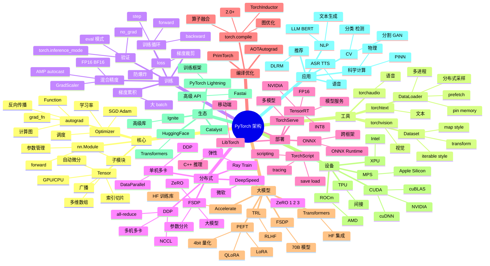

# PyTorch

## 一、前言

**定位**：Meta（原 Facebook）2016 年开源的**深度学习框架**，以动态计算图、Pythonic 风格、工业级部署三大特性成为学术界和工业界的双料冠军。

**核心价值**：
- **动态计算图**（Define-by-Run）：调试简单、自然，PyTorch 杀手锏
- **Pythonic API**：`tensor.numpy()` / `tensor.to(device)` 一气呵成
- **完整生态**：torchvision / torchaudio / torchtext / torchdata / torchserve
- **工业部署**：TorchScript / ONNX / TorchServe / LibTorch（C++）
- **GPU 加速**：CUDA 一等公民，单卡/多卡/分布式开箱即用

**五大特性**：
1. **Tensor + autograd**：N 维数组 + 自动微分，深度学习的基础
2. **nn.Module**：组合式神经网络模块化
3. **DataLoader**：多进程数据加载、内存锁页、预取
4. **Distributed**：DDP / FSDP / DeepSpeed 集成
5. **TorchScript / TorchCompile**：从研究到生产的桥梁

**与 TF 对比**：

| 维度 | PyTorch | TensorFlow |
|---|---|---|
| 计算图 | 动态（图随执行构建） | 静态（先定义再执行）|
| 调试 | 简单（pdb 即可） | 复杂（tf.Session）|
| API 风格 | Pythonic | 偏系统 |
| 部署 | TorchScript / ONNX | TF Serving / TFLite |
| 学术 | 主流 | 下降 |
| 工业 | 上升 | 下降 |
| 移动端 | 弱 | 强（TFLite）|

## 二、架构思维导图



## 三、关键代码

### 1. Tensor 基础与自动微分

```python
import torch

# 1. Tensor 创建
x = torch.tensor([[1, 2], [3, 4]], dtype=torch.float32)
y = torch.zeros(3, 4)
z = torch.ones(2, 3, dtype=torch.float64)
r = torch.randn(2, 3)         # 正态分布随机
e = torch.empty(3, 4)         # 未初始化

# 2. 设备切换（CPU / GPU）
device = 'cuda' if torch.cuda.is_available() else 'cpu'
x = x.to(device)

# 3. 形状操作
x = torch.randn(4, 5)
print(x.shape)                # torch.Size([4, 5])
print(x.view(20))             # → [20]
print(x.reshape(2, 10))       # → [2, 10]
print(x.permute(1, 0))        # → [5, 4]
print(x.unsqueeze(0))         # → [1, 4, 5]
print(x.squeeze())            # 去除 size 1 维度

# 4. 索引 / 切片
x = torch.arange(12).reshape(3, 4)
print(x[1, :])                # 第二行
print(x[:, 1])                # 第二列
print(x[x > 5])               # 布尔索引
print(x[1:3, 1:3])            # 切片

# 5. 广播
a = torch.randn(3, 1)
b = torch.randn(1, 4)
c = a + b                      # → [3, 4]

# 6. 矩阵运算
A = torch.randn(2, 3)
B = torch.randn(3, 4)
C = A @ B                      # 矩阵乘法 → [2, 4]
C = A.matmul(B)
# batch 矩阵
A = torch.randn(10, 3, 4)
B = torch.randn(10, 4, 5)
C = torch.bmm(A, B)            # → [10, 3, 5]

# 7. 自动微分
x = torch.ones(2, 2, requires_grad=True)
y = x + 2
z = y * y * 3
out = z.mean()
out.backward()                  # 反向传播
print(x.grad)                   # ∂out/∂x

# 8. 梯度上下文
with torch.no_grad():           # 推理时禁用梯度（节省内存）
    pred = model(x)

with torch.inference_mode():    # 比 no_grad 更激进（PyTorch 1.9+）
    pred = model(x)
```

**解析**：
- **`requires_grad=True`** 开启梯度追踪；`with torch.no_grad()` 关闭（推理阶段）
- **`.backward()` 自动反向传播**：自动构建计算图 + 链式求导
- **`.to(device)`** 一行切换 CPU/GPU；多卡用 `.to('cuda:0')` 指定

### 2. nn.Module 神经网络

```python
import torch
import torch.nn as nn
import torch.nn.functional as F

# 1. 简单模型
class SimpleNN(nn.Module):
    def __init__(self, input_dim, hidden_dim, output_dim):
        super().__init__()
        self.fc1 = nn.Linear(input_dim, hidden_dim)
        self.fc2 = nn.Linear(hidden_dim, hidden_dim)
        self.fc3 = nn.Linear(hidden_dim, output_dim)
        self.dropout = nn.Dropout(0.5)
        self.bn = nn.BatchNorm1d(hidden_dim)
    
    def forward(self, x):
        x = F.relu(self.bn(self.fc1(x)))
        x = self.dropout(x)
        x = F.relu(self.fc2(x))
        x = self.fc3(x)
        return x

model = SimpleNN(784, 256, 10).to(device)
print(model)

# 2. CNN（ResNet 风格）
class ResidualBlock(nn.Module):
    def __init__(self, in_ch, out_ch, stride=1):
        super().__init__()
        self.conv1 = nn.Conv2d(in_ch, out_ch, 3, stride, 1, bias=False)
        self.bn1 = nn.BatchNorm2d(out_ch)
        self.conv2 = nn.Conv2d(out_ch, out_ch, 3, 1, 1, bias=False)
        self.bn2 = nn.BatchNorm2d(out_ch)
        self.shortcut = nn.Sequential()
        if stride != 1 or in_ch != out_ch:
            self.shortcut = nn.Sequential(
                nn.Conv2d(in_ch, out_ch, 1, stride, bias=False),
                nn.BatchNorm2d(out_ch)
            )
    
    def forward(self, x):
        out = F.relu(self.bn1(self.conv1(x)))
        out = self.bn2(self.conv2(out))
        out += self.shortcut(x)
        out = F.relu(out)
        return out

# 3. Transformer（简化）
class SimpleTransformer(nn.Module):
    def __init__(self, vocab_size, d_model, nhead, num_layers):
        super().__init__()
        self.embed = nn.Embedding(vocab_size, d_model)
        self.pos_enc = nn.Parameter(torch.randn(1, 5000, d_model))
        encoder_layer = nn.TransformerEncoderLayer(
            d_model=d_model, nhead=nhead, dim_feedforward=2048, batch_first=True
        )
        self.transformer = nn.TransformerEncoder(encoder_layer, num_layers)
        self.fc = nn.Linear(d_model, vocab_size)
    
    def forward(self, x, mask=None):
        x = self.embed(x) + self.pos_enc[:, :x.size(1)]
        x = self.transformer(x, mask=mask)
        return self.fc(x)

# 4. 实用 API
print(model.parameters())         # 迭代器
print(model.named_parameters())   # (name, param) 元组
print(sum(p.numel() for p in model.parameters()))  # 参数量
print(model.state_dict())         # 模型权重字典

# 保存 / 加载
torch.save(model.state_dict(), 'model.pth')
model.load_state_dict(torch.load('model.pth'))
```

**解析**：
- **nn.Module 自动管理参数**：`self.fc1 = nn.Linear(...)` 注册到 `parameters()`
- **`forward()` 必须实现**：`__call__` 调用 `forward`
- **残差块**让深层网络可训练：`out + shortcut(x)` 梯度直接回传
- **`state_dict()`** 是序列化标准，可保存到磁盘 / 上传到 S3

### 3. DataLoader 数据加载

```python
from torch.utils.data import Dataset, DataLoader
from torchvision import transforms
from PIL import Image
import os

# 1. 自定义 Dataset
class ImageDataset(Dataset):
    def __init__(self, root_dir, transform=None):
        self.root_dir = root_dir
        self.transform = transform
        self.image_paths = []
        self.labels = []
        for label, class_dir in enumerate(sorted(os.listdir(root_dir))):
            class_path = os.path.join(root_dir, class_dir)
            for fname in os.listdir(class_path):
                self.image_paths.append(os.path.join(class_path, fname))
                self.labels.append(label)
    
    def __len__(self):
        return len(self.image_paths)
    
    def __getitem__(self, idx):
        img = Image.open(self.image_paths[idx]).convert('RGB')
        if self.transform:
            img = self.transform(img)
        return img, self.labels[idx]

# 2. 数据增强
transform_train = transforms.Compose([
    transforms.Resize(256),
    transforms.RandomCrop(224),
    transforms.RandomHorizontalFlip(),
    transforms.ColorJitter(brightness=0.2, contrast=0.2),
    transforms.ToTensor(),
    transforms.Normalize(mean=[0.485, 0.456, 0.406], 
                          std=[0.229, 0.224, 0.225]),
])

transform_val = transforms.Compose([
    transforms.Resize(256),
    transforms.CenterCrop(224),
    transforms.ToTensor(),
    transforms.Normalize(mean=[0.485, 0.456, 0.406], 
                          std=[0.229, 0.224, 0.225]),
])

# 3. DataLoader
train_dataset = ImageDataset('data/train', transform=transform_train)
train_loader = DataLoader(
    train_dataset,
    batch_size=64,
    shuffle=True,
    num_workers=8,            # 多进程加载
    pin_memory=True,          # 锁页内存，加速 GPU 传输
    prefetch_factor=2,        # 每个 worker 预取 2 个 batch
    persistent_workers=True,  # 多 epoch 复用 worker
    drop_last=True,           # 丢弃最后不完整 batch
)

for batch_idx, (images, labels) in enumerate(train_loader):
    images = images.to(device, non_blocking=True)
    labels = labels.to(device, non_blocking=True)
    # 训练...
```

**解析**：
- **`num_workers`** 是性能关键：> 0 时数据加载在多进程，CPU 不阻塞 GPU
- **`pin_memory=True`**：将数据放在 CUDA 锁页内存，CPU→GPU 传输加速 2-3 倍
- **`persistent_workers=True`**：避免每个 epoch 重建 worker 进程
- **`non_blocking=True`**：CPU/GPU 异步传输，配合 pin_memory 生效

### 4. 训练循环 + 混合精度

```python
import torch
import torch.nn as nn
from torch.cuda.amp import autocast, GradScaler

model = SimpleNN(784, 256, 10).to(device)
optimizer = torch.optim.AdamW(model.parameters(), lr=1e-3, weight_decay=1e-2)
scheduler = torch.optim.lr_scheduler.CosineAnnealingLR(optimizer, T_max=100)
criterion = nn.CrossEntropyLoss()
scaler = GradScaler()  # FP16 缩放器

def train_one_epoch(model, loader, optimizer, scheduler, criterion, device, epoch):
    model.train()
    total_loss = 0
    correct = 0
    total = 0
    
    for batch_idx, (data, target) in enumerate(loader):
        data, target = data.to(device, non_blocking=True), target.to(device, non_blocking=True)
        
        optimizer.zero_grad(set_to_none=True)  # 节省内存
        
        # 1. 混合精度前向（autocast）
        with autocast(dtype=torch.float16):
            output = model(data)
            loss = criterion(output, target)
        
        # 2. 缩放 + 反向（避免 FP16 下溢）
        scaler.scale(loss).backward()
        scaler.unscale_(optimizer)
        torch.nn.utils.clip_grad_norm_(model.parameters(), max_norm=1.0)  # 梯度裁剪
        scaler.step(optimizer)
        scaler.update()
        
        scheduler.step()
        
        total_loss += loss.item()
        _, predicted = output.max(1)
        total += target.size(0)
        correct += predicted.eq(target).sum().item()
    
    acc = 100. * correct / total
    avg_loss = total_loss / len(loader)
    print(f'Epoch {epoch}: loss={avg_loss:.4f}, acc={acc:.2f}%')
    return avg_loss, acc

# 验证
def validate(model, loader, criterion, device):
    model.eval()
    test_loss = 0
    correct = 0
    with torch.inference_mode():
        for data, target in loader:
            data, target = data.to(device), target.to(device)
            output = model(data)
            test_loss += criterion(output, target).item()
            _, predicted = output.max(1)
            correct += predicted.eq(target).sum().item()
    return correct / len(loader.dataset)

# 主循环
for epoch in range(100):
    train_one_epoch(model, train_loader, optimizer, scheduler, criterion, device, epoch)
    val_acc = validate(model, val_loader, criterion, device)
    print(f'Validation accuracy: {val_acc:.2%}')

    # 保存 checkpoint
    if val_acc > best_acc:
        torch.save({
            'epoch': epoch,
            'model_state_dict': model.state_dict(),
            'optimizer_state_dict': optimizer.state_dict(),
            'scheduler_state_dict': scheduler.state_dict(),
            'val_acc': val_acc,
        }, 'best_model.pth')
```

**解析**：
- **混合精度训练**：FP16 计算加速 1.5-2 倍，内存减半；`autocast` + `GradScaler` 防梯度下溢
- **梯度裁剪 `clip_grad_norm_`**：防止 RNN/Transformer 训练时梯度爆炸
- **`set_to_none=True`**：梯度清零时直接置 None 而非置 0，节省内存
- **scheduler.step() 在 batch 还是 epoch？** 取决于调度器：CosineAnnealingLR 按 epoch 调，OneCycleLR 按 batch 调

### 5. DDP 分布式训练

```python
import torch.distributed as dist
from torch.nn.parallel import DistributedDataParallel as DDP
from torch.utils.data.distributed import DistributedSampler

def main(rank, world_size):
    # 1. 初始化进程组
    dist.init_process_group(
        backend='nccl',           # GPU 用 NCCL，CPU 用 Gloo
        init_method='env://',     # 从环境变量读 MASTER_ADDR/PORT
        rank=rank,
        world_size=world_size,
    )
    
    # 2. 分布式采样器（每个 GPU 拿不同数据）
    train_sampler = DistributedSampler(train_dataset, shuffle=True)
    train_loader = DataLoader(
        train_dataset,
        batch_size=64,
        sampler=train_sampler,    # 注意：用 sampler 就不用 shuffle
        num_workers=8,
        pin_memory=True,
    )
    
    # 3. 模型放到当前 rank 的 GPU
    device = f'cuda:{rank}'
    model = SimpleNN(784, 256, 10).to(device)
    model = DDP(model, device_ids=[rank])
    
    # 4. 训练
    for epoch in range(100):
        train_sampler.set_epoch(epoch)  # 每 epoch 重新打乱
        train_one_epoch(model, train_loader, optimizer, scheduler, criterion, device, epoch)
    
    dist.destroy_process_group()

# 启动（用 torchrun）
# torchrun --nproc_per_node=4 --nnodes=1 train.py
# 自动设置 RANK / WORLD_SIZE / LOCAL_RANK / MASTER_ADDR / MASTER_PORT
```

**启动方式**：

```bash
# 单机 4 卡
torchrun --nproc_per_node=4 train.py

# 多机 4 机 8 卡
# 节点 0：
torchrun --nproc_per_node=8 --nnodes=4 --node_rank=0 \
  --master_addr=node0 --master_port=29500 train.py

# 节点 1：
torchrun --nproc_per_node=8 --nnodes=4 --node_rank=1 \
  --master_addr=node0 --master_port=29500 train.py
```

**解析**：
- **DDP 自动 All-Reduce 梯度**：每个 rank 算梯度后自动同步，参数保持一致
- **`DistributedSampler`**：每个 rank 拿不同 shard 数据，加起来覆盖全量
- **`set_epoch(epoch)`** 必须调用：保证每个 epoch 重新打乱，否则多 epoch 数据顺序相同
- **NCCL 是 GPU 通信标准**：比 Gloo 快 10 倍，单机多卡必备

## 四、核心洞察

1. **动态图是 PyTorch 杀手锏**：调试简单（`pdb` 即可）、自然（Python 控制流可直接用）、RNN/Transformer 变长输入处理方便。
2. **`torch.compile` 是性能加速器**：2.0+ 引入 TorchInductor，对模型做算子融合、内存优化；常用模型加速 1.3-2 倍，几乎零成本。
3. **混合精度（AMP）是标配**：FP16 + 动态 Loss Scaling 几乎不损失精度，速度提升 1.5-2 倍，内存减半；H100/BF16 可关 GradScaler。
4. **FSDP 是大模型训练标准**：70B 模型需要 16+ 卡 A100；FSDP 把参数/梯度/优化器状态分片到多卡；DeepSpeed 是替代方案。
5. **DDP > DataParallel**：单进程多线程 DP 已淘汰；DDP 多进程多卡性能高 5-10 倍，是事实标准。
6. **DataLoader 性能调优**：`num_workers=8` + `pin_memory=True` + `persistent_workers=True` + `prefetch_factor=4` 是常见优化组合。
7. **生产部署多路径**：TorchScript（PyTorch 生态内）/ ONNX（跨框架）/ TorchServe（专用服务）/ TensorRT（NVIDIA 极致优化）；按场景选择。
8. **PyTorch 2.0 = PyTorch 1.x + 编译优化**：torch.compile 让 PyTorch 性能追平 TF Graph，性能不再是 TF 优势。

## 五、跨项目引用

- [./tensorflow.md](./tensorflow.md) — TF 是 PyTorch 工业部署上的对手
- [./transformers.md](./transformers.md) — HuggingFace Transformers 是 PyTorch 上最大 LLM 生态
- [./langchain.md](./langchain.md) — LangChain 集成 PyTorch 模型做 AI 应用
- [./numpy.md](./numpy.md) — NumPy 是 PyTorch Tensor 的数学基础
- [./pandas.md](./pandas.md) — Pandas 处理数据预处理，PyTorch 做训练
- [./scikit-learn.md](./scikit-learn.md) — Sklearn 传统 ML，PyTorch 深度学习
- [./llama.md](./llama.md) — LLaMA 模型是 PyTorch 训练的
- [./ollama.md](./ollama.md) — Ollama 是 LLM 推理服务化
