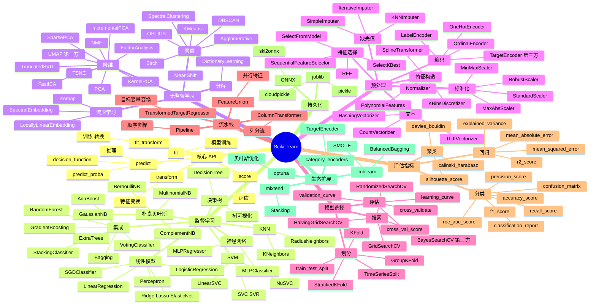

# Scikit-learn

## 一、前言

Scikit-learn（sklearn）是 Python 生态最主流的机器学习库，由法国 INRIA 的 David Cournapeau 于 2007 年发起项目，2010 年由 Fabian Pedregosa 等 9 人联合公开发布第一个稳定版，目前由 INRIA、谷歌、纽菲尔德基金等机构共同维护。它构建在 NumPy、SciPy、Matplotlib 之上，统一了几乎所有传统机器学习算法（分类、回归、聚类、降维、特征工程、模型选择、流水线），并以"一致的 fit/predict/transform API" 成为业界事实标准。截至 2025 年，Scikit-learn 拥有超过 2300 名贡献者，被引论文超过 5 万次，是 Kaggle 比赛、数据科学教学、互联网公司 ML 流水线的入门首选。

Scikit-learn 的核心价值在于"统一接口 + 全算法覆盖 + 工业级文档 + 教学友好"。它把所有算法收敛到同一套 API：① `fit(X, y)` 训练；② `predict(X)` 推理；③ `transform(X)` 特征工程；④ `fit_transform(X)` 训练+转换一步；⑤ `score(X, y)` 自评估。配合 `Pipeline` / `ColumnTransformer` / `GridSearchCV` / `cross_val_score` 等元学习器，搭建一个完整的 ML 流程只需要 10-30 行代码。

Scikit-learn 的关键能力包括：① 监督学习（线性模型、SVM、决策树、随机森林、GBDT、神经网络 MLP、KNN、朴素贝叶斯）；② 无监督学习（K-Means、DBSCAN、层次聚类、PCA、t-SNE、UMAP、ICA、NMF）；③ 模型选择（网格搜索、随机搜索、贝叶斯优化、交叉验证、学习曲线、验证曲线）；④ 流水线（Pipeline、FeatureUnion、ColumnTransformer）；⑤ 预处理（标准化、归一化、独热编码、缺失值填补、文本 TF-IDF、图像 HOG）；⑥ 评估指标（accuracy、f1、roc_auc、mse、r2、silhouette 等 40+）；⑦ 与 NumPy/Pandas/SciPy/Matplotlib/joblib 紧密集成。

Scikit-learn 与其他 ML 框架的对比：

| 工具 | 定位 | 优势 | 局限 |
|------|------|------|------|
| Scikit-learn | 传统 ML（GBDT 以内）+ 全流程 | API 一致、文档完善、覆盖广、教学友好 | 不支持 GPU、深度学习弱、大数据规模受限 |
| XGBoost/LightGBM/CatBoost | 极致 GBDT | 速度、精度、缺失值处理 | 只做树、需自行搭流程 |
| PyTorch/TensorFlow | 深度学习 | 灵活、性能强、GPU/TPU | 传统 ML 算法少、API 门槛高 |
| statsmodels | 统计推断 | 显著性检验、置信区间、R 风格 | 不做预测任务、API 不统一 |
| cuML/RAPIDS | GPU 加速 sklearn | 10-50x 加速、API 兼容 | 硬件门槛、生态弱 |
| H2O.ai | 分布式 AutoML | 大数据、AutoML | 商业许可、Python 生态弱 |

Scikit-learn 的核心应用场景：① 分类（垃圾邮件识别、欺诈检测、CTR 预测、情感分析）；② 回归（房价预测、销量预测、风险定价）；③ 聚类（用户分群、商品聚类、异常检测）；④ 降维（特征压缩、可视化、噪声过滤）；⑤ 特征工程（编码、归一化、特征选择、特征构造）；⑥ 流水线（生产部署前的标准化、模型序列化、PMML 导出）；⑦ 教学与原型（Kaggle baseline、论文基线）。

Scikit-learn 5 大核心特性：① 统一的 fit/predict/transform API，跨算法零成本切换；② 全算法覆盖（监督+无监督+半监督+多标签+多输出）；③ 流水线 Pipeline + ColumnTransformer 让预处理-训练一体化；④ 完善的模型选择（GridSearchCV/RandomizedSearchCV/cross_val_score）；⑤ joblib 并行（n_jobs=-1 全核）与生态系统（imblearn/mlxtend/category-encoders）。

## 二、架构思维导图



## 三、关键代码

### 3.1 统一 API：Estimator 协议

```python
# 文件：sklearn/base.py
from sklearn.base import BaseEstimator, TransformerMixin, ClassifierMixin
import numpy as np

# ──────── 三大基类 ────────
# BaseEstimator:        get_params / set_params  超参管理
# TransformerMixin:     fit_transform           转换器
# ClassifierMixin:      score 默认 accuracy      分类器
# RegressorMixin:       score 默认 R²            回归器
# ClusterMixin:         fit_predict              聚类器

# ──────── 自定义 Transformer ────────
class LogTransformer(BaseEstimator, TransformerMixin):
    """把正数特征做 log1p，并保留特征名。"""
    def fit(self, X, y=None):
        # 训练阶段：什么都不做（无状态变换）
        return self                              # 必须返回 self

    def transform(self, X):
        # 转换阶段：实际变换逻辑
        return np.log1p(np.asarray(X))

    def get_feature_names_out(self, input_features=None):
        # 流水线中保留列名
        return np.asarray([f"log_{n}" for n in input_features])


# ──────── fit/predict/transform 范式 ────────
from sklearn.datasets import load_iris
from sklearn.linear_model import LogisticRegression
from sklearn.preprocessing import StandardScaler

X, y = load_iris(return_X_y=True)

# 1. 标准化
scaler = StandardScaler()
X_scaled = scaler.fit_transform(X)               # fit + transform 一步

# 2. 训练分类器
clf = LogisticRegression(max_iter=200)
clf.fit(X_scaled, y)

# 3. 推理
y_pred = clf.predict(X_scaled)                   # 类别
y_proba = clf.predict_proba(X_scaled)            # 概率
score = clf.score(X_scaled, y)                   # accuracy

# 4. 模型参数
print(clf.coef_, clf.intercept_, clf.classes_)
```

### 3.2 监督学习：分类与回归

```python
# 文件：sklearn/linear_model/_logistic.py / sklearn.ensemble/_forest.py
from sklearn.datasets import load_breast_cancer
from sklearn.model_selection import train_test_split
from sklearn.linear_model import LogisticRegression
from sklearn.ensemble import RandomForestClassifier
from sklearn.metrics import classification_report, roc_auc_score

# ──────── 数据 ────────
X, y = load_breast_cancer(return_X_y=True)
X_train, X_test, y_train, y_test = train_test_split(
    X, y, test_size=0.2, random_state=42, stratify=y
)

# ──────── 逻辑回归：可解释、概率输出 ────────
lr = LogisticRegression(C=1.0, penalty="l2", max_iter=1000, n_jobs=-1)
lr.fit(X_train, y_train)
y_pred = lr.predict(X_test)
y_proba = lr.predict_proba(X_test)[:, 1]
print(classification_report(y_test, y_pred, digits=3))
print(f"AUC = {roc_auc_score(y_test, y_proba):.3f}")

# ──────── 随机森林：非线性、抗过拟合 ────────
rf = RandomForestClassifier(
    n_estimators=300,
    max_depth=None,
    min_samples_split=5,
    min_samples_leaf=2,
    max_features="sqrt",
    n_jobs=-1,
    random_state=42,
    class_weight="balanced",  # 处理类别不均
)
rf.fit(X_train, y_train)

# 特征重要性
importances = rf.feature_importances_             # Gini importance
top10 = np.argsort(importances)[-10:]

# ──────── 梯度提升树（sklearn 原生） ────────
from sklearn.ensemble import GradientBoostingClassifier
gbdt = GradientBoostingClassifier(
    n_estimators=200, learning_rate=0.05,
    max_depth=3, subsample=0.8,
)
gbdt.fit(X_train, y_train)

# ──────── 回归：GradientBoostingRegressor ────────
from sklearn.datasets import fetch_california_housing
from sklearn.ensemble import GradientBoostingRegressor
from sklearn.metrics import mean_squared_error, r2_score

housing = fetch_california_housing()
X_tr, X_te, y_tr, y_te = train_test_split(
    housing.data, housing.target, test_size=0.2, random_state=42
)
gbr = GradientBoostingRegressor(
    n_estimators=500, learning_rate=0.05,
    max_depth=4, min_samples_leaf=5,
)
gbr.fit(X_tr, y_tr)
y_pred = gbr.predict(X_te)
print(f"MSE={mean_squared_error(y_te, y_pred):.3f}  R²={r2_score(y_te, y_pred):.3f}")
```

### 3.3 流水线：Pipeline + ColumnTransformer + GridSearchCV

```python
# 文件：sklearn/pipeline.py / sklearn/compose/_column_transformer.py
import numpy as np
import pandas as pd
from sklearn.compose import ColumnTransformer
from sklearn.pipeline import Pipeline
from sklearn.impute import SimpleImputer
from sklearn.preprocessing import StandardScaler, OneHotEncoder
from sklearn.ensemble import RandomForestClassifier
from sklearn.model_selection import GridSearchCV, StratifiedKFold
from sklearn.metrics import roc_auc_score

# ──────── 异构特征：数值 + 类别 ────────
df = pd.DataFrame({
    "age":    [25, 30, np.nan, 35, 40],
    "income": [50000, 60000, 70000, 80000, 90000],
    "city":   ["NY", "SF", "LA", "NY", "SF"],
    "gender": ["F", "M", "M", "F", "F"],
    "y":      [0, 1, 1, 0, 1],
})
X = df.drop(columns="y")
y = df["y"]

num_cols = ["age", "income"]
cat_cols = ["city", "gender"]

# ──────── 数值管道：填补 → 标准化 ────────
num_pipe = Pipeline([
    ("imputer", SimpleImputer(strategy="median")),
    ("scaler",  StandardScaler()),
])

# ──────── 类别管道：填补 → 独热 ────────
cat_pipe = Pipeline([
    ("imputer", SimpleImputer(strategy="constant", fill_value="missing")),
    ("ohe",     OneHotEncoder(handle_unknown="ignore", sparse_output=False)),
])

# ──────── ColumnTransformer：列分流 ────────
preprocess = ColumnTransformer([
    ("num", num_pipe, num_cols),
    ("cat", cat_pipe, cat_cols),
], remainder="drop")                              # 其他列丢弃

# ──────── 端到端 Pipeline ────────
pipe = Pipeline([
    ("prep", preprocess),
    ("clf",  RandomForestClassifier(random_state=42)),
])

# ──────── GridSearchCV：超参搜索 + 交叉验证 ────────
param_grid = {
    "clf__n_estimators":   [200, 500],
    "clf__max_depth":      [None, 10, 20],
    "clf__min_samples_leaf": [1, 3, 5],
}
gs = GridSearchCV(
    pipe,
    param_grid,
    cv=StratifiedKFold(n_splits=5, shuffle=True, random_state=42),
    scoring="roc_auc",
    n_jobs=-1,
    verbose=1,
)
gs.fit(X, y)
print(f"best AUC = {gs.best_score_:.3f}")
print(f"best params = {gs.best_params_}")

# ──────── 推理时直接 .predict（自动跑全流水线） ────────
new_data = pd.DataFrame({
    "age":    [28, np.nan],
    "income": [55000, 75000],
    "city":   ["LA", "NY"],
    "gender": ["M", "F"],
})
print(gs.predict(new_data))                      # 类别
print(gs.predict_proba(new_data)[:, 1])           # 概率
```

### 3.4 模型持久化 + 部署

```python
# 文件：sklearn/utils/resample.py / joblib / skl2onnx
import joblib
from joblib import dump, load

# ──────── joblib 序列化（推荐，大数组用 numpy zip） ────────
gs.fit(X, y)
dump(gs, "model.joblib", compress=3)              # 二进制

# 加载
model = load("model.joblib")
y_pred = model.predict(new_data)

# ──────── 导出 ONNX：跨语言部署 ────────
# pip install skl2onnx onnx onnxruntime
from skl2onnx import convert_sklearn
from skl2onnx.common.data_types import FloatTensorType

initial_type = [("input", FloatTensorType([None, X.shape[1]]))]
onnx_model = convert_sklearn(
    gs, initial_types=initial_type,
    target_opset=12,
)
with open("model.onnx", "wb") as f:
    f.write(onnx_model.SerializeToString())

# ONNX 推理（Python/C++/Java/JS 通用）
import onnxruntime as ort
sess = ort.InferenceSession("model.onnx")
out = sess.run(None, {"input": new_data.to_numpy().astype("float32")})

# ──────── 内存模型（大数据 / 增量训练） ────────
from sklearn.linear_model import SGDClassifier
from sklearn.feature_extraction.text import HashingVectorizer

# 文本流式训练：partial_fit 一次一个 mini-batch
hv = HashingVectorizer(n_features=2**18)
sgd = SGDClassifier(loss="log_loss", random_state=42)
for chunk_texts, chunk_y in text_stream_batches():
    X = hv.transform(chunk_texts)
    sgd.partial_fit(X, chunk_y, classes=[0, 1])
```

## 四、核心洞察

- **fit/predict/transform 是 Scikit-learn 的灵魂**：所有算法都遵循这一套统一 API，意味着你可以把 LinearRegression 换成 RandomForestRegressor 只改一行代码，剩余的 Pipeline / GridSearchCV 完全不动。这种"接口即契约"是它成为业界标准的最关键设计。理解这一范式比记住任何具体算法都重要。

- **Pipeline 是生产化关键**：训练时 `pipe.fit(X_train)` 内部会依次调用每一步的 `fit_transform`，最后一步 `fit`；推理时 `pipe.predict(X_new)` 自动串联 `transform → predict`。这避免了"训练和推理时预处理不一致"这一最常见的生产事故。`ColumnTransformer` 让数值/类别/文本特征按列分流，每路单独走自己的预处理流水线。

- **超参搜索 vs 交叉验证是分不开的**：单看训练集上的 score 没用——必须配合 `cross_val_score` 或 `GridSearchCV` 拿到泛化误差。`StratifiedKFold` 保证分类任务每折类别比例一致；`TimeSeriesSplit` 防止时间序列泄露；`GroupKFold` 防止同组样本泄露（同一用户的多条记录应全在训练或测试）。这是 Scikit-learn 最专业的部分。

- **随机森林与 GBDT 的选择**：同属树模型，但机制不同——随机森林（Bagging）每棵树独立训练并行可加速，并行 `n_jobs=-1` 用满 CPU，泛化好但难再提精度；GBDT（Boosting）串行训练，每棵树拟合前一轮残差，精度更高但 `n_jobs` 受限。生产中 GBDT 通常选 XGBoost/LightGBM/CatBoost（更高效、支持缺失值、GPU 加速），Scikit-learn 的 GradientBoosting 适合教学和小数据。

- **类别不平衡三把斧**：① `class_weight="balanced"` 给少数类更高权重；② `imblearn.over_sampling.SMOTE` 合成少数类样本；③ 评估指标改用 F1/AUC-PR 而非 Accuracy。Scikit-learn 自身的 `class_weight` 是最简方案，imblearn 提供更系统化的重采样方案。

- **特征工程远比算法重要**：在中等规模数据上，特征工程带来的提升往往大于算法升级。Scikit-learn 提供的工具：① 编码（`OneHotEncoder`/`OrdinalEncoder`/`TargetEncoder`）；② 标准化（`StandardScaler`/`RobustScaler`）；③ 文本（`TfidfVectorizer`/`HashingVectorizer`）；④ 特征构造（`PolynomialFeatures`/`SplineTransformer`）；⑤ 特征选择（`SelectKBest`/`RFE`/`SelectFromModel`）。`Pipeline` + `ColumnTransformer` 把这些组合得有条不紊。

- **评估指标选错等于白做**：分类——二分类看 AUC/PRC/LogLoss，多分类看 Macro/Weighted F1；回归——看业务是看绝对误差（MAE）还是方差（R²/MSE）；聚类——用 Silhouette / Davies-Bouldin / Calinski-Harabasz 综合看。Scikit-learn `metrics` 模块有 40+ 指标。`classification_report` 一键给出 precision/recall/f1/support，`confusion_matrix` 配合 `ConfusionMatrixDisplay` 可视化。

- **持久化与跨平台部署**：`joblib.dump` / `joblib.load` 处理大数组更高效（基于 pickle 但优化了 numpy 数组）；`pickle` 通用但版本敏感（训练环境与生产环境 sklearn 版本必须一致）；生产部署可导出 **ONNX**（skl2onnx）或 **PMML**（nyoka）跨语言运行，或封装成 REST API（FastAPI / BentoML）。生产化能力是 Scikit-learn 的相对短板，大厂通常换 XGBoost/LightGBM + 自研 pipeline。

- **生态位与局限**：Scikit-learn 适合 GB 级、单 CPU、传统 ML 算法（树/SVM/线性/KNN/聚类），不适合：① 大数据（用 Dask-ML / cuML / Spark MLlib）；② 深度学习（用 PyTorch/TensorFlow）；③ AutoML（用 Auto-sklearn / FLAML / H2O）；④ 在线学习（SGDClassifier 算半个）。它仍是入门、教学、baseline、流水线模板的最佳起点。

## 五、跨项目引用

- **[NumPy 基础](./numpy.md)**：Scikit-learn 几乎所有输入都是 NumPy 数组（`X.shape == (n_samples, n_features)`），所有输出也转回 ndarray。`fit(X, y)` 的 X/y 必须是连续内存的 float64/float32/int，Pandas DataFrame 也行但内部转 ndarray。

- **[Pandas 数据分析](./pandas.md)**：典型 ML 流水线 `pd.read_csv → df.dropna → pd.get_dummies / df.values → train_test_split → fit → predict → pd.DataFrame({pred, y_test})`。`df.corr()` 输出的相关矩阵直接喂 `SelectKBest`；`df.pipe(sklearn_step)` 把 sklearn 算子接进 Pandas 链式语法。

- **[PyTorch 训练](./pytorch.md)**：当 Scikit-learn 达到性能瓶颈（GBDT 单机 1h+）或需要深度学习（图像/文本/序列），改用 PyTorch。Scikit-learn 的 Pipeline 思想、`fit/predict/transform` 接口影响 PyTorch-Lightning、skorch（Scikit-learn 风格包装 PyTorch）、Catalyst 等高层框架。

- **[LangChain LLM 应用](./langchain.md)**：RAG 阶段用 Scikit-learn 的 `TfidfVectorizer` + `cosine_similarity` 做文本检索（轻量、CPU 友好），复杂场景换 `sentence-transformers` + Faiss/Chroma；评估阶段用 `f1_score` / `accuracy_score` 评 LLM 输出。LLM 时代反而让 Scikit-learn 的 `metrics` 模块更有价值。

- **[XGBoost / LightGBM / CatBoost]**：三大 GBDT 实现，针对 Scikit-learn 的 `GradientBoosting` 性能做了 10-100x 优化，API 几乎兼容（`xgb.XGBClassifier(n_estimators=...).fit(X, y).predict(X)`）。生产 GBDT 任务推荐直接用它们，再大的数据用 LightGBM 的 `hist` 算法或 CatBoost 的有序提升。

- **[Jupyter Notebook]**：Scikit-learn 与 Jupyter 是天作之合——`pipe.fit(X, y)` 配合 matplotlib 可视化、`%timeit` 性能分析、`sklearn.model_selection.learning_curve` 一行画图，几乎所有 Kaggle 教程都长这样。生产化前再把 notebook 重构成 `.py` + `Pipeline` + 单元测试。

- **[FastAPI 模型服务]**：训练用 Scikit-learn，部署用 FastAPI + `joblib.load('model.joblib').predict(X)` 提供 REST API；进一步用 BentoML / MLflow / TFServing 做模型版本管理、A/B 测试、监控。ONNX Runtime 提供跨语言推理能力，推理性能优于 Scikit-learn 原生 2-10x。
