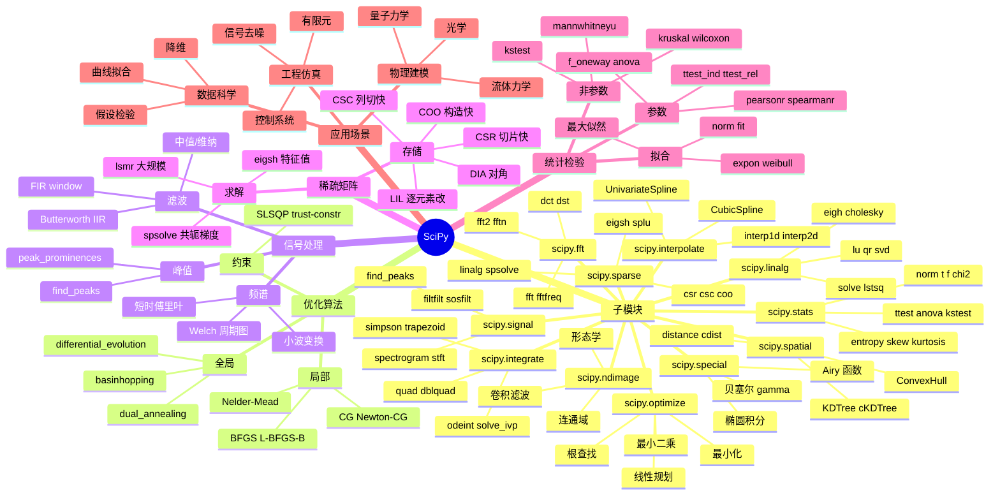

# SciPy

## 前言

**定位**：基于 NumPy 之上的 Python 科学计算核心库，提供优化、积分、插值、信号处理、统计、线性代数等高级数学算法，被誉为"科学计算的 MATLAB 替代品"。

**核心价值**：
- 补齐 NumPy 在高级数学上的空白：傅里叶变换、稀疏矩阵、ODE 求解
- 1000+ 经过严格测试的算法实现，全部开源
- 论文/教科书级的算法精度（基于 LAPACK/Fortran）
- 与 NumPy/Pandas/Matplotlib 组成"Python 科学计算四件套"

**五大特性**：
1. **算法覆盖广**：从基础（线性代数）到前沿（稀疏图算法、空间数据）一站式
2. **物理单位与常数**：`scipy.constants` 内置 CODATA 国际标准
3. **稀疏矩阵**：`scipy.sparse` 支持 CSR/CSC/COO/LIL，10亿级图邻接矩阵常驻内存
4. **信号/图像处理**：`scipy.signal`/`scipy.ndimage` 是 OpenCV/Scikit-Image 的底层依赖
5. **统计与检验**：从 t 检验到 KS 检验，从单变量到多变量

**对比表**：

| 维度 | SciPy | NumPy | SymPy | statsmodels | MATLAB |
|---|---|---|---|---|---|
| 定位 | 高级算法 | 数组基础 | 符号数学 | 统计建模 | 商业科学计算 |
| 速度 | C/Fortran | C | 慢（符号） | 中 | C |
| 稀疏矩阵 | ✅ 强 | ❌ | ❌ | ⚠️ | ✅ |
| ODE/PDE | ✅ 强 | ❌ | ⚠️ 弱 | ❌ | ✅ |
| 适用阶段 | 研究/工程 | 任何项目 | 公式推导 | 经济/统计 | 学术界 |

## 思维导图



## 关键代码

### 一、优化与最小二乘

```python
import numpy as np
from scipy.optimize import minimize, curve_fit, linprog, differential_evolution

# 1. 无约束多变量最小化（Rosenbrock 函数）
def rosen(x):
    return sum(100*(x[1:]-x[:-1]**2)**2 + (1-x[:-1])**2)

result = minimize(rosen, x0=[0, 0], method="L-BFGS-B")
print(result.x)  # [1. 1. 1.]

# 2. 曲线拟合（非线性最小二乘）
def model(x, a, b, c):
    return a*np.exp(-b*x) + c

xdata = np.linspace(0, 4, 50)
ydata = model(xdata, 2.5, 1.3, 0.5) + 0.2*np.random.randn(50)

popt, pcov = curve_fit(model, xdata, ydata, p0=[1, 1, 1])
perr = np.sqrt(np.diag(pcov))  # 参数标准差

# 3. 线性规划：min c·x subject to A·x ≤ b
c = [-1, -2]                      # 目标：最大化 x + 2y
A_ub = [[1, 1], [2, 1]]
b_ub = [4, 5]
res = linprog(c, A_ub=A_ub, b_ub=b_ub, bounds=[(0, None), (0, None)])
print(res.x)  # 最优解

# 4. 全局优化（多峰函数）
bounds = [(-5, 5), (-5, 5)]
res = differential_evolution(rosen, bounds, seed=42, tol=1e-7)
```

### 二、积分与 ODE 求解

```python
from scipy.integrate import quad, dblquad, solve_ivp, simpson
from scipy.special import erf

# 1. 一维积分（高斯-克朗罗德自适应）
val, err = quad(lambda x: np.exp(-x**2), 0, np.inf)
print(f"∫e^(-x²)dx = {val:.6f} ± {err:.2e}")  # ≈ √π/2

# 2. 二维积分
val, _ = dblquad(
    lambda y, x: x*y,
    0, 1,             # x 范围
    lambda x: 0,      # y 下界
    lambda x: 1-x     # y 上界
)

# 3. ODE：阻尼摆
def pendulum(t, y, b, g, L):
    theta, omega = y
    return [omega, -b*omega - (g/L)*np.sin(theta)]

sol = solve_ivp(
    pendulum, [0, 10], [np.pi/4, 0],
    args=(0.1, 9.81, 1.0),
    method="RK45", dense_output=True, rtol=1e-8
)
t = np.linspace(0, 10, 200)
y = sol.sol(t)

# 4. 数值积分（数组）- Simpson 法则
x = np.linspace(0, np.pi, 100)
y = np.sin(x)
area = simpson(y, x)  # ≈ 2
```

### 三、信号处理

```python
from scipy.signal import butter, filtfilt, find_peaks, welch, spectrogram

# 1. 设计巴特沃斯低通滤波器
b, a = butter(N=4, Wn=50, btype="low", fs=1000)  # 50Hz, 采样1000Hz
filtered = filtfilt(b, a, noisy_signal)          # 零相位滤波

# 2. 检测峰值
peaks, properties = find_peaks(
    ecg_signal, height=0.5, distance=200,
    prominence=0.3
)
print(f"心率 = {len(peaks) * 60 / duration_sec:.1f} bpm")

# 3. 功率谱（Welch 法）
f, psd = welch(signal, fs=1000, nperseg=1024)
# 找 50Hz 工频干扰
peak_idx = np.argmax(psd[(f > 49) & (f < 51)])

# 4. 短时傅里叶变换（语谱图）
f, t, Sxx = spectrogram(audio, fs=16000, nperseg=512, noverlap=256)
```

### 四、稀疏矩阵与线性代数

```python
import scipy.sparse as sp
from scipy.sparse.linalg import spsolve, eigsh

# 1. 创建稀疏矩阵
N = 1000
diagonals = [np.ones(N), -2*np.ones(N), np.ones(N)]  # 主对角 + 上下对角
A = sp.diags(diagonals, [0, -1, 1], format="csr")     # 三对角矩阵

# 2. 稀疏线性方程组 A·x = b
b = np.ones(N)
x = spsolve(A, b)   # 比 np.linalg.solve 快千倍

# 3. 稀疏矩阵的最小特征值/最大特征值
eigenvalues, eigenvectors = eigsh(A, k=5, which="SM")  # 5 个最小特征值

# 4. 大规模图的邻接矩阵（PageRank）
rows, cols = np.random.randint(0, N, size=2*N), np.random.randint(0, N, size=2*N)
data = np.ones(2*N)
G = sp.csr_matrix((data, (rows, cols)), shape=(N, N))
```

### 五、统计检验

```python
from scipy import stats

# 1. 单样本 t 检验
t_stat, p_val = stats.ttest_1samp(data, popmean=100)

# 2. 双独立样本 t 检验
t_stat, p_val = stats.ttest_ind(group_a, group_b, equal_var=False)  # Welch

# 3. ANOVA
f_stat, p_val = stats.f_oneway(group1, group2, group3)

# 4. 非参数：Mann-Whitney U
u_stat, p_val = stats.mannwhitneyu(group_a, group_b, alternative="two-sided")

# 5. 卡方拟合优度
obs = np.array([16, 18, 16, 14, 12, 12])
exp = np.array([16, 16, 16, 16, 16, 8])
chi2, p = stats.chisquare(obs, exp)

# 6. 正态性检验
stat, p = stats.shapiro(data)
stat, p = stats.kstest(data, "norm")  # Kolmogorov-Smirnov

# 7. 分布拟合：MLE
shape, loc, scale = stats.lognorm.fit(data, floc=0)
```

## 核心洞察

- **SciPy 是 NumPy 的"应用层"**：NumPy 提供 ndarray 基础类型，SciPy 在此之上实现具体算法；`scipy.linalg.solve` 内部调 LAPACK，`numpy.linalg.solve` 是简化版
- **`scipy.optimize.minimize` 的 method 选择决定一切**：连续可微用 L-BFGS-B、不可微用 Nelder-Mead、全局用 differential_evolution、约束用 SLSQP，选错方法发散
- **`curve_fit` 是科研最香的函数**：非线性最小二乘+协方差矩阵+初始猜测+边界，3 行代码拟合任意模型，替代手工求偏导
- **`solve_ivp` 取代了老 `odeint`**：支持现代 ODE 求解器（RK45/LSODA/BDF）、事件检测、雅可比矩阵、稠密输出
- **稀疏矩阵的存储格式选择有性能差异**：CSR 适合行切片+矩阵乘法、CSC 适合列切片+转置、COO 适合构造、LIL 适合逐元素修改、DIA 适合带状矩阵
- **SciPy 不做大屏**：`scipy.signal.spectrogram` 出图简陋，生产级时序图用 `plotly.graph_objects.Heatmap` 或 `matplotlib.pyplot.specgram`
- **`stats.ttest_ind` 默认等方差**：要 Welch t 检验需 `equal_var=False`，这是论文统计的常见错误点
- **稀疏特征值 `eigsh` 是 PageRank/Louvain 算法的核心**：处理百万级图时用 `which="LM"` 或 `"SA"`，指定 sigma 平移避免最小特征值病态
- **SciPy 的"科学"是广义的**：从纯数学（special）到工程（signal/linalg）到应用（stats/spatial），是科研/工程项目的"轮子库"
- **`scipy.constants` 价值被低估**：内置 300+ 国际单位常量，`c = constants.c` 直接拿光速，论文/仿真不用查表

## 跨项目引用

- **[[numpy]]**：SciPy 100% 依赖 NumPy 数组，所有输入输出都是 ndarray；`scipy.sparse` 内部用 NumPy 数组存数据
- **[[pandas]]**：`scipy.stats.ttest_ind` 配合 `df.groupby("group")["value"]` 是一键式分组统计
- **[[matplotlib]]**：`scipy.signal`/`scipy.optimize` 结果通常用 Matplotlib 可视化；`scipy.fft` 的频谱用 `plt.psd/welch` 画
- **[[sympy]]**：符号数学 vs 数值计算的代表对偶；SymPy 求导后用 `lambdify` 编译成 NumPy 函数，再丢给 SciPy 优化
- **[[statsmodels]]**：SciPy 适合"一次检验"，statsmodels 适合"完整建模"（回归/ARIMA/面板），统计论文常配对
- **[[scikit-learn]]**：SciPy 是 Scikit-Learn 的"幕后"——SVM 的对偶问题用 `scipy.optimize`，K-Means 用 `scipy.spatial.distance`，PCA 用 `scipy.linalg`
- **[[sklearn]]**：稀疏矩阵 `scipy.sparse.csr_matrix` 是 Scikit-Learn 文本/图特征的标准输入
- **[[pytorch]]**：深度学习的反向传播本质是 `scipy.optimize` 的链式法则，PyTorch 的 autograd 是 GPU 加速版
- **[[jupyter]]**：`%matplotlib inline` 模式下 SciPy 计算结果+ Matplotlib 绘图形成"研究循环"
- **[[seaborn]]**：`seaborn.regplot` 的 OLS 拟合内部用 `scipy.stats.linregress`；KDE 用 `scipy.stats.gaussian_kde`
- **[[duckdb]]**：DuckDB SQL 适合结构化查询，复杂统计建模（GLM/时间序列）依旧回到 SciPy + statsmodels
