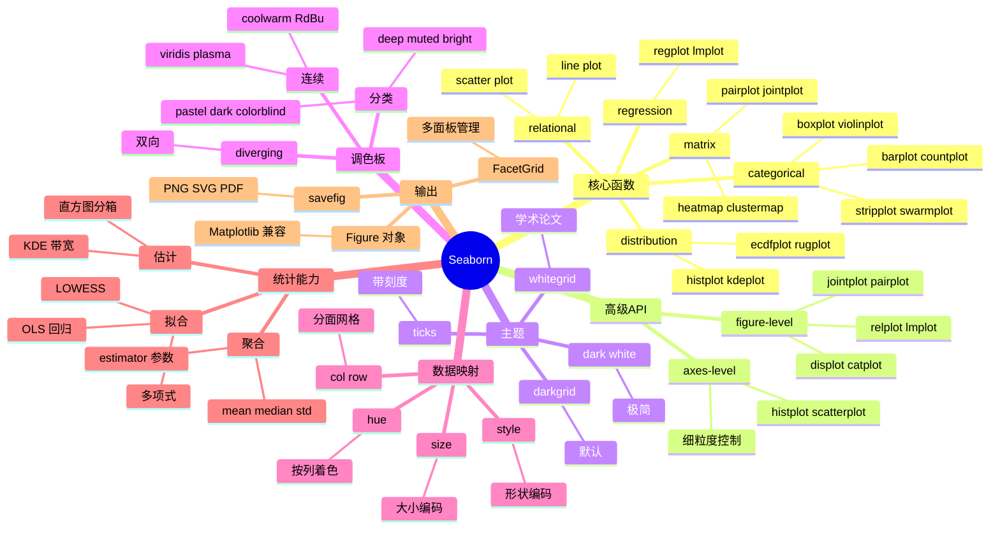

# Seaborn

## 前言

**定位**：基于 Matplotlib 之上的 Python 统计可视化库，由 Michael Waskom 创建，专注于"一行代码画出信息丰富且美观的统计图"。

**核心价值**：
- 把统计学家常用的图（分布、回归、分类、矩阵）封装成高级 API
- 自动处理多变量映射（颜色/形状/大小/分面）
- 内置 30+ 美观主题与调色板，省去手动调样式
- 与 Pandas DataFrame 深度集成，按列名自动分面

**五大特性**：
1. **数据驱动**：传 DataFrame + 列名，自动完成分面/着色/分箱
2. **统计集成**：内置回归拟合（regplot）、密度估计（kdeplot）、聚合（barplot）
3. **分面系统**：`col=`/`row=` 一键生成 Klein grid 多面板
4. **30+ 内置调色板**：`deep/muted/bright/pastel/dark/colorblind`，色盲友好
5. **可定制性**：底层仍是 Matplotlib，复杂定制 `ax=ax` 传入即可

**对比表**：

| 维度 | Seaborn | Matplotlib | Plotly | ggplot2 (R) | Altair |
|---|---|---|---|---|---|
| 学习曲线 | 低 | 中 | 低 | 中 | 低 |
| 统计图 | ✅ 强 | ⚠️ 需手写 | ⚠️ 中 | ✅ 强 | ✅ 强 |
| 交互 | ❌ 静态 | ❌ 静态 | ✅ 强 | ❌ | ✅ 中 |
| 主题美观 | ✅ 开箱即用 | ⚠️ 需手调 | ✅ | ✅ | ✅ |
| 适合场景 | 探索性数据分析 | 论文/出版 | 汇报/大屏 | R 生态 | Vega-Lite 声明式 |

## 思维导图



## 关键代码

### 一、关系图：散点 + 回归 + 分面

```python
import seaborn as sns
import matplotlib.pyplot as plt

# 加载内置数据集
tips = sns.load_dataset("tips")

# 1. 散点图：自动按"是否吸烟"着色
sns.scatterplot(
    data=tips, x="total_bill", y="tip",
    hue="time",        # 午餐/晚餐
    size="size",       # 餐桌人数
    style="smoker",    # 形状区分
    palette="deep"
)

# 2. 一行画"散点+回归"
sns.regplot(
    data=tips, x="total_bill", y="tip",
    order=2,            # 二次多项式
    ci=95,              # 95% 置信区间
    scatter_kws={"alpha": 0.4}
)

# 3. lmplot：自动分面
sns.lmplot(
    data=tips, x="total_bill", y="tip",
    hue="smoker", col="time", row="sex",
    height=4, aspect=1.2
)
```

### 二、分布图：直方图 + KDE + ECDF

```python
# 1. 直方图：多组对比
sns.histplot(
    data=tips, x="total_bill",
    hue="time", kde=True,     # 同时画密度曲线
    bins=30, stat="density",
    multiple="stack"          # 堆叠/层叠/dodge
)

# 2. KDE：核密度估计
sns.kdeplot(
    data=tips, x="total_bill",
    hue="time", fill=True,
    bw_adjust=0.5,            # 带宽调整
    common_norm=False         # 各自归一化
)

# 3. ECDF：经验累积分布（无参数估计）
sns.ecdfplot(data=tips, x="total_bill", hue="time")

# 4. 二维联合分布
sns.jointplot(
    data=tips, x="total_bill", y="tip",
    kind="hex",               # hex/kde/scatter/reg
    color="purple"
)
```

### 三、分类图：箱线/小提琴/条形/计数

```python
# 1. 箱线图
sns.boxplot(
    data=tips, x="day", y="total_bill",
    hue="sex", palette="Set2",
    order=["Thur", "Fri", "Sat", "Sun"]
)

# 2. 小提琴图：分布形状
sns.violinplot(
    data=tips, x="day", y="total_bill",
    hue="sex", split=True,    # 左右对比
    inner="quart"             # 内嵌四分位数
)

# 3. 条形图：自动算均值和置信区间
sns.barplot(
    data=tips, x="day", y="total_bill",
    hue="sex", estimator="mean",
    errorbar=("ci", 95),      # 误差棒
    palette="muted"
)

# 4. 计数图（直方图的分类版）
sns.countplot(data=tips, x="day", hue="time")

# 5. 蜂群图：看原始分布
sns.swarmplot(data=tips, x="day", y="total_bill", hue="sex")
```

### 四、矩阵图：热力图 + 配对图 + 聚类图

```python
# 1. 相关性热力图
import numpy as np
corr = tips[["total_bill", "tip", "size"]].corr()
sns.heatmap(
    corr, annot=True, fmt=".2f",
    cmap="coolwarm", center=0,
    square=True, linewidths=0.5
)

# 2. pairplot：所有数值列两两散点
sns.pairplot(
    tips, hue="species" if "species" in tips else "time",
    diag_kind="kde",
    plot_kws={"alpha": 0.5}
)

# 3. clustermap：层次聚类热力图
iris = sns.load_dataset("iris")
sns.clustermap(
    iris.drop(columns="species").corr(),
    annot=True, cmap="viridis",
    figsize=(6, 6)
)
```

## 核心洞察

- **Seaborn 是 Matplotlib 的"高阶语法糖"**：底层返回的是 `Axes` 对象，`sns.histplot(...)` ≈ `plt.hist(...) + 美化 + 统计标注`，所以两者 100% 兼容
- **Figure-level vs axes-level 是两套 API**：`sns.histplot` 是 axes-level（返回 Axes），`sns.displot` 是 figure-level（返回 FacetGrid）；做子图拼接必须用 axes-level
- **统计语义是第一公民**：`barplot` 默认画均值+置信区间，`countplot` 画频数，`pointplot` 画中位数——选错图会得到错误结论
- **palette 与 color_palette 是同一函数**：`sns.color_palette("viridis", n_colors=10)` 返回 RGB 元组列表，可喂给 Matplotlib
- **hue 的本质是分面**：当一个变量有 > 5 个分类时，hue 视觉混乱，应改用 `col` 分面
- **estimator 参数是统一入口**：`barplot/pointplot` 都通过 `estimator=np.median` 切换聚合函数
- **pairplot 的替代品是 `sns.PairGrid`**：前者一行搞定但定制有限，后者分步画 diag/upper/lower 灵活
- **白底主题适合 PPT/汇报**：`sns.set_style("whitegrid")` 配合 `despine()` 去掉上右坐标轴，是论文风标配
- **`sns.despine()` 单独使用价值大**：去掉冗余边框，瞬间提升 Matplotlib 图表 80% 的颜值
- **Seaborn 不做大屏交互**：要走 Dash/Streamlit 路线，Seaborn 静态图转 Plotly 需 `plotly.express.imshow(seaborn_heatmap_data)` 重画

## 跨项目引用

- **[[numpy]]**：Seaborn 内部大量使用 `np.histogram`、`np.percentile`、`np.corrcoef`，`estimator` 参数常传 `np.median`
- **[[pandas]]**：Seaborn 几乎所有函数都吃 DataFrame，`hue=` 直接用列名；`tips` 这种长格式 DataFrame 是 Seaborn 的"标准输入"
- **[[matplotlib]]**：Seaborn 100% 建立在 Matplotlib 之上，`plt.subplots()` 画布 + `ax=` 传参是精细控制的标配
- **[[scikit-learn]]**：`pairplot(hue="target")` 是分类问题特征探索的标配；`confusion_matrix` 后常用 `sns.heatmap` 画热力图
- **[[plotly]]**：交互场景下 `plotly.express.scatter(df, x=col, y=col, color=hue)` 是 Seaborn 散点图的交互版
- **[[scipy]]**：`regplot` 的 OLS 拟合用 scipy.stats，`kdeplot` 的带宽选择用 `scipy.stats.gaussian_kde`
- **[[jupyter]]**：`%matplotlib inline` 后 Seaborn 图表自动渲染，`sns.set_theme()` 全局生效
- **[[streamlit]]**：`st.pyplot(fig)` 一行嵌入 Seaborn 图，但因静态，更推荐 `st.plotly_chart` 交互版
- **[[statsmodels]]**：`regplot` 是简单 OLS；要做详细回归诊断（残差/Q-Q/异方差）用 `statsmodels.api.OLS` + `plot_regress_exog`
