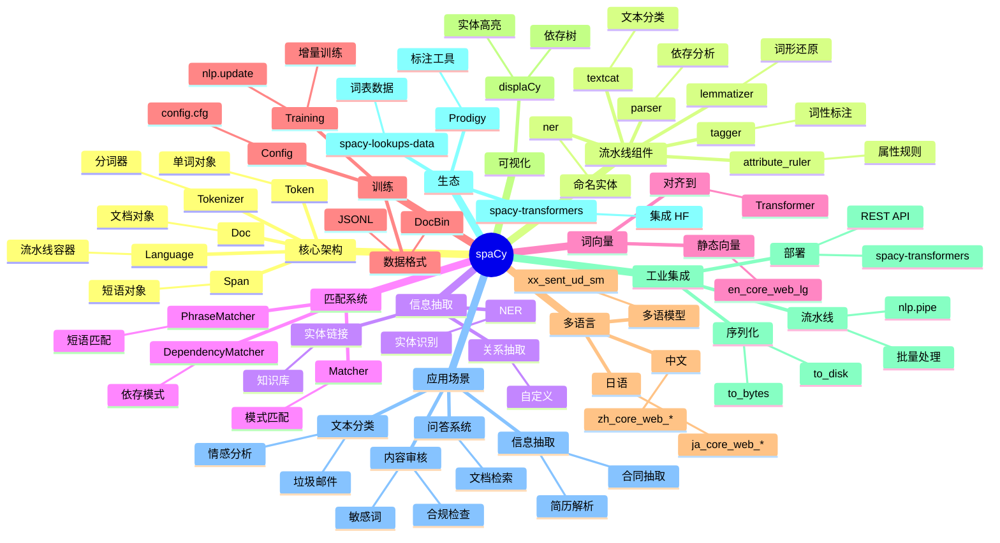

# spaCy

## 前言

**定位**：由 Explosion AI 开发的工业级 Python NLP 库，专为生产环境设计，速度比 NLTK 快 10-100 倍，预训练模型覆盖 60+ 语言。

**核心价值**：
- 一行代码完成分词、词性标注、依存分析、命名实体识别
- 工业级性能：纯 Cython 实现，新闻级文本处理 < 1ms/句
- 多语言支持：英语、中文、日语、西班牙语、法语、德语等 60+ 语言
- 与深度学习框架（PyTorch/TensorFlow）原生集成

**五大特性**：
1. **预训练流水线**：开箱即用的 `en_core_web_sm/trf` 流水线
2. **速度极致**：Cython 优化 + 静态计算图，比纯 Python NLP 库快 10-100x
3. **信息抽取**：NER、关系抽取、实体链接、属性抽取
4. **自定义训练**：`nlp.update` API 微调模型，支持增量学习
5. **生态完整**：可视化（displaCy）、规则匹配（Matcher）、训练数据生成（Prodigy）

**对比表**：

| 维度 | spaCy | NLTK | HuggingFace Transformers | Stanza | jieba |
|---|---|---|---|---|---|
| 定位 | 工业级 NLP | 教学 | 预训练模型 | 学术准确 | 中文分词 |
| 速度 | ✅ 极快 | ❌ 慢 | ⚠️ 中 | ⚠️ 中 | ✅ 快 |
| 多语言 | ✅ 60+ | ⚠️ | ✅ 100+ | ✅ 60+ | ❌ 仅中文 |
| 预训练模型 | ✅ | ❌ | ✅✅ 最强 | ✅ | ❌ |
| 自定义训练 | ✅ | ⚠️ | ✅ | ⚠️ | ❌ |
| 适合场景 | 生产文本处理 | 教学/研究 | 学术 SOTA | 学术研究 | 中文分词 |

## 思维导图



## 关键代码

### 一、基础流水线：分词、词性、依存、NER

```python
import spacy

# 加载预训练模型（首次使用需 python -m spacy download en_core_web_sm）
nlp = spacy.load("en_core_web_sm")

text = "Apple is looking at buying U.K. startup for $1 billion. Tim Cook said the deal is 'transformative'."

doc = nlp(text)

# 1. 分词 + 词性 + 词形
for token in doc:
    print(
        f"{token.text:15} | "
        f"POS: {token.pos_:6} | "      # 粗粒度词性
        f"Tag: {token.tag_:6} | "      # 细粒度词性
        f"Lem: {token.lemma_:10} | "   # 词形还原
        f"Dep: {token.dep_:12} | "     # 依存关系
        f"Head: {token.head.text}"
    )

# 2. 命名实体识别
for ent in doc.ents:
    print(f"{ent.text:20} | {ent.label_:10} | {spacy.explain(ent.label_)}")
# Apple                | ORG        | Companies, agencies, institutions
# U.K.                 | GPE        | Countries, cities, states
# $1 billion           | MONEY      | Monetary values
# Tim Cook             | PERSON     | People, including fictional

# 3. 名词短语（chunks）
for chunk in doc.noun_chunks:
    print(chunk.text, "→", chunk.root.text)
```

### 二、中文处理

```python
import spacy

nlp_zh = spacy.load("zh_core_web_sm")

text = "小米公司在北京发布了新款手机，创始人雷军出席了发布会。"

doc = nlp_zh(text)

# 中文分词（按词切分）
for token in doc:
    print(f"{token.text} ({token.pos_})")

# 实体识别
for ent in doc.ents:
    print(f"实体: {ent.text}, 类型: {ent.label_}")
# 小米公司 ORG
# 北京 GPE
# 雷军 PERSON

# 中文依存关系
for token in doc:
    print(f"{token.text} --{token.dep_}--> {token.head.text}")
```

### 三、自定义流水线组件

```python
import spacy
from spacy.language import Language

nlp = spacy.load("en_core_web_sm")

# 1. 简单组件：检测数字
@Language.component("number_detector")
def number_detector(doc):
    nums = []
    for token in doc:
        if token.like_num:
            nums.append((token.text, token.i))
    doc.set_extension("numbers", default=list, force=True)
    doc._.numbers = nums
    return doc

nlp.add_pipe("number_detector", last=True)

doc = nlp("I have 3 apples and 5 oranges")
print(doc._.numbers)  # [('3', 2), ('5', 5)]

# 2. 自定义属性（用 set_extension）
from spacy.tokens import Token, Span, Doc

Doc.set_extension("is_negated", default=False)
Token.set_extension("is_color", default=False)
Span.set_extension("has_color", default=False)

@Language.component("negation_detector")
def negation_detector(doc):
    for token in doc:
        if token.dep_ == "neg":
            doc._.is_negated = True
            # 找到被否定的头
            head = token.head
            while head.head != head:
                head = head.head
    return doc
```

### 四、Matcher 模式匹配

```python
from spacy.matcher import Matcher, PhraseMatcher, DependencyMatcher

nlp = spacy.load("en_core_web_sm")
doc = nlp("The new iPhone 15 was released by Apple in September 2023.")

# 1. Token Matcher：模式匹配
matcher = Matcher(nlp.vocab)

# 模式：形容词 + 名词（手机型号）
pattern = [
    {"POS": "ADJ", "OP": "?"},         # 可选形容词
    {"POS": "PROPN"},                  # 专有名词
    {"LIKE_NUM": True}                 # 数字
]
matcher.add("PRODUCT", [pattern])

matches = matcher(doc)
for match_id, start, end in matches:
    span = doc[start:end]
    print(f"匹配: {span.text}, 词性: {[t.pos_ for t in span]}")

# 2. PhraseMatcher：短语列表匹配
phrases = ["iPhone 15", "iPhone 15 Pro", "MacBook Pro"]
phrase_matcher = PhraseMatcher(nlp.vocab)
patterns = [nlp.make_doc(text) for text in phrases]
phrase_matcher.add("APPLE_PRODUCTS", patterns)

matches = phrase_matcher(doc)
for match_id, start, end in matches:
    print(doc[start:end].text)

# 3. DependencyMatcher：依存模式
dep_matcher = DependencyMatcher(nlp.vocab)
pattern = [
    {
        "RIGHT_ID": "verb",
        "RIGHT_ATTRS": {"POS": "VERB"}
    },
    {
        "LEFT_ID": "verb",
        "REL_OP": ">",
        "RIGHT_ID": "subject",
        "RIGHT_ATTRS": {"DEP": "nsubj"}
    },
    {
        "LEFT_ID": "verb",
        "REL_OP": ">",
        "RIGHT_ID": "object",
        "RIGHT_ATTRS": {"DEP": "dobj"}
    }
]
dep_matcher.add("SVO", [pattern])
matches = dep_matcher(doc)
```

### 五、批量处理与性能优化

```python
import spacy
import time

nlp = spacy.load("en_core_web_lg", disable=["parser", "lemmatizer"])
# disable 关闭不需要的组件，速度可提升 2-5x

texts = ["This is sentence one.", "This is sentence two!"] * 1000

# 1. nlp.pipe：批量处理（yield 流式）
start = time.time()
docs = list(nlp.pipe(texts, batch_size=64, n_process=4))
print(f"批量处理: {time.time()-start:.2f}s")

# 2. context manager 临时禁用组件
with nlp.disable_pipes("tagger", "parser"):
    docs = list(nlp.pipe(texts))

# 3. 自定义流水线（多阶段处理）
nlp = spacy.blank("en")  # 空流水线
nlp.add_pipe("sentencizer")  # 句子分割
nlp.add_pipe("entity_ruler")  # 基于规则的实体

# 4. GPU 加速（需 spacy-transformers）
# spacy.require_gpu()
```

### 六、自定义训练：NER 微调

```python
import spacy
import random
from spacy.training import Example

# 1. 准备训练数据
TRAIN_DATA = [
    ("苹果公司发布了新 iPhone", {"entities": [(0, 4, "ORG")]}),
    ("乔布斯是苹果创始人", {"entities": [(0, 3, "PERSON"), (4, 6, "ORG")]}),
    # ...
]

# 2. 创建空模型
nlp = spacy.blank("zh")
ner = nlp.add_pipe("ner")

# 3. 添加新标签
ner.add_label("ORG")
ner.add_label("PERSON")

# 4. 训练
optimizer = nlp.resume_training()
for epoch in range(30):
    random.shuffle(TRAIN_DATA)
    losses = {}
    for text, annotations in TRAIN_DATA:
        doc = nlp.make_doc(text)
        example = Example.from_dict(doc, annotations)
        nlp.update([example], drop=0.5, losses=losses)
    print(f"Epoch {epoch}, Loss: {losses}")

# 5. 保存
nlp.to_disk("./my_model")
nlp_loaded = spacy.load("./my_model")
```

## 核心洞察

- **`nlp(text)` 是 spaCy 的灵魂**：一次调用跑完整个流水线（分词→词性→依存→NER），返回 `Doc` 对象存所有结果
- **`disable_pipes` 是性能优化第一招**：默认流水线含 8+ 组件，纯分词任务 `disable_pipes("tagger", "parser", "ner", ...)` 速度提升 5-10x
- **`nlp.pipe` 比循环 `nlp(text)` 快 10-100x**：内部批处理 + 内存预分配，处理大语料必备
- **`spacy.explain(label)` 是查询利器**：`spacy.explain("GPE")` 立刻返回 "Countries, cities, states"，省去查文档
- **`Doc`/`Token`/`Span` 是三大数据结构**：`Doc` 是文档、`Token` 是单词、`Span` 是切片，三者都支持 `.__iter__` 和索引
- **`set_extension` 是属性扩展机制**：分全局/Token/Span/Doc 四种作用域，存自定义字段（如情感分数、实体类别）
- **`Matcher` 三大场景**：Token 模式（词性+正则）、Phrase（短语列表）、Dependency（依存关系），覆盖 90% 规则抽取
- **预训练模型有"小/中/大"和"sm/md/lg/trf"两套**：`_sm` 是 CNN、`_lg` 含词向量、`_trf` 是 Transformer，准确率 vs 速度权衡
- **spaCy 的"工业"体现在 API 设计**：所有处理同步完成，无回调、无异步，适合微服务/REST 集成
- **自定义训练要数据量**：NER 微调至少 200+ 标注样本，文本分类要 1000+，少样本用 Prodigy + 大模型蒸馏
- **Prodigy 是 spaCy 的标注工具**：与 spaCy 训练 API 深度整合，主动学习自动选最有价值的样本标注
- **spaCy v3 的 Config 系统**：用 `config.cfg` 描述流水线配置，比 v2 的代码配置更可复现、可版本控制

## 跨项目引用

- **[[numpy]]**：`doc.vector` 返回 300 维 ndarray；处理结果常转 DataFrame 做下游分析
- **[[pandas]]**：批量 `nlp.pipe(df["text"])` → 提取实体/词性生成新列，命名实体识别结果常入 DataFrame
- **[[pytorch]]**：`spacy-transformers` 集成 HuggingFace Transformers，内部用 PyTorch；自定义模型可挂 PyTorch 子模块
- **[[transformers]]**：spaCy v3 支持直接加载 HF 模型作为流水线组件；`en_core_web_trf` 底层就是 BERT
- **[[scikit-learn]]**：`doc.vector` + `StandardScaler` + SVM 即可搭建文本分类器；NER 的特征工程常用 scikit-learn
- **[[jupyter]]**：spaCy 的 `displaCy` 在 Jupyter 中直接渲染依存树 + 实体高亮，是 NLP 教学神器
- **[[duckdb]]**：SQL 文本字段 + spaCy 抽取实体 + DuckDB 分析 = 文本结构化处理流水线
- **[[streamlit]]**：`st.write(doc._.numbers)` 实时展示 NER 结果；`displaCy.render` 可嵌入 Streamlit 做 NLP 演示
- **[[fastapi]]**：spaCy 模型部署在 FastAPI 后端，提供 `/ner` RESTful 接口，是工业 NLP 服务标配
- **[[dask]]**：Dask 分布式 + `nlp.pipe` 批处理，处理 100GB+ 语料库
- **[[plotly]]**：实体频次统计后用 `plotly.express.bar` 画实体分布；关系图用 `networkx` + plotly
