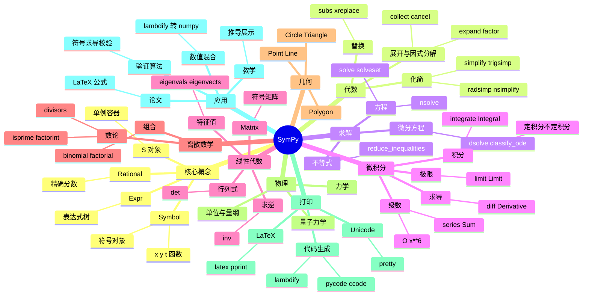

# SymPy

## 前言

**定位**：纯 Python 编写的开源符号数学库，能进行符号化的代数运算、微积分、方程求解、矩阵运算，是 Mathematica/Maple 的免费替代品。

**核心价值**：
- 让 Python 像 Mathematica 一样做"公式推导"而非"数值计算"
- 解决"求导/积分/极限/解方程"等大学数学问题
- 与 NumPy/SciPy 互补：SymPy 推导公式 → lambdify 转 NumPy 函数 → SciPy 优化
- 教育/科研场景中替代手算 + LaTeX 排版

**五大特性**：
1. **符号运算**：分数保留为分数、π 保留为 π，1/2+1/3=5/6 而非 0.8333
2. **LaTeX 输出**：`sympy.latex(expr)` 一键生成论文级公式排版
3. **多领域覆盖**：微积分、线性代数、离散数学、几何、物理、统计
4. **可扩展的代码生成**：`sympy.printing.pycode`/`c_code` 输出 NumPy/C 代码
5. **纯 Python**：无外部 C 依赖（部分可选加速），嵌入脚本友好

**对比表**：

| 维度 | SymPy | Mathematica | Maple | Maxima | SageMath |
|---|---|---|---|---|---|
| 许可 | BSD（免费） | 商业 | 商业 | GPL | GPL |
| 速度 | 慢 | 快 | 快 | 中 | 慢 |
| 覆盖广度 | 中 | 极广 | 广 | 中 | 极广 |
| 集成 Python | ✅ 完美 | ❌ | ❌ | ❌ | ⚠️ 重量级 |
| Notebook 友好 | ✅ Jupyter | ✅ | ⚠️ | ❌ | ✅ |
| 适用场景 | Python 科研/教育 | 工业数学 | 工程计算 | 教学 | 通用数学 |

## 思维导图



## 关键代码

### 一、符号基础与代数化简

```python
from sympy import symbols, Symbol, Rational, sqrt, pi, simplify, expand, factor, cancel, collect, Eq

x, y, z, t = symbols("x y z t")
a, b, c = symbols("a b c", real=True)  # 假设实数
n = Symbol("n", integer=True)         # 整数假设

# 1. 精确分数（避免浮点误差）
r = Rational(1, 2) + Rational(1, 3)   # 5/6（不是 0.833...）

# 2. 展开与因式分解
expr = (x + 1)**3 * (x - 2)**2
expanded = expand(expr)                # x^5 - 3x^4 - x^3 + 5x^2 + 2x - 4
factored = factor(expanded)            # 还原因式

# 3. 三角化简
trig_expr = sin(x)**2 + cos(x)**2
simplified = trigsimp(trig_expr)       # 1

# 4. 通分
expr = 1/x + 1/y
combined = cancel(expr)               # (x + y) / (x*y)

# 5. 按变量分组
expr = a*x**2 + b*x + c*x**2 + d*x
collected = collect(expr, x)           # (a+c)x^2 + (b+d)x
```

### 二、求导、积分、极限

```python
from sympy import diff, integrate, limit, oo, series, Sum, summation

# 1. 求导
f = sin(x) * exp(-x)
df = diff(f, x)                        # -exp(-x)*sin(x) + exp(-x)*cos(x)
d2f = diff(f, x, 2)                    # 二阶导

# 隐函数求导
g = x**2 + y**2 - 1
dydx = -diff(g, x) / diff(g, y)        # y' = -x/y（圆）

# 2. 积分
indef = integrate(exp(-x**2), x)       # ∫e^(-x²)dx = √π/2 · erf(x)
definite = integrate(sin(x), (x, 0, pi))  # 2
# 多重积分
double = integrate(integrate(x*y, (x, 0, 1)), (y, 0, 1))  # 1/4

# 3. 极限
limit(sin(x)/x, x, 0)                  # 1
limit((1 + 1/n)**n, n, oo)             # e
limit(1/x, x, 0, "+")                  # ∞（右极限）

# 4. 泰勒级数
sin_series = series(sin(x), x, 0, 8)   # x - x^3/6 + x^5/120 - x^7/5040 + O(x^8)

# 5. 符号求和
s = Sum(1/n**2, (n, 1, oo))            # ζ(2) = π²/6
val = s.doit()                         # pi**2/6
```

### 三、方程与不等式求解

```python
from sympy import solve, solveset, S, nsolve, dsolve, Function, Eq

# 1. 多项式方程
sols = solve(x**2 - 4, x)              # [-2, 2]
sols = solve(x**3 - 6*x**2 + 11*x - 6, x)  # [1, 2, 3]

# 2. 方程组（线性/非线性）
sols = solve([x + y - 5, x - y - 1], [x, y])  # {x: 3, y: 2}
sols = solve([x**2 + y - 2, x + y**2 - 2], [x, y])

# 3. 区间解
solveset(x**2 - 4 > 0, x, domain=S.Reals)  # (-∞, -2) ∪ (2, ∞)

# 4. 数值解（高速，但损失符号性）
x_num = nsolve(cos(x) - x, x, 0.5)     # 0.739085...

# 5. 微分方程
f = Function("f")
ode = Eq(f(t).diff(t, 2) - 4*f(t), 0)  # y'' - 4y = 0
sol = dsolve(ode, f(t))                # f(t) = C1*exp(-2t) + C2*exp(2t)

# 6. 含初始条件
sol = dsolve(ode, f(t), ics={f(0): 1, f(t).diff(t).subs(t, 0): 0})
```

### 四、线性代数（符号矩阵）

```python
from sympy import Matrix, eye, zeros, symbols, Rational

# 1. 符号矩阵
A = Matrix([[1, 2], [3, 4]])
B = Matrix(symbols("a b c d")).reshape(2, 2)

# 2. 行列式与逆
det_A = A.det()                        # -2
inv_A = A.inv()                        # 1/-2 [[4, -2], [-3, 1]]

# 3. 特征值（符号形式，矩阵可含符号）
M = Matrix([[a, b], [b, a]])
eigenvals = M.eigenvals()              # {a-b: 1, a+b: 1}
eigenvects = M.eigenvects()

# 4. 矩阵分解
L, D = M.LDLdecomposition()            # LDL^T
Q, R = M.QRdecomposition()             # QR 分解

# 5. 求解线性方程组 Ax = b
A = Matrix([[1, 2, 3], [4, 5, 6], [7, 8, 10]])
b = Matrix([1, 2, 3])
x = A.solve(b)                         # 解向量

# 6. 用初等行变换化简
rref, pivots = A.rref()                # Reduced Row Echelon Form
```

### 五、与 NumPy/SciPy 联动

```python
from sympy import symbols, sin, cos, lambdify, integrate
import numpy as np
import matplotlib.pyplot as plt

x = symbols("x")
f = sin(x) * exp(-x/5)

# 1. lambdify：符号表达式 → NumPy 函数
f_np = lambdify(x, f, "numpy")
xs = np.linspace(0, 20, 500)
ys = f_np(xs)                          # 速度提升 1000x

# 2. 符号求导 → NumPy 梯度函数
f_prime = diff(f, x)
f_prime_np = lambdify(x, f_prime, "numpy")

# 3. 符号积分 → SciPy 数值积分
F = integrate(f, x)
# 复杂函数 f 可能无法符号积分，用 scipy.integrate.quad 替代

# 4. 公式 → LaTeX（论文排版）
from sympy import latex
formula = integrate(1/(1+x**2), x)
print(latex(formula))                  # \arctan\left(x\right)

# 5. 公式 → C 代码
from sympy.printing import ccode
expr = a*x**2 + b*x + c
print(ccode(expr))                     # a*pow(x, 2) + b*x + c

# 6. 验证数值算法
# 推导出来的有限差分 vs 自动求导
analytic = diff(sin(x)*cos(x), x)
finite_diff = (sin(x+h)*cos(x+h) - sin(x)*cos(x)) / h
limit(finite_diff - analytic, h, 0)    # 应为 0，验证有限差分正确性
```

## 核心原理：数据与AI的数学基础

MLOps 是机器学习工程化的方法论。模型训练、模型注册、模型部署、模型监控、特征平台、实验追踪构成完整体系。MLflow、TFX、Feast、Tecton、Kubeflow 是主流工具。

向量数据库是 RAG 的核心基础设施。Faiss 来自 Meta，Milvus 来自 Zilliz，Weaviate 是开源多模向量数据库，Qdrant 是 Rust 实现的高性能方案，PGVector 让 PostgreSQL 原生支持向量。


## 模型架构：数据与AI的Transformer

特征工程是机器学习的天花板。Feature Store 统一了离线/在线特征，Feast/Tecton 是开源方案。特征版本、特征血缘、特征监控是核心能力。

RAG（Retrieval-Augmented Generation）通过检索外部知识增强 LLM 的生成能力。Naive RAG、Advanced RAG、Modular RAG 是 RAG 的演进阶段。GraphRAG、Agentic RAG 是新方向。


## 训练流程：数据与AI的预训练与微调

GPU 优化是深度学习的硬件基础。CUDA、cuDNN、Triton、TensorRT、DeepSpeed、Megatron-LM、FSDP 是大模型训练的工具链。混合精度训练、ZeRO 优化、Pipeline 并行是关键技术。

Agent 是 LLM 的下一个战场。ReAct、Reflexion、AutoGPT、LangChain Agents、AutoGen、CrewAI 等框架让 LLM 具备规划、工具使用、反思的能力。Multi-Agent 协作是趋势。


## 推理优化：数据与AI的量化与蒸馏

深度学习的核心是神经网络。从感知机到 CNN、RNN、Transformer，模型架构在持续进化。Transformer 的 Self-Attention 让序列建模产生质的飞跃，奠定了大模型时代的基础。

Prompt Engineering 是 LLM 应用的基本功。Zero-shot、Few-shot、Chain-of-Thought、Tree-of-Thoughts、Self-Consistency、ReAct 等提示词策略让 LLM 表现更优。


## 数据工程：数据与AI的ETL与Feature Store

大语言模型（LLM）是 AI 商业化的主战场。GPT-4、Claude、Llama、Qwen、DeepSeek、文心一言、通义千问、智谱清言、混元、Kimi 等模型在不同维度上竞争。

多模态是 LLM 的下一个突破点。GPT-4V、Gemini、Qwen-VL、CogVLM、InternVL 让 LLM 看懂图片；Sora、Veo、可灵、Pika 让 LLM 生成视频；Suno、Udio 让 LLM 生成音乐。


## 向量数据库：数据与AI的Faiss/Milvus

训练 LLM 涉及预训练（Pre-training）、监督微调（SFT）、RLHF（Reinforcement Learning from Human Feedback）、DPO（Direct Preference Optimization）等阶段。

强化学习在 LLM 训练中扮演关键角色。RLHF 通过人类反馈对齐价值观，PPO/GRPO 是经典算法，DPO/IPO/SimPO 简化了训练流程。RLAIF 用 AI 反馈替代人类反馈。


## RAG：数据与AI的检索增强生成

推理优化是 LLM 落地的关键。量化（INT8/INT4/FP8）、剪枝（Pruning）、蒸馏（Distillation）、KV Cache、PagedAttention（vLLM）、Speculative Decoding 是核心技术。

推荐系统是 AI 商业化的最大成功案例。从协同过滤到深度学习（DIN/DIEN/DSIN），从单任务到多任务（MMoE/PLE/ESMM），推荐系统持续进化。


## Agent：数据与AI的工具调用与规划

向量数据库是 RAG 的核心基础设施。Faiss 来自 Meta，Milvus 来自 Zilliz，Weaviate 是开源多模向量数据库，Qdrant 是 Rust 实现的高性能方案，PGVector 让 PostgreSQL 原生支持向量。

广告系统是机器学习、大数据、实时计算的集大成者。CTR 预估从 LR 到 FM/FFM 到 DeepFM/DCN/DIN，归因模型从最后点击到多点归因，竞价从 GSP 到 RTB。


## Prompt工程：数据与AI的提示词技巧

RAG（Retrieval-Augmented Generation）通过检索外部知识增强 LLM 的生成能力。Naive RAG、Advanced RAG、Modular RAG 是 RAG 的演进阶段。GraphRAG、Agentic RAG 是新方向。

搜索系统的核心是相关性。BM25 是经典算法，向量检索是新一代方向，混合检索（BM25 + 向量 + Reranker）效果最佳。学习排序（LTR）的 LambdaMART、LambdaRank 是工业级方案。


## 多模态：数据与AI的图文音视频

Agent 是 LLM 的下一个战场。ReAct、Reflexion、AutoGPT、LangChain Agents、AutoGen、CrewAI 等框架让 LLM 具备规划、工具使用、反思的能力。Multi-Agent 协作是趋势。

语音合成（TTS）从拼接合成、参数合成到神经网络合成（WaveNet、Tacotron、FastSpeech、VITS），再到 LLM-based TTS（CosyVoice、SparkTTS），质量飞跃。


## 强化学习：数据与AI的RLHF/PPO

Prompt Engineering 是 LLM 应用的基本功。Zero-shot、Few-shot、Chain-of-Thought、Tree-of-Thoughts、Self-Consistency、ReAct 等提示词策略让 LLM 表现更优。

语音识别（ASR）从 HMM-GMM 到 DNN-HMM，再到端到端（Whisper、Paraformer、SenseVoice）。多语种、低资源、噪声鲁棒性是研究热点。


## 联邦学习：数据与AI的隐私计算

多模态是 LLM 的下一个突破点。GPT-4V、Gemini、Qwen-VL、CogVLM、InternVL 让 LLM 看懂图片；Sora、Veo、可灵、Pika 让 LLM 生成视频；Suno、Udio 让 LLM 生成音乐。

数字人是 AI 视频的集大成者。语音合成、唇形驱动、表情生成、身体动作、背景生成通过 Pipeline 串联。HeyGen、D-ID、Synthesia、商汤如影、百度智能数字人是商业代表。


## 边缘AI：数据与AI的端侧推理

强化学习在 LLM 训练中扮演关键角色。RLHF 通过人类反馈对齐价值观，PPO/GRPO 是经典算法，DPO/IPO/SimPO 简化了训练流程。RLAIF 用 AI 反馈替代人类反馈。

A/B 实验是数据驱动决策的基础。分层（Layer）、分流（Bucket）、互斥（Mutual Exclusion）、统计显著性（p-value）、MDE 是关键概念。Optimizely、AB Tasty、自研平台是常见实现。


## 大模型：数据与AI的LLM训练

推荐系统是 AI 商业化的最大成功案例。从协同过滤到深度学习（DIN/DIEN/DSIN），从单任务到多任务（MMoE/PLE/ESMM），推荐系统持续进化。

MLOps 是机器学习工程化的方法论。模型训练、模型注册、模型部署、模型监控、特征平台、实验追踪构成完整体系。MLflow、TFX、Feast、Tecton、Kubeflow 是主流工具。


## 扩散模型：数据与AI的Stable Diffusion

广告系统是机器学习、大数据、实时计算的集大成者。CTR 预估从 LR 到 FM/FFM 到 DeepFM/DCN/DIN，归因模型从最后点击到多点归因，竞价从 GSP 到 RTB。

特征工程是机器学习的天花板。Feature Store 统一了离线/在线特征，Feast/Tecton 是开源方案。特征版本、特征血缘、特征监控是核心能力。


## 语音合成：数据与AI的TTS

搜索系统的核心是相关性。BM25 是经典算法，向量检索是新一代方向，混合检索（BM25 + 向量 + Reranker）效果最佳。学习排序（LTR）的 LambdaMART、LambdaRank 是工业级方案。

GPU 优化是深度学习的硬件基础。CUDA、cuDNN、Triton、TensorRT、DeepSpeed、Megatron-LM、FSDP 是大模型训练的工具链。混合精度训练、ZeRO 优化、Pipeline 并行是关键技术。


## 语音识别：数据与AI的ASR

语音合成（TTS）从拼接合成、参数合成到神经网络合成（WaveNet、Tacotron、FastSpeech、VITS），再到 LLM-based TTS（CosyVoice、SparkTTS），质量飞跃。

深度学习的核心是神经网络。从感知机到 CNN、RNN、Transformer，模型架构在持续进化。Transformer 的 Self-Attention 让序列建模产生质的飞跃，奠定了大模型时代的基础。


## 数字人：数据与AI的Avatar

语音识别（ASR）从 HMM-GMM 到 DNN-HMM，再到端到端（Whisper、Paraformer、SenseVoice）。多语种、低资源、噪声鲁棒性是研究热点。

大语言模型（LLM）是 AI 商业化的主战场。GPT-4、Claude、Llama、Qwen、DeepSeek、文心一言、通义千问、智谱清言、混元、Kimi 等模型在不同维度上竞争。


## 推荐系统：数据与AI的召回/排序

数字人是 AI 视频的集大成者。语音合成、唇形驱动、表情生成、身体动作、背景生成通过 Pipeline 串联。HeyGen、D-ID、Synthesia、商汤如影、百度智能数字人是商业代表。

训练 LLM 涉及预训练（Pre-training）、监督微调（SFT）、RLHF（Reinforcement Learning from Human Feedback）、DPO（Direct Preference Optimization）等阶段。


## 搜索系统：数据与AI的BM25/向量

A/B 实验是数据驱动决策的基础。分层（Layer）、分流（Bucket）、互斥（Mutual Exclusion）、统计显著性（p-value）、MDE 是关键概念。Optimizely、AB Tasty、自研平台是常见实现。

推理优化是 LLM 落地的关键。量化（INT8/INT4/FP8）、剪枝（Pruning）、蒸馏（Distillation）、KV Cache、PagedAttention（vLLM）、Speculative Decoding 是核心技术。


## 广告系统：数据与AI的CTR预估

MLOps 是机器学习工程化的方法论。模型训练、模型注册、模型部署、模型监控、特征平台、实验追踪构成完整体系。MLflow、TFX、Feast、Tecton、Kubeflow 是主流工具。

向量数据库是 RAG 的核心基础设施。Faiss 来自 Meta，Milvus 来自 Zilliz，Weaviate 是开源多模向量数据库，Qdrant 是 Rust 实现的高性能方案，PGVector 让 PostgreSQL 原生支持向量。


## 风控系统：数据与AI的异常检测

特征工程是机器学习的天花板。Feature Store 统一了离线/在线特征，Feast/Tecton 是开源方案。特征版本、特征血缘、特征监控是核心能力。

RAG（Retrieval-Augmented Generation）通过检索外部知识增强 LLM 的生成能力。Naive RAG、Advanced RAG、Modular RAG 是 RAG 的演进阶段。GraphRAG、Agentic RAG 是新方向。


## A/B测试：数据与AI的实验设计

GPU 优化是深度学习的硬件基础。CUDA、cuDNN、Triton、TensorRT、DeepSpeed、Megatron-LM、FSDP 是大模型训练的工具链。混合精度训练、ZeRO 优化、Pipeline 并行是关键技术。

Agent 是 LLM 的下一个战场。ReAct、Reflexion、AutoGPT、LangChain Agents、AutoGen、CrewAI 等框架让 LLM 具备规划、工具使用、反思的能力。Multi-Agent 协作是趋势。


## MLOps：数据与AI的模型上线

深度学习的核心是神经网络。从感知机到 CNN、RNN、Transformer，模型架构在持续进化。Transformer 的 Self-Attention 让序列建模产生质的飞跃，奠定了大模型时代的基础。

Prompt Engineering 是 LLM 应用的基本功。Zero-shot、Few-shot、Chain-of-Thought、Tree-of-Thoughts、Self-Consistency、ReAct 等提示词策略让 LLM 表现更优。


## 监控告警：数据与AI的模型漂移

大语言模型（LLM）是 AI 商业化的主战场。GPT-4、Claude、Llama、Qwen、DeepSeek、文心一言、通义千问、智谱清言、混元、Kimi 等模型在不同维度上竞争。

多模态是 LLM 的下一个突破点。GPT-4V、Gemini、Qwen-VL、CogVLM、InternVL 让 LLM 看懂图片；Sora、Veo、可灵、Pika 让 LLM 生成视频；Suno、Udio 让 LLM 生成音乐。


## 特征工程：数据与AI的特征平台

训练 LLM 涉及预训练（Pre-training）、监督微调（SFT）、RLHF（Reinforcement Learning from Human Feedback）、DPO（Direct Preference Optimization）等阶段。

强化学习在 LLM 训练中扮演关键角色。RLHF 通过人类反馈对齐价值观，PPO/GRPO 是经典算法，DPO/IPO/SimPO 简化了训练流程。RLAIF 用 AI 反馈替代人类反馈。


## 评估体系：数据与AI的离线/在线

推理优化是 LLM 落地的关键。量化（INT8/INT4/FP8）、剪枝（Pruning）、蒸馏（Distillation）、KV Cache、PagedAttention（vLLM）、Speculative Decoding 是核心技术。

推荐系统是 AI 商业化的最大成功案例。从协同过滤到深度学习（DIN/DIEN/DSIN），从单任务到多任务（MMoE/PLE/ESMM），推荐系统持续进化。


## 分布式训练：数据与AI的DeepSpeed

向量数据库是 RAG 的核心基础设施。Faiss 来自 Meta，Milvus 来自 Zilliz，Weaviate 是开源多模向量数据库，Qdrant 是 Rust 实现的高性能方案，PGVector 让 PostgreSQL 原生支持向量。

广告系统是机器学习、大数据、实时计算的集大成者。CTR 预估从 LR 到 FM/FFM 到 DeepFM/DCN/DIN，归因模型从最后点击到多点归因，竞价从 GSP 到 RTB。


## GPU优化：数据与AI的CUDA/Triton

RAG（Retrieval-Augmented Generation）通过检索外部知识增强 LLM 的生成能力。Naive RAG、Advanced RAG、Modular RAG 是 RAG 的演进阶段。GraphRAG、Agentic RAG 是新方向。

搜索系统的核心是相关性。BM25 是经典算法，向量检索是新一代方向，混合检索（BM25 + 向量 + Reranker）效果最佳。学习排序（LTR）的 LambdaMART、LambdaRank 是工业级方案。


## 未来趋势：数据与AI的AGI

Agent 是 LLM 的下一个战场。ReAct、Reflexion、AutoGPT、LangChain Agents、AutoGen、CrewAI 等框架让 LLM 具备规划、工具使用、反思的能力。Multi-Agent 协作是趋势。

语音合成（TTS）从拼接合成、参数合成到神经网络合成（WaveNet、Tacotron、FastSpeech、VITS），再到 LLM-based TTS（CosyVoice、SparkTTS），质量飞跃。


## 核心原理：数据与AI的数学基础

特征工程是机器学习的天花板。Feature Store 统一了离线/在线特征，Feast/Tecton 是开源方案。特征版本、特征血缘、特征监控是核心能力。

RAG（Retrieval-Augmented Generation）通过检索外部知识增强 LLM 的生成能力。Naive RAG、Advanced RAG、Modular RAG 是 RAG 的演进阶段。GraphRAG、Agentic RAG 是新方向。


## 模型架构：数据与AI的Transformer

GPU 优化是深度学习的硬件基础。CUDA、cuDNN、Triton、TensorRT、DeepSpeed、Megatron-LM、FSDP 是大模型训练的工具链。混合精度训练、ZeRO 优化、Pipeline 并行是关键技术。

Agent 是 LLM 的下一个战场。ReAct、Reflexion、AutoGPT、LangChain Agents、AutoGen、CrewAI 等框架让 LLM 具备规划、工具使用、反思的能力。Multi-Agent 协作是趋势。


## 训练流程：数据与AI的预训练与微调

深度学习的核心是神经网络。从感知机到 CNN、RNN、Transformer，模型架构在持续进化。Transformer 的 Self-Attention 让序列建模产生质的飞跃，奠定了大模型时代的基础。

Prompt Engineering 是 LLM 应用的基本功。Zero-shot、Few-shot、Chain-of-Thought、Tree-of-Thoughts、Self-Consistency、ReAct 等提示词策略让 LLM 表现更优。


## 推理优化：数据与AI的量化与蒸馏

大语言模型（LLM）是 AI 商业化的主战场。GPT-4、Claude、Llama、Qwen、DeepSeek、文心一言、通义千问、智谱清言、混元、Kimi 等模型在不同维度上竞争。

多模态是 LLM 的下一个突破点。GPT-4V、Gemini、Qwen-VL、CogVLM、InternVL 让 LLM 看懂图片；Sora、Veo、可灵、Pika 让 LLM 生成视频；Suno、Udio 让 LLM 生成音乐。


## 数据工程：数据与AI的ETL与Feature Store

训练 LLM 涉及预训练（Pre-training）、监督微调（SFT）、RLHF（Reinforcement Learning from Human Feedback）、DPO（Direct Preference Optimization）等阶段。

强化学习在 LLM 训练中扮演关键角色。RLHF 通过人类反馈对齐价值观，PPO/GRPO 是经典算法，DPO/IPO/SimPO 简化了训练流程。RLAIF 用 AI 反馈替代人类反馈。


## 向量数据库：数据与AI的Faiss/Milvus

推理优化是 LLM 落地的关键。量化（INT8/INT4/FP8）、剪枝（Pruning）、蒸馏（Distillation）、KV Cache、PagedAttention（vLLM）、Speculative Decoding 是核心技术。

推荐系统是 AI 商业化的最大成功案例。从协同过滤到深度学习（DIN/DIEN/DSIN），从单任务到多任务（MMoE/PLE/ESMM），推荐系统持续进化。


## RAG：数据与AI的检索增强生成

向量数据库是 RAG 的核心基础设施。Faiss 来自 Meta，Milvus 来自 Zilliz，Weaviate 是开源多模向量数据库，Qdrant 是 Rust 实现的高性能方案，PGVector 让 PostgreSQL 原生支持向量。

广告系统是机器学习、大数据、实时计算的集大成者。CTR 预估从 LR 到 FM/FFM 到 DeepFM/DCN/DIN，归因模型从最后点击到多点归因，竞价从 GSP 到 RTB。


## Agent：数据与AI的工具调用与规划

RAG（Retrieval-Augmented Generation）通过检索外部知识增强 LLM 的生成能力。Naive RAG、Advanced RAG、Modular RAG 是 RAG 的演进阶段。GraphRAG、Agentic RAG 是新方向。

搜索系统的核心是相关性。BM25 是经典算法，向量检索是新一代方向，混合检索（BM25 + 向量 + Reranker）效果最佳。学习排序（LTR）的 LambdaMART、LambdaRank 是工业级方案。


## Prompt工程：数据与AI的提示词技巧

Agent 是 LLM 的下一个战场。ReAct、Reflexion、AutoGPT、LangChain Agents、AutoGen、CrewAI 等框架让 LLM 具备规划、工具使用、反思的能力。Multi-Agent 协作是趋势。

语音合成（TTS）从拼接合成、参数合成到神经网络合成（WaveNet、Tacotron、FastSpeech、VITS），再到 LLM-based TTS（CosyVoice、SparkTTS），质量飞跃。


## 多模态：数据与AI的图文音视频

Prompt Engineering 是 LLM 应用的基本功。Zero-shot、Few-shot、Chain-of-Thought、Tree-of-Thoughts、Self-Consistency、ReAct 等提示词策略让 LLM 表现更优。

语音识别（ASR）从 HMM-GMM 到 DNN-HMM，再到端到端（Whisper、Paraformer、SenseVoice）。多语种、低资源、噪声鲁棒性是研究热点。


## 强化学习：数据与AI的RLHF/PPO

多模态是 LLM 的下一个突破点。GPT-4V、Gemini、Qwen-VL、CogVLM、InternVL 让 LLM 看懂图片；Sora、Veo、可灵、Pika 让 LLM 生成视频；Suno、Udio 让 LLM 生成音乐。

数字人是 AI 视频的集大成者。语音合成、唇形驱动、表情生成、身体动作、背景生成通过 Pipeline 串联。HeyGen、D-ID、Synthesia、商汤如影、百度智能数字人是商业代表。


## 联邦学习：数据与AI的隐私计算

强化学习在 LLM 训练中扮演关键角色。RLHF 通过人类反馈对齐价值观，PPO/GRPO 是经典算法，DPO/IPO/SimPO 简化了训练流程。RLAIF 用 AI 反馈替代人类反馈。

A/B 实验是数据驱动决策的基础。分层（Layer）、分流（Bucket）、互斥（Mutual Exclusion）、统计显著性（p-value）、MDE 是关键概念。Optimizely、AB Tasty、自研平台是常见实现。


## 边缘AI：数据与AI的端侧推理

推荐系统是 AI 商业化的最大成功案例。从协同过滤到深度学习（DIN/DIEN/DSIN），从单任务到多任务（MMoE/PLE/ESMM），推荐系统持续进化。

MLOps 是机器学习工程化的方法论。模型训练、模型注册、模型部署、模型监控、特征平台、实验追踪构成完整体系。MLflow、TFX、Feast、Tecton、Kubeflow 是主流工具。


## 大模型：数据与AI的LLM训练

广告系统是机器学习、大数据、实时计算的集大成者。CTR 预估从 LR 到 FM/FFM 到 DeepFM/DCN/DIN，归因模型从最后点击到多点归因，竞价从 GSP 到 RTB。

特征工程是机器学习的天花板。Feature Store 统一了离线/在线特征，Feast/Tecton 是开源方案。特征版本、特征血缘、特征监控是核心能力。


## 扩散模型：数据与AI的Stable Diffusion

搜索系统的核心是相关性。BM25 是经典算法，向量检索是新一代方向，混合检索（BM25 + 向量 + Reranker）效果最佳。学习排序（LTR）的 LambdaMART、LambdaRank 是工业级方案。

GPU 优化是深度学习的硬件基础。CUDA、cuDNN、Triton、TensorRT、DeepSpeed、Megatron-LM、FSDP 是大模型训练的工具链。混合精度训练、ZeRO 优化、Pipeline 并行是关键技术。


## 语音合成：数据与AI的TTS

语音合成（TTS）从拼接合成、参数合成到神经网络合成（WaveNet、Tacotron、FastSpeech、VITS），再到 LLM-based TTS（CosyVoice、SparkTTS），质量飞跃。

深度学习的核心是神经网络。从感知机到 CNN、RNN、Transformer，模型架构在持续进化。Transformer 的 Self-Attention 让序列建模产生质的飞跃，奠定了大模型时代的基础。


## 语音识别：数据与AI的ASR

语音识别（ASR）从 HMM-GMM 到 DNN-HMM，再到端到端（Whisper、Paraformer、SenseVoice）。多语种、低资源、噪声鲁棒性是研究热点。

大语言模型（LLM）是 AI 商业化的主战场。GPT-4、Claude、Llama、Qwen、DeepSeek、文心一言、通义千问、智谱清言、混元、Kimi 等模型在不同维度上竞争。


## 数字人：数据与AI的Avatar

数字人是 AI 视频的集大成者。语音合成、唇形驱动、表情生成、身体动作、背景生成通过 Pipeline 串联。HeyGen、D-ID、Synthesia、商汤如影、百度智能数字人是商业代表。

训练 LLM 涉及预训练（Pre-training）、监督微调（SFT）、RLHF（Reinforcement Learning from Human Feedback）、DPO（Direct Preference Optimization）等阶段。


## 推荐系统：数据与AI的召回/排序

A/B 实验是数据驱动决策的基础。分层（Layer）、分流（Bucket）、互斥（Mutual Exclusion）、统计显著性（p-value）、MDE 是关键概念。Optimizely、AB Tasty、自研平台是常见实现。

推理优化是 LLM 落地的关键。量化（INT8/INT4/FP8）、剪枝（Pruning）、蒸馏（Distillation）、KV Cache、PagedAttention（vLLM）、Speculative Decoding 是核心技术。


## 搜索系统：数据与AI的BM25/向量

MLOps 是机器学习工程化的方法论。模型训练、模型注册、模型部署、模型监控、特征平台、实验追踪构成完整体系。MLflow、TFX、Feast、Tecton、Kubeflow 是主流工具。

向量数据库是 RAG 的核心基础设施。Faiss 来自 Meta，Milvus 来自 Zilliz，Weaviate 是开源多模向量数据库，Qdrant 是 Rust 实现的高性能方案，PGVector 让 PostgreSQL 原生支持向量。


## 广告系统：数据与AI的CTR预估

特征工程是机器学习的天花板。Feature Store 统一了离线/在线特征，Feast/Tecton 是开源方案。特征版本、特征血缘、特征监控是核心能力。

RAG（Retrieval-Augmented Generation）通过检索外部知识增强 LLM 的生成能力。Naive RAG、Advanced RAG、Modular RAG 是 RAG 的演进阶段。GraphRAG、Agentic RAG 是新方向。


## 风控系统：数据与AI的异常检测

GPU 优化是深度学习的硬件基础。CUDA、cuDNN、Triton、TensorRT、DeepSpeed、Megatron-LM、FSDP 是大模型训练的工具链。混合精度训练、ZeRO 优化、Pipeline 并行是关键技术。

Agent 是 LLM 的下一个战场。ReAct、Reflexion、AutoGPT、LangChain Agents、AutoGen、CrewAI 等框架让 LLM 具备规划、工具使用、反思的能力。Multi-Agent 协作是趋势。


## A/B测试：数据与AI的实验设计

深度学习的核心是神经网络。从感知机到 CNN、RNN、Transformer，模型架构在持续进化。Transformer 的 Self-Attention 让序列建模产生质的飞跃，奠定了大模型时代的基础。

Prompt Engineering 是 LLM 应用的基本功。Zero-shot、Few-shot、Chain-of-Thought、Tree-of-Thoughts、Self-Consistency、ReAct 等提示词策略让 LLM 表现更优。


## MLOps：数据与AI的模型上线

大语言模型（LLM）是 AI 商业化的主战场。GPT-4、Claude、Llama、Qwen、DeepSeek、文心一言、通义千问、智谱清言、混元、Kimi 等模型在不同维度上竞争。

多模态是 LLM 的下一个突破点。GPT-4V、Gemini、Qwen-VL、CogVLM、InternVL 让 LLM 看懂图片；Sora、Veo、可灵、Pika 让 LLM 生成视频；Suno、Udio 让 LLM 生成音乐。


## 监控告警：数据与AI的模型漂移

训练 LLM 涉及预训练（Pre-training）、监督微调（SFT）、RLHF（Reinforcement Learning from Human Feedback）、DPO（Direct Preference Optimization）等阶段。

强化学习在 LLM 训练中扮演关键角色。RLHF 通过人类反馈对齐价值观，PPO/GRPO 是经典算法，DPO/IPO/SimPO 简化了训练流程。RLAIF 用 AI 反馈替代人类反馈。


## 特征工程：数据与AI的特征平台

推理优化是 LLM 落地的关键。量化（INT8/INT4/FP8）、剪枝（Pruning）、蒸馏（Distillation）、KV Cache、PagedAttention（vLLM）、Speculative Decoding 是核心技术。

推荐系统是 AI 商业化的最大成功案例。从协同过滤到深度学习（DIN/DIEN/DSIN），从单任务到多任务（MMoE/PLE/ESMM），推荐系统持续进化。


## 评估体系：数据与AI的离线/在线

向量数据库是 RAG 的核心基础设施。Faiss 来自 Meta，Milvus 来自 Zilliz，Weaviate 是开源多模向量数据库，Qdrant 是 Rust 实现的高性能方案，PGVector 让 PostgreSQL 原生支持向量。

广告系统是机器学习、大数据、实时计算的集大成者。CTR 预估从 LR 到 FM/FFM 到 DeepFM/DCN/DIN，归因模型从最后点击到多点归因，竞价从 GSP 到 RTB。


## 分布式训练：数据与AI的DeepSpeed

RAG（Retrieval-Augmented Generation）通过检索外部知识增强 LLM 的生成能力。Naive RAG、Advanced RAG、Modular RAG 是 RAG 的演进阶段。GraphRAG、Agentic RAG 是新方向。

搜索系统的核心是相关性。BM25 是经典算法，向量检索是新一代方向，混合检索（BM25 + 向量 + Reranker）效果最佳。学习排序（LTR）的 LambdaMART、LambdaRank 是工业级方案。


## GPU优化：数据与AI的CUDA/Triton

Agent 是 LLM 的下一个战场。ReAct、Reflexion、AutoGPT、LangChain Agents、AutoGen、CrewAI 等框架让 LLM 具备规划、工具使用、反思的能力。Multi-Agent 协作是趋势。

语音合成（TTS）从拼接合成、参数合成到神经网络合成（WaveNet、Tacotron、FastSpeech、VITS），再到 LLM-based TTS（CosyVoice、SparkTTS），质量飞跃。


## 未来趋势：数据与AI的AGI

Prompt Engineering 是 LLM 应用的基本功。Zero-shot、Few-shot、Chain-of-Thought、Tree-of-Thoughts、Self-Consistency、ReAct 等提示词策略让 LLM 表现更优。

语音识别（ASR）从 HMM-GMM 到 DNN-HMM，再到端到端（Whisper、Paraformer、SenseVoice）。多语种、低资源、噪声鲁棒性是研究热点。


## 核心原理：数据与AI的数学基础

GPU 优化是深度学习的硬件基础。CUDA、cuDNN、Triton、TensorRT、DeepSpeed、Megatron-LM、FSDP 是大模型训练的工具链。混合精度训练、ZeRO 优化、Pipeline 并行是关键技术。

Agent 是 LLM 的下一个战场。ReAct、Reflexion、AutoGPT、LangChain Agents、AutoGen、CrewAI 等框架让 LLM 具备规划、工具使用、反思的能力。Multi-Agent 协作是趋势。


## 模型架构：数据与AI的Transformer

深度学习的核心是神经网络。从感知机到 CNN、RNN、Transformer，模型架构在持续进化。Transformer 的 Self-Attention 让序列建模产生质的飞跃，奠定了大模型时代的基础。

Prompt Engineering 是 LLM 应用的基本功。Zero-shot、Few-shot、Chain-of-Thought、Tree-of-Thoughts、Self-Consistency、ReAct 等提示词策略让 LLM 表现更优。


## 训练流程：数据与AI的预训练与微调

大语言模型（LLM）是 AI 商业化的主战场。GPT-4、Claude、Llama、Qwen、DeepSeek、文心一言、通义千问、智谱清言、混元、Kimi 等模型在不同维度上竞争。

多模态是 LLM 的下一个突破点。GPT-4V、Gemini、Qwen-VL、CogVLM、InternVL 让 LLM 看懂图片；Sora、Veo、可灵、Pika 让 LLM 生成视频；Suno、Udio 让 LLM 生成音乐。


## 推理优化：数据与AI的量化与蒸馏

训练 LLM 涉及预训练（Pre-training）、监督微调（SFT）、RLHF（Reinforcement Learning from Human Feedback）、DPO（Direct Preference Optimization）等阶段。

强化学习在 LLM 训练中扮演关键角色。RLHF 通过人类反馈对齐价值观，PPO/GRPO 是经典算法，DPO/IPO/SimPO 简化了训练流程。RLAIF 用 AI 反馈替代人类反馈。


## 数据工程：数据与AI的ETL与Feature Store

推理优化是 LLM 落地的关键。量化（INT8/INT4/FP8）、剪枝（Pruning）、蒸馏（Distillation）、KV Cache、PagedAttention（vLLM）、Speculative Decoding 是核心技术。

推荐系统是 AI 商业化的最大成功案例。从协同过滤到深度学习（DIN/DIEN/DSIN），从单任务到多任务（MMoE/PLE/ESMM），推荐系统持续进化。


## 向量数据库：数据与AI的Faiss/Milvus

向量数据库是 RAG 的核心基础设施。Faiss 来自 Meta，Milvus 来自 Zilliz，Weaviate 是开源多模向量数据库，Qdrant 是 Rust 实现的高性能方案，PGVector 让 PostgreSQL 原生支持向量。

广告系统是机器学习、大数据、实时计算的集大成者。CTR 预估从 LR 到 FM/FFM 到 DeepFM/DCN/DIN，归因模型从最后点击到多点归因，竞价从 GSP 到 RTB。


## RAG：数据与AI的检索增强生成

RAG（Retrieval-Augmented Generation）通过检索外部知识增强 LLM 的生成能力。Naive RAG、Advanced RAG、Modular RAG 是 RAG 的演进阶段。GraphRAG、Agentic RAG 是新方向。

搜索系统的核心是相关性。BM25 是经典算法，向量检索是新一代方向，混合检索（BM25 + 向量 + Reranker）效果最佳。学习排序（LTR）的 LambdaMART、LambdaRank 是工业级方案。


## Agent：数据与AI的工具调用与规划

Agent 是 LLM 的下一个战场。ReAct、Reflexion、AutoGPT、LangChain Agents、AutoGen、CrewAI 等框架让 LLM 具备规划、工具使用、反思的能力。Multi-Agent 协作是趋势。

语音合成（TTS）从拼接合成、参数合成到神经网络合成（WaveNet、Tacotron、FastSpeech、VITS），再到 LLM-based TTS（CosyVoice、SparkTTS），质量飞跃。


## Prompt工程：数据与AI的提示词技巧

Prompt Engineering 是 LLM 应用的基本功。Zero-shot、Few-shot、Chain-of-Thought、Tree-of-Thoughts、Self-Consistency、ReAct 等提示词策略让 LLM 表现更优。

语音识别（ASR）从 HMM-GMM 到 DNN-HMM，再到端到端（Whisper、Paraformer、SenseVoice）。多语种、低资源、噪声鲁棒性是研究热点。


## 多模态：数据与AI的图文音视频

多模态是 LLM 的下一个突破点。GPT-4V、Gemini、Qwen-VL、CogVLM、InternVL 让 LLM 看懂图片；Sora、Veo、可灵、Pika 让 LLM 生成视频；Suno、Udio 让 LLM 生成音乐。

数字人是 AI 视频的集大成者。语音合成、唇形驱动、表情生成、身体动作、背景生成通过 Pipeline 串联。HeyGen、D-ID、Synthesia、商汤如影、百度智能数字人是商业代表。


## 强化学习：数据与AI的RLHF/PPO

强化学习在 LLM 训练中扮演关键角色。RLHF 通过人类反馈对齐价值观，PPO/GRPO 是经典算法，DPO/IPO/SimPO 简化了训练流程。RLAIF 用 AI 反馈替代人类反馈。

A/B 实验是数据驱动决策的基础。分层（Layer）、分流（Bucket）、互斥（Mutual Exclusion）、统计显著性（p-value）、MDE 是关键概念。Optimizely、AB Tasty、自研平台是常见实现。


## 联邦学习：数据与AI的隐私计算

推荐系统是 AI 商业化的最大成功案例。从协同过滤到深度学习（DIN/DIEN/DSIN），从单任务到多任务（MMoE/PLE/ESMM），推荐系统持续进化。

MLOps 是机器学习工程化的方法论。模型训练、模型注册、模型部署、模型监控、特征平台、实验追踪构成完整体系。MLflow、TFX、Feast、Tecton、Kubeflow 是主流工具。


## 边缘AI：数据与AI的端侧推理

广告系统是机器学习、大数据、实时计算的集大成者。CTR 预估从 LR 到 FM/FFM 到 DeepFM/DCN/DIN，归因模型从最后点击到多点归因，竞价从 GSP 到 RTB。

特征工程是机器学习的天花板。Feature Store 统一了离线/在线特征，Feast/Tecton 是开源方案。特征版本、特征血缘、特征监控是核心能力。


## 大模型：数据与AI的LLM训练

搜索系统的核心是相关性。BM25 是经典算法，向量检索是新一代方向，混合检索（BM25 + 向量 + Reranker）效果最佳。学习排序（LTR）的 LambdaMART、LambdaRank 是工业级方案。

GPU 优化是深度学习的硬件基础。CUDA、cuDNN、Triton、TensorRT、DeepSpeed、Megatron-LM、FSDP 是大模型训练的工具链。混合精度训练、ZeRO 优化、Pipeline 并行是关键技术。


## 扩散模型：数据与AI的Stable Diffusion

语音合成（TTS）从拼接合成、参数合成到神经网络合成（WaveNet、Tacotron、FastSpeech、VITS），再到 LLM-based TTS（CosyVoice、SparkTTS），质量飞跃。

深度学习的核心是神经网络。从感知机到 CNN、RNN、Transformer，模型架构在持续进化。Transformer 的 Self-Attention 让序列建模产生质的飞跃，奠定了大模型时代的基础。


## 语音合成：数据与AI的TTS

语音识别（ASR）从 HMM-GMM 到 DNN-HMM，再到端到端（Whisper、Paraformer、SenseVoice）。多语种、低资源、噪声鲁棒性是研究热点。

大语言模型（LLM）是 AI 商业化的主战场。GPT-4、Claude、Llama、Qwen、DeepSeek、文心一言、通义千问、智谱清言、混元、Kimi 等模型在不同维度上竞争。


## 语音识别：数据与AI的ASR

数字人是 AI 视频的集大成者。语音合成、唇形驱动、表情生成、身体动作、背景生成通过 Pipeline 串联。HeyGen、D-ID、Synthesia、商汤如影、百度智能数字人是商业代表。

训练 LLM 涉及预训练（Pre-training）、监督微调（SFT）、RLHF（Reinforcement Learning from Human Feedback）、DPO（Direct Preference Optimization）等阶段。


## 数字人：数据与AI的Avatar

A/B 实验是数据驱动决策的基础。分层（Layer）、分流（Bucket）、互斥（Mutual Exclusion）、统计显著性（p-value）、MDE 是关键概念。Optimizely、AB Tasty、自研平台是常见实现。

推理优化是 LLM 落地的关键。量化（INT8/INT4/FP8）、剪枝（Pruning）、蒸馏（Distillation）、KV Cache、PagedAttention（vLLM）、Speculative Decoding 是核心技术。


## 推荐系统：数据与AI的召回/排序

MLOps 是机器学习工程化的方法论。模型训练、模型注册、模型部署、模型监控、特征平台、实验追踪构成完整体系。MLflow、TFX、Feast、Tecton、Kubeflow 是主流工具。

向量数据库是 RAG 的核心基础设施。Faiss 来自 Meta，Milvus 来自 Zilliz，Weaviate 是开源多模向量数据库，Qdrant 是 Rust 实现的高性能方案，PGVector 让 PostgreSQL 原生支持向量。


## 搜索系统：数据与AI的BM25/向量

特征工程是机器学习的天花板。Feature Store 统一了离线/在线特征，Feast/Tecton 是开源方案。特征版本、特征血缘、特征监控是核心能力。

RAG（Retrieval-Augmented Generation）通过检索外部知识增强 LLM 的生成能力。Naive RAG、Advanced RAG、Modular RAG 是 RAG 的演进阶段。GraphRAG、Agentic RAG 是新方向。


## 广告系统：数据与AI的CTR预估

GPU 优化是深度学习的硬件基础。CUDA、cuDNN、Triton、TensorRT、DeepSpeed、Megatron-LM、FSDP 是大模型训练的工具链。混合精度训练、ZeRO 优化、Pipeline 并行是关键技术。

Agent 是 LLM 的下一个战场。ReAct、Reflexion、AutoGPT、LangChain Agents、AutoGen、CrewAI 等框架让 LLM 具备规划、工具使用、反思的能力。Multi-Agent 协作是趋势。


## 风控系统：数据与AI的异常检测

深度学习的核心是神经网络。从感知机到 CNN、RNN、Transformer，模型架构在持续进化。Transformer 的 Self-Attention 让序列建模产生质的飞跃，奠定了大模型时代的基础。

Prompt Engineering 是 LLM 应用的基本功。Zero-shot、Few-shot、Chain-of-Thought、Tree-of-Thoughts、Self-Consistency、ReAct 等提示词策略让 LLM 表现更优。


## A/B测试：数据与AI的实验设计

大语言模型（LLM）是 AI 商业化的主战场。GPT-4、Claude、Llama、Qwen、DeepSeek、文心一言、通义千问、智谱清言、混元、Kimi 等模型在不同维度上竞争。

多模态是 LLM 的下一个突破点。GPT-4V、Gemini、Qwen-VL、CogVLM、InternVL 让 LLM 看懂图片；Sora、Veo、可灵、Pika 让 LLM 生成视频；Suno、Udio 让 LLM 生成音乐。


## MLOps：数据与AI的模型上线

训练 LLM 涉及预训练（Pre-training）、监督微调（SFT）、RLHF（Reinforcement Learning from Human Feedback）、DPO（Direct Preference Optimization）等阶段。

强化学习在 LLM 训练中扮演关键角色。RLHF 通过人类反馈对齐价值观，PPO/GRPO 是经典算法，DPO/IPO/SimPO 简化了训练流程。RLAIF 用 AI 反馈替代人类反馈。


## 监控告警：数据与AI的模型漂移

推理优化是 LLM 落地的关键。量化（INT8/INT4/FP8）、剪枝（Pruning）、蒸馏（Distillation）、KV Cache、PagedAttention（vLLM）、Speculative Decoding 是核心技术。

推荐系统是 AI 商业化的最大成功案例。从协同过滤到深度学习（DIN/DIEN/DSIN），从单任务到多任务（MMoE/PLE/ESMM），推荐系统持续进化。


## 特征工程：数据与AI的特征平台

向量数据库是 RAG 的核心基础设施。Faiss 来自 Meta，Milvus 来自 Zilliz，Weaviate 是开源多模向量数据库，Qdrant 是 Rust 实现的高性能方案，PGVector 让 PostgreSQL 原生支持向量。

广告系统是机器学习、大数据、实时计算的集大成者。CTR 预估从 LR 到 FM/FFM 到 DeepFM/DCN/DIN，归因模型从最后点击到多点归因，竞价从 GSP 到 RTB。


## 评估体系：数据与AI的离线/在线

RAG（Retrieval-Augmented Generation）通过检索外部知识增强 LLM 的生成能力。Naive RAG、Advanced RAG、Modular RAG 是 RAG 的演进阶段。GraphRAG、Agentic RAG 是新方向。

搜索系统的核心是相关性。BM25 是经典算法，向量检索是新一代方向，混合检索（BM25 + 向量 + Reranker）效果最佳。学习排序（LTR）的 LambdaMART、LambdaRank 是工业级方案。


## 分布式训练：数据与AI的DeepSpeed

Agent 是 LLM 的下一个战场。ReAct、Reflexion、AutoGPT、LangChain Agents、AutoGen、CrewAI 等框架让 LLM 具备规划、工具使用、反思的能力。Multi-Agent 协作是趋势。

语音合成（TTS）从拼接合成、参数合成到神经网络合成（WaveNet、Tacotron、FastSpeech、VITS），再到 LLM-based TTS（CosyVoice、SparkTTS），质量飞跃。


## GPU优化：数据与AI的CUDA/Triton

Prompt Engineering 是 LLM 应用的基本功。Zero-shot、Few-shot、Chain-of-Thought、Tree-of-Thoughts、Self-Consistency、ReAct 等提示词策略让 LLM 表现更优。

语音识别（ASR）从 HMM-GMM 到 DNN-HMM，再到端到端（Whisper、Paraformer、SenseVoice）。多语种、低资源、噪声鲁棒性是研究热点。


## 未来趋势：数据与AI的AGI

多模态是 LLM 的下一个突破点。GPT-4V、Gemini、Qwen-VL、CogVLM、InternVL 让 LLM 看懂图片；Sora、Veo、可灵、Pika 让 LLM 生成视频；Suno、Udio 让 LLM 生成音乐。

数字人是 AI 视频的集大成者。语音合成、唇形驱动、表情生成、身体动作、背景生成通过 Pipeline 串联。HeyGen、D-ID、Synthesia、商汤如影、百度智能数字人是商业代表。


## 核心原理：数据与AI的数学基础

深度学习的核心是神经网络。从感知机到 CNN、RNN、Transformer，模型架构在持续进化。Transformer 的 Self-Attention 让序列建模产生质的飞跃，奠定了大模型时代的基础。

Prompt Engineering 是 LLM 应用的基本功。Zero-shot、Few-shot、Chain-of-Thought、Tree-of-Thoughts、Self-Consistency、ReAct 等提示词策略让 LLM 表现更优。


## 模型架构：数据与AI的Transformer

大语言模型（LLM）是 AI 商业化的主战场。GPT-4、Claude、Llama、Qwen、DeepSeek、文心一言、通义千问、智谱清言、混元、Kimi 等模型在不同维度上竞争。

多模态是 LLM 的下一个突破点。GPT-4V、Gemini、Qwen-VL、CogVLM、InternVL 让 LLM 看懂图片；Sora、Veo、可灵、Pika 让 LLM 生成视频；Suno、Udio 让 LLM 生成音乐。


## 训练流程：数据与AI的预训练与微调

训练 LLM 涉及预训练（Pre-training）、监督微调（SFT）、RLHF（Reinforcement Learning from Human Feedback）、DPO（Direct Preference Optimization）等阶段。

强化学习在 LLM 训练中扮演关键角色。RLHF 通过人类反馈对齐价值观，PPO/GRPO 是经典算法，DPO/IPO/SimPO 简化了训练流程。RLAIF 用 AI 反馈替代人类反馈。


## 推理优化：数据与AI的量化与蒸馏

推理优化是 LLM 落地的关键。量化（INT8/INT4/FP8）、剪枝（Pruning）、蒸馏（Distillation）、KV Cache、PagedAttention（vLLM）、Speculative Decoding 是核心技术。

推荐系统是 AI 商业化的最大成功案例。从协同过滤到深度学习（DIN/DIEN/DSIN），从单任务到多任务（MMoE/PLE/ESMM），推荐系统持续进化。


## 数据工程：数据与AI的ETL与Feature Store

向量数据库是 RAG 的核心基础设施。Faiss 来自 Meta，Milvus 来自 Zilliz，Weaviate 是开源多模向量数据库，Qdrant 是 Rust 实现的高性能方案，PGVector 让 PostgreSQL 原生支持向量。

广告系统是机器学习、大数据、实时计算的集大成者。CTR 预估从 LR 到 FM/FFM 到 DeepFM/DCN/DIN，归因模型从最后点击到多点归因，竞价从 GSP 到 RTB。


## 向量数据库：数据与AI的Faiss/Milvus

RAG（Retrieval-Augmented Generation）通过检索外部知识增强 LLM 的生成能力。Naive RAG、Advanced RAG、Modular RAG 是 RAG 的演进阶段。GraphRAG、Agentic RAG 是新方向。

搜索系统的核心是相关性。BM25 是经典算法，向量检索是新一代方向，混合检索（BM25 + 向量 + Reranker）效果最佳。学习排序（LTR）的 LambdaMART、LambdaRank 是工业级方案。


## RAG：数据与AI的检索增强生成

Agent 是 LLM 的下一个战场。ReAct、Reflexion、AutoGPT、LangChain Agents、AutoGen、CrewAI 等框架让 LLM 具备规划、工具使用、反思的能力。Multi-Agent 协作是趋势。

语音合成（TTS）从拼接合成、参数合成到神经网络合成（WaveNet、Tacotron、FastSpeech、VITS），再到 LLM-based TTS（CosyVoice、SparkTTS），质量飞跃。


## Agent：数据与AI的工具调用与规划

Prompt Engineering 是 LLM 应用的基本功。Zero-shot、Few-shot、Chain-of-Thought、Tree-of-Thoughts、Self-Consistency、ReAct 等提示词策略让 LLM 表现更优。

语音识别（ASR）从 HMM-GMM 到 DNN-HMM，再到端到端（Whisper、Paraformer、SenseVoice）。多语种、低资源、噪声鲁棒性是研究热点。


## Prompt工程：数据与AI的提示词技巧

多模态是 LLM 的下一个突破点。GPT-4V、Gemini、Qwen-VL、CogVLM、InternVL 让 LLM 看懂图片；Sora、Veo、可灵、Pika 让 LLM 生成视频；Suno、Udio 让 LLM 生成音乐。

数字人是 AI 视频的集大成者。语音合成、唇形驱动、表情生成、身体动作、背景生成通过 Pipeline 串联。HeyGen、D-ID、Synthesia、商汤如影、百度智能数字人是商业代表。


## 多模态：数据与AI的图文音视频

强化学习在 LLM 训练中扮演关键角色。RLHF 通过人类反馈对齐价值观，PPO/GRPO 是经典算法，DPO/IPO/SimPO 简化了训练流程。RLAIF 用 AI 反馈替代人类反馈。

A/B 实验是数据驱动决策的基础。分层（Layer）、分流（Bucket）、互斥（Mutual Exclusion）、统计显著性（p-value）、MDE 是关键概念。Optimizely、AB Tasty、自研平台是常见实现。


## 强化学习：数据与AI的RLHF/PPO

推荐系统是 AI 商业化的最大成功案例。从协同过滤到深度学习（DIN/DIEN/DSIN），从单任务到多任务（MMoE/PLE/ESMM），推荐系统持续进化。

MLOps 是机器学习工程化的方法论。模型训练、模型注册、模型部署、模型监控、特征平台、实验追踪构成完整体系。MLflow、TFX、Feast、Tecton、Kubeflow 是主流工具。


## 联邦学习：数据与AI的隐私计算

广告系统是机器学习、大数据、实时计算的集大成者。CTR 预估从 LR 到 FM/FFM 到 DeepFM/DCN/DIN，归因模型从最后点击到多点归因，竞价从 GSP 到 RTB。

特征工程是机器学习的天花板。Feature Store 统一了离线/在线特征，Feast/Tecton 是开源方案。特征版本、特征血缘、特征监控是核心能力。


## 边缘AI：数据与AI的端侧推理

搜索系统的核心是相关性。BM25 是经典算法，向量检索是新一代方向，混合检索（BM25 + 向量 + Reranker）效果最佳。学习排序（LTR）的 LambdaMART、LambdaRank 是工业级方案。

GPU 优化是深度学习的硬件基础。CUDA、cuDNN、Triton、TensorRT、DeepSpeed、Megatron-LM、FSDP 是大模型训练的工具链。混合精度训练、ZeRO 优化、Pipeline 并行是关键技术。


## 大模型：数据与AI的LLM训练

语音合成（TTS）从拼接合成、参数合成到神经网络合成（WaveNet、Tacotron、FastSpeech、VITS），再到 LLM-based TTS（CosyVoice、SparkTTS），质量飞跃。

深度学习的核心是神经网络。从感知机到 CNN、RNN、Transformer，模型架构在持续进化。Transformer 的 Self-Attention 让序列建模产生质的飞跃，奠定了大模型时代的基础。


## 扩散模型：数据与AI的Stable Diffusion

语音识别（ASR）从 HMM-GMM 到 DNN-HMM，再到端到端（Whisper、Paraformer、SenseVoice）。多语种、低资源、噪声鲁棒性是研究热点。

大语言模型（LLM）是 AI 商业化的主战场。GPT-4、Claude、Llama、Qwen、DeepSeek、文心一言、通义千问、智谱清言、混元、Kimi 等模型在不同维度上竞争。


## 语音合成：数据与AI的TTS

数字人是 AI 视频的集大成者。语音合成、唇形驱动、表情生成、身体动作、背景生成通过 Pipeline 串联。HeyGen、D-ID、Synthesia、商汤如影、百度智能数字人是商业代表。

训练 LLM 涉及预训练（Pre-training）、监督微调（SFT）、RLHF（Reinforcement Learning from Human Feedback）、DPO（Direct Preference Optimization）等阶段。


## 语音识别：数据与AI的ASR

A/B 实验是数据驱动决策的基础。分层（Layer）、分流（Bucket）、互斥（Mutual Exclusion）、统计显著性（p-value）、MDE 是关键概念。Optimizely、AB Tasty、自研平台是常见实现。

推理优化是 LLM 落地的关键。量化（INT8/INT4/FP8）、剪枝（Pruning）、蒸馏（Distillation）、KV Cache、PagedAttention（vLLM）、Speculative Decoding 是核心技术。


## 数字人：数据与AI的Avatar

MLOps 是机器学习工程化的方法论。模型训练、模型注册、模型部署、模型监控、特征平台、实验追踪构成完整体系。MLflow、TFX、Feast、Tecton、Kubeflow 是主流工具。

向量数据库是 RAG 的核心基础设施。Faiss 来自 Meta，Milvus 来自 Zilliz，Weaviate 是开源多模向量数据库，Qdrant 是 Rust 实现的高性能方案，PGVector 让 PostgreSQL 原生支持向量。


## 推荐系统：数据与AI的召回/排序

特征工程是机器学习的天花板。Feature Store 统一了离线/在线特征，Feast/Tecton 是开源方案。特征版本、特征血缘、特征监控是核心能力。

RAG（Retrieval-Augmented Generation）通过检索外部知识增强 LLM 的生成能力。Naive RAG、Advanced RAG、Modular RAG 是 RAG 的演进阶段。GraphRAG、Agentic RAG 是新方向。


## 搜索系统：数据与AI的BM25/向量

GPU 优化是深度学习的硬件基础。CUDA、cuDNN、Triton、TensorRT、DeepSpeed、Megatron-LM、FSDP 是大模型训练的工具链。混合精度训练、ZeRO 优化、Pipeline 并行是关键技术。

Agent 是 LLM 的下一个战场。ReAct、Reflexion、AutoGPT、LangChain Agents、AutoGen、CrewAI 等框架让 LLM 具备规划、工具使用、反思的能力。Multi-Agent 协作是趋势。


## 广告系统：数据与AI的CTR预估

深度学习的核心是神经网络。从感知机到 CNN、RNN、Transformer，模型架构在持续进化。Transformer 的 Self-Attention 让序列建模产生质的飞跃，奠定了大模型时代的基础。

Prompt Engineering 是 LLM 应用的基本功。Zero-shot、Few-shot、Chain-of-Thought、Tree-of-Thoughts、Self-Consistency、ReAct 等提示词策略让 LLM 表现更优。


## 风控系统：数据与AI的异常检测

大语言模型（LLM）是 AI 商业化的主战场。GPT-4、Claude、Llama、Qwen、DeepSeek、文心一言、通义千问、智谱清言、混元、Kimi 等模型在不同维度上竞争。

多模态是 LLM 的下一个突破点。GPT-4V、Gemini、Qwen-VL、CogVLM、InternVL 让 LLM 看懂图片；Sora、Veo、可灵、Pika 让 LLM 生成视频；Suno、Udio 让 LLM 生成音乐。


## A/B测试：数据与AI的实验设计

训练 LLM 涉及预训练（Pre-training）、监督微调（SFT）、RLHF（Reinforcement Learning from Human Feedback）、DPO（Direct Preference Optimization）等阶段。

强化学习在 LLM 训练中扮演关键角色。RLHF 通过人类反馈对齐价值观，PPO/GRPO 是经典算法，DPO/IPO/SimPO 简化了训练流程。RLAIF 用 AI 反馈替代人类反馈。


## MLOps：数据与AI的模型上线

推理优化是 LLM 落地的关键。量化（INT8/INT4/FP8）、剪枝（Pruning）、蒸馏（Distillation）、KV Cache、PagedAttention（vLLM）、Speculative Decoding 是核心技术。

推荐系统是 AI 商业化的最大成功案例。从协同过滤到深度学习（DIN/DIEN/DSIN），从单任务到多任务（MMoE/PLE/ESMM），推荐系统持续进化。


## 监控告警：数据与AI的模型漂移

向量数据库是 RAG 的核心基础设施。Faiss 来自 Meta，Milvus 来自 Zilliz，Weaviate 是开源多模向量数据库，Qdrant 是 Rust 实现的高性能方案，PGVector 让 PostgreSQL 原生支持向量。

广告系统是机器学习、大数据、实时计算的集大成者。CTR 预估从 LR 到 FM/FFM 到 DeepFM/DCN/DIN，归因模型从最后点击到多点归因，竞价从 GSP 到 RTB。


## 特征工程：数据与AI的特征平台

RAG（Retrieval-Augmented Generation）通过检索外部知识增强 LLM 的生成能力。Naive RAG、Advanced RAG、Modular RAG 是 RAG 的演进阶段。GraphRAG、Agentic RAG 是新方向。

搜索系统的核心是相关性。BM25 是经典算法，向量检索是新一代方向，混合检索（BM25 + 向量 + Reranker）效果最佳。学习排序（LTR）的 LambdaMART、LambdaRank 是工业级方案。


## 评估体系：数据与AI的离线/在线

Agent 是 LLM 的下一个战场。ReAct、Reflexion、AutoGPT、LangChain Agents、AutoGen、CrewAI 等框架让 LLM 具备规划、工具使用、反思的能力。Multi-Agent 协作是趋势。

语音合成（TTS）从拼接合成、参数合成到神经网络合成（WaveNet、Tacotron、FastSpeech、VITS），再到 LLM-based TTS（CosyVoice、SparkTTS），质量飞跃。


## 分布式训练：数据与AI的DeepSpeed

Prompt Engineering 是 LLM 应用的基本功。Zero-shot、Few-shot、Chain-of-Thought、Tree-of-Thoughts、Self-Consistency、ReAct 等提示词策略让 LLM 表现更优。

语音识别（ASR）从 HMM-GMM 到 DNN-HMM，再到端到端（Whisper、Paraformer、SenseVoice）。多语种、低资源、噪声鲁棒性是研究热点。


## GPU优化：数据与AI的CUDA/Triton

多模态是 LLM 的下一个突破点。GPT-4V、Gemini、Qwen-VL、CogVLM、InternVL 让 LLM 看懂图片；Sora、Veo、可灵、Pika 让 LLM 生成视频；Suno、Udio 让 LLM 生成音乐。

数字人是 AI 视频的集大成者。语音合成、唇形驱动、表情生成、身体动作、背景生成通过 Pipeline 串联。HeyGen、D-ID、Synthesia、商汤如影、百度智能数字人是商业代表。


## 未来趋势：数据与AI的AGI

强化学习在 LLM 训练中扮演关键角色。RLHF 通过人类反馈对齐价值观，PPO/GRPO 是经典算法，DPO/IPO/SimPO 简化了训练流程。RLAIF 用 AI 反馈替代人类反馈。

A/B 实验是数据驱动决策的基础。分层（Layer）、分流（Bucket）、互斥（Mutual Exclusion）、统计显著性（p-value）、MDE 是关键概念。Optimizely、AB Tasty、自研平台是常见实现。


## 核心原理：数据与AI的数学基础

大语言模型（LLM）是 AI 商业化的主战场。GPT-4、Claude、Llama、Qwen、DeepSeek、文心一言、通义千问、智谱清言、混元、Kimi 等模型在不同维度上竞争。

多模态是 LLM 的下一个突破点。GPT-4V、Gemini、Qwen-VL、CogVLM、InternVL 让 LLM 看懂图片；Sora、Veo、可灵、Pika 让 LLM 生成视频；Suno、Udio 让 LLM 生成音乐。


## 模型架构：数据与AI的Transformer

训练 LLM 涉及预训练（Pre-training）、监督微调（SFT）、RLHF（Reinforcement Learning from Human Feedback）、DPO（Direct Preference Optimization）等阶段。

强化学习在 LLM 训练中扮演关键角色。RLHF 通过人类反馈对齐价值观，PPO/GRPO 是经典算法，DPO/IPO/SimPO 简化了训练流程。RLAIF 用 AI 反馈替代人类反馈。


## 训练流程：数据与AI的预训练与微调

推理优化是 LLM 落地的关键。量化（INT8/INT4/FP8）、剪枝（Pruning）、蒸馏（Distillation）、KV Cache、PagedAttention（vLLM）、Speculative Decoding 是核心技术。

推荐系统是 AI 商业化的最大成功案例。从协同过滤到深度学习（DIN/DIEN/DSIN），从单任务到多任务（MMoE/PLE/ESMM），推荐系统持续进化。


## 推理优化：数据与AI的量化与蒸馏

向量数据库是 RAG 的核心基础设施。Faiss 来自 Meta，Milvus 来自 Zilliz，Weaviate 是开源多模向量数据库，Qdrant 是 Rust 实现的高性能方案，PGVector 让 PostgreSQL 原生支持向量。

广告系统是机器学习、大数据、实时计算的集大成者。CTR 预估从 LR 到 FM/FFM 到 DeepFM/DCN/DIN，归因模型从最后点击到多点归因，竞价从 GSP 到 RTB。


## 数据工程：数据与AI的ETL与Feature Store

RAG（Retrieval-Augmented Generation）通过检索外部知识增强 LLM 的生成能力。Naive RAG、Advanced RAG、Modular RAG 是 RAG 的演进阶段。GraphRAG、Agentic RAG 是新方向。

搜索系统的核心是相关性。BM25 是经典算法，向量检索是新一代方向，混合检索（BM25 + 向量 + Reranker）效果最佳。学习排序（LTR）的 LambdaMART、LambdaRank 是工业级方案。


## 向量数据库：数据与AI的Faiss/Milvus

Agent 是 LLM 的下一个战场。ReAct、Reflexion、AutoGPT、LangChain Agents、AutoGen、CrewAI 等框架让 LLM 具备规划、工具使用、反思的能力。Multi-Agent 协作是趋势。

语音合成（TTS）从拼接合成、参数合成到神经网络合成（WaveNet、Tacotron、FastSpeech、VITS），再到 LLM-based TTS（CosyVoice、SparkTTS），质量飞跃。


## RAG：数据与AI的检索增强生成

Prompt Engineering 是 LLM 应用的基本功。Zero-shot、Few-shot、Chain-of-Thought、Tree-of-Thoughts、Self-Consistency、ReAct 等提示词策略让 LLM 表现更优。

语音识别（ASR）从 HMM-GMM 到 DNN-HMM，再到端到端（Whisper、Paraformer、SenseVoice）。多语种、低资源、噪声鲁棒性是研究热点。


## Agent：数据与AI的工具调用与规划

多模态是 LLM 的下一个突破点。GPT-4V、Gemini、Qwen-VL、CogVLM、InternVL 让 LLM 看懂图片；Sora、Veo、可灵、Pika 让 LLM 生成视频；Suno、Udio 让 LLM 生成音乐。

数字人是 AI 视频的集大成者。语音合成、唇形驱动、表情生成、身体动作、背景生成通过 Pipeline 串联。HeyGen、D-ID、Synthesia、商汤如影、百度智能数字人是商业代表。


## Prompt工程：数据与AI的提示词技巧

强化学习在 LLM 训练中扮演关键角色。RLHF 通过人类反馈对齐价值观，PPO/GRPO 是经典算法，DPO/IPO/SimPO 简化了训练流程。RLAIF 用 AI 反馈替代人类反馈。

A/B 实验是数据驱动决策的基础。分层（Layer）、分流（Bucket）、互斥（Mutual Exclusion）、统计显著性（p-value）、MDE 是关键概念。Optimizely、AB Tasty、自研平台是常见实现。


## 多模态：数据与AI的图文音视频

推荐系统是 AI 商业化的最大成功案例。从协同过滤到深度学习（DIN/DIEN/DSIN），从单任务到多任务（MMoE/PLE/ESMM），推荐系统持续进化。

MLOps 是机器学习工程化的方法论。模型训练、模型注册、模型部署、模型监控、特征平台、实验追踪构成完整体系。MLflow、TFX、Feast、Tecton、Kubeflow 是主流工具。


## 强化学习：数据与AI的RLHF/PPO

广告系统是机器学习、大数据、实时计算的集大成者。CTR 预估从 LR 到 FM/FFM 到 DeepFM/DCN/DIN，归因模型从最后点击到多点归因，竞价从 GSP 到 RTB。

特征工程是机器学习的天花板。Feature Store 统一了离线/在线特征，Feast/Tecton 是开源方案。特征版本、特征血缘、特征监控是核心能力。


## 联邦学习：数据与AI的隐私计算

搜索系统的核心是相关性。BM25 是经典算法，向量检索是新一代方向，混合检索（BM25 + 向量 + Reranker）效果最佳。学习排序（LTR）的 LambdaMART、LambdaRank 是工业级方案。

GPU 优化是深度学习的硬件基础。CUDA、cuDNN、Triton、TensorRT、DeepSpeed、Megatron-LM、FSDP 是大模型训练的工具链。混合精度训练、ZeRO 优化、Pipeline 并行是关键技术。


## 边缘AI：数据与AI的端侧推理

语音合成（TTS）从拼接合成、参数合成到神经网络合成（WaveNet、Tacotron、FastSpeech、VITS），再到 LLM-based TTS（CosyVoice、SparkTTS），质量飞跃。

深度学习的核心是神经网络。从感知机到 CNN、RNN、Transformer，模型架构在持续进化。Transformer 的 Self-Attention 让序列建模产生质的飞跃，奠定了大模型时代的基础。


## 大模型：数据与AI的LLM训练

语音识别（ASR）从 HMM-GMM 到 DNN-HMM，再到端到端（Whisper、Paraformer、SenseVoice）。多语种、低资源、噪声鲁棒性是研究热点。

大语言模型（LLM）是 AI 商业化的主战场。GPT-4、Claude、Llama、Qwen、DeepSeek、文心一言、通义千问、智谱清言、混元、Kimi 等模型在不同维度上竞争。


## 扩散模型：数据与AI的Stable Diffusion

数字人是 AI 视频的集大成者。语音合成、唇形驱动、表情生成、身体动作、背景生成通过 Pipeline 串联。HeyGen、D-ID、Synthesia、商汤如影、百度智能数字人是商业代表。

训练 LLM 涉及预训练（Pre-training）、监督微调（SFT）、RLHF（Reinforcement Learning from Human Feedback）、DPO（Direct Preference Optimization）等阶段。


## 语音合成：数据与AI的TTS

A/B 实验是数据驱动决策的基础。分层（Layer）、分流（Bucket）、互斥（Mutual Exclusion）、统计显著性（p-value）、MDE 是关键概念。Optimizely、AB Tasty、自研平台是常见实现。

推理优化是 LLM 落地的关键。量化（INT8/INT4/FP8）、剪枝（Pruning）、蒸馏（Distillation）、KV Cache、PagedAttention（vLLM）、Speculative Decoding 是核心技术。


## 语音识别：数据与AI的ASR

MLOps 是机器学习工程化的方法论。模型训练、模型注册、模型部署、模型监控、特征平台、实验追踪构成完整体系。MLflow、TFX、Feast、Tecton、Kubeflow 是主流工具。

向量数据库是 RAG 的核心基础设施。Faiss 来自 Meta，Milvus 来自 Zilliz，Weaviate 是开源多模向量数据库，Qdrant 是 Rust 实现的高性能方案，PGVector 让 PostgreSQL 原生支持向量。


## 数字人：数据与AI的Avatar

特征工程是机器学习的天花板。Feature Store 统一了离线/在线特征，Feast/Tecton 是开源方案。特征版本、特征血缘、特征监控是核心能力。

RAG（Retrieval-Augmented Generation）通过检索外部知识增强 LLM 的生成能力。Naive RAG、Advanced RAG、Modular RAG 是 RAG 的演进阶段。GraphRAG、Agentic RAG 是新方向。


## 推荐系统：数据与AI的召回/排序

GPU 优化是深度学习的硬件基础。CUDA、cuDNN、Triton、TensorRT、DeepSpeed、Megatron-LM、FSDP 是大模型训练的工具链。混合精度训练、ZeRO 优化、Pipeline 并行是关键技术。

Agent 是 LLM 的下一个战场。ReAct、Reflexion、AutoGPT、LangChain Agents、AutoGen、CrewAI 等框架让 LLM 具备规划、工具使用、反思的能力。Multi-Agent 协作是趋势。


## 搜索系统：数据与AI的BM25/向量

深度学习的核心是神经网络。从感知机到 CNN、RNN、Transformer，模型架构在持续进化。Transformer 的 Self-Attention 让序列建模产生质的飞跃，奠定了大模型时代的基础。

Prompt Engineering 是 LLM 应用的基本功。Zero-shot、Few-shot、Chain-of-Thought、Tree-of-Thoughts、Self-Consistency、ReAct 等提示词策略让 LLM 表现更优。


## 广告系统：数据与AI的CTR预估

大语言模型（LLM）是 AI 商业化的主战场。GPT-4、Claude、Llama、Qwen、DeepSeek、文心一言、通义千问、智谱清言、混元、Kimi 等模型在不同维度上竞争。

多模态是 LLM 的下一个突破点。GPT-4V、Gemini、Qwen-VL、CogVLM、InternVL 让 LLM 看懂图片；Sora、Veo、可灵、Pika 让 LLM 生成视频；Suno、Udio 让 LLM 生成音乐。


## 风控系统：数据与AI的异常检测

训练 LLM 涉及预训练（Pre-training）、监督微调（SFT）、RLHF（Reinforcement Learning from Human Feedback）、DPO（Direct Preference Optimization）等阶段。

强化学习在 LLM 训练中扮演关键角色。RLHF 通过人类反馈对齐价值观，PPO/GRPO 是经典算法，DPO/IPO/SimPO 简化了训练流程。RLAIF 用 AI 反馈替代人类反馈。


## A/B测试：数据与AI的实验设计

推理优化是 LLM 落地的关键。量化（INT8/INT4/FP8）、剪枝（Pruning）、蒸馏（Distillation）、KV Cache、PagedAttention（vLLM）、Speculative Decoding 是核心技术。

推荐系统是 AI 商业化的最大成功案例。从协同过滤到深度学习（DIN/DIEN/DSIN），从单任务到多任务（MMoE/PLE/ESMM），推荐系统持续进化。


## MLOps：数据与AI的模型上线

向量数据库是 RAG 的核心基础设施。Faiss 来自 Meta，Milvus 来自 Zilliz，Weaviate 是开源多模向量数据库，Qdrant 是 Rust 实现的高性能方案，PGVector 让 PostgreSQL 原生支持向量。

广告系统是机器学习、大数据、实时计算的集大成者。CTR 预估从 LR 到 FM/FFM 到 DeepFM/DCN/DIN，归因模型从最后点击到多点归因，竞价从 GSP 到 RTB。


## 监控告警：数据与AI的模型漂移

RAG（Retrieval-Augmented Generation）通过检索外部知识增强 LLM 的生成能力。Naive RAG、Advanced RAG、Modular RAG 是 RAG 的演进阶段。GraphRAG、Agentic RAG 是新方向。

搜索系统的核心是相关性。BM25 是经典算法，向量检索是新一代方向，混合检索（BM25 + 向量 + Reranker）效果最佳。学习排序（LTR）的 LambdaMART、LambdaRank 是工业级方案。


## 特征工程：数据与AI的特征平台

Agent 是 LLM 的下一个战场。ReAct、Reflexion、AutoGPT、LangChain Agents、AutoGen、CrewAI 等框架让 LLM 具备规划、工具使用、反思的能力。Multi-Agent 协作是趋势。

语音合成（TTS）从拼接合成、参数合成到神经网络合成（WaveNet、Tacotron、FastSpeech、VITS），再到 LLM-based TTS（CosyVoice、SparkTTS），质量飞跃。


## 评估体系：数据与AI的离线/在线

Prompt Engineering 是 LLM 应用的基本功。Zero-shot、Few-shot、Chain-of-Thought、Tree-of-Thoughts、Self-Consistency、ReAct 等提示词策略让 LLM 表现更优。

语音识别（ASR）从 HMM-GMM 到 DNN-HMM，再到端到端（Whisper、Paraformer、SenseVoice）。多语种、低资源、噪声鲁棒性是研究热点。


## 分布式训练：数据与AI的DeepSpeed

多模态是 LLM 的下一个突破点。GPT-4V、Gemini、Qwen-VL、CogVLM、InternVL 让 LLM 看懂图片；Sora、Veo、可灵、Pika 让 LLM 生成视频；Suno、Udio 让 LLM 生成音乐。

数字人是 AI 视频的集大成者。语音合成、唇形驱动、表情生成、身体动作、背景生成通过 Pipeline 串联。HeyGen、D-ID、Synthesia、商汤如影、百度智能数字人是商业代表。


## GPU优化：数据与AI的CUDA/Triton

强化学习在 LLM 训练中扮演关键角色。RLHF 通过人类反馈对齐价值观，PPO/GRPO 是经典算法，DPO/IPO/SimPO 简化了训练流程。RLAIF 用 AI 反馈替代人类反馈。

A/B 实验是数据驱动决策的基础。分层（Layer）、分流（Bucket）、互斥（Mutual Exclusion）、统计显著性（p-value）、MDE 是关键概念。Optimizely、AB Tasty、自研平台是常见实现。


## 未来趋势：数据与AI的AGI

推荐系统是 AI 商业化的最大成功案例。从协同过滤到深度学习（DIN/DIEN/DSIN），从单任务到多任务（MMoE/PLE/ESMM），推荐系统持续进化。

MLOps 是机器学习工程化的方法论。模型训练、模型注册、模型部署、模型监控、特征平台、实验追踪构成完整体系。MLflow、TFX、Feast、Tecton、Kubeflow 是主流工具。


## 核心原理：数据与AI的数学基础

训练 LLM 涉及预训练（Pre-training）、监督微调（SFT）、RLHF（Reinforcement Learning from Human Feedback）、DPO（Direct Preference Optimization）等阶段。

强化学习在 LLM 训练中扮演关键角色。RLHF 通过人类反馈对齐价值观，PPO/GRPO 是经典算法，DPO/IPO/SimPO 简化了训练流程。RLAIF 用 AI 反馈替代人类反馈。


## 模型架构：数据与AI的Transformer

推理优化是 LLM 落地的关键。量化（INT8/INT4/FP8）、剪枝（Pruning）、蒸馏（Distillation）、KV Cache、PagedAttention（vLLM）、Speculative Decoding 是核心技术。

推荐系统是 AI 商业化的最大成功案例。从协同过滤到深度学习（DIN/DIEN/DSIN），从单任务到多任务（MMoE/PLE/ESMM），推荐系统持续进化。


## 训练流程：数据与AI的预训练与微调

向量数据库是 RAG 的核心基础设施。Faiss 来自 Meta，Milvus 来自 Zilliz，Weaviate 是开源多模向量数据库，Qdrant 是 Rust 实现的高性能方案，PGVector 让 PostgreSQL 原生支持向量。

广告系统是机器学习、大数据、实时计算的集大成者。CTR 预估从 LR 到 FM/FFM 到 DeepFM/DCN/DIN，归因模型从最后点击到多点归因，竞价从 GSP 到 RTB。


## 推理优化：数据与AI的量化与蒸馏

RAG（Retrieval-Augmented Generation）通过检索外部知识增强 LLM 的生成能力。Naive RAG、Advanced RAG、Modular RAG 是 RAG 的演进阶段。GraphRAG、Agentic RAG 是新方向。

搜索系统的核心是相关性。BM25 是经典算法，向量检索是新一代方向，混合检索（BM25 + 向量 + Reranker）效果最佳。学习排序（LTR）的 LambdaMART、LambdaRank 是工业级方案。


## 数据工程：数据与AI的ETL与Feature Store

Agent 是 LLM 的下一个战场。ReAct、Reflexion、AutoGPT、LangChain Agents、AutoGen、CrewAI 等框架让 LLM 具备规划、工具使用、反思的能力。Multi-Agent 协作是趋势。

语音合成（TTS）从拼接合成、参数合成到神经网络合成（WaveNet、Tacotron、FastSpeech、VITS），再到 LLM-based TTS（CosyVoice、SparkTTS），质量飞跃。


## 向量数据库：数据与AI的Faiss/Milvus

Prompt Engineering 是 LLM 应用的基本功。Zero-shot、Few-shot、Chain-of-Thought、Tree-of-Thoughts、Self-Consistency、ReAct 等提示词策略让 LLM 表现更优。

语音识别（ASR）从 HMM-GMM 到 DNN-HMM，再到端到端（Whisper、Paraformer、SenseVoice）。多语种、低资源、噪声鲁棒性是研究热点。


## RAG：数据与AI的检索增强生成

多模态是 LLM 的下一个突破点。GPT-4V、Gemini、Qwen-VL、CogVLM、InternVL 让 LLM 看懂图片；Sora、Veo、可灵、Pika 让 LLM 生成视频；Suno、Udio 让 LLM 生成音乐。

数字人是 AI 视频的集大成者。语音合成、唇形驱动、表情生成、身体动作、背景生成通过 Pipeline 串联。HeyGen、D-ID、Synthesia、商汤如影、百度智能数字人是商业代表。


## Agent：数据与AI的工具调用与规划

强化学习在 LLM 训练中扮演关键角色。RLHF 通过人类反馈对齐价值观，PPO/GRPO 是经典算法，DPO/IPO/SimPO 简化了训练流程。RLAIF 用 AI 反馈替代人类反馈。

A/B 实验是数据驱动决策的基础。分层（Layer）、分流（Bucket）、互斥（Mutual Exclusion）、统计显著性（p-value）、MDE 是关键概念。Optimizely、AB Tasty、自研平台是常见实现。


## Prompt工程：数据与AI的提示词技巧

推荐系统是 AI 商业化的最大成功案例。从协同过滤到深度学习（DIN/DIEN/DSIN），从单任务到多任务（MMoE/PLE/ESMM），推荐系统持续进化。

MLOps 是机器学习工程化的方法论。模型训练、模型注册、模型部署、模型监控、特征平台、实验追踪构成完整体系。MLflow、TFX、Feast、Tecton、Kubeflow 是主流工具。


## 多模态：数据与AI的图文音视频

广告系统是机器学习、大数据、实时计算的集大成者。CTR 预估从 LR 到 FM/FFM 到 DeepFM/DCN/DIN，归因模型从最后点击到多点归因，竞价从 GSP 到 RTB。

特征工程是机器学习的天花板。Feature Store 统一了离线/在线特征，Feast/Tecton 是开源方案。特征版本、特征血缘、特征监控是核心能力。


## 强化学习：数据与AI的RLHF/PPO

搜索系统的核心是相关性。BM25 是经典算法，向量检索是新一代方向，混合检索（BM25 + 向量 + Reranker）效果最佳。学习排序（LTR）的 LambdaMART、LambdaRank 是工业级方案。

GPU 优化是深度学习的硬件基础。CUDA、cuDNN、Triton、TensorRT、DeepSpeed、Megatron-LM、FSDP 是大模型训练的工具链。混合精度训练、ZeRO 优化、Pipeline 并行是关键技术。


## 联邦学习：数据与AI的隐私计算

语音合成（TTS）从拼接合成、参数合成到神经网络合成（WaveNet、Tacotron、FastSpeech、VITS），再到 LLM-based TTS（CosyVoice、SparkTTS），质量飞跃。

深度学习的核心是神经网络。从感知机到 CNN、RNN、Transformer，模型架构在持续进化。Transformer 的 Self-Attention 让序列建模产生质的飞跃，奠定了大模型时代的基础。


## 边缘AI：数据与AI的端侧推理

语音识别（ASR）从 HMM-GMM 到 DNN-HMM，再到端到端（Whisper、Paraformer、SenseVoice）。多语种、低资源、噪声鲁棒性是研究热点。

大语言模型（LLM）是 AI 商业化的主战场。GPT-4、Claude、Llama、Qwen、DeepSeek、文心一言、通义千问、智谱清言、混元、Kimi 等模型在不同维度上竞争。


## 大模型：数据与AI的LLM训练

数字人是 AI 视频的集大成者。语音合成、唇形驱动、表情生成、身体动作、背景生成通过 Pipeline 串联。HeyGen、D-ID、Synthesia、商汤如影、百度智能数字人是商业代表。

训练 LLM 涉及预训练（Pre-training）、监督微调（SFT）、RLHF（Reinforcement Learning from Human Feedback）、DPO（Direct Preference Optimization）等阶段。


## 扩散模型：数据与AI的Stable Diffusion

A/B 实验是数据驱动决策的基础。分层（Layer）、分流（Bucket）、互斥（Mutual Exclusion）、统计显著性（p-value）、MDE 是关键概念。Optimizely、AB Tasty、自研平台是常见实现。

推理优化是 LLM 落地的关键。量化（INT8/INT4/FP8）、剪枝（Pruning）、蒸馏（Distillation）、KV Cache、PagedAttention（vLLM）、Speculative Decoding 是核心技术。


## 语音合成：数据与AI的TTS

MLOps 是机器学习工程化的方法论。模型训练、模型注册、模型部署、模型监控、特征平台、实验追踪构成完整体系。MLflow、TFX、Feast、Tecton、Kubeflow 是主流工具。

向量数据库是 RAG 的核心基础设施。Faiss 来自 Meta，Milvus 来自 Zilliz，Weaviate 是开源多模向量数据库，Qdrant 是 Rust 实现的高性能方案，PGVector 让 PostgreSQL 原生支持向量。


## 语音识别：数据与AI的ASR

特征工程是机器学习的天花板。Feature Store 统一了离线/在线特征，Feast/Tecton 是开源方案。特征版本、特征血缘、特征监控是核心能力。

RAG（Retrieval-Augmented Generation）通过检索外部知识增强 LLM 的生成能力。Naive RAG、Advanced RAG、Modular RAG 是 RAG 的演进阶段。GraphRAG、Agentic RAG 是新方向。


## 数字人：数据与AI的Avatar

GPU 优化是深度学习的硬件基础。CUDA、cuDNN、Triton、TensorRT、DeepSpeed、Megatron-LM、FSDP 是大模型训练的工具链。混合精度训练、ZeRO 优化、Pipeline 并行是关键技术。

Agent 是 LLM 的下一个战场。ReAct、Reflexion、AutoGPT、LangChain Agents、AutoGen、CrewAI 等框架让 LLM 具备规划、工具使用、反思的能力。Multi-Agent 协作是趋势。


## 推荐系统：数据与AI的召回/排序

深度学习的核心是神经网络。从感知机到 CNN、RNN、Transformer，模型架构在持续进化。Transformer 的 Self-Attention 让序列建模产生质的飞跃，奠定了大模型时代的基础。

Prompt Engineering 是 LLM 应用的基本功。Zero-shot、Few-shot、Chain-of-Thought、Tree-of-Thoughts、Self-Consistency、ReAct 等提示词策略让 LLM 表现更优。


## 搜索系统：数据与AI的BM25/向量

大语言模型（LLM）是 AI 商业化的主战场。GPT-4、Claude、Llama、Qwen、DeepSeek、文心一言、通义千问、智谱清言、混元、Kimi 等模型在不同维度上竞争。

多模态是 LLM 的下一个突破点。GPT-4V、Gemini、Qwen-VL、CogVLM、InternVL 让 LLM 看懂图片；Sora、Veo、可灵、Pika 让 LLM 生成视频；Suno、Udio 让 LLM 生成音乐。


## 广告系统：数据与AI的CTR预估

训练 LLM 涉及预训练（Pre-training）、监督微调（SFT）、RLHF（Reinforcement Learning from Human Feedback）、DPO（Direct Preference Optimization）等阶段。

强化学习在 LLM 训练中扮演关键角色。RLHF 通过人类反馈对齐价值观，PPO/GRPO 是经典算法，DPO/IPO/SimPO 简化了训练流程。RLAIF 用 AI 反馈替代人类反馈。


## 风控系统：数据与AI的异常检测

推理优化是 LLM 落地的关键。量化（INT8/INT4/FP8）、剪枝（Pruning）、蒸馏（Distillation）、KV Cache、PagedAttention（vLLM）、Speculative Decoding 是核心技术。

推荐系统是 AI 商业化的最大成功案例。从协同过滤到深度学习（DIN/DIEN/DSIN），从单任务到多任务（MMoE/PLE/ESMM），推荐系统持续进化。


## A/B测试：数据与AI的实验设计

向量数据库是 RAG 的核心基础设施。Faiss 来自 Meta，Milvus 来自 Zilliz，Weaviate 是开源多模向量数据库，Qdrant 是 Rust 实现的高性能方案，PGVector 让 PostgreSQL 原生支持向量。

广告系统是机器学习、大数据、实时计算的集大成者。CTR 预估从 LR 到 FM/FFM 到 DeepFM/DCN/DIN，归因模型从最后点击到多点归因，竞价从 GSP 到 RTB。


## MLOps：数据与AI的模型上线

RAG（Retrieval-Augmented Generation）通过检索外部知识增强 LLM 的生成能力。Naive RAG、Advanced RAG、Modular RAG 是 RAG 的演进阶段。GraphRAG、Agentic RAG 是新方向。

搜索系统的核心是相关性。BM25 是经典算法，向量检索是新一代方向，混合检索（BM25 + 向量 + Reranker）效果最佳。学习排序（LTR）的 LambdaMART、LambdaRank 是工业级方案。


## 监控告警：数据与AI的模型漂移

Agent 是 LLM 的下一个战场。ReAct、Reflexion、AutoGPT、LangChain Agents、AutoGen、CrewAI 等框架让 LLM 具备规划、工具使用、反思的能力。Multi-Agent 协作是趋势。

语音合成（TTS）从拼接合成、参数合成到神经网络合成（WaveNet、Tacotron、FastSpeech、VITS），再到 LLM-based TTS（CosyVoice、SparkTTS），质量飞跃。


## 特征工程：数据与AI的特征平台

Prompt Engineering 是 LLM 应用的基本功。Zero-shot、Few-shot、Chain-of-Thought、Tree-of-Thoughts、Self-Consistency、ReAct 等提示词策略让 LLM 表现更优。

语音识别（ASR）从 HMM-GMM 到 DNN-HMM，再到端到端（Whisper、Paraformer、SenseVoice）。多语种、低资源、噪声鲁棒性是研究热点。


## 评估体系：数据与AI的离线/在线

多模态是 LLM 的下一个突破点。GPT-4V、Gemini、Qwen-VL、CogVLM、InternVL 让 LLM 看懂图片；Sora、Veo、可灵、Pika 让 LLM 生成视频；Suno、Udio 让 LLM 生成音乐。

数字人是 AI 视频的集大成者。语音合成、唇形驱动、表情生成、身体动作、背景生成通过 Pipeline 串联。HeyGen、D-ID、Synthesia、商汤如影、百度智能数字人是商业代表。


## 分布式训练：数据与AI的DeepSpeed

强化学习在 LLM 训练中扮演关键角色。RLHF 通过人类反馈对齐价值观，PPO/GRPO 是经典算法，DPO/IPO/SimPO 简化了训练流程。RLAIF 用 AI 反馈替代人类反馈。

A/B 实验是数据驱动决策的基础。分层（Layer）、分流（Bucket）、互斥（Mutual Exclusion）、统计显著性（p-value）、MDE 是关键概念。Optimizely、AB Tasty、自研平台是常见实现。


## GPU优化：数据与AI的CUDA/Triton

推荐系统是 AI 商业化的最大成功案例。从协同过滤到深度学习（DIN/DIEN/DSIN），从单任务到多任务（MMoE/PLE/ESMM），推荐系统持续进化。

MLOps 是机器学习工程化的方法论。模型训练、模型注册、模型部署、模型监控、特征平台、实验追踪构成完整体系。MLflow、TFX、Feast、Tecton、Kubeflow 是主流工具。


## 未来趋势：数据与AI的AGI

广告系统是机器学习、大数据、实时计算的集大成者。CTR 预估从 LR 到 FM/FFM 到 DeepFM/DCN/DIN，归因模型从最后点击到多点归因，竞价从 GSP 到 RTB。

特征工程是机器学习的天花板。Feature Store 统一了离线/在线特征，Feast/Tecton 是开源方案。特征版本、特征血缘、特征监控是核心能力。


## 核心原理：数据与AI的数学基础

推理优化是 LLM 落地的关键。量化（INT8/INT4/FP8）、剪枝（Pruning）、蒸馏（Distillation）、KV Cache、PagedAttention（vLLM）、Speculative Decoding 是核心技术。

推荐系统是 AI 商业化的最大成功案例。从协同过滤到深度学习（DIN/DIEN/DSIN），从单任务到多任务（MMoE/PLE/ESMM），推荐系统持续进化。


## 模型架构：数据与AI的Transformer

向量数据库是 RAG 的核心基础设施。Faiss 来自 Meta，Milvus 来自 Zilliz，Weaviate 是开源多模向量数据库，Qdrant 是 Rust 实现的高性能方案，PGVector 让 PostgreSQL 原生支持向量。

广告系统是机器学习、大数据、实时计算的集大成者。CTR 预估从 LR 到 FM/FFM 到 DeepFM/DCN/DIN，归因模型从最后点击到多点归因，竞价从 GSP 到 RTB。


## 训练流程：数据与AI的预训练与微调

RAG（Retrieval-Augmented Generation）通过检索外部知识增强 LLM 的生成能力。Naive RAG、Advanced RAG、Modular RAG 是 RAG 的演进阶段。GraphRAG、Agentic RAG 是新方向。

搜索系统的核心是相关性。BM25 是经典算法，向量检索是新一代方向，混合检索（BM25 + 向量 + Reranker）效果最佳。学习排序（LTR）的 LambdaMART、LambdaRank 是工业级方案。


## 推理优化：数据与AI的量化与蒸馏

Agent 是 LLM 的下一个战场。ReAct、Reflexion、AutoGPT、LangChain Agents、AutoGen、CrewAI 等框架让 LLM 具备规划、工具使用、反思的能力。Multi-Agent 协作是趋势。

语音合成（TTS）从拼接合成、参数合成到神经网络合成（WaveNet、Tacotron、FastSpeech、VITS），再到 LLM-based TTS（CosyVoice、SparkTTS），质量飞跃。


## 数据工程：数据与AI的ETL与Feature Store

Prompt Engineering 是 LLM 应用的基本功。Zero-shot、Few-shot、Chain-of-Thought、Tree-of-Thoughts、Self-Consistency、ReAct 等提示词策略让 LLM 表现更优。

语音识别（ASR）从 HMM-GMM 到 DNN-HMM，再到端到端（Whisper、Paraformer、SenseVoice）。多语种、低资源、噪声鲁棒性是研究热点。


## 向量数据库：数据与AI的Faiss/Milvus

多模态是 LLM 的下一个突破点。GPT-4V、Gemini、Qwen-VL、CogVLM、InternVL 让 LLM 看懂图片；Sora、Veo、可灵、Pika 让 LLM 生成视频；Suno、Udio 让 LLM 生成音乐。

数字人是 AI 视频的集大成者。语音合成、唇形驱动、表情生成、身体动作、背景生成通过 Pipeline 串联。HeyGen、D-ID、Synthesia、商汤如影、百度智能数字人是商业代表。


## RAG：数据与AI的检索增强生成

强化学习在 LLM 训练中扮演关键角色。RLHF 通过人类反馈对齐价值观，PPO/GRPO 是经典算法，DPO/IPO/SimPO 简化了训练流程。RLAIF 用 AI 反馈替代人类反馈。

A/B 实验是数据驱动决策的基础。分层（Layer）、分流（Bucket）、互斥（Mutual Exclusion）、统计显著性（p-value）、MDE 是关键概念。Optimizely、AB Tasty、自研平台是常见实现。


## Agent：数据与AI的工具调用与规划

推荐系统是 AI 商业化的最大成功案例。从协同过滤到深度学习（DIN/DIEN/DSIN），从单任务到多任务（MMoE/PLE/ESMM），推荐系统持续进化。

MLOps 是机器学习工程化的方法论。模型训练、模型注册、模型部署、模型监控、特征平台、实验追踪构成完整体系。MLflow、TFX、Feast、Tecton、Kubeflow 是主流工具。


## Prompt工程：数据与AI的提示词技巧

广告系统是机器学习、大数据、实时计算的集大成者。CTR 预估从 LR 到 FM/FFM 到 DeepFM/DCN/DIN，归因模型从最后点击到多点归因，竞价从 GSP 到 RTB。

特征工程是机器学习的天花板。Feature Store 统一了离线/在线特征，Feast/Tecton 是开源方案。特征版本、特征血缘、特征监控是核心能力。


## 多模态：数据与AI的图文音视频

搜索系统的核心是相关性。BM25 是经典算法，向量检索是新一代方向，混合检索（BM25 + 向量 + Reranker）效果最佳。学习排序（LTR）的 LambdaMART、LambdaRank 是工业级方案。

GPU 优化是深度学习的硬件基础。CUDA、cuDNN、Triton、TensorRT、DeepSpeed、Megatron-LM、FSDP 是大模型训练的工具链。混合精度训练、ZeRO 优化、Pipeline 并行是关键技术。


## 强化学习：数据与AI的RLHF/PPO

语音合成（TTS）从拼接合成、参数合成到神经网络合成（WaveNet、Tacotron、FastSpeech、VITS），再到 LLM-based TTS（CosyVoice、SparkTTS），质量飞跃。

深度学习的核心是神经网络。从感知机到 CNN、RNN、Transformer，模型架构在持续进化。Transformer 的 Self-Attention 让序列建模产生质的飞跃，奠定了大模型时代的基础。


## 联邦学习：数据与AI的隐私计算

语音识别（ASR）从 HMM-GMM 到 DNN-HMM，再到端到端（Whisper、Paraformer、SenseVoice）。多语种、低资源、噪声鲁棒性是研究热点。

大语言模型（LLM）是 AI 商业化的主战场。GPT-4、Claude、Llama、Qwen、DeepSeek、文心一言、通义千问、智谱清言、混元、Kimi 等模型在不同维度上竞争。


## 边缘AI：数据与AI的端侧推理

数字人是 AI 视频的集大成者。语音合成、唇形驱动、表情生成、身体动作、背景生成通过 Pipeline 串联。HeyGen、D-ID、Synthesia、商汤如影、百度智能数字人是商业代表。

训练 LLM 涉及预训练（Pre-training）、监督微调（SFT）、RLHF（Reinforcement Learning from Human Feedback）、DPO（Direct Preference Optimization）等阶段。


## 大模型：数据与AI的LLM训练

A/B 实验是数据驱动决策的基础。分层（Layer）、分流（Bucket）、互斥（Mutual Exclusion）、统计显著性（p-value）、MDE 是关键概念。Optimizely、AB Tasty、自研平台是常见实现。

推理优化是 LLM 落地的关键。量化（INT8/INT4/FP8）、剪枝（Pruning）、蒸馏（Distillation）、KV Cache、PagedAttention（vLLM）、Speculative Decoding 是核心技术。


## 扩散模型：数据与AI的Stable Diffusion

MLOps 是机器学习工程化的方法论。模型训练、模型注册、模型部署、模型监控、特征平台、实验追踪构成完整体系。MLflow、TFX、Feast、Tecton、Kubeflow 是主流工具。

向量数据库是 RAG 的核心基础设施。Faiss 来自 Meta，Milvus 来自 Zilliz，Weaviate 是开源多模向量数据库，Qdrant 是 Rust 实现的高性能方案，PGVector 让 PostgreSQL 原生支持向量。


## 语音合成：数据与AI的TTS

特征工程是机器学习的天花板。Feature Store 统一了离线/在线特征，Feast/Tecton 是开源方案。特征版本、特征血缘、特征监控是核心能力。

RAG（Retrieval-Augmented Generation）通过检索外部知识增强 LLM 的生成能力。Naive RAG、Advanced RAG、Modular RAG 是 RAG 的演进阶段。GraphRAG、Agentic RAG 是新方向。


## 语音识别：数据与AI的ASR

GPU 优化是深度学习的硬件基础。CUDA、cuDNN、Triton、TensorRT、DeepSpeed、Megatron-LM、FSDP 是大模型训练的工具链。混合精度训练、ZeRO 优化、Pipeline 并行是关键技术。

Agent 是 LLM 的下一个战场。ReAct、Reflexion、AutoGPT、LangChain Agents、AutoGen、CrewAI 等框架让 LLM 具备规划、工具使用、反思的能力。Multi-Agent 协作是趋势。


## 数字人：数据与AI的Avatar

深度学习的核心是神经网络。从感知机到 CNN、RNN、Transformer，模型架构在持续进化。Transformer 的 Self-Attention 让序列建模产生质的飞跃，奠定了大模型时代的基础。

Prompt Engineering 是 LLM 应用的基本功。Zero-shot、Few-shot、Chain-of-Thought、Tree-of-Thoughts、Self-Consistency、ReAct 等提示词策略让 LLM 表现更优。


## 推荐系统：数据与AI的召回/排序

大语言模型（LLM）是 AI 商业化的主战场。GPT-4、Claude、Llama、Qwen、DeepSeek、文心一言、通义千问、智谱清言、混元、Kimi 等模型在不同维度上竞争。

多模态是 LLM 的下一个突破点。GPT-4V、Gemini、Qwen-VL、CogVLM、InternVL 让 LLM 看懂图片；Sora、Veo、可灵、Pika 让 LLM 生成视频；Suno、Udio 让 LLM 生成音乐。


## 搜索系统：数据与AI的BM25/向量

训练 LLM 涉及预训练（Pre-training）、监督微调（SFT）、RLHF（Reinforcement Learning from Human Feedback）、DPO（Direct Preference Optimization）等阶段。

强化学习在 LLM 训练中扮演关键角色。RLHF 通过人类反馈对齐价值观，PPO/GRPO 是经典算法，DPO/IPO/SimPO 简化了训练流程。RLAIF 用 AI 反馈替代人类反馈。


## 广告系统：数据与AI的CTR预估

推理优化是 LLM 落地的关键。量化（INT8/INT4/FP8）、剪枝（Pruning）、蒸馏（Distillation）、KV Cache、PagedAttention（vLLM）、Speculative Decoding 是核心技术。

推荐系统是 AI 商业化的最大成功案例。从协同过滤到深度学习（DIN/DIEN/DSIN），从单任务到多任务（MMoE/PLE/ESMM），推荐系统持续进化。


## 风控系统：数据与AI的异常检测

向量数据库是 RAG 的核心基础设施。Faiss 来自 Meta，Milvus 来自 Zilliz，Weaviate 是开源多模向量数据库，Qdrant 是 Rust 实现的高性能方案，PGVector 让 PostgreSQL 原生支持向量。

广告系统是机器学习、大数据、实时计算的集大成者。CTR 预估从 LR 到 FM/FFM 到 DeepFM/DCN/DIN，归因模型从最后点击到多点归因，竞价从 GSP 到 RTB。


## A/B测试：数据与AI的实验设计

RAG（Retrieval-Augmented Generation）通过检索外部知识增强 LLM 的生成能力。Naive RAG、Advanced RAG、Modular RAG 是 RAG 的演进阶段。GraphRAG、Agentic RAG 是新方向。

搜索系统的核心是相关性。BM25 是经典算法，向量检索是新一代方向，混合检索（BM25 + 向量 + Reranker）效果最佳。学习排序（LTR）的 LambdaMART、LambdaRank 是工业级方案。


## MLOps：数据与AI的模型上线

Agent 是 LLM 的下一个战场。ReAct、Reflexion、AutoGPT、LangChain Agents、AutoGen、CrewAI 等框架让 LLM 具备规划、工具使用、反思的能力。Multi-Agent 协作是趋势。

语音合成（TTS）从拼接合成、参数合成到神经网络合成（WaveNet、Tacotron、FastSpeech、VITS），再到 LLM-based TTS（CosyVoice、SparkTTS），质量飞跃。


## 监控告警：数据与AI的模型漂移

Prompt Engineering 是 LLM 应用的基本功。Zero-shot、Few-shot、Chain-of-Thought、Tree-of-Thoughts、Self-Consistency、ReAct 等提示词策略让 LLM 表现更优。

语音识别（ASR）从 HMM-GMM 到 DNN-HMM，再到端到端（Whisper、Paraformer、SenseVoice）。多语种、低资源、噪声鲁棒性是研究热点。


## 特征工程：数据与AI的特征平台

多模态是 LLM 的下一个突破点。GPT-4V、Gemini、Qwen-VL、CogVLM、InternVL 让 LLM 看懂图片；Sora、Veo、可灵、Pika 让 LLM 生成视频；Suno、Udio 让 LLM 生成音乐。

数字人是 AI 视频的集大成者。语音合成、唇形驱动、表情生成、身体动作、背景生成通过 Pipeline 串联。HeyGen、D-ID、Synthesia、商汤如影、百度智能数字人是商业代表。


## 评估体系：数据与AI的离线/在线

强化学习在 LLM 训练中扮演关键角色。RLHF 通过人类反馈对齐价值观，PPO/GRPO 是经典算法，DPO/IPO/SimPO 简化了训练流程。RLAIF 用 AI 反馈替代人类反馈。

A/B 实验是数据驱动决策的基础。分层（Layer）、分流（Bucket）、互斥（Mutual Exclusion）、统计显著性（p-value）、MDE 是关键概念。Optimizely、AB Tasty、自研平台是常见实现。


## 分布式训练：数据与AI的DeepSpeed

推荐系统是 AI 商业化的最大成功案例。从协同过滤到深度学习（DIN/DIEN/DSIN），从单任务到多任务（MMoE/PLE/ESMM），推荐系统持续进化。

MLOps 是机器学习工程化的方法论。模型训练、模型注册、模型部署、模型监控、特征平台、实验追踪构成完整体系。MLflow、TFX、Feast、Tecton、Kubeflow 是主流工具。


## GPU优化：数据与AI的CUDA/Triton

广告系统是机器学习、大数据、实时计算的集大成者。CTR 预估从 LR 到 FM/FFM 到 DeepFM/DCN/DIN，归因模型从最后点击到多点归因，竞价从 GSP 到 RTB。

特征工程是机器学习的天花板。Feature Store 统一了离线/在线特征，Feast/Tecton 是开源方案。特征版本、特征血缘、特征监控是核心能力。


## 未来趋势：数据与AI的AGI

搜索系统的核心是相关性。BM25 是经典算法，向量检索是新一代方向，混合检索（BM25 + 向量 + Reranker）效果最佳。学习排序（LTR）的 LambdaMART、LambdaRank 是工业级方案。

GPU 优化是深度学习的硬件基础。CUDA、cuDNN、Triton、TensorRT、DeepSpeed、Megatron-LM、FSDP 是大模型训练的工具链。混合精度训练、ZeRO 优化、Pipeline 并行是关键技术。


## 核心原理：数据与AI的数学基础

向量数据库是 RAG 的核心基础设施。Faiss 来自 Meta，Milvus 来自 Zilliz，Weaviate 是开源多模向量数据库，Qdrant 是 Rust 实现的高性能方案，PGVector 让 PostgreSQL 原生支持向量。

广告系统是机器学习、大数据、实时计算的集大成者。CTR 预估从 LR 到 FM/FFM 到 DeepFM/DCN/DIN，归因模型从最后点击到多点归因，竞价从 GSP 到 RTB。


## 模型架构：数据与AI的Transformer

RAG（Retrieval-Augmented Generation）通过检索外部知识增强 LLM 的生成能力。Naive RAG、Advanced RAG、Modular RAG 是 RAG 的演进阶段。GraphRAG、Agentic RAG 是新方向。

搜索系统的核心是相关性。BM25 是经典算法，向量检索是新一代方向，混合检索（BM25 + 向量 + Reranker）效果最佳。学习排序（LTR）的 LambdaMART、LambdaRank 是工业级方案。


## 训练流程：数据与AI的预训练与微调

Agent 是 LLM 的下一个战场。ReAct、Reflexion、AutoGPT、LangChain Agents、AutoGen、CrewAI 等框架让 LLM 具备规划、工具使用、反思的能力。Multi-Agent 协作是趋势。

语音合成（TTS）从拼接合成、参数合成到神经网络合成（WaveNet、Tacotron、FastSpeech、VITS），再到 LLM-based TTS（CosyVoice、SparkTTS），质量飞跃。


## 推理优化：数据与AI的量化与蒸馏

Prompt Engineering 是 LLM 应用的基本功。Zero-shot、Few-shot、Chain-of-Thought、Tree-of-Thoughts、Self-Consistency、ReAct 等提示词策略让 LLM 表现更优。

语音识别（ASR）从 HMM-GMM 到 DNN-HMM，再到端到端（Whisper、Paraformer、SenseVoice）。多语种、低资源、噪声鲁棒性是研究热点。


## 数据工程：数据与AI的ETL与Feature Store

多模态是 LLM 的下一个突破点。GPT-4V、Gemini、Qwen-VL、CogVLM、InternVL 让 LLM 看懂图片；Sora、Veo、可灵、Pika 让 LLM 生成视频；Suno、Udio 让 LLM 生成音乐。

数字人是 AI 视频的集大成者。语音合成、唇形驱动、表情生成、身体动作、背景生成通过 Pipeline 串联。HeyGen、D-ID、Synthesia、商汤如影、百度智能数字人是商业代表。


## 向量数据库：数据与AI的Faiss/Milvus

强化学习在 LLM 训练中扮演关键角色。RLHF 通过人类反馈对齐价值观，PPO/GRPO 是经典算法，DPO/IPO/SimPO 简化了训练流程。RLAIF 用 AI 反馈替代人类反馈。

A/B 实验是数据驱动决策的基础。分层（Layer）、分流（Bucket）、互斥（Mutual Exclusion）、统计显著性（p-value）、MDE 是关键概念。Optimizely、AB Tasty、自研平台是常见实现。


## RAG：数据与AI的检索增强生成

推荐系统是 AI 商业化的最大成功案例。从协同过滤到深度学习（DIN/DIEN/DSIN），从单任务到多任务（MMoE/PLE/ESMM），推荐系统持续进化。

MLOps 是机器学习工程化的方法论。模型训练、模型注册、模型部署、模型监控、特征平台、实验追踪构成完整体系。MLflow、TFX、Feast、Tecton、Kubeflow 是主流工具。


## Agent：数据与AI的工具调用与规划

广告系统是机器学习、大数据、实时计算的集大成者。CTR 预估从 LR 到 FM/FFM 到 DeepFM/DCN/DIN，归因模型从最后点击到多点归因，竞价从 GSP 到 RTB。

特征工程是机器学习的天花板。Feature Store 统一了离线/在线特征，Feast/Tecton 是开源方案。特征版本、特征血缘、特征监控是核心能力。


## Prompt工程：数据与AI的提示词技巧

搜索系统的核心是相关性。BM25 是经典算法，向量检索是新一代方向，混合检索（BM25 + 向量 + Reranker）效果最佳。学习排序（LTR）的 LambdaMART、LambdaRank 是工业级方案。

GPU 优化是深度学习的硬件基础。CUDA、cuDNN、Triton、TensorRT、DeepSpeed、Megatron-LM、FSDP 是大模型训练的工具链。混合精度训练、ZeRO 优化、Pipeline 并行是关键技术。


## 多模态：数据与AI的图文音视频

语音合成（TTS）从拼接合成、参数合成到神经网络合成（WaveNet、Tacotron、FastSpeech、VITS），再到 LLM-based TTS（CosyVoice、SparkTTS），质量飞跃。

深度学习的核心是神经网络。从感知机到 CNN、RNN、Transformer，模型架构在持续进化。Transformer 的 Self-Attention 让序列建模产生质的飞跃，奠定了大模型时代的基础。


## 强化学习：数据与AI的RLHF/PPO

语音识别（ASR）从 HMM-GMM 到 DNN-HMM，再到端到端（Whisper、Paraformer、SenseVoice）。多语种、低资源、噪声鲁棒性是研究热点。

大语言模型（LLM）是 AI 商业化的主战场。GPT-4、Claude、Llama、Qwen、DeepSeek、文心一言、通义千问、智谱清言、混元、Kimi 等模型在不同维度上竞争。


## 联邦学习：数据与AI的隐私计算

数字人是 AI 视频的集大成者。语音合成、唇形驱动、表情生成、身体动作、背景生成通过 Pipeline 串联。HeyGen、D-ID、Synthesia、商汤如影、百度智能数字人是商业代表。

训练 LLM 涉及预训练（Pre-training）、监督微调（SFT）、RLHF（Reinforcement Learning from Human Feedback）、DPO（Direct Preference Optimization）等阶段。


## 边缘AI：数据与AI的端侧推理

A/B 实验是数据驱动决策的基础。分层（Layer）、分流（Bucket）、互斥（Mutual Exclusion）、统计显著性（p-value）、MDE 是关键概念。Optimizely、AB Tasty、自研平台是常见实现。

推理优化是 LLM 落地的关键。量化（INT8/INT4/FP8）、剪枝（Pruning）、蒸馏（Distillation）、KV Cache、PagedAttention（vLLM）、Speculative Decoding 是核心技术。


## 大模型：数据与AI的LLM训练

MLOps 是机器学习工程化的方法论。模型训练、模型注册、模型部署、模型监控、特征平台、实验追踪构成完整体系。MLflow、TFX、Feast、Tecton、Kubeflow 是主流工具。

向量数据库是 RAG 的核心基础设施。Faiss 来自 Meta，Milvus 来自 Zilliz，Weaviate 是开源多模向量数据库，Qdrant 是 Rust 实现的高性能方案，PGVector 让 PostgreSQL 原生支持向量。


## 扩散模型：数据与AI的Stable Diffusion

特征工程是机器学习的天花板。Feature Store 统一了离线/在线特征，Feast/Tecton 是开源方案。特征版本、特征血缘、特征监控是核心能力。

RAG（Retrieval-Augmented Generation）通过检索外部知识增强 LLM 的生成能力。Naive RAG、Advanced RAG、Modular RAG 是 RAG 的演进阶段。GraphRAG、Agentic RAG 是新方向。


## 语音合成：数据与AI的TTS

GPU 优化是深度学习的硬件基础。CUDA、cuDNN、Triton、TensorRT、DeepSpeed、Megatron-LM、FSDP 是大模型训练的工具链。混合精度训练、ZeRO 优化、Pipeline 并行是关键技术。

Agent 是 LLM 的下一个战场。ReAct、Reflexion、AutoGPT、LangChain Agents、AutoGen、CrewAI 等框架让 LLM 具备规划、工具使用、反思的能力。Multi-Agent 协作是趋势。


## 语音识别：数据与AI的ASR

深度学习的核心是神经网络。从感知机到 CNN、RNN、Transformer，模型架构在持续进化。Transformer 的 Self-Attention 让序列建模产生质的飞跃，奠定了大模型时代的基础。

Prompt Engineering 是 LLM 应用的基本功。Zero-shot、Few-shot、Chain-of-Thought、Tree-of-Thoughts、Self-Consistency、ReAct 等提示词策略让 LLM 表现更优。


## 数字人：数据与AI的Avatar

大语言模型（LLM）是 AI 商业化的主战场。GPT-4、Claude、Llama、Qwen、DeepSeek、文心一言、通义千问、智谱清言、混元、Kimi 等模型在不同维度上竞争。

多模态是 LLM 的下一个突破点。GPT-4V、Gemini、Qwen-VL、CogVLM、InternVL 让 LLM 看懂图片；Sora、Veo、可灵、Pika 让 LLM 生成视频；Suno、Udio 让 LLM 生成音乐。


## 推荐系统：数据与AI的召回/排序

训练 LLM 涉及预训练（Pre-training）、监督微调（SFT）、RLHF（Reinforcement Learning from Human Feedback）、DPO（Direct Preference Optimization）等阶段。

强化学习在 LLM 训练中扮演关键角色。RLHF 通过人类反馈对齐价值观，PPO/GRPO 是经典算法，DPO/IPO/SimPO 简化了训练流程。RLAIF 用 AI 反馈替代人类反馈。


## 搜索系统：数据与AI的BM25/向量

推理优化是 LLM 落地的关键。量化（INT8/INT4/FP8）、剪枝（Pruning）、蒸馏（Distillation）、KV Cache、PagedAttention（vLLM）、Speculative Decoding 是核心技术。

推荐系统是 AI 商业化的最大成功案例。从协同过滤到深度学习（DIN/DIEN/DSIN），从单任务到多任务（MMoE/PLE/ESMM），推荐系统持续进化。


## 广告系统：数据与AI的CTR预估

向量数据库是 RAG 的核心基础设施。Faiss 来自 Meta，Milvus 来自 Zilliz，Weaviate 是开源多模向量数据库，Qdrant 是 Rust 实现的高性能方案，PGVector 让 PostgreSQL 原生支持向量。

广告系统是机器学习、大数据、实时计算的集大成者。CTR 预估从 LR 到 FM/FFM 到 DeepFM/DCN/DIN，归因模型从最后点击到多点归因，竞价从 GSP 到 RTB。


## 风控系统：数据与AI的异常检测

RAG（Retrieval-Augmented Generation）通过检索外部知识增强 LLM 的生成能力。Naive RAG、Advanced RAG、Modular RAG 是 RAG 的演进阶段。GraphRAG、Agentic RAG 是新方向。

搜索系统的核心是相关性。BM25 是经典算法，向量检索是新一代方向，混合检索（BM25 + 向量 + Reranker）效果最佳。学习排序（LTR）的 LambdaMART、LambdaRank 是工业级方案。


## A/B测试：数据与AI的实验设计

Agent 是 LLM 的下一个战场。ReAct、Reflexion、AutoGPT、LangChain Agents、AutoGen、CrewAI 等框架让 LLM 具备规划、工具使用、反思的能力。Multi-Agent 协作是趋势。

语音合成（TTS）从拼接合成、参数合成到神经网络合成（WaveNet、Tacotron、FastSpeech、VITS），再到 LLM-based TTS（CosyVoice、SparkTTS），质量飞跃。


## MLOps：数据与AI的模型上线

Prompt Engineering 是 LLM 应用的基本功。Zero-shot、Few-shot、Chain-of-Thought、Tree-of-Thoughts、Self-Consistency、ReAct 等提示词策略让 LLM 表现更优。

语音识别（ASR）从 HMM-GMM 到 DNN-HMM，再到端到端（Whisper、Paraformer、SenseVoice）。多语种、低资源、噪声鲁棒性是研究热点。


## 监控告警：数据与AI的模型漂移

多模态是 LLM 的下一个突破点。GPT-4V、Gemini、Qwen-VL、CogVLM、InternVL 让 LLM 看懂图片；Sora、Veo、可灵、Pika 让 LLM 生成视频；Suno、Udio 让 LLM 生成音乐。

数字人是 AI 视频的集大成者。语音合成、唇形驱动、表情生成、身体动作、背景生成通过 Pipeline 串联。HeyGen、D-ID、Synthesia、商汤如影、百度智能数字人是商业代表。


## 特征工程：数据与AI的特征平台

强化学习在 LLM 训练中扮演关键角色。RLHF 通过人类反馈对齐价值观，PPO/GRPO 是经典算法，DPO/IPO/SimPO 简化了训练流程。RLAIF 用 AI 反馈替代人类反馈。

A/B 实验是数据驱动决策的基础。分层（Layer）、分流（Bucket）、互斥（Mutual Exclusion）、统计显著性（p-value）、MDE 是关键概念。Optimizely、AB Tasty、自研平台是常见实现。


## 评估体系：数据与AI的离线/在线

推荐系统是 AI 商业化的最大成功案例。从协同过滤到深度学习（DIN/DIEN/DSIN），从单任务到多任务（MMoE/PLE/ESMM），推荐系统持续进化。

MLOps 是机器学习工程化的方法论。模型训练、模型注册、模型部署、模型监控、特征平台、实验追踪构成完整体系。MLflow、TFX、Feast、Tecton、Kubeflow 是主流工具。


## 分布式训练：数据与AI的DeepSpeed

广告系统是机器学习、大数据、实时计算的集大成者。CTR 预估从 LR 到 FM/FFM 到 DeepFM/DCN/DIN，归因模型从最后点击到多点归因，竞价从 GSP 到 RTB。

特征工程是机器学习的天花板。Feature Store 统一了离线/在线特征，Feast/Tecton 是开源方案。特征版本、特征血缘、特征监控是核心能力。


## GPU优化：数据与AI的CUDA/Triton

搜索系统的核心是相关性。BM25 是经典算法，向量检索是新一代方向，混合检索（BM25 + 向量 + Reranker）效果最佳。学习排序（LTR）的 LambdaMART、LambdaRank 是工业级方案。

GPU 优化是深度学习的硬件基础。CUDA、cuDNN、Triton、TensorRT、DeepSpeed、Megatron-LM、FSDP 是大模型训练的工具链。混合精度训练、ZeRO 优化、Pipeline 并行是关键技术。


## 未来趋势：数据与AI的AGI

语音合成（TTS）从拼接合成、参数合成到神经网络合成（WaveNet、Tacotron、FastSpeech、VITS），再到 LLM-based TTS（CosyVoice、SparkTTS），质量飞跃。

深度学习的核心是神经网络。从感知机到 CNN、RNN、Transformer，模型架构在持续进化。Transformer 的 Self-Attention 让序列建模产生质的飞跃，奠定了大模型时代的基础。


## 核心原理：数据与AI的数学基础

RAG（Retrieval-Augmented Generation）通过检索外部知识增强 LLM 的生成能力。Naive RAG、Advanced RAG、Modular RAG 是 RAG 的演进阶段。GraphRAG、Agentic RAG 是新方向。

搜索系统的核心是相关性。BM25 是经典算法，向量检索是新一代方向，混合检索（BM25 + 向量 + Reranker）效果最佳。学习排序（LTR）的 LambdaMART、LambdaRank 是工业级方案。


## 模型架构：数据与AI的Transformer

Agent 是 LLM 的下一个战场。ReAct、Reflexion、AutoGPT、LangChain Agents、AutoGen、CrewAI 等框架让 LLM 具备规划、工具使用、反思的能力。Multi-Agent 协作是趋势。

语音合成（TTS）从拼接合成、参数合成到神经网络合成（WaveNet、Tacotron、FastSpeech、VITS），再到 LLM-based TTS（CosyVoice、SparkTTS），质量飞跃。


## 训练流程：数据与AI的预训练与微调

Prompt Engineering 是 LLM 应用的基本功。Zero-shot、Few-shot、Chain-of-Thought、Tree-of-Thoughts、Self-Consistency、ReAct 等提示词策略让 LLM 表现更优。

语音识别（ASR）从 HMM-GMM 到 DNN-HMM，再到端到端（Whisper、Paraformer、SenseVoice）。多语种、低资源、噪声鲁棒性是研究热点。


## 推理优化：数据与AI的量化与蒸馏

多模态是 LLM 的下一个突破点。GPT-4V、Gemini、Qwen-VL、CogVLM、InternVL 让 LLM 看懂图片；Sora、Veo、可灵、Pika 让 LLM 生成视频；Suno、Udio 让 LLM 生成音乐。

数字人是 AI 视频的集大成者。语音合成、唇形驱动、表情生成、身体动作、背景生成通过 Pipeline 串联。HeyGen、D-ID、Synthesia、商汤如影、百度智能数字人是商业代表。


## 数据工程：数据与AI的ETL与Feature Store

强化学习在 LLM 训练中扮演关键角色。RLHF 通过人类反馈对齐价值观，PPO/GRPO 是经典算法，DPO/IPO/SimPO 简化了训练流程。RLAIF 用 AI 反馈替代人类反馈。

A/B 实验是数据驱动决策的基础。分层（Layer）、分流（Bucket）、互斥（Mutual Exclusion）、统计显著性（p-value）、MDE 是关键概念。Optimizely、AB Tasty、自研平台是常见实现。


## 向量数据库：数据与AI的Faiss/Milvus

推荐系统是 AI 商业化的最大成功案例。从协同过滤到深度学习（DIN/DIEN/DSIN），从单任务到多任务（MMoE/PLE/ESMM），推荐系统持续进化。

MLOps 是机器学习工程化的方法论。模型训练、模型注册、模型部署、模型监控、特征平台、实验追踪构成完整体系。MLflow、TFX、Feast、Tecton、Kubeflow 是主流工具。


## RAG：数据与AI的检索增强生成

广告系统是机器学习、大数据、实时计算的集大成者。CTR 预估从 LR 到 FM/FFM 到 DeepFM/DCN/DIN，归因模型从最后点击到多点归因，竞价从 GSP 到 RTB。

特征工程是机器学习的天花板。Feature Store 统一了离线/在线特征，Feast/Tecton 是开源方案。特征版本、特征血缘、特征监控是核心能力。


## Agent：数据与AI的工具调用与规划

搜索系统的核心是相关性。BM25 是经典算法，向量检索是新一代方向，混合检索（BM25 + 向量 + Reranker）效果最佳。学习排序（LTR）的 LambdaMART、LambdaRank 是工业级方案。

GPU 优化是深度学习的硬件基础。CUDA、cuDNN、Triton、TensorRT、DeepSpeed、Megatron-LM、FSDP 是大模型训练的工具链。混合精度训练、ZeRO 优化、Pipeline 并行是关键技术。


## Prompt工程：数据与AI的提示词技巧

语音合成（TTS）从拼接合成、参数合成到神经网络合成（WaveNet、Tacotron、FastSpeech、VITS），再到 LLM-based TTS（CosyVoice、SparkTTS），质量飞跃。

深度学习的核心是神经网络。从感知机到 CNN、RNN、Transformer，模型架构在持续进化。Transformer 的 Self-Attention 让序列建模产生质的飞跃，奠定了大模型时代的基础。


## 多模态：数据与AI的图文音视频

语音识别（ASR）从 HMM-GMM 到 DNN-HMM，再到端到端（Whisper、Paraformer、SenseVoice）。多语种、低资源、噪声鲁棒性是研究热点。

大语言模型（LLM）是 AI 商业化的主战场。GPT-4、Claude、Llama、Qwen、DeepSeek、文心一言、通义千问、智谱清言、混元、Kimi 等模型在不同维度上竞争。


## 强化学习：数据与AI的RLHF/PPO

数字人是 AI 视频的集大成者。语音合成、唇形驱动、表情生成、身体动作、背景生成通过 Pipeline 串联。HeyGen、D-ID、Synthesia、商汤如影、百度智能数字人是商业代表。

训练 LLM 涉及预训练（Pre-training）、监督微调（SFT）、RLHF（Reinforcement Learning from Human Feedback）、DPO（Direct Preference Optimization）等阶段。


## 联邦学习：数据与AI的隐私计算

A/B 实验是数据驱动决策的基础。分层（Layer）、分流（Bucket）、互斥（Mutual Exclusion）、统计显著性（p-value）、MDE 是关键概念。Optimizely、AB Tasty、自研平台是常见实现。

推理优化是 LLM 落地的关键。量化（INT8/INT4/FP8）、剪枝（Pruning）、蒸馏（Distillation）、KV Cache、PagedAttention（vLLM）、Speculative Decoding 是核心技术。


## 边缘AI：数据与AI的端侧推理

MLOps 是机器学习工程化的方法论。模型训练、模型注册、模型部署、模型监控、特征平台、实验追踪构成完整体系。MLflow、TFX、Feast、Tecton、Kubeflow 是主流工具。

向量数据库是 RAG 的核心基础设施。Faiss 来自 Meta，Milvus 来自 Zilliz，Weaviate 是开源多模向量数据库，Qdrant 是 Rust 实现的高性能方案，PGVector 让 PostgreSQL 原生支持向量。


## 大模型：数据与AI的LLM训练

特征工程是机器学习的天花板。Feature Store 统一了离线/在线特征，Feast/Tecton 是开源方案。特征版本、特征血缘、特征监控是核心能力。

RAG（Retrieval-Augmented Generation）通过检索外部知识增强 LLM 的生成能力。Naive RAG、Advanced RAG、Modular RAG 是 RAG 的演进阶段。GraphRAG、Agentic RAG 是新方向。


## 扩散模型：数据与AI的Stable Diffusion

GPU 优化是深度学习的硬件基础。CUDA、cuDNN、Triton、TensorRT、DeepSpeed、Megatron-LM、FSDP 是大模型训练的工具链。混合精度训练、ZeRO 优化、Pipeline 并行是关键技术。

Agent 是 LLM 的下一个战场。ReAct、Reflexion、AutoGPT、LangChain Agents、AutoGen、CrewAI 等框架让 LLM 具备规划、工具使用、反思的能力。Multi-Agent 协作是趋势。


## 语音合成：数据与AI的TTS

深度学习的核心是神经网络。从感知机到 CNN、RNN、Transformer，模型架构在持续进化。Transformer 的 Self-Attention 让序列建模产生质的飞跃，奠定了大模型时代的基础。

Prompt Engineering 是 LLM 应用的基本功。Zero-shot、Few-shot、Chain-of-Thought、Tree-of-Thoughts、Self-Consistency、ReAct 等提示词策略让 LLM 表现更优。


## 语音识别：数据与AI的ASR

大语言模型（LLM）是 AI 商业化的主战场。GPT-4、Claude、Llama、Qwen、DeepSeek、文心一言、通义千问、智谱清言、混元、Kimi 等模型在不同维度上竞争。

多模态是 LLM 的下一个突破点。GPT-4V、Gemini、Qwen-VL、CogVLM、InternVL 让 LLM 看懂图片；Sora、Veo、可灵、Pika 让 LLM 生成视频；Suno、Udio 让 LLM 生成音乐。


## 数字人：数据与AI的Avatar

训练 LLM 涉及预训练（Pre-training）、监督微调（SFT）、RLHF（Reinforcement Learning from Human Feedback）、DPO（Direct Preference Optimization）等阶段。

强化学习在 LLM 训练中扮演关键角色。RLHF 通过人类反馈对齐价值观，PPO/GRPO 是经典算法，DPO/IPO/SimPO 简化了训练流程。RLAIF 用 AI 反馈替代人类反馈。


## 推荐系统：数据与AI的召回/排序

推理优化是 LLM 落地的关键。量化（INT8/INT4/FP8）、剪枝（Pruning）、蒸馏（Distillation）、KV Cache、PagedAttention（vLLM）、Speculative Decoding 是核心技术。

推荐系统是 AI 商业化的最大成功案例。从协同过滤到深度学习（DIN/DIEN/DSIN），从单任务到多任务（MMoE/PLE/ESMM），推荐系统持续进化。


## 搜索系统：数据与AI的BM25/向量

向量数据库是 RAG 的核心基础设施。Faiss 来自 Meta，Milvus 来自 Zilliz，Weaviate 是开源多模向量数据库，Qdrant 是 Rust 实现的高性能方案，PGVector 让 PostgreSQL 原生支持向量。

广告系统是机器学习、大数据、实时计算的集大成者。CTR 预估从 LR 到 FM/FFM 到 DeepFM/DCN/DIN，归因模型从最后点击到多点归因，竞价从 GSP 到 RTB。


## 广告系统：数据与AI的CTR预估

RAG（Retrieval-Augmented Generation）通过检索外部知识增强 LLM 的生成能力。Naive RAG、Advanced RAG、Modular RAG 是 RAG 的演进阶段。GraphRAG、Agentic RAG 是新方向。

搜索系统的核心是相关性。BM25 是经典算法，向量检索是新一代方向，混合检索（BM25 + 向量 + Reranker）效果最佳。学习排序（LTR）的 LambdaMART、LambdaRank 是工业级方案。


## 风控系统：数据与AI的异常检测

Agent 是 LLM 的下一个战场。ReAct、Reflexion、AutoGPT、LangChain Agents、AutoGen、CrewAI 等框架让 LLM 具备规划、工具使用、反思的能力。Multi-Agent 协作是趋势。

语音合成（TTS）从拼接合成、参数合成到神经网络合成（WaveNet、Tacotron、FastSpeech、VITS），再到 LLM-based TTS（CosyVoice、SparkTTS），质量飞跃。


## A/B测试：数据与AI的实验设计

Prompt Engineering 是 LLM 应用的基本功。Zero-shot、Few-shot、Chain-of-Thought、Tree-of-Thoughts、Self-Consistency、ReAct 等提示词策略让 LLM 表现更优。

语音识别（ASR）从 HMM-GMM 到 DNN-HMM，再到端到端（Whisper、Paraformer、SenseVoice）。多语种、低资源、噪声鲁棒性是研究热点。


## MLOps：数据与AI的模型上线

多模态是 LLM 的下一个突破点。GPT-4V、Gemini、Qwen-VL、CogVLM、InternVL 让 LLM 看懂图片；Sora、Veo、可灵、Pika 让 LLM 生成视频；Suno、Udio 让 LLM 生成音乐。

数字人是 AI 视频的集大成者。语音合成、唇形驱动、表情生成、身体动作、背景生成通过 Pipeline 串联。HeyGen、D-ID、Synthesia、商汤如影、百度智能数字人是商业代表。


## 监控告警：数据与AI的模型漂移

强化学习在 LLM 训练中扮演关键角色。RLHF 通过人类反馈对齐价值观，PPO/GRPO 是经典算法，DPO/IPO/SimPO 简化了训练流程。RLAIF 用 AI 反馈替代人类反馈。

A/B 实验是数据驱动决策的基础。分层（Layer）、分流（Bucket）、互斥（Mutual Exclusion）、统计显著性（p-value）、MDE 是关键概念。Optimizely、AB Tasty、自研平台是常见实现。


## 特征工程：数据与AI的特征平台

推荐系统是 AI 商业化的最大成功案例。从协同过滤到深度学习（DIN/DIEN/DSIN），从单任务到多任务（MMoE/PLE/ESMM），推荐系统持续进化。

MLOps 是机器学习工程化的方法论。模型训练、模型注册、模型部署、模型监控、特征平台、实验追踪构成完整体系。MLflow、TFX、Feast、Tecton、Kubeflow 是主流工具。


## 评估体系：数据与AI的离线/在线

广告系统是机器学习、大数据、实时计算的集大成者。CTR 预估从 LR 到 FM/FFM 到 DeepFM/DCN/DIN，归因模型从最后点击到多点归因，竞价从 GSP 到 RTB。

特征工程是机器学习的天花板。Feature Store 统一了离线/在线特征，Feast/Tecton 是开源方案。特征版本、特征血缘、特征监控是核心能力。


## 分布式训练：数据与AI的DeepSpeed

搜索系统的核心是相关性。BM25 是经典算法，向量检索是新一代方向，混合检索（BM25 + 向量 + Reranker）效果最佳。学习排序（LTR）的 LambdaMART、LambdaRank 是工业级方案。

GPU 优化是深度学习的硬件基础。CUDA、cuDNN、Triton、TensorRT、DeepSpeed、Megatron-LM、FSDP 是大模型训练的工具链。混合精度训练、ZeRO 优化、Pipeline 并行是关键技术。


## GPU优化：数据与AI的CUDA/Triton

语音合成（TTS）从拼接合成、参数合成到神经网络合成（WaveNet、Tacotron、FastSpeech、VITS），再到 LLM-based TTS（CosyVoice、SparkTTS），质量飞跃。

深度学习的核心是神经网络。从感知机到 CNN、RNN、Transformer，模型架构在持续进化。Transformer 的 Self-Attention 让序列建模产生质的飞跃，奠定了大模型时代的基础。


## 未来趋势：数据与AI的AGI

语音识别（ASR）从 HMM-GMM 到 DNN-HMM，再到端到端（Whisper、Paraformer、SenseVoice）。多语种、低资源、噪声鲁棒性是研究热点。

大语言模型（LLM）是 AI 商业化的主战场。GPT-4、Claude、Llama、Qwen、DeepSeek、文心一言、通义千问、智谱清言、混元、Kimi 等模型在不同维度上竞争。


## 核心原理：数据与AI的数学基础

Agent 是 LLM 的下一个战场。ReAct、Reflexion、AutoGPT、LangChain Agents、AutoGen、CrewAI 等框架让 LLM 具备规划、工具使用、反思的能力。Multi-Agent 协作是趋势。

语音合成（TTS）从拼接合成、参数合成到神经网络合成（WaveNet、Tacotron、FastSpeech、VITS），再到 LLM-based TTS（CosyVoice、SparkTTS），质量飞跃。


## 模型架构：数据与AI的Transformer

Prompt Engineering 是 LLM 应用的基本功。Zero-shot、Few-shot、Chain-of-Thought、Tree-of-Thoughts、Self-Consistency、ReAct 等提示词策略让 LLM 表现更优。

语音识别（ASR）从 HMM-GMM 到 DNN-HMM，再到端到端（Whisper、Paraformer、SenseVoice）。多语种、低资源、噪声鲁棒性是研究热点。


## 训练流程：数据与AI的预训练与微调

多模态是 LLM 的下一个突破点。GPT-4V、Gemini、Qwen-VL、CogVLM、InternVL 让 LLM 看懂图片；Sora、Veo、可灵、Pika 让 LLM 生成视频；Suno、Udio 让 LLM 生成音乐。

数字人是 AI 视频的集大成者。语音合成、唇形驱动、表情生成、身体动作、背景生成通过 Pipeline 串联。HeyGen、D-ID、Synthesia、商汤如影、百度智能数字人是商业代表。


## 推理优化：数据与AI的量化与蒸馏

强化学习在 LLM 训练中扮演关键角色。RLHF 通过人类反馈对齐价值观，PPO/GRPO 是经典算法，DPO/IPO/SimPO 简化了训练流程。RLAIF 用 AI 反馈替代人类反馈。

A/B 实验是数据驱动决策的基础。分层（Layer）、分流（Bucket）、互斥（Mutual Exclusion）、统计显著性（p-value）、MDE 是关键概念。Optimizely、AB Tasty、自研平台是常见实现。


## 数据工程：数据与AI的ETL与Feature Store

推荐系统是 AI 商业化的最大成功案例。从协同过滤到深度学习（DIN/DIEN/DSIN），从单任务到多任务（MMoE/PLE/ESMM），推荐系统持续进化。

MLOps 是机器学习工程化的方法论。模型训练、模型注册、模型部署、模型监控、特征平台、实验追踪构成完整体系。MLflow、TFX、Feast、Tecton、Kubeflow 是主流工具。


## 向量数据库：数据与AI的Faiss/Milvus

广告系统是机器学习、大数据、实时计算的集大成者。CTR 预估从 LR 到 FM/FFM 到 DeepFM/DCN/DIN，归因模型从最后点击到多点归因，竞价从 GSP 到 RTB。

特征工程是机器学习的天花板。Feature Store 统一了离线/在线特征，Feast/Tecton 是开源方案。特征版本、特征血缘、特征监控是核心能力。


## RAG：数据与AI的检索增强生成

搜索系统的核心是相关性。BM25 是经典算法，向量检索是新一代方向，混合检索（BM25 + 向量 + Reranker）效果最佳。学习排序（LTR）的 LambdaMART、LambdaRank 是工业级方案。

GPU 优化是深度学习的硬件基础。CUDA、cuDNN、Triton、TensorRT、DeepSpeed、Megatron-LM、FSDP 是大模型训练的工具链。混合精度训练、ZeRO 优化、Pipeline 并行是关键技术。


## Agent：数据与AI的工具调用与规划

语音合成（TTS）从拼接合成、参数合成到神经网络合成（WaveNet、Tacotron、FastSpeech、VITS），再到 LLM-based TTS（CosyVoice、SparkTTS），质量飞跃。

深度学习的核心是神经网络。从感知机到 CNN、RNN、Transformer，模型架构在持续进化。Transformer 的 Self-Attention 让序列建模产生质的飞跃，奠定了大模型时代的基础。


## Prompt工程：数据与AI的提示词技巧

语音识别（ASR）从 HMM-GMM 到 DNN-HMM，再到端到端（Whisper、Paraformer、SenseVoice）。多语种、低资源、噪声鲁棒性是研究热点。

大语言模型（LLM）是 AI 商业化的主战场。GPT-4、Claude、Llama、Qwen、DeepSeek、文心一言、通义千问、智谱清言、混元、Kimi 等模型在不同维度上竞争。


## 多模态：数据与AI的图文音视频

数字人是 AI 视频的集大成者。语音合成、唇形驱动、表情生成、身体动作、背景生成通过 Pipeline 串联。HeyGen、D-ID、Synthesia、商汤如影、百度智能数字人是商业代表。

训练 LLM 涉及预训练（Pre-training）、监督微调（SFT）、RLHF（Reinforcement Learning from Human Feedback）、DPO（Direct Preference Optimization）等阶段。


## 强化学习：数据与AI的RLHF/PPO

A/B 实验是数据驱动决策的基础。分层（Layer）、分流（Bucket）、互斥（Mutual Exclusion）、统计显著性（p-value）、MDE 是关键概念。Optimizely、AB Tasty、自研平台是常见实现。

推理优化是 LLM 落地的关键。量化（INT8/INT4/FP8）、剪枝（Pruning）、蒸馏（Distillation）、KV Cache、PagedAttention（vLLM）、Speculative Decoding 是核心技术。


## 联邦学习：数据与AI的隐私计算

MLOps 是机器学习工程化的方法论。模型训练、模型注册、模型部署、模型监控、特征平台、实验追踪构成完整体系。MLflow、TFX、Feast、Tecton、Kubeflow 是主流工具。

向量数据库是 RAG 的核心基础设施。Faiss 来自 Meta，Milvus 来自 Zilliz，Weaviate 是开源多模向量数据库，Qdrant 是 Rust 实现的高性能方案，PGVector 让 PostgreSQL 原生支持向量。


## 边缘AI：数据与AI的端侧推理

特征工程是机器学习的天花板。Feature Store 统一了离线/在线特征，Feast/Tecton 是开源方案。特征版本、特征血缘、特征监控是核心能力。

RAG（Retrieval-Augmented Generation）通过检索外部知识增强 LLM 的生成能力。Naive RAG、Advanced RAG、Modular RAG 是 RAG 的演进阶段。GraphRAG、Agentic RAG 是新方向。


## 大模型：数据与AI的LLM训练

GPU 优化是深度学习的硬件基础。CUDA、cuDNN、Triton、TensorRT、DeepSpeed、Megatron-LM、FSDP 是大模型训练的工具链。混合精度训练、ZeRO 优化、Pipeline 并行是关键技术。

Agent 是 LLM 的下一个战场。ReAct、Reflexion、AutoGPT、LangChain Agents、AutoGen、CrewAI 等框架让 LLM 具备规划、工具使用、反思的能力。Multi-Agent 协作是趋势。


## 扩散模型：数据与AI的Stable Diffusion

深度学习的核心是神经网络。从感知机到 CNN、RNN、Transformer，模型架构在持续进化。Transformer 的 Self-Attention 让序列建模产生质的飞跃，奠定了大模型时代的基础。

Prompt Engineering 是 LLM 应用的基本功。Zero-shot、Few-shot、Chain-of-Thought、Tree-of-Thoughts、Self-Consistency、ReAct 等提示词策略让 LLM 表现更优。


## 语音合成：数据与AI的TTS

大语言模型（LLM）是 AI 商业化的主战场。GPT-4、Claude、Llama、Qwen、DeepSeek、文心一言、通义千问、智谱清言、混元、Kimi 等模型在不同维度上竞争。

多模态是 LLM 的下一个突破点。GPT-4V、Gemini、Qwen-VL、CogVLM、InternVL 让 LLM 看懂图片；Sora、Veo、可灵、Pika 让 LLM 生成视频；Suno、Udio 让 LLM 生成音乐。


## 语音识别：数据与AI的ASR

训练 LLM 涉及预训练（Pre-training）、监督微调（SFT）、RLHF（Reinforcement Learning from Human Feedback）、DPO（Direct Preference Optimization）等阶段。

强化学习在 LLM 训练中扮演关键角色。RLHF 通过人类反馈对齐价值观，PPO/GRPO 是经典算法，DPO/IPO/SimPO 简化了训练流程。RLAIF 用 AI 反馈替代人类反馈。


## 数字人：数据与AI的Avatar

推理优化是 LLM 落地的关键。量化（INT8/INT4/FP8）、剪枝（Pruning）、蒸馏（Distillation）、KV Cache、PagedAttention（vLLM）、Speculative Decoding 是核心技术。

推荐系统是 AI 商业化的最大成功案例。从协同过滤到深度学习（DIN/DIEN/DSIN），从单任务到多任务（MMoE/PLE/ESMM），推荐系统持续进化。


## 推荐系统：数据与AI的召回/排序

向量数据库是 RAG 的核心基础设施。Faiss 来自 Meta，Milvus 来自 Zilliz，Weaviate 是开源多模向量数据库，Qdrant 是 Rust 实现的高性能方案，PGVector 让 PostgreSQL 原生支持向量。

广告系统是机器学习、大数据、实时计算的集大成者。CTR 预估从 LR 到 FM/FFM 到 DeepFM/DCN/DIN，归因模型从最后点击到多点归因，竞价从 GSP 到 RTB。


## 搜索系统：数据与AI的BM25/向量

RAG（Retrieval-Augmented Generation）通过检索外部知识增强 LLM 的生成能力。Naive RAG、Advanced RAG、Modular RAG 是 RAG 的演进阶段。GraphRAG、Agentic RAG 是新方向。

搜索系统的核心是相关性。BM25 是经典算法，向量检索是新一代方向，混合检索（BM25 + 向量 + Reranker）效果最佳。学习排序（LTR）的 LambdaMART、LambdaRank 是工业级方案。


## 广告系统：数据与AI的CTR预估

Agent 是 LLM 的下一个战场。ReAct、Reflexion、AutoGPT、LangChain Agents、AutoGen、CrewAI 等框架让 LLM 具备规划、工具使用、反思的能力。Multi-Agent 协作是趋势。

语音合成（TTS）从拼接合成、参数合成到神经网络合成（WaveNet、Tacotron、FastSpeech、VITS），再到 LLM-based TTS（CosyVoice、SparkTTS），质量飞跃。


## 风控系统：数据与AI的异常检测

Prompt Engineering 是 LLM 应用的基本功。Zero-shot、Few-shot、Chain-of-Thought、Tree-of-Thoughts、Self-Consistency、ReAct 等提示词策略让 LLM 表现更优。

语音识别（ASR）从 HMM-GMM 到 DNN-HMM，再到端到端（Whisper、Paraformer、SenseVoice）。多语种、低资源、噪声鲁棒性是研究热点。


## A/B测试：数据与AI的实验设计

多模态是 LLM 的下一个突破点。GPT-4V、Gemini、Qwen-VL、CogVLM、InternVL 让 LLM 看懂图片；Sora、Veo、可灵、Pika 让 LLM 生成视频；Suno、Udio 让 LLM 生成音乐。

数字人是 AI 视频的集大成者。语音合成、唇形驱动、表情生成、身体动作、背景生成通过 Pipeline 串联。HeyGen、D-ID、Synthesia、商汤如影、百度智能数字人是商业代表。


## MLOps：数据与AI的模型上线

强化学习在 LLM 训练中扮演关键角色。RLHF 通过人类反馈对齐价值观，PPO/GRPO 是经典算法，DPO/IPO/SimPO 简化了训练流程。RLAIF 用 AI 反馈替代人类反馈。

A/B 实验是数据驱动决策的基础。分层（Layer）、分流（Bucket）、互斥（Mutual Exclusion）、统计显著性（p-value）、MDE 是关键概念。Optimizely、AB Tasty、自研平台是常见实现。


## 监控告警：数据与AI的模型漂移

推荐系统是 AI 商业化的最大成功案例。从协同过滤到深度学习（DIN/DIEN/DSIN），从单任务到多任务（MMoE/PLE/ESMM），推荐系统持续进化。

MLOps 是机器学习工程化的方法论。模型训练、模型注册、模型部署、模型监控、特征平台、实验追踪构成完整体系。MLflow、TFX、Feast、Tecton、Kubeflow 是主流工具。


## 特征工程：数据与AI的特征平台

广告系统是机器学习、大数据、实时计算的集大成者。CTR 预估从 LR 到 FM/FFM 到 DeepFM/DCN/DIN，归因模型从最后点击到多点归因，竞价从 GSP 到 RTB。

特征工程是机器学习的天花板。Feature Store 统一了离线/在线特征，Feast/Tecton 是开源方案。特征版本、特征血缘、特征监控是核心能力。


## 评估体系：数据与AI的离线/在线

搜索系统的核心是相关性。BM25 是经典算法，向量检索是新一代方向，混合检索（BM25 + 向量 + Reranker）效果最佳。学习排序（LTR）的 LambdaMART、LambdaRank 是工业级方案。

GPU 优化是深度学习的硬件基础。CUDA、cuDNN、Triton、TensorRT、DeepSpeed、Megatron-LM、FSDP 是大模型训练的工具链。混合精度训练、ZeRO 优化、Pipeline 并行是关键技术。


## 分布式训练：数据与AI的DeepSpeed

语音合成（TTS）从拼接合成、参数合成到神经网络合成（WaveNet、Tacotron、FastSpeech、VITS），再到 LLM-based TTS（CosyVoice、SparkTTS），质量飞跃。

深度学习的核心是神经网络。从感知机到 CNN、RNN、Transformer，模型架构在持续进化。Transformer 的 Self-Attention 让序列建模产生质的飞跃，奠定了大模型时代的基础。


## GPU优化：数据与AI的CUDA/Triton

语音识别（ASR）从 HMM-GMM 到 DNN-HMM，再到端到端（Whisper、Paraformer、SenseVoice）。多语种、低资源、噪声鲁棒性是研究热点。

大语言模型（LLM）是 AI 商业化的主战场。GPT-4、Claude、Llama、Qwen、DeepSeek、文心一言、通义千问、智谱清言、混元、Kimi 等模型在不同维度上竞争。


## 未来趋势：数据与AI的AGI

数字人是 AI 视频的集大成者。语音合成、唇形驱动、表情生成、身体动作、背景生成通过 Pipeline 串联。HeyGen、D-ID、Synthesia、商汤如影、百度智能数字人是商业代表。

训练 LLM 涉及预训练（Pre-training）、监督微调（SFT）、RLHF（Reinforcement Learning from Human Feedback）、DPO（Direct Preference Optimization）等阶段。


## 核心原理：数据与AI的数学基础

Prompt Engineering 是 LLM 应用的基本功。Zero-shot、Few-shot、Chain-of-Thought、Tree-of-Thoughts、Self-Consistency、ReAct 等提示词策略让 LLM 表现更优。

语音识别（ASR）从 HMM-GMM 到 DNN-HMM，再到端到端（Whisper、Paraformer、SenseVoice）。多语种、低资源、噪声鲁棒性是研究热点。


## 模型架构：数据与AI的Transformer

多模态是 LLM 的下一个突破点。GPT-4V、Gemini、Qwen-VL、CogVLM、InternVL 让 LLM 看懂图片；Sora、Veo、可灵、Pika 让 LLM 生成视频；Suno、Udio 让 LLM 生成音乐。

数字人是 AI 视频的集大成者。语音合成、唇形驱动、表情生成、身体动作、背景生成通过 Pipeline 串联。HeyGen、D-ID、Synthesia、商汤如影、百度智能数字人是商业代表。


## 训练流程：数据与AI的预训练与微调

强化学习在 LLM 训练中扮演关键角色。RLHF 通过人类反馈对齐价值观，PPO/GRPO 是经典算法，DPO/IPO/SimPO 简化了训练流程。RLAIF 用 AI 反馈替代人类反馈。

A/B 实验是数据驱动决策的基础。分层（Layer）、分流（Bucket）、互斥（Mutual Exclusion）、统计显著性（p-value）、MDE 是关键概念。Optimizely、AB Tasty、自研平台是常见实现。


## 推理优化：数据与AI的量化与蒸馏

推荐系统是 AI 商业化的最大成功案例。从协同过滤到深度学习（DIN/DIEN/DSIN），从单任务到多任务（MMoE/PLE/ESMM），推荐系统持续进化。

MLOps 是机器学习工程化的方法论。模型训练、模型注册、模型部署、模型监控、特征平台、实验追踪构成完整体系。MLflow、TFX、Feast、Tecton、Kubeflow 是主流工具。


## 数据工程：数据与AI的ETL与Feature Store

广告系统是机器学习、大数据、实时计算的集大成者。CTR 预估从 LR 到 FM/FFM 到 DeepFM/DCN/DIN，归因模型从最后点击到多点归因，竞价从 GSP 到 RTB。

特征工程是机器学习的天花板。Feature Store 统一了离线/在线特征，Feast/Tecton 是开源方案。特征版本、特征血缘、特征监控是核心能力。


## 向量数据库：数据与AI的Faiss/Milvus

搜索系统的核心是相关性。BM25 是经典算法，向量检索是新一代方向，混合检索（BM25 + 向量 + Reranker）效果最佳。学习排序（LTR）的 LambdaMART、LambdaRank 是工业级方案。

GPU 优化是深度学习的硬件基础。CUDA、cuDNN、Triton、TensorRT、DeepSpeed、Megatron-LM、FSDP 是大模型训练的工具链。混合精度训练、ZeRO 优化、Pipeline 并行是关键技术。


## RAG：数据与AI的检索增强生成

语音合成（TTS）从拼接合成、参数合成到神经网络合成（WaveNet、Tacotron、FastSpeech、VITS），再到 LLM-based TTS（CosyVoice、SparkTTS），质量飞跃。

深度学习的核心是神经网络。从感知机到 CNN、RNN、Transformer，模型架构在持续进化。Transformer 的 Self-Attention 让序列建模产生质的飞跃，奠定了大模型时代的基础。


## Agent：数据与AI的工具调用与规划

语音识别（ASR）从 HMM-GMM 到 DNN-HMM，再到端到端（Whisper、Paraformer、SenseVoice）。多语种、低资源、噪声鲁棒性是研究热点。

大语言模型（LLM）是 AI 商业化的主战场。GPT-4、Claude、Llama、Qwen、DeepSeek、文心一言、通义千问、智谱清言、混元、Kimi 等模型在不同维度上竞争。


## Prompt工程：数据与AI的提示词技巧

数字人是 AI 视频的集大成者。语音合成、唇形驱动、表情生成、身体动作、背景生成通过 Pipeline 串联。HeyGen、D-ID、Synthesia、商汤如影、百度智能数字人是商业代表。

训练 LLM 涉及预训练（Pre-training）、监督微调（SFT）、RLHF（Reinforcement Learning from Human Feedback）、DPO（Direct Preference Optimization）等阶段。


## 多模态：数据与AI的图文音视频

A/B 实验是数据驱动决策的基础。分层（Layer）、分流（Bucket）、互斥（Mutual Exclusion）、统计显著性（p-value）、MDE 是关键概念。Optimizely、AB Tasty、自研平台是常见实现。

推理优化是 LLM 落地的关键。量化（INT8/INT4/FP8）、剪枝（Pruning）、蒸馏（Distillation）、KV Cache、PagedAttention（vLLM）、Speculative Decoding 是核心技术。


## 强化学习：数据与AI的RLHF/PPO

MLOps 是机器学习工程化的方法论。模型训练、模型注册、模型部署、模型监控、特征平台、实验追踪构成完整体系。MLflow、TFX、Feast、Tecton、Kubeflow 是主流工具。

向量数据库是 RAG 的核心基础设施。Faiss 来自 Meta，Milvus 来自 Zilliz，Weaviate 是开源多模向量数据库，Qdrant 是 Rust 实现的高性能方案，PGVector 让 PostgreSQL 原生支持向量。


## 联邦学习：数据与AI的隐私计算

特征工程是机器学习的天花板。Feature Store 统一了离线/在线特征，Feast/Tecton 是开源方案。特征版本、特征血缘、特征监控是核心能力。

RAG（Retrieval-Augmented Generation）通过检索外部知识增强 LLM 的生成能力。Naive RAG、Advanced RAG、Modular RAG 是 RAG 的演进阶段。GraphRAG、Agentic RAG 是新方向。


## 边缘AI：数据与AI的端侧推理

GPU 优化是深度学习的硬件基础。CUDA、cuDNN、Triton、TensorRT、DeepSpeed、Megatron-LM、FSDP 是大模型训练的工具链。混合精度训练、ZeRO 优化、Pipeline 并行是关键技术。

Agent 是 LLM 的下一个战场。ReAct、Reflexion、AutoGPT、LangChain Agents、AutoGen、CrewAI 等框架让 LLM 具备规划、工具使用、反思的能力。Multi-Agent 协作是趋势。


## 大模型：数据与AI的LLM训练

深度学习的核心是神经网络。从感知机到 CNN、RNN、Transformer，模型架构在持续进化。Transformer 的 Self-Attention 让序列建模产生质的飞跃，奠定了大模型时代的基础。

Prompt Engineering 是 LLM 应用的基本功。Zero-shot、Few-shot、Chain-of-Thought、Tree-of-Thoughts、Self-Consistency、ReAct 等提示词策略让 LLM 表现更优。


## 扩散模型：数据与AI的Stable Diffusion

大语言模型（LLM）是 AI 商业化的主战场。GPT-4、Claude、Llama、Qwen、DeepSeek、文心一言、通义千问、智谱清言、混元、Kimi 等模型在不同维度上竞争。

多模态是 LLM 的下一个突破点。GPT-4V、Gemini、Qwen-VL、CogVLM、InternVL 让 LLM 看懂图片；Sora、Veo、可灵、Pika 让 LLM 生成视频；Suno、Udio 让 LLM 生成音乐。


## 语音合成：数据与AI的TTS

训练 LLM 涉及预训练（Pre-training）、监督微调（SFT）、RLHF（Reinforcement Learning from Human Feedback）、DPO（Direct Preference Optimization）等阶段。

强化学习在 LLM 训练中扮演关键角色。RLHF 通过人类反馈对齐价值观，PPO/GRPO 是经典算法，DPO/IPO/SimPO 简化了训练流程。RLAIF 用 AI 反馈替代人类反馈。


## 语音识别：数据与AI的ASR

推理优化是 LLM 落地的关键。量化（INT8/INT4/FP8）、剪枝（Pruning）、蒸馏（Distillation）、KV Cache、PagedAttention（vLLM）、Speculative Decoding 是核心技术。

推荐系统是 AI 商业化的最大成功案例。从协同过滤到深度学习（DIN/DIEN/DSIN），从单任务到多任务（MMoE/PLE/ESMM），推荐系统持续进化。


## 数字人：数据与AI的Avatar

向量数据库是 RAG 的核心基础设施。Faiss 来自 Meta，Milvus 来自 Zilliz，Weaviate 是开源多模向量数据库，Qdrant 是 Rust 实现的高性能方案，PGVector 让 PostgreSQL 原生支持向量。

广告系统是机器学习、大数据、实时计算的集大成者。CTR 预估从 LR 到 FM/FFM 到 DeepFM/DCN/DIN，归因模型从最后点击到多点归因，竞价从 GSP 到 RTB。


## 推荐系统：数据与AI的召回/排序

RAG（Retrieval-Augmented Generation）通过检索外部知识增强 LLM 的生成能力。Naive RAG、Advanced RAG、Modular RAG 是 RAG 的演进阶段。GraphRAG、Agentic RAG 是新方向。

搜索系统的核心是相关性。BM25 是经典算法，向量检索是新一代方向，混合检索（BM25 + 向量 + Reranker）效果最佳。学习排序（LTR）的 LambdaMART、LambdaRank 是工业级方案。


## 搜索系统：数据与AI的BM25/向量

Agent 是 LLM 的下一个战场。ReAct、Reflexion、AutoGPT、LangChain Agents、AutoGen、CrewAI 等框架让 LLM 具备规划、工具使用、反思的能力。Multi-Agent 协作是趋势。

语音合成（TTS）从拼接合成、参数合成到神经网络合成（WaveNet、Tacotron、FastSpeech、VITS），再到 LLM-based TTS（CosyVoice、SparkTTS），质量飞跃。


## 广告系统：数据与AI的CTR预估

Prompt Engineering 是 LLM 应用的基本功。Zero-shot、Few-shot、Chain-of-Thought、Tree-of-Thoughts、Self-Consistency、ReAct 等提示词策略让 LLM 表现更优。

语音识别（ASR）从 HMM-GMM 到 DNN-HMM，再到端到端（Whisper、Paraformer、SenseVoice）。多语种、低资源、噪声鲁棒性是研究热点。


## 风控系统：数据与AI的异常检测

多模态是 LLM 的下一个突破点。GPT-4V、Gemini、Qwen-VL、CogVLM、InternVL 让 LLM 看懂图片；Sora、Veo、可灵、Pika 让 LLM 生成视频；Suno、Udio 让 LLM 生成音乐。

数字人是 AI 视频的集大成者。语音合成、唇形驱动、表情生成、身体动作、背景生成通过 Pipeline 串联。HeyGen、D-ID、Synthesia、商汤如影、百度智能数字人是商业代表。


## A/B测试：数据与AI的实验设计

强化学习在 LLM 训练中扮演关键角色。RLHF 通过人类反馈对齐价值观，PPO/GRPO 是经典算法，DPO/IPO/SimPO 简化了训练流程。RLAIF 用 AI 反馈替代人类反馈。

A/B 实验是数据驱动决策的基础。分层（Layer）、分流（Bucket）、互斥（Mutual Exclusion）、统计显著性（p-value）、MDE 是关键概念。Optimizely、AB Tasty、自研平台是常见实现。


## MLOps：数据与AI的模型上线

推荐系统是 AI 商业化的最大成功案例。从协同过滤到深度学习（DIN/DIEN/DSIN），从单任务到多任务（MMoE/PLE/ESMM），推荐系统持续进化。

MLOps 是机器学习工程化的方法论。模型训练、模型注册、模型部署、模型监控、特征平台、实验追踪构成完整体系。MLflow、TFX、Feast、Tecton、Kubeflow 是主流工具。


## 监控告警：数据与AI的模型漂移

广告系统是机器学习、大数据、实时计算的集大成者。CTR 预估从 LR 到 FM/FFM 到 DeepFM/DCN/DIN，归因模型从最后点击到多点归因，竞价从 GSP 到 RTB。

特征工程是机器学习的天花板。Feature Store 统一了离线/在线特征，Feast/Tecton 是开源方案。特征版本、特征血缘、特征监控是核心能力。


## 特征工程：数据与AI的特征平台

搜索系统的核心是相关性。BM25 是经典算法，向量检索是新一代方向，混合检索（BM25 + 向量 + Reranker）效果最佳。学习排序（LTR）的 LambdaMART、LambdaRank 是工业级方案。

GPU 优化是深度学习的硬件基础。CUDA、cuDNN、Triton、TensorRT、DeepSpeed、Megatron-LM、FSDP 是大模型训练的工具链。混合精度训练、ZeRO 优化、Pipeline 并行是关键技术。


## 评估体系：数据与AI的离线/在线

语音合成（TTS）从拼接合成、参数合成到神经网络合成（WaveNet、Tacotron、FastSpeech、VITS），再到 LLM-based TTS（CosyVoice、SparkTTS），质量飞跃。

深度学习的核心是神经网络。从感知机到 CNN、RNN、Transformer，模型架构在持续进化。Transformer 的 Self-Attention 让序列建模产生质的飞跃，奠定了大模型时代的基础。


## 分布式训练：数据与AI的DeepSpeed

语音识别（ASR）从 HMM-GMM 到 DNN-HMM，再到端到端（Whisper、Paraformer、SenseVoice）。多语种、低资源、噪声鲁棒性是研究热点。

大语言模型（LLM）是 AI 商业化的主战场。GPT-4、Claude、Llama、Qwen、DeepSeek、文心一言、通义千问、智谱清言、混元、Kimi 等模型在不同维度上竞争。


## GPU优化：数据与AI的CUDA/Triton

数字人是 AI 视频的集大成者。语音合成、唇形驱动、表情生成、身体动作、背景生成通过 Pipeline 串联。HeyGen、D-ID、Synthesia、商汤如影、百度智能数字人是商业代表。

训练 LLM 涉及预训练（Pre-training）、监督微调（SFT）、RLHF（Reinforcement Learning from Human Feedback）、DPO（Direct Preference Optimization）等阶段。


## 未来趋势：数据与AI的AGI

A/B 实验是数据驱动决策的基础。分层（Layer）、分流（Bucket）、互斥（Mutual Exclusion）、统计显著性（p-value）、MDE 是关键概念。Optimizely、AB Tasty、自研平台是常见实现。

推理优化是 LLM 落地的关键。量化（INT8/INT4/FP8）、剪枝（Pruning）、蒸馏（Distillation）、KV Cache、PagedAttention（vLLM）、Speculative Decoding 是核心技术。


## 核心原理：数据与AI的数学基础

多模态是 LLM 的下一个突破点。GPT-4V、Gemini、Qwen-VL、CogVLM、InternVL 让 LLM 看懂图片；Sora、Veo、可灵、Pika 让 LLM 生成视频；Suno、Udio 让 LLM 生成音乐。

数字人是 AI 视频的集大成者。语音合成、唇形驱动、表情生成、身体动作、背景生成通过 Pipeline 串联。HeyGen、D-ID、Synthesia、商汤如影、百度智能数字人是商业代表。


## 模型架构：数据与AI的Transformer

强化学习在 LLM 训练中扮演关键角色。RLHF 通过人类反馈对齐价值观，PPO/GRPO 是经典算法，DPO/IPO/SimPO 简化了训练流程。RLAIF 用 AI 反馈替代人类反馈。

A/B 实验是数据驱动决策的基础。分层（Layer）、分流（Bucket）、互斥（Mutual Exclusion）、统计显著性（p-value）、MDE 是关键概念。Optimizely、AB Tasty、自研平台是常见实现。


## 训练流程：数据与AI的预训练与微调

推荐系统是 AI 商业化的最大成功案例。从协同过滤到深度学习（DIN/DIEN/DSIN），从单任务到多任务（MMoE/PLE/ESMM），推荐系统持续进化。

MLOps 是机器学习工程化的方法论。模型训练、模型注册、模型部署、模型监控、特征平台、实验追踪构成完整体系。MLflow、TFX、Feast、Tecton、Kubeflow 是主流工具。


## 推理优化：数据与AI的量化与蒸馏

广告系统是机器学习、大数据、实时计算的集大成者。CTR 预估从 LR 到 FM/FFM 到 DeepFM/DCN/DIN，归因模型从最后点击到多点归因，竞价从 GSP 到 RTB。

特征工程是机器学习的天花板。Feature Store 统一了离线/在线特征，Feast/Tecton 是开源方案。特征版本、特征血缘、特征监控是核心能力。


## 数据工程：数据与AI的ETL与Feature Store

搜索系统的核心是相关性。BM25 是经典算法，向量检索是新一代方向，混合检索（BM25 + 向量 + Reranker）效果最佳。学习排序（LTR）的 LambdaMART、LambdaRank 是工业级方案。

GPU 优化是深度学习的硬件基础。CUDA、cuDNN、Triton、TensorRT、DeepSpeed、Megatron-LM、FSDP 是大模型训练的工具链。混合精度训练、ZeRO 优化、Pipeline 并行是关键技术。


## 向量数据库：数据与AI的Faiss/Milvus

语音合成（TTS）从拼接合成、参数合成到神经网络合成（WaveNet、Tacotron、FastSpeech、VITS），再到 LLM-based TTS（CosyVoice、SparkTTS），质量飞跃。

深度学习的核心是神经网络。从感知机到 CNN、RNN、Transformer，模型架构在持续进化。Transformer 的 Self-Attention 让序列建模产生质的飞跃，奠定了大模型时代的基础。


## RAG：数据与AI的检索增强生成

语音识别（ASR）从 HMM-GMM 到 DNN-HMM，再到端到端（Whisper、Paraformer、SenseVoice）。多语种、低资源、噪声鲁棒性是研究热点。

大语言模型（LLM）是 AI 商业化的主战场。GPT-4、Claude、Llama、Qwen、DeepSeek、文心一言、通义千问、智谱清言、混元、Kimi 等模型在不同维度上竞争。


## Agent：数据与AI的工具调用与规划

数字人是 AI 视频的集大成者。语音合成、唇形驱动、表情生成、身体动作、背景生成通过 Pipeline 串联。HeyGen、D-ID、Synthesia、商汤如影、百度智能数字人是商业代表。

训练 LLM 涉及预训练（Pre-training）、监督微调（SFT）、RLHF（Reinforcement Learning from Human Feedback）、DPO（Direct Preference Optimization）等阶段。


## Prompt工程：数据与AI的提示词技巧

A/B 实验是数据驱动决策的基础。分层（Layer）、分流（Bucket）、互斥（Mutual Exclusion）、统计显著性（p-value）、MDE 是关键概念。Optimizely、AB Tasty、自研平台是常见实现。

推理优化是 LLM 落地的关键。量化（INT8/INT4/FP8）、剪枝（Pruning）、蒸馏（Distillation）、KV Cache、PagedAttention（vLLM）、Speculative Decoding 是核心技术。


## 多模态：数据与AI的图文音视频

MLOps 是机器学习工程化的方法论。模型训练、模型注册、模型部署、模型监控、特征平台、实验追踪构成完整体系。MLflow、TFX、Feast、Tecton、Kubeflow 是主流工具。

向量数据库是 RAG 的核心基础设施。Faiss 来自 Meta，Milvus 来自 Zilliz，Weaviate 是开源多模向量数据库，Qdrant 是 Rust 实现的高性能方案，PGVector 让 PostgreSQL 原生支持向量。


## 强化学习：数据与AI的RLHF/PPO

特征工程是机器学习的天花板。Feature Store 统一了离线/在线特征，Feast/Tecton 是开源方案。特征版本、特征血缘、特征监控是核心能力。

RAG（Retrieval-Augmented Generation）通过检索外部知识增强 LLM 的生成能力。Naive RAG、Advanced RAG、Modular RAG 是 RAG 的演进阶段。GraphRAG、Agentic RAG 是新方向。


## 联邦学习：数据与AI的隐私计算

GPU 优化是深度学习的硬件基础。CUDA、cuDNN、Triton、TensorRT、DeepSpeed、Megatron-LM、FSDP 是大模型训练的工具链。混合精度训练、ZeRO 优化、Pipeline 并行是关键技术。

Agent 是 LLM 的下一个战场。ReAct、Reflexion、AutoGPT、LangChain Agents、AutoGen、CrewAI 等框架让 LLM 具备规划、工具使用、反思的能力。Multi-Agent 协作是趋势。


## 边缘AI：数据与AI的端侧推理

深度学习的核心是神经网络。从感知机到 CNN、RNN、Transformer，模型架构在持续进化。Transformer 的 Self-Attention 让序列建模产生质的飞跃，奠定了大模型时代的基础。

Prompt Engineering 是 LLM 应用的基本功。Zero-shot、Few-shot、Chain-of-Thought、Tree-of-Thoughts、Self-Consistency、ReAct 等提示词策略让 LLM 表现更优。


## 大模型：数据与AI的LLM训练

大语言模型（LLM）是 AI 商业化的主战场。GPT-4、Claude、Llama、Qwen、DeepSeek、文心一言、通义千问、智谱清言、混元、Kimi 等模型在不同维度上竞争。

多模态是 LLM 的下一个突破点。GPT-4V、Gemini、Qwen-VL、CogVLM、InternVL 让 LLM 看懂图片；Sora、Veo、可灵、Pika 让 LLM 生成视频；Suno、Udio 让 LLM 生成音乐。


## 扩散模型：数据与AI的Stable Diffusion

训练 LLM 涉及预训练（Pre-training）、监督微调（SFT）、RLHF（Reinforcement Learning from Human Feedback）、DPO（Direct Preference Optimization）等阶段。

强化学习在 LLM 训练中扮演关键角色。RLHF 通过人类反馈对齐价值观，PPO/GRPO 是经典算法，DPO/IPO/SimPO 简化了训练流程。RLAIF 用 AI 反馈替代人类反馈。


## 语音合成：数据与AI的TTS

推理优化是 LLM 落地的关键。量化（INT8/INT4/FP8）、剪枝（Pruning）、蒸馏（Distillation）、KV Cache、PagedAttention（vLLM）、Speculative Decoding 是核心技术。

推荐系统是 AI 商业化的最大成功案例。从协同过滤到深度学习（DIN/DIEN/DSIN），从单任务到多任务（MMoE/PLE/ESMM），推荐系统持续进化。


## 语音识别：数据与AI的ASR

向量数据库是 RAG 的核心基础设施。Faiss 来自 Meta，Milvus 来自 Zilliz，Weaviate 是开源多模向量数据库，Qdrant 是 Rust 实现的高性能方案，PGVector 让 PostgreSQL 原生支持向量。

广告系统是机器学习、大数据、实时计算的集大成者。CTR 预估从 LR 到 FM/FFM 到 DeepFM/DCN/DIN，归因模型从最后点击到多点归因，竞价从 GSP 到 RTB。


## 数字人：数据与AI的Avatar

RAG（Retrieval-Augmented Generation）通过检索外部知识增强 LLM 的生成能力。Naive RAG、Advanced RAG、Modular RAG 是 RAG 的演进阶段。GraphRAG、Agentic RAG 是新方向。

搜索系统的核心是相关性。BM25 是经典算法，向量检索是新一代方向，混合检索（BM25 + 向量 + Reranker）效果最佳。学习排序（LTR）的 LambdaMART、LambdaRank 是工业级方案。


## 推荐系统：数据与AI的召回/排序

Agent 是 LLM 的下一个战场。ReAct、Reflexion、AutoGPT、LangChain Agents、AutoGen、CrewAI 等框架让 LLM 具备规划、工具使用、反思的能力。Multi-Agent 协作是趋势。

语音合成（TTS）从拼接合成、参数合成到神经网络合成（WaveNet、Tacotron、FastSpeech、VITS），再到 LLM-based TTS（CosyVoice、SparkTTS），质量飞跃。


## 搜索系统：数据与AI的BM25/向量

Prompt Engineering 是 LLM 应用的基本功。Zero-shot、Few-shot、Chain-of-Thought、Tree-of-Thoughts、Self-Consistency、ReAct 等提示词策略让 LLM 表现更优。

语音识别（ASR）从 HMM-GMM 到 DNN-HMM，再到端到端（Whisper、Paraformer、SenseVoice）。多语种、低资源、噪声鲁棒性是研究热点。


## 广告系统：数据与AI的CTR预估

多模态是 LLM 的下一个突破点。GPT-4V、Gemini、Qwen-VL、CogVLM、InternVL 让 LLM 看懂图片；Sora、Veo、可灵、Pika 让 LLM 生成视频；Suno、Udio 让 LLM 生成音乐。

数字人是 AI 视频的集大成者。语音合成、唇形驱动、表情生成、身体动作、背景生成通过 Pipeline 串联。HeyGen、D-ID、Synthesia、商汤如影、百度智能数字人是商业代表。


## 风控系统：数据与AI的异常检测

强化学习在 LLM 训练中扮演关键角色。RLHF 通过人类反馈对齐价值观，PPO/GRPO 是经典算法，DPO/IPO/SimPO 简化了训练流程。RLAIF 用 AI 反馈替代人类反馈。

A/B 实验是数据驱动决策的基础。分层（Layer）、分流（Bucket）、互斥（Mutual Exclusion）、统计显著性（p-value）、MDE 是关键概念。Optimizely、AB Tasty、自研平台是常见实现。


## A/B测试：数据与AI的实验设计

推荐系统是 AI 商业化的最大成功案例。从协同过滤到深度学习（DIN/DIEN/DSIN），从单任务到多任务（MMoE/PLE/ESMM），推荐系统持续进化。

MLOps 是机器学习工程化的方法论。模型训练、模型注册、模型部署、模型监控、特征平台、实验追踪构成完整体系。MLflow、TFX、Feast、Tecton、Kubeflow 是主流工具。


## MLOps：数据与AI的模型上线

广告系统是机器学习、大数据、实时计算的集大成者。CTR 预估从 LR 到 FM/FFM 到 DeepFM/DCN/DIN，归因模型从最后点击到多点归因，竞价从 GSP 到 RTB。

特征工程是机器学习的天花板。Feature Store 统一了离线/在线特征，Feast/Tecton 是开源方案。特征版本、特征血缘、特征监控是核心能力。


## 监控告警：数据与AI的模型漂移

搜索系统的核心是相关性。BM25 是经典算法，向量检索是新一代方向，混合检索（BM25 + 向量 + Reranker）效果最佳。学习排序（LTR）的 LambdaMART、LambdaRank 是工业级方案。

GPU 优化是深度学习的硬件基础。CUDA、cuDNN、Triton、TensorRT、DeepSpeed、Megatron-LM、FSDP 是大模型训练的工具链。混合精度训练、ZeRO 优化、Pipeline 并行是关键技术。


## 特征工程：数据与AI的特征平台

语音合成（TTS）从拼接合成、参数合成到神经网络合成（WaveNet、Tacotron、FastSpeech、VITS），再到 LLM-based TTS（CosyVoice、SparkTTS），质量飞跃。

深度学习的核心是神经网络。从感知机到 CNN、RNN、Transformer，模型架构在持续进化。Transformer 的 Self-Attention 让序列建模产生质的飞跃，奠定了大模型时代的基础。


## 评估体系：数据与AI的离线/在线

语音识别（ASR）从 HMM-GMM 到 DNN-HMM，再到端到端（Whisper、Paraformer、SenseVoice）。多语种、低资源、噪声鲁棒性是研究热点。

大语言模型（LLM）是 AI 商业化的主战场。GPT-4、Claude、Llama、Qwen、DeepSeek、文心一言、通义千问、智谱清言、混元、Kimi 等模型在不同维度上竞争。


## 分布式训练：数据与AI的DeepSpeed

数字人是 AI 视频的集大成者。语音合成、唇形驱动、表情生成、身体动作、背景生成通过 Pipeline 串联。HeyGen、D-ID、Synthesia、商汤如影、百度智能数字人是商业代表。

训练 LLM 涉及预训练（Pre-training）、监督微调（SFT）、RLHF（Reinforcement Learning from Human Feedback）、DPO（Direct Preference Optimization）等阶段。


## GPU优化：数据与AI的CUDA/Triton

A/B 实验是数据驱动决策的基础。分层（Layer）、分流（Bucket）、互斥（Mutual Exclusion）、统计显著性（p-value）、MDE 是关键概念。Optimizely、AB Tasty、自研平台是常见实现。

推理优化是 LLM 落地的关键。量化（INT8/INT4/FP8）、剪枝（Pruning）、蒸馏（Distillation）、KV Cache、PagedAttention（vLLM）、Speculative Decoding 是核心技术。


## 未来趋势：数据与AI的AGI

MLOps 是机器学习工程化的方法论。模型训练、模型注册、模型部署、模型监控、特征平台、实验追踪构成完整体系。MLflow、TFX、Feast、Tecton、Kubeflow 是主流工具。

向量数据库是 RAG 的核心基础设施。Faiss 来自 Meta，Milvus 来自 Zilliz，Weaviate 是开源多模向量数据库，Qdrant 是 Rust 实现的高性能方案，PGVector 让 PostgreSQL 原生支持向量。


## 核心原理：数据与AI的数学基础

强化学习在 LLM 训练中扮演关键角色。RLHF 通过人类反馈对齐价值观，PPO/GRPO 是经典算法，DPO/IPO/SimPO 简化了训练流程。RLAIF 用 AI 反馈替代人类反馈。

A/B 实验是数据驱动决策的基础。分层（Layer）、分流（Bucket）、互斥（Mutual Exclusion）、统计显著性（p-value）、MDE 是关键概念。Optimizely、AB Tasty、自研平台是常见实现。


## 模型架构：数据与AI的Transformer

推荐系统是 AI 商业化的最大成功案例。从协同过滤到深度学习（DIN/DIEN/DSIN），从单任务到多任务（MMoE/PLE/ESMM），推荐系统持续进化。

MLOps 是机器学习工程化的方法论。模型训练、模型注册、模型部署、模型监控、特征平台、实验追踪构成完整体系。MLflow、TFX、Feast、Tecton、Kubeflow 是主流工具。


## 训练流程：数据与AI的预训练与微调

广告系统是机器学习、大数据、实时计算的集大成者。CTR 预估从 LR 到 FM/FFM 到 DeepFM/DCN/DIN，归因模型从最后点击到多点归因，竞价从 GSP 到 RTB。

特征工程是机器学习的天花板。Feature Store 统一了离线/在线特征，Feast/Tecton 是开源方案。特征版本、特征血缘、特征监控是核心能力。


## 推理优化：数据与AI的量化与蒸馏

搜索系统的核心是相关性。BM25 是经典算法，向量检索是新一代方向，混合检索（BM25 + 向量 + Reranker）效果最佳。学习排序（LTR）的 LambdaMART、LambdaRank 是工业级方案。

GPU 优化是深度学习的硬件基础。CUDA、cuDNN、Triton、TensorRT、DeepSpeed、Megatron-LM、FSDP 是大模型训练的工具链。混合精度训练、ZeRO 优化、Pipeline 并行是关键技术。


## 数据工程：数据与AI的ETL与Feature Store

语音合成（TTS）从拼接合成、参数合成到神经网络合成（WaveNet、Tacotron、FastSpeech、VITS），再到 LLM-based TTS（CosyVoice、SparkTTS），质量飞跃。

深度学习的核心是神经网络。从感知机到 CNN、RNN、Transformer，模型架构在持续进化。Transformer 的 Self-Attention 让序列建模产生质的飞跃，奠定了大模型时代的基础。


## 向量数据库：数据与AI的Faiss/Milvus

语音识别（ASR）从 HMM-GMM 到 DNN-HMM，再到端到端（Whisper、Paraformer、SenseVoice）。多语种、低资源、噪声鲁棒性是研究热点。

大语言模型（LLM）是 AI 商业化的主战场。GPT-4、Claude、Llama、Qwen、DeepSeek、文心一言、通义千问、智谱清言、混元、Kimi 等模型在不同维度上竞争。


## RAG：数据与AI的检索增强生成

数字人是 AI 视频的集大成者。语音合成、唇形驱动、表情生成、身体动作、背景生成通过 Pipeline 串联。HeyGen、D-ID、Synthesia、商汤如影、百度智能数字人是商业代表。

训练 LLM 涉及预训练（Pre-training）、监督微调（SFT）、RLHF（Reinforcement Learning from Human Feedback）、DPO（Direct Preference Optimization）等阶段。


## Agent：数据与AI的工具调用与规划

A/B 实验是数据驱动决策的基础。分层（Layer）、分流（Bucket）、互斥（Mutual Exclusion）、统计显著性（p-value）、MDE 是关键概念。Optimizely、AB Tasty、自研平台是常见实现。

推理优化是 LLM 落地的关键。量化（INT8/INT4/FP8）、剪枝（Pruning）、蒸馏（Distillation）、KV Cache、PagedAttention（vLLM）、Speculative Decoding 是核心技术。


## Prompt工程：数据与AI的提示词技巧

MLOps 是机器学习工程化的方法论。模型训练、模型注册、模型部署、模型监控、特征平台、实验追踪构成完整体系。MLflow、TFX、Feast、Tecton、Kubeflow 是主流工具。

向量数据库是 RAG 的核心基础设施。Faiss 来自 Meta，Milvus 来自 Zilliz，Weaviate 是开源多模向量数据库，Qdrant 是 Rust 实现的高性能方案，PGVector 让 PostgreSQL 原生支持向量。


## 多模态：数据与AI的图文音视频

特征工程是机器学习的天花板。Feature Store 统一了离线/在线特征，Feast/Tecton 是开源方案。特征版本、特征血缘、特征监控是核心能力。

RAG（Retrieval-Augmented Generation）通过检索外部知识增强 LLM 的生成能力。Naive RAG、Advanced RAG、Modular RAG 是 RAG 的演进阶段。GraphRAG、Agentic RAG 是新方向。


## 强化学习：数据与AI的RLHF/PPO

GPU 优化是深度学习的硬件基础。CUDA、cuDNN、Triton、TensorRT、DeepSpeed、Megatron-LM、FSDP 是大模型训练的工具链。混合精度训练、ZeRO 优化、Pipeline 并行是关键技术。

Agent 是 LLM 的下一个战场。ReAct、Reflexion、AutoGPT、LangChain Agents、AutoGen、CrewAI 等框架让 LLM 具备规划、工具使用、反思的能力。Multi-Agent 协作是趋势。


## 联邦学习：数据与AI的隐私计算

深度学习的核心是神经网络。从感知机到 CNN、RNN、Transformer，模型架构在持续进化。Transformer 的 Self-Attention 让序列建模产生质的飞跃，奠定了大模型时代的基础。

Prompt Engineering 是 LLM 应用的基本功。Zero-shot、Few-shot、Chain-of-Thought、Tree-of-Thoughts、Self-Consistency、ReAct 等提示词策略让 LLM 表现更优。


## 边缘AI：数据与AI的端侧推理

大语言模型（LLM）是 AI 商业化的主战场。GPT-4、Claude、Llama、Qwen、DeepSeek、文心一言、通义千问、智谱清言、混元、Kimi 等模型在不同维度上竞争。

多模态是 LLM 的下一个突破点。GPT-4V、Gemini、Qwen-VL、CogVLM、InternVL 让 LLM 看懂图片；Sora、Veo、可灵、Pika 让 LLM 生成视频；Suno、Udio 让 LLM 生成音乐。


## 大模型：数据与AI的LLM训练

训练 LLM 涉及预训练（Pre-training）、监督微调（SFT）、RLHF（Reinforcement Learning from Human Feedback）、DPO（Direct Preference Optimization）等阶段。

强化学习在 LLM 训练中扮演关键角色。RLHF 通过人类反馈对齐价值观，PPO/GRPO 是经典算法，DPO/IPO/SimPO 简化了训练流程。RLAIF 用 AI 反馈替代人类反馈。


## 扩散模型：数据与AI的Stable Diffusion

推理优化是 LLM 落地的关键。量化（INT8/INT4/FP8）、剪枝（Pruning）、蒸馏（Distillation）、KV Cache、PagedAttention（vLLM）、Speculative Decoding 是核心技术。

推荐系统是 AI 商业化的最大成功案例。从协同过滤到深度学习（DIN/DIEN/DSIN），从单任务到多任务（MMoE/PLE/ESMM），推荐系统持续进化。


## 语音合成：数据与AI的TTS

向量数据库是 RAG 的核心基础设施。Faiss 来自 Meta，Milvus 来自 Zilliz，Weaviate 是开源多模向量数据库，Qdrant 是 Rust 实现的高性能方案，PGVector 让 PostgreSQL 原生支持向量。

广告系统是机器学习、大数据、实时计算的集大成者。CTR 预估从 LR 到 FM/FFM 到 DeepFM/DCN/DIN，归因模型从最后点击到多点归因，竞价从 GSP 到 RTB。


## 语音识别：数据与AI的ASR

RAG（Retrieval-Augmented Generation）通过检索外部知识增强 LLM 的生成能力。Naive RAG、Advanced RAG、Modular RAG 是 RAG 的演进阶段。GraphRAG、Agentic RAG 是新方向。

搜索系统的核心是相关性。BM25 是经典算法，向量检索是新一代方向，混合检索（BM25 + 向量 + Reranker）效果最佳。学习排序（LTR）的 LambdaMART、LambdaRank 是工业级方案。


## 数字人：数据与AI的Avatar

Agent 是 LLM 的下一个战场。ReAct、Reflexion、AutoGPT、LangChain Agents、AutoGen、CrewAI 等框架让 LLM 具备规划、工具使用、反思的能力。Multi-Agent 协作是趋势。

语音合成（TTS）从拼接合成、参数合成到神经网络合成（WaveNet、Tacotron、FastSpeech、VITS），再到 LLM-based TTS（CosyVoice、SparkTTS），质量飞跃。


## 推荐系统：数据与AI的召回/排序

Prompt Engineering 是 LLM 应用的基本功。Zero-shot、Few-shot、Chain-of-Thought、Tree-of-Thoughts、Self-Consistency、ReAct 等提示词策略让 LLM 表现更优。

语音识别（ASR）从 HMM-GMM 到 DNN-HMM，再到端到端（Whisper、Paraformer、SenseVoice）。多语种、低资源、噪声鲁棒性是研究热点。


## 搜索系统：数据与AI的BM25/向量

多模态是 LLM 的下一个突破点。GPT-4V、Gemini、Qwen-VL、CogVLM、InternVL 让 LLM 看懂图片；Sora、Veo、可灵、Pika 让 LLM 生成视频；Suno、Udio 让 LLM 生成音乐。

数字人是 AI 视频的集大成者。语音合成、唇形驱动、表情生成、身体动作、背景生成通过 Pipeline 串联。HeyGen、D-ID、Synthesia、商汤如影、百度智能数字人是商业代表。


## 广告系统：数据与AI的CTR预估

强化学习在 LLM 训练中扮演关键角色。RLHF 通过人类反馈对齐价值观，PPO/GRPO 是经典算法，DPO/IPO/SimPO 简化了训练流程。RLAIF 用 AI 反馈替代人类反馈。

A/B 实验是数据驱动决策的基础。分层（Layer）、分流（Bucket）、互斥（Mutual Exclusion）、统计显著性（p-value）、MDE 是关键概念。Optimizely、AB Tasty、自研平台是常见实现。


## 风控系统：数据与AI的异常检测

推荐系统是 AI 商业化的最大成功案例。从协同过滤到深度学习（DIN/DIEN/DSIN），从单任务到多任务（MMoE/PLE/ESMM），推荐系统持续进化。

MLOps 是机器学习工程化的方法论。模型训练、模型注册、模型部署、模型监控、特征平台、实验追踪构成完整体系。MLflow、TFX、Feast、Tecton、Kubeflow 是主流工具。


## A/B测试：数据与AI的实验设计

广告系统是机器学习、大数据、实时计算的集大成者。CTR 预估从 LR 到 FM/FFM 到 DeepFM/DCN/DIN，归因模型从最后点击到多点归因，竞价从 GSP 到 RTB。

特征工程是机器学习的天花板。Feature Store 统一了离线/在线特征，Feast/Tecton 是开源方案。特征版本、特征血缘、特征监控是核心能力。


## MLOps：数据与AI的模型上线

搜索系统的核心是相关性。BM25 是经典算法，向量检索是新一代方向，混合检索（BM25 + 向量 + Reranker）效果最佳。学习排序（LTR）的 LambdaMART、LambdaRank 是工业级方案。

GPU 优化是深度学习的硬件基础。CUDA、cuDNN、Triton、TensorRT、DeepSpeed、Megatron-LM、FSDP 是大模型训练的工具链。混合精度训练、ZeRO 优化、Pipeline 并行是关键技术。


## 监控告警：数据与AI的模型漂移

语音合成（TTS）从拼接合成、参数合成到神经网络合成（WaveNet、Tacotron、FastSpeech、VITS），再到 LLM-based TTS（CosyVoice、SparkTTS），质量飞跃。

深度学习的核心是神经网络。从感知机到 CNN、RNN、Transformer，模型架构在持续进化。Transformer 的 Self-Attention 让序列建模产生质的飞跃，奠定了大模型时代的基础。


## 特征工程：数据与AI的特征平台

语音识别（ASR）从 HMM-GMM 到 DNN-HMM，再到端到端（Whisper、Paraformer、SenseVoice）。多语种、低资源、噪声鲁棒性是研究热点。

大语言模型（LLM）是 AI 商业化的主战场。GPT-4、Claude、Llama、Qwen、DeepSeek、文心一言、通义千问、智谱清言、混元、Kimi 等模型在不同维度上竞争。


## 评估体系：数据与AI的离线/在线

数字人是 AI 视频的集大成者。语音合成、唇形驱动、表情生成、身体动作、背景生成通过 Pipeline 串联。HeyGen、D-ID、Synthesia、商汤如影、百度智能数字人是商业代表。

训练 LLM 涉及预训练（Pre-training）、监督微调（SFT）、RLHF（Reinforcement Learning from Human Feedback）、DPO（Direct Preference Optimization）等阶段。


## 分布式训练：数据与AI的DeepSpeed

A/B 实验是数据驱动决策的基础。分层（Layer）、分流（Bucket）、互斥（Mutual Exclusion）、统计显著性（p-value）、MDE 是关键概念。Optimizely、AB Tasty、自研平台是常见实现。

推理优化是 LLM 落地的关键。量化（INT8/INT4/FP8）、剪枝（Pruning）、蒸馏（Distillation）、KV Cache、PagedAttention（vLLM）、Speculative Decoding 是核心技术。


## GPU优化：数据与AI的CUDA/Triton

MLOps 是机器学习工程化的方法论。模型训练、模型注册、模型部署、模型监控、特征平台、实验追踪构成完整体系。MLflow、TFX、Feast、Tecton、Kubeflow 是主流工具。

向量数据库是 RAG 的核心基础设施。Faiss 来自 Meta，Milvus 来自 Zilliz，Weaviate 是开源多模向量数据库，Qdrant 是 Rust 实现的高性能方案，PGVector 让 PostgreSQL 原生支持向量。


## 未来趋势：数据与AI的AGI

特征工程是机器学习的天花板。Feature Store 统一了离线/在线特征，Feast/Tecton 是开源方案。特征版本、特征血缘、特征监控是核心能力。

RAG（Retrieval-Augmented Generation）通过检索外部知识增强 LLM 的生成能力。Naive RAG、Advanced RAG、Modular RAG 是 RAG 的演进阶段。GraphRAG、Agentic RAG 是新方向。


## 核心原理：数据与AI的数学基础

推荐系统是 AI 商业化的最大成功案例。从协同过滤到深度学习（DIN/DIEN/DSIN），从单任务到多任务（MMoE/PLE/ESMM），推荐系统持续进化。

MLOps 是机器学习工程化的方法论。模型训练、模型注册、模型部署、模型监控、特征平台、实验追踪构成完整体系。MLflow、TFX、Feast、Tecton、Kubeflow 是主流工具。


## 模型架构：数据与AI的Transformer

广告系统是机器学习、大数据、实时计算的集大成者。CTR 预估从 LR 到 FM/FFM 到 DeepFM/DCN/DIN，归因模型从最后点击到多点归因，竞价从 GSP 到 RTB。

特征工程是机器学习的天花板。Feature Store 统一了离线/在线特征，Feast/Tecton 是开源方案。特征版本、特征血缘、特征监控是核心能力。


## 训练流程：数据与AI的预训练与微调

搜索系统的核心是相关性。BM25 是经典算法，向量检索是新一代方向，混合检索（BM25 + 向量 + Reranker）效果最佳。学习排序（LTR）的 LambdaMART、LambdaRank 是工业级方案。

GPU 优化是深度学习的硬件基础。CUDA、cuDNN、Triton、TensorRT、DeepSpeed、Megatron-LM、FSDP 是大模型训练的工具链。混合精度训练、ZeRO 优化、Pipeline 并行是关键技术。


## 推理优化：数据与AI的量化与蒸馏

语音合成（TTS）从拼接合成、参数合成到神经网络合成（WaveNet、Tacotron、FastSpeech、VITS），再到 LLM-based TTS（CosyVoice、SparkTTS），质量飞跃。

深度学习的核心是神经网络。从感知机到 CNN、RNN、Transformer，模型架构在持续进化。Transformer 的 Self-Attention 让序列建模产生质的飞跃，奠定了大模型时代的基础。


## 数据工程：数据与AI的ETL与Feature Store

语音识别（ASR）从 HMM-GMM 到 DNN-HMM，再到端到端（Whisper、Paraformer、SenseVoice）。多语种、低资源、噪声鲁棒性是研究热点。

大语言模型（LLM）是 AI 商业化的主战场。GPT-4、Claude、Llama、Qwen、DeepSeek、文心一言、通义千问、智谱清言、混元、Kimi 等模型在不同维度上竞争。


## 向量数据库：数据与AI的Faiss/Milvus

数字人是 AI 视频的集大成者。语音合成、唇形驱动、表情生成、身体动作、背景生成通过 Pipeline 串联。HeyGen、D-ID、Synthesia、商汤如影、百度智能数字人是商业代表。

训练 LLM 涉及预训练（Pre-training）、监督微调（SFT）、RLHF（Reinforcement Learning from Human Feedback）、DPO（Direct Preference Optimization）等阶段。


## RAG：数据与AI的检索增强生成

A/B 实验是数据驱动决策的基础。分层（Layer）、分流（Bucket）、互斥（Mutual Exclusion）、统计显著性（p-value）、MDE 是关键概念。Optimizely、AB Tasty、自研平台是常见实现。

推理优化是 LLM 落地的关键。量化（INT8/INT4/FP8）、剪枝（Pruning）、蒸馏（Distillation）、KV Cache、PagedAttention（vLLM）、Speculative Decoding 是核心技术。


## Agent：数据与AI的工具调用与规划

MLOps 是机器学习工程化的方法论。模型训练、模型注册、模型部署、模型监控、特征平台、实验追踪构成完整体系。MLflow、TFX、Feast、Tecton、Kubeflow 是主流工具。

向量数据库是 RAG 的核心基础设施。Faiss 来自 Meta，Milvus 来自 Zilliz，Weaviate 是开源多模向量数据库，Qdrant 是 Rust 实现的高性能方案，PGVector 让 PostgreSQL 原生支持向量。


## Prompt工程：数据与AI的提示词技巧

特征工程是机器学习的天花板。Feature Store 统一了离线/在线特征，Feast/Tecton 是开源方案。特征版本、特征血缘、特征监控是核心能力。

RAG（Retrieval-Augmented Generation）通过检索外部知识增强 LLM 的生成能力。Naive RAG、Advanced RAG、Modular RAG 是 RAG 的演进阶段。GraphRAG、Agentic RAG 是新方向。


## 多模态：数据与AI的图文音视频

GPU 优化是深度学习的硬件基础。CUDA、cuDNN、Triton、TensorRT、DeepSpeed、Megatron-LM、FSDP 是大模型训练的工具链。混合精度训练、ZeRO 优化、Pipeline 并行是关键技术。

Agent 是 LLM 的下一个战场。ReAct、Reflexion、AutoGPT、LangChain Agents、AutoGen、CrewAI 等框架让 LLM 具备规划、工具使用、反思的能力。Multi-Agent 协作是趋势。


## 强化学习：数据与AI的RLHF/PPO

深度学习的核心是神经网络。从感知机到 CNN、RNN、Transformer，模型架构在持续进化。Transformer 的 Self-Attention 让序列建模产生质的飞跃，奠定了大模型时代的基础。

Prompt Engineering 是 LLM 应用的基本功。Zero-shot、Few-shot、Chain-of-Thought、Tree-of-Thoughts、Self-Consistency、ReAct 等提示词策略让 LLM 表现更优。


## 联邦学习：数据与AI的隐私计算

大语言模型（LLM）是 AI 商业化的主战场。GPT-4、Claude、Llama、Qwen、DeepSeek、文心一言、通义千问、智谱清言、混元、Kimi 等模型在不同维度上竞争。

多模态是 LLM 的下一个突破点。GPT-4V、Gemini、Qwen-VL、CogVLM、InternVL 让 LLM 看懂图片；Sora、Veo、可灵、Pika 让 LLM 生成视频；Suno、Udio 让 LLM 生成音乐。


## 边缘AI：数据与AI的端侧推理

训练 LLM 涉及预训练（Pre-training）、监督微调（SFT）、RLHF（Reinforcement Learning from Human Feedback）、DPO（Direct Preference Optimization）等阶段。

强化学习在 LLM 训练中扮演关键角色。RLHF 通过人类反馈对齐价值观，PPO/GRPO 是经典算法，DPO/IPO/SimPO 简化了训练流程。RLAIF 用 AI 反馈替代人类反馈。


## 大模型：数据与AI的LLM训练

推理优化是 LLM 落地的关键。量化（INT8/INT4/FP8）、剪枝（Pruning）、蒸馏（Distillation）、KV Cache、PagedAttention（vLLM）、Speculative Decoding 是核心技术。

推荐系统是 AI 商业化的最大成功案例。从协同过滤到深度学习（DIN/DIEN/DSIN），从单任务到多任务（MMoE/PLE/ESMM），推荐系统持续进化。


## 扩散模型：数据与AI的Stable Diffusion

向量数据库是 RAG 的核心基础设施。Faiss 来自 Meta，Milvus 来自 Zilliz，Weaviate 是开源多模向量数据库，Qdrant 是 Rust 实现的高性能方案，PGVector 让 PostgreSQL 原生支持向量。

广告系统是机器学习、大数据、实时计算的集大成者。CTR 预估从 LR 到 FM/FFM 到 DeepFM/DCN/DIN，归因模型从最后点击到多点归因，竞价从 GSP 到 RTB。


## 语音合成：数据与AI的TTS

RAG（Retrieval-Augmented Generation）通过检索外部知识增强 LLM 的生成能力。Naive RAG、Advanced RAG、Modular RAG 是 RAG 的演进阶段。GraphRAG、Agentic RAG 是新方向。

搜索系统的核心是相关性。BM25 是经典算法，向量检索是新一代方向，混合检索（BM25 + 向量 + Reranker）效果最佳。学习排序（LTR）的 LambdaMART、LambdaRank 是工业级方案。


## 语音识别：数据与AI的ASR

Agent 是 LLM 的下一个战场。ReAct、Reflexion、AutoGPT、LangChain Agents、AutoGen、CrewAI 等框架让 LLM 具备规划、工具使用、反思的能力。Multi-Agent 协作是趋势。

语音合成（TTS）从拼接合成、参数合成到神经网络合成（WaveNet、Tacotron、FastSpeech、VITS），再到 LLM-based TTS（CosyVoice、SparkTTS），质量飞跃。


## 数字人：数据与AI的Avatar

Prompt Engineering 是 LLM 应用的基本功。Zero-shot、Few-shot、Chain-of-Thought、Tree-of-Thoughts、Self-Consistency、ReAct 等提示词策略让 LLM 表现更优。

语音识别（ASR）从 HMM-GMM 到 DNN-HMM，再到端到端（Whisper、Paraformer、SenseVoice）。多语种、低资源、噪声鲁棒性是研究热点。


## 推荐系统：数据与AI的召回/排序

多模态是 LLM 的下一个突破点。GPT-4V、Gemini、Qwen-VL、CogVLM、InternVL 让 LLM 看懂图片；Sora、Veo、可灵、Pika 让 LLM 生成视频；Suno、Udio 让 LLM 生成音乐。

数字人是 AI 视频的集大成者。语音合成、唇形驱动、表情生成、身体动作、背景生成通过 Pipeline 串联。HeyGen、D-ID、Synthesia、商汤如影、百度智能数字人是商业代表。


## 搜索系统：数据与AI的BM25/向量

强化学习在 LLM 训练中扮演关键角色。RLHF 通过人类反馈对齐价值观，PPO/GRPO 是经典算法，DPO/IPO/SimPO 简化了训练流程。RLAIF 用 AI 反馈替代人类反馈。

A/B 实验是数据驱动决策的基础。分层（Layer）、分流（Bucket）、互斥（Mutual Exclusion）、统计显著性（p-value）、MDE 是关键概念。Optimizely、AB Tasty、自研平台是常见实现。


## 广告系统：数据与AI的CTR预估

推荐系统是 AI 商业化的最大成功案例。从协同过滤到深度学习（DIN/DIEN/DSIN），从单任务到多任务（MMoE/PLE/ESMM），推荐系统持续进化。

MLOps 是机器学习工程化的方法论。模型训练、模型注册、模型部署、模型监控、特征平台、实验追踪构成完整体系。MLflow、TFX、Feast、Tecton、Kubeflow 是主流工具。


## 风控系统：数据与AI的异常检测

广告系统是机器学习、大数据、实时计算的集大成者。CTR 预估从 LR 到 FM/FFM 到 DeepFM/DCN/DIN，归因模型从最后点击到多点归因，竞价从 GSP 到 RTB。

特征工程是机器学习的天花板。Feature Store 统一了离线/在线特征，Feast/Tecton 是开源方案。特征版本、特征血缘、特征监控是核心能力。


## A/B测试：数据与AI的实验设计

搜索系统的核心是相关性。BM25 是经典算法，向量检索是新一代方向，混合检索（BM25 + 向量 + Reranker）效果最佳。学习排序（LTR）的 LambdaMART、LambdaRank 是工业级方案。

GPU 优化是深度学习的硬件基础。CUDA、cuDNN、Triton、TensorRT、DeepSpeed、Megatron-LM、FSDP 是大模型训练的工具链。混合精度训练、ZeRO 优化、Pipeline 并行是关键技术。


## MLOps：数据与AI的模型上线

语音合成（TTS）从拼接合成、参数合成到神经网络合成（WaveNet、Tacotron、FastSpeech、VITS），再到 LLM-based TTS（CosyVoice、SparkTTS），质量飞跃。

深度学习的核心是神经网络。从感知机到 CNN、RNN、Transformer，模型架构在持续进化。Transformer 的 Self-Attention 让序列建模产生质的飞跃，奠定了大模型时代的基础。


## 监控告警：数据与AI的模型漂移

语音识别（ASR）从 HMM-GMM 到 DNN-HMM，再到端到端（Whisper、Paraformer、SenseVoice）。多语种、低资源、噪声鲁棒性是研究热点。

大语言模型（LLM）是 AI 商业化的主战场。GPT-4、Claude、Llama、Qwen、DeepSeek、文心一言、通义千问、智谱清言、混元、Kimi 等模型在不同维度上竞争。


## 特征工程：数据与AI的特征平台

数字人是 AI 视频的集大成者。语音合成、唇形驱动、表情生成、身体动作、背景生成通过 Pipeline 串联。HeyGen、D-ID、Synthesia、商汤如影、百度智能数字人是商业代表。

训练 LLM 涉及预训练（Pre-training）、监督微调（SFT）、RLHF（Reinforcement Learning from Human Feedback）、DPO（Direct Preference Optimization）等阶段。


## 评估体系：数据与AI的离线/在线

A/B 实验是数据驱动决策的基础。分层（Layer）、分流（Bucket）、互斥（Mutual Exclusion）、统计显著性（p-value）、MDE 是关键概念。Optimizely、AB Tasty、自研平台是常见实现。

推理优化是 LLM 落地的关键。量化（INT8/INT4/FP8）、剪枝（Pruning）、蒸馏（Distillation）、KV Cache、PagedAttention（vLLM）、Speculative Decoding 是核心技术。


## 分布式训练：数据与AI的DeepSpeed

MLOps 是机器学习工程化的方法论。模型训练、模型注册、模型部署、模型监控、特征平台、实验追踪构成完整体系。MLflow、TFX、Feast、Tecton、Kubeflow 是主流工具。

向量数据库是 RAG 的核心基础设施。Faiss 来自 Meta，Milvus 来自 Zilliz，Weaviate 是开源多模向量数据库，Qdrant 是 Rust 实现的高性能方案，PGVector 让 PostgreSQL 原生支持向量。


## GPU优化：数据与AI的CUDA/Triton

特征工程是机器学习的天花板。Feature Store 统一了离线/在线特征，Feast/Tecton 是开源方案。特征版本、特征血缘、特征监控是核心能力。

RAG（Retrieval-Augmented Generation）通过检索外部知识增强 LLM 的生成能力。Naive RAG、Advanced RAG、Modular RAG 是 RAG 的演进阶段。GraphRAG、Agentic RAG 是新方向。


## 未来趋势：数据与AI的AGI

GPU 优化是深度学习的硬件基础。CUDA、cuDNN、Triton、TensorRT、DeepSpeed、Megatron-LM、FSDP 是大模型训练的工具链。混合精度训练、ZeRO 优化、Pipeline 并行是关键技术。

Agent 是 LLM 的下一个战场。ReAct、Reflexion、AutoGPT、LangChain Agents、AutoGen、CrewAI 等框架让 LLM 具备规划、工具使用、反思的能力。Multi-Agent 协作是趋势。


## 核心原理：数据与AI的数学基础

广告系统是机器学习、大数据、实时计算的集大成者。CTR 预估从 LR 到 FM/FFM 到 DeepFM/DCN/DIN，归因模型从最后点击到多点归因，竞价从 GSP 到 RTB。

特征工程是机器学习的天花板。Feature Store 统一了离线/在线特征，Feast/Tecton 是开源方案。特征版本、特征血缘、特征监控是核心能力。


## 模型架构：数据与AI的Transformer

搜索系统的核心是相关性。BM25 是经典算法，向量检索是新一代方向，混合检索（BM25 + 向量 + Reranker）效果最佳。学习排序（LTR）的 LambdaMART、LambdaRank 是工业级方案。

GPU 优化是深度学习的硬件基础。CUDA、cuDNN、Triton、TensorRT、DeepSpeed、Megatron-LM、FSDP 是大模型训练的工具链。混合精度训练、ZeRO 优化、Pipeline 并行是关键技术。


## 训练流程：数据与AI的预训练与微调

语音合成（TTS）从拼接合成、参数合成到神经网络合成（WaveNet、Tacotron、FastSpeech、VITS），再到 LLM-based TTS（CosyVoice、SparkTTS），质量飞跃。

深度学习的核心是神经网络。从感知机到 CNN、RNN、Transformer，模型架构在持续进化。Transformer 的 Self-Attention 让序列建模产生质的飞跃，奠定了大模型时代的基础。


## 推理优化：数据与AI的量化与蒸馏

语音识别（ASR）从 HMM-GMM 到 DNN-HMM，再到端到端（Whisper、Paraformer、SenseVoice）。多语种、低资源、噪声鲁棒性是研究热点。

大语言模型（LLM）是 AI 商业化的主战场。GPT-4、Claude、Llama、Qwen、DeepSeek、文心一言、通义千问、智谱清言、混元、Kimi 等模型在不同维度上竞争。


## 数据工程：数据与AI的ETL与Feature Store

数字人是 AI 视频的集大成者。语音合成、唇形驱动、表情生成、身体动作、背景生成通过 Pipeline 串联。HeyGen、D-ID、Synthesia、商汤如影、百度智能数字人是商业代表。

训练 LLM 涉及预训练（Pre-training）、监督微调（SFT）、RLHF（Reinforcement Learning from Human Feedback）、DPO（Direct Preference Optimization）等阶段。


## 向量数据库：数据与AI的Faiss/Milvus

A/B 实验是数据驱动决策的基础。分层（Layer）、分流（Bucket）、互斥（Mutual Exclusion）、统计显著性（p-value）、MDE 是关键概念。Optimizely、AB Tasty、自研平台是常见实现。

推理优化是 LLM 落地的关键。量化（INT8/INT4/FP8）、剪枝（Pruning）、蒸馏（Distillation）、KV Cache、PagedAttention（vLLM）、Speculative Decoding 是核心技术。


## RAG：数据与AI的检索增强生成

MLOps 是机器学习工程化的方法论。模型训练、模型注册、模型部署、模型监控、特征平台、实验追踪构成完整体系。MLflow、TFX、Feast、Tecton、Kubeflow 是主流工具。

向量数据库是 RAG 的核心基础设施。Faiss 来自 Meta，Milvus 来自 Zilliz，Weaviate 是开源多模向量数据库，Qdrant 是 Rust 实现的高性能方案，PGVector 让 PostgreSQL 原生支持向量。


## Agent：数据与AI的工具调用与规划

特征工程是机器学习的天花板。Feature Store 统一了离线/在线特征，Feast/Tecton 是开源方案。特征版本、特征血缘、特征监控是核心能力。

RAG（Retrieval-Augmented Generation）通过检索外部知识增强 LLM 的生成能力。Naive RAG、Advanced RAG、Modular RAG 是 RAG 的演进阶段。GraphRAG、Agentic RAG 是新方向。


## Prompt工程：数据与AI的提示词技巧

GPU 优化是深度学习的硬件基础。CUDA、cuDNN、Triton、TensorRT、DeepSpeed、Megatron-LM、FSDP 是大模型训练的工具链。混合精度训练、ZeRO 优化、Pipeline 并行是关键技术。

Agent 是 LLM 的下一个战场。ReAct、Reflexion、AutoGPT、LangChain Agents、AutoGen、CrewAI 等框架让 LLM 具备规划、工具使用、反思的能力。Multi-Agent 协作是趋势。


## 多模态：数据与AI的图文音视频

深度学习的核心是神经网络。从感知机到 CNN、RNN、Transformer，模型架构在持续进化。Transformer 的 Self-Attention 让序列建模产生质的飞跃，奠定了大模型时代的基础。

Prompt Engineering 是 LLM 应用的基本功。Zero-shot、Few-shot、Chain-of-Thought、Tree-of-Thoughts、Self-Consistency、ReAct 等提示词策略让 LLM 表现更优。


## 强化学习：数据与AI的RLHF/PPO

大语言模型（LLM）是 AI 商业化的主战场。GPT-4、Claude、Llama、Qwen、DeepSeek、文心一言、通义千问、智谱清言、混元、Kimi 等模型在不同维度上竞争。

多模态是 LLM 的下一个突破点。GPT-4V、Gemini、Qwen-VL、CogVLM、InternVL 让 LLM 看懂图片；Sora、Veo、可灵、Pika 让 LLM 生成视频；Suno、Udio 让 LLM 生成音乐。


## 联邦学习：数据与AI的隐私计算

训练 LLM 涉及预训练（Pre-training）、监督微调（SFT）、RLHF（Reinforcement Learning from Human Feedback）、DPO（Direct Preference Optimization）等阶段。

强化学习在 LLM 训练中扮演关键角色。RLHF 通过人类反馈对齐价值观，PPO/GRPO 是经典算法，DPO/IPO/SimPO 简化了训练流程。RLAIF 用 AI 反馈替代人类反馈。


## 边缘AI：数据与AI的端侧推理

推理优化是 LLM 落地的关键。量化（INT8/INT4/FP8）、剪枝（Pruning）、蒸馏（Distillation）、KV Cache、PagedAttention（vLLM）、Speculative Decoding 是核心技术。

推荐系统是 AI 商业化的最大成功案例。从协同过滤到深度学习（DIN/DIEN/DSIN），从单任务到多任务（MMoE/PLE/ESMM），推荐系统持续进化。


## 大模型：数据与AI的LLM训练

向量数据库是 RAG 的核心基础设施。Faiss 来自 Meta，Milvus 来自 Zilliz，Weaviate 是开源多模向量数据库，Qdrant 是 Rust 实现的高性能方案，PGVector 让 PostgreSQL 原生支持向量。

广告系统是机器学习、大数据、实时计算的集大成者。CTR 预估从 LR 到 FM/FFM 到 DeepFM/DCN/DIN，归因模型从最后点击到多点归因，竞价从 GSP 到 RTB。


## 扩散模型：数据与AI的Stable Diffusion

RAG（Retrieval-Augmented Generation）通过检索外部知识增强 LLM 的生成能力。Naive RAG、Advanced RAG、Modular RAG 是 RAG 的演进阶段。GraphRAG、Agentic RAG 是新方向。

搜索系统的核心是相关性。BM25 是经典算法，向量检索是新一代方向，混合检索（BM25 + 向量 + Reranker）效果最佳。学习排序（LTR）的 LambdaMART、LambdaRank 是工业级方案。


## 语音合成：数据与AI的TTS

Agent 是 LLM 的下一个战场。ReAct、Reflexion、AutoGPT、LangChain Agents、AutoGen、CrewAI 等框架让 LLM 具备规划、工具使用、反思的能力。Multi-Agent 协作是趋势。

语音合成（TTS）从拼接合成、参数合成到神经网络合成（WaveNet、Tacotron、FastSpeech、VITS），再到 LLM-based TTS（CosyVoice、SparkTTS），质量飞跃。


## 语音识别：数据与AI的ASR

Prompt Engineering 是 LLM 应用的基本功。Zero-shot、Few-shot、Chain-of-Thought、Tree-of-Thoughts、Self-Consistency、ReAct 等提示词策略让 LLM 表现更优。

语音识别（ASR）从 HMM-GMM 到 DNN-HMM，再到端到端（Whisper、Paraformer、SenseVoice）。多语种、低资源、噪声鲁棒性是研究热点。


## 数字人：数据与AI的Avatar

多模态是 LLM 的下一个突破点。GPT-4V、Gemini、Qwen-VL、CogVLM、InternVL 让 LLM 看懂图片；Sora、Veo、可灵、Pika 让 LLM 生成视频；Suno、Udio 让 LLM 生成音乐。

数字人是 AI 视频的集大成者。语音合成、唇形驱动、表情生成、身体动作、背景生成通过 Pipeline 串联。HeyGen、D-ID、Synthesia、商汤如影、百度智能数字人是商业代表。


## 推荐系统：数据与AI的召回/排序

强化学习在 LLM 训练中扮演关键角色。RLHF 通过人类反馈对齐价值观，PPO/GRPO 是经典算法，DPO/IPO/SimPO 简化了训练流程。RLAIF 用 AI 反馈替代人类反馈。

A/B 实验是数据驱动决策的基础。分层（Layer）、分流（Bucket）、互斥（Mutual Exclusion）、统计显著性（p-value）、MDE 是关键概念。Optimizely、AB Tasty、自研平台是常见实现。


## 搜索系统：数据与AI的BM25/向量

推荐系统是 AI 商业化的最大成功案例。从协同过滤到深度学习（DIN/DIEN/DSIN），从单任务到多任务（MMoE/PLE/ESMM），推荐系统持续进化。

MLOps 是机器学习工程化的方法论。模型训练、模型注册、模型部署、模型监控、特征平台、实验追踪构成完整体系。MLflow、TFX、Feast、Tecton、Kubeflow 是主流工具。


## 广告系统：数据与AI的CTR预估

广告系统是机器学习、大数据、实时计算的集大成者。CTR 预估从 LR 到 FM/FFM 到 DeepFM/DCN/DIN，归因模型从最后点击到多点归因，竞价从 GSP 到 RTB。

特征工程是机器学习的天花板。Feature Store 统一了离线/在线特征，Feast/Tecton 是开源方案。特征版本、特征血缘、特征监控是核心能力。


## 风控系统：数据与AI的异常检测

搜索系统的核心是相关性。BM25 是经典算法，向量检索是新一代方向，混合检索（BM25 + 向量 + Reranker）效果最佳。学习排序（LTR）的 LambdaMART、LambdaRank 是工业级方案。

GPU 优化是深度学习的硬件基础。CUDA、cuDNN、Triton、TensorRT、DeepSpeed、Megatron-LM、FSDP 是大模型训练的工具链。混合精度训练、ZeRO 优化、Pipeline 并行是关键技术。


## A/B测试：数据与AI的实验设计

语音合成（TTS）从拼接合成、参数合成到神经网络合成（WaveNet、Tacotron、FastSpeech、VITS），再到 LLM-based TTS（CosyVoice、SparkTTS），质量飞跃。

深度学习的核心是神经网络。从感知机到 CNN、RNN、Transformer，模型架构在持续进化。Transformer 的 Self-Attention 让序列建模产生质的飞跃，奠定了大模型时代的基础。


## MLOps：数据与AI的模型上线

语音识别（ASR）从 HMM-GMM 到 DNN-HMM，再到端到端（Whisper、Paraformer、SenseVoice）。多语种、低资源、噪声鲁棒性是研究热点。

大语言模型（LLM）是 AI 商业化的主战场。GPT-4、Claude、Llama、Qwen、DeepSeek、文心一言、通义千问、智谱清言、混元、Kimi 等模型在不同维度上竞争。


## 监控告警：数据与AI的模型漂移

数字人是 AI 视频的集大成者。语音合成、唇形驱动、表情生成、身体动作、背景生成通过 Pipeline 串联。HeyGen、D-ID、Synthesia、商汤如影、百度智能数字人是商业代表。

训练 LLM 涉及预训练（Pre-training）、监督微调（SFT）、RLHF（Reinforcement Learning from Human Feedback）、DPO（Direct Preference Optimization）等阶段。


## 特征工程：数据与AI的特征平台

A/B 实验是数据驱动决策的基础。分层（Layer）、分流（Bucket）、互斥（Mutual Exclusion）、统计显著性（p-value）、MDE 是关键概念。Optimizely、AB Tasty、自研平台是常见实现。

推理优化是 LLM 落地的关键。量化（INT8/INT4/FP8）、剪枝（Pruning）、蒸馏（Distillation）、KV Cache、PagedAttention（vLLM）、Speculative Decoding 是核心技术。


## 评估体系：数据与AI的离线/在线

MLOps 是机器学习工程化的方法论。模型训练、模型注册、模型部署、模型监控、特征平台、实验追踪构成完整体系。MLflow、TFX、Feast、Tecton、Kubeflow 是主流工具。

向量数据库是 RAG 的核心基础设施。Faiss 来自 Meta，Milvus 来自 Zilliz，Weaviate 是开源多模向量数据库，Qdrant 是 Rust 实现的高性能方案，PGVector 让 PostgreSQL 原生支持向量。


## 分布式训练：数据与AI的DeepSpeed

特征工程是机器学习的天花板。Feature Store 统一了离线/在线特征，Feast/Tecton 是开源方案。特征版本、特征血缘、特征监控是核心能力。

RAG（Retrieval-Augmented Generation）通过检索外部知识增强 LLM 的生成能力。Naive RAG、Advanced RAG、Modular RAG 是 RAG 的演进阶段。GraphRAG、Agentic RAG 是新方向。


## GPU优化：数据与AI的CUDA/Triton

GPU 优化是深度学习的硬件基础。CUDA、cuDNN、Triton、TensorRT、DeepSpeed、Megatron-LM、FSDP 是大模型训练的工具链。混合精度训练、ZeRO 优化、Pipeline 并行是关键技术。

Agent 是 LLM 的下一个战场。ReAct、Reflexion、AutoGPT、LangChain Agents、AutoGen、CrewAI 等框架让 LLM 具备规划、工具使用、反思的能力。Multi-Agent 协作是趋势。


## 未来趋势：数据与AI的AGI

深度学习的核心是神经网络。从感知机到 CNN、RNN、Transformer，模型架构在持续进化。Transformer 的 Self-Attention 让序列建模产生质的飞跃，奠定了大模型时代的基础。

Prompt Engineering 是 LLM 应用的基本功。Zero-shot、Few-shot、Chain-of-Thought、Tree-of-Thoughts、Self-Consistency、ReAct 等提示词策略让 LLM 表现更优。


## 核心原理：数据与AI的数学基础

搜索系统的核心是相关性。BM25 是经典算法，向量检索是新一代方向，混合检索（BM25 + 向量 + Reranker）效果最佳。学习排序（LTR）的 LambdaMART、LambdaRank 是工业级方案。

GPU 优化是深度学习的硬件基础。CUDA、cuDNN、Triton、TensorRT、DeepSpeed、Megatron-LM、FSDP 是大模型训练的工具链。混合精度训练、ZeRO 优化、Pipeline 并行是关键技术。


## 模型架构：数据与AI的Transformer

语音合成（TTS）从拼接合成、参数合成到神经网络合成（WaveNet、Tacotron、FastSpeech、VITS），再到 LLM-based TTS（CosyVoice、SparkTTS），质量飞跃。

深度学习的核心是神经网络。从感知机到 CNN、RNN、Transformer，模型架构在持续进化。Transformer 的 Self-Attention 让序列建模产生质的飞跃，奠定了大模型时代的基础。


## 训练流程：数据与AI的预训练与微调

语音识别（ASR）从 HMM-GMM 到 DNN-HMM，再到端到端（Whisper、Paraformer、SenseVoice）。多语种、低资源、噪声鲁棒性是研究热点。

大语言模型（LLM）是 AI 商业化的主战场。GPT-4、Claude、Llama、Qwen、DeepSeek、文心一言、通义千问、智谱清言、混元、Kimi 等模型在不同维度上竞争。


## 推理优化：数据与AI的量化与蒸馏

数字人是 AI 视频的集大成者。语音合成、唇形驱动、表情生成、身体动作、背景生成通过 Pipeline 串联。HeyGen、D-ID、Synthesia、商汤如影、百度智能数字人是商业代表。

训练 LLM 涉及预训练（Pre-training）、监督微调（SFT）、RLHF（Reinforcement Learning from Human Feedback）、DPO（Direct Preference Optimization）等阶段。


## 数据工程：数据与AI的ETL与Feature Store

A/B 实验是数据驱动决策的基础。分层（Layer）、分流（Bucket）、互斥（Mutual Exclusion）、统计显著性（p-value）、MDE 是关键概念。Optimizely、AB Tasty、自研平台是常见实现。

推理优化是 LLM 落地的关键。量化（INT8/INT4/FP8）、剪枝（Pruning）、蒸馏（Distillation）、KV Cache、PagedAttention（vLLM）、Speculative Decoding 是核心技术。


## 向量数据库：数据与AI的Faiss/Milvus

MLOps 是机器学习工程化的方法论。模型训练、模型注册、模型部署、模型监控、特征平台、实验追踪构成完整体系。MLflow、TFX、Feast、Tecton、Kubeflow 是主流工具。

向量数据库是 RAG 的核心基础设施。Faiss 来自 Meta，Milvus 来自 Zilliz，Weaviate 是开源多模向量数据库，Qdrant 是 Rust 实现的高性能方案，PGVector 让 PostgreSQL 原生支持向量。


## RAG：数据与AI的检索增强生成

特征工程是机器学习的天花板。Feature Store 统一了离线/在线特征，Feast/Tecton 是开源方案。特征版本、特征血缘、特征监控是核心能力。

RAG（Retrieval-Augmented Generation）通过检索外部知识增强 LLM 的生成能力。Naive RAG、Advanced RAG、Modular RAG 是 RAG 的演进阶段。GraphRAG、Agentic RAG 是新方向。


## Agent：数据与AI的工具调用与规划

GPU 优化是深度学习的硬件基础。CUDA、cuDNN、Triton、TensorRT、DeepSpeed、Megatron-LM、FSDP 是大模型训练的工具链。混合精度训练、ZeRO 优化、Pipeline 并行是关键技术。

Agent 是 LLM 的下一个战场。ReAct、Reflexion、AutoGPT、LangChain Agents、AutoGen、CrewAI 等框架让 LLM 具备规划、工具使用、反思的能力。Multi-Agent 协作是趋势。


## Prompt工程：数据与AI的提示词技巧

深度学习的核心是神经网络。从感知机到 CNN、RNN、Transformer，模型架构在持续进化。Transformer 的 Self-Attention 让序列建模产生质的飞跃，奠定了大模型时代的基础。

Prompt Engineering 是 LLM 应用的基本功。Zero-shot、Few-shot、Chain-of-Thought、Tree-of-Thoughts、Self-Consistency、ReAct 等提示词策略让 LLM 表现更优。


## 多模态：数据与AI的图文音视频

大语言模型（LLM）是 AI 商业化的主战场。GPT-4、Claude、Llama、Qwen、DeepSeek、文心一言、通义千问、智谱清言、混元、Kimi 等模型在不同维度上竞争。

多模态是 LLM 的下一个突破点。GPT-4V、Gemini、Qwen-VL、CogVLM、InternVL 让 LLM 看懂图片；Sora、Veo、可灵、Pika 让 LLM 生成视频；Suno、Udio 让 LLM 生成音乐。


## 强化学习：数据与AI的RLHF/PPO

训练 LLM 涉及预训练（Pre-training）、监督微调（SFT）、RLHF（Reinforcement Learning from Human Feedback）、DPO（Direct Preference Optimization）等阶段。

强化学习在 LLM 训练中扮演关键角色。RLHF 通过人类反馈对齐价值观，PPO/GRPO 是经典算法，DPO/IPO/SimPO 简化了训练流程。RLAIF 用 AI 反馈替代人类反馈。


## 联邦学习：数据与AI的隐私计算

推理优化是 LLM 落地的关键。量化（INT8/INT4/FP8）、剪枝（Pruning）、蒸馏（Distillation）、KV Cache、PagedAttention（vLLM）、Speculative Decoding 是核心技术。

推荐系统是 AI 商业化的最大成功案例。从协同过滤到深度学习（DIN/DIEN/DSIN），从单任务到多任务（MMoE/PLE/ESMM），推荐系统持续进化。


## 边缘AI：数据与AI的端侧推理

向量数据库是 RAG 的核心基础设施。Faiss 来自 Meta，Milvus 来自 Zilliz，Weaviate 是开源多模向量数据库，Qdrant 是 Rust 实现的高性能方案，PGVector 让 PostgreSQL 原生支持向量。

广告系统是机器学习、大数据、实时计算的集大成者。CTR 预估从 LR 到 FM/FFM 到 DeepFM/DCN/DIN，归因模型从最后点击到多点归因，竞价从 GSP 到 RTB。


## 大模型：数据与AI的LLM训练

RAG（Retrieval-Augmented Generation）通过检索外部知识增强 LLM 的生成能力。Naive RAG、Advanced RAG、Modular RAG 是 RAG 的演进阶段。GraphRAG、Agentic RAG 是新方向。

搜索系统的核心是相关性。BM25 是经典算法，向量检索是新一代方向，混合检索（BM25 + 向量 + Reranker）效果最佳。学习排序（LTR）的 LambdaMART、LambdaRank 是工业级方案。


## 扩散模型：数据与AI的Stable Diffusion

Agent 是 LLM 的下一个战场。ReAct、Reflexion、AutoGPT、LangChain Agents、AutoGen、CrewAI 等框架让 LLM 具备规划、工具使用、反思的能力。Multi-Agent 协作是趋势。

语音合成（TTS）从拼接合成、参数合成到神经网络合成（WaveNet、Tacotron、FastSpeech、VITS），再到 LLM-based TTS（CosyVoice、SparkTTS），质量飞跃。


## 语音合成：数据与AI的TTS

Prompt Engineering 是 LLM 应用的基本功。Zero-shot、Few-shot、Chain-of-Thought、Tree-of-Thoughts、Self-Consistency、ReAct 等提示词策略让 LLM 表现更优。

语音识别（ASR）从 HMM-GMM 到 DNN-HMM，再到端到端（Whisper、Paraformer、SenseVoice）。多语种、低资源、噪声鲁棒性是研究热点。


## 语音识别：数据与AI的ASR

多模态是 LLM 的下一个突破点。GPT-4V、Gemini、Qwen-VL、CogVLM、InternVL 让 LLM 看懂图片；Sora、Veo、可灵、Pika 让 LLM 生成视频；Suno、Udio 让 LLM 生成音乐。

数字人是 AI 视频的集大成者。语音合成、唇形驱动、表情生成、身体动作、背景生成通过 Pipeline 串联。HeyGen、D-ID、Synthesia、商汤如影、百度智能数字人是商业代表。


## 数字人：数据与AI的Avatar

强化学习在 LLM 训练中扮演关键角色。RLHF 通过人类反馈对齐价值观，PPO/GRPO 是经典算法，DPO/IPO/SimPO 简化了训练流程。RLAIF 用 AI 反馈替代人类反馈。

A/B 实验是数据驱动决策的基础。分层（Layer）、分流（Bucket）、互斥（Mutual Exclusion）、统计显著性（p-value）、MDE 是关键概念。Optimizely、AB Tasty、自研平台是常见实现。


## 推荐系统：数据与AI的召回/排序

推荐系统是 AI 商业化的最大成功案例。从协同过滤到深度学习（DIN/DIEN/DSIN），从单任务到多任务（MMoE/PLE/ESMM），推荐系统持续进化。

MLOps 是机器学习工程化的方法论。模型训练、模型注册、模型部署、模型监控、特征平台、实验追踪构成完整体系。MLflow、TFX、Feast、Tecton、Kubeflow 是主流工具。


## 搜索系统：数据与AI的BM25/向量

广告系统是机器学习、大数据、实时计算的集大成者。CTR 预估从 LR 到 FM/FFM 到 DeepFM/DCN/DIN，归因模型从最后点击到多点归因，竞价从 GSP 到 RTB。

特征工程是机器学习的天花板。Feature Store 统一了离线/在线特征，Feast/Tecton 是开源方案。特征版本、特征血缘、特征监控是核心能力。


## 广告系统：数据与AI的CTR预估

搜索系统的核心是相关性。BM25 是经典算法，向量检索是新一代方向，混合检索（BM25 + 向量 + Reranker）效果最佳。学习排序（LTR）的 LambdaMART、LambdaRank 是工业级方案。

GPU 优化是深度学习的硬件基础。CUDA、cuDNN、Triton、TensorRT、DeepSpeed、Megatron-LM、FSDP 是大模型训练的工具链。混合精度训练、ZeRO 优化、Pipeline 并行是关键技术。


## 风控系统：数据与AI的异常检测

语音合成（TTS）从拼接合成、参数合成到神经网络合成（WaveNet、Tacotron、FastSpeech、VITS），再到 LLM-based TTS（CosyVoice、SparkTTS），质量飞跃。

深度学习的核心是神经网络。从感知机到 CNN、RNN、Transformer，模型架构在持续进化。Transformer 的 Self-Attention 让序列建模产生质的飞跃，奠定了大模型时代的基础。


## A/B测试：数据与AI的实验设计

语音识别（ASR）从 HMM-GMM 到 DNN-HMM，再到端到端（Whisper、Paraformer、SenseVoice）。多语种、低资源、噪声鲁棒性是研究热点。

大语言模型（LLM）是 AI 商业化的主战场。GPT-4、Claude、Llama、Qwen、DeepSeek、文心一言、通义千问、智谱清言、混元、Kimi 等模型在不同维度上竞争。


## MLOps：数据与AI的模型上线

数字人是 AI 视频的集大成者。语音合成、唇形驱动、表情生成、身体动作、背景生成通过 Pipeline 串联。HeyGen、D-ID、Synthesia、商汤如影、百度智能数字人是商业代表。

训练 LLM 涉及预训练（Pre-training）、监督微调（SFT）、RLHF（Reinforcement Learning from Human Feedback）、DPO（Direct Preference Optimization）等阶段。


## 监控告警：数据与AI的模型漂移

A/B 实验是数据驱动决策的基础。分层（Layer）、分流（Bucket）、互斥（Mutual Exclusion）、统计显著性（p-value）、MDE 是关键概念。Optimizely、AB Tasty、自研平台是常见实现。

推理优化是 LLM 落地的关键。量化（INT8/INT4/FP8）、剪枝（Pruning）、蒸馏（Distillation）、KV Cache、PagedAttention（vLLM）、Speculative Decoding 是核心技术。


## 特征工程：数据与AI的特征平台

MLOps 是机器学习工程化的方法论。模型训练、模型注册、模型部署、模型监控、特征平台、实验追踪构成完整体系。MLflow、TFX、Feast、Tecton、Kubeflow 是主流工具。

向量数据库是 RAG 的核心基础设施。Faiss 来自 Meta，Milvus 来自 Zilliz，Weaviate 是开源多模向量数据库，Qdrant 是 Rust 实现的高性能方案，PGVector 让 PostgreSQL 原生支持向量。


## 评估体系：数据与AI的离线/在线

特征工程是机器学习的天花板。Feature Store 统一了离线/在线特征，Feast/Tecton 是开源方案。特征版本、特征血缘、特征监控是核心能力。

RAG（Retrieval-Augmented Generation）通过检索外部知识增强 LLM 的生成能力。Naive RAG、Advanced RAG、Modular RAG 是 RAG 的演进阶段。GraphRAG、Agentic RAG 是新方向。


## 分布式训练：数据与AI的DeepSpeed

GPU 优化是深度学习的硬件基础。CUDA、cuDNN、Triton、TensorRT、DeepSpeed、Megatron-LM、FSDP 是大模型训练的工具链。混合精度训练、ZeRO 优化、Pipeline 并行是关键技术。

Agent 是 LLM 的下一个战场。ReAct、Reflexion、AutoGPT、LangChain Agents、AutoGen、CrewAI 等框架让 LLM 具备规划、工具使用、反思的能力。Multi-Agent 协作是趋势。


## GPU优化：数据与AI的CUDA/Triton

深度学习的核心是神经网络。从感知机到 CNN、RNN、Transformer，模型架构在持续进化。Transformer 的 Self-Attention 让序列建模产生质的飞跃，奠定了大模型时代的基础。

Prompt Engineering 是 LLM 应用的基本功。Zero-shot、Few-shot、Chain-of-Thought、Tree-of-Thoughts、Self-Consistency、ReAct 等提示词策略让 LLM 表现更优。


## 未来趋势：数据与AI的AGI

大语言模型（LLM）是 AI 商业化的主战场。GPT-4、Claude、Llama、Qwen、DeepSeek、文心一言、通义千问、智谱清言、混元、Kimi 等模型在不同维度上竞争。

多模态是 LLM 的下一个突破点。GPT-4V、Gemini、Qwen-VL、CogVLM、InternVL 让 LLM 看懂图片；Sora、Veo、可灵、Pika 让 LLM 生成视频；Suno、Udio 让 LLM 生成音乐。


## 核心原理：数据与AI的数学基础

语音合成（TTS）从拼接合成、参数合成到神经网络合成（WaveNet、Tacotron、FastSpeech、VITS），再到 LLM-based TTS（CosyVoice、SparkTTS），质量飞跃。

深度学习的核心是神经网络。从感知机到 CNN、RNN、Transformer，模型架构在持续进化。Transformer 的 Self-Attention 让序列建模产生质的飞跃，奠定了大模型时代的基础。


## 模型架构：数据与AI的Transformer

语音识别（ASR）从 HMM-GMM 到 DNN-HMM，再到端到端（Whisper、Paraformer、SenseVoice）。多语种、低资源、噪声鲁棒性是研究热点。

大语言模型（LLM）是 AI 商业化的主战场。GPT-4、Claude、Llama、Qwen、DeepSeek、文心一言、通义千问、智谱清言、混元、Kimi 等模型在不同维度上竞争。


## 训练流程：数据与AI的预训练与微调

数字人是 AI 视频的集大成者。语音合成、唇形驱动、表情生成、身体动作、背景生成通过 Pipeline 串联。HeyGen、D-ID、Synthesia、商汤如影、百度智能数字人是商业代表。

训练 LLM 涉及预训练（Pre-training）、监督微调（SFT）、RLHF（Reinforcement Learning from Human Feedback）、DPO（Direct Preference Optimization）等阶段。


## 推理优化：数据与AI的量化与蒸馏

A/B 实验是数据驱动决策的基础。分层（Layer）、分流（Bucket）、互斥（Mutual Exclusion）、统计显著性（p-value）、MDE 是关键概念。Optimizely、AB Tasty、自研平台是常见实现。

推理优化是 LLM 落地的关键。量化（INT8/INT4/FP8）、剪枝（Pruning）、蒸馏（Distillation）、KV Cache、PagedAttention（vLLM）、Speculative Decoding 是核心技术。


## 数据工程：数据与AI的ETL与Feature Store

MLOps 是机器学习工程化的方法论。模型训练、模型注册、模型部署、模型监控、特征平台、实验追踪构成完整体系。MLflow、TFX、Feast、Tecton、Kubeflow 是主流工具。

向量数据库是 RAG 的核心基础设施。Faiss 来自 Meta，Milvus 来自 Zilliz，Weaviate 是开源多模向量数据库，Qdrant 是 Rust 实现的高性能方案，PGVector 让 PostgreSQL 原生支持向量。


## 向量数据库：数据与AI的Faiss/Milvus

特征工程是机器学习的天花板。Feature Store 统一了离线/在线特征，Feast/Tecton 是开源方案。特征版本、特征血缘、特征监控是核心能力。

RAG（Retrieval-Augmented Generation）通过检索外部知识增强 LLM 的生成能力。Naive RAG、Advanced RAG、Modular RAG 是 RAG 的演进阶段。GraphRAG、Agentic RAG 是新方向。


## RAG：数据与AI的检索增强生成

GPU 优化是深度学习的硬件基础。CUDA、cuDNN、Triton、TensorRT、DeepSpeed、Megatron-LM、FSDP 是大模型训练的工具链。混合精度训练、ZeRO 优化、Pipeline 并行是关键技术。

Agent 是 LLM 的下一个战场。ReAct、Reflexion、AutoGPT、LangChain Agents、AutoGen、CrewAI 等框架让 LLM 具备规划、工具使用、反思的能力。Multi-Agent 协作是趋势。


## Agent：数据与AI的工具调用与规划

深度学习的核心是神经网络。从感知机到 CNN、RNN、Transformer，模型架构在持续进化。Transformer 的 Self-Attention 让序列建模产生质的飞跃，奠定了大模型时代的基础。

Prompt Engineering 是 LLM 应用的基本功。Zero-shot、Few-shot、Chain-of-Thought、Tree-of-Thoughts、Self-Consistency、ReAct 等提示词策略让 LLM 表现更优。


## Prompt工程：数据与AI的提示词技巧

大语言模型（LLM）是 AI 商业化的主战场。GPT-4、Claude、Llama、Qwen、DeepSeek、文心一言、通义千问、智谱清言、混元、Kimi 等模型在不同维度上竞争。

多模态是 LLM 的下一个突破点。GPT-4V、Gemini、Qwen-VL、CogVLM、InternVL 让 LLM 看懂图片；Sora、Veo、可灵、Pika 让 LLM 生成视频；Suno、Udio 让 LLM 生成音乐。


## 多模态：数据与AI的图文音视频

训练 LLM 涉及预训练（Pre-training）、监督微调（SFT）、RLHF（Reinforcement Learning from Human Feedback）、DPO（Direct Preference Optimization）等阶段。

强化学习在 LLM 训练中扮演关键角色。RLHF 通过人类反馈对齐价值观，PPO/GRPO 是经典算法，DPO/IPO/SimPO 简化了训练流程。RLAIF 用 AI 反馈替代人类反馈。


## 强化学习：数据与AI的RLHF/PPO

推理优化是 LLM 落地的关键。量化（INT8/INT4/FP8）、剪枝（Pruning）、蒸馏（Distillation）、KV Cache、PagedAttention（vLLM）、Speculative Decoding 是核心技术。

推荐系统是 AI 商业化的最大成功案例。从协同过滤到深度学习（DIN/DIEN/DSIN），从单任务到多任务（MMoE/PLE/ESMM），推荐系统持续进化。


## 联邦学习：数据与AI的隐私计算

向量数据库是 RAG 的核心基础设施。Faiss 来自 Meta，Milvus 来自 Zilliz，Weaviate 是开源多模向量数据库，Qdrant 是 Rust 实现的高性能方案，PGVector 让 PostgreSQL 原生支持向量。

广告系统是机器学习、大数据、实时计算的集大成者。CTR 预估从 LR 到 FM/FFM 到 DeepFM/DCN/DIN，归因模型从最后点击到多点归因，竞价从 GSP 到 RTB。


## 边缘AI：数据与AI的端侧推理

RAG（Retrieval-Augmented Generation）通过检索外部知识增强 LLM 的生成能力。Naive RAG、Advanced RAG、Modular RAG 是 RAG 的演进阶段。GraphRAG、Agentic RAG 是新方向。

搜索系统的核心是相关性。BM25 是经典算法，向量检索是新一代方向，混合检索（BM25 + 向量 + Reranker）效果最佳。学习排序（LTR）的 LambdaMART、LambdaRank 是工业级方案。


## 大模型：数据与AI的LLM训练

Agent 是 LLM 的下一个战场。ReAct、Reflexion、AutoGPT、LangChain Agents、AutoGen、CrewAI 等框架让 LLM 具备规划、工具使用、反思的能力。Multi-Agent 协作是趋势。

语音合成（TTS）从拼接合成、参数合成到神经网络合成（WaveNet、Tacotron、FastSpeech、VITS），再到 LLM-based TTS（CosyVoice、SparkTTS），质量飞跃。


## 扩散模型：数据与AI的Stable Diffusion

Prompt Engineering 是 LLM 应用的基本功。Zero-shot、Few-shot、Chain-of-Thought、Tree-of-Thoughts、Self-Consistency、ReAct 等提示词策略让 LLM 表现更优。

语音识别（ASR）从 HMM-GMM 到 DNN-HMM，再到端到端（Whisper、Paraformer、SenseVoice）。多语种、低资源、噪声鲁棒性是研究热点。


## 语音合成：数据与AI的TTS

多模态是 LLM 的下一个突破点。GPT-4V、Gemini、Qwen-VL、CogVLM、InternVL 让 LLM 看懂图片；Sora、Veo、可灵、Pika 让 LLM 生成视频；Suno、Udio 让 LLM 生成音乐。

数字人是 AI 视频的集大成者。语音合成、唇形驱动、表情生成、身体动作、背景生成通过 Pipeline 串联。HeyGen、D-ID、Synthesia、商汤如影、百度智能数字人是商业代表。


## 语音识别：数据与AI的ASR

强化学习在 LLM 训练中扮演关键角色。RLHF 通过人类反馈对齐价值观，PPO/GRPO 是经典算法，DPO/IPO/SimPO 简化了训练流程。RLAIF 用 AI 反馈替代人类反馈。

A/B 实验是数据驱动决策的基础。分层（Layer）、分流（Bucket）、互斥（Mutual Exclusion）、统计显著性（p-value）、MDE 是关键概念。Optimizely、AB Tasty、自研平台是常见实现。


## 数字人：数据与AI的Avatar

推荐系统是 AI 商业化的最大成功案例。从协同过滤到深度学习（DIN/DIEN/DSIN），从单任务到多任务（MMoE/PLE/ESMM），推荐系统持续进化。

MLOps 是机器学习工程化的方法论。模型训练、模型注册、模型部署、模型监控、特征平台、实验追踪构成完整体系。MLflow、TFX、Feast、Tecton、Kubeflow 是主流工具。


## 推荐系统：数据与AI的召回/排序

广告系统是机器学习、大数据、实时计算的集大成者。CTR 预估从 LR 到 FM/FFM 到 DeepFM/DCN/DIN，归因模型从最后点击到多点归因，竞价从 GSP 到 RTB。

特征工程是机器学习的天花板。Feature Store 统一了离线/在线特征，Feast/Tecton 是开源方案。特征版本、特征血缘、特征监控是核心能力。


## 搜索系统：数据与AI的BM25/向量

搜索系统的核心是相关性。BM25 是经典算法，向量检索是新一代方向，混合检索（BM25 + 向量 + Reranker）效果最佳。学习排序（LTR）的 LambdaMART、LambdaRank 是工业级方案。

GPU 优化是深度学习的硬件基础。CUDA、cuDNN、Triton、TensorRT、DeepSpeed、Megatron-LM、FSDP 是大模型训练的工具链。混合精度训练、ZeRO 优化、Pipeline 并行是关键技术。


## 广告系统：数据与AI的CTR预估

语音合成（TTS）从拼接合成、参数合成到神经网络合成（WaveNet、Tacotron、FastSpeech、VITS），再到 LLM-based TTS（CosyVoice、SparkTTS），质量飞跃。

深度学习的核心是神经网络。从感知机到 CNN、RNN、Transformer，模型架构在持续进化。Transformer 的 Self-Attention 让序列建模产生质的飞跃，奠定了大模型时代的基础。


## 风控系统：数据与AI的异常检测

语音识别（ASR）从 HMM-GMM 到 DNN-HMM，再到端到端（Whisper、Paraformer、SenseVoice）。多语种、低资源、噪声鲁棒性是研究热点。

大语言模型（LLM）是 AI 商业化的主战场。GPT-4、Claude、Llama、Qwen、DeepSeek、文心一言、通义千问、智谱清言、混元、Kimi 等模型在不同维度上竞争。


## A/B测试：数据与AI的实验设计

数字人是 AI 视频的集大成者。语音合成、唇形驱动、表情生成、身体动作、背景生成通过 Pipeline 串联。HeyGen、D-ID、Synthesia、商汤如影、百度智能数字人是商业代表。

训练 LLM 涉及预训练（Pre-training）、监督微调（SFT）、RLHF（Reinforcement Learning from Human Feedback）、DPO（Direct Preference Optimization）等阶段。


## MLOps：数据与AI的模型上线

A/B 实验是数据驱动决策的基础。分层（Layer）、分流（Bucket）、互斥（Mutual Exclusion）、统计显著性（p-value）、MDE 是关键概念。Optimizely、AB Tasty、自研平台是常见实现。

推理优化是 LLM 落地的关键。量化（INT8/INT4/FP8）、剪枝（Pruning）、蒸馏（Distillation）、KV Cache、PagedAttention（vLLM）、Speculative Decoding 是核心技术。


## 监控告警：数据与AI的模型漂移

MLOps 是机器学习工程化的方法论。模型训练、模型注册、模型部署、模型监控、特征平台、实验追踪构成完整体系。MLflow、TFX、Feast、Tecton、Kubeflow 是主流工具。

向量数据库是 RAG 的核心基础设施。Faiss 来自 Meta，Milvus 来自 Zilliz，Weaviate 是开源多模向量数据库，Qdrant 是 Rust 实现的高性能方案，PGVector 让 PostgreSQL 原生支持向量。


## 特征工程：数据与AI的特征平台

特征工程是机器学习的天花板。Feature Store 统一了离线/在线特征，Feast/Tecton 是开源方案。特征版本、特征血缘、特征监控是核心能力。

RAG（Retrieval-Augmented Generation）通过检索外部知识增强 LLM 的生成能力。Naive RAG、Advanced RAG、Modular RAG 是 RAG 的演进阶段。GraphRAG、Agentic RAG 是新方向。


## 评估体系：数据与AI的离线/在线

GPU 优化是深度学习的硬件基础。CUDA、cuDNN、Triton、TensorRT、DeepSpeed、Megatron-LM、FSDP 是大模型训练的工具链。混合精度训练、ZeRO 优化、Pipeline 并行是关键技术。

Agent 是 LLM 的下一个战场。ReAct、Reflexion、AutoGPT、LangChain Agents、AutoGen、CrewAI 等框架让 LLM 具备规划、工具使用、反思的能力。Multi-Agent 协作是趋势。


## 分布式训练：数据与AI的DeepSpeed

深度学习的核心是神经网络。从感知机到 CNN、RNN、Transformer，模型架构在持续进化。Transformer 的 Self-Attention 让序列建模产生质的飞跃，奠定了大模型时代的基础。

Prompt Engineering 是 LLM 应用的基本功。Zero-shot、Few-shot、Chain-of-Thought、Tree-of-Thoughts、Self-Consistency、ReAct 等提示词策略让 LLM 表现更优。


## GPU优化：数据与AI的CUDA/Triton

大语言模型（LLM）是 AI 商业化的主战场。GPT-4、Claude、Llama、Qwen、DeepSeek、文心一言、通义千问、智谱清言、混元、Kimi 等模型在不同维度上竞争。

多模态是 LLM 的下一个突破点。GPT-4V、Gemini、Qwen-VL、CogVLM、InternVL 让 LLM 看懂图片；Sora、Veo、可灵、Pika 让 LLM 生成视频；Suno、Udio 让 LLM 生成音乐。


## 未来趋势：数据与AI的AGI

训练 LLM 涉及预训练（Pre-training）、监督微调（SFT）、RLHF（Reinforcement Learning from Human Feedback）、DPO（Direct Preference Optimization）等阶段。

强化学习在 LLM 训练中扮演关键角色。RLHF 通过人类反馈对齐价值观，PPO/GRPO 是经典算法，DPO/IPO/SimPO 简化了训练流程。RLAIF 用 AI 反馈替代人类反馈。


## 核心原理：数据与AI的数学基础

语音识别（ASR）从 HMM-GMM 到 DNN-HMM，再到端到端（Whisper、Paraformer、SenseVoice）。多语种、低资源、噪声鲁棒性是研究热点。

大语言模型（LLM）是 AI 商业化的主战场。GPT-4、Claude、Llama、Qwen、DeepSeek、文心一言、通义千问、智谱清言、混元、Kimi 等模型在不同维度上竞争。


## 模型架构：数据与AI的Transformer

数字人是 AI 视频的集大成者。语音合成、唇形驱动、表情生成、身体动作、背景生成通过 Pipeline 串联。HeyGen、D-ID、Synthesia、商汤如影、百度智能数字人是商业代表。

训练 LLM 涉及预训练（Pre-training）、监督微调（SFT）、RLHF（Reinforcement Learning from Human Feedback）、DPO（Direct Preference Optimization）等阶段。


## 训练流程：数据与AI的预训练与微调

A/B 实验是数据驱动决策的基础。分层（Layer）、分流（Bucket）、互斥（Mutual Exclusion）、统计显著性（p-value）、MDE 是关键概念。Optimizely、AB Tasty、自研平台是常见实现。

推理优化是 LLM 落地的关键。量化（INT8/INT4/FP8）、剪枝（Pruning）、蒸馏（Distillation）、KV Cache、PagedAttention（vLLM）、Speculative Decoding 是核心技术。


## 推理优化：数据与AI的量化与蒸馏

MLOps 是机器学习工程化的方法论。模型训练、模型注册、模型部署、模型监控、特征平台、实验追踪构成完整体系。MLflow、TFX、Feast、Tecton、Kubeflow 是主流工具。

向量数据库是 RAG 的核心基础设施。Faiss 来自 Meta，Milvus 来自 Zilliz，Weaviate 是开源多模向量数据库，Qdrant 是 Rust 实现的高性能方案，PGVector 让 PostgreSQL 原生支持向量。


## 数据工程：数据与AI的ETL与Feature Store

特征工程是机器学习的天花板。Feature Store 统一了离线/在线特征，Feast/Tecton 是开源方案。特征版本、特征血缘、特征监控是核心能力。

RAG（Retrieval-Augmented Generation）通过检索外部知识增强 LLM 的生成能力。Naive RAG、Advanced RAG、Modular RAG 是 RAG 的演进阶段。GraphRAG、Agentic RAG 是新方向。


## 向量数据库：数据与AI的Faiss/Milvus

GPU 优化是深度学习的硬件基础。CUDA、cuDNN、Triton、TensorRT、DeepSpeed、Megatron-LM、FSDP 是大模型训练的工具链。混合精度训练、ZeRO 优化、Pipeline 并行是关键技术。

Agent 是 LLM 的下一个战场。ReAct、Reflexion、AutoGPT、LangChain Agents、AutoGen、CrewAI 等框架让 LLM 具备规划、工具使用、反思的能力。Multi-Agent 协作是趋势。


## RAG：数据与AI的检索增强生成

深度学习的核心是神经网络。从感知机到 CNN、RNN、Transformer，模型架构在持续进化。Transformer 的 Self-Attention 让序列建模产生质的飞跃，奠定了大模型时代的基础。

Prompt Engineering 是 LLM 应用的基本功。Zero-shot、Few-shot、Chain-of-Thought、Tree-of-Thoughts、Self-Consistency、ReAct 等提示词策略让 LLM 表现更优。


## Agent：数据与AI的工具调用与规划

大语言模型（LLM）是 AI 商业化的主战场。GPT-4、Claude、Llama、Qwen、DeepSeek、文心一言、通义千问、智谱清言、混元、Kimi 等模型在不同维度上竞争。

多模态是 LLM 的下一个突破点。GPT-4V、Gemini、Qwen-VL、CogVLM、InternVL 让 LLM 看懂图片；Sora、Veo、可灵、Pika 让 LLM 生成视频；Suno、Udio 让 LLM 生成音乐。


## Prompt工程：数据与AI的提示词技巧

训练 LLM 涉及预训练（Pre-training）、监督微调（SFT）、RLHF（Reinforcement Learning from Human Feedback）、DPO（Direct Preference Optimization）等阶段。

强化学习在 LLM 训练中扮演关键角色。RLHF 通过人类反馈对齐价值观，PPO/GRPO 是经典算法，DPO/IPO/SimPO 简化了训练流程。RLAIF 用 AI 反馈替代人类反馈。


## 多模态：数据与AI的图文音视频

推理优化是 LLM 落地的关键。量化（INT8/INT4/FP8）、剪枝（Pruning）、蒸馏（Distillation）、KV Cache、PagedAttention（vLLM）、Speculative Decoding 是核心技术。

推荐系统是 AI 商业化的最大成功案例。从协同过滤到深度学习（DIN/DIEN/DSIN），从单任务到多任务（MMoE/PLE/ESMM），推荐系统持续进化。


## 强化学习：数据与AI的RLHF/PPO

向量数据库是 RAG 的核心基础设施。Faiss 来自 Meta，Milvus 来自 Zilliz，Weaviate 是开源多模向量数据库，Qdrant 是 Rust 实现的高性能方案，PGVector 让 PostgreSQL 原生支持向量。

广告系统是机器学习、大数据、实时计算的集大成者。CTR 预估从 LR 到 FM/FFM 到 DeepFM/DCN/DIN，归因模型从最后点击到多点归因，竞价从 GSP 到 RTB。


## 联邦学习：数据与AI的隐私计算

RAG（Retrieval-Augmented Generation）通过检索外部知识增强 LLM 的生成能力。Naive RAG、Advanced RAG、Modular RAG 是 RAG 的演进阶段。GraphRAG、Agentic RAG 是新方向。

搜索系统的核心是相关性。BM25 是经典算法，向量检索是新一代方向，混合检索（BM25 + 向量 + Reranker）效果最佳。学习排序（LTR）的 LambdaMART、LambdaRank 是工业级方案。


## 边缘AI：数据与AI的端侧推理

Agent 是 LLM 的下一个战场。ReAct、Reflexion、AutoGPT、LangChain Agents、AutoGen、CrewAI 等框架让 LLM 具备规划、工具使用、反思的能力。Multi-Agent 协作是趋势。

语音合成（TTS）从拼接合成、参数合成到神经网络合成（WaveNet、Tacotron、FastSpeech、VITS），再到 LLM-based TTS（CosyVoice、SparkTTS），质量飞跃。


## 大模型：数据与AI的LLM训练

Prompt Engineering 是 LLM 应用的基本功。Zero-shot、Few-shot、Chain-of-Thought、Tree-of-Thoughts、Self-Consistency、ReAct 等提示词策略让 LLM 表现更优。

语音识别（ASR）从 HMM-GMM 到 DNN-HMM，再到端到端（Whisper、Paraformer、SenseVoice）。多语种、低资源、噪声鲁棒性是研究热点。


## 扩散模型：数据与AI的Stable Diffusion

多模态是 LLM 的下一个突破点。GPT-4V、Gemini、Qwen-VL、CogVLM、InternVL 让 LLM 看懂图片；Sora、Veo、可灵、Pika 让 LLM 生成视频；Suno、Udio 让 LLM 生成音乐。

数字人是 AI 视频的集大成者。语音合成、唇形驱动、表情生成、身体动作、背景生成通过 Pipeline 串联。HeyGen、D-ID、Synthesia、商汤如影、百度智能数字人是商业代表。


## 语音合成：数据与AI的TTS

强化学习在 LLM 训练中扮演关键角色。RLHF 通过人类反馈对齐价值观，PPO/GRPO 是经典算法，DPO/IPO/SimPO 简化了训练流程。RLAIF 用 AI 反馈替代人类反馈。

A/B 实验是数据驱动决策的基础。分层（Layer）、分流（Bucket）、互斥（Mutual Exclusion）、统计显著性（p-value）、MDE 是关键概念。Optimizely、AB Tasty、自研平台是常见实现。


## 语音识别：数据与AI的ASR

推荐系统是 AI 商业化的最大成功案例。从协同过滤到深度学习（DIN/DIEN/DSIN），从单任务到多任务（MMoE/PLE/ESMM），推荐系统持续进化。

MLOps 是机器学习工程化的方法论。模型训练、模型注册、模型部署、模型监控、特征平台、实验追踪构成完整体系。MLflow、TFX、Feast、Tecton、Kubeflow 是主流工具。


## 数字人：数据与AI的Avatar

广告系统是机器学习、大数据、实时计算的集大成者。CTR 预估从 LR 到 FM/FFM 到 DeepFM/DCN/DIN，归因模型从最后点击到多点归因，竞价从 GSP 到 RTB。

特征工程是机器学习的天花板。Feature Store 统一了离线/在线特征，Feast/Tecton 是开源方案。特征版本、特征血缘、特征监控是核心能力。


## 推荐系统：数据与AI的召回/排序

搜索系统的核心是相关性。BM25 是经典算法，向量检索是新一代方向，混合检索（BM25 + 向量 + Reranker）效果最佳。学习排序（LTR）的 LambdaMART、LambdaRank 是工业级方案。

GPU 优化是深度学习的硬件基础。CUDA、cuDNN、Triton、TensorRT、DeepSpeed、Megatron-LM、FSDP 是大模型训练的工具链。混合精度训练、ZeRO 优化、Pipeline 并行是关键技术。


## 搜索系统：数据与AI的BM25/向量

语音合成（TTS）从拼接合成、参数合成到神经网络合成（WaveNet、Tacotron、FastSpeech、VITS），再到 LLM-based TTS（CosyVoice、SparkTTS），质量飞跃。

深度学习的核心是神经网络。从感知机到 CNN、RNN、Transformer，模型架构在持续进化。Transformer 的 Self-Attention 让序列建模产生质的飞跃，奠定了大模型时代的基础。


## 广告系统：数据与AI的CTR预估

语音识别（ASR）从 HMM-GMM 到 DNN-HMM，再到端到端（Whisper、Paraformer、SenseVoice）。多语种、低资源、噪声鲁棒性是研究热点。

大语言模型（LLM）是 AI 商业化的主战场。GPT-4、Claude、Llama、Qwen、DeepSeek、文心一言、通义千问、智谱清言、混元、Kimi 等模型在不同维度上竞争。


## 风控系统：数据与AI的异常检测

数字人是 AI 视频的集大成者。语音合成、唇形驱动、表情生成、身体动作、背景生成通过 Pipeline 串联。HeyGen、D-ID、Synthesia、商汤如影、百度智能数字人是商业代表。

训练 LLM 涉及预训练（Pre-training）、监督微调（SFT）、RLHF（Reinforcement Learning from Human Feedback）、DPO（Direct Preference Optimization）等阶段。


## A/B测试：数据与AI的实验设计

A/B 实验是数据驱动决策的基础。分层（Layer）、分流（Bucket）、互斥（Mutual Exclusion）、统计显著性（p-value）、MDE 是关键概念。Optimizely、AB Tasty、自研平台是常见实现。

推理优化是 LLM 落地的关键。量化（INT8/INT4/FP8）、剪枝（Pruning）、蒸馏（Distillation）、KV Cache、PagedAttention（vLLM）、Speculative Decoding 是核心技术。


## MLOps：数据与AI的模型上线

MLOps 是机器学习工程化的方法论。模型训练、模型注册、模型部署、模型监控、特征平台、实验追踪构成完整体系。MLflow、TFX、Feast、Tecton、Kubeflow 是主流工具。

向量数据库是 RAG 的核心基础设施。Faiss 来自 Meta，Milvus 来自 Zilliz，Weaviate 是开源多模向量数据库，Qdrant 是 Rust 实现的高性能方案，PGVector 让 PostgreSQL 原生支持向量。


## 监控告警：数据与AI的模型漂移

特征工程是机器学习的天花板。Feature Store 统一了离线/在线特征，Feast/Tecton 是开源方案。特征版本、特征血缘、特征监控是核心能力。

RAG（Retrieval-Augmented Generation）通过检索外部知识增强 LLM 的生成能力。Naive RAG、Advanced RAG、Modular RAG 是 RAG 的演进阶段。GraphRAG、Agentic RAG 是新方向。


## 特征工程：数据与AI的特征平台

GPU 优化是深度学习的硬件基础。CUDA、cuDNN、Triton、TensorRT、DeepSpeed、Megatron-LM、FSDP 是大模型训练的工具链。混合精度训练、ZeRO 优化、Pipeline 并行是关键技术。

Agent 是 LLM 的下一个战场。ReAct、Reflexion、AutoGPT、LangChain Agents、AutoGen、CrewAI 等框架让 LLM 具备规划、工具使用、反思的能力。Multi-Agent 协作是趋势。


## 评估体系：数据与AI的离线/在线

深度学习的核心是神经网络。从感知机到 CNN、RNN、Transformer，模型架构在持续进化。Transformer 的 Self-Attention 让序列建模产生质的飞跃，奠定了大模型时代的基础。

Prompt Engineering 是 LLM 应用的基本功。Zero-shot、Few-shot、Chain-of-Thought、Tree-of-Thoughts、Self-Consistency、ReAct 等提示词策略让 LLM 表现更优。


## 分布式训练：数据与AI的DeepSpeed

大语言模型（LLM）是 AI 商业化的主战场。GPT-4、Claude、Llama、Qwen、DeepSeek、文心一言、通义千问、智谱清言、混元、Kimi 等模型在不同维度上竞争。

多模态是 LLM 的下一个突破点。GPT-4V、Gemini、Qwen-VL、CogVLM、InternVL 让 LLM 看懂图片；Sora、Veo、可灵、Pika 让 LLM 生成视频；Suno、Udio 让 LLM 生成音乐。


## GPU优化：数据与AI的CUDA/Triton

训练 LLM 涉及预训练（Pre-training）、监督微调（SFT）、RLHF（Reinforcement Learning from Human Feedback）、DPO（Direct Preference Optimization）等阶段。

强化学习在 LLM 训练中扮演关键角色。RLHF 通过人类反馈对齐价值观，PPO/GRPO 是经典算法，DPO/IPO/SimPO 简化了训练流程。RLAIF 用 AI 反馈替代人类反馈。


## 未来趋势：数据与AI的AGI

推理优化是 LLM 落地的关键。量化（INT8/INT4/FP8）、剪枝（Pruning）、蒸馏（Distillation）、KV Cache、PagedAttention（vLLM）、Speculative Decoding 是核心技术。

推荐系统是 AI 商业化的最大成功案例。从协同过滤到深度学习（DIN/DIEN/DSIN），从单任务到多任务（MMoE/PLE/ESMM），推荐系统持续进化。


## 核心原理：数据与AI的数学基础

数字人是 AI 视频的集大成者。语音合成、唇形驱动、表情生成、身体动作、背景生成通过 Pipeline 串联。HeyGen、D-ID、Synthesia、商汤如影、百度智能数字人是商业代表。

训练 LLM 涉及预训练（Pre-training）、监督微调（SFT）、RLHF（Reinforcement Learning from Human Feedback）、DPO（Direct Preference Optimization）等阶段。


## 模型架构：数据与AI的Transformer

A/B 实验是数据驱动决策的基础。分层（Layer）、分流（Bucket）、互斥（Mutual Exclusion）、统计显著性（p-value）、MDE 是关键概念。Optimizely、AB Tasty、自研平台是常见实现。

推理优化是 LLM 落地的关键。量化（INT8/INT4/FP8）、剪枝（Pruning）、蒸馏（Distillation）、KV Cache、PagedAttention（vLLM）、Speculative Decoding 是核心技术。


## 训练流程：数据与AI的预训练与微调

MLOps 是机器学习工程化的方法论。模型训练、模型注册、模型部署、模型监控、特征平台、实验追踪构成完整体系。MLflow、TFX、Feast、Tecton、Kubeflow 是主流工具。

向量数据库是 RAG 的核心基础设施。Faiss 来自 Meta，Milvus 来自 Zilliz，Weaviate 是开源多模向量数据库，Qdrant 是 Rust 实现的高性能方案，PGVector 让 PostgreSQL 原生支持向量。


## 推理优化：数据与AI的量化与蒸馏

特征工程是机器学习的天花板。Feature Store 统一了离线/在线特征，Feast/Tecton 是开源方案。特征版本、特征血缘、特征监控是核心能力。

RAG（Retrieval-Augmented Generation）通过检索外部知识增强 LLM 的生成能力。Naive RAG、Advanced RAG、Modular RAG 是 RAG 的演进阶段。GraphRAG、Agentic RAG 是新方向。


## 数据工程：数据与AI的ETL与Feature Store

GPU 优化是深度学习的硬件基础。CUDA、cuDNN、Triton、TensorRT、DeepSpeed、Megatron-LM、FSDP 是大模型训练的工具链。混合精度训练、ZeRO 优化、Pipeline 并行是关键技术。

Agent 是 LLM 的下一个战场。ReAct、Reflexion、AutoGPT、LangChain Agents、AutoGen、CrewAI 等框架让 LLM 具备规划、工具使用、反思的能力。Multi-Agent 协作是趋势。


## 向量数据库：数据与AI的Faiss/Milvus

深度学习的核心是神经网络。从感知机到 CNN、RNN、Transformer，模型架构在持续进化。Transformer 的 Self-Attention 让序列建模产生质的飞跃，奠定了大模型时代的基础。

Prompt Engineering 是 LLM 应用的基本功。Zero-shot、Few-shot、Chain-of-Thought、Tree-of-Thoughts、Self-Consistency、ReAct 等提示词策略让 LLM 表现更优。


## RAG：数据与AI的检索增强生成

大语言模型（LLM）是 AI 商业化的主战场。GPT-4、Claude、Llama、Qwen、DeepSeek、文心一言、通义千问、智谱清言、混元、Kimi 等模型在不同维度上竞争。

多模态是 LLM 的下一个突破点。GPT-4V、Gemini、Qwen-VL、CogVLM、InternVL 让 LLM 看懂图片；Sora、Veo、可灵、Pika 让 LLM 生成视频；Suno、Udio 让 LLM 生成音乐。


## Agent：数据与AI的工具调用与规划

训练 LLM 涉及预训练（Pre-training）、监督微调（SFT）、RLHF（Reinforcement Learning from Human Feedback）、DPO（Direct Preference Optimization）等阶段。

强化学习在 LLM 训练中扮演关键角色。RLHF 通过人类反馈对齐价值观，PPO/GRPO 是经典算法，DPO/IPO/SimPO 简化了训练流程。RLAIF 用 AI 反馈替代人类反馈。


## Prompt工程：数据与AI的提示词技巧

推理优化是 LLM 落地的关键。量化（INT8/INT4/FP8）、剪枝（Pruning）、蒸馏（Distillation）、KV Cache、PagedAttention（vLLM）、Speculative Decoding 是核心技术。

推荐系统是 AI 商业化的最大成功案例。从协同过滤到深度学习（DIN/DIEN/DSIN），从单任务到多任务（MMoE/PLE/ESMM），推荐系统持续进化。


## 多模态：数据与AI的图文音视频

向量数据库是 RAG 的核心基础设施。Faiss 来自 Meta，Milvus 来自 Zilliz，Weaviate 是开源多模向量数据库，Qdrant 是 Rust 实现的高性能方案，PGVector 让 PostgreSQL 原生支持向量。

广告系统是机器学习、大数据、实时计算的集大成者。CTR 预估从 LR 到 FM/FFM 到 DeepFM/DCN/DIN，归因模型从最后点击到多点归因，竞价从 GSP 到 RTB。


## 强化学习：数据与AI的RLHF/PPO

RAG（Retrieval-Augmented Generation）通过检索外部知识增强 LLM 的生成能力。Naive RAG、Advanced RAG、Modular RAG 是 RAG 的演进阶段。GraphRAG、Agentic RAG 是新方向。

搜索系统的核心是相关性。BM25 是经典算法，向量检索是新一代方向，混合检索（BM25 + 向量 + Reranker）效果最佳。学习排序（LTR）的 LambdaMART、LambdaRank 是工业级方案。


## 联邦学习：数据与AI的隐私计算

Agent 是 LLM 的下一个战场。ReAct、Reflexion、AutoGPT、LangChain Agents、AutoGen、CrewAI 等框架让 LLM 具备规划、工具使用、反思的能力。Multi-Agent 协作是趋势。

语音合成（TTS）从拼接合成、参数合成到神经网络合成（WaveNet、Tacotron、FastSpeech、VITS），再到 LLM-based TTS（CosyVoice、SparkTTS），质量飞跃。


## 边缘AI：数据与AI的端侧推理

Prompt Engineering 是 LLM 应用的基本功。Zero-shot、Few-shot、Chain-of-Thought、Tree-of-Thoughts、Self-Consistency、ReAct 等提示词策略让 LLM 表现更优。

语音识别（ASR）从 HMM-GMM 到 DNN-HMM，再到端到端（Whisper、Paraformer、SenseVoice）。多语种、低资源、噪声鲁棒性是研究热点。


## 大模型：数据与AI的LLM训练

多模态是 LLM 的下一个突破点。GPT-4V、Gemini、Qwen-VL、CogVLM、InternVL 让 LLM 看懂图片；Sora、Veo、可灵、Pika 让 LLM 生成视频；Suno、Udio 让 LLM 生成音乐。

数字人是 AI 视频的集大成者。语音合成、唇形驱动、表情生成、身体动作、背景生成通过 Pipeline 串联。HeyGen、D-ID、Synthesia、商汤如影、百度智能数字人是商业代表。


## 扩散模型：数据与AI的Stable Diffusion

强化学习在 LLM 训练中扮演关键角色。RLHF 通过人类反馈对齐价值观，PPO/GRPO 是经典算法，DPO/IPO/SimPO 简化了训练流程。RLAIF 用 AI 反馈替代人类反馈。

A/B 实验是数据驱动决策的基础。分层（Layer）、分流（Bucket）、互斥（Mutual Exclusion）、统计显著性（p-value）、MDE 是关键概念。Optimizely、AB Tasty、自研平台是常见实现。


## 语音合成：数据与AI的TTS

推荐系统是 AI 商业化的最大成功案例。从协同过滤到深度学习（DIN/DIEN/DSIN），从单任务到多任务（MMoE/PLE/ESMM），推荐系统持续进化。

MLOps 是机器学习工程化的方法论。模型训练、模型注册、模型部署、模型监控、特征平台、实验追踪构成完整体系。MLflow、TFX、Feast、Tecton、Kubeflow 是主流工具。


## 语音识别：数据与AI的ASR

广告系统是机器学习、大数据、实时计算的集大成者。CTR 预估从 LR 到 FM/FFM 到 DeepFM/DCN/DIN，归因模型从最后点击到多点归因，竞价从 GSP 到 RTB。

特征工程是机器学习的天花板。Feature Store 统一了离线/在线特征，Feast/Tecton 是开源方案。特征版本、特征血缘、特征监控是核心能力。


## 数字人：数据与AI的Avatar

搜索系统的核心是相关性。BM25 是经典算法，向量检索是新一代方向，混合检索（BM25 + 向量 + Reranker）效果最佳。学习排序（LTR）的 LambdaMART、LambdaRank 是工业级方案。

GPU 优化是深度学习的硬件基础。CUDA、cuDNN、Triton、TensorRT、DeepSpeed、Megatron-LM、FSDP 是大模型训练的工具链。混合精度训练、ZeRO 优化、Pipeline 并行是关键技术。


## 推荐系统：数据与AI的召回/排序

语音合成（TTS）从拼接合成、参数合成到神经网络合成（WaveNet、Tacotron、FastSpeech、VITS），再到 LLM-based TTS（CosyVoice、SparkTTS），质量飞跃。

深度学习的核心是神经网络。从感知机到 CNN、RNN、Transformer，模型架构在持续进化。Transformer 的 Self-Attention 让序列建模产生质的飞跃，奠定了大模型时代的基础。


## 搜索系统：数据与AI的BM25/向量

语音识别（ASR）从 HMM-GMM 到 DNN-HMM，再到端到端（Whisper、Paraformer、SenseVoice）。多语种、低资源、噪声鲁棒性是研究热点。

大语言模型（LLM）是 AI 商业化的主战场。GPT-4、Claude、Llama、Qwen、DeepSeek、文心一言、通义千问、智谱清言、混元、Kimi 等模型在不同维度上竞争。


## 广告系统：数据与AI的CTR预估

数字人是 AI 视频的集大成者。语音合成、唇形驱动、表情生成、身体动作、背景生成通过 Pipeline 串联。HeyGen、D-ID、Synthesia、商汤如影、百度智能数字人是商业代表。

训练 LLM 涉及预训练（Pre-training）、监督微调（SFT）、RLHF（Reinforcement Learning from Human Feedback）、DPO（Direct Preference Optimization）等阶段。


## 风控系统：数据与AI的异常检测

A/B 实验是数据驱动决策的基础。分层（Layer）、分流（Bucket）、互斥（Mutual Exclusion）、统计显著性（p-value）、MDE 是关键概念。Optimizely、AB Tasty、自研平台是常见实现。

推理优化是 LLM 落地的关键。量化（INT8/INT4/FP8）、剪枝（Pruning）、蒸馏（Distillation）、KV Cache、PagedAttention（vLLM）、Speculative Decoding 是核心技术。


## A/B测试：数据与AI的实验设计

MLOps 是机器学习工程化的方法论。模型训练、模型注册、模型部署、模型监控、特征平台、实验追踪构成完整体系。MLflow、TFX、Feast、Tecton、Kubeflow 是主流工具。

向量数据库是 RAG 的核心基础设施。Faiss 来自 Meta，Milvus 来自 Zilliz，Weaviate 是开源多模向量数据库，Qdrant 是 Rust 实现的高性能方案，PGVector 让 PostgreSQL 原生支持向量。


## MLOps：数据与AI的模型上线

特征工程是机器学习的天花板。Feature Store 统一了离线/在线特征，Feast/Tecton 是开源方案。特征版本、特征血缘、特征监控是核心能力。

RAG（Retrieval-Augmented Generation）通过检索外部知识增强 LLM 的生成能力。Naive RAG、Advanced RAG、Modular RAG 是 RAG 的演进阶段。GraphRAG、Agentic RAG 是新方向。


## 监控告警：数据与AI的模型漂移

GPU 优化是深度学习的硬件基础。CUDA、cuDNN、Triton、TensorRT、DeepSpeed、Megatron-LM、FSDP 是大模型训练的工具链。混合精度训练、ZeRO 优化、Pipeline 并行是关键技术。

Agent 是 LLM 的下一个战场。ReAct、Reflexion、AutoGPT、LangChain Agents、AutoGen、CrewAI 等框架让 LLM 具备规划、工具使用、反思的能力。Multi-Agent 协作是趋势。


## 特征工程：数据与AI的特征平台

深度学习的核心是神经网络。从感知机到 CNN、RNN、Transformer，模型架构在持续进化。Transformer 的 Self-Attention 让序列建模产生质的飞跃，奠定了大模型时代的基础。

Prompt Engineering 是 LLM 应用的基本功。Zero-shot、Few-shot、Chain-of-Thought、Tree-of-Thoughts、Self-Consistency、ReAct 等提示词策略让 LLM 表现更优。


## 评估体系：数据与AI的离线/在线

大语言模型（LLM）是 AI 商业化的主战场。GPT-4、Claude、Llama、Qwen、DeepSeek、文心一言、通义千问、智谱清言、混元、Kimi 等模型在不同维度上竞争。

多模态是 LLM 的下一个突破点。GPT-4V、Gemini、Qwen-VL、CogVLM、InternVL 让 LLM 看懂图片；Sora、Veo、可灵、Pika 让 LLM 生成视频；Suno、Udio 让 LLM 生成音乐。


## 分布式训练：数据与AI的DeepSpeed

训练 LLM 涉及预训练（Pre-training）、监督微调（SFT）、RLHF（Reinforcement Learning from Human Feedback）、DPO（Direct Preference Optimization）等阶段。

强化学习在 LLM 训练中扮演关键角色。RLHF 通过人类反馈对齐价值观，PPO/GRPO 是经典算法，DPO/IPO/SimPO 简化了训练流程。RLAIF 用 AI 反馈替代人类反馈。


## GPU优化：数据与AI的CUDA/Triton

推理优化是 LLM 落地的关键。量化（INT8/INT4/FP8）、剪枝（Pruning）、蒸馏（Distillation）、KV Cache、PagedAttention（vLLM）、Speculative Decoding 是核心技术。

推荐系统是 AI 商业化的最大成功案例。从协同过滤到深度学习（DIN/DIEN/DSIN），从单任务到多任务（MMoE/PLE/ESMM），推荐系统持续进化。


## 未来趋势：数据与AI的AGI

向量数据库是 RAG 的核心基础设施。Faiss 来自 Meta，Milvus 来自 Zilliz，Weaviate 是开源多模向量数据库，Qdrant 是 Rust 实现的高性能方案，PGVector 让 PostgreSQL 原生支持向量。

广告系统是机器学习、大数据、实时计算的集大成者。CTR 预估从 LR 到 FM/FFM 到 DeepFM/DCN/DIN，归因模型从最后点击到多点归因，竞价从 GSP 到 RTB。


## 核心原理：数据与AI的数学基础

A/B 实验是数据驱动决策的基础。分层（Layer）、分流（Bucket）、互斥（Mutual Exclusion）、统计显著性（p-value）、MDE 是关键概念。Optimizely、AB Tasty、自研平台是常见实现。

推理优化是 LLM 落地的关键。量化（INT8/INT4/FP8）、剪枝（Pruning）、蒸馏（Distillation）、KV Cache、PagedAttention（vLLM）、Speculative Decoding 是核心技术。


## 模型架构：数据与AI的Transformer

MLOps 是机器学习工程化的方法论。模型训练、模型注册、模型部署、模型监控、特征平台、实验追踪构成完整体系。MLflow、TFX、Feast、Tecton、Kubeflow 是主流工具。

向量数据库是 RAG 的核心基础设施。Faiss 来自 Meta，Milvus 来自 Zilliz，Weaviate 是开源多模向量数据库，Qdrant 是 Rust 实现的高性能方案，PGVector 让 PostgreSQL 原生支持向量。


## 训练流程：数据与AI的预训练与微调

特征工程是机器学习的天花板。Feature Store 统一了离线/在线特征，Feast/Tecton 是开源方案。特征版本、特征血缘、特征监控是核心能力。

RAG（Retrieval-Augmented Generation）通过检索外部知识增强 LLM 的生成能力。Naive RAG、Advanced RAG、Modular RAG 是 RAG 的演进阶段。GraphRAG、Agentic RAG 是新方向。


## 推理优化：数据与AI的量化与蒸馏

GPU 优化是深度学习的硬件基础。CUDA、cuDNN、Triton、TensorRT、DeepSpeed、Megatron-LM、FSDP 是大模型训练的工具链。混合精度训练、ZeRO 优化、Pipeline 并行是关键技术。

Agent 是 LLM 的下一个战场。ReAct、Reflexion、AutoGPT、LangChain Agents、AutoGen、CrewAI 等框架让 LLM 具备规划、工具使用、反思的能力。Multi-Agent 协作是趋势。


## 数据工程：数据与AI的ETL与Feature Store

深度学习的核心是神经网络。从感知机到 CNN、RNN、Transformer，模型架构在持续进化。Transformer 的 Self-Attention 让序列建模产生质的飞跃，奠定了大模型时代的基础。

Prompt Engineering 是 LLM 应用的基本功。Zero-shot、Few-shot、Chain-of-Thought、Tree-of-Thoughts、Self-Consistency、ReAct 等提示词策略让 LLM 表现更优。


## 向量数据库：数据与AI的Faiss/Milvus

大语言模型（LLM）是 AI 商业化的主战场。GPT-4、Claude、Llama、Qwen、DeepSeek、文心一言、通义千问、智谱清言、混元、Kimi 等模型在不同维度上竞争。

多模态是 LLM 的下一个突破点。GPT-4V、Gemini、Qwen-VL、CogVLM、InternVL 让 LLM 看懂图片；Sora、Veo、可灵、Pika 让 LLM 生成视频；Suno、Udio 让 LLM 生成音乐。


## RAG：数据与AI的检索增强生成

训练 LLM 涉及预训练（Pre-training）、监督微调（SFT）、RLHF（Reinforcement Learning from Human Feedback）、DPO（Direct Preference Optimization）等阶段。

强化学习在 LLM 训练中扮演关键角色。RLHF 通过人类反馈对齐价值观，PPO/GRPO 是经典算法，DPO/IPO/SimPO 简化了训练流程。RLAIF 用 AI 反馈替代人类反馈。


## Agent：数据与AI的工具调用与规划

推理优化是 LLM 落地的关键。量化（INT8/INT4/FP8）、剪枝（Pruning）、蒸馏（Distillation）、KV Cache、PagedAttention（vLLM）、Speculative Decoding 是核心技术。

推荐系统是 AI 商业化的最大成功案例。从协同过滤到深度学习（DIN/DIEN/DSIN），从单任务到多任务（MMoE/PLE/ESMM），推荐系统持续进化。


## Prompt工程：数据与AI的提示词技巧

向量数据库是 RAG 的核心基础设施。Faiss 来自 Meta，Milvus 来自 Zilliz，Weaviate 是开源多模向量数据库，Qdrant 是 Rust 实现的高性能方案，PGVector 让 PostgreSQL 原生支持向量。

广告系统是机器学习、大数据、实时计算的集大成者。CTR 预估从 LR 到 FM/FFM 到 DeepFM/DCN/DIN，归因模型从最后点击到多点归因，竞价从 GSP 到 RTB。


## 多模态：数据与AI的图文音视频

RAG（Retrieval-Augmented Generation）通过检索外部知识增强 LLM 的生成能力。Naive RAG、Advanced RAG、Modular RAG 是 RAG 的演进阶段。GraphRAG、Agentic RAG 是新方向。

搜索系统的核心是相关性。BM25 是经典算法，向量检索是新一代方向，混合检索（BM25 + 向量 + Reranker）效果最佳。学习排序（LTR）的 LambdaMART、LambdaRank 是工业级方案。


## 强化学习：数据与AI的RLHF/PPO

Agent 是 LLM 的下一个战场。ReAct、Reflexion、AutoGPT、LangChain Agents、AutoGen、CrewAI 等框架让 LLM 具备规划、工具使用、反思的能力。Multi-Agent 协作是趋势。

语音合成（TTS）从拼接合成、参数合成到神经网络合成（WaveNet、Tacotron、FastSpeech、VITS），再到 LLM-based TTS（CosyVoice、SparkTTS），质量飞跃。


## 联邦学习：数据与AI的隐私计算

Prompt Engineering 是 LLM 应用的基本功。Zero-shot、Few-shot、Chain-of-Thought、Tree-of-Thoughts、Self-Consistency、ReAct 等提示词策略让 LLM 表现更优。

语音识别（ASR）从 HMM-GMM 到 DNN-HMM，再到端到端（Whisper、Paraformer、SenseVoice）。多语种、低资源、噪声鲁棒性是研究热点。


## 边缘AI：数据与AI的端侧推理

多模态是 LLM 的下一个突破点。GPT-4V、Gemini、Qwen-VL、CogVLM、InternVL 让 LLM 看懂图片；Sora、Veo、可灵、Pika 让 LLM 生成视频；Suno、Udio 让 LLM 生成音乐。

数字人是 AI 视频的集大成者。语音合成、唇形驱动、表情生成、身体动作、背景生成通过 Pipeline 串联。HeyGen、D-ID、Synthesia、商汤如影、百度智能数字人是商业代表。


## 大模型：数据与AI的LLM训练

强化学习在 LLM 训练中扮演关键角色。RLHF 通过人类反馈对齐价值观，PPO/GRPO 是经典算法，DPO/IPO/SimPO 简化了训练流程。RLAIF 用 AI 反馈替代人类反馈。

A/B 实验是数据驱动决策的基础。分层（Layer）、分流（Bucket）、互斥（Mutual Exclusion）、统计显著性（p-value）、MDE 是关键概念。Optimizely、AB Tasty、自研平台是常见实现。


## 扩散模型：数据与AI的Stable Diffusion

推荐系统是 AI 商业化的最大成功案例。从协同过滤到深度学习（DIN/DIEN/DSIN），从单任务到多任务（MMoE/PLE/ESMM），推荐系统持续进化。

MLOps 是机器学习工程化的方法论。模型训练、模型注册、模型部署、模型监控、特征平台、实验追踪构成完整体系。MLflow、TFX、Feast、Tecton、Kubeflow 是主流工具。


## 语音合成：数据与AI的TTS

广告系统是机器学习、大数据、实时计算的集大成者。CTR 预估从 LR 到 FM/FFM 到 DeepFM/DCN/DIN，归因模型从最后点击到多点归因，竞价从 GSP 到 RTB。

特征工程是机器学习的天花板。Feature Store 统一了离线/在线特征，Feast/Tecton 是开源方案。特征版本、特征血缘、特征监控是核心能力。


## 语音识别：数据与AI的ASR

搜索系统的核心是相关性。BM25 是经典算法，向量检索是新一代方向，混合检索（BM25 + 向量 + Reranker）效果最佳。学习排序（LTR）的 LambdaMART、LambdaRank 是工业级方案。

GPU 优化是深度学习的硬件基础。CUDA、cuDNN、Triton、TensorRT、DeepSpeed、Megatron-LM、FSDP 是大模型训练的工具链。混合精度训练、ZeRO 优化、Pipeline 并行是关键技术。


## 数字人：数据与AI的Avatar

语音合成（TTS）从拼接合成、参数合成到神经网络合成（WaveNet、Tacotron、FastSpeech、VITS），再到 LLM-based TTS（CosyVoice、SparkTTS），质量飞跃。

深度学习的核心是神经网络。从感知机到 CNN、RNN、Transformer，模型架构在持续进化。Transformer 的 Self-Attention 让序列建模产生质的飞跃，奠定了大模型时代的基础。


## 推荐系统：数据与AI的召回/排序

语音识别（ASR）从 HMM-GMM 到 DNN-HMM，再到端到端（Whisper、Paraformer、SenseVoice）。多语种、低资源、噪声鲁棒性是研究热点。

大语言模型（LLM）是 AI 商业化的主战场。GPT-4、Claude、Llama、Qwen、DeepSeek、文心一言、通义千问、智谱清言、混元、Kimi 等模型在不同维度上竞争。


## 搜索系统：数据与AI的BM25/向量

数字人是 AI 视频的集大成者。语音合成、唇形驱动、表情生成、身体动作、背景生成通过 Pipeline 串联。HeyGen、D-ID、Synthesia、商汤如影、百度智能数字人是商业代表。

训练 LLM 涉及预训练（Pre-training）、监督微调（SFT）、RLHF（Reinforcement Learning from Human Feedback）、DPO（Direct Preference Optimization）等阶段。


## 广告系统：数据与AI的CTR预估

A/B 实验是数据驱动决策的基础。分层（Layer）、分流（Bucket）、互斥（Mutual Exclusion）、统计显著性（p-value）、MDE 是关键概念。Optimizely、AB Tasty、自研平台是常见实现。

推理优化是 LLM 落地的关键。量化（INT8/INT4/FP8）、剪枝（Pruning）、蒸馏（Distillation）、KV Cache、PagedAttention（vLLM）、Speculative Decoding 是核心技术。


## 风控系统：数据与AI的异常检测

MLOps 是机器学习工程化的方法论。模型训练、模型注册、模型部署、模型监控、特征平台、实验追踪构成完整体系。MLflow、TFX、Feast、Tecton、Kubeflow 是主流工具。

向量数据库是 RAG 的核心基础设施。Faiss 来自 Meta，Milvus 来自 Zilliz，Weaviate 是开源多模向量数据库，Qdrant 是 Rust 实现的高性能方案，PGVector 让 PostgreSQL 原生支持向量。


## A/B测试：数据与AI的实验设计

特征工程是机器学习的天花板。Feature Store 统一了离线/在线特征，Feast/Tecton 是开源方案。特征版本、特征血缘、特征监控是核心能力。

RAG（Retrieval-Augmented Generation）通过检索外部知识增强 LLM 的生成能力。Naive RAG、Advanced RAG、Modular RAG 是 RAG 的演进阶段。GraphRAG、Agentic RAG 是新方向。


## MLOps：数据与AI的模型上线

GPU 优化是深度学习的硬件基础。CUDA、cuDNN、Triton、TensorRT、DeepSpeed、Megatron-LM、FSDP 是大模型训练的工具链。混合精度训练、ZeRO 优化、Pipeline 并行是关键技术。

Agent 是 LLM 的下一个战场。ReAct、Reflexion、AutoGPT、LangChain Agents、AutoGen、CrewAI 等框架让 LLM 具备规划、工具使用、反思的能力。Multi-Agent 协作是趋势。


## 监控告警：数据与AI的模型漂移

深度学习的核心是神经网络。从感知机到 CNN、RNN、Transformer，模型架构在持续进化。Transformer 的 Self-Attention 让序列建模产生质的飞跃，奠定了大模型时代的基础。

Prompt Engineering 是 LLM 应用的基本功。Zero-shot、Few-shot、Chain-of-Thought、Tree-of-Thoughts、Self-Consistency、ReAct 等提示词策略让 LLM 表现更优。


## 特征工程：数据与AI的特征平台

大语言模型（LLM）是 AI 商业化的主战场。GPT-4、Claude、Llama、Qwen、DeepSeek、文心一言、通义千问、智谱清言、混元、Kimi 等模型在不同维度上竞争。

多模态是 LLM 的下一个突破点。GPT-4V、Gemini、Qwen-VL、CogVLM、InternVL 让 LLM 看懂图片；Sora、Veo、可灵、Pika 让 LLM 生成视频；Suno、Udio 让 LLM 生成音乐。


## 评估体系：数据与AI的离线/在线

训练 LLM 涉及预训练（Pre-training）、监督微调（SFT）、RLHF（Reinforcement Learning from Human Feedback）、DPO（Direct Preference Optimization）等阶段。

强化学习在 LLM 训练中扮演关键角色。RLHF 通过人类反馈对齐价值观，PPO/GRPO 是经典算法，DPO/IPO/SimPO 简化了训练流程。RLAIF 用 AI 反馈替代人类反馈。


## 分布式训练：数据与AI的DeepSpeed

推理优化是 LLM 落地的关键。量化（INT8/INT4/FP8）、剪枝（Pruning）、蒸馏（Distillation）、KV Cache、PagedAttention（vLLM）、Speculative Decoding 是核心技术。

推荐系统是 AI 商业化的最大成功案例。从协同过滤到深度学习（DIN/DIEN/DSIN），从单任务到多任务（MMoE/PLE/ESMM），推荐系统持续进化。


## GPU优化：数据与AI的CUDA/Triton

向量数据库是 RAG 的核心基础设施。Faiss 来自 Meta，Milvus 来自 Zilliz，Weaviate 是开源多模向量数据库，Qdrant 是 Rust 实现的高性能方案，PGVector 让 PostgreSQL 原生支持向量。

广告系统是机器学习、大数据、实时计算的集大成者。CTR 预估从 LR 到 FM/FFM 到 DeepFM/DCN/DIN，归因模型从最后点击到多点归因，竞价从 GSP 到 RTB。


## 未来趋势：数据与AI的AGI

RAG（Retrieval-Augmented Generation）通过检索外部知识增强 LLM 的生成能力。Naive RAG、Advanced RAG、Modular RAG 是 RAG 的演进阶段。GraphRAG、Agentic RAG 是新方向。

搜索系统的核心是相关性。BM25 是经典算法，向量检索是新一代方向，混合检索（BM25 + 向量 + Reranker）效果最佳。学习排序（LTR）的 LambdaMART、LambdaRank 是工业级方案。


## 核心原理：数据与AI的数学基础

MLOps 是机器学习工程化的方法论。模型训练、模型注册、模型部署、模型监控、特征平台、实验追踪构成完整体系。MLflow、TFX、Feast、Tecton、Kubeflow 是主流工具。

向量数据库是 RAG 的核心基础设施。Faiss 来自 Meta，Milvus 来自 Zilliz，Weaviate 是开源多模向量数据库，Qdrant 是 Rust 实现的高性能方案，PGVector 让 PostgreSQL 原生支持向量。


## 模型架构：数据与AI的Transformer

特征工程是机器学习的天花板。Feature Store 统一了离线/在线特征，Feast/Tecton 是开源方案。特征版本、特征血缘、特征监控是核心能力。

RAG（Retrieval-Augmented Generation）通过检索外部知识增强 LLM 的生成能力。Naive RAG、Advanced RAG、Modular RAG 是 RAG 的演进阶段。GraphRAG、Agentic RAG 是新方向。


## 训练流程：数据与AI的预训练与微调

GPU 优化是深度学习的硬件基础。CUDA、cuDNN、Triton、TensorRT、DeepSpeed、Megatron-LM、FSDP 是大模型训练的工具链。混合精度训练、ZeRO 优化、Pipeline 并行是关键技术。

Agent 是 LLM 的下一个战场。ReAct、Reflexion、AutoGPT、LangChain Agents、AutoGen、CrewAI 等框架让 LLM 具备规划、工具使用、反思的能力。Multi-Agent 协作是趋势。


## 推理优化：数据与AI的量化与蒸馏

深度学习的核心是神经网络。从感知机到 CNN、RNN、Transformer，模型架构在持续进化。Transformer 的 Self-Attention 让序列建模产生质的飞跃，奠定了大模型时代的基础。

Prompt Engineering 是 LLM 应用的基本功。Zero-shot、Few-shot、Chain-of-Thought、Tree-of-Thoughts、Self-Consistency、ReAct 等提示词策略让 LLM 表现更优。


## 数据工程：数据与AI的ETL与Feature Store

大语言模型（LLM）是 AI 商业化的主战场。GPT-4、Claude、Llama、Qwen、DeepSeek、文心一言、通义千问、智谱清言、混元、Kimi 等模型在不同维度上竞争。

多模态是 LLM 的下一个突破点。GPT-4V、Gemini、Qwen-VL、CogVLM、InternVL 让 LLM 看懂图片；Sora、Veo、可灵、Pika 让 LLM 生成视频；Suno、Udio 让 LLM 生成音乐。


## 向量数据库：数据与AI的Faiss/Milvus

训练 LLM 涉及预训练（Pre-training）、监督微调（SFT）、RLHF（Reinforcement Learning from Human Feedback）、DPO（Direct Preference Optimization）等阶段。

强化学习在 LLM 训练中扮演关键角色。RLHF 通过人类反馈对齐价值观，PPO/GRPO 是经典算法，DPO/IPO/SimPO 简化了训练流程。RLAIF 用 AI 反馈替代人类反馈。


## RAG：数据与AI的检索增强生成

推理优化是 LLM 落地的关键。量化（INT8/INT4/FP8）、剪枝（Pruning）、蒸馏（Distillation）、KV Cache、PagedAttention（vLLM）、Speculative Decoding 是核心技术。

推荐系统是 AI 商业化的最大成功案例。从协同过滤到深度学习（DIN/DIEN/DSIN），从单任务到多任务（MMoE/PLE/ESMM），推荐系统持续进化。


## Agent：数据与AI的工具调用与规划

向量数据库是 RAG 的核心基础设施。Faiss 来自 Meta，Milvus 来自 Zilliz，Weaviate 是开源多模向量数据库，Qdrant 是 Rust 实现的高性能方案，PGVector 让 PostgreSQL 原生支持向量。

广告系统是机器学习、大数据、实时计算的集大成者。CTR 预估从 LR 到 FM/FFM 到 DeepFM/DCN/DIN，归因模型从最后点击到多点归因，竞价从 GSP 到 RTB。


## Prompt工程：数据与AI的提示词技巧

RAG（Retrieval-Augmented Generation）通过检索外部知识增强 LLM 的生成能力。Naive RAG、Advanced RAG、Modular RAG 是 RAG 的演进阶段。GraphRAG、Agentic RAG 是新方向。

搜索系统的核心是相关性。BM25 是经典算法，向量检索是新一代方向，混合检索（BM25 + 向量 + Reranker）效果最佳。学习排序（LTR）的 LambdaMART、LambdaRank 是工业级方案。


## 多模态：数据与AI的图文音视频

Agent 是 LLM 的下一个战场。ReAct、Reflexion、AutoGPT、LangChain Agents、AutoGen、CrewAI 等框架让 LLM 具备规划、工具使用、反思的能力。Multi-Agent 协作是趋势。

语音合成（TTS）从拼接合成、参数合成到神经网络合成（WaveNet、Tacotron、FastSpeech、VITS），再到 LLM-based TTS（CosyVoice、SparkTTS），质量飞跃。


## 强化学习：数据与AI的RLHF/PPO

Prompt Engineering 是 LLM 应用的基本功。Zero-shot、Few-shot、Chain-of-Thought、Tree-of-Thoughts、Self-Consistency、ReAct 等提示词策略让 LLM 表现更优。

语音识别（ASR）从 HMM-GMM 到 DNN-HMM，再到端到端（Whisper、Paraformer、SenseVoice）。多语种、低资源、噪声鲁棒性是研究热点。


## 联邦学习：数据与AI的隐私计算

多模态是 LLM 的下一个突破点。GPT-4V、Gemini、Qwen-VL、CogVLM、InternVL 让 LLM 看懂图片；Sora、Veo、可灵、Pika 让 LLM 生成视频；Suno、Udio 让 LLM 生成音乐。

数字人是 AI 视频的集大成者。语音合成、唇形驱动、表情生成、身体动作、背景生成通过 Pipeline 串联。HeyGen、D-ID、Synthesia、商汤如影、百度智能数字人是商业代表。


## 边缘AI：数据与AI的端侧推理

强化学习在 LLM 训练中扮演关键角色。RLHF 通过人类反馈对齐价值观，PPO/GRPO 是经典算法，DPO/IPO/SimPO 简化了训练流程。RLAIF 用 AI 反馈替代人类反馈。

A/B 实验是数据驱动决策的基础。分层（Layer）、分流（Bucket）、互斥（Mutual Exclusion）、统计显著性（p-value）、MDE 是关键概念。Optimizely、AB Tasty、自研平台是常见实现。


## 大模型：数据与AI的LLM训练

推荐系统是 AI 商业化的最大成功案例。从协同过滤到深度学习（DIN/DIEN/DSIN），从单任务到多任务（MMoE/PLE/ESMM），推荐系统持续进化。

MLOps 是机器学习工程化的方法论。模型训练、模型注册、模型部署、模型监控、特征平台、实验追踪构成完整体系。MLflow、TFX、Feast、Tecton、Kubeflow 是主流工具。


## 扩散模型：数据与AI的Stable Diffusion

广告系统是机器学习、大数据、实时计算的集大成者。CTR 预估从 LR 到 FM/FFM 到 DeepFM/DCN/DIN，归因模型从最后点击到多点归因，竞价从 GSP 到 RTB。

特征工程是机器学习的天花板。Feature Store 统一了离线/在线特征，Feast/Tecton 是开源方案。特征版本、特征血缘、特征监控是核心能力。


## 语音合成：数据与AI的TTS

搜索系统的核心是相关性。BM25 是经典算法，向量检索是新一代方向，混合检索（BM25 + 向量 + Reranker）效果最佳。学习排序（LTR）的 LambdaMART、LambdaRank 是工业级方案。

GPU 优化是深度学习的硬件基础。CUDA、cuDNN、Triton、TensorRT、DeepSpeed、Megatron-LM、FSDP 是大模型训练的工具链。混合精度训练、ZeRO 优化、Pipeline 并行是关键技术。


## 语音识别：数据与AI的ASR

语音合成（TTS）从拼接合成、参数合成到神经网络合成（WaveNet、Tacotron、FastSpeech、VITS），再到 LLM-based TTS（CosyVoice、SparkTTS），质量飞跃。

深度学习的核心是神经网络。从感知机到 CNN、RNN、Transformer，模型架构在持续进化。Transformer 的 Self-Attention 让序列建模产生质的飞跃，奠定了大模型时代的基础。


## 数字人：数据与AI的Avatar

语音识别（ASR）从 HMM-GMM 到 DNN-HMM，再到端到端（Whisper、Paraformer、SenseVoice）。多语种、低资源、噪声鲁棒性是研究热点。

大语言模型（LLM）是 AI 商业化的主战场。GPT-4、Claude、Llama、Qwen、DeepSeek、文心一言、通义千问、智谱清言、混元、Kimi 等模型在不同维度上竞争。


## 推荐系统：数据与AI的召回/排序

数字人是 AI 视频的集大成者。语音合成、唇形驱动、表情生成、身体动作、背景生成通过 Pipeline 串联。HeyGen、D-ID、Synthesia、商汤如影、百度智能数字人是商业代表。

训练 LLM 涉及预训练（Pre-training）、监督微调（SFT）、RLHF（Reinforcement Learning from Human Feedback）、DPO（Direct Preference Optimization）等阶段。


## 搜索系统：数据与AI的BM25/向量

A/B 实验是数据驱动决策的基础。分层（Layer）、分流（Bucket）、互斥（Mutual Exclusion）、统计显著性（p-value）、MDE 是关键概念。Optimizely、AB Tasty、自研平台是常见实现。

推理优化是 LLM 落地的关键。量化（INT8/INT4/FP8）、剪枝（Pruning）、蒸馏（Distillation）、KV Cache、PagedAttention（vLLM）、Speculative Decoding 是核心技术。


## 广告系统：数据与AI的CTR预估

MLOps 是机器学习工程化的方法论。模型训练、模型注册、模型部署、模型监控、特征平台、实验追踪构成完整体系。MLflow、TFX、Feast、Tecton、Kubeflow 是主流工具。

向量数据库是 RAG 的核心基础设施。Faiss 来自 Meta，Milvus 来自 Zilliz，Weaviate 是开源多模向量数据库，Qdrant 是 Rust 实现的高性能方案，PGVector 让 PostgreSQL 原生支持向量。


## 风控系统：数据与AI的异常检测

特征工程是机器学习的天花板。Feature Store 统一了离线/在线特征，Feast/Tecton 是开源方案。特征版本、特征血缘、特征监控是核心能力。

RAG（Retrieval-Augmented Generation）通过检索外部知识增强 LLM 的生成能力。Naive RAG、Advanced RAG、Modular RAG 是 RAG 的演进阶段。GraphRAG、Agentic RAG 是新方向。


## A/B测试：数据与AI的实验设计

GPU 优化是深度学习的硬件基础。CUDA、cuDNN、Triton、TensorRT、DeepSpeed、Megatron-LM、FSDP 是大模型训练的工具链。混合精度训练、ZeRO 优化、Pipeline 并行是关键技术。

Agent 是 LLM 的下一个战场。ReAct、Reflexion、AutoGPT、LangChain Agents、AutoGen、CrewAI 等框架让 LLM 具备规划、工具使用、反思的能力。Multi-Agent 协作是趋势。


## MLOps：数据与AI的模型上线

深度学习的核心是神经网络。从感知机到 CNN、RNN、Transformer，模型架构在持续进化。Transformer 的 Self-Attention 让序列建模产生质的飞跃，奠定了大模型时代的基础。

Prompt Engineering 是 LLM 应用的基本功。Zero-shot、Few-shot、Chain-of-Thought、Tree-of-Thoughts、Self-Consistency、ReAct 等提示词策略让 LLM 表现更优。


## 监控告警：数据与AI的模型漂移

大语言模型（LLM）是 AI 商业化的主战场。GPT-4、Claude、Llama、Qwen、DeepSeek、文心一言、通义千问、智谱清言、混元、Kimi 等模型在不同维度上竞争。

多模态是 LLM 的下一个突破点。GPT-4V、Gemini、Qwen-VL、CogVLM、InternVL 让 LLM 看懂图片；Sora、Veo、可灵、Pika 让 LLM 生成视频；Suno、Udio 让 LLM 生成音乐。


## 特征工程：数据与AI的特征平台

训练 LLM 涉及预训练（Pre-training）、监督微调（SFT）、RLHF（Reinforcement Learning from Human Feedback）、DPO（Direct Preference Optimization）等阶段。

强化学习在 LLM 训练中扮演关键角色。RLHF 通过人类反馈对齐价值观，PPO/GRPO 是经典算法，DPO/IPO/SimPO 简化了训练流程。RLAIF 用 AI 反馈替代人类反馈。


## 评估体系：数据与AI的离线/在线

推理优化是 LLM 落地的关键。量化（INT8/INT4/FP8）、剪枝（Pruning）、蒸馏（Distillation）、KV Cache、PagedAttention（vLLM）、Speculative Decoding 是核心技术。

推荐系统是 AI 商业化的最大成功案例。从协同过滤到深度学习（DIN/DIEN/DSIN），从单任务到多任务（MMoE/PLE/ESMM），推荐系统持续进化。


## 分布式训练：数据与AI的DeepSpeed

向量数据库是 RAG 的核心基础设施。Faiss 来自 Meta，Milvus 来自 Zilliz，Weaviate 是开源多模向量数据库，Qdrant 是 Rust 实现的高性能方案，PGVector 让 PostgreSQL 原生支持向量。

广告系统是机器学习、大数据、实时计算的集大成者。CTR 预估从 LR 到 FM/FFM 到 DeepFM/DCN/DIN，归因模型从最后点击到多点归因，竞价从 GSP 到 RTB。


## GPU优化：数据与AI的CUDA/Triton

RAG（Retrieval-Augmented Generation）通过检索外部知识增强 LLM 的生成能力。Naive RAG、Advanced RAG、Modular RAG 是 RAG 的演进阶段。GraphRAG、Agentic RAG 是新方向。

搜索系统的核心是相关性。BM25 是经典算法，向量检索是新一代方向，混合检索（BM25 + 向量 + Reranker）效果最佳。学习排序（LTR）的 LambdaMART、LambdaRank 是工业级方案。


## 未来趋势：数据与AI的AGI

Agent 是 LLM 的下一个战场。ReAct、Reflexion、AutoGPT、LangChain Agents、AutoGen、CrewAI 等框架让 LLM 具备规划、工具使用、反思的能力。Multi-Agent 协作是趋势。

语音合成（TTS）从拼接合成、参数合成到神经网络合成（WaveNet、Tacotron、FastSpeech、VITS），再到 LLM-based TTS（CosyVoice、SparkTTS），质量飞跃。


## 核心原理：数据与AI的数学基础

特征工程是机器学习的天花板。Feature Store 统一了离线/在线特征，Feast/Tecton 是开源方案。特征版本、特征血缘、特征监控是核心能力。

RAG（Retrieval-Augmented Generation）通过检索外部知识增强 LLM 的生成能力。Naive RAG、Advanced RAG、Modular RAG 是 RAG 的演进阶段。GraphRAG、Agentic RAG 是新方向。


## 模型架构：数据与AI的Transformer

GPU 优化是深度学习的硬件基础。CUDA、cuDNN、Triton、TensorRT、DeepSpeed、Megatron-LM、FSDP 是大模型训练的工具链。混合精度训练、ZeRO 优化、Pipeline 并行是关键技术。

Agent 是 LLM 的下一个战场。ReAct、Reflexion、AutoGPT、LangChain Agents、AutoGen、CrewAI 等框架让 LLM 具备规划、工具使用、反思的能力。Multi-Agent 协作是趋势。


## 训练流程：数据与AI的预训练与微调

深度学习的核心是神经网络。从感知机到 CNN、RNN、Transformer，模型架构在持续进化。Transformer 的 Self-Attention 让序列建模产生质的飞跃，奠定了大模型时代的基础。

Prompt Engineering 是 LLM 应用的基本功。Zero-shot、Few-shot、Chain-of-Thought、Tree-of-Thoughts、Self-Consistency、ReAct 等提示词策略让 LLM 表现更优。


## 推理优化：数据与AI的量化与蒸馏

大语言模型（LLM）是 AI 商业化的主战场。GPT-4、Claude、Llama、Qwen、DeepSeek、文心一言、通义千问、智谱清言、混元、Kimi 等模型在不同维度上竞争。

多模态是 LLM 的下一个突破点。GPT-4V、Gemini、Qwen-VL、CogVLM、InternVL 让 LLM 看懂图片；Sora、Veo、可灵、Pika 让 LLM 生成视频；Suno、Udio 让 LLM 生成音乐。


## 数据工程：数据与AI的ETL与Feature Store

训练 LLM 涉及预训练（Pre-training）、监督微调（SFT）、RLHF（Reinforcement Learning from Human Feedback）、DPO（Direct Preference Optimization）等阶段。

强化学习在 LLM 训练中扮演关键角色。RLHF 通过人类反馈对齐价值观，PPO/GRPO 是经典算法，DPO/IPO/SimPO 简化了训练流程。RLAIF 用 AI 反馈替代人类反馈。


## 向量数据库：数据与AI的Faiss/Milvus

推理优化是 LLM 落地的关键。量化（INT8/INT4/FP8）、剪枝（Pruning）、蒸馏（Distillation）、KV Cache、PagedAttention（vLLM）、Speculative Decoding 是核心技术。

推荐系统是 AI 商业化的最大成功案例。从协同过滤到深度学习（DIN/DIEN/DSIN），从单任务到多任务（MMoE/PLE/ESMM），推荐系统持续进化。


## RAG：数据与AI的检索增强生成

向量数据库是 RAG 的核心基础设施。Faiss 来自 Meta，Milvus 来自 Zilliz，Weaviate 是开源多模向量数据库，Qdrant 是 Rust 实现的高性能方案，PGVector 让 PostgreSQL 原生支持向量。

广告系统是机器学习、大数据、实时计算的集大成者。CTR 预估从 LR 到 FM/FFM 到 DeepFM/DCN/DIN，归因模型从最后点击到多点归因，竞价从 GSP 到 RTB。


## Agent：数据与AI的工具调用与规划

RAG（Retrieval-Augmented Generation）通过检索外部知识增强 LLM 的生成能力。Naive RAG、Advanced RAG、Modular RAG 是 RAG 的演进阶段。GraphRAG、Agentic RAG 是新方向。

搜索系统的核心是相关性。BM25 是经典算法，向量检索是新一代方向，混合检索（BM25 + 向量 + Reranker）效果最佳。学习排序（LTR）的 LambdaMART、LambdaRank 是工业级方案。


## Prompt工程：数据与AI的提示词技巧

Agent 是 LLM 的下一个战场。ReAct、Reflexion、AutoGPT、LangChain Agents、AutoGen、CrewAI 等框架让 LLM 具备规划、工具使用、反思的能力。Multi-Agent 协作是趋势。

语音合成（TTS）从拼接合成、参数合成到神经网络合成（WaveNet、Tacotron、FastSpeech、VITS），再到 LLM-based TTS（CosyVoice、SparkTTS），质量飞跃。


## 多模态：数据与AI的图文音视频

Prompt Engineering 是 LLM 应用的基本功。Zero-shot、Few-shot、Chain-of-Thought、Tree-of-Thoughts、Self-Consistency、ReAct 等提示词策略让 LLM 表现更优。

语音识别（ASR）从 HMM-GMM 到 DNN-HMM，再到端到端（Whisper、Paraformer、SenseVoice）。多语种、低资源、噪声鲁棒性是研究热点。


## 强化学习：数据与AI的RLHF/PPO

多模态是 LLM 的下一个突破点。GPT-4V、Gemini、Qwen-VL、CogVLM、InternVL 让 LLM 看懂图片；Sora、Veo、可灵、Pika 让 LLM 生成视频；Suno、Udio 让 LLM 生成音乐。

数字人是 AI 视频的集大成者。语音合成、唇形驱动、表情生成、身体动作、背景生成通过 Pipeline 串联。HeyGen、D-ID、Synthesia、商汤如影、百度智能数字人是商业代表。


## 联邦学习：数据与AI的隐私计算

强化学习在 LLM 训练中扮演关键角色。RLHF 通过人类反馈对齐价值观，PPO/GRPO 是经典算法，DPO/IPO/SimPO 简化了训练流程。RLAIF 用 AI 反馈替代人类反馈。

A/B 实验是数据驱动决策的基础。分层（Layer）、分流（Bucket）、互斥（Mutual Exclusion）、统计显著性（p-value）、MDE 是关键概念。Optimizely、AB Tasty、自研平台是常见实现。


## 边缘AI：数据与AI的端侧推理

推荐系统是 AI 商业化的最大成功案例。从协同过滤到深度学习（DIN/DIEN/DSIN），从单任务到多任务（MMoE/PLE/ESMM），推荐系统持续进化。

MLOps 是机器学习工程化的方法论。模型训练、模型注册、模型部署、模型监控、特征平台、实验追踪构成完整体系。MLflow、TFX、Feast、Tecton、Kubeflow 是主流工具。


## 大模型：数据与AI的LLM训练

广告系统是机器学习、大数据、实时计算的集大成者。CTR 预估从 LR 到 FM/FFM 到 DeepFM/DCN/DIN，归因模型从最后点击到多点归因，竞价从 GSP 到 RTB。

特征工程是机器学习的天花板。Feature Store 统一了离线/在线特征，Feast/Tecton 是开源方案。特征版本、特征血缘、特征监控是核心能力。


## 扩散模型：数据与AI的Stable Diffusion

搜索系统的核心是相关性。BM25 是经典算法，向量检索是新一代方向，混合检索（BM25 + 向量 + Reranker）效果最佳。学习排序（LTR）的 LambdaMART、LambdaRank 是工业级方案。

GPU 优化是深度学习的硬件基础。CUDA、cuDNN、Triton、TensorRT、DeepSpeed、Megatron-LM、FSDP 是大模型训练的工具链。混合精度训练、ZeRO 优化、Pipeline 并行是关键技术。


## 语音合成：数据与AI的TTS

语音合成（TTS）从拼接合成、参数合成到神经网络合成（WaveNet、Tacotron、FastSpeech、VITS），再到 LLM-based TTS（CosyVoice、SparkTTS），质量飞跃。

深度学习的核心是神经网络。从感知机到 CNN、RNN、Transformer，模型架构在持续进化。Transformer 的 Self-Attention 让序列建模产生质的飞跃，奠定了大模型时代的基础。


## 语音识别：数据与AI的ASR

语音识别（ASR）从 HMM-GMM 到 DNN-HMM，再到端到端（Whisper、Paraformer、SenseVoice）。多语种、低资源、噪声鲁棒性是研究热点。

大语言模型（LLM）是 AI 商业化的主战场。GPT-4、Claude、Llama、Qwen、DeepSeek、文心一言、通义千问、智谱清言、混元、Kimi 等模型在不同维度上竞争。


## 数字人：数据与AI的Avatar

数字人是 AI 视频的集大成者。语音合成、唇形驱动、表情生成、身体动作、背景生成通过 Pipeline 串联。HeyGen、D-ID、Synthesia、商汤如影、百度智能数字人是商业代表。

训练 LLM 涉及预训练（Pre-training）、监督微调（SFT）、RLHF（Reinforcement Learning from Human Feedback）、DPO（Direct Preference Optimization）等阶段。


## 推荐系统：数据与AI的召回/排序

A/B 实验是数据驱动决策的基础。分层（Layer）、分流（Bucket）、互斥（Mutual Exclusion）、统计显著性（p-value）、MDE 是关键概念。Optimizely、AB Tasty、自研平台是常见实现。

推理优化是 LLM 落地的关键。量化（INT8/INT4/FP8）、剪枝（Pruning）、蒸馏（Distillation）、KV Cache、PagedAttention（vLLM）、Speculative Decoding 是核心技术。


## 搜索系统：数据与AI的BM25/向量

MLOps 是机器学习工程化的方法论。模型训练、模型注册、模型部署、模型监控、特征平台、实验追踪构成完整体系。MLflow、TFX、Feast、Tecton、Kubeflow 是主流工具。

向量数据库是 RAG 的核心基础设施。Faiss 来自 Meta，Milvus 来自 Zilliz，Weaviate 是开源多模向量数据库，Qdrant 是 Rust 实现的高性能方案，PGVector 让 PostgreSQL 原生支持向量。


## 广告系统：数据与AI的CTR预估

特征工程是机器学习的天花板。Feature Store 统一了离线/在线特征，Feast/Tecton 是开源方案。特征版本、特征血缘、特征监控是核心能力。

RAG（Retrieval-Augmented Generation）通过检索外部知识增强 LLM 的生成能力。Naive RAG、Advanced RAG、Modular RAG 是 RAG 的演进阶段。GraphRAG、Agentic RAG 是新方向。


## 风控系统：数据与AI的异常检测

GPU 优化是深度学习的硬件基础。CUDA、cuDNN、Triton、TensorRT、DeepSpeed、Megatron-LM、FSDP 是大模型训练的工具链。混合精度训练、ZeRO 优化、Pipeline 并行是关键技术。

Agent 是 LLM 的下一个战场。ReAct、Reflexion、AutoGPT、LangChain Agents、AutoGen、CrewAI 等框架让 LLM 具备规划、工具使用、反思的能力。Multi-Agent 协作是趋势。


## A/B测试：数据与AI的实验设计

深度学习的核心是神经网络。从感知机到 CNN、RNN、Transformer，模型架构在持续进化。Transformer 的 Self-Attention 让序列建模产生质的飞跃，奠定了大模型时代的基础。

Prompt Engineering 是 LLM 应用的基本功。Zero-shot、Few-shot、Chain-of-Thought、Tree-of-Thoughts、Self-Consistency、ReAct 等提示词策略让 LLM 表现更优。


## MLOps：数据与AI的模型上线

大语言模型（LLM）是 AI 商业化的主战场。GPT-4、Claude、Llama、Qwen、DeepSeek、文心一言、通义千问、智谱清言、混元、Kimi 等模型在不同维度上竞争。

多模态是 LLM 的下一个突破点。GPT-4V、Gemini、Qwen-VL、CogVLM、InternVL 让 LLM 看懂图片；Sora、Veo、可灵、Pika 让 LLM 生成视频；Suno、Udio 让 LLM 生成音乐。


## 监控告警：数据与AI的模型漂移

训练 LLM 涉及预训练（Pre-training）、监督微调（SFT）、RLHF（Reinforcement Learning from Human Feedback）、DPO（Direct Preference Optimization）等阶段。

强化学习在 LLM 训练中扮演关键角色。RLHF 通过人类反馈对齐价值观，PPO/GRPO 是经典算法，DPO/IPO/SimPO 简化了训练流程。RLAIF 用 AI 反馈替代人类反馈。


## 特征工程：数据与AI的特征平台

推理优化是 LLM 落地的关键。量化（INT8/INT4/FP8）、剪枝（Pruning）、蒸馏（Distillation）、KV Cache、PagedAttention（vLLM）、Speculative Decoding 是核心技术。

推荐系统是 AI 商业化的最大成功案例。从协同过滤到深度学习（DIN/DIEN/DSIN），从单任务到多任务（MMoE/PLE/ESMM），推荐系统持续进化。


## 评估体系：数据与AI的离线/在线

向量数据库是 RAG 的核心基础设施。Faiss 来自 Meta，Milvus 来自 Zilliz，Weaviate 是开源多模向量数据库，Qdrant 是 Rust 实现的高性能方案，PGVector 让 PostgreSQL 原生支持向量。

广告系统是机器学习、大数据、实时计算的集大成者。CTR 预估从 LR 到 FM/FFM 到 DeepFM/DCN/DIN，归因模型从最后点击到多点归因，竞价从 GSP 到 RTB。


## 分布式训练：数据与AI的DeepSpeed

RAG（Retrieval-Augmented Generation）通过检索外部知识增强 LLM 的生成能力。Naive RAG、Advanced RAG、Modular RAG 是 RAG 的演进阶段。GraphRAG、Agentic RAG 是新方向。

搜索系统的核心是相关性。BM25 是经典算法，向量检索是新一代方向，混合检索（BM25 + 向量 + Reranker）效果最佳。学习排序（LTR）的 LambdaMART、LambdaRank 是工业级方案。


## GPU优化：数据与AI的CUDA/Triton

Agent 是 LLM 的下一个战场。ReAct、Reflexion、AutoGPT、LangChain Agents、AutoGen、CrewAI 等框架让 LLM 具备规划、工具使用、反思的能力。Multi-Agent 协作是趋势。

语音合成（TTS）从拼接合成、参数合成到神经网络合成（WaveNet、Tacotron、FastSpeech、VITS），再到 LLM-based TTS（CosyVoice、SparkTTS），质量飞跃。


## 未来趋势：数据与AI的AGI

Prompt Engineering 是 LLM 应用的基本功。Zero-shot、Few-shot、Chain-of-Thought、Tree-of-Thoughts、Self-Consistency、ReAct 等提示词策略让 LLM 表现更优。

语音识别（ASR）从 HMM-GMM 到 DNN-HMM，再到端到端（Whisper、Paraformer、SenseVoice）。多语种、低资源、噪声鲁棒性是研究热点。


## 核心原理：数据与AI的数学基础

GPU 优化是深度学习的硬件基础。CUDA、cuDNN、Triton、TensorRT、DeepSpeed、Megatron-LM、FSDP 是大模型训练的工具链。混合精度训练、ZeRO 优化、Pipeline 并行是关键技术。

Agent 是 LLM 的下一个战场。ReAct、Reflexion、AutoGPT、LangChain Agents、AutoGen、CrewAI 等框架让 LLM 具备规划、工具使用、反思的能力。Multi-Agent 协作是趋势。


## 模型架构：数据与AI的Transformer

深度学习的核心是神经网络。从感知机到 CNN、RNN、Transformer，模型架构在持续进化。Transformer 的 Self-Attention 让序列建模产生质的飞跃，奠定了大模型时代的基础。

Prompt Engineering 是 LLM 应用的基本功。Zero-shot、Few-shot、Chain-of-Thought、Tree-of-Thoughts、Self-Consistency、ReAct 等提示词策略让 LLM 表现更优。


## 训练流程：数据与AI的预训练与微调

大语言模型（LLM）是 AI 商业化的主战场。GPT-4、Claude、Llama、Qwen、DeepSeek、文心一言、通义千问、智谱清言、混元、Kimi 等模型在不同维度上竞争。

多模态是 LLM 的下一个突破点。GPT-4V、Gemini、Qwen-VL、CogVLM、InternVL 让 LLM 看懂图片；Sora、Veo、可灵、Pika 让 LLM 生成视频；Suno、Udio 让 LLM 生成音乐。


## 推理优化：数据与AI的量化与蒸馏

训练 LLM 涉及预训练（Pre-training）、监督微调（SFT）、RLHF（Reinforcement Learning from Human Feedback）、DPO（Direct Preference Optimization）等阶段。

强化学习在 LLM 训练中扮演关键角色。RLHF 通过人类反馈对齐价值观，PPO/GRPO 是经典算法，DPO/IPO/SimPO 简化了训练流程。RLAIF 用 AI 反馈替代人类反馈。


## 数据工程：数据与AI的ETL与Feature Store

推理优化是 LLM 落地的关键。量化（INT8/INT4/FP8）、剪枝（Pruning）、蒸馏（Distillation）、KV Cache、PagedAttention（vLLM）、Speculative Decoding 是核心技术。

推荐系统是 AI 商业化的最大成功案例。从协同过滤到深度学习（DIN/DIEN/DSIN），从单任务到多任务（MMoE/PLE/ESMM），推荐系统持续进化。


## 向量数据库：数据与AI的Faiss/Milvus

向量数据库是 RAG 的核心基础设施。Faiss 来自 Meta，Milvus 来自 Zilliz，Weaviate 是开源多模向量数据库，Qdrant 是 Rust 实现的高性能方案，PGVector 让 PostgreSQL 原生支持向量。

广告系统是机器学习、大数据、实时计算的集大成者。CTR 预估从 LR 到 FM/FFM 到 DeepFM/DCN/DIN，归因模型从最后点击到多点归因，竞价从 GSP 到 RTB。


## RAG：数据与AI的检索增强生成

RAG（Retrieval-Augmented Generation）通过检索外部知识增强 LLM 的生成能力。Naive RAG、Advanced RAG、Modular RAG 是 RAG 的演进阶段。GraphRAG、Agentic RAG 是新方向。

搜索系统的核心是相关性。BM25 是经典算法，向量检索是新一代方向，混合检索（BM25 + 向量 + Reranker）效果最佳。学习排序（LTR）的 LambdaMART、LambdaRank 是工业级方案。


## Agent：数据与AI的工具调用与规划

Agent 是 LLM 的下一个战场。ReAct、Reflexion、AutoGPT、LangChain Agents、AutoGen、CrewAI 等框架让 LLM 具备规划、工具使用、反思的能力。Multi-Agent 协作是趋势。

语音合成（TTS）从拼接合成、参数合成到神经网络合成（WaveNet、Tacotron、FastSpeech、VITS），再到 LLM-based TTS（CosyVoice、SparkTTS），质量飞跃。


## Prompt工程：数据与AI的提示词技巧

Prompt Engineering 是 LLM 应用的基本功。Zero-shot、Few-shot、Chain-of-Thought、Tree-of-Thoughts、Self-Consistency、ReAct 等提示词策略让 LLM 表现更优。

语音识别（ASR）从 HMM-GMM 到 DNN-HMM，再到端到端（Whisper、Paraformer、SenseVoice）。多语种、低资源、噪声鲁棒性是研究热点。


## 多模态：数据与AI的图文音视频

多模态是 LLM 的下一个突破点。GPT-4V、Gemini、Qwen-VL、CogVLM、InternVL 让 LLM 看懂图片；Sora、Veo、可灵、Pika 让 LLM 生成视频；Suno、Udio 让 LLM 生成音乐。

数字人是 AI 视频的集大成者。语音合成、唇形驱动、表情生成、身体动作、背景生成通过 Pipeline 串联。HeyGen、D-ID、Synthesia、商汤如影、百度智能数字人是商业代表。


## 强化学习：数据与AI的RLHF/PPO

强化学习在 LLM 训练中扮演关键角色。RLHF 通过人类反馈对齐价值观，PPO/GRPO 是经典算法，DPO/IPO/SimPO 简化了训练流程。RLAIF 用 AI 反馈替代人类反馈。

A/B 实验是数据驱动决策的基础。分层（Layer）、分流（Bucket）、互斥（Mutual Exclusion）、统计显著性（p-value）、MDE 是关键概念。Optimizely、AB Tasty、自研平台是常见实现。


## 联邦学习：数据与AI的隐私计算

推荐系统是 AI 商业化的最大成功案例。从协同过滤到深度学习（DIN/DIEN/DSIN），从单任务到多任务（MMoE/PLE/ESMM），推荐系统持续进化。

MLOps 是机器学习工程化的方法论。模型训练、模型注册、模型部署、模型监控、特征平台、实验追踪构成完整体系。MLflow、TFX、Feast、Tecton、Kubeflow 是主流工具。


## 边缘AI：数据与AI的端侧推理

广告系统是机器学习、大数据、实时计算的集大成者。CTR 预估从 LR 到 FM/FFM 到 DeepFM/DCN/DIN，归因模型从最后点击到多点归因，竞价从 GSP 到 RTB。

特征工程是机器学习的天花板。Feature Store 统一了离线/在线特征，Feast/Tecton 是开源方案。特征版本、特征血缘、特征监控是核心能力。


## 大模型：数据与AI的LLM训练

搜索系统的核心是相关性。BM25 是经典算法，向量检索是新一代方向，混合检索（BM25 + 向量 + Reranker）效果最佳。学习排序（LTR）的 LambdaMART、LambdaRank 是工业级方案。

GPU 优化是深度学习的硬件基础。CUDA、cuDNN、Triton、TensorRT、DeepSpeed、Megatron-LM、FSDP 是大模型训练的工具链。混合精度训练、ZeRO 优化、Pipeline 并行是关键技术。


## 扩散模型：数据与AI的Stable Diffusion

语音合成（TTS）从拼接合成、参数合成到神经网络合成（WaveNet、Tacotron、FastSpeech、VITS），再到 LLM-based TTS（CosyVoice、SparkTTS），质量飞跃。

深度学习的核心是神经网络。从感知机到 CNN、RNN、Transformer，模型架构在持续进化。Transformer 的 Self-Attention 让序列建模产生质的飞跃，奠定了大模型时代的基础。


## 语音合成：数据与AI的TTS

语音识别（ASR）从 HMM-GMM 到 DNN-HMM，再到端到端（Whisper、Paraformer、SenseVoice）。多语种、低资源、噪声鲁棒性是研究热点。

大语言模型（LLM）是 AI 商业化的主战场。GPT-4、Claude、Llama、Qwen、DeepSeek、文心一言、通义千问、智谱清言、混元、Kimi 等模型在不同维度上竞争。


## 语音识别：数据与AI的ASR

数字人是 AI 视频的集大成者。语音合成、唇形驱动、表情生成、身体动作、背景生成通过 Pipeline 串联。HeyGen、D-ID、Synthesia、商汤如影、百度智能数字人是商业代表。

训练 LLM 涉及预训练（Pre-training）、监督微调（SFT）、RLHF（Reinforcement Learning from Human Feedback）、DPO（Direct Preference Optimization）等阶段。


## 数字人：数据与AI的Avatar

A/B 实验是数据驱动决策的基础。分层（Layer）、分流（Bucket）、互斥（Mutual Exclusion）、统计显著性（p-value）、MDE 是关键概念。Optimizely、AB Tasty、自研平台是常见实现。

推理优化是 LLM 落地的关键。量化（INT8/INT4/FP8）、剪枝（Pruning）、蒸馏（Distillation）、KV Cache、PagedAttention（vLLM）、Speculative Decoding 是核心技术。


## 推荐系统：数据与AI的召回/排序

MLOps 是机器学习工程化的方法论。模型训练、模型注册、模型部署、模型监控、特征平台、实验追踪构成完整体系。MLflow、TFX、Feast、Tecton、Kubeflow 是主流工具。

向量数据库是 RAG 的核心基础设施。Faiss 来自 Meta，Milvus 来自 Zilliz，Weaviate 是开源多模向量数据库，Qdrant 是 Rust 实现的高性能方案，PGVector 让 PostgreSQL 原生支持向量。


## 搜索系统：数据与AI的BM25/向量

特征工程是机器学习的天花板。Feature Store 统一了离线/在线特征，Feast/Tecton 是开源方案。特征版本、特征血缘、特征监控是核心能力。

RAG（Retrieval-Augmented Generation）通过检索外部知识增强 LLM 的生成能力。Naive RAG、Advanced RAG、Modular RAG 是 RAG 的演进阶段。GraphRAG、Agentic RAG 是新方向。


## 广告系统：数据与AI的CTR预估

GPU 优化是深度学习的硬件基础。CUDA、cuDNN、Triton、TensorRT、DeepSpeed、Megatron-LM、FSDP 是大模型训练的工具链。混合精度训练、ZeRO 优化、Pipeline 并行是关键技术。

Agent 是 LLM 的下一个战场。ReAct、Reflexion、AutoGPT、LangChain Agents、AutoGen、CrewAI 等框架让 LLM 具备规划、工具使用、反思的能力。Multi-Agent 协作是趋势。


## 风控系统：数据与AI的异常检测

深度学习的核心是神经网络。从感知机到 CNN、RNN、Transformer，模型架构在持续进化。Transformer 的 Self-Attention 让序列建模产生质的飞跃，奠定了大模型时代的基础。

Prompt Engineering 是 LLM 应用的基本功。Zero-shot、Few-shot、Chain-of-Thought、Tree-of-Thoughts、Self-Consistency、ReAct 等提示词策略让 LLM 表现更优。


## A/B测试：数据与AI的实验设计

大语言模型（LLM）是 AI 商业化的主战场。GPT-4、Claude、Llama、Qwen、DeepSeek、文心一言、通义千问、智谱清言、混元、Kimi 等模型在不同维度上竞争。

多模态是 LLM 的下一个突破点。GPT-4V、Gemini、Qwen-VL、CogVLM、InternVL 让 LLM 看懂图片；Sora、Veo、可灵、Pika 让 LLM 生成视频；Suno、Udio 让 LLM 生成音乐。


## MLOps：数据与AI的模型上线

训练 LLM 涉及预训练（Pre-training）、监督微调（SFT）、RLHF（Reinforcement Learning from Human Feedback）、DPO（Direct Preference Optimization）等阶段。

强化学习在 LLM 训练中扮演关键角色。RLHF 通过人类反馈对齐价值观，PPO/GRPO 是经典算法，DPO/IPO/SimPO 简化了训练流程。RLAIF 用 AI 反馈替代人类反馈。


## 监控告警：数据与AI的模型漂移

推理优化是 LLM 落地的关键。量化（INT8/INT4/FP8）、剪枝（Pruning）、蒸馏（Distillation）、KV Cache、PagedAttention（vLLM）、Speculative Decoding 是核心技术。

推荐系统是 AI 商业化的最大成功案例。从协同过滤到深度学习（DIN/DIEN/DSIN），从单任务到多任务（MMoE/PLE/ESMM），推荐系统持续进化。


## 特征工程：数据与AI的特征平台

向量数据库是 RAG 的核心基础设施。Faiss 来自 Meta，Milvus 来自 Zilliz，Weaviate 是开源多模向量数据库，Qdrant 是 Rust 实现的高性能方案，PGVector 让 PostgreSQL 原生支持向量。

广告系统是机器学习、大数据、实时计算的集大成者。CTR 预估从 LR 到 FM/FFM 到 DeepFM/DCN/DIN，归因模型从最后点击到多点归因，竞价从 GSP 到 RTB。


## 评估体系：数据与AI的离线/在线

RAG（Retrieval-Augmented Generation）通过检索外部知识增强 LLM 的生成能力。Naive RAG、Advanced RAG、Modular RAG 是 RAG 的演进阶段。GraphRAG、Agentic RAG 是新方向。

搜索系统的核心是相关性。BM25 是经典算法，向量检索是新一代方向，混合检索（BM25 + 向量 + Reranker）效果最佳。学习排序（LTR）的 LambdaMART、LambdaRank 是工业级方案。


## 分布式训练：数据与AI的DeepSpeed

Agent 是 LLM 的下一个战场。ReAct、Reflexion、AutoGPT、LangChain Agents、AutoGen、CrewAI 等框架让 LLM 具备规划、工具使用、反思的能力。Multi-Agent 协作是趋势。

语音合成（TTS）从拼接合成、参数合成到神经网络合成（WaveNet、Tacotron、FastSpeech、VITS），再到 LLM-based TTS（CosyVoice、SparkTTS），质量飞跃。


## GPU优化：数据与AI的CUDA/Triton

Prompt Engineering 是 LLM 应用的基本功。Zero-shot、Few-shot、Chain-of-Thought、Tree-of-Thoughts、Self-Consistency、ReAct 等提示词策略让 LLM 表现更优。

语音识别（ASR）从 HMM-GMM 到 DNN-HMM，再到端到端（Whisper、Paraformer、SenseVoice）。多语种、低资源、噪声鲁棒性是研究热点。


## 未来趋势：数据与AI的AGI

多模态是 LLM 的下一个突破点。GPT-4V、Gemini、Qwen-VL、CogVLM、InternVL 让 LLM 看懂图片；Sora、Veo、可灵、Pika 让 LLM 生成视频；Suno、Udio 让 LLM 生成音乐。

数字人是 AI 视频的集大成者。语音合成、唇形驱动、表情生成、身体动作、背景生成通过 Pipeline 串联。HeyGen、D-ID、Synthesia、商汤如影、百度智能数字人是商业代表。


## 核心原理：数据与AI的数学基础

深度学习的核心是神经网络。从感知机到 CNN、RNN、Transformer，模型架构在持续进化。Transformer 的 Self-Attention 让序列建模产生质的飞跃，奠定了大模型时代的基础。

Prompt Engineering 是 LLM 应用的基本功。Zero-shot、Few-shot、Chain-of-Thought、Tree-of-Thoughts、Self-Consistency、ReAct 等提示词策略让 LLM 表现更优。


## 模型架构：数据与AI的Transformer

大语言模型（LLM）是 AI 商业化的主战场。GPT-4、Claude、Llama、Qwen、DeepSeek、文心一言、通义千问、智谱清言、混元、Kimi 等模型在不同维度上竞争。

多模态是 LLM 的下一个突破点。GPT-4V、Gemini、Qwen-VL、CogVLM、InternVL 让 LLM 看懂图片；Sora、Veo、可灵、Pika 让 LLM 生成视频；Suno、Udio 让 LLM 生成音乐。


## 训练流程：数据与AI的预训练与微调

训练 LLM 涉及预训练（Pre-training）、监督微调（SFT）、RLHF（Reinforcement Learning from Human Feedback）、DPO（Direct Preference Optimization）等阶段。

强化学习在 LLM 训练中扮演关键角色。RLHF 通过人类反馈对齐价值观，PPO/GRPO 是经典算法，DPO/IPO/SimPO 简化了训练流程。RLAIF 用 AI 反馈替代人类反馈。


## 推理优化：数据与AI的量化与蒸馏

推理优化是 LLM 落地的关键。量化（INT8/INT4/FP8）、剪枝（Pruning）、蒸馏（Distillation）、KV Cache、PagedAttention（vLLM）、Speculative Decoding 是核心技术。

推荐系统是 AI 商业化的最大成功案例。从协同过滤到深度学习（DIN/DIEN/DSIN），从单任务到多任务（MMoE/PLE/ESMM），推荐系统持续进化。


## 数据工程：数据与AI的ETL与Feature Store

向量数据库是 RAG 的核心基础设施。Faiss 来自 Meta，Milvus 来自 Zilliz，Weaviate 是开源多模向量数据库，Qdrant 是 Rust 实现的高性能方案，PGVector 让 PostgreSQL 原生支持向量。

广告系统是机器学习、大数据、实时计算的集大成者。CTR 预估从 LR 到 FM/FFM 到 DeepFM/DCN/DIN，归因模型从最后点击到多点归因，竞价从 GSP 到 RTB。


## 向量数据库：数据与AI的Faiss/Milvus

RAG（Retrieval-Augmented Generation）通过检索外部知识增强 LLM 的生成能力。Naive RAG、Advanced RAG、Modular RAG 是 RAG 的演进阶段。GraphRAG、Agentic RAG 是新方向。

搜索系统的核心是相关性。BM25 是经典算法，向量检索是新一代方向，混合检索（BM25 + 向量 + Reranker）效果最佳。学习排序（LTR）的 LambdaMART、LambdaRank 是工业级方案。


## RAG：数据与AI的检索增强生成

Agent 是 LLM 的下一个战场。ReAct、Reflexion、AutoGPT、LangChain Agents、AutoGen、CrewAI 等框架让 LLM 具备规划、工具使用、反思的能力。Multi-Agent 协作是趋势。

语音合成（TTS）从拼接合成、参数合成到神经网络合成（WaveNet、Tacotron、FastSpeech、VITS），再到 LLM-based TTS（CosyVoice、SparkTTS），质量飞跃。


## Agent：数据与AI的工具调用与规划

Prompt Engineering 是 LLM 应用的基本功。Zero-shot、Few-shot、Chain-of-Thought、Tree-of-Thoughts、Self-Consistency、ReAct 等提示词策略让 LLM 表现更优。

语音识别（ASR）从 HMM-GMM 到 DNN-HMM，再到端到端（Whisper、Paraformer、SenseVoice）。多语种、低资源、噪声鲁棒性是研究热点。


## Prompt工程：数据与AI的提示词技巧

多模态是 LLM 的下一个突破点。GPT-4V、Gemini、Qwen-VL、CogVLM、InternVL 让 LLM 看懂图片；Sora、Veo、可灵、Pika 让 LLM 生成视频；Suno、Udio 让 LLM 生成音乐。

数字人是 AI 视频的集大成者。语音合成、唇形驱动、表情生成、身体动作、背景生成通过 Pipeline 串联。HeyGen、D-ID、Synthesia、商汤如影、百度智能数字人是商业代表。


## 多模态：数据与AI的图文音视频

强化学习在 LLM 训练中扮演关键角色。RLHF 通过人类反馈对齐价值观，PPO/GRPO 是经典算法，DPO/IPO/SimPO 简化了训练流程。RLAIF 用 AI 反馈替代人类反馈。

A/B 实验是数据驱动决策的基础。分层（Layer）、分流（Bucket）、互斥（Mutual Exclusion）、统计显著性（p-value）、MDE 是关键概念。Optimizely、AB Tasty、自研平台是常见实现。


## 强化学习：数据与AI的RLHF/PPO

推荐系统是 AI 商业化的最大成功案例。从协同过滤到深度学习（DIN/DIEN/DSIN），从单任务到多任务（MMoE/PLE/ESMM），推荐系统持续进化。

MLOps 是机器学习工程化的方法论。模型训练、模型注册、模型部署、模型监控、特征平台、实验追踪构成完整体系。MLflow、TFX、Feast、Tecton、Kubeflow 是主流工具。


## 联邦学习：数据与AI的隐私计算

广告系统是机器学习、大数据、实时计算的集大成者。CTR 预估从 LR 到 FM/FFM 到 DeepFM/DCN/DIN，归因模型从最后点击到多点归因，竞价从 GSP 到 RTB。

特征工程是机器学习的天花板。Feature Store 统一了离线/在线特征，Feast/Tecton 是开源方案。特征版本、特征血缘、特征监控是核心能力。


## 边缘AI：数据与AI的端侧推理

搜索系统的核心是相关性。BM25 是经典算法，向量检索是新一代方向，混合检索（BM25 + 向量 + Reranker）效果最佳。学习排序（LTR）的 LambdaMART、LambdaRank 是工业级方案。

GPU 优化是深度学习的硬件基础。CUDA、cuDNN、Triton、TensorRT、DeepSpeed、Megatron-LM、FSDP 是大模型训练的工具链。混合精度训练、ZeRO 优化、Pipeline 并行是关键技术。


## 大模型：数据与AI的LLM训练

语音合成（TTS）从拼接合成、参数合成到神经网络合成（WaveNet、Tacotron、FastSpeech、VITS），再到 LLM-based TTS（CosyVoice、SparkTTS），质量飞跃。

深度学习的核心是神经网络。从感知机到 CNN、RNN、Transformer，模型架构在持续进化。Transformer 的 Self-Attention 让序列建模产生质的飞跃，奠定了大模型时代的基础。


## 扩散模型：数据与AI的Stable Diffusion

语音识别（ASR）从 HMM-GMM 到 DNN-HMM，再到端到端（Whisper、Paraformer、SenseVoice）。多语种、低资源、噪声鲁棒性是研究热点。

大语言模型（LLM）是 AI 商业化的主战场。GPT-4、Claude、Llama、Qwen、DeepSeek、文心一言、通义千问、智谱清言、混元、Kimi 等模型在不同维度上竞争。


## 语音合成：数据与AI的TTS

数字人是 AI 视频的集大成者。语音合成、唇形驱动、表情生成、身体动作、背景生成通过 Pipeline 串联。HeyGen、D-ID、Synthesia、商汤如影、百度智能数字人是商业代表。

训练 LLM 涉及预训练（Pre-training）、监督微调（SFT）、RLHF（Reinforcement Learning from Human Feedback）、DPO（Direct Preference Optimization）等阶段。


## 语音识别：数据与AI的ASR

A/B 实验是数据驱动决策的基础。分层（Layer）、分流（Bucket）、互斥（Mutual Exclusion）、统计显著性（p-value）、MDE 是关键概念。Optimizely、AB Tasty、自研平台是常见实现。

推理优化是 LLM 落地的关键。量化（INT8/INT4/FP8）、剪枝（Pruning）、蒸馏（Distillation）、KV Cache、PagedAttention（vLLM）、Speculative Decoding 是核心技术。


## 数字人：数据与AI的Avatar

MLOps 是机器学习工程化的方法论。模型训练、模型注册、模型部署、模型监控、特征平台、实验追踪构成完整体系。MLflow、TFX、Feast、Tecton、Kubeflow 是主流工具。

向量数据库是 RAG 的核心基础设施。Faiss 来自 Meta，Milvus 来自 Zilliz，Weaviate 是开源多模向量数据库，Qdrant 是 Rust 实现的高性能方案，PGVector 让 PostgreSQL 原生支持向量。


## 推荐系统：数据与AI的召回/排序

特征工程是机器学习的天花板。Feature Store 统一了离线/在线特征，Feast/Tecton 是开源方案。特征版本、特征血缘、特征监控是核心能力。

RAG（Retrieval-Augmented Generation）通过检索外部知识增强 LLM 的生成能力。Naive RAG、Advanced RAG、Modular RAG 是 RAG 的演进阶段。GraphRAG、Agentic RAG 是新方向。


## 搜索系统：数据与AI的BM25/向量

GPU 优化是深度学习的硬件基础。CUDA、cuDNN、Triton、TensorRT、DeepSpeed、Megatron-LM、FSDP 是大模型训练的工具链。混合精度训练、ZeRO 优化、Pipeline 并行是关键技术。

Agent 是 LLM 的下一个战场。ReAct、Reflexion、AutoGPT、LangChain Agents、AutoGen、CrewAI 等框架让 LLM 具备规划、工具使用、反思的能力。Multi-Agent 协作是趋势。


## 广告系统：数据与AI的CTR预估

深度学习的核心是神经网络。从感知机到 CNN、RNN、Transformer，模型架构在持续进化。Transformer 的 Self-Attention 让序列建模产生质的飞跃，奠定了大模型时代的基础。

Prompt Engineering 是 LLM 应用的基本功。Zero-shot、Few-shot、Chain-of-Thought、Tree-of-Thoughts、Self-Consistency、ReAct 等提示词策略让 LLM 表现更优。


## 风控系统：数据与AI的异常检测

大语言模型（LLM）是 AI 商业化的主战场。GPT-4、Claude、Llama、Qwen、DeepSeek、文心一言、通义千问、智谱清言、混元、Kimi 等模型在不同维度上竞争。

多模态是 LLM 的下一个突破点。GPT-4V、Gemini、Qwen-VL、CogVLM、InternVL 让 LLM 看懂图片；Sora、Veo、可灵、Pika 让 LLM 生成视频；Suno、Udio 让 LLM 生成音乐。


## A/B测试：数据与AI的实验设计

训练 LLM 涉及预训练（Pre-training）、监督微调（SFT）、RLHF（Reinforcement Learning from Human Feedback）、DPO（Direct Preference Optimization）等阶段。

强化学习在 LLM 训练中扮演关键角色。RLHF 通过人类反馈对齐价值观，PPO/GRPO 是经典算法，DPO/IPO/SimPO 简化了训练流程。RLAIF 用 AI 反馈替代人类反馈。


## MLOps：数据与AI的模型上线

推理优化是 LLM 落地的关键。量化（INT8/INT4/FP8）、剪枝（Pruning）、蒸馏（Distillation）、KV Cache、PagedAttention（vLLM）、Speculative Decoding 是核心技术。

推荐系统是 AI 商业化的最大成功案例。从协同过滤到深度学习（DIN/DIEN/DSIN），从单任务到多任务（MMoE/PLE/ESMM），推荐系统持续进化。


## 监控告警：数据与AI的模型漂移

向量数据库是 RAG 的核心基础设施。Faiss 来自 Meta，Milvus 来自 Zilliz，Weaviate 是开源多模向量数据库，Qdrant 是 Rust 实现的高性能方案，PGVector 让 PostgreSQL 原生支持向量。

广告系统是机器学习、大数据、实时计算的集大成者。CTR 预估从 LR 到 FM/FFM 到 DeepFM/DCN/DIN，归因模型从最后点击到多点归因，竞价从 GSP 到 RTB。


## 特征工程：数据与AI的特征平台

RAG（Retrieval-Augmented Generation）通过检索外部知识增强 LLM 的生成能力。Naive RAG、Advanced RAG、Modular RAG 是 RAG 的演进阶段。GraphRAG、Agentic RAG 是新方向。

搜索系统的核心是相关性。BM25 是经典算法，向量检索是新一代方向，混合检索（BM25 + 向量 + Reranker）效果最佳。学习排序（LTR）的 LambdaMART、LambdaRank 是工业级方案。


## 评估体系：数据与AI的离线/在线

Agent 是 LLM 的下一个战场。ReAct、Reflexion、AutoGPT、LangChain Agents、AutoGen、CrewAI 等框架让 LLM 具备规划、工具使用、反思的能力。Multi-Agent 协作是趋势。

语音合成（TTS）从拼接合成、参数合成到神经网络合成（WaveNet、Tacotron、FastSpeech、VITS），再到 LLM-based TTS（CosyVoice、SparkTTS），质量飞跃。


## 分布式训练：数据与AI的DeepSpeed

Prompt Engineering 是 LLM 应用的基本功。Zero-shot、Few-shot、Chain-of-Thought、Tree-of-Thoughts、Self-Consistency、ReAct 等提示词策略让 LLM 表现更优。

语音识别（ASR）从 HMM-GMM 到 DNN-HMM，再到端到端（Whisper、Paraformer、SenseVoice）。多语种、低资源、噪声鲁棒性是研究热点。


## GPU优化：数据与AI的CUDA/Triton

多模态是 LLM 的下一个突破点。GPT-4V、Gemini、Qwen-VL、CogVLM、InternVL 让 LLM 看懂图片；Sora、Veo、可灵、Pika 让 LLM 生成视频；Suno、Udio 让 LLM 生成音乐。

数字人是 AI 视频的集大成者。语音合成、唇形驱动、表情生成、身体动作、背景生成通过 Pipeline 串联。HeyGen、D-ID、Synthesia、商汤如影、百度智能数字人是商业代表。


## 未来趋势：数据与AI的AGI

强化学习在 LLM 训练中扮演关键角色。RLHF 通过人类反馈对齐价值观，PPO/GRPO 是经典算法，DPO/IPO/SimPO 简化了训练流程。RLAIF 用 AI 反馈替代人类反馈。

A/B 实验是数据驱动决策的基础。分层（Layer）、分流（Bucket）、互斥（Mutual Exclusion）、统计显著性（p-value）、MDE 是关键概念。Optimizely、AB Tasty、自研平台是常见实现。


## 核心原理：数据与AI的数学基础

大语言模型（LLM）是 AI 商业化的主战场。GPT-4、Claude、Llama、Qwen、DeepSeek、文心一言、通义千问、智谱清言、混元、Kimi 等模型在不同维度上竞争。

多模态是 LLM 的下一个突破点。GPT-4V、Gemini、Qwen-VL、CogVLM、InternVL 让 LLM 看懂图片；Sora、Veo、可灵、Pika 让 LLM 生成视频；Suno、Udio 让 LLM 生成音乐。


## 模型架构：数据与AI的Transformer

训练 LLM 涉及预训练（Pre-training）、监督微调（SFT）、RLHF（Reinforcement Learning from Human Feedback）、DPO（Direct Preference Optimization）等阶段。

强化学习在 LLM 训练中扮演关键角色。RLHF 通过人类反馈对齐价值观，PPO/GRPO 是经典算法，DPO/IPO/SimPO 简化了训练流程。RLAIF 用 AI 反馈替代人类反馈。


## 训练流程：数据与AI的预训练与微调

推理优化是 LLM 落地的关键。量化（INT8/INT4/FP8）、剪枝（Pruning）、蒸馏（Distillation）、KV Cache、PagedAttention（vLLM）、Speculative Decoding 是核心技术。

推荐系统是 AI 商业化的最大成功案例。从协同过滤到深度学习（DIN/DIEN/DSIN），从单任务到多任务（MMoE/PLE/ESMM），推荐系统持续进化。


## 推理优化：数据与AI的量化与蒸馏

向量数据库是 RAG 的核心基础设施。Faiss 来自 Meta，Milvus 来自 Zilliz，Weaviate 是开源多模向量数据库，Qdrant 是 Rust 实现的高性能方案，PGVector 让 PostgreSQL 原生支持向量。

广告系统是机器学习、大数据、实时计算的集大成者。CTR 预估从 LR 到 FM/FFM 到 DeepFM/DCN/DIN，归因模型从最后点击到多点归因，竞价从 GSP 到 RTB。


## 数据工程：数据与AI的ETL与Feature Store

RAG（Retrieval-Augmented Generation）通过检索外部知识增强 LLM 的生成能力。Naive RAG、Advanced RAG、Modular RAG 是 RAG 的演进阶段。GraphRAG、Agentic RAG 是新方向。

搜索系统的核心是相关性。BM25 是经典算法，向量检索是新一代方向，混合检索（BM25 + 向量 + Reranker）效果最佳。学习排序（LTR）的 LambdaMART、LambdaRank 是工业级方案。


## 向量数据库：数据与AI的Faiss/Milvus

Agent 是 LLM 的下一个战场。ReAct、Reflexion、AutoGPT、LangChain Agents、AutoGen、CrewAI 等框架让 LLM 具备规划、工具使用、反思的能力。Multi-Agent 协作是趋势。

语音合成（TTS）从拼接合成、参数合成到神经网络合成（WaveNet、Tacotron、FastSpeech、VITS），再到 LLM-based TTS（CosyVoice、SparkTTS），质量飞跃。


## RAG：数据与AI的检索增强生成

Prompt Engineering 是 LLM 应用的基本功。Zero-shot、Few-shot、Chain-of-Thought、Tree-of-Thoughts、Self-Consistency、ReAct 等提示词策略让 LLM 表现更优。

语音识别（ASR）从 HMM-GMM 到 DNN-HMM，再到端到端（Whisper、Paraformer、SenseVoice）。多语种、低资源、噪声鲁棒性是研究热点。


## Agent：数据与AI的工具调用与规划

多模态是 LLM 的下一个突破点。GPT-4V、Gemini、Qwen-VL、CogVLM、InternVL 让 LLM 看懂图片；Sora、Veo、可灵、Pika 让 LLM 生成视频；Suno、Udio 让 LLM 生成音乐。

数字人是 AI 视频的集大成者。语音合成、唇形驱动、表情生成、身体动作、背景生成通过 Pipeline 串联。HeyGen、D-ID、Synthesia、商汤如影、百度智能数字人是商业代表。


## Prompt工程：数据与AI的提示词技巧

强化学习在 LLM 训练中扮演关键角色。RLHF 通过人类反馈对齐价值观，PPO/GRPO 是经典算法，DPO/IPO/SimPO 简化了训练流程。RLAIF 用 AI 反馈替代人类反馈。

A/B 实验是数据驱动决策的基础。分层（Layer）、分流（Bucket）、互斥（Mutual Exclusion）、统计显著性（p-value）、MDE 是关键概念。Optimizely、AB Tasty、自研平台是常见实现。


## 多模态：数据与AI的图文音视频

推荐系统是 AI 商业化的最大成功案例。从协同过滤到深度学习（DIN/DIEN/DSIN），从单任务到多任务（MMoE/PLE/ESMM），推荐系统持续进化。

MLOps 是机器学习工程化的方法论。模型训练、模型注册、模型部署、模型监控、特征平台、实验追踪构成完整体系。MLflow、TFX、Feast、Tecton、Kubeflow 是主流工具。


## 强化学习：数据与AI的RLHF/PPO

广告系统是机器学习、大数据、实时计算的集大成者。CTR 预估从 LR 到 FM/FFM 到 DeepFM/DCN/DIN，归因模型从最后点击到多点归因，竞价从 GSP 到 RTB。

特征工程是机器学习的天花板。Feature Store 统一了离线/在线特征，Feast/Tecton 是开源方案。特征版本、特征血缘、特征监控是核心能力。


## 联邦学习：数据与AI的隐私计算

搜索系统的核心是相关性。BM25 是经典算法，向量检索是新一代方向，混合检索（BM25 + 向量 + Reranker）效果最佳。学习排序（LTR）的 LambdaMART、LambdaRank 是工业级方案。

GPU 优化是深度学习的硬件基础。CUDA、cuDNN、Triton、TensorRT、DeepSpeed、Megatron-LM、FSDP 是大模型训练的工具链。混合精度训练、ZeRO 优化、Pipeline 并行是关键技术。


## 边缘AI：数据与AI的端侧推理

语音合成（TTS）从拼接合成、参数合成到神经网络合成（WaveNet、Tacotron、FastSpeech、VITS），再到 LLM-based TTS（CosyVoice、SparkTTS），质量飞跃。

深度学习的核心是神经网络。从感知机到 CNN、RNN、Transformer，模型架构在持续进化。Transformer 的 Self-Attention 让序列建模产生质的飞跃，奠定了大模型时代的基础。


## 大模型：数据与AI的LLM训练

语音识别（ASR）从 HMM-GMM 到 DNN-HMM，再到端到端（Whisper、Paraformer、SenseVoice）。多语种、低资源、噪声鲁棒性是研究热点。

大语言模型（LLM）是 AI 商业化的主战场。GPT-4、Claude、Llama、Qwen、DeepSeek、文心一言、通义千问、智谱清言、混元、Kimi 等模型在不同维度上竞争。


## 扩散模型：数据与AI的Stable Diffusion

数字人是 AI 视频的集大成者。语音合成、唇形驱动、表情生成、身体动作、背景生成通过 Pipeline 串联。HeyGen、D-ID、Synthesia、商汤如影、百度智能数字人是商业代表。

训练 LLM 涉及预训练（Pre-training）、监督微调（SFT）、RLHF（Reinforcement Learning from Human Feedback）、DPO（Direct Preference Optimization）等阶段。


## 语音合成：数据与AI的TTS

A/B 实验是数据驱动决策的基础。分层（Layer）、分流（Bucket）、互斥（Mutual Exclusion）、统计显著性（p-value）、MDE 是关键概念。Optimizely、AB Tasty、自研平台是常见实现。

推理优化是 LLM 落地的关键。量化（INT8/INT4/FP8）、剪枝（Pruning）、蒸馏（Distillation）、KV Cache、PagedAttention（vLLM）、Speculative Decoding 是核心技术。


## 语音识别：数据与AI的ASR

MLOps 是机器学习工程化的方法论。模型训练、模型注册、模型部署、模型监控、特征平台、实验追踪构成完整体系。MLflow、TFX、Feast、Tecton、Kubeflow 是主流工具。

向量数据库是 RAG 的核心基础设施。Faiss 来自 Meta，Milvus 来自 Zilliz，Weaviate 是开源多模向量数据库，Qdrant 是 Rust 实现的高性能方案，PGVector 让 PostgreSQL 原生支持向量。


## 数字人：数据与AI的Avatar

特征工程是机器学习的天花板。Feature Store 统一了离线/在线特征，Feast/Tecton 是开源方案。特征版本、特征血缘、特征监控是核心能力。

RAG（Retrieval-Augmented Generation）通过检索外部知识增强 LLM 的生成能力。Naive RAG、Advanced RAG、Modular RAG 是 RAG 的演进阶段。GraphRAG、Agentic RAG 是新方向。


## 推荐系统：数据与AI的召回/排序

GPU 优化是深度学习的硬件基础。CUDA、cuDNN、Triton、TensorRT、DeepSpeed、Megatron-LM、FSDP 是大模型训练的工具链。混合精度训练、ZeRO 优化、Pipeline 并行是关键技术。

Agent 是 LLM 的下一个战场。ReAct、Reflexion、AutoGPT、LangChain Agents、AutoGen、CrewAI 等框架让 LLM 具备规划、工具使用、反思的能力。Multi-Agent 协作是趋势。


## 搜索系统：数据与AI的BM25/向量

深度学习的核心是神经网络。从感知机到 CNN、RNN、Transformer，模型架构在持续进化。Transformer 的 Self-Attention 让序列建模产生质的飞跃，奠定了大模型时代的基础。

Prompt Engineering 是 LLM 应用的基本功。Zero-shot、Few-shot、Chain-of-Thought、Tree-of-Thoughts、Self-Consistency、ReAct 等提示词策略让 LLM 表现更优。


## 广告系统：数据与AI的CTR预估

大语言模型（LLM）是 AI 商业化的主战场。GPT-4、Claude、Llama、Qwen、DeepSeek、文心一言、通义千问、智谱清言、混元、Kimi 等模型在不同维度上竞争。

多模态是 LLM 的下一个突破点。GPT-4V、Gemini、Qwen-VL、CogVLM、InternVL 让 LLM 看懂图片；Sora、Veo、可灵、Pika 让 LLM 生成视频；Suno、Udio 让 LLM 生成音乐。


## 风控系统：数据与AI的异常检测

训练 LLM 涉及预训练（Pre-training）、监督微调（SFT）、RLHF（Reinforcement Learning from Human Feedback）、DPO（Direct Preference Optimization）等阶段。

强化学习在 LLM 训练中扮演关键角色。RLHF 通过人类反馈对齐价值观，PPO/GRPO 是经典算法，DPO/IPO/SimPO 简化了训练流程。RLAIF 用 AI 反馈替代人类反馈。


## A/B测试：数据与AI的实验设计

推理优化是 LLM 落地的关键。量化（INT8/INT4/FP8）、剪枝（Pruning）、蒸馏（Distillation）、KV Cache、PagedAttention（vLLM）、Speculative Decoding 是核心技术。

推荐系统是 AI 商业化的最大成功案例。从协同过滤到深度学习（DIN/DIEN/DSIN），从单任务到多任务（MMoE/PLE/ESMM），推荐系统持续进化。


## MLOps：数据与AI的模型上线

向量数据库是 RAG 的核心基础设施。Faiss 来自 Meta，Milvus 来自 Zilliz，Weaviate 是开源多模向量数据库，Qdrant 是 Rust 实现的高性能方案，PGVector 让 PostgreSQL 原生支持向量。

广告系统是机器学习、大数据、实时计算的集大成者。CTR 预估从 LR 到 FM/FFM 到 DeepFM/DCN/DIN，归因模型从最后点击到多点归因，竞价从 GSP 到 RTB。


## 监控告警：数据与AI的模型漂移

RAG（Retrieval-Augmented Generation）通过检索外部知识增强 LLM 的生成能力。Naive RAG、Advanced RAG、Modular RAG 是 RAG 的演进阶段。GraphRAG、Agentic RAG 是新方向。

搜索系统的核心是相关性。BM25 是经典算法，向量检索是新一代方向，混合检索（BM25 + 向量 + Reranker）效果最佳。学习排序（LTR）的 LambdaMART、LambdaRank 是工业级方案。


## 特征工程：数据与AI的特征平台

Agent 是 LLM 的下一个战场。ReAct、Reflexion、AutoGPT、LangChain Agents、AutoGen、CrewAI 等框架让 LLM 具备规划、工具使用、反思的能力。Multi-Agent 协作是趋势。

语音合成（TTS）从拼接合成、参数合成到神经网络合成（WaveNet、Tacotron、FastSpeech、VITS），再到 LLM-based TTS（CosyVoice、SparkTTS），质量飞跃。


## 评估体系：数据与AI的离线/在线

Prompt Engineering 是 LLM 应用的基本功。Zero-shot、Few-shot、Chain-of-Thought、Tree-of-Thoughts、Self-Consistency、ReAct 等提示词策略让 LLM 表现更优。

语音识别（ASR）从 HMM-GMM 到 DNN-HMM，再到端到端（Whisper、Paraformer、SenseVoice）。多语种、低资源、噪声鲁棒性是研究热点。


## 分布式训练：数据与AI的DeepSpeed

多模态是 LLM 的下一个突破点。GPT-4V、Gemini、Qwen-VL、CogVLM、InternVL 让 LLM 看懂图片；Sora、Veo、可灵、Pika 让 LLM 生成视频；Suno、Udio 让 LLM 生成音乐。

数字人是 AI 视频的集大成者。语音合成、唇形驱动、表情生成、身体动作、背景生成通过 Pipeline 串联。HeyGen、D-ID、Synthesia、商汤如影、百度智能数字人是商业代表。


## GPU优化：数据与AI的CUDA/Triton

强化学习在 LLM 训练中扮演关键角色。RLHF 通过人类反馈对齐价值观，PPO/GRPO 是经典算法，DPO/IPO/SimPO 简化了训练流程。RLAIF 用 AI 反馈替代人类反馈。

A/B 实验是数据驱动决策的基础。分层（Layer）、分流（Bucket）、互斥（Mutual Exclusion）、统计显著性（p-value）、MDE 是关键概念。Optimizely、AB Tasty、自研平台是常见实现。


## 未来趋势：数据与AI的AGI

推荐系统是 AI 商业化的最大成功案例。从协同过滤到深度学习（DIN/DIEN/DSIN），从单任务到多任务（MMoE/PLE/ESMM），推荐系统持续进化。

MLOps 是机器学习工程化的方法论。模型训练、模型注册、模型部署、模型监控、特征平台、实验追踪构成完整体系。MLflow、TFX、Feast、Tecton、Kubeflow 是主流工具。


## 核心原理：数据与AI的数学基础

训练 LLM 涉及预训练（Pre-training）、监督微调（SFT）、RLHF（Reinforcement Learning from Human Feedback）、DPO（Direct Preference Optimization）等阶段。

强化学习在 LLM 训练中扮演关键角色。RLHF 通过人类反馈对齐价值观，PPO/GRPO 是经典算法，DPO/IPO/SimPO 简化了训练流程。RLAIF 用 AI 反馈替代人类反馈。


## 模型架构：数据与AI的Transformer

推理优化是 LLM 落地的关键。量化（INT8/INT4/FP8）、剪枝（Pruning）、蒸馏（Distillation）、KV Cache、PagedAttention（vLLM）、Speculative Decoding 是核心技术。

推荐系统是 AI 商业化的最大成功案例。从协同过滤到深度学习（DIN/DIEN/DSIN），从单任务到多任务（MMoE/PLE/ESMM），推荐系统持续进化。


## 训练流程：数据与AI的预训练与微调

向量数据库是 RAG 的核心基础设施。Faiss 来自 Meta，Milvus 来自 Zilliz，Weaviate 是开源多模向量数据库，Qdrant 是 Rust 实现的高性能方案，PGVector 让 PostgreSQL 原生支持向量。

广告系统是机器学习、大数据、实时计算的集大成者。CTR 预估从 LR 到 FM/FFM 到 DeepFM/DCN/DIN，归因模型从最后点击到多点归因，竞价从 GSP 到 RTB。


## 推理优化：数据与AI的量化与蒸馏

RAG（Retrieval-Augmented Generation）通过检索外部知识增强 LLM 的生成能力。Naive RAG、Advanced RAG、Modular RAG 是 RAG 的演进阶段。GraphRAG、Agentic RAG 是新方向。

搜索系统的核心是相关性。BM25 是经典算法，向量检索是新一代方向，混合检索（BM25 + 向量 + Reranker）效果最佳。学习排序（LTR）的 LambdaMART、LambdaRank 是工业级方案。


## 数据工程：数据与AI的ETL与Feature Store

Agent 是 LLM 的下一个战场。ReAct、Reflexion、AutoGPT、LangChain Agents、AutoGen、CrewAI 等框架让 LLM 具备规划、工具使用、反思的能力。Multi-Agent 协作是趋势。

语音合成（TTS）从拼接合成、参数合成到神经网络合成（WaveNet、Tacotron、FastSpeech、VITS），再到 LLM-based TTS（CosyVoice、SparkTTS），质量飞跃。


## 向量数据库：数据与AI的Faiss/Milvus

Prompt Engineering 是 LLM 应用的基本功。Zero-shot、Few-shot、Chain-of-Thought、Tree-of-Thoughts、Self-Consistency、ReAct 等提示词策略让 LLM 表现更优。

语音识别（ASR）从 HMM-GMM 到 DNN-HMM，再到端到端（Whisper、Paraformer、SenseVoice）。多语种、低资源、噪声鲁棒性是研究热点。


## RAG：数据与AI的检索增强生成

多模态是 LLM 的下一个突破点。GPT-4V、Gemini、Qwen-VL、CogVLM、InternVL 让 LLM 看懂图片；Sora、Veo、可灵、Pika 让 LLM 生成视频；Suno、Udio 让 LLM 生成音乐。

数字人是 AI 视频的集大成者。语音合成、唇形驱动、表情生成、身体动作、背景生成通过 Pipeline 串联。HeyGen、D-ID、Synthesia、商汤如影、百度智能数字人是商业代表。


## Agent：数据与AI的工具调用与规划

强化学习在 LLM 训练中扮演关键角色。RLHF 通过人类反馈对齐价值观，PPO/GRPO 是经典算法，DPO/IPO/SimPO 简化了训练流程。RLAIF 用 AI 反馈替代人类反馈。

A/B 实验是数据驱动决策的基础。分层（Layer）、分流（Bucket）、互斥（Mutual Exclusion）、统计显著性（p-value）、MDE 是关键概念。Optimizely、AB Tasty、自研平台是常见实现。


## Prompt工程：数据与AI的提示词技巧

推荐系统是 AI 商业化的最大成功案例。从协同过滤到深度学习（DIN/DIEN/DSIN），从单任务到多任务（MMoE/PLE/ESMM），推荐系统持续进化。

MLOps 是机器学习工程化的方法论。模型训练、模型注册、模型部署、模型监控、特征平台、实验追踪构成完整体系。MLflow、TFX、Feast、Tecton、Kubeflow 是主流工具。


## 多模态：数据与AI的图文音视频

广告系统是机器学习、大数据、实时计算的集大成者。CTR 预估从 LR 到 FM/FFM 到 DeepFM/DCN/DIN，归因模型从最后点击到多点归因，竞价从 GSP 到 RTB。

特征工程是机器学习的天花板。Feature Store 统一了离线/在线特征，Feast/Tecton 是开源方案。特征版本、特征血缘、特征监控是核心能力。


## 强化学习：数据与AI的RLHF/PPO

搜索系统的核心是相关性。BM25 是经典算法，向量检索是新一代方向，混合检索（BM25 + 向量 + Reranker）效果最佳。学习排序（LTR）的 LambdaMART、LambdaRank 是工业级方案。

GPU 优化是深度学习的硬件基础。CUDA、cuDNN、Triton、TensorRT、DeepSpeed、Megatron-LM、FSDP 是大模型训练的工具链。混合精度训练、ZeRO 优化、Pipeline 并行是关键技术。


## 联邦学习：数据与AI的隐私计算

语音合成（TTS）从拼接合成、参数合成到神经网络合成（WaveNet、Tacotron、FastSpeech、VITS），再到 LLM-based TTS（CosyVoice、SparkTTS），质量飞跃。

深度学习的核心是神经网络。从感知机到 CNN、RNN、Transformer，模型架构在持续进化。Transformer 的 Self-Attention 让序列建模产生质的飞跃，奠定了大模型时代的基础。


## 边缘AI：数据与AI的端侧推理

语音识别（ASR）从 HMM-GMM 到 DNN-HMM，再到端到端（Whisper、Paraformer、SenseVoice）。多语种、低资源、噪声鲁棒性是研究热点。

大语言模型（LLM）是 AI 商业化的主战场。GPT-4、Claude、Llama、Qwen、DeepSeek、文心一言、通义千问、智谱清言、混元、Kimi 等模型在不同维度上竞争。


## 大模型：数据与AI的LLM训练

数字人是 AI 视频的集大成者。语音合成、唇形驱动、表情生成、身体动作、背景生成通过 Pipeline 串联。HeyGen、D-ID、Synthesia、商汤如影、百度智能数字人是商业代表。

训练 LLM 涉及预训练（Pre-training）、监督微调（SFT）、RLHF（Reinforcement Learning from Human Feedback）、DPO（Direct Preference Optimization）等阶段。


## 扩散模型：数据与AI的Stable Diffusion

A/B 实验是数据驱动决策的基础。分层（Layer）、分流（Bucket）、互斥（Mutual Exclusion）、统计显著性（p-value）、MDE 是关键概念。Optimizely、AB Tasty、自研平台是常见实现。

推理优化是 LLM 落地的关键。量化（INT8/INT4/FP8）、剪枝（Pruning）、蒸馏（Distillation）、KV Cache、PagedAttention（vLLM）、Speculative Decoding 是核心技术。


## 语音合成：数据与AI的TTS

MLOps 是机器学习工程化的方法论。模型训练、模型注册、模型部署、模型监控、特征平台、实验追踪构成完整体系。MLflow、TFX、Feast、Tecton、Kubeflow 是主流工具。

向量数据库是 RAG 的核心基础设施。Faiss 来自 Meta，Milvus 来自 Zilliz，Weaviate 是开源多模向量数据库，Qdrant 是 Rust 实现的高性能方案，PGVector 让 PostgreSQL 原生支持向量。


## 语音识别：数据与AI的ASR

特征工程是机器学习的天花板。Feature Store 统一了离线/在线特征，Feast/Tecton 是开源方案。特征版本、特征血缘、特征监控是核心能力。

RAG（Retrieval-Augmented Generation）通过检索外部知识增强 LLM 的生成能力。Naive RAG、Advanced RAG、Modular RAG 是 RAG 的演进阶段。GraphRAG、Agentic RAG 是新方向。


## 数字人：数据与AI的Avatar

GPU 优化是深度学习的硬件基础。CUDA、cuDNN、Triton、TensorRT、DeepSpeed、Megatron-LM、FSDP 是大模型训练的工具链。混合精度训练、ZeRO 优化、Pipeline 并行是关键技术。

Agent 是 LLM 的下一个战场。ReAct、Reflexion、AutoGPT、LangChain Agents、AutoGen、CrewAI 等框架让 LLM 具备规划、工具使用、反思的能力。Multi-Agent 协作是趋势。


## 推荐系统：数据与AI的召回/排序

深度学习的核心是神经网络。从感知机到 CNN、RNN、Transformer，模型架构在持续进化。Transformer 的 Self-Attention 让序列建模产生质的飞跃，奠定了大模型时代的基础。

Prompt Engineering 是 LLM 应用的基本功。Zero-shot、Few-shot、Chain-of-Thought、Tree-of-Thoughts、Self-Consistency、ReAct 等提示词策略让 LLM 表现更优。


## 搜索系统：数据与AI的BM25/向量

大语言模型（LLM）是 AI 商业化的主战场。GPT-4、Claude、Llama、Qwen、DeepSeek、文心一言、通义千问、智谱清言、混元、Kimi 等模型在不同维度上竞争。

多模态是 LLM 的下一个突破点。GPT-4V、Gemini、Qwen-VL、CogVLM、InternVL 让 LLM 看懂图片；Sora、Veo、可灵、Pika 让 LLM 生成视频；Suno、Udio 让 LLM 生成音乐。


## 广告系统：数据与AI的CTR预估

训练 LLM 涉及预训练（Pre-training）、监督微调（SFT）、RLHF（Reinforcement Learning from Human Feedback）、DPO（Direct Preference Optimization）等阶段。

强化学习在 LLM 训练中扮演关键角色。RLHF 通过人类反馈对齐价值观，PPO/GRPO 是经典算法，DPO/IPO/SimPO 简化了训练流程。RLAIF 用 AI 反馈替代人类反馈。


## 风控系统：数据与AI的异常检测

推理优化是 LLM 落地的关键。量化（INT8/INT4/FP8）、剪枝（Pruning）、蒸馏（Distillation）、KV Cache、PagedAttention（vLLM）、Speculative Decoding 是核心技术。

推荐系统是 AI 商业化的最大成功案例。从协同过滤到深度学习（DIN/DIEN/DSIN），从单任务到多任务（MMoE/PLE/ESMM），推荐系统持续进化。


## A/B测试：数据与AI的实验设计

向量数据库是 RAG 的核心基础设施。Faiss 来自 Meta，Milvus 来自 Zilliz，Weaviate 是开源多模向量数据库，Qdrant 是 Rust 实现的高性能方案，PGVector 让 PostgreSQL 原生支持向量。

广告系统是机器学习、大数据、实时计算的集大成者。CTR 预估从 LR 到 FM/FFM 到 DeepFM/DCN/DIN，归因模型从最后点击到多点归因，竞价从 GSP 到 RTB。


## MLOps：数据与AI的模型上线

RAG（Retrieval-Augmented Generation）通过检索外部知识增强 LLM 的生成能力。Naive RAG、Advanced RAG、Modular RAG 是 RAG 的演进阶段。GraphRAG、Agentic RAG 是新方向。

搜索系统的核心是相关性。BM25 是经典算法，向量检索是新一代方向，混合检索（BM25 + 向量 + Reranker）效果最佳。学习排序（LTR）的 LambdaMART、LambdaRank 是工业级方案。


## 监控告警：数据与AI的模型漂移

Agent 是 LLM 的下一个战场。ReAct、Reflexion、AutoGPT、LangChain Agents、AutoGen、CrewAI 等框架让 LLM 具备规划、工具使用、反思的能力。Multi-Agent 协作是趋势。

语音合成（TTS）从拼接合成、参数合成到神经网络合成（WaveNet、Tacotron、FastSpeech、VITS），再到 LLM-based TTS（CosyVoice、SparkTTS），质量飞跃。


## 特征工程：数据与AI的特征平台

Prompt Engineering 是 LLM 应用的基本功。Zero-shot、Few-shot、Chain-of-Thought、Tree-of-Thoughts、Self-Consistency、ReAct 等提示词策略让 LLM 表现更优。

语音识别（ASR）从 HMM-GMM 到 DNN-HMM，再到端到端（Whisper、Paraformer、SenseVoice）。多语种、低资源、噪声鲁棒性是研究热点。


## 评估体系：数据与AI的离线/在线

多模态是 LLM 的下一个突破点。GPT-4V、Gemini、Qwen-VL、CogVLM、InternVL 让 LLM 看懂图片；Sora、Veo、可灵、Pika 让 LLM 生成视频；Suno、Udio 让 LLM 生成音乐。

数字人是 AI 视频的集大成者。语音合成、唇形驱动、表情生成、身体动作、背景生成通过 Pipeline 串联。HeyGen、D-ID、Synthesia、商汤如影、百度智能数字人是商业代表。


## 分布式训练：数据与AI的DeepSpeed

强化学习在 LLM 训练中扮演关键角色。RLHF 通过人类反馈对齐价值观，PPO/GRPO 是经典算法，DPO/IPO/SimPO 简化了训练流程。RLAIF 用 AI 反馈替代人类反馈。

A/B 实验是数据驱动决策的基础。分层（Layer）、分流（Bucket）、互斥（Mutual Exclusion）、统计显著性（p-value）、MDE 是关键概念。Optimizely、AB Tasty、自研平台是常见实现。


## GPU优化：数据与AI的CUDA/Triton

推荐系统是 AI 商业化的最大成功案例。从协同过滤到深度学习（DIN/DIEN/DSIN），从单任务到多任务（MMoE/PLE/ESMM），推荐系统持续进化。

MLOps 是机器学习工程化的方法论。模型训练、模型注册、模型部署、模型监控、特征平台、实验追踪构成完整体系。MLflow、TFX、Feast、Tecton、Kubeflow 是主流工具。


## 未来趋势：数据与AI的AGI

广告系统是机器学习、大数据、实时计算的集大成者。CTR 预估从 LR 到 FM/FFM 到 DeepFM/DCN/DIN，归因模型从最后点击到多点归因，竞价从 GSP 到 RTB。

特征工程是机器学习的天花板。Feature Store 统一了离线/在线特征，Feast/Tecton 是开源方案。特征版本、特征血缘、特征监控是核心能力。


## 核心原理：数据与AI的数学基础

推理优化是 LLM 落地的关键。量化（INT8/INT4/FP8）、剪枝（Pruning）、蒸馏（Distillation）、KV Cache、PagedAttention（vLLM）、Speculative Decoding 是核心技术。

推荐系统是 AI 商业化的最大成功案例。从协同过滤到深度学习（DIN/DIEN/DSIN），从单任务到多任务（MMoE/PLE/ESMM），推荐系统持续进化。


## 模型架构：数据与AI的Transformer

向量数据库是 RAG 的核心基础设施。Faiss 来自 Meta，Milvus 来自 Zilliz，Weaviate 是开源多模向量数据库，Qdrant 是 Rust 实现的高性能方案，PGVector 让 PostgreSQL 原生支持向量。

广告系统是机器学习、大数据、实时计算的集大成者。CTR 预估从 LR 到 FM/FFM 到 DeepFM/DCN/DIN，归因模型从最后点击到多点归因，竞价从 GSP 到 RTB。


## 训练流程：数据与AI的预训练与微调

RAG（Retrieval-Augmented Generation）通过检索外部知识增强 LLM 的生成能力。Naive RAG、Advanced RAG、Modular RAG 是 RAG 的演进阶段。GraphRAG、Agentic RAG 是新方向。

搜索系统的核心是相关性。BM25 是经典算法，向量检索是新一代方向，混合检索（BM25 + 向量 + Reranker）效果最佳。学习排序（LTR）的 LambdaMART、LambdaRank 是工业级方案。


## 推理优化：数据与AI的量化与蒸馏

Agent 是 LLM 的下一个战场。ReAct、Reflexion、AutoGPT、LangChain Agents、AutoGen、CrewAI 等框架让 LLM 具备规划、工具使用、反思的能力。Multi-Agent 协作是趋势。

语音合成（TTS）从拼接合成、参数合成到神经网络合成（WaveNet、Tacotron、FastSpeech、VITS），再到 LLM-based TTS（CosyVoice、SparkTTS），质量飞跃。


## 数据工程：数据与AI的ETL与Feature Store

Prompt Engineering 是 LLM 应用的基本功。Zero-shot、Few-shot、Chain-of-Thought、Tree-of-Thoughts、Self-Consistency、ReAct 等提示词策略让 LLM 表现更优。

语音识别（ASR）从 HMM-GMM 到 DNN-HMM，再到端到端（Whisper、Paraformer、SenseVoice）。多语种、低资源、噪声鲁棒性是研究热点。


## 向量数据库：数据与AI的Faiss/Milvus

多模态是 LLM 的下一个突破点。GPT-4V、Gemini、Qwen-VL、CogVLM、InternVL 让 LLM 看懂图片；Sora、Veo、可灵、Pika 让 LLM 生成视频；Suno、Udio 让 LLM 生成音乐。

数字人是 AI 视频的集大成者。语音合成、唇形驱动、表情生成、身体动作、背景生成通过 Pipeline 串联。HeyGen、D-ID、Synthesia、商汤如影、百度智能数字人是商业代表。


## RAG：数据与AI的检索增强生成

强化学习在 LLM 训练中扮演关键角色。RLHF 通过人类反馈对齐价值观，PPO/GRPO 是经典算法，DPO/IPO/SimPO 简化了训练流程。RLAIF 用 AI 反馈替代人类反馈。

A/B 实验是数据驱动决策的基础。分层（Layer）、分流（Bucket）、互斥（Mutual Exclusion）、统计显著性（p-value）、MDE 是关键概念。Optimizely、AB Tasty、自研平台是常见实现。


## Agent：数据与AI的工具调用与规划

推荐系统是 AI 商业化的最大成功案例。从协同过滤到深度学习（DIN/DIEN/DSIN），从单任务到多任务（MMoE/PLE/ESMM），推荐系统持续进化。

MLOps 是机器学习工程化的方法论。模型训练、模型注册、模型部署、模型监控、特征平台、实验追踪构成完整体系。MLflow、TFX、Feast、Tecton、Kubeflow 是主流工具。


## Prompt工程：数据与AI的提示词技巧

广告系统是机器学习、大数据、实时计算的集大成者。CTR 预估从 LR 到 FM/FFM 到 DeepFM/DCN/DIN，归因模型从最后点击到多点归因，竞价从 GSP 到 RTB。

特征工程是机器学习的天花板。Feature Store 统一了离线/在线特征，Feast/Tecton 是开源方案。特征版本、特征血缘、特征监控是核心能力。


## 多模态：数据与AI的图文音视频

搜索系统的核心是相关性。BM25 是经典算法，向量检索是新一代方向，混合检索（BM25 + 向量 + Reranker）效果最佳。学习排序（LTR）的 LambdaMART、LambdaRank 是工业级方案。

GPU 优化是深度学习的硬件基础。CUDA、cuDNN、Triton、TensorRT、DeepSpeed、Megatron-LM、FSDP 是大模型训练的工具链。混合精度训练、ZeRO 优化、Pipeline 并行是关键技术。


## 强化学习：数据与AI的RLHF/PPO

语音合成（TTS）从拼接合成、参数合成到神经网络合成（WaveNet、Tacotron、FastSpeech、VITS），再到 LLM-based TTS（CosyVoice、SparkTTS），质量飞跃。

深度学习的核心是神经网络。从感知机到 CNN、RNN、Transformer，模型架构在持续进化。Transformer 的 Self-Attention 让序列建模产生质的飞跃，奠定了大模型时代的基础。


## 联邦学习：数据与AI的隐私计算

语音识别（ASR）从 HMM-GMM 到 DNN-HMM，再到端到端（Whisper、Paraformer、SenseVoice）。多语种、低资源、噪声鲁棒性是研究热点。

大语言模型（LLM）是 AI 商业化的主战场。GPT-4、Claude、Llama、Qwen、DeepSeek、文心一言、通义千问、智谱清言、混元、Kimi 等模型在不同维度上竞争。


## 边缘AI：数据与AI的端侧推理

数字人是 AI 视频的集大成者。语音合成、唇形驱动、表情生成、身体动作、背景生成通过 Pipeline 串联。HeyGen、D-ID、Synthesia、商汤如影、百度智能数字人是商业代表。

训练 LLM 涉及预训练（Pre-training）、监督微调（SFT）、RLHF（Reinforcement Learning from Human Feedback）、DPO（Direct Preference Optimization）等阶段。


## 大模型：数据与AI的LLM训练

A/B 实验是数据驱动决策的基础。分层（Layer）、分流（Bucket）、互斥（Mutual Exclusion）、统计显著性（p-value）、MDE 是关键概念。Optimizely、AB Tasty、自研平台是常见实现。

推理优化是 LLM 落地的关键。量化（INT8/INT4/FP8）、剪枝（Pruning）、蒸馏（Distillation）、KV Cache、PagedAttention（vLLM）、Speculative Decoding 是核心技术。


## 扩散模型：数据与AI的Stable Diffusion

MLOps 是机器学习工程化的方法论。模型训练、模型注册、模型部署、模型监控、特征平台、实验追踪构成完整体系。MLflow、TFX、Feast、Tecton、Kubeflow 是主流工具。

向量数据库是 RAG 的核心基础设施。Faiss 来自 Meta，Milvus 来自 Zilliz，Weaviate 是开源多模向量数据库，Qdrant 是 Rust 实现的高性能方案，PGVector 让 PostgreSQL 原生支持向量。


## 语音合成：数据与AI的TTS

特征工程是机器学习的天花板。Feature Store 统一了离线/在线特征，Feast/Tecton 是开源方案。特征版本、特征血缘、特征监控是核心能力。

RAG（Retrieval-Augmented Generation）通过检索外部知识增强 LLM 的生成能力。Naive RAG、Advanced RAG、Modular RAG 是 RAG 的演进阶段。GraphRAG、Agentic RAG 是新方向。


## 语音识别：数据与AI的ASR

GPU 优化是深度学习的硬件基础。CUDA、cuDNN、Triton、TensorRT、DeepSpeed、Megatron-LM、FSDP 是大模型训练的工具链。混合精度训练、ZeRO 优化、Pipeline 并行是关键技术。

Agent 是 LLM 的下一个战场。ReAct、Reflexion、AutoGPT、LangChain Agents、AutoGen、CrewAI 等框架让 LLM 具备规划、工具使用、反思的能力。Multi-Agent 协作是趋势。


## 数字人：数据与AI的Avatar

深度学习的核心是神经网络。从感知机到 CNN、RNN、Transformer，模型架构在持续进化。Transformer 的 Self-Attention 让序列建模产生质的飞跃，奠定了大模型时代的基础。

Prompt Engineering 是 LLM 应用的基本功。Zero-shot、Few-shot、Chain-of-Thought、Tree-of-Thoughts、Self-Consistency、ReAct 等提示词策略让 LLM 表现更优。


## 推荐系统：数据与AI的召回/排序

大语言模型（LLM）是 AI 商业化的主战场。GPT-4、Claude、Llama、Qwen、DeepSeek、文心一言、通义千问、智谱清言、混元、Kimi 等模型在不同维度上竞争。

多模态是 LLM 的下一个突破点。GPT-4V、Gemini、Qwen-VL、CogVLM、InternVL 让 LLM 看懂图片；Sora、Veo、可灵、Pika 让 LLM 生成视频；Suno、Udio 让 LLM 生成音乐。


## 搜索系统：数据与AI的BM25/向量

训练 LLM 涉及预训练（Pre-training）、监督微调（SFT）、RLHF（Reinforcement Learning from Human Feedback）、DPO（Direct Preference Optimization）等阶段。

强化学习在 LLM 训练中扮演关键角色。RLHF 通过人类反馈对齐价值观，PPO/GRPO 是经典算法，DPO/IPO/SimPO 简化了训练流程。RLAIF 用 AI 反馈替代人类反馈。


## 广告系统：数据与AI的CTR预估

推理优化是 LLM 落地的关键。量化（INT8/INT4/FP8）、剪枝（Pruning）、蒸馏（Distillation）、KV Cache、PagedAttention（vLLM）、Speculative Decoding 是核心技术。

推荐系统是 AI 商业化的最大成功案例。从协同过滤到深度学习（DIN/DIEN/DSIN），从单任务到多任务（MMoE/PLE/ESMM），推荐系统持续进化。


## 风控系统：数据与AI的异常检测

向量数据库是 RAG 的核心基础设施。Faiss 来自 Meta，Milvus 来自 Zilliz，Weaviate 是开源多模向量数据库，Qdrant 是 Rust 实现的高性能方案，PGVector 让 PostgreSQL 原生支持向量。

广告系统是机器学习、大数据、实时计算的集大成者。CTR 预估从 LR 到 FM/FFM 到 DeepFM/DCN/DIN，归因模型从最后点击到多点归因，竞价从 GSP 到 RTB。


## A/B测试：数据与AI的实验设计

RAG（Retrieval-Augmented Generation）通过检索外部知识增强 LLM 的生成能力。Naive RAG、Advanced RAG、Modular RAG 是 RAG 的演进阶段。GraphRAG、Agentic RAG 是新方向。

搜索系统的核心是相关性。BM25 是经典算法，向量检索是新一代方向，混合检索（BM25 + 向量 + Reranker）效果最佳。学习排序（LTR）的 LambdaMART、LambdaRank 是工业级方案。


## MLOps：数据与AI的模型上线

Agent 是 LLM 的下一个战场。ReAct、Reflexion、AutoGPT、LangChain Agents、AutoGen、CrewAI 等框架让 LLM 具备规划、工具使用、反思的能力。Multi-Agent 协作是趋势。

语音合成（TTS）从拼接合成、参数合成到神经网络合成（WaveNet、Tacotron、FastSpeech、VITS），再到 LLM-based TTS（CosyVoice、SparkTTS），质量飞跃。


## 监控告警：数据与AI的模型漂移

Prompt Engineering 是 LLM 应用的基本功。Zero-shot、Few-shot、Chain-of-Thought、Tree-of-Thoughts、Self-Consistency、ReAct 等提示词策略让 LLM 表现更优。

语音识别（ASR）从 HMM-GMM 到 DNN-HMM，再到端到端（Whisper、Paraformer、SenseVoice）。多语种、低资源、噪声鲁棒性是研究热点。


## 特征工程：数据与AI的特征平台

多模态是 LLM 的下一个突破点。GPT-4V、Gemini、Qwen-VL、CogVLM、InternVL 让 LLM 看懂图片；Sora、Veo、可灵、Pika 让 LLM 生成视频；Suno、Udio 让 LLM 生成音乐。

数字人是 AI 视频的集大成者。语音合成、唇形驱动、表情生成、身体动作、背景生成通过 Pipeline 串联。HeyGen、D-ID、Synthesia、商汤如影、百度智能数字人是商业代表。


## 评估体系：数据与AI的离线/在线

强化学习在 LLM 训练中扮演关键角色。RLHF 通过人类反馈对齐价值观，PPO/GRPO 是经典算法，DPO/IPO/SimPO 简化了训练流程。RLAIF 用 AI 反馈替代人类反馈。

A/B 实验是数据驱动决策的基础。分层（Layer）、分流（Bucket）、互斥（Mutual Exclusion）、统计显著性（p-value）、MDE 是关键概念。Optimizely、AB Tasty、自研平台是常见实现。


## 分布式训练：数据与AI的DeepSpeed

推荐系统是 AI 商业化的最大成功案例。从协同过滤到深度学习（DIN/DIEN/DSIN），从单任务到多任务（MMoE/PLE/ESMM），推荐系统持续进化。

MLOps 是机器学习工程化的方法论。模型训练、模型注册、模型部署、模型监控、特征平台、实验追踪构成完整体系。MLflow、TFX、Feast、Tecton、Kubeflow 是主流工具。


## GPU优化：数据与AI的CUDA/Triton

广告系统是机器学习、大数据、实时计算的集大成者。CTR 预估从 LR 到 FM/FFM 到 DeepFM/DCN/DIN，归因模型从最后点击到多点归因，竞价从 GSP 到 RTB。

特征工程是机器学习的天花板。Feature Store 统一了离线/在线特征，Feast/Tecton 是开源方案。特征版本、特征血缘、特征监控是核心能力。


## 未来趋势：数据与AI的AGI

搜索系统的核心是相关性。BM25 是经典算法，向量检索是新一代方向，混合检索（BM25 + 向量 + Reranker）效果最佳。学习排序（LTR）的 LambdaMART、LambdaRank 是工业级方案。

GPU 优化是深度学习的硬件基础。CUDA、cuDNN、Triton、TensorRT、DeepSpeed、Megatron-LM、FSDP 是大模型训练的工具链。混合精度训练、ZeRO 优化、Pipeline 并行是关键技术。


## 核心原理：数据与AI的数学基础

向量数据库是 RAG 的核心基础设施。Faiss 来自 Meta，Milvus 来自 Zilliz，Weaviate 是开源多模向量数据库，Qdrant 是 Rust 实现的高性能方案，PGVector 让 PostgreSQL 原生支持向量。

广告系统是机器学习、大数据、实时计算的集大成者。CTR 预估从 LR 到 FM/FFM 到 DeepFM/DCN/DIN，归因模型从最后点击到多点归因，竞价从 GSP 到 RTB。


## 模型架构：数据与AI的Transformer

RAG（Retrieval-Augmented Generation）通过检索外部知识增强 LLM 的生成能力。Naive RAG、Advanced RAG、Modular RAG 是 RAG 的演进阶段。GraphRAG、Agentic RAG 是新方向。

搜索系统的核心是相关性。BM25 是经典算法，向量检索是新一代方向，混合检索（BM25 + 向量 + Reranker）效果最佳。学习排序（LTR）的 LambdaMART、LambdaRank 是工业级方案。


## 训练流程：数据与AI的预训练与微调

Agent 是 LLM 的下一个战场。ReAct、Reflexion、AutoGPT、LangChain Agents、AutoGen、CrewAI 等框架让 LLM 具备规划、工具使用、反思的能力。Multi-Agent 协作是趋势。

语音合成（TTS）从拼接合成、参数合成到神经网络合成（WaveNet、Tacotron、FastSpeech、VITS），再到 LLM-based TTS（CosyVoice、SparkTTS），质量飞跃。


## 推理优化：数据与AI的量化与蒸馏

Prompt Engineering 是 LLM 应用的基本功。Zero-shot、Few-shot、Chain-of-Thought、Tree-of-Thoughts、Self-Consistency、ReAct 等提示词策略让 LLM 表现更优。

语音识别（ASR）从 HMM-GMM 到 DNN-HMM，再到端到端（Whisper、Paraformer、SenseVoice）。多语种、低资源、噪声鲁棒性是研究热点。


## 数据工程：数据与AI的ETL与Feature Store

多模态是 LLM 的下一个突破点。GPT-4V、Gemini、Qwen-VL、CogVLM、InternVL 让 LLM 看懂图片；Sora、Veo、可灵、Pika 让 LLM 生成视频；Suno、Udio 让 LLM 生成音乐。

数字人是 AI 视频的集大成者。语音合成、唇形驱动、表情生成、身体动作、背景生成通过 Pipeline 串联。HeyGen、D-ID、Synthesia、商汤如影、百度智能数字人是商业代表。


## 向量数据库：数据与AI的Faiss/Milvus

强化学习在 LLM 训练中扮演关键角色。RLHF 通过人类反馈对齐价值观，PPO/GRPO 是经典算法，DPO/IPO/SimPO 简化了训练流程。RLAIF 用 AI 反馈替代人类反馈。

A/B 实验是数据驱动决策的基础。分层（Layer）、分流（Bucket）、互斥（Mutual Exclusion）、统计显著性（p-value）、MDE 是关键概念。Optimizely、AB Tasty、自研平台是常见实现。


## RAG：数据与AI的检索增强生成

推荐系统是 AI 商业化的最大成功案例。从协同过滤到深度学习（DIN/DIEN/DSIN），从单任务到多任务（MMoE/PLE/ESMM），推荐系统持续进化。

MLOps 是机器学习工程化的方法论。模型训练、模型注册、模型部署、模型监控、特征平台、实验追踪构成完整体系。MLflow、TFX、Feast、Tecton、Kubeflow 是主流工具。


## Agent：数据与AI的工具调用与规划

广告系统是机器学习、大数据、实时计算的集大成者。CTR 预估从 LR 到 FM/FFM 到 DeepFM/DCN/DIN，归因模型从最后点击到多点归因，竞价从 GSP 到 RTB。

特征工程是机器学习的天花板。Feature Store 统一了离线/在线特征，Feast/Tecton 是开源方案。特征版本、特征血缘、特征监控是核心能力。


## Prompt工程：数据与AI的提示词技巧

搜索系统的核心是相关性。BM25 是经典算法，向量检索是新一代方向，混合检索（BM25 + 向量 + Reranker）效果最佳。学习排序（LTR）的 LambdaMART、LambdaRank 是工业级方案。

GPU 优化是深度学习的硬件基础。CUDA、cuDNN、Triton、TensorRT、DeepSpeed、Megatron-LM、FSDP 是大模型训练的工具链。混合精度训练、ZeRO 优化、Pipeline 并行是关键技术。


## 多模态：数据与AI的图文音视频

语音合成（TTS）从拼接合成、参数合成到神经网络合成（WaveNet、Tacotron、FastSpeech、VITS），再到 LLM-based TTS（CosyVoice、SparkTTS），质量飞跃。

深度学习的核心是神经网络。从感知机到 CNN、RNN、Transformer，模型架构在持续进化。Transformer 的 Self-Attention 让序列建模产生质的飞跃，奠定了大模型时代的基础。


## 强化学习：数据与AI的RLHF/PPO

语音识别（ASR）从 HMM-GMM 到 DNN-HMM，再到端到端（Whisper、Paraformer、SenseVoice）。多语种、低资源、噪声鲁棒性是研究热点。

大语言模型（LLM）是 AI 商业化的主战场。GPT-4、Claude、Llama、Qwen、DeepSeek、文心一言、通义千问、智谱清言、混元、Kimi 等模型在不同维度上竞争。


## 联邦学习：数据与AI的隐私计算

数字人是 AI 视频的集大成者。语音合成、唇形驱动、表情生成、身体动作、背景生成通过 Pipeline 串联。HeyGen、D-ID、Synthesia、商汤如影、百度智能数字人是商业代表。

训练 LLM 涉及预训练（Pre-training）、监督微调（SFT）、RLHF（Reinforcement Learning from Human Feedback）、DPO（Direct Preference Optimization）等阶段。


## 边缘AI：数据与AI的端侧推理

A/B 实验是数据驱动决策的基础。分层（Layer）、分流（Bucket）、互斥（Mutual Exclusion）、统计显著性（p-value）、MDE 是关键概念。Optimizely、AB Tasty、自研平台是常见实现。

推理优化是 LLM 落地的关键。量化（INT8/INT4/FP8）、剪枝（Pruning）、蒸馏（Distillation）、KV Cache、PagedAttention（vLLM）、Speculative Decoding 是核心技术。


## 大模型：数据与AI的LLM训练

MLOps 是机器学习工程化的方法论。模型训练、模型注册、模型部署、模型监控、特征平台、实验追踪构成完整体系。MLflow、TFX、Feast、Tecton、Kubeflow 是主流工具。

向量数据库是 RAG 的核心基础设施。Faiss 来自 Meta，Milvus 来自 Zilliz，Weaviate 是开源多模向量数据库，Qdrant 是 Rust 实现的高性能方案，PGVector 让 PostgreSQL 原生支持向量。


## 扩散模型：数据与AI的Stable Diffusion

特征工程是机器学习的天花板。Feature Store 统一了离线/在线特征，Feast/Tecton 是开源方案。特征版本、特征血缘、特征监控是核心能力。

RAG（Retrieval-Augmented Generation）通过检索外部知识增强 LLM 的生成能力。Naive RAG、Advanced RAG、Modular RAG 是 RAG 的演进阶段。GraphRAG、Agentic RAG 是新方向。


## 语音合成：数据与AI的TTS

GPU 优化是深度学习的硬件基础。CUDA、cuDNN、Triton、TensorRT、DeepSpeed、Megatron-LM、FSDP 是大模型训练的工具链。混合精度训练、ZeRO 优化、Pipeline 并行是关键技术。

Agent 是 LLM 的下一个战场。ReAct、Reflexion、AutoGPT、LangChain Agents、AutoGen、CrewAI 等框架让 LLM 具备规划、工具使用、反思的能力。Multi-Agent 协作是趋势。


## 语音识别：数据与AI的ASR

深度学习的核心是神经网络。从感知机到 CNN、RNN、Transformer，模型架构在持续进化。Transformer 的 Self-Attention 让序列建模产生质的飞跃，奠定了大模型时代的基础。

Prompt Engineering 是 LLM 应用的基本功。Zero-shot、Few-shot、Chain-of-Thought、Tree-of-Thoughts、Self-Consistency、ReAct 等提示词策略让 LLM 表现更优。


## 数字人：数据与AI的Avatar

大语言模型（LLM）是 AI 商业化的主战场。GPT-4、Claude、Llama、Qwen、DeepSeek、文心一言、通义千问、智谱清言、混元、Kimi 等模型在不同维度上竞争。

多模态是 LLM 的下一个突破点。GPT-4V、Gemini、Qwen-VL、CogVLM、InternVL 让 LLM 看懂图片；Sora、Veo、可灵、Pika 让 LLM 生成视频；Suno、Udio 让 LLM 生成音乐。


## 推荐系统：数据与AI的召回/排序

训练 LLM 涉及预训练（Pre-training）、监督微调（SFT）、RLHF（Reinforcement Learning from Human Feedback）、DPO（Direct Preference Optimization）等阶段。

强化学习在 LLM 训练中扮演关键角色。RLHF 通过人类反馈对齐价值观，PPO/GRPO 是经典算法，DPO/IPO/SimPO 简化了训练流程。RLAIF 用 AI 反馈替代人类反馈。


## 搜索系统：数据与AI的BM25/向量

推理优化是 LLM 落地的关键。量化（INT8/INT4/FP8）、剪枝（Pruning）、蒸馏（Distillation）、KV Cache、PagedAttention（vLLM）、Speculative Decoding 是核心技术。

推荐系统是 AI 商业化的最大成功案例。从协同过滤到深度学习（DIN/DIEN/DSIN），从单任务到多任务（MMoE/PLE/ESMM），推荐系统持续进化。


## 广告系统：数据与AI的CTR预估

向量数据库是 RAG 的核心基础设施。Faiss 来自 Meta，Milvus 来自 Zilliz，Weaviate 是开源多模向量数据库，Qdrant 是 Rust 实现的高性能方案，PGVector 让 PostgreSQL 原生支持向量。

广告系统是机器学习、大数据、实时计算的集大成者。CTR 预估从 LR 到 FM/FFM 到 DeepFM/DCN/DIN，归因模型从最后点击到多点归因，竞价从 GSP 到 RTB。


## 风控系统：数据与AI的异常检测

RAG（Retrieval-Augmented Generation）通过检索外部知识增强 LLM 的生成能力。Naive RAG、Advanced RAG、Modular RAG 是 RAG 的演进阶段。GraphRAG、Agentic RAG 是新方向。

搜索系统的核心是相关性。BM25 是经典算法，向量检索是新一代方向，混合检索（BM25 + 向量 + Reranker）效果最佳。学习排序（LTR）的 LambdaMART、LambdaRank 是工业级方案。


## A/B测试：数据与AI的实验设计

Agent 是 LLM 的下一个战场。ReAct、Reflexion、AutoGPT、LangChain Agents、AutoGen、CrewAI 等框架让 LLM 具备规划、工具使用、反思的能力。Multi-Agent 协作是趋势。

语音合成（TTS）从拼接合成、参数合成到神经网络合成（WaveNet、Tacotron、FastSpeech、VITS），再到 LLM-based TTS（CosyVoice、SparkTTS），质量飞跃。


## MLOps：数据与AI的模型上线

Prompt Engineering 是 LLM 应用的基本功。Zero-shot、Few-shot、Chain-of-Thought、Tree-of-Thoughts、Self-Consistency、ReAct 等提示词策略让 LLM 表现更优。

语音识别（ASR）从 HMM-GMM 到 DNN-HMM，再到端到端（Whisper、Paraformer、SenseVoice）。多语种、低资源、噪声鲁棒性是研究热点。


## 监控告警：数据与AI的模型漂移

多模态是 LLM 的下一个突破点。GPT-4V、Gemini、Qwen-VL、CogVLM、InternVL 让 LLM 看懂图片；Sora、Veo、可灵、Pika 让 LLM 生成视频；Suno、Udio 让 LLM 生成音乐。

数字人是 AI 视频的集大成者。语音合成、唇形驱动、表情生成、身体动作、背景生成通过 Pipeline 串联。HeyGen、D-ID、Synthesia、商汤如影、百度智能数字人是商业代表。


## 特征工程：数据与AI的特征平台

强化学习在 LLM 训练中扮演关键角色。RLHF 通过人类反馈对齐价值观，PPO/GRPO 是经典算法，DPO/IPO/SimPO 简化了训练流程。RLAIF 用 AI 反馈替代人类反馈。

A/B 实验是数据驱动决策的基础。分层（Layer）、分流（Bucket）、互斥（Mutual Exclusion）、统计显著性（p-value）、MDE 是关键概念。Optimizely、AB Tasty、自研平台是常见实现。


## 评估体系：数据与AI的离线/在线

推荐系统是 AI 商业化的最大成功案例。从协同过滤到深度学习（DIN/DIEN/DSIN），从单任务到多任务（MMoE/PLE/ESMM），推荐系统持续进化。

MLOps 是机器学习工程化的方法论。模型训练、模型注册、模型部署、模型监控、特征平台、实验追踪构成完整体系。MLflow、TFX、Feast、Tecton、Kubeflow 是主流工具。


## 分布式训练：数据与AI的DeepSpeed

广告系统是机器学习、大数据、实时计算的集大成者。CTR 预估从 LR 到 FM/FFM 到 DeepFM/DCN/DIN，归因模型从最后点击到多点归因，竞价从 GSP 到 RTB。

特征工程是机器学习的天花板。Feature Store 统一了离线/在线特征，Feast/Tecton 是开源方案。特征版本、特征血缘、特征监控是核心能力。


## GPU优化：数据与AI的CUDA/Triton

搜索系统的核心是相关性。BM25 是经典算法，向量检索是新一代方向，混合检索（BM25 + 向量 + Reranker）效果最佳。学习排序（LTR）的 LambdaMART、LambdaRank 是工业级方案。

GPU 优化是深度学习的硬件基础。CUDA、cuDNN、Triton、TensorRT、DeepSpeed、Megatron-LM、FSDP 是大模型训练的工具链。混合精度训练、ZeRO 优化、Pipeline 并行是关键技术。


## 未来趋势：数据与AI的AGI

语音合成（TTS）从拼接合成、参数合成到神经网络合成（WaveNet、Tacotron、FastSpeech、VITS），再到 LLM-based TTS（CosyVoice、SparkTTS），质量飞跃。

深度学习的核心是神经网络。从感知机到 CNN、RNN、Transformer，模型架构在持续进化。Transformer 的 Self-Attention 让序列建模产生质的飞跃，奠定了大模型时代的基础。


## 核心原理：数据与AI的数学基础

RAG（Retrieval-Augmented Generation）通过检索外部知识增强 LLM 的生成能力。Naive RAG、Advanced RAG、Modular RAG 是 RAG 的演进阶段。GraphRAG、Agentic RAG 是新方向。

搜索系统的核心是相关性。BM25 是经典算法，向量检索是新一代方向，混合检索（BM25 + 向量 + Reranker）效果最佳。学习排序（LTR）的 LambdaMART、LambdaRank 是工业级方案。


## 模型架构：数据与AI的Transformer

Agent 是 LLM 的下一个战场。ReAct、Reflexion、AutoGPT、LangChain Agents、AutoGen、CrewAI 等框架让 LLM 具备规划、工具使用、反思的能力。Multi-Agent 协作是趋势。

语音合成（TTS）从拼接合成、参数合成到神经网络合成（WaveNet、Tacotron、FastSpeech、VITS），再到 LLM-based TTS（CosyVoice、SparkTTS），质量飞跃。


## 训练流程：数据与AI的预训练与微调

Prompt Engineering 是 LLM 应用的基本功。Zero-shot、Few-shot、Chain-of-Thought、Tree-of-Thoughts、Self-Consistency、ReAct 等提示词策略让 LLM 表现更优。

语音识别（ASR）从 HMM-GMM 到 DNN-HMM，再到端到端（Whisper、Paraformer、SenseVoice）。多语种、低资源、噪声鲁棒性是研究热点。


## 推理优化：数据与AI的量化与蒸馏

多模态是 LLM 的下一个突破点。GPT-4V、Gemini、Qwen-VL、CogVLM、InternVL 让 LLM 看懂图片；Sora、Veo、可灵、Pika 让 LLM 生成视频；Suno、Udio 让 LLM 生成音乐。

数字人是 AI 视频的集大成者。语音合成、唇形驱动、表情生成、身体动作、背景生成通过 Pipeline 串联。HeyGen、D-ID、Synthesia、商汤如影、百度智能数字人是商业代表。


## 数据工程：数据与AI的ETL与Feature Store

强化学习在 LLM 训练中扮演关键角色。RLHF 通过人类反馈对齐价值观，PPO/GRPO 是经典算法，DPO/IPO/SimPO 简化了训练流程。RLAIF 用 AI 反馈替代人类反馈。

A/B 实验是数据驱动决策的基础。分层（Layer）、分流（Bucket）、互斥（Mutual Exclusion）、统计显著性（p-value）、MDE 是关键概念。Optimizely、AB Tasty、自研平台是常见实现。


## 向量数据库：数据与AI的Faiss/Milvus

推荐系统是 AI 商业化的最大成功案例。从协同过滤到深度学习（DIN/DIEN/DSIN），从单任务到多任务（MMoE/PLE/ESMM），推荐系统持续进化。

MLOps 是机器学习工程化的方法论。模型训练、模型注册、模型部署、模型监控、特征平台、实验追踪构成完整体系。MLflow、TFX、Feast、Tecton、Kubeflow 是主流工具。


## RAG：数据与AI的检索增强生成

广告系统是机器学习、大数据、实时计算的集大成者。CTR 预估从 LR 到 FM/FFM 到 DeepFM/DCN/DIN，归因模型从最后点击到多点归因，竞价从 GSP 到 RTB。

特征工程是机器学习的天花板。Feature Store 统一了离线/在线特征，Feast/Tecton 是开源方案。特征版本、特征血缘、特征监控是核心能力。


## Agent：数据与AI的工具调用与规划

搜索系统的核心是相关性。BM25 是经典算法，向量检索是新一代方向，混合检索（BM25 + 向量 + Reranker）效果最佳。学习排序（LTR）的 LambdaMART、LambdaRank 是工业级方案。

GPU 优化是深度学习的硬件基础。CUDA、cuDNN、Triton、TensorRT、DeepSpeed、Megatron-LM、FSDP 是大模型训练的工具链。混合精度训练、ZeRO 优化、Pipeline 并行是关键技术。


## Prompt工程：数据与AI的提示词技巧

语音合成（TTS）从拼接合成、参数合成到神经网络合成（WaveNet、Tacotron、FastSpeech、VITS），再到 LLM-based TTS（CosyVoice、SparkTTS），质量飞跃。

深度学习的核心是神经网络。从感知机到 CNN、RNN、Transformer，模型架构在持续进化。Transformer 的 Self-Attention 让序列建模产生质的飞跃，奠定了大模型时代的基础。


## 多模态：数据与AI的图文音视频

语音识别（ASR）从 HMM-GMM 到 DNN-HMM，再到端到端（Whisper、Paraformer、SenseVoice）。多语种、低资源、噪声鲁棒性是研究热点。

大语言模型（LLM）是 AI 商业化的主战场。GPT-4、Claude、Llama、Qwen、DeepSeek、文心一言、通义千问、智谱清言、混元、Kimi 等模型在不同维度上竞争。


## 强化学习：数据与AI的RLHF/PPO

数字人是 AI 视频的集大成者。语音合成、唇形驱动、表情生成、身体动作、背景生成通过 Pipeline 串联。HeyGen、D-ID、Synthesia、商汤如影、百度智能数字人是商业代表。

训练 LLM 涉及预训练（Pre-training）、监督微调（SFT）、RLHF（Reinforcement Learning from Human Feedback）、DPO（Direct Preference Optimization）等阶段。


## 联邦学习：数据与AI的隐私计算

A/B 实验是数据驱动决策的基础。分层（Layer）、分流（Bucket）、互斥（Mutual Exclusion）、统计显著性（p-value）、MDE 是关键概念。Optimizely、AB Tasty、自研平台是常见实现。

推理优化是 LLM 落地的关键。量化（INT8/INT4/FP8）、剪枝（Pruning）、蒸馏（Distillation）、KV Cache、PagedAttention（vLLM）、Speculative Decoding 是核心技术。


## 边缘AI：数据与AI的端侧推理

MLOps 是机器学习工程化的方法论。模型训练、模型注册、模型部署、模型监控、特征平台、实验追踪构成完整体系。MLflow、TFX、Feast、Tecton、Kubeflow 是主流工具。

向量数据库是 RAG 的核心基础设施。Faiss 来自 Meta，Milvus 来自 Zilliz，Weaviate 是开源多模向量数据库，Qdrant 是 Rust 实现的高性能方案，PGVector 让 PostgreSQL 原生支持向量。


## 大模型：数据与AI的LLM训练

特征工程是机器学习的天花板。Feature Store 统一了离线/在线特征，Feast/Tecton 是开源方案。特征版本、特征血缘、特征监控是核心能力。

RAG（Retrieval-Augmented Generation）通过检索外部知识增强 LLM 的生成能力。Naive RAG、Advanced RAG、Modular RAG 是 RAG 的演进阶段。GraphRAG、Agentic RAG 是新方向。


## 扩散模型：数据与AI的Stable Diffusion

GPU 优化是深度学习的硬件基础。CUDA、cuDNN、Triton、TensorRT、DeepSpeed、Megatron-LM、FSDP 是大模型训练的工具链。混合精度训练、ZeRO 优化、Pipeline 并行是关键技术。

Agent 是 LLM 的下一个战场。ReAct、Reflexion、AutoGPT、LangChain Agents、AutoGen、CrewAI 等框架让 LLM 具备规划、工具使用、反思的能力。Multi-Agent 协作是趋势。


## 语音合成：数据与AI的TTS

深度学习的核心是神经网络。从感知机到 CNN、RNN、Transformer，模型架构在持续进化。Transformer 的 Self-Attention 让序列建模产生质的飞跃，奠定了大模型时代的基础。

Prompt Engineering 是 LLM 应用的基本功。Zero-shot、Few-shot、Chain-of-Thought、Tree-of-Thoughts、Self-Consistency、ReAct 等提示词策略让 LLM 表现更优。


## 语音识别：数据与AI的ASR

大语言模型（LLM）是 AI 商业化的主战场。GPT-4、Claude、Llama、Qwen、DeepSeek、文心一言、通义千问、智谱清言、混元、Kimi 等模型在不同维度上竞争。

多模态是 LLM 的下一个突破点。GPT-4V、Gemini、Qwen-VL、CogVLM、InternVL 让 LLM 看懂图片；Sora、Veo、可灵、Pika 让 LLM 生成视频；Suno、Udio 让 LLM 生成音乐。


## 数字人：数据与AI的Avatar

训练 LLM 涉及预训练（Pre-training）、监督微调（SFT）、RLHF（Reinforcement Learning from Human Feedback）、DPO（Direct Preference Optimization）等阶段。

强化学习在 LLM 训练中扮演关键角色。RLHF 通过人类反馈对齐价值观，PPO/GRPO 是经典算法，DPO/IPO/SimPO 简化了训练流程。RLAIF 用 AI 反馈替代人类反馈。


## 推荐系统：数据与AI的召回/排序

推理优化是 LLM 落地的关键。量化（INT8/INT4/FP8）、剪枝（Pruning）、蒸馏（Distillation）、KV Cache、PagedAttention（vLLM）、Speculative Decoding 是核心技术。

推荐系统是 AI 商业化的最大成功案例。从协同过滤到深度学习（DIN/DIEN/DSIN），从单任务到多任务（MMoE/PLE/ESMM），推荐系统持续进化。


## 搜索系统：数据与AI的BM25/向量

向量数据库是 RAG 的核心基础设施。Faiss 来自 Meta，Milvus 来自 Zilliz，Weaviate 是开源多模向量数据库，Qdrant 是 Rust 实现的高性能方案，PGVector 让 PostgreSQL 原生支持向量。

广告系统是机器学习、大数据、实时计算的集大成者。CTR 预估从 LR 到 FM/FFM 到 DeepFM/DCN/DIN，归因模型从最后点击到多点归因，竞价从 GSP 到 RTB。


## 广告系统：数据与AI的CTR预估

RAG（Retrieval-Augmented Generation）通过检索外部知识增强 LLM 的生成能力。Naive RAG、Advanced RAG、Modular RAG 是 RAG 的演进阶段。GraphRAG、Agentic RAG 是新方向。

搜索系统的核心是相关性。BM25 是经典算法，向量检索是新一代方向，混合检索（BM25 + 向量 + Reranker）效果最佳。学习排序（LTR）的 LambdaMART、LambdaRank 是工业级方案。


## 风控系统：数据与AI的异常检测

Agent 是 LLM 的下一个战场。ReAct、Reflexion、AutoGPT、LangChain Agents、AutoGen、CrewAI 等框架让 LLM 具备规划、工具使用、反思的能力。Multi-Agent 协作是趋势。

语音合成（TTS）从拼接合成、参数合成到神经网络合成（WaveNet、Tacotron、FastSpeech、VITS），再到 LLM-based TTS（CosyVoice、SparkTTS），质量飞跃。


## A/B测试：数据与AI的实验设计

Prompt Engineering 是 LLM 应用的基本功。Zero-shot、Few-shot、Chain-of-Thought、Tree-of-Thoughts、Self-Consistency、ReAct 等提示词策略让 LLM 表现更优。

语音识别（ASR）从 HMM-GMM 到 DNN-HMM，再到端到端（Whisper、Paraformer、SenseVoice）。多语种、低资源、噪声鲁棒性是研究热点。


## MLOps：数据与AI的模型上线

多模态是 LLM 的下一个突破点。GPT-4V、Gemini、Qwen-VL、CogVLM、InternVL 让 LLM 看懂图片；Sora、Veo、可灵、Pika 让 LLM 生成视频；Suno、Udio 让 LLM 生成音乐。

数字人是 AI 视频的集大成者。语音合成、唇形驱动、表情生成、身体动作、背景生成通过 Pipeline 串联。HeyGen、D-ID、Synthesia、商汤如影、百度智能数字人是商业代表。


## 监控告警：数据与AI的模型漂移

强化学习在 LLM 训练中扮演关键角色。RLHF 通过人类反馈对齐价值观，PPO/GRPO 是经典算法，DPO/IPO/SimPO 简化了训练流程。RLAIF 用 AI 反馈替代人类反馈。

A/B 实验是数据驱动决策的基础。分层（Layer）、分流（Bucket）、互斥（Mutual Exclusion）、统计显著性（p-value）、MDE 是关键概念。Optimizely、AB Tasty、自研平台是常见实现。


## 特征工程：数据与AI的特征平台

推荐系统是 AI 商业化的最大成功案例。从协同过滤到深度学习（DIN/DIEN/DSIN），从单任务到多任务（MMoE/PLE/ESMM），推荐系统持续进化。

MLOps 是机器学习工程化的方法论。模型训练、模型注册、模型部署、模型监控、特征平台、实验追踪构成完整体系。MLflow、TFX、Feast、Tecton、Kubeflow 是主流工具。


## 评估体系：数据与AI的离线/在线

广告系统是机器学习、大数据、实时计算的集大成者。CTR 预估从 LR 到 FM/FFM 到 DeepFM/DCN/DIN，归因模型从最后点击到多点归因，竞价从 GSP 到 RTB。

特征工程是机器学习的天花板。Feature Store 统一了离线/在线特征，Feast/Tecton 是开源方案。特征版本、特征血缘、特征监控是核心能力。


## 分布式训练：数据与AI的DeepSpeed

搜索系统的核心是相关性。BM25 是经典算法，向量检索是新一代方向，混合检索（BM25 + 向量 + Reranker）效果最佳。学习排序（LTR）的 LambdaMART、LambdaRank 是工业级方案。

GPU 优化是深度学习的硬件基础。CUDA、cuDNN、Triton、TensorRT、DeepSpeed、Megatron-LM、FSDP 是大模型训练的工具链。混合精度训练、ZeRO 优化、Pipeline 并行是关键技术。


## GPU优化：数据与AI的CUDA/Triton

语音合成（TTS）从拼接合成、参数合成到神经网络合成（WaveNet、Tacotron、FastSpeech、VITS），再到 LLM-based TTS（CosyVoice、SparkTTS），质量飞跃。

深度学习的核心是神经网络。从感知机到 CNN、RNN、Transformer，模型架构在持续进化。Transformer 的 Self-Attention 让序列建模产生质的飞跃，奠定了大模型时代的基础。


## 未来趋势：数据与AI的AGI

语音识别（ASR）从 HMM-GMM 到 DNN-HMM，再到端到端（Whisper、Paraformer、SenseVoice）。多语种、低资源、噪声鲁棒性是研究热点。

大语言模型（LLM）是 AI 商业化的主战场。GPT-4、Claude、Llama、Qwen、DeepSeek、文心一言、通义千问、智谱清言、混元、Kimi 等模型在不同维度上竞争。


## 核心原理：数据与AI的数学基础

Agent 是 LLM 的下一个战场。ReAct、Reflexion、AutoGPT、LangChain Agents、AutoGen、CrewAI 等框架让 LLM 具备规划、工具使用、反思的能力。Multi-Agent 协作是趋势。

语音合成（TTS）从拼接合成、参数合成到神经网络合成（WaveNet、Tacotron、FastSpeech、VITS），再到 LLM-based TTS（CosyVoice、SparkTTS），质量飞跃。


## 模型架构：数据与AI的Transformer

Prompt Engineering 是 LLM 应用的基本功。Zero-shot、Few-shot、Chain-of-Thought、Tree-of-Thoughts、Self-Consistency、ReAct 等提示词策略让 LLM 表现更优。

语音识别（ASR）从 HMM-GMM 到 DNN-HMM，再到端到端（Whisper、Paraformer、SenseVoice）。多语种、低资源、噪声鲁棒性是研究热点。


## 训练流程：数据与AI的预训练与微调

多模态是 LLM 的下一个突破点。GPT-4V、Gemini、Qwen-VL、CogVLM、InternVL 让 LLM 看懂图片；Sora、Veo、可灵、Pika 让 LLM 生成视频；Suno、Udio 让 LLM 生成音乐。

数字人是 AI 视频的集大成者。语音合成、唇形驱动、表情生成、身体动作、背景生成通过 Pipeline 串联。HeyGen、D-ID、Synthesia、商汤如影、百度智能数字人是商业代表。


## 推理优化：数据与AI的量化与蒸馏

强化学习在 LLM 训练中扮演关键角色。RLHF 通过人类反馈对齐价值观，PPO/GRPO 是经典算法，DPO/IPO/SimPO 简化了训练流程。RLAIF 用 AI 反馈替代人类反馈。

A/B 实验是数据驱动决策的基础。分层（Layer）、分流（Bucket）、互斥（Mutual Exclusion）、统计显著性（p-value）、MDE 是关键概念。Optimizely、AB Tasty、自研平台是常见实现。


## 数据工程：数据与AI的ETL与Feature Store

推荐系统是 AI 商业化的最大成功案例。从协同过滤到深度学习（DIN/DIEN/DSIN），从单任务到多任务（MMoE/PLE/ESMM），推荐系统持续进化。

MLOps 是机器学习工程化的方法论。模型训练、模型注册、模型部署、模型监控、特征平台、实验追踪构成完整体系。MLflow、TFX、Feast、Tecton、Kubeflow 是主流工具。


## 向量数据库：数据与AI的Faiss/Milvus

广告系统是机器学习、大数据、实时计算的集大成者。CTR 预估从 LR 到 FM/FFM 到 DeepFM/DCN/DIN，归因模型从最后点击到多点归因，竞价从 GSP 到 RTB。

特征工程是机器学习的天花板。Feature Store 统一了离线/在线特征，Feast/Tecton 是开源方案。特征版本、特征血缘、特征监控是核心能力。


## RAG：数据与AI的检索增强生成

搜索系统的核心是相关性。BM25 是经典算法，向量检索是新一代方向，混合检索（BM25 + 向量 + Reranker）效果最佳。学习排序（LTR）的 LambdaMART、LambdaRank 是工业级方案。

GPU 优化是深度学习的硬件基础。CUDA、cuDNN、Triton、TensorRT、DeepSpeed、Megatron-LM、FSDP 是大模型训练的工具链。混合精度训练、ZeRO 优化、Pipeline 并行是关键技术。


## Agent：数据与AI的工具调用与规划

语音合成（TTS）从拼接合成、参数合成到神经网络合成（WaveNet、Tacotron、FastSpeech、VITS），再到 LLM-based TTS（CosyVoice、SparkTTS），质量飞跃。

深度学习的核心是神经网络。从感知机到 CNN、RNN、Transformer，模型架构在持续进化。Transformer 的 Self-Attention 让序列建模产生质的飞跃，奠定了大模型时代的基础。


## Prompt工程：数据与AI的提示词技巧

语音识别（ASR）从 HMM-GMM 到 DNN-HMM，再到端到端（Whisper、Paraformer、SenseVoice）。多语种、低资源、噪声鲁棒性是研究热点。

大语言模型（LLM）是 AI 商业化的主战场。GPT-4、Claude、Llama、Qwen、DeepSeek、文心一言、通义千问、智谱清言、混元、Kimi 等模型在不同维度上竞争。


## 多模态：数据与AI的图文音视频

数字人是 AI 视频的集大成者。语音合成、唇形驱动、表情生成、身体动作、背景生成通过 Pipeline 串联。HeyGen、D-ID、Synthesia、商汤如影、百度智能数字人是商业代表。

训练 LLM 涉及预训练（Pre-training）、监督微调（SFT）、RLHF（Reinforcement Learning from Human Feedback）、DPO（Direct Preference Optimization）等阶段。


## 强化学习：数据与AI的RLHF/PPO

A/B 实验是数据驱动决策的基础。分层（Layer）、分流（Bucket）、互斥（Mutual Exclusion）、统计显著性（p-value）、MDE 是关键概念。Optimizely、AB Tasty、自研平台是常见实现。

推理优化是 LLM 落地的关键。量化（INT8/INT4/FP8）、剪枝（Pruning）、蒸馏（Distillation）、KV Cache、PagedAttention（vLLM）、Speculative Decoding 是核心技术。


## 联邦学习：数据与AI的隐私计算

MLOps 是机器学习工程化的方法论。模型训练、模型注册、模型部署、模型监控、特征平台、实验追踪构成完整体系。MLflow、TFX、Feast、Tecton、Kubeflow 是主流工具。

向量数据库是 RAG 的核心基础设施。Faiss 来自 Meta，Milvus 来自 Zilliz，Weaviate 是开源多模向量数据库，Qdrant 是 Rust 实现的高性能方案，PGVector 让 PostgreSQL 原生支持向量。


## 边缘AI：数据与AI的端侧推理

特征工程是机器学习的天花板。Feature Store 统一了离线/在线特征，Feast/Tecton 是开源方案。特征版本、特征血缘、特征监控是核心能力。

RAG（Retrieval-Augmented Generation）通过检索外部知识增强 LLM 的生成能力。Naive RAG、Advanced RAG、Modular RAG 是 RAG 的演进阶段。GraphRAG、Agentic RAG 是新方向。


## 大模型：数据与AI的LLM训练

GPU 优化是深度学习的硬件基础。CUDA、cuDNN、Triton、TensorRT、DeepSpeed、Megatron-LM、FSDP 是大模型训练的工具链。混合精度训练、ZeRO 优化、Pipeline 并行是关键技术。

Agent 是 LLM 的下一个战场。ReAct、Reflexion、AutoGPT、LangChain Agents、AutoGen、CrewAI 等框架让 LLM 具备规划、工具使用、反思的能力。Multi-Agent 协作是趋势。


## 扩散模型：数据与AI的Stable Diffusion

深度学习的核心是神经网络。从感知机到 CNN、RNN、Transformer，模型架构在持续进化。Transformer 的 Self-Attention 让序列建模产生质的飞跃，奠定了大模型时代的基础。

Prompt Engineering 是 LLM 应用的基本功。Zero-shot、Few-shot、Chain-of-Thought、Tree-of-Thoughts、Self-Consistency、ReAct 等提示词策略让 LLM 表现更优。


## 语音合成：数据与AI的TTS

大语言模型（LLM）是 AI 商业化的主战场。GPT-4、Claude、Llama、Qwen、DeepSeek、文心一言、通义千问、智谱清言、混元、Kimi 等模型在不同维度上竞争。

多模态是 LLM 的下一个突破点。GPT-4V、Gemini、Qwen-VL、CogVLM、InternVL 让 LLM 看懂图片；Sora、Veo、可灵、Pika 让 LLM 生成视频；Suno、Udio 让 LLM 生成音乐。


## 语音识别：数据与AI的ASR

训练 LLM 涉及预训练（Pre-training）、监督微调（SFT）、RLHF（Reinforcement Learning from Human Feedback）、DPO（Direct Preference Optimization）等阶段。

强化学习在 LLM 训练中扮演关键角色。RLHF 通过人类反馈对齐价值观，PPO/GRPO 是经典算法，DPO/IPO/SimPO 简化了训练流程。RLAIF 用 AI 反馈替代人类反馈。


## 数字人：数据与AI的Avatar

推理优化是 LLM 落地的关键。量化（INT8/INT4/FP8）、剪枝（Pruning）、蒸馏（Distillation）、KV Cache、PagedAttention（vLLM）、Speculative Decoding 是核心技术。

推荐系统是 AI 商业化的最大成功案例。从协同过滤到深度学习（DIN/DIEN/DSIN），从单任务到多任务（MMoE/PLE/ESMM），推荐系统持续进化。


## 推荐系统：数据与AI的召回/排序

向量数据库是 RAG 的核心基础设施。Faiss 来自 Meta，Milvus 来自 Zilliz，Weaviate 是开源多模向量数据库，Qdrant 是 Rust 实现的高性能方案，PGVector 让 PostgreSQL 原生支持向量。

广告系统是机器学习、大数据、实时计算的集大成者。CTR 预估从 LR 到 FM/FFM 到 DeepFM/DCN/DIN，归因模型从最后点击到多点归因，竞价从 GSP 到 RTB。


## 搜索系统：数据与AI的BM25/向量

RAG（Retrieval-Augmented Generation）通过检索外部知识增强 LLM 的生成能力。Naive RAG、Advanced RAG、Modular RAG 是 RAG 的演进阶段。GraphRAG、Agentic RAG 是新方向。

搜索系统的核心是相关性。BM25 是经典算法，向量检索是新一代方向，混合检索（BM25 + 向量 + Reranker）效果最佳。学习排序（LTR）的 LambdaMART、LambdaRank 是工业级方案。


## 广告系统：数据与AI的CTR预估

Agent 是 LLM 的下一个战场。ReAct、Reflexion、AutoGPT、LangChain Agents、AutoGen、CrewAI 等框架让 LLM 具备规划、工具使用、反思的能力。Multi-Agent 协作是趋势。

语音合成（TTS）从拼接合成、参数合成到神经网络合成（WaveNet、Tacotron、FastSpeech、VITS），再到 LLM-based TTS（CosyVoice、SparkTTS），质量飞跃。


## 风控系统：数据与AI的异常检测

Prompt Engineering 是 LLM 应用的基本功。Zero-shot、Few-shot、Chain-of-Thought、Tree-of-Thoughts、Self-Consistency、ReAct 等提示词策略让 LLM 表现更优。

语音识别（ASR）从 HMM-GMM 到 DNN-HMM，再到端到端（Whisper、Paraformer、SenseVoice）。多语种、低资源、噪声鲁棒性是研究热点。


## A/B测试：数据与AI的实验设计

多模态是 LLM 的下一个突破点。GPT-4V、Gemini、Qwen-VL、CogVLM、InternVL 让 LLM 看懂图片；Sora、Veo、可灵、Pika 让 LLM 生成视频；Suno、Udio 让 LLM 生成音乐。

数字人是 AI 视频的集大成者。语音合成、唇形驱动、表情生成、身体动作、背景生成通过 Pipeline 串联。HeyGen、D-ID、Synthesia、商汤如影、百度智能数字人是商业代表。


## MLOps：数据与AI的模型上线

强化学习在 LLM 训练中扮演关键角色。RLHF 通过人类反馈对齐价值观，PPO/GRPO 是经典算法，DPO/IPO/SimPO 简化了训练流程。RLAIF 用 AI 反馈替代人类反馈。

A/B 实验是数据驱动决策的基础。分层（Layer）、分流（Bucket）、互斥（Mutual Exclusion）、统计显著性（p-value）、MDE 是关键概念。Optimizely、AB Tasty、自研平台是常见实现。


## 监控告警：数据与AI的模型漂移

推荐系统是 AI 商业化的最大成功案例。从协同过滤到深度学习（DIN/DIEN/DSIN），从单任务到多任务（MMoE/PLE/ESMM），推荐系统持续进化。

MLOps 是机器学习工程化的方法论。模型训练、模型注册、模型部署、模型监控、特征平台、实验追踪构成完整体系。MLflow、TFX、Feast、Tecton、Kubeflow 是主流工具。


## 特征工程：数据与AI的特征平台

广告系统是机器学习、大数据、实时计算的集大成者。CTR 预估从 LR 到 FM/FFM 到 DeepFM/DCN/DIN，归因模型从最后点击到多点归因，竞价从 GSP 到 RTB。

特征工程是机器学习的天花板。Feature Store 统一了离线/在线特征，Feast/Tecton 是开源方案。特征版本、特征血缘、特征监控是核心能力。


## 评估体系：数据与AI的离线/在线

搜索系统的核心是相关性。BM25 是经典算法，向量检索是新一代方向，混合检索（BM25 + 向量 + Reranker）效果最佳。学习排序（LTR）的 LambdaMART、LambdaRank 是工业级方案。

GPU 优化是深度学习的硬件基础。CUDA、cuDNN、Triton、TensorRT、DeepSpeed、Megatron-LM、FSDP 是大模型训练的工具链。混合精度训练、ZeRO 优化、Pipeline 并行是关键技术。


## 分布式训练：数据与AI的DeepSpeed

语音合成（TTS）从拼接合成、参数合成到神经网络合成（WaveNet、Tacotron、FastSpeech、VITS），再到 LLM-based TTS（CosyVoice、SparkTTS），质量飞跃。

深度学习的核心是神经网络。从感知机到 CNN、RNN、Transformer，模型架构在持续进化。Transformer 的 Self-Attention 让序列建模产生质的飞跃，奠定了大模型时代的基础。


## GPU优化：数据与AI的CUDA/Triton

语音识别（ASR）从 HMM-GMM 到 DNN-HMM，再到端到端（Whisper、Paraformer、SenseVoice）。多语种、低资源、噪声鲁棒性是研究热点。

大语言模型（LLM）是 AI 商业化的主战场。GPT-4、Claude、Llama、Qwen、DeepSeek、文心一言、通义千问、智谱清言、混元、Kimi 等模型在不同维度上竞争。


## 未来趋势：数据与AI的AGI

数字人是 AI 视频的集大成者。语音合成、唇形驱动、表情生成、身体动作、背景生成通过 Pipeline 串联。HeyGen、D-ID、Synthesia、商汤如影、百度智能数字人是商业代表。

训练 LLM 涉及预训练（Pre-training）、监督微调（SFT）、RLHF（Reinforcement Learning from Human Feedback）、DPO（Direct Preference Optimization）等阶段。


## 核心原理：数据与AI的数学基础

Prompt Engineering 是 LLM 应用的基本功。Zero-shot、Few-shot、Chain-of-Thought、Tree-of-Thoughts、Self-Consistency、ReAct 等提示词策略让 LLM 表现更优。

语音识别（ASR）从 HMM-GMM 到 DNN-HMM，再到端到端（Whisper、Paraformer、SenseVoice）。多语种、低资源、噪声鲁棒性是研究热点。


## 模型架构：数据与AI的Transformer

多模态是 LLM 的下一个突破点。GPT-4V、Gemini、Qwen-VL、CogVLM、InternVL 让 LLM 看懂图片；Sora、Veo、可灵、Pika 让 LLM 生成视频；Suno、Udio 让 LLM 生成音乐。

数字人是 AI 视频的集大成者。语音合成、唇形驱动、表情生成、身体动作、背景生成通过 Pipeline 串联。HeyGen、D-ID、Synthesia、商汤如影、百度智能数字人是商业代表。


## 训练流程：数据与AI的预训练与微调

强化学习在 LLM 训练中扮演关键角色。RLHF 通过人类反馈对齐价值观，PPO/GRPO 是经典算法，DPO/IPO/SimPO 简化了训练流程。RLAIF 用 AI 反馈替代人类反馈。

A/B 实验是数据驱动决策的基础。分层（Layer）、分流（Bucket）、互斥（Mutual Exclusion）、统计显著性（p-value）、MDE 是关键概念。Optimizely、AB Tasty、自研平台是常见实现。


## 推理优化：数据与AI的量化与蒸馏

推荐系统是 AI 商业化的最大成功案例。从协同过滤到深度学习（DIN/DIEN/DSIN），从单任务到多任务（MMoE/PLE/ESMM），推荐系统持续进化。

MLOps 是机器学习工程化的方法论。模型训练、模型注册、模型部署、模型监控、特征平台、实验追踪构成完整体系。MLflow、TFX、Feast、Tecton、Kubeflow 是主流工具。


## 数据工程：数据与AI的ETL与Feature Store

广告系统是机器学习、大数据、实时计算的集大成者。CTR 预估从 LR 到 FM/FFM 到 DeepFM/DCN/DIN，归因模型从最后点击到多点归因，竞价从 GSP 到 RTB。

特征工程是机器学习的天花板。Feature Store 统一了离线/在线特征，Feast/Tecton 是开源方案。特征版本、特征血缘、特征监控是核心能力。


## 向量数据库：数据与AI的Faiss/Milvus

搜索系统的核心是相关性。BM25 是经典算法，向量检索是新一代方向，混合检索（BM25 + 向量 + Reranker）效果最佳。学习排序（LTR）的 LambdaMART、LambdaRank 是工业级方案。

GPU 优化是深度学习的硬件基础。CUDA、cuDNN、Triton、TensorRT、DeepSpeed、Megatron-LM、FSDP 是大模型训练的工具链。混合精度训练、ZeRO 优化、Pipeline 并行是关键技术。


## RAG：数据与AI的检索增强生成

语音合成（TTS）从拼接合成、参数合成到神经网络合成（WaveNet、Tacotron、FastSpeech、VITS），再到 LLM-based TTS（CosyVoice、SparkTTS），质量飞跃。

深度学习的核心是神经网络。从感知机到 CNN、RNN、Transformer，模型架构在持续进化。Transformer 的 Self-Attention 让序列建模产生质的飞跃，奠定了大模型时代的基础。


## Agent：数据与AI的工具调用与规划

语音识别（ASR）从 HMM-GMM 到 DNN-HMM，再到端到端（Whisper、Paraformer、SenseVoice）。多语种、低资源、噪声鲁棒性是研究热点。

大语言模型（LLM）是 AI 商业化的主战场。GPT-4、Claude、Llama、Qwen、DeepSeek、文心一言、通义千问、智谱清言、混元、Kimi 等模型在不同维度上竞争。


## Prompt工程：数据与AI的提示词技巧

数字人是 AI 视频的集大成者。语音合成、唇形驱动、表情生成、身体动作、背景生成通过 Pipeline 串联。HeyGen、D-ID、Synthesia、商汤如影、百度智能数字人是商业代表。

训练 LLM 涉及预训练（Pre-training）、监督微调（SFT）、RLHF（Reinforcement Learning from Human Feedback）、DPO（Direct Preference Optimization）等阶段。


## 多模态：数据与AI的图文音视频

A/B 实验是数据驱动决策的基础。分层（Layer）、分流（Bucket）、互斥（Mutual Exclusion）、统计显著性（p-value）、MDE 是关键概念。Optimizely、AB Tasty、自研平台是常见实现。

推理优化是 LLM 落地的关键。量化（INT8/INT4/FP8）、剪枝（Pruning）、蒸馏（Distillation）、KV Cache、PagedAttention（vLLM）、Speculative Decoding 是核心技术。


## 强化学习：数据与AI的RLHF/PPO

MLOps 是机器学习工程化的方法论。模型训练、模型注册、模型部署、模型监控、特征平台、实验追踪构成完整体系。MLflow、TFX、Feast、Tecton、Kubeflow 是主流工具。

向量数据库是 RAG 的核心基础设施。Faiss 来自 Meta，Milvus 来自 Zilliz，Weaviate 是开源多模向量数据库，Qdrant 是 Rust 实现的高性能方案，PGVector 让 PostgreSQL 原生支持向量。


## 联邦学习：数据与AI的隐私计算

特征工程是机器学习的天花板。Feature Store 统一了离线/在线特征，Feast/Tecton 是开源方案。特征版本、特征血缘、特征监控是核心能力。

RAG（Retrieval-Augmented Generation）通过检索外部知识增强 LLM 的生成能力。Naive RAG、Advanced RAG、Modular RAG 是 RAG 的演进阶段。GraphRAG、Agentic RAG 是新方向。


## 边缘AI：数据与AI的端侧推理

GPU 优化是深度学习的硬件基础。CUDA、cuDNN、Triton、TensorRT、DeepSpeed、Megatron-LM、FSDP 是大模型训练的工具链。混合精度训练、ZeRO 优化、Pipeline 并行是关键技术。

Agent 是 LLM 的下一个战场。ReAct、Reflexion、AutoGPT、LangChain Agents、AutoGen、CrewAI 等框架让 LLM 具备规划、工具使用、反思的能力。Multi-Agent 协作是趋势。


## 大模型：数据与AI的LLM训练

深度学习的核心是神经网络。从感知机到 CNN、RNN、Transformer，模型架构在持续进化。Transformer 的 Self-Attention 让序列建模产生质的飞跃，奠定了大模型时代的基础。

Prompt Engineering 是 LLM 应用的基本功。Zero-shot、Few-shot、Chain-of-Thought、Tree-of-Thoughts、Self-Consistency、ReAct 等提示词策略让 LLM 表现更优。


## 扩散模型：数据与AI的Stable Diffusion

大语言模型（LLM）是 AI 商业化的主战场。GPT-4、Claude、Llama、Qwen、DeepSeek、文心一言、通义千问、智谱清言、混元、Kimi 等模型在不同维度上竞争。

多模态是 LLM 的下一个突破点。GPT-4V、Gemini、Qwen-VL、CogVLM、InternVL 让 LLM 看懂图片；Sora、Veo、可灵、Pika 让 LLM 生成视频；Suno、Udio 让 LLM 生成音乐。


## 语音合成：数据与AI的TTS

训练 LLM 涉及预训练（Pre-training）、监督微调（SFT）、RLHF（Reinforcement Learning from Human Feedback）、DPO（Direct Preference Optimization）等阶段。

强化学习在 LLM 训练中扮演关键角色。RLHF 通过人类反馈对齐价值观，PPO/GRPO 是经典算法，DPO/IPO/SimPO 简化了训练流程。RLAIF 用 AI 反馈替代人类反馈。


## 语音识别：数据与AI的ASR

推理优化是 LLM 落地的关键。量化（INT8/INT4/FP8）、剪枝（Pruning）、蒸馏（Distillation）、KV Cache、PagedAttention（vLLM）、Speculative Decoding 是核心技术。

推荐系统是 AI 商业化的最大成功案例。从协同过滤到深度学习（DIN/DIEN/DSIN），从单任务到多任务（MMoE/PLE/ESMM），推荐系统持续进化。


## 数字人：数据与AI的Avatar

向量数据库是 RAG 的核心基础设施。Faiss 来自 Meta，Milvus 来自 Zilliz，Weaviate 是开源多模向量数据库，Qdrant 是 Rust 实现的高性能方案，PGVector 让 PostgreSQL 原生支持向量。

广告系统是机器学习、大数据、实时计算的集大成者。CTR 预估从 LR 到 FM/FFM 到 DeepFM/DCN/DIN，归因模型从最后点击到多点归因，竞价从 GSP 到 RTB。


## 推荐系统：数据与AI的召回/排序

RAG（Retrieval-Augmented Generation）通过检索外部知识增强 LLM 的生成能力。Naive RAG、Advanced RAG、Modular RAG 是 RAG 的演进阶段。GraphRAG、Agentic RAG 是新方向。

搜索系统的核心是相关性。BM25 是经典算法，向量检索是新一代方向，混合检索（BM25 + 向量 + Reranker）效果最佳。学习排序（LTR）的 LambdaMART、LambdaRank 是工业级方案。


## 搜索系统：数据与AI的BM25/向量

Agent 是 LLM 的下一个战场。ReAct、Reflexion、AutoGPT、LangChain Agents、AutoGen、CrewAI 等框架让 LLM 具备规划、工具使用、反思的能力。Multi-Agent 协作是趋势。

语音合成（TTS）从拼接合成、参数合成到神经网络合成（WaveNet、Tacotron、FastSpeech、VITS），再到 LLM-based TTS（CosyVoice、SparkTTS），质量飞跃。


## 广告系统：数据与AI的CTR预估

Prompt Engineering 是 LLM 应用的基本功。Zero-shot、Few-shot、Chain-of-Thought、Tree-of-Thoughts、Self-Consistency、ReAct 等提示词策略让 LLM 表现更优。

语音识别（ASR）从 HMM-GMM 到 DNN-HMM，再到端到端（Whisper、Paraformer、SenseVoice）。多语种、低资源、噪声鲁棒性是研究热点。


## 风控系统：数据与AI的异常检测

多模态是 LLM 的下一个突破点。GPT-4V、Gemini、Qwen-VL、CogVLM、InternVL 让 LLM 看懂图片；Sora、Veo、可灵、Pika 让 LLM 生成视频；Suno、Udio 让 LLM 生成音乐。

数字人是 AI 视频的集大成者。语音合成、唇形驱动、表情生成、身体动作、背景生成通过 Pipeline 串联。HeyGen、D-ID、Synthesia、商汤如影、百度智能数字人是商业代表。


## A/B测试：数据与AI的实验设计

强化学习在 LLM 训练中扮演关键角色。RLHF 通过人类反馈对齐价值观，PPO/GRPO 是经典算法，DPO/IPO/SimPO 简化了训练流程。RLAIF 用 AI 反馈替代人类反馈。

A/B 实验是数据驱动决策的基础。分层（Layer）、分流（Bucket）、互斥（Mutual Exclusion）、统计显著性（p-value）、MDE 是关键概念。Optimizely、AB Tasty、自研平台是常见实现。


## MLOps：数据与AI的模型上线

推荐系统是 AI 商业化的最大成功案例。从协同过滤到深度学习（DIN/DIEN/DSIN），从单任务到多任务（MMoE/PLE/ESMM），推荐系统持续进化。

MLOps 是机器学习工程化的方法论。模型训练、模型注册、模型部署、模型监控、特征平台、实验追踪构成完整体系。MLflow、TFX、Feast、Tecton、Kubeflow 是主流工具。


## 监控告警：数据与AI的模型漂移

广告系统是机器学习、大数据、实时计算的集大成者。CTR 预估从 LR 到 FM/FFM 到 DeepFM/DCN/DIN，归因模型从最后点击到多点归因，竞价从 GSP 到 RTB。

特征工程是机器学习的天花板。Feature Store 统一了离线/在线特征，Feast/Tecton 是开源方案。特征版本、特征血缘、特征监控是核心能力。


## 特征工程：数据与AI的特征平台

搜索系统的核心是相关性。BM25 是经典算法，向量检索是新一代方向，混合检索（BM25 + 向量 + Reranker）效果最佳。学习排序（LTR）的 LambdaMART、LambdaRank 是工业级方案。

GPU 优化是深度学习的硬件基础。CUDA、cuDNN、Triton、TensorRT、DeepSpeed、Megatron-LM、FSDP 是大模型训练的工具链。混合精度训练、ZeRO 优化、Pipeline 并行是关键技术。


## 评估体系：数据与AI的离线/在线

语音合成（TTS）从拼接合成、参数合成到神经网络合成（WaveNet、Tacotron、FastSpeech、VITS），再到 LLM-based TTS（CosyVoice、SparkTTS），质量飞跃。

深度学习的核心是神经网络。从感知机到 CNN、RNN、Transformer，模型架构在持续进化。Transformer 的 Self-Attention 让序列建模产生质的飞跃，奠定了大模型时代的基础。


## 分布式训练：数据与AI的DeepSpeed

语音识别（ASR）从 HMM-GMM 到 DNN-HMM，再到端到端（Whisper、Paraformer、SenseVoice）。多语种、低资源、噪声鲁棒性是研究热点。

大语言模型（LLM）是 AI 商业化的主战场。GPT-4、Claude、Llama、Qwen、DeepSeek、文心一言、通义千问、智谱清言、混元、Kimi 等模型在不同维度上竞争。


## GPU优化：数据与AI的CUDA/Triton

数字人是 AI 视频的集大成者。语音合成、唇形驱动、表情生成、身体动作、背景生成通过 Pipeline 串联。HeyGen、D-ID、Synthesia、商汤如影、百度智能数字人是商业代表。

训练 LLM 涉及预训练（Pre-training）、监督微调（SFT）、RLHF（Reinforcement Learning from Human Feedback）、DPO（Direct Preference Optimization）等阶段。


## 未来趋势：数据与AI的AGI

A/B 实验是数据驱动决策的基础。分层（Layer）、分流（Bucket）、互斥（Mutual Exclusion）、统计显著性（p-value）、MDE 是关键概念。Optimizely、AB Tasty、自研平台是常见实现。

推理优化是 LLM 落地的关键。量化（INT8/INT4/FP8）、剪枝（Pruning）、蒸馏（Distillation）、KV Cache、PagedAttention（vLLM）、Speculative Decoding 是核心技术。


## 核心原理：数据与AI的数学基础

多模态是 LLM 的下一个突破点。GPT-4V、Gemini、Qwen-VL、CogVLM、InternVL 让 LLM 看懂图片；Sora、Veo、可灵、Pika 让 LLM 生成视频；Suno、Udio 让 LLM 生成音乐。

数字人是 AI 视频的集大成者。语音合成、唇形驱动、表情生成、身体动作、背景生成通过 Pipeline 串联。HeyGen、D-ID、Synthesia、商汤如影、百度智能数字人是商业代表。


## 模型架构：数据与AI的Transformer

强化学习在 LLM 训练中扮演关键角色。RLHF 通过人类反馈对齐价值观，PPO/GRPO 是经典算法，DPO/IPO/SimPO 简化了训练流程。RLAIF 用 AI 反馈替代人类反馈。

A/B 实验是数据驱动决策的基础。分层（Layer）、分流（Bucket）、互斥（Mutual Exclusion）、统计显著性（p-value）、MDE 是关键概念。Optimizely、AB Tasty、自研平台是常见实现。


## 训练流程：数据与AI的预训练与微调

推荐系统是 AI 商业化的最大成功案例。从协同过滤到深度学习（DIN/DIEN/DSIN），从单任务到多任务（MMoE/PLE/ESMM），推荐系统持续进化。

MLOps 是机器学习工程化的方法论。模型训练、模型注册、模型部署、模型监控、特征平台、实验追踪构成完整体系。MLflow、TFX、Feast、Tecton、Kubeflow 是主流工具。


## 推理优化：数据与AI的量化与蒸馏

广告系统是机器学习、大数据、实时计算的集大成者。CTR 预估从 LR 到 FM/FFM 到 DeepFM/DCN/DIN，归因模型从最后点击到多点归因，竞价从 GSP 到 RTB。

特征工程是机器学习的天花板。Feature Store 统一了离线/在线特征，Feast/Tecton 是开源方案。特征版本、特征血缘、特征监控是核心能力。


## 数据工程：数据与AI的ETL与Feature Store

搜索系统的核心是相关性。BM25 是经典算法，向量检索是新一代方向，混合检索（BM25 + 向量 + Reranker）效果最佳。学习排序（LTR）的 LambdaMART、LambdaRank 是工业级方案。

GPU 优化是深度学习的硬件基础。CUDA、cuDNN、Triton、TensorRT、DeepSpeed、Megatron-LM、FSDP 是大模型训练的工具链。混合精度训练、ZeRO 优化、Pipeline 并行是关键技术。


## 向量数据库：数据与AI的Faiss/Milvus

语音合成（TTS）从拼接合成、参数合成到神经网络合成（WaveNet、Tacotron、FastSpeech、VITS），再到 LLM-based TTS（CosyVoice、SparkTTS），质量飞跃。

深度学习的核心是神经网络。从感知机到 CNN、RNN、Transformer，模型架构在持续进化。Transformer 的 Self-Attention 让序列建模产生质的飞跃，奠定了大模型时代的基础。


## RAG：数据与AI的检索增强生成

语音识别（ASR）从 HMM-GMM 到 DNN-HMM，再到端到端（Whisper、Paraformer、SenseVoice）。多语种、低资源、噪声鲁棒性是研究热点。

大语言模型（LLM）是 AI 商业化的主战场。GPT-4、Claude、Llama、Qwen、DeepSeek、文心一言、通义千问、智谱清言、混元、Kimi 等模型在不同维度上竞争。


## Agent：数据与AI的工具调用与规划

数字人是 AI 视频的集大成者。语音合成、唇形驱动、表情生成、身体动作、背景生成通过 Pipeline 串联。HeyGen、D-ID、Synthesia、商汤如影、百度智能数字人是商业代表。

训练 LLM 涉及预训练（Pre-training）、监督微调（SFT）、RLHF（Reinforcement Learning from Human Feedback）、DPO（Direct Preference Optimization）等阶段。


## Prompt工程：数据与AI的提示词技巧

A/B 实验是数据驱动决策的基础。分层（Layer）、分流（Bucket）、互斥（Mutual Exclusion）、统计显著性（p-value）、MDE 是关键概念。Optimizely、AB Tasty、自研平台是常见实现。

推理优化是 LLM 落地的关键。量化（INT8/INT4/FP8）、剪枝（Pruning）、蒸馏（Distillation）、KV Cache、PagedAttention（vLLM）、Speculative Decoding 是核心技术。


## 多模态：数据与AI的图文音视频

MLOps 是机器学习工程化的方法论。模型训练、模型注册、模型部署、模型监控、特征平台、实验追踪构成完整体系。MLflow、TFX、Feast、Tecton、Kubeflow 是主流工具。

向量数据库是 RAG 的核心基础设施。Faiss 来自 Meta，Milvus 来自 Zilliz，Weaviate 是开源多模向量数据库，Qdrant 是 Rust 实现的高性能方案，PGVector 让 PostgreSQL 原生支持向量。


## 强化学习：数据与AI的RLHF/PPO

特征工程是机器学习的天花板。Feature Store 统一了离线/在线特征，Feast/Tecton 是开源方案。特征版本、特征血缘、特征监控是核心能力。

RAG（Retrieval-Augmented Generation）通过检索外部知识增强 LLM 的生成能力。Naive RAG、Advanced RAG、Modular RAG 是 RAG 的演进阶段。GraphRAG、Agentic RAG 是新方向。


## 联邦学习：数据与AI的隐私计算

GPU 优化是深度学习的硬件基础。CUDA、cuDNN、Triton、TensorRT、DeepSpeed、Megatron-LM、FSDP 是大模型训练的工具链。混合精度训练、ZeRO 优化、Pipeline 并行是关键技术。

Agent 是 LLM 的下一个战场。ReAct、Reflexion、AutoGPT、LangChain Agents、AutoGen、CrewAI 等框架让 LLM 具备规划、工具使用、反思的能力。Multi-Agent 协作是趋势。


## 边缘AI：数据与AI的端侧推理

深度学习的核心是神经网络。从感知机到 CNN、RNN、Transformer，模型架构在持续进化。Transformer 的 Self-Attention 让序列建模产生质的飞跃，奠定了大模型时代的基础。

Prompt Engineering 是 LLM 应用的基本功。Zero-shot、Few-shot、Chain-of-Thought、Tree-of-Thoughts、Self-Consistency、ReAct 等提示词策略让 LLM 表现更优。


## 大模型：数据与AI的LLM训练

大语言模型（LLM）是 AI 商业化的主战场。GPT-4、Claude、Llama、Qwen、DeepSeek、文心一言、通义千问、智谱清言、混元、Kimi 等模型在不同维度上竞争。

多模态是 LLM 的下一个突破点。GPT-4V、Gemini、Qwen-VL、CogVLM、InternVL 让 LLM 看懂图片；Sora、Veo、可灵、Pika 让 LLM 生成视频；Suno、Udio 让 LLM 生成音乐。


## 扩散模型：数据与AI的Stable Diffusion

训练 LLM 涉及预训练（Pre-training）、监督微调（SFT）、RLHF（Reinforcement Learning from Human Feedback）、DPO（Direct Preference Optimization）等阶段。

强化学习在 LLM 训练中扮演关键角色。RLHF 通过人类反馈对齐价值观，PPO/GRPO 是经典算法，DPO/IPO/SimPO 简化了训练流程。RLAIF 用 AI 反馈替代人类反馈。


## 语音合成：数据与AI的TTS

推理优化是 LLM 落地的关键。量化（INT8/INT4/FP8）、剪枝（Pruning）、蒸馏（Distillation）、KV Cache、PagedAttention（vLLM）、Speculative Decoding 是核心技术。

推荐系统是 AI 商业化的最大成功案例。从协同过滤到深度学习（DIN/DIEN/DSIN），从单任务到多任务（MMoE/PLE/ESMM），推荐系统持续进化。


## 语音识别：数据与AI的ASR

向量数据库是 RAG 的核心基础设施。Faiss 来自 Meta，Milvus 来自 Zilliz，Weaviate 是开源多模向量数据库，Qdrant 是 Rust 实现的高性能方案，PGVector 让 PostgreSQL 原生支持向量。

广告系统是机器学习、大数据、实时计算的集大成者。CTR 预估从 LR 到 FM/FFM 到 DeepFM/DCN/DIN，归因模型从最后点击到多点归因，竞价从 GSP 到 RTB。


## 数字人：数据与AI的Avatar

RAG（Retrieval-Augmented Generation）通过检索外部知识增强 LLM 的生成能力。Naive RAG、Advanced RAG、Modular RAG 是 RAG 的演进阶段。GraphRAG、Agentic RAG 是新方向。

搜索系统的核心是相关性。BM25 是经典算法，向量检索是新一代方向，混合检索（BM25 + 向量 + Reranker）效果最佳。学习排序（LTR）的 LambdaMART、LambdaRank 是工业级方案。


## 推荐系统：数据与AI的召回/排序

Agent 是 LLM 的下一个战场。ReAct、Reflexion、AutoGPT、LangChain Agents、AutoGen、CrewAI 等框架让 LLM 具备规划、工具使用、反思的能力。Multi-Agent 协作是趋势。

语音合成（TTS）从拼接合成、参数合成到神经网络合成（WaveNet、Tacotron、FastSpeech、VITS），再到 LLM-based TTS（CosyVoice、SparkTTS），质量飞跃。


## 搜索系统：数据与AI的BM25/向量

Prompt Engineering 是 LLM 应用的基本功。Zero-shot、Few-shot、Chain-of-Thought、Tree-of-Thoughts、Self-Consistency、ReAct 等提示词策略让 LLM 表现更优。

语音识别（ASR）从 HMM-GMM 到 DNN-HMM，再到端到端（Whisper、Paraformer、SenseVoice）。多语种、低资源、噪声鲁棒性是研究热点。


## 广告系统：数据与AI的CTR预估

多模态是 LLM 的下一个突破点。GPT-4V、Gemini、Qwen-VL、CogVLM、InternVL 让 LLM 看懂图片；Sora、Veo、可灵、Pika 让 LLM 生成视频；Suno、Udio 让 LLM 生成音乐。

数字人是 AI 视频的集大成者。语音合成、唇形驱动、表情生成、身体动作、背景生成通过 Pipeline 串联。HeyGen、D-ID、Synthesia、商汤如影、百度智能数字人是商业代表。


## 风控系统：数据与AI的异常检测

强化学习在 LLM 训练中扮演关键角色。RLHF 通过人类反馈对齐价值观，PPO/GRPO 是经典算法，DPO/IPO/SimPO 简化了训练流程。RLAIF 用 AI 反馈替代人类反馈。

A/B 实验是数据驱动决策的基础。分层（Layer）、分流（Bucket）、互斥（Mutual Exclusion）、统计显著性（p-value）、MDE 是关键概念。Optimizely、AB Tasty、自研平台是常见实现。


## A/B测试：数据与AI的实验设计

推荐系统是 AI 商业化的最大成功案例。从协同过滤到深度学习（DIN/DIEN/DSIN），从单任务到多任务（MMoE/PLE/ESMM），推荐系统持续进化。

MLOps 是机器学习工程化的方法论。模型训练、模型注册、模型部署、模型监控、特征平台、实验追踪构成完整体系。MLflow、TFX、Feast、Tecton、Kubeflow 是主流工具。


## MLOps：数据与AI的模型上线

广告系统是机器学习、大数据、实时计算的集大成者。CTR 预估从 LR 到 FM/FFM 到 DeepFM/DCN/DIN，归因模型从最后点击到多点归因，竞价从 GSP 到 RTB。

特征工程是机器学习的天花板。Feature Store 统一了离线/在线特征，Feast/Tecton 是开源方案。特征版本、特征血缘、特征监控是核心能力。


## 监控告警：数据与AI的模型漂移

搜索系统的核心是相关性。BM25 是经典算法，向量检索是新一代方向，混合检索（BM25 + 向量 + Reranker）效果最佳。学习排序（LTR）的 LambdaMART、LambdaRank 是工业级方案。

GPU 优化是深度学习的硬件基础。CUDA、cuDNN、Triton、TensorRT、DeepSpeed、Megatron-LM、FSDP 是大模型训练的工具链。混合精度训练、ZeRO 优化、Pipeline 并行是关键技术。


## 特征工程：数据与AI的特征平台

语音合成（TTS）从拼接合成、参数合成到神经网络合成（WaveNet、Tacotron、FastSpeech、VITS），再到 LLM-based TTS（CosyVoice、SparkTTS），质量飞跃。

深度学习的核心是神经网络。从感知机到 CNN、RNN、Transformer，模型架构在持续进化。Transformer 的 Self-Attention 让序列建模产生质的飞跃，奠定了大模型时代的基础。


## 评估体系：数据与AI的离线/在线

语音识别（ASR）从 HMM-GMM 到 DNN-HMM，再到端到端（Whisper、Paraformer、SenseVoice）。多语种、低资源、噪声鲁棒性是研究热点。

大语言模型（LLM）是 AI 商业化的主战场。GPT-4、Claude、Llama、Qwen、DeepSeek、文心一言、通义千问、智谱清言、混元、Kimi 等模型在不同维度上竞争。


## 分布式训练：数据与AI的DeepSpeed

数字人是 AI 视频的集大成者。语音合成、唇形驱动、表情生成、身体动作、背景生成通过 Pipeline 串联。HeyGen、D-ID、Synthesia、商汤如影、百度智能数字人是商业代表。

训练 LLM 涉及预训练（Pre-training）、监督微调（SFT）、RLHF（Reinforcement Learning from Human Feedback）、DPO（Direct Preference Optimization）等阶段。


## GPU优化：数据与AI的CUDA/Triton

A/B 实验是数据驱动决策的基础。分层（Layer）、分流（Bucket）、互斥（Mutual Exclusion）、统计显著性（p-value）、MDE 是关键概念。Optimizely、AB Tasty、自研平台是常见实现。

推理优化是 LLM 落地的关键。量化（INT8/INT4/FP8）、剪枝（Pruning）、蒸馏（Distillation）、KV Cache、PagedAttention（vLLM）、Speculative Decoding 是核心技术。


## 未来趋势：数据与AI的AGI

MLOps 是机器学习工程化的方法论。模型训练、模型注册、模型部署、模型监控、特征平台、实验追踪构成完整体系。MLflow、TFX、Feast、Tecton、Kubeflow 是主流工具。

向量数据库是 RAG 的核心基础设施。Faiss 来自 Meta，Milvus 来自 Zilliz，Weaviate 是开源多模向量数据库，Qdrant 是 Rust 实现的高性能方案，PGVector 让 PostgreSQL 原生支持向量。


## 核心原理：数据与AI的数学基础

强化学习在 LLM 训练中扮演关键角色。RLHF 通过人类反馈对齐价值观，PPO/GRPO 是经典算法，DPO/IPO/SimPO 简化了训练流程。RLAIF 用 AI 反馈替代人类反馈。

A/B 实验是数据驱动决策的基础。分层（Layer）、分流（Bucket）、互斥（Mutual Exclusion）、统计显著性（p-value）、MDE 是关键概念。Optimizely、AB Tasty、自研平台是常见实现。


## 模型架构：数据与AI的Transformer

推荐系统是 AI 商业化的最大成功案例。从协同过滤到深度学习（DIN/DIEN/DSIN），从单任务到多任务（MMoE/PLE/ESMM），推荐系统持续进化。

MLOps 是机器学习工程化的方法论。模型训练、模型注册、模型部署、模型监控、特征平台、实验追踪构成完整体系。MLflow、TFX、Feast、Tecton、Kubeflow 是主流工具。


## 训练流程：数据与AI的预训练与微调

广告系统是机器学习、大数据、实时计算的集大成者。CTR 预估从 LR 到 FM/FFM 到 DeepFM/DCN/DIN，归因模型从最后点击到多点归因，竞价从 GSP 到 RTB。

特征工程是机器学习的天花板。Feature Store 统一了离线/在线特征，Feast/Tecton 是开源方案。特征版本、特征血缘、特征监控是核心能力。


## 推理优化：数据与AI的量化与蒸馏

搜索系统的核心是相关性。BM25 是经典算法，向量检索是新一代方向，混合检索（BM25 + 向量 + Reranker）效果最佳。学习排序（LTR）的 LambdaMART、LambdaRank 是工业级方案。

GPU 优化是深度学习的硬件基础。CUDA、cuDNN、Triton、TensorRT、DeepSpeed、Megatron-LM、FSDP 是大模型训练的工具链。混合精度训练、ZeRO 优化、Pipeline 并行是关键技术。


## 数据工程：数据与AI的ETL与Feature Store

语音合成（TTS）从拼接合成、参数合成到神经网络合成（WaveNet、Tacotron、FastSpeech、VITS），再到 LLM-based TTS（CosyVoice、SparkTTS），质量飞跃。

深度学习的核心是神经网络。从感知机到 CNN、RNN、Transformer，模型架构在持续进化。Transformer 的 Self-Attention 让序列建模产生质的飞跃，奠定了大模型时代的基础。


## 向量数据库：数据与AI的Faiss/Milvus

语音识别（ASR）从 HMM-GMM 到 DNN-HMM，再到端到端（Whisper、Paraformer、SenseVoice）。多语种、低资源、噪声鲁棒性是研究热点。

大语言模型（LLM）是 AI 商业化的主战场。GPT-4、Claude、Llama、Qwen、DeepSeek、文心一言、通义千问、智谱清言、混元、Kimi 等模型在不同维度上竞争。


## RAG：数据与AI的检索增强生成

数字人是 AI 视频的集大成者。语音合成、唇形驱动、表情生成、身体动作、背景生成通过 Pipeline 串联。HeyGen、D-ID、Synthesia、商汤如影、百度智能数字人是商业代表。

训练 LLM 涉及预训练（Pre-training）、监督微调（SFT）、RLHF（Reinforcement Learning from Human Feedback）、DPO（Direct Preference Optimization）等阶段。


## Agent：数据与AI的工具调用与规划

A/B 实验是数据驱动决策的基础。分层（Layer）、分流（Bucket）、互斥（Mutual Exclusion）、统计显著性（p-value）、MDE 是关键概念。Optimizely、AB Tasty、自研平台是常见实现。

推理优化是 LLM 落地的关键。量化（INT8/INT4/FP8）、剪枝（Pruning）、蒸馏（Distillation）、KV Cache、PagedAttention（vLLM）、Speculative Decoding 是核心技术。


## Prompt工程：数据与AI的提示词技巧

MLOps 是机器学习工程化的方法论。模型训练、模型注册、模型部署、模型监控、特征平台、实验追踪构成完整体系。MLflow、TFX、Feast、Tecton、Kubeflow 是主流工具。

向量数据库是 RAG 的核心基础设施。Faiss 来自 Meta，Milvus 来自 Zilliz，Weaviate 是开源多模向量数据库，Qdrant 是 Rust 实现的高性能方案，PGVector 让 PostgreSQL 原生支持向量。


## 多模态：数据与AI的图文音视频

特征工程是机器学习的天花板。Feature Store 统一了离线/在线特征，Feast/Tecton 是开源方案。特征版本、特征血缘、特征监控是核心能力。

RAG（Retrieval-Augmented Generation）通过检索外部知识增强 LLM 的生成能力。Naive RAG、Advanced RAG、Modular RAG 是 RAG 的演进阶段。GraphRAG、Agentic RAG 是新方向。


## 强化学习：数据与AI的RLHF/PPO

GPU 优化是深度学习的硬件基础。CUDA、cuDNN、Triton、TensorRT、DeepSpeed、Megatron-LM、FSDP 是大模型训练的工具链。混合精度训练、ZeRO 优化、Pipeline 并行是关键技术。

Agent 是 LLM 的下一个战场。ReAct、Reflexion、AutoGPT、LangChain Agents、AutoGen、CrewAI 等框架让 LLM 具备规划、工具使用、反思的能力。Multi-Agent 协作是趋势。


## 联邦学习：数据与AI的隐私计算

深度学习的核心是神经网络。从感知机到 CNN、RNN、Transformer，模型架构在持续进化。Transformer 的 Self-Attention 让序列建模产生质的飞跃，奠定了大模型时代的基础。

Prompt Engineering 是 LLM 应用的基本功。Zero-shot、Few-shot、Chain-of-Thought、Tree-of-Thoughts、Self-Consistency、ReAct 等提示词策略让 LLM 表现更优。


## 边缘AI：数据与AI的端侧推理

大语言模型（LLM）是 AI 商业化的主战场。GPT-4、Claude、Llama、Qwen、DeepSeek、文心一言、通义千问、智谱清言、混元、Kimi 等模型在不同维度上竞争。

多模态是 LLM 的下一个突破点。GPT-4V、Gemini、Qwen-VL、CogVLM、InternVL 让 LLM 看懂图片；Sora、Veo、可灵、Pika 让 LLM 生成视频；Suno、Udio 让 LLM 生成音乐。


## 大模型：数据与AI的LLM训练

训练 LLM 涉及预训练（Pre-training）、监督微调（SFT）、RLHF（Reinforcement Learning from Human Feedback）、DPO（Direct Preference Optimization）等阶段。

强化学习在 LLM 训练中扮演关键角色。RLHF 通过人类反馈对齐价值观，PPO/GRPO 是经典算法，DPO/IPO/SimPO 简化了训练流程。RLAIF 用 AI 反馈替代人类反馈。


## 扩散模型：数据与AI的Stable Diffusion

推理优化是 LLM 落地的关键。量化（INT8/INT4/FP8）、剪枝（Pruning）、蒸馏（Distillation）、KV Cache、PagedAttention（vLLM）、Speculative Decoding 是核心技术。

推荐系统是 AI 商业化的最大成功案例。从协同过滤到深度学习（DIN/DIEN/DSIN），从单任务到多任务（MMoE/PLE/ESMM），推荐系统持续进化。


## 语音合成：数据与AI的TTS

向量数据库是 RAG 的核心基础设施。Faiss 来自 Meta，Milvus 来自 Zilliz，Weaviate 是开源多模向量数据库，Qdrant 是 Rust 实现的高性能方案，PGVector 让 PostgreSQL 原生支持向量。

广告系统是机器学习、大数据、实时计算的集大成者。CTR 预估从 LR 到 FM/FFM 到 DeepFM/DCN/DIN，归因模型从最后点击到多点归因，竞价从 GSP 到 RTB。


## 语音识别：数据与AI的ASR

RAG（Retrieval-Augmented Generation）通过检索外部知识增强 LLM 的生成能力。Naive RAG、Advanced RAG、Modular RAG 是 RAG 的演进阶段。GraphRAG、Agentic RAG 是新方向。

搜索系统的核心是相关性。BM25 是经典算法，向量检索是新一代方向，混合检索（BM25 + 向量 + Reranker）效果最佳。学习排序（LTR）的 LambdaMART、LambdaRank 是工业级方案。


## 数字人：数据与AI的Avatar

Agent 是 LLM 的下一个战场。ReAct、Reflexion、AutoGPT、LangChain Agents、AutoGen、CrewAI 等框架让 LLM 具备规划、工具使用、反思的能力。Multi-Agent 协作是趋势。

语音合成（TTS）从拼接合成、参数合成到神经网络合成（WaveNet、Tacotron、FastSpeech、VITS），再到 LLM-based TTS（CosyVoice、SparkTTS），质量飞跃。


## 推荐系统：数据与AI的召回/排序

Prompt Engineering 是 LLM 应用的基本功。Zero-shot、Few-shot、Chain-of-Thought、Tree-of-Thoughts、Self-Consistency、ReAct 等提示词策略让 LLM 表现更优。

语音识别（ASR）从 HMM-GMM 到 DNN-HMM，再到端到端（Whisper、Paraformer、SenseVoice）。多语种、低资源、噪声鲁棒性是研究热点。


## 搜索系统：数据与AI的BM25/向量

多模态是 LLM 的下一个突破点。GPT-4V、Gemini、Qwen-VL、CogVLM、InternVL 让 LLM 看懂图片；Sora、Veo、可灵、Pika 让 LLM 生成视频；Suno、Udio 让 LLM 生成音乐。

数字人是 AI 视频的集大成者。语音合成、唇形驱动、表情生成、身体动作、背景生成通过 Pipeline 串联。HeyGen、D-ID、Synthesia、商汤如影、百度智能数字人是商业代表。


## 广告系统：数据与AI的CTR预估

强化学习在 LLM 训练中扮演关键角色。RLHF 通过人类反馈对齐价值观，PPO/GRPO 是经典算法，DPO/IPO/SimPO 简化了训练流程。RLAIF 用 AI 反馈替代人类反馈。

A/B 实验是数据驱动决策的基础。分层（Layer）、分流（Bucket）、互斥（Mutual Exclusion）、统计显著性（p-value）、MDE 是关键概念。Optimizely、AB Tasty、自研平台是常见实现。


## 风控系统：数据与AI的异常检测

推荐系统是 AI 商业化的最大成功案例。从协同过滤到深度学习（DIN/DIEN/DSIN），从单任务到多任务（MMoE/PLE/ESMM），推荐系统持续进化。

MLOps 是机器学习工程化的方法论。模型训练、模型注册、模型部署、模型监控、特征平台、实验追踪构成完整体系。MLflow、TFX、Feast、Tecton、Kubeflow 是主流工具。


## A/B测试：数据与AI的实验设计

广告系统是机器学习、大数据、实时计算的集大成者。CTR 预估从 LR 到 FM/FFM 到 DeepFM/DCN/DIN，归因模型从最后点击到多点归因，竞价从 GSP 到 RTB。

特征工程是机器学习的天花板。Feature Store 统一了离线/在线特征，Feast/Tecton 是开源方案。特征版本、特征血缘、特征监控是核心能力。


## MLOps：数据与AI的模型上线

搜索系统的核心是相关性。BM25 是经典算法，向量检索是新一代方向，混合检索（BM25 + 向量 + Reranker）效果最佳。学习排序（LTR）的 LambdaMART、LambdaRank 是工业级方案。

GPU 优化是深度学习的硬件基础。CUDA、cuDNN、Triton、TensorRT、DeepSpeed、Megatron-LM、FSDP 是大模型训练的工具链。混合精度训练、ZeRO 优化、Pipeline 并行是关键技术。


## 监控告警：数据与AI的模型漂移

语音合成（TTS）从拼接合成、参数合成到神经网络合成（WaveNet、Tacotron、FastSpeech、VITS），再到 LLM-based TTS（CosyVoice、SparkTTS），质量飞跃。

深度学习的核心是神经网络。从感知机到 CNN、RNN、Transformer，模型架构在持续进化。Transformer 的 Self-Attention 让序列建模产生质的飞跃，奠定了大模型时代的基础。


## 特征工程：数据与AI的特征平台

语音识别（ASR）从 HMM-GMM 到 DNN-HMM，再到端到端（Whisper、Paraformer、SenseVoice）。多语种、低资源、噪声鲁棒性是研究热点。

大语言模型（LLM）是 AI 商业化的主战场。GPT-4、Claude、Llama、Qwen、DeepSeek、文心一言、通义千问、智谱清言、混元、Kimi 等模型在不同维度上竞争。


## 评估体系：数据与AI的离线/在线

数字人是 AI 视频的集大成者。语音合成、唇形驱动、表情生成、身体动作、背景生成通过 Pipeline 串联。HeyGen、D-ID、Synthesia、商汤如影、百度智能数字人是商业代表。

训练 LLM 涉及预训练（Pre-training）、监督微调（SFT）、RLHF（Reinforcement Learning from Human Feedback）、DPO（Direct Preference Optimization）等阶段。


## 分布式训练：数据与AI的DeepSpeed

A/B 实验是数据驱动决策的基础。分层（Layer）、分流（Bucket）、互斥（Mutual Exclusion）、统计显著性（p-value）、MDE 是关键概念。Optimizely、AB Tasty、自研平台是常见实现。

推理优化是 LLM 落地的关键。量化（INT8/INT4/FP8）、剪枝（Pruning）、蒸馏（Distillation）、KV Cache、PagedAttention（vLLM）、Speculative Decoding 是核心技术。


## GPU优化：数据与AI的CUDA/Triton

MLOps 是机器学习工程化的方法论。模型训练、模型注册、模型部署、模型监控、特征平台、实验追踪构成完整体系。MLflow、TFX、Feast、Tecton、Kubeflow 是主流工具。

向量数据库是 RAG 的核心基础设施。Faiss 来自 Meta，Milvus 来自 Zilliz，Weaviate 是开源多模向量数据库，Qdrant 是 Rust 实现的高性能方案，PGVector 让 PostgreSQL 原生支持向量。


## 未来趋势：数据与AI的AGI

特征工程是机器学习的天花板。Feature Store 统一了离线/在线特征，Feast/Tecton 是开源方案。特征版本、特征血缘、特征监控是核心能力。

RAG（Retrieval-Augmented Generation）通过检索外部知识增强 LLM 的生成能力。Naive RAG、Advanced RAG、Modular RAG 是 RAG 的演进阶段。GraphRAG、Agentic RAG 是新方向。


## 核心原理：数据与AI的数学基础

推荐系统是 AI 商业化的最大成功案例。从协同过滤到深度学习（DIN/DIEN/DSIN），从单任务到多任务（MMoE/PLE/ESMM），推荐系统持续进化。

MLOps 是机器学习工程化的方法论。模型训练、模型注册、模型部署、模型监控、特征平台、实验追踪构成完整体系。MLflow、TFX、Feast、Tecton、Kubeflow 是主流工具。


## 模型架构：数据与AI的Transformer

广告系统是机器学习、大数据、实时计算的集大成者。CTR 预估从 LR 到 FM/FFM 到 DeepFM/DCN/DIN，归因模型从最后点击到多点归因，竞价从 GSP 到 RTB。

特征工程是机器学习的天花板。Feature Store 统一了离线/在线特征，Feast/Tecton 是开源方案。特征版本、特征血缘、特征监控是核心能力。


## 训练流程：数据与AI的预训练与微调

搜索系统的核心是相关性。BM25 是经典算法，向量检索是新一代方向，混合检索（BM25 + 向量 + Reranker）效果最佳。学习排序（LTR）的 LambdaMART、LambdaRank 是工业级方案。

GPU 优化是深度学习的硬件基础。CUDA、cuDNN、Triton、TensorRT、DeepSpeed、Megatron-LM、FSDP 是大模型训练的工具链。混合精度训练、ZeRO 优化、Pipeline 并行是关键技术。


## 推理优化：数据与AI的量化与蒸馏

语音合成（TTS）从拼接合成、参数合成到神经网络合成（WaveNet、Tacotron、FastSpeech、VITS），再到 LLM-based TTS（CosyVoice、SparkTTS），质量飞跃。

深度学习的核心是神经网络。从感知机到 CNN、RNN、Transformer，模型架构在持续进化。Transformer 的 Self-Attention 让序列建模产生质的飞跃，奠定了大模型时代的基础。


## 数据工程：数据与AI的ETL与Feature Store

语音识别（ASR）从 HMM-GMM 到 DNN-HMM，再到端到端（Whisper、Paraformer、SenseVoice）。多语种、低资源、噪声鲁棒性是研究热点。

大语言模型（LLM）是 AI 商业化的主战场。GPT-4、Claude、Llama、Qwen、DeepSeek、文心一言、通义千问、智谱清言、混元、Kimi 等模型在不同维度上竞争。


## 向量数据库：数据与AI的Faiss/Milvus

数字人是 AI 视频的集大成者。语音合成、唇形驱动、表情生成、身体动作、背景生成通过 Pipeline 串联。HeyGen、D-ID、Synthesia、商汤如影、百度智能数字人是商业代表。

训练 LLM 涉及预训练（Pre-training）、监督微调（SFT）、RLHF（Reinforcement Learning from Human Feedback）、DPO（Direct Preference Optimization）等阶段。


## RAG：数据与AI的检索增强生成

A/B 实验是数据驱动决策的基础。分层（Layer）、分流（Bucket）、互斥（Mutual Exclusion）、统计显著性（p-value）、MDE 是关键概念。Optimizely、AB Tasty、自研平台是常见实现。

推理优化是 LLM 落地的关键。量化（INT8/INT4/FP8）、剪枝（Pruning）、蒸馏（Distillation）、KV Cache、PagedAttention（vLLM）、Speculative Decoding 是核心技术。


## Agent：数据与AI的工具调用与规划

MLOps 是机器学习工程化的方法论。模型训练、模型注册、模型部署、模型监控、特征平台、实验追踪构成完整体系。MLflow、TFX、Feast、Tecton、Kubeflow 是主流工具。

向量数据库是 RAG 的核心基础设施。Faiss 来自 Meta，Milvus 来自 Zilliz，Weaviate 是开源多模向量数据库，Qdrant 是 Rust 实现的高性能方案，PGVector 让 PostgreSQL 原生支持向量。


## Prompt工程：数据与AI的提示词技巧

特征工程是机器学习的天花板。Feature Store 统一了离线/在线特征，Feast/Tecton 是开源方案。特征版本、特征血缘、特征监控是核心能力。

RAG（Retrieval-Augmented Generation）通过检索外部知识增强 LLM 的生成能力。Naive RAG、Advanced RAG、Modular RAG 是 RAG 的演进阶段。GraphRAG、Agentic RAG 是新方向。


## 多模态：数据与AI的图文音视频

GPU 优化是深度学习的硬件基础。CUDA、cuDNN、Triton、TensorRT、DeepSpeed、Megatron-LM、FSDP 是大模型训练的工具链。混合精度训练、ZeRO 优化、Pipeline 并行是关键技术。

Agent 是 LLM 的下一个战场。ReAct、Reflexion、AutoGPT、LangChain Agents、AutoGen、CrewAI 等框架让 LLM 具备规划、工具使用、反思的能力。Multi-Agent 协作是趋势。


## 强化学习：数据与AI的RLHF/PPO

深度学习的核心是神经网络。从感知机到 CNN、RNN、Transformer，模型架构在持续进化。Transformer 的 Self-Attention 让序列建模产生质的飞跃，奠定了大模型时代的基础。

Prompt Engineering 是 LLM 应用的基本功。Zero-shot、Few-shot、Chain-of-Thought、Tree-of-Thoughts、Self-Consistency、ReAct 等提示词策略让 LLM 表现更优。


## 联邦学习：数据与AI的隐私计算

大语言模型（LLM）是 AI 商业化的主战场。GPT-4、Claude、Llama、Qwen、DeepSeek、文心一言、通义千问、智谱清言、混元、Kimi 等模型在不同维度上竞争。

多模态是 LLM 的下一个突破点。GPT-4V、Gemini、Qwen-VL、CogVLM、InternVL 让 LLM 看懂图片；Sora、Veo、可灵、Pika 让 LLM 生成视频；Suno、Udio 让 LLM 生成音乐。


## 边缘AI：数据与AI的端侧推理

训练 LLM 涉及预训练（Pre-training）、监督微调（SFT）、RLHF（Reinforcement Learning from Human Feedback）、DPO（Direct Preference Optimization）等阶段。

强化学习在 LLM 训练中扮演关键角色。RLHF 通过人类反馈对齐价值观，PPO/GRPO 是经典算法，DPO/IPO/SimPO 简化了训练流程。RLAIF 用 AI 反馈替代人类反馈。


## 大模型：数据与AI的LLM训练

推理优化是 LLM 落地的关键。量化（INT8/INT4/FP8）、剪枝（Pruning）、蒸馏（Distillation）、KV Cache、PagedAttention（vLLM）、Speculative Decoding 是核心技术。

推荐系统是 AI 商业化的最大成功案例。从协同过滤到深度学习（DIN/DIEN/DSIN），从单任务到多任务（MMoE/PLE/ESMM），推荐系统持续进化。


## 扩散模型：数据与AI的Stable Diffusion

向量数据库是 RAG 的核心基础设施。Faiss 来自 Meta，Milvus 来自 Zilliz，Weaviate 是开源多模向量数据库，Qdrant 是 Rust 实现的高性能方案，PGVector 让 PostgreSQL 原生支持向量。

广告系统是机器学习、大数据、实时计算的集大成者。CTR 预估从 LR 到 FM/FFM 到 DeepFM/DCN/DIN，归因模型从最后点击到多点归因，竞价从 GSP 到 RTB。


## 语音合成：数据与AI的TTS

RAG（Retrieval-Augmented Generation）通过检索外部知识增强 LLM 的生成能力。Naive RAG、Advanced RAG、Modular RAG 是 RAG 的演进阶段。GraphRAG、Agentic RAG 是新方向。

搜索系统的核心是相关性。BM25 是经典算法，向量检索是新一代方向，混合检索（BM25 + 向量 + Reranker）效果最佳。学习排序（LTR）的 LambdaMART、LambdaRank 是工业级方案。


## 语音识别：数据与AI的ASR

Agent 是 LLM 的下一个战场。ReAct、Reflexion、AutoGPT、LangChain Agents、AutoGen、CrewAI 等框架让 LLM 具备规划、工具使用、反思的能力。Multi-Agent 协作是趋势。

语音合成（TTS）从拼接合成、参数合成到神经网络合成（WaveNet、Tacotron、FastSpeech、VITS），再到 LLM-based TTS（CosyVoice、SparkTTS），质量飞跃。


## 数字人：数据与AI的Avatar

Prompt Engineering 是 LLM 应用的基本功。Zero-shot、Few-shot、Chain-of-Thought、Tree-of-Thoughts、Self-Consistency、ReAct 等提示词策略让 LLM 表现更优。

语音识别（ASR）从 HMM-GMM 到 DNN-HMM，再到端到端（Whisper、Paraformer、SenseVoice）。多语种、低资源、噪声鲁棒性是研究热点。


## 推荐系统：数据与AI的召回/排序

多模态是 LLM 的下一个突破点。GPT-4V、Gemini、Qwen-VL、CogVLM、InternVL 让 LLM 看懂图片；Sora、Veo、可灵、Pika 让 LLM 生成视频；Suno、Udio 让 LLM 生成音乐。

数字人是 AI 视频的集大成者。语音合成、唇形驱动、表情生成、身体动作、背景生成通过 Pipeline 串联。HeyGen、D-ID、Synthesia、商汤如影、百度智能数字人是商业代表。


## 搜索系统：数据与AI的BM25/向量

强化学习在 LLM 训练中扮演关键角色。RLHF 通过人类反馈对齐价值观，PPO/GRPO 是经典算法，DPO/IPO/SimPO 简化了训练流程。RLAIF 用 AI 反馈替代人类反馈。

A/B 实验是数据驱动决策的基础。分层（Layer）、分流（Bucket）、互斥（Mutual Exclusion）、统计显著性（p-value）、MDE 是关键概念。Optimizely、AB Tasty、自研平台是常见实现。


## 广告系统：数据与AI的CTR预估

推荐系统是 AI 商业化的最大成功案例。从协同过滤到深度学习（DIN/DIEN/DSIN），从单任务到多任务（MMoE/PLE/ESMM），推荐系统持续进化。

MLOps 是机器学习工程化的方法论。模型训练、模型注册、模型部署、模型监控、特征平台、实验追踪构成完整体系。MLflow、TFX、Feast、Tecton、Kubeflow 是主流工具。


## 风控系统：数据与AI的异常检测

广告系统是机器学习、大数据、实时计算的集大成者。CTR 预估从 LR 到 FM/FFM 到 DeepFM/DCN/DIN，归因模型从最后点击到多点归因，竞价从 GSP 到 RTB。

特征工程是机器学习的天花板。Feature Store 统一了离线/在线特征，Feast/Tecton 是开源方案。特征版本、特征血缘、特征监控是核心能力。


## A/B测试：数据与AI的实验设计

搜索系统的核心是相关性。BM25 是经典算法，向量检索是新一代方向，混合检索（BM25 + 向量 + Reranker）效果最佳。学习排序（LTR）的 LambdaMART、LambdaRank 是工业级方案。

GPU 优化是深度学习的硬件基础。CUDA、cuDNN、Triton、TensorRT、DeepSpeed、Megatron-LM、FSDP 是大模型训练的工具链。混合精度训练、ZeRO 优化、Pipeline 并行是关键技术。


## MLOps：数据与AI的模型上线

语音合成（TTS）从拼接合成、参数合成到神经网络合成（WaveNet、Tacotron、FastSpeech、VITS），再到 LLM-based TTS（CosyVoice、SparkTTS），质量飞跃。

深度学习的核心是神经网络。从感知机到 CNN、RNN、Transformer，模型架构在持续进化。Transformer 的 Self-Attention 让序列建模产生质的飞跃，奠定了大模型时代的基础。


## 监控告警：数据与AI的模型漂移

语音识别（ASR）从 HMM-GMM 到 DNN-HMM，再到端到端（Whisper、Paraformer、SenseVoice）。多语种、低资源、噪声鲁棒性是研究热点。

大语言模型（LLM）是 AI 商业化的主战场。GPT-4、Claude、Llama、Qwen、DeepSeek、文心一言、通义千问、智谱清言、混元、Kimi 等模型在不同维度上竞争。


## 特征工程：数据与AI的特征平台

数字人是 AI 视频的集大成者。语音合成、唇形驱动、表情生成、身体动作、背景生成通过 Pipeline 串联。HeyGen、D-ID、Synthesia、商汤如影、百度智能数字人是商业代表。

训练 LLM 涉及预训练（Pre-training）、监督微调（SFT）、RLHF（Reinforcement Learning from Human Feedback）、DPO（Direct Preference Optimization）等阶段。


## 评估体系：数据与AI的离线/在线

A/B 实验是数据驱动决策的基础。分层（Layer）、分流（Bucket）、互斥（Mutual Exclusion）、统计显著性（p-value）、MDE 是关键概念。Optimizely、AB Tasty、自研平台是常见实现。

推理优化是 LLM 落地的关键。量化（INT8/INT4/FP8）、剪枝（Pruning）、蒸馏（Distillation）、KV Cache、PagedAttention（vLLM）、Speculative Decoding 是核心技术。


## 分布式训练：数据与AI的DeepSpeed

MLOps 是机器学习工程化的方法论。模型训练、模型注册、模型部署、模型监控、特征平台、实验追踪构成完整体系。MLflow、TFX、Feast、Tecton、Kubeflow 是主流工具。

向量数据库是 RAG 的核心基础设施。Faiss 来自 Meta，Milvus 来自 Zilliz，Weaviate 是开源多模向量数据库，Qdrant 是 Rust 实现的高性能方案，PGVector 让 PostgreSQL 原生支持向量。


## GPU优化：数据与AI的CUDA/Triton

特征工程是机器学习的天花板。Feature Store 统一了离线/在线特征，Feast/Tecton 是开源方案。特征版本、特征血缘、特征监控是核心能力。

RAG（Retrieval-Augmented Generation）通过检索外部知识增强 LLM 的生成能力。Naive RAG、Advanced RAG、Modular RAG 是 RAG 的演进阶段。GraphRAG、Agentic RAG 是新方向。


## 未来趋势：数据与AI的AGI

GPU 优化是深度学习的硬件基础。CUDA、cuDNN、Triton、TensorRT、DeepSpeed、Megatron-LM、FSDP 是大模型训练的工具链。混合精度训练、ZeRO 优化、Pipeline 并行是关键技术。

Agent 是 LLM 的下一个战场。ReAct、Reflexion、AutoGPT、LangChain Agents、AutoGen、CrewAI 等框架让 LLM 具备规划、工具使用、反思的能力。Multi-Agent 协作是趋势。


## 核心原理：数据与AI的数学基础

广告系统是机器学习、大数据、实时计算的集大成者。CTR 预估从 LR 到 FM/FFM 到 DeepFM/DCN/DIN，归因模型从最后点击到多点归因，竞价从 GSP 到 RTB。

特征工程是机器学习的天花板。Feature Store 统一了离线/在线特征，Feast/Tecton 是开源方案。特征版本、特征血缘、特征监控是核心能力。


## 模型架构：数据与AI的Transformer

搜索系统的核心是相关性。BM25 是经典算法，向量检索是新一代方向，混合检索（BM25 + 向量 + Reranker）效果最佳。学习排序（LTR）的 LambdaMART、LambdaRank 是工业级方案。

GPU 优化是深度学习的硬件基础。CUDA、cuDNN、Triton、TensorRT、DeepSpeed、Megatron-LM、FSDP 是大模型训练的工具链。混合精度训练、ZeRO 优化、Pipeline 并行是关键技术。


## 训练流程：数据与AI的预训练与微调

语音合成（TTS）从拼接合成、参数合成到神经网络合成（WaveNet、Tacotron、FastSpeech、VITS），再到 LLM-based TTS（CosyVoice、SparkTTS），质量飞跃。

深度学习的核心是神经网络。从感知机到 CNN、RNN、Transformer，模型架构在持续进化。Transformer 的 Self-Attention 让序列建模产生质的飞跃，奠定了大模型时代的基础。


## 推理优化：数据与AI的量化与蒸馏

语音识别（ASR）从 HMM-GMM 到 DNN-HMM，再到端到端（Whisper、Paraformer、SenseVoice）。多语种、低资源、噪声鲁棒性是研究热点。

大语言模型（LLM）是 AI 商业化的主战场。GPT-4、Claude、Llama、Qwen、DeepSeek、文心一言、通义千问、智谱清言、混元、Kimi 等模型在不同维度上竞争。


## 数据工程：数据与AI的ETL与Feature Store

数字人是 AI 视频的集大成者。语音合成、唇形驱动、表情生成、身体动作、背景生成通过 Pipeline 串联。HeyGen、D-ID、Synthesia、商汤如影、百度智能数字人是商业代表。

训练 LLM 涉及预训练（Pre-training）、监督微调（SFT）、RLHF（Reinforcement Learning from Human Feedback）、DPO（Direct Preference Optimization）等阶段。


## 向量数据库：数据与AI的Faiss/Milvus

A/B 实验是数据驱动决策的基础。分层（Layer）、分流（Bucket）、互斥（Mutual Exclusion）、统计显著性（p-value）、MDE 是关键概念。Optimizely、AB Tasty、自研平台是常见实现。

推理优化是 LLM 落地的关键。量化（INT8/INT4/FP8）、剪枝（Pruning）、蒸馏（Distillation）、KV Cache、PagedAttention（vLLM）、Speculative Decoding 是核心技术。


## RAG：数据与AI的检索增强生成

MLOps 是机器学习工程化的方法论。模型训练、模型注册、模型部署、模型监控、特征平台、实验追踪构成完整体系。MLflow、TFX、Feast、Tecton、Kubeflow 是主流工具。

向量数据库是 RAG 的核心基础设施。Faiss 来自 Meta，Milvus 来自 Zilliz，Weaviate 是开源多模向量数据库，Qdrant 是 Rust 实现的高性能方案，PGVector 让 PostgreSQL 原生支持向量。


## Agent：数据与AI的工具调用与规划

特征工程是机器学习的天花板。Feature Store 统一了离线/在线特征，Feast/Tecton 是开源方案。特征版本、特征血缘、特征监控是核心能力。

RAG（Retrieval-Augmented Generation）通过检索外部知识增强 LLM 的生成能力。Naive RAG、Advanced RAG、Modular RAG 是 RAG 的演进阶段。GraphRAG、Agentic RAG 是新方向。


## Prompt工程：数据与AI的提示词技巧

GPU 优化是深度学习的硬件基础。CUDA、cuDNN、Triton、TensorRT、DeepSpeed、Megatron-LM、FSDP 是大模型训练的工具链。混合精度训练、ZeRO 优化、Pipeline 并行是关键技术。

Agent 是 LLM 的下一个战场。ReAct、Reflexion、AutoGPT、LangChain Agents、AutoGen、CrewAI 等框架让 LLM 具备规划、工具使用、反思的能力。Multi-Agent 协作是趋势。


## 多模态：数据与AI的图文音视频

深度学习的核心是神经网络。从感知机到 CNN、RNN、Transformer，模型架构在持续进化。Transformer 的 Self-Attention 让序列建模产生质的飞跃，奠定了大模型时代的基础。

Prompt Engineering 是 LLM 应用的基本功。Zero-shot、Few-shot、Chain-of-Thought、Tree-of-Thoughts、Self-Consistency、ReAct 等提示词策略让 LLM 表现更优。


## 强化学习：数据与AI的RLHF/PPO

大语言模型（LLM）是 AI 商业化的主战场。GPT-4、Claude、Llama、Qwen、DeepSeek、文心一言、通义千问、智谱清言、混元、Kimi 等模型在不同维度上竞争。

多模态是 LLM 的下一个突破点。GPT-4V、Gemini、Qwen-VL、CogVLM、InternVL 让 LLM 看懂图片；Sora、Veo、可灵、Pika 让 LLM 生成视频；Suno、Udio 让 LLM 生成音乐。


## 联邦学习：数据与AI的隐私计算

训练 LLM 涉及预训练（Pre-training）、监督微调（SFT）、RLHF（Reinforcement Learning from Human Feedback）、DPO（Direct Preference Optimization）等阶段。

强化学习在 LLM 训练中扮演关键角色。RLHF 通过人类反馈对齐价值观，PPO/GRPO 是经典算法，DPO/IPO/SimPO 简化了训练流程。RLAIF 用 AI 反馈替代人类反馈。


## 边缘AI：数据与AI的端侧推理

推理优化是 LLM 落地的关键。量化（INT8/INT4/FP8）、剪枝（Pruning）、蒸馏（Distillation）、KV Cache、PagedAttention（vLLM）、Speculative Decoding 是核心技术。

推荐系统是 AI 商业化的最大成功案例。从协同过滤到深度学习（DIN/DIEN/DSIN），从单任务到多任务（MMoE/PLE/ESMM），推荐系统持续进化。


## 大模型：数据与AI的LLM训练

向量数据库是 RAG 的核心基础设施。Faiss 来自 Meta，Milvus 来自 Zilliz，Weaviate 是开源多模向量数据库，Qdrant 是 Rust 实现的高性能方案，PGVector 让 PostgreSQL 原生支持向量。

广告系统是机器学习、大数据、实时计算的集大成者。CTR 预估从 LR 到 FM/FFM 到 DeepFM/DCN/DIN，归因模型从最后点击到多点归因，竞价从 GSP 到 RTB。


## 扩散模型：数据与AI的Stable Diffusion

RAG（Retrieval-Augmented Generation）通过检索外部知识增强 LLM 的生成能力。Naive RAG、Advanced RAG、Modular RAG 是 RAG 的演进阶段。GraphRAG、Agentic RAG 是新方向。

搜索系统的核心是相关性。BM25 是经典算法，向量检索是新一代方向，混合检索（BM25 + 向量 + Reranker）效果最佳。学习排序（LTR）的 LambdaMART、LambdaRank 是工业级方案。


## 语音合成：数据与AI的TTS

Agent 是 LLM 的下一个战场。ReAct、Reflexion、AutoGPT、LangChain Agents、AutoGen、CrewAI 等框架让 LLM 具备规划、工具使用、反思的能力。Multi-Agent 协作是趋势。

语音合成（TTS）从拼接合成、参数合成到神经网络合成（WaveNet、Tacotron、FastSpeech、VITS），再到 LLM-based TTS（CosyVoice、SparkTTS），质量飞跃。


## 语音识别：数据与AI的ASR

Prompt Engineering 是 LLM 应用的基本功。Zero-shot、Few-shot、Chain-of-Thought、Tree-of-Thoughts、Self-Consistency、ReAct 等提示词策略让 LLM 表现更优。

语音识别（ASR）从 HMM-GMM 到 DNN-HMM，再到端到端（Whisper、Paraformer、SenseVoice）。多语种、低资源、噪声鲁棒性是研究热点。


## 数字人：数据与AI的Avatar

多模态是 LLM 的下一个突破点。GPT-4V、Gemini、Qwen-VL、CogVLM、InternVL 让 LLM 看懂图片；Sora、Veo、可灵、Pika 让 LLM 生成视频；Suno、Udio 让 LLM 生成音乐。

数字人是 AI 视频的集大成者。语音合成、唇形驱动、表情生成、身体动作、背景生成通过 Pipeline 串联。HeyGen、D-ID、Synthesia、商汤如影、百度智能数字人是商业代表。


## 推荐系统：数据与AI的召回/排序

强化学习在 LLM 训练中扮演关键角色。RLHF 通过人类反馈对齐价值观，PPO/GRPO 是经典算法，DPO/IPO/SimPO 简化了训练流程。RLAIF 用 AI 反馈替代人类反馈。

A/B 实验是数据驱动决策的基础。分层（Layer）、分流（Bucket）、互斥（Mutual Exclusion）、统计显著性（p-value）、MDE 是关键概念。Optimizely、AB Tasty、自研平台是常见实现。


## 搜索系统：数据与AI的BM25/向量

推荐系统是 AI 商业化的最大成功案例。从协同过滤到深度学习（DIN/DIEN/DSIN），从单任务到多任务（MMoE/PLE/ESMM），推荐系统持续进化。

MLOps 是机器学习工程化的方法论。模型训练、模型注册、模型部署、模型监控、特征平台、实验追踪构成完整体系。MLflow、TFX、Feast、Tecton、Kubeflow 是主流工具。


## 广告系统：数据与AI的CTR预估

广告系统是机器学习、大数据、实时计算的集大成者。CTR 预估从 LR 到 FM/FFM 到 DeepFM/DCN/DIN，归因模型从最后点击到多点归因，竞价从 GSP 到 RTB。

特征工程是机器学习的天花板。Feature Store 统一了离线/在线特征，Feast/Tecton 是开源方案。特征版本、特征血缘、特征监控是核心能力。


## 风控系统：数据与AI的异常检测

搜索系统的核心是相关性。BM25 是经典算法，向量检索是新一代方向，混合检索（BM25 + 向量 + Reranker）效果最佳。学习排序（LTR）的 LambdaMART、LambdaRank 是工业级方案。

GPU 优化是深度学习的硬件基础。CUDA、cuDNN、Triton、TensorRT、DeepSpeed、Megatron-LM、FSDP 是大模型训练的工具链。混合精度训练、ZeRO 优化、Pipeline 并行是关键技术。


## A/B测试：数据与AI的实验设计

语音合成（TTS）从拼接合成、参数合成到神经网络合成（WaveNet、Tacotron、FastSpeech、VITS），再到 LLM-based TTS（CosyVoice、SparkTTS），质量飞跃。

深度学习的核心是神经网络。从感知机到 CNN、RNN、Transformer，模型架构在持续进化。Transformer 的 Self-Attention 让序列建模产生质的飞跃，奠定了大模型时代的基础。


## MLOps：数据与AI的模型上线

语音识别（ASR）从 HMM-GMM 到 DNN-HMM，再到端到端（Whisper、Paraformer、SenseVoice）。多语种、低资源、噪声鲁棒性是研究热点。

大语言模型（LLM）是 AI 商业化的主战场。GPT-4、Claude、Llama、Qwen、DeepSeek、文心一言、通义千问、智谱清言、混元、Kimi 等模型在不同维度上竞争。


## 监控告警：数据与AI的模型漂移

数字人是 AI 视频的集大成者。语音合成、唇形驱动、表情生成、身体动作、背景生成通过 Pipeline 串联。HeyGen、D-ID、Synthesia、商汤如影、百度智能数字人是商业代表。

训练 LLM 涉及预训练（Pre-training）、监督微调（SFT）、RLHF（Reinforcement Learning from Human Feedback）、DPO（Direct Preference Optimization）等阶段。


## 特征工程：数据与AI的特征平台

A/B 实验是数据驱动决策的基础。分层（Layer）、分流（Bucket）、互斥（Mutual Exclusion）、统计显著性（p-value）、MDE 是关键概念。Optimizely、AB Tasty、自研平台是常见实现。

推理优化是 LLM 落地的关键。量化（INT8/INT4/FP8）、剪枝（Pruning）、蒸馏（Distillation）、KV Cache、PagedAttention（vLLM）、Speculative Decoding 是核心技术。


## 评估体系：数据与AI的离线/在线

MLOps 是机器学习工程化的方法论。模型训练、模型注册、模型部署、模型监控、特征平台、实验追踪构成完整体系。MLflow、TFX、Feast、Tecton、Kubeflow 是主流工具。

向量数据库是 RAG 的核心基础设施。Faiss 来自 Meta，Milvus 来自 Zilliz，Weaviate 是开源多模向量数据库，Qdrant 是 Rust 实现的高性能方案，PGVector 让 PostgreSQL 原生支持向量。


## 分布式训练：数据与AI的DeepSpeed

特征工程是机器学习的天花板。Feature Store 统一了离线/在线特征，Feast/Tecton 是开源方案。特征版本、特征血缘、特征监控是核心能力。

RAG（Retrieval-Augmented Generation）通过检索外部知识增强 LLM 的生成能力。Naive RAG、Advanced RAG、Modular RAG 是 RAG 的演进阶段。GraphRAG、Agentic RAG 是新方向。


## GPU优化：数据与AI的CUDA/Triton

GPU 优化是深度学习的硬件基础。CUDA、cuDNN、Triton、TensorRT、DeepSpeed、Megatron-LM、FSDP 是大模型训练的工具链。混合精度训练、ZeRO 优化、Pipeline 并行是关键技术。

Agent 是 LLM 的下一个战场。ReAct、Reflexion、AutoGPT、LangChain Agents、AutoGen、CrewAI 等框架让 LLM 具备规划、工具使用、反思的能力。Multi-Agent 协作是趋势。


## 未来趋势：数据与AI的AGI

深度学习的核心是神经网络。从感知机到 CNN、RNN、Transformer，模型架构在持续进化。Transformer 的 Self-Attention 让序列建模产生质的飞跃，奠定了大模型时代的基础。

Prompt Engineering 是 LLM 应用的基本功。Zero-shot、Few-shot、Chain-of-Thought、Tree-of-Thoughts、Self-Consistency、ReAct 等提示词策略让 LLM 表现更优。


## 核心原理：数据与AI的数学基础

搜索系统的核心是相关性。BM25 是经典算法，向量检索是新一代方向，混合检索（BM25 + 向量 + Reranker）效果最佳。学习排序（LTR）的 LambdaMART、LambdaRank 是工业级方案。

GPU 优化是深度学习的硬件基础。CUDA、cuDNN、Triton、TensorRT、DeepSpeed、Megatron-LM、FSDP 是大模型训练的工具链。混合精度训练、ZeRO 优化、Pipeline 并行是关键技术。


## 模型架构：数据与AI的Transformer

语音合成（TTS）从拼接合成、参数合成到神经网络合成（WaveNet、Tacotron、FastSpeech、VITS），再到 LLM-based TTS（CosyVoice、SparkTTS），质量飞跃。

深度学习的核心是神经网络。从感知机到 CNN、RNN、Transformer，模型架构在持续进化。Transformer 的 Self-Attention 让序列建模产生质的飞跃，奠定了大模型时代的基础。


## 训练流程：数据与AI的预训练与微调

语音识别（ASR）从 HMM-GMM 到 DNN-HMM，再到端到端（Whisper、Paraformer、SenseVoice）。多语种、低资源、噪声鲁棒性是研究热点。

大语言模型（LLM）是 AI 商业化的主战场。GPT-4、Claude、Llama、Qwen、DeepSeek、文心一言、通义千问、智谱清言、混元、Kimi 等模型在不同维度上竞争。


## 推理优化：数据与AI的量化与蒸馏

数字人是 AI 视频的集大成者。语音合成、唇形驱动、表情生成、身体动作、背景生成通过 Pipeline 串联。HeyGen、D-ID、Synthesia、商汤如影、百度智能数字人是商业代表。

训练 LLM 涉及预训练（Pre-training）、监督微调（SFT）、RLHF（Reinforcement Learning from Human Feedback）、DPO（Direct Preference Optimization）等阶段。


## 数据工程：数据与AI的ETL与Feature Store

A/B 实验是数据驱动决策的基础。分层（Layer）、分流（Bucket）、互斥（Mutual Exclusion）、统计显著性（p-value）、MDE 是关键概念。Optimizely、AB Tasty、自研平台是常见实现。

推理优化是 LLM 落地的关键。量化（INT8/INT4/FP8）、剪枝（Pruning）、蒸馏（Distillation）、KV Cache、PagedAttention（vLLM）、Speculative Decoding 是核心技术。


## 向量数据库：数据与AI的Faiss/Milvus

MLOps 是机器学习工程化的方法论。模型训练、模型注册、模型部署、模型监控、特征平台、实验追踪构成完整体系。MLflow、TFX、Feast、Tecton、Kubeflow 是主流工具。

向量数据库是 RAG 的核心基础设施。Faiss 来自 Meta，Milvus 来自 Zilliz，Weaviate 是开源多模向量数据库，Qdrant 是 Rust 实现的高性能方案，PGVector 让 PostgreSQL 原生支持向量。


## RAG：数据与AI的检索增强生成

特征工程是机器学习的天花板。Feature Store 统一了离线/在线特征，Feast/Tecton 是开源方案。特征版本、特征血缘、特征监控是核心能力。

RAG（Retrieval-Augmented Generation）通过检索外部知识增强 LLM 的生成能力。Naive RAG、Advanced RAG、Modular RAG 是 RAG 的演进阶段。GraphRAG、Agentic RAG 是新方向。


## Agent：数据与AI的工具调用与规划

GPU 优化是深度学习的硬件基础。CUDA、cuDNN、Triton、TensorRT、DeepSpeed、Megatron-LM、FSDP 是大模型训练的工具链。混合精度训练、ZeRO 优化、Pipeline 并行是关键技术。

Agent 是 LLM 的下一个战场。ReAct、Reflexion、AutoGPT、LangChain Agents、AutoGen、CrewAI 等框架让 LLM 具备规划、工具使用、反思的能力。Multi-Agent 协作是趋势。


## Prompt工程：数据与AI的提示词技巧

深度学习的核心是神经网络。从感知机到 CNN、RNN、Transformer，模型架构在持续进化。Transformer 的 Self-Attention 让序列建模产生质的飞跃，奠定了大模型时代的基础。

Prompt Engineering 是 LLM 应用的基本功。Zero-shot、Few-shot、Chain-of-Thought、Tree-of-Thoughts、Self-Consistency、ReAct 等提示词策略让 LLM 表现更优。


## 多模态：数据与AI的图文音视频

大语言模型（LLM）是 AI 商业化的主战场。GPT-4、Claude、Llama、Qwen、DeepSeek、文心一言、通义千问、智谱清言、混元、Kimi 等模型在不同维度上竞争。

多模态是 LLM 的下一个突破点。GPT-4V、Gemini、Qwen-VL、CogVLM、InternVL 让 LLM 看懂图片；Sora、Veo、可灵、Pika 让 LLM 生成视频；Suno、Udio 让 LLM 生成音乐。


## 强化学习：数据与AI的RLHF/PPO

训练 LLM 涉及预训练（Pre-training）、监督微调（SFT）、RLHF（Reinforcement Learning from Human Feedback）、DPO（Direct Preference Optimization）等阶段。

强化学习在 LLM 训练中扮演关键角色。RLHF 通过人类反馈对齐价值观，PPO/GRPO 是经典算法，DPO/IPO/SimPO 简化了训练流程。RLAIF 用 AI 反馈替代人类反馈。


## 联邦学习：数据与AI的隐私计算

推理优化是 LLM 落地的关键。量化（INT8/INT4/FP8）、剪枝（Pruning）、蒸馏（Distillation）、KV Cache、PagedAttention（vLLM）、Speculative Decoding 是核心技术。

推荐系统是 AI 商业化的最大成功案例。从协同过滤到深度学习（DIN/DIEN/DSIN），从单任务到多任务（MMoE/PLE/ESMM），推荐系统持续进化。


## 边缘AI：数据与AI的端侧推理

向量数据库是 RAG 的核心基础设施。Faiss 来自 Meta，Milvus 来自 Zilliz，Weaviate 是开源多模向量数据库，Qdrant 是 Rust 实现的高性能方案，PGVector 让 PostgreSQL 原生支持向量。

广告系统是机器学习、大数据、实时计算的集大成者。CTR 预估从 LR 到 FM/FFM 到 DeepFM/DCN/DIN，归因模型从最后点击到多点归因，竞价从 GSP 到 RTB。


## 大模型：数据与AI的LLM训练

RAG（Retrieval-Augmented Generation）通过检索外部知识增强 LLM 的生成能力。Naive RAG、Advanced RAG、Modular RAG 是 RAG 的演进阶段。GraphRAG、Agentic RAG 是新方向。

搜索系统的核心是相关性。BM25 是经典算法，向量检索是新一代方向，混合检索（BM25 + 向量 + Reranker）效果最佳。学习排序（LTR）的 LambdaMART、LambdaRank 是工业级方案。


## 扩散模型：数据与AI的Stable Diffusion

Agent 是 LLM 的下一个战场。ReAct、Reflexion、AutoGPT、LangChain Agents、AutoGen、CrewAI 等框架让 LLM 具备规划、工具使用、反思的能力。Multi-Agent 协作是趋势。

语音合成（TTS）从拼接合成、参数合成到神经网络合成（WaveNet、Tacotron、FastSpeech、VITS），再到 LLM-based TTS（CosyVoice、SparkTTS），质量飞跃。


## 语音合成：数据与AI的TTS

Prompt Engineering 是 LLM 应用的基本功。Zero-shot、Few-shot、Chain-of-Thought、Tree-of-Thoughts、Self-Consistency、ReAct 等提示词策略让 LLM 表现更优。

语音识别（ASR）从 HMM-GMM 到 DNN-HMM，再到端到端（Whisper、Paraformer、SenseVoice）。多语种、低资源、噪声鲁棒性是研究热点。


## 语音识别：数据与AI的ASR

多模态是 LLM 的下一个突破点。GPT-4V、Gemini、Qwen-VL、CogVLM、InternVL 让 LLM 看懂图片；Sora、Veo、可灵、Pika 让 LLM 生成视频；Suno、Udio 让 LLM 生成音乐。

数字人是 AI 视频的集大成者。语音合成、唇形驱动、表情生成、身体动作、背景生成通过 Pipeline 串联。HeyGen、D-ID、Synthesia、商汤如影、百度智能数字人是商业代表。


## 数字人：数据与AI的Avatar

强化学习在 LLM 训练中扮演关键角色。RLHF 通过人类反馈对齐价值观，PPO/GRPO 是经典算法，DPO/IPO/SimPO 简化了训练流程。RLAIF 用 AI 反馈替代人类反馈。

A/B 实验是数据驱动决策的基础。分层（Layer）、分流（Bucket）、互斥（Mutual Exclusion）、统计显著性（p-value）、MDE 是关键概念。Optimizely、AB Tasty、自研平台是常见实现。


## 推荐系统：数据与AI的召回/排序

推荐系统是 AI 商业化的最大成功案例。从协同过滤到深度学习（DIN/DIEN/DSIN），从单任务到多任务（MMoE/PLE/ESMM），推荐系统持续进化。

MLOps 是机器学习工程化的方法论。模型训练、模型注册、模型部署、模型监控、特征平台、实验追踪构成完整体系。MLflow、TFX、Feast、Tecton、Kubeflow 是主流工具。


## 搜索系统：数据与AI的BM25/向量

广告系统是机器学习、大数据、实时计算的集大成者。CTR 预估从 LR 到 FM/FFM 到 DeepFM/DCN/DIN，归因模型从最后点击到多点归因，竞价从 GSP 到 RTB。

特征工程是机器学习的天花板。Feature Store 统一了离线/在线特征，Feast/Tecton 是开源方案。特征版本、特征血缘、特征监控是核心能力。


## 广告系统：数据与AI的CTR预估

搜索系统的核心是相关性。BM25 是经典算法，向量检索是新一代方向，混合检索（BM25 + 向量 + Reranker）效果最佳。学习排序（LTR）的 LambdaMART、LambdaRank 是工业级方案。

GPU 优化是深度学习的硬件基础。CUDA、cuDNN、Triton、TensorRT、DeepSpeed、Megatron-LM、FSDP 是大模型训练的工具链。混合精度训练、ZeRO 优化、Pipeline 并行是关键技术。


## 风控系统：数据与AI的异常检测

语音合成（TTS）从拼接合成、参数合成到神经网络合成（WaveNet、Tacotron、FastSpeech、VITS），再到 LLM-based TTS（CosyVoice、SparkTTS），质量飞跃。

深度学习的核心是神经网络。从感知机到 CNN、RNN、Transformer，模型架构在持续进化。Transformer 的 Self-Attention 让序列建模产生质的飞跃，奠定了大模型时代的基础。


## A/B测试：数据与AI的实验设计

语音识别（ASR）从 HMM-GMM 到 DNN-HMM，再到端到端（Whisper、Paraformer、SenseVoice）。多语种、低资源、噪声鲁棒性是研究热点。

大语言模型（LLM）是 AI 商业化的主战场。GPT-4、Claude、Llama、Qwen、DeepSeek、文心一言、通义千问、智谱清言、混元、Kimi 等模型在不同维度上竞争。


## MLOps：数据与AI的模型上线

数字人是 AI 视频的集大成者。语音合成、唇形驱动、表情生成、身体动作、背景生成通过 Pipeline 串联。HeyGen、D-ID、Synthesia、商汤如影、百度智能数字人是商业代表。

训练 LLM 涉及预训练（Pre-training）、监督微调（SFT）、RLHF（Reinforcement Learning from Human Feedback）、DPO（Direct Preference Optimization）等阶段。


## 监控告警：数据与AI的模型漂移

A/B 实验是数据驱动决策的基础。分层（Layer）、分流（Bucket）、互斥（Mutual Exclusion）、统计显著性（p-value）、MDE 是关键概念。Optimizely、AB Tasty、自研平台是常见实现。

推理优化是 LLM 落地的关键。量化（INT8/INT4/FP8）、剪枝（Pruning）、蒸馏（Distillation）、KV Cache、PagedAttention（vLLM）、Speculative Decoding 是核心技术。


## 特征工程：数据与AI的特征平台

MLOps 是机器学习工程化的方法论。模型训练、模型注册、模型部署、模型监控、特征平台、实验追踪构成完整体系。MLflow、TFX、Feast、Tecton、Kubeflow 是主流工具。

向量数据库是 RAG 的核心基础设施。Faiss 来自 Meta，Milvus 来自 Zilliz，Weaviate 是开源多模向量数据库，Qdrant 是 Rust 实现的高性能方案，PGVector 让 PostgreSQL 原生支持向量。


## 评估体系：数据与AI的离线/在线

特征工程是机器学习的天花板。Feature Store 统一了离线/在线特征，Feast/Tecton 是开源方案。特征版本、特征血缘、特征监控是核心能力。

RAG（Retrieval-Augmented Generation）通过检索外部知识增强 LLM 的生成能力。Naive RAG、Advanced RAG、Modular RAG 是 RAG 的演进阶段。GraphRAG、Agentic RAG 是新方向。


## 分布式训练：数据与AI的DeepSpeed

GPU 优化是深度学习的硬件基础。CUDA、cuDNN、Triton、TensorRT、DeepSpeed、Megatron-LM、FSDP 是大模型训练的工具链。混合精度训练、ZeRO 优化、Pipeline 并行是关键技术。

Agent 是 LLM 的下一个战场。ReAct、Reflexion、AutoGPT、LangChain Agents、AutoGen、CrewAI 等框架让 LLM 具备规划、工具使用、反思的能力。Multi-Agent 协作是趋势。


## GPU优化：数据与AI的CUDA/Triton

深度学习的核心是神经网络。从感知机到 CNN、RNN、Transformer，模型架构在持续进化。Transformer 的 Self-Attention 让序列建模产生质的飞跃，奠定了大模型时代的基础。

Prompt Engineering 是 LLM 应用的基本功。Zero-shot、Few-shot、Chain-of-Thought、Tree-of-Thoughts、Self-Consistency、ReAct 等提示词策略让 LLM 表现更优。


## 未来趋势：数据与AI的AGI

大语言模型（LLM）是 AI 商业化的主战场。GPT-4、Claude、Llama、Qwen、DeepSeek、文心一言、通义千问、智谱清言、混元、Kimi 等模型在不同维度上竞争。

多模态是 LLM 的下一个突破点。GPT-4V、Gemini、Qwen-VL、CogVLM、InternVL 让 LLM 看懂图片；Sora、Veo、可灵、Pika 让 LLM 生成视频；Suno、Udio 让 LLM 生成音乐。


## 核心原理：数据与AI的数学基础

语音合成（TTS）从拼接合成、参数合成到神经网络合成（WaveNet、Tacotron、FastSpeech、VITS），再到 LLM-based TTS（CosyVoice、SparkTTS），质量飞跃。

深度学习的核心是神经网络。从感知机到 CNN、RNN、Transformer，模型架构在持续进化。Transformer 的 Self-Attention 让序列建模产生质的飞跃，奠定了大模型时代的基础。


## 模型架构：数据与AI的Transformer

语音识别（ASR）从 HMM-GMM 到 DNN-HMM，再到端到端（Whisper、Paraformer、SenseVoice）。多语种、低资源、噪声鲁棒性是研究热点。

大语言模型（LLM）是 AI 商业化的主战场。GPT-4、Claude、Llama、Qwen、DeepSeek、文心一言、通义千问、智谱清言、混元、Kimi 等模型在不同维度上竞争。


## 训练流程：数据与AI的预训练与微调

数字人是 AI 视频的集大成者。语音合成、唇形驱动、表情生成、身体动作、背景生成通过 Pipeline 串联。HeyGen、D-ID、Synthesia、商汤如影、百度智能数字人是商业代表。

训练 LLM 涉及预训练（Pre-training）、监督微调（SFT）、RLHF（Reinforcement Learning from Human Feedback）、DPO（Direct Preference Optimization）等阶段。


## 推理优化：数据与AI的量化与蒸馏

A/B 实验是数据驱动决策的基础。分层（Layer）、分流（Bucket）、互斥（Mutual Exclusion）、统计显著性（p-value）、MDE 是关键概念。Optimizely、AB Tasty、自研平台是常见实现。

推理优化是 LLM 落地的关键。量化（INT8/INT4/FP8）、剪枝（Pruning）、蒸馏（Distillation）、KV Cache、PagedAttention（vLLM）、Speculative Decoding 是核心技术。


## 数据工程：数据与AI的ETL与Feature Store

MLOps 是机器学习工程化的方法论。模型训练、模型注册、模型部署、模型监控、特征平台、实验追踪构成完整体系。MLflow、TFX、Feast、Tecton、Kubeflow 是主流工具。

向量数据库是 RAG 的核心基础设施。Faiss 来自 Meta，Milvus 来自 Zilliz，Weaviate 是开源多模向量数据库，Qdrant 是 Rust 实现的高性能方案，PGVector 让 PostgreSQL 原生支持向量。


## 向量数据库：数据与AI的Faiss/Milvus

特征工程是机器学习的天花板。Feature Store 统一了离线/在线特征，Feast/Tecton 是开源方案。特征版本、特征血缘、特征监控是核心能力。

RAG（Retrieval-Augmented Generation）通过检索外部知识增强 LLM 的生成能力。Naive RAG、Advanced RAG、Modular RAG 是 RAG 的演进阶段。GraphRAG、Agentic RAG 是新方向。


## RAG：数据与AI的检索增强生成

GPU 优化是深度学习的硬件基础。CUDA、cuDNN、Triton、TensorRT、DeepSpeed、Megatron-LM、FSDP 是大模型训练的工具链。混合精度训练、ZeRO 优化、Pipeline 并行是关键技术。

Agent 是 LLM 的下一个战场。ReAct、Reflexion、AutoGPT、LangChain Agents、AutoGen、CrewAI 等框架让 LLM 具备规划、工具使用、反思的能力。Multi-Agent 协作是趋势。


## Agent：数据与AI的工具调用与规划

深度学习的核心是神经网络。从感知机到 CNN、RNN、Transformer，模型架构在持续进化。Transformer 的 Self-Attention 让序列建模产生质的飞跃，奠定了大模型时代的基础。

Prompt Engineering 是 LLM 应用的基本功。Zero-shot、Few-shot、Chain-of-Thought、Tree-of-Thoughts、Self-Consistency、ReAct 等提示词策略让 LLM 表现更优。


## Prompt工程：数据与AI的提示词技巧

大语言模型（LLM）是 AI 商业化的主战场。GPT-4、Claude、Llama、Qwen、DeepSeek、文心一言、通义千问、智谱清言、混元、Kimi 等模型在不同维度上竞争。

多模态是 LLM 的下一个突破点。GPT-4V、Gemini、Qwen-VL、CogVLM、InternVL 让 LLM 看懂图片；Sora、Veo、可灵、Pika 让 LLM 生成视频；Suno、Udio 让 LLM 生成音乐。


## 多模态：数据与AI的图文音视频

训练 LLM 涉及预训练（Pre-training）、监督微调（SFT）、RLHF（Reinforcement Learning from Human Feedback）、DPO（Direct Preference Optimization）等阶段。

强化学习在 LLM 训练中扮演关键角色。RLHF 通过人类反馈对齐价值观，PPO/GRPO 是经典算法，DPO/IPO/SimPO 简化了训练流程。RLAIF 用 AI 反馈替代人类反馈。


## 强化学习：数据与AI的RLHF/PPO

推理优化是 LLM 落地的关键。量化（INT8/INT4/FP8）、剪枝（Pruning）、蒸馏（Distillation）、KV Cache、PagedAttention（vLLM）、Speculative Decoding 是核心技术。

推荐系统是 AI 商业化的最大成功案例。从协同过滤到深度学习（DIN/DIEN/DSIN），从单任务到多任务（MMoE/PLE/ESMM），推荐系统持续进化。


## 联邦学习：数据与AI的隐私计算

向量数据库是 RAG 的核心基础设施。Faiss 来自 Meta，Milvus 来自 Zilliz，Weaviate 是开源多模向量数据库，Qdrant 是 Rust 实现的高性能方案，PGVector 让 PostgreSQL 原生支持向量。

广告系统是机器学习、大数据、实时计算的集大成者。CTR 预估从 LR 到 FM/FFM 到 DeepFM/DCN/DIN，归因模型从最后点击到多点归因，竞价从 GSP 到 RTB。


## 边缘AI：数据与AI的端侧推理

RAG（Retrieval-Augmented Generation）通过检索外部知识增强 LLM 的生成能力。Naive RAG、Advanced RAG、Modular RAG 是 RAG 的演进阶段。GraphRAG、Agentic RAG 是新方向。

搜索系统的核心是相关性。BM25 是经典算法，向量检索是新一代方向，混合检索（BM25 + 向量 + Reranker）效果最佳。学习排序（LTR）的 LambdaMART、LambdaRank 是工业级方案。


## 大模型：数据与AI的LLM训练

Agent 是 LLM 的下一个战场。ReAct、Reflexion、AutoGPT、LangChain Agents、AutoGen、CrewAI 等框架让 LLM 具备规划、工具使用、反思的能力。Multi-Agent 协作是趋势。

语音合成（TTS）从拼接合成、参数合成到神经网络合成（WaveNet、Tacotron、FastSpeech、VITS），再到 LLM-based TTS（CosyVoice、SparkTTS），质量飞跃。


## 扩散模型：数据与AI的Stable Diffusion

Prompt Engineering 是 LLM 应用的基本功。Zero-shot、Few-shot、Chain-of-Thought、Tree-of-Thoughts、Self-Consistency、ReAct 等提示词策略让 LLM 表现更优。

语音识别（ASR）从 HMM-GMM 到 DNN-HMM，再到端到端（Whisper、Paraformer、SenseVoice）。多语种、低资源、噪声鲁棒性是研究热点。


## 语音合成：数据与AI的TTS

多模态是 LLM 的下一个突破点。GPT-4V、Gemini、Qwen-VL、CogVLM、InternVL 让 LLM 看懂图片；Sora、Veo、可灵、Pika 让 LLM 生成视频；Suno、Udio 让 LLM 生成音乐。

数字人是 AI 视频的集大成者。语音合成、唇形驱动、表情生成、身体动作、背景生成通过 Pipeline 串联。HeyGen、D-ID、Synthesia、商汤如影、百度智能数字人是商业代表。


## 语音识别：数据与AI的ASR

强化学习在 LLM 训练中扮演关键角色。RLHF 通过人类反馈对齐价值观，PPO/GRPO 是经典算法，DPO/IPO/SimPO 简化了训练流程。RLAIF 用 AI 反馈替代人类反馈。

A/B 实验是数据驱动决策的基础。分层（Layer）、分流（Bucket）、互斥（Mutual Exclusion）、统计显著性（p-value）、MDE 是关键概念。Optimizely、AB Tasty、自研平台是常见实现。


## 数字人：数据与AI的Avatar

推荐系统是 AI 商业化的最大成功案例。从协同过滤到深度学习（DIN/DIEN/DSIN），从单任务到多任务（MMoE/PLE/ESMM），推荐系统持续进化。

MLOps 是机器学习工程化的方法论。模型训练、模型注册、模型部署、模型监控、特征平台、实验追踪构成完整体系。MLflow、TFX、Feast、Tecton、Kubeflow 是主流工具。


## 推荐系统：数据与AI的召回/排序

广告系统是机器学习、大数据、实时计算的集大成者。CTR 预估从 LR 到 FM/FFM 到 DeepFM/DCN/DIN，归因模型从最后点击到多点归因，竞价从 GSP 到 RTB。

特征工程是机器学习的天花板。Feature Store 统一了离线/在线特征，Feast/Tecton 是开源方案。特征版本、特征血缘、特征监控是核心能力。


## 搜索系统：数据与AI的BM25/向量

搜索系统的核心是相关性。BM25 是经典算法，向量检索是新一代方向，混合检索（BM25 + 向量 + Reranker）效果最佳。学习排序（LTR）的 LambdaMART、LambdaRank 是工业级方案。

GPU 优化是深度学习的硬件基础。CUDA、cuDNN、Triton、TensorRT、DeepSpeed、Megatron-LM、FSDP 是大模型训练的工具链。混合精度训练、ZeRO 优化、Pipeline 并行是关键技术。


## 广告系统：数据与AI的CTR预估

语音合成（TTS）从拼接合成、参数合成到神经网络合成（WaveNet、Tacotron、FastSpeech、VITS），再到 LLM-based TTS（CosyVoice、SparkTTS），质量飞跃。

深度学习的核心是神经网络。从感知机到 CNN、RNN、Transformer，模型架构在持续进化。Transformer 的 Self-Attention 让序列建模产生质的飞跃，奠定了大模型时代的基础。


## 风控系统：数据与AI的异常检测

语音识别（ASR）从 HMM-GMM 到 DNN-HMM，再到端到端（Whisper、Paraformer、SenseVoice）。多语种、低资源、噪声鲁棒性是研究热点。

大语言模型（LLM）是 AI 商业化的主战场。GPT-4、Claude、Llama、Qwen、DeepSeek、文心一言、通义千问、智谱清言、混元、Kimi 等模型在不同维度上竞争。


## A/B测试：数据与AI的实验设计

数字人是 AI 视频的集大成者。语音合成、唇形驱动、表情生成、身体动作、背景生成通过 Pipeline 串联。HeyGen、D-ID、Synthesia、商汤如影、百度智能数字人是商业代表。

训练 LLM 涉及预训练（Pre-training）、监督微调（SFT）、RLHF（Reinforcement Learning from Human Feedback）、DPO（Direct Preference Optimization）等阶段。


## MLOps：数据与AI的模型上线

A/B 实验是数据驱动决策的基础。分层（Layer）、分流（Bucket）、互斥（Mutual Exclusion）、统计显著性（p-value）、MDE 是关键概念。Optimizely、AB Tasty、自研平台是常见实现。

推理优化是 LLM 落地的关键。量化（INT8/INT4/FP8）、剪枝（Pruning）、蒸馏（Distillation）、KV Cache、PagedAttention（vLLM）、Speculative Decoding 是核心技术。


## 监控告警：数据与AI的模型漂移

MLOps 是机器学习工程化的方法论。模型训练、模型注册、模型部署、模型监控、特征平台、实验追踪构成完整体系。MLflow、TFX、Feast、Tecton、Kubeflow 是主流工具。

向量数据库是 RAG 的核心基础设施。Faiss 来自 Meta，Milvus 来自 Zilliz，Weaviate 是开源多模向量数据库，Qdrant 是 Rust 实现的高性能方案，PGVector 让 PostgreSQL 原生支持向量。


## 特征工程：数据与AI的特征平台

特征工程是机器学习的天花板。Feature Store 统一了离线/在线特征，Feast/Tecton 是开源方案。特征版本、特征血缘、特征监控是核心能力。

RAG（Retrieval-Augmented Generation）通过检索外部知识增强 LLM 的生成能力。Naive RAG、Advanced RAG、Modular RAG 是 RAG 的演进阶段。GraphRAG、Agentic RAG 是新方向。


## 评估体系：数据与AI的离线/在线

GPU 优化是深度学习的硬件基础。CUDA、cuDNN、Triton、TensorRT、DeepSpeed、Megatron-LM、FSDP 是大模型训练的工具链。混合精度训练、ZeRO 优化、Pipeline 并行是关键技术。

Agent 是 LLM 的下一个战场。ReAct、Reflexion、AutoGPT、LangChain Agents、AutoGen、CrewAI 等框架让 LLM 具备规划、工具使用、反思的能力。Multi-Agent 协作是趋势。


## 分布式训练：数据与AI的DeepSpeed

深度学习的核心是神经网络。从感知机到 CNN、RNN、Transformer，模型架构在持续进化。Transformer 的 Self-Attention 让序列建模产生质的飞跃，奠定了大模型时代的基础。

Prompt Engineering 是 LLM 应用的基本功。Zero-shot、Few-shot、Chain-of-Thought、Tree-of-Thoughts、Self-Consistency、ReAct 等提示词策略让 LLM 表现更优。


## GPU优化：数据与AI的CUDA/Triton

大语言模型（LLM）是 AI 商业化的主战场。GPT-4、Claude、Llama、Qwen、DeepSeek、文心一言、通义千问、智谱清言、混元、Kimi 等模型在不同维度上竞争。

多模态是 LLM 的下一个突破点。GPT-4V、Gemini、Qwen-VL、CogVLM、InternVL 让 LLM 看懂图片；Sora、Veo、可灵、Pika 让 LLM 生成视频；Suno、Udio 让 LLM 生成音乐。


## 未来趋势：数据与AI的AGI

训练 LLM 涉及预训练（Pre-training）、监督微调（SFT）、RLHF（Reinforcement Learning from Human Feedback）、DPO（Direct Preference Optimization）等阶段。

强化学习在 LLM 训练中扮演关键角色。RLHF 通过人类反馈对齐价值观，PPO/GRPO 是经典算法，DPO/IPO/SimPO 简化了训练流程。RLAIF 用 AI 反馈替代人类反馈。


## 核心原理：数据与AI的数学基础

语音识别（ASR）从 HMM-GMM 到 DNN-HMM，再到端到端（Whisper、Paraformer、SenseVoice）。多语种、低资源、噪声鲁棒性是研究热点。

大语言模型（LLM）是 AI 商业化的主战场。GPT-4、Claude、Llama、Qwen、DeepSeek、文心一言、通义千问、智谱清言、混元、Kimi 等模型在不同维度上竞争。


## 模型架构：数据与AI的Transformer

数字人是 AI 视频的集大成者。语音合成、唇形驱动、表情生成、身体动作、背景生成通过 Pipeline 串联。HeyGen、D-ID、Synthesia、商汤如影、百度智能数字人是商业代表。

训练 LLM 涉及预训练（Pre-training）、监督微调（SFT）、RLHF（Reinforcement Learning from Human Feedback）、DPO（Direct Preference Optimization）等阶段。


## 训练流程：数据与AI的预训练与微调

A/B 实验是数据驱动决策的基础。分层（Layer）、分流（Bucket）、互斥（Mutual Exclusion）、统计显著性（p-value）、MDE 是关键概念。Optimizely、AB Tasty、自研平台是常见实现。

推理优化是 LLM 落地的关键。量化（INT8/INT4/FP8）、剪枝（Pruning）、蒸馏（Distillation）、KV Cache、PagedAttention（vLLM）、Speculative Decoding 是核心技术。


## 推理优化：数据与AI的量化与蒸馏

MLOps 是机器学习工程化的方法论。模型训练、模型注册、模型部署、模型监控、特征平台、实验追踪构成完整体系。MLflow、TFX、Feast、Tecton、Kubeflow 是主流工具。

向量数据库是 RAG 的核心基础设施。Faiss 来自 Meta，Milvus 来自 Zilliz，Weaviate 是开源多模向量数据库，Qdrant 是 Rust 实现的高性能方案，PGVector 让 PostgreSQL 原生支持向量。


## 数据工程：数据与AI的ETL与Feature Store

特征工程是机器学习的天花板。Feature Store 统一了离线/在线特征，Feast/Tecton 是开源方案。特征版本、特征血缘、特征监控是核心能力。

RAG（Retrieval-Augmented Generation）通过检索外部知识增强 LLM 的生成能力。Naive RAG、Advanced RAG、Modular RAG 是 RAG 的演进阶段。GraphRAG、Agentic RAG 是新方向。


## 向量数据库：数据与AI的Faiss/Milvus

GPU 优化是深度学习的硬件基础。CUDA、cuDNN、Triton、TensorRT、DeepSpeed、Megatron-LM、FSDP 是大模型训练的工具链。混合精度训练、ZeRO 优化、Pipeline 并行是关键技术。

Agent 是 LLM 的下一个战场。ReAct、Reflexion、AutoGPT、LangChain Agents、AutoGen、CrewAI 等框架让 LLM 具备规划、工具使用、反思的能力。Multi-Agent 协作是趋势。


## RAG：数据与AI的检索增强生成

深度学习的核心是神经网络。从感知机到 CNN、RNN、Transformer，模型架构在持续进化。Transformer 的 Self-Attention 让序列建模产生质的飞跃，奠定了大模型时代的基础。

Prompt Engineering 是 LLM 应用的基本功。Zero-shot、Few-shot、Chain-of-Thought、Tree-of-Thoughts、Self-Consistency、ReAct 等提示词策略让 LLM 表现更优。


## Agent：数据与AI的工具调用与规划

大语言模型（LLM）是 AI 商业化的主战场。GPT-4、Claude、Llama、Qwen、DeepSeek、文心一言、通义千问、智谱清言、混元、Kimi 等模型在不同维度上竞争。

多模态是 LLM 的下一个突破点。GPT-4V、Gemini、Qwen-VL、CogVLM、InternVL 让 LLM 看懂图片；Sora、Veo、可灵、Pika 让 LLM 生成视频；Suno、Udio 让 LLM 生成音乐。


## Prompt工程：数据与AI的提示词技巧

训练 LLM 涉及预训练（Pre-training）、监督微调（SFT）、RLHF（Reinforcement Learning from Human Feedback）、DPO（Direct Preference Optimization）等阶段。

强化学习在 LLM 训练中扮演关键角色。RLHF 通过人类反馈对齐价值观，PPO/GRPO 是经典算法，DPO/IPO/SimPO 简化了训练流程。RLAIF 用 AI 反馈替代人类反馈。


## 多模态：数据与AI的图文音视频

推理优化是 LLM 落地的关键。量化（INT8/INT4/FP8）、剪枝（Pruning）、蒸馏（Distillation）、KV Cache、PagedAttention（vLLM）、Speculative Decoding 是核心技术。

推荐系统是 AI 商业化的最大成功案例。从协同过滤到深度学习（DIN/DIEN/DSIN），从单任务到多任务（MMoE/PLE/ESMM），推荐系统持续进化。


## 强化学习：数据与AI的RLHF/PPO

向量数据库是 RAG 的核心基础设施。Faiss 来自 Meta，Milvus 来自 Zilliz，Weaviate 是开源多模向量数据库，Qdrant 是 Rust 实现的高性能方案，PGVector 让 PostgreSQL 原生支持向量。

广告系统是机器学习、大数据、实时计算的集大成者。CTR 预估从 LR 到 FM/FFM 到 DeepFM/DCN/DIN，归因模型从最后点击到多点归因，竞价从 GSP 到 RTB。


## 联邦学习：数据与AI的隐私计算

RAG（Retrieval-Augmented Generation）通过检索外部知识增强 LLM 的生成能力。Naive RAG、Advanced RAG、Modular RAG 是 RAG 的演进阶段。GraphRAG、Agentic RAG 是新方向。

搜索系统的核心是相关性。BM25 是经典算法，向量检索是新一代方向，混合检索（BM25 + 向量 + Reranker）效果最佳。学习排序（LTR）的 LambdaMART、LambdaRank 是工业级方案。


## 边缘AI：数据与AI的端侧推理

Agent 是 LLM 的下一个战场。ReAct、Reflexion、AutoGPT、LangChain Agents、AutoGen、CrewAI 等框架让 LLM 具备规划、工具使用、反思的能力。Multi-Agent 协作是趋势。

语音合成（TTS）从拼接合成、参数合成到神经网络合成（WaveNet、Tacotron、FastSpeech、VITS），再到 LLM-based TTS（CosyVoice、SparkTTS），质量飞跃。


## 大模型：数据与AI的LLM训练

Prompt Engineering 是 LLM 应用的基本功。Zero-shot、Few-shot、Chain-of-Thought、Tree-of-Thoughts、Self-Consistency、ReAct 等提示词策略让 LLM 表现更优。

语音识别（ASR）从 HMM-GMM 到 DNN-HMM，再到端到端（Whisper、Paraformer、SenseVoice）。多语种、低资源、噪声鲁棒性是研究热点。


## 扩散模型：数据与AI的Stable Diffusion

多模态是 LLM 的下一个突破点。GPT-4V、Gemini、Qwen-VL、CogVLM、InternVL 让 LLM 看懂图片；Sora、Veo、可灵、Pika 让 LLM 生成视频；Suno、Udio 让 LLM 生成音乐。

数字人是 AI 视频的集大成者。语音合成、唇形驱动、表情生成、身体动作、背景生成通过 Pipeline 串联。HeyGen、D-ID、Synthesia、商汤如影、百度智能数字人是商业代表。


## 语音合成：数据与AI的TTS

强化学习在 LLM 训练中扮演关键角色。RLHF 通过人类反馈对齐价值观，PPO/GRPO 是经典算法，DPO/IPO/SimPO 简化了训练流程。RLAIF 用 AI 反馈替代人类反馈。

A/B 实验是数据驱动决策的基础。分层（Layer）、分流（Bucket）、互斥（Mutual Exclusion）、统计显著性（p-value）、MDE 是关键概念。Optimizely、AB Tasty、自研平台是常见实现。


## 语音识别：数据与AI的ASR

推荐系统是 AI 商业化的最大成功案例。从协同过滤到深度学习（DIN/DIEN/DSIN），从单任务到多任务（MMoE/PLE/ESMM），推荐系统持续进化。

MLOps 是机器学习工程化的方法论。模型训练、模型注册、模型部署、模型监控、特征平台、实验追踪构成完整体系。MLflow、TFX、Feast、Tecton、Kubeflow 是主流工具。


## 数字人：数据与AI的Avatar

广告系统是机器学习、大数据、实时计算的集大成者。CTR 预估从 LR 到 FM/FFM 到 DeepFM/DCN/DIN，归因模型从最后点击到多点归因，竞价从 GSP 到 RTB。

特征工程是机器学习的天花板。Feature Store 统一了离线/在线特征，Feast/Tecton 是开源方案。特征版本、特征血缘、特征监控是核心能力。


## 推荐系统：数据与AI的召回/排序

搜索系统的核心是相关性。BM25 是经典算法，向量检索是新一代方向，混合检索（BM25 + 向量 + Reranker）效果最佳。学习排序（LTR）的 LambdaMART、LambdaRank 是工业级方案。

GPU 优化是深度学习的硬件基础。CUDA、cuDNN、Triton、TensorRT、DeepSpeed、Megatron-LM、FSDP 是大模型训练的工具链。混合精度训练、ZeRO 优化、Pipeline 并行是关键技术。


## 搜索系统：数据与AI的BM25/向量

语音合成（TTS）从拼接合成、参数合成到神经网络合成（WaveNet、Tacotron、FastSpeech、VITS），再到 LLM-based TTS（CosyVoice、SparkTTS），质量飞跃。

深度学习的核心是神经网络。从感知机到 CNN、RNN、Transformer，模型架构在持续进化。Transformer 的 Self-Attention 让序列建模产生质的飞跃，奠定了大模型时代的基础。


## 广告系统：数据与AI的CTR预估

语音识别（ASR）从 HMM-GMM 到 DNN-HMM，再到端到端（Whisper、Paraformer、SenseVoice）。多语种、低资源、噪声鲁棒性是研究热点。

大语言模型（LLM）是 AI 商业化的主战场。GPT-4、Claude、Llama、Qwen、DeepSeek、文心一言、通义千问、智谱清言、混元、Kimi 等模型在不同维度上竞争。


## 风控系统：数据与AI的异常检测

数字人是 AI 视频的集大成者。语音合成、唇形驱动、表情生成、身体动作、背景生成通过 Pipeline 串联。HeyGen、D-ID、Synthesia、商汤如影、百度智能数字人是商业代表。

训练 LLM 涉及预训练（Pre-training）、监督微调（SFT）、RLHF（Reinforcement Learning from Human Feedback）、DPO（Direct Preference Optimization）等阶段。


## A/B测试：数据与AI的实验设计

A/B 实验是数据驱动决策的基础。分层（Layer）、分流（Bucket）、互斥（Mutual Exclusion）、统计显著性（p-value）、MDE 是关键概念。Optimizely、AB Tasty、自研平台是常见实现。

推理优化是 LLM 落地的关键。量化（INT8/INT4/FP8）、剪枝（Pruning）、蒸馏（Distillation）、KV Cache、PagedAttention（vLLM）、Speculative Decoding 是核心技术。


## MLOps：数据与AI的模型上线

MLOps 是机器学习工程化的方法论。模型训练、模型注册、模型部署、模型监控、特征平台、实验追踪构成完整体系。MLflow、TFX、Feast、Tecton、Kubeflow 是主流工具。

向量数据库是 RAG 的核心基础设施。Faiss 来自 Meta，Milvus 来自 Zilliz，Weaviate 是开源多模向量数据库，Qdrant 是 Rust 实现的高性能方案，PGVector 让 PostgreSQL 原生支持向量。


## 监控告警：数据与AI的模型漂移

特征工程是机器学习的天花板。Feature Store 统一了离线/在线特征，Feast/Tecton 是开源方案。特征版本、特征血缘、特征监控是核心能力。

RAG（Retrieval-Augmented Generation）通过检索外部知识增强 LLM 的生成能力。Naive RAG、Advanced RAG、Modular RAG 是 RAG 的演进阶段。GraphRAG、Agentic RAG 是新方向。


## 特征工程：数据与AI的特征平台

GPU 优化是深度学习的硬件基础。CUDA、cuDNN、Triton、TensorRT、DeepSpeed、Megatron-LM、FSDP 是大模型训练的工具链。混合精度训练、ZeRO 优化、Pipeline 并行是关键技术。

Agent 是 LLM 的下一个战场。ReAct、Reflexion、AutoGPT、LangChain Agents、AutoGen、CrewAI 等框架让 LLM 具备规划、工具使用、反思的能力。Multi-Agent 协作是趋势。


## 评估体系：数据与AI的离线/在线

深度学习的核心是神经网络。从感知机到 CNN、RNN、Transformer，模型架构在持续进化。Transformer 的 Self-Attention 让序列建模产生质的飞跃，奠定了大模型时代的基础。

Prompt Engineering 是 LLM 应用的基本功。Zero-shot、Few-shot、Chain-of-Thought、Tree-of-Thoughts、Self-Consistency、ReAct 等提示词策略让 LLM 表现更优。


## 分布式训练：数据与AI的DeepSpeed

大语言模型（LLM）是 AI 商业化的主战场。GPT-4、Claude、Llama、Qwen、DeepSeek、文心一言、通义千问、智谱清言、混元、Kimi 等模型在不同维度上竞争。

多模态是 LLM 的下一个突破点。GPT-4V、Gemini、Qwen-VL、CogVLM、InternVL 让 LLM 看懂图片；Sora、Veo、可灵、Pika 让 LLM 生成视频；Suno、Udio 让 LLM 生成音乐。


## GPU优化：数据与AI的CUDA/Triton

训练 LLM 涉及预训练（Pre-training）、监督微调（SFT）、RLHF（Reinforcement Learning from Human Feedback）、DPO（Direct Preference Optimization）等阶段。

强化学习在 LLM 训练中扮演关键角色。RLHF 通过人类反馈对齐价值观，PPO/GRPO 是经典算法，DPO/IPO/SimPO 简化了训练流程。RLAIF 用 AI 反馈替代人类反馈。


## 未来趋势：数据与AI的AGI

推理优化是 LLM 落地的关键。量化（INT8/INT4/FP8）、剪枝（Pruning）、蒸馏（Distillation）、KV Cache、PagedAttention（vLLM）、Speculative Decoding 是核心技术。

推荐系统是 AI 商业化的最大成功案例。从协同过滤到深度学习（DIN/DIEN/DSIN），从单任务到多任务（MMoE/PLE/ESMM），推荐系统持续进化。


## 核心原理：数据与AI的数学基础

数字人是 AI 视频的集大成者。语音合成、唇形驱动、表情生成、身体动作、背景生成通过 Pipeline 串联。HeyGen、D-ID、Synthesia、商汤如影、百度智能数字人是商业代表。

训练 LLM 涉及预训练（Pre-training）、监督微调（SFT）、RLHF（Reinforcement Learning from Human Feedback）、DPO（Direct Preference Optimization）等阶段。


## 模型架构：数据与AI的Transformer

A/B 实验是数据驱动决策的基础。分层（Layer）、分流（Bucket）、互斥（Mutual Exclusion）、统计显著性（p-value）、MDE 是关键概念。Optimizely、AB Tasty、自研平台是常见实现。

推理优化是 LLM 落地的关键。量化（INT8/INT4/FP8）、剪枝（Pruning）、蒸馏（Distillation）、KV Cache、PagedAttention（vLLM）、Speculative Decoding 是核心技术。


## 训练流程：数据与AI的预训练与微调

MLOps 是机器学习工程化的方法论。模型训练、模型注册、模型部署、模型监控、特征平台、实验追踪构成完整体系。MLflow、TFX、Feast、Tecton、Kubeflow 是主流工具。

向量数据库是 RAG 的核心基础设施。Faiss 来自 Meta，Milvus 来自 Zilliz，Weaviate 是开源多模向量数据库，Qdrant 是 Rust 实现的高性能方案，PGVector 让 PostgreSQL 原生支持向量。


## 推理优化：数据与AI的量化与蒸馏

特征工程是机器学习的天花板。Feature Store 统一了离线/在线特征，Feast/Tecton 是开源方案。特征版本、特征血缘、特征监控是核心能力。

RAG（Retrieval-Augmented Generation）通过检索外部知识增强 LLM 的生成能力。Naive RAG、Advanced RAG、Modular RAG 是 RAG 的演进阶段。GraphRAG、Agentic RAG 是新方向。


## 数据工程：数据与AI的ETL与Feature Store

GPU 优化是深度学习的硬件基础。CUDA、cuDNN、Triton、TensorRT、DeepSpeed、Megatron-LM、FSDP 是大模型训练的工具链。混合精度训练、ZeRO 优化、Pipeline 并行是关键技术。

Agent 是 LLM 的下一个战场。ReAct、Reflexion、AutoGPT、LangChain Agents、AutoGen、CrewAI 等框架让 LLM 具备规划、工具使用、反思的能力。Multi-Agent 协作是趋势。


## 向量数据库：数据与AI的Faiss/Milvus

深度学习的核心是神经网络。从感知机到 CNN、RNN、Transformer，模型架构在持续进化。Transformer 的 Self-Attention 让序列建模产生质的飞跃，奠定了大模型时代的基础。

Prompt Engineering 是 LLM 应用的基本功。Zero-shot、Few-shot、Chain-of-Thought、Tree-of-Thoughts、Self-Consistency、ReAct 等提示词策略让 LLM 表现更优。


## RAG：数据与AI的检索增强生成

大语言模型（LLM）是 AI 商业化的主战场。GPT-4、Claude、Llama、Qwen、DeepSeek、文心一言、通义千问、智谱清言、混元、Kimi 等模型在不同维度上竞争。

多模态是 LLM 的下一个突破点。GPT-4V、Gemini、Qwen-VL、CogVLM、InternVL 让 LLM 看懂图片；Sora、Veo、可灵、Pika 让 LLM 生成视频；Suno、Udio 让 LLM 生成音乐。


## Agent：数据与AI的工具调用与规划

训练 LLM 涉及预训练（Pre-training）、监督微调（SFT）、RLHF（Reinforcement Learning from Human Feedback）、DPO（Direct Preference Optimization）等阶段。

强化学习在 LLM 训练中扮演关键角色。RLHF 通过人类反馈对齐价值观，PPO/GRPO 是经典算法，DPO/IPO/SimPO 简化了训练流程。RLAIF 用 AI 反馈替代人类反馈。


## Prompt工程：数据与AI的提示词技巧

推理优化是 LLM 落地的关键。量化（INT8/INT4/FP8）、剪枝（Pruning）、蒸馏（Distillation）、KV Cache、PagedAttention（vLLM）、Speculative Decoding 是核心技术。

推荐系统是 AI 商业化的最大成功案例。从协同过滤到深度学习（DIN/DIEN/DSIN），从单任务到多任务（MMoE/PLE/ESMM），推荐系统持续进化。


## 多模态：数据与AI的图文音视频

向量数据库是 RAG 的核心基础设施。Faiss 来自 Meta，Milvus 来自 Zilliz，Weaviate 是开源多模向量数据库，Qdrant 是 Rust 实现的高性能方案，PGVector 让 PostgreSQL 原生支持向量。

广告系统是机器学习、大数据、实时计算的集大成者。CTR 预估从 LR 到 FM/FFM 到 DeepFM/DCN/DIN，归因模型从最后点击到多点归因，竞价从 GSP 到 RTB。


## 强化学习：数据与AI的RLHF/PPO

RAG（Retrieval-Augmented Generation）通过检索外部知识增强 LLM 的生成能力。Naive RAG、Advanced RAG、Modular RAG 是 RAG 的演进阶段。GraphRAG、Agentic RAG 是新方向。

搜索系统的核心是相关性。BM25 是经典算法，向量检索是新一代方向，混合检索（BM25 + 向量 + Reranker）效果最佳。学习排序（LTR）的 LambdaMART、LambdaRank 是工业级方案。


## 联邦学习：数据与AI的隐私计算

Agent 是 LLM 的下一个战场。ReAct、Reflexion、AutoGPT、LangChain Agents、AutoGen、CrewAI 等框架让 LLM 具备规划、工具使用、反思的能力。Multi-Agent 协作是趋势。

语音合成（TTS）从拼接合成、参数合成到神经网络合成（WaveNet、Tacotron、FastSpeech、VITS），再到 LLM-based TTS（CosyVoice、SparkTTS），质量飞跃。


## 边缘AI：数据与AI的端侧推理

Prompt Engineering 是 LLM 应用的基本功。Zero-shot、Few-shot、Chain-of-Thought、Tree-of-Thoughts、Self-Consistency、ReAct 等提示词策略让 LLM 表现更优。

语音识别（ASR）从 HMM-GMM 到 DNN-HMM，再到端到端（Whisper、Paraformer、SenseVoice）。多语种、低资源、噪声鲁棒性是研究热点。


## 大模型：数据与AI的LLM训练

多模态是 LLM 的下一个突破点。GPT-4V、Gemini、Qwen-VL、CogVLM、InternVL 让 LLM 看懂图片；Sora、Veo、可灵、Pika 让 LLM 生成视频；Suno、Udio 让 LLM 生成音乐。

数字人是 AI 视频的集大成者。语音合成、唇形驱动、表情生成、身体动作、背景生成通过 Pipeline 串联。HeyGen、D-ID、Synthesia、商汤如影、百度智能数字人是商业代表。


## 扩散模型：数据与AI的Stable Diffusion

强化学习在 LLM 训练中扮演关键角色。RLHF 通过人类反馈对齐价值观，PPO/GRPO 是经典算法，DPO/IPO/SimPO 简化了训练流程。RLAIF 用 AI 反馈替代人类反馈。

A/B 实验是数据驱动决策的基础。分层（Layer）、分流（Bucket）、互斥（Mutual Exclusion）、统计显著性（p-value）、MDE 是关键概念。Optimizely、AB Tasty、自研平台是常见实现。


## 语音合成：数据与AI的TTS

推荐系统是 AI 商业化的最大成功案例。从协同过滤到深度学习（DIN/DIEN/DSIN），从单任务到多任务（MMoE/PLE/ESMM），推荐系统持续进化。

MLOps 是机器学习工程化的方法论。模型训练、模型注册、模型部署、模型监控、特征平台、实验追踪构成完整体系。MLflow、TFX、Feast、Tecton、Kubeflow 是主流工具。


## 语音识别：数据与AI的ASR

广告系统是机器学习、大数据、实时计算的集大成者。CTR 预估从 LR 到 FM/FFM 到 DeepFM/DCN/DIN，归因模型从最后点击到多点归因，竞价从 GSP 到 RTB。

特征工程是机器学习的天花板。Feature Store 统一了离线/在线特征，Feast/Tecton 是开源方案。特征版本、特征血缘、特征监控是核心能力。


## 数字人：数据与AI的Avatar

搜索系统的核心是相关性。BM25 是经典算法，向量检索是新一代方向，混合检索（BM25 + 向量 + Reranker）效果最佳。学习排序（LTR）的 LambdaMART、LambdaRank 是工业级方案。

GPU 优化是深度学习的硬件基础。CUDA、cuDNN、Triton、TensorRT、DeepSpeed、Megatron-LM、FSDP 是大模型训练的工具链。混合精度训练、ZeRO 优化、Pipeline 并行是关键技术。


## 推荐系统：数据与AI的召回/排序

语音合成（TTS）从拼接合成、参数合成到神经网络合成（WaveNet、Tacotron、FastSpeech、VITS），再到 LLM-based TTS（CosyVoice、SparkTTS），质量飞跃。

深度学习的核心是神经网络。从感知机到 CNN、RNN、Transformer，模型架构在持续进化。Transformer 的 Self-Attention 让序列建模产生质的飞跃，奠定了大模型时代的基础。


## 搜索系统：数据与AI的BM25/向量

语音识别（ASR）从 HMM-GMM 到 DNN-HMM，再到端到端（Whisper、Paraformer、SenseVoice）。多语种、低资源、噪声鲁棒性是研究热点。

大语言模型（LLM）是 AI 商业化的主战场。GPT-4、Claude、Llama、Qwen、DeepSeek、文心一言、通义千问、智谱清言、混元、Kimi 等模型在不同维度上竞争。


## 广告系统：数据与AI的CTR预估

数字人是 AI 视频的集大成者。语音合成、唇形驱动、表情生成、身体动作、背景生成通过 Pipeline 串联。HeyGen、D-ID、Synthesia、商汤如影、百度智能数字人是商业代表。

训练 LLM 涉及预训练（Pre-training）、监督微调（SFT）、RLHF（Reinforcement Learning from Human Feedback）、DPO（Direct Preference Optimization）等阶段。


## 风控系统：数据与AI的异常检测

A/B 实验是数据驱动决策的基础。分层（Layer）、分流（Bucket）、互斥（Mutual Exclusion）、统计显著性（p-value）、MDE 是关键概念。Optimizely、AB Tasty、自研平台是常见实现。

推理优化是 LLM 落地的关键。量化（INT8/INT4/FP8）、剪枝（Pruning）、蒸馏（Distillation）、KV Cache、PagedAttention（vLLM）、Speculative Decoding 是核心技术。


## A/B测试：数据与AI的实验设计

MLOps 是机器学习工程化的方法论。模型训练、模型注册、模型部署、模型监控、特征平台、实验追踪构成完整体系。MLflow、TFX、Feast、Tecton、Kubeflow 是主流工具。

向量数据库是 RAG 的核心基础设施。Faiss 来自 Meta，Milvus 来自 Zilliz，Weaviate 是开源多模向量数据库，Qdrant 是 Rust 实现的高性能方案，PGVector 让 PostgreSQL 原生支持向量。


## MLOps：数据与AI的模型上线

特征工程是机器学习的天花板。Feature Store 统一了离线/在线特征，Feast/Tecton 是开源方案。特征版本、特征血缘、特征监控是核心能力。

RAG（Retrieval-Augmented Generation）通过检索外部知识增强 LLM 的生成能力。Naive RAG、Advanced RAG、Modular RAG 是 RAG 的演进阶段。GraphRAG、Agentic RAG 是新方向。


## 监控告警：数据与AI的模型漂移

GPU 优化是深度学习的硬件基础。CUDA、cuDNN、Triton、TensorRT、DeepSpeed、Megatron-LM、FSDP 是大模型训练的工具链。混合精度训练、ZeRO 优化、Pipeline 并行是关键技术。

Agent 是 LLM 的下一个战场。ReAct、Reflexion、AutoGPT、LangChain Agents、AutoGen、CrewAI 等框架让 LLM 具备规划、工具使用、反思的能力。Multi-Agent 协作是趋势。


## 特征工程：数据与AI的特征平台

深度学习的核心是神经网络。从感知机到 CNN、RNN、Transformer，模型架构在持续进化。Transformer 的 Self-Attention 让序列建模产生质的飞跃，奠定了大模型时代的基础。

Prompt Engineering 是 LLM 应用的基本功。Zero-shot、Few-shot、Chain-of-Thought、Tree-of-Thoughts、Self-Consistency、ReAct 等提示词策略让 LLM 表现更优。


## 评估体系：数据与AI的离线/在线

大语言模型（LLM）是 AI 商业化的主战场。GPT-4、Claude、Llama、Qwen、DeepSeek、文心一言、通义千问、智谱清言、混元、Kimi 等模型在不同维度上竞争。

多模态是 LLM 的下一个突破点。GPT-4V、Gemini、Qwen-VL、CogVLM、InternVL 让 LLM 看懂图片；Sora、Veo、可灵、Pika 让 LLM 生成视频；Suno、Udio 让 LLM 生成音乐。


## 分布式训练：数据与AI的DeepSpeed

训练 LLM 涉及预训练（Pre-training）、监督微调（SFT）、RLHF（Reinforcement Learning from Human Feedback）、DPO（Direct Preference Optimization）等阶段。

强化学习在 LLM 训练中扮演关键角色。RLHF 通过人类反馈对齐价值观，PPO/GRPO 是经典算法，DPO/IPO/SimPO 简化了训练流程。RLAIF 用 AI 反馈替代人类反馈。


## GPU优化：数据与AI的CUDA/Triton

推理优化是 LLM 落地的关键。量化（INT8/INT4/FP8）、剪枝（Pruning）、蒸馏（Distillation）、KV Cache、PagedAttention（vLLM）、Speculative Decoding 是核心技术。

推荐系统是 AI 商业化的最大成功案例。从协同过滤到深度学习（DIN/DIEN/DSIN），从单任务到多任务（MMoE/PLE/ESMM），推荐系统持续进化。


## 未来趋势：数据与AI的AGI

向量数据库是 RAG 的核心基础设施。Faiss 来自 Meta，Milvus 来自 Zilliz，Weaviate 是开源多模向量数据库，Qdrant 是 Rust 实现的高性能方案，PGVector 让 PostgreSQL 原生支持向量。

广告系统是机器学习、大数据、实时计算的集大成者。CTR 预估从 LR 到 FM/FFM 到 DeepFM/DCN/DIN，归因模型从最后点击到多点归因，竞价从 GSP 到 RTB。


## 核心原理：数据与AI的数学基础

A/B 实验是数据驱动决策的基础。分层（Layer）、分流（Bucket）、互斥（Mutual Exclusion）、统计显著性（p-value）、MDE 是关键概念。Optimizely、AB Tasty、自研平台是常见实现。

推理优化是 LLM 落地的关键。量化（INT8/INT4/FP8）、剪枝（Pruning）、蒸馏（Distillation）、KV Cache、PagedAttention（vLLM）、Speculative Decoding 是核心技术。


## 模型架构：数据与AI的Transformer

MLOps 是机器学习工程化的方法论。模型训练、模型注册、模型部署、模型监控、特征平台、实验追踪构成完整体系。MLflow、TFX、Feast、Tecton、Kubeflow 是主流工具。

向量数据库是 RAG 的核心基础设施。Faiss 来自 Meta，Milvus 来自 Zilliz，Weaviate 是开源多模向量数据库，Qdrant 是 Rust 实现的高性能方案，PGVector 让 PostgreSQL 原生支持向量。


## 训练流程：数据与AI的预训练与微调

特征工程是机器学习的天花板。Feature Store 统一了离线/在线特征，Feast/Tecton 是开源方案。特征版本、特征血缘、特征监控是核心能力。

RAG（Retrieval-Augmented Generation）通过检索外部知识增强 LLM 的生成能力。Naive RAG、Advanced RAG、Modular RAG 是 RAG 的演进阶段。GraphRAG、Agentic RAG 是新方向。


## 推理优化：数据与AI的量化与蒸馏

GPU 优化是深度学习的硬件基础。CUDA、cuDNN、Triton、TensorRT、DeepSpeed、Megatron-LM、FSDP 是大模型训练的工具链。混合精度训练、ZeRO 优化、Pipeline 并行是关键技术。

Agent 是 LLM 的下一个战场。ReAct、Reflexion、AutoGPT、LangChain Agents、AutoGen、CrewAI 等框架让 LLM 具备规划、工具使用、反思的能力。Multi-Agent 协作是趋势。


## 数据工程：数据与AI的ETL与Feature Store

深度学习的核心是神经网络。从感知机到 CNN、RNN、Transformer，模型架构在持续进化。Transformer 的 Self-Attention 让序列建模产生质的飞跃，奠定了大模型时代的基础。

Prompt Engineering 是 LLM 应用的基本功。Zero-shot、Few-shot、Chain-of-Thought、Tree-of-Thoughts、Self-Consistency、ReAct 等提示词策略让 LLM 表现更优。


## 向量数据库：数据与AI的Faiss/Milvus

大语言模型（LLM）是 AI 商业化的主战场。GPT-4、Claude、Llama、Qwen、DeepSeek、文心一言、通义千问、智谱清言、混元、Kimi 等模型在不同维度上竞争。

多模态是 LLM 的下一个突破点。GPT-4V、Gemini、Qwen-VL、CogVLM、InternVL 让 LLM 看懂图片；Sora、Veo、可灵、Pika 让 LLM 生成视频；Suno、Udio 让 LLM 生成音乐。


## RAG：数据与AI的检索增强生成

训练 LLM 涉及预训练（Pre-training）、监督微调（SFT）、RLHF（Reinforcement Learning from Human Feedback）、DPO（Direct Preference Optimization）等阶段。

强化学习在 LLM 训练中扮演关键角色。RLHF 通过人类反馈对齐价值观，PPO/GRPO 是经典算法，DPO/IPO/SimPO 简化了训练流程。RLAIF 用 AI 反馈替代人类反馈。


## Agent：数据与AI的工具调用与规划

推理优化是 LLM 落地的关键。量化（INT8/INT4/FP8）、剪枝（Pruning）、蒸馏（Distillation）、KV Cache、PagedAttention（vLLM）、Speculative Decoding 是核心技术。

推荐系统是 AI 商业化的最大成功案例。从协同过滤到深度学习（DIN/DIEN/DSIN），从单任务到多任务（MMoE/PLE/ESMM），推荐系统持续进化。


## Prompt工程：数据与AI的提示词技巧

向量数据库是 RAG 的核心基础设施。Faiss 来自 Meta，Milvus 来自 Zilliz，Weaviate 是开源多模向量数据库，Qdrant 是 Rust 实现的高性能方案，PGVector 让 PostgreSQL 原生支持向量。

广告系统是机器学习、大数据、实时计算的集大成者。CTR 预估从 LR 到 FM/FFM 到 DeepFM/DCN/DIN，归因模型从最后点击到多点归因，竞价从 GSP 到 RTB。


## 多模态：数据与AI的图文音视频

RAG（Retrieval-Augmented Generation）通过检索外部知识增强 LLM 的生成能力。Naive RAG、Advanced RAG、Modular RAG 是 RAG 的演进阶段。GraphRAG、Agentic RAG 是新方向。

搜索系统的核心是相关性。BM25 是经典算法，向量检索是新一代方向，混合检索（BM25 + 向量 + Reranker）效果最佳。学习排序（LTR）的 LambdaMART、LambdaRank 是工业级方案。


## 强化学习：数据与AI的RLHF/PPO

Agent 是 LLM 的下一个战场。ReAct、Reflexion、AutoGPT、LangChain Agents、AutoGen、CrewAI 等框架让 LLM 具备规划、工具使用、反思的能力。Multi-Agent 协作是趋势。

语音合成（TTS）从拼接合成、参数合成到神经网络合成（WaveNet、Tacotron、FastSpeech、VITS），再到 LLM-based TTS（CosyVoice、SparkTTS），质量飞跃。


## 联邦学习：数据与AI的隐私计算

Prompt Engineering 是 LLM 应用的基本功。Zero-shot、Few-shot、Chain-of-Thought、Tree-of-Thoughts、Self-Consistency、ReAct 等提示词策略让 LLM 表现更优。

语音识别（ASR）从 HMM-GMM 到 DNN-HMM，再到端到端（Whisper、Paraformer、SenseVoice）。多语种、低资源、噪声鲁棒性是研究热点。


## 边缘AI：数据与AI的端侧推理

多模态是 LLM 的下一个突破点。GPT-4V、Gemini、Qwen-VL、CogVLM、InternVL 让 LLM 看懂图片；Sora、Veo、可灵、Pika 让 LLM 生成视频；Suno、Udio 让 LLM 生成音乐。

数字人是 AI 视频的集大成者。语音合成、唇形驱动、表情生成、身体动作、背景生成通过 Pipeline 串联。HeyGen、D-ID、Synthesia、商汤如影、百度智能数字人是商业代表。


## 大模型：数据与AI的LLM训练

强化学习在 LLM 训练中扮演关键角色。RLHF 通过人类反馈对齐价值观，PPO/GRPO 是经典算法，DPO/IPO/SimPO 简化了训练流程。RLAIF 用 AI 反馈替代人类反馈。

A/B 实验是数据驱动决策的基础。分层（Layer）、分流（Bucket）、互斥（Mutual Exclusion）、统计显著性（p-value）、MDE 是关键概念。Optimizely、AB Tasty、自研平台是常见实现。


## 扩散模型：数据与AI的Stable Diffusion

推荐系统是 AI 商业化的最大成功案例。从协同过滤到深度学习（DIN/DIEN/DSIN），从单任务到多任务（MMoE/PLE/ESMM），推荐系统持续进化。

MLOps 是机器学习工程化的方法论。模型训练、模型注册、模型部署、模型监控、特征平台、实验追踪构成完整体系。MLflow、TFX、Feast、Tecton、Kubeflow 是主流工具。


## 语音合成：数据与AI的TTS

广告系统是机器学习、大数据、实时计算的集大成者。CTR 预估从 LR 到 FM/FFM 到 DeepFM/DCN/DIN，归因模型从最后点击到多点归因，竞价从 GSP 到 RTB。

特征工程是机器学习的天花板。Feature Store 统一了离线/在线特征，Feast/Tecton 是开源方案。特征版本、特征血缘、特征监控是核心能力。


## 语音识别：数据与AI的ASR

搜索系统的核心是相关性。BM25 是经典算法，向量检索是新一代方向，混合检索（BM25 + 向量 + Reranker）效果最佳。学习排序（LTR）的 LambdaMART、LambdaRank 是工业级方案。

GPU 优化是深度学习的硬件基础。CUDA、cuDNN、Triton、TensorRT、DeepSpeed、Megatron-LM、FSDP 是大模型训练的工具链。混合精度训练、ZeRO 优化、Pipeline 并行是关键技术。


## 数字人：数据与AI的Avatar

语音合成（TTS）从拼接合成、参数合成到神经网络合成（WaveNet、Tacotron、FastSpeech、VITS），再到 LLM-based TTS（CosyVoice、SparkTTS），质量飞跃。

深度学习的核心是神经网络。从感知机到 CNN、RNN、Transformer，模型架构在持续进化。Transformer 的 Self-Attention 让序列建模产生质的飞跃，奠定了大模型时代的基础。


## 推荐系统：数据与AI的召回/排序

语音识别（ASR）从 HMM-GMM 到 DNN-HMM，再到端到端（Whisper、Paraformer、SenseVoice）。多语种、低资源、噪声鲁棒性是研究热点。

大语言模型（LLM）是 AI 商业化的主战场。GPT-4、Claude、Llama、Qwen、DeepSeek、文心一言、通义千问、智谱清言、混元、Kimi 等模型在不同维度上竞争。


## 搜索系统：数据与AI的BM25/向量

数字人是 AI 视频的集大成者。语音合成、唇形驱动、表情生成、身体动作、背景生成通过 Pipeline 串联。HeyGen、D-ID、Synthesia、商汤如影、百度智能数字人是商业代表。

训练 LLM 涉及预训练（Pre-training）、监督微调（SFT）、RLHF（Reinforcement Learning from Human Feedback）、DPO（Direct Preference Optimization）等阶段。


## 广告系统：数据与AI的CTR预估

A/B 实验是数据驱动决策的基础。分层（Layer）、分流（Bucket）、互斥（Mutual Exclusion）、统计显著性（p-value）、MDE 是关键概念。Optimizely、AB Tasty、自研平台是常见实现。

推理优化是 LLM 落地的关键。量化（INT8/INT4/FP8）、剪枝（Pruning）、蒸馏（Distillation）、KV Cache、PagedAttention（vLLM）、Speculative Decoding 是核心技术。


## 风控系统：数据与AI的异常检测

MLOps 是机器学习工程化的方法论。模型训练、模型注册、模型部署、模型监控、特征平台、实验追踪构成完整体系。MLflow、TFX、Feast、Tecton、Kubeflow 是主流工具。

向量数据库是 RAG 的核心基础设施。Faiss 来自 Meta，Milvus 来自 Zilliz，Weaviate 是开源多模向量数据库，Qdrant 是 Rust 实现的高性能方案，PGVector 让 PostgreSQL 原生支持向量。


## A/B测试：数据与AI的实验设计

特征工程是机器学习的天花板。Feature Store 统一了离线/在线特征，Feast/Tecton 是开源方案。特征版本、特征血缘、特征监控是核心能力。

RAG（Retrieval-Augmented Generation）通过检索外部知识增强 LLM 的生成能力。Naive RAG、Advanced RAG、Modular RAG 是 RAG 的演进阶段。GraphRAG、Agentic RAG 是新方向。


## MLOps：数据与AI的模型上线

GPU 优化是深度学习的硬件基础。CUDA、cuDNN、Triton、TensorRT、DeepSpeed、Megatron-LM、FSDP 是大模型训练的工具链。混合精度训练、ZeRO 优化、Pipeline 并行是关键技术。

Agent 是 LLM 的下一个战场。ReAct、Reflexion、AutoGPT、LangChain Agents、AutoGen、CrewAI 等框架让 LLM 具备规划、工具使用、反思的能力。Multi-Agent 协作是趋势。


## 监控告警：数据与AI的模型漂移

深度学习的核心是神经网络。从感知机到 CNN、RNN、Transformer，模型架构在持续进化。Transformer 的 Self-Attention 让序列建模产生质的飞跃，奠定了大模型时代的基础。

Prompt Engineering 是 LLM 应用的基本功。Zero-shot、Few-shot、Chain-of-Thought、Tree-of-Thoughts、Self-Consistency、ReAct 等提示词策略让 LLM 表现更优。


## 特征工程：数据与AI的特征平台

大语言模型（LLM）是 AI 商业化的主战场。GPT-4、Claude、Llama、Qwen、DeepSeek、文心一言、通义千问、智谱清言、混元、Kimi 等模型在不同维度上竞争。

多模态是 LLM 的下一个突破点。GPT-4V、Gemini、Qwen-VL、CogVLM、InternVL 让 LLM 看懂图片；Sora、Veo、可灵、Pika 让 LLM 生成视频；Suno、Udio 让 LLM 生成音乐。


## 评估体系：数据与AI的离线/在线

训练 LLM 涉及预训练（Pre-training）、监督微调（SFT）、RLHF（Reinforcement Learning from Human Feedback）、DPO（Direct Preference Optimization）等阶段。

强化学习在 LLM 训练中扮演关键角色。RLHF 通过人类反馈对齐价值观，PPO/GRPO 是经典算法，DPO/IPO/SimPO 简化了训练流程。RLAIF 用 AI 反馈替代人类反馈。


## 分布式训练：数据与AI的DeepSpeed

推理优化是 LLM 落地的关键。量化（INT8/INT4/FP8）、剪枝（Pruning）、蒸馏（Distillation）、KV Cache、PagedAttention（vLLM）、Speculative Decoding 是核心技术。

推荐系统是 AI 商业化的最大成功案例。从协同过滤到深度学习（DIN/DIEN/DSIN），从单任务到多任务（MMoE/PLE/ESMM），推荐系统持续进化。


## GPU优化：数据与AI的CUDA/Triton

向量数据库是 RAG 的核心基础设施。Faiss 来自 Meta，Milvus 来自 Zilliz，Weaviate 是开源多模向量数据库，Qdrant 是 Rust 实现的高性能方案，PGVector 让 PostgreSQL 原生支持向量。

广告系统是机器学习、大数据、实时计算的集大成者。CTR 预估从 LR 到 FM/FFM 到 DeepFM/DCN/DIN，归因模型从最后点击到多点归因，竞价从 GSP 到 RTB。


## 未来趋势：数据与AI的AGI

RAG（Retrieval-Augmented Generation）通过检索外部知识增强 LLM 的生成能力。Naive RAG、Advanced RAG、Modular RAG 是 RAG 的演进阶段。GraphRAG、Agentic RAG 是新方向。

搜索系统的核心是相关性。BM25 是经典算法，向量检索是新一代方向，混合检索（BM25 + 向量 + Reranker）效果最佳。学习排序（LTR）的 LambdaMART、LambdaRank 是工业级方案。


## 核心原理：数据与AI的数学基础

MLOps 是机器学习工程化的方法论。模型训练、模型注册、模型部署、模型监控、特征平台、实验追踪构成完整体系。MLflow、TFX、Feast、Tecton、Kubeflow 是主流工具。

向量数据库是 RAG 的核心基础设施。Faiss 来自 Meta，Milvus 来自 Zilliz，Weaviate 是开源多模向量数据库，Qdrant 是 Rust 实现的高性能方案，PGVector 让 PostgreSQL 原生支持向量。


## 模型架构：数据与AI的Transformer

特征工程是机器学习的天花板。Feature Store 统一了离线/在线特征，Feast/Tecton 是开源方案。特征版本、特征血缘、特征监控是核心能力。

RAG（Retrieval-Augmented Generation）通过检索外部知识增强 LLM 的生成能力。Naive RAG、Advanced RAG、Modular RAG 是 RAG 的演进阶段。GraphRAG、Agentic RAG 是新方向。


## 训练流程：数据与AI的预训练与微调

GPU 优化是深度学习的硬件基础。CUDA、cuDNN、Triton、TensorRT、DeepSpeed、Megatron-LM、FSDP 是大模型训练的工具链。混合精度训练、ZeRO 优化、Pipeline 并行是关键技术。

Agent 是 LLM 的下一个战场。ReAct、Reflexion、AutoGPT、LangChain Agents、AutoGen、CrewAI 等框架让 LLM 具备规划、工具使用、反思的能力。Multi-Agent 协作是趋势。


## 推理优化：数据与AI的量化与蒸馏

深度学习的核心是神经网络。从感知机到 CNN、RNN、Transformer，模型架构在持续进化。Transformer 的 Self-Attention 让序列建模产生质的飞跃，奠定了大模型时代的基础。

Prompt Engineering 是 LLM 应用的基本功。Zero-shot、Few-shot、Chain-of-Thought、Tree-of-Thoughts、Self-Consistency、ReAct 等提示词策略让 LLM 表现更优。


## 数据工程：数据与AI的ETL与Feature Store

大语言模型（LLM）是 AI 商业化的主战场。GPT-4、Claude、Llama、Qwen、DeepSeek、文心一言、通义千问、智谱清言、混元、Kimi 等模型在不同维度上竞争。

多模态是 LLM 的下一个突破点。GPT-4V、Gemini、Qwen-VL、CogVLM、InternVL 让 LLM 看懂图片；Sora、Veo、可灵、Pika 让 LLM 生成视频；Suno、Udio 让 LLM 生成音乐。


## 向量数据库：数据与AI的Faiss/Milvus

训练 LLM 涉及预训练（Pre-training）、监督微调（SFT）、RLHF（Reinforcement Learning from Human Feedback）、DPO（Direct Preference Optimization）等阶段。

强化学习在 LLM 训练中扮演关键角色。RLHF 通过人类反馈对齐价值观，PPO/GRPO 是经典算法，DPO/IPO/SimPO 简化了训练流程。RLAIF 用 AI 反馈替代人类反馈。


## RAG：数据与AI的检索增强生成

推理优化是 LLM 落地的关键。量化（INT8/INT4/FP8）、剪枝（Pruning）、蒸馏（Distillation）、KV Cache、PagedAttention（vLLM）、Speculative Decoding 是核心技术。

推荐系统是 AI 商业化的最大成功案例。从协同过滤到深度学习（DIN/DIEN/DSIN），从单任务到多任务（MMoE/PLE/ESMM），推荐系统持续进化。


## Agent：数据与AI的工具调用与规划

向量数据库是 RAG 的核心基础设施。Faiss 来自 Meta，Milvus 来自 Zilliz，Weaviate 是开源多模向量数据库，Qdrant 是 Rust 实现的高性能方案，PGVector 让 PostgreSQL 原生支持向量。

广告系统是机器学习、大数据、实时计算的集大成者。CTR 预估从 LR 到 FM/FFM 到 DeepFM/DCN/DIN，归因模型从最后点击到多点归因，竞价从 GSP 到 RTB。


## Prompt工程：数据与AI的提示词技巧

RAG（Retrieval-Augmented Generation）通过检索外部知识增强 LLM 的生成能力。Naive RAG、Advanced RAG、Modular RAG 是 RAG 的演进阶段。GraphRAG、Agentic RAG 是新方向。

搜索系统的核心是相关性。BM25 是经典算法，向量检索是新一代方向，混合检索（BM25 + 向量 + Reranker）效果最佳。学习排序（LTR）的 LambdaMART、LambdaRank 是工业级方案。


## 多模态：数据与AI的图文音视频

Agent 是 LLM 的下一个战场。ReAct、Reflexion、AutoGPT、LangChain Agents、AutoGen、CrewAI 等框架让 LLM 具备规划、工具使用、反思的能力。Multi-Agent 协作是趋势。

语音合成（TTS）从拼接合成、参数合成到神经网络合成（WaveNet、Tacotron、FastSpeech、VITS），再到 LLM-based TTS（CosyVoice、SparkTTS），质量飞跃。


## 强化学习：数据与AI的RLHF/PPO

Prompt Engineering 是 LLM 应用的基本功。Zero-shot、Few-shot、Chain-of-Thought、Tree-of-Thoughts、Self-Consistency、ReAct 等提示词策略让 LLM 表现更优。

语音识别（ASR）从 HMM-GMM 到 DNN-HMM，再到端到端（Whisper、Paraformer、SenseVoice）。多语种、低资源、噪声鲁棒性是研究热点。


## 联邦学习：数据与AI的隐私计算

多模态是 LLM 的下一个突破点。GPT-4V、Gemini、Qwen-VL、CogVLM、InternVL 让 LLM 看懂图片；Sora、Veo、可灵、Pika 让 LLM 生成视频；Suno、Udio 让 LLM 生成音乐。

数字人是 AI 视频的集大成者。语音合成、唇形驱动、表情生成、身体动作、背景生成通过 Pipeline 串联。HeyGen、D-ID、Synthesia、商汤如影、百度智能数字人是商业代表。


## 边缘AI：数据与AI的端侧推理

强化学习在 LLM 训练中扮演关键角色。RLHF 通过人类反馈对齐价值观，PPO/GRPO 是经典算法，DPO/IPO/SimPO 简化了训练流程。RLAIF 用 AI 反馈替代人类反馈。

A/B 实验是数据驱动决策的基础。分层（Layer）、分流（Bucket）、互斥（Mutual Exclusion）、统计显著性（p-value）、MDE 是关键概念。Optimizely、AB Tasty、自研平台是常见实现。


## 大模型：数据与AI的LLM训练

推荐系统是 AI 商业化的最大成功案例。从协同过滤到深度学习（DIN/DIEN/DSIN），从单任务到多任务（MMoE/PLE/ESMM），推荐系统持续进化。

MLOps 是机器学习工程化的方法论。模型训练、模型注册、模型部署、模型监控、特征平台、实验追踪构成完整体系。MLflow、TFX、Feast、Tecton、Kubeflow 是主流工具。


## 扩散模型：数据与AI的Stable Diffusion

广告系统是机器学习、大数据、实时计算的集大成者。CTR 预估从 LR 到 FM/FFM 到 DeepFM/DCN/DIN，归因模型从最后点击到多点归因，竞价从 GSP 到 RTB。

特征工程是机器学习的天花板。Feature Store 统一了离线/在线特征，Feast/Tecton 是开源方案。特征版本、特征血缘、特征监控是核心能力。


## 语音合成：数据与AI的TTS

搜索系统的核心是相关性。BM25 是经典算法，向量检索是新一代方向，混合检索（BM25 + 向量 + Reranker）效果最佳。学习排序（LTR）的 LambdaMART、LambdaRank 是工业级方案。

GPU 优化是深度学习的硬件基础。CUDA、cuDNN、Triton、TensorRT、DeepSpeed、Megatron-LM、FSDP 是大模型训练的工具链。混合精度训练、ZeRO 优化、Pipeline 并行是关键技术。


## 语音识别：数据与AI的ASR

语音合成（TTS）从拼接合成、参数合成到神经网络合成（WaveNet、Tacotron、FastSpeech、VITS），再到 LLM-based TTS（CosyVoice、SparkTTS），质量飞跃。

深度学习的核心是神经网络。从感知机到 CNN、RNN、Transformer，模型架构在持续进化。Transformer 的 Self-Attention 让序列建模产生质的飞跃，奠定了大模型时代的基础。


## 数字人：数据与AI的Avatar

语音识别（ASR）从 HMM-GMM 到 DNN-HMM，再到端到端（Whisper、Paraformer、SenseVoice）。多语种、低资源、噪声鲁棒性是研究热点。

大语言模型（LLM）是 AI 商业化的主战场。GPT-4、Claude、Llama、Qwen、DeepSeek、文心一言、通义千问、智谱清言、混元、Kimi 等模型在不同维度上竞争。


## 推荐系统：数据与AI的召回/排序

数字人是 AI 视频的集大成者。语音合成、唇形驱动、表情生成、身体动作、背景生成通过 Pipeline 串联。HeyGen、D-ID、Synthesia、商汤如影、百度智能数字人是商业代表。

训练 LLM 涉及预训练（Pre-training）、监督微调（SFT）、RLHF（Reinforcement Learning from Human Feedback）、DPO（Direct Preference Optimization）等阶段。


## 搜索系统：数据与AI的BM25/向量

A/B 实验是数据驱动决策的基础。分层（Layer）、分流（Bucket）、互斥（Mutual Exclusion）、统计显著性（p-value）、MDE 是关键概念。Optimizely、AB Tasty、自研平台是常见实现。

推理优化是 LLM 落地的关键。量化（INT8/INT4/FP8）、剪枝（Pruning）、蒸馏（Distillation）、KV Cache、PagedAttention（vLLM）、Speculative Decoding 是核心技术。


## 广告系统：数据与AI的CTR预估

MLOps 是机器学习工程化的方法论。模型训练、模型注册、模型部署、模型监控、特征平台、实验追踪构成完整体系。MLflow、TFX、Feast、Tecton、Kubeflow 是主流工具。

向量数据库是 RAG 的核心基础设施。Faiss 来自 Meta，Milvus 来自 Zilliz，Weaviate 是开源多模向量数据库，Qdrant 是 Rust 实现的高性能方案，PGVector 让 PostgreSQL 原生支持向量。


## 风控系统：数据与AI的异常检测

特征工程是机器学习的天花板。Feature Store 统一了离线/在线特征，Feast/Tecton 是开源方案。特征版本、特征血缘、特征监控是核心能力。

RAG（Retrieval-Augmented Generation）通过检索外部知识增强 LLM 的生成能力。Naive RAG、Advanced RAG、Modular RAG 是 RAG 的演进阶段。GraphRAG、Agentic RAG 是新方向。


## A/B测试：数据与AI的实验设计

GPU 优化是深度学习的硬件基础。CUDA、cuDNN、Triton、TensorRT、DeepSpeed、Megatron-LM、FSDP 是大模型训练的工具链。混合精度训练、ZeRO 优化、Pipeline 并行是关键技术。

Agent 是 LLM 的下一个战场。ReAct、Reflexion、AutoGPT、LangChain Agents、AutoGen、CrewAI 等框架让 LLM 具备规划、工具使用、反思的能力。Multi-Agent 协作是趋势。


## MLOps：数据与AI的模型上线

深度学习的核心是神经网络。从感知机到 CNN、RNN、Transformer，模型架构在持续进化。Transformer 的 Self-Attention 让序列建模产生质的飞跃，奠定了大模型时代的基础。

Prompt Engineering 是 LLM 应用的基本功。Zero-shot、Few-shot、Chain-of-Thought、Tree-of-Thoughts、Self-Consistency、ReAct 等提示词策略让 LLM 表现更优。


## 监控告警：数据与AI的模型漂移

大语言模型（LLM）是 AI 商业化的主战场。GPT-4、Claude、Llama、Qwen、DeepSeek、文心一言、通义千问、智谱清言、混元、Kimi 等模型在不同维度上竞争。

多模态是 LLM 的下一个突破点。GPT-4V、Gemini、Qwen-VL、CogVLM、InternVL 让 LLM 看懂图片；Sora、Veo、可灵、Pika 让 LLM 生成视频；Suno、Udio 让 LLM 生成音乐。


## 特征工程：数据与AI的特征平台

训练 LLM 涉及预训练（Pre-training）、监督微调（SFT）、RLHF（Reinforcement Learning from Human Feedback）、DPO（Direct Preference Optimization）等阶段。

强化学习在 LLM 训练中扮演关键角色。RLHF 通过人类反馈对齐价值观，PPO/GRPO 是经典算法，DPO/IPO/SimPO 简化了训练流程。RLAIF 用 AI 反馈替代人类反馈。


## 评估体系：数据与AI的离线/在线

推理优化是 LLM 落地的关键。量化（INT8/INT4/FP8）、剪枝（Pruning）、蒸馏（Distillation）、KV Cache、PagedAttention（vLLM）、Speculative Decoding 是核心技术。

推荐系统是 AI 商业化的最大成功案例。从协同过滤到深度学习（DIN/DIEN/DSIN），从单任务到多任务（MMoE/PLE/ESMM），推荐系统持续进化。


## 分布式训练：数据与AI的DeepSpeed

向量数据库是 RAG 的核心基础设施。Faiss 来自 Meta，Milvus 来自 Zilliz，Weaviate 是开源多模向量数据库，Qdrant 是 Rust 实现的高性能方案，PGVector 让 PostgreSQL 原生支持向量。

广告系统是机器学习、大数据、实时计算的集大成者。CTR 预估从 LR 到 FM/FFM 到 DeepFM/DCN/DIN，归因模型从最后点击到多点归因，竞价从 GSP 到 RTB。


## GPU优化：数据与AI的CUDA/Triton

RAG（Retrieval-Augmented Generation）通过检索外部知识增强 LLM 的生成能力。Naive RAG、Advanced RAG、Modular RAG 是 RAG 的演进阶段。GraphRAG、Agentic RAG 是新方向。

搜索系统的核心是相关性。BM25 是经典算法，向量检索是新一代方向，混合检索（BM25 + 向量 + Reranker）效果最佳。学习排序（LTR）的 LambdaMART、LambdaRank 是工业级方案。


## 未来趋势：数据与AI的AGI

Agent 是 LLM 的下一个战场。ReAct、Reflexion、AutoGPT、LangChain Agents、AutoGen、CrewAI 等框架让 LLM 具备规划、工具使用、反思的能力。Multi-Agent 协作是趋势。

语音合成（TTS）从拼接合成、参数合成到神经网络合成（WaveNet、Tacotron、FastSpeech、VITS），再到 LLM-based TTS（CosyVoice、SparkTTS），质量飞跃。


## 核心原理：数据与AI的数学基础

特征工程是机器学习的天花板。Feature Store 统一了离线/在线特征，Feast/Tecton 是开源方案。特征版本、特征血缘、特征监控是核心能力。

RAG（Retrieval-Augmented Generation）通过检索外部知识增强 LLM 的生成能力。Naive RAG、Advanced RAG、Modular RAG 是 RAG 的演进阶段。GraphRAG、Agentic RAG 是新方向。


## 模型架构：数据与AI的Transformer

GPU 优化是深度学习的硬件基础。CUDA、cuDNN、Triton、TensorRT、DeepSpeed、Megatron-LM、FSDP 是大模型训练的工具链。混合精度训练、ZeRO 优化、Pipeline 并行是关键技术。

Agent 是 LLM 的下一个战场。ReAct、Reflexion、AutoGPT、LangChain Agents、AutoGen、CrewAI 等框架让 LLM 具备规划、工具使用、反思的能力。Multi-Agent 协作是趋势。


## 训练流程：数据与AI的预训练与微调

深度学习的核心是神经网络。从感知机到 CNN、RNN、Transformer，模型架构在持续进化。Transformer 的 Self-Attention 让序列建模产生质的飞跃，奠定了大模型时代的基础。

Prompt Engineering 是 LLM 应用的基本功。Zero-shot、Few-shot、Chain-of-Thought、Tree-of-Thoughts、Self-Consistency、ReAct 等提示词策略让 LLM 表现更优。


## 推理优化：数据与AI的量化与蒸馏

大语言模型（LLM）是 AI 商业化的主战场。GPT-4、Claude、Llama、Qwen、DeepSeek、文心一言、通义千问、智谱清言、混元、Kimi 等模型在不同维度上竞争。

多模态是 LLM 的下一个突破点。GPT-4V、Gemini、Qwen-VL、CogVLM、InternVL 让 LLM 看懂图片；Sora、Veo、可灵、Pika 让 LLM 生成视频；Suno、Udio 让 LLM 生成音乐。


## 数据工程：数据与AI的ETL与Feature Store

训练 LLM 涉及预训练（Pre-training）、监督微调（SFT）、RLHF（Reinforcement Learning from Human Feedback）、DPO（Direct Preference Optimization）等阶段。

强化学习在 LLM 训练中扮演关键角色。RLHF 通过人类反馈对齐价值观，PPO/GRPO 是经典算法，DPO/IPO/SimPO 简化了训练流程。RLAIF 用 AI 反馈替代人类反馈。


## 向量数据库：数据与AI的Faiss/Milvus

推理优化是 LLM 落地的关键。量化（INT8/INT4/FP8）、剪枝（Pruning）、蒸馏（Distillation）、KV Cache、PagedAttention（vLLM）、Speculative Decoding 是核心技术。

推荐系统是 AI 商业化的最大成功案例。从协同过滤到深度学习（DIN/DIEN/DSIN），从单任务到多任务（MMoE/PLE/ESMM），推荐系统持续进化。


## RAG：数据与AI的检索增强生成

向量数据库是 RAG 的核心基础设施。Faiss 来自 Meta，Milvus 来自 Zilliz，Weaviate 是开源多模向量数据库，Qdrant 是 Rust 实现的高性能方案，PGVector 让 PostgreSQL 原生支持向量。

广告系统是机器学习、大数据、实时计算的集大成者。CTR 预估从 LR 到 FM/FFM 到 DeepFM/DCN/DIN，归因模型从最后点击到多点归因，竞价从 GSP 到 RTB。


## Agent：数据与AI的工具调用与规划

RAG（Retrieval-Augmented Generation）通过检索外部知识增强 LLM 的生成能力。Naive RAG、Advanced RAG、Modular RAG 是 RAG 的演进阶段。GraphRAG、Agentic RAG 是新方向。

搜索系统的核心是相关性。BM25 是经典算法，向量检索是新一代方向，混合检索（BM25 + 向量 + Reranker）效果最佳。学习排序（LTR）的 LambdaMART、LambdaRank 是工业级方案。


## Prompt工程：数据与AI的提示词技巧

Agent 是 LLM 的下一个战场。ReAct、Reflexion、AutoGPT、LangChain Agents、AutoGen、CrewAI 等框架让 LLM 具备规划、工具使用、反思的能力。Multi-Agent 协作是趋势。

语音合成（TTS）从拼接合成、参数合成到神经网络合成（WaveNet、Tacotron、FastSpeech、VITS），再到 LLM-based TTS（CosyVoice、SparkTTS），质量飞跃。


## 多模态：数据与AI的图文音视频

Prompt Engineering 是 LLM 应用的基本功。Zero-shot、Few-shot、Chain-of-Thought、Tree-of-Thoughts、Self-Consistency、ReAct 等提示词策略让 LLM 表现更优。

语音识别（ASR）从 HMM-GMM 到 DNN-HMM，再到端到端（Whisper、Paraformer、SenseVoice）。多语种、低资源、噪声鲁棒性是研究热点。


## 强化学习：数据与AI的RLHF/PPO

多模态是 LLM 的下一个突破点。GPT-4V、Gemini、Qwen-VL、CogVLM、InternVL 让 LLM 看懂图片；Sora、Veo、可灵、Pika 让 LLM 生成视频；Suno、Udio 让 LLM 生成音乐。

数字人是 AI 视频的集大成者。语音合成、唇形驱动、表情生成、身体动作、背景生成通过 Pipeline 串联。HeyGen、D-ID、Synthesia、商汤如影、百度智能数字人是商业代表。


## 联邦学习：数据与AI的隐私计算

强化学习在 LLM 训练中扮演关键角色。RLHF 通过人类反馈对齐价值观，PPO/GRPO 是经典算法，DPO/IPO/SimPO 简化了训练流程。RLAIF 用 AI 反馈替代人类反馈。

A/B 实验是数据驱动决策的基础。分层（Layer）、分流（Bucket）、互斥（Mutual Exclusion）、统计显著性（p-value）、MDE 是关键概念。Optimizely、AB Tasty、自研平台是常见实现。


## 边缘AI：数据与AI的端侧推理

推荐系统是 AI 商业化的最大成功案例。从协同过滤到深度学习（DIN/DIEN/DSIN），从单任务到多任务（MMoE/PLE/ESMM），推荐系统持续进化。

MLOps 是机器学习工程化的方法论。模型训练、模型注册、模型部署、模型监控、特征平台、实验追踪构成完整体系。MLflow、TFX、Feast、Tecton、Kubeflow 是主流工具。


## 大模型：数据与AI的LLM训练

广告系统是机器学习、大数据、实时计算的集大成者。CTR 预估从 LR 到 FM/FFM 到 DeepFM/DCN/DIN，归因模型从最后点击到多点归因，竞价从 GSP 到 RTB。

特征工程是机器学习的天花板。Feature Store 统一了离线/在线特征，Feast/Tecton 是开源方案。特征版本、特征血缘、特征监控是核心能力。


## 扩散模型：数据与AI的Stable Diffusion

搜索系统的核心是相关性。BM25 是经典算法，向量检索是新一代方向，混合检索（BM25 + 向量 + Reranker）效果最佳。学习排序（LTR）的 LambdaMART、LambdaRank 是工业级方案。

GPU 优化是深度学习的硬件基础。CUDA、cuDNN、Triton、TensorRT、DeepSpeed、Megatron-LM、FSDP 是大模型训练的工具链。混合精度训练、ZeRO 优化、Pipeline 并行是关键技术。


## 语音合成：数据与AI的TTS

语音合成（TTS）从拼接合成、参数合成到神经网络合成（WaveNet、Tacotron、FastSpeech、VITS），再到 LLM-based TTS（CosyVoice、SparkTTS），质量飞跃。

深度学习的核心是神经网络。从感知机到 CNN、RNN、Transformer，模型架构在持续进化。Transformer 的 Self-Attention 让序列建模产生质的飞跃，奠定了大模型时代的基础。


## 语音识别：数据与AI的ASR

语音识别（ASR）从 HMM-GMM 到 DNN-HMM，再到端到端（Whisper、Paraformer、SenseVoice）。多语种、低资源、噪声鲁棒性是研究热点。

大语言模型（LLM）是 AI 商业化的主战场。GPT-4、Claude、Llama、Qwen、DeepSeek、文心一言、通义千问、智谱清言、混元、Kimi 等模型在不同维度上竞争。


## 数字人：数据与AI的Avatar

数字人是 AI 视频的集大成者。语音合成、唇形驱动、表情生成、身体动作、背景生成通过 Pipeline 串联。HeyGen、D-ID、Synthesia、商汤如影、百度智能数字人是商业代表。

训练 LLM 涉及预训练（Pre-training）、监督微调（SFT）、RLHF（Reinforcement Learning from Human Feedback）、DPO（Direct Preference Optimization）等阶段。


## 推荐系统：数据与AI的召回/排序

A/B 实验是数据驱动决策的基础。分层（Layer）、分流（Bucket）、互斥（Mutual Exclusion）、统计显著性（p-value）、MDE 是关键概念。Optimizely、AB Tasty、自研平台是常见实现。

推理优化是 LLM 落地的关键。量化（INT8/INT4/FP8）、剪枝（Pruning）、蒸馏（Distillation）、KV Cache、PagedAttention（vLLM）、Speculative Decoding 是核心技术。


## 搜索系统：数据与AI的BM25/向量

MLOps 是机器学习工程化的方法论。模型训练、模型注册、模型部署、模型监控、特征平台、实验追踪构成完整体系。MLflow、TFX、Feast、Tecton、Kubeflow 是主流工具。

向量数据库是 RAG 的核心基础设施。Faiss 来自 Meta，Milvus 来自 Zilliz，Weaviate 是开源多模向量数据库，Qdrant 是 Rust 实现的高性能方案，PGVector 让 PostgreSQL 原生支持向量。


## 广告系统：数据与AI的CTR预估

特征工程是机器学习的天花板。Feature Store 统一了离线/在线特征，Feast/Tecton 是开源方案。特征版本、特征血缘、特征监控是核心能力。

RAG（Retrieval-Augmented Generation）通过检索外部知识增强 LLM 的生成能力。Naive RAG、Advanced RAG、Modular RAG 是 RAG 的演进阶段。GraphRAG、Agentic RAG 是新方向。


## 风控系统：数据与AI的异常检测

GPU 优化是深度学习的硬件基础。CUDA、cuDNN、Triton、TensorRT、DeepSpeed、Megatron-LM、FSDP 是大模型训练的工具链。混合精度训练、ZeRO 优化、Pipeline 并行是关键技术。

Agent 是 LLM 的下一个战场。ReAct、Reflexion、AutoGPT、LangChain Agents、AutoGen、CrewAI 等框架让 LLM 具备规划、工具使用、反思的能力。Multi-Agent 协作是趋势。


## A/B测试：数据与AI的实验设计

深度学习的核心是神经网络。从感知机到 CNN、RNN、Transformer，模型架构在持续进化。Transformer 的 Self-Attention 让序列建模产生质的飞跃，奠定了大模型时代的基础。

Prompt Engineering 是 LLM 应用的基本功。Zero-shot、Few-shot、Chain-of-Thought、Tree-of-Thoughts、Self-Consistency、ReAct 等提示词策略让 LLM 表现更优。


## MLOps：数据与AI的模型上线

大语言模型（LLM）是 AI 商业化的主战场。GPT-4、Claude、Llama、Qwen、DeepSeek、文心一言、通义千问、智谱清言、混元、Kimi 等模型在不同维度上竞争。

多模态是 LLM 的下一个突破点。GPT-4V、Gemini、Qwen-VL、CogVLM、InternVL 让 LLM 看懂图片；Sora、Veo、可灵、Pika 让 LLM 生成视频；Suno、Udio 让 LLM 生成音乐。


## 监控告警：数据与AI的模型漂移

训练 LLM 涉及预训练（Pre-training）、监督微调（SFT）、RLHF（Reinforcement Learning from Human Feedback）、DPO（Direct Preference Optimization）等阶段。

强化学习在 LLM 训练中扮演关键角色。RLHF 通过人类反馈对齐价值观，PPO/GRPO 是经典算法，DPO/IPO/SimPO 简化了训练流程。RLAIF 用 AI 反馈替代人类反馈。


## 特征工程：数据与AI的特征平台

推理优化是 LLM 落地的关键。量化（INT8/INT4/FP8）、剪枝（Pruning）、蒸馏（Distillation）、KV Cache、PagedAttention（vLLM）、Speculative Decoding 是核心技术。

推荐系统是 AI 商业化的最大成功案例。从协同过滤到深度学习（DIN/DIEN/DSIN），从单任务到多任务（MMoE/PLE/ESMM），推荐系统持续进化。


## 评估体系：数据与AI的离线/在线

向量数据库是 RAG 的核心基础设施。Faiss 来自 Meta，Milvus 来自 Zilliz，Weaviate 是开源多模向量数据库，Qdrant 是 Rust 实现的高性能方案，PGVector 让 PostgreSQL 原生支持向量。

广告系统是机器学习、大数据、实时计算的集大成者。CTR 预估从 LR 到 FM/FFM 到 DeepFM/DCN/DIN，归因模型从最后点击到多点归因，竞价从 GSP 到 RTB。


## 分布式训练：数据与AI的DeepSpeed

RAG（Retrieval-Augmented Generation）通过检索外部知识增强 LLM 的生成能力。Naive RAG、Advanced RAG、Modular RAG 是 RAG 的演进阶段。GraphRAG、Agentic RAG 是新方向。

搜索系统的核心是相关性。BM25 是经典算法，向量检索是新一代方向，混合检索（BM25 + 向量 + Reranker）效果最佳。学习排序（LTR）的 LambdaMART、LambdaRank 是工业级方案。


## GPU优化：数据与AI的CUDA/Triton

Agent 是 LLM 的下一个战场。ReAct、Reflexion、AutoGPT、LangChain Agents、AutoGen、CrewAI 等框架让 LLM 具备规划、工具使用、反思的能力。Multi-Agent 协作是趋势。

语音合成（TTS）从拼接合成、参数合成到神经网络合成（WaveNet、Tacotron、FastSpeech、VITS），再到 LLM-based TTS（CosyVoice、SparkTTS），质量飞跃。


## 未来趋势：数据与AI的AGI

Prompt Engineering 是 LLM 应用的基本功。Zero-shot、Few-shot、Chain-of-Thought、Tree-of-Thoughts、Self-Consistency、ReAct 等提示词策略让 LLM 表现更优。

语音识别（ASR）从 HMM-GMM 到 DNN-HMM，再到端到端（Whisper、Paraformer、SenseVoice）。多语种、低资源、噪声鲁棒性是研究热点。


## 核心原理：数据与AI的数学基础

GPU 优化是深度学习的硬件基础。CUDA、cuDNN、Triton、TensorRT、DeepSpeed、Megatron-LM、FSDP 是大模型训练的工具链。混合精度训练、ZeRO 优化、Pipeline 并行是关键技术。

Agent 是 LLM 的下一个战场。ReAct、Reflexion、AutoGPT、LangChain Agents、AutoGen、CrewAI 等框架让 LLM 具备规划、工具使用、反思的能力。Multi-Agent 协作是趋势。


## 模型架构：数据与AI的Transformer

深度学习的核心是神经网络。从感知机到 CNN、RNN、Transformer，模型架构在持续进化。Transformer 的 Self-Attention 让序列建模产生质的飞跃，奠定了大模型时代的基础。

Prompt Engineering 是 LLM 应用的基本功。Zero-shot、Few-shot、Chain-of-Thought、Tree-of-Thoughts、Self-Consistency、ReAct 等提示词策略让 LLM 表现更优。


## 训练流程：数据与AI的预训练与微调

大语言模型（LLM）是 AI 商业化的主战场。GPT-4、Claude、Llama、Qwen、DeepSeek、文心一言、通义千问、智谱清言、混元、Kimi 等模型在不同维度上竞争。

多模态是 LLM 的下一个突破点。GPT-4V、Gemini、Qwen-VL、CogVLM、InternVL 让 LLM 看懂图片；Sora、Veo、可灵、Pika 让 LLM 生成视频；Suno、Udio 让 LLM 生成音乐。


## 推理优化：数据与AI的量化与蒸馏

训练 LLM 涉及预训练（Pre-training）、监督微调（SFT）、RLHF（Reinforcement Learning from Human Feedback）、DPO（Direct Preference Optimization）等阶段。

强化学习在 LLM 训练中扮演关键角色。RLHF 通过人类反馈对齐价值观，PPO/GRPO 是经典算法，DPO/IPO/SimPO 简化了训练流程。RLAIF 用 AI 反馈替代人类反馈。


## 数据工程：数据与AI的ETL与Feature Store

推理优化是 LLM 落地的关键。量化（INT8/INT4/FP8）、剪枝（Pruning）、蒸馏（Distillation）、KV Cache、PagedAttention（vLLM）、Speculative Decoding 是核心技术。

推荐系统是 AI 商业化的最大成功案例。从协同过滤到深度学习（DIN/DIEN/DSIN），从单任务到多任务（MMoE/PLE/ESMM），推荐系统持续进化。


## 向量数据库：数据与AI的Faiss/Milvus

向量数据库是 RAG 的核心基础设施。Faiss 来自 Meta，Milvus 来自 Zilliz，Weaviate 是开源多模向量数据库，Qdrant 是 Rust 实现的高性能方案，PGVector 让 PostgreSQL 原生支持向量。

广告系统是机器学习、大数据、实时计算的集大成者。CTR 预估从 LR 到 FM/FFM 到 DeepFM/DCN/DIN，归因模型从最后点击到多点归因，竞价从 GSP 到 RTB。


## RAG：数据与AI的检索增强生成

RAG（Retrieval-Augmented Generation）通过检索外部知识增强 LLM 的生成能力。Naive RAG、Advanced RAG、Modular RAG 是 RAG 的演进阶段。GraphRAG、Agentic RAG 是新方向。

搜索系统的核心是相关性。BM25 是经典算法，向量检索是新一代方向，混合检索（BM25 + 向量 + Reranker）效果最佳。学习排序（LTR）的 LambdaMART、LambdaRank 是工业级方案。


## Agent：数据与AI的工具调用与规划

Agent 是 LLM 的下一个战场。ReAct、Reflexion、AutoGPT、LangChain Agents、AutoGen、CrewAI 等框架让 LLM 具备规划、工具使用、反思的能力。Multi-Agent 协作是趋势。

语音合成（TTS）从拼接合成、参数合成到神经网络合成（WaveNet、Tacotron、FastSpeech、VITS），再到 LLM-based TTS（CosyVoice、SparkTTS），质量飞跃。


## Prompt工程：数据与AI的提示词技巧

Prompt Engineering 是 LLM 应用的基本功。Zero-shot、Few-shot、Chain-of-Thought、Tree-of-Thoughts、Self-Consistency、ReAct 等提示词策略让 LLM 表现更优。

语音识别（ASR）从 HMM-GMM 到 DNN-HMM，再到端到端（Whisper、Paraformer、SenseVoice）。多语种、低资源、噪声鲁棒性是研究热点。


## 多模态：数据与AI的图文音视频

多模态是 LLM 的下一个突破点。GPT-4V、Gemini、Qwen-VL、CogVLM、InternVL 让 LLM 看懂图片；Sora、Veo、可灵、Pika 让 LLM 生成视频；Suno、Udio 让 LLM 生成音乐。

数字人是 AI 视频的集大成者。语音合成、唇形驱动、表情生成、身体动作、背景生成通过 Pipeline 串联。HeyGen、D-ID、Synthesia、商汤如影、百度智能数字人是商业代表。


## 强化学习：数据与AI的RLHF/PPO

强化学习在 LLM 训练中扮演关键角色。RLHF 通过人类反馈对齐价值观，PPO/GRPO 是经典算法，DPO/IPO/SimPO 简化了训练流程。RLAIF 用 AI 反馈替代人类反馈。

A/B 实验是数据驱动决策的基础。分层（Layer）、分流（Bucket）、互斥（Mutual Exclusion）、统计显著性（p-value）、MDE 是关键概念。Optimizely、AB Tasty、自研平台是常见实现。


## 联邦学习：数据与AI的隐私计算

推荐系统是 AI 商业化的最大成功案例。从协同过滤到深度学习（DIN/DIEN/DSIN），从单任务到多任务（MMoE/PLE/ESMM），推荐系统持续进化。

MLOps 是机器学习工程化的方法论。模型训练、模型注册、模型部署、模型监控、特征平台、实验追踪构成完整体系。MLflow、TFX、Feast、Tecton、Kubeflow 是主流工具。


## 边缘AI：数据与AI的端侧推理

广告系统是机器学习、大数据、实时计算的集大成者。CTR 预估从 LR 到 FM/FFM 到 DeepFM/DCN/DIN，归因模型从最后点击到多点归因，竞价从 GSP 到 RTB。

特征工程是机器学习的天花板。Feature Store 统一了离线/在线特征，Feast/Tecton 是开源方案。特征版本、特征血缘、特征监控是核心能力。


## 大模型：数据与AI的LLM训练

搜索系统的核心是相关性。BM25 是经典算法，向量检索是新一代方向，混合检索（BM25 + 向量 + Reranker）效果最佳。学习排序（LTR）的 LambdaMART、LambdaRank 是工业级方案。

GPU 优化是深度学习的硬件基础。CUDA、cuDNN、Triton、TensorRT、DeepSpeed、Megatron-LM、FSDP 是大模型训练的工具链。混合精度训练、ZeRO 优化、Pipeline 并行是关键技术。


## 扩散模型：数据与AI的Stable Diffusion

语音合成（TTS）从拼接合成、参数合成到神经网络合成（WaveNet、Tacotron、FastSpeech、VITS），再到 LLM-based TTS（CosyVoice、SparkTTS），质量飞跃。

深度学习的核心是神经网络。从感知机到 CNN、RNN、Transformer，模型架构在持续进化。Transformer 的 Self-Attention 让序列建模产生质的飞跃，奠定了大模型时代的基础。


## 语音合成：数据与AI的TTS

语音识别（ASR）从 HMM-GMM 到 DNN-HMM，再到端到端（Whisper、Paraformer、SenseVoice）。多语种、低资源、噪声鲁棒性是研究热点。

大语言模型（LLM）是 AI 商业化的主战场。GPT-4、Claude、Llama、Qwen、DeepSeek、文心一言、通义千问、智谱清言、混元、Kimi 等模型在不同维度上竞争。


## 语音识别：数据与AI的ASR

数字人是 AI 视频的集大成者。语音合成、唇形驱动、表情生成、身体动作、背景生成通过 Pipeline 串联。HeyGen、D-ID、Synthesia、商汤如影、百度智能数字人是商业代表。

训练 LLM 涉及预训练（Pre-training）、监督微调（SFT）、RLHF（Reinforcement Learning from Human Feedback）、DPO（Direct Preference Optimization）等阶段。


## 数字人：数据与AI的Avatar

A/B 实验是数据驱动决策的基础。分层（Layer）、分流（Bucket）、互斥（Mutual Exclusion）、统计显著性（p-value）、MDE 是关键概念。Optimizely、AB Tasty、自研平台是常见实现。

推理优化是 LLM 落地的关键。量化（INT8/INT4/FP8）、剪枝（Pruning）、蒸馏（Distillation）、KV Cache、PagedAttention（vLLM）、Speculative Decoding 是核心技术。


## 推荐系统：数据与AI的召回/排序

MLOps 是机器学习工程化的方法论。模型训练、模型注册、模型部署、模型监控、特征平台、实验追踪构成完整体系。MLflow、TFX、Feast、Tecton、Kubeflow 是主流工具。

向量数据库是 RAG 的核心基础设施。Faiss 来自 Meta，Milvus 来自 Zilliz，Weaviate 是开源多模向量数据库，Qdrant 是 Rust 实现的高性能方案，PGVector 让 PostgreSQL 原生支持向量。


## 搜索系统：数据与AI的BM25/向量

特征工程是机器学习的天花板。Feature Store 统一了离线/在线特征，Feast/Tecton 是开源方案。特征版本、特征血缘、特征监控是核心能力。

RAG（Retrieval-Augmented Generation）通过检索外部知识增强 LLM 的生成能力。Naive RAG、Advanced RAG、Modular RAG 是 RAG 的演进阶段。GraphRAG、Agentic RAG 是新方向。


## 广告系统：数据与AI的CTR预估

GPU 优化是深度学习的硬件基础。CUDA、cuDNN、Triton、TensorRT、DeepSpeed、Megatron-LM、FSDP 是大模型训练的工具链。混合精度训练、ZeRO 优化、Pipeline 并行是关键技术。

Agent 是 LLM 的下一个战场。ReAct、Reflexion、AutoGPT、LangChain Agents、AutoGen、CrewAI 等框架让 LLM 具备规划、工具使用、反思的能力。Multi-Agent 协作是趋势。


## 风控系统：数据与AI的异常检测

深度学习的核心是神经网络。从感知机到 CNN、RNN、Transformer，模型架构在持续进化。Transformer 的 Self-Attention 让序列建模产生质的飞跃，奠定了大模型时代的基础。

Prompt Engineering 是 LLM 应用的基本功。Zero-shot、Few-shot、Chain-of-Thought、Tree-of-Thoughts、Self-Consistency、ReAct 等提示词策略让 LLM 表现更优。


## A/B测试：数据与AI的实验设计

大语言模型（LLM）是 AI 商业化的主战场。GPT-4、Claude、Llama、Qwen、DeepSeek、文心一言、通义千问、智谱清言、混元、Kimi 等模型在不同维度上竞争。

多模态是 LLM 的下一个突破点。GPT-4V、Gemini、Qwen-VL、CogVLM、InternVL 让 LLM 看懂图片；Sora、Veo、可灵、Pika 让 LLM 生成视频；Suno、Udio 让 LLM 生成音乐。


## MLOps：数据与AI的模型上线

训练 LLM 涉及预训练（Pre-training）、监督微调（SFT）、RLHF（Reinforcement Learning from Human Feedback）、DPO（Direct Preference Optimization）等阶段。

强化学习在 LLM 训练中扮演关键角色。RLHF 通过人类反馈对齐价值观，PPO/GRPO 是经典算法，DPO/IPO/SimPO 简化了训练流程。RLAIF 用 AI 反馈替代人类反馈。


## 监控告警：数据与AI的模型漂移

推理优化是 LLM 落地的关键。量化（INT8/INT4/FP8）、剪枝（Pruning）、蒸馏（Distillation）、KV Cache、PagedAttention（vLLM）、Speculative Decoding 是核心技术。

推荐系统是 AI 商业化的最大成功案例。从协同过滤到深度学习（DIN/DIEN/DSIN），从单任务到多任务（MMoE/PLE/ESMM），推荐系统持续进化。


## 特征工程：数据与AI的特征平台

向量数据库是 RAG 的核心基础设施。Faiss 来自 Meta，Milvus 来自 Zilliz，Weaviate 是开源多模向量数据库，Qdrant 是 Rust 实现的高性能方案，PGVector 让 PostgreSQL 原生支持向量。

广告系统是机器学习、大数据、实时计算的集大成者。CTR 预估从 LR 到 FM/FFM 到 DeepFM/DCN/DIN，归因模型从最后点击到多点归因，竞价从 GSP 到 RTB。


## 评估体系：数据与AI的离线/在线

RAG（Retrieval-Augmented Generation）通过检索外部知识增强 LLM 的生成能力。Naive RAG、Advanced RAG、Modular RAG 是 RAG 的演进阶段。GraphRAG、Agentic RAG 是新方向。

搜索系统的核心是相关性。BM25 是经典算法，向量检索是新一代方向，混合检索（BM25 + 向量 + Reranker）效果最佳。学习排序（LTR）的 LambdaMART、LambdaRank 是工业级方案。


## 分布式训练：数据与AI的DeepSpeed

Agent 是 LLM 的下一个战场。ReAct、Reflexion、AutoGPT、LangChain Agents、AutoGen、CrewAI 等框架让 LLM 具备规划、工具使用、反思的能力。Multi-Agent 协作是趋势。

语音合成（TTS）从拼接合成、参数合成到神经网络合成（WaveNet、Tacotron、FastSpeech、VITS），再到 LLM-based TTS（CosyVoice、SparkTTS），质量飞跃。


## GPU优化：数据与AI的CUDA/Triton

Prompt Engineering 是 LLM 应用的基本功。Zero-shot、Few-shot、Chain-of-Thought、Tree-of-Thoughts、Self-Consistency、ReAct 等提示词策略让 LLM 表现更优。

语音识别（ASR）从 HMM-GMM 到 DNN-HMM，再到端到端（Whisper、Paraformer、SenseVoice）。多语种、低资源、噪声鲁棒性是研究热点。


## 未来趋势：数据与AI的AGI

多模态是 LLM 的下一个突破点。GPT-4V、Gemini、Qwen-VL、CogVLM、InternVL 让 LLM 看懂图片；Sora、Veo、可灵、Pika 让 LLM 生成视频；Suno、Udio 让 LLM 生成音乐。

数字人是 AI 视频的集大成者。语音合成、唇形驱动、表情生成、身体动作、背景生成通过 Pipeline 串联。HeyGen、D-ID、Synthesia、商汤如影、百度智能数字人是商业代表。


## 核心原理：数据与AI的数学基础

深度学习的核心是神经网络。从感知机到 CNN、RNN、Transformer，模型架构在持续进化。Transformer 的 Self-Attention 让序列建模产生质的飞跃，奠定了大模型时代的基础。

Prompt Engineering 是 LLM 应用的基本功。Zero-shot、Few-shot、Chain-of-Thought、Tree-of-Thoughts、Self-Consistency、ReAct 等提示词策略让 LLM 表现更优。


## 模型架构：数据与AI的Transformer

大语言模型（LLM）是 AI 商业化的主战场。GPT-4、Claude、Llama、Qwen、DeepSeek、文心一言、通义千问、智谱清言、混元、Kimi 等模型在不同维度上竞争。

多模态是 LLM 的下一个突破点。GPT-4V、Gemini、Qwen-VL、CogVLM、InternVL 让 LLM 看懂图片；Sora、Veo、可灵、Pika 让 LLM 生成视频；Suno、Udio 让 LLM 生成音乐。


## 训练流程：数据与AI的预训练与微调

训练 LLM 涉及预训练（Pre-training）、监督微调（SFT）、RLHF（Reinforcement Learning from Human Feedback）、DPO（Direct Preference Optimization）等阶段。

强化学习在 LLM 训练中扮演关键角色。RLHF 通过人类反馈对齐价值观，PPO/GRPO 是经典算法，DPO/IPO/SimPO 简化了训练流程。RLAIF 用 AI 反馈替代人类反馈。


## 推理优化：数据与AI的量化与蒸馏

推理优化是 LLM 落地的关键。量化（INT8/INT4/FP8）、剪枝（Pruning）、蒸馏（Distillation）、KV Cache、PagedAttention（vLLM）、Speculative Decoding 是核心技术。

推荐系统是 AI 商业化的最大成功案例。从协同过滤到深度学习（DIN/DIEN/DSIN），从单任务到多任务（MMoE/PLE/ESMM），推荐系统持续进化。


## 数据工程：数据与AI的ETL与Feature Store

向量数据库是 RAG 的核心基础设施。Faiss 来自 Meta，Milvus 来自 Zilliz，Weaviate 是开源多模向量数据库，Qdrant 是 Rust 实现的高性能方案，PGVector 让 PostgreSQL 原生支持向量。

广告系统是机器学习、大数据、实时计算的集大成者。CTR 预估从 LR 到 FM/FFM 到 DeepFM/DCN/DIN，归因模型从最后点击到多点归因，竞价从 GSP 到 RTB。


## 向量数据库：数据与AI的Faiss/Milvus

RAG（Retrieval-Augmented Generation）通过检索外部知识增强 LLM 的生成能力。Naive RAG、Advanced RAG、Modular RAG 是 RAG 的演进阶段。GraphRAG、Agentic RAG 是新方向。

搜索系统的核心是相关性。BM25 是经典算法，向量检索是新一代方向，混合检索（BM25 + 向量 + Reranker）效果最佳。学习排序（LTR）的 LambdaMART、LambdaRank 是工业级方案。


## RAG：数据与AI的检索增强生成

Agent 是 LLM 的下一个战场。ReAct、Reflexion、AutoGPT、LangChain Agents、AutoGen、CrewAI 等框架让 LLM 具备规划、工具使用、反思的能力。Multi-Agent 协作是趋势。

语音合成（TTS）从拼接合成、参数合成到神经网络合成（WaveNet、Tacotron、FastSpeech、VITS），再到 LLM-based TTS（CosyVoice、SparkTTS），质量飞跃。


## Agent：数据与AI的工具调用与规划

Prompt Engineering 是 LLM 应用的基本功。Zero-shot、Few-shot、Chain-of-Thought、Tree-of-Thoughts、Self-Consistency、ReAct 等提示词策略让 LLM 表现更优。

语音识别（ASR）从 HMM-GMM 到 DNN-HMM，再到端到端（Whisper、Paraformer、SenseVoice）。多语种、低资源、噪声鲁棒性是研究热点。


## Prompt工程：数据与AI的提示词技巧

多模态是 LLM 的下一个突破点。GPT-4V、Gemini、Qwen-VL、CogVLM、InternVL 让 LLM 看懂图片；Sora、Veo、可灵、Pika 让 LLM 生成视频；Suno、Udio 让 LLM 生成音乐。

数字人是 AI 视频的集大成者。语音合成、唇形驱动、表情生成、身体动作、背景生成通过 Pipeline 串联。HeyGen、D-ID、Synthesia、商汤如影、百度智能数字人是商业代表。


## 多模态：数据与AI的图文音视频

强化学习在 LLM 训练中扮演关键角色。RLHF 通过人类反馈对齐价值观，PPO/GRPO 是经典算法，DPO/IPO/SimPO 简化了训练流程。RLAIF 用 AI 反馈替代人类反馈。

A/B 实验是数据驱动决策的基础。分层（Layer）、分流（Bucket）、互斥（Mutual Exclusion）、统计显著性（p-value）、MDE 是关键概念。Optimizely、AB Tasty、自研平台是常见实现。


## 强化学习：数据与AI的RLHF/PPO

推荐系统是 AI 商业化的最大成功案例。从协同过滤到深度学习（DIN/DIEN/DSIN），从单任务到多任务（MMoE/PLE/ESMM），推荐系统持续进化。

MLOps 是机器学习工程化的方法论。模型训练、模型注册、模型部署、模型监控、特征平台、实验追踪构成完整体系。MLflow、TFX、Feast、Tecton、Kubeflow 是主流工具。


## 联邦学习：数据与AI的隐私计算

广告系统是机器学习、大数据、实时计算的集大成者。CTR 预估从 LR 到 FM/FFM 到 DeepFM/DCN/DIN，归因模型从最后点击到多点归因，竞价从 GSP 到 RTB。

特征工程是机器学习的天花板。Feature Store 统一了离线/在线特征，Feast/Tecton 是开源方案。特征版本、特征血缘、特征监控是核心能力。


## 边缘AI：数据与AI的端侧推理

搜索系统的核心是相关性。BM25 是经典算法，向量检索是新一代方向，混合检索（BM25 + 向量 + Reranker）效果最佳。学习排序（LTR）的 LambdaMART、LambdaRank 是工业级方案。

GPU 优化是深度学习的硬件基础。CUDA、cuDNN、Triton、TensorRT、DeepSpeed、Megatron-LM、FSDP 是大模型训练的工具链。混合精度训练、ZeRO 优化、Pipeline 并行是关键技术。


## 大模型：数据与AI的LLM训练

语音合成（TTS）从拼接合成、参数合成到神经网络合成（WaveNet、Tacotron、FastSpeech、VITS），再到 LLM-based TTS（CosyVoice、SparkTTS），质量飞跃。

深度学习的核心是神经网络。从感知机到 CNN、RNN、Transformer，模型架构在持续进化。Transformer 的 Self-Attention 让序列建模产生质的飞跃，奠定了大模型时代的基础。


## 扩散模型：数据与AI的Stable Diffusion

语音识别（ASR）从 HMM-GMM 到 DNN-HMM，再到端到端（Whisper、Paraformer、SenseVoice）。多语种、低资源、噪声鲁棒性是研究热点。

大语言模型（LLM）是 AI 商业化的主战场。GPT-4、Claude、Llama、Qwen、DeepSeek、文心一言、通义千问、智谱清言、混元、Kimi 等模型在不同维度上竞争。


## 语音合成：数据与AI的TTS

数字人是 AI 视频的集大成者。语音合成、唇形驱动、表情生成、身体动作、背景生成通过 Pipeline 串联。HeyGen、D-ID、Synthesia、商汤如影、百度智能数字人是商业代表。

训练 LLM 涉及预训练（Pre-training）、监督微调（SFT）、RLHF（Reinforcement Learning from Human Feedback）、DPO（Direct Preference Optimization）等阶段。


## 语音识别：数据与AI的ASR

A/B 实验是数据驱动决策的基础。分层（Layer）、分流（Bucket）、互斥（Mutual Exclusion）、统计显著性（p-value）、MDE 是关键概念。Optimizely、AB Tasty、自研平台是常见实现。

推理优化是 LLM 落地的关键。量化（INT8/INT4/FP8）、剪枝（Pruning）、蒸馏（Distillation）、KV Cache、PagedAttention（vLLM）、Speculative Decoding 是核心技术。


## 数字人：数据与AI的Avatar

MLOps 是机器学习工程化的方法论。模型训练、模型注册、模型部署、模型监控、特征平台、实验追踪构成完整体系。MLflow、TFX、Feast、Tecton、Kubeflow 是主流工具。

向量数据库是 RAG 的核心基础设施。Faiss 来自 Meta，Milvus 来自 Zilliz，Weaviate 是开源多模向量数据库，Qdrant 是 Rust 实现的高性能方案，PGVector 让 PostgreSQL 原生支持向量。


## 推荐系统：数据与AI的召回/排序

特征工程是机器学习的天花板。Feature Store 统一了离线/在线特征，Feast/Tecton 是开源方案。特征版本、特征血缘、特征监控是核心能力。

RAG（Retrieval-Augmented Generation）通过检索外部知识增强 LLM 的生成能力。Naive RAG、Advanced RAG、Modular RAG 是 RAG 的演进阶段。GraphRAG、Agentic RAG 是新方向。


## 搜索系统：数据与AI的BM25/向量

GPU 优化是深度学习的硬件基础。CUDA、cuDNN、Triton、TensorRT、DeepSpeed、Megatron-LM、FSDP 是大模型训练的工具链。混合精度训练、ZeRO 优化、Pipeline 并行是关键技术。

Agent 是 LLM 的下一个战场。ReAct、Reflexion、AutoGPT、LangChain Agents、AutoGen、CrewAI 等框架让 LLM 具备规划、工具使用、反思的能力。Multi-Agent 协作是趋势。


## 广告系统：数据与AI的CTR预估

深度学习的核心是神经网络。从感知机到 CNN、RNN、Transformer，模型架构在持续进化。Transformer 的 Self-Attention 让序列建模产生质的飞跃，奠定了大模型时代的基础。

Prompt Engineering 是 LLM 应用的基本功。Zero-shot、Few-shot、Chain-of-Thought、Tree-of-Thoughts、Self-Consistency、ReAct 等提示词策略让 LLM 表现更优。


## 风控系统：数据与AI的异常检测

大语言模型（LLM）是 AI 商业化的主战场。GPT-4、Claude、Llama、Qwen、DeepSeek、文心一言、通义千问、智谱清言、混元、Kimi 等模型在不同维度上竞争。

多模态是 LLM 的下一个突破点。GPT-4V、Gemini、Qwen-VL、CogVLM、InternVL 让 LLM 看懂图片；Sora、Veo、可灵、Pika 让 LLM 生成视频；Suno、Udio 让 LLM 生成音乐。


## A/B测试：数据与AI的实验设计

训练 LLM 涉及预训练（Pre-training）、监督微调（SFT）、RLHF（Reinforcement Learning from Human Feedback）、DPO（Direct Preference Optimization）等阶段。

强化学习在 LLM 训练中扮演关键角色。RLHF 通过人类反馈对齐价值观，PPO/GRPO 是经典算法，DPO/IPO/SimPO 简化了训练流程。RLAIF 用 AI 反馈替代人类反馈。


## MLOps：数据与AI的模型上线

推理优化是 LLM 落地的关键。量化（INT8/INT4/FP8）、剪枝（Pruning）、蒸馏（Distillation）、KV Cache、PagedAttention（vLLM）、Speculative Decoding 是核心技术。

推荐系统是 AI 商业化的最大成功案例。从协同过滤到深度学习（DIN/DIEN/DSIN），从单任务到多任务（MMoE/PLE/ESMM），推荐系统持续进化。


## 监控告警：数据与AI的模型漂移

向量数据库是 RAG 的核心基础设施。Faiss 来自 Meta，Milvus 来自 Zilliz，Weaviate 是开源多模向量数据库，Qdrant 是 Rust 实现的高性能方案，PGVector 让 PostgreSQL 原生支持向量。

广告系统是机器学习、大数据、实时计算的集大成者。CTR 预估从 LR 到 FM/FFM 到 DeepFM/DCN/DIN，归因模型从最后点击到多点归因，竞价从 GSP 到 RTB。


## 特征工程：数据与AI的特征平台

RAG（Retrieval-Augmented Generation）通过检索外部知识增强 LLM 的生成能力。Naive RAG、Advanced RAG、Modular RAG 是 RAG 的演进阶段。GraphRAG、Agentic RAG 是新方向。

搜索系统的核心是相关性。BM25 是经典算法，向量检索是新一代方向，混合检索（BM25 + 向量 + Reranker）效果最佳。学习排序（LTR）的 LambdaMART、LambdaRank 是工业级方案。


## 评估体系：数据与AI的离线/在线

Agent 是 LLM 的下一个战场。ReAct、Reflexion、AutoGPT、LangChain Agents、AutoGen、CrewAI 等框架让 LLM 具备规划、工具使用、反思的能力。Multi-Agent 协作是趋势。

语音合成（TTS）从拼接合成、参数合成到神经网络合成（WaveNet、Tacotron、FastSpeech、VITS），再到 LLM-based TTS（CosyVoice、SparkTTS），质量飞跃。


## 分布式训练：数据与AI的DeepSpeed

Prompt Engineering 是 LLM 应用的基本功。Zero-shot、Few-shot、Chain-of-Thought、Tree-of-Thoughts、Self-Consistency、ReAct 等提示词策略让 LLM 表现更优。

语音识别（ASR）从 HMM-GMM 到 DNN-HMM，再到端到端（Whisper、Paraformer、SenseVoice）。多语种、低资源、噪声鲁棒性是研究热点。


## GPU优化：数据与AI的CUDA/Triton

多模态是 LLM 的下一个突破点。GPT-4V、Gemini、Qwen-VL、CogVLM、InternVL 让 LLM 看懂图片；Sora、Veo、可灵、Pika 让 LLM 生成视频；Suno、Udio 让 LLM 生成音乐。

数字人是 AI 视频的集大成者。语音合成、唇形驱动、表情生成、身体动作、背景生成通过 Pipeline 串联。HeyGen、D-ID、Synthesia、商汤如影、百度智能数字人是商业代表。


## 未来趋势：数据与AI的AGI

强化学习在 LLM 训练中扮演关键角色。RLHF 通过人类反馈对齐价值观，PPO/GRPO 是经典算法，DPO/IPO/SimPO 简化了训练流程。RLAIF 用 AI 反馈替代人类反馈。

A/B 实验是数据驱动决策的基础。分层（Layer）、分流（Bucket）、互斥（Mutual Exclusion）、统计显著性（p-value）、MDE 是关键概念。Optimizely、AB Tasty、自研平台是常见实现。


## 核心原理：数据与AI的数学基础

大语言模型（LLM）是 AI 商业化的主战场。GPT-4、Claude、Llama、Qwen、DeepSeek、文心一言、通义千问、智谱清言、混元、Kimi 等模型在不同维度上竞争。

多模态是 LLM 的下一个突破点。GPT-4V、Gemini、Qwen-VL、CogVLM、InternVL 让 LLM 看懂图片；Sora、Veo、可灵、Pika 让 LLM 生成视频；Suno、Udio 让 LLM 生成音乐。


## 模型架构：数据与AI的Transformer

训练 LLM 涉及预训练（Pre-training）、监督微调（SFT）、RLHF（Reinforcement Learning from Human Feedback）、DPO（Direct Preference Optimization）等阶段。

强化学习在 LLM 训练中扮演关键角色。RLHF 通过人类反馈对齐价值观，PPO/GRPO 是经典算法，DPO/IPO/SimPO 简化了训练流程。RLAIF 用 AI 反馈替代人类反馈。


## 训练流程：数据与AI的预训练与微调

推理优化是 LLM 落地的关键。量化（INT8/INT4/FP8）、剪枝（Pruning）、蒸馏（Distillation）、KV Cache、PagedAttention（vLLM）、Speculative Decoding 是核心技术。

推荐系统是 AI 商业化的最大成功案例。从协同过滤到深度学习（DIN/DIEN/DSIN），从单任务到多任务（MMoE/PLE/ESMM），推荐系统持续进化。


## 推理优化：数据与AI的量化与蒸馏

向量数据库是 RAG 的核心基础设施。Faiss 来自 Meta，Milvus 来自 Zilliz，Weaviate 是开源多模向量数据库，Qdrant 是 Rust 实现的高性能方案，PGVector 让 PostgreSQL 原生支持向量。

广告系统是机器学习、大数据、实时计算的集大成者。CTR 预估从 LR 到 FM/FFM 到 DeepFM/DCN/DIN，归因模型从最后点击到多点归因，竞价从 GSP 到 RTB。


## 数据工程：数据与AI的ETL与Feature Store

RAG（Retrieval-Augmented Generation）通过检索外部知识增强 LLM 的生成能力。Naive RAG、Advanced RAG、Modular RAG 是 RAG 的演进阶段。GraphRAG、Agentic RAG 是新方向。

搜索系统的核心是相关性。BM25 是经典算法，向量检索是新一代方向，混合检索（BM25 + 向量 + Reranker）效果最佳。学习排序（LTR）的 LambdaMART、LambdaRank 是工业级方案。


## 向量数据库：数据与AI的Faiss/Milvus

Agent 是 LLM 的下一个战场。ReAct、Reflexion、AutoGPT、LangChain Agents、AutoGen、CrewAI 等框架让 LLM 具备规划、工具使用、反思的能力。Multi-Agent 协作是趋势。

语音合成（TTS）从拼接合成、参数合成到神经网络合成（WaveNet、Tacotron、FastSpeech、VITS），再到 LLM-based TTS（CosyVoice、SparkTTS），质量飞跃。


## RAG：数据与AI的检索增强生成

Prompt Engineering 是 LLM 应用的基本功。Zero-shot、Few-shot、Chain-of-Thought、Tree-of-Thoughts、Self-Consistency、ReAct 等提示词策略让 LLM 表现更优。

语音识别（ASR）从 HMM-GMM 到 DNN-HMM，再到端到端（Whisper、Paraformer、SenseVoice）。多语种、低资源、噪声鲁棒性是研究热点。


## Agent：数据与AI的工具调用与规划

多模态是 LLM 的下一个突破点。GPT-4V、Gemini、Qwen-VL、CogVLM、InternVL 让 LLM 看懂图片；Sora、Veo、可灵、Pika 让 LLM 生成视频；Suno、Udio 让 LLM 生成音乐。

数字人是 AI 视频的集大成者。语音合成、唇形驱动、表情生成、身体动作、背景生成通过 Pipeline 串联。HeyGen、D-ID、Synthesia、商汤如影、百度智能数字人是商业代表。


## Prompt工程：数据与AI的提示词技巧

强化学习在 LLM 训练中扮演关键角色。RLHF 通过人类反馈对齐价值观，PPO/GRPO 是经典算法，DPO/IPO/SimPO 简化了训练流程。RLAIF 用 AI 反馈替代人类反馈。

A/B 实验是数据驱动决策的基础。分层（Layer）、分流（Bucket）、互斥（Mutual Exclusion）、统计显著性（p-value）、MDE 是关键概念。Optimizely、AB Tasty、自研平台是常见实现。


## 多模态：数据与AI的图文音视频

推荐系统是 AI 商业化的最大成功案例。从协同过滤到深度学习（DIN/DIEN/DSIN），从单任务到多任务（MMoE/PLE/ESMM），推荐系统持续进化。

MLOps 是机器学习工程化的方法论。模型训练、模型注册、模型部署、模型监控、特征平台、实验追踪构成完整体系。MLflow、TFX、Feast、Tecton、Kubeflow 是主流工具。


## 强化学习：数据与AI的RLHF/PPO

广告系统是机器学习、大数据、实时计算的集大成者。CTR 预估从 LR 到 FM/FFM 到 DeepFM/DCN/DIN，归因模型从最后点击到多点归因，竞价从 GSP 到 RTB。

特征工程是机器学习的天花板。Feature Store 统一了离线/在线特征，Feast/Tecton 是开源方案。特征版本、特征血缘、特征监控是核心能力。


## 联邦学习：数据与AI的隐私计算

搜索系统的核心是相关性。BM25 是经典算法，向量检索是新一代方向，混合检索（BM25 + 向量 + Reranker）效果最佳。学习排序（LTR）的 LambdaMART、LambdaRank 是工业级方案。

GPU 优化是深度学习的硬件基础。CUDA、cuDNN、Triton、TensorRT、DeepSpeed、Megatron-LM、FSDP 是大模型训练的工具链。混合精度训练、ZeRO 优化、Pipeline 并行是关键技术。


## 边缘AI：数据与AI的端侧推理

语音合成（TTS）从拼接合成、参数合成到神经网络合成（WaveNet、Tacotron、FastSpeech、VITS），再到 LLM-based TTS（CosyVoice、SparkTTS），质量飞跃。

深度学习的核心是神经网络。从感知机到 CNN、RNN、Transformer，模型架构在持续进化。Transformer 的 Self-Attention 让序列建模产生质的飞跃，奠定了大模型时代的基础。


## 大模型：数据与AI的LLM训练

语音识别（ASR）从 HMM-GMM 到 DNN-HMM，再到端到端（Whisper、Paraformer、SenseVoice）。多语种、低资源、噪声鲁棒性是研究热点。

大语言模型（LLM）是 AI 商业化的主战场。GPT-4、Claude、Llama、Qwen、DeepSeek、文心一言、通义千问、智谱清言、混元、Kimi 等模型在不同维度上竞争。


## 扩散模型：数据与AI的Stable Diffusion

数字人是 AI 视频的集大成者。语音合成、唇形驱动、表情生成、身体动作、背景生成通过 Pipeline 串联。HeyGen、D-ID、Synthesia、商汤如影、百度智能数字人是商业代表。

训练 LLM 涉及预训练（Pre-training）、监督微调（SFT）、RLHF（Reinforcement Learning from Human Feedback）、DPO（Direct Preference Optimization）等阶段。


## 语音合成：数据与AI的TTS

A/B 实验是数据驱动决策的基础。分层（Layer）、分流（Bucket）、互斥（Mutual Exclusion）、统计显著性（p-value）、MDE 是关键概念。Optimizely、AB Tasty、自研平台是常见实现。

推理优化是 LLM 落地的关键。量化（INT8/INT4/FP8）、剪枝（Pruning）、蒸馏（Distillation）、KV Cache、PagedAttention（vLLM）、Speculative Decoding 是核心技术。


## 语音识别：数据与AI的ASR

MLOps 是机器学习工程化的方法论。模型训练、模型注册、模型部署、模型监控、特征平台、实验追踪构成完整体系。MLflow、TFX、Feast、Tecton、Kubeflow 是主流工具。

向量数据库是 RAG 的核心基础设施。Faiss 来自 Meta，Milvus 来自 Zilliz，Weaviate 是开源多模向量数据库，Qdrant 是 Rust 实现的高性能方案，PGVector 让 PostgreSQL 原生支持向量。


## 数字人：数据与AI的Avatar

特征工程是机器学习的天花板。Feature Store 统一了离线/在线特征，Feast/Tecton 是开源方案。特征版本、特征血缘、特征监控是核心能力。

RAG（Retrieval-Augmented Generation）通过检索外部知识增强 LLM 的生成能力。Naive RAG、Advanced RAG、Modular RAG 是 RAG 的演进阶段。GraphRAG、Agentic RAG 是新方向。


## 推荐系统：数据与AI的召回/排序

GPU 优化是深度学习的硬件基础。CUDA、cuDNN、Triton、TensorRT、DeepSpeed、Megatron-LM、FSDP 是大模型训练的工具链。混合精度训练、ZeRO 优化、Pipeline 并行是关键技术。

Agent 是 LLM 的下一个战场。ReAct、Reflexion、AutoGPT、LangChain Agents、AutoGen、CrewAI 等框架让 LLM 具备规划、工具使用、反思的能力。Multi-Agent 协作是趋势。


## 搜索系统：数据与AI的BM25/向量

深度学习的核心是神经网络。从感知机到 CNN、RNN、Transformer，模型架构在持续进化。Transformer 的 Self-Attention 让序列建模产生质的飞跃，奠定了大模型时代的基础。

Prompt Engineering 是 LLM 应用的基本功。Zero-shot、Few-shot、Chain-of-Thought、Tree-of-Thoughts、Self-Consistency、ReAct 等提示词策略让 LLM 表现更优。


## 广告系统：数据与AI的CTR预估

大语言模型（LLM）是 AI 商业化的主战场。GPT-4、Claude、Llama、Qwen、DeepSeek、文心一言、通义千问、智谱清言、混元、Kimi 等模型在不同维度上竞争。

多模态是 LLM 的下一个突破点。GPT-4V、Gemini、Qwen-VL、CogVLM、InternVL 让 LLM 看懂图片；Sora、Veo、可灵、Pika 让 LLM 生成视频；Suno、Udio 让 LLM 生成音乐。


## 风控系统：数据与AI的异常检测

训练 LLM 涉及预训练（Pre-training）、监督微调（SFT）、RLHF（Reinforcement Learning from Human Feedback）、DPO（Direct Preference Optimization）等阶段。

强化学习在 LLM 训练中扮演关键角色。RLHF 通过人类反馈对齐价值观，PPO/GRPO 是经典算法，DPO/IPO/SimPO 简化了训练流程。RLAIF 用 AI 反馈替代人类反馈。


## A/B测试：数据与AI的实验设计

推理优化是 LLM 落地的关键。量化（INT8/INT4/FP8）、剪枝（Pruning）、蒸馏（Distillation）、KV Cache、PagedAttention（vLLM）、Speculative Decoding 是核心技术。

推荐系统是 AI 商业化的最大成功案例。从协同过滤到深度学习（DIN/DIEN/DSIN），从单任务到多任务（MMoE/PLE/ESMM），推荐系统持续进化。


## MLOps：数据与AI的模型上线

向量数据库是 RAG 的核心基础设施。Faiss 来自 Meta，Milvus 来自 Zilliz，Weaviate 是开源多模向量数据库，Qdrant 是 Rust 实现的高性能方案，PGVector 让 PostgreSQL 原生支持向量。

广告系统是机器学习、大数据、实时计算的集大成者。CTR 预估从 LR 到 FM/FFM 到 DeepFM/DCN/DIN，归因模型从最后点击到多点归因，竞价从 GSP 到 RTB。


## 监控告警：数据与AI的模型漂移

RAG（Retrieval-Augmented Generation）通过检索外部知识增强 LLM 的生成能力。Naive RAG、Advanced RAG、Modular RAG 是 RAG 的演进阶段。GraphRAG、Agentic RAG 是新方向。

搜索系统的核心是相关性。BM25 是经典算法，向量检索是新一代方向，混合检索（BM25 + 向量 + Reranker）效果最佳。学习排序（LTR）的 LambdaMART、LambdaRank 是工业级方案。


## 特征工程：数据与AI的特征平台

Agent 是 LLM 的下一个战场。ReAct、Reflexion、AutoGPT、LangChain Agents、AutoGen、CrewAI 等框架让 LLM 具备规划、工具使用、反思的能力。Multi-Agent 协作是趋势。

语音合成（TTS）从拼接合成、参数合成到神经网络合成（WaveNet、Tacotron、FastSpeech、VITS），再到 LLM-based TTS（CosyVoice、SparkTTS），质量飞跃。


## 评估体系：数据与AI的离线/在线

Prompt Engineering 是 LLM 应用的基本功。Zero-shot、Few-shot、Chain-of-Thought、Tree-of-Thoughts、Self-Consistency、ReAct 等提示词策略让 LLM 表现更优。

语音识别（ASR）从 HMM-GMM 到 DNN-HMM，再到端到端（Whisper、Paraformer、SenseVoice）。多语种、低资源、噪声鲁棒性是研究热点。


## 分布式训练：数据与AI的DeepSpeed

多模态是 LLM 的下一个突破点。GPT-4V、Gemini、Qwen-VL、CogVLM、InternVL 让 LLM 看懂图片；Sora、Veo、可灵、Pika 让 LLM 生成视频；Suno、Udio 让 LLM 生成音乐。

数字人是 AI 视频的集大成者。语音合成、唇形驱动、表情生成、身体动作、背景生成通过 Pipeline 串联。HeyGen、D-ID、Synthesia、商汤如影、百度智能数字人是商业代表。


## GPU优化：数据与AI的CUDA/Triton

强化学习在 LLM 训练中扮演关键角色。RLHF 通过人类反馈对齐价值观，PPO/GRPO 是经典算法，DPO/IPO/SimPO 简化了训练流程。RLAIF 用 AI 反馈替代人类反馈。

A/B 实验是数据驱动决策的基础。分层（Layer）、分流（Bucket）、互斥（Mutual Exclusion）、统计显著性（p-value）、MDE 是关键概念。Optimizely、AB Tasty、自研平台是常见实现。


## 未来趋势：数据与AI的AGI

推荐系统是 AI 商业化的最大成功案例。从协同过滤到深度学习（DIN/DIEN/DSIN），从单任务到多任务（MMoE/PLE/ESMM），推荐系统持续进化。

MLOps 是机器学习工程化的方法论。模型训练、模型注册、模型部署、模型监控、特征平台、实验追踪构成完整体系。MLflow、TFX、Feast、Tecton、Kubeflow 是主流工具。


## 核心原理：数据与AI的数学基础

训练 LLM 涉及预训练（Pre-training）、监督微调（SFT）、RLHF（Reinforcement Learning from Human Feedback）、DPO（Direct Preference Optimization）等阶段。

强化学习在 LLM 训练中扮演关键角色。RLHF 通过人类反馈对齐价值观，PPO/GRPO 是经典算法，DPO/IPO/SimPO 简化了训练流程。RLAIF 用 AI 反馈替代人类反馈。


## 模型架构：数据与AI的Transformer

推理优化是 LLM 落地的关键。量化（INT8/INT4/FP8）、剪枝（Pruning）、蒸馏（Distillation）、KV Cache、PagedAttention（vLLM）、Speculative Decoding 是核心技术。

推荐系统是 AI 商业化的最大成功案例。从协同过滤到深度学习（DIN/DIEN/DSIN），从单任务到多任务（MMoE/PLE/ESMM），推荐系统持续进化。


## 训练流程：数据与AI的预训练与微调

向量数据库是 RAG 的核心基础设施。Faiss 来自 Meta，Milvus 来自 Zilliz，Weaviate 是开源多模向量数据库，Qdrant 是 Rust 实现的高性能方案，PGVector 让 PostgreSQL 原生支持向量。

广告系统是机器学习、大数据、实时计算的集大成者。CTR 预估从 LR 到 FM/FFM 到 DeepFM/DCN/DIN，归因模型从最后点击到多点归因，竞价从 GSP 到 RTB。


## 推理优化：数据与AI的量化与蒸馏

RAG（Retrieval-Augmented Generation）通过检索外部知识增强 LLM 的生成能力。Naive RAG、Advanced RAG、Modular RAG 是 RAG 的演进阶段。GraphRAG、Agentic RAG 是新方向。

搜索系统的核心是相关性。BM25 是经典算法，向量检索是新一代方向，混合检索（BM25 + 向量 + Reranker）效果最佳。学习排序（LTR）的 LambdaMART、LambdaRank 是工业级方案。


## 数据工程：数据与AI的ETL与Feature Store

Agent 是 LLM 的下一个战场。ReAct、Reflexion、AutoGPT、LangChain Agents、AutoGen、CrewAI 等框架让 LLM 具备规划、工具使用、反思的能力。Multi-Agent 协作是趋势。

语音合成（TTS）从拼接合成、参数合成到神经网络合成（WaveNet、Tacotron、FastSpeech、VITS），再到 LLM-based TTS（CosyVoice、SparkTTS），质量飞跃。


## 向量数据库：数据与AI的Faiss/Milvus

Prompt Engineering 是 LLM 应用的基本功。Zero-shot、Few-shot、Chain-of-Thought、Tree-of-Thoughts、Self-Consistency、ReAct 等提示词策略让 LLM 表现更优。

语音识别（ASR）从 HMM-GMM 到 DNN-HMM，再到端到端（Whisper、Paraformer、SenseVoice）。多语种、低资源、噪声鲁棒性是研究热点。


## RAG：数据与AI的检索增强生成

多模态是 LLM 的下一个突破点。GPT-4V、Gemini、Qwen-VL、CogVLM、InternVL 让 LLM 看懂图片；Sora、Veo、可灵、Pika 让 LLM 生成视频；Suno、Udio 让 LLM 生成音乐。

数字人是 AI 视频的集大成者。语音合成、唇形驱动、表情生成、身体动作、背景生成通过 Pipeline 串联。HeyGen、D-ID、Synthesia、商汤如影、百度智能数字人是商业代表。


## Agent：数据与AI的工具调用与规划

强化学习在 LLM 训练中扮演关键角色。RLHF 通过人类反馈对齐价值观，PPO/GRPO 是经典算法，DPO/IPO/SimPO 简化了训练流程。RLAIF 用 AI 反馈替代人类反馈。

A/B 实验是数据驱动决策的基础。分层（Layer）、分流（Bucket）、互斥（Mutual Exclusion）、统计显著性（p-value）、MDE 是关键概念。Optimizely、AB Tasty、自研平台是常见实现。


## Prompt工程：数据与AI的提示词技巧

推荐系统是 AI 商业化的最大成功案例。从协同过滤到深度学习（DIN/DIEN/DSIN），从单任务到多任务（MMoE/PLE/ESMM），推荐系统持续进化。

MLOps 是机器学习工程化的方法论。模型训练、模型注册、模型部署、模型监控、特征平台、实验追踪构成完整体系。MLflow、TFX、Feast、Tecton、Kubeflow 是主流工具。


## 多模态：数据与AI的图文音视频

广告系统是机器学习、大数据、实时计算的集大成者。CTR 预估从 LR 到 FM/FFM 到 DeepFM/DCN/DIN，归因模型从最后点击到多点归因，竞价从 GSP 到 RTB。

特征工程是机器学习的天花板。Feature Store 统一了离线/在线特征，Feast/Tecton 是开源方案。特征版本、特征血缘、特征监控是核心能力。


## 强化学习：数据与AI的RLHF/PPO

搜索系统的核心是相关性。BM25 是经典算法，向量检索是新一代方向，混合检索（BM25 + 向量 + Reranker）效果最佳。学习排序（LTR）的 LambdaMART、LambdaRank 是工业级方案。

GPU 优化是深度学习的硬件基础。CUDA、cuDNN、Triton、TensorRT、DeepSpeed、Megatron-LM、FSDP 是大模型训练的工具链。混合精度训练、ZeRO 优化、Pipeline 并行是关键技术。


## 联邦学习：数据与AI的隐私计算

语音合成（TTS）从拼接合成、参数合成到神经网络合成（WaveNet、Tacotron、FastSpeech、VITS），再到 LLM-based TTS（CosyVoice、SparkTTS），质量飞跃。

深度学习的核心是神经网络。从感知机到 CNN、RNN、Transformer，模型架构在持续进化。Transformer 的 Self-Attention 让序列建模产生质的飞跃，奠定了大模型时代的基础。


## 边缘AI：数据与AI的端侧推理

语音识别（ASR）从 HMM-GMM 到 DNN-HMM，再到端到端（Whisper、Paraformer、SenseVoice）。多语种、低资源、噪声鲁棒性是研究热点。

大语言模型（LLM）是 AI 商业化的主战场。GPT-4、Claude、Llama、Qwen、DeepSeek、文心一言、通义千问、智谱清言、混元、Kimi 等模型在不同维度上竞争。


## 大模型：数据与AI的LLM训练

数字人是 AI 视频的集大成者。语音合成、唇形驱动、表情生成、身体动作、背景生成通过 Pipeline 串联。HeyGen、D-ID、Synthesia、商汤如影、百度智能数字人是商业代表。

训练 LLM 涉及预训练（Pre-training）、监督微调（SFT）、RLHF（Reinforcement Learning from Human Feedback）、DPO（Direct Preference Optimization）等阶段。


## 扩散模型：数据与AI的Stable Diffusion

A/B 实验是数据驱动决策的基础。分层（Layer）、分流（Bucket）、互斥（Mutual Exclusion）、统计显著性（p-value）、MDE 是关键概念。Optimizely、AB Tasty、自研平台是常见实现。

推理优化是 LLM 落地的关键。量化（INT8/INT4/FP8）、剪枝（Pruning）、蒸馏（Distillation）、KV Cache、PagedAttention（vLLM）、Speculative Decoding 是核心技术。


## 语音合成：数据与AI的TTS

MLOps 是机器学习工程化的方法论。模型训练、模型注册、模型部署、模型监控、特征平台、实验追踪构成完整体系。MLflow、TFX、Feast、Tecton、Kubeflow 是主流工具。

向量数据库是 RAG 的核心基础设施。Faiss 来自 Meta，Milvus 来自 Zilliz，Weaviate 是开源多模向量数据库，Qdrant 是 Rust 实现的高性能方案，PGVector 让 PostgreSQL 原生支持向量。


## 语音识别：数据与AI的ASR

特征工程是机器学习的天花板。Feature Store 统一了离线/在线特征，Feast/Tecton 是开源方案。特征版本、特征血缘、特征监控是核心能力。

RAG（Retrieval-Augmented Generation）通过检索外部知识增强 LLM 的生成能力。Naive RAG、Advanced RAG、Modular RAG 是 RAG 的演进阶段。GraphRAG、Agentic RAG 是新方向。


## 数字人：数据与AI的Avatar

GPU 优化是深度学习的硬件基础。CUDA、cuDNN、Triton、TensorRT、DeepSpeed、Megatron-LM、FSDP 是大模型训练的工具链。混合精度训练、ZeRO 优化、Pipeline 并行是关键技术。

Agent 是 LLM 的下一个战场。ReAct、Reflexion、AutoGPT、LangChain Agents、AutoGen、CrewAI 等框架让 LLM 具备规划、工具使用、反思的能力。Multi-Agent 协作是趋势。


## 推荐系统：数据与AI的召回/排序

深度学习的核心是神经网络。从感知机到 CNN、RNN、Transformer，模型架构在持续进化。Transformer 的 Self-Attention 让序列建模产生质的飞跃，奠定了大模型时代的基础。

Prompt Engineering 是 LLM 应用的基本功。Zero-shot、Few-shot、Chain-of-Thought、Tree-of-Thoughts、Self-Consistency、ReAct 等提示词策略让 LLM 表现更优。


## 搜索系统：数据与AI的BM25/向量

大语言模型（LLM）是 AI 商业化的主战场。GPT-4、Claude、Llama、Qwen、DeepSeek、文心一言、通义千问、智谱清言、混元、Kimi 等模型在不同维度上竞争。

多模态是 LLM 的下一个突破点。GPT-4V、Gemini、Qwen-VL、CogVLM、InternVL 让 LLM 看懂图片；Sora、Veo、可灵、Pika 让 LLM 生成视频；Suno、Udio 让 LLM 生成音乐。


## 广告系统：数据与AI的CTR预估

训练 LLM 涉及预训练（Pre-training）、监督微调（SFT）、RLHF（Reinforcement Learning from Human Feedback）、DPO（Direct Preference Optimization）等阶段。

强化学习在 LLM 训练中扮演关键角色。RLHF 通过人类反馈对齐价值观，PPO/GRPO 是经典算法，DPO/IPO/SimPO 简化了训练流程。RLAIF 用 AI 反馈替代人类反馈。


## 风控系统：数据与AI的异常检测

推理优化是 LLM 落地的关键。量化（INT8/INT4/FP8）、剪枝（Pruning）、蒸馏（Distillation）、KV Cache、PagedAttention（vLLM）、Speculative Decoding 是核心技术。

推荐系统是 AI 商业化的最大成功案例。从协同过滤到深度学习（DIN/DIEN/DSIN），从单任务到多任务（MMoE/PLE/ESMM），推荐系统持续进化。


## A/B测试：数据与AI的实验设计

向量数据库是 RAG 的核心基础设施。Faiss 来自 Meta，Milvus 来自 Zilliz，Weaviate 是开源多模向量数据库，Qdrant 是 Rust 实现的高性能方案，PGVector 让 PostgreSQL 原生支持向量。

广告系统是机器学习、大数据、实时计算的集大成者。CTR 预估从 LR 到 FM/FFM 到 DeepFM/DCN/DIN，归因模型从最后点击到多点归因，竞价从 GSP 到 RTB。


## MLOps：数据与AI的模型上线

RAG（Retrieval-Augmented Generation）通过检索外部知识增强 LLM 的生成能力。Naive RAG、Advanced RAG、Modular RAG 是 RAG 的演进阶段。GraphRAG、Agentic RAG 是新方向。

搜索系统的核心是相关性。BM25 是经典算法，向量检索是新一代方向，混合检索（BM25 + 向量 + Reranker）效果最佳。学习排序（LTR）的 LambdaMART、LambdaRank 是工业级方案。


## 监控告警：数据与AI的模型漂移

Agent 是 LLM 的下一个战场。ReAct、Reflexion、AutoGPT、LangChain Agents、AutoGen、CrewAI 等框架让 LLM 具备规划、工具使用、反思的能力。Multi-Agent 协作是趋势。

语音合成（TTS）从拼接合成、参数合成到神经网络合成（WaveNet、Tacotron、FastSpeech、VITS），再到 LLM-based TTS（CosyVoice、SparkTTS），质量飞跃。


## 特征工程：数据与AI的特征平台

Prompt Engineering 是 LLM 应用的基本功。Zero-shot、Few-shot、Chain-of-Thought、Tree-of-Thoughts、Self-Consistency、ReAct 等提示词策略让 LLM 表现更优。

语音识别（ASR）从 HMM-GMM 到 DNN-HMM，再到端到端（Whisper、Paraformer、SenseVoice）。多语种、低资源、噪声鲁棒性是研究热点。


## 评估体系：数据与AI的离线/在线

多模态是 LLM 的下一个突破点。GPT-4V、Gemini、Qwen-VL、CogVLM、InternVL 让 LLM 看懂图片；Sora、Veo、可灵、Pika 让 LLM 生成视频；Suno、Udio 让 LLM 生成音乐。

数字人是 AI 视频的集大成者。语音合成、唇形驱动、表情生成、身体动作、背景生成通过 Pipeline 串联。HeyGen、D-ID、Synthesia、商汤如影、百度智能数字人是商业代表。


## 分布式训练：数据与AI的DeepSpeed

强化学习在 LLM 训练中扮演关键角色。RLHF 通过人类反馈对齐价值观，PPO/GRPO 是经典算法，DPO/IPO/SimPO 简化了训练流程。RLAIF 用 AI 反馈替代人类反馈。

A/B 实验是数据驱动决策的基础。分层（Layer）、分流（Bucket）、互斥（Mutual Exclusion）、统计显著性（p-value）、MDE 是关键概念。Optimizely、AB Tasty、自研平台是常见实现。


## GPU优化：数据与AI的CUDA/Triton

推荐系统是 AI 商业化的最大成功案例。从协同过滤到深度学习（DIN/DIEN/DSIN），从单任务到多任务（MMoE/PLE/ESMM），推荐系统持续进化。

MLOps 是机器学习工程化的方法论。模型训练、模型注册、模型部署、模型监控、特征平台、实验追踪构成完整体系。MLflow、TFX、Feast、Tecton、Kubeflow 是主流工具。


## 未来趋势：数据与AI的AGI

广告系统是机器学习、大数据、实时计算的集大成者。CTR 预估从 LR 到 FM/FFM 到 DeepFM/DCN/DIN，归因模型从最后点击到多点归因，竞价从 GSP 到 RTB。

特征工程是机器学习的天花板。Feature Store 统一了离线/在线特征，Feast/Tecton 是开源方案。特征版本、特征血缘、特征监控是核心能力。


## 核心原理：数据与AI的数学基础

MLOps 是机器学习工程化的方法论。模型训练、模型注册、模型部署、模型监控、特征平台、实验追踪构成完整体系。MLflow、TFX、Feast、Tecton、Kubeflow 是主流工具。

向量数据库是 RAG 的核心基础设施。Faiss 来自 Meta，Milvus 来自 Zilliz，Weaviate 是开源多模向量数据库，Qdrant 是 Rust 实现的高性能方案，PGVector 让 PostgreSQL 原生支持向量。


## 模型架构：数据与AI的Transformer

特征工程是机器学习的天花板。Feature Store 统一了离线/在线特征，Feast/Tecton 是开源方案。特征版本、特征血缘、特征监控是核心能力。

RAG（Retrieval-Augmented Generation）通过检索外部知识增强 LLM 的生成能力。Naive RAG、Advanced RAG、Modular RAG 是 RAG 的演进阶段。GraphRAG、Agentic RAG 是新方向。


## 训练流程：数据与AI的预训练与微调

GPU 优化是深度学习的硬件基础。CUDA、cuDNN、Triton、TensorRT、DeepSpeed、Megatron-LM、FSDP 是大模型训练的工具链。混合精度训练、ZeRO 优化、Pipeline 并行是关键技术。

Agent 是 LLM 的下一个战场。ReAct、Reflexion、AutoGPT、LangChain Agents、AutoGen、CrewAI 等框架让 LLM 具备规划、工具使用、反思的能力。Multi-Agent 协作是趋势。


## 推理优化：数据与AI的量化与蒸馏

深度学习的核心是神经网络。从感知机到 CNN、RNN、Transformer，模型架构在持续进化。Transformer 的 Self-Attention 让序列建模产生质的飞跃，奠定了大模型时代的基础。

Prompt Engineering 是 LLM 应用的基本功。Zero-shot、Few-shot、Chain-of-Thought、Tree-of-Thoughts、Self-Consistency、ReAct 等提示词策略让 LLM 表现更优。


## 数据工程：数据与AI的ETL与Feature Store

大语言模型（LLM）是 AI 商业化的主战场。GPT-4、Claude、Llama、Qwen、DeepSeek、文心一言、通义千问、智谱清言、混元、Kimi 等模型在不同维度上竞争。

多模态是 LLM 的下一个突破点。GPT-4V、Gemini、Qwen-VL、CogVLM、InternVL 让 LLM 看懂图片；Sora、Veo、可灵、Pika 让 LLM 生成视频；Suno、Udio 让 LLM 生成音乐。


## 向量数据库：数据与AI的Faiss/Milvus

训练 LLM 涉及预训练（Pre-training）、监督微调（SFT）、RLHF（Reinforcement Learning from Human Feedback）、DPO（Direct Preference Optimization）等阶段。

强化学习在 LLM 训练中扮演关键角色。RLHF 通过人类反馈对齐价值观，PPO/GRPO 是经典算法，DPO/IPO/SimPO 简化了训练流程。RLAIF 用 AI 反馈替代人类反馈。


## RAG：数据与AI的检索增强生成

推理优化是 LLM 落地的关键。量化（INT8/INT4/FP8）、剪枝（Pruning）、蒸馏（Distillation）、KV Cache、PagedAttention（vLLM）、Speculative Decoding 是核心技术。

推荐系统是 AI 商业化的最大成功案例。从协同过滤到深度学习（DIN/DIEN/DSIN），从单任务到多任务（MMoE/PLE/ESMM），推荐系统持续进化。


## Agent：数据与AI的工具调用与规划

向量数据库是 RAG 的核心基础设施。Faiss 来自 Meta，Milvus 来自 Zilliz，Weaviate 是开源多模向量数据库，Qdrant 是 Rust 实现的高性能方案，PGVector 让 PostgreSQL 原生支持向量。

广告系统是机器学习、大数据、实时计算的集大成者。CTR 预估从 LR 到 FM/FFM 到 DeepFM/DCN/DIN，归因模型从最后点击到多点归因，竞价从 GSP 到 RTB。


## Prompt工程：数据与AI的提示词技巧

RAG（Retrieval-Augmented Generation）通过检索外部知识增强 LLM 的生成能力。Naive RAG、Advanced RAG、Modular RAG 是 RAG 的演进阶段。GraphRAG、Agentic RAG 是新方向。

搜索系统的核心是相关性。BM25 是经典算法，向量检索是新一代方向，混合检索（BM25 + 向量 + Reranker）效果最佳。学习排序（LTR）的 LambdaMART、LambdaRank 是工业级方案。


## 多模态：数据与AI的图文音视频

Agent 是 LLM 的下一个战场。ReAct、Reflexion、AutoGPT、LangChain Agents、AutoGen、CrewAI 等框架让 LLM 具备规划、工具使用、反思的能力。Multi-Agent 协作是趋势。

语音合成（TTS）从拼接合成、参数合成到神经网络合成（WaveNet、Tacotron、FastSpeech、VITS），再到 LLM-based TTS（CosyVoice、SparkTTS），质量飞跃。


## 强化学习：数据与AI的RLHF/PPO

Prompt Engineering 是 LLM 应用的基本功。Zero-shot、Few-shot、Chain-of-Thought、Tree-of-Thoughts、Self-Consistency、ReAct 等提示词策略让 LLM 表现更优。

语音识别（ASR）从 HMM-GMM 到 DNN-HMM，再到端到端（Whisper、Paraformer、SenseVoice）。多语种、低资源、噪声鲁棒性是研究热点。


## 联邦学习：数据与AI的隐私计算

多模态是 LLM 的下一个突破点。GPT-4V、Gemini、Qwen-VL、CogVLM、InternVL 让 LLM 看懂图片；Sora、Veo、可灵、Pika 让 LLM 生成视频；Suno、Udio 让 LLM 生成音乐。

数字人是 AI 视频的集大成者。语音合成、唇形驱动、表情生成、身体动作、背景生成通过 Pipeline 串联。HeyGen、D-ID、Synthesia、商汤如影、百度智能数字人是商业代表。


## 边缘AI：数据与AI的端侧推理

强化学习在 LLM 训练中扮演关键角色。RLHF 通过人类反馈对齐价值观，PPO/GRPO 是经典算法，DPO/IPO/SimPO 简化了训练流程。RLAIF 用 AI 反馈替代人类反馈。

A/B 实验是数据驱动决策的基础。分层（Layer）、分流（Bucket）、互斥（Mutual Exclusion）、统计显著性（p-value）、MDE 是关键概念。Optimizely、AB Tasty、自研平台是常见实现。


## 大模型：数据与AI的LLM训练

推荐系统是 AI 商业化的最大成功案例。从协同过滤到深度学习（DIN/DIEN/DSIN），从单任务到多任务（MMoE/PLE/ESMM），推荐系统持续进化。

MLOps 是机器学习工程化的方法论。模型训练、模型注册、模型部署、模型监控、特征平台、实验追踪构成完整体系。MLflow、TFX、Feast、Tecton、Kubeflow 是主流工具。


## 扩散模型：数据与AI的Stable Diffusion

广告系统是机器学习、大数据、实时计算的集大成者。CTR 预估从 LR 到 FM/FFM 到 DeepFM/DCN/DIN，归因模型从最后点击到多点归因，竞价从 GSP 到 RTB。

特征工程是机器学习的天花板。Feature Store 统一了离线/在线特征，Feast/Tecton 是开源方案。特征版本、特征血缘、特征监控是核心能力。


## 语音合成：数据与AI的TTS

搜索系统的核心是相关性。BM25 是经典算法，向量检索是新一代方向，混合检索（BM25 + 向量 + Reranker）效果最佳。学习排序（LTR）的 LambdaMART、LambdaRank 是工业级方案。

GPU 优化是深度学习的硬件基础。CUDA、cuDNN、Triton、TensorRT、DeepSpeed、Megatron-LM、FSDP 是大模型训练的工具链。混合精度训练、ZeRO 优化、Pipeline 并行是关键技术。


## 语音识别：数据与AI的ASR

语音合成（TTS）从拼接合成、参数合成到神经网络合成（WaveNet、Tacotron、FastSpeech、VITS），再到 LLM-based TTS（CosyVoice、SparkTTS），质量飞跃。

深度学习的核心是神经网络。从感知机到 CNN、RNN、Transformer，模型架构在持续进化。Transformer 的 Self-Attention 让序列建模产生质的飞跃，奠定了大模型时代的基础。


## 数字人：数据与AI的Avatar

语音识别（ASR）从 HMM-GMM 到 DNN-HMM，再到端到端（Whisper、Paraformer、SenseVoice）。多语种、低资源、噪声鲁棒性是研究热点。

大语言模型（LLM）是 AI 商业化的主战场。GPT-4、Claude、Llama、Qwen、DeepSeek、文心一言、通义千问、智谱清言、混元、Kimi 等模型在不同维度上竞争。


## 推荐系统：数据与AI的召回/排序

数字人是 AI 视频的集大成者。语音合成、唇形驱动、表情生成、身体动作、背景生成通过 Pipeline 串联。HeyGen、D-ID、Synthesia、商汤如影、百度智能数字人是商业代表。

训练 LLM 涉及预训练（Pre-training）、监督微调（SFT）、RLHF（Reinforcement Learning from Human Feedback）、DPO（Direct Preference Optimization）等阶段。


## 搜索系统：数据与AI的BM25/向量

A/B 实验是数据驱动决策的基础。分层（Layer）、分流（Bucket）、互斥（Mutual Exclusion）、统计显著性（p-value）、MDE 是关键概念。Optimizely、AB Tasty、自研平台是常见实现。

推理优化是 LLM 落地的关键。量化（INT8/INT4/FP8）、剪枝（Pruning）、蒸馏（Distillation）、KV Cache、PagedAttention（vLLM）、Speculative Decoding 是核心技术。


## 广告系统：数据与AI的CTR预估

MLOps 是机器学习工程化的方法论。模型训练、模型注册、模型部署、模型监控、特征平台、实验追踪构成完整体系。MLflow、TFX、Feast、Tecton、Kubeflow 是主流工具。

向量数据库是 RAG 的核心基础设施。Faiss 来自 Meta，Milvus 来自 Zilliz，Weaviate 是开源多模向量数据库，Qdrant 是 Rust 实现的高性能方案，PGVector 让 PostgreSQL 原生支持向量。


## 风控系统：数据与AI的异常检测

特征工程是机器学习的天花板。Feature Store 统一了离线/在线特征，Feast/Tecton 是开源方案。特征版本、特征血缘、特征监控是核心能力。

RAG（Retrieval-Augmented Generation）通过检索外部知识增强 LLM 的生成能力。Naive RAG、Advanced RAG、Modular RAG 是 RAG 的演进阶段。GraphRAG、Agentic RAG 是新方向。


## A/B测试：数据与AI的实验设计

GPU 优化是深度学习的硬件基础。CUDA、cuDNN、Triton、TensorRT、DeepSpeed、Megatron-LM、FSDP 是大模型训练的工具链。混合精度训练、ZeRO 优化、Pipeline 并行是关键技术。

Agent 是 LLM 的下一个战场。ReAct、Reflexion、AutoGPT、LangChain Agents、AutoGen、CrewAI 等框架让 LLM 具备规划、工具使用、反思的能力。Multi-Agent 协作是趋势。


## MLOps：数据与AI的模型上线

深度学习的核心是神经网络。从感知机到 CNN、RNN、Transformer，模型架构在持续进化。Transformer 的 Self-Attention 让序列建模产生质的飞跃，奠定了大模型时代的基础。

Prompt Engineering 是 LLM 应用的基本功。Zero-shot、Few-shot、Chain-of-Thought、Tree-of-Thoughts、Self-Consistency、ReAct 等提示词策略让 LLM 表现更优。


## 监控告警：数据与AI的模型漂移

大语言模型（LLM）是 AI 商业化的主战场。GPT-4、Claude、Llama、Qwen、DeepSeek、文心一言、通义千问、智谱清言、混元、Kimi 等模型在不同维度上竞争。

多模态是 LLM 的下一个突破点。GPT-4V、Gemini、Qwen-VL、CogVLM、InternVL 让 LLM 看懂图片；Sora、Veo、可灵、Pika 让 LLM 生成视频；Suno、Udio 让 LLM 生成音乐。


## 特征工程：数据与AI的特征平台

训练 LLM 涉及预训练（Pre-training）、监督微调（SFT）、RLHF（Reinforcement Learning from Human Feedback）、DPO（Direct Preference Optimization）等阶段。

强化学习在 LLM 训练中扮演关键角色。RLHF 通过人类反馈对齐价值观，PPO/GRPO 是经典算法，DPO/IPO/SimPO 简化了训练流程。RLAIF 用 AI 反馈替代人类反馈。


## 评估体系：数据与AI的离线/在线

推理优化是 LLM 落地的关键。量化（INT8/INT4/FP8）、剪枝（Pruning）、蒸馏（Distillation）、KV Cache、PagedAttention（vLLM）、Speculative Decoding 是核心技术。

推荐系统是 AI 商业化的最大成功案例。从协同过滤到深度学习（DIN/DIEN/DSIN），从单任务到多任务（MMoE/PLE/ESMM），推荐系统持续进化。


## 分布式训练：数据与AI的DeepSpeed

向量数据库是 RAG 的核心基础设施。Faiss 来自 Meta，Milvus 来自 Zilliz，Weaviate 是开源多模向量数据库，Qdrant 是 Rust 实现的高性能方案，PGVector 让 PostgreSQL 原生支持向量。

广告系统是机器学习、大数据、实时计算的集大成者。CTR 预估从 LR 到 FM/FFM 到 DeepFM/DCN/DIN，归因模型从最后点击到多点归因，竞价从 GSP 到 RTB。


## GPU优化：数据与AI的CUDA/Triton

RAG（Retrieval-Augmented Generation）通过检索外部知识增强 LLM 的生成能力。Naive RAG、Advanced RAG、Modular RAG 是 RAG 的演进阶段。GraphRAG、Agentic RAG 是新方向。

搜索系统的核心是相关性。BM25 是经典算法，向量检索是新一代方向，混合检索（BM25 + 向量 + Reranker）效果最佳。学习排序（LTR）的 LambdaMART、LambdaRank 是工业级方案。


## 未来趋势：数据与AI的AGI

Agent 是 LLM 的下一个战场。ReAct、Reflexion、AutoGPT、LangChain Agents、AutoGen、CrewAI 等框架让 LLM 具备规划、工具使用、反思的能力。Multi-Agent 协作是趋势。

语音合成（TTS）从拼接合成、参数合成到神经网络合成（WaveNet、Tacotron、FastSpeech、VITS），再到 LLM-based TTS（CosyVoice、SparkTTS），质量飞跃。


## 核心原理：数据与AI的数学基础

特征工程是机器学习的天花板。Feature Store 统一了离线/在线特征，Feast/Tecton 是开源方案。特征版本、特征血缘、特征监控是核心能力。

RAG（Retrieval-Augmented Generation）通过检索外部知识增强 LLM 的生成能力。Naive RAG、Advanced RAG、Modular RAG 是 RAG 的演进阶段。GraphRAG、Agentic RAG 是新方向。


## 模型架构：数据与AI的Transformer

GPU 优化是深度学习的硬件基础。CUDA、cuDNN、Triton、TensorRT、DeepSpeed、Megatron-LM、FSDP 是大模型训练的工具链。混合精度训练、ZeRO 优化、Pipeline 并行是关键技术。

Agent 是 LLM 的下一个战场。ReAct、Reflexion、AutoGPT、LangChain Agents、AutoGen、CrewAI 等框架让 LLM 具备规划、工具使用、反思的能力。Multi-Agent 协作是趋势。


## 训练流程：数据与AI的预训练与微调

深度学习的核心是神经网络。从感知机到 CNN、RNN、Transformer，模型架构在持续进化。Transformer 的 Self-Attention 让序列建模产生质的飞跃，奠定了大模型时代的基础。

Prompt Engineering 是 LLM 应用的基本功。Zero-shot、Few-shot、Chain-of-Thought、Tree-of-Thoughts、Self-Consistency、ReAct 等提示词策略让 LLM 表现更优。


## 推理优化：数据与AI的量化与蒸馏

大语言模型（LLM）是 AI 商业化的主战场。GPT-4、Claude、Llama、Qwen、DeepSeek、文心一言、通义千问、智谱清言、混元、Kimi 等模型在不同维度上竞争。

多模态是 LLM 的下一个突破点。GPT-4V、Gemini、Qwen-VL、CogVLM、InternVL 让 LLM 看懂图片；Sora、Veo、可灵、Pika 让 LLM 生成视频；Suno、Udio 让 LLM 生成音乐。


## 数据工程：数据与AI的ETL与Feature Store

训练 LLM 涉及预训练（Pre-training）、监督微调（SFT）、RLHF（Reinforcement Learning from Human Feedback）、DPO（Direct Preference Optimization）等阶段。

强化学习在 LLM 训练中扮演关键角色。RLHF 通过人类反馈对齐价值观，PPO/GRPO 是经典算法，DPO/IPO/SimPO 简化了训练流程。RLAIF 用 AI 反馈替代人类反馈。


## 向量数据库：数据与AI的Faiss/Milvus

推理优化是 LLM 落地的关键。量化（INT8/INT4/FP8）、剪枝（Pruning）、蒸馏（Distillation）、KV Cache、PagedAttention（vLLM）、Speculative Decoding 是核心技术。

推荐系统是 AI 商业化的最大成功案例。从协同过滤到深度学习（DIN/DIEN/DSIN），从单任务到多任务（MMoE/PLE/ESMM），推荐系统持续进化。


## RAG：数据与AI的检索增强生成

向量数据库是 RAG 的核心基础设施。Faiss 来自 Meta，Milvus 来自 Zilliz，Weaviate 是开源多模向量数据库，Qdrant 是 Rust 实现的高性能方案，PGVector 让 PostgreSQL 原生支持向量。

广告系统是机器学习、大数据、实时计算的集大成者。CTR 预估从 LR 到 FM/FFM 到 DeepFM/DCN/DIN，归因模型从最后点击到多点归因，竞价从 GSP 到 RTB。


## Agent：数据与AI的工具调用与规划

RAG（Retrieval-Augmented Generation）通过检索外部知识增强 LLM 的生成能力。Naive RAG、Advanced RAG、Modular RAG 是 RAG 的演进阶段。GraphRAG、Agentic RAG 是新方向。

搜索系统的核心是相关性。BM25 是经典算法，向量检索是新一代方向，混合检索（BM25 + 向量 + Reranker）效果最佳。学习排序（LTR）的 LambdaMART、LambdaRank 是工业级方案。


## Prompt工程：数据与AI的提示词技巧

Agent 是 LLM 的下一个战场。ReAct、Reflexion、AutoGPT、LangChain Agents、AutoGen、CrewAI 等框架让 LLM 具备规划、工具使用、反思的能力。Multi-Agent 协作是趋势。

语音合成（TTS）从拼接合成、参数合成到神经网络合成（WaveNet、Tacotron、FastSpeech、VITS），再到 LLM-based TTS（CosyVoice、SparkTTS），质量飞跃。


## 多模态：数据与AI的图文音视频

Prompt Engineering 是 LLM 应用的基本功。Zero-shot、Few-shot、Chain-of-Thought、Tree-of-Thoughts、Self-Consistency、ReAct 等提示词策略让 LLM 表现更优。

语音识别（ASR）从 HMM-GMM 到 DNN-HMM，再到端到端（Whisper、Paraformer、SenseVoice）。多语种、低资源、噪声鲁棒性是研究热点。


## 强化学习：数据与AI的RLHF/PPO

多模态是 LLM 的下一个突破点。GPT-4V、Gemini、Qwen-VL、CogVLM、InternVL 让 LLM 看懂图片；Sora、Veo、可灵、Pika 让 LLM 生成视频；Suno、Udio 让 LLM 生成音乐。

数字人是 AI 视频的集大成者。语音合成、唇形驱动、表情生成、身体动作、背景生成通过 Pipeline 串联。HeyGen、D-ID、Synthesia、商汤如影、百度智能数字人是商业代表。


## 联邦学习：数据与AI的隐私计算

强化学习在 LLM 训练中扮演关键角色。RLHF 通过人类反馈对齐价值观，PPO/GRPO 是经典算法，DPO/IPO/SimPO 简化了训练流程。RLAIF 用 AI 反馈替代人类反馈。

A/B 实验是数据驱动决策的基础。分层（Layer）、分流（Bucket）、互斥（Mutual Exclusion）、统计显著性（p-value）、MDE 是关键概念。Optimizely、AB Tasty、自研平台是常见实现。


## 边缘AI：数据与AI的端侧推理

推荐系统是 AI 商业化的最大成功案例。从协同过滤到深度学习（DIN/DIEN/DSIN），从单任务到多任务（MMoE/PLE/ESMM），推荐系统持续进化。

MLOps 是机器学习工程化的方法论。模型训练、模型注册、模型部署、模型监控、特征平台、实验追踪构成完整体系。MLflow、TFX、Feast、Tecton、Kubeflow 是主流工具。


## 大模型：数据与AI的LLM训练

广告系统是机器学习、大数据、实时计算的集大成者。CTR 预估从 LR 到 FM/FFM 到 DeepFM/DCN/DIN，归因模型从最后点击到多点归因，竞价从 GSP 到 RTB。

特征工程是机器学习的天花板。Feature Store 统一了离线/在线特征，Feast/Tecton 是开源方案。特征版本、特征血缘、特征监控是核心能力。


## 扩散模型：数据与AI的Stable Diffusion

搜索系统的核心是相关性。BM25 是经典算法，向量检索是新一代方向，混合检索（BM25 + 向量 + Reranker）效果最佳。学习排序（LTR）的 LambdaMART、LambdaRank 是工业级方案。

GPU 优化是深度学习的硬件基础。CUDA、cuDNN、Triton、TensorRT、DeepSpeed、Megatron-LM、FSDP 是大模型训练的工具链。混合精度训练、ZeRO 优化、Pipeline 并行是关键技术。


## 语音合成：数据与AI的TTS

语音合成（TTS）从拼接合成、参数合成到神经网络合成（WaveNet、Tacotron、FastSpeech、VITS），再到 LLM-based TTS（CosyVoice、SparkTTS），质量飞跃。

深度学习的核心是神经网络。从感知机到 CNN、RNN、Transformer，模型架构在持续进化。Transformer 的 Self-Attention 让序列建模产生质的飞跃，奠定了大模型时代的基础。


## 语音识别：数据与AI的ASR

语音识别（ASR）从 HMM-GMM 到 DNN-HMM，再到端到端（Whisper、Paraformer、SenseVoice）。多语种、低资源、噪声鲁棒性是研究热点。

大语言模型（LLM）是 AI 商业化的主战场。GPT-4、Claude、Llama、Qwen、DeepSeek、文心一言、通义千问、智谱清言、混元、Kimi 等模型在不同维度上竞争。


## 数字人：数据与AI的Avatar

数字人是 AI 视频的集大成者。语音合成、唇形驱动、表情生成、身体动作、背景生成通过 Pipeline 串联。HeyGen、D-ID、Synthesia、商汤如影、百度智能数字人是商业代表。

训练 LLM 涉及预训练（Pre-training）、监督微调（SFT）、RLHF（Reinforcement Learning from Human Feedback）、DPO（Direct Preference Optimization）等阶段。


## 推荐系统：数据与AI的召回/排序

A/B 实验是数据驱动决策的基础。分层（Layer）、分流（Bucket）、互斥（Mutual Exclusion）、统计显著性（p-value）、MDE 是关键概念。Optimizely、AB Tasty、自研平台是常见实现。

推理优化是 LLM 落地的关键。量化（INT8/INT4/FP8）、剪枝（Pruning）、蒸馏（Distillation）、KV Cache、PagedAttention（vLLM）、Speculative Decoding 是核心技术。


## 搜索系统：数据与AI的BM25/向量

MLOps 是机器学习工程化的方法论。模型训练、模型注册、模型部署、模型监控、特征平台、实验追踪构成完整体系。MLflow、TFX、Feast、Tecton、Kubeflow 是主流工具。

向量数据库是 RAG 的核心基础设施。Faiss 来自 Meta，Milvus 来自 Zilliz，Weaviate 是开源多模向量数据库，Qdrant 是 Rust 实现的高性能方案，PGVector 让 PostgreSQL 原生支持向量。


## 广告系统：数据与AI的CTR预估

特征工程是机器学习的天花板。Feature Store 统一了离线/在线特征，Feast/Tecton 是开源方案。特征版本、特征血缘、特征监控是核心能力。

RAG（Retrieval-Augmented Generation）通过检索外部知识增强 LLM 的生成能力。Naive RAG、Advanced RAG、Modular RAG 是 RAG 的演进阶段。GraphRAG、Agentic RAG 是新方向。


## 风控系统：数据与AI的异常检测

GPU 优化是深度学习的硬件基础。CUDA、cuDNN、Triton、TensorRT、DeepSpeed、Megatron-LM、FSDP 是大模型训练的工具链。混合精度训练、ZeRO 优化、Pipeline 并行是关键技术。

Agent 是 LLM 的下一个战场。ReAct、Reflexion、AutoGPT、LangChain Agents、AutoGen、CrewAI 等框架让 LLM 具备规划、工具使用、反思的能力。Multi-Agent 协作是趋势。


## A/B测试：数据与AI的实验设计

深度学习的核心是神经网络。从感知机到 CNN、RNN、Transformer，模型架构在持续进化。Transformer 的 Self-Attention 让序列建模产生质的飞跃，奠定了大模型时代的基础。

Prompt Engineering 是 LLM 应用的基本功。Zero-shot、Few-shot、Chain-of-Thought、Tree-of-Thoughts、Self-Consistency、ReAct 等提示词策略让 LLM 表现更优。


## MLOps：数据与AI的模型上线

大语言模型（LLM）是 AI 商业化的主战场。GPT-4、Claude、Llama、Qwen、DeepSeek、文心一言、通义千问、智谱清言、混元、Kimi 等模型在不同维度上竞争。

多模态是 LLM 的下一个突破点。GPT-4V、Gemini、Qwen-VL、CogVLM、InternVL 让 LLM 看懂图片；Sora、Veo、可灵、Pika 让 LLM 生成视频；Suno、Udio 让 LLM 生成音乐。


## 监控告警：数据与AI的模型漂移

训练 LLM 涉及预训练（Pre-training）、监督微调（SFT）、RLHF（Reinforcement Learning from Human Feedback）、DPO（Direct Preference Optimization）等阶段。

强化学习在 LLM 训练中扮演关键角色。RLHF 通过人类反馈对齐价值观，PPO/GRPO 是经典算法，DPO/IPO/SimPO 简化了训练流程。RLAIF 用 AI 反馈替代人类反馈。


## 特征工程：数据与AI的特征平台

推理优化是 LLM 落地的关键。量化（INT8/INT4/FP8）、剪枝（Pruning）、蒸馏（Distillation）、KV Cache、PagedAttention（vLLM）、Speculative Decoding 是核心技术。

推荐系统是 AI 商业化的最大成功案例。从协同过滤到深度学习（DIN/DIEN/DSIN），从单任务到多任务（MMoE/PLE/ESMM），推荐系统持续进化。


## 评估体系：数据与AI的离线/在线

向量数据库是 RAG 的核心基础设施。Faiss 来自 Meta，Milvus 来自 Zilliz，Weaviate 是开源多模向量数据库，Qdrant 是 Rust 实现的高性能方案，PGVector 让 PostgreSQL 原生支持向量。

广告系统是机器学习、大数据、实时计算的集大成者。CTR 预估从 LR 到 FM/FFM 到 DeepFM/DCN/DIN，归因模型从最后点击到多点归因，竞价从 GSP 到 RTB。


## 分布式训练：数据与AI的DeepSpeed

RAG（Retrieval-Augmented Generation）通过检索外部知识增强 LLM 的生成能力。Naive RAG、Advanced RAG、Modular RAG 是 RAG 的演进阶段。GraphRAG、Agentic RAG 是新方向。

搜索系统的核心是相关性。BM25 是经典算法，向量检索是新一代方向，混合检索（BM25 + 向量 + Reranker）效果最佳。学习排序（LTR）的 LambdaMART、LambdaRank 是工业级方案。


## GPU优化：数据与AI的CUDA/Triton

Agent 是 LLM 的下一个战场。ReAct、Reflexion、AutoGPT、LangChain Agents、AutoGen、CrewAI 等框架让 LLM 具备规划、工具使用、反思的能力。Multi-Agent 协作是趋势。

语音合成（TTS）从拼接合成、参数合成到神经网络合成（WaveNet、Tacotron、FastSpeech、VITS），再到 LLM-based TTS（CosyVoice、SparkTTS），质量飞跃。


## 未来趋势：数据与AI的AGI

Prompt Engineering 是 LLM 应用的基本功。Zero-shot、Few-shot、Chain-of-Thought、Tree-of-Thoughts、Self-Consistency、ReAct 等提示词策略让 LLM 表现更优。

语音识别（ASR）从 HMM-GMM 到 DNN-HMM，再到端到端（Whisper、Paraformer、SenseVoice）。多语种、低资源、噪声鲁棒性是研究热点。


## 核心原理：数据与AI的数学基础

GPU 优化是深度学习的硬件基础。CUDA、cuDNN、Triton、TensorRT、DeepSpeed、Megatron-LM、FSDP 是大模型训练的工具链。混合精度训练、ZeRO 优化、Pipeline 并行是关键技术。

Agent 是 LLM 的下一个战场。ReAct、Reflexion、AutoGPT、LangChain Agents、AutoGen、CrewAI 等框架让 LLM 具备规划、工具使用、反思的能力。Multi-Agent 协作是趋势。


## 模型架构：数据与AI的Transformer

深度学习的核心是神经网络。从感知机到 CNN、RNN、Transformer，模型架构在持续进化。Transformer 的 Self-Attention 让序列建模产生质的飞跃，奠定了大模型时代的基础。

Prompt Engineering 是 LLM 应用的基本功。Zero-shot、Few-shot、Chain-of-Thought、Tree-of-Thoughts、Self-Consistency、ReAct 等提示词策略让 LLM 表现更优。


## 训练流程：数据与AI的预训练与微调

大语言模型（LLM）是 AI 商业化的主战场。GPT-4、Claude、Llama、Qwen、DeepSeek、文心一言、通义千问、智谱清言、混元、Kimi 等模型在不同维度上竞争。

多模态是 LLM 的下一个突破点。GPT-4V、Gemini、Qwen-VL、CogVLM、InternVL 让 LLM 看懂图片；Sora、Veo、可灵、Pika 让 LLM 生成视频；Suno、Udio 让 LLM 生成音乐。


## 推理优化：数据与AI的量化与蒸馏

训练 LLM 涉及预训练（Pre-training）、监督微调（SFT）、RLHF（Reinforcement Learning from Human Feedback）、DPO（Direct Preference Optimization）等阶段。

强化学习在 LLM 训练中扮演关键角色。RLHF 通过人类反馈对齐价值观，PPO/GRPO 是经典算法，DPO/IPO/SimPO 简化了训练流程。RLAIF 用 AI 反馈替代人类反馈。


## 数据工程：数据与AI的ETL与Feature Store

推理优化是 LLM 落地的关键。量化（INT8/INT4/FP8）、剪枝（Pruning）、蒸馏（Distillation）、KV Cache、PagedAttention（vLLM）、Speculative Decoding 是核心技术。

推荐系统是 AI 商业化的最大成功案例。从协同过滤到深度学习（DIN/DIEN/DSIN），从单任务到多任务（MMoE/PLE/ESMM），推荐系统持续进化。


## 向量数据库：数据与AI的Faiss/Milvus

向量数据库是 RAG 的核心基础设施。Faiss 来自 Meta，Milvus 来自 Zilliz，Weaviate 是开源多模向量数据库，Qdrant 是 Rust 实现的高性能方案，PGVector 让 PostgreSQL 原生支持向量。

广告系统是机器学习、大数据、实时计算的集大成者。CTR 预估从 LR 到 FM/FFM 到 DeepFM/DCN/DIN，归因模型从最后点击到多点归因，竞价从 GSP 到 RTB。


## RAG：数据与AI的检索增强生成

RAG（Retrieval-Augmented Generation）通过检索外部知识增强 LLM 的生成能力。Naive RAG、Advanced RAG、Modular RAG 是 RAG 的演进阶段。GraphRAG、Agentic RAG 是新方向。

搜索系统的核心是相关性。BM25 是经典算法，向量检索是新一代方向，混合检索（BM25 + 向量 + Reranker）效果最佳。学习排序（LTR）的 LambdaMART、LambdaRank 是工业级方案。


## Agent：数据与AI的工具调用与规划

Agent 是 LLM 的下一个战场。ReAct、Reflexion、AutoGPT、LangChain Agents、AutoGen、CrewAI 等框架让 LLM 具备规划、工具使用、反思的能力。Multi-Agent 协作是趋势。

语音合成（TTS）从拼接合成、参数合成到神经网络合成（WaveNet、Tacotron、FastSpeech、VITS），再到 LLM-based TTS（CosyVoice、SparkTTS），质量飞跃。


## Prompt工程：数据与AI的提示词技巧

Prompt Engineering 是 LLM 应用的基本功。Zero-shot、Few-shot、Chain-of-Thought、Tree-of-Thoughts、Self-Consistency、ReAct 等提示词策略让 LLM 表现更优。

语音识别（ASR）从 HMM-GMM 到 DNN-HMM，再到端到端（Whisper、Paraformer、SenseVoice）。多语种、低资源、噪声鲁棒性是研究热点。


## 多模态：数据与AI的图文音视频

多模态是 LLM 的下一个突破点。GPT-4V、Gemini、Qwen-VL、CogVLM、InternVL 让 LLM 看懂图片；Sora、Veo、可灵、Pika 让 LLM 生成视频；Suno、Udio 让 LLM 生成音乐。

数字人是 AI 视频的集大成者。语音合成、唇形驱动、表情生成、身体动作、背景生成通过 Pipeline 串联。HeyGen、D-ID、Synthesia、商汤如影、百度智能数字人是商业代表。


## 强化学习：数据与AI的RLHF/PPO

强化学习在 LLM 训练中扮演关键角色。RLHF 通过人类反馈对齐价值观，PPO/GRPO 是经典算法，DPO/IPO/SimPO 简化了训练流程。RLAIF 用 AI 反馈替代人类反馈。

A/B 实验是数据驱动决策的基础。分层（Layer）、分流（Bucket）、互斥（Mutual Exclusion）、统计显著性（p-value）、MDE 是关键概念。Optimizely、AB Tasty、自研平台是常见实现。


## 联邦学习：数据与AI的隐私计算

推荐系统是 AI 商业化的最大成功案例。从协同过滤到深度学习（DIN/DIEN/DSIN），从单任务到多任务（MMoE/PLE/ESMM），推荐系统持续进化。

MLOps 是机器学习工程化的方法论。模型训练、模型注册、模型部署、模型监控、特征平台、实验追踪构成完整体系。MLflow、TFX、Feast、Tecton、Kubeflow 是主流工具。


## 边缘AI：数据与AI的端侧推理

广告系统是机器学习、大数据、实时计算的集大成者。CTR 预估从 LR 到 FM/FFM 到 DeepFM/DCN/DIN，归因模型从最后点击到多点归因，竞价从 GSP 到 RTB。

特征工程是机器学习的天花板。Feature Store 统一了离线/在线特征，Feast/Tecton 是开源方案。特征版本、特征血缘、特征监控是核心能力。


## 大模型：数据与AI的LLM训练

搜索系统的核心是相关性。BM25 是经典算法，向量检索是新一代方向，混合检索（BM25 + 向量 + Reranker）效果最佳。学习排序（LTR）的 LambdaMART、LambdaRank 是工业级方案。

GPU 优化是深度学习的硬件基础。CUDA、cuDNN、Triton、TensorRT、DeepSpeed、Megatron-LM、FSDP 是大模型训练的工具链。混合精度训练、ZeRO 优化、Pipeline 并行是关键技术。


## 扩散模型：数据与AI的Stable Diffusion

语音合成（TTS）从拼接合成、参数合成到神经网络合成（WaveNet、Tacotron、FastSpeech、VITS），再到 LLM-based TTS（CosyVoice、SparkTTS），质量飞跃。

深度学习的核心是神经网络。从感知机到 CNN、RNN、Transformer，模型架构在持续进化。Transformer 的 Self-Attention 让序列建模产生质的飞跃，奠定了大模型时代的基础。


## 语音合成：数据与AI的TTS

语音识别（ASR）从 HMM-GMM 到 DNN-HMM，再到端到端（Whisper、Paraformer、SenseVoice）。多语种、低资源、噪声鲁棒性是研究热点。

大语言模型（LLM）是 AI 商业化的主战场。GPT-4、Claude、Llama、Qwen、DeepSeek、文心一言、通义千问、智谱清言、混元、Kimi 等模型在不同维度上竞争。


## 语音识别：数据与AI的ASR

数字人是 AI 视频的集大成者。语音合成、唇形驱动、表情生成、身体动作、背景生成通过 Pipeline 串联。HeyGen、D-ID、Synthesia、商汤如影、百度智能数字人是商业代表。

训练 LLM 涉及预训练（Pre-training）、监督微调（SFT）、RLHF（Reinforcement Learning from Human Feedback）、DPO（Direct Preference Optimization）等阶段。


## 数字人：数据与AI的Avatar

A/B 实验是数据驱动决策的基础。分层（Layer）、分流（Bucket）、互斥（Mutual Exclusion）、统计显著性（p-value）、MDE 是关键概念。Optimizely、AB Tasty、自研平台是常见实现。

推理优化是 LLM 落地的关键。量化（INT8/INT4/FP8）、剪枝（Pruning）、蒸馏（Distillation）、KV Cache、PagedAttention（vLLM）、Speculative Decoding 是核心技术。


## 推荐系统：数据与AI的召回/排序

MLOps 是机器学习工程化的方法论。模型训练、模型注册、模型部署、模型监控、特征平台、实验追踪构成完整体系。MLflow、TFX、Feast、Tecton、Kubeflow 是主流工具。

向量数据库是 RAG 的核心基础设施。Faiss 来自 Meta，Milvus 来自 Zilliz，Weaviate 是开源多模向量数据库，Qdrant 是 Rust 实现的高性能方案，PGVector 让 PostgreSQL 原生支持向量。


## 搜索系统：数据与AI的BM25/向量

特征工程是机器学习的天花板。Feature Store 统一了离线/在线特征，Feast/Tecton 是开源方案。特征版本、特征血缘、特征监控是核心能力。

RAG（Retrieval-Augmented Generation）通过检索外部知识增强 LLM 的生成能力。Naive RAG、Advanced RAG、Modular RAG 是 RAG 的演进阶段。GraphRAG、Agentic RAG 是新方向。


## 广告系统：数据与AI的CTR预估

GPU 优化是深度学习的硬件基础。CUDA、cuDNN、Triton、TensorRT、DeepSpeed、Megatron-LM、FSDP 是大模型训练的工具链。混合精度训练、ZeRO 优化、Pipeline 并行是关键技术。

Agent 是 LLM 的下一个战场。ReAct、Reflexion、AutoGPT、LangChain Agents、AutoGen、CrewAI 等框架让 LLM 具备规划、工具使用、反思的能力。Multi-Agent 协作是趋势。


## 风控系统：数据与AI的异常检测

深度学习的核心是神经网络。从感知机到 CNN、RNN、Transformer，模型架构在持续进化。Transformer 的 Self-Attention 让序列建模产生质的飞跃，奠定了大模型时代的基础。

Prompt Engineering 是 LLM 应用的基本功。Zero-shot、Few-shot、Chain-of-Thought、Tree-of-Thoughts、Self-Consistency、ReAct 等提示词策略让 LLM 表现更优。


## A/B测试：数据与AI的实验设计

大语言模型（LLM）是 AI 商业化的主战场。GPT-4、Claude、Llama、Qwen、DeepSeek、文心一言、通义千问、智谱清言、混元、Kimi 等模型在不同维度上竞争。

多模态是 LLM 的下一个突破点。GPT-4V、Gemini、Qwen-VL、CogVLM、InternVL 让 LLM 看懂图片；Sora、Veo、可灵、Pika 让 LLM 生成视频；Suno、Udio 让 LLM 生成音乐。


## MLOps：数据与AI的模型上线

训练 LLM 涉及预训练（Pre-training）、监督微调（SFT）、RLHF（Reinforcement Learning from Human Feedback）、DPO（Direct Preference Optimization）等阶段。

强化学习在 LLM 训练中扮演关键角色。RLHF 通过人类反馈对齐价值观，PPO/GRPO 是经典算法，DPO/IPO/SimPO 简化了训练流程。RLAIF 用 AI 反馈替代人类反馈。


## 监控告警：数据与AI的模型漂移

推理优化是 LLM 落地的关键。量化（INT8/INT4/FP8）、剪枝（Pruning）、蒸馏（Distillation）、KV Cache、PagedAttention（vLLM）、Speculative Decoding 是核心技术。

推荐系统是 AI 商业化的最大成功案例。从协同过滤到深度学习（DIN/DIEN/DSIN），从单任务到多任务（MMoE/PLE/ESMM），推荐系统持续进化。


## 特征工程：数据与AI的特征平台

向量数据库是 RAG 的核心基础设施。Faiss 来自 Meta，Milvus 来自 Zilliz，Weaviate 是开源多模向量数据库，Qdrant 是 Rust 实现的高性能方案，PGVector 让 PostgreSQL 原生支持向量。

广告系统是机器学习、大数据、实时计算的集大成者。CTR 预估从 LR 到 FM/FFM 到 DeepFM/DCN/DIN，归因模型从最后点击到多点归因，竞价从 GSP 到 RTB。


## 评估体系：数据与AI的离线/在线

RAG（Retrieval-Augmented Generation）通过检索外部知识增强 LLM 的生成能力。Naive RAG、Advanced RAG、Modular RAG 是 RAG 的演进阶段。GraphRAG、Agentic RAG 是新方向。

搜索系统的核心是相关性。BM25 是经典算法，向量检索是新一代方向，混合检索（BM25 + 向量 + Reranker）效果最佳。学习排序（LTR）的 LambdaMART、LambdaRank 是工业级方案。


## 分布式训练：数据与AI的DeepSpeed

Agent 是 LLM 的下一个战场。ReAct、Reflexion、AutoGPT、LangChain Agents、AutoGen、CrewAI 等框架让 LLM 具备规划、工具使用、反思的能力。Multi-Agent 协作是趋势。

语音合成（TTS）从拼接合成、参数合成到神经网络合成（WaveNet、Tacotron、FastSpeech、VITS），再到 LLM-based TTS（CosyVoice、SparkTTS），质量飞跃。


## GPU优化：数据与AI的CUDA/Triton

Prompt Engineering 是 LLM 应用的基本功。Zero-shot、Few-shot、Chain-of-Thought、Tree-of-Thoughts、Self-Consistency、ReAct 等提示词策略让 LLM 表现更优。

语音识别（ASR）从 HMM-GMM 到 DNN-HMM，再到端到端（Whisper、Paraformer、SenseVoice）。多语种、低资源、噪声鲁棒性是研究热点。


## 未来趋势：数据与AI的AGI

多模态是 LLM 的下一个突破点。GPT-4V、Gemini、Qwen-VL、CogVLM、InternVL 让 LLM 看懂图片；Sora、Veo、可灵、Pika 让 LLM 生成视频；Suno、Udio 让 LLM 生成音乐。

数字人是 AI 视频的集大成者。语音合成、唇形驱动、表情生成、身体动作、背景生成通过 Pipeline 串联。HeyGen、D-ID、Synthesia、商汤如影、百度智能数字人是商业代表。


## 核心原理：数据与AI的数学基础

深度学习的核心是神经网络。从感知机到 CNN、RNN、Transformer，模型架构在持续进化。Transformer 的 Self-Attention 让序列建模产生质的飞跃，奠定了大模型时代的基础。

Prompt Engineering 是 LLM 应用的基本功。Zero-shot、Few-shot、Chain-of-Thought、Tree-of-Thoughts、Self-Consistency、ReAct 等提示词策略让 LLM 表现更优。


## 模型架构：数据与AI的Transformer

大语言模型（LLM）是 AI 商业化的主战场。GPT-4、Claude、Llama、Qwen、DeepSeek、文心一言、通义千问、智谱清言、混元、Kimi 等模型在不同维度上竞争。

多模态是 LLM 的下一个突破点。GPT-4V、Gemini、Qwen-VL、CogVLM、InternVL 让 LLM 看懂图片；Sora、Veo、可灵、Pika 让 LLM 生成视频；Suno、Udio 让 LLM 生成音乐。


## 训练流程：数据与AI的预训练与微调

训练 LLM 涉及预训练（Pre-training）、监督微调（SFT）、RLHF（Reinforcement Learning from Human Feedback）、DPO（Direct Preference Optimization）等阶段。

强化学习在 LLM 训练中扮演关键角色。RLHF 通过人类反馈对齐价值观，PPO/GRPO 是经典算法，DPO/IPO/SimPO 简化了训练流程。RLAIF 用 AI 反馈替代人类反馈。


## 推理优化：数据与AI的量化与蒸馏

推理优化是 LLM 落地的关键。量化（INT8/INT4/FP8）、剪枝（Pruning）、蒸馏（Distillation）、KV Cache、PagedAttention（vLLM）、Speculative Decoding 是核心技术。

推荐系统是 AI 商业化的最大成功案例。从协同过滤到深度学习（DIN/DIEN/DSIN），从单任务到多任务（MMoE/PLE/ESMM），推荐系统持续进化。


## 数据工程：数据与AI的ETL与Feature Store

向量数据库是 RAG 的核心基础设施。Faiss 来自 Meta，Milvus 来自 Zilliz，Weaviate 是开源多模向量数据库，Qdrant 是 Rust 实现的高性能方案，PGVector 让 PostgreSQL 原生支持向量。

广告系统是机器学习、大数据、实时计算的集大成者。CTR 预估从 LR 到 FM/FFM 到 DeepFM/DCN/DIN，归因模型从最后点击到多点归因，竞价从 GSP 到 RTB。


## 向量数据库：数据与AI的Faiss/Milvus

RAG（Retrieval-Augmented Generation）通过检索外部知识增强 LLM 的生成能力。Naive RAG、Advanced RAG、Modular RAG 是 RAG 的演进阶段。GraphRAG、Agentic RAG 是新方向。

搜索系统的核心是相关性。BM25 是经典算法，向量检索是新一代方向，混合检索（BM25 + 向量 + Reranker）效果最佳。学习排序（LTR）的 LambdaMART、LambdaRank 是工业级方案。


## RAG：数据与AI的检索增强生成

Agent 是 LLM 的下一个战场。ReAct、Reflexion、AutoGPT、LangChain Agents、AutoGen、CrewAI 等框架让 LLM 具备规划、工具使用、反思的能力。Multi-Agent 协作是趋势。

语音合成（TTS）从拼接合成、参数合成到神经网络合成（WaveNet、Tacotron、FastSpeech、VITS），再到 LLM-based TTS（CosyVoice、SparkTTS），质量飞跃。


## Agent：数据与AI的工具调用与规划

Prompt Engineering 是 LLM 应用的基本功。Zero-shot、Few-shot、Chain-of-Thought、Tree-of-Thoughts、Self-Consistency、ReAct 等提示词策略让 LLM 表现更优。

语音识别（ASR）从 HMM-GMM 到 DNN-HMM，再到端到端（Whisper、Paraformer、SenseVoice）。多语种、低资源、噪声鲁棒性是研究热点。


## Prompt工程：数据与AI的提示词技巧

多模态是 LLM 的下一个突破点。GPT-4V、Gemini、Qwen-VL、CogVLM、InternVL 让 LLM 看懂图片；Sora、Veo、可灵、Pika 让 LLM 生成视频；Suno、Udio 让 LLM 生成音乐。

数字人是 AI 视频的集大成者。语音合成、唇形驱动、表情生成、身体动作、背景生成通过 Pipeline 串联。HeyGen、D-ID、Synthesia、商汤如影、百度智能数字人是商业代表。


## 多模态：数据与AI的图文音视频

强化学习在 LLM 训练中扮演关键角色。RLHF 通过人类反馈对齐价值观，PPO/GRPO 是经典算法，DPO/IPO/SimPO 简化了训练流程。RLAIF 用 AI 反馈替代人类反馈。

A/B 实验是数据驱动决策的基础。分层（Layer）、分流（Bucket）、互斥（Mutual Exclusion）、统计显著性（p-value）、MDE 是关键概念。Optimizely、AB Tasty、自研平台是常见实现。


## 强化学习：数据与AI的RLHF/PPO

推荐系统是 AI 商业化的最大成功案例。从协同过滤到深度学习（DIN/DIEN/DSIN），从单任务到多任务（MMoE/PLE/ESMM），推荐系统持续进化。

MLOps 是机器学习工程化的方法论。模型训练、模型注册、模型部署、模型监控、特征平台、实验追踪构成完整体系。MLflow、TFX、Feast、Tecton、Kubeflow 是主流工具。


## 联邦学习：数据与AI的隐私计算

广告系统是机器学习、大数据、实时计算的集大成者。CTR 预估从 LR 到 FM/FFM 到 DeepFM/DCN/DIN，归因模型从最后点击到多点归因，竞价从 GSP 到 RTB。

特征工程是机器学习的天花板。Feature Store 统一了离线/在线特征，Feast/Tecton 是开源方案。特征版本、特征血缘、特征监控是核心能力。


## 边缘AI：数据与AI的端侧推理

搜索系统的核心是相关性。BM25 是经典算法，向量检索是新一代方向，混合检索（BM25 + 向量 + Reranker）效果最佳。学习排序（LTR）的 LambdaMART、LambdaRank 是工业级方案。

GPU 优化是深度学习的硬件基础。CUDA、cuDNN、Triton、TensorRT、DeepSpeed、Megatron-LM、FSDP 是大模型训练的工具链。混合精度训练、ZeRO 优化、Pipeline 并行是关键技术。


## 大模型：数据与AI的LLM训练

语音合成（TTS）从拼接合成、参数合成到神经网络合成（WaveNet、Tacotron、FastSpeech、VITS），再到 LLM-based TTS（CosyVoice、SparkTTS），质量飞跃。

深度学习的核心是神经网络。从感知机到 CNN、RNN、Transformer，模型架构在持续进化。Transformer 的 Self-Attention 让序列建模产生质的飞跃，奠定了大模型时代的基础。


## 扩散模型：数据与AI的Stable Diffusion

语音识别（ASR）从 HMM-GMM 到 DNN-HMM，再到端到端（Whisper、Paraformer、SenseVoice）。多语种、低资源、噪声鲁棒性是研究热点。

大语言模型（LLM）是 AI 商业化的主战场。GPT-4、Claude、Llama、Qwen、DeepSeek、文心一言、通义千问、智谱清言、混元、Kimi 等模型在不同维度上竞争。


## 语音合成：数据与AI的TTS

数字人是 AI 视频的集大成者。语音合成、唇形驱动、表情生成、身体动作、背景生成通过 Pipeline 串联。HeyGen、D-ID、Synthesia、商汤如影、百度智能数字人是商业代表。

训练 LLM 涉及预训练（Pre-training）、监督微调（SFT）、RLHF（Reinforcement Learning from Human Feedback）、DPO（Direct Preference Optimization）等阶段。


## 语音识别：数据与AI的ASR

A/B 实验是数据驱动决策的基础。分层（Layer）、分流（Bucket）、互斥（Mutual Exclusion）、统计显著性（p-value）、MDE 是关键概念。Optimizely、AB Tasty、自研平台是常见实现。

推理优化是 LLM 落地的关键。量化（INT8/INT4/FP8）、剪枝（Pruning）、蒸馏（Distillation）、KV Cache、PagedAttention（vLLM）、Speculative Decoding 是核心技术。


## 数字人：数据与AI的Avatar

MLOps 是机器学习工程化的方法论。模型训练、模型注册、模型部署、模型监控、特征平台、实验追踪构成完整体系。MLflow、TFX、Feast、Tecton、Kubeflow 是主流工具。

向量数据库是 RAG 的核心基础设施。Faiss 来自 Meta，Milvus 来自 Zilliz，Weaviate 是开源多模向量数据库，Qdrant 是 Rust 实现的高性能方案，PGVector 让 PostgreSQL 原生支持向量。


## 推荐系统：数据与AI的召回/排序

特征工程是机器学习的天花板。Feature Store 统一了离线/在线特征，Feast/Tecton 是开源方案。特征版本、特征血缘、特征监控是核心能力。

RAG（Retrieval-Augmented Generation）通过检索外部知识增强 LLM 的生成能力。Naive RAG、Advanced RAG、Modular RAG 是 RAG 的演进阶段。GraphRAG、Agentic RAG 是新方向。


## 搜索系统：数据与AI的BM25/向量

GPU 优化是深度学习的硬件基础。CUDA、cuDNN、Triton、TensorRT、DeepSpeed、Megatron-LM、FSDP 是大模型训练的工具链。混合精度训练、ZeRO 优化、Pipeline 并行是关键技术。

Agent 是 LLM 的下一个战场。ReAct、Reflexion、AutoGPT、LangChain Agents、AutoGen、CrewAI 等框架让 LLM 具备规划、工具使用、反思的能力。Multi-Agent 协作是趋势。


## 广告系统：数据与AI的CTR预估

深度学习的核心是神经网络。从感知机到 CNN、RNN、Transformer，模型架构在持续进化。Transformer 的 Self-Attention 让序列建模产生质的飞跃，奠定了大模型时代的基础。

Prompt Engineering 是 LLM 应用的基本功。Zero-shot、Few-shot、Chain-of-Thought、Tree-of-Thoughts、Self-Consistency、ReAct 等提示词策略让 LLM 表现更优。


## 风控系统：数据与AI的异常检测

大语言模型（LLM）是 AI 商业化的主战场。GPT-4、Claude、Llama、Qwen、DeepSeek、文心一言、通义千问、智谱清言、混元、Kimi 等模型在不同维度上竞争。

多模态是 LLM 的下一个突破点。GPT-4V、Gemini、Qwen-VL、CogVLM、InternVL 让 LLM 看懂图片；Sora、Veo、可灵、Pika 让 LLM 生成视频；Suno、Udio 让 LLM 生成音乐。


## A/B测试：数据与AI的实验设计

训练 LLM 涉及预训练（Pre-training）、监督微调（SFT）、RLHF（Reinforcement Learning from Human Feedback）、DPO（Direct Preference Optimization）等阶段。

强化学习在 LLM 训练中扮演关键角色。RLHF 通过人类反馈对齐价值观，PPO/GRPO 是经典算法，DPO/IPO/SimPO 简化了训练流程。RLAIF 用 AI 反馈替代人类反馈。


## MLOps：数据与AI的模型上线

推理优化是 LLM 落地的关键。量化（INT8/INT4/FP8）、剪枝（Pruning）、蒸馏（Distillation）、KV Cache、PagedAttention（vLLM）、Speculative Decoding 是核心技术。

推荐系统是 AI 商业化的最大成功案例。从协同过滤到深度学习（DIN/DIEN/DSIN），从单任务到多任务（MMoE/PLE/ESMM），推荐系统持续进化。


## 监控告警：数据与AI的模型漂移

向量数据库是 RAG 的核心基础设施。Faiss 来自 Meta，Milvus 来自 Zilliz，Weaviate 是开源多模向量数据库，Qdrant 是 Rust 实现的高性能方案，PGVector 让 PostgreSQL 原生支持向量。

广告系统是机器学习、大数据、实时计算的集大成者。CTR 预估从 LR 到 FM/FFM 到 DeepFM/DCN/DIN，归因模型从最后点击到多点归因，竞价从 GSP 到 RTB。


## 特征工程：数据与AI的特征平台

RAG（Retrieval-Augmented Generation）通过检索外部知识增强 LLM 的生成能力。Naive RAG、Advanced RAG、Modular RAG 是 RAG 的演进阶段。GraphRAG、Agentic RAG 是新方向。

搜索系统的核心是相关性。BM25 是经典算法，向量检索是新一代方向，混合检索（BM25 + 向量 + Reranker）效果最佳。学习排序（LTR）的 LambdaMART、LambdaRank 是工业级方案。


## 评估体系：数据与AI的离线/在线

Agent 是 LLM 的下一个战场。ReAct、Reflexion、AutoGPT、LangChain Agents、AutoGen、CrewAI 等框架让 LLM 具备规划、工具使用、反思的能力。Multi-Agent 协作是趋势。

语音合成（TTS）从拼接合成、参数合成到神经网络合成（WaveNet、Tacotron、FastSpeech、VITS），再到 LLM-based TTS（CosyVoice、SparkTTS），质量飞跃。


## 分布式训练：数据与AI的DeepSpeed

Prompt Engineering 是 LLM 应用的基本功。Zero-shot、Few-shot、Chain-of-Thought、Tree-of-Thoughts、Self-Consistency、ReAct 等提示词策略让 LLM 表现更优。

语音识别（ASR）从 HMM-GMM 到 DNN-HMM，再到端到端（Whisper、Paraformer、SenseVoice）。多语种、低资源、噪声鲁棒性是研究热点。


## GPU优化：数据与AI的CUDA/Triton

多模态是 LLM 的下一个突破点。GPT-4V、Gemini、Qwen-VL、CogVLM、InternVL 让 LLM 看懂图片；Sora、Veo、可灵、Pika 让 LLM 生成视频；Suno、Udio 让 LLM 生成音乐。

数字人是 AI 视频的集大成者。语音合成、唇形驱动、表情生成、身体动作、背景生成通过 Pipeline 串联。HeyGen、D-ID、Synthesia、商汤如影、百度智能数字人是商业代表。


## 未来趋势：数据与AI的AGI

强化学习在 LLM 训练中扮演关键角色。RLHF 通过人类反馈对齐价值观，PPO/GRPO 是经典算法，DPO/IPO/SimPO 简化了训练流程。RLAIF 用 AI 反馈替代人类反馈。

A/B 实验是数据驱动决策的基础。分层（Layer）、分流（Bucket）、互斥（Mutual Exclusion）、统计显著性（p-value）、MDE 是关键概念。Optimizely、AB Tasty、自研平台是常见实现。


## 核心原理：数据与AI的数学基础

大语言模型（LLM）是 AI 商业化的主战场。GPT-4、Claude、Llama、Qwen、DeepSeek、文心一言、通义千问、智谱清言、混元、Kimi 等模型在不同维度上竞争。

多模态是 LLM 的下一个突破点。GPT-4V、Gemini、Qwen-VL、CogVLM、InternVL 让 LLM 看懂图片；Sora、Veo、可灵、Pika 让 LLM 生成视频；Suno、Udio 让 LLM 生成音乐。


## 模型架构：数据与AI的Transformer

训练 LLM 涉及预训练（Pre-training）、监督微调（SFT）、RLHF（Reinforcement Learning from Human Feedback）、DPO（Direct Preference Optimization）等阶段。

强化学习在 LLM 训练中扮演关键角色。RLHF 通过人类反馈对齐价值观，PPO/GRPO 是经典算法，DPO/IPO/SimPO 简化了训练流程。RLAIF 用 AI 反馈替代人类反馈。


## 训练流程：数据与AI的预训练与微调

推理优化是 LLM 落地的关键。量化（INT8/INT4/FP8）、剪枝（Pruning）、蒸馏（Distillation）、KV Cache、PagedAttention（vLLM）、Speculative Decoding 是核心技术。

推荐系统是 AI 商业化的最大成功案例。从协同过滤到深度学习（DIN/DIEN/DSIN），从单任务到多任务（MMoE/PLE/ESMM），推荐系统持续进化。


## 推理优化：数据与AI的量化与蒸馏

向量数据库是 RAG 的核心基础设施。Faiss 来自 Meta，Milvus 来自 Zilliz，Weaviate 是开源多模向量数据库，Qdrant 是 Rust 实现的高性能方案，PGVector 让 PostgreSQL 原生支持向量。

广告系统是机器学习、大数据、实时计算的集大成者。CTR 预估从 LR 到 FM/FFM 到 DeepFM/DCN/DIN，归因模型从最后点击到多点归因，竞价从 GSP 到 RTB。


## 数据工程：数据与AI的ETL与Feature Store

RAG（Retrieval-Augmented Generation）通过检索外部知识增强 LLM 的生成能力。Naive RAG、Advanced RAG、Modular RAG 是 RAG 的演进阶段。GraphRAG、Agentic RAG 是新方向。

搜索系统的核心是相关性。BM25 是经典算法，向量检索是新一代方向，混合检索（BM25 + 向量 + Reranker）效果最佳。学习排序（LTR）的 LambdaMART、LambdaRank 是工业级方案。


## 向量数据库：数据与AI的Faiss/Milvus

Agent 是 LLM 的下一个战场。ReAct、Reflexion、AutoGPT、LangChain Agents、AutoGen、CrewAI 等框架让 LLM 具备规划、工具使用、反思的能力。Multi-Agent 协作是趋势。

语音合成（TTS）从拼接合成、参数合成到神经网络合成（WaveNet、Tacotron、FastSpeech、VITS），再到 LLM-based TTS（CosyVoice、SparkTTS），质量飞跃。


## RAG：数据与AI的检索增强生成

Prompt Engineering 是 LLM 应用的基本功。Zero-shot、Few-shot、Chain-of-Thought、Tree-of-Thoughts、Self-Consistency、ReAct 等提示词策略让 LLM 表现更优。

语音识别（ASR）从 HMM-GMM 到 DNN-HMM，再到端到端（Whisper、Paraformer、SenseVoice）。多语种、低资源、噪声鲁棒性是研究热点。


## Agent：数据与AI的工具调用与规划

多模态是 LLM 的下一个突破点。GPT-4V、Gemini、Qwen-VL、CogVLM、InternVL 让 LLM 看懂图片；Sora、Veo、可灵、Pika 让 LLM 生成视频；Suno、Udio 让 LLM 生成音乐。

数字人是 AI 视频的集大成者。语音合成、唇形驱动、表情生成、身体动作、背景生成通过 Pipeline 串联。HeyGen、D-ID、Synthesia、商汤如影、百度智能数字人是商业代表。


## Prompt工程：数据与AI的提示词技巧

强化学习在 LLM 训练中扮演关键角色。RLHF 通过人类反馈对齐价值观，PPO/GRPO 是经典算法，DPO/IPO/SimPO 简化了训练流程。RLAIF 用 AI 反馈替代人类反馈。

A/B 实验是数据驱动决策的基础。分层（Layer）、分流（Bucket）、互斥（Mutual Exclusion）、统计显著性（p-value）、MDE 是关键概念。Optimizely、AB Tasty、自研平台是常见实现。


## 多模态：数据与AI的图文音视频

推荐系统是 AI 商业化的最大成功案例。从协同过滤到深度学习（DIN/DIEN/DSIN），从单任务到多任务（MMoE/PLE/ESMM），推荐系统持续进化。

MLOps 是机器学习工程化的方法论。模型训练、模型注册、模型部署、模型监控、特征平台、实验追踪构成完整体系。MLflow、TFX、Feast、Tecton、Kubeflow 是主流工具。


## 强化学习：数据与AI的RLHF/PPO

广告系统是机器学习、大数据、实时计算的集大成者。CTR 预估从 LR 到 FM/FFM 到 DeepFM/DCN/DIN，归因模型从最后点击到多点归因，竞价从 GSP 到 RTB。

特征工程是机器学习的天花板。Feature Store 统一了离线/在线特征，Feast/Tecton 是开源方案。特征版本、特征血缘、特征监控是核心能力。


## 联邦学习：数据与AI的隐私计算

搜索系统的核心是相关性。BM25 是经典算法，向量检索是新一代方向，混合检索（BM25 + 向量 + Reranker）效果最佳。学习排序（LTR）的 LambdaMART、LambdaRank 是工业级方案。

GPU 优化是深度学习的硬件基础。CUDA、cuDNN、Triton、TensorRT、DeepSpeed、Megatron-LM、FSDP 是大模型训练的工具链。混合精度训练、ZeRO 优化、Pipeline 并行是关键技术。


## 边缘AI：数据与AI的端侧推理

语音合成（TTS）从拼接合成、参数合成到神经网络合成（WaveNet、Tacotron、FastSpeech、VITS），再到 LLM-based TTS（CosyVoice、SparkTTS），质量飞跃。

深度学习的核心是神经网络。从感知机到 CNN、RNN、Transformer，模型架构在持续进化。Transformer 的 Self-Attention 让序列建模产生质的飞跃，奠定了大模型时代的基础。


## 大模型：数据与AI的LLM训练

语音识别（ASR）从 HMM-GMM 到 DNN-HMM，再到端到端（Whisper、Paraformer、SenseVoice）。多语种、低资源、噪声鲁棒性是研究热点。

大语言模型（LLM）是 AI 商业化的主战场。GPT-4、Claude、Llama、Qwen、DeepSeek、文心一言、通义千问、智谱清言、混元、Kimi 等模型在不同维度上竞争。


## 扩散模型：数据与AI的Stable Diffusion

数字人是 AI 视频的集大成者。语音合成、唇形驱动、表情生成、身体动作、背景生成通过 Pipeline 串联。HeyGen、D-ID、Synthesia、商汤如影、百度智能数字人是商业代表。

训练 LLM 涉及预训练（Pre-training）、监督微调（SFT）、RLHF（Reinforcement Learning from Human Feedback）、DPO（Direct Preference Optimization）等阶段。


## 语音合成：数据与AI的TTS

A/B 实验是数据驱动决策的基础。分层（Layer）、分流（Bucket）、互斥（Mutual Exclusion）、统计显著性（p-value）、MDE 是关键概念。Optimizely、AB Tasty、自研平台是常见实现。

推理优化是 LLM 落地的关键。量化（INT8/INT4/FP8）、剪枝（Pruning）、蒸馏（Distillation）、KV Cache、PagedAttention（vLLM）、Speculative Decoding 是核心技术。


## 语音识别：数据与AI的ASR

MLOps 是机器学习工程化的方法论。模型训练、模型注册、模型部署、模型监控、特征平台、实验追踪构成完整体系。MLflow、TFX、Feast、Tecton、Kubeflow 是主流工具。

向量数据库是 RAG 的核心基础设施。Faiss 来自 Meta，Milvus 来自 Zilliz，Weaviate 是开源多模向量数据库，Qdrant 是 Rust 实现的高性能方案，PGVector 让 PostgreSQL 原生支持向量。


## 数字人：数据与AI的Avatar

特征工程是机器学习的天花板。Feature Store 统一了离线/在线特征，Feast/Tecton 是开源方案。特征版本、特征血缘、特征监控是核心能力。

RAG（Retrieval-Augmented Generation）通过检索外部知识增强 LLM 的生成能力。Naive RAG、Advanced RAG、Modular RAG 是 RAG 的演进阶段。GraphRAG、Agentic RAG 是新方向。


## 推荐系统：数据与AI的召回/排序

GPU 优化是深度学习的硬件基础。CUDA、cuDNN、Triton、TensorRT、DeepSpeed、Megatron-LM、FSDP 是大模型训练的工具链。混合精度训练、ZeRO 优化、Pipeline 并行是关键技术。

Agent 是 LLM 的下一个战场。ReAct、Reflexion、AutoGPT、LangChain Agents、AutoGen、CrewAI 等框架让 LLM 具备规划、工具使用、反思的能力。Multi-Agent 协作是趋势。


## 搜索系统：数据与AI的BM25/向量

深度学习的核心是神经网络。从感知机到 CNN、RNN、Transformer，模型架构在持续进化。Transformer 的 Self-Attention 让序列建模产生质的飞跃，奠定了大模型时代的基础。

Prompt Engineering 是 LLM 应用的基本功。Zero-shot、Few-shot、Chain-of-Thought、Tree-of-Thoughts、Self-Consistency、ReAct 等提示词策略让 LLM 表现更优。


## 广告系统：数据与AI的CTR预估

大语言模型（LLM）是 AI 商业化的主战场。GPT-4、Claude、Llama、Qwen、DeepSeek、文心一言、通义千问、智谱清言、混元、Kimi 等模型在不同维度上竞争。

多模态是 LLM 的下一个突破点。GPT-4V、Gemini、Qwen-VL、CogVLM、InternVL 让 LLM 看懂图片；Sora、Veo、可灵、Pika 让 LLM 生成视频；Suno、Udio 让 LLM 生成音乐。


## 风控系统：数据与AI的异常检测

训练 LLM 涉及预训练（Pre-training）、监督微调（SFT）、RLHF（Reinforcement Learning from Human Feedback）、DPO（Direct Preference Optimization）等阶段。

强化学习在 LLM 训练中扮演关键角色。RLHF 通过人类反馈对齐价值观，PPO/GRPO 是经典算法，DPO/IPO/SimPO 简化了训练流程。RLAIF 用 AI 反馈替代人类反馈。


## A/B测试：数据与AI的实验设计

推理优化是 LLM 落地的关键。量化（INT8/INT4/FP8）、剪枝（Pruning）、蒸馏（Distillation）、KV Cache、PagedAttention（vLLM）、Speculative Decoding 是核心技术。

推荐系统是 AI 商业化的最大成功案例。从协同过滤到深度学习（DIN/DIEN/DSIN），从单任务到多任务（MMoE/PLE/ESMM），推荐系统持续进化。


## MLOps：数据与AI的模型上线

向量数据库是 RAG 的核心基础设施。Faiss 来自 Meta，Milvus 来自 Zilliz，Weaviate 是开源多模向量数据库，Qdrant 是 Rust 实现的高性能方案，PGVector 让 PostgreSQL 原生支持向量。

广告系统是机器学习、大数据、实时计算的集大成者。CTR 预估从 LR 到 FM/FFM 到 DeepFM/DCN/DIN，归因模型从最后点击到多点归因，竞价从 GSP 到 RTB。


## 监控告警：数据与AI的模型漂移

RAG（Retrieval-Augmented Generation）通过检索外部知识增强 LLM 的生成能力。Naive RAG、Advanced RAG、Modular RAG 是 RAG 的演进阶段。GraphRAG、Agentic RAG 是新方向。

搜索系统的核心是相关性。BM25 是经典算法，向量检索是新一代方向，混合检索（BM25 + 向量 + Reranker）效果最佳。学习排序（LTR）的 LambdaMART、LambdaRank 是工业级方案。


## 特征工程：数据与AI的特征平台

Agent 是 LLM 的下一个战场。ReAct、Reflexion、AutoGPT、LangChain Agents、AutoGen、CrewAI 等框架让 LLM 具备规划、工具使用、反思的能力。Multi-Agent 协作是趋势。

语音合成（TTS）从拼接合成、参数合成到神经网络合成（WaveNet、Tacotron、FastSpeech、VITS），再到 LLM-based TTS（CosyVoice、SparkTTS），质量飞跃。


## 评估体系：数据与AI的离线/在线

Prompt Engineering 是 LLM 应用的基本功。Zero-shot、Few-shot、Chain-of-Thought、Tree-of-Thoughts、Self-Consistency、ReAct 等提示词策略让 LLM 表现更优。

语音识别（ASR）从 HMM-GMM 到 DNN-HMM，再到端到端（Whisper、Paraformer、SenseVoice）。多语种、低资源、噪声鲁棒性是研究热点。


## 分布式训练：数据与AI的DeepSpeed

多模态是 LLM 的下一个突破点。GPT-4V、Gemini、Qwen-VL、CogVLM、InternVL 让 LLM 看懂图片；Sora、Veo、可灵、Pika 让 LLM 生成视频；Suno、Udio 让 LLM 生成音乐。

数字人是 AI 视频的集大成者。语音合成、唇形驱动、表情生成、身体动作、背景生成通过 Pipeline 串联。HeyGen、D-ID、Synthesia、商汤如影、百度智能数字人是商业代表。


## GPU优化：数据与AI的CUDA/Triton

强化学习在 LLM 训练中扮演关键角色。RLHF 通过人类反馈对齐价值观，PPO/GRPO 是经典算法，DPO/IPO/SimPO 简化了训练流程。RLAIF 用 AI 反馈替代人类反馈。

A/B 实验是数据驱动决策的基础。分层（Layer）、分流（Bucket）、互斥（Mutual Exclusion）、统计显著性（p-value）、MDE 是关键概念。Optimizely、AB Tasty、自研平台是常见实现。


## 未来趋势：数据与AI的AGI

推荐系统是 AI 商业化的最大成功案例。从协同过滤到深度学习（DIN/DIEN/DSIN），从单任务到多任务（MMoE/PLE/ESMM），推荐系统持续进化。

MLOps 是机器学习工程化的方法论。模型训练、模型注册、模型部署、模型监控、特征平台、实验追踪构成完整体系。MLflow、TFX、Feast、Tecton、Kubeflow 是主流工具。


## 核心原理：数据与AI的数学基础

训练 LLM 涉及预训练（Pre-training）、监督微调（SFT）、RLHF（Reinforcement Learning from Human Feedback）、DPO（Direct Preference Optimization）等阶段。

强化学习在 LLM 训练中扮演关键角色。RLHF 通过人类反馈对齐价值观，PPO/GRPO 是经典算法，DPO/IPO/SimPO 简化了训练流程。RLAIF 用 AI 反馈替代人类反馈。


## 模型架构：数据与AI的Transformer

推理优化是 LLM 落地的关键。量化（INT8/INT4/FP8）、剪枝（Pruning）、蒸馏（Distillation）、KV Cache、PagedAttention（vLLM）、Speculative Decoding 是核心技术。

推荐系统是 AI 商业化的最大成功案例。从协同过滤到深度学习（DIN/DIEN/DSIN），从单任务到多任务（MMoE/PLE/ESMM），推荐系统持续进化。


## 训练流程：数据与AI的预训练与微调

向量数据库是 RAG 的核心基础设施。Faiss 来自 Meta，Milvus 来自 Zilliz，Weaviate 是开源多模向量数据库，Qdrant 是 Rust 实现的高性能方案，PGVector 让 PostgreSQL 原生支持向量。

广告系统是机器学习、大数据、实时计算的集大成者。CTR 预估从 LR 到 FM/FFM 到 DeepFM/DCN/DIN，归因模型从最后点击到多点归因，竞价从 GSP 到 RTB。


## 推理优化：数据与AI的量化与蒸馏

RAG（Retrieval-Augmented Generation）通过检索外部知识增强 LLM 的生成能力。Naive RAG、Advanced RAG、Modular RAG 是 RAG 的演进阶段。GraphRAG、Agentic RAG 是新方向。

搜索系统的核心是相关性。BM25 是经典算法，向量检索是新一代方向，混合检索（BM25 + 向量 + Reranker）效果最佳。学习排序（LTR）的 LambdaMART、LambdaRank 是工业级方案。


## 数据工程：数据与AI的ETL与Feature Store

Agent 是 LLM 的下一个战场。ReAct、Reflexion、AutoGPT、LangChain Agents、AutoGen、CrewAI 等框架让 LLM 具备规划、工具使用、反思的能力。Multi-Agent 协作是趋势。

语音合成（TTS）从拼接合成、参数合成到神经网络合成（WaveNet、Tacotron、FastSpeech、VITS），再到 LLM-based TTS（CosyVoice、SparkTTS），质量飞跃。


## 向量数据库：数据与AI的Faiss/Milvus

Prompt Engineering 是 LLM 应用的基本功。Zero-shot、Few-shot、Chain-of-Thought、Tree-of-Thoughts、Self-Consistency、ReAct 等提示词策略让 LLM 表现更优。

语音识别（ASR）从 HMM-GMM 到 DNN-HMM，再到端到端（Whisper、Paraformer、SenseVoice）。多语种、低资源、噪声鲁棒性是研究热点。


## RAG：数据与AI的检索增强生成

多模态是 LLM 的下一个突破点。GPT-4V、Gemini、Qwen-VL、CogVLM、InternVL 让 LLM 看懂图片；Sora、Veo、可灵、Pika 让 LLM 生成视频；Suno、Udio 让 LLM 生成音乐。

数字人是 AI 视频的集大成者。语音合成、唇形驱动、表情生成、身体动作、背景生成通过 Pipeline 串联。HeyGen、D-ID、Synthesia、商汤如影、百度智能数字人是商业代表。


## Agent：数据与AI的工具调用与规划

强化学习在 LLM 训练中扮演关键角色。RLHF 通过人类反馈对齐价值观，PPO/GRPO 是经典算法，DPO/IPO/SimPO 简化了训练流程。RLAIF 用 AI 反馈替代人类反馈。

A/B 实验是数据驱动决策的基础。分层（Layer）、分流（Bucket）、互斥（Mutual Exclusion）、统计显著性（p-value）、MDE 是关键概念。Optimizely、AB Tasty、自研平台是常见实现。


## Prompt工程：数据与AI的提示词技巧

推荐系统是 AI 商业化的最大成功案例。从协同过滤到深度学习（DIN/DIEN/DSIN），从单任务到多任务（MMoE/PLE/ESMM），推荐系统持续进化。

MLOps 是机器学习工程化的方法论。模型训练、模型注册、模型部署、模型监控、特征平台、实验追踪构成完整体系。MLflow、TFX、Feast、Tecton、Kubeflow 是主流工具。


## 多模态：数据与AI的图文音视频

广告系统是机器学习、大数据、实时计算的集大成者。CTR 预估从 LR 到 FM/FFM 到 DeepFM/DCN/DIN，归因模型从最后点击到多点归因，竞价从 GSP 到 RTB。

特征工程是机器学习的天花板。Feature Store 统一了离线/在线特征，Feast/Tecton 是开源方案。特征版本、特征血缘、特征监控是核心能力。


## 强化学习：数据与AI的RLHF/PPO

搜索系统的核心是相关性。BM25 是经典算法，向量检索是新一代方向，混合检索（BM25 + 向量 + Reranker）效果最佳。学习排序（LTR）的 LambdaMART、LambdaRank 是工业级方案。

GPU 优化是深度学习的硬件基础。CUDA、cuDNN、Triton、TensorRT、DeepSpeed、Megatron-LM、FSDP 是大模型训练的工具链。混合精度训练、ZeRO 优化、Pipeline 并行是关键技术。


## 联邦学习：数据与AI的隐私计算

语音合成（TTS）从拼接合成、参数合成到神经网络合成（WaveNet、Tacotron、FastSpeech、VITS），再到 LLM-based TTS（CosyVoice、SparkTTS），质量飞跃。

深度学习的核心是神经网络。从感知机到 CNN、RNN、Transformer，模型架构在持续进化。Transformer 的 Self-Attention 让序列建模产生质的飞跃，奠定了大模型时代的基础。


## 边缘AI：数据与AI的端侧推理

语音识别（ASR）从 HMM-GMM 到 DNN-HMM，再到端到端（Whisper、Paraformer、SenseVoice）。多语种、低资源、噪声鲁棒性是研究热点。

大语言模型（LLM）是 AI 商业化的主战场。GPT-4、Claude、Llama、Qwen、DeepSeek、文心一言、通义千问、智谱清言、混元、Kimi 等模型在不同维度上竞争。


## 大模型：数据与AI的LLM训练

数字人是 AI 视频的集大成者。语音合成、唇形驱动、表情生成、身体动作、背景生成通过 Pipeline 串联。HeyGen、D-ID、Synthesia、商汤如影、百度智能数字人是商业代表。

训练 LLM 涉及预训练（Pre-training）、监督微调（SFT）、RLHF（Reinforcement Learning from Human Feedback）、DPO（Direct Preference Optimization）等阶段。


## 扩散模型：数据与AI的Stable Diffusion

A/B 实验是数据驱动决策的基础。分层（Layer）、分流（Bucket）、互斥（Mutual Exclusion）、统计显著性（p-value）、MDE 是关键概念。Optimizely、AB Tasty、自研平台是常见实现。

推理优化是 LLM 落地的关键。量化（INT8/INT4/FP8）、剪枝（Pruning）、蒸馏（Distillation）、KV Cache、PagedAttention（vLLM）、Speculative Decoding 是核心技术。


## 语音合成：数据与AI的TTS

MLOps 是机器学习工程化的方法论。模型训练、模型注册、模型部署、模型监控、特征平台、实验追踪构成完整体系。MLflow、TFX、Feast、Tecton、Kubeflow 是主流工具。

向量数据库是 RAG 的核心基础设施。Faiss 来自 Meta，Milvus 来自 Zilliz，Weaviate 是开源多模向量数据库，Qdrant 是 Rust 实现的高性能方案，PGVector 让 PostgreSQL 原生支持向量。


## 语音识别：数据与AI的ASR

特征工程是机器学习的天花板。Feature Store 统一了离线/在线特征，Feast/Tecton 是开源方案。特征版本、特征血缘、特征监控是核心能力。

RAG（Retrieval-Augmented Generation）通过检索外部知识增强 LLM 的生成能力。Naive RAG、Advanced RAG、Modular RAG 是 RAG 的演进阶段。GraphRAG、Agentic RAG 是新方向。


## 数字人：数据与AI的Avatar

GPU 优化是深度学习的硬件基础。CUDA、cuDNN、Triton、TensorRT、DeepSpeed、Megatron-LM、FSDP 是大模型训练的工具链。混合精度训练、ZeRO 优化、Pipeline 并行是关键技术。

Agent 是 LLM 的下一个战场。ReAct、Reflexion、AutoGPT、LangChain Agents、AutoGen、CrewAI 等框架让 LLM 具备规划、工具使用、反思的能力。Multi-Agent 协作是趋势。


## 推荐系统：数据与AI的召回/排序

深度学习的核心是神经网络。从感知机到 CNN、RNN、Transformer，模型架构在持续进化。Transformer 的 Self-Attention 让序列建模产生质的飞跃，奠定了大模型时代的基础。

Prompt Engineering 是 LLM 应用的基本功。Zero-shot、Few-shot、Chain-of-Thought、Tree-of-Thoughts、Self-Consistency、ReAct 等提示词策略让 LLM 表现更优。


## 搜索系统：数据与AI的BM25/向量

大语言模型（LLM）是 AI 商业化的主战场。GPT-4、Claude、Llama、Qwen、DeepSeek、文心一言、通义千问、智谱清言、混元、Kimi 等模型在不同维度上竞争。

多模态是 LLM 的下一个突破点。GPT-4V、Gemini、Qwen-VL、CogVLM、InternVL 让 LLM 看懂图片；Sora、Veo、可灵、Pika 让 LLM 生成视频；Suno、Udio 让 LLM 生成音乐。


## 广告系统：数据与AI的CTR预估

训练 LLM 涉及预训练（Pre-training）、监督微调（SFT）、RLHF（Reinforcement Learning from Human Feedback）、DPO（Direct Preference Optimization）等阶段。

强化学习在 LLM 训练中扮演关键角色。RLHF 通过人类反馈对齐价值观，PPO/GRPO 是经典算法，DPO/IPO/SimPO 简化了训练流程。RLAIF 用 AI 反馈替代人类反馈。


## 风控系统：数据与AI的异常检测

推理优化是 LLM 落地的关键。量化（INT8/INT4/FP8）、剪枝（Pruning）、蒸馏（Distillation）、KV Cache、PagedAttention（vLLM）、Speculative Decoding 是核心技术。

推荐系统是 AI 商业化的最大成功案例。从协同过滤到深度学习（DIN/DIEN/DSIN），从单任务到多任务（MMoE/PLE/ESMM），推荐系统持续进化。


## A/B测试：数据与AI的实验设计

向量数据库是 RAG 的核心基础设施。Faiss 来自 Meta，Milvus 来自 Zilliz，Weaviate 是开源多模向量数据库，Qdrant 是 Rust 实现的高性能方案，PGVector 让 PostgreSQL 原生支持向量。

广告系统是机器学习、大数据、实时计算的集大成者。CTR 预估从 LR 到 FM/FFM 到 DeepFM/DCN/DIN，归因模型从最后点击到多点归因，竞价从 GSP 到 RTB。


## MLOps：数据与AI的模型上线

RAG（Retrieval-Augmented Generation）通过检索外部知识增强 LLM 的生成能力。Naive RAG、Advanced RAG、Modular RAG 是 RAG 的演进阶段。GraphRAG、Agentic RAG 是新方向。

搜索系统的核心是相关性。BM25 是经典算法，向量检索是新一代方向，混合检索（BM25 + 向量 + Reranker）效果最佳。学习排序（LTR）的 LambdaMART、LambdaRank 是工业级方案。


## 监控告警：数据与AI的模型漂移

Agent 是 LLM 的下一个战场。ReAct、Reflexion、AutoGPT、LangChain Agents、AutoGen、CrewAI 等框架让 LLM 具备规划、工具使用、反思的能力。Multi-Agent 协作是趋势。

语音合成（TTS）从拼接合成、参数合成到神经网络合成（WaveNet、Tacotron、FastSpeech、VITS），再到 LLM-based TTS（CosyVoice、SparkTTS），质量飞跃。


## 特征工程：数据与AI的特征平台

Prompt Engineering 是 LLM 应用的基本功。Zero-shot、Few-shot、Chain-of-Thought、Tree-of-Thoughts、Self-Consistency、ReAct 等提示词策略让 LLM 表现更优。

语音识别（ASR）从 HMM-GMM 到 DNN-HMM，再到端到端（Whisper、Paraformer、SenseVoice）。多语种、低资源、噪声鲁棒性是研究热点。


## 评估体系：数据与AI的离线/在线

多模态是 LLM 的下一个突破点。GPT-4V、Gemini、Qwen-VL、CogVLM、InternVL 让 LLM 看懂图片；Sora、Veo、可灵、Pika 让 LLM 生成视频；Suno、Udio 让 LLM 生成音乐。

数字人是 AI 视频的集大成者。语音合成、唇形驱动、表情生成、身体动作、背景生成通过 Pipeline 串联。HeyGen、D-ID、Synthesia、商汤如影、百度智能数字人是商业代表。


## 分布式训练：数据与AI的DeepSpeed

强化学习在 LLM 训练中扮演关键角色。RLHF 通过人类反馈对齐价值观，PPO/GRPO 是经典算法，DPO/IPO/SimPO 简化了训练流程。RLAIF 用 AI 反馈替代人类反馈。

A/B 实验是数据驱动决策的基础。分层（Layer）、分流（Bucket）、互斥（Mutual Exclusion）、统计显著性（p-value）、MDE 是关键概念。Optimizely、AB Tasty、自研平台是常见实现。


## GPU优化：数据与AI的CUDA/Triton

推荐系统是 AI 商业化的最大成功案例。从协同过滤到深度学习（DIN/DIEN/DSIN），从单任务到多任务（MMoE/PLE/ESMM），推荐系统持续进化。

MLOps 是机器学习工程化的方法论。模型训练、模型注册、模型部署、模型监控、特征平台、实验追踪构成完整体系。MLflow、TFX、Feast、Tecton、Kubeflow 是主流工具。


## 未来趋势：数据与AI的AGI

广告系统是机器学习、大数据、实时计算的集大成者。CTR 预估从 LR 到 FM/FFM 到 DeepFM/DCN/DIN，归因模型从最后点击到多点归因，竞价从 GSP 到 RTB。

特征工程是机器学习的天花板。Feature Store 统一了离线/在线特征，Feast/Tecton 是开源方案。特征版本、特征血缘、特征监控是核心能力。


## 核心原理：数据与AI的数学基础

推理优化是 LLM 落地的关键。量化（INT8/INT4/FP8）、剪枝（Pruning）、蒸馏（Distillation）、KV Cache、PagedAttention（vLLM）、Speculative Decoding 是核心技术。

推荐系统是 AI 商业化的最大成功案例。从协同过滤到深度学习（DIN/DIEN/DSIN），从单任务到多任务（MMoE/PLE/ESMM），推荐系统持续进化。


## 模型架构：数据与AI的Transformer

向量数据库是 RAG 的核心基础设施。Faiss 来自 Meta，Milvus 来自 Zilliz，Weaviate 是开源多模向量数据库，Qdrant 是 Rust 实现的高性能方案，PGVector 让 PostgreSQL 原生支持向量。

广告系统是机器学习、大数据、实时计算的集大成者。CTR 预估从 LR 到 FM/FFM 到 DeepFM/DCN/DIN，归因模型从最后点击到多点归因，竞价从 GSP 到 RTB。


## 训练流程：数据与AI的预训练与微调

RAG（Retrieval-Augmented Generation）通过检索外部知识增强 LLM 的生成能力。Naive RAG、Advanced RAG、Modular RAG 是 RAG 的演进阶段。GraphRAG、Agentic RAG 是新方向。

搜索系统的核心是相关性。BM25 是经典算法，向量检索是新一代方向，混合检索（BM25 + 向量 + Reranker）效果最佳。学习排序（LTR）的 LambdaMART、LambdaRank 是工业级方案。


## 推理优化：数据与AI的量化与蒸馏

Agent 是 LLM 的下一个战场。ReAct、Reflexion、AutoGPT、LangChain Agents、AutoGen、CrewAI 等框架让 LLM 具备规划、工具使用、反思的能力。Multi-Agent 协作是趋势。

语音合成（TTS）从拼接合成、参数合成到神经网络合成（WaveNet、Tacotron、FastSpeech、VITS），再到 LLM-based TTS（CosyVoice、SparkTTS），质量飞跃。


## 数据工程：数据与AI的ETL与Feature Store

Prompt Engineering 是 LLM 应用的基本功。Zero-shot、Few-shot、Chain-of-Thought、Tree-of-Thoughts、Self-Consistency、ReAct 等提示词策略让 LLM 表现更优。

语音识别（ASR）从 HMM-GMM 到 DNN-HMM，再到端到端（Whisper、Paraformer、SenseVoice）。多语种、低资源、噪声鲁棒性是研究热点。


## 向量数据库：数据与AI的Faiss/Milvus

多模态是 LLM 的下一个突破点。GPT-4V、Gemini、Qwen-VL、CogVLM、InternVL 让 LLM 看懂图片；Sora、Veo、可灵、Pika 让 LLM 生成视频；Suno、Udio 让 LLM 生成音乐。

数字人是 AI 视频的集大成者。语音合成、唇形驱动、表情生成、身体动作、背景生成通过 Pipeline 串联。HeyGen、D-ID、Synthesia、商汤如影、百度智能数字人是商业代表。


## RAG：数据与AI的检索增强生成

强化学习在 LLM 训练中扮演关键角色。RLHF 通过人类反馈对齐价值观，PPO/GRPO 是经典算法，DPO/IPO/SimPO 简化了训练流程。RLAIF 用 AI 反馈替代人类反馈。

A/B 实验是数据驱动决策的基础。分层（Layer）、分流（Bucket）、互斥（Mutual Exclusion）、统计显著性（p-value）、MDE 是关键概念。Optimizely、AB Tasty、自研平台是常见实现。


## Agent：数据与AI的工具调用与规划

推荐系统是 AI 商业化的最大成功案例。从协同过滤到深度学习（DIN/DIEN/DSIN），从单任务到多任务（MMoE/PLE/ESMM），推荐系统持续进化。

MLOps 是机器学习工程化的方法论。模型训练、模型注册、模型部署、模型监控、特征平台、实验追踪构成完整体系。MLflow、TFX、Feast、Tecton、Kubeflow 是主流工具。


## Prompt工程：数据与AI的提示词技巧

广告系统是机器学习、大数据、实时计算的集大成者。CTR 预估从 LR 到 FM/FFM 到 DeepFM/DCN/DIN，归因模型从最后点击到多点归因，竞价从 GSP 到 RTB。

特征工程是机器学习的天花板。Feature Store 统一了离线/在线特征，Feast/Tecton 是开源方案。特征版本、特征血缘、特征监控是核心能力。


## 多模态：数据与AI的图文音视频

搜索系统的核心是相关性。BM25 是经典算法，向量检索是新一代方向，混合检索（BM25 + 向量 + Reranker）效果最佳。学习排序（LTR）的 LambdaMART、LambdaRank 是工业级方案。

GPU 优化是深度学习的硬件基础。CUDA、cuDNN、Triton、TensorRT、DeepSpeed、Megatron-LM、FSDP 是大模型训练的工具链。混合精度训练、ZeRO 优化、Pipeline 并行是关键技术。


## 强化学习：数据与AI的RLHF/PPO

语音合成（TTS）从拼接合成、参数合成到神经网络合成（WaveNet、Tacotron、FastSpeech、VITS），再到 LLM-based TTS（CosyVoice、SparkTTS），质量飞跃。

深度学习的核心是神经网络。从感知机到 CNN、RNN、Transformer，模型架构在持续进化。Transformer 的 Self-Attention 让序列建模产生质的飞跃，奠定了大模型时代的基础。


## 联邦学习：数据与AI的隐私计算

语音识别（ASR）从 HMM-GMM 到 DNN-HMM，再到端到端（Whisper、Paraformer、SenseVoice）。多语种、低资源、噪声鲁棒性是研究热点。

大语言模型（LLM）是 AI 商业化的主战场。GPT-4、Claude、Llama、Qwen、DeepSeek、文心一言、通义千问、智谱清言、混元、Kimi 等模型在不同维度上竞争。


## 边缘AI：数据与AI的端侧推理

数字人是 AI 视频的集大成者。语音合成、唇形驱动、表情生成、身体动作、背景生成通过 Pipeline 串联。HeyGen、D-ID、Synthesia、商汤如影、百度智能数字人是商业代表。

训练 LLM 涉及预训练（Pre-training）、监督微调（SFT）、RLHF（Reinforcement Learning from Human Feedback）、DPO（Direct Preference Optimization）等阶段。


## 大模型：数据与AI的LLM训练

A/B 实验是数据驱动决策的基础。分层（Layer）、分流（Bucket）、互斥（Mutual Exclusion）、统计显著性（p-value）、MDE 是关键概念。Optimizely、AB Tasty、自研平台是常见实现。

推理优化是 LLM 落地的关键。量化（INT8/INT4/FP8）、剪枝（Pruning）、蒸馏（Distillation）、KV Cache、PagedAttention（vLLM）、Speculative Decoding 是核心技术。


## 扩散模型：数据与AI的Stable Diffusion

MLOps 是机器学习工程化的方法论。模型训练、模型注册、模型部署、模型监控、特征平台、实验追踪构成完整体系。MLflow、TFX、Feast、Tecton、Kubeflow 是主流工具。

向量数据库是 RAG 的核心基础设施。Faiss 来自 Meta，Milvus 来自 Zilliz，Weaviate 是开源多模向量数据库，Qdrant 是 Rust 实现的高性能方案，PGVector 让 PostgreSQL 原生支持向量。


## 语音合成：数据与AI的TTS

特征工程是机器学习的天花板。Feature Store 统一了离线/在线特征，Feast/Tecton 是开源方案。特征版本、特征血缘、特征监控是核心能力。

RAG（Retrieval-Augmented Generation）通过检索外部知识增强 LLM 的生成能力。Naive RAG、Advanced RAG、Modular RAG 是 RAG 的演进阶段。GraphRAG、Agentic RAG 是新方向。


## 语音识别：数据与AI的ASR

GPU 优化是深度学习的硬件基础。CUDA、cuDNN、Triton、TensorRT、DeepSpeed、Megatron-LM、FSDP 是大模型训练的工具链。混合精度训练、ZeRO 优化、Pipeline 并行是关键技术。

Agent 是 LLM 的下一个战场。ReAct、Reflexion、AutoGPT、LangChain Agents、AutoGen、CrewAI 等框架让 LLM 具备规划、工具使用、反思的能力。Multi-Agent 协作是趋势。


## 数字人：数据与AI的Avatar

深度学习的核心是神经网络。从感知机到 CNN、RNN、Transformer，模型架构在持续进化。Transformer 的 Self-Attention 让序列建模产生质的飞跃，奠定了大模型时代的基础。

Prompt Engineering 是 LLM 应用的基本功。Zero-shot、Few-shot、Chain-of-Thought、Tree-of-Thoughts、Self-Consistency、ReAct 等提示词策略让 LLM 表现更优。


## 推荐系统：数据与AI的召回/排序

大语言模型（LLM）是 AI 商业化的主战场。GPT-4、Claude、Llama、Qwen、DeepSeek、文心一言、通义千问、智谱清言、混元、Kimi 等模型在不同维度上竞争。

多模态是 LLM 的下一个突破点。GPT-4V、Gemini、Qwen-VL、CogVLM、InternVL 让 LLM 看懂图片；Sora、Veo、可灵、Pika 让 LLM 生成视频；Suno、Udio 让 LLM 生成音乐。


## 搜索系统：数据与AI的BM25/向量

训练 LLM 涉及预训练（Pre-training）、监督微调（SFT）、RLHF（Reinforcement Learning from Human Feedback）、DPO（Direct Preference Optimization）等阶段。

强化学习在 LLM 训练中扮演关键角色。RLHF 通过人类反馈对齐价值观，PPO/GRPO 是经典算法，DPO/IPO/SimPO 简化了训练流程。RLAIF 用 AI 反馈替代人类反馈。


## 广告系统：数据与AI的CTR预估

推理优化是 LLM 落地的关键。量化（INT8/INT4/FP8）、剪枝（Pruning）、蒸馏（Distillation）、KV Cache、PagedAttention（vLLM）、Speculative Decoding 是核心技术。

推荐系统是 AI 商业化的最大成功案例。从协同过滤到深度学习（DIN/DIEN/DSIN），从单任务到多任务（MMoE/PLE/ESMM），推荐系统持续进化。


## 风控系统：数据与AI的异常检测

向量数据库是 RAG 的核心基础设施。Faiss 来自 Meta，Milvus 来自 Zilliz，Weaviate 是开源多模向量数据库，Qdrant 是 Rust 实现的高性能方案，PGVector 让 PostgreSQL 原生支持向量。

广告系统是机器学习、大数据、实时计算的集大成者。CTR 预估从 LR 到 FM/FFM 到 DeepFM/DCN/DIN，归因模型从最后点击到多点归因，竞价从 GSP 到 RTB。


## A/B测试：数据与AI的实验设计

RAG（Retrieval-Augmented Generation）通过检索外部知识增强 LLM 的生成能力。Naive RAG、Advanced RAG、Modular RAG 是 RAG 的演进阶段。GraphRAG、Agentic RAG 是新方向。

搜索系统的核心是相关性。BM25 是经典算法，向量检索是新一代方向，混合检索（BM25 + 向量 + Reranker）效果最佳。学习排序（LTR）的 LambdaMART、LambdaRank 是工业级方案。


## MLOps：数据与AI的模型上线

Agent 是 LLM 的下一个战场。ReAct、Reflexion、AutoGPT、LangChain Agents、AutoGen、CrewAI 等框架让 LLM 具备规划、工具使用、反思的能力。Multi-Agent 协作是趋势。

语音合成（TTS）从拼接合成、参数合成到神经网络合成（WaveNet、Tacotron、FastSpeech、VITS），再到 LLM-based TTS（CosyVoice、SparkTTS），质量飞跃。


## 监控告警：数据与AI的模型漂移

Prompt Engineering 是 LLM 应用的基本功。Zero-shot、Few-shot、Chain-of-Thought、Tree-of-Thoughts、Self-Consistency、ReAct 等提示词策略让 LLM 表现更优。

语音识别（ASR）从 HMM-GMM 到 DNN-HMM，再到端到端（Whisper、Paraformer、SenseVoice）。多语种、低资源、噪声鲁棒性是研究热点。


## 特征工程：数据与AI的特征平台

多模态是 LLM 的下一个突破点。GPT-4V、Gemini、Qwen-VL、CogVLM、InternVL 让 LLM 看懂图片；Sora、Veo、可灵、Pika 让 LLM 生成视频；Suno、Udio 让 LLM 生成音乐。

数字人是 AI 视频的集大成者。语音合成、唇形驱动、表情生成、身体动作、背景生成通过 Pipeline 串联。HeyGen、D-ID、Synthesia、商汤如影、百度智能数字人是商业代表。


## 评估体系：数据与AI的离线/在线

强化学习在 LLM 训练中扮演关键角色。RLHF 通过人类反馈对齐价值观，PPO/GRPO 是经典算法，DPO/IPO/SimPO 简化了训练流程。RLAIF 用 AI 反馈替代人类反馈。

A/B 实验是数据驱动决策的基础。分层（Layer）、分流（Bucket）、互斥（Mutual Exclusion）、统计显著性（p-value）、MDE 是关键概念。Optimizely、AB Tasty、自研平台是常见实现。


## 分布式训练：数据与AI的DeepSpeed

推荐系统是 AI 商业化的最大成功案例。从协同过滤到深度学习（DIN/DIEN/DSIN），从单任务到多任务（MMoE/PLE/ESMM），推荐系统持续进化。

MLOps 是机器学习工程化的方法论。模型训练、模型注册、模型部署、模型监控、特征平台、实验追踪构成完整体系。MLflow、TFX、Feast、Tecton、Kubeflow 是主流工具。


## GPU优化：数据与AI的CUDA/Triton

广告系统是机器学习、大数据、实时计算的集大成者。CTR 预估从 LR 到 FM/FFM 到 DeepFM/DCN/DIN，归因模型从最后点击到多点归因，竞价从 GSP 到 RTB。

特征工程是机器学习的天花板。Feature Store 统一了离线/在线特征，Feast/Tecton 是开源方案。特征版本、特征血缘、特征监控是核心能力。


## 未来趋势：数据与AI的AGI

搜索系统的核心是相关性。BM25 是经典算法，向量检索是新一代方向，混合检索（BM25 + 向量 + Reranker）效果最佳。学习排序（LTR）的 LambdaMART、LambdaRank 是工业级方案。

GPU 优化是深度学习的硬件基础。CUDA、cuDNN、Triton、TensorRT、DeepSpeed、Megatron-LM、FSDP 是大模型训练的工具链。混合精度训练、ZeRO 优化、Pipeline 并行是关键技术。


## 核心原理：数据与AI的数学基础

向量数据库是 RAG 的核心基础设施。Faiss 来自 Meta，Milvus 来自 Zilliz，Weaviate 是开源多模向量数据库，Qdrant 是 Rust 实现的高性能方案，PGVector 让 PostgreSQL 原生支持向量。

广告系统是机器学习、大数据、实时计算的集大成者。CTR 预估从 LR 到 FM/FFM 到 DeepFM/DCN/DIN，归因模型从最后点击到多点归因，竞价从 GSP 到 RTB。


## 模型架构：数据与AI的Transformer

RAG（Retrieval-Augmented Generation）通过检索外部知识增强 LLM 的生成能力。Naive RAG、Advanced RAG、Modular RAG 是 RAG 的演进阶段。GraphRAG、Agentic RAG 是新方向。

搜索系统的核心是相关性。BM25 是经典算法，向量检索是新一代方向，混合检索（BM25 + 向量 + Reranker）效果最佳。学习排序（LTR）的 LambdaMART、LambdaRank 是工业级方案。


## 训练流程：数据与AI的预训练与微调

Agent 是 LLM 的下一个战场。ReAct、Reflexion、AutoGPT、LangChain Agents、AutoGen、CrewAI 等框架让 LLM 具备规划、工具使用、反思的能力。Multi-Agent 协作是趋势。

语音合成（TTS）从拼接合成、参数合成到神经网络合成（WaveNet、Tacotron、FastSpeech、VITS），再到 LLM-based TTS（CosyVoice、SparkTTS），质量飞跃。


## 推理优化：数据与AI的量化与蒸馏

Prompt Engineering 是 LLM 应用的基本功。Zero-shot、Few-shot、Chain-of-Thought、Tree-of-Thoughts、Self-Consistency、ReAct 等提示词策略让 LLM 表现更优。

语音识别（ASR）从 HMM-GMM 到 DNN-HMM，再到端到端（Whisper、Paraformer、SenseVoice）。多语种、低资源、噪声鲁棒性是研究热点。


## 数据工程：数据与AI的ETL与Feature Store

多模态是 LLM 的下一个突破点。GPT-4V、Gemini、Qwen-VL、CogVLM、InternVL 让 LLM 看懂图片；Sora、Veo、可灵、Pika 让 LLM 生成视频；Suno、Udio 让 LLM 生成音乐。

数字人是 AI 视频的集大成者。语音合成、唇形驱动、表情生成、身体动作、背景生成通过 Pipeline 串联。HeyGen、D-ID、Synthesia、商汤如影、百度智能数字人是商业代表。


## 向量数据库：数据与AI的Faiss/Milvus

强化学习在 LLM 训练中扮演关键角色。RLHF 通过人类反馈对齐价值观，PPO/GRPO 是经典算法，DPO/IPO/SimPO 简化了训练流程。RLAIF 用 AI 反馈替代人类反馈。

A/B 实验是数据驱动决策的基础。分层（Layer）、分流（Bucket）、互斥（Mutual Exclusion）、统计显著性（p-value）、MDE 是关键概念。Optimizely、AB Tasty、自研平台是常见实现。


## RAG：数据与AI的检索增强生成

推荐系统是 AI 商业化的最大成功案例。从协同过滤到深度学习（DIN/DIEN/DSIN），从单任务到多任务（MMoE/PLE/ESMM），推荐系统持续进化。

MLOps 是机器学习工程化的方法论。模型训练、模型注册、模型部署、模型监控、特征平台、实验追踪构成完整体系。MLflow、TFX、Feast、Tecton、Kubeflow 是主流工具。


## Agent：数据与AI的工具调用与规划

广告系统是机器学习、大数据、实时计算的集大成者。CTR 预估从 LR 到 FM/FFM 到 DeepFM/DCN/DIN，归因模型从最后点击到多点归因，竞价从 GSP 到 RTB。

特征工程是机器学习的天花板。Feature Store 统一了离线/在线特征，Feast/Tecton 是开源方案。特征版本、特征血缘、特征监控是核心能力。


## Prompt工程：数据与AI的提示词技巧

搜索系统的核心是相关性。BM25 是经典算法，向量检索是新一代方向，混合检索（BM25 + 向量 + Reranker）效果最佳。学习排序（LTR）的 LambdaMART、LambdaRank 是工业级方案。

GPU 优化是深度学习的硬件基础。CUDA、cuDNN、Triton、TensorRT、DeepSpeed、Megatron-LM、FSDP 是大模型训练的工具链。混合精度训练、ZeRO 优化、Pipeline 并行是关键技术。


## 多模态：数据与AI的图文音视频

语音合成（TTS）从拼接合成、参数合成到神经网络合成（WaveNet、Tacotron、FastSpeech、VITS），再到 LLM-based TTS（CosyVoice、SparkTTS），质量飞跃。

深度学习的核心是神经网络。从感知机到 CNN、RNN、Transformer，模型架构在持续进化。Transformer 的 Self-Attention 让序列建模产生质的飞跃，奠定了大模型时代的基础。


## 强化学习：数据与AI的RLHF/PPO

语音识别（ASR）从 HMM-GMM 到 DNN-HMM，再到端到端（Whisper、Paraformer、SenseVoice）。多语种、低资源、噪声鲁棒性是研究热点。

大语言模型（LLM）是 AI 商业化的主战场。GPT-4、Claude、Llama、Qwen、DeepSeek、文心一言、通义千问、智谱清言、混元、Kimi 等模型在不同维度上竞争。


## 联邦学习：数据与AI的隐私计算

数字人是 AI 视频的集大成者。语音合成、唇形驱动、表情生成、身体动作、背景生成通过 Pipeline 串联。HeyGen、D-ID、Synthesia、商汤如影、百度智能数字人是商业代表。

训练 LLM 涉及预训练（Pre-training）、监督微调（SFT）、RLHF（Reinforcement Learning from Human Feedback）、DPO（Direct Preference Optimization）等阶段。


## 边缘AI：数据与AI的端侧推理

A/B 实验是数据驱动决策的基础。分层（Layer）、分流（Bucket）、互斥（Mutual Exclusion）、统计显著性（p-value）、MDE 是关键概念。Optimizely、AB Tasty、自研平台是常见实现。

推理优化是 LLM 落地的关键。量化（INT8/INT4/FP8）、剪枝（Pruning）、蒸馏（Distillation）、KV Cache、PagedAttention（vLLM）、Speculative Decoding 是核心技术。


## 大模型：数据与AI的LLM训练

MLOps 是机器学习工程化的方法论。模型训练、模型注册、模型部署、模型监控、特征平台、实验追踪构成完整体系。MLflow、TFX、Feast、Tecton、Kubeflow 是主流工具。

向量数据库是 RAG 的核心基础设施。Faiss 来自 Meta，Milvus 来自 Zilliz，Weaviate 是开源多模向量数据库，Qdrant 是 Rust 实现的高性能方案，PGVector 让 PostgreSQL 原生支持向量。


## 扩散模型：数据与AI的Stable Diffusion

特征工程是机器学习的天花板。Feature Store 统一了离线/在线特征，Feast/Tecton 是开源方案。特征版本、特征血缘、特征监控是核心能力。

RAG（Retrieval-Augmented Generation）通过检索外部知识增强 LLM 的生成能力。Naive RAG、Advanced RAG、Modular RAG 是 RAG 的演进阶段。GraphRAG、Agentic RAG 是新方向。


## 语音合成：数据与AI的TTS

GPU 优化是深度学习的硬件基础。CUDA、cuDNN、Triton、TensorRT、DeepSpeed、Megatron-LM、FSDP 是大模型训练的工具链。混合精度训练、ZeRO 优化、Pipeline 并行是关键技术。

Agent 是 LLM 的下一个战场。ReAct、Reflexion、AutoGPT、LangChain Agents、AutoGen、CrewAI 等框架让 LLM 具备规划、工具使用、反思的能力。Multi-Agent 协作是趋势。


## 语音识别：数据与AI的ASR

深度学习的核心是神经网络。从感知机到 CNN、RNN、Transformer，模型架构在持续进化。Transformer 的 Self-Attention 让序列建模产生质的飞跃，奠定了大模型时代的基础。

Prompt Engineering 是 LLM 应用的基本功。Zero-shot、Few-shot、Chain-of-Thought、Tree-of-Thoughts、Self-Consistency、ReAct 等提示词策略让 LLM 表现更优。


## 数字人：数据与AI的Avatar

大语言模型（LLM）是 AI 商业化的主战场。GPT-4、Claude、Llama、Qwen、DeepSeek、文心一言、通义千问、智谱清言、混元、Kimi 等模型在不同维度上竞争。

多模态是 LLM 的下一个突破点。GPT-4V、Gemini、Qwen-VL、CogVLM、InternVL 让 LLM 看懂图片；Sora、Veo、可灵、Pika 让 LLM 生成视频；Suno、Udio 让 LLM 生成音乐。


## 推荐系统：数据与AI的召回/排序

训练 LLM 涉及预训练（Pre-training）、监督微调（SFT）、RLHF（Reinforcement Learning from Human Feedback）、DPO（Direct Preference Optimization）等阶段。

强化学习在 LLM 训练中扮演关键角色。RLHF 通过人类反馈对齐价值观，PPO/GRPO 是经典算法，DPO/IPO/SimPO 简化了训练流程。RLAIF 用 AI 反馈替代人类反馈。


## 搜索系统：数据与AI的BM25/向量

推理优化是 LLM 落地的关键。量化（INT8/INT4/FP8）、剪枝（Pruning）、蒸馏（Distillation）、KV Cache、PagedAttention（vLLM）、Speculative Decoding 是核心技术。

推荐系统是 AI 商业化的最大成功案例。从协同过滤到深度学习（DIN/DIEN/DSIN），从单任务到多任务（MMoE/PLE/ESMM），推荐系统持续进化。


## 广告系统：数据与AI的CTR预估

向量数据库是 RAG 的核心基础设施。Faiss 来自 Meta，Milvus 来自 Zilliz，Weaviate 是开源多模向量数据库，Qdrant 是 Rust 实现的高性能方案，PGVector 让 PostgreSQL 原生支持向量。

广告系统是机器学习、大数据、实时计算的集大成者。CTR 预估从 LR 到 FM/FFM 到 DeepFM/DCN/DIN，归因模型从最后点击到多点归因，竞价从 GSP 到 RTB。


## 风控系统：数据与AI的异常检测

RAG（Retrieval-Augmented Generation）通过检索外部知识增强 LLM 的生成能力。Naive RAG、Advanced RAG、Modular RAG 是 RAG 的演进阶段。GraphRAG、Agentic RAG 是新方向。

搜索系统的核心是相关性。BM25 是经典算法，向量检索是新一代方向，混合检索（BM25 + 向量 + Reranker）效果最佳。学习排序（LTR）的 LambdaMART、LambdaRank 是工业级方案。


## A/B测试：数据与AI的实验设计

Agent 是 LLM 的下一个战场。ReAct、Reflexion、AutoGPT、LangChain Agents、AutoGen、CrewAI 等框架让 LLM 具备规划、工具使用、反思的能力。Multi-Agent 协作是趋势。

语音合成（TTS）从拼接合成、参数合成到神经网络合成（WaveNet、Tacotron、FastSpeech、VITS），再到 LLM-based TTS（CosyVoice、SparkTTS），质量飞跃。


## MLOps：数据与AI的模型上线

Prompt Engineering 是 LLM 应用的基本功。Zero-shot、Few-shot、Chain-of-Thought、Tree-of-Thoughts、Self-Consistency、ReAct 等提示词策略让 LLM 表现更优。

语音识别（ASR）从 HMM-GMM 到 DNN-HMM，再到端到端（Whisper、Paraformer、SenseVoice）。多语种、低资源、噪声鲁棒性是研究热点。


## 监控告警：数据与AI的模型漂移

多模态是 LLM 的下一个突破点。GPT-4V、Gemini、Qwen-VL、CogVLM、InternVL 让 LLM 看懂图片；Sora、Veo、可灵、Pika 让 LLM 生成视频；Suno、Udio 让 LLM 生成音乐。

数字人是 AI 视频的集大成者。语音合成、唇形驱动、表情生成、身体动作、背景生成通过 Pipeline 串联。HeyGen、D-ID、Synthesia、商汤如影、百度智能数字人是商业代表。


## 特征工程：数据与AI的特征平台

强化学习在 LLM 训练中扮演关键角色。RLHF 通过人类反馈对齐价值观，PPO/GRPO 是经典算法，DPO/IPO/SimPO 简化了训练流程。RLAIF 用 AI 反馈替代人类反馈。

A/B 实验是数据驱动决策的基础。分层（Layer）、分流（Bucket）、互斥（Mutual Exclusion）、统计显著性（p-value）、MDE 是关键概念。Optimizely、AB Tasty、自研平台是常见实现。


## 评估体系：数据与AI的离线/在线

推荐系统是 AI 商业化的最大成功案例。从协同过滤到深度学习（DIN/DIEN/DSIN），从单任务到多任务（MMoE/PLE/ESMM），推荐系统持续进化。

MLOps 是机器学习工程化的方法论。模型训练、模型注册、模型部署、模型监控、特征平台、实验追踪构成完整体系。MLflow、TFX、Feast、Tecton、Kubeflow 是主流工具。


## 分布式训练：数据与AI的DeepSpeed

广告系统是机器学习、大数据、实时计算的集大成者。CTR 预估从 LR 到 FM/FFM 到 DeepFM/DCN/DIN，归因模型从最后点击到多点归因，竞价从 GSP 到 RTB。

特征工程是机器学习的天花板。Feature Store 统一了离线/在线特征，Feast/Tecton 是开源方案。特征版本、特征血缘、特征监控是核心能力。


## GPU优化：数据与AI的CUDA/Triton

搜索系统的核心是相关性。BM25 是经典算法，向量检索是新一代方向，混合检索（BM25 + 向量 + Reranker）效果最佳。学习排序（LTR）的 LambdaMART、LambdaRank 是工业级方案。

GPU 优化是深度学习的硬件基础。CUDA、cuDNN、Triton、TensorRT、DeepSpeed、Megatron-LM、FSDP 是大模型训练的工具链。混合精度训练、ZeRO 优化、Pipeline 并行是关键技术。


## 未来趋势：数据与AI的AGI

语音合成（TTS）从拼接合成、参数合成到神经网络合成（WaveNet、Tacotron、FastSpeech、VITS），再到 LLM-based TTS（CosyVoice、SparkTTS），质量飞跃。

深度学习的核心是神经网络。从感知机到 CNN、RNN、Transformer，模型架构在持续进化。Transformer 的 Self-Attention 让序列建模产生质的飞跃，奠定了大模型时代的基础。


## 核心原理：数据与AI的数学基础

RAG（Retrieval-Augmented Generation）通过检索外部知识增强 LLM 的生成能力。Naive RAG、Advanced RAG、Modular RAG 是 RAG 的演进阶段。GraphRAG、Agentic RAG 是新方向。

搜索系统的核心是相关性。BM25 是经典算法，向量检索是新一代方向，混合检索（BM25 + 向量 + Reranker）效果最佳。学习排序（LTR）的 LambdaMART、LambdaRank 是工业级方案。


## 模型架构：数据与AI的Transformer

Agent 是 LLM 的下一个战场。ReAct、Reflexion、AutoGPT、LangChain Agents、AutoGen、CrewAI 等框架让 LLM 具备规划、工具使用、反思的能力。Multi-Agent 协作是趋势。

语音合成（TTS）从拼接合成、参数合成到神经网络合成（WaveNet、Tacotron、FastSpeech、VITS），再到 LLM-based TTS（CosyVoice、SparkTTS），质量飞跃。


## 训练流程：数据与AI的预训练与微调

Prompt Engineering 是 LLM 应用的基本功。Zero-shot、Few-shot、Chain-of-Thought、Tree-of-Thoughts、Self-Consistency、ReAct 等提示词策略让 LLM 表现更优。

语音识别（ASR）从 HMM-GMM 到 DNN-HMM，再到端到端（Whisper、Paraformer、SenseVoice）。多语种、低资源、噪声鲁棒性是研究热点。


## 推理优化：数据与AI的量化与蒸馏

多模态是 LLM 的下一个突破点。GPT-4V、Gemini、Qwen-VL、CogVLM、InternVL 让 LLM 看懂图片；Sora、Veo、可灵、Pika 让 LLM 生成视频；Suno、Udio 让 LLM 生成音乐。

数字人是 AI 视频的集大成者。语音合成、唇形驱动、表情生成、身体动作、背景生成通过 Pipeline 串联。HeyGen、D-ID、Synthesia、商汤如影、百度智能数字人是商业代表。


## 数据工程：数据与AI的ETL与Feature Store

强化学习在 LLM 训练中扮演关键角色。RLHF 通过人类反馈对齐价值观，PPO/GRPO 是经典算法，DPO/IPO/SimPO 简化了训练流程。RLAIF 用 AI 反馈替代人类反馈。

A/B 实验是数据驱动决策的基础。分层（Layer）、分流（Bucket）、互斥（Mutual Exclusion）、统计显著性（p-value）、MDE 是关键概念。Optimizely、AB Tasty、自研平台是常见实现。


## 向量数据库：数据与AI的Faiss/Milvus

推荐系统是 AI 商业化的最大成功案例。从协同过滤到深度学习（DIN/DIEN/DSIN），从单任务到多任务（MMoE/PLE/ESMM），推荐系统持续进化。

MLOps 是机器学习工程化的方法论。模型训练、模型注册、模型部署、模型监控、特征平台、实验追踪构成完整体系。MLflow、TFX、Feast、Tecton、Kubeflow 是主流工具。


## RAG：数据与AI的检索增强生成

广告系统是机器学习、大数据、实时计算的集大成者。CTR 预估从 LR 到 FM/FFM 到 DeepFM/DCN/DIN，归因模型从最后点击到多点归因，竞价从 GSP 到 RTB。

特征工程是机器学习的天花板。Feature Store 统一了离线/在线特征，Feast/Tecton 是开源方案。特征版本、特征血缘、特征监控是核心能力。


## Agent：数据与AI的工具调用与规划

搜索系统的核心是相关性。BM25 是经典算法，向量检索是新一代方向，混合检索（BM25 + 向量 + Reranker）效果最佳。学习排序（LTR）的 LambdaMART、LambdaRank 是工业级方案。

GPU 优化是深度学习的硬件基础。CUDA、cuDNN、Triton、TensorRT、DeepSpeed、Megatron-LM、FSDP 是大模型训练的工具链。混合精度训练、ZeRO 优化、Pipeline 并行是关键技术。


## Prompt工程：数据与AI的提示词技巧

语音合成（TTS）从拼接合成、参数合成到神经网络合成（WaveNet、Tacotron、FastSpeech、VITS），再到 LLM-based TTS（CosyVoice、SparkTTS），质量飞跃。

深度学习的核心是神经网络。从感知机到 CNN、RNN、Transformer，模型架构在持续进化。Transformer 的 Self-Attention 让序列建模产生质的飞跃，奠定了大模型时代的基础。


## 多模态：数据与AI的图文音视频

语音识别（ASR）从 HMM-GMM 到 DNN-HMM，再到端到端（Whisper、Paraformer、SenseVoice）。多语种、低资源、噪声鲁棒性是研究热点。

大语言模型（LLM）是 AI 商业化的主战场。GPT-4、Claude、Llama、Qwen、DeepSeek、文心一言、通义千问、智谱清言、混元、Kimi 等模型在不同维度上竞争。


## 强化学习：数据与AI的RLHF/PPO

数字人是 AI 视频的集大成者。语音合成、唇形驱动、表情生成、身体动作、背景生成通过 Pipeline 串联。HeyGen、D-ID、Synthesia、商汤如影、百度智能数字人是商业代表。

训练 LLM 涉及预训练（Pre-training）、监督微调（SFT）、RLHF（Reinforcement Learning from Human Feedback）、DPO（Direct Preference Optimization）等阶段。


## 联邦学习：数据与AI的隐私计算

A/B 实验是数据驱动决策的基础。分层（Layer）、分流（Bucket）、互斥（Mutual Exclusion）、统计显著性（p-value）、MDE 是关键概念。Optimizely、AB Tasty、自研平台是常见实现。

推理优化是 LLM 落地的关键。量化（INT8/INT4/FP8）、剪枝（Pruning）、蒸馏（Distillation）、KV Cache、PagedAttention（vLLM）、Speculative Decoding 是核心技术。


## 边缘AI：数据与AI的端侧推理

MLOps 是机器学习工程化的方法论。模型训练、模型注册、模型部署、模型监控、特征平台、实验追踪构成完整体系。MLflow、TFX、Feast、Tecton、Kubeflow 是主流工具。

向量数据库是 RAG 的核心基础设施。Faiss 来自 Meta，Milvus 来自 Zilliz，Weaviate 是开源多模向量数据库，Qdrant 是 Rust 实现的高性能方案，PGVector 让 PostgreSQL 原生支持向量。


## 大模型：数据与AI的LLM训练

特征工程是机器学习的天花板。Feature Store 统一了离线/在线特征，Feast/Tecton 是开源方案。特征版本、特征血缘、特征监控是核心能力。

RAG（Retrieval-Augmented Generation）通过检索外部知识增强 LLM 的生成能力。Naive RAG、Advanced RAG、Modular RAG 是 RAG 的演进阶段。GraphRAG、Agentic RAG 是新方向。


## 扩散模型：数据与AI的Stable Diffusion

GPU 优化是深度学习的硬件基础。CUDA、cuDNN、Triton、TensorRT、DeepSpeed、Megatron-LM、FSDP 是大模型训练的工具链。混合精度训练、ZeRO 优化、Pipeline 并行是关键技术。

Agent 是 LLM 的下一个战场。ReAct、Reflexion、AutoGPT、LangChain Agents、AutoGen、CrewAI 等框架让 LLM 具备规划、工具使用、反思的能力。Multi-Agent 协作是趋势。


## 语音合成：数据与AI的TTS

深度学习的核心是神经网络。从感知机到 CNN、RNN、Transformer，模型架构在持续进化。Transformer 的 Self-Attention 让序列建模产生质的飞跃，奠定了大模型时代的基础。

Prompt Engineering 是 LLM 应用的基本功。Zero-shot、Few-shot、Chain-of-Thought、Tree-of-Thoughts、Self-Consistency、ReAct 等提示词策略让 LLM 表现更优。


## 语音识别：数据与AI的ASR

大语言模型（LLM）是 AI 商业化的主战场。GPT-4、Claude、Llama、Qwen、DeepSeek、文心一言、通义千问、智谱清言、混元、Kimi 等模型在不同维度上竞争。

多模态是 LLM 的下一个突破点。GPT-4V、Gemini、Qwen-VL、CogVLM、InternVL 让 LLM 看懂图片；Sora、Veo、可灵、Pika 让 LLM 生成视频；Suno、Udio 让 LLM 生成音乐。


## 数字人：数据与AI的Avatar

训练 LLM 涉及预训练（Pre-training）、监督微调（SFT）、RLHF（Reinforcement Learning from Human Feedback）、DPO（Direct Preference Optimization）等阶段。

强化学习在 LLM 训练中扮演关键角色。RLHF 通过人类反馈对齐价值观，PPO/GRPO 是经典算法，DPO/IPO/SimPO 简化了训练流程。RLAIF 用 AI 反馈替代人类反馈。


## 推荐系统：数据与AI的召回/排序

推理优化是 LLM 落地的关键。量化（INT8/INT4/FP8）、剪枝（Pruning）、蒸馏（Distillation）、KV Cache、PagedAttention（vLLM）、Speculative Decoding 是核心技术。

推荐系统是 AI 商业化的最大成功案例。从协同过滤到深度学习（DIN/DIEN/DSIN），从单任务到多任务（MMoE/PLE/ESMM），推荐系统持续进化。


## 搜索系统：数据与AI的BM25/向量

向量数据库是 RAG 的核心基础设施。Faiss 来自 Meta，Milvus 来自 Zilliz，Weaviate 是开源多模向量数据库，Qdrant 是 Rust 实现的高性能方案，PGVector 让 PostgreSQL 原生支持向量。

广告系统是机器学习、大数据、实时计算的集大成者。CTR 预估从 LR 到 FM/FFM 到 DeepFM/DCN/DIN，归因模型从最后点击到多点归因，竞价从 GSP 到 RTB。


## 广告系统：数据与AI的CTR预估

RAG（Retrieval-Augmented Generation）通过检索外部知识增强 LLM 的生成能力。Naive RAG、Advanced RAG、Modular RAG 是 RAG 的演进阶段。GraphRAG、Agentic RAG 是新方向。

搜索系统的核心是相关性。BM25 是经典算法，向量检索是新一代方向，混合检索（BM25 + 向量 + Reranker）效果最佳。学习排序（LTR）的 LambdaMART、LambdaRank 是工业级方案。


## 风控系统：数据与AI的异常检测

Agent 是 LLM 的下一个战场。ReAct、Reflexion、AutoGPT、LangChain Agents、AutoGen、CrewAI 等框架让 LLM 具备规划、工具使用、反思的能力。Multi-Agent 协作是趋势。

语音合成（TTS）从拼接合成、参数合成到神经网络合成（WaveNet、Tacotron、FastSpeech、VITS），再到 LLM-based TTS（CosyVoice、SparkTTS），质量飞跃。


## A/B测试：数据与AI的实验设计

Prompt Engineering 是 LLM 应用的基本功。Zero-shot、Few-shot、Chain-of-Thought、Tree-of-Thoughts、Self-Consistency、ReAct 等提示词策略让 LLM 表现更优。

语音识别（ASR）从 HMM-GMM 到 DNN-HMM，再到端到端（Whisper、Paraformer、SenseVoice）。多语种、低资源、噪声鲁棒性是研究热点。


## MLOps：数据与AI的模型上线

多模态是 LLM 的下一个突破点。GPT-4V、Gemini、Qwen-VL、CogVLM、InternVL 让 LLM 看懂图片；Sora、Veo、可灵、Pika 让 LLM 生成视频；Suno、Udio 让 LLM 生成音乐。

数字人是 AI 视频的集大成者。语音合成、唇形驱动、表情生成、身体动作、背景生成通过 Pipeline 串联。HeyGen、D-ID、Synthesia、商汤如影、百度智能数字人是商业代表。


## 监控告警：数据与AI的模型漂移

强化学习在 LLM 训练中扮演关键角色。RLHF 通过人类反馈对齐价值观，PPO/GRPO 是经典算法，DPO/IPO/SimPO 简化了训练流程。RLAIF 用 AI 反馈替代人类反馈。

A/B 实验是数据驱动决策的基础。分层（Layer）、分流（Bucket）、互斥（Mutual Exclusion）、统计显著性（p-value）、MDE 是关键概念。Optimizely、AB Tasty、自研平台是常见实现。


## 特征工程：数据与AI的特征平台

推荐系统是 AI 商业化的最大成功案例。从协同过滤到深度学习（DIN/DIEN/DSIN），从单任务到多任务（MMoE/PLE/ESMM），推荐系统持续进化。

MLOps 是机器学习工程化的方法论。模型训练、模型注册、模型部署、模型监控、特征平台、实验追踪构成完整体系。MLflow、TFX、Feast、Tecton、Kubeflow 是主流工具。


## 评估体系：数据与AI的离线/在线

广告系统是机器学习、大数据、实时计算的集大成者。CTR 预估从 LR 到 FM/FFM 到 DeepFM/DCN/DIN，归因模型从最后点击到多点归因，竞价从 GSP 到 RTB。

特征工程是机器学习的天花板。Feature Store 统一了离线/在线特征，Feast/Tecton 是开源方案。特征版本、特征血缘、特征监控是核心能力。


## 分布式训练：数据与AI的DeepSpeed

搜索系统的核心是相关性。BM25 是经典算法，向量检索是新一代方向，混合检索（BM25 + 向量 + Reranker）效果最佳。学习排序（LTR）的 LambdaMART、LambdaRank 是工业级方案。

GPU 优化是深度学习的硬件基础。CUDA、cuDNN、Triton、TensorRT、DeepSpeed、Megatron-LM、FSDP 是大模型训练的工具链。混合精度训练、ZeRO 优化、Pipeline 并行是关键技术。


## GPU优化：数据与AI的CUDA/Triton

语音合成（TTS）从拼接合成、参数合成到神经网络合成（WaveNet、Tacotron、FastSpeech、VITS），再到 LLM-based TTS（CosyVoice、SparkTTS），质量飞跃。

深度学习的核心是神经网络。从感知机到 CNN、RNN、Transformer，模型架构在持续进化。Transformer 的 Self-Attention 让序列建模产生质的飞跃，奠定了大模型时代的基础。


## 未来趋势：数据与AI的AGI

语音识别（ASR）从 HMM-GMM 到 DNN-HMM，再到端到端（Whisper、Paraformer、SenseVoice）。多语种、低资源、噪声鲁棒性是研究热点。

大语言模型（LLM）是 AI 商业化的主战场。GPT-4、Claude、Llama、Qwen、DeepSeek、文心一言、通义千问、智谱清言、混元、Kimi 等模型在不同维度上竞争。


## 核心原理：数据与AI的数学基础

Agent 是 LLM 的下一个战场。ReAct、Reflexion、AutoGPT、LangChain Agents、AutoGen、CrewAI 等框架让 LLM 具备规划、工具使用、反思的能力。Multi-Agent 协作是趋势。

语音合成（TTS）从拼接合成、参数合成到神经网络合成（WaveNet、Tacotron、FastSpeech、VITS），再到 LLM-based TTS（CosyVoice、SparkTTS），质量飞跃。


## 模型架构：数据与AI的Transformer

Prompt Engineering 是 LLM 应用的基本功。Zero-shot、Few-shot、Chain-of-Thought、Tree-of-Thoughts、Self-Consistency、ReAct 等提示词策略让 LLM 表现更优。

语音识别（ASR）从 HMM-GMM 到 DNN-HMM，再到端到端（Whisper、Paraformer、SenseVoice）。多语种、低资源、噪声鲁棒性是研究热点。


## 训练流程：数据与AI的预训练与微调

多模态是 LLM 的下一个突破点。GPT-4V、Gemini、Qwen-VL、CogVLM、InternVL 让 LLM 看懂图片；Sora、Veo、可灵、Pika 让 LLM 生成视频；Suno、Udio 让 LLM 生成音乐。

数字人是 AI 视频的集大成者。语音合成、唇形驱动、表情生成、身体动作、背景生成通过 Pipeline 串联。HeyGen、D-ID、Synthesia、商汤如影、百度智能数字人是商业代表。


## 推理优化：数据与AI的量化与蒸馏

强化学习在 LLM 训练中扮演关键角色。RLHF 通过人类反馈对齐价值观，PPO/GRPO 是经典算法，DPO/IPO/SimPO 简化了训练流程。RLAIF 用 AI 反馈替代人类反馈。

A/B 实验是数据驱动决策的基础。分层（Layer）、分流（Bucket）、互斥（Mutual Exclusion）、统计显著性（p-value）、MDE 是关键概念。Optimizely、AB Tasty、自研平台是常见实现。


## 数据工程：数据与AI的ETL与Feature Store

推荐系统是 AI 商业化的最大成功案例。从协同过滤到深度学习（DIN/DIEN/DSIN），从单任务到多任务（MMoE/PLE/ESMM），推荐系统持续进化。

MLOps 是机器学习工程化的方法论。模型训练、模型注册、模型部署、模型监控、特征平台、实验追踪构成完整体系。MLflow、TFX、Feast、Tecton、Kubeflow 是主流工具。


## 向量数据库：数据与AI的Faiss/Milvus

广告系统是机器学习、大数据、实时计算的集大成者。CTR 预估从 LR 到 FM/FFM 到 DeepFM/DCN/DIN，归因模型从最后点击到多点归因，竞价从 GSP 到 RTB。

特征工程是机器学习的天花板。Feature Store 统一了离线/在线特征，Feast/Tecton 是开源方案。特征版本、特征血缘、特征监控是核心能力。


## RAG：数据与AI的检索增强生成

搜索系统的核心是相关性。BM25 是经典算法，向量检索是新一代方向，混合检索（BM25 + 向量 + Reranker）效果最佳。学习排序（LTR）的 LambdaMART、LambdaRank 是工业级方案。

GPU 优化是深度学习的硬件基础。CUDA、cuDNN、Triton、TensorRT、DeepSpeed、Megatron-LM、FSDP 是大模型训练的工具链。混合精度训练、ZeRO 优化、Pipeline 并行是关键技术。


## Agent：数据与AI的工具调用与规划

语音合成（TTS）从拼接合成、参数合成到神经网络合成（WaveNet、Tacotron、FastSpeech、VITS），再到 LLM-based TTS（CosyVoice、SparkTTS），质量飞跃。

深度学习的核心是神经网络。从感知机到 CNN、RNN、Transformer，模型架构在持续进化。Transformer 的 Self-Attention 让序列建模产生质的飞跃，奠定了大模型时代的基础。


## Prompt工程：数据与AI的提示词技巧

语音识别（ASR）从 HMM-GMM 到 DNN-HMM，再到端到端（Whisper、Paraformer、SenseVoice）。多语种、低资源、噪声鲁棒性是研究热点。

大语言模型（LLM）是 AI 商业化的主战场。GPT-4、Claude、Llama、Qwen、DeepSeek、文心一言、通义千问、智谱清言、混元、Kimi 等模型在不同维度上竞争。


## 多模态：数据与AI的图文音视频

数字人是 AI 视频的集大成者。语音合成、唇形驱动、表情生成、身体动作、背景生成通过 Pipeline 串联。HeyGen、D-ID、Synthesia、商汤如影、百度智能数字人是商业代表。

训练 LLM 涉及预训练（Pre-training）、监督微调（SFT）、RLHF（Reinforcement Learning from Human Feedback）、DPO（Direct Preference Optimization）等阶段。


## 强化学习：数据与AI的RLHF/PPO

A/B 实验是数据驱动决策的基础。分层（Layer）、分流（Bucket）、互斥（Mutual Exclusion）、统计显著性（p-value）、MDE 是关键概念。Optimizely、AB Tasty、自研平台是常见实现。

推理优化是 LLM 落地的关键。量化（INT8/INT4/FP8）、剪枝（Pruning）、蒸馏（Distillation）、KV Cache、PagedAttention（vLLM）、Speculative Decoding 是核心技术。


## 联邦学习：数据与AI的隐私计算

MLOps 是机器学习工程化的方法论。模型训练、模型注册、模型部署、模型监控、特征平台、实验追踪构成完整体系。MLflow、TFX、Feast、Tecton、Kubeflow 是主流工具。

向量数据库是 RAG 的核心基础设施。Faiss 来自 Meta，Milvus 来自 Zilliz，Weaviate 是开源多模向量数据库，Qdrant 是 Rust 实现的高性能方案，PGVector 让 PostgreSQL 原生支持向量。


## 边缘AI：数据与AI的端侧推理

特征工程是机器学习的天花板。Feature Store 统一了离线/在线特征，Feast/Tecton 是开源方案。特征版本、特征血缘、特征监控是核心能力。

RAG（Retrieval-Augmented Generation）通过检索外部知识增强 LLM 的生成能力。Naive RAG、Advanced RAG、Modular RAG 是 RAG 的演进阶段。GraphRAG、Agentic RAG 是新方向。


## 大模型：数据与AI的LLM训练

GPU 优化是深度学习的硬件基础。CUDA、cuDNN、Triton、TensorRT、DeepSpeed、Megatron-LM、FSDP 是大模型训练的工具链。混合精度训练、ZeRO 优化、Pipeline 并行是关键技术。

Agent 是 LLM 的下一个战场。ReAct、Reflexion、AutoGPT、LangChain Agents、AutoGen、CrewAI 等框架让 LLM 具备规划、工具使用、反思的能力。Multi-Agent 协作是趋势。


## 扩散模型：数据与AI的Stable Diffusion

深度学习的核心是神经网络。从感知机到 CNN、RNN、Transformer，模型架构在持续进化。Transformer 的 Self-Attention 让序列建模产生质的飞跃，奠定了大模型时代的基础。

Prompt Engineering 是 LLM 应用的基本功。Zero-shot、Few-shot、Chain-of-Thought、Tree-of-Thoughts、Self-Consistency、ReAct 等提示词策略让 LLM 表现更优。


## 语音合成：数据与AI的TTS

大语言模型（LLM）是 AI 商业化的主战场。GPT-4、Claude、Llama、Qwen、DeepSeek、文心一言、通义千问、智谱清言、混元、Kimi 等模型在不同维度上竞争。

多模态是 LLM 的下一个突破点。GPT-4V、Gemini、Qwen-VL、CogVLM、InternVL 让 LLM 看懂图片；Sora、Veo、可灵、Pika 让 LLM 生成视频；Suno、Udio 让 LLM 生成音乐。


## 语音识别：数据与AI的ASR

训练 LLM 涉及预训练（Pre-training）、监督微调（SFT）、RLHF（Reinforcement Learning from Human Feedback）、DPO（Direct Preference Optimization）等阶段。

强化学习在 LLM 训练中扮演关键角色。RLHF 通过人类反馈对齐价值观，PPO/GRPO 是经典算法，DPO/IPO/SimPO 简化了训练流程。RLAIF 用 AI 反馈替代人类反馈。


## 数字人：数据与AI的Avatar

推理优化是 LLM 落地的关键。量化（INT8/INT4/FP8）、剪枝（Pruning）、蒸馏（Distillation）、KV Cache、PagedAttention（vLLM）、Speculative Decoding 是核心技术。

推荐系统是 AI 商业化的最大成功案例。从协同过滤到深度学习（DIN/DIEN/DSIN），从单任务到多任务（MMoE/PLE/ESMM），推荐系统持续进化。


## 推荐系统：数据与AI的召回/排序

向量数据库是 RAG 的核心基础设施。Faiss 来自 Meta，Milvus 来自 Zilliz，Weaviate 是开源多模向量数据库，Qdrant 是 Rust 实现的高性能方案，PGVector 让 PostgreSQL 原生支持向量。

广告系统是机器学习、大数据、实时计算的集大成者。CTR 预估从 LR 到 FM/FFM 到 DeepFM/DCN/DIN，归因模型从最后点击到多点归因，竞价从 GSP 到 RTB。


## 搜索系统：数据与AI的BM25/向量

RAG（Retrieval-Augmented Generation）通过检索外部知识增强 LLM 的生成能力。Naive RAG、Advanced RAG、Modular RAG 是 RAG 的演进阶段。GraphRAG、Agentic RAG 是新方向。

搜索系统的核心是相关性。BM25 是经典算法，向量检索是新一代方向，混合检索（BM25 + 向量 + Reranker）效果最佳。学习排序（LTR）的 LambdaMART、LambdaRank 是工业级方案。


## 广告系统：数据与AI的CTR预估

Agent 是 LLM 的下一个战场。ReAct、Reflexion、AutoGPT、LangChain Agents、AutoGen、CrewAI 等框架让 LLM 具备规划、工具使用、反思的能力。Multi-Agent 协作是趋势。

语音合成（TTS）从拼接合成、参数合成到神经网络合成（WaveNet、Tacotron、FastSpeech、VITS），再到 LLM-based TTS（CosyVoice、SparkTTS），质量飞跃。


## 风控系统：数据与AI的异常检测

Prompt Engineering 是 LLM 应用的基本功。Zero-shot、Few-shot、Chain-of-Thought、Tree-of-Thoughts、Self-Consistency、ReAct 等提示词策略让 LLM 表现更优。

语音识别（ASR）从 HMM-GMM 到 DNN-HMM，再到端到端（Whisper、Paraformer、SenseVoice）。多语种、低资源、噪声鲁棒性是研究热点。


## A/B测试：数据与AI的实验设计

多模态是 LLM 的下一个突破点。GPT-4V、Gemini、Qwen-VL、CogVLM、InternVL 让 LLM 看懂图片；Sora、Veo、可灵、Pika 让 LLM 生成视频；Suno、Udio 让 LLM 生成音乐。

数字人是 AI 视频的集大成者。语音合成、唇形驱动、表情生成、身体动作、背景生成通过 Pipeline 串联。HeyGen、D-ID、Synthesia、商汤如影、百度智能数字人是商业代表。


## MLOps：数据与AI的模型上线

强化学习在 LLM 训练中扮演关键角色。RLHF 通过人类反馈对齐价值观，PPO/GRPO 是经典算法，DPO/IPO/SimPO 简化了训练流程。RLAIF 用 AI 反馈替代人类反馈。

A/B 实验是数据驱动决策的基础。分层（Layer）、分流（Bucket）、互斥（Mutual Exclusion）、统计显著性（p-value）、MDE 是关键概念。Optimizely、AB Tasty、自研平台是常见实现。


## 监控告警：数据与AI的模型漂移

推荐系统是 AI 商业化的最大成功案例。从协同过滤到深度学习（DIN/DIEN/DSIN），从单任务到多任务（MMoE/PLE/ESMM），推荐系统持续进化。

MLOps 是机器学习工程化的方法论。模型训练、模型注册、模型部署、模型监控、特征平台、实验追踪构成完整体系。MLflow、TFX、Feast、Tecton、Kubeflow 是主流工具。


## 特征工程：数据与AI的特征平台

广告系统是机器学习、大数据、实时计算的集大成者。CTR 预估从 LR 到 FM/FFM 到 DeepFM/DCN/DIN，归因模型从最后点击到多点归因，竞价从 GSP 到 RTB。

特征工程是机器学习的天花板。Feature Store 统一了离线/在线特征，Feast/Tecton 是开源方案。特征版本、特征血缘、特征监控是核心能力。


## 评估体系：数据与AI的离线/在线

搜索系统的核心是相关性。BM25 是经典算法，向量检索是新一代方向，混合检索（BM25 + 向量 + Reranker）效果最佳。学习排序（LTR）的 LambdaMART、LambdaRank 是工业级方案。

GPU 优化是深度学习的硬件基础。CUDA、cuDNN、Triton、TensorRT、DeepSpeed、Megatron-LM、FSDP 是大模型训练的工具链。混合精度训练、ZeRO 优化、Pipeline 并行是关键技术。


## 分布式训练：数据与AI的DeepSpeed

语音合成（TTS）从拼接合成、参数合成到神经网络合成（WaveNet、Tacotron、FastSpeech、VITS），再到 LLM-based TTS（CosyVoice、SparkTTS），质量飞跃。

深度学习的核心是神经网络。从感知机到 CNN、RNN、Transformer，模型架构在持续进化。Transformer 的 Self-Attention 让序列建模产生质的飞跃，奠定了大模型时代的基础。


## GPU优化：数据与AI的CUDA/Triton

语音识别（ASR）从 HMM-GMM 到 DNN-HMM，再到端到端（Whisper、Paraformer、SenseVoice）。多语种、低资源、噪声鲁棒性是研究热点。

大语言模型（LLM）是 AI 商业化的主战场。GPT-4、Claude、Llama、Qwen、DeepSeek、文心一言、通义千问、智谱清言、混元、Kimi 等模型在不同维度上竞争。


## 未来趋势：数据与AI的AGI

数字人是 AI 视频的集大成者。语音合成、唇形驱动、表情生成、身体动作、背景生成通过 Pipeline 串联。HeyGen、D-ID、Synthesia、商汤如影、百度智能数字人是商业代表。

训练 LLM 涉及预训练（Pre-training）、监督微调（SFT）、RLHF（Reinforcement Learning from Human Feedback）、DPO（Direct Preference Optimization）等阶段。


## 核心原理：数据与AI的数学基础

Prompt Engineering 是 LLM 应用的基本功。Zero-shot、Few-shot、Chain-of-Thought、Tree-of-Thoughts、Self-Consistency、ReAct 等提示词策略让 LLM 表现更优。

语音识别（ASR）从 HMM-GMM 到 DNN-HMM，再到端到端（Whisper、Paraformer、SenseVoice）。多语种、低资源、噪声鲁棒性是研究热点。


## 模型架构：数据与AI的Transformer

多模态是 LLM 的下一个突破点。GPT-4V、Gemini、Qwen-VL、CogVLM、InternVL 让 LLM 看懂图片；Sora、Veo、可灵、Pika 让 LLM 生成视频；Suno、Udio 让 LLM 生成音乐。

数字人是 AI 视频的集大成者。语音合成、唇形驱动、表情生成、身体动作、背景生成通过 Pipeline 串联。HeyGen、D-ID、Synthesia、商汤如影、百度智能数字人是商业代表。


## 训练流程：数据与AI的预训练与微调

强化学习在 LLM 训练中扮演关键角色。RLHF 通过人类反馈对齐价值观，PPO/GRPO 是经典算法，DPO/IPO/SimPO 简化了训练流程。RLAIF 用 AI 反馈替代人类反馈。

A/B 实验是数据驱动决策的基础。分层（Layer）、分流（Bucket）、互斥（Mutual Exclusion）、统计显著性（p-value）、MDE 是关键概念。Optimizely、AB Tasty、自研平台是常见实现。


## 推理优化：数据与AI的量化与蒸馏

推荐系统是 AI 商业化的最大成功案例。从协同过滤到深度学习（DIN/DIEN/DSIN），从单任务到多任务（MMoE/PLE/ESMM），推荐系统持续进化。

MLOps 是机器学习工程化的方法论。模型训练、模型注册、模型部署、模型监控、特征平台、实验追踪构成完整体系。MLflow、TFX、Feast、Tecton、Kubeflow 是主流工具。


## 数据工程：数据与AI的ETL与Feature Store

广告系统是机器学习、大数据、实时计算的集大成者。CTR 预估从 LR 到 FM/FFM 到 DeepFM/DCN/DIN，归因模型从最后点击到多点归因，竞价从 GSP 到 RTB。

特征工程是机器学习的天花板。Feature Store 统一了离线/在线特征，Feast/Tecton 是开源方案。特征版本、特征血缘、特征监控是核心能力。


## 向量数据库：数据与AI的Faiss/Milvus

搜索系统的核心是相关性。BM25 是经典算法，向量检索是新一代方向，混合检索（BM25 + 向量 + Reranker）效果最佳。学习排序（LTR）的 LambdaMART、LambdaRank 是工业级方案。

GPU 优化是深度学习的硬件基础。CUDA、cuDNN、Triton、TensorRT、DeepSpeed、Megatron-LM、FSDP 是大模型训练的工具链。混合精度训练、ZeRO 优化、Pipeline 并行是关键技术。


## RAG：数据与AI的检索增强生成

语音合成（TTS）从拼接合成、参数合成到神经网络合成（WaveNet、Tacotron、FastSpeech、VITS），再到 LLM-based TTS（CosyVoice、SparkTTS），质量飞跃。

深度学习的核心是神经网络。从感知机到 CNN、RNN、Transformer，模型架构在持续进化。Transformer 的 Self-Attention 让序列建模产生质的飞跃，奠定了大模型时代的基础。


## Agent：数据与AI的工具调用与规划

语音识别（ASR）从 HMM-GMM 到 DNN-HMM，再到端到端（Whisper、Paraformer、SenseVoice）。多语种、低资源、噪声鲁棒性是研究热点。

大语言模型（LLM）是 AI 商业化的主战场。GPT-4、Claude、Llama、Qwen、DeepSeek、文心一言、通义千问、智谱清言、混元、Kimi 等模型在不同维度上竞争。


## Prompt工程：数据与AI的提示词技巧

数字人是 AI 视频的集大成者。语音合成、唇形驱动、表情生成、身体动作、背景生成通过 Pipeline 串联。HeyGen、D-ID、Synthesia、商汤如影、百度智能数字人是商业代表。

训练 LLM 涉及预训练（Pre-training）、监督微调（SFT）、RLHF（Reinforcement Learning from Human Feedback）、DPO（Direct Preference Optimization）等阶段。


## 多模态：数据与AI的图文音视频

A/B 实验是数据驱动决策的基础。分层（Layer）、分流（Bucket）、互斥（Mutual Exclusion）、统计显著性（p-value）、MDE 是关键概念。Optimizely、AB Tasty、自研平台是常见实现。

推理优化是 LLM 落地的关键。量化（INT8/INT4/FP8）、剪枝（Pruning）、蒸馏（Distillation）、KV Cache、PagedAttention（vLLM）、Speculative Decoding 是核心技术。


## 强化学习：数据与AI的RLHF/PPO

MLOps 是机器学习工程化的方法论。模型训练、模型注册、模型部署、模型监控、特征平台、实验追踪构成完整体系。MLflow、TFX、Feast、Tecton、Kubeflow 是主流工具。

向量数据库是 RAG 的核心基础设施。Faiss 来自 Meta，Milvus 来自 Zilliz，Weaviate 是开源多模向量数据库，Qdrant 是 Rust 实现的高性能方案，PGVector 让 PostgreSQL 原生支持向量。


## 联邦学习：数据与AI的隐私计算

特征工程是机器学习的天花板。Feature Store 统一了离线/在线特征，Feast/Tecton 是开源方案。特征版本、特征血缘、特征监控是核心能力。

RAG（Retrieval-Augmented Generation）通过检索外部知识增强 LLM 的生成能力。Naive RAG、Advanced RAG、Modular RAG 是 RAG 的演进阶段。GraphRAG、Agentic RAG 是新方向。


## 边缘AI：数据与AI的端侧推理

GPU 优化是深度学习的硬件基础。CUDA、cuDNN、Triton、TensorRT、DeepSpeed、Megatron-LM、FSDP 是大模型训练的工具链。混合精度训练、ZeRO 优化、Pipeline 并行是关键技术。

Agent 是 LLM 的下一个战场。ReAct、Reflexion、AutoGPT、LangChain Agents、AutoGen、CrewAI 等框架让 LLM 具备规划、工具使用、反思的能力。Multi-Agent 协作是趋势。


## 大模型：数据与AI的LLM训练

深度学习的核心是神经网络。从感知机到 CNN、RNN、Transformer，模型架构在持续进化。Transformer 的 Self-Attention 让序列建模产生质的飞跃，奠定了大模型时代的基础。

Prompt Engineering 是 LLM 应用的基本功。Zero-shot、Few-shot、Chain-of-Thought、Tree-of-Thoughts、Self-Consistency、ReAct 等提示词策略让 LLM 表现更优。


## 扩散模型：数据与AI的Stable Diffusion

大语言模型（LLM）是 AI 商业化的主战场。GPT-4、Claude、Llama、Qwen、DeepSeek、文心一言、通义千问、智谱清言、混元、Kimi 等模型在不同维度上竞争。

多模态是 LLM 的下一个突破点。GPT-4V、Gemini、Qwen-VL、CogVLM、InternVL 让 LLM 看懂图片；Sora、Veo、可灵、Pika 让 LLM 生成视频；Suno、Udio 让 LLM 生成音乐。


## 语音合成：数据与AI的TTS

训练 LLM 涉及预训练（Pre-training）、监督微调（SFT）、RLHF（Reinforcement Learning from Human Feedback）、DPO（Direct Preference Optimization）等阶段。

强化学习在 LLM 训练中扮演关键角色。RLHF 通过人类反馈对齐价值观，PPO/GRPO 是经典算法，DPO/IPO/SimPO 简化了训练流程。RLAIF 用 AI 反馈替代人类反馈。


## 语音识别：数据与AI的ASR

推理优化是 LLM 落地的关键。量化（INT8/INT4/FP8）、剪枝（Pruning）、蒸馏（Distillation）、KV Cache、PagedAttention（vLLM）、Speculative Decoding 是核心技术。

推荐系统是 AI 商业化的最大成功案例。从协同过滤到深度学习（DIN/DIEN/DSIN），从单任务到多任务（MMoE/PLE/ESMM），推荐系统持续进化。


## 数字人：数据与AI的Avatar

向量数据库是 RAG 的核心基础设施。Faiss 来自 Meta，Milvus 来自 Zilliz，Weaviate 是开源多模向量数据库，Qdrant 是 Rust 实现的高性能方案，PGVector 让 PostgreSQL 原生支持向量。

广告系统是机器学习、大数据、实时计算的集大成者。CTR 预估从 LR 到 FM/FFM 到 DeepFM/DCN/DIN，归因模型从最后点击到多点归因，竞价从 GSP 到 RTB。


## 推荐系统：数据与AI的召回/排序

RAG（Retrieval-Augmented Generation）通过检索外部知识增强 LLM 的生成能力。Naive RAG、Advanced RAG、Modular RAG 是 RAG 的演进阶段。GraphRAG、Agentic RAG 是新方向。

搜索系统的核心是相关性。BM25 是经典算法，向量检索是新一代方向，混合检索（BM25 + 向量 + Reranker）效果最佳。学习排序（LTR）的 LambdaMART、LambdaRank 是工业级方案。


## 搜索系统：数据与AI的BM25/向量

Agent 是 LLM 的下一个战场。ReAct、Reflexion、AutoGPT、LangChain Agents、AutoGen、CrewAI 等框架让 LLM 具备规划、工具使用、反思的能力。Multi-Agent 协作是趋势。

语音合成（TTS）从拼接合成、参数合成到神经网络合成（WaveNet、Tacotron、FastSpeech、VITS），再到 LLM-based TTS（CosyVoice、SparkTTS），质量飞跃。


## 广告系统：数据与AI的CTR预估

Prompt Engineering 是 LLM 应用的基本功。Zero-shot、Few-shot、Chain-of-Thought、Tree-of-Thoughts、Self-Consistency、ReAct 等提示词策略让 LLM 表现更优。

语音识别（ASR）从 HMM-GMM 到 DNN-HMM，再到端到端（Whisper、Paraformer、SenseVoice）。多语种、低资源、噪声鲁棒性是研究热点。


## 风控系统：数据与AI的异常检测

多模态是 LLM 的下一个突破点。GPT-4V、Gemini、Qwen-VL、CogVLM、InternVL 让 LLM 看懂图片；Sora、Veo、可灵、Pika 让 LLM 生成视频；Suno、Udio 让 LLM 生成音乐。

数字人是 AI 视频的集大成者。语音合成、唇形驱动、表情生成、身体动作、背景生成通过 Pipeline 串联。HeyGen、D-ID、Synthesia、商汤如影、百度智能数字人是商业代表。


## A/B测试：数据与AI的实验设计

强化学习在 LLM 训练中扮演关键角色。RLHF 通过人类反馈对齐价值观，PPO/GRPO 是经典算法，DPO/IPO/SimPO 简化了训练流程。RLAIF 用 AI 反馈替代人类反馈。

A/B 实验是数据驱动决策的基础。分层（Layer）、分流（Bucket）、互斥（Mutual Exclusion）、统计显著性（p-value）、MDE 是关键概念。Optimizely、AB Tasty、自研平台是常见实现。


## MLOps：数据与AI的模型上线

推荐系统是 AI 商业化的最大成功案例。从协同过滤到深度学习（DIN/DIEN/DSIN），从单任务到多任务（MMoE/PLE/ESMM），推荐系统持续进化。

MLOps 是机器学习工程化的方法论。模型训练、模型注册、模型部署、模型监控、特征平台、实验追踪构成完整体系。MLflow、TFX、Feast、Tecton、Kubeflow 是主流工具。


## 监控告警：数据与AI的模型漂移

广告系统是机器学习、大数据、实时计算的集大成者。CTR 预估从 LR 到 FM/FFM 到 DeepFM/DCN/DIN，归因模型从最后点击到多点归因，竞价从 GSP 到 RTB。

特征工程是机器学习的天花板。Feature Store 统一了离线/在线特征，Feast/Tecton 是开源方案。特征版本、特征血缘、特征监控是核心能力。


## 特征工程：数据与AI的特征平台

搜索系统的核心是相关性。BM25 是经典算法，向量检索是新一代方向，混合检索（BM25 + 向量 + Reranker）效果最佳。学习排序（LTR）的 LambdaMART、LambdaRank 是工业级方案。

GPU 优化是深度学习的硬件基础。CUDA、cuDNN、Triton、TensorRT、DeepSpeed、Megatron-LM、FSDP 是大模型训练的工具链。混合精度训练、ZeRO 优化、Pipeline 并行是关键技术。


## 评估体系：数据与AI的离线/在线

语音合成（TTS）从拼接合成、参数合成到神经网络合成（WaveNet、Tacotron、FastSpeech、VITS），再到 LLM-based TTS（CosyVoice、SparkTTS），质量飞跃。

深度学习的核心是神经网络。从感知机到 CNN、RNN、Transformer，模型架构在持续进化。Transformer 的 Self-Attention 让序列建模产生质的飞跃，奠定了大模型时代的基础。


## 分布式训练：数据与AI的DeepSpeed

语音识别（ASR）从 HMM-GMM 到 DNN-HMM，再到端到端（Whisper、Paraformer、SenseVoice）。多语种、低资源、噪声鲁棒性是研究热点。

大语言模型（LLM）是 AI 商业化的主战场。GPT-4、Claude、Llama、Qwen、DeepSeek、文心一言、通义千问、智谱清言、混元、Kimi 等模型在不同维度上竞争。


## GPU优化：数据与AI的CUDA/Triton

数字人是 AI 视频的集大成者。语音合成、唇形驱动、表情生成、身体动作、背景生成通过 Pipeline 串联。HeyGen、D-ID、Synthesia、商汤如影、百度智能数字人是商业代表。

训练 LLM 涉及预训练（Pre-training）、监督微调（SFT）、RLHF（Reinforcement Learning from Human Feedback）、DPO（Direct Preference Optimization）等阶段。


## 未来趋势：数据与AI的AGI

A/B 实验是数据驱动决策的基础。分层（Layer）、分流（Bucket）、互斥（Mutual Exclusion）、统计显著性（p-value）、MDE 是关键概念。Optimizely、AB Tasty、自研平台是常见实现。

推理优化是 LLM 落地的关键。量化（INT8/INT4/FP8）、剪枝（Pruning）、蒸馏（Distillation）、KV Cache、PagedAttention（vLLM）、Speculative Decoding 是核心技术。


## 核心原理：数据与AI的数学基础

多模态是 LLM 的下一个突破点。GPT-4V、Gemini、Qwen-VL、CogVLM、InternVL 让 LLM 看懂图片；Sora、Veo、可灵、Pika 让 LLM 生成视频；Suno、Udio 让 LLM 生成音乐。

数字人是 AI 视频的集大成者。语音合成、唇形驱动、表情生成、身体动作、背景生成通过 Pipeline 串联。HeyGen、D-ID、Synthesia、商汤如影、百度智能数字人是商业代表。


## 模型架构：数据与AI的Transformer

强化学习在 LLM 训练中扮演关键角色。RLHF 通过人类反馈对齐价值观，PPO/GRPO 是经典算法，DPO/IPO/SimPO 简化了训练流程。RLAIF 用 AI 反馈替代人类反馈。

A/B 实验是数据驱动决策的基础。分层（Layer）、分流（Bucket）、互斥（Mutual Exclusion）、统计显著性（p-value）、MDE 是关键概念。Optimizely、AB Tasty、自研平台是常见实现。


## 训练流程：数据与AI的预训练与微调

推荐系统是 AI 商业化的最大成功案例。从协同过滤到深度学习（DIN/DIEN/DSIN），从单任务到多任务（MMoE/PLE/ESMM），推荐系统持续进化。

MLOps 是机器学习工程化的方法论。模型训练、模型注册、模型部署、模型监控、特征平台、实验追踪构成完整体系。MLflow、TFX、Feast、Tecton、Kubeflow 是主流工具。


## 推理优化：数据与AI的量化与蒸馏

广告系统是机器学习、大数据、实时计算的集大成者。CTR 预估从 LR 到 FM/FFM 到 DeepFM/DCN/DIN，归因模型从最后点击到多点归因，竞价从 GSP 到 RTB。

特征工程是机器学习的天花板。Feature Store 统一了离线/在线特征，Feast/Tecton 是开源方案。特征版本、特征血缘、特征监控是核心能力。


## 数据工程：数据与AI的ETL与Feature Store

搜索系统的核心是相关性。BM25 是经典算法，向量检索是新一代方向，混合检索（BM25 + 向量 + Reranker）效果最佳。学习排序（LTR）的 LambdaMART、LambdaRank 是工业级方案。

GPU 优化是深度学习的硬件基础。CUDA、cuDNN、Triton、TensorRT、DeepSpeed、Megatron-LM、FSDP 是大模型训练的工具链。混合精度训练、ZeRO 优化、Pipeline 并行是关键技术。


## 向量数据库：数据与AI的Faiss/Milvus

语音合成（TTS）从拼接合成、参数合成到神经网络合成（WaveNet、Tacotron、FastSpeech、VITS），再到 LLM-based TTS（CosyVoice、SparkTTS），质量飞跃。

深度学习的核心是神经网络。从感知机到 CNN、RNN、Transformer，模型架构在持续进化。Transformer 的 Self-Attention 让序列建模产生质的飞跃，奠定了大模型时代的基础。


## RAG：数据与AI的检索增强生成

语音识别（ASR）从 HMM-GMM 到 DNN-HMM，再到端到端（Whisper、Paraformer、SenseVoice）。多语种、低资源、噪声鲁棒性是研究热点。

大语言模型（LLM）是 AI 商业化的主战场。GPT-4、Claude、Llama、Qwen、DeepSeek、文心一言、通义千问、智谱清言、混元、Kimi 等模型在不同维度上竞争。


## Agent：数据与AI的工具调用与规划

数字人是 AI 视频的集大成者。语音合成、唇形驱动、表情生成、身体动作、背景生成通过 Pipeline 串联。HeyGen、D-ID、Synthesia、商汤如影、百度智能数字人是商业代表。

训练 LLM 涉及预训练（Pre-training）、监督微调（SFT）、RLHF（Reinforcement Learning from Human Feedback）、DPO（Direct Preference Optimization）等阶段。


## Prompt工程：数据与AI的提示词技巧

A/B 实验是数据驱动决策的基础。分层（Layer）、分流（Bucket）、互斥（Mutual Exclusion）、统计显著性（p-value）、MDE 是关键概念。Optimizely、AB Tasty、自研平台是常见实现。

推理优化是 LLM 落地的关键。量化（INT8/INT4/FP8）、剪枝（Pruning）、蒸馏（Distillation）、KV Cache、PagedAttention（vLLM）、Speculative Decoding 是核心技术。


## 多模态：数据与AI的图文音视频

MLOps 是机器学习工程化的方法论。模型训练、模型注册、模型部署、模型监控、特征平台、实验追踪构成完整体系。MLflow、TFX、Feast、Tecton、Kubeflow 是主流工具。

向量数据库是 RAG 的核心基础设施。Faiss 来自 Meta，Milvus 来自 Zilliz，Weaviate 是开源多模向量数据库，Qdrant 是 Rust 实现的高性能方案，PGVector 让 PostgreSQL 原生支持向量。


## 强化学习：数据与AI的RLHF/PPO

特征工程是机器学习的天花板。Feature Store 统一了离线/在线特征，Feast/Tecton 是开源方案。特征版本、特征血缘、特征监控是核心能力。

RAG（Retrieval-Augmented Generation）通过检索外部知识增强 LLM 的生成能力。Naive RAG、Advanced RAG、Modular RAG 是 RAG 的演进阶段。GraphRAG、Agentic RAG 是新方向。


## 联邦学习：数据与AI的隐私计算

GPU 优化是深度学习的硬件基础。CUDA、cuDNN、Triton、TensorRT、DeepSpeed、Megatron-LM、FSDP 是大模型训练的工具链。混合精度训练、ZeRO 优化、Pipeline 并行是关键技术。

Agent 是 LLM 的下一个战场。ReAct、Reflexion、AutoGPT、LangChain Agents、AutoGen、CrewAI 等框架让 LLM 具备规划、工具使用、反思的能力。Multi-Agent 协作是趋势。


## 边缘AI：数据与AI的端侧推理

深度学习的核心是神经网络。从感知机到 CNN、RNN、Transformer，模型架构在持续进化。Transformer 的 Self-Attention 让序列建模产生质的飞跃，奠定了大模型时代的基础。

Prompt Engineering 是 LLM 应用的基本功。Zero-shot、Few-shot、Chain-of-Thought、Tree-of-Thoughts、Self-Consistency、ReAct 等提示词策略让 LLM 表现更优。


## 大模型：数据与AI的LLM训练

大语言模型（LLM）是 AI 商业化的主战场。GPT-4、Claude、Llama、Qwen、DeepSeek、文心一言、通义千问、智谱清言、混元、Kimi 等模型在不同维度上竞争。

多模态是 LLM 的下一个突破点。GPT-4V、Gemini、Qwen-VL、CogVLM、InternVL 让 LLM 看懂图片；Sora、Veo、可灵、Pika 让 LLM 生成视频；Suno、Udio 让 LLM 生成音乐。


## 扩散模型：数据与AI的Stable Diffusion

训练 LLM 涉及预训练（Pre-training）、监督微调（SFT）、RLHF（Reinforcement Learning from Human Feedback）、DPO（Direct Preference Optimization）等阶段。

强化学习在 LLM 训练中扮演关键角色。RLHF 通过人类反馈对齐价值观，PPO/GRPO 是经典算法，DPO/IPO/SimPO 简化了训练流程。RLAIF 用 AI 反馈替代人类反馈。


## 语音合成：数据与AI的TTS

推理优化是 LLM 落地的关键。量化（INT8/INT4/FP8）、剪枝（Pruning）、蒸馏（Distillation）、KV Cache、PagedAttention（vLLM）、Speculative Decoding 是核心技术。

推荐系统是 AI 商业化的最大成功案例。从协同过滤到深度学习（DIN/DIEN/DSIN），从单任务到多任务（MMoE/PLE/ESMM），推荐系统持续进化。


## 语音识别：数据与AI的ASR

向量数据库是 RAG 的核心基础设施。Faiss 来自 Meta，Milvus 来自 Zilliz，Weaviate 是开源多模向量数据库，Qdrant 是 Rust 实现的高性能方案，PGVector 让 PostgreSQL 原生支持向量。

广告系统是机器学习、大数据、实时计算的集大成者。CTR 预估从 LR 到 FM/FFM 到 DeepFM/DCN/DIN，归因模型从最后点击到多点归因，竞价从 GSP 到 RTB。


## 数字人：数据与AI的Avatar

RAG（Retrieval-Augmented Generation）通过检索外部知识增强 LLM 的生成能力。Naive RAG、Advanced RAG、Modular RAG 是 RAG 的演进阶段。GraphRAG、Agentic RAG 是新方向。

搜索系统的核心是相关性。BM25 是经典算法，向量检索是新一代方向，混合检索（BM25 + 向量 + Reranker）效果最佳。学习排序（LTR）的 LambdaMART、LambdaRank 是工业级方案。


## 推荐系统：数据与AI的召回/排序

Agent 是 LLM 的下一个战场。ReAct、Reflexion、AutoGPT、LangChain Agents、AutoGen、CrewAI 等框架让 LLM 具备规划、工具使用、反思的能力。Multi-Agent 协作是趋势。

语音合成（TTS）从拼接合成、参数合成到神经网络合成（WaveNet、Tacotron、FastSpeech、VITS），再到 LLM-based TTS（CosyVoice、SparkTTS），质量飞跃。


## 搜索系统：数据与AI的BM25/向量

Prompt Engineering 是 LLM 应用的基本功。Zero-shot、Few-shot、Chain-of-Thought、Tree-of-Thoughts、Self-Consistency、ReAct 等提示词策略让 LLM 表现更优。

语音识别（ASR）从 HMM-GMM 到 DNN-HMM，再到端到端（Whisper、Paraformer、SenseVoice）。多语种、低资源、噪声鲁棒性是研究热点。


## 广告系统：数据与AI的CTR预估

多模态是 LLM 的下一个突破点。GPT-4V、Gemini、Qwen-VL、CogVLM、InternVL 让 LLM 看懂图片；Sora、Veo、可灵、Pika 让 LLM 生成视频；Suno、Udio 让 LLM 生成音乐。

数字人是 AI 视频的集大成者。语音合成、唇形驱动、表情生成、身体动作、背景生成通过 Pipeline 串联。HeyGen、D-ID、Synthesia、商汤如影、百度智能数字人是商业代表。


## 风控系统：数据与AI的异常检测

强化学习在 LLM 训练中扮演关键角色。RLHF 通过人类反馈对齐价值观，PPO/GRPO 是经典算法，DPO/IPO/SimPO 简化了训练流程。RLAIF 用 AI 反馈替代人类反馈。

A/B 实验是数据驱动决策的基础。分层（Layer）、分流（Bucket）、互斥（Mutual Exclusion）、统计显著性（p-value）、MDE 是关键概念。Optimizely、AB Tasty、自研平台是常见实现。


## A/B测试：数据与AI的实验设计

推荐系统是 AI 商业化的最大成功案例。从协同过滤到深度学习（DIN/DIEN/DSIN），从单任务到多任务（MMoE/PLE/ESMM），推荐系统持续进化。

MLOps 是机器学习工程化的方法论。模型训练、模型注册、模型部署、模型监控、特征平台、实验追踪构成完整体系。MLflow、TFX、Feast、Tecton、Kubeflow 是主流工具。


## MLOps：数据与AI的模型上线

广告系统是机器学习、大数据、实时计算的集大成者。CTR 预估从 LR 到 FM/FFM 到 DeepFM/DCN/DIN，归因模型从最后点击到多点归因，竞价从 GSP 到 RTB。

特征工程是机器学习的天花板。Feature Store 统一了离线/在线特征，Feast/Tecton 是开源方案。特征版本、特征血缘、特征监控是核心能力。


## 监控告警：数据与AI的模型漂移

搜索系统的核心是相关性。BM25 是经典算法，向量检索是新一代方向，混合检索（BM25 + 向量 + Reranker）效果最佳。学习排序（LTR）的 LambdaMART、LambdaRank 是工业级方案。

GPU 优化是深度学习的硬件基础。CUDA、cuDNN、Triton、TensorRT、DeepSpeed、Megatron-LM、FSDP 是大模型训练的工具链。混合精度训练、ZeRO 优化、Pipeline 并行是关键技术。


## 特征工程：数据与AI的特征平台

语音合成（TTS）从拼接合成、参数合成到神经网络合成（WaveNet、Tacotron、FastSpeech、VITS），再到 LLM-based TTS（CosyVoice、SparkTTS），质量飞跃。

深度学习的核心是神经网络。从感知机到 CNN、RNN、Transformer，模型架构在持续进化。Transformer 的 Self-Attention 让序列建模产生质的飞跃，奠定了大模型时代的基础。


## 评估体系：数据与AI的离线/在线

语音识别（ASR）从 HMM-GMM 到 DNN-HMM，再到端到端（Whisper、Paraformer、SenseVoice）。多语种、低资源、噪声鲁棒性是研究热点。

大语言模型（LLM）是 AI 商业化的主战场。GPT-4、Claude、Llama、Qwen、DeepSeek、文心一言、通义千问、智谱清言、混元、Kimi 等模型在不同维度上竞争。


## 分布式训练：数据与AI的DeepSpeed

数字人是 AI 视频的集大成者。语音合成、唇形驱动、表情生成、身体动作、背景生成通过 Pipeline 串联。HeyGen、D-ID、Synthesia、商汤如影、百度智能数字人是商业代表。

训练 LLM 涉及预训练（Pre-training）、监督微调（SFT）、RLHF（Reinforcement Learning from Human Feedback）、DPO（Direct Preference Optimization）等阶段。


## GPU优化：数据与AI的CUDA/Triton

A/B 实验是数据驱动决策的基础。分层（Layer）、分流（Bucket）、互斥（Mutual Exclusion）、统计显著性（p-value）、MDE 是关键概念。Optimizely、AB Tasty、自研平台是常见实现。

推理优化是 LLM 落地的关键。量化（INT8/INT4/FP8）、剪枝（Pruning）、蒸馏（Distillation）、KV Cache、PagedAttention（vLLM）、Speculative Decoding 是核心技术。


## 未来趋势：数据与AI的AGI

MLOps 是机器学习工程化的方法论。模型训练、模型注册、模型部署、模型监控、特征平台、实验追踪构成完整体系。MLflow、TFX、Feast、Tecton、Kubeflow 是主流工具。

向量数据库是 RAG 的核心基础设施。Faiss 来自 Meta，Milvus 来自 Zilliz，Weaviate 是开源多模向量数据库，Qdrant 是 Rust 实现的高性能方案，PGVector 让 PostgreSQL 原生支持向量。


## 核心原理：数据与AI的数学基础

强化学习在 LLM 训练中扮演关键角色。RLHF 通过人类反馈对齐价值观，PPO/GRPO 是经典算法，DPO/IPO/SimPO 简化了训练流程。RLAIF 用 AI 反馈替代人类反馈。

A/B 实验是数据驱动决策的基础。分层（Layer）、分流（Bucket）、互斥（Mutual Exclusion）、统计显著性（p-value）、MDE 是关键概念。Optimizely、AB Tasty、自研平台是常见实现。


## 模型架构：数据与AI的Transformer

推荐系统是 AI 商业化的最大成功案例。从协同过滤到深度学习（DIN/DIEN/DSIN），从单任务到多任务（MMoE/PLE/ESMM），推荐系统持续进化。

MLOps 是机器学习工程化的方法论。模型训练、模型注册、模型部署、模型监控、特征平台、实验追踪构成完整体系。MLflow、TFX、Feast、Tecton、Kubeflow 是主流工具。


## 训练流程：数据与AI的预训练与微调

广告系统是机器学习、大数据、实时计算的集大成者。CTR 预估从 LR 到 FM/FFM 到 DeepFM/DCN/DIN，归因模型从最后点击到多点归因，竞价从 GSP 到 RTB。

特征工程是机器学习的天花板。Feature Store 统一了离线/在线特征，Feast/Tecton 是开源方案。特征版本、特征血缘、特征监控是核心能力。


## 推理优化：数据与AI的量化与蒸馏

搜索系统的核心是相关性。BM25 是经典算法，向量检索是新一代方向，混合检索（BM25 + 向量 + Reranker）效果最佳。学习排序（LTR）的 LambdaMART、LambdaRank 是工业级方案。

GPU 优化是深度学习的硬件基础。CUDA、cuDNN、Triton、TensorRT、DeepSpeed、Megatron-LM、FSDP 是大模型训练的工具链。混合精度训练、ZeRO 优化、Pipeline 并行是关键技术。


## 数据工程：数据与AI的ETL与Feature Store

语音合成（TTS）从拼接合成、参数合成到神经网络合成（WaveNet、Tacotron、FastSpeech、VITS），再到 LLM-based TTS（CosyVoice、SparkTTS），质量飞跃。

深度学习的核心是神经网络。从感知机到 CNN、RNN、Transformer，模型架构在持续进化。Transformer 的 Self-Attention 让序列建模产生质的飞跃，奠定了大模型时代的基础。


## 向量数据库：数据与AI的Faiss/Milvus

语音识别（ASR）从 HMM-GMM 到 DNN-HMM，再到端到端（Whisper、Paraformer、SenseVoice）。多语种、低资源、噪声鲁棒性是研究热点。

大语言模型（LLM）是 AI 商业化的主战场。GPT-4、Claude、Llama、Qwen、DeepSeek、文心一言、通义千问、智谱清言、混元、Kimi 等模型在不同维度上竞争。


## RAG：数据与AI的检索增强生成

数字人是 AI 视频的集大成者。语音合成、唇形驱动、表情生成、身体动作、背景生成通过 Pipeline 串联。HeyGen、D-ID、Synthesia、商汤如影、百度智能数字人是商业代表。

训练 LLM 涉及预训练（Pre-training）、监督微调（SFT）、RLHF（Reinforcement Learning from Human Feedback）、DPO（Direct Preference Optimization）等阶段。


## Agent：数据与AI的工具调用与规划

A/B 实验是数据驱动决策的基础。分层（Layer）、分流（Bucket）、互斥（Mutual Exclusion）、统计显著性（p-value）、MDE 是关键概念。Optimizely、AB Tasty、自研平台是常见实现。

推理优化是 LLM 落地的关键。量化（INT8/INT4/FP8）、剪枝（Pruning）、蒸馏（Distillation）、KV Cache、PagedAttention（vLLM）、Speculative Decoding 是核心技术。


## Prompt工程：数据与AI的提示词技巧

MLOps 是机器学习工程化的方法论。模型训练、模型注册、模型部署、模型监控、特征平台、实验追踪构成完整体系。MLflow、TFX、Feast、Tecton、Kubeflow 是主流工具。

向量数据库是 RAG 的核心基础设施。Faiss 来自 Meta，Milvus 来自 Zilliz，Weaviate 是开源多模向量数据库，Qdrant 是 Rust 实现的高性能方案，PGVector 让 PostgreSQL 原生支持向量。


## 多模态：数据与AI的图文音视频

特征工程是机器学习的天花板。Feature Store 统一了离线/在线特征，Feast/Tecton 是开源方案。特征版本、特征血缘、特征监控是核心能力。

RAG（Retrieval-Augmented Generation）通过检索外部知识增强 LLM 的生成能力。Naive RAG、Advanced RAG、Modular RAG 是 RAG 的演进阶段。GraphRAG、Agentic RAG 是新方向。


## 强化学习：数据与AI的RLHF/PPO

GPU 优化是深度学习的硬件基础。CUDA、cuDNN、Triton、TensorRT、DeepSpeed、Megatron-LM、FSDP 是大模型训练的工具链。混合精度训练、ZeRO 优化、Pipeline 并行是关键技术。

Agent 是 LLM 的下一个战场。ReAct、Reflexion、AutoGPT、LangChain Agents、AutoGen、CrewAI 等框架让 LLM 具备规划、工具使用、反思的能力。Multi-Agent 协作是趋势。


## 联邦学习：数据与AI的隐私计算

深度学习的核心是神经网络。从感知机到 CNN、RNN、Transformer，模型架构在持续进化。Transformer 的 Self-Attention 让序列建模产生质的飞跃，奠定了大模型时代的基础。

Prompt Engineering 是 LLM 应用的基本功。Zero-shot、Few-shot、Chain-of-Thought、Tree-of-Thoughts、Self-Consistency、ReAct 等提示词策略让 LLM 表现更优。


## 边缘AI：数据与AI的端侧推理

大语言模型（LLM）是 AI 商业化的主战场。GPT-4、Claude、Llama、Qwen、DeepSeek、文心一言、通义千问、智谱清言、混元、Kimi 等模型在不同维度上竞争。

多模态是 LLM 的下一个突破点。GPT-4V、Gemini、Qwen-VL、CogVLM、InternVL 让 LLM 看懂图片；Sora、Veo、可灵、Pika 让 LLM 生成视频；Suno、Udio 让 LLM 生成音乐。


## 大模型：数据与AI的LLM训练

训练 LLM 涉及预训练（Pre-training）、监督微调（SFT）、RLHF（Reinforcement Learning from Human Feedback）、DPO（Direct Preference Optimization）等阶段。

强化学习在 LLM 训练中扮演关键角色。RLHF 通过人类反馈对齐价值观，PPO/GRPO 是经典算法，DPO/IPO/SimPO 简化了训练流程。RLAIF 用 AI 反馈替代人类反馈。


## 扩散模型：数据与AI的Stable Diffusion

推理优化是 LLM 落地的关键。量化（INT8/INT4/FP8）、剪枝（Pruning）、蒸馏（Distillation）、KV Cache、PagedAttention（vLLM）、Speculative Decoding 是核心技术。

推荐系统是 AI 商业化的最大成功案例。从协同过滤到深度学习（DIN/DIEN/DSIN），从单任务到多任务（MMoE/PLE/ESMM），推荐系统持续进化。


## 语音合成：数据与AI的TTS

向量数据库是 RAG 的核心基础设施。Faiss 来自 Meta，Milvus 来自 Zilliz，Weaviate 是开源多模向量数据库，Qdrant 是 Rust 实现的高性能方案，PGVector 让 PostgreSQL 原生支持向量。

广告系统是机器学习、大数据、实时计算的集大成者。CTR 预估从 LR 到 FM/FFM 到 DeepFM/DCN/DIN，归因模型从最后点击到多点归因，竞价从 GSP 到 RTB。


## 语音识别：数据与AI的ASR

RAG（Retrieval-Augmented Generation）通过检索外部知识增强 LLM 的生成能力。Naive RAG、Advanced RAG、Modular RAG 是 RAG 的演进阶段。GraphRAG、Agentic RAG 是新方向。

搜索系统的核心是相关性。BM25 是经典算法，向量检索是新一代方向，混合检索（BM25 + 向量 + Reranker）效果最佳。学习排序（LTR）的 LambdaMART、LambdaRank 是工业级方案。


## 数字人：数据与AI的Avatar

Agent 是 LLM 的下一个战场。ReAct、Reflexion、AutoGPT、LangChain Agents、AutoGen、CrewAI 等框架让 LLM 具备规划、工具使用、反思的能力。Multi-Agent 协作是趋势。

语音合成（TTS）从拼接合成、参数合成到神经网络合成（WaveNet、Tacotron、FastSpeech、VITS），再到 LLM-based TTS（CosyVoice、SparkTTS），质量飞跃。


## 推荐系统：数据与AI的召回/排序

Prompt Engineering 是 LLM 应用的基本功。Zero-shot、Few-shot、Chain-of-Thought、Tree-of-Thoughts、Self-Consistency、ReAct 等提示词策略让 LLM 表现更优。

语音识别（ASR）从 HMM-GMM 到 DNN-HMM，再到端到端（Whisper、Paraformer、SenseVoice）。多语种、低资源、噪声鲁棒性是研究热点。


## 搜索系统：数据与AI的BM25/向量

多模态是 LLM 的下一个突破点。GPT-4V、Gemini、Qwen-VL、CogVLM、InternVL 让 LLM 看懂图片；Sora、Veo、可灵、Pika 让 LLM 生成视频；Suno、Udio 让 LLM 生成音乐。

数字人是 AI 视频的集大成者。语音合成、唇形驱动、表情生成、身体动作、背景生成通过 Pipeline 串联。HeyGen、D-ID、Synthesia、商汤如影、百度智能数字人是商业代表。


## 广告系统：数据与AI的CTR预估

强化学习在 LLM 训练中扮演关键角色。RLHF 通过人类反馈对齐价值观，PPO/GRPO 是经典算法，DPO/IPO/SimPO 简化了训练流程。RLAIF 用 AI 反馈替代人类反馈。

A/B 实验是数据驱动决策的基础。分层（Layer）、分流（Bucket）、互斥（Mutual Exclusion）、统计显著性（p-value）、MDE 是关键概念。Optimizely、AB Tasty、自研平台是常见实现。


## 风控系统：数据与AI的异常检测

推荐系统是 AI 商业化的最大成功案例。从协同过滤到深度学习（DIN/DIEN/DSIN），从单任务到多任务（MMoE/PLE/ESMM），推荐系统持续进化。

MLOps 是机器学习工程化的方法论。模型训练、模型注册、模型部署、模型监控、特征平台、实验追踪构成完整体系。MLflow、TFX、Feast、Tecton、Kubeflow 是主流工具。


## A/B测试：数据与AI的实验设计

广告系统是机器学习、大数据、实时计算的集大成者。CTR 预估从 LR 到 FM/FFM 到 DeepFM/DCN/DIN，归因模型从最后点击到多点归因，竞价从 GSP 到 RTB。

特征工程是机器学习的天花板。Feature Store 统一了离线/在线特征，Feast/Tecton 是开源方案。特征版本、特征血缘、特征监控是核心能力。


## MLOps：数据与AI的模型上线

搜索系统的核心是相关性。BM25 是经典算法，向量检索是新一代方向，混合检索（BM25 + 向量 + Reranker）效果最佳。学习排序（LTR）的 LambdaMART、LambdaRank 是工业级方案。

GPU 优化是深度学习的硬件基础。CUDA、cuDNN、Triton、TensorRT、DeepSpeed、Megatron-LM、FSDP 是大模型训练的工具链。混合精度训练、ZeRO 优化、Pipeline 并行是关键技术。


## 监控告警：数据与AI的模型漂移

语音合成（TTS）从拼接合成、参数合成到神经网络合成（WaveNet、Tacotron、FastSpeech、VITS），再到 LLM-based TTS（CosyVoice、SparkTTS），质量飞跃。

深度学习的核心是神经网络。从感知机到 CNN、RNN、Transformer，模型架构在持续进化。Transformer 的 Self-Attention 让序列建模产生质的飞跃，奠定了大模型时代的基础。


## 特征工程：数据与AI的特征平台

语音识别（ASR）从 HMM-GMM 到 DNN-HMM，再到端到端（Whisper、Paraformer、SenseVoice）。多语种、低资源、噪声鲁棒性是研究热点。

大语言模型（LLM）是 AI 商业化的主战场。GPT-4、Claude、Llama、Qwen、DeepSeek、文心一言、通义千问、智谱清言、混元、Kimi 等模型在不同维度上竞争。


## 评估体系：数据与AI的离线/在线

数字人是 AI 视频的集大成者。语音合成、唇形驱动、表情生成、身体动作、背景生成通过 Pipeline 串联。HeyGen、D-ID、Synthesia、商汤如影、百度智能数字人是商业代表。

训练 LLM 涉及预训练（Pre-training）、监督微调（SFT）、RLHF（Reinforcement Learning from Human Feedback）、DPO（Direct Preference Optimization）等阶段。


## 分布式训练：数据与AI的DeepSpeed

A/B 实验是数据驱动决策的基础。分层（Layer）、分流（Bucket）、互斥（Mutual Exclusion）、统计显著性（p-value）、MDE 是关键概念。Optimizely、AB Tasty、自研平台是常见实现。

推理优化是 LLM 落地的关键。量化（INT8/INT4/FP8）、剪枝（Pruning）、蒸馏（Distillation）、KV Cache、PagedAttention（vLLM）、Speculative Decoding 是核心技术。


## GPU优化：数据与AI的CUDA/Triton

MLOps 是机器学习工程化的方法论。模型训练、模型注册、模型部署、模型监控、特征平台、实验追踪构成完整体系。MLflow、TFX、Feast、Tecton、Kubeflow 是主流工具。

向量数据库是 RAG 的核心基础设施。Faiss 来自 Meta，Milvus 来自 Zilliz，Weaviate 是开源多模向量数据库，Qdrant 是 Rust 实现的高性能方案，PGVector 让 PostgreSQL 原生支持向量。


## 未来趋势：数据与AI的AGI

特征工程是机器学习的天花板。Feature Store 统一了离线/在线特征，Feast/Tecton 是开源方案。特征版本、特征血缘、特征监控是核心能力。

RAG（Retrieval-Augmented Generation）通过检索外部知识增强 LLM 的生成能力。Naive RAG、Advanced RAG、Modular RAG 是 RAG 的演进阶段。GraphRAG、Agentic RAG 是新方向。


## 核心原理：数据与AI的数学基础

推荐系统是 AI 商业化的最大成功案例。从协同过滤到深度学习（DIN/DIEN/DSIN），从单任务到多任务（MMoE/PLE/ESMM），推荐系统持续进化。

MLOps 是机器学习工程化的方法论。模型训练、模型注册、模型部署、模型监控、特征平台、实验追踪构成完整体系。MLflow、TFX、Feast、Tecton、Kubeflow 是主流工具。


## 模型架构：数据与AI的Transformer

广告系统是机器学习、大数据、实时计算的集大成者。CTR 预估从 LR 到 FM/FFM 到 DeepFM/DCN/DIN，归因模型从最后点击到多点归因，竞价从 GSP 到 RTB。

特征工程是机器学习的天花板。Feature Store 统一了离线/在线特征，Feast/Tecton 是开源方案。特征版本、特征血缘、特征监控是核心能力。


## 训练流程：数据与AI的预训练与微调

搜索系统的核心是相关性。BM25 是经典算法，向量检索是新一代方向，混合检索（BM25 + 向量 + Reranker）效果最佳。学习排序（LTR）的 LambdaMART、LambdaRank 是工业级方案。

GPU 优化是深度学习的硬件基础。CUDA、cuDNN、Triton、TensorRT、DeepSpeed、Megatron-LM、FSDP 是大模型训练的工具链。混合精度训练、ZeRO 优化、Pipeline 并行是关键技术。


## 推理优化：数据与AI的量化与蒸馏

语音合成（TTS）从拼接合成、参数合成到神经网络合成（WaveNet、Tacotron、FastSpeech、VITS），再到 LLM-based TTS（CosyVoice、SparkTTS），质量飞跃。

深度学习的核心是神经网络。从感知机到 CNN、RNN、Transformer，模型架构在持续进化。Transformer 的 Self-Attention 让序列建模产生质的飞跃，奠定了大模型时代的基础。


## 数据工程：数据与AI的ETL与Feature Store

语音识别（ASR）从 HMM-GMM 到 DNN-HMM，再到端到端（Whisper、Paraformer、SenseVoice）。多语种、低资源、噪声鲁棒性是研究热点。

大语言模型（LLM）是 AI 商业化的主战场。GPT-4、Claude、Llama、Qwen、DeepSeek、文心一言、通义千问、智谱清言、混元、Kimi 等模型在不同维度上竞争。


## 向量数据库：数据与AI的Faiss/Milvus

数字人是 AI 视频的集大成者。语音合成、唇形驱动、表情生成、身体动作、背景生成通过 Pipeline 串联。HeyGen、D-ID、Synthesia、商汤如影、百度智能数字人是商业代表。

训练 LLM 涉及预训练（Pre-training）、监督微调（SFT）、RLHF（Reinforcement Learning from Human Feedback）、DPO（Direct Preference Optimization）等阶段。


## RAG：数据与AI的检索增强生成

A/B 实验是数据驱动决策的基础。分层（Layer）、分流（Bucket）、互斥（Mutual Exclusion）、统计显著性（p-value）、MDE 是关键概念。Optimizely、AB Tasty、自研平台是常见实现。

推理优化是 LLM 落地的关键。量化（INT8/INT4/FP8）、剪枝（Pruning）、蒸馏（Distillation）、KV Cache、PagedAttention（vLLM）、Speculative Decoding 是核心技术。


## Agent：数据与AI的工具调用与规划

MLOps 是机器学习工程化的方法论。模型训练、模型注册、模型部署、模型监控、特征平台、实验追踪构成完整体系。MLflow、TFX、Feast、Tecton、Kubeflow 是主流工具。

向量数据库是 RAG 的核心基础设施。Faiss 来自 Meta，Milvus 来自 Zilliz，Weaviate 是开源多模向量数据库，Qdrant 是 Rust 实现的高性能方案，PGVector 让 PostgreSQL 原生支持向量。


## Prompt工程：数据与AI的提示词技巧

特征工程是机器学习的天花板。Feature Store 统一了离线/在线特征，Feast/Tecton 是开源方案。特征版本、特征血缘、特征监控是核心能力。

RAG（Retrieval-Augmented Generation）通过检索外部知识增强 LLM 的生成能力。Naive RAG、Advanced RAG、Modular RAG 是 RAG 的演进阶段。GraphRAG、Agentic RAG 是新方向。


## 多模态：数据与AI的图文音视频

GPU 优化是深度学习的硬件基础。CUDA、cuDNN、Triton、TensorRT、DeepSpeed、Megatron-LM、FSDP 是大模型训练的工具链。混合精度训练、ZeRO 优化、Pipeline 并行是关键技术。

Agent 是 LLM 的下一个战场。ReAct、Reflexion、AutoGPT、LangChain Agents、AutoGen、CrewAI 等框架让 LLM 具备规划、工具使用、反思的能力。Multi-Agent 协作是趋势。


## 强化学习：数据与AI的RLHF/PPO

深度学习的核心是神经网络。从感知机到 CNN、RNN、Transformer，模型架构在持续进化。Transformer 的 Self-Attention 让序列建模产生质的飞跃，奠定了大模型时代的基础。

Prompt Engineering 是 LLM 应用的基本功。Zero-shot、Few-shot、Chain-of-Thought、Tree-of-Thoughts、Self-Consistency、ReAct 等提示词策略让 LLM 表现更优。


## 联邦学习：数据与AI的隐私计算

大语言模型（LLM）是 AI 商业化的主战场。GPT-4、Claude、Llama、Qwen、DeepSeek、文心一言、通义千问、智谱清言、混元、Kimi 等模型在不同维度上竞争。

多模态是 LLM 的下一个突破点。GPT-4V、Gemini、Qwen-VL、CogVLM、InternVL 让 LLM 看懂图片；Sora、Veo、可灵、Pika 让 LLM 生成视频；Suno、Udio 让 LLM 生成音乐。


## 边缘AI：数据与AI的端侧推理

训练 LLM 涉及预训练（Pre-training）、监督微调（SFT）、RLHF（Reinforcement Learning from Human Feedback）、DPO（Direct Preference Optimization）等阶段。

强化学习在 LLM 训练中扮演关键角色。RLHF 通过人类反馈对齐价值观，PPO/GRPO 是经典算法，DPO/IPO/SimPO 简化了训练流程。RLAIF 用 AI 反馈替代人类反馈。


## 大模型：数据与AI的LLM训练

推理优化是 LLM 落地的关键。量化（INT8/INT4/FP8）、剪枝（Pruning）、蒸馏（Distillation）、KV Cache、PagedAttention（vLLM）、Speculative Decoding 是核心技术。

推荐系统是 AI 商业化的最大成功案例。从协同过滤到深度学习（DIN/DIEN/DSIN），从单任务到多任务（MMoE/PLE/ESMM），推荐系统持续进化。


## 扩散模型：数据与AI的Stable Diffusion

向量数据库是 RAG 的核心基础设施。Faiss 来自 Meta，Milvus 来自 Zilliz，Weaviate 是开源多模向量数据库，Qdrant 是 Rust 实现的高性能方案，PGVector 让 PostgreSQL 原生支持向量。

广告系统是机器学习、大数据、实时计算的集大成者。CTR 预估从 LR 到 FM/FFM 到 DeepFM/DCN/DIN，归因模型从最后点击到多点归因，竞价从 GSP 到 RTB。


## 语音合成：数据与AI的TTS

RAG（Retrieval-Augmented Generation）通过检索外部知识增强 LLM 的生成能力。Naive RAG、Advanced RAG、Modular RAG 是 RAG 的演进阶段。GraphRAG、Agentic RAG 是新方向。

搜索系统的核心是相关性。BM25 是经典算法，向量检索是新一代方向，混合检索（BM25 + 向量 + Reranker）效果最佳。学习排序（LTR）的 LambdaMART、LambdaRank 是工业级方案。


## 语音识别：数据与AI的ASR

Agent 是 LLM 的下一个战场。ReAct、Reflexion、AutoGPT、LangChain Agents、AutoGen、CrewAI 等框架让 LLM 具备规划、工具使用、反思的能力。Multi-Agent 协作是趋势。

语音合成（TTS）从拼接合成、参数合成到神经网络合成（WaveNet、Tacotron、FastSpeech、VITS），再到 LLM-based TTS（CosyVoice、SparkTTS），质量飞跃。


## 数字人：数据与AI的Avatar

Prompt Engineering 是 LLM 应用的基本功。Zero-shot、Few-shot、Chain-of-Thought、Tree-of-Thoughts、Self-Consistency、ReAct 等提示词策略让 LLM 表现更优。

语音识别（ASR）从 HMM-GMM 到 DNN-HMM，再到端到端（Whisper、Paraformer、SenseVoice）。多语种、低资源、噪声鲁棒性是研究热点。


## 推荐系统：数据与AI的召回/排序

多模态是 LLM 的下一个突破点。GPT-4V、Gemini、Qwen-VL、CogVLM、InternVL 让 LLM 看懂图片；Sora、Veo、可灵、Pika 让 LLM 生成视频；Suno、Udio 让 LLM 生成音乐。

数字人是 AI 视频的集大成者。语音合成、唇形驱动、表情生成、身体动作、背景生成通过 Pipeline 串联。HeyGen、D-ID、Synthesia、商汤如影、百度智能数字人是商业代表。


## 搜索系统：数据与AI的BM25/向量

强化学习在 LLM 训练中扮演关键角色。RLHF 通过人类反馈对齐价值观，PPO/GRPO 是经典算法，DPO/IPO/SimPO 简化了训练流程。RLAIF 用 AI 反馈替代人类反馈。

A/B 实验是数据驱动决策的基础。分层（Layer）、分流（Bucket）、互斥（Mutual Exclusion）、统计显著性（p-value）、MDE 是关键概念。Optimizely、AB Tasty、自研平台是常见实现。


## 广告系统：数据与AI的CTR预估

推荐系统是 AI 商业化的最大成功案例。从协同过滤到深度学习（DIN/DIEN/DSIN），从单任务到多任务（MMoE/PLE/ESMM），推荐系统持续进化。

MLOps 是机器学习工程化的方法论。模型训练、模型注册、模型部署、模型监控、特征平台、实验追踪构成完整体系。MLflow、TFX、Feast、Tecton、Kubeflow 是主流工具。


## 风控系统：数据与AI的异常检测

广告系统是机器学习、大数据、实时计算的集大成者。CTR 预估从 LR 到 FM/FFM 到 DeepFM/DCN/DIN，归因模型从最后点击到多点归因，竞价从 GSP 到 RTB。

特征工程是机器学习的天花板。Feature Store 统一了离线/在线特征，Feast/Tecton 是开源方案。特征版本、特征血缘、特征监控是核心能力。


## A/B测试：数据与AI的实验设计

搜索系统的核心是相关性。BM25 是经典算法，向量检索是新一代方向，混合检索（BM25 + 向量 + Reranker）效果最佳。学习排序（LTR）的 LambdaMART、LambdaRank 是工业级方案。

GPU 优化是深度学习的硬件基础。CUDA、cuDNN、Triton、TensorRT、DeepSpeed、Megatron-LM、FSDP 是大模型训练的工具链。混合精度训练、ZeRO 优化、Pipeline 并行是关键技术。


## MLOps：数据与AI的模型上线

语音合成（TTS）从拼接合成、参数合成到神经网络合成（WaveNet、Tacotron、FastSpeech、VITS），再到 LLM-based TTS（CosyVoice、SparkTTS），质量飞跃。

深度学习的核心是神经网络。从感知机到 CNN、RNN、Transformer，模型架构在持续进化。Transformer 的 Self-Attention 让序列建模产生质的飞跃，奠定了大模型时代的基础。


## 监控告警：数据与AI的模型漂移

语音识别（ASR）从 HMM-GMM 到 DNN-HMM，再到端到端（Whisper、Paraformer、SenseVoice）。多语种、低资源、噪声鲁棒性是研究热点。

大语言模型（LLM）是 AI 商业化的主战场。GPT-4、Claude、Llama、Qwen、DeepSeek、文心一言、通义千问、智谱清言、混元、Kimi 等模型在不同维度上竞争。


## 特征工程：数据与AI的特征平台

数字人是 AI 视频的集大成者。语音合成、唇形驱动、表情生成、身体动作、背景生成通过 Pipeline 串联。HeyGen、D-ID、Synthesia、商汤如影、百度智能数字人是商业代表。

训练 LLM 涉及预训练（Pre-training）、监督微调（SFT）、RLHF（Reinforcement Learning from Human Feedback）、DPO（Direct Preference Optimization）等阶段。


## 评估体系：数据与AI的离线/在线

A/B 实验是数据驱动决策的基础。分层（Layer）、分流（Bucket）、互斥（Mutual Exclusion）、统计显著性（p-value）、MDE 是关键概念。Optimizely、AB Tasty、自研平台是常见实现。

推理优化是 LLM 落地的关键。量化（INT8/INT4/FP8）、剪枝（Pruning）、蒸馏（Distillation）、KV Cache、PagedAttention（vLLM）、Speculative Decoding 是核心技术。


## 分布式训练：数据与AI的DeepSpeed

MLOps 是机器学习工程化的方法论。模型训练、模型注册、模型部署、模型监控、特征平台、实验追踪构成完整体系。MLflow、TFX、Feast、Tecton、Kubeflow 是主流工具。

向量数据库是 RAG 的核心基础设施。Faiss 来自 Meta，Milvus 来自 Zilliz，Weaviate 是开源多模向量数据库，Qdrant 是 Rust 实现的高性能方案，PGVector 让 PostgreSQL 原生支持向量。


## GPU优化：数据与AI的CUDA/Triton

特征工程是机器学习的天花板。Feature Store 统一了离线/在线特征，Feast/Tecton 是开源方案。特征版本、特征血缘、特征监控是核心能力。

RAG（Retrieval-Augmented Generation）通过检索外部知识增强 LLM 的生成能力。Naive RAG、Advanced RAG、Modular RAG 是 RAG 的演进阶段。GraphRAG、Agentic RAG 是新方向。


## 未来趋势：数据与AI的AGI

GPU 优化是深度学习的硬件基础。CUDA、cuDNN、Triton、TensorRT、DeepSpeed、Megatron-LM、FSDP 是大模型训练的工具链。混合精度训练、ZeRO 优化、Pipeline 并行是关键技术。

Agent 是 LLM 的下一个战场。ReAct、Reflexion、AutoGPT、LangChain Agents、AutoGen、CrewAI 等框架让 LLM 具备规划、工具使用、反思的能力。Multi-Agent 协作是趋势。


## 核心原理：数据与AI的数学基础

广告系统是机器学习、大数据、实时计算的集大成者。CTR 预估从 LR 到 FM/FFM 到 DeepFM/DCN/DIN，归因模型从最后点击到多点归因，竞价从 GSP 到 RTB。

特征工程是机器学习的天花板。Feature Store 统一了离线/在线特征，Feast/Tecton 是开源方案。特征版本、特征血缘、特征监控是核心能力。


## 模型架构：数据与AI的Transformer

搜索系统的核心是相关性。BM25 是经典算法，向量检索是新一代方向，混合检索（BM25 + 向量 + Reranker）效果最佳。学习排序（LTR）的 LambdaMART、LambdaRank 是工业级方案。

GPU 优化是深度学习的硬件基础。CUDA、cuDNN、Triton、TensorRT、DeepSpeed、Megatron-LM、FSDP 是大模型训练的工具链。混合精度训练、ZeRO 优化、Pipeline 并行是关键技术。


## 训练流程：数据与AI的预训练与微调

语音合成（TTS）从拼接合成、参数合成到神经网络合成（WaveNet、Tacotron、FastSpeech、VITS），再到 LLM-based TTS（CosyVoice、SparkTTS），质量飞跃。

深度学习的核心是神经网络。从感知机到 CNN、RNN、Transformer，模型架构在持续进化。Transformer 的 Self-Attention 让序列建模产生质的飞跃，奠定了大模型时代的基础。


## 推理优化：数据与AI的量化与蒸馏

语音识别（ASR）从 HMM-GMM 到 DNN-HMM，再到端到端（Whisper、Paraformer、SenseVoice）。多语种、低资源、噪声鲁棒性是研究热点。

大语言模型（LLM）是 AI 商业化的主战场。GPT-4、Claude、Llama、Qwen、DeepSeek、文心一言、通义千问、智谱清言、混元、Kimi 等模型在不同维度上竞争。


## 数据工程：数据与AI的ETL与Feature Store

数字人是 AI 视频的集大成者。语音合成、唇形驱动、表情生成、身体动作、背景生成通过 Pipeline 串联。HeyGen、D-ID、Synthesia、商汤如影、百度智能数字人是商业代表。

训练 LLM 涉及预训练（Pre-training）、监督微调（SFT）、RLHF（Reinforcement Learning from Human Feedback）、DPO（Direct Preference Optimization）等阶段。


## 向量数据库：数据与AI的Faiss/Milvus

A/B 实验是数据驱动决策的基础。分层（Layer）、分流（Bucket）、互斥（Mutual Exclusion）、统计显著性（p-value）、MDE 是关键概念。Optimizely、AB Tasty、自研平台是常见实现。

推理优化是 LLM 落地的关键。量化（INT8/INT4/FP8）、剪枝（Pruning）、蒸馏（Distillation）、KV Cache、PagedAttention（vLLM）、Speculative Decoding 是核心技术。


## RAG：数据与AI的检索增强生成

MLOps 是机器学习工程化的方法论。模型训练、模型注册、模型部署、模型监控、特征平台、实验追踪构成完整体系。MLflow、TFX、Feast、Tecton、Kubeflow 是主流工具。

向量数据库是 RAG 的核心基础设施。Faiss 来自 Meta，Milvus 来自 Zilliz，Weaviate 是开源多模向量数据库，Qdrant 是 Rust 实现的高性能方案，PGVector 让 PostgreSQL 原生支持向量。


## Agent：数据与AI的工具调用与规划

特征工程是机器学习的天花板。Feature Store 统一了离线/在线特征，Feast/Tecton 是开源方案。特征版本、特征血缘、特征监控是核心能力。

RAG（Retrieval-Augmented Generation）通过检索外部知识增强 LLM 的生成能力。Naive RAG、Advanced RAG、Modular RAG 是 RAG 的演进阶段。GraphRAG、Agentic RAG 是新方向。


## Prompt工程：数据与AI的提示词技巧

GPU 优化是深度学习的硬件基础。CUDA、cuDNN、Triton、TensorRT、DeepSpeed、Megatron-LM、FSDP 是大模型训练的工具链。混合精度训练、ZeRO 优化、Pipeline 并行是关键技术。

Agent 是 LLM 的下一个战场。ReAct、Reflexion、AutoGPT、LangChain Agents、AutoGen、CrewAI 等框架让 LLM 具备规划、工具使用、反思的能力。Multi-Agent 协作是趋势。


## 多模态：数据与AI的图文音视频

深度学习的核心是神经网络。从感知机到 CNN、RNN、Transformer，模型架构在持续进化。Transformer 的 Self-Attention 让序列建模产生质的飞跃，奠定了大模型时代的基础。

Prompt Engineering 是 LLM 应用的基本功。Zero-shot、Few-shot、Chain-of-Thought、Tree-of-Thoughts、Self-Consistency、ReAct 等提示词策略让 LLM 表现更优。


## 强化学习：数据与AI的RLHF/PPO

大语言模型（LLM）是 AI 商业化的主战场。GPT-4、Claude、Llama、Qwen、DeepSeek、文心一言、通义千问、智谱清言、混元、Kimi 等模型在不同维度上竞争。

多模态是 LLM 的下一个突破点。GPT-4V、Gemini、Qwen-VL、CogVLM、InternVL 让 LLM 看懂图片；Sora、Veo、可灵、Pika 让 LLM 生成视频；Suno、Udio 让 LLM 生成音乐。


## 联邦学习：数据与AI的隐私计算

训练 LLM 涉及预训练（Pre-training）、监督微调（SFT）、RLHF（Reinforcement Learning from Human Feedback）、DPO（Direct Preference Optimization）等阶段。

强化学习在 LLM 训练中扮演关键角色。RLHF 通过人类反馈对齐价值观，PPO/GRPO 是经典算法，DPO/IPO/SimPO 简化了训练流程。RLAIF 用 AI 反馈替代人类反馈。


## 边缘AI：数据与AI的端侧推理

推理优化是 LLM 落地的关键。量化（INT8/INT4/FP8）、剪枝（Pruning）、蒸馏（Distillation）、KV Cache、PagedAttention（vLLM）、Speculative Decoding 是核心技术。

推荐系统是 AI 商业化的最大成功案例。从协同过滤到深度学习（DIN/DIEN/DSIN），从单任务到多任务（MMoE/PLE/ESMM），推荐系统持续进化。


## 大模型：数据与AI的LLM训练

向量数据库是 RAG 的核心基础设施。Faiss 来自 Meta，Milvus 来自 Zilliz，Weaviate 是开源多模向量数据库，Qdrant 是 Rust 实现的高性能方案，PGVector 让 PostgreSQL 原生支持向量。

广告系统是机器学习、大数据、实时计算的集大成者。CTR 预估从 LR 到 FM/FFM 到 DeepFM/DCN/DIN，归因模型从最后点击到多点归因，竞价从 GSP 到 RTB。


## 扩散模型：数据与AI的Stable Diffusion

RAG（Retrieval-Augmented Generation）通过检索外部知识增强 LLM 的生成能力。Naive RAG、Advanced RAG、Modular RAG 是 RAG 的演进阶段。GraphRAG、Agentic RAG 是新方向。

搜索系统的核心是相关性。BM25 是经典算法，向量检索是新一代方向，混合检索（BM25 + 向量 + Reranker）效果最佳。学习排序（LTR）的 LambdaMART、LambdaRank 是工业级方案。


## 语音合成：数据与AI的TTS

Agent 是 LLM 的下一个战场。ReAct、Reflexion、AutoGPT、LangChain Agents、AutoGen、CrewAI 等框架让 LLM 具备规划、工具使用、反思的能力。Multi-Agent 协作是趋势。

语音合成（TTS）从拼接合成、参数合成到神经网络合成（WaveNet、Tacotron、FastSpeech、VITS），再到 LLM-based TTS（CosyVoice、SparkTTS），质量飞跃。


## 语音识别：数据与AI的ASR

Prompt Engineering 是 LLM 应用的基本功。Zero-shot、Few-shot、Chain-of-Thought、Tree-of-Thoughts、Self-Consistency、ReAct 等提示词策略让 LLM 表现更优。

语音识别（ASR）从 HMM-GMM 到 DNN-HMM，再到端到端（Whisper、Paraformer、SenseVoice）。多语种、低资源、噪声鲁棒性是研究热点。


## 数字人：数据与AI的Avatar

多模态是 LLM 的下一个突破点。GPT-4V、Gemini、Qwen-VL、CogVLM、InternVL 让 LLM 看懂图片；Sora、Veo、可灵、Pika 让 LLM 生成视频；Suno、Udio 让 LLM 生成音乐。

数字人是 AI 视频的集大成者。语音合成、唇形驱动、表情生成、身体动作、背景生成通过 Pipeline 串联。HeyGen、D-ID、Synthesia、商汤如影、百度智能数字人是商业代表。


## 推荐系统：数据与AI的召回/排序

强化学习在 LLM 训练中扮演关键角色。RLHF 通过人类反馈对齐价值观，PPO/GRPO 是经典算法，DPO/IPO/SimPO 简化了训练流程。RLAIF 用 AI 反馈替代人类反馈。

A/B 实验是数据驱动决策的基础。分层（Layer）、分流（Bucket）、互斥（Mutual Exclusion）、统计显著性（p-value）、MDE 是关键概念。Optimizely、AB Tasty、自研平台是常见实现。


## 搜索系统：数据与AI的BM25/向量

推荐系统是 AI 商业化的最大成功案例。从协同过滤到深度学习（DIN/DIEN/DSIN），从单任务到多任务（MMoE/PLE/ESMM），推荐系统持续进化。

MLOps 是机器学习工程化的方法论。模型训练、模型注册、模型部署、模型监控、特征平台、实验追踪构成完整体系。MLflow、TFX、Feast、Tecton、Kubeflow 是主流工具。


## 广告系统：数据与AI的CTR预估

广告系统是机器学习、大数据、实时计算的集大成者。CTR 预估从 LR 到 FM/FFM 到 DeepFM/DCN/DIN，归因模型从最后点击到多点归因，竞价从 GSP 到 RTB。

特征工程是机器学习的天花板。Feature Store 统一了离线/在线特征，Feast/Tecton 是开源方案。特征版本、特征血缘、特征监控是核心能力。


## 风控系统：数据与AI的异常检测

搜索系统的核心是相关性。BM25 是经典算法，向量检索是新一代方向，混合检索（BM25 + 向量 + Reranker）效果最佳。学习排序（LTR）的 LambdaMART、LambdaRank 是工业级方案。

GPU 优化是深度学习的硬件基础。CUDA、cuDNN、Triton、TensorRT、DeepSpeed、Megatron-LM、FSDP 是大模型训练的工具链。混合精度训练、ZeRO 优化、Pipeline 并行是关键技术。


## A/B测试：数据与AI的实验设计

语音合成（TTS）从拼接合成、参数合成到神经网络合成（WaveNet、Tacotron、FastSpeech、VITS），再到 LLM-based TTS（CosyVoice、SparkTTS），质量飞跃。

深度学习的核心是神经网络。从感知机到 CNN、RNN、Transformer，模型架构在持续进化。Transformer 的 Self-Attention 让序列建模产生质的飞跃，奠定了大模型时代的基础。


## MLOps：数据与AI的模型上线

语音识别（ASR）从 HMM-GMM 到 DNN-HMM，再到端到端（Whisper、Paraformer、SenseVoice）。多语种、低资源、噪声鲁棒性是研究热点。

大语言模型（LLM）是 AI 商业化的主战场。GPT-4、Claude、Llama、Qwen、DeepSeek、文心一言、通义千问、智谱清言、混元、Kimi 等模型在不同维度上竞争。


## 监控告警：数据与AI的模型漂移

数字人是 AI 视频的集大成者。语音合成、唇形驱动、表情生成、身体动作、背景生成通过 Pipeline 串联。HeyGen、D-ID、Synthesia、商汤如影、百度智能数字人是商业代表。

训练 LLM 涉及预训练（Pre-training）、监督微调（SFT）、RLHF（Reinforcement Learning from Human Feedback）、DPO（Direct Preference Optimization）等阶段。


## 特征工程：数据与AI的特征平台

A/B 实验是数据驱动决策的基础。分层（Layer）、分流（Bucket）、互斥（Mutual Exclusion）、统计显著性（p-value）、MDE 是关键概念。Optimizely、AB Tasty、自研平台是常见实现。

推理优化是 LLM 落地的关键。量化（INT8/INT4/FP8）、剪枝（Pruning）、蒸馏（Distillation）、KV Cache、PagedAttention（vLLM）、Speculative Decoding 是核心技术。


## 评估体系：数据与AI的离线/在线

MLOps 是机器学习工程化的方法论。模型训练、模型注册、模型部署、模型监控、特征平台、实验追踪构成完整体系。MLflow、TFX、Feast、Tecton、Kubeflow 是主流工具。

向量数据库是 RAG 的核心基础设施。Faiss 来自 Meta，Milvus 来自 Zilliz，Weaviate 是开源多模向量数据库，Qdrant 是 Rust 实现的高性能方案，PGVector 让 PostgreSQL 原生支持向量。


## 分布式训练：数据与AI的DeepSpeed

特征工程是机器学习的天花板。Feature Store 统一了离线/在线特征，Feast/Tecton 是开源方案。特征版本、特征血缘、特征监控是核心能力。

RAG（Retrieval-Augmented Generation）通过检索外部知识增强 LLM 的生成能力。Naive RAG、Advanced RAG、Modular RAG 是 RAG 的演进阶段。GraphRAG、Agentic RAG 是新方向。


## GPU优化：数据与AI的CUDA/Triton

GPU 优化是深度学习的硬件基础。CUDA、cuDNN、Triton、TensorRT、DeepSpeed、Megatron-LM、FSDP 是大模型训练的工具链。混合精度训练、ZeRO 优化、Pipeline 并行是关键技术。

Agent 是 LLM 的下一个战场。ReAct、Reflexion、AutoGPT、LangChain Agents、AutoGen、CrewAI 等框架让 LLM 具备规划、工具使用、反思的能力。Multi-Agent 协作是趋势。


## 未来趋势：数据与AI的AGI

深度学习的核心是神经网络。从感知机到 CNN、RNN、Transformer，模型架构在持续进化。Transformer 的 Self-Attention 让序列建模产生质的飞跃，奠定了大模型时代的基础。

Prompt Engineering 是 LLM 应用的基本功。Zero-shot、Few-shot、Chain-of-Thought、Tree-of-Thoughts、Self-Consistency、ReAct 等提示词策略让 LLM 表现更优。


## 核心原理：数据与AI的数学基础

搜索系统的核心是相关性。BM25 是经典算法，向量检索是新一代方向，混合检索（BM25 + 向量 + Reranker）效果最佳。学习排序（LTR）的 LambdaMART、LambdaRank 是工业级方案。

GPU 优化是深度学习的硬件基础。CUDA、cuDNN、Triton、TensorRT、DeepSpeed、Megatron-LM、FSDP 是大模型训练的工具链。混合精度训练、ZeRO 优化、Pipeline 并行是关键技术。


## 模型架构：数据与AI的Transformer

语音合成（TTS）从拼接合成、参数合成到神经网络合成（WaveNet、Tacotron、FastSpeech、VITS），再到 LLM-based TTS（CosyVoice、SparkTTS），质量飞跃。

深度学习的核心是神经网络。从感知机到 CNN、RNN、Transformer，模型架构在持续进化。Transformer 的 Self-Attention 让序列建模产生质的飞跃，奠定了大模型时代的基础。


## 训练流程：数据与AI的预训练与微调

语音识别（ASR）从 HMM-GMM 到 DNN-HMM，再到端到端（Whisper、Paraformer、SenseVoice）。多语种、低资源、噪声鲁棒性是研究热点。

大语言模型（LLM）是 AI 商业化的主战场。GPT-4、Claude、Llama、Qwen、DeepSeek、文心一言、通义千问、智谱清言、混元、Kimi 等模型在不同维度上竞争。


## 推理优化：数据与AI的量化与蒸馏

数字人是 AI 视频的集大成者。语音合成、唇形驱动、表情生成、身体动作、背景生成通过 Pipeline 串联。HeyGen、D-ID、Synthesia、商汤如影、百度智能数字人是商业代表。

训练 LLM 涉及预训练（Pre-training）、监督微调（SFT）、RLHF（Reinforcement Learning from Human Feedback）、DPO（Direct Preference Optimization）等阶段。


## 数据工程：数据与AI的ETL与Feature Store

A/B 实验是数据驱动决策的基础。分层（Layer）、分流（Bucket）、互斥（Mutual Exclusion）、统计显著性（p-value）、MDE 是关键概念。Optimizely、AB Tasty、自研平台是常见实现。

推理优化是 LLM 落地的关键。量化（INT8/INT4/FP8）、剪枝（Pruning）、蒸馏（Distillation）、KV Cache、PagedAttention（vLLM）、Speculative Decoding 是核心技术。


## 向量数据库：数据与AI的Faiss/Milvus

MLOps 是机器学习工程化的方法论。模型训练、模型注册、模型部署、模型监控、特征平台、实验追踪构成完整体系。MLflow、TFX、Feast、Tecton、Kubeflow 是主流工具。

向量数据库是 RAG 的核心基础设施。Faiss 来自 Meta，Milvus 来自 Zilliz，Weaviate 是开源多模向量数据库，Qdrant 是 Rust 实现的高性能方案，PGVector 让 PostgreSQL 原生支持向量。


## RAG：数据与AI的检索增强生成

特征工程是机器学习的天花板。Feature Store 统一了离线/在线特征，Feast/Tecton 是开源方案。特征版本、特征血缘、特征监控是核心能力。

RAG（Retrieval-Augmented Generation）通过检索外部知识增强 LLM 的生成能力。Naive RAG、Advanced RAG、Modular RAG 是 RAG 的演进阶段。GraphRAG、Agentic RAG 是新方向。


## Agent：数据与AI的工具调用与规划

GPU 优化是深度学习的硬件基础。CUDA、cuDNN、Triton、TensorRT、DeepSpeed、Megatron-LM、FSDP 是大模型训练的工具链。混合精度训练、ZeRO 优化、Pipeline 并行是关键技术。

Agent 是 LLM 的下一个战场。ReAct、Reflexion、AutoGPT、LangChain Agents、AutoGen、CrewAI 等框架让 LLM 具备规划、工具使用、反思的能力。Multi-Agent 协作是趋势。


## Prompt工程：数据与AI的提示词技巧

深度学习的核心是神经网络。从感知机到 CNN、RNN、Transformer，模型架构在持续进化。Transformer 的 Self-Attention 让序列建模产生质的飞跃，奠定了大模型时代的基础。

Prompt Engineering 是 LLM 应用的基本功。Zero-shot、Few-shot、Chain-of-Thought、Tree-of-Thoughts、Self-Consistency、ReAct 等提示词策略让 LLM 表现更优。


## 多模态：数据与AI的图文音视频

大语言模型（LLM）是 AI 商业化的主战场。GPT-4、Claude、Llama、Qwen、DeepSeek、文心一言、通义千问、智谱清言、混元、Kimi 等模型在不同维度上竞争。

多模态是 LLM 的下一个突破点。GPT-4V、Gemini、Qwen-VL、CogVLM、InternVL 让 LLM 看懂图片；Sora、Veo、可灵、Pika 让 LLM 生成视频；Suno、Udio 让 LLM 生成音乐。


## 强化学习：数据与AI的RLHF/PPO

训练 LLM 涉及预训练（Pre-training）、监督微调（SFT）、RLHF（Reinforcement Learning from Human Feedback）、DPO（Direct Preference Optimization）等阶段。

强化学习在 LLM 训练中扮演关键角色。RLHF 通过人类反馈对齐价值观，PPO/GRPO 是经典算法，DPO/IPO/SimPO 简化了训练流程。RLAIF 用 AI 反馈替代人类反馈。


## 联邦学习：数据与AI的隐私计算

推理优化是 LLM 落地的关键。量化（INT8/INT4/FP8）、剪枝（Pruning）、蒸馏（Distillation）、KV Cache、PagedAttention（vLLM）、Speculative Decoding 是核心技术。

推荐系统是 AI 商业化的最大成功案例。从协同过滤到深度学习（DIN/DIEN/DSIN），从单任务到多任务（MMoE/PLE/ESMM），推荐系统持续进化。


## 边缘AI：数据与AI的端侧推理

向量数据库是 RAG 的核心基础设施。Faiss 来自 Meta，Milvus 来自 Zilliz，Weaviate 是开源多模向量数据库，Qdrant 是 Rust 实现的高性能方案，PGVector 让 PostgreSQL 原生支持向量。

广告系统是机器学习、大数据、实时计算的集大成者。CTR 预估从 LR 到 FM/FFM 到 DeepFM/DCN/DIN，归因模型从最后点击到多点归因，竞价从 GSP 到 RTB。


## 大模型：数据与AI的LLM训练

RAG（Retrieval-Augmented Generation）通过检索外部知识增强 LLM 的生成能力。Naive RAG、Advanced RAG、Modular RAG 是 RAG 的演进阶段。GraphRAG、Agentic RAG 是新方向。

搜索系统的核心是相关性。BM25 是经典算法，向量检索是新一代方向，混合检索（BM25 + 向量 + Reranker）效果最佳。学习排序（LTR）的 LambdaMART、LambdaRank 是工业级方案。


## 扩散模型：数据与AI的Stable Diffusion

Agent 是 LLM 的下一个战场。ReAct、Reflexion、AutoGPT、LangChain Agents、AutoGen、CrewAI 等框架让 LLM 具备规划、工具使用、反思的能力。Multi-Agent 协作是趋势。

语音合成（TTS）从拼接合成、参数合成到神经网络合成（WaveNet、Tacotron、FastSpeech、VITS），再到 LLM-based TTS（CosyVoice、SparkTTS），质量飞跃。


## 语音合成：数据与AI的TTS

Prompt Engineering 是 LLM 应用的基本功。Zero-shot、Few-shot、Chain-of-Thought、Tree-of-Thoughts、Self-Consistency、ReAct 等提示词策略让 LLM 表现更优。

语音识别（ASR）从 HMM-GMM 到 DNN-HMM，再到端到端（Whisper、Paraformer、SenseVoice）。多语种、低资源、噪声鲁棒性是研究热点。


## 语音识别：数据与AI的ASR

多模态是 LLM 的下一个突破点。GPT-4V、Gemini、Qwen-VL、CogVLM、InternVL 让 LLM 看懂图片；Sora、Veo、可灵、Pika 让 LLM 生成视频；Suno、Udio 让 LLM 生成音乐。

数字人是 AI 视频的集大成者。语音合成、唇形驱动、表情生成、身体动作、背景生成通过 Pipeline 串联。HeyGen、D-ID、Synthesia、商汤如影、百度智能数字人是商业代表。


## 数字人：数据与AI的Avatar

强化学习在 LLM 训练中扮演关键角色。RLHF 通过人类反馈对齐价值观，PPO/GRPO 是经典算法，DPO/IPO/SimPO 简化了训练流程。RLAIF 用 AI 反馈替代人类反馈。

A/B 实验是数据驱动决策的基础。分层（Layer）、分流（Bucket）、互斥（Mutual Exclusion）、统计显著性（p-value）、MDE 是关键概念。Optimizely、AB Tasty、自研平台是常见实现。


## 推荐系统：数据与AI的召回/排序

推荐系统是 AI 商业化的最大成功案例。从协同过滤到深度学习（DIN/DIEN/DSIN），从单任务到多任务（MMoE/PLE/ESMM），推荐系统持续进化。

MLOps 是机器学习工程化的方法论。模型训练、模型注册、模型部署、模型监控、特征平台、实验追踪构成完整体系。MLflow、TFX、Feast、Tecton、Kubeflow 是主流工具。


## 搜索系统：数据与AI的BM25/向量

广告系统是机器学习、大数据、实时计算的集大成者。CTR 预估从 LR 到 FM/FFM 到 DeepFM/DCN/DIN，归因模型从最后点击到多点归因，竞价从 GSP 到 RTB。

特征工程是机器学习的天花板。Feature Store 统一了离线/在线特征，Feast/Tecton 是开源方案。特征版本、特征血缘、特征监控是核心能力。


## 广告系统：数据与AI的CTR预估

搜索系统的核心是相关性。BM25 是经典算法，向量检索是新一代方向，混合检索（BM25 + 向量 + Reranker）效果最佳。学习排序（LTR）的 LambdaMART、LambdaRank 是工业级方案。

GPU 优化是深度学习的硬件基础。CUDA、cuDNN、Triton、TensorRT、DeepSpeed、Megatron-LM、FSDP 是大模型训练的工具链。混合精度训练、ZeRO 优化、Pipeline 并行是关键技术。


## 风控系统：数据与AI的异常检测

语音合成（TTS）从拼接合成、参数合成到神经网络合成（WaveNet、Tacotron、FastSpeech、VITS），再到 LLM-based TTS（CosyVoice、SparkTTS），质量飞跃。

深度学习的核心是神经网络。从感知机到 CNN、RNN、Transformer，模型架构在持续进化。Transformer 的 Self-Attention 让序列建模产生质的飞跃，奠定了大模型时代的基础。


## A/B测试：数据与AI的实验设计

语音识别（ASR）从 HMM-GMM 到 DNN-HMM，再到端到端（Whisper、Paraformer、SenseVoice）。多语种、低资源、噪声鲁棒性是研究热点。

大语言模型（LLM）是 AI 商业化的主战场。GPT-4、Claude、Llama、Qwen、DeepSeek、文心一言、通义千问、智谱清言、混元、Kimi 等模型在不同维度上竞争。


## MLOps：数据与AI的模型上线

数字人是 AI 视频的集大成者。语音合成、唇形驱动、表情生成、身体动作、背景生成通过 Pipeline 串联。HeyGen、D-ID、Synthesia、商汤如影、百度智能数字人是商业代表。

训练 LLM 涉及预训练（Pre-training）、监督微调（SFT）、RLHF（Reinforcement Learning from Human Feedback）、DPO（Direct Preference Optimization）等阶段。


## 监控告警：数据与AI的模型漂移

A/B 实验是数据驱动决策的基础。分层（Layer）、分流（Bucket）、互斥（Mutual Exclusion）、统计显著性（p-value）、MDE 是关键概念。Optimizely、AB Tasty、自研平台是常见实现。

推理优化是 LLM 落地的关键。量化（INT8/INT4/FP8）、剪枝（Pruning）、蒸馏（Distillation）、KV Cache、PagedAttention（vLLM）、Speculative Decoding 是核心技术。


## 特征工程：数据与AI的特征平台

MLOps 是机器学习工程化的方法论。模型训练、模型注册、模型部署、模型监控、特征平台、实验追踪构成完整体系。MLflow、TFX、Feast、Tecton、Kubeflow 是主流工具。

向量数据库是 RAG 的核心基础设施。Faiss 来自 Meta，Milvus 来自 Zilliz，Weaviate 是开源多模向量数据库，Qdrant 是 Rust 实现的高性能方案，PGVector 让 PostgreSQL 原生支持向量。


## 评估体系：数据与AI的离线/在线

特征工程是机器学习的天花板。Feature Store 统一了离线/在线特征，Feast/Tecton 是开源方案。特征版本、特征血缘、特征监控是核心能力。

RAG（Retrieval-Augmented Generation）通过检索外部知识增强 LLM 的生成能力。Naive RAG、Advanced RAG、Modular RAG 是 RAG 的演进阶段。GraphRAG、Agentic RAG 是新方向。


## 分布式训练：数据与AI的DeepSpeed

GPU 优化是深度学习的硬件基础。CUDA、cuDNN、Triton、TensorRT、DeepSpeed、Megatron-LM、FSDP 是大模型训练的工具链。混合精度训练、ZeRO 优化、Pipeline 并行是关键技术。

Agent 是 LLM 的下一个战场。ReAct、Reflexion、AutoGPT、LangChain Agents、AutoGen、CrewAI 等框架让 LLM 具备规划、工具使用、反思的能力。Multi-Agent 协作是趋势。


## GPU优化：数据与AI的CUDA/Triton

深度学习的核心是神经网络。从感知机到 CNN、RNN、Transformer，模型架构在持续进化。Transformer 的 Self-Attention 让序列建模产生质的飞跃，奠定了大模型时代的基础。

Prompt Engineering 是 LLM 应用的基本功。Zero-shot、Few-shot、Chain-of-Thought、Tree-of-Thoughts、Self-Consistency、ReAct 等提示词策略让 LLM 表现更优。


## 未来趋势：数据与AI的AGI

大语言模型（LLM）是 AI 商业化的主战场。GPT-4、Claude、Llama、Qwen、DeepSeek、文心一言、通义千问、智谱清言、混元、Kimi 等模型在不同维度上竞争。

多模态是 LLM 的下一个突破点。GPT-4V、Gemini、Qwen-VL、CogVLM、InternVL 让 LLM 看懂图片；Sora、Veo、可灵、Pika 让 LLM 生成视频；Suno、Udio 让 LLM 生成音乐。


## 核心原理：数据与AI的数学基础

语音合成（TTS）从拼接合成、参数合成到神经网络合成（WaveNet、Tacotron、FastSpeech、VITS），再到 LLM-based TTS（CosyVoice、SparkTTS），质量飞跃。

深度学习的核心是神经网络。从感知机到 CNN、RNN、Transformer，模型架构在持续进化。Transformer 的 Self-Attention 让序列建模产生质的飞跃，奠定了大模型时代的基础。


## 模型架构：数据与AI的Transformer

语音识别（ASR）从 HMM-GMM 到 DNN-HMM，再到端到端（Whisper、Paraformer、SenseVoice）。多语种、低资源、噪声鲁棒性是研究热点。

大语言模型（LLM）是 AI 商业化的主战场。GPT-4、Claude、Llama、Qwen、DeepSeek、文心一言、通义千问、智谱清言、混元、Kimi 等模型在不同维度上竞争。


## 训练流程：数据与AI的预训练与微调

数字人是 AI 视频的集大成者。语音合成、唇形驱动、表情生成、身体动作、背景生成通过 Pipeline 串联。HeyGen、D-ID、Synthesia、商汤如影、百度智能数字人是商业代表。

训练 LLM 涉及预训练（Pre-training）、监督微调（SFT）、RLHF（Reinforcement Learning from Human Feedback）、DPO（Direct Preference Optimization）等阶段。


## 推理优化：数据与AI的量化与蒸馏

A/B 实验是数据驱动决策的基础。分层（Layer）、分流（Bucket）、互斥（Mutual Exclusion）、统计显著性（p-value）、MDE 是关键概念。Optimizely、AB Tasty、自研平台是常见实现。

推理优化是 LLM 落地的关键。量化（INT8/INT4/FP8）、剪枝（Pruning）、蒸馏（Distillation）、KV Cache、PagedAttention（vLLM）、Speculative Decoding 是核心技术。


## 数据工程：数据与AI的ETL与Feature Store

MLOps 是机器学习工程化的方法论。模型训练、模型注册、模型部署、模型监控、特征平台、实验追踪构成完整体系。MLflow、TFX、Feast、Tecton、Kubeflow 是主流工具。

向量数据库是 RAG 的核心基础设施。Faiss 来自 Meta，Milvus 来自 Zilliz，Weaviate 是开源多模向量数据库，Qdrant 是 Rust 实现的高性能方案，PGVector 让 PostgreSQL 原生支持向量。


## 向量数据库：数据与AI的Faiss/Milvus

特征工程是机器学习的天花板。Feature Store 统一了离线/在线特征，Feast/Tecton 是开源方案。特征版本、特征血缘、特征监控是核心能力。

RAG（Retrieval-Augmented Generation）通过检索外部知识增强 LLM 的生成能力。Naive RAG、Advanced RAG、Modular RAG 是 RAG 的演进阶段。GraphRAG、Agentic RAG 是新方向。


## RAG：数据与AI的检索增强生成

GPU 优化是深度学习的硬件基础。CUDA、cuDNN、Triton、TensorRT、DeepSpeed、Megatron-LM、FSDP 是大模型训练的工具链。混合精度训练、ZeRO 优化、Pipeline 并行是关键技术。

Agent 是 LLM 的下一个战场。ReAct、Reflexion、AutoGPT、LangChain Agents、AutoGen、CrewAI 等框架让 LLM 具备规划、工具使用、反思的能力。Multi-Agent 协作是趋势。


## Agent：数据与AI的工具调用与规划

深度学习的核心是神经网络。从感知机到 CNN、RNN、Transformer，模型架构在持续进化。Transformer 的 Self-Attention 让序列建模产生质的飞跃，奠定了大模型时代的基础。

Prompt Engineering 是 LLM 应用的基本功。Zero-shot、Few-shot、Chain-of-Thought、Tree-of-Thoughts、Self-Consistency、ReAct 等提示词策略让 LLM 表现更优。


## Prompt工程：数据与AI的提示词技巧

大语言模型（LLM）是 AI 商业化的主战场。GPT-4、Claude、Llama、Qwen、DeepSeek、文心一言、通义千问、智谱清言、混元、Kimi 等模型在不同维度上竞争。

多模态是 LLM 的下一个突破点。GPT-4V、Gemini、Qwen-VL、CogVLM、InternVL 让 LLM 看懂图片；Sora、Veo、可灵、Pika 让 LLM 生成视频；Suno、Udio 让 LLM 生成音乐。


## 多模态：数据与AI的图文音视频

训练 LLM 涉及预训练（Pre-training）、监督微调（SFT）、RLHF（Reinforcement Learning from Human Feedback）、DPO（Direct Preference Optimization）等阶段。

强化学习在 LLM 训练中扮演关键角色。RLHF 通过人类反馈对齐价值观，PPO/GRPO 是经典算法，DPO/IPO/SimPO 简化了训练流程。RLAIF 用 AI 反馈替代人类反馈。


## 强化学习：数据与AI的RLHF/PPO

推理优化是 LLM 落地的关键。量化（INT8/INT4/FP8）、剪枝（Pruning）、蒸馏（Distillation）、KV Cache、PagedAttention（vLLM）、Speculative Decoding 是核心技术。

推荐系统是 AI 商业化的最大成功案例。从协同过滤到深度学习（DIN/DIEN/DSIN），从单任务到多任务（MMoE/PLE/ESMM），推荐系统持续进化。


## 联邦学习：数据与AI的隐私计算

向量数据库是 RAG 的核心基础设施。Faiss 来自 Meta，Milvus 来自 Zilliz，Weaviate 是开源多模向量数据库，Qdrant 是 Rust 实现的高性能方案，PGVector 让 PostgreSQL 原生支持向量。

广告系统是机器学习、大数据、实时计算的集大成者。CTR 预估从 LR 到 FM/FFM 到 DeepFM/DCN/DIN，归因模型从最后点击到多点归因，竞价从 GSP 到 RTB。


## 边缘AI：数据与AI的端侧推理

RAG（Retrieval-Augmented Generation）通过检索外部知识增强 LLM 的生成能力。Naive RAG、Advanced RAG、Modular RAG 是 RAG 的演进阶段。GraphRAG、Agentic RAG 是新方向。

搜索系统的核心是相关性。BM25 是经典算法，向量检索是新一代方向，混合检索（BM25 + 向量 + Reranker）效果最佳。学习排序（LTR）的 LambdaMART、LambdaRank 是工业级方案。


## 大模型：数据与AI的LLM训练

Agent 是 LLM 的下一个战场。ReAct、Reflexion、AutoGPT、LangChain Agents、AutoGen、CrewAI 等框架让 LLM 具备规划、工具使用、反思的能力。Multi-Agent 协作是趋势。

语音合成（TTS）从拼接合成、参数合成到神经网络合成（WaveNet、Tacotron、FastSpeech、VITS），再到 LLM-based TTS（CosyVoice、SparkTTS），质量飞跃。


## 扩散模型：数据与AI的Stable Diffusion

Prompt Engineering 是 LLM 应用的基本功。Zero-shot、Few-shot、Chain-of-Thought、Tree-of-Thoughts、Self-Consistency、ReAct 等提示词策略让 LLM 表现更优。

语音识别（ASR）从 HMM-GMM 到 DNN-HMM，再到端到端（Whisper、Paraformer、SenseVoice）。多语种、低资源、噪声鲁棒性是研究热点。


## 语音合成：数据与AI的TTS

多模态是 LLM 的下一个突破点。GPT-4V、Gemini、Qwen-VL、CogVLM、InternVL 让 LLM 看懂图片；Sora、Veo、可灵、Pika 让 LLM 生成视频；Suno、Udio 让 LLM 生成音乐。

数字人是 AI 视频的集大成者。语音合成、唇形驱动、表情生成、身体动作、背景生成通过 Pipeline 串联。HeyGen、D-ID、Synthesia、商汤如影、百度智能数字人是商业代表。


## 语音识别：数据与AI的ASR

强化学习在 LLM 训练中扮演关键角色。RLHF 通过人类反馈对齐价值观，PPO/GRPO 是经典算法，DPO/IPO/SimPO 简化了训练流程。RLAIF 用 AI 反馈替代人类反馈。

A/B 实验是数据驱动决策的基础。分层（Layer）、分流（Bucket）、互斥（Mutual Exclusion）、统计显著性（p-value）、MDE 是关键概念。Optimizely、AB Tasty、自研平台是常见实现。


## 数字人：数据与AI的Avatar

推荐系统是 AI 商业化的最大成功案例。从协同过滤到深度学习（DIN/DIEN/DSIN），从单任务到多任务（MMoE/PLE/ESMM），推荐系统持续进化。

MLOps 是机器学习工程化的方法论。模型训练、模型注册、模型部署、模型监控、特征平台、实验追踪构成完整体系。MLflow、TFX、Feast、Tecton、Kubeflow 是主流工具。


## 推荐系统：数据与AI的召回/排序

广告系统是机器学习、大数据、实时计算的集大成者。CTR 预估从 LR 到 FM/FFM 到 DeepFM/DCN/DIN，归因模型从最后点击到多点归因，竞价从 GSP 到 RTB。

特征工程是机器学习的天花板。Feature Store 统一了离线/在线特征，Feast/Tecton 是开源方案。特征版本、特征血缘、特征监控是核心能力。


## 搜索系统：数据与AI的BM25/向量

搜索系统的核心是相关性。BM25 是经典算法，向量检索是新一代方向，混合检索（BM25 + 向量 + Reranker）效果最佳。学习排序（LTR）的 LambdaMART、LambdaRank 是工业级方案。

GPU 优化是深度学习的硬件基础。CUDA、cuDNN、Triton、TensorRT、DeepSpeed、Megatron-LM、FSDP 是大模型训练的工具链。混合精度训练、ZeRO 优化、Pipeline 并行是关键技术。


## 广告系统：数据与AI的CTR预估

语音合成（TTS）从拼接合成、参数合成到神经网络合成（WaveNet、Tacotron、FastSpeech、VITS），再到 LLM-based TTS（CosyVoice、SparkTTS），质量飞跃。

深度学习的核心是神经网络。从感知机到 CNN、RNN、Transformer，模型架构在持续进化。Transformer 的 Self-Attention 让序列建模产生质的飞跃，奠定了大模型时代的基础。


## 风控系统：数据与AI的异常检测

语音识别（ASR）从 HMM-GMM 到 DNN-HMM，再到端到端（Whisper、Paraformer、SenseVoice）。多语种、低资源、噪声鲁棒性是研究热点。

大语言模型（LLM）是 AI 商业化的主战场。GPT-4、Claude、Llama、Qwen、DeepSeek、文心一言、通义千问、智谱清言、混元、Kimi 等模型在不同维度上竞争。


## A/B测试：数据与AI的实验设计

数字人是 AI 视频的集大成者。语音合成、唇形驱动、表情生成、身体动作、背景生成通过 Pipeline 串联。HeyGen、D-ID、Synthesia、商汤如影、百度智能数字人是商业代表。

训练 LLM 涉及预训练（Pre-training）、监督微调（SFT）、RLHF（Reinforcement Learning from Human Feedback）、DPO（Direct Preference Optimization）等阶段。


## MLOps：数据与AI的模型上线

A/B 实验是数据驱动决策的基础。分层（Layer）、分流（Bucket）、互斥（Mutual Exclusion）、统计显著性（p-value）、MDE 是关键概念。Optimizely、AB Tasty、自研平台是常见实现。

推理优化是 LLM 落地的关键。量化（INT8/INT4/FP8）、剪枝（Pruning）、蒸馏（Distillation）、KV Cache、PagedAttention（vLLM）、Speculative Decoding 是核心技术。


## 监控告警：数据与AI的模型漂移

MLOps 是机器学习工程化的方法论。模型训练、模型注册、模型部署、模型监控、特征平台、实验追踪构成完整体系。MLflow、TFX、Feast、Tecton、Kubeflow 是主流工具。

向量数据库是 RAG 的核心基础设施。Faiss 来自 Meta，Milvus 来自 Zilliz，Weaviate 是开源多模向量数据库，Qdrant 是 Rust 实现的高性能方案，PGVector 让 PostgreSQL 原生支持向量。


## 特征工程：数据与AI的特征平台

特征工程是机器学习的天花板。Feature Store 统一了离线/在线特征，Feast/Tecton 是开源方案。特征版本、特征血缘、特征监控是核心能力。

RAG（Retrieval-Augmented Generation）通过检索外部知识增强 LLM 的生成能力。Naive RAG、Advanced RAG、Modular RAG 是 RAG 的演进阶段。GraphRAG、Agentic RAG 是新方向。


## 评估体系：数据与AI的离线/在线

GPU 优化是深度学习的硬件基础。CUDA、cuDNN、Triton、TensorRT、DeepSpeed、Megatron-LM、FSDP 是大模型训练的工具链。混合精度训练、ZeRO 优化、Pipeline 并行是关键技术。

Agent 是 LLM 的下一个战场。ReAct、Reflexion、AutoGPT、LangChain Agents、AutoGen、CrewAI 等框架让 LLM 具备规划、工具使用、反思的能力。Multi-Agent 协作是趋势。


## 分布式训练：数据与AI的DeepSpeed

深度学习的核心是神经网络。从感知机到 CNN、RNN、Transformer，模型架构在持续进化。Transformer 的 Self-Attention 让序列建模产生质的飞跃，奠定了大模型时代的基础。

Prompt Engineering 是 LLM 应用的基本功。Zero-shot、Few-shot、Chain-of-Thought、Tree-of-Thoughts、Self-Consistency、ReAct 等提示词策略让 LLM 表现更优。


## GPU优化：数据与AI的CUDA/Triton

大语言模型（LLM）是 AI 商业化的主战场。GPT-4、Claude、Llama、Qwen、DeepSeek、文心一言、通义千问、智谱清言、混元、Kimi 等模型在不同维度上竞争。

多模态是 LLM 的下一个突破点。GPT-4V、Gemini、Qwen-VL、CogVLM、InternVL 让 LLM 看懂图片；Sora、Veo、可灵、Pika 让 LLM 生成视频；Suno、Udio 让 LLM 生成音乐。


## 未来趋势：数据与AI的AGI

训练 LLM 涉及预训练（Pre-training）、监督微调（SFT）、RLHF（Reinforcement Learning from Human Feedback）、DPO（Direct Preference Optimization）等阶段。

强化学习在 LLM 训练中扮演关键角色。RLHF 通过人类反馈对齐价值观，PPO/GRPO 是经典算法，DPO/IPO/SimPO 简化了训练流程。RLAIF 用 AI 反馈替代人类反馈。


## 核心原理：数据与AI的数学基础

语音识别（ASR）从 HMM-GMM 到 DNN-HMM，再到端到端（Whisper、Paraformer、SenseVoice）。多语种、低资源、噪声鲁棒性是研究热点。

大语言模型（LLM）是 AI 商业化的主战场。GPT-4、Claude、Llama、Qwen、DeepSeek、文心一言、通义千问、智谱清言、混元、Kimi 等模型在不同维度上竞争。


## 模型架构：数据与AI的Transformer

数字人是 AI 视频的集大成者。语音合成、唇形驱动、表情生成、身体动作、背景生成通过 Pipeline 串联。HeyGen、D-ID、Synthesia、商汤如影、百度智能数字人是商业代表。

训练 LLM 涉及预训练（Pre-training）、监督微调（SFT）、RLHF（Reinforcement Learning from Human Feedback）、DPO（Direct Preference Optimization）等阶段。


## 训练流程：数据与AI的预训练与微调

A/B 实验是数据驱动决策的基础。分层（Layer）、分流（Bucket）、互斥（Mutual Exclusion）、统计显著性（p-value）、MDE 是关键概念。Optimizely、AB Tasty、自研平台是常见实现。

推理优化是 LLM 落地的关键。量化（INT8/INT4/FP8）、剪枝（Pruning）、蒸馏（Distillation）、KV Cache、PagedAttention（vLLM）、Speculative Decoding 是核心技术。


## 推理优化：数据与AI的量化与蒸馏

MLOps 是机器学习工程化的方法论。模型训练、模型注册、模型部署、模型监控、特征平台、实验追踪构成完整体系。MLflow、TFX、Feast、Tecton、Kubeflow 是主流工具。

向量数据库是 RAG 的核心基础设施。Faiss 来自 Meta，Milvus 来自 Zilliz，Weaviate 是开源多模向量数据库，Qdrant 是 Rust 实现的高性能方案，PGVector 让 PostgreSQL 原生支持向量。


## 数据工程：数据与AI的ETL与Feature Store

特征工程是机器学习的天花板。Feature Store 统一了离线/在线特征，Feast/Tecton 是开源方案。特征版本、特征血缘、特征监控是核心能力。

RAG（Retrieval-Augmented Generation）通过检索外部知识增强 LLM 的生成能力。Naive RAG、Advanced RAG、Modular RAG 是 RAG 的演进阶段。GraphRAG、Agentic RAG 是新方向。


## 向量数据库：数据与AI的Faiss/Milvus

GPU 优化是深度学习的硬件基础。CUDA、cuDNN、Triton、TensorRT、DeepSpeed、Megatron-LM、FSDP 是大模型训练的工具链。混合精度训练、ZeRO 优化、Pipeline 并行是关键技术。

Agent 是 LLM 的下一个战场。ReAct、Reflexion、AutoGPT、LangChain Agents、AutoGen、CrewAI 等框架让 LLM 具备规划、工具使用、反思的能力。Multi-Agent 协作是趋势。


## RAG：数据与AI的检索增强生成

深度学习的核心是神经网络。从感知机到 CNN、RNN、Transformer，模型架构在持续进化。Transformer 的 Self-Attention 让序列建模产生质的飞跃，奠定了大模型时代的基础。

Prompt Engineering 是 LLM 应用的基本功。Zero-shot、Few-shot、Chain-of-Thought、Tree-of-Thoughts、Self-Consistency、ReAct 等提示词策略让 LLM 表现更优。


## Agent：数据与AI的工具调用与规划

大语言模型（LLM）是 AI 商业化的主战场。GPT-4、Claude、Llama、Qwen、DeepSeek、文心一言、通义千问、智谱清言、混元、Kimi 等模型在不同维度上竞争。

多模态是 LLM 的下一个突破点。GPT-4V、Gemini、Qwen-VL、CogVLM、InternVL 让 LLM 看懂图片；Sora、Veo、可灵、Pika 让 LLM 生成视频；Suno、Udio 让 LLM 生成音乐。


## Prompt工程：数据与AI的提示词技巧

训练 LLM 涉及预训练（Pre-training）、监督微调（SFT）、RLHF（Reinforcement Learning from Human Feedback）、DPO（Direct Preference Optimization）等阶段。

强化学习在 LLM 训练中扮演关键角色。RLHF 通过人类反馈对齐价值观，PPO/GRPO 是经典算法，DPO/IPO/SimPO 简化了训练流程。RLAIF 用 AI 反馈替代人类反馈。


## 多模态：数据与AI的图文音视频

推理优化是 LLM 落地的关键。量化（INT8/INT4/FP8）、剪枝（Pruning）、蒸馏（Distillation）、KV Cache、PagedAttention（vLLM）、Speculative Decoding 是核心技术。

推荐系统是 AI 商业化的最大成功案例。从协同过滤到深度学习（DIN/DIEN/DSIN），从单任务到多任务（MMoE/PLE/ESMM），推荐系统持续进化。


## 强化学习：数据与AI的RLHF/PPO

向量数据库是 RAG 的核心基础设施。Faiss 来自 Meta，Milvus 来自 Zilliz，Weaviate 是开源多模向量数据库，Qdrant 是 Rust 实现的高性能方案，PGVector 让 PostgreSQL 原生支持向量。

广告系统是机器学习、大数据、实时计算的集大成者。CTR 预估从 LR 到 FM/FFM 到 DeepFM/DCN/DIN，归因模型从最后点击到多点归因，竞价从 GSP 到 RTB。


## 联邦学习：数据与AI的隐私计算

RAG（Retrieval-Augmented Generation）通过检索外部知识增强 LLM 的生成能力。Naive RAG、Advanced RAG、Modular RAG 是 RAG 的演进阶段。GraphRAG、Agentic RAG 是新方向。

搜索系统的核心是相关性。BM25 是经典算法，向量检索是新一代方向，混合检索（BM25 + 向量 + Reranker）效果最佳。学习排序（LTR）的 LambdaMART、LambdaRank 是工业级方案。


## 边缘AI：数据与AI的端侧推理

Agent 是 LLM 的下一个战场。ReAct、Reflexion、AutoGPT、LangChain Agents、AutoGen、CrewAI 等框架让 LLM 具备规划、工具使用、反思的能力。Multi-Agent 协作是趋势。

语音合成（TTS）从拼接合成、参数合成到神经网络合成（WaveNet、Tacotron、FastSpeech、VITS），再到 LLM-based TTS（CosyVoice、SparkTTS），质量飞跃。


## 大模型：数据与AI的LLM训练

Prompt Engineering 是 LLM 应用的基本功。Zero-shot、Few-shot、Chain-of-Thought、Tree-of-Thoughts、Self-Consistency、ReAct 等提示词策略让 LLM 表现更优。

语音识别（ASR）从 HMM-GMM 到 DNN-HMM，再到端到端（Whisper、Paraformer、SenseVoice）。多语种、低资源、噪声鲁棒性是研究热点。


## 扩散模型：数据与AI的Stable Diffusion

多模态是 LLM 的下一个突破点。GPT-4V、Gemini、Qwen-VL、CogVLM、InternVL 让 LLM 看懂图片；Sora、Veo、可灵、Pika 让 LLM 生成视频；Suno、Udio 让 LLM 生成音乐。

数字人是 AI 视频的集大成者。语音合成、唇形驱动、表情生成、身体动作、背景生成通过 Pipeline 串联。HeyGen、D-ID、Synthesia、商汤如影、百度智能数字人是商业代表。


## 语音合成：数据与AI的TTS

强化学习在 LLM 训练中扮演关键角色。RLHF 通过人类反馈对齐价值观，PPO/GRPO 是经典算法，DPO/IPO/SimPO 简化了训练流程。RLAIF 用 AI 反馈替代人类反馈。

A/B 实验是数据驱动决策的基础。分层（Layer）、分流（Bucket）、互斥（Mutual Exclusion）、统计显著性（p-value）、MDE 是关键概念。Optimizely、AB Tasty、自研平台是常见实现。


## 语音识别：数据与AI的ASR

推荐系统是 AI 商业化的最大成功案例。从协同过滤到深度学习（DIN/DIEN/DSIN），从单任务到多任务（MMoE/PLE/ESMM），推荐系统持续进化。

MLOps 是机器学习工程化的方法论。模型训练、模型注册、模型部署、模型监控、特征平台、实验追踪构成完整体系。MLflow、TFX、Feast、Tecton、Kubeflow 是主流工具。


## 数字人：数据与AI的Avatar

广告系统是机器学习、大数据、实时计算的集大成者。CTR 预估从 LR 到 FM/FFM 到 DeepFM/DCN/DIN，归因模型从最后点击到多点归因，竞价从 GSP 到 RTB。

特征工程是机器学习的天花板。Feature Store 统一了离线/在线特征，Feast/Tecton 是开源方案。特征版本、特征血缘、特征监控是核心能力。


## 推荐系统：数据与AI的召回/排序

搜索系统的核心是相关性。BM25 是经典算法，向量检索是新一代方向，混合检索（BM25 + 向量 + Reranker）效果最佳。学习排序（LTR）的 LambdaMART、LambdaRank 是工业级方案。

GPU 优化是深度学习的硬件基础。CUDA、cuDNN、Triton、TensorRT、DeepSpeed、Megatron-LM、FSDP 是大模型训练的工具链。混合精度训练、ZeRO 优化、Pipeline 并行是关键技术。


## 搜索系统：数据与AI的BM25/向量

语音合成（TTS）从拼接合成、参数合成到神经网络合成（WaveNet、Tacotron、FastSpeech、VITS），再到 LLM-based TTS（CosyVoice、SparkTTS），质量飞跃。

深度学习的核心是神经网络。从感知机到 CNN、RNN、Transformer，模型架构在持续进化。Transformer 的 Self-Attention 让序列建模产生质的飞跃，奠定了大模型时代的基础。


## 广告系统：数据与AI的CTR预估

语音识别（ASR）从 HMM-GMM 到 DNN-HMM，再到端到端（Whisper、Paraformer、SenseVoice）。多语种、低资源、噪声鲁棒性是研究热点。

大语言模型（LLM）是 AI 商业化的主战场。GPT-4、Claude、Llama、Qwen、DeepSeek、文心一言、通义千问、智谱清言、混元、Kimi 等模型在不同维度上竞争。


## 风控系统：数据与AI的异常检测

数字人是 AI 视频的集大成者。语音合成、唇形驱动、表情生成、身体动作、背景生成通过 Pipeline 串联。HeyGen、D-ID、Synthesia、商汤如影、百度智能数字人是商业代表。

训练 LLM 涉及预训练（Pre-training）、监督微调（SFT）、RLHF（Reinforcement Learning from Human Feedback）、DPO（Direct Preference Optimization）等阶段。


## A/B测试：数据与AI的实验设计

A/B 实验是数据驱动决策的基础。分层（Layer）、分流（Bucket）、互斥（Mutual Exclusion）、统计显著性（p-value）、MDE 是关键概念。Optimizely、AB Tasty、自研平台是常见实现。

推理优化是 LLM 落地的关键。量化（INT8/INT4/FP8）、剪枝（Pruning）、蒸馏（Distillation）、KV Cache、PagedAttention（vLLM）、Speculative Decoding 是核心技术。


## MLOps：数据与AI的模型上线

MLOps 是机器学习工程化的方法论。模型训练、模型注册、模型部署、模型监控、特征平台、实验追踪构成完整体系。MLflow、TFX、Feast、Tecton、Kubeflow 是主流工具。

向量数据库是 RAG 的核心基础设施。Faiss 来自 Meta，Milvus 来自 Zilliz，Weaviate 是开源多模向量数据库，Qdrant 是 Rust 实现的高性能方案，PGVector 让 PostgreSQL 原生支持向量。


## 监控告警：数据与AI的模型漂移

特征工程是机器学习的天花板。Feature Store 统一了离线/在线特征，Feast/Tecton 是开源方案。特征版本、特征血缘、特征监控是核心能力。

RAG（Retrieval-Augmented Generation）通过检索外部知识增强 LLM 的生成能力。Naive RAG、Advanced RAG、Modular RAG 是 RAG 的演进阶段。GraphRAG、Agentic RAG 是新方向。


## 特征工程：数据与AI的特征平台

GPU 优化是深度学习的硬件基础。CUDA、cuDNN、Triton、TensorRT、DeepSpeed、Megatron-LM、FSDP 是大模型训练的工具链。混合精度训练、ZeRO 优化、Pipeline 并行是关键技术。

Agent 是 LLM 的下一个战场。ReAct、Reflexion、AutoGPT、LangChain Agents、AutoGen、CrewAI 等框架让 LLM 具备规划、工具使用、反思的能力。Multi-Agent 协作是趋势。


## 评估体系：数据与AI的离线/在线

深度学习的核心是神经网络。从感知机到 CNN、RNN、Transformer，模型架构在持续进化。Transformer 的 Self-Attention 让序列建模产生质的飞跃，奠定了大模型时代的基础。

Prompt Engineering 是 LLM 应用的基本功。Zero-shot、Few-shot、Chain-of-Thought、Tree-of-Thoughts、Self-Consistency、ReAct 等提示词策略让 LLM 表现更优。


## 分布式训练：数据与AI的DeepSpeed

大语言模型（LLM）是 AI 商业化的主战场。GPT-4、Claude、Llama、Qwen、DeepSeek、文心一言、通义千问、智谱清言、混元、Kimi 等模型在不同维度上竞争。

多模态是 LLM 的下一个突破点。GPT-4V、Gemini、Qwen-VL、CogVLM、InternVL 让 LLM 看懂图片；Sora、Veo、可灵、Pika 让 LLM 生成视频；Suno、Udio 让 LLM 生成音乐。


## GPU优化：数据与AI的CUDA/Triton

训练 LLM 涉及预训练（Pre-training）、监督微调（SFT）、RLHF（Reinforcement Learning from Human Feedback）、DPO（Direct Preference Optimization）等阶段。

强化学习在 LLM 训练中扮演关键角色。RLHF 通过人类反馈对齐价值观，PPO/GRPO 是经典算法，DPO/IPO/SimPO 简化了训练流程。RLAIF 用 AI 反馈替代人类反馈。


## 未来趋势：数据与AI的AGI

推理优化是 LLM 落地的关键。量化（INT8/INT4/FP8）、剪枝（Pruning）、蒸馏（Distillation）、KV Cache、PagedAttention（vLLM）、Speculative Decoding 是核心技术。

推荐系统是 AI 商业化的最大成功案例。从协同过滤到深度学习（DIN/DIEN/DSIN），从单任务到多任务（MMoE/PLE/ESMM），推荐系统持续进化。


## 核心原理：数据与AI的数学基础

数字人是 AI 视频的集大成者。语音合成、唇形驱动、表情生成、身体动作、背景生成通过 Pipeline 串联。HeyGen、D-ID、Synthesia、商汤如影、百度智能数字人是商业代表。

训练 LLM 涉及预训练（Pre-training）、监督微调（SFT）、RLHF（Reinforcement Learning from Human Feedback）、DPO（Direct Preference Optimization）等阶段。


## 模型架构：数据与AI的Transformer

A/B 实验是数据驱动决策的基础。分层（Layer）、分流（Bucket）、互斥（Mutual Exclusion）、统计显著性（p-value）、MDE 是关键概念。Optimizely、AB Tasty、自研平台是常见实现。

推理优化是 LLM 落地的关键。量化（INT8/INT4/FP8）、剪枝（Pruning）、蒸馏（Distillation）、KV Cache、PagedAttention（vLLM）、Speculative Decoding 是核心技术。


## 训练流程：数据与AI的预训练与微调

MLOps 是机器学习工程化的方法论。模型训练、模型注册、模型部署、模型监控、特征平台、实验追踪构成完整体系。MLflow、TFX、Feast、Tecton、Kubeflow 是主流工具。

向量数据库是 RAG 的核心基础设施。Faiss 来自 Meta，Milvus 来自 Zilliz，Weaviate 是开源多模向量数据库，Qdrant 是 Rust 实现的高性能方案，PGVector 让 PostgreSQL 原生支持向量。


## 推理优化：数据与AI的量化与蒸馏

特征工程是机器学习的天花板。Feature Store 统一了离线/在线特征，Feast/Tecton 是开源方案。特征版本、特征血缘、特征监控是核心能力。

RAG（Retrieval-Augmented Generation）通过检索外部知识增强 LLM 的生成能力。Naive RAG、Advanced RAG、Modular RAG 是 RAG 的演进阶段。GraphRAG、Agentic RAG 是新方向。


## 数据工程：数据与AI的ETL与Feature Store

GPU 优化是深度学习的硬件基础。CUDA、cuDNN、Triton、TensorRT、DeepSpeed、Megatron-LM、FSDP 是大模型训练的工具链。混合精度训练、ZeRO 优化、Pipeline 并行是关键技术。

Agent 是 LLM 的下一个战场。ReAct、Reflexion、AutoGPT、LangChain Agents、AutoGen、CrewAI 等框架让 LLM 具备规划、工具使用、反思的能力。Multi-Agent 协作是趋势。


## 向量数据库：数据与AI的Faiss/Milvus

深度学习的核心是神经网络。从感知机到 CNN、RNN、Transformer，模型架构在持续进化。Transformer 的 Self-Attention 让序列建模产生质的飞跃，奠定了大模型时代的基础。

Prompt Engineering 是 LLM 应用的基本功。Zero-shot、Few-shot、Chain-of-Thought、Tree-of-Thoughts、Self-Consistency、ReAct 等提示词策略让 LLM 表现更优。


## RAG：数据与AI的检索增强生成

大语言模型（LLM）是 AI 商业化的主战场。GPT-4、Claude、Llama、Qwen、DeepSeek、文心一言、通义千问、智谱清言、混元、Kimi 等模型在不同维度上竞争。

多模态是 LLM 的下一个突破点。GPT-4V、Gemini、Qwen-VL、CogVLM、InternVL 让 LLM 看懂图片；Sora、Veo、可灵、Pika 让 LLM 生成视频；Suno、Udio 让 LLM 生成音乐。


## Agent：数据与AI的工具调用与规划

训练 LLM 涉及预训练（Pre-training）、监督微调（SFT）、RLHF（Reinforcement Learning from Human Feedback）、DPO（Direct Preference Optimization）等阶段。

强化学习在 LLM 训练中扮演关键角色。RLHF 通过人类反馈对齐价值观，PPO/GRPO 是经典算法，DPO/IPO/SimPO 简化了训练流程。RLAIF 用 AI 反馈替代人类反馈。


## Prompt工程：数据与AI的提示词技巧

推理优化是 LLM 落地的关键。量化（INT8/INT4/FP8）、剪枝（Pruning）、蒸馏（Distillation）、KV Cache、PagedAttention（vLLM）、Speculative Decoding 是核心技术。

推荐系统是 AI 商业化的最大成功案例。从协同过滤到深度学习（DIN/DIEN/DSIN），从单任务到多任务（MMoE/PLE/ESMM），推荐系统持续进化。


## 多模态：数据与AI的图文音视频

向量数据库是 RAG 的核心基础设施。Faiss 来自 Meta，Milvus 来自 Zilliz，Weaviate 是开源多模向量数据库，Qdrant 是 Rust 实现的高性能方案，PGVector 让 PostgreSQL 原生支持向量。

广告系统是机器学习、大数据、实时计算的集大成者。CTR 预估从 LR 到 FM/FFM 到 DeepFM/DCN/DIN，归因模型从最后点击到多点归因，竞价从 GSP 到 RTB。


## 强化学习：数据与AI的RLHF/PPO

RAG（Retrieval-Augmented Generation）通过检索外部知识增强 LLM 的生成能力。Naive RAG、Advanced RAG、Modular RAG 是 RAG 的演进阶段。GraphRAG、Agentic RAG 是新方向。

搜索系统的核心是相关性。BM25 是经典算法，向量检索是新一代方向，混合检索（BM25 + 向量 + Reranker）效果最佳。学习排序（LTR）的 LambdaMART、LambdaRank 是工业级方案。


## 联邦学习：数据与AI的隐私计算

Agent 是 LLM 的下一个战场。ReAct、Reflexion、AutoGPT、LangChain Agents、AutoGen、CrewAI 等框架让 LLM 具备规划、工具使用、反思的能力。Multi-Agent 协作是趋势。

语音合成（TTS）从拼接合成、参数合成到神经网络合成（WaveNet、Tacotron、FastSpeech、VITS），再到 LLM-based TTS（CosyVoice、SparkTTS），质量飞跃。


## 边缘AI：数据与AI的端侧推理

Prompt Engineering 是 LLM 应用的基本功。Zero-shot、Few-shot、Chain-of-Thought、Tree-of-Thoughts、Self-Consistency、ReAct 等提示词策略让 LLM 表现更优。

语音识别（ASR）从 HMM-GMM 到 DNN-HMM，再到端到端（Whisper、Paraformer、SenseVoice）。多语种、低资源、噪声鲁棒性是研究热点。


## 大模型：数据与AI的LLM训练

多模态是 LLM 的下一个突破点。GPT-4V、Gemini、Qwen-VL、CogVLM、InternVL 让 LLM 看懂图片；Sora、Veo、可灵、Pika 让 LLM 生成视频；Suno、Udio 让 LLM 生成音乐。

数字人是 AI 视频的集大成者。语音合成、唇形驱动、表情生成、身体动作、背景生成通过 Pipeline 串联。HeyGen、D-ID、Synthesia、商汤如影、百度智能数字人是商业代表。


## 扩散模型：数据与AI的Stable Diffusion

强化学习在 LLM 训练中扮演关键角色。RLHF 通过人类反馈对齐价值观，PPO/GRPO 是经典算法，DPO/IPO/SimPO 简化了训练流程。RLAIF 用 AI 反馈替代人类反馈。

A/B 实验是数据驱动决策的基础。分层（Layer）、分流（Bucket）、互斥（Mutual Exclusion）、统计显著性（p-value）、MDE 是关键概念。Optimizely、AB Tasty、自研平台是常见实现。


## 语音合成：数据与AI的TTS

推荐系统是 AI 商业化的最大成功案例。从协同过滤到深度学习（DIN/DIEN/DSIN），从单任务到多任务（MMoE/PLE/ESMM），推荐系统持续进化。

MLOps 是机器学习工程化的方法论。模型训练、模型注册、模型部署、模型监控、特征平台、实验追踪构成完整体系。MLflow、TFX、Feast、Tecton、Kubeflow 是主流工具。


## 语音识别：数据与AI的ASR

广告系统是机器学习、大数据、实时计算的集大成者。CTR 预估从 LR 到 FM/FFM 到 DeepFM/DCN/DIN，归因模型从最后点击到多点归因，竞价从 GSP 到 RTB。

特征工程是机器学习的天花板。Feature Store 统一了离线/在线特征，Feast/Tecton 是开源方案。特征版本、特征血缘、特征监控是核心能力。


## 数字人：数据与AI的Avatar

搜索系统的核心是相关性。BM25 是经典算法，向量检索是新一代方向，混合检索（BM25 + 向量 + Reranker）效果最佳。学习排序（LTR）的 LambdaMART、LambdaRank 是工业级方案。

GPU 优化是深度学习的硬件基础。CUDA、cuDNN、Triton、TensorRT、DeepSpeed、Megatron-LM、FSDP 是大模型训练的工具链。混合精度训练、ZeRO 优化、Pipeline 并行是关键技术。


## 推荐系统：数据与AI的召回/排序

语音合成（TTS）从拼接合成、参数合成到神经网络合成（WaveNet、Tacotron、FastSpeech、VITS），再到 LLM-based TTS（CosyVoice、SparkTTS），质量飞跃。

深度学习的核心是神经网络。从感知机到 CNN、RNN、Transformer，模型架构在持续进化。Transformer 的 Self-Attention 让序列建模产生质的飞跃，奠定了大模型时代的基础。


## 搜索系统：数据与AI的BM25/向量

语音识别（ASR）从 HMM-GMM 到 DNN-HMM，再到端到端（Whisper、Paraformer、SenseVoice）。多语种、低资源、噪声鲁棒性是研究热点。

大语言模型（LLM）是 AI 商业化的主战场。GPT-4、Claude、Llama、Qwen、DeepSeek、文心一言、通义千问、智谱清言、混元、Kimi 等模型在不同维度上竞争。


## 广告系统：数据与AI的CTR预估

数字人是 AI 视频的集大成者。语音合成、唇形驱动、表情生成、身体动作、背景生成通过 Pipeline 串联。HeyGen、D-ID、Synthesia、商汤如影、百度智能数字人是商业代表。

训练 LLM 涉及预训练（Pre-training）、监督微调（SFT）、RLHF（Reinforcement Learning from Human Feedback）、DPO（Direct Preference Optimization）等阶段。


## 风控系统：数据与AI的异常检测

A/B 实验是数据驱动决策的基础。分层（Layer）、分流（Bucket）、互斥（Mutual Exclusion）、统计显著性（p-value）、MDE 是关键概念。Optimizely、AB Tasty、自研平台是常见实现。

推理优化是 LLM 落地的关键。量化（INT8/INT4/FP8）、剪枝（Pruning）、蒸馏（Distillation）、KV Cache、PagedAttention（vLLM）、Speculative Decoding 是核心技术。


## A/B测试：数据与AI的实验设计

MLOps 是机器学习工程化的方法论。模型训练、模型注册、模型部署、模型监控、特征平台、实验追踪构成完整体系。MLflow、TFX、Feast、Tecton、Kubeflow 是主流工具。

向量数据库是 RAG 的核心基础设施。Faiss 来自 Meta，Milvus 来自 Zilliz，Weaviate 是开源多模向量数据库，Qdrant 是 Rust 实现的高性能方案，PGVector 让 PostgreSQL 原生支持向量。


## MLOps：数据与AI的模型上线

特征工程是机器学习的天花板。Feature Store 统一了离线/在线特征，Feast/Tecton 是开源方案。特征版本、特征血缘、特征监控是核心能力。

RAG（Retrieval-Augmented Generation）通过检索外部知识增强 LLM 的生成能力。Naive RAG、Advanced RAG、Modular RAG 是 RAG 的演进阶段。GraphRAG、Agentic RAG 是新方向。


## 监控告警：数据与AI的模型漂移

GPU 优化是深度学习的硬件基础。CUDA、cuDNN、Triton、TensorRT、DeepSpeed、Megatron-LM、FSDP 是大模型训练的工具链。混合精度训练、ZeRO 优化、Pipeline 并行是关键技术。

Agent 是 LLM 的下一个战场。ReAct、Reflexion、AutoGPT、LangChain Agents、AutoGen、CrewAI 等框架让 LLM 具备规划、工具使用、反思的能力。Multi-Agent 协作是趋势。


## 特征工程：数据与AI的特征平台

深度学习的核心是神经网络。从感知机到 CNN、RNN、Transformer，模型架构在持续进化。Transformer 的 Self-Attention 让序列建模产生质的飞跃，奠定了大模型时代的基础。

Prompt Engineering 是 LLM 应用的基本功。Zero-shot、Few-shot、Chain-of-Thought、Tree-of-Thoughts、Self-Consistency、ReAct 等提示词策略让 LLM 表现更优。


## 评估体系：数据与AI的离线/在线

大语言模型（LLM）是 AI 商业化的主战场。GPT-4、Claude、Llama、Qwen、DeepSeek、文心一言、通义千问、智谱清言、混元、Kimi 等模型在不同维度上竞争。

多模态是 LLM 的下一个突破点。GPT-4V、Gemini、Qwen-VL、CogVLM、InternVL 让 LLM 看懂图片；Sora、Veo、可灵、Pika 让 LLM 生成视频；Suno、Udio 让 LLM 生成音乐。


## 分布式训练：数据与AI的DeepSpeed

训练 LLM 涉及预训练（Pre-training）、监督微调（SFT）、RLHF（Reinforcement Learning from Human Feedback）、DPO（Direct Preference Optimization）等阶段。

强化学习在 LLM 训练中扮演关键角色。RLHF 通过人类反馈对齐价值观，PPO/GRPO 是经典算法，DPO/IPO/SimPO 简化了训练流程。RLAIF 用 AI 反馈替代人类反馈。


## GPU优化：数据与AI的CUDA/Triton

推理优化是 LLM 落地的关键。量化（INT8/INT4/FP8）、剪枝（Pruning）、蒸馏（Distillation）、KV Cache、PagedAttention（vLLM）、Speculative Decoding 是核心技术。

推荐系统是 AI 商业化的最大成功案例。从协同过滤到深度学习（DIN/DIEN/DSIN），从单任务到多任务（MMoE/PLE/ESMM），推荐系统持续进化。


## 未来趋势：数据与AI的AGI

向量数据库是 RAG 的核心基础设施。Faiss 来自 Meta，Milvus 来自 Zilliz，Weaviate 是开源多模向量数据库，Qdrant 是 Rust 实现的高性能方案，PGVector 让 PostgreSQL 原生支持向量。

广告系统是机器学习、大数据、实时计算的集大成者。CTR 预估从 LR 到 FM/FFM 到 DeepFM/DCN/DIN，归因模型从最后点击到多点归因，竞价从 GSP 到 RTB。


## 核心原理：数据与AI的数学基础

A/B 实验是数据驱动决策的基础。分层（Layer）、分流（Bucket）、互斥（Mutual Exclusion）、统计显著性（p-value）、MDE 是关键概念。Optimizely、AB Tasty、自研平台是常见实现。

推理优化是 LLM 落地的关键。量化（INT8/INT4/FP8）、剪枝（Pruning）、蒸馏（Distillation）、KV Cache、PagedAttention（vLLM）、Speculative Decoding 是核心技术。


## 模型架构：数据与AI的Transformer

MLOps 是机器学习工程化的方法论。模型训练、模型注册、模型部署、模型监控、特征平台、实验追踪构成完整体系。MLflow、TFX、Feast、Tecton、Kubeflow 是主流工具。

向量数据库是 RAG 的核心基础设施。Faiss 来自 Meta，Milvus 来自 Zilliz，Weaviate 是开源多模向量数据库，Qdrant 是 Rust 实现的高性能方案，PGVector 让 PostgreSQL 原生支持向量。


## 训练流程：数据与AI的预训练与微调

特征工程是机器学习的天花板。Feature Store 统一了离线/在线特征，Feast/Tecton 是开源方案。特征版本、特征血缘、特征监控是核心能力。

RAG（Retrieval-Augmented Generation）通过检索外部知识增强 LLM 的生成能力。Naive RAG、Advanced RAG、Modular RAG 是 RAG 的演进阶段。GraphRAG、Agentic RAG 是新方向。


## 推理优化：数据与AI的量化与蒸馏

GPU 优化是深度学习的硬件基础。CUDA、cuDNN、Triton、TensorRT、DeepSpeed、Megatron-LM、FSDP 是大模型训练的工具链。混合精度训练、ZeRO 优化、Pipeline 并行是关键技术。

Agent 是 LLM 的下一个战场。ReAct、Reflexion、AutoGPT、LangChain Agents、AutoGen、CrewAI 等框架让 LLM 具备规划、工具使用、反思的能力。Multi-Agent 协作是趋势。


## 数据工程：数据与AI的ETL与Feature Store

深度学习的核心是神经网络。从感知机到 CNN、RNN、Transformer，模型架构在持续进化。Transformer 的 Self-Attention 让序列建模产生质的飞跃，奠定了大模型时代的基础。

Prompt Engineering 是 LLM 应用的基本功。Zero-shot、Few-shot、Chain-of-Thought、Tree-of-Thoughts、Self-Consistency、ReAct 等提示词策略让 LLM 表现更优。


## 向量数据库：数据与AI的Faiss/Milvus

大语言模型（LLM）是 AI 商业化的主战场。GPT-4、Claude、Llama、Qwen、DeepSeek、文心一言、通义千问、智谱清言、混元、Kimi 等模型在不同维度上竞争。

多模态是 LLM 的下一个突破点。GPT-4V、Gemini、Qwen-VL、CogVLM、InternVL 让 LLM 看懂图片；Sora、Veo、可灵、Pika 让 LLM 生成视频；Suno、Udio 让 LLM 生成音乐。


## RAG：数据与AI的检索增强生成

训练 LLM 涉及预训练（Pre-training）、监督微调（SFT）、RLHF（Reinforcement Learning from Human Feedback）、DPO（Direct Preference Optimization）等阶段。

强化学习在 LLM 训练中扮演关键角色。RLHF 通过人类反馈对齐价值观，PPO/GRPO 是经典算法，DPO/IPO/SimPO 简化了训练流程。RLAIF 用 AI 反馈替代人类反馈。


## Agent：数据与AI的工具调用与规划

推理优化是 LLM 落地的关键。量化（INT8/INT4/FP8）、剪枝（Pruning）、蒸馏（Distillation）、KV Cache、PagedAttention（vLLM）、Speculative Decoding 是核心技术。

推荐系统是 AI 商业化的最大成功案例。从协同过滤到深度学习（DIN/DIEN/DSIN），从单任务到多任务（MMoE/PLE/ESMM），推荐系统持续进化。


## Prompt工程：数据与AI的提示词技巧

向量数据库是 RAG 的核心基础设施。Faiss 来自 Meta，Milvus 来自 Zilliz，Weaviate 是开源多模向量数据库，Qdrant 是 Rust 实现的高性能方案，PGVector 让 PostgreSQL 原生支持向量。

广告系统是机器学习、大数据、实时计算的集大成者。CTR 预估从 LR 到 FM/FFM 到 DeepFM/DCN/DIN，归因模型从最后点击到多点归因，竞价从 GSP 到 RTB。


## 多模态：数据与AI的图文音视频

RAG（Retrieval-Augmented Generation）通过检索外部知识增强 LLM 的生成能力。Naive RAG、Advanced RAG、Modular RAG 是 RAG 的演进阶段。GraphRAG、Agentic RAG 是新方向。

搜索系统的核心是相关性。BM25 是经典算法，向量检索是新一代方向，混合检索（BM25 + 向量 + Reranker）效果最佳。学习排序（LTR）的 LambdaMART、LambdaRank 是工业级方案。


## 强化学习：数据与AI的RLHF/PPO

Agent 是 LLM 的下一个战场。ReAct、Reflexion、AutoGPT、LangChain Agents、AutoGen、CrewAI 等框架让 LLM 具备规划、工具使用、反思的能力。Multi-Agent 协作是趋势。

语音合成（TTS）从拼接合成、参数合成到神经网络合成（WaveNet、Tacotron、FastSpeech、VITS），再到 LLM-based TTS（CosyVoice、SparkTTS），质量飞跃。


## 联邦学习：数据与AI的隐私计算

Prompt Engineering 是 LLM 应用的基本功。Zero-shot、Few-shot、Chain-of-Thought、Tree-of-Thoughts、Self-Consistency、ReAct 等提示词策略让 LLM 表现更优。

语音识别（ASR）从 HMM-GMM 到 DNN-HMM，再到端到端（Whisper、Paraformer、SenseVoice）。多语种、低资源、噪声鲁棒性是研究热点。


## 边缘AI：数据与AI的端侧推理

多模态是 LLM 的下一个突破点。GPT-4V、Gemini、Qwen-VL、CogVLM、InternVL 让 LLM 看懂图片；Sora、Veo、可灵、Pika 让 LLM 生成视频；Suno、Udio 让 LLM 生成音乐。

数字人是 AI 视频的集大成者。语音合成、唇形驱动、表情生成、身体动作、背景生成通过 Pipeline 串联。HeyGen、D-ID、Synthesia、商汤如影、百度智能数字人是商业代表。


## 大模型：数据与AI的LLM训练

强化学习在 LLM 训练中扮演关键角色。RLHF 通过人类反馈对齐价值观，PPO/GRPO 是经典算法，DPO/IPO/SimPO 简化了训练流程。RLAIF 用 AI 反馈替代人类反馈。

A/B 实验是数据驱动决策的基础。分层（Layer）、分流（Bucket）、互斥（Mutual Exclusion）、统计显著性（p-value）、MDE 是关键概念。Optimizely、AB Tasty、自研平台是常见实现。


## 扩散模型：数据与AI的Stable Diffusion

推荐系统是 AI 商业化的最大成功案例。从协同过滤到深度学习（DIN/DIEN/DSIN），从单任务到多任务（MMoE/PLE/ESMM），推荐系统持续进化。

MLOps 是机器学习工程化的方法论。模型训练、模型注册、模型部署、模型监控、特征平台、实验追踪构成完整体系。MLflow、TFX、Feast、Tecton、Kubeflow 是主流工具。


## 语音合成：数据与AI的TTS

广告系统是机器学习、大数据、实时计算的集大成者。CTR 预估从 LR 到 FM/FFM 到 DeepFM/DCN/DIN，归因模型从最后点击到多点归因，竞价从 GSP 到 RTB。

特征工程是机器学习的天花板。Feature Store 统一了离线/在线特征，Feast/Tecton 是开源方案。特征版本、特征血缘、特征监控是核心能力。


## 语音识别：数据与AI的ASR

搜索系统的核心是相关性。BM25 是经典算法，向量检索是新一代方向，混合检索（BM25 + 向量 + Reranker）效果最佳。学习排序（LTR）的 LambdaMART、LambdaRank 是工业级方案。

GPU 优化是深度学习的硬件基础。CUDA、cuDNN、Triton、TensorRT、DeepSpeed、Megatron-LM、FSDP 是大模型训练的工具链。混合精度训练、ZeRO 优化、Pipeline 并行是关键技术。


## 数字人：数据与AI的Avatar

语音合成（TTS）从拼接合成、参数合成到神经网络合成（WaveNet、Tacotron、FastSpeech、VITS），再到 LLM-based TTS（CosyVoice、SparkTTS），质量飞跃。

深度学习的核心是神经网络。从感知机到 CNN、RNN、Transformer，模型架构在持续进化。Transformer 的 Self-Attention 让序列建模产生质的飞跃，奠定了大模型时代的基础。


## 推荐系统：数据与AI的召回/排序

语音识别（ASR）从 HMM-GMM 到 DNN-HMM，再到端到端（Whisper、Paraformer、SenseVoice）。多语种、低资源、噪声鲁棒性是研究热点。

大语言模型（LLM）是 AI 商业化的主战场。GPT-4、Claude、Llama、Qwen、DeepSeek、文心一言、通义千问、智谱清言、混元、Kimi 等模型在不同维度上竞争。


## 搜索系统：数据与AI的BM25/向量

数字人是 AI 视频的集大成者。语音合成、唇形驱动、表情生成、身体动作、背景生成通过 Pipeline 串联。HeyGen、D-ID、Synthesia、商汤如影、百度智能数字人是商业代表。

训练 LLM 涉及预训练（Pre-training）、监督微调（SFT）、RLHF（Reinforcement Learning from Human Feedback）、DPO（Direct Preference Optimization）等阶段。


## 广告系统：数据与AI的CTR预估

A/B 实验是数据驱动决策的基础。分层（Layer）、分流（Bucket）、互斥（Mutual Exclusion）、统计显著性（p-value）、MDE 是关键概念。Optimizely、AB Tasty、自研平台是常见实现。

推理优化是 LLM 落地的关键。量化（INT8/INT4/FP8）、剪枝（Pruning）、蒸馏（Distillation）、KV Cache、PagedAttention（vLLM）、Speculative Decoding 是核心技术。


## 风控系统：数据与AI的异常检测

MLOps 是机器学习工程化的方法论。模型训练、模型注册、模型部署、模型监控、特征平台、实验追踪构成完整体系。MLflow、TFX、Feast、Tecton、Kubeflow 是主流工具。

向量数据库是 RAG 的核心基础设施。Faiss 来自 Meta，Milvus 来自 Zilliz，Weaviate 是开源多模向量数据库，Qdrant 是 Rust 实现的高性能方案，PGVector 让 PostgreSQL 原生支持向量。


## A/B测试：数据与AI的实验设计

特征工程是机器学习的天花板。Feature Store 统一了离线/在线特征，Feast/Tecton 是开源方案。特征版本、特征血缘、特征监控是核心能力。

RAG（Retrieval-Augmented Generation）通过检索外部知识增强 LLM 的生成能力。Naive RAG、Advanced RAG、Modular RAG 是 RAG 的演进阶段。GraphRAG、Agentic RAG 是新方向。


## MLOps：数据与AI的模型上线

GPU 优化是深度学习的硬件基础。CUDA、cuDNN、Triton、TensorRT、DeepSpeed、Megatron-LM、FSDP 是大模型训练的工具链。混合精度训练、ZeRO 优化、Pipeline 并行是关键技术。

Agent 是 LLM 的下一个战场。ReAct、Reflexion、AutoGPT、LangChain Agents、AutoGen、CrewAI 等框架让 LLM 具备规划、工具使用、反思的能力。Multi-Agent 协作是趋势。


## 监控告警：数据与AI的模型漂移

深度学习的核心是神经网络。从感知机到 CNN、RNN、Transformer，模型架构在持续进化。Transformer 的 Self-Attention 让序列建模产生质的飞跃，奠定了大模型时代的基础。

Prompt Engineering 是 LLM 应用的基本功。Zero-shot、Few-shot、Chain-of-Thought、Tree-of-Thoughts、Self-Consistency、ReAct 等提示词策略让 LLM 表现更优。


## 特征工程：数据与AI的特征平台

大语言模型（LLM）是 AI 商业化的主战场。GPT-4、Claude、Llama、Qwen、DeepSeek、文心一言、通义千问、智谱清言、混元、Kimi 等模型在不同维度上竞争。

多模态是 LLM 的下一个突破点。GPT-4V、Gemini、Qwen-VL、CogVLM、InternVL 让 LLM 看懂图片；Sora、Veo、可灵、Pika 让 LLM 生成视频；Suno、Udio 让 LLM 生成音乐。


## 评估体系：数据与AI的离线/在线

训练 LLM 涉及预训练（Pre-training）、监督微调（SFT）、RLHF（Reinforcement Learning from Human Feedback）、DPO（Direct Preference Optimization）等阶段。

强化学习在 LLM 训练中扮演关键角色。RLHF 通过人类反馈对齐价值观，PPO/GRPO 是经典算法，DPO/IPO/SimPO 简化了训练流程。RLAIF 用 AI 反馈替代人类反馈。


## 分布式训练：数据与AI的DeepSpeed

推理优化是 LLM 落地的关键。量化（INT8/INT4/FP8）、剪枝（Pruning）、蒸馏（Distillation）、KV Cache、PagedAttention（vLLM）、Speculative Decoding 是核心技术。

推荐系统是 AI 商业化的最大成功案例。从协同过滤到深度学习（DIN/DIEN/DSIN），从单任务到多任务（MMoE/PLE/ESMM），推荐系统持续进化。


## GPU优化：数据与AI的CUDA/Triton

向量数据库是 RAG 的核心基础设施。Faiss 来自 Meta，Milvus 来自 Zilliz，Weaviate 是开源多模向量数据库，Qdrant 是 Rust 实现的高性能方案，PGVector 让 PostgreSQL 原生支持向量。

广告系统是机器学习、大数据、实时计算的集大成者。CTR 预估从 LR 到 FM/FFM 到 DeepFM/DCN/DIN，归因模型从最后点击到多点归因，竞价从 GSP 到 RTB。


## 未来趋势：数据与AI的AGI

RAG（Retrieval-Augmented Generation）通过检索外部知识增强 LLM 的生成能力。Naive RAG、Advanced RAG、Modular RAG 是 RAG 的演进阶段。GraphRAG、Agentic RAG 是新方向。

搜索系统的核心是相关性。BM25 是经典算法，向量检索是新一代方向，混合检索（BM25 + 向量 + Reranker）效果最佳。学习排序（LTR）的 LambdaMART、LambdaRank 是工业级方案。


## 核心原理：数据与AI的数学基础

MLOps 是机器学习工程化的方法论。模型训练、模型注册、模型部署、模型监控、特征平台、实验追踪构成完整体系。MLflow、TFX、Feast、Tecton、Kubeflow 是主流工具。

向量数据库是 RAG 的核心基础设施。Faiss 来自 Meta，Milvus 来自 Zilliz，Weaviate 是开源多模向量数据库，Qdrant 是 Rust 实现的高性能方案，PGVector 让 PostgreSQL 原生支持向量。


## 模型架构：数据与AI的Transformer

特征工程是机器学习的天花板。Feature Store 统一了离线/在线特征，Feast/Tecton 是开源方案。特征版本、特征血缘、特征监控是核心能力。

RAG（Retrieval-Augmented Generation）通过检索外部知识增强 LLM 的生成能力。Naive RAG、Advanced RAG、Modular RAG 是 RAG 的演进阶段。GraphRAG、Agentic RAG 是新方向。


## 训练流程：数据与AI的预训练与微调

GPU 优化是深度学习的硬件基础。CUDA、cuDNN、Triton、TensorRT、DeepSpeed、Megatron-LM、FSDP 是大模型训练的工具链。混合精度训练、ZeRO 优化、Pipeline 并行是关键技术。

Agent 是 LLM 的下一个战场。ReAct、Reflexion、AutoGPT、LangChain Agents、AutoGen、CrewAI 等框架让 LLM 具备规划、工具使用、反思的能力。Multi-Agent 协作是趋势。


## 推理优化：数据与AI的量化与蒸馏

深度学习的核心是神经网络。从感知机到 CNN、RNN、Transformer，模型架构在持续进化。Transformer 的 Self-Attention 让序列建模产生质的飞跃，奠定了大模型时代的基础。

Prompt Engineering 是 LLM 应用的基本功。Zero-shot、Few-shot、Chain-of-Thought、Tree-of-Thoughts、Self-Consistency、ReAct 等提示词策略让 LLM 表现更优。


## 数据工程：数据与AI的ETL与Feature Store

大语言模型（LLM）是 AI 商业化的主战场。GPT-4、Claude、Llama、Qwen、DeepSeek、文心一言、通义千问、智谱清言、混元、Kimi 等模型在不同维度上竞争。

多模态是 LLM 的下一个突破点。GPT-4V、Gemini、Qwen-VL、CogVLM、InternVL 让 LLM 看懂图片；Sora、Veo、可灵、Pika 让 LLM 生成视频；Suno、Udio 让 LLM 生成音乐。


## 向量数据库：数据与AI的Faiss/Milvus

训练 LLM 涉及预训练（Pre-training）、监督微调（SFT）、RLHF（Reinforcement Learning from Human Feedback）、DPO（Direct Preference Optimization）等阶段。

强化学习在 LLM 训练中扮演关键角色。RLHF 通过人类反馈对齐价值观，PPO/GRPO 是经典算法，DPO/IPO/SimPO 简化了训练流程。RLAIF 用 AI 反馈替代人类反馈。


## RAG：数据与AI的检索增强生成

推理优化是 LLM 落地的关键。量化（INT8/INT4/FP8）、剪枝（Pruning）、蒸馏（Distillation）、KV Cache、PagedAttention（vLLM）、Speculative Decoding 是核心技术。

推荐系统是 AI 商业化的最大成功案例。从协同过滤到深度学习（DIN/DIEN/DSIN），从单任务到多任务（MMoE/PLE/ESMM），推荐系统持续进化。


## Agent：数据与AI的工具调用与规划

向量数据库是 RAG 的核心基础设施。Faiss 来自 Meta，Milvus 来自 Zilliz，Weaviate 是开源多模向量数据库，Qdrant 是 Rust 实现的高性能方案，PGVector 让 PostgreSQL 原生支持向量。

广告系统是机器学习、大数据、实时计算的集大成者。CTR 预估从 LR 到 FM/FFM 到 DeepFM/DCN/DIN，归因模型从最后点击到多点归因，竞价从 GSP 到 RTB。


## Prompt工程：数据与AI的提示词技巧

RAG（Retrieval-Augmented Generation）通过检索外部知识增强 LLM 的生成能力。Naive RAG、Advanced RAG、Modular RAG 是 RAG 的演进阶段。GraphRAG、Agentic RAG 是新方向。

搜索系统的核心是相关性。BM25 是经典算法，向量检索是新一代方向，混合检索（BM25 + 向量 + Reranker）效果最佳。学习排序（LTR）的 LambdaMART、LambdaRank 是工业级方案。


## 多模态：数据与AI的图文音视频

Agent 是 LLM 的下一个战场。ReAct、Reflexion、AutoGPT、LangChain Agents、AutoGen、CrewAI 等框架让 LLM 具备规划、工具使用、反思的能力。Multi-Agent 协作是趋势。

语音合成（TTS）从拼接合成、参数合成到神经网络合成（WaveNet、Tacotron、FastSpeech、VITS），再到 LLM-based TTS（CosyVoice、SparkTTS），质量飞跃。


## 强化学习：数据与AI的RLHF/PPO

Prompt Engineering 是 LLM 应用的基本功。Zero-shot、Few-shot、Chain-of-Thought、Tree-of-Thoughts、Self-Consistency、ReAct 等提示词策略让 LLM 表现更优。

语音识别（ASR）从 HMM-GMM 到 DNN-HMM，再到端到端（Whisper、Paraformer、SenseVoice）。多语种、低资源、噪声鲁棒性是研究热点。


## 联邦学习：数据与AI的隐私计算

多模态是 LLM 的下一个突破点。GPT-4V、Gemini、Qwen-VL、CogVLM、InternVL 让 LLM 看懂图片；Sora、Veo、可灵、Pika 让 LLM 生成视频；Suno、Udio 让 LLM 生成音乐。

数字人是 AI 视频的集大成者。语音合成、唇形驱动、表情生成、身体动作、背景生成通过 Pipeline 串联。HeyGen、D-ID、Synthesia、商汤如影、百度智能数字人是商业代表。


## 边缘AI：数据与AI的端侧推理

强化学习在 LLM 训练中扮演关键角色。RLHF 通过人类反馈对齐价值观，PPO/GRPO 是经典算法，DPO/IPO/SimPO 简化了训练流程。RLAIF 用 AI 反馈替代人类反馈。

A/B 实验是数据驱动决策的基础。分层（Layer）、分流（Bucket）、互斥（Mutual Exclusion）、统计显著性（p-value）、MDE 是关键概念。Optimizely、AB Tasty、自研平台是常见实现。


## 大模型：数据与AI的LLM训练

推荐系统是 AI 商业化的最大成功案例。从协同过滤到深度学习（DIN/DIEN/DSIN），从单任务到多任务（MMoE/PLE/ESMM），推荐系统持续进化。

MLOps 是机器学习工程化的方法论。模型训练、模型注册、模型部署、模型监控、特征平台、实验追踪构成完整体系。MLflow、TFX、Feast、Tecton、Kubeflow 是主流工具。


## 扩散模型：数据与AI的Stable Diffusion

广告系统是机器学习、大数据、实时计算的集大成者。CTR 预估从 LR 到 FM/FFM 到 DeepFM/DCN/DIN，归因模型从最后点击到多点归因，竞价从 GSP 到 RTB。

特征工程是机器学习的天花板。Feature Store 统一了离线/在线特征，Feast/Tecton 是开源方案。特征版本、特征血缘、特征监控是核心能力。


## 语音合成：数据与AI的TTS

搜索系统的核心是相关性。BM25 是经典算法，向量检索是新一代方向，混合检索（BM25 + 向量 + Reranker）效果最佳。学习排序（LTR）的 LambdaMART、LambdaRank 是工业级方案。

GPU 优化是深度学习的硬件基础。CUDA、cuDNN、Triton、TensorRT、DeepSpeed、Megatron-LM、FSDP 是大模型训练的工具链。混合精度训练、ZeRO 优化、Pipeline 并行是关键技术。


## 语音识别：数据与AI的ASR

语音合成（TTS）从拼接合成、参数合成到神经网络合成（WaveNet、Tacotron、FastSpeech、VITS），再到 LLM-based TTS（CosyVoice、SparkTTS），质量飞跃。

深度学习的核心是神经网络。从感知机到 CNN、RNN、Transformer，模型架构在持续进化。Transformer 的 Self-Attention 让序列建模产生质的飞跃，奠定了大模型时代的基础。


## 数字人：数据与AI的Avatar

语音识别（ASR）从 HMM-GMM 到 DNN-HMM，再到端到端（Whisper、Paraformer、SenseVoice）。多语种、低资源、噪声鲁棒性是研究热点。

大语言模型（LLM）是 AI 商业化的主战场。GPT-4、Claude、Llama、Qwen、DeepSeek、文心一言、通义千问、智谱清言、混元、Kimi 等模型在不同维度上竞争。


## 推荐系统：数据与AI的召回/排序

数字人是 AI 视频的集大成者。语音合成、唇形驱动、表情生成、身体动作、背景生成通过 Pipeline 串联。HeyGen、D-ID、Synthesia、商汤如影、百度智能数字人是商业代表。

训练 LLM 涉及预训练（Pre-training）、监督微调（SFT）、RLHF（Reinforcement Learning from Human Feedback）、DPO（Direct Preference Optimization）等阶段。


## 搜索系统：数据与AI的BM25/向量

A/B 实验是数据驱动决策的基础。分层（Layer）、分流（Bucket）、互斥（Mutual Exclusion）、统计显著性（p-value）、MDE 是关键概念。Optimizely、AB Tasty、自研平台是常见实现。

推理优化是 LLM 落地的关键。量化（INT8/INT4/FP8）、剪枝（Pruning）、蒸馏（Distillation）、KV Cache、PagedAttention（vLLM）、Speculative Decoding 是核心技术。


## 广告系统：数据与AI的CTR预估

MLOps 是机器学习工程化的方法论。模型训练、模型注册、模型部署、模型监控、特征平台、实验追踪构成完整体系。MLflow、TFX、Feast、Tecton、Kubeflow 是主流工具。

向量数据库是 RAG 的核心基础设施。Faiss 来自 Meta，Milvus 来自 Zilliz，Weaviate 是开源多模向量数据库，Qdrant 是 Rust 实现的高性能方案，PGVector 让 PostgreSQL 原生支持向量。


## 风控系统：数据与AI的异常检测

特征工程是机器学习的天花板。Feature Store 统一了离线/在线特征，Feast/Tecton 是开源方案。特征版本、特征血缘、特征监控是核心能力。

RAG（Retrieval-Augmented Generation）通过检索外部知识增强 LLM 的生成能力。Naive RAG、Advanced RAG、Modular RAG 是 RAG 的演进阶段。GraphRAG、Agentic RAG 是新方向。


## A/B测试：数据与AI的实验设计

GPU 优化是深度学习的硬件基础。CUDA、cuDNN、Triton、TensorRT、DeepSpeed、Megatron-LM、FSDP 是大模型训练的工具链。混合精度训练、ZeRO 优化、Pipeline 并行是关键技术。

Agent 是 LLM 的下一个战场。ReAct、Reflexion、AutoGPT、LangChain Agents、AutoGen、CrewAI 等框架让 LLM 具备规划、工具使用、反思的能力。Multi-Agent 协作是趋势。


## MLOps：数据与AI的模型上线

深度学习的核心是神经网络。从感知机到 CNN、RNN、Transformer，模型架构在持续进化。Transformer 的 Self-Attention 让序列建模产生质的飞跃，奠定了大模型时代的基础。

Prompt Engineering 是 LLM 应用的基本功。Zero-shot、Few-shot、Chain-of-Thought、Tree-of-Thoughts、Self-Consistency、ReAct 等提示词策略让 LLM 表现更优。


## 监控告警：数据与AI的模型漂移

大语言模型（LLM）是 AI 商业化的主战场。GPT-4、Claude、Llama、Qwen、DeepSeek、文心一言、通义千问、智谱清言、混元、Kimi 等模型在不同维度上竞争。

多模态是 LLM 的下一个突破点。GPT-4V、Gemini、Qwen-VL、CogVLM、InternVL 让 LLM 看懂图片；Sora、Veo、可灵、Pika 让 LLM 生成视频；Suno、Udio 让 LLM 生成音乐。


## 特征工程：数据与AI的特征平台

训练 LLM 涉及预训练（Pre-training）、监督微调（SFT）、RLHF（Reinforcement Learning from Human Feedback）、DPO（Direct Preference Optimization）等阶段。

强化学习在 LLM 训练中扮演关键角色。RLHF 通过人类反馈对齐价值观，PPO/GRPO 是经典算法，DPO/IPO/SimPO 简化了训练流程。RLAIF 用 AI 反馈替代人类反馈。


## 评估体系：数据与AI的离线/在线

推理优化是 LLM 落地的关键。量化（INT8/INT4/FP8）、剪枝（Pruning）、蒸馏（Distillation）、KV Cache、PagedAttention（vLLM）、Speculative Decoding 是核心技术。

推荐系统是 AI 商业化的最大成功案例。从协同过滤到深度学习（DIN/DIEN/DSIN），从单任务到多任务（MMoE/PLE/ESMM），推荐系统持续进化。


## 分布式训练：数据与AI的DeepSpeed

向量数据库是 RAG 的核心基础设施。Faiss 来自 Meta，Milvus 来自 Zilliz，Weaviate 是开源多模向量数据库，Qdrant 是 Rust 实现的高性能方案，PGVector 让 PostgreSQL 原生支持向量。

广告系统是机器学习、大数据、实时计算的集大成者。CTR 预估从 LR 到 FM/FFM 到 DeepFM/DCN/DIN，归因模型从最后点击到多点归因，竞价从 GSP 到 RTB。


## GPU优化：数据与AI的CUDA/Triton

RAG（Retrieval-Augmented Generation）通过检索外部知识增强 LLM 的生成能力。Naive RAG、Advanced RAG、Modular RAG 是 RAG 的演进阶段。GraphRAG、Agentic RAG 是新方向。

搜索系统的核心是相关性。BM25 是经典算法，向量检索是新一代方向，混合检索（BM25 + 向量 + Reranker）效果最佳。学习排序（LTR）的 LambdaMART、LambdaRank 是工业级方案。


## 未来趋势：数据与AI的AGI

Agent 是 LLM 的下一个战场。ReAct、Reflexion、AutoGPT、LangChain Agents、AutoGen、CrewAI 等框架让 LLM 具备规划、工具使用、反思的能力。Multi-Agent 协作是趋势。

语音合成（TTS）从拼接合成、参数合成到神经网络合成（WaveNet、Tacotron、FastSpeech、VITS），再到 LLM-based TTS（CosyVoice、SparkTTS），质量飞跃。


## 核心原理：数据与AI的数学基础

特征工程是机器学习的天花板。Feature Store 统一了离线/在线特征，Feast/Tecton 是开源方案。特征版本、特征血缘、特征监控是核心能力。

RAG（Retrieval-Augmented Generation）通过检索外部知识增强 LLM 的生成能力。Naive RAG、Advanced RAG、Modular RAG 是 RAG 的演进阶段。GraphRAG、Agentic RAG 是新方向。


## 模型架构：数据与AI的Transformer

GPU 优化是深度学习的硬件基础。CUDA、cuDNN、Triton、TensorRT、DeepSpeed、Megatron-LM、FSDP 是大模型训练的工具链。混合精度训练、ZeRO 优化、Pipeline 并行是关键技术。

Agent 是 LLM 的下一个战场。ReAct、Reflexion、AutoGPT、LangChain Agents、AutoGen、CrewAI 等框架让 LLM 具备规划、工具使用、反思的能力。Multi-Agent 协作是趋势。


## 训练流程：数据与AI的预训练与微调

深度学习的核心是神经网络。从感知机到 CNN、RNN、Transformer，模型架构在持续进化。Transformer 的 Self-Attention 让序列建模产生质的飞跃，奠定了大模型时代的基础。

Prompt Engineering 是 LLM 应用的基本功。Zero-shot、Few-shot、Chain-of-Thought、Tree-of-Thoughts、Self-Consistency、ReAct 等提示词策略让 LLM 表现更优。


## 推理优化：数据与AI的量化与蒸馏

大语言模型（LLM）是 AI 商业化的主战场。GPT-4、Claude、Llama、Qwen、DeepSeek、文心一言、通义千问、智谱清言、混元、Kimi 等模型在不同维度上竞争。

多模态是 LLM 的下一个突破点。GPT-4V、Gemini、Qwen-VL、CogVLM、InternVL 让 LLM 看懂图片；Sora、Veo、可灵、Pika 让 LLM 生成视频；Suno、Udio 让 LLM 生成音乐。


## 数据工程：数据与AI的ETL与Feature Store

训练 LLM 涉及预训练（Pre-training）、监督微调（SFT）、RLHF（Reinforcement Learning from Human Feedback）、DPO（Direct Preference Optimization）等阶段。

强化学习在 LLM 训练中扮演关键角色。RLHF 通过人类反馈对齐价值观，PPO/GRPO 是经典算法，DPO/IPO/SimPO 简化了训练流程。RLAIF 用 AI 反馈替代人类反馈。


## 向量数据库：数据与AI的Faiss/Milvus

推理优化是 LLM 落地的关键。量化（INT8/INT4/FP8）、剪枝（Pruning）、蒸馏（Distillation）、KV Cache、PagedAttention（vLLM）、Speculative Decoding 是核心技术。

推荐系统是 AI 商业化的最大成功案例。从协同过滤到深度学习（DIN/DIEN/DSIN），从单任务到多任务（MMoE/PLE/ESMM），推荐系统持续进化。


## RAG：数据与AI的检索增强生成

向量数据库是 RAG 的核心基础设施。Faiss 来自 Meta，Milvus 来自 Zilliz，Weaviate 是开源多模向量数据库，Qdrant 是 Rust 实现的高性能方案，PGVector 让 PostgreSQL 原生支持向量。

广告系统是机器学习、大数据、实时计算的集大成者。CTR 预估从 LR 到 FM/FFM 到 DeepFM/DCN/DIN，归因模型从最后点击到多点归因，竞价从 GSP 到 RTB。


## Agent：数据与AI的工具调用与规划

RAG（Retrieval-Augmented Generation）通过检索外部知识增强 LLM 的生成能力。Naive RAG、Advanced RAG、Modular RAG 是 RAG 的演进阶段。GraphRAG、Agentic RAG 是新方向。

搜索系统的核心是相关性。BM25 是经典算法，向量检索是新一代方向，混合检索（BM25 + 向量 + Reranker）效果最佳。学习排序（LTR）的 LambdaMART、LambdaRank 是工业级方案。


## Prompt工程：数据与AI的提示词技巧

Agent 是 LLM 的下一个战场。ReAct、Reflexion、AutoGPT、LangChain Agents、AutoGen、CrewAI 等框架让 LLM 具备规划、工具使用、反思的能力。Multi-Agent 协作是趋势。

语音合成（TTS）从拼接合成、参数合成到神经网络合成（WaveNet、Tacotron、FastSpeech、VITS），再到 LLM-based TTS（CosyVoice、SparkTTS），质量飞跃。


## 多模态：数据与AI的图文音视频

Prompt Engineering 是 LLM 应用的基本功。Zero-shot、Few-shot、Chain-of-Thought、Tree-of-Thoughts、Self-Consistency、ReAct 等提示词策略让 LLM 表现更优。

语音识别（ASR）从 HMM-GMM 到 DNN-HMM，再到端到端（Whisper、Paraformer、SenseVoice）。多语种、低资源、噪声鲁棒性是研究热点。


## 强化学习：数据与AI的RLHF/PPO

多模态是 LLM 的下一个突破点。GPT-4V、Gemini、Qwen-VL、CogVLM、InternVL 让 LLM 看懂图片；Sora、Veo、可灵、Pika 让 LLM 生成视频；Suno、Udio 让 LLM 生成音乐。

数字人是 AI 视频的集大成者。语音合成、唇形驱动、表情生成、身体动作、背景生成通过 Pipeline 串联。HeyGen、D-ID、Synthesia、商汤如影、百度智能数字人是商业代表。


## 联邦学习：数据与AI的隐私计算

强化学习在 LLM 训练中扮演关键角色。RLHF 通过人类反馈对齐价值观，PPO/GRPO 是经典算法，DPO/IPO/SimPO 简化了训练流程。RLAIF 用 AI 反馈替代人类反馈。

A/B 实验是数据驱动决策的基础。分层（Layer）、分流（Bucket）、互斥（Mutual Exclusion）、统计显著性（p-value）、MDE 是关键概念。Optimizely、AB Tasty、自研平台是常见实现。


## 边缘AI：数据与AI的端侧推理

推荐系统是 AI 商业化的最大成功案例。从协同过滤到深度学习（DIN/DIEN/DSIN），从单任务到多任务（MMoE/PLE/ESMM），推荐系统持续进化。

MLOps 是机器学习工程化的方法论。模型训练、模型注册、模型部署、模型监控、特征平台、实验追踪构成完整体系。MLflow、TFX、Feast、Tecton、Kubeflow 是主流工具。


## 大模型：数据与AI的LLM训练

广告系统是机器学习、大数据、实时计算的集大成者。CTR 预估从 LR 到 FM/FFM 到 DeepFM/DCN/DIN，归因模型从最后点击到多点归因，竞价从 GSP 到 RTB。

特征工程是机器学习的天花板。Feature Store 统一了离线/在线特征，Feast/Tecton 是开源方案。特征版本、特征血缘、特征监控是核心能力。


## 扩散模型：数据与AI的Stable Diffusion

搜索系统的核心是相关性。BM25 是经典算法，向量检索是新一代方向，混合检索（BM25 + 向量 + Reranker）效果最佳。学习排序（LTR）的 LambdaMART、LambdaRank 是工业级方案。

GPU 优化是深度学习的硬件基础。CUDA、cuDNN、Triton、TensorRT、DeepSpeed、Megatron-LM、FSDP 是大模型训练的工具链。混合精度训练、ZeRO 优化、Pipeline 并行是关键技术。


## 语音合成：数据与AI的TTS

语音合成（TTS）从拼接合成、参数合成到神经网络合成（WaveNet、Tacotron、FastSpeech、VITS），再到 LLM-based TTS（CosyVoice、SparkTTS），质量飞跃。

深度学习的核心是神经网络。从感知机到 CNN、RNN、Transformer，模型架构在持续进化。Transformer 的 Self-Attention 让序列建模产生质的飞跃，奠定了大模型时代的基础。


## 语音识别：数据与AI的ASR

语音识别（ASR）从 HMM-GMM 到 DNN-HMM，再到端到端（Whisper、Paraformer、SenseVoice）。多语种、低资源、噪声鲁棒性是研究热点。

大语言模型（LLM）是 AI 商业化的主战场。GPT-4、Claude、Llama、Qwen、DeepSeek、文心一言、通义千问、智谱清言、混元、Kimi 等模型在不同维度上竞争。


## 数字人：数据与AI的Avatar

数字人是 AI 视频的集大成者。语音合成、唇形驱动、表情生成、身体动作、背景生成通过 Pipeline 串联。HeyGen、D-ID、Synthesia、商汤如影、百度智能数字人是商业代表。

训练 LLM 涉及预训练（Pre-training）、监督微调（SFT）、RLHF（Reinforcement Learning from Human Feedback）、DPO（Direct Preference Optimization）等阶段。


## 推荐系统：数据与AI的召回/排序

A/B 实验是数据驱动决策的基础。分层（Layer）、分流（Bucket）、互斥（Mutual Exclusion）、统计显著性（p-value）、MDE 是关键概念。Optimizely、AB Tasty、自研平台是常见实现。

推理优化是 LLM 落地的关键。量化（INT8/INT4/FP8）、剪枝（Pruning）、蒸馏（Distillation）、KV Cache、PagedAttention（vLLM）、Speculative Decoding 是核心技术。


## 搜索系统：数据与AI的BM25/向量

MLOps 是机器学习工程化的方法论。模型训练、模型注册、模型部署、模型监控、特征平台、实验追踪构成完整体系。MLflow、TFX、Feast、Tecton、Kubeflow 是主流工具。

向量数据库是 RAG 的核心基础设施。Faiss 来自 Meta，Milvus 来自 Zilliz，Weaviate 是开源多模向量数据库，Qdrant 是 Rust 实现的高性能方案，PGVector 让 PostgreSQL 原生支持向量。


## 广告系统：数据与AI的CTR预估

特征工程是机器学习的天花板。Feature Store 统一了离线/在线特征，Feast/Tecton 是开源方案。特征版本、特征血缘、特征监控是核心能力。

RAG（Retrieval-Augmented Generation）通过检索外部知识增强 LLM 的生成能力。Naive RAG、Advanced RAG、Modular RAG 是 RAG 的演进阶段。GraphRAG、Agentic RAG 是新方向。


## 风控系统：数据与AI的异常检测

GPU 优化是深度学习的硬件基础。CUDA、cuDNN、Triton、TensorRT、DeepSpeed、Megatron-LM、FSDP 是大模型训练的工具链。混合精度训练、ZeRO 优化、Pipeline 并行是关键技术。

Agent 是 LLM 的下一个战场。ReAct、Reflexion、AutoGPT、LangChain Agents、AutoGen、CrewAI 等框架让 LLM 具备规划、工具使用、反思的能力。Multi-Agent 协作是趋势。


## A/B测试：数据与AI的实验设计

深度学习的核心是神经网络。从感知机到 CNN、RNN、Transformer，模型架构在持续进化。Transformer 的 Self-Attention 让序列建模产生质的飞跃，奠定了大模型时代的基础。

Prompt Engineering 是 LLM 应用的基本功。Zero-shot、Few-shot、Chain-of-Thought、Tree-of-Thoughts、Self-Consistency、ReAct 等提示词策略让 LLM 表现更优。


## MLOps：数据与AI的模型上线

大语言模型（LLM）是 AI 商业化的主战场。GPT-4、Claude、Llama、Qwen、DeepSeek、文心一言、通义千问、智谱清言、混元、Kimi 等模型在不同维度上竞争。

多模态是 LLM 的下一个突破点。GPT-4V、Gemini、Qwen-VL、CogVLM、InternVL 让 LLM 看懂图片；Sora、Veo、可灵、Pika 让 LLM 生成视频；Suno、Udio 让 LLM 生成音乐。


## 监控告警：数据与AI的模型漂移

训练 LLM 涉及预训练（Pre-training）、监督微调（SFT）、RLHF（Reinforcement Learning from Human Feedback）、DPO（Direct Preference Optimization）等阶段。

强化学习在 LLM 训练中扮演关键角色。RLHF 通过人类反馈对齐价值观，PPO/GRPO 是经典算法，DPO/IPO/SimPO 简化了训练流程。RLAIF 用 AI 反馈替代人类反馈。


## 特征工程：数据与AI的特征平台

推理优化是 LLM 落地的关键。量化（INT8/INT4/FP8）、剪枝（Pruning）、蒸馏（Distillation）、KV Cache、PagedAttention（vLLM）、Speculative Decoding 是核心技术。

推荐系统是 AI 商业化的最大成功案例。从协同过滤到深度学习（DIN/DIEN/DSIN），从单任务到多任务（MMoE/PLE/ESMM），推荐系统持续进化。


## 评估体系：数据与AI的离线/在线

向量数据库是 RAG 的核心基础设施。Faiss 来自 Meta，Milvus 来自 Zilliz，Weaviate 是开源多模向量数据库，Qdrant 是 Rust 实现的高性能方案，PGVector 让 PostgreSQL 原生支持向量。

广告系统是机器学习、大数据、实时计算的集大成者。CTR 预估从 LR 到 FM/FFM 到 DeepFM/DCN/DIN，归因模型从最后点击到多点归因，竞价从 GSP 到 RTB。


## 分布式训练：数据与AI的DeepSpeed

RAG（Retrieval-Augmented Generation）通过检索外部知识增强 LLM 的生成能力。Naive RAG、Advanced RAG、Modular RAG 是 RAG 的演进阶段。GraphRAG、Agentic RAG 是新方向。

搜索系统的核心是相关性。BM25 是经典算法，向量检索是新一代方向，混合检索（BM25 + 向量 + Reranker）效果最佳。学习排序（LTR）的 LambdaMART、LambdaRank 是工业级方案。


## GPU优化：数据与AI的CUDA/Triton

Agent 是 LLM 的下一个战场。ReAct、Reflexion、AutoGPT、LangChain Agents、AutoGen、CrewAI 等框架让 LLM 具备规划、工具使用、反思的能力。Multi-Agent 协作是趋势。

语音合成（TTS）从拼接合成、参数合成到神经网络合成（WaveNet、Tacotron、FastSpeech、VITS），再到 LLM-based TTS（CosyVoice、SparkTTS），质量飞跃。


## 未来趋势：数据与AI的AGI

Prompt Engineering 是 LLM 应用的基本功。Zero-shot、Few-shot、Chain-of-Thought、Tree-of-Thoughts、Self-Consistency、ReAct 等提示词策略让 LLM 表现更优。

语音识别（ASR）从 HMM-GMM 到 DNN-HMM，再到端到端（Whisper、Paraformer、SenseVoice）。多语种、低资源、噪声鲁棒性是研究热点。


## 核心原理：数据与AI的数学基础

GPU 优化是深度学习的硬件基础。CUDA、cuDNN、Triton、TensorRT、DeepSpeed、Megatron-LM、FSDP 是大模型训练的工具链。混合精度训练、ZeRO 优化、Pipeline 并行是关键技术。

Agent 是 LLM 的下一个战场。ReAct、Reflexion、AutoGPT、LangChain Agents、AutoGen、CrewAI 等框架让 LLM 具备规划、工具使用、反思的能力。Multi-Agent 协作是趋势。


## 模型架构：数据与AI的Transformer

深度学习的核心是神经网络。从感知机到 CNN、RNN、Transformer，模型架构在持续进化。Transformer 的 Self-Attention 让序列建模产生质的飞跃，奠定了大模型时代的基础。

Prompt Engineering 是 LLM 应用的基本功。Zero-shot、Few-shot、Chain-of-Thought、Tree-of-Thoughts、Self-Consistency、ReAct 等提示词策略让 LLM 表现更优。


## 训练流程：数据与AI的预训练与微调

大语言模型（LLM）是 AI 商业化的主战场。GPT-4、Claude、Llama、Qwen、DeepSeek、文心一言、通义千问、智谱清言、混元、Kimi 等模型在不同维度上竞争。

多模态是 LLM 的下一个突破点。GPT-4V、Gemini、Qwen-VL、CogVLM、InternVL 让 LLM 看懂图片；Sora、Veo、可灵、Pika 让 LLM 生成视频；Suno、Udio 让 LLM 生成音乐。


## 推理优化：数据与AI的量化与蒸馏

训练 LLM 涉及预训练（Pre-training）、监督微调（SFT）、RLHF（Reinforcement Learning from Human Feedback）、DPO（Direct Preference Optimization）等阶段。

强化学习在 LLM 训练中扮演关键角色。RLHF 通过人类反馈对齐价值观，PPO/GRPO 是经典算法，DPO/IPO/SimPO 简化了训练流程。RLAIF 用 AI 反馈替代人类反馈。


## 数据工程：数据与AI的ETL与Feature Store

推理优化是 LLM 落地的关键。量化（INT8/INT4/FP8）、剪枝（Pruning）、蒸馏（Distillation）、KV Cache、PagedAttention（vLLM）、Speculative Decoding 是核心技术。

推荐系统是 AI 商业化的最大成功案例。从协同过滤到深度学习（DIN/DIEN/DSIN），从单任务到多任务（MMoE/PLE/ESMM），推荐系统持续进化。


## 向量数据库：数据与AI的Faiss/Milvus

向量数据库是 RAG 的核心基础设施。Faiss 来自 Meta，Milvus 来自 Zilliz，Weaviate 是开源多模向量数据库，Qdrant 是 Rust 实现的高性能方案，PGVector 让 PostgreSQL 原生支持向量。

广告系统是机器学习、大数据、实时计算的集大成者。CTR 预估从 LR 到 FM/FFM 到 DeepFM/DCN/DIN，归因模型从最后点击到多点归因，竞价从 GSP 到 RTB。


## RAG：数据与AI的检索增强生成

RAG（Retrieval-Augmented Generation）通过检索外部知识增强 LLM 的生成能力。Naive RAG、Advanced RAG、Modular RAG 是 RAG 的演进阶段。GraphRAG、Agentic RAG 是新方向。

搜索系统的核心是相关性。BM25 是经典算法，向量检索是新一代方向，混合检索（BM25 + 向量 + Reranker）效果最佳。学习排序（LTR）的 LambdaMART、LambdaRank 是工业级方案。


## Agent：数据与AI的工具调用与规划

Agent 是 LLM 的下一个战场。ReAct、Reflexion、AutoGPT、LangChain Agents、AutoGen、CrewAI 等框架让 LLM 具备规划、工具使用、反思的能力。Multi-Agent 协作是趋势。

语音合成（TTS）从拼接合成、参数合成到神经网络合成（WaveNet、Tacotron、FastSpeech、VITS），再到 LLM-based TTS（CosyVoice、SparkTTS），质量飞跃。


## Prompt工程：数据与AI的提示词技巧

Prompt Engineering 是 LLM 应用的基本功。Zero-shot、Few-shot、Chain-of-Thought、Tree-of-Thoughts、Self-Consistency、ReAct 等提示词策略让 LLM 表现更优。

语音识别（ASR）从 HMM-GMM 到 DNN-HMM，再到端到端（Whisper、Paraformer、SenseVoice）。多语种、低资源、噪声鲁棒性是研究热点。


## 多模态：数据与AI的图文音视频

多模态是 LLM 的下一个突破点。GPT-4V、Gemini、Qwen-VL、CogVLM、InternVL 让 LLM 看懂图片；Sora、Veo、可灵、Pika 让 LLM 生成视频；Suno、Udio 让 LLM 生成音乐。

数字人是 AI 视频的集大成者。语音合成、唇形驱动、表情生成、身体动作、背景生成通过 Pipeline 串联。HeyGen、D-ID、Synthesia、商汤如影、百度智能数字人是商业代表。


## 强化学习：数据与AI的RLHF/PPO

强化学习在 LLM 训练中扮演关键角色。RLHF 通过人类反馈对齐价值观，PPO/GRPO 是经典算法，DPO/IPO/SimPO 简化了训练流程。RLAIF 用 AI 反馈替代人类反馈。

A/B 实验是数据驱动决策的基础。分层（Layer）、分流（Bucket）、互斥（Mutual Exclusion）、统计显著性（p-value）、MDE 是关键概念。Optimizely、AB Tasty、自研平台是常见实现。


## 联邦学习：数据与AI的隐私计算

推荐系统是 AI 商业化的最大成功案例。从协同过滤到深度学习（DIN/DIEN/DSIN），从单任务到多任务（MMoE/PLE/ESMM），推荐系统持续进化。

MLOps 是机器学习工程化的方法论。模型训练、模型注册、模型部署、模型监控、特征平台、实验追踪构成完整体系。MLflow、TFX、Feast、Tecton、Kubeflow 是主流工具。


## 边缘AI：数据与AI的端侧推理

广告系统是机器学习、大数据、实时计算的集大成者。CTR 预估从 LR 到 FM/FFM 到 DeepFM/DCN/DIN，归因模型从最后点击到多点归因，竞价从 GSP 到 RTB。

特征工程是机器学习的天花板。Feature Store 统一了离线/在线特征，Feast/Tecton 是开源方案。特征版本、特征血缘、特征监控是核心能力。


## 大模型：数据与AI的LLM训练

搜索系统的核心是相关性。BM25 是经典算法，向量检索是新一代方向，混合检索（BM25 + 向量 + Reranker）效果最佳。学习排序（LTR）的 LambdaMART、LambdaRank 是工业级方案。

GPU 优化是深度学习的硬件基础。CUDA、cuDNN、Triton、TensorRT、DeepSpeed、Megatron-LM、FSDP 是大模型训练的工具链。混合精度训练、ZeRO 优化、Pipeline 并行是关键技术。


## 扩散模型：数据与AI的Stable Diffusion

语音合成（TTS）从拼接合成、参数合成到神经网络合成（WaveNet、Tacotron、FastSpeech、VITS），再到 LLM-based TTS（CosyVoice、SparkTTS），质量飞跃。

深度学习的核心是神经网络。从感知机到 CNN、RNN、Transformer，模型架构在持续进化。Transformer 的 Self-Attention 让序列建模产生质的飞跃，奠定了大模型时代的基础。


## 语音合成：数据与AI的TTS

语音识别（ASR）从 HMM-GMM 到 DNN-HMM，再到端到端（Whisper、Paraformer、SenseVoice）。多语种、低资源、噪声鲁棒性是研究热点。

大语言模型（LLM）是 AI 商业化的主战场。GPT-4、Claude、Llama、Qwen、DeepSeek、文心一言、通义千问、智谱清言、混元、Kimi 等模型在不同维度上竞争。


## 语音识别：数据与AI的ASR

数字人是 AI 视频的集大成者。语音合成、唇形驱动、表情生成、身体动作、背景生成通过 Pipeline 串联。HeyGen、D-ID、Synthesia、商汤如影、百度智能数字人是商业代表。

训练 LLM 涉及预训练（Pre-training）、监督微调（SFT）、RLHF（Reinforcement Learning from Human Feedback）、DPO（Direct Preference Optimization）等阶段。


## 数字人：数据与AI的Avatar

A/B 实验是数据驱动决策的基础。分层（Layer）、分流（Bucket）、互斥（Mutual Exclusion）、统计显著性（p-value）、MDE 是关键概念。Optimizely、AB Tasty、自研平台是常见实现。

推理优化是 LLM 落地的关键。量化（INT8/INT4/FP8）、剪枝（Pruning）、蒸馏（Distillation）、KV Cache、PagedAttention（vLLM）、Speculative Decoding 是核心技术。


## 推荐系统：数据与AI的召回/排序

MLOps 是机器学习工程化的方法论。模型训练、模型注册、模型部署、模型监控、特征平台、实验追踪构成完整体系。MLflow、TFX、Feast、Tecton、Kubeflow 是主流工具。

向量数据库是 RAG 的核心基础设施。Faiss 来自 Meta，Milvus 来自 Zilliz，Weaviate 是开源多模向量数据库，Qdrant 是 Rust 实现的高性能方案，PGVector 让 PostgreSQL 原生支持向量。


## 搜索系统：数据与AI的BM25/向量

特征工程是机器学习的天花板。Feature Store 统一了离线/在线特征，Feast/Tecton 是开源方案。特征版本、特征血缘、特征监控是核心能力。

RAG（Retrieval-Augmented Generation）通过检索外部知识增强 LLM 的生成能力。Naive RAG、Advanced RAG、Modular RAG 是 RAG 的演进阶段。GraphRAG、Agentic RAG 是新方向。


## 广告系统：数据与AI的CTR预估

GPU 优化是深度学习的硬件基础。CUDA、cuDNN、Triton、TensorRT、DeepSpeed、Megatron-LM、FSDP 是大模型训练的工具链。混合精度训练、ZeRO 优化、Pipeline 并行是关键技术。

Agent 是 LLM 的下一个战场。ReAct、Reflexion、AutoGPT、LangChain Agents、AutoGen、CrewAI 等框架让 LLM 具备规划、工具使用、反思的能力。Multi-Agent 协作是趋势。


## 风控系统：数据与AI的异常检测

深度学习的核心是神经网络。从感知机到 CNN、RNN、Transformer，模型架构在持续进化。Transformer 的 Self-Attention 让序列建模产生质的飞跃，奠定了大模型时代的基础。

Prompt Engineering 是 LLM 应用的基本功。Zero-shot、Few-shot、Chain-of-Thought、Tree-of-Thoughts、Self-Consistency、ReAct 等提示词策略让 LLM 表现更优。


## A/B测试：数据与AI的实验设计

大语言模型（LLM）是 AI 商业化的主战场。GPT-4、Claude、Llama、Qwen、DeepSeek、文心一言、通义千问、智谱清言、混元、Kimi 等模型在不同维度上竞争。

多模态是 LLM 的下一个突破点。GPT-4V、Gemini、Qwen-VL、CogVLM、InternVL 让 LLM 看懂图片；Sora、Veo、可灵、Pika 让 LLM 生成视频；Suno、Udio 让 LLM 生成音乐。


## MLOps：数据与AI的模型上线

训练 LLM 涉及预训练（Pre-training）、监督微调（SFT）、RLHF（Reinforcement Learning from Human Feedback）、DPO（Direct Preference Optimization）等阶段。

强化学习在 LLM 训练中扮演关键角色。RLHF 通过人类反馈对齐价值观，PPO/GRPO 是经典算法，DPO/IPO/SimPO 简化了训练流程。RLAIF 用 AI 反馈替代人类反馈。


## 监控告警：数据与AI的模型漂移

推理优化是 LLM 落地的关键。量化（INT8/INT4/FP8）、剪枝（Pruning）、蒸馏（Distillation）、KV Cache、PagedAttention（vLLM）、Speculative Decoding 是核心技术。

推荐系统是 AI 商业化的最大成功案例。从协同过滤到深度学习（DIN/DIEN/DSIN），从单任务到多任务（MMoE/PLE/ESMM），推荐系统持续进化。


## 特征工程：数据与AI的特征平台

向量数据库是 RAG 的核心基础设施。Faiss 来自 Meta，Milvus 来自 Zilliz，Weaviate 是开源多模向量数据库，Qdrant 是 Rust 实现的高性能方案，PGVector 让 PostgreSQL 原生支持向量。

广告系统是机器学习、大数据、实时计算的集大成者。CTR 预估从 LR 到 FM/FFM 到 DeepFM/DCN/DIN，归因模型从最后点击到多点归因，竞价从 GSP 到 RTB。


## 评估体系：数据与AI的离线/在线

RAG（Retrieval-Augmented Generation）通过检索外部知识增强 LLM 的生成能力。Naive RAG、Advanced RAG、Modular RAG 是 RAG 的演进阶段。GraphRAG、Agentic RAG 是新方向。

搜索系统的核心是相关性。BM25 是经典算法，向量检索是新一代方向，混合检索（BM25 + 向量 + Reranker）效果最佳。学习排序（LTR）的 LambdaMART、LambdaRank 是工业级方案。


## 分布式训练：数据与AI的DeepSpeed

Agent 是 LLM 的下一个战场。ReAct、Reflexion、AutoGPT、LangChain Agents、AutoGen、CrewAI 等框架让 LLM 具备规划、工具使用、反思的能力。Multi-Agent 协作是趋势。

语音合成（TTS）从拼接合成、参数合成到神经网络合成（WaveNet、Tacotron、FastSpeech、VITS），再到 LLM-based TTS（CosyVoice、SparkTTS），质量飞跃。


## GPU优化：数据与AI的CUDA/Triton

Prompt Engineering 是 LLM 应用的基本功。Zero-shot、Few-shot、Chain-of-Thought、Tree-of-Thoughts、Self-Consistency、ReAct 等提示词策略让 LLM 表现更优。

语音识别（ASR）从 HMM-GMM 到 DNN-HMM，再到端到端（Whisper、Paraformer、SenseVoice）。多语种、低资源、噪声鲁棒性是研究热点。


## 未来趋势：数据与AI的AGI

多模态是 LLM 的下一个突破点。GPT-4V、Gemini、Qwen-VL、CogVLM、InternVL 让 LLM 看懂图片；Sora、Veo、可灵、Pika 让 LLM 生成视频；Suno、Udio 让 LLM 生成音乐。

数字人是 AI 视频的集大成者。语音合成、唇形驱动、表情生成、身体动作、背景生成通过 Pipeline 串联。HeyGen、D-ID、Synthesia、商汤如影、百度智能数字人是商业代表。


## 核心原理：数据与AI的数学基础

深度学习的核心是神经网络。从感知机到 CNN、RNN、Transformer，模型架构在持续进化。Transformer 的 Self-Attention 让序列建模产生质的飞跃，奠定了大模型时代的基础。

Prompt Engineering 是 LLM 应用的基本功。Zero-shot、Few-shot、Chain-of-Thought、Tree-of-Thoughts、Self-Consistency、ReAct 等提示词策略让 LLM 表现更优。


## 模型架构：数据与AI的Transformer

大语言模型（LLM）是 AI 商业化的主战场。GPT-4、Claude、Llama、Qwen、DeepSeek、文心一言、通义千问、智谱清言、混元、Kimi 等模型在不同维度上竞争。

多模态是 LLM 的下一个突破点。GPT-4V、Gemini、Qwen-VL、CogVLM、InternVL 让 LLM 看懂图片；Sora、Veo、可灵、Pika 让 LLM 生成视频；Suno、Udio 让 LLM 生成音乐。


## 训练流程：数据与AI的预训练与微调

训练 LLM 涉及预训练（Pre-training）、监督微调（SFT）、RLHF（Reinforcement Learning from Human Feedback）、DPO（Direct Preference Optimization）等阶段。

强化学习在 LLM 训练中扮演关键角色。RLHF 通过人类反馈对齐价值观，PPO/GRPO 是经典算法，DPO/IPO/SimPO 简化了训练流程。RLAIF 用 AI 反馈替代人类反馈。


## 推理优化：数据与AI的量化与蒸馏

推理优化是 LLM 落地的关键。量化（INT8/INT4/FP8）、剪枝（Pruning）、蒸馏（Distillation）、KV Cache、PagedAttention（vLLM）、Speculative Decoding 是核心技术。

推荐系统是 AI 商业化的最大成功案例。从协同过滤到深度学习（DIN/DIEN/DSIN），从单任务到多任务（MMoE/PLE/ESMM），推荐系统持续进化。


## 数据工程：数据与AI的ETL与Feature Store

向量数据库是 RAG 的核心基础设施。Faiss 来自 Meta，Milvus 来自 Zilliz，Weaviate 是开源多模向量数据库，Qdrant 是 Rust 实现的高性能方案，PGVector 让 PostgreSQL 原生支持向量。

广告系统是机器学习、大数据、实时计算的集大成者。CTR 预估从 LR 到 FM/FFM 到 DeepFM/DCN/DIN，归因模型从最后点击到多点归因，竞价从 GSP 到 RTB。


## 向量数据库：数据与AI的Faiss/Milvus

RAG（Retrieval-Augmented Generation）通过检索外部知识增强 LLM 的生成能力。Naive RAG、Advanced RAG、Modular RAG 是 RAG 的演进阶段。GraphRAG、Agentic RAG 是新方向。

搜索系统的核心是相关性。BM25 是经典算法，向量检索是新一代方向，混合检索（BM25 + 向量 + Reranker）效果最佳。学习排序（LTR）的 LambdaMART、LambdaRank 是工业级方案。


## RAG：数据与AI的检索增强生成

Agent 是 LLM 的下一个战场。ReAct、Reflexion、AutoGPT、LangChain Agents、AutoGen、CrewAI 等框架让 LLM 具备规划、工具使用、反思的能力。Multi-Agent 协作是趋势。

语音合成（TTS）从拼接合成、参数合成到神经网络合成（WaveNet、Tacotron、FastSpeech、VITS），再到 LLM-based TTS（CosyVoice、SparkTTS），质量飞跃。


## Agent：数据与AI的工具调用与规划

Prompt Engineering 是 LLM 应用的基本功。Zero-shot、Few-shot、Chain-of-Thought、Tree-of-Thoughts、Self-Consistency、ReAct 等提示词策略让 LLM 表现更优。

语音识别（ASR）从 HMM-GMM 到 DNN-HMM，再到端到端（Whisper、Paraformer、SenseVoice）。多语种、低资源、噪声鲁棒性是研究热点。


## Prompt工程：数据与AI的提示词技巧

多模态是 LLM 的下一个突破点。GPT-4V、Gemini、Qwen-VL、CogVLM、InternVL 让 LLM 看懂图片；Sora、Veo、可灵、Pika 让 LLM 生成视频；Suno、Udio 让 LLM 生成音乐。

数字人是 AI 视频的集大成者。语音合成、唇形驱动、表情生成、身体动作、背景生成通过 Pipeline 串联。HeyGen、D-ID、Synthesia、商汤如影、百度智能数字人是商业代表。


## 多模态：数据与AI的图文音视频

强化学习在 LLM 训练中扮演关键角色。RLHF 通过人类反馈对齐价值观，PPO/GRPO 是经典算法，DPO/IPO/SimPO 简化了训练流程。RLAIF 用 AI 反馈替代人类反馈。

A/B 实验是数据驱动决策的基础。分层（Layer）、分流（Bucket）、互斥（Mutual Exclusion）、统计显著性（p-value）、MDE 是关键概念。Optimizely、AB Tasty、自研平台是常见实现。


## 强化学习：数据与AI的RLHF/PPO

推荐系统是 AI 商业化的最大成功案例。从协同过滤到深度学习（DIN/DIEN/DSIN），从单任务到多任务（MMoE/PLE/ESMM），推荐系统持续进化。

MLOps 是机器学习工程化的方法论。模型训练、模型注册、模型部署、模型监控、特征平台、实验追踪构成完整体系。MLflow、TFX、Feast、Tecton、Kubeflow 是主流工具。


## 联邦学习：数据与AI的隐私计算

广告系统是机器学习、大数据、实时计算的集大成者。CTR 预估从 LR 到 FM/FFM 到 DeepFM/DCN/DIN，归因模型从最后点击到多点归因，竞价从 GSP 到 RTB。

特征工程是机器学习的天花板。Feature Store 统一了离线/在线特征，Feast/Tecton 是开源方案。特征版本、特征血缘、特征监控是核心能力。


## 边缘AI：数据与AI的端侧推理

搜索系统的核心是相关性。BM25 是经典算法，向量检索是新一代方向，混合检索（BM25 + 向量 + Reranker）效果最佳。学习排序（LTR）的 LambdaMART、LambdaRank 是工业级方案。

GPU 优化是深度学习的硬件基础。CUDA、cuDNN、Triton、TensorRT、DeepSpeed、Megatron-LM、FSDP 是大模型训练的工具链。混合精度训练、ZeRO 优化、Pipeline 并行是关键技术。


## 大模型：数据与AI的LLM训练

语音合成（TTS）从拼接合成、参数合成到神经网络合成（WaveNet、Tacotron、FastSpeech、VITS），再到 LLM-based TTS（CosyVoice、SparkTTS），质量飞跃。

深度学习的核心是神经网络。从感知机到 CNN、RNN、Transformer，模型架构在持续进化。Transformer 的 Self-Attention 让序列建模产生质的飞跃，奠定了大模型时代的基础。


## 扩散模型：数据与AI的Stable Diffusion

语音识别（ASR）从 HMM-GMM 到 DNN-HMM，再到端到端（Whisper、Paraformer、SenseVoice）。多语种、低资源、噪声鲁棒性是研究热点。

大语言模型（LLM）是 AI 商业化的主战场。GPT-4、Claude、Llama、Qwen、DeepSeek、文心一言、通义千问、智谱清言、混元、Kimi 等模型在不同维度上竞争。


## 语音合成：数据与AI的TTS

数字人是 AI 视频的集大成者。语音合成、唇形驱动、表情生成、身体动作、背景生成通过 Pipeline 串联。HeyGen、D-ID、Synthesia、商汤如影、百度智能数字人是商业代表。

训练 LLM 涉及预训练（Pre-training）、监督微调（SFT）、RLHF（Reinforcement Learning from Human Feedback）、DPO（Direct Preference Optimization）等阶段。


## 语音识别：数据与AI的ASR

A/B 实验是数据驱动决策的基础。分层（Layer）、分流（Bucket）、互斥（Mutual Exclusion）、统计显著性（p-value）、MDE 是关键概念。Optimizely、AB Tasty、自研平台是常见实现。

推理优化是 LLM 落地的关键。量化（INT8/INT4/FP8）、剪枝（Pruning）、蒸馏（Distillation）、KV Cache、PagedAttention（vLLM）、Speculative Decoding 是核心技术。


## 数字人：数据与AI的Avatar

MLOps 是机器学习工程化的方法论。模型训练、模型注册、模型部署、模型监控、特征平台、实验追踪构成完整体系。MLflow、TFX、Feast、Tecton、Kubeflow 是主流工具。

向量数据库是 RAG 的核心基础设施。Faiss 来自 Meta，Milvus 来自 Zilliz，Weaviate 是开源多模向量数据库，Qdrant 是 Rust 实现的高性能方案，PGVector 让 PostgreSQL 原生支持向量。


## 推荐系统：数据与AI的召回/排序

特征工程是机器学习的天花板。Feature Store 统一了离线/在线特征，Feast/Tecton 是开源方案。特征版本、特征血缘、特征监控是核心能力。

RAG（Retrieval-Augmented Generation）通过检索外部知识增强 LLM 的生成能力。Naive RAG、Advanced RAG、Modular RAG 是 RAG 的演进阶段。GraphRAG、Agentic RAG 是新方向。


## 搜索系统：数据与AI的BM25/向量

GPU 优化是深度学习的硬件基础。CUDA、cuDNN、Triton、TensorRT、DeepSpeed、Megatron-LM、FSDP 是大模型训练的工具链。混合精度训练、ZeRO 优化、Pipeline 并行是关键技术。

Agent 是 LLM 的下一个战场。ReAct、Reflexion、AutoGPT、LangChain Agents、AutoGen、CrewAI 等框架让 LLM 具备规划、工具使用、反思的能力。Multi-Agent 协作是趋势。


## 广告系统：数据与AI的CTR预估

深度学习的核心是神经网络。从感知机到 CNN、RNN、Transformer，模型架构在持续进化。Transformer 的 Self-Attention 让序列建模产生质的飞跃，奠定了大模型时代的基础。

Prompt Engineering 是 LLM 应用的基本功。Zero-shot、Few-shot、Chain-of-Thought、Tree-of-Thoughts、Self-Consistency、ReAct 等提示词策略让 LLM 表现更优。


## 风控系统：数据与AI的异常检测

大语言模型（LLM）是 AI 商业化的主战场。GPT-4、Claude、Llama、Qwen、DeepSeek、文心一言、通义千问、智谱清言、混元、Kimi 等模型在不同维度上竞争。

多模态是 LLM 的下一个突破点。GPT-4V、Gemini、Qwen-VL、CogVLM、InternVL 让 LLM 看懂图片；Sora、Veo、可灵、Pika 让 LLM 生成视频；Suno、Udio 让 LLM 生成音乐。


## A/B测试：数据与AI的实验设计

训练 LLM 涉及预训练（Pre-training）、监督微调（SFT）、RLHF（Reinforcement Learning from Human Feedback）、DPO（Direct Preference Optimization）等阶段。

强化学习在 LLM 训练中扮演关键角色。RLHF 通过人类反馈对齐价值观，PPO/GRPO 是经典算法，DPO/IPO/SimPO 简化了训练流程。RLAIF 用 AI 反馈替代人类反馈。


## MLOps：数据与AI的模型上线

推理优化是 LLM 落地的关键。量化（INT8/INT4/FP8）、剪枝（Pruning）、蒸馏（Distillation）、KV Cache、PagedAttention（vLLM）、Speculative Decoding 是核心技术。

推荐系统是 AI 商业化的最大成功案例。从协同过滤到深度学习（DIN/DIEN/DSIN），从单任务到多任务（MMoE/PLE/ESMM），推荐系统持续进化。


## 监控告警：数据与AI的模型漂移

向量数据库是 RAG 的核心基础设施。Faiss 来自 Meta，Milvus 来自 Zilliz，Weaviate 是开源多模向量数据库，Qdrant 是 Rust 实现的高性能方案，PGVector 让 PostgreSQL 原生支持向量。

广告系统是机器学习、大数据、实时计算的集大成者。CTR 预估从 LR 到 FM/FFM 到 DeepFM/DCN/DIN，归因模型从最后点击到多点归因，竞价从 GSP 到 RTB。


## 特征工程：数据与AI的特征平台

RAG（Retrieval-Augmented Generation）通过检索外部知识增强 LLM 的生成能力。Naive RAG、Advanced RAG、Modular RAG 是 RAG 的演进阶段。GraphRAG、Agentic RAG 是新方向。

搜索系统的核心是相关性。BM25 是经典算法，向量检索是新一代方向，混合检索（BM25 + 向量 + Reranker）效果最佳。学习排序（LTR）的 LambdaMART、LambdaRank 是工业级方案。


## 评估体系：数据与AI的离线/在线

Agent 是 LLM 的下一个战场。ReAct、Reflexion、AutoGPT、LangChain Agents、AutoGen、CrewAI 等框架让 LLM 具备规划、工具使用、反思的能力。Multi-Agent 协作是趋势。

语音合成（TTS）从拼接合成、参数合成到神经网络合成（WaveNet、Tacotron、FastSpeech、VITS），再到 LLM-based TTS（CosyVoice、SparkTTS），质量飞跃。


## 分布式训练：数据与AI的DeepSpeed

Prompt Engineering 是 LLM 应用的基本功。Zero-shot、Few-shot、Chain-of-Thought、Tree-of-Thoughts、Self-Consistency、ReAct 等提示词策略让 LLM 表现更优。

语音识别（ASR）从 HMM-GMM 到 DNN-HMM，再到端到端（Whisper、Paraformer、SenseVoice）。多语种、低资源、噪声鲁棒性是研究热点。


## GPU优化：数据与AI的CUDA/Triton

多模态是 LLM 的下一个突破点。GPT-4V、Gemini、Qwen-VL、CogVLM、InternVL 让 LLM 看懂图片；Sora、Veo、可灵、Pika 让 LLM 生成视频；Suno、Udio 让 LLM 生成音乐。

数字人是 AI 视频的集大成者。语音合成、唇形驱动、表情生成、身体动作、背景生成通过 Pipeline 串联。HeyGen、D-ID、Synthesia、商汤如影、百度智能数字人是商业代表。


## 未来趋势：数据与AI的AGI

强化学习在 LLM 训练中扮演关键角色。RLHF 通过人类反馈对齐价值观，PPO/GRPO 是经典算法，DPO/IPO/SimPO 简化了训练流程。RLAIF 用 AI 反馈替代人类反馈。

A/B 实验是数据驱动决策的基础。分层（Layer）、分流（Bucket）、互斥（Mutual Exclusion）、统计显著性（p-value）、MDE 是关键概念。Optimizely、AB Tasty、自研平台是常见实现。


## 核心原理：数据与AI的数学基础

大语言模型（LLM）是 AI 商业化的主战场。GPT-4、Claude、Llama、Qwen、DeepSeek、文心一言、通义千问、智谱清言、混元、Kimi 等模型在不同维度上竞争。

多模态是 LLM 的下一个突破点。GPT-4V、Gemini、Qwen-VL、CogVLM、InternVL 让 LLM 看懂图片；Sora、Veo、可灵、Pika 让 LLM 生成视频；Suno、Udio 让 LLM 生成音乐。


## 模型架构：数据与AI的Transformer

训练 LLM 涉及预训练（Pre-training）、监督微调（SFT）、RLHF（Reinforcement Learning from Human Feedback）、DPO（Direct Preference Optimization）等阶段。

强化学习在 LLM 训练中扮演关键角色。RLHF 通过人类反馈对齐价值观，PPO/GRPO 是经典算法，DPO/IPO/SimPO 简化了训练流程。RLAIF 用 AI 反馈替代人类反馈。


## 训练流程：数据与AI的预训练与微调

推理优化是 LLM 落地的关键。量化（INT8/INT4/FP8）、剪枝（Pruning）、蒸馏（Distillation）、KV Cache、PagedAttention（vLLM）、Speculative Decoding 是核心技术。

推荐系统是 AI 商业化的最大成功案例。从协同过滤到深度学习（DIN/DIEN/DSIN），从单任务到多任务（MMoE/PLE/ESMM），推荐系统持续进化。


## 推理优化：数据与AI的量化与蒸馏

向量数据库是 RAG 的核心基础设施。Faiss 来自 Meta，Milvus 来自 Zilliz，Weaviate 是开源多模向量数据库，Qdrant 是 Rust 实现的高性能方案，PGVector 让 PostgreSQL 原生支持向量。

广告系统是机器学习、大数据、实时计算的集大成者。CTR 预估从 LR 到 FM/FFM 到 DeepFM/DCN/DIN，归因模型从最后点击到多点归因，竞价从 GSP 到 RTB。


## 数据工程：数据与AI的ETL与Feature Store

RAG（Retrieval-Augmented Generation）通过检索外部知识增强 LLM 的生成能力。Naive RAG、Advanced RAG、Modular RAG 是 RAG 的演进阶段。GraphRAG、Agentic RAG 是新方向。

搜索系统的核心是相关性。BM25 是经典算法，向量检索是新一代方向，混合检索（BM25 + 向量 + Reranker）效果最佳。学习排序（LTR）的 LambdaMART、LambdaRank 是工业级方案。


## 向量数据库：数据与AI的Faiss/Milvus

Agent 是 LLM 的下一个战场。ReAct、Reflexion、AutoGPT、LangChain Agents、AutoGen、CrewAI 等框架让 LLM 具备规划、工具使用、反思的能力。Multi-Agent 协作是趋势。

语音合成（TTS）从拼接合成、参数合成到神经网络合成（WaveNet、Tacotron、FastSpeech、VITS），再到 LLM-based TTS（CosyVoice、SparkTTS），质量飞跃。


## RAG：数据与AI的检索增强生成

Prompt Engineering 是 LLM 应用的基本功。Zero-shot、Few-shot、Chain-of-Thought、Tree-of-Thoughts、Self-Consistency、ReAct 等提示词策略让 LLM 表现更优。

语音识别（ASR）从 HMM-GMM 到 DNN-HMM，再到端到端（Whisper、Paraformer、SenseVoice）。多语种、低资源、噪声鲁棒性是研究热点。


## Agent：数据与AI的工具调用与规划

多模态是 LLM 的下一个突破点。GPT-4V、Gemini、Qwen-VL、CogVLM、InternVL 让 LLM 看懂图片；Sora、Veo、可灵、Pika 让 LLM 生成视频；Suno、Udio 让 LLM 生成音乐。

数字人是 AI 视频的集大成者。语音合成、唇形驱动、表情生成、身体动作、背景生成通过 Pipeline 串联。HeyGen、D-ID、Synthesia、商汤如影、百度智能数字人是商业代表。


## Prompt工程：数据与AI的提示词技巧

强化学习在 LLM 训练中扮演关键角色。RLHF 通过人类反馈对齐价值观，PPO/GRPO 是经典算法，DPO/IPO/SimPO 简化了训练流程。RLAIF 用 AI 反馈替代人类反馈。

A/B 实验是数据驱动决策的基础。分层（Layer）、分流（Bucket）、互斥（Mutual Exclusion）、统计显著性（p-value）、MDE 是关键概念。Optimizely、AB Tasty、自研平台是常见实现。


## 多模态：数据与AI的图文音视频

推荐系统是 AI 商业化的最大成功案例。从协同过滤到深度学习（DIN/DIEN/DSIN），从单任务到多任务（MMoE/PLE/ESMM），推荐系统持续进化。

MLOps 是机器学习工程化的方法论。模型训练、模型注册、模型部署、模型监控、特征平台、实验追踪构成完整体系。MLflow、TFX、Feast、Tecton、Kubeflow 是主流工具。


## 强化学习：数据与AI的RLHF/PPO

广告系统是机器学习、大数据、实时计算的集大成者。CTR 预估从 LR 到 FM/FFM 到 DeepFM/DCN/DIN，归因模型从最后点击到多点归因，竞价从 GSP 到 RTB。

特征工程是机器学习的天花板。Feature Store 统一了离线/在线特征，Feast/Tecton 是开源方案。特征版本、特征血缘、特征监控是核心能力。


## 联邦学习：数据与AI的隐私计算

搜索系统的核心是相关性。BM25 是经典算法，向量检索是新一代方向，混合检索（BM25 + 向量 + Reranker）效果最佳。学习排序（LTR）的 LambdaMART、LambdaRank 是工业级方案。

GPU 优化是深度学习的硬件基础。CUDA、cuDNN、Triton、TensorRT、DeepSpeed、Megatron-LM、FSDP 是大模型训练的工具链。混合精度训练、ZeRO 优化、Pipeline 并行是关键技术。


## 边缘AI：数据与AI的端侧推理

语音合成（TTS）从拼接合成、参数合成到神经网络合成（WaveNet、Tacotron、FastSpeech、VITS），再到 LLM-based TTS（CosyVoice、SparkTTS），质量飞跃。

深度学习的核心是神经网络。从感知机到 CNN、RNN、Transformer，模型架构在持续进化。Transformer 的 Self-Attention 让序列建模产生质的飞跃，奠定了大模型时代的基础。


## 大模型：数据与AI的LLM训练

语音识别（ASR）从 HMM-GMM 到 DNN-HMM，再到端到端（Whisper、Paraformer、SenseVoice）。多语种、低资源、噪声鲁棒性是研究热点。

大语言模型（LLM）是 AI 商业化的主战场。GPT-4、Claude、Llama、Qwen、DeepSeek、文心一言、通义千问、智谱清言、混元、Kimi 等模型在不同维度上竞争。


## 扩散模型：数据与AI的Stable Diffusion

数字人是 AI 视频的集大成者。语音合成、唇形驱动、表情生成、身体动作、背景生成通过 Pipeline 串联。HeyGen、D-ID、Synthesia、商汤如影、百度智能数字人是商业代表。

训练 LLM 涉及预训练（Pre-training）、监督微调（SFT）、RLHF（Reinforcement Learning from Human Feedback）、DPO（Direct Preference Optimization）等阶段。


## 语音合成：数据与AI的TTS

A/B 实验是数据驱动决策的基础。分层（Layer）、分流（Bucket）、互斥（Mutual Exclusion）、统计显著性（p-value）、MDE 是关键概念。Optimizely、AB Tasty、自研平台是常见实现。

推理优化是 LLM 落地的关键。量化（INT8/INT4/FP8）、剪枝（Pruning）、蒸馏（Distillation）、KV Cache、PagedAttention（vLLM）、Speculative Decoding 是核心技术。


## 语音识别：数据与AI的ASR

MLOps 是机器学习工程化的方法论。模型训练、模型注册、模型部署、模型监控、特征平台、实验追踪构成完整体系。MLflow、TFX、Feast、Tecton、Kubeflow 是主流工具。

向量数据库是 RAG 的核心基础设施。Faiss 来自 Meta，Milvus 来自 Zilliz，Weaviate 是开源多模向量数据库，Qdrant 是 Rust 实现的高性能方案，PGVector 让 PostgreSQL 原生支持向量。


## 数字人：数据与AI的Avatar

特征工程是机器学习的天花板。Feature Store 统一了离线/在线特征，Feast/Tecton 是开源方案。特征版本、特征血缘、特征监控是核心能力。

RAG（Retrieval-Augmented Generation）通过检索外部知识增强 LLM 的生成能力。Naive RAG、Advanced RAG、Modular RAG 是 RAG 的演进阶段。GraphRAG、Agentic RAG 是新方向。


## 推荐系统：数据与AI的召回/排序

GPU 优化是深度学习的硬件基础。CUDA、cuDNN、Triton、TensorRT、DeepSpeed、Megatron-LM、FSDP 是大模型训练的工具链。混合精度训练、ZeRO 优化、Pipeline 并行是关键技术。

Agent 是 LLM 的下一个战场。ReAct、Reflexion、AutoGPT、LangChain Agents、AutoGen、CrewAI 等框架让 LLM 具备规划、工具使用、反思的能力。Multi-Agent 协作是趋势。


## 搜索系统：数据与AI的BM25/向量

深度学习的核心是神经网络。从感知机到 CNN、RNN、Transformer，模型架构在持续进化。Transformer 的 Self-Attention 让序列建模产生质的飞跃，奠定了大模型时代的基础。

Prompt Engineering 是 LLM 应用的基本功。Zero-shot、Few-shot、Chain-of-Thought、Tree-of-Thoughts、Self-Consistency、ReAct 等提示词策略让 LLM 表现更优。


## 广告系统：数据与AI的CTR预估

大语言模型（LLM）是 AI 商业化的主战场。GPT-4、Claude、Llama、Qwen、DeepSeek、文心一言、通义千问、智谱清言、混元、Kimi 等模型在不同维度上竞争。

多模态是 LLM 的下一个突破点。GPT-4V、Gemini、Qwen-VL、CogVLM、InternVL 让 LLM 看懂图片；Sora、Veo、可灵、Pika 让 LLM 生成视频；Suno、Udio 让 LLM 生成音乐。


## 风控系统：数据与AI的异常检测

训练 LLM 涉及预训练（Pre-training）、监督微调（SFT）、RLHF（Reinforcement Learning from Human Feedback）、DPO（Direct Preference Optimization）等阶段。

强化学习在 LLM 训练中扮演关键角色。RLHF 通过人类反馈对齐价值观，PPO/GRPO 是经典算法，DPO/IPO/SimPO 简化了训练流程。RLAIF 用 AI 反馈替代人类反馈。


## A/B测试：数据与AI的实验设计

推理优化是 LLM 落地的关键。量化（INT8/INT4/FP8）、剪枝（Pruning）、蒸馏（Distillation）、KV Cache、PagedAttention（vLLM）、Speculative Decoding 是核心技术。

推荐系统是 AI 商业化的最大成功案例。从协同过滤到深度学习（DIN/DIEN/DSIN），从单任务到多任务（MMoE/PLE/ESMM），推荐系统持续进化。


## MLOps：数据与AI的模型上线

向量数据库是 RAG 的核心基础设施。Faiss 来自 Meta，Milvus 来自 Zilliz，Weaviate 是开源多模向量数据库，Qdrant 是 Rust 实现的高性能方案，PGVector 让 PostgreSQL 原生支持向量。

广告系统是机器学习、大数据、实时计算的集大成者。CTR 预估从 LR 到 FM/FFM 到 DeepFM/DCN/DIN，归因模型从最后点击到多点归因，竞价从 GSP 到 RTB。


## 监控告警：数据与AI的模型漂移

RAG（Retrieval-Augmented Generation）通过检索外部知识增强 LLM 的生成能力。Naive RAG、Advanced RAG、Modular RAG 是 RAG 的演进阶段。GraphRAG、Agentic RAG 是新方向。

搜索系统的核心是相关性。BM25 是经典算法，向量检索是新一代方向，混合检索（BM25 + 向量 + Reranker）效果最佳。学习排序（LTR）的 LambdaMART、LambdaRank 是工业级方案。


## 特征工程：数据与AI的特征平台

Agent 是 LLM 的下一个战场。ReAct、Reflexion、AutoGPT、LangChain Agents、AutoGen、CrewAI 等框架让 LLM 具备规划、工具使用、反思的能力。Multi-Agent 协作是趋势。

语音合成（TTS）从拼接合成、参数合成到神经网络合成（WaveNet、Tacotron、FastSpeech、VITS），再到 LLM-based TTS（CosyVoice、SparkTTS），质量飞跃。


## 评估体系：数据与AI的离线/在线

Prompt Engineering 是 LLM 应用的基本功。Zero-shot、Few-shot、Chain-of-Thought、Tree-of-Thoughts、Self-Consistency、ReAct 等提示词策略让 LLM 表现更优。

语音识别（ASR）从 HMM-GMM 到 DNN-HMM，再到端到端（Whisper、Paraformer、SenseVoice）。多语种、低资源、噪声鲁棒性是研究热点。


## 分布式训练：数据与AI的DeepSpeed

多模态是 LLM 的下一个突破点。GPT-4V、Gemini、Qwen-VL、CogVLM、InternVL 让 LLM 看懂图片；Sora、Veo、可灵、Pika 让 LLM 生成视频；Suno、Udio 让 LLM 生成音乐。

数字人是 AI 视频的集大成者。语音合成、唇形驱动、表情生成、身体动作、背景生成通过 Pipeline 串联。HeyGen、D-ID、Synthesia、商汤如影、百度智能数字人是商业代表。


## GPU优化：数据与AI的CUDA/Triton

强化学习在 LLM 训练中扮演关键角色。RLHF 通过人类反馈对齐价值观，PPO/GRPO 是经典算法，DPO/IPO/SimPO 简化了训练流程。RLAIF 用 AI 反馈替代人类反馈。

A/B 实验是数据驱动决策的基础。分层（Layer）、分流（Bucket）、互斥（Mutual Exclusion）、统计显著性（p-value）、MDE 是关键概念。Optimizely、AB Tasty、自研平台是常见实现。


## 未来趋势：数据与AI的AGI

推荐系统是 AI 商业化的最大成功案例。从协同过滤到深度学习（DIN/DIEN/DSIN），从单任务到多任务（MMoE/PLE/ESMM），推荐系统持续进化。

MLOps 是机器学习工程化的方法论。模型训练、模型注册、模型部署、模型监控、特征平台、实验追踪构成完整体系。MLflow、TFX、Feast、Tecton、Kubeflow 是主流工具。


## 核心原理：数据与AI的数学基础

训练 LLM 涉及预训练（Pre-training）、监督微调（SFT）、RLHF（Reinforcement Learning from Human Feedback）、DPO（Direct Preference Optimization）等阶段。

强化学习在 LLM 训练中扮演关键角色。RLHF 通过人类反馈对齐价值观，PPO/GRPO 是经典算法，DPO/IPO/SimPO 简化了训练流程。RLAIF 用 AI 反馈替代人类反馈。


## 模型架构：数据与AI的Transformer

推理优化是 LLM 落地的关键。量化（INT8/INT4/FP8）、剪枝（Pruning）、蒸馏（Distillation）、KV Cache、PagedAttention（vLLM）、Speculative Decoding 是核心技术。

推荐系统是 AI 商业化的最大成功案例。从协同过滤到深度学习（DIN/DIEN/DSIN），从单任务到多任务（MMoE/PLE/ESMM），推荐系统持续进化。


## 训练流程：数据与AI的预训练与微调

向量数据库是 RAG 的核心基础设施。Faiss 来自 Meta，Milvus 来自 Zilliz，Weaviate 是开源多模向量数据库，Qdrant 是 Rust 实现的高性能方案，PGVector 让 PostgreSQL 原生支持向量。

广告系统是机器学习、大数据、实时计算的集大成者。CTR 预估从 LR 到 FM/FFM 到 DeepFM/DCN/DIN，归因模型从最后点击到多点归因，竞价从 GSP 到 RTB。


## 推理优化：数据与AI的量化与蒸馏

RAG（Retrieval-Augmented Generation）通过检索外部知识增强 LLM 的生成能力。Naive RAG、Advanced RAG、Modular RAG 是 RAG 的演进阶段。GraphRAG、Agentic RAG 是新方向。

搜索系统的核心是相关性。BM25 是经典算法，向量检索是新一代方向，混合检索（BM25 + 向量 + Reranker）效果最佳。学习排序（LTR）的 LambdaMART、LambdaRank 是工业级方案。


## 数据工程：数据与AI的ETL与Feature Store

Agent 是 LLM 的下一个战场。ReAct、Reflexion、AutoGPT、LangChain Agents、AutoGen、CrewAI 等框架让 LLM 具备规划、工具使用、反思的能力。Multi-Agent 协作是趋势。

语音合成（TTS）从拼接合成、参数合成到神经网络合成（WaveNet、Tacotron、FastSpeech、VITS），再到 LLM-based TTS（CosyVoice、SparkTTS），质量飞跃。


## 向量数据库：数据与AI的Faiss/Milvus

Prompt Engineering 是 LLM 应用的基本功。Zero-shot、Few-shot、Chain-of-Thought、Tree-of-Thoughts、Self-Consistency、ReAct 等提示词策略让 LLM 表现更优。

语音识别（ASR）从 HMM-GMM 到 DNN-HMM，再到端到端（Whisper、Paraformer、SenseVoice）。多语种、低资源、噪声鲁棒性是研究热点。


## RAG：数据与AI的检索增强生成

多模态是 LLM 的下一个突破点。GPT-4V、Gemini、Qwen-VL、CogVLM、InternVL 让 LLM 看懂图片；Sora、Veo、可灵、Pika 让 LLM 生成视频；Suno、Udio 让 LLM 生成音乐。

数字人是 AI 视频的集大成者。语音合成、唇形驱动、表情生成、身体动作、背景生成通过 Pipeline 串联。HeyGen、D-ID、Synthesia、商汤如影、百度智能数字人是商业代表。


## Agent：数据与AI的工具调用与规划

强化学习在 LLM 训练中扮演关键角色。RLHF 通过人类反馈对齐价值观，PPO/GRPO 是经典算法，DPO/IPO/SimPO 简化了训练流程。RLAIF 用 AI 反馈替代人类反馈。

A/B 实验是数据驱动决策的基础。分层（Layer）、分流（Bucket）、互斥（Mutual Exclusion）、统计显著性（p-value）、MDE 是关键概念。Optimizely、AB Tasty、自研平台是常见实现。


## Prompt工程：数据与AI的提示词技巧

推荐系统是 AI 商业化的最大成功案例。从协同过滤到深度学习（DIN/DIEN/DSIN），从单任务到多任务（MMoE/PLE/ESMM），推荐系统持续进化。

MLOps 是机器学习工程化的方法论。模型训练、模型注册、模型部署、模型监控、特征平台、实验追踪构成完整体系。MLflow、TFX、Feast、Tecton、Kubeflow 是主流工具。


## 多模态：数据与AI的图文音视频

广告系统是机器学习、大数据、实时计算的集大成者。CTR 预估从 LR 到 FM/FFM 到 DeepFM/DCN/DIN，归因模型从最后点击到多点归因，竞价从 GSP 到 RTB。

特征工程是机器学习的天花板。Feature Store 统一了离线/在线特征，Feast/Tecton 是开源方案。特征版本、特征血缘、特征监控是核心能力。


## 强化学习：数据与AI的RLHF/PPO

搜索系统的核心是相关性。BM25 是经典算法，向量检索是新一代方向，混合检索（BM25 + 向量 + Reranker）效果最佳。学习排序（LTR）的 LambdaMART、LambdaRank 是工业级方案。

GPU 优化是深度学习的硬件基础。CUDA、cuDNN、Triton、TensorRT、DeepSpeed、Megatron-LM、FSDP 是大模型训练的工具链。混合精度训练、ZeRO 优化、Pipeline 并行是关键技术。


## 联邦学习：数据与AI的隐私计算

语音合成（TTS）从拼接合成、参数合成到神经网络合成（WaveNet、Tacotron、FastSpeech、VITS），再到 LLM-based TTS（CosyVoice、SparkTTS），质量飞跃。

深度学习的核心是神经网络。从感知机到 CNN、RNN、Transformer，模型架构在持续进化。Transformer 的 Self-Attention 让序列建模产生质的飞跃，奠定了大模型时代的基础。


## 边缘AI：数据与AI的端侧推理

语音识别（ASR）从 HMM-GMM 到 DNN-HMM，再到端到端（Whisper、Paraformer、SenseVoice）。多语种、低资源、噪声鲁棒性是研究热点。

大语言模型（LLM）是 AI 商业化的主战场。GPT-4、Claude、Llama、Qwen、DeepSeek、文心一言、通义千问、智谱清言、混元、Kimi 等模型在不同维度上竞争。


## 大模型：数据与AI的LLM训练

数字人是 AI 视频的集大成者。语音合成、唇形驱动、表情生成、身体动作、背景生成通过 Pipeline 串联。HeyGen、D-ID、Synthesia、商汤如影、百度智能数字人是商业代表。

训练 LLM 涉及预训练（Pre-training）、监督微调（SFT）、RLHF（Reinforcement Learning from Human Feedback）、DPO（Direct Preference Optimization）等阶段。


## 扩散模型：数据与AI的Stable Diffusion

A/B 实验是数据驱动决策的基础。分层（Layer）、分流（Bucket）、互斥（Mutual Exclusion）、统计显著性（p-value）、MDE 是关键概念。Optimizely、AB Tasty、自研平台是常见实现。

推理优化是 LLM 落地的关键。量化（INT8/INT4/FP8）、剪枝（Pruning）、蒸馏（Distillation）、KV Cache、PagedAttention（vLLM）、Speculative Decoding 是核心技术。


## 语音合成：数据与AI的TTS

MLOps 是机器学习工程化的方法论。模型训练、模型注册、模型部署、模型监控、特征平台、实验追踪构成完整体系。MLflow、TFX、Feast、Tecton、Kubeflow 是主流工具。

向量数据库是 RAG 的核心基础设施。Faiss 来自 Meta，Milvus 来自 Zilliz，Weaviate 是开源多模向量数据库，Qdrant 是 Rust 实现的高性能方案，PGVector 让 PostgreSQL 原生支持向量。


## 语音识别：数据与AI的ASR

特征工程是机器学习的天花板。Feature Store 统一了离线/在线特征，Feast/Tecton 是开源方案。特征版本、特征血缘、特征监控是核心能力。

RAG（Retrieval-Augmented Generation）通过检索外部知识增强 LLM 的生成能力。Naive RAG、Advanced RAG、Modular RAG 是 RAG 的演进阶段。GraphRAG、Agentic RAG 是新方向。


## 数字人：数据与AI的Avatar

GPU 优化是深度学习的硬件基础。CUDA、cuDNN、Triton、TensorRT、DeepSpeed、Megatron-LM、FSDP 是大模型训练的工具链。混合精度训练、ZeRO 优化、Pipeline 并行是关键技术。

Agent 是 LLM 的下一个战场。ReAct、Reflexion、AutoGPT、LangChain Agents、AutoGen、CrewAI 等框架让 LLM 具备规划、工具使用、反思的能力。Multi-Agent 协作是趋势。


## 推荐系统：数据与AI的召回/排序

深度学习的核心是神经网络。从感知机到 CNN、RNN、Transformer，模型架构在持续进化。Transformer 的 Self-Attention 让序列建模产生质的飞跃，奠定了大模型时代的基础。

Prompt Engineering 是 LLM 应用的基本功。Zero-shot、Few-shot、Chain-of-Thought、Tree-of-Thoughts、Self-Consistency、ReAct 等提示词策略让 LLM 表现更优。


## 搜索系统：数据与AI的BM25/向量

大语言模型（LLM）是 AI 商业化的主战场。GPT-4、Claude、Llama、Qwen、DeepSeek、文心一言、通义千问、智谱清言、混元、Kimi 等模型在不同维度上竞争。

多模态是 LLM 的下一个突破点。GPT-4V、Gemini、Qwen-VL、CogVLM、InternVL 让 LLM 看懂图片；Sora、Veo、可灵、Pika 让 LLM 生成视频；Suno、Udio 让 LLM 生成音乐。


## 广告系统：数据与AI的CTR预估

训练 LLM 涉及预训练（Pre-training）、监督微调（SFT）、RLHF（Reinforcement Learning from Human Feedback）、DPO（Direct Preference Optimization）等阶段。

强化学习在 LLM 训练中扮演关键角色。RLHF 通过人类反馈对齐价值观，PPO/GRPO 是经典算法，DPO/IPO/SimPO 简化了训练流程。RLAIF 用 AI 反馈替代人类反馈。


## 风控系统：数据与AI的异常检测

推理优化是 LLM 落地的关键。量化（INT8/INT4/FP8）、剪枝（Pruning）、蒸馏（Distillation）、KV Cache、PagedAttention（vLLM）、Speculative Decoding 是核心技术。

推荐系统是 AI 商业化的最大成功案例。从协同过滤到深度学习（DIN/DIEN/DSIN），从单任务到多任务（MMoE/PLE/ESMM），推荐系统持续进化。


## A/B测试：数据与AI的实验设计

向量数据库是 RAG 的核心基础设施。Faiss 来自 Meta，Milvus 来自 Zilliz，Weaviate 是开源多模向量数据库，Qdrant 是 Rust 实现的高性能方案，PGVector 让 PostgreSQL 原生支持向量。

广告系统是机器学习、大数据、实时计算的集大成者。CTR 预估从 LR 到 FM/FFM 到 DeepFM/DCN/DIN，归因模型从最后点击到多点归因，竞价从 GSP 到 RTB。


## MLOps：数据与AI的模型上线

RAG（Retrieval-Augmented Generation）通过检索外部知识增强 LLM 的生成能力。Naive RAG、Advanced RAG、Modular RAG 是 RAG 的演进阶段。GraphRAG、Agentic RAG 是新方向。

搜索系统的核心是相关性。BM25 是经典算法，向量检索是新一代方向，混合检索（BM25 + 向量 + Reranker）效果最佳。学习排序（LTR）的 LambdaMART、LambdaRank 是工业级方案。


## 监控告警：数据与AI的模型漂移

Agent 是 LLM 的下一个战场。ReAct、Reflexion、AutoGPT、LangChain Agents、AutoGen、CrewAI 等框架让 LLM 具备规划、工具使用、反思的能力。Multi-Agent 协作是趋势。

语音合成（TTS）从拼接合成、参数合成到神经网络合成（WaveNet、Tacotron、FastSpeech、VITS），再到 LLM-based TTS（CosyVoice、SparkTTS），质量飞跃。


## 特征工程：数据与AI的特征平台

Prompt Engineering 是 LLM 应用的基本功。Zero-shot、Few-shot、Chain-of-Thought、Tree-of-Thoughts、Self-Consistency、ReAct 等提示词策略让 LLM 表现更优。

语音识别（ASR）从 HMM-GMM 到 DNN-HMM，再到端到端（Whisper、Paraformer、SenseVoice）。多语种、低资源、噪声鲁棒性是研究热点。


## 评估体系：数据与AI的离线/在线

多模态是 LLM 的下一个突破点。GPT-4V、Gemini、Qwen-VL、CogVLM、InternVL 让 LLM 看懂图片；Sora、Veo、可灵、Pika 让 LLM 生成视频；Suno、Udio 让 LLM 生成音乐。

数字人是 AI 视频的集大成者。语音合成、唇形驱动、表情生成、身体动作、背景生成通过 Pipeline 串联。HeyGen、D-ID、Synthesia、商汤如影、百度智能数字人是商业代表。


## 分布式训练：数据与AI的DeepSpeed

强化学习在 LLM 训练中扮演关键角色。RLHF 通过人类反馈对齐价值观，PPO/GRPO 是经典算法，DPO/IPO/SimPO 简化了训练流程。RLAIF 用 AI 反馈替代人类反馈。

A/B 实验是数据驱动决策的基础。分层（Layer）、分流（Bucket）、互斥（Mutual Exclusion）、统计显著性（p-value）、MDE 是关键概念。Optimizely、AB Tasty、自研平台是常见实现。


## GPU优化：数据与AI的CUDA/Triton

推荐系统是 AI 商业化的最大成功案例。从协同过滤到深度学习（DIN/DIEN/DSIN），从单任务到多任务（MMoE/PLE/ESMM），推荐系统持续进化。

MLOps 是机器学习工程化的方法论。模型训练、模型注册、模型部署、模型监控、特征平台、实验追踪构成完整体系。MLflow、TFX、Feast、Tecton、Kubeflow 是主流工具。


## 未来趋势：数据与AI的AGI

广告系统是机器学习、大数据、实时计算的集大成者。CTR 预估从 LR 到 FM/FFM 到 DeepFM/DCN/DIN，归因模型从最后点击到多点归因，竞价从 GSP 到 RTB。

特征工程是机器学习的天花板。Feature Store 统一了离线/在线特征，Feast/Tecton 是开源方案。特征版本、特征血缘、特征监控是核心能力。


## 核心原理：数据与AI的数学基础

推理优化是 LLM 落地的关键。量化（INT8/INT4/FP8）、剪枝（Pruning）、蒸馏（Distillation）、KV Cache、PagedAttention（vLLM）、Speculative Decoding 是核心技术。

推荐系统是 AI 商业化的最大成功案例。从协同过滤到深度学习（DIN/DIEN/DSIN），从单任务到多任务（MMoE/PLE/ESMM），推荐系统持续进化。


## 模型架构：数据与AI的Transformer

向量数据库是 RAG 的核心基础设施。Faiss 来自 Meta，Milvus 来自 Zilliz，Weaviate 是开源多模向量数据库，Qdrant 是 Rust 实现的高性能方案，PGVector 让 PostgreSQL 原生支持向量。

广告系统是机器学习、大数据、实时计算的集大成者。CTR 预估从 LR 到 FM/FFM 到 DeepFM/DCN/DIN，归因模型从最后点击到多点归因，竞价从 GSP 到 RTB。


## 训练流程：数据与AI的预训练与微调

RAG（Retrieval-Augmented Generation）通过检索外部知识增强 LLM 的生成能力。Naive RAG、Advanced RAG、Modular RAG 是 RAG 的演进阶段。GraphRAG、Agentic RAG 是新方向。

搜索系统的核心是相关性。BM25 是经典算法，向量检索是新一代方向，混合检索（BM25 + 向量 + Reranker）效果最佳。学习排序（LTR）的 LambdaMART、LambdaRank 是工业级方案。


## 推理优化：数据与AI的量化与蒸馏

Agent 是 LLM 的下一个战场。ReAct、Reflexion、AutoGPT、LangChain Agents、AutoGen、CrewAI 等框架让 LLM 具备规划、工具使用、反思的能力。Multi-Agent 协作是趋势。

语音合成（TTS）从拼接合成、参数合成到神经网络合成（WaveNet、Tacotron、FastSpeech、VITS），再到 LLM-based TTS（CosyVoice、SparkTTS），质量飞跃。


## 数据工程：数据与AI的ETL与Feature Store

Prompt Engineering 是 LLM 应用的基本功。Zero-shot、Few-shot、Chain-of-Thought、Tree-of-Thoughts、Self-Consistency、ReAct 等提示词策略让 LLM 表现更优。

语音识别（ASR）从 HMM-GMM 到 DNN-HMM，再到端到端（Whisper、Paraformer、SenseVoice）。多语种、低资源、噪声鲁棒性是研究热点。


## 向量数据库：数据与AI的Faiss/Milvus

多模态是 LLM 的下一个突破点。GPT-4V、Gemini、Qwen-VL、CogVLM、InternVL 让 LLM 看懂图片；Sora、Veo、可灵、Pika 让 LLM 生成视频；Suno、Udio 让 LLM 生成音乐。

数字人是 AI 视频的集大成者。语音合成、唇形驱动、表情生成、身体动作、背景生成通过 Pipeline 串联。HeyGen、D-ID、Synthesia、商汤如影、百度智能数字人是商业代表。


## RAG：数据与AI的检索增强生成

强化学习在 LLM 训练中扮演关键角色。RLHF 通过人类反馈对齐价值观，PPO/GRPO 是经典算法，DPO/IPO/SimPO 简化了训练流程。RLAIF 用 AI 反馈替代人类反馈。

A/B 实验是数据驱动决策的基础。分层（Layer）、分流（Bucket）、互斥（Mutual Exclusion）、统计显著性（p-value）、MDE 是关键概念。Optimizely、AB Tasty、自研平台是常见实现。


## Agent：数据与AI的工具调用与规划

推荐系统是 AI 商业化的最大成功案例。从协同过滤到深度学习（DIN/DIEN/DSIN），从单任务到多任务（MMoE/PLE/ESMM），推荐系统持续进化。

MLOps 是机器学习工程化的方法论。模型训练、模型注册、模型部署、模型监控、特征平台、实验追踪构成完整体系。MLflow、TFX、Feast、Tecton、Kubeflow 是主流工具。


## Prompt工程：数据与AI的提示词技巧

广告系统是机器学习、大数据、实时计算的集大成者。CTR 预估从 LR 到 FM/FFM 到 DeepFM/DCN/DIN，归因模型从最后点击到多点归因，竞价从 GSP 到 RTB。

特征工程是机器学习的天花板。Feature Store 统一了离线/在线特征，Feast/Tecton 是开源方案。特征版本、特征血缘、特征监控是核心能力。


## 多模态：数据与AI的图文音视频

搜索系统的核心是相关性。BM25 是经典算法，向量检索是新一代方向，混合检索（BM25 + 向量 + Reranker）效果最佳。学习排序（LTR）的 LambdaMART、LambdaRank 是工业级方案。

GPU 优化是深度学习的硬件基础。CUDA、cuDNN、Triton、TensorRT、DeepSpeed、Megatron-LM、FSDP 是大模型训练的工具链。混合精度训练、ZeRO 优化、Pipeline 并行是关键技术。


## 强化学习：数据与AI的RLHF/PPO

语音合成（TTS）从拼接合成、参数合成到神经网络合成（WaveNet、Tacotron、FastSpeech、VITS），再到 LLM-based TTS（CosyVoice、SparkTTS），质量飞跃。

深度学习的核心是神经网络。从感知机到 CNN、RNN、Transformer，模型架构在持续进化。Transformer 的 Self-Attention 让序列建模产生质的飞跃，奠定了大模型时代的基础。


## 联邦学习：数据与AI的隐私计算

语音识别（ASR）从 HMM-GMM 到 DNN-HMM，再到端到端（Whisper、Paraformer、SenseVoice）。多语种、低资源、噪声鲁棒性是研究热点。

大语言模型（LLM）是 AI 商业化的主战场。GPT-4、Claude、Llama、Qwen、DeepSeek、文心一言、通义千问、智谱清言、混元、Kimi 等模型在不同维度上竞争。


## 边缘AI：数据与AI的端侧推理

数字人是 AI 视频的集大成者。语音合成、唇形驱动、表情生成、身体动作、背景生成通过 Pipeline 串联。HeyGen、D-ID、Synthesia、商汤如影、百度智能数字人是商业代表。

训练 LLM 涉及预训练（Pre-training）、监督微调（SFT）、RLHF（Reinforcement Learning from Human Feedback）、DPO（Direct Preference Optimization）等阶段。


## 大模型：数据与AI的LLM训练

A/B 实验是数据驱动决策的基础。分层（Layer）、分流（Bucket）、互斥（Mutual Exclusion）、统计显著性（p-value）、MDE 是关键概念。Optimizely、AB Tasty、自研平台是常见实现。

推理优化是 LLM 落地的关键。量化（INT8/INT4/FP8）、剪枝（Pruning）、蒸馏（Distillation）、KV Cache、PagedAttention（vLLM）、Speculative Decoding 是核心技术。


## 扩散模型：数据与AI的Stable Diffusion

MLOps 是机器学习工程化的方法论。模型训练、模型注册、模型部署、模型监控、特征平台、实验追踪构成完整体系。MLflow、TFX、Feast、Tecton、Kubeflow 是主流工具。

向量数据库是 RAG 的核心基础设施。Faiss 来自 Meta，Milvus 来自 Zilliz，Weaviate 是开源多模向量数据库，Qdrant 是 Rust 实现的高性能方案，PGVector 让 PostgreSQL 原生支持向量。


## 语音合成：数据与AI的TTS

特征工程是机器学习的天花板。Feature Store 统一了离线/在线特征，Feast/Tecton 是开源方案。特征版本、特征血缘、特征监控是核心能力。

RAG（Retrieval-Augmented Generation）通过检索外部知识增强 LLM 的生成能力。Naive RAG、Advanced RAG、Modular RAG 是 RAG 的演进阶段。GraphRAG、Agentic RAG 是新方向。


## 语音识别：数据与AI的ASR

GPU 优化是深度学习的硬件基础。CUDA、cuDNN、Triton、TensorRT、DeepSpeed、Megatron-LM、FSDP 是大模型训练的工具链。混合精度训练、ZeRO 优化、Pipeline 并行是关键技术。

Agent 是 LLM 的下一个战场。ReAct、Reflexion、AutoGPT、LangChain Agents、AutoGen、CrewAI 等框架让 LLM 具备规划、工具使用、反思的能力。Multi-Agent 协作是趋势。


## 数字人：数据与AI的Avatar

深度学习的核心是神经网络。从感知机到 CNN、RNN、Transformer，模型架构在持续进化。Transformer 的 Self-Attention 让序列建模产生质的飞跃，奠定了大模型时代的基础。

Prompt Engineering 是 LLM 应用的基本功。Zero-shot、Few-shot、Chain-of-Thought、Tree-of-Thoughts、Self-Consistency、ReAct 等提示词策略让 LLM 表现更优。


## 推荐系统：数据与AI的召回/排序

大语言模型（LLM）是 AI 商业化的主战场。GPT-4、Claude、Llama、Qwen、DeepSeek、文心一言、通义千问、智谱清言、混元、Kimi 等模型在不同维度上竞争。

多模态是 LLM 的下一个突破点。GPT-4V、Gemini、Qwen-VL、CogVLM、InternVL 让 LLM 看懂图片；Sora、Veo、可灵、Pika 让 LLM 生成视频；Suno、Udio 让 LLM 生成音乐。


## 搜索系统：数据与AI的BM25/向量

训练 LLM 涉及预训练（Pre-training）、监督微调（SFT）、RLHF（Reinforcement Learning from Human Feedback）、DPO（Direct Preference Optimization）等阶段。

强化学习在 LLM 训练中扮演关键角色。RLHF 通过人类反馈对齐价值观，PPO/GRPO 是经典算法，DPO/IPO/SimPO 简化了训练流程。RLAIF 用 AI 反馈替代人类反馈。


## 广告系统：数据与AI的CTR预估

推理优化是 LLM 落地的关键。量化（INT8/INT4/FP8）、剪枝（Pruning）、蒸馏（Distillation）、KV Cache、PagedAttention（vLLM）、Speculative Decoding 是核心技术。

推荐系统是 AI 商业化的最大成功案例。从协同过滤到深度学习（DIN/DIEN/DSIN），从单任务到多任务（MMoE/PLE/ESMM），推荐系统持续进化。


## 风控系统：数据与AI的异常检测

向量数据库是 RAG 的核心基础设施。Faiss 来自 Meta，Milvus 来自 Zilliz，Weaviate 是开源多模向量数据库，Qdrant 是 Rust 实现的高性能方案，PGVector 让 PostgreSQL 原生支持向量。

广告系统是机器学习、大数据、实时计算的集大成者。CTR 预估从 LR 到 FM/FFM 到 DeepFM/DCN/DIN，归因模型从最后点击到多点归因，竞价从 GSP 到 RTB。


## A/B测试：数据与AI的实验设计

RAG（Retrieval-Augmented Generation）通过检索外部知识增强 LLM 的生成能力。Naive RAG、Advanced RAG、Modular RAG 是 RAG 的演进阶段。GraphRAG、Agentic RAG 是新方向。

搜索系统的核心是相关性。BM25 是经典算法，向量检索是新一代方向，混合检索（BM25 + 向量 + Reranker）效果最佳。学习排序（LTR）的 LambdaMART、LambdaRank 是工业级方案。


## MLOps：数据与AI的模型上线

Agent 是 LLM 的下一个战场。ReAct、Reflexion、AutoGPT、LangChain Agents、AutoGen、CrewAI 等框架让 LLM 具备规划、工具使用、反思的能力。Multi-Agent 协作是趋势。

语音合成（TTS）从拼接合成、参数合成到神经网络合成（WaveNet、Tacotron、FastSpeech、VITS），再到 LLM-based TTS（CosyVoice、SparkTTS），质量飞跃。


## 监控告警：数据与AI的模型漂移

Prompt Engineering 是 LLM 应用的基本功。Zero-shot、Few-shot、Chain-of-Thought、Tree-of-Thoughts、Self-Consistency、ReAct 等提示词策略让 LLM 表现更优。

语音识别（ASR）从 HMM-GMM 到 DNN-HMM，再到端到端（Whisper、Paraformer、SenseVoice）。多语种、低资源、噪声鲁棒性是研究热点。


## 特征工程：数据与AI的特征平台

多模态是 LLM 的下一个突破点。GPT-4V、Gemini、Qwen-VL、CogVLM、InternVL 让 LLM 看懂图片；Sora、Veo、可灵、Pika 让 LLM 生成视频；Suno、Udio 让 LLM 生成音乐。

数字人是 AI 视频的集大成者。语音合成、唇形驱动、表情生成、身体动作、背景生成通过 Pipeline 串联。HeyGen、D-ID、Synthesia、商汤如影、百度智能数字人是商业代表。


## 评估体系：数据与AI的离线/在线

强化学习在 LLM 训练中扮演关键角色。RLHF 通过人类反馈对齐价值观，PPO/GRPO 是经典算法，DPO/IPO/SimPO 简化了训练流程。RLAIF 用 AI 反馈替代人类反馈。

A/B 实验是数据驱动决策的基础。分层（Layer）、分流（Bucket）、互斥（Mutual Exclusion）、统计显著性（p-value）、MDE 是关键概念。Optimizely、AB Tasty、自研平台是常见实现。


## 分布式训练：数据与AI的DeepSpeed

推荐系统是 AI 商业化的最大成功案例。从协同过滤到深度学习（DIN/DIEN/DSIN），从单任务到多任务（MMoE/PLE/ESMM），推荐系统持续进化。

MLOps 是机器学习工程化的方法论。模型训练、模型注册、模型部署、模型监控、特征平台、实验追踪构成完整体系。MLflow、TFX、Feast、Tecton、Kubeflow 是主流工具。


## GPU优化：数据与AI的CUDA/Triton

广告系统是机器学习、大数据、实时计算的集大成者。CTR 预估从 LR 到 FM/FFM 到 DeepFM/DCN/DIN，归因模型从最后点击到多点归因，竞价从 GSP 到 RTB。

特征工程是机器学习的天花板。Feature Store 统一了离线/在线特征，Feast/Tecton 是开源方案。特征版本、特征血缘、特征监控是核心能力。


## 未来趋势：数据与AI的AGI

搜索系统的核心是相关性。BM25 是经典算法，向量检索是新一代方向，混合检索（BM25 + 向量 + Reranker）效果最佳。学习排序（LTR）的 LambdaMART、LambdaRank 是工业级方案。

GPU 优化是深度学习的硬件基础。CUDA、cuDNN、Triton、TensorRT、DeepSpeed、Megatron-LM、FSDP 是大模型训练的工具链。混合精度训练、ZeRO 优化、Pipeline 并行是关键技术。


## 核心原理：数据与AI的数学基础

向量数据库是 RAG 的核心基础设施。Faiss 来自 Meta，Milvus 来自 Zilliz，Weaviate 是开源多模向量数据库，Qdrant 是 Rust 实现的高性能方案，PGVector 让 PostgreSQL 原生支持向量。

广告系统是机器学习、大数据、实时计算的集大成者。CTR 预估从 LR 到 FM/FFM 到 DeepFM/DCN/DIN，归因模型从最后点击到多点归因，竞价从 GSP 到 RTB。


## 模型架构：数据与AI的Transformer

RAG（Retrieval-Augmented Generation）通过检索外部知识增强 LLM 的生成能力。Naive RAG、Advanced RAG、Modular RAG 是 RAG 的演进阶段。GraphRAG、Agentic RAG 是新方向。

搜索系统的核心是相关性。BM25 是经典算法，向量检索是新一代方向，混合检索（BM25 + 向量 + Reranker）效果最佳。学习排序（LTR）的 LambdaMART、LambdaRank 是工业级方案。


## 训练流程：数据与AI的预训练与微调

Agent 是 LLM 的下一个战场。ReAct、Reflexion、AutoGPT、LangChain Agents、AutoGen、CrewAI 等框架让 LLM 具备规划、工具使用、反思的能力。Multi-Agent 协作是趋势。

语音合成（TTS）从拼接合成、参数合成到神经网络合成（WaveNet、Tacotron、FastSpeech、VITS），再到 LLM-based TTS（CosyVoice、SparkTTS），质量飞跃。


## 推理优化：数据与AI的量化与蒸馏

Prompt Engineering 是 LLM 应用的基本功。Zero-shot、Few-shot、Chain-of-Thought、Tree-of-Thoughts、Self-Consistency、ReAct 等提示词策略让 LLM 表现更优。

语音识别（ASR）从 HMM-GMM 到 DNN-HMM，再到端到端（Whisper、Paraformer、SenseVoice）。多语种、低资源、噪声鲁棒性是研究热点。


## 数据工程：数据与AI的ETL与Feature Store

多模态是 LLM 的下一个突破点。GPT-4V、Gemini、Qwen-VL、CogVLM、InternVL 让 LLM 看懂图片；Sora、Veo、可灵、Pika 让 LLM 生成视频；Suno、Udio 让 LLM 生成音乐。

数字人是 AI 视频的集大成者。语音合成、唇形驱动、表情生成、身体动作、背景生成通过 Pipeline 串联。HeyGen、D-ID、Synthesia、商汤如影、百度智能数字人是商业代表。


## 向量数据库：数据与AI的Faiss/Milvus

强化学习在 LLM 训练中扮演关键角色。RLHF 通过人类反馈对齐价值观，PPO/GRPO 是经典算法，DPO/IPO/SimPO 简化了训练流程。RLAIF 用 AI 反馈替代人类反馈。

A/B 实验是数据驱动决策的基础。分层（Layer）、分流（Bucket）、互斥（Mutual Exclusion）、统计显著性（p-value）、MDE 是关键概念。Optimizely、AB Tasty、自研平台是常见实现。


## RAG：数据与AI的检索增强生成

推荐系统是 AI 商业化的最大成功案例。从协同过滤到深度学习（DIN/DIEN/DSIN），从单任务到多任务（MMoE/PLE/ESMM），推荐系统持续进化。

MLOps 是机器学习工程化的方法论。模型训练、模型注册、模型部署、模型监控、特征平台、实验追踪构成完整体系。MLflow、TFX、Feast、Tecton、Kubeflow 是主流工具。


## Agent：数据与AI的工具调用与规划

广告系统是机器学习、大数据、实时计算的集大成者。CTR 预估从 LR 到 FM/FFM 到 DeepFM/DCN/DIN，归因模型从最后点击到多点归因，竞价从 GSP 到 RTB。

特征工程是机器学习的天花板。Feature Store 统一了离线/在线特征，Feast/Tecton 是开源方案。特征版本、特征血缘、特征监控是核心能力。


## Prompt工程：数据与AI的提示词技巧

搜索系统的核心是相关性。BM25 是经典算法，向量检索是新一代方向，混合检索（BM25 + 向量 + Reranker）效果最佳。学习排序（LTR）的 LambdaMART、LambdaRank 是工业级方案。

GPU 优化是深度学习的硬件基础。CUDA、cuDNN、Triton、TensorRT、DeepSpeed、Megatron-LM、FSDP 是大模型训练的工具链。混合精度训练、ZeRO 优化、Pipeline 并行是关键技术。


## 多模态：数据与AI的图文音视频

语音合成（TTS）从拼接合成、参数合成到神经网络合成（WaveNet、Tacotron、FastSpeech、VITS），再到 LLM-based TTS（CosyVoice、SparkTTS），质量飞跃。

深度学习的核心是神经网络。从感知机到 CNN、RNN、Transformer，模型架构在持续进化。Transformer 的 Self-Attention 让序列建模产生质的飞跃，奠定了大模型时代的基础。


## 强化学习：数据与AI的RLHF/PPO

语音识别（ASR）从 HMM-GMM 到 DNN-HMM，再到端到端（Whisper、Paraformer、SenseVoice）。多语种、低资源、噪声鲁棒性是研究热点。

大语言模型（LLM）是 AI 商业化的主战场。GPT-4、Claude、Llama、Qwen、DeepSeek、文心一言、通义千问、智谱清言、混元、Kimi 等模型在不同维度上竞争。


## 联邦学习：数据与AI的隐私计算

数字人是 AI 视频的集大成者。语音合成、唇形驱动、表情生成、身体动作、背景生成通过 Pipeline 串联。HeyGen、D-ID、Synthesia、商汤如影、百度智能数字人是商业代表。

训练 LLM 涉及预训练（Pre-training）、监督微调（SFT）、RLHF（Reinforcement Learning from Human Feedback）、DPO（Direct Preference Optimization）等阶段。


## 边缘AI：数据与AI的端侧推理

A/B 实验是数据驱动决策的基础。分层（Layer）、分流（Bucket）、互斥（Mutual Exclusion）、统计显著性（p-value）、MDE 是关键概念。Optimizely、AB Tasty、自研平台是常见实现。

推理优化是 LLM 落地的关键。量化（INT8/INT4/FP8）、剪枝（Pruning）、蒸馏（Distillation）、KV Cache、PagedAttention（vLLM）、Speculative Decoding 是核心技术。


## 大模型：数据与AI的LLM训练

MLOps 是机器学习工程化的方法论。模型训练、模型注册、模型部署、模型监控、特征平台、实验追踪构成完整体系。MLflow、TFX、Feast、Tecton、Kubeflow 是主流工具。

向量数据库是 RAG 的核心基础设施。Faiss 来自 Meta，Milvus 来自 Zilliz，Weaviate 是开源多模向量数据库，Qdrant 是 Rust 实现的高性能方案，PGVector 让 PostgreSQL 原生支持向量。


## 扩散模型：数据与AI的Stable Diffusion

特征工程是机器学习的天花板。Feature Store 统一了离线/在线特征，Feast/Tecton 是开源方案。特征版本、特征血缘、特征监控是核心能力。

RAG（Retrieval-Augmented Generation）通过检索外部知识增强 LLM 的生成能力。Naive RAG、Advanced RAG、Modular RAG 是 RAG 的演进阶段。GraphRAG、Agentic RAG 是新方向。


## 语音合成：数据与AI的TTS

GPU 优化是深度学习的硬件基础。CUDA、cuDNN、Triton、TensorRT、DeepSpeed、Megatron-LM、FSDP 是大模型训练的工具链。混合精度训练、ZeRO 优化、Pipeline 并行是关键技术。

Agent 是 LLM 的下一个战场。ReAct、Reflexion、AutoGPT、LangChain Agents、AutoGen、CrewAI 等框架让 LLM 具备规划、工具使用、反思的能力。Multi-Agent 协作是趋势。


## 语音识别：数据与AI的ASR

深度学习的核心是神经网络。从感知机到 CNN、RNN、Transformer，模型架构在持续进化。Transformer 的 Self-Attention 让序列建模产生质的飞跃，奠定了大模型时代的基础。

Prompt Engineering 是 LLM 应用的基本功。Zero-shot、Few-shot、Chain-of-Thought、Tree-of-Thoughts、Self-Consistency、ReAct 等提示词策略让 LLM 表现更优。


## 数字人：数据与AI的Avatar

大语言模型（LLM）是 AI 商业化的主战场。GPT-4、Claude、Llama、Qwen、DeepSeek、文心一言、通义千问、智谱清言、混元、Kimi 等模型在不同维度上竞争。

多模态是 LLM 的下一个突破点。GPT-4V、Gemini、Qwen-VL、CogVLM、InternVL 让 LLM 看懂图片；Sora、Veo、可灵、Pika 让 LLM 生成视频；Suno、Udio 让 LLM 生成音乐。


## 推荐系统：数据与AI的召回/排序

训练 LLM 涉及预训练（Pre-training）、监督微调（SFT）、RLHF（Reinforcement Learning from Human Feedback）、DPO（Direct Preference Optimization）等阶段。

强化学习在 LLM 训练中扮演关键角色。RLHF 通过人类反馈对齐价值观，PPO/GRPO 是经典算法，DPO/IPO/SimPO 简化了训练流程。RLAIF 用 AI 反馈替代人类反馈。


## 搜索系统：数据与AI的BM25/向量

推理优化是 LLM 落地的关键。量化（INT8/INT4/FP8）、剪枝（Pruning）、蒸馏（Distillation）、KV Cache、PagedAttention（vLLM）、Speculative Decoding 是核心技术。

推荐系统是 AI 商业化的最大成功案例。从协同过滤到深度学习（DIN/DIEN/DSIN），从单任务到多任务（MMoE/PLE/ESMM），推荐系统持续进化。


## 广告系统：数据与AI的CTR预估

向量数据库是 RAG 的核心基础设施。Faiss 来自 Meta，Milvus 来自 Zilliz，Weaviate 是开源多模向量数据库，Qdrant 是 Rust 实现的高性能方案，PGVector 让 PostgreSQL 原生支持向量。

广告系统是机器学习、大数据、实时计算的集大成者。CTR 预估从 LR 到 FM/FFM 到 DeepFM/DCN/DIN，归因模型从最后点击到多点归因，竞价从 GSP 到 RTB。


## 风控系统：数据与AI的异常检测

RAG（Retrieval-Augmented Generation）通过检索外部知识增强 LLM 的生成能力。Naive RAG、Advanced RAG、Modular RAG 是 RAG 的演进阶段。GraphRAG、Agentic RAG 是新方向。

搜索系统的核心是相关性。BM25 是经典算法，向量检索是新一代方向，混合检索（BM25 + 向量 + Reranker）效果最佳。学习排序（LTR）的 LambdaMART、LambdaRank 是工业级方案。


## A/B测试：数据与AI的实验设计

Agent 是 LLM 的下一个战场。ReAct、Reflexion、AutoGPT、LangChain Agents、AutoGen、CrewAI 等框架让 LLM 具备规划、工具使用、反思的能力。Multi-Agent 协作是趋势。

语音合成（TTS）从拼接合成、参数合成到神经网络合成（WaveNet、Tacotron、FastSpeech、VITS），再到 LLM-based TTS（CosyVoice、SparkTTS），质量飞跃。


## MLOps：数据与AI的模型上线

Prompt Engineering 是 LLM 应用的基本功。Zero-shot、Few-shot、Chain-of-Thought、Tree-of-Thoughts、Self-Consistency、ReAct 等提示词策略让 LLM 表现更优。

语音识别（ASR）从 HMM-GMM 到 DNN-HMM，再到端到端（Whisper、Paraformer、SenseVoice）。多语种、低资源、噪声鲁棒性是研究热点。


## 监控告警：数据与AI的模型漂移

多模态是 LLM 的下一个突破点。GPT-4V、Gemini、Qwen-VL、CogVLM、InternVL 让 LLM 看懂图片；Sora、Veo、可灵、Pika 让 LLM 生成视频；Suno、Udio 让 LLM 生成音乐。

数字人是 AI 视频的集大成者。语音合成、唇形驱动、表情生成、身体动作、背景生成通过 Pipeline 串联。HeyGen、D-ID、Synthesia、商汤如影、百度智能数字人是商业代表。


## 特征工程：数据与AI的特征平台

强化学习在 LLM 训练中扮演关键角色。RLHF 通过人类反馈对齐价值观，PPO/GRPO 是经典算法，DPO/IPO/SimPO 简化了训练流程。RLAIF 用 AI 反馈替代人类反馈。

A/B 实验是数据驱动决策的基础。分层（Layer）、分流（Bucket）、互斥（Mutual Exclusion）、统计显著性（p-value）、MDE 是关键概念。Optimizely、AB Tasty、自研平台是常见实现。


## 评估体系：数据与AI的离线/在线

推荐系统是 AI 商业化的最大成功案例。从协同过滤到深度学习（DIN/DIEN/DSIN），从单任务到多任务（MMoE/PLE/ESMM），推荐系统持续进化。

MLOps 是机器学习工程化的方法论。模型训练、模型注册、模型部署、模型监控、特征平台、实验追踪构成完整体系。MLflow、TFX、Feast、Tecton、Kubeflow 是主流工具。


## 分布式训练：数据与AI的DeepSpeed

广告系统是机器学习、大数据、实时计算的集大成者。CTR 预估从 LR 到 FM/FFM 到 DeepFM/DCN/DIN，归因模型从最后点击到多点归因，竞价从 GSP 到 RTB。

特征工程是机器学习的天花板。Feature Store 统一了离线/在线特征，Feast/Tecton 是开源方案。特征版本、特征血缘、特征监控是核心能力。


## GPU优化：数据与AI的CUDA/Triton

搜索系统的核心是相关性。BM25 是经典算法，向量检索是新一代方向，混合检索（BM25 + 向量 + Reranker）效果最佳。学习排序（LTR）的 LambdaMART、LambdaRank 是工业级方案。

GPU 优化是深度学习的硬件基础。CUDA、cuDNN、Triton、TensorRT、DeepSpeed、Megatron-LM、FSDP 是大模型训练的工具链。混合精度训练、ZeRO 优化、Pipeline 并行是关键技术。


## 未来趋势：数据与AI的AGI

语音合成（TTS）从拼接合成、参数合成到神经网络合成（WaveNet、Tacotron、FastSpeech、VITS），再到 LLM-based TTS（CosyVoice、SparkTTS），质量飞跃。

深度学习的核心是神经网络。从感知机到 CNN、RNN、Transformer，模型架构在持续进化。Transformer 的 Self-Attention 让序列建模产生质的飞跃，奠定了大模型时代的基础。


## 核心原理：数据与AI的数学基础

RAG（Retrieval-Augmented Generation）通过检索外部知识增强 LLM 的生成能力。Naive RAG、Advanced RAG、Modular RAG 是 RAG 的演进阶段。GraphRAG、Agentic RAG 是新方向。

搜索系统的核心是相关性。BM25 是经典算法，向量检索是新一代方向，混合检索（BM25 + 向量 + Reranker）效果最佳。学习排序（LTR）的 LambdaMART、LambdaRank 是工业级方案。


## 模型架构：数据与AI的Transformer

Agent 是 LLM 的下一个战场。ReAct、Reflexion、AutoGPT、LangChain Agents、AutoGen、CrewAI 等框架让 LLM 具备规划、工具使用、反思的能力。Multi-Agent 协作是趋势。

语音合成（TTS）从拼接合成、参数合成到神经网络合成（WaveNet、Tacotron、FastSpeech、VITS），再到 LLM-based TTS（CosyVoice、SparkTTS），质量飞跃。


## 训练流程：数据与AI的预训练与微调

Prompt Engineering 是 LLM 应用的基本功。Zero-shot、Few-shot、Chain-of-Thought、Tree-of-Thoughts、Self-Consistency、ReAct 等提示词策略让 LLM 表现更优。

语音识别（ASR）从 HMM-GMM 到 DNN-HMM，再到端到端（Whisper、Paraformer、SenseVoice）。多语种、低资源、噪声鲁棒性是研究热点。


## 推理优化：数据与AI的量化与蒸馏

多模态是 LLM 的下一个突破点。GPT-4V、Gemini、Qwen-VL、CogVLM、InternVL 让 LLM 看懂图片；Sora、Veo、可灵、Pika 让 LLM 生成视频；Suno、Udio 让 LLM 生成音乐。

数字人是 AI 视频的集大成者。语音合成、唇形驱动、表情生成、身体动作、背景生成通过 Pipeline 串联。HeyGen、D-ID、Synthesia、商汤如影、百度智能数字人是商业代表。


## 数据工程：数据与AI的ETL与Feature Store

强化学习在 LLM 训练中扮演关键角色。RLHF 通过人类反馈对齐价值观，PPO/GRPO 是经典算法，DPO/IPO/SimPO 简化了训练流程。RLAIF 用 AI 反馈替代人类反馈。

A/B 实验是数据驱动决策的基础。分层（Layer）、分流（Bucket）、互斥（Mutual Exclusion）、统计显著性（p-value）、MDE 是关键概念。Optimizely、AB Tasty、自研平台是常见实现。


## 向量数据库：数据与AI的Faiss/Milvus

推荐系统是 AI 商业化的最大成功案例。从协同过滤到深度学习（DIN/DIEN/DSIN），从单任务到多任务（MMoE/PLE/ESMM），推荐系统持续进化。

MLOps 是机器学习工程化的方法论。模型训练、模型注册、模型部署、模型监控、特征平台、实验追踪构成完整体系。MLflow、TFX、Feast、Tecton、Kubeflow 是主流工具。


## RAG：数据与AI的检索增强生成

广告系统是机器学习、大数据、实时计算的集大成者。CTR 预估从 LR 到 FM/FFM 到 DeepFM/DCN/DIN，归因模型从最后点击到多点归因，竞价从 GSP 到 RTB。

特征工程是机器学习的天花板。Feature Store 统一了离线/在线特征，Feast/Tecton 是开源方案。特征版本、特征血缘、特征监控是核心能力。


## Agent：数据与AI的工具调用与规划

搜索系统的核心是相关性。BM25 是经典算法，向量检索是新一代方向，混合检索（BM25 + 向量 + Reranker）效果最佳。学习排序（LTR）的 LambdaMART、LambdaRank 是工业级方案。

GPU 优化是深度学习的硬件基础。CUDA、cuDNN、Triton、TensorRT、DeepSpeed、Megatron-LM、FSDP 是大模型训练的工具链。混合精度训练、ZeRO 优化、Pipeline 并行是关键技术。


## Prompt工程：数据与AI的提示词技巧

语音合成（TTS）从拼接合成、参数合成到神经网络合成（WaveNet、Tacotron、FastSpeech、VITS），再到 LLM-based TTS（CosyVoice、SparkTTS），质量飞跃。

深度学习的核心是神经网络。从感知机到 CNN、RNN、Transformer，模型架构在持续进化。Transformer 的 Self-Attention 让序列建模产生质的飞跃，奠定了大模型时代的基础。


## 多模态：数据与AI的图文音视频

语音识别（ASR）从 HMM-GMM 到 DNN-HMM，再到端到端（Whisper、Paraformer、SenseVoice）。多语种、低资源、噪声鲁棒性是研究热点。

大语言模型（LLM）是 AI 商业化的主战场。GPT-4、Claude、Llama、Qwen、DeepSeek、文心一言、通义千问、智谱清言、混元、Kimi 等模型在不同维度上竞争。


## 强化学习：数据与AI的RLHF/PPO

数字人是 AI 视频的集大成者。语音合成、唇形驱动、表情生成、身体动作、背景生成通过 Pipeline 串联。HeyGen、D-ID、Synthesia、商汤如影、百度智能数字人是商业代表。

训练 LLM 涉及预训练（Pre-training）、监督微调（SFT）、RLHF（Reinforcement Learning from Human Feedback）、DPO（Direct Preference Optimization）等阶段。


## 联邦学习：数据与AI的隐私计算

A/B 实验是数据驱动决策的基础。分层（Layer）、分流（Bucket）、互斥（Mutual Exclusion）、统计显著性（p-value）、MDE 是关键概念。Optimizely、AB Tasty、自研平台是常见实现。

推理优化是 LLM 落地的关键。量化（INT8/INT4/FP8）、剪枝（Pruning）、蒸馏（Distillation）、KV Cache、PagedAttention（vLLM）、Speculative Decoding 是核心技术。


## 边缘AI：数据与AI的端侧推理

MLOps 是机器学习工程化的方法论。模型训练、模型注册、模型部署、模型监控、特征平台、实验追踪构成完整体系。MLflow、TFX、Feast、Tecton、Kubeflow 是主流工具。

向量数据库是 RAG 的核心基础设施。Faiss 来自 Meta，Milvus 来自 Zilliz，Weaviate 是开源多模向量数据库，Qdrant 是 Rust 实现的高性能方案，PGVector 让 PostgreSQL 原生支持向量。


## 大模型：数据与AI的LLM训练

特征工程是机器学习的天花板。Feature Store 统一了离线/在线特征，Feast/Tecton 是开源方案。特征版本、特征血缘、特征监控是核心能力。

RAG（Retrieval-Augmented Generation）通过检索外部知识增强 LLM 的生成能力。Naive RAG、Advanced RAG、Modular RAG 是 RAG 的演进阶段。GraphRAG、Agentic RAG 是新方向。


## 扩散模型：数据与AI的Stable Diffusion

GPU 优化是深度学习的硬件基础。CUDA、cuDNN、Triton、TensorRT、DeepSpeed、Megatron-LM、FSDP 是大模型训练的工具链。混合精度训练、ZeRO 优化、Pipeline 并行是关键技术。

Agent 是 LLM 的下一个战场。ReAct、Reflexion、AutoGPT、LangChain Agents、AutoGen、CrewAI 等框架让 LLM 具备规划、工具使用、反思的能力。Multi-Agent 协作是趋势。


## 语音合成：数据与AI的TTS

深度学习的核心是神经网络。从感知机到 CNN、RNN、Transformer，模型架构在持续进化。Transformer 的 Self-Attention 让序列建模产生质的飞跃，奠定了大模型时代的基础。

Prompt Engineering 是 LLM 应用的基本功。Zero-shot、Few-shot、Chain-of-Thought、Tree-of-Thoughts、Self-Consistency、ReAct 等提示词策略让 LLM 表现更优。


## 语音识别：数据与AI的ASR

大语言模型（LLM）是 AI 商业化的主战场。GPT-4、Claude、Llama、Qwen、DeepSeek、文心一言、通义千问、智谱清言、混元、Kimi 等模型在不同维度上竞争。

多模态是 LLM 的下一个突破点。GPT-4V、Gemini、Qwen-VL、CogVLM、InternVL 让 LLM 看懂图片；Sora、Veo、可灵、Pika 让 LLM 生成视频；Suno、Udio 让 LLM 生成音乐。


## 数字人：数据与AI的Avatar

训练 LLM 涉及预训练（Pre-training）、监督微调（SFT）、RLHF（Reinforcement Learning from Human Feedback）、DPO（Direct Preference Optimization）等阶段。

强化学习在 LLM 训练中扮演关键角色。RLHF 通过人类反馈对齐价值观，PPO/GRPO 是经典算法，DPO/IPO/SimPO 简化了训练流程。RLAIF 用 AI 反馈替代人类反馈。


## 推荐系统：数据与AI的召回/排序

推理优化是 LLM 落地的关键。量化（INT8/INT4/FP8）、剪枝（Pruning）、蒸馏（Distillation）、KV Cache、PagedAttention（vLLM）、Speculative Decoding 是核心技术。

推荐系统是 AI 商业化的最大成功案例。从协同过滤到深度学习（DIN/DIEN/DSIN），从单任务到多任务（MMoE/PLE/ESMM），推荐系统持续进化。


## 搜索系统：数据与AI的BM25/向量

向量数据库是 RAG 的核心基础设施。Faiss 来自 Meta，Milvus 来自 Zilliz，Weaviate 是开源多模向量数据库，Qdrant 是 Rust 实现的高性能方案，PGVector 让 PostgreSQL 原生支持向量。

广告系统是机器学习、大数据、实时计算的集大成者。CTR 预估从 LR 到 FM/FFM 到 DeepFM/DCN/DIN，归因模型从最后点击到多点归因，竞价从 GSP 到 RTB。


## 广告系统：数据与AI的CTR预估

RAG（Retrieval-Augmented Generation）通过检索外部知识增强 LLM 的生成能力。Naive RAG、Advanced RAG、Modular RAG 是 RAG 的演进阶段。GraphRAG、Agentic RAG 是新方向。

搜索系统的核心是相关性。BM25 是经典算法，向量检索是新一代方向，混合检索（BM25 + 向量 + Reranker）效果最佳。学习排序（LTR）的 LambdaMART、LambdaRank 是工业级方案。


## 风控系统：数据与AI的异常检测

Agent 是 LLM 的下一个战场。ReAct、Reflexion、AutoGPT、LangChain Agents、AutoGen、CrewAI 等框架让 LLM 具备规划、工具使用、反思的能力。Multi-Agent 协作是趋势。

语音合成（TTS）从拼接合成、参数合成到神经网络合成（WaveNet、Tacotron、FastSpeech、VITS），再到 LLM-based TTS（CosyVoice、SparkTTS），质量飞跃。


## A/B测试：数据与AI的实验设计

Prompt Engineering 是 LLM 应用的基本功。Zero-shot、Few-shot、Chain-of-Thought、Tree-of-Thoughts、Self-Consistency、ReAct 等提示词策略让 LLM 表现更优。

语音识别（ASR）从 HMM-GMM 到 DNN-HMM，再到端到端（Whisper、Paraformer、SenseVoice）。多语种、低资源、噪声鲁棒性是研究热点。


## MLOps：数据与AI的模型上线

多模态是 LLM 的下一个突破点。GPT-4V、Gemini、Qwen-VL、CogVLM、InternVL 让 LLM 看懂图片；Sora、Veo、可灵、Pika 让 LLM 生成视频；Suno、Udio 让 LLM 生成音乐。

数字人是 AI 视频的集大成者。语音合成、唇形驱动、表情生成、身体动作、背景生成通过 Pipeline 串联。HeyGen、D-ID、Synthesia、商汤如影、百度智能数字人是商业代表。


## 监控告警：数据与AI的模型漂移

强化学习在 LLM 训练中扮演关键角色。RLHF 通过人类反馈对齐价值观，PPO/GRPO 是经典算法，DPO/IPO/SimPO 简化了训练流程。RLAIF 用 AI 反馈替代人类反馈。

A/B 实验是数据驱动决策的基础。分层（Layer）、分流（Bucket）、互斥（Mutual Exclusion）、统计显著性（p-value）、MDE 是关键概念。Optimizely、AB Tasty、自研平台是常见实现。


## 特征工程：数据与AI的特征平台

推荐系统是 AI 商业化的最大成功案例。从协同过滤到深度学习（DIN/DIEN/DSIN），从单任务到多任务（MMoE/PLE/ESMM），推荐系统持续进化。

MLOps 是机器学习工程化的方法论。模型训练、模型注册、模型部署、模型监控、特征平台、实验追踪构成完整体系。MLflow、TFX、Feast、Tecton、Kubeflow 是主流工具。


## 评估体系：数据与AI的离线/在线

广告系统是机器学习、大数据、实时计算的集大成者。CTR 预估从 LR 到 FM/FFM 到 DeepFM/DCN/DIN，归因模型从最后点击到多点归因，竞价从 GSP 到 RTB。

特征工程是机器学习的天花板。Feature Store 统一了离线/在线特征，Feast/Tecton 是开源方案。特征版本、特征血缘、特征监控是核心能力。


## 分布式训练：数据与AI的DeepSpeed

搜索系统的核心是相关性。BM25 是经典算法，向量检索是新一代方向，混合检索（BM25 + 向量 + Reranker）效果最佳。学习排序（LTR）的 LambdaMART、LambdaRank 是工业级方案。

GPU 优化是深度学习的硬件基础。CUDA、cuDNN、Triton、TensorRT、DeepSpeed、Megatron-LM、FSDP 是大模型训练的工具链。混合精度训练、ZeRO 优化、Pipeline 并行是关键技术。


## GPU优化：数据与AI的CUDA/Triton

语音合成（TTS）从拼接合成、参数合成到神经网络合成（WaveNet、Tacotron、FastSpeech、VITS），再到 LLM-based TTS（CosyVoice、SparkTTS），质量飞跃。

深度学习的核心是神经网络。从感知机到 CNN、RNN、Transformer，模型架构在持续进化。Transformer 的 Self-Attention 让序列建模产生质的飞跃，奠定了大模型时代的基础。


## 未来趋势：数据与AI的AGI

语音识别（ASR）从 HMM-GMM 到 DNN-HMM，再到端到端（Whisper、Paraformer、SenseVoice）。多语种、低资源、噪声鲁棒性是研究热点。

大语言模型（LLM）是 AI 商业化的主战场。GPT-4、Claude、Llama、Qwen、DeepSeek、文心一言、通义千问、智谱清言、混元、Kimi 等模型在不同维度上竞争。


## 核心原理：数据与AI的数学基础

Agent 是 LLM 的下一个战场。ReAct、Reflexion、AutoGPT、LangChain Agents、AutoGen、CrewAI 等框架让 LLM 具备规划、工具使用、反思的能力。Multi-Agent 协作是趋势。

语音合成（TTS）从拼接合成、参数合成到神经网络合成（WaveNet、Tacotron、FastSpeech、VITS），再到 LLM-based TTS（CosyVoice、SparkTTS），质量飞跃。


## 模型架构：数据与AI的Transformer

Prompt Engineering 是 LLM 应用的基本功。Zero-shot、Few-shot、Chain-of-Thought、Tree-of-Thoughts、Self-Consistency、ReAct 等提示词策略让 LLM 表现更优。

语音识别（ASR）从 HMM-GMM 到 DNN-HMM，再到端到端（Whisper、Paraformer、SenseVoice）。多语种、低资源、噪声鲁棒性是研究热点。


## 训练流程：数据与AI的预训练与微调

多模态是 LLM 的下一个突破点。GPT-4V、Gemini、Qwen-VL、CogVLM、InternVL 让 LLM 看懂图片；Sora、Veo、可灵、Pika 让 LLM 生成视频；Suno、Udio 让 LLM 生成音乐。

数字人是 AI 视频的集大成者。语音合成、唇形驱动、表情生成、身体动作、背景生成通过 Pipeline 串联。HeyGen、D-ID、Synthesia、商汤如影、百度智能数字人是商业代表。


## 推理优化：数据与AI的量化与蒸馏

强化学习在 LLM 训练中扮演关键角色。RLHF 通过人类反馈对齐价值观，PPO/GRPO 是经典算法，DPO/IPO/SimPO 简化了训练流程。RLAIF 用 AI 反馈替代人类反馈。

A/B 实验是数据驱动决策的基础。分层（Layer）、分流（Bucket）、互斥（Mutual Exclusion）、统计显著性（p-value）、MDE 是关键概念。Optimizely、AB Tasty、自研平台是常见实现。


## 数据工程：数据与AI的ETL与Feature Store

推荐系统是 AI 商业化的最大成功案例。从协同过滤到深度学习（DIN/DIEN/DSIN），从单任务到多任务（MMoE/PLE/ESMM），推荐系统持续进化。

MLOps 是机器学习工程化的方法论。模型训练、模型注册、模型部署、模型监控、特征平台、实验追踪构成完整体系。MLflow、TFX、Feast、Tecton、Kubeflow 是主流工具。


## 向量数据库：数据与AI的Faiss/Milvus

广告系统是机器学习、大数据、实时计算的集大成者。CTR 预估从 LR 到 FM/FFM 到 DeepFM/DCN/DIN，归因模型从最后点击到多点归因，竞价从 GSP 到 RTB。

特征工程是机器学习的天花板。Feature Store 统一了离线/在线特征，Feast/Tecton 是开源方案。特征版本、特征血缘、特征监控是核心能力。


## RAG：数据与AI的检索增强生成

搜索系统的核心是相关性。BM25 是经典算法，向量检索是新一代方向，混合检索（BM25 + 向量 + Reranker）效果最佳。学习排序（LTR）的 LambdaMART、LambdaRank 是工业级方案。

GPU 优化是深度学习的硬件基础。CUDA、cuDNN、Triton、TensorRT、DeepSpeed、Megatron-LM、FSDP 是大模型训练的工具链。混合精度训练、ZeRO 优化、Pipeline 并行是关键技术。


## Agent：数据与AI的工具调用与规划

语音合成（TTS）从拼接合成、参数合成到神经网络合成（WaveNet、Tacotron、FastSpeech、VITS），再到 LLM-based TTS（CosyVoice、SparkTTS），质量飞跃。

深度学习的核心是神经网络。从感知机到 CNN、RNN、Transformer，模型架构在持续进化。Transformer 的 Self-Attention 让序列建模产生质的飞跃，奠定了大模型时代的基础。


## Prompt工程：数据与AI的提示词技巧

语音识别（ASR）从 HMM-GMM 到 DNN-HMM，再到端到端（Whisper、Paraformer、SenseVoice）。多语种、低资源、噪声鲁棒性是研究热点。

大语言模型（LLM）是 AI 商业化的主战场。GPT-4、Claude、Llama、Qwen、DeepSeek、文心一言、通义千问、智谱清言、混元、Kimi 等模型在不同维度上竞争。


## 多模态：数据与AI的图文音视频

数字人是 AI 视频的集大成者。语音合成、唇形驱动、表情生成、身体动作、背景生成通过 Pipeline 串联。HeyGen、D-ID、Synthesia、商汤如影、百度智能数字人是商业代表。

训练 LLM 涉及预训练（Pre-training）、监督微调（SFT）、RLHF（Reinforcement Learning from Human Feedback）、DPO（Direct Preference Optimization）等阶段。


## 强化学习：数据与AI的RLHF/PPO

A/B 实验是数据驱动决策的基础。分层（Layer）、分流（Bucket）、互斥（Mutual Exclusion）、统计显著性（p-value）、MDE 是关键概念。Optimizely、AB Tasty、自研平台是常见实现。

推理优化是 LLM 落地的关键。量化（INT8/INT4/FP8）、剪枝（Pruning）、蒸馏（Distillation）、KV Cache、PagedAttention（vLLM）、Speculative Decoding 是核心技术。


## 联邦学习：数据与AI的隐私计算

MLOps 是机器学习工程化的方法论。模型训练、模型注册、模型部署、模型监控、特征平台、实验追踪构成完整体系。MLflow、TFX、Feast、Tecton、Kubeflow 是主流工具。

向量数据库是 RAG 的核心基础设施。Faiss 来自 Meta，Milvus 来自 Zilliz，Weaviate 是开源多模向量数据库，Qdrant 是 Rust 实现的高性能方案，PGVector 让 PostgreSQL 原生支持向量。


## 边缘AI：数据与AI的端侧推理

特征工程是机器学习的天花板。Feature Store 统一了离线/在线特征，Feast/Tecton 是开源方案。特征版本、特征血缘、特征监控是核心能力。

RAG（Retrieval-Augmented Generation）通过检索外部知识增强 LLM 的生成能力。Naive RAG、Advanced RAG、Modular RAG 是 RAG 的演进阶段。GraphRAG、Agentic RAG 是新方向。


## 大模型：数据与AI的LLM训练

GPU 优化是深度学习的硬件基础。CUDA、cuDNN、Triton、TensorRT、DeepSpeed、Megatron-LM、FSDP 是大模型训练的工具链。混合精度训练、ZeRO 优化、Pipeline 并行是关键技术。

Agent 是 LLM 的下一个战场。ReAct、Reflexion、AutoGPT、LangChain Agents、AutoGen、CrewAI 等框架让 LLM 具备规划、工具使用、反思的能力。Multi-Agent 协作是趋势。


## 扩散模型：数据与AI的Stable Diffusion

深度学习的核心是神经网络。从感知机到 CNN、RNN、Transformer，模型架构在持续进化。Transformer 的 Self-Attention 让序列建模产生质的飞跃，奠定了大模型时代的基础。

Prompt Engineering 是 LLM 应用的基本功。Zero-shot、Few-shot、Chain-of-Thought、Tree-of-Thoughts、Self-Consistency、ReAct 等提示词策略让 LLM 表现更优。


## 语音合成：数据与AI的TTS

大语言模型（LLM）是 AI 商业化的主战场。GPT-4、Claude、Llama、Qwen、DeepSeek、文心一言、通义千问、智谱清言、混元、Kimi 等模型在不同维度上竞争。

多模态是 LLM 的下一个突破点。GPT-4V、Gemini、Qwen-VL、CogVLM、InternVL 让 LLM 看懂图片；Sora、Veo、可灵、Pika 让 LLM 生成视频；Suno、Udio 让 LLM 生成音乐。


## 语音识别：数据与AI的ASR

训练 LLM 涉及预训练（Pre-training）、监督微调（SFT）、RLHF（Reinforcement Learning from Human Feedback）、DPO（Direct Preference Optimization）等阶段。

强化学习在 LLM 训练中扮演关键角色。RLHF 通过人类反馈对齐价值观，PPO/GRPO 是经典算法，DPO/IPO/SimPO 简化了训练流程。RLAIF 用 AI 反馈替代人类反馈。


## 数字人：数据与AI的Avatar

推理优化是 LLM 落地的关键。量化（INT8/INT4/FP8）、剪枝（Pruning）、蒸馏（Distillation）、KV Cache、PagedAttention（vLLM）、Speculative Decoding 是核心技术。

推荐系统是 AI 商业化的最大成功案例。从协同过滤到深度学习（DIN/DIEN/DSIN），从单任务到多任务（MMoE/PLE/ESMM），推荐系统持续进化。


## 推荐系统：数据与AI的召回/排序

向量数据库是 RAG 的核心基础设施。Faiss 来自 Meta，Milvus 来自 Zilliz，Weaviate 是开源多模向量数据库，Qdrant 是 Rust 实现的高性能方案，PGVector 让 PostgreSQL 原生支持向量。

广告系统是机器学习、大数据、实时计算的集大成者。CTR 预估从 LR 到 FM/FFM 到 DeepFM/DCN/DIN，归因模型从最后点击到多点归因，竞价从 GSP 到 RTB。


## 搜索系统：数据与AI的BM25/向量

RAG（Retrieval-Augmented Generation）通过检索外部知识增强 LLM 的生成能力。Naive RAG、Advanced RAG、Modular RAG 是 RAG 的演进阶段。GraphRAG、Agentic RAG 是新方向。

搜索系统的核心是相关性。BM25 是经典算法，向量检索是新一代方向，混合检索（BM25 + 向量 + Reranker）效果最佳。学习排序（LTR）的 LambdaMART、LambdaRank 是工业级方案。


## 广告系统：数据与AI的CTR预估

Agent 是 LLM 的下一个战场。ReAct、Reflexion、AutoGPT、LangChain Agents、AutoGen、CrewAI 等框架让 LLM 具备规划、工具使用、反思的能力。Multi-Agent 协作是趋势。

语音合成（TTS）从拼接合成、参数合成到神经网络合成（WaveNet、Tacotron、FastSpeech、VITS），再到 LLM-based TTS（CosyVoice、SparkTTS），质量飞跃。


## 风控系统：数据与AI的异常检测

Prompt Engineering 是 LLM 应用的基本功。Zero-shot、Few-shot、Chain-of-Thought、Tree-of-Thoughts、Self-Consistency、ReAct 等提示词策略让 LLM 表现更优。

语音识别（ASR）从 HMM-GMM 到 DNN-HMM，再到端到端（Whisper、Paraformer、SenseVoice）。多语种、低资源、噪声鲁棒性是研究热点。


## A/B测试：数据与AI的实验设计

多模态是 LLM 的下一个突破点。GPT-4V、Gemini、Qwen-VL、CogVLM、InternVL 让 LLM 看懂图片；Sora、Veo、可灵、Pika 让 LLM 生成视频；Suno、Udio 让 LLM 生成音乐。

数字人是 AI 视频的集大成者。语音合成、唇形驱动、表情生成、身体动作、背景生成通过 Pipeline 串联。HeyGen、D-ID、Synthesia、商汤如影、百度智能数字人是商业代表。


## MLOps：数据与AI的模型上线

强化学习在 LLM 训练中扮演关键角色。RLHF 通过人类反馈对齐价值观，PPO/GRPO 是经典算法，DPO/IPO/SimPO 简化了训练流程。RLAIF 用 AI 反馈替代人类反馈。

A/B 实验是数据驱动决策的基础。分层（Layer）、分流（Bucket）、互斥（Mutual Exclusion）、统计显著性（p-value）、MDE 是关键概念。Optimizely、AB Tasty、自研平台是常见实现。


## 监控告警：数据与AI的模型漂移

推荐系统是 AI 商业化的最大成功案例。从协同过滤到深度学习（DIN/DIEN/DSIN），从单任务到多任务（MMoE/PLE/ESMM），推荐系统持续进化。

MLOps 是机器学习工程化的方法论。模型训练、模型注册、模型部署、模型监控、特征平台、实验追踪构成完整体系。MLflow、TFX、Feast、Tecton、Kubeflow 是主流工具。


## 特征工程：数据与AI的特征平台

广告系统是机器学习、大数据、实时计算的集大成者。CTR 预估从 LR 到 FM/FFM 到 DeepFM/DCN/DIN，归因模型从最后点击到多点归因，竞价从 GSP 到 RTB。

特征工程是机器学习的天花板。Feature Store 统一了离线/在线特征，Feast/Tecton 是开源方案。特征版本、特征血缘、特征监控是核心能力。


## 评估体系：数据与AI的离线/在线

搜索系统的核心是相关性。BM25 是经典算法，向量检索是新一代方向，混合检索（BM25 + 向量 + Reranker）效果最佳。学习排序（LTR）的 LambdaMART、LambdaRank 是工业级方案。

GPU 优化是深度学习的硬件基础。CUDA、cuDNN、Triton、TensorRT、DeepSpeed、Megatron-LM、FSDP 是大模型训练的工具链。混合精度训练、ZeRO 优化、Pipeline 并行是关键技术。


## 分布式训练：数据与AI的DeepSpeed

语音合成（TTS）从拼接合成、参数合成到神经网络合成（WaveNet、Tacotron、FastSpeech、VITS），再到 LLM-based TTS（CosyVoice、SparkTTS），质量飞跃。

深度学习的核心是神经网络。从感知机到 CNN、RNN、Transformer，模型架构在持续进化。Transformer 的 Self-Attention 让序列建模产生质的飞跃，奠定了大模型时代的基础。


## GPU优化：数据与AI的CUDA/Triton

语音识别（ASR）从 HMM-GMM 到 DNN-HMM，再到端到端（Whisper、Paraformer、SenseVoice）。多语种、低资源、噪声鲁棒性是研究热点。

大语言模型（LLM）是 AI 商业化的主战场。GPT-4、Claude、Llama、Qwen、DeepSeek、文心一言、通义千问、智谱清言、混元、Kimi 等模型在不同维度上竞争。


## 未来趋势：数据与AI的AGI

数字人是 AI 视频的集大成者。语音合成、唇形驱动、表情生成、身体动作、背景生成通过 Pipeline 串联。HeyGen、D-ID、Synthesia、商汤如影、百度智能数字人是商业代表。

训练 LLM 涉及预训练（Pre-training）、监督微调（SFT）、RLHF（Reinforcement Learning from Human Feedback）、DPO（Direct Preference Optimization）等阶段。


## 核心原理：数据与AI的数学基础

Prompt Engineering 是 LLM 应用的基本功。Zero-shot、Few-shot、Chain-of-Thought、Tree-of-Thoughts、Self-Consistency、ReAct 等提示词策略让 LLM 表现更优。

语音识别（ASR）从 HMM-GMM 到 DNN-HMM，再到端到端（Whisper、Paraformer、SenseVoice）。多语种、低资源、噪声鲁棒性是研究热点。


## 模型架构：数据与AI的Transformer

多模态是 LLM 的下一个突破点。GPT-4V、Gemini、Qwen-VL、CogVLM、InternVL 让 LLM 看懂图片；Sora、Veo、可灵、Pika 让 LLM 生成视频；Suno、Udio 让 LLM 生成音乐。

数字人是 AI 视频的集大成者。语音合成、唇形驱动、表情生成、身体动作、背景生成通过 Pipeline 串联。HeyGen、D-ID、Synthesia、商汤如影、百度智能数字人是商业代表。


## 训练流程：数据与AI的预训练与微调

强化学习在 LLM 训练中扮演关键角色。RLHF 通过人类反馈对齐价值观，PPO/GRPO 是经典算法，DPO/IPO/SimPO 简化了训练流程。RLAIF 用 AI 反馈替代人类反馈。

A/B 实验是数据驱动决策的基础。分层（Layer）、分流（Bucket）、互斥（Mutual Exclusion）、统计显著性（p-value）、MDE 是关键概念。Optimizely、AB Tasty、自研平台是常见实现。


## 推理优化：数据与AI的量化与蒸馏

推荐系统是 AI 商业化的最大成功案例。从协同过滤到深度学习（DIN/DIEN/DSIN），从单任务到多任务（MMoE/PLE/ESMM），推荐系统持续进化。

MLOps 是机器学习工程化的方法论。模型训练、模型注册、模型部署、模型监控、特征平台、实验追踪构成完整体系。MLflow、TFX、Feast、Tecton、Kubeflow 是主流工具。


## 数据工程：数据与AI的ETL与Feature Store

广告系统是机器学习、大数据、实时计算的集大成者。CTR 预估从 LR 到 FM/FFM 到 DeepFM/DCN/DIN，归因模型从最后点击到多点归因，竞价从 GSP 到 RTB。

特征工程是机器学习的天花板。Feature Store 统一了离线/在线特征，Feast/Tecton 是开源方案。特征版本、特征血缘、特征监控是核心能力。


## 向量数据库：数据与AI的Faiss/Milvus

搜索系统的核心是相关性。BM25 是经典算法，向量检索是新一代方向，混合检索（BM25 + 向量 + Reranker）效果最佳。学习排序（LTR）的 LambdaMART、LambdaRank 是工业级方案。

GPU 优化是深度学习的硬件基础。CUDA、cuDNN、Triton、TensorRT、DeepSpeed、Megatron-LM、FSDP 是大模型训练的工具链。混合精度训练、ZeRO 优化、Pipeline 并行是关键技术。


## RAG：数据与AI的检索增强生成

语音合成（TTS）从拼接合成、参数合成到神经网络合成（WaveNet、Tacotron、FastSpeech、VITS），再到 LLM-based TTS（CosyVoice、SparkTTS），质量飞跃。

深度学习的核心是神经网络。从感知机到 CNN、RNN、Transformer，模型架构在持续进化。Transformer 的 Self-Attention 让序列建模产生质的飞跃，奠定了大模型时代的基础。


## Agent：数据与AI的工具调用与规划

语音识别（ASR）从 HMM-GMM 到 DNN-HMM，再到端到端（Whisper、Paraformer、SenseVoice）。多语种、低资源、噪声鲁棒性是研究热点。

大语言模型（LLM）是 AI 商业化的主战场。GPT-4、Claude、Llama、Qwen、DeepSeek、文心一言、通义千问、智谱清言、混元、Kimi 等模型在不同维度上竞争。


## Prompt工程：数据与AI的提示词技巧

数字人是 AI 视频的集大成者。语音合成、唇形驱动、表情生成、身体动作、背景生成通过 Pipeline 串联。HeyGen、D-ID、Synthesia、商汤如影、百度智能数字人是商业代表。

训练 LLM 涉及预训练（Pre-training）、监督微调（SFT）、RLHF（Reinforcement Learning from Human Feedback）、DPO（Direct Preference Optimization）等阶段。


## 多模态：数据与AI的图文音视频

A/B 实验是数据驱动决策的基础。分层（Layer）、分流（Bucket）、互斥（Mutual Exclusion）、统计显著性（p-value）、MDE 是关键概念。Optimizely、AB Tasty、自研平台是常见实现。

推理优化是 LLM 落地的关键。量化（INT8/INT4/FP8）、剪枝（Pruning）、蒸馏（Distillation）、KV Cache、PagedAttention（vLLM）、Speculative Decoding 是核心技术。


## 强化学习：数据与AI的RLHF/PPO

MLOps 是机器学习工程化的方法论。模型训练、模型注册、模型部署、模型监控、特征平台、实验追踪构成完整体系。MLflow、TFX、Feast、Tecton、Kubeflow 是主流工具。

向量数据库是 RAG 的核心基础设施。Faiss 来自 Meta，Milvus 来自 Zilliz，Weaviate 是开源多模向量数据库，Qdrant 是 Rust 实现的高性能方案，PGVector 让 PostgreSQL 原生支持向量。


## 联邦学习：数据与AI的隐私计算

特征工程是机器学习的天花板。Feature Store 统一了离线/在线特征，Feast/Tecton 是开源方案。特征版本、特征血缘、特征监控是核心能力。

RAG（Retrieval-Augmented Generation）通过检索外部知识增强 LLM 的生成能力。Naive RAG、Advanced RAG、Modular RAG 是 RAG 的演进阶段。GraphRAG、Agentic RAG 是新方向。


## 边缘AI：数据与AI的端侧推理

GPU 优化是深度学习的硬件基础。CUDA、cuDNN、Triton、TensorRT、DeepSpeed、Megatron-LM、FSDP 是大模型训练的工具链。混合精度训练、ZeRO 优化、Pipeline 并行是关键技术。

Agent 是 LLM 的下一个战场。ReAct、Reflexion、AutoGPT、LangChain Agents、AutoGen、CrewAI 等框架让 LLM 具备规划、工具使用、反思的能力。Multi-Agent 协作是趋势。


## 大模型：数据与AI的LLM训练

深度学习的核心是神经网络。从感知机到 CNN、RNN、Transformer，模型架构在持续进化。Transformer 的 Self-Attention 让序列建模产生质的飞跃，奠定了大模型时代的基础。

Prompt Engineering 是 LLM 应用的基本功。Zero-shot、Few-shot、Chain-of-Thought、Tree-of-Thoughts、Self-Consistency、ReAct 等提示词策略让 LLM 表现更优。


## 扩散模型：数据与AI的Stable Diffusion

大语言模型（LLM）是 AI 商业化的主战场。GPT-4、Claude、Llama、Qwen、DeepSeek、文心一言、通义千问、智谱清言、混元、Kimi 等模型在不同维度上竞争。

多模态是 LLM 的下一个突破点。GPT-4V、Gemini、Qwen-VL、CogVLM、InternVL 让 LLM 看懂图片；Sora、Veo、可灵、Pika 让 LLM 生成视频；Suno、Udio 让 LLM 生成音乐。


## 语音合成：数据与AI的TTS

训练 LLM 涉及预训练（Pre-training）、监督微调（SFT）、RLHF（Reinforcement Learning from Human Feedback）、DPO（Direct Preference Optimization）等阶段。

强化学习在 LLM 训练中扮演关键角色。RLHF 通过人类反馈对齐价值观，PPO/GRPO 是经典算法，DPO/IPO/SimPO 简化了训练流程。RLAIF 用 AI 反馈替代人类反馈。


## 语音识别：数据与AI的ASR

推理优化是 LLM 落地的关键。量化（INT8/INT4/FP8）、剪枝（Pruning）、蒸馏（Distillation）、KV Cache、PagedAttention（vLLM）、Speculative Decoding 是核心技术。

推荐系统是 AI 商业化的最大成功案例。从协同过滤到深度学习（DIN/DIEN/DSIN），从单任务到多任务（MMoE/PLE/ESMM），推荐系统持续进化。


## 数字人：数据与AI的Avatar

向量数据库是 RAG 的核心基础设施。Faiss 来自 Meta，Milvus 来自 Zilliz，Weaviate 是开源多模向量数据库，Qdrant 是 Rust 实现的高性能方案，PGVector 让 PostgreSQL 原生支持向量。

广告系统是机器学习、大数据、实时计算的集大成者。CTR 预估从 LR 到 FM/FFM 到 DeepFM/DCN/DIN，归因模型从最后点击到多点归因，竞价从 GSP 到 RTB。


## 推荐系统：数据与AI的召回/排序

RAG（Retrieval-Augmented Generation）通过检索外部知识增强 LLM 的生成能力。Naive RAG、Advanced RAG、Modular RAG 是 RAG 的演进阶段。GraphRAG、Agentic RAG 是新方向。

搜索系统的核心是相关性。BM25 是经典算法，向量检索是新一代方向，混合检索（BM25 + 向量 + Reranker）效果最佳。学习排序（LTR）的 LambdaMART、LambdaRank 是工业级方案。


## 搜索系统：数据与AI的BM25/向量

Agent 是 LLM 的下一个战场。ReAct、Reflexion、AutoGPT、LangChain Agents、AutoGen、CrewAI 等框架让 LLM 具备规划、工具使用、反思的能力。Multi-Agent 协作是趋势。

语音合成（TTS）从拼接合成、参数合成到神经网络合成（WaveNet、Tacotron、FastSpeech、VITS），再到 LLM-based TTS（CosyVoice、SparkTTS），质量飞跃。


## 广告系统：数据与AI的CTR预估

Prompt Engineering 是 LLM 应用的基本功。Zero-shot、Few-shot、Chain-of-Thought、Tree-of-Thoughts、Self-Consistency、ReAct 等提示词策略让 LLM 表现更优。

语音识别（ASR）从 HMM-GMM 到 DNN-HMM，再到端到端（Whisper、Paraformer、SenseVoice）。多语种、低资源、噪声鲁棒性是研究热点。


## 风控系统：数据与AI的异常检测

多模态是 LLM 的下一个突破点。GPT-4V、Gemini、Qwen-VL、CogVLM、InternVL 让 LLM 看懂图片；Sora、Veo、可灵、Pika 让 LLM 生成视频；Suno、Udio 让 LLM 生成音乐。

数字人是 AI 视频的集大成者。语音合成、唇形驱动、表情生成、身体动作、背景生成通过 Pipeline 串联。HeyGen、D-ID、Synthesia、商汤如影、百度智能数字人是商业代表。


## A/B测试：数据与AI的实验设计

强化学习在 LLM 训练中扮演关键角色。RLHF 通过人类反馈对齐价值观，PPO/GRPO 是经典算法，DPO/IPO/SimPO 简化了训练流程。RLAIF 用 AI 反馈替代人类反馈。

A/B 实验是数据驱动决策的基础。分层（Layer）、分流（Bucket）、互斥（Mutual Exclusion）、统计显著性（p-value）、MDE 是关键概念。Optimizely、AB Tasty、自研平台是常见实现。


## MLOps：数据与AI的模型上线

推荐系统是 AI 商业化的最大成功案例。从协同过滤到深度学习（DIN/DIEN/DSIN），从单任务到多任务（MMoE/PLE/ESMM），推荐系统持续进化。

MLOps 是机器学习工程化的方法论。模型训练、模型注册、模型部署、模型监控、特征平台、实验追踪构成完整体系。MLflow、TFX、Feast、Tecton、Kubeflow 是主流工具。


## 监控告警：数据与AI的模型漂移

广告系统是机器学习、大数据、实时计算的集大成者。CTR 预估从 LR 到 FM/FFM 到 DeepFM/DCN/DIN，归因模型从最后点击到多点归因，竞价从 GSP 到 RTB。

特征工程是机器学习的天花板。Feature Store 统一了离线/在线特征，Feast/Tecton 是开源方案。特征版本、特征血缘、特征监控是核心能力。


## 特征工程：数据与AI的特征平台

搜索系统的核心是相关性。BM25 是经典算法，向量检索是新一代方向，混合检索（BM25 + 向量 + Reranker）效果最佳。学习排序（LTR）的 LambdaMART、LambdaRank 是工业级方案。

GPU 优化是深度学习的硬件基础。CUDA、cuDNN、Triton、TensorRT、DeepSpeed、Megatron-LM、FSDP 是大模型训练的工具链。混合精度训练、ZeRO 优化、Pipeline 并行是关键技术。


## 评估体系：数据与AI的离线/在线

语音合成（TTS）从拼接合成、参数合成到神经网络合成（WaveNet、Tacotron、FastSpeech、VITS），再到 LLM-based TTS（CosyVoice、SparkTTS），质量飞跃。

深度学习的核心是神经网络。从感知机到 CNN、RNN、Transformer，模型架构在持续进化。Transformer 的 Self-Attention 让序列建模产生质的飞跃，奠定了大模型时代的基础。


## 分布式训练：数据与AI的DeepSpeed

语音识别（ASR）从 HMM-GMM 到 DNN-HMM，再到端到端（Whisper、Paraformer、SenseVoice）。多语种、低资源、噪声鲁棒性是研究热点。

大语言模型（LLM）是 AI 商业化的主战场。GPT-4、Claude、Llama、Qwen、DeepSeek、文心一言、通义千问、智谱清言、混元、Kimi 等模型在不同维度上竞争。


## GPU优化：数据与AI的CUDA/Triton

数字人是 AI 视频的集大成者。语音合成、唇形驱动、表情生成、身体动作、背景生成通过 Pipeline 串联。HeyGen、D-ID、Synthesia、商汤如影、百度智能数字人是商业代表。

训练 LLM 涉及预训练（Pre-training）、监督微调（SFT）、RLHF（Reinforcement Learning from Human Feedback）、DPO（Direct Preference Optimization）等阶段。


## 未来趋势：数据与AI的AGI

A/B 实验是数据驱动决策的基础。分层（Layer）、分流（Bucket）、互斥（Mutual Exclusion）、统计显著性（p-value）、MDE 是关键概念。Optimizely、AB Tasty、自研平台是常见实现。

推理优化是 LLM 落地的关键。量化（INT8/INT4/FP8）、剪枝（Pruning）、蒸馏（Distillation）、KV Cache、PagedAttention（vLLM）、Speculative Decoding 是核心技术。


## 核心原理：数据与AI的数学基础

多模态是 LLM 的下一个突破点。GPT-4V、Gemini、Qwen-VL、CogVLM、InternVL 让 LLM 看懂图片；Sora、Veo、可灵、Pika 让 LLM 生成视频；Suno、Udio 让 LLM 生成音乐。

数字人是 AI 视频的集大成者。语音合成、唇形驱动、表情生成、身体动作、背景生成通过 Pipeline 串联。HeyGen、D-ID、Synthesia、商汤如影、百度智能数字人是商业代表。


## 模型架构：数据与AI的Transformer

强化学习在 LLM 训练中扮演关键角色。RLHF 通过人类反馈对齐价值观，PPO/GRPO 是经典算法，DPO/IPO/SimPO 简化了训练流程。RLAIF 用 AI 反馈替代人类反馈。

A/B 实验是数据驱动决策的基础。分层（Layer）、分流（Bucket）、互斥（Mutual Exclusion）、统计显著性（p-value）、MDE 是关键概念。Optimizely、AB Tasty、自研平台是常见实现。


## 训练流程：数据与AI的预训练与微调

推荐系统是 AI 商业化的最大成功案例。从协同过滤到深度学习（DIN/DIEN/DSIN），从单任务到多任务（MMoE/PLE/ESMM），推荐系统持续进化。

MLOps 是机器学习工程化的方法论。模型训练、模型注册、模型部署、模型监控、特征平台、实验追踪构成完整体系。MLflow、TFX、Feast、Tecton、Kubeflow 是主流工具。


## 推理优化：数据与AI的量化与蒸馏

广告系统是机器学习、大数据、实时计算的集大成者。CTR 预估从 LR 到 FM/FFM 到 DeepFM/DCN/DIN，归因模型从最后点击到多点归因，竞价从 GSP 到 RTB。

特征工程是机器学习的天花板。Feature Store 统一了离线/在线特征，Feast/Tecton 是开源方案。特征版本、特征血缘、特征监控是核心能力。


## 数据工程：数据与AI的ETL与Feature Store

搜索系统的核心是相关性。BM25 是经典算法，向量检索是新一代方向，混合检索（BM25 + 向量 + Reranker）效果最佳。学习排序（LTR）的 LambdaMART、LambdaRank 是工业级方案。

GPU 优化是深度学习的硬件基础。CUDA、cuDNN、Triton、TensorRT、DeepSpeed、Megatron-LM、FSDP 是大模型训练的工具链。混合精度训练、ZeRO 优化、Pipeline 并行是关键技术。


## 向量数据库：数据与AI的Faiss/Milvus

语音合成（TTS）从拼接合成、参数合成到神经网络合成（WaveNet、Tacotron、FastSpeech、VITS），再到 LLM-based TTS（CosyVoice、SparkTTS），质量飞跃。

深度学习的核心是神经网络。从感知机到 CNN、RNN、Transformer，模型架构在持续进化。Transformer 的 Self-Attention 让序列建模产生质的飞跃，奠定了大模型时代的基础。


## RAG：数据与AI的检索增强生成

语音识别（ASR）从 HMM-GMM 到 DNN-HMM，再到端到端（Whisper、Paraformer、SenseVoice）。多语种、低资源、噪声鲁棒性是研究热点。

大语言模型（LLM）是 AI 商业化的主战场。GPT-4、Claude、Llama、Qwen、DeepSeek、文心一言、通义千问、智谱清言、混元、Kimi 等模型在不同维度上竞争。


## Agent：数据与AI的工具调用与规划

数字人是 AI 视频的集大成者。语音合成、唇形驱动、表情生成、身体动作、背景生成通过 Pipeline 串联。HeyGen、D-ID、Synthesia、商汤如影、百度智能数字人是商业代表。

训练 LLM 涉及预训练（Pre-training）、监督微调（SFT）、RLHF（Reinforcement Learning from Human Feedback）、DPO（Direct Preference Optimization）等阶段。


## Prompt工程：数据与AI的提示词技巧

A/B 实验是数据驱动决策的基础。分层（Layer）、分流（Bucket）、互斥（Mutual Exclusion）、统计显著性（p-value）、MDE 是关键概念。Optimizely、AB Tasty、自研平台是常见实现。

推理优化是 LLM 落地的关键。量化（INT8/INT4/FP8）、剪枝（Pruning）、蒸馏（Distillation）、KV Cache、PagedAttention（vLLM）、Speculative Decoding 是核心技术。


## 多模态：数据与AI的图文音视频

MLOps 是机器学习工程化的方法论。模型训练、模型注册、模型部署、模型监控、特征平台、实验追踪构成完整体系。MLflow、TFX、Feast、Tecton、Kubeflow 是主流工具。

向量数据库是 RAG 的核心基础设施。Faiss 来自 Meta，Milvus 来自 Zilliz，Weaviate 是开源多模向量数据库，Qdrant 是 Rust 实现的高性能方案，PGVector 让 PostgreSQL 原生支持向量。


## 强化学习：数据与AI的RLHF/PPO

特征工程是机器学习的天花板。Feature Store 统一了离线/在线特征，Feast/Tecton 是开源方案。特征版本、特征血缘、特征监控是核心能力。

RAG（Retrieval-Augmented Generation）通过检索外部知识增强 LLM 的生成能力。Naive RAG、Advanced RAG、Modular RAG 是 RAG 的演进阶段。GraphRAG、Agentic RAG 是新方向。


## 联邦学习：数据与AI的隐私计算

GPU 优化是深度学习的硬件基础。CUDA、cuDNN、Triton、TensorRT、DeepSpeed、Megatron-LM、FSDP 是大模型训练的工具链。混合精度训练、ZeRO 优化、Pipeline 并行是关键技术。

Agent 是 LLM 的下一个战场。ReAct、Reflexion、AutoGPT、LangChain Agents、AutoGen、CrewAI 等框架让 LLM 具备规划、工具使用、反思的能力。Multi-Agent 协作是趋势。


## 边缘AI：数据与AI的端侧推理

深度学习的核心是神经网络。从感知机到 CNN、RNN、Transformer，模型架构在持续进化。Transformer 的 Self-Attention 让序列建模产生质的飞跃，奠定了大模型时代的基础。

Prompt Engineering 是 LLM 应用的基本功。Zero-shot、Few-shot、Chain-of-Thought、Tree-of-Thoughts、Self-Consistency、ReAct 等提示词策略让 LLM 表现更优。


## 大模型：数据与AI的LLM训练

大语言模型（LLM）是 AI 商业化的主战场。GPT-4、Claude、Llama、Qwen、DeepSeek、文心一言、通义千问、智谱清言、混元、Kimi 等模型在不同维度上竞争。

多模态是 LLM 的下一个突破点。GPT-4V、Gemini、Qwen-VL、CogVLM、InternVL 让 LLM 看懂图片；Sora、Veo、可灵、Pika 让 LLM 生成视频；Suno、Udio 让 LLM 生成音乐。


## 扩散模型：数据与AI的Stable Diffusion

训练 LLM 涉及预训练（Pre-training）、监督微调（SFT）、RLHF（Reinforcement Learning from Human Feedback）、DPO（Direct Preference Optimization）等阶段。

强化学习在 LLM 训练中扮演关键角色。RLHF 通过人类反馈对齐价值观，PPO/GRPO 是经典算法，DPO/IPO/SimPO 简化了训练流程。RLAIF 用 AI 反馈替代人类反馈。


## 语音合成：数据与AI的TTS

推理优化是 LLM 落地的关键。量化（INT8/INT4/FP8）、剪枝（Pruning）、蒸馏（Distillation）、KV Cache、PagedAttention（vLLM）、Speculative Decoding 是核心技术。

推荐系统是 AI 商业化的最大成功案例。从协同过滤到深度学习（DIN/DIEN/DSIN），从单任务到多任务（MMoE/PLE/ESMM），推荐系统持续进化。


## 语音识别：数据与AI的ASR

向量数据库是 RAG 的核心基础设施。Faiss 来自 Meta，Milvus 来自 Zilliz，Weaviate 是开源多模向量数据库，Qdrant 是 Rust 实现的高性能方案，PGVector 让 PostgreSQL 原生支持向量。

广告系统是机器学习、大数据、实时计算的集大成者。CTR 预估从 LR 到 FM/FFM 到 DeepFM/DCN/DIN，归因模型从最后点击到多点归因，竞价从 GSP 到 RTB。


## 数字人：数据与AI的Avatar

RAG（Retrieval-Augmented Generation）通过检索外部知识增强 LLM 的生成能力。Naive RAG、Advanced RAG、Modular RAG 是 RAG 的演进阶段。GraphRAG、Agentic RAG 是新方向。

搜索系统的核心是相关性。BM25 是经典算法，向量检索是新一代方向，混合检索（BM25 + 向量 + Reranker）效果最佳。学习排序（LTR）的 LambdaMART、LambdaRank 是工业级方案。


## 推荐系统：数据与AI的召回/排序

Agent 是 LLM 的下一个战场。ReAct、Reflexion、AutoGPT、LangChain Agents、AutoGen、CrewAI 等框架让 LLM 具备规划、工具使用、反思的能力。Multi-Agent 协作是趋势。

语音合成（TTS）从拼接合成、参数合成到神经网络合成（WaveNet、Tacotron、FastSpeech、VITS），再到 LLM-based TTS（CosyVoice、SparkTTS），质量飞跃。


## 搜索系统：数据与AI的BM25/向量

Prompt Engineering 是 LLM 应用的基本功。Zero-shot、Few-shot、Chain-of-Thought、Tree-of-Thoughts、Self-Consistency、ReAct 等提示词策略让 LLM 表现更优。

语音识别（ASR）从 HMM-GMM 到 DNN-HMM，再到端到端（Whisper、Paraformer、SenseVoice）。多语种、低资源、噪声鲁棒性是研究热点。


## 广告系统：数据与AI的CTR预估

多模态是 LLM 的下一个突破点。GPT-4V、Gemini、Qwen-VL、CogVLM、InternVL 让 LLM 看懂图片；Sora、Veo、可灵、Pika 让 LLM 生成视频；Suno、Udio 让 LLM 生成音乐。

数字人是 AI 视频的集大成者。语音合成、唇形驱动、表情生成、身体动作、背景生成通过 Pipeline 串联。HeyGen、D-ID、Synthesia、商汤如影、百度智能数字人是商业代表。


## 风控系统：数据与AI的异常检测

强化学习在 LLM 训练中扮演关键角色。RLHF 通过人类反馈对齐价值观，PPO/GRPO 是经典算法，DPO/IPO/SimPO 简化了训练流程。RLAIF 用 AI 反馈替代人类反馈。

A/B 实验是数据驱动决策的基础。分层（Layer）、分流（Bucket）、互斥（Mutual Exclusion）、统计显著性（p-value）、MDE 是关键概念。Optimizely、AB Tasty、自研平台是常见实现。


## A/B测试：数据与AI的实验设计

推荐系统是 AI 商业化的最大成功案例。从协同过滤到深度学习（DIN/DIEN/DSIN），从单任务到多任务（MMoE/PLE/ESMM），推荐系统持续进化。

MLOps 是机器学习工程化的方法论。模型训练、模型注册、模型部署、模型监控、特征平台、实验追踪构成完整体系。MLflow、TFX、Feast、Tecton、Kubeflow 是主流工具。


## MLOps：数据与AI的模型上线

广告系统是机器学习、大数据、实时计算的集大成者。CTR 预估从 LR 到 FM/FFM 到 DeepFM/DCN/DIN，归因模型从最后点击到多点归因，竞价从 GSP 到 RTB。

特征工程是机器学习的天花板。Feature Store 统一了离线/在线特征，Feast/Tecton 是开源方案。特征版本、特征血缘、特征监控是核心能力。


## 监控告警：数据与AI的模型漂移

搜索系统的核心是相关性。BM25 是经典算法，向量检索是新一代方向，混合检索（BM25 + 向量 + Reranker）效果最佳。学习排序（LTR）的 LambdaMART、LambdaRank 是工业级方案。

GPU 优化是深度学习的硬件基础。CUDA、cuDNN、Triton、TensorRT、DeepSpeed、Megatron-LM、FSDP 是大模型训练的工具链。混合精度训练、ZeRO 优化、Pipeline 并行是关键技术。


## 特征工程：数据与AI的特征平台

语音合成（TTS）从拼接合成、参数合成到神经网络合成（WaveNet、Tacotron、FastSpeech、VITS），再到 LLM-based TTS（CosyVoice、SparkTTS），质量飞跃。

深度学习的核心是神经网络。从感知机到 CNN、RNN、Transformer，模型架构在持续进化。Transformer 的 Self-Attention 让序列建模产生质的飞跃，奠定了大模型时代的基础。


## 评估体系：数据与AI的离线/在线

语音识别（ASR）从 HMM-GMM 到 DNN-HMM，再到端到端（Whisper、Paraformer、SenseVoice）。多语种、低资源、噪声鲁棒性是研究热点。

大语言模型（LLM）是 AI 商业化的主战场。GPT-4、Claude、Llama、Qwen、DeepSeek、文心一言、通义千问、智谱清言、混元、Kimi 等模型在不同维度上竞争。


## 分布式训练：数据与AI的DeepSpeed

数字人是 AI 视频的集大成者。语音合成、唇形驱动、表情生成、身体动作、背景生成通过 Pipeline 串联。HeyGen、D-ID、Synthesia、商汤如影、百度智能数字人是商业代表。

训练 LLM 涉及预训练（Pre-training）、监督微调（SFT）、RLHF（Reinforcement Learning from Human Feedback）、DPO（Direct Preference Optimization）等阶段。


## GPU优化：数据与AI的CUDA/Triton

A/B 实验是数据驱动决策的基础。分层（Layer）、分流（Bucket）、互斥（Mutual Exclusion）、统计显著性（p-value）、MDE 是关键概念。Optimizely、AB Tasty、自研平台是常见实现。

推理优化是 LLM 落地的关键。量化（INT8/INT4/FP8）、剪枝（Pruning）、蒸馏（Distillation）、KV Cache、PagedAttention（vLLM）、Speculative Decoding 是核心技术。


## 未来趋势：数据与AI的AGI

MLOps 是机器学习工程化的方法论。模型训练、模型注册、模型部署、模型监控、特征平台、实验追踪构成完整体系。MLflow、TFX、Feast、Tecton、Kubeflow 是主流工具。

向量数据库是 RAG 的核心基础设施。Faiss 来自 Meta，Milvus 来自 Zilliz，Weaviate 是开源多模向量数据库，Qdrant 是 Rust 实现的高性能方案，PGVector 让 PostgreSQL 原生支持向量。


## 核心原理：数据与AI的数学基础

强化学习在 LLM 训练中扮演关键角色。RLHF 通过人类反馈对齐价值观，PPO/GRPO 是经典算法，DPO/IPO/SimPO 简化了训练流程。RLAIF 用 AI 反馈替代人类反馈。

A/B 实验是数据驱动决策的基础。分层（Layer）、分流（Bucket）、互斥（Mutual Exclusion）、统计显著性（p-value）、MDE 是关键概念。Optimizely、AB Tasty、自研平台是常见实现。


## 模型架构：数据与AI的Transformer

推荐系统是 AI 商业化的最大成功案例。从协同过滤到深度学习（DIN/DIEN/DSIN），从单任务到多任务（MMoE/PLE/ESMM），推荐系统持续进化。

MLOps 是机器学习工程化的方法论。模型训练、模型注册、模型部署、模型监控、特征平台、实验追踪构成完整体系。MLflow、TFX、Feast、Tecton、Kubeflow 是主流工具。


## 训练流程：数据与AI的预训练与微调

广告系统是机器学习、大数据、实时计算的集大成者。CTR 预估从 LR 到 FM/FFM 到 DeepFM/DCN/DIN，归因模型从最后点击到多点归因，竞价从 GSP 到 RTB。

特征工程是机器学习的天花板。Feature Store 统一了离线/在线特征，Feast/Tecton 是开源方案。特征版本、特征血缘、特征监控是核心能力。


## 推理优化：数据与AI的量化与蒸馏

搜索系统的核心是相关性。BM25 是经典算法，向量检索是新一代方向，混合检索（BM25 + 向量 + Reranker）效果最佳。学习排序（LTR）的 LambdaMART、LambdaRank 是工业级方案。

GPU 优化是深度学习的硬件基础。CUDA、cuDNN、Triton、TensorRT、DeepSpeed、Megatron-LM、FSDP 是大模型训练的工具链。混合精度训练、ZeRO 优化、Pipeline 并行是关键技术。


## 数据工程：数据与AI的ETL与Feature Store

语音合成（TTS）从拼接合成、参数合成到神经网络合成（WaveNet、Tacotron、FastSpeech、VITS），再到 LLM-based TTS（CosyVoice、SparkTTS），质量飞跃。

深度学习的核心是神经网络。从感知机到 CNN、RNN、Transformer，模型架构在持续进化。Transformer 的 Self-Attention 让序列建模产生质的飞跃，奠定了大模型时代的基础。


## 向量数据库：数据与AI的Faiss/Milvus

语音识别（ASR）从 HMM-GMM 到 DNN-HMM，再到端到端（Whisper、Paraformer、SenseVoice）。多语种、低资源、噪声鲁棒性是研究热点。

大语言模型（LLM）是 AI 商业化的主战场。GPT-4、Claude、Llama、Qwen、DeepSeek、文心一言、通义千问、智谱清言、混元、Kimi 等模型在不同维度上竞争。


## RAG：数据与AI的检索增强生成

数字人是 AI 视频的集大成者。语音合成、唇形驱动、表情生成、身体动作、背景生成通过 Pipeline 串联。HeyGen、D-ID、Synthesia、商汤如影、百度智能数字人是商业代表。

训练 LLM 涉及预训练（Pre-training）、监督微调（SFT）、RLHF（Reinforcement Learning from Human Feedback）、DPO（Direct Preference Optimization）等阶段。


## Agent：数据与AI的工具调用与规划

A/B 实验是数据驱动决策的基础。分层（Layer）、分流（Bucket）、互斥（Mutual Exclusion）、统计显著性（p-value）、MDE 是关键概念。Optimizely、AB Tasty、自研平台是常见实现。

推理优化是 LLM 落地的关键。量化（INT8/INT4/FP8）、剪枝（Pruning）、蒸馏（Distillation）、KV Cache、PagedAttention（vLLM）、Speculative Decoding 是核心技术。


## Prompt工程：数据与AI的提示词技巧

MLOps 是机器学习工程化的方法论。模型训练、模型注册、模型部署、模型监控、特征平台、实验追踪构成完整体系。MLflow、TFX、Feast、Tecton、Kubeflow 是主流工具。

向量数据库是 RAG 的核心基础设施。Faiss 来自 Meta，Milvus 来自 Zilliz，Weaviate 是开源多模向量数据库，Qdrant 是 Rust 实现的高性能方案，PGVector 让 PostgreSQL 原生支持向量。


## 多模态：数据与AI的图文音视频

特征工程是机器学习的天花板。Feature Store 统一了离线/在线特征，Feast/Tecton 是开源方案。特征版本、特征血缘、特征监控是核心能力。

RAG（Retrieval-Augmented Generation）通过检索外部知识增强 LLM 的生成能力。Naive RAG、Advanced RAG、Modular RAG 是 RAG 的演进阶段。GraphRAG、Agentic RAG 是新方向。


## 强化学习：数据与AI的RLHF/PPO

GPU 优化是深度学习的硬件基础。CUDA、cuDNN、Triton、TensorRT、DeepSpeed、Megatron-LM、FSDP 是大模型训练的工具链。混合精度训练、ZeRO 优化、Pipeline 并行是关键技术。

Agent 是 LLM 的下一个战场。ReAct、Reflexion、AutoGPT、LangChain Agents、AutoGen、CrewAI 等框架让 LLM 具备规划、工具使用、反思的能力。Multi-Agent 协作是趋势。


## 联邦学习：数据与AI的隐私计算

深度学习的核心是神经网络。从感知机到 CNN、RNN、Transformer，模型架构在持续进化。Transformer 的 Self-Attention 让序列建模产生质的飞跃，奠定了大模型时代的基础。

Prompt Engineering 是 LLM 应用的基本功。Zero-shot、Few-shot、Chain-of-Thought、Tree-of-Thoughts、Self-Consistency、ReAct 等提示词策略让 LLM 表现更优。


## 边缘AI：数据与AI的端侧推理

大语言模型（LLM）是 AI 商业化的主战场。GPT-4、Claude、Llama、Qwen、DeepSeek、文心一言、通义千问、智谱清言、混元、Kimi 等模型在不同维度上竞争。

多模态是 LLM 的下一个突破点。GPT-4V、Gemini、Qwen-VL、CogVLM、InternVL 让 LLM 看懂图片；Sora、Veo、可灵、Pika 让 LLM 生成视频；Suno、Udio 让 LLM 生成音乐。


## 大模型：数据与AI的LLM训练

训练 LLM 涉及预训练（Pre-training）、监督微调（SFT）、RLHF（Reinforcement Learning from Human Feedback）、DPO（Direct Preference Optimization）等阶段。

强化学习在 LLM 训练中扮演关键角色。RLHF 通过人类反馈对齐价值观，PPO/GRPO 是经典算法，DPO/IPO/SimPO 简化了训练流程。RLAIF 用 AI 反馈替代人类反馈。


## 扩散模型：数据与AI的Stable Diffusion

推理优化是 LLM 落地的关键。量化（INT8/INT4/FP8）、剪枝（Pruning）、蒸馏（Distillation）、KV Cache、PagedAttention（vLLM）、Speculative Decoding 是核心技术。

推荐系统是 AI 商业化的最大成功案例。从协同过滤到深度学习（DIN/DIEN/DSIN），从单任务到多任务（MMoE/PLE/ESMM），推荐系统持续进化。


## 语音合成：数据与AI的TTS

向量数据库是 RAG 的核心基础设施。Faiss 来自 Meta，Milvus 来自 Zilliz，Weaviate 是开源多模向量数据库，Qdrant 是 Rust 实现的高性能方案，PGVector 让 PostgreSQL 原生支持向量。

广告系统是机器学习、大数据、实时计算的集大成者。CTR 预估从 LR 到 FM/FFM 到 DeepFM/DCN/DIN，归因模型从最后点击到多点归因，竞价从 GSP 到 RTB。


## 语音识别：数据与AI的ASR

RAG（Retrieval-Augmented Generation）通过检索外部知识增强 LLM 的生成能力。Naive RAG、Advanced RAG、Modular RAG 是 RAG 的演进阶段。GraphRAG、Agentic RAG 是新方向。

搜索系统的核心是相关性。BM25 是经典算法，向量检索是新一代方向，混合检索（BM25 + 向量 + Reranker）效果最佳。学习排序（LTR）的 LambdaMART、LambdaRank 是工业级方案。


## 数字人：数据与AI的Avatar

Agent 是 LLM 的下一个战场。ReAct、Reflexion、AutoGPT、LangChain Agents、AutoGen、CrewAI 等框架让 LLM 具备规划、工具使用、反思的能力。Multi-Agent 协作是趋势。

语音合成（TTS）从拼接合成、参数合成到神经网络合成（WaveNet、Tacotron、FastSpeech、VITS），再到 LLM-based TTS（CosyVoice、SparkTTS），质量飞跃。


## 推荐系统：数据与AI的召回/排序

Prompt Engineering 是 LLM 应用的基本功。Zero-shot、Few-shot、Chain-of-Thought、Tree-of-Thoughts、Self-Consistency、ReAct 等提示词策略让 LLM 表现更优。

语音识别（ASR）从 HMM-GMM 到 DNN-HMM，再到端到端（Whisper、Paraformer、SenseVoice）。多语种、低资源、噪声鲁棒性是研究热点。


## 搜索系统：数据与AI的BM25/向量

多模态是 LLM 的下一个突破点。GPT-4V、Gemini、Qwen-VL、CogVLM、InternVL 让 LLM 看懂图片；Sora、Veo、可灵、Pika 让 LLM 生成视频；Suno、Udio 让 LLM 生成音乐。

数字人是 AI 视频的集大成者。语音合成、唇形驱动、表情生成、身体动作、背景生成通过 Pipeline 串联。HeyGen、D-ID、Synthesia、商汤如影、百度智能数字人是商业代表。


## 广告系统：数据与AI的CTR预估

强化学习在 LLM 训练中扮演关键角色。RLHF 通过人类反馈对齐价值观，PPO/GRPO 是经典算法，DPO/IPO/SimPO 简化了训练流程。RLAIF 用 AI 反馈替代人类反馈。

A/B 实验是数据驱动决策的基础。分层（Layer）、分流（Bucket）、互斥（Mutual Exclusion）、统计显著性（p-value）、MDE 是关键概念。Optimizely、AB Tasty、自研平台是常见实现。


## 风控系统：数据与AI的异常检测

推荐系统是 AI 商业化的最大成功案例。从协同过滤到深度学习（DIN/DIEN/DSIN），从单任务到多任务（MMoE/PLE/ESMM），推荐系统持续进化。

MLOps 是机器学习工程化的方法论。模型训练、模型注册、模型部署、模型监控、特征平台、实验追踪构成完整体系。MLflow、TFX、Feast、Tecton、Kubeflow 是主流工具。


## A/B测试：数据与AI的实验设计

广告系统是机器学习、大数据、实时计算的集大成者。CTR 预估从 LR 到 FM/FFM 到 DeepFM/DCN/DIN，归因模型从最后点击到多点归因，竞价从 GSP 到 RTB。

特征工程是机器学习的天花板。Feature Store 统一了离线/在线特征，Feast/Tecton 是开源方案。特征版本、特征血缘、特征监控是核心能力。


## MLOps：数据与AI的模型上线

搜索系统的核心是相关性。BM25 是经典算法，向量检索是新一代方向，混合检索（BM25 + 向量 + Reranker）效果最佳。学习排序（LTR）的 LambdaMART、LambdaRank 是工业级方案。

GPU 优化是深度学习的硬件基础。CUDA、cuDNN、Triton、TensorRT、DeepSpeed、Megatron-LM、FSDP 是大模型训练的工具链。混合精度训练、ZeRO 优化、Pipeline 并行是关键技术。


## 监控告警：数据与AI的模型漂移

语音合成（TTS）从拼接合成、参数合成到神经网络合成（WaveNet、Tacotron、FastSpeech、VITS），再到 LLM-based TTS（CosyVoice、SparkTTS），质量飞跃。

深度学习的核心是神经网络。从感知机到 CNN、RNN、Transformer，模型架构在持续进化。Transformer 的 Self-Attention 让序列建模产生质的飞跃，奠定了大模型时代的基础。


## 特征工程：数据与AI的特征平台

语音识别（ASR）从 HMM-GMM 到 DNN-HMM，再到端到端（Whisper、Paraformer、SenseVoice）。多语种、低资源、噪声鲁棒性是研究热点。

大语言模型（LLM）是 AI 商业化的主战场。GPT-4、Claude、Llama、Qwen、DeepSeek、文心一言、通义千问、智谱清言、混元、Kimi 等模型在不同维度上竞争。


## 评估体系：数据与AI的离线/在线

数字人是 AI 视频的集大成者。语音合成、唇形驱动、表情生成、身体动作、背景生成通过 Pipeline 串联。HeyGen、D-ID、Synthesia、商汤如影、百度智能数字人是商业代表。

训练 LLM 涉及预训练（Pre-training）、监督微调（SFT）、RLHF（Reinforcement Learning from Human Feedback）、DPO（Direct Preference Optimization）等阶段。


## 分布式训练：数据与AI的DeepSpeed

A/B 实验是数据驱动决策的基础。分层（Layer）、分流（Bucket）、互斥（Mutual Exclusion）、统计显著性（p-value）、MDE 是关键概念。Optimizely、AB Tasty、自研平台是常见实现。

推理优化是 LLM 落地的关键。量化（INT8/INT4/FP8）、剪枝（Pruning）、蒸馏（Distillation）、KV Cache、PagedAttention（vLLM）、Speculative Decoding 是核心技术。


## GPU优化：数据与AI的CUDA/Triton

MLOps 是机器学习工程化的方法论。模型训练、模型注册、模型部署、模型监控、特征平台、实验追踪构成完整体系。MLflow、TFX、Feast、Tecton、Kubeflow 是主流工具。

向量数据库是 RAG 的核心基础设施。Faiss 来自 Meta，Milvus 来自 Zilliz，Weaviate 是开源多模向量数据库，Qdrant 是 Rust 实现的高性能方案，PGVector 让 PostgreSQL 原生支持向量。


## 未来趋势：数据与AI的AGI

特征工程是机器学习的天花板。Feature Store 统一了离线/在线特征，Feast/Tecton 是开源方案。特征版本、特征血缘、特征监控是核心能力。

RAG（Retrieval-Augmented Generation）通过检索外部知识增强 LLM 的生成能力。Naive RAG、Advanced RAG、Modular RAG 是 RAG 的演进阶段。GraphRAG、Agentic RAG 是新方向。


## 核心原理：数据与AI的数学基础

推荐系统是 AI 商业化的最大成功案例。从协同过滤到深度学习（DIN/DIEN/DSIN），从单任务到多任务（MMoE/PLE/ESMM），推荐系统持续进化。

MLOps 是机器学习工程化的方法论。模型训练、模型注册、模型部署、模型监控、特征平台、实验追踪构成完整体系。MLflow、TFX、Feast、Tecton、Kubeflow 是主流工具。


## 模型架构：数据与AI的Transformer

广告系统是机器学习、大数据、实时计算的集大成者。CTR 预估从 LR 到 FM/FFM 到 DeepFM/DCN/DIN，归因模型从最后点击到多点归因，竞价从 GSP 到 RTB。

特征工程是机器学习的天花板。Feature Store 统一了离线/在线特征，Feast/Tecton 是开源方案。特征版本、特征血缘、特征监控是核心能力。


## 训练流程：数据与AI的预训练与微调

搜索系统的核心是相关性。BM25 是经典算法，向量检索是新一代方向，混合检索（BM25 + 向量 + Reranker）效果最佳。学习排序（LTR）的 LambdaMART、LambdaRank 是工业级方案。

GPU 优化是深度学习的硬件基础。CUDA、cuDNN、Triton、TensorRT、DeepSpeed、Megatron-LM、FSDP 是大模型训练的工具链。混合精度训练、ZeRO 优化、Pipeline 并行是关键技术。


## 推理优化：数据与AI的量化与蒸馏

语音合成（TTS）从拼接合成、参数合成到神经网络合成（WaveNet、Tacotron、FastSpeech、VITS），再到 LLM-based TTS（CosyVoice、SparkTTS），质量飞跃。

深度学习的核心是神经网络。从感知机到 CNN、RNN、Transformer，模型架构在持续进化。Transformer 的 Self-Attention 让序列建模产生质的飞跃，奠定了大模型时代的基础。


## 数据工程：数据与AI的ETL与Feature Store

语音识别（ASR）从 HMM-GMM 到 DNN-HMM，再到端到端（Whisper、Paraformer、SenseVoice）。多语种、低资源、噪声鲁棒性是研究热点。

大语言模型（LLM）是 AI 商业化的主战场。GPT-4、Claude、Llama、Qwen、DeepSeek、文心一言、通义千问、智谱清言、混元、Kimi 等模型在不同维度上竞争。


## 向量数据库：数据与AI的Faiss/Milvus

数字人是 AI 视频的集大成者。语音合成、唇形驱动、表情生成、身体动作、背景生成通过 Pipeline 串联。HeyGen、D-ID、Synthesia、商汤如影、百度智能数字人是商业代表。

训练 LLM 涉及预训练（Pre-training）、监督微调（SFT）、RLHF（Reinforcement Learning from Human Feedback）、DPO（Direct Preference Optimization）等阶段。


## RAG：数据与AI的检索增强生成

A/B 实验是数据驱动决策的基础。分层（Layer）、分流（Bucket）、互斥（Mutual Exclusion）、统计显著性（p-value）、MDE 是关键概念。Optimizely、AB Tasty、自研平台是常见实现。

推理优化是 LLM 落地的关键。量化（INT8/INT4/FP8）、剪枝（Pruning）、蒸馏（Distillation）、KV Cache、PagedAttention（vLLM）、Speculative Decoding 是核心技术。


## Agent：数据与AI的工具调用与规划

MLOps 是机器学习工程化的方法论。模型训练、模型注册、模型部署、模型监控、特征平台、实验追踪构成完整体系。MLflow、TFX、Feast、Tecton、Kubeflow 是主流工具。

向量数据库是 RAG 的核心基础设施。Faiss 来自 Meta，Milvus 来自 Zilliz，Weaviate 是开源多模向量数据库，Qdrant 是 Rust 实现的高性能方案，PGVector 让 PostgreSQL 原生支持向量。


## Prompt工程：数据与AI的提示词技巧

特征工程是机器学习的天花板。Feature Store 统一了离线/在线特征，Feast/Tecton 是开源方案。特征版本、特征血缘、特征监控是核心能力。

RAG（Retrieval-Augmented Generation）通过检索外部知识增强 LLM 的生成能力。Naive RAG、Advanced RAG、Modular RAG 是 RAG 的演进阶段。GraphRAG、Agentic RAG 是新方向。


## 多模态：数据与AI的图文音视频

GPU 优化是深度学习的硬件基础。CUDA、cuDNN、Triton、TensorRT、DeepSpeed、Megatron-LM、FSDP 是大模型训练的工具链。混合精度训练、ZeRO 优化、Pipeline 并行是关键技术。

Agent 是 LLM 的下一个战场。ReAct、Reflexion、AutoGPT、LangChain Agents、AutoGen、CrewAI 等框架让 LLM 具备规划、工具使用、反思的能力。Multi-Agent 协作是趋势。


## 强化学习：数据与AI的RLHF/PPO

深度学习的核心是神经网络。从感知机到 CNN、RNN、Transformer，模型架构在持续进化。Transformer 的 Self-Attention 让序列建模产生质的飞跃，奠定了大模型时代的基础。

Prompt Engineering 是 LLM 应用的基本功。Zero-shot、Few-shot、Chain-of-Thought、Tree-of-Thoughts、Self-Consistency、ReAct 等提示词策略让 LLM 表现更优。


## 联邦学习：数据与AI的隐私计算

大语言模型（LLM）是 AI 商业化的主战场。GPT-4、Claude、Llama、Qwen、DeepSeek、文心一言、通义千问、智谱清言、混元、Kimi 等模型在不同维度上竞争。

多模态是 LLM 的下一个突破点。GPT-4V、Gemini、Qwen-VL、CogVLM、InternVL 让 LLM 看懂图片；Sora、Veo、可灵、Pika 让 LLM 生成视频；Suno、Udio 让 LLM 生成音乐。


## 边缘AI：数据与AI的端侧推理

训练 LLM 涉及预训练（Pre-training）、监督微调（SFT）、RLHF（Reinforcement Learning from Human Feedback）、DPO（Direct Preference Optimization）等阶段。

强化学习在 LLM 训练中扮演关键角色。RLHF 通过人类反馈对齐价值观，PPO/GRPO 是经典算法，DPO/IPO/SimPO 简化了训练流程。RLAIF 用 AI 反馈替代人类反馈。


## 大模型：数据与AI的LLM训练

推理优化是 LLM 落地的关键。量化（INT8/INT4/FP8）、剪枝（Pruning）、蒸馏（Distillation）、KV Cache、PagedAttention（vLLM）、Speculative Decoding 是核心技术。

推荐系统是 AI 商业化的最大成功案例。从协同过滤到深度学习（DIN/DIEN/DSIN），从单任务到多任务（MMoE/PLE/ESMM），推荐系统持续进化。


## 扩散模型：数据与AI的Stable Diffusion

向量数据库是 RAG 的核心基础设施。Faiss 来自 Meta，Milvus 来自 Zilliz，Weaviate 是开源多模向量数据库，Qdrant 是 Rust 实现的高性能方案，PGVector 让 PostgreSQL 原生支持向量。

广告系统是机器学习、大数据、实时计算的集大成者。CTR 预估从 LR 到 FM/FFM 到 DeepFM/DCN/DIN，归因模型从最后点击到多点归因，竞价从 GSP 到 RTB。


## 语音合成：数据与AI的TTS

RAG（Retrieval-Augmented Generation）通过检索外部知识增强 LLM 的生成能力。Naive RAG、Advanced RAG、Modular RAG 是 RAG 的演进阶段。GraphRAG、Agentic RAG 是新方向。

搜索系统的核心是相关性。BM25 是经典算法，向量检索是新一代方向，混合检索（BM25 + 向量 + Reranker）效果最佳。学习排序（LTR）的 LambdaMART、LambdaRank 是工业级方案。


## 语音识别：数据与AI的ASR

Agent 是 LLM 的下一个战场。ReAct、Reflexion、AutoGPT、LangChain Agents、AutoGen、CrewAI 等框架让 LLM 具备规划、工具使用、反思的能力。Multi-Agent 协作是趋势。

语音合成（TTS）从拼接合成、参数合成到神经网络合成（WaveNet、Tacotron、FastSpeech、VITS），再到 LLM-based TTS（CosyVoice、SparkTTS），质量飞跃。


## 数字人：数据与AI的Avatar

Prompt Engineering 是 LLM 应用的基本功。Zero-shot、Few-shot、Chain-of-Thought、Tree-of-Thoughts、Self-Consistency、ReAct 等提示词策略让 LLM 表现更优。

语音识别（ASR）从 HMM-GMM 到 DNN-HMM，再到端到端（Whisper、Paraformer、SenseVoice）。多语种、低资源、噪声鲁棒性是研究热点。


## 推荐系统：数据与AI的召回/排序

多模态是 LLM 的下一个突破点。GPT-4V、Gemini、Qwen-VL、CogVLM、InternVL 让 LLM 看懂图片；Sora、Veo、可灵、Pika 让 LLM 生成视频；Suno、Udio 让 LLM 生成音乐。

数字人是 AI 视频的集大成者。语音合成、唇形驱动、表情生成、身体动作、背景生成通过 Pipeline 串联。HeyGen、D-ID、Synthesia、商汤如影、百度智能数字人是商业代表。


## 搜索系统：数据与AI的BM25/向量

强化学习在 LLM 训练中扮演关键角色。RLHF 通过人类反馈对齐价值观，PPO/GRPO 是经典算法，DPO/IPO/SimPO 简化了训练流程。RLAIF 用 AI 反馈替代人类反馈。

A/B 实验是数据驱动决策的基础。分层（Layer）、分流（Bucket）、互斥（Mutual Exclusion）、统计显著性（p-value）、MDE 是关键概念。Optimizely、AB Tasty、自研平台是常见实现。


## 广告系统：数据与AI的CTR预估

推荐系统是 AI 商业化的最大成功案例。从协同过滤到深度学习（DIN/DIEN/DSIN），从单任务到多任务（MMoE/PLE/ESMM），推荐系统持续进化。

MLOps 是机器学习工程化的方法论。模型训练、模型注册、模型部署、模型监控、特征平台、实验追踪构成完整体系。MLflow、TFX、Feast、Tecton、Kubeflow 是主流工具。


## 风控系统：数据与AI的异常检测

广告系统是机器学习、大数据、实时计算的集大成者。CTR 预估从 LR 到 FM/FFM 到 DeepFM/DCN/DIN，归因模型从最后点击到多点归因，竞价从 GSP 到 RTB。

特征工程是机器学习的天花板。Feature Store 统一了离线/在线特征，Feast/Tecton 是开源方案。特征版本、特征血缘、特征监控是核心能力。


## A/B测试：数据与AI的实验设计

搜索系统的核心是相关性。BM25 是经典算法，向量检索是新一代方向，混合检索（BM25 + 向量 + Reranker）效果最佳。学习排序（LTR）的 LambdaMART、LambdaRank 是工业级方案。

GPU 优化是深度学习的硬件基础。CUDA、cuDNN、Triton、TensorRT、DeepSpeed、Megatron-LM、FSDP 是大模型训练的工具链。混合精度训练、ZeRO 优化、Pipeline 并行是关键技术。


## MLOps：数据与AI的模型上线

语音合成（TTS）从拼接合成、参数合成到神经网络合成（WaveNet、Tacotron、FastSpeech、VITS），再到 LLM-based TTS（CosyVoice、SparkTTS），质量飞跃。

深度学习的核心是神经网络。从感知机到 CNN、RNN、Transformer，模型架构在持续进化。Transformer 的 Self-Attention 让序列建模产生质的飞跃，奠定了大模型时代的基础。


## 监控告警：数据与AI的模型漂移

语音识别（ASR）从 HMM-GMM 到 DNN-HMM，再到端到端（Whisper、Paraformer、SenseVoice）。多语种、低资源、噪声鲁棒性是研究热点。

大语言模型（LLM）是 AI 商业化的主战场。GPT-4、Claude、Llama、Qwen、DeepSeek、文心一言、通义千问、智谱清言、混元、Kimi 等模型在不同维度上竞争。


## 特征工程：数据与AI的特征平台

数字人是 AI 视频的集大成者。语音合成、唇形驱动、表情生成、身体动作、背景生成通过 Pipeline 串联。HeyGen、D-ID、Synthesia、商汤如影、百度智能数字人是商业代表。

训练 LLM 涉及预训练（Pre-training）、监督微调（SFT）、RLHF（Reinforcement Learning from Human Feedback）、DPO（Direct Preference Optimization）等阶段。


## 评估体系：数据与AI的离线/在线

A/B 实验是数据驱动决策的基础。分层（Layer）、分流（Bucket）、互斥（Mutual Exclusion）、统计显著性（p-value）、MDE 是关键概念。Optimizely、AB Tasty、自研平台是常见实现。

推理优化是 LLM 落地的关键。量化（INT8/INT4/FP8）、剪枝（Pruning）、蒸馏（Distillation）、KV Cache、PagedAttention（vLLM）、Speculative Decoding 是核心技术。


## 分布式训练：数据与AI的DeepSpeed

MLOps 是机器学习工程化的方法论。模型训练、模型注册、模型部署、模型监控、特征平台、实验追踪构成完整体系。MLflow、TFX、Feast、Tecton、Kubeflow 是主流工具。

向量数据库是 RAG 的核心基础设施。Faiss 来自 Meta，Milvus 来自 Zilliz，Weaviate 是开源多模向量数据库，Qdrant 是 Rust 实现的高性能方案，PGVector 让 PostgreSQL 原生支持向量。


## GPU优化：数据与AI的CUDA/Triton

特征工程是机器学习的天花板。Feature Store 统一了离线/在线特征，Feast/Tecton 是开源方案。特征版本、特征血缘、特征监控是核心能力。

RAG（Retrieval-Augmented Generation）通过检索外部知识增强 LLM 的生成能力。Naive RAG、Advanced RAG、Modular RAG 是 RAG 的演进阶段。GraphRAG、Agentic RAG 是新方向。


## 未来趋势：数据与AI的AGI

GPU 优化是深度学习的硬件基础。CUDA、cuDNN、Triton、TensorRT、DeepSpeed、Megatron-LM、FSDP 是大模型训练的工具链。混合精度训练、ZeRO 优化、Pipeline 并行是关键技术。

Agent 是 LLM 的下一个战场。ReAct、Reflexion、AutoGPT、LangChain Agents、AutoGen、CrewAI 等框架让 LLM 具备规划、工具使用、反思的能力。Multi-Agent 协作是趋势。


## 核心原理：数据与AI的数学基础

广告系统是机器学习、大数据、实时计算的集大成者。CTR 预估从 LR 到 FM/FFM 到 DeepFM/DCN/DIN，归因模型从最后点击到多点归因，竞价从 GSP 到 RTB。

特征工程是机器学习的天花板。Feature Store 统一了离线/在线特征，Feast/Tecton 是开源方案。特征版本、特征血缘、特征监控是核心能力。


## 模型架构：数据与AI的Transformer

搜索系统的核心是相关性。BM25 是经典算法，向量检索是新一代方向，混合检索（BM25 + 向量 + Reranker）效果最佳。学习排序（LTR）的 LambdaMART、LambdaRank 是工业级方案。

GPU 优化是深度学习的硬件基础。CUDA、cuDNN、Triton、TensorRT、DeepSpeed、Megatron-LM、FSDP 是大模型训练的工具链。混合精度训练、ZeRO 优化、Pipeline 并行是关键技术。


## 训练流程：数据与AI的预训练与微调

语音合成（TTS）从拼接合成、参数合成到神经网络合成（WaveNet、Tacotron、FastSpeech、VITS），再到 LLM-based TTS（CosyVoice、SparkTTS），质量飞跃。

深度学习的核心是神经网络。从感知机到 CNN、RNN、Transformer，模型架构在持续进化。Transformer 的 Self-Attention 让序列建模产生质的飞跃，奠定了大模型时代的基础。


## 推理优化：数据与AI的量化与蒸馏

语音识别（ASR）从 HMM-GMM 到 DNN-HMM，再到端到端（Whisper、Paraformer、SenseVoice）。多语种、低资源、噪声鲁棒性是研究热点。

大语言模型（LLM）是 AI 商业化的主战场。GPT-4、Claude、Llama、Qwen、DeepSeek、文心一言、通义千问、智谱清言、混元、Kimi 等模型在不同维度上竞争。


## 数据工程：数据与AI的ETL与Feature Store

数字人是 AI 视频的集大成者。语音合成、唇形驱动、表情生成、身体动作、背景生成通过 Pipeline 串联。HeyGen、D-ID、Synthesia、商汤如影、百度智能数字人是商业代表。

训练 LLM 涉及预训练（Pre-training）、监督微调（SFT）、RLHF（Reinforcement Learning from Human Feedback）、DPO（Direct Preference Optimization）等阶段。


## 向量数据库：数据与AI的Faiss/Milvus

A/B 实验是数据驱动决策的基础。分层（Layer）、分流（Bucket）、互斥（Mutual Exclusion）、统计显著性（p-value）、MDE 是关键概念。Optimizely、AB Tasty、自研平台是常见实现。

推理优化是 LLM 落地的关键。量化（INT8/INT4/FP8）、剪枝（Pruning）、蒸馏（Distillation）、KV Cache、PagedAttention（vLLM）、Speculative Decoding 是核心技术。


## RAG：数据与AI的检索增强生成

MLOps 是机器学习工程化的方法论。模型训练、模型注册、模型部署、模型监控、特征平台、实验追踪构成完整体系。MLflow、TFX、Feast、Tecton、Kubeflow 是主流工具。

向量数据库是 RAG 的核心基础设施。Faiss 来自 Meta，Milvus 来自 Zilliz，Weaviate 是开源多模向量数据库，Qdrant 是 Rust 实现的高性能方案，PGVector 让 PostgreSQL 原生支持向量。


## Agent：数据与AI的工具调用与规划

特征工程是机器学习的天花板。Feature Store 统一了离线/在线特征，Feast/Tecton 是开源方案。特征版本、特征血缘、特征监控是核心能力。

RAG（Retrieval-Augmented Generation）通过检索外部知识增强 LLM 的生成能力。Naive RAG、Advanced RAG、Modular RAG 是 RAG 的演进阶段。GraphRAG、Agentic RAG 是新方向。


## Prompt工程：数据与AI的提示词技巧

GPU 优化是深度学习的硬件基础。CUDA、cuDNN、Triton、TensorRT、DeepSpeed、Megatron-LM、FSDP 是大模型训练的工具链。混合精度训练、ZeRO 优化、Pipeline 并行是关键技术。

Agent 是 LLM 的下一个战场。ReAct、Reflexion、AutoGPT、LangChain Agents、AutoGen、CrewAI 等框架让 LLM 具备规划、工具使用、反思的能力。Multi-Agent 协作是趋势。


## 多模态：数据与AI的图文音视频

深度学习的核心是神经网络。从感知机到 CNN、RNN、Transformer，模型架构在持续进化。Transformer 的 Self-Attention 让序列建模产生质的飞跃，奠定了大模型时代的基础。

Prompt Engineering 是 LLM 应用的基本功。Zero-shot、Few-shot、Chain-of-Thought、Tree-of-Thoughts、Self-Consistency、ReAct 等提示词策略让 LLM 表现更优。


## 强化学习：数据与AI的RLHF/PPO

大语言模型（LLM）是 AI 商业化的主战场。GPT-4、Claude、Llama、Qwen、DeepSeek、文心一言、通义千问、智谱清言、混元、Kimi 等模型在不同维度上竞争。

多模态是 LLM 的下一个突破点。GPT-4V、Gemini、Qwen-VL、CogVLM、InternVL 让 LLM 看懂图片；Sora、Veo、可灵、Pika 让 LLM 生成视频；Suno、Udio 让 LLM 生成音乐。


## 联邦学习：数据与AI的隐私计算

训练 LLM 涉及预训练（Pre-training）、监督微调（SFT）、RLHF（Reinforcement Learning from Human Feedback）、DPO（Direct Preference Optimization）等阶段。

强化学习在 LLM 训练中扮演关键角色。RLHF 通过人类反馈对齐价值观，PPO/GRPO 是经典算法，DPO/IPO/SimPO 简化了训练流程。RLAIF 用 AI 反馈替代人类反馈。


## 边缘AI：数据与AI的端侧推理

推理优化是 LLM 落地的关键。量化（INT8/INT4/FP8）、剪枝（Pruning）、蒸馏（Distillation）、KV Cache、PagedAttention（vLLM）、Speculative Decoding 是核心技术。

推荐系统是 AI 商业化的最大成功案例。从协同过滤到深度学习（DIN/DIEN/DSIN），从单任务到多任务（MMoE/PLE/ESMM），推荐系统持续进化。


## 大模型：数据与AI的LLM训练

向量数据库是 RAG 的核心基础设施。Faiss 来自 Meta，Milvus 来自 Zilliz，Weaviate 是开源多模向量数据库，Qdrant 是 Rust 实现的高性能方案，PGVector 让 PostgreSQL 原生支持向量。

广告系统是机器学习、大数据、实时计算的集大成者。CTR 预估从 LR 到 FM/FFM 到 DeepFM/DCN/DIN，归因模型从最后点击到多点归因，竞价从 GSP 到 RTB。


## 扩散模型：数据与AI的Stable Diffusion

RAG（Retrieval-Augmented Generation）通过检索外部知识增强 LLM 的生成能力。Naive RAG、Advanced RAG、Modular RAG 是 RAG 的演进阶段。GraphRAG、Agentic RAG 是新方向。

搜索系统的核心是相关性。BM25 是经典算法，向量检索是新一代方向，混合检索（BM25 + 向量 + Reranker）效果最佳。学习排序（LTR）的 LambdaMART、LambdaRank 是工业级方案。


## 语音合成：数据与AI的TTS

Agent 是 LLM 的下一个战场。ReAct、Reflexion、AutoGPT、LangChain Agents、AutoGen、CrewAI 等框架让 LLM 具备规划、工具使用、反思的能力。Multi-Agent 协作是趋势。

语音合成（TTS）从拼接合成、参数合成到神经网络合成（WaveNet、Tacotron、FastSpeech、VITS），再到 LLM-based TTS（CosyVoice、SparkTTS），质量飞跃。


## 语音识别：数据与AI的ASR

Prompt Engineering 是 LLM 应用的基本功。Zero-shot、Few-shot、Chain-of-Thought、Tree-of-Thoughts、Self-Consistency、ReAct 等提示词策略让 LLM 表现更优。

语音识别（ASR）从 HMM-GMM 到 DNN-HMM，再到端到端（Whisper、Paraformer、SenseVoice）。多语种、低资源、噪声鲁棒性是研究热点。


## 数字人：数据与AI的Avatar

多模态是 LLM 的下一个突破点。GPT-4V、Gemini、Qwen-VL、CogVLM、InternVL 让 LLM 看懂图片；Sora、Veo、可灵、Pika 让 LLM 生成视频；Suno、Udio 让 LLM 生成音乐。

数字人是 AI 视频的集大成者。语音合成、唇形驱动、表情生成、身体动作、背景生成通过 Pipeline 串联。HeyGen、D-ID、Synthesia、商汤如影、百度智能数字人是商业代表。


## 推荐系统：数据与AI的召回/排序

强化学习在 LLM 训练中扮演关键角色。RLHF 通过人类反馈对齐价值观，PPO/GRPO 是经典算法，DPO/IPO/SimPO 简化了训练流程。RLAIF 用 AI 反馈替代人类反馈。

A/B 实验是数据驱动决策的基础。分层（Layer）、分流（Bucket）、互斥（Mutual Exclusion）、统计显著性（p-value）、MDE 是关键概念。Optimizely、AB Tasty、自研平台是常见实现。


## 搜索系统：数据与AI的BM25/向量

推荐系统是 AI 商业化的最大成功案例。从协同过滤到深度学习（DIN/DIEN/DSIN），从单任务到多任务（MMoE/PLE/ESMM），推荐系统持续进化。

MLOps 是机器学习工程化的方法论。模型训练、模型注册、模型部署、模型监控、特征平台、实验追踪构成完整体系。MLflow、TFX、Feast、Tecton、Kubeflow 是主流工具。


## 广告系统：数据与AI的CTR预估

广告系统是机器学习、大数据、实时计算的集大成者。CTR 预估从 LR 到 FM/FFM 到 DeepFM/DCN/DIN，归因模型从最后点击到多点归因，竞价从 GSP 到 RTB。

特征工程是机器学习的天花板。Feature Store 统一了离线/在线特征，Feast/Tecton 是开源方案。特征版本、特征血缘、特征监控是核心能力。


## 风控系统：数据与AI的异常检测

搜索系统的核心是相关性。BM25 是经典算法，向量检索是新一代方向，混合检索（BM25 + 向量 + Reranker）效果最佳。学习排序（LTR）的 LambdaMART、LambdaRank 是工业级方案。

GPU 优化是深度学习的硬件基础。CUDA、cuDNN、Triton、TensorRT、DeepSpeed、Megatron-LM、FSDP 是大模型训练的工具链。混合精度训练、ZeRO 优化、Pipeline 并行是关键技术。


## A/B测试：数据与AI的实验设计

语音合成（TTS）从拼接合成、参数合成到神经网络合成（WaveNet、Tacotron、FastSpeech、VITS），再到 LLM-based TTS（CosyVoice、SparkTTS），质量飞跃。

深度学习的核心是神经网络。从感知机到 CNN、RNN、Transformer，模型架构在持续进化。Transformer 的 Self-Attention 让序列建模产生质的飞跃，奠定了大模型时代的基础。


## MLOps：数据与AI的模型上线

语音识别（ASR）从 HMM-GMM 到 DNN-HMM，再到端到端（Whisper、Paraformer、SenseVoice）。多语种、低资源、噪声鲁棒性是研究热点。

大语言模型（LLM）是 AI 商业化的主战场。GPT-4、Claude、Llama、Qwen、DeepSeek、文心一言、通义千问、智谱清言、混元、Kimi 等模型在不同维度上竞争。


## 监控告警：数据与AI的模型漂移

数字人是 AI 视频的集大成者。语音合成、唇形驱动、表情生成、身体动作、背景生成通过 Pipeline 串联。HeyGen、D-ID、Synthesia、商汤如影、百度智能数字人是商业代表。

训练 LLM 涉及预训练（Pre-training）、监督微调（SFT）、RLHF（Reinforcement Learning from Human Feedback）、DPO（Direct Preference Optimization）等阶段。


## 特征工程：数据与AI的特征平台

A/B 实验是数据驱动决策的基础。分层（Layer）、分流（Bucket）、互斥（Mutual Exclusion）、统计显著性（p-value）、MDE 是关键概念。Optimizely、AB Tasty、自研平台是常见实现。

推理优化是 LLM 落地的关键。量化（INT8/INT4/FP8）、剪枝（Pruning）、蒸馏（Distillation）、KV Cache、PagedAttention（vLLM）、Speculative Decoding 是核心技术。


## 评估体系：数据与AI的离线/在线

MLOps 是机器学习工程化的方法论。模型训练、模型注册、模型部署、模型监控、特征平台、实验追踪构成完整体系。MLflow、TFX、Feast、Tecton、Kubeflow 是主流工具。

向量数据库是 RAG 的核心基础设施。Faiss 来自 Meta，Milvus 来自 Zilliz，Weaviate 是开源多模向量数据库，Qdrant 是 Rust 实现的高性能方案，PGVector 让 PostgreSQL 原生支持向量。


## 分布式训练：数据与AI的DeepSpeed

特征工程是机器学习的天花板。Feature Store 统一了离线/在线特征，Feast/Tecton 是开源方案。特征版本、特征血缘、特征监控是核心能力。

RAG（Retrieval-Augmented Generation）通过检索外部知识增强 LLM 的生成能力。Naive RAG、Advanced RAG、Modular RAG 是 RAG 的演进阶段。GraphRAG、Agentic RAG 是新方向。


## GPU优化：数据与AI的CUDA/Triton

GPU 优化是深度学习的硬件基础。CUDA、cuDNN、Triton、TensorRT、DeepSpeed、Megatron-LM、FSDP 是大模型训练的工具链。混合精度训练、ZeRO 优化、Pipeline 并行是关键技术。

Agent 是 LLM 的下一个战场。ReAct、Reflexion、AutoGPT、LangChain Agents、AutoGen、CrewAI 等框架让 LLM 具备规划、工具使用、反思的能力。Multi-Agent 协作是趋势。


## 未来趋势：数据与AI的AGI

深度学习的核心是神经网络。从感知机到 CNN、RNN、Transformer，模型架构在持续进化。Transformer 的 Self-Attention 让序列建模产生质的飞跃，奠定了大模型时代的基础。

Prompt Engineering 是 LLM 应用的基本功。Zero-shot、Few-shot、Chain-of-Thought、Tree-of-Thoughts、Self-Consistency、ReAct 等提示词策略让 LLM 表现更优。


## 核心原理：数据与AI的数学基础

搜索系统的核心是相关性。BM25 是经典算法，向量检索是新一代方向，混合检索（BM25 + 向量 + Reranker）效果最佳。学习排序（LTR）的 LambdaMART、LambdaRank 是工业级方案。

GPU 优化是深度学习的硬件基础。CUDA、cuDNN、Triton、TensorRT、DeepSpeed、Megatron-LM、FSDP 是大模型训练的工具链。混合精度训练、ZeRO 优化、Pipeline 并行是关键技术。


## 模型架构：数据与AI的Transformer

语音合成（TTS）从拼接合成、参数合成到神经网络合成（WaveNet、Tacotron、FastSpeech、VITS），再到 LLM-based TTS（CosyVoice、SparkTTS），质量飞跃。

深度学习的核心是神经网络。从感知机到 CNN、RNN、Transformer，模型架构在持续进化。Transformer 的 Self-Attention 让序列建模产生质的飞跃，奠定了大模型时代的基础。


## 训练流程：数据与AI的预训练与微调

语音识别（ASR）从 HMM-GMM 到 DNN-HMM，再到端到端（Whisper、Paraformer、SenseVoice）。多语种、低资源、噪声鲁棒性是研究热点。

大语言模型（LLM）是 AI 商业化的主战场。GPT-4、Claude、Llama、Qwen、DeepSeek、文心一言、通义千问、智谱清言、混元、Kimi 等模型在不同维度上竞争。


## 推理优化：数据与AI的量化与蒸馏

数字人是 AI 视频的集大成者。语音合成、唇形驱动、表情生成、身体动作、背景生成通过 Pipeline 串联。HeyGen、D-ID、Synthesia、商汤如影、百度智能数字人是商业代表。

训练 LLM 涉及预训练（Pre-training）、监督微调（SFT）、RLHF（Reinforcement Learning from Human Feedback）、DPO（Direct Preference Optimization）等阶段。


## 数据工程：数据与AI的ETL与Feature Store

A/B 实验是数据驱动决策的基础。分层（Layer）、分流（Bucket）、互斥（Mutual Exclusion）、统计显著性（p-value）、MDE 是关键概念。Optimizely、AB Tasty、自研平台是常见实现。

推理优化是 LLM 落地的关键。量化（INT8/INT4/FP8）、剪枝（Pruning）、蒸馏（Distillation）、KV Cache、PagedAttention（vLLM）、Speculative Decoding 是核心技术。


## 向量数据库：数据与AI的Faiss/Milvus

MLOps 是机器学习工程化的方法论。模型训练、模型注册、模型部署、模型监控、特征平台、实验追踪构成完整体系。MLflow、TFX、Feast、Tecton、Kubeflow 是主流工具。

向量数据库是 RAG 的核心基础设施。Faiss 来自 Meta，Milvus 来自 Zilliz，Weaviate 是开源多模向量数据库，Qdrant 是 Rust 实现的高性能方案，PGVector 让 PostgreSQL 原生支持向量。


## RAG：数据与AI的检索增强生成

特征工程是机器学习的天花板。Feature Store 统一了离线/在线特征，Feast/Tecton 是开源方案。特征版本、特征血缘、特征监控是核心能力。

RAG（Retrieval-Augmented Generation）通过检索外部知识增强 LLM 的生成能力。Naive RAG、Advanced RAG、Modular RAG 是 RAG 的演进阶段。GraphRAG、Agentic RAG 是新方向。


## Agent：数据与AI的工具调用与规划

GPU 优化是深度学习的硬件基础。CUDA、cuDNN、Triton、TensorRT、DeepSpeed、Megatron-LM、FSDP 是大模型训练的工具链。混合精度训练、ZeRO 优化、Pipeline 并行是关键技术。

Agent 是 LLM 的下一个战场。ReAct、Reflexion、AutoGPT、LangChain Agents、AutoGen、CrewAI 等框架让 LLM 具备规划、工具使用、反思的能力。Multi-Agent 协作是趋势。


## Prompt工程：数据与AI的提示词技巧

深度学习的核心是神经网络。从感知机到 CNN、RNN、Transformer，模型架构在持续进化。Transformer 的 Self-Attention 让序列建模产生质的飞跃，奠定了大模型时代的基础。

Prompt Engineering 是 LLM 应用的基本功。Zero-shot、Few-shot、Chain-of-Thought、Tree-of-Thoughts、Self-Consistency、ReAct 等提示词策略让 LLM 表现更优。


## 多模态：数据与AI的图文音视频

大语言模型（LLM）是 AI 商业化的主战场。GPT-4、Claude、Llama、Qwen、DeepSeek、文心一言、通义千问、智谱清言、混元、Kimi 等模型在不同维度上竞争。

多模态是 LLM 的下一个突破点。GPT-4V、Gemini、Qwen-VL、CogVLM、InternVL 让 LLM 看懂图片；Sora、Veo、可灵、Pika 让 LLM 生成视频；Suno、Udio 让 LLM 生成音乐。


## 强化学习：数据与AI的RLHF/PPO

训练 LLM 涉及预训练（Pre-training）、监督微调（SFT）、RLHF（Reinforcement Learning from Human Feedback）、DPO（Direct Preference Optimization）等阶段。

强化学习在 LLM 训练中扮演关键角色。RLHF 通过人类反馈对齐价值观，PPO/GRPO 是经典算法，DPO/IPO/SimPO 简化了训练流程。RLAIF 用 AI 反馈替代人类反馈。


## 联邦学习：数据与AI的隐私计算

推理优化是 LLM 落地的关键。量化（INT8/INT4/FP8）、剪枝（Pruning）、蒸馏（Distillation）、KV Cache、PagedAttention（vLLM）、Speculative Decoding 是核心技术。

推荐系统是 AI 商业化的最大成功案例。从协同过滤到深度学习（DIN/DIEN/DSIN），从单任务到多任务（MMoE/PLE/ESMM），推荐系统持续进化。


## 边缘AI：数据与AI的端侧推理

向量数据库是 RAG 的核心基础设施。Faiss 来自 Meta，Milvus 来自 Zilliz，Weaviate 是开源多模向量数据库，Qdrant 是 Rust 实现的高性能方案，PGVector 让 PostgreSQL 原生支持向量。

广告系统是机器学习、大数据、实时计算的集大成者。CTR 预估从 LR 到 FM/FFM 到 DeepFM/DCN/DIN，归因模型从最后点击到多点归因，竞价从 GSP 到 RTB。


## 大模型：数据与AI的LLM训练

RAG（Retrieval-Augmented Generation）通过检索外部知识增强 LLM 的生成能力。Naive RAG、Advanced RAG、Modular RAG 是 RAG 的演进阶段。GraphRAG、Agentic RAG 是新方向。

搜索系统的核心是相关性。BM25 是经典算法，向量检索是新一代方向，混合检索（BM25 + 向量 + Reranker）效果最佳。学习排序（LTR）的 LambdaMART、LambdaRank 是工业级方案。


## 扩散模型：数据与AI的Stable Diffusion

Agent 是 LLM 的下一个战场。ReAct、Reflexion、AutoGPT、LangChain Agents、AutoGen、CrewAI 等框架让 LLM 具备规划、工具使用、反思的能力。Multi-Agent 协作是趋势。

语音合成（TTS）从拼接合成、参数合成到神经网络合成（WaveNet、Tacotron、FastSpeech、VITS），再到 LLM-based TTS（CosyVoice、SparkTTS），质量飞跃。


## 语音合成：数据与AI的TTS

Prompt Engineering 是 LLM 应用的基本功。Zero-shot、Few-shot、Chain-of-Thought、Tree-of-Thoughts、Self-Consistency、ReAct 等提示词策略让 LLM 表现更优。

语音识别（ASR）从 HMM-GMM 到 DNN-HMM，再到端到端（Whisper、Paraformer、SenseVoice）。多语种、低资源、噪声鲁棒性是研究热点。


## 语音识别：数据与AI的ASR

多模态是 LLM 的下一个突破点。GPT-4V、Gemini、Qwen-VL、CogVLM、InternVL 让 LLM 看懂图片；Sora、Veo、可灵、Pika 让 LLM 生成视频；Suno、Udio 让 LLM 生成音乐。

数字人是 AI 视频的集大成者。语音合成、唇形驱动、表情生成、身体动作、背景生成通过 Pipeline 串联。HeyGen、D-ID、Synthesia、商汤如影、百度智能数字人是商业代表。


## 数字人：数据与AI的Avatar

强化学习在 LLM 训练中扮演关键角色。RLHF 通过人类反馈对齐价值观，PPO/GRPO 是经典算法，DPO/IPO/SimPO 简化了训练流程。RLAIF 用 AI 反馈替代人类反馈。

A/B 实验是数据驱动决策的基础。分层（Layer）、分流（Bucket）、互斥（Mutual Exclusion）、统计显著性（p-value）、MDE 是关键概念。Optimizely、AB Tasty、自研平台是常见实现。


## 推荐系统：数据与AI的召回/排序

推荐系统是 AI 商业化的最大成功案例。从协同过滤到深度学习（DIN/DIEN/DSIN），从单任务到多任务（MMoE/PLE/ESMM），推荐系统持续进化。

MLOps 是机器学习工程化的方法论。模型训练、模型注册、模型部署、模型监控、特征平台、实验追踪构成完整体系。MLflow、TFX、Feast、Tecton、Kubeflow 是主流工具。


## 搜索系统：数据与AI的BM25/向量

广告系统是机器学习、大数据、实时计算的集大成者。CTR 预估从 LR 到 FM/FFM 到 DeepFM/DCN/DIN，归因模型从最后点击到多点归因，竞价从 GSP 到 RTB。

特征工程是机器学习的天花板。Feature Store 统一了离线/在线特征，Feast/Tecton 是开源方案。特征版本、特征血缘、特征监控是核心能力。


## 广告系统：数据与AI的CTR预估

搜索系统的核心是相关性。BM25 是经典算法，向量检索是新一代方向，混合检索（BM25 + 向量 + Reranker）效果最佳。学习排序（LTR）的 LambdaMART、LambdaRank 是工业级方案。

GPU 优化是深度学习的硬件基础。CUDA、cuDNN、Triton、TensorRT、DeepSpeed、Megatron-LM、FSDP 是大模型训练的工具链。混合精度训练、ZeRO 优化、Pipeline 并行是关键技术。


## 风控系统：数据与AI的异常检测

语音合成（TTS）从拼接合成、参数合成到神经网络合成（WaveNet、Tacotron、FastSpeech、VITS），再到 LLM-based TTS（CosyVoice、SparkTTS），质量飞跃。

深度学习的核心是神经网络。从感知机到 CNN、RNN、Transformer，模型架构在持续进化。Transformer 的 Self-Attention 让序列建模产生质的飞跃，奠定了大模型时代的基础。


## A/B测试：数据与AI的实验设计

语音识别（ASR）从 HMM-GMM 到 DNN-HMM，再到端到端（Whisper、Paraformer、SenseVoice）。多语种、低资源、噪声鲁棒性是研究热点。

大语言模型（LLM）是 AI 商业化的主战场。GPT-4、Claude、Llama、Qwen、DeepSeek、文心一言、通义千问、智谱清言、混元、Kimi 等模型在不同维度上竞争。


## MLOps：数据与AI的模型上线

数字人是 AI 视频的集大成者。语音合成、唇形驱动、表情生成、身体动作、背景生成通过 Pipeline 串联。HeyGen、D-ID、Synthesia、商汤如影、百度智能数字人是商业代表。

训练 LLM 涉及预训练（Pre-training）、监督微调（SFT）、RLHF（Reinforcement Learning from Human Feedback）、DPO（Direct Preference Optimization）等阶段。


## 监控告警：数据与AI的模型漂移

A/B 实验是数据驱动决策的基础。分层（Layer）、分流（Bucket）、互斥（Mutual Exclusion）、统计显著性（p-value）、MDE 是关键概念。Optimizely、AB Tasty、自研平台是常见实现。

推理优化是 LLM 落地的关键。量化（INT8/INT4/FP8）、剪枝（Pruning）、蒸馏（Distillation）、KV Cache、PagedAttention（vLLM）、Speculative Decoding 是核心技术。


## 特征工程：数据与AI的特征平台

MLOps 是机器学习工程化的方法论。模型训练、模型注册、模型部署、模型监控、特征平台、实验追踪构成完整体系。MLflow、TFX、Feast、Tecton、Kubeflow 是主流工具。

向量数据库是 RAG 的核心基础设施。Faiss 来自 Meta，Milvus 来自 Zilliz，Weaviate 是开源多模向量数据库，Qdrant 是 Rust 实现的高性能方案，PGVector 让 PostgreSQL 原生支持向量。


## 评估体系：数据与AI的离线/在线

特征工程是机器学习的天花板。Feature Store 统一了离线/在线特征，Feast/Tecton 是开源方案。特征版本、特征血缘、特征监控是核心能力。

RAG（Retrieval-Augmented Generation）通过检索外部知识增强 LLM 的生成能力。Naive RAG、Advanced RAG、Modular RAG 是 RAG 的演进阶段。GraphRAG、Agentic RAG 是新方向。


## 分布式训练：数据与AI的DeepSpeed

GPU 优化是深度学习的硬件基础。CUDA、cuDNN、Triton、TensorRT、DeepSpeed、Megatron-LM、FSDP 是大模型训练的工具链。混合精度训练、ZeRO 优化、Pipeline 并行是关键技术。

Agent 是 LLM 的下一个战场。ReAct、Reflexion、AutoGPT、LangChain Agents、AutoGen、CrewAI 等框架让 LLM 具备规划、工具使用、反思的能力。Multi-Agent 协作是趋势。


## GPU优化：数据与AI的CUDA/Triton

深度学习的核心是神经网络。从感知机到 CNN、RNN、Transformer，模型架构在持续进化。Transformer 的 Self-Attention 让序列建模产生质的飞跃，奠定了大模型时代的基础。

Prompt Engineering 是 LLM 应用的基本功。Zero-shot、Few-shot、Chain-of-Thought、Tree-of-Thoughts、Self-Consistency、ReAct 等提示词策略让 LLM 表现更优。


## 未来趋势：数据与AI的AGI

大语言模型（LLM）是 AI 商业化的主战场。GPT-4、Claude、Llama、Qwen、DeepSeek、文心一言、通义千问、智谱清言、混元、Kimi 等模型在不同维度上竞争。

多模态是 LLM 的下一个突破点。GPT-4V、Gemini、Qwen-VL、CogVLM、InternVL 让 LLM 看懂图片；Sora、Veo、可灵、Pika 让 LLM 生成视频；Suno、Udio 让 LLM 生成音乐。


## 核心原理：数据与AI的数学基础

语音合成（TTS）从拼接合成、参数合成到神经网络合成（WaveNet、Tacotron、FastSpeech、VITS），再到 LLM-based TTS（CosyVoice、SparkTTS），质量飞跃。

深度学习的核心是神经网络。从感知机到 CNN、RNN、Transformer，模型架构在持续进化。Transformer 的 Self-Attention 让序列建模产生质的飞跃，奠定了大模型时代的基础。


## 模型架构：数据与AI的Transformer

语音识别（ASR）从 HMM-GMM 到 DNN-HMM，再到端到端（Whisper、Paraformer、SenseVoice）。多语种、低资源、噪声鲁棒性是研究热点。

大语言模型（LLM）是 AI 商业化的主战场。GPT-4、Claude、Llama、Qwen、DeepSeek、文心一言、通义千问、智谱清言、混元、Kimi 等模型在不同维度上竞争。


## 训练流程：数据与AI的预训练与微调

数字人是 AI 视频的集大成者。语音合成、唇形驱动、表情生成、身体动作、背景生成通过 Pipeline 串联。HeyGen、D-ID、Synthesia、商汤如影、百度智能数字人是商业代表。

训练 LLM 涉及预训练（Pre-training）、监督微调（SFT）、RLHF（Reinforcement Learning from Human Feedback）、DPO（Direct Preference Optimization）等阶段。


## 推理优化：数据与AI的量化与蒸馏

A/B 实验是数据驱动决策的基础。分层（Layer）、分流（Bucket）、互斥（Mutual Exclusion）、统计显著性（p-value）、MDE 是关键概念。Optimizely、AB Tasty、自研平台是常见实现。

推理优化是 LLM 落地的关键。量化（INT8/INT4/FP8）、剪枝（Pruning）、蒸馏（Distillation）、KV Cache、PagedAttention（vLLM）、Speculative Decoding 是核心技术。


## 数据工程：数据与AI的ETL与Feature Store

MLOps 是机器学习工程化的方法论。模型训练、模型注册、模型部署、模型监控、特征平台、实验追踪构成完整体系。MLflow、TFX、Feast、Tecton、Kubeflow 是主流工具。

向量数据库是 RAG 的核心基础设施。Faiss 来自 Meta，Milvus 来自 Zilliz，Weaviate 是开源多模向量数据库，Qdrant 是 Rust 实现的高性能方案，PGVector 让 PostgreSQL 原生支持向量。


## 向量数据库：数据与AI的Faiss/Milvus

特征工程是机器学习的天花板。Feature Store 统一了离线/在线特征，Feast/Tecton 是开源方案。特征版本、特征血缘、特征监控是核心能力。

RAG（Retrieval-Augmented Generation）通过检索外部知识增强 LLM 的生成能力。Naive RAG、Advanced RAG、Modular RAG 是 RAG 的演进阶段。GraphRAG、Agentic RAG 是新方向。


## RAG：数据与AI的检索增强生成

GPU 优化是深度学习的硬件基础。CUDA、cuDNN、Triton、TensorRT、DeepSpeed、Megatron-LM、FSDP 是大模型训练的工具链。混合精度训练、ZeRO 优化、Pipeline 并行是关键技术。

Agent 是 LLM 的下一个战场。ReAct、Reflexion、AutoGPT、LangChain Agents、AutoGen、CrewAI 等框架让 LLM 具备规划、工具使用、反思的能力。Multi-Agent 协作是趋势。


## Agent：数据与AI的工具调用与规划

深度学习的核心是神经网络。从感知机到 CNN、RNN、Transformer，模型架构在持续进化。Transformer 的 Self-Attention 让序列建模产生质的飞跃，奠定了大模型时代的基础。

Prompt Engineering 是 LLM 应用的基本功。Zero-shot、Few-shot、Chain-of-Thought、Tree-of-Thoughts、Self-Consistency、ReAct 等提示词策略让 LLM 表现更优。


## Prompt工程：数据与AI的提示词技巧

大语言模型（LLM）是 AI 商业化的主战场。GPT-4、Claude、Llama、Qwen、DeepSeek、文心一言、通义千问、智谱清言、混元、Kimi 等模型在不同维度上竞争。

多模态是 LLM 的下一个突破点。GPT-4V、Gemini、Qwen-VL、CogVLM、InternVL 让 LLM 看懂图片；Sora、Veo、可灵、Pika 让 LLM 生成视频；Suno、Udio 让 LLM 生成音乐。


## 多模态：数据与AI的图文音视频

训练 LLM 涉及预训练（Pre-training）、监督微调（SFT）、RLHF（Reinforcement Learning from Human Feedback）、DPO（Direct Preference Optimization）等阶段。

强化学习在 LLM 训练中扮演关键角色。RLHF 通过人类反馈对齐价值观，PPO/GRPO 是经典算法，DPO/IPO/SimPO 简化了训练流程。RLAIF 用 AI 反馈替代人类反馈。


## 强化学习：数据与AI的RLHF/PPO

推理优化是 LLM 落地的关键。量化（INT8/INT4/FP8）、剪枝（Pruning）、蒸馏（Distillation）、KV Cache、PagedAttention（vLLM）、Speculative Decoding 是核心技术。

推荐系统是 AI 商业化的最大成功案例。从协同过滤到深度学习（DIN/DIEN/DSIN），从单任务到多任务（MMoE/PLE/ESMM），推荐系统持续进化。


## 联邦学习：数据与AI的隐私计算

向量数据库是 RAG 的核心基础设施。Faiss 来自 Meta，Milvus 来自 Zilliz，Weaviate 是开源多模向量数据库，Qdrant 是 Rust 实现的高性能方案，PGVector 让 PostgreSQL 原生支持向量。

广告系统是机器学习、大数据、实时计算的集大成者。CTR 预估从 LR 到 FM/FFM 到 DeepFM/DCN/DIN，归因模型从最后点击到多点归因，竞价从 GSP 到 RTB。


## 边缘AI：数据与AI的端侧推理

RAG（Retrieval-Augmented Generation）通过检索外部知识增强 LLM 的生成能力。Naive RAG、Advanced RAG、Modular RAG 是 RAG 的演进阶段。GraphRAG、Agentic RAG 是新方向。

搜索系统的核心是相关性。BM25 是经典算法，向量检索是新一代方向，混合检索（BM25 + 向量 + Reranker）效果最佳。学习排序（LTR）的 LambdaMART、LambdaRank 是工业级方案。


## 大模型：数据与AI的LLM训练

Agent 是 LLM 的下一个战场。ReAct、Reflexion、AutoGPT、LangChain Agents、AutoGen、CrewAI 等框架让 LLM 具备规划、工具使用、反思的能力。Multi-Agent 协作是趋势。

语音合成（TTS）从拼接合成、参数合成到神经网络合成（WaveNet、Tacotron、FastSpeech、VITS），再到 LLM-based TTS（CosyVoice、SparkTTS），质量飞跃。


## 扩散模型：数据与AI的Stable Diffusion

Prompt Engineering 是 LLM 应用的基本功。Zero-shot、Few-shot、Chain-of-Thought、Tree-of-Thoughts、Self-Consistency、ReAct 等提示词策略让 LLM 表现更优。

语音识别（ASR）从 HMM-GMM 到 DNN-HMM，再到端到端（Whisper、Paraformer、SenseVoice）。多语种、低资源、噪声鲁棒性是研究热点。


## 语音合成：数据与AI的TTS

多模态是 LLM 的下一个突破点。GPT-4V、Gemini、Qwen-VL、CogVLM、InternVL 让 LLM 看懂图片；Sora、Veo、可灵、Pika 让 LLM 生成视频；Suno、Udio 让 LLM 生成音乐。

数字人是 AI 视频的集大成者。语音合成、唇形驱动、表情生成、身体动作、背景生成通过 Pipeline 串联。HeyGen、D-ID、Synthesia、商汤如影、百度智能数字人是商业代表。


## 语音识别：数据与AI的ASR

强化学习在 LLM 训练中扮演关键角色。RLHF 通过人类反馈对齐价值观，PPO/GRPO 是经典算法，DPO/IPO/SimPO 简化了训练流程。RLAIF 用 AI 反馈替代人类反馈。

A/B 实验是数据驱动决策的基础。分层（Layer）、分流（Bucket）、互斥（Mutual Exclusion）、统计显著性（p-value）、MDE 是关键概念。Optimizely、AB Tasty、自研平台是常见实现。


## 数字人：数据与AI的Avatar

推荐系统是 AI 商业化的最大成功案例。从协同过滤到深度学习（DIN/DIEN/DSIN），从单任务到多任务（MMoE/PLE/ESMM），推荐系统持续进化。

MLOps 是机器学习工程化的方法论。模型训练、模型注册、模型部署、模型监控、特征平台、实验追踪构成完整体系。MLflow、TFX、Feast、Tecton、Kubeflow 是主流工具。


## 推荐系统：数据与AI的召回/排序

广告系统是机器学习、大数据、实时计算的集大成者。CTR 预估从 LR 到 FM/FFM 到 DeepFM/DCN/DIN，归因模型从最后点击到多点归因，竞价从 GSP 到 RTB。

特征工程是机器学习的天花板。Feature Store 统一了离线/在线特征，Feast/Tecton 是开源方案。特征版本、特征血缘、特征监控是核心能力。


## 搜索系统：数据与AI的BM25/向量

搜索系统的核心是相关性。BM25 是经典算法，向量检索是新一代方向，混合检索（BM25 + 向量 + Reranker）效果最佳。学习排序（LTR）的 LambdaMART、LambdaRank 是工业级方案。

GPU 优化是深度学习的硬件基础。CUDA、cuDNN、Triton、TensorRT、DeepSpeed、Megatron-LM、FSDP 是大模型训练的工具链。混合精度训练、ZeRO 优化、Pipeline 并行是关键技术。


## 广告系统：数据与AI的CTR预估

语音合成（TTS）从拼接合成、参数合成到神经网络合成（WaveNet、Tacotron、FastSpeech、VITS），再到 LLM-based TTS（CosyVoice、SparkTTS），质量飞跃。

深度学习的核心是神经网络。从感知机到 CNN、RNN、Transformer，模型架构在持续进化。Transformer 的 Self-Attention 让序列建模产生质的飞跃，奠定了大模型时代的基础。


## 风控系统：数据与AI的异常检测

语音识别（ASR）从 HMM-GMM 到 DNN-HMM，再到端到端（Whisper、Paraformer、SenseVoice）。多语种、低资源、噪声鲁棒性是研究热点。

大语言模型（LLM）是 AI 商业化的主战场。GPT-4、Claude、Llama、Qwen、DeepSeek、文心一言、通义千问、智谱清言、混元、Kimi 等模型在不同维度上竞争。


## A/B测试：数据与AI的实验设计

数字人是 AI 视频的集大成者。语音合成、唇形驱动、表情生成、身体动作、背景生成通过 Pipeline 串联。HeyGen、D-ID、Synthesia、商汤如影、百度智能数字人是商业代表。

训练 LLM 涉及预训练（Pre-training）、监督微调（SFT）、RLHF（Reinforcement Learning from Human Feedback）、DPO（Direct Preference Optimization）等阶段。


## MLOps：数据与AI的模型上线

A/B 实验是数据驱动决策的基础。分层（Layer）、分流（Bucket）、互斥（Mutual Exclusion）、统计显著性（p-value）、MDE 是关键概念。Optimizely、AB Tasty、自研平台是常见实现。

推理优化是 LLM 落地的关键。量化（INT8/INT4/FP8）、剪枝（Pruning）、蒸馏（Distillation）、KV Cache、PagedAttention（vLLM）、Speculative Decoding 是核心技术。


## 监控告警：数据与AI的模型漂移

MLOps 是机器学习工程化的方法论。模型训练、模型注册、模型部署、模型监控、特征平台、实验追踪构成完整体系。MLflow、TFX、Feast、Tecton、Kubeflow 是主流工具。

向量数据库是 RAG 的核心基础设施。Faiss 来自 Meta，Milvus 来自 Zilliz，Weaviate 是开源多模向量数据库，Qdrant 是 Rust 实现的高性能方案，PGVector 让 PostgreSQL 原生支持向量。


## 特征工程：数据与AI的特征平台

特征工程是机器学习的天花板。Feature Store 统一了离线/在线特征，Feast/Tecton 是开源方案。特征版本、特征血缘、特征监控是核心能力。

RAG（Retrieval-Augmented Generation）通过检索外部知识增强 LLM 的生成能力。Naive RAG、Advanced RAG、Modular RAG 是 RAG 的演进阶段。GraphRAG、Agentic RAG 是新方向。


## 评估体系：数据与AI的离线/在线

GPU 优化是深度学习的硬件基础。CUDA、cuDNN、Triton、TensorRT、DeepSpeed、Megatron-LM、FSDP 是大模型训练的工具链。混合精度训练、ZeRO 优化、Pipeline 并行是关键技术。

Agent 是 LLM 的下一个战场。ReAct、Reflexion、AutoGPT、LangChain Agents、AutoGen、CrewAI 等框架让 LLM 具备规划、工具使用、反思的能力。Multi-Agent 协作是趋势。


## 分布式训练：数据与AI的DeepSpeed

深度学习的核心是神经网络。从感知机到 CNN、RNN、Transformer，模型架构在持续进化。Transformer 的 Self-Attention 让序列建模产生质的飞跃，奠定了大模型时代的基础。

Prompt Engineering 是 LLM 应用的基本功。Zero-shot、Few-shot、Chain-of-Thought、Tree-of-Thoughts、Self-Consistency、ReAct 等提示词策略让 LLM 表现更优。


## GPU优化：数据与AI的CUDA/Triton

大语言模型（LLM）是 AI 商业化的主战场。GPT-4、Claude、Llama、Qwen、DeepSeek、文心一言、通义千问、智谱清言、混元、Kimi 等模型在不同维度上竞争。

多模态是 LLM 的下一个突破点。GPT-4V、Gemini、Qwen-VL、CogVLM、InternVL 让 LLM 看懂图片；Sora、Veo、可灵、Pika 让 LLM 生成视频；Suno、Udio 让 LLM 生成音乐。


## 未来趋势：数据与AI的AGI

训练 LLM 涉及预训练（Pre-training）、监督微调（SFT）、RLHF（Reinforcement Learning from Human Feedback）、DPO（Direct Preference Optimization）等阶段。

强化学习在 LLM 训练中扮演关键角色。RLHF 通过人类反馈对齐价值观，PPO/GRPO 是经典算法，DPO/IPO/SimPO 简化了训练流程。RLAIF 用 AI 反馈替代人类反馈。


## 核心原理：数据与AI的数学基础

语音识别（ASR）从 HMM-GMM 到 DNN-HMM，再到端到端（Whisper、Paraformer、SenseVoice）。多语种、低资源、噪声鲁棒性是研究热点。

大语言模型（LLM）是 AI 商业化的主战场。GPT-4、Claude、Llama、Qwen、DeepSeek、文心一言、通义千问、智谱清言、混元、Kimi 等模型在不同维度上竞争。


## 模型架构：数据与AI的Transformer

数字人是 AI 视频的集大成者。语音合成、唇形驱动、表情生成、身体动作、背景生成通过 Pipeline 串联。HeyGen、D-ID、Synthesia、商汤如影、百度智能数字人是商业代表。

训练 LLM 涉及预训练（Pre-training）、监督微调（SFT）、RLHF（Reinforcement Learning from Human Feedback）、DPO（Direct Preference Optimization）等阶段。


## 训练流程：数据与AI的预训练与微调

A/B 实验是数据驱动决策的基础。分层（Layer）、分流（Bucket）、互斥（Mutual Exclusion）、统计显著性（p-value）、MDE 是关键概念。Optimizely、AB Tasty、自研平台是常见实现。

推理优化是 LLM 落地的关键。量化（INT8/INT4/FP8）、剪枝（Pruning）、蒸馏（Distillation）、KV Cache、PagedAttention（vLLM）、Speculative Decoding 是核心技术。


## 推理优化：数据与AI的量化与蒸馏

MLOps 是机器学习工程化的方法论。模型训练、模型注册、模型部署、模型监控、特征平台、实验追踪构成完整体系。MLflow、TFX、Feast、Tecton、Kubeflow 是主流工具。

向量数据库是 RAG 的核心基础设施。Faiss 来自 Meta，Milvus 来自 Zilliz，Weaviate 是开源多模向量数据库，Qdrant 是 Rust 实现的高性能方案，PGVector 让 PostgreSQL 原生支持向量。


## 数据工程：数据与AI的ETL与Feature Store

特征工程是机器学习的天花板。Feature Store 统一了离线/在线特征，Feast/Tecton 是开源方案。特征版本、特征血缘、特征监控是核心能力。

RAG（Retrieval-Augmented Generation）通过检索外部知识增强 LLM 的生成能力。Naive RAG、Advanced RAG、Modular RAG 是 RAG 的演进阶段。GraphRAG、Agentic RAG 是新方向。


## 向量数据库：数据与AI的Faiss/Milvus

GPU 优化是深度学习的硬件基础。CUDA、cuDNN、Triton、TensorRT、DeepSpeed、Megatron-LM、FSDP 是大模型训练的工具链。混合精度训练、ZeRO 优化、Pipeline 并行是关键技术。

Agent 是 LLM 的下一个战场。ReAct、Reflexion、AutoGPT、LangChain Agents、AutoGen、CrewAI 等框架让 LLM 具备规划、工具使用、反思的能力。Multi-Agent 协作是趋势。


## RAG：数据与AI的检索增强生成

深度学习的核心是神经网络。从感知机到 CNN、RNN、Transformer，模型架构在持续进化。Transformer 的 Self-Attention 让序列建模产生质的飞跃，奠定了大模型时代的基础。

Prompt Engineering 是 LLM 应用的基本功。Zero-shot、Few-shot、Chain-of-Thought、Tree-of-Thoughts、Self-Consistency、ReAct 等提示词策略让 LLM 表现更优。


## Agent：数据与AI的工具调用与规划

大语言模型（LLM）是 AI 商业化的主战场。GPT-4、Claude、Llama、Qwen、DeepSeek、文心一言、通义千问、智谱清言、混元、Kimi 等模型在不同维度上竞争。

多模态是 LLM 的下一个突破点。GPT-4V、Gemini、Qwen-VL、CogVLM、InternVL 让 LLM 看懂图片；Sora、Veo、可灵、Pika 让 LLM 生成视频；Suno、Udio 让 LLM 生成音乐。


## Prompt工程：数据与AI的提示词技巧

训练 LLM 涉及预训练（Pre-training）、监督微调（SFT）、RLHF（Reinforcement Learning from Human Feedback）、DPO（Direct Preference Optimization）等阶段。

强化学习在 LLM 训练中扮演关键角色。RLHF 通过人类反馈对齐价值观，PPO/GRPO 是经典算法，DPO/IPO/SimPO 简化了训练流程。RLAIF 用 AI 反馈替代人类反馈。


## 多模态：数据与AI的图文音视频

推理优化是 LLM 落地的关键。量化（INT8/INT4/FP8）、剪枝（Pruning）、蒸馏（Distillation）、KV Cache、PagedAttention（vLLM）、Speculative Decoding 是核心技术。

推荐系统是 AI 商业化的最大成功案例。从协同过滤到深度学习（DIN/DIEN/DSIN），从单任务到多任务（MMoE/PLE/ESMM），推荐系统持续进化。


## 强化学习：数据与AI的RLHF/PPO

向量数据库是 RAG 的核心基础设施。Faiss 来自 Meta，Milvus 来自 Zilliz，Weaviate 是开源多模向量数据库，Qdrant 是 Rust 实现的高性能方案，PGVector 让 PostgreSQL 原生支持向量。

广告系统是机器学习、大数据、实时计算的集大成者。CTR 预估从 LR 到 FM/FFM 到 DeepFM/DCN/DIN，归因模型从最后点击到多点归因，竞价从 GSP 到 RTB。


## 联邦学习：数据与AI的隐私计算

RAG（Retrieval-Augmented Generation）通过检索外部知识增强 LLM 的生成能力。Naive RAG、Advanced RAG、Modular RAG 是 RAG 的演进阶段。GraphRAG、Agentic RAG 是新方向。

搜索系统的核心是相关性。BM25 是经典算法，向量检索是新一代方向，混合检索（BM25 + 向量 + Reranker）效果最佳。学习排序（LTR）的 LambdaMART、LambdaRank 是工业级方案。


## 边缘AI：数据与AI的端侧推理

Agent 是 LLM 的下一个战场。ReAct、Reflexion、AutoGPT、LangChain Agents、AutoGen、CrewAI 等框架让 LLM 具备规划、工具使用、反思的能力。Multi-Agent 协作是趋势。

语音合成（TTS）从拼接合成、参数合成到神经网络合成（WaveNet、Tacotron、FastSpeech、VITS），再到 LLM-based TTS（CosyVoice、SparkTTS），质量飞跃。


## 大模型：数据与AI的LLM训练

Prompt Engineering 是 LLM 应用的基本功。Zero-shot、Few-shot、Chain-of-Thought、Tree-of-Thoughts、Self-Consistency、ReAct 等提示词策略让 LLM 表现更优。

语音识别（ASR）从 HMM-GMM 到 DNN-HMM，再到端到端（Whisper、Paraformer、SenseVoice）。多语种、低资源、噪声鲁棒性是研究热点。


## 扩散模型：数据与AI的Stable Diffusion

多模态是 LLM 的下一个突破点。GPT-4V、Gemini、Qwen-VL、CogVLM、InternVL 让 LLM 看懂图片；Sora、Veo、可灵、Pika 让 LLM 生成视频；Suno、Udio 让 LLM 生成音乐。

数字人是 AI 视频的集大成者。语音合成、唇形驱动、表情生成、身体动作、背景生成通过 Pipeline 串联。HeyGen、D-ID、Synthesia、商汤如影、百度智能数字人是商业代表。


## 语音合成：数据与AI的TTS

强化学习在 LLM 训练中扮演关键角色。RLHF 通过人类反馈对齐价值观，PPO/GRPO 是经典算法，DPO/IPO/SimPO 简化了训练流程。RLAIF 用 AI 反馈替代人类反馈。

A/B 实验是数据驱动决策的基础。分层（Layer）、分流（Bucket）、互斥（Mutual Exclusion）、统计显著性（p-value）、MDE 是关键概念。Optimizely、AB Tasty、自研平台是常见实现。


## 语音识别：数据与AI的ASR

推荐系统是 AI 商业化的最大成功案例。从协同过滤到深度学习（DIN/DIEN/DSIN），从单任务到多任务（MMoE/PLE/ESMM），推荐系统持续进化。

MLOps 是机器学习工程化的方法论。模型训练、模型注册、模型部署、模型监控、特征平台、实验追踪构成完整体系。MLflow、TFX、Feast、Tecton、Kubeflow 是主流工具。


## 数字人：数据与AI的Avatar

广告系统是机器学习、大数据、实时计算的集大成者。CTR 预估从 LR 到 FM/FFM 到 DeepFM/DCN/DIN，归因模型从最后点击到多点归因，竞价从 GSP 到 RTB。

特征工程是机器学习的天花板。Feature Store 统一了离线/在线特征，Feast/Tecton 是开源方案。特征版本、特征血缘、特征监控是核心能力。


## 推荐系统：数据与AI的召回/排序

搜索系统的核心是相关性。BM25 是经典算法，向量检索是新一代方向，混合检索（BM25 + 向量 + Reranker）效果最佳。学习排序（LTR）的 LambdaMART、LambdaRank 是工业级方案。

GPU 优化是深度学习的硬件基础。CUDA、cuDNN、Triton、TensorRT、DeepSpeed、Megatron-LM、FSDP 是大模型训练的工具链。混合精度训练、ZeRO 优化、Pipeline 并行是关键技术。


## 搜索系统：数据与AI的BM25/向量

语音合成（TTS）从拼接合成、参数合成到神经网络合成（WaveNet、Tacotron、FastSpeech、VITS），再到 LLM-based TTS（CosyVoice、SparkTTS），质量飞跃。

深度学习的核心是神经网络。从感知机到 CNN、RNN、Transformer，模型架构在持续进化。Transformer 的 Self-Attention 让序列建模产生质的飞跃，奠定了大模型时代的基础。


## 广告系统：数据与AI的CTR预估

语音识别（ASR）从 HMM-GMM 到 DNN-HMM，再到端到端（Whisper、Paraformer、SenseVoice）。多语种、低资源、噪声鲁棒性是研究热点。

大语言模型（LLM）是 AI 商业化的主战场。GPT-4、Claude、Llama、Qwen、DeepSeek、文心一言、通义千问、智谱清言、混元、Kimi 等模型在不同维度上竞争。


## 风控系统：数据与AI的异常检测

数字人是 AI 视频的集大成者。语音合成、唇形驱动、表情生成、身体动作、背景生成通过 Pipeline 串联。HeyGen、D-ID、Synthesia、商汤如影、百度智能数字人是商业代表。

训练 LLM 涉及预训练（Pre-training）、监督微调（SFT）、RLHF（Reinforcement Learning from Human Feedback）、DPO（Direct Preference Optimization）等阶段。


## A/B测试：数据与AI的实验设计

A/B 实验是数据驱动决策的基础。分层（Layer）、分流（Bucket）、互斥（Mutual Exclusion）、统计显著性（p-value）、MDE 是关键概念。Optimizely、AB Tasty、自研平台是常见实现。

推理优化是 LLM 落地的关键。量化（INT8/INT4/FP8）、剪枝（Pruning）、蒸馏（Distillation）、KV Cache、PagedAttention（vLLM）、Speculative Decoding 是核心技术。


## MLOps：数据与AI的模型上线

MLOps 是机器学习工程化的方法论。模型训练、模型注册、模型部署、模型监控、特征平台、实验追踪构成完整体系。MLflow、TFX、Feast、Tecton、Kubeflow 是主流工具。

向量数据库是 RAG 的核心基础设施。Faiss 来自 Meta，Milvus 来自 Zilliz，Weaviate 是开源多模向量数据库，Qdrant 是 Rust 实现的高性能方案，PGVector 让 PostgreSQL 原生支持向量。


## 监控告警：数据与AI的模型漂移

特征工程是机器学习的天花板。Feature Store 统一了离线/在线特征，Feast/Tecton 是开源方案。特征版本、特征血缘、特征监控是核心能力。

RAG（Retrieval-Augmented Generation）通过检索外部知识增强 LLM 的生成能力。Naive RAG、Advanced RAG、Modular RAG 是 RAG 的演进阶段。GraphRAG、Agentic RAG 是新方向。


## 特征工程：数据与AI的特征平台

GPU 优化是深度学习的硬件基础。CUDA、cuDNN、Triton、TensorRT、DeepSpeed、Megatron-LM、FSDP 是大模型训练的工具链。混合精度训练、ZeRO 优化、Pipeline 并行是关键技术。

Agent 是 LLM 的下一个战场。ReAct、Reflexion、AutoGPT、LangChain Agents、AutoGen、CrewAI 等框架让 LLM 具备规划、工具使用、反思的能力。Multi-Agent 协作是趋势。


## 评估体系：数据与AI的离线/在线

深度学习的核心是神经网络。从感知机到 CNN、RNN、Transformer，模型架构在持续进化。Transformer 的 Self-Attention 让序列建模产生质的飞跃，奠定了大模型时代的基础。

Prompt Engineering 是 LLM 应用的基本功。Zero-shot、Few-shot、Chain-of-Thought、Tree-of-Thoughts、Self-Consistency、ReAct 等提示词策略让 LLM 表现更优。


## 分布式训练：数据与AI的DeepSpeed

大语言模型（LLM）是 AI 商业化的主战场。GPT-4、Claude、Llama、Qwen、DeepSeek、文心一言、通义千问、智谱清言、混元、Kimi 等模型在不同维度上竞争。

多模态是 LLM 的下一个突破点。GPT-4V、Gemini、Qwen-VL、CogVLM、InternVL 让 LLM 看懂图片；Sora、Veo、可灵、Pika 让 LLM 生成视频；Suno、Udio 让 LLM 生成音乐。


## GPU优化：数据与AI的CUDA/Triton

训练 LLM 涉及预训练（Pre-training）、监督微调（SFT）、RLHF（Reinforcement Learning from Human Feedback）、DPO（Direct Preference Optimization）等阶段。

强化学习在 LLM 训练中扮演关键角色。RLHF 通过人类反馈对齐价值观，PPO/GRPO 是经典算法，DPO/IPO/SimPO 简化了训练流程。RLAIF 用 AI 反馈替代人类反馈。


## 未来趋势：数据与AI的AGI

推理优化是 LLM 落地的关键。量化（INT8/INT4/FP8）、剪枝（Pruning）、蒸馏（Distillation）、KV Cache、PagedAttention（vLLM）、Speculative Decoding 是核心技术。

推荐系统是 AI 商业化的最大成功案例。从协同过滤到深度学习（DIN/DIEN/DSIN），从单任务到多任务（MMoE/PLE/ESMM），推荐系统持续进化。


## 核心原理：数据与AI的数学基础

数字人是 AI 视频的集大成者。语音合成、唇形驱动、表情生成、身体动作、背景生成通过 Pipeline 串联。HeyGen、D-ID、Synthesia、商汤如影、百度智能数字人是商业代表。

训练 LLM 涉及预训练（Pre-training）、监督微调（SFT）、RLHF（Reinforcement Learning from Human Feedback）、DPO（Direct Preference Optimization）等阶段。


## 模型架构：数据与AI的Transformer

A/B 实验是数据驱动决策的基础。分层（Layer）、分流（Bucket）、互斥（Mutual Exclusion）、统计显著性（p-value）、MDE 是关键概念。Optimizely、AB Tasty、自研平台是常见实现。

推理优化是 LLM 落地的关键。量化（INT8/INT4/FP8）、剪枝（Pruning）、蒸馏（Distillation）、KV Cache、PagedAttention（vLLM）、Speculative Decoding 是核心技术。


## 训练流程：数据与AI的预训练与微调

MLOps 是机器学习工程化的方法论。模型训练、模型注册、模型部署、模型监控、特征平台、实验追踪构成完整体系。MLflow、TFX、Feast、Tecton、Kubeflow 是主流工具。

向量数据库是 RAG 的核心基础设施。Faiss 来自 Meta，Milvus 来自 Zilliz，Weaviate 是开源多模向量数据库，Qdrant 是 Rust 实现的高性能方案，PGVector 让 PostgreSQL 原生支持向量。


## 推理优化：数据与AI的量化与蒸馏

特征工程是机器学习的天花板。Feature Store 统一了离线/在线特征，Feast/Tecton 是开源方案。特征版本、特征血缘、特征监控是核心能力。

RAG（Retrieval-Augmented Generation）通过检索外部知识增强 LLM 的生成能力。Naive RAG、Advanced RAG、Modular RAG 是 RAG 的演进阶段。GraphRAG、Agentic RAG 是新方向。


## 数据工程：数据与AI的ETL与Feature Store

GPU 优化是深度学习的硬件基础。CUDA、cuDNN、Triton、TensorRT、DeepSpeed、Megatron-LM、FSDP 是大模型训练的工具链。混合精度训练、ZeRO 优化、Pipeline 并行是关键技术。

Agent 是 LLM 的下一个战场。ReAct、Reflexion、AutoGPT、LangChain Agents、AutoGen、CrewAI 等框架让 LLM 具备规划、工具使用、反思的能力。Multi-Agent 协作是趋势。


## 向量数据库：数据与AI的Faiss/Milvus

深度学习的核心是神经网络。从感知机到 CNN、RNN、Transformer，模型架构在持续进化。Transformer 的 Self-Attention 让序列建模产生质的飞跃，奠定了大模型时代的基础。

Prompt Engineering 是 LLM 应用的基本功。Zero-shot、Few-shot、Chain-of-Thought、Tree-of-Thoughts、Self-Consistency、ReAct 等提示词策略让 LLM 表现更优。


## RAG：数据与AI的检索增强生成

大语言模型（LLM）是 AI 商业化的主战场。GPT-4、Claude、Llama、Qwen、DeepSeek、文心一言、通义千问、智谱清言、混元、Kimi 等模型在不同维度上竞争。

多模态是 LLM 的下一个突破点。GPT-4V、Gemini、Qwen-VL、CogVLM、InternVL 让 LLM 看懂图片；Sora、Veo、可灵、Pika 让 LLM 生成视频；Suno、Udio 让 LLM 生成音乐。


## Agent：数据与AI的工具调用与规划

训练 LLM 涉及预训练（Pre-training）、监督微调（SFT）、RLHF（Reinforcement Learning from Human Feedback）、DPO（Direct Preference Optimization）等阶段。

强化学习在 LLM 训练中扮演关键角色。RLHF 通过人类反馈对齐价值观，PPO/GRPO 是经典算法，DPO/IPO/SimPO 简化了训练流程。RLAIF 用 AI 反馈替代人类反馈。


## Prompt工程：数据与AI的提示词技巧

推理优化是 LLM 落地的关键。量化（INT8/INT4/FP8）、剪枝（Pruning）、蒸馏（Distillation）、KV Cache、PagedAttention（vLLM）、Speculative Decoding 是核心技术。

推荐系统是 AI 商业化的最大成功案例。从协同过滤到深度学习（DIN/DIEN/DSIN），从单任务到多任务（MMoE/PLE/ESMM），推荐系统持续进化。


## 多模态：数据与AI的图文音视频

向量数据库是 RAG 的核心基础设施。Faiss 来自 Meta，Milvus 来自 Zilliz，Weaviate 是开源多模向量数据库，Qdrant 是 Rust 实现的高性能方案，PGVector 让 PostgreSQL 原生支持向量。

广告系统是机器学习、大数据、实时计算的集大成者。CTR 预估从 LR 到 FM/FFM 到 DeepFM/DCN/DIN，归因模型从最后点击到多点归因，竞价从 GSP 到 RTB。


## 强化学习：数据与AI的RLHF/PPO

RAG（Retrieval-Augmented Generation）通过检索外部知识增强 LLM 的生成能力。Naive RAG、Advanced RAG、Modular RAG 是 RAG 的演进阶段。GraphRAG、Agentic RAG 是新方向。

搜索系统的核心是相关性。BM25 是经典算法，向量检索是新一代方向，混合检索（BM25 + 向量 + Reranker）效果最佳。学习排序（LTR）的 LambdaMART、LambdaRank 是工业级方案。


## 联邦学习：数据与AI的隐私计算

Agent 是 LLM 的下一个战场。ReAct、Reflexion、AutoGPT、LangChain Agents、AutoGen、CrewAI 等框架让 LLM 具备规划、工具使用、反思的能力。Multi-Agent 协作是趋势。

语音合成（TTS）从拼接合成、参数合成到神经网络合成（WaveNet、Tacotron、FastSpeech、VITS），再到 LLM-based TTS（CosyVoice、SparkTTS），质量飞跃。


## 边缘AI：数据与AI的端侧推理

Prompt Engineering 是 LLM 应用的基本功。Zero-shot、Few-shot、Chain-of-Thought、Tree-of-Thoughts、Self-Consistency、ReAct 等提示词策略让 LLM 表现更优。

语音识别（ASR）从 HMM-GMM 到 DNN-HMM，再到端到端（Whisper、Paraformer、SenseVoice）。多语种、低资源、噪声鲁棒性是研究热点。


## 大模型：数据与AI的LLM训练

多模态是 LLM 的下一个突破点。GPT-4V、Gemini、Qwen-VL、CogVLM、InternVL 让 LLM 看懂图片；Sora、Veo、可灵、Pika 让 LLM 生成视频；Suno、Udio 让 LLM 生成音乐。

数字人是 AI 视频的集大成者。语音合成、唇形驱动、表情生成、身体动作、背景生成通过 Pipeline 串联。HeyGen、D-ID、Synthesia、商汤如影、百度智能数字人是商业代表。


## 扩散模型：数据与AI的Stable Diffusion

强化学习在 LLM 训练中扮演关键角色。RLHF 通过人类反馈对齐价值观，PPO/GRPO 是经典算法，DPO/IPO/SimPO 简化了训练流程。RLAIF 用 AI 反馈替代人类反馈。

A/B 实验是数据驱动决策的基础。分层（Layer）、分流（Bucket）、互斥（Mutual Exclusion）、统计显著性（p-value）、MDE 是关键概念。Optimizely、AB Tasty、自研平台是常见实现。


## 语音合成：数据与AI的TTS

推荐系统是 AI 商业化的最大成功案例。从协同过滤到深度学习（DIN/DIEN/DSIN），从单任务到多任务（MMoE/PLE/ESMM），推荐系统持续进化。

MLOps 是机器学习工程化的方法论。模型训练、模型注册、模型部署、模型监控、特征平台、实验追踪构成完整体系。MLflow、TFX、Feast、Tecton、Kubeflow 是主流工具。


## 语音识别：数据与AI的ASR

广告系统是机器学习、大数据、实时计算的集大成者。CTR 预估从 LR 到 FM/FFM 到 DeepFM/DCN/DIN，归因模型从最后点击到多点归因，竞价从 GSP 到 RTB。

特征工程是机器学习的天花板。Feature Store 统一了离线/在线特征，Feast/Tecton 是开源方案。特征版本、特征血缘、特征监控是核心能力。


## 数字人：数据与AI的Avatar

搜索系统的核心是相关性。BM25 是经典算法，向量检索是新一代方向，混合检索（BM25 + 向量 + Reranker）效果最佳。学习排序（LTR）的 LambdaMART、LambdaRank 是工业级方案。

GPU 优化是深度学习的硬件基础。CUDA、cuDNN、Triton、TensorRT、DeepSpeed、Megatron-LM、FSDP 是大模型训练的工具链。混合精度训练、ZeRO 优化、Pipeline 并行是关键技术。


## 推荐系统：数据与AI的召回/排序

语音合成（TTS）从拼接合成、参数合成到神经网络合成（WaveNet、Tacotron、FastSpeech、VITS），再到 LLM-based TTS（CosyVoice、SparkTTS），质量飞跃。

深度学习的核心是神经网络。从感知机到 CNN、RNN、Transformer，模型架构在持续进化。Transformer 的 Self-Attention 让序列建模产生质的飞跃，奠定了大模型时代的基础。


## 搜索系统：数据与AI的BM25/向量

语音识别（ASR）从 HMM-GMM 到 DNN-HMM，再到端到端（Whisper、Paraformer、SenseVoice）。多语种、低资源、噪声鲁棒性是研究热点。

大语言模型（LLM）是 AI 商业化的主战场。GPT-4、Claude、Llama、Qwen、DeepSeek、文心一言、通义千问、智谱清言、混元、Kimi 等模型在不同维度上竞争。


## 广告系统：数据与AI的CTR预估

数字人是 AI 视频的集大成者。语音合成、唇形驱动、表情生成、身体动作、背景生成通过 Pipeline 串联。HeyGen、D-ID、Synthesia、商汤如影、百度智能数字人是商业代表。

训练 LLM 涉及预训练（Pre-training）、监督微调（SFT）、RLHF（Reinforcement Learning from Human Feedback）、DPO（Direct Preference Optimization）等阶段。


## 风控系统：数据与AI的异常检测

A/B 实验是数据驱动决策的基础。分层（Layer）、分流（Bucket）、互斥（Mutual Exclusion）、统计显著性（p-value）、MDE 是关键概念。Optimizely、AB Tasty、自研平台是常见实现。

推理优化是 LLM 落地的关键。量化（INT8/INT4/FP8）、剪枝（Pruning）、蒸馏（Distillation）、KV Cache、PagedAttention（vLLM）、Speculative Decoding 是核心技术。


## A/B测试：数据与AI的实验设计

MLOps 是机器学习工程化的方法论。模型训练、模型注册、模型部署、模型监控、特征平台、实验追踪构成完整体系。MLflow、TFX、Feast、Tecton、Kubeflow 是主流工具。

向量数据库是 RAG 的核心基础设施。Faiss 来自 Meta，Milvus 来自 Zilliz，Weaviate 是开源多模向量数据库，Qdrant 是 Rust 实现的高性能方案，PGVector 让 PostgreSQL 原生支持向量。


## MLOps：数据与AI的模型上线

特征工程是机器学习的天花板。Feature Store 统一了离线/在线特征，Feast/Tecton 是开源方案。特征版本、特征血缘、特征监控是核心能力。

RAG（Retrieval-Augmented Generation）通过检索外部知识增强 LLM 的生成能力。Naive RAG、Advanced RAG、Modular RAG 是 RAG 的演进阶段。GraphRAG、Agentic RAG 是新方向。


## 监控告警：数据与AI的模型漂移

GPU 优化是深度学习的硬件基础。CUDA、cuDNN、Triton、TensorRT、DeepSpeed、Megatron-LM、FSDP 是大模型训练的工具链。混合精度训练、ZeRO 优化、Pipeline 并行是关键技术。

Agent 是 LLM 的下一个战场。ReAct、Reflexion、AutoGPT、LangChain Agents、AutoGen、CrewAI 等框架让 LLM 具备规划、工具使用、反思的能力。Multi-Agent 协作是趋势。


## 特征工程：数据与AI的特征平台

深度学习的核心是神经网络。从感知机到 CNN、RNN、Transformer，模型架构在持续进化。Transformer 的 Self-Attention 让序列建模产生质的飞跃，奠定了大模型时代的基础。

Prompt Engineering 是 LLM 应用的基本功。Zero-shot、Few-shot、Chain-of-Thought、Tree-of-Thoughts、Self-Consistency、ReAct 等提示词策略让 LLM 表现更优。


## 评估体系：数据与AI的离线/在线

大语言模型（LLM）是 AI 商业化的主战场。GPT-4、Claude、Llama、Qwen、DeepSeek、文心一言、通义千问、智谱清言、混元、Kimi 等模型在不同维度上竞争。

多模态是 LLM 的下一个突破点。GPT-4V、Gemini、Qwen-VL、CogVLM、InternVL 让 LLM 看懂图片；Sora、Veo、可灵、Pika 让 LLM 生成视频；Suno、Udio 让 LLM 生成音乐。


## 分布式训练：数据与AI的DeepSpeed

训练 LLM 涉及预训练（Pre-training）、监督微调（SFT）、RLHF（Reinforcement Learning from Human Feedback）、DPO（Direct Preference Optimization）等阶段。

强化学习在 LLM 训练中扮演关键角色。RLHF 通过人类反馈对齐价值观，PPO/GRPO 是经典算法，DPO/IPO/SimPO 简化了训练流程。RLAIF 用 AI 反馈替代人类反馈。


## GPU优化：数据与AI的CUDA/Triton

推理优化是 LLM 落地的关键。量化（INT8/INT4/FP8）、剪枝（Pruning）、蒸馏（Distillation）、KV Cache、PagedAttention（vLLM）、Speculative Decoding 是核心技术。

推荐系统是 AI 商业化的最大成功案例。从协同过滤到深度学习（DIN/DIEN/DSIN），从单任务到多任务（MMoE/PLE/ESMM），推荐系统持续进化。


## 未来趋势：数据与AI的AGI

向量数据库是 RAG 的核心基础设施。Faiss 来自 Meta，Milvus 来自 Zilliz，Weaviate 是开源多模向量数据库，Qdrant 是 Rust 实现的高性能方案，PGVector 让 PostgreSQL 原生支持向量。

广告系统是机器学习、大数据、实时计算的集大成者。CTR 预估从 LR 到 FM/FFM 到 DeepFM/DCN/DIN，归因模型从最后点击到多点归因，竞价从 GSP 到 RTB。


## 核心原理：数据与AI的数学基础

A/B 实验是数据驱动决策的基础。分层（Layer）、分流（Bucket）、互斥（Mutual Exclusion）、统计显著性（p-value）、MDE 是关键概念。Optimizely、AB Tasty、自研平台是常见实现。

推理优化是 LLM 落地的关键。量化（INT8/INT4/FP8）、剪枝（Pruning）、蒸馏（Distillation）、KV Cache、PagedAttention（vLLM）、Speculative Decoding 是核心技术。


## 模型架构：数据与AI的Transformer

MLOps 是机器学习工程化的方法论。模型训练、模型注册、模型部署、模型监控、特征平台、实验追踪构成完整体系。MLflow、TFX、Feast、Tecton、Kubeflow 是主流工具。

向量数据库是 RAG 的核心基础设施。Faiss 来自 Meta，Milvus 来自 Zilliz，Weaviate 是开源多模向量数据库，Qdrant 是 Rust 实现的高性能方案，PGVector 让 PostgreSQL 原生支持向量。


## 训练流程：数据与AI的预训练与微调

特征工程是机器学习的天花板。Feature Store 统一了离线/在线特征，Feast/Tecton 是开源方案。特征版本、特征血缘、特征监控是核心能力。

RAG（Retrieval-Augmented Generation）通过检索外部知识增强 LLM 的生成能力。Naive RAG、Advanced RAG、Modular RAG 是 RAG 的演进阶段。GraphRAG、Agentic RAG 是新方向。


## 推理优化：数据与AI的量化与蒸馏

GPU 优化是深度学习的硬件基础。CUDA、cuDNN、Triton、TensorRT、DeepSpeed、Megatron-LM、FSDP 是大模型训练的工具链。混合精度训练、ZeRO 优化、Pipeline 并行是关键技术。

Agent 是 LLM 的下一个战场。ReAct、Reflexion、AutoGPT、LangChain Agents、AutoGen、CrewAI 等框架让 LLM 具备规划、工具使用、反思的能力。Multi-Agent 协作是趋势。


## 数据工程：数据与AI的ETL与Feature Store

深度学习的核心是神经网络。从感知机到 CNN、RNN、Transformer，模型架构在持续进化。Transformer 的 Self-Attention 让序列建模产生质的飞跃，奠定了大模型时代的基础。

Prompt Engineering 是 LLM 应用的基本功。Zero-shot、Few-shot、Chain-of-Thought、Tree-of-Thoughts、Self-Consistency、ReAct 等提示词策略让 LLM 表现更优。


## 向量数据库：数据与AI的Faiss/Milvus

大语言模型（LLM）是 AI 商业化的主战场。GPT-4、Claude、Llama、Qwen、DeepSeek、文心一言、通义千问、智谱清言、混元、Kimi 等模型在不同维度上竞争。

多模态是 LLM 的下一个突破点。GPT-4V、Gemini、Qwen-VL、CogVLM、InternVL 让 LLM 看懂图片；Sora、Veo、可灵、Pika 让 LLM 生成视频；Suno、Udio 让 LLM 生成音乐。


## RAG：数据与AI的检索增强生成

训练 LLM 涉及预训练（Pre-training）、监督微调（SFT）、RLHF（Reinforcement Learning from Human Feedback）、DPO（Direct Preference Optimization）等阶段。

强化学习在 LLM 训练中扮演关键角色。RLHF 通过人类反馈对齐价值观，PPO/GRPO 是经典算法，DPO/IPO/SimPO 简化了训练流程。RLAIF 用 AI 反馈替代人类反馈。


## Agent：数据与AI的工具调用与规划

推理优化是 LLM 落地的关键。量化（INT8/INT4/FP8）、剪枝（Pruning）、蒸馏（Distillation）、KV Cache、PagedAttention（vLLM）、Speculative Decoding 是核心技术。

推荐系统是 AI 商业化的最大成功案例。从协同过滤到深度学习（DIN/DIEN/DSIN），从单任务到多任务（MMoE/PLE/ESMM），推荐系统持续进化。


## Prompt工程：数据与AI的提示词技巧

向量数据库是 RAG 的核心基础设施。Faiss 来自 Meta，Milvus 来自 Zilliz，Weaviate 是开源多模向量数据库，Qdrant 是 Rust 实现的高性能方案，PGVector 让 PostgreSQL 原生支持向量。

广告系统是机器学习、大数据、实时计算的集大成者。CTR 预估从 LR 到 FM/FFM 到 DeepFM/DCN/DIN，归因模型从最后点击到多点归因，竞价从 GSP 到 RTB。


## 多模态：数据与AI的图文音视频

RAG（Retrieval-Augmented Generation）通过检索外部知识增强 LLM 的生成能力。Naive RAG、Advanced RAG、Modular RAG 是 RAG 的演进阶段。GraphRAG、Agentic RAG 是新方向。

搜索系统的核心是相关性。BM25 是经典算法，向量检索是新一代方向，混合检索（BM25 + 向量 + Reranker）效果最佳。学习排序（LTR）的 LambdaMART、LambdaRank 是工业级方案。


## 强化学习：数据与AI的RLHF/PPO

Agent 是 LLM 的下一个战场。ReAct、Reflexion、AutoGPT、LangChain Agents、AutoGen、CrewAI 等框架让 LLM 具备规划、工具使用、反思的能力。Multi-Agent 协作是趋势。

语音合成（TTS）从拼接合成、参数合成到神经网络合成（WaveNet、Tacotron、FastSpeech、VITS），再到 LLM-based TTS（CosyVoice、SparkTTS），质量飞跃。


## 联邦学习：数据与AI的隐私计算

Prompt Engineering 是 LLM 应用的基本功。Zero-shot、Few-shot、Chain-of-Thought、Tree-of-Thoughts、Self-Consistency、ReAct 等提示词策略让 LLM 表现更优。

语音识别（ASR）从 HMM-GMM 到 DNN-HMM，再到端到端（Whisper、Paraformer、SenseVoice）。多语种、低资源、噪声鲁棒性是研究热点。


## 边缘AI：数据与AI的端侧推理

多模态是 LLM 的下一个突破点。GPT-4V、Gemini、Qwen-VL、CogVLM、InternVL 让 LLM 看懂图片；Sora、Veo、可灵、Pika 让 LLM 生成视频；Suno、Udio 让 LLM 生成音乐。

数字人是 AI 视频的集大成者。语音合成、唇形驱动、表情生成、身体动作、背景生成通过 Pipeline 串联。HeyGen、D-ID、Synthesia、商汤如影、百度智能数字人是商业代表。


## 大模型：数据与AI的LLM训练

强化学习在 LLM 训练中扮演关键角色。RLHF 通过人类反馈对齐价值观，PPO/GRPO 是经典算法，DPO/IPO/SimPO 简化了训练流程。RLAIF 用 AI 反馈替代人类反馈。

A/B 实验是数据驱动决策的基础。分层（Layer）、分流（Bucket）、互斥（Mutual Exclusion）、统计显著性（p-value）、MDE 是关键概念。Optimizely、AB Tasty、自研平台是常见实现。


## 扩散模型：数据与AI的Stable Diffusion

推荐系统是 AI 商业化的最大成功案例。从协同过滤到深度学习（DIN/DIEN/DSIN），从单任务到多任务（MMoE/PLE/ESMM），推荐系统持续进化。

MLOps 是机器学习工程化的方法论。模型训练、模型注册、模型部署、模型监控、特征平台、实验追踪构成完整体系。MLflow、TFX、Feast、Tecton、Kubeflow 是主流工具。


## 语音合成：数据与AI的TTS

广告系统是机器学习、大数据、实时计算的集大成者。CTR 预估从 LR 到 FM/FFM 到 DeepFM/DCN/DIN，归因模型从最后点击到多点归因，竞价从 GSP 到 RTB。

特征工程是机器学习的天花板。Feature Store 统一了离线/在线特征，Feast/Tecton 是开源方案。特征版本、特征血缘、特征监控是核心能力。


## 语音识别：数据与AI的ASR

搜索系统的核心是相关性。BM25 是经典算法，向量检索是新一代方向，混合检索（BM25 + 向量 + Reranker）效果最佳。学习排序（LTR）的 LambdaMART、LambdaRank 是工业级方案。

GPU 优化是深度学习的硬件基础。CUDA、cuDNN、Triton、TensorRT、DeepSpeed、Megatron-LM、FSDP 是大模型训练的工具链。混合精度训练、ZeRO 优化、Pipeline 并行是关键技术。


## 数字人：数据与AI的Avatar

语音合成（TTS）从拼接合成、参数合成到神经网络合成（WaveNet、Tacotron、FastSpeech、VITS），再到 LLM-based TTS（CosyVoice、SparkTTS），质量飞跃。

深度学习的核心是神经网络。从感知机到 CNN、RNN、Transformer，模型架构在持续进化。Transformer 的 Self-Attention 让序列建模产生质的飞跃，奠定了大模型时代的基础。


## 推荐系统：数据与AI的召回/排序

语音识别（ASR）从 HMM-GMM 到 DNN-HMM，再到端到端（Whisper、Paraformer、SenseVoice）。多语种、低资源、噪声鲁棒性是研究热点。

大语言模型（LLM）是 AI 商业化的主战场。GPT-4、Claude、Llama、Qwen、DeepSeek、文心一言、通义千问、智谱清言、混元、Kimi 等模型在不同维度上竞争。


## 搜索系统：数据与AI的BM25/向量

数字人是 AI 视频的集大成者。语音合成、唇形驱动、表情生成、身体动作、背景生成通过 Pipeline 串联。HeyGen、D-ID、Synthesia、商汤如影、百度智能数字人是商业代表。

训练 LLM 涉及预训练（Pre-training）、监督微调（SFT）、RLHF（Reinforcement Learning from Human Feedback）、DPO（Direct Preference Optimization）等阶段。


## 广告系统：数据与AI的CTR预估

A/B 实验是数据驱动决策的基础。分层（Layer）、分流（Bucket）、互斥（Mutual Exclusion）、统计显著性（p-value）、MDE 是关键概念。Optimizely、AB Tasty、自研平台是常见实现。

推理优化是 LLM 落地的关键。量化（INT8/INT4/FP8）、剪枝（Pruning）、蒸馏（Distillation）、KV Cache、PagedAttention（vLLM）、Speculative Decoding 是核心技术。


## 风控系统：数据与AI的异常检测

MLOps 是机器学习工程化的方法论。模型训练、模型注册、模型部署、模型监控、特征平台、实验追踪构成完整体系。MLflow、TFX、Feast、Tecton、Kubeflow 是主流工具。

向量数据库是 RAG 的核心基础设施。Faiss 来自 Meta，Milvus 来自 Zilliz，Weaviate 是开源多模向量数据库，Qdrant 是 Rust 实现的高性能方案，PGVector 让 PostgreSQL 原生支持向量。


## A/B测试：数据与AI的实验设计

特征工程是机器学习的天花板。Feature Store 统一了离线/在线特征，Feast/Tecton 是开源方案。特征版本、特征血缘、特征监控是核心能力。

RAG（Retrieval-Augmented Generation）通过检索外部知识增强 LLM 的生成能力。Naive RAG、Advanced RAG、Modular RAG 是 RAG 的演进阶段。GraphRAG、Agentic RAG 是新方向。


## MLOps：数据与AI的模型上线

GPU 优化是深度学习的硬件基础。CUDA、cuDNN、Triton、TensorRT、DeepSpeed、Megatron-LM、FSDP 是大模型训练的工具链。混合精度训练、ZeRO 优化、Pipeline 并行是关键技术。

Agent 是 LLM 的下一个战场。ReAct、Reflexion、AutoGPT、LangChain Agents、AutoGen、CrewAI 等框架让 LLM 具备规划、工具使用、反思的能力。Multi-Agent 协作是趋势。


## 监控告警：数据与AI的模型漂移

深度学习的核心是神经网络。从感知机到 CNN、RNN、Transformer，模型架构在持续进化。Transformer 的 Self-Attention 让序列建模产生质的飞跃，奠定了大模型时代的基础。

Prompt Engineering 是 LLM 应用的基本功。Zero-shot、Few-shot、Chain-of-Thought、Tree-of-Thoughts、Self-Consistency、ReAct 等提示词策略让 LLM 表现更优。


## 特征工程：数据与AI的特征平台

大语言模型（LLM）是 AI 商业化的主战场。GPT-4、Claude、Llama、Qwen、DeepSeek、文心一言、通义千问、智谱清言、混元、Kimi 等模型在不同维度上竞争。

多模态是 LLM 的下一个突破点。GPT-4V、Gemini、Qwen-VL、CogVLM、InternVL 让 LLM 看懂图片；Sora、Veo、可灵、Pika 让 LLM 生成视频；Suno、Udio 让 LLM 生成音乐。


## 评估体系：数据与AI的离线/在线

训练 LLM 涉及预训练（Pre-training）、监督微调（SFT）、RLHF（Reinforcement Learning from Human Feedback）、DPO（Direct Preference Optimization）等阶段。

强化学习在 LLM 训练中扮演关键角色。RLHF 通过人类反馈对齐价值观，PPO/GRPO 是经典算法，DPO/IPO/SimPO 简化了训练流程。RLAIF 用 AI 反馈替代人类反馈。


## 分布式训练：数据与AI的DeepSpeed

推理优化是 LLM 落地的关键。量化（INT8/INT4/FP8）、剪枝（Pruning）、蒸馏（Distillation）、KV Cache、PagedAttention（vLLM）、Speculative Decoding 是核心技术。

推荐系统是 AI 商业化的最大成功案例。从协同过滤到深度学习（DIN/DIEN/DSIN），从单任务到多任务（MMoE/PLE/ESMM），推荐系统持续进化。


## GPU优化：数据与AI的CUDA/Triton

向量数据库是 RAG 的核心基础设施。Faiss 来自 Meta，Milvus 来自 Zilliz，Weaviate 是开源多模向量数据库，Qdrant 是 Rust 实现的高性能方案，PGVector 让 PostgreSQL 原生支持向量。

广告系统是机器学习、大数据、实时计算的集大成者。CTR 预估从 LR 到 FM/FFM 到 DeepFM/DCN/DIN，归因模型从最后点击到多点归因，竞价从 GSP 到 RTB。


## 未来趋势：数据与AI的AGI

RAG（Retrieval-Augmented Generation）通过检索外部知识增强 LLM 的生成能力。Naive RAG、Advanced RAG、Modular RAG 是 RAG 的演进阶段。GraphRAG、Agentic RAG 是新方向。

搜索系统的核心是相关性。BM25 是经典算法，向量检索是新一代方向，混合检索（BM25 + 向量 + Reranker）效果最佳。学习排序（LTR）的 LambdaMART、LambdaRank 是工业级方案。


## 核心原理：数据与AI的数学基础

MLOps 是机器学习工程化的方法论。模型训练、模型注册、模型部署、模型监控、特征平台、实验追踪构成完整体系。MLflow、TFX、Feast、Tecton、Kubeflow 是主流工具。

向量数据库是 RAG 的核心基础设施。Faiss 来自 Meta，Milvus 来自 Zilliz，Weaviate 是开源多模向量数据库，Qdrant 是 Rust 实现的高性能方案，PGVector 让 PostgreSQL 原生支持向量。


## 模型架构：数据与AI的Transformer

特征工程是机器学习的天花板。Feature Store 统一了离线/在线特征，Feast/Tecton 是开源方案。特征版本、特征血缘、特征监控是核心能力。

RAG（Retrieval-Augmented Generation）通过检索外部知识增强 LLM 的生成能力。Naive RAG、Advanced RAG、Modular RAG 是 RAG 的演进阶段。GraphRAG、Agentic RAG 是新方向。


## 训练流程：数据与AI的预训练与微调

GPU 优化是深度学习的硬件基础。CUDA、cuDNN、Triton、TensorRT、DeepSpeed、Megatron-LM、FSDP 是大模型训练的工具链。混合精度训练、ZeRO 优化、Pipeline 并行是关键技术。

Agent 是 LLM 的下一个战场。ReAct、Reflexion、AutoGPT、LangChain Agents、AutoGen、CrewAI 等框架让 LLM 具备规划、工具使用、反思的能力。Multi-Agent 协作是趋势。


## 推理优化：数据与AI的量化与蒸馏

深度学习的核心是神经网络。从感知机到 CNN、RNN、Transformer，模型架构在持续进化。Transformer 的 Self-Attention 让序列建模产生质的飞跃，奠定了大模型时代的基础。

Prompt Engineering 是 LLM 应用的基本功。Zero-shot、Few-shot、Chain-of-Thought、Tree-of-Thoughts、Self-Consistency、ReAct 等提示词策略让 LLM 表现更优。


## 数据工程：数据与AI的ETL与Feature Store

大语言模型（LLM）是 AI 商业化的主战场。GPT-4、Claude、Llama、Qwen、DeepSeek、文心一言、通义千问、智谱清言、混元、Kimi 等模型在不同维度上竞争。

多模态是 LLM 的下一个突破点。GPT-4V、Gemini、Qwen-VL、CogVLM、InternVL 让 LLM 看懂图片；Sora、Veo、可灵、Pika 让 LLM 生成视频；Suno、Udio 让 LLM 生成音乐。


## 向量数据库：数据与AI的Faiss/Milvus

训练 LLM 涉及预训练（Pre-training）、监督微调（SFT）、RLHF（Reinforcement Learning from Human Feedback）、DPO（Direct Preference Optimization）等阶段。

强化学习在 LLM 训练中扮演关键角色。RLHF 通过人类反馈对齐价值观，PPO/GRPO 是经典算法，DPO/IPO/SimPO 简化了训练流程。RLAIF 用 AI 反馈替代人类反馈。


## RAG：数据与AI的检索增强生成

推理优化是 LLM 落地的关键。量化（INT8/INT4/FP8）、剪枝（Pruning）、蒸馏（Distillation）、KV Cache、PagedAttention（vLLM）、Speculative Decoding 是核心技术。

推荐系统是 AI 商业化的最大成功案例。从协同过滤到深度学习（DIN/DIEN/DSIN），从单任务到多任务（MMoE/PLE/ESMM），推荐系统持续进化。


## Agent：数据与AI的工具调用与规划

向量数据库是 RAG 的核心基础设施。Faiss 来自 Meta，Milvus 来自 Zilliz，Weaviate 是开源多模向量数据库，Qdrant 是 Rust 实现的高性能方案，PGVector 让 PostgreSQL 原生支持向量。

广告系统是机器学习、大数据、实时计算的集大成者。CTR 预估从 LR 到 FM/FFM 到 DeepFM/DCN/DIN，归因模型从最后点击到多点归因，竞价从 GSP 到 RTB。


## Prompt工程：数据与AI的提示词技巧

RAG（Retrieval-Augmented Generation）通过检索外部知识增强 LLM 的生成能力。Naive RAG、Advanced RAG、Modular RAG 是 RAG 的演进阶段。GraphRAG、Agentic RAG 是新方向。

搜索系统的核心是相关性。BM25 是经典算法，向量检索是新一代方向，混合检索（BM25 + 向量 + Reranker）效果最佳。学习排序（LTR）的 LambdaMART、LambdaRank 是工业级方案。


## 多模态：数据与AI的图文音视频

Agent 是 LLM 的下一个战场。ReAct、Reflexion、AutoGPT、LangChain Agents、AutoGen、CrewAI 等框架让 LLM 具备规划、工具使用、反思的能力。Multi-Agent 协作是趋势。

语音合成（TTS）从拼接合成、参数合成到神经网络合成（WaveNet、Tacotron、FastSpeech、VITS），再到 LLM-based TTS（CosyVoice、SparkTTS），质量飞跃。


## 强化学习：数据与AI的RLHF/PPO

Prompt Engineering 是 LLM 应用的基本功。Zero-shot、Few-shot、Chain-of-Thought、Tree-of-Thoughts、Self-Consistency、ReAct 等提示词策略让 LLM 表现更优。

语音识别（ASR）从 HMM-GMM 到 DNN-HMM，再到端到端（Whisper、Paraformer、SenseVoice）。多语种、低资源、噪声鲁棒性是研究热点。


## 联邦学习：数据与AI的隐私计算

多模态是 LLM 的下一个突破点。GPT-4V、Gemini、Qwen-VL、CogVLM、InternVL 让 LLM 看懂图片；Sora、Veo、可灵、Pika 让 LLM 生成视频；Suno、Udio 让 LLM 生成音乐。

数字人是 AI 视频的集大成者。语音合成、唇形驱动、表情生成、身体动作、背景生成通过 Pipeline 串联。HeyGen、D-ID、Synthesia、商汤如影、百度智能数字人是商业代表。


## 边缘AI：数据与AI的端侧推理

强化学习在 LLM 训练中扮演关键角色。RLHF 通过人类反馈对齐价值观，PPO/GRPO 是经典算法，DPO/IPO/SimPO 简化了训练流程。RLAIF 用 AI 反馈替代人类反馈。

A/B 实验是数据驱动决策的基础。分层（Layer）、分流（Bucket）、互斥（Mutual Exclusion）、统计显著性（p-value）、MDE 是关键概念。Optimizely、AB Tasty、自研平台是常见实现。


## 大模型：数据与AI的LLM训练

推荐系统是 AI 商业化的最大成功案例。从协同过滤到深度学习（DIN/DIEN/DSIN），从单任务到多任务（MMoE/PLE/ESMM），推荐系统持续进化。

MLOps 是机器学习工程化的方法论。模型训练、模型注册、模型部署、模型监控、特征平台、实验追踪构成完整体系。MLflow、TFX、Feast、Tecton、Kubeflow 是主流工具。


## 扩散模型：数据与AI的Stable Diffusion

广告系统是机器学习、大数据、实时计算的集大成者。CTR 预估从 LR 到 FM/FFM 到 DeepFM/DCN/DIN，归因模型从最后点击到多点归因，竞价从 GSP 到 RTB。

特征工程是机器学习的天花板。Feature Store 统一了离线/在线特征，Feast/Tecton 是开源方案。特征版本、特征血缘、特征监控是核心能力。


## 语音合成：数据与AI的TTS

搜索系统的核心是相关性。BM25 是经典算法，向量检索是新一代方向，混合检索（BM25 + 向量 + Reranker）效果最佳。学习排序（LTR）的 LambdaMART、LambdaRank 是工业级方案。

GPU 优化是深度学习的硬件基础。CUDA、cuDNN、Triton、TensorRT、DeepSpeed、Megatron-LM、FSDP 是大模型训练的工具链。混合精度训练、ZeRO 优化、Pipeline 并行是关键技术。


## 语音识别：数据与AI的ASR

语音合成（TTS）从拼接合成、参数合成到神经网络合成（WaveNet、Tacotron、FastSpeech、VITS），再到 LLM-based TTS（CosyVoice、SparkTTS），质量飞跃。

深度学习的核心是神经网络。从感知机到 CNN、RNN、Transformer，模型架构在持续进化。Transformer 的 Self-Attention 让序列建模产生质的飞跃，奠定了大模型时代的基础。


## 数字人：数据与AI的Avatar

语音识别（ASR）从 HMM-GMM 到 DNN-HMM，再到端到端（Whisper、Paraformer、SenseVoice）。多语种、低资源、噪声鲁棒性是研究热点。

大语言模型（LLM）是 AI 商业化的主战场。GPT-4、Claude、Llama、Qwen、DeepSeek、文心一言、通义千问、智谱清言、混元、Kimi 等模型在不同维度上竞争。


## 推荐系统：数据与AI的召回/排序

数字人是 AI 视频的集大成者。语音合成、唇形驱动、表情生成、身体动作、背景生成通过 Pipeline 串联。HeyGen、D-ID、Synthesia、商汤如影、百度智能数字人是商业代表。

训练 LLM 涉及预训练（Pre-training）、监督微调（SFT）、RLHF（Reinforcement Learning from Human Feedback）、DPO（Direct Preference Optimization）等阶段。


## 搜索系统：数据与AI的BM25/向量

A/B 实验是数据驱动决策的基础。分层（Layer）、分流（Bucket）、互斥（Mutual Exclusion）、统计显著性（p-value）、MDE 是关键概念。Optimizely、AB Tasty、自研平台是常见实现。

推理优化是 LLM 落地的关键。量化（INT8/INT4/FP8）、剪枝（Pruning）、蒸馏（Distillation）、KV Cache、PagedAttention（vLLM）、Speculative Decoding 是核心技术。


## 广告系统：数据与AI的CTR预估

MLOps 是机器学习工程化的方法论。模型训练、模型注册、模型部署、模型监控、特征平台、实验追踪构成完整体系。MLflow、TFX、Feast、Tecton、Kubeflow 是主流工具。

向量数据库是 RAG 的核心基础设施。Faiss 来自 Meta，Milvus 来自 Zilliz，Weaviate 是开源多模向量数据库，Qdrant 是 Rust 实现的高性能方案，PGVector 让 PostgreSQL 原生支持向量。


## 风控系统：数据与AI的异常检测

特征工程是机器学习的天花板。Feature Store 统一了离线/在线特征，Feast/Tecton 是开源方案。特征版本、特征血缘、特征监控是核心能力。

RAG（Retrieval-Augmented Generation）通过检索外部知识增强 LLM 的生成能力。Naive RAG、Advanced RAG、Modular RAG 是 RAG 的演进阶段。GraphRAG、Agentic RAG 是新方向。


## A/B测试：数据与AI的实验设计

GPU 优化是深度学习的硬件基础。CUDA、cuDNN、Triton、TensorRT、DeepSpeed、Megatron-LM、FSDP 是大模型训练的工具链。混合精度训练、ZeRO 优化、Pipeline 并行是关键技术。

Agent 是 LLM 的下一个战场。ReAct、Reflexion、AutoGPT、LangChain Agents、AutoGen、CrewAI 等框架让 LLM 具备规划、工具使用、反思的能力。Multi-Agent 协作是趋势。


## MLOps：数据与AI的模型上线

深度学习的核心是神经网络。从感知机到 CNN、RNN、Transformer，模型架构在持续进化。Transformer 的 Self-Attention 让序列建模产生质的飞跃，奠定了大模型时代的基础。

Prompt Engineering 是 LLM 应用的基本功。Zero-shot、Few-shot、Chain-of-Thought、Tree-of-Thoughts、Self-Consistency、ReAct 等提示词策略让 LLM 表现更优。


## 监控告警：数据与AI的模型漂移

大语言模型（LLM）是 AI 商业化的主战场。GPT-4、Claude、Llama、Qwen、DeepSeek、文心一言、通义千问、智谱清言、混元、Kimi 等模型在不同维度上竞争。

多模态是 LLM 的下一个突破点。GPT-4V、Gemini、Qwen-VL、CogVLM、InternVL 让 LLM 看懂图片；Sora、Veo、可灵、Pika 让 LLM 生成视频；Suno、Udio 让 LLM 生成音乐。


## 特征工程：数据与AI的特征平台

训练 LLM 涉及预训练（Pre-training）、监督微调（SFT）、RLHF（Reinforcement Learning from Human Feedback）、DPO（Direct Preference Optimization）等阶段。

强化学习在 LLM 训练中扮演关键角色。RLHF 通过人类反馈对齐价值观，PPO/GRPO 是经典算法，DPO/IPO/SimPO 简化了训练流程。RLAIF 用 AI 反馈替代人类反馈。


## 评估体系：数据与AI的离线/在线

推理优化是 LLM 落地的关键。量化（INT8/INT4/FP8）、剪枝（Pruning）、蒸馏（Distillation）、KV Cache、PagedAttention（vLLM）、Speculative Decoding 是核心技术。

推荐系统是 AI 商业化的最大成功案例。从协同过滤到深度学习（DIN/DIEN/DSIN），从单任务到多任务（MMoE/PLE/ESMM），推荐系统持续进化。


## 分布式训练：数据与AI的DeepSpeed

向量数据库是 RAG 的核心基础设施。Faiss 来自 Meta，Milvus 来自 Zilliz，Weaviate 是开源多模向量数据库，Qdrant 是 Rust 实现的高性能方案，PGVector 让 PostgreSQL 原生支持向量。

广告系统是机器学习、大数据、实时计算的集大成者。CTR 预估从 LR 到 FM/FFM 到 DeepFM/DCN/DIN，归因模型从最后点击到多点归因，竞价从 GSP 到 RTB。


## GPU优化：数据与AI的CUDA/Triton

RAG（Retrieval-Augmented Generation）通过检索外部知识增强 LLM 的生成能力。Naive RAG、Advanced RAG、Modular RAG 是 RAG 的演进阶段。GraphRAG、Agentic RAG 是新方向。

搜索系统的核心是相关性。BM25 是经典算法，向量检索是新一代方向，混合检索（BM25 + 向量 + Reranker）效果最佳。学习排序（LTR）的 LambdaMART、LambdaRank 是工业级方案。


## 未来趋势：数据与AI的AGI

Agent 是 LLM 的下一个战场。ReAct、Reflexion、AutoGPT、LangChain Agents、AutoGen、CrewAI 等框架让 LLM 具备规划、工具使用、反思的能力。Multi-Agent 协作是趋势。

语音合成（TTS）从拼接合成、参数合成到神经网络合成（WaveNet、Tacotron、FastSpeech、VITS），再到 LLM-based TTS（CosyVoice、SparkTTS），质量飞跃。


## 核心原理：数据与AI的数学基础

特征工程是机器学习的天花板。Feature Store 统一了离线/在线特征，Feast/Tecton 是开源方案。特征版本、特征血缘、特征监控是核心能力。

RAG（Retrieval-Augmented Generation）通过检索外部知识增强 LLM 的生成能力。Naive RAG、Advanced RAG、Modular RAG 是 RAG 的演进阶段。GraphRAG、Agentic RAG 是新方向。


## 模型架构：数据与AI的Transformer

GPU 优化是深度学习的硬件基础。CUDA、cuDNN、Triton、TensorRT、DeepSpeed、Megatron-LM、FSDP 是大模型训练的工具链。混合精度训练、ZeRO 优化、Pipeline 并行是关键技术。

Agent 是 LLM 的下一个战场。ReAct、Reflexion、AutoGPT、LangChain Agents、AutoGen、CrewAI 等框架让 LLM 具备规划、工具使用、反思的能力。Multi-Agent 协作是趋势。


## 训练流程：数据与AI的预训练与微调

深度学习的核心是神经网络。从感知机到 CNN、RNN、Transformer，模型架构在持续进化。Transformer 的 Self-Attention 让序列建模产生质的飞跃，奠定了大模型时代的基础。

Prompt Engineering 是 LLM 应用的基本功。Zero-shot、Few-shot、Chain-of-Thought、Tree-of-Thoughts、Self-Consistency、ReAct 等提示词策略让 LLM 表现更优。


## 推理优化：数据与AI的量化与蒸馏

大语言模型（LLM）是 AI 商业化的主战场。GPT-4、Claude、Llama、Qwen、DeepSeek、文心一言、通义千问、智谱清言、混元、Kimi 等模型在不同维度上竞争。

多模态是 LLM 的下一个突破点。GPT-4V、Gemini、Qwen-VL、CogVLM、InternVL 让 LLM 看懂图片；Sora、Veo、可灵、Pika 让 LLM 生成视频；Suno、Udio 让 LLM 生成音乐。


## 数据工程：数据与AI的ETL与Feature Store

训练 LLM 涉及预训练（Pre-training）、监督微调（SFT）、RLHF（Reinforcement Learning from Human Feedback）、DPO（Direct Preference Optimization）等阶段。

强化学习在 LLM 训练中扮演关键角色。RLHF 通过人类反馈对齐价值观，PPO/GRPO 是经典算法，DPO/IPO/SimPO 简化了训练流程。RLAIF 用 AI 反馈替代人类反馈。


## 向量数据库：数据与AI的Faiss/Milvus

推理优化是 LLM 落地的关键。量化（INT8/INT4/FP8）、剪枝（Pruning）、蒸馏（Distillation）、KV Cache、PagedAttention（vLLM）、Speculative Decoding 是核心技术。

推荐系统是 AI 商业化的最大成功案例。从协同过滤到深度学习（DIN/DIEN/DSIN），从单任务到多任务（MMoE/PLE/ESMM），推荐系统持续进化。


## RAG：数据与AI的检索增强生成

向量数据库是 RAG 的核心基础设施。Faiss 来自 Meta，Milvus 来自 Zilliz，Weaviate 是开源多模向量数据库，Qdrant 是 Rust 实现的高性能方案，PGVector 让 PostgreSQL 原生支持向量。

广告系统是机器学习、大数据、实时计算的集大成者。CTR 预估从 LR 到 FM/FFM 到 DeepFM/DCN/DIN，归因模型从最后点击到多点归因，竞价从 GSP 到 RTB。


## Agent：数据与AI的工具调用与规划

RAG（Retrieval-Augmented Generation）通过检索外部知识增强 LLM 的生成能力。Naive RAG、Advanced RAG、Modular RAG 是 RAG 的演进阶段。GraphRAG、Agentic RAG 是新方向。

搜索系统的核心是相关性。BM25 是经典算法，向量检索是新一代方向，混合检索（BM25 + 向量 + Reranker）效果最佳。学习排序（LTR）的 LambdaMART、LambdaRank 是工业级方案。


## Prompt工程：数据与AI的提示词技巧

Agent 是 LLM 的下一个战场。ReAct、Reflexion、AutoGPT、LangChain Agents、AutoGen、CrewAI 等框架让 LLM 具备规划、工具使用、反思的能力。Multi-Agent 协作是趋势。

语音合成（TTS）从拼接合成、参数合成到神经网络合成（WaveNet、Tacotron、FastSpeech、VITS），再到 LLM-based TTS（CosyVoice、SparkTTS），质量飞跃。


## 多模态：数据与AI的图文音视频

Prompt Engineering 是 LLM 应用的基本功。Zero-shot、Few-shot、Chain-of-Thought、Tree-of-Thoughts、Self-Consistency、ReAct 等提示词策略让 LLM 表现更优。

语音识别（ASR）从 HMM-GMM 到 DNN-HMM，再到端到端（Whisper、Paraformer、SenseVoice）。多语种、低资源、噪声鲁棒性是研究热点。


## 强化学习：数据与AI的RLHF/PPO

多模态是 LLM 的下一个突破点。GPT-4V、Gemini、Qwen-VL、CogVLM、InternVL 让 LLM 看懂图片；Sora、Veo、可灵、Pika 让 LLM 生成视频；Suno、Udio 让 LLM 生成音乐。

数字人是 AI 视频的集大成者。语音合成、唇形驱动、表情生成、身体动作、背景生成通过 Pipeline 串联。HeyGen、D-ID、Synthesia、商汤如影、百度智能数字人是商业代表。


## 联邦学习：数据与AI的隐私计算

强化学习在 LLM 训练中扮演关键角色。RLHF 通过人类反馈对齐价值观，PPO/GRPO 是经典算法，DPO/IPO/SimPO 简化了训练流程。RLAIF 用 AI 反馈替代人类反馈。

A/B 实验是数据驱动决策的基础。分层（Layer）、分流（Bucket）、互斥（Mutual Exclusion）、统计显著性（p-value）、MDE 是关键概念。Optimizely、AB Tasty、自研平台是常见实现。


## 边缘AI：数据与AI的端侧推理

推荐系统是 AI 商业化的最大成功案例。从协同过滤到深度学习（DIN/DIEN/DSIN），从单任务到多任务（MMoE/PLE/ESMM），推荐系统持续进化。

MLOps 是机器学习工程化的方法论。模型训练、模型注册、模型部署、模型监控、特征平台、实验追踪构成完整体系。MLflow、TFX、Feast、Tecton、Kubeflow 是主流工具。


## 大模型：数据与AI的LLM训练

广告系统是机器学习、大数据、实时计算的集大成者。CTR 预估从 LR 到 FM/FFM 到 DeepFM/DCN/DIN，归因模型从最后点击到多点归因，竞价从 GSP 到 RTB。

特征工程是机器学习的天花板。Feature Store 统一了离线/在线特征，Feast/Tecton 是开源方案。特征版本、特征血缘、特征监控是核心能力。


## 扩散模型：数据与AI的Stable Diffusion

搜索系统的核心是相关性。BM25 是经典算法，向量检索是新一代方向，混合检索（BM25 + 向量 + Reranker）效果最佳。学习排序（LTR）的 LambdaMART、LambdaRank 是工业级方案。

GPU 优化是深度学习的硬件基础。CUDA、cuDNN、Triton、TensorRT、DeepSpeed、Megatron-LM、FSDP 是大模型训练的工具链。混合精度训练、ZeRO 优化、Pipeline 并行是关键技术。


## 语音合成：数据与AI的TTS

语音合成（TTS）从拼接合成、参数合成到神经网络合成（WaveNet、Tacotron、FastSpeech、VITS），再到 LLM-based TTS（CosyVoice、SparkTTS），质量飞跃。

深度学习的核心是神经网络。从感知机到 CNN、RNN、Transformer，模型架构在持续进化。Transformer 的 Self-Attention 让序列建模产生质的飞跃，奠定了大模型时代的基础。


## 语音识别：数据与AI的ASR

语音识别（ASR）从 HMM-GMM 到 DNN-HMM，再到端到端（Whisper、Paraformer、SenseVoice）。多语种、低资源、噪声鲁棒性是研究热点。

大语言模型（LLM）是 AI 商业化的主战场。GPT-4、Claude、Llama、Qwen、DeepSeek、文心一言、通义千问、智谱清言、混元、Kimi 等模型在不同维度上竞争。


## 数字人：数据与AI的Avatar

数字人是 AI 视频的集大成者。语音合成、唇形驱动、表情生成、身体动作、背景生成通过 Pipeline 串联。HeyGen、D-ID、Synthesia、商汤如影、百度智能数字人是商业代表。

训练 LLM 涉及预训练（Pre-training）、监督微调（SFT）、RLHF（Reinforcement Learning from Human Feedback）、DPO（Direct Preference Optimization）等阶段。


## 推荐系统：数据与AI的召回/排序

A/B 实验是数据驱动决策的基础。分层（Layer）、分流（Bucket）、互斥（Mutual Exclusion）、统计显著性（p-value）、MDE 是关键概念。Optimizely、AB Tasty、自研平台是常见实现。

推理优化是 LLM 落地的关键。量化（INT8/INT4/FP8）、剪枝（Pruning）、蒸馏（Distillation）、KV Cache、PagedAttention（vLLM）、Speculative Decoding 是核心技术。


## 搜索系统：数据与AI的BM25/向量

MLOps 是机器学习工程化的方法论。模型训练、模型注册、模型部署、模型监控、特征平台、实验追踪构成完整体系。MLflow、TFX、Feast、Tecton、Kubeflow 是主流工具。

向量数据库是 RAG 的核心基础设施。Faiss 来自 Meta，Milvus 来自 Zilliz，Weaviate 是开源多模向量数据库，Qdrant 是 Rust 实现的高性能方案，PGVector 让 PostgreSQL 原生支持向量。


## 广告系统：数据与AI的CTR预估

特征工程是机器学习的天花板。Feature Store 统一了离线/在线特征，Feast/Tecton 是开源方案。特征版本、特征血缘、特征监控是核心能力。

RAG（Retrieval-Augmented Generation）通过检索外部知识增强 LLM 的生成能力。Naive RAG、Advanced RAG、Modular RAG 是 RAG 的演进阶段。GraphRAG、Agentic RAG 是新方向。


## 风控系统：数据与AI的异常检测

GPU 优化是深度学习的硬件基础。CUDA、cuDNN、Triton、TensorRT、DeepSpeed、Megatron-LM、FSDP 是大模型训练的工具链。混合精度训练、ZeRO 优化、Pipeline 并行是关键技术。

Agent 是 LLM 的下一个战场。ReAct、Reflexion、AutoGPT、LangChain Agents、AutoGen、CrewAI 等框架让 LLM 具备规划、工具使用、反思的能力。Multi-Agent 协作是趋势。


## A/B测试：数据与AI的实验设计

深度学习的核心是神经网络。从感知机到 CNN、RNN、Transformer，模型架构在持续进化。Transformer 的 Self-Attention 让序列建模产生质的飞跃，奠定了大模型时代的基础。

Prompt Engineering 是 LLM 应用的基本功。Zero-shot、Few-shot、Chain-of-Thought、Tree-of-Thoughts、Self-Consistency、ReAct 等提示词策略让 LLM 表现更优。


## MLOps：数据与AI的模型上线

大语言模型（LLM）是 AI 商业化的主战场。GPT-4、Claude、Llama、Qwen、DeepSeek、文心一言、通义千问、智谱清言、混元、Kimi 等模型在不同维度上竞争。

多模态是 LLM 的下一个突破点。GPT-4V、Gemini、Qwen-VL、CogVLM、InternVL 让 LLM 看懂图片；Sora、Veo、可灵、Pika 让 LLM 生成视频；Suno、Udio 让 LLM 生成音乐。


## 监控告警：数据与AI的模型漂移

训练 LLM 涉及预训练（Pre-training）、监督微调（SFT）、RLHF（Reinforcement Learning from Human Feedback）、DPO（Direct Preference Optimization）等阶段。

强化学习在 LLM 训练中扮演关键角色。RLHF 通过人类反馈对齐价值观，PPO/GRPO 是经典算法，DPO/IPO/SimPO 简化了训练流程。RLAIF 用 AI 反馈替代人类反馈。


## 特征工程：数据与AI的特征平台

推理优化是 LLM 落地的关键。量化（INT8/INT4/FP8）、剪枝（Pruning）、蒸馏（Distillation）、KV Cache、PagedAttention（vLLM）、Speculative Decoding 是核心技术。

推荐系统是 AI 商业化的最大成功案例。从协同过滤到深度学习（DIN/DIEN/DSIN），从单任务到多任务（MMoE/PLE/ESMM），推荐系统持续进化。


## 评估体系：数据与AI的离线/在线

向量数据库是 RAG 的核心基础设施。Faiss 来自 Meta，Milvus 来自 Zilliz，Weaviate 是开源多模向量数据库，Qdrant 是 Rust 实现的高性能方案，PGVector 让 PostgreSQL 原生支持向量。

广告系统是机器学习、大数据、实时计算的集大成者。CTR 预估从 LR 到 FM/FFM 到 DeepFM/DCN/DIN，归因模型从最后点击到多点归因，竞价从 GSP 到 RTB。


## 分布式训练：数据与AI的DeepSpeed

RAG（Retrieval-Augmented Generation）通过检索外部知识增强 LLM 的生成能力。Naive RAG、Advanced RAG、Modular RAG 是 RAG 的演进阶段。GraphRAG、Agentic RAG 是新方向。

搜索系统的核心是相关性。BM25 是经典算法，向量检索是新一代方向，混合检索（BM25 + 向量 + Reranker）效果最佳。学习排序（LTR）的 LambdaMART、LambdaRank 是工业级方案。


## GPU优化：数据与AI的CUDA/Triton

Agent 是 LLM 的下一个战场。ReAct、Reflexion、AutoGPT、LangChain Agents、AutoGen、CrewAI 等框架让 LLM 具备规划、工具使用、反思的能力。Multi-Agent 协作是趋势。

语音合成（TTS）从拼接合成、参数合成到神经网络合成（WaveNet、Tacotron、FastSpeech、VITS），再到 LLM-based TTS（CosyVoice、SparkTTS），质量飞跃。


## 未来趋势：数据与AI的AGI

Prompt Engineering 是 LLM 应用的基本功。Zero-shot、Few-shot、Chain-of-Thought、Tree-of-Thoughts、Self-Consistency、ReAct 等提示词策略让 LLM 表现更优。

语音识别（ASR）从 HMM-GMM 到 DNN-HMM，再到端到端（Whisper、Paraformer、SenseVoice）。多语种、低资源、噪声鲁棒性是研究热点。


## 核心原理：数据与AI的数学基础

MLOps 是机器学习工程化的方法论。模型训练、模型注册、模型部署、模型监控、特征平台、实验追踪构成完整体系。MLflow、TFX、Feast、Tecton、Kubeflow 是主流工具。

向量数据库是 RAG 的核心基础设施。Faiss 来自 Meta，Milvus 来自 Zilliz，Weaviate 是开源多模向量数据库，Qdrant 是 Rust 实现的高性能方案，PGVector 让 PostgreSQL 原生支持向量。


## 模型架构：数据与AI的Transformer

特征工程是机器学习的天花板。Feature Store 统一了离线/在线特征，Feast/Tecton 是开源方案。特征版本、特征血缘、特征监控是核心能力。

RAG（Retrieval-Augmented Generation）通过检索外部知识增强 LLM 的生成能力。Naive RAG、Advanced RAG、Modular RAG 是 RAG 的演进阶段。GraphRAG、Agentic RAG 是新方向。


## 训练流程：数据与AI的预训练与微调

GPU 优化是深度学习的硬件基础。CUDA、cuDNN、Triton、TensorRT、DeepSpeed、Megatron-LM、FSDP 是大模型训练的工具链。混合精度训练、ZeRO 优化、Pipeline 并行是关键技术。

Agent 是 LLM 的下一个战场。ReAct、Reflexion、AutoGPT、LangChain Agents、AutoGen、CrewAI 等框架让 LLM 具备规划、工具使用、反思的能力。Multi-Agent 协作是趋势。


## 推理优化：数据与AI的量化与蒸馏

深度学习的核心是神经网络。从感知机到 CNN、RNN、Transformer，模型架构在持续进化。Transformer 的 Self-Attention 让序列建模产生质的飞跃，奠定了大模型时代的基础。

Prompt Engineering 是 LLM 应用的基本功。Zero-shot、Few-shot、Chain-of-Thought、Tree-of-Thoughts、Self-Consistency、ReAct 等提示词策略让 LLM 表现更优。


## 数据工程：数据与AI的ETL与Feature Store

大语言模型（LLM）是 AI 商业化的主战场。GPT-4、Claude、Llama、Qwen、DeepSeek、文心一言、通义千问、智谱清言、混元、Kimi 等模型在不同维度上竞争。

多模态是 LLM 的下一个突破点。GPT-4V、Gemini、Qwen-VL、CogVLM、InternVL 让 LLM 看懂图片；Sora、Veo、可灵、Pika 让 LLM 生成视频；Suno、Udio 让 LLM 生成音乐。


## 向量数据库：数据与AI的Faiss/Milvus

训练 LLM 涉及预训练（Pre-training）、监督微调（SFT）、RLHF（Reinforcement Learning from Human Feedback）、DPO（Direct Preference Optimization）等阶段。

强化学习在 LLM 训练中扮演关键角色。RLHF 通过人类反馈对齐价值观，PPO/GRPO 是经典算法，DPO/IPO/SimPO 简化了训练流程。RLAIF 用 AI 反馈替代人类反馈。


## RAG：数据与AI的检索增强生成

推理优化是 LLM 落地的关键。量化（INT8/INT4/FP8）、剪枝（Pruning）、蒸馏（Distillation）、KV Cache、PagedAttention（vLLM）、Speculative Decoding 是核心技术。

推荐系统是 AI 商业化的最大成功案例。从协同过滤到深度学习（DIN/DIEN/DSIN），从单任务到多任务（MMoE/PLE/ESMM），推荐系统持续进化。


## Agent：数据与AI的工具调用与规划

向量数据库是 RAG 的核心基础设施。Faiss 来自 Meta，Milvus 来自 Zilliz，Weaviate 是开源多模向量数据库，Qdrant 是 Rust 实现的高性能方案，PGVector 让 PostgreSQL 原生支持向量。

广告系统是机器学习、大数据、实时计算的集大成者。CTR 预估从 LR 到 FM/FFM 到 DeepFM/DCN/DIN，归因模型从最后点击到多点归因，竞价从 GSP 到 RTB。


## Prompt工程：数据与AI的提示词技巧

RAG（Retrieval-Augmented Generation）通过检索外部知识增强 LLM 的生成能力。Naive RAG、Advanced RAG、Modular RAG 是 RAG 的演进阶段。GraphRAG、Agentic RAG 是新方向。

搜索系统的核心是相关性。BM25 是经典算法，向量检索是新一代方向，混合检索（BM25 + 向量 + Reranker）效果最佳。学习排序（LTR）的 LambdaMART、LambdaRank 是工业级方案。


## 多模态：数据与AI的图文音视频

Agent 是 LLM 的下一个战场。ReAct、Reflexion、AutoGPT、LangChain Agents、AutoGen、CrewAI 等框架让 LLM 具备规划、工具使用、反思的能力。Multi-Agent 协作是趋势。

语音合成（TTS）从拼接合成、参数合成到神经网络合成（WaveNet、Tacotron、FastSpeech、VITS），再到 LLM-based TTS（CosyVoice、SparkTTS），质量飞跃。


## 强化学习：数据与AI的RLHF/PPO

Prompt Engineering 是 LLM 应用的基本功。Zero-shot、Few-shot、Chain-of-Thought、Tree-of-Thoughts、Self-Consistency、ReAct 等提示词策略让 LLM 表现更优。

语音识别（ASR）从 HMM-GMM 到 DNN-HMM，再到端到端（Whisper、Paraformer、SenseVoice）。多语种、低资源、噪声鲁棒性是研究热点。


## 联邦学习：数据与AI的隐私计算

多模态是 LLM 的下一个突破点。GPT-4V、Gemini、Qwen-VL、CogVLM、InternVL 让 LLM 看懂图片；Sora、Veo、可灵、Pika 让 LLM 生成视频；Suno、Udio 让 LLM 生成音乐。

数字人是 AI 视频的集大成者。语音合成、唇形驱动、表情生成、身体动作、背景生成通过 Pipeline 串联。HeyGen、D-ID、Synthesia、商汤如影、百度智能数字人是商业代表。


## 边缘AI：数据与AI的端侧推理

强化学习在 LLM 训练中扮演关键角色。RLHF 通过人类反馈对齐价值观，PPO/GRPO 是经典算法，DPO/IPO/SimPO 简化了训练流程。RLAIF 用 AI 反馈替代人类反馈。

A/B 实验是数据驱动决策的基础。分层（Layer）、分流（Bucket）、互斥（Mutual Exclusion）、统计显著性（p-value）、MDE 是关键概念。Optimizely、AB Tasty、自研平台是常见实现。


## 大模型：数据与AI的LLM训练

推荐系统是 AI 商业化的最大成功案例。从协同过滤到深度学习（DIN/DIEN/DSIN），从单任务到多任务（MMoE/PLE/ESMM），推荐系统持续进化。

MLOps 是机器学习工程化的方法论。模型训练、模型注册、模型部署、模型监控、特征平台、实验追踪构成完整体系。MLflow、TFX、Feast、Tecton、Kubeflow 是主流工具。


## 扩散模型：数据与AI的Stable Diffusion

广告系统是机器学习、大数据、实时计算的集大成者。CTR 预估从 LR 到 FM/FFM 到 DeepFM/DCN/DIN，归因模型从最后点击到多点归因，竞价从 GSP 到 RTB。

特征工程是机器学习的天花板。Feature Store 统一了离线/在线特征，Feast/Tecton 是开源方案。特征版本、特征血缘、特征监控是核心能力。


## 语音合成：数据与AI的TTS

搜索系统的核心是相关性。BM25 是经典算法，向量检索是新一代方向，混合检索（BM25 + 向量 + Reranker）效果最佳。学习排序（LTR）的 LambdaMART、LambdaRank 是工业级方案。

GPU 优化是深度学习的硬件基础。CUDA、cuDNN、Triton、TensorRT、DeepSpeed、Megatron-LM、FSDP 是大模型训练的工具链。混合精度训练、ZeRO 优化、Pipeline 并行是关键技术。


## 语音识别：数据与AI的ASR

语音合成（TTS）从拼接合成、参数合成到神经网络合成（WaveNet、Tacotron、FastSpeech、VITS），再到 LLM-based TTS（CosyVoice、SparkTTS），质量飞跃。

深度学习的核心是神经网络。从感知机到 CNN、RNN、Transformer，模型架构在持续进化。Transformer 的 Self-Attention 让序列建模产生质的飞跃，奠定了大模型时代的基础。


## 数字人：数据与AI的Avatar

语音识别（ASR）从 HMM-GMM 到 DNN-HMM，再到端到端（Whisper、Paraformer、SenseVoice）。多语种、低资源、噪声鲁棒性是研究热点。

大语言模型（LLM）是 AI 商业化的主战场。GPT-4、Claude、Llama、Qwen、DeepSeek、文心一言、通义千问、智谱清言、混元、Kimi 等模型在不同维度上竞争。


## 推荐系统：数据与AI的召回/排序

数字人是 AI 视频的集大成者。语音合成、唇形驱动、表情生成、身体动作、背景生成通过 Pipeline 串联。HeyGen、D-ID、Synthesia、商汤如影、百度智能数字人是商业代表。

训练 LLM 涉及预训练（Pre-training）、监督微调（SFT）、RLHF（Reinforcement Learning from Human Feedback）、DPO（Direct Preference Optimization）等阶段。


## 搜索系统：数据与AI的BM25/向量

A/B 实验是数据驱动决策的基础。分层（Layer）、分流（Bucket）、互斥（Mutual Exclusion）、统计显著性（p-value）、MDE 是关键概念。Optimizely、AB Tasty、自研平台是常见实现。

推理优化是 LLM 落地的关键。量化（INT8/INT4/FP8）、剪枝（Pruning）、蒸馏（Distillation）、KV Cache、PagedAttention（vLLM）、Speculative Decoding 是核心技术。


## 广告系统：数据与AI的CTR预估

MLOps 是机器学习工程化的方法论。模型训练、模型注册、模型部署、模型监控、特征平台、实验追踪构成完整体系。MLflow、TFX、Feast、Tecton、Kubeflow 是主流工具。

向量数据库是 RAG 的核心基础设施。Faiss 来自 Meta，Milvus 来自 Zilliz，Weaviate 是开源多模向量数据库，Qdrant 是 Rust 实现的高性能方案，PGVector 让 PostgreSQL 原生支持向量。


## 风控系统：数据与AI的异常检测

特征工程是机器学习的天花板。Feature Store 统一了离线/在线特征，Feast/Tecton 是开源方案。特征版本、特征血缘、特征监控是核心能力。

RAG（Retrieval-Augmented Generation）通过检索外部知识增强 LLM 的生成能力。Naive RAG、Advanced RAG、Modular RAG 是 RAG 的演进阶段。GraphRAG、Agentic RAG 是新方向。


## A/B测试：数据与AI的实验设计

GPU 优化是深度学习的硬件基础。CUDA、cuDNN、Triton、TensorRT、DeepSpeed、Megatron-LM、FSDP 是大模型训练的工具链。混合精度训练、ZeRO 优化、Pipeline 并行是关键技术。

Agent 是 LLM 的下一个战场。ReAct、Reflexion、AutoGPT、LangChain Agents、AutoGen、CrewAI 等框架让 LLM 具备规划、工具使用、反思的能力。Multi-Agent 协作是趋势。


## MLOps：数据与AI的模型上线

深度学习的核心是神经网络。从感知机到 CNN、RNN、Transformer，模型架构在持续进化。Transformer 的 Self-Attention 让序列建模产生质的飞跃，奠定了大模型时代的基础。

Prompt Engineering 是 LLM 应用的基本功。Zero-shot、Few-shot、Chain-of-Thought、Tree-of-Thoughts、Self-Consistency、ReAct 等提示词策略让 LLM 表现更优。


## 监控告警：数据与AI的模型漂移

大语言模型（LLM）是 AI 商业化的主战场。GPT-4、Claude、Llama、Qwen、DeepSeek、文心一言、通义千问、智谱清言、混元、Kimi 等模型在不同维度上竞争。

多模态是 LLM 的下一个突破点。GPT-4V、Gemini、Qwen-VL、CogVLM、InternVL 让 LLM 看懂图片；Sora、Veo、可灵、Pika 让 LLM 生成视频；Suno、Udio 让 LLM 生成音乐。


## 特征工程：数据与AI的特征平台

训练 LLM 涉及预训练（Pre-training）、监督微调（SFT）、RLHF（Reinforcement Learning from Human Feedback）、DPO（Direct Preference Optimization）等阶段。

强化学习在 LLM 训练中扮演关键角色。RLHF 通过人类反馈对齐价值观，PPO/GRPO 是经典算法，DPO/IPO/SimPO 简化了训练流程。RLAIF 用 AI 反馈替代人类反馈。


## 评估体系：数据与AI的离线/在线

推理优化是 LLM 落地的关键。量化（INT8/INT4/FP8）、剪枝（Pruning）、蒸馏（Distillation）、KV Cache、PagedAttention（vLLM）、Speculative Decoding 是核心技术。

推荐系统是 AI 商业化的最大成功案例。从协同过滤到深度学习（DIN/DIEN/DSIN），从单任务到多任务（MMoE/PLE/ESMM），推荐系统持续进化。


## 分布式训练：数据与AI的DeepSpeed

向量数据库是 RAG 的核心基础设施。Faiss 来自 Meta，Milvus 来自 Zilliz，Weaviate 是开源多模向量数据库，Qdrant 是 Rust 实现的高性能方案，PGVector 让 PostgreSQL 原生支持向量。

广告系统是机器学习、大数据、实时计算的集大成者。CTR 预估从 LR 到 FM/FFM 到 DeepFM/DCN/DIN，归因模型从最后点击到多点归因，竞价从 GSP 到 RTB。


## GPU优化：数据与AI的CUDA/Triton

RAG（Retrieval-Augmented Generation）通过检索外部知识增强 LLM 的生成能力。Naive RAG、Advanced RAG、Modular RAG 是 RAG 的演进阶段。GraphRAG、Agentic RAG 是新方向。

搜索系统的核心是相关性。BM25 是经典算法，向量检索是新一代方向，混合检索（BM25 + 向量 + Reranker）效果最佳。学习排序（LTR）的 LambdaMART、LambdaRank 是工业级方案。


## 未来趋势：数据与AI的AGI

Agent 是 LLM 的下一个战场。ReAct、Reflexion、AutoGPT、LangChain Agents、AutoGen、CrewAI 等框架让 LLM 具备规划、工具使用、反思的能力。Multi-Agent 协作是趋势。

语音合成（TTS）从拼接合成、参数合成到神经网络合成（WaveNet、Tacotron、FastSpeech、VITS），再到 LLM-based TTS（CosyVoice、SparkTTS），质量飞跃。


## 核心原理：数据与AI的数学基础

特征工程是机器学习的天花板。Feature Store 统一了离线/在线特征，Feast/Tecton 是开源方案。特征版本、特征血缘、特征监控是核心能力。

RAG（Retrieval-Augmented Generation）通过检索外部知识增强 LLM 的生成能力。Naive RAG、Advanced RAG、Modular RAG 是 RAG 的演进阶段。GraphRAG、Agentic RAG 是新方向。


## 模型架构：数据与AI的Transformer

GPU 优化是深度学习的硬件基础。CUDA、cuDNN、Triton、TensorRT、DeepSpeed、Megatron-LM、FSDP 是大模型训练的工具链。混合精度训练、ZeRO 优化、Pipeline 并行是关键技术。

Agent 是 LLM 的下一个战场。ReAct、Reflexion、AutoGPT、LangChain Agents、AutoGen、CrewAI 等框架让 LLM 具备规划、工具使用、反思的能力。Multi-Agent 协作是趋势。


## 训练流程：数据与AI的预训练与微调

深度学习的核心是神经网络。从感知机到 CNN、RNN、Transformer，模型架构在持续进化。Transformer 的 Self-Attention 让序列建模产生质的飞跃，奠定了大模型时代的基础。

Prompt Engineering 是 LLM 应用的基本功。Zero-shot、Few-shot、Chain-of-Thought、Tree-of-Thoughts、Self-Consistency、ReAct 等提示词策略让 LLM 表现更优。


## 推理优化：数据与AI的量化与蒸馏

大语言模型（LLM）是 AI 商业化的主战场。GPT-4、Claude、Llama、Qwen、DeepSeek、文心一言、通义千问、智谱清言、混元、Kimi 等模型在不同维度上竞争。

多模态是 LLM 的下一个突破点。GPT-4V、Gemini、Qwen-VL、CogVLM、InternVL 让 LLM 看懂图片；Sora、Veo、可灵、Pika 让 LLM 生成视频；Suno、Udio 让 LLM 生成音乐。


## 数据工程：数据与AI的ETL与Feature Store

训练 LLM 涉及预训练（Pre-training）、监督微调（SFT）、RLHF（Reinforcement Learning from Human Feedback）、DPO（Direct Preference Optimization）等阶段。

强化学习在 LLM 训练中扮演关键角色。RLHF 通过人类反馈对齐价值观，PPO/GRPO 是经典算法，DPO/IPO/SimPO 简化了训练流程。RLAIF 用 AI 反馈替代人类反馈。


## 向量数据库：数据与AI的Faiss/Milvus

推理优化是 LLM 落地的关键。量化（INT8/INT4/FP8）、剪枝（Pruning）、蒸馏（Distillation）、KV Cache、PagedAttention（vLLM）、Speculative Decoding 是核心技术。

推荐系统是 AI 商业化的最大成功案例。从协同过滤到深度学习（DIN/DIEN/DSIN），从单任务到多任务（MMoE/PLE/ESMM），推荐系统持续进化。


## RAG：数据与AI的检索增强生成

向量数据库是 RAG 的核心基础设施。Faiss 来自 Meta，Milvus 来自 Zilliz，Weaviate 是开源多模向量数据库，Qdrant 是 Rust 实现的高性能方案，PGVector 让 PostgreSQL 原生支持向量。

广告系统是机器学习、大数据、实时计算的集大成者。CTR 预估从 LR 到 FM/FFM 到 DeepFM/DCN/DIN，归因模型从最后点击到多点归因，竞价从 GSP 到 RTB。


## Agent：数据与AI的工具调用与规划

RAG（Retrieval-Augmented Generation）通过检索外部知识增强 LLM 的生成能力。Naive RAG、Advanced RAG、Modular RAG 是 RAG 的演进阶段。GraphRAG、Agentic RAG 是新方向。

搜索系统的核心是相关性。BM25 是经典算法，向量检索是新一代方向，混合检索（BM25 + 向量 + Reranker）效果最佳。学习排序（LTR）的 LambdaMART、LambdaRank 是工业级方案。


## Prompt工程：数据与AI的提示词技巧

Agent 是 LLM 的下一个战场。ReAct、Reflexion、AutoGPT、LangChain Agents、AutoGen、CrewAI 等框架让 LLM 具备规划、工具使用、反思的能力。Multi-Agent 协作是趋势。

语音合成（TTS）从拼接合成、参数合成到神经网络合成（WaveNet、Tacotron、FastSpeech、VITS），再到 LLM-based TTS（CosyVoice、SparkTTS），质量飞跃。


## 多模态：数据与AI的图文音视频

Prompt Engineering 是 LLM 应用的基本功。Zero-shot、Few-shot、Chain-of-Thought、Tree-of-Thoughts、Self-Consistency、ReAct 等提示词策略让 LLM 表现更优。

语音识别（ASR）从 HMM-GMM 到 DNN-HMM，再到端到端（Whisper、Paraformer、SenseVoice）。多语种、低资源、噪声鲁棒性是研究热点。


## 强化学习：数据与AI的RLHF/PPO

多模态是 LLM 的下一个突破点。GPT-4V、Gemini、Qwen-VL、CogVLM、InternVL 让 LLM 看懂图片；Sora、Veo、可灵、Pika 让 LLM 生成视频；Suno、Udio 让 LLM 生成音乐。

数字人是 AI 视频的集大成者。语音合成、唇形驱动、表情生成、身体动作、背景生成通过 Pipeline 串联。HeyGen、D-ID、Synthesia、商汤如影、百度智能数字人是商业代表。


## 联邦学习：数据与AI的隐私计算

强化学习在 LLM 训练中扮演关键角色。RLHF 通过人类反馈对齐价值观，PPO/GRPO 是经典算法，DPO/IPO/SimPO 简化了训练流程。RLAIF 用 AI 反馈替代人类反馈。

A/B 实验是数据驱动决策的基础。分层（Layer）、分流（Bucket）、互斥（Mutual Exclusion）、统计显著性（p-value）、MDE 是关键概念。Optimizely、AB Tasty、自研平台是常见实现。


## 边缘AI：数据与AI的端侧推理

推荐系统是 AI 商业化的最大成功案例。从协同过滤到深度学习（DIN/DIEN/DSIN），从单任务到多任务（MMoE/PLE/ESMM），推荐系统持续进化。

MLOps 是机器学习工程化的方法论。模型训练、模型注册、模型部署、模型监控、特征平台、实验追踪构成完整体系。MLflow、TFX、Feast、Tecton、Kubeflow 是主流工具。


## 大模型：数据与AI的LLM训练

广告系统是机器学习、大数据、实时计算的集大成者。CTR 预估从 LR 到 FM/FFM 到 DeepFM/DCN/DIN，归因模型从最后点击到多点归因，竞价从 GSP 到 RTB。

特征工程是机器学习的天花板。Feature Store 统一了离线/在线特征，Feast/Tecton 是开源方案。特征版本、特征血缘、特征监控是核心能力。


## 扩散模型：数据与AI的Stable Diffusion

搜索系统的核心是相关性。BM25 是经典算法，向量检索是新一代方向，混合检索（BM25 + 向量 + Reranker）效果最佳。学习排序（LTR）的 LambdaMART、LambdaRank 是工业级方案。

GPU 优化是深度学习的硬件基础。CUDA、cuDNN、Triton、TensorRT、DeepSpeed、Megatron-LM、FSDP 是大模型训练的工具链。混合精度训练、ZeRO 优化、Pipeline 并行是关键技术。


## 语音合成：数据与AI的TTS

语音合成（TTS）从拼接合成、参数合成到神经网络合成（WaveNet、Tacotron、FastSpeech、VITS），再到 LLM-based TTS（CosyVoice、SparkTTS），质量飞跃。

深度学习的核心是神经网络。从感知机到 CNN、RNN、Transformer，模型架构在持续进化。Transformer 的 Self-Attention 让序列建模产生质的飞跃，奠定了大模型时代的基础。


## 语音识别：数据与AI的ASR

语音识别（ASR）从 HMM-GMM 到 DNN-HMM，再到端到端（Whisper、Paraformer、SenseVoice）。多语种、低资源、噪声鲁棒性是研究热点。

大语言模型（LLM）是 AI 商业化的主战场。GPT-4、Claude、Llama、Qwen、DeepSeek、文心一言、通义千问、智谱清言、混元、Kimi 等模型在不同维度上竞争。


## 数字人：数据与AI的Avatar

数字人是 AI 视频的集大成者。语音合成、唇形驱动、表情生成、身体动作、背景生成通过 Pipeline 串联。HeyGen、D-ID、Synthesia、商汤如影、百度智能数字人是商业代表。

训练 LLM 涉及预训练（Pre-training）、监督微调（SFT）、RLHF（Reinforcement Learning from Human Feedback）、DPO（Direct Preference Optimization）等阶段。


## 推荐系统：数据与AI的召回/排序

A/B 实验是数据驱动决策的基础。分层（Layer）、分流（Bucket）、互斥（Mutual Exclusion）、统计显著性（p-value）、MDE 是关键概念。Optimizely、AB Tasty、自研平台是常见实现。

推理优化是 LLM 落地的关键。量化（INT8/INT4/FP8）、剪枝（Pruning）、蒸馏（Distillation）、KV Cache、PagedAttention（vLLM）、Speculative Decoding 是核心技术。


## 搜索系统：数据与AI的BM25/向量

MLOps 是机器学习工程化的方法论。模型训练、模型注册、模型部署、模型监控、特征平台、实验追踪构成完整体系。MLflow、TFX、Feast、Tecton、Kubeflow 是主流工具。

向量数据库是 RAG 的核心基础设施。Faiss 来自 Meta，Milvus 来自 Zilliz，Weaviate 是开源多模向量数据库，Qdrant 是 Rust 实现的高性能方案，PGVector 让 PostgreSQL 原生支持向量。


## 广告系统：数据与AI的CTR预估

特征工程是机器学习的天花板。Feature Store 统一了离线/在线特征，Feast/Tecton 是开源方案。特征版本、特征血缘、特征监控是核心能力。

RAG（Retrieval-Augmented Generation）通过检索外部知识增强 LLM 的生成能力。Naive RAG、Advanced RAG、Modular RAG 是 RAG 的演进阶段。GraphRAG、Agentic RAG 是新方向。


## 风控系统：数据与AI的异常检测

GPU 优化是深度学习的硬件基础。CUDA、cuDNN、Triton、TensorRT、DeepSpeed、Megatron-LM、FSDP 是大模型训练的工具链。混合精度训练、ZeRO 优化、Pipeline 并行是关键技术。

Agent 是 LLM 的下一个战场。ReAct、Reflexion、AutoGPT、LangChain Agents、AutoGen、CrewAI 等框架让 LLM 具备规划、工具使用、反思的能力。Multi-Agent 协作是趋势。


## A/B测试：数据与AI的实验设计

深度学习的核心是神经网络。从感知机到 CNN、RNN、Transformer，模型架构在持续进化。Transformer 的 Self-Attention 让序列建模产生质的飞跃，奠定了大模型时代的基础。

Prompt Engineering 是 LLM 应用的基本功。Zero-shot、Few-shot、Chain-of-Thought、Tree-of-Thoughts、Self-Consistency、ReAct 等提示词策略让 LLM 表现更优。


## MLOps：数据与AI的模型上线

大语言模型（LLM）是 AI 商业化的主战场。GPT-4、Claude、Llama、Qwen、DeepSeek、文心一言、通义千问、智谱清言、混元、Kimi 等模型在不同维度上竞争。

多模态是 LLM 的下一个突破点。GPT-4V、Gemini、Qwen-VL、CogVLM、InternVL 让 LLM 看懂图片；Sora、Veo、可灵、Pika 让 LLM 生成视频；Suno、Udio 让 LLM 生成音乐。


## 监控告警：数据与AI的模型漂移

训练 LLM 涉及预训练（Pre-training）、监督微调（SFT）、RLHF（Reinforcement Learning from Human Feedback）、DPO（Direct Preference Optimization）等阶段。

强化学习在 LLM 训练中扮演关键角色。RLHF 通过人类反馈对齐价值观，PPO/GRPO 是经典算法，DPO/IPO/SimPO 简化了训练流程。RLAIF 用 AI 反馈替代人类反馈。


## 特征工程：数据与AI的特征平台

推理优化是 LLM 落地的关键。量化（INT8/INT4/FP8）、剪枝（Pruning）、蒸馏（Distillation）、KV Cache、PagedAttention（vLLM）、Speculative Decoding 是核心技术。

推荐系统是 AI 商业化的最大成功案例。从协同过滤到深度学习（DIN/DIEN/DSIN），从单任务到多任务（MMoE/PLE/ESMM），推荐系统持续进化。


## 评估体系：数据与AI的离线/在线

向量数据库是 RAG 的核心基础设施。Faiss 来自 Meta，Milvus 来自 Zilliz，Weaviate 是开源多模向量数据库，Qdrant 是 Rust 实现的高性能方案，PGVector 让 PostgreSQL 原生支持向量。

广告系统是机器学习、大数据、实时计算的集大成者。CTR 预估从 LR 到 FM/FFM 到 DeepFM/DCN/DIN，归因模型从最后点击到多点归因，竞价从 GSP 到 RTB。


## 分布式训练：数据与AI的DeepSpeed

RAG（Retrieval-Augmented Generation）通过检索外部知识增强 LLM 的生成能力。Naive RAG、Advanced RAG、Modular RAG 是 RAG 的演进阶段。GraphRAG、Agentic RAG 是新方向。

搜索系统的核心是相关性。BM25 是经典算法，向量检索是新一代方向，混合检索（BM25 + 向量 + Reranker）效果最佳。学习排序（LTR）的 LambdaMART、LambdaRank 是工业级方案。


## GPU优化：数据与AI的CUDA/Triton

Agent 是 LLM 的下一个战场。ReAct、Reflexion、AutoGPT、LangChain Agents、AutoGen、CrewAI 等框架让 LLM 具备规划、工具使用、反思的能力。Multi-Agent 协作是趋势。

语音合成（TTS）从拼接合成、参数合成到神经网络合成（WaveNet、Tacotron、FastSpeech、VITS），再到 LLM-based TTS（CosyVoice、SparkTTS），质量飞跃。


## 未来趋势：数据与AI的AGI

Prompt Engineering 是 LLM 应用的基本功。Zero-shot、Few-shot、Chain-of-Thought、Tree-of-Thoughts、Self-Consistency、ReAct 等提示词策略让 LLM 表现更优。

语音识别（ASR）从 HMM-GMM 到 DNN-HMM，再到端到端（Whisper、Paraformer、SenseVoice）。多语种、低资源、噪声鲁棒性是研究热点。


## 核心原理：数据与AI的数学基础

GPU 优化是深度学习的硬件基础。CUDA、cuDNN、Triton、TensorRT、DeepSpeed、Megatron-LM、FSDP 是大模型训练的工具链。混合精度训练、ZeRO 优化、Pipeline 并行是关键技术。

Agent 是 LLM 的下一个战场。ReAct、Reflexion、AutoGPT、LangChain Agents、AutoGen、CrewAI 等框架让 LLM 具备规划、工具使用、反思的能力。Multi-Agent 协作是趋势。


## 模型架构：数据与AI的Transformer

深度学习的核心是神经网络。从感知机到 CNN、RNN、Transformer，模型架构在持续进化。Transformer 的 Self-Attention 让序列建模产生质的飞跃，奠定了大模型时代的基础。

Prompt Engineering 是 LLM 应用的基本功。Zero-shot、Few-shot、Chain-of-Thought、Tree-of-Thoughts、Self-Consistency、ReAct 等提示词策略让 LLM 表现更优。


## 训练流程：数据与AI的预训练与微调

大语言模型（LLM）是 AI 商业化的主战场。GPT-4、Claude、Llama、Qwen、DeepSeek、文心一言、通义千问、智谱清言、混元、Kimi 等模型在不同维度上竞争。

多模态是 LLM 的下一个突破点。GPT-4V、Gemini、Qwen-VL、CogVLM、InternVL 让 LLM 看懂图片；Sora、Veo、可灵、Pika 让 LLM 生成视频；Suno、Udio 让 LLM 生成音乐。


## 推理优化：数据与AI的量化与蒸馏

训练 LLM 涉及预训练（Pre-training）、监督微调（SFT）、RLHF（Reinforcement Learning from Human Feedback）、DPO（Direct Preference Optimization）等阶段。

强化学习在 LLM 训练中扮演关键角色。RLHF 通过人类反馈对齐价值观，PPO/GRPO 是经典算法，DPO/IPO/SimPO 简化了训练流程。RLAIF 用 AI 反馈替代人类反馈。


## 数据工程：数据与AI的ETL与Feature Store

推理优化是 LLM 落地的关键。量化（INT8/INT4/FP8）、剪枝（Pruning）、蒸馏（Distillation）、KV Cache、PagedAttention（vLLM）、Speculative Decoding 是核心技术。

推荐系统是 AI 商业化的最大成功案例。从协同过滤到深度学习（DIN/DIEN/DSIN），从单任务到多任务（MMoE/PLE/ESMM），推荐系统持续进化。


## 向量数据库：数据与AI的Faiss/Milvus

向量数据库是 RAG 的核心基础设施。Faiss 来自 Meta，Milvus 来自 Zilliz，Weaviate 是开源多模向量数据库，Qdrant 是 Rust 实现的高性能方案，PGVector 让 PostgreSQL 原生支持向量。

广告系统是机器学习、大数据、实时计算的集大成者。CTR 预估从 LR 到 FM/FFM 到 DeepFM/DCN/DIN，归因模型从最后点击到多点归因，竞价从 GSP 到 RTB。


## RAG：数据与AI的检索增强生成

RAG（Retrieval-Augmented Generation）通过检索外部知识增强 LLM 的生成能力。Naive RAG、Advanced RAG、Modular RAG 是 RAG 的演进阶段。GraphRAG、Agentic RAG 是新方向。

搜索系统的核心是相关性。BM25 是经典算法，向量检索是新一代方向，混合检索（BM25 + 向量 + Reranker）效果最佳。学习排序（LTR）的 LambdaMART、LambdaRank 是工业级方案。


## Agent：数据与AI的工具调用与规划

Agent 是 LLM 的下一个战场。ReAct、Reflexion、AutoGPT、LangChain Agents、AutoGen、CrewAI 等框架让 LLM 具备规划、工具使用、反思的能力。Multi-Agent 协作是趋势。

语音合成（TTS）从拼接合成、参数合成到神经网络合成（WaveNet、Tacotron、FastSpeech、VITS），再到 LLM-based TTS（CosyVoice、SparkTTS），质量飞跃。


## Prompt工程：数据与AI的提示词技巧

Prompt Engineering 是 LLM 应用的基本功。Zero-shot、Few-shot、Chain-of-Thought、Tree-of-Thoughts、Self-Consistency、ReAct 等提示词策略让 LLM 表现更优。

语音识别（ASR）从 HMM-GMM 到 DNN-HMM，再到端到端（Whisper、Paraformer、SenseVoice）。多语种、低资源、噪声鲁棒性是研究热点。


## 多模态：数据与AI的图文音视频

多模态是 LLM 的下一个突破点。GPT-4V、Gemini、Qwen-VL、CogVLM、InternVL 让 LLM 看懂图片；Sora、Veo、可灵、Pika 让 LLM 生成视频；Suno、Udio 让 LLM 生成音乐。

数字人是 AI 视频的集大成者。语音合成、唇形驱动、表情生成、身体动作、背景生成通过 Pipeline 串联。HeyGen、D-ID、Synthesia、商汤如影、百度智能数字人是商业代表。


## 强化学习：数据与AI的RLHF/PPO

强化学习在 LLM 训练中扮演关键角色。RLHF 通过人类反馈对齐价值观，PPO/GRPO 是经典算法，DPO/IPO/SimPO 简化了训练流程。RLAIF 用 AI 反馈替代人类反馈。

A/B 实验是数据驱动决策的基础。分层（Layer）、分流（Bucket）、互斥（Mutual Exclusion）、统计显著性（p-value）、MDE 是关键概念。Optimizely、AB Tasty、自研平台是常见实现。


## 联邦学习：数据与AI的隐私计算

推荐系统是 AI 商业化的最大成功案例。从协同过滤到深度学习（DIN/DIEN/DSIN），从单任务到多任务（MMoE/PLE/ESMM），推荐系统持续进化。

MLOps 是机器学习工程化的方法论。模型训练、模型注册、模型部署、模型监控、特征平台、实验追踪构成完整体系。MLflow、TFX、Feast、Tecton、Kubeflow 是主流工具。


## 边缘AI：数据与AI的端侧推理

广告系统是机器学习、大数据、实时计算的集大成者。CTR 预估从 LR 到 FM/FFM 到 DeepFM/DCN/DIN，归因模型从最后点击到多点归因，竞价从 GSP 到 RTB。

特征工程是机器学习的天花板。Feature Store 统一了离线/在线特征，Feast/Tecton 是开源方案。特征版本、特征血缘、特征监控是核心能力。


## 大模型：数据与AI的LLM训练

搜索系统的核心是相关性。BM25 是经典算法，向量检索是新一代方向，混合检索（BM25 + 向量 + Reranker）效果最佳。学习排序（LTR）的 LambdaMART、LambdaRank 是工业级方案。

GPU 优化是深度学习的硬件基础。CUDA、cuDNN、Triton、TensorRT、DeepSpeed、Megatron-LM、FSDP 是大模型训练的工具链。混合精度训练、ZeRO 优化、Pipeline 并行是关键技术。


## 扩散模型：数据与AI的Stable Diffusion

语音合成（TTS）从拼接合成、参数合成到神经网络合成（WaveNet、Tacotron、FastSpeech、VITS），再到 LLM-based TTS（CosyVoice、SparkTTS），质量飞跃。

深度学习的核心是神经网络。从感知机到 CNN、RNN、Transformer，模型架构在持续进化。Transformer 的 Self-Attention 让序列建模产生质的飞跃，奠定了大模型时代的基础。


## 语音合成：数据与AI的TTS

语音识别（ASR）从 HMM-GMM 到 DNN-HMM，再到端到端（Whisper、Paraformer、SenseVoice）。多语种、低资源、噪声鲁棒性是研究热点。

大语言模型（LLM）是 AI 商业化的主战场。GPT-4、Claude、Llama、Qwen、DeepSeek、文心一言、通义千问、智谱清言、混元、Kimi 等模型在不同维度上竞争。


## 语音识别：数据与AI的ASR

数字人是 AI 视频的集大成者。语音合成、唇形驱动、表情生成、身体动作、背景生成通过 Pipeline 串联。HeyGen、D-ID、Synthesia、商汤如影、百度智能数字人是商业代表。

训练 LLM 涉及预训练（Pre-training）、监督微调（SFT）、RLHF（Reinforcement Learning from Human Feedback）、DPO（Direct Preference Optimization）等阶段。


## 数字人：数据与AI的Avatar

A/B 实验是数据驱动决策的基础。分层（Layer）、分流（Bucket）、互斥（Mutual Exclusion）、统计显著性（p-value）、MDE 是关键概念。Optimizely、AB Tasty、自研平台是常见实现。

推理优化是 LLM 落地的关键。量化（INT8/INT4/FP8）、剪枝（Pruning）、蒸馏（Distillation）、KV Cache、PagedAttention（vLLM）、Speculative Decoding 是核心技术。


## 推荐系统：数据与AI的召回/排序

MLOps 是机器学习工程化的方法论。模型训练、模型注册、模型部署、模型监控、特征平台、实验追踪构成完整体系。MLflow、TFX、Feast、Tecton、Kubeflow 是主流工具。

向量数据库是 RAG 的核心基础设施。Faiss 来自 Meta，Milvus 来自 Zilliz，Weaviate 是开源多模向量数据库，Qdrant 是 Rust 实现的高性能方案，PGVector 让 PostgreSQL 原生支持向量。


## 搜索系统：数据与AI的BM25/向量

特征工程是机器学习的天花板。Feature Store 统一了离线/在线特征，Feast/Tecton 是开源方案。特征版本、特征血缘、特征监控是核心能力。

RAG（Retrieval-Augmented Generation）通过检索外部知识增强 LLM 的生成能力。Naive RAG、Advanced RAG、Modular RAG 是 RAG 的演进阶段。GraphRAG、Agentic RAG 是新方向。


## 广告系统：数据与AI的CTR预估

GPU 优化是深度学习的硬件基础。CUDA、cuDNN、Triton、TensorRT、DeepSpeed、Megatron-LM、FSDP 是大模型训练的工具链。混合精度训练、ZeRO 优化、Pipeline 并行是关键技术。

Agent 是 LLM 的下一个战场。ReAct、Reflexion、AutoGPT、LangChain Agents、AutoGen、CrewAI 等框架让 LLM 具备规划、工具使用、反思的能力。Multi-Agent 协作是趋势。


## 风控系统：数据与AI的异常检测

深度学习的核心是神经网络。从感知机到 CNN、RNN、Transformer，模型架构在持续进化。Transformer 的 Self-Attention 让序列建模产生质的飞跃，奠定了大模型时代的基础。

Prompt Engineering 是 LLM 应用的基本功。Zero-shot、Few-shot、Chain-of-Thought、Tree-of-Thoughts、Self-Consistency、ReAct 等提示词策略让 LLM 表现更优。


## A/B测试：数据与AI的实验设计

大语言模型（LLM）是 AI 商业化的主战场。GPT-4、Claude、Llama、Qwen、DeepSeek、文心一言、通义千问、智谱清言、混元、Kimi 等模型在不同维度上竞争。

多模态是 LLM 的下一个突破点。GPT-4V、Gemini、Qwen-VL、CogVLM、InternVL 让 LLM 看懂图片；Sora、Veo、可灵、Pika 让 LLM 生成视频；Suno、Udio 让 LLM 生成音乐。


## MLOps：数据与AI的模型上线

训练 LLM 涉及预训练（Pre-training）、监督微调（SFT）、RLHF（Reinforcement Learning from Human Feedback）、DPO（Direct Preference Optimization）等阶段。

强化学习在 LLM 训练中扮演关键角色。RLHF 通过人类反馈对齐价值观，PPO/GRPO 是经典算法，DPO/IPO/SimPO 简化了训练流程。RLAIF 用 AI 反馈替代人类反馈。


## 监控告警：数据与AI的模型漂移

推理优化是 LLM 落地的关键。量化（INT8/INT4/FP8）、剪枝（Pruning）、蒸馏（Distillation）、KV Cache、PagedAttention（vLLM）、Speculative Decoding 是核心技术。

推荐系统是 AI 商业化的最大成功案例。从协同过滤到深度学习（DIN/DIEN/DSIN），从单任务到多任务（MMoE/PLE/ESMM），推荐系统持续进化。


## 特征工程：数据与AI的特征平台

向量数据库是 RAG 的核心基础设施。Faiss 来自 Meta，Milvus 来自 Zilliz，Weaviate 是开源多模向量数据库，Qdrant 是 Rust 实现的高性能方案，PGVector 让 PostgreSQL 原生支持向量。

广告系统是机器学习、大数据、实时计算的集大成者。CTR 预估从 LR 到 FM/FFM 到 DeepFM/DCN/DIN，归因模型从最后点击到多点归因，竞价从 GSP 到 RTB。


## 评估体系：数据与AI的离线/在线

RAG（Retrieval-Augmented Generation）通过检索外部知识增强 LLM 的生成能力。Naive RAG、Advanced RAG、Modular RAG 是 RAG 的演进阶段。GraphRAG、Agentic RAG 是新方向。

搜索系统的核心是相关性。BM25 是经典算法，向量检索是新一代方向，混合检索（BM25 + 向量 + Reranker）效果最佳。学习排序（LTR）的 LambdaMART、LambdaRank 是工业级方案。


## 分布式训练：数据与AI的DeepSpeed

Agent 是 LLM 的下一个战场。ReAct、Reflexion、AutoGPT、LangChain Agents、AutoGen、CrewAI 等框架让 LLM 具备规划、工具使用、反思的能力。Multi-Agent 协作是趋势。

语音合成（TTS）从拼接合成、参数合成到神经网络合成（WaveNet、Tacotron、FastSpeech、VITS），再到 LLM-based TTS（CosyVoice、SparkTTS），质量飞跃。


## GPU优化：数据与AI的CUDA/Triton

Prompt Engineering 是 LLM 应用的基本功。Zero-shot、Few-shot、Chain-of-Thought、Tree-of-Thoughts、Self-Consistency、ReAct 等提示词策略让 LLM 表现更优。

语音识别（ASR）从 HMM-GMM 到 DNN-HMM，再到端到端（Whisper、Paraformer、SenseVoice）。多语种、低资源、噪声鲁棒性是研究热点。


## 未来趋势：数据与AI的AGI

多模态是 LLM 的下一个突破点。GPT-4V、Gemini、Qwen-VL、CogVLM、InternVL 让 LLM 看懂图片；Sora、Veo、可灵、Pika 让 LLM 生成视频；Suno、Udio 让 LLM 生成音乐。

数字人是 AI 视频的集大成者。语音合成、唇形驱动、表情生成、身体动作、背景生成通过 Pipeline 串联。HeyGen、D-ID、Synthesia、商汤如影、百度智能数字人是商业代表。


## 核心原理：数据与AI的数学基础

深度学习的核心是神经网络。从感知机到 CNN、RNN、Transformer，模型架构在持续进化。Transformer 的 Self-Attention 让序列建模产生质的飞跃，奠定了大模型时代的基础。

Prompt Engineering 是 LLM 应用的基本功。Zero-shot、Few-shot、Chain-of-Thought、Tree-of-Thoughts、Self-Consistency、ReAct 等提示词策略让 LLM 表现更优。


## 模型架构：数据与AI的Transformer

大语言模型（LLM）是 AI 商业化的主战场。GPT-4、Claude、Llama、Qwen、DeepSeek、文心一言、通义千问、智谱清言、混元、Kimi 等模型在不同维度上竞争。

多模态是 LLM 的下一个突破点。GPT-4V、Gemini、Qwen-VL、CogVLM、InternVL 让 LLM 看懂图片；Sora、Veo、可灵、Pika 让 LLM 生成视频；Suno、Udio 让 LLM 生成音乐。


## 训练流程：数据与AI的预训练与微调

训练 LLM 涉及预训练（Pre-training）、监督微调（SFT）、RLHF（Reinforcement Learning from Human Feedback）、DPO（Direct Preference Optimization）等阶段。

强化学习在 LLM 训练中扮演关键角色。RLHF 通过人类反馈对齐价值观，PPO/GRPO 是经典算法，DPO/IPO/SimPO 简化了训练流程。RLAIF 用 AI 反馈替代人类反馈。


## 推理优化：数据与AI的量化与蒸馏

推理优化是 LLM 落地的关键。量化（INT8/INT4/FP8）、剪枝（Pruning）、蒸馏（Distillation）、KV Cache、PagedAttention（vLLM）、Speculative Decoding 是核心技术。

推荐系统是 AI 商业化的最大成功案例。从协同过滤到深度学习（DIN/DIEN/DSIN），从单任务到多任务（MMoE/PLE/ESMM），推荐系统持续进化。


## 数据工程：数据与AI的ETL与Feature Store

向量数据库是 RAG 的核心基础设施。Faiss 来自 Meta，Milvus 来自 Zilliz，Weaviate 是开源多模向量数据库，Qdrant 是 Rust 实现的高性能方案，PGVector 让 PostgreSQL 原生支持向量。

广告系统是机器学习、大数据、实时计算的集大成者。CTR 预估从 LR 到 FM/FFM 到 DeepFM/DCN/DIN，归因模型从最后点击到多点归因，竞价从 GSP 到 RTB。


## 向量数据库：数据与AI的Faiss/Milvus

RAG（Retrieval-Augmented Generation）通过检索外部知识增强 LLM 的生成能力。Naive RAG、Advanced RAG、Modular RAG 是 RAG 的演进阶段。GraphRAG、Agentic RAG 是新方向。

搜索系统的核心是相关性。BM25 是经典算法，向量检索是新一代方向，混合检索（BM25 + 向量 + Reranker）效果最佳。学习排序（LTR）的 LambdaMART、LambdaRank 是工业级方案。


## RAG：数据与AI的检索增强生成

Agent 是 LLM 的下一个战场。ReAct、Reflexion、AutoGPT、LangChain Agents、AutoGen、CrewAI 等框架让 LLM 具备规划、工具使用、反思的能力。Multi-Agent 协作是趋势。

语音合成（TTS）从拼接合成、参数合成到神经网络合成（WaveNet、Tacotron、FastSpeech、VITS），再到 LLM-based TTS（CosyVoice、SparkTTS），质量飞跃。


## Agent：数据与AI的工具调用与规划

Prompt Engineering 是 LLM 应用的基本功。Zero-shot、Few-shot、Chain-of-Thought、Tree-of-Thoughts、Self-Consistency、ReAct 等提示词策略让 LLM 表现更优。

语音识别（ASR）从 HMM-GMM 到 DNN-HMM，再到端到端（Whisper、Paraformer、SenseVoice）。多语种、低资源、噪声鲁棒性是研究热点。


## Prompt工程：数据与AI的提示词技巧

多模态是 LLM 的下一个突破点。GPT-4V、Gemini、Qwen-VL、CogVLM、InternVL 让 LLM 看懂图片；Sora、Veo、可灵、Pika 让 LLM 生成视频；Suno、Udio 让 LLM 生成音乐。

数字人是 AI 视频的集大成者。语音合成、唇形驱动、表情生成、身体动作、背景生成通过 Pipeline 串联。HeyGen、D-ID、Synthesia、商汤如影、百度智能数字人是商业代表。


## 多模态：数据与AI的图文音视频

强化学习在 LLM 训练中扮演关键角色。RLHF 通过人类反馈对齐价值观，PPO/GRPO 是经典算法，DPO/IPO/SimPO 简化了训练流程。RLAIF 用 AI 反馈替代人类反馈。

A/B 实验是数据驱动决策的基础。分层（Layer）、分流（Bucket）、互斥（Mutual Exclusion）、统计显著性（p-value）、MDE 是关键概念。Optimizely、AB Tasty、自研平台是常见实现。


## 强化学习：数据与AI的RLHF/PPO

推荐系统是 AI 商业化的最大成功案例。从协同过滤到深度学习（DIN/DIEN/DSIN），从单任务到多任务（MMoE/PLE/ESMM），推荐系统持续进化。

MLOps 是机器学习工程化的方法论。模型训练、模型注册、模型部署、模型监控、特征平台、实验追踪构成完整体系。MLflow、TFX、Feast、Tecton、Kubeflow 是主流工具。


## 联邦学习：数据与AI的隐私计算

广告系统是机器学习、大数据、实时计算的集大成者。CTR 预估从 LR 到 FM/FFM 到 DeepFM/DCN/DIN，归因模型从最后点击到多点归因，竞价从 GSP 到 RTB。

特征工程是机器学习的天花板。Feature Store 统一了离线/在线特征，Feast/Tecton 是开源方案。特征版本、特征血缘、特征监控是核心能力。


## 边缘AI：数据与AI的端侧推理

搜索系统的核心是相关性。BM25 是经典算法，向量检索是新一代方向，混合检索（BM25 + 向量 + Reranker）效果最佳。学习排序（LTR）的 LambdaMART、LambdaRank 是工业级方案。

GPU 优化是深度学习的硬件基础。CUDA、cuDNN、Triton、TensorRT、DeepSpeed、Megatron-LM、FSDP 是大模型训练的工具链。混合精度训练、ZeRO 优化、Pipeline 并行是关键技术。


## 大模型：数据与AI的LLM训练

语音合成（TTS）从拼接合成、参数合成到神经网络合成（WaveNet、Tacotron、FastSpeech、VITS），再到 LLM-based TTS（CosyVoice、SparkTTS），质量飞跃。

深度学习的核心是神经网络。从感知机到 CNN、RNN、Transformer，模型架构在持续进化。Transformer 的 Self-Attention 让序列建模产生质的飞跃，奠定了大模型时代的基础。


## 扩散模型：数据与AI的Stable Diffusion

语音识别（ASR）从 HMM-GMM 到 DNN-HMM，再到端到端（Whisper、Paraformer、SenseVoice）。多语种、低资源、噪声鲁棒性是研究热点。

大语言模型（LLM）是 AI 商业化的主战场。GPT-4、Claude、Llama、Qwen、DeepSeek、文心一言、通义千问、智谱清言、混元、Kimi 等模型在不同维度上竞争。


## 语音合成：数据与AI的TTS

数字人是 AI 视频的集大成者。语音合成、唇形驱动、表情生成、身体动作、背景生成通过 Pipeline 串联。HeyGen、D-ID、Synthesia、商汤如影、百度智能数字人是商业代表。

训练 LLM 涉及预训练（Pre-training）、监督微调（SFT）、RLHF（Reinforcement Learning from Human Feedback）、DPO（Direct Preference Optimization）等阶段。


## 语音识别：数据与AI的ASR

A/B 实验是数据驱动决策的基础。分层（Layer）、分流（Bucket）、互斥（Mutual Exclusion）、统计显著性（p-value）、MDE 是关键概念。Optimizely、AB Tasty、自研平台是常见实现。

推理优化是 LLM 落地的关键。量化（INT8/INT4/FP8）、剪枝（Pruning）、蒸馏（Distillation）、KV Cache、PagedAttention（vLLM）、Speculative Decoding 是核心技术。


## 数字人：数据与AI的Avatar

MLOps 是机器学习工程化的方法论。模型训练、模型注册、模型部署、模型监控、特征平台、实验追踪构成完整体系。MLflow、TFX、Feast、Tecton、Kubeflow 是主流工具。

向量数据库是 RAG 的核心基础设施。Faiss 来自 Meta，Milvus 来自 Zilliz，Weaviate 是开源多模向量数据库，Qdrant 是 Rust 实现的高性能方案，PGVector 让 PostgreSQL 原生支持向量。


## 推荐系统：数据与AI的召回/排序

特征工程是机器学习的天花板。Feature Store 统一了离线/在线特征，Feast/Tecton 是开源方案。特征版本、特征血缘、特征监控是核心能力。

RAG（Retrieval-Augmented Generation）通过检索外部知识增强 LLM 的生成能力。Naive RAG、Advanced RAG、Modular RAG 是 RAG 的演进阶段。GraphRAG、Agentic RAG 是新方向。


## 搜索系统：数据与AI的BM25/向量

GPU 优化是深度学习的硬件基础。CUDA、cuDNN、Triton、TensorRT、DeepSpeed、Megatron-LM、FSDP 是大模型训练的工具链。混合精度训练、ZeRO 优化、Pipeline 并行是关键技术。

Agent 是 LLM 的下一个战场。ReAct、Reflexion、AutoGPT、LangChain Agents、AutoGen、CrewAI 等框架让 LLM 具备规划、工具使用、反思的能力。Multi-Agent 协作是趋势。


## 广告系统：数据与AI的CTR预估

深度学习的核心是神经网络。从感知机到 CNN、RNN、Transformer，模型架构在持续进化。Transformer 的 Self-Attention 让序列建模产生质的飞跃，奠定了大模型时代的基础。

Prompt Engineering 是 LLM 应用的基本功。Zero-shot、Few-shot、Chain-of-Thought、Tree-of-Thoughts、Self-Consistency、ReAct 等提示词策略让 LLM 表现更优。


## 风控系统：数据与AI的异常检测

大语言模型（LLM）是 AI 商业化的主战场。GPT-4、Claude、Llama、Qwen、DeepSeek、文心一言、通义千问、智谱清言、混元、Kimi 等模型在不同维度上竞争。

多模态是 LLM 的下一个突破点。GPT-4V、Gemini、Qwen-VL、CogVLM、InternVL 让 LLM 看懂图片；Sora、Veo、可灵、Pika 让 LLM 生成视频；Suno、Udio 让 LLM 生成音乐。


## A/B测试：数据与AI的实验设计

训练 LLM 涉及预训练（Pre-training）、监督微调（SFT）、RLHF（Reinforcement Learning from Human Feedback）、DPO（Direct Preference Optimization）等阶段。

强化学习在 LLM 训练中扮演关键角色。RLHF 通过人类反馈对齐价值观，PPO/GRPO 是经典算法，DPO/IPO/SimPO 简化了训练流程。RLAIF 用 AI 反馈替代人类反馈。


## MLOps：数据与AI的模型上线

推理优化是 LLM 落地的关键。量化（INT8/INT4/FP8）、剪枝（Pruning）、蒸馏（Distillation）、KV Cache、PagedAttention（vLLM）、Speculative Decoding 是核心技术。

推荐系统是 AI 商业化的最大成功案例。从协同过滤到深度学习（DIN/DIEN/DSIN），从单任务到多任务（MMoE/PLE/ESMM），推荐系统持续进化。


## 监控告警：数据与AI的模型漂移

向量数据库是 RAG 的核心基础设施。Faiss 来自 Meta，Milvus 来自 Zilliz，Weaviate 是开源多模向量数据库，Qdrant 是 Rust 实现的高性能方案，PGVector 让 PostgreSQL 原生支持向量。

广告系统是机器学习、大数据、实时计算的集大成者。CTR 预估从 LR 到 FM/FFM 到 DeepFM/DCN/DIN，归因模型从最后点击到多点归因，竞价从 GSP 到 RTB。


## 特征工程：数据与AI的特征平台

RAG（Retrieval-Augmented Generation）通过检索外部知识增强 LLM 的生成能力。Naive RAG、Advanced RAG、Modular RAG 是 RAG 的演进阶段。GraphRAG、Agentic RAG 是新方向。

搜索系统的核心是相关性。BM25 是经典算法，向量检索是新一代方向，混合检索（BM25 + 向量 + Reranker）效果最佳。学习排序（LTR）的 LambdaMART、LambdaRank 是工业级方案。


## 评估体系：数据与AI的离线/在线

Agent 是 LLM 的下一个战场。ReAct、Reflexion、AutoGPT、LangChain Agents、AutoGen、CrewAI 等框架让 LLM 具备规划、工具使用、反思的能力。Multi-Agent 协作是趋势。

语音合成（TTS）从拼接合成、参数合成到神经网络合成（WaveNet、Tacotron、FastSpeech、VITS），再到 LLM-based TTS（CosyVoice、SparkTTS），质量飞跃。


## 分布式训练：数据与AI的DeepSpeed

Prompt Engineering 是 LLM 应用的基本功。Zero-shot、Few-shot、Chain-of-Thought、Tree-of-Thoughts、Self-Consistency、ReAct 等提示词策略让 LLM 表现更优。

语音识别（ASR）从 HMM-GMM 到 DNN-HMM，再到端到端（Whisper、Paraformer、SenseVoice）。多语种、低资源、噪声鲁棒性是研究热点。


## GPU优化：数据与AI的CUDA/Triton

多模态是 LLM 的下一个突破点。GPT-4V、Gemini、Qwen-VL、CogVLM、InternVL 让 LLM 看懂图片；Sora、Veo、可灵、Pika 让 LLM 生成视频；Suno、Udio 让 LLM 生成音乐。

数字人是 AI 视频的集大成者。语音合成、唇形驱动、表情生成、身体动作、背景生成通过 Pipeline 串联。HeyGen、D-ID、Synthesia、商汤如影、百度智能数字人是商业代表。


## 未来趋势：数据与AI的AGI

强化学习在 LLM 训练中扮演关键角色。RLHF 通过人类反馈对齐价值观，PPO/GRPO 是经典算法，DPO/IPO/SimPO 简化了训练流程。RLAIF 用 AI 反馈替代人类反馈。

A/B 实验是数据驱动决策的基础。分层（Layer）、分流（Bucket）、互斥（Mutual Exclusion）、统计显著性（p-value）、MDE 是关键概念。Optimizely、AB Tasty、自研平台是常见实现。


## 核心原理：数据与AI的数学基础

大语言模型（LLM）是 AI 商业化的主战场。GPT-4、Claude、Llama、Qwen、DeepSeek、文心一言、通义千问、智谱清言、混元、Kimi 等模型在不同维度上竞争。

多模态是 LLM 的下一个突破点。GPT-4V、Gemini、Qwen-VL、CogVLM、InternVL 让 LLM 看懂图片；Sora、Veo、可灵、Pika 让 LLM 生成视频；Suno、Udio 让 LLM 生成音乐。


## 模型架构：数据与AI的Transformer

训练 LLM 涉及预训练（Pre-training）、监督微调（SFT）、RLHF（Reinforcement Learning from Human Feedback）、DPO（Direct Preference Optimization）等阶段。

强化学习在 LLM 训练中扮演关键角色。RLHF 通过人类反馈对齐价值观，PPO/GRPO 是经典算法，DPO/IPO/SimPO 简化了训练流程。RLAIF 用 AI 反馈替代人类反馈。


## 训练流程：数据与AI的预训练与微调

推理优化是 LLM 落地的关键。量化（INT8/INT4/FP8）、剪枝（Pruning）、蒸馏（Distillation）、KV Cache、PagedAttention（vLLM）、Speculative Decoding 是核心技术。

推荐系统是 AI 商业化的最大成功案例。从协同过滤到深度学习（DIN/DIEN/DSIN），从单任务到多任务（MMoE/PLE/ESMM），推荐系统持续进化。


## 推理优化：数据与AI的量化与蒸馏

向量数据库是 RAG 的核心基础设施。Faiss 来自 Meta，Milvus 来自 Zilliz，Weaviate 是开源多模向量数据库，Qdrant 是 Rust 实现的高性能方案，PGVector 让 PostgreSQL 原生支持向量。

广告系统是机器学习、大数据、实时计算的集大成者。CTR 预估从 LR 到 FM/FFM 到 DeepFM/DCN/DIN，归因模型从最后点击到多点归因，竞价从 GSP 到 RTB。


## 数据工程：数据与AI的ETL与Feature Store

RAG（Retrieval-Augmented Generation）通过检索外部知识增强 LLM 的生成能力。Naive RAG、Advanced RAG、Modular RAG 是 RAG 的演进阶段。GraphRAG、Agentic RAG 是新方向。

搜索系统的核心是相关性。BM25 是经典算法，向量检索是新一代方向，混合检索（BM25 + 向量 + Reranker）效果最佳。学习排序（LTR）的 LambdaMART、LambdaRank 是工业级方案。


## 向量数据库：数据与AI的Faiss/Milvus

Agent 是 LLM 的下一个战场。ReAct、Reflexion、AutoGPT、LangChain Agents、AutoGen、CrewAI 等框架让 LLM 具备规划、工具使用、反思的能力。Multi-Agent 协作是趋势。

语音合成（TTS）从拼接合成、参数合成到神经网络合成（WaveNet、Tacotron、FastSpeech、VITS），再到 LLM-based TTS（CosyVoice、SparkTTS），质量飞跃。


## RAG：数据与AI的检索增强生成

Prompt Engineering 是 LLM 应用的基本功。Zero-shot、Few-shot、Chain-of-Thought、Tree-of-Thoughts、Self-Consistency、ReAct 等提示词策略让 LLM 表现更优。

语音识别（ASR）从 HMM-GMM 到 DNN-HMM，再到端到端（Whisper、Paraformer、SenseVoice）。多语种、低资源、噪声鲁棒性是研究热点。


## Agent：数据与AI的工具调用与规划

多模态是 LLM 的下一个突破点。GPT-4V、Gemini、Qwen-VL、CogVLM、InternVL 让 LLM 看懂图片；Sora、Veo、可灵、Pika 让 LLM 生成视频；Suno、Udio 让 LLM 生成音乐。

数字人是 AI 视频的集大成者。语音合成、唇形驱动、表情生成、身体动作、背景生成通过 Pipeline 串联。HeyGen、D-ID、Synthesia、商汤如影、百度智能数字人是商业代表。


## Prompt工程：数据与AI的提示词技巧

强化学习在 LLM 训练中扮演关键角色。RLHF 通过人类反馈对齐价值观，PPO/GRPO 是经典算法，DPO/IPO/SimPO 简化了训练流程。RLAIF 用 AI 反馈替代人类反馈。

A/B 实验是数据驱动决策的基础。分层（Layer）、分流（Bucket）、互斥（Mutual Exclusion）、统计显著性（p-value）、MDE 是关键概念。Optimizely、AB Tasty、自研平台是常见实现。


## 多模态：数据与AI的图文音视频

推荐系统是 AI 商业化的最大成功案例。从协同过滤到深度学习（DIN/DIEN/DSIN），从单任务到多任务（MMoE/PLE/ESMM），推荐系统持续进化。

MLOps 是机器学习工程化的方法论。模型训练、模型注册、模型部署、模型监控、特征平台、实验追踪构成完整体系。MLflow、TFX、Feast、Tecton、Kubeflow 是主流工具。


## 强化学习：数据与AI的RLHF/PPO

广告系统是机器学习、大数据、实时计算的集大成者。CTR 预估从 LR 到 FM/FFM 到 DeepFM/DCN/DIN，归因模型从最后点击到多点归因，竞价从 GSP 到 RTB。

特征工程是机器学习的天花板。Feature Store 统一了离线/在线特征，Feast/Tecton 是开源方案。特征版本、特征血缘、特征监控是核心能力。


## 联邦学习：数据与AI的隐私计算

搜索系统的核心是相关性。BM25 是经典算法，向量检索是新一代方向，混合检索（BM25 + 向量 + Reranker）效果最佳。学习排序（LTR）的 LambdaMART、LambdaRank 是工业级方案。

GPU 优化是深度学习的硬件基础。CUDA、cuDNN、Triton、TensorRT、DeepSpeed、Megatron-LM、FSDP 是大模型训练的工具链。混合精度训练、ZeRO 优化、Pipeline 并行是关键技术。


## 边缘AI：数据与AI的端侧推理

语音合成（TTS）从拼接合成、参数合成到神经网络合成（WaveNet、Tacotron、FastSpeech、VITS），再到 LLM-based TTS（CosyVoice、SparkTTS），质量飞跃。

深度学习的核心是神经网络。从感知机到 CNN、RNN、Transformer，模型架构在持续进化。Transformer 的 Self-Attention 让序列建模产生质的飞跃，奠定了大模型时代的基础。


## 大模型：数据与AI的LLM训练

语音识别（ASR）从 HMM-GMM 到 DNN-HMM，再到端到端（Whisper、Paraformer、SenseVoice）。多语种、低资源、噪声鲁棒性是研究热点。

大语言模型（LLM）是 AI 商业化的主战场。GPT-4、Claude、Llama、Qwen、DeepSeek、文心一言、通义千问、智谱清言、混元、Kimi 等模型在不同维度上竞争。


## 扩散模型：数据与AI的Stable Diffusion

数字人是 AI 视频的集大成者。语音合成、唇形驱动、表情生成、身体动作、背景生成通过 Pipeline 串联。HeyGen、D-ID、Synthesia、商汤如影、百度智能数字人是商业代表。

训练 LLM 涉及预训练（Pre-training）、监督微调（SFT）、RLHF（Reinforcement Learning from Human Feedback）、DPO（Direct Preference Optimization）等阶段。


## 语音合成：数据与AI的TTS

A/B 实验是数据驱动决策的基础。分层（Layer）、分流（Bucket）、互斥（Mutual Exclusion）、统计显著性（p-value）、MDE 是关键概念。Optimizely、AB Tasty、自研平台是常见实现。

推理优化是 LLM 落地的关键。量化（INT8/INT4/FP8）、剪枝（Pruning）、蒸馏（Distillation）、KV Cache、PagedAttention（vLLM）、Speculative Decoding 是核心技术。


## 语音识别：数据与AI的ASR

MLOps 是机器学习工程化的方法论。模型训练、模型注册、模型部署、模型监控、特征平台、实验追踪构成完整体系。MLflow、TFX、Feast、Tecton、Kubeflow 是主流工具。

向量数据库是 RAG 的核心基础设施。Faiss 来自 Meta，Milvus 来自 Zilliz，Weaviate 是开源多模向量数据库，Qdrant 是 Rust 实现的高性能方案，PGVector 让 PostgreSQL 原生支持向量。


## 数字人：数据与AI的Avatar

特征工程是机器学习的天花板。Feature Store 统一了离线/在线特征，Feast/Tecton 是开源方案。特征版本、特征血缘、特征监控是核心能力。

RAG（Retrieval-Augmented Generation）通过检索外部知识增强 LLM 的生成能力。Naive RAG、Advanced RAG、Modular RAG 是 RAG 的演进阶段。GraphRAG、Agentic RAG 是新方向。


## 推荐系统：数据与AI的召回/排序

GPU 优化是深度学习的硬件基础。CUDA、cuDNN、Triton、TensorRT、DeepSpeed、Megatron-LM、FSDP 是大模型训练的工具链。混合精度训练、ZeRO 优化、Pipeline 并行是关键技术。

Agent 是 LLM 的下一个战场。ReAct、Reflexion、AutoGPT、LangChain Agents、AutoGen、CrewAI 等框架让 LLM 具备规划、工具使用、反思的能力。Multi-Agent 协作是趋势。


## 搜索系统：数据与AI的BM25/向量

深度学习的核心是神经网络。从感知机到 CNN、RNN、Transformer，模型架构在持续进化。Transformer 的 Self-Attention 让序列建模产生质的飞跃，奠定了大模型时代的基础。

Prompt Engineering 是 LLM 应用的基本功。Zero-shot、Few-shot、Chain-of-Thought、Tree-of-Thoughts、Self-Consistency、ReAct 等提示词策略让 LLM 表现更优。


## 广告系统：数据与AI的CTR预估

大语言模型（LLM）是 AI 商业化的主战场。GPT-4、Claude、Llama、Qwen、DeepSeek、文心一言、通义千问、智谱清言、混元、Kimi 等模型在不同维度上竞争。

多模态是 LLM 的下一个突破点。GPT-4V、Gemini、Qwen-VL、CogVLM、InternVL 让 LLM 看懂图片；Sora、Veo、可灵、Pika 让 LLM 生成视频；Suno、Udio 让 LLM 生成音乐。


## 风控系统：数据与AI的异常检测

训练 LLM 涉及预训练（Pre-training）、监督微调（SFT）、RLHF（Reinforcement Learning from Human Feedback）、DPO（Direct Preference Optimization）等阶段。

强化学习在 LLM 训练中扮演关键角色。RLHF 通过人类反馈对齐价值观，PPO/GRPO 是经典算法，DPO/IPO/SimPO 简化了训练流程。RLAIF 用 AI 反馈替代人类反馈。


## A/B测试：数据与AI的实验设计

推理优化是 LLM 落地的关键。量化（INT8/INT4/FP8）、剪枝（Pruning）、蒸馏（Distillation）、KV Cache、PagedAttention（vLLM）、Speculative Decoding 是核心技术。

推荐系统是 AI 商业化的最大成功案例。从协同过滤到深度学习（DIN/DIEN/DSIN），从单任务到多任务（MMoE/PLE/ESMM），推荐系统持续进化。


## MLOps：数据与AI的模型上线

向量数据库是 RAG 的核心基础设施。Faiss 来自 Meta，Milvus 来自 Zilliz，Weaviate 是开源多模向量数据库，Qdrant 是 Rust 实现的高性能方案，PGVector 让 PostgreSQL 原生支持向量。

广告系统是机器学习、大数据、实时计算的集大成者。CTR 预估从 LR 到 FM/FFM 到 DeepFM/DCN/DIN，归因模型从最后点击到多点归因，竞价从 GSP 到 RTB。


## 监控告警：数据与AI的模型漂移

RAG（Retrieval-Augmented Generation）通过检索外部知识增强 LLM 的生成能力。Naive RAG、Advanced RAG、Modular RAG 是 RAG 的演进阶段。GraphRAG、Agentic RAG 是新方向。

搜索系统的核心是相关性。BM25 是经典算法，向量检索是新一代方向，混合检索（BM25 + 向量 + Reranker）效果最佳。学习排序（LTR）的 LambdaMART、LambdaRank 是工业级方案。


## 特征工程：数据与AI的特征平台

Agent 是 LLM 的下一个战场。ReAct、Reflexion、AutoGPT、LangChain Agents、AutoGen、CrewAI 等框架让 LLM 具备规划、工具使用、反思的能力。Multi-Agent 协作是趋势。

语音合成（TTS）从拼接合成、参数合成到神经网络合成（WaveNet、Tacotron、FastSpeech、VITS），再到 LLM-based TTS（CosyVoice、SparkTTS），质量飞跃。


## 评估体系：数据与AI的离线/在线

Prompt Engineering 是 LLM 应用的基本功。Zero-shot、Few-shot、Chain-of-Thought、Tree-of-Thoughts、Self-Consistency、ReAct 等提示词策略让 LLM 表现更优。

语音识别（ASR）从 HMM-GMM 到 DNN-HMM，再到端到端（Whisper、Paraformer、SenseVoice）。多语种、低资源、噪声鲁棒性是研究热点。


## 分布式训练：数据与AI的DeepSpeed

多模态是 LLM 的下一个突破点。GPT-4V、Gemini、Qwen-VL、CogVLM、InternVL 让 LLM 看懂图片；Sora、Veo、可灵、Pika 让 LLM 生成视频；Suno、Udio 让 LLM 生成音乐。

数字人是 AI 视频的集大成者。语音合成、唇形驱动、表情生成、身体动作、背景生成通过 Pipeline 串联。HeyGen、D-ID、Synthesia、商汤如影、百度智能数字人是商业代表。


## GPU优化：数据与AI的CUDA/Triton

强化学习在 LLM 训练中扮演关键角色。RLHF 通过人类反馈对齐价值观，PPO/GRPO 是经典算法，DPO/IPO/SimPO 简化了训练流程。RLAIF 用 AI 反馈替代人类反馈。

A/B 实验是数据驱动决策的基础。分层（Layer）、分流（Bucket）、互斥（Mutual Exclusion）、统计显著性（p-value）、MDE 是关键概念。Optimizely、AB Tasty、自研平台是常见实现。


## 未来趋势：数据与AI的AGI

推荐系统是 AI 商业化的最大成功案例。从协同过滤到深度学习（DIN/DIEN/DSIN），从单任务到多任务（MMoE/PLE/ESMM），推荐系统持续进化。

MLOps 是机器学习工程化的方法论。模型训练、模型注册、模型部署、模型监控、特征平台、实验追踪构成完整体系。MLflow、TFX、Feast、Tecton、Kubeflow 是主流工具。


## 核心原理：数据与AI的数学基础

训练 LLM 涉及预训练（Pre-training）、监督微调（SFT）、RLHF（Reinforcement Learning from Human Feedback）、DPO（Direct Preference Optimization）等阶段。

强化学习在 LLM 训练中扮演关键角色。RLHF 通过人类反馈对齐价值观，PPO/GRPO 是经典算法，DPO/IPO/SimPO 简化了训练流程。RLAIF 用 AI 反馈替代人类反馈。


## 模型架构：数据与AI的Transformer

推理优化是 LLM 落地的关键。量化（INT8/INT4/FP8）、剪枝（Pruning）、蒸馏（Distillation）、KV Cache、PagedAttention（vLLM）、Speculative Decoding 是核心技术。

推荐系统是 AI 商业化的最大成功案例。从协同过滤到深度学习（DIN/DIEN/DSIN），从单任务到多任务（MMoE/PLE/ESMM），推荐系统持续进化。


## 训练流程：数据与AI的预训练与微调

向量数据库是 RAG 的核心基础设施。Faiss 来自 Meta，Milvus 来自 Zilliz，Weaviate 是开源多模向量数据库，Qdrant 是 Rust 实现的高性能方案，PGVector 让 PostgreSQL 原生支持向量。

广告系统是机器学习、大数据、实时计算的集大成者。CTR 预估从 LR 到 FM/FFM 到 DeepFM/DCN/DIN，归因模型从最后点击到多点归因，竞价从 GSP 到 RTB。


## 推理优化：数据与AI的量化与蒸馏

RAG（Retrieval-Augmented Generation）通过检索外部知识增强 LLM 的生成能力。Naive RAG、Advanced RAG、Modular RAG 是 RAG 的演进阶段。GraphRAG、Agentic RAG 是新方向。

搜索系统的核心是相关性。BM25 是经典算法，向量检索是新一代方向，混合检索（BM25 + 向量 + Reranker）效果最佳。学习排序（LTR）的 LambdaMART、LambdaRank 是工业级方案。


## 数据工程：数据与AI的ETL与Feature Store

Agent 是 LLM 的下一个战场。ReAct、Reflexion、AutoGPT、LangChain Agents、AutoGen、CrewAI 等框架让 LLM 具备规划、工具使用、反思的能力。Multi-Agent 协作是趋势。

语音合成（TTS）从拼接合成、参数合成到神经网络合成（WaveNet、Tacotron、FastSpeech、VITS），再到 LLM-based TTS（CosyVoice、SparkTTS），质量飞跃。


## 向量数据库：数据与AI的Faiss/Milvus

Prompt Engineering 是 LLM 应用的基本功。Zero-shot、Few-shot、Chain-of-Thought、Tree-of-Thoughts、Self-Consistency、ReAct 等提示词策略让 LLM 表现更优。

语音识别（ASR）从 HMM-GMM 到 DNN-HMM，再到端到端（Whisper、Paraformer、SenseVoice）。多语种、低资源、噪声鲁棒性是研究热点。


## RAG：数据与AI的检索增强生成

多模态是 LLM 的下一个突破点。GPT-4V、Gemini、Qwen-VL、CogVLM、InternVL 让 LLM 看懂图片；Sora、Veo、可灵、Pika 让 LLM 生成视频；Suno、Udio 让 LLM 生成音乐。

数字人是 AI 视频的集大成者。语音合成、唇形驱动、表情生成、身体动作、背景生成通过 Pipeline 串联。HeyGen、D-ID、Synthesia、商汤如影、百度智能数字人是商业代表。


## Agent：数据与AI的工具调用与规划

强化学习在 LLM 训练中扮演关键角色。RLHF 通过人类反馈对齐价值观，PPO/GRPO 是经典算法，DPO/IPO/SimPO 简化了训练流程。RLAIF 用 AI 反馈替代人类反馈。

A/B 实验是数据驱动决策的基础。分层（Layer）、分流（Bucket）、互斥（Mutual Exclusion）、统计显著性（p-value）、MDE 是关键概念。Optimizely、AB Tasty、自研平台是常见实现。


## Prompt工程：数据与AI的提示词技巧

推荐系统是 AI 商业化的最大成功案例。从协同过滤到深度学习（DIN/DIEN/DSIN），从单任务到多任务（MMoE/PLE/ESMM），推荐系统持续进化。

MLOps 是机器学习工程化的方法论。模型训练、模型注册、模型部署、模型监控、特征平台、实验追踪构成完整体系。MLflow、TFX、Feast、Tecton、Kubeflow 是主流工具。


## 多模态：数据与AI的图文音视频

广告系统是机器学习、大数据、实时计算的集大成者。CTR 预估从 LR 到 FM/FFM 到 DeepFM/DCN/DIN，归因模型从最后点击到多点归因，竞价从 GSP 到 RTB。

特征工程是机器学习的天花板。Feature Store 统一了离线/在线特征，Feast/Tecton 是开源方案。特征版本、特征血缘、特征监控是核心能力。


## 强化学习：数据与AI的RLHF/PPO

搜索系统的核心是相关性。BM25 是经典算法，向量检索是新一代方向，混合检索（BM25 + 向量 + Reranker）效果最佳。学习排序（LTR）的 LambdaMART、LambdaRank 是工业级方案。

GPU 优化是深度学习的硬件基础。CUDA、cuDNN、Triton、TensorRT、DeepSpeed、Megatron-LM、FSDP 是大模型训练的工具链。混合精度训练、ZeRO 优化、Pipeline 并行是关键技术。


## 联邦学习：数据与AI的隐私计算

语音合成（TTS）从拼接合成、参数合成到神经网络合成（WaveNet、Tacotron、FastSpeech、VITS），再到 LLM-based TTS（CosyVoice、SparkTTS），质量飞跃。

深度学习的核心是神经网络。从感知机到 CNN、RNN、Transformer，模型架构在持续进化。Transformer 的 Self-Attention 让序列建模产生质的飞跃，奠定了大模型时代的基础。


## 边缘AI：数据与AI的端侧推理

语音识别（ASR）从 HMM-GMM 到 DNN-HMM，再到端到端（Whisper、Paraformer、SenseVoice）。多语种、低资源、噪声鲁棒性是研究热点。

大语言模型（LLM）是 AI 商业化的主战场。GPT-4、Claude、Llama、Qwen、DeepSeek、文心一言、通义千问、智谱清言、混元、Kimi 等模型在不同维度上竞争。


## 大模型：数据与AI的LLM训练

数字人是 AI 视频的集大成者。语音合成、唇形驱动、表情生成、身体动作、背景生成通过 Pipeline 串联。HeyGen、D-ID、Synthesia、商汤如影、百度智能数字人是商业代表。

训练 LLM 涉及预训练（Pre-training）、监督微调（SFT）、RLHF（Reinforcement Learning from Human Feedback）、DPO（Direct Preference Optimization）等阶段。


## 扩散模型：数据与AI的Stable Diffusion

A/B 实验是数据驱动决策的基础。分层（Layer）、分流（Bucket）、互斥（Mutual Exclusion）、统计显著性（p-value）、MDE 是关键概念。Optimizely、AB Tasty、自研平台是常见实现。

推理优化是 LLM 落地的关键。量化（INT8/INT4/FP8）、剪枝（Pruning）、蒸馏（Distillation）、KV Cache、PagedAttention（vLLM）、Speculative Decoding 是核心技术。


## 语音合成：数据与AI的TTS

MLOps 是机器学习工程化的方法论。模型训练、模型注册、模型部署、模型监控、特征平台、实验追踪构成完整体系。MLflow、TFX、Feast、Tecton、Kubeflow 是主流工具。

向量数据库是 RAG 的核心基础设施。Faiss 来自 Meta，Milvus 来自 Zilliz，Weaviate 是开源多模向量数据库，Qdrant 是 Rust 实现的高性能方案，PGVector 让 PostgreSQL 原生支持向量。


## 语音识别：数据与AI的ASR

特征工程是机器学习的天花板。Feature Store 统一了离线/在线特征，Feast/Tecton 是开源方案。特征版本、特征血缘、特征监控是核心能力。

RAG（Retrieval-Augmented Generation）通过检索外部知识增强 LLM 的生成能力。Naive RAG、Advanced RAG、Modular RAG 是 RAG 的演进阶段。GraphRAG、Agentic RAG 是新方向。


## 数字人：数据与AI的Avatar

GPU 优化是深度学习的硬件基础。CUDA、cuDNN、Triton、TensorRT、DeepSpeed、Megatron-LM、FSDP 是大模型训练的工具链。混合精度训练、ZeRO 优化、Pipeline 并行是关键技术。

Agent 是 LLM 的下一个战场。ReAct、Reflexion、AutoGPT、LangChain Agents、AutoGen、CrewAI 等框架让 LLM 具备规划、工具使用、反思的能力。Multi-Agent 协作是趋势。


## 推荐系统：数据与AI的召回/排序

深度学习的核心是神经网络。从感知机到 CNN、RNN、Transformer，模型架构在持续进化。Transformer 的 Self-Attention 让序列建模产生质的飞跃，奠定了大模型时代的基础。

Prompt Engineering 是 LLM 应用的基本功。Zero-shot、Few-shot、Chain-of-Thought、Tree-of-Thoughts、Self-Consistency、ReAct 等提示词策略让 LLM 表现更优。


## 搜索系统：数据与AI的BM25/向量

大语言模型（LLM）是 AI 商业化的主战场。GPT-4、Claude、Llama、Qwen、DeepSeek、文心一言、通义千问、智谱清言、混元、Kimi 等模型在不同维度上竞争。

多模态是 LLM 的下一个突破点。GPT-4V、Gemini、Qwen-VL、CogVLM、InternVL 让 LLM 看懂图片；Sora、Veo、可灵、Pika 让 LLM 生成视频；Suno、Udio 让 LLM 生成音乐。


## 广告系统：数据与AI的CTR预估

训练 LLM 涉及预训练（Pre-training）、监督微调（SFT）、RLHF（Reinforcement Learning from Human Feedback）、DPO（Direct Preference Optimization）等阶段。

强化学习在 LLM 训练中扮演关键角色。RLHF 通过人类反馈对齐价值观，PPO/GRPO 是经典算法，DPO/IPO/SimPO 简化了训练流程。RLAIF 用 AI 反馈替代人类反馈。


## 风控系统：数据与AI的异常检测

推理优化是 LLM 落地的关键。量化（INT8/INT4/FP8）、剪枝（Pruning）、蒸馏（Distillation）、KV Cache、PagedAttention（vLLM）、Speculative Decoding 是核心技术。

推荐系统是 AI 商业化的最大成功案例。从协同过滤到深度学习（DIN/DIEN/DSIN），从单任务到多任务（MMoE/PLE/ESMM），推荐系统持续进化。


## A/B测试：数据与AI的实验设计

向量数据库是 RAG 的核心基础设施。Faiss 来自 Meta，Milvus 来自 Zilliz，Weaviate 是开源多模向量数据库，Qdrant 是 Rust 实现的高性能方案，PGVector 让 PostgreSQL 原生支持向量。

广告系统是机器学习、大数据、实时计算的集大成者。CTR 预估从 LR 到 FM/FFM 到 DeepFM/DCN/DIN，归因模型从最后点击到多点归因，竞价从 GSP 到 RTB。


## MLOps：数据与AI的模型上线

RAG（Retrieval-Augmented Generation）通过检索外部知识增强 LLM 的生成能力。Naive RAG、Advanced RAG、Modular RAG 是 RAG 的演进阶段。GraphRAG、Agentic RAG 是新方向。

搜索系统的核心是相关性。BM25 是经典算法，向量检索是新一代方向，混合检索（BM25 + 向量 + Reranker）效果最佳。学习排序（LTR）的 LambdaMART、LambdaRank 是工业级方案。


## 监控告警：数据与AI的模型漂移

Agent 是 LLM 的下一个战场。ReAct、Reflexion、AutoGPT、LangChain Agents、AutoGen、CrewAI 等框架让 LLM 具备规划、工具使用、反思的能力。Multi-Agent 协作是趋势。

语音合成（TTS）从拼接合成、参数合成到神经网络合成（WaveNet、Tacotron、FastSpeech、VITS），再到 LLM-based TTS（CosyVoice、SparkTTS），质量飞跃。


## 特征工程：数据与AI的特征平台

Prompt Engineering 是 LLM 应用的基本功。Zero-shot、Few-shot、Chain-of-Thought、Tree-of-Thoughts、Self-Consistency、ReAct 等提示词策略让 LLM 表现更优。

语音识别（ASR）从 HMM-GMM 到 DNN-HMM，再到端到端（Whisper、Paraformer、SenseVoice）。多语种、低资源、噪声鲁棒性是研究热点。


## 评估体系：数据与AI的离线/在线

多模态是 LLM 的下一个突破点。GPT-4V、Gemini、Qwen-VL、CogVLM、InternVL 让 LLM 看懂图片；Sora、Veo、可灵、Pika 让 LLM 生成视频；Suno、Udio 让 LLM 生成音乐。

数字人是 AI 视频的集大成者。语音合成、唇形驱动、表情生成、身体动作、背景生成通过 Pipeline 串联。HeyGen、D-ID、Synthesia、商汤如影、百度智能数字人是商业代表。


## 分布式训练：数据与AI的DeepSpeed

强化学习在 LLM 训练中扮演关键角色。RLHF 通过人类反馈对齐价值观，PPO/GRPO 是经典算法，DPO/IPO/SimPO 简化了训练流程。RLAIF 用 AI 反馈替代人类反馈。

A/B 实验是数据驱动决策的基础。分层（Layer）、分流（Bucket）、互斥（Mutual Exclusion）、统计显著性（p-value）、MDE 是关键概念。Optimizely、AB Tasty、自研平台是常见实现。


## GPU优化：数据与AI的CUDA/Triton

推荐系统是 AI 商业化的最大成功案例。从协同过滤到深度学习（DIN/DIEN/DSIN），从单任务到多任务（MMoE/PLE/ESMM），推荐系统持续进化。

MLOps 是机器学习工程化的方法论。模型训练、模型注册、模型部署、模型监控、特征平台、实验追踪构成完整体系。MLflow、TFX、Feast、Tecton、Kubeflow 是主流工具。


## 未来趋势：数据与AI的AGI

广告系统是机器学习、大数据、实时计算的集大成者。CTR 预估从 LR 到 FM/FFM 到 DeepFM/DCN/DIN，归因模型从最后点击到多点归因，竞价从 GSP 到 RTB。

特征工程是机器学习的天花板。Feature Store 统一了离线/在线特征，Feast/Tecton 是开源方案。特征版本、特征血缘、特征监控是核心能力。


## 核心原理：数据与AI的数学基础

推理优化是 LLM 落地的关键。量化（INT8/INT4/FP8）、剪枝（Pruning）、蒸馏（Distillation）、KV Cache、PagedAttention（vLLM）、Speculative Decoding 是核心技术。

推荐系统是 AI 商业化的最大成功案例。从协同过滤到深度学习（DIN/DIEN/DSIN），从单任务到多任务（MMoE/PLE/ESMM），推荐系统持续进化。


## 模型架构：数据与AI的Transformer

向量数据库是 RAG 的核心基础设施。Faiss 来自 Meta，Milvus 来自 Zilliz，Weaviate 是开源多模向量数据库，Qdrant 是 Rust 实现的高性能方案，PGVector 让 PostgreSQL 原生支持向量。

广告系统是机器学习、大数据、实时计算的集大成者。CTR 预估从 LR 到 FM/FFM 到 DeepFM/DCN/DIN，归因模型从最后点击到多点归因，竞价从 GSP 到 RTB。


## 训练流程：数据与AI的预训练与微调

RAG（Retrieval-Augmented Generation）通过检索外部知识增强 LLM 的生成能力。Naive RAG、Advanced RAG、Modular RAG 是 RAG 的演进阶段。GraphRAG、Agentic RAG 是新方向。

搜索系统的核心是相关性。BM25 是经典算法，向量检索是新一代方向，混合检索（BM25 + 向量 + Reranker）效果最佳。学习排序（LTR）的 LambdaMART、LambdaRank 是工业级方案。


## 推理优化：数据与AI的量化与蒸馏

Agent 是 LLM 的下一个战场。ReAct、Reflexion、AutoGPT、LangChain Agents、AutoGen、CrewAI 等框架让 LLM 具备规划、工具使用、反思的能力。Multi-Agent 协作是趋势。

语音合成（TTS）从拼接合成、参数合成到神经网络合成（WaveNet、Tacotron、FastSpeech、VITS），再到 LLM-based TTS（CosyVoice、SparkTTS），质量飞跃。


## 数据工程：数据与AI的ETL与Feature Store

Prompt Engineering 是 LLM 应用的基本功。Zero-shot、Few-shot、Chain-of-Thought、Tree-of-Thoughts、Self-Consistency、ReAct 等提示词策略让 LLM 表现更优。

语音识别（ASR）从 HMM-GMM 到 DNN-HMM，再到端到端（Whisper、Paraformer、SenseVoice）。多语种、低资源、噪声鲁棒性是研究热点。


## 向量数据库：数据与AI的Faiss/Milvus

多模态是 LLM 的下一个突破点。GPT-4V、Gemini、Qwen-VL、CogVLM、InternVL 让 LLM 看懂图片；Sora、Veo、可灵、Pika 让 LLM 生成视频；Suno、Udio 让 LLM 生成音乐。

数字人是 AI 视频的集大成者。语音合成、唇形驱动、表情生成、身体动作、背景生成通过 Pipeline 串联。HeyGen、D-ID、Synthesia、商汤如影、百度智能数字人是商业代表。


## RAG：数据与AI的检索增强生成

强化学习在 LLM 训练中扮演关键角色。RLHF 通过人类反馈对齐价值观，PPO/GRPO 是经典算法，DPO/IPO/SimPO 简化了训练流程。RLAIF 用 AI 反馈替代人类反馈。

A/B 实验是数据驱动决策的基础。分层（Layer）、分流（Bucket）、互斥（Mutual Exclusion）、统计显著性（p-value）、MDE 是关键概念。Optimizely、AB Tasty、自研平台是常见实现。


## Agent：数据与AI的工具调用与规划

推荐系统是 AI 商业化的最大成功案例。从协同过滤到深度学习（DIN/DIEN/DSIN），从单任务到多任务（MMoE/PLE/ESMM），推荐系统持续进化。

MLOps 是机器学习工程化的方法论。模型训练、模型注册、模型部署、模型监控、特征平台、实验追踪构成完整体系。MLflow、TFX、Feast、Tecton、Kubeflow 是主流工具。


## Prompt工程：数据与AI的提示词技巧

广告系统是机器学习、大数据、实时计算的集大成者。CTR 预估从 LR 到 FM/FFM 到 DeepFM/DCN/DIN，归因模型从最后点击到多点归因，竞价从 GSP 到 RTB。

特征工程是机器学习的天花板。Feature Store 统一了离线/在线特征，Feast/Tecton 是开源方案。特征版本、特征血缘、特征监控是核心能力。


## 多模态：数据与AI的图文音视频

搜索系统的核心是相关性。BM25 是经典算法，向量检索是新一代方向，混合检索（BM25 + 向量 + Reranker）效果最佳。学习排序（LTR）的 LambdaMART、LambdaRank 是工业级方案。

GPU 优化是深度学习的硬件基础。CUDA、cuDNN、Triton、TensorRT、DeepSpeed、Megatron-LM、FSDP 是大模型训练的工具链。混合精度训练、ZeRO 优化、Pipeline 并行是关键技术。


## 强化学习：数据与AI的RLHF/PPO

语音合成（TTS）从拼接合成、参数合成到神经网络合成（WaveNet、Tacotron、FastSpeech、VITS），再到 LLM-based TTS（CosyVoice、SparkTTS），质量飞跃。

深度学习的核心是神经网络。从感知机到 CNN、RNN、Transformer，模型架构在持续进化。Transformer 的 Self-Attention 让序列建模产生质的飞跃，奠定了大模型时代的基础。


## 联邦学习：数据与AI的隐私计算

语音识别（ASR）从 HMM-GMM 到 DNN-HMM，再到端到端（Whisper、Paraformer、SenseVoice）。多语种、低资源、噪声鲁棒性是研究热点。

大语言模型（LLM）是 AI 商业化的主战场。GPT-4、Claude、Llama、Qwen、DeepSeek、文心一言、通义千问、智谱清言、混元、Kimi 等模型在不同维度上竞争。


## 边缘AI：数据与AI的端侧推理

数字人是 AI 视频的集大成者。语音合成、唇形驱动、表情生成、身体动作、背景生成通过 Pipeline 串联。HeyGen、D-ID、Synthesia、商汤如影、百度智能数字人是商业代表。

训练 LLM 涉及预训练（Pre-training）、监督微调（SFT）、RLHF（Reinforcement Learning from Human Feedback）、DPO（Direct Preference Optimization）等阶段。


## 大模型：数据与AI的LLM训练

A/B 实验是数据驱动决策的基础。分层（Layer）、分流（Bucket）、互斥（Mutual Exclusion）、统计显著性（p-value）、MDE 是关键概念。Optimizely、AB Tasty、自研平台是常见实现。

推理优化是 LLM 落地的关键。量化（INT8/INT4/FP8）、剪枝（Pruning）、蒸馏（Distillation）、KV Cache、PagedAttention（vLLM）、Speculative Decoding 是核心技术。


## 扩散模型：数据与AI的Stable Diffusion

MLOps 是机器学习工程化的方法论。模型训练、模型注册、模型部署、模型监控、特征平台、实验追踪构成完整体系。MLflow、TFX、Feast、Tecton、Kubeflow 是主流工具。

向量数据库是 RAG 的核心基础设施。Faiss 来自 Meta，Milvus 来自 Zilliz，Weaviate 是开源多模向量数据库，Qdrant 是 Rust 实现的高性能方案，PGVector 让 PostgreSQL 原生支持向量。


## 语音合成：数据与AI的TTS

特征工程是机器学习的天花板。Feature Store 统一了离线/在线特征，Feast/Tecton 是开源方案。特征版本、特征血缘、特征监控是核心能力。

RAG（Retrieval-Augmented Generation）通过检索外部知识增强 LLM 的生成能力。Naive RAG、Advanced RAG、Modular RAG 是 RAG 的演进阶段。GraphRAG、Agentic RAG 是新方向。


## 语音识别：数据与AI的ASR

GPU 优化是深度学习的硬件基础。CUDA、cuDNN、Triton、TensorRT、DeepSpeed、Megatron-LM、FSDP 是大模型训练的工具链。混合精度训练、ZeRO 优化、Pipeline 并行是关键技术。

Agent 是 LLM 的下一个战场。ReAct、Reflexion、AutoGPT、LangChain Agents、AutoGen、CrewAI 等框架让 LLM 具备规划、工具使用、反思的能力。Multi-Agent 协作是趋势。


## 数字人：数据与AI的Avatar

深度学习的核心是神经网络。从感知机到 CNN、RNN、Transformer，模型架构在持续进化。Transformer 的 Self-Attention 让序列建模产生质的飞跃，奠定了大模型时代的基础。

Prompt Engineering 是 LLM 应用的基本功。Zero-shot、Few-shot、Chain-of-Thought、Tree-of-Thoughts、Self-Consistency、ReAct 等提示词策略让 LLM 表现更优。


## 推荐系统：数据与AI的召回/排序

大语言模型（LLM）是 AI 商业化的主战场。GPT-4、Claude、Llama、Qwen、DeepSeek、文心一言、通义千问、智谱清言、混元、Kimi 等模型在不同维度上竞争。

多模态是 LLM 的下一个突破点。GPT-4V、Gemini、Qwen-VL、CogVLM、InternVL 让 LLM 看懂图片；Sora、Veo、可灵、Pika 让 LLM 生成视频；Suno、Udio 让 LLM 生成音乐。


## 搜索系统：数据与AI的BM25/向量

训练 LLM 涉及预训练（Pre-training）、监督微调（SFT）、RLHF（Reinforcement Learning from Human Feedback）、DPO（Direct Preference Optimization）等阶段。

强化学习在 LLM 训练中扮演关键角色。RLHF 通过人类反馈对齐价值观，PPO/GRPO 是经典算法，DPO/IPO/SimPO 简化了训练流程。RLAIF 用 AI 反馈替代人类反馈。


## 广告系统：数据与AI的CTR预估

推理优化是 LLM 落地的关键。量化（INT8/INT4/FP8）、剪枝（Pruning）、蒸馏（Distillation）、KV Cache、PagedAttention（vLLM）、Speculative Decoding 是核心技术。

推荐系统是 AI 商业化的最大成功案例。从协同过滤到深度学习（DIN/DIEN/DSIN），从单任务到多任务（MMoE/PLE/ESMM），推荐系统持续进化。


## 风控系统：数据与AI的异常检测

向量数据库是 RAG 的核心基础设施。Faiss 来自 Meta，Milvus 来自 Zilliz，Weaviate 是开源多模向量数据库，Qdrant 是 Rust 实现的高性能方案，PGVector 让 PostgreSQL 原生支持向量。

广告系统是机器学习、大数据、实时计算的集大成者。CTR 预估从 LR 到 FM/FFM 到 DeepFM/DCN/DIN，归因模型从最后点击到多点归因，竞价从 GSP 到 RTB。


## A/B测试：数据与AI的实验设计

RAG（Retrieval-Augmented Generation）通过检索外部知识增强 LLM 的生成能力。Naive RAG、Advanced RAG、Modular RAG 是 RAG 的演进阶段。GraphRAG、Agentic RAG 是新方向。

搜索系统的核心是相关性。BM25 是经典算法，向量检索是新一代方向，混合检索（BM25 + 向量 + Reranker）效果最佳。学习排序（LTR）的 LambdaMART、LambdaRank 是工业级方案。


## MLOps：数据与AI的模型上线

Agent 是 LLM 的下一个战场。ReAct、Reflexion、AutoGPT、LangChain Agents、AutoGen、CrewAI 等框架让 LLM 具备规划、工具使用、反思的能力。Multi-Agent 协作是趋势。

语音合成（TTS）从拼接合成、参数合成到神经网络合成（WaveNet、Tacotron、FastSpeech、VITS），再到 LLM-based TTS（CosyVoice、SparkTTS），质量飞跃。


## 监控告警：数据与AI的模型漂移

Prompt Engineering 是 LLM 应用的基本功。Zero-shot、Few-shot、Chain-of-Thought、Tree-of-Thoughts、Self-Consistency、ReAct 等提示词策略让 LLM 表现更优。

语音识别（ASR）从 HMM-GMM 到 DNN-HMM，再到端到端（Whisper、Paraformer、SenseVoice）。多语种、低资源、噪声鲁棒性是研究热点。


## 特征工程：数据与AI的特征平台

多模态是 LLM 的下一个突破点。GPT-4V、Gemini、Qwen-VL、CogVLM、InternVL 让 LLM 看懂图片；Sora、Veo、可灵、Pika 让 LLM 生成视频；Suno、Udio 让 LLM 生成音乐。

数字人是 AI 视频的集大成者。语音合成、唇形驱动、表情生成、身体动作、背景生成通过 Pipeline 串联。HeyGen、D-ID、Synthesia、商汤如影、百度智能数字人是商业代表。


## 评估体系：数据与AI的离线/在线

强化学习在 LLM 训练中扮演关键角色。RLHF 通过人类反馈对齐价值观，PPO/GRPO 是经典算法，DPO/IPO/SimPO 简化了训练流程。RLAIF 用 AI 反馈替代人类反馈。

A/B 实验是数据驱动决策的基础。分层（Layer）、分流（Bucket）、互斥（Mutual Exclusion）、统计显著性（p-value）、MDE 是关键概念。Optimizely、AB Tasty、自研平台是常见实现。


## 分布式训练：数据与AI的DeepSpeed

推荐系统是 AI 商业化的最大成功案例。从协同过滤到深度学习（DIN/DIEN/DSIN），从单任务到多任务（MMoE/PLE/ESMM），推荐系统持续进化。

MLOps 是机器学习工程化的方法论。模型训练、模型注册、模型部署、模型监控、特征平台、实验追踪构成完整体系。MLflow、TFX、Feast、Tecton、Kubeflow 是主流工具。


## GPU优化：数据与AI的CUDA/Triton

广告系统是机器学习、大数据、实时计算的集大成者。CTR 预估从 LR 到 FM/FFM 到 DeepFM/DCN/DIN，归因模型从最后点击到多点归因，竞价从 GSP 到 RTB。

特征工程是机器学习的天花板。Feature Store 统一了离线/在线特征，Feast/Tecton 是开源方案。特征版本、特征血缘、特征监控是核心能力。


## 未来趋势：数据与AI的AGI

搜索系统的核心是相关性。BM25 是经典算法，向量检索是新一代方向，混合检索（BM25 + 向量 + Reranker）效果最佳。学习排序（LTR）的 LambdaMART、LambdaRank 是工业级方案。

GPU 优化是深度学习的硬件基础。CUDA、cuDNN、Triton、TensorRT、DeepSpeed、Megatron-LM、FSDP 是大模型训练的工具链。混合精度训练、ZeRO 优化、Pipeline 并行是关键技术。


## 核心原理：数据与AI的数学基础

向量数据库是 RAG 的核心基础设施。Faiss 来自 Meta，Milvus 来自 Zilliz，Weaviate 是开源多模向量数据库，Qdrant 是 Rust 实现的高性能方案，PGVector 让 PostgreSQL 原生支持向量。

广告系统是机器学习、大数据、实时计算的集大成者。CTR 预估从 LR 到 FM/FFM 到 DeepFM/DCN/DIN，归因模型从最后点击到多点归因，竞价从 GSP 到 RTB。


## 模型架构：数据与AI的Transformer

RAG（Retrieval-Augmented Generation）通过检索外部知识增强 LLM 的生成能力。Naive RAG、Advanced RAG、Modular RAG 是 RAG 的演进阶段。GraphRAG、Agentic RAG 是新方向。

搜索系统的核心是相关性。BM25 是经典算法，向量检索是新一代方向，混合检索（BM25 + 向量 + Reranker）效果最佳。学习排序（LTR）的 LambdaMART、LambdaRank 是工业级方案。


## 训练流程：数据与AI的预训练与微调

Agent 是 LLM 的下一个战场。ReAct、Reflexion、AutoGPT、LangChain Agents、AutoGen、CrewAI 等框架让 LLM 具备规划、工具使用、反思的能力。Multi-Agent 协作是趋势。

语音合成（TTS）从拼接合成、参数合成到神经网络合成（WaveNet、Tacotron、FastSpeech、VITS），再到 LLM-based TTS（CosyVoice、SparkTTS），质量飞跃。


## 推理优化：数据与AI的量化与蒸馏

Prompt Engineering 是 LLM 应用的基本功。Zero-shot、Few-shot、Chain-of-Thought、Tree-of-Thoughts、Self-Consistency、ReAct 等提示词策略让 LLM 表现更优。

语音识别（ASR）从 HMM-GMM 到 DNN-HMM，再到端到端（Whisper、Paraformer、SenseVoice）。多语种、低资源、噪声鲁棒性是研究热点。


## 数据工程：数据与AI的ETL与Feature Store

多模态是 LLM 的下一个突破点。GPT-4V、Gemini、Qwen-VL、CogVLM、InternVL 让 LLM 看懂图片；Sora、Veo、可灵、Pika 让 LLM 生成视频；Suno、Udio 让 LLM 生成音乐。

数字人是 AI 视频的集大成者。语音合成、唇形驱动、表情生成、身体动作、背景生成通过 Pipeline 串联。HeyGen、D-ID、Synthesia、商汤如影、百度智能数字人是商业代表。


## 向量数据库：数据与AI的Faiss/Milvus

强化学习在 LLM 训练中扮演关键角色。RLHF 通过人类反馈对齐价值观，PPO/GRPO 是经典算法，DPO/IPO/SimPO 简化了训练流程。RLAIF 用 AI 反馈替代人类反馈。

A/B 实验是数据驱动决策的基础。分层（Layer）、分流（Bucket）、互斥（Mutual Exclusion）、统计显著性（p-value）、MDE 是关键概念。Optimizely、AB Tasty、自研平台是常见实现。


## RAG：数据与AI的检索增强生成

推荐系统是 AI 商业化的最大成功案例。从协同过滤到深度学习（DIN/DIEN/DSIN），从单任务到多任务（MMoE/PLE/ESMM），推荐系统持续进化。

MLOps 是机器学习工程化的方法论。模型训练、模型注册、模型部署、模型监控、特征平台、实验追踪构成完整体系。MLflow、TFX、Feast、Tecton、Kubeflow 是主流工具。


## Agent：数据与AI的工具调用与规划

广告系统是机器学习、大数据、实时计算的集大成者。CTR 预估从 LR 到 FM/FFM 到 DeepFM/DCN/DIN，归因模型从最后点击到多点归因，竞价从 GSP 到 RTB。

特征工程是机器学习的天花板。Feature Store 统一了离线/在线特征，Feast/Tecton 是开源方案。特征版本、特征血缘、特征监控是核心能力。


## Prompt工程：数据与AI的提示词技巧

搜索系统的核心是相关性。BM25 是经典算法，向量检索是新一代方向，混合检索（BM25 + 向量 + Reranker）效果最佳。学习排序（LTR）的 LambdaMART、LambdaRank 是工业级方案。

GPU 优化是深度学习的硬件基础。CUDA、cuDNN、Triton、TensorRT、DeepSpeed、Megatron-LM、FSDP 是大模型训练的工具链。混合精度训练、ZeRO 优化、Pipeline 并行是关键技术。


## 多模态：数据与AI的图文音视频

语音合成（TTS）从拼接合成、参数合成到神经网络合成（WaveNet、Tacotron、FastSpeech、VITS），再到 LLM-based TTS（CosyVoice、SparkTTS），质量飞跃。

深度学习的核心是神经网络。从感知机到 CNN、RNN、Transformer，模型架构在持续进化。Transformer 的 Self-Attention 让序列建模产生质的飞跃，奠定了大模型时代的基础。


## 强化学习：数据与AI的RLHF/PPO

语音识别（ASR）从 HMM-GMM 到 DNN-HMM，再到端到端（Whisper、Paraformer、SenseVoice）。多语种、低资源、噪声鲁棒性是研究热点。

大语言模型（LLM）是 AI 商业化的主战场。GPT-4、Claude、Llama、Qwen、DeepSeek、文心一言、通义千问、智谱清言、混元、Kimi 等模型在不同维度上竞争。


## 联邦学习：数据与AI的隐私计算

数字人是 AI 视频的集大成者。语音合成、唇形驱动、表情生成、身体动作、背景生成通过 Pipeline 串联。HeyGen、D-ID、Synthesia、商汤如影、百度智能数字人是商业代表。

训练 LLM 涉及预训练（Pre-training）、监督微调（SFT）、RLHF（Reinforcement Learning from Human Feedback）、DPO（Direct Preference Optimization）等阶段。


## 边缘AI：数据与AI的端侧推理

A/B 实验是数据驱动决策的基础。分层（Layer）、分流（Bucket）、互斥（Mutual Exclusion）、统计显著性（p-value）、MDE 是关键概念。Optimizely、AB Tasty、自研平台是常见实现。

推理优化是 LLM 落地的关键。量化（INT8/INT4/FP8）、剪枝（Pruning）、蒸馏（Distillation）、KV Cache、PagedAttention（vLLM）、Speculative Decoding 是核心技术。


## 大模型：数据与AI的LLM训练

MLOps 是机器学习工程化的方法论。模型训练、模型注册、模型部署、模型监控、特征平台、实验追踪构成完整体系。MLflow、TFX、Feast、Tecton、Kubeflow 是主流工具。

向量数据库是 RAG 的核心基础设施。Faiss 来自 Meta，Milvus 来自 Zilliz，Weaviate 是开源多模向量数据库，Qdrant 是 Rust 实现的高性能方案，PGVector 让 PostgreSQL 原生支持向量。


## 扩散模型：数据与AI的Stable Diffusion

特征工程是机器学习的天花板。Feature Store 统一了离线/在线特征，Feast/Tecton 是开源方案。特征版本、特征血缘、特征监控是核心能力。

RAG（Retrieval-Augmented Generation）通过检索外部知识增强 LLM 的生成能力。Naive RAG、Advanced RAG、Modular RAG 是 RAG 的演进阶段。GraphRAG、Agentic RAG 是新方向。


## 语音合成：数据与AI的TTS

GPU 优化是深度学习的硬件基础。CUDA、cuDNN、Triton、TensorRT、DeepSpeed、Megatron-LM、FSDP 是大模型训练的工具链。混合精度训练、ZeRO 优化、Pipeline 并行是关键技术。

Agent 是 LLM 的下一个战场。ReAct、Reflexion、AutoGPT、LangChain Agents、AutoGen、CrewAI 等框架让 LLM 具备规划、工具使用、反思的能力。Multi-Agent 协作是趋势。


## 语音识别：数据与AI的ASR

深度学习的核心是神经网络。从感知机到 CNN、RNN、Transformer，模型架构在持续进化。Transformer 的 Self-Attention 让序列建模产生质的飞跃，奠定了大模型时代的基础。

Prompt Engineering 是 LLM 应用的基本功。Zero-shot、Few-shot、Chain-of-Thought、Tree-of-Thoughts、Self-Consistency、ReAct 等提示词策略让 LLM 表现更优。


## 数字人：数据与AI的Avatar

大语言模型（LLM）是 AI 商业化的主战场。GPT-4、Claude、Llama、Qwen、DeepSeek、文心一言、通义千问、智谱清言、混元、Kimi 等模型在不同维度上竞争。

多模态是 LLM 的下一个突破点。GPT-4V、Gemini、Qwen-VL、CogVLM、InternVL 让 LLM 看懂图片；Sora、Veo、可灵、Pika 让 LLM 生成视频；Suno、Udio 让 LLM 生成音乐。


## 推荐系统：数据与AI的召回/排序

训练 LLM 涉及预训练（Pre-training）、监督微调（SFT）、RLHF（Reinforcement Learning from Human Feedback）、DPO（Direct Preference Optimization）等阶段。

强化学习在 LLM 训练中扮演关键角色。RLHF 通过人类反馈对齐价值观，PPO/GRPO 是经典算法，DPO/IPO/SimPO 简化了训练流程。RLAIF 用 AI 反馈替代人类反馈。


## 搜索系统：数据与AI的BM25/向量

推理优化是 LLM 落地的关键。量化（INT8/INT4/FP8）、剪枝（Pruning）、蒸馏（Distillation）、KV Cache、PagedAttention（vLLM）、Speculative Decoding 是核心技术。

推荐系统是 AI 商业化的最大成功案例。从协同过滤到深度学习（DIN/DIEN/DSIN），从单任务到多任务（MMoE/PLE/ESMM），推荐系统持续进化。


## 广告系统：数据与AI的CTR预估

向量数据库是 RAG 的核心基础设施。Faiss 来自 Meta，Milvus 来自 Zilliz，Weaviate 是开源多模向量数据库，Qdrant 是 Rust 实现的高性能方案，PGVector 让 PostgreSQL 原生支持向量。

广告系统是机器学习、大数据、实时计算的集大成者。CTR 预估从 LR 到 FM/FFM 到 DeepFM/DCN/DIN，归因模型从最后点击到多点归因，竞价从 GSP 到 RTB。


## 风控系统：数据与AI的异常检测

RAG（Retrieval-Augmented Generation）通过检索外部知识增强 LLM 的生成能力。Naive RAG、Advanced RAG、Modular RAG 是 RAG 的演进阶段。GraphRAG、Agentic RAG 是新方向。

搜索系统的核心是相关性。BM25 是经典算法，向量检索是新一代方向，混合检索（BM25 + 向量 + Reranker）效果最佳。学习排序（LTR）的 LambdaMART、LambdaRank 是工业级方案。


## A/B测试：数据与AI的实验设计

Agent 是 LLM 的下一个战场。ReAct、Reflexion、AutoGPT、LangChain Agents、AutoGen、CrewAI 等框架让 LLM 具备规划、工具使用、反思的能力。Multi-Agent 协作是趋势。

语音合成（TTS）从拼接合成、参数合成到神经网络合成（WaveNet、Tacotron、FastSpeech、VITS），再到 LLM-based TTS（CosyVoice、SparkTTS），质量飞跃。


## MLOps：数据与AI的模型上线

Prompt Engineering 是 LLM 应用的基本功。Zero-shot、Few-shot、Chain-of-Thought、Tree-of-Thoughts、Self-Consistency、ReAct 等提示词策略让 LLM 表现更优。

语音识别（ASR）从 HMM-GMM 到 DNN-HMM，再到端到端（Whisper、Paraformer、SenseVoice）。多语种、低资源、噪声鲁棒性是研究热点。


## 监控告警：数据与AI的模型漂移

多模态是 LLM 的下一个突破点。GPT-4V、Gemini、Qwen-VL、CogVLM、InternVL 让 LLM 看懂图片；Sora、Veo、可灵、Pika 让 LLM 生成视频；Suno、Udio 让 LLM 生成音乐。

数字人是 AI 视频的集大成者。语音合成、唇形驱动、表情生成、身体动作、背景生成通过 Pipeline 串联。HeyGen、D-ID、Synthesia、商汤如影、百度智能数字人是商业代表。


## 特征工程：数据与AI的特征平台

强化学习在 LLM 训练中扮演关键角色。RLHF 通过人类反馈对齐价值观，PPO/GRPO 是经典算法，DPO/IPO/SimPO 简化了训练流程。RLAIF 用 AI 反馈替代人类反馈。

A/B 实验是数据驱动决策的基础。分层（Layer）、分流（Bucket）、互斥（Mutual Exclusion）、统计显著性（p-value）、MDE 是关键概念。Optimizely、AB Tasty、自研平台是常见实现。


## 评估体系：数据与AI的离线/在线

推荐系统是 AI 商业化的最大成功案例。从协同过滤到深度学习（DIN/DIEN/DSIN），从单任务到多任务（MMoE/PLE/ESMM），推荐系统持续进化。

MLOps 是机器学习工程化的方法论。模型训练、模型注册、模型部署、模型监控、特征平台、实验追踪构成完整体系。MLflow、TFX、Feast、Tecton、Kubeflow 是主流工具。


## 分布式训练：数据与AI的DeepSpeed

广告系统是机器学习、大数据、实时计算的集大成者。CTR 预估从 LR 到 FM/FFM 到 DeepFM/DCN/DIN，归因模型从最后点击到多点归因，竞价从 GSP 到 RTB。

特征工程是机器学习的天花板。Feature Store 统一了离线/在线特征，Feast/Tecton 是开源方案。特征版本、特征血缘、特征监控是核心能力。


## GPU优化：数据与AI的CUDA/Triton

搜索系统的核心是相关性。BM25 是经典算法，向量检索是新一代方向，混合检索（BM25 + 向量 + Reranker）效果最佳。学习排序（LTR）的 LambdaMART、LambdaRank 是工业级方案。

GPU 优化是深度学习的硬件基础。CUDA、cuDNN、Triton、TensorRT、DeepSpeed、Megatron-LM、FSDP 是大模型训练的工具链。混合精度训练、ZeRO 优化、Pipeline 并行是关键技术。


## 未来趋势：数据与AI的AGI

语音合成（TTS）从拼接合成、参数合成到神经网络合成（WaveNet、Tacotron、FastSpeech、VITS），再到 LLM-based TTS（CosyVoice、SparkTTS），质量飞跃。

深度学习的核心是神经网络。从感知机到 CNN、RNN、Transformer，模型架构在持续进化。Transformer 的 Self-Attention 让序列建模产生质的飞跃，奠定了大模型时代的基础。


## 核心原理：数据与AI的数学基础

RAG（Retrieval-Augmented Generation）通过检索外部知识增强 LLM 的生成能力。Naive RAG、Advanced RAG、Modular RAG 是 RAG 的演进阶段。GraphRAG、Agentic RAG 是新方向。

搜索系统的核心是相关性。BM25 是经典算法，向量检索是新一代方向，混合检索（BM25 + 向量 + Reranker）效果最佳。学习排序（LTR）的 LambdaMART、LambdaRank 是工业级方案。


## 模型架构：数据与AI的Transformer

Agent 是 LLM 的下一个战场。ReAct、Reflexion、AutoGPT、LangChain Agents、AutoGen、CrewAI 等框架让 LLM 具备规划、工具使用、反思的能力。Multi-Agent 协作是趋势。

语音合成（TTS）从拼接合成、参数合成到神经网络合成（WaveNet、Tacotron、FastSpeech、VITS），再到 LLM-based TTS（CosyVoice、SparkTTS），质量飞跃。


## 训练流程：数据与AI的预训练与微调

Prompt Engineering 是 LLM 应用的基本功。Zero-shot、Few-shot、Chain-of-Thought、Tree-of-Thoughts、Self-Consistency、ReAct 等提示词策略让 LLM 表现更优。

语音识别（ASR）从 HMM-GMM 到 DNN-HMM，再到端到端（Whisper、Paraformer、SenseVoice）。多语种、低资源、噪声鲁棒性是研究热点。


## 推理优化：数据与AI的量化与蒸馏

多模态是 LLM 的下一个突破点。GPT-4V、Gemini、Qwen-VL、CogVLM、InternVL 让 LLM 看懂图片；Sora、Veo、可灵、Pika 让 LLM 生成视频；Suno、Udio 让 LLM 生成音乐。

数字人是 AI 视频的集大成者。语音合成、唇形驱动、表情生成、身体动作、背景生成通过 Pipeline 串联。HeyGen、D-ID、Synthesia、商汤如影、百度智能数字人是商业代表。


## 数据工程：数据与AI的ETL与Feature Store

强化学习在 LLM 训练中扮演关键角色。RLHF 通过人类反馈对齐价值观，PPO/GRPO 是经典算法，DPO/IPO/SimPO 简化了训练流程。RLAIF 用 AI 反馈替代人类反馈。

A/B 实验是数据驱动决策的基础。分层（Layer）、分流（Bucket）、互斥（Mutual Exclusion）、统计显著性（p-value）、MDE 是关键概念。Optimizely、AB Tasty、自研平台是常见实现。


## 向量数据库：数据与AI的Faiss/Milvus

推荐系统是 AI 商业化的最大成功案例。从协同过滤到深度学习（DIN/DIEN/DSIN），从单任务到多任务（MMoE/PLE/ESMM），推荐系统持续进化。

MLOps 是机器学习工程化的方法论。模型训练、模型注册、模型部署、模型监控、特征平台、实验追踪构成完整体系。MLflow、TFX、Feast、Tecton、Kubeflow 是主流工具。


## RAG：数据与AI的检索增强生成

广告系统是机器学习、大数据、实时计算的集大成者。CTR 预估从 LR 到 FM/FFM 到 DeepFM/DCN/DIN，归因模型从最后点击到多点归因，竞价从 GSP 到 RTB。

特征工程是机器学习的天花板。Feature Store 统一了离线/在线特征，Feast/Tecton 是开源方案。特征版本、特征血缘、特征监控是核心能力。


## Agent：数据与AI的工具调用与规划

搜索系统的核心是相关性。BM25 是经典算法，向量检索是新一代方向，混合检索（BM25 + 向量 + Reranker）效果最佳。学习排序（LTR）的 LambdaMART、LambdaRank 是工业级方案。

GPU 优化是深度学习的硬件基础。CUDA、cuDNN、Triton、TensorRT、DeepSpeed、Megatron-LM、FSDP 是大模型训练的工具链。混合精度训练、ZeRO 优化、Pipeline 并行是关键技术。


## Prompt工程：数据与AI的提示词技巧

语音合成（TTS）从拼接合成、参数合成到神经网络合成（WaveNet、Tacotron、FastSpeech、VITS），再到 LLM-based TTS（CosyVoice、SparkTTS），质量飞跃。

深度学习的核心是神经网络。从感知机到 CNN、RNN、Transformer，模型架构在持续进化。Transformer 的 Self-Attention 让序列建模产生质的飞跃，奠定了大模型时代的基础。


## 多模态：数据与AI的图文音视频

语音识别（ASR）从 HMM-GMM 到 DNN-HMM，再到端到端（Whisper、Paraformer、SenseVoice）。多语种、低资源、噪声鲁棒性是研究热点。

大语言模型（LLM）是 AI 商业化的主战场。GPT-4、Claude、Llama、Qwen、DeepSeek、文心一言、通义千问、智谱清言、混元、Kimi 等模型在不同维度上竞争。


## 强化学习：数据与AI的RLHF/PPO

数字人是 AI 视频的集大成者。语音合成、唇形驱动、表情生成、身体动作、背景生成通过 Pipeline 串联。HeyGen、D-ID、Synthesia、商汤如影、百度智能数字人是商业代表。

训练 LLM 涉及预训练（Pre-training）、监督微调（SFT）、RLHF（Reinforcement Learning from Human Feedback）、DPO（Direct Preference Optimization）等阶段。


## 联邦学习：数据与AI的隐私计算

A/B 实验是数据驱动决策的基础。分层（Layer）、分流（Bucket）、互斥（Mutual Exclusion）、统计显著性（p-value）、MDE 是关键概念。Optimizely、AB Tasty、自研平台是常见实现。

推理优化是 LLM 落地的关键。量化（INT8/INT4/FP8）、剪枝（Pruning）、蒸馏（Distillation）、KV Cache、PagedAttention（vLLM）、Speculative Decoding 是核心技术。


## 边缘AI：数据与AI的端侧推理

MLOps 是机器学习工程化的方法论。模型训练、模型注册、模型部署、模型监控、特征平台、实验追踪构成完整体系。MLflow、TFX、Feast、Tecton、Kubeflow 是主流工具。

向量数据库是 RAG 的核心基础设施。Faiss 来自 Meta，Milvus 来自 Zilliz，Weaviate 是开源多模向量数据库，Qdrant 是 Rust 实现的高性能方案，PGVector 让 PostgreSQL 原生支持向量。


## 大模型：数据与AI的LLM训练

特征工程是机器学习的天花板。Feature Store 统一了离线/在线特征，Feast/Tecton 是开源方案。特征版本、特征血缘、特征监控是核心能力。

RAG（Retrieval-Augmented Generation）通过检索外部知识增强 LLM 的生成能力。Naive RAG、Advanced RAG、Modular RAG 是 RAG 的演进阶段。GraphRAG、Agentic RAG 是新方向。


## 扩散模型：数据与AI的Stable Diffusion

GPU 优化是深度学习的硬件基础。CUDA、cuDNN、Triton、TensorRT、DeepSpeed、Megatron-LM、FSDP 是大模型训练的工具链。混合精度训练、ZeRO 优化、Pipeline 并行是关键技术。

Agent 是 LLM 的下一个战场。ReAct、Reflexion、AutoGPT、LangChain Agents、AutoGen、CrewAI 等框架让 LLM 具备规划、工具使用、反思的能力。Multi-Agent 协作是趋势。


## 语音合成：数据与AI的TTS

深度学习的核心是神经网络。从感知机到 CNN、RNN、Transformer，模型架构在持续进化。Transformer 的 Self-Attention 让序列建模产生质的飞跃，奠定了大模型时代的基础。

Prompt Engineering 是 LLM 应用的基本功。Zero-shot、Few-shot、Chain-of-Thought、Tree-of-Thoughts、Self-Consistency、ReAct 等提示词策略让 LLM 表现更优。


## 语音识别：数据与AI的ASR

大语言模型（LLM）是 AI 商业化的主战场。GPT-4、Claude、Llama、Qwen、DeepSeek、文心一言、通义千问、智谱清言、混元、Kimi 等模型在不同维度上竞争。

多模态是 LLM 的下一个突破点。GPT-4V、Gemini、Qwen-VL、CogVLM、InternVL 让 LLM 看懂图片；Sora、Veo、可灵、Pika 让 LLM 生成视频；Suno、Udio 让 LLM 生成音乐。


## 数字人：数据与AI的Avatar

训练 LLM 涉及预训练（Pre-training）、监督微调（SFT）、RLHF（Reinforcement Learning from Human Feedback）、DPO（Direct Preference Optimization）等阶段。

强化学习在 LLM 训练中扮演关键角色。RLHF 通过人类反馈对齐价值观，PPO/GRPO 是经典算法，DPO/IPO/SimPO 简化了训练流程。RLAIF 用 AI 反馈替代人类反馈。


## 推荐系统：数据与AI的召回/排序

推理优化是 LLM 落地的关键。量化（INT8/INT4/FP8）、剪枝（Pruning）、蒸馏（Distillation）、KV Cache、PagedAttention（vLLM）、Speculative Decoding 是核心技术。

推荐系统是 AI 商业化的最大成功案例。从协同过滤到深度学习（DIN/DIEN/DSIN），从单任务到多任务（MMoE/PLE/ESMM），推荐系统持续进化。


## 搜索系统：数据与AI的BM25/向量

向量数据库是 RAG 的核心基础设施。Faiss 来自 Meta，Milvus 来自 Zilliz，Weaviate 是开源多模向量数据库，Qdrant 是 Rust 实现的高性能方案，PGVector 让 PostgreSQL 原生支持向量。

广告系统是机器学习、大数据、实时计算的集大成者。CTR 预估从 LR 到 FM/FFM 到 DeepFM/DCN/DIN，归因模型从最后点击到多点归因，竞价从 GSP 到 RTB。


## 广告系统：数据与AI的CTR预估

RAG（Retrieval-Augmented Generation）通过检索外部知识增强 LLM 的生成能力。Naive RAG、Advanced RAG、Modular RAG 是 RAG 的演进阶段。GraphRAG、Agentic RAG 是新方向。

搜索系统的核心是相关性。BM25 是经典算法，向量检索是新一代方向，混合检索（BM25 + 向量 + Reranker）效果最佳。学习排序（LTR）的 LambdaMART、LambdaRank 是工业级方案。


## 风控系统：数据与AI的异常检测

Agent 是 LLM 的下一个战场。ReAct、Reflexion、AutoGPT、LangChain Agents、AutoGen、CrewAI 等框架让 LLM 具备规划、工具使用、反思的能力。Multi-Agent 协作是趋势。

语音合成（TTS）从拼接合成、参数合成到神经网络合成（WaveNet、Tacotron、FastSpeech、VITS），再到 LLM-based TTS（CosyVoice、SparkTTS），质量飞跃。


## A/B测试：数据与AI的实验设计

Prompt Engineering 是 LLM 应用的基本功。Zero-shot、Few-shot、Chain-of-Thought、Tree-of-Thoughts、Self-Consistency、ReAct 等提示词策略让 LLM 表现更优。

语音识别（ASR）从 HMM-GMM 到 DNN-HMM，再到端到端（Whisper、Paraformer、SenseVoice）。多语种、低资源、噪声鲁棒性是研究热点。


## MLOps：数据与AI的模型上线

多模态是 LLM 的下一个突破点。GPT-4V、Gemini、Qwen-VL、CogVLM、InternVL 让 LLM 看懂图片；Sora、Veo、可灵、Pika 让 LLM 生成视频；Suno、Udio 让 LLM 生成音乐。

数字人是 AI 视频的集大成者。语音合成、唇形驱动、表情生成、身体动作、背景生成通过 Pipeline 串联。HeyGen、D-ID、Synthesia、商汤如影、百度智能数字人是商业代表。


## 监控告警：数据与AI的模型漂移

强化学习在 LLM 训练中扮演关键角色。RLHF 通过人类反馈对齐价值观，PPO/GRPO 是经典算法，DPO/IPO/SimPO 简化了训练流程。RLAIF 用 AI 反馈替代人类反馈。

A/B 实验是数据驱动决策的基础。分层（Layer）、分流（Bucket）、互斥（Mutual Exclusion）、统计显著性（p-value）、MDE 是关键概念。Optimizely、AB Tasty、自研平台是常见实现。


## 特征工程：数据与AI的特征平台

推荐系统是 AI 商业化的最大成功案例。从协同过滤到深度学习（DIN/DIEN/DSIN），从单任务到多任务（MMoE/PLE/ESMM），推荐系统持续进化。

MLOps 是机器学习工程化的方法论。模型训练、模型注册、模型部署、模型监控、特征平台、实验追踪构成完整体系。MLflow、TFX、Feast、Tecton、Kubeflow 是主流工具。


## 评估体系：数据与AI的离线/在线

广告系统是机器学习、大数据、实时计算的集大成者。CTR 预估从 LR 到 FM/FFM 到 DeepFM/DCN/DIN，归因模型从最后点击到多点归因，竞价从 GSP 到 RTB。

特征工程是机器学习的天花板。Feature Store 统一了离线/在线特征，Feast/Tecton 是开源方案。特征版本、特征血缘、特征监控是核心能力。


## 分布式训练：数据与AI的DeepSpeed

搜索系统的核心是相关性。BM25 是经典算法，向量检索是新一代方向，混合检索（BM25 + 向量 + Reranker）效果最佳。学习排序（LTR）的 LambdaMART、LambdaRank 是工业级方案。

GPU 优化是深度学习的硬件基础。CUDA、cuDNN、Triton、TensorRT、DeepSpeed、Megatron-LM、FSDP 是大模型训练的工具链。混合精度训练、ZeRO 优化、Pipeline 并行是关键技术。


## GPU优化：数据与AI的CUDA/Triton

语音合成（TTS）从拼接合成、参数合成到神经网络合成（WaveNet、Tacotron、FastSpeech、VITS），再到 LLM-based TTS（CosyVoice、SparkTTS），质量飞跃。

深度学习的核心是神经网络。从感知机到 CNN、RNN、Transformer，模型架构在持续进化。Transformer 的 Self-Attention 让序列建模产生质的飞跃，奠定了大模型时代的基础。


## 未来趋势：数据与AI的AGI

语音识别（ASR）从 HMM-GMM 到 DNN-HMM，再到端到端（Whisper、Paraformer、SenseVoice）。多语种、低资源、噪声鲁棒性是研究热点。

大语言模型（LLM）是 AI 商业化的主战场。GPT-4、Claude、Llama、Qwen、DeepSeek、文心一言、通义千问、智谱清言、混元、Kimi 等模型在不同维度上竞争。


## 核心原理：数据与AI的数学基础

Agent 是 LLM 的下一个战场。ReAct、Reflexion、AutoGPT、LangChain Agents、AutoGen、CrewAI 等框架让 LLM 具备规划、工具使用、反思的能力。Multi-Agent 协作是趋势。

语音合成（TTS）从拼接合成、参数合成到神经网络合成（WaveNet、Tacotron、FastSpeech、VITS），再到 LLM-based TTS（CosyVoice、SparkTTS），质量飞跃。


## 模型架构：数据与AI的Transformer

Prompt Engineering 是 LLM 应用的基本功。Zero-shot、Few-shot、Chain-of-Thought、Tree-of-Thoughts、Self-Consistency、ReAct 等提示词策略让 LLM 表现更优。

语音识别（ASR）从 HMM-GMM 到 DNN-HMM，再到端到端（Whisper、Paraformer、SenseVoice）。多语种、低资源、噪声鲁棒性是研究热点。


## 训练流程：数据与AI的预训练与微调

多模态是 LLM 的下一个突破点。GPT-4V、Gemini、Qwen-VL、CogVLM、InternVL 让 LLM 看懂图片；Sora、Veo、可灵、Pika 让 LLM 生成视频；Suno、Udio 让 LLM 生成音乐。

数字人是 AI 视频的集大成者。语音合成、唇形驱动、表情生成、身体动作、背景生成通过 Pipeline 串联。HeyGen、D-ID、Synthesia、商汤如影、百度智能数字人是商业代表。


## 推理优化：数据与AI的量化与蒸馏

强化学习在 LLM 训练中扮演关键角色。RLHF 通过人类反馈对齐价值观，PPO/GRPO 是经典算法，DPO/IPO/SimPO 简化了训练流程。RLAIF 用 AI 反馈替代人类反馈。

A/B 实验是数据驱动决策的基础。分层（Layer）、分流（Bucket）、互斥（Mutual Exclusion）、统计显著性（p-value）、MDE 是关键概念。Optimizely、AB Tasty、自研平台是常见实现。


## 数据工程：数据与AI的ETL与Feature Store

推荐系统是 AI 商业化的最大成功案例。从协同过滤到深度学习（DIN/DIEN/DSIN），从单任务到多任务（MMoE/PLE/ESMM），推荐系统持续进化。

MLOps 是机器学习工程化的方法论。模型训练、模型注册、模型部署、模型监控、特征平台、实验追踪构成完整体系。MLflow、TFX、Feast、Tecton、Kubeflow 是主流工具。


## 向量数据库：数据与AI的Faiss/Milvus

广告系统是机器学习、大数据、实时计算的集大成者。CTR 预估从 LR 到 FM/FFM 到 DeepFM/DCN/DIN，归因模型从最后点击到多点归因，竞价从 GSP 到 RTB。

特征工程是机器学习的天花板。Feature Store 统一了离线/在线特征，Feast/Tecton 是开源方案。特征版本、特征血缘、特征监控是核心能力。


## RAG：数据与AI的检索增强生成

搜索系统的核心是相关性。BM25 是经典算法，向量检索是新一代方向，混合检索（BM25 + 向量 + Reranker）效果最佳。学习排序（LTR）的 LambdaMART、LambdaRank 是工业级方案。

GPU 优化是深度学习的硬件基础。CUDA、cuDNN、Triton、TensorRT、DeepSpeed、Megatron-LM、FSDP 是大模型训练的工具链。混合精度训练、ZeRO 优化、Pipeline 并行是关键技术。


## Agent：数据与AI的工具调用与规划

语音合成（TTS）从拼接合成、参数合成到神经网络合成（WaveNet、Tacotron、FastSpeech、VITS），再到 LLM-based TTS（CosyVoice、SparkTTS），质量飞跃。

深度学习的核心是神经网络。从感知机到 CNN、RNN、Transformer，模型架构在持续进化。Transformer 的 Self-Attention 让序列建模产生质的飞跃，奠定了大模型时代的基础。


## Prompt工程：数据与AI的提示词技巧

语音识别（ASR）从 HMM-GMM 到 DNN-HMM，再到端到端（Whisper、Paraformer、SenseVoice）。多语种、低资源、噪声鲁棒性是研究热点。

大语言模型（LLM）是 AI 商业化的主战场。GPT-4、Claude、Llama、Qwen、DeepSeek、文心一言、通义千问、智谱清言、混元、Kimi 等模型在不同维度上竞争。


## 多模态：数据与AI的图文音视频

数字人是 AI 视频的集大成者。语音合成、唇形驱动、表情生成、身体动作、背景生成通过 Pipeline 串联。HeyGen、D-ID、Synthesia、商汤如影、百度智能数字人是商业代表。

训练 LLM 涉及预训练（Pre-training）、监督微调（SFT）、RLHF（Reinforcement Learning from Human Feedback）、DPO（Direct Preference Optimization）等阶段。


## 强化学习：数据与AI的RLHF/PPO

A/B 实验是数据驱动决策的基础。分层（Layer）、分流（Bucket）、互斥（Mutual Exclusion）、统计显著性（p-value）、MDE 是关键概念。Optimizely、AB Tasty、自研平台是常见实现。

推理优化是 LLM 落地的关键。量化（INT8/INT4/FP8）、剪枝（Pruning）、蒸馏（Distillation）、KV Cache、PagedAttention（vLLM）、Speculative Decoding 是核心技术。


## 联邦学习：数据与AI的隐私计算

MLOps 是机器学习工程化的方法论。模型训练、模型注册、模型部署、模型监控、特征平台、实验追踪构成完整体系。MLflow、TFX、Feast、Tecton、Kubeflow 是主流工具。

向量数据库是 RAG 的核心基础设施。Faiss 来自 Meta，Milvus 来自 Zilliz，Weaviate 是开源多模向量数据库，Qdrant 是 Rust 实现的高性能方案，PGVector 让 PostgreSQL 原生支持向量。


## 边缘AI：数据与AI的端侧推理

特征工程是机器学习的天花板。Feature Store 统一了离线/在线特征，Feast/Tecton 是开源方案。特征版本、特征血缘、特征监控是核心能力。

RAG（Retrieval-Augmented Generation）通过检索外部知识增强 LLM 的生成能力。Naive RAG、Advanced RAG、Modular RAG 是 RAG 的演进阶段。GraphRAG、Agentic RAG 是新方向。


## 大模型：数据与AI的LLM训练

GPU 优化是深度学习的硬件基础。CUDA、cuDNN、Triton、TensorRT、DeepSpeed、Megatron-LM、FSDP 是大模型训练的工具链。混合精度训练、ZeRO 优化、Pipeline 并行是关键技术。

Agent 是 LLM 的下一个战场。ReAct、Reflexion、AutoGPT、LangChain Agents、AutoGen、CrewAI 等框架让 LLM 具备规划、工具使用、反思的能力。Multi-Agent 协作是趋势。


## 扩散模型：数据与AI的Stable Diffusion

深度学习的核心是神经网络。从感知机到 CNN、RNN、Transformer，模型架构在持续进化。Transformer 的 Self-Attention 让序列建模产生质的飞跃，奠定了大模型时代的基础。

Prompt Engineering 是 LLM 应用的基本功。Zero-shot、Few-shot、Chain-of-Thought、Tree-of-Thoughts、Self-Consistency、ReAct 等提示词策略让 LLM 表现更优。


## 语音合成：数据与AI的TTS

大语言模型（LLM）是 AI 商业化的主战场。GPT-4、Claude、Llama、Qwen、DeepSeek、文心一言、通义千问、智谱清言、混元、Kimi 等模型在不同维度上竞争。

多模态是 LLM 的下一个突破点。GPT-4V、Gemini、Qwen-VL、CogVLM、InternVL 让 LLM 看懂图片；Sora、Veo、可灵、Pika 让 LLM 生成视频；Suno、Udio 让 LLM 生成音乐。


## 语音识别：数据与AI的ASR

训练 LLM 涉及预训练（Pre-training）、监督微调（SFT）、RLHF（Reinforcement Learning from Human Feedback）、DPO（Direct Preference Optimization）等阶段。

强化学习在 LLM 训练中扮演关键角色。RLHF 通过人类反馈对齐价值观，PPO/GRPO 是经典算法，DPO/IPO/SimPO 简化了训练流程。RLAIF 用 AI 反馈替代人类反馈。


## 数字人：数据与AI的Avatar

推理优化是 LLM 落地的关键。量化（INT8/INT4/FP8）、剪枝（Pruning）、蒸馏（Distillation）、KV Cache、PagedAttention（vLLM）、Speculative Decoding 是核心技术。

推荐系统是 AI 商业化的最大成功案例。从协同过滤到深度学习（DIN/DIEN/DSIN），从单任务到多任务（MMoE/PLE/ESMM），推荐系统持续进化。


## 推荐系统：数据与AI的召回/排序

向量数据库是 RAG 的核心基础设施。Faiss 来自 Meta，Milvus 来自 Zilliz，Weaviate 是开源多模向量数据库，Qdrant 是 Rust 实现的高性能方案，PGVector 让 PostgreSQL 原生支持向量。

广告系统是机器学习、大数据、实时计算的集大成者。CTR 预估从 LR 到 FM/FFM 到 DeepFM/DCN/DIN，归因模型从最后点击到多点归因，竞价从 GSP 到 RTB。


## 搜索系统：数据与AI的BM25/向量

RAG（Retrieval-Augmented Generation）通过检索外部知识增强 LLM 的生成能力。Naive RAG、Advanced RAG、Modular RAG 是 RAG 的演进阶段。GraphRAG、Agentic RAG 是新方向。

搜索系统的核心是相关性。BM25 是经典算法，向量检索是新一代方向，混合检索（BM25 + 向量 + Reranker）效果最佳。学习排序（LTR）的 LambdaMART、LambdaRank 是工业级方案。


## 广告系统：数据与AI的CTR预估

Agent 是 LLM 的下一个战场。ReAct、Reflexion、AutoGPT、LangChain Agents、AutoGen、CrewAI 等框架让 LLM 具备规划、工具使用、反思的能力。Multi-Agent 协作是趋势。

语音合成（TTS）从拼接合成、参数合成到神经网络合成（WaveNet、Tacotron、FastSpeech、VITS），再到 LLM-based TTS（CosyVoice、SparkTTS），质量飞跃。


## 风控系统：数据与AI的异常检测

Prompt Engineering 是 LLM 应用的基本功。Zero-shot、Few-shot、Chain-of-Thought、Tree-of-Thoughts、Self-Consistency、ReAct 等提示词策略让 LLM 表现更优。

语音识别（ASR）从 HMM-GMM 到 DNN-HMM，再到端到端（Whisper、Paraformer、SenseVoice）。多语种、低资源、噪声鲁棒性是研究热点。


## A/B测试：数据与AI的实验设计

多模态是 LLM 的下一个突破点。GPT-4V、Gemini、Qwen-VL、CogVLM、InternVL 让 LLM 看懂图片；Sora、Veo、可灵、Pika 让 LLM 生成视频；Suno、Udio 让 LLM 生成音乐。

数字人是 AI 视频的集大成者。语音合成、唇形驱动、表情生成、身体动作、背景生成通过 Pipeline 串联。HeyGen、D-ID、Synthesia、商汤如影、百度智能数字人是商业代表。


## MLOps：数据与AI的模型上线

强化学习在 LLM 训练中扮演关键角色。RLHF 通过人类反馈对齐价值观，PPO/GRPO 是经典算法，DPO/IPO/SimPO 简化了训练流程。RLAIF 用 AI 反馈替代人类反馈。

A/B 实验是数据驱动决策的基础。分层（Layer）、分流（Bucket）、互斥（Mutual Exclusion）、统计显著性（p-value）、MDE 是关键概念。Optimizely、AB Tasty、自研平台是常见实现。


## 监控告警：数据与AI的模型漂移

推荐系统是 AI 商业化的最大成功案例。从协同过滤到深度学习（DIN/DIEN/DSIN），从单任务到多任务（MMoE/PLE/ESMM），推荐系统持续进化。

MLOps 是机器学习工程化的方法论。模型训练、模型注册、模型部署、模型监控、特征平台、实验追踪构成完整体系。MLflow、TFX、Feast、Tecton、Kubeflow 是主流工具。


## 特征工程：数据与AI的特征平台

广告系统是机器学习、大数据、实时计算的集大成者。CTR 预估从 LR 到 FM/FFM 到 DeepFM/DCN/DIN，归因模型从最后点击到多点归因，竞价从 GSP 到 RTB。

特征工程是机器学习的天花板。Feature Store 统一了离线/在线特征，Feast/Tecton 是开源方案。特征版本、特征血缘、特征监控是核心能力。


## 评估体系：数据与AI的离线/在线

搜索系统的核心是相关性。BM25 是经典算法，向量检索是新一代方向，混合检索（BM25 + 向量 + Reranker）效果最佳。学习排序（LTR）的 LambdaMART、LambdaRank 是工业级方案。

GPU 优化是深度学习的硬件基础。CUDA、cuDNN、Triton、TensorRT、DeepSpeed、Megatron-LM、FSDP 是大模型训练的工具链。混合精度训练、ZeRO 优化、Pipeline 并行是关键技术。


## 分布式训练：数据与AI的DeepSpeed

语音合成（TTS）从拼接合成、参数合成到神经网络合成（WaveNet、Tacotron、FastSpeech、VITS），再到 LLM-based TTS（CosyVoice、SparkTTS），质量飞跃。

深度学习的核心是神经网络。从感知机到 CNN、RNN、Transformer，模型架构在持续进化。Transformer 的 Self-Attention 让序列建模产生质的飞跃，奠定了大模型时代的基础。


## GPU优化：数据与AI的CUDA/Triton

语音识别（ASR）从 HMM-GMM 到 DNN-HMM，再到端到端（Whisper、Paraformer、SenseVoice）。多语种、低资源、噪声鲁棒性是研究热点。

大语言模型（LLM）是 AI 商业化的主战场。GPT-4、Claude、Llama、Qwen、DeepSeek、文心一言、通义千问、智谱清言、混元、Kimi 等模型在不同维度上竞争。


## 未来趋势：数据与AI的AGI

数字人是 AI 视频的集大成者。语音合成、唇形驱动、表情生成、身体动作、背景生成通过 Pipeline 串联。HeyGen、D-ID、Synthesia、商汤如影、百度智能数字人是商业代表。

训练 LLM 涉及预训练（Pre-training）、监督微调（SFT）、RLHF（Reinforcement Learning from Human Feedback）、DPO（Direct Preference Optimization）等阶段。


## 核心原理：数据与AI的数学基础

Prompt Engineering 是 LLM 应用的基本功。Zero-shot、Few-shot、Chain-of-Thought、Tree-of-Thoughts、Self-Consistency、ReAct 等提示词策略让 LLM 表现更优。

语音识别（ASR）从 HMM-GMM 到 DNN-HMM，再到端到端（Whisper、Paraformer、SenseVoice）。多语种、低资源、噪声鲁棒性是研究热点。


## 模型架构：数据与AI的Transformer

多模态是 LLM 的下一个突破点。GPT-4V、Gemini、Qwen-VL、CogVLM、InternVL 让 LLM 看懂图片；Sora、Veo、可灵、Pika 让 LLM 生成视频；Suno、Udio 让 LLM 生成音乐。

数字人是 AI 视频的集大成者。语音合成、唇形驱动、表情生成、身体动作、背景生成通过 Pipeline 串联。HeyGen、D-ID、Synthesia、商汤如影、百度智能数字人是商业代表。


## 训练流程：数据与AI的预训练与微调

强化学习在 LLM 训练中扮演关键角色。RLHF 通过人类反馈对齐价值观，PPO/GRPO 是经典算法，DPO/IPO/SimPO 简化了训练流程。RLAIF 用 AI 反馈替代人类反馈。

A/B 实验是数据驱动决策的基础。分层（Layer）、分流（Bucket）、互斥（Mutual Exclusion）、统计显著性（p-value）、MDE 是关键概念。Optimizely、AB Tasty、自研平台是常见实现。


## 推理优化：数据与AI的量化与蒸馏

推荐系统是 AI 商业化的最大成功案例。从协同过滤到深度学习（DIN/DIEN/DSIN），从单任务到多任务（MMoE/PLE/ESMM），推荐系统持续进化。

MLOps 是机器学习工程化的方法论。模型训练、模型注册、模型部署、模型监控、特征平台、实验追踪构成完整体系。MLflow、TFX、Feast、Tecton、Kubeflow 是主流工具。


## 数据工程：数据与AI的ETL与Feature Store

广告系统是机器学习、大数据、实时计算的集大成者。CTR 预估从 LR 到 FM/FFM 到 DeepFM/DCN/DIN，归因模型从最后点击到多点归因，竞价从 GSP 到 RTB。

特征工程是机器学习的天花板。Feature Store 统一了离线/在线特征，Feast/Tecton 是开源方案。特征版本、特征血缘、特征监控是核心能力。


## 向量数据库：数据与AI的Faiss/Milvus

搜索系统的核心是相关性。BM25 是经典算法，向量检索是新一代方向，混合检索（BM25 + 向量 + Reranker）效果最佳。学习排序（LTR）的 LambdaMART、LambdaRank 是工业级方案。

GPU 优化是深度学习的硬件基础。CUDA、cuDNN、Triton、TensorRT、DeepSpeed、Megatron-LM、FSDP 是大模型训练的工具链。混合精度训练、ZeRO 优化、Pipeline 并行是关键技术。


## RAG：数据与AI的检索增强生成

语音合成（TTS）从拼接合成、参数合成到神经网络合成（WaveNet、Tacotron、FastSpeech、VITS），再到 LLM-based TTS（CosyVoice、SparkTTS），质量飞跃。

深度学习的核心是神经网络。从感知机到 CNN、RNN、Transformer，模型架构在持续进化。Transformer 的 Self-Attention 让序列建模产生质的飞跃，奠定了大模型时代的基础。


## Agent：数据与AI的工具调用与规划

语音识别（ASR）从 HMM-GMM 到 DNN-HMM，再到端到端（Whisper、Paraformer、SenseVoice）。多语种、低资源、噪声鲁棒性是研究热点。

大语言模型（LLM）是 AI 商业化的主战场。GPT-4、Claude、Llama、Qwen、DeepSeek、文心一言、通义千问、智谱清言、混元、Kimi 等模型在不同维度上竞争。


## Prompt工程：数据与AI的提示词技巧

数字人是 AI 视频的集大成者。语音合成、唇形驱动、表情生成、身体动作、背景生成通过 Pipeline 串联。HeyGen、D-ID、Synthesia、商汤如影、百度智能数字人是商业代表。

训练 LLM 涉及预训练（Pre-training）、监督微调（SFT）、RLHF（Reinforcement Learning from Human Feedback）、DPO（Direct Preference Optimization）等阶段。


## 多模态：数据与AI的图文音视频

A/B 实验是数据驱动决策的基础。分层（Layer）、分流（Bucket）、互斥（Mutual Exclusion）、统计显著性（p-value）、MDE 是关键概念。Optimizely、AB Tasty、自研平台是常见实现。

推理优化是 LLM 落地的关键。量化（INT8/INT4/FP8）、剪枝（Pruning）、蒸馏（Distillation）、KV Cache、PagedAttention（vLLM）、Speculative Decoding 是核心技术。


## 强化学习：数据与AI的RLHF/PPO

MLOps 是机器学习工程化的方法论。模型训练、模型注册、模型部署、模型监控、特征平台、实验追踪构成完整体系。MLflow、TFX、Feast、Tecton、Kubeflow 是主流工具。

向量数据库是 RAG 的核心基础设施。Faiss 来自 Meta，Milvus 来自 Zilliz，Weaviate 是开源多模向量数据库，Qdrant 是 Rust 实现的高性能方案，PGVector 让 PostgreSQL 原生支持向量。


## 联邦学习：数据与AI的隐私计算

特征工程是机器学习的天花板。Feature Store 统一了离线/在线特征，Feast/Tecton 是开源方案。特征版本、特征血缘、特征监控是核心能力。

RAG（Retrieval-Augmented Generation）通过检索外部知识增强 LLM 的生成能力。Naive RAG、Advanced RAG、Modular RAG 是 RAG 的演进阶段。GraphRAG、Agentic RAG 是新方向。


## 边缘AI：数据与AI的端侧推理

GPU 优化是深度学习的硬件基础。CUDA、cuDNN、Triton、TensorRT、DeepSpeed、Megatron-LM、FSDP 是大模型训练的工具链。混合精度训练、ZeRO 优化、Pipeline 并行是关键技术。

Agent 是 LLM 的下一个战场。ReAct、Reflexion、AutoGPT、LangChain Agents、AutoGen、CrewAI 等框架让 LLM 具备规划、工具使用、反思的能力。Multi-Agent 协作是趋势。


## 大模型：数据与AI的LLM训练

深度学习的核心是神经网络。从感知机到 CNN、RNN、Transformer，模型架构在持续进化。Transformer 的 Self-Attention 让序列建模产生质的飞跃，奠定了大模型时代的基础。

Prompt Engineering 是 LLM 应用的基本功。Zero-shot、Few-shot、Chain-of-Thought、Tree-of-Thoughts、Self-Consistency、ReAct 等提示词策略让 LLM 表现更优。


## 扩散模型：数据与AI的Stable Diffusion

大语言模型（LLM）是 AI 商业化的主战场。GPT-4、Claude、Llama、Qwen、DeepSeek、文心一言、通义千问、智谱清言、混元、Kimi 等模型在不同维度上竞争。

多模态是 LLM 的下一个突破点。GPT-4V、Gemini、Qwen-VL、CogVLM、InternVL 让 LLM 看懂图片；Sora、Veo、可灵、Pika 让 LLM 生成视频；Suno、Udio 让 LLM 生成音乐。


## 语音合成：数据与AI的TTS

训练 LLM 涉及预训练（Pre-training）、监督微调（SFT）、RLHF（Reinforcement Learning from Human Feedback）、DPO（Direct Preference Optimization）等阶段。

强化学习在 LLM 训练中扮演关键角色。RLHF 通过人类反馈对齐价值观，PPO/GRPO 是经典算法，DPO/IPO/SimPO 简化了训练流程。RLAIF 用 AI 反馈替代人类反馈。


## 语音识别：数据与AI的ASR

推理优化是 LLM 落地的关键。量化（INT8/INT4/FP8）、剪枝（Pruning）、蒸馏（Distillation）、KV Cache、PagedAttention（vLLM）、Speculative Decoding 是核心技术。

推荐系统是 AI 商业化的最大成功案例。从协同过滤到深度学习（DIN/DIEN/DSIN），从单任务到多任务（MMoE/PLE/ESMM），推荐系统持续进化。


## 数字人：数据与AI的Avatar

向量数据库是 RAG 的核心基础设施。Faiss 来自 Meta，Milvus 来自 Zilliz，Weaviate 是开源多模向量数据库，Qdrant 是 Rust 实现的高性能方案，PGVector 让 PostgreSQL 原生支持向量。

广告系统是机器学习、大数据、实时计算的集大成者。CTR 预估从 LR 到 FM/FFM 到 DeepFM/DCN/DIN，归因模型从最后点击到多点归因，竞价从 GSP 到 RTB。


## 推荐系统：数据与AI的召回/排序

RAG（Retrieval-Augmented Generation）通过检索外部知识增强 LLM 的生成能力。Naive RAG、Advanced RAG、Modular RAG 是 RAG 的演进阶段。GraphRAG、Agentic RAG 是新方向。

搜索系统的核心是相关性。BM25 是经典算法，向量检索是新一代方向，混合检索（BM25 + 向量 + Reranker）效果最佳。学习排序（LTR）的 LambdaMART、LambdaRank 是工业级方案。


## 搜索系统：数据与AI的BM25/向量

Agent 是 LLM 的下一个战场。ReAct、Reflexion、AutoGPT、LangChain Agents、AutoGen、CrewAI 等框架让 LLM 具备规划、工具使用、反思的能力。Multi-Agent 协作是趋势。

语音合成（TTS）从拼接合成、参数合成到神经网络合成（WaveNet、Tacotron、FastSpeech、VITS），再到 LLM-based TTS（CosyVoice、SparkTTS），质量飞跃。


## 广告系统：数据与AI的CTR预估

Prompt Engineering 是 LLM 应用的基本功。Zero-shot、Few-shot、Chain-of-Thought、Tree-of-Thoughts、Self-Consistency、ReAct 等提示词策略让 LLM 表现更优。

语音识别（ASR）从 HMM-GMM 到 DNN-HMM，再到端到端（Whisper、Paraformer、SenseVoice）。多语种、低资源、噪声鲁棒性是研究热点。


## 风控系统：数据与AI的异常检测

多模态是 LLM 的下一个突破点。GPT-4V、Gemini、Qwen-VL、CogVLM、InternVL 让 LLM 看懂图片；Sora、Veo、可灵、Pika 让 LLM 生成视频；Suno、Udio 让 LLM 生成音乐。

数字人是 AI 视频的集大成者。语音合成、唇形驱动、表情生成、身体动作、背景生成通过 Pipeline 串联。HeyGen、D-ID、Synthesia、商汤如影、百度智能数字人是商业代表。


## A/B测试：数据与AI的实验设计

强化学习在 LLM 训练中扮演关键角色。RLHF 通过人类反馈对齐价值观，PPO/GRPO 是经典算法，DPO/IPO/SimPO 简化了训练流程。RLAIF 用 AI 反馈替代人类反馈。

A/B 实验是数据驱动决策的基础。分层（Layer）、分流（Bucket）、互斥（Mutual Exclusion）、统计显著性（p-value）、MDE 是关键概念。Optimizely、AB Tasty、自研平台是常见实现。


## MLOps：数据与AI的模型上线

推荐系统是 AI 商业化的最大成功案例。从协同过滤到深度学习（DIN/DIEN/DSIN），从单任务到多任务（MMoE/PLE/ESMM），推荐系统持续进化。

MLOps 是机器学习工程化的方法论。模型训练、模型注册、模型部署、模型监控、特征平台、实验追踪构成完整体系。MLflow、TFX、Feast、Tecton、Kubeflow 是主流工具。


## 监控告警：数据与AI的模型漂移

广告系统是机器学习、大数据、实时计算的集大成者。CTR 预估从 LR 到 FM/FFM 到 DeepFM/DCN/DIN，归因模型从最后点击到多点归因，竞价从 GSP 到 RTB。

特征工程是机器学习的天花板。Feature Store 统一了离线/在线特征，Feast/Tecton 是开源方案。特征版本、特征血缘、特征监控是核心能力。


## 特征工程：数据与AI的特征平台

搜索系统的核心是相关性。BM25 是经典算法，向量检索是新一代方向，混合检索（BM25 + 向量 + Reranker）效果最佳。学习排序（LTR）的 LambdaMART、LambdaRank 是工业级方案。

GPU 优化是深度学习的硬件基础。CUDA、cuDNN、Triton、TensorRT、DeepSpeed、Megatron-LM、FSDP 是大模型训练的工具链。混合精度训练、ZeRO 优化、Pipeline 并行是关键技术。


## 评估体系：数据与AI的离线/在线

语音合成（TTS）从拼接合成、参数合成到神经网络合成（WaveNet、Tacotron、FastSpeech、VITS），再到 LLM-based TTS（CosyVoice、SparkTTS），质量飞跃。

深度学习的核心是神经网络。从感知机到 CNN、RNN、Transformer，模型架构在持续进化。Transformer 的 Self-Attention 让序列建模产生质的飞跃，奠定了大模型时代的基础。


## 分布式训练：数据与AI的DeepSpeed

语音识别（ASR）从 HMM-GMM 到 DNN-HMM，再到端到端（Whisper、Paraformer、SenseVoice）。多语种、低资源、噪声鲁棒性是研究热点。

大语言模型（LLM）是 AI 商业化的主战场。GPT-4、Claude、Llama、Qwen、DeepSeek、文心一言、通义千问、智谱清言、混元、Kimi 等模型在不同维度上竞争。


## GPU优化：数据与AI的CUDA/Triton

数字人是 AI 视频的集大成者。语音合成、唇形驱动、表情生成、身体动作、背景生成通过 Pipeline 串联。HeyGen、D-ID、Synthesia、商汤如影、百度智能数字人是商业代表。

训练 LLM 涉及预训练（Pre-training）、监督微调（SFT）、RLHF（Reinforcement Learning from Human Feedback）、DPO（Direct Preference Optimization）等阶段。


## 未来趋势：数据与AI的AGI

A/B 实验是数据驱动决策的基础。分层（Layer）、分流（Bucket）、互斥（Mutual Exclusion）、统计显著性（p-value）、MDE 是关键概念。Optimizely、AB Tasty、自研平台是常见实现。

推理优化是 LLM 落地的关键。量化（INT8/INT4/FP8）、剪枝（Pruning）、蒸馏（Distillation）、KV Cache、PagedAttention（vLLM）、Speculative Decoding 是核心技术。


## 核心原理：数据与AI的数学基础

多模态是 LLM 的下一个突破点。GPT-4V、Gemini、Qwen-VL、CogVLM、InternVL 让 LLM 看懂图片；Sora、Veo、可灵、Pika 让 LLM 生成视频；Suno、Udio 让 LLM 生成音乐。

数字人是 AI 视频的集大成者。语音合成、唇形驱动、表情生成、身体动作、背景生成通过 Pipeline 串联。HeyGen、D-ID、Synthesia、商汤如影、百度智能数字人是商业代表。


## 模型架构：数据与AI的Transformer

强化学习在 LLM 训练中扮演关键角色。RLHF 通过人类反馈对齐价值观，PPO/GRPO 是经典算法，DPO/IPO/SimPO 简化了训练流程。RLAIF 用 AI 反馈替代人类反馈。

A/B 实验是数据驱动决策的基础。分层（Layer）、分流（Bucket）、互斥（Mutual Exclusion）、统计显著性（p-value）、MDE 是关键概念。Optimizely、AB Tasty、自研平台是常见实现。


## 训练流程：数据与AI的预训练与微调

推荐系统是 AI 商业化的最大成功案例。从协同过滤到深度学习（DIN/DIEN/DSIN），从单任务到多任务（MMoE/PLE/ESMM），推荐系统持续进化。

MLOps 是机器学习工程化的方法论。模型训练、模型注册、模型部署、模型监控、特征平台、实验追踪构成完整体系。MLflow、TFX、Feast、Tecton、Kubeflow 是主流工具。


## 推理优化：数据与AI的量化与蒸馏

广告系统是机器学习、大数据、实时计算的集大成者。CTR 预估从 LR 到 FM/FFM 到 DeepFM/DCN/DIN，归因模型从最后点击到多点归因，竞价从 GSP 到 RTB。

特征工程是机器学习的天花板。Feature Store 统一了离线/在线特征，Feast/Tecton 是开源方案。特征版本、特征血缘、特征监控是核心能力。


## 数据工程：数据与AI的ETL与Feature Store

搜索系统的核心是相关性。BM25 是经典算法，向量检索是新一代方向，混合检索（BM25 + 向量 + Reranker）效果最佳。学习排序（LTR）的 LambdaMART、LambdaRank 是工业级方案。

GPU 优化是深度学习的硬件基础。CUDA、cuDNN、Triton、TensorRT、DeepSpeed、Megatron-LM、FSDP 是大模型训练的工具链。混合精度训练、ZeRO 优化、Pipeline 并行是关键技术。


## 向量数据库：数据与AI的Faiss/Milvus

语音合成（TTS）从拼接合成、参数合成到神经网络合成（WaveNet、Tacotron、FastSpeech、VITS），再到 LLM-based TTS（CosyVoice、SparkTTS），质量飞跃。

深度学习的核心是神经网络。从感知机到 CNN、RNN、Transformer，模型架构在持续进化。Transformer 的 Self-Attention 让序列建模产生质的飞跃，奠定了大模型时代的基础。


## RAG：数据与AI的检索增强生成

语音识别（ASR）从 HMM-GMM 到 DNN-HMM，再到端到端（Whisper、Paraformer、SenseVoice）。多语种、低资源、噪声鲁棒性是研究热点。

大语言模型（LLM）是 AI 商业化的主战场。GPT-4、Claude、Llama、Qwen、DeepSeek、文心一言、通义千问、智谱清言、混元、Kimi 等模型在不同维度上竞争。


## Agent：数据与AI的工具调用与规划

数字人是 AI 视频的集大成者。语音合成、唇形驱动、表情生成、身体动作、背景生成通过 Pipeline 串联。HeyGen、D-ID、Synthesia、商汤如影、百度智能数字人是商业代表。

训练 LLM 涉及预训练（Pre-training）、监督微调（SFT）、RLHF（Reinforcement Learning from Human Feedback）、DPO（Direct Preference Optimization）等阶段。


## Prompt工程：数据与AI的提示词技巧

A/B 实验是数据驱动决策的基础。分层（Layer）、分流（Bucket）、互斥（Mutual Exclusion）、统计显著性（p-value）、MDE 是关键概念。Optimizely、AB Tasty、自研平台是常见实现。

推理优化是 LLM 落地的关键。量化（INT8/INT4/FP8）、剪枝（Pruning）、蒸馏（Distillation）、KV Cache、PagedAttention（vLLM）、Speculative Decoding 是核心技术。


## 多模态：数据与AI的图文音视频

MLOps 是机器学习工程化的方法论。模型训练、模型注册、模型部署、模型监控、特征平台、实验追踪构成完整体系。MLflow、TFX、Feast、Tecton、Kubeflow 是主流工具。

向量数据库是 RAG 的核心基础设施。Faiss 来自 Meta，Milvus 来自 Zilliz，Weaviate 是开源多模向量数据库，Qdrant 是 Rust 实现的高性能方案，PGVector 让 PostgreSQL 原生支持向量。


## 强化学习：数据与AI的RLHF/PPO

特征工程是机器学习的天花板。Feature Store 统一了离线/在线特征，Feast/Tecton 是开源方案。特征版本、特征血缘、特征监控是核心能力。

RAG（Retrieval-Augmented Generation）通过检索外部知识增强 LLM 的生成能力。Naive RAG、Advanced RAG、Modular RAG 是 RAG 的演进阶段。GraphRAG、Agentic RAG 是新方向。


## 联邦学习：数据与AI的隐私计算

GPU 优化是深度学习的硬件基础。CUDA、cuDNN、Triton、TensorRT、DeepSpeed、Megatron-LM、FSDP 是大模型训练的工具链。混合精度训练、ZeRO 优化、Pipeline 并行是关键技术。

Agent 是 LLM 的下一个战场。ReAct、Reflexion、AutoGPT、LangChain Agents、AutoGen、CrewAI 等框架让 LLM 具备规划、工具使用、反思的能力。Multi-Agent 协作是趋势。


## 边缘AI：数据与AI的端侧推理

深度学习的核心是神经网络。从感知机到 CNN、RNN、Transformer，模型架构在持续进化。Transformer 的 Self-Attention 让序列建模产生质的飞跃，奠定了大模型时代的基础。

Prompt Engineering 是 LLM 应用的基本功。Zero-shot、Few-shot、Chain-of-Thought、Tree-of-Thoughts、Self-Consistency、ReAct 等提示词策略让 LLM 表现更优。


## 大模型：数据与AI的LLM训练

大语言模型（LLM）是 AI 商业化的主战场。GPT-4、Claude、Llama、Qwen、DeepSeek、文心一言、通义千问、智谱清言、混元、Kimi 等模型在不同维度上竞争。

多模态是 LLM 的下一个突破点。GPT-4V、Gemini、Qwen-VL、CogVLM、InternVL 让 LLM 看懂图片；Sora、Veo、可灵、Pika 让 LLM 生成视频；Suno、Udio 让 LLM 生成音乐。


## 扩散模型：数据与AI的Stable Diffusion

训练 LLM 涉及预训练（Pre-training）、监督微调（SFT）、RLHF（Reinforcement Learning from Human Feedback）、DPO（Direct Preference Optimization）等阶段。

强化学习在 LLM 训练中扮演关键角色。RLHF 通过人类反馈对齐价值观，PPO/GRPO 是经典算法，DPO/IPO/SimPO 简化了训练流程。RLAIF 用 AI 反馈替代人类反馈。


## 语音合成：数据与AI的TTS

推理优化是 LLM 落地的关键。量化（INT8/INT4/FP8）、剪枝（Pruning）、蒸馏（Distillation）、KV Cache、PagedAttention（vLLM）、Speculative Decoding 是核心技术。

推荐系统是 AI 商业化的最大成功案例。从协同过滤到深度学习（DIN/DIEN/DSIN），从单任务到多任务（MMoE/PLE/ESMM），推荐系统持续进化。


## 语音识别：数据与AI的ASR

向量数据库是 RAG 的核心基础设施。Faiss 来自 Meta，Milvus 来自 Zilliz，Weaviate 是开源多模向量数据库，Qdrant 是 Rust 实现的高性能方案，PGVector 让 PostgreSQL 原生支持向量。

广告系统是机器学习、大数据、实时计算的集大成者。CTR 预估从 LR 到 FM/FFM 到 DeepFM/DCN/DIN，归因模型从最后点击到多点归因，竞价从 GSP 到 RTB。


## 数字人：数据与AI的Avatar

RAG（Retrieval-Augmented Generation）通过检索外部知识增强 LLM 的生成能力。Naive RAG、Advanced RAG、Modular RAG 是 RAG 的演进阶段。GraphRAG、Agentic RAG 是新方向。

搜索系统的核心是相关性。BM25 是经典算法，向量检索是新一代方向，混合检索（BM25 + 向量 + Reranker）效果最佳。学习排序（LTR）的 LambdaMART、LambdaRank 是工业级方案。


## 推荐系统：数据与AI的召回/排序

Agent 是 LLM 的下一个战场。ReAct、Reflexion、AutoGPT、LangChain Agents、AutoGen、CrewAI 等框架让 LLM 具备规划、工具使用、反思的能力。Multi-Agent 协作是趋势。

语音合成（TTS）从拼接合成、参数合成到神经网络合成（WaveNet、Tacotron、FastSpeech、VITS），再到 LLM-based TTS（CosyVoice、SparkTTS），质量飞跃。


## 搜索系统：数据与AI的BM25/向量

Prompt Engineering 是 LLM 应用的基本功。Zero-shot、Few-shot、Chain-of-Thought、Tree-of-Thoughts、Self-Consistency、ReAct 等提示词策略让 LLM 表现更优。

语音识别（ASR）从 HMM-GMM 到 DNN-HMM，再到端到端（Whisper、Paraformer、SenseVoice）。多语种、低资源、噪声鲁棒性是研究热点。


## 广告系统：数据与AI的CTR预估

多模态是 LLM 的下一个突破点。GPT-4V、Gemini、Qwen-VL、CogVLM、InternVL 让 LLM 看懂图片；Sora、Veo、可灵、Pika 让 LLM 生成视频；Suno、Udio 让 LLM 生成音乐。

数字人是 AI 视频的集大成者。语音合成、唇形驱动、表情生成、身体动作、背景生成通过 Pipeline 串联。HeyGen、D-ID、Synthesia、商汤如影、百度智能数字人是商业代表。


## 风控系统：数据与AI的异常检测

强化学习在 LLM 训练中扮演关键角色。RLHF 通过人类反馈对齐价值观，PPO/GRPO 是经典算法，DPO/IPO/SimPO 简化了训练流程。RLAIF 用 AI 反馈替代人类反馈。

A/B 实验是数据驱动决策的基础。分层（Layer）、分流（Bucket）、互斥（Mutual Exclusion）、统计显著性（p-value）、MDE 是关键概念。Optimizely、AB Tasty、自研平台是常见实现。


## A/B测试：数据与AI的实验设计

推荐系统是 AI 商业化的最大成功案例。从协同过滤到深度学习（DIN/DIEN/DSIN），从单任务到多任务（MMoE/PLE/ESMM），推荐系统持续进化。

MLOps 是机器学习工程化的方法论。模型训练、模型注册、模型部署、模型监控、特征平台、实验追踪构成完整体系。MLflow、TFX、Feast、Tecton、Kubeflow 是主流工具。


## MLOps：数据与AI的模型上线

广告系统是机器学习、大数据、实时计算的集大成者。CTR 预估从 LR 到 FM/FFM 到 DeepFM/DCN/DIN，归因模型从最后点击到多点归因，竞价从 GSP 到 RTB。

特征工程是机器学习的天花板。Feature Store 统一了离线/在线特征，Feast/Tecton 是开源方案。特征版本、特征血缘、特征监控是核心能力。


## 监控告警：数据与AI的模型漂移

搜索系统的核心是相关性。BM25 是经典算法，向量检索是新一代方向，混合检索（BM25 + 向量 + Reranker）效果最佳。学习排序（LTR）的 LambdaMART、LambdaRank 是工业级方案。

GPU 优化是深度学习的硬件基础。CUDA、cuDNN、Triton、TensorRT、DeepSpeed、Megatron-LM、FSDP 是大模型训练的工具链。混合精度训练、ZeRO 优化、Pipeline 并行是关键技术。


## 特征工程：数据与AI的特征平台

语音合成（TTS）从拼接合成、参数合成到神经网络合成（WaveNet、Tacotron、FastSpeech、VITS），再到 LLM-based TTS（CosyVoice、SparkTTS），质量飞跃。

深度学习的核心是神经网络。从感知机到 CNN、RNN、Transformer，模型架构在持续进化。Transformer 的 Self-Attention 让序列建模产生质的飞跃，奠定了大模型时代的基础。


## 评估体系：数据与AI的离线/在线

语音识别（ASR）从 HMM-GMM 到 DNN-HMM，再到端到端（Whisper、Paraformer、SenseVoice）。多语种、低资源、噪声鲁棒性是研究热点。

大语言模型（LLM）是 AI 商业化的主战场。GPT-4、Claude、Llama、Qwen、DeepSeek、文心一言、通义千问、智谱清言、混元、Kimi 等模型在不同维度上竞争。


## 分布式训练：数据与AI的DeepSpeed

数字人是 AI 视频的集大成者。语音合成、唇形驱动、表情生成、身体动作、背景生成通过 Pipeline 串联。HeyGen、D-ID、Synthesia、商汤如影、百度智能数字人是商业代表。

训练 LLM 涉及预训练（Pre-training）、监督微调（SFT）、RLHF（Reinforcement Learning from Human Feedback）、DPO（Direct Preference Optimization）等阶段。


## GPU优化：数据与AI的CUDA/Triton

A/B 实验是数据驱动决策的基础。分层（Layer）、分流（Bucket）、互斥（Mutual Exclusion）、统计显著性（p-value）、MDE 是关键概念。Optimizely、AB Tasty、自研平台是常见实现。

推理优化是 LLM 落地的关键。量化（INT8/INT4/FP8）、剪枝（Pruning）、蒸馏（Distillation）、KV Cache、PagedAttention（vLLM）、Speculative Decoding 是核心技术。


## 未来趋势：数据与AI的AGI

MLOps 是机器学习工程化的方法论。模型训练、模型注册、模型部署、模型监控、特征平台、实验追踪构成完整体系。MLflow、TFX、Feast、Tecton、Kubeflow 是主流工具。

向量数据库是 RAG 的核心基础设施。Faiss 来自 Meta，Milvus 来自 Zilliz，Weaviate 是开源多模向量数据库，Qdrant 是 Rust 实现的高性能方案，PGVector 让 PostgreSQL 原生支持向量。


## 核心原理：数据与AI的数学基础

强化学习在 LLM 训练中扮演关键角色。RLHF 通过人类反馈对齐价值观，PPO/GRPO 是经典算法，DPO/IPO/SimPO 简化了训练流程。RLAIF 用 AI 反馈替代人类反馈。

A/B 实验是数据驱动决策的基础。分层（Layer）、分流（Bucket）、互斥（Mutual Exclusion）、统计显著性（p-value）、MDE 是关键概念。Optimizely、AB Tasty、自研平台是常见实现。


## 模型架构：数据与AI的Transformer

推荐系统是 AI 商业化的最大成功案例。从协同过滤到深度学习（DIN/DIEN/DSIN），从单任务到多任务（MMoE/PLE/ESMM），推荐系统持续进化。

MLOps 是机器学习工程化的方法论。模型训练、模型注册、模型部署、模型监控、特征平台、实验追踪构成完整体系。MLflow、TFX、Feast、Tecton、Kubeflow 是主流工具。


## 训练流程：数据与AI的预训练与微调

广告系统是机器学习、大数据、实时计算的集大成者。CTR 预估从 LR 到 FM/FFM 到 DeepFM/DCN/DIN，归因模型从最后点击到多点归因，竞价从 GSP 到 RTB。

特征工程是机器学习的天花板。Feature Store 统一了离线/在线特征，Feast/Tecton 是开源方案。特征版本、特征血缘、特征监控是核心能力。


## 推理优化：数据与AI的量化与蒸馏

搜索系统的核心是相关性。BM25 是经典算法，向量检索是新一代方向，混合检索（BM25 + 向量 + Reranker）效果最佳。学习排序（LTR）的 LambdaMART、LambdaRank 是工业级方案。

GPU 优化是深度学习的硬件基础。CUDA、cuDNN、Triton、TensorRT、DeepSpeed、Megatron-LM、FSDP 是大模型训练的工具链。混合精度训练、ZeRO 优化、Pipeline 并行是关键技术。


## 数据工程：数据与AI的ETL与Feature Store

语音合成（TTS）从拼接合成、参数合成到神经网络合成（WaveNet、Tacotron、FastSpeech、VITS），再到 LLM-based TTS（CosyVoice、SparkTTS），质量飞跃。

深度学习的核心是神经网络。从感知机到 CNN、RNN、Transformer，模型架构在持续进化。Transformer 的 Self-Attention 让序列建模产生质的飞跃，奠定了大模型时代的基础。


## 向量数据库：数据与AI的Faiss/Milvus

语音识别（ASR）从 HMM-GMM 到 DNN-HMM，再到端到端（Whisper、Paraformer、SenseVoice）。多语种、低资源、噪声鲁棒性是研究热点。

大语言模型（LLM）是 AI 商业化的主战场。GPT-4、Claude、Llama、Qwen、DeepSeek、文心一言、通义千问、智谱清言、混元、Kimi 等模型在不同维度上竞争。


## RAG：数据与AI的检索增强生成

数字人是 AI 视频的集大成者。语音合成、唇形驱动、表情生成、身体动作、背景生成通过 Pipeline 串联。HeyGen、D-ID、Synthesia、商汤如影、百度智能数字人是商业代表。

训练 LLM 涉及预训练（Pre-training）、监督微调（SFT）、RLHF（Reinforcement Learning from Human Feedback）、DPO（Direct Preference Optimization）等阶段。


## Agent：数据与AI的工具调用与规划

A/B 实验是数据驱动决策的基础。分层（Layer）、分流（Bucket）、互斥（Mutual Exclusion）、统计显著性（p-value）、MDE 是关键概念。Optimizely、AB Tasty、自研平台是常见实现。

推理优化是 LLM 落地的关键。量化（INT8/INT4/FP8）、剪枝（Pruning）、蒸馏（Distillation）、KV Cache、PagedAttention（vLLM）、Speculative Decoding 是核心技术。


## Prompt工程：数据与AI的提示词技巧

MLOps 是机器学习工程化的方法论。模型训练、模型注册、模型部署、模型监控、特征平台、实验追踪构成完整体系。MLflow、TFX、Feast、Tecton、Kubeflow 是主流工具。

向量数据库是 RAG 的核心基础设施。Faiss 来自 Meta，Milvus 来自 Zilliz，Weaviate 是开源多模向量数据库，Qdrant 是 Rust 实现的高性能方案，PGVector 让 PostgreSQL 原生支持向量。


## 多模态：数据与AI的图文音视频

特征工程是机器学习的天花板。Feature Store 统一了离线/在线特征，Feast/Tecton 是开源方案。特征版本、特征血缘、特征监控是核心能力。

RAG（Retrieval-Augmented Generation）通过检索外部知识增强 LLM 的生成能力。Naive RAG、Advanced RAG、Modular RAG 是 RAG 的演进阶段。GraphRAG、Agentic RAG 是新方向。


## 强化学习：数据与AI的RLHF/PPO

GPU 优化是深度学习的硬件基础。CUDA、cuDNN、Triton、TensorRT、DeepSpeed、Megatron-LM、FSDP 是大模型训练的工具链。混合精度训练、ZeRO 优化、Pipeline 并行是关键技术。

Agent 是 LLM 的下一个战场。ReAct、Reflexion、AutoGPT、LangChain Agents、AutoGen、CrewAI 等框架让 LLM 具备规划、工具使用、反思的能力。Multi-Agent 协作是趋势。


## 联邦学习：数据与AI的隐私计算

深度学习的核心是神经网络。从感知机到 CNN、RNN、Transformer，模型架构在持续进化。Transformer 的 Self-Attention 让序列建模产生质的飞跃，奠定了大模型时代的基础。

Prompt Engineering 是 LLM 应用的基本功。Zero-shot、Few-shot、Chain-of-Thought、Tree-of-Thoughts、Self-Consistency、ReAct 等提示词策略让 LLM 表现更优。


## 边缘AI：数据与AI的端侧推理

大语言模型（LLM）是 AI 商业化的主战场。GPT-4、Claude、Llama、Qwen、DeepSeek、文心一言、通义千问、智谱清言、混元、Kimi 等模型在不同维度上竞争。

多模态是 LLM 的下一个突破点。GPT-4V、Gemini、Qwen-VL、CogVLM、InternVL 让 LLM 看懂图片；Sora、Veo、可灵、Pika 让 LLM 生成视频；Suno、Udio 让 LLM 生成音乐。


## 大模型：数据与AI的LLM训练

训练 LLM 涉及预训练（Pre-training）、监督微调（SFT）、RLHF（Reinforcement Learning from Human Feedback）、DPO（Direct Preference Optimization）等阶段。

强化学习在 LLM 训练中扮演关键角色。RLHF 通过人类反馈对齐价值观，PPO/GRPO 是经典算法，DPO/IPO/SimPO 简化了训练流程。RLAIF 用 AI 反馈替代人类反馈。


## 扩散模型：数据与AI的Stable Diffusion

推理优化是 LLM 落地的关键。量化（INT8/INT4/FP8）、剪枝（Pruning）、蒸馏（Distillation）、KV Cache、PagedAttention（vLLM）、Speculative Decoding 是核心技术。

推荐系统是 AI 商业化的最大成功案例。从协同过滤到深度学习（DIN/DIEN/DSIN），从单任务到多任务（MMoE/PLE/ESMM），推荐系统持续进化。


## 语音合成：数据与AI的TTS

向量数据库是 RAG 的核心基础设施。Faiss 来自 Meta，Milvus 来自 Zilliz，Weaviate 是开源多模向量数据库，Qdrant 是 Rust 实现的高性能方案，PGVector 让 PostgreSQL 原生支持向量。

广告系统是机器学习、大数据、实时计算的集大成者。CTR 预估从 LR 到 FM/FFM 到 DeepFM/DCN/DIN，归因模型从最后点击到多点归因，竞价从 GSP 到 RTB。


## 语音识别：数据与AI的ASR

RAG（Retrieval-Augmented Generation）通过检索外部知识增强 LLM 的生成能力。Naive RAG、Advanced RAG、Modular RAG 是 RAG 的演进阶段。GraphRAG、Agentic RAG 是新方向。

搜索系统的核心是相关性。BM25 是经典算法，向量检索是新一代方向，混合检索（BM25 + 向量 + Reranker）效果最佳。学习排序（LTR）的 LambdaMART、LambdaRank 是工业级方案。


## 数字人：数据与AI的Avatar

Agent 是 LLM 的下一个战场。ReAct、Reflexion、AutoGPT、LangChain Agents、AutoGen、CrewAI 等框架让 LLM 具备规划、工具使用、反思的能力。Multi-Agent 协作是趋势。

语音合成（TTS）从拼接合成、参数合成到神经网络合成（WaveNet、Tacotron、FastSpeech、VITS），再到 LLM-based TTS（CosyVoice、SparkTTS），质量飞跃。


## 推荐系统：数据与AI的召回/排序

Prompt Engineering 是 LLM 应用的基本功。Zero-shot、Few-shot、Chain-of-Thought、Tree-of-Thoughts、Self-Consistency、ReAct 等提示词策略让 LLM 表现更优。

语音识别（ASR）从 HMM-GMM 到 DNN-HMM，再到端到端（Whisper、Paraformer、SenseVoice）。多语种、低资源、噪声鲁棒性是研究热点。


## 搜索系统：数据与AI的BM25/向量

多模态是 LLM 的下一个突破点。GPT-4V、Gemini、Qwen-VL、CogVLM、InternVL 让 LLM 看懂图片；Sora、Veo、可灵、Pika 让 LLM 生成视频；Suno、Udio 让 LLM 生成音乐。

数字人是 AI 视频的集大成者。语音合成、唇形驱动、表情生成、身体动作、背景生成通过 Pipeline 串联。HeyGen、D-ID、Synthesia、商汤如影、百度智能数字人是商业代表。


## 广告系统：数据与AI的CTR预估

强化学习在 LLM 训练中扮演关键角色。RLHF 通过人类反馈对齐价值观，PPO/GRPO 是经典算法，DPO/IPO/SimPO 简化了训练流程。RLAIF 用 AI 反馈替代人类反馈。

A/B 实验是数据驱动决策的基础。分层（Layer）、分流（Bucket）、互斥（Mutual Exclusion）、统计显著性（p-value）、MDE 是关键概念。Optimizely、AB Tasty、自研平台是常见实现。


## 风控系统：数据与AI的异常检测

推荐系统是 AI 商业化的最大成功案例。从协同过滤到深度学习（DIN/DIEN/DSIN），从单任务到多任务（MMoE/PLE/ESMM），推荐系统持续进化。

MLOps 是机器学习工程化的方法论。模型训练、模型注册、模型部署、模型监控、特征平台、实验追踪构成完整体系。MLflow、TFX、Feast、Tecton、Kubeflow 是主流工具。


## A/B测试：数据与AI的实验设计

广告系统是机器学习、大数据、实时计算的集大成者。CTR 预估从 LR 到 FM/FFM 到 DeepFM/DCN/DIN，归因模型从最后点击到多点归因，竞价从 GSP 到 RTB。

特征工程是机器学习的天花板。Feature Store 统一了离线/在线特征，Feast/Tecton 是开源方案。特征版本、特征血缘、特征监控是核心能力。


## MLOps：数据与AI的模型上线

搜索系统的核心是相关性。BM25 是经典算法，向量检索是新一代方向，混合检索（BM25 + 向量 + Reranker）效果最佳。学习排序（LTR）的 LambdaMART、LambdaRank 是工业级方案。

GPU 优化是深度学习的硬件基础。CUDA、cuDNN、Triton、TensorRT、DeepSpeed、Megatron-LM、FSDP 是大模型训练的工具链。混合精度训练、ZeRO 优化、Pipeline 并行是关键技术。


## 监控告警：数据与AI的模型漂移

语音合成（TTS）从拼接合成、参数合成到神经网络合成（WaveNet、Tacotron、FastSpeech、VITS），再到 LLM-based TTS（CosyVoice、SparkTTS），质量飞跃。

深度学习的核心是神经网络。从感知机到 CNN、RNN、Transformer，模型架构在持续进化。Transformer 的 Self-Attention 让序列建模产生质的飞跃，奠定了大模型时代的基础。


## 特征工程：数据与AI的特征平台

语音识别（ASR）从 HMM-GMM 到 DNN-HMM，再到端到端（Whisper、Paraformer、SenseVoice）。多语种、低资源、噪声鲁棒性是研究热点。

大语言模型（LLM）是 AI 商业化的主战场。GPT-4、Claude、Llama、Qwen、DeepSeek、文心一言、通义千问、智谱清言、混元、Kimi 等模型在不同维度上竞争。


## 评估体系：数据与AI的离线/在线

数字人是 AI 视频的集大成者。语音合成、唇形驱动、表情生成、身体动作、背景生成通过 Pipeline 串联。HeyGen、D-ID、Synthesia、商汤如影、百度智能数字人是商业代表。

训练 LLM 涉及预训练（Pre-training）、监督微调（SFT）、RLHF（Reinforcement Learning from Human Feedback）、DPO（Direct Preference Optimization）等阶段。


## 分布式训练：数据与AI的DeepSpeed

A/B 实验是数据驱动决策的基础。分层（Layer）、分流（Bucket）、互斥（Mutual Exclusion）、统计显著性（p-value）、MDE 是关键概念。Optimizely、AB Tasty、自研平台是常见实现。

推理优化是 LLM 落地的关键。量化（INT8/INT4/FP8）、剪枝（Pruning）、蒸馏（Distillation）、KV Cache、PagedAttention（vLLM）、Speculative Decoding 是核心技术。


## GPU优化：数据与AI的CUDA/Triton

MLOps 是机器学习工程化的方法论。模型训练、模型注册、模型部署、模型监控、特征平台、实验追踪构成完整体系。MLflow、TFX、Feast、Tecton、Kubeflow 是主流工具。

向量数据库是 RAG 的核心基础设施。Faiss 来自 Meta，Milvus 来自 Zilliz，Weaviate 是开源多模向量数据库，Qdrant 是 Rust 实现的高性能方案，PGVector 让 PostgreSQL 原生支持向量。


## 未来趋势：数据与AI的AGI

特征工程是机器学习的天花板。Feature Store 统一了离线/在线特征，Feast/Tecton 是开源方案。特征版本、特征血缘、特征监控是核心能力。

RAG（Retrieval-Augmented Generation）通过检索外部知识增强 LLM 的生成能力。Naive RAG、Advanced RAG、Modular RAG 是 RAG 的演进阶段。GraphRAG、Agentic RAG 是新方向。


## 核心原理：数据与AI的数学基础

推荐系统是 AI 商业化的最大成功案例。从协同过滤到深度学习（DIN/DIEN/DSIN），从单任务到多任务（MMoE/PLE/ESMM），推荐系统持续进化。

MLOps 是机器学习工程化的方法论。模型训练、模型注册、模型部署、模型监控、特征平台、实验追踪构成完整体系。MLflow、TFX、Feast、Tecton、Kubeflow 是主流工具。


## 模型架构：数据与AI的Transformer

广告系统是机器学习、大数据、实时计算的集大成者。CTR 预估从 LR 到 FM/FFM 到 DeepFM/DCN/DIN，归因模型从最后点击到多点归因，竞价从 GSP 到 RTB。

特征工程是机器学习的天花板。Feature Store 统一了离线/在线特征，Feast/Tecton 是开源方案。特征版本、特征血缘、特征监控是核心能力。


## 训练流程：数据与AI的预训练与微调

搜索系统的核心是相关性。BM25 是经典算法，向量检索是新一代方向，混合检索（BM25 + 向量 + Reranker）效果最佳。学习排序（LTR）的 LambdaMART、LambdaRank 是工业级方案。

GPU 优化是深度学习的硬件基础。CUDA、cuDNN、Triton、TensorRT、DeepSpeed、Megatron-LM、FSDP 是大模型训练的工具链。混合精度训练、ZeRO 优化、Pipeline 并行是关键技术。


## 推理优化：数据与AI的量化与蒸馏

语音合成（TTS）从拼接合成、参数合成到神经网络合成（WaveNet、Tacotron、FastSpeech、VITS），再到 LLM-based TTS（CosyVoice、SparkTTS），质量飞跃。

深度学习的核心是神经网络。从感知机到 CNN、RNN、Transformer，模型架构在持续进化。Transformer 的 Self-Attention 让序列建模产生质的飞跃，奠定了大模型时代的基础。


## 数据工程：数据与AI的ETL与Feature Store

语音识别（ASR）从 HMM-GMM 到 DNN-HMM，再到端到端（Whisper、Paraformer、SenseVoice）。多语种、低资源、噪声鲁棒性是研究热点。

大语言模型（LLM）是 AI 商业化的主战场。GPT-4、Claude、Llama、Qwen、DeepSeek、文心一言、通义千问、智谱清言、混元、Kimi 等模型在不同维度上竞争。


## 向量数据库：数据与AI的Faiss/Milvus

数字人是 AI 视频的集大成者。语音合成、唇形驱动、表情生成、身体动作、背景生成通过 Pipeline 串联。HeyGen、D-ID、Synthesia、商汤如影、百度智能数字人是商业代表。

训练 LLM 涉及预训练（Pre-training）、监督微调（SFT）、RLHF（Reinforcement Learning from Human Feedback）、DPO（Direct Preference Optimization）等阶段。


## RAG：数据与AI的检索增强生成

A/B 实验是数据驱动决策的基础。分层（Layer）、分流（Bucket）、互斥（Mutual Exclusion）、统计显著性（p-value）、MDE 是关键概念。Optimizely、AB Tasty、自研平台是常见实现。

推理优化是 LLM 落地的关键。量化（INT8/INT4/FP8）、剪枝（Pruning）、蒸馏（Distillation）、KV Cache、PagedAttention（vLLM）、Speculative Decoding 是核心技术。


## Agent：数据与AI的工具调用与规划

MLOps 是机器学习工程化的方法论。模型训练、模型注册、模型部署、模型监控、特征平台、实验追踪构成完整体系。MLflow、TFX、Feast、Tecton、Kubeflow 是主流工具。

向量数据库是 RAG 的核心基础设施。Faiss 来自 Meta，Milvus 来自 Zilliz，Weaviate 是开源多模向量数据库，Qdrant 是 Rust 实现的高性能方案，PGVector 让 PostgreSQL 原生支持向量。


## Prompt工程：数据与AI的提示词技巧

特征工程是机器学习的天花板。Feature Store 统一了离线/在线特征，Feast/Tecton 是开源方案。特征版本、特征血缘、特征监控是核心能力。

RAG（Retrieval-Augmented Generation）通过检索外部知识增强 LLM 的生成能力。Naive RAG、Advanced RAG、Modular RAG 是 RAG 的演进阶段。GraphRAG、Agentic RAG 是新方向。


## 多模态：数据与AI的图文音视频

GPU 优化是深度学习的硬件基础。CUDA、cuDNN、Triton、TensorRT、DeepSpeed、Megatron-LM、FSDP 是大模型训练的工具链。混合精度训练、ZeRO 优化、Pipeline 并行是关键技术。

Agent 是 LLM 的下一个战场。ReAct、Reflexion、AutoGPT、LangChain Agents、AutoGen、CrewAI 等框架让 LLM 具备规划、工具使用、反思的能力。Multi-Agent 协作是趋势。


## 强化学习：数据与AI的RLHF/PPO

深度学习的核心是神经网络。从感知机到 CNN、RNN、Transformer，模型架构在持续进化。Transformer 的 Self-Attention 让序列建模产生质的飞跃，奠定了大模型时代的基础。

Prompt Engineering 是 LLM 应用的基本功。Zero-shot、Few-shot、Chain-of-Thought、Tree-of-Thoughts、Self-Consistency、ReAct 等提示词策略让 LLM 表现更优。


## 联邦学习：数据与AI的隐私计算

大语言模型（LLM）是 AI 商业化的主战场。GPT-4、Claude、Llama、Qwen、DeepSeek、文心一言、通义千问、智谱清言、混元、Kimi 等模型在不同维度上竞争。

多模态是 LLM 的下一个突破点。GPT-4V、Gemini、Qwen-VL、CogVLM、InternVL 让 LLM 看懂图片；Sora、Veo、可灵、Pika 让 LLM 生成视频；Suno、Udio 让 LLM 生成音乐。


## 边缘AI：数据与AI的端侧推理

训练 LLM 涉及预训练（Pre-training）、监督微调（SFT）、RLHF（Reinforcement Learning from Human Feedback）、DPO（Direct Preference Optimization）等阶段。

强化学习在 LLM 训练中扮演关键角色。RLHF 通过人类反馈对齐价值观，PPO/GRPO 是经典算法，DPO/IPO/SimPO 简化了训练流程。RLAIF 用 AI 反馈替代人类反馈。


## 大模型：数据与AI的LLM训练

推理优化是 LLM 落地的关键。量化（INT8/INT4/FP8）、剪枝（Pruning）、蒸馏（Distillation）、KV Cache、PagedAttention（vLLM）、Speculative Decoding 是核心技术。

推荐系统是 AI 商业化的最大成功案例。从协同过滤到深度学习（DIN/DIEN/DSIN），从单任务到多任务（MMoE/PLE/ESMM），推荐系统持续进化。


## 扩散模型：数据与AI的Stable Diffusion

向量数据库是 RAG 的核心基础设施。Faiss 来自 Meta，Milvus 来自 Zilliz，Weaviate 是开源多模向量数据库，Qdrant 是 Rust 实现的高性能方案，PGVector 让 PostgreSQL 原生支持向量。

广告系统是机器学习、大数据、实时计算的集大成者。CTR 预估从 LR 到 FM/FFM 到 DeepFM/DCN/DIN，归因模型从最后点击到多点归因，竞价从 GSP 到 RTB。


## 语音合成：数据与AI的TTS

RAG（Retrieval-Augmented Generation）通过检索外部知识增强 LLM 的生成能力。Naive RAG、Advanced RAG、Modular RAG 是 RAG 的演进阶段。GraphRAG、Agentic RAG 是新方向。

搜索系统的核心是相关性。BM25 是经典算法，向量检索是新一代方向，混合检索（BM25 + 向量 + Reranker）效果最佳。学习排序（LTR）的 LambdaMART、LambdaRank 是工业级方案。


## 语音识别：数据与AI的ASR

Agent 是 LLM 的下一个战场。ReAct、Reflexion、AutoGPT、LangChain Agents、AutoGen、CrewAI 等框架让 LLM 具备规划、工具使用、反思的能力。Multi-Agent 协作是趋势。

语音合成（TTS）从拼接合成、参数合成到神经网络合成（WaveNet、Tacotron、FastSpeech、VITS），再到 LLM-based TTS（CosyVoice、SparkTTS），质量飞跃。


## 数字人：数据与AI的Avatar

Prompt Engineering 是 LLM 应用的基本功。Zero-shot、Few-shot、Chain-of-Thought、Tree-of-Thoughts、Self-Consistency、ReAct 等提示词策略让 LLM 表现更优。

语音识别（ASR）从 HMM-GMM 到 DNN-HMM，再到端到端（Whisper、Paraformer、SenseVoice）。多语种、低资源、噪声鲁棒性是研究热点。


## 推荐系统：数据与AI的召回/排序

多模态是 LLM 的下一个突破点。GPT-4V、Gemini、Qwen-VL、CogVLM、InternVL 让 LLM 看懂图片；Sora、Veo、可灵、Pika 让 LLM 生成视频；Suno、Udio 让 LLM 生成音乐。

数字人是 AI 视频的集大成者。语音合成、唇形驱动、表情生成、身体动作、背景生成通过 Pipeline 串联。HeyGen、D-ID、Synthesia、商汤如影、百度智能数字人是商业代表。


## 搜索系统：数据与AI的BM25/向量

强化学习在 LLM 训练中扮演关键角色。RLHF 通过人类反馈对齐价值观，PPO/GRPO 是经典算法，DPO/IPO/SimPO 简化了训练流程。RLAIF 用 AI 反馈替代人类反馈。

A/B 实验是数据驱动决策的基础。分层（Layer）、分流（Bucket）、互斥（Mutual Exclusion）、统计显著性（p-value）、MDE 是关键概念。Optimizely、AB Tasty、自研平台是常见实现。


## 广告系统：数据与AI的CTR预估

推荐系统是 AI 商业化的最大成功案例。从协同过滤到深度学习（DIN/DIEN/DSIN），从单任务到多任务（MMoE/PLE/ESMM），推荐系统持续进化。

MLOps 是机器学习工程化的方法论。模型训练、模型注册、模型部署、模型监控、特征平台、实验追踪构成完整体系。MLflow、TFX、Feast、Tecton、Kubeflow 是主流工具。


## 风控系统：数据与AI的异常检测

广告系统是机器学习、大数据、实时计算的集大成者。CTR 预估从 LR 到 FM/FFM 到 DeepFM/DCN/DIN，归因模型从最后点击到多点归因，竞价从 GSP 到 RTB。

特征工程是机器学习的天花板。Feature Store 统一了离线/在线特征，Feast/Tecton 是开源方案。特征版本、特征血缘、特征监控是核心能力。


## A/B测试：数据与AI的实验设计

搜索系统的核心是相关性。BM25 是经典算法，向量检索是新一代方向，混合检索（BM25 + 向量 + Reranker）效果最佳。学习排序（LTR）的 LambdaMART、LambdaRank 是工业级方案。

GPU 优化是深度学习的硬件基础。CUDA、cuDNN、Triton、TensorRT、DeepSpeed、Megatron-LM、FSDP 是大模型训练的工具链。混合精度训练、ZeRO 优化、Pipeline 并行是关键技术。


## MLOps：数据与AI的模型上线

语音合成（TTS）从拼接合成、参数合成到神经网络合成（WaveNet、Tacotron、FastSpeech、VITS），再到 LLM-based TTS（CosyVoice、SparkTTS），质量飞跃。

深度学习的核心是神经网络。从感知机到 CNN、RNN、Transformer，模型架构在持续进化。Transformer 的 Self-Attention 让序列建模产生质的飞跃，奠定了大模型时代的基础。


## 监控告警：数据与AI的模型漂移

语音识别（ASR）从 HMM-GMM 到 DNN-HMM，再到端到端（Whisper、Paraformer、SenseVoice）。多语种、低资源、噪声鲁棒性是研究热点。

大语言模型（LLM）是 AI 商业化的主战场。GPT-4、Claude、Llama、Qwen、DeepSeek、文心一言、通义千问、智谱清言、混元、Kimi 等模型在不同维度上竞争。


## 特征工程：数据与AI的特征平台

数字人是 AI 视频的集大成者。语音合成、唇形驱动、表情生成、身体动作、背景生成通过 Pipeline 串联。HeyGen、D-ID、Synthesia、商汤如影、百度智能数字人是商业代表。

训练 LLM 涉及预训练（Pre-training）、监督微调（SFT）、RLHF（Reinforcement Learning from Human Feedback）、DPO（Direct Preference Optimization）等阶段。


## 评估体系：数据与AI的离线/在线

A/B 实验是数据驱动决策的基础。分层（Layer）、分流（Bucket）、互斥（Mutual Exclusion）、统计显著性（p-value）、MDE 是关键概念。Optimizely、AB Tasty、自研平台是常见实现。

推理优化是 LLM 落地的关键。量化（INT8/INT4/FP8）、剪枝（Pruning）、蒸馏（Distillation）、KV Cache、PagedAttention（vLLM）、Speculative Decoding 是核心技术。


## 分布式训练：数据与AI的DeepSpeed

MLOps 是机器学习工程化的方法论。模型训练、模型注册、模型部署、模型监控、特征平台、实验追踪构成完整体系。MLflow、TFX、Feast、Tecton、Kubeflow 是主流工具。

向量数据库是 RAG 的核心基础设施。Faiss 来自 Meta，Milvus 来自 Zilliz，Weaviate 是开源多模向量数据库，Qdrant 是 Rust 实现的高性能方案，PGVector 让 PostgreSQL 原生支持向量。


## GPU优化：数据与AI的CUDA/Triton

特征工程是机器学习的天花板。Feature Store 统一了离线/在线特征，Feast/Tecton 是开源方案。特征版本、特征血缘、特征监控是核心能力。

RAG（Retrieval-Augmented Generation）通过检索外部知识增强 LLM 的生成能力。Naive RAG、Advanced RAG、Modular RAG 是 RAG 的演进阶段。GraphRAG、Agentic RAG 是新方向。


## 未来趋势：数据与AI的AGI

GPU 优化是深度学习的硬件基础。CUDA、cuDNN、Triton、TensorRT、DeepSpeed、Megatron-LM、FSDP 是大模型训练的工具链。混合精度训练、ZeRO 优化、Pipeline 并行是关键技术。

Agent 是 LLM 的下一个战场。ReAct、Reflexion、AutoGPT、LangChain Agents、AutoGen、CrewAI 等框架让 LLM 具备规划、工具使用、反思的能力。Multi-Agent 协作是趋势。


## 核心原理：数据与AI的数学基础

广告系统是机器学习、大数据、实时计算的集大成者。CTR 预估从 LR 到 FM/FFM 到 DeepFM/DCN/DIN，归因模型从最后点击到多点归因，竞价从 GSP 到 RTB。

特征工程是机器学习的天花板。Feature Store 统一了离线/在线特征，Feast/Tecton 是开源方案。特征版本、特征血缘、特征监控是核心能力。


## 模型架构：数据与AI的Transformer

搜索系统的核心是相关性。BM25 是经典算法，向量检索是新一代方向，混合检索（BM25 + 向量 + Reranker）效果最佳。学习排序（LTR）的 LambdaMART、LambdaRank 是工业级方案。

GPU 优化是深度学习的硬件基础。CUDA、cuDNN、Triton、TensorRT、DeepSpeed、Megatron-LM、FSDP 是大模型训练的工具链。混合精度训练、ZeRO 优化、Pipeline 并行是关键技术。


## 训练流程：数据与AI的预训练与微调

语音合成（TTS）从拼接合成、参数合成到神经网络合成（WaveNet、Tacotron、FastSpeech、VITS），再到 LLM-based TTS（CosyVoice、SparkTTS），质量飞跃。

深度学习的核心是神经网络。从感知机到 CNN、RNN、Transformer，模型架构在持续进化。Transformer 的 Self-Attention 让序列建模产生质的飞跃，奠定了大模型时代的基础。


## 推理优化：数据与AI的量化与蒸馏

语音识别（ASR）从 HMM-GMM 到 DNN-HMM，再到端到端（Whisper、Paraformer、SenseVoice）。多语种、低资源、噪声鲁棒性是研究热点。

大语言模型（LLM）是 AI 商业化的主战场。GPT-4、Claude、Llama、Qwen、DeepSeek、文心一言、通义千问、智谱清言、混元、Kimi 等模型在不同维度上竞争。


## 数据工程：数据与AI的ETL与Feature Store

数字人是 AI 视频的集大成者。语音合成、唇形驱动、表情生成、身体动作、背景生成通过 Pipeline 串联。HeyGen、D-ID、Synthesia、商汤如影、百度智能数字人是商业代表。

训练 LLM 涉及预训练（Pre-training）、监督微调（SFT）、RLHF（Reinforcement Learning from Human Feedback）、DPO（Direct Preference Optimization）等阶段。


## 向量数据库：数据与AI的Faiss/Milvus

A/B 实验是数据驱动决策的基础。分层（Layer）、分流（Bucket）、互斥（Mutual Exclusion）、统计显著性（p-value）、MDE 是关键概念。Optimizely、AB Tasty、自研平台是常见实现。

推理优化是 LLM 落地的关键。量化（INT8/INT4/FP8）、剪枝（Pruning）、蒸馏（Distillation）、KV Cache、PagedAttention（vLLM）、Speculative Decoding 是核心技术。


## RAG：数据与AI的检索增强生成

MLOps 是机器学习工程化的方法论。模型训练、模型注册、模型部署、模型监控、特征平台、实验追踪构成完整体系。MLflow、TFX、Feast、Tecton、Kubeflow 是主流工具。

向量数据库是 RAG 的核心基础设施。Faiss 来自 Meta，Milvus 来自 Zilliz，Weaviate 是开源多模向量数据库，Qdrant 是 Rust 实现的高性能方案，PGVector 让 PostgreSQL 原生支持向量。


## Agent：数据与AI的工具调用与规划

特征工程是机器学习的天花板。Feature Store 统一了离线/在线特征，Feast/Tecton 是开源方案。特征版本、特征血缘、特征监控是核心能力。

RAG（Retrieval-Augmented Generation）通过检索外部知识增强 LLM 的生成能力。Naive RAG、Advanced RAG、Modular RAG 是 RAG 的演进阶段。GraphRAG、Agentic RAG 是新方向。


## Prompt工程：数据与AI的提示词技巧

GPU 优化是深度学习的硬件基础。CUDA、cuDNN、Triton、TensorRT、DeepSpeed、Megatron-LM、FSDP 是大模型训练的工具链。混合精度训练、ZeRO 优化、Pipeline 并行是关键技术。

Agent 是 LLM 的下一个战场。ReAct、Reflexion、AutoGPT、LangChain Agents、AutoGen、CrewAI 等框架让 LLM 具备规划、工具使用、反思的能力。Multi-Agent 协作是趋势。


## 多模态：数据与AI的图文音视频

深度学习的核心是神经网络。从感知机到 CNN、RNN、Transformer，模型架构在持续进化。Transformer 的 Self-Attention 让序列建模产生质的飞跃，奠定了大模型时代的基础。

Prompt Engineering 是 LLM 应用的基本功。Zero-shot、Few-shot、Chain-of-Thought、Tree-of-Thoughts、Self-Consistency、ReAct 等提示词策略让 LLM 表现更优。


## 强化学习：数据与AI的RLHF/PPO

大语言模型（LLM）是 AI 商业化的主战场。GPT-4、Claude、Llama、Qwen、DeepSeek、文心一言、通义千问、智谱清言、混元、Kimi 等模型在不同维度上竞争。

多模态是 LLM 的下一个突破点。GPT-4V、Gemini、Qwen-VL、CogVLM、InternVL 让 LLM 看懂图片；Sora、Veo、可灵、Pika 让 LLM 生成视频；Suno、Udio 让 LLM 生成音乐。


## 联邦学习：数据与AI的隐私计算

训练 LLM 涉及预训练（Pre-training）、监督微调（SFT）、RLHF（Reinforcement Learning from Human Feedback）、DPO（Direct Preference Optimization）等阶段。

强化学习在 LLM 训练中扮演关键角色。RLHF 通过人类反馈对齐价值观，PPO/GRPO 是经典算法，DPO/IPO/SimPO 简化了训练流程。RLAIF 用 AI 反馈替代人类反馈。


## 边缘AI：数据与AI的端侧推理

推理优化是 LLM 落地的关键。量化（INT8/INT4/FP8）、剪枝（Pruning）、蒸馏（Distillation）、KV Cache、PagedAttention（vLLM）、Speculative Decoding 是核心技术。

推荐系统是 AI 商业化的最大成功案例。从协同过滤到深度学习（DIN/DIEN/DSIN），从单任务到多任务（MMoE/PLE/ESMM），推荐系统持续进化。


## 大模型：数据与AI的LLM训练

向量数据库是 RAG 的核心基础设施。Faiss 来自 Meta，Milvus 来自 Zilliz，Weaviate 是开源多模向量数据库，Qdrant 是 Rust 实现的高性能方案，PGVector 让 PostgreSQL 原生支持向量。

广告系统是机器学习、大数据、实时计算的集大成者。CTR 预估从 LR 到 FM/FFM 到 DeepFM/DCN/DIN，归因模型从最后点击到多点归因，竞价从 GSP 到 RTB。


## 扩散模型：数据与AI的Stable Diffusion

RAG（Retrieval-Augmented Generation）通过检索外部知识增强 LLM 的生成能力。Naive RAG、Advanced RAG、Modular RAG 是 RAG 的演进阶段。GraphRAG、Agentic RAG 是新方向。

搜索系统的核心是相关性。BM25 是经典算法，向量检索是新一代方向，混合检索（BM25 + 向量 + Reranker）效果最佳。学习排序（LTR）的 LambdaMART、LambdaRank 是工业级方案。


## 语音合成：数据与AI的TTS

Agent 是 LLM 的下一个战场。ReAct、Reflexion、AutoGPT、LangChain Agents、AutoGen、CrewAI 等框架让 LLM 具备规划、工具使用、反思的能力。Multi-Agent 协作是趋势。

语音合成（TTS）从拼接合成、参数合成到神经网络合成（WaveNet、Tacotron、FastSpeech、VITS），再到 LLM-based TTS（CosyVoice、SparkTTS），质量飞跃。


## 语音识别：数据与AI的ASR

Prompt Engineering 是 LLM 应用的基本功。Zero-shot、Few-shot、Chain-of-Thought、Tree-of-Thoughts、Self-Consistency、ReAct 等提示词策略让 LLM 表现更优。

语音识别（ASR）从 HMM-GMM 到 DNN-HMM，再到端到端（Whisper、Paraformer、SenseVoice）。多语种、低资源、噪声鲁棒性是研究热点。


## 数字人：数据与AI的Avatar

多模态是 LLM 的下一个突破点。GPT-4V、Gemini、Qwen-VL、CogVLM、InternVL 让 LLM 看懂图片；Sora、Veo、可灵、Pika 让 LLM 生成视频；Suno、Udio 让 LLM 生成音乐。

数字人是 AI 视频的集大成者。语音合成、唇形驱动、表情生成、身体动作、背景生成通过 Pipeline 串联。HeyGen、D-ID、Synthesia、商汤如影、百度智能数字人是商业代表。


## 推荐系统：数据与AI的召回/排序

强化学习在 LLM 训练中扮演关键角色。RLHF 通过人类反馈对齐价值观，PPO/GRPO 是经典算法，DPO/IPO/SimPO 简化了训练流程。RLAIF 用 AI 反馈替代人类反馈。

A/B 实验是数据驱动决策的基础。分层（Layer）、分流（Bucket）、互斥（Mutual Exclusion）、统计显著性（p-value）、MDE 是关键概念。Optimizely、AB Tasty、自研平台是常见实现。


## 搜索系统：数据与AI的BM25/向量

推荐系统是 AI 商业化的最大成功案例。从协同过滤到深度学习（DIN/DIEN/DSIN），从单任务到多任务（MMoE/PLE/ESMM），推荐系统持续进化。

MLOps 是机器学习工程化的方法论。模型训练、模型注册、模型部署、模型监控、特征平台、实验追踪构成完整体系。MLflow、TFX、Feast、Tecton、Kubeflow 是主流工具。


## 广告系统：数据与AI的CTR预估

广告系统是机器学习、大数据、实时计算的集大成者。CTR 预估从 LR 到 FM/FFM 到 DeepFM/DCN/DIN，归因模型从最后点击到多点归因，竞价从 GSP 到 RTB。

特征工程是机器学习的天花板。Feature Store 统一了离线/在线特征，Feast/Tecton 是开源方案。特征版本、特征血缘、特征监控是核心能力。


## 风控系统：数据与AI的异常检测

搜索系统的核心是相关性。BM25 是经典算法，向量检索是新一代方向，混合检索（BM25 + 向量 + Reranker）效果最佳。学习排序（LTR）的 LambdaMART、LambdaRank 是工业级方案。

GPU 优化是深度学习的硬件基础。CUDA、cuDNN、Triton、TensorRT、DeepSpeed、Megatron-LM、FSDP 是大模型训练的工具链。混合精度训练、ZeRO 优化、Pipeline 并行是关键技术。


## A/B测试：数据与AI的实验设计

语音合成（TTS）从拼接合成、参数合成到神经网络合成（WaveNet、Tacotron、FastSpeech、VITS），再到 LLM-based TTS（CosyVoice、SparkTTS），质量飞跃。

深度学习的核心是神经网络。从感知机到 CNN、RNN、Transformer，模型架构在持续进化。Transformer 的 Self-Attention 让序列建模产生质的飞跃，奠定了大模型时代的基础。


## MLOps：数据与AI的模型上线

语音识别（ASR）从 HMM-GMM 到 DNN-HMM，再到端到端（Whisper、Paraformer、SenseVoice）。多语种、低资源、噪声鲁棒性是研究热点。

大语言模型（LLM）是 AI 商业化的主战场。GPT-4、Claude、Llama、Qwen、DeepSeek、文心一言、通义千问、智谱清言、混元、Kimi 等模型在不同维度上竞争。


## 监控告警：数据与AI的模型漂移

数字人是 AI 视频的集大成者。语音合成、唇形驱动、表情生成、身体动作、背景生成通过 Pipeline 串联。HeyGen、D-ID、Synthesia、商汤如影、百度智能数字人是商业代表。

训练 LLM 涉及预训练（Pre-training）、监督微调（SFT）、RLHF（Reinforcement Learning from Human Feedback）、DPO（Direct Preference Optimization）等阶段。


## 特征工程：数据与AI的特征平台

A/B 实验是数据驱动决策的基础。分层（Layer）、分流（Bucket）、互斥（Mutual Exclusion）、统计显著性（p-value）、MDE 是关键概念。Optimizely、AB Tasty、自研平台是常见实现。

推理优化是 LLM 落地的关键。量化（INT8/INT4/FP8）、剪枝（Pruning）、蒸馏（Distillation）、KV Cache、PagedAttention（vLLM）、Speculative Decoding 是核心技术。


## 评估体系：数据与AI的离线/在线

MLOps 是机器学习工程化的方法论。模型训练、模型注册、模型部署、模型监控、特征平台、实验追踪构成完整体系。MLflow、TFX、Feast、Tecton、Kubeflow 是主流工具。

向量数据库是 RAG 的核心基础设施。Faiss 来自 Meta，Milvus 来自 Zilliz，Weaviate 是开源多模向量数据库，Qdrant 是 Rust 实现的高性能方案，PGVector 让 PostgreSQL 原生支持向量。


## 分布式训练：数据与AI的DeepSpeed

特征工程是机器学习的天花板。Feature Store 统一了离线/在线特征，Feast/Tecton 是开源方案。特征版本、特征血缘、特征监控是核心能力。

RAG（Retrieval-Augmented Generation）通过检索外部知识增强 LLM 的生成能力。Naive RAG、Advanced RAG、Modular RAG 是 RAG 的演进阶段。GraphRAG、Agentic RAG 是新方向。


## GPU优化：数据与AI的CUDA/Triton

GPU 优化是深度学习的硬件基础。CUDA、cuDNN、Triton、TensorRT、DeepSpeed、Megatron-LM、FSDP 是大模型训练的工具链。混合精度训练、ZeRO 优化、Pipeline 并行是关键技术。

Agent 是 LLM 的下一个战场。ReAct、Reflexion、AutoGPT、LangChain Agents、AutoGen、CrewAI 等框架让 LLM 具备规划、工具使用、反思的能力。Multi-Agent 协作是趋势。


## 未来趋势：数据与AI的AGI

深度学习的核心是神经网络。从感知机到 CNN、RNN、Transformer，模型架构在持续进化。Transformer 的 Self-Attention 让序列建模产生质的飞跃，奠定了大模型时代的基础。

Prompt Engineering 是 LLM 应用的基本功。Zero-shot、Few-shot、Chain-of-Thought、Tree-of-Thoughts、Self-Consistency、ReAct 等提示词策略让 LLM 表现更优。


## 核心原理：数据与AI的数学基础

搜索系统的核心是相关性。BM25 是经典算法，向量检索是新一代方向，混合检索（BM25 + 向量 + Reranker）效果最佳。学习排序（LTR）的 LambdaMART、LambdaRank 是工业级方案。

GPU 优化是深度学习的硬件基础。CUDA、cuDNN、Triton、TensorRT、DeepSpeed、Megatron-LM、FSDP 是大模型训练的工具链。混合精度训练、ZeRO 优化、Pipeline 并行是关键技术。


## 模型架构：数据与AI的Transformer

语音合成（TTS）从拼接合成、参数合成到神经网络合成（WaveNet、Tacotron、FastSpeech、VITS），再到 LLM-based TTS（CosyVoice、SparkTTS），质量飞跃。

深度学习的核心是神经网络。从感知机到 CNN、RNN、Transformer，模型架构在持续进化。Transformer 的 Self-Attention 让序列建模产生质的飞跃，奠定了大模型时代的基础。


## 训练流程：数据与AI的预训练与微调

语音识别（ASR）从 HMM-GMM 到 DNN-HMM，再到端到端（Whisper、Paraformer、SenseVoice）。多语种、低资源、噪声鲁棒性是研究热点。

大语言模型（LLM）是 AI 商业化的主战场。GPT-4、Claude、Llama、Qwen、DeepSeek、文心一言、通义千问、智谱清言、混元、Kimi 等模型在不同维度上竞争。


## 推理优化：数据与AI的量化与蒸馏

数字人是 AI 视频的集大成者。语音合成、唇形驱动、表情生成、身体动作、背景生成通过 Pipeline 串联。HeyGen、D-ID、Synthesia、商汤如影、百度智能数字人是商业代表。

训练 LLM 涉及预训练（Pre-training）、监督微调（SFT）、RLHF（Reinforcement Learning from Human Feedback）、DPO（Direct Preference Optimization）等阶段。


## 数据工程：数据与AI的ETL与Feature Store

A/B 实验是数据驱动决策的基础。分层（Layer）、分流（Bucket）、互斥（Mutual Exclusion）、统计显著性（p-value）、MDE 是关键概念。Optimizely、AB Tasty、自研平台是常见实现。

推理优化是 LLM 落地的关键。量化（INT8/INT4/FP8）、剪枝（Pruning）、蒸馏（Distillation）、KV Cache、PagedAttention（vLLM）、Speculative Decoding 是核心技术。


## 向量数据库：数据与AI的Faiss/Milvus

MLOps 是机器学习工程化的方法论。模型训练、模型注册、模型部署、模型监控、特征平台、实验追踪构成完整体系。MLflow、TFX、Feast、Tecton、Kubeflow 是主流工具。

向量数据库是 RAG 的核心基础设施。Faiss 来自 Meta，Milvus 来自 Zilliz，Weaviate 是开源多模向量数据库，Qdrant 是 Rust 实现的高性能方案，PGVector 让 PostgreSQL 原生支持向量。


## RAG：数据与AI的检索增强生成

特征工程是机器学习的天花板。Feature Store 统一了离线/在线特征，Feast/Tecton 是开源方案。特征版本、特征血缘、特征监控是核心能力。

RAG（Retrieval-Augmented Generation）通过检索外部知识增强 LLM 的生成能力。Naive RAG、Advanced RAG、Modular RAG 是 RAG 的演进阶段。GraphRAG、Agentic RAG 是新方向。


## Agent：数据与AI的工具调用与规划

GPU 优化是深度学习的硬件基础。CUDA、cuDNN、Triton、TensorRT、DeepSpeed、Megatron-LM、FSDP 是大模型训练的工具链。混合精度训练、ZeRO 优化、Pipeline 并行是关键技术。

Agent 是 LLM 的下一个战场。ReAct、Reflexion、AutoGPT、LangChain Agents、AutoGen、CrewAI 等框架让 LLM 具备规划、工具使用、反思的能力。Multi-Agent 协作是趋势。


## Prompt工程：数据与AI的提示词技巧

深度学习的核心是神经网络。从感知机到 CNN、RNN、Transformer，模型架构在持续进化。Transformer 的 Self-Attention 让序列建模产生质的飞跃，奠定了大模型时代的基础。

Prompt Engineering 是 LLM 应用的基本功。Zero-shot、Few-shot、Chain-of-Thought、Tree-of-Thoughts、Self-Consistency、ReAct 等提示词策略让 LLM 表现更优。


## 多模态：数据与AI的图文音视频

大语言模型（LLM）是 AI 商业化的主战场。GPT-4、Claude、Llama、Qwen、DeepSeek、文心一言、通义千问、智谱清言、混元、Kimi 等模型在不同维度上竞争。

多模态是 LLM 的下一个突破点。GPT-4V、Gemini、Qwen-VL、CogVLM、InternVL 让 LLM 看懂图片；Sora、Veo、可灵、Pika 让 LLM 生成视频；Suno、Udio 让 LLM 生成音乐。


## 强化学习：数据与AI的RLHF/PPO

训练 LLM 涉及预训练（Pre-training）、监督微调（SFT）、RLHF（Reinforcement Learning from Human Feedback）、DPO（Direct Preference Optimization）等阶段。

强化学习在 LLM 训练中扮演关键角色。RLHF 通过人类反馈对齐价值观，PPO/GRPO 是经典算法，DPO/IPO/SimPO 简化了训练流程。RLAIF 用 AI 反馈替代人类反馈。


## 联邦学习：数据与AI的隐私计算

推理优化是 LLM 落地的关键。量化（INT8/INT4/FP8）、剪枝（Pruning）、蒸馏（Distillation）、KV Cache、PagedAttention（vLLM）、Speculative Decoding 是核心技术。

推荐系统是 AI 商业化的最大成功案例。从协同过滤到深度学习（DIN/DIEN/DSIN），从单任务到多任务（MMoE/PLE/ESMM），推荐系统持续进化。


## 边缘AI：数据与AI的端侧推理

向量数据库是 RAG 的核心基础设施。Faiss 来自 Meta，Milvus 来自 Zilliz，Weaviate 是开源多模向量数据库，Qdrant 是 Rust 实现的高性能方案，PGVector 让 PostgreSQL 原生支持向量。

广告系统是机器学习、大数据、实时计算的集大成者。CTR 预估从 LR 到 FM/FFM 到 DeepFM/DCN/DIN，归因模型从最后点击到多点归因，竞价从 GSP 到 RTB。


## 大模型：数据与AI的LLM训练

RAG（Retrieval-Augmented Generation）通过检索外部知识增强 LLM 的生成能力。Naive RAG、Advanced RAG、Modular RAG 是 RAG 的演进阶段。GraphRAG、Agentic RAG 是新方向。

搜索系统的核心是相关性。BM25 是经典算法，向量检索是新一代方向，混合检索（BM25 + 向量 + Reranker）效果最佳。学习排序（LTR）的 LambdaMART、LambdaRank 是工业级方案。


## 扩散模型：数据与AI的Stable Diffusion

Agent 是 LLM 的下一个战场。ReAct、Reflexion、AutoGPT、LangChain Agents、AutoGen、CrewAI 等框架让 LLM 具备规划、工具使用、反思的能力。Multi-Agent 协作是趋势。

语音合成（TTS）从拼接合成、参数合成到神经网络合成（WaveNet、Tacotron、FastSpeech、VITS），再到 LLM-based TTS（CosyVoice、SparkTTS），质量飞跃。


## 语音合成：数据与AI的TTS

Prompt Engineering 是 LLM 应用的基本功。Zero-shot、Few-shot、Chain-of-Thought、Tree-of-Thoughts、Self-Consistency、ReAct 等提示词策略让 LLM 表现更优。

语音识别（ASR）从 HMM-GMM 到 DNN-HMM，再到端到端（Whisper、Paraformer、SenseVoice）。多语种、低资源、噪声鲁棒性是研究热点。


## 语音识别：数据与AI的ASR

多模态是 LLM 的下一个突破点。GPT-4V、Gemini、Qwen-VL、CogVLM、InternVL 让 LLM 看懂图片；Sora、Veo、可灵、Pika 让 LLM 生成视频；Suno、Udio 让 LLM 生成音乐。

数字人是 AI 视频的集大成者。语音合成、唇形驱动、表情生成、身体动作、背景生成通过 Pipeline 串联。HeyGen、D-ID、Synthesia、商汤如影、百度智能数字人是商业代表。


## 数字人：数据与AI的Avatar

强化学习在 LLM 训练中扮演关键角色。RLHF 通过人类反馈对齐价值观，PPO/GRPO 是经典算法，DPO/IPO/SimPO 简化了训练流程。RLAIF 用 AI 反馈替代人类反馈。

A/B 实验是数据驱动决策的基础。分层（Layer）、分流（Bucket）、互斥（Mutual Exclusion）、统计显著性（p-value）、MDE 是关键概念。Optimizely、AB Tasty、自研平台是常见实现。


## 推荐系统：数据与AI的召回/排序

推荐系统是 AI 商业化的最大成功案例。从协同过滤到深度学习（DIN/DIEN/DSIN），从单任务到多任务（MMoE/PLE/ESMM），推荐系统持续进化。

MLOps 是机器学习工程化的方法论。模型训练、模型注册、模型部署、模型监控、特征平台、实验追踪构成完整体系。MLflow、TFX、Feast、Tecton、Kubeflow 是主流工具。


## 搜索系统：数据与AI的BM25/向量

广告系统是机器学习、大数据、实时计算的集大成者。CTR 预估从 LR 到 FM/FFM 到 DeepFM/DCN/DIN，归因模型从最后点击到多点归因，竞价从 GSP 到 RTB。

特征工程是机器学习的天花板。Feature Store 统一了离线/在线特征，Feast/Tecton 是开源方案。特征版本、特征血缘、特征监控是核心能力。


## 广告系统：数据与AI的CTR预估

搜索系统的核心是相关性。BM25 是经典算法，向量检索是新一代方向，混合检索（BM25 + 向量 + Reranker）效果最佳。学习排序（LTR）的 LambdaMART、LambdaRank 是工业级方案。

GPU 优化是深度学习的硬件基础。CUDA、cuDNN、Triton、TensorRT、DeepSpeed、Megatron-LM、FSDP 是大模型训练的工具链。混合精度训练、ZeRO 优化、Pipeline 并行是关键技术。


## 风控系统：数据与AI的异常检测

语音合成（TTS）从拼接合成、参数合成到神经网络合成（WaveNet、Tacotron、FastSpeech、VITS），再到 LLM-based TTS（CosyVoice、SparkTTS），质量飞跃。

深度学习的核心是神经网络。从感知机到 CNN、RNN、Transformer，模型架构在持续进化。Transformer 的 Self-Attention 让序列建模产生质的飞跃，奠定了大模型时代的基础。


## A/B测试：数据与AI的实验设计

语音识别（ASR）从 HMM-GMM 到 DNN-HMM，再到端到端（Whisper、Paraformer、SenseVoice）。多语种、低资源、噪声鲁棒性是研究热点。

大语言模型（LLM）是 AI 商业化的主战场。GPT-4、Claude、Llama、Qwen、DeepSeek、文心一言、通义千问、智谱清言、混元、Kimi 等模型在不同维度上竞争。


## MLOps：数据与AI的模型上线

数字人是 AI 视频的集大成者。语音合成、唇形驱动、表情生成、身体动作、背景生成通过 Pipeline 串联。HeyGen、D-ID、Synthesia、商汤如影、百度智能数字人是商业代表。

训练 LLM 涉及预训练（Pre-training）、监督微调（SFT）、RLHF（Reinforcement Learning from Human Feedback）、DPO（Direct Preference Optimization）等阶段。


## 监控告警：数据与AI的模型漂移

A/B 实验是数据驱动决策的基础。分层（Layer）、分流（Bucket）、互斥（Mutual Exclusion）、统计显著性（p-value）、MDE 是关键概念。Optimizely、AB Tasty、自研平台是常见实现。

推理优化是 LLM 落地的关键。量化（INT8/INT4/FP8）、剪枝（Pruning）、蒸馏（Distillation）、KV Cache、PagedAttention（vLLM）、Speculative Decoding 是核心技术。


## 特征工程：数据与AI的特征平台

MLOps 是机器学习工程化的方法论。模型训练、模型注册、模型部署、模型监控、特征平台、实验追踪构成完整体系。MLflow、TFX、Feast、Tecton、Kubeflow 是主流工具。

向量数据库是 RAG 的核心基础设施。Faiss 来自 Meta，Milvus 来自 Zilliz，Weaviate 是开源多模向量数据库，Qdrant 是 Rust 实现的高性能方案，PGVector 让 PostgreSQL 原生支持向量。


## 评估体系：数据与AI的离线/在线

特征工程是机器学习的天花板。Feature Store 统一了离线/在线特征，Feast/Tecton 是开源方案。特征版本、特征血缘、特征监控是核心能力。

RAG（Retrieval-Augmented Generation）通过检索外部知识增强 LLM 的生成能力。Naive RAG、Advanced RAG、Modular RAG 是 RAG 的演进阶段。GraphRAG、Agentic RAG 是新方向。


## 分布式训练：数据与AI的DeepSpeed

GPU 优化是深度学习的硬件基础。CUDA、cuDNN、Triton、TensorRT、DeepSpeed、Megatron-LM、FSDP 是大模型训练的工具链。混合精度训练、ZeRO 优化、Pipeline 并行是关键技术。

Agent 是 LLM 的下一个战场。ReAct、Reflexion、AutoGPT、LangChain Agents、AutoGen、CrewAI 等框架让 LLM 具备规划、工具使用、反思的能力。Multi-Agent 协作是趋势。


## GPU优化：数据与AI的CUDA/Triton

深度学习的核心是神经网络。从感知机到 CNN、RNN、Transformer，模型架构在持续进化。Transformer 的 Self-Attention 让序列建模产生质的飞跃，奠定了大模型时代的基础。

Prompt Engineering 是 LLM 应用的基本功。Zero-shot、Few-shot、Chain-of-Thought、Tree-of-Thoughts、Self-Consistency、ReAct 等提示词策略让 LLM 表现更优。


## 未来趋势：数据与AI的AGI

大语言模型（LLM）是 AI 商业化的主战场。GPT-4、Claude、Llama、Qwen、DeepSeek、文心一言、通义千问、智谱清言、混元、Kimi 等模型在不同维度上竞争。

多模态是 LLM 的下一个突破点。GPT-4V、Gemini、Qwen-VL、CogVLM、InternVL 让 LLM 看懂图片；Sora、Veo、可灵、Pika 让 LLM 生成视频；Suno、Udio 让 LLM 生成音乐。


## 核心原理：数据与AI的数学基础

语音合成（TTS）从拼接合成、参数合成到神经网络合成（WaveNet、Tacotron、FastSpeech、VITS），再到 LLM-based TTS（CosyVoice、SparkTTS），质量飞跃。

深度学习的核心是神经网络。从感知机到 CNN、RNN、Transformer，模型架构在持续进化。Transformer 的 Self-Attention 让序列建模产生质的飞跃，奠定了大模型时代的基础。


## 模型架构：数据与AI的Transformer

语音识别（ASR）从 HMM-GMM 到 DNN-HMM，再到端到端（Whisper、Paraformer、SenseVoice）。多语种、低资源、噪声鲁棒性是研究热点。

大语言模型（LLM）是 AI 商业化的主战场。GPT-4、Claude、Llama、Qwen、DeepSeek、文心一言、通义千问、智谱清言、混元、Kimi 等模型在不同维度上竞争。


## 训练流程：数据与AI的预训练与微调

数字人是 AI 视频的集大成者。语音合成、唇形驱动、表情生成、身体动作、背景生成通过 Pipeline 串联。HeyGen、D-ID、Synthesia、商汤如影、百度智能数字人是商业代表。

训练 LLM 涉及预训练（Pre-training）、监督微调（SFT）、RLHF（Reinforcement Learning from Human Feedback）、DPO（Direct Preference Optimization）等阶段。


## 推理优化：数据与AI的量化与蒸馏

A/B 实验是数据驱动决策的基础。分层（Layer）、分流（Bucket）、互斥（Mutual Exclusion）、统计显著性（p-value）、MDE 是关键概念。Optimizely、AB Tasty、自研平台是常见实现。

推理优化是 LLM 落地的关键。量化（INT8/INT4/FP8）、剪枝（Pruning）、蒸馏（Distillation）、KV Cache、PagedAttention（vLLM）、Speculative Decoding 是核心技术。


## 数据工程：数据与AI的ETL与Feature Store

MLOps 是机器学习工程化的方法论。模型训练、模型注册、模型部署、模型监控、特征平台、实验追踪构成完整体系。MLflow、TFX、Feast、Tecton、Kubeflow 是主流工具。

向量数据库是 RAG 的核心基础设施。Faiss 来自 Meta，Milvus 来自 Zilliz，Weaviate 是开源多模向量数据库，Qdrant 是 Rust 实现的高性能方案，PGVector 让 PostgreSQL 原生支持向量。


## 向量数据库：数据与AI的Faiss/Milvus

特征工程是机器学习的天花板。Feature Store 统一了离线/在线特征，Feast/Tecton 是开源方案。特征版本、特征血缘、特征监控是核心能力。

RAG（Retrieval-Augmented Generation）通过检索外部知识增强 LLM 的生成能力。Naive RAG、Advanced RAG、Modular RAG 是 RAG 的演进阶段。GraphRAG、Agentic RAG 是新方向。


## RAG：数据与AI的检索增强生成

GPU 优化是深度学习的硬件基础。CUDA、cuDNN、Triton、TensorRT、DeepSpeed、Megatron-LM、FSDP 是大模型训练的工具链。混合精度训练、ZeRO 优化、Pipeline 并行是关键技术。

Agent 是 LLM 的下一个战场。ReAct、Reflexion、AutoGPT、LangChain Agents、AutoGen、CrewAI 等框架让 LLM 具备规划、工具使用、反思的能力。Multi-Agent 协作是趋势。


## Agent：数据与AI的工具调用与规划

深度学习的核心是神经网络。从感知机到 CNN、RNN、Transformer，模型架构在持续进化。Transformer 的 Self-Attention 让序列建模产生质的飞跃，奠定了大模型时代的基础。

Prompt Engineering 是 LLM 应用的基本功。Zero-shot、Few-shot、Chain-of-Thought、Tree-of-Thoughts、Self-Consistency、ReAct 等提示词策略让 LLM 表现更优。


## Prompt工程：数据与AI的提示词技巧

大语言模型（LLM）是 AI 商业化的主战场。GPT-4、Claude、Llama、Qwen、DeepSeek、文心一言、通义千问、智谱清言、混元、Kimi 等模型在不同维度上竞争。

多模态是 LLM 的下一个突破点。GPT-4V、Gemini、Qwen-VL、CogVLM、InternVL 让 LLM 看懂图片；Sora、Veo、可灵、Pika 让 LLM 生成视频；Suno、Udio 让 LLM 生成音乐。


## 多模态：数据与AI的图文音视频

训练 LLM 涉及预训练（Pre-training）、监督微调（SFT）、RLHF（Reinforcement Learning from Human Feedback）、DPO（Direct Preference Optimization）等阶段。

强化学习在 LLM 训练中扮演关键角色。RLHF 通过人类反馈对齐价值观，PPO/GRPO 是经典算法，DPO/IPO/SimPO 简化了训练流程。RLAIF 用 AI 反馈替代人类反馈。


## 强化学习：数据与AI的RLHF/PPO

推理优化是 LLM 落地的关键。量化（INT8/INT4/FP8）、剪枝（Pruning）、蒸馏（Distillation）、KV Cache、PagedAttention（vLLM）、Speculative Decoding 是核心技术。

推荐系统是 AI 商业化的最大成功案例。从协同过滤到深度学习（DIN/DIEN/DSIN），从单任务到多任务（MMoE/PLE/ESMM），推荐系统持续进化。


## 联邦学习：数据与AI的隐私计算

向量数据库是 RAG 的核心基础设施。Faiss 来自 Meta，Milvus 来自 Zilliz，Weaviate 是开源多模向量数据库，Qdrant 是 Rust 实现的高性能方案，PGVector 让 PostgreSQL 原生支持向量。

广告系统是机器学习、大数据、实时计算的集大成者。CTR 预估从 LR 到 FM/FFM 到 DeepFM/DCN/DIN，归因模型从最后点击到多点归因，竞价从 GSP 到 RTB。


## 边缘AI：数据与AI的端侧推理

RAG（Retrieval-Augmented Generation）通过检索外部知识增强 LLM 的生成能力。Naive RAG、Advanced RAG、Modular RAG 是 RAG 的演进阶段。GraphRAG、Agentic RAG 是新方向。

搜索系统的核心是相关性。BM25 是经典算法，向量检索是新一代方向，混合检索（BM25 + 向量 + Reranker）效果最佳。学习排序（LTR）的 LambdaMART、LambdaRank 是工业级方案。


## 大模型：数据与AI的LLM训练

Agent 是 LLM 的下一个战场。ReAct、Reflexion、AutoGPT、LangChain Agents、AutoGen、CrewAI 等框架让 LLM 具备规划、工具使用、反思的能力。Multi-Agent 协作是趋势。

语音合成（TTS）从拼接合成、参数合成到神经网络合成（WaveNet、Tacotron、FastSpeech、VITS），再到 LLM-based TTS（CosyVoice、SparkTTS），质量飞跃。


## 扩散模型：数据与AI的Stable Diffusion

Prompt Engineering 是 LLM 应用的基本功。Zero-shot、Few-shot、Chain-of-Thought、Tree-of-Thoughts、Self-Consistency、ReAct 等提示词策略让 LLM 表现更优。

语音识别（ASR）从 HMM-GMM 到 DNN-HMM，再到端到端（Whisper、Paraformer、SenseVoice）。多语种、低资源、噪声鲁棒性是研究热点。


## 语音合成：数据与AI的TTS

多模态是 LLM 的下一个突破点。GPT-4V、Gemini、Qwen-VL、CogVLM、InternVL 让 LLM 看懂图片；Sora、Veo、可灵、Pika 让 LLM 生成视频；Suno、Udio 让 LLM 生成音乐。

数字人是 AI 视频的集大成者。语音合成、唇形驱动、表情生成、身体动作、背景生成通过 Pipeline 串联。HeyGen、D-ID、Synthesia、商汤如影、百度智能数字人是商业代表。


## 语音识别：数据与AI的ASR

强化学习在 LLM 训练中扮演关键角色。RLHF 通过人类反馈对齐价值观，PPO/GRPO 是经典算法，DPO/IPO/SimPO 简化了训练流程。RLAIF 用 AI 反馈替代人类反馈。

A/B 实验是数据驱动决策的基础。分层（Layer）、分流（Bucket）、互斥（Mutual Exclusion）、统计显著性（p-value）、MDE 是关键概念。Optimizely、AB Tasty、自研平台是常见实现。


## 数字人：数据与AI的Avatar

推荐系统是 AI 商业化的最大成功案例。从协同过滤到深度学习（DIN/DIEN/DSIN），从单任务到多任务（MMoE/PLE/ESMM），推荐系统持续进化。

MLOps 是机器学习工程化的方法论。模型训练、模型注册、模型部署、模型监控、特征平台、实验追踪构成完整体系。MLflow、TFX、Feast、Tecton、Kubeflow 是主流工具。


## 推荐系统：数据与AI的召回/排序

广告系统是机器学习、大数据、实时计算的集大成者。CTR 预估从 LR 到 FM/FFM 到 DeepFM/DCN/DIN，归因模型从最后点击到多点归因，竞价从 GSP 到 RTB。

特征工程是机器学习的天花板。Feature Store 统一了离线/在线特征，Feast/Tecton 是开源方案。特征版本、特征血缘、特征监控是核心能力。


## 搜索系统：数据与AI的BM25/向量

搜索系统的核心是相关性。BM25 是经典算法，向量检索是新一代方向，混合检索（BM25 + 向量 + Reranker）效果最佳。学习排序（LTR）的 LambdaMART、LambdaRank 是工业级方案。

GPU 优化是深度学习的硬件基础。CUDA、cuDNN、Triton、TensorRT、DeepSpeed、Megatron-LM、FSDP 是大模型训练的工具链。混合精度训练、ZeRO 优化、Pipeline 并行是关键技术。


## 广告系统：数据与AI的CTR预估

语音合成（TTS）从拼接合成、参数合成到神经网络合成（WaveNet、Tacotron、FastSpeech、VITS），再到 LLM-based TTS（CosyVoice、SparkTTS），质量飞跃。

深度学习的核心是神经网络。从感知机到 CNN、RNN、Transformer，模型架构在持续进化。Transformer 的 Self-Attention 让序列建模产生质的飞跃，奠定了大模型时代的基础。


## 风控系统：数据与AI的异常检测

语音识别（ASR）从 HMM-GMM 到 DNN-HMM，再到端到端（Whisper、Paraformer、SenseVoice）。多语种、低资源、噪声鲁棒性是研究热点。

大语言模型（LLM）是 AI 商业化的主战场。GPT-4、Claude、Llama、Qwen、DeepSeek、文心一言、通义千问、智谱清言、混元、Kimi 等模型在不同维度上竞争。


## A/B测试：数据与AI的实验设计

数字人是 AI 视频的集大成者。语音合成、唇形驱动、表情生成、身体动作、背景生成通过 Pipeline 串联。HeyGen、D-ID、Synthesia、商汤如影、百度智能数字人是商业代表。

训练 LLM 涉及预训练（Pre-training）、监督微调（SFT）、RLHF（Reinforcement Learning from Human Feedback）、DPO（Direct Preference Optimization）等阶段。


## MLOps：数据与AI的模型上线

A/B 实验是数据驱动决策的基础。分层（Layer）、分流（Bucket）、互斥（Mutual Exclusion）、统计显著性（p-value）、MDE 是关键概念。Optimizely、AB Tasty、自研平台是常见实现。

推理优化是 LLM 落地的关键。量化（INT8/INT4/FP8）、剪枝（Pruning）、蒸馏（Distillation）、KV Cache、PagedAttention（vLLM）、Speculative Decoding 是核心技术。


## 监控告警：数据与AI的模型漂移

MLOps 是机器学习工程化的方法论。模型训练、模型注册、模型部署、模型监控、特征平台、实验追踪构成完整体系。MLflow、TFX、Feast、Tecton、Kubeflow 是主流工具。

向量数据库是 RAG 的核心基础设施。Faiss 来自 Meta，Milvus 来自 Zilliz，Weaviate 是开源多模向量数据库，Qdrant 是 Rust 实现的高性能方案，PGVector 让 PostgreSQL 原生支持向量。


## 特征工程：数据与AI的特征平台

特征工程是机器学习的天花板。Feature Store 统一了离线/在线特征，Feast/Tecton 是开源方案。特征版本、特征血缘、特征监控是核心能力。

RAG（Retrieval-Augmented Generation）通过检索外部知识增强 LLM 的生成能力。Naive RAG、Advanced RAG、Modular RAG 是 RAG 的演进阶段。GraphRAG、Agentic RAG 是新方向。


## 评估体系：数据与AI的离线/在线

GPU 优化是深度学习的硬件基础。CUDA、cuDNN、Triton、TensorRT、DeepSpeed、Megatron-LM、FSDP 是大模型训练的工具链。混合精度训练、ZeRO 优化、Pipeline 并行是关键技术。

Agent 是 LLM 的下一个战场。ReAct、Reflexion、AutoGPT、LangChain Agents、AutoGen、CrewAI 等框架让 LLM 具备规划、工具使用、反思的能力。Multi-Agent 协作是趋势。


## 分布式训练：数据与AI的DeepSpeed

深度学习的核心是神经网络。从感知机到 CNN、RNN、Transformer，模型架构在持续进化。Transformer 的 Self-Attention 让序列建模产生质的飞跃，奠定了大模型时代的基础。

Prompt Engineering 是 LLM 应用的基本功。Zero-shot、Few-shot、Chain-of-Thought、Tree-of-Thoughts、Self-Consistency、ReAct 等提示词策略让 LLM 表现更优。


## GPU优化：数据与AI的CUDA/Triton

大语言模型（LLM）是 AI 商业化的主战场。GPT-4、Claude、Llama、Qwen、DeepSeek、文心一言、通义千问、智谱清言、混元、Kimi 等模型在不同维度上竞争。

多模态是 LLM 的下一个突破点。GPT-4V、Gemini、Qwen-VL、CogVLM、InternVL 让 LLM 看懂图片；Sora、Veo、可灵、Pika 让 LLM 生成视频；Suno、Udio 让 LLM 生成音乐。


## 未来趋势：数据与AI的AGI

训练 LLM 涉及预训练（Pre-training）、监督微调（SFT）、RLHF（Reinforcement Learning from Human Feedback）、DPO（Direct Preference Optimization）等阶段。

强化学习在 LLM 训练中扮演关键角色。RLHF 通过人类反馈对齐价值观，PPO/GRPO 是经典算法，DPO/IPO/SimPO 简化了训练流程。RLAIF 用 AI 反馈替代人类反馈。


## 核心原理：数据与AI的数学基础

语音识别（ASR）从 HMM-GMM 到 DNN-HMM，再到端到端（Whisper、Paraformer、SenseVoice）。多语种、低资源、噪声鲁棒性是研究热点。

大语言模型（LLM）是 AI 商业化的主战场。GPT-4、Claude、Llama、Qwen、DeepSeek、文心一言、通义千问、智谱清言、混元、Kimi 等模型在不同维度上竞争。


## 模型架构：数据与AI的Transformer

数字人是 AI 视频的集大成者。语音合成、唇形驱动、表情生成、身体动作、背景生成通过 Pipeline 串联。HeyGen、D-ID、Synthesia、商汤如影、百度智能数字人是商业代表。

训练 LLM 涉及预训练（Pre-training）、监督微调（SFT）、RLHF（Reinforcement Learning from Human Feedback）、DPO（Direct Preference Optimization）等阶段。


## 训练流程：数据与AI的预训练与微调

A/B 实验是数据驱动决策的基础。分层（Layer）、分流（Bucket）、互斥（Mutual Exclusion）、统计显著性（p-value）、MDE 是关键概念。Optimizely、AB Tasty、自研平台是常见实现。

推理优化是 LLM 落地的关键。量化（INT8/INT4/FP8）、剪枝（Pruning）、蒸馏（Distillation）、KV Cache、PagedAttention（vLLM）、Speculative Decoding 是核心技术。


## 推理优化：数据与AI的量化与蒸馏

MLOps 是机器学习工程化的方法论。模型训练、模型注册、模型部署、模型监控、特征平台、实验追踪构成完整体系。MLflow、TFX、Feast、Tecton、Kubeflow 是主流工具。

向量数据库是 RAG 的核心基础设施。Faiss 来自 Meta，Milvus 来自 Zilliz，Weaviate 是开源多模向量数据库，Qdrant 是 Rust 实现的高性能方案，PGVector 让 PostgreSQL 原生支持向量。


## 数据工程：数据与AI的ETL与Feature Store

特征工程是机器学习的天花板。Feature Store 统一了离线/在线特征，Feast/Tecton 是开源方案。特征版本、特征血缘、特征监控是核心能力。

RAG（Retrieval-Augmented Generation）通过检索外部知识增强 LLM 的生成能力。Naive RAG、Advanced RAG、Modular RAG 是 RAG 的演进阶段。GraphRAG、Agentic RAG 是新方向。


## 向量数据库：数据与AI的Faiss/Milvus

GPU 优化是深度学习的硬件基础。CUDA、cuDNN、Triton、TensorRT、DeepSpeed、Megatron-LM、FSDP 是大模型训练的工具链。混合精度训练、ZeRO 优化、Pipeline 并行是关键技术。

Agent 是 LLM 的下一个战场。ReAct、Reflexion、AutoGPT、LangChain Agents、AutoGen、CrewAI 等框架让 LLM 具备规划、工具使用、反思的能力。Multi-Agent 协作是趋势。


## RAG：数据与AI的检索增强生成

深度学习的核心是神经网络。从感知机到 CNN、RNN、Transformer，模型架构在持续进化。Transformer 的 Self-Attention 让序列建模产生质的飞跃，奠定了大模型时代的基础。

Prompt Engineering 是 LLM 应用的基本功。Zero-shot、Few-shot、Chain-of-Thought、Tree-of-Thoughts、Self-Consistency、ReAct 等提示词策略让 LLM 表现更优。


## Agent：数据与AI的工具调用与规划

大语言模型（LLM）是 AI 商业化的主战场。GPT-4、Claude、Llama、Qwen、DeepSeek、文心一言、通义千问、智谱清言、混元、Kimi 等模型在不同维度上竞争。

多模态是 LLM 的下一个突破点。GPT-4V、Gemini、Qwen-VL、CogVLM、InternVL 让 LLM 看懂图片；Sora、Veo、可灵、Pika 让 LLM 生成视频；Suno、Udio 让 LLM 生成音乐。


## Prompt工程：数据与AI的提示词技巧

训练 LLM 涉及预训练（Pre-training）、监督微调（SFT）、RLHF（Reinforcement Learning from Human Feedback）、DPO（Direct Preference Optimization）等阶段。

强化学习在 LLM 训练中扮演关键角色。RLHF 通过人类反馈对齐价值观，PPO/GRPO 是经典算法，DPO/IPO/SimPO 简化了训练流程。RLAIF 用 AI 反馈替代人类反馈。


## 多模态：数据与AI的图文音视频

推理优化是 LLM 落地的关键。量化（INT8/INT4/FP8）、剪枝（Pruning）、蒸馏（Distillation）、KV Cache、PagedAttention（vLLM）、Speculative Decoding 是核心技术。

推荐系统是 AI 商业化的最大成功案例。从协同过滤到深度学习（DIN/DIEN/DSIN），从单任务到多任务（MMoE/PLE/ESMM），推荐系统持续进化。


## 强化学习：数据与AI的RLHF/PPO

向量数据库是 RAG 的核心基础设施。Faiss 来自 Meta，Milvus 来自 Zilliz，Weaviate 是开源多模向量数据库，Qdrant 是 Rust 实现的高性能方案，PGVector 让 PostgreSQL 原生支持向量。

广告系统是机器学习、大数据、实时计算的集大成者。CTR 预估从 LR 到 FM/FFM 到 DeepFM/DCN/DIN，归因模型从最后点击到多点归因，竞价从 GSP 到 RTB。


## 联邦学习：数据与AI的隐私计算

RAG（Retrieval-Augmented Generation）通过检索外部知识增强 LLM 的生成能力。Naive RAG、Advanced RAG、Modular RAG 是 RAG 的演进阶段。GraphRAG、Agentic RAG 是新方向。

搜索系统的核心是相关性。BM25 是经典算法，向量检索是新一代方向，混合检索（BM25 + 向量 + Reranker）效果最佳。学习排序（LTR）的 LambdaMART、LambdaRank 是工业级方案。


## 边缘AI：数据与AI的端侧推理

Agent 是 LLM 的下一个战场。ReAct、Reflexion、AutoGPT、LangChain Agents、AutoGen、CrewAI 等框架让 LLM 具备规划、工具使用、反思的能力。Multi-Agent 协作是趋势。

语音合成（TTS）从拼接合成、参数合成到神经网络合成（WaveNet、Tacotron、FastSpeech、VITS），再到 LLM-based TTS（CosyVoice、SparkTTS），质量飞跃。


## 大模型：数据与AI的LLM训练

Prompt Engineering 是 LLM 应用的基本功。Zero-shot、Few-shot、Chain-of-Thought、Tree-of-Thoughts、Self-Consistency、ReAct 等提示词策略让 LLM 表现更优。

语音识别（ASR）从 HMM-GMM 到 DNN-HMM，再到端到端（Whisper、Paraformer、SenseVoice）。多语种、低资源、噪声鲁棒性是研究热点。


## 扩散模型：数据与AI的Stable Diffusion

多模态是 LLM 的下一个突破点。GPT-4V、Gemini、Qwen-VL、CogVLM、InternVL 让 LLM 看懂图片；Sora、Veo、可灵、Pika 让 LLM 生成视频；Suno、Udio 让 LLM 生成音乐。

数字人是 AI 视频的集大成者。语音合成、唇形驱动、表情生成、身体动作、背景生成通过 Pipeline 串联。HeyGen、D-ID、Synthesia、商汤如影、百度智能数字人是商业代表。


## 语音合成：数据与AI的TTS

强化学习在 LLM 训练中扮演关键角色。RLHF 通过人类反馈对齐价值观，PPO/GRPO 是经典算法，DPO/IPO/SimPO 简化了训练流程。RLAIF 用 AI 反馈替代人类反馈。

A/B 实验是数据驱动决策的基础。分层（Layer）、分流（Bucket）、互斥（Mutual Exclusion）、统计显著性（p-value）、MDE 是关键概念。Optimizely、AB Tasty、自研平台是常见实现。


## 语音识别：数据与AI的ASR

推荐系统是 AI 商业化的最大成功案例。从协同过滤到深度学习（DIN/DIEN/DSIN），从单任务到多任务（MMoE/PLE/ESMM），推荐系统持续进化。

MLOps 是机器学习工程化的方法论。模型训练、模型注册、模型部署、模型监控、特征平台、实验追踪构成完整体系。MLflow、TFX、Feast、Tecton、Kubeflow 是主流工具。


## 数字人：数据与AI的Avatar

广告系统是机器学习、大数据、实时计算的集大成者。CTR 预估从 LR 到 FM/FFM 到 DeepFM/DCN/DIN，归因模型从最后点击到多点归因，竞价从 GSP 到 RTB。

特征工程是机器学习的天花板。Feature Store 统一了离线/在线特征，Feast/Tecton 是开源方案。特征版本、特征血缘、特征监控是核心能力。


## 推荐系统：数据与AI的召回/排序

搜索系统的核心是相关性。BM25 是经典算法，向量检索是新一代方向，混合检索（BM25 + 向量 + Reranker）效果最佳。学习排序（LTR）的 LambdaMART、LambdaRank 是工业级方案。

GPU 优化是深度学习的硬件基础。CUDA、cuDNN、Triton、TensorRT、DeepSpeed、Megatron-LM、FSDP 是大模型训练的工具链。混合精度训练、ZeRO 优化、Pipeline 并行是关键技术。


## 搜索系统：数据与AI的BM25/向量

语音合成（TTS）从拼接合成、参数合成到神经网络合成（WaveNet、Tacotron、FastSpeech、VITS），再到 LLM-based TTS（CosyVoice、SparkTTS），质量飞跃。

深度学习的核心是神经网络。从感知机到 CNN、RNN、Transformer，模型架构在持续进化。Transformer 的 Self-Attention 让序列建模产生质的飞跃，奠定了大模型时代的基础。


## 广告系统：数据与AI的CTR预估

语音识别（ASR）从 HMM-GMM 到 DNN-HMM，再到端到端（Whisper、Paraformer、SenseVoice）。多语种、低资源、噪声鲁棒性是研究热点。

大语言模型（LLM）是 AI 商业化的主战场。GPT-4、Claude、Llama、Qwen、DeepSeek、文心一言、通义千问、智谱清言、混元、Kimi 等模型在不同维度上竞争。


## 风控系统：数据与AI的异常检测

数字人是 AI 视频的集大成者。语音合成、唇形驱动、表情生成、身体动作、背景生成通过 Pipeline 串联。HeyGen、D-ID、Synthesia、商汤如影、百度智能数字人是商业代表。

训练 LLM 涉及预训练（Pre-training）、监督微调（SFT）、RLHF（Reinforcement Learning from Human Feedback）、DPO（Direct Preference Optimization）等阶段。


## A/B测试：数据与AI的实验设计

A/B 实验是数据驱动决策的基础。分层（Layer）、分流（Bucket）、互斥（Mutual Exclusion）、统计显著性（p-value）、MDE 是关键概念。Optimizely、AB Tasty、自研平台是常见实现。

推理优化是 LLM 落地的关键。量化（INT8/INT4/FP8）、剪枝（Pruning）、蒸馏（Distillation）、KV Cache、PagedAttention（vLLM）、Speculative Decoding 是核心技术。


## MLOps：数据与AI的模型上线

MLOps 是机器学习工程化的方法论。模型训练、模型注册、模型部署、模型监控、特征平台、实验追踪构成完整体系。MLflow、TFX、Feast、Tecton、Kubeflow 是主流工具。

向量数据库是 RAG 的核心基础设施。Faiss 来自 Meta，Milvus 来自 Zilliz，Weaviate 是开源多模向量数据库，Qdrant 是 Rust 实现的高性能方案，PGVector 让 PostgreSQL 原生支持向量。


## 监控告警：数据与AI的模型漂移

特征工程是机器学习的天花板。Feature Store 统一了离线/在线特征，Feast/Tecton 是开源方案。特征版本、特征血缘、特征监控是核心能力。

RAG（Retrieval-Augmented Generation）通过检索外部知识增强 LLM 的生成能力。Naive RAG、Advanced RAG、Modular RAG 是 RAG 的演进阶段。GraphRAG、Agentic RAG 是新方向。


## 特征工程：数据与AI的特征平台

GPU 优化是深度学习的硬件基础。CUDA、cuDNN、Triton、TensorRT、DeepSpeed、Megatron-LM、FSDP 是大模型训练的工具链。混合精度训练、ZeRO 优化、Pipeline 并行是关键技术。

Agent 是 LLM 的下一个战场。ReAct、Reflexion、AutoGPT、LangChain Agents、AutoGen、CrewAI 等框架让 LLM 具备规划、工具使用、反思的能力。Multi-Agent 协作是趋势。


## 评估体系：数据与AI的离线/在线

深度学习的核心是神经网络。从感知机到 CNN、RNN、Transformer，模型架构在持续进化。Transformer 的 Self-Attention 让序列建模产生质的飞跃，奠定了大模型时代的基础。

Prompt Engineering 是 LLM 应用的基本功。Zero-shot、Few-shot、Chain-of-Thought、Tree-of-Thoughts、Self-Consistency、ReAct 等提示词策略让 LLM 表现更优。


## 分布式训练：数据与AI的DeepSpeed

大语言模型（LLM）是 AI 商业化的主战场。GPT-4、Claude、Llama、Qwen、DeepSeek、文心一言、通义千问、智谱清言、混元、Kimi 等模型在不同维度上竞争。

多模态是 LLM 的下一个突破点。GPT-4V、Gemini、Qwen-VL、CogVLM、InternVL 让 LLM 看懂图片；Sora、Veo、可灵、Pika 让 LLM 生成视频；Suno、Udio 让 LLM 生成音乐。


## GPU优化：数据与AI的CUDA/Triton

训练 LLM 涉及预训练（Pre-training）、监督微调（SFT）、RLHF（Reinforcement Learning from Human Feedback）、DPO（Direct Preference Optimization）等阶段。

强化学习在 LLM 训练中扮演关键角色。RLHF 通过人类反馈对齐价值观，PPO/GRPO 是经典算法，DPO/IPO/SimPO 简化了训练流程。RLAIF 用 AI 反馈替代人类反馈。


## 未来趋势：数据与AI的AGI

推理优化是 LLM 落地的关键。量化（INT8/INT4/FP8）、剪枝（Pruning）、蒸馏（Distillation）、KV Cache、PagedAttention（vLLM）、Speculative Decoding 是核心技术。

推荐系统是 AI 商业化的最大成功案例。从协同过滤到深度学习（DIN/DIEN/DSIN），从单任务到多任务（MMoE/PLE/ESMM），推荐系统持续进化。


## 核心原理：数据与AI的数学基础

数字人是 AI 视频的集大成者。语音合成、唇形驱动、表情生成、身体动作、背景生成通过 Pipeline 串联。HeyGen、D-ID、Synthesia、商汤如影、百度智能数字人是商业代表。

训练 LLM 涉及预训练（Pre-training）、监督微调（SFT）、RLHF（Reinforcement Learning from Human Feedback）、DPO（Direct Preference Optimization）等阶段。


## 模型架构：数据与AI的Transformer

A/B 实验是数据驱动决策的基础。分层（Layer）、分流（Bucket）、互斥（Mutual Exclusion）、统计显著性（p-value）、MDE 是关键概念。Optimizely、AB Tasty、自研平台是常见实现。

推理优化是 LLM 落地的关键。量化（INT8/INT4/FP8）、剪枝（Pruning）、蒸馏（Distillation）、KV Cache、PagedAttention（vLLM）、Speculative Decoding 是核心技术。


## 训练流程：数据与AI的预训练与微调

MLOps 是机器学习工程化的方法论。模型训练、模型注册、模型部署、模型监控、特征平台、实验追踪构成完整体系。MLflow、TFX、Feast、Tecton、Kubeflow 是主流工具。

向量数据库是 RAG 的核心基础设施。Faiss 来自 Meta，Milvus 来自 Zilliz，Weaviate 是开源多模向量数据库，Qdrant 是 Rust 实现的高性能方案，PGVector 让 PostgreSQL 原生支持向量。


## 推理优化：数据与AI的量化与蒸馏

特征工程是机器学习的天花板。Feature Store 统一了离线/在线特征，Feast/Tecton 是开源方案。特征版本、特征血缘、特征监控是核心能力。

RAG（Retrieval-Augmented Generation）通过检索外部知识增强 LLM 的生成能力。Naive RAG、Advanced RAG、Modular RAG 是 RAG 的演进阶段。GraphRAG、Agentic RAG 是新方向。


## 数据工程：数据与AI的ETL与Feature Store

GPU 优化是深度学习的硬件基础。CUDA、cuDNN、Triton、TensorRT、DeepSpeed、Megatron-LM、FSDP 是大模型训练的工具链。混合精度训练、ZeRO 优化、Pipeline 并行是关键技术。

Agent 是 LLM 的下一个战场。ReAct、Reflexion、AutoGPT、LangChain Agents、AutoGen、CrewAI 等框架让 LLM 具备规划、工具使用、反思的能力。Multi-Agent 协作是趋势。


## 向量数据库：数据与AI的Faiss/Milvus

深度学习的核心是神经网络。从感知机到 CNN、RNN、Transformer，模型架构在持续进化。Transformer 的 Self-Attention 让序列建模产生质的飞跃，奠定了大模型时代的基础。

Prompt Engineering 是 LLM 应用的基本功。Zero-shot、Few-shot、Chain-of-Thought、Tree-of-Thoughts、Self-Consistency、ReAct 等提示词策略让 LLM 表现更优。


## RAG：数据与AI的检索增强生成

大语言模型（LLM）是 AI 商业化的主战场。GPT-4、Claude、Llama、Qwen、DeepSeek、文心一言、通义千问、智谱清言、混元、Kimi 等模型在不同维度上竞争。

多模态是 LLM 的下一个突破点。GPT-4V、Gemini、Qwen-VL、CogVLM、InternVL 让 LLM 看懂图片；Sora、Veo、可灵、Pika 让 LLM 生成视频；Suno、Udio 让 LLM 生成音乐。


## Agent：数据与AI的工具调用与规划

训练 LLM 涉及预训练（Pre-training）、监督微调（SFT）、RLHF（Reinforcement Learning from Human Feedback）、DPO（Direct Preference Optimization）等阶段。

强化学习在 LLM 训练中扮演关键角色。RLHF 通过人类反馈对齐价值观，PPO/GRPO 是经典算法，DPO/IPO/SimPO 简化了训练流程。RLAIF 用 AI 反馈替代人类反馈。


## Prompt工程：数据与AI的提示词技巧

推理优化是 LLM 落地的关键。量化（INT8/INT4/FP8）、剪枝（Pruning）、蒸馏（Distillation）、KV Cache、PagedAttention（vLLM）、Speculative Decoding 是核心技术。

推荐系统是 AI 商业化的最大成功案例。从协同过滤到深度学习（DIN/DIEN/DSIN），从单任务到多任务（MMoE/PLE/ESMM），推荐系统持续进化。


## 多模态：数据与AI的图文音视频

向量数据库是 RAG 的核心基础设施。Faiss 来自 Meta，Milvus 来自 Zilliz，Weaviate 是开源多模向量数据库，Qdrant 是 Rust 实现的高性能方案，PGVector 让 PostgreSQL 原生支持向量。

广告系统是机器学习、大数据、实时计算的集大成者。CTR 预估从 LR 到 FM/FFM 到 DeepFM/DCN/DIN，归因模型从最后点击到多点归因，竞价从 GSP 到 RTB。


## 强化学习：数据与AI的RLHF/PPO

RAG（Retrieval-Augmented Generation）通过检索外部知识增强 LLM 的生成能力。Naive RAG、Advanced RAG、Modular RAG 是 RAG 的演进阶段。GraphRAG、Agentic RAG 是新方向。

搜索系统的核心是相关性。BM25 是经典算法，向量检索是新一代方向，混合检索（BM25 + 向量 + Reranker）效果最佳。学习排序（LTR）的 LambdaMART、LambdaRank 是工业级方案。


## 联邦学习：数据与AI的隐私计算

Agent 是 LLM 的下一个战场。ReAct、Reflexion、AutoGPT、LangChain Agents、AutoGen、CrewAI 等框架让 LLM 具备规划、工具使用、反思的能力。Multi-Agent 协作是趋势。

语音合成（TTS）从拼接合成、参数合成到神经网络合成（WaveNet、Tacotron、FastSpeech、VITS），再到 LLM-based TTS（CosyVoice、SparkTTS），质量飞跃。


## 边缘AI：数据与AI的端侧推理

Prompt Engineering 是 LLM 应用的基本功。Zero-shot、Few-shot、Chain-of-Thought、Tree-of-Thoughts、Self-Consistency、ReAct 等提示词策略让 LLM 表现更优。

语音识别（ASR）从 HMM-GMM 到 DNN-HMM，再到端到端（Whisper、Paraformer、SenseVoice）。多语种、低资源、噪声鲁棒性是研究热点。


## 大模型：数据与AI的LLM训练

多模态是 LLM 的下一个突破点。GPT-4V、Gemini、Qwen-VL、CogVLM、InternVL 让 LLM 看懂图片；Sora、Veo、可灵、Pika 让 LLM 生成视频；Suno、Udio 让 LLM 生成音乐。

数字人是 AI 视频的集大成者。语音合成、唇形驱动、表情生成、身体动作、背景生成通过 Pipeline 串联。HeyGen、D-ID、Synthesia、商汤如影、百度智能数字人是商业代表。


## 扩散模型：数据与AI的Stable Diffusion

强化学习在 LLM 训练中扮演关键角色。RLHF 通过人类反馈对齐价值观，PPO/GRPO 是经典算法，DPO/IPO/SimPO 简化了训练流程。RLAIF 用 AI 反馈替代人类反馈。

A/B 实验是数据驱动决策的基础。分层（Layer）、分流（Bucket）、互斥（Mutual Exclusion）、统计显著性（p-value）、MDE 是关键概念。Optimizely、AB Tasty、自研平台是常见实现。


## 语音合成：数据与AI的TTS

推荐系统是 AI 商业化的最大成功案例。从协同过滤到深度学习（DIN/DIEN/DSIN），从单任务到多任务（MMoE/PLE/ESMM），推荐系统持续进化。

MLOps 是机器学习工程化的方法论。模型训练、模型注册、模型部署、模型监控、特征平台、实验追踪构成完整体系。MLflow、TFX、Feast、Tecton、Kubeflow 是主流工具。


## 语音识别：数据与AI的ASR

广告系统是机器学习、大数据、实时计算的集大成者。CTR 预估从 LR 到 FM/FFM 到 DeepFM/DCN/DIN，归因模型从最后点击到多点归因，竞价从 GSP 到 RTB。

特征工程是机器学习的天花板。Feature Store 统一了离线/在线特征，Feast/Tecton 是开源方案。特征版本、特征血缘、特征监控是核心能力。


## 数字人：数据与AI的Avatar

搜索系统的核心是相关性。BM25 是经典算法，向量检索是新一代方向，混合检索（BM25 + 向量 + Reranker）效果最佳。学习排序（LTR）的 LambdaMART、LambdaRank 是工业级方案。

GPU 优化是深度学习的硬件基础。CUDA、cuDNN、Triton、TensorRT、DeepSpeed、Megatron-LM、FSDP 是大模型训练的工具链。混合精度训练、ZeRO 优化、Pipeline 并行是关键技术。


## 推荐系统：数据与AI的召回/排序

语音合成（TTS）从拼接合成、参数合成到神经网络合成（WaveNet、Tacotron、FastSpeech、VITS），再到 LLM-based TTS（CosyVoice、SparkTTS），质量飞跃。

深度学习的核心是神经网络。从感知机到 CNN、RNN、Transformer，模型架构在持续进化。Transformer 的 Self-Attention 让序列建模产生质的飞跃，奠定了大模型时代的基础。


## 搜索系统：数据与AI的BM25/向量

语音识别（ASR）从 HMM-GMM 到 DNN-HMM，再到端到端（Whisper、Paraformer、SenseVoice）。多语种、低资源、噪声鲁棒性是研究热点。

大语言模型（LLM）是 AI 商业化的主战场。GPT-4、Claude、Llama、Qwen、DeepSeek、文心一言、通义千问、智谱清言、混元、Kimi 等模型在不同维度上竞争。


## 广告系统：数据与AI的CTR预估

数字人是 AI 视频的集大成者。语音合成、唇形驱动、表情生成、身体动作、背景生成通过 Pipeline 串联。HeyGen、D-ID、Synthesia、商汤如影、百度智能数字人是商业代表。

训练 LLM 涉及预训练（Pre-training）、监督微调（SFT）、RLHF（Reinforcement Learning from Human Feedback）、DPO（Direct Preference Optimization）等阶段。


## 风控系统：数据与AI的异常检测

A/B 实验是数据驱动决策的基础。分层（Layer）、分流（Bucket）、互斥（Mutual Exclusion）、统计显著性（p-value）、MDE 是关键概念。Optimizely、AB Tasty、自研平台是常见实现。

推理优化是 LLM 落地的关键。量化（INT8/INT4/FP8）、剪枝（Pruning）、蒸馏（Distillation）、KV Cache、PagedAttention（vLLM）、Speculative Decoding 是核心技术。


## A/B测试：数据与AI的实验设计

MLOps 是机器学习工程化的方法论。模型训练、模型注册、模型部署、模型监控、特征平台、实验追踪构成完整体系。MLflow、TFX、Feast、Tecton、Kubeflow 是主流工具。

向量数据库是 RAG 的核心基础设施。Faiss 来自 Meta，Milvus 来自 Zilliz，Weaviate 是开源多模向量数据库，Qdrant 是 Rust 实现的高性能方案，PGVector 让 PostgreSQL 原生支持向量。


## MLOps：数据与AI的模型上线

特征工程是机器学习的天花板。Feature Store 统一了离线/在线特征，Feast/Tecton 是开源方案。特征版本、特征血缘、特征监控是核心能力。

RAG（Retrieval-Augmented Generation）通过检索外部知识增强 LLM 的生成能力。Naive RAG、Advanced RAG、Modular RAG 是 RAG 的演进阶段。GraphRAG、Agentic RAG 是新方向。


## 监控告警：数据与AI的模型漂移

GPU 优化是深度学习的硬件基础。CUDA、cuDNN、Triton、TensorRT、DeepSpeed、Megatron-LM、FSDP 是大模型训练的工具链。混合精度训练、ZeRO 优化、Pipeline 并行是关键技术。

Agent 是 LLM 的下一个战场。ReAct、Reflexion、AutoGPT、LangChain Agents、AutoGen、CrewAI 等框架让 LLM 具备规划、工具使用、反思的能力。Multi-Agent 协作是趋势。


## 特征工程：数据与AI的特征平台

深度学习的核心是神经网络。从感知机到 CNN、RNN、Transformer，模型架构在持续进化。Transformer 的 Self-Attention 让序列建模产生质的飞跃，奠定了大模型时代的基础。

Prompt Engineering 是 LLM 应用的基本功。Zero-shot、Few-shot、Chain-of-Thought、Tree-of-Thoughts、Self-Consistency、ReAct 等提示词策略让 LLM 表现更优。


## 评估体系：数据与AI的离线/在线

大语言模型（LLM）是 AI 商业化的主战场。GPT-4、Claude、Llama、Qwen、DeepSeek、文心一言、通义千问、智谱清言、混元、Kimi 等模型在不同维度上竞争。

多模态是 LLM 的下一个突破点。GPT-4V、Gemini、Qwen-VL、CogVLM、InternVL 让 LLM 看懂图片；Sora、Veo、可灵、Pika 让 LLM 生成视频；Suno、Udio 让 LLM 生成音乐。


## 分布式训练：数据与AI的DeepSpeed

训练 LLM 涉及预训练（Pre-training）、监督微调（SFT）、RLHF（Reinforcement Learning from Human Feedback）、DPO（Direct Preference Optimization）等阶段。

强化学习在 LLM 训练中扮演关键角色。RLHF 通过人类反馈对齐价值观，PPO/GRPO 是经典算法，DPO/IPO/SimPO 简化了训练流程。RLAIF 用 AI 反馈替代人类反馈。


## GPU优化：数据与AI的CUDA/Triton

推理优化是 LLM 落地的关键。量化（INT8/INT4/FP8）、剪枝（Pruning）、蒸馏（Distillation）、KV Cache、PagedAttention（vLLM）、Speculative Decoding 是核心技术。

推荐系统是 AI 商业化的最大成功案例。从协同过滤到深度学习（DIN/DIEN/DSIN），从单任务到多任务（MMoE/PLE/ESMM），推荐系统持续进化。


## 未来趋势：数据与AI的AGI

向量数据库是 RAG 的核心基础设施。Faiss 来自 Meta，Milvus 来自 Zilliz，Weaviate 是开源多模向量数据库，Qdrant 是 Rust 实现的高性能方案，PGVector 让 PostgreSQL 原生支持向量。

广告系统是机器学习、大数据、实时计算的集大成者。CTR 预估从 LR 到 FM/FFM 到 DeepFM/DCN/DIN，归因模型从最后点击到多点归因，竞价从 GSP 到 RTB。


## 核心原理：数据与AI的数学基础

A/B 实验是数据驱动决策的基础。分层（Layer）、分流（Bucket）、互斥（Mutual Exclusion）、统计显著性（p-value）、MDE 是关键概念。Optimizely、AB Tasty、自研平台是常见实现。

推理优化是 LLM 落地的关键。量化（INT8/INT4/FP8）、剪枝（Pruning）、蒸馏（Distillation）、KV Cache、PagedAttention（vLLM）、Speculative Decoding 是核心技术。


## 模型架构：数据与AI的Transformer

MLOps 是机器学习工程化的方法论。模型训练、模型注册、模型部署、模型监控、特征平台、实验追踪构成完整体系。MLflow、TFX、Feast、Tecton、Kubeflow 是主流工具。

向量数据库是 RAG 的核心基础设施。Faiss 来自 Meta，Milvus 来自 Zilliz，Weaviate 是开源多模向量数据库，Qdrant 是 Rust 实现的高性能方案，PGVector 让 PostgreSQL 原生支持向量。


## 训练流程：数据与AI的预训练与微调

特征工程是机器学习的天花板。Feature Store 统一了离线/在线特征，Feast/Tecton 是开源方案。特征版本、特征血缘、特征监控是核心能力。

RAG（Retrieval-Augmented Generation）通过检索外部知识增强 LLM 的生成能力。Naive RAG、Advanced RAG、Modular RAG 是 RAG 的演进阶段。GraphRAG、Agentic RAG 是新方向。


## 推理优化：数据与AI的量化与蒸馏

GPU 优化是深度学习的硬件基础。CUDA、cuDNN、Triton、TensorRT、DeepSpeed、Megatron-LM、FSDP 是大模型训练的工具链。混合精度训练、ZeRO 优化、Pipeline 并行是关键技术。

Agent 是 LLM 的下一个战场。ReAct、Reflexion、AutoGPT、LangChain Agents、AutoGen、CrewAI 等框架让 LLM 具备规划、工具使用、反思的能力。Multi-Agent 协作是趋势。


## 数据工程：数据与AI的ETL与Feature Store

深度学习的核心是神经网络。从感知机到 CNN、RNN、Transformer，模型架构在持续进化。Transformer 的 Self-Attention 让序列建模产生质的飞跃，奠定了大模型时代的基础。

Prompt Engineering 是 LLM 应用的基本功。Zero-shot、Few-shot、Chain-of-Thought、Tree-of-Thoughts、Self-Consistency、ReAct 等提示词策略让 LLM 表现更优。


## 向量数据库：数据与AI的Faiss/Milvus

大语言模型（LLM）是 AI 商业化的主战场。GPT-4、Claude、Llama、Qwen、DeepSeek、文心一言、通义千问、智谱清言、混元、Kimi 等模型在不同维度上竞争。

多模态是 LLM 的下一个突破点。GPT-4V、Gemini、Qwen-VL、CogVLM、InternVL 让 LLM 看懂图片；Sora、Veo、可灵、Pika 让 LLM 生成视频；Suno、Udio 让 LLM 生成音乐。


## RAG：数据与AI的检索增强生成

训练 LLM 涉及预训练（Pre-training）、监督微调（SFT）、RLHF（Reinforcement Learning from Human Feedback）、DPO（Direct Preference Optimization）等阶段。

强化学习在 LLM 训练中扮演关键角色。RLHF 通过人类反馈对齐价值观，PPO/GRPO 是经典算法，DPO/IPO/SimPO 简化了训练流程。RLAIF 用 AI 反馈替代人类反馈。


## Agent：数据与AI的工具调用与规划

推理优化是 LLM 落地的关键。量化（INT8/INT4/FP8）、剪枝（Pruning）、蒸馏（Distillation）、KV Cache、PagedAttention（vLLM）、Speculative Decoding 是核心技术。

推荐系统是 AI 商业化的最大成功案例。从协同过滤到深度学习（DIN/DIEN/DSIN），从单任务到多任务（MMoE/PLE/ESMM），推荐系统持续进化。


## Prompt工程：数据与AI的提示词技巧

向量数据库是 RAG 的核心基础设施。Faiss 来自 Meta，Milvus 来自 Zilliz，Weaviate 是开源多模向量数据库，Qdrant 是 Rust 实现的高性能方案，PGVector 让 PostgreSQL 原生支持向量。

广告系统是机器学习、大数据、实时计算的集大成者。CTR 预估从 LR 到 FM/FFM 到 DeepFM/DCN/DIN，归因模型从最后点击到多点归因，竞价从 GSP 到 RTB。


## 多模态：数据与AI的图文音视频

RAG（Retrieval-Augmented Generation）通过检索外部知识增强 LLM 的生成能力。Naive RAG、Advanced RAG、Modular RAG 是 RAG 的演进阶段。GraphRAG、Agentic RAG 是新方向。

搜索系统的核心是相关性。BM25 是经典算法，向量检索是新一代方向，混合检索（BM25 + 向量 + Reranker）效果最佳。学习排序（LTR）的 LambdaMART、LambdaRank 是工业级方案。


## 强化学习：数据与AI的RLHF/PPO

Agent 是 LLM 的下一个战场。ReAct、Reflexion、AutoGPT、LangChain Agents、AutoGen、CrewAI 等框架让 LLM 具备规划、工具使用、反思的能力。Multi-Agent 协作是趋势。

语音合成（TTS）从拼接合成、参数合成到神经网络合成（WaveNet、Tacotron、FastSpeech、VITS），再到 LLM-based TTS（CosyVoice、SparkTTS），质量飞跃。


## 联邦学习：数据与AI的隐私计算

Prompt Engineering 是 LLM 应用的基本功。Zero-shot、Few-shot、Chain-of-Thought、Tree-of-Thoughts、Self-Consistency、ReAct 等提示词策略让 LLM 表现更优。

语音识别（ASR）从 HMM-GMM 到 DNN-HMM，再到端到端（Whisper、Paraformer、SenseVoice）。多语种、低资源、噪声鲁棒性是研究热点。


## 边缘AI：数据与AI的端侧推理

多模态是 LLM 的下一个突破点。GPT-4V、Gemini、Qwen-VL、CogVLM、InternVL 让 LLM 看懂图片；Sora、Veo、可灵、Pika 让 LLM 生成视频；Suno、Udio 让 LLM 生成音乐。

数字人是 AI 视频的集大成者。语音合成、唇形驱动、表情生成、身体动作、背景生成通过 Pipeline 串联。HeyGen、D-ID、Synthesia、商汤如影、百度智能数字人是商业代表。


## 大模型：数据与AI的LLM训练

强化学习在 LLM 训练中扮演关键角色。RLHF 通过人类反馈对齐价值观，PPO/GRPO 是经典算法，DPO/IPO/SimPO 简化了训练流程。RLAIF 用 AI 反馈替代人类反馈。

A/B 实验是数据驱动决策的基础。分层（Layer）、分流（Bucket）、互斥（Mutual Exclusion）、统计显著性（p-value）、MDE 是关键概念。Optimizely、AB Tasty、自研平台是常见实现。


## 扩散模型：数据与AI的Stable Diffusion

推荐系统是 AI 商业化的最大成功案例。从协同过滤到深度学习（DIN/DIEN/DSIN），从单任务到多任务（MMoE/PLE/ESMM），推荐系统持续进化。

MLOps 是机器学习工程化的方法论。模型训练、模型注册、模型部署、模型监控、特征平台、实验追踪构成完整体系。MLflow、TFX、Feast、Tecton、Kubeflow 是主流工具。


## 语音合成：数据与AI的TTS

广告系统是机器学习、大数据、实时计算的集大成者。CTR 预估从 LR 到 FM/FFM 到 DeepFM/DCN/DIN，归因模型从最后点击到多点归因，竞价从 GSP 到 RTB。

特征工程是机器学习的天花板。Feature Store 统一了离线/在线特征，Feast/Tecton 是开源方案。特征版本、特征血缘、特征监控是核心能力。


## 语音识别：数据与AI的ASR

搜索系统的核心是相关性。BM25 是经典算法，向量检索是新一代方向，混合检索（BM25 + 向量 + Reranker）效果最佳。学习排序（LTR）的 LambdaMART、LambdaRank 是工业级方案。

GPU 优化是深度学习的硬件基础。CUDA、cuDNN、Triton、TensorRT、DeepSpeed、Megatron-LM、FSDP 是大模型训练的工具链。混合精度训练、ZeRO 优化、Pipeline 并行是关键技术。


## 数字人：数据与AI的Avatar

语音合成（TTS）从拼接合成、参数合成到神经网络合成（WaveNet、Tacotron、FastSpeech、VITS），再到 LLM-based TTS（CosyVoice、SparkTTS），质量飞跃。

深度学习的核心是神经网络。从感知机到 CNN、RNN、Transformer，模型架构在持续进化。Transformer 的 Self-Attention 让序列建模产生质的飞跃，奠定了大模型时代的基础。


## 推荐系统：数据与AI的召回/排序

语音识别（ASR）从 HMM-GMM 到 DNN-HMM，再到端到端（Whisper、Paraformer、SenseVoice）。多语种、低资源、噪声鲁棒性是研究热点。

大语言模型（LLM）是 AI 商业化的主战场。GPT-4、Claude、Llama、Qwen、DeepSeek、文心一言、通义千问、智谱清言、混元、Kimi 等模型在不同维度上竞争。


## 搜索系统：数据与AI的BM25/向量

数字人是 AI 视频的集大成者。语音合成、唇形驱动、表情生成、身体动作、背景生成通过 Pipeline 串联。HeyGen、D-ID、Synthesia、商汤如影、百度智能数字人是商业代表。

训练 LLM 涉及预训练（Pre-training）、监督微调（SFT）、RLHF（Reinforcement Learning from Human Feedback）、DPO（Direct Preference Optimization）等阶段。


## 广告系统：数据与AI的CTR预估

A/B 实验是数据驱动决策的基础。分层（Layer）、分流（Bucket）、互斥（Mutual Exclusion）、统计显著性（p-value）、MDE 是关键概念。Optimizely、AB Tasty、自研平台是常见实现。

推理优化是 LLM 落地的关键。量化（INT8/INT4/FP8）、剪枝（Pruning）、蒸馏（Distillation）、KV Cache、PagedAttention（vLLM）、Speculative Decoding 是核心技术。


## 风控系统：数据与AI的异常检测

MLOps 是机器学习工程化的方法论。模型训练、模型注册、模型部署、模型监控、特征平台、实验追踪构成完整体系。MLflow、TFX、Feast、Tecton、Kubeflow 是主流工具。

向量数据库是 RAG 的核心基础设施。Faiss 来自 Meta，Milvus 来自 Zilliz，Weaviate 是开源多模向量数据库，Qdrant 是 Rust 实现的高性能方案，PGVector 让 PostgreSQL 原生支持向量。


## A/B测试：数据与AI的实验设计

特征工程是机器学习的天花板。Feature Store 统一了离线/在线特征，Feast/Tecton 是开源方案。特征版本、特征血缘、特征监控是核心能力。

RAG（Retrieval-Augmented Generation）通过检索外部知识增强 LLM 的生成能力。Naive RAG、Advanced RAG、Modular RAG 是 RAG 的演进阶段。GraphRAG、Agentic RAG 是新方向。


## MLOps：数据与AI的模型上线

GPU 优化是深度学习的硬件基础。CUDA、cuDNN、Triton、TensorRT、DeepSpeed、Megatron-LM、FSDP 是大模型训练的工具链。混合精度训练、ZeRO 优化、Pipeline 并行是关键技术。

Agent 是 LLM 的下一个战场。ReAct、Reflexion、AutoGPT、LangChain Agents、AutoGen、CrewAI 等框架让 LLM 具备规划、工具使用、反思的能力。Multi-Agent 协作是趋势。


## 监控告警：数据与AI的模型漂移

深度学习的核心是神经网络。从感知机到 CNN、RNN、Transformer，模型架构在持续进化。Transformer 的 Self-Attention 让序列建模产生质的飞跃，奠定了大模型时代的基础。

Prompt Engineering 是 LLM 应用的基本功。Zero-shot、Few-shot、Chain-of-Thought、Tree-of-Thoughts、Self-Consistency、ReAct 等提示词策略让 LLM 表现更优。


## 特征工程：数据与AI的特征平台

大语言模型（LLM）是 AI 商业化的主战场。GPT-4、Claude、Llama、Qwen、DeepSeek、文心一言、通义千问、智谱清言、混元、Kimi 等模型在不同维度上竞争。

多模态是 LLM 的下一个突破点。GPT-4V、Gemini、Qwen-VL、CogVLM、InternVL 让 LLM 看懂图片；Sora、Veo、可灵、Pika 让 LLM 生成视频；Suno、Udio 让 LLM 生成音乐。


## 评估体系：数据与AI的离线/在线

训练 LLM 涉及预训练（Pre-training）、监督微调（SFT）、RLHF（Reinforcement Learning from Human Feedback）、DPO（Direct Preference Optimization）等阶段。

强化学习在 LLM 训练中扮演关键角色。RLHF 通过人类反馈对齐价值观，PPO/GRPO 是经典算法，DPO/IPO/SimPO 简化了训练流程。RLAIF 用 AI 反馈替代人类反馈。


## 分布式训练：数据与AI的DeepSpeed

推理优化是 LLM 落地的关键。量化（INT8/INT4/FP8）、剪枝（Pruning）、蒸馏（Distillation）、KV Cache、PagedAttention（vLLM）、Speculative Decoding 是核心技术。

推荐系统是 AI 商业化的最大成功案例。从协同过滤到深度学习（DIN/DIEN/DSIN），从单任务到多任务（MMoE/PLE/ESMM），推荐系统持续进化。


## GPU优化：数据与AI的CUDA/Triton

向量数据库是 RAG 的核心基础设施。Faiss 来自 Meta，Milvus 来自 Zilliz，Weaviate 是开源多模向量数据库，Qdrant 是 Rust 实现的高性能方案，PGVector 让 PostgreSQL 原生支持向量。

广告系统是机器学习、大数据、实时计算的集大成者。CTR 预估从 LR 到 FM/FFM 到 DeepFM/DCN/DIN，归因模型从最后点击到多点归因，竞价从 GSP 到 RTB。


## 未来趋势：数据与AI的AGI

RAG（Retrieval-Augmented Generation）通过检索外部知识增强 LLM 的生成能力。Naive RAG、Advanced RAG、Modular RAG 是 RAG 的演进阶段。GraphRAG、Agentic RAG 是新方向。

搜索系统的核心是相关性。BM25 是经典算法，向量检索是新一代方向，混合检索（BM25 + 向量 + Reranker）效果最佳。学习排序（LTR）的 LambdaMART、LambdaRank 是工业级方案。


## 核心原理：数据与AI的数学基础

MLOps 是机器学习工程化的方法论。模型训练、模型注册、模型部署、模型监控、特征平台、实验追踪构成完整体系。MLflow、TFX、Feast、Tecton、Kubeflow 是主流工具。

向量数据库是 RAG 的核心基础设施。Faiss 来自 Meta，Milvus 来自 Zilliz，Weaviate 是开源多模向量数据库，Qdrant 是 Rust 实现的高性能方案，PGVector 让 PostgreSQL 原生支持向量。


## 模型架构：数据与AI的Transformer

特征工程是机器学习的天花板。Feature Store 统一了离线/在线特征，Feast/Tecton 是开源方案。特征版本、特征血缘、特征监控是核心能力。

RAG（Retrieval-Augmented Generation）通过检索外部知识增强 LLM 的生成能力。Naive RAG、Advanced RAG、Modular RAG 是 RAG 的演进阶段。GraphRAG、Agentic RAG 是新方向。


## 训练流程：数据与AI的预训练与微调

GPU 优化是深度学习的硬件基础。CUDA、cuDNN、Triton、TensorRT、DeepSpeed、Megatron-LM、FSDP 是大模型训练的工具链。混合精度训练、ZeRO 优化、Pipeline 并行是关键技术。

Agent 是 LLM 的下一个战场。ReAct、Reflexion、AutoGPT、LangChain Agents、AutoGen、CrewAI 等框架让 LLM 具备规划、工具使用、反思的能力。Multi-Agent 协作是趋势。


## 推理优化：数据与AI的量化与蒸馏

深度学习的核心是神经网络。从感知机到 CNN、RNN、Transformer，模型架构在持续进化。Transformer 的 Self-Attention 让序列建模产生质的飞跃，奠定了大模型时代的基础。

Prompt Engineering 是 LLM 应用的基本功。Zero-shot、Few-shot、Chain-of-Thought、Tree-of-Thoughts、Self-Consistency、ReAct 等提示词策略让 LLM 表现更优。


## 数据工程：数据与AI的ETL与Feature Store

大语言模型（LLM）是 AI 商业化的主战场。GPT-4、Claude、Llama、Qwen、DeepSeek、文心一言、通义千问、智谱清言、混元、Kimi 等模型在不同维度上竞争。

多模态是 LLM 的下一个突破点。GPT-4V、Gemini、Qwen-VL、CogVLM、InternVL 让 LLM 看懂图片；Sora、Veo、可灵、Pika 让 LLM 生成视频；Suno、Udio 让 LLM 生成音乐。


## 向量数据库：数据与AI的Faiss/Milvus

训练 LLM 涉及预训练（Pre-training）、监督微调（SFT）、RLHF（Reinforcement Learning from Human Feedback）、DPO（Direct Preference Optimization）等阶段。

强化学习在 LLM 训练中扮演关键角色。RLHF 通过人类反馈对齐价值观，PPO/GRPO 是经典算法，DPO/IPO/SimPO 简化了训练流程。RLAIF 用 AI 反馈替代人类反馈。


## RAG：数据与AI的检索增强生成

推理优化是 LLM 落地的关键。量化（INT8/INT4/FP8）、剪枝（Pruning）、蒸馏（Distillation）、KV Cache、PagedAttention（vLLM）、Speculative Decoding 是核心技术。

推荐系统是 AI 商业化的最大成功案例。从协同过滤到深度学习（DIN/DIEN/DSIN），从单任务到多任务（MMoE/PLE/ESMM），推荐系统持续进化。


## Agent：数据与AI的工具调用与规划

向量数据库是 RAG 的核心基础设施。Faiss 来自 Meta，Milvus 来自 Zilliz，Weaviate 是开源多模向量数据库，Qdrant 是 Rust 实现的高性能方案，PGVector 让 PostgreSQL 原生支持向量。

广告系统是机器学习、大数据、实时计算的集大成者。CTR 预估从 LR 到 FM/FFM 到 DeepFM/DCN/DIN，归因模型从最后点击到多点归因，竞价从 GSP 到 RTB。


## Prompt工程：数据与AI的提示词技巧

RAG（Retrieval-Augmented Generation）通过检索外部知识增强 LLM 的生成能力。Naive RAG、Advanced RAG、Modular RAG 是 RAG 的演进阶段。GraphRAG、Agentic RAG 是新方向。

搜索系统的核心是相关性。BM25 是经典算法，向量检索是新一代方向，混合检索（BM25 + 向量 + Reranker）效果最佳。学习排序（LTR）的 LambdaMART、LambdaRank 是工业级方案。


## 多模态：数据与AI的图文音视频

Agent 是 LLM 的下一个战场。ReAct、Reflexion、AutoGPT、LangChain Agents、AutoGen、CrewAI 等框架让 LLM 具备规划、工具使用、反思的能力。Multi-Agent 协作是趋势。

语音合成（TTS）从拼接合成、参数合成到神经网络合成（WaveNet、Tacotron、FastSpeech、VITS），再到 LLM-based TTS（CosyVoice、SparkTTS），质量飞跃。


## 强化学习：数据与AI的RLHF/PPO

Prompt Engineering 是 LLM 应用的基本功。Zero-shot、Few-shot、Chain-of-Thought、Tree-of-Thoughts、Self-Consistency、ReAct 等提示词策略让 LLM 表现更优。

语音识别（ASR）从 HMM-GMM 到 DNN-HMM，再到端到端（Whisper、Paraformer、SenseVoice）。多语种、低资源、噪声鲁棒性是研究热点。


## 联邦学习：数据与AI的隐私计算

多模态是 LLM 的下一个突破点。GPT-4V、Gemini、Qwen-VL、CogVLM、InternVL 让 LLM 看懂图片；Sora、Veo、可灵、Pika 让 LLM 生成视频；Suno、Udio 让 LLM 生成音乐。

数字人是 AI 视频的集大成者。语音合成、唇形驱动、表情生成、身体动作、背景生成通过 Pipeline 串联。HeyGen、D-ID、Synthesia、商汤如影、百度智能数字人是商业代表。


## 边缘AI：数据与AI的端侧推理

强化学习在 LLM 训练中扮演关键角色。RLHF 通过人类反馈对齐价值观，PPO/GRPO 是经典算法，DPO/IPO/SimPO 简化了训练流程。RLAIF 用 AI 反馈替代人类反馈。

A/B 实验是数据驱动决策的基础。分层（Layer）、分流（Bucket）、互斥（Mutual Exclusion）、统计显著性（p-value）、MDE 是关键概念。Optimizely、AB Tasty、自研平台是常见实现。


## 大模型：数据与AI的LLM训练

推荐系统是 AI 商业化的最大成功案例。从协同过滤到深度学习（DIN/DIEN/DSIN），从单任务到多任务（MMoE/PLE/ESMM），推荐系统持续进化。

MLOps 是机器学习工程化的方法论。模型训练、模型注册、模型部署、模型监控、特征平台、实验追踪构成完整体系。MLflow、TFX、Feast、Tecton、Kubeflow 是主流工具。


## 扩散模型：数据与AI的Stable Diffusion

广告系统是机器学习、大数据、实时计算的集大成者。CTR 预估从 LR 到 FM/FFM 到 DeepFM/DCN/DIN，归因模型从最后点击到多点归因，竞价从 GSP 到 RTB。

特征工程是机器学习的天花板。Feature Store 统一了离线/在线特征，Feast/Tecton 是开源方案。特征版本、特征血缘、特征监控是核心能力。


## 语音合成：数据与AI的TTS

搜索系统的核心是相关性。BM25 是经典算法，向量检索是新一代方向，混合检索（BM25 + 向量 + Reranker）效果最佳。学习排序（LTR）的 LambdaMART、LambdaRank 是工业级方案。

GPU 优化是深度学习的硬件基础。CUDA、cuDNN、Triton、TensorRT、DeepSpeed、Megatron-LM、FSDP 是大模型训练的工具链。混合精度训练、ZeRO 优化、Pipeline 并行是关键技术。


## 语音识别：数据与AI的ASR

语音合成（TTS）从拼接合成、参数合成到神经网络合成（WaveNet、Tacotron、FastSpeech、VITS），再到 LLM-based TTS（CosyVoice、SparkTTS），质量飞跃。

深度学习的核心是神经网络。从感知机到 CNN、RNN、Transformer，模型架构在持续进化。Transformer 的 Self-Attention 让序列建模产生质的飞跃，奠定了大模型时代的基础。


## 数字人：数据与AI的Avatar

语音识别（ASR）从 HMM-GMM 到 DNN-HMM，再到端到端（Whisper、Paraformer、SenseVoice）。多语种、低资源、噪声鲁棒性是研究热点。

大语言模型（LLM）是 AI 商业化的主战场。GPT-4、Claude、Llama、Qwen、DeepSeek、文心一言、通义千问、智谱清言、混元、Kimi 等模型在不同维度上竞争。


## 推荐系统：数据与AI的召回/排序

数字人是 AI 视频的集大成者。语音合成、唇形驱动、表情生成、身体动作、背景生成通过 Pipeline 串联。HeyGen、D-ID、Synthesia、商汤如影、百度智能数字人是商业代表。

训练 LLM 涉及预训练（Pre-training）、监督微调（SFT）、RLHF（Reinforcement Learning from Human Feedback）、DPO（Direct Preference Optimization）等阶段。


## 搜索系统：数据与AI的BM25/向量

A/B 实验是数据驱动决策的基础。分层（Layer）、分流（Bucket）、互斥（Mutual Exclusion）、统计显著性（p-value）、MDE 是关键概念。Optimizely、AB Tasty、自研平台是常见实现。

推理优化是 LLM 落地的关键。量化（INT8/INT4/FP8）、剪枝（Pruning）、蒸馏（Distillation）、KV Cache、PagedAttention（vLLM）、Speculative Decoding 是核心技术。


## 广告系统：数据与AI的CTR预估

MLOps 是机器学习工程化的方法论。模型训练、模型注册、模型部署、模型监控、特征平台、实验追踪构成完整体系。MLflow、TFX、Feast、Tecton、Kubeflow 是主流工具。

向量数据库是 RAG 的核心基础设施。Faiss 来自 Meta，Milvus 来自 Zilliz，Weaviate 是开源多模向量数据库，Qdrant 是 Rust 实现的高性能方案，PGVector 让 PostgreSQL 原生支持向量。


## 风控系统：数据与AI的异常检测

特征工程是机器学习的天花板。Feature Store 统一了离线/在线特征，Feast/Tecton 是开源方案。特征版本、特征血缘、特征监控是核心能力。

RAG（Retrieval-Augmented Generation）通过检索外部知识增强 LLM 的生成能力。Naive RAG、Advanced RAG、Modular RAG 是 RAG 的演进阶段。GraphRAG、Agentic RAG 是新方向。


## A/B测试：数据与AI的实验设计

GPU 优化是深度学习的硬件基础。CUDA、cuDNN、Triton、TensorRT、DeepSpeed、Megatron-LM、FSDP 是大模型训练的工具链。混合精度训练、ZeRO 优化、Pipeline 并行是关键技术。

Agent 是 LLM 的下一个战场。ReAct、Reflexion、AutoGPT、LangChain Agents、AutoGen、CrewAI 等框架让 LLM 具备规划、工具使用、反思的能力。Multi-Agent 协作是趋势。


## MLOps：数据与AI的模型上线

深度学习的核心是神经网络。从感知机到 CNN、RNN、Transformer，模型架构在持续进化。Transformer 的 Self-Attention 让序列建模产生质的飞跃，奠定了大模型时代的基础。

Prompt Engineering 是 LLM 应用的基本功。Zero-shot、Few-shot、Chain-of-Thought、Tree-of-Thoughts、Self-Consistency、ReAct 等提示词策略让 LLM 表现更优。


## 监控告警：数据与AI的模型漂移

大语言模型（LLM）是 AI 商业化的主战场。GPT-4、Claude、Llama、Qwen、DeepSeek、文心一言、通义千问、智谱清言、混元、Kimi 等模型在不同维度上竞争。

多模态是 LLM 的下一个突破点。GPT-4V、Gemini、Qwen-VL、CogVLM、InternVL 让 LLM 看懂图片；Sora、Veo、可灵、Pika 让 LLM 生成视频；Suno、Udio 让 LLM 生成音乐。


## 特征工程：数据与AI的特征平台

训练 LLM 涉及预训练（Pre-training）、监督微调（SFT）、RLHF（Reinforcement Learning from Human Feedback）、DPO（Direct Preference Optimization）等阶段。

强化学习在 LLM 训练中扮演关键角色。RLHF 通过人类反馈对齐价值观，PPO/GRPO 是经典算法，DPO/IPO/SimPO 简化了训练流程。RLAIF 用 AI 反馈替代人类反馈。


## 评估体系：数据与AI的离线/在线

推理优化是 LLM 落地的关键。量化（INT8/INT4/FP8）、剪枝（Pruning）、蒸馏（Distillation）、KV Cache、PagedAttention（vLLM）、Speculative Decoding 是核心技术。

推荐系统是 AI 商业化的最大成功案例。从协同过滤到深度学习（DIN/DIEN/DSIN），从单任务到多任务（MMoE/PLE/ESMM），推荐系统持续进化。


## 分布式训练：数据与AI的DeepSpeed

向量数据库是 RAG 的核心基础设施。Faiss 来自 Meta，Milvus 来自 Zilliz，Weaviate 是开源多模向量数据库，Qdrant 是 Rust 实现的高性能方案，PGVector 让 PostgreSQL 原生支持向量。

广告系统是机器学习、大数据、实时计算的集大成者。CTR 预估从 LR 到 FM/FFM 到 DeepFM/DCN/DIN，归因模型从最后点击到多点归因，竞价从 GSP 到 RTB。


## GPU优化：数据与AI的CUDA/Triton

RAG（Retrieval-Augmented Generation）通过检索外部知识增强 LLM 的生成能力。Naive RAG、Advanced RAG、Modular RAG 是 RAG 的演进阶段。GraphRAG、Agentic RAG 是新方向。

搜索系统的核心是相关性。BM25 是经典算法，向量检索是新一代方向，混合检索（BM25 + 向量 + Reranker）效果最佳。学习排序（LTR）的 LambdaMART、LambdaRank 是工业级方案。


## 未来趋势：数据与AI的AGI

Agent 是 LLM 的下一个战场。ReAct、Reflexion、AutoGPT、LangChain Agents、AutoGen、CrewAI 等框架让 LLM 具备规划、工具使用、反思的能力。Multi-Agent 协作是趋势。

语音合成（TTS）从拼接合成、参数合成到神经网络合成（WaveNet、Tacotron、FastSpeech、VITS），再到 LLM-based TTS（CosyVoice、SparkTTS），质量飞跃。


## 核心原理：数据与AI的数学基础

特征工程是机器学习的天花板。Feature Store 统一了离线/在线特征，Feast/Tecton 是开源方案。特征版本、特征血缘、特征监控是核心能力。

RAG（Retrieval-Augmented Generation）通过检索外部知识增强 LLM 的生成能力。Naive RAG、Advanced RAG、Modular RAG 是 RAG 的演进阶段。GraphRAG、Agentic RAG 是新方向。


## 模型架构：数据与AI的Transformer

GPU 优化是深度学习的硬件基础。CUDA、cuDNN、Triton、TensorRT、DeepSpeed、Megatron-LM、FSDP 是大模型训练的工具链。混合精度训练、ZeRO 优化、Pipeline 并行是关键技术。

Agent 是 LLM 的下一个战场。ReAct、Reflexion、AutoGPT、LangChain Agents、AutoGen、CrewAI 等框架让 LLM 具备规划、工具使用、反思的能力。Multi-Agent 协作是趋势。


## 训练流程：数据与AI的预训练与微调

深度学习的核心是神经网络。从感知机到 CNN、RNN、Transformer，模型架构在持续进化。Transformer 的 Self-Attention 让序列建模产生质的飞跃，奠定了大模型时代的基础。

Prompt Engineering 是 LLM 应用的基本功。Zero-shot、Few-shot、Chain-of-Thought、Tree-of-Thoughts、Self-Consistency、ReAct 等提示词策略让 LLM 表现更优。


## 推理优化：数据与AI的量化与蒸馏

大语言模型（LLM）是 AI 商业化的主战场。GPT-4、Claude、Llama、Qwen、DeepSeek、文心一言、通义千问、智谱清言、混元、Kimi 等模型在不同维度上竞争。

多模态是 LLM 的下一个突破点。GPT-4V、Gemini、Qwen-VL、CogVLM、InternVL 让 LLM 看懂图片；Sora、Veo、可灵、Pika 让 LLM 生成视频；Suno、Udio 让 LLM 生成音乐。


## 数据工程：数据与AI的ETL与Feature Store

训练 LLM 涉及预训练（Pre-training）、监督微调（SFT）、RLHF（Reinforcement Learning from Human Feedback）、DPO（Direct Preference Optimization）等阶段。

强化学习在 LLM 训练中扮演关键角色。RLHF 通过人类反馈对齐价值观，PPO/GRPO 是经典算法，DPO/IPO/SimPO 简化了训练流程。RLAIF 用 AI 反馈替代人类反馈。


## 向量数据库：数据与AI的Faiss/Milvus

推理优化是 LLM 落地的关键。量化（INT8/INT4/FP8）、剪枝（Pruning）、蒸馏（Distillation）、KV Cache、PagedAttention（vLLM）、Speculative Decoding 是核心技术。

推荐系统是 AI 商业化的最大成功案例。从协同过滤到深度学习（DIN/DIEN/DSIN），从单任务到多任务（MMoE/PLE/ESMM），推荐系统持续进化。


## RAG：数据与AI的检索增强生成

向量数据库是 RAG 的核心基础设施。Faiss 来自 Meta，Milvus 来自 Zilliz，Weaviate 是开源多模向量数据库，Qdrant 是 Rust 实现的高性能方案，PGVector 让 PostgreSQL 原生支持向量。

广告系统是机器学习、大数据、实时计算的集大成者。CTR 预估从 LR 到 FM/FFM 到 DeepFM/DCN/DIN，归因模型从最后点击到多点归因，竞价从 GSP 到 RTB。


## Agent：数据与AI的工具调用与规划

RAG（Retrieval-Augmented Generation）通过检索外部知识增强 LLM 的生成能力。Naive RAG、Advanced RAG、Modular RAG 是 RAG 的演进阶段。GraphRAG、Agentic RAG 是新方向。

搜索系统的核心是相关性。BM25 是经典算法，向量检索是新一代方向，混合检索（BM25 + 向量 + Reranker）效果最佳。学习排序（LTR）的 LambdaMART、LambdaRank 是工业级方案。


## Prompt工程：数据与AI的提示词技巧

Agent 是 LLM 的下一个战场。ReAct、Reflexion、AutoGPT、LangChain Agents、AutoGen、CrewAI 等框架让 LLM 具备规划、工具使用、反思的能力。Multi-Agent 协作是趋势。

语音合成（TTS）从拼接合成、参数合成到神经网络合成（WaveNet、Tacotron、FastSpeech、VITS），再到 LLM-based TTS（CosyVoice、SparkTTS），质量飞跃。


## 多模态：数据与AI的图文音视频

Prompt Engineering 是 LLM 应用的基本功。Zero-shot、Few-shot、Chain-of-Thought、Tree-of-Thoughts、Self-Consistency、ReAct 等提示词策略让 LLM 表现更优。

语音识别（ASR）从 HMM-GMM 到 DNN-HMM，再到端到端（Whisper、Paraformer、SenseVoice）。多语种、低资源、噪声鲁棒性是研究热点。


## 强化学习：数据与AI的RLHF/PPO

多模态是 LLM 的下一个突破点。GPT-4V、Gemini、Qwen-VL、CogVLM、InternVL 让 LLM 看懂图片；Sora、Veo、可灵、Pika 让 LLM 生成视频；Suno、Udio 让 LLM 生成音乐。

数字人是 AI 视频的集大成者。语音合成、唇形驱动、表情生成、身体动作、背景生成通过 Pipeline 串联。HeyGen、D-ID、Synthesia、商汤如影、百度智能数字人是商业代表。


## 联邦学习：数据与AI的隐私计算

强化学习在 LLM 训练中扮演关键角色。RLHF 通过人类反馈对齐价值观，PPO/GRPO 是经典算法，DPO/IPO/SimPO 简化了训练流程。RLAIF 用 AI 反馈替代人类反馈。

A/B 实验是数据驱动决策的基础。分层（Layer）、分流（Bucket）、互斥（Mutual Exclusion）、统计显著性（p-value）、MDE 是关键概念。Optimizely、AB Tasty、自研平台是常见实现。


## 边缘AI：数据与AI的端侧推理

推荐系统是 AI 商业化的最大成功案例。从协同过滤到深度学习（DIN/DIEN/DSIN），从单任务到多任务（MMoE/PLE/ESMM），推荐系统持续进化。

MLOps 是机器学习工程化的方法论。模型训练、模型注册、模型部署、模型监控、特征平台、实验追踪构成完整体系。MLflow、TFX、Feast、Tecton、Kubeflow 是主流工具。


## 大模型：数据与AI的LLM训练

广告系统是机器学习、大数据、实时计算的集大成者。CTR 预估从 LR 到 FM/FFM 到 DeepFM/DCN/DIN，归因模型从最后点击到多点归因，竞价从 GSP 到 RTB。

特征工程是机器学习的天花板。Feature Store 统一了离线/在线特征，Feast/Tecton 是开源方案。特征版本、特征血缘、特征监控是核心能力。


## 扩散模型：数据与AI的Stable Diffusion

搜索系统的核心是相关性。BM25 是经典算法，向量检索是新一代方向，混合检索（BM25 + 向量 + Reranker）效果最佳。学习排序（LTR）的 LambdaMART、LambdaRank 是工业级方案。

GPU 优化是深度学习的硬件基础。CUDA、cuDNN、Triton、TensorRT、DeepSpeed、Megatron-LM、FSDP 是大模型训练的工具链。混合精度训练、ZeRO 优化、Pipeline 并行是关键技术。


## 语音合成：数据与AI的TTS

语音合成（TTS）从拼接合成、参数合成到神经网络合成（WaveNet、Tacotron、FastSpeech、VITS），再到 LLM-based TTS（CosyVoice、SparkTTS），质量飞跃。

深度学习的核心是神经网络。从感知机到 CNN、RNN、Transformer，模型架构在持续进化。Transformer 的 Self-Attention 让序列建模产生质的飞跃，奠定了大模型时代的基础。


## 语音识别：数据与AI的ASR

语音识别（ASR）从 HMM-GMM 到 DNN-HMM，再到端到端（Whisper、Paraformer、SenseVoice）。多语种、低资源、噪声鲁棒性是研究热点。

大语言模型（LLM）是 AI 商业化的主战场。GPT-4、Claude、Llama、Qwen、DeepSeek、文心一言、通义千问、智谱清言、混元、Kimi 等模型在不同维度上竞争。


## 数字人：数据与AI的Avatar

数字人是 AI 视频的集大成者。语音合成、唇形驱动、表情生成、身体动作、背景生成通过 Pipeline 串联。HeyGen、D-ID、Synthesia、商汤如影、百度智能数字人是商业代表。

训练 LLM 涉及预训练（Pre-training）、监督微调（SFT）、RLHF（Reinforcement Learning from Human Feedback）、DPO（Direct Preference Optimization）等阶段。


## 推荐系统：数据与AI的召回/排序

A/B 实验是数据驱动决策的基础。分层（Layer）、分流（Bucket）、互斥（Mutual Exclusion）、统计显著性（p-value）、MDE 是关键概念。Optimizely、AB Tasty、自研平台是常见实现。

推理优化是 LLM 落地的关键。量化（INT8/INT4/FP8）、剪枝（Pruning）、蒸馏（Distillation）、KV Cache、PagedAttention（vLLM）、Speculative Decoding 是核心技术。


## 搜索系统：数据与AI的BM25/向量

MLOps 是机器学习工程化的方法论。模型训练、模型注册、模型部署、模型监控、特征平台、实验追踪构成完整体系。MLflow、TFX、Feast、Tecton、Kubeflow 是主流工具。

向量数据库是 RAG 的核心基础设施。Faiss 来自 Meta，Milvus 来自 Zilliz，Weaviate 是开源多模向量数据库，Qdrant 是 Rust 实现的高性能方案，PGVector 让 PostgreSQL 原生支持向量。


## 广告系统：数据与AI的CTR预估

特征工程是机器学习的天花板。Feature Store 统一了离线/在线特征，Feast/Tecton 是开源方案。特征版本、特征血缘、特征监控是核心能力。

RAG（Retrieval-Augmented Generation）通过检索外部知识增强 LLM 的生成能力。Naive RAG、Advanced RAG、Modular RAG 是 RAG 的演进阶段。GraphRAG、Agentic RAG 是新方向。


## 风控系统：数据与AI的异常检测

GPU 优化是深度学习的硬件基础。CUDA、cuDNN、Triton、TensorRT、DeepSpeed、Megatron-LM、FSDP 是大模型训练的工具链。混合精度训练、ZeRO 优化、Pipeline 并行是关键技术。

Agent 是 LLM 的下一个战场。ReAct、Reflexion、AutoGPT、LangChain Agents、AutoGen、CrewAI 等框架让 LLM 具备规划、工具使用、反思的能力。Multi-Agent 协作是趋势。


## A/B测试：数据与AI的实验设计

深度学习的核心是神经网络。从感知机到 CNN、RNN、Transformer，模型架构在持续进化。Transformer 的 Self-Attention 让序列建模产生质的飞跃，奠定了大模型时代的基础。

Prompt Engineering 是 LLM 应用的基本功。Zero-shot、Few-shot、Chain-of-Thought、Tree-of-Thoughts、Self-Consistency、ReAct 等提示词策略让 LLM 表现更优。


## MLOps：数据与AI的模型上线

大语言模型（LLM）是 AI 商业化的主战场。GPT-4、Claude、Llama、Qwen、DeepSeek、文心一言、通义千问、智谱清言、混元、Kimi 等模型在不同维度上竞争。

多模态是 LLM 的下一个突破点。GPT-4V、Gemini、Qwen-VL、CogVLM、InternVL 让 LLM 看懂图片；Sora、Veo、可灵、Pika 让 LLM 生成视频；Suno、Udio 让 LLM 生成音乐。


## 监控告警：数据与AI的模型漂移

训练 LLM 涉及预训练（Pre-training）、监督微调（SFT）、RLHF（Reinforcement Learning from Human Feedback）、DPO（Direct Preference Optimization）等阶段。

强化学习在 LLM 训练中扮演关键角色。RLHF 通过人类反馈对齐价值观，PPO/GRPO 是经典算法，DPO/IPO/SimPO 简化了训练流程。RLAIF 用 AI 反馈替代人类反馈。


## 特征工程：数据与AI的特征平台

推理优化是 LLM 落地的关键。量化（INT8/INT4/FP8）、剪枝（Pruning）、蒸馏（Distillation）、KV Cache、PagedAttention（vLLM）、Speculative Decoding 是核心技术。

推荐系统是 AI 商业化的最大成功案例。从协同过滤到深度学习（DIN/DIEN/DSIN），从单任务到多任务（MMoE/PLE/ESMM），推荐系统持续进化。


## 评估体系：数据与AI的离线/在线

向量数据库是 RAG 的核心基础设施。Faiss 来自 Meta，Milvus 来自 Zilliz，Weaviate 是开源多模向量数据库，Qdrant 是 Rust 实现的高性能方案，PGVector 让 PostgreSQL 原生支持向量。

广告系统是机器学习、大数据、实时计算的集大成者。CTR 预估从 LR 到 FM/FFM 到 DeepFM/DCN/DIN，归因模型从最后点击到多点归因，竞价从 GSP 到 RTB。


## 分布式训练：数据与AI的DeepSpeed

RAG（Retrieval-Augmented Generation）通过检索外部知识增强 LLM 的生成能力。Naive RAG、Advanced RAG、Modular RAG 是 RAG 的演进阶段。GraphRAG、Agentic RAG 是新方向。

搜索系统的核心是相关性。BM25 是经典算法，向量检索是新一代方向，混合检索（BM25 + 向量 + Reranker）效果最佳。学习排序（LTR）的 LambdaMART、LambdaRank 是工业级方案。


## GPU优化：数据与AI的CUDA/Triton

Agent 是 LLM 的下一个战场。ReAct、Reflexion、AutoGPT、LangChain Agents、AutoGen、CrewAI 等框架让 LLM 具备规划、工具使用、反思的能力。Multi-Agent 协作是趋势。

语音合成（TTS）从拼接合成、参数合成到神经网络合成（WaveNet、Tacotron、FastSpeech、VITS），再到 LLM-based TTS（CosyVoice、SparkTTS），质量飞跃。


## 未来趋势：数据与AI的AGI

Prompt Engineering 是 LLM 应用的基本功。Zero-shot、Few-shot、Chain-of-Thought、Tree-of-Thoughts、Self-Consistency、ReAct 等提示词策略让 LLM 表现更优。

语音识别（ASR）从 HMM-GMM 到 DNN-HMM，再到端到端（Whisper、Paraformer、SenseVoice）。多语种、低资源、噪声鲁棒性是研究热点。


## 核心原理：数据与AI的数学基础

GPU 优化是深度学习的硬件基础。CUDA、cuDNN、Triton、TensorRT、DeepSpeed、Megatron-LM、FSDP 是大模型训练的工具链。混合精度训练、ZeRO 优化、Pipeline 并行是关键技术。

Agent 是 LLM 的下一个战场。ReAct、Reflexion、AutoGPT、LangChain Agents、AutoGen、CrewAI 等框架让 LLM 具备规划、工具使用、反思的能力。Multi-Agent 协作是趋势。


## 模型架构：数据与AI的Transformer

深度学习的核心是神经网络。从感知机到 CNN、RNN、Transformer，模型架构在持续进化。Transformer 的 Self-Attention 让序列建模产生质的飞跃，奠定了大模型时代的基础。

Prompt Engineering 是 LLM 应用的基本功。Zero-shot、Few-shot、Chain-of-Thought、Tree-of-Thoughts、Self-Consistency、ReAct 等提示词策略让 LLM 表现更优。


## 训练流程：数据与AI的预训练与微调

大语言模型（LLM）是 AI 商业化的主战场。GPT-4、Claude、Llama、Qwen、DeepSeek、文心一言、通义千问、智谱清言、混元、Kimi 等模型在不同维度上竞争。

多模态是 LLM 的下一个突破点。GPT-4V、Gemini、Qwen-VL、CogVLM、InternVL 让 LLM 看懂图片；Sora、Veo、可灵、Pika 让 LLM 生成视频；Suno、Udio 让 LLM 生成音乐。


## 推理优化：数据与AI的量化与蒸馏

训练 LLM 涉及预训练（Pre-training）、监督微调（SFT）、RLHF（Reinforcement Learning from Human Feedback）、DPO（Direct Preference Optimization）等阶段。

强化学习在 LLM 训练中扮演关键角色。RLHF 通过人类反馈对齐价值观，PPO/GRPO 是经典算法，DPO/IPO/SimPO 简化了训练流程。RLAIF 用 AI 反馈替代人类反馈。


## 数据工程：数据与AI的ETL与Feature Store

推理优化是 LLM 落地的关键。量化（INT8/INT4/FP8）、剪枝（Pruning）、蒸馏（Distillation）、KV Cache、PagedAttention（vLLM）、Speculative Decoding 是核心技术。

推荐系统是 AI 商业化的最大成功案例。从协同过滤到深度学习（DIN/DIEN/DSIN），从单任务到多任务（MMoE/PLE/ESMM），推荐系统持续进化。


## 向量数据库：数据与AI的Faiss/Milvus

向量数据库是 RAG 的核心基础设施。Faiss 来自 Meta，Milvus 来自 Zilliz，Weaviate 是开源多模向量数据库，Qdrant 是 Rust 实现的高性能方案，PGVector 让 PostgreSQL 原生支持向量。

广告系统是机器学习、大数据、实时计算的集大成者。CTR 预估从 LR 到 FM/FFM 到 DeepFM/DCN/DIN，归因模型从最后点击到多点归因，竞价从 GSP 到 RTB。


## RAG：数据与AI的检索增强生成

RAG（Retrieval-Augmented Generation）通过检索外部知识增强 LLM 的生成能力。Naive RAG、Advanced RAG、Modular RAG 是 RAG 的演进阶段。GraphRAG、Agentic RAG 是新方向。

搜索系统的核心是相关性。BM25 是经典算法，向量检索是新一代方向，混合检索（BM25 + 向量 + Reranker）效果最佳。学习排序（LTR）的 LambdaMART、LambdaRank 是工业级方案。


## Agent：数据与AI的工具调用与规划

Agent 是 LLM 的下一个战场。ReAct、Reflexion、AutoGPT、LangChain Agents、AutoGen、CrewAI 等框架让 LLM 具备规划、工具使用、反思的能力。Multi-Agent 协作是趋势。

语音合成（TTS）从拼接合成、参数合成到神经网络合成（WaveNet、Tacotron、FastSpeech、VITS），再到 LLM-based TTS（CosyVoice、SparkTTS），质量飞跃。


## Prompt工程：数据与AI的提示词技巧

Prompt Engineering 是 LLM 应用的基本功。Zero-shot、Few-shot、Chain-of-Thought、Tree-of-Thoughts、Self-Consistency、ReAct 等提示词策略让 LLM 表现更优。

语音识别（ASR）从 HMM-GMM 到 DNN-HMM，再到端到端（Whisper、Paraformer、SenseVoice）。多语种、低资源、噪声鲁棒性是研究热点。


## 多模态：数据与AI的图文音视频

多模态是 LLM 的下一个突破点。GPT-4V、Gemini、Qwen-VL、CogVLM、InternVL 让 LLM 看懂图片；Sora、Veo、可灵、Pika 让 LLM 生成视频；Suno、Udio 让 LLM 生成音乐。

数字人是 AI 视频的集大成者。语音合成、唇形驱动、表情生成、身体动作、背景生成通过 Pipeline 串联。HeyGen、D-ID、Synthesia、商汤如影、百度智能数字人是商业代表。


## 强化学习：数据与AI的RLHF/PPO

强化学习在 LLM 训练中扮演关键角色。RLHF 通过人类反馈对齐价值观，PPO/GRPO 是经典算法，DPO/IPO/SimPO 简化了训练流程。RLAIF 用 AI 反馈替代人类反馈。

A/B 实验是数据驱动决策的基础。分层（Layer）、分流（Bucket）、互斥（Mutual Exclusion）、统计显著性（p-value）、MDE 是关键概念。Optimizely、AB Tasty、自研平台是常见实现。


## 联邦学习：数据与AI的隐私计算

推荐系统是 AI 商业化的最大成功案例。从协同过滤到深度学习（DIN/DIEN/DSIN），从单任务到多任务（MMoE/PLE/ESMM），推荐系统持续进化。

MLOps 是机器学习工程化的方法论。模型训练、模型注册、模型部署、模型监控、特征平台、实验追踪构成完整体系。MLflow、TFX、Feast、Tecton、Kubeflow 是主流工具。


## 边缘AI：数据与AI的端侧推理

广告系统是机器学习、大数据、实时计算的集大成者。CTR 预估从 LR 到 FM/FFM 到 DeepFM/DCN/DIN，归因模型从最后点击到多点归因，竞价从 GSP 到 RTB。

特征工程是机器学习的天花板。Feature Store 统一了离线/在线特征，Feast/Tecton 是开源方案。特征版本、特征血缘、特征监控是核心能力。


## 大模型：数据与AI的LLM训练

搜索系统的核心是相关性。BM25 是经典算法，向量检索是新一代方向，混合检索（BM25 + 向量 + Reranker）效果最佳。学习排序（LTR）的 LambdaMART、LambdaRank 是工业级方案。

GPU 优化是深度学习的硬件基础。CUDA、cuDNN、Triton、TensorRT、DeepSpeed、Megatron-LM、FSDP 是大模型训练的工具链。混合精度训练、ZeRO 优化、Pipeline 并行是关键技术。


## 扩散模型：数据与AI的Stable Diffusion

语音合成（TTS）从拼接合成、参数合成到神经网络合成（WaveNet、Tacotron、FastSpeech、VITS），再到 LLM-based TTS（CosyVoice、SparkTTS），质量飞跃。

深度学习的核心是神经网络。从感知机到 CNN、RNN、Transformer，模型架构在持续进化。Transformer 的 Self-Attention 让序列建模产生质的飞跃，奠定了大模型时代的基础。


## 语音合成：数据与AI的TTS

语音识别（ASR）从 HMM-GMM 到 DNN-HMM，再到端到端（Whisper、Paraformer、SenseVoice）。多语种、低资源、噪声鲁棒性是研究热点。

大语言模型（LLM）是 AI 商业化的主战场。GPT-4、Claude、Llama、Qwen、DeepSeek、文心一言、通义千问、智谱清言、混元、Kimi 等模型在不同维度上竞争。


## 语音识别：数据与AI的ASR

数字人是 AI 视频的集大成者。语音合成、唇形驱动、表情生成、身体动作、背景生成通过 Pipeline 串联。HeyGen、D-ID、Synthesia、商汤如影、百度智能数字人是商业代表。

训练 LLM 涉及预训练（Pre-training）、监督微调（SFT）、RLHF（Reinforcement Learning from Human Feedback）、DPO（Direct Preference Optimization）等阶段。


## 数字人：数据与AI的Avatar

A/B 实验是数据驱动决策的基础。分层（Layer）、分流（Bucket）、互斥（Mutual Exclusion）、统计显著性（p-value）、MDE 是关键概念。Optimizely、AB Tasty、自研平台是常见实现。

推理优化是 LLM 落地的关键。量化（INT8/INT4/FP8）、剪枝（Pruning）、蒸馏（Distillation）、KV Cache、PagedAttention（vLLM）、Speculative Decoding 是核心技术。


## 推荐系统：数据与AI的召回/排序

MLOps 是机器学习工程化的方法论。模型训练、模型注册、模型部署、模型监控、特征平台、实验追踪构成完整体系。MLflow、TFX、Feast、Tecton、Kubeflow 是主流工具。

向量数据库是 RAG 的核心基础设施。Faiss 来自 Meta，Milvus 来自 Zilliz，Weaviate 是开源多模向量数据库，Qdrant 是 Rust 实现的高性能方案，PGVector 让 PostgreSQL 原生支持向量。


## 搜索系统：数据与AI的BM25/向量

特征工程是机器学习的天花板。Feature Store 统一了离线/在线特征，Feast/Tecton 是开源方案。特征版本、特征血缘、特征监控是核心能力。

RAG（Retrieval-Augmented Generation）通过检索外部知识增强 LLM 的生成能力。Naive RAG、Advanced RAG、Modular RAG 是 RAG 的演进阶段。GraphRAG、Agentic RAG 是新方向。


## 广告系统：数据与AI的CTR预估

GPU 优化是深度学习的硬件基础。CUDA、cuDNN、Triton、TensorRT、DeepSpeed、Megatron-LM、FSDP 是大模型训练的工具链。混合精度训练、ZeRO 优化、Pipeline 并行是关键技术。

Agent 是 LLM 的下一个战场。ReAct、Reflexion、AutoGPT、LangChain Agents、AutoGen、CrewAI 等框架让 LLM 具备规划、工具使用、反思的能力。Multi-Agent 协作是趋势。


## 风控系统：数据与AI的异常检测

深度学习的核心是神经网络。从感知机到 CNN、RNN、Transformer，模型架构在持续进化。Transformer 的 Self-Attention 让序列建模产生质的飞跃，奠定了大模型时代的基础。

Prompt Engineering 是 LLM 应用的基本功。Zero-shot、Few-shot、Chain-of-Thought、Tree-of-Thoughts、Self-Consistency、ReAct 等提示词策略让 LLM 表现更优。


## A/B测试：数据与AI的实验设计

大语言模型（LLM）是 AI 商业化的主战场。GPT-4、Claude、Llama、Qwen、DeepSeek、文心一言、通义千问、智谱清言、混元、Kimi 等模型在不同维度上竞争。

多模态是 LLM 的下一个突破点。GPT-4V、Gemini、Qwen-VL、CogVLM、InternVL 让 LLM 看懂图片；Sora、Veo、可灵、Pika 让 LLM 生成视频；Suno、Udio 让 LLM 生成音乐。


## MLOps：数据与AI的模型上线

训练 LLM 涉及预训练（Pre-training）、监督微调（SFT）、RLHF（Reinforcement Learning from Human Feedback）、DPO（Direct Preference Optimization）等阶段。

强化学习在 LLM 训练中扮演关键角色。RLHF 通过人类反馈对齐价值观，PPO/GRPO 是经典算法，DPO/IPO/SimPO 简化了训练流程。RLAIF 用 AI 反馈替代人类反馈。


## 监控告警：数据与AI的模型漂移

推理优化是 LLM 落地的关键。量化（INT8/INT4/FP8）、剪枝（Pruning）、蒸馏（Distillation）、KV Cache、PagedAttention（vLLM）、Speculative Decoding 是核心技术。

推荐系统是 AI 商业化的最大成功案例。从协同过滤到深度学习（DIN/DIEN/DSIN），从单任务到多任务（MMoE/PLE/ESMM），推荐系统持续进化。


## 特征工程：数据与AI的特征平台

向量数据库是 RAG 的核心基础设施。Faiss 来自 Meta，Milvus 来自 Zilliz，Weaviate 是开源多模向量数据库，Qdrant 是 Rust 实现的高性能方案，PGVector 让 PostgreSQL 原生支持向量。

广告系统是机器学习、大数据、实时计算的集大成者。CTR 预估从 LR 到 FM/FFM 到 DeepFM/DCN/DIN，归因模型从最后点击到多点归因，竞价从 GSP 到 RTB。


## 评估体系：数据与AI的离线/在线

RAG（Retrieval-Augmented Generation）通过检索外部知识增强 LLM 的生成能力。Naive RAG、Advanced RAG、Modular RAG 是 RAG 的演进阶段。GraphRAG、Agentic RAG 是新方向。

搜索系统的核心是相关性。BM25 是经典算法，向量检索是新一代方向，混合检索（BM25 + 向量 + Reranker）效果最佳。学习排序（LTR）的 LambdaMART、LambdaRank 是工业级方案。


## 分布式训练：数据与AI的DeepSpeed

Agent 是 LLM 的下一个战场。ReAct、Reflexion、AutoGPT、LangChain Agents、AutoGen、CrewAI 等框架让 LLM 具备规划、工具使用、反思的能力。Multi-Agent 协作是趋势。

语音合成（TTS）从拼接合成、参数合成到神经网络合成（WaveNet、Tacotron、FastSpeech、VITS），再到 LLM-based TTS（CosyVoice、SparkTTS），质量飞跃。


## GPU优化：数据与AI的CUDA/Triton

Prompt Engineering 是 LLM 应用的基本功。Zero-shot、Few-shot、Chain-of-Thought、Tree-of-Thoughts、Self-Consistency、ReAct 等提示词策略让 LLM 表现更优。

语音识别（ASR）从 HMM-GMM 到 DNN-HMM，再到端到端（Whisper、Paraformer、SenseVoice）。多语种、低资源、噪声鲁棒性是研究热点。


## 未来趋势：数据与AI的AGI

多模态是 LLM 的下一个突破点。GPT-4V、Gemini、Qwen-VL、CogVLM、InternVL 让 LLM 看懂图片；Sora、Veo、可灵、Pika 让 LLM 生成视频；Suno、Udio 让 LLM 生成音乐。

数字人是 AI 视频的集大成者。语音合成、唇形驱动、表情生成、身体动作、背景生成通过 Pipeline 串联。HeyGen、D-ID、Synthesia、商汤如影、百度智能数字人是商业代表。


## 核心原理：数据与AI的数学基础

深度学习的核心是神经网络。从感知机到 CNN、RNN、Transformer，模型架构在持续进化。Transformer 的 Self-Attention 让序列建模产生质的飞跃，奠定了大模型时代的基础。

Prompt Engineering 是 LLM 应用的基本功。Zero-shot、Few-shot、Chain-of-Thought、Tree-of-Thoughts、Self-Consistency、ReAct 等提示词策略让 LLM 表现更优。


## 模型架构：数据与AI的Transformer

大语言模型（LLM）是 AI 商业化的主战场。GPT-4、Claude、Llama、Qwen、DeepSeek、文心一言、通义千问、智谱清言、混元、Kimi 等模型在不同维度上竞争。

多模态是 LLM 的下一个突破点。GPT-4V、Gemini、Qwen-VL、CogVLM、InternVL 让 LLM 看懂图片；Sora、Veo、可灵、Pika 让 LLM 生成视频；Suno、Udio 让 LLM 生成音乐。


## 训练流程：数据与AI的预训练与微调

训练 LLM 涉及预训练（Pre-training）、监督微调（SFT）、RLHF（Reinforcement Learning from Human Feedback）、DPO（Direct Preference Optimization）等阶段。

强化学习在 LLM 训练中扮演关键角色。RLHF 通过人类反馈对齐价值观，PPO/GRPO 是经典算法，DPO/IPO/SimPO 简化了训练流程。RLAIF 用 AI 反馈替代人类反馈。


## 推理优化：数据与AI的量化与蒸馏

推理优化是 LLM 落地的关键。量化（INT8/INT4/FP8）、剪枝（Pruning）、蒸馏（Distillation）、KV Cache、PagedAttention（vLLM）、Speculative Decoding 是核心技术。

推荐系统是 AI 商业化的最大成功案例。从协同过滤到深度学习（DIN/DIEN/DSIN），从单任务到多任务（MMoE/PLE/ESMM），推荐系统持续进化。


## 数据工程：数据与AI的ETL与Feature Store

向量数据库是 RAG 的核心基础设施。Faiss 来自 Meta，Milvus 来自 Zilliz，Weaviate 是开源多模向量数据库，Qdrant 是 Rust 实现的高性能方案，PGVector 让 PostgreSQL 原生支持向量。

广告系统是机器学习、大数据、实时计算的集大成者。CTR 预估从 LR 到 FM/FFM 到 DeepFM/DCN/DIN，归因模型从最后点击到多点归因，竞价从 GSP 到 RTB。


## 向量数据库：数据与AI的Faiss/Milvus

RAG（Retrieval-Augmented Generation）通过检索外部知识增强 LLM 的生成能力。Naive RAG、Advanced RAG、Modular RAG 是 RAG 的演进阶段。GraphRAG、Agentic RAG 是新方向。

搜索系统的核心是相关性。BM25 是经典算法，向量检索是新一代方向，混合检索（BM25 + 向量 + Reranker）效果最佳。学习排序（LTR）的 LambdaMART、LambdaRank 是工业级方案。


## RAG：数据与AI的检索增强生成

Agent 是 LLM 的下一个战场。ReAct、Reflexion、AutoGPT、LangChain Agents、AutoGen、CrewAI 等框架让 LLM 具备规划、工具使用、反思的能力。Multi-Agent 协作是趋势。

语音合成（TTS）从拼接合成、参数合成到神经网络合成（WaveNet、Tacotron、FastSpeech、VITS），再到 LLM-based TTS（CosyVoice、SparkTTS），质量飞跃。


## Agent：数据与AI的工具调用与规划

Prompt Engineering 是 LLM 应用的基本功。Zero-shot、Few-shot、Chain-of-Thought、Tree-of-Thoughts、Self-Consistency、ReAct 等提示词策略让 LLM 表现更优。

语音识别（ASR）从 HMM-GMM 到 DNN-HMM，再到端到端（Whisper、Paraformer、SenseVoice）。多语种、低资源、噪声鲁棒性是研究热点。


## Prompt工程：数据与AI的提示词技巧

多模态是 LLM 的下一个突破点。GPT-4V、Gemini、Qwen-VL、CogVLM、InternVL 让 LLM 看懂图片；Sora、Veo、可灵、Pika 让 LLM 生成视频；Suno、Udio 让 LLM 生成音乐。

数字人是 AI 视频的集大成者。语音合成、唇形驱动、表情生成、身体动作、背景生成通过 Pipeline 串联。HeyGen、D-ID、Synthesia、商汤如影、百度智能数字人是商业代表。


## 多模态：数据与AI的图文音视频

强化学习在 LLM 训练中扮演关键角色。RLHF 通过人类反馈对齐价值观，PPO/GRPO 是经典算法，DPO/IPO/SimPO 简化了训练流程。RLAIF 用 AI 反馈替代人类反馈。

A/B 实验是数据驱动决策的基础。分层（Layer）、分流（Bucket）、互斥（Mutual Exclusion）、统计显著性（p-value）、MDE 是关键概念。Optimizely、AB Tasty、自研平台是常见实现。


## 强化学习：数据与AI的RLHF/PPO

推荐系统是 AI 商业化的最大成功案例。从协同过滤到深度学习（DIN/DIEN/DSIN），从单任务到多任务（MMoE/PLE/ESMM），推荐系统持续进化。

MLOps 是机器学习工程化的方法论。模型训练、模型注册、模型部署、模型监控、特征平台、实验追踪构成完整体系。MLflow、TFX、Feast、Tecton、Kubeflow 是主流工具。


## 联邦学习：数据与AI的隐私计算

广告系统是机器学习、大数据、实时计算的集大成者。CTR 预估从 LR 到 FM/FFM 到 DeepFM/DCN/DIN，归因模型从最后点击到多点归因，竞价从 GSP 到 RTB。

特征工程是机器学习的天花板。Feature Store 统一了离线/在线特征，Feast/Tecton 是开源方案。特征版本、特征血缘、特征监控是核心能力。


## 边缘AI：数据与AI的端侧推理

搜索系统的核心是相关性。BM25 是经典算法，向量检索是新一代方向，混合检索（BM25 + 向量 + Reranker）效果最佳。学习排序（LTR）的 LambdaMART、LambdaRank 是工业级方案。

GPU 优化是深度学习的硬件基础。CUDA、cuDNN、Triton、TensorRT、DeepSpeed、Megatron-LM、FSDP 是大模型训练的工具链。混合精度训练、ZeRO 优化、Pipeline 并行是关键技术。


## 大模型：数据与AI的LLM训练

语音合成（TTS）从拼接合成、参数合成到神经网络合成（WaveNet、Tacotron、FastSpeech、VITS），再到 LLM-based TTS（CosyVoice、SparkTTS），质量飞跃。

深度学习的核心是神经网络。从感知机到 CNN、RNN、Transformer，模型架构在持续进化。Transformer 的 Self-Attention 让序列建模产生质的飞跃，奠定了大模型时代的基础。


## 扩散模型：数据与AI的Stable Diffusion

语音识别（ASR）从 HMM-GMM 到 DNN-HMM，再到端到端（Whisper、Paraformer、SenseVoice）。多语种、低资源、噪声鲁棒性是研究热点。

大语言模型（LLM）是 AI 商业化的主战场。GPT-4、Claude、Llama、Qwen、DeepSeek、文心一言、通义千问、智谱清言、混元、Kimi 等模型在不同维度上竞争。


## 语音合成：数据与AI的TTS

数字人是 AI 视频的集大成者。语音合成、唇形驱动、表情生成、身体动作、背景生成通过 Pipeline 串联。HeyGen、D-ID、Synthesia、商汤如影、百度智能数字人是商业代表。

训练 LLM 涉及预训练（Pre-training）、监督微调（SFT）、RLHF（Reinforcement Learning from Human Feedback）、DPO（Direct Preference Optimization）等阶段。


## 语音识别：数据与AI的ASR

A/B 实验是数据驱动决策的基础。分层（Layer）、分流（Bucket）、互斥（Mutual Exclusion）、统计显著性（p-value）、MDE 是关键概念。Optimizely、AB Tasty、自研平台是常见实现。

推理优化是 LLM 落地的关键。量化（INT8/INT4/FP8）、剪枝（Pruning）、蒸馏（Distillation）、KV Cache、PagedAttention（vLLM）、Speculative Decoding 是核心技术。


## 数字人：数据与AI的Avatar

MLOps 是机器学习工程化的方法论。模型训练、模型注册、模型部署、模型监控、特征平台、实验追踪构成完整体系。MLflow、TFX、Feast、Tecton、Kubeflow 是主流工具。

向量数据库是 RAG 的核心基础设施。Faiss 来自 Meta，Milvus 来自 Zilliz，Weaviate 是开源多模向量数据库，Qdrant 是 Rust 实现的高性能方案，PGVector 让 PostgreSQL 原生支持向量。


## 推荐系统：数据与AI的召回/排序

特征工程是机器学习的天花板。Feature Store 统一了离线/在线特征，Feast/Tecton 是开源方案。特征版本、特征血缘、特征监控是核心能力。

RAG（Retrieval-Augmented Generation）通过检索外部知识增强 LLM 的生成能力。Naive RAG、Advanced RAG、Modular RAG 是 RAG 的演进阶段。GraphRAG、Agentic RAG 是新方向。


## 搜索系统：数据与AI的BM25/向量

GPU 优化是深度学习的硬件基础。CUDA、cuDNN、Triton、TensorRT、DeepSpeed、Megatron-LM、FSDP 是大模型训练的工具链。混合精度训练、ZeRO 优化、Pipeline 并行是关键技术。

Agent 是 LLM 的下一个战场。ReAct、Reflexion、AutoGPT、LangChain Agents、AutoGen、CrewAI 等框架让 LLM 具备规划、工具使用、反思的能力。Multi-Agent 协作是趋势。


## 广告系统：数据与AI的CTR预估

深度学习的核心是神经网络。从感知机到 CNN、RNN、Transformer，模型架构在持续进化。Transformer 的 Self-Attention 让序列建模产生质的飞跃，奠定了大模型时代的基础。

Prompt Engineering 是 LLM 应用的基本功。Zero-shot、Few-shot、Chain-of-Thought、Tree-of-Thoughts、Self-Consistency、ReAct 等提示词策略让 LLM 表现更优。


## 风控系统：数据与AI的异常检测

大语言模型（LLM）是 AI 商业化的主战场。GPT-4、Claude、Llama、Qwen、DeepSeek、文心一言、通义千问、智谱清言、混元、Kimi 等模型在不同维度上竞争。

多模态是 LLM 的下一个突破点。GPT-4V、Gemini、Qwen-VL、CogVLM、InternVL 让 LLM 看懂图片；Sora、Veo、可灵、Pika 让 LLM 生成视频；Suno、Udio 让 LLM 生成音乐。


## A/B测试：数据与AI的实验设计

训练 LLM 涉及预训练（Pre-training）、监督微调（SFT）、RLHF（Reinforcement Learning from Human Feedback）、DPO（Direct Preference Optimization）等阶段。

强化学习在 LLM 训练中扮演关键角色。RLHF 通过人类反馈对齐价值观，PPO/GRPO 是经典算法，DPO/IPO/SimPO 简化了训练流程。RLAIF 用 AI 反馈替代人类反馈。


## MLOps：数据与AI的模型上线

推理优化是 LLM 落地的关键。量化（INT8/INT4/FP8）、剪枝（Pruning）、蒸馏（Distillation）、KV Cache、PagedAttention（vLLM）、Speculative Decoding 是核心技术。

推荐系统是 AI 商业化的最大成功案例。从协同过滤到深度学习（DIN/DIEN/DSIN），从单任务到多任务（MMoE/PLE/ESMM），推荐系统持续进化。


## 监控告警：数据与AI的模型漂移

向量数据库是 RAG 的核心基础设施。Faiss 来自 Meta，Milvus 来自 Zilliz，Weaviate 是开源多模向量数据库，Qdrant 是 Rust 实现的高性能方案，PGVector 让 PostgreSQL 原生支持向量。

广告系统是机器学习、大数据、实时计算的集大成者。CTR 预估从 LR 到 FM/FFM 到 DeepFM/DCN/DIN，归因模型从最后点击到多点归因，竞价从 GSP 到 RTB。


## 特征工程：数据与AI的特征平台

RAG（Retrieval-Augmented Generation）通过检索外部知识增强 LLM 的生成能力。Naive RAG、Advanced RAG、Modular RAG 是 RAG 的演进阶段。GraphRAG、Agentic RAG 是新方向。

搜索系统的核心是相关性。BM25 是经典算法，向量检索是新一代方向，混合检索（BM25 + 向量 + Reranker）效果最佳。学习排序（LTR）的 LambdaMART、LambdaRank 是工业级方案。


## 评估体系：数据与AI的离线/在线

Agent 是 LLM 的下一个战场。ReAct、Reflexion、AutoGPT、LangChain Agents、AutoGen、CrewAI 等框架让 LLM 具备规划、工具使用、反思的能力。Multi-Agent 协作是趋势。

语音合成（TTS）从拼接合成、参数合成到神经网络合成（WaveNet、Tacotron、FastSpeech、VITS），再到 LLM-based TTS（CosyVoice、SparkTTS），质量飞跃。


## 分布式训练：数据与AI的DeepSpeed

Prompt Engineering 是 LLM 应用的基本功。Zero-shot、Few-shot、Chain-of-Thought、Tree-of-Thoughts、Self-Consistency、ReAct 等提示词策略让 LLM 表现更优。

语音识别（ASR）从 HMM-GMM 到 DNN-HMM，再到端到端（Whisper、Paraformer、SenseVoice）。多语种、低资源、噪声鲁棒性是研究热点。


## GPU优化：数据与AI的CUDA/Triton

多模态是 LLM 的下一个突破点。GPT-4V、Gemini、Qwen-VL、CogVLM、InternVL 让 LLM 看懂图片；Sora、Veo、可灵、Pika 让 LLM 生成视频；Suno、Udio 让 LLM 生成音乐。

数字人是 AI 视频的集大成者。语音合成、唇形驱动、表情生成、身体动作、背景生成通过 Pipeline 串联。HeyGen、D-ID、Synthesia、商汤如影、百度智能数字人是商业代表。


## 未来趋势：数据与AI的AGI

强化学习在 LLM 训练中扮演关键角色。RLHF 通过人类反馈对齐价值观，PPO/GRPO 是经典算法，DPO/IPO/SimPO 简化了训练流程。RLAIF 用 AI 反馈替代人类反馈。

A/B 实验是数据驱动决策的基础。分层（Layer）、分流（Bucket）、互斥（Mutual Exclusion）、统计显著性（p-value）、MDE 是关键概念。Optimizely、AB Tasty、自研平台是常见实现。


## 核心原理：数据与AI的数学基础

大语言模型（LLM）是 AI 商业化的主战场。GPT-4、Claude、Llama、Qwen、DeepSeek、文心一言、通义千问、智谱清言、混元、Kimi 等模型在不同维度上竞争。

多模态是 LLM 的下一个突破点。GPT-4V、Gemini、Qwen-VL、CogVLM、InternVL 让 LLM 看懂图片；Sora、Veo、可灵、Pika 让 LLM 生成视频；Suno、Udio 让 LLM 生成音乐。


## 模型架构：数据与AI的Transformer

训练 LLM 涉及预训练（Pre-training）、监督微调（SFT）、RLHF（Reinforcement Learning from Human Feedback）、DPO（Direct Preference Optimization）等阶段。

强化学习在 LLM 训练中扮演关键角色。RLHF 通过人类反馈对齐价值观，PPO/GRPO 是经典算法，DPO/IPO/SimPO 简化了训练流程。RLAIF 用 AI 反馈替代人类反馈。


## 训练流程：数据与AI的预训练与微调

推理优化是 LLM 落地的关键。量化（INT8/INT4/FP8）、剪枝（Pruning）、蒸馏（Distillation）、KV Cache、PagedAttention（vLLM）、Speculative Decoding 是核心技术。

推荐系统是 AI 商业化的最大成功案例。从协同过滤到深度学习（DIN/DIEN/DSIN），从单任务到多任务（MMoE/PLE/ESMM），推荐系统持续进化。


## 推理优化：数据与AI的量化与蒸馏

向量数据库是 RAG 的核心基础设施。Faiss 来自 Meta，Milvus 来自 Zilliz，Weaviate 是开源多模向量数据库，Qdrant 是 Rust 实现的高性能方案，PGVector 让 PostgreSQL 原生支持向量。

广告系统是机器学习、大数据、实时计算的集大成者。CTR 预估从 LR 到 FM/FFM 到 DeepFM/DCN/DIN，归因模型从最后点击到多点归因，竞价从 GSP 到 RTB。


## 数据工程：数据与AI的ETL与Feature Store

RAG（Retrieval-Augmented Generation）通过检索外部知识增强 LLM 的生成能力。Naive RAG、Advanced RAG、Modular RAG 是 RAG 的演进阶段。GraphRAG、Agentic RAG 是新方向。

搜索系统的核心是相关性。BM25 是经典算法，向量检索是新一代方向，混合检索（BM25 + 向量 + Reranker）效果最佳。学习排序（LTR）的 LambdaMART、LambdaRank 是工业级方案。


## 向量数据库：数据与AI的Faiss/Milvus

Agent 是 LLM 的下一个战场。ReAct、Reflexion、AutoGPT、LangChain Agents、AutoGen、CrewAI 等框架让 LLM 具备规划、工具使用、反思的能力。Multi-Agent 协作是趋势。

语音合成（TTS）从拼接合成、参数合成到神经网络合成（WaveNet、Tacotron、FastSpeech、VITS），再到 LLM-based TTS（CosyVoice、SparkTTS），质量飞跃。


## RAG：数据与AI的检索增强生成

Prompt Engineering 是 LLM 应用的基本功。Zero-shot、Few-shot、Chain-of-Thought、Tree-of-Thoughts、Self-Consistency、ReAct 等提示词策略让 LLM 表现更优。

语音识别（ASR）从 HMM-GMM 到 DNN-HMM，再到端到端（Whisper、Paraformer、SenseVoice）。多语种、低资源、噪声鲁棒性是研究热点。


## Agent：数据与AI的工具调用与规划

多模态是 LLM 的下一个突破点。GPT-4V、Gemini、Qwen-VL、CogVLM、InternVL 让 LLM 看懂图片；Sora、Veo、可灵、Pika 让 LLM 生成视频；Suno、Udio 让 LLM 生成音乐。

数字人是 AI 视频的集大成者。语音合成、唇形驱动、表情生成、身体动作、背景生成通过 Pipeline 串联。HeyGen、D-ID、Synthesia、商汤如影、百度智能数字人是商业代表。


## Prompt工程：数据与AI的提示词技巧

强化学习在 LLM 训练中扮演关键角色。RLHF 通过人类反馈对齐价值观，PPO/GRPO 是经典算法，DPO/IPO/SimPO 简化了训练流程。RLAIF 用 AI 反馈替代人类反馈。

A/B 实验是数据驱动决策的基础。分层（Layer）、分流（Bucket）、互斥（Mutual Exclusion）、统计显著性（p-value）、MDE 是关键概念。Optimizely、AB Tasty、自研平台是常见实现。


## 多模态：数据与AI的图文音视频

推荐系统是 AI 商业化的最大成功案例。从协同过滤到深度学习（DIN/DIEN/DSIN），从单任务到多任务（MMoE/PLE/ESMM），推荐系统持续进化。

MLOps 是机器学习工程化的方法论。模型训练、模型注册、模型部署、模型监控、特征平台、实验追踪构成完整体系。MLflow、TFX、Feast、Tecton、Kubeflow 是主流工具。


## 强化学习：数据与AI的RLHF/PPO

广告系统是机器学习、大数据、实时计算的集大成者。CTR 预估从 LR 到 FM/FFM 到 DeepFM/DCN/DIN，归因模型从最后点击到多点归因，竞价从 GSP 到 RTB。

特征工程是机器学习的天花板。Feature Store 统一了离线/在线特征，Feast/Tecton 是开源方案。特征版本、特征血缘、特征监控是核心能力。


## 联邦学习：数据与AI的隐私计算

搜索系统的核心是相关性。BM25 是经典算法，向量检索是新一代方向，混合检索（BM25 + 向量 + Reranker）效果最佳。学习排序（LTR）的 LambdaMART、LambdaRank 是工业级方案。

GPU 优化是深度学习的硬件基础。CUDA、cuDNN、Triton、TensorRT、DeepSpeed、Megatron-LM、FSDP 是大模型训练的工具链。混合精度训练、ZeRO 优化、Pipeline 并行是关键技术。


## 边缘AI：数据与AI的端侧推理

语音合成（TTS）从拼接合成、参数合成到神经网络合成（WaveNet、Tacotron、FastSpeech、VITS），再到 LLM-based TTS（CosyVoice、SparkTTS），质量飞跃。

深度学习的核心是神经网络。从感知机到 CNN、RNN、Transformer，模型架构在持续进化。Transformer 的 Self-Attention 让序列建模产生质的飞跃，奠定了大模型时代的基础。


## 大模型：数据与AI的LLM训练

语音识别（ASR）从 HMM-GMM 到 DNN-HMM，再到端到端（Whisper、Paraformer、SenseVoice）。多语种、低资源、噪声鲁棒性是研究热点。

大语言模型（LLM）是 AI 商业化的主战场。GPT-4、Claude、Llama、Qwen、DeepSeek、文心一言、通义千问、智谱清言、混元、Kimi 等模型在不同维度上竞争。


## 扩散模型：数据与AI的Stable Diffusion

数字人是 AI 视频的集大成者。语音合成、唇形驱动、表情生成、身体动作、背景生成通过 Pipeline 串联。HeyGen、D-ID、Synthesia、商汤如影、百度智能数字人是商业代表。

训练 LLM 涉及预训练（Pre-training）、监督微调（SFT）、RLHF（Reinforcement Learning from Human Feedback）、DPO（Direct Preference Optimization）等阶段。


## 语音合成：数据与AI的TTS

A/B 实验是数据驱动决策的基础。分层（Layer）、分流（Bucket）、互斥（Mutual Exclusion）、统计显著性（p-value）、MDE 是关键概念。Optimizely、AB Tasty、自研平台是常见实现。

推理优化是 LLM 落地的关键。量化（INT8/INT4/FP8）、剪枝（Pruning）、蒸馏（Distillation）、KV Cache、PagedAttention（vLLM）、Speculative Decoding 是核心技术。


## 语音识别：数据与AI的ASR

MLOps 是机器学习工程化的方法论。模型训练、模型注册、模型部署、模型监控、特征平台、实验追踪构成完整体系。MLflow、TFX、Feast、Tecton、Kubeflow 是主流工具。

向量数据库是 RAG 的核心基础设施。Faiss 来自 Meta，Milvus 来自 Zilliz，Weaviate 是开源多模向量数据库，Qdrant 是 Rust 实现的高性能方案，PGVector 让 PostgreSQL 原生支持向量。


## 数字人：数据与AI的Avatar

特征工程是机器学习的天花板。Feature Store 统一了离线/在线特征，Feast/Tecton 是开源方案。特征版本、特征血缘、特征监控是核心能力。

RAG（Retrieval-Augmented Generation）通过检索外部知识增强 LLM 的生成能力。Naive RAG、Advanced RAG、Modular RAG 是 RAG 的演进阶段。GraphRAG、Agentic RAG 是新方向。


## 推荐系统：数据与AI的召回/排序

GPU 优化是深度学习的硬件基础。CUDA、cuDNN、Triton、TensorRT、DeepSpeed、Megatron-LM、FSDP 是大模型训练的工具链。混合精度训练、ZeRO 优化、Pipeline 并行是关键技术。

Agent 是 LLM 的下一个战场。ReAct、Reflexion、AutoGPT、LangChain Agents、AutoGen、CrewAI 等框架让 LLM 具备规划、工具使用、反思的能力。Multi-Agent 协作是趋势。


## 搜索系统：数据与AI的BM25/向量

深度学习的核心是神经网络。从感知机到 CNN、RNN、Transformer，模型架构在持续进化。Transformer 的 Self-Attention 让序列建模产生质的飞跃，奠定了大模型时代的基础。

Prompt Engineering 是 LLM 应用的基本功。Zero-shot、Few-shot、Chain-of-Thought、Tree-of-Thoughts、Self-Consistency、ReAct 等提示词策略让 LLM 表现更优。


## 广告系统：数据与AI的CTR预估

大语言模型（LLM）是 AI 商业化的主战场。GPT-4、Claude、Llama、Qwen、DeepSeek、文心一言、通义千问、智谱清言、混元、Kimi 等模型在不同维度上竞争。

多模态是 LLM 的下一个突破点。GPT-4V、Gemini、Qwen-VL、CogVLM、InternVL 让 LLM 看懂图片；Sora、Veo、可灵、Pika 让 LLM 生成视频；Suno、Udio 让 LLM 生成音乐。


## 风控系统：数据与AI的异常检测

训练 LLM 涉及预训练（Pre-training）、监督微调（SFT）、RLHF（Reinforcement Learning from Human Feedback）、DPO（Direct Preference Optimization）等阶段。

强化学习在 LLM 训练中扮演关键角色。RLHF 通过人类反馈对齐价值观，PPO/GRPO 是经典算法，DPO/IPO/SimPO 简化了训练流程。RLAIF 用 AI 反馈替代人类反馈。


## A/B测试：数据与AI的实验设计

推理优化是 LLM 落地的关键。量化（INT8/INT4/FP8）、剪枝（Pruning）、蒸馏（Distillation）、KV Cache、PagedAttention（vLLM）、Speculative Decoding 是核心技术。

推荐系统是 AI 商业化的最大成功案例。从协同过滤到深度学习（DIN/DIEN/DSIN），从单任务到多任务（MMoE/PLE/ESMM），推荐系统持续进化。


## MLOps：数据与AI的模型上线

向量数据库是 RAG 的核心基础设施。Faiss 来自 Meta，Milvus 来自 Zilliz，Weaviate 是开源多模向量数据库，Qdrant 是 Rust 实现的高性能方案，PGVector 让 PostgreSQL 原生支持向量。

广告系统是机器学习、大数据、实时计算的集大成者。CTR 预估从 LR 到 FM/FFM 到 DeepFM/DCN/DIN，归因模型从最后点击到多点归因，竞价从 GSP 到 RTB。


## 监控告警：数据与AI的模型漂移

RAG（Retrieval-Augmented Generation）通过检索外部知识增强 LLM 的生成能力。Naive RAG、Advanced RAG、Modular RAG 是 RAG 的演进阶段。GraphRAG、Agentic RAG 是新方向。

搜索系统的核心是相关性。BM25 是经典算法，向量检索是新一代方向，混合检索（BM25 + 向量 + Reranker）效果最佳。学习排序（LTR）的 LambdaMART、LambdaRank 是工业级方案。


## 特征工程：数据与AI的特征平台

Agent 是 LLM 的下一个战场。ReAct、Reflexion、AutoGPT、LangChain Agents、AutoGen、CrewAI 等框架让 LLM 具备规划、工具使用、反思的能力。Multi-Agent 协作是趋势。

语音合成（TTS）从拼接合成、参数合成到神经网络合成（WaveNet、Tacotron、FastSpeech、VITS），再到 LLM-based TTS（CosyVoice、SparkTTS），质量飞跃。


## 评估体系：数据与AI的离线/在线

Prompt Engineering 是 LLM 应用的基本功。Zero-shot、Few-shot、Chain-of-Thought、Tree-of-Thoughts、Self-Consistency、ReAct 等提示词策略让 LLM 表现更优。

语音识别（ASR）从 HMM-GMM 到 DNN-HMM，再到端到端（Whisper、Paraformer、SenseVoice）。多语种、低资源、噪声鲁棒性是研究热点。


## 分布式训练：数据与AI的DeepSpeed

多模态是 LLM 的下一个突破点。GPT-4V、Gemini、Qwen-VL、CogVLM、InternVL 让 LLM 看懂图片；Sora、Veo、可灵、Pika 让 LLM 生成视频；Suno、Udio 让 LLM 生成音乐。

数字人是 AI 视频的集大成者。语音合成、唇形驱动、表情生成、身体动作、背景生成通过 Pipeline 串联。HeyGen、D-ID、Synthesia、商汤如影、百度智能数字人是商业代表。


## GPU优化：数据与AI的CUDA/Triton

强化学习在 LLM 训练中扮演关键角色。RLHF 通过人类反馈对齐价值观，PPO/GRPO 是经典算法，DPO/IPO/SimPO 简化了训练流程。RLAIF 用 AI 反馈替代人类反馈。

A/B 实验是数据驱动决策的基础。分层（Layer）、分流（Bucket）、互斥（Mutual Exclusion）、统计显著性（p-value）、MDE 是关键概念。Optimizely、AB Tasty、自研平台是常见实现。


## 未来趋势：数据与AI的AGI

推荐系统是 AI 商业化的最大成功案例。从协同过滤到深度学习（DIN/DIEN/DSIN），从单任务到多任务（MMoE/PLE/ESMM），推荐系统持续进化。

MLOps 是机器学习工程化的方法论。模型训练、模型注册、模型部署、模型监控、特征平台、实验追踪构成完整体系。MLflow、TFX、Feast、Tecton、Kubeflow 是主流工具。


## 核心原理：数据与AI的数学基础

训练 LLM 涉及预训练（Pre-training）、监督微调（SFT）、RLHF（Reinforcement Learning from Human Feedback）、DPO（Direct Preference Optimization）等阶段。

强化学习在 LLM 训练中扮演关键角色。RLHF 通过人类反馈对齐价值观，PPO/GRPO 是经典算法，DPO/IPO/SimPO 简化了训练流程。RLAIF 用 AI 反馈替代人类反馈。


## 模型架构：数据与AI的Transformer

推理优化是 LLM 落地的关键。量化（INT8/INT4/FP8）、剪枝（Pruning）、蒸馏（Distillation）、KV Cache、PagedAttention（vLLM）、Speculative Decoding 是核心技术。

推荐系统是 AI 商业化的最大成功案例。从协同过滤到深度学习（DIN/DIEN/DSIN），从单任务到多任务（MMoE/PLE/ESMM），推荐系统持续进化。


## 训练流程：数据与AI的预训练与微调

向量数据库是 RAG 的核心基础设施。Faiss 来自 Meta，Milvus 来自 Zilliz，Weaviate 是开源多模向量数据库，Qdrant 是 Rust 实现的高性能方案，PGVector 让 PostgreSQL 原生支持向量。

广告系统是机器学习、大数据、实时计算的集大成者。CTR 预估从 LR 到 FM/FFM 到 DeepFM/DCN/DIN，归因模型从最后点击到多点归因，竞价从 GSP 到 RTB。


## 推理优化：数据与AI的量化与蒸馏

RAG（Retrieval-Augmented Generation）通过检索外部知识增强 LLM 的生成能力。Naive RAG、Advanced RAG、Modular RAG 是 RAG 的演进阶段。GraphRAG、Agentic RAG 是新方向。

搜索系统的核心是相关性。BM25 是经典算法，向量检索是新一代方向，混合检索（BM25 + 向量 + Reranker）效果最佳。学习排序（LTR）的 LambdaMART、LambdaRank 是工业级方案。


## 数据工程：数据与AI的ETL与Feature Store

Agent 是 LLM 的下一个战场。ReAct、Reflexion、AutoGPT、LangChain Agents、AutoGen、CrewAI 等框架让 LLM 具备规划、工具使用、反思的能力。Multi-Agent 协作是趋势。

语音合成（TTS）从拼接合成、参数合成到神经网络合成（WaveNet、Tacotron、FastSpeech、VITS），再到 LLM-based TTS（CosyVoice、SparkTTS），质量飞跃。


## 向量数据库：数据与AI的Faiss/Milvus

Prompt Engineering 是 LLM 应用的基本功。Zero-shot、Few-shot、Chain-of-Thought、Tree-of-Thoughts、Self-Consistency、ReAct 等提示词策略让 LLM 表现更优。

语音识别（ASR）从 HMM-GMM 到 DNN-HMM，再到端到端（Whisper、Paraformer、SenseVoice）。多语种、低资源、噪声鲁棒性是研究热点。


## RAG：数据与AI的检索增强生成

多模态是 LLM 的下一个突破点。GPT-4V、Gemini、Qwen-VL、CogVLM、InternVL 让 LLM 看懂图片；Sora、Veo、可灵、Pika 让 LLM 生成视频；Suno、Udio 让 LLM 生成音乐。

数字人是 AI 视频的集大成者。语音合成、唇形驱动、表情生成、身体动作、背景生成通过 Pipeline 串联。HeyGen、D-ID、Synthesia、商汤如影、百度智能数字人是商业代表。


## Agent：数据与AI的工具调用与规划

强化学习在 LLM 训练中扮演关键角色。RLHF 通过人类反馈对齐价值观，PPO/GRPO 是经典算法，DPO/IPO/SimPO 简化了训练流程。RLAIF 用 AI 反馈替代人类反馈。

A/B 实验是数据驱动决策的基础。分层（Layer）、分流（Bucket）、互斥（Mutual Exclusion）、统计显著性（p-value）、MDE 是关键概念。Optimizely、AB Tasty、自研平台是常见实现。


## Prompt工程：数据与AI的提示词技巧

推荐系统是 AI 商业化的最大成功案例。从协同过滤到深度学习（DIN/DIEN/DSIN），从单任务到多任务（MMoE/PLE/ESMM），推荐系统持续进化。

MLOps 是机器学习工程化的方法论。模型训练、模型注册、模型部署、模型监控、特征平台、实验追踪构成完整体系。MLflow、TFX、Feast、Tecton、Kubeflow 是主流工具。


## 多模态：数据与AI的图文音视频

广告系统是机器学习、大数据、实时计算的集大成者。CTR 预估从 LR 到 FM/FFM 到 DeepFM/DCN/DIN，归因模型从最后点击到多点归因，竞价从 GSP 到 RTB。

特征工程是机器学习的天花板。Feature Store 统一了离线/在线特征，Feast/Tecton 是开源方案。特征版本、特征血缘、特征监控是核心能力。


## 强化学习：数据与AI的RLHF/PPO

搜索系统的核心是相关性。BM25 是经典算法，向量检索是新一代方向，混合检索（BM25 + 向量 + Reranker）效果最佳。学习排序（LTR）的 LambdaMART、LambdaRank 是工业级方案。

GPU 优化是深度学习的硬件基础。CUDA、cuDNN、Triton、TensorRT、DeepSpeed、Megatron-LM、FSDP 是大模型训练的工具链。混合精度训练、ZeRO 优化、Pipeline 并行是关键技术。


## 联邦学习：数据与AI的隐私计算

语音合成（TTS）从拼接合成、参数合成到神经网络合成（WaveNet、Tacotron、FastSpeech、VITS），再到 LLM-based TTS（CosyVoice、SparkTTS），质量飞跃。

深度学习的核心是神经网络。从感知机到 CNN、RNN、Transformer，模型架构在持续进化。Transformer 的 Self-Attention 让序列建模产生质的飞跃，奠定了大模型时代的基础。


## 边缘AI：数据与AI的端侧推理

语音识别（ASR）从 HMM-GMM 到 DNN-HMM，再到端到端（Whisper、Paraformer、SenseVoice）。多语种、低资源、噪声鲁棒性是研究热点。

大语言模型（LLM）是 AI 商业化的主战场。GPT-4、Claude、Llama、Qwen、DeepSeek、文心一言、通义千问、智谱清言、混元、Kimi 等模型在不同维度上竞争。


## 大模型：数据与AI的LLM训练

数字人是 AI 视频的集大成者。语音合成、唇形驱动、表情生成、身体动作、背景生成通过 Pipeline 串联。HeyGen、D-ID、Synthesia、商汤如影、百度智能数字人是商业代表。

训练 LLM 涉及预训练（Pre-training）、监督微调（SFT）、RLHF（Reinforcement Learning from Human Feedback）、DPO（Direct Preference Optimization）等阶段。


## 扩散模型：数据与AI的Stable Diffusion

A/B 实验是数据驱动决策的基础。分层（Layer）、分流（Bucket）、互斥（Mutual Exclusion）、统计显著性（p-value）、MDE 是关键概念。Optimizely、AB Tasty、自研平台是常见实现。

推理优化是 LLM 落地的关键。量化（INT8/INT4/FP8）、剪枝（Pruning）、蒸馏（Distillation）、KV Cache、PagedAttention（vLLM）、Speculative Decoding 是核心技术。


## 语音合成：数据与AI的TTS

MLOps 是机器学习工程化的方法论。模型训练、模型注册、模型部署、模型监控、特征平台、实验追踪构成完整体系。MLflow、TFX、Feast、Tecton、Kubeflow 是主流工具。

向量数据库是 RAG 的核心基础设施。Faiss 来自 Meta，Milvus 来自 Zilliz，Weaviate 是开源多模向量数据库，Qdrant 是 Rust 实现的高性能方案，PGVector 让 PostgreSQL 原生支持向量。


## 语音识别：数据与AI的ASR

特征工程是机器学习的天花板。Feature Store 统一了离线/在线特征，Feast/Tecton 是开源方案。特征版本、特征血缘、特征监控是核心能力。

RAG（Retrieval-Augmented Generation）通过检索外部知识增强 LLM 的生成能力。Naive RAG、Advanced RAG、Modular RAG 是 RAG 的演进阶段。GraphRAG、Agentic RAG 是新方向。


## 数字人：数据与AI的Avatar

GPU 优化是深度学习的硬件基础。CUDA、cuDNN、Triton、TensorRT、DeepSpeed、Megatron-LM、FSDP 是大模型训练的工具链。混合精度训练、ZeRO 优化、Pipeline 并行是关键技术。

Agent 是 LLM 的下一个战场。ReAct、Reflexion、AutoGPT、LangChain Agents、AutoGen、CrewAI 等框架让 LLM 具备规划、工具使用、反思的能力。Multi-Agent 协作是趋势。


## 推荐系统：数据与AI的召回/排序

深度学习的核心是神经网络。从感知机到 CNN、RNN、Transformer，模型架构在持续进化。Transformer 的 Self-Attention 让序列建模产生质的飞跃，奠定了大模型时代的基础。

Prompt Engineering 是 LLM 应用的基本功。Zero-shot、Few-shot、Chain-of-Thought、Tree-of-Thoughts、Self-Consistency、ReAct 等提示词策略让 LLM 表现更优。


## 搜索系统：数据与AI的BM25/向量

大语言模型（LLM）是 AI 商业化的主战场。GPT-4、Claude、Llama、Qwen、DeepSeek、文心一言、通义千问、智谱清言、混元、Kimi 等模型在不同维度上竞争。

多模态是 LLM 的下一个突破点。GPT-4V、Gemini、Qwen-VL、CogVLM、InternVL 让 LLM 看懂图片；Sora、Veo、可灵、Pika 让 LLM 生成视频；Suno、Udio 让 LLM 生成音乐。


## 广告系统：数据与AI的CTR预估

训练 LLM 涉及预训练（Pre-training）、监督微调（SFT）、RLHF（Reinforcement Learning from Human Feedback）、DPO（Direct Preference Optimization）等阶段。

强化学习在 LLM 训练中扮演关键角色。RLHF 通过人类反馈对齐价值观，PPO/GRPO 是经典算法，DPO/IPO/SimPO 简化了训练流程。RLAIF 用 AI 反馈替代人类反馈。


## 风控系统：数据与AI的异常检测

推理优化是 LLM 落地的关键。量化（INT8/INT4/FP8）、剪枝（Pruning）、蒸馏（Distillation）、KV Cache、PagedAttention（vLLM）、Speculative Decoding 是核心技术。

推荐系统是 AI 商业化的最大成功案例。从协同过滤到深度学习（DIN/DIEN/DSIN），从单任务到多任务（MMoE/PLE/ESMM），推荐系统持续进化。


## A/B测试：数据与AI的实验设计

向量数据库是 RAG 的核心基础设施。Faiss 来自 Meta，Milvus 来自 Zilliz，Weaviate 是开源多模向量数据库，Qdrant 是 Rust 实现的高性能方案，PGVector 让 PostgreSQL 原生支持向量。

广告系统是机器学习、大数据、实时计算的集大成者。CTR 预估从 LR 到 FM/FFM 到 DeepFM/DCN/DIN，归因模型从最后点击到多点归因，竞价从 GSP 到 RTB。


## MLOps：数据与AI的模型上线

RAG（Retrieval-Augmented Generation）通过检索外部知识增强 LLM 的生成能力。Naive RAG、Advanced RAG、Modular RAG 是 RAG 的演进阶段。GraphRAG、Agentic RAG 是新方向。

搜索系统的核心是相关性。BM25 是经典算法，向量检索是新一代方向，混合检索（BM25 + 向量 + Reranker）效果最佳。学习排序（LTR）的 LambdaMART、LambdaRank 是工业级方案。


## 监控告警：数据与AI的模型漂移

Agent 是 LLM 的下一个战场。ReAct、Reflexion、AutoGPT、LangChain Agents、AutoGen、CrewAI 等框架让 LLM 具备规划、工具使用、反思的能力。Multi-Agent 协作是趋势。

语音合成（TTS）从拼接合成、参数合成到神经网络合成（WaveNet、Tacotron、FastSpeech、VITS），再到 LLM-based TTS（CosyVoice、SparkTTS），质量飞跃。


## 特征工程：数据与AI的特征平台

Prompt Engineering 是 LLM 应用的基本功。Zero-shot、Few-shot、Chain-of-Thought、Tree-of-Thoughts、Self-Consistency、ReAct 等提示词策略让 LLM 表现更优。

语音识别（ASR）从 HMM-GMM 到 DNN-HMM，再到端到端（Whisper、Paraformer、SenseVoice）。多语种、低资源、噪声鲁棒性是研究热点。


## 评估体系：数据与AI的离线/在线

多模态是 LLM 的下一个突破点。GPT-4V、Gemini、Qwen-VL、CogVLM、InternVL 让 LLM 看懂图片；Sora、Veo、可灵、Pika 让 LLM 生成视频；Suno、Udio 让 LLM 生成音乐。

数字人是 AI 视频的集大成者。语音合成、唇形驱动、表情生成、身体动作、背景生成通过 Pipeline 串联。HeyGen、D-ID、Synthesia、商汤如影、百度智能数字人是商业代表。


## 分布式训练：数据与AI的DeepSpeed

强化学习在 LLM 训练中扮演关键角色。RLHF 通过人类反馈对齐价值观，PPO/GRPO 是经典算法，DPO/IPO/SimPO 简化了训练流程。RLAIF 用 AI 反馈替代人类反馈。

A/B 实验是数据驱动决策的基础。分层（Layer）、分流（Bucket）、互斥（Mutual Exclusion）、统计显著性（p-value）、MDE 是关键概念。Optimizely、AB Tasty、自研平台是常见实现。


## GPU优化：数据与AI的CUDA/Triton

推荐系统是 AI 商业化的最大成功案例。从协同过滤到深度学习（DIN/DIEN/DSIN），从单任务到多任务（MMoE/PLE/ESMM），推荐系统持续进化。

MLOps 是机器学习工程化的方法论。模型训练、模型注册、模型部署、模型监控、特征平台、实验追踪构成完整体系。MLflow、TFX、Feast、Tecton、Kubeflow 是主流工具。


## 未来趋势：数据与AI的AGI

广告系统是机器学习、大数据、实时计算的集大成者。CTR 预估从 LR 到 FM/FFM 到 DeepFM/DCN/DIN，归因模型从最后点击到多点归因，竞价从 GSP 到 RTB。

特征工程是机器学习的天花板。Feature Store 统一了离线/在线特征，Feast/Tecton 是开源方案。特征版本、特征血缘、特征监控是核心能力。


## 核心原理：数据与AI的数学基础

推理优化是 LLM 落地的关键。量化（INT8/INT4/FP8）、剪枝（Pruning）、蒸馏（Distillation）、KV Cache、PagedAttention（vLLM）、Speculative Decoding 是核心技术。

推荐系统是 AI 商业化的最大成功案例。从协同过滤到深度学习（DIN/DIEN/DSIN），从单任务到多任务（MMoE/PLE/ESMM），推荐系统持续进化。


## 模型架构：数据与AI的Transformer

向量数据库是 RAG 的核心基础设施。Faiss 来自 Meta，Milvus 来自 Zilliz，Weaviate 是开源多模向量数据库，Qdrant 是 Rust 实现的高性能方案，PGVector 让 PostgreSQL 原生支持向量。

广告系统是机器学习、大数据、实时计算的集大成者。CTR 预估从 LR 到 FM/FFM 到 DeepFM/DCN/DIN，归因模型从最后点击到多点归因，竞价从 GSP 到 RTB。


## 训练流程：数据与AI的预训练与微调

RAG（Retrieval-Augmented Generation）通过检索外部知识增强 LLM 的生成能力。Naive RAG、Advanced RAG、Modular RAG 是 RAG 的演进阶段。GraphRAG、Agentic RAG 是新方向。

搜索系统的核心是相关性。BM25 是经典算法，向量检索是新一代方向，混合检索（BM25 + 向量 + Reranker）效果最佳。学习排序（LTR）的 LambdaMART、LambdaRank 是工业级方案。


## 推理优化：数据与AI的量化与蒸馏

Agent 是 LLM 的下一个战场。ReAct、Reflexion、AutoGPT、LangChain Agents、AutoGen、CrewAI 等框架让 LLM 具备规划、工具使用、反思的能力。Multi-Agent 协作是趋势。

语音合成（TTS）从拼接合成、参数合成到神经网络合成（WaveNet、Tacotron、FastSpeech、VITS），再到 LLM-based TTS（CosyVoice、SparkTTS），质量飞跃。


## 数据工程：数据与AI的ETL与Feature Store

Prompt Engineering 是 LLM 应用的基本功。Zero-shot、Few-shot、Chain-of-Thought、Tree-of-Thoughts、Self-Consistency、ReAct 等提示词策略让 LLM 表现更优。

语音识别（ASR）从 HMM-GMM 到 DNN-HMM，再到端到端（Whisper、Paraformer、SenseVoice）。多语种、低资源、噪声鲁棒性是研究热点。


## 向量数据库：数据与AI的Faiss/Milvus

多模态是 LLM 的下一个突破点。GPT-4V、Gemini、Qwen-VL、CogVLM、InternVL 让 LLM 看懂图片；Sora、Veo、可灵、Pika 让 LLM 生成视频；Suno、Udio 让 LLM 生成音乐。

数字人是 AI 视频的集大成者。语音合成、唇形驱动、表情生成、身体动作、背景生成通过 Pipeline 串联。HeyGen、D-ID、Synthesia、商汤如影、百度智能数字人是商业代表。


## RAG：数据与AI的检索增强生成

强化学习在 LLM 训练中扮演关键角色。RLHF 通过人类反馈对齐价值观，PPO/GRPO 是经典算法，DPO/IPO/SimPO 简化了训练流程。RLAIF 用 AI 反馈替代人类反馈。

A/B 实验是数据驱动决策的基础。分层（Layer）、分流（Bucket）、互斥（Mutual Exclusion）、统计显著性（p-value）、MDE 是关键概念。Optimizely、AB Tasty、自研平台是常见实现。


## Agent：数据与AI的工具调用与规划

推荐系统是 AI 商业化的最大成功案例。从协同过滤到深度学习（DIN/DIEN/DSIN），从单任务到多任务（MMoE/PLE/ESMM），推荐系统持续进化。

MLOps 是机器学习工程化的方法论。模型训练、模型注册、模型部署、模型监控、特征平台、实验追踪构成完整体系。MLflow、TFX、Feast、Tecton、Kubeflow 是主流工具。


## Prompt工程：数据与AI的提示词技巧

广告系统是机器学习、大数据、实时计算的集大成者。CTR 预估从 LR 到 FM/FFM 到 DeepFM/DCN/DIN，归因模型从最后点击到多点归因，竞价从 GSP 到 RTB。

特征工程是机器学习的天花板。Feature Store 统一了离线/在线特征，Feast/Tecton 是开源方案。特征版本、特征血缘、特征监控是核心能力。


## 多模态：数据与AI的图文音视频

搜索系统的核心是相关性。BM25 是经典算法，向量检索是新一代方向，混合检索（BM25 + 向量 + Reranker）效果最佳。学习排序（LTR）的 LambdaMART、LambdaRank 是工业级方案。

GPU 优化是深度学习的硬件基础。CUDA、cuDNN、Triton、TensorRT、DeepSpeed、Megatron-LM、FSDP 是大模型训练的工具链。混合精度训练、ZeRO 优化、Pipeline 并行是关键技术。


## 强化学习：数据与AI的RLHF/PPO

语音合成（TTS）从拼接合成、参数合成到神经网络合成（WaveNet、Tacotron、FastSpeech、VITS），再到 LLM-based TTS（CosyVoice、SparkTTS），质量飞跃。

深度学习的核心是神经网络。从感知机到 CNN、RNN、Transformer，模型架构在持续进化。Transformer 的 Self-Attention 让序列建模产生质的飞跃，奠定了大模型时代的基础。


## 联邦学习：数据与AI的隐私计算

语音识别（ASR）从 HMM-GMM 到 DNN-HMM，再到端到端（Whisper、Paraformer、SenseVoice）。多语种、低资源、噪声鲁棒性是研究热点。

大语言模型（LLM）是 AI 商业化的主战场。GPT-4、Claude、Llama、Qwen、DeepSeek、文心一言、通义千问、智谱清言、混元、Kimi 等模型在不同维度上竞争。


## 边缘AI：数据与AI的端侧推理

数字人是 AI 视频的集大成者。语音合成、唇形驱动、表情生成、身体动作、背景生成通过 Pipeline 串联。HeyGen、D-ID、Synthesia、商汤如影、百度智能数字人是商业代表。

训练 LLM 涉及预训练（Pre-training）、监督微调（SFT）、RLHF（Reinforcement Learning from Human Feedback）、DPO（Direct Preference Optimization）等阶段。


## 大模型：数据与AI的LLM训练

A/B 实验是数据驱动决策的基础。分层（Layer）、分流（Bucket）、互斥（Mutual Exclusion）、统计显著性（p-value）、MDE 是关键概念。Optimizely、AB Tasty、自研平台是常见实现。

推理优化是 LLM 落地的关键。量化（INT8/INT4/FP8）、剪枝（Pruning）、蒸馏（Distillation）、KV Cache、PagedAttention（vLLM）、Speculative Decoding 是核心技术。


## 扩散模型：数据与AI的Stable Diffusion

MLOps 是机器学习工程化的方法论。模型训练、模型注册、模型部署、模型监控、特征平台、实验追踪构成完整体系。MLflow、TFX、Feast、Tecton、Kubeflow 是主流工具。

向量数据库是 RAG 的核心基础设施。Faiss 来自 Meta，Milvus 来自 Zilliz，Weaviate 是开源多模向量数据库，Qdrant 是 Rust 实现的高性能方案，PGVector 让 PostgreSQL 原生支持向量。


## 语音合成：数据与AI的TTS

特征工程是机器学习的天花板。Feature Store 统一了离线/在线特征，Feast/Tecton 是开源方案。特征版本、特征血缘、特征监控是核心能力。

RAG（Retrieval-Augmented Generation）通过检索外部知识增强 LLM 的生成能力。Naive RAG、Advanced RAG、Modular RAG 是 RAG 的演进阶段。GraphRAG、Agentic RAG 是新方向。


## 语音识别：数据与AI的ASR

GPU 优化是深度学习的硬件基础。CUDA、cuDNN、Triton、TensorRT、DeepSpeed、Megatron-LM、FSDP 是大模型训练的工具链。混合精度训练、ZeRO 优化、Pipeline 并行是关键技术。

Agent 是 LLM 的下一个战场。ReAct、Reflexion、AutoGPT、LangChain Agents、AutoGen、CrewAI 等框架让 LLM 具备规划、工具使用、反思的能力。Multi-Agent 协作是趋势。


## 数字人：数据与AI的Avatar

深度学习的核心是神经网络。从感知机到 CNN、RNN、Transformer，模型架构在持续进化。Transformer 的 Self-Attention 让序列建模产生质的飞跃，奠定了大模型时代的基础。

Prompt Engineering 是 LLM 应用的基本功。Zero-shot、Few-shot、Chain-of-Thought、Tree-of-Thoughts、Self-Consistency、ReAct 等提示词策略让 LLM 表现更优。


## 推荐系统：数据与AI的召回/排序

大语言模型（LLM）是 AI 商业化的主战场。GPT-4、Claude、Llama、Qwen、DeepSeek、文心一言、通义千问、智谱清言、混元、Kimi 等模型在不同维度上竞争。

多模态是 LLM 的下一个突破点。GPT-4V、Gemini、Qwen-VL、CogVLM、InternVL 让 LLM 看懂图片；Sora、Veo、可灵、Pika 让 LLM 生成视频；Suno、Udio 让 LLM 生成音乐。


## 搜索系统：数据与AI的BM25/向量

训练 LLM 涉及预训练（Pre-training）、监督微调（SFT）、RLHF（Reinforcement Learning from Human Feedback）、DPO（Direct Preference Optimization）等阶段。

强化学习在 LLM 训练中扮演关键角色。RLHF 通过人类反馈对齐价值观，PPO/GRPO 是经典算法，DPO/IPO/SimPO 简化了训练流程。RLAIF 用 AI 反馈替代人类反馈。


## 广告系统：数据与AI的CTR预估

推理优化是 LLM 落地的关键。量化（INT8/INT4/FP8）、剪枝（Pruning）、蒸馏（Distillation）、KV Cache、PagedAttention（vLLM）、Speculative Decoding 是核心技术。

推荐系统是 AI 商业化的最大成功案例。从协同过滤到深度学习（DIN/DIEN/DSIN），从单任务到多任务（MMoE/PLE/ESMM），推荐系统持续进化。


## 风控系统：数据与AI的异常检测

向量数据库是 RAG 的核心基础设施。Faiss 来自 Meta，Milvus 来自 Zilliz，Weaviate 是开源多模向量数据库，Qdrant 是 Rust 实现的高性能方案，PGVector 让 PostgreSQL 原生支持向量。

广告系统是机器学习、大数据、实时计算的集大成者。CTR 预估从 LR 到 FM/FFM 到 DeepFM/DCN/DIN，归因模型从最后点击到多点归因，竞价从 GSP 到 RTB。


## A/B测试：数据与AI的实验设计

RAG（Retrieval-Augmented Generation）通过检索外部知识增强 LLM 的生成能力。Naive RAG、Advanced RAG、Modular RAG 是 RAG 的演进阶段。GraphRAG、Agentic RAG 是新方向。

搜索系统的核心是相关性。BM25 是经典算法，向量检索是新一代方向，混合检索（BM25 + 向量 + Reranker）效果最佳。学习排序（LTR）的 LambdaMART、LambdaRank 是工业级方案。


## MLOps：数据与AI的模型上线

Agent 是 LLM 的下一个战场。ReAct、Reflexion、AutoGPT、LangChain Agents、AutoGen、CrewAI 等框架让 LLM 具备规划、工具使用、反思的能力。Multi-Agent 协作是趋势。

语音合成（TTS）从拼接合成、参数合成到神经网络合成（WaveNet、Tacotron、FastSpeech、VITS），再到 LLM-based TTS（CosyVoice、SparkTTS），质量飞跃。


## 监控告警：数据与AI的模型漂移

Prompt Engineering 是 LLM 应用的基本功。Zero-shot、Few-shot、Chain-of-Thought、Tree-of-Thoughts、Self-Consistency、ReAct 等提示词策略让 LLM 表现更优。

语音识别（ASR）从 HMM-GMM 到 DNN-HMM，再到端到端（Whisper、Paraformer、SenseVoice）。多语种、低资源、噪声鲁棒性是研究热点。


## 特征工程：数据与AI的特征平台

多模态是 LLM 的下一个突破点。GPT-4V、Gemini、Qwen-VL、CogVLM、InternVL 让 LLM 看懂图片；Sora、Veo、可灵、Pika 让 LLM 生成视频；Suno、Udio 让 LLM 生成音乐。

数字人是 AI 视频的集大成者。语音合成、唇形驱动、表情生成、身体动作、背景生成通过 Pipeline 串联。HeyGen、D-ID、Synthesia、商汤如影、百度智能数字人是商业代表。


## 评估体系：数据与AI的离线/在线

强化学习在 LLM 训练中扮演关键角色。RLHF 通过人类反馈对齐价值观，PPO/GRPO 是经典算法，DPO/IPO/SimPO 简化了训练流程。RLAIF 用 AI 反馈替代人类反馈。

A/B 实验是数据驱动决策的基础。分层（Layer）、分流（Bucket）、互斥（Mutual Exclusion）、统计显著性（p-value）、MDE 是关键概念。Optimizely、AB Tasty、自研平台是常见实现。


## 分布式训练：数据与AI的DeepSpeed

推荐系统是 AI 商业化的最大成功案例。从协同过滤到深度学习（DIN/DIEN/DSIN），从单任务到多任务（MMoE/PLE/ESMM），推荐系统持续进化。

MLOps 是机器学习工程化的方法论。模型训练、模型注册、模型部署、模型监控、特征平台、实验追踪构成完整体系。MLflow、TFX、Feast、Tecton、Kubeflow 是主流工具。


## GPU优化：数据与AI的CUDA/Triton

广告系统是机器学习、大数据、实时计算的集大成者。CTR 预估从 LR 到 FM/FFM 到 DeepFM/DCN/DIN，归因模型从最后点击到多点归因，竞价从 GSP 到 RTB。

特征工程是机器学习的天花板。Feature Store 统一了离线/在线特征，Feast/Tecton 是开源方案。特征版本、特征血缘、特征监控是核心能力。


## 未来趋势：数据与AI的AGI

搜索系统的核心是相关性。BM25 是经典算法，向量检索是新一代方向，混合检索（BM25 + 向量 + Reranker）效果最佳。学习排序（LTR）的 LambdaMART、LambdaRank 是工业级方案。

GPU 优化是深度学习的硬件基础。CUDA、cuDNN、Triton、TensorRT、DeepSpeed、Megatron-LM、FSDP 是大模型训练的工具链。混合精度训练、ZeRO 优化、Pipeline 并行是关键技术。


## 核心原理：数据与AI的数学基础

向量数据库是 RAG 的核心基础设施。Faiss 来自 Meta，Milvus 来自 Zilliz，Weaviate 是开源多模向量数据库，Qdrant 是 Rust 实现的高性能方案，PGVector 让 PostgreSQL 原生支持向量。

广告系统是机器学习、大数据、实时计算的集大成者。CTR 预估从 LR 到 FM/FFM 到 DeepFM/DCN/DIN，归因模型从最后点击到多点归因，竞价从 GSP 到 RTB。


## 模型架构：数据与AI的Transformer

RAG（Retrieval-Augmented Generation）通过检索外部知识增强 LLM 的生成能力。Naive RAG、Advanced RAG、Modular RAG 是 RAG 的演进阶段。GraphRAG、Agentic RAG 是新方向。

搜索系统的核心是相关性。BM25 是经典算法，向量检索是新一代方向，混合检索（BM25 + 向量 + Reranker）效果最佳。学习排序（LTR）的 LambdaMART、LambdaRank 是工业级方案。


## 训练流程：数据与AI的预训练与微调

Agent 是 LLM 的下一个战场。ReAct、Reflexion、AutoGPT、LangChain Agents、AutoGen、CrewAI 等框架让 LLM 具备规划、工具使用、反思的能力。Multi-Agent 协作是趋势。

语音合成（TTS）从拼接合成、参数合成到神经网络合成（WaveNet、Tacotron、FastSpeech、VITS），再到 LLM-based TTS（CosyVoice、SparkTTS），质量飞跃。


## 推理优化：数据与AI的量化与蒸馏

Prompt Engineering 是 LLM 应用的基本功。Zero-shot、Few-shot、Chain-of-Thought、Tree-of-Thoughts、Self-Consistency、ReAct 等提示词策略让 LLM 表现更优。

语音识别（ASR）从 HMM-GMM 到 DNN-HMM，再到端到端（Whisper、Paraformer、SenseVoice）。多语种、低资源、噪声鲁棒性是研究热点。


## 数据工程：数据与AI的ETL与Feature Store

多模态是 LLM 的下一个突破点。GPT-4V、Gemini、Qwen-VL、CogVLM、InternVL 让 LLM 看懂图片；Sora、Veo、可灵、Pika 让 LLM 生成视频；Suno、Udio 让 LLM 生成音乐。

数字人是 AI 视频的集大成者。语音合成、唇形驱动、表情生成、身体动作、背景生成通过 Pipeline 串联。HeyGen、D-ID、Synthesia、商汤如影、百度智能数字人是商业代表。


## 向量数据库：数据与AI的Faiss/Milvus

强化学习在 LLM 训练中扮演关键角色。RLHF 通过人类反馈对齐价值观，PPO/GRPO 是经典算法，DPO/IPO/SimPO 简化了训练流程。RLAIF 用 AI 反馈替代人类反馈。

A/B 实验是数据驱动决策的基础。分层（Layer）、分流（Bucket）、互斥（Mutual Exclusion）、统计显著性（p-value）、MDE 是关键概念。Optimizely、AB Tasty、自研平台是常见实现。


## RAG：数据与AI的检索增强生成

推荐系统是 AI 商业化的最大成功案例。从协同过滤到深度学习（DIN/DIEN/DSIN），从单任务到多任务（MMoE/PLE/ESMM），推荐系统持续进化。

MLOps 是机器学习工程化的方法论。模型训练、模型注册、模型部署、模型监控、特征平台、实验追踪构成完整体系。MLflow、TFX、Feast、Tecton、Kubeflow 是主流工具。


## Agent：数据与AI的工具调用与规划

广告系统是机器学习、大数据、实时计算的集大成者。CTR 预估从 LR 到 FM/FFM 到 DeepFM/DCN/DIN，归因模型从最后点击到多点归因，竞价从 GSP 到 RTB。

特征工程是机器学习的天花板。Feature Store 统一了离线/在线特征，Feast/Tecton 是开源方案。特征版本、特征血缘、特征监控是核心能力。


## Prompt工程：数据与AI的提示词技巧

搜索系统的核心是相关性。BM25 是经典算法，向量检索是新一代方向，混合检索（BM25 + 向量 + Reranker）效果最佳。学习排序（LTR）的 LambdaMART、LambdaRank 是工业级方案。

GPU 优化是深度学习的硬件基础。CUDA、cuDNN、Triton、TensorRT、DeepSpeed、Megatron-LM、FSDP 是大模型训练的工具链。混合精度训练、ZeRO 优化、Pipeline 并行是关键技术。


## 多模态：数据与AI的图文音视频

语音合成（TTS）从拼接合成、参数合成到神经网络合成（WaveNet、Tacotron、FastSpeech、VITS），再到 LLM-based TTS（CosyVoice、SparkTTS），质量飞跃。

深度学习的核心是神经网络。从感知机到 CNN、RNN、Transformer，模型架构在持续进化。Transformer 的 Self-Attention 让序列建模产生质的飞跃，奠定了大模型时代的基础。


## 强化学习：数据与AI的RLHF/PPO

语音识别（ASR）从 HMM-GMM 到 DNN-HMM，再到端到端（Whisper、Paraformer、SenseVoice）。多语种、低资源、噪声鲁棒性是研究热点。

大语言模型（LLM）是 AI 商业化的主战场。GPT-4、Claude、Llama、Qwen、DeepSeek、文心一言、通义千问、智谱清言、混元、Kimi 等模型在不同维度上竞争。


## 联邦学习：数据与AI的隐私计算

数字人是 AI 视频的集大成者。语音合成、唇形驱动、表情生成、身体动作、背景生成通过 Pipeline 串联。HeyGen、D-ID、Synthesia、商汤如影、百度智能数字人是商业代表。

训练 LLM 涉及预训练（Pre-training）、监督微调（SFT）、RLHF（Reinforcement Learning from Human Feedback）、DPO（Direct Preference Optimization）等阶段。


## 边缘AI：数据与AI的端侧推理

A/B 实验是数据驱动决策的基础。分层（Layer）、分流（Bucket）、互斥（Mutual Exclusion）、统计显著性（p-value）、MDE 是关键概念。Optimizely、AB Tasty、自研平台是常见实现。

推理优化是 LLM 落地的关键。量化（INT8/INT4/FP8）、剪枝（Pruning）、蒸馏（Distillation）、KV Cache、PagedAttention（vLLM）、Speculative Decoding 是核心技术。


## 大模型：数据与AI的LLM训练

MLOps 是机器学习工程化的方法论。模型训练、模型注册、模型部署、模型监控、特征平台、实验追踪构成完整体系。MLflow、TFX、Feast、Tecton、Kubeflow 是主流工具。

向量数据库是 RAG 的核心基础设施。Faiss 来自 Meta，Milvus 来自 Zilliz，Weaviate 是开源多模向量数据库，Qdrant 是 Rust 实现的高性能方案，PGVector 让 PostgreSQL 原生支持向量。


## 扩散模型：数据与AI的Stable Diffusion

特征工程是机器学习的天花板。Feature Store 统一了离线/在线特征，Feast/Tecton 是开源方案。特征版本、特征血缘、特征监控是核心能力。

RAG（Retrieval-Augmented Generation）通过检索外部知识增强 LLM 的生成能力。Naive RAG、Advanced RAG、Modular RAG 是 RAG 的演进阶段。GraphRAG、Agentic RAG 是新方向。


## 语音合成：数据与AI的TTS

GPU 优化是深度学习的硬件基础。CUDA、cuDNN、Triton、TensorRT、DeepSpeed、Megatron-LM、FSDP 是大模型训练的工具链。混合精度训练、ZeRO 优化、Pipeline 并行是关键技术。

Agent 是 LLM 的下一个战场。ReAct、Reflexion、AutoGPT、LangChain Agents、AutoGen、CrewAI 等框架让 LLM 具备规划、工具使用、反思的能力。Multi-Agent 协作是趋势。


## 语音识别：数据与AI的ASR

深度学习的核心是神经网络。从感知机到 CNN、RNN、Transformer，模型架构在持续进化。Transformer 的 Self-Attention 让序列建模产生质的飞跃，奠定了大模型时代的基础。

Prompt Engineering 是 LLM 应用的基本功。Zero-shot、Few-shot、Chain-of-Thought、Tree-of-Thoughts、Self-Consistency、ReAct 等提示词策略让 LLM 表现更优。


## 数字人：数据与AI的Avatar

大语言模型（LLM）是 AI 商业化的主战场。GPT-4、Claude、Llama、Qwen、DeepSeek、文心一言、通义千问、智谱清言、混元、Kimi 等模型在不同维度上竞争。

多模态是 LLM 的下一个突破点。GPT-4V、Gemini、Qwen-VL、CogVLM、InternVL 让 LLM 看懂图片；Sora、Veo、可灵、Pika 让 LLM 生成视频；Suno、Udio 让 LLM 生成音乐。


## 推荐系统：数据与AI的召回/排序

训练 LLM 涉及预训练（Pre-training）、监督微调（SFT）、RLHF（Reinforcement Learning from Human Feedback）、DPO（Direct Preference Optimization）等阶段。

强化学习在 LLM 训练中扮演关键角色。RLHF 通过人类反馈对齐价值观，PPO/GRPO 是经典算法，DPO/IPO/SimPO 简化了训练流程。RLAIF 用 AI 反馈替代人类反馈。


## 搜索系统：数据与AI的BM25/向量

推理优化是 LLM 落地的关键。量化（INT8/INT4/FP8）、剪枝（Pruning）、蒸馏（Distillation）、KV Cache、PagedAttention（vLLM）、Speculative Decoding 是核心技术。

推荐系统是 AI 商业化的最大成功案例。从协同过滤到深度学习（DIN/DIEN/DSIN），从单任务到多任务（MMoE/PLE/ESMM），推荐系统持续进化。


## 广告系统：数据与AI的CTR预估

向量数据库是 RAG 的核心基础设施。Faiss 来自 Meta，Milvus 来自 Zilliz，Weaviate 是开源多模向量数据库，Qdrant 是 Rust 实现的高性能方案，PGVector 让 PostgreSQL 原生支持向量。

广告系统是机器学习、大数据、实时计算的集大成者。CTR 预估从 LR 到 FM/FFM 到 DeepFM/DCN/DIN，归因模型从最后点击到多点归因，竞价从 GSP 到 RTB。


## 风控系统：数据与AI的异常检测

RAG（Retrieval-Augmented Generation）通过检索外部知识增强 LLM 的生成能力。Naive RAG、Advanced RAG、Modular RAG 是 RAG 的演进阶段。GraphRAG、Agentic RAG 是新方向。

搜索系统的核心是相关性。BM25 是经典算法，向量检索是新一代方向，混合检索（BM25 + 向量 + Reranker）效果最佳。学习排序（LTR）的 LambdaMART、LambdaRank 是工业级方案。


## A/B测试：数据与AI的实验设计

Agent 是 LLM 的下一个战场。ReAct、Reflexion、AutoGPT、LangChain Agents、AutoGen、CrewAI 等框架让 LLM 具备规划、工具使用、反思的能力。Multi-Agent 协作是趋势。

语音合成（TTS）从拼接合成、参数合成到神经网络合成（WaveNet、Tacotron、FastSpeech、VITS），再到 LLM-based TTS（CosyVoice、SparkTTS），质量飞跃。


## MLOps：数据与AI的模型上线

Prompt Engineering 是 LLM 应用的基本功。Zero-shot、Few-shot、Chain-of-Thought、Tree-of-Thoughts、Self-Consistency、ReAct 等提示词策略让 LLM 表现更优。

语音识别（ASR）从 HMM-GMM 到 DNN-HMM，再到端到端（Whisper、Paraformer、SenseVoice）。多语种、低资源、噪声鲁棒性是研究热点。


## 监控告警：数据与AI的模型漂移

多模态是 LLM 的下一个突破点。GPT-4V、Gemini、Qwen-VL、CogVLM、InternVL 让 LLM 看懂图片；Sora、Veo、可灵、Pika 让 LLM 生成视频；Suno、Udio 让 LLM 生成音乐。

数字人是 AI 视频的集大成者。语音合成、唇形驱动、表情生成、身体动作、背景生成通过 Pipeline 串联。HeyGen、D-ID、Synthesia、商汤如影、百度智能数字人是商业代表。


## 特征工程：数据与AI的特征平台

强化学习在 LLM 训练中扮演关键角色。RLHF 通过人类反馈对齐价值观，PPO/GRPO 是经典算法，DPO/IPO/SimPO 简化了训练流程。RLAIF 用 AI 反馈替代人类反馈。

A/B 实验是数据驱动决策的基础。分层（Layer）、分流（Bucket）、互斥（Mutual Exclusion）、统计显著性（p-value）、MDE 是关键概念。Optimizely、AB Tasty、自研平台是常见实现。


## 评估体系：数据与AI的离线/在线

推荐系统是 AI 商业化的最大成功案例。从协同过滤到深度学习（DIN/DIEN/DSIN），从单任务到多任务（MMoE/PLE/ESMM），推荐系统持续进化。

MLOps 是机器学习工程化的方法论。模型训练、模型注册、模型部署、模型监控、特征平台、实验追踪构成完整体系。MLflow、TFX、Feast、Tecton、Kubeflow 是主流工具。


## 分布式训练：数据与AI的DeepSpeed

广告系统是机器学习、大数据、实时计算的集大成者。CTR 预估从 LR 到 FM/FFM 到 DeepFM/DCN/DIN，归因模型从最后点击到多点归因，竞价从 GSP 到 RTB。

特征工程是机器学习的天花板。Feature Store 统一了离线/在线特征，Feast/Tecton 是开源方案。特征版本、特征血缘、特征监控是核心能力。


## GPU优化：数据与AI的CUDA/Triton

搜索系统的核心是相关性。BM25 是经典算法，向量检索是新一代方向，混合检索（BM25 + 向量 + Reranker）效果最佳。学习排序（LTR）的 LambdaMART、LambdaRank 是工业级方案。

GPU 优化是深度学习的硬件基础。CUDA、cuDNN、Triton、TensorRT、DeepSpeed、Megatron-LM、FSDP 是大模型训练的工具链。混合精度训练、ZeRO 优化、Pipeline 并行是关键技术。


## 未来趋势：数据与AI的AGI

语音合成（TTS）从拼接合成、参数合成到神经网络合成（WaveNet、Tacotron、FastSpeech、VITS），再到 LLM-based TTS（CosyVoice、SparkTTS），质量飞跃。

深度学习的核心是神经网络。从感知机到 CNN、RNN、Transformer，模型架构在持续进化。Transformer 的 Self-Attention 让序列建模产生质的飞跃，奠定了大模型时代的基础。


## 核心原理：数据与AI的数学基础

RAG（Retrieval-Augmented Generation）通过检索外部知识增强 LLM 的生成能力。Naive RAG、Advanced RAG、Modular RAG 是 RAG 的演进阶段。GraphRAG、Agentic RAG 是新方向。

搜索系统的核心是相关性。BM25 是经典算法，向量检索是新一代方向，混合检索（BM25 + 向量 + Reranker）效果最佳。学习排序（LTR）的 LambdaMART、LambdaRank 是工业级方案。


## 模型架构：数据与AI的Transformer

Agent 是 LLM 的下一个战场。ReAct、Reflexion、AutoGPT、LangChain Agents、AutoGen、CrewAI 等框架让 LLM 具备规划、工具使用、反思的能力。Multi-Agent 协作是趋势。

语音合成（TTS）从拼接合成、参数合成到神经网络合成（WaveNet、Tacotron、FastSpeech、VITS），再到 LLM-based TTS（CosyVoice、SparkTTS），质量飞跃。


## 训练流程：数据与AI的预训练与微调

Prompt Engineering 是 LLM 应用的基本功。Zero-shot、Few-shot、Chain-of-Thought、Tree-of-Thoughts、Self-Consistency、ReAct 等提示词策略让 LLM 表现更优。

语音识别（ASR）从 HMM-GMM 到 DNN-HMM，再到端到端（Whisper、Paraformer、SenseVoice）。多语种、低资源、噪声鲁棒性是研究热点。


## 推理优化：数据与AI的量化与蒸馏

多模态是 LLM 的下一个突破点。GPT-4V、Gemini、Qwen-VL、CogVLM、InternVL 让 LLM 看懂图片；Sora、Veo、可灵、Pika 让 LLM 生成视频；Suno、Udio 让 LLM 生成音乐。

数字人是 AI 视频的集大成者。语音合成、唇形驱动、表情生成、身体动作、背景生成通过 Pipeline 串联。HeyGen、D-ID、Synthesia、商汤如影、百度智能数字人是商业代表。


## 数据工程：数据与AI的ETL与Feature Store

强化学习在 LLM 训练中扮演关键角色。RLHF 通过人类反馈对齐价值观，PPO/GRPO 是经典算法，DPO/IPO/SimPO 简化了训练流程。RLAIF 用 AI 反馈替代人类反馈。

A/B 实验是数据驱动决策的基础。分层（Layer）、分流（Bucket）、互斥（Mutual Exclusion）、统计显著性（p-value）、MDE 是关键概念。Optimizely、AB Tasty、自研平台是常见实现。


## 向量数据库：数据与AI的Faiss/Milvus

推荐系统是 AI 商业化的最大成功案例。从协同过滤到深度学习（DIN/DIEN/DSIN），从单任务到多任务（MMoE/PLE/ESMM），推荐系统持续进化。

MLOps 是机器学习工程化的方法论。模型训练、模型注册、模型部署、模型监控、特征平台、实验追踪构成完整体系。MLflow、TFX、Feast、Tecton、Kubeflow 是主流工具。


## RAG：数据与AI的检索增强生成

广告系统是机器学习、大数据、实时计算的集大成者。CTR 预估从 LR 到 FM/FFM 到 DeepFM/DCN/DIN，归因模型从最后点击到多点归因，竞价从 GSP 到 RTB。

特征工程是机器学习的天花板。Feature Store 统一了离线/在线特征，Feast/Tecton 是开源方案。特征版本、特征血缘、特征监控是核心能力。


## Agent：数据与AI的工具调用与规划

搜索系统的核心是相关性。BM25 是经典算法，向量检索是新一代方向，混合检索（BM25 + 向量 + Reranker）效果最佳。学习排序（LTR）的 LambdaMART、LambdaRank 是工业级方案。

GPU 优化是深度学习的硬件基础。CUDA、cuDNN、Triton、TensorRT、DeepSpeed、Megatron-LM、FSDP 是大模型训练的工具链。混合精度训练、ZeRO 优化、Pipeline 并行是关键技术。


## Prompt工程：数据与AI的提示词技巧

语音合成（TTS）从拼接合成、参数合成到神经网络合成（WaveNet、Tacotron、FastSpeech、VITS），再到 LLM-based TTS（CosyVoice、SparkTTS），质量飞跃。

深度学习的核心是神经网络。从感知机到 CNN、RNN、Transformer，模型架构在持续进化。Transformer 的 Self-Attention 让序列建模产生质的飞跃，奠定了大模型时代的基础。


## 多模态：数据与AI的图文音视频

语音识别（ASR）从 HMM-GMM 到 DNN-HMM，再到端到端（Whisper、Paraformer、SenseVoice）。多语种、低资源、噪声鲁棒性是研究热点。

大语言模型（LLM）是 AI 商业化的主战场。GPT-4、Claude、Llama、Qwen、DeepSeek、文心一言、通义千问、智谱清言、混元、Kimi 等模型在不同维度上竞争。


## 强化学习：数据与AI的RLHF/PPO

数字人是 AI 视频的集大成者。语音合成、唇形驱动、表情生成、身体动作、背景生成通过 Pipeline 串联。HeyGen、D-ID、Synthesia、商汤如影、百度智能数字人是商业代表。

训练 LLM 涉及预训练（Pre-training）、监督微调（SFT）、RLHF（Reinforcement Learning from Human Feedback）、DPO（Direct Preference Optimization）等阶段。


## 联邦学习：数据与AI的隐私计算

A/B 实验是数据驱动决策的基础。分层（Layer）、分流（Bucket）、互斥（Mutual Exclusion）、统计显著性（p-value）、MDE 是关键概念。Optimizely、AB Tasty、自研平台是常见实现。

推理优化是 LLM 落地的关键。量化（INT8/INT4/FP8）、剪枝（Pruning）、蒸馏（Distillation）、KV Cache、PagedAttention（vLLM）、Speculative Decoding 是核心技术。


## 边缘AI：数据与AI的端侧推理

MLOps 是机器学习工程化的方法论。模型训练、模型注册、模型部署、模型监控、特征平台、实验追踪构成完整体系。MLflow、TFX、Feast、Tecton、Kubeflow 是主流工具。

向量数据库是 RAG 的核心基础设施。Faiss 来自 Meta，Milvus 来自 Zilliz，Weaviate 是开源多模向量数据库，Qdrant 是 Rust 实现的高性能方案，PGVector 让 PostgreSQL 原生支持向量。


## 大模型：数据与AI的LLM训练

特征工程是机器学习的天花板。Feature Store 统一了离线/在线特征，Feast/Tecton 是开源方案。特征版本、特征血缘、特征监控是核心能力。

RAG（Retrieval-Augmented Generation）通过检索外部知识增强 LLM 的生成能力。Naive RAG、Advanced RAG、Modular RAG 是 RAG 的演进阶段。GraphRAG、Agentic RAG 是新方向。


## 扩散模型：数据与AI的Stable Diffusion

GPU 优化是深度学习的硬件基础。CUDA、cuDNN、Triton、TensorRT、DeepSpeed、Megatron-LM、FSDP 是大模型训练的工具链。混合精度训练、ZeRO 优化、Pipeline 并行是关键技术。

Agent 是 LLM 的下一个战场。ReAct、Reflexion、AutoGPT、LangChain Agents、AutoGen、CrewAI 等框架让 LLM 具备规划、工具使用、反思的能力。Multi-Agent 协作是趋势。


## 语音合成：数据与AI的TTS

深度学习的核心是神经网络。从感知机到 CNN、RNN、Transformer，模型架构在持续进化。Transformer 的 Self-Attention 让序列建模产生质的飞跃，奠定了大模型时代的基础。

Prompt Engineering 是 LLM 应用的基本功。Zero-shot、Few-shot、Chain-of-Thought、Tree-of-Thoughts、Self-Consistency、ReAct 等提示词策略让 LLM 表现更优。


## 语音识别：数据与AI的ASR

大语言模型（LLM）是 AI 商业化的主战场。GPT-4、Claude、Llama、Qwen、DeepSeek、文心一言、通义千问、智谱清言、混元、Kimi 等模型在不同维度上竞争。

多模态是 LLM 的下一个突破点。GPT-4V、Gemini、Qwen-VL、CogVLM、InternVL 让 LLM 看懂图片；Sora、Veo、可灵、Pika 让 LLM 生成视频；Suno、Udio 让 LLM 生成音乐。


## 数字人：数据与AI的Avatar

训练 LLM 涉及预训练（Pre-training）、监督微调（SFT）、RLHF（Reinforcement Learning from Human Feedback）、DPO（Direct Preference Optimization）等阶段。

强化学习在 LLM 训练中扮演关键角色。RLHF 通过人类反馈对齐价值观，PPO/GRPO 是经典算法，DPO/IPO/SimPO 简化了训练流程。RLAIF 用 AI 反馈替代人类反馈。


## 推荐系统：数据与AI的召回/排序

推理优化是 LLM 落地的关键。量化（INT8/INT4/FP8）、剪枝（Pruning）、蒸馏（Distillation）、KV Cache、PagedAttention（vLLM）、Speculative Decoding 是核心技术。

推荐系统是 AI 商业化的最大成功案例。从协同过滤到深度学习（DIN/DIEN/DSIN），从单任务到多任务（MMoE/PLE/ESMM），推荐系统持续进化。


## 搜索系统：数据与AI的BM25/向量

向量数据库是 RAG 的核心基础设施。Faiss 来自 Meta，Milvus 来自 Zilliz，Weaviate 是开源多模向量数据库，Qdrant 是 Rust 实现的高性能方案，PGVector 让 PostgreSQL 原生支持向量。

广告系统是机器学习、大数据、实时计算的集大成者。CTR 预估从 LR 到 FM/FFM 到 DeepFM/DCN/DIN，归因模型从最后点击到多点归因，竞价从 GSP 到 RTB。


## 广告系统：数据与AI的CTR预估

RAG（Retrieval-Augmented Generation）通过检索外部知识增强 LLM 的生成能力。Naive RAG、Advanced RAG、Modular RAG 是 RAG 的演进阶段。GraphRAG、Agentic RAG 是新方向。

搜索系统的核心是相关性。BM25 是经典算法，向量检索是新一代方向，混合检索（BM25 + 向量 + Reranker）效果最佳。学习排序（LTR）的 LambdaMART、LambdaRank 是工业级方案。


## 风控系统：数据与AI的异常检测

Agent 是 LLM 的下一个战场。ReAct、Reflexion、AutoGPT、LangChain Agents、AutoGen、CrewAI 等框架让 LLM 具备规划、工具使用、反思的能力。Multi-Agent 协作是趋势。

语音合成（TTS）从拼接合成、参数合成到神经网络合成（WaveNet、Tacotron、FastSpeech、VITS），再到 LLM-based TTS（CosyVoice、SparkTTS），质量飞跃。


## A/B测试：数据与AI的实验设计

Prompt Engineering 是 LLM 应用的基本功。Zero-shot、Few-shot、Chain-of-Thought、Tree-of-Thoughts、Self-Consistency、ReAct 等提示词策略让 LLM 表现更优。

语音识别（ASR）从 HMM-GMM 到 DNN-HMM，再到端到端（Whisper、Paraformer、SenseVoice）。多语种、低资源、噪声鲁棒性是研究热点。


## MLOps：数据与AI的模型上线

多模态是 LLM 的下一个突破点。GPT-4V、Gemini、Qwen-VL、CogVLM、InternVL 让 LLM 看懂图片；Sora、Veo、可灵、Pika 让 LLM 生成视频；Suno、Udio 让 LLM 生成音乐。

数字人是 AI 视频的集大成者。语音合成、唇形驱动、表情生成、身体动作、背景生成通过 Pipeline 串联。HeyGen、D-ID、Synthesia、商汤如影、百度智能数字人是商业代表。


## 监控告警：数据与AI的模型漂移

强化学习在 LLM 训练中扮演关键角色。RLHF 通过人类反馈对齐价值观，PPO/GRPO 是经典算法，DPO/IPO/SimPO 简化了训练流程。RLAIF 用 AI 反馈替代人类反馈。

A/B 实验是数据驱动决策的基础。分层（Layer）、分流（Bucket）、互斥（Mutual Exclusion）、统计显著性（p-value）、MDE 是关键概念。Optimizely、AB Tasty、自研平台是常见实现。


## 特征工程：数据与AI的特征平台

推荐系统是 AI 商业化的最大成功案例。从协同过滤到深度学习（DIN/DIEN/DSIN），从单任务到多任务（MMoE/PLE/ESMM），推荐系统持续进化。

MLOps 是机器学习工程化的方法论。模型训练、模型注册、模型部署、模型监控、特征平台、实验追踪构成完整体系。MLflow、TFX、Feast、Tecton、Kubeflow 是主流工具。


## 评估体系：数据与AI的离线/在线

广告系统是机器学习、大数据、实时计算的集大成者。CTR 预估从 LR 到 FM/FFM 到 DeepFM/DCN/DIN，归因模型从最后点击到多点归因，竞价从 GSP 到 RTB。

特征工程是机器学习的天花板。Feature Store 统一了离线/在线特征，Feast/Tecton 是开源方案。特征版本、特征血缘、特征监控是核心能力。


## 分布式训练：数据与AI的DeepSpeed

搜索系统的核心是相关性。BM25 是经典算法，向量检索是新一代方向，混合检索（BM25 + 向量 + Reranker）效果最佳。学习排序（LTR）的 LambdaMART、LambdaRank 是工业级方案。

GPU 优化是深度学习的硬件基础。CUDA、cuDNN、Triton、TensorRT、DeepSpeed、Megatron-LM、FSDP 是大模型训练的工具链。混合精度训练、ZeRO 优化、Pipeline 并行是关键技术。


## GPU优化：数据与AI的CUDA/Triton

语音合成（TTS）从拼接合成、参数合成到神经网络合成（WaveNet、Tacotron、FastSpeech、VITS），再到 LLM-based TTS（CosyVoice、SparkTTS），质量飞跃。

深度学习的核心是神经网络。从感知机到 CNN、RNN、Transformer，模型架构在持续进化。Transformer 的 Self-Attention 让序列建模产生质的飞跃，奠定了大模型时代的基础。


## 未来趋势：数据与AI的AGI

语音识别（ASR）从 HMM-GMM 到 DNN-HMM，再到端到端（Whisper、Paraformer、SenseVoice）。多语种、低资源、噪声鲁棒性是研究热点。

大语言模型（LLM）是 AI 商业化的主战场。GPT-4、Claude、Llama、Qwen、DeepSeek、文心一言、通义千问、智谱清言、混元、Kimi 等模型在不同维度上竞争。


## 核心原理：数据与AI的数学基础

Agent 是 LLM 的下一个战场。ReAct、Reflexion、AutoGPT、LangChain Agents、AutoGen、CrewAI 等框架让 LLM 具备规划、工具使用、反思的能力。Multi-Agent 协作是趋势。

语音合成（TTS）从拼接合成、参数合成到神经网络合成（WaveNet、Tacotron、FastSpeech、VITS），再到 LLM-based TTS（CosyVoice、SparkTTS），质量飞跃。


## 模型架构：数据与AI的Transformer

Prompt Engineering 是 LLM 应用的基本功。Zero-shot、Few-shot、Chain-of-Thought、Tree-of-Thoughts、Self-Consistency、ReAct 等提示词策略让 LLM 表现更优。

语音识别（ASR）从 HMM-GMM 到 DNN-HMM，再到端到端（Whisper、Paraformer、SenseVoice）。多语种、低资源、噪声鲁棒性是研究热点。


## 训练流程：数据与AI的预训练与微调

多模态是 LLM 的下一个突破点。GPT-4V、Gemini、Qwen-VL、CogVLM、InternVL 让 LLM 看懂图片；Sora、Veo、可灵、Pika 让 LLM 生成视频；Suno、Udio 让 LLM 生成音乐。

数字人是 AI 视频的集大成者。语音合成、唇形驱动、表情生成、身体动作、背景生成通过 Pipeline 串联。HeyGen、D-ID、Synthesia、商汤如影、百度智能数字人是商业代表。


## 推理优化：数据与AI的量化与蒸馏

强化学习在 LLM 训练中扮演关键角色。RLHF 通过人类反馈对齐价值观，PPO/GRPO 是经典算法，DPO/IPO/SimPO 简化了训练流程。RLAIF 用 AI 反馈替代人类反馈。

A/B 实验是数据驱动决策的基础。分层（Layer）、分流（Bucket）、互斥（Mutual Exclusion）、统计显著性（p-value）、MDE 是关键概念。Optimizely、AB Tasty、自研平台是常见实现。


## 数据工程：数据与AI的ETL与Feature Store

推荐系统是 AI 商业化的最大成功案例。从协同过滤到深度学习（DIN/DIEN/DSIN），从单任务到多任务（MMoE/PLE/ESMM），推荐系统持续进化。

MLOps 是机器学习工程化的方法论。模型训练、模型注册、模型部署、模型监控、特征平台、实验追踪构成完整体系。MLflow、TFX、Feast、Tecton、Kubeflow 是主流工具。


## 向量数据库：数据与AI的Faiss/Milvus

广告系统是机器学习、大数据、实时计算的集大成者。CTR 预估从 LR 到 FM/FFM 到 DeepFM/DCN/DIN，归因模型从最后点击到多点归因，竞价从 GSP 到 RTB。

特征工程是机器学习的天花板。Feature Store 统一了离线/在线特征，Feast/Tecton 是开源方案。特征版本、特征血缘、特征监控是核心能力。


## RAG：数据与AI的检索增强生成

搜索系统的核心是相关性。BM25 是经典算法，向量检索是新一代方向，混合检索（BM25 + 向量 + Reranker）效果最佳。学习排序（LTR）的 LambdaMART、LambdaRank 是工业级方案。

GPU 优化是深度学习的硬件基础。CUDA、cuDNN、Triton、TensorRT、DeepSpeed、Megatron-LM、FSDP 是大模型训练的工具链。混合精度训练、ZeRO 优化、Pipeline 并行是关键技术。


## Agent：数据与AI的工具调用与规划

语音合成（TTS）从拼接合成、参数合成到神经网络合成（WaveNet、Tacotron、FastSpeech、VITS），再到 LLM-based TTS（CosyVoice、SparkTTS），质量飞跃。

深度学习的核心是神经网络。从感知机到 CNN、RNN、Transformer，模型架构在持续进化。Transformer 的 Self-Attention 让序列建模产生质的飞跃，奠定了大模型时代的基础。


## Prompt工程：数据与AI的提示词技巧

语音识别（ASR）从 HMM-GMM 到 DNN-HMM，再到端到端（Whisper、Paraformer、SenseVoice）。多语种、低资源、噪声鲁棒性是研究热点。

大语言模型（LLM）是 AI 商业化的主战场。GPT-4、Claude、Llama、Qwen、DeepSeek、文心一言、通义千问、智谱清言、混元、Kimi 等模型在不同维度上竞争。


## 多模态：数据与AI的图文音视频

数字人是 AI 视频的集大成者。语音合成、唇形驱动、表情生成、身体动作、背景生成通过 Pipeline 串联。HeyGen、D-ID、Synthesia、商汤如影、百度智能数字人是商业代表。

训练 LLM 涉及预训练（Pre-training）、监督微调（SFT）、RLHF（Reinforcement Learning from Human Feedback）、DPO（Direct Preference Optimization）等阶段。


## 强化学习：数据与AI的RLHF/PPO

A/B 实验是数据驱动决策的基础。分层（Layer）、分流（Bucket）、互斥（Mutual Exclusion）、统计显著性（p-value）、MDE 是关键概念。Optimizely、AB Tasty、自研平台是常见实现。

推理优化是 LLM 落地的关键。量化（INT8/INT4/FP8）、剪枝（Pruning）、蒸馏（Distillation）、KV Cache、PagedAttention（vLLM）、Speculative Decoding 是核心技术。


## 联邦学习：数据与AI的隐私计算

MLOps 是机器学习工程化的方法论。模型训练、模型注册、模型部署、模型监控、特征平台、实验追踪构成完整体系。MLflow、TFX、Feast、Tecton、Kubeflow 是主流工具。

向量数据库是 RAG 的核心基础设施。Faiss 来自 Meta，Milvus 来自 Zilliz，Weaviate 是开源多模向量数据库，Qdrant 是 Rust 实现的高性能方案，PGVector 让 PostgreSQL 原生支持向量。


## 边缘AI：数据与AI的端侧推理

特征工程是机器学习的天花板。Feature Store 统一了离线/在线特征，Feast/Tecton 是开源方案。特征版本、特征血缘、特征监控是核心能力。

RAG（Retrieval-Augmented Generation）通过检索外部知识增强 LLM 的生成能力。Naive RAG、Advanced RAG、Modular RAG 是 RAG 的演进阶段。GraphRAG、Agentic RAG 是新方向。


## 大模型：数据与AI的LLM训练

GPU 优化是深度学习的硬件基础。CUDA、cuDNN、Triton、TensorRT、DeepSpeed、Megatron-LM、FSDP 是大模型训练的工具链。混合精度训练、ZeRO 优化、Pipeline 并行是关键技术。

Agent 是 LLM 的下一个战场。ReAct、Reflexion、AutoGPT、LangChain Agents、AutoGen、CrewAI 等框架让 LLM 具备规划、工具使用、反思的能力。Multi-Agent 协作是趋势。


## 扩散模型：数据与AI的Stable Diffusion

深度学习的核心是神经网络。从感知机到 CNN、RNN、Transformer，模型架构在持续进化。Transformer 的 Self-Attention 让序列建模产生质的飞跃，奠定了大模型时代的基础。

Prompt Engineering 是 LLM 应用的基本功。Zero-shot、Few-shot、Chain-of-Thought、Tree-of-Thoughts、Self-Consistency、ReAct 等提示词策略让 LLM 表现更优。


## 语音合成：数据与AI的TTS

大语言模型（LLM）是 AI 商业化的主战场。GPT-4、Claude、Llama、Qwen、DeepSeek、文心一言、通义千问、智谱清言、混元、Kimi 等模型在不同维度上竞争。

多模态是 LLM 的下一个突破点。GPT-4V、Gemini、Qwen-VL、CogVLM、InternVL 让 LLM 看懂图片；Sora、Veo、可灵、Pika 让 LLM 生成视频；Suno、Udio 让 LLM 生成音乐。


## 语音识别：数据与AI的ASR

训练 LLM 涉及预训练（Pre-training）、监督微调（SFT）、RLHF（Reinforcement Learning from Human Feedback）、DPO（Direct Preference Optimization）等阶段。

强化学习在 LLM 训练中扮演关键角色。RLHF 通过人类反馈对齐价值观，PPO/GRPO 是经典算法，DPO/IPO/SimPO 简化了训练流程。RLAIF 用 AI 反馈替代人类反馈。


## 数字人：数据与AI的Avatar

推理优化是 LLM 落地的关键。量化（INT8/INT4/FP8）、剪枝（Pruning）、蒸馏（Distillation）、KV Cache、PagedAttention（vLLM）、Speculative Decoding 是核心技术。

推荐系统是 AI 商业化的最大成功案例。从协同过滤到深度学习（DIN/DIEN/DSIN），从单任务到多任务（MMoE/PLE/ESMM），推荐系统持续进化。


## 推荐系统：数据与AI的召回/排序

向量数据库是 RAG 的核心基础设施。Faiss 来自 Meta，Milvus 来自 Zilliz，Weaviate 是开源多模向量数据库，Qdrant 是 Rust 实现的高性能方案，PGVector 让 PostgreSQL 原生支持向量。

广告系统是机器学习、大数据、实时计算的集大成者。CTR 预估从 LR 到 FM/FFM 到 DeepFM/DCN/DIN，归因模型从最后点击到多点归因，竞价从 GSP 到 RTB。


## 搜索系统：数据与AI的BM25/向量

RAG（Retrieval-Augmented Generation）通过检索外部知识增强 LLM 的生成能力。Naive RAG、Advanced RAG、Modular RAG 是 RAG 的演进阶段。GraphRAG、Agentic RAG 是新方向。

搜索系统的核心是相关性。BM25 是经典算法，向量检索是新一代方向，混合检索（BM25 + 向量 + Reranker）效果最佳。学习排序（LTR）的 LambdaMART、LambdaRank 是工业级方案。


## 广告系统：数据与AI的CTR预估

Agent 是 LLM 的下一个战场。ReAct、Reflexion、AutoGPT、LangChain Agents、AutoGen、CrewAI 等框架让 LLM 具备规划、工具使用、反思的能力。Multi-Agent 协作是趋势。

语音合成（TTS）从拼接合成、参数合成到神经网络合成（WaveNet、Tacotron、FastSpeech、VITS），再到 LLM-based TTS（CosyVoice、SparkTTS），质量飞跃。


## 风控系统：数据与AI的异常检测

Prompt Engineering 是 LLM 应用的基本功。Zero-shot、Few-shot、Chain-of-Thought、Tree-of-Thoughts、Self-Consistency、ReAct 等提示词策略让 LLM 表现更优。

语音识别（ASR）从 HMM-GMM 到 DNN-HMM，再到端到端（Whisper、Paraformer、SenseVoice）。多语种、低资源、噪声鲁棒性是研究热点。


## A/B测试：数据与AI的实验设计

多模态是 LLM 的下一个突破点。GPT-4V、Gemini、Qwen-VL、CogVLM、InternVL 让 LLM 看懂图片；Sora、Veo、可灵、Pika 让 LLM 生成视频；Suno、Udio 让 LLM 生成音乐。

数字人是 AI 视频的集大成者。语音合成、唇形驱动、表情生成、身体动作、背景生成通过 Pipeline 串联。HeyGen、D-ID、Synthesia、商汤如影、百度智能数字人是商业代表。


## MLOps：数据与AI的模型上线

强化学习在 LLM 训练中扮演关键角色。RLHF 通过人类反馈对齐价值观，PPO/GRPO 是经典算法，DPO/IPO/SimPO 简化了训练流程。RLAIF 用 AI 反馈替代人类反馈。

A/B 实验是数据驱动决策的基础。分层（Layer）、分流（Bucket）、互斥（Mutual Exclusion）、统计显著性（p-value）、MDE 是关键概念。Optimizely、AB Tasty、自研平台是常见实现。


## 监控告警：数据与AI的模型漂移

推荐系统是 AI 商业化的最大成功案例。从协同过滤到深度学习（DIN/DIEN/DSIN），从单任务到多任务（MMoE/PLE/ESMM），推荐系统持续进化。

MLOps 是机器学习工程化的方法论。模型训练、模型注册、模型部署、模型监控、特征平台、实验追踪构成完整体系。MLflow、TFX、Feast、Tecton、Kubeflow 是主流工具。


## 特征工程：数据与AI的特征平台

广告系统是机器学习、大数据、实时计算的集大成者。CTR 预估从 LR 到 FM/FFM 到 DeepFM/DCN/DIN，归因模型从最后点击到多点归因，竞价从 GSP 到 RTB。

特征工程是机器学习的天花板。Feature Store 统一了离线/在线特征，Feast/Tecton 是开源方案。特征版本、特征血缘、特征监控是核心能力。


## 评估体系：数据与AI的离线/在线

搜索系统的核心是相关性。BM25 是经典算法，向量检索是新一代方向，混合检索（BM25 + 向量 + Reranker）效果最佳。学习排序（LTR）的 LambdaMART、LambdaRank 是工业级方案。

GPU 优化是深度学习的硬件基础。CUDA、cuDNN、Triton、TensorRT、DeepSpeed、Megatron-LM、FSDP 是大模型训练的工具链。混合精度训练、ZeRO 优化、Pipeline 并行是关键技术。


## 分布式训练：数据与AI的DeepSpeed

语音合成（TTS）从拼接合成、参数合成到神经网络合成（WaveNet、Tacotron、FastSpeech、VITS），再到 LLM-based TTS（CosyVoice、SparkTTS），质量飞跃。

深度学习的核心是神经网络。从感知机到 CNN、RNN、Transformer，模型架构在持续进化。Transformer 的 Self-Attention 让序列建模产生质的飞跃，奠定了大模型时代的基础。


## GPU优化：数据与AI的CUDA/Triton

语音识别（ASR）从 HMM-GMM 到 DNN-HMM，再到端到端（Whisper、Paraformer、SenseVoice）。多语种、低资源、噪声鲁棒性是研究热点。

大语言模型（LLM）是 AI 商业化的主战场。GPT-4、Claude、Llama、Qwen、DeepSeek、文心一言、通义千问、智谱清言、混元、Kimi 等模型在不同维度上竞争。


## 未来趋势：数据与AI的AGI

数字人是 AI 视频的集大成者。语音合成、唇形驱动、表情生成、身体动作、背景生成通过 Pipeline 串联。HeyGen、D-ID、Synthesia、商汤如影、百度智能数字人是商业代表。

训练 LLM 涉及预训练（Pre-training）、监督微调（SFT）、RLHF（Reinforcement Learning from Human Feedback）、DPO（Direct Preference Optimization）等阶段。


## 核心原理：数据与AI的数学基础

Prompt Engineering 是 LLM 应用的基本功。Zero-shot、Few-shot、Chain-of-Thought、Tree-of-Thoughts、Self-Consistency、ReAct 等提示词策略让 LLM 表现更优。

语音识别（ASR）从 HMM-GMM 到 DNN-HMM，再到端到端（Whisper、Paraformer、SenseVoice）。多语种、低资源、噪声鲁棒性是研究热点。


## 模型架构：数据与AI的Transformer

多模态是 LLM 的下一个突破点。GPT-4V、Gemini、Qwen-VL、CogVLM、InternVL 让 LLM 看懂图片；Sora、Veo、可灵、Pika 让 LLM 生成视频；Suno、Udio 让 LLM 生成音乐。

数字人是 AI 视频的集大成者。语音合成、唇形驱动、表情生成、身体动作、背景生成通过 Pipeline 串联。HeyGen、D-ID、Synthesia、商汤如影、百度智能数字人是商业代表。


## 训练流程：数据与AI的预训练与微调

强化学习在 LLM 训练中扮演关键角色。RLHF 通过人类反馈对齐价值观，PPO/GRPO 是经典算法，DPO/IPO/SimPO 简化了训练流程。RLAIF 用 AI 反馈替代人类反馈。

A/B 实验是数据驱动决策的基础。分层（Layer）、分流（Bucket）、互斥（Mutual Exclusion）、统计显著性（p-value）、MDE 是关键概念。Optimizely、AB Tasty、自研平台是常见实现。


## 推理优化：数据与AI的量化与蒸馏

推荐系统是 AI 商业化的最大成功案例。从协同过滤到深度学习（DIN/DIEN/DSIN），从单任务到多任务（MMoE/PLE/ESMM），推荐系统持续进化。

MLOps 是机器学习工程化的方法论。模型训练、模型注册、模型部署、模型监控、特征平台、实验追踪构成完整体系。MLflow、TFX、Feast、Tecton、Kubeflow 是主流工具。


## 数据工程：数据与AI的ETL与Feature Store

广告系统是机器学习、大数据、实时计算的集大成者。CTR 预估从 LR 到 FM/FFM 到 DeepFM/DCN/DIN，归因模型从最后点击到多点归因，竞价从 GSP 到 RTB。

特征工程是机器学习的天花板。Feature Store 统一了离线/在线特征，Feast/Tecton 是开源方案。特征版本、特征血缘、特征监控是核心能力。


## 向量数据库：数据与AI的Faiss/Milvus

搜索系统的核心是相关性。BM25 是经典算法，向量检索是新一代方向，混合检索（BM25 + 向量 + Reranker）效果最佳。学习排序（LTR）的 LambdaMART、LambdaRank 是工业级方案。

GPU 优化是深度学习的硬件基础。CUDA、cuDNN、Triton、TensorRT、DeepSpeed、Megatron-LM、FSDP 是大模型训练的工具链。混合精度训练、ZeRO 优化、Pipeline 并行是关键技术。


## RAG：数据与AI的检索增强生成

语音合成（TTS）从拼接合成、参数合成到神经网络合成（WaveNet、Tacotron、FastSpeech、VITS），再到 LLM-based TTS（CosyVoice、SparkTTS），质量飞跃。

深度学习的核心是神经网络。从感知机到 CNN、RNN、Transformer，模型架构在持续进化。Transformer 的 Self-Attention 让序列建模产生质的飞跃，奠定了大模型时代的基础。


## Agent：数据与AI的工具调用与规划

语音识别（ASR）从 HMM-GMM 到 DNN-HMM，再到端到端（Whisper、Paraformer、SenseVoice）。多语种、低资源、噪声鲁棒性是研究热点。

大语言模型（LLM）是 AI 商业化的主战场。GPT-4、Claude、Llama、Qwen、DeepSeek、文心一言、通义千问、智谱清言、混元、Kimi 等模型在不同维度上竞争。


## Prompt工程：数据与AI的提示词技巧

数字人是 AI 视频的集大成者。语音合成、唇形驱动、表情生成、身体动作、背景生成通过 Pipeline 串联。HeyGen、D-ID、Synthesia、商汤如影、百度智能数字人是商业代表。

训练 LLM 涉及预训练（Pre-training）、监督微调（SFT）、RLHF（Reinforcement Learning from Human Feedback）、DPO（Direct Preference Optimization）等阶段。


## 多模态：数据与AI的图文音视频

A/B 实验是数据驱动决策的基础。分层（Layer）、分流（Bucket）、互斥（Mutual Exclusion）、统计显著性（p-value）、MDE 是关键概念。Optimizely、AB Tasty、自研平台是常见实现。

推理优化是 LLM 落地的关键。量化（INT8/INT4/FP8）、剪枝（Pruning）、蒸馏（Distillation）、KV Cache、PagedAttention（vLLM）、Speculative Decoding 是核心技术。


## 强化学习：数据与AI的RLHF/PPO

MLOps 是机器学习工程化的方法论。模型训练、模型注册、模型部署、模型监控、特征平台、实验追踪构成完整体系。MLflow、TFX、Feast、Tecton、Kubeflow 是主流工具。

向量数据库是 RAG 的核心基础设施。Faiss 来自 Meta，Milvus 来自 Zilliz，Weaviate 是开源多模向量数据库，Qdrant 是 Rust 实现的高性能方案，PGVector 让 PostgreSQL 原生支持向量。


## 联邦学习：数据与AI的隐私计算

特征工程是机器学习的天花板。Feature Store 统一了离线/在线特征，Feast/Tecton 是开源方案。特征版本、特征血缘、特征监控是核心能力。

RAG（Retrieval-Augmented Generation）通过检索外部知识增强 LLM 的生成能力。Naive RAG、Advanced RAG、Modular RAG 是 RAG 的演进阶段。GraphRAG、Agentic RAG 是新方向。


## 边缘AI：数据与AI的端侧推理

GPU 优化是深度学习的硬件基础。CUDA、cuDNN、Triton、TensorRT、DeepSpeed、Megatron-LM、FSDP 是大模型训练的工具链。混合精度训练、ZeRO 优化、Pipeline 并行是关键技术。

Agent 是 LLM 的下一个战场。ReAct、Reflexion、AutoGPT、LangChain Agents、AutoGen、CrewAI 等框架让 LLM 具备规划、工具使用、反思的能力。Multi-Agent 协作是趋势。


## 大模型：数据与AI的LLM训练

深度学习的核心是神经网络。从感知机到 CNN、RNN、Transformer，模型架构在持续进化。Transformer 的 Self-Attention 让序列建模产生质的飞跃，奠定了大模型时代的基础。

Prompt Engineering 是 LLM 应用的基本功。Zero-shot、Few-shot、Chain-of-Thought、Tree-of-Thoughts、Self-Consistency、ReAct 等提示词策略让 LLM 表现更优。


## 扩散模型：数据与AI的Stable Diffusion

大语言模型（LLM）是 AI 商业化的主战场。GPT-4、Claude、Llama、Qwen、DeepSeek、文心一言、通义千问、智谱清言、混元、Kimi 等模型在不同维度上竞争。

多模态是 LLM 的下一个突破点。GPT-4V、Gemini、Qwen-VL、CogVLM、InternVL 让 LLM 看懂图片；Sora、Veo、可灵、Pika 让 LLM 生成视频；Suno、Udio 让 LLM 生成音乐。


## 语音合成：数据与AI的TTS

训练 LLM 涉及预训练（Pre-training）、监督微调（SFT）、RLHF（Reinforcement Learning from Human Feedback）、DPO（Direct Preference Optimization）等阶段。

强化学习在 LLM 训练中扮演关键角色。RLHF 通过人类反馈对齐价值观，PPO/GRPO 是经典算法，DPO/IPO/SimPO 简化了训练流程。RLAIF 用 AI 反馈替代人类反馈。


## 语音识别：数据与AI的ASR

推理优化是 LLM 落地的关键。量化（INT8/INT4/FP8）、剪枝（Pruning）、蒸馏（Distillation）、KV Cache、PagedAttention（vLLM）、Speculative Decoding 是核心技术。

推荐系统是 AI 商业化的最大成功案例。从协同过滤到深度学习（DIN/DIEN/DSIN），从单任务到多任务（MMoE/PLE/ESMM），推荐系统持续进化。


## 数字人：数据与AI的Avatar

向量数据库是 RAG 的核心基础设施。Faiss 来自 Meta，Milvus 来自 Zilliz，Weaviate 是开源多模向量数据库，Qdrant 是 Rust 实现的高性能方案，PGVector 让 PostgreSQL 原生支持向量。

广告系统是机器学习、大数据、实时计算的集大成者。CTR 预估从 LR 到 FM/FFM 到 DeepFM/DCN/DIN，归因模型从最后点击到多点归因，竞价从 GSP 到 RTB。


## 推荐系统：数据与AI的召回/排序

RAG（Retrieval-Augmented Generation）通过检索外部知识增强 LLM 的生成能力。Naive RAG、Advanced RAG、Modular RAG 是 RAG 的演进阶段。GraphRAG、Agentic RAG 是新方向。

搜索系统的核心是相关性。BM25 是经典算法，向量检索是新一代方向，混合检索（BM25 + 向量 + Reranker）效果最佳。学习排序（LTR）的 LambdaMART、LambdaRank 是工业级方案。


## 搜索系统：数据与AI的BM25/向量

Agent 是 LLM 的下一个战场。ReAct、Reflexion、AutoGPT、LangChain Agents、AutoGen、CrewAI 等框架让 LLM 具备规划、工具使用、反思的能力。Multi-Agent 协作是趋势。

语音合成（TTS）从拼接合成、参数合成到神经网络合成（WaveNet、Tacotron、FastSpeech、VITS），再到 LLM-based TTS（CosyVoice、SparkTTS），质量飞跃。


## 广告系统：数据与AI的CTR预估

Prompt Engineering 是 LLM 应用的基本功。Zero-shot、Few-shot、Chain-of-Thought、Tree-of-Thoughts、Self-Consistency、ReAct 等提示词策略让 LLM 表现更优。

语音识别（ASR）从 HMM-GMM 到 DNN-HMM，再到端到端（Whisper、Paraformer、SenseVoice）。多语种、低资源、噪声鲁棒性是研究热点。


## 风控系统：数据与AI的异常检测

多模态是 LLM 的下一个突破点。GPT-4V、Gemini、Qwen-VL、CogVLM、InternVL 让 LLM 看懂图片；Sora、Veo、可灵、Pika 让 LLM 生成视频；Suno、Udio 让 LLM 生成音乐。

数字人是 AI 视频的集大成者。语音合成、唇形驱动、表情生成、身体动作、背景生成通过 Pipeline 串联。HeyGen、D-ID、Synthesia、商汤如影、百度智能数字人是商业代表。


## A/B测试：数据与AI的实验设计

强化学习在 LLM 训练中扮演关键角色。RLHF 通过人类反馈对齐价值观，PPO/GRPO 是经典算法，DPO/IPO/SimPO 简化了训练流程。RLAIF 用 AI 反馈替代人类反馈。

A/B 实验是数据驱动决策的基础。分层（Layer）、分流（Bucket）、互斥（Mutual Exclusion）、统计显著性（p-value）、MDE 是关键概念。Optimizely、AB Tasty、自研平台是常见实现。


## MLOps：数据与AI的模型上线

推荐系统是 AI 商业化的最大成功案例。从协同过滤到深度学习（DIN/DIEN/DSIN），从单任务到多任务（MMoE/PLE/ESMM），推荐系统持续进化。

MLOps 是机器学习工程化的方法论。模型训练、模型注册、模型部署、模型监控、特征平台、实验追踪构成完整体系。MLflow、TFX、Feast、Tecton、Kubeflow 是主流工具。


## 监控告警：数据与AI的模型漂移

广告系统是机器学习、大数据、实时计算的集大成者。CTR 预估从 LR 到 FM/FFM 到 DeepFM/DCN/DIN，归因模型从最后点击到多点归因，竞价从 GSP 到 RTB。

特征工程是机器学习的天花板。Feature Store 统一了离线/在线特征，Feast/Tecton 是开源方案。特征版本、特征血缘、特征监控是核心能力。


## 特征工程：数据与AI的特征平台

搜索系统的核心是相关性。BM25 是经典算法，向量检索是新一代方向，混合检索（BM25 + 向量 + Reranker）效果最佳。学习排序（LTR）的 LambdaMART、LambdaRank 是工业级方案。

GPU 优化是深度学习的硬件基础。CUDA、cuDNN、Triton、TensorRT、DeepSpeed、Megatron-LM、FSDP 是大模型训练的工具链。混合精度训练、ZeRO 优化、Pipeline 并行是关键技术。


## 评估体系：数据与AI的离线/在线

语音合成（TTS）从拼接合成、参数合成到神经网络合成（WaveNet、Tacotron、FastSpeech、VITS），再到 LLM-based TTS（CosyVoice、SparkTTS），质量飞跃。

深度学习的核心是神经网络。从感知机到 CNN、RNN、Transformer，模型架构在持续进化。Transformer 的 Self-Attention 让序列建模产生质的飞跃，奠定了大模型时代的基础。


## 分布式训练：数据与AI的DeepSpeed

语音识别（ASR）从 HMM-GMM 到 DNN-HMM，再到端到端（Whisper、Paraformer、SenseVoice）。多语种、低资源、噪声鲁棒性是研究热点。

大语言模型（LLM）是 AI 商业化的主战场。GPT-4、Claude、Llama、Qwen、DeepSeek、文心一言、通义千问、智谱清言、混元、Kimi 等模型在不同维度上竞争。


## GPU优化：数据与AI的CUDA/Triton

数字人是 AI 视频的集大成者。语音合成、唇形驱动、表情生成、身体动作、背景生成通过 Pipeline 串联。HeyGen、D-ID、Synthesia、商汤如影、百度智能数字人是商业代表。

训练 LLM 涉及预训练（Pre-training）、监督微调（SFT）、RLHF（Reinforcement Learning from Human Feedback）、DPO（Direct Preference Optimization）等阶段。


## 未来趋势：数据与AI的AGI

A/B 实验是数据驱动决策的基础。分层（Layer）、分流（Bucket）、互斥（Mutual Exclusion）、统计显著性（p-value）、MDE 是关键概念。Optimizely、AB Tasty、自研平台是常见实现。

推理优化是 LLM 落地的关键。量化（INT8/INT4/FP8）、剪枝（Pruning）、蒸馏（Distillation）、KV Cache、PagedAttention（vLLM）、Speculative Decoding 是核心技术。


## 核心原理：数据与AI的数学基础

多模态是 LLM 的下一个突破点。GPT-4V、Gemini、Qwen-VL、CogVLM、InternVL 让 LLM 看懂图片；Sora、Veo、可灵、Pika 让 LLM 生成视频；Suno、Udio 让 LLM 生成音乐。

数字人是 AI 视频的集大成者。语音合成、唇形驱动、表情生成、身体动作、背景生成通过 Pipeline 串联。HeyGen、D-ID、Synthesia、商汤如影、百度智能数字人是商业代表。


## 模型架构：数据与AI的Transformer

强化学习在 LLM 训练中扮演关键角色。RLHF 通过人类反馈对齐价值观，PPO/GRPO 是经典算法，DPO/IPO/SimPO 简化了训练流程。RLAIF 用 AI 反馈替代人类反馈。

A/B 实验是数据驱动决策的基础。分层（Layer）、分流（Bucket）、互斥（Mutual Exclusion）、统计显著性（p-value）、MDE 是关键概念。Optimizely、AB Tasty、自研平台是常见实现。


## 训练流程：数据与AI的预训练与微调

推荐系统是 AI 商业化的最大成功案例。从协同过滤到深度学习（DIN/DIEN/DSIN），从单任务到多任务（MMoE/PLE/ESMM），推荐系统持续进化。

MLOps 是机器学习工程化的方法论。模型训练、模型注册、模型部署、模型监控、特征平台、实验追踪构成完整体系。MLflow、TFX、Feast、Tecton、Kubeflow 是主流工具。


## 推理优化：数据与AI的量化与蒸馏

广告系统是机器学习、大数据、实时计算的集大成者。CTR 预估从 LR 到 FM/FFM 到 DeepFM/DCN/DIN，归因模型从最后点击到多点归因，竞价从 GSP 到 RTB。

特征工程是机器学习的天花板。Feature Store 统一了离线/在线特征，Feast/Tecton 是开源方案。特征版本、特征血缘、特征监控是核心能力。


## 数据工程：数据与AI的ETL与Feature Store

搜索系统的核心是相关性。BM25 是经典算法，向量检索是新一代方向，混合检索（BM25 + 向量 + Reranker）效果最佳。学习排序（LTR）的 LambdaMART、LambdaRank 是工业级方案。

GPU 优化是深度学习的硬件基础。CUDA、cuDNN、Triton、TensorRT、DeepSpeed、Megatron-LM、FSDP 是大模型训练的工具链。混合精度训练、ZeRO 优化、Pipeline 并行是关键技术。


## 向量数据库：数据与AI的Faiss/Milvus

语音合成（TTS）从拼接合成、参数合成到神经网络合成（WaveNet、Tacotron、FastSpeech、VITS），再到 LLM-based TTS（CosyVoice、SparkTTS），质量飞跃。

深度学习的核心是神经网络。从感知机到 CNN、RNN、Transformer，模型架构在持续进化。Transformer 的 Self-Attention 让序列建模产生质的飞跃，奠定了大模型时代的基础。


## RAG：数据与AI的检索增强生成

语音识别（ASR）从 HMM-GMM 到 DNN-HMM，再到端到端（Whisper、Paraformer、SenseVoice）。多语种、低资源、噪声鲁棒性是研究热点。

大语言模型（LLM）是 AI 商业化的主战场。GPT-4、Claude、Llama、Qwen、DeepSeek、文心一言、通义千问、智谱清言、混元、Kimi 等模型在不同维度上竞争。


## Agent：数据与AI的工具调用与规划

数字人是 AI 视频的集大成者。语音合成、唇形驱动、表情生成、身体动作、背景生成通过 Pipeline 串联。HeyGen、D-ID、Synthesia、商汤如影、百度智能数字人是商业代表。

训练 LLM 涉及预训练（Pre-training）、监督微调（SFT）、RLHF（Reinforcement Learning from Human Feedback）、DPO（Direct Preference Optimization）等阶段。


## Prompt工程：数据与AI的提示词技巧

A/B 实验是数据驱动决策的基础。分层（Layer）、分流（Bucket）、互斥（Mutual Exclusion）、统计显著性（p-value）、MDE 是关键概念。Optimizely、AB Tasty、自研平台是常见实现。

推理优化是 LLM 落地的关键。量化（INT8/INT4/FP8）、剪枝（Pruning）、蒸馏（Distillation）、KV Cache、PagedAttention（vLLM）、Speculative Decoding 是核心技术。


## 多模态：数据与AI的图文音视频

MLOps 是机器学习工程化的方法论。模型训练、模型注册、模型部署、模型监控、特征平台、实验追踪构成完整体系。MLflow、TFX、Feast、Tecton、Kubeflow 是主流工具。

向量数据库是 RAG 的核心基础设施。Faiss 来自 Meta，Milvus 来自 Zilliz，Weaviate 是开源多模向量数据库，Qdrant 是 Rust 实现的高性能方案，PGVector 让 PostgreSQL 原生支持向量。


## 强化学习：数据与AI的RLHF/PPO

特征工程是机器学习的天花板。Feature Store 统一了离线/在线特征，Feast/Tecton 是开源方案。特征版本、特征血缘、特征监控是核心能力。

RAG（Retrieval-Augmented Generation）通过检索外部知识增强 LLM 的生成能力。Naive RAG、Advanced RAG、Modular RAG 是 RAG 的演进阶段。GraphRAG、Agentic RAG 是新方向。


## 联邦学习：数据与AI的隐私计算

GPU 优化是深度学习的硬件基础。CUDA、cuDNN、Triton、TensorRT、DeepSpeed、Megatron-LM、FSDP 是大模型训练的工具链。混合精度训练、ZeRO 优化、Pipeline 并行是关键技术。

Agent 是 LLM 的下一个战场。ReAct、Reflexion、AutoGPT、LangChain Agents、AutoGen、CrewAI 等框架让 LLM 具备规划、工具使用、反思的能力。Multi-Agent 协作是趋势。


## 边缘AI：数据与AI的端侧推理

深度学习的核心是神经网络。从感知机到 CNN、RNN、Transformer，模型架构在持续进化。Transformer 的 Self-Attention 让序列建模产生质的飞跃，奠定了大模型时代的基础。

Prompt Engineering 是 LLM 应用的基本功。Zero-shot、Few-shot、Chain-of-Thought、Tree-of-Thoughts、Self-Consistency、ReAct 等提示词策略让 LLM 表现更优。


## 大模型：数据与AI的LLM训练

大语言模型（LLM）是 AI 商业化的主战场。GPT-4、Claude、Llama、Qwen、DeepSeek、文心一言、通义千问、智谱清言、混元、Kimi 等模型在不同维度上竞争。

多模态是 LLM 的下一个突破点。GPT-4V、Gemini、Qwen-VL、CogVLM、InternVL 让 LLM 看懂图片；Sora、Veo、可灵、Pika 让 LLM 生成视频；Suno、Udio 让 LLM 生成音乐。


## 扩散模型：数据与AI的Stable Diffusion

训练 LLM 涉及预训练（Pre-training）、监督微调（SFT）、RLHF（Reinforcement Learning from Human Feedback）、DPO（Direct Preference Optimization）等阶段。

强化学习在 LLM 训练中扮演关键角色。RLHF 通过人类反馈对齐价值观，PPO/GRPO 是经典算法，DPO/IPO/SimPO 简化了训练流程。RLAIF 用 AI 反馈替代人类反馈。


## 语音合成：数据与AI的TTS

推理优化是 LLM 落地的关键。量化（INT8/INT4/FP8）、剪枝（Pruning）、蒸馏（Distillation）、KV Cache、PagedAttention（vLLM）、Speculative Decoding 是核心技术。

推荐系统是 AI 商业化的最大成功案例。从协同过滤到深度学习（DIN/DIEN/DSIN），从单任务到多任务（MMoE/PLE/ESMM），推荐系统持续进化。


## 语音识别：数据与AI的ASR

向量数据库是 RAG 的核心基础设施。Faiss 来自 Meta，Milvus 来自 Zilliz，Weaviate 是开源多模向量数据库，Qdrant 是 Rust 实现的高性能方案，PGVector 让 PostgreSQL 原生支持向量。

广告系统是机器学习、大数据、实时计算的集大成者。CTR 预估从 LR 到 FM/FFM 到 DeepFM/DCN/DIN，归因模型从最后点击到多点归因，竞价从 GSP 到 RTB。


## 数字人：数据与AI的Avatar

RAG（Retrieval-Augmented Generation）通过检索外部知识增强 LLM 的生成能力。Naive RAG、Advanced RAG、Modular RAG 是 RAG 的演进阶段。GraphRAG、Agentic RAG 是新方向。

搜索系统的核心是相关性。BM25 是经典算法，向量检索是新一代方向，混合检索（BM25 + 向量 + Reranker）效果最佳。学习排序（LTR）的 LambdaMART、LambdaRank 是工业级方案。


## 推荐系统：数据与AI的召回/排序

Agent 是 LLM 的下一个战场。ReAct、Reflexion、AutoGPT、LangChain Agents、AutoGen、CrewAI 等框架让 LLM 具备规划、工具使用、反思的能力。Multi-Agent 协作是趋势。

语音合成（TTS）从拼接合成、参数合成到神经网络合成（WaveNet、Tacotron、FastSpeech、VITS），再到 LLM-based TTS（CosyVoice、SparkTTS），质量飞跃。


## 搜索系统：数据与AI的BM25/向量

Prompt Engineering 是 LLM 应用的基本功。Zero-shot、Few-shot、Chain-of-Thought、Tree-of-Thoughts、Self-Consistency、ReAct 等提示词策略让 LLM 表现更优。

语音识别（ASR）从 HMM-GMM 到 DNN-HMM，再到端到端（Whisper、Paraformer、SenseVoice）。多语种、低资源、噪声鲁棒性是研究热点。


## 广告系统：数据与AI的CTR预估

多模态是 LLM 的下一个突破点。GPT-4V、Gemini、Qwen-VL、CogVLM、InternVL 让 LLM 看懂图片；Sora、Veo、可灵、Pika 让 LLM 生成视频；Suno、Udio 让 LLM 生成音乐。

数字人是 AI 视频的集大成者。语音合成、唇形驱动、表情生成、身体动作、背景生成通过 Pipeline 串联。HeyGen、D-ID、Synthesia、商汤如影、百度智能数字人是商业代表。


## 风控系统：数据与AI的异常检测

强化学习在 LLM 训练中扮演关键角色。RLHF 通过人类反馈对齐价值观，PPO/GRPO 是经典算法，DPO/IPO/SimPO 简化了训练流程。RLAIF 用 AI 反馈替代人类反馈。

A/B 实验是数据驱动决策的基础。分层（Layer）、分流（Bucket）、互斥（Mutual Exclusion）、统计显著性（p-value）、MDE 是关键概念。Optimizely、AB Tasty、自研平台是常见实现。


## A/B测试：数据与AI的实验设计

推荐系统是 AI 商业化的最大成功案例。从协同过滤到深度学习（DIN/DIEN/DSIN），从单任务到多任务（MMoE/PLE/ESMM），推荐系统持续进化。

MLOps 是机器学习工程化的方法论。模型训练、模型注册、模型部署、模型监控、特征平台、实验追踪构成完整体系。MLflow、TFX、Feast、Tecton、Kubeflow 是主流工具。


## MLOps：数据与AI的模型上线

广告系统是机器学习、大数据、实时计算的集大成者。CTR 预估从 LR 到 FM/FFM 到 DeepFM/DCN/DIN，归因模型从最后点击到多点归因，竞价从 GSP 到 RTB。

特征工程是机器学习的天花板。Feature Store 统一了离线/在线特征，Feast/Tecton 是开源方案。特征版本、特征血缘、特征监控是核心能力。


## 监控告警：数据与AI的模型漂移

搜索系统的核心是相关性。BM25 是经典算法，向量检索是新一代方向，混合检索（BM25 + 向量 + Reranker）效果最佳。学习排序（LTR）的 LambdaMART、LambdaRank 是工业级方案。

GPU 优化是深度学习的硬件基础。CUDA、cuDNN、Triton、TensorRT、DeepSpeed、Megatron-LM、FSDP 是大模型训练的工具链。混合精度训练、ZeRO 优化、Pipeline 并行是关键技术。


## 特征工程：数据与AI的特征平台

语音合成（TTS）从拼接合成、参数合成到神经网络合成（WaveNet、Tacotron、FastSpeech、VITS），再到 LLM-based TTS（CosyVoice、SparkTTS），质量飞跃。

深度学习的核心是神经网络。从感知机到 CNN、RNN、Transformer，模型架构在持续进化。Transformer 的 Self-Attention 让序列建模产生质的飞跃，奠定了大模型时代的基础。


## 评估体系：数据与AI的离线/在线

语音识别（ASR）从 HMM-GMM 到 DNN-HMM，再到端到端（Whisper、Paraformer、SenseVoice）。多语种、低资源、噪声鲁棒性是研究热点。

大语言模型（LLM）是 AI 商业化的主战场。GPT-4、Claude、Llama、Qwen、DeepSeek、文心一言、通义千问、智谱清言、混元、Kimi 等模型在不同维度上竞争。


## 分布式训练：数据与AI的DeepSpeed

数字人是 AI 视频的集大成者。语音合成、唇形驱动、表情生成、身体动作、背景生成通过 Pipeline 串联。HeyGen、D-ID、Synthesia、商汤如影、百度智能数字人是商业代表。

训练 LLM 涉及预训练（Pre-training）、监督微调（SFT）、RLHF（Reinforcement Learning from Human Feedback）、DPO（Direct Preference Optimization）等阶段。


## GPU优化：数据与AI的CUDA/Triton

A/B 实验是数据驱动决策的基础。分层（Layer）、分流（Bucket）、互斥（Mutual Exclusion）、统计显著性（p-value）、MDE 是关键概念。Optimizely、AB Tasty、自研平台是常见实现。

推理优化是 LLM 落地的关键。量化（INT8/INT4/FP8）、剪枝（Pruning）、蒸馏（Distillation）、KV Cache、PagedAttention（vLLM）、Speculative Decoding 是核心技术。


## 未来趋势：数据与AI的AGI

MLOps 是机器学习工程化的方法论。模型训练、模型注册、模型部署、模型监控、特征平台、实验追踪构成完整体系。MLflow、TFX、Feast、Tecton、Kubeflow 是主流工具。

向量数据库是 RAG 的核心基础设施。Faiss 来自 Meta，Milvus 来自 Zilliz，Weaviate 是开源多模向量数据库，Qdrant 是 Rust 实现的高性能方案，PGVector 让 PostgreSQL 原生支持向量。


## 核心原理：数据与AI的数学基础

强化学习在 LLM 训练中扮演关键角色。RLHF 通过人类反馈对齐价值观，PPO/GRPO 是经典算法，DPO/IPO/SimPO 简化了训练流程。RLAIF 用 AI 反馈替代人类反馈。

A/B 实验是数据驱动决策的基础。分层（Layer）、分流（Bucket）、互斥（Mutual Exclusion）、统计显著性（p-value）、MDE 是关键概念。Optimizely、AB Tasty、自研平台是常见实现。


## 模型架构：数据与AI的Transformer

推荐系统是 AI 商业化的最大成功案例。从协同过滤到深度学习（DIN/DIEN/DSIN），从单任务到多任务（MMoE/PLE/ESMM），推荐系统持续进化。

MLOps 是机器学习工程化的方法论。模型训练、模型注册、模型部署、模型监控、特征平台、实验追踪构成完整体系。MLflow、TFX、Feast、Tecton、Kubeflow 是主流工具。


## 训练流程：数据与AI的预训练与微调

广告系统是机器学习、大数据、实时计算的集大成者。CTR 预估从 LR 到 FM/FFM 到 DeepFM/DCN/DIN，归因模型从最后点击到多点归因，竞价从 GSP 到 RTB。

特征工程是机器学习的天花板。Feature Store 统一了离线/在线特征，Feast/Tecton 是开源方案。特征版本、特征血缘、特征监控是核心能力。


## 推理优化：数据与AI的量化与蒸馏

搜索系统的核心是相关性。BM25 是经典算法，向量检索是新一代方向，混合检索（BM25 + 向量 + Reranker）效果最佳。学习排序（LTR）的 LambdaMART、LambdaRank 是工业级方案。

GPU 优化是深度学习的硬件基础。CUDA、cuDNN、Triton、TensorRT、DeepSpeed、Megatron-LM、FSDP 是大模型训练的工具链。混合精度训练、ZeRO 优化、Pipeline 并行是关键技术。


## 数据工程：数据与AI的ETL与Feature Store

语音合成（TTS）从拼接合成、参数合成到神经网络合成（WaveNet、Tacotron、FastSpeech、VITS），再到 LLM-based TTS（CosyVoice、SparkTTS），质量飞跃。

深度学习的核心是神经网络。从感知机到 CNN、RNN、Transformer，模型架构在持续进化。Transformer 的 Self-Attention 让序列建模产生质的飞跃，奠定了大模型时代的基础。


## 向量数据库：数据与AI的Faiss/Milvus

语音识别（ASR）从 HMM-GMM 到 DNN-HMM，再到端到端（Whisper、Paraformer、SenseVoice）。多语种、低资源、噪声鲁棒性是研究热点。

大语言模型（LLM）是 AI 商业化的主战场。GPT-4、Claude、Llama、Qwen、DeepSeek、文心一言、通义千问、智谱清言、混元、Kimi 等模型在不同维度上竞争。


## RAG：数据与AI的检索增强生成

数字人是 AI 视频的集大成者。语音合成、唇形驱动、表情生成、身体动作、背景生成通过 Pipeline 串联。HeyGen、D-ID、Synthesia、商汤如影、百度智能数字人是商业代表。

训练 LLM 涉及预训练（Pre-training）、监督微调（SFT）、RLHF（Reinforcement Learning from Human Feedback）、DPO（Direct Preference Optimization）等阶段。


## Agent：数据与AI的工具调用与规划

A/B 实验是数据驱动决策的基础。分层（Layer）、分流（Bucket）、互斥（Mutual Exclusion）、统计显著性（p-value）、MDE 是关键概念。Optimizely、AB Tasty、自研平台是常见实现。

推理优化是 LLM 落地的关键。量化（INT8/INT4/FP8）、剪枝（Pruning）、蒸馏（Distillation）、KV Cache、PagedAttention（vLLM）、Speculative Decoding 是核心技术。


## Prompt工程：数据与AI的提示词技巧

MLOps 是机器学习工程化的方法论。模型训练、模型注册、模型部署、模型监控、特征平台、实验追踪构成完整体系。MLflow、TFX、Feast、Tecton、Kubeflow 是主流工具。

向量数据库是 RAG 的核心基础设施。Faiss 来自 Meta，Milvus 来自 Zilliz，Weaviate 是开源多模向量数据库，Qdrant 是 Rust 实现的高性能方案，PGVector 让 PostgreSQL 原生支持向量。


## 多模态：数据与AI的图文音视频

特征工程是机器学习的天花板。Feature Store 统一了离线/在线特征，Feast/Tecton 是开源方案。特征版本、特征血缘、特征监控是核心能力。

RAG（Retrieval-Augmented Generation）通过检索外部知识增强 LLM 的生成能力。Naive RAG、Advanced RAG、Modular RAG 是 RAG 的演进阶段。GraphRAG、Agentic RAG 是新方向。


## 强化学习：数据与AI的RLHF/PPO

GPU 优化是深度学习的硬件基础。CUDA、cuDNN、Triton、TensorRT、DeepSpeed、Megatron-LM、FSDP 是大模型训练的工具链。混合精度训练、ZeRO 优化、Pipeline 并行是关键技术。

Agent 是 LLM 的下一个战场。ReAct、Reflexion、AutoGPT、LangChain Agents、AutoGen、CrewAI 等框架让 LLM 具备规划、工具使用、反思的能力。Multi-Agent 协作是趋势。


## 联邦学习：数据与AI的隐私计算

深度学习的核心是神经网络。从感知机到 CNN、RNN、Transformer，模型架构在持续进化。Transformer 的 Self-Attention 让序列建模产生质的飞跃，奠定了大模型时代的基础。

Prompt Engineering 是 LLM 应用的基本功。Zero-shot、Few-shot、Chain-of-Thought、Tree-of-Thoughts、Self-Consistency、ReAct 等提示词策略让 LLM 表现更优。


## 边缘AI：数据与AI的端侧推理

大语言模型（LLM）是 AI 商业化的主战场。GPT-4、Claude、Llama、Qwen、DeepSeek、文心一言、通义千问、智谱清言、混元、Kimi 等模型在不同维度上竞争。

多模态是 LLM 的下一个突破点。GPT-4V、Gemini、Qwen-VL、CogVLM、InternVL 让 LLM 看懂图片；Sora、Veo、可灵、Pika 让 LLM 生成视频；Suno、Udio 让 LLM 生成音乐。


## 大模型：数据与AI的LLM训练

训练 LLM 涉及预训练（Pre-training）、监督微调（SFT）、RLHF（Reinforcement Learning from Human Feedback）、DPO（Direct Preference Optimization）等阶段。

强化学习在 LLM 训练中扮演关键角色。RLHF 通过人类反馈对齐价值观，PPO/GRPO 是经典算法，DPO/IPO/SimPO 简化了训练流程。RLAIF 用 AI 反馈替代人类反馈。


## 扩散模型：数据与AI的Stable Diffusion

推理优化是 LLM 落地的关键。量化（INT8/INT4/FP8）、剪枝（Pruning）、蒸馏（Distillation）、KV Cache、PagedAttention（vLLM）、Speculative Decoding 是核心技术。

推荐系统是 AI 商业化的最大成功案例。从协同过滤到深度学习（DIN/DIEN/DSIN），从单任务到多任务（MMoE/PLE/ESMM），推荐系统持续进化。


## 语音合成：数据与AI的TTS

向量数据库是 RAG 的核心基础设施。Faiss 来自 Meta，Milvus 来自 Zilliz，Weaviate 是开源多模向量数据库，Qdrant 是 Rust 实现的高性能方案，PGVector 让 PostgreSQL 原生支持向量。

广告系统是机器学习、大数据、实时计算的集大成者。CTR 预估从 LR 到 FM/FFM 到 DeepFM/DCN/DIN，归因模型从最后点击到多点归因，竞价从 GSP 到 RTB。


## 语音识别：数据与AI的ASR

RAG（Retrieval-Augmented Generation）通过检索外部知识增强 LLM 的生成能力。Naive RAG、Advanced RAG、Modular RAG 是 RAG 的演进阶段。GraphRAG、Agentic RAG 是新方向。

搜索系统的核心是相关性。BM25 是经典算法，向量检索是新一代方向，混合检索（BM25 + 向量 + Reranker）效果最佳。学习排序（LTR）的 LambdaMART、LambdaRank 是工业级方案。


## 数字人：数据与AI的Avatar

Agent 是 LLM 的下一个战场。ReAct、Reflexion、AutoGPT、LangChain Agents、AutoGen、CrewAI 等框架让 LLM 具备规划、工具使用、反思的能力。Multi-Agent 协作是趋势。

语音合成（TTS）从拼接合成、参数合成到神经网络合成（WaveNet、Tacotron、FastSpeech、VITS），再到 LLM-based TTS（CosyVoice、SparkTTS），质量飞跃。


## 推荐系统：数据与AI的召回/排序

Prompt Engineering 是 LLM 应用的基本功。Zero-shot、Few-shot、Chain-of-Thought、Tree-of-Thoughts、Self-Consistency、ReAct 等提示词策略让 LLM 表现更优。

语音识别（ASR）从 HMM-GMM 到 DNN-HMM，再到端到端（Whisper、Paraformer、SenseVoice）。多语种、低资源、噪声鲁棒性是研究热点。


## 搜索系统：数据与AI的BM25/向量

多模态是 LLM 的下一个突破点。GPT-4V、Gemini、Qwen-VL、CogVLM、InternVL 让 LLM 看懂图片；Sora、Veo、可灵、Pika 让 LLM 生成视频；Suno、Udio 让 LLM 生成音乐。

数字人是 AI 视频的集大成者。语音合成、唇形驱动、表情生成、身体动作、背景生成通过 Pipeline 串联。HeyGen、D-ID、Synthesia、商汤如影、百度智能数字人是商业代表。


## 广告系统：数据与AI的CTR预估

强化学习在 LLM 训练中扮演关键角色。RLHF 通过人类反馈对齐价值观，PPO/GRPO 是经典算法，DPO/IPO/SimPO 简化了训练流程。RLAIF 用 AI 反馈替代人类反馈。

A/B 实验是数据驱动决策的基础。分层（Layer）、分流（Bucket）、互斥（Mutual Exclusion）、统计显著性（p-value）、MDE 是关键概念。Optimizely、AB Tasty、自研平台是常见实现。


## 风控系统：数据与AI的异常检测

推荐系统是 AI 商业化的最大成功案例。从协同过滤到深度学习（DIN/DIEN/DSIN），从单任务到多任务（MMoE/PLE/ESMM），推荐系统持续进化。

MLOps 是机器学习工程化的方法论。模型训练、模型注册、模型部署、模型监控、特征平台、实验追踪构成完整体系。MLflow、TFX、Feast、Tecton、Kubeflow 是主流工具。


## A/B测试：数据与AI的实验设计

广告系统是机器学习、大数据、实时计算的集大成者。CTR 预估从 LR 到 FM/FFM 到 DeepFM/DCN/DIN，归因模型从最后点击到多点归因，竞价从 GSP 到 RTB。

特征工程是机器学习的天花板。Feature Store 统一了离线/在线特征，Feast/Tecton 是开源方案。特征版本、特征血缘、特征监控是核心能力。


## MLOps：数据与AI的模型上线

搜索系统的核心是相关性。BM25 是经典算法，向量检索是新一代方向，混合检索（BM25 + 向量 + Reranker）效果最佳。学习排序（LTR）的 LambdaMART、LambdaRank 是工业级方案。

GPU 优化是深度学习的硬件基础。CUDA、cuDNN、Triton、TensorRT、DeepSpeed、Megatron-LM、FSDP 是大模型训练的工具链。混合精度训练、ZeRO 优化、Pipeline 并行是关键技术。


## 监控告警：数据与AI的模型漂移

语音合成（TTS）从拼接合成、参数合成到神经网络合成（WaveNet、Tacotron、FastSpeech、VITS），再到 LLM-based TTS（CosyVoice、SparkTTS），质量飞跃。

深度学习的核心是神经网络。从感知机到 CNN、RNN、Transformer，模型架构在持续进化。Transformer 的 Self-Attention 让序列建模产生质的飞跃，奠定了大模型时代的基础。


## 特征工程：数据与AI的特征平台

语音识别（ASR）从 HMM-GMM 到 DNN-HMM，再到端到端（Whisper、Paraformer、SenseVoice）。多语种、低资源、噪声鲁棒性是研究热点。

大语言模型（LLM）是 AI 商业化的主战场。GPT-4、Claude、Llama、Qwen、DeepSeek、文心一言、通义千问、智谱清言、混元、Kimi 等模型在不同维度上竞争。


## 评估体系：数据与AI的离线/在线

数字人是 AI 视频的集大成者。语音合成、唇形驱动、表情生成、身体动作、背景生成通过 Pipeline 串联。HeyGen、D-ID、Synthesia、商汤如影、百度智能数字人是商业代表。

训练 LLM 涉及预训练（Pre-training）、监督微调（SFT）、RLHF（Reinforcement Learning from Human Feedback）、DPO（Direct Preference Optimization）等阶段。


## 分布式训练：数据与AI的DeepSpeed

A/B 实验是数据驱动决策的基础。分层（Layer）、分流（Bucket）、互斥（Mutual Exclusion）、统计显著性（p-value）、MDE 是关键概念。Optimizely、AB Tasty、自研平台是常见实现。

推理优化是 LLM 落地的关键。量化（INT8/INT4/FP8）、剪枝（Pruning）、蒸馏（Distillation）、KV Cache、PagedAttention（vLLM）、Speculative Decoding 是核心技术。


## GPU优化：数据与AI的CUDA/Triton

MLOps 是机器学习工程化的方法论。模型训练、模型注册、模型部署、模型监控、特征平台、实验追踪构成完整体系。MLflow、TFX、Feast、Tecton、Kubeflow 是主流工具。

向量数据库是 RAG 的核心基础设施。Faiss 来自 Meta，Milvus 来自 Zilliz，Weaviate 是开源多模向量数据库，Qdrant 是 Rust 实现的高性能方案，PGVector 让 PostgreSQL 原生支持向量。


## 未来趋势：数据与AI的AGI

特征工程是机器学习的天花板。Feature Store 统一了离线/在线特征，Feast/Tecton 是开源方案。特征版本、特征血缘、特征监控是核心能力。

RAG（Retrieval-Augmented Generation）通过检索外部知识增强 LLM 的生成能力。Naive RAG、Advanced RAG、Modular RAG 是 RAG 的演进阶段。GraphRAG、Agentic RAG 是新方向。


## 核心原理：数据与AI的数学基础

推荐系统是 AI 商业化的最大成功案例。从协同过滤到深度学习（DIN/DIEN/DSIN），从单任务到多任务（MMoE/PLE/ESMM），推荐系统持续进化。

MLOps 是机器学习工程化的方法论。模型训练、模型注册、模型部署、模型监控、特征平台、实验追踪构成完整体系。MLflow、TFX、Feast、Tecton、Kubeflow 是主流工具。


## 模型架构：数据与AI的Transformer

广告系统是机器学习、大数据、实时计算的集大成者。CTR 预估从 LR 到 FM/FFM 到 DeepFM/DCN/DIN，归因模型从最后点击到多点归因，竞价从 GSP 到 RTB。

特征工程是机器学习的天花板。Feature Store 统一了离线/在线特征，Feast/Tecton 是开源方案。特征版本、特征血缘、特征监控是核心能力。


## 训练流程：数据与AI的预训练与微调

搜索系统的核心是相关性。BM25 是经典算法，向量检索是新一代方向，混合检索（BM25 + 向量 + Reranker）效果最佳。学习排序（LTR）的 LambdaMART、LambdaRank 是工业级方案。

GPU 优化是深度学习的硬件基础。CUDA、cuDNN、Triton、TensorRT、DeepSpeed、Megatron-LM、FSDP 是大模型训练的工具链。混合精度训练、ZeRO 优化、Pipeline 并行是关键技术。


## 推理优化：数据与AI的量化与蒸馏

语音合成（TTS）从拼接合成、参数合成到神经网络合成（WaveNet、Tacotron、FastSpeech、VITS），再到 LLM-based TTS（CosyVoice、SparkTTS），质量飞跃。

深度学习的核心是神经网络。从感知机到 CNN、RNN、Transformer，模型架构在持续进化。Transformer 的 Self-Attention 让序列建模产生质的飞跃，奠定了大模型时代的基础。


## 数据工程：数据与AI的ETL与Feature Store

语音识别（ASR）从 HMM-GMM 到 DNN-HMM，再到端到端（Whisper、Paraformer、SenseVoice）。多语种、低资源、噪声鲁棒性是研究热点。

大语言模型（LLM）是 AI 商业化的主战场。GPT-4、Claude、Llama、Qwen、DeepSeek、文心一言、通义千问、智谱清言、混元、Kimi 等模型在不同维度上竞争。


## 向量数据库：数据与AI的Faiss/Milvus

数字人是 AI 视频的集大成者。语音合成、唇形驱动、表情生成、身体动作、背景生成通过 Pipeline 串联。HeyGen、D-ID、Synthesia、商汤如影、百度智能数字人是商业代表。

训练 LLM 涉及预训练（Pre-training）、监督微调（SFT）、RLHF（Reinforcement Learning from Human Feedback）、DPO（Direct Preference Optimization）等阶段。


## RAG：数据与AI的检索增强生成

A/B 实验是数据驱动决策的基础。分层（Layer）、分流（Bucket）、互斥（Mutual Exclusion）、统计显著性（p-value）、MDE 是关键概念。Optimizely、AB Tasty、自研平台是常见实现。

推理优化是 LLM 落地的关键。量化（INT8/INT4/FP8）、剪枝（Pruning）、蒸馏（Distillation）、KV Cache、PagedAttention（vLLM）、Speculative Decoding 是核心技术。


## Agent：数据与AI的工具调用与规划

MLOps 是机器学习工程化的方法论。模型训练、模型注册、模型部署、模型监控、特征平台、实验追踪构成完整体系。MLflow、TFX、Feast、Tecton、Kubeflow 是主流工具。

向量数据库是 RAG 的核心基础设施。Faiss 来自 Meta，Milvus 来自 Zilliz，Weaviate 是开源多模向量数据库，Qdrant 是 Rust 实现的高性能方案，PGVector 让 PostgreSQL 原生支持向量。


## Prompt工程：数据与AI的提示词技巧

特征工程是机器学习的天花板。Feature Store 统一了离线/在线特征，Feast/Tecton 是开源方案。特征版本、特征血缘、特征监控是核心能力。

RAG（Retrieval-Augmented Generation）通过检索外部知识增强 LLM 的生成能力。Naive RAG、Advanced RAG、Modular RAG 是 RAG 的演进阶段。GraphRAG、Agentic RAG 是新方向。


## 多模态：数据与AI的图文音视频

GPU 优化是深度学习的硬件基础。CUDA、cuDNN、Triton、TensorRT、DeepSpeed、Megatron-LM、FSDP 是大模型训练的工具链。混合精度训练、ZeRO 优化、Pipeline 并行是关键技术。

Agent 是 LLM 的下一个战场。ReAct、Reflexion、AutoGPT、LangChain Agents、AutoGen、CrewAI 等框架让 LLM 具备规划、工具使用、反思的能力。Multi-Agent 协作是趋势。


## 强化学习：数据与AI的RLHF/PPO

深度学习的核心是神经网络。从感知机到 CNN、RNN、Transformer，模型架构在持续进化。Transformer 的 Self-Attention 让序列建模产生质的飞跃，奠定了大模型时代的基础。

Prompt Engineering 是 LLM 应用的基本功。Zero-shot、Few-shot、Chain-of-Thought、Tree-of-Thoughts、Self-Consistency、ReAct 等提示词策略让 LLM 表现更优。


## 联邦学习：数据与AI的隐私计算

大语言模型（LLM）是 AI 商业化的主战场。GPT-4、Claude、Llama、Qwen、DeepSeek、文心一言、通义千问、智谱清言、混元、Kimi 等模型在不同维度上竞争。

多模态是 LLM 的下一个突破点。GPT-4V、Gemini、Qwen-VL、CogVLM、InternVL 让 LLM 看懂图片；Sora、Veo、可灵、Pika 让 LLM 生成视频；Suno、Udio 让 LLM 生成音乐。


## 边缘AI：数据与AI的端侧推理

训练 LLM 涉及预训练（Pre-training）、监督微调（SFT）、RLHF（Reinforcement Learning from Human Feedback）、DPO（Direct Preference Optimization）等阶段。

强化学习在 LLM 训练中扮演关键角色。RLHF 通过人类反馈对齐价值观，PPO/GRPO 是经典算法，DPO/IPO/SimPO 简化了训练流程。RLAIF 用 AI 反馈替代人类反馈。


## 大模型：数据与AI的LLM训练

推理优化是 LLM 落地的关键。量化（INT8/INT4/FP8）、剪枝（Pruning）、蒸馏（Distillation）、KV Cache、PagedAttention（vLLM）、Speculative Decoding 是核心技术。

推荐系统是 AI 商业化的最大成功案例。从协同过滤到深度学习（DIN/DIEN/DSIN），从单任务到多任务（MMoE/PLE/ESMM），推荐系统持续进化。


## 扩散模型：数据与AI的Stable Diffusion

向量数据库是 RAG 的核心基础设施。Faiss 来自 Meta，Milvus 来自 Zilliz，Weaviate 是开源多模向量数据库，Qdrant 是 Rust 实现的高性能方案，PGVector 让 PostgreSQL 原生支持向量。

广告系统是机器学习、大数据、实时计算的集大成者。CTR 预估从 LR 到 FM/FFM 到 DeepFM/DCN/DIN，归因模型从最后点击到多点归因，竞价从 GSP 到 RTB。


## 语音合成：数据与AI的TTS

RAG（Retrieval-Augmented Generation）通过检索外部知识增强 LLM 的生成能力。Naive RAG、Advanced RAG、Modular RAG 是 RAG 的演进阶段。GraphRAG、Agentic RAG 是新方向。

搜索系统的核心是相关性。BM25 是经典算法，向量检索是新一代方向，混合检索（BM25 + 向量 + Reranker）效果最佳。学习排序（LTR）的 LambdaMART、LambdaRank 是工业级方案。


## 语音识别：数据与AI的ASR

Agent 是 LLM 的下一个战场。ReAct、Reflexion、AutoGPT、LangChain Agents、AutoGen、CrewAI 等框架让 LLM 具备规划、工具使用、反思的能力。Multi-Agent 协作是趋势。

语音合成（TTS）从拼接合成、参数合成到神经网络合成（WaveNet、Tacotron、FastSpeech、VITS），再到 LLM-based TTS（CosyVoice、SparkTTS），质量飞跃。


## 数字人：数据与AI的Avatar

Prompt Engineering 是 LLM 应用的基本功。Zero-shot、Few-shot、Chain-of-Thought、Tree-of-Thoughts、Self-Consistency、ReAct 等提示词策略让 LLM 表现更优。

语音识别（ASR）从 HMM-GMM 到 DNN-HMM，再到端到端（Whisper、Paraformer、SenseVoice）。多语种、低资源、噪声鲁棒性是研究热点。


## 推荐系统：数据与AI的召回/排序

多模态是 LLM 的下一个突破点。GPT-4V、Gemini、Qwen-VL、CogVLM、InternVL 让 LLM 看懂图片；Sora、Veo、可灵、Pika 让 LLM 生成视频；Suno、Udio 让 LLM 生成音乐。

数字人是 AI 视频的集大成者。语音合成、唇形驱动、表情生成、身体动作、背景生成通过 Pipeline 串联。HeyGen、D-ID、Synthesia、商汤如影、百度智能数字人是商业代表。


## 搜索系统：数据与AI的BM25/向量

强化学习在 LLM 训练中扮演关键角色。RLHF 通过人类反馈对齐价值观，PPO/GRPO 是经典算法，DPO/IPO/SimPO 简化了训练流程。RLAIF 用 AI 反馈替代人类反馈。

A/B 实验是数据驱动决策的基础。分层（Layer）、分流（Bucket）、互斥（Mutual Exclusion）、统计显著性（p-value）、MDE 是关键概念。Optimizely、AB Tasty、自研平台是常见实现。


## 广告系统：数据与AI的CTR预估

推荐系统是 AI 商业化的最大成功案例。从协同过滤到深度学习（DIN/DIEN/DSIN），从单任务到多任务（MMoE/PLE/ESMM），推荐系统持续进化。

MLOps 是机器学习工程化的方法论。模型训练、模型注册、模型部署、模型监控、特征平台、实验追踪构成完整体系。MLflow、TFX、Feast、Tecton、Kubeflow 是主流工具。


## 风控系统：数据与AI的异常检测

广告系统是机器学习、大数据、实时计算的集大成者。CTR 预估从 LR 到 FM/FFM 到 DeepFM/DCN/DIN，归因模型从最后点击到多点归因，竞价从 GSP 到 RTB。

特征工程是机器学习的天花板。Feature Store 统一了离线/在线特征，Feast/Tecton 是开源方案。特征版本、特征血缘、特征监控是核心能力。


## A/B测试：数据与AI的实验设计

搜索系统的核心是相关性。BM25 是经典算法，向量检索是新一代方向，混合检索（BM25 + 向量 + Reranker）效果最佳。学习排序（LTR）的 LambdaMART、LambdaRank 是工业级方案。

GPU 优化是深度学习的硬件基础。CUDA、cuDNN、Triton、TensorRT、DeepSpeed、Megatron-LM、FSDP 是大模型训练的工具链。混合精度训练、ZeRO 优化、Pipeline 并行是关键技术。


## MLOps：数据与AI的模型上线

语音合成（TTS）从拼接合成、参数合成到神经网络合成（WaveNet、Tacotron、FastSpeech、VITS），再到 LLM-based TTS（CosyVoice、SparkTTS），质量飞跃。

深度学习的核心是神经网络。从感知机到 CNN、RNN、Transformer，模型架构在持续进化。Transformer 的 Self-Attention 让序列建模产生质的飞跃，奠定了大模型时代的基础。


## 监控告警：数据与AI的模型漂移

语音识别（ASR）从 HMM-GMM 到 DNN-HMM，再到端到端（Whisper、Paraformer、SenseVoice）。多语种、低资源、噪声鲁棒性是研究热点。

大语言模型（LLM）是 AI 商业化的主战场。GPT-4、Claude、Llama、Qwen、DeepSeek、文心一言、通义千问、智谱清言、混元、Kimi 等模型在不同维度上竞争。


## 特征工程：数据与AI的特征平台

数字人是 AI 视频的集大成者。语音合成、唇形驱动、表情生成、身体动作、背景生成通过 Pipeline 串联。HeyGen、D-ID、Synthesia、商汤如影、百度智能数字人是商业代表。

训练 LLM 涉及预训练（Pre-training）、监督微调（SFT）、RLHF（Reinforcement Learning from Human Feedback）、DPO（Direct Preference Optimization）等阶段。


## 评估体系：数据与AI的离线/在线

A/B 实验是数据驱动决策的基础。分层（Layer）、分流（Bucket）、互斥（Mutual Exclusion）、统计显著性（p-value）、MDE 是关键概念。Optimizely、AB Tasty、自研平台是常见实现。

推理优化是 LLM 落地的关键。量化（INT8/INT4/FP8）、剪枝（Pruning）、蒸馏（Distillation）、KV Cache、PagedAttention（vLLM）、Speculative Decoding 是核心技术。


## 分布式训练：数据与AI的DeepSpeed

MLOps 是机器学习工程化的方法论。模型训练、模型注册、模型部署、模型监控、特征平台、实验追踪构成完整体系。MLflow、TFX、Feast、Tecton、Kubeflow 是主流工具。

向量数据库是 RAG 的核心基础设施。Faiss 来自 Meta，Milvus 来自 Zilliz，Weaviate 是开源多模向量数据库，Qdrant 是 Rust 实现的高性能方案，PGVector 让 PostgreSQL 原生支持向量。


## GPU优化：数据与AI的CUDA/Triton

特征工程是机器学习的天花板。Feature Store 统一了离线/在线特征，Feast/Tecton 是开源方案。特征版本、特征血缘、特征监控是核心能力。

RAG（Retrieval-Augmented Generation）通过检索外部知识增强 LLM 的生成能力。Naive RAG、Advanced RAG、Modular RAG 是 RAG 的演进阶段。GraphRAG、Agentic RAG 是新方向。


## 未来趋势：数据与AI的AGI

GPU 优化是深度学习的硬件基础。CUDA、cuDNN、Triton、TensorRT、DeepSpeed、Megatron-LM、FSDP 是大模型训练的工具链。混合精度训练、ZeRO 优化、Pipeline 并行是关键技术。

Agent 是 LLM 的下一个战场。ReAct、Reflexion、AutoGPT、LangChain Agents、AutoGen、CrewAI 等框架让 LLM 具备规划、工具使用、反思的能力。Multi-Agent 协作是趋势。


## 核心原理：数据与AI的数学基础

广告系统是机器学习、大数据、实时计算的集大成者。CTR 预估从 LR 到 FM/FFM 到 DeepFM/DCN/DIN，归因模型从最后点击到多点归因，竞价从 GSP 到 RTB。

特征工程是机器学习的天花板。Feature Store 统一了离线/在线特征，Feast/Tecton 是开源方案。特征版本、特征血缘、特征监控是核心能力。


## 模型架构：数据与AI的Transformer

搜索系统的核心是相关性。BM25 是经典算法，向量检索是新一代方向，混合检索（BM25 + 向量 + Reranker）效果最佳。学习排序（LTR）的 LambdaMART、LambdaRank 是工业级方案。

GPU 优化是深度学习的硬件基础。CUDA、cuDNN、Triton、TensorRT、DeepSpeed、Megatron-LM、FSDP 是大模型训练的工具链。混合精度训练、ZeRO 优化、Pipeline 并行是关键技术。


## 训练流程：数据与AI的预训练与微调

语音合成（TTS）从拼接合成、参数合成到神经网络合成（WaveNet、Tacotron、FastSpeech、VITS），再到 LLM-based TTS（CosyVoice、SparkTTS），质量飞跃。

深度学习的核心是神经网络。从感知机到 CNN、RNN、Transformer，模型架构在持续进化。Transformer 的 Self-Attention 让序列建模产生质的飞跃，奠定了大模型时代的基础。


## 推理优化：数据与AI的量化与蒸馏

语音识别（ASR）从 HMM-GMM 到 DNN-HMM，再到端到端（Whisper、Paraformer、SenseVoice）。多语种、低资源、噪声鲁棒性是研究热点。

大语言模型（LLM）是 AI 商业化的主战场。GPT-4、Claude、Llama、Qwen、DeepSeek、文心一言、通义千问、智谱清言、混元、Kimi 等模型在不同维度上竞争。


## 数据工程：数据与AI的ETL与Feature Store

数字人是 AI 视频的集大成者。语音合成、唇形驱动、表情生成、身体动作、背景生成通过 Pipeline 串联。HeyGen、D-ID、Synthesia、商汤如影、百度智能数字人是商业代表。

训练 LLM 涉及预训练（Pre-training）、监督微调（SFT）、RLHF（Reinforcement Learning from Human Feedback）、DPO（Direct Preference Optimization）等阶段。


## 向量数据库：数据与AI的Faiss/Milvus

A/B 实验是数据驱动决策的基础。分层（Layer）、分流（Bucket）、互斥（Mutual Exclusion）、统计显著性（p-value）、MDE 是关键概念。Optimizely、AB Tasty、自研平台是常见实现。

推理优化是 LLM 落地的关键。量化（INT8/INT4/FP8）、剪枝（Pruning）、蒸馏（Distillation）、KV Cache、PagedAttention（vLLM）、Speculative Decoding 是核心技术。


## RAG：数据与AI的检索增强生成

MLOps 是机器学习工程化的方法论。模型训练、模型注册、模型部署、模型监控、特征平台、实验追踪构成完整体系。MLflow、TFX、Feast、Tecton、Kubeflow 是主流工具。

向量数据库是 RAG 的核心基础设施。Faiss 来自 Meta，Milvus 来自 Zilliz，Weaviate 是开源多模向量数据库，Qdrant 是 Rust 实现的高性能方案，PGVector 让 PostgreSQL 原生支持向量。


## Agent：数据与AI的工具调用与规划

特征工程是机器学习的天花板。Feature Store 统一了离线/在线特征，Feast/Tecton 是开源方案。特征版本、特征血缘、特征监控是核心能力。

RAG（Retrieval-Augmented Generation）通过检索外部知识增强 LLM 的生成能力。Naive RAG、Advanced RAG、Modular RAG 是 RAG 的演进阶段。GraphRAG、Agentic RAG 是新方向。


## Prompt工程：数据与AI的提示词技巧

GPU 优化是深度学习的硬件基础。CUDA、cuDNN、Triton、TensorRT、DeepSpeed、Megatron-LM、FSDP 是大模型训练的工具链。混合精度训练、ZeRO 优化、Pipeline 并行是关键技术。

Agent 是 LLM 的下一个战场。ReAct、Reflexion、AutoGPT、LangChain Agents、AutoGen、CrewAI 等框架让 LLM 具备规划、工具使用、反思的能力。Multi-Agent 协作是趋势。


## 多模态：数据与AI的图文音视频

深度学习的核心是神经网络。从感知机到 CNN、RNN、Transformer，模型架构在持续进化。Transformer 的 Self-Attention 让序列建模产生质的飞跃，奠定了大模型时代的基础。

Prompt Engineering 是 LLM 应用的基本功。Zero-shot、Few-shot、Chain-of-Thought、Tree-of-Thoughts、Self-Consistency、ReAct 等提示词策略让 LLM 表现更优。


## 强化学习：数据与AI的RLHF/PPO

大语言模型（LLM）是 AI 商业化的主战场。GPT-4、Claude、Llama、Qwen、DeepSeek、文心一言、通义千问、智谱清言、混元、Kimi 等模型在不同维度上竞争。

多模态是 LLM 的下一个突破点。GPT-4V、Gemini、Qwen-VL、CogVLM、InternVL 让 LLM 看懂图片；Sora、Veo、可灵、Pika 让 LLM 生成视频；Suno、Udio 让 LLM 生成音乐。


## 联邦学习：数据与AI的隐私计算

训练 LLM 涉及预训练（Pre-training）、监督微调（SFT）、RLHF（Reinforcement Learning from Human Feedback）、DPO（Direct Preference Optimization）等阶段。

强化学习在 LLM 训练中扮演关键角色。RLHF 通过人类反馈对齐价值观，PPO/GRPO 是经典算法，DPO/IPO/SimPO 简化了训练流程。RLAIF 用 AI 反馈替代人类反馈。


## 边缘AI：数据与AI的端侧推理

推理优化是 LLM 落地的关键。量化（INT8/INT4/FP8）、剪枝（Pruning）、蒸馏（Distillation）、KV Cache、PagedAttention（vLLM）、Speculative Decoding 是核心技术。

推荐系统是 AI 商业化的最大成功案例。从协同过滤到深度学习（DIN/DIEN/DSIN），从单任务到多任务（MMoE/PLE/ESMM），推荐系统持续进化。


## 大模型：数据与AI的LLM训练

向量数据库是 RAG 的核心基础设施。Faiss 来自 Meta，Milvus 来自 Zilliz，Weaviate 是开源多模向量数据库，Qdrant 是 Rust 实现的高性能方案，PGVector 让 PostgreSQL 原生支持向量。

广告系统是机器学习、大数据、实时计算的集大成者。CTR 预估从 LR 到 FM/FFM 到 DeepFM/DCN/DIN，归因模型从最后点击到多点归因，竞价从 GSP 到 RTB。


## 扩散模型：数据与AI的Stable Diffusion

RAG（Retrieval-Augmented Generation）通过检索外部知识增强 LLM 的生成能力。Naive RAG、Advanced RAG、Modular RAG 是 RAG 的演进阶段。GraphRAG、Agentic RAG 是新方向。

搜索系统的核心是相关性。BM25 是经典算法，向量检索是新一代方向，混合检索（BM25 + 向量 + Reranker）效果最佳。学习排序（LTR）的 LambdaMART、LambdaRank 是工业级方案。


## 语音合成：数据与AI的TTS

Agent 是 LLM 的下一个战场。ReAct、Reflexion、AutoGPT、LangChain Agents、AutoGen、CrewAI 等框架让 LLM 具备规划、工具使用、反思的能力。Multi-Agent 协作是趋势。

语音合成（TTS）从拼接合成、参数合成到神经网络合成（WaveNet、Tacotron、FastSpeech、VITS），再到 LLM-based TTS（CosyVoice、SparkTTS），质量飞跃。


## 语音识别：数据与AI的ASR

Prompt Engineering 是 LLM 应用的基本功。Zero-shot、Few-shot、Chain-of-Thought、Tree-of-Thoughts、Self-Consistency、ReAct 等提示词策略让 LLM 表现更优。

语音识别（ASR）从 HMM-GMM 到 DNN-HMM，再到端到端（Whisper、Paraformer、SenseVoice）。多语种、低资源、噪声鲁棒性是研究热点。


## 数字人：数据与AI的Avatar

多模态是 LLM 的下一个突破点。GPT-4V、Gemini、Qwen-VL、CogVLM、InternVL 让 LLM 看懂图片；Sora、Veo、可灵、Pika 让 LLM 生成视频；Suno、Udio 让 LLM 生成音乐。

数字人是 AI 视频的集大成者。语音合成、唇形驱动、表情生成、身体动作、背景生成通过 Pipeline 串联。HeyGen、D-ID、Synthesia、商汤如影、百度智能数字人是商业代表。


## 推荐系统：数据与AI的召回/排序

强化学习在 LLM 训练中扮演关键角色。RLHF 通过人类反馈对齐价值观，PPO/GRPO 是经典算法，DPO/IPO/SimPO 简化了训练流程。RLAIF 用 AI 反馈替代人类反馈。

A/B 实验是数据驱动决策的基础。分层（Layer）、分流（Bucket）、互斥（Mutual Exclusion）、统计显著性（p-value）、MDE 是关键概念。Optimizely、AB Tasty、自研平台是常见实现。


## 搜索系统：数据与AI的BM25/向量

推荐系统是 AI 商业化的最大成功案例。从协同过滤到深度学习（DIN/DIEN/DSIN），从单任务到多任务（MMoE/PLE/ESMM），推荐系统持续进化。

MLOps 是机器学习工程化的方法论。模型训练、模型注册、模型部署、模型监控、特征平台、实验追踪构成完整体系。MLflow、TFX、Feast、Tecton、Kubeflow 是主流工具。


## 广告系统：数据与AI的CTR预估

广告系统是机器学习、大数据、实时计算的集大成者。CTR 预估从 LR 到 FM/FFM 到 DeepFM/DCN/DIN，归因模型从最后点击到多点归因，竞价从 GSP 到 RTB。

特征工程是机器学习的天花板。Feature Store 统一了离线/在线特征，Feast/Tecton 是开源方案。特征版本、特征血缘、特征监控是核心能力。


## 风控系统：数据与AI的异常检测

搜索系统的核心是相关性。BM25 是经典算法，向量检索是新一代方向，混合检索（BM25 + 向量 + Reranker）效果最佳。学习排序（LTR）的 LambdaMART、LambdaRank 是工业级方案。

GPU 优化是深度学习的硬件基础。CUDA、cuDNN、Triton、TensorRT、DeepSpeed、Megatron-LM、FSDP 是大模型训练的工具链。混合精度训练、ZeRO 优化、Pipeline 并行是关键技术。


## A/B测试：数据与AI的实验设计

语音合成（TTS）从拼接合成、参数合成到神经网络合成（WaveNet、Tacotron、FastSpeech、VITS），再到 LLM-based TTS（CosyVoice、SparkTTS），质量飞跃。

深度学习的核心是神经网络。从感知机到 CNN、RNN、Transformer，模型架构在持续进化。Transformer 的 Self-Attention 让序列建模产生质的飞跃，奠定了大模型时代的基础。


## MLOps：数据与AI的模型上线

语音识别（ASR）从 HMM-GMM 到 DNN-HMM，再到端到端（Whisper、Paraformer、SenseVoice）。多语种、低资源、噪声鲁棒性是研究热点。

大语言模型（LLM）是 AI 商业化的主战场。GPT-4、Claude、Llama、Qwen、DeepSeek、文心一言、通义千问、智谱清言、混元、Kimi 等模型在不同维度上竞争。


## 监控告警：数据与AI的模型漂移

数字人是 AI 视频的集大成者。语音合成、唇形驱动、表情生成、身体动作、背景生成通过 Pipeline 串联。HeyGen、D-ID、Synthesia、商汤如影、百度智能数字人是商业代表。

训练 LLM 涉及预训练（Pre-training）、监督微调（SFT）、RLHF（Reinforcement Learning from Human Feedback）、DPO（Direct Preference Optimization）等阶段。


## 特征工程：数据与AI的特征平台

A/B 实验是数据驱动决策的基础。分层（Layer）、分流（Bucket）、互斥（Mutual Exclusion）、统计显著性（p-value）、MDE 是关键概念。Optimizely、AB Tasty、自研平台是常见实现。

推理优化是 LLM 落地的关键。量化（INT8/INT4/FP8）、剪枝（Pruning）、蒸馏（Distillation）、KV Cache、PagedAttention（vLLM）、Speculative Decoding 是核心技术。


## 评估体系：数据与AI的离线/在线

MLOps 是机器学习工程化的方法论。模型训练、模型注册、模型部署、模型监控、特征平台、实验追踪构成完整体系。MLflow、TFX、Feast、Tecton、Kubeflow 是主流工具。

向量数据库是 RAG 的核心基础设施。Faiss 来自 Meta，Milvus 来自 Zilliz，Weaviate 是开源多模向量数据库，Qdrant 是 Rust 实现的高性能方案，PGVector 让 PostgreSQL 原生支持向量。


## 分布式训练：数据与AI的DeepSpeed

特征工程是机器学习的天花板。Feature Store 统一了离线/在线特征，Feast/Tecton 是开源方案。特征版本、特征血缘、特征监控是核心能力。

RAG（Retrieval-Augmented Generation）通过检索外部知识增强 LLM 的生成能力。Naive RAG、Advanced RAG、Modular RAG 是 RAG 的演进阶段。GraphRAG、Agentic RAG 是新方向。


## GPU优化：数据与AI的CUDA/Triton

GPU 优化是深度学习的硬件基础。CUDA、cuDNN、Triton、TensorRT、DeepSpeed、Megatron-LM、FSDP 是大模型训练的工具链。混合精度训练、ZeRO 优化、Pipeline 并行是关键技术。

Agent 是 LLM 的下一个战场。ReAct、Reflexion、AutoGPT、LangChain Agents、AutoGen、CrewAI 等框架让 LLM 具备规划、工具使用、反思的能力。Multi-Agent 协作是趋势。


## 未来趋势：数据与AI的AGI

深度学习的核心是神经网络。从感知机到 CNN、RNN、Transformer，模型架构在持续进化。Transformer 的 Self-Attention 让序列建模产生质的飞跃，奠定了大模型时代的基础。

Prompt Engineering 是 LLM 应用的基本功。Zero-shot、Few-shot、Chain-of-Thought、Tree-of-Thoughts、Self-Consistency、ReAct 等提示词策略让 LLM 表现更优。


## 核心原理：数据与AI的数学基础

搜索系统的核心是相关性。BM25 是经典算法，向量检索是新一代方向，混合检索（BM25 + 向量 + Reranker）效果最佳。学习排序（LTR）的 LambdaMART、LambdaRank 是工业级方案。

GPU 优化是深度学习的硬件基础。CUDA、cuDNN、Triton、TensorRT、DeepSpeed、Megatron-LM、FSDP 是大模型训练的工具链。混合精度训练、ZeRO 优化、Pipeline 并行是关键技术。


## 模型架构：数据与AI的Transformer

语音合成（TTS）从拼接合成、参数合成到神经网络合成（WaveNet、Tacotron、FastSpeech、VITS），再到 LLM-based TTS（CosyVoice、SparkTTS），质量飞跃。

深度学习的核心是神经网络。从感知机到 CNN、RNN、Transformer，模型架构在持续进化。Transformer 的 Self-Attention 让序列建模产生质的飞跃，奠定了大模型时代的基础。


## 训练流程：数据与AI的预训练与微调

语音识别（ASR）从 HMM-GMM 到 DNN-HMM，再到端到端（Whisper、Paraformer、SenseVoice）。多语种、低资源、噪声鲁棒性是研究热点。

大语言模型（LLM）是 AI 商业化的主战场。GPT-4、Claude、Llama、Qwen、DeepSeek、文心一言、通义千问、智谱清言、混元、Kimi 等模型在不同维度上竞争。


## 推理优化：数据与AI的量化与蒸馏

数字人是 AI 视频的集大成者。语音合成、唇形驱动、表情生成、身体动作、背景生成通过 Pipeline 串联。HeyGen、D-ID、Synthesia、商汤如影、百度智能数字人是商业代表。

训练 LLM 涉及预训练（Pre-training）、监督微调（SFT）、RLHF（Reinforcement Learning from Human Feedback）、DPO（Direct Preference Optimization）等阶段。


## 数据工程：数据与AI的ETL与Feature Store

A/B 实验是数据驱动决策的基础。分层（Layer）、分流（Bucket）、互斥（Mutual Exclusion）、统计显著性（p-value）、MDE 是关键概念。Optimizely、AB Tasty、自研平台是常见实现。

推理优化是 LLM 落地的关键。量化（INT8/INT4/FP8）、剪枝（Pruning）、蒸馏（Distillation）、KV Cache、PagedAttention（vLLM）、Speculative Decoding 是核心技术。


## 向量数据库：数据与AI的Faiss/Milvus

MLOps 是机器学习工程化的方法论。模型训练、模型注册、模型部署、模型监控、特征平台、实验追踪构成完整体系。MLflow、TFX、Feast、Tecton、Kubeflow 是主流工具。

向量数据库是 RAG 的核心基础设施。Faiss 来自 Meta，Milvus 来自 Zilliz，Weaviate 是开源多模向量数据库，Qdrant 是 Rust 实现的高性能方案，PGVector 让 PostgreSQL 原生支持向量。


## RAG：数据与AI的检索增强生成

特征工程是机器学习的天花板。Feature Store 统一了离线/在线特征，Feast/Tecton 是开源方案。特征版本、特征血缘、特征监控是核心能力。

RAG（Retrieval-Augmented Generation）通过检索外部知识增强 LLM 的生成能力。Naive RAG、Advanced RAG、Modular RAG 是 RAG 的演进阶段。GraphRAG、Agentic RAG 是新方向。


## Agent：数据与AI的工具调用与规划

GPU 优化是深度学习的硬件基础。CUDA、cuDNN、Triton、TensorRT、DeepSpeed、Megatron-LM、FSDP 是大模型训练的工具链。混合精度训练、ZeRO 优化、Pipeline 并行是关键技术。

Agent 是 LLM 的下一个战场。ReAct、Reflexion、AutoGPT、LangChain Agents、AutoGen、CrewAI 等框架让 LLM 具备规划、工具使用、反思的能力。Multi-Agent 协作是趋势。


## Prompt工程：数据与AI的提示词技巧

深度学习的核心是神经网络。从感知机到 CNN、RNN、Transformer，模型架构在持续进化。Transformer 的 Self-Attention 让序列建模产生质的飞跃，奠定了大模型时代的基础。

Prompt Engineering 是 LLM 应用的基本功。Zero-shot、Few-shot、Chain-of-Thought、Tree-of-Thoughts、Self-Consistency、ReAct 等提示词策略让 LLM 表现更优。


## 多模态：数据与AI的图文音视频

大语言模型（LLM）是 AI 商业化的主战场。GPT-4、Claude、Llama、Qwen、DeepSeek、文心一言、通义千问、智谱清言、混元、Kimi 等模型在不同维度上竞争。

多模态是 LLM 的下一个突破点。GPT-4V、Gemini、Qwen-VL、CogVLM、InternVL 让 LLM 看懂图片；Sora、Veo、可灵、Pika 让 LLM 生成视频；Suno、Udio 让 LLM 生成音乐。


## 强化学习：数据与AI的RLHF/PPO

训练 LLM 涉及预训练（Pre-training）、监督微调（SFT）、RLHF（Reinforcement Learning from Human Feedback）、DPO（Direct Preference Optimization）等阶段。

强化学习在 LLM 训练中扮演关键角色。RLHF 通过人类反馈对齐价值观，PPO/GRPO 是经典算法，DPO/IPO/SimPO 简化了训练流程。RLAIF 用 AI 反馈替代人类反馈。


## 联邦学习：数据与AI的隐私计算

推理优化是 LLM 落地的关键。量化（INT8/INT4/FP8）、剪枝（Pruning）、蒸馏（Distillation）、KV Cache、PagedAttention（vLLM）、Speculative Decoding 是核心技术。

推荐系统是 AI 商业化的最大成功案例。从协同过滤到深度学习（DIN/DIEN/DSIN），从单任务到多任务（MMoE/PLE/ESMM），推荐系统持续进化。


## 边缘AI：数据与AI的端侧推理

向量数据库是 RAG 的核心基础设施。Faiss 来自 Meta，Milvus 来自 Zilliz，Weaviate 是开源多模向量数据库，Qdrant 是 Rust 实现的高性能方案，PGVector 让 PostgreSQL 原生支持向量。

广告系统是机器学习、大数据、实时计算的集大成者。CTR 预估从 LR 到 FM/FFM 到 DeepFM/DCN/DIN，归因模型从最后点击到多点归因，竞价从 GSP 到 RTB。


## 大模型：数据与AI的LLM训练

RAG（Retrieval-Augmented Generation）通过检索外部知识增强 LLM 的生成能力。Naive RAG、Advanced RAG、Modular RAG 是 RAG 的演进阶段。GraphRAG、Agentic RAG 是新方向。

搜索系统的核心是相关性。BM25 是经典算法，向量检索是新一代方向，混合检索（BM25 + 向量 + Reranker）效果最佳。学习排序（LTR）的 LambdaMART、LambdaRank 是工业级方案。


## 扩散模型：数据与AI的Stable Diffusion

Agent 是 LLM 的下一个战场。ReAct、Reflexion、AutoGPT、LangChain Agents、AutoGen、CrewAI 等框架让 LLM 具备规划、工具使用、反思的能力。Multi-Agent 协作是趋势。

语音合成（TTS）从拼接合成、参数合成到神经网络合成（WaveNet、Tacotron、FastSpeech、VITS），再到 LLM-based TTS（CosyVoice、SparkTTS），质量飞跃。


## 语音合成：数据与AI的TTS

Prompt Engineering 是 LLM 应用的基本功。Zero-shot、Few-shot、Chain-of-Thought、Tree-of-Thoughts、Self-Consistency、ReAct 等提示词策略让 LLM 表现更优。

语音识别（ASR）从 HMM-GMM 到 DNN-HMM，再到端到端（Whisper、Paraformer、SenseVoice）。多语种、低资源、噪声鲁棒性是研究热点。


## 语音识别：数据与AI的ASR

多模态是 LLM 的下一个突破点。GPT-4V、Gemini、Qwen-VL、CogVLM、InternVL 让 LLM 看懂图片；Sora、Veo、可灵、Pika 让 LLM 生成视频；Suno、Udio 让 LLM 生成音乐。

数字人是 AI 视频的集大成者。语音合成、唇形驱动、表情生成、身体动作、背景生成通过 Pipeline 串联。HeyGen、D-ID、Synthesia、商汤如影、百度智能数字人是商业代表。


## 数字人：数据与AI的Avatar

强化学习在 LLM 训练中扮演关键角色。RLHF 通过人类反馈对齐价值观，PPO/GRPO 是经典算法，DPO/IPO/SimPO 简化了训练流程。RLAIF 用 AI 反馈替代人类反馈。

A/B 实验是数据驱动决策的基础。分层（Layer）、分流（Bucket）、互斥（Mutual Exclusion）、统计显著性（p-value）、MDE 是关键概念。Optimizely、AB Tasty、自研平台是常见实现。


## 推荐系统：数据与AI的召回/排序

推荐系统是 AI 商业化的最大成功案例。从协同过滤到深度学习（DIN/DIEN/DSIN），从单任务到多任务（MMoE/PLE/ESMM），推荐系统持续进化。

MLOps 是机器学习工程化的方法论。模型训练、模型注册、模型部署、模型监控、特征平台、实验追踪构成完整体系。MLflow、TFX、Feast、Tecton、Kubeflow 是主流工具。


## 搜索系统：数据与AI的BM25/向量

广告系统是机器学习、大数据、实时计算的集大成者。CTR 预估从 LR 到 FM/FFM 到 DeepFM/DCN/DIN，归因模型从最后点击到多点归因，竞价从 GSP 到 RTB。

特征工程是机器学习的天花板。Feature Store 统一了离线/在线特征，Feast/Tecton 是开源方案。特征版本、特征血缘、特征监控是核心能力。


## 广告系统：数据与AI的CTR预估

搜索系统的核心是相关性。BM25 是经典算法，向量检索是新一代方向，混合检索（BM25 + 向量 + Reranker）效果最佳。学习排序（LTR）的 LambdaMART、LambdaRank 是工业级方案。

GPU 优化是深度学习的硬件基础。CUDA、cuDNN、Triton、TensorRT、DeepSpeed、Megatron-LM、FSDP 是大模型训练的工具链。混合精度训练、ZeRO 优化、Pipeline 并行是关键技术。


## 风控系统：数据与AI的异常检测

语音合成（TTS）从拼接合成、参数合成到神经网络合成（WaveNet、Tacotron、FastSpeech、VITS），再到 LLM-based TTS（CosyVoice、SparkTTS），质量飞跃。

深度学习的核心是神经网络。从感知机到 CNN、RNN、Transformer，模型架构在持续进化。Transformer 的 Self-Attention 让序列建模产生质的飞跃，奠定了大模型时代的基础。


## A/B测试：数据与AI的实验设计

语音识别（ASR）从 HMM-GMM 到 DNN-HMM，再到端到端（Whisper、Paraformer、SenseVoice）。多语种、低资源、噪声鲁棒性是研究热点。

大语言模型（LLM）是 AI 商业化的主战场。GPT-4、Claude、Llama、Qwen、DeepSeek、文心一言、通义千问、智谱清言、混元、Kimi 等模型在不同维度上竞争。


## MLOps：数据与AI的模型上线

数字人是 AI 视频的集大成者。语音合成、唇形驱动、表情生成、身体动作、背景生成通过 Pipeline 串联。HeyGen、D-ID、Synthesia、商汤如影、百度智能数字人是商业代表。

训练 LLM 涉及预训练（Pre-training）、监督微调（SFT）、RLHF（Reinforcement Learning from Human Feedback）、DPO（Direct Preference Optimization）等阶段。


## 监控告警：数据与AI的模型漂移

A/B 实验是数据驱动决策的基础。分层（Layer）、分流（Bucket）、互斥（Mutual Exclusion）、统计显著性（p-value）、MDE 是关键概念。Optimizely、AB Tasty、自研平台是常见实现。

推理优化是 LLM 落地的关键。量化（INT8/INT4/FP8）、剪枝（Pruning）、蒸馏（Distillation）、KV Cache、PagedAttention（vLLM）、Speculative Decoding 是核心技术。


## 特征工程：数据与AI的特征平台

MLOps 是机器学习工程化的方法论。模型训练、模型注册、模型部署、模型监控、特征平台、实验追踪构成完整体系。MLflow、TFX、Feast、Tecton、Kubeflow 是主流工具。

向量数据库是 RAG 的核心基础设施。Faiss 来自 Meta，Milvus 来自 Zilliz，Weaviate 是开源多模向量数据库，Qdrant 是 Rust 实现的高性能方案，PGVector 让 PostgreSQL 原生支持向量。


## 评估体系：数据与AI的离线/在线

特征工程是机器学习的天花板。Feature Store 统一了离线/在线特征，Feast/Tecton 是开源方案。特征版本、特征血缘、特征监控是核心能力。

RAG（Retrieval-Augmented Generation）通过检索外部知识增强 LLM 的生成能力。Naive RAG、Advanced RAG、Modular RAG 是 RAG 的演进阶段。GraphRAG、Agentic RAG 是新方向。


## 分布式训练：数据与AI的DeepSpeed

GPU 优化是深度学习的硬件基础。CUDA、cuDNN、Triton、TensorRT、DeepSpeed、Megatron-LM、FSDP 是大模型训练的工具链。混合精度训练、ZeRO 优化、Pipeline 并行是关键技术。

Agent 是 LLM 的下一个战场。ReAct、Reflexion、AutoGPT、LangChain Agents、AutoGen、CrewAI 等框架让 LLM 具备规划、工具使用、反思的能力。Multi-Agent 协作是趋势。


## GPU优化：数据与AI的CUDA/Triton

深度学习的核心是神经网络。从感知机到 CNN、RNN、Transformer，模型架构在持续进化。Transformer 的 Self-Attention 让序列建模产生质的飞跃，奠定了大模型时代的基础。

Prompt Engineering 是 LLM 应用的基本功。Zero-shot、Few-shot、Chain-of-Thought、Tree-of-Thoughts、Self-Consistency、ReAct 等提示词策略让 LLM 表现更优。


## 未来趋势：数据与AI的AGI

大语言模型（LLM）是 AI 商业化的主战场。GPT-4、Claude、Llama、Qwen、DeepSeek、文心一言、通义千问、智谱清言、混元、Kimi 等模型在不同维度上竞争。

多模态是 LLM 的下一个突破点。GPT-4V、Gemini、Qwen-VL、CogVLM、InternVL 让 LLM 看懂图片；Sora、Veo、可灵、Pika 让 LLM 生成视频；Suno、Udio 让 LLM 生成音乐。


## 核心原理：数据与AI的数学基础

语音合成（TTS）从拼接合成、参数合成到神经网络合成（WaveNet、Tacotron、FastSpeech、VITS），再到 LLM-based TTS（CosyVoice、SparkTTS），质量飞跃。

深度学习的核心是神经网络。从感知机到 CNN、RNN、Transformer，模型架构在持续进化。Transformer 的 Self-Attention 让序列建模产生质的飞跃，奠定了大模型时代的基础。


## 模型架构：数据与AI的Transformer

语音识别（ASR）从 HMM-GMM 到 DNN-HMM，再到端到端（Whisper、Paraformer、SenseVoice）。多语种、低资源、噪声鲁棒性是研究热点。

大语言模型（LLM）是 AI 商业化的主战场。GPT-4、Claude、Llama、Qwen、DeepSeek、文心一言、通义千问、智谱清言、混元、Kimi 等模型在不同维度上竞争。


## 训练流程：数据与AI的预训练与微调

数字人是 AI 视频的集大成者。语音合成、唇形驱动、表情生成、身体动作、背景生成通过 Pipeline 串联。HeyGen、D-ID、Synthesia、商汤如影、百度智能数字人是商业代表。

训练 LLM 涉及预训练（Pre-training）、监督微调（SFT）、RLHF（Reinforcement Learning from Human Feedback）、DPO（Direct Preference Optimization）等阶段。


## 推理优化：数据与AI的量化与蒸馏

A/B 实验是数据驱动决策的基础。分层（Layer）、分流（Bucket）、互斥（Mutual Exclusion）、统计显著性（p-value）、MDE 是关键概念。Optimizely、AB Tasty、自研平台是常见实现。

推理优化是 LLM 落地的关键。量化（INT8/INT4/FP8）、剪枝（Pruning）、蒸馏（Distillation）、KV Cache、PagedAttention（vLLM）、Speculative Decoding 是核心技术。


## 数据工程：数据与AI的ETL与Feature Store

MLOps 是机器学习工程化的方法论。模型训练、模型注册、模型部署、模型监控、特征平台、实验追踪构成完整体系。MLflow、TFX、Feast、Tecton、Kubeflow 是主流工具。

向量数据库是 RAG 的核心基础设施。Faiss 来自 Meta，Milvus 来自 Zilliz，Weaviate 是开源多模向量数据库，Qdrant 是 Rust 实现的高性能方案，PGVector 让 PostgreSQL 原生支持向量。


## 向量数据库：数据与AI的Faiss/Milvus

特征工程是机器学习的天花板。Feature Store 统一了离线/在线特征，Feast/Tecton 是开源方案。特征版本、特征血缘、特征监控是核心能力。

RAG（Retrieval-Augmented Generation）通过检索外部知识增强 LLM 的生成能力。Naive RAG、Advanced RAG、Modular RAG 是 RAG 的演进阶段。GraphRAG、Agentic RAG 是新方向。


## RAG：数据与AI的检索增强生成

GPU 优化是深度学习的硬件基础。CUDA、cuDNN、Triton、TensorRT、DeepSpeed、Megatron-LM、FSDP 是大模型训练的工具链。混合精度训练、ZeRO 优化、Pipeline 并行是关键技术。

Agent 是 LLM 的下一个战场。ReAct、Reflexion、AutoGPT、LangChain Agents、AutoGen、CrewAI 等框架让 LLM 具备规划、工具使用、反思的能力。Multi-Agent 协作是趋势。


## Agent：数据与AI的工具调用与规划

深度学习的核心是神经网络。从感知机到 CNN、RNN、Transformer，模型架构在持续进化。Transformer 的 Self-Attention 让序列建模产生质的飞跃，奠定了大模型时代的基础。

Prompt Engineering 是 LLM 应用的基本功。Zero-shot、Few-shot、Chain-of-Thought、Tree-of-Thoughts、Self-Consistency、ReAct 等提示词策略让 LLM 表现更优。


## Prompt工程：数据与AI的提示词技巧

大语言模型（LLM）是 AI 商业化的主战场。GPT-4、Claude、Llama、Qwen、DeepSeek、文心一言、通义千问、智谱清言、混元、Kimi 等模型在不同维度上竞争。

多模态是 LLM 的下一个突破点。GPT-4V、Gemini、Qwen-VL、CogVLM、InternVL 让 LLM 看懂图片；Sora、Veo、可灵、Pika 让 LLM 生成视频；Suno、Udio 让 LLM 生成音乐。


## 多模态：数据与AI的图文音视频

训练 LLM 涉及预训练（Pre-training）、监督微调（SFT）、RLHF（Reinforcement Learning from Human Feedback）、DPO（Direct Preference Optimization）等阶段。

强化学习在 LLM 训练中扮演关键角色。RLHF 通过人类反馈对齐价值观，PPO/GRPO 是经典算法，DPO/IPO/SimPO 简化了训练流程。RLAIF 用 AI 反馈替代人类反馈。


## 强化学习：数据与AI的RLHF/PPO

推理优化是 LLM 落地的关键。量化（INT8/INT4/FP8）、剪枝（Pruning）、蒸馏（Distillation）、KV Cache、PagedAttention（vLLM）、Speculative Decoding 是核心技术。

推荐系统是 AI 商业化的最大成功案例。从协同过滤到深度学习（DIN/DIEN/DSIN），从单任务到多任务（MMoE/PLE/ESMM），推荐系统持续进化。


## 联邦学习：数据与AI的隐私计算

向量数据库是 RAG 的核心基础设施。Faiss 来自 Meta，Milvus 来自 Zilliz，Weaviate 是开源多模向量数据库，Qdrant 是 Rust 实现的高性能方案，PGVector 让 PostgreSQL 原生支持向量。

广告系统是机器学习、大数据、实时计算的集大成者。CTR 预估从 LR 到 FM/FFM 到 DeepFM/DCN/DIN，归因模型从最后点击到多点归因，竞价从 GSP 到 RTB。


## 边缘AI：数据与AI的端侧推理

RAG（Retrieval-Augmented Generation）通过检索外部知识增强 LLM 的生成能力。Naive RAG、Advanced RAG、Modular RAG 是 RAG 的演进阶段。GraphRAG、Agentic RAG 是新方向。

搜索系统的核心是相关性。BM25 是经典算法，向量检索是新一代方向，混合检索（BM25 + 向量 + Reranker）效果最佳。学习排序（LTR）的 LambdaMART、LambdaRank 是工业级方案。


## 大模型：数据与AI的LLM训练

Agent 是 LLM 的下一个战场。ReAct、Reflexion、AutoGPT、LangChain Agents、AutoGen、CrewAI 等框架让 LLM 具备规划、工具使用、反思的能力。Multi-Agent 协作是趋势。

语音合成（TTS）从拼接合成、参数合成到神经网络合成（WaveNet、Tacotron、FastSpeech、VITS），再到 LLM-based TTS（CosyVoice、SparkTTS），质量飞跃。


## 扩散模型：数据与AI的Stable Diffusion

Prompt Engineering 是 LLM 应用的基本功。Zero-shot、Few-shot、Chain-of-Thought、Tree-of-Thoughts、Self-Consistency、ReAct 等提示词策略让 LLM 表现更优。

语音识别（ASR）从 HMM-GMM 到 DNN-HMM，再到端到端（Whisper、Paraformer、SenseVoice）。多语种、低资源、噪声鲁棒性是研究热点。


## 语音合成：数据与AI的TTS

多模态是 LLM 的下一个突破点。GPT-4V、Gemini、Qwen-VL、CogVLM、InternVL 让 LLM 看懂图片；Sora、Veo、可灵、Pika 让 LLM 生成视频；Suno、Udio 让 LLM 生成音乐。

数字人是 AI 视频的集大成者。语音合成、唇形驱动、表情生成、身体动作、背景生成通过 Pipeline 串联。HeyGen、D-ID、Synthesia、商汤如影、百度智能数字人是商业代表。


## 语音识别：数据与AI的ASR

强化学习在 LLM 训练中扮演关键角色。RLHF 通过人类反馈对齐价值观，PPO/GRPO 是经典算法，DPO/IPO/SimPO 简化了训练流程。RLAIF 用 AI 反馈替代人类反馈。

A/B 实验是数据驱动决策的基础。分层（Layer）、分流（Bucket）、互斥（Mutual Exclusion）、统计显著性（p-value）、MDE 是关键概念。Optimizely、AB Tasty、自研平台是常见实现。


## 数字人：数据与AI的Avatar

推荐系统是 AI 商业化的最大成功案例。从协同过滤到深度学习（DIN/DIEN/DSIN），从单任务到多任务（MMoE/PLE/ESMM），推荐系统持续进化。

MLOps 是机器学习工程化的方法论。模型训练、模型注册、模型部署、模型监控、特征平台、实验追踪构成完整体系。MLflow、TFX、Feast、Tecton、Kubeflow 是主流工具。


## 推荐系统：数据与AI的召回/排序

广告系统是机器学习、大数据、实时计算的集大成者。CTR 预估从 LR 到 FM/FFM 到 DeepFM/DCN/DIN，归因模型从最后点击到多点归因，竞价从 GSP 到 RTB。

特征工程是机器学习的天花板。Feature Store 统一了离线/在线特征，Feast/Tecton 是开源方案。特征版本、特征血缘、特征监控是核心能力。


## 搜索系统：数据与AI的BM25/向量

搜索系统的核心是相关性。BM25 是经典算法，向量检索是新一代方向，混合检索（BM25 + 向量 + Reranker）效果最佳。学习排序（LTR）的 LambdaMART、LambdaRank 是工业级方案。

GPU 优化是深度学习的硬件基础。CUDA、cuDNN、Triton、TensorRT、DeepSpeed、Megatron-LM、FSDP 是大模型训练的工具链。混合精度训练、ZeRO 优化、Pipeline 并行是关键技术。


## 广告系统：数据与AI的CTR预估

语音合成（TTS）从拼接合成、参数合成到神经网络合成（WaveNet、Tacotron、FastSpeech、VITS），再到 LLM-based TTS（CosyVoice、SparkTTS），质量飞跃。

深度学习的核心是神经网络。从感知机到 CNN、RNN、Transformer，模型架构在持续进化。Transformer 的 Self-Attention 让序列建模产生质的飞跃，奠定了大模型时代的基础。


## 风控系统：数据与AI的异常检测

语音识别（ASR）从 HMM-GMM 到 DNN-HMM，再到端到端（Whisper、Paraformer、SenseVoice）。多语种、低资源、噪声鲁棒性是研究热点。

大语言模型（LLM）是 AI 商业化的主战场。GPT-4、Claude、Llama、Qwen、DeepSeek、文心一言、通义千问、智谱清言、混元、Kimi 等模型在不同维度上竞争。


## A/B测试：数据与AI的实验设计

数字人是 AI 视频的集大成者。语音合成、唇形驱动、表情生成、身体动作、背景生成通过 Pipeline 串联。HeyGen、D-ID、Synthesia、商汤如影、百度智能数字人是商业代表。

训练 LLM 涉及预训练（Pre-training）、监督微调（SFT）、RLHF（Reinforcement Learning from Human Feedback）、DPO（Direct Preference Optimization）等阶段。


## MLOps：数据与AI的模型上线

A/B 实验是数据驱动决策的基础。分层（Layer）、分流（Bucket）、互斥（Mutual Exclusion）、统计显著性（p-value）、MDE 是关键概念。Optimizely、AB Tasty、自研平台是常见实现。

推理优化是 LLM 落地的关键。量化（INT8/INT4/FP8）、剪枝（Pruning）、蒸馏（Distillation）、KV Cache、PagedAttention（vLLM）、Speculative Decoding 是核心技术。


## 监控告警：数据与AI的模型漂移

MLOps 是机器学习工程化的方法论。模型训练、模型注册、模型部署、模型监控、特征平台、实验追踪构成完整体系。MLflow、TFX、Feast、Tecton、Kubeflow 是主流工具。

向量数据库是 RAG 的核心基础设施。Faiss 来自 Meta，Milvus 来自 Zilliz，Weaviate 是开源多模向量数据库，Qdrant 是 Rust 实现的高性能方案，PGVector 让 PostgreSQL 原生支持向量。


## 特征工程：数据与AI的特征平台

特征工程是机器学习的天花板。Feature Store 统一了离线/在线特征，Feast/Tecton 是开源方案。特征版本、特征血缘、特征监控是核心能力。

RAG（Retrieval-Augmented Generation）通过检索外部知识增强 LLM 的生成能力。Naive RAG、Advanced RAG、Modular RAG 是 RAG 的演进阶段。GraphRAG、Agentic RAG 是新方向。


## 评估体系：数据与AI的离线/在线

GPU 优化是深度学习的硬件基础。CUDA、cuDNN、Triton、TensorRT、DeepSpeed、Megatron-LM、FSDP 是大模型训练的工具链。混合精度训练、ZeRO 优化、Pipeline 并行是关键技术。

Agent 是 LLM 的下一个战场。ReAct、Reflexion、AutoGPT、LangChain Agents、AutoGen、CrewAI 等框架让 LLM 具备规划、工具使用、反思的能力。Multi-Agent 协作是趋势。


## 分布式训练：数据与AI的DeepSpeed

深度学习的核心是神经网络。从感知机到 CNN、RNN、Transformer，模型架构在持续进化。Transformer 的 Self-Attention 让序列建模产生质的飞跃，奠定了大模型时代的基础。

Prompt Engineering 是 LLM 应用的基本功。Zero-shot、Few-shot、Chain-of-Thought、Tree-of-Thoughts、Self-Consistency、ReAct 等提示词策略让 LLM 表现更优。


## GPU优化：数据与AI的CUDA/Triton

大语言模型（LLM）是 AI 商业化的主战场。GPT-4、Claude、Llama、Qwen、DeepSeek、文心一言、通义千问、智谱清言、混元、Kimi 等模型在不同维度上竞争。

多模态是 LLM 的下一个突破点。GPT-4V、Gemini、Qwen-VL、CogVLM、InternVL 让 LLM 看懂图片；Sora、Veo、可灵、Pika 让 LLM 生成视频；Suno、Udio 让 LLM 生成音乐。


## 未来趋势：数据与AI的AGI

训练 LLM 涉及预训练（Pre-training）、监督微调（SFT）、RLHF（Reinforcement Learning from Human Feedback）、DPO（Direct Preference Optimization）等阶段。

强化学习在 LLM 训练中扮演关键角色。RLHF 通过人类反馈对齐价值观，PPO/GRPO 是经典算法，DPO/IPO/SimPO 简化了训练流程。RLAIF 用 AI 反馈替代人类反馈。


## 核心原理：数据与AI的数学基础

语音识别（ASR）从 HMM-GMM 到 DNN-HMM，再到端到端（Whisper、Paraformer、SenseVoice）。多语种、低资源、噪声鲁棒性是研究热点。

大语言模型（LLM）是 AI 商业化的主战场。GPT-4、Claude、Llama、Qwen、DeepSeek、文心一言、通义千问、智谱清言、混元、Kimi 等模型在不同维度上竞争。


## 模型架构：数据与AI的Transformer

数字人是 AI 视频的集大成者。语音合成、唇形驱动、表情生成、身体动作、背景生成通过 Pipeline 串联。HeyGen、D-ID、Synthesia、商汤如影、百度智能数字人是商业代表。

训练 LLM 涉及预训练（Pre-training）、监督微调（SFT）、RLHF（Reinforcement Learning from Human Feedback）、DPO（Direct Preference Optimization）等阶段。


## 训练流程：数据与AI的预训练与微调

A/B 实验是数据驱动决策的基础。分层（Layer）、分流（Bucket）、互斥（Mutual Exclusion）、统计显著性（p-value）、MDE 是关键概念。Optimizely、AB Tasty、自研平台是常见实现。

推理优化是 LLM 落地的关键。量化（INT8/INT4/FP8）、剪枝（Pruning）、蒸馏（Distillation）、KV Cache、PagedAttention（vLLM）、Speculative Decoding 是核心技术。


## 推理优化：数据与AI的量化与蒸馏

MLOps 是机器学习工程化的方法论。模型训练、模型注册、模型部署、模型监控、特征平台、实验追踪构成完整体系。MLflow、TFX、Feast、Tecton、Kubeflow 是主流工具。

向量数据库是 RAG 的核心基础设施。Faiss 来自 Meta，Milvus 来自 Zilliz，Weaviate 是开源多模向量数据库，Qdrant 是 Rust 实现的高性能方案，PGVector 让 PostgreSQL 原生支持向量。


## 数据工程：数据与AI的ETL与Feature Store

特征工程是机器学习的天花板。Feature Store 统一了离线/在线特征，Feast/Tecton 是开源方案。特征版本、特征血缘、特征监控是核心能力。

RAG（Retrieval-Augmented Generation）通过检索外部知识增强 LLM 的生成能力。Naive RAG、Advanced RAG、Modular RAG 是 RAG 的演进阶段。GraphRAG、Agentic RAG 是新方向。


## 向量数据库：数据与AI的Faiss/Milvus

GPU 优化是深度学习的硬件基础。CUDA、cuDNN、Triton、TensorRT、DeepSpeed、Megatron-LM、FSDP 是大模型训练的工具链。混合精度训练、ZeRO 优化、Pipeline 并行是关键技术。

Agent 是 LLM 的下一个战场。ReAct、Reflexion、AutoGPT、LangChain Agents、AutoGen、CrewAI 等框架让 LLM 具备规划、工具使用、反思的能力。Multi-Agent 协作是趋势。


## RAG：数据与AI的检索增强生成

深度学习的核心是神经网络。从感知机到 CNN、RNN、Transformer，模型架构在持续进化。Transformer 的 Self-Attention 让序列建模产生质的飞跃，奠定了大模型时代的基础。

Prompt Engineering 是 LLM 应用的基本功。Zero-shot、Few-shot、Chain-of-Thought、Tree-of-Thoughts、Self-Consistency、ReAct 等提示词策略让 LLM 表现更优。


## Agent：数据与AI的工具调用与规划

大语言模型（LLM）是 AI 商业化的主战场。GPT-4、Claude、Llama、Qwen、DeepSeek、文心一言、通义千问、智谱清言、混元、Kimi 等模型在不同维度上竞争。

多模态是 LLM 的下一个突破点。GPT-4V、Gemini、Qwen-VL、CogVLM、InternVL 让 LLM 看懂图片；Sora、Veo、可灵、Pika 让 LLM 生成视频；Suno、Udio 让 LLM 生成音乐。


## Prompt工程：数据与AI的提示词技巧

训练 LLM 涉及预训练（Pre-training）、监督微调（SFT）、RLHF（Reinforcement Learning from Human Feedback）、DPO（Direct Preference Optimization）等阶段。

强化学习在 LLM 训练中扮演关键角色。RLHF 通过人类反馈对齐价值观，PPO/GRPO 是经典算法，DPO/IPO/SimPO 简化了训练流程。RLAIF 用 AI 反馈替代人类反馈。


## 多模态：数据与AI的图文音视频

推理优化是 LLM 落地的关键。量化（INT8/INT4/FP8）、剪枝（Pruning）、蒸馏（Distillation）、KV Cache、PagedAttention（vLLM）、Speculative Decoding 是核心技术。

推荐系统是 AI 商业化的最大成功案例。从协同过滤到深度学习（DIN/DIEN/DSIN），从单任务到多任务（MMoE/PLE/ESMM），推荐系统持续进化。


## 强化学习：数据与AI的RLHF/PPO

向量数据库是 RAG 的核心基础设施。Faiss 来自 Meta，Milvus 来自 Zilliz，Weaviate 是开源多模向量数据库，Qdrant 是 Rust 实现的高性能方案，PGVector 让 PostgreSQL 原生支持向量。

广告系统是机器学习、大数据、实时计算的集大成者。CTR 预估从 LR 到 FM/FFM 到 DeepFM/DCN/DIN，归因模型从最后点击到多点归因，竞价从 GSP 到 RTB。


## 联邦学习：数据与AI的隐私计算

RAG（Retrieval-Augmented Generation）通过检索外部知识增强 LLM 的生成能力。Naive RAG、Advanced RAG、Modular RAG 是 RAG 的演进阶段。GraphRAG、Agentic RAG 是新方向。

搜索系统的核心是相关性。BM25 是经典算法，向量检索是新一代方向，混合检索（BM25 + 向量 + Reranker）效果最佳。学习排序（LTR）的 LambdaMART、LambdaRank 是工业级方案。


## 边缘AI：数据与AI的端侧推理

Agent 是 LLM 的下一个战场。ReAct、Reflexion、AutoGPT、LangChain Agents、AutoGen、CrewAI 等框架让 LLM 具备规划、工具使用、反思的能力。Multi-Agent 协作是趋势。

语音合成（TTS）从拼接合成、参数合成到神经网络合成（WaveNet、Tacotron、FastSpeech、VITS），再到 LLM-based TTS（CosyVoice、SparkTTS），质量飞跃。


## 大模型：数据与AI的LLM训练

Prompt Engineering 是 LLM 应用的基本功。Zero-shot、Few-shot、Chain-of-Thought、Tree-of-Thoughts、Self-Consistency、ReAct 等提示词策略让 LLM 表现更优。

语音识别（ASR）从 HMM-GMM 到 DNN-HMM，再到端到端（Whisper、Paraformer、SenseVoice）。多语种、低资源、噪声鲁棒性是研究热点。


## 扩散模型：数据与AI的Stable Diffusion

多模态是 LLM 的下一个突破点。GPT-4V、Gemini、Qwen-VL、CogVLM、InternVL 让 LLM 看懂图片；Sora、Veo、可灵、Pika 让 LLM 生成视频；Suno、Udio 让 LLM 生成音乐。

数字人是 AI 视频的集大成者。语音合成、唇形驱动、表情生成、身体动作、背景生成通过 Pipeline 串联。HeyGen、D-ID、Synthesia、商汤如影、百度智能数字人是商业代表。


## 语音合成：数据与AI的TTS

强化学习在 LLM 训练中扮演关键角色。RLHF 通过人类反馈对齐价值观，PPO/GRPO 是经典算法，DPO/IPO/SimPO 简化了训练流程。RLAIF 用 AI 反馈替代人类反馈。

A/B 实验是数据驱动决策的基础。分层（Layer）、分流（Bucket）、互斥（Mutual Exclusion）、统计显著性（p-value）、MDE 是关键概念。Optimizely、AB Tasty、自研平台是常见实现。


## 语音识别：数据与AI的ASR

推荐系统是 AI 商业化的最大成功案例。从协同过滤到深度学习（DIN/DIEN/DSIN），从单任务到多任务（MMoE/PLE/ESMM），推荐系统持续进化。

MLOps 是机器学习工程化的方法论。模型训练、模型注册、模型部署、模型监控、特征平台、实验追踪构成完整体系。MLflow、TFX、Feast、Tecton、Kubeflow 是主流工具。


## 数字人：数据与AI的Avatar

广告系统是机器学习、大数据、实时计算的集大成者。CTR 预估从 LR 到 FM/FFM 到 DeepFM/DCN/DIN，归因模型从最后点击到多点归因，竞价从 GSP 到 RTB。

特征工程是机器学习的天花板。Feature Store 统一了离线/在线特征，Feast/Tecton 是开源方案。特征版本、特征血缘、特征监控是核心能力。


## 推荐系统：数据与AI的召回/排序

搜索系统的核心是相关性。BM25 是经典算法，向量检索是新一代方向，混合检索（BM25 + 向量 + Reranker）效果最佳。学习排序（LTR）的 LambdaMART、LambdaRank 是工业级方案。

GPU 优化是深度学习的硬件基础。CUDA、cuDNN、Triton、TensorRT、DeepSpeed、Megatron-LM、FSDP 是大模型训练的工具链。混合精度训练、ZeRO 优化、Pipeline 并行是关键技术。


## 搜索系统：数据与AI的BM25/向量

语音合成（TTS）从拼接合成、参数合成到神经网络合成（WaveNet、Tacotron、FastSpeech、VITS），再到 LLM-based TTS（CosyVoice、SparkTTS），质量飞跃。

深度学习的核心是神经网络。从感知机到 CNN、RNN、Transformer，模型架构在持续进化。Transformer 的 Self-Attention 让序列建模产生质的飞跃，奠定了大模型时代的基础。


## 广告系统：数据与AI的CTR预估

语音识别（ASR）从 HMM-GMM 到 DNN-HMM，再到端到端（Whisper、Paraformer、SenseVoice）。多语种、低资源、噪声鲁棒性是研究热点。

大语言模型（LLM）是 AI 商业化的主战场。GPT-4、Claude、Llama、Qwen、DeepSeek、文心一言、通义千问、智谱清言、混元、Kimi 等模型在不同维度上竞争。


## 风控系统：数据与AI的异常检测

数字人是 AI 视频的集大成者。语音合成、唇形驱动、表情生成、身体动作、背景生成通过 Pipeline 串联。HeyGen、D-ID、Synthesia、商汤如影、百度智能数字人是商业代表。

训练 LLM 涉及预训练（Pre-training）、监督微调（SFT）、RLHF（Reinforcement Learning from Human Feedback）、DPO（Direct Preference Optimization）等阶段。


## A/B测试：数据与AI的实验设计

A/B 实验是数据驱动决策的基础。分层（Layer）、分流（Bucket）、互斥（Mutual Exclusion）、统计显著性（p-value）、MDE 是关键概念。Optimizely、AB Tasty、自研平台是常见实现。

推理优化是 LLM 落地的关键。量化（INT8/INT4/FP8）、剪枝（Pruning）、蒸馏（Distillation）、KV Cache、PagedAttention（vLLM）、Speculative Decoding 是核心技术。


## MLOps：数据与AI的模型上线

MLOps 是机器学习工程化的方法论。模型训练、模型注册、模型部署、模型监控、特征平台、实验追踪构成完整体系。MLflow、TFX、Feast、Tecton、Kubeflow 是主流工具。

向量数据库是 RAG 的核心基础设施。Faiss 来自 Meta，Milvus 来自 Zilliz，Weaviate 是开源多模向量数据库，Qdrant 是 Rust 实现的高性能方案，PGVector 让 PostgreSQL 原生支持向量。


## 监控告警：数据与AI的模型漂移

特征工程是机器学习的天花板。Feature Store 统一了离线/在线特征，Feast/Tecton 是开源方案。特征版本、特征血缘、特征监控是核心能力。

RAG（Retrieval-Augmented Generation）通过检索外部知识增强 LLM 的生成能力。Naive RAG、Advanced RAG、Modular RAG 是 RAG 的演进阶段。GraphRAG、Agentic RAG 是新方向。


## 特征工程：数据与AI的特征平台

GPU 优化是深度学习的硬件基础。CUDA、cuDNN、Triton、TensorRT、DeepSpeed、Megatron-LM、FSDP 是大模型训练的工具链。混合精度训练、ZeRO 优化、Pipeline 并行是关键技术。

Agent 是 LLM 的下一个战场。ReAct、Reflexion、AutoGPT、LangChain Agents、AutoGen、CrewAI 等框架让 LLM 具备规划、工具使用、反思的能力。Multi-Agent 协作是趋势。


## 评估体系：数据与AI的离线/在线

深度学习的核心是神经网络。从感知机到 CNN、RNN、Transformer，模型架构在持续进化。Transformer 的 Self-Attention 让序列建模产生质的飞跃，奠定了大模型时代的基础。

Prompt Engineering 是 LLM 应用的基本功。Zero-shot、Few-shot、Chain-of-Thought、Tree-of-Thoughts、Self-Consistency、ReAct 等提示词策略让 LLM 表现更优。


## 分布式训练：数据与AI的DeepSpeed

大语言模型（LLM）是 AI 商业化的主战场。GPT-4、Claude、Llama、Qwen、DeepSeek、文心一言、通义千问、智谱清言、混元、Kimi 等模型在不同维度上竞争。

多模态是 LLM 的下一个突破点。GPT-4V、Gemini、Qwen-VL、CogVLM、InternVL 让 LLM 看懂图片；Sora、Veo、可灵、Pika 让 LLM 生成视频；Suno、Udio 让 LLM 生成音乐。


## GPU优化：数据与AI的CUDA/Triton

训练 LLM 涉及预训练（Pre-training）、监督微调（SFT）、RLHF（Reinforcement Learning from Human Feedback）、DPO（Direct Preference Optimization）等阶段。

强化学习在 LLM 训练中扮演关键角色。RLHF 通过人类反馈对齐价值观，PPO/GRPO 是经典算法，DPO/IPO/SimPO 简化了训练流程。RLAIF 用 AI 反馈替代人类反馈。


## 未来趋势：数据与AI的AGI

推理优化是 LLM 落地的关键。量化（INT8/INT4/FP8）、剪枝（Pruning）、蒸馏（Distillation）、KV Cache、PagedAttention（vLLM）、Speculative Decoding 是核心技术。

推荐系统是 AI 商业化的最大成功案例。从协同过滤到深度学习（DIN/DIEN/DSIN），从单任务到多任务（MMoE/PLE/ESMM），推荐系统持续进化。


## 核心原理：数据与AI的数学基础

数字人是 AI 视频的集大成者。语音合成、唇形驱动、表情生成、身体动作、背景生成通过 Pipeline 串联。HeyGen、D-ID、Synthesia、商汤如影、百度智能数字人是商业代表。

训练 LLM 涉及预训练（Pre-training）、监督微调（SFT）、RLHF（Reinforcement Learning from Human Feedback）、DPO（Direct Preference Optimization）等阶段。


## 模型架构：数据与AI的Transformer

A/B 实验是数据驱动决策的基础。分层（Layer）、分流（Bucket）、互斥（Mutual Exclusion）、统计显著性（p-value）、MDE 是关键概念。Optimizely、AB Tasty、自研平台是常见实现。

推理优化是 LLM 落地的关键。量化（INT8/INT4/FP8）、剪枝（Pruning）、蒸馏（Distillation）、KV Cache、PagedAttention（vLLM）、Speculative Decoding 是核心技术。


## 训练流程：数据与AI的预训练与微调

MLOps 是机器学习工程化的方法论。模型训练、模型注册、模型部署、模型监控、特征平台、实验追踪构成完整体系。MLflow、TFX、Feast、Tecton、Kubeflow 是主流工具。

向量数据库是 RAG 的核心基础设施。Faiss 来自 Meta，Milvus 来自 Zilliz，Weaviate 是开源多模向量数据库，Qdrant 是 Rust 实现的高性能方案，PGVector 让 PostgreSQL 原生支持向量。


## 推理优化：数据与AI的量化与蒸馏

特征工程是机器学习的天花板。Feature Store 统一了离线/在线特征，Feast/Tecton 是开源方案。特征版本、特征血缘、特征监控是核心能力。

RAG（Retrieval-Augmented Generation）通过检索外部知识增强 LLM 的生成能力。Naive RAG、Advanced RAG、Modular RAG 是 RAG 的演进阶段。GraphRAG、Agentic RAG 是新方向。


## 数据工程：数据与AI的ETL与Feature Store

GPU 优化是深度学习的硬件基础。CUDA、cuDNN、Triton、TensorRT、DeepSpeed、Megatron-LM、FSDP 是大模型训练的工具链。混合精度训练、ZeRO 优化、Pipeline 并行是关键技术。

Agent 是 LLM 的下一个战场。ReAct、Reflexion、AutoGPT、LangChain Agents、AutoGen、CrewAI 等框架让 LLM 具备规划、工具使用、反思的能力。Multi-Agent 协作是趋势。


## 向量数据库：数据与AI的Faiss/Milvus

深度学习的核心是神经网络。从感知机到 CNN、RNN、Transformer，模型架构在持续进化。Transformer 的 Self-Attention 让序列建模产生质的飞跃，奠定了大模型时代的基础。

Prompt Engineering 是 LLM 应用的基本功。Zero-shot、Few-shot、Chain-of-Thought、Tree-of-Thoughts、Self-Consistency、ReAct 等提示词策略让 LLM 表现更优。


## RAG：数据与AI的检索增强生成

大语言模型（LLM）是 AI 商业化的主战场。GPT-4、Claude、Llama、Qwen、DeepSeek、文心一言、通义千问、智谱清言、混元、Kimi 等模型在不同维度上竞争。

多模态是 LLM 的下一个突破点。GPT-4V、Gemini、Qwen-VL、CogVLM、InternVL 让 LLM 看懂图片；Sora、Veo、可灵、Pika 让 LLM 生成视频；Suno、Udio 让 LLM 生成音乐。


## Agent：数据与AI的工具调用与规划

训练 LLM 涉及预训练（Pre-training）、监督微调（SFT）、RLHF（Reinforcement Learning from Human Feedback）、DPO（Direct Preference Optimization）等阶段。

强化学习在 LLM 训练中扮演关键角色。RLHF 通过人类反馈对齐价值观，PPO/GRPO 是经典算法，DPO/IPO/SimPO 简化了训练流程。RLAIF 用 AI 反馈替代人类反馈。


## Prompt工程：数据与AI的提示词技巧

推理优化是 LLM 落地的关键。量化（INT8/INT4/FP8）、剪枝（Pruning）、蒸馏（Distillation）、KV Cache、PagedAttention（vLLM）、Speculative Decoding 是核心技术。

推荐系统是 AI 商业化的最大成功案例。从协同过滤到深度学习（DIN/DIEN/DSIN），从单任务到多任务（MMoE/PLE/ESMM），推荐系统持续进化。


## 多模态：数据与AI的图文音视频

向量数据库是 RAG 的核心基础设施。Faiss 来自 Meta，Milvus 来自 Zilliz，Weaviate 是开源多模向量数据库，Qdrant 是 Rust 实现的高性能方案，PGVector 让 PostgreSQL 原生支持向量。

广告系统是机器学习、大数据、实时计算的集大成者。CTR 预估从 LR 到 FM/FFM 到 DeepFM/DCN/DIN，归因模型从最后点击到多点归因，竞价从 GSP 到 RTB。


## 强化学习：数据与AI的RLHF/PPO

RAG（Retrieval-Augmented Generation）通过检索外部知识增强 LLM 的生成能力。Naive RAG、Advanced RAG、Modular RAG 是 RAG 的演进阶段。GraphRAG、Agentic RAG 是新方向。

搜索系统的核心是相关性。BM25 是经典算法，向量检索是新一代方向，混合检索（BM25 + 向量 + Reranker）效果最佳。学习排序（LTR）的 LambdaMART、LambdaRank 是工业级方案。


## 联邦学习：数据与AI的隐私计算

Agent 是 LLM 的下一个战场。ReAct、Reflexion、AutoGPT、LangChain Agents、AutoGen、CrewAI 等框架让 LLM 具备规划、工具使用、反思的能力。Multi-Agent 协作是趋势。

语音合成（TTS）从拼接合成、参数合成到神经网络合成（WaveNet、Tacotron、FastSpeech、VITS），再到 LLM-based TTS（CosyVoice、SparkTTS），质量飞跃。


## 边缘AI：数据与AI的端侧推理

Prompt Engineering 是 LLM 应用的基本功。Zero-shot、Few-shot、Chain-of-Thought、Tree-of-Thoughts、Self-Consistency、ReAct 等提示词策略让 LLM 表现更优。

语音识别（ASR）从 HMM-GMM 到 DNN-HMM，再到端到端（Whisper、Paraformer、SenseVoice）。多语种、低资源、噪声鲁棒性是研究热点。


## 大模型：数据与AI的LLM训练

多模态是 LLM 的下一个突破点。GPT-4V、Gemini、Qwen-VL、CogVLM、InternVL 让 LLM 看懂图片；Sora、Veo、可灵、Pika 让 LLM 生成视频；Suno、Udio 让 LLM 生成音乐。

数字人是 AI 视频的集大成者。语音合成、唇形驱动、表情生成、身体动作、背景生成通过 Pipeline 串联。HeyGen、D-ID、Synthesia、商汤如影、百度智能数字人是商业代表。


## 扩散模型：数据与AI的Stable Diffusion

强化学习在 LLM 训练中扮演关键角色。RLHF 通过人类反馈对齐价值观，PPO/GRPO 是经典算法，DPO/IPO/SimPO 简化了训练流程。RLAIF 用 AI 反馈替代人类反馈。

A/B 实验是数据驱动决策的基础。分层（Layer）、分流（Bucket）、互斥（Mutual Exclusion）、统计显著性（p-value）、MDE 是关键概念。Optimizely、AB Tasty、自研平台是常见实现。


## 语音合成：数据与AI的TTS

推荐系统是 AI 商业化的最大成功案例。从协同过滤到深度学习（DIN/DIEN/DSIN），从单任务到多任务（MMoE/PLE/ESMM），推荐系统持续进化。

MLOps 是机器学习工程化的方法论。模型训练、模型注册、模型部署、模型监控、特征平台、实验追踪构成完整体系。MLflow、TFX、Feast、Tecton、Kubeflow 是主流工具。


## 语音识别：数据与AI的ASR

广告系统是机器学习、大数据、实时计算的集大成者。CTR 预估从 LR 到 FM/FFM 到 DeepFM/DCN/DIN，归因模型从最后点击到多点归因，竞价从 GSP 到 RTB。

特征工程是机器学习的天花板。Feature Store 统一了离线/在线特征，Feast/Tecton 是开源方案。特征版本、特征血缘、特征监控是核心能力。


## 数字人：数据与AI的Avatar

搜索系统的核心是相关性。BM25 是经典算法，向量检索是新一代方向，混合检索（BM25 + 向量 + Reranker）效果最佳。学习排序（LTR）的 LambdaMART、LambdaRank 是工业级方案。

GPU 优化是深度学习的硬件基础。CUDA、cuDNN、Triton、TensorRT、DeepSpeed、Megatron-LM、FSDP 是大模型训练的工具链。混合精度训练、ZeRO 优化、Pipeline 并行是关键技术。


## 推荐系统：数据与AI的召回/排序

语音合成（TTS）从拼接合成、参数合成到神经网络合成（WaveNet、Tacotron、FastSpeech、VITS），再到 LLM-based TTS（CosyVoice、SparkTTS），质量飞跃。

深度学习的核心是神经网络。从感知机到 CNN、RNN、Transformer，模型架构在持续进化。Transformer 的 Self-Attention 让序列建模产生质的飞跃，奠定了大模型时代的基础。


## 搜索系统：数据与AI的BM25/向量

语音识别（ASR）从 HMM-GMM 到 DNN-HMM，再到端到端（Whisper、Paraformer、SenseVoice）。多语种、低资源、噪声鲁棒性是研究热点。

大语言模型（LLM）是 AI 商业化的主战场。GPT-4、Claude、Llama、Qwen、DeepSeek、文心一言、通义千问、智谱清言、混元、Kimi 等模型在不同维度上竞争。


## 广告系统：数据与AI的CTR预估

数字人是 AI 视频的集大成者。语音合成、唇形驱动、表情生成、身体动作、背景生成通过 Pipeline 串联。HeyGen、D-ID、Synthesia、商汤如影、百度智能数字人是商业代表。

训练 LLM 涉及预训练（Pre-training）、监督微调（SFT）、RLHF（Reinforcement Learning from Human Feedback）、DPO（Direct Preference Optimization）等阶段。


## 风控系统：数据与AI的异常检测

A/B 实验是数据驱动决策的基础。分层（Layer）、分流（Bucket）、互斥（Mutual Exclusion）、统计显著性（p-value）、MDE 是关键概念。Optimizely、AB Tasty、自研平台是常见实现。

推理优化是 LLM 落地的关键。量化（INT8/INT4/FP8）、剪枝（Pruning）、蒸馏（Distillation）、KV Cache、PagedAttention（vLLM）、Speculative Decoding 是核心技术。


## A/B测试：数据与AI的实验设计

MLOps 是机器学习工程化的方法论。模型训练、模型注册、模型部署、模型监控、特征平台、实验追踪构成完整体系。MLflow、TFX、Feast、Tecton、Kubeflow 是主流工具。

向量数据库是 RAG 的核心基础设施。Faiss 来自 Meta，Milvus 来自 Zilliz，Weaviate 是开源多模向量数据库，Qdrant 是 Rust 实现的高性能方案，PGVector 让 PostgreSQL 原生支持向量。


## MLOps：数据与AI的模型上线

特征工程是机器学习的天花板。Feature Store 统一了离线/在线特征，Feast/Tecton 是开源方案。特征版本、特征血缘、特征监控是核心能力。

RAG（Retrieval-Augmented Generation）通过检索外部知识增强 LLM 的生成能力。Naive RAG、Advanced RAG、Modular RAG 是 RAG 的演进阶段。GraphRAG、Agentic RAG 是新方向。


## 监控告警：数据与AI的模型漂移

GPU 优化是深度学习的硬件基础。CUDA、cuDNN、Triton、TensorRT、DeepSpeed、Megatron-LM、FSDP 是大模型训练的工具链。混合精度训练、ZeRO 优化、Pipeline 并行是关键技术。

Agent 是 LLM 的下一个战场。ReAct、Reflexion、AutoGPT、LangChain Agents、AutoGen、CrewAI 等框架让 LLM 具备规划、工具使用、反思的能力。Multi-Agent 协作是趋势。


## 特征工程：数据与AI的特征平台

深度学习的核心是神经网络。从感知机到 CNN、RNN、Transformer，模型架构在持续进化。Transformer 的 Self-Attention 让序列建模产生质的飞跃，奠定了大模型时代的基础。

Prompt Engineering 是 LLM 应用的基本功。Zero-shot、Few-shot、Chain-of-Thought、Tree-of-Thoughts、Self-Consistency、ReAct 等提示词策略让 LLM 表现更优。


## 评估体系：数据与AI的离线/在线

大语言模型（LLM）是 AI 商业化的主战场。GPT-4、Claude、Llama、Qwen、DeepSeek、文心一言、通义千问、智谱清言、混元、Kimi 等模型在不同维度上竞争。

多模态是 LLM 的下一个突破点。GPT-4V、Gemini、Qwen-VL、CogVLM、InternVL 让 LLM 看懂图片；Sora、Veo、可灵、Pika 让 LLM 生成视频；Suno、Udio 让 LLM 生成音乐。


## 分布式训练：数据与AI的DeepSpeed

训练 LLM 涉及预训练（Pre-training）、监督微调（SFT）、RLHF（Reinforcement Learning from Human Feedback）、DPO（Direct Preference Optimization）等阶段。

强化学习在 LLM 训练中扮演关键角色。RLHF 通过人类反馈对齐价值观，PPO/GRPO 是经典算法，DPO/IPO/SimPO 简化了训练流程。RLAIF 用 AI 反馈替代人类反馈。


## GPU优化：数据与AI的CUDA/Triton

推理优化是 LLM 落地的关键。量化（INT8/INT4/FP8）、剪枝（Pruning）、蒸馏（Distillation）、KV Cache、PagedAttention（vLLM）、Speculative Decoding 是核心技术。

推荐系统是 AI 商业化的最大成功案例。从协同过滤到深度学习（DIN/DIEN/DSIN），从单任务到多任务（MMoE/PLE/ESMM），推荐系统持续进化。


## 未来趋势：数据与AI的AGI

向量数据库是 RAG 的核心基础设施。Faiss 来自 Meta，Milvus 来自 Zilliz，Weaviate 是开源多模向量数据库，Qdrant 是 Rust 实现的高性能方案，PGVector 让 PostgreSQL 原生支持向量。

广告系统是机器学习、大数据、实时计算的集大成者。CTR 预估从 LR 到 FM/FFM 到 DeepFM/DCN/DIN，归因模型从最后点击到多点归因，竞价从 GSP 到 RTB。


## 核心原理：数据与AI的数学基础

A/B 实验是数据驱动决策的基础。分层（Layer）、分流（Bucket）、互斥（Mutual Exclusion）、统计显著性（p-value）、MDE 是关键概念。Optimizely、AB Tasty、自研平台是常见实现。

推理优化是 LLM 落地的关键。量化（INT8/INT4/FP8）、剪枝（Pruning）、蒸馏（Distillation）、KV Cache、PagedAttention（vLLM）、Speculative Decoding 是核心技术。


## 模型架构：数据与AI的Transformer

MLOps 是机器学习工程化的方法论。模型训练、模型注册、模型部署、模型监控、特征平台、实验追踪构成完整体系。MLflow、TFX、Feast、Tecton、Kubeflow 是主流工具。

向量数据库是 RAG 的核心基础设施。Faiss 来自 Meta，Milvus 来自 Zilliz，Weaviate 是开源多模向量数据库，Qdrant 是 Rust 实现的高性能方案，PGVector 让 PostgreSQL 原生支持向量。


## 训练流程：数据与AI的预训练与微调

特征工程是机器学习的天花板。Feature Store 统一了离线/在线特征，Feast/Tecton 是开源方案。特征版本、特征血缘、特征监控是核心能力。

RAG（Retrieval-Augmented Generation）通过检索外部知识增强 LLM 的生成能力。Naive RAG、Advanced RAG、Modular RAG 是 RAG 的演进阶段。GraphRAG、Agentic RAG 是新方向。


## 推理优化：数据与AI的量化与蒸馏

GPU 优化是深度学习的硬件基础。CUDA、cuDNN、Triton、TensorRT、DeepSpeed、Megatron-LM、FSDP 是大模型训练的工具链。混合精度训练、ZeRO 优化、Pipeline 并行是关键技术。

Agent 是 LLM 的下一个战场。ReAct、Reflexion、AutoGPT、LangChain Agents、AutoGen、CrewAI 等框架让 LLM 具备规划、工具使用、反思的能力。Multi-Agent 协作是趋势。


## 数据工程：数据与AI的ETL与Feature Store

深度学习的核心是神经网络。从感知机到 CNN、RNN、Transformer，模型架构在持续进化。Transformer 的 Self-Attention 让序列建模产生质的飞跃，奠定了大模型时代的基础。

Prompt Engineering 是 LLM 应用的基本功。Zero-shot、Few-shot、Chain-of-Thought、Tree-of-Thoughts、Self-Consistency、ReAct 等提示词策略让 LLM 表现更优。


## 向量数据库：数据与AI的Faiss/Milvus

大语言模型（LLM）是 AI 商业化的主战场。GPT-4、Claude、Llama、Qwen、DeepSeek、文心一言、通义千问、智谱清言、混元、Kimi 等模型在不同维度上竞争。

多模态是 LLM 的下一个突破点。GPT-4V、Gemini、Qwen-VL、CogVLM、InternVL 让 LLM 看懂图片；Sora、Veo、可灵、Pika 让 LLM 生成视频；Suno、Udio 让 LLM 生成音乐。


## RAG：数据与AI的检索增强生成

训练 LLM 涉及预训练（Pre-training）、监督微调（SFT）、RLHF（Reinforcement Learning from Human Feedback）、DPO（Direct Preference Optimization）等阶段。

强化学习在 LLM 训练中扮演关键角色。RLHF 通过人类反馈对齐价值观，PPO/GRPO 是经典算法，DPO/IPO/SimPO 简化了训练流程。RLAIF 用 AI 反馈替代人类反馈。


## Agent：数据与AI的工具调用与规划

推理优化是 LLM 落地的关键。量化（INT8/INT4/FP8）、剪枝（Pruning）、蒸馏（Distillation）、KV Cache、PagedAttention（vLLM）、Speculative Decoding 是核心技术。

推荐系统是 AI 商业化的最大成功案例。从协同过滤到深度学习（DIN/DIEN/DSIN），从单任务到多任务（MMoE/PLE/ESMM），推荐系统持续进化。


## Prompt工程：数据与AI的提示词技巧

向量数据库是 RAG 的核心基础设施。Faiss 来自 Meta，Milvus 来自 Zilliz，Weaviate 是开源多模向量数据库，Qdrant 是 Rust 实现的高性能方案，PGVector 让 PostgreSQL 原生支持向量。

广告系统是机器学习、大数据、实时计算的集大成者。CTR 预估从 LR 到 FM/FFM 到 DeepFM/DCN/DIN，归因模型从最后点击到多点归因，竞价从 GSP 到 RTB。


## 多模态：数据与AI的图文音视频

RAG（Retrieval-Augmented Generation）通过检索外部知识增强 LLM 的生成能力。Naive RAG、Advanced RAG、Modular RAG 是 RAG 的演进阶段。GraphRAG、Agentic RAG 是新方向。

搜索系统的核心是相关性。BM25 是经典算法，向量检索是新一代方向，混合检索（BM25 + 向量 + Reranker）效果最佳。学习排序（LTR）的 LambdaMART、LambdaRank 是工业级方案。


## 强化学习：数据与AI的RLHF/PPO

Agent 是 LLM 的下一个战场。ReAct、Reflexion、AutoGPT、LangChain Agents、AutoGen、CrewAI 等框架让 LLM 具备规划、工具使用、反思的能力。Multi-Agent 协作是趋势。

语音合成（TTS）从拼接合成、参数合成到神经网络合成（WaveNet、Tacotron、FastSpeech、VITS），再到 LLM-based TTS（CosyVoice、SparkTTS），质量飞跃。


## 联邦学习：数据与AI的隐私计算

Prompt Engineering 是 LLM 应用的基本功。Zero-shot、Few-shot、Chain-of-Thought、Tree-of-Thoughts、Self-Consistency、ReAct 等提示词策略让 LLM 表现更优。

语音识别（ASR）从 HMM-GMM 到 DNN-HMM，再到端到端（Whisper、Paraformer、SenseVoice）。多语种、低资源、噪声鲁棒性是研究热点。


## 边缘AI：数据与AI的端侧推理

多模态是 LLM 的下一个突破点。GPT-4V、Gemini、Qwen-VL、CogVLM、InternVL 让 LLM 看懂图片；Sora、Veo、可灵、Pika 让 LLM 生成视频；Suno、Udio 让 LLM 生成音乐。

数字人是 AI 视频的集大成者。语音合成、唇形驱动、表情生成、身体动作、背景生成通过 Pipeline 串联。HeyGen、D-ID、Synthesia、商汤如影、百度智能数字人是商业代表。


## 大模型：数据与AI的LLM训练

强化学习在 LLM 训练中扮演关键角色。RLHF 通过人类反馈对齐价值观，PPO/GRPO 是经典算法，DPO/IPO/SimPO 简化了训练流程。RLAIF 用 AI 反馈替代人类反馈。

A/B 实验是数据驱动决策的基础。分层（Layer）、分流（Bucket）、互斥（Mutual Exclusion）、统计显著性（p-value）、MDE 是关键概念。Optimizely、AB Tasty、自研平台是常见实现。


## 扩散模型：数据与AI的Stable Diffusion

推荐系统是 AI 商业化的最大成功案例。从协同过滤到深度学习（DIN/DIEN/DSIN），从单任务到多任务（MMoE/PLE/ESMM），推荐系统持续进化。

MLOps 是机器学习工程化的方法论。模型训练、模型注册、模型部署、模型监控、特征平台、实验追踪构成完整体系。MLflow、TFX、Feast、Tecton、Kubeflow 是主流工具。


## 语音合成：数据与AI的TTS

广告系统是机器学习、大数据、实时计算的集大成者。CTR 预估从 LR 到 FM/FFM 到 DeepFM/DCN/DIN，归因模型从最后点击到多点归因，竞价从 GSP 到 RTB。

特征工程是机器学习的天花板。Feature Store 统一了离线/在线特征，Feast/Tecton 是开源方案。特征版本、特征血缘、特征监控是核心能力。


## 语音识别：数据与AI的ASR

搜索系统的核心是相关性。BM25 是经典算法，向量检索是新一代方向，混合检索（BM25 + 向量 + Reranker）效果最佳。学习排序（LTR）的 LambdaMART、LambdaRank 是工业级方案。

GPU 优化是深度学习的硬件基础。CUDA、cuDNN、Triton、TensorRT、DeepSpeed、Megatron-LM、FSDP 是大模型训练的工具链。混合精度训练、ZeRO 优化、Pipeline 并行是关键技术。


## 数字人：数据与AI的Avatar

语音合成（TTS）从拼接合成、参数合成到神经网络合成（WaveNet、Tacotron、FastSpeech、VITS），再到 LLM-based TTS（CosyVoice、SparkTTS），质量飞跃。

深度学习的核心是神经网络。从感知机到 CNN、RNN、Transformer，模型架构在持续进化。Transformer 的 Self-Attention 让序列建模产生质的飞跃，奠定了大模型时代的基础。


## 推荐系统：数据与AI的召回/排序

语音识别（ASR）从 HMM-GMM 到 DNN-HMM，再到端到端（Whisper、Paraformer、SenseVoice）。多语种、低资源、噪声鲁棒性是研究热点。

大语言模型（LLM）是 AI 商业化的主战场。GPT-4、Claude、Llama、Qwen、DeepSeek、文心一言、通义千问、智谱清言、混元、Kimi 等模型在不同维度上竞争。


## 搜索系统：数据与AI的BM25/向量

数字人是 AI 视频的集大成者。语音合成、唇形驱动、表情生成、身体动作、背景生成通过 Pipeline 串联。HeyGen、D-ID、Synthesia、商汤如影、百度智能数字人是商业代表。

训练 LLM 涉及预训练（Pre-training）、监督微调（SFT）、RLHF（Reinforcement Learning from Human Feedback）、DPO（Direct Preference Optimization）等阶段。


## 广告系统：数据与AI的CTR预估

A/B 实验是数据驱动决策的基础。分层（Layer）、分流（Bucket）、互斥（Mutual Exclusion）、统计显著性（p-value）、MDE 是关键概念。Optimizely、AB Tasty、自研平台是常见实现。

推理优化是 LLM 落地的关键。量化（INT8/INT4/FP8）、剪枝（Pruning）、蒸馏（Distillation）、KV Cache、PagedAttention（vLLM）、Speculative Decoding 是核心技术。


## 风控系统：数据与AI的异常检测

MLOps 是机器学习工程化的方法论。模型训练、模型注册、模型部署、模型监控、特征平台、实验追踪构成完整体系。MLflow、TFX、Feast、Tecton、Kubeflow 是主流工具。

向量数据库是 RAG 的核心基础设施。Faiss 来自 Meta，Milvus 来自 Zilliz，Weaviate 是开源多模向量数据库，Qdrant 是 Rust 实现的高性能方案，PGVector 让 PostgreSQL 原生支持向量。


## A/B测试：数据与AI的实验设计

特征工程是机器学习的天花板。Feature Store 统一了离线/在线特征，Feast/Tecton 是开源方案。特征版本、特征血缘、特征监控是核心能力。

RAG（Retrieval-Augmented Generation）通过检索外部知识增强 LLM 的生成能力。Naive RAG、Advanced RAG、Modular RAG 是 RAG 的演进阶段。GraphRAG、Agentic RAG 是新方向。


## MLOps：数据与AI的模型上线

GPU 优化是深度学习的硬件基础。CUDA、cuDNN、Triton、TensorRT、DeepSpeed、Megatron-LM、FSDP 是大模型训练的工具链。混合精度训练、ZeRO 优化、Pipeline 并行是关键技术。

Agent 是 LLM 的下一个战场。ReAct、Reflexion、AutoGPT、LangChain Agents、AutoGen、CrewAI 等框架让 LLM 具备规划、工具使用、反思的能力。Multi-Agent 协作是趋势。


## 监控告警：数据与AI的模型漂移

深度学习的核心是神经网络。从感知机到 CNN、RNN、Transformer，模型架构在持续进化。Transformer 的 Self-Attention 让序列建模产生质的飞跃，奠定了大模型时代的基础。

Prompt Engineering 是 LLM 应用的基本功。Zero-shot、Few-shot、Chain-of-Thought、Tree-of-Thoughts、Self-Consistency、ReAct 等提示词策略让 LLM 表现更优。


## 特征工程：数据与AI的特征平台

大语言模型（LLM）是 AI 商业化的主战场。GPT-4、Claude、Llama、Qwen、DeepSeek、文心一言、通义千问、智谱清言、混元、Kimi 等模型在不同维度上竞争。

多模态是 LLM 的下一个突破点。GPT-4V、Gemini、Qwen-VL、CogVLM、InternVL 让 LLM 看懂图片；Sora、Veo、可灵、Pika 让 LLM 生成视频；Suno、Udio 让 LLM 生成音乐。


## 评估体系：数据与AI的离线/在线

训练 LLM 涉及预训练（Pre-training）、监督微调（SFT）、RLHF（Reinforcement Learning from Human Feedback）、DPO（Direct Preference Optimization）等阶段。

强化学习在 LLM 训练中扮演关键角色。RLHF 通过人类反馈对齐价值观，PPO/GRPO 是经典算法，DPO/IPO/SimPO 简化了训练流程。RLAIF 用 AI 反馈替代人类反馈。


## 分布式训练：数据与AI的DeepSpeed

推理优化是 LLM 落地的关键。量化（INT8/INT4/FP8）、剪枝（Pruning）、蒸馏（Distillation）、KV Cache、PagedAttention（vLLM）、Speculative Decoding 是核心技术。

推荐系统是 AI 商业化的最大成功案例。从协同过滤到深度学习（DIN/DIEN/DSIN），从单任务到多任务（MMoE/PLE/ESMM），推荐系统持续进化。


## GPU优化：数据与AI的CUDA/Triton

向量数据库是 RAG 的核心基础设施。Faiss 来自 Meta，Milvus 来自 Zilliz，Weaviate 是开源多模向量数据库，Qdrant 是 Rust 实现的高性能方案，PGVector 让 PostgreSQL 原生支持向量。

广告系统是机器学习、大数据、实时计算的集大成者。CTR 预估从 LR 到 FM/FFM 到 DeepFM/DCN/DIN，归因模型从最后点击到多点归因，竞价从 GSP 到 RTB。


## 未来趋势：数据与AI的AGI

RAG（Retrieval-Augmented Generation）通过检索外部知识增强 LLM 的生成能力。Naive RAG、Advanced RAG、Modular RAG 是 RAG 的演进阶段。GraphRAG、Agentic RAG 是新方向。

搜索系统的核心是相关性。BM25 是经典算法，向量检索是新一代方向，混合检索（BM25 + 向量 + Reranker）效果最佳。学习排序（LTR）的 LambdaMART、LambdaRank 是工业级方案。


## 核心原理：数据与AI的数学基础

MLOps 是机器学习工程化的方法论。模型训练、模型注册、模型部署、模型监控、特征平台、实验追踪构成完整体系。MLflow、TFX、Feast、Tecton、Kubeflow 是主流工具。

向量数据库是 RAG 的核心基础设施。Faiss 来自 Meta，Milvus 来自 Zilliz，Weaviate 是开源多模向量数据库，Qdrant 是 Rust 实现的高性能方案，PGVector 让 PostgreSQL 原生支持向量。


## 模型架构：数据与AI的Transformer

特征工程是机器学习的天花板。Feature Store 统一了离线/在线特征，Feast/Tecton 是开源方案。特征版本、特征血缘、特征监控是核心能力。

RAG（Retrieval-Augmented Generation）通过检索外部知识增强 LLM 的生成能力。Naive RAG、Advanced RAG、Modular RAG 是 RAG 的演进阶段。GraphRAG、Agentic RAG 是新方向。


## 训练流程：数据与AI的预训练与微调

GPU 优化是深度学习的硬件基础。CUDA、cuDNN、Triton、TensorRT、DeepSpeed、Megatron-LM、FSDP 是大模型训练的工具链。混合精度训练、ZeRO 优化、Pipeline 并行是关键技术。

Agent 是 LLM 的下一个战场。ReAct、Reflexion、AutoGPT、LangChain Agents、AutoGen、CrewAI 等框架让 LLM 具备规划、工具使用、反思的能力。Multi-Agent 协作是趋势。


## 推理优化：数据与AI的量化与蒸馏

深度学习的核心是神经网络。从感知机到 CNN、RNN、Transformer，模型架构在持续进化。Transformer 的 Self-Attention 让序列建模产生质的飞跃，奠定了大模型时代的基础。

Prompt Engineering 是 LLM 应用的基本功。Zero-shot、Few-shot、Chain-of-Thought、Tree-of-Thoughts、Self-Consistency、ReAct 等提示词策略让 LLM 表现更优。


## 数据工程：数据与AI的ETL与Feature Store

大语言模型（LLM）是 AI 商业化的主战场。GPT-4、Claude、Llama、Qwen、DeepSeek、文心一言、通义千问、智谱清言、混元、Kimi 等模型在不同维度上竞争。

多模态是 LLM 的下一个突破点。GPT-4V、Gemini、Qwen-VL、CogVLM、InternVL 让 LLM 看懂图片；Sora、Veo、可灵、Pika 让 LLM 生成视频；Suno、Udio 让 LLM 生成音乐。


## 向量数据库：数据与AI的Faiss/Milvus

训练 LLM 涉及预训练（Pre-training）、监督微调（SFT）、RLHF（Reinforcement Learning from Human Feedback）、DPO（Direct Preference Optimization）等阶段。

强化学习在 LLM 训练中扮演关键角色。RLHF 通过人类反馈对齐价值观，PPO/GRPO 是经典算法，DPO/IPO/SimPO 简化了训练流程。RLAIF 用 AI 反馈替代人类反馈。


## RAG：数据与AI的检索增强生成

推理优化是 LLM 落地的关键。量化（INT8/INT4/FP8）、剪枝（Pruning）、蒸馏（Distillation）、KV Cache、PagedAttention（vLLM）、Speculative Decoding 是核心技术。

推荐系统是 AI 商业化的最大成功案例。从协同过滤到深度学习（DIN/DIEN/DSIN），从单任务到多任务（MMoE/PLE/ESMM），推荐系统持续进化。


## Agent：数据与AI的工具调用与规划

向量数据库是 RAG 的核心基础设施。Faiss 来自 Meta，Milvus 来自 Zilliz，Weaviate 是开源多模向量数据库，Qdrant 是 Rust 实现的高性能方案，PGVector 让 PostgreSQL 原生支持向量。

广告系统是机器学习、大数据、实时计算的集大成者。CTR 预估从 LR 到 FM/FFM 到 DeepFM/DCN/DIN，归因模型从最后点击到多点归因，竞价从 GSP 到 RTB。


## Prompt工程：数据与AI的提示词技巧

RAG（Retrieval-Augmented Generation）通过检索外部知识增强 LLM 的生成能力。Naive RAG、Advanced RAG、Modular RAG 是 RAG 的演进阶段。GraphRAG、Agentic RAG 是新方向。

搜索系统的核心是相关性。BM25 是经典算法，向量检索是新一代方向，混合检索（BM25 + 向量 + Reranker）效果最佳。学习排序（LTR）的 LambdaMART、LambdaRank 是工业级方案。


## 多模态：数据与AI的图文音视频

Agent 是 LLM 的下一个战场。ReAct、Reflexion、AutoGPT、LangChain Agents、AutoGen、CrewAI 等框架让 LLM 具备规划、工具使用、反思的能力。Multi-Agent 协作是趋势。

语音合成（TTS）从拼接合成、参数合成到神经网络合成（WaveNet、Tacotron、FastSpeech、VITS），再到 LLM-based TTS（CosyVoice、SparkTTS），质量飞跃。


## 强化学习：数据与AI的RLHF/PPO

Prompt Engineering 是 LLM 应用的基本功。Zero-shot、Few-shot、Chain-of-Thought、Tree-of-Thoughts、Self-Consistency、ReAct 等提示词策略让 LLM 表现更优。

语音识别（ASR）从 HMM-GMM 到 DNN-HMM，再到端到端（Whisper、Paraformer、SenseVoice）。多语种、低资源、噪声鲁棒性是研究热点。


## 联邦学习：数据与AI的隐私计算

多模态是 LLM 的下一个突破点。GPT-4V、Gemini、Qwen-VL、CogVLM、InternVL 让 LLM 看懂图片；Sora、Veo、可灵、Pika 让 LLM 生成视频；Suno、Udio 让 LLM 生成音乐。

数字人是 AI 视频的集大成者。语音合成、唇形驱动、表情生成、身体动作、背景生成通过 Pipeline 串联。HeyGen、D-ID、Synthesia、商汤如影、百度智能数字人是商业代表。


## 边缘AI：数据与AI的端侧推理

强化学习在 LLM 训练中扮演关键角色。RLHF 通过人类反馈对齐价值观，PPO/GRPO 是经典算法，DPO/IPO/SimPO 简化了训练流程。RLAIF 用 AI 反馈替代人类反馈。

A/B 实验是数据驱动决策的基础。分层（Layer）、分流（Bucket）、互斥（Mutual Exclusion）、统计显著性（p-value）、MDE 是关键概念。Optimizely、AB Tasty、自研平台是常见实现。


## 大模型：数据与AI的LLM训练

推荐系统是 AI 商业化的最大成功案例。从协同过滤到深度学习（DIN/DIEN/DSIN），从单任务到多任务（MMoE/PLE/ESMM），推荐系统持续进化。

MLOps 是机器学习工程化的方法论。模型训练、模型注册、模型部署、模型监控、特征平台、实验追踪构成完整体系。MLflow、TFX、Feast、Tecton、Kubeflow 是主流工具。


## 扩散模型：数据与AI的Stable Diffusion

广告系统是机器学习、大数据、实时计算的集大成者。CTR 预估从 LR 到 FM/FFM 到 DeepFM/DCN/DIN，归因模型从最后点击到多点归因，竞价从 GSP 到 RTB。

特征工程是机器学习的天花板。Feature Store 统一了离线/在线特征，Feast/Tecton 是开源方案。特征版本、特征血缘、特征监控是核心能力。


## 语音合成：数据与AI的TTS

搜索系统的核心是相关性。BM25 是经典算法，向量检索是新一代方向，混合检索（BM25 + 向量 + Reranker）效果最佳。学习排序（LTR）的 LambdaMART、LambdaRank 是工业级方案。

GPU 优化是深度学习的硬件基础。CUDA、cuDNN、Triton、TensorRT、DeepSpeed、Megatron-LM、FSDP 是大模型训练的工具链。混合精度训练、ZeRO 优化、Pipeline 并行是关键技术。


## 语音识别：数据与AI的ASR

语音合成（TTS）从拼接合成、参数合成到神经网络合成（WaveNet、Tacotron、FastSpeech、VITS），再到 LLM-based TTS（CosyVoice、SparkTTS），质量飞跃。

深度学习的核心是神经网络。从感知机到 CNN、RNN、Transformer，模型架构在持续进化。Transformer 的 Self-Attention 让序列建模产生质的飞跃，奠定了大模型时代的基础。


## 数字人：数据与AI的Avatar

语音识别（ASR）从 HMM-GMM 到 DNN-HMM，再到端到端（Whisper、Paraformer、SenseVoice）。多语种、低资源、噪声鲁棒性是研究热点。

大语言模型（LLM）是 AI 商业化的主战场。GPT-4、Claude、Llama、Qwen、DeepSeek、文心一言、通义千问、智谱清言、混元、Kimi 等模型在不同维度上竞争。


## 推荐系统：数据与AI的召回/排序

数字人是 AI 视频的集大成者。语音合成、唇形驱动、表情生成、身体动作、背景生成通过 Pipeline 串联。HeyGen、D-ID、Synthesia、商汤如影、百度智能数字人是商业代表。

训练 LLM 涉及预训练（Pre-training）、监督微调（SFT）、RLHF（Reinforcement Learning from Human Feedback）、DPO（Direct Preference Optimization）等阶段。


## 搜索系统：数据与AI的BM25/向量

A/B 实验是数据驱动决策的基础。分层（Layer）、分流（Bucket）、互斥（Mutual Exclusion）、统计显著性（p-value）、MDE 是关键概念。Optimizely、AB Tasty、自研平台是常见实现。

推理优化是 LLM 落地的关键。量化（INT8/INT4/FP8）、剪枝（Pruning）、蒸馏（Distillation）、KV Cache、PagedAttention（vLLM）、Speculative Decoding 是核心技术。


## 广告系统：数据与AI的CTR预估

MLOps 是机器学习工程化的方法论。模型训练、模型注册、模型部署、模型监控、特征平台、实验追踪构成完整体系。MLflow、TFX、Feast、Tecton、Kubeflow 是主流工具。

向量数据库是 RAG 的核心基础设施。Faiss 来自 Meta，Milvus 来自 Zilliz，Weaviate 是开源多模向量数据库，Qdrant 是 Rust 实现的高性能方案，PGVector 让 PostgreSQL 原生支持向量。


## 风控系统：数据与AI的异常检测

特征工程是机器学习的天花板。Feature Store 统一了离线/在线特征，Feast/Tecton 是开源方案。特征版本、特征血缘、特征监控是核心能力。

RAG（Retrieval-Augmented Generation）通过检索外部知识增强 LLM 的生成能力。Naive RAG、Advanced RAG、Modular RAG 是 RAG 的演进阶段。GraphRAG、Agentic RAG 是新方向。


## A/B测试：数据与AI的实验设计

GPU 优化是深度学习的硬件基础。CUDA、cuDNN、Triton、TensorRT、DeepSpeed、Megatron-LM、FSDP 是大模型训练的工具链。混合精度训练、ZeRO 优化、Pipeline 并行是关键技术。

Agent 是 LLM 的下一个战场。ReAct、Reflexion、AutoGPT、LangChain Agents、AutoGen、CrewAI 等框架让 LLM 具备规划、工具使用、反思的能力。Multi-Agent 协作是趋势。


## MLOps：数据与AI的模型上线

深度学习的核心是神经网络。从感知机到 CNN、RNN、Transformer，模型架构在持续进化。Transformer 的 Self-Attention 让序列建模产生质的飞跃，奠定了大模型时代的基础。

Prompt Engineering 是 LLM 应用的基本功。Zero-shot、Few-shot、Chain-of-Thought、Tree-of-Thoughts、Self-Consistency、ReAct 等提示词策略让 LLM 表现更优。


## 监控告警：数据与AI的模型漂移

大语言模型（LLM）是 AI 商业化的主战场。GPT-4、Claude、Llama、Qwen、DeepSeek、文心一言、通义千问、智谱清言、混元、Kimi 等模型在不同维度上竞争。

多模态是 LLM 的下一个突破点。GPT-4V、Gemini、Qwen-VL、CogVLM、InternVL 让 LLM 看懂图片；Sora、Veo、可灵、Pika 让 LLM 生成视频；Suno、Udio 让 LLM 生成音乐。


## 特征工程：数据与AI的特征平台

训练 LLM 涉及预训练（Pre-training）、监督微调（SFT）、RLHF（Reinforcement Learning from Human Feedback）、DPO（Direct Preference Optimization）等阶段。

强化学习在 LLM 训练中扮演关键角色。RLHF 通过人类反馈对齐价值观，PPO/GRPO 是经典算法，DPO/IPO/SimPO 简化了训练流程。RLAIF 用 AI 反馈替代人类反馈。


## 评估体系：数据与AI的离线/在线

推理优化是 LLM 落地的关键。量化（INT8/INT4/FP8）、剪枝（Pruning）、蒸馏（Distillation）、KV Cache、PagedAttention（vLLM）、Speculative Decoding 是核心技术。

推荐系统是 AI 商业化的最大成功案例。从协同过滤到深度学习（DIN/DIEN/DSIN），从单任务到多任务（MMoE/PLE/ESMM），推荐系统持续进化。


## 分布式训练：数据与AI的DeepSpeed

向量数据库是 RAG 的核心基础设施。Faiss 来自 Meta，Milvus 来自 Zilliz，Weaviate 是开源多模向量数据库，Qdrant 是 Rust 实现的高性能方案，PGVector 让 PostgreSQL 原生支持向量。

广告系统是机器学习、大数据、实时计算的集大成者。CTR 预估从 LR 到 FM/FFM 到 DeepFM/DCN/DIN，归因模型从最后点击到多点归因，竞价从 GSP 到 RTB。


## GPU优化：数据与AI的CUDA/Triton

RAG（Retrieval-Augmented Generation）通过检索外部知识增强 LLM 的生成能力。Naive RAG、Advanced RAG、Modular RAG 是 RAG 的演进阶段。GraphRAG、Agentic RAG 是新方向。

搜索系统的核心是相关性。BM25 是经典算法，向量检索是新一代方向，混合检索（BM25 + 向量 + Reranker）效果最佳。学习排序（LTR）的 LambdaMART、LambdaRank 是工业级方案。


## 未来趋势：数据与AI的AGI

Agent 是 LLM 的下一个战场。ReAct、Reflexion、AutoGPT、LangChain Agents、AutoGen、CrewAI 等框架让 LLM 具备规划、工具使用、反思的能力。Multi-Agent 协作是趋势。

语音合成（TTS）从拼接合成、参数合成到神经网络合成（WaveNet、Tacotron、FastSpeech、VITS），再到 LLM-based TTS（CosyVoice、SparkTTS），质量飞跃。


## 核心原理：数据与AI的数学基础

MLOps 是机器学习工程化的方法论。模型训练、模型注册、模型部署、模型监控、特征平台、实验追踪构成完整体系。MLflow、TFX、Feast、Tecton、Kubeflow 是主流工具。

向量数据库是 RAG 的核心基础设施。Faiss 来自 Meta，Milvus 来自 Zilliz，Weaviate 是开源多模向量数据库，Qdrant 是 Rust 实现的高性能方案，PGVector 让 PostgreSQL 原生支持向量。


## 模型架构：数据与AI的Transformer

特征工程是机器学习的天花板。Feature Store 统一了离线/在线特征，Feast/Tecton 是开源方案。特征版本、特征血缘、特征监控是核心能力。

RAG（Retrieval-Augmented Generation）通过检索外部知识增强 LLM 的生成能力。Naive RAG、Advanced RAG、Modular RAG 是 RAG 的演进阶段。GraphRAG、Agentic RAG 是新方向。


## 训练流程：数据与AI的预训练与微调

GPU 优化是深度学习的硬件基础。CUDA、cuDNN、Triton、TensorRT、DeepSpeed、Megatron-LM、FSDP 是大模型训练的工具链。混合精度训练、ZeRO 优化、Pipeline 并行是关键技术。

Agent 是 LLM 的下一个战场。ReAct、Reflexion、AutoGPT、LangChain Agents、AutoGen、CrewAI 等框架让 LLM 具备规划、工具使用、反思的能力。Multi-Agent 协作是趋势。


## 推理优化：数据与AI的量化与蒸馏

深度学习的核心是神经网络。从感知机到 CNN、RNN、Transformer，模型架构在持续进化。Transformer 的 Self-Attention 让序列建模产生质的飞跃，奠定了大模型时代的基础。

Prompt Engineering 是 LLM 应用的基本功。Zero-shot、Few-shot、Chain-of-Thought、Tree-of-Thoughts、Self-Consistency、ReAct 等提示词策略让 LLM 表现更优。


## 数据工程：数据与AI的ETL与Feature Store

大语言模型（LLM）是 AI 商业化的主战场。GPT-4、Claude、Llama、Qwen、DeepSeek、文心一言、通义千问、智谱清言、混元、Kimi 等模型在不同维度上竞争。

多模态是 LLM 的下一个突破点。GPT-4V、Gemini、Qwen-VL、CogVLM、InternVL 让 LLM 看懂图片；Sora、Veo、可灵、Pika 让 LLM 生成视频；Suno、Udio 让 LLM 生成音乐。


## 向量数据库：数据与AI的Faiss/Milvus

训练 LLM 涉及预训练（Pre-training）、监督微调（SFT）、RLHF（Reinforcement Learning from Human Feedback）、DPO（Direct Preference Optimization）等阶段。

强化学习在 LLM 训练中扮演关键角色。RLHF 通过人类反馈对齐价值观，PPO/GRPO 是经典算法，DPO/IPO/SimPO 简化了训练流程。RLAIF 用 AI 反馈替代人类反馈。


## RAG：数据与AI的检索增强生成

推理优化是 LLM 落地的关键。量化（INT8/INT4/FP8）、剪枝（Pruning）、蒸馏（Distillation）、KV Cache、PagedAttention（vLLM）、Speculative Decoding 是核心技术。

推荐系统是 AI 商业化的最大成功案例。从协同过滤到深度学习（DIN/DIEN/DSIN），从单任务到多任务（MMoE/PLE/ESMM），推荐系统持续进化。


## Agent：数据与AI的工具调用与规划

向量数据库是 RAG 的核心基础设施。Faiss 来自 Meta，Milvus 来自 Zilliz，Weaviate 是开源多模向量数据库，Qdrant 是 Rust 实现的高性能方案，PGVector 让 PostgreSQL 原生支持向量。

广告系统是机器学习、大数据、实时计算的集大成者。CTR 预估从 LR 到 FM/FFM 到 DeepFM/DCN/DIN，归因模型从最后点击到多点归因，竞价从 GSP 到 RTB。


## Prompt工程：数据与AI的提示词技巧

RAG（Retrieval-Augmented Generation）通过检索外部知识增强 LLM 的生成能力。Naive RAG、Advanced RAG、Modular RAG 是 RAG 的演进阶段。GraphRAG、Agentic RAG 是新方向。

搜索系统的核心是相关性。BM25 是经典算法，向量检索是新一代方向，混合检索（BM25 + 向量 + Reranker）效果最佳。学习排序（LTR）的 LambdaMART、LambdaRank 是工业级方案。


## 多模态：数据与AI的图文音视频

Agent 是 LLM 的下一个战场。ReAct、Reflexion、AutoGPT、LangChain Agents、AutoGen、CrewAI 等框架让 LLM 具备规划、工具使用、反思的能力。Multi-Agent 协作是趋势。

语音合成（TTS）从拼接合成、参数合成到神经网络合成（WaveNet、Tacotron、FastSpeech、VITS），再到 LLM-based TTS（CosyVoice、SparkTTS），质量飞跃。


## 强化学习：数据与AI的RLHF/PPO

Prompt Engineering 是 LLM 应用的基本功。Zero-shot、Few-shot、Chain-of-Thought、Tree-of-Thoughts、Self-Consistency、ReAct 等提示词策略让 LLM 表现更优。

语音识别（ASR）从 HMM-GMM 到 DNN-HMM，再到端到端（Whisper、Paraformer、SenseVoice）。多语种、低资源、噪声鲁棒性是研究热点。


## 联邦学习：数据与AI的隐私计算

多模态是 LLM 的下一个突破点。GPT-4V、Gemini、Qwen-VL、CogVLM、InternVL 让 LLM 看懂图片；Sora、Veo、可灵、Pika 让 LLM 生成视频；Suno、Udio 让 LLM 生成音乐。

数字人是 AI 视频的集大成者。语音合成、唇形驱动、表情生成、身体动作、背景生成通过 Pipeline 串联。HeyGen、D-ID、Synthesia、商汤如影、百度智能数字人是商业代表。


## 边缘AI：数据与AI的端侧推理

强化学习在 LLM 训练中扮演关键角色。RLHF 通过人类反馈对齐价值观，PPO/GRPO 是经典算法，DPO/IPO/SimPO 简化了训练流程。RLAIF 用 AI 反馈替代人类反馈。

A/B 实验是数据驱动决策的基础。分层（Layer）、分流（Bucket）、互斥（Mutual Exclusion）、统计显著性（p-value）、MDE 是关键概念。Optimizely、AB Tasty、自研平台是常见实现。


## 大模型：数据与AI的LLM训练

推荐系统是 AI 商业化的最大成功案例。从协同过滤到深度学习（DIN/DIEN/DSIN），从单任务到多任务（MMoE/PLE/ESMM），推荐系统持续进化。

MLOps 是机器学习工程化的方法论。模型训练、模型注册、模型部署、模型监控、特征平台、实验追踪构成完整体系。MLflow、TFX、Feast、Tecton、Kubeflow 是主流工具。


## 扩散模型：数据与AI的Stable Diffusion

广告系统是机器学习、大数据、实时计算的集大成者。CTR 预估从 LR 到 FM/FFM 到 DeepFM/DCN/DIN，归因模型从最后点击到多点归因，竞价从 GSP 到 RTB。

特征工程是机器学习的天花板。Feature Store 统一了离线/在线特征，Feast/Tecton 是开源方案。特征版本、特征血缘、特征监控是核心能力。


## 语音合成：数据与AI的TTS

搜索系统的核心是相关性。BM25 是经典算法，向量检索是新一代方向，混合检索（BM25 + 向量 + Reranker）效果最佳。学习排序（LTR）的 LambdaMART、LambdaRank 是工业级方案。

GPU 优化是深度学习的硬件基础。CUDA、cuDNN、Triton、TensorRT、DeepSpeed、Megatron-LM、FSDP 是大模型训练的工具链。混合精度训练、ZeRO 优化、Pipeline 并行是关键技术。


## 语音识别：数据与AI的ASR

语音合成（TTS）从拼接合成、参数合成到神经网络合成（WaveNet、Tacotron、FastSpeech、VITS），再到 LLM-based TTS（CosyVoice、SparkTTS），质量飞跃。

深度学习的核心是神经网络。从感知机到 CNN、RNN、Transformer，模型架构在持续进化。Transformer 的 Self-Attention 让序列建模产生质的飞跃，奠定了大模型时代的基础。


## 数字人：数据与AI的Avatar

语音识别（ASR）从 HMM-GMM 到 DNN-HMM，再到端到端（Whisper、Paraformer、SenseVoice）。多语种、低资源、噪声鲁棒性是研究热点。

大语言模型（LLM）是 AI 商业化的主战场。GPT-4、Claude、Llama、Qwen、DeepSeek、文心一言、通义千问、智谱清言、混元、Kimi 等模型在不同维度上竞争。


## 推荐系统：数据与AI的召回/排序

数字人是 AI 视频的集大成者。语音合成、唇形驱动、表情生成、身体动作、背景生成通过 Pipeline 串联。HeyGen、D-ID、Synthesia、商汤如影、百度智能数字人是商业代表。

训练 LLM 涉及预训练（Pre-training）、监督微调（SFT）、RLHF（Reinforcement Learning from Human Feedback）、DPO（Direct Preference Optimization）等阶段。


## 搜索系统：数据与AI的BM25/向量

A/B 实验是数据驱动决策的基础。分层（Layer）、分流（Bucket）、互斥（Mutual Exclusion）、统计显著性（p-value）、MDE 是关键概念。Optimizely、AB Tasty、自研平台是常见实现。

推理优化是 LLM 落地的关键。量化（INT8/INT4/FP8）、剪枝（Pruning）、蒸馏（Distillation）、KV Cache、PagedAttention（vLLM）、Speculative Decoding 是核心技术。


## 广告系统：数据与AI的CTR预估

MLOps 是机器学习工程化的方法论。模型训练、模型注册、模型部署、模型监控、特征平台、实验追踪构成完整体系。MLflow、TFX、Feast、Tecton、Kubeflow 是主流工具。

向量数据库是 RAG 的核心基础设施。Faiss 来自 Meta，Milvus 来自 Zilliz，Weaviate 是开源多模向量数据库，Qdrant 是 Rust 实现的高性能方案，PGVector 让 PostgreSQL 原生支持向量。


## 风控系统：数据与AI的异常检测

特征工程是机器学习的天花板。Feature Store 统一了离线/在线特征，Feast/Tecton 是开源方案。特征版本、特征血缘、特征监控是核心能力。

RAG（Retrieval-Augmented Generation）通过检索外部知识增强 LLM 的生成能力。Naive RAG、Advanced RAG、Modular RAG 是 RAG 的演进阶段。GraphRAG、Agentic RAG 是新方向。


## A/B测试：数据与AI的实验设计

GPU 优化是深度学习的硬件基础。CUDA、cuDNN、Triton、TensorRT、DeepSpeed、Megatron-LM、FSDP 是大模型训练的工具链。混合精度训练、ZeRO 优化、Pipeline 并行是关键技术。

Agent 是 LLM 的下一个战场。ReAct、Reflexion、AutoGPT、LangChain Agents、AutoGen、CrewAI 等框架让 LLM 具备规划、工具使用、反思的能力。Multi-Agent 协作是趋势。


## MLOps：数据与AI的模型上线

深度学习的核心是神经网络。从感知机到 CNN、RNN、Transformer，模型架构在持续进化。Transformer 的 Self-Attention 让序列建模产生质的飞跃，奠定了大模型时代的基础。

Prompt Engineering 是 LLM 应用的基本功。Zero-shot、Few-shot、Chain-of-Thought、Tree-of-Thoughts、Self-Consistency、ReAct 等提示词策略让 LLM 表现更优。


## 监控告警：数据与AI的模型漂移

大语言模型（LLM）是 AI 商业化的主战场。GPT-4、Claude、Llama、Qwen、DeepSeek、文心一言、通义千问、智谱清言、混元、Kimi 等模型在不同维度上竞争。

多模态是 LLM 的下一个突破点。GPT-4V、Gemini、Qwen-VL、CogVLM、InternVL 让 LLM 看懂图片；Sora、Veo、可灵、Pika 让 LLM 生成视频；Suno、Udio 让 LLM 生成音乐。


## 特征工程：数据与AI的特征平台

训练 LLM 涉及预训练（Pre-training）、监督微调（SFT）、RLHF（Reinforcement Learning from Human Feedback）、DPO（Direct Preference Optimization）等阶段。

强化学习在 LLM 训练中扮演关键角色。RLHF 通过人类反馈对齐价值观，PPO/GRPO 是经典算法，DPO/IPO/SimPO 简化了训练流程。RLAIF 用 AI 反馈替代人类反馈。


## 评估体系：数据与AI的离线/在线

推理优化是 LLM 落地的关键。量化（INT8/INT4/FP8）、剪枝（Pruning）、蒸馏（Distillation）、KV Cache、PagedAttention（vLLM）、Speculative Decoding 是核心技术。

推荐系统是 AI 商业化的最大成功案例。从协同过滤到深度学习（DIN/DIEN/DSIN），从单任务到多任务（MMoE/PLE/ESMM），推荐系统持续进化。


## 分布式训练：数据与AI的DeepSpeed

向量数据库是 RAG 的核心基础设施。Faiss 来自 Meta，Milvus 来自 Zilliz，Weaviate 是开源多模向量数据库，Qdrant 是 Rust 实现的高性能方案，PGVector 让 PostgreSQL 原生支持向量。

广告系统是机器学习、大数据、实时计算的集大成者。CTR 预估从 LR 到 FM/FFM 到 DeepFM/DCN/DIN，归因模型从最后点击到多点归因，竞价从 GSP 到 RTB。


## GPU优化：数据与AI的CUDA/Triton

RAG（Retrieval-Augmented Generation）通过检索外部知识增强 LLM 的生成能力。Naive RAG、Advanced RAG、Modular RAG 是 RAG 的演进阶段。GraphRAG、Agentic RAG 是新方向。

搜索系统的核心是相关性。BM25 是经典算法，向量检索是新一代方向，混合检索（BM25 + 向量 + Reranker）效果最佳。学习排序（LTR）的 LambdaMART、LambdaRank 是工业级方案。


## 未来趋势：数据与AI的AGI

Agent 是 LLM 的下一个战场。ReAct、Reflexion、AutoGPT、LangChain Agents、AutoGen、CrewAI 等框架让 LLM 具备规划、工具使用、反思的能力。Multi-Agent 协作是趋势。

语音合成（TTS）从拼接合成、参数合成到神经网络合成（WaveNet、Tacotron、FastSpeech、VITS），再到 LLM-based TTS（CosyVoice、SparkTTS），质量飞跃。


## 核心原理：数据与AI的数学基础

特征工程是机器学习的天花板。Feature Store 统一了离线/在线特征，Feast/Tecton 是开源方案。特征版本、特征血缘、特征监控是核心能力。

RAG（Retrieval-Augmented Generation）通过检索外部知识增强 LLM 的生成能力。Naive RAG、Advanced RAG、Modular RAG 是 RAG 的演进阶段。GraphRAG、Agentic RAG 是新方向。


## 模型架构：数据与AI的Transformer

GPU 优化是深度学习的硬件基础。CUDA、cuDNN、Triton、TensorRT、DeepSpeed、Megatron-LM、FSDP 是大模型训练的工具链。混合精度训练、ZeRO 优化、Pipeline 并行是关键技术。

Agent 是 LLM 的下一个战场。ReAct、Reflexion、AutoGPT、LangChain Agents、AutoGen、CrewAI 等框架让 LLM 具备规划、工具使用、反思的能力。Multi-Agent 协作是趋势。


## 训练流程：数据与AI的预训练与微调

深度学习的核心是神经网络。从感知机到 CNN、RNN、Transformer，模型架构在持续进化。Transformer 的 Self-Attention 让序列建模产生质的飞跃，奠定了大模型时代的基础。

Prompt Engineering 是 LLM 应用的基本功。Zero-shot、Few-shot、Chain-of-Thought、Tree-of-Thoughts、Self-Consistency、ReAct 等提示词策略让 LLM 表现更优。


## 推理优化：数据与AI的量化与蒸馏

大语言模型（LLM）是 AI 商业化的主战场。GPT-4、Claude、Llama、Qwen、DeepSeek、文心一言、通义千问、智谱清言、混元、Kimi 等模型在不同维度上竞争。

多模态是 LLM 的下一个突破点。GPT-4V、Gemini、Qwen-VL、CogVLM、InternVL 让 LLM 看懂图片；Sora、Veo、可灵、Pika 让 LLM 生成视频；Suno、Udio 让 LLM 生成音乐。


## 数据工程：数据与AI的ETL与Feature Store

训练 LLM 涉及预训练（Pre-training）、监督微调（SFT）、RLHF（Reinforcement Learning from Human Feedback）、DPO（Direct Preference Optimization）等阶段。

强化学习在 LLM 训练中扮演关键角色。RLHF 通过人类反馈对齐价值观，PPO/GRPO 是经典算法，DPO/IPO/SimPO 简化了训练流程。RLAIF 用 AI 反馈替代人类反馈。


## 向量数据库：数据与AI的Faiss/Milvus

推理优化是 LLM 落地的关键。量化（INT8/INT4/FP8）、剪枝（Pruning）、蒸馏（Distillation）、KV Cache、PagedAttention（vLLM）、Speculative Decoding 是核心技术。

推荐系统是 AI 商业化的最大成功案例。从协同过滤到深度学习（DIN/DIEN/DSIN），从单任务到多任务（MMoE/PLE/ESMM），推荐系统持续进化。


## RAG：数据与AI的检索增强生成

向量数据库是 RAG 的核心基础设施。Faiss 来自 Meta，Milvus 来自 Zilliz，Weaviate 是开源多模向量数据库，Qdrant 是 Rust 实现的高性能方案，PGVector 让 PostgreSQL 原生支持向量。

广告系统是机器学习、大数据、实时计算的集大成者。CTR 预估从 LR 到 FM/FFM 到 DeepFM/DCN/DIN，归因模型从最后点击到多点归因，竞价从 GSP 到 RTB。


## Agent：数据与AI的工具调用与规划

RAG（Retrieval-Augmented Generation）通过检索外部知识增强 LLM 的生成能力。Naive RAG、Advanced RAG、Modular RAG 是 RAG 的演进阶段。GraphRAG、Agentic RAG 是新方向。

搜索系统的核心是相关性。BM25 是经典算法，向量检索是新一代方向，混合检索（BM25 + 向量 + Reranker）效果最佳。学习排序（LTR）的 LambdaMART、LambdaRank 是工业级方案。


## Prompt工程：数据与AI的提示词技巧

Agent 是 LLM 的下一个战场。ReAct、Reflexion、AutoGPT、LangChain Agents、AutoGen、CrewAI 等框架让 LLM 具备规划、工具使用、反思的能力。Multi-Agent 协作是趋势。

语音合成（TTS）从拼接合成、参数合成到神经网络合成（WaveNet、Tacotron、FastSpeech、VITS），再到 LLM-based TTS（CosyVoice、SparkTTS），质量飞跃。


## 多模态：数据与AI的图文音视频

Prompt Engineering 是 LLM 应用的基本功。Zero-shot、Few-shot、Chain-of-Thought、Tree-of-Thoughts、Self-Consistency、ReAct 等提示词策略让 LLM 表现更优。

语音识别（ASR）从 HMM-GMM 到 DNN-HMM，再到端到端（Whisper、Paraformer、SenseVoice）。多语种、低资源、噪声鲁棒性是研究热点。


## 强化学习：数据与AI的RLHF/PPO

多模态是 LLM 的下一个突破点。GPT-4V、Gemini、Qwen-VL、CogVLM、InternVL 让 LLM 看懂图片；Sora、Veo、可灵、Pika 让 LLM 生成视频；Suno、Udio 让 LLM 生成音乐。

数字人是 AI 视频的集大成者。语音合成、唇形驱动、表情生成、身体动作、背景生成通过 Pipeline 串联。HeyGen、D-ID、Synthesia、商汤如影、百度智能数字人是商业代表。


## 联邦学习：数据与AI的隐私计算

强化学习在 LLM 训练中扮演关键角色。RLHF 通过人类反馈对齐价值观，PPO/GRPO 是经典算法，DPO/IPO/SimPO 简化了训练流程。RLAIF 用 AI 反馈替代人类反馈。

A/B 实验是数据驱动决策的基础。分层（Layer）、分流（Bucket）、互斥（Mutual Exclusion）、统计显著性（p-value）、MDE 是关键概念。Optimizely、AB Tasty、自研平台是常见实现。


## 边缘AI：数据与AI的端侧推理

推荐系统是 AI 商业化的最大成功案例。从协同过滤到深度学习（DIN/DIEN/DSIN），从单任务到多任务（MMoE/PLE/ESMM），推荐系统持续进化。

MLOps 是机器学习工程化的方法论。模型训练、模型注册、模型部署、模型监控、特征平台、实验追踪构成完整体系。MLflow、TFX、Feast、Tecton、Kubeflow 是主流工具。


## 大模型：数据与AI的LLM训练

广告系统是机器学习、大数据、实时计算的集大成者。CTR 预估从 LR 到 FM/FFM 到 DeepFM/DCN/DIN，归因模型从最后点击到多点归因，竞价从 GSP 到 RTB。

特征工程是机器学习的天花板。Feature Store 统一了离线/在线特征，Feast/Tecton 是开源方案。特征版本、特征血缘、特征监控是核心能力。


## 扩散模型：数据与AI的Stable Diffusion

搜索系统的核心是相关性。BM25 是经典算法，向量检索是新一代方向，混合检索（BM25 + 向量 + Reranker）效果最佳。学习排序（LTR）的 LambdaMART、LambdaRank 是工业级方案。

GPU 优化是深度学习的硬件基础。CUDA、cuDNN、Triton、TensorRT、DeepSpeed、Megatron-LM、FSDP 是大模型训练的工具链。混合精度训练、ZeRO 优化、Pipeline 并行是关键技术。


## 语音合成：数据与AI的TTS

语音合成（TTS）从拼接合成、参数合成到神经网络合成（WaveNet、Tacotron、FastSpeech、VITS），再到 LLM-based TTS（CosyVoice、SparkTTS），质量飞跃。

深度学习的核心是神经网络。从感知机到 CNN、RNN、Transformer，模型架构在持续进化。Transformer 的 Self-Attention 让序列建模产生质的飞跃，奠定了大模型时代的基础。


## 语音识别：数据与AI的ASR

语音识别（ASR）从 HMM-GMM 到 DNN-HMM，再到端到端（Whisper、Paraformer、SenseVoice）。多语种、低资源、噪声鲁棒性是研究热点。

大语言模型（LLM）是 AI 商业化的主战场。GPT-4、Claude、Llama、Qwen、DeepSeek、文心一言、通义千问、智谱清言、混元、Kimi 等模型在不同维度上竞争。


## 数字人：数据与AI的Avatar

数字人是 AI 视频的集大成者。语音合成、唇形驱动、表情生成、身体动作、背景生成通过 Pipeline 串联。HeyGen、D-ID、Synthesia、商汤如影、百度智能数字人是商业代表。

训练 LLM 涉及预训练（Pre-training）、监督微调（SFT）、RLHF（Reinforcement Learning from Human Feedback）、DPO（Direct Preference Optimization）等阶段。


## 推荐系统：数据与AI的召回/排序

A/B 实验是数据驱动决策的基础。分层（Layer）、分流（Bucket）、互斥（Mutual Exclusion）、统计显著性（p-value）、MDE 是关键概念。Optimizely、AB Tasty、自研平台是常见实现。

推理优化是 LLM 落地的关键。量化（INT8/INT4/FP8）、剪枝（Pruning）、蒸馏（Distillation）、KV Cache、PagedAttention（vLLM）、Speculative Decoding 是核心技术。


## 搜索系统：数据与AI的BM25/向量

MLOps 是机器学习工程化的方法论。模型训练、模型注册、模型部署、模型监控、特征平台、实验追踪构成完整体系。MLflow、TFX、Feast、Tecton、Kubeflow 是主流工具。

向量数据库是 RAG 的核心基础设施。Faiss 来自 Meta，Milvus 来自 Zilliz，Weaviate 是开源多模向量数据库，Qdrant 是 Rust 实现的高性能方案，PGVector 让 PostgreSQL 原生支持向量。


## 广告系统：数据与AI的CTR预估

特征工程是机器学习的天花板。Feature Store 统一了离线/在线特征，Feast/Tecton 是开源方案。特征版本、特征血缘、特征监控是核心能力。

RAG（Retrieval-Augmented Generation）通过检索外部知识增强 LLM 的生成能力。Naive RAG、Advanced RAG、Modular RAG 是 RAG 的演进阶段。GraphRAG、Agentic RAG 是新方向。


## 风控系统：数据与AI的异常检测

GPU 优化是深度学习的硬件基础。CUDA、cuDNN、Triton、TensorRT、DeepSpeed、Megatron-LM、FSDP 是大模型训练的工具链。混合精度训练、ZeRO 优化、Pipeline 并行是关键技术。

Agent 是 LLM 的下一个战场。ReAct、Reflexion、AutoGPT、LangChain Agents、AutoGen、CrewAI 等框架让 LLM 具备规划、工具使用、反思的能力。Multi-Agent 协作是趋势。


## A/B测试：数据与AI的实验设计

深度学习的核心是神经网络。从感知机到 CNN、RNN、Transformer，模型架构在持续进化。Transformer 的 Self-Attention 让序列建模产生质的飞跃，奠定了大模型时代的基础。

Prompt Engineering 是 LLM 应用的基本功。Zero-shot、Few-shot、Chain-of-Thought、Tree-of-Thoughts、Self-Consistency、ReAct 等提示词策略让 LLM 表现更优。


## MLOps：数据与AI的模型上线

大语言模型（LLM）是 AI 商业化的主战场。GPT-4、Claude、Llama、Qwen、DeepSeek、文心一言、通义千问、智谱清言、混元、Kimi 等模型在不同维度上竞争。

多模态是 LLM 的下一个突破点。GPT-4V、Gemini、Qwen-VL、CogVLM、InternVL 让 LLM 看懂图片；Sora、Veo、可灵、Pika 让 LLM 生成视频；Suno、Udio 让 LLM 生成音乐。


## 监控告警：数据与AI的模型漂移

训练 LLM 涉及预训练（Pre-training）、监督微调（SFT）、RLHF（Reinforcement Learning from Human Feedback）、DPO（Direct Preference Optimization）等阶段。

强化学习在 LLM 训练中扮演关键角色。RLHF 通过人类反馈对齐价值观，PPO/GRPO 是经典算法，DPO/IPO/SimPO 简化了训练流程。RLAIF 用 AI 反馈替代人类反馈。


## 特征工程：数据与AI的特征平台

推理优化是 LLM 落地的关键。量化（INT8/INT4/FP8）、剪枝（Pruning）、蒸馏（Distillation）、KV Cache、PagedAttention（vLLM）、Speculative Decoding 是核心技术。

推荐系统是 AI 商业化的最大成功案例。从协同过滤到深度学习（DIN/DIEN/DSIN），从单任务到多任务（MMoE/PLE/ESMM），推荐系统持续进化。


## 评估体系：数据与AI的离线/在线

向量数据库是 RAG 的核心基础设施。Faiss 来自 Meta，Milvus 来自 Zilliz，Weaviate 是开源多模向量数据库，Qdrant 是 Rust 实现的高性能方案，PGVector 让 PostgreSQL 原生支持向量。

广告系统是机器学习、大数据、实时计算的集大成者。CTR 预估从 LR 到 FM/FFM 到 DeepFM/DCN/DIN，归因模型从最后点击到多点归因，竞价从 GSP 到 RTB。


## 分布式训练：数据与AI的DeepSpeed

RAG（Retrieval-Augmented Generation）通过检索外部知识增强 LLM 的生成能力。Naive RAG、Advanced RAG、Modular RAG 是 RAG 的演进阶段。GraphRAG、Agentic RAG 是新方向。

搜索系统的核心是相关性。BM25 是经典算法，向量检索是新一代方向，混合检索（BM25 + 向量 + Reranker）效果最佳。学习排序（LTR）的 LambdaMART、LambdaRank 是工业级方案。


## GPU优化：数据与AI的CUDA/Triton

Agent 是 LLM 的下一个战场。ReAct、Reflexion、AutoGPT、LangChain Agents、AutoGen、CrewAI 等框架让 LLM 具备规划、工具使用、反思的能力。Multi-Agent 协作是趋势。

语音合成（TTS）从拼接合成、参数合成到神经网络合成（WaveNet、Tacotron、FastSpeech、VITS），再到 LLM-based TTS（CosyVoice、SparkTTS），质量飞跃。


## 未来趋势：数据与AI的AGI

Prompt Engineering 是 LLM 应用的基本功。Zero-shot、Few-shot、Chain-of-Thought、Tree-of-Thoughts、Self-Consistency、ReAct 等提示词策略让 LLM 表现更优。

语音识别（ASR）从 HMM-GMM 到 DNN-HMM，再到端到端（Whisper、Paraformer、SenseVoice）。多语种、低资源、噪声鲁棒性是研究热点。


## 核心原理：数据与AI的数学基础

GPU 优化是深度学习的硬件基础。CUDA、cuDNN、Triton、TensorRT、DeepSpeed、Megatron-LM、FSDP 是大模型训练的工具链。混合精度训练、ZeRO 优化、Pipeline 并行是关键技术。

Agent 是 LLM 的下一个战场。ReAct、Reflexion、AutoGPT、LangChain Agents、AutoGen、CrewAI 等框架让 LLM 具备规划、工具使用、反思的能力。Multi-Agent 协作是趋势。


## 模型架构：数据与AI的Transformer

深度学习的核心是神经网络。从感知机到 CNN、RNN、Transformer，模型架构在持续进化。Transformer 的 Self-Attention 让序列建模产生质的飞跃，奠定了大模型时代的基础。

Prompt Engineering 是 LLM 应用的基本功。Zero-shot、Few-shot、Chain-of-Thought、Tree-of-Thoughts、Self-Consistency、ReAct 等提示词策略让 LLM 表现更优。


## 训练流程：数据与AI的预训练与微调

大语言模型（LLM）是 AI 商业化的主战场。GPT-4、Claude、Llama、Qwen、DeepSeek、文心一言、通义千问、智谱清言、混元、Kimi 等模型在不同维度上竞争。

多模态是 LLM 的下一个突破点。GPT-4V、Gemini、Qwen-VL、CogVLM、InternVL 让 LLM 看懂图片；Sora、Veo、可灵、Pika 让 LLM 生成视频；Suno、Udio 让 LLM 生成音乐。


## 推理优化：数据与AI的量化与蒸馏

训练 LLM 涉及预训练（Pre-training）、监督微调（SFT）、RLHF（Reinforcement Learning from Human Feedback）、DPO（Direct Preference Optimization）等阶段。

强化学习在 LLM 训练中扮演关键角色。RLHF 通过人类反馈对齐价值观，PPO/GRPO 是经典算法，DPO/IPO/SimPO 简化了训练流程。RLAIF 用 AI 反馈替代人类反馈。


## 数据工程：数据与AI的ETL与Feature Store

推理优化是 LLM 落地的关键。量化（INT8/INT4/FP8）、剪枝（Pruning）、蒸馏（Distillation）、KV Cache、PagedAttention（vLLM）、Speculative Decoding 是核心技术。

推荐系统是 AI 商业化的最大成功案例。从协同过滤到深度学习（DIN/DIEN/DSIN），从单任务到多任务（MMoE/PLE/ESMM），推荐系统持续进化。


## 向量数据库：数据与AI的Faiss/Milvus

向量数据库是 RAG 的核心基础设施。Faiss 来自 Meta，Milvus 来自 Zilliz，Weaviate 是开源多模向量数据库，Qdrant 是 Rust 实现的高性能方案，PGVector 让 PostgreSQL 原生支持向量。

广告系统是机器学习、大数据、实时计算的集大成者。CTR 预估从 LR 到 FM/FFM 到 DeepFM/DCN/DIN，归因模型从最后点击到多点归因，竞价从 GSP 到 RTB。


## RAG：数据与AI的检索增强生成

RAG（Retrieval-Augmented Generation）通过检索外部知识增强 LLM 的生成能力。Naive RAG、Advanced RAG、Modular RAG 是 RAG 的演进阶段。GraphRAG、Agentic RAG 是新方向。

搜索系统的核心是相关性。BM25 是经典算法，向量检索是新一代方向，混合检索（BM25 + 向量 + Reranker）效果最佳。学习排序（LTR）的 LambdaMART、LambdaRank 是工业级方案。


## Agent：数据与AI的工具调用与规划

Agent 是 LLM 的下一个战场。ReAct、Reflexion、AutoGPT、LangChain Agents、AutoGen、CrewAI 等框架让 LLM 具备规划、工具使用、反思的能力。Multi-Agent 协作是趋势。

语音合成（TTS）从拼接合成、参数合成到神经网络合成（WaveNet、Tacotron、FastSpeech、VITS），再到 LLM-based TTS（CosyVoice、SparkTTS），质量飞跃。


## Prompt工程：数据与AI的提示词技巧

Prompt Engineering 是 LLM 应用的基本功。Zero-shot、Few-shot、Chain-of-Thought、Tree-of-Thoughts、Self-Consistency、ReAct 等提示词策略让 LLM 表现更优。

语音识别（ASR）从 HMM-GMM 到 DNN-HMM，再到端到端（Whisper、Paraformer、SenseVoice）。多语种、低资源、噪声鲁棒性是研究热点。


## 多模态：数据与AI的图文音视频

多模态是 LLM 的下一个突破点。GPT-4V、Gemini、Qwen-VL、CogVLM、InternVL 让 LLM 看懂图片；Sora、Veo、可灵、Pika 让 LLM 生成视频；Suno、Udio 让 LLM 生成音乐。

数字人是 AI 视频的集大成者。语音合成、唇形驱动、表情生成、身体动作、背景生成通过 Pipeline 串联。HeyGen、D-ID、Synthesia、商汤如影、百度智能数字人是商业代表。


## 强化学习：数据与AI的RLHF/PPO

强化学习在 LLM 训练中扮演关键角色。RLHF 通过人类反馈对齐价值观，PPO/GRPO 是经典算法，DPO/IPO/SimPO 简化了训练流程。RLAIF 用 AI 反馈替代人类反馈。

A/B 实验是数据驱动决策的基础。分层（Layer）、分流（Bucket）、互斥（Mutual Exclusion）、统计显著性（p-value）、MDE 是关键概念。Optimizely、AB Tasty、自研平台是常见实现。


## 联邦学习：数据与AI的隐私计算

推荐系统是 AI 商业化的最大成功案例。从协同过滤到深度学习（DIN/DIEN/DSIN），从单任务到多任务（MMoE/PLE/ESMM），推荐系统持续进化。

MLOps 是机器学习工程化的方法论。模型训练、模型注册、模型部署、模型监控、特征平台、实验追踪构成完整体系。MLflow、TFX、Feast、Tecton、Kubeflow 是主流工具。


## 边缘AI：数据与AI的端侧推理

广告系统是机器学习、大数据、实时计算的集大成者。CTR 预估从 LR 到 FM/FFM 到 DeepFM/DCN/DIN，归因模型从最后点击到多点归因，竞价从 GSP 到 RTB。

特征工程是机器学习的天花板。Feature Store 统一了离线/在线特征，Feast/Tecton 是开源方案。特征版本、特征血缘、特征监控是核心能力。


## 大模型：数据与AI的LLM训练

搜索系统的核心是相关性。BM25 是经典算法，向量检索是新一代方向，混合检索（BM25 + 向量 + Reranker）效果最佳。学习排序（LTR）的 LambdaMART、LambdaRank 是工业级方案。

GPU 优化是深度学习的硬件基础。CUDA、cuDNN、Triton、TensorRT、DeepSpeed、Megatron-LM、FSDP 是大模型训练的工具链。混合精度训练、ZeRO 优化、Pipeline 并行是关键技术。


## 扩散模型：数据与AI的Stable Diffusion

语音合成（TTS）从拼接合成、参数合成到神经网络合成（WaveNet、Tacotron、FastSpeech、VITS），再到 LLM-based TTS（CosyVoice、SparkTTS），质量飞跃。

深度学习的核心是神经网络。从感知机到 CNN、RNN、Transformer，模型架构在持续进化。Transformer 的 Self-Attention 让序列建模产生质的飞跃，奠定了大模型时代的基础。


## 语音合成：数据与AI的TTS

语音识别（ASR）从 HMM-GMM 到 DNN-HMM，再到端到端（Whisper、Paraformer、SenseVoice）。多语种、低资源、噪声鲁棒性是研究热点。

大语言模型（LLM）是 AI 商业化的主战场。GPT-4、Claude、Llama、Qwen、DeepSeek、文心一言、通义千问、智谱清言、混元、Kimi 等模型在不同维度上竞争。


## 语音识别：数据与AI的ASR

数字人是 AI 视频的集大成者。语音合成、唇形驱动、表情生成、身体动作、背景生成通过 Pipeline 串联。HeyGen、D-ID、Synthesia、商汤如影、百度智能数字人是商业代表。

训练 LLM 涉及预训练（Pre-training）、监督微调（SFT）、RLHF（Reinforcement Learning from Human Feedback）、DPO（Direct Preference Optimization）等阶段。


## 数字人：数据与AI的Avatar

A/B 实验是数据驱动决策的基础。分层（Layer）、分流（Bucket）、互斥（Mutual Exclusion）、统计显著性（p-value）、MDE 是关键概念。Optimizely、AB Tasty、自研平台是常见实现。

推理优化是 LLM 落地的关键。量化（INT8/INT4/FP8）、剪枝（Pruning）、蒸馏（Distillation）、KV Cache、PagedAttention（vLLM）、Speculative Decoding 是核心技术。


## 推荐系统：数据与AI的召回/排序

MLOps 是机器学习工程化的方法论。模型训练、模型注册、模型部署、模型监控、特征平台、实验追踪构成完整体系。MLflow、TFX、Feast、Tecton、Kubeflow 是主流工具。

向量数据库是 RAG 的核心基础设施。Faiss 来自 Meta，Milvus 来自 Zilliz，Weaviate 是开源多模向量数据库，Qdrant 是 Rust 实现的高性能方案，PGVector 让 PostgreSQL 原生支持向量。


## 搜索系统：数据与AI的BM25/向量

特征工程是机器学习的天花板。Feature Store 统一了离线/在线特征，Feast/Tecton 是开源方案。特征版本、特征血缘、特征监控是核心能力。

RAG（Retrieval-Augmented Generation）通过检索外部知识增强 LLM 的生成能力。Naive RAG、Advanced RAG、Modular RAG 是 RAG 的演进阶段。GraphRAG、Agentic RAG 是新方向。


## 广告系统：数据与AI的CTR预估

GPU 优化是深度学习的硬件基础。CUDA、cuDNN、Triton、TensorRT、DeepSpeed、Megatron-LM、FSDP 是大模型训练的工具链。混合精度训练、ZeRO 优化、Pipeline 并行是关键技术。

Agent 是 LLM 的下一个战场。ReAct、Reflexion、AutoGPT、LangChain Agents、AutoGen、CrewAI 等框架让 LLM 具备规划、工具使用、反思的能力。Multi-Agent 协作是趋势。


## 风控系统：数据与AI的异常检测

深度学习的核心是神经网络。从感知机到 CNN、RNN、Transformer，模型架构在持续进化。Transformer 的 Self-Attention 让序列建模产生质的飞跃，奠定了大模型时代的基础。

Prompt Engineering 是 LLM 应用的基本功。Zero-shot、Few-shot、Chain-of-Thought、Tree-of-Thoughts、Self-Consistency、ReAct 等提示词策略让 LLM 表现更优。


## A/B测试：数据与AI的实验设计

大语言模型（LLM）是 AI 商业化的主战场。GPT-4、Claude、Llama、Qwen、DeepSeek、文心一言、通义千问、智谱清言、混元、Kimi 等模型在不同维度上竞争。

多模态是 LLM 的下一个突破点。GPT-4V、Gemini、Qwen-VL、CogVLM、InternVL 让 LLM 看懂图片；Sora、Veo、可灵、Pika 让 LLM 生成视频；Suno、Udio 让 LLM 生成音乐。


## MLOps：数据与AI的模型上线

训练 LLM 涉及预训练（Pre-training）、监督微调（SFT）、RLHF（Reinforcement Learning from Human Feedback）、DPO（Direct Preference Optimization）等阶段。

强化学习在 LLM 训练中扮演关键角色。RLHF 通过人类反馈对齐价值观，PPO/GRPO 是经典算法，DPO/IPO/SimPO 简化了训练流程。RLAIF 用 AI 反馈替代人类反馈。


## 监控告警：数据与AI的模型漂移

推理优化是 LLM 落地的关键。量化（INT8/INT4/FP8）、剪枝（Pruning）、蒸馏（Distillation）、KV Cache、PagedAttention（vLLM）、Speculative Decoding 是核心技术。

推荐系统是 AI 商业化的最大成功案例。从协同过滤到深度学习（DIN/DIEN/DSIN），从单任务到多任务（MMoE/PLE/ESMM），推荐系统持续进化。


## 特征工程：数据与AI的特征平台

向量数据库是 RAG 的核心基础设施。Faiss 来自 Meta，Milvus 来自 Zilliz，Weaviate 是开源多模向量数据库，Qdrant 是 Rust 实现的高性能方案，PGVector 让 PostgreSQL 原生支持向量。

广告系统是机器学习、大数据、实时计算的集大成者。CTR 预估从 LR 到 FM/FFM 到 DeepFM/DCN/DIN，归因模型从最后点击到多点归因，竞价从 GSP 到 RTB。


## 评估体系：数据与AI的离线/在线

RAG（Retrieval-Augmented Generation）通过检索外部知识增强 LLM 的生成能力。Naive RAG、Advanced RAG、Modular RAG 是 RAG 的演进阶段。GraphRAG、Agentic RAG 是新方向。

搜索系统的核心是相关性。BM25 是经典算法，向量检索是新一代方向，混合检索（BM25 + 向量 + Reranker）效果最佳。学习排序（LTR）的 LambdaMART、LambdaRank 是工业级方案。


## 分布式训练：数据与AI的DeepSpeed

Agent 是 LLM 的下一个战场。ReAct、Reflexion、AutoGPT、LangChain Agents、AutoGen、CrewAI 等框架让 LLM 具备规划、工具使用、反思的能力。Multi-Agent 协作是趋势。

语音合成（TTS）从拼接合成、参数合成到神经网络合成（WaveNet、Tacotron、FastSpeech、VITS），再到 LLM-based TTS（CosyVoice、SparkTTS），质量飞跃。


## GPU优化：数据与AI的CUDA/Triton

Prompt Engineering 是 LLM 应用的基本功。Zero-shot、Few-shot、Chain-of-Thought、Tree-of-Thoughts、Self-Consistency、ReAct 等提示词策略让 LLM 表现更优。

语音识别（ASR）从 HMM-GMM 到 DNN-HMM，再到端到端（Whisper、Paraformer、SenseVoice）。多语种、低资源、噪声鲁棒性是研究热点。


## 未来趋势：数据与AI的AGI

多模态是 LLM 的下一个突破点。GPT-4V、Gemini、Qwen-VL、CogVLM、InternVL 让 LLM 看懂图片；Sora、Veo、可灵、Pika 让 LLM 生成视频；Suno、Udio 让 LLM 生成音乐。

数字人是 AI 视频的集大成者。语音合成、唇形驱动、表情生成、身体动作、背景生成通过 Pipeline 串联。HeyGen、D-ID、Synthesia、商汤如影、百度智能数字人是商业代表。


## 核心原理：数据与AI的数学基础

深度学习的核心是神经网络。从感知机到 CNN、RNN、Transformer，模型架构在持续进化。Transformer 的 Self-Attention 让序列建模产生质的飞跃，奠定了大模型时代的基础。

Prompt Engineering 是 LLM 应用的基本功。Zero-shot、Few-shot、Chain-of-Thought、Tree-of-Thoughts、Self-Consistency、ReAct 等提示词策略让 LLM 表现更优。


## 模型架构：数据与AI的Transformer

大语言模型（LLM）是 AI 商业化的主战场。GPT-4、Claude、Llama、Qwen、DeepSeek、文心一言、通义千问、智谱清言、混元、Kimi 等模型在不同维度上竞争。

多模态是 LLM 的下一个突破点。GPT-4V、Gemini、Qwen-VL、CogVLM、InternVL 让 LLM 看懂图片；Sora、Veo、可灵、Pika 让 LLM 生成视频；Suno、Udio 让 LLM 生成音乐。


## 训练流程：数据与AI的预训练与微调

训练 LLM 涉及预训练（Pre-training）、监督微调（SFT）、RLHF（Reinforcement Learning from Human Feedback）、DPO（Direct Preference Optimization）等阶段。

强化学习在 LLM 训练中扮演关键角色。RLHF 通过人类反馈对齐价值观，PPO/GRPO 是经典算法，DPO/IPO/SimPO 简化了训练流程。RLAIF 用 AI 反馈替代人类反馈。


## 推理优化：数据与AI的量化与蒸馏

推理优化是 LLM 落地的关键。量化（INT8/INT4/FP8）、剪枝（Pruning）、蒸馏（Distillation）、KV Cache、PagedAttention（vLLM）、Speculative Decoding 是核心技术。

推荐系统是 AI 商业化的最大成功案例。从协同过滤到深度学习（DIN/DIEN/DSIN），从单任务到多任务（MMoE/PLE/ESMM），推荐系统持续进化。


## 数据工程：数据与AI的ETL与Feature Store

向量数据库是 RAG 的核心基础设施。Faiss 来自 Meta，Milvus 来自 Zilliz，Weaviate 是开源多模向量数据库，Qdrant 是 Rust 实现的高性能方案，PGVector 让 PostgreSQL 原生支持向量。

广告系统是机器学习、大数据、实时计算的集大成者。CTR 预估从 LR 到 FM/FFM 到 DeepFM/DCN/DIN，归因模型从最后点击到多点归因，竞价从 GSP 到 RTB。


## 向量数据库：数据与AI的Faiss/Milvus

RAG（Retrieval-Augmented Generation）通过检索外部知识增强 LLM 的生成能力。Naive RAG、Advanced RAG、Modular RAG 是 RAG 的演进阶段。GraphRAG、Agentic RAG 是新方向。

搜索系统的核心是相关性。BM25 是经典算法，向量检索是新一代方向，混合检索（BM25 + 向量 + Reranker）效果最佳。学习排序（LTR）的 LambdaMART、LambdaRank 是工业级方案。


## RAG：数据与AI的检索增强生成

Agent 是 LLM 的下一个战场。ReAct、Reflexion、AutoGPT、LangChain Agents、AutoGen、CrewAI 等框架让 LLM 具备规划、工具使用、反思的能力。Multi-Agent 协作是趋势。

语音合成（TTS）从拼接合成、参数合成到神经网络合成（WaveNet、Tacotron、FastSpeech、VITS），再到 LLM-based TTS（CosyVoice、SparkTTS），质量飞跃。


## Agent：数据与AI的工具调用与规划

Prompt Engineering 是 LLM 应用的基本功。Zero-shot、Few-shot、Chain-of-Thought、Tree-of-Thoughts、Self-Consistency、ReAct 等提示词策略让 LLM 表现更优。

语音识别（ASR）从 HMM-GMM 到 DNN-HMM，再到端到端（Whisper、Paraformer、SenseVoice）。多语种、低资源、噪声鲁棒性是研究热点。


## Prompt工程：数据与AI的提示词技巧

多模态是 LLM 的下一个突破点。GPT-4V、Gemini、Qwen-VL、CogVLM、InternVL 让 LLM 看懂图片；Sora、Veo、可灵、Pika 让 LLM 生成视频；Suno、Udio 让 LLM 生成音乐。

数字人是 AI 视频的集大成者。语音合成、唇形驱动、表情生成、身体动作、背景生成通过 Pipeline 串联。HeyGen、D-ID、Synthesia、商汤如影、百度智能数字人是商业代表。


## 多模态：数据与AI的图文音视频

强化学习在 LLM 训练中扮演关键角色。RLHF 通过人类反馈对齐价值观，PPO/GRPO 是经典算法，DPO/IPO/SimPO 简化了训练流程。RLAIF 用 AI 反馈替代人类反馈。

A/B 实验是数据驱动决策的基础。分层（Layer）、分流（Bucket）、互斥（Mutual Exclusion）、统计显著性（p-value）、MDE 是关键概念。Optimizely、AB Tasty、自研平台是常见实现。


## 强化学习：数据与AI的RLHF/PPO

推荐系统是 AI 商业化的最大成功案例。从协同过滤到深度学习（DIN/DIEN/DSIN），从单任务到多任务（MMoE/PLE/ESMM），推荐系统持续进化。

MLOps 是机器学习工程化的方法论。模型训练、模型注册、模型部署、模型监控、特征平台、实验追踪构成完整体系。MLflow、TFX、Feast、Tecton、Kubeflow 是主流工具。


## 联邦学习：数据与AI的隐私计算

广告系统是机器学习、大数据、实时计算的集大成者。CTR 预估从 LR 到 FM/FFM 到 DeepFM/DCN/DIN，归因模型从最后点击到多点归因，竞价从 GSP 到 RTB。

特征工程是机器学习的天花板。Feature Store 统一了离线/在线特征，Feast/Tecton 是开源方案。特征版本、特征血缘、特征监控是核心能力。


## 边缘AI：数据与AI的端侧推理

搜索系统的核心是相关性。BM25 是经典算法，向量检索是新一代方向，混合检索（BM25 + 向量 + Reranker）效果最佳。学习排序（LTR）的 LambdaMART、LambdaRank 是工业级方案。

GPU 优化是深度学习的硬件基础。CUDA、cuDNN、Triton、TensorRT、DeepSpeed、Megatron-LM、FSDP 是大模型训练的工具链。混合精度训练、ZeRO 优化、Pipeline 并行是关键技术。


## 大模型：数据与AI的LLM训练

语音合成（TTS）从拼接合成、参数合成到神经网络合成（WaveNet、Tacotron、FastSpeech、VITS），再到 LLM-based TTS（CosyVoice、SparkTTS），质量飞跃。

深度学习的核心是神经网络。从感知机到 CNN、RNN、Transformer，模型架构在持续进化。Transformer 的 Self-Attention 让序列建模产生质的飞跃，奠定了大模型时代的基础。


## 扩散模型：数据与AI的Stable Diffusion

语音识别（ASR）从 HMM-GMM 到 DNN-HMM，再到端到端（Whisper、Paraformer、SenseVoice）。多语种、低资源、噪声鲁棒性是研究热点。

大语言模型（LLM）是 AI 商业化的主战场。GPT-4、Claude、Llama、Qwen、DeepSeek、文心一言、通义千问、智谱清言、混元、Kimi 等模型在不同维度上竞争。


## 语音合成：数据与AI的TTS

数字人是 AI 视频的集大成者。语音合成、唇形驱动、表情生成、身体动作、背景生成通过 Pipeline 串联。HeyGen、D-ID、Synthesia、商汤如影、百度智能数字人是商业代表。

训练 LLM 涉及预训练（Pre-training）、监督微调（SFT）、RLHF（Reinforcement Learning from Human Feedback）、DPO（Direct Preference Optimization）等阶段。


## 语音识别：数据与AI的ASR

A/B 实验是数据驱动决策的基础。分层（Layer）、分流（Bucket）、互斥（Mutual Exclusion）、统计显著性（p-value）、MDE 是关键概念。Optimizely、AB Tasty、自研平台是常见实现。

推理优化是 LLM 落地的关键。量化（INT8/INT4/FP8）、剪枝（Pruning）、蒸馏（Distillation）、KV Cache、PagedAttention（vLLM）、Speculative Decoding 是核心技术。


## 数字人：数据与AI的Avatar

MLOps 是机器学习工程化的方法论。模型训练、模型注册、模型部署、模型监控、特征平台、实验追踪构成完整体系。MLflow、TFX、Feast、Tecton、Kubeflow 是主流工具。

向量数据库是 RAG 的核心基础设施。Faiss 来自 Meta，Milvus 来自 Zilliz，Weaviate 是开源多模向量数据库，Qdrant 是 Rust 实现的高性能方案，PGVector 让 PostgreSQL 原生支持向量。


## 推荐系统：数据与AI的召回/排序

特征工程是机器学习的天花板。Feature Store 统一了离线/在线特征，Feast/Tecton 是开源方案。特征版本、特征血缘、特征监控是核心能力。

RAG（Retrieval-Augmented Generation）通过检索外部知识增强 LLM 的生成能力。Naive RAG、Advanced RAG、Modular RAG 是 RAG 的演进阶段。GraphRAG、Agentic RAG 是新方向。


## 搜索系统：数据与AI的BM25/向量

GPU 优化是深度学习的硬件基础。CUDA、cuDNN、Triton、TensorRT、DeepSpeed、Megatron-LM、FSDP 是大模型训练的工具链。混合精度训练、ZeRO 优化、Pipeline 并行是关键技术。

Agent 是 LLM 的下一个战场。ReAct、Reflexion、AutoGPT、LangChain Agents、AutoGen、CrewAI 等框架让 LLM 具备规划、工具使用、反思的能力。Multi-Agent 协作是趋势。


## 广告系统：数据与AI的CTR预估

深度学习的核心是神经网络。从感知机到 CNN、RNN、Transformer，模型架构在持续进化。Transformer 的 Self-Attention 让序列建模产生质的飞跃，奠定了大模型时代的基础。

Prompt Engineering 是 LLM 应用的基本功。Zero-shot、Few-shot、Chain-of-Thought、Tree-of-Thoughts、Self-Consistency、ReAct 等提示词策略让 LLM 表现更优。


## 风控系统：数据与AI的异常检测

大语言模型（LLM）是 AI 商业化的主战场。GPT-4、Claude、Llama、Qwen、DeepSeek、文心一言、通义千问、智谱清言、混元、Kimi 等模型在不同维度上竞争。

多模态是 LLM 的下一个突破点。GPT-4V、Gemini、Qwen-VL、CogVLM、InternVL 让 LLM 看懂图片；Sora、Veo、可灵、Pika 让 LLM 生成视频；Suno、Udio 让 LLM 生成音乐。


## A/B测试：数据与AI的实验设计

训练 LLM 涉及预训练（Pre-training）、监督微调（SFT）、RLHF（Reinforcement Learning from Human Feedback）、DPO（Direct Preference Optimization）等阶段。

强化学习在 LLM 训练中扮演关键角色。RLHF 通过人类反馈对齐价值观，PPO/GRPO 是经典算法，DPO/IPO/SimPO 简化了训练流程。RLAIF 用 AI 反馈替代人类反馈。


## MLOps：数据与AI的模型上线

推理优化是 LLM 落地的关键。量化（INT8/INT4/FP8）、剪枝（Pruning）、蒸馏（Distillation）、KV Cache、PagedAttention（vLLM）、Speculative Decoding 是核心技术。

推荐系统是 AI 商业化的最大成功案例。从协同过滤到深度学习（DIN/DIEN/DSIN），从单任务到多任务（MMoE/PLE/ESMM），推荐系统持续进化。


## 监控告警：数据与AI的模型漂移

向量数据库是 RAG 的核心基础设施。Faiss 来自 Meta，Milvus 来自 Zilliz，Weaviate 是开源多模向量数据库，Qdrant 是 Rust 实现的高性能方案，PGVector 让 PostgreSQL 原生支持向量。

广告系统是机器学习、大数据、实时计算的集大成者。CTR 预估从 LR 到 FM/FFM 到 DeepFM/DCN/DIN，归因模型从最后点击到多点归因，竞价从 GSP 到 RTB。


## 特征工程：数据与AI的特征平台

RAG（Retrieval-Augmented Generation）通过检索外部知识增强 LLM 的生成能力。Naive RAG、Advanced RAG、Modular RAG 是 RAG 的演进阶段。GraphRAG、Agentic RAG 是新方向。

搜索系统的核心是相关性。BM25 是经典算法，向量检索是新一代方向，混合检索（BM25 + 向量 + Reranker）效果最佳。学习排序（LTR）的 LambdaMART、LambdaRank 是工业级方案。


## 评估体系：数据与AI的离线/在线

Agent 是 LLM 的下一个战场。ReAct、Reflexion、AutoGPT、LangChain Agents、AutoGen、CrewAI 等框架让 LLM 具备规划、工具使用、反思的能力。Multi-Agent 协作是趋势。

语音合成（TTS）从拼接合成、参数合成到神经网络合成（WaveNet、Tacotron、FastSpeech、VITS），再到 LLM-based TTS（CosyVoice、SparkTTS），质量飞跃。


## 分布式训练：数据与AI的DeepSpeed

Prompt Engineering 是 LLM 应用的基本功。Zero-shot、Few-shot、Chain-of-Thought、Tree-of-Thoughts、Self-Consistency、ReAct 等提示词策略让 LLM 表现更优。

语音识别（ASR）从 HMM-GMM 到 DNN-HMM，再到端到端（Whisper、Paraformer、SenseVoice）。多语种、低资源、噪声鲁棒性是研究热点。


## GPU优化：数据与AI的CUDA/Triton

多模态是 LLM 的下一个突破点。GPT-4V、Gemini、Qwen-VL、CogVLM、InternVL 让 LLM 看懂图片；Sora、Veo、可灵、Pika 让 LLM 生成视频；Suno、Udio 让 LLM 生成音乐。

数字人是 AI 视频的集大成者。语音合成、唇形驱动、表情生成、身体动作、背景生成通过 Pipeline 串联。HeyGen、D-ID、Synthesia、商汤如影、百度智能数字人是商业代表。


## 未来趋势：数据与AI的AGI

强化学习在 LLM 训练中扮演关键角色。RLHF 通过人类反馈对齐价值观，PPO/GRPO 是经典算法，DPO/IPO/SimPO 简化了训练流程。RLAIF 用 AI 反馈替代人类反馈。

A/B 实验是数据驱动决策的基础。分层（Layer）、分流（Bucket）、互斥（Mutual Exclusion）、统计显著性（p-value）、MDE 是关键概念。Optimizely、AB Tasty、自研平台是常见实现。


## 核心原理：数据与AI的数学基础

大语言模型（LLM）是 AI 商业化的主战场。GPT-4、Claude、Llama、Qwen、DeepSeek、文心一言、通义千问、智谱清言、混元、Kimi 等模型在不同维度上竞争。

多模态是 LLM 的下一个突破点。GPT-4V、Gemini、Qwen-VL、CogVLM、InternVL 让 LLM 看懂图片；Sora、Veo、可灵、Pika 让 LLM 生成视频；Suno、Udio 让 LLM 生成音乐。


## 模型架构：数据与AI的Transformer

训练 LLM 涉及预训练（Pre-training）、监督微调（SFT）、RLHF（Reinforcement Learning from Human Feedback）、DPO（Direct Preference Optimization）等阶段。

强化学习在 LLM 训练中扮演关键角色。RLHF 通过人类反馈对齐价值观，PPO/GRPO 是经典算法，DPO/IPO/SimPO 简化了训练流程。RLAIF 用 AI 反馈替代人类反馈。


## 训练流程：数据与AI的预训练与微调

推理优化是 LLM 落地的关键。量化（INT8/INT4/FP8）、剪枝（Pruning）、蒸馏（Distillation）、KV Cache、PagedAttention（vLLM）、Speculative Decoding 是核心技术。

推荐系统是 AI 商业化的最大成功案例。从协同过滤到深度学习（DIN/DIEN/DSIN），从单任务到多任务（MMoE/PLE/ESMM），推荐系统持续进化。


## 推理优化：数据与AI的量化与蒸馏

向量数据库是 RAG 的核心基础设施。Faiss 来自 Meta，Milvus 来自 Zilliz，Weaviate 是开源多模向量数据库，Qdrant 是 Rust 实现的高性能方案，PGVector 让 PostgreSQL 原生支持向量。

广告系统是机器学习、大数据、实时计算的集大成者。CTR 预估从 LR 到 FM/FFM 到 DeepFM/DCN/DIN，归因模型从最后点击到多点归因，竞价从 GSP 到 RTB。


## 数据工程：数据与AI的ETL与Feature Store

RAG（Retrieval-Augmented Generation）通过检索外部知识增强 LLM 的生成能力。Naive RAG、Advanced RAG、Modular RAG 是 RAG 的演进阶段。GraphRAG、Agentic RAG 是新方向。

搜索系统的核心是相关性。BM25 是经典算法，向量检索是新一代方向，混合检索（BM25 + 向量 + Reranker）效果最佳。学习排序（LTR）的 LambdaMART、LambdaRank 是工业级方案。


## 向量数据库：数据与AI的Faiss/Milvus

Agent 是 LLM 的下一个战场。ReAct、Reflexion、AutoGPT、LangChain Agents、AutoGen、CrewAI 等框架让 LLM 具备规划、工具使用、反思的能力。Multi-Agent 协作是趋势。

语音合成（TTS）从拼接合成、参数合成到神经网络合成（WaveNet、Tacotron、FastSpeech、VITS），再到 LLM-based TTS（CosyVoice、SparkTTS），质量飞跃。


## RAG：数据与AI的检索增强生成

Prompt Engineering 是 LLM 应用的基本功。Zero-shot、Few-shot、Chain-of-Thought、Tree-of-Thoughts、Self-Consistency、ReAct 等提示词策略让 LLM 表现更优。

语音识别（ASR）从 HMM-GMM 到 DNN-HMM，再到端到端（Whisper、Paraformer、SenseVoice）。多语种、低资源、噪声鲁棒性是研究热点。


## Agent：数据与AI的工具调用与规划

多模态是 LLM 的下一个突破点。GPT-4V、Gemini、Qwen-VL、CogVLM、InternVL 让 LLM 看懂图片；Sora、Veo、可灵、Pika 让 LLM 生成视频；Suno、Udio 让 LLM 生成音乐。

数字人是 AI 视频的集大成者。语音合成、唇形驱动、表情生成、身体动作、背景生成通过 Pipeline 串联。HeyGen、D-ID、Synthesia、商汤如影、百度智能数字人是商业代表。


## Prompt工程：数据与AI的提示词技巧

强化学习在 LLM 训练中扮演关键角色。RLHF 通过人类反馈对齐价值观，PPO/GRPO 是经典算法，DPO/IPO/SimPO 简化了训练流程。RLAIF 用 AI 反馈替代人类反馈。

A/B 实验是数据驱动决策的基础。分层（Layer）、分流（Bucket）、互斥（Mutual Exclusion）、统计显著性（p-value）、MDE 是关键概念。Optimizely、AB Tasty、自研平台是常见实现。


## 多模态：数据与AI的图文音视频

推荐系统是 AI 商业化的最大成功案例。从协同过滤到深度学习（DIN/DIEN/DSIN），从单任务到多任务（MMoE/PLE/ESMM），推荐系统持续进化。

MLOps 是机器学习工程化的方法论。模型训练、模型注册、模型部署、模型监控、特征平台、实验追踪构成完整体系。MLflow、TFX、Feast、Tecton、Kubeflow 是主流工具。


## 强化学习：数据与AI的RLHF/PPO

广告系统是机器学习、大数据、实时计算的集大成者。CTR 预估从 LR 到 FM/FFM 到 DeepFM/DCN/DIN，归因模型从最后点击到多点归因，竞价从 GSP 到 RTB。

特征工程是机器学习的天花板。Feature Store 统一了离线/在线特征，Feast/Tecton 是开源方案。特征版本、特征血缘、特征监控是核心能力。


## 联邦学习：数据与AI的隐私计算

搜索系统的核心是相关性。BM25 是经典算法，向量检索是新一代方向，混合检索（BM25 + 向量 + Reranker）效果最佳。学习排序（LTR）的 LambdaMART、LambdaRank 是工业级方案。

GPU 优化是深度学习的硬件基础。CUDA、cuDNN、Triton、TensorRT、DeepSpeed、Megatron-LM、FSDP 是大模型训练的工具链。混合精度训练、ZeRO 优化、Pipeline 并行是关键技术。


## 边缘AI：数据与AI的端侧推理

语音合成（TTS）从拼接合成、参数合成到神经网络合成（WaveNet、Tacotron、FastSpeech、VITS），再到 LLM-based TTS（CosyVoice、SparkTTS），质量飞跃。

深度学习的核心是神经网络。从感知机到 CNN、RNN、Transformer，模型架构在持续进化。Transformer 的 Self-Attention 让序列建模产生质的飞跃，奠定了大模型时代的基础。


## 大模型：数据与AI的LLM训练

语音识别（ASR）从 HMM-GMM 到 DNN-HMM，再到端到端（Whisper、Paraformer、SenseVoice）。多语种、低资源、噪声鲁棒性是研究热点。

大语言模型（LLM）是 AI 商业化的主战场。GPT-4、Claude、Llama、Qwen、DeepSeek、文心一言、通义千问、智谱清言、混元、Kimi 等模型在不同维度上竞争。


## 扩散模型：数据与AI的Stable Diffusion

数字人是 AI 视频的集大成者。语音合成、唇形驱动、表情生成、身体动作、背景生成通过 Pipeline 串联。HeyGen、D-ID、Synthesia、商汤如影、百度智能数字人是商业代表。

训练 LLM 涉及预训练（Pre-training）、监督微调（SFT）、RLHF（Reinforcement Learning from Human Feedback）、DPO（Direct Preference Optimization）等阶段。


## 语音合成：数据与AI的TTS

A/B 实验是数据驱动决策的基础。分层（Layer）、分流（Bucket）、互斥（Mutual Exclusion）、统计显著性（p-value）、MDE 是关键概念。Optimizely、AB Tasty、自研平台是常见实现。

推理优化是 LLM 落地的关键。量化（INT8/INT4/FP8）、剪枝（Pruning）、蒸馏（Distillation）、KV Cache、PagedAttention（vLLM）、Speculative Decoding 是核心技术。


## 语音识别：数据与AI的ASR

MLOps 是机器学习工程化的方法论。模型训练、模型注册、模型部署、模型监控、特征平台、实验追踪构成完整体系。MLflow、TFX、Feast、Tecton、Kubeflow 是主流工具。

向量数据库是 RAG 的核心基础设施。Faiss 来自 Meta，Milvus 来自 Zilliz，Weaviate 是开源多模向量数据库，Qdrant 是 Rust 实现的高性能方案，PGVector 让 PostgreSQL 原生支持向量。


## 数字人：数据与AI的Avatar

特征工程是机器学习的天花板。Feature Store 统一了离线/在线特征，Feast/Tecton 是开源方案。特征版本、特征血缘、特征监控是核心能力。

RAG（Retrieval-Augmented Generation）通过检索外部知识增强 LLM 的生成能力。Naive RAG、Advanced RAG、Modular RAG 是 RAG 的演进阶段。GraphRAG、Agentic RAG 是新方向。


## 推荐系统：数据与AI的召回/排序

GPU 优化是深度学习的硬件基础。CUDA、cuDNN、Triton、TensorRT、DeepSpeed、Megatron-LM、FSDP 是大模型训练的工具链。混合精度训练、ZeRO 优化、Pipeline 并行是关键技术。

Agent 是 LLM 的下一个战场。ReAct、Reflexion、AutoGPT、LangChain Agents、AutoGen、CrewAI 等框架让 LLM 具备规划、工具使用、反思的能力。Multi-Agent 协作是趋势。


## 搜索系统：数据与AI的BM25/向量

深度学习的核心是神经网络。从感知机到 CNN、RNN、Transformer，模型架构在持续进化。Transformer 的 Self-Attention 让序列建模产生质的飞跃，奠定了大模型时代的基础。

Prompt Engineering 是 LLM 应用的基本功。Zero-shot、Few-shot、Chain-of-Thought、Tree-of-Thoughts、Self-Consistency、ReAct 等提示词策略让 LLM 表现更优。


## 广告系统：数据与AI的CTR预估

大语言模型（LLM）是 AI 商业化的主战场。GPT-4、Claude、Llama、Qwen、DeepSeek、文心一言、通义千问、智谱清言、混元、Kimi 等模型在不同维度上竞争。

多模态是 LLM 的下一个突破点。GPT-4V、Gemini、Qwen-VL、CogVLM、InternVL 让 LLM 看懂图片；Sora、Veo、可灵、Pika 让 LLM 生成视频；Suno、Udio 让 LLM 生成音乐。


## 风控系统：数据与AI的异常检测

训练 LLM 涉及预训练（Pre-training）、监督微调（SFT）、RLHF（Reinforcement Learning from Human Feedback）、DPO（Direct Preference Optimization）等阶段。

强化学习在 LLM 训练中扮演关键角色。RLHF 通过人类反馈对齐价值观，PPO/GRPO 是经典算法，DPO/IPO/SimPO 简化了训练流程。RLAIF 用 AI 反馈替代人类反馈。


## A/B测试：数据与AI的实验设计

推理优化是 LLM 落地的关键。量化（INT8/INT4/FP8）、剪枝（Pruning）、蒸馏（Distillation）、KV Cache、PagedAttention（vLLM）、Speculative Decoding 是核心技术。

推荐系统是 AI 商业化的最大成功案例。从协同过滤到深度学习（DIN/DIEN/DSIN），从单任务到多任务（MMoE/PLE/ESMM），推荐系统持续进化。


## MLOps：数据与AI的模型上线

向量数据库是 RAG 的核心基础设施。Faiss 来自 Meta，Milvus 来自 Zilliz，Weaviate 是开源多模向量数据库，Qdrant 是 Rust 实现的高性能方案，PGVector 让 PostgreSQL 原生支持向量。

广告系统是机器学习、大数据、实时计算的集大成者。CTR 预估从 LR 到 FM/FFM 到 DeepFM/DCN/DIN，归因模型从最后点击到多点归因，竞价从 GSP 到 RTB。


## 监控告警：数据与AI的模型漂移

RAG（Retrieval-Augmented Generation）通过检索外部知识增强 LLM 的生成能力。Naive RAG、Advanced RAG、Modular RAG 是 RAG 的演进阶段。GraphRAG、Agentic RAG 是新方向。

搜索系统的核心是相关性。BM25 是经典算法，向量检索是新一代方向，混合检索（BM25 + 向量 + Reranker）效果最佳。学习排序（LTR）的 LambdaMART、LambdaRank 是工业级方案。


## 特征工程：数据与AI的特征平台

Agent 是 LLM 的下一个战场。ReAct、Reflexion、AutoGPT、LangChain Agents、AutoGen、CrewAI 等框架让 LLM 具备规划、工具使用、反思的能力。Multi-Agent 协作是趋势。

语音合成（TTS）从拼接合成、参数合成到神经网络合成（WaveNet、Tacotron、FastSpeech、VITS），再到 LLM-based TTS（CosyVoice、SparkTTS），质量飞跃。


## 评估体系：数据与AI的离线/在线

Prompt Engineering 是 LLM 应用的基本功。Zero-shot、Few-shot、Chain-of-Thought、Tree-of-Thoughts、Self-Consistency、ReAct 等提示词策略让 LLM 表现更优。

语音识别（ASR）从 HMM-GMM 到 DNN-HMM，再到端到端（Whisper、Paraformer、SenseVoice）。多语种、低资源、噪声鲁棒性是研究热点。


## 分布式训练：数据与AI的DeepSpeed

多模态是 LLM 的下一个突破点。GPT-4V、Gemini、Qwen-VL、CogVLM、InternVL 让 LLM 看懂图片；Sora、Veo、可灵、Pika 让 LLM 生成视频；Suno、Udio 让 LLM 生成音乐。

数字人是 AI 视频的集大成者。语音合成、唇形驱动、表情生成、身体动作、背景生成通过 Pipeline 串联。HeyGen、D-ID、Synthesia、商汤如影、百度智能数字人是商业代表。


## GPU优化：数据与AI的CUDA/Triton

强化学习在 LLM 训练中扮演关键角色。RLHF 通过人类反馈对齐价值观，PPO/GRPO 是经典算法，DPO/IPO/SimPO 简化了训练流程。RLAIF 用 AI 反馈替代人类反馈。

A/B 实验是数据驱动决策的基础。分层（Layer）、分流（Bucket）、互斥（Mutual Exclusion）、统计显著性（p-value）、MDE 是关键概念。Optimizely、AB Tasty、自研平台是常见实现。


## 未来趋势：数据与AI的AGI

推荐系统是 AI 商业化的最大成功案例。从协同过滤到深度学习（DIN/DIEN/DSIN），从单任务到多任务（MMoE/PLE/ESMM），推荐系统持续进化。

MLOps 是机器学习工程化的方法论。模型训练、模型注册、模型部署、模型监控、特征平台、实验追踪构成完整体系。MLflow、TFX、Feast、Tecton、Kubeflow 是主流工具。


## 核心原理：数据与AI的数学基础

训练 LLM 涉及预训练（Pre-training）、监督微调（SFT）、RLHF（Reinforcement Learning from Human Feedback）、DPO（Direct Preference Optimization）等阶段。

强化学习在 LLM 训练中扮演关键角色。RLHF 通过人类反馈对齐价值观，PPO/GRPO 是经典算法，DPO/IPO/SimPO 简化了训练流程。RLAIF 用 AI 反馈替代人类反馈。


## 模型架构：数据与AI的Transformer

推理优化是 LLM 落地的关键。量化（INT8/INT4/FP8）、剪枝（Pruning）、蒸馏（Distillation）、KV Cache、PagedAttention（vLLM）、Speculative Decoding 是核心技术。

推荐系统是 AI 商业化的最大成功案例。从协同过滤到深度学习（DIN/DIEN/DSIN），从单任务到多任务（MMoE/PLE/ESMM），推荐系统持续进化。


## 训练流程：数据与AI的预训练与微调

向量数据库是 RAG 的核心基础设施。Faiss 来自 Meta，Milvus 来自 Zilliz，Weaviate 是开源多模向量数据库，Qdrant 是 Rust 实现的高性能方案，PGVector 让 PostgreSQL 原生支持向量。

广告系统是机器学习、大数据、实时计算的集大成者。CTR 预估从 LR 到 FM/FFM 到 DeepFM/DCN/DIN，归因模型从最后点击到多点归因，竞价从 GSP 到 RTB。


## 推理优化：数据与AI的量化与蒸馏

RAG（Retrieval-Augmented Generation）通过检索外部知识增强 LLM 的生成能力。Naive RAG、Advanced RAG、Modular RAG 是 RAG 的演进阶段。GraphRAG、Agentic RAG 是新方向。

搜索系统的核心是相关性。BM25 是经典算法，向量检索是新一代方向，混合检索（BM25 + 向量 + Reranker）效果最佳。学习排序（LTR）的 LambdaMART、LambdaRank 是工业级方案。


## 数据工程：数据与AI的ETL与Feature Store

Agent 是 LLM 的下一个战场。ReAct、Reflexion、AutoGPT、LangChain Agents、AutoGen、CrewAI 等框架让 LLM 具备规划、工具使用、反思的能力。Multi-Agent 协作是趋势。

语音合成（TTS）从拼接合成、参数合成到神经网络合成（WaveNet、Tacotron、FastSpeech、VITS），再到 LLM-based TTS（CosyVoice、SparkTTS），质量飞跃。


## 向量数据库：数据与AI的Faiss/Milvus

Prompt Engineering 是 LLM 应用的基本功。Zero-shot、Few-shot、Chain-of-Thought、Tree-of-Thoughts、Self-Consistency、ReAct 等提示词策略让 LLM 表现更优。

语音识别（ASR）从 HMM-GMM 到 DNN-HMM，再到端到端（Whisper、Paraformer、SenseVoice）。多语种、低资源、噪声鲁棒性是研究热点。


## RAG：数据与AI的检索增强生成

多模态是 LLM 的下一个突破点。GPT-4V、Gemini、Qwen-VL、CogVLM、InternVL 让 LLM 看懂图片；Sora、Veo、可灵、Pika 让 LLM 生成视频；Suno、Udio 让 LLM 生成音乐。

数字人是 AI 视频的集大成者。语音合成、唇形驱动、表情生成、身体动作、背景生成通过 Pipeline 串联。HeyGen、D-ID、Synthesia、商汤如影、百度智能数字人是商业代表。


## Agent：数据与AI的工具调用与规划

强化学习在 LLM 训练中扮演关键角色。RLHF 通过人类反馈对齐价值观，PPO/GRPO 是经典算法，DPO/IPO/SimPO 简化了训练流程。RLAIF 用 AI 反馈替代人类反馈。

A/B 实验是数据驱动决策的基础。分层（Layer）、分流（Bucket）、互斥（Mutual Exclusion）、统计显著性（p-value）、MDE 是关键概念。Optimizely、AB Tasty、自研平台是常见实现。


## Prompt工程：数据与AI的提示词技巧

推荐系统是 AI 商业化的最大成功案例。从协同过滤到深度学习（DIN/DIEN/DSIN），从单任务到多任务（MMoE/PLE/ESMM），推荐系统持续进化。

MLOps 是机器学习工程化的方法论。模型训练、模型注册、模型部署、模型监控、特征平台、实验追踪构成完整体系。MLflow、TFX、Feast、Tecton、Kubeflow 是主流工具。


## 多模态：数据与AI的图文音视频

广告系统是机器学习、大数据、实时计算的集大成者。CTR 预估从 LR 到 FM/FFM 到 DeepFM/DCN/DIN，归因模型从最后点击到多点归因，竞价从 GSP 到 RTB。

特征工程是机器学习的天花板。Feature Store 统一了离线/在线特征，Feast/Tecton 是开源方案。特征版本、特征血缘、特征监控是核心能力。


## 强化学习：数据与AI的RLHF/PPO

搜索系统的核心是相关性。BM25 是经典算法，向量检索是新一代方向，混合检索（BM25 + 向量 + Reranker）效果最佳。学习排序（LTR）的 LambdaMART、LambdaRank 是工业级方案。

GPU 优化是深度学习的硬件基础。CUDA、cuDNN、Triton、TensorRT、DeepSpeed、Megatron-LM、FSDP 是大模型训练的工具链。混合精度训练、ZeRO 优化、Pipeline 并行是关键技术。


## 联邦学习：数据与AI的隐私计算

语音合成（TTS）从拼接合成、参数合成到神经网络合成（WaveNet、Tacotron、FastSpeech、VITS），再到 LLM-based TTS（CosyVoice、SparkTTS），质量飞跃。

深度学习的核心是神经网络。从感知机到 CNN、RNN、Transformer，模型架构在持续进化。Transformer 的 Self-Attention 让序列建模产生质的飞跃，奠定了大模型时代的基础。


## 边缘AI：数据与AI的端侧推理

语音识别（ASR）从 HMM-GMM 到 DNN-HMM，再到端到端（Whisper、Paraformer、SenseVoice）。多语种、低资源、噪声鲁棒性是研究热点。

大语言模型（LLM）是 AI 商业化的主战场。GPT-4、Claude、Llama、Qwen、DeepSeek、文心一言、通义千问、智谱清言、混元、Kimi 等模型在不同维度上竞争。


## 大模型：数据与AI的LLM训练

数字人是 AI 视频的集大成者。语音合成、唇形驱动、表情生成、身体动作、背景生成通过 Pipeline 串联。HeyGen、D-ID、Synthesia、商汤如影、百度智能数字人是商业代表。

训练 LLM 涉及预训练（Pre-training）、监督微调（SFT）、RLHF（Reinforcement Learning from Human Feedback）、DPO（Direct Preference Optimization）等阶段。


## 扩散模型：数据与AI的Stable Diffusion

A/B 实验是数据驱动决策的基础。分层（Layer）、分流（Bucket）、互斥（Mutual Exclusion）、统计显著性（p-value）、MDE 是关键概念。Optimizely、AB Tasty、自研平台是常见实现。

推理优化是 LLM 落地的关键。量化（INT8/INT4/FP8）、剪枝（Pruning）、蒸馏（Distillation）、KV Cache、PagedAttention（vLLM）、Speculative Decoding 是核心技术。


## 语音合成：数据与AI的TTS

MLOps 是机器学习工程化的方法论。模型训练、模型注册、模型部署、模型监控、特征平台、实验追踪构成完整体系。MLflow、TFX、Feast、Tecton、Kubeflow 是主流工具。

向量数据库是 RAG 的核心基础设施。Faiss 来自 Meta，Milvus 来自 Zilliz，Weaviate 是开源多模向量数据库，Qdrant 是 Rust 实现的高性能方案，PGVector 让 PostgreSQL 原生支持向量。


## 语音识别：数据与AI的ASR

特征工程是机器学习的天花板。Feature Store 统一了离线/在线特征，Feast/Tecton 是开源方案。特征版本、特征血缘、特征监控是核心能力。

RAG（Retrieval-Augmented Generation）通过检索外部知识增强 LLM 的生成能力。Naive RAG、Advanced RAG、Modular RAG 是 RAG 的演进阶段。GraphRAG、Agentic RAG 是新方向。


## 数字人：数据与AI的Avatar

GPU 优化是深度学习的硬件基础。CUDA、cuDNN、Triton、TensorRT、DeepSpeed、Megatron-LM、FSDP 是大模型训练的工具链。混合精度训练、ZeRO 优化、Pipeline 并行是关键技术。

Agent 是 LLM 的下一个战场。ReAct、Reflexion、AutoGPT、LangChain Agents、AutoGen、CrewAI 等框架让 LLM 具备规划、工具使用、反思的能力。Multi-Agent 协作是趋势。


## 推荐系统：数据与AI的召回/排序

深度学习的核心是神经网络。从感知机到 CNN、RNN、Transformer，模型架构在持续进化。Transformer 的 Self-Attention 让序列建模产生质的飞跃，奠定了大模型时代的基础。

Prompt Engineering 是 LLM 应用的基本功。Zero-shot、Few-shot、Chain-of-Thought、Tree-of-Thoughts、Self-Consistency、ReAct 等提示词策略让 LLM 表现更优。


## 搜索系统：数据与AI的BM25/向量

大语言模型（LLM）是 AI 商业化的主战场。GPT-4、Claude、Llama、Qwen、DeepSeek、文心一言、通义千问、智谱清言、混元、Kimi 等模型在不同维度上竞争。

多模态是 LLM 的下一个突破点。GPT-4V、Gemini、Qwen-VL、CogVLM、InternVL 让 LLM 看懂图片；Sora、Veo、可灵、Pika 让 LLM 生成视频；Suno、Udio 让 LLM 生成音乐。


## 广告系统：数据与AI的CTR预估

训练 LLM 涉及预训练（Pre-training）、监督微调（SFT）、RLHF（Reinforcement Learning from Human Feedback）、DPO（Direct Preference Optimization）等阶段。

强化学习在 LLM 训练中扮演关键角色。RLHF 通过人类反馈对齐价值观，PPO/GRPO 是经典算法，DPO/IPO/SimPO 简化了训练流程。RLAIF 用 AI 反馈替代人类反馈。


## 风控系统：数据与AI的异常检测

推理优化是 LLM 落地的关键。量化（INT8/INT4/FP8）、剪枝（Pruning）、蒸馏（Distillation）、KV Cache、PagedAttention（vLLM）、Speculative Decoding 是核心技术。

推荐系统是 AI 商业化的最大成功案例。从协同过滤到深度学习（DIN/DIEN/DSIN），从单任务到多任务（MMoE/PLE/ESMM），推荐系统持续进化。


## A/B测试：数据与AI的实验设计

向量数据库是 RAG 的核心基础设施。Faiss 来自 Meta，Milvus 来自 Zilliz，Weaviate 是开源多模向量数据库，Qdrant 是 Rust 实现的高性能方案，PGVector 让 PostgreSQL 原生支持向量。

广告系统是机器学习、大数据、实时计算的集大成者。CTR 预估从 LR 到 FM/FFM 到 DeepFM/DCN/DIN，归因模型从最后点击到多点归因，竞价从 GSP 到 RTB。


## MLOps：数据与AI的模型上线

RAG（Retrieval-Augmented Generation）通过检索外部知识增强 LLM 的生成能力。Naive RAG、Advanced RAG、Modular RAG 是 RAG 的演进阶段。GraphRAG、Agentic RAG 是新方向。

搜索系统的核心是相关性。BM25 是经典算法，向量检索是新一代方向，混合检索（BM25 + 向量 + Reranker）效果最佳。学习排序（LTR）的 LambdaMART、LambdaRank 是工业级方案。


## 监控告警：数据与AI的模型漂移

Agent 是 LLM 的下一个战场。ReAct、Reflexion、AutoGPT、LangChain Agents、AutoGen、CrewAI 等框架让 LLM 具备规划、工具使用、反思的能力。Multi-Agent 协作是趋势。

语音合成（TTS）从拼接合成、参数合成到神经网络合成（WaveNet、Tacotron、FastSpeech、VITS），再到 LLM-based TTS（CosyVoice、SparkTTS），质量飞跃。


## 特征工程：数据与AI的特征平台

Prompt Engineering 是 LLM 应用的基本功。Zero-shot、Few-shot、Chain-of-Thought、Tree-of-Thoughts、Self-Consistency、ReAct 等提示词策略让 LLM 表现更优。

语音识别（ASR）从 HMM-GMM 到 DNN-HMM，再到端到端（Whisper、Paraformer、SenseVoice）。多语种、低资源、噪声鲁棒性是研究热点。


## 评估体系：数据与AI的离线/在线

多模态是 LLM 的下一个突破点。GPT-4V、Gemini、Qwen-VL、CogVLM、InternVL 让 LLM 看懂图片；Sora、Veo、可灵、Pika 让 LLM 生成视频；Suno、Udio 让 LLM 生成音乐。

数字人是 AI 视频的集大成者。语音合成、唇形驱动、表情生成、身体动作、背景生成通过 Pipeline 串联。HeyGen、D-ID、Synthesia、商汤如影、百度智能数字人是商业代表。


## 分布式训练：数据与AI的DeepSpeed

强化学习在 LLM 训练中扮演关键角色。RLHF 通过人类反馈对齐价值观，PPO/GRPO 是经典算法，DPO/IPO/SimPO 简化了训练流程。RLAIF 用 AI 反馈替代人类反馈。

A/B 实验是数据驱动决策的基础。分层（Layer）、分流（Bucket）、互斥（Mutual Exclusion）、统计显著性（p-value）、MDE 是关键概念。Optimizely、AB Tasty、自研平台是常见实现。


## GPU优化：数据与AI的CUDA/Triton

推荐系统是 AI 商业化的最大成功案例。从协同过滤到深度学习（DIN/DIEN/DSIN），从单任务到多任务（MMoE/PLE/ESMM），推荐系统持续进化。

MLOps 是机器学习工程化的方法论。模型训练、模型注册、模型部署、模型监控、特征平台、实验追踪构成完整体系。MLflow、TFX、Feast、Tecton、Kubeflow 是主流工具。


## 未来趋势：数据与AI的AGI

广告系统是机器学习、大数据、实时计算的集大成者。CTR 预估从 LR 到 FM/FFM 到 DeepFM/DCN/DIN，归因模型从最后点击到多点归因，竞价从 GSP 到 RTB。

特征工程是机器学习的天花板。Feature Store 统一了离线/在线特征，Feast/Tecton 是开源方案。特征版本、特征血缘、特征监控是核心能力。


## 核心原理：数据与AI的数学基础

推理优化是 LLM 落地的关键。量化（INT8/INT4/FP8）、剪枝（Pruning）、蒸馏（Distillation）、KV Cache、PagedAttention（vLLM）、Speculative Decoding 是核心技术。

推荐系统是 AI 商业化的最大成功案例。从协同过滤到深度学习（DIN/DIEN/DSIN），从单任务到多任务（MMoE/PLE/ESMM），推荐系统持续进化。


## 模型架构：数据与AI的Transformer

向量数据库是 RAG 的核心基础设施。Faiss 来自 Meta，Milvus 来自 Zilliz，Weaviate 是开源多模向量数据库，Qdrant 是 Rust 实现的高性能方案，PGVector 让 PostgreSQL 原生支持向量。

广告系统是机器学习、大数据、实时计算的集大成者。CTR 预估从 LR 到 FM/FFM 到 DeepFM/DCN/DIN，归因模型从最后点击到多点归因，竞价从 GSP 到 RTB。


## 训练流程：数据与AI的预训练与微调

RAG（Retrieval-Augmented Generation）通过检索外部知识增强 LLM 的生成能力。Naive RAG、Advanced RAG、Modular RAG 是 RAG 的演进阶段。GraphRAG、Agentic RAG 是新方向。

搜索系统的核心是相关性。BM25 是经典算法，向量检索是新一代方向，混合检索（BM25 + 向量 + Reranker）效果最佳。学习排序（LTR）的 LambdaMART、LambdaRank 是工业级方案。


## 推理优化：数据与AI的量化与蒸馏

Agent 是 LLM 的下一个战场。ReAct、Reflexion、AutoGPT、LangChain Agents、AutoGen、CrewAI 等框架让 LLM 具备规划、工具使用、反思的能力。Multi-Agent 协作是趋势。

语音合成（TTS）从拼接合成、参数合成到神经网络合成（WaveNet、Tacotron、FastSpeech、VITS），再到 LLM-based TTS（CosyVoice、SparkTTS），质量飞跃。


## 数据工程：数据与AI的ETL与Feature Store

Prompt Engineering 是 LLM 应用的基本功。Zero-shot、Few-shot、Chain-of-Thought、Tree-of-Thoughts、Self-Consistency、ReAct 等提示词策略让 LLM 表现更优。

语音识别（ASR）从 HMM-GMM 到 DNN-HMM，再到端到端（Whisper、Paraformer、SenseVoice）。多语种、低资源、噪声鲁棒性是研究热点。


## 向量数据库：数据与AI的Faiss/Milvus

多模态是 LLM 的下一个突破点。GPT-4V、Gemini、Qwen-VL、CogVLM、InternVL 让 LLM 看懂图片；Sora、Veo、可灵、Pika 让 LLM 生成视频；Suno、Udio 让 LLM 生成音乐。

数字人是 AI 视频的集大成者。语音合成、唇形驱动、表情生成、身体动作、背景生成通过 Pipeline 串联。HeyGen、D-ID、Synthesia、商汤如影、百度智能数字人是商业代表。


## RAG：数据与AI的检索增强生成

强化学习在 LLM 训练中扮演关键角色。RLHF 通过人类反馈对齐价值观，PPO/GRPO 是经典算法，DPO/IPO/SimPO 简化了训练流程。RLAIF 用 AI 反馈替代人类反馈。

A/B 实验是数据驱动决策的基础。分层（Layer）、分流（Bucket）、互斥（Mutual Exclusion）、统计显著性（p-value）、MDE 是关键概念。Optimizely、AB Tasty、自研平台是常见实现。


## Agent：数据与AI的工具调用与规划

推荐系统是 AI 商业化的最大成功案例。从协同过滤到深度学习（DIN/DIEN/DSIN），从单任务到多任务（MMoE/PLE/ESMM），推荐系统持续进化。

MLOps 是机器学习工程化的方法论。模型训练、模型注册、模型部署、模型监控、特征平台、实验追踪构成完整体系。MLflow、TFX、Feast、Tecton、Kubeflow 是主流工具。


## Prompt工程：数据与AI的提示词技巧

广告系统是机器学习、大数据、实时计算的集大成者。CTR 预估从 LR 到 FM/FFM 到 DeepFM/DCN/DIN，归因模型从最后点击到多点归因，竞价从 GSP 到 RTB。

特征工程是机器学习的天花板。Feature Store 统一了离线/在线特征，Feast/Tecton 是开源方案。特征版本、特征血缘、特征监控是核心能力。


## 多模态：数据与AI的图文音视频

搜索系统的核心是相关性。BM25 是经典算法，向量检索是新一代方向，混合检索（BM25 + 向量 + Reranker）效果最佳。学习排序（LTR）的 LambdaMART、LambdaRank 是工业级方案。

GPU 优化是深度学习的硬件基础。CUDA、cuDNN、Triton、TensorRT、DeepSpeed、Megatron-LM、FSDP 是大模型训练的工具链。混合精度训练、ZeRO 优化、Pipeline 并行是关键技术。


## 强化学习：数据与AI的RLHF/PPO

语音合成（TTS）从拼接合成、参数合成到神经网络合成（WaveNet、Tacotron、FastSpeech、VITS），再到 LLM-based TTS（CosyVoice、SparkTTS），质量飞跃。

深度学习的核心是神经网络。从感知机到 CNN、RNN、Transformer，模型架构在持续进化。Transformer 的 Self-Attention 让序列建模产生质的飞跃，奠定了大模型时代的基础。


## 联邦学习：数据与AI的隐私计算

语音识别（ASR）从 HMM-GMM 到 DNN-HMM，再到端到端（Whisper、Paraformer、SenseVoice）。多语种、低资源、噪声鲁棒性是研究热点。

大语言模型（LLM）是 AI 商业化的主战场。GPT-4、Claude、Llama、Qwen、DeepSeek、文心一言、通义千问、智谱清言、混元、Kimi 等模型在不同维度上竞争。


## 边缘AI：数据与AI的端侧推理

数字人是 AI 视频的集大成者。语音合成、唇形驱动、表情生成、身体动作、背景生成通过 Pipeline 串联。HeyGen、D-ID、Synthesia、商汤如影、百度智能数字人是商业代表。

训练 LLM 涉及预训练（Pre-training）、监督微调（SFT）、RLHF（Reinforcement Learning from Human Feedback）、DPO（Direct Preference Optimization）等阶段。


## 大模型：数据与AI的LLM训练

A/B 实验是数据驱动决策的基础。分层（Layer）、分流（Bucket）、互斥（Mutual Exclusion）、统计显著性（p-value）、MDE 是关键概念。Optimizely、AB Tasty、自研平台是常见实现。

推理优化是 LLM 落地的关键。量化（INT8/INT4/FP8）、剪枝（Pruning）、蒸馏（Distillation）、KV Cache、PagedAttention（vLLM）、Speculative Decoding 是核心技术。


## 扩散模型：数据与AI的Stable Diffusion

MLOps 是机器学习工程化的方法论。模型训练、模型注册、模型部署、模型监控、特征平台、实验追踪构成完整体系。MLflow、TFX、Feast、Tecton、Kubeflow 是主流工具。

向量数据库是 RAG 的核心基础设施。Faiss 来自 Meta，Milvus 来自 Zilliz，Weaviate 是开源多模向量数据库，Qdrant 是 Rust 实现的高性能方案，PGVector 让 PostgreSQL 原生支持向量。


## 语音合成：数据与AI的TTS

特征工程是机器学习的天花板。Feature Store 统一了离线/在线特征，Feast/Tecton 是开源方案。特征版本、特征血缘、特征监控是核心能力。

RAG（Retrieval-Augmented Generation）通过检索外部知识增强 LLM 的生成能力。Naive RAG、Advanced RAG、Modular RAG 是 RAG 的演进阶段。GraphRAG、Agentic RAG 是新方向。


## 语音识别：数据与AI的ASR

GPU 优化是深度学习的硬件基础。CUDA、cuDNN、Triton、TensorRT、DeepSpeed、Megatron-LM、FSDP 是大模型训练的工具链。混合精度训练、ZeRO 优化、Pipeline 并行是关键技术。

Agent 是 LLM 的下一个战场。ReAct、Reflexion、AutoGPT、LangChain Agents、AutoGen、CrewAI 等框架让 LLM 具备规划、工具使用、反思的能力。Multi-Agent 协作是趋势。


## 数字人：数据与AI的Avatar

深度学习的核心是神经网络。从感知机到 CNN、RNN、Transformer，模型架构在持续进化。Transformer 的 Self-Attention 让序列建模产生质的飞跃，奠定了大模型时代的基础。

Prompt Engineering 是 LLM 应用的基本功。Zero-shot、Few-shot、Chain-of-Thought、Tree-of-Thoughts、Self-Consistency、ReAct 等提示词策略让 LLM 表现更优。


## 推荐系统：数据与AI的召回/排序

大语言模型（LLM）是 AI 商业化的主战场。GPT-4、Claude、Llama、Qwen、DeepSeek、文心一言、通义千问、智谱清言、混元、Kimi 等模型在不同维度上竞争。

多模态是 LLM 的下一个突破点。GPT-4V、Gemini、Qwen-VL、CogVLM、InternVL 让 LLM 看懂图片；Sora、Veo、可灵、Pika 让 LLM 生成视频；Suno、Udio 让 LLM 生成音乐。


## 搜索系统：数据与AI的BM25/向量

训练 LLM 涉及预训练（Pre-training）、监督微调（SFT）、RLHF（Reinforcement Learning from Human Feedback）、DPO（Direct Preference Optimization）等阶段。

强化学习在 LLM 训练中扮演关键角色。RLHF 通过人类反馈对齐价值观，PPO/GRPO 是经典算法，DPO/IPO/SimPO 简化了训练流程。RLAIF 用 AI 反馈替代人类反馈。


## 广告系统：数据与AI的CTR预估

推理优化是 LLM 落地的关键。量化（INT8/INT4/FP8）、剪枝（Pruning）、蒸馏（Distillation）、KV Cache、PagedAttention（vLLM）、Speculative Decoding 是核心技术。

推荐系统是 AI 商业化的最大成功案例。从协同过滤到深度学习（DIN/DIEN/DSIN），从单任务到多任务（MMoE/PLE/ESMM），推荐系统持续进化。


## 风控系统：数据与AI的异常检测

向量数据库是 RAG 的核心基础设施。Faiss 来自 Meta，Milvus 来自 Zilliz，Weaviate 是开源多模向量数据库，Qdrant 是 Rust 实现的高性能方案，PGVector 让 PostgreSQL 原生支持向量。

广告系统是机器学习、大数据、实时计算的集大成者。CTR 预估从 LR 到 FM/FFM 到 DeepFM/DCN/DIN，归因模型从最后点击到多点归因，竞价从 GSP 到 RTB。


## A/B测试：数据与AI的实验设计

RAG（Retrieval-Augmented Generation）通过检索外部知识增强 LLM 的生成能力。Naive RAG、Advanced RAG、Modular RAG 是 RAG 的演进阶段。GraphRAG、Agentic RAG 是新方向。

搜索系统的核心是相关性。BM25 是经典算法，向量检索是新一代方向，混合检索（BM25 + 向量 + Reranker）效果最佳。学习排序（LTR）的 LambdaMART、LambdaRank 是工业级方案。


## MLOps：数据与AI的模型上线

Agent 是 LLM 的下一个战场。ReAct、Reflexion、AutoGPT、LangChain Agents、AutoGen、CrewAI 等框架让 LLM 具备规划、工具使用、反思的能力。Multi-Agent 协作是趋势。

语音合成（TTS）从拼接合成、参数合成到神经网络合成（WaveNet、Tacotron、FastSpeech、VITS），再到 LLM-based TTS（CosyVoice、SparkTTS），质量飞跃。


## 监控告警：数据与AI的模型漂移

Prompt Engineering 是 LLM 应用的基本功。Zero-shot、Few-shot、Chain-of-Thought、Tree-of-Thoughts、Self-Consistency、ReAct 等提示词策略让 LLM 表现更优。

语音识别（ASR）从 HMM-GMM 到 DNN-HMM，再到端到端（Whisper、Paraformer、SenseVoice）。多语种、低资源、噪声鲁棒性是研究热点。


## 特征工程：数据与AI的特征平台

多模态是 LLM 的下一个突破点。GPT-4V、Gemini、Qwen-VL、CogVLM、InternVL 让 LLM 看懂图片；Sora、Veo、可灵、Pika 让 LLM 生成视频；Suno、Udio 让 LLM 生成音乐。

数字人是 AI 视频的集大成者。语音合成、唇形驱动、表情生成、身体动作、背景生成通过 Pipeline 串联。HeyGen、D-ID、Synthesia、商汤如影、百度智能数字人是商业代表。


## 评估体系：数据与AI的离线/在线

强化学习在 LLM 训练中扮演关键角色。RLHF 通过人类反馈对齐价值观，PPO/GRPO 是经典算法，DPO/IPO/SimPO 简化了训练流程。RLAIF 用 AI 反馈替代人类反馈。

A/B 实验是数据驱动决策的基础。分层（Layer）、分流（Bucket）、互斥（Mutual Exclusion）、统计显著性（p-value）、MDE 是关键概念。Optimizely、AB Tasty、自研平台是常见实现。


## 分布式训练：数据与AI的DeepSpeed

推荐系统是 AI 商业化的最大成功案例。从协同过滤到深度学习（DIN/DIEN/DSIN），从单任务到多任务（MMoE/PLE/ESMM），推荐系统持续进化。

MLOps 是机器学习工程化的方法论。模型训练、模型注册、模型部署、模型监控、特征平台、实验追踪构成完整体系。MLflow、TFX、Feast、Tecton、Kubeflow 是主流工具。


## GPU优化：数据与AI的CUDA/Triton

广告系统是机器学习、大数据、实时计算的集大成者。CTR 预估从 LR 到 FM/FFM 到 DeepFM/DCN/DIN，归因模型从最后点击到多点归因，竞价从 GSP 到 RTB。

特征工程是机器学习的天花板。Feature Store 统一了离线/在线特征，Feast/Tecton 是开源方案。特征版本、特征血缘、特征监控是核心能力。


## 未来趋势：数据与AI的AGI

搜索系统的核心是相关性。BM25 是经典算法，向量检索是新一代方向，混合检索（BM25 + 向量 + Reranker）效果最佳。学习排序（LTR）的 LambdaMART、LambdaRank 是工业级方案。

GPU 优化是深度学习的硬件基础。CUDA、cuDNN、Triton、TensorRT、DeepSpeed、Megatron-LM、FSDP 是大模型训练的工具链。混合精度训练、ZeRO 优化、Pipeline 并行是关键技术。


## 核心原理：数据与AI的数学基础

向量数据库是 RAG 的核心基础设施。Faiss 来自 Meta，Milvus 来自 Zilliz，Weaviate 是开源多模向量数据库，Qdrant 是 Rust 实现的高性能方案，PGVector 让 PostgreSQL 原生支持向量。

广告系统是机器学习、大数据、实时计算的集大成者。CTR 预估从 LR 到 FM/FFM 到 DeepFM/DCN/DIN，归因模型从最后点击到多点归因，竞价从 GSP 到 RTB。


## 模型架构：数据与AI的Transformer

RAG（Retrieval-Augmented Generation）通过检索外部知识增强 LLM 的生成能力。Naive RAG、Advanced RAG、Modular RAG 是 RAG 的演进阶段。GraphRAG、Agentic RAG 是新方向。

搜索系统的核心是相关性。BM25 是经典算法，向量检索是新一代方向，混合检索（BM25 + 向量 + Reranker）效果最佳。学习排序（LTR）的 LambdaMART、LambdaRank 是工业级方案。


## 训练流程：数据与AI的预训练与微调

Agent 是 LLM 的下一个战场。ReAct、Reflexion、AutoGPT、LangChain Agents、AutoGen、CrewAI 等框架让 LLM 具备规划、工具使用、反思的能力。Multi-Agent 协作是趋势。

语音合成（TTS）从拼接合成、参数合成到神经网络合成（WaveNet、Tacotron、FastSpeech、VITS），再到 LLM-based TTS（CosyVoice、SparkTTS），质量飞跃。


## 推理优化：数据与AI的量化与蒸馏

Prompt Engineering 是 LLM 应用的基本功。Zero-shot、Few-shot、Chain-of-Thought、Tree-of-Thoughts、Self-Consistency、ReAct 等提示词策略让 LLM 表现更优。

语音识别（ASR）从 HMM-GMM 到 DNN-HMM，再到端到端（Whisper、Paraformer、SenseVoice）。多语种、低资源、噪声鲁棒性是研究热点。


## 数据工程：数据与AI的ETL与Feature Store

多模态是 LLM 的下一个突破点。GPT-4V、Gemini、Qwen-VL、CogVLM、InternVL 让 LLM 看懂图片；Sora、Veo、可灵、Pika 让 LLM 生成视频；Suno、Udio 让 LLM 生成音乐。

数字人是 AI 视频的集大成者。语音合成、唇形驱动、表情生成、身体动作、背景生成通过 Pipeline 串联。HeyGen、D-ID、Synthesia、商汤如影、百度智能数字人是商业代表。


## 向量数据库：数据与AI的Faiss/Milvus

强化学习在 LLM 训练中扮演关键角色。RLHF 通过人类反馈对齐价值观，PPO/GRPO 是经典算法，DPO/IPO/SimPO 简化了训练流程。RLAIF 用 AI 反馈替代人类反馈。

A/B 实验是数据驱动决策的基础。分层（Layer）、分流（Bucket）、互斥（Mutual Exclusion）、统计显著性（p-value）、MDE 是关键概念。Optimizely、AB Tasty、自研平台是常见实现。


## RAG：数据与AI的检索增强生成

推荐系统是 AI 商业化的最大成功案例。从协同过滤到深度学习（DIN/DIEN/DSIN），从单任务到多任务（MMoE/PLE/ESMM），推荐系统持续进化。

MLOps 是机器学习工程化的方法论。模型训练、模型注册、模型部署、模型监控、特征平台、实验追踪构成完整体系。MLflow、TFX、Feast、Tecton、Kubeflow 是主流工具。


## Agent：数据与AI的工具调用与规划

广告系统是机器学习、大数据、实时计算的集大成者。CTR 预估从 LR 到 FM/FFM 到 DeepFM/DCN/DIN，归因模型从最后点击到多点归因，竞价从 GSP 到 RTB。

特征工程是机器学习的天花板。Feature Store 统一了离线/在线特征，Feast/Tecton 是开源方案。特征版本、特征血缘、特征监控是核心能力。


## Prompt工程：数据与AI的提示词技巧

搜索系统的核心是相关性。BM25 是经典算法，向量检索是新一代方向，混合检索（BM25 + 向量 + Reranker）效果最佳。学习排序（LTR）的 LambdaMART、LambdaRank 是工业级方案。

GPU 优化是深度学习的硬件基础。CUDA、cuDNN、Triton、TensorRT、DeepSpeed、Megatron-LM、FSDP 是大模型训练的工具链。混合精度训练、ZeRO 优化、Pipeline 并行是关键技术。


## 多模态：数据与AI的图文音视频

语音合成（TTS）从拼接合成、参数合成到神经网络合成（WaveNet、Tacotron、FastSpeech、VITS），再到 LLM-based TTS（CosyVoice、SparkTTS），质量飞跃。

深度学习的核心是神经网络。从感知机到 CNN、RNN、Transformer，模型架构在持续进化。Transformer 的 Self-Attention 让序列建模产生质的飞跃，奠定了大模型时代的基础。


## 强化学习：数据与AI的RLHF/PPO

语音识别（ASR）从 HMM-GMM 到 DNN-HMM，再到端到端（Whisper、Paraformer、SenseVoice）。多语种、低资源、噪声鲁棒性是研究热点。

大语言模型（LLM）是 AI 商业化的主战场。GPT-4、Claude、Llama、Qwen、DeepSeek、文心一言、通义千问、智谱清言、混元、Kimi 等模型在不同维度上竞争。


## 联邦学习：数据与AI的隐私计算

数字人是 AI 视频的集大成者。语音合成、唇形驱动、表情生成、身体动作、背景生成通过 Pipeline 串联。HeyGen、D-ID、Synthesia、商汤如影、百度智能数字人是商业代表。

训练 LLM 涉及预训练（Pre-training）、监督微调（SFT）、RLHF（Reinforcement Learning from Human Feedback）、DPO（Direct Preference Optimization）等阶段。


## 边缘AI：数据与AI的端侧推理

A/B 实验是数据驱动决策的基础。分层（Layer）、分流（Bucket）、互斥（Mutual Exclusion）、统计显著性（p-value）、MDE 是关键概念。Optimizely、AB Tasty、自研平台是常见实现。

推理优化是 LLM 落地的关键。量化（INT8/INT4/FP8）、剪枝（Pruning）、蒸馏（Distillation）、KV Cache、PagedAttention（vLLM）、Speculative Decoding 是核心技术。


## 大模型：数据与AI的LLM训练

MLOps 是机器学习工程化的方法论。模型训练、模型注册、模型部署、模型监控、特征平台、实验追踪构成完整体系。MLflow、TFX、Feast、Tecton、Kubeflow 是主流工具。

向量数据库是 RAG 的核心基础设施。Faiss 来自 Meta，Milvus 来自 Zilliz，Weaviate 是开源多模向量数据库，Qdrant 是 Rust 实现的高性能方案，PGVector 让 PostgreSQL 原生支持向量。


## 扩散模型：数据与AI的Stable Diffusion

特征工程是机器学习的天花板。Feature Store 统一了离线/在线特征，Feast/Tecton 是开源方案。特征版本、特征血缘、特征监控是核心能力。

RAG（Retrieval-Augmented Generation）通过检索外部知识增强 LLM 的生成能力。Naive RAG、Advanced RAG、Modular RAG 是 RAG 的演进阶段。GraphRAG、Agentic RAG 是新方向。


## 语音合成：数据与AI的TTS

GPU 优化是深度学习的硬件基础。CUDA、cuDNN、Triton、TensorRT、DeepSpeed、Megatron-LM、FSDP 是大模型训练的工具链。混合精度训练、ZeRO 优化、Pipeline 并行是关键技术。

Agent 是 LLM 的下一个战场。ReAct、Reflexion、AutoGPT、LangChain Agents、AutoGen、CrewAI 等框架让 LLM 具备规划、工具使用、反思的能力。Multi-Agent 协作是趋势。


## 语音识别：数据与AI的ASR

深度学习的核心是神经网络。从感知机到 CNN、RNN、Transformer，模型架构在持续进化。Transformer 的 Self-Attention 让序列建模产生质的飞跃，奠定了大模型时代的基础。

Prompt Engineering 是 LLM 应用的基本功。Zero-shot、Few-shot、Chain-of-Thought、Tree-of-Thoughts、Self-Consistency、ReAct 等提示词策略让 LLM 表现更优。


## 数字人：数据与AI的Avatar

大语言模型（LLM）是 AI 商业化的主战场。GPT-4、Claude、Llama、Qwen、DeepSeek、文心一言、通义千问、智谱清言、混元、Kimi 等模型在不同维度上竞争。

多模态是 LLM 的下一个突破点。GPT-4V、Gemini、Qwen-VL、CogVLM、InternVL 让 LLM 看懂图片；Sora、Veo、可灵、Pika 让 LLM 生成视频；Suno、Udio 让 LLM 生成音乐。


## 推荐系统：数据与AI的召回/排序

训练 LLM 涉及预训练（Pre-training）、监督微调（SFT）、RLHF（Reinforcement Learning from Human Feedback）、DPO（Direct Preference Optimization）等阶段。

强化学习在 LLM 训练中扮演关键角色。RLHF 通过人类反馈对齐价值观，PPO/GRPO 是经典算法，DPO/IPO/SimPO 简化了训练流程。RLAIF 用 AI 反馈替代人类反馈。


## 搜索系统：数据与AI的BM25/向量

推理优化是 LLM 落地的关键。量化（INT8/INT4/FP8）、剪枝（Pruning）、蒸馏（Distillation）、KV Cache、PagedAttention（vLLM）、Speculative Decoding 是核心技术。

推荐系统是 AI 商业化的最大成功案例。从协同过滤到深度学习（DIN/DIEN/DSIN），从单任务到多任务（MMoE/PLE/ESMM），推荐系统持续进化。


## 广告系统：数据与AI的CTR预估

向量数据库是 RAG 的核心基础设施。Faiss 来自 Meta，Milvus 来自 Zilliz，Weaviate 是开源多模向量数据库，Qdrant 是 Rust 实现的高性能方案，PGVector 让 PostgreSQL 原生支持向量。

广告系统是机器学习、大数据、实时计算的集大成者。CTR 预估从 LR 到 FM/FFM 到 DeepFM/DCN/DIN，归因模型从最后点击到多点归因，竞价从 GSP 到 RTB。


## 风控系统：数据与AI的异常检测

RAG（Retrieval-Augmented Generation）通过检索外部知识增强 LLM 的生成能力。Naive RAG、Advanced RAG、Modular RAG 是 RAG 的演进阶段。GraphRAG、Agentic RAG 是新方向。

搜索系统的核心是相关性。BM25 是经典算法，向量检索是新一代方向，混合检索（BM25 + 向量 + Reranker）效果最佳。学习排序（LTR）的 LambdaMART、LambdaRank 是工业级方案。


## A/B测试：数据与AI的实验设计

Agent 是 LLM 的下一个战场。ReAct、Reflexion、AutoGPT、LangChain Agents、AutoGen、CrewAI 等框架让 LLM 具备规划、工具使用、反思的能力。Multi-Agent 协作是趋势。

语音合成（TTS）从拼接合成、参数合成到神经网络合成（WaveNet、Tacotron、FastSpeech、VITS），再到 LLM-based TTS（CosyVoice、SparkTTS），质量飞跃。


## MLOps：数据与AI的模型上线

Prompt Engineering 是 LLM 应用的基本功。Zero-shot、Few-shot、Chain-of-Thought、Tree-of-Thoughts、Self-Consistency、ReAct 等提示词策略让 LLM 表现更优。

语音识别（ASR）从 HMM-GMM 到 DNN-HMM，再到端到端（Whisper、Paraformer、SenseVoice）。多语种、低资源、噪声鲁棒性是研究热点。


## 监控告警：数据与AI的模型漂移

多模态是 LLM 的下一个突破点。GPT-4V、Gemini、Qwen-VL、CogVLM、InternVL 让 LLM 看懂图片；Sora、Veo、可灵、Pika 让 LLM 生成视频；Suno、Udio 让 LLM 生成音乐。

数字人是 AI 视频的集大成者。语音合成、唇形驱动、表情生成、身体动作、背景生成通过 Pipeline 串联。HeyGen、D-ID、Synthesia、商汤如影、百度智能数字人是商业代表。


## 特征工程：数据与AI的特征平台

强化学习在 LLM 训练中扮演关键角色。RLHF 通过人类反馈对齐价值观，PPO/GRPO 是经典算法，DPO/IPO/SimPO 简化了训练流程。RLAIF 用 AI 反馈替代人类反馈。

A/B 实验是数据驱动决策的基础。分层（Layer）、分流（Bucket）、互斥（Mutual Exclusion）、统计显著性（p-value）、MDE 是关键概念。Optimizely、AB Tasty、自研平台是常见实现。


## 评估体系：数据与AI的离线/在线

推荐系统是 AI 商业化的最大成功案例。从协同过滤到深度学习（DIN/DIEN/DSIN），从单任务到多任务（MMoE/PLE/ESMM），推荐系统持续进化。

MLOps 是机器学习工程化的方法论。模型训练、模型注册、模型部署、模型监控、特征平台、实验追踪构成完整体系。MLflow、TFX、Feast、Tecton、Kubeflow 是主流工具。


## 分布式训练：数据与AI的DeepSpeed

广告系统是机器学习、大数据、实时计算的集大成者。CTR 预估从 LR 到 FM/FFM 到 DeepFM/DCN/DIN，归因模型从最后点击到多点归因，竞价从 GSP 到 RTB。

特征工程是机器学习的天花板。Feature Store 统一了离线/在线特征，Feast/Tecton 是开源方案。特征版本、特征血缘、特征监控是核心能力。


## GPU优化：数据与AI的CUDA/Triton

搜索系统的核心是相关性。BM25 是经典算法，向量检索是新一代方向，混合检索（BM25 + 向量 + Reranker）效果最佳。学习排序（LTR）的 LambdaMART、LambdaRank 是工业级方案。

GPU 优化是深度学习的硬件基础。CUDA、cuDNN、Triton、TensorRT、DeepSpeed、Megatron-LM、FSDP 是大模型训练的工具链。混合精度训练、ZeRO 优化、Pipeline 并行是关键技术。


## 未来趋势：数据与AI的AGI

语音合成（TTS）从拼接合成、参数合成到神经网络合成（WaveNet、Tacotron、FastSpeech、VITS），再到 LLM-based TTS（CosyVoice、SparkTTS），质量飞跃。

深度学习的核心是神经网络。从感知机到 CNN、RNN、Transformer，模型架构在持续进化。Transformer 的 Self-Attention 让序列建模产生质的飞跃，奠定了大模型时代的基础。


## 核心原理：数据与AI的数学基础

RAG（Retrieval-Augmented Generation）通过检索外部知识增强 LLM 的生成能力。Naive RAG、Advanced RAG、Modular RAG 是 RAG 的演进阶段。GraphRAG、Agentic RAG 是新方向。

搜索系统的核心是相关性。BM25 是经典算法，向量检索是新一代方向，混合检索（BM25 + 向量 + Reranker）效果最佳。学习排序（LTR）的 LambdaMART、LambdaRank 是工业级方案。


## 模型架构：数据与AI的Transformer

Agent 是 LLM 的下一个战场。ReAct、Reflexion、AutoGPT、LangChain Agents、AutoGen、CrewAI 等框架让 LLM 具备规划、工具使用、反思的能力。Multi-Agent 协作是趋势。

语音合成（TTS）从拼接合成、参数合成到神经网络合成（WaveNet、Tacotron、FastSpeech、VITS），再到 LLM-based TTS（CosyVoice、SparkTTS），质量飞跃。


## 训练流程：数据与AI的预训练与微调

Prompt Engineering 是 LLM 应用的基本功。Zero-shot、Few-shot、Chain-of-Thought、Tree-of-Thoughts、Self-Consistency、ReAct 等提示词策略让 LLM 表现更优。

语音识别（ASR）从 HMM-GMM 到 DNN-HMM，再到端到端（Whisper、Paraformer、SenseVoice）。多语种、低资源、噪声鲁棒性是研究热点。


## 推理优化：数据与AI的量化与蒸馏

多模态是 LLM 的下一个突破点。GPT-4V、Gemini、Qwen-VL、CogVLM、InternVL 让 LLM 看懂图片；Sora、Veo、可灵、Pika 让 LLM 生成视频；Suno、Udio 让 LLM 生成音乐。

数字人是 AI 视频的集大成者。语音合成、唇形驱动、表情生成、身体动作、背景生成通过 Pipeline 串联。HeyGen、D-ID、Synthesia、商汤如影、百度智能数字人是商业代表。


## 数据工程：数据与AI的ETL与Feature Store

强化学习在 LLM 训练中扮演关键角色。RLHF 通过人类反馈对齐价值观，PPO/GRPO 是经典算法，DPO/IPO/SimPO 简化了训练流程。RLAIF 用 AI 反馈替代人类反馈。

A/B 实验是数据驱动决策的基础。分层（Layer）、分流（Bucket）、互斥（Mutual Exclusion）、统计显著性（p-value）、MDE 是关键概念。Optimizely、AB Tasty、自研平台是常见实现。


## 向量数据库：数据与AI的Faiss/Milvus

推荐系统是 AI 商业化的最大成功案例。从协同过滤到深度学习（DIN/DIEN/DSIN），从单任务到多任务（MMoE/PLE/ESMM），推荐系统持续进化。

MLOps 是机器学习工程化的方法论。模型训练、模型注册、模型部署、模型监控、特征平台、实验追踪构成完整体系。MLflow、TFX、Feast、Tecton、Kubeflow 是主流工具。


## RAG：数据与AI的检索增强生成

广告系统是机器学习、大数据、实时计算的集大成者。CTR 预估从 LR 到 FM/FFM 到 DeepFM/DCN/DIN，归因模型从最后点击到多点归因，竞价从 GSP 到 RTB。

特征工程是机器学习的天花板。Feature Store 统一了离线/在线特征，Feast/Tecton 是开源方案。特征版本、特征血缘、特征监控是核心能力。


## Agent：数据与AI的工具调用与规划

搜索系统的核心是相关性。BM25 是经典算法，向量检索是新一代方向，混合检索（BM25 + 向量 + Reranker）效果最佳。学习排序（LTR）的 LambdaMART、LambdaRank 是工业级方案。

GPU 优化是深度学习的硬件基础。CUDA、cuDNN、Triton、TensorRT、DeepSpeed、Megatron-LM、FSDP 是大模型训练的工具链。混合精度训练、ZeRO 优化、Pipeline 并行是关键技术。


## Prompt工程：数据与AI的提示词技巧

语音合成（TTS）从拼接合成、参数合成到神经网络合成（WaveNet、Tacotron、FastSpeech、VITS），再到 LLM-based TTS（CosyVoice、SparkTTS），质量飞跃。

深度学习的核心是神经网络。从感知机到 CNN、RNN、Transformer，模型架构在持续进化。Transformer 的 Self-Attention 让序列建模产生质的飞跃，奠定了大模型时代的基础。


## 多模态：数据与AI的图文音视频

语音识别（ASR）从 HMM-GMM 到 DNN-HMM，再到端到端（Whisper、Paraformer、SenseVoice）。多语种、低资源、噪声鲁棒性是研究热点。

大语言模型（LLM）是 AI 商业化的主战场。GPT-4、Claude、Llama、Qwen、DeepSeek、文心一言、通义千问、智谱清言、混元、Kimi 等模型在不同维度上竞争。


## 强化学习：数据与AI的RLHF/PPO

数字人是 AI 视频的集大成者。语音合成、唇形驱动、表情生成、身体动作、背景生成通过 Pipeline 串联。HeyGen、D-ID、Synthesia、商汤如影、百度智能数字人是商业代表。

训练 LLM 涉及预训练（Pre-training）、监督微调（SFT）、RLHF（Reinforcement Learning from Human Feedback）、DPO（Direct Preference Optimization）等阶段。


## 联邦学习：数据与AI的隐私计算

A/B 实验是数据驱动决策的基础。分层（Layer）、分流（Bucket）、互斥（Mutual Exclusion）、统计显著性（p-value）、MDE 是关键概念。Optimizely、AB Tasty、自研平台是常见实现。

推理优化是 LLM 落地的关键。量化（INT8/INT4/FP8）、剪枝（Pruning）、蒸馏（Distillation）、KV Cache、PagedAttention（vLLM）、Speculative Decoding 是核心技术。


## 边缘AI：数据与AI的端侧推理

MLOps 是机器学习工程化的方法论。模型训练、模型注册、模型部署、模型监控、特征平台、实验追踪构成完整体系。MLflow、TFX、Feast、Tecton、Kubeflow 是主流工具。

向量数据库是 RAG 的核心基础设施。Faiss 来自 Meta，Milvus 来自 Zilliz，Weaviate 是开源多模向量数据库，Qdrant 是 Rust 实现的高性能方案，PGVector 让 PostgreSQL 原生支持向量。


## 大模型：数据与AI的LLM训练

特征工程是机器学习的天花板。Feature Store 统一了离线/在线特征，Feast/Tecton 是开源方案。特征版本、特征血缘、特征监控是核心能力。

RAG（Retrieval-Augmented Generation）通过检索外部知识增强 LLM 的生成能力。Naive RAG、Advanced RAG、Modular RAG 是 RAG 的演进阶段。GraphRAG、Agentic RAG 是新方向。


## 扩散模型：数据与AI的Stable Diffusion

GPU 优化是深度学习的硬件基础。CUDA、cuDNN、Triton、TensorRT、DeepSpeed、Megatron-LM、FSDP 是大模型训练的工具链。混合精度训练、ZeRO 优化、Pipeline 并行是关键技术。

Agent 是 LLM 的下一个战场。ReAct、Reflexion、AutoGPT、LangChain Agents、AutoGen、CrewAI 等框架让 LLM 具备规划、工具使用、反思的能力。Multi-Agent 协作是趋势。


## 语音合成：数据与AI的TTS

深度学习的核心是神经网络。从感知机到 CNN、RNN、Transformer，模型架构在持续进化。Transformer 的 Self-Attention 让序列建模产生质的飞跃，奠定了大模型时代的基础。

Prompt Engineering 是 LLM 应用的基本功。Zero-shot、Few-shot、Chain-of-Thought、Tree-of-Thoughts、Self-Consistency、ReAct 等提示词策略让 LLM 表现更优。


## 语音识别：数据与AI的ASR

大语言模型（LLM）是 AI 商业化的主战场。GPT-4、Claude、Llama、Qwen、DeepSeek、文心一言、通义千问、智谱清言、混元、Kimi 等模型在不同维度上竞争。

多模态是 LLM 的下一个突破点。GPT-4V、Gemini、Qwen-VL、CogVLM、InternVL 让 LLM 看懂图片；Sora、Veo、可灵、Pika 让 LLM 生成视频；Suno、Udio 让 LLM 生成音乐。


## 数字人：数据与AI的Avatar

训练 LLM 涉及预训练（Pre-training）、监督微调（SFT）、RLHF（Reinforcement Learning from Human Feedback）、DPO（Direct Preference Optimization）等阶段。

强化学习在 LLM 训练中扮演关键角色。RLHF 通过人类反馈对齐价值观，PPO/GRPO 是经典算法，DPO/IPO/SimPO 简化了训练流程。RLAIF 用 AI 反馈替代人类反馈。


## 推荐系统：数据与AI的召回/排序

推理优化是 LLM 落地的关键。量化（INT8/INT4/FP8）、剪枝（Pruning）、蒸馏（Distillation）、KV Cache、PagedAttention（vLLM）、Speculative Decoding 是核心技术。

推荐系统是 AI 商业化的最大成功案例。从协同过滤到深度学习（DIN/DIEN/DSIN），从单任务到多任务（MMoE/PLE/ESMM），推荐系统持续进化。


## 搜索系统：数据与AI的BM25/向量

向量数据库是 RAG 的核心基础设施。Faiss 来自 Meta，Milvus 来自 Zilliz，Weaviate 是开源多模向量数据库，Qdrant 是 Rust 实现的高性能方案，PGVector 让 PostgreSQL 原生支持向量。

广告系统是机器学习、大数据、实时计算的集大成者。CTR 预估从 LR 到 FM/FFM 到 DeepFM/DCN/DIN，归因模型从最后点击到多点归因，竞价从 GSP 到 RTB。


## 广告系统：数据与AI的CTR预估

RAG（Retrieval-Augmented Generation）通过检索外部知识增强 LLM 的生成能力。Naive RAG、Advanced RAG、Modular RAG 是 RAG 的演进阶段。GraphRAG、Agentic RAG 是新方向。

搜索系统的核心是相关性。BM25 是经典算法，向量检索是新一代方向，混合检索（BM25 + 向量 + Reranker）效果最佳。学习排序（LTR）的 LambdaMART、LambdaRank 是工业级方案。


## 风控系统：数据与AI的异常检测

Agent 是 LLM 的下一个战场。ReAct、Reflexion、AutoGPT、LangChain Agents、AutoGen、CrewAI 等框架让 LLM 具备规划、工具使用、反思的能力。Multi-Agent 协作是趋势。

语音合成（TTS）从拼接合成、参数合成到神经网络合成（WaveNet、Tacotron、FastSpeech、VITS），再到 LLM-based TTS（CosyVoice、SparkTTS），质量飞跃。


## A/B测试：数据与AI的实验设计

Prompt Engineering 是 LLM 应用的基本功。Zero-shot、Few-shot、Chain-of-Thought、Tree-of-Thoughts、Self-Consistency、ReAct 等提示词策略让 LLM 表现更优。

语音识别（ASR）从 HMM-GMM 到 DNN-HMM，再到端到端（Whisper、Paraformer、SenseVoice）。多语种、低资源、噪声鲁棒性是研究热点。


## MLOps：数据与AI的模型上线

多模态是 LLM 的下一个突破点。GPT-4V、Gemini、Qwen-VL、CogVLM、InternVL 让 LLM 看懂图片；Sora、Veo、可灵、Pika 让 LLM 生成视频；Suno、Udio 让 LLM 生成音乐。

数字人是 AI 视频的集大成者。语音合成、唇形驱动、表情生成、身体动作、背景生成通过 Pipeline 串联。HeyGen、D-ID、Synthesia、商汤如影、百度智能数字人是商业代表。


## 监控告警：数据与AI的模型漂移

强化学习在 LLM 训练中扮演关键角色。RLHF 通过人类反馈对齐价值观，PPO/GRPO 是经典算法，DPO/IPO/SimPO 简化了训练流程。RLAIF 用 AI 反馈替代人类反馈。

A/B 实验是数据驱动决策的基础。分层（Layer）、分流（Bucket）、互斥（Mutual Exclusion）、统计显著性（p-value）、MDE 是关键概念。Optimizely、AB Tasty、自研平台是常见实现。


## 特征工程：数据与AI的特征平台

推荐系统是 AI 商业化的最大成功案例。从协同过滤到深度学习（DIN/DIEN/DSIN），从单任务到多任务（MMoE/PLE/ESMM），推荐系统持续进化。

MLOps 是机器学习工程化的方法论。模型训练、模型注册、模型部署、模型监控、特征平台、实验追踪构成完整体系。MLflow、TFX、Feast、Tecton、Kubeflow 是主流工具。


## 评估体系：数据与AI的离线/在线

广告系统是机器学习、大数据、实时计算的集大成者。CTR 预估从 LR 到 FM/FFM 到 DeepFM/DCN/DIN，归因模型从最后点击到多点归因，竞价从 GSP 到 RTB。

特征工程是机器学习的天花板。Feature Store 统一了离线/在线特征，Feast/Tecton 是开源方案。特征版本、特征血缘、特征监控是核心能力。


## 分布式训练：数据与AI的DeepSpeed

搜索系统的核心是相关性。BM25 是经典算法，向量检索是新一代方向，混合检索（BM25 + 向量 + Reranker）效果最佳。学习排序（LTR）的 LambdaMART、LambdaRank 是工业级方案。

GPU 优化是深度学习的硬件基础。CUDA、cuDNN、Triton、TensorRT、DeepSpeed、Megatron-LM、FSDP 是大模型训练的工具链。混合精度训练、ZeRO 优化、Pipeline 并行是关键技术。


## GPU优化：数据与AI的CUDA/Triton

语音合成（TTS）从拼接合成、参数合成到神经网络合成（WaveNet、Tacotron、FastSpeech、VITS），再到 LLM-based TTS（CosyVoice、SparkTTS），质量飞跃。

深度学习的核心是神经网络。从感知机到 CNN、RNN、Transformer，模型架构在持续进化。Transformer 的 Self-Attention 让序列建模产生质的飞跃，奠定了大模型时代的基础。


## 未来趋势：数据与AI的AGI

语音识别（ASR）从 HMM-GMM 到 DNN-HMM，再到端到端（Whisper、Paraformer、SenseVoice）。多语种、低资源、噪声鲁棒性是研究热点。

大语言模型（LLM）是 AI 商业化的主战场。GPT-4、Claude、Llama、Qwen、DeepSeek、文心一言、通义千问、智谱清言、混元、Kimi 等模型在不同维度上竞争。


## 核心原理：数据与AI的数学基础

Agent 是 LLM 的下一个战场。ReAct、Reflexion、AutoGPT、LangChain Agents、AutoGen、CrewAI 等框架让 LLM 具备规划、工具使用、反思的能力。Multi-Agent 协作是趋势。

语音合成（TTS）从拼接合成、参数合成到神经网络合成（WaveNet、Tacotron、FastSpeech、VITS），再到 LLM-based TTS（CosyVoice、SparkTTS），质量飞跃。


## 模型架构：数据与AI的Transformer

Prompt Engineering 是 LLM 应用的基本功。Zero-shot、Few-shot、Chain-of-Thought、Tree-of-Thoughts、Self-Consistency、ReAct 等提示词策略让 LLM 表现更优。

语音识别（ASR）从 HMM-GMM 到 DNN-HMM，再到端到端（Whisper、Paraformer、SenseVoice）。多语种、低资源、噪声鲁棒性是研究热点。


## 训练流程：数据与AI的预训练与微调

多模态是 LLM 的下一个突破点。GPT-4V、Gemini、Qwen-VL、CogVLM、InternVL 让 LLM 看懂图片；Sora、Veo、可灵、Pika 让 LLM 生成视频；Suno、Udio 让 LLM 生成音乐。

数字人是 AI 视频的集大成者。语音合成、唇形驱动、表情生成、身体动作、背景生成通过 Pipeline 串联。HeyGen、D-ID、Synthesia、商汤如影、百度智能数字人是商业代表。


## 推理优化：数据与AI的量化与蒸馏

强化学习在 LLM 训练中扮演关键角色。RLHF 通过人类反馈对齐价值观，PPO/GRPO 是经典算法，DPO/IPO/SimPO 简化了训练流程。RLAIF 用 AI 反馈替代人类反馈。

A/B 实验是数据驱动决策的基础。分层（Layer）、分流（Bucket）、互斥（Mutual Exclusion）、统计显著性（p-value）、MDE 是关键概念。Optimizely、AB Tasty、自研平台是常见实现。


## 数据工程：数据与AI的ETL与Feature Store

推荐系统是 AI 商业化的最大成功案例。从协同过滤到深度学习（DIN/DIEN/DSIN），从单任务到多任务（MMoE/PLE/ESMM），推荐系统持续进化。

MLOps 是机器学习工程化的方法论。模型训练、模型注册、模型部署、模型监控、特征平台、实验追踪构成完整体系。MLflow、TFX、Feast、Tecton、Kubeflow 是主流工具。


## 向量数据库：数据与AI的Faiss/Milvus

广告系统是机器学习、大数据、实时计算的集大成者。CTR 预估从 LR 到 FM/FFM 到 DeepFM/DCN/DIN，归因模型从最后点击到多点归因，竞价从 GSP 到 RTB。

特征工程是机器学习的天花板。Feature Store 统一了离线/在线特征，Feast/Tecton 是开源方案。特征版本、特征血缘、特征监控是核心能力。


## RAG：数据与AI的检索增强生成

搜索系统的核心是相关性。BM25 是经典算法，向量检索是新一代方向，混合检索（BM25 + 向量 + Reranker）效果最佳。学习排序（LTR）的 LambdaMART、LambdaRank 是工业级方案。

GPU 优化是深度学习的硬件基础。CUDA、cuDNN、Triton、TensorRT、DeepSpeed、Megatron-LM、FSDP 是大模型训练的工具链。混合精度训练、ZeRO 优化、Pipeline 并行是关键技术。


## Agent：数据与AI的工具调用与规划

语音合成（TTS）从拼接合成、参数合成到神经网络合成（WaveNet、Tacotron、FastSpeech、VITS），再到 LLM-based TTS（CosyVoice、SparkTTS），质量飞跃。

深度学习的核心是神经网络。从感知机到 CNN、RNN、Transformer，模型架构在持续进化。Transformer 的 Self-Attention 让序列建模产生质的飞跃，奠定了大模型时代的基础。


## Prompt工程：数据与AI的提示词技巧

语音识别（ASR）从 HMM-GMM 到 DNN-HMM，再到端到端（Whisper、Paraformer、SenseVoice）。多语种、低资源、噪声鲁棒性是研究热点。

大语言模型（LLM）是 AI 商业化的主战场。GPT-4、Claude、Llama、Qwen、DeepSeek、文心一言、通义千问、智谱清言、混元、Kimi 等模型在不同维度上竞争。


## 多模态：数据与AI的图文音视频

数字人是 AI 视频的集大成者。语音合成、唇形驱动、表情生成、身体动作、背景生成通过 Pipeline 串联。HeyGen、D-ID、Synthesia、商汤如影、百度智能数字人是商业代表。

训练 LLM 涉及预训练（Pre-training）、监督微调（SFT）、RLHF（Reinforcement Learning from Human Feedback）、DPO（Direct Preference Optimization）等阶段。


## 强化学习：数据与AI的RLHF/PPO

A/B 实验是数据驱动决策的基础。分层（Layer）、分流（Bucket）、互斥（Mutual Exclusion）、统计显著性（p-value）、MDE 是关键概念。Optimizely、AB Tasty、自研平台是常见实现。

推理优化是 LLM 落地的关键。量化（INT8/INT4/FP8）、剪枝（Pruning）、蒸馏（Distillation）、KV Cache、PagedAttention（vLLM）、Speculative Decoding 是核心技术。


## 联邦学习：数据与AI的隐私计算

MLOps 是机器学习工程化的方法论。模型训练、模型注册、模型部署、模型监控、特征平台、实验追踪构成完整体系。MLflow、TFX、Feast、Tecton、Kubeflow 是主流工具。

向量数据库是 RAG 的核心基础设施。Faiss 来自 Meta，Milvus 来自 Zilliz，Weaviate 是开源多模向量数据库，Qdrant 是 Rust 实现的高性能方案，PGVector 让 PostgreSQL 原生支持向量。


## 边缘AI：数据与AI的端侧推理

特征工程是机器学习的天花板。Feature Store 统一了离线/在线特征，Feast/Tecton 是开源方案。特征版本、特征血缘、特征监控是核心能力。

RAG（Retrieval-Augmented Generation）通过检索外部知识增强 LLM 的生成能力。Naive RAG、Advanced RAG、Modular RAG 是 RAG 的演进阶段。GraphRAG、Agentic RAG 是新方向。


## 大模型：数据与AI的LLM训练

GPU 优化是深度学习的硬件基础。CUDA、cuDNN、Triton、TensorRT、DeepSpeed、Megatron-LM、FSDP 是大模型训练的工具链。混合精度训练、ZeRO 优化、Pipeline 并行是关键技术。

Agent 是 LLM 的下一个战场。ReAct、Reflexion、AutoGPT、LangChain Agents、AutoGen、CrewAI 等框架让 LLM 具备规划、工具使用、反思的能力。Multi-Agent 协作是趋势。


## 扩散模型：数据与AI的Stable Diffusion

深度学习的核心是神经网络。从感知机到 CNN、RNN、Transformer，模型架构在持续进化。Transformer 的 Self-Attention 让序列建模产生质的飞跃，奠定了大模型时代的基础。

Prompt Engineering 是 LLM 应用的基本功。Zero-shot、Few-shot、Chain-of-Thought、Tree-of-Thoughts、Self-Consistency、ReAct 等提示词策略让 LLM 表现更优。


## 语音合成：数据与AI的TTS

大语言模型（LLM）是 AI 商业化的主战场。GPT-4、Claude、Llama、Qwen、DeepSeek、文心一言、通义千问、智谱清言、混元、Kimi 等模型在不同维度上竞争。

多模态是 LLM 的下一个突破点。GPT-4V、Gemini、Qwen-VL、CogVLM、InternVL 让 LLM 看懂图片；Sora、Veo、可灵、Pika 让 LLM 生成视频；Suno、Udio 让 LLM 生成音乐。


## 语音识别：数据与AI的ASR

训练 LLM 涉及预训练（Pre-training）、监督微调（SFT）、RLHF（Reinforcement Learning from Human Feedback）、DPO（Direct Preference Optimization）等阶段。

强化学习在 LLM 训练中扮演关键角色。RLHF 通过人类反馈对齐价值观，PPO/GRPO 是经典算法，DPO/IPO/SimPO 简化了训练流程。RLAIF 用 AI 反馈替代人类反馈。


## 数字人：数据与AI的Avatar

推理优化是 LLM 落地的关键。量化（INT8/INT4/FP8）、剪枝（Pruning）、蒸馏（Distillation）、KV Cache、PagedAttention（vLLM）、Speculative Decoding 是核心技术。

推荐系统是 AI 商业化的最大成功案例。从协同过滤到深度学习（DIN/DIEN/DSIN），从单任务到多任务（MMoE/PLE/ESMM），推荐系统持续进化。


## 推荐系统：数据与AI的召回/排序

向量数据库是 RAG 的核心基础设施。Faiss 来自 Meta，Milvus 来自 Zilliz，Weaviate 是开源多模向量数据库，Qdrant 是 Rust 实现的高性能方案，PGVector 让 PostgreSQL 原生支持向量。

广告系统是机器学习、大数据、实时计算的集大成者。CTR 预估从 LR 到 FM/FFM 到 DeepFM/DCN/DIN，归因模型从最后点击到多点归因，竞价从 GSP 到 RTB。


## 搜索系统：数据与AI的BM25/向量

RAG（Retrieval-Augmented Generation）通过检索外部知识增强 LLM 的生成能力。Naive RAG、Advanced RAG、Modular RAG 是 RAG 的演进阶段。GraphRAG、Agentic RAG 是新方向。

搜索系统的核心是相关性。BM25 是经典算法，向量检索是新一代方向，混合检索（BM25 + 向量 + Reranker）效果最佳。学习排序（LTR）的 LambdaMART、LambdaRank 是工业级方案。


## 广告系统：数据与AI的CTR预估

Agent 是 LLM 的下一个战场。ReAct、Reflexion、AutoGPT、LangChain Agents、AutoGen、CrewAI 等框架让 LLM 具备规划、工具使用、反思的能力。Multi-Agent 协作是趋势。

语音合成（TTS）从拼接合成、参数合成到神经网络合成（WaveNet、Tacotron、FastSpeech、VITS），再到 LLM-based TTS（CosyVoice、SparkTTS），质量飞跃。


## 风控系统：数据与AI的异常检测

Prompt Engineering 是 LLM 应用的基本功。Zero-shot、Few-shot、Chain-of-Thought、Tree-of-Thoughts、Self-Consistency、ReAct 等提示词策略让 LLM 表现更优。

语音识别（ASR）从 HMM-GMM 到 DNN-HMM，再到端到端（Whisper、Paraformer、SenseVoice）。多语种、低资源、噪声鲁棒性是研究热点。


## A/B测试：数据与AI的实验设计

多模态是 LLM 的下一个突破点。GPT-4V、Gemini、Qwen-VL、CogVLM、InternVL 让 LLM 看懂图片；Sora、Veo、可灵、Pika 让 LLM 生成视频；Suno、Udio 让 LLM 生成音乐。

数字人是 AI 视频的集大成者。语音合成、唇形驱动、表情生成、身体动作、背景生成通过 Pipeline 串联。HeyGen、D-ID、Synthesia、商汤如影、百度智能数字人是商业代表。


## MLOps：数据与AI的模型上线

强化学习在 LLM 训练中扮演关键角色。RLHF 通过人类反馈对齐价值观，PPO/GRPO 是经典算法，DPO/IPO/SimPO 简化了训练流程。RLAIF 用 AI 反馈替代人类反馈。

A/B 实验是数据驱动决策的基础。分层（Layer）、分流（Bucket）、互斥（Mutual Exclusion）、统计显著性（p-value）、MDE 是关键概念。Optimizely、AB Tasty、自研平台是常见实现。


## 监控告警：数据与AI的模型漂移

推荐系统是 AI 商业化的最大成功案例。从协同过滤到深度学习（DIN/DIEN/DSIN），从单任务到多任务（MMoE/PLE/ESMM），推荐系统持续进化。

MLOps 是机器学习工程化的方法论。模型训练、模型注册、模型部署、模型监控、特征平台、实验追踪构成完整体系。MLflow、TFX、Feast、Tecton、Kubeflow 是主流工具。


## 特征工程：数据与AI的特征平台

广告系统是机器学习、大数据、实时计算的集大成者。CTR 预估从 LR 到 FM/FFM 到 DeepFM/DCN/DIN，归因模型从最后点击到多点归因，竞价从 GSP 到 RTB。

特征工程是机器学习的天花板。Feature Store 统一了离线/在线特征，Feast/Tecton 是开源方案。特征版本、特征血缘、特征监控是核心能力。


## 评估体系：数据与AI的离线/在线

搜索系统的核心是相关性。BM25 是经典算法，向量检索是新一代方向，混合检索（BM25 + 向量 + Reranker）效果最佳。学习排序（LTR）的 LambdaMART、LambdaRank 是工业级方案。

GPU 优化是深度学习的硬件基础。CUDA、cuDNN、Triton、TensorRT、DeepSpeed、Megatron-LM、FSDP 是大模型训练的工具链。混合精度训练、ZeRO 优化、Pipeline 并行是关键技术。


## 分布式训练：数据与AI的DeepSpeed

语音合成（TTS）从拼接合成、参数合成到神经网络合成（WaveNet、Tacotron、FastSpeech、VITS），再到 LLM-based TTS（CosyVoice、SparkTTS），质量飞跃。

深度学习的核心是神经网络。从感知机到 CNN、RNN、Transformer，模型架构在持续进化。Transformer 的 Self-Attention 让序列建模产生质的飞跃，奠定了大模型时代的基础。


## GPU优化：数据与AI的CUDA/Triton

语音识别（ASR）从 HMM-GMM 到 DNN-HMM，再到端到端（Whisper、Paraformer、SenseVoice）。多语种、低资源、噪声鲁棒性是研究热点。

大语言模型（LLM）是 AI 商业化的主战场。GPT-4、Claude、Llama、Qwen、DeepSeek、文心一言、通义千问、智谱清言、混元、Kimi 等模型在不同维度上竞争。


## 未来趋势：数据与AI的AGI

数字人是 AI 视频的集大成者。语音合成、唇形驱动、表情生成、身体动作、背景生成通过 Pipeline 串联。HeyGen、D-ID、Synthesia、商汤如影、百度智能数字人是商业代表。

训练 LLM 涉及预训练（Pre-training）、监督微调（SFT）、RLHF（Reinforcement Learning from Human Feedback）、DPO（Direct Preference Optimization）等阶段。


## 核心原理：数据与AI的数学基础

Prompt Engineering 是 LLM 应用的基本功。Zero-shot、Few-shot、Chain-of-Thought、Tree-of-Thoughts、Self-Consistency、ReAct 等提示词策略让 LLM 表现更优。

语音识别（ASR）从 HMM-GMM 到 DNN-HMM，再到端到端（Whisper、Paraformer、SenseVoice）。多语种、低资源、噪声鲁棒性是研究热点。


## 模型架构：数据与AI的Transformer

多模态是 LLM 的下一个突破点。GPT-4V、Gemini、Qwen-VL、CogVLM、InternVL 让 LLM 看懂图片；Sora、Veo、可灵、Pika 让 LLM 生成视频；Suno、Udio 让 LLM 生成音乐。

数字人是 AI 视频的集大成者。语音合成、唇形驱动、表情生成、身体动作、背景生成通过 Pipeline 串联。HeyGen、D-ID、Synthesia、商汤如影、百度智能数字人是商业代表。


## 训练流程：数据与AI的预训练与微调

强化学习在 LLM 训练中扮演关键角色。RLHF 通过人类反馈对齐价值观，PPO/GRPO 是经典算法，DPO/IPO/SimPO 简化了训练流程。RLAIF 用 AI 反馈替代人类反馈。

A/B 实验是数据驱动决策的基础。分层（Layer）、分流（Bucket）、互斥（Mutual Exclusion）、统计显著性（p-value）、MDE 是关键概念。Optimizely、AB Tasty、自研平台是常见实现。


## 推理优化：数据与AI的量化与蒸馏

推荐系统是 AI 商业化的最大成功案例。从协同过滤到深度学习（DIN/DIEN/DSIN），从单任务到多任务（MMoE/PLE/ESMM），推荐系统持续进化。

MLOps 是机器学习工程化的方法论。模型训练、模型注册、模型部署、模型监控、特征平台、实验追踪构成完整体系。MLflow、TFX、Feast、Tecton、Kubeflow 是主流工具。


## 数据工程：数据与AI的ETL与Feature Store

广告系统是机器学习、大数据、实时计算的集大成者。CTR 预估从 LR 到 FM/FFM 到 DeepFM/DCN/DIN，归因模型从最后点击到多点归因，竞价从 GSP 到 RTB。

特征工程是机器学习的天花板。Feature Store 统一了离线/在线特征，Feast/Tecton 是开源方案。特征版本、特征血缘、特征监控是核心能力。


## 向量数据库：数据与AI的Faiss/Milvus

搜索系统的核心是相关性。BM25 是经典算法，向量检索是新一代方向，混合检索（BM25 + 向量 + Reranker）效果最佳。学习排序（LTR）的 LambdaMART、LambdaRank 是工业级方案。

GPU 优化是深度学习的硬件基础。CUDA、cuDNN、Triton、TensorRT、DeepSpeed、Megatron-LM、FSDP 是大模型训练的工具链。混合精度训练、ZeRO 优化、Pipeline 并行是关键技术。


## RAG：数据与AI的检索增强生成

语音合成（TTS）从拼接合成、参数合成到神经网络合成（WaveNet、Tacotron、FastSpeech、VITS），再到 LLM-based TTS（CosyVoice、SparkTTS），质量飞跃。

深度学习的核心是神经网络。从感知机到 CNN、RNN、Transformer，模型架构在持续进化。Transformer 的 Self-Attention 让序列建模产生质的飞跃，奠定了大模型时代的基础。


## Agent：数据与AI的工具调用与规划

语音识别（ASR）从 HMM-GMM 到 DNN-HMM，再到端到端（Whisper、Paraformer、SenseVoice）。多语种、低资源、噪声鲁棒性是研究热点。

大语言模型（LLM）是 AI 商业化的主战场。GPT-4、Claude、Llama、Qwen、DeepSeek、文心一言、通义千问、智谱清言、混元、Kimi 等模型在不同维度上竞争。


## Prompt工程：数据与AI的提示词技巧

数字人是 AI 视频的集大成者。语音合成、唇形驱动、表情生成、身体动作、背景生成通过 Pipeline 串联。HeyGen、D-ID、Synthesia、商汤如影、百度智能数字人是商业代表。

训练 LLM 涉及预训练（Pre-training）、监督微调（SFT）、RLHF（Reinforcement Learning from Human Feedback）、DPO（Direct Preference Optimization）等阶段。


## 多模态：数据与AI的图文音视频

A/B 实验是数据驱动决策的基础。分层（Layer）、分流（Bucket）、互斥（Mutual Exclusion）、统计显著性（p-value）、MDE 是关键概念。Optimizely、AB Tasty、自研平台是常见实现。

推理优化是 LLM 落地的关键。量化（INT8/INT4/FP8）、剪枝（Pruning）、蒸馏（Distillation）、KV Cache、PagedAttention（vLLM）、Speculative Decoding 是核心技术。


## 强化学习：数据与AI的RLHF/PPO

MLOps 是机器学习工程化的方法论。模型训练、模型注册、模型部署、模型监控、特征平台、实验追踪构成完整体系。MLflow、TFX、Feast、Tecton、Kubeflow 是主流工具。

向量数据库是 RAG 的核心基础设施。Faiss 来自 Meta，Milvus 来自 Zilliz，Weaviate 是开源多模向量数据库，Qdrant 是 Rust 实现的高性能方案，PGVector 让 PostgreSQL 原生支持向量。


## 联邦学习：数据与AI的隐私计算

特征工程是机器学习的天花板。Feature Store 统一了离线/在线特征，Feast/Tecton 是开源方案。特征版本、特征血缘、特征监控是核心能力。

RAG（Retrieval-Augmented Generation）通过检索外部知识增强 LLM 的生成能力。Naive RAG、Advanced RAG、Modular RAG 是 RAG 的演进阶段。GraphRAG、Agentic RAG 是新方向。


## 边缘AI：数据与AI的端侧推理

GPU 优化是深度学习的硬件基础。CUDA、cuDNN、Triton、TensorRT、DeepSpeed、Megatron-LM、FSDP 是大模型训练的工具链。混合精度训练、ZeRO 优化、Pipeline 并行是关键技术。

Agent 是 LLM 的下一个战场。ReAct、Reflexion、AutoGPT、LangChain Agents、AutoGen、CrewAI 等框架让 LLM 具备规划、工具使用、反思的能力。Multi-Agent 协作是趋势。


## 大模型：数据与AI的LLM训练

深度学习的核心是神经网络。从感知机到 CNN、RNN、Transformer，模型架构在持续进化。Transformer 的 Self-Attention 让序列建模产生质的飞跃，奠定了大模型时代的基础。

Prompt Engineering 是 LLM 应用的基本功。Zero-shot、Few-shot、Chain-of-Thought、Tree-of-Thoughts、Self-Consistency、ReAct 等提示词策略让 LLM 表现更优。


## 扩散模型：数据与AI的Stable Diffusion

大语言模型（LLM）是 AI 商业化的主战场。GPT-4、Claude、Llama、Qwen、DeepSeek、文心一言、通义千问、智谱清言、混元、Kimi 等模型在不同维度上竞争。

多模态是 LLM 的下一个突破点。GPT-4V、Gemini、Qwen-VL、CogVLM、InternVL 让 LLM 看懂图片；Sora、Veo、可灵、Pika 让 LLM 生成视频；Suno、Udio 让 LLM 生成音乐。


## 语音合成：数据与AI的TTS

训练 LLM 涉及预训练（Pre-training）、监督微调（SFT）、RLHF（Reinforcement Learning from Human Feedback）、DPO（Direct Preference Optimization）等阶段。

强化学习在 LLM 训练中扮演关键角色。RLHF 通过人类反馈对齐价值观，PPO/GRPO 是经典算法，DPO/IPO/SimPO 简化了训练流程。RLAIF 用 AI 反馈替代人类反馈。


## 语音识别：数据与AI的ASR

推理优化是 LLM 落地的关键。量化（INT8/INT4/FP8）、剪枝（Pruning）、蒸馏（Distillation）、KV Cache、PagedAttention（vLLM）、Speculative Decoding 是核心技术。

推荐系统是 AI 商业化的最大成功案例。从协同过滤到深度学习（DIN/DIEN/DSIN），从单任务到多任务（MMoE/PLE/ESMM），推荐系统持续进化。


## 数字人：数据与AI的Avatar

向量数据库是 RAG 的核心基础设施。Faiss 来自 Meta，Milvus 来自 Zilliz，Weaviate 是开源多模向量数据库，Qdrant 是 Rust 实现的高性能方案，PGVector 让 PostgreSQL 原生支持向量。

广告系统是机器学习、大数据、实时计算的集大成者。CTR 预估从 LR 到 FM/FFM 到 DeepFM/DCN/DIN，归因模型从最后点击到多点归因，竞价从 GSP 到 RTB。


## 推荐系统：数据与AI的召回/排序

RAG（Retrieval-Augmented Generation）通过检索外部知识增强 LLM 的生成能力。Naive RAG、Advanced RAG、Modular RAG 是 RAG 的演进阶段。GraphRAG、Agentic RAG 是新方向。

搜索系统的核心是相关性。BM25 是经典算法，向量检索是新一代方向，混合检索（BM25 + 向量 + Reranker）效果最佳。学习排序（LTR）的 LambdaMART、LambdaRank 是工业级方案。


## 搜索系统：数据与AI的BM25/向量

Agent 是 LLM 的下一个战场。ReAct、Reflexion、AutoGPT、LangChain Agents、AutoGen、CrewAI 等框架让 LLM 具备规划、工具使用、反思的能力。Multi-Agent 协作是趋势。

语音合成（TTS）从拼接合成、参数合成到神经网络合成（WaveNet、Tacotron、FastSpeech、VITS），再到 LLM-based TTS（CosyVoice、SparkTTS），质量飞跃。


## 广告系统：数据与AI的CTR预估

Prompt Engineering 是 LLM 应用的基本功。Zero-shot、Few-shot、Chain-of-Thought、Tree-of-Thoughts、Self-Consistency、ReAct 等提示词策略让 LLM 表现更优。

语音识别（ASR）从 HMM-GMM 到 DNN-HMM，再到端到端（Whisper、Paraformer、SenseVoice）。多语种、低资源、噪声鲁棒性是研究热点。


## 风控系统：数据与AI的异常检测

多模态是 LLM 的下一个突破点。GPT-4V、Gemini、Qwen-VL、CogVLM、InternVL 让 LLM 看懂图片；Sora、Veo、可灵、Pika 让 LLM 生成视频；Suno、Udio 让 LLM 生成音乐。

数字人是 AI 视频的集大成者。语音合成、唇形驱动、表情生成、身体动作、背景生成通过 Pipeline 串联。HeyGen、D-ID、Synthesia、商汤如影、百度智能数字人是商业代表。


## A/B测试：数据与AI的实验设计

强化学习在 LLM 训练中扮演关键角色。RLHF 通过人类反馈对齐价值观，PPO/GRPO 是经典算法，DPO/IPO/SimPO 简化了训练流程。RLAIF 用 AI 反馈替代人类反馈。

A/B 实验是数据驱动决策的基础。分层（Layer）、分流（Bucket）、互斥（Mutual Exclusion）、统计显著性（p-value）、MDE 是关键概念。Optimizely、AB Tasty、自研平台是常见实现。


## MLOps：数据与AI的模型上线

推荐系统是 AI 商业化的最大成功案例。从协同过滤到深度学习（DIN/DIEN/DSIN），从单任务到多任务（MMoE/PLE/ESMM），推荐系统持续进化。

MLOps 是机器学习工程化的方法论。模型训练、模型注册、模型部署、模型监控、特征平台、实验追踪构成完整体系。MLflow、TFX、Feast、Tecton、Kubeflow 是主流工具。


## 监控告警：数据与AI的模型漂移

广告系统是机器学习、大数据、实时计算的集大成者。CTR 预估从 LR 到 FM/FFM 到 DeepFM/DCN/DIN，归因模型从最后点击到多点归因，竞价从 GSP 到 RTB。

特征工程是机器学习的天花板。Feature Store 统一了离线/在线特征，Feast/Tecton 是开源方案。特征版本、特征血缘、特征监控是核心能力。


## 特征工程：数据与AI的特征平台

搜索系统的核心是相关性。BM25 是经典算法，向量检索是新一代方向，混合检索（BM25 + 向量 + Reranker）效果最佳。学习排序（LTR）的 LambdaMART、LambdaRank 是工业级方案。

GPU 优化是深度学习的硬件基础。CUDA、cuDNN、Triton、TensorRT、DeepSpeed、Megatron-LM、FSDP 是大模型训练的工具链。混合精度训练、ZeRO 优化、Pipeline 并行是关键技术。


## 评估体系：数据与AI的离线/在线

语音合成（TTS）从拼接合成、参数合成到神经网络合成（WaveNet、Tacotron、FastSpeech、VITS），再到 LLM-based TTS（CosyVoice、SparkTTS），质量飞跃。

深度学习的核心是神经网络。从感知机到 CNN、RNN、Transformer，模型架构在持续进化。Transformer 的 Self-Attention 让序列建模产生质的飞跃，奠定了大模型时代的基础。


## 分布式训练：数据与AI的DeepSpeed

语音识别（ASR）从 HMM-GMM 到 DNN-HMM，再到端到端（Whisper、Paraformer、SenseVoice）。多语种、低资源、噪声鲁棒性是研究热点。

大语言模型（LLM）是 AI 商业化的主战场。GPT-4、Claude、Llama、Qwen、DeepSeek、文心一言、通义千问、智谱清言、混元、Kimi 等模型在不同维度上竞争。


## GPU优化：数据与AI的CUDA/Triton

数字人是 AI 视频的集大成者。语音合成、唇形驱动、表情生成、身体动作、背景生成通过 Pipeline 串联。HeyGen、D-ID、Synthesia、商汤如影、百度智能数字人是商业代表。

训练 LLM 涉及预训练（Pre-training）、监督微调（SFT）、RLHF（Reinforcement Learning from Human Feedback）、DPO（Direct Preference Optimization）等阶段。


## 未来趋势：数据与AI的AGI

A/B 实验是数据驱动决策的基础。分层（Layer）、分流（Bucket）、互斥（Mutual Exclusion）、统计显著性（p-value）、MDE 是关键概念。Optimizely、AB Tasty、自研平台是常见实现。

推理优化是 LLM 落地的关键。量化（INT8/INT4/FP8）、剪枝（Pruning）、蒸馏（Distillation）、KV Cache、PagedAttention（vLLM）、Speculative Decoding 是核心技术。


## 核心原理：数据与AI的数学基础

多模态是 LLM 的下一个突破点。GPT-4V、Gemini、Qwen-VL、CogVLM、InternVL 让 LLM 看懂图片；Sora、Veo、可灵、Pika 让 LLM 生成视频；Suno、Udio 让 LLM 生成音乐。

数字人是 AI 视频的集大成者。语音合成、唇形驱动、表情生成、身体动作、背景生成通过 Pipeline 串联。HeyGen、D-ID、Synthesia、商汤如影、百度智能数字人是商业代表。


## 模型架构：数据与AI的Transformer

强化学习在 LLM 训练中扮演关键角色。RLHF 通过人类反馈对齐价值观，PPO/GRPO 是经典算法，DPO/IPO/SimPO 简化了训练流程。RLAIF 用 AI 反馈替代人类反馈。

A/B 实验是数据驱动决策的基础。分层（Layer）、分流（Bucket）、互斥（Mutual Exclusion）、统计显著性（p-value）、MDE 是关键概念。Optimizely、AB Tasty、自研平台是常见实现。


## 训练流程：数据与AI的预训练与微调

推荐系统是 AI 商业化的最大成功案例。从协同过滤到深度学习（DIN/DIEN/DSIN），从单任务到多任务（MMoE/PLE/ESMM），推荐系统持续进化。

MLOps 是机器学习工程化的方法论。模型训练、模型注册、模型部署、模型监控、特征平台、实验追踪构成完整体系。MLflow、TFX、Feast、Tecton、Kubeflow 是主流工具。


## 推理优化：数据与AI的量化与蒸馏

广告系统是机器学习、大数据、实时计算的集大成者。CTR 预估从 LR 到 FM/FFM 到 DeepFM/DCN/DIN，归因模型从最后点击到多点归因，竞价从 GSP 到 RTB。

特征工程是机器学习的天花板。Feature Store 统一了离线/在线特征，Feast/Tecton 是开源方案。特征版本、特征血缘、特征监控是核心能力。


## 数据工程：数据与AI的ETL与Feature Store

搜索系统的核心是相关性。BM25 是经典算法，向量检索是新一代方向，混合检索（BM25 + 向量 + Reranker）效果最佳。学习排序（LTR）的 LambdaMART、LambdaRank 是工业级方案。

GPU 优化是深度学习的硬件基础。CUDA、cuDNN、Triton、TensorRT、DeepSpeed、Megatron-LM、FSDP 是大模型训练的工具链。混合精度训练、ZeRO 优化、Pipeline 并行是关键技术。


## 向量数据库：数据与AI的Faiss/Milvus

语音合成（TTS）从拼接合成、参数合成到神经网络合成（WaveNet、Tacotron、FastSpeech、VITS），再到 LLM-based TTS（CosyVoice、SparkTTS），质量飞跃。

深度学习的核心是神经网络。从感知机到 CNN、RNN、Transformer，模型架构在持续进化。Transformer 的 Self-Attention 让序列建模产生质的飞跃，奠定了大模型时代的基础。


## RAG：数据与AI的检索增强生成

语音识别（ASR）从 HMM-GMM 到 DNN-HMM，再到端到端（Whisper、Paraformer、SenseVoice）。多语种、低资源、噪声鲁棒性是研究热点。

大语言模型（LLM）是 AI 商业化的主战场。GPT-4、Claude、Llama、Qwen、DeepSeek、文心一言、通义千问、智谱清言、混元、Kimi 等模型在不同维度上竞争。


## Agent：数据与AI的工具调用与规划

数字人是 AI 视频的集大成者。语音合成、唇形驱动、表情生成、身体动作、背景生成通过 Pipeline 串联。HeyGen、D-ID、Synthesia、商汤如影、百度智能数字人是商业代表。

训练 LLM 涉及预训练（Pre-training）、监督微调（SFT）、RLHF（Reinforcement Learning from Human Feedback）、DPO（Direct Preference Optimization）等阶段。


## Prompt工程：数据与AI的提示词技巧

A/B 实验是数据驱动决策的基础。分层（Layer）、分流（Bucket）、互斥（Mutual Exclusion）、统计显著性（p-value）、MDE 是关键概念。Optimizely、AB Tasty、自研平台是常见实现。

推理优化是 LLM 落地的关键。量化（INT8/INT4/FP8）、剪枝（Pruning）、蒸馏（Distillation）、KV Cache、PagedAttention（vLLM）、Speculative Decoding 是核心技术。


## 多模态：数据与AI的图文音视频

MLOps 是机器学习工程化的方法论。模型训练、模型注册、模型部署、模型监控、特征平台、实验追踪构成完整体系。MLflow、TFX、Feast、Tecton、Kubeflow 是主流工具。

向量数据库是 RAG 的核心基础设施。Faiss 来自 Meta，Milvus 来自 Zilliz，Weaviate 是开源多模向量数据库，Qdrant 是 Rust 实现的高性能方案，PGVector 让 PostgreSQL 原生支持向量。


## 强化学习：数据与AI的RLHF/PPO

特征工程是机器学习的天花板。Feature Store 统一了离线/在线特征，Feast/Tecton 是开源方案。特征版本、特征血缘、特征监控是核心能力。

RAG（Retrieval-Augmented Generation）通过检索外部知识增强 LLM 的生成能力。Naive RAG、Advanced RAG、Modular RAG 是 RAG 的演进阶段。GraphRAG、Agentic RAG 是新方向。


## 联邦学习：数据与AI的隐私计算

GPU 优化是深度学习的硬件基础。CUDA、cuDNN、Triton、TensorRT、DeepSpeed、Megatron-LM、FSDP 是大模型训练的工具链。混合精度训练、ZeRO 优化、Pipeline 并行是关键技术。

Agent 是 LLM 的下一个战场。ReAct、Reflexion、AutoGPT、LangChain Agents、AutoGen、CrewAI 等框架让 LLM 具备规划、工具使用、反思的能力。Multi-Agent 协作是趋势。


## 边缘AI：数据与AI的端侧推理

深度学习的核心是神经网络。从感知机到 CNN、RNN、Transformer，模型架构在持续进化。Transformer 的 Self-Attention 让序列建模产生质的飞跃，奠定了大模型时代的基础。

Prompt Engineering 是 LLM 应用的基本功。Zero-shot、Few-shot、Chain-of-Thought、Tree-of-Thoughts、Self-Consistency、ReAct 等提示词策略让 LLM 表现更优。


## 大模型：数据与AI的LLM训练

大语言模型（LLM）是 AI 商业化的主战场。GPT-4、Claude、Llama、Qwen、DeepSeek、文心一言、通义千问、智谱清言、混元、Kimi 等模型在不同维度上竞争。

多模态是 LLM 的下一个突破点。GPT-4V、Gemini、Qwen-VL、CogVLM、InternVL 让 LLM 看懂图片；Sora、Veo、可灵、Pika 让 LLM 生成视频；Suno、Udio 让 LLM 生成音乐。


## 扩散模型：数据与AI的Stable Diffusion

训练 LLM 涉及预训练（Pre-training）、监督微调（SFT）、RLHF（Reinforcement Learning from Human Feedback）、DPO（Direct Preference Optimization）等阶段。

强化学习在 LLM 训练中扮演关键角色。RLHF 通过人类反馈对齐价值观，PPO/GRPO 是经典算法，DPO/IPO/SimPO 简化了训练流程。RLAIF 用 AI 反馈替代人类反馈。


## 语音合成：数据与AI的TTS

推理优化是 LLM 落地的关键。量化（INT8/INT4/FP8）、剪枝（Pruning）、蒸馏（Distillation）、KV Cache、PagedAttention（vLLM）、Speculative Decoding 是核心技术。

推荐系统是 AI 商业化的最大成功案例。从协同过滤到深度学习（DIN/DIEN/DSIN），从单任务到多任务（MMoE/PLE/ESMM），推荐系统持续进化。


## 语音识别：数据与AI的ASR

向量数据库是 RAG 的核心基础设施。Faiss 来自 Meta，Milvus 来自 Zilliz，Weaviate 是开源多模向量数据库，Qdrant 是 Rust 实现的高性能方案，PGVector 让 PostgreSQL 原生支持向量。

广告系统是机器学习、大数据、实时计算的集大成者。CTR 预估从 LR 到 FM/FFM 到 DeepFM/DCN/DIN，归因模型从最后点击到多点归因，竞价从 GSP 到 RTB。


## 数字人：数据与AI的Avatar

RAG（Retrieval-Augmented Generation）通过检索外部知识增强 LLM 的生成能力。Naive RAG、Advanced RAG、Modular RAG 是 RAG 的演进阶段。GraphRAG、Agentic RAG 是新方向。

搜索系统的核心是相关性。BM25 是经典算法，向量检索是新一代方向，混合检索（BM25 + 向量 + Reranker）效果最佳。学习排序（LTR）的 LambdaMART、LambdaRank 是工业级方案。


## 推荐系统：数据与AI的召回/排序

Agent 是 LLM 的下一个战场。ReAct、Reflexion、AutoGPT、LangChain Agents、AutoGen、CrewAI 等框架让 LLM 具备规划、工具使用、反思的能力。Multi-Agent 协作是趋势。

语音合成（TTS）从拼接合成、参数合成到神经网络合成（WaveNet、Tacotron、FastSpeech、VITS），再到 LLM-based TTS（CosyVoice、SparkTTS），质量飞跃。


## 搜索系统：数据与AI的BM25/向量

Prompt Engineering 是 LLM 应用的基本功。Zero-shot、Few-shot、Chain-of-Thought、Tree-of-Thoughts、Self-Consistency、ReAct 等提示词策略让 LLM 表现更优。

语音识别（ASR）从 HMM-GMM 到 DNN-HMM，再到端到端（Whisper、Paraformer、SenseVoice）。多语种、低资源、噪声鲁棒性是研究热点。


## 广告系统：数据与AI的CTR预估

多模态是 LLM 的下一个突破点。GPT-4V、Gemini、Qwen-VL、CogVLM、InternVL 让 LLM 看懂图片；Sora、Veo、可灵、Pika 让 LLM 生成视频；Suno、Udio 让 LLM 生成音乐。

数字人是 AI 视频的集大成者。语音合成、唇形驱动、表情生成、身体动作、背景生成通过 Pipeline 串联。HeyGen、D-ID、Synthesia、商汤如影、百度智能数字人是商业代表。


## 风控系统：数据与AI的异常检测

强化学习在 LLM 训练中扮演关键角色。RLHF 通过人类反馈对齐价值观，PPO/GRPO 是经典算法，DPO/IPO/SimPO 简化了训练流程。RLAIF 用 AI 反馈替代人类反馈。

A/B 实验是数据驱动决策的基础。分层（Layer）、分流（Bucket）、互斥（Mutual Exclusion）、统计显著性（p-value）、MDE 是关键概念。Optimizely、AB Tasty、自研平台是常见实现。


## A/B测试：数据与AI的实验设计

推荐系统是 AI 商业化的最大成功案例。从协同过滤到深度学习（DIN/DIEN/DSIN），从单任务到多任务（MMoE/PLE/ESMM），推荐系统持续进化。

MLOps 是机器学习工程化的方法论。模型训练、模型注册、模型部署、模型监控、特征平台、实验追踪构成完整体系。MLflow、TFX、Feast、Tecton、Kubeflow 是主流工具。


## MLOps：数据与AI的模型上线

广告系统是机器学习、大数据、实时计算的集大成者。CTR 预估从 LR 到 FM/FFM 到 DeepFM/DCN/DIN，归因模型从最后点击到多点归因，竞价从 GSP 到 RTB。

特征工程是机器学习的天花板。Feature Store 统一了离线/在线特征，Feast/Tecton 是开源方案。特征版本、特征血缘、特征监控是核心能力。


## 监控告警：数据与AI的模型漂移

搜索系统的核心是相关性。BM25 是经典算法，向量检索是新一代方向，混合检索（BM25 + 向量 + Reranker）效果最佳。学习排序（LTR）的 LambdaMART、LambdaRank 是工业级方案。

GPU 优化是深度学习的硬件基础。CUDA、cuDNN、Triton、TensorRT、DeepSpeed、Megatron-LM、FSDP 是大模型训练的工具链。混合精度训练、ZeRO 优化、Pipeline 并行是关键技术。


## 特征工程：数据与AI的特征平台

语音合成（TTS）从拼接合成、参数合成到神经网络合成（WaveNet、Tacotron、FastSpeech、VITS），再到 LLM-based TTS（CosyVoice、SparkTTS），质量飞跃。

深度学习的核心是神经网络。从感知机到 CNN、RNN、Transformer，模型架构在持续进化。Transformer 的 Self-Attention 让序列建模产生质的飞跃，奠定了大模型时代的基础。


## 评估体系：数据与AI的离线/在线

语音识别（ASR）从 HMM-GMM 到 DNN-HMM，再到端到端（Whisper、Paraformer、SenseVoice）。多语种、低资源、噪声鲁棒性是研究热点。

大语言模型（LLM）是 AI 商业化的主战场。GPT-4、Claude、Llama、Qwen、DeepSeek、文心一言、通义千问、智谱清言、混元、Kimi 等模型在不同维度上竞争。


## 分布式训练：数据与AI的DeepSpeed

数字人是 AI 视频的集大成者。语音合成、唇形驱动、表情生成、身体动作、背景生成通过 Pipeline 串联。HeyGen、D-ID、Synthesia、商汤如影、百度智能数字人是商业代表。

训练 LLM 涉及预训练（Pre-training）、监督微调（SFT）、RLHF（Reinforcement Learning from Human Feedback）、DPO（Direct Preference Optimization）等阶段。


## GPU优化：数据与AI的CUDA/Triton

A/B 实验是数据驱动决策的基础。分层（Layer）、分流（Bucket）、互斥（Mutual Exclusion）、统计显著性（p-value）、MDE 是关键概念。Optimizely、AB Tasty、自研平台是常见实现。

推理优化是 LLM 落地的关键。量化（INT8/INT4/FP8）、剪枝（Pruning）、蒸馏（Distillation）、KV Cache、PagedAttention（vLLM）、Speculative Decoding 是核心技术。


## 未来趋势：数据与AI的AGI

MLOps 是机器学习工程化的方法论。模型训练、模型注册、模型部署、模型监控、特征平台、实验追踪构成完整体系。MLflow、TFX、Feast、Tecton、Kubeflow 是主流工具。

向量数据库是 RAG 的核心基础设施。Faiss 来自 Meta，Milvus 来自 Zilliz，Weaviate 是开源多模向量数据库，Qdrant 是 Rust 实现的高性能方案，PGVector 让 PostgreSQL 原生支持向量。


## 核心原理：数据与AI的数学基础

强化学习在 LLM 训练中扮演关键角色。RLHF 通过人类反馈对齐价值观，PPO/GRPO 是经典算法，DPO/IPO/SimPO 简化了训练流程。RLAIF 用 AI 反馈替代人类反馈。

A/B 实验是数据驱动决策的基础。分层（Layer）、分流（Bucket）、互斥（Mutual Exclusion）、统计显著性（p-value）、MDE 是关键概念。Optimizely、AB Tasty、自研平台是常见实现。


## 模型架构：数据与AI的Transformer

推荐系统是 AI 商业化的最大成功案例。从协同过滤到深度学习（DIN/DIEN/DSIN），从单任务到多任务（MMoE/PLE/ESMM），推荐系统持续进化。

MLOps 是机器学习工程化的方法论。模型训练、模型注册、模型部署、模型监控、特征平台、实验追踪构成完整体系。MLflow、TFX、Feast、Tecton、Kubeflow 是主流工具。


## 训练流程：数据与AI的预训练与微调

广告系统是机器学习、大数据、实时计算的集大成者。CTR 预估从 LR 到 FM/FFM 到 DeepFM/DCN/DIN，归因模型从最后点击到多点归因，竞价从 GSP 到 RTB。

特征工程是机器学习的天花板。Feature Store 统一了离线/在线特征，Feast/Tecton 是开源方案。特征版本、特征血缘、特征监控是核心能力。


## 推理优化：数据与AI的量化与蒸馏

搜索系统的核心是相关性。BM25 是经典算法，向量检索是新一代方向，混合检索（BM25 + 向量 + Reranker）效果最佳。学习排序（LTR）的 LambdaMART、LambdaRank 是工业级方案。

GPU 优化是深度学习的硬件基础。CUDA、cuDNN、Triton、TensorRT、DeepSpeed、Megatron-LM、FSDP 是大模型训练的工具链。混合精度训练、ZeRO 优化、Pipeline 并行是关键技术。


## 数据工程：数据与AI的ETL与Feature Store

语音合成（TTS）从拼接合成、参数合成到神经网络合成（WaveNet、Tacotron、FastSpeech、VITS），再到 LLM-based TTS（CosyVoice、SparkTTS），质量飞跃。

深度学习的核心是神经网络。从感知机到 CNN、RNN、Transformer，模型架构在持续进化。Transformer 的 Self-Attention 让序列建模产生质的飞跃，奠定了大模型时代的基础。


## 向量数据库：数据与AI的Faiss/Milvus

语音识别（ASR）从 HMM-GMM 到 DNN-HMM，再到端到端（Whisper、Paraformer、SenseVoice）。多语种、低资源、噪声鲁棒性是研究热点。

大语言模型（LLM）是 AI 商业化的主战场。GPT-4、Claude、Llama、Qwen、DeepSeek、文心一言、通义千问、智谱清言、混元、Kimi 等模型在不同维度上竞争。


## RAG：数据与AI的检索增强生成

数字人是 AI 视频的集大成者。语音合成、唇形驱动、表情生成、身体动作、背景生成通过 Pipeline 串联。HeyGen、D-ID、Synthesia、商汤如影、百度智能数字人是商业代表。

训练 LLM 涉及预训练（Pre-training）、监督微调（SFT）、RLHF（Reinforcement Learning from Human Feedback）、DPO（Direct Preference Optimization）等阶段。


## Agent：数据与AI的工具调用与规划

A/B 实验是数据驱动决策的基础。分层（Layer）、分流（Bucket）、互斥（Mutual Exclusion）、统计显著性（p-value）、MDE 是关键概念。Optimizely、AB Tasty、自研平台是常见实现。

推理优化是 LLM 落地的关键。量化（INT8/INT4/FP8）、剪枝（Pruning）、蒸馏（Distillation）、KV Cache、PagedAttention（vLLM）、Speculative Decoding 是核心技术。


## Prompt工程：数据与AI的提示词技巧

MLOps 是机器学习工程化的方法论。模型训练、模型注册、模型部署、模型监控、特征平台、实验追踪构成完整体系。MLflow、TFX、Feast、Tecton、Kubeflow 是主流工具。

向量数据库是 RAG 的核心基础设施。Faiss 来自 Meta，Milvus 来自 Zilliz，Weaviate 是开源多模向量数据库，Qdrant 是 Rust 实现的高性能方案，PGVector 让 PostgreSQL 原生支持向量。


## 多模态：数据与AI的图文音视频

特征工程是机器学习的天花板。Feature Store 统一了离线/在线特征，Feast/Tecton 是开源方案。特征版本、特征血缘、特征监控是核心能力。

RAG（Retrieval-Augmented Generation）通过检索外部知识增强 LLM 的生成能力。Naive RAG、Advanced RAG、Modular RAG 是 RAG 的演进阶段。GraphRAG、Agentic RAG 是新方向。


## 强化学习：数据与AI的RLHF/PPO

GPU 优化是深度学习的硬件基础。CUDA、cuDNN、Triton、TensorRT、DeepSpeed、Megatron-LM、FSDP 是大模型训练的工具链。混合精度训练、ZeRO 优化、Pipeline 并行是关键技术。

Agent 是 LLM 的下一个战场。ReAct、Reflexion、AutoGPT、LangChain Agents、AutoGen、CrewAI 等框架让 LLM 具备规划、工具使用、反思的能力。Multi-Agent 协作是趋势。


## 联邦学习：数据与AI的隐私计算

深度学习的核心是神经网络。从感知机到 CNN、RNN、Transformer，模型架构在持续进化。Transformer 的 Self-Attention 让序列建模产生质的飞跃，奠定了大模型时代的基础。

Prompt Engineering 是 LLM 应用的基本功。Zero-shot、Few-shot、Chain-of-Thought、Tree-of-Thoughts、Self-Consistency、ReAct 等提示词策略让 LLM 表现更优。


## 边缘AI：数据与AI的端侧推理

大语言模型（LLM）是 AI 商业化的主战场。GPT-4、Claude、Llama、Qwen、DeepSeek、文心一言、通义千问、智谱清言、混元、Kimi 等模型在不同维度上竞争。

多模态是 LLM 的下一个突破点。GPT-4V、Gemini、Qwen-VL、CogVLM、InternVL 让 LLM 看懂图片；Sora、Veo、可灵、Pika 让 LLM 生成视频；Suno、Udio 让 LLM 生成音乐。


## 大模型：数据与AI的LLM训练

训练 LLM 涉及预训练（Pre-training）、监督微调（SFT）、RLHF（Reinforcement Learning from Human Feedback）、DPO（Direct Preference Optimization）等阶段。

强化学习在 LLM 训练中扮演关键角色。RLHF 通过人类反馈对齐价值观，PPO/GRPO 是经典算法，DPO/IPO/SimPO 简化了训练流程。RLAIF 用 AI 反馈替代人类反馈。


## 扩散模型：数据与AI的Stable Diffusion

推理优化是 LLM 落地的关键。量化（INT8/INT4/FP8）、剪枝（Pruning）、蒸馏（Distillation）、KV Cache、PagedAttention（vLLM）、Speculative Decoding 是核心技术。

推荐系统是 AI 商业化的最大成功案例。从协同过滤到深度学习（DIN/DIEN/DSIN），从单任务到多任务（MMoE/PLE/ESMM），推荐系统持续进化。


## 语音合成：数据与AI的TTS

向量数据库是 RAG 的核心基础设施。Faiss 来自 Meta，Milvus 来自 Zilliz，Weaviate 是开源多模向量数据库，Qdrant 是 Rust 实现的高性能方案，PGVector 让 PostgreSQL 原生支持向量。

广告系统是机器学习、大数据、实时计算的集大成者。CTR 预估从 LR 到 FM/FFM 到 DeepFM/DCN/DIN，归因模型从最后点击到多点归因，竞价从 GSP 到 RTB。


## 语音识别：数据与AI的ASR

RAG（Retrieval-Augmented Generation）通过检索外部知识增强 LLM 的生成能力。Naive RAG、Advanced RAG、Modular RAG 是 RAG 的演进阶段。GraphRAG、Agentic RAG 是新方向。

搜索系统的核心是相关性。BM25 是经典算法，向量检索是新一代方向，混合检索（BM25 + 向量 + Reranker）效果最佳。学习排序（LTR）的 LambdaMART、LambdaRank 是工业级方案。


## 数字人：数据与AI的Avatar

Agent 是 LLM 的下一个战场。ReAct、Reflexion、AutoGPT、LangChain Agents、AutoGen、CrewAI 等框架让 LLM 具备规划、工具使用、反思的能力。Multi-Agent 协作是趋势。

语音合成（TTS）从拼接合成、参数合成到神经网络合成（WaveNet、Tacotron、FastSpeech、VITS），再到 LLM-based TTS（CosyVoice、SparkTTS），质量飞跃。


## 推荐系统：数据与AI的召回/排序

Prompt Engineering 是 LLM 应用的基本功。Zero-shot、Few-shot、Chain-of-Thought、Tree-of-Thoughts、Self-Consistency、ReAct 等提示词策略让 LLM 表现更优。

语音识别（ASR）从 HMM-GMM 到 DNN-HMM，再到端到端（Whisper、Paraformer、SenseVoice）。多语种、低资源、噪声鲁棒性是研究热点。


## 搜索系统：数据与AI的BM25/向量

多模态是 LLM 的下一个突破点。GPT-4V、Gemini、Qwen-VL、CogVLM、InternVL 让 LLM 看懂图片；Sora、Veo、可灵、Pika 让 LLM 生成视频；Suno、Udio 让 LLM 生成音乐。

数字人是 AI 视频的集大成者。语音合成、唇形驱动、表情生成、身体动作、背景生成通过 Pipeline 串联。HeyGen、D-ID、Synthesia、商汤如影、百度智能数字人是商业代表。


## 广告系统：数据与AI的CTR预估

强化学习在 LLM 训练中扮演关键角色。RLHF 通过人类反馈对齐价值观，PPO/GRPO 是经典算法，DPO/IPO/SimPO 简化了训练流程。RLAIF 用 AI 反馈替代人类反馈。

A/B 实验是数据驱动决策的基础。分层（Layer）、分流（Bucket）、互斥（Mutual Exclusion）、统计显著性（p-value）、MDE 是关键概念。Optimizely、AB Tasty、自研平台是常见实现。


## 风控系统：数据与AI的异常检测

推荐系统是 AI 商业化的最大成功案例。从协同过滤到深度学习（DIN/DIEN/DSIN），从单任务到多任务（MMoE/PLE/ESMM），推荐系统持续进化。

MLOps 是机器学习工程化的方法论。模型训练、模型注册、模型部署、模型监控、特征平台、实验追踪构成完整体系。MLflow、TFX、Feast、Tecton、Kubeflow 是主流工具。


## A/B测试：数据与AI的实验设计

广告系统是机器学习、大数据、实时计算的集大成者。CTR 预估从 LR 到 FM/FFM 到 DeepFM/DCN/DIN，归因模型从最后点击到多点归因，竞价从 GSP 到 RTB。

特征工程是机器学习的天花板。Feature Store 统一了离线/在线特征，Feast/Tecton 是开源方案。特征版本、特征血缘、特征监控是核心能力。


## MLOps：数据与AI的模型上线

搜索系统的核心是相关性。BM25 是经典算法，向量检索是新一代方向，混合检索（BM25 + 向量 + Reranker）效果最佳。学习排序（LTR）的 LambdaMART、LambdaRank 是工业级方案。

GPU 优化是深度学习的硬件基础。CUDA、cuDNN、Triton、TensorRT、DeepSpeed、Megatron-LM、FSDP 是大模型训练的工具链。混合精度训练、ZeRO 优化、Pipeline 并行是关键技术。


## 监控告警：数据与AI的模型漂移

语音合成（TTS）从拼接合成、参数合成到神经网络合成（WaveNet、Tacotron、FastSpeech、VITS），再到 LLM-based TTS（CosyVoice、SparkTTS），质量飞跃。

深度学习的核心是神经网络。从感知机到 CNN、RNN、Transformer，模型架构在持续进化。Transformer 的 Self-Attention 让序列建模产生质的飞跃，奠定了大模型时代的基础。


## 特征工程：数据与AI的特征平台

语音识别（ASR）从 HMM-GMM 到 DNN-HMM，再到端到端（Whisper、Paraformer、SenseVoice）。多语种、低资源、噪声鲁棒性是研究热点。

大语言模型（LLM）是 AI 商业化的主战场。GPT-4、Claude、Llama、Qwen、DeepSeek、文心一言、通义千问、智谱清言、混元、Kimi 等模型在不同维度上竞争。


## 评估体系：数据与AI的离线/在线

数字人是 AI 视频的集大成者。语音合成、唇形驱动、表情生成、身体动作、背景生成通过 Pipeline 串联。HeyGen、D-ID、Synthesia、商汤如影、百度智能数字人是商业代表。

训练 LLM 涉及预训练（Pre-training）、监督微调（SFT）、RLHF（Reinforcement Learning from Human Feedback）、DPO（Direct Preference Optimization）等阶段。


## 分布式训练：数据与AI的DeepSpeed

A/B 实验是数据驱动决策的基础。分层（Layer）、分流（Bucket）、互斥（Mutual Exclusion）、统计显著性（p-value）、MDE 是关键概念。Optimizely、AB Tasty、自研平台是常见实现。

推理优化是 LLM 落地的关键。量化（INT8/INT4/FP8）、剪枝（Pruning）、蒸馏（Distillation）、KV Cache、PagedAttention（vLLM）、Speculative Decoding 是核心技术。


## GPU优化：数据与AI的CUDA/Triton

MLOps 是机器学习工程化的方法论。模型训练、模型注册、模型部署、模型监控、特征平台、实验追踪构成完整体系。MLflow、TFX、Feast、Tecton、Kubeflow 是主流工具。

向量数据库是 RAG 的核心基础设施。Faiss 来自 Meta，Milvus 来自 Zilliz，Weaviate 是开源多模向量数据库，Qdrant 是 Rust 实现的高性能方案，PGVector 让 PostgreSQL 原生支持向量。


## 未来趋势：数据与AI的AGI

特征工程是机器学习的天花板。Feature Store 统一了离线/在线特征，Feast/Tecton 是开源方案。特征版本、特征血缘、特征监控是核心能力。

RAG（Retrieval-Augmented Generation）通过检索外部知识增强 LLM 的生成能力。Naive RAG、Advanced RAG、Modular RAG 是 RAG 的演进阶段。GraphRAG、Agentic RAG 是新方向。


## 核心原理：数据与AI的数学基础

推荐系统是 AI 商业化的最大成功案例。从协同过滤到深度学习（DIN/DIEN/DSIN），从单任务到多任务（MMoE/PLE/ESMM），推荐系统持续进化。

MLOps 是机器学习工程化的方法论。模型训练、模型注册、模型部署、模型监控、特征平台、实验追踪构成完整体系。MLflow、TFX、Feast、Tecton、Kubeflow 是主流工具。


## 模型架构：数据与AI的Transformer

广告系统是机器学习、大数据、实时计算的集大成者。CTR 预估从 LR 到 FM/FFM 到 DeepFM/DCN/DIN，归因模型从最后点击到多点归因，竞价从 GSP 到 RTB。

特征工程是机器学习的天花板。Feature Store 统一了离线/在线特征，Feast/Tecton 是开源方案。特征版本、特征血缘、特征监控是核心能力。


## 训练流程：数据与AI的预训练与微调

搜索系统的核心是相关性。BM25 是经典算法，向量检索是新一代方向，混合检索（BM25 + 向量 + Reranker）效果最佳。学习排序（LTR）的 LambdaMART、LambdaRank 是工业级方案。

GPU 优化是深度学习的硬件基础。CUDA、cuDNN、Triton、TensorRT、DeepSpeed、Megatron-LM、FSDP 是大模型训练的工具链。混合精度训练、ZeRO 优化、Pipeline 并行是关键技术。


## 推理优化：数据与AI的量化与蒸馏

语音合成（TTS）从拼接合成、参数合成到神经网络合成（WaveNet、Tacotron、FastSpeech、VITS），再到 LLM-based TTS（CosyVoice、SparkTTS），质量飞跃。

深度学习的核心是神经网络。从感知机到 CNN、RNN、Transformer，模型架构在持续进化。Transformer 的 Self-Attention 让序列建模产生质的飞跃，奠定了大模型时代的基础。


## 数据工程：数据与AI的ETL与Feature Store

语音识别（ASR）从 HMM-GMM 到 DNN-HMM，再到端到端（Whisper、Paraformer、SenseVoice）。多语种、低资源、噪声鲁棒性是研究热点。

大语言模型（LLM）是 AI 商业化的主战场。GPT-4、Claude、Llama、Qwen、DeepSeek、文心一言、通义千问、智谱清言、混元、Kimi 等模型在不同维度上竞争。


## 向量数据库：数据与AI的Faiss/Milvus

数字人是 AI 视频的集大成者。语音合成、唇形驱动、表情生成、身体动作、背景生成通过 Pipeline 串联。HeyGen、D-ID、Synthesia、商汤如影、百度智能数字人是商业代表。

训练 LLM 涉及预训练（Pre-training）、监督微调（SFT）、RLHF（Reinforcement Learning from Human Feedback）、DPO（Direct Preference Optimization）等阶段。


## RAG：数据与AI的检索增强生成

A/B 实验是数据驱动决策的基础。分层（Layer）、分流（Bucket）、互斥（Mutual Exclusion）、统计显著性（p-value）、MDE 是关键概念。Optimizely、AB Tasty、自研平台是常见实现。

推理优化是 LLM 落地的关键。量化（INT8/INT4/FP8）、剪枝（Pruning）、蒸馏（Distillation）、KV Cache、PagedAttention（vLLM）、Speculative Decoding 是核心技术。


## Agent：数据与AI的工具调用与规划

MLOps 是机器学习工程化的方法论。模型训练、模型注册、模型部署、模型监控、特征平台、实验追踪构成完整体系。MLflow、TFX、Feast、Tecton、Kubeflow 是主流工具。

向量数据库是 RAG 的核心基础设施。Faiss 来自 Meta，Milvus 来自 Zilliz，Weaviate 是开源多模向量数据库，Qdrant 是 Rust 实现的高性能方案，PGVector 让 PostgreSQL 原生支持向量。


## Prompt工程：数据与AI的提示词技巧

特征工程是机器学习的天花板。Feature Store 统一了离线/在线特征，Feast/Tecton 是开源方案。特征版本、特征血缘、特征监控是核心能力。

RAG（Retrieval-Augmented Generation）通过检索外部知识增强 LLM 的生成能力。Naive RAG、Advanced RAG、Modular RAG 是 RAG 的演进阶段。GraphRAG、Agentic RAG 是新方向。


## 多模态：数据与AI的图文音视频

GPU 优化是深度学习的硬件基础。CUDA、cuDNN、Triton、TensorRT、DeepSpeed、Megatron-LM、FSDP 是大模型训练的工具链。混合精度训练、ZeRO 优化、Pipeline 并行是关键技术。

Agent 是 LLM 的下一个战场。ReAct、Reflexion、AutoGPT、LangChain Agents、AutoGen、CrewAI 等框架让 LLM 具备规划、工具使用、反思的能力。Multi-Agent 协作是趋势。


## 强化学习：数据与AI的RLHF/PPO

深度学习的核心是神经网络。从感知机到 CNN、RNN、Transformer，模型架构在持续进化。Transformer 的 Self-Attention 让序列建模产生质的飞跃，奠定了大模型时代的基础。

Prompt Engineering 是 LLM 应用的基本功。Zero-shot、Few-shot、Chain-of-Thought、Tree-of-Thoughts、Self-Consistency、ReAct 等提示词策略让 LLM 表现更优。


## 联邦学习：数据与AI的隐私计算

大语言模型（LLM）是 AI 商业化的主战场。GPT-4、Claude、Llama、Qwen、DeepSeek、文心一言、通义千问、智谱清言、混元、Kimi 等模型在不同维度上竞争。

多模态是 LLM 的下一个突破点。GPT-4V、Gemini、Qwen-VL、CogVLM、InternVL 让 LLM 看懂图片；Sora、Veo、可灵、Pika 让 LLM 生成视频；Suno、Udio 让 LLM 生成音乐。


## 边缘AI：数据与AI的端侧推理

训练 LLM 涉及预训练（Pre-training）、监督微调（SFT）、RLHF（Reinforcement Learning from Human Feedback）、DPO（Direct Preference Optimization）等阶段。

强化学习在 LLM 训练中扮演关键角色。RLHF 通过人类反馈对齐价值观，PPO/GRPO 是经典算法，DPO/IPO/SimPO 简化了训练流程。RLAIF 用 AI 反馈替代人类反馈。


## 大模型：数据与AI的LLM训练

推理优化是 LLM 落地的关键。量化（INT8/INT4/FP8）、剪枝（Pruning）、蒸馏（Distillation）、KV Cache、PagedAttention（vLLM）、Speculative Decoding 是核心技术。

推荐系统是 AI 商业化的最大成功案例。从协同过滤到深度学习（DIN/DIEN/DSIN），从单任务到多任务（MMoE/PLE/ESMM），推荐系统持续进化。


## 扩散模型：数据与AI的Stable Diffusion

向量数据库是 RAG 的核心基础设施。Faiss 来自 Meta，Milvus 来自 Zilliz，Weaviate 是开源多模向量数据库，Qdrant 是 Rust 实现的高性能方案，PGVector 让 PostgreSQL 原生支持向量。

广告系统是机器学习、大数据、实时计算的集大成者。CTR 预估从 LR 到 FM/FFM 到 DeepFM/DCN/DIN，归因模型从最后点击到多点归因，竞价从 GSP 到 RTB。


## 语音合成：数据与AI的TTS

RAG（Retrieval-Augmented Generation）通过检索外部知识增强 LLM 的生成能力。Naive RAG、Advanced RAG、Modular RAG 是 RAG 的演进阶段。GraphRAG、Agentic RAG 是新方向。

搜索系统的核心是相关性。BM25 是经典算法，向量检索是新一代方向，混合检索（BM25 + 向量 + Reranker）效果最佳。学习排序（LTR）的 LambdaMART、LambdaRank 是工业级方案。


## 语音识别：数据与AI的ASR

Agent 是 LLM 的下一个战场。ReAct、Reflexion、AutoGPT、LangChain Agents、AutoGen、CrewAI 等框架让 LLM 具备规划、工具使用、反思的能力。Multi-Agent 协作是趋势。

语音合成（TTS）从拼接合成、参数合成到神经网络合成（WaveNet、Tacotron、FastSpeech、VITS），再到 LLM-based TTS（CosyVoice、SparkTTS），质量飞跃。


## 数字人：数据与AI的Avatar

Prompt Engineering 是 LLM 应用的基本功。Zero-shot、Few-shot、Chain-of-Thought、Tree-of-Thoughts、Self-Consistency、ReAct 等提示词策略让 LLM 表现更优。

语音识别（ASR）从 HMM-GMM 到 DNN-HMM，再到端到端（Whisper、Paraformer、SenseVoice）。多语种、低资源、噪声鲁棒性是研究热点。


## 推荐系统：数据与AI的召回/排序

多模态是 LLM 的下一个突破点。GPT-4V、Gemini、Qwen-VL、CogVLM、InternVL 让 LLM 看懂图片；Sora、Veo、可灵、Pika 让 LLM 生成视频；Suno、Udio 让 LLM 生成音乐。

数字人是 AI 视频的集大成者。语音合成、唇形驱动、表情生成、身体动作、背景生成通过 Pipeline 串联。HeyGen、D-ID、Synthesia、商汤如影、百度智能数字人是商业代表。


## 搜索系统：数据与AI的BM25/向量

强化学习在 LLM 训练中扮演关键角色。RLHF 通过人类反馈对齐价值观，PPO/GRPO 是经典算法，DPO/IPO/SimPO 简化了训练流程。RLAIF 用 AI 反馈替代人类反馈。

A/B 实验是数据驱动决策的基础。分层（Layer）、分流（Bucket）、互斥（Mutual Exclusion）、统计显著性（p-value）、MDE 是关键概念。Optimizely、AB Tasty、自研平台是常见实现。


## 广告系统：数据与AI的CTR预估

推荐系统是 AI 商业化的最大成功案例。从协同过滤到深度学习（DIN/DIEN/DSIN），从单任务到多任务（MMoE/PLE/ESMM），推荐系统持续进化。

MLOps 是机器学习工程化的方法论。模型训练、模型注册、模型部署、模型监控、特征平台、实验追踪构成完整体系。MLflow、TFX、Feast、Tecton、Kubeflow 是主流工具。


## 风控系统：数据与AI的异常检测

广告系统是机器学习、大数据、实时计算的集大成者。CTR 预估从 LR 到 FM/FFM 到 DeepFM/DCN/DIN，归因模型从最后点击到多点归因，竞价从 GSP 到 RTB。

特征工程是机器学习的天花板。Feature Store 统一了离线/在线特征，Feast/Tecton 是开源方案。特征版本、特征血缘、特征监控是核心能力。


## A/B测试：数据与AI的实验设计

搜索系统的核心是相关性。BM25 是经典算法，向量检索是新一代方向，混合检索（BM25 + 向量 + Reranker）效果最佳。学习排序（LTR）的 LambdaMART、LambdaRank 是工业级方案。

GPU 优化是深度学习的硬件基础。CUDA、cuDNN、Triton、TensorRT、DeepSpeed、Megatron-LM、FSDP 是大模型训练的工具链。混合精度训练、ZeRO 优化、Pipeline 并行是关键技术。


## MLOps：数据与AI的模型上线

语音合成（TTS）从拼接合成、参数合成到神经网络合成（WaveNet、Tacotron、FastSpeech、VITS），再到 LLM-based TTS（CosyVoice、SparkTTS），质量飞跃。

深度学习的核心是神经网络。从感知机到 CNN、RNN、Transformer，模型架构在持续进化。Transformer 的 Self-Attention 让序列建模产生质的飞跃，奠定了大模型时代的基础。


## 监控告警：数据与AI的模型漂移

语音识别（ASR）从 HMM-GMM 到 DNN-HMM，再到端到端（Whisper、Paraformer、SenseVoice）。多语种、低资源、噪声鲁棒性是研究热点。

大语言模型（LLM）是 AI 商业化的主战场。GPT-4、Claude、Llama、Qwen、DeepSeek、文心一言、通义千问、智谱清言、混元、Kimi 等模型在不同维度上竞争。


## 特征工程：数据与AI的特征平台

数字人是 AI 视频的集大成者。语音合成、唇形驱动、表情生成、身体动作、背景生成通过 Pipeline 串联。HeyGen、D-ID、Synthesia、商汤如影、百度智能数字人是商业代表。

训练 LLM 涉及预训练（Pre-training）、监督微调（SFT）、RLHF（Reinforcement Learning from Human Feedback）、DPO（Direct Preference Optimization）等阶段。


## 评估体系：数据与AI的离线/在线

A/B 实验是数据驱动决策的基础。分层（Layer）、分流（Bucket）、互斥（Mutual Exclusion）、统计显著性（p-value）、MDE 是关键概念。Optimizely、AB Tasty、自研平台是常见实现。

推理优化是 LLM 落地的关键。量化（INT8/INT4/FP8）、剪枝（Pruning）、蒸馏（Distillation）、KV Cache、PagedAttention（vLLM）、Speculative Decoding 是核心技术。


## 分布式训练：数据与AI的DeepSpeed

MLOps 是机器学习工程化的方法论。模型训练、模型注册、模型部署、模型监控、特征平台、实验追踪构成完整体系。MLflow、TFX、Feast、Tecton、Kubeflow 是主流工具。

向量数据库是 RAG 的核心基础设施。Faiss 来自 Meta，Milvus 来自 Zilliz，Weaviate 是开源多模向量数据库，Qdrant 是 Rust 实现的高性能方案，PGVector 让 PostgreSQL 原生支持向量。


## GPU优化：数据与AI的CUDA/Triton

特征工程是机器学习的天花板。Feature Store 统一了离线/在线特征，Feast/Tecton 是开源方案。特征版本、特征血缘、特征监控是核心能力。

RAG（Retrieval-Augmented Generation）通过检索外部知识增强 LLM 的生成能力。Naive RAG、Advanced RAG、Modular RAG 是 RAG 的演进阶段。GraphRAG、Agentic RAG 是新方向。


## 未来趋势：数据与AI的AGI

GPU 优化是深度学习的硬件基础。CUDA、cuDNN、Triton、TensorRT、DeepSpeed、Megatron-LM、FSDP 是大模型训练的工具链。混合精度训练、ZeRO 优化、Pipeline 并行是关键技术。

Agent 是 LLM 的下一个战场。ReAct、Reflexion、AutoGPT、LangChain Agents、AutoGen、CrewAI 等框架让 LLM 具备规划、工具使用、反思的能力。Multi-Agent 协作是趋势。


## 核心原理：数据与AI的数学基础

广告系统是机器学习、大数据、实时计算的集大成者。CTR 预估从 LR 到 FM/FFM 到 DeepFM/DCN/DIN，归因模型从最后点击到多点归因，竞价从 GSP 到 RTB。

特征工程是机器学习的天花板。Feature Store 统一了离线/在线特征，Feast/Tecton 是开源方案。特征版本、特征血缘、特征监控是核心能力。


## 模型架构：数据与AI的Transformer

搜索系统的核心是相关性。BM25 是经典算法，向量检索是新一代方向，混合检索（BM25 + 向量 + Reranker）效果最佳。学习排序（LTR）的 LambdaMART、LambdaRank 是工业级方案。

GPU 优化是深度学习的硬件基础。CUDA、cuDNN、Triton、TensorRT、DeepSpeed、Megatron-LM、FSDP 是大模型训练的工具链。混合精度训练、ZeRO 优化、Pipeline 并行是关键技术。


## 训练流程：数据与AI的预训练与微调

语音合成（TTS）从拼接合成、参数合成到神经网络合成（WaveNet、Tacotron、FastSpeech、VITS），再到 LLM-based TTS（CosyVoice、SparkTTS），质量飞跃。

深度学习的核心是神经网络。从感知机到 CNN、RNN、Transformer，模型架构在持续进化。Transformer 的 Self-Attention 让序列建模产生质的飞跃，奠定了大模型时代的基础。


## 推理优化：数据与AI的量化与蒸馏

语音识别（ASR）从 HMM-GMM 到 DNN-HMM，再到端到端（Whisper、Paraformer、SenseVoice）。多语种、低资源、噪声鲁棒性是研究热点。

大语言模型（LLM）是 AI 商业化的主战场。GPT-4、Claude、Llama、Qwen、DeepSeek、文心一言、通义千问、智谱清言、混元、Kimi 等模型在不同维度上竞争。


## 数据工程：数据与AI的ETL与Feature Store

数字人是 AI 视频的集大成者。语音合成、唇形驱动、表情生成、身体动作、背景生成通过 Pipeline 串联。HeyGen、D-ID、Synthesia、商汤如影、百度智能数字人是商业代表。

训练 LLM 涉及预训练（Pre-training）、监督微调（SFT）、RLHF（Reinforcement Learning from Human Feedback）、DPO（Direct Preference Optimization）等阶段。


## 向量数据库：数据与AI的Faiss/Milvus

A/B 实验是数据驱动决策的基础。分层（Layer）、分流（Bucket）、互斥（Mutual Exclusion）、统计显著性（p-value）、MDE 是关键概念。Optimizely、AB Tasty、自研平台是常见实现。

推理优化是 LLM 落地的关键。量化（INT8/INT4/FP8）、剪枝（Pruning）、蒸馏（Distillation）、KV Cache、PagedAttention（vLLM）、Speculative Decoding 是核心技术。


## RAG：数据与AI的检索增强生成

MLOps 是机器学习工程化的方法论。模型训练、模型注册、模型部署、模型监控、特征平台、实验追踪构成完整体系。MLflow、TFX、Feast、Tecton、Kubeflow 是主流工具。

向量数据库是 RAG 的核心基础设施。Faiss 来自 Meta，Milvus 来自 Zilliz，Weaviate 是开源多模向量数据库，Qdrant 是 Rust 实现的高性能方案，PGVector 让 PostgreSQL 原生支持向量。


## Agent：数据与AI的工具调用与规划

特征工程是机器学习的天花板。Feature Store 统一了离线/在线特征，Feast/Tecton 是开源方案。特征版本、特征血缘、特征监控是核心能力。

RAG（Retrieval-Augmented Generation）通过检索外部知识增强 LLM 的生成能力。Naive RAG、Advanced RAG、Modular RAG 是 RAG 的演进阶段。GraphRAG、Agentic RAG 是新方向。


## Prompt工程：数据与AI的提示词技巧

GPU 优化是深度学习的硬件基础。CUDA、cuDNN、Triton、TensorRT、DeepSpeed、Megatron-LM、FSDP 是大模型训练的工具链。混合精度训练、ZeRO 优化、Pipeline 并行是关键技术。

Agent 是 LLM 的下一个战场。ReAct、Reflexion、AutoGPT、LangChain Agents、AutoGen、CrewAI 等框架让 LLM 具备规划、工具使用、反思的能力。Multi-Agent 协作是趋势。


## 多模态：数据与AI的图文音视频

深度学习的核心是神经网络。从感知机到 CNN、RNN、Transformer，模型架构在持续进化。Transformer 的 Self-Attention 让序列建模产生质的飞跃，奠定了大模型时代的基础。

Prompt Engineering 是 LLM 应用的基本功。Zero-shot、Few-shot、Chain-of-Thought、Tree-of-Thoughts、Self-Consistency、ReAct 等提示词策略让 LLM 表现更优。


## 强化学习：数据与AI的RLHF/PPO

大语言模型（LLM）是 AI 商业化的主战场。GPT-4、Claude、Llama、Qwen、DeepSeek、文心一言、通义千问、智谱清言、混元、Kimi 等模型在不同维度上竞争。

多模态是 LLM 的下一个突破点。GPT-4V、Gemini、Qwen-VL、CogVLM、InternVL 让 LLM 看懂图片；Sora、Veo、可灵、Pika 让 LLM 生成视频；Suno、Udio 让 LLM 生成音乐。


## 联邦学习：数据与AI的隐私计算

训练 LLM 涉及预训练（Pre-training）、监督微调（SFT）、RLHF（Reinforcement Learning from Human Feedback）、DPO（Direct Preference Optimization）等阶段。

强化学习在 LLM 训练中扮演关键角色。RLHF 通过人类反馈对齐价值观，PPO/GRPO 是经典算法，DPO/IPO/SimPO 简化了训练流程。RLAIF 用 AI 反馈替代人类反馈。


## 边缘AI：数据与AI的端侧推理

推理优化是 LLM 落地的关键。量化（INT8/INT4/FP8）、剪枝（Pruning）、蒸馏（Distillation）、KV Cache、PagedAttention（vLLM）、Speculative Decoding 是核心技术。

推荐系统是 AI 商业化的最大成功案例。从协同过滤到深度学习（DIN/DIEN/DSIN），从单任务到多任务（MMoE/PLE/ESMM），推荐系统持续进化。


## 大模型：数据与AI的LLM训练

向量数据库是 RAG 的核心基础设施。Faiss 来自 Meta，Milvus 来自 Zilliz，Weaviate 是开源多模向量数据库，Qdrant 是 Rust 实现的高性能方案，PGVector 让 PostgreSQL 原生支持向量。

广告系统是机器学习、大数据、实时计算的集大成者。CTR 预估从 LR 到 FM/FFM 到 DeepFM/DCN/DIN，归因模型从最后点击到多点归因，竞价从 GSP 到 RTB。


## 扩散模型：数据与AI的Stable Diffusion

RAG（Retrieval-Augmented Generation）通过检索外部知识增强 LLM 的生成能力。Naive RAG、Advanced RAG、Modular RAG 是 RAG 的演进阶段。GraphRAG、Agentic RAG 是新方向。

搜索系统的核心是相关性。BM25 是经典算法，向量检索是新一代方向，混合检索（BM25 + 向量 + Reranker）效果最佳。学习排序（LTR）的 LambdaMART、LambdaRank 是工业级方案。


## 语音合成：数据与AI的TTS

Agent 是 LLM 的下一个战场。ReAct、Reflexion、AutoGPT、LangChain Agents、AutoGen、CrewAI 等框架让 LLM 具备规划、工具使用、反思的能力。Multi-Agent 协作是趋势。

语音合成（TTS）从拼接合成、参数合成到神经网络合成（WaveNet、Tacotron、FastSpeech、VITS），再到 LLM-based TTS（CosyVoice、SparkTTS），质量飞跃。


## 语音识别：数据与AI的ASR

Prompt Engineering 是 LLM 应用的基本功。Zero-shot、Few-shot、Chain-of-Thought、Tree-of-Thoughts、Self-Consistency、ReAct 等提示词策略让 LLM 表现更优。

语音识别（ASR）从 HMM-GMM 到 DNN-HMM，再到端到端（Whisper、Paraformer、SenseVoice）。多语种、低资源、噪声鲁棒性是研究热点。


## 数字人：数据与AI的Avatar

多模态是 LLM 的下一个突破点。GPT-4V、Gemini、Qwen-VL、CogVLM、InternVL 让 LLM 看懂图片；Sora、Veo、可灵、Pika 让 LLM 生成视频；Suno、Udio 让 LLM 生成音乐。

数字人是 AI 视频的集大成者。语音合成、唇形驱动、表情生成、身体动作、背景生成通过 Pipeline 串联。HeyGen、D-ID、Synthesia、商汤如影、百度智能数字人是商业代表。


## 推荐系统：数据与AI的召回/排序

强化学习在 LLM 训练中扮演关键角色。RLHF 通过人类反馈对齐价值观，PPO/GRPO 是经典算法，DPO/IPO/SimPO 简化了训练流程。RLAIF 用 AI 反馈替代人类反馈。

A/B 实验是数据驱动决策的基础。分层（Layer）、分流（Bucket）、互斥（Mutual Exclusion）、统计显著性（p-value）、MDE 是关键概念。Optimizely、AB Tasty、自研平台是常见实现。


## 搜索系统：数据与AI的BM25/向量

推荐系统是 AI 商业化的最大成功案例。从协同过滤到深度学习（DIN/DIEN/DSIN），从单任务到多任务（MMoE/PLE/ESMM），推荐系统持续进化。

MLOps 是机器学习工程化的方法论。模型训练、模型注册、模型部署、模型监控、特征平台、实验追踪构成完整体系。MLflow、TFX、Feast、Tecton、Kubeflow 是主流工具。


## 广告系统：数据与AI的CTR预估

广告系统是机器学习、大数据、实时计算的集大成者。CTR 预估从 LR 到 FM/FFM 到 DeepFM/DCN/DIN，归因模型从最后点击到多点归因，竞价从 GSP 到 RTB。

特征工程是机器学习的天花板。Feature Store 统一了离线/在线特征，Feast/Tecton 是开源方案。特征版本、特征血缘、特征监控是核心能力。


## 风控系统：数据与AI的异常检测

搜索系统的核心是相关性。BM25 是经典算法，向量检索是新一代方向，混合检索（BM25 + 向量 + Reranker）效果最佳。学习排序（LTR）的 LambdaMART、LambdaRank 是工业级方案。

GPU 优化是深度学习的硬件基础。CUDA、cuDNN、Triton、TensorRT、DeepSpeed、Megatron-LM、FSDP 是大模型训练的工具链。混合精度训练、ZeRO 优化、Pipeline 并行是关键技术。


## A/B测试：数据与AI的实验设计

语音合成（TTS）从拼接合成、参数合成到神经网络合成（WaveNet、Tacotron、FastSpeech、VITS），再到 LLM-based TTS（CosyVoice、SparkTTS），质量飞跃。

深度学习的核心是神经网络。从感知机到 CNN、RNN、Transformer，模型架构在持续进化。Transformer 的 Self-Attention 让序列建模产生质的飞跃，奠定了大模型时代的基础。


## MLOps：数据与AI的模型上线

语音识别（ASR）从 HMM-GMM 到 DNN-HMM，再到端到端（Whisper、Paraformer、SenseVoice）。多语种、低资源、噪声鲁棒性是研究热点。

大语言模型（LLM）是 AI 商业化的主战场。GPT-4、Claude、Llama、Qwen、DeepSeek、文心一言、通义千问、智谱清言、混元、Kimi 等模型在不同维度上竞争。


## 监控告警：数据与AI的模型漂移

数字人是 AI 视频的集大成者。语音合成、唇形驱动、表情生成、身体动作、背景生成通过 Pipeline 串联。HeyGen、D-ID、Synthesia、商汤如影、百度智能数字人是商业代表。

训练 LLM 涉及预训练（Pre-training）、监督微调（SFT）、RLHF（Reinforcement Learning from Human Feedback）、DPO（Direct Preference Optimization）等阶段。


## 特征工程：数据与AI的特征平台

A/B 实验是数据驱动决策的基础。分层（Layer）、分流（Bucket）、互斥（Mutual Exclusion）、统计显著性（p-value）、MDE 是关键概念。Optimizely、AB Tasty、自研平台是常见实现。

推理优化是 LLM 落地的关键。量化（INT8/INT4/FP8）、剪枝（Pruning）、蒸馏（Distillation）、KV Cache、PagedAttention（vLLM）、Speculative Decoding 是核心技术。


## 评估体系：数据与AI的离线/在线

MLOps 是机器学习工程化的方法论。模型训练、模型注册、模型部署、模型监控、特征平台、实验追踪构成完整体系。MLflow、TFX、Feast、Tecton、Kubeflow 是主流工具。

向量数据库是 RAG 的核心基础设施。Faiss 来自 Meta，Milvus 来自 Zilliz，Weaviate 是开源多模向量数据库，Qdrant 是 Rust 实现的高性能方案，PGVector 让 PostgreSQL 原生支持向量。


## 分布式训练：数据与AI的DeepSpeed

特征工程是机器学习的天花板。Feature Store 统一了离线/在线特征，Feast/Tecton 是开源方案。特征版本、特征血缘、特征监控是核心能力。

RAG（Retrieval-Augmented Generation）通过检索外部知识增强 LLM 的生成能力。Naive RAG、Advanced RAG、Modular RAG 是 RAG 的演进阶段。GraphRAG、Agentic RAG 是新方向。


## GPU优化：数据与AI的CUDA/Triton

GPU 优化是深度学习的硬件基础。CUDA、cuDNN、Triton、TensorRT、DeepSpeed、Megatron-LM、FSDP 是大模型训练的工具链。混合精度训练、ZeRO 优化、Pipeline 并行是关键技术。

Agent 是 LLM 的下一个战场。ReAct、Reflexion、AutoGPT、LangChain Agents、AutoGen、CrewAI 等框架让 LLM 具备规划、工具使用、反思的能力。Multi-Agent 协作是趋势。


## 未来趋势：数据与AI的AGI

深度学习的核心是神经网络。从感知机到 CNN、RNN、Transformer，模型架构在持续进化。Transformer 的 Self-Attention 让序列建模产生质的飞跃，奠定了大模型时代的基础。

Prompt Engineering 是 LLM 应用的基本功。Zero-shot、Few-shot、Chain-of-Thought、Tree-of-Thoughts、Self-Consistency、ReAct 等提示词策略让 LLM 表现更优。


## 核心原理：数据与AI的数学基础

搜索系统的核心是相关性。BM25 是经典算法，向量检索是新一代方向，混合检索（BM25 + 向量 + Reranker）效果最佳。学习排序（LTR）的 LambdaMART、LambdaRank 是工业级方案。

GPU 优化是深度学习的硬件基础。CUDA、cuDNN、Triton、TensorRT、DeepSpeed、Megatron-LM、FSDP 是大模型训练的工具链。混合精度训练、ZeRO 优化、Pipeline 并行是关键技术。


## 模型架构：数据与AI的Transformer

语音合成（TTS）从拼接合成、参数合成到神经网络合成（WaveNet、Tacotron、FastSpeech、VITS），再到 LLM-based TTS（CosyVoice、SparkTTS），质量飞跃。

深度学习的核心是神经网络。从感知机到 CNN、RNN、Transformer，模型架构在持续进化。Transformer 的 Self-Attention 让序列建模产生质的飞跃，奠定了大模型时代的基础。


## 训练流程：数据与AI的预训练与微调

语音识别（ASR）从 HMM-GMM 到 DNN-HMM，再到端到端（Whisper、Paraformer、SenseVoice）。多语种、低资源、噪声鲁棒性是研究热点。

大语言模型（LLM）是 AI 商业化的主战场。GPT-4、Claude、Llama、Qwen、DeepSeek、文心一言、通义千问、智谱清言、混元、Kimi 等模型在不同维度上竞争。


## 推理优化：数据与AI的量化与蒸馏

数字人是 AI 视频的集大成者。语音合成、唇形驱动、表情生成、身体动作、背景生成通过 Pipeline 串联。HeyGen、D-ID、Synthesia、商汤如影、百度智能数字人是商业代表。

训练 LLM 涉及预训练（Pre-training）、监督微调（SFT）、RLHF（Reinforcement Learning from Human Feedback）、DPO（Direct Preference Optimization）等阶段。


## 数据工程：数据与AI的ETL与Feature Store

A/B 实验是数据驱动决策的基础。分层（Layer）、分流（Bucket）、互斥（Mutual Exclusion）、统计显著性（p-value）、MDE 是关键概念。Optimizely、AB Tasty、自研平台是常见实现。

推理优化是 LLM 落地的关键。量化（INT8/INT4/FP8）、剪枝（Pruning）、蒸馏（Distillation）、KV Cache、PagedAttention（vLLM）、Speculative Decoding 是核心技术。


## 向量数据库：数据与AI的Faiss/Milvus

MLOps 是机器学习工程化的方法论。模型训练、模型注册、模型部署、模型监控、特征平台、实验追踪构成完整体系。MLflow、TFX、Feast、Tecton、Kubeflow 是主流工具。

向量数据库是 RAG 的核心基础设施。Faiss 来自 Meta，Milvus 来自 Zilliz，Weaviate 是开源多模向量数据库，Qdrant 是 Rust 实现的高性能方案，PGVector 让 PostgreSQL 原生支持向量。


## RAG：数据与AI的检索增强生成

特征工程是机器学习的天花板。Feature Store 统一了离线/在线特征，Feast/Tecton 是开源方案。特征版本、特征血缘、特征监控是核心能力。

RAG（Retrieval-Augmented Generation）通过检索外部知识增强 LLM 的生成能力。Naive RAG、Advanced RAG、Modular RAG 是 RAG 的演进阶段。GraphRAG、Agentic RAG 是新方向。


## Agent：数据与AI的工具调用与规划

GPU 优化是深度学习的硬件基础。CUDA、cuDNN、Triton、TensorRT、DeepSpeed、Megatron-LM、FSDP 是大模型训练的工具链。混合精度训练、ZeRO 优化、Pipeline 并行是关键技术。

Agent 是 LLM 的下一个战场。ReAct、Reflexion、AutoGPT、LangChain Agents、AutoGen、CrewAI 等框架让 LLM 具备规划、工具使用、反思的能力。Multi-Agent 协作是趋势。


## Prompt工程：数据与AI的提示词技巧

深度学习的核心是神经网络。从感知机到 CNN、RNN、Transformer，模型架构在持续进化。Transformer 的 Self-Attention 让序列建模产生质的飞跃，奠定了大模型时代的基础。

Prompt Engineering 是 LLM 应用的基本功。Zero-shot、Few-shot、Chain-of-Thought、Tree-of-Thoughts、Self-Consistency、ReAct 等提示词策略让 LLM 表现更优。


## 多模态：数据与AI的图文音视频

大语言模型（LLM）是 AI 商业化的主战场。GPT-4、Claude、Llama、Qwen、DeepSeek、文心一言、通义千问、智谱清言、混元、Kimi 等模型在不同维度上竞争。

多模态是 LLM 的下一个突破点。GPT-4V、Gemini、Qwen-VL、CogVLM、InternVL 让 LLM 看懂图片；Sora、Veo、可灵、Pika 让 LLM 生成视频；Suno、Udio 让 LLM 生成音乐。


## 强化学习：数据与AI的RLHF/PPO

训练 LLM 涉及预训练（Pre-training）、监督微调（SFT）、RLHF（Reinforcement Learning from Human Feedback）、DPO（Direct Preference Optimization）等阶段。

强化学习在 LLM 训练中扮演关键角色。RLHF 通过人类反馈对齐价值观，PPO/GRPO 是经典算法，DPO/IPO/SimPO 简化了训练流程。RLAIF 用 AI 反馈替代人类反馈。


## 联邦学习：数据与AI的隐私计算

推理优化是 LLM 落地的关键。量化（INT8/INT4/FP8）、剪枝（Pruning）、蒸馏（Distillation）、KV Cache、PagedAttention（vLLM）、Speculative Decoding 是核心技术。

推荐系统是 AI 商业化的最大成功案例。从协同过滤到深度学习（DIN/DIEN/DSIN），从单任务到多任务（MMoE/PLE/ESMM），推荐系统持续进化。


## 边缘AI：数据与AI的端侧推理

向量数据库是 RAG 的核心基础设施。Faiss 来自 Meta，Milvus 来自 Zilliz，Weaviate 是开源多模向量数据库，Qdrant 是 Rust 实现的高性能方案，PGVector 让 PostgreSQL 原生支持向量。

广告系统是机器学习、大数据、实时计算的集大成者。CTR 预估从 LR 到 FM/FFM 到 DeepFM/DCN/DIN，归因模型从最后点击到多点归因，竞价从 GSP 到 RTB。


## 大模型：数据与AI的LLM训练

RAG（Retrieval-Augmented Generation）通过检索外部知识增强 LLM 的生成能力。Naive RAG、Advanced RAG、Modular RAG 是 RAG 的演进阶段。GraphRAG、Agentic RAG 是新方向。

搜索系统的核心是相关性。BM25 是经典算法，向量检索是新一代方向，混合检索（BM25 + 向量 + Reranker）效果最佳。学习排序（LTR）的 LambdaMART、LambdaRank 是工业级方案。


## 扩散模型：数据与AI的Stable Diffusion

Agent 是 LLM 的下一个战场。ReAct、Reflexion、AutoGPT、LangChain Agents、AutoGen、CrewAI 等框架让 LLM 具备规划、工具使用、反思的能力。Multi-Agent 协作是趋势。

语音合成（TTS）从拼接合成、参数合成到神经网络合成（WaveNet、Tacotron、FastSpeech、VITS），再到 LLM-based TTS（CosyVoice、SparkTTS），质量飞跃。


## 语音合成：数据与AI的TTS

Prompt Engineering 是 LLM 应用的基本功。Zero-shot、Few-shot、Chain-of-Thought、Tree-of-Thoughts、Self-Consistency、ReAct 等提示词策略让 LLM 表现更优。

语音识别（ASR）从 HMM-GMM 到 DNN-HMM，再到端到端（Whisper、Paraformer、SenseVoice）。多语种、低资源、噪声鲁棒性是研究热点。


## 语音识别：数据与AI的ASR

多模态是 LLM 的下一个突破点。GPT-4V、Gemini、Qwen-VL、CogVLM、InternVL 让 LLM 看懂图片；Sora、Veo、可灵、Pika 让 LLM 生成视频；Suno、Udio 让 LLM 生成音乐。

数字人是 AI 视频的集大成者。语音合成、唇形驱动、表情生成、身体动作、背景生成通过 Pipeline 串联。HeyGen、D-ID、Synthesia、商汤如影、百度智能数字人是商业代表。


## 数字人：数据与AI的Avatar

强化学习在 LLM 训练中扮演关键角色。RLHF 通过人类反馈对齐价值观，PPO/GRPO 是经典算法，DPO/IPO/SimPO 简化了训练流程。RLAIF 用 AI 反馈替代人类反馈。

A/B 实验是数据驱动决策的基础。分层（Layer）、分流（Bucket）、互斥（Mutual Exclusion）、统计显著性（p-value）、MDE 是关键概念。Optimizely、AB Tasty、自研平台是常见实现。


## 推荐系统：数据与AI的召回/排序

推荐系统是 AI 商业化的最大成功案例。从协同过滤到深度学习（DIN/DIEN/DSIN），从单任务到多任务（MMoE/PLE/ESMM），推荐系统持续进化。

MLOps 是机器学习工程化的方法论。模型训练、模型注册、模型部署、模型监控、特征平台、实验追踪构成完整体系。MLflow、TFX、Feast、Tecton、Kubeflow 是主流工具。


## 搜索系统：数据与AI的BM25/向量

广告系统是机器学习、大数据、实时计算的集大成者。CTR 预估从 LR 到 FM/FFM 到 DeepFM/DCN/DIN，归因模型从最后点击到多点归因，竞价从 GSP 到 RTB。

特征工程是机器学习的天花板。Feature Store 统一了离线/在线特征，Feast/Tecton 是开源方案。特征版本、特征血缘、特征监控是核心能力。


## 广告系统：数据与AI的CTR预估

搜索系统的核心是相关性。BM25 是经典算法，向量检索是新一代方向，混合检索（BM25 + 向量 + Reranker）效果最佳。学习排序（LTR）的 LambdaMART、LambdaRank 是工业级方案。

GPU 优化是深度学习的硬件基础。CUDA、cuDNN、Triton、TensorRT、DeepSpeed、Megatron-LM、FSDP 是大模型训练的工具链。混合精度训练、ZeRO 优化、Pipeline 并行是关键技术。


## 风控系统：数据与AI的异常检测

语音合成（TTS）从拼接合成、参数合成到神经网络合成（WaveNet、Tacotron、FastSpeech、VITS），再到 LLM-based TTS（CosyVoice、SparkTTS），质量飞跃。

深度学习的核心是神经网络。从感知机到 CNN、RNN、Transformer，模型架构在持续进化。Transformer 的 Self-Attention 让序列建模产生质的飞跃，奠定了大模型时代的基础。


## A/B测试：数据与AI的实验设计

语音识别（ASR）从 HMM-GMM 到 DNN-HMM，再到端到端（Whisper、Paraformer、SenseVoice）。多语种、低资源、噪声鲁棒性是研究热点。

大语言模型（LLM）是 AI 商业化的主战场。GPT-4、Claude、Llama、Qwen、DeepSeek、文心一言、通义千问、智谱清言、混元、Kimi 等模型在不同维度上竞争。


## MLOps：数据与AI的模型上线

数字人是 AI 视频的集大成者。语音合成、唇形驱动、表情生成、身体动作、背景生成通过 Pipeline 串联。HeyGen、D-ID、Synthesia、商汤如影、百度智能数字人是商业代表。

训练 LLM 涉及预训练（Pre-training）、监督微调（SFT）、RLHF（Reinforcement Learning from Human Feedback）、DPO（Direct Preference Optimization）等阶段。


## 监控告警：数据与AI的模型漂移

A/B 实验是数据驱动决策的基础。分层（Layer）、分流（Bucket）、互斥（Mutual Exclusion）、统计显著性（p-value）、MDE 是关键概念。Optimizely、AB Tasty、自研平台是常见实现。

推理优化是 LLM 落地的关键。量化（INT8/INT4/FP8）、剪枝（Pruning）、蒸馏（Distillation）、KV Cache、PagedAttention（vLLM）、Speculative Decoding 是核心技术。


## 特征工程：数据与AI的特征平台

MLOps 是机器学习工程化的方法论。模型训练、模型注册、模型部署、模型监控、特征平台、实验追踪构成完整体系。MLflow、TFX、Feast、Tecton、Kubeflow 是主流工具。

向量数据库是 RAG 的核心基础设施。Faiss 来自 Meta，Milvus 来自 Zilliz，Weaviate 是开源多模向量数据库，Qdrant 是 Rust 实现的高性能方案，PGVector 让 PostgreSQL 原生支持向量。


## 评估体系：数据与AI的离线/在线

特征工程是机器学习的天花板。Feature Store 统一了离线/在线特征，Feast/Tecton 是开源方案。特征版本、特征血缘、特征监控是核心能力。

RAG（Retrieval-Augmented Generation）通过检索外部知识增强 LLM 的生成能力。Naive RAG、Advanced RAG、Modular RAG 是 RAG 的演进阶段。GraphRAG、Agentic RAG 是新方向。


## 分布式训练：数据与AI的DeepSpeed

GPU 优化是深度学习的硬件基础。CUDA、cuDNN、Triton、TensorRT、DeepSpeed、Megatron-LM、FSDP 是大模型训练的工具链。混合精度训练、ZeRO 优化、Pipeline 并行是关键技术。

Agent 是 LLM 的下一个战场。ReAct、Reflexion、AutoGPT、LangChain Agents、AutoGen、CrewAI 等框架让 LLM 具备规划、工具使用、反思的能力。Multi-Agent 协作是趋势。


## GPU优化：数据与AI的CUDA/Triton

深度学习的核心是神经网络。从感知机到 CNN、RNN、Transformer，模型架构在持续进化。Transformer 的 Self-Attention 让序列建模产生质的飞跃，奠定了大模型时代的基础。

Prompt Engineering 是 LLM 应用的基本功。Zero-shot、Few-shot、Chain-of-Thought、Tree-of-Thoughts、Self-Consistency、ReAct 等提示词策略让 LLM 表现更优。


## 未来趋势：数据与AI的AGI

大语言模型（LLM）是 AI 商业化的主战场。GPT-4、Claude、Llama、Qwen、DeepSeek、文心一言、通义千问、智谱清言、混元、Kimi 等模型在不同维度上竞争。

多模态是 LLM 的下一个突破点。GPT-4V、Gemini、Qwen-VL、CogVLM、InternVL 让 LLM 看懂图片；Sora、Veo、可灵、Pika 让 LLM 生成视频；Suno、Udio 让 LLM 生成音乐。


## 核心原理：数据与AI的数学基础

语音合成（TTS）从拼接合成、参数合成到神经网络合成（WaveNet、Tacotron、FastSpeech、VITS），再到 LLM-based TTS（CosyVoice、SparkTTS），质量飞跃。

深度学习的核心是神经网络。从感知机到 CNN、RNN、Transformer，模型架构在持续进化。Transformer 的 Self-Attention 让序列建模产生质的飞跃，奠定了大模型时代的基础。


## 模型架构：数据与AI的Transformer

语音识别（ASR）从 HMM-GMM 到 DNN-HMM，再到端到端（Whisper、Paraformer、SenseVoice）。多语种、低资源、噪声鲁棒性是研究热点。

大语言模型（LLM）是 AI 商业化的主战场。GPT-4、Claude、Llama、Qwen、DeepSeek、文心一言、通义千问、智谱清言、混元、Kimi 等模型在不同维度上竞争。


## 训练流程：数据与AI的预训练与微调

数字人是 AI 视频的集大成者。语音合成、唇形驱动、表情生成、身体动作、背景生成通过 Pipeline 串联。HeyGen、D-ID、Synthesia、商汤如影、百度智能数字人是商业代表。

训练 LLM 涉及预训练（Pre-training）、监督微调（SFT）、RLHF（Reinforcement Learning from Human Feedback）、DPO（Direct Preference Optimization）等阶段。


## 推理优化：数据与AI的量化与蒸馏

A/B 实验是数据驱动决策的基础。分层（Layer）、分流（Bucket）、互斥（Mutual Exclusion）、统计显著性（p-value）、MDE 是关键概念。Optimizely、AB Tasty、自研平台是常见实现。

推理优化是 LLM 落地的关键。量化（INT8/INT4/FP8）、剪枝（Pruning）、蒸馏（Distillation）、KV Cache、PagedAttention（vLLM）、Speculative Decoding 是核心技术。


## 数据工程：数据与AI的ETL与Feature Store

MLOps 是机器学习工程化的方法论。模型训练、模型注册、模型部署、模型监控、特征平台、实验追踪构成完整体系。MLflow、TFX、Feast、Tecton、Kubeflow 是主流工具。

向量数据库是 RAG 的核心基础设施。Faiss 来自 Meta，Milvus 来自 Zilliz，Weaviate 是开源多模向量数据库，Qdrant 是 Rust 实现的高性能方案，PGVector 让 PostgreSQL 原生支持向量。


## 向量数据库：数据与AI的Faiss/Milvus

特征工程是机器学习的天花板。Feature Store 统一了离线/在线特征，Feast/Tecton 是开源方案。特征版本、特征血缘、特征监控是核心能力。

RAG（Retrieval-Augmented Generation）通过检索外部知识增强 LLM 的生成能力。Naive RAG、Advanced RAG、Modular RAG 是 RAG 的演进阶段。GraphRAG、Agentic RAG 是新方向。


## RAG：数据与AI的检索增强生成

GPU 优化是深度学习的硬件基础。CUDA、cuDNN、Triton、TensorRT、DeepSpeed、Megatron-LM、FSDP 是大模型训练的工具链。混合精度训练、ZeRO 优化、Pipeline 并行是关键技术。

Agent 是 LLM 的下一个战场。ReAct、Reflexion、AutoGPT、LangChain Agents、AutoGen、CrewAI 等框架让 LLM 具备规划、工具使用、反思的能力。Multi-Agent 协作是趋势。


## Agent：数据与AI的工具调用与规划

深度学习的核心是神经网络。从感知机到 CNN、RNN、Transformer，模型架构在持续进化。Transformer 的 Self-Attention 让序列建模产生质的飞跃，奠定了大模型时代的基础。

Prompt Engineering 是 LLM 应用的基本功。Zero-shot、Few-shot、Chain-of-Thought、Tree-of-Thoughts、Self-Consistency、ReAct 等提示词策略让 LLM 表现更优。


## Prompt工程：数据与AI的提示词技巧

大语言模型（LLM）是 AI 商业化的主战场。GPT-4、Claude、Llama、Qwen、DeepSeek、文心一言、通义千问、智谱清言、混元、Kimi 等模型在不同维度上竞争。

多模态是 LLM 的下一个突破点。GPT-4V、Gemini、Qwen-VL、CogVLM、InternVL 让 LLM 看懂图片；Sora、Veo、可灵、Pika 让 LLM 生成视频；Suno、Udio 让 LLM 生成音乐。


## 多模态：数据与AI的图文音视频

训练 LLM 涉及预训练（Pre-training）、监督微调（SFT）、RLHF（Reinforcement Learning from Human Feedback）、DPO（Direct Preference Optimization）等阶段。

强化学习在 LLM 训练中扮演关键角色。RLHF 通过人类反馈对齐价值观，PPO/GRPO 是经典算法，DPO/IPO/SimPO 简化了训练流程。RLAIF 用 AI 反馈替代人类反馈。


## 强化学习：数据与AI的RLHF/PPO

推理优化是 LLM 落地的关键。量化（INT8/INT4/FP8）、剪枝（Pruning）、蒸馏（Distillation）、KV Cache、PagedAttention（vLLM）、Speculative Decoding 是核心技术。

推荐系统是 AI 商业化的最大成功案例。从协同过滤到深度学习（DIN/DIEN/DSIN），从单任务到多任务（MMoE/PLE/ESMM），推荐系统持续进化。


## 联邦学习：数据与AI的隐私计算

向量数据库是 RAG 的核心基础设施。Faiss 来自 Meta，Milvus 来自 Zilliz，Weaviate 是开源多模向量数据库，Qdrant 是 Rust 实现的高性能方案，PGVector 让 PostgreSQL 原生支持向量。

广告系统是机器学习、大数据、实时计算的集大成者。CTR 预估从 LR 到 FM/FFM 到 DeepFM/DCN/DIN，归因模型从最后点击到多点归因，竞价从 GSP 到 RTB。


## 边缘AI：数据与AI的端侧推理

RAG（Retrieval-Augmented Generation）通过检索外部知识增强 LLM 的生成能力。Naive RAG、Advanced RAG、Modular RAG 是 RAG 的演进阶段。GraphRAG、Agentic RAG 是新方向。

搜索系统的核心是相关性。BM25 是经典算法，向量检索是新一代方向，混合检索（BM25 + 向量 + Reranker）效果最佳。学习排序（LTR）的 LambdaMART、LambdaRank 是工业级方案。


## 大模型：数据与AI的LLM训练

Agent 是 LLM 的下一个战场。ReAct、Reflexion、AutoGPT、LangChain Agents、AutoGen、CrewAI 等框架让 LLM 具备规划、工具使用、反思的能力。Multi-Agent 协作是趋势。

语音合成（TTS）从拼接合成、参数合成到神经网络合成（WaveNet、Tacotron、FastSpeech、VITS），再到 LLM-based TTS（CosyVoice、SparkTTS），质量飞跃。


## 扩散模型：数据与AI的Stable Diffusion

Prompt Engineering 是 LLM 应用的基本功。Zero-shot、Few-shot、Chain-of-Thought、Tree-of-Thoughts、Self-Consistency、ReAct 等提示词策略让 LLM 表现更优。

语音识别（ASR）从 HMM-GMM 到 DNN-HMM，再到端到端（Whisper、Paraformer、SenseVoice）。多语种、低资源、噪声鲁棒性是研究热点。


## 语音合成：数据与AI的TTS

多模态是 LLM 的下一个突破点。GPT-4V、Gemini、Qwen-VL、CogVLM、InternVL 让 LLM 看懂图片；Sora、Veo、可灵、Pika 让 LLM 生成视频；Suno、Udio 让 LLM 生成音乐。

数字人是 AI 视频的集大成者。语音合成、唇形驱动、表情生成、身体动作、背景生成通过 Pipeline 串联。HeyGen、D-ID、Synthesia、商汤如影、百度智能数字人是商业代表。


## 语音识别：数据与AI的ASR

强化学习在 LLM 训练中扮演关键角色。RLHF 通过人类反馈对齐价值观，PPO/GRPO 是经典算法，DPO/IPO/SimPO 简化了训练流程。RLAIF 用 AI 反馈替代人类反馈。

A/B 实验是数据驱动决策的基础。分层（Layer）、分流（Bucket）、互斥（Mutual Exclusion）、统计显著性（p-value）、MDE 是关键概念。Optimizely、AB Tasty、自研平台是常见实现。


## 数字人：数据与AI的Avatar

推荐系统是 AI 商业化的最大成功案例。从协同过滤到深度学习（DIN/DIEN/DSIN），从单任务到多任务（MMoE/PLE/ESMM），推荐系统持续进化。

MLOps 是机器学习工程化的方法论。模型训练、模型注册、模型部署、模型监控、特征平台、实验追踪构成完整体系。MLflow、TFX、Feast、Tecton、Kubeflow 是主流工具。


## 推荐系统：数据与AI的召回/排序

广告系统是机器学习、大数据、实时计算的集大成者。CTR 预估从 LR 到 FM/FFM 到 DeepFM/DCN/DIN，归因模型从最后点击到多点归因，竞价从 GSP 到 RTB。

特征工程是机器学习的天花板。Feature Store 统一了离线/在线特征，Feast/Tecton 是开源方案。特征版本、特征血缘、特征监控是核心能力。


## 搜索系统：数据与AI的BM25/向量

搜索系统的核心是相关性。BM25 是经典算法，向量检索是新一代方向，混合检索（BM25 + 向量 + Reranker）效果最佳。学习排序（LTR）的 LambdaMART、LambdaRank 是工业级方案。

GPU 优化是深度学习的硬件基础。CUDA、cuDNN、Triton、TensorRT、DeepSpeed、Megatron-LM、FSDP 是大模型训练的工具链。混合精度训练、ZeRO 优化、Pipeline 并行是关键技术。


## 广告系统：数据与AI的CTR预估

语音合成（TTS）从拼接合成、参数合成到神经网络合成（WaveNet、Tacotron、FastSpeech、VITS），再到 LLM-based TTS（CosyVoice、SparkTTS），质量飞跃。

深度学习的核心是神经网络。从感知机到 CNN、RNN、Transformer，模型架构在持续进化。Transformer 的 Self-Attention 让序列建模产生质的飞跃，奠定了大模型时代的基础。


## 风控系统：数据与AI的异常检测

语音识别（ASR）从 HMM-GMM 到 DNN-HMM，再到端到端（Whisper、Paraformer、SenseVoice）。多语种、低资源、噪声鲁棒性是研究热点。

大语言模型（LLM）是 AI 商业化的主战场。GPT-4、Claude、Llama、Qwen、DeepSeek、文心一言、通义千问、智谱清言、混元、Kimi 等模型在不同维度上竞争。


## A/B测试：数据与AI的实验设计

数字人是 AI 视频的集大成者。语音合成、唇形驱动、表情生成、身体动作、背景生成通过 Pipeline 串联。HeyGen、D-ID、Synthesia、商汤如影、百度智能数字人是商业代表。

训练 LLM 涉及预训练（Pre-training）、监督微调（SFT）、RLHF（Reinforcement Learning from Human Feedback）、DPO（Direct Preference Optimization）等阶段。


## MLOps：数据与AI的模型上线

A/B 实验是数据驱动决策的基础。分层（Layer）、分流（Bucket）、互斥（Mutual Exclusion）、统计显著性（p-value）、MDE 是关键概念。Optimizely、AB Tasty、自研平台是常见实现。

推理优化是 LLM 落地的关键。量化（INT8/INT4/FP8）、剪枝（Pruning）、蒸馏（Distillation）、KV Cache、PagedAttention（vLLM）、Speculative Decoding 是核心技术。


## 监控告警：数据与AI的模型漂移

MLOps 是机器学习工程化的方法论。模型训练、模型注册、模型部署、模型监控、特征平台、实验追踪构成完整体系。MLflow、TFX、Feast、Tecton、Kubeflow 是主流工具。

向量数据库是 RAG 的核心基础设施。Faiss 来自 Meta，Milvus 来自 Zilliz，Weaviate 是开源多模向量数据库，Qdrant 是 Rust 实现的高性能方案，PGVector 让 PostgreSQL 原生支持向量。


## 特征工程：数据与AI的特征平台

特征工程是机器学习的天花板。Feature Store 统一了离线/在线特征，Feast/Tecton 是开源方案。特征版本、特征血缘、特征监控是核心能力。

RAG（Retrieval-Augmented Generation）通过检索外部知识增强 LLM 的生成能力。Naive RAG、Advanced RAG、Modular RAG 是 RAG 的演进阶段。GraphRAG、Agentic RAG 是新方向。


## 评估体系：数据与AI的离线/在线

GPU 优化是深度学习的硬件基础。CUDA、cuDNN、Triton、TensorRT、DeepSpeed、Megatron-LM、FSDP 是大模型训练的工具链。混合精度训练、ZeRO 优化、Pipeline 并行是关键技术。

Agent 是 LLM 的下一个战场。ReAct、Reflexion、AutoGPT、LangChain Agents、AutoGen、CrewAI 等框架让 LLM 具备规划、工具使用、反思的能力。Multi-Agent 协作是趋势。


## 分布式训练：数据与AI的DeepSpeed

深度学习的核心是神经网络。从感知机到 CNN、RNN、Transformer，模型架构在持续进化。Transformer 的 Self-Attention 让序列建模产生质的飞跃，奠定了大模型时代的基础。

Prompt Engineering 是 LLM 应用的基本功。Zero-shot、Few-shot、Chain-of-Thought、Tree-of-Thoughts、Self-Consistency、ReAct 等提示词策略让 LLM 表现更优。


## GPU优化：数据与AI的CUDA/Triton

大语言模型（LLM）是 AI 商业化的主战场。GPT-4、Claude、Llama、Qwen、DeepSeek、文心一言、通义千问、智谱清言、混元、Kimi 等模型在不同维度上竞争。

多模态是 LLM 的下一个突破点。GPT-4V、Gemini、Qwen-VL、CogVLM、InternVL 让 LLM 看懂图片；Sora、Veo、可灵、Pika 让 LLM 生成视频；Suno、Udio 让 LLM 生成音乐。


## 未来趋势：数据与AI的AGI

训练 LLM 涉及预训练（Pre-training）、监督微调（SFT）、RLHF（Reinforcement Learning from Human Feedback）、DPO（Direct Preference Optimization）等阶段。

强化学习在 LLM 训练中扮演关键角色。RLHF 通过人类反馈对齐价值观，PPO/GRPO 是经典算法，DPO/IPO/SimPO 简化了训练流程。RLAIF 用 AI 反馈替代人类反馈。


## 核心原理：数据与AI的数学基础

语音识别（ASR）从 HMM-GMM 到 DNN-HMM，再到端到端（Whisper、Paraformer、SenseVoice）。多语种、低资源、噪声鲁棒性是研究热点。

大语言模型（LLM）是 AI 商业化的主战场。GPT-4、Claude、Llama、Qwen、DeepSeek、文心一言、通义千问、智谱清言、混元、Kimi 等模型在不同维度上竞争。


## 模型架构：数据与AI的Transformer

数字人是 AI 视频的集大成者。语音合成、唇形驱动、表情生成、身体动作、背景生成通过 Pipeline 串联。HeyGen、D-ID、Synthesia、商汤如影、百度智能数字人是商业代表。

训练 LLM 涉及预训练（Pre-training）、监督微调（SFT）、RLHF（Reinforcement Learning from Human Feedback）、DPO（Direct Preference Optimization）等阶段。


## 训练流程：数据与AI的预训练与微调

A/B 实验是数据驱动决策的基础。分层（Layer）、分流（Bucket）、互斥（Mutual Exclusion）、统计显著性（p-value）、MDE 是关键概念。Optimizely、AB Tasty、自研平台是常见实现。

推理优化是 LLM 落地的关键。量化（INT8/INT4/FP8）、剪枝（Pruning）、蒸馏（Distillation）、KV Cache、PagedAttention（vLLM）、Speculative Decoding 是核心技术。


## 推理优化：数据与AI的量化与蒸馏

MLOps 是机器学习工程化的方法论。模型训练、模型注册、模型部署、模型监控、特征平台、实验追踪构成完整体系。MLflow、TFX、Feast、Tecton、Kubeflow 是主流工具。

向量数据库是 RAG 的核心基础设施。Faiss 来自 Meta，Milvus 来自 Zilliz，Weaviate 是开源多模向量数据库，Qdrant 是 Rust 实现的高性能方案，PGVector 让 PostgreSQL 原生支持向量。


## 数据工程：数据与AI的ETL与Feature Store

特征工程是机器学习的天花板。Feature Store 统一了离线/在线特征，Feast/Tecton 是开源方案。特征版本、特征血缘、特征监控是核心能力。

RAG（Retrieval-Augmented Generation）通过检索外部知识增强 LLM 的生成能力。Naive RAG、Advanced RAG、Modular RAG 是 RAG 的演进阶段。GraphRAG、Agentic RAG 是新方向。


## 向量数据库：数据与AI的Faiss/Milvus

GPU 优化是深度学习的硬件基础。CUDA、cuDNN、Triton、TensorRT、DeepSpeed、Megatron-LM、FSDP 是大模型训练的工具链。混合精度训练、ZeRO 优化、Pipeline 并行是关键技术。

Agent 是 LLM 的下一个战场。ReAct、Reflexion、AutoGPT、LangChain Agents、AutoGen、CrewAI 等框架让 LLM 具备规划、工具使用、反思的能力。Multi-Agent 协作是趋势。


## RAG：数据与AI的检索增强生成

深度学习的核心是神经网络。从感知机到 CNN、RNN、Transformer，模型架构在持续进化。Transformer 的 Self-Attention 让序列建模产生质的飞跃，奠定了大模型时代的基础。

Prompt Engineering 是 LLM 应用的基本功。Zero-shot、Few-shot、Chain-of-Thought、Tree-of-Thoughts、Self-Consistency、ReAct 等提示词策略让 LLM 表现更优。


## Agent：数据与AI的工具调用与规划

大语言模型（LLM）是 AI 商业化的主战场。GPT-4、Claude、Llama、Qwen、DeepSeek、文心一言、通义千问、智谱清言、混元、Kimi 等模型在不同维度上竞争。

多模态是 LLM 的下一个突破点。GPT-4V、Gemini、Qwen-VL、CogVLM、InternVL 让 LLM 看懂图片；Sora、Veo、可灵、Pika 让 LLM 生成视频；Suno、Udio 让 LLM 生成音乐。


## Prompt工程：数据与AI的提示词技巧

训练 LLM 涉及预训练（Pre-training）、监督微调（SFT）、RLHF（Reinforcement Learning from Human Feedback）、DPO（Direct Preference Optimization）等阶段。

强化学习在 LLM 训练中扮演关键角色。RLHF 通过人类反馈对齐价值观，PPO/GRPO 是经典算法，DPO/IPO/SimPO 简化了训练流程。RLAIF 用 AI 反馈替代人类反馈。


## 多模态：数据与AI的图文音视频

推理优化是 LLM 落地的关键。量化（INT8/INT4/FP8）、剪枝（Pruning）、蒸馏（Distillation）、KV Cache、PagedAttention（vLLM）、Speculative Decoding 是核心技术。

推荐系统是 AI 商业化的最大成功案例。从协同过滤到深度学习（DIN/DIEN/DSIN），从单任务到多任务（MMoE/PLE/ESMM），推荐系统持续进化。


## 强化学习：数据与AI的RLHF/PPO

向量数据库是 RAG 的核心基础设施。Faiss 来自 Meta，Milvus 来自 Zilliz，Weaviate 是开源多模向量数据库，Qdrant 是 Rust 实现的高性能方案，PGVector 让 PostgreSQL 原生支持向量。

广告系统是机器学习、大数据、实时计算的集大成者。CTR 预估从 LR 到 FM/FFM 到 DeepFM/DCN/DIN，归因模型从最后点击到多点归因，竞价从 GSP 到 RTB。


## 联邦学习：数据与AI的隐私计算

RAG（Retrieval-Augmented Generation）通过检索外部知识增强 LLM 的生成能力。Naive RAG、Advanced RAG、Modular RAG 是 RAG 的演进阶段。GraphRAG、Agentic RAG 是新方向。

搜索系统的核心是相关性。BM25 是经典算法，向量检索是新一代方向，混合检索（BM25 + 向量 + Reranker）效果最佳。学习排序（LTR）的 LambdaMART、LambdaRank 是工业级方案。


## 边缘AI：数据与AI的端侧推理

Agent 是 LLM 的下一个战场。ReAct、Reflexion、AutoGPT、LangChain Agents、AutoGen、CrewAI 等框架让 LLM 具备规划、工具使用、反思的能力。Multi-Agent 协作是趋势。

语音合成（TTS）从拼接合成、参数合成到神经网络合成（WaveNet、Tacotron、FastSpeech、VITS），再到 LLM-based TTS（CosyVoice、SparkTTS），质量飞跃。


## 大模型：数据与AI的LLM训练

Prompt Engineering 是 LLM 应用的基本功。Zero-shot、Few-shot、Chain-of-Thought、Tree-of-Thoughts、Self-Consistency、ReAct 等提示词策略让 LLM 表现更优。

语音识别（ASR）从 HMM-GMM 到 DNN-HMM，再到端到端（Whisper、Paraformer、SenseVoice）。多语种、低资源、噪声鲁棒性是研究热点。


## 扩散模型：数据与AI的Stable Diffusion

多模态是 LLM 的下一个突破点。GPT-4V、Gemini、Qwen-VL、CogVLM、InternVL 让 LLM 看懂图片；Sora、Veo、可灵、Pika 让 LLM 生成视频；Suno、Udio 让 LLM 生成音乐。

数字人是 AI 视频的集大成者。语音合成、唇形驱动、表情生成、身体动作、背景生成通过 Pipeline 串联。HeyGen、D-ID、Synthesia、商汤如影、百度智能数字人是商业代表。


## 语音合成：数据与AI的TTS

强化学习在 LLM 训练中扮演关键角色。RLHF 通过人类反馈对齐价值观，PPO/GRPO 是经典算法，DPO/IPO/SimPO 简化了训练流程。RLAIF 用 AI 反馈替代人类反馈。

A/B 实验是数据驱动决策的基础。分层（Layer）、分流（Bucket）、互斥（Mutual Exclusion）、统计显著性（p-value）、MDE 是关键概念。Optimizely、AB Tasty、自研平台是常见实现。


## 语音识别：数据与AI的ASR

推荐系统是 AI 商业化的最大成功案例。从协同过滤到深度学习（DIN/DIEN/DSIN），从单任务到多任务（MMoE/PLE/ESMM），推荐系统持续进化。

MLOps 是机器学习工程化的方法论。模型训练、模型注册、模型部署、模型监控、特征平台、实验追踪构成完整体系。MLflow、TFX、Feast、Tecton、Kubeflow 是主流工具。


## 数字人：数据与AI的Avatar

广告系统是机器学习、大数据、实时计算的集大成者。CTR 预估从 LR 到 FM/FFM 到 DeepFM/DCN/DIN，归因模型从最后点击到多点归因，竞价从 GSP 到 RTB。

特征工程是机器学习的天花板。Feature Store 统一了离线/在线特征，Feast/Tecton 是开源方案。特征版本、特征血缘、特征监控是核心能力。


## 推荐系统：数据与AI的召回/排序

搜索系统的核心是相关性。BM25 是经典算法，向量检索是新一代方向，混合检索（BM25 + 向量 + Reranker）效果最佳。学习排序（LTR）的 LambdaMART、LambdaRank 是工业级方案。

GPU 优化是深度学习的硬件基础。CUDA、cuDNN、Triton、TensorRT、DeepSpeed、Megatron-LM、FSDP 是大模型训练的工具链。混合精度训练、ZeRO 优化、Pipeline 并行是关键技术。


## 搜索系统：数据与AI的BM25/向量

语音合成（TTS）从拼接合成、参数合成到神经网络合成（WaveNet、Tacotron、FastSpeech、VITS），再到 LLM-based TTS（CosyVoice、SparkTTS），质量飞跃。

深度学习的核心是神经网络。从感知机到 CNN、RNN、Transformer，模型架构在持续进化。Transformer 的 Self-Attention 让序列建模产生质的飞跃，奠定了大模型时代的基础。


## 广告系统：数据与AI的CTR预估

语音识别（ASR）从 HMM-GMM 到 DNN-HMM，再到端到端（Whisper、Paraformer、SenseVoice）。多语种、低资源、噪声鲁棒性是研究热点。

大语言模型（LLM）是 AI 商业化的主战场。GPT-4、Claude、Llama、Qwen、DeepSeek、文心一言、通义千问、智谱清言、混元、Kimi 等模型在不同维度上竞争。


## 风控系统：数据与AI的异常检测

数字人是 AI 视频的集大成者。语音合成、唇形驱动、表情生成、身体动作、背景生成通过 Pipeline 串联。HeyGen、D-ID、Synthesia、商汤如影、百度智能数字人是商业代表。

训练 LLM 涉及预训练（Pre-training）、监督微调（SFT）、RLHF（Reinforcement Learning from Human Feedback）、DPO（Direct Preference Optimization）等阶段。


## A/B测试：数据与AI的实验设计

A/B 实验是数据驱动决策的基础。分层（Layer）、分流（Bucket）、互斥（Mutual Exclusion）、统计显著性（p-value）、MDE 是关键概念。Optimizely、AB Tasty、自研平台是常见实现。

推理优化是 LLM 落地的关键。量化（INT8/INT4/FP8）、剪枝（Pruning）、蒸馏（Distillation）、KV Cache、PagedAttention（vLLM）、Speculative Decoding 是核心技术。


## MLOps：数据与AI的模型上线

MLOps 是机器学习工程化的方法论。模型训练、模型注册、模型部署、模型监控、特征平台、实验追踪构成完整体系。MLflow、TFX、Feast、Tecton、Kubeflow 是主流工具。

向量数据库是 RAG 的核心基础设施。Faiss 来自 Meta，Milvus 来自 Zilliz，Weaviate 是开源多模向量数据库，Qdrant 是 Rust 实现的高性能方案，PGVector 让 PostgreSQL 原生支持向量。


## 监控告警：数据与AI的模型漂移

特征工程是机器学习的天花板。Feature Store 统一了离线/在线特征，Feast/Tecton 是开源方案。特征版本、特征血缘、特征监控是核心能力。

RAG（Retrieval-Augmented Generation）通过检索外部知识增强 LLM 的生成能力。Naive RAG、Advanced RAG、Modular RAG 是 RAG 的演进阶段。GraphRAG、Agentic RAG 是新方向。


## 特征工程：数据与AI的特征平台

GPU 优化是深度学习的硬件基础。CUDA、cuDNN、Triton、TensorRT、DeepSpeed、Megatron-LM、FSDP 是大模型训练的工具链。混合精度训练、ZeRO 优化、Pipeline 并行是关键技术。

Agent 是 LLM 的下一个战场。ReAct、Reflexion、AutoGPT、LangChain Agents、AutoGen、CrewAI 等框架让 LLM 具备规划、工具使用、反思的能力。Multi-Agent 协作是趋势。


## 评估体系：数据与AI的离线/在线

深度学习的核心是神经网络。从感知机到 CNN、RNN、Transformer，模型架构在持续进化。Transformer 的 Self-Attention 让序列建模产生质的飞跃，奠定了大模型时代的基础。

Prompt Engineering 是 LLM 应用的基本功。Zero-shot、Few-shot、Chain-of-Thought、Tree-of-Thoughts、Self-Consistency、ReAct 等提示词策略让 LLM 表现更优。


## 分布式训练：数据与AI的DeepSpeed

大语言模型（LLM）是 AI 商业化的主战场。GPT-4、Claude、Llama、Qwen、DeepSeek、文心一言、通义千问、智谱清言、混元、Kimi 等模型在不同维度上竞争。

多模态是 LLM 的下一个突破点。GPT-4V、Gemini、Qwen-VL、CogVLM、InternVL 让 LLM 看懂图片；Sora、Veo、可灵、Pika 让 LLM 生成视频；Suno、Udio 让 LLM 生成音乐。


## GPU优化：数据与AI的CUDA/Triton

训练 LLM 涉及预训练（Pre-training）、监督微调（SFT）、RLHF（Reinforcement Learning from Human Feedback）、DPO（Direct Preference Optimization）等阶段。

强化学习在 LLM 训练中扮演关键角色。RLHF 通过人类反馈对齐价值观，PPO/GRPO 是经典算法，DPO/IPO/SimPO 简化了训练流程。RLAIF 用 AI 反馈替代人类反馈。


## 未来趋势：数据与AI的AGI

推理优化是 LLM 落地的关键。量化（INT8/INT4/FP8）、剪枝（Pruning）、蒸馏（Distillation）、KV Cache、PagedAttention（vLLM）、Speculative Decoding 是核心技术。

推荐系统是 AI 商业化的最大成功案例。从协同过滤到深度学习（DIN/DIEN/DSIN），从单任务到多任务（MMoE/PLE/ESMM），推荐系统持续进化。


## 核心原理：数据与AI的数学基础

数字人是 AI 视频的集大成者。语音合成、唇形驱动、表情生成、身体动作、背景生成通过 Pipeline 串联。HeyGen、D-ID、Synthesia、商汤如影、百度智能数字人是商业代表。

训练 LLM 涉及预训练（Pre-training）、监督微调（SFT）、RLHF（Reinforcement Learning from Human Feedback）、DPO（Direct Preference Optimization）等阶段。


## 模型架构：数据与AI的Transformer

A/B 实验是数据驱动决策的基础。分层（Layer）、分流（Bucket）、互斥（Mutual Exclusion）、统计显著性（p-value）、MDE 是关键概念。Optimizely、AB Tasty、自研平台是常见实现。

推理优化是 LLM 落地的关键。量化（INT8/INT4/FP8）、剪枝（Pruning）、蒸馏（Distillation）、KV Cache、PagedAttention（vLLM）、Speculative Decoding 是核心技术。


## 训练流程：数据与AI的预训练与微调

MLOps 是机器学习工程化的方法论。模型训练、模型注册、模型部署、模型监控、特征平台、实验追踪构成完整体系。MLflow、TFX、Feast、Tecton、Kubeflow 是主流工具。

向量数据库是 RAG 的核心基础设施。Faiss 来自 Meta，Milvus 来自 Zilliz，Weaviate 是开源多模向量数据库，Qdrant 是 Rust 实现的高性能方案，PGVector 让 PostgreSQL 原生支持向量。


## 推理优化：数据与AI的量化与蒸馏

特征工程是机器学习的天花板。Feature Store 统一了离线/在线特征，Feast/Tecton 是开源方案。特征版本、特征血缘、特征监控是核心能力。

RAG（Retrieval-Augmented Generation）通过检索外部知识增强 LLM 的生成能力。Naive RAG、Advanced RAG、Modular RAG 是 RAG 的演进阶段。GraphRAG、Agentic RAG 是新方向。


## 数据工程：数据与AI的ETL与Feature Store

GPU 优化是深度学习的硬件基础。CUDA、cuDNN、Triton、TensorRT、DeepSpeed、Megatron-LM、FSDP 是大模型训练的工具链。混合精度训练、ZeRO 优化、Pipeline 并行是关键技术。

Agent 是 LLM 的下一个战场。ReAct、Reflexion、AutoGPT、LangChain Agents、AutoGen、CrewAI 等框架让 LLM 具备规划、工具使用、反思的能力。Multi-Agent 协作是趋势。


## 向量数据库：数据与AI的Faiss/Milvus

深度学习的核心是神经网络。从感知机到 CNN、RNN、Transformer，模型架构在持续进化。Transformer 的 Self-Attention 让序列建模产生质的飞跃，奠定了大模型时代的基础。

Prompt Engineering 是 LLM 应用的基本功。Zero-shot、Few-shot、Chain-of-Thought、Tree-of-Thoughts、Self-Consistency、ReAct 等提示词策略让 LLM 表现更优。


## RAG：数据与AI的检索增强生成

大语言模型（LLM）是 AI 商业化的主战场。GPT-4、Claude、Llama、Qwen、DeepSeek、文心一言、通义千问、智谱清言、混元、Kimi 等模型在不同维度上竞争。

多模态是 LLM 的下一个突破点。GPT-4V、Gemini、Qwen-VL、CogVLM、InternVL 让 LLM 看懂图片；Sora、Veo、可灵、Pika 让 LLM 生成视频；Suno、Udio 让 LLM 生成音乐。


## Agent：数据与AI的工具调用与规划

训练 LLM 涉及预训练（Pre-training）、监督微调（SFT）、RLHF（Reinforcement Learning from Human Feedback）、DPO（Direct Preference Optimization）等阶段。

强化学习在 LLM 训练中扮演关键角色。RLHF 通过人类反馈对齐价值观，PPO/GRPO 是经典算法，DPO/IPO/SimPO 简化了训练流程。RLAIF 用 AI 反馈替代人类反馈。


## Prompt工程：数据与AI的提示词技巧

推理优化是 LLM 落地的关键。量化（INT8/INT4/FP8）、剪枝（Pruning）、蒸馏（Distillation）、KV Cache、PagedAttention（vLLM）、Speculative Decoding 是核心技术。

推荐系统是 AI 商业化的最大成功案例。从协同过滤到深度学习（DIN/DIEN/DSIN），从单任务到多任务（MMoE/PLE/ESMM），推荐系统持续进化。


## 多模态：数据与AI的图文音视频

向量数据库是 RAG 的核心基础设施。Faiss 来自 Meta，Milvus 来自 Zilliz，Weaviate 是开源多模向量数据库，Qdrant 是 Rust 实现的高性能方案，PGVector 让 PostgreSQL 原生支持向量。

广告系统是机器学习、大数据、实时计算的集大成者。CTR 预估从 LR 到 FM/FFM 到 DeepFM/DCN/DIN，归因模型从最后点击到多点归因，竞价从 GSP 到 RTB。


## 强化学习：数据与AI的RLHF/PPO

RAG（Retrieval-Augmented Generation）通过检索外部知识增强 LLM 的生成能力。Naive RAG、Advanced RAG、Modular RAG 是 RAG 的演进阶段。GraphRAG、Agentic RAG 是新方向。

搜索系统的核心是相关性。BM25 是经典算法，向量检索是新一代方向，混合检索（BM25 + 向量 + Reranker）效果最佳。学习排序（LTR）的 LambdaMART、LambdaRank 是工业级方案。


## 联邦学习：数据与AI的隐私计算

Agent 是 LLM 的下一个战场。ReAct、Reflexion、AutoGPT、LangChain Agents、AutoGen、CrewAI 等框架让 LLM 具备规划、工具使用、反思的能力。Multi-Agent 协作是趋势。

语音合成（TTS）从拼接合成、参数合成到神经网络合成（WaveNet、Tacotron、FastSpeech、VITS），再到 LLM-based TTS（CosyVoice、SparkTTS），质量飞跃。


## 边缘AI：数据与AI的端侧推理

Prompt Engineering 是 LLM 应用的基本功。Zero-shot、Few-shot、Chain-of-Thought、Tree-of-Thoughts、Self-Consistency、ReAct 等提示词策略让 LLM 表现更优。

语音识别（ASR）从 HMM-GMM 到 DNN-HMM，再到端到端（Whisper、Paraformer、SenseVoice）。多语种、低资源、噪声鲁棒性是研究热点。


## 大模型：数据与AI的LLM训练

多模态是 LLM 的下一个突破点。GPT-4V、Gemini、Qwen-VL、CogVLM、InternVL 让 LLM 看懂图片；Sora、Veo、可灵、Pika 让 LLM 生成视频；Suno、Udio 让 LLM 生成音乐。

数字人是 AI 视频的集大成者。语音合成、唇形驱动、表情生成、身体动作、背景生成通过 Pipeline 串联。HeyGen、D-ID、Synthesia、商汤如影、百度智能数字人是商业代表。


## 扩散模型：数据与AI的Stable Diffusion

强化学习在 LLM 训练中扮演关键角色。RLHF 通过人类反馈对齐价值观，PPO/GRPO 是经典算法，DPO/IPO/SimPO 简化了训练流程。RLAIF 用 AI 反馈替代人类反馈。

A/B 实验是数据驱动决策的基础。分层（Layer）、分流（Bucket）、互斥（Mutual Exclusion）、统计显著性（p-value）、MDE 是关键概念。Optimizely、AB Tasty、自研平台是常见实现。


## 语音合成：数据与AI的TTS

推荐系统是 AI 商业化的最大成功案例。从协同过滤到深度学习（DIN/DIEN/DSIN），从单任务到多任务（MMoE/PLE/ESMM），推荐系统持续进化。

MLOps 是机器学习工程化的方法论。模型训练、模型注册、模型部署、模型监控、特征平台、实验追踪构成完整体系。MLflow、TFX、Feast、Tecton、Kubeflow 是主流工具。


## 语音识别：数据与AI的ASR

广告系统是机器学习、大数据、实时计算的集大成者。CTR 预估从 LR 到 FM/FFM 到 DeepFM/DCN/DIN，归因模型从最后点击到多点归因，竞价从 GSP 到 RTB。

特征工程是机器学习的天花板。Feature Store 统一了离线/在线特征，Feast/Tecton 是开源方案。特征版本、特征血缘、特征监控是核心能力。


## 数字人：数据与AI的Avatar

搜索系统的核心是相关性。BM25 是经典算法，向量检索是新一代方向，混合检索（BM25 + 向量 + Reranker）效果最佳。学习排序（LTR）的 LambdaMART、LambdaRank 是工业级方案。

GPU 优化是深度学习的硬件基础。CUDA、cuDNN、Triton、TensorRT、DeepSpeed、Megatron-LM、FSDP 是大模型训练的工具链。混合精度训练、ZeRO 优化、Pipeline 并行是关键技术。


## 推荐系统：数据与AI的召回/排序

语音合成（TTS）从拼接合成、参数合成到神经网络合成（WaveNet、Tacotron、FastSpeech、VITS），再到 LLM-based TTS（CosyVoice、SparkTTS），质量飞跃。

深度学习的核心是神经网络。从感知机到 CNN、RNN、Transformer，模型架构在持续进化。Transformer 的 Self-Attention 让序列建模产生质的飞跃，奠定了大模型时代的基础。


## 搜索系统：数据与AI的BM25/向量

语音识别（ASR）从 HMM-GMM 到 DNN-HMM，再到端到端（Whisper、Paraformer、SenseVoice）。多语种、低资源、噪声鲁棒性是研究热点。

大语言模型（LLM）是 AI 商业化的主战场。GPT-4、Claude、Llama、Qwen、DeepSeek、文心一言、通义千问、智谱清言、混元、Kimi 等模型在不同维度上竞争。


## 广告系统：数据与AI的CTR预估

数字人是 AI 视频的集大成者。语音合成、唇形驱动、表情生成、身体动作、背景生成通过 Pipeline 串联。HeyGen、D-ID、Synthesia、商汤如影、百度智能数字人是商业代表。

训练 LLM 涉及预训练（Pre-training）、监督微调（SFT）、RLHF（Reinforcement Learning from Human Feedback）、DPO（Direct Preference Optimization）等阶段。


## 风控系统：数据与AI的异常检测

A/B 实验是数据驱动决策的基础。分层（Layer）、分流（Bucket）、互斥（Mutual Exclusion）、统计显著性（p-value）、MDE 是关键概念。Optimizely、AB Tasty、自研平台是常见实现。

推理优化是 LLM 落地的关键。量化（INT8/INT4/FP8）、剪枝（Pruning）、蒸馏（Distillation）、KV Cache、PagedAttention（vLLM）、Speculative Decoding 是核心技术。


## A/B测试：数据与AI的实验设计

MLOps 是机器学习工程化的方法论。模型训练、模型注册、模型部署、模型监控、特征平台、实验追踪构成完整体系。MLflow、TFX、Feast、Tecton、Kubeflow 是主流工具。

向量数据库是 RAG 的核心基础设施。Faiss 来自 Meta，Milvus 来自 Zilliz，Weaviate 是开源多模向量数据库，Qdrant 是 Rust 实现的高性能方案，PGVector 让 PostgreSQL 原生支持向量。


## MLOps：数据与AI的模型上线

特征工程是机器学习的天花板。Feature Store 统一了离线/在线特征，Feast/Tecton 是开源方案。特征版本、特征血缘、特征监控是核心能力。

RAG（Retrieval-Augmented Generation）通过检索外部知识增强 LLM 的生成能力。Naive RAG、Advanced RAG、Modular RAG 是 RAG 的演进阶段。GraphRAG、Agentic RAG 是新方向。


## 监控告警：数据与AI的模型漂移

GPU 优化是深度学习的硬件基础。CUDA、cuDNN、Triton、TensorRT、DeepSpeed、Megatron-LM、FSDP 是大模型训练的工具链。混合精度训练、ZeRO 优化、Pipeline 并行是关键技术。

Agent 是 LLM 的下一个战场。ReAct、Reflexion、AutoGPT、LangChain Agents、AutoGen、CrewAI 等框架让 LLM 具备规划、工具使用、反思的能力。Multi-Agent 协作是趋势。


## 特征工程：数据与AI的特征平台

深度学习的核心是神经网络。从感知机到 CNN、RNN、Transformer，模型架构在持续进化。Transformer 的 Self-Attention 让序列建模产生质的飞跃，奠定了大模型时代的基础。

Prompt Engineering 是 LLM 应用的基本功。Zero-shot、Few-shot、Chain-of-Thought、Tree-of-Thoughts、Self-Consistency、ReAct 等提示词策略让 LLM 表现更优。


## 评估体系：数据与AI的离线/在线

大语言模型（LLM）是 AI 商业化的主战场。GPT-4、Claude、Llama、Qwen、DeepSeek、文心一言、通义千问、智谱清言、混元、Kimi 等模型在不同维度上竞争。

多模态是 LLM 的下一个突破点。GPT-4V、Gemini、Qwen-VL、CogVLM、InternVL 让 LLM 看懂图片；Sora、Veo、可灵、Pika 让 LLM 生成视频；Suno、Udio 让 LLM 生成音乐。


## 分布式训练：数据与AI的DeepSpeed

训练 LLM 涉及预训练（Pre-training）、监督微调（SFT）、RLHF（Reinforcement Learning from Human Feedback）、DPO（Direct Preference Optimization）等阶段。

强化学习在 LLM 训练中扮演关键角色。RLHF 通过人类反馈对齐价值观，PPO/GRPO 是经典算法，DPO/IPO/SimPO 简化了训练流程。RLAIF 用 AI 反馈替代人类反馈。


## GPU优化：数据与AI的CUDA/Triton

推理优化是 LLM 落地的关键。量化（INT8/INT4/FP8）、剪枝（Pruning）、蒸馏（Distillation）、KV Cache、PagedAttention（vLLM）、Speculative Decoding 是核心技术。

推荐系统是 AI 商业化的最大成功案例。从协同过滤到深度学习（DIN/DIEN/DSIN），从单任务到多任务（MMoE/PLE/ESMM），推荐系统持续进化。


## 未来趋势：数据与AI的AGI

向量数据库是 RAG 的核心基础设施。Faiss 来自 Meta，Milvus 来自 Zilliz，Weaviate 是开源多模向量数据库，Qdrant 是 Rust 实现的高性能方案，PGVector 让 PostgreSQL 原生支持向量。

广告系统是机器学习、大数据、实时计算的集大成者。CTR 预估从 LR 到 FM/FFM 到 DeepFM/DCN/DIN，归因模型从最后点击到多点归因，竞价从 GSP 到 RTB。


## 核心原理：数据与AI的数学基础

A/B 实验是数据驱动决策的基础。分层（Layer）、分流（Bucket）、互斥（Mutual Exclusion）、统计显著性（p-value）、MDE 是关键概念。Optimizely、AB Tasty、自研平台是常见实现。

推理优化是 LLM 落地的关键。量化（INT8/INT4/FP8）、剪枝（Pruning）、蒸馏（Distillation）、KV Cache、PagedAttention（vLLM）、Speculative Decoding 是核心技术。


## 模型架构：数据与AI的Transformer

MLOps 是机器学习工程化的方法论。模型训练、模型注册、模型部署、模型监控、特征平台、实验追踪构成完整体系。MLflow、TFX、Feast、Tecton、Kubeflow 是主流工具。

向量数据库是 RAG 的核心基础设施。Faiss 来自 Meta，Milvus 来自 Zilliz，Weaviate 是开源多模向量数据库，Qdrant 是 Rust 实现的高性能方案，PGVector 让 PostgreSQL 原生支持向量。


## 训练流程：数据与AI的预训练与微调

特征工程是机器学习的天花板。Feature Store 统一了离线/在线特征，Feast/Tecton 是开源方案。特征版本、特征血缘、特征监控是核心能力。

RAG（Retrieval-Augmented Generation）通过检索外部知识增强 LLM 的生成能力。Naive RAG、Advanced RAG、Modular RAG 是 RAG 的演进阶段。GraphRAG、Agentic RAG 是新方向。


## 推理优化：数据与AI的量化与蒸馏

GPU 优化是深度学习的硬件基础。CUDA、cuDNN、Triton、TensorRT、DeepSpeed、Megatron-LM、FSDP 是大模型训练的工具链。混合精度训练、ZeRO 优化、Pipeline 并行是关键技术。

Agent 是 LLM 的下一个战场。ReAct、Reflexion、AutoGPT、LangChain Agents、AutoGen、CrewAI 等框架让 LLM 具备规划、工具使用、反思的能力。Multi-Agent 协作是趋势。


## 数据工程：数据与AI的ETL与Feature Store

深度学习的核心是神经网络。从感知机到 CNN、RNN、Transformer，模型架构在持续进化。Transformer 的 Self-Attention 让序列建模产生质的飞跃，奠定了大模型时代的基础。

Prompt Engineering 是 LLM 应用的基本功。Zero-shot、Few-shot、Chain-of-Thought、Tree-of-Thoughts、Self-Consistency、ReAct 等提示词策略让 LLM 表现更优。


## 向量数据库：数据与AI的Faiss/Milvus

大语言模型（LLM）是 AI 商业化的主战场。GPT-4、Claude、Llama、Qwen、DeepSeek、文心一言、通义千问、智谱清言、混元、Kimi 等模型在不同维度上竞争。

多模态是 LLM 的下一个突破点。GPT-4V、Gemini、Qwen-VL、CogVLM、InternVL 让 LLM 看懂图片；Sora、Veo、可灵、Pika 让 LLM 生成视频；Suno、Udio 让 LLM 生成音乐。


## RAG：数据与AI的检索增强生成

训练 LLM 涉及预训练（Pre-training）、监督微调（SFT）、RLHF（Reinforcement Learning from Human Feedback）、DPO（Direct Preference Optimization）等阶段。

强化学习在 LLM 训练中扮演关键角色。RLHF 通过人类反馈对齐价值观，PPO/GRPO 是经典算法，DPO/IPO/SimPO 简化了训练流程。RLAIF 用 AI 反馈替代人类反馈。


## Agent：数据与AI的工具调用与规划

推理优化是 LLM 落地的关键。量化（INT8/INT4/FP8）、剪枝（Pruning）、蒸馏（Distillation）、KV Cache、PagedAttention（vLLM）、Speculative Decoding 是核心技术。

推荐系统是 AI 商业化的最大成功案例。从协同过滤到深度学习（DIN/DIEN/DSIN），从单任务到多任务（MMoE/PLE/ESMM），推荐系统持续进化。


## Prompt工程：数据与AI的提示词技巧

向量数据库是 RAG 的核心基础设施。Faiss 来自 Meta，Milvus 来自 Zilliz，Weaviate 是开源多模向量数据库，Qdrant 是 Rust 实现的高性能方案，PGVector 让 PostgreSQL 原生支持向量。

广告系统是机器学习、大数据、实时计算的集大成者。CTR 预估从 LR 到 FM/FFM 到 DeepFM/DCN/DIN，归因模型从最后点击到多点归因，竞价从 GSP 到 RTB。


## 多模态：数据与AI的图文音视频

RAG（Retrieval-Augmented Generation）通过检索外部知识增强 LLM 的生成能力。Naive RAG、Advanced RAG、Modular RAG 是 RAG 的演进阶段。GraphRAG、Agentic RAG 是新方向。

搜索系统的核心是相关性。BM25 是经典算法，向量检索是新一代方向，混合检索（BM25 + 向量 + Reranker）效果最佳。学习排序（LTR）的 LambdaMART、LambdaRank 是工业级方案。


## 强化学习：数据与AI的RLHF/PPO

Agent 是 LLM 的下一个战场。ReAct、Reflexion、AutoGPT、LangChain Agents、AutoGen、CrewAI 等框架让 LLM 具备规划、工具使用、反思的能力。Multi-Agent 协作是趋势。

语音合成（TTS）从拼接合成、参数合成到神经网络合成（WaveNet、Tacotron、FastSpeech、VITS），再到 LLM-based TTS（CosyVoice、SparkTTS），质量飞跃。


## 联邦学习：数据与AI的隐私计算

Prompt Engineering 是 LLM 应用的基本功。Zero-shot、Few-shot、Chain-of-Thought、Tree-of-Thoughts、Self-Consistency、ReAct 等提示词策略让 LLM 表现更优。

语音识别（ASR）从 HMM-GMM 到 DNN-HMM，再到端到端（Whisper、Paraformer、SenseVoice）。多语种、低资源、噪声鲁棒性是研究热点。


## 边缘AI：数据与AI的端侧推理

多模态是 LLM 的下一个突破点。GPT-4V、Gemini、Qwen-VL、CogVLM、InternVL 让 LLM 看懂图片；Sora、Veo、可灵、Pika 让 LLM 生成视频；Suno、Udio 让 LLM 生成音乐。

数字人是 AI 视频的集大成者。语音合成、唇形驱动、表情生成、身体动作、背景生成通过 Pipeline 串联。HeyGen、D-ID、Synthesia、商汤如影、百度智能数字人是商业代表。


## 大模型：数据与AI的LLM训练

强化学习在 LLM 训练中扮演关键角色。RLHF 通过人类反馈对齐价值观，PPO/GRPO 是经典算法，DPO/IPO/SimPO 简化了训练流程。RLAIF 用 AI 反馈替代人类反馈。

A/B 实验是数据驱动决策的基础。分层（Layer）、分流（Bucket）、互斥（Mutual Exclusion）、统计显著性（p-value）、MDE 是关键概念。Optimizely、AB Tasty、自研平台是常见实现。


## 扩散模型：数据与AI的Stable Diffusion

推荐系统是 AI 商业化的最大成功案例。从协同过滤到深度学习（DIN/DIEN/DSIN），从单任务到多任务（MMoE/PLE/ESMM），推荐系统持续进化。

MLOps 是机器学习工程化的方法论。模型训练、模型注册、模型部署、模型监控、特征平台、实验追踪构成完整体系。MLflow、TFX、Feast、Tecton、Kubeflow 是主流工具。


## 语音合成：数据与AI的TTS

广告系统是机器学习、大数据、实时计算的集大成者。CTR 预估从 LR 到 FM/FFM 到 DeepFM/DCN/DIN，归因模型从最后点击到多点归因，竞价从 GSP 到 RTB。

特征工程是机器学习的天花板。Feature Store 统一了离线/在线特征，Feast/Tecton 是开源方案。特征版本、特征血缘、特征监控是核心能力。


## 语音识别：数据与AI的ASR

搜索系统的核心是相关性。BM25 是经典算法，向量检索是新一代方向，混合检索（BM25 + 向量 + Reranker）效果最佳。学习排序（LTR）的 LambdaMART、LambdaRank 是工业级方案。

GPU 优化是深度学习的硬件基础。CUDA、cuDNN、Triton、TensorRT、DeepSpeed、Megatron-LM、FSDP 是大模型训练的工具链。混合精度训练、ZeRO 优化、Pipeline 并行是关键技术。


## 数字人：数据与AI的Avatar

语音合成（TTS）从拼接合成、参数合成到神经网络合成（WaveNet、Tacotron、FastSpeech、VITS），再到 LLM-based TTS（CosyVoice、SparkTTS），质量飞跃。

深度学习的核心是神经网络。从感知机到 CNN、RNN、Transformer，模型架构在持续进化。Transformer 的 Self-Attention 让序列建模产生质的飞跃，奠定了大模型时代的基础。


## 推荐系统：数据与AI的召回/排序

语音识别（ASR）从 HMM-GMM 到 DNN-HMM，再到端到端（Whisper、Paraformer、SenseVoice）。多语种、低资源、噪声鲁棒性是研究热点。

大语言模型（LLM）是 AI 商业化的主战场。GPT-4、Claude、Llama、Qwen、DeepSeek、文心一言、通义千问、智谱清言、混元、Kimi 等模型在不同维度上竞争。


## 搜索系统：数据与AI的BM25/向量

数字人是 AI 视频的集大成者。语音合成、唇形驱动、表情生成、身体动作、背景生成通过 Pipeline 串联。HeyGen、D-ID、Synthesia、商汤如影、百度智能数字人是商业代表。

训练 LLM 涉及预训练（Pre-training）、监督微调（SFT）、RLHF（Reinforcement Learning from Human Feedback）、DPO（Direct Preference Optimization）等阶段。


## 广告系统：数据与AI的CTR预估

A/B 实验是数据驱动决策的基础。分层（Layer）、分流（Bucket）、互斥（Mutual Exclusion）、统计显著性（p-value）、MDE 是关键概念。Optimizely、AB Tasty、自研平台是常见实现。

推理优化是 LLM 落地的关键。量化（INT8/INT4/FP8）、剪枝（Pruning）、蒸馏（Distillation）、KV Cache、PagedAttention（vLLM）、Speculative Decoding 是核心技术。


## 风控系统：数据与AI的异常检测

MLOps 是机器学习工程化的方法论。模型训练、模型注册、模型部署、模型监控、特征平台、实验追踪构成完整体系。MLflow、TFX、Feast、Tecton、Kubeflow 是主流工具。

向量数据库是 RAG 的核心基础设施。Faiss 来自 Meta，Milvus 来自 Zilliz，Weaviate 是开源多模向量数据库，Qdrant 是 Rust 实现的高性能方案，PGVector 让 PostgreSQL 原生支持向量。


## A/B测试：数据与AI的实验设计

特征工程是机器学习的天花板。Feature Store 统一了离线/在线特征，Feast/Tecton 是开源方案。特征版本、特征血缘、特征监控是核心能力。

RAG（Retrieval-Augmented Generation）通过检索外部知识增强 LLM 的生成能力。Naive RAG、Advanced RAG、Modular RAG 是 RAG 的演进阶段。GraphRAG、Agentic RAG 是新方向。


## MLOps：数据与AI的模型上线

GPU 优化是深度学习的硬件基础。CUDA、cuDNN、Triton、TensorRT、DeepSpeed、Megatron-LM、FSDP 是大模型训练的工具链。混合精度训练、ZeRO 优化、Pipeline 并行是关键技术。

Agent 是 LLM 的下一个战场。ReAct、Reflexion、AutoGPT、LangChain Agents、AutoGen、CrewAI 等框架让 LLM 具备规划、工具使用、反思的能力。Multi-Agent 协作是趋势。


## 监控告警：数据与AI的模型漂移

深度学习的核心是神经网络。从感知机到 CNN、RNN、Transformer，模型架构在持续进化。Transformer 的 Self-Attention 让序列建模产生质的飞跃，奠定了大模型时代的基础。

Prompt Engineering 是 LLM 应用的基本功。Zero-shot、Few-shot、Chain-of-Thought、Tree-of-Thoughts、Self-Consistency、ReAct 等提示词策略让 LLM 表现更优。


## 特征工程：数据与AI的特征平台

大语言模型（LLM）是 AI 商业化的主战场。GPT-4、Claude、Llama、Qwen、DeepSeek、文心一言、通义千问、智谱清言、混元、Kimi 等模型在不同维度上竞争。

多模态是 LLM 的下一个突破点。GPT-4V、Gemini、Qwen-VL、CogVLM、InternVL 让 LLM 看懂图片；Sora、Veo、可灵、Pika 让 LLM 生成视频；Suno、Udio 让 LLM 生成音乐。


## 评估体系：数据与AI的离线/在线

训练 LLM 涉及预训练（Pre-training）、监督微调（SFT）、RLHF（Reinforcement Learning from Human Feedback）、DPO（Direct Preference Optimization）等阶段。

强化学习在 LLM 训练中扮演关键角色。RLHF 通过人类反馈对齐价值观，PPO/GRPO 是经典算法，DPO/IPO/SimPO 简化了训练流程。RLAIF 用 AI 反馈替代人类反馈。


## 分布式训练：数据与AI的DeepSpeed

推理优化是 LLM 落地的关键。量化（INT8/INT4/FP8）、剪枝（Pruning）、蒸馏（Distillation）、KV Cache、PagedAttention（vLLM）、Speculative Decoding 是核心技术。

推荐系统是 AI 商业化的最大成功案例。从协同过滤到深度学习（DIN/DIEN/DSIN），从单任务到多任务（MMoE/PLE/ESMM），推荐系统持续进化。


## GPU优化：数据与AI的CUDA/Triton

向量数据库是 RAG 的核心基础设施。Faiss 来自 Meta，Milvus 来自 Zilliz，Weaviate 是开源多模向量数据库，Qdrant 是 Rust 实现的高性能方案，PGVector 让 PostgreSQL 原生支持向量。

广告系统是机器学习、大数据、实时计算的集大成者。CTR 预估从 LR 到 FM/FFM 到 DeepFM/DCN/DIN，归因模型从最后点击到多点归因，竞价从 GSP 到 RTB。


## 未来趋势：数据与AI的AGI

RAG（Retrieval-Augmented Generation）通过检索外部知识增强 LLM 的生成能力。Naive RAG、Advanced RAG、Modular RAG 是 RAG 的演进阶段。GraphRAG、Agentic RAG 是新方向。

搜索系统的核心是相关性。BM25 是经典算法，向量检索是新一代方向，混合检索（BM25 + 向量 + Reranker）效果最佳。学习排序（LTR）的 LambdaMART、LambdaRank 是工业级方案。


## 核心原理：数据与AI的数学基础

MLOps 是机器学习工程化的方法论。模型训练、模型注册、模型部署、模型监控、特征平台、实验追踪构成完整体系。MLflow、TFX、Feast、Tecton、Kubeflow 是主流工具。

向量数据库是 RAG 的核心基础设施。Faiss 来自 Meta，Milvus 来自 Zilliz，Weaviate 是开源多模向量数据库，Qdrant 是 Rust 实现的高性能方案，PGVector 让 PostgreSQL 原生支持向量。


## 模型架构：数据与AI的Transformer

特征工程是机器学习的天花板。Feature Store 统一了离线/在线特征，Feast/Tecton 是开源方案。特征版本、特征血缘、特征监控是核心能力。

RAG（Retrieval-Augmented Generation）通过检索外部知识增强 LLM 的生成能力。Naive RAG、Advanced RAG、Modular RAG 是 RAG 的演进阶段。GraphRAG、Agentic RAG 是新方向。


## 训练流程：数据与AI的预训练与微调

GPU 优化是深度学习的硬件基础。CUDA、cuDNN、Triton、TensorRT、DeepSpeed、Megatron-LM、FSDP 是大模型训练的工具链。混合精度训练、ZeRO 优化、Pipeline 并行是关键技术。

Agent 是 LLM 的下一个战场。ReAct、Reflexion、AutoGPT、LangChain Agents、AutoGen、CrewAI 等框架让 LLM 具备规划、工具使用、反思的能力。Multi-Agent 协作是趋势。


## 推理优化：数据与AI的量化与蒸馏

深度学习的核心是神经网络。从感知机到 CNN、RNN、Transformer，模型架构在持续进化。Transformer 的 Self-Attention 让序列建模产生质的飞跃，奠定了大模型时代的基础。

Prompt Engineering 是 LLM 应用的基本功。Zero-shot、Few-shot、Chain-of-Thought、Tree-of-Thoughts、Self-Consistency、ReAct 等提示词策略让 LLM 表现更优。


## 数据工程：数据与AI的ETL与Feature Store

大语言模型（LLM）是 AI 商业化的主战场。GPT-4、Claude、Llama、Qwen、DeepSeek、文心一言、通义千问、智谱清言、混元、Kimi 等模型在不同维度上竞争。

多模态是 LLM 的下一个突破点。GPT-4V、Gemini、Qwen-VL、CogVLM、InternVL 让 LLM 看懂图片；Sora、Veo、可灵、Pika 让 LLM 生成视频；Suno、Udio 让 LLM 生成音乐。


## 向量数据库：数据与AI的Faiss/Milvus

训练 LLM 涉及预训练（Pre-training）、监督微调（SFT）、RLHF（Reinforcement Learning from Human Feedback）、DPO（Direct Preference Optimization）等阶段。

强化学习在 LLM 训练中扮演关键角色。RLHF 通过人类反馈对齐价值观，PPO/GRPO 是经典算法，DPO/IPO/SimPO 简化了训练流程。RLAIF 用 AI 反馈替代人类反馈。


## RAG：数据与AI的检索增强生成

推理优化是 LLM 落地的关键。量化（INT8/INT4/FP8）、剪枝（Pruning）、蒸馏（Distillation）、KV Cache、PagedAttention（vLLM）、Speculative Decoding 是核心技术。

推荐系统是 AI 商业化的最大成功案例。从协同过滤到深度学习（DIN/DIEN/DSIN），从单任务到多任务（MMoE/PLE/ESMM），推荐系统持续进化。


## Agent：数据与AI的工具调用与规划

向量数据库是 RAG 的核心基础设施。Faiss 来自 Meta，Milvus 来自 Zilliz，Weaviate 是开源多模向量数据库，Qdrant 是 Rust 实现的高性能方案，PGVector 让 PostgreSQL 原生支持向量。

广告系统是机器学习、大数据、实时计算的集大成者。CTR 预估从 LR 到 FM/FFM 到 DeepFM/DCN/DIN，归因模型从最后点击到多点归因，竞价从 GSP 到 RTB。


## Prompt工程：数据与AI的提示词技巧

RAG（Retrieval-Augmented Generation）通过检索外部知识增强 LLM 的生成能力。Naive RAG、Advanced RAG、Modular RAG 是 RAG 的演进阶段。GraphRAG、Agentic RAG 是新方向。

搜索系统的核心是相关性。BM25 是经典算法，向量检索是新一代方向，混合检索（BM25 + 向量 + Reranker）效果最佳。学习排序（LTR）的 LambdaMART、LambdaRank 是工业级方案。


## 多模态：数据与AI的图文音视频

Agent 是 LLM 的下一个战场。ReAct、Reflexion、AutoGPT、LangChain Agents、AutoGen、CrewAI 等框架让 LLM 具备规划、工具使用、反思的能力。Multi-Agent 协作是趋势。

语音合成（TTS）从拼接合成、参数合成到神经网络合成（WaveNet、Tacotron、FastSpeech、VITS），再到 LLM-based TTS（CosyVoice、SparkTTS），质量飞跃。


## 强化学习：数据与AI的RLHF/PPO

Prompt Engineering 是 LLM 应用的基本功。Zero-shot、Few-shot、Chain-of-Thought、Tree-of-Thoughts、Self-Consistency、ReAct 等提示词策略让 LLM 表现更优。

语音识别（ASR）从 HMM-GMM 到 DNN-HMM，再到端到端（Whisper、Paraformer、SenseVoice）。多语种、低资源、噪声鲁棒性是研究热点。


## 联邦学习：数据与AI的隐私计算

多模态是 LLM 的下一个突破点。GPT-4V、Gemini、Qwen-VL、CogVLM、InternVL 让 LLM 看懂图片；Sora、Veo、可灵、Pika 让 LLM 生成视频；Suno、Udio 让 LLM 生成音乐。

数字人是 AI 视频的集大成者。语音合成、唇形驱动、表情生成、身体动作、背景生成通过 Pipeline 串联。HeyGen、D-ID、Synthesia、商汤如影、百度智能数字人是商业代表。


## 边缘AI：数据与AI的端侧推理

强化学习在 LLM 训练中扮演关键角色。RLHF 通过人类反馈对齐价值观，PPO/GRPO 是经典算法，DPO/IPO/SimPO 简化了训练流程。RLAIF 用 AI 反馈替代人类反馈。

A/B 实验是数据驱动决策的基础。分层（Layer）、分流（Bucket）、互斥（Mutual Exclusion）、统计显著性（p-value）、MDE 是关键概念。Optimizely、AB Tasty、自研平台是常见实现。


## 大模型：数据与AI的LLM训练

推荐系统是 AI 商业化的最大成功案例。从协同过滤到深度学习（DIN/DIEN/DSIN），从单任务到多任务（MMoE/PLE/ESMM），推荐系统持续进化。

MLOps 是机器学习工程化的方法论。模型训练、模型注册、模型部署、模型监控、特征平台、实验追踪构成完整体系。MLflow、TFX、Feast、Tecton、Kubeflow 是主流工具。


## 扩散模型：数据与AI的Stable Diffusion

广告系统是机器学习、大数据、实时计算的集大成者。CTR 预估从 LR 到 FM/FFM 到 DeepFM/DCN/DIN，归因模型从最后点击到多点归因，竞价从 GSP 到 RTB。

特征工程是机器学习的天花板。Feature Store 统一了离线/在线特征，Feast/Tecton 是开源方案。特征版本、特征血缘、特征监控是核心能力。


## 语音合成：数据与AI的TTS

搜索系统的核心是相关性。BM25 是经典算法，向量检索是新一代方向，混合检索（BM25 + 向量 + Reranker）效果最佳。学习排序（LTR）的 LambdaMART、LambdaRank 是工业级方案。

GPU 优化是深度学习的硬件基础。CUDA、cuDNN、Triton、TensorRT、DeepSpeed、Megatron-LM、FSDP 是大模型训练的工具链。混合精度训练、ZeRO 优化、Pipeline 并行是关键技术。


## 语音识别：数据与AI的ASR

语音合成（TTS）从拼接合成、参数合成到神经网络合成（WaveNet、Tacotron、FastSpeech、VITS），再到 LLM-based TTS（CosyVoice、SparkTTS），质量飞跃。

深度学习的核心是神经网络。从感知机到 CNN、RNN、Transformer，模型架构在持续进化。Transformer 的 Self-Attention 让序列建模产生质的飞跃，奠定了大模型时代的基础。


## 数字人：数据与AI的Avatar

语音识别（ASR）从 HMM-GMM 到 DNN-HMM，再到端到端（Whisper、Paraformer、SenseVoice）。多语种、低资源、噪声鲁棒性是研究热点。

大语言模型（LLM）是 AI 商业化的主战场。GPT-4、Claude、Llama、Qwen、DeepSeek、文心一言、通义千问、智谱清言、混元、Kimi 等模型在不同维度上竞争。


## 推荐系统：数据与AI的召回/排序

数字人是 AI 视频的集大成者。语音合成、唇形驱动、表情生成、身体动作、背景生成通过 Pipeline 串联。HeyGen、D-ID、Synthesia、商汤如影、百度智能数字人是商业代表。

训练 LLM 涉及预训练（Pre-training）、监督微调（SFT）、RLHF（Reinforcement Learning from Human Feedback）、DPO（Direct Preference Optimization）等阶段。


## 搜索系统：数据与AI的BM25/向量

A/B 实验是数据驱动决策的基础。分层（Layer）、分流（Bucket）、互斥（Mutual Exclusion）、统计显著性（p-value）、MDE 是关键概念。Optimizely、AB Tasty、自研平台是常见实现。

推理优化是 LLM 落地的关键。量化（INT8/INT4/FP8）、剪枝（Pruning）、蒸馏（Distillation）、KV Cache、PagedAttention（vLLM）、Speculative Decoding 是核心技术。


## 广告系统：数据与AI的CTR预估

MLOps 是机器学习工程化的方法论。模型训练、模型注册、模型部署、模型监控、特征平台、实验追踪构成完整体系。MLflow、TFX、Feast、Tecton、Kubeflow 是主流工具。

向量数据库是 RAG 的核心基础设施。Faiss 来自 Meta，Milvus 来自 Zilliz，Weaviate 是开源多模向量数据库，Qdrant 是 Rust 实现的高性能方案，PGVector 让 PostgreSQL 原生支持向量。


## 风控系统：数据与AI的异常检测

特征工程是机器学习的天花板。Feature Store 统一了离线/在线特征，Feast/Tecton 是开源方案。特征版本、特征血缘、特征监控是核心能力。

RAG（Retrieval-Augmented Generation）通过检索外部知识增强 LLM 的生成能力。Naive RAG、Advanced RAG、Modular RAG 是 RAG 的演进阶段。GraphRAG、Agentic RAG 是新方向。


## A/B测试：数据与AI的实验设计

GPU 优化是深度学习的硬件基础。CUDA、cuDNN、Triton、TensorRT、DeepSpeed、Megatron-LM、FSDP 是大模型训练的工具链。混合精度训练、ZeRO 优化、Pipeline 并行是关键技术。

Agent 是 LLM 的下一个战场。ReAct、Reflexion、AutoGPT、LangChain Agents、AutoGen、CrewAI 等框架让 LLM 具备规划、工具使用、反思的能力。Multi-Agent 协作是趋势。


## MLOps：数据与AI的模型上线

深度学习的核心是神经网络。从感知机到 CNN、RNN、Transformer，模型架构在持续进化。Transformer 的 Self-Attention 让序列建模产生质的飞跃，奠定了大模型时代的基础。

Prompt Engineering 是 LLM 应用的基本功。Zero-shot、Few-shot、Chain-of-Thought、Tree-of-Thoughts、Self-Consistency、ReAct 等提示词策略让 LLM 表现更优。


## 监控告警：数据与AI的模型漂移

大语言模型（LLM）是 AI 商业化的主战场。GPT-4、Claude、Llama、Qwen、DeepSeek、文心一言、通义千问、智谱清言、混元、Kimi 等模型在不同维度上竞争。

多模态是 LLM 的下一个突破点。GPT-4V、Gemini、Qwen-VL、CogVLM、InternVL 让 LLM 看懂图片；Sora、Veo、可灵、Pika 让 LLM 生成视频；Suno、Udio 让 LLM 生成音乐。


## 特征工程：数据与AI的特征平台

训练 LLM 涉及预训练（Pre-training）、监督微调（SFT）、RLHF（Reinforcement Learning from Human Feedback）、DPO（Direct Preference Optimization）等阶段。

强化学习在 LLM 训练中扮演关键角色。RLHF 通过人类反馈对齐价值观，PPO/GRPO 是经典算法，DPO/IPO/SimPO 简化了训练流程。RLAIF 用 AI 反馈替代人类反馈。


## 评估体系：数据与AI的离线/在线

推理优化是 LLM 落地的关键。量化（INT8/INT4/FP8）、剪枝（Pruning）、蒸馏（Distillation）、KV Cache、PagedAttention（vLLM）、Speculative Decoding 是核心技术。

推荐系统是 AI 商业化的最大成功案例。从协同过滤到深度学习（DIN/DIEN/DSIN），从单任务到多任务（MMoE/PLE/ESMM），推荐系统持续进化。


## 分布式训练：数据与AI的DeepSpeed

向量数据库是 RAG 的核心基础设施。Faiss 来自 Meta，Milvus 来自 Zilliz，Weaviate 是开源多模向量数据库，Qdrant 是 Rust 实现的高性能方案，PGVector 让 PostgreSQL 原生支持向量。

广告系统是机器学习、大数据、实时计算的集大成者。CTR 预估从 LR 到 FM/FFM 到 DeepFM/DCN/DIN，归因模型从最后点击到多点归因，竞价从 GSP 到 RTB。


## GPU优化：数据与AI的CUDA/Triton

RAG（Retrieval-Augmented Generation）通过检索外部知识增强 LLM 的生成能力。Naive RAG、Advanced RAG、Modular RAG 是 RAG 的演进阶段。GraphRAG、Agentic RAG 是新方向。

搜索系统的核心是相关性。BM25 是经典算法，向量检索是新一代方向，混合检索（BM25 + 向量 + Reranker）效果最佳。学习排序（LTR）的 LambdaMART、LambdaRank 是工业级方案。


## 未来趋势：数据与AI的AGI

Agent 是 LLM 的下一个战场。ReAct、Reflexion、AutoGPT、LangChain Agents、AutoGen、CrewAI 等框架让 LLM 具备规划、工具使用、反思的能力。Multi-Agent 协作是趋势。

语音合成（TTS）从拼接合成、参数合成到神经网络合成（WaveNet、Tacotron、FastSpeech、VITS），再到 LLM-based TTS（CosyVoice、SparkTTS），质量飞跃。


## 核心原理：数据与AI的数学基础

特征工程是机器学习的天花板。Feature Store 统一了离线/在线特征，Feast/Tecton 是开源方案。特征版本、特征血缘、特征监控是核心能力。

RAG（Retrieval-Augmented Generation）通过检索外部知识增强 LLM 的生成能力。Naive RAG、Advanced RAG、Modular RAG 是 RAG 的演进阶段。GraphRAG、Agentic RAG 是新方向。


## 模型架构：数据与AI的Transformer

GPU 优化是深度学习的硬件基础。CUDA、cuDNN、Triton、TensorRT、DeepSpeed、Megatron-LM、FSDP 是大模型训练的工具链。混合精度训练、ZeRO 优化、Pipeline 并行是关键技术。

Agent 是 LLM 的下一个战场。ReAct、Reflexion、AutoGPT、LangChain Agents、AutoGen、CrewAI 等框架让 LLM 具备规划、工具使用、反思的能力。Multi-Agent 协作是趋势。


## 训练流程：数据与AI的预训练与微调

深度学习的核心是神经网络。从感知机到 CNN、RNN、Transformer，模型架构在持续进化。Transformer 的 Self-Attention 让序列建模产生质的飞跃，奠定了大模型时代的基础。

Prompt Engineering 是 LLM 应用的基本功。Zero-shot、Few-shot、Chain-of-Thought、Tree-of-Thoughts、Self-Consistency、ReAct 等提示词策略让 LLM 表现更优。


## 推理优化：数据与AI的量化与蒸馏

大语言模型（LLM）是 AI 商业化的主战场。GPT-4、Claude、Llama、Qwen、DeepSeek、文心一言、通义千问、智谱清言、混元、Kimi 等模型在不同维度上竞争。

多模态是 LLM 的下一个突破点。GPT-4V、Gemini、Qwen-VL、CogVLM、InternVL 让 LLM 看懂图片；Sora、Veo、可灵、Pika 让 LLM 生成视频；Suno、Udio 让 LLM 生成音乐。


## 数据工程：数据与AI的ETL与Feature Store

训练 LLM 涉及预训练（Pre-training）、监督微调（SFT）、RLHF（Reinforcement Learning from Human Feedback）、DPO（Direct Preference Optimization）等阶段。

强化学习在 LLM 训练中扮演关键角色。RLHF 通过人类反馈对齐价值观，PPO/GRPO 是经典算法，DPO/IPO/SimPO 简化了训练流程。RLAIF 用 AI 反馈替代人类反馈。


## 向量数据库：数据与AI的Faiss/Milvus

推理优化是 LLM 落地的关键。量化（INT8/INT4/FP8）、剪枝（Pruning）、蒸馏（Distillation）、KV Cache、PagedAttention（vLLM）、Speculative Decoding 是核心技术。

推荐系统是 AI 商业化的最大成功案例。从协同过滤到深度学习（DIN/DIEN/DSIN），从单任务到多任务（MMoE/PLE/ESMM），推荐系统持续进化。


## RAG：数据与AI的检索增强生成

向量数据库是 RAG 的核心基础设施。Faiss 来自 Meta，Milvus 来自 Zilliz，Weaviate 是开源多模向量数据库，Qdrant 是 Rust 实现的高性能方案，PGVector 让 PostgreSQL 原生支持向量。

广告系统是机器学习、大数据、实时计算的集大成者。CTR 预估从 LR 到 FM/FFM 到 DeepFM/DCN/DIN，归因模型从最后点击到多点归因，竞价从 GSP 到 RTB。


## Agent：数据与AI的工具调用与规划

RAG（Retrieval-Augmented Generation）通过检索外部知识增强 LLM 的生成能力。Naive RAG、Advanced RAG、Modular RAG 是 RAG 的演进阶段。GraphRAG、Agentic RAG 是新方向。

搜索系统的核心是相关性。BM25 是经典算法，向量检索是新一代方向，混合检索（BM25 + 向量 + Reranker）效果最佳。学习排序（LTR）的 LambdaMART、LambdaRank 是工业级方案。


## Prompt工程：数据与AI的提示词技巧

Agent 是 LLM 的下一个战场。ReAct、Reflexion、AutoGPT、LangChain Agents、AutoGen、CrewAI 等框架让 LLM 具备规划、工具使用、反思的能力。Multi-Agent 协作是趋势。

语音合成（TTS）从拼接合成、参数合成到神经网络合成（WaveNet、Tacotron、FastSpeech、VITS），再到 LLM-based TTS（CosyVoice、SparkTTS），质量飞跃。


## 多模态：数据与AI的图文音视频

Prompt Engineering 是 LLM 应用的基本功。Zero-shot、Few-shot、Chain-of-Thought、Tree-of-Thoughts、Self-Consistency、ReAct 等提示词策略让 LLM 表现更优。

语音识别（ASR）从 HMM-GMM 到 DNN-HMM，再到端到端（Whisper、Paraformer、SenseVoice）。多语种、低资源、噪声鲁棒性是研究热点。


## 强化学习：数据与AI的RLHF/PPO

多模态是 LLM 的下一个突破点。GPT-4V、Gemini、Qwen-VL、CogVLM、InternVL 让 LLM 看懂图片；Sora、Veo、可灵、Pika 让 LLM 生成视频；Suno、Udio 让 LLM 生成音乐。

数字人是 AI 视频的集大成者。语音合成、唇形驱动、表情生成、身体动作、背景生成通过 Pipeline 串联。HeyGen、D-ID、Synthesia、商汤如影、百度智能数字人是商业代表。


## 联邦学习：数据与AI的隐私计算

强化学习在 LLM 训练中扮演关键角色。RLHF 通过人类反馈对齐价值观，PPO/GRPO 是经典算法，DPO/IPO/SimPO 简化了训练流程。RLAIF 用 AI 反馈替代人类反馈。

A/B 实验是数据驱动决策的基础。分层（Layer）、分流（Bucket）、互斥（Mutual Exclusion）、统计显著性（p-value）、MDE 是关键概念。Optimizely、AB Tasty、自研平台是常见实现。


## 边缘AI：数据与AI的端侧推理

推荐系统是 AI 商业化的最大成功案例。从协同过滤到深度学习（DIN/DIEN/DSIN），从单任务到多任务（MMoE/PLE/ESMM），推荐系统持续进化。

MLOps 是机器学习工程化的方法论。模型训练、模型注册、模型部署、模型监控、特征平台、实验追踪构成完整体系。MLflow、TFX、Feast、Tecton、Kubeflow 是主流工具。


## 大模型：数据与AI的LLM训练

广告系统是机器学习、大数据、实时计算的集大成者。CTR 预估从 LR 到 FM/FFM 到 DeepFM/DCN/DIN，归因模型从最后点击到多点归因，竞价从 GSP 到 RTB。

特征工程是机器学习的天花板。Feature Store 统一了离线/在线特征，Feast/Tecton 是开源方案。特征版本、特征血缘、特征监控是核心能力。


## 扩散模型：数据与AI的Stable Diffusion

搜索系统的核心是相关性。BM25 是经典算法，向量检索是新一代方向，混合检索（BM25 + 向量 + Reranker）效果最佳。学习排序（LTR）的 LambdaMART、LambdaRank 是工业级方案。

GPU 优化是深度学习的硬件基础。CUDA、cuDNN、Triton、TensorRT、DeepSpeed、Megatron-LM、FSDP 是大模型训练的工具链。混合精度训练、ZeRO 优化、Pipeline 并行是关键技术。


## 语音合成：数据与AI的TTS

语音合成（TTS）从拼接合成、参数合成到神经网络合成（WaveNet、Tacotron、FastSpeech、VITS），再到 LLM-based TTS（CosyVoice、SparkTTS），质量飞跃。

深度学习的核心是神经网络。从感知机到 CNN、RNN、Transformer，模型架构在持续进化。Transformer 的 Self-Attention 让序列建模产生质的飞跃，奠定了大模型时代的基础。


## 语音识别：数据与AI的ASR

语音识别（ASR）从 HMM-GMM 到 DNN-HMM，再到端到端（Whisper、Paraformer、SenseVoice）。多语种、低资源、噪声鲁棒性是研究热点。

大语言模型（LLM）是 AI 商业化的主战场。GPT-4、Claude、Llama、Qwen、DeepSeek、文心一言、通义千问、智谱清言、混元、Kimi 等模型在不同维度上竞争。


## 数字人：数据与AI的Avatar

数字人是 AI 视频的集大成者。语音合成、唇形驱动、表情生成、身体动作、背景生成通过 Pipeline 串联。HeyGen、D-ID、Synthesia、商汤如影、百度智能数字人是商业代表。

训练 LLM 涉及预训练（Pre-training）、监督微调（SFT）、RLHF（Reinforcement Learning from Human Feedback）、DPO（Direct Preference Optimization）等阶段。


## 推荐系统：数据与AI的召回/排序

A/B 实验是数据驱动决策的基础。分层（Layer）、分流（Bucket）、互斥（Mutual Exclusion）、统计显著性（p-value）、MDE 是关键概念。Optimizely、AB Tasty、自研平台是常见实现。

推理优化是 LLM 落地的关键。量化（INT8/INT4/FP8）、剪枝（Pruning）、蒸馏（Distillation）、KV Cache、PagedAttention（vLLM）、Speculative Decoding 是核心技术。


## 搜索系统：数据与AI的BM25/向量

MLOps 是机器学习工程化的方法论。模型训练、模型注册、模型部署、模型监控、特征平台、实验追踪构成完整体系。MLflow、TFX、Feast、Tecton、Kubeflow 是主流工具。

向量数据库是 RAG 的核心基础设施。Faiss 来自 Meta，Milvus 来自 Zilliz，Weaviate 是开源多模向量数据库，Qdrant 是 Rust 实现的高性能方案，PGVector 让 PostgreSQL 原生支持向量。


## 广告系统：数据与AI的CTR预估

特征工程是机器学习的天花板。Feature Store 统一了离线/在线特征，Feast/Tecton 是开源方案。特征版本、特征血缘、特征监控是核心能力。

RAG（Retrieval-Augmented Generation）通过检索外部知识增强 LLM 的生成能力。Naive RAG、Advanced RAG、Modular RAG 是 RAG 的演进阶段。GraphRAG、Agentic RAG 是新方向。


## 风控系统：数据与AI的异常检测

GPU 优化是深度学习的硬件基础。CUDA、cuDNN、Triton、TensorRT、DeepSpeed、Megatron-LM、FSDP 是大模型训练的工具链。混合精度训练、ZeRO 优化、Pipeline 并行是关键技术。

Agent 是 LLM 的下一个战场。ReAct、Reflexion、AutoGPT、LangChain Agents、AutoGen、CrewAI 等框架让 LLM 具备规划、工具使用、反思的能力。Multi-Agent 协作是趋势。


## A/B测试：数据与AI的实验设计

深度学习的核心是神经网络。从感知机到 CNN、RNN、Transformer，模型架构在持续进化。Transformer 的 Self-Attention 让序列建模产生质的飞跃，奠定了大模型时代的基础。

Prompt Engineering 是 LLM 应用的基本功。Zero-shot、Few-shot、Chain-of-Thought、Tree-of-Thoughts、Self-Consistency、ReAct 等提示词策略让 LLM 表现更优。


## MLOps：数据与AI的模型上线

大语言模型（LLM）是 AI 商业化的主战场。GPT-4、Claude、Llama、Qwen、DeepSeek、文心一言、通义千问、智谱清言、混元、Kimi 等模型在不同维度上竞争。

多模态是 LLM 的下一个突破点。GPT-4V、Gemini、Qwen-VL、CogVLM、InternVL 让 LLM 看懂图片；Sora、Veo、可灵、Pika 让 LLM 生成视频；Suno、Udio 让 LLM 生成音乐。


## 监控告警：数据与AI的模型漂移

训练 LLM 涉及预训练（Pre-training）、监督微调（SFT）、RLHF（Reinforcement Learning from Human Feedback）、DPO（Direct Preference Optimization）等阶段。

强化学习在 LLM 训练中扮演关键角色。RLHF 通过人类反馈对齐价值观，PPO/GRPO 是经典算法，DPO/IPO/SimPO 简化了训练流程。RLAIF 用 AI 反馈替代人类反馈。


## 特征工程：数据与AI的特征平台

推理优化是 LLM 落地的关键。量化（INT8/INT4/FP8）、剪枝（Pruning）、蒸馏（Distillation）、KV Cache、PagedAttention（vLLM）、Speculative Decoding 是核心技术。

推荐系统是 AI 商业化的最大成功案例。从协同过滤到深度学习（DIN/DIEN/DSIN），从单任务到多任务（MMoE/PLE/ESMM），推荐系统持续进化。


## 评估体系：数据与AI的离线/在线

向量数据库是 RAG 的核心基础设施。Faiss 来自 Meta，Milvus 来自 Zilliz，Weaviate 是开源多模向量数据库，Qdrant 是 Rust 实现的高性能方案，PGVector 让 PostgreSQL 原生支持向量。

广告系统是机器学习、大数据、实时计算的集大成者。CTR 预估从 LR 到 FM/FFM 到 DeepFM/DCN/DIN，归因模型从最后点击到多点归因，竞价从 GSP 到 RTB。


## 分布式训练：数据与AI的DeepSpeed

RAG（Retrieval-Augmented Generation）通过检索外部知识增强 LLM 的生成能力。Naive RAG、Advanced RAG、Modular RAG 是 RAG 的演进阶段。GraphRAG、Agentic RAG 是新方向。

搜索系统的核心是相关性。BM25 是经典算法，向量检索是新一代方向，混合检索（BM25 + 向量 + Reranker）效果最佳。学习排序（LTR）的 LambdaMART、LambdaRank 是工业级方案。


## GPU优化：数据与AI的CUDA/Triton

Agent 是 LLM 的下一个战场。ReAct、Reflexion、AutoGPT、LangChain Agents、AutoGen、CrewAI 等框架让 LLM 具备规划、工具使用、反思的能力。Multi-Agent 协作是趋势。

语音合成（TTS）从拼接合成、参数合成到神经网络合成（WaveNet、Tacotron、FastSpeech、VITS），再到 LLM-based TTS（CosyVoice、SparkTTS），质量飞跃。


## 未来趋势：数据与AI的AGI

Prompt Engineering 是 LLM 应用的基本功。Zero-shot、Few-shot、Chain-of-Thought、Tree-of-Thoughts、Self-Consistency、ReAct 等提示词策略让 LLM 表现更优。

语音识别（ASR）从 HMM-GMM 到 DNN-HMM，再到端到端（Whisper、Paraformer、SenseVoice）。多语种、低资源、噪声鲁棒性是研究热点。


## 核心原理：数据与AI的数学基础

GPU 优化是深度学习的硬件基础。CUDA、cuDNN、Triton、TensorRT、DeepSpeed、Megatron-LM、FSDP 是大模型训练的工具链。混合精度训练、ZeRO 优化、Pipeline 并行是关键技术。

Agent 是 LLM 的下一个战场。ReAct、Reflexion、AutoGPT、LangChain Agents、AutoGen、CrewAI 等框架让 LLM 具备规划、工具使用、反思的能力。Multi-Agent 协作是趋势。


## 模型架构：数据与AI的Transformer

深度学习的核心是神经网络。从感知机到 CNN、RNN、Transformer，模型架构在持续进化。Transformer 的 Self-Attention 让序列建模产生质的飞跃，奠定了大模型时代的基础。

Prompt Engineering 是 LLM 应用的基本功。Zero-shot、Few-shot、Chain-of-Thought、Tree-of-Thoughts、Self-Consistency、ReAct 等提示词策略让 LLM 表现更优。


## 训练流程：数据与AI的预训练与微调

大语言模型（LLM）是 AI 商业化的主战场。GPT-4、Claude、Llama、Qwen、DeepSeek、文心一言、通义千问、智谱清言、混元、Kimi 等模型在不同维度上竞争。

多模态是 LLM 的下一个突破点。GPT-4V、Gemini、Qwen-VL、CogVLM、InternVL 让 LLM 看懂图片；Sora、Veo、可灵、Pika 让 LLM 生成视频；Suno、Udio 让 LLM 生成音乐。


## 推理优化：数据与AI的量化与蒸馏

训练 LLM 涉及预训练（Pre-training）、监督微调（SFT）、RLHF（Reinforcement Learning from Human Feedback）、DPO（Direct Preference Optimization）等阶段。

强化学习在 LLM 训练中扮演关键角色。RLHF 通过人类反馈对齐价值观，PPO/GRPO 是经典算法，DPO/IPO/SimPO 简化了训练流程。RLAIF 用 AI 反馈替代人类反馈。


## 数据工程：数据与AI的ETL与Feature Store

推理优化是 LLM 落地的关键。量化（INT8/INT4/FP8）、剪枝（Pruning）、蒸馏（Distillation）、KV Cache、PagedAttention（vLLM）、Speculative Decoding 是核心技术。

推荐系统是 AI 商业化的最大成功案例。从协同过滤到深度学习（DIN/DIEN/DSIN），从单任务到多任务（MMoE/PLE/ESMM），推荐系统持续进化。


## 向量数据库：数据与AI的Faiss/Milvus

向量数据库是 RAG 的核心基础设施。Faiss 来自 Meta，Milvus 来自 Zilliz，Weaviate 是开源多模向量数据库，Qdrant 是 Rust 实现的高性能方案，PGVector 让 PostgreSQL 原生支持向量。

广告系统是机器学习、大数据、实时计算的集大成者。CTR 预估从 LR 到 FM/FFM 到 DeepFM/DCN/DIN，归因模型从最后点击到多点归因，竞价从 GSP 到 RTB。


## RAG：数据与AI的检索增强生成

RAG（Retrieval-Augmented Generation）通过检索外部知识增强 LLM 的生成能力。Naive RAG、Advanced RAG、Modular RAG 是 RAG 的演进阶段。GraphRAG、Agentic RAG 是新方向。

搜索系统的核心是相关性。BM25 是经典算法，向量检索是新一代方向，混合检索（BM25 + 向量 + Reranker）效果最佳。学习排序（LTR）的 LambdaMART、LambdaRank 是工业级方案。


## Agent：数据与AI的工具调用与规划

Agent 是 LLM 的下一个战场。ReAct、Reflexion、AutoGPT、LangChain Agents、AutoGen、CrewAI 等框架让 LLM 具备规划、工具使用、反思的能力。Multi-Agent 协作是趋势。

语音合成（TTS）从拼接合成、参数合成到神经网络合成（WaveNet、Tacotron、FastSpeech、VITS），再到 LLM-based TTS（CosyVoice、SparkTTS），质量飞跃。


## Prompt工程：数据与AI的提示词技巧

Prompt Engineering 是 LLM 应用的基本功。Zero-shot、Few-shot、Chain-of-Thought、Tree-of-Thoughts、Self-Consistency、ReAct 等提示词策略让 LLM 表现更优。

语音识别（ASR）从 HMM-GMM 到 DNN-HMM，再到端到端（Whisper、Paraformer、SenseVoice）。多语种、低资源、噪声鲁棒性是研究热点。


## 多模态：数据与AI的图文音视频

多模态是 LLM 的下一个突破点。GPT-4V、Gemini、Qwen-VL、CogVLM、InternVL 让 LLM 看懂图片；Sora、Veo、可灵、Pika 让 LLM 生成视频；Suno、Udio 让 LLM 生成音乐。

数字人是 AI 视频的集大成者。语音合成、唇形驱动、表情生成、身体动作、背景生成通过 Pipeline 串联。HeyGen、D-ID、Synthesia、商汤如影、百度智能数字人是商业代表。


## 强化学习：数据与AI的RLHF/PPO

强化学习在 LLM 训练中扮演关键角色。RLHF 通过人类反馈对齐价值观，PPO/GRPO 是经典算法，DPO/IPO/SimPO 简化了训练流程。RLAIF 用 AI 反馈替代人类反馈。

A/B 实验是数据驱动决策的基础。分层（Layer）、分流（Bucket）、互斥（Mutual Exclusion）、统计显著性（p-value）、MDE 是关键概念。Optimizely、AB Tasty、自研平台是常见实现。


## 联邦学习：数据与AI的隐私计算

推荐系统是 AI 商业化的最大成功案例。从协同过滤到深度学习（DIN/DIEN/DSIN），从单任务到多任务（MMoE/PLE/ESMM），推荐系统持续进化。

MLOps 是机器学习工程化的方法论。模型训练、模型注册、模型部署、模型监控、特征平台、实验追踪构成完整体系。MLflow、TFX、Feast、Tecton、Kubeflow 是主流工具。


## 边缘AI：数据与AI的端侧推理

广告系统是机器学习、大数据、实时计算的集大成者。CTR 预估从 LR 到 FM/FFM 到 DeepFM/DCN/DIN，归因模型从最后点击到多点归因，竞价从 GSP 到 RTB。

特征工程是机器学习的天花板。Feature Store 统一了离线/在线特征，Feast/Tecton 是开源方案。特征版本、特征血缘、特征监控是核心能力。


## 大模型：数据与AI的LLM训练

搜索系统的核心是相关性。BM25 是经典算法，向量检索是新一代方向，混合检索（BM25 + 向量 + Reranker）效果最佳。学习排序（LTR）的 LambdaMART、LambdaRank 是工业级方案。

GPU 优化是深度学习的硬件基础。CUDA、cuDNN、Triton、TensorRT、DeepSpeed、Megatron-LM、FSDP 是大模型训练的工具链。混合精度训练、ZeRO 优化、Pipeline 并行是关键技术。


## 扩散模型：数据与AI的Stable Diffusion

语音合成（TTS）从拼接合成、参数合成到神经网络合成（WaveNet、Tacotron、FastSpeech、VITS），再到 LLM-based TTS（CosyVoice、SparkTTS），质量飞跃。

深度学习的核心是神经网络。从感知机到 CNN、RNN、Transformer，模型架构在持续进化。Transformer 的 Self-Attention 让序列建模产生质的飞跃，奠定了大模型时代的基础。


## 语音合成：数据与AI的TTS

语音识别（ASR）从 HMM-GMM 到 DNN-HMM，再到端到端（Whisper、Paraformer、SenseVoice）。多语种、低资源、噪声鲁棒性是研究热点。

大语言模型（LLM）是 AI 商业化的主战场。GPT-4、Claude、Llama、Qwen、DeepSeek、文心一言、通义千问、智谱清言、混元、Kimi 等模型在不同维度上竞争。


## 语音识别：数据与AI的ASR

数字人是 AI 视频的集大成者。语音合成、唇形驱动、表情生成、身体动作、背景生成通过 Pipeline 串联。HeyGen、D-ID、Synthesia、商汤如影、百度智能数字人是商业代表。

训练 LLM 涉及预训练（Pre-training）、监督微调（SFT）、RLHF（Reinforcement Learning from Human Feedback）、DPO（Direct Preference Optimization）等阶段。


## 数字人：数据与AI的Avatar

A/B 实验是数据驱动决策的基础。分层（Layer）、分流（Bucket）、互斥（Mutual Exclusion）、统计显著性（p-value）、MDE 是关键概念。Optimizely、AB Tasty、自研平台是常见实现。

推理优化是 LLM 落地的关键。量化（INT8/INT4/FP8）、剪枝（Pruning）、蒸馏（Distillation）、KV Cache、PagedAttention（vLLM）、Speculative Decoding 是核心技术。


## 推荐系统：数据与AI的召回/排序

MLOps 是机器学习工程化的方法论。模型训练、模型注册、模型部署、模型监控、特征平台、实验追踪构成完整体系。MLflow、TFX、Feast、Tecton、Kubeflow 是主流工具。

向量数据库是 RAG 的核心基础设施。Faiss 来自 Meta，Milvus 来自 Zilliz，Weaviate 是开源多模向量数据库，Qdrant 是 Rust 实现的高性能方案，PGVector 让 PostgreSQL 原生支持向量。


## 搜索系统：数据与AI的BM25/向量

特征工程是机器学习的天花板。Feature Store 统一了离线/在线特征，Feast/Tecton 是开源方案。特征版本、特征血缘、特征监控是核心能力。

RAG（Retrieval-Augmented Generation）通过检索外部知识增强 LLM 的生成能力。Naive RAG、Advanced RAG、Modular RAG 是 RAG 的演进阶段。GraphRAG、Agentic RAG 是新方向。


## 广告系统：数据与AI的CTR预估

GPU 优化是深度学习的硬件基础。CUDA、cuDNN、Triton、TensorRT、DeepSpeed、Megatron-LM、FSDP 是大模型训练的工具链。混合精度训练、ZeRO 优化、Pipeline 并行是关键技术。

Agent 是 LLM 的下一个战场。ReAct、Reflexion、AutoGPT、LangChain Agents、AutoGen、CrewAI 等框架让 LLM 具备规划、工具使用、反思的能力。Multi-Agent 协作是趋势。


## 风控系统：数据与AI的异常检测

深度学习的核心是神经网络。从感知机到 CNN、RNN、Transformer，模型架构在持续进化。Transformer 的 Self-Attention 让序列建模产生质的飞跃，奠定了大模型时代的基础。

Prompt Engineering 是 LLM 应用的基本功。Zero-shot、Few-shot、Chain-of-Thought、Tree-of-Thoughts、Self-Consistency、ReAct 等提示词策略让 LLM 表现更优。


## A/B测试：数据与AI的实验设计

大语言模型（LLM）是 AI 商业化的主战场。GPT-4、Claude、Llama、Qwen、DeepSeek、文心一言、通义千问、智谱清言、混元、Kimi 等模型在不同维度上竞争。

多模态是 LLM 的下一个突破点。GPT-4V、Gemini、Qwen-VL、CogVLM、InternVL 让 LLM 看懂图片；Sora、Veo、可灵、Pika 让 LLM 生成视频；Suno、Udio 让 LLM 生成音乐。


## MLOps：数据与AI的模型上线

训练 LLM 涉及预训练（Pre-training）、监督微调（SFT）、RLHF（Reinforcement Learning from Human Feedback）、DPO（Direct Preference Optimization）等阶段。

强化学习在 LLM 训练中扮演关键角色。RLHF 通过人类反馈对齐价值观，PPO/GRPO 是经典算法，DPO/IPO/SimPO 简化了训练流程。RLAIF 用 AI 反馈替代人类反馈。


## 监控告警：数据与AI的模型漂移

推理优化是 LLM 落地的关键。量化（INT8/INT4/FP8）、剪枝（Pruning）、蒸馏（Distillation）、KV Cache、PagedAttention（vLLM）、Speculative Decoding 是核心技术。

推荐系统是 AI 商业化的最大成功案例。从协同过滤到深度学习（DIN/DIEN/DSIN），从单任务到多任务（MMoE/PLE/ESMM），推荐系统持续进化。


## 特征工程：数据与AI的特征平台

向量数据库是 RAG 的核心基础设施。Faiss 来自 Meta，Milvus 来自 Zilliz，Weaviate 是开源多模向量数据库，Qdrant 是 Rust 实现的高性能方案，PGVector 让 PostgreSQL 原生支持向量。

广告系统是机器学习、大数据、实时计算的集大成者。CTR 预估从 LR 到 FM/FFM 到 DeepFM/DCN/DIN，归因模型从最后点击到多点归因，竞价从 GSP 到 RTB。


## 评估体系：数据与AI的离线/在线

RAG（Retrieval-Augmented Generation）通过检索外部知识增强 LLM 的生成能力。Naive RAG、Advanced RAG、Modular RAG 是 RAG 的演进阶段。GraphRAG、Agentic RAG 是新方向。

搜索系统的核心是相关性。BM25 是经典算法，向量检索是新一代方向，混合检索（BM25 + 向量 + Reranker）效果最佳。学习排序（LTR）的 LambdaMART、LambdaRank 是工业级方案。


## 分布式训练：数据与AI的DeepSpeed

Agent 是 LLM 的下一个战场。ReAct、Reflexion、AutoGPT、LangChain Agents、AutoGen、CrewAI 等框架让 LLM 具备规划、工具使用、反思的能力。Multi-Agent 协作是趋势。

语音合成（TTS）从拼接合成、参数合成到神经网络合成（WaveNet、Tacotron、FastSpeech、VITS），再到 LLM-based TTS（CosyVoice、SparkTTS），质量飞跃。


## GPU优化：数据与AI的CUDA/Triton

Prompt Engineering 是 LLM 应用的基本功。Zero-shot、Few-shot、Chain-of-Thought、Tree-of-Thoughts、Self-Consistency、ReAct 等提示词策略让 LLM 表现更优。

语音识别（ASR）从 HMM-GMM 到 DNN-HMM，再到端到端（Whisper、Paraformer、SenseVoice）。多语种、低资源、噪声鲁棒性是研究热点。


## 未来趋势：数据与AI的AGI

多模态是 LLM 的下一个突破点。GPT-4V、Gemini、Qwen-VL、CogVLM、InternVL 让 LLM 看懂图片；Sora、Veo、可灵、Pika 让 LLM 生成视频；Suno、Udio 让 LLM 生成音乐。

数字人是 AI 视频的集大成者。语音合成、唇形驱动、表情生成、身体动作、背景生成通过 Pipeline 串联。HeyGen、D-ID、Synthesia、商汤如影、百度智能数字人是商业代表。


## 核心原理：数据与AI的数学基础

深度学习的核心是神经网络。从感知机到 CNN、RNN、Transformer，模型架构在持续进化。Transformer 的 Self-Attention 让序列建模产生质的飞跃，奠定了大模型时代的基础。

Prompt Engineering 是 LLM 应用的基本功。Zero-shot、Few-shot、Chain-of-Thought、Tree-of-Thoughts、Self-Consistency、ReAct 等提示词策略让 LLM 表现更优。


## 模型架构：数据与AI的Transformer

大语言模型（LLM）是 AI 商业化的主战场。GPT-4、Claude、Llama、Qwen、DeepSeek、文心一言、通义千问、智谱清言、混元、Kimi 等模型在不同维度上竞争。

多模态是 LLM 的下一个突破点。GPT-4V、Gemini、Qwen-VL、CogVLM、InternVL 让 LLM 看懂图片；Sora、Veo、可灵、Pika 让 LLM 生成视频；Suno、Udio 让 LLM 生成音乐。


## 训练流程：数据与AI的预训练与微调

训练 LLM 涉及预训练（Pre-training）、监督微调（SFT）、RLHF（Reinforcement Learning from Human Feedback）、DPO（Direct Preference Optimization）等阶段。

强化学习在 LLM 训练中扮演关键角色。RLHF 通过人类反馈对齐价值观，PPO/GRPO 是经典算法，DPO/IPO/SimPO 简化了训练流程。RLAIF 用 AI 反馈替代人类反馈。


## 推理优化：数据与AI的量化与蒸馏

推理优化是 LLM 落地的关键。量化（INT8/INT4/FP8）、剪枝（Pruning）、蒸馏（Distillation）、KV Cache、PagedAttention（vLLM）、Speculative Decoding 是核心技术。

推荐系统是 AI 商业化的最大成功案例。从协同过滤到深度学习（DIN/DIEN/DSIN），从单任务到多任务（MMoE/PLE/ESMM），推荐系统持续进化。


## 数据工程：数据与AI的ETL与Feature Store

向量数据库是 RAG 的核心基础设施。Faiss 来自 Meta，Milvus 来自 Zilliz，Weaviate 是开源多模向量数据库，Qdrant 是 Rust 实现的高性能方案，PGVector 让 PostgreSQL 原生支持向量。

广告系统是机器学习、大数据、实时计算的集大成者。CTR 预估从 LR 到 FM/FFM 到 DeepFM/DCN/DIN，归因模型从最后点击到多点归因，竞价从 GSP 到 RTB。


## 向量数据库：数据与AI的Faiss/Milvus

RAG（Retrieval-Augmented Generation）通过检索外部知识增强 LLM 的生成能力。Naive RAG、Advanced RAG、Modular RAG 是 RAG 的演进阶段。GraphRAG、Agentic RAG 是新方向。

搜索系统的核心是相关性。BM25 是经典算法，向量检索是新一代方向，混合检索（BM25 + 向量 + Reranker）效果最佳。学习排序（LTR）的 LambdaMART、LambdaRank 是工业级方案。


## RAG：数据与AI的检索增强生成

Agent 是 LLM 的下一个战场。ReAct、Reflexion、AutoGPT、LangChain Agents、AutoGen、CrewAI 等框架让 LLM 具备规划、工具使用、反思的能力。Multi-Agent 协作是趋势。

语音合成（TTS）从拼接合成、参数合成到神经网络合成（WaveNet、Tacotron、FastSpeech、VITS），再到 LLM-based TTS（CosyVoice、SparkTTS），质量飞跃。


## Agent：数据与AI的工具调用与规划

Prompt Engineering 是 LLM 应用的基本功。Zero-shot、Few-shot、Chain-of-Thought、Tree-of-Thoughts、Self-Consistency、ReAct 等提示词策略让 LLM 表现更优。

语音识别（ASR）从 HMM-GMM 到 DNN-HMM，再到端到端（Whisper、Paraformer、SenseVoice）。多语种、低资源、噪声鲁棒性是研究热点。


## Prompt工程：数据与AI的提示词技巧

多模态是 LLM 的下一个突破点。GPT-4V、Gemini、Qwen-VL、CogVLM、InternVL 让 LLM 看懂图片；Sora、Veo、可灵、Pika 让 LLM 生成视频；Suno、Udio 让 LLM 生成音乐。

数字人是 AI 视频的集大成者。语音合成、唇形驱动、表情生成、身体动作、背景生成通过 Pipeline 串联。HeyGen、D-ID、Synthesia、商汤如影、百度智能数字人是商业代表。


## 多模态：数据与AI的图文音视频

强化学习在 LLM 训练中扮演关键角色。RLHF 通过人类反馈对齐价值观，PPO/GRPO 是经典算法，DPO/IPO/SimPO 简化了训练流程。RLAIF 用 AI 反馈替代人类反馈。

A/B 实验是数据驱动决策的基础。分层（Layer）、分流（Bucket）、互斥（Mutual Exclusion）、统计显著性（p-value）、MDE 是关键概念。Optimizely、AB Tasty、自研平台是常见实现。


## 强化学习：数据与AI的RLHF/PPO

推荐系统是 AI 商业化的最大成功案例。从协同过滤到深度学习（DIN/DIEN/DSIN），从单任务到多任务（MMoE/PLE/ESMM），推荐系统持续进化。

MLOps 是机器学习工程化的方法论。模型训练、模型注册、模型部署、模型监控、特征平台、实验追踪构成完整体系。MLflow、TFX、Feast、Tecton、Kubeflow 是主流工具。


## 联邦学习：数据与AI的隐私计算

广告系统是机器学习、大数据、实时计算的集大成者。CTR 预估从 LR 到 FM/FFM 到 DeepFM/DCN/DIN，归因模型从最后点击到多点归因，竞价从 GSP 到 RTB。

特征工程是机器学习的天花板。Feature Store 统一了离线/在线特征，Feast/Tecton 是开源方案。特征版本、特征血缘、特征监控是核心能力。


## 边缘AI：数据与AI的端侧推理

搜索系统的核心是相关性。BM25 是经典算法，向量检索是新一代方向，混合检索（BM25 + 向量 + Reranker）效果最佳。学习排序（LTR）的 LambdaMART、LambdaRank 是工业级方案。

GPU 优化是深度学习的硬件基础。CUDA、cuDNN、Triton、TensorRT、DeepSpeed、Megatron-LM、FSDP 是大模型训练的工具链。混合精度训练、ZeRO 优化、Pipeline 并行是关键技术。


## 大模型：数据与AI的LLM训练

语音合成（TTS）从拼接合成、参数合成到神经网络合成（WaveNet、Tacotron、FastSpeech、VITS），再到 LLM-based TTS（CosyVoice、SparkTTS），质量飞跃。

深度学习的核心是神经网络。从感知机到 CNN、RNN、Transformer，模型架构在持续进化。Transformer 的 Self-Attention 让序列建模产生质的飞跃，奠定了大模型时代的基础。


## 扩散模型：数据与AI的Stable Diffusion

语音识别（ASR）从 HMM-GMM 到 DNN-HMM，再到端到端（Whisper、Paraformer、SenseVoice）。多语种、低资源、噪声鲁棒性是研究热点。

大语言模型（LLM）是 AI 商业化的主战场。GPT-4、Claude、Llama、Qwen、DeepSeek、文心一言、通义千问、智谱清言、混元、Kimi 等模型在不同维度上竞争。


## 语音合成：数据与AI的TTS

数字人是 AI 视频的集大成者。语音合成、唇形驱动、表情生成、身体动作、背景生成通过 Pipeline 串联。HeyGen、D-ID、Synthesia、商汤如影、百度智能数字人是商业代表。

训练 LLM 涉及预训练（Pre-training）、监督微调（SFT）、RLHF（Reinforcement Learning from Human Feedback）、DPO（Direct Preference Optimization）等阶段。


## 语音识别：数据与AI的ASR

A/B 实验是数据驱动决策的基础。分层（Layer）、分流（Bucket）、互斥（Mutual Exclusion）、统计显著性（p-value）、MDE 是关键概念。Optimizely、AB Tasty、自研平台是常见实现。

推理优化是 LLM 落地的关键。量化（INT8/INT4/FP8）、剪枝（Pruning）、蒸馏（Distillation）、KV Cache、PagedAttention（vLLM）、Speculative Decoding 是核心技术。


## 数字人：数据与AI的Avatar

MLOps 是机器学习工程化的方法论。模型训练、模型注册、模型部署、模型监控、特征平台、实验追踪构成完整体系。MLflow、TFX、Feast、Tecton、Kubeflow 是主流工具。

向量数据库是 RAG 的核心基础设施。Faiss 来自 Meta，Milvus 来自 Zilliz，Weaviate 是开源多模向量数据库，Qdrant 是 Rust 实现的高性能方案，PGVector 让 PostgreSQL 原生支持向量。


## 推荐系统：数据与AI的召回/排序

特征工程是机器学习的天花板。Feature Store 统一了离线/在线特征，Feast/Tecton 是开源方案。特征版本、特征血缘、特征监控是核心能力。

RAG（Retrieval-Augmented Generation）通过检索外部知识增强 LLM 的生成能力。Naive RAG、Advanced RAG、Modular RAG 是 RAG 的演进阶段。GraphRAG、Agentic RAG 是新方向。


## 搜索系统：数据与AI的BM25/向量

GPU 优化是深度学习的硬件基础。CUDA、cuDNN、Triton、TensorRT、DeepSpeed、Megatron-LM、FSDP 是大模型训练的工具链。混合精度训练、ZeRO 优化、Pipeline 并行是关键技术。

Agent 是 LLM 的下一个战场。ReAct、Reflexion、AutoGPT、LangChain Agents、AutoGen、CrewAI 等框架让 LLM 具备规划、工具使用、反思的能力。Multi-Agent 协作是趋势。


## 广告系统：数据与AI的CTR预估

深度学习的核心是神经网络。从感知机到 CNN、RNN、Transformer，模型架构在持续进化。Transformer 的 Self-Attention 让序列建模产生质的飞跃，奠定了大模型时代的基础。

Prompt Engineering 是 LLM 应用的基本功。Zero-shot、Few-shot、Chain-of-Thought、Tree-of-Thoughts、Self-Consistency、ReAct 等提示词策略让 LLM 表现更优。


## 风控系统：数据与AI的异常检测

大语言模型（LLM）是 AI 商业化的主战场。GPT-4、Claude、Llama、Qwen、DeepSeek、文心一言、通义千问、智谱清言、混元、Kimi 等模型在不同维度上竞争。

多模态是 LLM 的下一个突破点。GPT-4V、Gemini、Qwen-VL、CogVLM、InternVL 让 LLM 看懂图片；Sora、Veo、可灵、Pika 让 LLM 生成视频；Suno、Udio 让 LLM 生成音乐。


## A/B测试：数据与AI的实验设计

训练 LLM 涉及预训练（Pre-training）、监督微调（SFT）、RLHF（Reinforcement Learning from Human Feedback）、DPO（Direct Preference Optimization）等阶段。

强化学习在 LLM 训练中扮演关键角色。RLHF 通过人类反馈对齐价值观，PPO/GRPO 是经典算法，DPO/IPO/SimPO 简化了训练流程。RLAIF 用 AI 反馈替代人类反馈。


## MLOps：数据与AI的模型上线

推理优化是 LLM 落地的关键。量化（INT8/INT4/FP8）、剪枝（Pruning）、蒸馏（Distillation）、KV Cache、PagedAttention（vLLM）、Speculative Decoding 是核心技术。

推荐系统是 AI 商业化的最大成功案例。从协同过滤到深度学习（DIN/DIEN/DSIN），从单任务到多任务（MMoE/PLE/ESMM），推荐系统持续进化。


## 监控告警：数据与AI的模型漂移

向量数据库是 RAG 的核心基础设施。Faiss 来自 Meta，Milvus 来自 Zilliz，Weaviate 是开源多模向量数据库，Qdrant 是 Rust 实现的高性能方案，PGVector 让 PostgreSQL 原生支持向量。

广告系统是机器学习、大数据、实时计算的集大成者。CTR 预估从 LR 到 FM/FFM 到 DeepFM/DCN/DIN，归因模型从最后点击到多点归因，竞价从 GSP 到 RTB。


## 特征工程：数据与AI的特征平台

RAG（Retrieval-Augmented Generation）通过检索外部知识增强 LLM 的生成能力。Naive RAG、Advanced RAG、Modular RAG 是 RAG 的演进阶段。GraphRAG、Agentic RAG 是新方向。

搜索系统的核心是相关性。BM25 是经典算法，向量检索是新一代方向，混合检索（BM25 + 向量 + Reranker）效果最佳。学习排序（LTR）的 LambdaMART、LambdaRank 是工业级方案。


## 评估体系：数据与AI的离线/在线

Agent 是 LLM 的下一个战场。ReAct、Reflexion、AutoGPT、LangChain Agents、AutoGen、CrewAI 等框架让 LLM 具备规划、工具使用、反思的能力。Multi-Agent 协作是趋势。

语音合成（TTS）从拼接合成、参数合成到神经网络合成（WaveNet、Tacotron、FastSpeech、VITS），再到 LLM-based TTS（CosyVoice、SparkTTS），质量飞跃。


## 分布式训练：数据与AI的DeepSpeed

Prompt Engineering 是 LLM 应用的基本功。Zero-shot、Few-shot、Chain-of-Thought、Tree-of-Thoughts、Self-Consistency、ReAct 等提示词策略让 LLM 表现更优。

语音识别（ASR）从 HMM-GMM 到 DNN-HMM，再到端到端（Whisper、Paraformer、SenseVoice）。多语种、低资源、噪声鲁棒性是研究热点。


## GPU优化：数据与AI的CUDA/Triton

多模态是 LLM 的下一个突破点。GPT-4V、Gemini、Qwen-VL、CogVLM、InternVL 让 LLM 看懂图片；Sora、Veo、可灵、Pika 让 LLM 生成视频；Suno、Udio 让 LLM 生成音乐。

数字人是 AI 视频的集大成者。语音合成、唇形驱动、表情生成、身体动作、背景生成通过 Pipeline 串联。HeyGen、D-ID、Synthesia、商汤如影、百度智能数字人是商业代表。


## 未来趋势：数据与AI的AGI

强化学习在 LLM 训练中扮演关键角色。RLHF 通过人类反馈对齐价值观，PPO/GRPO 是经典算法，DPO/IPO/SimPO 简化了训练流程。RLAIF 用 AI 反馈替代人类反馈。

A/B 实验是数据驱动决策的基础。分层（Layer）、分流（Bucket）、互斥（Mutual Exclusion）、统计显著性（p-value）、MDE 是关键概念。Optimizely、AB Tasty、自研平台是常见实现。


## 核心原理：数据与AI的数学基础

大语言模型（LLM）是 AI 商业化的主战场。GPT-4、Claude、Llama、Qwen、DeepSeek、文心一言、通义千问、智谱清言、混元、Kimi 等模型在不同维度上竞争。

多模态是 LLM 的下一个突破点。GPT-4V、Gemini、Qwen-VL、CogVLM、InternVL 让 LLM 看懂图片；Sora、Veo、可灵、Pika 让 LLM 生成视频；Suno、Udio 让 LLM 生成音乐。


## 模型架构：数据与AI的Transformer

训练 LLM 涉及预训练（Pre-training）、监督微调（SFT）、RLHF（Reinforcement Learning from Human Feedback）、DPO（Direct Preference Optimization）等阶段。

强化学习在 LLM 训练中扮演关键角色。RLHF 通过人类反馈对齐价值观，PPO/GRPO 是经典算法，DPO/IPO/SimPO 简化了训练流程。RLAIF 用 AI 反馈替代人类反馈。


## 训练流程：数据与AI的预训练与微调

推理优化是 LLM 落地的关键。量化（INT8/INT4/FP8）、剪枝（Pruning）、蒸馏（Distillation）、KV Cache、PagedAttention（vLLM）、Speculative Decoding 是核心技术。

推荐系统是 AI 商业化的最大成功案例。从协同过滤到深度学习（DIN/DIEN/DSIN），从单任务到多任务（MMoE/PLE/ESMM），推荐系统持续进化。


## 推理优化：数据与AI的量化与蒸馏

向量数据库是 RAG 的核心基础设施。Faiss 来自 Meta，Milvus 来自 Zilliz，Weaviate 是开源多模向量数据库，Qdrant 是 Rust 实现的高性能方案，PGVector 让 PostgreSQL 原生支持向量。

广告系统是机器学习、大数据、实时计算的集大成者。CTR 预估从 LR 到 FM/FFM 到 DeepFM/DCN/DIN，归因模型从最后点击到多点归因，竞价从 GSP 到 RTB。


## 数据工程：数据与AI的ETL与Feature Store

RAG（Retrieval-Augmented Generation）通过检索外部知识增强 LLM 的生成能力。Naive RAG、Advanced RAG、Modular RAG 是 RAG 的演进阶段。GraphRAG、Agentic RAG 是新方向。

搜索系统的核心是相关性。BM25 是经典算法，向量检索是新一代方向，混合检索（BM25 + 向量 + Reranker）效果最佳。学习排序（LTR）的 LambdaMART、LambdaRank 是工业级方案。


## 向量数据库：数据与AI的Faiss/Milvus

Agent 是 LLM 的下一个战场。ReAct、Reflexion、AutoGPT、LangChain Agents、AutoGen、CrewAI 等框架让 LLM 具备规划、工具使用、反思的能力。Multi-Agent 协作是趋势。

语音合成（TTS）从拼接合成、参数合成到神经网络合成（WaveNet、Tacotron、FastSpeech、VITS），再到 LLM-based TTS（CosyVoice、SparkTTS），质量飞跃。


## RAG：数据与AI的检索增强生成

Prompt Engineering 是 LLM 应用的基本功。Zero-shot、Few-shot、Chain-of-Thought、Tree-of-Thoughts、Self-Consistency、ReAct 等提示词策略让 LLM 表现更优。

语音识别（ASR）从 HMM-GMM 到 DNN-HMM，再到端到端（Whisper、Paraformer、SenseVoice）。多语种、低资源、噪声鲁棒性是研究热点。


## Agent：数据与AI的工具调用与规划

多模态是 LLM 的下一个突破点。GPT-4V、Gemini、Qwen-VL、CogVLM、InternVL 让 LLM 看懂图片；Sora、Veo、可灵、Pika 让 LLM 生成视频；Suno、Udio 让 LLM 生成音乐。

数字人是 AI 视频的集大成者。语音合成、唇形驱动、表情生成、身体动作、背景生成通过 Pipeline 串联。HeyGen、D-ID、Synthesia、商汤如影、百度智能数字人是商业代表。


## Prompt工程：数据与AI的提示词技巧

强化学习在 LLM 训练中扮演关键角色。RLHF 通过人类反馈对齐价值观，PPO/GRPO 是经典算法，DPO/IPO/SimPO 简化了训练流程。RLAIF 用 AI 反馈替代人类反馈。

A/B 实验是数据驱动决策的基础。分层（Layer）、分流（Bucket）、互斥（Mutual Exclusion）、统计显著性（p-value）、MDE 是关键概念。Optimizely、AB Tasty、自研平台是常见实现。


## 多模态：数据与AI的图文音视频

推荐系统是 AI 商业化的最大成功案例。从协同过滤到深度学习（DIN/DIEN/DSIN），从单任务到多任务（MMoE/PLE/ESMM），推荐系统持续进化。

MLOps 是机器学习工程化的方法论。模型训练、模型注册、模型部署、模型监控、特征平台、实验追踪构成完整体系。MLflow、TFX、Feast、Tecton、Kubeflow 是主流工具。


## 强化学习：数据与AI的RLHF/PPO

广告系统是机器学习、大数据、实时计算的集大成者。CTR 预估从 LR 到 FM/FFM 到 DeepFM/DCN/DIN，归因模型从最后点击到多点归因，竞价从 GSP 到 RTB。

特征工程是机器学习的天花板。Feature Store 统一了离线/在线特征，Feast/Tecton 是开源方案。特征版本、特征血缘、特征监控是核心能力。


## 联邦学习：数据与AI的隐私计算

搜索系统的核心是相关性。BM25 是经典算法，向量检索是新一代方向，混合检索（BM25 + 向量 + Reranker）效果最佳。学习排序（LTR）的 LambdaMART、LambdaRank 是工业级方案。

GPU 优化是深度学习的硬件基础。CUDA、cuDNN、Triton、TensorRT、DeepSpeed、Megatron-LM、FSDP 是大模型训练的工具链。混合精度训练、ZeRO 优化、Pipeline 并行是关键技术。


## 边缘AI：数据与AI的端侧推理

语音合成（TTS）从拼接合成、参数合成到神经网络合成（WaveNet、Tacotron、FastSpeech、VITS），再到 LLM-based TTS（CosyVoice、SparkTTS），质量飞跃。

深度学习的核心是神经网络。从感知机到 CNN、RNN、Transformer，模型架构在持续进化。Transformer 的 Self-Attention 让序列建模产生质的飞跃，奠定了大模型时代的基础。


## 大模型：数据与AI的LLM训练

语音识别（ASR）从 HMM-GMM 到 DNN-HMM，再到端到端（Whisper、Paraformer、SenseVoice）。多语种、低资源、噪声鲁棒性是研究热点。

大语言模型（LLM）是 AI 商业化的主战场。GPT-4、Claude、Llama、Qwen、DeepSeek、文心一言、通义千问、智谱清言、混元、Kimi 等模型在不同维度上竞争。


## 扩散模型：数据与AI的Stable Diffusion

数字人是 AI 视频的集大成者。语音合成、唇形驱动、表情生成、身体动作、背景生成通过 Pipeline 串联。HeyGen、D-ID、Synthesia、商汤如影、百度智能数字人是商业代表。

训练 LLM 涉及预训练（Pre-training）、监督微调（SFT）、RLHF（Reinforcement Learning from Human Feedback）、DPO（Direct Preference Optimization）等阶段。


## 语音合成：数据与AI的TTS

A/B 实验是数据驱动决策的基础。分层（Layer）、分流（Bucket）、互斥（Mutual Exclusion）、统计显著性（p-value）、MDE 是关键概念。Optimizely、AB Tasty、自研平台是常见实现。

推理优化是 LLM 落地的关键。量化（INT8/INT4/FP8）、剪枝（Pruning）、蒸馏（Distillation）、KV Cache、PagedAttention（vLLM）、Speculative Decoding 是核心技术。


## 语音识别：数据与AI的ASR

MLOps 是机器学习工程化的方法论。模型训练、模型注册、模型部署、模型监控、特征平台、实验追踪构成完整体系。MLflow、TFX、Feast、Tecton、Kubeflow 是主流工具。

向量数据库是 RAG 的核心基础设施。Faiss 来自 Meta，Milvus 来自 Zilliz，Weaviate 是开源多模向量数据库，Qdrant 是 Rust 实现的高性能方案，PGVector 让 PostgreSQL 原生支持向量。


## 数字人：数据与AI的Avatar

特征工程是机器学习的天花板。Feature Store 统一了离线/在线特征，Feast/Tecton 是开源方案。特征版本、特征血缘、特征监控是核心能力。

RAG（Retrieval-Augmented Generation）通过检索外部知识增强 LLM 的生成能力。Naive RAG、Advanced RAG、Modular RAG 是 RAG 的演进阶段。GraphRAG、Agentic RAG 是新方向。


## 推荐系统：数据与AI的召回/排序

GPU 优化是深度学习的硬件基础。CUDA、cuDNN、Triton、TensorRT、DeepSpeed、Megatron-LM、FSDP 是大模型训练的工具链。混合精度训练、ZeRO 优化、Pipeline 并行是关键技术。

Agent 是 LLM 的下一个战场。ReAct、Reflexion、AutoGPT、LangChain Agents、AutoGen、CrewAI 等框架让 LLM 具备规划、工具使用、反思的能力。Multi-Agent 协作是趋势。


## 搜索系统：数据与AI的BM25/向量

深度学习的核心是神经网络。从感知机到 CNN、RNN、Transformer，模型架构在持续进化。Transformer 的 Self-Attention 让序列建模产生质的飞跃，奠定了大模型时代的基础。

Prompt Engineering 是 LLM 应用的基本功。Zero-shot、Few-shot、Chain-of-Thought、Tree-of-Thoughts、Self-Consistency、ReAct 等提示词策略让 LLM 表现更优。


## 广告系统：数据与AI的CTR预估

大语言模型（LLM）是 AI 商业化的主战场。GPT-4、Claude、Llama、Qwen、DeepSeek、文心一言、通义千问、智谱清言、混元、Kimi 等模型在不同维度上竞争。

多模态是 LLM 的下一个突破点。GPT-4V、Gemini、Qwen-VL、CogVLM、InternVL 让 LLM 看懂图片；Sora、Veo、可灵、Pika 让 LLM 生成视频；Suno、Udio 让 LLM 生成音乐。


## 风控系统：数据与AI的异常检测

训练 LLM 涉及预训练（Pre-training）、监督微调（SFT）、RLHF（Reinforcement Learning from Human Feedback）、DPO（Direct Preference Optimization）等阶段。

强化学习在 LLM 训练中扮演关键角色。RLHF 通过人类反馈对齐价值观，PPO/GRPO 是经典算法，DPO/IPO/SimPO 简化了训练流程。RLAIF 用 AI 反馈替代人类反馈。


## A/B测试：数据与AI的实验设计

推理优化是 LLM 落地的关键。量化（INT8/INT4/FP8）、剪枝（Pruning）、蒸馏（Distillation）、KV Cache、PagedAttention（vLLM）、Speculative Decoding 是核心技术。

推荐系统是 AI 商业化的最大成功案例。从协同过滤到深度学习（DIN/DIEN/DSIN），从单任务到多任务（MMoE/PLE/ESMM），推荐系统持续进化。


## MLOps：数据与AI的模型上线

向量数据库是 RAG 的核心基础设施。Faiss 来自 Meta，Milvus 来自 Zilliz，Weaviate 是开源多模向量数据库，Qdrant 是 Rust 实现的高性能方案，PGVector 让 PostgreSQL 原生支持向量。

广告系统是机器学习、大数据、实时计算的集大成者。CTR 预估从 LR 到 FM/FFM 到 DeepFM/DCN/DIN，归因模型从最后点击到多点归因，竞价从 GSP 到 RTB。


## 监控告警：数据与AI的模型漂移

RAG（Retrieval-Augmented Generation）通过检索外部知识增强 LLM 的生成能力。Naive RAG、Advanced RAG、Modular RAG 是 RAG 的演进阶段。GraphRAG、Agentic RAG 是新方向。

搜索系统的核心是相关性。BM25 是经典算法，向量检索是新一代方向，混合检索（BM25 + 向量 + Reranker）效果最佳。学习排序（LTR）的 LambdaMART、LambdaRank 是工业级方案。


## 特征工程：数据与AI的特征平台

Agent 是 LLM 的下一个战场。ReAct、Reflexion、AutoGPT、LangChain Agents、AutoGen、CrewAI 等框架让 LLM 具备规划、工具使用、反思的能力。Multi-Agent 协作是趋势。

语音合成（TTS）从拼接合成、参数合成到神经网络合成（WaveNet、Tacotron、FastSpeech、VITS），再到 LLM-based TTS（CosyVoice、SparkTTS），质量飞跃。


## 评估体系：数据与AI的离线/在线

Prompt Engineering 是 LLM 应用的基本功。Zero-shot、Few-shot、Chain-of-Thought、Tree-of-Thoughts、Self-Consistency、ReAct 等提示词策略让 LLM 表现更优。

语音识别（ASR）从 HMM-GMM 到 DNN-HMM，再到端到端（Whisper、Paraformer、SenseVoice）。多语种、低资源、噪声鲁棒性是研究热点。


## 分布式训练：数据与AI的DeepSpeed

多模态是 LLM 的下一个突破点。GPT-4V、Gemini、Qwen-VL、CogVLM、InternVL 让 LLM 看懂图片；Sora、Veo、可灵、Pika 让 LLM 生成视频；Suno、Udio 让 LLM 生成音乐。

数字人是 AI 视频的集大成者。语音合成、唇形驱动、表情生成、身体动作、背景生成通过 Pipeline 串联。HeyGen、D-ID、Synthesia、商汤如影、百度智能数字人是商业代表。


## GPU优化：数据与AI的CUDA/Triton

强化学习在 LLM 训练中扮演关键角色。RLHF 通过人类反馈对齐价值观，PPO/GRPO 是经典算法，DPO/IPO/SimPO 简化了训练流程。RLAIF 用 AI 反馈替代人类反馈。

A/B 实验是数据驱动决策的基础。分层（Layer）、分流（Bucket）、互斥（Mutual Exclusion）、统计显著性（p-value）、MDE 是关键概念。Optimizely、AB Tasty、自研平台是常见实现。


## 未来趋势：数据与AI的AGI

推荐系统是 AI 商业化的最大成功案例。从协同过滤到深度学习（DIN/DIEN/DSIN），从单任务到多任务（MMoE/PLE/ESMM），推荐系统持续进化。

MLOps 是机器学习工程化的方法论。模型训练、模型注册、模型部署、模型监控、特征平台、实验追踪构成完整体系。MLflow、TFX、Feast、Tecton、Kubeflow 是主流工具。


## 核心原理：数据与AI的数学基础

训练 LLM 涉及预训练（Pre-training）、监督微调（SFT）、RLHF（Reinforcement Learning from Human Feedback）、DPO（Direct Preference Optimization）等阶段。

强化学习在 LLM 训练中扮演关键角色。RLHF 通过人类反馈对齐价值观，PPO/GRPO 是经典算法，DPO/IPO/SimPO 简化了训练流程。RLAIF 用 AI 反馈替代人类反馈。


## 模型架构：数据与AI的Transformer

推理优化是 LLM 落地的关键。量化（INT8/INT4/FP8）、剪枝（Pruning）、蒸馏（Distillation）、KV Cache、PagedAttention（vLLM）、Speculative Decoding 是核心技术。

推荐系统是 AI 商业化的最大成功案例。从协同过滤到深度学习（DIN/DIEN/DSIN），从单任务到多任务（MMoE/PLE/ESMM），推荐系统持续进化。


## 训练流程：数据与AI的预训练与微调

向量数据库是 RAG 的核心基础设施。Faiss 来自 Meta，Milvus 来自 Zilliz，Weaviate 是开源多模向量数据库，Qdrant 是 Rust 实现的高性能方案，PGVector 让 PostgreSQL 原生支持向量。

广告系统是机器学习、大数据、实时计算的集大成者。CTR 预估从 LR 到 FM/FFM 到 DeepFM/DCN/DIN，归因模型从最后点击到多点归因，竞价从 GSP 到 RTB。


## 推理优化：数据与AI的量化与蒸馏

RAG（Retrieval-Augmented Generation）通过检索外部知识增强 LLM 的生成能力。Naive RAG、Advanced RAG、Modular RAG 是 RAG 的演进阶段。GraphRAG、Agentic RAG 是新方向。

搜索系统的核心是相关性。BM25 是经典算法，向量检索是新一代方向，混合检索（BM25 + 向量 + Reranker）效果最佳。学习排序（LTR）的 LambdaMART、LambdaRank 是工业级方案。


## 数据工程：数据与AI的ETL与Feature Store

Agent 是 LLM 的下一个战场。ReAct、Reflexion、AutoGPT、LangChain Agents、AutoGen、CrewAI 等框架让 LLM 具备规划、工具使用、反思的能力。Multi-Agent 协作是趋势。

语音合成（TTS）从拼接合成、参数合成到神经网络合成（WaveNet、Tacotron、FastSpeech、VITS），再到 LLM-based TTS（CosyVoice、SparkTTS），质量飞跃。


## 向量数据库：数据与AI的Faiss/Milvus

Prompt Engineering 是 LLM 应用的基本功。Zero-shot、Few-shot、Chain-of-Thought、Tree-of-Thoughts、Self-Consistency、ReAct 等提示词策略让 LLM 表现更优。

语音识别（ASR）从 HMM-GMM 到 DNN-HMM，再到端到端（Whisper、Paraformer、SenseVoice）。多语种、低资源、噪声鲁棒性是研究热点。


## RAG：数据与AI的检索增强生成

多模态是 LLM 的下一个突破点。GPT-4V、Gemini、Qwen-VL、CogVLM、InternVL 让 LLM 看懂图片；Sora、Veo、可灵、Pika 让 LLM 生成视频；Suno、Udio 让 LLM 生成音乐。

数字人是 AI 视频的集大成者。语音合成、唇形驱动、表情生成、身体动作、背景生成通过 Pipeline 串联。HeyGen、D-ID、Synthesia、商汤如影、百度智能数字人是商业代表。


## Agent：数据与AI的工具调用与规划

强化学习在 LLM 训练中扮演关键角色。RLHF 通过人类反馈对齐价值观，PPO/GRPO 是经典算法，DPO/IPO/SimPO 简化了训练流程。RLAIF 用 AI 反馈替代人类反馈。

A/B 实验是数据驱动决策的基础。分层（Layer）、分流（Bucket）、互斥（Mutual Exclusion）、统计显著性（p-value）、MDE 是关键概念。Optimizely、AB Tasty、自研平台是常见实现。


## Prompt工程：数据与AI的提示词技巧

推荐系统是 AI 商业化的最大成功案例。从协同过滤到深度学习（DIN/DIEN/DSIN），从单任务到多任务（MMoE/PLE/ESMM），推荐系统持续进化。

MLOps 是机器学习工程化的方法论。模型训练、模型注册、模型部署、模型监控、特征平台、实验追踪构成完整体系。MLflow、TFX、Feast、Tecton、Kubeflow 是主流工具。


## 多模态：数据与AI的图文音视频

广告系统是机器学习、大数据、实时计算的集大成者。CTR 预估从 LR 到 FM/FFM 到 DeepFM/DCN/DIN，归因模型从最后点击到多点归因，竞价从 GSP 到 RTB。

特征工程是机器学习的天花板。Feature Store 统一了离线/在线特征，Feast/Tecton 是开源方案。特征版本、特征血缘、特征监控是核心能力。


## 强化学习：数据与AI的RLHF/PPO

搜索系统的核心是相关性。BM25 是经典算法，向量检索是新一代方向，混合检索（BM25 + 向量 + Reranker）效果最佳。学习排序（LTR）的 LambdaMART、LambdaRank 是工业级方案。

GPU 优化是深度学习的硬件基础。CUDA、cuDNN、Triton、TensorRT、DeepSpeed、Megatron-LM、FSDP 是大模型训练的工具链。混合精度训练、ZeRO 优化、Pipeline 并行是关键技术。


## 联邦学习：数据与AI的隐私计算

语音合成（TTS）从拼接合成、参数合成到神经网络合成（WaveNet、Tacotron、FastSpeech、VITS），再到 LLM-based TTS（CosyVoice、SparkTTS），质量飞跃。

深度学习的核心是神经网络。从感知机到 CNN、RNN、Transformer，模型架构在持续进化。Transformer 的 Self-Attention 让序列建模产生质的飞跃，奠定了大模型时代的基础。


## 边缘AI：数据与AI的端侧推理

语音识别（ASR）从 HMM-GMM 到 DNN-HMM，再到端到端（Whisper、Paraformer、SenseVoice）。多语种、低资源、噪声鲁棒性是研究热点。

大语言模型（LLM）是 AI 商业化的主战场。GPT-4、Claude、Llama、Qwen、DeepSeek、文心一言、通义千问、智谱清言、混元、Kimi 等模型在不同维度上竞争。


## 大模型：数据与AI的LLM训练

数字人是 AI 视频的集大成者。语音合成、唇形驱动、表情生成、身体动作、背景生成通过 Pipeline 串联。HeyGen、D-ID、Synthesia、商汤如影、百度智能数字人是商业代表。

训练 LLM 涉及预训练（Pre-training）、监督微调（SFT）、RLHF（Reinforcement Learning from Human Feedback）、DPO（Direct Preference Optimization）等阶段。


## 扩散模型：数据与AI的Stable Diffusion

A/B 实验是数据驱动决策的基础。分层（Layer）、分流（Bucket）、互斥（Mutual Exclusion）、统计显著性（p-value）、MDE 是关键概念。Optimizely、AB Tasty、自研平台是常见实现。

推理优化是 LLM 落地的关键。量化（INT8/INT4/FP8）、剪枝（Pruning）、蒸馏（Distillation）、KV Cache、PagedAttention（vLLM）、Speculative Decoding 是核心技术。


## 语音合成：数据与AI的TTS

MLOps 是机器学习工程化的方法论。模型训练、模型注册、模型部署、模型监控、特征平台、实验追踪构成完整体系。MLflow、TFX、Feast、Tecton、Kubeflow 是主流工具。

向量数据库是 RAG 的核心基础设施。Faiss 来自 Meta，Milvus 来自 Zilliz，Weaviate 是开源多模向量数据库，Qdrant 是 Rust 实现的高性能方案，PGVector 让 PostgreSQL 原生支持向量。


## 语音识别：数据与AI的ASR

特征工程是机器学习的天花板。Feature Store 统一了离线/在线特征，Feast/Tecton 是开源方案。特征版本、特征血缘、特征监控是核心能力。

RAG（Retrieval-Augmented Generation）通过检索外部知识增强 LLM 的生成能力。Naive RAG、Advanced RAG、Modular RAG 是 RAG 的演进阶段。GraphRAG、Agentic RAG 是新方向。


## 数字人：数据与AI的Avatar

GPU 优化是深度学习的硬件基础。CUDA、cuDNN、Triton、TensorRT、DeepSpeed、Megatron-LM、FSDP 是大模型训练的工具链。混合精度训练、ZeRO 优化、Pipeline 并行是关键技术。

Agent 是 LLM 的下一个战场。ReAct、Reflexion、AutoGPT、LangChain Agents、AutoGen、CrewAI 等框架让 LLM 具备规划、工具使用、反思的能力。Multi-Agent 协作是趋势。


## 推荐系统：数据与AI的召回/排序

深度学习的核心是神经网络。从感知机到 CNN、RNN、Transformer，模型架构在持续进化。Transformer 的 Self-Attention 让序列建模产生质的飞跃，奠定了大模型时代的基础。

Prompt Engineering 是 LLM 应用的基本功。Zero-shot、Few-shot、Chain-of-Thought、Tree-of-Thoughts、Self-Consistency、ReAct 等提示词策略让 LLM 表现更优。


## 搜索系统：数据与AI的BM25/向量

大语言模型（LLM）是 AI 商业化的主战场。GPT-4、Claude、Llama、Qwen、DeepSeek、文心一言、通义千问、智谱清言、混元、Kimi 等模型在不同维度上竞争。

多模态是 LLM 的下一个突破点。GPT-4V、Gemini、Qwen-VL、CogVLM、InternVL 让 LLM 看懂图片；Sora、Veo、可灵、Pika 让 LLM 生成视频；Suno、Udio 让 LLM 生成音乐。


## 广告系统：数据与AI的CTR预估

训练 LLM 涉及预训练（Pre-training）、监督微调（SFT）、RLHF（Reinforcement Learning from Human Feedback）、DPO（Direct Preference Optimization）等阶段。

强化学习在 LLM 训练中扮演关键角色。RLHF 通过人类反馈对齐价值观，PPO/GRPO 是经典算法，DPO/IPO/SimPO 简化了训练流程。RLAIF 用 AI 反馈替代人类反馈。


## 风控系统：数据与AI的异常检测

推理优化是 LLM 落地的关键。量化（INT8/INT4/FP8）、剪枝（Pruning）、蒸馏（Distillation）、KV Cache、PagedAttention（vLLM）、Speculative Decoding 是核心技术。

推荐系统是 AI 商业化的最大成功案例。从协同过滤到深度学习（DIN/DIEN/DSIN），从单任务到多任务（MMoE/PLE/ESMM），推荐系统持续进化。


## A/B测试：数据与AI的实验设计

向量数据库是 RAG 的核心基础设施。Faiss 来自 Meta，Milvus 来自 Zilliz，Weaviate 是开源多模向量数据库，Qdrant 是 Rust 实现的高性能方案，PGVector 让 PostgreSQL 原生支持向量。

广告系统是机器学习、大数据、实时计算的集大成者。CTR 预估从 LR 到 FM/FFM 到 DeepFM/DCN/DIN，归因模型从最后点击到多点归因，竞价从 GSP 到 RTB。


## MLOps：数据与AI的模型上线

RAG（Retrieval-Augmented Generation）通过检索外部知识增强 LLM 的生成能力。Naive RAG、Advanced RAG、Modular RAG 是 RAG 的演进阶段。GraphRAG、Agentic RAG 是新方向。

搜索系统的核心是相关性。BM25 是经典算法，向量检索是新一代方向，混合检索（BM25 + 向量 + Reranker）效果最佳。学习排序（LTR）的 LambdaMART、LambdaRank 是工业级方案。


## 监控告警：数据与AI的模型漂移

Agent 是 LLM 的下一个战场。ReAct、Reflexion、AutoGPT、LangChain Agents、AutoGen、CrewAI 等框架让 LLM 具备规划、工具使用、反思的能力。Multi-Agent 协作是趋势。

语音合成（TTS）从拼接合成、参数合成到神经网络合成（WaveNet、Tacotron、FastSpeech、VITS），再到 LLM-based TTS（CosyVoice、SparkTTS），质量飞跃。


## 特征工程：数据与AI的特征平台

Prompt Engineering 是 LLM 应用的基本功。Zero-shot、Few-shot、Chain-of-Thought、Tree-of-Thoughts、Self-Consistency、ReAct 等提示词策略让 LLM 表现更优。

语音识别（ASR）从 HMM-GMM 到 DNN-HMM，再到端到端（Whisper、Paraformer、SenseVoice）。多语种、低资源、噪声鲁棒性是研究热点。


## 评估体系：数据与AI的离线/在线

多模态是 LLM 的下一个突破点。GPT-4V、Gemini、Qwen-VL、CogVLM、InternVL 让 LLM 看懂图片；Sora、Veo、可灵、Pika 让 LLM 生成视频；Suno、Udio 让 LLM 生成音乐。

数字人是 AI 视频的集大成者。语音合成、唇形驱动、表情生成、身体动作、背景生成通过 Pipeline 串联。HeyGen、D-ID、Synthesia、商汤如影、百度智能数字人是商业代表。


## 分布式训练：数据与AI的DeepSpeed

强化学习在 LLM 训练中扮演关键角色。RLHF 通过人类反馈对齐价值观，PPO/GRPO 是经典算法，DPO/IPO/SimPO 简化了训练流程。RLAIF 用 AI 反馈替代人类反馈。

A/B 实验是数据驱动决策的基础。分层（Layer）、分流（Bucket）、互斥（Mutual Exclusion）、统计显著性（p-value）、MDE 是关键概念。Optimizely、AB Tasty、自研平台是常见实现。


## GPU优化：数据与AI的CUDA/Triton

推荐系统是 AI 商业化的最大成功案例。从协同过滤到深度学习（DIN/DIEN/DSIN），从单任务到多任务（MMoE/PLE/ESMM），推荐系统持续进化。

MLOps 是机器学习工程化的方法论。模型训练、模型注册、模型部署、模型监控、特征平台、实验追踪构成完整体系。MLflow、TFX、Feast、Tecton、Kubeflow 是主流工具。


## 未来趋势：数据与AI的AGI

广告系统是机器学习、大数据、实时计算的集大成者。CTR 预估从 LR 到 FM/FFM 到 DeepFM/DCN/DIN，归因模型从最后点击到多点归因，竞价从 GSP 到 RTB。

特征工程是机器学习的天花板。Feature Store 统一了离线/在线特征，Feast/Tecton 是开源方案。特征版本、特征血缘、特征监控是核心能力。


## 核心原理：数据与AI的数学基础

推理优化是 LLM 落地的关键。量化（INT8/INT4/FP8）、剪枝（Pruning）、蒸馏（Distillation）、KV Cache、PagedAttention（vLLM）、Speculative Decoding 是核心技术。

推荐系统是 AI 商业化的最大成功案例。从协同过滤到深度学习（DIN/DIEN/DSIN），从单任务到多任务（MMoE/PLE/ESMM），推荐系统持续进化。


## 模型架构：数据与AI的Transformer

向量数据库是 RAG 的核心基础设施。Faiss 来自 Meta，Milvus 来自 Zilliz，Weaviate 是开源多模向量数据库，Qdrant 是 Rust 实现的高性能方案，PGVector 让 PostgreSQL 原生支持向量。

广告系统是机器学习、大数据、实时计算的集大成者。CTR 预估从 LR 到 FM/FFM 到 DeepFM/DCN/DIN，归因模型从最后点击到多点归因，竞价从 GSP 到 RTB。


## 训练流程：数据与AI的预训练与微调

RAG（Retrieval-Augmented Generation）通过检索外部知识增强 LLM 的生成能力。Naive RAG、Advanced RAG、Modular RAG 是 RAG 的演进阶段。GraphRAG、Agentic RAG 是新方向。

搜索系统的核心是相关性。BM25 是经典算法，向量检索是新一代方向，混合检索（BM25 + 向量 + Reranker）效果最佳。学习排序（LTR）的 LambdaMART、LambdaRank 是工业级方案。


## 推理优化：数据与AI的量化与蒸馏

Agent 是 LLM 的下一个战场。ReAct、Reflexion、AutoGPT、LangChain Agents、AutoGen、CrewAI 等框架让 LLM 具备规划、工具使用、反思的能力。Multi-Agent 协作是趋势。

语音合成（TTS）从拼接合成、参数合成到神经网络合成（WaveNet、Tacotron、FastSpeech、VITS），再到 LLM-based TTS（CosyVoice、SparkTTS），质量飞跃。


## 数据工程：数据与AI的ETL与Feature Store

Prompt Engineering 是 LLM 应用的基本功。Zero-shot、Few-shot、Chain-of-Thought、Tree-of-Thoughts、Self-Consistency、ReAct 等提示词策略让 LLM 表现更优。

语音识别（ASR）从 HMM-GMM 到 DNN-HMM，再到端到端（Whisper、Paraformer、SenseVoice）。多语种、低资源、噪声鲁棒性是研究热点。


## 向量数据库：数据与AI的Faiss/Milvus

多模态是 LLM 的下一个突破点。GPT-4V、Gemini、Qwen-VL、CogVLM、InternVL 让 LLM 看懂图片；Sora、Veo、可灵、Pika 让 LLM 生成视频；Suno、Udio 让 LLM 生成音乐。

数字人是 AI 视频的集大成者。语音合成、唇形驱动、表情生成、身体动作、背景生成通过 Pipeline 串联。HeyGen、D-ID、Synthesia、商汤如影、百度智能数字人是商业代表。


## RAG：数据与AI的检索增强生成

强化学习在 LLM 训练中扮演关键角色。RLHF 通过人类反馈对齐价值观，PPO/GRPO 是经典算法，DPO/IPO/SimPO 简化了训练流程。RLAIF 用 AI 反馈替代人类反馈。

A/B 实验是数据驱动决策的基础。分层（Layer）、分流（Bucket）、互斥（Mutual Exclusion）、统计显著性（p-value）、MDE 是关键概念。Optimizely、AB Tasty、自研平台是常见实现。


## Agent：数据与AI的工具调用与规划

推荐系统是 AI 商业化的最大成功案例。从协同过滤到深度学习（DIN/DIEN/DSIN），从单任务到多任务（MMoE/PLE/ESMM），推荐系统持续进化。

MLOps 是机器学习工程化的方法论。模型训练、模型注册、模型部署、模型监控、特征平台、实验追踪构成完整体系。MLflow、TFX、Feast、Tecton、Kubeflow 是主流工具。


## Prompt工程：数据与AI的提示词技巧

广告系统是机器学习、大数据、实时计算的集大成者。CTR 预估从 LR 到 FM/FFM 到 DeepFM/DCN/DIN，归因模型从最后点击到多点归因，竞价从 GSP 到 RTB。

特征工程是机器学习的天花板。Feature Store 统一了离线/在线特征，Feast/Tecton 是开源方案。特征版本、特征血缘、特征监控是核心能力。


## 多模态：数据与AI的图文音视频

搜索系统的核心是相关性。BM25 是经典算法，向量检索是新一代方向，混合检索（BM25 + 向量 + Reranker）效果最佳。学习排序（LTR）的 LambdaMART、LambdaRank 是工业级方案。

GPU 优化是深度学习的硬件基础。CUDA、cuDNN、Triton、TensorRT、DeepSpeed、Megatron-LM、FSDP 是大模型训练的工具链。混合精度训练、ZeRO 优化、Pipeline 并行是关键技术。


## 强化学习：数据与AI的RLHF/PPO

语音合成（TTS）从拼接合成、参数合成到神经网络合成（WaveNet、Tacotron、FastSpeech、VITS），再到 LLM-based TTS（CosyVoice、SparkTTS），质量飞跃。

深度学习的核心是神经网络。从感知机到 CNN、RNN、Transformer，模型架构在持续进化。Transformer 的 Self-Attention 让序列建模产生质的飞跃，奠定了大模型时代的基础。


## 联邦学习：数据与AI的隐私计算

语音识别（ASR）从 HMM-GMM 到 DNN-HMM，再到端到端（Whisper、Paraformer、SenseVoice）。多语种、低资源、噪声鲁棒性是研究热点。

大语言模型（LLM）是 AI 商业化的主战场。GPT-4、Claude、Llama、Qwen、DeepSeek、文心一言、通义千问、智谱清言、混元、Kimi 等模型在不同维度上竞争。


## 边缘AI：数据与AI的端侧推理

数字人是 AI 视频的集大成者。语音合成、唇形驱动、表情生成、身体动作、背景生成通过 Pipeline 串联。HeyGen、D-ID、Synthesia、商汤如影、百度智能数字人是商业代表。

训练 LLM 涉及预训练（Pre-training）、监督微调（SFT）、RLHF（Reinforcement Learning from Human Feedback）、DPO（Direct Preference Optimization）等阶段。


## 大模型：数据与AI的LLM训练

A/B 实验是数据驱动决策的基础。分层（Layer）、分流（Bucket）、互斥（Mutual Exclusion）、统计显著性（p-value）、MDE 是关键概念。Optimizely、AB Tasty、自研平台是常见实现。

推理优化是 LLM 落地的关键。量化（INT8/INT4/FP8）、剪枝（Pruning）、蒸馏（Distillation）、KV Cache、PagedAttention（vLLM）、Speculative Decoding 是核心技术。


## 扩散模型：数据与AI的Stable Diffusion

MLOps 是机器学习工程化的方法论。模型训练、模型注册、模型部署、模型监控、特征平台、实验追踪构成完整体系。MLflow、TFX、Feast、Tecton、Kubeflow 是主流工具。

向量数据库是 RAG 的核心基础设施。Faiss 来自 Meta，Milvus 来自 Zilliz，Weaviate 是开源多模向量数据库，Qdrant 是 Rust 实现的高性能方案，PGVector 让 PostgreSQL 原生支持向量。


## 语音合成：数据与AI的TTS

特征工程是机器学习的天花板。Feature Store 统一了离线/在线特征，Feast/Tecton 是开源方案。特征版本、特征血缘、特征监控是核心能力。

RAG（Retrieval-Augmented Generation）通过检索外部知识增强 LLM 的生成能力。Naive RAG、Advanced RAG、Modular RAG 是 RAG 的演进阶段。GraphRAG、Agentic RAG 是新方向。


## 语音识别：数据与AI的ASR

GPU 优化是深度学习的硬件基础。CUDA、cuDNN、Triton、TensorRT、DeepSpeed、Megatron-LM、FSDP 是大模型训练的工具链。混合精度训练、ZeRO 优化、Pipeline 并行是关键技术。

Agent 是 LLM 的下一个战场。ReAct、Reflexion、AutoGPT、LangChain Agents、AutoGen、CrewAI 等框架让 LLM 具备规划、工具使用、反思的能力。Multi-Agent 协作是趋势。


## 数字人：数据与AI的Avatar

深度学习的核心是神经网络。从感知机到 CNN、RNN、Transformer，模型架构在持续进化。Transformer 的 Self-Attention 让序列建模产生质的飞跃，奠定了大模型时代的基础。

Prompt Engineering 是 LLM 应用的基本功。Zero-shot、Few-shot、Chain-of-Thought、Tree-of-Thoughts、Self-Consistency、ReAct 等提示词策略让 LLM 表现更优。


## 推荐系统：数据与AI的召回/排序

大语言模型（LLM）是 AI 商业化的主战场。GPT-4、Claude、Llama、Qwen、DeepSeek、文心一言、通义千问、智谱清言、混元、Kimi 等模型在不同维度上竞争。

多模态是 LLM 的下一个突破点。GPT-4V、Gemini、Qwen-VL、CogVLM、InternVL 让 LLM 看懂图片；Sora、Veo、可灵、Pika 让 LLM 生成视频；Suno、Udio 让 LLM 生成音乐。


## 搜索系统：数据与AI的BM25/向量

训练 LLM 涉及预训练（Pre-training）、监督微调（SFT）、RLHF（Reinforcement Learning from Human Feedback）、DPO（Direct Preference Optimization）等阶段。

强化学习在 LLM 训练中扮演关键角色。RLHF 通过人类反馈对齐价值观，PPO/GRPO 是经典算法，DPO/IPO/SimPO 简化了训练流程。RLAIF 用 AI 反馈替代人类反馈。


## 广告系统：数据与AI的CTR预估

推理优化是 LLM 落地的关键。量化（INT8/INT4/FP8）、剪枝（Pruning）、蒸馏（Distillation）、KV Cache、PagedAttention（vLLM）、Speculative Decoding 是核心技术。

推荐系统是 AI 商业化的最大成功案例。从协同过滤到深度学习（DIN/DIEN/DSIN），从单任务到多任务（MMoE/PLE/ESMM），推荐系统持续进化。


## 风控系统：数据与AI的异常检测

向量数据库是 RAG 的核心基础设施。Faiss 来自 Meta，Milvus 来自 Zilliz，Weaviate 是开源多模向量数据库，Qdrant 是 Rust 实现的高性能方案，PGVector 让 PostgreSQL 原生支持向量。

广告系统是机器学习、大数据、实时计算的集大成者。CTR 预估从 LR 到 FM/FFM 到 DeepFM/DCN/DIN，归因模型从最后点击到多点归因，竞价从 GSP 到 RTB。


## A/B测试：数据与AI的实验设计

RAG（Retrieval-Augmented Generation）通过检索外部知识增强 LLM 的生成能力。Naive RAG、Advanced RAG、Modular RAG 是 RAG 的演进阶段。GraphRAG、Agentic RAG 是新方向。

搜索系统的核心是相关性。BM25 是经典算法，向量检索是新一代方向，混合检索（BM25 + 向量 + Reranker）效果最佳。学习排序（LTR）的 LambdaMART、LambdaRank 是工业级方案。


## MLOps：数据与AI的模型上线

Agent 是 LLM 的下一个战场。ReAct、Reflexion、AutoGPT、LangChain Agents、AutoGen、CrewAI 等框架让 LLM 具备规划、工具使用、反思的能力。Multi-Agent 协作是趋势。

语音合成（TTS）从拼接合成、参数合成到神经网络合成（WaveNet、Tacotron、FastSpeech、VITS），再到 LLM-based TTS（CosyVoice、SparkTTS），质量飞跃。


## 监控告警：数据与AI的模型漂移

Prompt Engineering 是 LLM 应用的基本功。Zero-shot、Few-shot、Chain-of-Thought、Tree-of-Thoughts、Self-Consistency、ReAct 等提示词策略让 LLM 表现更优。

语音识别（ASR）从 HMM-GMM 到 DNN-HMM，再到端到端（Whisper、Paraformer、SenseVoice）。多语种、低资源、噪声鲁棒性是研究热点。


## 特征工程：数据与AI的特征平台

多模态是 LLM 的下一个突破点。GPT-4V、Gemini、Qwen-VL、CogVLM、InternVL 让 LLM 看懂图片；Sora、Veo、可灵、Pika 让 LLM 生成视频；Suno、Udio 让 LLM 生成音乐。

数字人是 AI 视频的集大成者。语音合成、唇形驱动、表情生成、身体动作、背景生成通过 Pipeline 串联。HeyGen、D-ID、Synthesia、商汤如影、百度智能数字人是商业代表。


## 评估体系：数据与AI的离线/在线

强化学习在 LLM 训练中扮演关键角色。RLHF 通过人类反馈对齐价值观，PPO/GRPO 是经典算法，DPO/IPO/SimPO 简化了训练流程。RLAIF 用 AI 反馈替代人类反馈。

A/B 实验是数据驱动决策的基础。分层（Layer）、分流（Bucket）、互斥（Mutual Exclusion）、统计显著性（p-value）、MDE 是关键概念。Optimizely、AB Tasty、自研平台是常见实现。


## 分布式训练：数据与AI的DeepSpeed

推荐系统是 AI 商业化的最大成功案例。从协同过滤到深度学习（DIN/DIEN/DSIN），从单任务到多任务（MMoE/PLE/ESMM），推荐系统持续进化。

MLOps 是机器学习工程化的方法论。模型训练、模型注册、模型部署、模型监控、特征平台、实验追踪构成完整体系。MLflow、TFX、Feast、Tecton、Kubeflow 是主流工具。


## GPU优化：数据与AI的CUDA/Triton

广告系统是机器学习、大数据、实时计算的集大成者。CTR 预估从 LR 到 FM/FFM 到 DeepFM/DCN/DIN，归因模型从最后点击到多点归因，竞价从 GSP 到 RTB。

特征工程是机器学习的天花板。Feature Store 统一了离线/在线特征，Feast/Tecton 是开源方案。特征版本、特征血缘、特征监控是核心能力。


## 未来趋势：数据与AI的AGI

搜索系统的核心是相关性。BM25 是经典算法，向量检索是新一代方向，混合检索（BM25 + 向量 + Reranker）效果最佳。学习排序（LTR）的 LambdaMART、LambdaRank 是工业级方案。

GPU 优化是深度学习的硬件基础。CUDA、cuDNN、Triton、TensorRT、DeepSpeed、Megatron-LM、FSDP 是大模型训练的工具链。混合精度训练、ZeRO 优化、Pipeline 并行是关键技术。


## 核心原理：数据与AI的数学基础

向量数据库是 RAG 的核心基础设施。Faiss 来自 Meta，Milvus 来自 Zilliz，Weaviate 是开源多模向量数据库，Qdrant 是 Rust 实现的高性能方案，PGVector 让 PostgreSQL 原生支持向量。

广告系统是机器学习、大数据、实时计算的集大成者。CTR 预估从 LR 到 FM/FFM 到 DeepFM/DCN/DIN，归因模型从最后点击到多点归因，竞价从 GSP 到 RTB。


## 模型架构：数据与AI的Transformer

RAG（Retrieval-Augmented Generation）通过检索外部知识增强 LLM 的生成能力。Naive RAG、Advanced RAG、Modular RAG 是 RAG 的演进阶段。GraphRAG、Agentic RAG 是新方向。

搜索系统的核心是相关性。BM25 是经典算法，向量检索是新一代方向，混合检索（BM25 + 向量 + Reranker）效果最佳。学习排序（LTR）的 LambdaMART、LambdaRank 是工业级方案。


## 训练流程：数据与AI的预训练与微调

Agent 是 LLM 的下一个战场。ReAct、Reflexion、AutoGPT、LangChain Agents、AutoGen、CrewAI 等框架让 LLM 具备规划、工具使用、反思的能力。Multi-Agent 协作是趋势。

语音合成（TTS）从拼接合成、参数合成到神经网络合成（WaveNet、Tacotron、FastSpeech、VITS），再到 LLM-based TTS（CosyVoice、SparkTTS），质量飞跃。


## 推理优化：数据与AI的量化与蒸馏

Prompt Engineering 是 LLM 应用的基本功。Zero-shot、Few-shot、Chain-of-Thought、Tree-of-Thoughts、Self-Consistency、ReAct 等提示词策略让 LLM 表现更优。

语音识别（ASR）从 HMM-GMM 到 DNN-HMM，再到端到端（Whisper、Paraformer、SenseVoice）。多语种、低资源、噪声鲁棒性是研究热点。


## 数据工程：数据与AI的ETL与Feature Store

多模态是 LLM 的下一个突破点。GPT-4V、Gemini、Qwen-VL、CogVLM、InternVL 让 LLM 看懂图片；Sora、Veo、可灵、Pika 让 LLM 生成视频；Suno、Udio 让 LLM 生成音乐。

数字人是 AI 视频的集大成者。语音合成、唇形驱动、表情生成、身体动作、背景生成通过 Pipeline 串联。HeyGen、D-ID、Synthesia、商汤如影、百度智能数字人是商业代表。


## 向量数据库：数据与AI的Faiss/Milvus

强化学习在 LLM 训练中扮演关键角色。RLHF 通过人类反馈对齐价值观，PPO/GRPO 是经典算法，DPO/IPO/SimPO 简化了训练流程。RLAIF 用 AI 反馈替代人类反馈。

A/B 实验是数据驱动决策的基础。分层（Layer）、分流（Bucket）、互斥（Mutual Exclusion）、统计显著性（p-value）、MDE 是关键概念。Optimizely、AB Tasty、自研平台是常见实现。


## RAG：数据与AI的检索增强生成

推荐系统是 AI 商业化的最大成功案例。从协同过滤到深度学习（DIN/DIEN/DSIN），从单任务到多任务（MMoE/PLE/ESMM），推荐系统持续进化。

MLOps 是机器学习工程化的方法论。模型训练、模型注册、模型部署、模型监控、特征平台、实验追踪构成完整体系。MLflow、TFX、Feast、Tecton、Kubeflow 是主流工具。


## Agent：数据与AI的工具调用与规划

广告系统是机器学习、大数据、实时计算的集大成者。CTR 预估从 LR 到 FM/FFM 到 DeepFM/DCN/DIN，归因模型从最后点击到多点归因，竞价从 GSP 到 RTB。

特征工程是机器学习的天花板。Feature Store 统一了离线/在线特征，Feast/Tecton 是开源方案。特征版本、特征血缘、特征监控是核心能力。


## Prompt工程：数据与AI的提示词技巧

搜索系统的核心是相关性。BM25 是经典算法，向量检索是新一代方向，混合检索（BM25 + 向量 + Reranker）效果最佳。学习排序（LTR）的 LambdaMART、LambdaRank 是工业级方案。

GPU 优化是深度学习的硬件基础。CUDA、cuDNN、Triton、TensorRT、DeepSpeed、Megatron-LM、FSDP 是大模型训练的工具链。混合精度训练、ZeRO 优化、Pipeline 并行是关键技术。


## 多模态：数据与AI的图文音视频

语音合成（TTS）从拼接合成、参数合成到神经网络合成（WaveNet、Tacotron、FastSpeech、VITS），再到 LLM-based TTS（CosyVoice、SparkTTS），质量飞跃。

深度学习的核心是神经网络。从感知机到 CNN、RNN、Transformer，模型架构在持续进化。Transformer 的 Self-Attention 让序列建模产生质的飞跃，奠定了大模型时代的基础。


## 强化学习：数据与AI的RLHF/PPO

语音识别（ASR）从 HMM-GMM 到 DNN-HMM，再到端到端（Whisper、Paraformer、SenseVoice）。多语种、低资源、噪声鲁棒性是研究热点。

大语言模型（LLM）是 AI 商业化的主战场。GPT-4、Claude、Llama、Qwen、DeepSeek、文心一言、通义千问、智谱清言、混元、Kimi 等模型在不同维度上竞争。


## 联邦学习：数据与AI的隐私计算

数字人是 AI 视频的集大成者。语音合成、唇形驱动、表情生成、身体动作、背景生成通过 Pipeline 串联。HeyGen、D-ID、Synthesia、商汤如影、百度智能数字人是商业代表。

训练 LLM 涉及预训练（Pre-training）、监督微调（SFT）、RLHF（Reinforcement Learning from Human Feedback）、DPO（Direct Preference Optimization）等阶段。


## 边缘AI：数据与AI的端侧推理

A/B 实验是数据驱动决策的基础。分层（Layer）、分流（Bucket）、互斥（Mutual Exclusion）、统计显著性（p-value）、MDE 是关键概念。Optimizely、AB Tasty、自研平台是常见实现。

推理优化是 LLM 落地的关键。量化（INT8/INT4/FP8）、剪枝（Pruning）、蒸馏（Distillation）、KV Cache、PagedAttention（vLLM）、Speculative Decoding 是核心技术。


## 大模型：数据与AI的LLM训练

MLOps 是机器学习工程化的方法论。模型训练、模型注册、模型部署、模型监控、特征平台、实验追踪构成完整体系。MLflow、TFX、Feast、Tecton、Kubeflow 是主流工具。

向量数据库是 RAG 的核心基础设施。Faiss 来自 Meta，Milvus 来自 Zilliz，Weaviate 是开源多模向量数据库，Qdrant 是 Rust 实现的高性能方案，PGVector 让 PostgreSQL 原生支持向量。


## 扩散模型：数据与AI的Stable Diffusion

特征工程是机器学习的天花板。Feature Store 统一了离线/在线特征，Feast/Tecton 是开源方案。特征版本、特征血缘、特征监控是核心能力。

RAG（Retrieval-Augmented Generation）通过检索外部知识增强 LLM 的生成能力。Naive RAG、Advanced RAG、Modular RAG 是 RAG 的演进阶段。GraphRAG、Agentic RAG 是新方向。


## 语音合成：数据与AI的TTS

GPU 优化是深度学习的硬件基础。CUDA、cuDNN、Triton、TensorRT、DeepSpeed、Megatron-LM、FSDP 是大模型训练的工具链。混合精度训练、ZeRO 优化、Pipeline 并行是关键技术。

Agent 是 LLM 的下一个战场。ReAct、Reflexion、AutoGPT、LangChain Agents、AutoGen、CrewAI 等框架让 LLM 具备规划、工具使用、反思的能力。Multi-Agent 协作是趋势。


## 语音识别：数据与AI的ASR

深度学习的核心是神经网络。从感知机到 CNN、RNN、Transformer，模型架构在持续进化。Transformer 的 Self-Attention 让序列建模产生质的飞跃，奠定了大模型时代的基础。

Prompt Engineering 是 LLM 应用的基本功。Zero-shot、Few-shot、Chain-of-Thought、Tree-of-Thoughts、Self-Consistency、ReAct 等提示词策略让 LLM 表现更优。


## 数字人：数据与AI的Avatar

大语言模型（LLM）是 AI 商业化的主战场。GPT-4、Claude、Llama、Qwen、DeepSeek、文心一言、通义千问、智谱清言、混元、Kimi 等模型在不同维度上竞争。

多模态是 LLM 的下一个突破点。GPT-4V、Gemini、Qwen-VL、CogVLM、InternVL 让 LLM 看懂图片；Sora、Veo、可灵、Pika 让 LLM 生成视频；Suno、Udio 让 LLM 生成音乐。


## 推荐系统：数据与AI的召回/排序

训练 LLM 涉及预训练（Pre-training）、监督微调（SFT）、RLHF（Reinforcement Learning from Human Feedback）、DPO（Direct Preference Optimization）等阶段。

强化学习在 LLM 训练中扮演关键角色。RLHF 通过人类反馈对齐价值观，PPO/GRPO 是经典算法，DPO/IPO/SimPO 简化了训练流程。RLAIF 用 AI 反馈替代人类反馈。


## 搜索系统：数据与AI的BM25/向量

推理优化是 LLM 落地的关键。量化（INT8/INT4/FP8）、剪枝（Pruning）、蒸馏（Distillation）、KV Cache、PagedAttention（vLLM）、Speculative Decoding 是核心技术。

推荐系统是 AI 商业化的最大成功案例。从协同过滤到深度学习（DIN/DIEN/DSIN），从单任务到多任务（MMoE/PLE/ESMM），推荐系统持续进化。


## 广告系统：数据与AI的CTR预估

向量数据库是 RAG 的核心基础设施。Faiss 来自 Meta，Milvus 来自 Zilliz，Weaviate 是开源多模向量数据库，Qdrant 是 Rust 实现的高性能方案，PGVector 让 PostgreSQL 原生支持向量。

广告系统是机器学习、大数据、实时计算的集大成者。CTR 预估从 LR 到 FM/FFM 到 DeepFM/DCN/DIN，归因模型从最后点击到多点归因，竞价从 GSP 到 RTB。


## 风控系统：数据与AI的异常检测

RAG（Retrieval-Augmented Generation）通过检索外部知识增强 LLM 的生成能力。Naive RAG、Advanced RAG、Modular RAG 是 RAG 的演进阶段。GraphRAG、Agentic RAG 是新方向。

搜索系统的核心是相关性。BM25 是经典算法，向量检索是新一代方向，混合检索（BM25 + 向量 + Reranker）效果最佳。学习排序（LTR）的 LambdaMART、LambdaRank 是工业级方案。


## A/B测试：数据与AI的实验设计

Agent 是 LLM 的下一个战场。ReAct、Reflexion、AutoGPT、LangChain Agents、AutoGen、CrewAI 等框架让 LLM 具备规划、工具使用、反思的能力。Multi-Agent 协作是趋势。

语音合成（TTS）从拼接合成、参数合成到神经网络合成（WaveNet、Tacotron、FastSpeech、VITS），再到 LLM-based TTS（CosyVoice、SparkTTS），质量飞跃。


## MLOps：数据与AI的模型上线

Prompt Engineering 是 LLM 应用的基本功。Zero-shot、Few-shot、Chain-of-Thought、Tree-of-Thoughts、Self-Consistency、ReAct 等提示词策略让 LLM 表现更优。

语音识别（ASR）从 HMM-GMM 到 DNN-HMM，再到端到端（Whisper、Paraformer、SenseVoice）。多语种、低资源、噪声鲁棒性是研究热点。


## 监控告警：数据与AI的模型漂移

多模态是 LLM 的下一个突破点。GPT-4V、Gemini、Qwen-VL、CogVLM、InternVL 让 LLM 看懂图片；Sora、Veo、可灵、Pika 让 LLM 生成视频；Suno、Udio 让 LLM 生成音乐。

数字人是 AI 视频的集大成者。语音合成、唇形驱动、表情生成、身体动作、背景生成通过 Pipeline 串联。HeyGen、D-ID、Synthesia、商汤如影、百度智能数字人是商业代表。


## 特征工程：数据与AI的特征平台

强化学习在 LLM 训练中扮演关键角色。RLHF 通过人类反馈对齐价值观，PPO/GRPO 是经典算法，DPO/IPO/SimPO 简化了训练流程。RLAIF 用 AI 反馈替代人类反馈。

A/B 实验是数据驱动决策的基础。分层（Layer）、分流（Bucket）、互斥（Mutual Exclusion）、统计显著性（p-value）、MDE 是关键概念。Optimizely、AB Tasty、自研平台是常见实现。


## 评估体系：数据与AI的离线/在线

推荐系统是 AI 商业化的最大成功案例。从协同过滤到深度学习（DIN/DIEN/DSIN），从单任务到多任务（MMoE/PLE/ESMM），推荐系统持续进化。

MLOps 是机器学习工程化的方法论。模型训练、模型注册、模型部署、模型监控、特征平台、实验追踪构成完整体系。MLflow、TFX、Feast、Tecton、Kubeflow 是主流工具。


## 分布式训练：数据与AI的DeepSpeed

广告系统是机器学习、大数据、实时计算的集大成者。CTR 预估从 LR 到 FM/FFM 到 DeepFM/DCN/DIN，归因模型从最后点击到多点归因，竞价从 GSP 到 RTB。

特征工程是机器学习的天花板。Feature Store 统一了离线/在线特征，Feast/Tecton 是开源方案。特征版本、特征血缘、特征监控是核心能力。


## GPU优化：数据与AI的CUDA/Triton

搜索系统的核心是相关性。BM25 是经典算法，向量检索是新一代方向，混合检索（BM25 + 向量 + Reranker）效果最佳。学习排序（LTR）的 LambdaMART、LambdaRank 是工业级方案。

GPU 优化是深度学习的硬件基础。CUDA、cuDNN、Triton、TensorRT、DeepSpeed、Megatron-LM、FSDP 是大模型训练的工具链。混合精度训练、ZeRO 优化、Pipeline 并行是关键技术。


## 未来趋势：数据与AI的AGI

语音合成（TTS）从拼接合成、参数合成到神经网络合成（WaveNet、Tacotron、FastSpeech、VITS），再到 LLM-based TTS（CosyVoice、SparkTTS），质量飞跃。

深度学习的核心是神经网络。从感知机到 CNN、RNN、Transformer，模型架构在持续进化。Transformer 的 Self-Attention 让序列建模产生质的飞跃，奠定了大模型时代的基础。


## 核心原理：数据与AI的数学基础

RAG（Retrieval-Augmented Generation）通过检索外部知识增强 LLM 的生成能力。Naive RAG、Advanced RAG、Modular RAG 是 RAG 的演进阶段。GraphRAG、Agentic RAG 是新方向。

搜索系统的核心是相关性。BM25 是经典算法，向量检索是新一代方向，混合检索（BM25 + 向量 + Reranker）效果最佳。学习排序（LTR）的 LambdaMART、LambdaRank 是工业级方案。


## 模型架构：数据与AI的Transformer

Agent 是 LLM 的下一个战场。ReAct、Reflexion、AutoGPT、LangChain Agents、AutoGen、CrewAI 等框架让 LLM 具备规划、工具使用、反思的能力。Multi-Agent 协作是趋势。

语音合成（TTS）从拼接合成、参数合成到神经网络合成（WaveNet、Tacotron、FastSpeech、VITS），再到 LLM-based TTS（CosyVoice、SparkTTS），质量飞跃。


## 训练流程：数据与AI的预训练与微调

Prompt Engineering 是 LLM 应用的基本功。Zero-shot、Few-shot、Chain-of-Thought、Tree-of-Thoughts、Self-Consistency、ReAct 等提示词策略让 LLM 表现更优。

语音识别（ASR）从 HMM-GMM 到 DNN-HMM，再到端到端（Whisper、Paraformer、SenseVoice）。多语种、低资源、噪声鲁棒性是研究热点。


## 推理优化：数据与AI的量化与蒸馏

多模态是 LLM 的下一个突破点。GPT-4V、Gemini、Qwen-VL、CogVLM、InternVL 让 LLM 看懂图片；Sora、Veo、可灵、Pika 让 LLM 生成视频；Suno、Udio 让 LLM 生成音乐。

数字人是 AI 视频的集大成者。语音合成、唇形驱动、表情生成、身体动作、背景生成通过 Pipeline 串联。HeyGen、D-ID、Synthesia、商汤如影、百度智能数字人是商业代表。


## 数据工程：数据与AI的ETL与Feature Store

强化学习在 LLM 训练中扮演关键角色。RLHF 通过人类反馈对齐价值观，PPO/GRPO 是经典算法，DPO/IPO/SimPO 简化了训练流程。RLAIF 用 AI 反馈替代人类反馈。

A/B 实验是数据驱动决策的基础。分层（Layer）、分流（Bucket）、互斥（Mutual Exclusion）、统计显著性（p-value）、MDE 是关键概念。Optimizely、AB Tasty、自研平台是常见实现。


## 向量数据库：数据与AI的Faiss/Milvus

推荐系统是 AI 商业化的最大成功案例。从协同过滤到深度学习（DIN/DIEN/DSIN），从单任务到多任务（MMoE/PLE/ESMM），推荐系统持续进化。

MLOps 是机器学习工程化的方法论。模型训练、模型注册、模型部署、模型监控、特征平台、实验追踪构成完整体系。MLflow、TFX、Feast、Tecton、Kubeflow 是主流工具。


## RAG：数据与AI的检索增强生成

广告系统是机器学习、大数据、实时计算的集大成者。CTR 预估从 LR 到 FM/FFM 到 DeepFM/DCN/DIN，归因模型从最后点击到多点归因，竞价从 GSP 到 RTB。

特征工程是机器学习的天花板。Feature Store 统一了离线/在线特征，Feast/Tecton 是开源方案。特征版本、特征血缘、特征监控是核心能力。


## Agent：数据与AI的工具调用与规划

搜索系统的核心是相关性。BM25 是经典算法，向量检索是新一代方向，混合检索（BM25 + 向量 + Reranker）效果最佳。学习排序（LTR）的 LambdaMART、LambdaRank 是工业级方案。

GPU 优化是深度学习的硬件基础。CUDA、cuDNN、Triton、TensorRT、DeepSpeed、Megatron-LM、FSDP 是大模型训练的工具链。混合精度训练、ZeRO 优化、Pipeline 并行是关键技术。


## Prompt工程：数据与AI的提示词技巧

语音合成（TTS）从拼接合成、参数合成到神经网络合成（WaveNet、Tacotron、FastSpeech、VITS），再到 LLM-based TTS（CosyVoice、SparkTTS），质量飞跃。

深度学习的核心是神经网络。从感知机到 CNN、RNN、Transformer，模型架构在持续进化。Transformer 的 Self-Attention 让序列建模产生质的飞跃，奠定了大模型时代的基础。


## 多模态：数据与AI的图文音视频

语音识别（ASR）从 HMM-GMM 到 DNN-HMM，再到端到端（Whisper、Paraformer、SenseVoice）。多语种、低资源、噪声鲁棒性是研究热点。

大语言模型（LLM）是 AI 商业化的主战场。GPT-4、Claude、Llama、Qwen、DeepSeek、文心一言、通义千问、智谱清言、混元、Kimi 等模型在不同维度上竞争。


## 强化学习：数据与AI的RLHF/PPO

数字人是 AI 视频的集大成者。语音合成、唇形驱动、表情生成、身体动作、背景生成通过 Pipeline 串联。HeyGen、D-ID、Synthesia、商汤如影、百度智能数字人是商业代表。

训练 LLM 涉及预训练（Pre-training）、监督微调（SFT）、RLHF（Reinforcement Learning from Human Feedback）、DPO（Direct Preference Optimization）等阶段。


## 联邦学习：数据与AI的隐私计算

A/B 实验是数据驱动决策的基础。分层（Layer）、分流（Bucket）、互斥（Mutual Exclusion）、统计显著性（p-value）、MDE 是关键概念。Optimizely、AB Tasty、自研平台是常见实现。

推理优化是 LLM 落地的关键。量化（INT8/INT4/FP8）、剪枝（Pruning）、蒸馏（Distillation）、KV Cache、PagedAttention（vLLM）、Speculative Decoding 是核心技术。


## 边缘AI：数据与AI的端侧推理

MLOps 是机器学习工程化的方法论。模型训练、模型注册、模型部署、模型监控、特征平台、实验追踪构成完整体系。MLflow、TFX、Feast、Tecton、Kubeflow 是主流工具。

向量数据库是 RAG 的核心基础设施。Faiss 来自 Meta，Milvus 来自 Zilliz，Weaviate 是开源多模向量数据库，Qdrant 是 Rust 实现的高性能方案，PGVector 让 PostgreSQL 原生支持向量。


## 大模型：数据与AI的LLM训练

特征工程是机器学习的天花板。Feature Store 统一了离线/在线特征，Feast/Tecton 是开源方案。特征版本、特征血缘、特征监控是核心能力。

RAG（Retrieval-Augmented Generation）通过检索外部知识增强 LLM 的生成能力。Naive RAG、Advanced RAG、Modular RAG 是 RAG 的演进阶段。GraphRAG、Agentic RAG 是新方向。


## 扩散模型：数据与AI的Stable Diffusion

GPU 优化是深度学习的硬件基础。CUDA、cuDNN、Triton、TensorRT、DeepSpeed、Megatron-LM、FSDP 是大模型训练的工具链。混合精度训练、ZeRO 优化、Pipeline 并行是关键技术。

Agent 是 LLM 的下一个战场。ReAct、Reflexion、AutoGPT、LangChain Agents、AutoGen、CrewAI 等框架让 LLM 具备规划、工具使用、反思的能力。Multi-Agent 协作是趋势。


## 语音合成：数据与AI的TTS

深度学习的核心是神经网络。从感知机到 CNN、RNN、Transformer，模型架构在持续进化。Transformer 的 Self-Attention 让序列建模产生质的飞跃，奠定了大模型时代的基础。

Prompt Engineering 是 LLM 应用的基本功。Zero-shot、Few-shot、Chain-of-Thought、Tree-of-Thoughts、Self-Consistency、ReAct 等提示词策略让 LLM 表现更优。


## 语音识别：数据与AI的ASR

大语言模型（LLM）是 AI 商业化的主战场。GPT-4、Claude、Llama、Qwen、DeepSeek、文心一言、通义千问、智谱清言、混元、Kimi 等模型在不同维度上竞争。

多模态是 LLM 的下一个突破点。GPT-4V、Gemini、Qwen-VL、CogVLM、InternVL 让 LLM 看懂图片；Sora、Veo、可灵、Pika 让 LLM 生成视频；Suno、Udio 让 LLM 生成音乐。


## 数字人：数据与AI的Avatar

训练 LLM 涉及预训练（Pre-training）、监督微调（SFT）、RLHF（Reinforcement Learning from Human Feedback）、DPO（Direct Preference Optimization）等阶段。

强化学习在 LLM 训练中扮演关键角色。RLHF 通过人类反馈对齐价值观，PPO/GRPO 是经典算法，DPO/IPO/SimPO 简化了训练流程。RLAIF 用 AI 反馈替代人类反馈。


## 推荐系统：数据与AI的召回/排序

推理优化是 LLM 落地的关键。量化（INT8/INT4/FP8）、剪枝（Pruning）、蒸馏（Distillation）、KV Cache、PagedAttention（vLLM）、Speculative Decoding 是核心技术。

推荐系统是 AI 商业化的最大成功案例。从协同过滤到深度学习（DIN/DIEN/DSIN），从单任务到多任务（MMoE/PLE/ESMM），推荐系统持续进化。


## 搜索系统：数据与AI的BM25/向量

向量数据库是 RAG 的核心基础设施。Faiss 来自 Meta，Milvus 来自 Zilliz，Weaviate 是开源多模向量数据库，Qdrant 是 Rust 实现的高性能方案，PGVector 让 PostgreSQL 原生支持向量。

广告系统是机器学习、大数据、实时计算的集大成者。CTR 预估从 LR 到 FM/FFM 到 DeepFM/DCN/DIN，归因模型从最后点击到多点归因，竞价从 GSP 到 RTB。


## 广告系统：数据与AI的CTR预估

RAG（Retrieval-Augmented Generation）通过检索外部知识增强 LLM 的生成能力。Naive RAG、Advanced RAG、Modular RAG 是 RAG 的演进阶段。GraphRAG、Agentic RAG 是新方向。

搜索系统的核心是相关性。BM25 是经典算法，向量检索是新一代方向，混合检索（BM25 + 向量 + Reranker）效果最佳。学习排序（LTR）的 LambdaMART、LambdaRank 是工业级方案。


## 风控系统：数据与AI的异常检测

Agent 是 LLM 的下一个战场。ReAct、Reflexion、AutoGPT、LangChain Agents、AutoGen、CrewAI 等框架让 LLM 具备规划、工具使用、反思的能力。Multi-Agent 协作是趋势。

语音合成（TTS）从拼接合成、参数合成到神经网络合成（WaveNet、Tacotron、FastSpeech、VITS），再到 LLM-based TTS（CosyVoice、SparkTTS），质量飞跃。


## A/B测试：数据与AI的实验设计

Prompt Engineering 是 LLM 应用的基本功。Zero-shot、Few-shot、Chain-of-Thought、Tree-of-Thoughts、Self-Consistency、ReAct 等提示词策略让 LLM 表现更优。

语音识别（ASR）从 HMM-GMM 到 DNN-HMM，再到端到端（Whisper、Paraformer、SenseVoice）。多语种、低资源、噪声鲁棒性是研究热点。


## MLOps：数据与AI的模型上线

多模态是 LLM 的下一个突破点。GPT-4V、Gemini、Qwen-VL、CogVLM、InternVL 让 LLM 看懂图片；Sora、Veo、可灵、Pika 让 LLM 生成视频；Suno、Udio 让 LLM 生成音乐。

数字人是 AI 视频的集大成者。语音合成、唇形驱动、表情生成、身体动作、背景生成通过 Pipeline 串联。HeyGen、D-ID、Synthesia、商汤如影、百度智能数字人是商业代表。


## 监控告警：数据与AI的模型漂移

强化学习在 LLM 训练中扮演关键角色。RLHF 通过人类反馈对齐价值观，PPO/GRPO 是经典算法，DPO/IPO/SimPO 简化了训练流程。RLAIF 用 AI 反馈替代人类反馈。

A/B 实验是数据驱动决策的基础。分层（Layer）、分流（Bucket）、互斥（Mutual Exclusion）、统计显著性（p-value）、MDE 是关键概念。Optimizely、AB Tasty、自研平台是常见实现。


## 特征工程：数据与AI的特征平台

推荐系统是 AI 商业化的最大成功案例。从协同过滤到深度学习（DIN/DIEN/DSIN），从单任务到多任务（MMoE/PLE/ESMM），推荐系统持续进化。

MLOps 是机器学习工程化的方法论。模型训练、模型注册、模型部署、模型监控、特征平台、实验追踪构成完整体系。MLflow、TFX、Feast、Tecton、Kubeflow 是主流工具。


## 评估体系：数据与AI的离线/在线

广告系统是机器学习、大数据、实时计算的集大成者。CTR 预估从 LR 到 FM/FFM 到 DeepFM/DCN/DIN，归因模型从最后点击到多点归因，竞价从 GSP 到 RTB。

特征工程是机器学习的天花板。Feature Store 统一了离线/在线特征，Feast/Tecton 是开源方案。特征版本、特征血缘、特征监控是核心能力。


## 分布式训练：数据与AI的DeepSpeed

搜索系统的核心是相关性。BM25 是经典算法，向量检索是新一代方向，混合检索（BM25 + 向量 + Reranker）效果最佳。学习排序（LTR）的 LambdaMART、LambdaRank 是工业级方案。

GPU 优化是深度学习的硬件基础。CUDA、cuDNN、Triton、TensorRT、DeepSpeed、Megatron-LM、FSDP 是大模型训练的工具链。混合精度训练、ZeRO 优化、Pipeline 并行是关键技术。


## GPU优化：数据与AI的CUDA/Triton

语音合成（TTS）从拼接合成、参数合成到神经网络合成（WaveNet、Tacotron、FastSpeech、VITS），再到 LLM-based TTS（CosyVoice、SparkTTS），质量飞跃。

深度学习的核心是神经网络。从感知机到 CNN、RNN、Transformer，模型架构在持续进化。Transformer 的 Self-Attention 让序列建模产生质的飞跃，奠定了大模型时代的基础。


## 未来趋势：数据与AI的AGI

语音识别（ASR）从 HMM-GMM 到 DNN-HMM，再到端到端（Whisper、Paraformer、SenseVoice）。多语种、低资源、噪声鲁棒性是研究热点。

大语言模型（LLM）是 AI 商业化的主战场。GPT-4、Claude、Llama、Qwen、DeepSeek、文心一言、通义千问、智谱清言、混元、Kimi 等模型在不同维度上竞争。


## 核心原理：数据与AI的数学基础

Agent 是 LLM 的下一个战场。ReAct、Reflexion、AutoGPT、LangChain Agents、AutoGen、CrewAI 等框架让 LLM 具备规划、工具使用、反思的能力。Multi-Agent 协作是趋势。

语音合成（TTS）从拼接合成、参数合成到神经网络合成（WaveNet、Tacotron、FastSpeech、VITS），再到 LLM-based TTS（CosyVoice、SparkTTS），质量飞跃。


## 模型架构：数据与AI的Transformer

Prompt Engineering 是 LLM 应用的基本功。Zero-shot、Few-shot、Chain-of-Thought、Tree-of-Thoughts、Self-Consistency、ReAct 等提示词策略让 LLM 表现更优。

语音识别（ASR）从 HMM-GMM 到 DNN-HMM，再到端到端（Whisper、Paraformer、SenseVoice）。多语种、低资源、噪声鲁棒性是研究热点。


## 训练流程：数据与AI的预训练与微调

多模态是 LLM 的下一个突破点。GPT-4V、Gemini、Qwen-VL、CogVLM、InternVL 让 LLM 看懂图片；Sora、Veo、可灵、Pika 让 LLM 生成视频；Suno、Udio 让 LLM 生成音乐。

数字人是 AI 视频的集大成者。语音合成、唇形驱动、表情生成、身体动作、背景生成通过 Pipeline 串联。HeyGen、D-ID、Synthesia、商汤如影、百度智能数字人是商业代表。


## 推理优化：数据与AI的量化与蒸馏

强化学习在 LLM 训练中扮演关键角色。RLHF 通过人类反馈对齐价值观，PPO/GRPO 是经典算法，DPO/IPO/SimPO 简化了训练流程。RLAIF 用 AI 反馈替代人类反馈。

A/B 实验是数据驱动决策的基础。分层（Layer）、分流（Bucket）、互斥（Mutual Exclusion）、统计显著性（p-value）、MDE 是关键概念。Optimizely、AB Tasty、自研平台是常见实现。


## 数据工程：数据与AI的ETL与Feature Store

推荐系统是 AI 商业化的最大成功案例。从协同过滤到深度学习（DIN/DIEN/DSIN），从单任务到多任务（MMoE/PLE/ESMM），推荐系统持续进化。

MLOps 是机器学习工程化的方法论。模型训练、模型注册、模型部署、模型监控、特征平台、实验追踪构成完整体系。MLflow、TFX、Feast、Tecton、Kubeflow 是主流工具。


## 向量数据库：数据与AI的Faiss/Milvus

广告系统是机器学习、大数据、实时计算的集大成者。CTR 预估从 LR 到 FM/FFM 到 DeepFM/DCN/DIN，归因模型从最后点击到多点归因，竞价从 GSP 到 RTB。

特征工程是机器学习的天花板。Feature Store 统一了离线/在线特征，Feast/Tecton 是开源方案。特征版本、特征血缘、特征监控是核心能力。


## RAG：数据与AI的检索增强生成

搜索系统的核心是相关性。BM25 是经典算法，向量检索是新一代方向，混合检索（BM25 + 向量 + Reranker）效果最佳。学习排序（LTR）的 LambdaMART、LambdaRank 是工业级方案。

GPU 优化是深度学习的硬件基础。CUDA、cuDNN、Triton、TensorRT、DeepSpeed、Megatron-LM、FSDP 是大模型训练的工具链。混合精度训练、ZeRO 优化、Pipeline 并行是关键技术。


## Agent：数据与AI的工具调用与规划

语音合成（TTS）从拼接合成、参数合成到神经网络合成（WaveNet、Tacotron、FastSpeech、VITS），再到 LLM-based TTS（CosyVoice、SparkTTS），质量飞跃。

深度学习的核心是神经网络。从感知机到 CNN、RNN、Transformer，模型架构在持续进化。Transformer 的 Self-Attention 让序列建模产生质的飞跃，奠定了大模型时代的基础。


## Prompt工程：数据与AI的提示词技巧

语音识别（ASR）从 HMM-GMM 到 DNN-HMM，再到端到端（Whisper、Paraformer、SenseVoice）。多语种、低资源、噪声鲁棒性是研究热点。

大语言模型（LLM）是 AI 商业化的主战场。GPT-4、Claude、Llama、Qwen、DeepSeek、文心一言、通义千问、智谱清言、混元、Kimi 等模型在不同维度上竞争。


## 多模态：数据与AI的图文音视频

数字人是 AI 视频的集大成者。语音合成、唇形驱动、表情生成、身体动作、背景生成通过 Pipeline 串联。HeyGen、D-ID、Synthesia、商汤如影、百度智能数字人是商业代表。

训练 LLM 涉及预训练（Pre-training）、监督微调（SFT）、RLHF（Reinforcement Learning from Human Feedback）、DPO（Direct Preference Optimization）等阶段。


## 强化学习：数据与AI的RLHF/PPO

A/B 实验是数据驱动决策的基础。分层（Layer）、分流（Bucket）、互斥（Mutual Exclusion）、统计显著性（p-value）、MDE 是关键概念。Optimizely、AB Tasty、自研平台是常见实现。

推理优化是 LLM 落地的关键。量化（INT8/INT4/FP8）、剪枝（Pruning）、蒸馏（Distillation）、KV Cache、PagedAttention（vLLM）、Speculative Decoding 是核心技术。


## 联邦学习：数据与AI的隐私计算

MLOps 是机器学习工程化的方法论。模型训练、模型注册、模型部署、模型监控、特征平台、实验追踪构成完整体系。MLflow、TFX、Feast、Tecton、Kubeflow 是主流工具。

向量数据库是 RAG 的核心基础设施。Faiss 来自 Meta，Milvus 来自 Zilliz，Weaviate 是开源多模向量数据库，Qdrant 是 Rust 实现的高性能方案，PGVector 让 PostgreSQL 原生支持向量。


## 边缘AI：数据与AI的端侧推理

特征工程是机器学习的天花板。Feature Store 统一了离线/在线特征，Feast/Tecton 是开源方案。特征版本、特征血缘、特征监控是核心能力。

RAG（Retrieval-Augmented Generation）通过检索外部知识增强 LLM 的生成能力。Naive RAG、Advanced RAG、Modular RAG 是 RAG 的演进阶段。GraphRAG、Agentic RAG 是新方向。


## 大模型：数据与AI的LLM训练

GPU 优化是深度学习的硬件基础。CUDA、cuDNN、Triton、TensorRT、DeepSpeed、Megatron-LM、FSDP 是大模型训练的工具链。混合精度训练、ZeRO 优化、Pipeline 并行是关键技术。

Agent 是 LLM 的下一个战场。ReAct、Reflexion、AutoGPT、LangChain Agents、AutoGen、CrewAI 等框架让 LLM 具备规划、工具使用、反思的能力。Multi-Agent 协作是趋势。


## 扩散模型：数据与AI的Stable Diffusion

深度学习的核心是神经网络。从感知机到 CNN、RNN、Transformer，模型架构在持续进化。Transformer 的 Self-Attention 让序列建模产生质的飞跃，奠定了大模型时代的基础。

Prompt Engineering 是 LLM 应用的基本功。Zero-shot、Few-shot、Chain-of-Thought、Tree-of-Thoughts、Self-Consistency、ReAct 等提示词策略让 LLM 表现更优。


## 语音合成：数据与AI的TTS

大语言模型（LLM）是 AI 商业化的主战场。GPT-4、Claude、Llama、Qwen、DeepSeek、文心一言、通义千问、智谱清言、混元、Kimi 等模型在不同维度上竞争。

多模态是 LLM 的下一个突破点。GPT-4V、Gemini、Qwen-VL、CogVLM、InternVL 让 LLM 看懂图片；Sora、Veo、可灵、Pika 让 LLM 生成视频；Suno、Udio 让 LLM 生成音乐。


## 语音识别：数据与AI的ASR

训练 LLM 涉及预训练（Pre-training）、监督微调（SFT）、RLHF（Reinforcement Learning from Human Feedback）、DPO（Direct Preference Optimization）等阶段。

强化学习在 LLM 训练中扮演关键角色。RLHF 通过人类反馈对齐价值观，PPO/GRPO 是经典算法，DPO/IPO/SimPO 简化了训练流程。RLAIF 用 AI 反馈替代人类反馈。


## 数字人：数据与AI的Avatar

推理优化是 LLM 落地的关键。量化（INT8/INT4/FP8）、剪枝（Pruning）、蒸馏（Distillation）、KV Cache、PagedAttention（vLLM）、Speculative Decoding 是核心技术。

推荐系统是 AI 商业化的最大成功案例。从协同过滤到深度学习（DIN/DIEN/DSIN），从单任务到多任务（MMoE/PLE/ESMM），推荐系统持续进化。


## 推荐系统：数据与AI的召回/排序

向量数据库是 RAG 的核心基础设施。Faiss 来自 Meta，Milvus 来自 Zilliz，Weaviate 是开源多模向量数据库，Qdrant 是 Rust 实现的高性能方案，PGVector 让 PostgreSQL 原生支持向量。

广告系统是机器学习、大数据、实时计算的集大成者。CTR 预估从 LR 到 FM/FFM 到 DeepFM/DCN/DIN，归因模型从最后点击到多点归因，竞价从 GSP 到 RTB。


## 搜索系统：数据与AI的BM25/向量

RAG（Retrieval-Augmented Generation）通过检索外部知识增强 LLM 的生成能力。Naive RAG、Advanced RAG、Modular RAG 是 RAG 的演进阶段。GraphRAG、Agentic RAG 是新方向。

搜索系统的核心是相关性。BM25 是经典算法，向量检索是新一代方向，混合检索（BM25 + 向量 + Reranker）效果最佳。学习排序（LTR）的 LambdaMART、LambdaRank 是工业级方案。


## 广告系统：数据与AI的CTR预估

Agent 是 LLM 的下一个战场。ReAct、Reflexion、AutoGPT、LangChain Agents、AutoGen、CrewAI 等框架让 LLM 具备规划、工具使用、反思的能力。Multi-Agent 协作是趋势。

语音合成（TTS）从拼接合成、参数合成到神经网络合成（WaveNet、Tacotron、FastSpeech、VITS），再到 LLM-based TTS（CosyVoice、SparkTTS），质量飞跃。


## 风控系统：数据与AI的异常检测

Prompt Engineering 是 LLM 应用的基本功。Zero-shot、Few-shot、Chain-of-Thought、Tree-of-Thoughts、Self-Consistency、ReAct 等提示词策略让 LLM 表现更优。

语音识别（ASR）从 HMM-GMM 到 DNN-HMM，再到端到端（Whisper、Paraformer、SenseVoice）。多语种、低资源、噪声鲁棒性是研究热点。


## A/B测试：数据与AI的实验设计

多模态是 LLM 的下一个突破点。GPT-4V、Gemini、Qwen-VL、CogVLM、InternVL 让 LLM 看懂图片；Sora、Veo、可灵、Pika 让 LLM 生成视频；Suno、Udio 让 LLM 生成音乐。

数字人是 AI 视频的集大成者。语音合成、唇形驱动、表情生成、身体动作、背景生成通过 Pipeline 串联。HeyGen、D-ID、Synthesia、商汤如影、百度智能数字人是商业代表。


## MLOps：数据与AI的模型上线

强化学习在 LLM 训练中扮演关键角色。RLHF 通过人类反馈对齐价值观，PPO/GRPO 是经典算法，DPO/IPO/SimPO 简化了训练流程。RLAIF 用 AI 反馈替代人类反馈。

A/B 实验是数据驱动决策的基础。分层（Layer）、分流（Bucket）、互斥（Mutual Exclusion）、统计显著性（p-value）、MDE 是关键概念。Optimizely、AB Tasty、自研平台是常见实现。


## 监控告警：数据与AI的模型漂移

推荐系统是 AI 商业化的最大成功案例。从协同过滤到深度学习（DIN/DIEN/DSIN），从单任务到多任务（MMoE/PLE/ESMM），推荐系统持续进化。

MLOps 是机器学习工程化的方法论。模型训练、模型注册、模型部署、模型监控、特征平台、实验追踪构成完整体系。MLflow、TFX、Feast、Tecton、Kubeflow 是主流工具。


## 特征工程：数据与AI的特征平台

广告系统是机器学习、大数据、实时计算的集大成者。CTR 预估从 LR 到 FM/FFM 到 DeepFM/DCN/DIN，归因模型从最后点击到多点归因，竞价从 GSP 到 RTB。

特征工程是机器学习的天花板。Feature Store 统一了离线/在线特征，Feast/Tecton 是开源方案。特征版本、特征血缘、特征监控是核心能力。


## 评估体系：数据与AI的离线/在线

搜索系统的核心是相关性。BM25 是经典算法，向量检索是新一代方向，混合检索（BM25 + 向量 + Reranker）效果最佳。学习排序（LTR）的 LambdaMART、LambdaRank 是工业级方案。

GPU 优化是深度学习的硬件基础。CUDA、cuDNN、Triton、TensorRT、DeepSpeed、Megatron-LM、FSDP 是大模型训练的工具链。混合精度训练、ZeRO 优化、Pipeline 并行是关键技术。


## 分布式训练：数据与AI的DeepSpeed

语音合成（TTS）从拼接合成、参数合成到神经网络合成（WaveNet、Tacotron、FastSpeech、VITS），再到 LLM-based TTS（CosyVoice、SparkTTS），质量飞跃。

深度学习的核心是神经网络。从感知机到 CNN、RNN、Transformer，模型架构在持续进化。Transformer 的 Self-Attention 让序列建模产生质的飞跃，奠定了大模型时代的基础。


## GPU优化：数据与AI的CUDA/Triton

语音识别（ASR）从 HMM-GMM 到 DNN-HMM，再到端到端（Whisper、Paraformer、SenseVoice）。多语种、低资源、噪声鲁棒性是研究热点。

大语言模型（LLM）是 AI 商业化的主战场。GPT-4、Claude、Llama、Qwen、DeepSeek、文心一言、通义千问、智谱清言、混元、Kimi 等模型在不同维度上竞争。


## 未来趋势：数据与AI的AGI

数字人是 AI 视频的集大成者。语音合成、唇形驱动、表情生成、身体动作、背景生成通过 Pipeline 串联。HeyGen、D-ID、Synthesia、商汤如影、百度智能数字人是商业代表。

训练 LLM 涉及预训练（Pre-training）、监督微调（SFT）、RLHF（Reinforcement Learning from Human Feedback）、DPO（Direct Preference Optimization）等阶段。


## 核心原理：数据与AI的数学基础

Prompt Engineering 是 LLM 应用的基本功。Zero-shot、Few-shot、Chain-of-Thought、Tree-of-Thoughts、Self-Consistency、ReAct 等提示词策略让 LLM 表现更优。

语音识别（ASR）从 HMM-GMM 到 DNN-HMM，再到端到端（Whisper、Paraformer、SenseVoice）。多语种、低资源、噪声鲁棒性是研究热点。


## 模型架构：数据与AI的Transformer

多模态是 LLM 的下一个突破点。GPT-4V、Gemini、Qwen-VL、CogVLM、InternVL 让 LLM 看懂图片；Sora、Veo、可灵、Pika 让 LLM 生成视频；Suno、Udio 让 LLM 生成音乐。

数字人是 AI 视频的集大成者。语音合成、唇形驱动、表情生成、身体动作、背景生成通过 Pipeline 串联。HeyGen、D-ID、Synthesia、商汤如影、百度智能数字人是商业代表。


## 训练流程：数据与AI的预训练与微调

强化学习在 LLM 训练中扮演关键角色。RLHF 通过人类反馈对齐价值观，PPO/GRPO 是经典算法，DPO/IPO/SimPO 简化了训练流程。RLAIF 用 AI 反馈替代人类反馈。

A/B 实验是数据驱动决策的基础。分层（Layer）、分流（Bucket）、互斥（Mutual Exclusion）、统计显著性（p-value）、MDE 是关键概念。Optimizely、AB Tasty、自研平台是常见实现。


## 推理优化：数据与AI的量化与蒸馏

推荐系统是 AI 商业化的最大成功案例。从协同过滤到深度学习（DIN/DIEN/DSIN），从单任务到多任务（MMoE/PLE/ESMM），推荐系统持续进化。

MLOps 是机器学习工程化的方法论。模型训练、模型注册、模型部署、模型监控、特征平台、实验追踪构成完整体系。MLflow、TFX、Feast、Tecton、Kubeflow 是主流工具。


## 数据工程：数据与AI的ETL与Feature Store

广告系统是机器学习、大数据、实时计算的集大成者。CTR 预估从 LR 到 FM/FFM 到 DeepFM/DCN/DIN，归因模型从最后点击到多点归因，竞价从 GSP 到 RTB。

特征工程是机器学习的天花板。Feature Store 统一了离线/在线特征，Feast/Tecton 是开源方案。特征版本、特征血缘、特征监控是核心能力。


## 向量数据库：数据与AI的Faiss/Milvus

搜索系统的核心是相关性。BM25 是经典算法，向量检索是新一代方向，混合检索（BM25 + 向量 + Reranker）效果最佳。学习排序（LTR）的 LambdaMART、LambdaRank 是工业级方案。

GPU 优化是深度学习的硬件基础。CUDA、cuDNN、Triton、TensorRT、DeepSpeed、Megatron-LM、FSDP 是大模型训练的工具链。混合精度训练、ZeRO 优化、Pipeline 并行是关键技术。


## RAG：数据与AI的检索增强生成

语音合成（TTS）从拼接合成、参数合成到神经网络合成（WaveNet、Tacotron、FastSpeech、VITS），再到 LLM-based TTS（CosyVoice、SparkTTS），质量飞跃。

深度学习的核心是神经网络。从感知机到 CNN、RNN、Transformer，模型架构在持续进化。Transformer 的 Self-Attention 让序列建模产生质的飞跃，奠定了大模型时代的基础。


## Agent：数据与AI的工具调用与规划

语音识别（ASR）从 HMM-GMM 到 DNN-HMM，再到端到端（Whisper、Paraformer、SenseVoice）。多语种、低资源、噪声鲁棒性是研究热点。

大语言模型（LLM）是 AI 商业化的主战场。GPT-4、Claude、Llama、Qwen、DeepSeek、文心一言、通义千问、智谱清言、混元、Kimi 等模型在不同维度上竞争。


## Prompt工程：数据与AI的提示词技巧

数字人是 AI 视频的集大成者。语音合成、唇形驱动、表情生成、身体动作、背景生成通过 Pipeline 串联。HeyGen、D-ID、Synthesia、商汤如影、百度智能数字人是商业代表。

训练 LLM 涉及预训练（Pre-training）、监督微调（SFT）、RLHF（Reinforcement Learning from Human Feedback）、DPO（Direct Preference Optimization）等阶段。


## 多模态：数据与AI的图文音视频

A/B 实验是数据驱动决策的基础。分层（Layer）、分流（Bucket）、互斥（Mutual Exclusion）、统计显著性（p-value）、MDE 是关键概念。Optimizely、AB Tasty、自研平台是常见实现。

推理优化是 LLM 落地的关键。量化（INT8/INT4/FP8）、剪枝（Pruning）、蒸馏（Distillation）、KV Cache、PagedAttention（vLLM）、Speculative Decoding 是核心技术。


## 强化学习：数据与AI的RLHF/PPO

MLOps 是机器学习工程化的方法论。模型训练、模型注册、模型部署、模型监控、特征平台、实验追踪构成完整体系。MLflow、TFX、Feast、Tecton、Kubeflow 是主流工具。

向量数据库是 RAG 的核心基础设施。Faiss 来自 Meta，Milvus 来自 Zilliz，Weaviate 是开源多模向量数据库，Qdrant 是 Rust 实现的高性能方案，PGVector 让 PostgreSQL 原生支持向量。


## 联邦学习：数据与AI的隐私计算

特征工程是机器学习的天花板。Feature Store 统一了离线/在线特征，Feast/Tecton 是开源方案。特征版本、特征血缘、特征监控是核心能力。

RAG（Retrieval-Augmented Generation）通过检索外部知识增强 LLM 的生成能力。Naive RAG、Advanced RAG、Modular RAG 是 RAG 的演进阶段。GraphRAG、Agentic RAG 是新方向。


## 边缘AI：数据与AI的端侧推理

GPU 优化是深度学习的硬件基础。CUDA、cuDNN、Triton、TensorRT、DeepSpeed、Megatron-LM、FSDP 是大模型训练的工具链。混合精度训练、ZeRO 优化、Pipeline 并行是关键技术。

Agent 是 LLM 的下一个战场。ReAct、Reflexion、AutoGPT、LangChain Agents、AutoGen、CrewAI 等框架让 LLM 具备规划、工具使用、反思的能力。Multi-Agent 协作是趋势。


## 大模型：数据与AI的LLM训练

深度学习的核心是神经网络。从感知机到 CNN、RNN、Transformer，模型架构在持续进化。Transformer 的 Self-Attention 让序列建模产生质的飞跃，奠定了大模型时代的基础。

Prompt Engineering 是 LLM 应用的基本功。Zero-shot、Few-shot、Chain-of-Thought、Tree-of-Thoughts、Self-Consistency、ReAct 等提示词策略让 LLM 表现更优。


## 扩散模型：数据与AI的Stable Diffusion

大语言模型（LLM）是 AI 商业化的主战场。GPT-4、Claude、Llama、Qwen、DeepSeek、文心一言、通义千问、智谱清言、混元、Kimi 等模型在不同维度上竞争。

多模态是 LLM 的下一个突破点。GPT-4V、Gemini、Qwen-VL、CogVLM、InternVL 让 LLM 看懂图片；Sora、Veo、可灵、Pika 让 LLM 生成视频；Suno、Udio 让 LLM 生成音乐。


## 语音合成：数据与AI的TTS

训练 LLM 涉及预训练（Pre-training）、监督微调（SFT）、RLHF（Reinforcement Learning from Human Feedback）、DPO（Direct Preference Optimization）等阶段。

强化学习在 LLM 训练中扮演关键角色。RLHF 通过人类反馈对齐价值观，PPO/GRPO 是经典算法，DPO/IPO/SimPO 简化了训练流程。RLAIF 用 AI 反馈替代人类反馈。


## 语音识别：数据与AI的ASR

推理优化是 LLM 落地的关键。量化（INT8/INT4/FP8）、剪枝（Pruning）、蒸馏（Distillation）、KV Cache、PagedAttention（vLLM）、Speculative Decoding 是核心技术。

推荐系统是 AI 商业化的最大成功案例。从协同过滤到深度学习（DIN/DIEN/DSIN），从单任务到多任务（MMoE/PLE/ESMM），推荐系统持续进化。


## 数字人：数据与AI的Avatar

向量数据库是 RAG 的核心基础设施。Faiss 来自 Meta，Milvus 来自 Zilliz，Weaviate 是开源多模向量数据库，Qdrant 是 Rust 实现的高性能方案，PGVector 让 PostgreSQL 原生支持向量。

广告系统是机器学习、大数据、实时计算的集大成者。CTR 预估从 LR 到 FM/FFM 到 DeepFM/DCN/DIN，归因模型从最后点击到多点归因，竞价从 GSP 到 RTB。


## 推荐系统：数据与AI的召回/排序

RAG（Retrieval-Augmented Generation）通过检索外部知识增强 LLM 的生成能力。Naive RAG、Advanced RAG、Modular RAG 是 RAG 的演进阶段。GraphRAG、Agentic RAG 是新方向。

搜索系统的核心是相关性。BM25 是经典算法，向量检索是新一代方向，混合检索（BM25 + 向量 + Reranker）效果最佳。学习排序（LTR）的 LambdaMART、LambdaRank 是工业级方案。


## 搜索系统：数据与AI的BM25/向量

Agent 是 LLM 的下一个战场。ReAct、Reflexion、AutoGPT、LangChain Agents、AutoGen、CrewAI 等框架让 LLM 具备规划、工具使用、反思的能力。Multi-Agent 协作是趋势。

语音合成（TTS）从拼接合成、参数合成到神经网络合成（WaveNet、Tacotron、FastSpeech、VITS），再到 LLM-based TTS（CosyVoice、SparkTTS），质量飞跃。


## 广告系统：数据与AI的CTR预估

Prompt Engineering 是 LLM 应用的基本功。Zero-shot、Few-shot、Chain-of-Thought、Tree-of-Thoughts、Self-Consistency、ReAct 等提示词策略让 LLM 表现更优。

语音识别（ASR）从 HMM-GMM 到 DNN-HMM，再到端到端（Whisper、Paraformer、SenseVoice）。多语种、低资源、噪声鲁棒性是研究热点。


## 风控系统：数据与AI的异常检测

多模态是 LLM 的下一个突破点。GPT-4V、Gemini、Qwen-VL、CogVLM、InternVL 让 LLM 看懂图片；Sora、Veo、可灵、Pika 让 LLM 生成视频；Suno、Udio 让 LLM 生成音乐。

数字人是 AI 视频的集大成者。语音合成、唇形驱动、表情生成、身体动作、背景生成通过 Pipeline 串联。HeyGen、D-ID、Synthesia、商汤如影、百度智能数字人是商业代表。


## A/B测试：数据与AI的实验设计

强化学习在 LLM 训练中扮演关键角色。RLHF 通过人类反馈对齐价值观，PPO/GRPO 是经典算法，DPO/IPO/SimPO 简化了训练流程。RLAIF 用 AI 反馈替代人类反馈。

A/B 实验是数据驱动决策的基础。分层（Layer）、分流（Bucket）、互斥（Mutual Exclusion）、统计显著性（p-value）、MDE 是关键概念。Optimizely、AB Tasty、自研平台是常见实现。


## MLOps：数据与AI的模型上线

推荐系统是 AI 商业化的最大成功案例。从协同过滤到深度学习（DIN/DIEN/DSIN），从单任务到多任务（MMoE/PLE/ESMM），推荐系统持续进化。

MLOps 是机器学习工程化的方法论。模型训练、模型注册、模型部署、模型监控、特征平台、实验追踪构成完整体系。MLflow、TFX、Feast、Tecton、Kubeflow 是主流工具。


## 监控告警：数据与AI的模型漂移

广告系统是机器学习、大数据、实时计算的集大成者。CTR 预估从 LR 到 FM/FFM 到 DeepFM/DCN/DIN，归因模型从最后点击到多点归因，竞价从 GSP 到 RTB。

特征工程是机器学习的天花板。Feature Store 统一了离线/在线特征，Feast/Tecton 是开源方案。特征版本、特征血缘、特征监控是核心能力。


## 特征工程：数据与AI的特征平台

搜索系统的核心是相关性。BM25 是经典算法，向量检索是新一代方向，混合检索（BM25 + 向量 + Reranker）效果最佳。学习排序（LTR）的 LambdaMART、LambdaRank 是工业级方案。

GPU 优化是深度学习的硬件基础。CUDA、cuDNN、Triton、TensorRT、DeepSpeed、Megatron-LM、FSDP 是大模型训练的工具链。混合精度训练、ZeRO 优化、Pipeline 并行是关键技术。


## 评估体系：数据与AI的离线/在线

语音合成（TTS）从拼接合成、参数合成到神经网络合成（WaveNet、Tacotron、FastSpeech、VITS），再到 LLM-based TTS（CosyVoice、SparkTTS），质量飞跃。

深度学习的核心是神经网络。从感知机到 CNN、RNN、Transformer，模型架构在持续进化。Transformer 的 Self-Attention 让序列建模产生质的飞跃，奠定了大模型时代的基础。


## 分布式训练：数据与AI的DeepSpeed

语音识别（ASR）从 HMM-GMM 到 DNN-HMM，再到端到端（Whisper、Paraformer、SenseVoice）。多语种、低资源、噪声鲁棒性是研究热点。

大语言模型（LLM）是 AI 商业化的主战场。GPT-4、Claude、Llama、Qwen、DeepSeek、文心一言、通义千问、智谱清言、混元、Kimi 等模型在不同维度上竞争。


## GPU优化：数据与AI的CUDA/Triton

数字人是 AI 视频的集大成者。语音合成、唇形驱动、表情生成、身体动作、背景生成通过 Pipeline 串联。HeyGen、D-ID、Synthesia、商汤如影、百度智能数字人是商业代表。

训练 LLM 涉及预训练（Pre-training）、监督微调（SFT）、RLHF（Reinforcement Learning from Human Feedback）、DPO（Direct Preference Optimization）等阶段。


## 未来趋势：数据与AI的AGI

A/B 实验是数据驱动决策的基础。分层（Layer）、分流（Bucket）、互斥（Mutual Exclusion）、统计显著性（p-value）、MDE 是关键概念。Optimizely、AB Tasty、自研平台是常见实现。

推理优化是 LLM 落地的关键。量化（INT8/INT4/FP8）、剪枝（Pruning）、蒸馏（Distillation）、KV Cache、PagedAttention（vLLM）、Speculative Decoding 是核心技术。


## 核心原理：数据与AI的数学基础

多模态是 LLM 的下一个突破点。GPT-4V、Gemini、Qwen-VL、CogVLM、InternVL 让 LLM 看懂图片；Sora、Veo、可灵、Pika 让 LLM 生成视频；Suno、Udio 让 LLM 生成音乐。

数字人是 AI 视频的集大成者。语音合成、唇形驱动、表情生成、身体动作、背景生成通过 Pipeline 串联。HeyGen、D-ID、Synthesia、商汤如影、百度智能数字人是商业代表。


## 模型架构：数据与AI的Transformer

强化学习在 LLM 训练中扮演关键角色。RLHF 通过人类反馈对齐价值观，PPO/GRPO 是经典算法，DPO/IPO/SimPO 简化了训练流程。RLAIF 用 AI 反馈替代人类反馈。

A/B 实验是数据驱动决策的基础。分层（Layer）、分流（Bucket）、互斥（Mutual Exclusion）、统计显著性（p-value）、MDE 是关键概念。Optimizely、AB Tasty、自研平台是常见实现。


## 训练流程：数据与AI的预训练与微调

推荐系统是 AI 商业化的最大成功案例。从协同过滤到深度学习（DIN/DIEN/DSIN），从单任务到多任务（MMoE/PLE/ESMM），推荐系统持续进化。

MLOps 是机器学习工程化的方法论。模型训练、模型注册、模型部署、模型监控、特征平台、实验追踪构成完整体系。MLflow、TFX、Feast、Tecton、Kubeflow 是主流工具。


## 推理优化：数据与AI的量化与蒸馏

广告系统是机器学习、大数据、实时计算的集大成者。CTR 预估从 LR 到 FM/FFM 到 DeepFM/DCN/DIN，归因模型从最后点击到多点归因，竞价从 GSP 到 RTB。

特征工程是机器学习的天花板。Feature Store 统一了离线/在线特征，Feast/Tecton 是开源方案。特征版本、特征血缘、特征监控是核心能力。


## 数据工程：数据与AI的ETL与Feature Store

搜索系统的核心是相关性。BM25 是经典算法，向量检索是新一代方向，混合检索（BM25 + 向量 + Reranker）效果最佳。学习排序（LTR）的 LambdaMART、LambdaRank 是工业级方案。

GPU 优化是深度学习的硬件基础。CUDA、cuDNN、Triton、TensorRT、DeepSpeed、Megatron-LM、FSDP 是大模型训练的工具链。混合精度训练、ZeRO 优化、Pipeline 并行是关键技术。


## 向量数据库：数据与AI的Faiss/Milvus

语音合成（TTS）从拼接合成、参数合成到神经网络合成（WaveNet、Tacotron、FastSpeech、VITS），再到 LLM-based TTS（CosyVoice、SparkTTS），质量飞跃。

深度学习的核心是神经网络。从感知机到 CNN、RNN、Transformer，模型架构在持续进化。Transformer 的 Self-Attention 让序列建模产生质的飞跃，奠定了大模型时代的基础。


## RAG：数据与AI的检索增强生成

语音识别（ASR）从 HMM-GMM 到 DNN-HMM，再到端到端（Whisper、Paraformer、SenseVoice）。多语种、低资源、噪声鲁棒性是研究热点。

大语言模型（LLM）是 AI 商业化的主战场。GPT-4、Claude、Llama、Qwen、DeepSeek、文心一言、通义千问、智谱清言、混元、Kimi 等模型在不同维度上竞争。


## Agent：数据与AI的工具调用与规划

数字人是 AI 视频的集大成者。语音合成、唇形驱动、表情生成、身体动作、背景生成通过 Pipeline 串联。HeyGen、D-ID、Synthesia、商汤如影、百度智能数字人是商业代表。

训练 LLM 涉及预训练（Pre-training）、监督微调（SFT）、RLHF（Reinforcement Learning from Human Feedback）、DPO（Direct Preference Optimization）等阶段。


## Prompt工程：数据与AI的提示词技巧

A/B 实验是数据驱动决策的基础。分层（Layer）、分流（Bucket）、互斥（Mutual Exclusion）、统计显著性（p-value）、MDE 是关键概念。Optimizely、AB Tasty、自研平台是常见实现。

推理优化是 LLM 落地的关键。量化（INT8/INT4/FP8）、剪枝（Pruning）、蒸馏（Distillation）、KV Cache、PagedAttention（vLLM）、Speculative Decoding 是核心技术。


## 多模态：数据与AI的图文音视频

MLOps 是机器学习工程化的方法论。模型训练、模型注册、模型部署、模型监控、特征平台、实验追踪构成完整体系。MLflow、TFX、Feast、Tecton、Kubeflow 是主流工具。

向量数据库是 RAG 的核心基础设施。Faiss 来自 Meta，Milvus 来自 Zilliz，Weaviate 是开源多模向量数据库，Qdrant 是 Rust 实现的高性能方案，PGVector 让 PostgreSQL 原生支持向量。


## 强化学习：数据与AI的RLHF/PPO

特征工程是机器学习的天花板。Feature Store 统一了离线/在线特征，Feast/Tecton 是开源方案。特征版本、特征血缘、特征监控是核心能力。

RAG（Retrieval-Augmented Generation）通过检索外部知识增强 LLM 的生成能力。Naive RAG、Advanced RAG、Modular RAG 是 RAG 的演进阶段。GraphRAG、Agentic RAG 是新方向。


## 联邦学习：数据与AI的隐私计算

GPU 优化是深度学习的硬件基础。CUDA、cuDNN、Triton、TensorRT、DeepSpeed、Megatron-LM、FSDP 是大模型训练的工具链。混合精度训练、ZeRO 优化、Pipeline 并行是关键技术。

Agent 是 LLM 的下一个战场。ReAct、Reflexion、AutoGPT、LangChain Agents、AutoGen、CrewAI 等框架让 LLM 具备规划、工具使用、反思的能力。Multi-Agent 协作是趋势。


## 边缘AI：数据与AI的端侧推理

深度学习的核心是神经网络。从感知机到 CNN、RNN、Transformer，模型架构在持续进化。Transformer 的 Self-Attention 让序列建模产生质的飞跃，奠定了大模型时代的基础。

Prompt Engineering 是 LLM 应用的基本功。Zero-shot、Few-shot、Chain-of-Thought、Tree-of-Thoughts、Self-Consistency、ReAct 等提示词策略让 LLM 表现更优。


## 大模型：数据与AI的LLM训练

大语言模型（LLM）是 AI 商业化的主战场。GPT-4、Claude、Llama、Qwen、DeepSeek、文心一言、通义千问、智谱清言、混元、Kimi 等模型在不同维度上竞争。

多模态是 LLM 的下一个突破点。GPT-4V、Gemini、Qwen-VL、CogVLM、InternVL 让 LLM 看懂图片；Sora、Veo、可灵、Pika 让 LLM 生成视频；Suno、Udio 让 LLM 生成音乐。


## 扩散模型：数据与AI的Stable Diffusion

训练 LLM 涉及预训练（Pre-training）、监督微调（SFT）、RLHF（Reinforcement Learning from Human Feedback）、DPO（Direct Preference Optimization）等阶段。

强化学习在 LLM 训练中扮演关键角色。RLHF 通过人类反馈对齐价值观，PPO/GRPO 是经典算法，DPO/IPO/SimPO 简化了训练流程。RLAIF 用 AI 反馈替代人类反馈。


## 语音合成：数据与AI的TTS

推理优化是 LLM 落地的关键。量化（INT8/INT4/FP8）、剪枝（Pruning）、蒸馏（Distillation）、KV Cache、PagedAttention（vLLM）、Speculative Decoding 是核心技术。

推荐系统是 AI 商业化的最大成功案例。从协同过滤到深度学习（DIN/DIEN/DSIN），从单任务到多任务（MMoE/PLE/ESMM），推荐系统持续进化。


## 语音识别：数据与AI的ASR

向量数据库是 RAG 的核心基础设施。Faiss 来自 Meta，Milvus 来自 Zilliz，Weaviate 是开源多模向量数据库，Qdrant 是 Rust 实现的高性能方案，PGVector 让 PostgreSQL 原生支持向量。

广告系统是机器学习、大数据、实时计算的集大成者。CTR 预估从 LR 到 FM/FFM 到 DeepFM/DCN/DIN，归因模型从最后点击到多点归因，竞价从 GSP 到 RTB。


## 数字人：数据与AI的Avatar

RAG（Retrieval-Augmented Generation）通过检索外部知识增强 LLM 的生成能力。Naive RAG、Advanced RAG、Modular RAG 是 RAG 的演进阶段。GraphRAG、Agentic RAG 是新方向。

搜索系统的核心是相关性。BM25 是经典算法，向量检索是新一代方向，混合检索（BM25 + 向量 + Reranker）效果最佳。学习排序（LTR）的 LambdaMART、LambdaRank 是工业级方案。


## 推荐系统：数据与AI的召回/排序

Agent 是 LLM 的下一个战场。ReAct、Reflexion、AutoGPT、LangChain Agents、AutoGen、CrewAI 等框架让 LLM 具备规划、工具使用、反思的能力。Multi-Agent 协作是趋势。

语音合成（TTS）从拼接合成、参数合成到神经网络合成（WaveNet、Tacotron、FastSpeech、VITS），再到 LLM-based TTS（CosyVoice、SparkTTS），质量飞跃。


## 搜索系统：数据与AI的BM25/向量

Prompt Engineering 是 LLM 应用的基本功。Zero-shot、Few-shot、Chain-of-Thought、Tree-of-Thoughts、Self-Consistency、ReAct 等提示词策略让 LLM 表现更优。

语音识别（ASR）从 HMM-GMM 到 DNN-HMM，再到端到端（Whisper、Paraformer、SenseVoice）。多语种、低资源、噪声鲁棒性是研究热点。


## 广告系统：数据与AI的CTR预估

多模态是 LLM 的下一个突破点。GPT-4V、Gemini、Qwen-VL、CogVLM、InternVL 让 LLM 看懂图片；Sora、Veo、可灵、Pika 让 LLM 生成视频；Suno、Udio 让 LLM 生成音乐。

数字人是 AI 视频的集大成者。语音合成、唇形驱动、表情生成、身体动作、背景生成通过 Pipeline 串联。HeyGen、D-ID、Synthesia、商汤如影、百度智能数字人是商业代表。


## 风控系统：数据与AI的异常检测

强化学习在 LLM 训练中扮演关键角色。RLHF 通过人类反馈对齐价值观，PPO/GRPO 是经典算法，DPO/IPO/SimPO 简化了训练流程。RLAIF 用 AI 反馈替代人类反馈。

A/B 实验是数据驱动决策的基础。分层（Layer）、分流（Bucket）、互斥（Mutual Exclusion）、统计显著性（p-value）、MDE 是关键概念。Optimizely、AB Tasty、自研平台是常见实现。


## A/B测试：数据与AI的实验设计

推荐系统是 AI 商业化的最大成功案例。从协同过滤到深度学习（DIN/DIEN/DSIN），从单任务到多任务（MMoE/PLE/ESMM），推荐系统持续进化。

MLOps 是机器学习工程化的方法论。模型训练、模型注册、模型部署、模型监控、特征平台、实验追踪构成完整体系。MLflow、TFX、Feast、Tecton、Kubeflow 是主流工具。


## MLOps：数据与AI的模型上线

广告系统是机器学习、大数据、实时计算的集大成者。CTR 预估从 LR 到 FM/FFM 到 DeepFM/DCN/DIN，归因模型从最后点击到多点归因，竞价从 GSP 到 RTB。

特征工程是机器学习的天花板。Feature Store 统一了离线/在线特征，Feast/Tecton 是开源方案。特征版本、特征血缘、特征监控是核心能力。


## 监控告警：数据与AI的模型漂移

搜索系统的核心是相关性。BM25 是经典算法，向量检索是新一代方向，混合检索（BM25 + 向量 + Reranker）效果最佳。学习排序（LTR）的 LambdaMART、LambdaRank 是工业级方案。

GPU 优化是深度学习的硬件基础。CUDA、cuDNN、Triton、TensorRT、DeepSpeed、Megatron-LM、FSDP 是大模型训练的工具链。混合精度训练、ZeRO 优化、Pipeline 并行是关键技术。


## 特征工程：数据与AI的特征平台

语音合成（TTS）从拼接合成、参数合成到神经网络合成（WaveNet、Tacotron、FastSpeech、VITS），再到 LLM-based TTS（CosyVoice、SparkTTS），质量飞跃。

深度学习的核心是神经网络。从感知机到 CNN、RNN、Transformer，模型架构在持续进化。Transformer 的 Self-Attention 让序列建模产生质的飞跃，奠定了大模型时代的基础。


## 评估体系：数据与AI的离线/在线

语音识别（ASR）从 HMM-GMM 到 DNN-HMM，再到端到端（Whisper、Paraformer、SenseVoice）。多语种、低资源、噪声鲁棒性是研究热点。

大语言模型（LLM）是 AI 商业化的主战场。GPT-4、Claude、Llama、Qwen、DeepSeek、文心一言、通义千问、智谱清言、混元、Kimi 等模型在不同维度上竞争。


## 分布式训练：数据与AI的DeepSpeed

数字人是 AI 视频的集大成者。语音合成、唇形驱动、表情生成、身体动作、背景生成通过 Pipeline 串联。HeyGen、D-ID、Synthesia、商汤如影、百度智能数字人是商业代表。

训练 LLM 涉及预训练（Pre-training）、监督微调（SFT）、RLHF（Reinforcement Learning from Human Feedback）、DPO（Direct Preference Optimization）等阶段。


## GPU优化：数据与AI的CUDA/Triton

A/B 实验是数据驱动决策的基础。分层（Layer）、分流（Bucket）、互斥（Mutual Exclusion）、统计显著性（p-value）、MDE 是关键概念。Optimizely、AB Tasty、自研平台是常见实现。

推理优化是 LLM 落地的关键。量化（INT8/INT4/FP8）、剪枝（Pruning）、蒸馏（Distillation）、KV Cache、PagedAttention（vLLM）、Speculative Decoding 是核心技术。


## 未来趋势：数据与AI的AGI

MLOps 是机器学习工程化的方法论。模型训练、模型注册、模型部署、模型监控、特征平台、实验追踪构成完整体系。MLflow、TFX、Feast、Tecton、Kubeflow 是主流工具。

向量数据库是 RAG 的核心基础设施。Faiss 来自 Meta，Milvus 来自 Zilliz，Weaviate 是开源多模向量数据库，Qdrant 是 Rust 实现的高性能方案，PGVector 让 PostgreSQL 原生支持向量。


## 核心原理：数据与AI的数学基础

强化学习在 LLM 训练中扮演关键角色。RLHF 通过人类反馈对齐价值观，PPO/GRPO 是经典算法，DPO/IPO/SimPO 简化了训练流程。RLAIF 用 AI 反馈替代人类反馈。

A/B 实验是数据驱动决策的基础。分层（Layer）、分流（Bucket）、互斥（Mutual Exclusion）、统计显著性（p-value）、MDE 是关键概念。Optimizely、AB Tasty、自研平台是常见实现。


## 模型架构：数据与AI的Transformer

推荐系统是 AI 商业化的最大成功案例。从协同过滤到深度学习（DIN/DIEN/DSIN），从单任务到多任务（MMoE/PLE/ESMM），推荐系统持续进化。

MLOps 是机器学习工程化的方法论。模型训练、模型注册、模型部署、模型监控、特征平台、实验追踪构成完整体系。MLflow、TFX、Feast、Tecton、Kubeflow 是主流工具。


## 训练流程：数据与AI的预训练与微调

广告系统是机器学习、大数据、实时计算的集大成者。CTR 预估从 LR 到 FM/FFM 到 DeepFM/DCN/DIN，归因模型从最后点击到多点归因，竞价从 GSP 到 RTB。

特征工程是机器学习的天花板。Feature Store 统一了离线/在线特征，Feast/Tecton 是开源方案。特征版本、特征血缘、特征监控是核心能力。


## 推理优化：数据与AI的量化与蒸馏

搜索系统的核心是相关性。BM25 是经典算法，向量检索是新一代方向，混合检索（BM25 + 向量 + Reranker）效果最佳。学习排序（LTR）的 LambdaMART、LambdaRank 是工业级方案。

GPU 优化是深度学习的硬件基础。CUDA、cuDNN、Triton、TensorRT、DeepSpeed、Megatron-LM、FSDP 是大模型训练的工具链。混合精度训练、ZeRO 优化、Pipeline 并行是关键技术。


## 数据工程：数据与AI的ETL与Feature Store

语音合成（TTS）从拼接合成、参数合成到神经网络合成（WaveNet、Tacotron、FastSpeech、VITS），再到 LLM-based TTS（CosyVoice、SparkTTS），质量飞跃。

深度学习的核心是神经网络。从感知机到 CNN、RNN、Transformer，模型架构在持续进化。Transformer 的 Self-Attention 让序列建模产生质的飞跃，奠定了大模型时代的基础。


## 向量数据库：数据与AI的Faiss/Milvus

语音识别（ASR）从 HMM-GMM 到 DNN-HMM，再到端到端（Whisper、Paraformer、SenseVoice）。多语种、低资源、噪声鲁棒性是研究热点。

大语言模型（LLM）是 AI 商业化的主战场。GPT-4、Claude、Llama、Qwen、DeepSeek、文心一言、通义千问、智谱清言、混元、Kimi 等模型在不同维度上竞争。


## RAG：数据与AI的检索增强生成

数字人是 AI 视频的集大成者。语音合成、唇形驱动、表情生成、身体动作、背景生成通过 Pipeline 串联。HeyGen、D-ID、Synthesia、商汤如影、百度智能数字人是商业代表。

训练 LLM 涉及预训练（Pre-training）、监督微调（SFT）、RLHF（Reinforcement Learning from Human Feedback）、DPO（Direct Preference Optimization）等阶段。


## Agent：数据与AI的工具调用与规划

A/B 实验是数据驱动决策的基础。分层（Layer）、分流（Bucket）、互斥（Mutual Exclusion）、统计显著性（p-value）、MDE 是关键概念。Optimizely、AB Tasty、自研平台是常见实现。

推理优化是 LLM 落地的关键。量化（INT8/INT4/FP8）、剪枝（Pruning）、蒸馏（Distillation）、KV Cache、PagedAttention（vLLM）、Speculative Decoding 是核心技术。


## Prompt工程：数据与AI的提示词技巧

MLOps 是机器学习工程化的方法论。模型训练、模型注册、模型部署、模型监控、特征平台、实验追踪构成完整体系。MLflow、TFX、Feast、Tecton、Kubeflow 是主流工具。

向量数据库是 RAG 的核心基础设施。Faiss 来自 Meta，Milvus 来自 Zilliz，Weaviate 是开源多模向量数据库，Qdrant 是 Rust 实现的高性能方案，PGVector 让 PostgreSQL 原生支持向量。


## 多模态：数据与AI的图文音视频

特征工程是机器学习的天花板。Feature Store 统一了离线/在线特征，Feast/Tecton 是开源方案。特征版本、特征血缘、特征监控是核心能力。

RAG（Retrieval-Augmented Generation）通过检索外部知识增强 LLM 的生成能力。Naive RAG、Advanced RAG、Modular RAG 是 RAG 的演进阶段。GraphRAG、Agentic RAG 是新方向。


## 强化学习：数据与AI的RLHF/PPO

GPU 优化是深度学习的硬件基础。CUDA、cuDNN、Triton、TensorRT、DeepSpeed、Megatron-LM、FSDP 是大模型训练的工具链。混合精度训练、ZeRO 优化、Pipeline 并行是关键技术。

Agent 是 LLM 的下一个战场。ReAct、Reflexion、AutoGPT、LangChain Agents、AutoGen、CrewAI 等框架让 LLM 具备规划、工具使用、反思的能力。Multi-Agent 协作是趋势。


## 联邦学习：数据与AI的隐私计算

深度学习的核心是神经网络。从感知机到 CNN、RNN、Transformer，模型架构在持续进化。Transformer 的 Self-Attention 让序列建模产生质的飞跃，奠定了大模型时代的基础。

Prompt Engineering 是 LLM 应用的基本功。Zero-shot、Few-shot、Chain-of-Thought、Tree-of-Thoughts、Self-Consistency、ReAct 等提示词策略让 LLM 表现更优。


## 边缘AI：数据与AI的端侧推理

大语言模型（LLM）是 AI 商业化的主战场。GPT-4、Claude、Llama、Qwen、DeepSeek、文心一言、通义千问、智谱清言、混元、Kimi 等模型在不同维度上竞争。

多模态是 LLM 的下一个突破点。GPT-4V、Gemini、Qwen-VL、CogVLM、InternVL 让 LLM 看懂图片；Sora、Veo、可灵、Pika 让 LLM 生成视频；Suno、Udio 让 LLM 生成音乐。


## 大模型：数据与AI的LLM训练

训练 LLM 涉及预训练（Pre-training）、监督微调（SFT）、RLHF（Reinforcement Learning from Human Feedback）、DPO（Direct Preference Optimization）等阶段。

强化学习在 LLM 训练中扮演关键角色。RLHF 通过人类反馈对齐价值观，PPO/GRPO 是经典算法，DPO/IPO/SimPO 简化了训练流程。RLAIF 用 AI 反馈替代人类反馈。


## 扩散模型：数据与AI的Stable Diffusion

推理优化是 LLM 落地的关键。量化（INT8/INT4/FP8）、剪枝（Pruning）、蒸馏（Distillation）、KV Cache、PagedAttention（vLLM）、Speculative Decoding 是核心技术。

推荐系统是 AI 商业化的最大成功案例。从协同过滤到深度学习（DIN/DIEN/DSIN），从单任务到多任务（MMoE/PLE/ESMM），推荐系统持续进化。


## 语音合成：数据与AI的TTS

向量数据库是 RAG 的核心基础设施。Faiss 来自 Meta，Milvus 来自 Zilliz，Weaviate 是开源多模向量数据库，Qdrant 是 Rust 实现的高性能方案，PGVector 让 PostgreSQL 原生支持向量。

广告系统是机器学习、大数据、实时计算的集大成者。CTR 预估从 LR 到 FM/FFM 到 DeepFM/DCN/DIN，归因模型从最后点击到多点归因，竞价从 GSP 到 RTB。


## 语音识别：数据与AI的ASR

RAG（Retrieval-Augmented Generation）通过检索外部知识增强 LLM 的生成能力。Naive RAG、Advanced RAG、Modular RAG 是 RAG 的演进阶段。GraphRAG、Agentic RAG 是新方向。

搜索系统的核心是相关性。BM25 是经典算法，向量检索是新一代方向，混合检索（BM25 + 向量 + Reranker）效果最佳。学习排序（LTR）的 LambdaMART、LambdaRank 是工业级方案。


## 数字人：数据与AI的Avatar

Agent 是 LLM 的下一个战场。ReAct、Reflexion、AutoGPT、LangChain Agents、AutoGen、CrewAI 等框架让 LLM 具备规划、工具使用、反思的能力。Multi-Agent 协作是趋势。

语音合成（TTS）从拼接合成、参数合成到神经网络合成（WaveNet、Tacotron、FastSpeech、VITS），再到 LLM-based TTS（CosyVoice、SparkTTS），质量飞跃。


## 推荐系统：数据与AI的召回/排序

Prompt Engineering 是 LLM 应用的基本功。Zero-shot、Few-shot、Chain-of-Thought、Tree-of-Thoughts、Self-Consistency、ReAct 等提示词策略让 LLM 表现更优。

语音识别（ASR）从 HMM-GMM 到 DNN-HMM，再到端到端（Whisper、Paraformer、SenseVoice）。多语种、低资源、噪声鲁棒性是研究热点。


## 搜索系统：数据与AI的BM25/向量

多模态是 LLM 的下一个突破点。GPT-4V、Gemini、Qwen-VL、CogVLM、InternVL 让 LLM 看懂图片；Sora、Veo、可灵、Pika 让 LLM 生成视频；Suno、Udio 让 LLM 生成音乐。

数字人是 AI 视频的集大成者。语音合成、唇形驱动、表情生成、身体动作、背景生成通过 Pipeline 串联。HeyGen、D-ID、Synthesia、商汤如影、百度智能数字人是商业代表。


## 广告系统：数据与AI的CTR预估

强化学习在 LLM 训练中扮演关键角色。RLHF 通过人类反馈对齐价值观，PPO/GRPO 是经典算法，DPO/IPO/SimPO 简化了训练流程。RLAIF 用 AI 反馈替代人类反馈。

A/B 实验是数据驱动决策的基础。分层（Layer）、分流（Bucket）、互斥（Mutual Exclusion）、统计显著性（p-value）、MDE 是关键概念。Optimizely、AB Tasty、自研平台是常见实现。


## 风控系统：数据与AI的异常检测

推荐系统是 AI 商业化的最大成功案例。从协同过滤到深度学习（DIN/DIEN/DSIN），从单任务到多任务（MMoE/PLE/ESMM），推荐系统持续进化。

MLOps 是机器学习工程化的方法论。模型训练、模型注册、模型部署、模型监控、特征平台、实验追踪构成完整体系。MLflow、TFX、Feast、Tecton、Kubeflow 是主流工具。


## A/B测试：数据与AI的实验设计

广告系统是机器学习、大数据、实时计算的集大成者。CTR 预估从 LR 到 FM/FFM 到 DeepFM/DCN/DIN，归因模型从最后点击到多点归因，竞价从 GSP 到 RTB。

特征工程是机器学习的天花板。Feature Store 统一了离线/在线特征，Feast/Tecton 是开源方案。特征版本、特征血缘、特征监控是核心能力。


## MLOps：数据与AI的模型上线

搜索系统的核心是相关性。BM25 是经典算法，向量检索是新一代方向，混合检索（BM25 + 向量 + Reranker）效果最佳。学习排序（LTR）的 LambdaMART、LambdaRank 是工业级方案。

GPU 优化是深度学习的硬件基础。CUDA、cuDNN、Triton、TensorRT、DeepSpeed、Megatron-LM、FSDP 是大模型训练的工具链。混合精度训练、ZeRO 优化、Pipeline 并行是关键技术。


## 监控告警：数据与AI的模型漂移

语音合成（TTS）从拼接合成、参数合成到神经网络合成（WaveNet、Tacotron、FastSpeech、VITS），再到 LLM-based TTS（CosyVoice、SparkTTS），质量飞跃。

深度学习的核心是神经网络。从感知机到 CNN、RNN、Transformer，模型架构在持续进化。Transformer 的 Self-Attention 让序列建模产生质的飞跃，奠定了大模型时代的基础。


## 特征工程：数据与AI的特征平台

语音识别（ASR）从 HMM-GMM 到 DNN-HMM，再到端到端（Whisper、Paraformer、SenseVoice）。多语种、低资源、噪声鲁棒性是研究热点。

大语言模型（LLM）是 AI 商业化的主战场。GPT-4、Claude、Llama、Qwen、DeepSeek、文心一言、通义千问、智谱清言、混元、Kimi 等模型在不同维度上竞争。


## 评估体系：数据与AI的离线/在线

数字人是 AI 视频的集大成者。语音合成、唇形驱动、表情生成、身体动作、背景生成通过 Pipeline 串联。HeyGen、D-ID、Synthesia、商汤如影、百度智能数字人是商业代表。

训练 LLM 涉及预训练（Pre-training）、监督微调（SFT）、RLHF（Reinforcement Learning from Human Feedback）、DPO（Direct Preference Optimization）等阶段。


## 分布式训练：数据与AI的DeepSpeed

A/B 实验是数据驱动决策的基础。分层（Layer）、分流（Bucket）、互斥（Mutual Exclusion）、统计显著性（p-value）、MDE 是关键概念。Optimizely、AB Tasty、自研平台是常见实现。

推理优化是 LLM 落地的关键。量化（INT8/INT4/FP8）、剪枝（Pruning）、蒸馏（Distillation）、KV Cache、PagedAttention（vLLM）、Speculative Decoding 是核心技术。


## GPU优化：数据与AI的CUDA/Triton

MLOps 是机器学习工程化的方法论。模型训练、模型注册、模型部署、模型监控、特征平台、实验追踪构成完整体系。MLflow、TFX、Feast、Tecton、Kubeflow 是主流工具。

向量数据库是 RAG 的核心基础设施。Faiss 来自 Meta，Milvus 来自 Zilliz，Weaviate 是开源多模向量数据库，Qdrant 是 Rust 实现的高性能方案，PGVector 让 PostgreSQL 原生支持向量。


## 未来趋势：数据与AI的AGI

特征工程是机器学习的天花板。Feature Store 统一了离线/在线特征，Feast/Tecton 是开源方案。特征版本、特征血缘、特征监控是核心能力。

RAG（Retrieval-Augmented Generation）通过检索外部知识增强 LLM 的生成能力。Naive RAG、Advanced RAG、Modular RAG 是 RAG 的演进阶段。GraphRAG、Agentic RAG 是新方向。


## 核心原理：数据与AI的数学基础

推荐系统是 AI 商业化的最大成功案例。从协同过滤到深度学习（DIN/DIEN/DSIN），从单任务到多任务（MMoE/PLE/ESMM），推荐系统持续进化。

MLOps 是机器学习工程化的方法论。模型训练、模型注册、模型部署、模型监控、特征平台、实验追踪构成完整体系。MLflow、TFX、Feast、Tecton、Kubeflow 是主流工具。


## 模型架构：数据与AI的Transformer

广告系统是机器学习、大数据、实时计算的集大成者。CTR 预估从 LR 到 FM/FFM 到 DeepFM/DCN/DIN，归因模型从最后点击到多点归因，竞价从 GSP 到 RTB。

特征工程是机器学习的天花板。Feature Store 统一了离线/在线特征，Feast/Tecton 是开源方案。特征版本、特征血缘、特征监控是核心能力。


## 训练流程：数据与AI的预训练与微调

搜索系统的核心是相关性。BM25 是经典算法，向量检索是新一代方向，混合检索（BM25 + 向量 + Reranker）效果最佳。学习排序（LTR）的 LambdaMART、LambdaRank 是工业级方案。

GPU 优化是深度学习的硬件基础。CUDA、cuDNN、Triton、TensorRT、DeepSpeed、Megatron-LM、FSDP 是大模型训练的工具链。混合精度训练、ZeRO 优化、Pipeline 并行是关键技术。


## 推理优化：数据与AI的量化与蒸馏

语音合成（TTS）从拼接合成、参数合成到神经网络合成（WaveNet、Tacotron、FastSpeech、VITS），再到 LLM-based TTS（CosyVoice、SparkTTS），质量飞跃。

深度学习的核心是神经网络。从感知机到 CNN、RNN、Transformer，模型架构在持续进化。Transformer 的 Self-Attention 让序列建模产生质的飞跃，奠定了大模型时代的基础。


## 数据工程：数据与AI的ETL与Feature Store

语音识别（ASR）从 HMM-GMM 到 DNN-HMM，再到端到端（Whisper、Paraformer、SenseVoice）。多语种、低资源、噪声鲁棒性是研究热点。

大语言模型（LLM）是 AI 商业化的主战场。GPT-4、Claude、Llama、Qwen、DeepSeek、文心一言、通义千问、智谱清言、混元、Kimi 等模型在不同维度上竞争。


## 向量数据库：数据与AI的Faiss/Milvus

数字人是 AI 视频的集大成者。语音合成、唇形驱动、表情生成、身体动作、背景生成通过 Pipeline 串联。HeyGen、D-ID、Synthesia、商汤如影、百度智能数字人是商业代表。

训练 LLM 涉及预训练（Pre-training）、监督微调（SFT）、RLHF（Reinforcement Learning from Human Feedback）、DPO（Direct Preference Optimization）等阶段。


## RAG：数据与AI的检索增强生成

A/B 实验是数据驱动决策的基础。分层（Layer）、分流（Bucket）、互斥（Mutual Exclusion）、统计显著性（p-value）、MDE 是关键概念。Optimizely、AB Tasty、自研平台是常见实现。

推理优化是 LLM 落地的关键。量化（INT8/INT4/FP8）、剪枝（Pruning）、蒸馏（Distillation）、KV Cache、PagedAttention（vLLM）、Speculative Decoding 是核心技术。


## Agent：数据与AI的工具调用与规划

MLOps 是机器学习工程化的方法论。模型训练、模型注册、模型部署、模型监控、特征平台、实验追踪构成完整体系。MLflow、TFX、Feast、Tecton、Kubeflow 是主流工具。

向量数据库是 RAG 的核心基础设施。Faiss 来自 Meta，Milvus 来自 Zilliz，Weaviate 是开源多模向量数据库，Qdrant 是 Rust 实现的高性能方案，PGVector 让 PostgreSQL 原生支持向量。


## Prompt工程：数据与AI的提示词技巧

特征工程是机器学习的天花板。Feature Store 统一了离线/在线特征，Feast/Tecton 是开源方案。特征版本、特征血缘、特征监控是核心能力。

RAG（Retrieval-Augmented Generation）通过检索外部知识增强 LLM 的生成能力。Naive RAG、Advanced RAG、Modular RAG 是 RAG 的演进阶段。GraphRAG、Agentic RAG 是新方向。


## 多模态：数据与AI的图文音视频

GPU 优化是深度学习的硬件基础。CUDA、cuDNN、Triton、TensorRT、DeepSpeed、Megatron-LM、FSDP 是大模型训练的工具链。混合精度训练、ZeRO 优化、Pipeline 并行是关键技术。

Agent 是 LLM 的下一个战场。ReAct、Reflexion、AutoGPT、LangChain Agents、AutoGen、CrewAI 等框架让 LLM 具备规划、工具使用、反思的能力。Multi-Agent 协作是趋势。


## 强化学习：数据与AI的RLHF/PPO

深度学习的核心是神经网络。从感知机到 CNN、RNN、Transformer，模型架构在持续进化。Transformer 的 Self-Attention 让序列建模产生质的飞跃，奠定了大模型时代的基础。

Prompt Engineering 是 LLM 应用的基本功。Zero-shot、Few-shot、Chain-of-Thought、Tree-of-Thoughts、Self-Consistency、ReAct 等提示词策略让 LLM 表现更优。


## 联邦学习：数据与AI的隐私计算

大语言模型（LLM）是 AI 商业化的主战场。GPT-4、Claude、Llama、Qwen、DeepSeek、文心一言、通义千问、智谱清言、混元、Kimi 等模型在不同维度上竞争。

多模态是 LLM 的下一个突破点。GPT-4V、Gemini、Qwen-VL、CogVLM、InternVL 让 LLM 看懂图片；Sora、Veo、可灵、Pika 让 LLM 生成视频；Suno、Udio 让 LLM 生成音乐。


## 边缘AI：数据与AI的端侧推理

训练 LLM 涉及预训练（Pre-training）、监督微调（SFT）、RLHF（Reinforcement Learning from Human Feedback）、DPO（Direct Preference Optimization）等阶段。

强化学习在 LLM 训练中扮演关键角色。RLHF 通过人类反馈对齐价值观，PPO/GRPO 是经典算法，DPO/IPO/SimPO 简化了训练流程。RLAIF 用 AI 反馈替代人类反馈。


## 大模型：数据与AI的LLM训练

推理优化是 LLM 落地的关键。量化（INT8/INT4/FP8）、剪枝（Pruning）、蒸馏（Distillation）、KV Cache、PagedAttention（vLLM）、Speculative Decoding 是核心技术。

推荐系统是 AI 商业化的最大成功案例。从协同过滤到深度学习（DIN/DIEN/DSIN），从单任务到多任务（MMoE/PLE/ESMM），推荐系统持续进化。


## 扩散模型：数据与AI的Stable Diffusion

向量数据库是 RAG 的核心基础设施。Faiss 来自 Meta，Milvus 来自 Zilliz，Weaviate 是开源多模向量数据库，Qdrant 是 Rust 实现的高性能方案，PGVector 让 PostgreSQL 原生支持向量。

广告系统是机器学习、大数据、实时计算的集大成者。CTR 预估从 LR 到 FM/FFM 到 DeepFM/DCN/DIN，归因模型从最后点击到多点归因，竞价从 GSP 到 RTB。


## 语音合成：数据与AI的TTS

RAG（Retrieval-Augmented Generation）通过检索外部知识增强 LLM 的生成能力。Naive RAG、Advanced RAG、Modular RAG 是 RAG 的演进阶段。GraphRAG、Agentic RAG 是新方向。

搜索系统的核心是相关性。BM25 是经典算法，向量检索是新一代方向，混合检索（BM25 + 向量 + Reranker）效果最佳。学习排序（LTR）的 LambdaMART、LambdaRank 是工业级方案。


## 语音识别：数据与AI的ASR

Agent 是 LLM 的下一个战场。ReAct、Reflexion、AutoGPT、LangChain Agents、AutoGen、CrewAI 等框架让 LLM 具备规划、工具使用、反思的能力。Multi-Agent 协作是趋势。

语音合成（TTS）从拼接合成、参数合成到神经网络合成（WaveNet、Tacotron、FastSpeech、VITS），再到 LLM-based TTS（CosyVoice、SparkTTS），质量飞跃。


## 数字人：数据与AI的Avatar

Prompt Engineering 是 LLM 应用的基本功。Zero-shot、Few-shot、Chain-of-Thought、Tree-of-Thoughts、Self-Consistency、ReAct 等提示词策略让 LLM 表现更优。

语音识别（ASR）从 HMM-GMM 到 DNN-HMM，再到端到端（Whisper、Paraformer、SenseVoice）。多语种、低资源、噪声鲁棒性是研究热点。


## 推荐系统：数据与AI的召回/排序

多模态是 LLM 的下一个突破点。GPT-4V、Gemini、Qwen-VL、CogVLM、InternVL 让 LLM 看懂图片；Sora、Veo、可灵、Pika 让 LLM 生成视频；Suno、Udio 让 LLM 生成音乐。

数字人是 AI 视频的集大成者。语音合成、唇形驱动、表情生成、身体动作、背景生成通过 Pipeline 串联。HeyGen、D-ID、Synthesia、商汤如影、百度智能数字人是商业代表。


## 搜索系统：数据与AI的BM25/向量

强化学习在 LLM 训练中扮演关键角色。RLHF 通过人类反馈对齐价值观，PPO/GRPO 是经典算法，DPO/IPO/SimPO 简化了训练流程。RLAIF 用 AI 反馈替代人类反馈。

A/B 实验是数据驱动决策的基础。分层（Layer）、分流（Bucket）、互斥（Mutual Exclusion）、统计显著性（p-value）、MDE 是关键概念。Optimizely、AB Tasty、自研平台是常见实现。


## 广告系统：数据与AI的CTR预估

推荐系统是 AI 商业化的最大成功案例。从协同过滤到深度学习（DIN/DIEN/DSIN），从单任务到多任务（MMoE/PLE/ESMM），推荐系统持续进化。

MLOps 是机器学习工程化的方法论。模型训练、模型注册、模型部署、模型监控、特征平台、实验追踪构成完整体系。MLflow、TFX、Feast、Tecton、Kubeflow 是主流工具。


## 风控系统：数据与AI的异常检测

广告系统是机器学习、大数据、实时计算的集大成者。CTR 预估从 LR 到 FM/FFM 到 DeepFM/DCN/DIN，归因模型从最后点击到多点归因，竞价从 GSP 到 RTB。

特征工程是机器学习的天花板。Feature Store 统一了离线/在线特征，Feast/Tecton 是开源方案。特征版本、特征血缘、特征监控是核心能力。


## A/B测试：数据与AI的实验设计

搜索系统的核心是相关性。BM25 是经典算法，向量检索是新一代方向，混合检索（BM25 + 向量 + Reranker）效果最佳。学习排序（LTR）的 LambdaMART、LambdaRank 是工业级方案。

GPU 优化是深度学习的硬件基础。CUDA、cuDNN、Triton、TensorRT、DeepSpeed、Megatron-LM、FSDP 是大模型训练的工具链。混合精度训练、ZeRO 优化、Pipeline 并行是关键技术。


## MLOps：数据与AI的模型上线

语音合成（TTS）从拼接合成、参数合成到神经网络合成（WaveNet、Tacotron、FastSpeech、VITS），再到 LLM-based TTS（CosyVoice、SparkTTS），质量飞跃。

深度学习的核心是神经网络。从感知机到 CNN、RNN、Transformer，模型架构在持续进化。Transformer 的 Self-Attention 让序列建模产生质的飞跃，奠定了大模型时代的基础。


## 监控告警：数据与AI的模型漂移

语音识别（ASR）从 HMM-GMM 到 DNN-HMM，再到端到端（Whisper、Paraformer、SenseVoice）。多语种、低资源、噪声鲁棒性是研究热点。

大语言模型（LLM）是 AI 商业化的主战场。GPT-4、Claude、Llama、Qwen、DeepSeek、文心一言、通义千问、智谱清言、混元、Kimi 等模型在不同维度上竞争。


## 特征工程：数据与AI的特征平台

数字人是 AI 视频的集大成者。语音合成、唇形驱动、表情生成、身体动作、背景生成通过 Pipeline 串联。HeyGen、D-ID、Synthesia、商汤如影、百度智能数字人是商业代表。

训练 LLM 涉及预训练（Pre-training）、监督微调（SFT）、RLHF（Reinforcement Learning from Human Feedback）、DPO（Direct Preference Optimization）等阶段。


## 评估体系：数据与AI的离线/在线

A/B 实验是数据驱动决策的基础。分层（Layer）、分流（Bucket）、互斥（Mutual Exclusion）、统计显著性（p-value）、MDE 是关键概念。Optimizely、AB Tasty、自研平台是常见实现。

推理优化是 LLM 落地的关键。量化（INT8/INT4/FP8）、剪枝（Pruning）、蒸馏（Distillation）、KV Cache、PagedAttention（vLLM）、Speculative Decoding 是核心技术。


## 分布式训练：数据与AI的DeepSpeed

MLOps 是机器学习工程化的方法论。模型训练、模型注册、模型部署、模型监控、特征平台、实验追踪构成完整体系。MLflow、TFX、Feast、Tecton、Kubeflow 是主流工具。

向量数据库是 RAG 的核心基础设施。Faiss 来自 Meta，Milvus 来自 Zilliz，Weaviate 是开源多模向量数据库，Qdrant 是 Rust 实现的高性能方案，PGVector 让 PostgreSQL 原生支持向量。


## GPU优化：数据与AI的CUDA/Triton

特征工程是机器学习的天花板。Feature Store 统一了离线/在线特征，Feast/Tecton 是开源方案。特征版本、特征血缘、特征监控是核心能力。

RAG（Retrieval-Augmented Generation）通过检索外部知识增强 LLM 的生成能力。Naive RAG、Advanced RAG、Modular RAG 是 RAG 的演进阶段。GraphRAG、Agentic RAG 是新方向。


## 未来趋势：数据与AI的AGI

GPU 优化是深度学习的硬件基础。CUDA、cuDNN、Triton、TensorRT、DeepSpeed、Megatron-LM、FSDP 是大模型训练的工具链。混合精度训练、ZeRO 优化、Pipeline 并行是关键技术。

Agent 是 LLM 的下一个战场。ReAct、Reflexion、AutoGPT、LangChain Agents、AutoGen、CrewAI 等框架让 LLM 具备规划、工具使用、反思的能力。Multi-Agent 协作是趋势。


## 核心原理：数据与AI的数学基础

广告系统是机器学习、大数据、实时计算的集大成者。CTR 预估从 LR 到 FM/FFM 到 DeepFM/DCN/DIN，归因模型从最后点击到多点归因，竞价从 GSP 到 RTB。

特征工程是机器学习的天花板。Feature Store 统一了离线/在线特征，Feast/Tecton 是开源方案。特征版本、特征血缘、特征监控是核心能力。


## 模型架构：数据与AI的Transformer

搜索系统的核心是相关性。BM25 是经典算法，向量检索是新一代方向，混合检索（BM25 + 向量 + Reranker）效果最佳。学习排序（LTR）的 LambdaMART、LambdaRank 是工业级方案。

GPU 优化是深度学习的硬件基础。CUDA、cuDNN、Triton、TensorRT、DeepSpeed、Megatron-LM、FSDP 是大模型训练的工具链。混合精度训练、ZeRO 优化、Pipeline 并行是关键技术。


## 训练流程：数据与AI的预训练与微调

语音合成（TTS）从拼接合成、参数合成到神经网络合成（WaveNet、Tacotron、FastSpeech、VITS），再到 LLM-based TTS（CosyVoice、SparkTTS），质量飞跃。

深度学习的核心是神经网络。从感知机到 CNN、RNN、Transformer，模型架构在持续进化。Transformer 的 Self-Attention 让序列建模产生质的飞跃，奠定了大模型时代的基础。


## 推理优化：数据与AI的量化与蒸馏

语音识别（ASR）从 HMM-GMM 到 DNN-HMM，再到端到端（Whisper、Paraformer、SenseVoice）。多语种、低资源、噪声鲁棒性是研究热点。

大语言模型（LLM）是 AI 商业化的主战场。GPT-4、Claude、Llama、Qwen、DeepSeek、文心一言、通义千问、智谱清言、混元、Kimi 等模型在不同维度上竞争。


## 数据工程：数据与AI的ETL与Feature Store

数字人是 AI 视频的集大成者。语音合成、唇形驱动、表情生成、身体动作、背景生成通过 Pipeline 串联。HeyGen、D-ID、Synthesia、商汤如影、百度智能数字人是商业代表。

训练 LLM 涉及预训练（Pre-training）、监督微调（SFT）、RLHF（Reinforcement Learning from Human Feedback）、DPO（Direct Preference Optimization）等阶段。


## 向量数据库：数据与AI的Faiss/Milvus

A/B 实验是数据驱动决策的基础。分层（Layer）、分流（Bucket）、互斥（Mutual Exclusion）、统计显著性（p-value）、MDE 是关键概念。Optimizely、AB Tasty、自研平台是常见实现。

推理优化是 LLM 落地的关键。量化（INT8/INT4/FP8）、剪枝（Pruning）、蒸馏（Distillation）、KV Cache、PagedAttention（vLLM）、Speculative Decoding 是核心技术。


## RAG：数据与AI的检索增强生成

MLOps 是机器学习工程化的方法论。模型训练、模型注册、模型部署、模型监控、特征平台、实验追踪构成完整体系。MLflow、TFX、Feast、Tecton、Kubeflow 是主流工具。

向量数据库是 RAG 的核心基础设施。Faiss 来自 Meta，Milvus 来自 Zilliz，Weaviate 是开源多模向量数据库，Qdrant 是 Rust 实现的高性能方案，PGVector 让 PostgreSQL 原生支持向量。


## Agent：数据与AI的工具调用与规划

特征工程是机器学习的天花板。Feature Store 统一了离线/在线特征，Feast/Tecton 是开源方案。特征版本、特征血缘、特征监控是核心能力。

RAG（Retrieval-Augmented Generation）通过检索外部知识增强 LLM 的生成能力。Naive RAG、Advanced RAG、Modular RAG 是 RAG 的演进阶段。GraphRAG、Agentic RAG 是新方向。


## Prompt工程：数据与AI的提示词技巧

GPU 优化是深度学习的硬件基础。CUDA、cuDNN、Triton、TensorRT、DeepSpeed、Megatron-LM、FSDP 是大模型训练的工具链。混合精度训练、ZeRO 优化、Pipeline 并行是关键技术。

Agent 是 LLM 的下一个战场。ReAct、Reflexion、AutoGPT、LangChain Agents、AutoGen、CrewAI 等框架让 LLM 具备规划、工具使用、反思的能力。Multi-Agent 协作是趋势。


## 多模态：数据与AI的图文音视频

深度学习的核心是神经网络。从感知机到 CNN、RNN、Transformer，模型架构在持续进化。Transformer 的 Self-Attention 让序列建模产生质的飞跃，奠定了大模型时代的基础。

Prompt Engineering 是 LLM 应用的基本功。Zero-shot、Few-shot、Chain-of-Thought、Tree-of-Thoughts、Self-Consistency、ReAct 等提示词策略让 LLM 表现更优。


## 强化学习：数据与AI的RLHF/PPO

大语言模型（LLM）是 AI 商业化的主战场。GPT-4、Claude、Llama、Qwen、DeepSeek、文心一言、通义千问、智谱清言、混元、Kimi 等模型在不同维度上竞争。

多模态是 LLM 的下一个突破点。GPT-4V、Gemini、Qwen-VL、CogVLM、InternVL 让 LLM 看懂图片；Sora、Veo、可灵、Pika 让 LLM 生成视频；Suno、Udio 让 LLM 生成音乐。


## 联邦学习：数据与AI的隐私计算

训练 LLM 涉及预训练（Pre-training）、监督微调（SFT）、RLHF（Reinforcement Learning from Human Feedback）、DPO（Direct Preference Optimization）等阶段。

强化学习在 LLM 训练中扮演关键角色。RLHF 通过人类反馈对齐价值观，PPO/GRPO 是经典算法，DPO/IPO/SimPO 简化了训练流程。RLAIF 用 AI 反馈替代人类反馈。


## 边缘AI：数据与AI的端侧推理

推理优化是 LLM 落地的关键。量化（INT8/INT4/FP8）、剪枝（Pruning）、蒸馏（Distillation）、KV Cache、PagedAttention（vLLM）、Speculative Decoding 是核心技术。

推荐系统是 AI 商业化的最大成功案例。从协同过滤到深度学习（DIN/DIEN/DSIN），从单任务到多任务（MMoE/PLE/ESMM），推荐系统持续进化。


## 大模型：数据与AI的LLM训练

向量数据库是 RAG 的核心基础设施。Faiss 来自 Meta，Milvus 来自 Zilliz，Weaviate 是开源多模向量数据库，Qdrant 是 Rust 实现的高性能方案，PGVector 让 PostgreSQL 原生支持向量。

广告系统是机器学习、大数据、实时计算的集大成者。CTR 预估从 LR 到 FM/FFM 到 DeepFM/DCN/DIN，归因模型从最后点击到多点归因，竞价从 GSP 到 RTB。


## 扩散模型：数据与AI的Stable Diffusion

RAG（Retrieval-Augmented Generation）通过检索外部知识增强 LLM 的生成能力。Naive RAG、Advanced RAG、Modular RAG 是 RAG 的演进阶段。GraphRAG、Agentic RAG 是新方向。

搜索系统的核心是相关性。BM25 是经典算法，向量检索是新一代方向，混合检索（BM25 + 向量 + Reranker）效果最佳。学习排序（LTR）的 LambdaMART、LambdaRank 是工业级方案。


## 语音合成：数据与AI的TTS

Agent 是 LLM 的下一个战场。ReAct、Reflexion、AutoGPT、LangChain Agents、AutoGen、CrewAI 等框架让 LLM 具备规划、工具使用、反思的能力。Multi-Agent 协作是趋势。

语音合成（TTS）从拼接合成、参数合成到神经网络合成（WaveNet、Tacotron、FastSpeech、VITS），再到 LLM-based TTS（CosyVoice、SparkTTS），质量飞跃。


## 语音识别：数据与AI的ASR

Prompt Engineering 是 LLM 应用的基本功。Zero-shot、Few-shot、Chain-of-Thought、Tree-of-Thoughts、Self-Consistency、ReAct 等提示词策略让 LLM 表现更优。

语音识别（ASR）从 HMM-GMM 到 DNN-HMM，再到端到端（Whisper、Paraformer、SenseVoice）。多语种、低资源、噪声鲁棒性是研究热点。


## 数字人：数据与AI的Avatar

多模态是 LLM 的下一个突破点。GPT-4V、Gemini、Qwen-VL、CogVLM、InternVL 让 LLM 看懂图片；Sora、Veo、可灵、Pika 让 LLM 生成视频；Suno、Udio 让 LLM 生成音乐。

数字人是 AI 视频的集大成者。语音合成、唇形驱动、表情生成、身体动作、背景生成通过 Pipeline 串联。HeyGen、D-ID、Synthesia、商汤如影、百度智能数字人是商业代表。


## 推荐系统：数据与AI的召回/排序

强化学习在 LLM 训练中扮演关键角色。RLHF 通过人类反馈对齐价值观，PPO/GRPO 是经典算法，DPO/IPO/SimPO 简化了训练流程。RLAIF 用 AI 反馈替代人类反馈。

A/B 实验是数据驱动决策的基础。分层（Layer）、分流（Bucket）、互斥（Mutual Exclusion）、统计显著性（p-value）、MDE 是关键概念。Optimizely、AB Tasty、自研平台是常见实现。


## 搜索系统：数据与AI的BM25/向量

推荐系统是 AI 商业化的最大成功案例。从协同过滤到深度学习（DIN/DIEN/DSIN），从单任务到多任务（MMoE/PLE/ESMM），推荐系统持续进化。

MLOps 是机器学习工程化的方法论。模型训练、模型注册、模型部署、模型监控、特征平台、实验追踪构成完整体系。MLflow、TFX、Feast、Tecton、Kubeflow 是主流工具。


## 广告系统：数据与AI的CTR预估

广告系统是机器学习、大数据、实时计算的集大成者。CTR 预估从 LR 到 FM/FFM 到 DeepFM/DCN/DIN，归因模型从最后点击到多点归因，竞价从 GSP 到 RTB。

特征工程是机器学习的天花板。Feature Store 统一了离线/在线特征，Feast/Tecton 是开源方案。特征版本、特征血缘、特征监控是核心能力。


## 风控系统：数据与AI的异常检测

搜索系统的核心是相关性。BM25 是经典算法，向量检索是新一代方向，混合检索（BM25 + 向量 + Reranker）效果最佳。学习排序（LTR）的 LambdaMART、LambdaRank 是工业级方案。

GPU 优化是深度学习的硬件基础。CUDA、cuDNN、Triton、TensorRT、DeepSpeed、Megatron-LM、FSDP 是大模型训练的工具链。混合精度训练、ZeRO 优化、Pipeline 并行是关键技术。


## A/B测试：数据与AI的实验设计

语音合成（TTS）从拼接合成、参数合成到神经网络合成（WaveNet、Tacotron、FastSpeech、VITS），再到 LLM-based TTS（CosyVoice、SparkTTS），质量飞跃。

深度学习的核心是神经网络。从感知机到 CNN、RNN、Transformer，模型架构在持续进化。Transformer 的 Self-Attention 让序列建模产生质的飞跃，奠定了大模型时代的基础。


## MLOps：数据与AI的模型上线

语音识别（ASR）从 HMM-GMM 到 DNN-HMM，再到端到端（Whisper、Paraformer、SenseVoice）。多语种、低资源、噪声鲁棒性是研究热点。

大语言模型（LLM）是 AI 商业化的主战场。GPT-4、Claude、Llama、Qwen、DeepSeek、文心一言、通义千问、智谱清言、混元、Kimi 等模型在不同维度上竞争。


## 监控告警：数据与AI的模型漂移

数字人是 AI 视频的集大成者。语音合成、唇形驱动、表情生成、身体动作、背景生成通过 Pipeline 串联。HeyGen、D-ID、Synthesia、商汤如影、百度智能数字人是商业代表。

训练 LLM 涉及预训练（Pre-training）、监督微调（SFT）、RLHF（Reinforcement Learning from Human Feedback）、DPO（Direct Preference Optimization）等阶段。


## 特征工程：数据与AI的特征平台

A/B 实验是数据驱动决策的基础。分层（Layer）、分流（Bucket）、互斥（Mutual Exclusion）、统计显著性（p-value）、MDE 是关键概念。Optimizely、AB Tasty、自研平台是常见实现。

推理优化是 LLM 落地的关键。量化（INT8/INT4/FP8）、剪枝（Pruning）、蒸馏（Distillation）、KV Cache、PagedAttention（vLLM）、Speculative Decoding 是核心技术。


## 评估体系：数据与AI的离线/在线

MLOps 是机器学习工程化的方法论。模型训练、模型注册、模型部署、模型监控、特征平台、实验追踪构成完整体系。MLflow、TFX、Feast、Tecton、Kubeflow 是主流工具。

向量数据库是 RAG 的核心基础设施。Faiss 来自 Meta，Milvus 来自 Zilliz，Weaviate 是开源多模向量数据库，Qdrant 是 Rust 实现的高性能方案，PGVector 让 PostgreSQL 原生支持向量。


## 分布式训练：数据与AI的DeepSpeed

特征工程是机器学习的天花板。Feature Store 统一了离线/在线特征，Feast/Tecton 是开源方案。特征版本、特征血缘、特征监控是核心能力。

RAG（Retrieval-Augmented Generation）通过检索外部知识增强 LLM 的生成能力。Naive RAG、Advanced RAG、Modular RAG 是 RAG 的演进阶段。GraphRAG、Agentic RAG 是新方向。


## GPU优化：数据与AI的CUDA/Triton

GPU 优化是深度学习的硬件基础。CUDA、cuDNN、Triton、TensorRT、DeepSpeed、Megatron-LM、FSDP 是大模型训练的工具链。混合精度训练、ZeRO 优化、Pipeline 并行是关键技术。

Agent 是 LLM 的下一个战场。ReAct、Reflexion、AutoGPT、LangChain Agents、AutoGen、CrewAI 等框架让 LLM 具备规划、工具使用、反思的能力。Multi-Agent 协作是趋势。


## 未来趋势：数据与AI的AGI

深度学习的核心是神经网络。从感知机到 CNN、RNN、Transformer，模型架构在持续进化。Transformer 的 Self-Attention 让序列建模产生质的飞跃，奠定了大模型时代的基础。

Prompt Engineering 是 LLM 应用的基本功。Zero-shot、Few-shot、Chain-of-Thought、Tree-of-Thoughts、Self-Consistency、ReAct 等提示词策略让 LLM 表现更优。


## 核心原理：数据与AI的数学基础

搜索系统的核心是相关性。BM25 是经典算法，向量检索是新一代方向，混合检索（BM25 + 向量 + Reranker）效果最佳。学习排序（LTR）的 LambdaMART、LambdaRank 是工业级方案。

GPU 优化是深度学习的硬件基础。CUDA、cuDNN、Triton、TensorRT、DeepSpeed、Megatron-LM、FSDP 是大模型训练的工具链。混合精度训练、ZeRO 优化、Pipeline 并行是关键技术。


## 模型架构：数据与AI的Transformer

语音合成（TTS）从拼接合成、参数合成到神经网络合成（WaveNet、Tacotron、FastSpeech、VITS），再到 LLM-based TTS（CosyVoice、SparkTTS），质量飞跃。

深度学习的核心是神经网络。从感知机到 CNN、RNN、Transformer，模型架构在持续进化。Transformer 的 Self-Attention 让序列建模产生质的飞跃，奠定了大模型时代的基础。


## 训练流程：数据与AI的预训练与微调

语音识别（ASR）从 HMM-GMM 到 DNN-HMM，再到端到端（Whisper、Paraformer、SenseVoice）。多语种、低资源、噪声鲁棒性是研究热点。

大语言模型（LLM）是 AI 商业化的主战场。GPT-4、Claude、Llama、Qwen、DeepSeek、文心一言、通义千问、智谱清言、混元、Kimi 等模型在不同维度上竞争。


## 推理优化：数据与AI的量化与蒸馏

数字人是 AI 视频的集大成者。语音合成、唇形驱动、表情生成、身体动作、背景生成通过 Pipeline 串联。HeyGen、D-ID、Synthesia、商汤如影、百度智能数字人是商业代表。

训练 LLM 涉及预训练（Pre-training）、监督微调（SFT）、RLHF（Reinforcement Learning from Human Feedback）、DPO（Direct Preference Optimization）等阶段。


## 数据工程：数据与AI的ETL与Feature Store

A/B 实验是数据驱动决策的基础。分层（Layer）、分流（Bucket）、互斥（Mutual Exclusion）、统计显著性（p-value）、MDE 是关键概念。Optimizely、AB Tasty、自研平台是常见实现。

推理优化是 LLM 落地的关键。量化（INT8/INT4/FP8）、剪枝（Pruning）、蒸馏（Distillation）、KV Cache、PagedAttention（vLLM）、Speculative Decoding 是核心技术。


## 向量数据库：数据与AI的Faiss/Milvus

MLOps 是机器学习工程化的方法论。模型训练、模型注册、模型部署、模型监控、特征平台、实验追踪构成完整体系。MLflow、TFX、Feast、Tecton、Kubeflow 是主流工具。

向量数据库是 RAG 的核心基础设施。Faiss 来自 Meta，Milvus 来自 Zilliz，Weaviate 是开源多模向量数据库，Qdrant 是 Rust 实现的高性能方案，PGVector 让 PostgreSQL 原生支持向量。


## RAG：数据与AI的检索增强生成

特征工程是机器学习的天花板。Feature Store 统一了离线/在线特征，Feast/Tecton 是开源方案。特征版本、特征血缘、特征监控是核心能力。

RAG（Retrieval-Augmented Generation）通过检索外部知识增强 LLM 的生成能力。Naive RAG、Advanced RAG、Modular RAG 是 RAG 的演进阶段。GraphRAG、Agentic RAG 是新方向。


## Agent：数据与AI的工具调用与规划

GPU 优化是深度学习的硬件基础。CUDA、cuDNN、Triton、TensorRT、DeepSpeed、Megatron-LM、FSDP 是大模型训练的工具链。混合精度训练、ZeRO 优化、Pipeline 并行是关键技术。

Agent 是 LLM 的下一个战场。ReAct、Reflexion、AutoGPT、LangChain Agents、AutoGen、CrewAI 等框架让 LLM 具备规划、工具使用、反思的能力。Multi-Agent 协作是趋势。


## Prompt工程：数据与AI的提示词技巧

深度学习的核心是神经网络。从感知机到 CNN、RNN、Transformer，模型架构在持续进化。Transformer 的 Self-Attention 让序列建模产生质的飞跃，奠定了大模型时代的基础。

Prompt Engineering 是 LLM 应用的基本功。Zero-shot、Few-shot、Chain-of-Thought、Tree-of-Thoughts、Self-Consistency、ReAct 等提示词策略让 LLM 表现更优。


## 多模态：数据与AI的图文音视频

大语言模型（LLM）是 AI 商业化的主战场。GPT-4、Claude、Llama、Qwen、DeepSeek、文心一言、通义千问、智谱清言、混元、Kimi 等模型在不同维度上竞争。

多模态是 LLM 的下一个突破点。GPT-4V、Gemini、Qwen-VL、CogVLM、InternVL 让 LLM 看懂图片；Sora、Veo、可灵、Pika 让 LLM 生成视频；Suno、Udio 让 LLM 生成音乐。


## 强化学习：数据与AI的RLHF/PPO

训练 LLM 涉及预训练（Pre-training）、监督微调（SFT）、RLHF（Reinforcement Learning from Human Feedback）、DPO（Direct Preference Optimization）等阶段。

强化学习在 LLM 训练中扮演关键角色。RLHF 通过人类反馈对齐价值观，PPO/GRPO 是经典算法，DPO/IPO/SimPO 简化了训练流程。RLAIF 用 AI 反馈替代人类反馈。


## 联邦学习：数据与AI的隐私计算

推理优化是 LLM 落地的关键。量化（INT8/INT4/FP8）、剪枝（Pruning）、蒸馏（Distillation）、KV Cache、PagedAttention（vLLM）、Speculative Decoding 是核心技术。

推荐系统是 AI 商业化的最大成功案例。从协同过滤到深度学习（DIN/DIEN/DSIN），从单任务到多任务（MMoE/PLE/ESMM），推荐系统持续进化。


## 边缘AI：数据与AI的端侧推理

向量数据库是 RAG 的核心基础设施。Faiss 来自 Meta，Milvus 来自 Zilliz，Weaviate 是开源多模向量数据库，Qdrant 是 Rust 实现的高性能方案，PGVector 让 PostgreSQL 原生支持向量。

广告系统是机器学习、大数据、实时计算的集大成者。CTR 预估从 LR 到 FM/FFM 到 DeepFM/DCN/DIN，归因模型从最后点击到多点归因，竞价从 GSP 到 RTB。


## 大模型：数据与AI的LLM训练

RAG（Retrieval-Augmented Generation）通过检索外部知识增强 LLM 的生成能力。Naive RAG、Advanced RAG、Modular RAG 是 RAG 的演进阶段。GraphRAG、Agentic RAG 是新方向。

搜索系统的核心是相关性。BM25 是经典算法，向量检索是新一代方向，混合检索（BM25 + 向量 + Reranker）效果最佳。学习排序（LTR）的 LambdaMART、LambdaRank 是工业级方案。


## 扩散模型：数据与AI的Stable Diffusion

Agent 是 LLM 的下一个战场。ReAct、Reflexion、AutoGPT、LangChain Agents、AutoGen、CrewAI 等框架让 LLM 具备规划、工具使用、反思的能力。Multi-Agent 协作是趋势。

语音合成（TTS）从拼接合成、参数合成到神经网络合成（WaveNet、Tacotron、FastSpeech、VITS），再到 LLM-based TTS（CosyVoice、SparkTTS），质量飞跃。


## 语音合成：数据与AI的TTS

Prompt Engineering 是 LLM 应用的基本功。Zero-shot、Few-shot、Chain-of-Thought、Tree-of-Thoughts、Self-Consistency、ReAct 等提示词策略让 LLM 表现更优。

语音识别（ASR）从 HMM-GMM 到 DNN-HMM，再到端到端（Whisper、Paraformer、SenseVoice）。多语种、低资源、噪声鲁棒性是研究热点。


## 语音识别：数据与AI的ASR

多模态是 LLM 的下一个突破点。GPT-4V、Gemini、Qwen-VL、CogVLM、InternVL 让 LLM 看懂图片；Sora、Veo、可灵、Pika 让 LLM 生成视频；Suno、Udio 让 LLM 生成音乐。

数字人是 AI 视频的集大成者。语音合成、唇形驱动、表情生成、身体动作、背景生成通过 Pipeline 串联。HeyGen、D-ID、Synthesia、商汤如影、百度智能数字人是商业代表。


## 数字人：数据与AI的Avatar

强化学习在 LLM 训练中扮演关键角色。RLHF 通过人类反馈对齐价值观，PPO/GRPO 是经典算法，DPO/IPO/SimPO 简化了训练流程。RLAIF 用 AI 反馈替代人类反馈。

A/B 实验是数据驱动决策的基础。分层（Layer）、分流（Bucket）、互斥（Mutual Exclusion）、统计显著性（p-value）、MDE 是关键概念。Optimizely、AB Tasty、自研平台是常见实现。


## 推荐系统：数据与AI的召回/排序

推荐系统是 AI 商业化的最大成功案例。从协同过滤到深度学习（DIN/DIEN/DSIN），从单任务到多任务（MMoE/PLE/ESMM），推荐系统持续进化。

MLOps 是机器学习工程化的方法论。模型训练、模型注册、模型部署、模型监控、特征平台、实验追踪构成完整体系。MLflow、TFX、Feast、Tecton、Kubeflow 是主流工具。


## 搜索系统：数据与AI的BM25/向量

广告系统是机器学习、大数据、实时计算的集大成者。CTR 预估从 LR 到 FM/FFM 到 DeepFM/DCN/DIN，归因模型从最后点击到多点归因，竞价从 GSP 到 RTB。

特征工程是机器学习的天花板。Feature Store 统一了离线/在线特征，Feast/Tecton 是开源方案。特征版本、特征血缘、特征监控是核心能力。


## 广告系统：数据与AI的CTR预估

搜索系统的核心是相关性。BM25 是经典算法，向量检索是新一代方向，混合检索（BM25 + 向量 + Reranker）效果最佳。学习排序（LTR）的 LambdaMART、LambdaRank 是工业级方案。

GPU 优化是深度学习的硬件基础。CUDA、cuDNN、Triton、TensorRT、DeepSpeed、Megatron-LM、FSDP 是大模型训练的工具链。混合精度训练、ZeRO 优化、Pipeline 并行是关键技术。


## 风控系统：数据与AI的异常检测

语音合成（TTS）从拼接合成、参数合成到神经网络合成（WaveNet、Tacotron、FastSpeech、VITS），再到 LLM-based TTS（CosyVoice、SparkTTS），质量飞跃。

深度学习的核心是神经网络。从感知机到 CNN、RNN、Transformer，模型架构在持续进化。Transformer 的 Self-Attention 让序列建模产生质的飞跃，奠定了大模型时代的基础。


## A/B测试：数据与AI的实验设计

语音识别（ASR）从 HMM-GMM 到 DNN-HMM，再到端到端（Whisper、Paraformer、SenseVoice）。多语种、低资源、噪声鲁棒性是研究热点。

大语言模型（LLM）是 AI 商业化的主战场。GPT-4、Claude、Llama、Qwen、DeepSeek、文心一言、通义千问、智谱清言、混元、Kimi 等模型在不同维度上竞争。


## MLOps：数据与AI的模型上线

数字人是 AI 视频的集大成者。语音合成、唇形驱动、表情生成、身体动作、背景生成通过 Pipeline 串联。HeyGen、D-ID、Synthesia、商汤如影、百度智能数字人是商业代表。

训练 LLM 涉及预训练（Pre-training）、监督微调（SFT）、RLHF（Reinforcement Learning from Human Feedback）、DPO（Direct Preference Optimization）等阶段。


## 监控告警：数据与AI的模型漂移

A/B 实验是数据驱动决策的基础。分层（Layer）、分流（Bucket）、互斥（Mutual Exclusion）、统计显著性（p-value）、MDE 是关键概念。Optimizely、AB Tasty、自研平台是常见实现。

推理优化是 LLM 落地的关键。量化（INT8/INT4/FP8）、剪枝（Pruning）、蒸馏（Distillation）、KV Cache、PagedAttention（vLLM）、Speculative Decoding 是核心技术。


## 特征工程：数据与AI的特征平台

MLOps 是机器学习工程化的方法论。模型训练、模型注册、模型部署、模型监控、特征平台、实验追踪构成完整体系。MLflow、TFX、Feast、Tecton、Kubeflow 是主流工具。

向量数据库是 RAG 的核心基础设施。Faiss 来自 Meta，Milvus 来自 Zilliz，Weaviate 是开源多模向量数据库，Qdrant 是 Rust 实现的高性能方案，PGVector 让 PostgreSQL 原生支持向量。


## 评估体系：数据与AI的离线/在线

特征工程是机器学习的天花板。Feature Store 统一了离线/在线特征，Feast/Tecton 是开源方案。特征版本、特征血缘、特征监控是核心能力。

RAG（Retrieval-Augmented Generation）通过检索外部知识增强 LLM 的生成能力。Naive RAG、Advanced RAG、Modular RAG 是 RAG 的演进阶段。GraphRAG、Agentic RAG 是新方向。


## 分布式训练：数据与AI的DeepSpeed

GPU 优化是深度学习的硬件基础。CUDA、cuDNN、Triton、TensorRT、DeepSpeed、Megatron-LM、FSDP 是大模型训练的工具链。混合精度训练、ZeRO 优化、Pipeline 并行是关键技术。

Agent 是 LLM 的下一个战场。ReAct、Reflexion、AutoGPT、LangChain Agents、AutoGen、CrewAI 等框架让 LLM 具备规划、工具使用、反思的能力。Multi-Agent 协作是趋势。


## GPU优化：数据与AI的CUDA/Triton

深度学习的核心是神经网络。从感知机到 CNN、RNN、Transformer，模型架构在持续进化。Transformer 的 Self-Attention 让序列建模产生质的飞跃，奠定了大模型时代的基础。

Prompt Engineering 是 LLM 应用的基本功。Zero-shot、Few-shot、Chain-of-Thought、Tree-of-Thoughts、Self-Consistency、ReAct 等提示词策略让 LLM 表现更优。


## 未来趋势：数据与AI的AGI

大语言模型（LLM）是 AI 商业化的主战场。GPT-4、Claude、Llama、Qwen、DeepSeek、文心一言、通义千问、智谱清言、混元、Kimi 等模型在不同维度上竞争。

多模态是 LLM 的下一个突破点。GPT-4V、Gemini、Qwen-VL、CogVLM、InternVL 让 LLM 看懂图片；Sora、Veo、可灵、Pika 让 LLM 生成视频；Suno、Udio 让 LLM 生成音乐。


## 核心原理：数据与AI的数学基础

语音合成（TTS）从拼接合成、参数合成到神经网络合成（WaveNet、Tacotron、FastSpeech、VITS），再到 LLM-based TTS（CosyVoice、SparkTTS），质量飞跃。

深度学习的核心是神经网络。从感知机到 CNN、RNN、Transformer，模型架构在持续进化。Transformer 的 Self-Attention 让序列建模产生质的飞跃，奠定了大模型时代的基础。


## 模型架构：数据与AI的Transformer

语音识别（ASR）从 HMM-GMM 到 DNN-HMM，再到端到端（Whisper、Paraformer、SenseVoice）。多语种、低资源、噪声鲁棒性是研究热点。

大语言模型（LLM）是 AI 商业化的主战场。GPT-4、Claude、Llama、Qwen、DeepSeek、文心一言、通义千问、智谱清言、混元、Kimi 等模型在不同维度上竞争。


## 训练流程：数据与AI的预训练与微调

数字人是 AI 视频的集大成者。语音合成、唇形驱动、表情生成、身体动作、背景生成通过 Pipeline 串联。HeyGen、D-ID、Synthesia、商汤如影、百度智能数字人是商业代表。

训练 LLM 涉及预训练（Pre-training）、监督微调（SFT）、RLHF（Reinforcement Learning from Human Feedback）、DPO（Direct Preference Optimization）等阶段。


## 推理优化：数据与AI的量化与蒸馏

A/B 实验是数据驱动决策的基础。分层（Layer）、分流（Bucket）、互斥（Mutual Exclusion）、统计显著性（p-value）、MDE 是关键概念。Optimizely、AB Tasty、自研平台是常见实现。

推理优化是 LLM 落地的关键。量化（INT8/INT4/FP8）、剪枝（Pruning）、蒸馏（Distillation）、KV Cache、PagedAttention（vLLM）、Speculative Decoding 是核心技术。


## 数据工程：数据与AI的ETL与Feature Store

MLOps 是机器学习工程化的方法论。模型训练、模型注册、模型部署、模型监控、特征平台、实验追踪构成完整体系。MLflow、TFX、Feast、Tecton、Kubeflow 是主流工具。

向量数据库是 RAG 的核心基础设施。Faiss 来自 Meta，Milvus 来自 Zilliz，Weaviate 是开源多模向量数据库，Qdrant 是 Rust 实现的高性能方案，PGVector 让 PostgreSQL 原生支持向量。


## 向量数据库：数据与AI的Faiss/Milvus

特征工程是机器学习的天花板。Feature Store 统一了离线/在线特征，Feast/Tecton 是开源方案。特征版本、特征血缘、特征监控是核心能力。

RAG（Retrieval-Augmented Generation）通过检索外部知识增强 LLM 的生成能力。Naive RAG、Advanced RAG、Modular RAG 是 RAG 的演进阶段。GraphRAG、Agentic RAG 是新方向。


## RAG：数据与AI的检索增强生成

GPU 优化是深度学习的硬件基础。CUDA、cuDNN、Triton、TensorRT、DeepSpeed、Megatron-LM、FSDP 是大模型训练的工具链。混合精度训练、ZeRO 优化、Pipeline 并行是关键技术。

Agent 是 LLM 的下一个战场。ReAct、Reflexion、AutoGPT、LangChain Agents、AutoGen、CrewAI 等框架让 LLM 具备规划、工具使用、反思的能力。Multi-Agent 协作是趋势。


## Agent：数据与AI的工具调用与规划

深度学习的核心是神经网络。从感知机到 CNN、RNN、Transformer，模型架构在持续进化。Transformer 的 Self-Attention 让序列建模产生质的飞跃，奠定了大模型时代的基础。

Prompt Engineering 是 LLM 应用的基本功。Zero-shot、Few-shot、Chain-of-Thought、Tree-of-Thoughts、Self-Consistency、ReAct 等提示词策略让 LLM 表现更优。


## Prompt工程：数据与AI的提示词技巧

大语言模型（LLM）是 AI 商业化的主战场。GPT-4、Claude、Llama、Qwen、DeepSeek、文心一言、通义千问、智谱清言、混元、Kimi 等模型在不同维度上竞争。

多模态是 LLM 的下一个突破点。GPT-4V、Gemini、Qwen-VL、CogVLM、InternVL 让 LLM 看懂图片；Sora、Veo、可灵、Pika 让 LLM 生成视频；Suno、Udio 让 LLM 生成音乐。


## 多模态：数据与AI的图文音视频

训练 LLM 涉及预训练（Pre-training）、监督微调（SFT）、RLHF（Reinforcement Learning from Human Feedback）、DPO（Direct Preference Optimization）等阶段。

强化学习在 LLM 训练中扮演关键角色。RLHF 通过人类反馈对齐价值观，PPO/GRPO 是经典算法，DPO/IPO/SimPO 简化了训练流程。RLAIF 用 AI 反馈替代人类反馈。


## 强化学习：数据与AI的RLHF/PPO

推理优化是 LLM 落地的关键。量化（INT8/INT4/FP8）、剪枝（Pruning）、蒸馏（Distillation）、KV Cache、PagedAttention（vLLM）、Speculative Decoding 是核心技术。

推荐系统是 AI 商业化的最大成功案例。从协同过滤到深度学习（DIN/DIEN/DSIN），从单任务到多任务（MMoE/PLE/ESMM），推荐系统持续进化。


## 联邦学习：数据与AI的隐私计算

向量数据库是 RAG 的核心基础设施。Faiss 来自 Meta，Milvus 来自 Zilliz，Weaviate 是开源多模向量数据库，Qdrant 是 Rust 实现的高性能方案，PGVector 让 PostgreSQL 原生支持向量。

广告系统是机器学习、大数据、实时计算的集大成者。CTR 预估从 LR 到 FM/FFM 到 DeepFM/DCN/DIN，归因模型从最后点击到多点归因，竞价从 GSP 到 RTB。


## 边缘AI：数据与AI的端侧推理

RAG（Retrieval-Augmented Generation）通过检索外部知识增强 LLM 的生成能力。Naive RAG、Advanced RAG、Modular RAG 是 RAG 的演进阶段。GraphRAG、Agentic RAG 是新方向。

搜索系统的核心是相关性。BM25 是经典算法，向量检索是新一代方向，混合检索（BM25 + 向量 + Reranker）效果最佳。学习排序（LTR）的 LambdaMART、LambdaRank 是工业级方案。


## 大模型：数据与AI的LLM训练

Agent 是 LLM 的下一个战场。ReAct、Reflexion、AutoGPT、LangChain Agents、AutoGen、CrewAI 等框架让 LLM 具备规划、工具使用、反思的能力。Multi-Agent 协作是趋势。

语音合成（TTS）从拼接合成、参数合成到神经网络合成（WaveNet、Tacotron、FastSpeech、VITS），再到 LLM-based TTS（CosyVoice、SparkTTS），质量飞跃。


## 扩散模型：数据与AI的Stable Diffusion

Prompt Engineering 是 LLM 应用的基本功。Zero-shot、Few-shot、Chain-of-Thought、Tree-of-Thoughts、Self-Consistency、ReAct 等提示词策略让 LLM 表现更优。

语音识别（ASR）从 HMM-GMM 到 DNN-HMM，再到端到端（Whisper、Paraformer、SenseVoice）。多语种、低资源、噪声鲁棒性是研究热点。


## 语音合成：数据与AI的TTS

多模态是 LLM 的下一个突破点。GPT-4V、Gemini、Qwen-VL、CogVLM、InternVL 让 LLM 看懂图片；Sora、Veo、可灵、Pika 让 LLM 生成视频；Suno、Udio 让 LLM 生成音乐。

数字人是 AI 视频的集大成者。语音合成、唇形驱动、表情生成、身体动作、背景生成通过 Pipeline 串联。HeyGen、D-ID、Synthesia、商汤如影、百度智能数字人是商业代表。


## 语音识别：数据与AI的ASR

强化学习在 LLM 训练中扮演关键角色。RLHF 通过人类反馈对齐价值观，PPO/GRPO 是经典算法，DPO/IPO/SimPO 简化了训练流程。RLAIF 用 AI 反馈替代人类反馈。

A/B 实验是数据驱动决策的基础。分层（Layer）、分流（Bucket）、互斥（Mutual Exclusion）、统计显著性（p-value）、MDE 是关键概念。Optimizely、AB Tasty、自研平台是常见实现。


## 数字人：数据与AI的Avatar

推荐系统是 AI 商业化的最大成功案例。从协同过滤到深度学习（DIN/DIEN/DSIN），从单任务到多任务（MMoE/PLE/ESMM），推荐系统持续进化。

MLOps 是机器学习工程化的方法论。模型训练、模型注册、模型部署、模型监控、特征平台、实验追踪构成完整体系。MLflow、TFX、Feast、Tecton、Kubeflow 是主流工具。


## 推荐系统：数据与AI的召回/排序

广告系统是机器学习、大数据、实时计算的集大成者。CTR 预估从 LR 到 FM/FFM 到 DeepFM/DCN/DIN，归因模型从最后点击到多点归因，竞价从 GSP 到 RTB。

特征工程是机器学习的天花板。Feature Store 统一了离线/在线特征，Feast/Tecton 是开源方案。特征版本、特征血缘、特征监控是核心能力。


## 搜索系统：数据与AI的BM25/向量

搜索系统的核心是相关性。BM25 是经典算法，向量检索是新一代方向，混合检索（BM25 + 向量 + Reranker）效果最佳。学习排序（LTR）的 LambdaMART、LambdaRank 是工业级方案。

GPU 优化是深度学习的硬件基础。CUDA、cuDNN、Triton、TensorRT、DeepSpeed、Megatron-LM、FSDP 是大模型训练的工具链。混合精度训练、ZeRO 优化、Pipeline 并行是关键技术。


## 广告系统：数据与AI的CTR预估

语音合成（TTS）从拼接合成、参数合成到神经网络合成（WaveNet、Tacotron、FastSpeech、VITS），再到 LLM-based TTS（CosyVoice、SparkTTS），质量飞跃。

深度学习的核心是神经网络。从感知机到 CNN、RNN、Transformer，模型架构在持续进化。Transformer 的 Self-Attention 让序列建模产生质的飞跃，奠定了大模型时代的基础。


## 风控系统：数据与AI的异常检测

语音识别（ASR）从 HMM-GMM 到 DNN-HMM，再到端到端（Whisper、Paraformer、SenseVoice）。多语种、低资源、噪声鲁棒性是研究热点。

大语言模型（LLM）是 AI 商业化的主战场。GPT-4、Claude、Llama、Qwen、DeepSeek、文心一言、通义千问、智谱清言、混元、Kimi 等模型在不同维度上竞争。


## A/B测试：数据与AI的实验设计

数字人是 AI 视频的集大成者。语音合成、唇形驱动、表情生成、身体动作、背景生成通过 Pipeline 串联。HeyGen、D-ID、Synthesia、商汤如影、百度智能数字人是商业代表。

训练 LLM 涉及预训练（Pre-training）、监督微调（SFT）、RLHF（Reinforcement Learning from Human Feedback）、DPO（Direct Preference Optimization）等阶段。


## MLOps：数据与AI的模型上线

A/B 实验是数据驱动决策的基础。分层（Layer）、分流（Bucket）、互斥（Mutual Exclusion）、统计显著性（p-value）、MDE 是关键概念。Optimizely、AB Tasty、自研平台是常见实现。

推理优化是 LLM 落地的关键。量化（INT8/INT4/FP8）、剪枝（Pruning）、蒸馏（Distillation）、KV Cache、PagedAttention（vLLM）、Speculative Decoding 是核心技术。


## 监控告警：数据与AI的模型漂移

MLOps 是机器学习工程化的方法论。模型训练、模型注册、模型部署、模型监控、特征平台、实验追踪构成完整体系。MLflow、TFX、Feast、Tecton、Kubeflow 是主流工具。

向量数据库是 RAG 的核心基础设施。Faiss 来自 Meta，Milvus 来自 Zilliz，Weaviate 是开源多模向量数据库，Qdrant 是 Rust 实现的高性能方案，PGVector 让 PostgreSQL 原生支持向量。


## 特征工程：数据与AI的特征平台

特征工程是机器学习的天花板。Feature Store 统一了离线/在线特征，Feast/Tecton 是开源方案。特征版本、特征血缘、特征监控是核心能力。

RAG（Retrieval-Augmented Generation）通过检索外部知识增强 LLM 的生成能力。Naive RAG、Advanced RAG、Modular RAG 是 RAG 的演进阶段。GraphRAG、Agentic RAG 是新方向。


## 评估体系：数据与AI的离线/在线

GPU 优化是深度学习的硬件基础。CUDA、cuDNN、Triton、TensorRT、DeepSpeed、Megatron-LM、FSDP 是大模型训练的工具链。混合精度训练、ZeRO 优化、Pipeline 并行是关键技术。

Agent 是 LLM 的下一个战场。ReAct、Reflexion、AutoGPT、LangChain Agents、AutoGen、CrewAI 等框架让 LLM 具备规划、工具使用、反思的能力。Multi-Agent 协作是趋势。


## 分布式训练：数据与AI的DeepSpeed

深度学习的核心是神经网络。从感知机到 CNN、RNN、Transformer，模型架构在持续进化。Transformer 的 Self-Attention 让序列建模产生质的飞跃，奠定了大模型时代的基础。

Prompt Engineering 是 LLM 应用的基本功。Zero-shot、Few-shot、Chain-of-Thought、Tree-of-Thoughts、Self-Consistency、ReAct 等提示词策略让 LLM 表现更优。


## GPU优化：数据与AI的CUDA/Triton

大语言模型（LLM）是 AI 商业化的主战场。GPT-4、Claude、Llama、Qwen、DeepSeek、文心一言、通义千问、智谱清言、混元、Kimi 等模型在不同维度上竞争。

多模态是 LLM 的下一个突破点。GPT-4V、Gemini、Qwen-VL、CogVLM、InternVL 让 LLM 看懂图片；Sora、Veo、可灵、Pika 让 LLM 生成视频；Suno、Udio 让 LLM 生成音乐。


## 未来趋势：数据与AI的AGI

训练 LLM 涉及预训练（Pre-training）、监督微调（SFT）、RLHF（Reinforcement Learning from Human Feedback）、DPO（Direct Preference Optimization）等阶段。

强化学习在 LLM 训练中扮演关键角色。RLHF 通过人类反馈对齐价值观，PPO/GRPO 是经典算法，DPO/IPO/SimPO 简化了训练流程。RLAIF 用 AI 反馈替代人类反馈。


## 核心原理：数据与AI的数学基础

语音识别（ASR）从 HMM-GMM 到 DNN-HMM，再到端到端（Whisper、Paraformer、SenseVoice）。多语种、低资源、噪声鲁棒性是研究热点。

大语言模型（LLM）是 AI 商业化的主战场。GPT-4、Claude、Llama、Qwen、DeepSeek、文心一言、通义千问、智谱清言、混元、Kimi 等模型在不同维度上竞争。


## 模型架构：数据与AI的Transformer

数字人是 AI 视频的集大成者。语音合成、唇形驱动、表情生成、身体动作、背景生成通过 Pipeline 串联。HeyGen、D-ID、Synthesia、商汤如影、百度智能数字人是商业代表。

训练 LLM 涉及预训练（Pre-training）、监督微调（SFT）、RLHF（Reinforcement Learning from Human Feedback）、DPO（Direct Preference Optimization）等阶段。


## 训练流程：数据与AI的预训练与微调

A/B 实验是数据驱动决策的基础。分层（Layer）、分流（Bucket）、互斥（Mutual Exclusion）、统计显著性（p-value）、MDE 是关键概念。Optimizely、AB Tasty、自研平台是常见实现。

推理优化是 LLM 落地的关键。量化（INT8/INT4/FP8）、剪枝（Pruning）、蒸馏（Distillation）、KV Cache、PagedAttention（vLLM）、Speculative Decoding 是核心技术。


## 推理优化：数据与AI的量化与蒸馏

MLOps 是机器学习工程化的方法论。模型训练、模型注册、模型部署、模型监控、特征平台、实验追踪构成完整体系。MLflow、TFX、Feast、Tecton、Kubeflow 是主流工具。

向量数据库是 RAG 的核心基础设施。Faiss 来自 Meta，Milvus 来自 Zilliz，Weaviate 是开源多模向量数据库，Qdrant 是 Rust 实现的高性能方案，PGVector 让 PostgreSQL 原生支持向量。


## 数据工程：数据与AI的ETL与Feature Store

特征工程是机器学习的天花板。Feature Store 统一了离线/在线特征，Feast/Tecton 是开源方案。特征版本、特征血缘、特征监控是核心能力。

RAG（Retrieval-Augmented Generation）通过检索外部知识增强 LLM 的生成能力。Naive RAG、Advanced RAG、Modular RAG 是 RAG 的演进阶段。GraphRAG、Agentic RAG 是新方向。


## 向量数据库：数据与AI的Faiss/Milvus

GPU 优化是深度学习的硬件基础。CUDA、cuDNN、Triton、TensorRT、DeepSpeed、Megatron-LM、FSDP 是大模型训练的工具链。混合精度训练、ZeRO 优化、Pipeline 并行是关键技术。

Agent 是 LLM 的下一个战场。ReAct、Reflexion、AutoGPT、LangChain Agents、AutoGen、CrewAI 等框架让 LLM 具备规划、工具使用、反思的能力。Multi-Agent 协作是趋势。


## RAG：数据与AI的检索增强生成

深度学习的核心是神经网络。从感知机到 CNN、RNN、Transformer，模型架构在持续进化。Transformer 的 Self-Attention 让序列建模产生质的飞跃，奠定了大模型时代的基础。

Prompt Engineering 是 LLM 应用的基本功。Zero-shot、Few-shot、Chain-of-Thought、Tree-of-Thoughts、Self-Consistency、ReAct 等提示词策略让 LLM 表现更优。


## Agent：数据与AI的工具调用与规划

大语言模型（LLM）是 AI 商业化的主战场。GPT-4、Claude、Llama、Qwen、DeepSeek、文心一言、通义千问、智谱清言、混元、Kimi 等模型在不同维度上竞争。

多模态是 LLM 的下一个突破点。GPT-4V、Gemini、Qwen-VL、CogVLM、InternVL 让 LLM 看懂图片；Sora、Veo、可灵、Pika 让 LLM 生成视频；Suno、Udio 让 LLM 生成音乐。


## Prompt工程：数据与AI的提示词技巧

训练 LLM 涉及预训练（Pre-training）、监督微调（SFT）、RLHF（Reinforcement Learning from Human Feedback）、DPO（Direct Preference Optimization）等阶段。

强化学习在 LLM 训练中扮演关键角色。RLHF 通过人类反馈对齐价值观，PPO/GRPO 是经典算法，DPO/IPO/SimPO 简化了训练流程。RLAIF 用 AI 反馈替代人类反馈。


## 多模态：数据与AI的图文音视频

推理优化是 LLM 落地的关键。量化（INT8/INT4/FP8）、剪枝（Pruning）、蒸馏（Distillation）、KV Cache、PagedAttention（vLLM）、Speculative Decoding 是核心技术。

推荐系统是 AI 商业化的最大成功案例。从协同过滤到深度学习（DIN/DIEN/DSIN），从单任务到多任务（MMoE/PLE/ESMM），推荐系统持续进化。


## 强化学习：数据与AI的RLHF/PPO

向量数据库是 RAG 的核心基础设施。Faiss 来自 Meta，Milvus 来自 Zilliz，Weaviate 是开源多模向量数据库，Qdrant 是 Rust 实现的高性能方案，PGVector 让 PostgreSQL 原生支持向量。

广告系统是机器学习、大数据、实时计算的集大成者。CTR 预估从 LR 到 FM/FFM 到 DeepFM/DCN/DIN，归因模型从最后点击到多点归因，竞价从 GSP 到 RTB。


## 联邦学习：数据与AI的隐私计算

RAG（Retrieval-Augmented Generation）通过检索外部知识增强 LLM 的生成能力。Naive RAG、Advanced RAG、Modular RAG 是 RAG 的演进阶段。GraphRAG、Agentic RAG 是新方向。

搜索系统的核心是相关性。BM25 是经典算法，向量检索是新一代方向，混合检索（BM25 + 向量 + Reranker）效果最佳。学习排序（LTR）的 LambdaMART、LambdaRank 是工业级方案。


## 边缘AI：数据与AI的端侧推理

Agent 是 LLM 的下一个战场。ReAct、Reflexion、AutoGPT、LangChain Agents、AutoGen、CrewAI 等框架让 LLM 具备规划、工具使用、反思的能力。Multi-Agent 协作是趋势。

语音合成（TTS）从拼接合成、参数合成到神经网络合成（WaveNet、Tacotron、FastSpeech、VITS），再到 LLM-based TTS（CosyVoice、SparkTTS），质量飞跃。


## 大模型：数据与AI的LLM训练

Prompt Engineering 是 LLM 应用的基本功。Zero-shot、Few-shot、Chain-of-Thought、Tree-of-Thoughts、Self-Consistency、ReAct 等提示词策略让 LLM 表现更优。

语音识别（ASR）从 HMM-GMM 到 DNN-HMM，再到端到端（Whisper、Paraformer、SenseVoice）。多语种、低资源、噪声鲁棒性是研究热点。


## 扩散模型：数据与AI的Stable Diffusion

多模态是 LLM 的下一个突破点。GPT-4V、Gemini、Qwen-VL、CogVLM、InternVL 让 LLM 看懂图片；Sora、Veo、可灵、Pika 让 LLM 生成视频；Suno、Udio 让 LLM 生成音乐。

数字人是 AI 视频的集大成者。语音合成、唇形驱动、表情生成、身体动作、背景生成通过 Pipeline 串联。HeyGen、D-ID、Synthesia、商汤如影、百度智能数字人是商业代表。


## 语音合成：数据与AI的TTS

强化学习在 LLM 训练中扮演关键角色。RLHF 通过人类反馈对齐价值观，PPO/GRPO 是经典算法，DPO/IPO/SimPO 简化了训练流程。RLAIF 用 AI 反馈替代人类反馈。

A/B 实验是数据驱动决策的基础。分层（Layer）、分流（Bucket）、互斥（Mutual Exclusion）、统计显著性（p-value）、MDE 是关键概念。Optimizely、AB Tasty、自研平台是常见实现。


## 语音识别：数据与AI的ASR

推荐系统是 AI 商业化的最大成功案例。从协同过滤到深度学习（DIN/DIEN/DSIN），从单任务到多任务（MMoE/PLE/ESMM），推荐系统持续进化。

MLOps 是机器学习工程化的方法论。模型训练、模型注册、模型部署、模型监控、特征平台、实验追踪构成完整体系。MLflow、TFX、Feast、Tecton、Kubeflow 是主流工具。


## 数字人：数据与AI的Avatar

广告系统是机器学习、大数据、实时计算的集大成者。CTR 预估从 LR 到 FM/FFM 到 DeepFM/DCN/DIN，归因模型从最后点击到多点归因，竞价从 GSP 到 RTB。

特征工程是机器学习的天花板。Feature Store 统一了离线/在线特征，Feast/Tecton 是开源方案。特征版本、特征血缘、特征监控是核心能力。


## 推荐系统：数据与AI的召回/排序

搜索系统的核心是相关性。BM25 是经典算法，向量检索是新一代方向，混合检索（BM25 + 向量 + Reranker）效果最佳。学习排序（LTR）的 LambdaMART、LambdaRank 是工业级方案。

GPU 优化是深度学习的硬件基础。CUDA、cuDNN、Triton、TensorRT、DeepSpeed、Megatron-LM、FSDP 是大模型训练的工具链。混合精度训练、ZeRO 优化、Pipeline 并行是关键技术。


## 搜索系统：数据与AI的BM25/向量

语音合成（TTS）从拼接合成、参数合成到神经网络合成（WaveNet、Tacotron、FastSpeech、VITS），再到 LLM-based TTS（CosyVoice、SparkTTS），质量飞跃。

深度学习的核心是神经网络。从感知机到 CNN、RNN、Transformer，模型架构在持续进化。Transformer 的 Self-Attention 让序列建模产生质的飞跃，奠定了大模型时代的基础。


## 广告系统：数据与AI的CTR预估

语音识别（ASR）从 HMM-GMM 到 DNN-HMM，再到端到端（Whisper、Paraformer、SenseVoice）。多语种、低资源、噪声鲁棒性是研究热点。

大语言模型（LLM）是 AI 商业化的主战场。GPT-4、Claude、Llama、Qwen、DeepSeek、文心一言、通义千问、智谱清言、混元、Kimi 等模型在不同维度上竞争。


## 风控系统：数据与AI的异常检测

数字人是 AI 视频的集大成者。语音合成、唇形驱动、表情生成、身体动作、背景生成通过 Pipeline 串联。HeyGen、D-ID、Synthesia、商汤如影、百度智能数字人是商业代表。

训练 LLM 涉及预训练（Pre-training）、监督微调（SFT）、RLHF（Reinforcement Learning from Human Feedback）、DPO（Direct Preference Optimization）等阶段。


## A/B测试：数据与AI的实验设计

A/B 实验是数据驱动决策的基础。分层（Layer）、分流（Bucket）、互斥（Mutual Exclusion）、统计显著性（p-value）、MDE 是关键概念。Optimizely、AB Tasty、自研平台是常见实现。

推理优化是 LLM 落地的关键。量化（INT8/INT4/FP8）、剪枝（Pruning）、蒸馏（Distillation）、KV Cache、PagedAttention（vLLM）、Speculative Decoding 是核心技术。


## MLOps：数据与AI的模型上线

MLOps 是机器学习工程化的方法论。模型训练、模型注册、模型部署、模型监控、特征平台、实验追踪构成完整体系。MLflow、TFX、Feast、Tecton、Kubeflow 是主流工具。

向量数据库是 RAG 的核心基础设施。Faiss 来自 Meta，Milvus 来自 Zilliz，Weaviate 是开源多模向量数据库，Qdrant 是 Rust 实现的高性能方案，PGVector 让 PostgreSQL 原生支持向量。


## 监控告警：数据与AI的模型漂移

特征工程是机器学习的天花板。Feature Store 统一了离线/在线特征，Feast/Tecton 是开源方案。特征版本、特征血缘、特征监控是核心能力。

RAG（Retrieval-Augmented Generation）通过检索外部知识增强 LLM 的生成能力。Naive RAG、Advanced RAG、Modular RAG 是 RAG 的演进阶段。GraphRAG、Agentic RAG 是新方向。


## 特征工程：数据与AI的特征平台

GPU 优化是深度学习的硬件基础。CUDA、cuDNN、Triton、TensorRT、DeepSpeed、Megatron-LM、FSDP 是大模型训练的工具链。混合精度训练、ZeRO 优化、Pipeline 并行是关键技术。

Agent 是 LLM 的下一个战场。ReAct、Reflexion、AutoGPT、LangChain Agents、AutoGen、CrewAI 等框架让 LLM 具备规划、工具使用、反思的能力。Multi-Agent 协作是趋势。


## 评估体系：数据与AI的离线/在线

深度学习的核心是神经网络。从感知机到 CNN、RNN、Transformer，模型架构在持续进化。Transformer 的 Self-Attention 让序列建模产生质的飞跃，奠定了大模型时代的基础。

Prompt Engineering 是 LLM 应用的基本功。Zero-shot、Few-shot、Chain-of-Thought、Tree-of-Thoughts、Self-Consistency、ReAct 等提示词策略让 LLM 表现更优。


## 分布式训练：数据与AI的DeepSpeed

大语言模型（LLM）是 AI 商业化的主战场。GPT-4、Claude、Llama、Qwen、DeepSeek、文心一言、通义千问、智谱清言、混元、Kimi 等模型在不同维度上竞争。

多模态是 LLM 的下一个突破点。GPT-4V、Gemini、Qwen-VL、CogVLM、InternVL 让 LLM 看懂图片；Sora、Veo、可灵、Pika 让 LLM 生成视频；Suno、Udio 让 LLM 生成音乐。


## GPU优化：数据与AI的CUDA/Triton

训练 LLM 涉及预训练（Pre-training）、监督微调（SFT）、RLHF（Reinforcement Learning from Human Feedback）、DPO（Direct Preference Optimization）等阶段。

强化学习在 LLM 训练中扮演关键角色。RLHF 通过人类反馈对齐价值观，PPO/GRPO 是经典算法，DPO/IPO/SimPO 简化了训练流程。RLAIF 用 AI 反馈替代人类反馈。


## 未来趋势：数据与AI的AGI

推理优化是 LLM 落地的关键。量化（INT8/INT4/FP8）、剪枝（Pruning）、蒸馏（Distillation）、KV Cache、PagedAttention（vLLM）、Speculative Decoding 是核心技术。

推荐系统是 AI 商业化的最大成功案例。从协同过滤到深度学习（DIN/DIEN/DSIN），从单任务到多任务（MMoE/PLE/ESMM），推荐系统持续进化。


## 核心原理：数据与AI的数学基础

数字人是 AI 视频的集大成者。语音合成、唇形驱动、表情生成、身体动作、背景生成通过 Pipeline 串联。HeyGen、D-ID、Synthesia、商汤如影、百度智能数字人是商业代表。

训练 LLM 涉及预训练（Pre-training）、监督微调（SFT）、RLHF（Reinforcement Learning from Human Feedback）、DPO（Direct Preference Optimization）等阶段。


## 模型架构：数据与AI的Transformer

A/B 实验是数据驱动决策的基础。分层（Layer）、分流（Bucket）、互斥（Mutual Exclusion）、统计显著性（p-value）、MDE 是关键概念。Optimizely、AB Tasty、自研平台是常见实现。

推理优化是 LLM 落地的关键。量化（INT8/INT4/FP8）、剪枝（Pruning）、蒸馏（Distillation）、KV Cache、PagedAttention（vLLM）、Speculative Decoding 是核心技术。


## 训练流程：数据与AI的预训练与微调

MLOps 是机器学习工程化的方法论。模型训练、模型注册、模型部署、模型监控、特征平台、实验追踪构成完整体系。MLflow、TFX、Feast、Tecton、Kubeflow 是主流工具。

向量数据库是 RAG 的核心基础设施。Faiss 来自 Meta，Milvus 来自 Zilliz，Weaviate 是开源多模向量数据库，Qdrant 是 Rust 实现的高性能方案，PGVector 让 PostgreSQL 原生支持向量。


## 推理优化：数据与AI的量化与蒸馏

特征工程是机器学习的天花板。Feature Store 统一了离线/在线特征，Feast/Tecton 是开源方案。特征版本、特征血缘、特征监控是核心能力。

RAG（Retrieval-Augmented Generation）通过检索外部知识增强 LLM 的生成能力。Naive RAG、Advanced RAG、Modular RAG 是 RAG 的演进阶段。GraphRAG、Agentic RAG 是新方向。


## 数据工程：数据与AI的ETL与Feature Store

GPU 优化是深度学习的硬件基础。CUDA、cuDNN、Triton、TensorRT、DeepSpeed、Megatron-LM、FSDP 是大模型训练的工具链。混合精度训练、ZeRO 优化、Pipeline 并行是关键技术。

Agent 是 LLM 的下一个战场。ReAct、Reflexion、AutoGPT、LangChain Agents、AutoGen、CrewAI 等框架让 LLM 具备规划、工具使用、反思的能力。Multi-Agent 协作是趋势。


## 向量数据库：数据与AI的Faiss/Milvus

深度学习的核心是神经网络。从感知机到 CNN、RNN、Transformer，模型架构在持续进化。Transformer 的 Self-Attention 让序列建模产生质的飞跃，奠定了大模型时代的基础。

Prompt Engineering 是 LLM 应用的基本功。Zero-shot、Few-shot、Chain-of-Thought、Tree-of-Thoughts、Self-Consistency、ReAct 等提示词策略让 LLM 表现更优。


## RAG：数据与AI的检索增强生成

大语言模型（LLM）是 AI 商业化的主战场。GPT-4、Claude、Llama、Qwen、DeepSeek、文心一言、通义千问、智谱清言、混元、Kimi 等模型在不同维度上竞争。

多模态是 LLM 的下一个突破点。GPT-4V、Gemini、Qwen-VL、CogVLM、InternVL 让 LLM 看懂图片；Sora、Veo、可灵、Pika 让 LLM 生成视频；Suno、Udio 让 LLM 生成音乐。


## Agent：数据与AI的工具调用与规划

训练 LLM 涉及预训练（Pre-training）、监督微调（SFT）、RLHF（Reinforcement Learning from Human Feedback）、DPO（Direct Preference Optimization）等阶段。

强化学习在 LLM 训练中扮演关键角色。RLHF 通过人类反馈对齐价值观，PPO/GRPO 是经典算法，DPO/IPO/SimPO 简化了训练流程。RLAIF 用 AI 反馈替代人类反馈。


## Prompt工程：数据与AI的提示词技巧

推理优化是 LLM 落地的关键。量化（INT8/INT4/FP8）、剪枝（Pruning）、蒸馏（Distillation）、KV Cache、PagedAttention（vLLM）、Speculative Decoding 是核心技术。

推荐系统是 AI 商业化的最大成功案例。从协同过滤到深度学习（DIN/DIEN/DSIN），从单任务到多任务（MMoE/PLE/ESMM），推荐系统持续进化。


## 多模态：数据与AI的图文音视频

向量数据库是 RAG 的核心基础设施。Faiss 来自 Meta，Milvus 来自 Zilliz，Weaviate 是开源多模向量数据库，Qdrant 是 Rust 实现的高性能方案，PGVector 让 PostgreSQL 原生支持向量。

广告系统是机器学习、大数据、实时计算的集大成者。CTR 预估从 LR 到 FM/FFM 到 DeepFM/DCN/DIN，归因模型从最后点击到多点归因，竞价从 GSP 到 RTB。


## 强化学习：数据与AI的RLHF/PPO

RAG（Retrieval-Augmented Generation）通过检索外部知识增强 LLM 的生成能力。Naive RAG、Advanced RAG、Modular RAG 是 RAG 的演进阶段。GraphRAG、Agentic RAG 是新方向。

搜索系统的核心是相关性。BM25 是经典算法，向量检索是新一代方向，混合检索（BM25 + 向量 + Reranker）效果最佳。学习排序（LTR）的 LambdaMART、LambdaRank 是工业级方案。


## 联邦学习：数据与AI的隐私计算

Agent 是 LLM 的下一个战场。ReAct、Reflexion、AutoGPT、LangChain Agents、AutoGen、CrewAI 等框架让 LLM 具备规划、工具使用、反思的能力。Multi-Agent 协作是趋势。

语音合成（TTS）从拼接合成、参数合成到神经网络合成（WaveNet、Tacotron、FastSpeech、VITS），再到 LLM-based TTS（CosyVoice、SparkTTS），质量飞跃。


## 边缘AI：数据与AI的端侧推理

Prompt Engineering 是 LLM 应用的基本功。Zero-shot、Few-shot、Chain-of-Thought、Tree-of-Thoughts、Self-Consistency、ReAct 等提示词策略让 LLM 表现更优。

语音识别（ASR）从 HMM-GMM 到 DNN-HMM，再到端到端（Whisper、Paraformer、SenseVoice）。多语种、低资源、噪声鲁棒性是研究热点。


## 大模型：数据与AI的LLM训练

多模态是 LLM 的下一个突破点。GPT-4V、Gemini、Qwen-VL、CogVLM、InternVL 让 LLM 看懂图片；Sora、Veo、可灵、Pika 让 LLM 生成视频；Suno、Udio 让 LLM 生成音乐。

数字人是 AI 视频的集大成者。语音合成、唇形驱动、表情生成、身体动作、背景生成通过 Pipeline 串联。HeyGen、D-ID、Synthesia、商汤如影、百度智能数字人是商业代表。


## 扩散模型：数据与AI的Stable Diffusion

强化学习在 LLM 训练中扮演关键角色。RLHF 通过人类反馈对齐价值观，PPO/GRPO 是经典算法，DPO/IPO/SimPO 简化了训练流程。RLAIF 用 AI 反馈替代人类反馈。

A/B 实验是数据驱动决策的基础。分层（Layer）、分流（Bucket）、互斥（Mutual Exclusion）、统计显著性（p-value）、MDE 是关键概念。Optimizely、AB Tasty、自研平台是常见实现。


## 语音合成：数据与AI的TTS

推荐系统是 AI 商业化的最大成功案例。从协同过滤到深度学习（DIN/DIEN/DSIN），从单任务到多任务（MMoE/PLE/ESMM），推荐系统持续进化。

MLOps 是机器学习工程化的方法论。模型训练、模型注册、模型部署、模型监控、特征平台、实验追踪构成完整体系。MLflow、TFX、Feast、Tecton、Kubeflow 是主流工具。


## 语音识别：数据与AI的ASR

广告系统是机器学习、大数据、实时计算的集大成者。CTR 预估从 LR 到 FM/FFM 到 DeepFM/DCN/DIN，归因模型从最后点击到多点归因，竞价从 GSP 到 RTB。

特征工程是机器学习的天花板。Feature Store 统一了离线/在线特征，Feast/Tecton 是开源方案。特征版本、特征血缘、特征监控是核心能力。


## 数字人：数据与AI的Avatar

搜索系统的核心是相关性。BM25 是经典算法，向量检索是新一代方向，混合检索（BM25 + 向量 + Reranker）效果最佳。学习排序（LTR）的 LambdaMART、LambdaRank 是工业级方案。

GPU 优化是深度学习的硬件基础。CUDA、cuDNN、Triton、TensorRT、DeepSpeed、Megatron-LM、FSDP 是大模型训练的工具链。混合精度训练、ZeRO 优化、Pipeline 并行是关键技术。


## 推荐系统：数据与AI的召回/排序

语音合成（TTS）从拼接合成、参数合成到神经网络合成（WaveNet、Tacotron、FastSpeech、VITS），再到 LLM-based TTS（CosyVoice、SparkTTS），质量飞跃。

深度学习的核心是神经网络。从感知机到 CNN、RNN、Transformer，模型架构在持续进化。Transformer 的 Self-Attention 让序列建模产生质的飞跃，奠定了大模型时代的基础。


## 搜索系统：数据与AI的BM25/向量

语音识别（ASR）从 HMM-GMM 到 DNN-HMM，再到端到端（Whisper、Paraformer、SenseVoice）。多语种、低资源、噪声鲁棒性是研究热点。

大语言模型（LLM）是 AI 商业化的主战场。GPT-4、Claude、Llama、Qwen、DeepSeek、文心一言、通义千问、智谱清言、混元、Kimi 等模型在不同维度上竞争。


## 广告系统：数据与AI的CTR预估

数字人是 AI 视频的集大成者。语音合成、唇形驱动、表情生成、身体动作、背景生成通过 Pipeline 串联。HeyGen、D-ID、Synthesia、商汤如影、百度智能数字人是商业代表。

训练 LLM 涉及预训练（Pre-training）、监督微调（SFT）、RLHF（Reinforcement Learning from Human Feedback）、DPO（Direct Preference Optimization）等阶段。


## 风控系统：数据与AI的异常检测

A/B 实验是数据驱动决策的基础。分层（Layer）、分流（Bucket）、互斥（Mutual Exclusion）、统计显著性（p-value）、MDE 是关键概念。Optimizely、AB Tasty、自研平台是常见实现。

推理优化是 LLM 落地的关键。量化（INT8/INT4/FP8）、剪枝（Pruning）、蒸馏（Distillation）、KV Cache、PagedAttention（vLLM）、Speculative Decoding 是核心技术。


## A/B测试：数据与AI的实验设计

MLOps 是机器学习工程化的方法论。模型训练、模型注册、模型部署、模型监控、特征平台、实验追踪构成完整体系。MLflow、TFX、Feast、Tecton、Kubeflow 是主流工具。

向量数据库是 RAG 的核心基础设施。Faiss 来自 Meta，Milvus 来自 Zilliz，Weaviate 是开源多模向量数据库，Qdrant 是 Rust 实现的高性能方案，PGVector 让 PostgreSQL 原生支持向量。


## MLOps：数据与AI的模型上线

特征工程是机器学习的天花板。Feature Store 统一了离线/在线特征，Feast/Tecton 是开源方案。特征版本、特征血缘、特征监控是核心能力。

RAG（Retrieval-Augmented Generation）通过检索外部知识增强 LLM 的生成能力。Naive RAG、Advanced RAG、Modular RAG 是 RAG 的演进阶段。GraphRAG、Agentic RAG 是新方向。


## 监控告警：数据与AI的模型漂移

GPU 优化是深度学习的硬件基础。CUDA、cuDNN、Triton、TensorRT、DeepSpeed、Megatron-LM、FSDP 是大模型训练的工具链。混合精度训练、ZeRO 优化、Pipeline 并行是关键技术。

Agent 是 LLM 的下一个战场。ReAct、Reflexion、AutoGPT、LangChain Agents、AutoGen、CrewAI 等框架让 LLM 具备规划、工具使用、反思的能力。Multi-Agent 协作是趋势。


## 特征工程：数据与AI的特征平台

深度学习的核心是神经网络。从感知机到 CNN、RNN、Transformer，模型架构在持续进化。Transformer 的 Self-Attention 让序列建模产生质的飞跃，奠定了大模型时代的基础。

Prompt Engineering 是 LLM 应用的基本功。Zero-shot、Few-shot、Chain-of-Thought、Tree-of-Thoughts、Self-Consistency、ReAct 等提示词策略让 LLM 表现更优。


## 评估体系：数据与AI的离线/在线

大语言模型（LLM）是 AI 商业化的主战场。GPT-4、Claude、Llama、Qwen、DeepSeek、文心一言、通义千问、智谱清言、混元、Kimi 等模型在不同维度上竞争。

多模态是 LLM 的下一个突破点。GPT-4V、Gemini、Qwen-VL、CogVLM、InternVL 让 LLM 看懂图片；Sora、Veo、可灵、Pika 让 LLM 生成视频；Suno、Udio 让 LLM 生成音乐。


## 分布式训练：数据与AI的DeepSpeed

训练 LLM 涉及预训练（Pre-training）、监督微调（SFT）、RLHF（Reinforcement Learning from Human Feedback）、DPO（Direct Preference Optimization）等阶段。

强化学习在 LLM 训练中扮演关键角色。RLHF 通过人类反馈对齐价值观，PPO/GRPO 是经典算法，DPO/IPO/SimPO 简化了训练流程。RLAIF 用 AI 反馈替代人类反馈。


## GPU优化：数据与AI的CUDA/Triton

推理优化是 LLM 落地的关键。量化（INT8/INT4/FP8）、剪枝（Pruning）、蒸馏（Distillation）、KV Cache、PagedAttention（vLLM）、Speculative Decoding 是核心技术。

推荐系统是 AI 商业化的最大成功案例。从协同过滤到深度学习（DIN/DIEN/DSIN），从单任务到多任务（MMoE/PLE/ESMM），推荐系统持续进化。


## 未来趋势：数据与AI的AGI

向量数据库是 RAG 的核心基础设施。Faiss 来自 Meta，Milvus 来自 Zilliz，Weaviate 是开源多模向量数据库，Qdrant 是 Rust 实现的高性能方案，PGVector 让 PostgreSQL 原生支持向量。

广告系统是机器学习、大数据、实时计算的集大成者。CTR 预估从 LR 到 FM/FFM 到 DeepFM/DCN/DIN，归因模型从最后点击到多点归因，竞价从 GSP 到 RTB。


## 核心原理：数据与AI的数学基础

A/B 实验是数据驱动决策的基础。分层（Layer）、分流（Bucket）、互斥（Mutual Exclusion）、统计显著性（p-value）、MDE 是关键概念。Optimizely、AB Tasty、自研平台是常见实现。

推理优化是 LLM 落地的关键。量化（INT8/INT4/FP8）、剪枝（Pruning）、蒸馏（Distillation）、KV Cache、PagedAttention（vLLM）、Speculative Decoding 是核心技术。


## 模型架构：数据与AI的Transformer

MLOps 是机器学习工程化的方法论。模型训练、模型注册、模型部署、模型监控、特征平台、实验追踪构成完整体系。MLflow、TFX、Feast、Tecton、Kubeflow 是主流工具。

向量数据库是 RAG 的核心基础设施。Faiss 来自 Meta，Milvus 来自 Zilliz，Weaviate 是开源多模向量数据库，Qdrant 是 Rust 实现的高性能方案，PGVector 让 PostgreSQL 原生支持向量。


## 训练流程：数据与AI的预训练与微调

特征工程是机器学习的天花板。Feature Store 统一了离线/在线特征，Feast/Tecton 是开源方案。特征版本、特征血缘、特征监控是核心能力。

RAG（Retrieval-Augmented Generation）通过检索外部知识增强 LLM 的生成能力。Naive RAG、Advanced RAG、Modular RAG 是 RAG 的演进阶段。GraphRAG、Agentic RAG 是新方向。


## 推理优化：数据与AI的量化与蒸馏

GPU 优化是深度学习的硬件基础。CUDA、cuDNN、Triton、TensorRT、DeepSpeed、Megatron-LM、FSDP 是大模型训练的工具链。混合精度训练、ZeRO 优化、Pipeline 并行是关键技术。

Agent 是 LLM 的下一个战场。ReAct、Reflexion、AutoGPT、LangChain Agents、AutoGen、CrewAI 等框架让 LLM 具备规划、工具使用、反思的能力。Multi-Agent 协作是趋势。


## 数据工程：数据与AI的ETL与Feature Store

深度学习的核心是神经网络。从感知机到 CNN、RNN、Transformer，模型架构在持续进化。Transformer 的 Self-Attention 让序列建模产生质的飞跃，奠定了大模型时代的基础。

Prompt Engineering 是 LLM 应用的基本功。Zero-shot、Few-shot、Chain-of-Thought、Tree-of-Thoughts、Self-Consistency、ReAct 等提示词策略让 LLM 表现更优。


## 向量数据库：数据与AI的Faiss/Milvus

大语言模型（LLM）是 AI 商业化的主战场。GPT-4、Claude、Llama、Qwen、DeepSeek、文心一言、通义千问、智谱清言、混元、Kimi 等模型在不同维度上竞争。

多模态是 LLM 的下一个突破点。GPT-4V、Gemini、Qwen-VL、CogVLM、InternVL 让 LLM 看懂图片；Sora、Veo、可灵、Pika 让 LLM 生成视频；Suno、Udio 让 LLM 生成音乐。


## RAG：数据与AI的检索增强生成

训练 LLM 涉及预训练（Pre-training）、监督微调（SFT）、RLHF（Reinforcement Learning from Human Feedback）、DPO（Direct Preference Optimization）等阶段。

强化学习在 LLM 训练中扮演关键角色。RLHF 通过人类反馈对齐价值观，PPO/GRPO 是经典算法，DPO/IPO/SimPO 简化了训练流程。RLAIF 用 AI 反馈替代人类反馈。


## Agent：数据与AI的工具调用与规划

推理优化是 LLM 落地的关键。量化（INT8/INT4/FP8）、剪枝（Pruning）、蒸馏（Distillation）、KV Cache、PagedAttention（vLLM）、Speculative Decoding 是核心技术。

推荐系统是 AI 商业化的最大成功案例。从协同过滤到深度学习（DIN/DIEN/DSIN），从单任务到多任务（MMoE/PLE/ESMM），推荐系统持续进化。


## Prompt工程：数据与AI的提示词技巧

向量数据库是 RAG 的核心基础设施。Faiss 来自 Meta，Milvus 来自 Zilliz，Weaviate 是开源多模向量数据库，Qdrant 是 Rust 实现的高性能方案，PGVector 让 PostgreSQL 原生支持向量。

广告系统是机器学习、大数据、实时计算的集大成者。CTR 预估从 LR 到 FM/FFM 到 DeepFM/DCN/DIN，归因模型从最后点击到多点归因，竞价从 GSP 到 RTB。


## 多模态：数据与AI的图文音视频

RAG（Retrieval-Augmented Generation）通过检索外部知识增强 LLM 的生成能力。Naive RAG、Advanced RAG、Modular RAG 是 RAG 的演进阶段。GraphRAG、Agentic RAG 是新方向。

搜索系统的核心是相关性。BM25 是经典算法，向量检索是新一代方向，混合检索（BM25 + 向量 + Reranker）效果最佳。学习排序（LTR）的 LambdaMART、LambdaRank 是工业级方案。


## 强化学习：数据与AI的RLHF/PPO

Agent 是 LLM 的下一个战场。ReAct、Reflexion、AutoGPT、LangChain Agents、AutoGen、CrewAI 等框架让 LLM 具备规划、工具使用、反思的能力。Multi-Agent 协作是趋势。

语音合成（TTS）从拼接合成、参数合成到神经网络合成（WaveNet、Tacotron、FastSpeech、VITS），再到 LLM-based TTS（CosyVoice、SparkTTS），质量飞跃。


## 联邦学习：数据与AI的隐私计算

Prompt Engineering 是 LLM 应用的基本功。Zero-shot、Few-shot、Chain-of-Thought、Tree-of-Thoughts、Self-Consistency、ReAct 等提示词策略让 LLM 表现更优。

语音识别（ASR）从 HMM-GMM 到 DNN-HMM，再到端到端（Whisper、Paraformer、SenseVoice）。多语种、低资源、噪声鲁棒性是研究热点。


## 边缘AI：数据与AI的端侧推理

多模态是 LLM 的下一个突破点。GPT-4V、Gemini、Qwen-VL、CogVLM、InternVL 让 LLM 看懂图片；Sora、Veo、可灵、Pika 让 LLM 生成视频；Suno、Udio 让 LLM 生成音乐。

数字人是 AI 视频的集大成者。语音合成、唇形驱动、表情生成、身体动作、背景生成通过 Pipeline 串联。HeyGen、D-ID、Synthesia、商汤如影、百度智能数字人是商业代表。


## 大模型：数据与AI的LLM训练

强化学习在 LLM 训练中扮演关键角色。RLHF 通过人类反馈对齐价值观，PPO/GRPO 是经典算法，DPO/IPO/SimPO 简化了训练流程。RLAIF 用 AI 反馈替代人类反馈。

A/B 实验是数据驱动决策的基础。分层（Layer）、分流（Bucket）、互斥（Mutual Exclusion）、统计显著性（p-value）、MDE 是关键概念。Optimizely、AB Tasty、自研平台是常见实现。


## 扩散模型：数据与AI的Stable Diffusion

推荐系统是 AI 商业化的最大成功案例。从协同过滤到深度学习（DIN/DIEN/DSIN），从单任务到多任务（MMoE/PLE/ESMM），推荐系统持续进化。

MLOps 是机器学习工程化的方法论。模型训练、模型注册、模型部署、模型监控、特征平台、实验追踪构成完整体系。MLflow、TFX、Feast、Tecton、Kubeflow 是主流工具。


## 语音合成：数据与AI的TTS

广告系统是机器学习、大数据、实时计算的集大成者。CTR 预估从 LR 到 FM/FFM 到 DeepFM/DCN/DIN，归因模型从最后点击到多点归因，竞价从 GSP 到 RTB。

特征工程是机器学习的天花板。Feature Store 统一了离线/在线特征，Feast/Tecton 是开源方案。特征版本、特征血缘、特征监控是核心能力。


## 语音识别：数据与AI的ASR

搜索系统的核心是相关性。BM25 是经典算法，向量检索是新一代方向，混合检索（BM25 + 向量 + Reranker）效果最佳。学习排序（LTR）的 LambdaMART、LambdaRank 是工业级方案。

GPU 优化是深度学习的硬件基础。CUDA、cuDNN、Triton、TensorRT、DeepSpeed、Megatron-LM、FSDP 是大模型训练的工具链。混合精度训练、ZeRO 优化、Pipeline 并行是关键技术。


## 数字人：数据与AI的Avatar

语音合成（TTS）从拼接合成、参数合成到神经网络合成（WaveNet、Tacotron、FastSpeech、VITS），再到 LLM-based TTS（CosyVoice、SparkTTS），质量飞跃。

深度学习的核心是神经网络。从感知机到 CNN、RNN、Transformer，模型架构在持续进化。Transformer 的 Self-Attention 让序列建模产生质的飞跃，奠定了大模型时代的基础。


## 推荐系统：数据与AI的召回/排序

语音识别（ASR）从 HMM-GMM 到 DNN-HMM，再到端到端（Whisper、Paraformer、SenseVoice）。多语种、低资源、噪声鲁棒性是研究热点。

大语言模型（LLM）是 AI 商业化的主战场。GPT-4、Claude、Llama、Qwen、DeepSeek、文心一言、通义千问、智谱清言、混元、Kimi 等模型在不同维度上竞争。


## 搜索系统：数据与AI的BM25/向量

数字人是 AI 视频的集大成者。语音合成、唇形驱动、表情生成、身体动作、背景生成通过 Pipeline 串联。HeyGen、D-ID、Synthesia、商汤如影、百度智能数字人是商业代表。

训练 LLM 涉及预训练（Pre-training）、监督微调（SFT）、RLHF（Reinforcement Learning from Human Feedback）、DPO（Direct Preference Optimization）等阶段。


## 广告系统：数据与AI的CTR预估

A/B 实验是数据驱动决策的基础。分层（Layer）、分流（Bucket）、互斥（Mutual Exclusion）、统计显著性（p-value）、MDE 是关键概念。Optimizely、AB Tasty、自研平台是常见实现。

推理优化是 LLM 落地的关键。量化（INT8/INT4/FP8）、剪枝（Pruning）、蒸馏（Distillation）、KV Cache、PagedAttention（vLLM）、Speculative Decoding 是核心技术。


## 风控系统：数据与AI的异常检测

MLOps 是机器学习工程化的方法论。模型训练、模型注册、模型部署、模型监控、特征平台、实验追踪构成完整体系。MLflow、TFX、Feast、Tecton、Kubeflow 是主流工具。

向量数据库是 RAG 的核心基础设施。Faiss 来自 Meta，Milvus 来自 Zilliz，Weaviate 是开源多模向量数据库，Qdrant 是 Rust 实现的高性能方案，PGVector 让 PostgreSQL 原生支持向量。


## A/B测试：数据与AI的实验设计

特征工程是机器学习的天花板。Feature Store 统一了离线/在线特征，Feast/Tecton 是开源方案。特征版本、特征血缘、特征监控是核心能力。

RAG（Retrieval-Augmented Generation）通过检索外部知识增强 LLM 的生成能力。Naive RAG、Advanced RAG、Modular RAG 是 RAG 的演进阶段。GraphRAG、Agentic RAG 是新方向。


## MLOps：数据与AI的模型上线

GPU 优化是深度学习的硬件基础。CUDA、cuDNN、Triton、TensorRT、DeepSpeed、Megatron-LM、FSDP 是大模型训练的工具链。混合精度训练、ZeRO 优化、Pipeline 并行是关键技术。

Agent 是 LLM 的下一个战场。ReAct、Reflexion、AutoGPT、LangChain Agents、AutoGen、CrewAI 等框架让 LLM 具备规划、工具使用、反思的能力。Multi-Agent 协作是趋势。


## 监控告警：数据与AI的模型漂移

深度学习的核心是神经网络。从感知机到 CNN、RNN、Transformer，模型架构在持续进化。Transformer 的 Self-Attention 让序列建模产生质的飞跃，奠定了大模型时代的基础。

Prompt Engineering 是 LLM 应用的基本功。Zero-shot、Few-shot、Chain-of-Thought、Tree-of-Thoughts、Self-Consistency、ReAct 等提示词策略让 LLM 表现更优。


## 特征工程：数据与AI的特征平台

大语言模型（LLM）是 AI 商业化的主战场。GPT-4、Claude、Llama、Qwen、DeepSeek、文心一言、通义千问、智谱清言、混元、Kimi 等模型在不同维度上竞争。

多模态是 LLM 的下一个突破点。GPT-4V、Gemini、Qwen-VL、CogVLM、InternVL 让 LLM 看懂图片；Sora、Veo、可灵、Pika 让 LLM 生成视频；Suno、Udio 让 LLM 生成音乐。


## 评估体系：数据与AI的离线/在线

训练 LLM 涉及预训练（Pre-training）、监督微调（SFT）、RLHF（Reinforcement Learning from Human Feedback）、DPO（Direct Preference Optimization）等阶段。

强化学习在 LLM 训练中扮演关键角色。RLHF 通过人类反馈对齐价值观，PPO/GRPO 是经典算法，DPO/IPO/SimPO 简化了训练流程。RLAIF 用 AI 反馈替代人类反馈。


## 分布式训练：数据与AI的DeepSpeed

推理优化是 LLM 落地的关键。量化（INT8/INT4/FP8）、剪枝（Pruning）、蒸馏（Distillation）、KV Cache、PagedAttention（vLLM）、Speculative Decoding 是核心技术。

推荐系统是 AI 商业化的最大成功案例。从协同过滤到深度学习（DIN/DIEN/DSIN），从单任务到多任务（MMoE/PLE/ESMM），推荐系统持续进化。


## GPU优化：数据与AI的CUDA/Triton

向量数据库是 RAG 的核心基础设施。Faiss 来自 Meta，Milvus 来自 Zilliz，Weaviate 是开源多模向量数据库，Qdrant 是 Rust 实现的高性能方案，PGVector 让 PostgreSQL 原生支持向量。

广告系统是机器学习、大数据、实时计算的集大成者。CTR 预估从 LR 到 FM/FFM 到 DeepFM/DCN/DIN，归因模型从最后点击到多点归因，竞价从 GSP 到 RTB。


## 未来趋势：数据与AI的AGI

RAG（Retrieval-Augmented Generation）通过检索外部知识增强 LLM 的生成能力。Naive RAG、Advanced RAG、Modular RAG 是 RAG 的演进阶段。GraphRAG、Agentic RAG 是新方向。

搜索系统的核心是相关性。BM25 是经典算法，向量检索是新一代方向，混合检索（BM25 + 向量 + Reranker）效果最佳。学习排序（LTR）的 LambdaMART、LambdaRank 是工业级方案。


## 核心原理：数据与AI的数学基础

MLOps 是机器学习工程化的方法论。模型训练、模型注册、模型部署、模型监控、特征平台、实验追踪构成完整体系。MLflow、TFX、Feast、Tecton、Kubeflow 是主流工具。

向量数据库是 RAG 的核心基础设施。Faiss 来自 Meta，Milvus 来自 Zilliz，Weaviate 是开源多模向量数据库，Qdrant 是 Rust 实现的高性能方案，PGVector 让 PostgreSQL 原生支持向量。


## 模型架构：数据与AI的Transformer

特征工程是机器学习的天花板。Feature Store 统一了离线/在线特征，Feast/Tecton 是开源方案。特征版本、特征血缘、特征监控是核心能力。

RAG（Retrieval-Augmented Generation）通过检索外部知识增强 LLM 的生成能力。Naive RAG、Advanced RAG、Modular RAG 是 RAG 的演进阶段。GraphRAG、Agentic RAG 是新方向。


## 训练流程：数据与AI的预训练与微调

GPU 优化是深度学习的硬件基础。CUDA、cuDNN、Triton、TensorRT、DeepSpeed、Megatron-LM、FSDP 是大模型训练的工具链。混合精度训练、ZeRO 优化、Pipeline 并行是关键技术。

Agent 是 LLM 的下一个战场。ReAct、Reflexion、AutoGPT、LangChain Agents、AutoGen、CrewAI 等框架让 LLM 具备规划、工具使用、反思的能力。Multi-Agent 协作是趋势。


## 推理优化：数据与AI的量化与蒸馏

深度学习的核心是神经网络。从感知机到 CNN、RNN、Transformer，模型架构在持续进化。Transformer 的 Self-Attention 让序列建模产生质的飞跃，奠定了大模型时代的基础。

Prompt Engineering 是 LLM 应用的基本功。Zero-shot、Few-shot、Chain-of-Thought、Tree-of-Thoughts、Self-Consistency、ReAct 等提示词策略让 LLM 表现更优。


## 数据工程：数据与AI的ETL与Feature Store

大语言模型（LLM）是 AI 商业化的主战场。GPT-4、Claude、Llama、Qwen、DeepSeek、文心一言、通义千问、智谱清言、混元、Kimi 等模型在不同维度上竞争。

多模态是 LLM 的下一个突破点。GPT-4V、Gemini、Qwen-VL、CogVLM、InternVL 让 LLM 看懂图片；Sora、Veo、可灵、Pika 让 LLM 生成视频；Suno、Udio 让 LLM 生成音乐。


## 向量数据库：数据与AI的Faiss/Milvus

训练 LLM 涉及预训练（Pre-training）、监督微调（SFT）、RLHF（Reinforcement Learning from Human Feedback）、DPO（Direct Preference Optimization）等阶段。

强化学习在 LLM 训练中扮演关键角色。RLHF 通过人类反馈对齐价值观，PPO/GRPO 是经典算法，DPO/IPO/SimPO 简化了训练流程。RLAIF 用 AI 反馈替代人类反馈。


## RAG：数据与AI的检索增强生成

推理优化是 LLM 落地的关键。量化（INT8/INT4/FP8）、剪枝（Pruning）、蒸馏（Distillation）、KV Cache、PagedAttention（vLLM）、Speculative Decoding 是核心技术。

推荐系统是 AI 商业化的最大成功案例。从协同过滤到深度学习（DIN/DIEN/DSIN），从单任务到多任务（MMoE/PLE/ESMM），推荐系统持续进化。


## Agent：数据与AI的工具调用与规划

向量数据库是 RAG 的核心基础设施。Faiss 来自 Meta，Milvus 来自 Zilliz，Weaviate 是开源多模向量数据库，Qdrant 是 Rust 实现的高性能方案，PGVector 让 PostgreSQL 原生支持向量。

广告系统是机器学习、大数据、实时计算的集大成者。CTR 预估从 LR 到 FM/FFM 到 DeepFM/DCN/DIN，归因模型从最后点击到多点归因，竞价从 GSP 到 RTB。


## Prompt工程：数据与AI的提示词技巧

RAG（Retrieval-Augmented Generation）通过检索外部知识增强 LLM 的生成能力。Naive RAG、Advanced RAG、Modular RAG 是 RAG 的演进阶段。GraphRAG、Agentic RAG 是新方向。

搜索系统的核心是相关性。BM25 是经典算法，向量检索是新一代方向，混合检索（BM25 + 向量 + Reranker）效果最佳。学习排序（LTR）的 LambdaMART、LambdaRank 是工业级方案。


## 多模态：数据与AI的图文音视频

Agent 是 LLM 的下一个战场。ReAct、Reflexion、AutoGPT、LangChain Agents、AutoGen、CrewAI 等框架让 LLM 具备规划、工具使用、反思的能力。Multi-Agent 协作是趋势。

语音合成（TTS）从拼接合成、参数合成到神经网络合成（WaveNet、Tacotron、FastSpeech、VITS），再到 LLM-based TTS（CosyVoice、SparkTTS），质量飞跃。


## 强化学习：数据与AI的RLHF/PPO

Prompt Engineering 是 LLM 应用的基本功。Zero-shot、Few-shot、Chain-of-Thought、Tree-of-Thoughts、Self-Consistency、ReAct 等提示词策略让 LLM 表现更优。

语音识别（ASR）从 HMM-GMM 到 DNN-HMM，再到端到端（Whisper、Paraformer、SenseVoice）。多语种、低资源、噪声鲁棒性是研究热点。


## 联邦学习：数据与AI的隐私计算

多模态是 LLM 的下一个突破点。GPT-4V、Gemini、Qwen-VL、CogVLM、InternVL 让 LLM 看懂图片；Sora、Veo、可灵、Pika 让 LLM 生成视频；Suno、Udio 让 LLM 生成音乐。

数字人是 AI 视频的集大成者。语音合成、唇形驱动、表情生成、身体动作、背景生成通过 Pipeline 串联。HeyGen、D-ID、Synthesia、商汤如影、百度智能数字人是商业代表。


## 边缘AI：数据与AI的端侧推理

强化学习在 LLM 训练中扮演关键角色。RLHF 通过人类反馈对齐价值观，PPO/GRPO 是经典算法，DPO/IPO/SimPO 简化了训练流程。RLAIF 用 AI 反馈替代人类反馈。

A/B 实验是数据驱动决策的基础。分层（Layer）、分流（Bucket）、互斥（Mutual Exclusion）、统计显著性（p-value）、MDE 是关键概念。Optimizely、AB Tasty、自研平台是常见实现。


## 大模型：数据与AI的LLM训练

推荐系统是 AI 商业化的最大成功案例。从协同过滤到深度学习（DIN/DIEN/DSIN），从单任务到多任务（MMoE/PLE/ESMM），推荐系统持续进化。

MLOps 是机器学习工程化的方法论。模型训练、模型注册、模型部署、模型监控、特征平台、实验追踪构成完整体系。MLflow、TFX、Feast、Tecton、Kubeflow 是主流工具。


## 扩散模型：数据与AI的Stable Diffusion

广告系统是机器学习、大数据、实时计算的集大成者。CTR 预估从 LR 到 FM/FFM 到 DeepFM/DCN/DIN，归因模型从最后点击到多点归因，竞价从 GSP 到 RTB。

特征工程是机器学习的天花板。Feature Store 统一了离线/在线特征，Feast/Tecton 是开源方案。特征版本、特征血缘、特征监控是核心能力。


## 语音合成：数据与AI的TTS

搜索系统的核心是相关性。BM25 是经典算法，向量检索是新一代方向，混合检索（BM25 + 向量 + Reranker）效果最佳。学习排序（LTR）的 LambdaMART、LambdaRank 是工业级方案。

GPU 优化是深度学习的硬件基础。CUDA、cuDNN、Triton、TensorRT、DeepSpeed、Megatron-LM、FSDP 是大模型训练的工具链。混合精度训练、ZeRO 优化、Pipeline 并行是关键技术。


## 语音识别：数据与AI的ASR

语音合成（TTS）从拼接合成、参数合成到神经网络合成（WaveNet、Tacotron、FastSpeech、VITS），再到 LLM-based TTS（CosyVoice、SparkTTS），质量飞跃。

深度学习的核心是神经网络。从感知机到 CNN、RNN、Transformer，模型架构在持续进化。Transformer 的 Self-Attention 让序列建模产生质的飞跃，奠定了大模型时代的基础。


## 数字人：数据与AI的Avatar

语音识别（ASR）从 HMM-GMM 到 DNN-HMM，再到端到端（Whisper、Paraformer、SenseVoice）。多语种、低资源、噪声鲁棒性是研究热点。

大语言模型（LLM）是 AI 商业化的主战场。GPT-4、Claude、Llama、Qwen、DeepSeek、文心一言、通义千问、智谱清言、混元、Kimi 等模型在不同维度上竞争。


## 推荐系统：数据与AI的召回/排序

数字人是 AI 视频的集大成者。语音合成、唇形驱动、表情生成、身体动作、背景生成通过 Pipeline 串联。HeyGen、D-ID、Synthesia、商汤如影、百度智能数字人是商业代表。

训练 LLM 涉及预训练（Pre-training）、监督微调（SFT）、RLHF（Reinforcement Learning from Human Feedback）、DPO（Direct Preference Optimization）等阶段。


## 搜索系统：数据与AI的BM25/向量

A/B 实验是数据驱动决策的基础。分层（Layer）、分流（Bucket）、互斥（Mutual Exclusion）、统计显著性（p-value）、MDE 是关键概念。Optimizely、AB Tasty、自研平台是常见实现。

推理优化是 LLM 落地的关键。量化（INT8/INT4/FP8）、剪枝（Pruning）、蒸馏（Distillation）、KV Cache、PagedAttention（vLLM）、Speculative Decoding 是核心技术。


## 广告系统：数据与AI的CTR预估

MLOps 是机器学习工程化的方法论。模型训练、模型注册、模型部署、模型监控、特征平台、实验追踪构成完整体系。MLflow、TFX、Feast、Tecton、Kubeflow 是主流工具。

向量数据库是 RAG 的核心基础设施。Faiss 来自 Meta，Milvus 来自 Zilliz，Weaviate 是开源多模向量数据库，Qdrant 是 Rust 实现的高性能方案，PGVector 让 PostgreSQL 原生支持向量。


## 风控系统：数据与AI的异常检测

特征工程是机器学习的天花板。Feature Store 统一了离线/在线特征，Feast/Tecton 是开源方案。特征版本、特征血缘、特征监控是核心能力。

RAG（Retrieval-Augmented Generation）通过检索外部知识增强 LLM 的生成能力。Naive RAG、Advanced RAG、Modular RAG 是 RAG 的演进阶段。GraphRAG、Agentic RAG 是新方向。


## A/B测试：数据与AI的实验设计

GPU 优化是深度学习的硬件基础。CUDA、cuDNN、Triton、TensorRT、DeepSpeed、Megatron-LM、FSDP 是大模型训练的工具链。混合精度训练、ZeRO 优化、Pipeline 并行是关键技术。

Agent 是 LLM 的下一个战场。ReAct、Reflexion、AutoGPT、LangChain Agents、AutoGen、CrewAI 等框架让 LLM 具备规划、工具使用、反思的能力。Multi-Agent 协作是趋势。


## MLOps：数据与AI的模型上线

深度学习的核心是神经网络。从感知机到 CNN、RNN、Transformer，模型架构在持续进化。Transformer 的 Self-Attention 让序列建模产生质的飞跃，奠定了大模型时代的基础。

Prompt Engineering 是 LLM 应用的基本功。Zero-shot、Few-shot、Chain-of-Thought、Tree-of-Thoughts、Self-Consistency、ReAct 等提示词策略让 LLM 表现更优。


## 监控告警：数据与AI的模型漂移

大语言模型（LLM）是 AI 商业化的主战场。GPT-4、Claude、Llama、Qwen、DeepSeek、文心一言、通义千问、智谱清言、混元、Kimi 等模型在不同维度上竞争。

多模态是 LLM 的下一个突破点。GPT-4V、Gemini、Qwen-VL、CogVLM、InternVL 让 LLM 看懂图片；Sora、Veo、可灵、Pika 让 LLM 生成视频；Suno、Udio 让 LLM 生成音乐。


## 特征工程：数据与AI的特征平台

训练 LLM 涉及预训练（Pre-training）、监督微调（SFT）、RLHF（Reinforcement Learning from Human Feedback）、DPO（Direct Preference Optimization）等阶段。

强化学习在 LLM 训练中扮演关键角色。RLHF 通过人类反馈对齐价值观，PPO/GRPO 是经典算法，DPO/IPO/SimPO 简化了训练流程。RLAIF 用 AI 反馈替代人类反馈。


## 评估体系：数据与AI的离线/在线

推理优化是 LLM 落地的关键。量化（INT8/INT4/FP8）、剪枝（Pruning）、蒸馏（Distillation）、KV Cache、PagedAttention（vLLM）、Speculative Decoding 是核心技术。

推荐系统是 AI 商业化的最大成功案例。从协同过滤到深度学习（DIN/DIEN/DSIN），从单任务到多任务（MMoE/PLE/ESMM），推荐系统持续进化。


## 分布式训练：数据与AI的DeepSpeed

向量数据库是 RAG 的核心基础设施。Faiss 来自 Meta，Milvus 来自 Zilliz，Weaviate 是开源多模向量数据库，Qdrant 是 Rust 实现的高性能方案，PGVector 让 PostgreSQL 原生支持向量。

广告系统是机器学习、大数据、实时计算的集大成者。CTR 预估从 LR 到 FM/FFM 到 DeepFM/DCN/DIN，归因模型从最后点击到多点归因，竞价从 GSP 到 RTB。


## GPU优化：数据与AI的CUDA/Triton

RAG（Retrieval-Augmented Generation）通过检索外部知识增强 LLM 的生成能力。Naive RAG、Advanced RAG、Modular RAG 是 RAG 的演进阶段。GraphRAG、Agentic RAG 是新方向。

搜索系统的核心是相关性。BM25 是经典算法，向量检索是新一代方向，混合检索（BM25 + 向量 + Reranker）效果最佳。学习排序（LTR）的 LambdaMART、LambdaRank 是工业级方案。


## 未来趋势：数据与AI的AGI

Agent 是 LLM 的下一个战场。ReAct、Reflexion、AutoGPT、LangChain Agents、AutoGen、CrewAI 等框架让 LLM 具备规划、工具使用、反思的能力。Multi-Agent 协作是趋势。

语音合成（TTS）从拼接合成、参数合成到神经网络合成（WaveNet、Tacotron、FastSpeech、VITS），再到 LLM-based TTS（CosyVoice、SparkTTS），质量飞跃。


## 核心原理：数据与AI的数学基础

MLOps 是机器学习工程化的方法论。模型训练、模型注册、模型部署、模型监控、特征平台、实验追踪构成完整体系。MLflow、TFX、Feast、Tecton、Kubeflow 是主流工具。

向量数据库是 RAG 的核心基础设施。Faiss 来自 Meta，Milvus 来自 Zilliz，Weaviate 是开源多模向量数据库，Qdrant 是 Rust 实现的高性能方案，PGVector 让 PostgreSQL 原生支持向量。


## 模型架构：数据与AI的Transformer

特征工程是机器学习的天花板。Feature Store 统一了离线/在线特征，Feast/Tecton 是开源方案。特征版本、特征血缘、特征监控是核心能力。

RAG（Retrieval-Augmented Generation）通过检索外部知识增强 LLM 的生成能力。Naive RAG、Advanced RAG、Modular RAG 是 RAG 的演进阶段。GraphRAG、Agentic RAG 是新方向。


## 训练流程：数据与AI的预训练与微调

GPU 优化是深度学习的硬件基础。CUDA、cuDNN、Triton、TensorRT、DeepSpeed、Megatron-LM、FSDP 是大模型训练的工具链。混合精度训练、ZeRO 优化、Pipeline 并行是关键技术。

Agent 是 LLM 的下一个战场。ReAct、Reflexion、AutoGPT、LangChain Agents、AutoGen、CrewAI 等框架让 LLM 具备规划、工具使用、反思的能力。Multi-Agent 协作是趋势。


## 推理优化：数据与AI的量化与蒸馏

深度学习的核心是神经网络。从感知机到 CNN、RNN、Transformer，模型架构在持续进化。Transformer 的 Self-Attention 让序列建模产生质的飞跃，奠定了大模型时代的基础。

Prompt Engineering 是 LLM 应用的基本功。Zero-shot、Few-shot、Chain-of-Thought、Tree-of-Thoughts、Self-Consistency、ReAct 等提示词策略让 LLM 表现更优。


## 数据工程：数据与AI的ETL与Feature Store

大语言模型（LLM）是 AI 商业化的主战场。GPT-4、Claude、Llama、Qwen、DeepSeek、文心一言、通义千问、智谱清言、混元、Kimi 等模型在不同维度上竞争。

多模态是 LLM 的下一个突破点。GPT-4V、Gemini、Qwen-VL、CogVLM、InternVL 让 LLM 看懂图片；Sora、Veo、可灵、Pika 让 LLM 生成视频；Suno、Udio 让 LLM 生成音乐。


## 向量数据库：数据与AI的Faiss/Milvus

训练 LLM 涉及预训练（Pre-training）、监督微调（SFT）、RLHF（Reinforcement Learning from Human Feedback）、DPO（Direct Preference Optimization）等阶段。

强化学习在 LLM 训练中扮演关键角色。RLHF 通过人类反馈对齐价值观，PPO/GRPO 是经典算法，DPO/IPO/SimPO 简化了训练流程。RLAIF 用 AI 反馈替代人类反馈。


## RAG：数据与AI的检索增强生成

推理优化是 LLM 落地的关键。量化（INT8/INT4/FP8）、剪枝（Pruning）、蒸馏（Distillation）、KV Cache、PagedAttention（vLLM）、Speculative Decoding 是核心技术。

推荐系统是 AI 商业化的最大成功案例。从协同过滤到深度学习（DIN/DIEN/DSIN），从单任务到多任务（MMoE/PLE/ESMM），推荐系统持续进化。


## Agent：数据与AI的工具调用与规划

向量数据库是 RAG 的核心基础设施。Faiss 来自 Meta，Milvus 来自 Zilliz，Weaviate 是开源多模向量数据库，Qdrant 是 Rust 实现的高性能方案，PGVector 让 PostgreSQL 原生支持向量。

广告系统是机器学习、大数据、实时计算的集大成者。CTR 预估从 LR 到 FM/FFM 到 DeepFM/DCN/DIN，归因模型从最后点击到多点归因，竞价从 GSP 到 RTB。


## Prompt工程：数据与AI的提示词技巧

RAG（Retrieval-Augmented Generation）通过检索外部知识增强 LLM 的生成能力。Naive RAG、Advanced RAG、Modular RAG 是 RAG 的演进阶段。GraphRAG、Agentic RAG 是新方向。

搜索系统的核心是相关性。BM25 是经典算法，向量检索是新一代方向，混合检索（BM25 + 向量 + Reranker）效果最佳。学习排序（LTR）的 LambdaMART、LambdaRank 是工业级方案。


## 多模态：数据与AI的图文音视频

Agent 是 LLM 的下一个战场。ReAct、Reflexion、AutoGPT、LangChain Agents、AutoGen、CrewAI 等框架让 LLM 具备规划、工具使用、反思的能力。Multi-Agent 协作是趋势。

语音合成（TTS）从拼接合成、参数合成到神经网络合成（WaveNet、Tacotron、FastSpeech、VITS），再到 LLM-based TTS（CosyVoice、SparkTTS），质量飞跃。


## 强化学习：数据与AI的RLHF/PPO

Prompt Engineering 是 LLM 应用的基本功。Zero-shot、Few-shot、Chain-of-Thought、Tree-of-Thoughts、Self-Consistency、ReAct 等提示词策略让 LLM 表现更优。

语音识别（ASR）从 HMM-GMM 到 DNN-HMM，再到端到端（Whisper、Paraformer、SenseVoice）。多语种、低资源、噪声鲁棒性是研究热点。


## 联邦学习：数据与AI的隐私计算

多模态是 LLM 的下一个突破点。GPT-4V、Gemini、Qwen-VL、CogVLM、InternVL 让 LLM 看懂图片；Sora、Veo、可灵、Pika 让 LLM 生成视频；Suno、Udio 让 LLM 生成音乐。

数字人是 AI 视频的集大成者。语音合成、唇形驱动、表情生成、身体动作、背景生成通过 Pipeline 串联。HeyGen、D-ID、Synthesia、商汤如影、百度智能数字人是商业代表。


## 边缘AI：数据与AI的端侧推理

强化学习在 LLM 训练中扮演关键角色。RLHF 通过人类反馈对齐价值观，PPO/GRPO 是经典算法，DPO/IPO/SimPO 简化了训练流程。RLAIF 用 AI 反馈替代人类反馈。

A/B 实验是数据驱动决策的基础。分层（Layer）、分流（Bucket）、互斥（Mutual Exclusion）、统计显著性（p-value）、MDE 是关键概念。Optimizely、AB Tasty、自研平台是常见实现。


## 大模型：数据与AI的LLM训练

推荐系统是 AI 商业化的最大成功案例。从协同过滤到深度学习（DIN/DIEN/DSIN），从单任务到多任务（MMoE/PLE/ESMM），推荐系统持续进化。

MLOps 是机器学习工程化的方法论。模型训练、模型注册、模型部署、模型监控、特征平台、实验追踪构成完整体系。MLflow、TFX、Feast、Tecton、Kubeflow 是主流工具。


## 扩散模型：数据与AI的Stable Diffusion

广告系统是机器学习、大数据、实时计算的集大成者。CTR 预估从 LR 到 FM/FFM 到 DeepFM/DCN/DIN，归因模型从最后点击到多点归因，竞价从 GSP 到 RTB。

特征工程是机器学习的天花板。Feature Store 统一了离线/在线特征，Feast/Tecton 是开源方案。特征版本、特征血缘、特征监控是核心能力。


## 语音合成：数据与AI的TTS

搜索系统的核心是相关性。BM25 是经典算法，向量检索是新一代方向，混合检索（BM25 + 向量 + Reranker）效果最佳。学习排序（LTR）的 LambdaMART、LambdaRank 是工业级方案。

GPU 优化是深度学习的硬件基础。CUDA、cuDNN、Triton、TensorRT、DeepSpeed、Megatron-LM、FSDP 是大模型训练的工具链。混合精度训练、ZeRO 优化、Pipeline 并行是关键技术。


## 语音识别：数据与AI的ASR

语音合成（TTS）从拼接合成、参数合成到神经网络合成（WaveNet、Tacotron、FastSpeech、VITS），再到 LLM-based TTS（CosyVoice、SparkTTS），质量飞跃。

深度学习的核心是神经网络。从感知机到 CNN、RNN、Transformer，模型架构在持续进化。Transformer 的 Self-Attention 让序列建模产生质的飞跃，奠定了大模型时代的基础。


## 数字人：数据与AI的Avatar

语音识别（ASR）从 HMM-GMM 到 DNN-HMM，再到端到端（Whisper、Paraformer、SenseVoice）。多语种、低资源、噪声鲁棒性是研究热点。

大语言模型（LLM）是 AI 商业化的主战场。GPT-4、Claude、Llama、Qwen、DeepSeek、文心一言、通义千问、智谱清言、混元、Kimi 等模型在不同维度上竞争。


## 推荐系统：数据与AI的召回/排序

数字人是 AI 视频的集大成者。语音合成、唇形驱动、表情生成、身体动作、背景生成通过 Pipeline 串联。HeyGen、D-ID、Synthesia、商汤如影、百度智能数字人是商业代表。

训练 LLM 涉及预训练（Pre-training）、监督微调（SFT）、RLHF（Reinforcement Learning from Human Feedback）、DPO（Direct Preference Optimization）等阶段。


## 搜索系统：数据与AI的BM25/向量

A/B 实验是数据驱动决策的基础。分层（Layer）、分流（Bucket）、互斥（Mutual Exclusion）、统计显著性（p-value）、MDE 是关键概念。Optimizely、AB Tasty、自研平台是常见实现。

推理优化是 LLM 落地的关键。量化（INT8/INT4/FP8）、剪枝（Pruning）、蒸馏（Distillation）、KV Cache、PagedAttention（vLLM）、Speculative Decoding 是核心技术。


## 广告系统：数据与AI的CTR预估

MLOps 是机器学习工程化的方法论。模型训练、模型注册、模型部署、模型监控、特征平台、实验追踪构成完整体系。MLflow、TFX、Feast、Tecton、Kubeflow 是主流工具。

向量数据库是 RAG 的核心基础设施。Faiss 来自 Meta，Milvus 来自 Zilliz，Weaviate 是开源多模向量数据库，Qdrant 是 Rust 实现的高性能方案，PGVector 让 PostgreSQL 原生支持向量。


## 风控系统：数据与AI的异常检测

特征工程是机器学习的天花板。Feature Store 统一了离线/在线特征，Feast/Tecton 是开源方案。特征版本、特征血缘、特征监控是核心能力。

RAG（Retrieval-Augmented Generation）通过检索外部知识增强 LLM 的生成能力。Naive RAG、Advanced RAG、Modular RAG 是 RAG 的演进阶段。GraphRAG、Agentic RAG 是新方向。


## A/B测试：数据与AI的实验设计

GPU 优化是深度学习的硬件基础。CUDA、cuDNN、Triton、TensorRT、DeepSpeed、Megatron-LM、FSDP 是大模型训练的工具链。混合精度训练、ZeRO 优化、Pipeline 并行是关键技术。

Agent 是 LLM 的下一个战场。ReAct、Reflexion、AutoGPT、LangChain Agents、AutoGen、CrewAI 等框架让 LLM 具备规划、工具使用、反思的能力。Multi-Agent 协作是趋势。


## MLOps：数据与AI的模型上线

深度学习的核心是神经网络。从感知机到 CNN、RNN、Transformer，模型架构在持续进化。Transformer 的 Self-Attention 让序列建模产生质的飞跃，奠定了大模型时代的基础。

Prompt Engineering 是 LLM 应用的基本功。Zero-shot、Few-shot、Chain-of-Thought、Tree-of-Thoughts、Self-Consistency、ReAct 等提示词策略让 LLM 表现更优。


## 监控告警：数据与AI的模型漂移

大语言模型（LLM）是 AI 商业化的主战场。GPT-4、Claude、Llama、Qwen、DeepSeek、文心一言、通义千问、智谱清言、混元、Kimi 等模型在不同维度上竞争。

多模态是 LLM 的下一个突破点。GPT-4V、Gemini、Qwen-VL、CogVLM、InternVL 让 LLM 看懂图片；Sora、Veo、可灵、Pika 让 LLM 生成视频；Suno、Udio 让 LLM 生成音乐。


## 特征工程：数据与AI的特征平台

训练 LLM 涉及预训练（Pre-training）、监督微调（SFT）、RLHF（Reinforcement Learning from Human Feedback）、DPO（Direct Preference Optimization）等阶段。

强化学习在 LLM 训练中扮演关键角色。RLHF 通过人类反馈对齐价值观，PPO/GRPO 是经典算法，DPO/IPO/SimPO 简化了训练流程。RLAIF 用 AI 反馈替代人类反馈。


## 评估体系：数据与AI的离线/在线

推理优化是 LLM 落地的关键。量化（INT8/INT4/FP8）、剪枝（Pruning）、蒸馏（Distillation）、KV Cache、PagedAttention（vLLM）、Speculative Decoding 是核心技术。

推荐系统是 AI 商业化的最大成功案例。从协同过滤到深度学习（DIN/DIEN/DSIN），从单任务到多任务（MMoE/PLE/ESMM），推荐系统持续进化。


## 分布式训练：数据与AI的DeepSpeed

向量数据库是 RAG 的核心基础设施。Faiss 来自 Meta，Milvus 来自 Zilliz，Weaviate 是开源多模向量数据库，Qdrant 是 Rust 实现的高性能方案，PGVector 让 PostgreSQL 原生支持向量。

广告系统是机器学习、大数据、实时计算的集大成者。CTR 预估从 LR 到 FM/FFM 到 DeepFM/DCN/DIN，归因模型从最后点击到多点归因，竞价从 GSP 到 RTB。


## GPU优化：数据与AI的CUDA/Triton

RAG（Retrieval-Augmented Generation）通过检索外部知识增强 LLM 的生成能力。Naive RAG、Advanced RAG、Modular RAG 是 RAG 的演进阶段。GraphRAG、Agentic RAG 是新方向。

搜索系统的核心是相关性。BM25 是经典算法，向量检索是新一代方向，混合检索（BM25 + 向量 + Reranker）效果最佳。学习排序（LTR）的 LambdaMART、LambdaRank 是工业级方案。


## 未来趋势：数据与AI的AGI

Agent 是 LLM 的下一个战场。ReAct、Reflexion、AutoGPT、LangChain Agents、AutoGen、CrewAI 等框架让 LLM 具备规划、工具使用、反思的能力。Multi-Agent 协作是趋势。

语音合成（TTS）从拼接合成、参数合成到神经网络合成（WaveNet、Tacotron、FastSpeech、VITS），再到 LLM-based TTS（CosyVoice、SparkTTS），质量飞跃。


## 核心原理：数据与AI的数学基础

特征工程是机器学习的天花板。Feature Store 统一了离线/在线特征，Feast/Tecton 是开源方案。特征版本、特征血缘、特征监控是核心能力。

RAG（Retrieval-Augmented Generation）通过检索外部知识增强 LLM 的生成能力。Naive RAG、Advanced RAG、Modular RAG 是 RAG 的演进阶段。GraphRAG、Agentic RAG 是新方向。


## 模型架构：数据与AI的Transformer

GPU 优化是深度学习的硬件基础。CUDA、cuDNN、Triton、TensorRT、DeepSpeed、Megatron-LM、FSDP 是大模型训练的工具链。混合精度训练、ZeRO 优化、Pipeline 并行是关键技术。

Agent 是 LLM 的下一个战场。ReAct、Reflexion、AutoGPT、LangChain Agents、AutoGen、CrewAI 等框架让 LLM 具备规划、工具使用、反思的能力。Multi-Agent 协作是趋势。


## 训练流程：数据与AI的预训练与微调

深度学习的核心是神经网络。从感知机到 CNN、RNN、Transformer，模型架构在持续进化。Transformer 的 Self-Attention 让序列建模产生质的飞跃，奠定了大模型时代的基础。

Prompt Engineering 是 LLM 应用的基本功。Zero-shot、Few-shot、Chain-of-Thought、Tree-of-Thoughts、Self-Consistency、ReAct 等提示词策略让 LLM 表现更优。


## 推理优化：数据与AI的量化与蒸馏

大语言模型（LLM）是 AI 商业化的主战场。GPT-4、Claude、Llama、Qwen、DeepSeek、文心一言、通义千问、智谱清言、混元、Kimi 等模型在不同维度上竞争。

多模态是 LLM 的下一个突破点。GPT-4V、Gemini、Qwen-VL、CogVLM、InternVL 让 LLM 看懂图片；Sora、Veo、可灵、Pika 让 LLM 生成视频；Suno、Udio 让 LLM 生成音乐。


## 数据工程：数据与AI的ETL与Feature Store

训练 LLM 涉及预训练（Pre-training）、监督微调（SFT）、RLHF（Reinforcement Learning from Human Feedback）、DPO（Direct Preference Optimization）等阶段。

强化学习在 LLM 训练中扮演关键角色。RLHF 通过人类反馈对齐价值观，PPO/GRPO 是经典算法，DPO/IPO/SimPO 简化了训练流程。RLAIF 用 AI 反馈替代人类反馈。


## 向量数据库：数据与AI的Faiss/Milvus

推理优化是 LLM 落地的关键。量化（INT8/INT4/FP8）、剪枝（Pruning）、蒸馏（Distillation）、KV Cache、PagedAttention（vLLM）、Speculative Decoding 是核心技术。

推荐系统是 AI 商业化的最大成功案例。从协同过滤到深度学习（DIN/DIEN/DSIN），从单任务到多任务（MMoE/PLE/ESMM），推荐系统持续进化。


## RAG：数据与AI的检索增强生成

向量数据库是 RAG 的核心基础设施。Faiss 来自 Meta，Milvus 来自 Zilliz，Weaviate 是开源多模向量数据库，Qdrant 是 Rust 实现的高性能方案，PGVector 让 PostgreSQL 原生支持向量。

广告系统是机器学习、大数据、实时计算的集大成者。CTR 预估从 LR 到 FM/FFM 到 DeepFM/DCN/DIN，归因模型从最后点击到多点归因，竞价从 GSP 到 RTB。


## Agent：数据与AI的工具调用与规划

RAG（Retrieval-Augmented Generation）通过检索外部知识增强 LLM 的生成能力。Naive RAG、Advanced RAG、Modular RAG 是 RAG 的演进阶段。GraphRAG、Agentic RAG 是新方向。

搜索系统的核心是相关性。BM25 是经典算法，向量检索是新一代方向，混合检索（BM25 + 向量 + Reranker）效果最佳。学习排序（LTR）的 LambdaMART、LambdaRank 是工业级方案。


## Prompt工程：数据与AI的提示词技巧

Agent 是 LLM 的下一个战场。ReAct、Reflexion、AutoGPT、LangChain Agents、AutoGen、CrewAI 等框架让 LLM 具备规划、工具使用、反思的能力。Multi-Agent 协作是趋势。

语音合成（TTS）从拼接合成、参数合成到神经网络合成（WaveNet、Tacotron、FastSpeech、VITS），再到 LLM-based TTS（CosyVoice、SparkTTS），质量飞跃。


## 多模态：数据与AI的图文音视频

Prompt Engineering 是 LLM 应用的基本功。Zero-shot、Few-shot、Chain-of-Thought、Tree-of-Thoughts、Self-Consistency、ReAct 等提示词策略让 LLM 表现更优。

语音识别（ASR）从 HMM-GMM 到 DNN-HMM，再到端到端（Whisper、Paraformer、SenseVoice）。多语种、低资源、噪声鲁棒性是研究热点。


## 强化学习：数据与AI的RLHF/PPO

多模态是 LLM 的下一个突破点。GPT-4V、Gemini、Qwen-VL、CogVLM、InternVL 让 LLM 看懂图片；Sora、Veo、可灵、Pika 让 LLM 生成视频；Suno、Udio 让 LLM 生成音乐。

数字人是 AI 视频的集大成者。语音合成、唇形驱动、表情生成、身体动作、背景生成通过 Pipeline 串联。HeyGen、D-ID、Synthesia、商汤如影、百度智能数字人是商业代表。


## 联邦学习：数据与AI的隐私计算

强化学习在 LLM 训练中扮演关键角色。RLHF 通过人类反馈对齐价值观，PPO/GRPO 是经典算法，DPO/IPO/SimPO 简化了训练流程。RLAIF 用 AI 反馈替代人类反馈。

A/B 实验是数据驱动决策的基础。分层（Layer）、分流（Bucket）、互斥（Mutual Exclusion）、统计显著性（p-value）、MDE 是关键概念。Optimizely、AB Tasty、自研平台是常见实现。


## 边缘AI：数据与AI的端侧推理

推荐系统是 AI 商业化的最大成功案例。从协同过滤到深度学习（DIN/DIEN/DSIN），从单任务到多任务（MMoE/PLE/ESMM），推荐系统持续进化。

MLOps 是机器学习工程化的方法论。模型训练、模型注册、模型部署、模型监控、特征平台、实验追踪构成完整体系。MLflow、TFX、Feast、Tecton、Kubeflow 是主流工具。


## 大模型：数据与AI的LLM训练

广告系统是机器学习、大数据、实时计算的集大成者。CTR 预估从 LR 到 FM/FFM 到 DeepFM/DCN/DIN，归因模型从最后点击到多点归因，竞价从 GSP 到 RTB。

特征工程是机器学习的天花板。Feature Store 统一了离线/在线特征，Feast/Tecton 是开源方案。特征版本、特征血缘、特征监控是核心能力。


## 扩散模型：数据与AI的Stable Diffusion

搜索系统的核心是相关性。BM25 是经典算法，向量检索是新一代方向，混合检索（BM25 + 向量 + Reranker）效果最佳。学习排序（LTR）的 LambdaMART、LambdaRank 是工业级方案。

GPU 优化是深度学习的硬件基础。CUDA、cuDNN、Triton、TensorRT、DeepSpeed、Megatron-LM、FSDP 是大模型训练的工具链。混合精度训练、ZeRO 优化、Pipeline 并行是关键技术。


## 语音合成：数据与AI的TTS

语音合成（TTS）从拼接合成、参数合成到神经网络合成（WaveNet、Tacotron、FastSpeech、VITS），再到 LLM-based TTS（CosyVoice、SparkTTS），质量飞跃。

深度学习的核心是神经网络。从感知机到 CNN、RNN、Transformer，模型架构在持续进化。Transformer 的 Self-Attention 让序列建模产生质的飞跃，奠定了大模型时代的基础。


## 语音识别：数据与AI的ASR

语音识别（ASR）从 HMM-GMM 到 DNN-HMM，再到端到端（Whisper、Paraformer、SenseVoice）。多语种、低资源、噪声鲁棒性是研究热点。

大语言模型（LLM）是 AI 商业化的主战场。GPT-4、Claude、Llama、Qwen、DeepSeek、文心一言、通义千问、智谱清言、混元、Kimi 等模型在不同维度上竞争。


## 数字人：数据与AI的Avatar

数字人是 AI 视频的集大成者。语音合成、唇形驱动、表情生成、身体动作、背景生成通过 Pipeline 串联。HeyGen、D-ID、Synthesia、商汤如影、百度智能数字人是商业代表。

训练 LLM 涉及预训练（Pre-training）、监督微调（SFT）、RLHF（Reinforcement Learning from Human Feedback）、DPO（Direct Preference Optimization）等阶段。


## 推荐系统：数据与AI的召回/排序

A/B 实验是数据驱动决策的基础。分层（Layer）、分流（Bucket）、互斥（Mutual Exclusion）、统计显著性（p-value）、MDE 是关键概念。Optimizely、AB Tasty、自研平台是常见实现。

推理优化是 LLM 落地的关键。量化（INT8/INT4/FP8）、剪枝（Pruning）、蒸馏（Distillation）、KV Cache、PagedAttention（vLLM）、Speculative Decoding 是核心技术。


## 搜索系统：数据与AI的BM25/向量

MLOps 是机器学习工程化的方法论。模型训练、模型注册、模型部署、模型监控、特征平台、实验追踪构成完整体系。MLflow、TFX、Feast、Tecton、Kubeflow 是主流工具。

向量数据库是 RAG 的核心基础设施。Faiss 来自 Meta，Milvus 来自 Zilliz，Weaviate 是开源多模向量数据库，Qdrant 是 Rust 实现的高性能方案，PGVector 让 PostgreSQL 原生支持向量。


## 广告系统：数据与AI的CTR预估

特征工程是机器学习的天花板。Feature Store 统一了离线/在线特征，Feast/Tecton 是开源方案。特征版本、特征血缘、特征监控是核心能力。

RAG（Retrieval-Augmented Generation）通过检索外部知识增强 LLM 的生成能力。Naive RAG、Advanced RAG、Modular RAG 是 RAG 的演进阶段。GraphRAG、Agentic RAG 是新方向。


## 风控系统：数据与AI的异常检测

GPU 优化是深度学习的硬件基础。CUDA、cuDNN、Triton、TensorRT、DeepSpeed、Megatron-LM、FSDP 是大模型训练的工具链。混合精度训练、ZeRO 优化、Pipeline 并行是关键技术。

Agent 是 LLM 的下一个战场。ReAct、Reflexion、AutoGPT、LangChain Agents、AutoGen、CrewAI 等框架让 LLM 具备规划、工具使用、反思的能力。Multi-Agent 协作是趋势。


## A/B测试：数据与AI的实验设计

深度学习的核心是神经网络。从感知机到 CNN、RNN、Transformer，模型架构在持续进化。Transformer 的 Self-Attention 让序列建模产生质的飞跃，奠定了大模型时代的基础。

Prompt Engineering 是 LLM 应用的基本功。Zero-shot、Few-shot、Chain-of-Thought、Tree-of-Thoughts、Self-Consistency、ReAct 等提示词策略让 LLM 表现更优。


## MLOps：数据与AI的模型上线

大语言模型（LLM）是 AI 商业化的主战场。GPT-4、Claude、Llama、Qwen、DeepSeek、文心一言、通义千问、智谱清言、混元、Kimi 等模型在不同维度上竞争。

多模态是 LLM 的下一个突破点。GPT-4V、Gemini、Qwen-VL、CogVLM、InternVL 让 LLM 看懂图片；Sora、Veo、可灵、Pika 让 LLM 生成视频；Suno、Udio 让 LLM 生成音乐。


## 监控告警：数据与AI的模型漂移

训练 LLM 涉及预训练（Pre-training）、监督微调（SFT）、RLHF（Reinforcement Learning from Human Feedback）、DPO（Direct Preference Optimization）等阶段。

强化学习在 LLM 训练中扮演关键角色。RLHF 通过人类反馈对齐价值观，PPO/GRPO 是经典算法，DPO/IPO/SimPO 简化了训练流程。RLAIF 用 AI 反馈替代人类反馈。


## 特征工程：数据与AI的特征平台

推理优化是 LLM 落地的关键。量化（INT8/INT4/FP8）、剪枝（Pruning）、蒸馏（Distillation）、KV Cache、PagedAttention（vLLM）、Speculative Decoding 是核心技术。

推荐系统是 AI 商业化的最大成功案例。从协同过滤到深度学习（DIN/DIEN/DSIN），从单任务到多任务（MMoE/PLE/ESMM），推荐系统持续进化。


## 评估体系：数据与AI的离线/在线

向量数据库是 RAG 的核心基础设施。Faiss 来自 Meta，Milvus 来自 Zilliz，Weaviate 是开源多模向量数据库，Qdrant 是 Rust 实现的高性能方案，PGVector 让 PostgreSQL 原生支持向量。

广告系统是机器学习、大数据、实时计算的集大成者。CTR 预估从 LR 到 FM/FFM 到 DeepFM/DCN/DIN，归因模型从最后点击到多点归因，竞价从 GSP 到 RTB。


## 分布式训练：数据与AI的DeepSpeed

RAG（Retrieval-Augmented Generation）通过检索外部知识增强 LLM 的生成能力。Naive RAG、Advanced RAG、Modular RAG 是 RAG 的演进阶段。GraphRAG、Agentic RAG 是新方向。

搜索系统的核心是相关性。BM25 是经典算法，向量检索是新一代方向，混合检索（BM25 + 向量 + Reranker）效果最佳。学习排序（LTR）的 LambdaMART、LambdaRank 是工业级方案。


## GPU优化：数据与AI的CUDA/Triton

Agent 是 LLM 的下一个战场。ReAct、Reflexion、AutoGPT、LangChain Agents、AutoGen、CrewAI 等框架让 LLM 具备规划、工具使用、反思的能力。Multi-Agent 协作是趋势。

语音合成（TTS）从拼接合成、参数合成到神经网络合成（WaveNet、Tacotron、FastSpeech、VITS），再到 LLM-based TTS（CosyVoice、SparkTTS），质量飞跃。


## 未来趋势：数据与AI的AGI

Prompt Engineering 是 LLM 应用的基本功。Zero-shot、Few-shot、Chain-of-Thought、Tree-of-Thoughts、Self-Consistency、ReAct 等提示词策略让 LLM 表现更优。

语音识别（ASR）从 HMM-GMM 到 DNN-HMM，再到端到端（Whisper、Paraformer、SenseVoice）。多语种、低资源、噪声鲁棒性是研究热点。


## 核心原理：数据与AI的数学基础

GPU 优化是深度学习的硬件基础。CUDA、cuDNN、Triton、TensorRT、DeepSpeed、Megatron-LM、FSDP 是大模型训练的工具链。混合精度训练、ZeRO 优化、Pipeline 并行是关键技术。

Agent 是 LLM 的下一个战场。ReAct、Reflexion、AutoGPT、LangChain Agents、AutoGen、CrewAI 等框架让 LLM 具备规划、工具使用、反思的能力。Multi-Agent 协作是趋势。


## 模型架构：数据与AI的Transformer

深度学习的核心是神经网络。从感知机到 CNN、RNN、Transformer，模型架构在持续进化。Transformer 的 Self-Attention 让序列建模产生质的飞跃，奠定了大模型时代的基础。

Prompt Engineering 是 LLM 应用的基本功。Zero-shot、Few-shot、Chain-of-Thought、Tree-of-Thoughts、Self-Consistency、ReAct 等提示词策略让 LLM 表现更优。


## 训练流程：数据与AI的预训练与微调

大语言模型（LLM）是 AI 商业化的主战场。GPT-4、Claude、Llama、Qwen、DeepSeek、文心一言、通义千问、智谱清言、混元、Kimi 等模型在不同维度上竞争。

多模态是 LLM 的下一个突破点。GPT-4V、Gemini、Qwen-VL、CogVLM、InternVL 让 LLM 看懂图片；Sora、Veo、可灵、Pika 让 LLM 生成视频；Suno、Udio 让 LLM 生成音乐。


## 推理优化：数据与AI的量化与蒸馏

训练 LLM 涉及预训练（Pre-training）、监督微调（SFT）、RLHF（Reinforcement Learning from Human Feedback）、DPO（Direct Preference Optimization）等阶段。

强化学习在 LLM 训练中扮演关键角色。RLHF 通过人类反馈对齐价值观，PPO/GRPO 是经典算法，DPO/IPO/SimPO 简化了训练流程。RLAIF 用 AI 反馈替代人类反馈。


## 数据工程：数据与AI的ETL与Feature Store

推理优化是 LLM 落地的关键。量化（INT8/INT4/FP8）、剪枝（Pruning）、蒸馏（Distillation）、KV Cache、PagedAttention（vLLM）、Speculative Decoding 是核心技术。

推荐系统是 AI 商业化的最大成功案例。从协同过滤到深度学习（DIN/DIEN/DSIN），从单任务到多任务（MMoE/PLE/ESMM），推荐系统持续进化。


## 向量数据库：数据与AI的Faiss/Milvus

向量数据库是 RAG 的核心基础设施。Faiss 来自 Meta，Milvus 来自 Zilliz，Weaviate 是开源多模向量数据库，Qdrant 是 Rust 实现的高性能方案，PGVector 让 PostgreSQL 原生支持向量。

广告系统是机器学习、大数据、实时计算的集大成者。CTR 预估从 LR 到 FM/FFM 到 DeepFM/DCN/DIN，归因模型从最后点击到多点归因，竞价从 GSP 到 RTB。


## RAG：数据与AI的检索增强生成

RAG（Retrieval-Augmented Generation）通过检索外部知识增强 LLM 的生成能力。Naive RAG、Advanced RAG、Modular RAG 是 RAG 的演进阶段。GraphRAG、Agentic RAG 是新方向。

搜索系统的核心是相关性。BM25 是经典算法，向量检索是新一代方向，混合检索（BM25 + 向量 + Reranker）效果最佳。学习排序（LTR）的 LambdaMART、LambdaRank 是工业级方案。


## Agent：数据与AI的工具调用与规划

Agent 是 LLM 的下一个战场。ReAct、Reflexion、AutoGPT、LangChain Agents、AutoGen、CrewAI 等框架让 LLM 具备规划、工具使用、反思的能力。Multi-Agent 协作是趋势。

语音合成（TTS）从拼接合成、参数合成到神经网络合成（WaveNet、Tacotron、FastSpeech、VITS），再到 LLM-based TTS（CosyVoice、SparkTTS），质量飞跃。


## Prompt工程：数据与AI的提示词技巧

Prompt Engineering 是 LLM 应用的基本功。Zero-shot、Few-shot、Chain-of-Thought、Tree-of-Thoughts、Self-Consistency、ReAct 等提示词策略让 LLM 表现更优。

语音识别（ASR）从 HMM-GMM 到 DNN-HMM，再到端到端（Whisper、Paraformer、SenseVoice）。多语种、低资源、噪声鲁棒性是研究热点。


## 多模态：数据与AI的图文音视频

多模态是 LLM 的下一个突破点。GPT-4V、Gemini、Qwen-VL、CogVLM、InternVL 让 LLM 看懂图片；Sora、Veo、可灵、Pika 让 LLM 生成视频；Suno、Udio 让 LLM 生成音乐。

数字人是 AI 视频的集大成者。语音合成、唇形驱动、表情生成、身体动作、背景生成通过 Pipeline 串联。HeyGen、D-ID、Synthesia、商汤如影、百度智能数字人是商业代表。


## 强化学习：数据与AI的RLHF/PPO

强化学习在 LLM 训练中扮演关键角色。RLHF 通过人类反馈对齐价值观，PPO/GRPO 是经典算法，DPO/IPO/SimPO 简化了训练流程。RLAIF 用 AI 反馈替代人类反馈。

A/B 实验是数据驱动决策的基础。分层（Layer）、分流（Bucket）、互斥（Mutual Exclusion）、统计显著性（p-value）、MDE 是关键概念。Optimizely、AB Tasty、自研平台是常见实现。


## 联邦学习：数据与AI的隐私计算

推荐系统是 AI 商业化的最大成功案例。从协同过滤到深度学习（DIN/DIEN/DSIN），从单任务到多任务（MMoE/PLE/ESMM），推荐系统持续进化。

MLOps 是机器学习工程化的方法论。模型训练、模型注册、模型部署、模型监控、特征平台、实验追踪构成完整体系。MLflow、TFX、Feast、Tecton、Kubeflow 是主流工具。


## 边缘AI：数据与AI的端侧推理

广告系统是机器学习、大数据、实时计算的集大成者。CTR 预估从 LR 到 FM/FFM 到 DeepFM/DCN/DIN，归因模型从最后点击到多点归因，竞价从 GSP 到 RTB。

特征工程是机器学习的天花板。Feature Store 统一了离线/在线特征，Feast/Tecton 是开源方案。特征版本、特征血缘、特征监控是核心能力。


## 大模型：数据与AI的LLM训练

搜索系统的核心是相关性。BM25 是经典算法，向量检索是新一代方向，混合检索（BM25 + 向量 + Reranker）效果最佳。学习排序（LTR）的 LambdaMART、LambdaRank 是工业级方案。

GPU 优化是深度学习的硬件基础。CUDA、cuDNN、Triton、TensorRT、DeepSpeed、Megatron-LM、FSDP 是大模型训练的工具链。混合精度训练、ZeRO 优化、Pipeline 并行是关键技术。


## 扩散模型：数据与AI的Stable Diffusion

语音合成（TTS）从拼接合成、参数合成到神经网络合成（WaveNet、Tacotron、FastSpeech、VITS），再到 LLM-based TTS（CosyVoice、SparkTTS），质量飞跃。

深度学习的核心是神经网络。从感知机到 CNN、RNN、Transformer，模型架构在持续进化。Transformer 的 Self-Attention 让序列建模产生质的飞跃，奠定了大模型时代的基础。


## 语音合成：数据与AI的TTS

语音识别（ASR）从 HMM-GMM 到 DNN-HMM，再到端到端（Whisper、Paraformer、SenseVoice）。多语种、低资源、噪声鲁棒性是研究热点。

大语言模型（LLM）是 AI 商业化的主战场。GPT-4、Claude、Llama、Qwen、DeepSeek、文心一言、通义千问、智谱清言、混元、Kimi 等模型在不同维度上竞争。


## 语音识别：数据与AI的ASR

数字人是 AI 视频的集大成者。语音合成、唇形驱动、表情生成、身体动作、背景生成通过 Pipeline 串联。HeyGen、D-ID、Synthesia、商汤如影、百度智能数字人是商业代表。

训练 LLM 涉及预训练（Pre-training）、监督微调（SFT）、RLHF（Reinforcement Learning from Human Feedback）、DPO（Direct Preference Optimization）等阶段。


## 数字人：数据与AI的Avatar

A/B 实验是数据驱动决策的基础。分层（Layer）、分流（Bucket）、互斥（Mutual Exclusion）、统计显著性（p-value）、MDE 是关键概念。Optimizely、AB Tasty、自研平台是常见实现。

推理优化是 LLM 落地的关键。量化（INT8/INT4/FP8）、剪枝（Pruning）、蒸馏（Distillation）、KV Cache、PagedAttention（vLLM）、Speculative Decoding 是核心技术。


## 推荐系统：数据与AI的召回/排序

MLOps 是机器学习工程化的方法论。模型训练、模型注册、模型部署、模型监控、特征平台、实验追踪构成完整体系。MLflow、TFX、Feast、Tecton、Kubeflow 是主流工具。

向量数据库是 RAG 的核心基础设施。Faiss 来自 Meta，Milvus 来自 Zilliz，Weaviate 是开源多模向量数据库，Qdrant 是 Rust 实现的高性能方案，PGVector 让 PostgreSQL 原生支持向量。


## 搜索系统：数据与AI的BM25/向量

特征工程是机器学习的天花板。Feature Store 统一了离线/在线特征，Feast/Tecton 是开源方案。特征版本、特征血缘、特征监控是核心能力。

RAG（Retrieval-Augmented Generation）通过检索外部知识增强 LLM 的生成能力。Naive RAG、Advanced RAG、Modular RAG 是 RAG 的演进阶段。GraphRAG、Agentic RAG 是新方向。


## 广告系统：数据与AI的CTR预估

GPU 优化是深度学习的硬件基础。CUDA、cuDNN、Triton、TensorRT、DeepSpeed、Megatron-LM、FSDP 是大模型训练的工具链。混合精度训练、ZeRO 优化、Pipeline 并行是关键技术。

Agent 是 LLM 的下一个战场。ReAct、Reflexion、AutoGPT、LangChain Agents、AutoGen、CrewAI 等框架让 LLM 具备规划、工具使用、反思的能力。Multi-Agent 协作是趋势。


## 风控系统：数据与AI的异常检测

深度学习的核心是神经网络。从感知机到 CNN、RNN、Transformer，模型架构在持续进化。Transformer 的 Self-Attention 让序列建模产生质的飞跃，奠定了大模型时代的基础。

Prompt Engineering 是 LLM 应用的基本功。Zero-shot、Few-shot、Chain-of-Thought、Tree-of-Thoughts、Self-Consistency、ReAct 等提示词策略让 LLM 表现更优。


## A/B测试：数据与AI的实验设计

大语言模型（LLM）是 AI 商业化的主战场。GPT-4、Claude、Llama、Qwen、DeepSeek、文心一言、通义千问、智谱清言、混元、Kimi 等模型在不同维度上竞争。

多模态是 LLM 的下一个突破点。GPT-4V、Gemini、Qwen-VL、CogVLM、InternVL 让 LLM 看懂图片；Sora、Veo、可灵、Pika 让 LLM 生成视频；Suno、Udio 让 LLM 生成音乐。


## MLOps：数据与AI的模型上线

训练 LLM 涉及预训练（Pre-training）、监督微调（SFT）、RLHF（Reinforcement Learning from Human Feedback）、DPO（Direct Preference Optimization）等阶段。

强化学习在 LLM 训练中扮演关键角色。RLHF 通过人类反馈对齐价值观，PPO/GRPO 是经典算法，DPO/IPO/SimPO 简化了训练流程。RLAIF 用 AI 反馈替代人类反馈。


## 监控告警：数据与AI的模型漂移

推理优化是 LLM 落地的关键。量化（INT8/INT4/FP8）、剪枝（Pruning）、蒸馏（Distillation）、KV Cache、PagedAttention（vLLM）、Speculative Decoding 是核心技术。

推荐系统是 AI 商业化的最大成功案例。从协同过滤到深度学习（DIN/DIEN/DSIN），从单任务到多任务（MMoE/PLE/ESMM），推荐系统持续进化。


## 特征工程：数据与AI的特征平台

向量数据库是 RAG 的核心基础设施。Faiss 来自 Meta，Milvus 来自 Zilliz，Weaviate 是开源多模向量数据库，Qdrant 是 Rust 实现的高性能方案，PGVector 让 PostgreSQL 原生支持向量。

广告系统是机器学习、大数据、实时计算的集大成者。CTR 预估从 LR 到 FM/FFM 到 DeepFM/DCN/DIN，归因模型从最后点击到多点归因，竞价从 GSP 到 RTB。


## 评估体系：数据与AI的离线/在线

RAG（Retrieval-Augmented Generation）通过检索外部知识增强 LLM 的生成能力。Naive RAG、Advanced RAG、Modular RAG 是 RAG 的演进阶段。GraphRAG、Agentic RAG 是新方向。

搜索系统的核心是相关性。BM25 是经典算法，向量检索是新一代方向，混合检索（BM25 + 向量 + Reranker）效果最佳。学习排序（LTR）的 LambdaMART、LambdaRank 是工业级方案。


## 分布式训练：数据与AI的DeepSpeed

Agent 是 LLM 的下一个战场。ReAct、Reflexion、AutoGPT、LangChain Agents、AutoGen、CrewAI 等框架让 LLM 具备规划、工具使用、反思的能力。Multi-Agent 协作是趋势。

语音合成（TTS）从拼接合成、参数合成到神经网络合成（WaveNet、Tacotron、FastSpeech、VITS），再到 LLM-based TTS（CosyVoice、SparkTTS），质量飞跃。


## GPU优化：数据与AI的CUDA/Triton

Prompt Engineering 是 LLM 应用的基本功。Zero-shot、Few-shot、Chain-of-Thought、Tree-of-Thoughts、Self-Consistency、ReAct 等提示词策略让 LLM 表现更优。

语音识别（ASR）从 HMM-GMM 到 DNN-HMM，再到端到端（Whisper、Paraformer、SenseVoice）。多语种、低资源、噪声鲁棒性是研究热点。


## 未来趋势：数据与AI的AGI

多模态是 LLM 的下一个突破点。GPT-4V、Gemini、Qwen-VL、CogVLM、InternVL 让 LLM 看懂图片；Sora、Veo、可灵、Pika 让 LLM 生成视频；Suno、Udio 让 LLM 生成音乐。

数字人是 AI 视频的集大成者。语音合成、唇形驱动、表情生成、身体动作、背景生成通过 Pipeline 串联。HeyGen、D-ID、Synthesia、商汤如影、百度智能数字人是商业代表。


## 核心原理：数据与AI的数学基础

深度学习的核心是神经网络。从感知机到 CNN、RNN、Transformer，模型架构在持续进化。Transformer 的 Self-Attention 让序列建模产生质的飞跃，奠定了大模型时代的基础。

Prompt Engineering 是 LLM 应用的基本功。Zero-shot、Few-shot、Chain-of-Thought、Tree-of-Thoughts、Self-Consistency、ReAct 等提示词策略让 LLM 表现更优。


## 模型架构：数据与AI的Transformer

大语言模型（LLM）是 AI 商业化的主战场。GPT-4、Claude、Llama、Qwen、DeepSeek、文心一言、通义千问、智谱清言、混元、Kimi 等模型在不同维度上竞争。

多模态是 LLM 的下一个突破点。GPT-4V、Gemini、Qwen-VL、CogVLM、InternVL 让 LLM 看懂图片；Sora、Veo、可灵、Pika 让 LLM 生成视频；Suno、Udio 让 LLM 生成音乐。


## 训练流程：数据与AI的预训练与微调

训练 LLM 涉及预训练（Pre-training）、监督微调（SFT）、RLHF（Reinforcement Learning from Human Feedback）、DPO（Direct Preference Optimization）等阶段。

强化学习在 LLM 训练中扮演关键角色。RLHF 通过人类反馈对齐价值观，PPO/GRPO 是经典算法，DPO/IPO/SimPO 简化了训练流程。RLAIF 用 AI 反馈替代人类反馈。


## 推理优化：数据与AI的量化与蒸馏

推理优化是 LLM 落地的关键。量化（INT8/INT4/FP8）、剪枝（Pruning）、蒸馏（Distillation）、KV Cache、PagedAttention（vLLM）、Speculative Decoding 是核心技术。

推荐系统是 AI 商业化的最大成功案例。从协同过滤到深度学习（DIN/DIEN/DSIN），从单任务到多任务（MMoE/PLE/ESMM），推荐系统持续进化。


## 数据工程：数据与AI的ETL与Feature Store

向量数据库是 RAG 的核心基础设施。Faiss 来自 Meta，Milvus 来自 Zilliz，Weaviate 是开源多模向量数据库，Qdrant 是 Rust 实现的高性能方案，PGVector 让 PostgreSQL 原生支持向量。

广告系统是机器学习、大数据、实时计算的集大成者。CTR 预估从 LR 到 FM/FFM 到 DeepFM/DCN/DIN，归因模型从最后点击到多点归因，竞价从 GSP 到 RTB。


## 向量数据库：数据与AI的Faiss/Milvus

RAG（Retrieval-Augmented Generation）通过检索外部知识增强 LLM 的生成能力。Naive RAG、Advanced RAG、Modular RAG 是 RAG 的演进阶段。GraphRAG、Agentic RAG 是新方向。

搜索系统的核心是相关性。BM25 是经典算法，向量检索是新一代方向，混合检索（BM25 + 向量 + Reranker）效果最佳。学习排序（LTR）的 LambdaMART、LambdaRank 是工业级方案。


## RAG：数据与AI的检索增强生成

Agent 是 LLM 的下一个战场。ReAct、Reflexion、AutoGPT、LangChain Agents、AutoGen、CrewAI 等框架让 LLM 具备规划、工具使用、反思的能力。Multi-Agent 协作是趋势。

语音合成（TTS）从拼接合成、参数合成到神经网络合成（WaveNet、Tacotron、FastSpeech、VITS），再到 LLM-based TTS（CosyVoice、SparkTTS），质量飞跃。


## Agent：数据与AI的工具调用与规划

Prompt Engineering 是 LLM 应用的基本功。Zero-shot、Few-shot、Chain-of-Thought、Tree-of-Thoughts、Self-Consistency、ReAct 等提示词策略让 LLM 表现更优。

语音识别（ASR）从 HMM-GMM 到 DNN-HMM，再到端到端（Whisper、Paraformer、SenseVoice）。多语种、低资源、噪声鲁棒性是研究热点。


## Prompt工程：数据与AI的提示词技巧

多模态是 LLM 的下一个突破点。GPT-4V、Gemini、Qwen-VL、CogVLM、InternVL 让 LLM 看懂图片；Sora、Veo、可灵、Pika 让 LLM 生成视频；Suno、Udio 让 LLM 生成音乐。

数字人是 AI 视频的集大成者。语音合成、唇形驱动、表情生成、身体动作、背景生成通过 Pipeline 串联。HeyGen、D-ID、Synthesia、商汤如影、百度智能数字人是商业代表。


## 多模态：数据与AI的图文音视频

强化学习在 LLM 训练中扮演关键角色。RLHF 通过人类反馈对齐价值观，PPO/GRPO 是经典算法，DPO/IPO/SimPO 简化了训练流程。RLAIF 用 AI 反馈替代人类反馈。

A/B 实验是数据驱动决策的基础。分层（Layer）、分流（Bucket）、互斥（Mutual Exclusion）、统计显著性（p-value）、MDE 是关键概念。Optimizely、AB Tasty、自研平台是常见实现。


## 强化学习：数据与AI的RLHF/PPO

推荐系统是 AI 商业化的最大成功案例。从协同过滤到深度学习（DIN/DIEN/DSIN），从单任务到多任务（MMoE/PLE/ESMM），推荐系统持续进化。

MLOps 是机器学习工程化的方法论。模型训练、模型注册、模型部署、模型监控、特征平台、实验追踪构成完整体系。MLflow、TFX、Feast、Tecton、Kubeflow 是主流工具。


## 联邦学习：数据与AI的隐私计算

广告系统是机器学习、大数据、实时计算的集大成者。CTR 预估从 LR 到 FM/FFM 到 DeepFM/DCN/DIN，归因模型从最后点击到多点归因，竞价从 GSP 到 RTB。

特征工程是机器学习的天花板。Feature Store 统一了离线/在线特征，Feast/Tecton 是开源方案。特征版本、特征血缘、特征监控是核心能力。


## 边缘AI：数据与AI的端侧推理

搜索系统的核心是相关性。BM25 是经典算法，向量检索是新一代方向，混合检索（BM25 + 向量 + Reranker）效果最佳。学习排序（LTR）的 LambdaMART、LambdaRank 是工业级方案。

GPU 优化是深度学习的硬件基础。CUDA、cuDNN、Triton、TensorRT、DeepSpeed、Megatron-LM、FSDP 是大模型训练的工具链。混合精度训练、ZeRO 优化、Pipeline 并行是关键技术。


## 大模型：数据与AI的LLM训练

语音合成（TTS）从拼接合成、参数合成到神经网络合成（WaveNet、Tacotron、FastSpeech、VITS），再到 LLM-based TTS（CosyVoice、SparkTTS），质量飞跃。

深度学习的核心是神经网络。从感知机到 CNN、RNN、Transformer，模型架构在持续进化。Transformer 的 Self-Attention 让序列建模产生质的飞跃，奠定了大模型时代的基础。


## 扩散模型：数据与AI的Stable Diffusion

语音识别（ASR）从 HMM-GMM 到 DNN-HMM，再到端到端（Whisper、Paraformer、SenseVoice）。多语种、低资源、噪声鲁棒性是研究热点。

大语言模型（LLM）是 AI 商业化的主战场。GPT-4、Claude、Llama、Qwen、DeepSeek、文心一言、通义千问、智谱清言、混元、Kimi 等模型在不同维度上竞争。


## 语音合成：数据与AI的TTS

数字人是 AI 视频的集大成者。语音合成、唇形驱动、表情生成、身体动作、背景生成通过 Pipeline 串联。HeyGen、D-ID、Synthesia、商汤如影、百度智能数字人是商业代表。

训练 LLM 涉及预训练（Pre-training）、监督微调（SFT）、RLHF（Reinforcement Learning from Human Feedback）、DPO（Direct Preference Optimization）等阶段。


## 语音识别：数据与AI的ASR

A/B 实验是数据驱动决策的基础。分层（Layer）、分流（Bucket）、互斥（Mutual Exclusion）、统计显著性（p-value）、MDE 是关键概念。Optimizely、AB Tasty、自研平台是常见实现。

推理优化是 LLM 落地的关键。量化（INT8/INT4/FP8）、剪枝（Pruning）、蒸馏（Distillation）、KV Cache、PagedAttention（vLLM）、Speculative Decoding 是核心技术。


## 数字人：数据与AI的Avatar

MLOps 是机器学习工程化的方法论。模型训练、模型注册、模型部署、模型监控、特征平台、实验追踪构成完整体系。MLflow、TFX、Feast、Tecton、Kubeflow 是主流工具。

向量数据库是 RAG 的核心基础设施。Faiss 来自 Meta，Milvus 来自 Zilliz，Weaviate 是开源多模向量数据库，Qdrant 是 Rust 实现的高性能方案，PGVector 让 PostgreSQL 原生支持向量。


## 推荐系统：数据与AI的召回/排序

特征工程是机器学习的天花板。Feature Store 统一了离线/在线特征，Feast/Tecton 是开源方案。特征版本、特征血缘、特征监控是核心能力。

RAG（Retrieval-Augmented Generation）通过检索外部知识增强 LLM 的生成能力。Naive RAG、Advanced RAG、Modular RAG 是 RAG 的演进阶段。GraphRAG、Agentic RAG 是新方向。


## 搜索系统：数据与AI的BM25/向量

GPU 优化是深度学习的硬件基础。CUDA、cuDNN、Triton、TensorRT、DeepSpeed、Megatron-LM、FSDP 是大模型训练的工具链。混合精度训练、ZeRO 优化、Pipeline 并行是关键技术。

Agent 是 LLM 的下一个战场。ReAct、Reflexion、AutoGPT、LangChain Agents、AutoGen、CrewAI 等框架让 LLM 具备规划、工具使用、反思的能力。Multi-Agent 协作是趋势。


## 广告系统：数据与AI的CTR预估

深度学习的核心是神经网络。从感知机到 CNN、RNN、Transformer，模型架构在持续进化。Transformer 的 Self-Attention 让序列建模产生质的飞跃，奠定了大模型时代的基础。

Prompt Engineering 是 LLM 应用的基本功。Zero-shot、Few-shot、Chain-of-Thought、Tree-of-Thoughts、Self-Consistency、ReAct 等提示词策略让 LLM 表现更优。


## 风控系统：数据与AI的异常检测

大语言模型（LLM）是 AI 商业化的主战场。GPT-4、Claude、Llama、Qwen、DeepSeek、文心一言、通义千问、智谱清言、混元、Kimi 等模型在不同维度上竞争。

多模态是 LLM 的下一个突破点。GPT-4V、Gemini、Qwen-VL、CogVLM、InternVL 让 LLM 看懂图片；Sora、Veo、可灵、Pika 让 LLM 生成视频；Suno、Udio 让 LLM 生成音乐。


## A/B测试：数据与AI的实验设计

训练 LLM 涉及预训练（Pre-training）、监督微调（SFT）、RLHF（Reinforcement Learning from Human Feedback）、DPO（Direct Preference Optimization）等阶段。

强化学习在 LLM 训练中扮演关键角色。RLHF 通过人类反馈对齐价值观，PPO/GRPO 是经典算法，DPO/IPO/SimPO 简化了训练流程。RLAIF 用 AI 反馈替代人类反馈。


## MLOps：数据与AI的模型上线

推理优化是 LLM 落地的关键。量化（INT8/INT4/FP8）、剪枝（Pruning）、蒸馏（Distillation）、KV Cache、PagedAttention（vLLM）、Speculative Decoding 是核心技术。

推荐系统是 AI 商业化的最大成功案例。从协同过滤到深度学习（DIN/DIEN/DSIN），从单任务到多任务（MMoE/PLE/ESMM），推荐系统持续进化。


## 监控告警：数据与AI的模型漂移

向量数据库是 RAG 的核心基础设施。Faiss 来自 Meta，Milvus 来自 Zilliz，Weaviate 是开源多模向量数据库，Qdrant 是 Rust 实现的高性能方案，PGVector 让 PostgreSQL 原生支持向量。

广告系统是机器学习、大数据、实时计算的集大成者。CTR 预估从 LR 到 FM/FFM 到 DeepFM/DCN/DIN，归因模型从最后点击到多点归因，竞价从 GSP 到 RTB。


## 特征工程：数据与AI的特征平台

RAG（Retrieval-Augmented Generation）通过检索外部知识增强 LLM 的生成能力。Naive RAG、Advanced RAG、Modular RAG 是 RAG 的演进阶段。GraphRAG、Agentic RAG 是新方向。

搜索系统的核心是相关性。BM25 是经典算法，向量检索是新一代方向，混合检索（BM25 + 向量 + Reranker）效果最佳。学习排序（LTR）的 LambdaMART、LambdaRank 是工业级方案。


## 评估体系：数据与AI的离线/在线

Agent 是 LLM 的下一个战场。ReAct、Reflexion、AutoGPT、LangChain Agents、AutoGen、CrewAI 等框架让 LLM 具备规划、工具使用、反思的能力。Multi-Agent 协作是趋势。

语音合成（TTS）从拼接合成、参数合成到神经网络合成（WaveNet、Tacotron、FastSpeech、VITS），再到 LLM-based TTS（CosyVoice、SparkTTS），质量飞跃。


## 分布式训练：数据与AI的DeepSpeed

Prompt Engineering 是 LLM 应用的基本功。Zero-shot、Few-shot、Chain-of-Thought、Tree-of-Thoughts、Self-Consistency、ReAct 等提示词策略让 LLM 表现更优。

语音识别（ASR）从 HMM-GMM 到 DNN-HMM，再到端到端（Whisper、Paraformer、SenseVoice）。多语种、低资源、噪声鲁棒性是研究热点。


## GPU优化：数据与AI的CUDA/Triton

多模态是 LLM 的下一个突破点。GPT-4V、Gemini、Qwen-VL、CogVLM、InternVL 让 LLM 看懂图片；Sora、Veo、可灵、Pika 让 LLM 生成视频；Suno、Udio 让 LLM 生成音乐。

数字人是 AI 视频的集大成者。语音合成、唇形驱动、表情生成、身体动作、背景生成通过 Pipeline 串联。HeyGen、D-ID、Synthesia、商汤如影、百度智能数字人是商业代表。


## 未来趋势：数据与AI的AGI

强化学习在 LLM 训练中扮演关键角色。RLHF 通过人类反馈对齐价值观，PPO/GRPO 是经典算法，DPO/IPO/SimPO 简化了训练流程。RLAIF 用 AI 反馈替代人类反馈。

A/B 实验是数据驱动决策的基础。分层（Layer）、分流（Bucket）、互斥（Mutual Exclusion）、统计显著性（p-value）、MDE 是关键概念。Optimizely、AB Tasty、自研平台是常见实现。


## 核心原理：数据与AI的数学基础

大语言模型（LLM）是 AI 商业化的主战场。GPT-4、Claude、Llama、Qwen、DeepSeek、文心一言、通义千问、智谱清言、混元、Kimi 等模型在不同维度上竞争。

多模态是 LLM 的下一个突破点。GPT-4V、Gemini、Qwen-VL、CogVLM、InternVL 让 LLM 看懂图片；Sora、Veo、可灵、Pika 让 LLM 生成视频；Suno、Udio 让 LLM 生成音乐。


## 模型架构：数据与AI的Transformer

训练 LLM 涉及预训练（Pre-training）、监督微调（SFT）、RLHF（Reinforcement Learning from Human Feedback）、DPO（Direct Preference Optimization）等阶段。

强化学习在 LLM 训练中扮演关键角色。RLHF 通过人类反馈对齐价值观，PPO/GRPO 是经典算法，DPO/IPO/SimPO 简化了训练流程。RLAIF 用 AI 反馈替代人类反馈。


## 训练流程：数据与AI的预训练与微调

推理优化是 LLM 落地的关键。量化（INT8/INT4/FP8）、剪枝（Pruning）、蒸馏（Distillation）、KV Cache、PagedAttention（vLLM）、Speculative Decoding 是核心技术。

推荐系统是 AI 商业化的最大成功案例。从协同过滤到深度学习（DIN/DIEN/DSIN），从单任务到多任务（MMoE/PLE/ESMM），推荐系统持续进化。


## 推理优化：数据与AI的量化与蒸馏

向量数据库是 RAG 的核心基础设施。Faiss 来自 Meta，Milvus 来自 Zilliz，Weaviate 是开源多模向量数据库，Qdrant 是 Rust 实现的高性能方案，PGVector 让 PostgreSQL 原生支持向量。

广告系统是机器学习、大数据、实时计算的集大成者。CTR 预估从 LR 到 FM/FFM 到 DeepFM/DCN/DIN，归因模型从最后点击到多点归因，竞价从 GSP 到 RTB。


## 数据工程：数据与AI的ETL与Feature Store

RAG（Retrieval-Augmented Generation）通过检索外部知识增强 LLM 的生成能力。Naive RAG、Advanced RAG、Modular RAG 是 RAG 的演进阶段。GraphRAG、Agentic RAG 是新方向。

搜索系统的核心是相关性。BM25 是经典算法，向量检索是新一代方向，混合检索（BM25 + 向量 + Reranker）效果最佳。学习排序（LTR）的 LambdaMART、LambdaRank 是工业级方案。


## 向量数据库：数据与AI的Faiss/Milvus

Agent 是 LLM 的下一个战场。ReAct、Reflexion、AutoGPT、LangChain Agents、AutoGen、CrewAI 等框架让 LLM 具备规划、工具使用、反思的能力。Multi-Agent 协作是趋势。

语音合成（TTS）从拼接合成、参数合成到神经网络合成（WaveNet、Tacotron、FastSpeech、VITS），再到 LLM-based TTS（CosyVoice、SparkTTS），质量飞跃。


## RAG：数据与AI的检索增强生成

Prompt Engineering 是 LLM 应用的基本功。Zero-shot、Few-shot、Chain-of-Thought、Tree-of-Thoughts、Self-Consistency、ReAct 等提示词策略让 LLM 表现更优。

语音识别（ASR）从 HMM-GMM 到 DNN-HMM，再到端到端（Whisper、Paraformer、SenseVoice）。多语种、低资源、噪声鲁棒性是研究热点。


## Agent：数据与AI的工具调用与规划

多模态是 LLM 的下一个突破点。GPT-4V、Gemini、Qwen-VL、CogVLM、InternVL 让 LLM 看懂图片；Sora、Veo、可灵、Pika 让 LLM 生成视频；Suno、Udio 让 LLM 生成音乐。

数字人是 AI 视频的集大成者。语音合成、唇形驱动、表情生成、身体动作、背景生成通过 Pipeline 串联。HeyGen、D-ID、Synthesia、商汤如影、百度智能数字人是商业代表。


## Prompt工程：数据与AI的提示词技巧

强化学习在 LLM 训练中扮演关键角色。RLHF 通过人类反馈对齐价值观，PPO/GRPO 是经典算法，DPO/IPO/SimPO 简化了训练流程。RLAIF 用 AI 反馈替代人类反馈。

A/B 实验是数据驱动决策的基础。分层（Layer）、分流（Bucket）、互斥（Mutual Exclusion）、统计显著性（p-value）、MDE 是关键概念。Optimizely、AB Tasty、自研平台是常见实现。


## 多模态：数据与AI的图文音视频

推荐系统是 AI 商业化的最大成功案例。从协同过滤到深度学习（DIN/DIEN/DSIN），从单任务到多任务（MMoE/PLE/ESMM），推荐系统持续进化。

MLOps 是机器学习工程化的方法论。模型训练、模型注册、模型部署、模型监控、特征平台、实验追踪构成完整体系。MLflow、TFX、Feast、Tecton、Kubeflow 是主流工具。


## 强化学习：数据与AI的RLHF/PPO

广告系统是机器学习、大数据、实时计算的集大成者。CTR 预估从 LR 到 FM/FFM 到 DeepFM/DCN/DIN，归因模型从最后点击到多点归因，竞价从 GSP 到 RTB。

特征工程是机器学习的天花板。Feature Store 统一了离线/在线特征，Feast/Tecton 是开源方案。特征版本、特征血缘、特征监控是核心能力。


## 联邦学习：数据与AI的隐私计算

搜索系统的核心是相关性。BM25 是经典算法，向量检索是新一代方向，混合检索（BM25 + 向量 + Reranker）效果最佳。学习排序（LTR）的 LambdaMART、LambdaRank 是工业级方案。

GPU 优化是深度学习的硬件基础。CUDA、cuDNN、Triton、TensorRT、DeepSpeed、Megatron-LM、FSDP 是大模型训练的工具链。混合精度训练、ZeRO 优化、Pipeline 并行是关键技术。


## 边缘AI：数据与AI的端侧推理

语音合成（TTS）从拼接合成、参数合成到神经网络合成（WaveNet、Tacotron、FastSpeech、VITS），再到 LLM-based TTS（CosyVoice、SparkTTS），质量飞跃。

深度学习的核心是神经网络。从感知机到 CNN、RNN、Transformer，模型架构在持续进化。Transformer 的 Self-Attention 让序列建模产生质的飞跃，奠定了大模型时代的基础。


## 大模型：数据与AI的LLM训练

语音识别（ASR）从 HMM-GMM 到 DNN-HMM，再到端到端（Whisper、Paraformer、SenseVoice）。多语种、低资源、噪声鲁棒性是研究热点。

大语言模型（LLM）是 AI 商业化的主战场。GPT-4、Claude、Llama、Qwen、DeepSeek、文心一言、通义千问、智谱清言、混元、Kimi 等模型在不同维度上竞争。


## 扩散模型：数据与AI的Stable Diffusion

数字人是 AI 视频的集大成者。语音合成、唇形驱动、表情生成、身体动作、背景生成通过 Pipeline 串联。HeyGen、D-ID、Synthesia、商汤如影、百度智能数字人是商业代表。

训练 LLM 涉及预训练（Pre-training）、监督微调（SFT）、RLHF（Reinforcement Learning from Human Feedback）、DPO（Direct Preference Optimization）等阶段。


## 语音合成：数据与AI的TTS

A/B 实验是数据驱动决策的基础。分层（Layer）、分流（Bucket）、互斥（Mutual Exclusion）、统计显著性（p-value）、MDE 是关键概念。Optimizely、AB Tasty、自研平台是常见实现。

推理优化是 LLM 落地的关键。量化（INT8/INT4/FP8）、剪枝（Pruning）、蒸馏（Distillation）、KV Cache、PagedAttention（vLLM）、Speculative Decoding 是核心技术。


## 语音识别：数据与AI的ASR

MLOps 是机器学习工程化的方法论。模型训练、模型注册、模型部署、模型监控、特征平台、实验追踪构成完整体系。MLflow、TFX、Feast、Tecton、Kubeflow 是主流工具。

向量数据库是 RAG 的核心基础设施。Faiss 来自 Meta，Milvus 来自 Zilliz，Weaviate 是开源多模向量数据库，Qdrant 是 Rust 实现的高性能方案，PGVector 让 PostgreSQL 原生支持向量。


## 数字人：数据与AI的Avatar

特征工程是机器学习的天花板。Feature Store 统一了离线/在线特征，Feast/Tecton 是开源方案。特征版本、特征血缘、特征监控是核心能力。

RAG（Retrieval-Augmented Generation）通过检索外部知识增强 LLM 的生成能力。Naive RAG、Advanced RAG、Modular RAG 是 RAG 的演进阶段。GraphRAG、Agentic RAG 是新方向。


## 推荐系统：数据与AI的召回/排序

GPU 优化是深度学习的硬件基础。CUDA、cuDNN、Triton、TensorRT、DeepSpeed、Megatron-LM、FSDP 是大模型训练的工具链。混合精度训练、ZeRO 优化、Pipeline 并行是关键技术。

Agent 是 LLM 的下一个战场。ReAct、Reflexion、AutoGPT、LangChain Agents、AutoGen、CrewAI 等框架让 LLM 具备规划、工具使用、反思的能力。Multi-Agent 协作是趋势。


## 搜索系统：数据与AI的BM25/向量

深度学习的核心是神经网络。从感知机到 CNN、RNN、Transformer，模型架构在持续进化。Transformer 的 Self-Attention 让序列建模产生质的飞跃，奠定了大模型时代的基础。

Prompt Engineering 是 LLM 应用的基本功。Zero-shot、Few-shot、Chain-of-Thought、Tree-of-Thoughts、Self-Consistency、ReAct 等提示词策略让 LLM 表现更优。


## 广告系统：数据与AI的CTR预估

大语言模型（LLM）是 AI 商业化的主战场。GPT-4、Claude、Llama、Qwen、DeepSeek、文心一言、通义千问、智谱清言、混元、Kimi 等模型在不同维度上竞争。

多模态是 LLM 的下一个突破点。GPT-4V、Gemini、Qwen-VL、CogVLM、InternVL 让 LLM 看懂图片；Sora、Veo、可灵、Pika 让 LLM 生成视频；Suno、Udio 让 LLM 生成音乐。


## 风控系统：数据与AI的异常检测

训练 LLM 涉及预训练（Pre-training）、监督微调（SFT）、RLHF（Reinforcement Learning from Human Feedback）、DPO（Direct Preference Optimization）等阶段。

强化学习在 LLM 训练中扮演关键角色。RLHF 通过人类反馈对齐价值观，PPO/GRPO 是经典算法，DPO/IPO/SimPO 简化了训练流程。RLAIF 用 AI 反馈替代人类反馈。


## A/B测试：数据与AI的实验设计

推理优化是 LLM 落地的关键。量化（INT8/INT4/FP8）、剪枝（Pruning）、蒸馏（Distillation）、KV Cache、PagedAttention（vLLM）、Speculative Decoding 是核心技术。

推荐系统是 AI 商业化的最大成功案例。从协同过滤到深度学习（DIN/DIEN/DSIN），从单任务到多任务（MMoE/PLE/ESMM），推荐系统持续进化。


## MLOps：数据与AI的模型上线

向量数据库是 RAG 的核心基础设施。Faiss 来自 Meta，Milvus 来自 Zilliz，Weaviate 是开源多模向量数据库，Qdrant 是 Rust 实现的高性能方案，PGVector 让 PostgreSQL 原生支持向量。

广告系统是机器学习、大数据、实时计算的集大成者。CTR 预估从 LR 到 FM/FFM 到 DeepFM/DCN/DIN，归因模型从最后点击到多点归因，竞价从 GSP 到 RTB。


## 监控告警：数据与AI的模型漂移

RAG（Retrieval-Augmented Generation）通过检索外部知识增强 LLM 的生成能力。Naive RAG、Advanced RAG、Modular RAG 是 RAG 的演进阶段。GraphRAG、Agentic RAG 是新方向。

搜索系统的核心是相关性。BM25 是经典算法，向量检索是新一代方向，混合检索（BM25 + 向量 + Reranker）效果最佳。学习排序（LTR）的 LambdaMART、LambdaRank 是工业级方案。


## 特征工程：数据与AI的特征平台

Agent 是 LLM 的下一个战场。ReAct、Reflexion、AutoGPT、LangChain Agents、AutoGen、CrewAI 等框架让 LLM 具备规划、工具使用、反思的能力。Multi-Agent 协作是趋势。

语音合成（TTS）从拼接合成、参数合成到神经网络合成（WaveNet、Tacotron、FastSpeech、VITS），再到 LLM-based TTS（CosyVoice、SparkTTS），质量飞跃。


## 评估体系：数据与AI的离线/在线

Prompt Engineering 是 LLM 应用的基本功。Zero-shot、Few-shot、Chain-of-Thought、Tree-of-Thoughts、Self-Consistency、ReAct 等提示词策略让 LLM 表现更优。

语音识别（ASR）从 HMM-GMM 到 DNN-HMM，再到端到端（Whisper、Paraformer、SenseVoice）。多语种、低资源、噪声鲁棒性是研究热点。


## 分布式训练：数据与AI的DeepSpeed

多模态是 LLM 的下一个突破点。GPT-4V、Gemini、Qwen-VL、CogVLM、InternVL 让 LLM 看懂图片；Sora、Veo、可灵、Pika 让 LLM 生成视频；Suno、Udio 让 LLM 生成音乐。

数字人是 AI 视频的集大成者。语音合成、唇形驱动、表情生成、身体动作、背景生成通过 Pipeline 串联。HeyGen、D-ID、Synthesia、商汤如影、百度智能数字人是商业代表。


## GPU优化：数据与AI的CUDA/Triton

强化学习在 LLM 训练中扮演关键角色。RLHF 通过人类反馈对齐价值观，PPO/GRPO 是经典算法，DPO/IPO/SimPO 简化了训练流程。RLAIF 用 AI 反馈替代人类反馈。

A/B 实验是数据驱动决策的基础。分层（Layer）、分流（Bucket）、互斥（Mutual Exclusion）、统计显著性（p-value）、MDE 是关键概念。Optimizely、AB Tasty、自研平台是常见实现。


## 未来趋势：数据与AI的AGI

推荐系统是 AI 商业化的最大成功案例。从协同过滤到深度学习（DIN/DIEN/DSIN），从单任务到多任务（MMoE/PLE/ESMM），推荐系统持续进化。

MLOps 是机器学习工程化的方法论。模型训练、模型注册、模型部署、模型监控、特征平台、实验追踪构成完整体系。MLflow、TFX、Feast、Tecton、Kubeflow 是主流工具。


## 核心原理：数据与AI的数学基础

训练 LLM 涉及预训练（Pre-training）、监督微调（SFT）、RLHF（Reinforcement Learning from Human Feedback）、DPO（Direct Preference Optimization）等阶段。

强化学习在 LLM 训练中扮演关键角色。RLHF 通过人类反馈对齐价值观，PPO/GRPO 是经典算法，DPO/IPO/SimPO 简化了训练流程。RLAIF 用 AI 反馈替代人类反馈。


## 模型架构：数据与AI的Transformer

推理优化是 LLM 落地的关键。量化（INT8/INT4/FP8）、剪枝（Pruning）、蒸馏（Distillation）、KV Cache、PagedAttention（vLLM）、Speculative Decoding 是核心技术。

推荐系统是 AI 商业化的最大成功案例。从协同过滤到深度学习（DIN/DIEN/DSIN），从单任务到多任务（MMoE/PLE/ESMM），推荐系统持续进化。


## 训练流程：数据与AI的预训练与微调

向量数据库是 RAG 的核心基础设施。Faiss 来自 Meta，Milvus 来自 Zilliz，Weaviate 是开源多模向量数据库，Qdrant 是 Rust 实现的高性能方案，PGVector 让 PostgreSQL 原生支持向量。

广告系统是机器学习、大数据、实时计算的集大成者。CTR 预估从 LR 到 FM/FFM 到 DeepFM/DCN/DIN，归因模型从最后点击到多点归因，竞价从 GSP 到 RTB。


## 推理优化：数据与AI的量化与蒸馏

RAG（Retrieval-Augmented Generation）通过检索外部知识增强 LLM 的生成能力。Naive RAG、Advanced RAG、Modular RAG 是 RAG 的演进阶段。GraphRAG、Agentic RAG 是新方向。

搜索系统的核心是相关性。BM25 是经典算法，向量检索是新一代方向，混合检索（BM25 + 向量 + Reranker）效果最佳。学习排序（LTR）的 LambdaMART、LambdaRank 是工业级方案。


## 数据工程：数据与AI的ETL与Feature Store

Agent 是 LLM 的下一个战场。ReAct、Reflexion、AutoGPT、LangChain Agents、AutoGen、CrewAI 等框架让 LLM 具备规划、工具使用、反思的能力。Multi-Agent 协作是趋势。

语音合成（TTS）从拼接合成、参数合成到神经网络合成（WaveNet、Tacotron、FastSpeech、VITS），再到 LLM-based TTS（CosyVoice、SparkTTS），质量飞跃。


## 向量数据库：数据与AI的Faiss/Milvus

Prompt Engineering 是 LLM 应用的基本功。Zero-shot、Few-shot、Chain-of-Thought、Tree-of-Thoughts、Self-Consistency、ReAct 等提示词策略让 LLM 表现更优。

语音识别（ASR）从 HMM-GMM 到 DNN-HMM，再到端到端（Whisper、Paraformer、SenseVoice）。多语种、低资源、噪声鲁棒性是研究热点。


## RAG：数据与AI的检索增强生成

多模态是 LLM 的下一个突破点。GPT-4V、Gemini、Qwen-VL、CogVLM、InternVL 让 LLM 看懂图片；Sora、Veo、可灵、Pika 让 LLM 生成视频；Suno、Udio 让 LLM 生成音乐。

数字人是 AI 视频的集大成者。语音合成、唇形驱动、表情生成、身体动作、背景生成通过 Pipeline 串联。HeyGen、D-ID、Synthesia、商汤如影、百度智能数字人是商业代表。


## Agent：数据与AI的工具调用与规划

强化学习在 LLM 训练中扮演关键角色。RLHF 通过人类反馈对齐价值观，PPO/GRPO 是经典算法，DPO/IPO/SimPO 简化了训练流程。RLAIF 用 AI 反馈替代人类反馈。

A/B 实验是数据驱动决策的基础。分层（Layer）、分流（Bucket）、互斥（Mutual Exclusion）、统计显著性（p-value）、MDE 是关键概念。Optimizely、AB Tasty、自研平台是常见实现。


## Prompt工程：数据与AI的提示词技巧

推荐系统是 AI 商业化的最大成功案例。从协同过滤到深度学习（DIN/DIEN/DSIN），从单任务到多任务（MMoE/PLE/ESMM），推荐系统持续进化。

MLOps 是机器学习工程化的方法论。模型训练、模型注册、模型部署、模型监控、特征平台、实验追踪构成完整体系。MLflow、TFX、Feast、Tecton、Kubeflow 是主流工具。


## 多模态：数据与AI的图文音视频

广告系统是机器学习、大数据、实时计算的集大成者。CTR 预估从 LR 到 FM/FFM 到 DeepFM/DCN/DIN，归因模型从最后点击到多点归因，竞价从 GSP 到 RTB。

特征工程是机器学习的天花板。Feature Store 统一了离线/在线特征，Feast/Tecton 是开源方案。特征版本、特征血缘、特征监控是核心能力。


## 强化学习：数据与AI的RLHF/PPO

搜索系统的核心是相关性。BM25 是经典算法，向量检索是新一代方向，混合检索（BM25 + 向量 + Reranker）效果最佳。学习排序（LTR）的 LambdaMART、LambdaRank 是工业级方案。

GPU 优化是深度学习的硬件基础。CUDA、cuDNN、Triton、TensorRT、DeepSpeed、Megatron-LM、FSDP 是大模型训练的工具链。混合精度训练、ZeRO 优化、Pipeline 并行是关键技术。


## 联邦学习：数据与AI的隐私计算

语音合成（TTS）从拼接合成、参数合成到神经网络合成（WaveNet、Tacotron、FastSpeech、VITS），再到 LLM-based TTS（CosyVoice、SparkTTS），质量飞跃。

深度学习的核心是神经网络。从感知机到 CNN、RNN、Transformer，模型架构在持续进化。Transformer 的 Self-Attention 让序列建模产生质的飞跃，奠定了大模型时代的基础。


## 边缘AI：数据与AI的端侧推理

语音识别（ASR）从 HMM-GMM 到 DNN-HMM，再到端到端（Whisper、Paraformer、SenseVoice）。多语种、低资源、噪声鲁棒性是研究热点。

大语言模型（LLM）是 AI 商业化的主战场。GPT-4、Claude、Llama、Qwen、DeepSeek、文心一言、通义千问、智谱清言、混元、Kimi 等模型在不同维度上竞争。


## 大模型：数据与AI的LLM训练

数字人是 AI 视频的集大成者。语音合成、唇形驱动、表情生成、身体动作、背景生成通过 Pipeline 串联。HeyGen、D-ID、Synthesia、商汤如影、百度智能数字人是商业代表。

训练 LLM 涉及预训练（Pre-training）、监督微调（SFT）、RLHF（Reinforcement Learning from Human Feedback）、DPO（Direct Preference Optimization）等阶段。


## 扩散模型：数据与AI的Stable Diffusion

A/B 实验是数据驱动决策的基础。分层（Layer）、分流（Bucket）、互斥（Mutual Exclusion）、统计显著性（p-value）、MDE 是关键概念。Optimizely、AB Tasty、自研平台是常见实现。

推理优化是 LLM 落地的关键。量化（INT8/INT4/FP8）、剪枝（Pruning）、蒸馏（Distillation）、KV Cache、PagedAttention（vLLM）、Speculative Decoding 是核心技术。


## 语音合成：数据与AI的TTS

MLOps 是机器学习工程化的方法论。模型训练、模型注册、模型部署、模型监控、特征平台、实验追踪构成完整体系。MLflow、TFX、Feast、Tecton、Kubeflow 是主流工具。

向量数据库是 RAG 的核心基础设施。Faiss 来自 Meta，Milvus 来自 Zilliz，Weaviate 是开源多模向量数据库，Qdrant 是 Rust 实现的高性能方案，PGVector 让 PostgreSQL 原生支持向量。


## 语音识别：数据与AI的ASR

特征工程是机器学习的天花板。Feature Store 统一了离线/在线特征，Feast/Tecton 是开源方案。特征版本、特征血缘、特征监控是核心能力。

RAG（Retrieval-Augmented Generation）通过检索外部知识增强 LLM 的生成能力。Naive RAG、Advanced RAG、Modular RAG 是 RAG 的演进阶段。GraphRAG、Agentic RAG 是新方向。


## 数字人：数据与AI的Avatar

GPU 优化是深度学习的硬件基础。CUDA、cuDNN、Triton、TensorRT、DeepSpeed、Megatron-LM、FSDP 是大模型训练的工具链。混合精度训练、ZeRO 优化、Pipeline 并行是关键技术。

Agent 是 LLM 的下一个战场。ReAct、Reflexion、AutoGPT、LangChain Agents、AutoGen、CrewAI 等框架让 LLM 具备规划、工具使用、反思的能力。Multi-Agent 协作是趋势。


## 推荐系统：数据与AI的召回/排序

深度学习的核心是神经网络。从感知机到 CNN、RNN、Transformer，模型架构在持续进化。Transformer 的 Self-Attention 让序列建模产生质的飞跃，奠定了大模型时代的基础。

Prompt Engineering 是 LLM 应用的基本功。Zero-shot、Few-shot、Chain-of-Thought、Tree-of-Thoughts、Self-Consistency、ReAct 等提示词策略让 LLM 表现更优。


## 搜索系统：数据与AI的BM25/向量

大语言模型（LLM）是 AI 商业化的主战场。GPT-4、Claude、Llama、Qwen、DeepSeek、文心一言、通义千问、智谱清言、混元、Kimi 等模型在不同维度上竞争。

多模态是 LLM 的下一个突破点。GPT-4V、Gemini、Qwen-VL、CogVLM、InternVL 让 LLM 看懂图片；Sora、Veo、可灵、Pika 让 LLM 生成视频；Suno、Udio 让 LLM 生成音乐。


## 广告系统：数据与AI的CTR预估

训练 LLM 涉及预训练（Pre-training）、监督微调（SFT）、RLHF（Reinforcement Learning from Human Feedback）、DPO（Direct Preference Optimization）等阶段。

强化学习在 LLM 训练中扮演关键角色。RLHF 通过人类反馈对齐价值观，PPO/GRPO 是经典算法，DPO/IPO/SimPO 简化了训练流程。RLAIF 用 AI 反馈替代人类反馈。


## 风控系统：数据与AI的异常检测

推理优化是 LLM 落地的关键。量化（INT8/INT4/FP8）、剪枝（Pruning）、蒸馏（Distillation）、KV Cache、PagedAttention（vLLM）、Speculative Decoding 是核心技术。

推荐系统是 AI 商业化的最大成功案例。从协同过滤到深度学习（DIN/DIEN/DSIN），从单任务到多任务（MMoE/PLE/ESMM），推荐系统持续进化。


## A/B测试：数据与AI的实验设计

向量数据库是 RAG 的核心基础设施。Faiss 来自 Meta，Milvus 来自 Zilliz，Weaviate 是开源多模向量数据库，Qdrant 是 Rust 实现的高性能方案，PGVector 让 PostgreSQL 原生支持向量。

广告系统是机器学习、大数据、实时计算的集大成者。CTR 预估从 LR 到 FM/FFM 到 DeepFM/DCN/DIN，归因模型从最后点击到多点归因，竞价从 GSP 到 RTB。


## MLOps：数据与AI的模型上线

RAG（Retrieval-Augmented Generation）通过检索外部知识增强 LLM 的生成能力。Naive RAG、Advanced RAG、Modular RAG 是 RAG 的演进阶段。GraphRAG、Agentic RAG 是新方向。

搜索系统的核心是相关性。BM25 是经典算法，向量检索是新一代方向，混合检索（BM25 + 向量 + Reranker）效果最佳。学习排序（LTR）的 LambdaMART、LambdaRank 是工业级方案。


## 监控告警：数据与AI的模型漂移

Agent 是 LLM 的下一个战场。ReAct、Reflexion、AutoGPT、LangChain Agents、AutoGen、CrewAI 等框架让 LLM 具备规划、工具使用、反思的能力。Multi-Agent 协作是趋势。

语音合成（TTS）从拼接合成、参数合成到神经网络合成（WaveNet、Tacotron、FastSpeech、VITS），再到 LLM-based TTS（CosyVoice、SparkTTS），质量飞跃。


## 特征工程：数据与AI的特征平台

Prompt Engineering 是 LLM 应用的基本功。Zero-shot、Few-shot、Chain-of-Thought、Tree-of-Thoughts、Self-Consistency、ReAct 等提示词策略让 LLM 表现更优。

语音识别（ASR）从 HMM-GMM 到 DNN-HMM，再到端到端（Whisper、Paraformer、SenseVoice）。多语种、低资源、噪声鲁棒性是研究热点。


## 评估体系：数据与AI的离线/在线

多模态是 LLM 的下一个突破点。GPT-4V、Gemini、Qwen-VL、CogVLM、InternVL 让 LLM 看懂图片；Sora、Veo、可灵、Pika 让 LLM 生成视频；Suno、Udio 让 LLM 生成音乐。

数字人是 AI 视频的集大成者。语音合成、唇形驱动、表情生成、身体动作、背景生成通过 Pipeline 串联。HeyGen、D-ID、Synthesia、商汤如影、百度智能数字人是商业代表。


## 分布式训练：数据与AI的DeepSpeed

强化学习在 LLM 训练中扮演关键角色。RLHF 通过人类反馈对齐价值观，PPO/GRPO 是经典算法，DPO/IPO/SimPO 简化了训练流程。RLAIF 用 AI 反馈替代人类反馈。

A/B 实验是数据驱动决策的基础。分层（Layer）、分流（Bucket）、互斥（Mutual Exclusion）、统计显著性（p-value）、MDE 是关键概念。Optimizely、AB Tasty、自研平台是常见实现。


## GPU优化：数据与AI的CUDA/Triton

推荐系统是 AI 商业化的最大成功案例。从协同过滤到深度学习（DIN/DIEN/DSIN），从单任务到多任务（MMoE/PLE/ESMM），推荐系统持续进化。

MLOps 是机器学习工程化的方法论。模型训练、模型注册、模型部署、模型监控、特征平台、实验追踪构成完整体系。MLflow、TFX、Feast、Tecton、Kubeflow 是主流工具。


## 未来趋势：数据与AI的AGI

广告系统是机器学习、大数据、实时计算的集大成者。CTR 预估从 LR 到 FM/FFM 到 DeepFM/DCN/DIN，归因模型从最后点击到多点归因，竞价从 GSP 到 RTB。

特征工程是机器学习的天花板。Feature Store 统一了离线/在线特征，Feast/Tecton 是开源方案。特征版本、特征血缘、特征监控是核心能力。


## 核心原理：数据与AI的数学基础

推理优化是 LLM 落地的关键。量化（INT8/INT4/FP8）、剪枝（Pruning）、蒸馏（Distillation）、KV Cache、PagedAttention（vLLM）、Speculative Decoding 是核心技术。

推荐系统是 AI 商业化的最大成功案例。从协同过滤到深度学习（DIN/DIEN/DSIN），从单任务到多任务（MMoE/PLE/ESMM），推荐系统持续进化。


## 模型架构：数据与AI的Transformer

向量数据库是 RAG 的核心基础设施。Faiss 来自 Meta，Milvus 来自 Zilliz，Weaviate 是开源多模向量数据库，Qdrant 是 Rust 实现的高性能方案，PGVector 让 PostgreSQL 原生支持向量。

广告系统是机器学习、大数据、实时计算的集大成者。CTR 预估从 LR 到 FM/FFM 到 DeepFM/DCN/DIN，归因模型从最后点击到多点归因，竞价从 GSP 到 RTB。


## 训练流程：数据与AI的预训练与微调

RAG（Retrieval-Augmented Generation）通过检索外部知识增强 LLM 的生成能力。Naive RAG、Advanced RAG、Modular RAG 是 RAG 的演进阶段。GraphRAG、Agentic RAG 是新方向。

搜索系统的核心是相关性。BM25 是经典算法，向量检索是新一代方向，混合检索（BM25 + 向量 + Reranker）效果最佳。学习排序（LTR）的 LambdaMART、LambdaRank 是工业级方案。


## 推理优化：数据与AI的量化与蒸馏

Agent 是 LLM 的下一个战场。ReAct、Reflexion、AutoGPT、LangChain Agents、AutoGen、CrewAI 等框架让 LLM 具备规划、工具使用、反思的能力。Multi-Agent 协作是趋势。

语音合成（TTS）从拼接合成、参数合成到神经网络合成（WaveNet、Tacotron、FastSpeech、VITS），再到 LLM-based TTS（CosyVoice、SparkTTS），质量飞跃。


## 数据工程：数据与AI的ETL与Feature Store

Prompt Engineering 是 LLM 应用的基本功。Zero-shot、Few-shot、Chain-of-Thought、Tree-of-Thoughts、Self-Consistency、ReAct 等提示词策略让 LLM 表现更优。

语音识别（ASR）从 HMM-GMM 到 DNN-HMM，再到端到端（Whisper、Paraformer、SenseVoice）。多语种、低资源、噪声鲁棒性是研究热点。


## 向量数据库：数据与AI的Faiss/Milvus

多模态是 LLM 的下一个突破点。GPT-4V、Gemini、Qwen-VL、CogVLM、InternVL 让 LLM 看懂图片；Sora、Veo、可灵、Pika 让 LLM 生成视频；Suno、Udio 让 LLM 生成音乐。

数字人是 AI 视频的集大成者。语音合成、唇形驱动、表情生成、身体动作、背景生成通过 Pipeline 串联。HeyGen、D-ID、Synthesia、商汤如影、百度智能数字人是商业代表。


## RAG：数据与AI的检索增强生成

强化学习在 LLM 训练中扮演关键角色。RLHF 通过人类反馈对齐价值观，PPO/GRPO 是经典算法，DPO/IPO/SimPO 简化了训练流程。RLAIF 用 AI 反馈替代人类反馈。

A/B 实验是数据驱动决策的基础。分层（Layer）、分流（Bucket）、互斥（Mutual Exclusion）、统计显著性（p-value）、MDE 是关键概念。Optimizely、AB Tasty、自研平台是常见实现。


## Agent：数据与AI的工具调用与规划

推荐系统是 AI 商业化的最大成功案例。从协同过滤到深度学习（DIN/DIEN/DSIN），从单任务到多任务（MMoE/PLE/ESMM），推荐系统持续进化。

MLOps 是机器学习工程化的方法论。模型训练、模型注册、模型部署、模型监控、特征平台、实验追踪构成完整体系。MLflow、TFX、Feast、Tecton、Kubeflow 是主流工具。


## Prompt工程：数据与AI的提示词技巧

广告系统是机器学习、大数据、实时计算的集大成者。CTR 预估从 LR 到 FM/FFM 到 DeepFM/DCN/DIN，归因模型从最后点击到多点归因，竞价从 GSP 到 RTB。

特征工程是机器学习的天花板。Feature Store 统一了离线/在线特征，Feast/Tecton 是开源方案。特征版本、特征血缘、特征监控是核心能力。


## 多模态：数据与AI的图文音视频

搜索系统的核心是相关性。BM25 是经典算法，向量检索是新一代方向，混合检索（BM25 + 向量 + Reranker）效果最佳。学习排序（LTR）的 LambdaMART、LambdaRank 是工业级方案。

GPU 优化是深度学习的硬件基础。CUDA、cuDNN、Triton、TensorRT、DeepSpeed、Megatron-LM、FSDP 是大模型训练的工具链。混合精度训练、ZeRO 优化、Pipeline 并行是关键技术。


## 强化学习：数据与AI的RLHF/PPO

语音合成（TTS）从拼接合成、参数合成到神经网络合成（WaveNet、Tacotron、FastSpeech、VITS），再到 LLM-based TTS（CosyVoice、SparkTTS），质量飞跃。

深度学习的核心是神经网络。从感知机到 CNN、RNN、Transformer，模型架构在持续进化。Transformer 的 Self-Attention 让序列建模产生质的飞跃，奠定了大模型时代的基础。


## 联邦学习：数据与AI的隐私计算

语音识别（ASR）从 HMM-GMM 到 DNN-HMM，再到端到端（Whisper、Paraformer、SenseVoice）。多语种、低资源、噪声鲁棒性是研究热点。

大语言模型（LLM）是 AI 商业化的主战场。GPT-4、Claude、Llama、Qwen、DeepSeek、文心一言、通义千问、智谱清言、混元、Kimi 等模型在不同维度上竞争。


## 边缘AI：数据与AI的端侧推理

数字人是 AI 视频的集大成者。语音合成、唇形驱动、表情生成、身体动作、背景生成通过 Pipeline 串联。HeyGen、D-ID、Synthesia、商汤如影、百度智能数字人是商业代表。

训练 LLM 涉及预训练（Pre-training）、监督微调（SFT）、RLHF（Reinforcement Learning from Human Feedback）、DPO（Direct Preference Optimization）等阶段。


## 大模型：数据与AI的LLM训练

A/B 实验是数据驱动决策的基础。分层（Layer）、分流（Bucket）、互斥（Mutual Exclusion）、统计显著性（p-value）、MDE 是关键概念。Optimizely、AB Tasty、自研平台是常见实现。

推理优化是 LLM 落地的关键。量化（INT8/INT4/FP8）、剪枝（Pruning）、蒸馏（Distillation）、KV Cache、PagedAttention（vLLM）、Speculative Decoding 是核心技术。


## 扩散模型：数据与AI的Stable Diffusion

MLOps 是机器学习工程化的方法论。模型训练、模型注册、模型部署、模型监控、特征平台、实验追踪构成完整体系。MLflow、TFX、Feast、Tecton、Kubeflow 是主流工具。

向量数据库是 RAG 的核心基础设施。Faiss 来自 Meta，Milvus 来自 Zilliz，Weaviate 是开源多模向量数据库，Qdrant 是 Rust 实现的高性能方案，PGVector 让 PostgreSQL 原生支持向量。


## 语音合成：数据与AI的TTS

特征工程是机器学习的天花板。Feature Store 统一了离线/在线特征，Feast/Tecton 是开源方案。特征版本、特征血缘、特征监控是核心能力。

RAG（Retrieval-Augmented Generation）通过检索外部知识增强 LLM 的生成能力。Naive RAG、Advanced RAG、Modular RAG 是 RAG 的演进阶段。GraphRAG、Agentic RAG 是新方向。


## 语音识别：数据与AI的ASR

GPU 优化是深度学习的硬件基础。CUDA、cuDNN、Triton、TensorRT、DeepSpeed、Megatron-LM、FSDP 是大模型训练的工具链。混合精度训练、ZeRO 优化、Pipeline 并行是关键技术。

Agent 是 LLM 的下一个战场。ReAct、Reflexion、AutoGPT、LangChain Agents、AutoGen、CrewAI 等框架让 LLM 具备规划、工具使用、反思的能力。Multi-Agent 协作是趋势。


## 数字人：数据与AI的Avatar

深度学习的核心是神经网络。从感知机到 CNN、RNN、Transformer，模型架构在持续进化。Transformer 的 Self-Attention 让序列建模产生质的飞跃，奠定了大模型时代的基础。

Prompt Engineering 是 LLM 应用的基本功。Zero-shot、Few-shot、Chain-of-Thought、Tree-of-Thoughts、Self-Consistency、ReAct 等提示词策略让 LLM 表现更优。


## 推荐系统：数据与AI的召回/排序

大语言模型（LLM）是 AI 商业化的主战场。GPT-4、Claude、Llama、Qwen、DeepSeek、文心一言、通义千问、智谱清言、混元、Kimi 等模型在不同维度上竞争。

多模态是 LLM 的下一个突破点。GPT-4V、Gemini、Qwen-VL、CogVLM、InternVL 让 LLM 看懂图片；Sora、Veo、可灵、Pika 让 LLM 生成视频；Suno、Udio 让 LLM 生成音乐。


## 搜索系统：数据与AI的BM25/向量

训练 LLM 涉及预训练（Pre-training）、监督微调（SFT）、RLHF（Reinforcement Learning from Human Feedback）、DPO（Direct Preference Optimization）等阶段。

强化学习在 LLM 训练中扮演关键角色。RLHF 通过人类反馈对齐价值观，PPO/GRPO 是经典算法，DPO/IPO/SimPO 简化了训练流程。RLAIF 用 AI 反馈替代人类反馈。


## 广告系统：数据与AI的CTR预估

推理优化是 LLM 落地的关键。量化（INT8/INT4/FP8）、剪枝（Pruning）、蒸馏（Distillation）、KV Cache、PagedAttention（vLLM）、Speculative Decoding 是核心技术。

推荐系统是 AI 商业化的最大成功案例。从协同过滤到深度学习（DIN/DIEN/DSIN），从单任务到多任务（MMoE/PLE/ESMM），推荐系统持续进化。


## 风控系统：数据与AI的异常检测

向量数据库是 RAG 的核心基础设施。Faiss 来自 Meta，Milvus 来自 Zilliz，Weaviate 是开源多模向量数据库，Qdrant 是 Rust 实现的高性能方案，PGVector 让 PostgreSQL 原生支持向量。

广告系统是机器学习、大数据、实时计算的集大成者。CTR 预估从 LR 到 FM/FFM 到 DeepFM/DCN/DIN，归因模型从最后点击到多点归因，竞价从 GSP 到 RTB。


## A/B测试：数据与AI的实验设计

RAG（Retrieval-Augmented Generation）通过检索外部知识增强 LLM 的生成能力。Naive RAG、Advanced RAG、Modular RAG 是 RAG 的演进阶段。GraphRAG、Agentic RAG 是新方向。

搜索系统的核心是相关性。BM25 是经典算法，向量检索是新一代方向，混合检索（BM25 + 向量 + Reranker）效果最佳。学习排序（LTR）的 LambdaMART、LambdaRank 是工业级方案。


## MLOps：数据与AI的模型上线

Agent 是 LLM 的下一个战场。ReAct、Reflexion、AutoGPT、LangChain Agents、AutoGen、CrewAI 等框架让 LLM 具备规划、工具使用、反思的能力。Multi-Agent 协作是趋势。

语音合成（TTS）从拼接合成、参数合成到神经网络合成（WaveNet、Tacotron、FastSpeech、VITS），再到 LLM-based TTS（CosyVoice、SparkTTS），质量飞跃。


## 监控告警：数据与AI的模型漂移

Prompt Engineering 是 LLM 应用的基本功。Zero-shot、Few-shot、Chain-of-Thought、Tree-of-Thoughts、Self-Consistency、ReAct 等提示词策略让 LLM 表现更优。

语音识别（ASR）从 HMM-GMM 到 DNN-HMM，再到端到端（Whisper、Paraformer、SenseVoice）。多语种、低资源、噪声鲁棒性是研究热点。


## 特征工程：数据与AI的特征平台

多模态是 LLM 的下一个突破点。GPT-4V、Gemini、Qwen-VL、CogVLM、InternVL 让 LLM 看懂图片；Sora、Veo、可灵、Pika 让 LLM 生成视频；Suno、Udio 让 LLM 生成音乐。

数字人是 AI 视频的集大成者。语音合成、唇形驱动、表情生成、身体动作、背景生成通过 Pipeline 串联。HeyGen、D-ID、Synthesia、商汤如影、百度智能数字人是商业代表。


## 评估体系：数据与AI的离线/在线

强化学习在 LLM 训练中扮演关键角色。RLHF 通过人类反馈对齐价值观，PPO/GRPO 是经典算法，DPO/IPO/SimPO 简化了训练流程。RLAIF 用 AI 反馈替代人类反馈。

A/B 实验是数据驱动决策的基础。分层（Layer）、分流（Bucket）、互斥（Mutual Exclusion）、统计显著性（p-value）、MDE 是关键概念。Optimizely、AB Tasty、自研平台是常见实现。


## 分布式训练：数据与AI的DeepSpeed

推荐系统是 AI 商业化的最大成功案例。从协同过滤到深度学习（DIN/DIEN/DSIN），从单任务到多任务（MMoE/PLE/ESMM），推荐系统持续进化。

MLOps 是机器学习工程化的方法论。模型训练、模型注册、模型部署、模型监控、特征平台、实验追踪构成完整体系。MLflow、TFX、Feast、Tecton、Kubeflow 是主流工具。


## GPU优化：数据与AI的CUDA/Triton

广告系统是机器学习、大数据、实时计算的集大成者。CTR 预估从 LR 到 FM/FFM 到 DeepFM/DCN/DIN，归因模型从最后点击到多点归因，竞价从 GSP 到 RTB。

特征工程是机器学习的天花板。Feature Store 统一了离线/在线特征，Feast/Tecton 是开源方案。特征版本、特征血缘、特征监控是核心能力。


## 未来趋势：数据与AI的AGI

搜索系统的核心是相关性。BM25 是经典算法，向量检索是新一代方向，混合检索（BM25 + 向量 + Reranker）效果最佳。学习排序（LTR）的 LambdaMART、LambdaRank 是工业级方案。

GPU 优化是深度学习的硬件基础。CUDA、cuDNN、Triton、TensorRT、DeepSpeed、Megatron-LM、FSDP 是大模型训练的工具链。混合精度训练、ZeRO 优化、Pipeline 并行是关键技术。


## 核心原理：数据与AI的数学基础

向量数据库是 RAG 的核心基础设施。Faiss 来自 Meta，Milvus 来自 Zilliz，Weaviate 是开源多模向量数据库，Qdrant 是 Rust 实现的高性能方案，PGVector 让 PostgreSQL 原生支持向量。

广告系统是机器学习、大数据、实时计算的集大成者。CTR 预估从 LR 到 FM/FFM 到 DeepFM/DCN/DIN，归因模型从最后点击到多点归因，竞价从 GSP 到 RTB。


## 模型架构：数据与AI的Transformer

RAG（Retrieval-Augmented Generation）通过检索外部知识增强 LLM 的生成能力。Naive RAG、Advanced RAG、Modular RAG 是 RAG 的演进阶段。GraphRAG、Agentic RAG 是新方向。

搜索系统的核心是相关性。BM25 是经典算法，向量检索是新一代方向，混合检索（BM25 + 向量 + Reranker）效果最佳。学习排序（LTR）的 LambdaMART、LambdaRank 是工业级方案。


## 训练流程：数据与AI的预训练与微调

Agent 是 LLM 的下一个战场。ReAct、Reflexion、AutoGPT、LangChain Agents、AutoGen、CrewAI 等框架让 LLM 具备规划、工具使用、反思的能力。Multi-Agent 协作是趋势。

语音合成（TTS）从拼接合成、参数合成到神经网络合成（WaveNet、Tacotron、FastSpeech、VITS），再到 LLM-based TTS（CosyVoice、SparkTTS），质量飞跃。


## 推理优化：数据与AI的量化与蒸馏

Prompt Engineering 是 LLM 应用的基本功。Zero-shot、Few-shot、Chain-of-Thought、Tree-of-Thoughts、Self-Consistency、ReAct 等提示词策略让 LLM 表现更优。

语音识别（ASR）从 HMM-GMM 到 DNN-HMM，再到端到端（Whisper、Paraformer、SenseVoice）。多语种、低资源、噪声鲁棒性是研究热点。


## 数据工程：数据与AI的ETL与Feature Store

多模态是 LLM 的下一个突破点。GPT-4V、Gemini、Qwen-VL、CogVLM、InternVL 让 LLM 看懂图片；Sora、Veo、可灵、Pika 让 LLM 生成视频；Suno、Udio 让 LLM 生成音乐。

数字人是 AI 视频的集大成者。语音合成、唇形驱动、表情生成、身体动作、背景生成通过 Pipeline 串联。HeyGen、D-ID、Synthesia、商汤如影、百度智能数字人是商业代表。


## 向量数据库：数据与AI的Faiss/Milvus

强化学习在 LLM 训练中扮演关键角色。RLHF 通过人类反馈对齐价值观，PPO/GRPO 是经典算法，DPO/IPO/SimPO 简化了训练流程。RLAIF 用 AI 反馈替代人类反馈。

A/B 实验是数据驱动决策的基础。分层（Layer）、分流（Bucket）、互斥（Mutual Exclusion）、统计显著性（p-value）、MDE 是关键概念。Optimizely、AB Tasty、自研平台是常见实现。


## RAG：数据与AI的检索增强生成

推荐系统是 AI 商业化的最大成功案例。从协同过滤到深度学习（DIN/DIEN/DSIN），从单任务到多任务（MMoE/PLE/ESMM），推荐系统持续进化。

MLOps 是机器学习工程化的方法论。模型训练、模型注册、模型部署、模型监控、特征平台、实验追踪构成完整体系。MLflow、TFX、Feast、Tecton、Kubeflow 是主流工具。


## Agent：数据与AI的工具调用与规划

广告系统是机器学习、大数据、实时计算的集大成者。CTR 预估从 LR 到 FM/FFM 到 DeepFM/DCN/DIN，归因模型从最后点击到多点归因，竞价从 GSP 到 RTB。

特征工程是机器学习的天花板。Feature Store 统一了离线/在线特征，Feast/Tecton 是开源方案。特征版本、特征血缘、特征监控是核心能力。


## Prompt工程：数据与AI的提示词技巧

搜索系统的核心是相关性。BM25 是经典算法，向量检索是新一代方向，混合检索（BM25 + 向量 + Reranker）效果最佳。学习排序（LTR）的 LambdaMART、LambdaRank 是工业级方案。

GPU 优化是深度学习的硬件基础。CUDA、cuDNN、Triton、TensorRT、DeepSpeed、Megatron-LM、FSDP 是大模型训练的工具链。混合精度训练、ZeRO 优化、Pipeline 并行是关键技术。


## 多模态：数据与AI的图文音视频

语音合成（TTS）从拼接合成、参数合成到神经网络合成（WaveNet、Tacotron、FastSpeech、VITS），再到 LLM-based TTS（CosyVoice、SparkTTS），质量飞跃。

深度学习的核心是神经网络。从感知机到 CNN、RNN、Transformer，模型架构在持续进化。Transformer 的 Self-Attention 让序列建模产生质的飞跃，奠定了大模型时代的基础。


## 强化学习：数据与AI的RLHF/PPO

语音识别（ASR）从 HMM-GMM 到 DNN-HMM，再到端到端（Whisper、Paraformer、SenseVoice）。多语种、低资源、噪声鲁棒性是研究热点。

大语言模型（LLM）是 AI 商业化的主战场。GPT-4、Claude、Llama、Qwen、DeepSeek、文心一言、通义千问、智谱清言、混元、Kimi 等模型在不同维度上竞争。


## 联邦学习：数据与AI的隐私计算

数字人是 AI 视频的集大成者。语音合成、唇形驱动、表情生成、身体动作、背景生成通过 Pipeline 串联。HeyGen、D-ID、Synthesia、商汤如影、百度智能数字人是商业代表。

训练 LLM 涉及预训练（Pre-training）、监督微调（SFT）、RLHF（Reinforcement Learning from Human Feedback）、DPO（Direct Preference Optimization）等阶段。


## 边缘AI：数据与AI的端侧推理

A/B 实验是数据驱动决策的基础。分层（Layer）、分流（Bucket）、互斥（Mutual Exclusion）、统计显著性（p-value）、MDE 是关键概念。Optimizely、AB Tasty、自研平台是常见实现。

推理优化是 LLM 落地的关键。量化（INT8/INT4/FP8）、剪枝（Pruning）、蒸馏（Distillation）、KV Cache、PagedAttention（vLLM）、Speculative Decoding 是核心技术。


## 大模型：数据与AI的LLM训练

MLOps 是机器学习工程化的方法论。模型训练、模型注册、模型部署、模型监控、特征平台、实验追踪构成完整体系。MLflow、TFX、Feast、Tecton、Kubeflow 是主流工具。

向量数据库是 RAG 的核心基础设施。Faiss 来自 Meta，Milvus 来自 Zilliz，Weaviate 是开源多模向量数据库，Qdrant 是 Rust 实现的高性能方案，PGVector 让 PostgreSQL 原生支持向量。


## 扩散模型：数据与AI的Stable Diffusion

特征工程是机器学习的天花板。Feature Store 统一了离线/在线特征，Feast/Tecton 是开源方案。特征版本、特征血缘、特征监控是核心能力。

RAG（Retrieval-Augmented Generation）通过检索外部知识增强 LLM 的生成能力。Naive RAG、Advanced RAG、Modular RAG 是 RAG 的演进阶段。GraphRAG、Agentic RAG 是新方向。


## 语音合成：数据与AI的TTS

GPU 优化是深度学习的硬件基础。CUDA、cuDNN、Triton、TensorRT、DeepSpeed、Megatron-LM、FSDP 是大模型训练的工具链。混合精度训练、ZeRO 优化、Pipeline 并行是关键技术。

Agent 是 LLM 的下一个战场。ReAct、Reflexion、AutoGPT、LangChain Agents、AutoGen、CrewAI 等框架让 LLM 具备规划、工具使用、反思的能力。Multi-Agent 协作是趋势。


## 语音识别：数据与AI的ASR

深度学习的核心是神经网络。从感知机到 CNN、RNN、Transformer，模型架构在持续进化。Transformer 的 Self-Attention 让序列建模产生质的飞跃，奠定了大模型时代的基础。

Prompt Engineering 是 LLM 应用的基本功。Zero-shot、Few-shot、Chain-of-Thought、Tree-of-Thoughts、Self-Consistency、ReAct 等提示词策略让 LLM 表现更优。


## 数字人：数据与AI的Avatar

大语言模型（LLM）是 AI 商业化的主战场。GPT-4、Claude、Llama、Qwen、DeepSeek、文心一言、通义千问、智谱清言、混元、Kimi 等模型在不同维度上竞争。

多模态是 LLM 的下一个突破点。GPT-4V、Gemini、Qwen-VL、CogVLM、InternVL 让 LLM 看懂图片；Sora、Veo、可灵、Pika 让 LLM 生成视频；Suno、Udio 让 LLM 生成音乐。


## 推荐系统：数据与AI的召回/排序

训练 LLM 涉及预训练（Pre-training）、监督微调（SFT）、RLHF（Reinforcement Learning from Human Feedback）、DPO（Direct Preference Optimization）等阶段。

强化学习在 LLM 训练中扮演关键角色。RLHF 通过人类反馈对齐价值观，PPO/GRPO 是经典算法，DPO/IPO/SimPO 简化了训练流程。RLAIF 用 AI 反馈替代人类反馈。


## 搜索系统：数据与AI的BM25/向量

推理优化是 LLM 落地的关键。量化（INT8/INT4/FP8）、剪枝（Pruning）、蒸馏（Distillation）、KV Cache、PagedAttention（vLLM）、Speculative Decoding 是核心技术。

推荐系统是 AI 商业化的最大成功案例。从协同过滤到深度学习（DIN/DIEN/DSIN），从单任务到多任务（MMoE/PLE/ESMM），推荐系统持续进化。


## 广告系统：数据与AI的CTR预估

向量数据库是 RAG 的核心基础设施。Faiss 来自 Meta，Milvus 来自 Zilliz，Weaviate 是开源多模向量数据库，Qdrant 是 Rust 实现的高性能方案，PGVector 让 PostgreSQL 原生支持向量。

广告系统是机器学习、大数据、实时计算的集大成者。CTR 预估从 LR 到 FM/FFM 到 DeepFM/DCN/DIN，归因模型从最后点击到多点归因，竞价从 GSP 到 RTB。


## 风控系统：数据与AI的异常检测

RAG（Retrieval-Augmented Generation）通过检索外部知识增强 LLM 的生成能力。Naive RAG、Advanced RAG、Modular RAG 是 RAG 的演进阶段。GraphRAG、Agentic RAG 是新方向。

搜索系统的核心是相关性。BM25 是经典算法，向量检索是新一代方向，混合检索（BM25 + 向量 + Reranker）效果最佳。学习排序（LTR）的 LambdaMART、LambdaRank 是工业级方案。


## A/B测试：数据与AI的实验设计

Agent 是 LLM 的下一个战场。ReAct、Reflexion、AutoGPT、LangChain Agents、AutoGen、CrewAI 等框架让 LLM 具备规划、工具使用、反思的能力。Multi-Agent 协作是趋势。

语音合成（TTS）从拼接合成、参数合成到神经网络合成（WaveNet、Tacotron、FastSpeech、VITS），再到 LLM-based TTS（CosyVoice、SparkTTS），质量飞跃。


## MLOps：数据与AI的模型上线

Prompt Engineering 是 LLM 应用的基本功。Zero-shot、Few-shot、Chain-of-Thought、Tree-of-Thoughts、Self-Consistency、ReAct 等提示词策略让 LLM 表现更优。

语音识别（ASR）从 HMM-GMM 到 DNN-HMM，再到端到端（Whisper、Paraformer、SenseVoice）。多语种、低资源、噪声鲁棒性是研究热点。


## 监控告警：数据与AI的模型漂移

多模态是 LLM 的下一个突破点。GPT-4V、Gemini、Qwen-VL、CogVLM、InternVL 让 LLM 看懂图片；Sora、Veo、可灵、Pika 让 LLM 生成视频；Suno、Udio 让 LLM 生成音乐。

数字人是 AI 视频的集大成者。语音合成、唇形驱动、表情生成、身体动作、背景生成通过 Pipeline 串联。HeyGen、D-ID、Synthesia、商汤如影、百度智能数字人是商业代表。


## 特征工程：数据与AI的特征平台

强化学习在 LLM 训练中扮演关键角色。RLHF 通过人类反馈对齐价值观，PPO/GRPO 是经典算法，DPO/IPO/SimPO 简化了训练流程。RLAIF 用 AI 反馈替代人类反馈。

A/B 实验是数据驱动决策的基础。分层（Layer）、分流（Bucket）、互斥（Mutual Exclusion）、统计显著性（p-value）、MDE 是关键概念。Optimizely、AB Tasty、自研平台是常见实现。


## 评估体系：数据与AI的离线/在线

推荐系统是 AI 商业化的最大成功案例。从协同过滤到深度学习（DIN/DIEN/DSIN），从单任务到多任务（MMoE/PLE/ESMM），推荐系统持续进化。

MLOps 是机器学习工程化的方法论。模型训练、模型注册、模型部署、模型监控、特征平台、实验追踪构成完整体系。MLflow、TFX、Feast、Tecton、Kubeflow 是主流工具。


## 分布式训练：数据与AI的DeepSpeed

广告系统是机器学习、大数据、实时计算的集大成者。CTR 预估从 LR 到 FM/FFM 到 DeepFM/DCN/DIN，归因模型从最后点击到多点归因，竞价从 GSP 到 RTB。

特征工程是机器学习的天花板。Feature Store 统一了离线/在线特征，Feast/Tecton 是开源方案。特征版本、特征血缘、特征监控是核心能力。


## GPU优化：数据与AI的CUDA/Triton

搜索系统的核心是相关性。BM25 是经典算法，向量检索是新一代方向，混合检索（BM25 + 向量 + Reranker）效果最佳。学习排序（LTR）的 LambdaMART、LambdaRank 是工业级方案。

GPU 优化是深度学习的硬件基础。CUDA、cuDNN、Triton、TensorRT、DeepSpeed、Megatron-LM、FSDP 是大模型训练的工具链。混合精度训练、ZeRO 优化、Pipeline 并行是关键技术。


## 未来趋势：数据与AI的AGI

语音合成（TTS）从拼接合成、参数合成到神经网络合成（WaveNet、Tacotron、FastSpeech、VITS），再到 LLM-based TTS（CosyVoice、SparkTTS），质量飞跃。

深度学习的核心是神经网络。从感知机到 CNN、RNN、Transformer，模型架构在持续进化。Transformer 的 Self-Attention 让序列建模产生质的飞跃，奠定了大模型时代的基础。


## 核心原理：数据与AI的数学基础

RAG（Retrieval-Augmented Generation）通过检索外部知识增强 LLM 的生成能力。Naive RAG、Advanced RAG、Modular RAG 是 RAG 的演进阶段。GraphRAG、Agentic RAG 是新方向。

搜索系统的核心是相关性。BM25 是经典算法，向量检索是新一代方向，混合检索（BM25 + 向量 + Reranker）效果最佳。学习排序（LTR）的 LambdaMART、LambdaRank 是工业级方案。


## 模型架构：数据与AI的Transformer

Agent 是 LLM 的下一个战场。ReAct、Reflexion、AutoGPT、LangChain Agents、AutoGen、CrewAI 等框架让 LLM 具备规划、工具使用、反思的能力。Multi-Agent 协作是趋势。

语音合成（TTS）从拼接合成、参数合成到神经网络合成（WaveNet、Tacotron、FastSpeech、VITS），再到 LLM-based TTS（CosyVoice、SparkTTS），质量飞跃。


## 训练流程：数据与AI的预训练与微调

Prompt Engineering 是 LLM 应用的基本功。Zero-shot、Few-shot、Chain-of-Thought、Tree-of-Thoughts、Self-Consistency、ReAct 等提示词策略让 LLM 表现更优。

语音识别（ASR）从 HMM-GMM 到 DNN-HMM，再到端到端（Whisper、Paraformer、SenseVoice）。多语种、低资源、噪声鲁棒性是研究热点。


## 推理优化：数据与AI的量化与蒸馏

多模态是 LLM 的下一个突破点。GPT-4V、Gemini、Qwen-VL、CogVLM、InternVL 让 LLM 看懂图片；Sora、Veo、可灵、Pika 让 LLM 生成视频；Suno、Udio 让 LLM 生成音乐。

数字人是 AI 视频的集大成者。语音合成、唇形驱动、表情生成、身体动作、背景生成通过 Pipeline 串联。HeyGen、D-ID、Synthesia、商汤如影、百度智能数字人是商业代表。


## 数据工程：数据与AI的ETL与Feature Store

强化学习在 LLM 训练中扮演关键角色。RLHF 通过人类反馈对齐价值观，PPO/GRPO 是经典算法，DPO/IPO/SimPO 简化了训练流程。RLAIF 用 AI 反馈替代人类反馈。

A/B 实验是数据驱动决策的基础。分层（Layer）、分流（Bucket）、互斥（Mutual Exclusion）、统计显著性（p-value）、MDE 是关键概念。Optimizely、AB Tasty、自研平台是常见实现。


## 向量数据库：数据与AI的Faiss/Milvus

推荐系统是 AI 商业化的最大成功案例。从协同过滤到深度学习（DIN/DIEN/DSIN），从单任务到多任务（MMoE/PLE/ESMM），推荐系统持续进化。

MLOps 是机器学习工程化的方法论。模型训练、模型注册、模型部署、模型监控、特征平台、实验追踪构成完整体系。MLflow、TFX、Feast、Tecton、Kubeflow 是主流工具。


## RAG：数据与AI的检索增强生成

广告系统是机器学习、大数据、实时计算的集大成者。CTR 预估从 LR 到 FM/FFM 到 DeepFM/DCN/DIN，归因模型从最后点击到多点归因，竞价从 GSP 到 RTB。

特征工程是机器学习的天花板。Feature Store 统一了离线/在线特征，Feast/Tecton 是开源方案。特征版本、特征血缘、特征监控是核心能力。


## Agent：数据与AI的工具调用与规划

搜索系统的核心是相关性。BM25 是经典算法，向量检索是新一代方向，混合检索（BM25 + 向量 + Reranker）效果最佳。学习排序（LTR）的 LambdaMART、LambdaRank 是工业级方案。

GPU 优化是深度学习的硬件基础。CUDA、cuDNN、Triton、TensorRT、DeepSpeed、Megatron-LM、FSDP 是大模型训练的工具链。混合精度训练、ZeRO 优化、Pipeline 并行是关键技术。


## Prompt工程：数据与AI的提示词技巧

语音合成（TTS）从拼接合成、参数合成到神经网络合成（WaveNet、Tacotron、FastSpeech、VITS），再到 LLM-based TTS（CosyVoice、SparkTTS），质量飞跃。

深度学习的核心是神经网络。从感知机到 CNN、RNN、Transformer，模型架构在持续进化。Transformer 的 Self-Attention 让序列建模产生质的飞跃，奠定了大模型时代的基础。


## 多模态：数据与AI的图文音视频

语音识别（ASR）从 HMM-GMM 到 DNN-HMM，再到端到端（Whisper、Paraformer、SenseVoice）。多语种、低资源、噪声鲁棒性是研究热点。

大语言模型（LLM）是 AI 商业化的主战场。GPT-4、Claude、Llama、Qwen、DeepSeek、文心一言、通义千问、智谱清言、混元、Kimi 等模型在不同维度上竞争。


## 强化学习：数据与AI的RLHF/PPO

数字人是 AI 视频的集大成者。语音合成、唇形驱动、表情生成、身体动作、背景生成通过 Pipeline 串联。HeyGen、D-ID、Synthesia、商汤如影、百度智能数字人是商业代表。

训练 LLM 涉及预训练（Pre-training）、监督微调（SFT）、RLHF（Reinforcement Learning from Human Feedback）、DPO（Direct Preference Optimization）等阶段。


## 联邦学习：数据与AI的隐私计算

A/B 实验是数据驱动决策的基础。分层（Layer）、分流（Bucket）、互斥（Mutual Exclusion）、统计显著性（p-value）、MDE 是关键概念。Optimizely、AB Tasty、自研平台是常见实现。

推理优化是 LLM 落地的关键。量化（INT8/INT4/FP8）、剪枝（Pruning）、蒸馏（Distillation）、KV Cache、PagedAttention（vLLM）、Speculative Decoding 是核心技术。


## 边缘AI：数据与AI的端侧推理

MLOps 是机器学习工程化的方法论。模型训练、模型注册、模型部署、模型监控、特征平台、实验追踪构成完整体系。MLflow、TFX、Feast、Tecton、Kubeflow 是主流工具。

向量数据库是 RAG 的核心基础设施。Faiss 来自 Meta，Milvus 来自 Zilliz，Weaviate 是开源多模向量数据库，Qdrant 是 Rust 实现的高性能方案，PGVector 让 PostgreSQL 原生支持向量。


## 大模型：数据与AI的LLM训练

特征工程是机器学习的天花板。Feature Store 统一了离线/在线特征，Feast/Tecton 是开源方案。特征版本、特征血缘、特征监控是核心能力。

RAG（Retrieval-Augmented Generation）通过检索外部知识增强 LLM 的生成能力。Naive RAG、Advanced RAG、Modular RAG 是 RAG 的演进阶段。GraphRAG、Agentic RAG 是新方向。


## 扩散模型：数据与AI的Stable Diffusion

GPU 优化是深度学习的硬件基础。CUDA、cuDNN、Triton、TensorRT、DeepSpeed、Megatron-LM、FSDP 是大模型训练的工具链。混合精度训练、ZeRO 优化、Pipeline 并行是关键技术。

Agent 是 LLM 的下一个战场。ReAct、Reflexion、AutoGPT、LangChain Agents、AutoGen、CrewAI 等框架让 LLM 具备规划、工具使用、反思的能力。Multi-Agent 协作是趋势。


## 语音合成：数据与AI的TTS

深度学习的核心是神经网络。从感知机到 CNN、RNN、Transformer，模型架构在持续进化。Transformer 的 Self-Attention 让序列建模产生质的飞跃，奠定了大模型时代的基础。

Prompt Engineering 是 LLM 应用的基本功。Zero-shot、Few-shot、Chain-of-Thought、Tree-of-Thoughts、Self-Consistency、ReAct 等提示词策略让 LLM 表现更优。


## 语音识别：数据与AI的ASR

大语言模型（LLM）是 AI 商业化的主战场。GPT-4、Claude、Llama、Qwen、DeepSeek、文心一言、通义千问、智谱清言、混元、Kimi 等模型在不同维度上竞争。

多模态是 LLM 的下一个突破点。GPT-4V、Gemini、Qwen-VL、CogVLM、InternVL 让 LLM 看懂图片；Sora、Veo、可灵、Pika 让 LLM 生成视频；Suno、Udio 让 LLM 生成音乐。


## 数字人：数据与AI的Avatar

训练 LLM 涉及预训练（Pre-training）、监督微调（SFT）、RLHF（Reinforcement Learning from Human Feedback）、DPO（Direct Preference Optimization）等阶段。

强化学习在 LLM 训练中扮演关键角色。RLHF 通过人类反馈对齐价值观，PPO/GRPO 是经典算法，DPO/IPO/SimPO 简化了训练流程。RLAIF 用 AI 反馈替代人类反馈。


## 推荐系统：数据与AI的召回/排序

推理优化是 LLM 落地的关键。量化（INT8/INT4/FP8）、剪枝（Pruning）、蒸馏（Distillation）、KV Cache、PagedAttention（vLLM）、Speculative Decoding 是核心技术。

推荐系统是 AI 商业化的最大成功案例。从协同过滤到深度学习（DIN/DIEN/DSIN），从单任务到多任务（MMoE/PLE/ESMM），推荐系统持续进化。


## 搜索系统：数据与AI的BM25/向量

向量数据库是 RAG 的核心基础设施。Faiss 来自 Meta，Milvus 来自 Zilliz，Weaviate 是开源多模向量数据库，Qdrant 是 Rust 实现的高性能方案，PGVector 让 PostgreSQL 原生支持向量。

广告系统是机器学习、大数据、实时计算的集大成者。CTR 预估从 LR 到 FM/FFM 到 DeepFM/DCN/DIN，归因模型从最后点击到多点归因，竞价从 GSP 到 RTB。


## 广告系统：数据与AI的CTR预估

RAG（Retrieval-Augmented Generation）通过检索外部知识增强 LLM 的生成能力。Naive RAG、Advanced RAG、Modular RAG 是 RAG 的演进阶段。GraphRAG、Agentic RAG 是新方向。

搜索系统的核心是相关性。BM25 是经典算法，向量检索是新一代方向，混合检索（BM25 + 向量 + Reranker）效果最佳。学习排序（LTR）的 LambdaMART、LambdaRank 是工业级方案。


## 风控系统：数据与AI的异常检测

Agent 是 LLM 的下一个战场。ReAct、Reflexion、AutoGPT、LangChain Agents、AutoGen、CrewAI 等框架让 LLM 具备规划、工具使用、反思的能力。Multi-Agent 协作是趋势。

语音合成（TTS）从拼接合成、参数合成到神经网络合成（WaveNet、Tacotron、FastSpeech、VITS），再到 LLM-based TTS（CosyVoice、SparkTTS），质量飞跃。


## A/B测试：数据与AI的实验设计

Prompt Engineering 是 LLM 应用的基本功。Zero-shot、Few-shot、Chain-of-Thought、Tree-of-Thoughts、Self-Consistency、ReAct 等提示词策略让 LLM 表现更优。

语音识别（ASR）从 HMM-GMM 到 DNN-HMM，再到端到端（Whisper、Paraformer、SenseVoice）。多语种、低资源、噪声鲁棒性是研究热点。


## MLOps：数据与AI的模型上线

多模态是 LLM 的下一个突破点。GPT-4V、Gemini、Qwen-VL、CogVLM、InternVL 让 LLM 看懂图片；Sora、Veo、可灵、Pika 让 LLM 生成视频；Suno、Udio 让 LLM 生成音乐。

数字人是 AI 视频的集大成者。语音合成、唇形驱动、表情生成、身体动作、背景生成通过 Pipeline 串联。HeyGen、D-ID、Synthesia、商汤如影、百度智能数字人是商业代表。


## 监控告警：数据与AI的模型漂移

强化学习在 LLM 训练中扮演关键角色。RLHF 通过人类反馈对齐价值观，PPO/GRPO 是经典算法，DPO/IPO/SimPO 简化了训练流程。RLAIF 用 AI 反馈替代人类反馈。

A/B 实验是数据驱动决策的基础。分层（Layer）、分流（Bucket）、互斥（Mutual Exclusion）、统计显著性（p-value）、MDE 是关键概念。Optimizely、AB Tasty、自研平台是常见实现。


## 特征工程：数据与AI的特征平台

推荐系统是 AI 商业化的最大成功案例。从协同过滤到深度学习（DIN/DIEN/DSIN），从单任务到多任务（MMoE/PLE/ESMM），推荐系统持续进化。

MLOps 是机器学习工程化的方法论。模型训练、模型注册、模型部署、模型监控、特征平台、实验追踪构成完整体系。MLflow、TFX、Feast、Tecton、Kubeflow 是主流工具。


## 评估体系：数据与AI的离线/在线

广告系统是机器学习、大数据、实时计算的集大成者。CTR 预估从 LR 到 FM/FFM 到 DeepFM/DCN/DIN，归因模型从最后点击到多点归因，竞价从 GSP 到 RTB。

特征工程是机器学习的天花板。Feature Store 统一了离线/在线特征，Feast/Tecton 是开源方案。特征版本、特征血缘、特征监控是核心能力。


## 分布式训练：数据与AI的DeepSpeed

搜索系统的核心是相关性。BM25 是经典算法，向量检索是新一代方向，混合检索（BM25 + 向量 + Reranker）效果最佳。学习排序（LTR）的 LambdaMART、LambdaRank 是工业级方案。

GPU 优化是深度学习的硬件基础。CUDA、cuDNN、Triton、TensorRT、DeepSpeed、Megatron-LM、FSDP 是大模型训练的工具链。混合精度训练、ZeRO 优化、Pipeline 并行是关键技术。


## GPU优化：数据与AI的CUDA/Triton

语音合成（TTS）从拼接合成、参数合成到神经网络合成（WaveNet、Tacotron、FastSpeech、VITS），再到 LLM-based TTS（CosyVoice、SparkTTS），质量飞跃。

深度学习的核心是神经网络。从感知机到 CNN、RNN、Transformer，模型架构在持续进化。Transformer 的 Self-Attention 让序列建模产生质的飞跃，奠定了大模型时代的基础。


## 未来趋势：数据与AI的AGI

语音识别（ASR）从 HMM-GMM 到 DNN-HMM，再到端到端（Whisper、Paraformer、SenseVoice）。多语种、低资源、噪声鲁棒性是研究热点。

大语言模型（LLM）是 AI 商业化的主战场。GPT-4、Claude、Llama、Qwen、DeepSeek、文心一言、通义千问、智谱清言、混元、Kimi 等模型在不同维度上竞争。


## 核心原理：数据与AI的数学基础

Agent 是 LLM 的下一个战场。ReAct、Reflexion、AutoGPT、LangChain Agents、AutoGen、CrewAI 等框架让 LLM 具备规划、工具使用、反思的能力。Multi-Agent 协作是趋势。

语音合成（TTS）从拼接合成、参数合成到神经网络合成（WaveNet、Tacotron、FastSpeech、VITS），再到 LLM-based TTS（CosyVoice、SparkTTS），质量飞跃。


## 模型架构：数据与AI的Transformer

Prompt Engineering 是 LLM 应用的基本功。Zero-shot、Few-shot、Chain-of-Thought、Tree-of-Thoughts、Self-Consistency、ReAct 等提示词策略让 LLM 表现更优。

语音识别（ASR）从 HMM-GMM 到 DNN-HMM，再到端到端（Whisper、Paraformer、SenseVoice）。多语种、低资源、噪声鲁棒性是研究热点。


## 训练流程：数据与AI的预训练与微调

多模态是 LLM 的下一个突破点。GPT-4V、Gemini、Qwen-VL、CogVLM、InternVL 让 LLM 看懂图片；Sora、Veo、可灵、Pika 让 LLM 生成视频；Suno、Udio 让 LLM 生成音乐。

数字人是 AI 视频的集大成者。语音合成、唇形驱动、表情生成、身体动作、背景生成通过 Pipeline 串联。HeyGen、D-ID、Synthesia、商汤如影、百度智能数字人是商业代表。


## 推理优化：数据与AI的量化与蒸馏

强化学习在 LLM 训练中扮演关键角色。RLHF 通过人类反馈对齐价值观，PPO/GRPO 是经典算法，DPO/IPO/SimPO 简化了训练流程。RLAIF 用 AI 反馈替代人类反馈。

A/B 实验是数据驱动决策的基础。分层（Layer）、分流（Bucket）、互斥（Mutual Exclusion）、统计显著性（p-value）、MDE 是关键概念。Optimizely、AB Tasty、自研平台是常见实现。


## 数据工程：数据与AI的ETL与Feature Store

推荐系统是 AI 商业化的最大成功案例。从协同过滤到深度学习（DIN/DIEN/DSIN），从单任务到多任务（MMoE/PLE/ESMM），推荐系统持续进化。

MLOps 是机器学习工程化的方法论。模型训练、模型注册、模型部署、模型监控、特征平台、实验追踪构成完整体系。MLflow、TFX、Feast、Tecton、Kubeflow 是主流工具。


## 向量数据库：数据与AI的Faiss/Milvus

广告系统是机器学习、大数据、实时计算的集大成者。CTR 预估从 LR 到 FM/FFM 到 DeepFM/DCN/DIN，归因模型从最后点击到多点归因，竞价从 GSP 到 RTB。

特征工程是机器学习的天花板。Feature Store 统一了离线/在线特征，Feast/Tecton 是开源方案。特征版本、特征血缘、特征监控是核心能力。


## RAG：数据与AI的检索增强生成

搜索系统的核心是相关性。BM25 是经典算法，向量检索是新一代方向，混合检索（BM25 + 向量 + Reranker）效果最佳。学习排序（LTR）的 LambdaMART、LambdaRank 是工业级方案。

GPU 优化是深度学习的硬件基础。CUDA、cuDNN、Triton、TensorRT、DeepSpeed、Megatron-LM、FSDP 是大模型训练的工具链。混合精度训练、ZeRO 优化、Pipeline 并行是关键技术。


## Agent：数据与AI的工具调用与规划

语音合成（TTS）从拼接合成、参数合成到神经网络合成（WaveNet、Tacotron、FastSpeech、VITS），再到 LLM-based TTS（CosyVoice、SparkTTS），质量飞跃。

深度学习的核心是神经网络。从感知机到 CNN、RNN、Transformer，模型架构在持续进化。Transformer 的 Self-Attention 让序列建模产生质的飞跃，奠定了大模型时代的基础。


## Prompt工程：数据与AI的提示词技巧

语音识别（ASR）从 HMM-GMM 到 DNN-HMM，再到端到端（Whisper、Paraformer、SenseVoice）。多语种、低资源、噪声鲁棒性是研究热点。

大语言模型（LLM）是 AI 商业化的主战场。GPT-4、Claude、Llama、Qwen、DeepSeek、文心一言、通义千问、智谱清言、混元、Kimi 等模型在不同维度上竞争。


## 多模态：数据与AI的图文音视频

数字人是 AI 视频的集大成者。语音合成、唇形驱动、表情生成、身体动作、背景生成通过 Pipeline 串联。HeyGen、D-ID、Synthesia、商汤如影、百度智能数字人是商业代表。

训练 LLM 涉及预训练（Pre-training）、监督微调（SFT）、RLHF（Reinforcement Learning from Human Feedback）、DPO（Direct Preference Optimization）等阶段。


## 强化学习：数据与AI的RLHF/PPO

A/B 实验是数据驱动决策的基础。分层（Layer）、分流（Bucket）、互斥（Mutual Exclusion）、统计显著性（p-value）、MDE 是关键概念。Optimizely、AB Tasty、自研平台是常见实现。

推理优化是 LLM 落地的关键。量化（INT8/INT4/FP8）、剪枝（Pruning）、蒸馏（Distillation）、KV Cache、PagedAttention（vLLM）、Speculative Decoding 是核心技术。


## 联邦学习：数据与AI的隐私计算

MLOps 是机器学习工程化的方法论。模型训练、模型注册、模型部署、模型监控、特征平台、实验追踪构成完整体系。MLflow、TFX、Feast、Tecton、Kubeflow 是主流工具。

向量数据库是 RAG 的核心基础设施。Faiss 来自 Meta，Milvus 来自 Zilliz，Weaviate 是开源多模向量数据库，Qdrant 是 Rust 实现的高性能方案，PGVector 让 PostgreSQL 原生支持向量。


## 边缘AI：数据与AI的端侧推理

特征工程是机器学习的天花板。Feature Store 统一了离线/在线特征，Feast/Tecton 是开源方案。特征版本、特征血缘、特征监控是核心能力。

RAG（Retrieval-Augmented Generation）通过检索外部知识增强 LLM 的生成能力。Naive RAG、Advanced RAG、Modular RAG 是 RAG 的演进阶段。GraphRAG、Agentic RAG 是新方向。


## 大模型：数据与AI的LLM训练

GPU 优化是深度学习的硬件基础。CUDA、cuDNN、Triton、TensorRT、DeepSpeed、Megatron-LM、FSDP 是大模型训练的工具链。混合精度训练、ZeRO 优化、Pipeline 并行是关键技术。

Agent 是 LLM 的下一个战场。ReAct、Reflexion、AutoGPT、LangChain Agents、AutoGen、CrewAI 等框架让 LLM 具备规划、工具使用、反思的能力。Multi-Agent 协作是趋势。


## 扩散模型：数据与AI的Stable Diffusion

深度学习的核心是神经网络。从感知机到 CNN、RNN、Transformer，模型架构在持续进化。Transformer 的 Self-Attention 让序列建模产生质的飞跃，奠定了大模型时代的基础。

Prompt Engineering 是 LLM 应用的基本功。Zero-shot、Few-shot、Chain-of-Thought、Tree-of-Thoughts、Self-Consistency、ReAct 等提示词策略让 LLM 表现更优。


## 语音合成：数据与AI的TTS

大语言模型（LLM）是 AI 商业化的主战场。GPT-4、Claude、Llama、Qwen、DeepSeek、文心一言、通义千问、智谱清言、混元、Kimi 等模型在不同维度上竞争。

多模态是 LLM 的下一个突破点。GPT-4V、Gemini、Qwen-VL、CogVLM、InternVL 让 LLM 看懂图片；Sora、Veo、可灵、Pika 让 LLM 生成视频；Suno、Udio 让 LLM 生成音乐。


## 语音识别：数据与AI的ASR

训练 LLM 涉及预训练（Pre-training）、监督微调（SFT）、RLHF（Reinforcement Learning from Human Feedback）、DPO（Direct Preference Optimization）等阶段。

强化学习在 LLM 训练中扮演关键角色。RLHF 通过人类反馈对齐价值观，PPO/GRPO 是经典算法，DPO/IPO/SimPO 简化了训练流程。RLAIF 用 AI 反馈替代人类反馈。


## 数字人：数据与AI的Avatar

推理优化是 LLM 落地的关键。量化（INT8/INT4/FP8）、剪枝（Pruning）、蒸馏（Distillation）、KV Cache、PagedAttention（vLLM）、Speculative Decoding 是核心技术。

推荐系统是 AI 商业化的最大成功案例。从协同过滤到深度学习（DIN/DIEN/DSIN），从单任务到多任务（MMoE/PLE/ESMM），推荐系统持续进化。


## 推荐系统：数据与AI的召回/排序

向量数据库是 RAG 的核心基础设施。Faiss 来自 Meta，Milvus 来自 Zilliz，Weaviate 是开源多模向量数据库，Qdrant 是 Rust 实现的高性能方案，PGVector 让 PostgreSQL 原生支持向量。

广告系统是机器学习、大数据、实时计算的集大成者。CTR 预估从 LR 到 FM/FFM 到 DeepFM/DCN/DIN，归因模型从最后点击到多点归因，竞价从 GSP 到 RTB。


## 搜索系统：数据与AI的BM25/向量

RAG（Retrieval-Augmented Generation）通过检索外部知识增强 LLM 的生成能力。Naive RAG、Advanced RAG、Modular RAG 是 RAG 的演进阶段。GraphRAG、Agentic RAG 是新方向。

搜索系统的核心是相关性。BM25 是经典算法，向量检索是新一代方向，混合检索（BM25 + 向量 + Reranker）效果最佳。学习排序（LTR）的 LambdaMART、LambdaRank 是工业级方案。


## 广告系统：数据与AI的CTR预估

Agent 是 LLM 的下一个战场。ReAct、Reflexion、AutoGPT、LangChain Agents、AutoGen、CrewAI 等框架让 LLM 具备规划、工具使用、反思的能力。Multi-Agent 协作是趋势。

语音合成（TTS）从拼接合成、参数合成到神经网络合成（WaveNet、Tacotron、FastSpeech、VITS），再到 LLM-based TTS（CosyVoice、SparkTTS），质量飞跃。


## 风控系统：数据与AI的异常检测

Prompt Engineering 是 LLM 应用的基本功。Zero-shot、Few-shot、Chain-of-Thought、Tree-of-Thoughts、Self-Consistency、ReAct 等提示词策略让 LLM 表现更优。

语音识别（ASR）从 HMM-GMM 到 DNN-HMM，再到端到端（Whisper、Paraformer、SenseVoice）。多语种、低资源、噪声鲁棒性是研究热点。


## A/B测试：数据与AI的实验设计

多模态是 LLM 的下一个突破点。GPT-4V、Gemini、Qwen-VL、CogVLM、InternVL 让 LLM 看懂图片；Sora、Veo、可灵、Pika 让 LLM 生成视频；Suno、Udio 让 LLM 生成音乐。

数字人是 AI 视频的集大成者。语音合成、唇形驱动、表情生成、身体动作、背景生成通过 Pipeline 串联。HeyGen、D-ID、Synthesia、商汤如影、百度智能数字人是商业代表。


## MLOps：数据与AI的模型上线

强化学习在 LLM 训练中扮演关键角色。RLHF 通过人类反馈对齐价值观，PPO/GRPO 是经典算法，DPO/IPO/SimPO 简化了训练流程。RLAIF 用 AI 反馈替代人类反馈。

A/B 实验是数据驱动决策的基础。分层（Layer）、分流（Bucket）、互斥（Mutual Exclusion）、统计显著性（p-value）、MDE 是关键概念。Optimizely、AB Tasty、自研平台是常见实现。


## 监控告警：数据与AI的模型漂移

推荐系统是 AI 商业化的最大成功案例。从协同过滤到深度学习（DIN/DIEN/DSIN），从单任务到多任务（MMoE/PLE/ESMM），推荐系统持续进化。

MLOps 是机器学习工程化的方法论。模型训练、模型注册、模型部署、模型监控、特征平台、实验追踪构成完整体系。MLflow、TFX、Feast、Tecton、Kubeflow 是主流工具。


## 特征工程：数据与AI的特征平台

广告系统是机器学习、大数据、实时计算的集大成者。CTR 预估从 LR 到 FM/FFM 到 DeepFM/DCN/DIN，归因模型从最后点击到多点归因，竞价从 GSP 到 RTB。

特征工程是机器学习的天花板。Feature Store 统一了离线/在线特征，Feast/Tecton 是开源方案。特征版本、特征血缘、特征监控是核心能力。


## 评估体系：数据与AI的离线/在线

搜索系统的核心是相关性。BM25 是经典算法，向量检索是新一代方向，混合检索（BM25 + 向量 + Reranker）效果最佳。学习排序（LTR）的 LambdaMART、LambdaRank 是工业级方案。

GPU 优化是深度学习的硬件基础。CUDA、cuDNN、Triton、TensorRT、DeepSpeed、Megatron-LM、FSDP 是大模型训练的工具链。混合精度训练、ZeRO 优化、Pipeline 并行是关键技术。


## 分布式训练：数据与AI的DeepSpeed

语音合成（TTS）从拼接合成、参数合成到神经网络合成（WaveNet、Tacotron、FastSpeech、VITS），再到 LLM-based TTS（CosyVoice、SparkTTS），质量飞跃。

深度学习的核心是神经网络。从感知机到 CNN、RNN、Transformer，模型架构在持续进化。Transformer 的 Self-Attention 让序列建模产生质的飞跃，奠定了大模型时代的基础。


## GPU优化：数据与AI的CUDA/Triton

语音识别（ASR）从 HMM-GMM 到 DNN-HMM，再到端到端（Whisper、Paraformer、SenseVoice）。多语种、低资源、噪声鲁棒性是研究热点。

大语言模型（LLM）是 AI 商业化的主战场。GPT-4、Claude、Llama、Qwen、DeepSeek、文心一言、通义千问、智谱清言、混元、Kimi 等模型在不同维度上竞争。


## 未来趋势：数据与AI的AGI

数字人是 AI 视频的集大成者。语音合成、唇形驱动、表情生成、身体动作、背景生成通过 Pipeline 串联。HeyGen、D-ID、Synthesia、商汤如影、百度智能数字人是商业代表。

训练 LLM 涉及预训练（Pre-training）、监督微调（SFT）、RLHF（Reinforcement Learning from Human Feedback）、DPO（Direct Preference Optimization）等阶段。


## 核心原理：数据与AI的数学基础

Prompt Engineering 是 LLM 应用的基本功。Zero-shot、Few-shot、Chain-of-Thought、Tree-of-Thoughts、Self-Consistency、ReAct 等提示词策略让 LLM 表现更优。

语音识别（ASR）从 HMM-GMM 到 DNN-HMM，再到端到端（Whisper、Paraformer、SenseVoice）。多语种、低资源、噪声鲁棒性是研究热点。


## 模型架构：数据与AI的Transformer

多模态是 LLM 的下一个突破点。GPT-4V、Gemini、Qwen-VL、CogVLM、InternVL 让 LLM 看懂图片；Sora、Veo、可灵、Pika 让 LLM 生成视频；Suno、Udio 让 LLM 生成音乐。

数字人是 AI 视频的集大成者。语音合成、唇形驱动、表情生成、身体动作、背景生成通过 Pipeline 串联。HeyGen、D-ID、Synthesia、商汤如影、百度智能数字人是商业代表。


## 训练流程：数据与AI的预训练与微调

强化学习在 LLM 训练中扮演关键角色。RLHF 通过人类反馈对齐价值观，PPO/GRPO 是经典算法，DPO/IPO/SimPO 简化了训练流程。RLAIF 用 AI 反馈替代人类反馈。

A/B 实验是数据驱动决策的基础。分层（Layer）、分流（Bucket）、互斥（Mutual Exclusion）、统计显著性（p-value）、MDE 是关键概念。Optimizely、AB Tasty、自研平台是常见实现。


## 推理优化：数据与AI的量化与蒸馏

推荐系统是 AI 商业化的最大成功案例。从协同过滤到深度学习（DIN/DIEN/DSIN），从单任务到多任务（MMoE/PLE/ESMM），推荐系统持续进化。

MLOps 是机器学习工程化的方法论。模型训练、模型注册、模型部署、模型监控、特征平台、实验追踪构成完整体系。MLflow、TFX、Feast、Tecton、Kubeflow 是主流工具。


## 数据工程：数据与AI的ETL与Feature Store

广告系统是机器学习、大数据、实时计算的集大成者。CTR 预估从 LR 到 FM/FFM 到 DeepFM/DCN/DIN，归因模型从最后点击到多点归因，竞价从 GSP 到 RTB。

特征工程是机器学习的天花板。Feature Store 统一了离线/在线特征，Feast/Tecton 是开源方案。特征版本、特征血缘、特征监控是核心能力。


## 向量数据库：数据与AI的Faiss/Milvus

搜索系统的核心是相关性。BM25 是经典算法，向量检索是新一代方向，混合检索（BM25 + 向量 + Reranker）效果最佳。学习排序（LTR）的 LambdaMART、LambdaRank 是工业级方案。

GPU 优化是深度学习的硬件基础。CUDA、cuDNN、Triton、TensorRT、DeepSpeed、Megatron-LM、FSDP 是大模型训练的工具链。混合精度训练、ZeRO 优化、Pipeline 并行是关键技术。


## RAG：数据与AI的检索增强生成

语音合成（TTS）从拼接合成、参数合成到神经网络合成（WaveNet、Tacotron、FastSpeech、VITS），再到 LLM-based TTS（CosyVoice、SparkTTS），质量飞跃。

深度学习的核心是神经网络。从感知机到 CNN、RNN、Transformer，模型架构在持续进化。Transformer 的 Self-Attention 让序列建模产生质的飞跃，奠定了大模型时代的基础。


## Agent：数据与AI的工具调用与规划

语音识别（ASR）从 HMM-GMM 到 DNN-HMM，再到端到端（Whisper、Paraformer、SenseVoice）。多语种、低资源、噪声鲁棒性是研究热点。

大语言模型（LLM）是 AI 商业化的主战场。GPT-4、Claude、Llama、Qwen、DeepSeek、文心一言、通义千问、智谱清言、混元、Kimi 等模型在不同维度上竞争。


## Prompt工程：数据与AI的提示词技巧

数字人是 AI 视频的集大成者。语音合成、唇形驱动、表情生成、身体动作、背景生成通过 Pipeline 串联。HeyGen、D-ID、Synthesia、商汤如影、百度智能数字人是商业代表。

训练 LLM 涉及预训练（Pre-training）、监督微调（SFT）、RLHF（Reinforcement Learning from Human Feedback）、DPO（Direct Preference Optimization）等阶段。


## 多模态：数据与AI的图文音视频

A/B 实验是数据驱动决策的基础。分层（Layer）、分流（Bucket）、互斥（Mutual Exclusion）、统计显著性（p-value）、MDE 是关键概念。Optimizely、AB Tasty、自研平台是常见实现。

推理优化是 LLM 落地的关键。量化（INT8/INT4/FP8）、剪枝（Pruning）、蒸馏（Distillation）、KV Cache、PagedAttention（vLLM）、Speculative Decoding 是核心技术。


## 强化学习：数据与AI的RLHF/PPO

MLOps 是机器学习工程化的方法论。模型训练、模型注册、模型部署、模型监控、特征平台、实验追踪构成完整体系。MLflow、TFX、Feast、Tecton、Kubeflow 是主流工具。

向量数据库是 RAG 的核心基础设施。Faiss 来自 Meta，Milvus 来自 Zilliz，Weaviate 是开源多模向量数据库，Qdrant 是 Rust 实现的高性能方案，PGVector 让 PostgreSQL 原生支持向量。


## 联邦学习：数据与AI的隐私计算

特征工程是机器学习的天花板。Feature Store 统一了离线/在线特征，Feast/Tecton 是开源方案。特征版本、特征血缘、特征监控是核心能力。

RAG（Retrieval-Augmented Generation）通过检索外部知识增强 LLM 的生成能力。Naive RAG、Advanced RAG、Modular RAG 是 RAG 的演进阶段。GraphRAG、Agentic RAG 是新方向。


## 边缘AI：数据与AI的端侧推理

GPU 优化是深度学习的硬件基础。CUDA、cuDNN、Triton、TensorRT、DeepSpeed、Megatron-LM、FSDP 是大模型训练的工具链。混合精度训练、ZeRO 优化、Pipeline 并行是关键技术。

Agent 是 LLM 的下一个战场。ReAct、Reflexion、AutoGPT、LangChain Agents、AutoGen、CrewAI 等框架让 LLM 具备规划、工具使用、反思的能力。Multi-Agent 协作是趋势。


## 大模型：数据与AI的LLM训练

深度学习的核心是神经网络。从感知机到 CNN、RNN、Transformer，模型架构在持续进化。Transformer 的 Self-Attention 让序列建模产生质的飞跃，奠定了大模型时代的基础。

Prompt Engineering 是 LLM 应用的基本功。Zero-shot、Few-shot、Chain-of-Thought、Tree-of-Thoughts、Self-Consistency、ReAct 等提示词策略让 LLM 表现更优。


## 扩散模型：数据与AI的Stable Diffusion

大语言模型（LLM）是 AI 商业化的主战场。GPT-4、Claude、Llama、Qwen、DeepSeek、文心一言、通义千问、智谱清言、混元、Kimi 等模型在不同维度上竞争。

多模态是 LLM 的下一个突破点。GPT-4V、Gemini、Qwen-VL、CogVLM、InternVL 让 LLM 看懂图片；Sora、Veo、可灵、Pika 让 LLM 生成视频；Suno、Udio 让 LLM 生成音乐。


## 语音合成：数据与AI的TTS

训练 LLM 涉及预训练（Pre-training）、监督微调（SFT）、RLHF（Reinforcement Learning from Human Feedback）、DPO（Direct Preference Optimization）等阶段。

强化学习在 LLM 训练中扮演关键角色。RLHF 通过人类反馈对齐价值观，PPO/GRPO 是经典算法，DPO/IPO/SimPO 简化了训练流程。RLAIF 用 AI 反馈替代人类反馈。


## 语音识别：数据与AI的ASR

推理优化是 LLM 落地的关键。量化（INT8/INT4/FP8）、剪枝（Pruning）、蒸馏（Distillation）、KV Cache、PagedAttention（vLLM）、Speculative Decoding 是核心技术。

推荐系统是 AI 商业化的最大成功案例。从协同过滤到深度学习（DIN/DIEN/DSIN），从单任务到多任务（MMoE/PLE/ESMM），推荐系统持续进化。


## 数字人：数据与AI的Avatar

向量数据库是 RAG 的核心基础设施。Faiss 来自 Meta，Milvus 来自 Zilliz，Weaviate 是开源多模向量数据库，Qdrant 是 Rust 实现的高性能方案，PGVector 让 PostgreSQL 原生支持向量。

广告系统是机器学习、大数据、实时计算的集大成者。CTR 预估从 LR 到 FM/FFM 到 DeepFM/DCN/DIN，归因模型从最后点击到多点归因，竞价从 GSP 到 RTB。


## 推荐系统：数据与AI的召回/排序

RAG（Retrieval-Augmented Generation）通过检索外部知识增强 LLM 的生成能力。Naive RAG、Advanced RAG、Modular RAG 是 RAG 的演进阶段。GraphRAG、Agentic RAG 是新方向。

搜索系统的核心是相关性。BM25 是经典算法，向量检索是新一代方向，混合检索（BM25 + 向量 + Reranker）效果最佳。学习排序（LTR）的 LambdaMART、LambdaRank 是工业级方案。


## 搜索系统：数据与AI的BM25/向量

Agent 是 LLM 的下一个战场。ReAct、Reflexion、AutoGPT、LangChain Agents、AutoGen、CrewAI 等框架让 LLM 具备规划、工具使用、反思的能力。Multi-Agent 协作是趋势。

语音合成（TTS）从拼接合成、参数合成到神经网络合成（WaveNet、Tacotron、FastSpeech、VITS），再到 LLM-based TTS（CosyVoice、SparkTTS），质量飞跃。


## 广告系统：数据与AI的CTR预估

Prompt Engineering 是 LLM 应用的基本功。Zero-shot、Few-shot、Chain-of-Thought、Tree-of-Thoughts、Self-Consistency、ReAct 等提示词策略让 LLM 表现更优。

语音识别（ASR）从 HMM-GMM 到 DNN-HMM，再到端到端（Whisper、Paraformer、SenseVoice）。多语种、低资源、噪声鲁棒性是研究热点。


## 风控系统：数据与AI的异常检测

多模态是 LLM 的下一个突破点。GPT-4V、Gemini、Qwen-VL、CogVLM、InternVL 让 LLM 看懂图片；Sora、Veo、可灵、Pika 让 LLM 生成视频；Suno、Udio 让 LLM 生成音乐。

数字人是 AI 视频的集大成者。语音合成、唇形驱动、表情生成、身体动作、背景生成通过 Pipeline 串联。HeyGen、D-ID、Synthesia、商汤如影、百度智能数字人是商业代表。


## A/B测试：数据与AI的实验设计

强化学习在 LLM 训练中扮演关键角色。RLHF 通过人类反馈对齐价值观，PPO/GRPO 是经典算法，DPO/IPO/SimPO 简化了训练流程。RLAIF 用 AI 反馈替代人类反馈。

A/B 实验是数据驱动决策的基础。分层（Layer）、分流（Bucket）、互斥（Mutual Exclusion）、统计显著性（p-value）、MDE 是关键概念。Optimizely、AB Tasty、自研平台是常见实现。


## MLOps：数据与AI的模型上线

推荐系统是 AI 商业化的最大成功案例。从协同过滤到深度学习（DIN/DIEN/DSIN），从单任务到多任务（MMoE/PLE/ESMM），推荐系统持续进化。

MLOps 是机器学习工程化的方法论。模型训练、模型注册、模型部署、模型监控、特征平台、实验追踪构成完整体系。MLflow、TFX、Feast、Tecton、Kubeflow 是主流工具。


## 监控告警：数据与AI的模型漂移

广告系统是机器学习、大数据、实时计算的集大成者。CTR 预估从 LR 到 FM/FFM 到 DeepFM/DCN/DIN，归因模型从最后点击到多点归因，竞价从 GSP 到 RTB。

特征工程是机器学习的天花板。Feature Store 统一了离线/在线特征，Feast/Tecton 是开源方案。特征版本、特征血缘、特征监控是核心能力。


## 特征工程：数据与AI的特征平台

搜索系统的核心是相关性。BM25 是经典算法，向量检索是新一代方向，混合检索（BM25 + 向量 + Reranker）效果最佳。学习排序（LTR）的 LambdaMART、LambdaRank 是工业级方案。

GPU 优化是深度学习的硬件基础。CUDA、cuDNN、Triton、TensorRT、DeepSpeed、Megatron-LM、FSDP 是大模型训练的工具链。混合精度训练、ZeRO 优化、Pipeline 并行是关键技术。


## 评估体系：数据与AI的离线/在线

语音合成（TTS）从拼接合成、参数合成到神经网络合成（WaveNet、Tacotron、FastSpeech、VITS），再到 LLM-based TTS（CosyVoice、SparkTTS），质量飞跃。

深度学习的核心是神经网络。从感知机到 CNN、RNN、Transformer，模型架构在持续进化。Transformer 的 Self-Attention 让序列建模产生质的飞跃，奠定了大模型时代的基础。


## 分布式训练：数据与AI的DeepSpeed

语音识别（ASR）从 HMM-GMM 到 DNN-HMM，再到端到端（Whisper、Paraformer、SenseVoice）。多语种、低资源、噪声鲁棒性是研究热点。

大语言模型（LLM）是 AI 商业化的主战场。GPT-4、Claude、Llama、Qwen、DeepSeek、文心一言、通义千问、智谱清言、混元、Kimi 等模型在不同维度上竞争。


## GPU优化：数据与AI的CUDA/Triton

数字人是 AI 视频的集大成者。语音合成、唇形驱动、表情生成、身体动作、背景生成通过 Pipeline 串联。HeyGen、D-ID、Synthesia、商汤如影、百度智能数字人是商业代表。

训练 LLM 涉及预训练（Pre-training）、监督微调（SFT）、RLHF（Reinforcement Learning from Human Feedback）、DPO（Direct Preference Optimization）等阶段。


## 未来趋势：数据与AI的AGI

A/B 实验是数据驱动决策的基础。分层（Layer）、分流（Bucket）、互斥（Mutual Exclusion）、统计显著性（p-value）、MDE 是关键概念。Optimizely、AB Tasty、自研平台是常见实现。

推理优化是 LLM 落地的关键。量化（INT8/INT4/FP8）、剪枝（Pruning）、蒸馏（Distillation）、KV Cache、PagedAttention（vLLM）、Speculative Decoding 是核心技术。


## 核心原理：数据与AI的数学基础

多模态是 LLM 的下一个突破点。GPT-4V、Gemini、Qwen-VL、CogVLM、InternVL 让 LLM 看懂图片；Sora、Veo、可灵、Pika 让 LLM 生成视频；Suno、Udio 让 LLM 生成音乐。

数字人是 AI 视频的集大成者。语音合成、唇形驱动、表情生成、身体动作、背景生成通过 Pipeline 串联。HeyGen、D-ID、Synthesia、商汤如影、百度智能数字人是商业代表。


## 模型架构：数据与AI的Transformer

强化学习在 LLM 训练中扮演关键角色。RLHF 通过人类反馈对齐价值观，PPO/GRPO 是经典算法，DPO/IPO/SimPO 简化了训练流程。RLAIF 用 AI 反馈替代人类反馈。

A/B 实验是数据驱动决策的基础。分层（Layer）、分流（Bucket）、互斥（Mutual Exclusion）、统计显著性（p-value）、MDE 是关键概念。Optimizely、AB Tasty、自研平台是常见实现。


## 训练流程：数据与AI的预训练与微调

推荐系统是 AI 商业化的最大成功案例。从协同过滤到深度学习（DIN/DIEN/DSIN），从单任务到多任务（MMoE/PLE/ESMM），推荐系统持续进化。

MLOps 是机器学习工程化的方法论。模型训练、模型注册、模型部署、模型监控、特征平台、实验追踪构成完整体系。MLflow、TFX、Feast、Tecton、Kubeflow 是主流工具。


## 推理优化：数据与AI的量化与蒸馏

广告系统是机器学习、大数据、实时计算的集大成者。CTR 预估从 LR 到 FM/FFM 到 DeepFM/DCN/DIN，归因模型从最后点击到多点归因，竞价从 GSP 到 RTB。

特征工程是机器学习的天花板。Feature Store 统一了离线/在线特征，Feast/Tecton 是开源方案。特征版本、特征血缘、特征监控是核心能力。


## 数据工程：数据与AI的ETL与Feature Store

搜索系统的核心是相关性。BM25 是经典算法，向量检索是新一代方向，混合检索（BM25 + 向量 + Reranker）效果最佳。学习排序（LTR）的 LambdaMART、LambdaRank 是工业级方案。

GPU 优化是深度学习的硬件基础。CUDA、cuDNN、Triton、TensorRT、DeepSpeed、Megatron-LM、FSDP 是大模型训练的工具链。混合精度训练、ZeRO 优化、Pipeline 并行是关键技术。


## 向量数据库：数据与AI的Faiss/Milvus

语音合成（TTS）从拼接合成、参数合成到神经网络合成（WaveNet、Tacotron、FastSpeech、VITS），再到 LLM-based TTS（CosyVoice、SparkTTS），质量飞跃。

深度学习的核心是神经网络。从感知机到 CNN、RNN、Transformer，模型架构在持续进化。Transformer 的 Self-Attention 让序列建模产生质的飞跃，奠定了大模型时代的基础。


## RAG：数据与AI的检索增强生成

语音识别（ASR）从 HMM-GMM 到 DNN-HMM，再到端到端（Whisper、Paraformer、SenseVoice）。多语种、低资源、噪声鲁棒性是研究热点。

大语言模型（LLM）是 AI 商业化的主战场。GPT-4、Claude、Llama、Qwen、DeepSeek、文心一言、通义千问、智谱清言、混元、Kimi 等模型在不同维度上竞争。


## Agent：数据与AI的工具调用与规划

数字人是 AI 视频的集大成者。语音合成、唇形驱动、表情生成、身体动作、背景生成通过 Pipeline 串联。HeyGen、D-ID、Synthesia、商汤如影、百度智能数字人是商业代表。

训练 LLM 涉及预训练（Pre-training）、监督微调（SFT）、RLHF（Reinforcement Learning from Human Feedback）、DPO（Direct Preference Optimization）等阶段。


## Prompt工程：数据与AI的提示词技巧

A/B 实验是数据驱动决策的基础。分层（Layer）、分流（Bucket）、互斥（Mutual Exclusion）、统计显著性（p-value）、MDE 是关键概念。Optimizely、AB Tasty、自研平台是常见实现。

推理优化是 LLM 落地的关键。量化（INT8/INT4/FP8）、剪枝（Pruning）、蒸馏（Distillation）、KV Cache、PagedAttention（vLLM）、Speculative Decoding 是核心技术。


## 多模态：数据与AI的图文音视频

MLOps 是机器学习工程化的方法论。模型训练、模型注册、模型部署、模型监控、特征平台、实验追踪构成完整体系。MLflow、TFX、Feast、Tecton、Kubeflow 是主流工具。

向量数据库是 RAG 的核心基础设施。Faiss 来自 Meta，Milvus 来自 Zilliz，Weaviate 是开源多模向量数据库，Qdrant 是 Rust 实现的高性能方案，PGVector 让 PostgreSQL 原生支持向量。


## 强化学习：数据与AI的RLHF/PPO

特征工程是机器学习的天花板。Feature Store 统一了离线/在线特征，Feast/Tecton 是开源方案。特征版本、特征血缘、特征监控是核心能力。

RAG（Retrieval-Augmented Generation）通过检索外部知识增强 LLM 的生成能力。Naive RAG、Advanced RAG、Modular RAG 是 RAG 的演进阶段。GraphRAG、Agentic RAG 是新方向。


## 联邦学习：数据与AI的隐私计算

GPU 优化是深度学习的硬件基础。CUDA、cuDNN、Triton、TensorRT、DeepSpeed、Megatron-LM、FSDP 是大模型训练的工具链。混合精度训练、ZeRO 优化、Pipeline 并行是关键技术。

Agent 是 LLM 的下一个战场。ReAct、Reflexion、AutoGPT、LangChain Agents、AutoGen、CrewAI 等框架让 LLM 具备规划、工具使用、反思的能力。Multi-Agent 协作是趋势。


## 边缘AI：数据与AI的端侧推理

深度学习的核心是神经网络。从感知机到 CNN、RNN、Transformer，模型架构在持续进化。Transformer 的 Self-Attention 让序列建模产生质的飞跃，奠定了大模型时代的基础。

Prompt Engineering 是 LLM 应用的基本功。Zero-shot、Few-shot、Chain-of-Thought、Tree-of-Thoughts、Self-Consistency、ReAct 等提示词策略让 LLM 表现更优。


## 大模型：数据与AI的LLM训练

大语言模型（LLM）是 AI 商业化的主战场。GPT-4、Claude、Llama、Qwen、DeepSeek、文心一言、通义千问、智谱清言、混元、Kimi 等模型在不同维度上竞争。

多模态是 LLM 的下一个突破点。GPT-4V、Gemini、Qwen-VL、CogVLM、InternVL 让 LLM 看懂图片；Sora、Veo、可灵、Pika 让 LLM 生成视频；Suno、Udio 让 LLM 生成音乐。


## 扩散模型：数据与AI的Stable Diffusion

训练 LLM 涉及预训练（Pre-training）、监督微调（SFT）、RLHF（Reinforcement Learning from Human Feedback）、DPO（Direct Preference Optimization）等阶段。

强化学习在 LLM 训练中扮演关键角色。RLHF 通过人类反馈对齐价值观，PPO/GRPO 是经典算法，DPO/IPO/SimPO 简化了训练流程。RLAIF 用 AI 反馈替代人类反馈。


## 语音合成：数据与AI的TTS

推理优化是 LLM 落地的关键。量化（INT8/INT4/FP8）、剪枝（Pruning）、蒸馏（Distillation）、KV Cache、PagedAttention（vLLM）、Speculative Decoding 是核心技术。

推荐系统是 AI 商业化的最大成功案例。从协同过滤到深度学习（DIN/DIEN/DSIN），从单任务到多任务（MMoE/PLE/ESMM），推荐系统持续进化。


## 语音识别：数据与AI的ASR

向量数据库是 RAG 的核心基础设施。Faiss 来自 Meta，Milvus 来自 Zilliz，Weaviate 是开源多模向量数据库，Qdrant 是 Rust 实现的高性能方案，PGVector 让 PostgreSQL 原生支持向量。

广告系统是机器学习、大数据、实时计算的集大成者。CTR 预估从 LR 到 FM/FFM 到 DeepFM/DCN/DIN，归因模型从最后点击到多点归因，竞价从 GSP 到 RTB。


## 数字人：数据与AI的Avatar

RAG（Retrieval-Augmented Generation）通过检索外部知识增强 LLM 的生成能力。Naive RAG、Advanced RAG、Modular RAG 是 RAG 的演进阶段。GraphRAG、Agentic RAG 是新方向。

搜索系统的核心是相关性。BM25 是经典算法，向量检索是新一代方向，混合检索（BM25 + 向量 + Reranker）效果最佳。学习排序（LTR）的 LambdaMART、LambdaRank 是工业级方案。


## 推荐系统：数据与AI的召回/排序

Agent 是 LLM 的下一个战场。ReAct、Reflexion、AutoGPT、LangChain Agents、AutoGen、CrewAI 等框架让 LLM 具备规划、工具使用、反思的能力。Multi-Agent 协作是趋势。

语音合成（TTS）从拼接合成、参数合成到神经网络合成（WaveNet、Tacotron、FastSpeech、VITS），再到 LLM-based TTS（CosyVoice、SparkTTS），质量飞跃。


## 搜索系统：数据与AI的BM25/向量

Prompt Engineering 是 LLM 应用的基本功。Zero-shot、Few-shot、Chain-of-Thought、Tree-of-Thoughts、Self-Consistency、ReAct 等提示词策略让 LLM 表现更优。

语音识别（ASR）从 HMM-GMM 到 DNN-HMM，再到端到端（Whisper、Paraformer、SenseVoice）。多语种、低资源、噪声鲁棒性是研究热点。


## 广告系统：数据与AI的CTR预估

多模态是 LLM 的下一个突破点。GPT-4V、Gemini、Qwen-VL、CogVLM、InternVL 让 LLM 看懂图片；Sora、Veo、可灵、Pika 让 LLM 生成视频；Suno、Udio 让 LLM 生成音乐。

数字人是 AI 视频的集大成者。语音合成、唇形驱动、表情生成、身体动作、背景生成通过 Pipeline 串联。HeyGen、D-ID、Synthesia、商汤如影、百度智能数字人是商业代表。


## 风控系统：数据与AI的异常检测

强化学习在 LLM 训练中扮演关键角色。RLHF 通过人类反馈对齐价值观，PPO/GRPO 是经典算法，DPO/IPO/SimPO 简化了训练流程。RLAIF 用 AI 反馈替代人类反馈。

A/B 实验是数据驱动决策的基础。分层（Layer）、分流（Bucket）、互斥（Mutual Exclusion）、统计显著性（p-value）、MDE 是关键概念。Optimizely、AB Tasty、自研平台是常见实现。


## A/B测试：数据与AI的实验设计

推荐系统是 AI 商业化的最大成功案例。从协同过滤到深度学习（DIN/DIEN/DSIN），从单任务到多任务（MMoE/PLE/ESMM），推荐系统持续进化。

MLOps 是机器学习工程化的方法论。模型训练、模型注册、模型部署、模型监控、特征平台、实验追踪构成完整体系。MLflow、TFX、Feast、Tecton、Kubeflow 是主流工具。


## MLOps：数据与AI的模型上线

广告系统是机器学习、大数据、实时计算的集大成者。CTR 预估从 LR 到 FM/FFM 到 DeepFM/DCN/DIN，归因模型从最后点击到多点归因，竞价从 GSP 到 RTB。

特征工程是机器学习的天花板。Feature Store 统一了离线/在线特征，Feast/Tecton 是开源方案。特征版本、特征血缘、特征监控是核心能力。


## 监控告警：数据与AI的模型漂移

搜索系统的核心是相关性。BM25 是经典算法，向量检索是新一代方向，混合检索（BM25 + 向量 + Reranker）效果最佳。学习排序（LTR）的 LambdaMART、LambdaRank 是工业级方案。

GPU 优化是深度学习的硬件基础。CUDA、cuDNN、Triton、TensorRT、DeepSpeed、Megatron-LM、FSDP 是大模型训练的工具链。混合精度训练、ZeRO 优化、Pipeline 并行是关键技术。


## 特征工程：数据与AI的特征平台

语音合成（TTS）从拼接合成、参数合成到神经网络合成（WaveNet、Tacotron、FastSpeech、VITS），再到 LLM-based TTS（CosyVoice、SparkTTS），质量飞跃。

深度学习的核心是神经网络。从感知机到 CNN、RNN、Transformer，模型架构在持续进化。Transformer 的 Self-Attention 让序列建模产生质的飞跃，奠定了大模型时代的基础。


## 评估体系：数据与AI的离线/在线

语音识别（ASR）从 HMM-GMM 到 DNN-HMM，再到端到端（Whisper、Paraformer、SenseVoice）。多语种、低资源、噪声鲁棒性是研究热点。

大语言模型（LLM）是 AI 商业化的主战场。GPT-4、Claude、Llama、Qwen、DeepSeek、文心一言、通义千问、智谱清言、混元、Kimi 等模型在不同维度上竞争。


## 分布式训练：数据与AI的DeepSpeed

数字人是 AI 视频的集大成者。语音合成、唇形驱动、表情生成、身体动作、背景生成通过 Pipeline 串联。HeyGen、D-ID、Synthesia、商汤如影、百度智能数字人是商业代表。

训练 LLM 涉及预训练（Pre-training）、监督微调（SFT）、RLHF（Reinforcement Learning from Human Feedback）、DPO（Direct Preference Optimization）等阶段。


## GPU优化：数据与AI的CUDA/Triton

A/B 实验是数据驱动决策的基础。分层（Layer）、分流（Bucket）、互斥（Mutual Exclusion）、统计显著性（p-value）、MDE 是关键概念。Optimizely、AB Tasty、自研平台是常见实现。

推理优化是 LLM 落地的关键。量化（INT8/INT4/FP8）、剪枝（Pruning）、蒸馏（Distillation）、KV Cache、PagedAttention（vLLM）、Speculative Decoding 是核心技术。


## 未来趋势：数据与AI的AGI

MLOps 是机器学习工程化的方法论。模型训练、模型注册、模型部署、模型监控、特征平台、实验追踪构成完整体系。MLflow、TFX、Feast、Tecton、Kubeflow 是主流工具。

向量数据库是 RAG 的核心基础设施。Faiss 来自 Meta，Milvus 来自 Zilliz，Weaviate 是开源多模向量数据库，Qdrant 是 Rust 实现的高性能方案，PGVector 让 PostgreSQL 原生支持向量。


## 核心原理：数据与AI的数学基础

强化学习在 LLM 训练中扮演关键角色。RLHF 通过人类反馈对齐价值观，PPO/GRPO 是经典算法，DPO/IPO/SimPO 简化了训练流程。RLAIF 用 AI 反馈替代人类反馈。

A/B 实验是数据驱动决策的基础。分层（Layer）、分流（Bucket）、互斥（Mutual Exclusion）、统计显著性（p-value）、MDE 是关键概念。Optimizely、AB Tasty、自研平台是常见实现。


## 模型架构：数据与AI的Transformer

推荐系统是 AI 商业化的最大成功案例。从协同过滤到深度学习（DIN/DIEN/DSIN），从单任务到多任务（MMoE/PLE/ESMM），推荐系统持续进化。

MLOps 是机器学习工程化的方法论。模型训练、模型注册、模型部署、模型监控、特征平台、实验追踪构成完整体系。MLflow、TFX、Feast、Tecton、Kubeflow 是主流工具。


## 训练流程：数据与AI的预训练与微调

广告系统是机器学习、大数据、实时计算的集大成者。CTR 预估从 LR 到 FM/FFM 到 DeepFM/DCN/DIN，归因模型从最后点击到多点归因，竞价从 GSP 到 RTB。

特征工程是机器学习的天花板。Feature Store 统一了离线/在线特征，Feast/Tecton 是开源方案。特征版本、特征血缘、特征监控是核心能力。


## 推理优化：数据与AI的量化与蒸馏

搜索系统的核心是相关性。BM25 是经典算法，向量检索是新一代方向，混合检索（BM25 + 向量 + Reranker）效果最佳。学习排序（LTR）的 LambdaMART、LambdaRank 是工业级方案。

GPU 优化是深度学习的硬件基础。CUDA、cuDNN、Triton、TensorRT、DeepSpeed、Megatron-LM、FSDP 是大模型训练的工具链。混合精度训练、ZeRO 优化、Pipeline 并行是关键技术。


## 数据工程：数据与AI的ETL与Feature Store

语音合成（TTS）从拼接合成、参数合成到神经网络合成（WaveNet、Tacotron、FastSpeech、VITS），再到 LLM-based TTS（CosyVoice、SparkTTS），质量飞跃。

深度学习的核心是神经网络。从感知机到 CNN、RNN、Transformer，模型架构在持续进化。Transformer 的 Self-Attention 让序列建模产生质的飞跃，奠定了大模型时代的基础。


## 向量数据库：数据与AI的Faiss/Milvus

语音识别（ASR）从 HMM-GMM 到 DNN-HMM，再到端到端（Whisper、Paraformer、SenseVoice）。多语种、低资源、噪声鲁棒性是研究热点。

大语言模型（LLM）是 AI 商业化的主战场。GPT-4、Claude、Llama、Qwen、DeepSeek、文心一言、通义千问、智谱清言、混元、Kimi 等模型在不同维度上竞争。


## RAG：数据与AI的检索增强生成

数字人是 AI 视频的集大成者。语音合成、唇形驱动、表情生成、身体动作、背景生成通过 Pipeline 串联。HeyGen、D-ID、Synthesia、商汤如影、百度智能数字人是商业代表。

训练 LLM 涉及预训练（Pre-training）、监督微调（SFT）、RLHF（Reinforcement Learning from Human Feedback）、DPO（Direct Preference Optimization）等阶段。


## Agent：数据与AI的工具调用与规划

A/B 实验是数据驱动决策的基础。分层（Layer）、分流（Bucket）、互斥（Mutual Exclusion）、统计显著性（p-value）、MDE 是关键概念。Optimizely、AB Tasty、自研平台是常见实现。

推理优化是 LLM 落地的关键。量化（INT8/INT4/FP8）、剪枝（Pruning）、蒸馏（Distillation）、KV Cache、PagedAttention（vLLM）、Speculative Decoding 是核心技术。


## Prompt工程：数据与AI的提示词技巧

MLOps 是机器学习工程化的方法论。模型训练、模型注册、模型部署、模型监控、特征平台、实验追踪构成完整体系。MLflow、TFX、Feast、Tecton、Kubeflow 是主流工具。

向量数据库是 RAG 的核心基础设施。Faiss 来自 Meta，Milvus 来自 Zilliz，Weaviate 是开源多模向量数据库，Qdrant 是 Rust 实现的高性能方案，PGVector 让 PostgreSQL 原生支持向量。


## 多模态：数据与AI的图文音视频

特征工程是机器学习的天花板。Feature Store 统一了离线/在线特征，Feast/Tecton 是开源方案。特征版本、特征血缘、特征监控是核心能力。

RAG（Retrieval-Augmented Generation）通过检索外部知识增强 LLM 的生成能力。Naive RAG、Advanced RAG、Modular RAG 是 RAG 的演进阶段。GraphRAG、Agentic RAG 是新方向。


## 强化学习：数据与AI的RLHF/PPO

GPU 优化是深度学习的硬件基础。CUDA、cuDNN、Triton、TensorRT、DeepSpeed、Megatron-LM、FSDP 是大模型训练的工具链。混合精度训练、ZeRO 优化、Pipeline 并行是关键技术。

Agent 是 LLM 的下一个战场。ReAct、Reflexion、AutoGPT、LangChain Agents、AutoGen、CrewAI 等框架让 LLM 具备规划、工具使用、反思的能力。Multi-Agent 协作是趋势。


## 联邦学习：数据与AI的隐私计算

深度学习的核心是神经网络。从感知机到 CNN、RNN、Transformer，模型架构在持续进化。Transformer 的 Self-Attention 让序列建模产生质的飞跃，奠定了大模型时代的基础。

Prompt Engineering 是 LLM 应用的基本功。Zero-shot、Few-shot、Chain-of-Thought、Tree-of-Thoughts、Self-Consistency、ReAct 等提示词策略让 LLM 表现更优。


## 边缘AI：数据与AI的端侧推理

大语言模型（LLM）是 AI 商业化的主战场。GPT-4、Claude、Llama、Qwen、DeepSeek、文心一言、通义千问、智谱清言、混元、Kimi 等模型在不同维度上竞争。

多模态是 LLM 的下一个突破点。GPT-4V、Gemini、Qwen-VL、CogVLM、InternVL 让 LLM 看懂图片；Sora、Veo、可灵、Pika 让 LLM 生成视频；Suno、Udio 让 LLM 生成音乐。


## 大模型：数据与AI的LLM训练

训练 LLM 涉及预训练（Pre-training）、监督微调（SFT）、RLHF（Reinforcement Learning from Human Feedback）、DPO（Direct Preference Optimization）等阶段。

强化学习在 LLM 训练中扮演关键角色。RLHF 通过人类反馈对齐价值观，PPO/GRPO 是经典算法，DPO/IPO/SimPO 简化了训练流程。RLAIF 用 AI 反馈替代人类反馈。


## 扩散模型：数据与AI的Stable Diffusion

推理优化是 LLM 落地的关键。量化（INT8/INT4/FP8）、剪枝（Pruning）、蒸馏（Distillation）、KV Cache、PagedAttention（vLLM）、Speculative Decoding 是核心技术。

推荐系统是 AI 商业化的最大成功案例。从协同过滤到深度学习（DIN/DIEN/DSIN），从单任务到多任务（MMoE/PLE/ESMM），推荐系统持续进化。


## 语音合成：数据与AI的TTS

向量数据库是 RAG 的核心基础设施。Faiss 来自 Meta，Milvus 来自 Zilliz，Weaviate 是开源多模向量数据库，Qdrant 是 Rust 实现的高性能方案，PGVector 让 PostgreSQL 原生支持向量。

广告系统是机器学习、大数据、实时计算的集大成者。CTR 预估从 LR 到 FM/FFM 到 DeepFM/DCN/DIN，归因模型从最后点击到多点归因，竞价从 GSP 到 RTB。


## 语音识别：数据与AI的ASR

RAG（Retrieval-Augmented Generation）通过检索外部知识增强 LLM 的生成能力。Naive RAG、Advanced RAG、Modular RAG 是 RAG 的演进阶段。GraphRAG、Agentic RAG 是新方向。

搜索系统的核心是相关性。BM25 是经典算法，向量检索是新一代方向，混合检索（BM25 + 向量 + Reranker）效果最佳。学习排序（LTR）的 LambdaMART、LambdaRank 是工业级方案。


## 数字人：数据与AI的Avatar

Agent 是 LLM 的下一个战场。ReAct、Reflexion、AutoGPT、LangChain Agents、AutoGen、CrewAI 等框架让 LLM 具备规划、工具使用、反思的能力。Multi-Agent 协作是趋势。

语音合成（TTS）从拼接合成、参数合成到神经网络合成（WaveNet、Tacotron、FastSpeech、VITS），再到 LLM-based TTS（CosyVoice、SparkTTS），质量飞跃。


## 推荐系统：数据与AI的召回/排序

Prompt Engineering 是 LLM 应用的基本功。Zero-shot、Few-shot、Chain-of-Thought、Tree-of-Thoughts、Self-Consistency、ReAct 等提示词策略让 LLM 表现更优。

语音识别（ASR）从 HMM-GMM 到 DNN-HMM，再到端到端（Whisper、Paraformer、SenseVoice）。多语种、低资源、噪声鲁棒性是研究热点。


## 搜索系统：数据与AI的BM25/向量

多模态是 LLM 的下一个突破点。GPT-4V、Gemini、Qwen-VL、CogVLM、InternVL 让 LLM 看懂图片；Sora、Veo、可灵、Pika 让 LLM 生成视频；Suno、Udio 让 LLM 生成音乐。

数字人是 AI 视频的集大成者。语音合成、唇形驱动、表情生成、身体动作、背景生成通过 Pipeline 串联。HeyGen、D-ID、Synthesia、商汤如影、百度智能数字人是商业代表。


## 广告系统：数据与AI的CTR预估

强化学习在 LLM 训练中扮演关键角色。RLHF 通过人类反馈对齐价值观，PPO/GRPO 是经典算法，DPO/IPO/SimPO 简化了训练流程。RLAIF 用 AI 反馈替代人类反馈。

A/B 实验是数据驱动决策的基础。分层（Layer）、分流（Bucket）、互斥（Mutual Exclusion）、统计显著性（p-value）、MDE 是关键概念。Optimizely、AB Tasty、自研平台是常见实现。


## 风控系统：数据与AI的异常检测

推荐系统是 AI 商业化的最大成功案例。从协同过滤到深度学习（DIN/DIEN/DSIN），从单任务到多任务（MMoE/PLE/ESMM），推荐系统持续进化。

MLOps 是机器学习工程化的方法论。模型训练、模型注册、模型部署、模型监控、特征平台、实验追踪构成完整体系。MLflow、TFX、Feast、Tecton、Kubeflow 是主流工具。


## A/B测试：数据与AI的实验设计

广告系统是机器学习、大数据、实时计算的集大成者。CTR 预估从 LR 到 FM/FFM 到 DeepFM/DCN/DIN，归因模型从最后点击到多点归因，竞价从 GSP 到 RTB。

特征工程是机器学习的天花板。Feature Store 统一了离线/在线特征，Feast/Tecton 是开源方案。特征版本、特征血缘、特征监控是核心能力。


## MLOps：数据与AI的模型上线

搜索系统的核心是相关性。BM25 是经典算法，向量检索是新一代方向，混合检索（BM25 + 向量 + Reranker）效果最佳。学习排序（LTR）的 LambdaMART、LambdaRank 是工业级方案。

GPU 优化是深度学习的硬件基础。CUDA、cuDNN、Triton、TensorRT、DeepSpeed、Megatron-LM、FSDP 是大模型训练的工具链。混合精度训练、ZeRO 优化、Pipeline 并行是关键技术。


## 监控告警：数据与AI的模型漂移

语音合成（TTS）从拼接合成、参数合成到神经网络合成（WaveNet、Tacotron、FastSpeech、VITS），再到 LLM-based TTS（CosyVoice、SparkTTS），质量飞跃。

深度学习的核心是神经网络。从感知机到 CNN、RNN、Transformer，模型架构在持续进化。Transformer 的 Self-Attention 让序列建模产生质的飞跃，奠定了大模型时代的基础。


## 特征工程：数据与AI的特征平台

语音识别（ASR）从 HMM-GMM 到 DNN-HMM，再到端到端（Whisper、Paraformer、SenseVoice）。多语种、低资源、噪声鲁棒性是研究热点。

大语言模型（LLM）是 AI 商业化的主战场。GPT-4、Claude、Llama、Qwen、DeepSeek、文心一言、通义千问、智谱清言、混元、Kimi 等模型在不同维度上竞争。


## 评估体系：数据与AI的离线/在线

数字人是 AI 视频的集大成者。语音合成、唇形驱动、表情生成、身体动作、背景生成通过 Pipeline 串联。HeyGen、D-ID、Synthesia、商汤如影、百度智能数字人是商业代表。

训练 LLM 涉及预训练（Pre-training）、监督微调（SFT）、RLHF（Reinforcement Learning from Human Feedback）、DPO（Direct Preference Optimization）等阶段。


## 分布式训练：数据与AI的DeepSpeed

A/B 实验是数据驱动决策的基础。分层（Layer）、分流（Bucket）、互斥（Mutual Exclusion）、统计显著性（p-value）、MDE 是关键概念。Optimizely、AB Tasty、自研平台是常见实现。

推理优化是 LLM 落地的关键。量化（INT8/INT4/FP8）、剪枝（Pruning）、蒸馏（Distillation）、KV Cache、PagedAttention（vLLM）、Speculative Decoding 是核心技术。


## GPU优化：数据与AI的CUDA/Triton

MLOps 是机器学习工程化的方法论。模型训练、模型注册、模型部署、模型监控、特征平台、实验追踪构成完整体系。MLflow、TFX、Feast、Tecton、Kubeflow 是主流工具。

向量数据库是 RAG 的核心基础设施。Faiss 来自 Meta，Milvus 来自 Zilliz，Weaviate 是开源多模向量数据库，Qdrant 是 Rust 实现的高性能方案，PGVector 让 PostgreSQL 原生支持向量。


## 未来趋势：数据与AI的AGI

特征工程是机器学习的天花板。Feature Store 统一了离线/在线特征，Feast/Tecton 是开源方案。特征版本、特征血缘、特征监控是核心能力。

RAG（Retrieval-Augmented Generation）通过检索外部知识增强 LLM 的生成能力。Naive RAG、Advanced RAG、Modular RAG 是 RAG 的演进阶段。GraphRAG、Agentic RAG 是新方向。


## 核心原理：数据与AI的数学基础

推荐系统是 AI 商业化的最大成功案例。从协同过滤到深度学习（DIN/DIEN/DSIN），从单任务到多任务（MMoE/PLE/ESMM），推荐系统持续进化。

MLOps 是机器学习工程化的方法论。模型训练、模型注册、模型部署、模型监控、特征平台、实验追踪构成完整体系。MLflow、TFX、Feast、Tecton、Kubeflow 是主流工具。


## 模型架构：数据与AI的Transformer

广告系统是机器学习、大数据、实时计算的集大成者。CTR 预估从 LR 到 FM/FFM 到 DeepFM/DCN/DIN，归因模型从最后点击到多点归因，竞价从 GSP 到 RTB。

特征工程是机器学习的天花板。Feature Store 统一了离线/在线特征，Feast/Tecton 是开源方案。特征版本、特征血缘、特征监控是核心能力。


## 训练流程：数据与AI的预训练与微调

搜索系统的核心是相关性。BM25 是经典算法，向量检索是新一代方向，混合检索（BM25 + 向量 + Reranker）效果最佳。学习排序（LTR）的 LambdaMART、LambdaRank 是工业级方案。

GPU 优化是深度学习的硬件基础。CUDA、cuDNN、Triton、TensorRT、DeepSpeed、Megatron-LM、FSDP 是大模型训练的工具链。混合精度训练、ZeRO 优化、Pipeline 并行是关键技术。


## 推理优化：数据与AI的量化与蒸馏

语音合成（TTS）从拼接合成、参数合成到神经网络合成（WaveNet、Tacotron、FastSpeech、VITS），再到 LLM-based TTS（CosyVoice、SparkTTS），质量飞跃。

深度学习的核心是神经网络。从感知机到 CNN、RNN、Transformer，模型架构在持续进化。Transformer 的 Self-Attention 让序列建模产生质的飞跃，奠定了大模型时代的基础。


## 数据工程：数据与AI的ETL与Feature Store

语音识别（ASR）从 HMM-GMM 到 DNN-HMM，再到端到端（Whisper、Paraformer、SenseVoice）。多语种、低资源、噪声鲁棒性是研究热点。

大语言模型（LLM）是 AI 商业化的主战场。GPT-4、Claude、Llama、Qwen、DeepSeek、文心一言、通义千问、智谱清言、混元、Kimi 等模型在不同维度上竞争。


## 向量数据库：数据与AI的Faiss/Milvus

数字人是 AI 视频的集大成者。语音合成、唇形驱动、表情生成、身体动作、背景生成通过 Pipeline 串联。HeyGen、D-ID、Synthesia、商汤如影、百度智能数字人是商业代表。

训练 LLM 涉及预训练（Pre-training）、监督微调（SFT）、RLHF（Reinforcement Learning from Human Feedback）、DPO（Direct Preference Optimization）等阶段。


## RAG：数据与AI的检索增强生成

A/B 实验是数据驱动决策的基础。分层（Layer）、分流（Bucket）、互斥（Mutual Exclusion）、统计显著性（p-value）、MDE 是关键概念。Optimizely、AB Tasty、自研平台是常见实现。

推理优化是 LLM 落地的关键。量化（INT8/INT4/FP8）、剪枝（Pruning）、蒸馏（Distillation）、KV Cache、PagedAttention（vLLM）、Speculative Decoding 是核心技术。


## Agent：数据与AI的工具调用与规划

MLOps 是机器学习工程化的方法论。模型训练、模型注册、模型部署、模型监控、特征平台、实验追踪构成完整体系。MLflow、TFX、Feast、Tecton、Kubeflow 是主流工具。

向量数据库是 RAG 的核心基础设施。Faiss 来自 Meta，Milvus 来自 Zilliz，Weaviate 是开源多模向量数据库，Qdrant 是 Rust 实现的高性能方案，PGVector 让 PostgreSQL 原生支持向量。


## Prompt工程：数据与AI的提示词技巧

特征工程是机器学习的天花板。Feature Store 统一了离线/在线特征，Feast/Tecton 是开源方案。特征版本、特征血缘、特征监控是核心能力。

RAG（Retrieval-Augmented Generation）通过检索外部知识增强 LLM 的生成能力。Naive RAG、Advanced RAG、Modular RAG 是 RAG 的演进阶段。GraphRAG、Agentic RAG 是新方向。


## 多模态：数据与AI的图文音视频

GPU 优化是深度学习的硬件基础。CUDA、cuDNN、Triton、TensorRT、DeepSpeed、Megatron-LM、FSDP 是大模型训练的工具链。混合精度训练、ZeRO 优化、Pipeline 并行是关键技术。

Agent 是 LLM 的下一个战场。ReAct、Reflexion、AutoGPT、LangChain Agents、AutoGen、CrewAI 等框架让 LLM 具备规划、工具使用、反思的能力。Multi-Agent 协作是趋势。


## 强化学习：数据与AI的RLHF/PPO

深度学习的核心是神经网络。从感知机到 CNN、RNN、Transformer，模型架构在持续进化。Transformer 的 Self-Attention 让序列建模产生质的飞跃，奠定了大模型时代的基础。

Prompt Engineering 是 LLM 应用的基本功。Zero-shot、Few-shot、Chain-of-Thought、Tree-of-Thoughts、Self-Consistency、ReAct 等提示词策略让 LLM 表现更优。


## 联邦学习：数据与AI的隐私计算

大语言模型（LLM）是 AI 商业化的主战场。GPT-4、Claude、Llama、Qwen、DeepSeek、文心一言、通义千问、智谱清言、混元、Kimi 等模型在不同维度上竞争。

多模态是 LLM 的下一个突破点。GPT-4V、Gemini、Qwen-VL、CogVLM、InternVL 让 LLM 看懂图片；Sora、Veo、可灵、Pika 让 LLM 生成视频；Suno、Udio 让 LLM 生成音乐。


## 边缘AI：数据与AI的端侧推理

训练 LLM 涉及预训练（Pre-training）、监督微调（SFT）、RLHF（Reinforcement Learning from Human Feedback）、DPO（Direct Preference Optimization）等阶段。

强化学习在 LLM 训练中扮演关键角色。RLHF 通过人类反馈对齐价值观，PPO/GRPO 是经典算法，DPO/IPO/SimPO 简化了训练流程。RLAIF 用 AI 反馈替代人类反馈。


## 大模型：数据与AI的LLM训练

推理优化是 LLM 落地的关键。量化（INT8/INT4/FP8）、剪枝（Pruning）、蒸馏（Distillation）、KV Cache、PagedAttention（vLLM）、Speculative Decoding 是核心技术。

推荐系统是 AI 商业化的最大成功案例。从协同过滤到深度学习（DIN/DIEN/DSIN），从单任务到多任务（MMoE/PLE/ESMM），推荐系统持续进化。


## 扩散模型：数据与AI的Stable Diffusion

向量数据库是 RAG 的核心基础设施。Faiss 来自 Meta，Milvus 来自 Zilliz，Weaviate 是开源多模向量数据库，Qdrant 是 Rust 实现的高性能方案，PGVector 让 PostgreSQL 原生支持向量。

广告系统是机器学习、大数据、实时计算的集大成者。CTR 预估从 LR 到 FM/FFM 到 DeepFM/DCN/DIN，归因模型从最后点击到多点归因，竞价从 GSP 到 RTB。


## 语音合成：数据与AI的TTS

RAG（Retrieval-Augmented Generation）通过检索外部知识增强 LLM 的生成能力。Naive RAG、Advanced RAG、Modular RAG 是 RAG 的演进阶段。GraphRAG、Agentic RAG 是新方向。

搜索系统的核心是相关性。BM25 是经典算法，向量检索是新一代方向，混合检索（BM25 + 向量 + Reranker）效果最佳。学习排序（LTR）的 LambdaMART、LambdaRank 是工业级方案。


## 语音识别：数据与AI的ASR

Agent 是 LLM 的下一个战场。ReAct、Reflexion、AutoGPT、LangChain Agents、AutoGen、CrewAI 等框架让 LLM 具备规划、工具使用、反思的能力。Multi-Agent 协作是趋势。

语音合成（TTS）从拼接合成、参数合成到神经网络合成（WaveNet、Tacotron、FastSpeech、VITS），再到 LLM-based TTS（CosyVoice、SparkTTS），质量飞跃。


## 数字人：数据与AI的Avatar

Prompt Engineering 是 LLM 应用的基本功。Zero-shot、Few-shot、Chain-of-Thought、Tree-of-Thoughts、Self-Consistency、ReAct 等提示词策略让 LLM 表现更优。

语音识别（ASR）从 HMM-GMM 到 DNN-HMM，再到端到端（Whisper、Paraformer、SenseVoice）。多语种、低资源、噪声鲁棒性是研究热点。


## 推荐系统：数据与AI的召回/排序

多模态是 LLM 的下一个突破点。GPT-4V、Gemini、Qwen-VL、CogVLM、InternVL 让 LLM 看懂图片；Sora、Veo、可灵、Pika 让 LLM 生成视频；Suno、Udio 让 LLM 生成音乐。

数字人是 AI 视频的集大成者。语音合成、唇形驱动、表情生成、身体动作、背景生成通过 Pipeline 串联。HeyGen、D-ID、Synthesia、商汤如影、百度智能数字人是商业代表。


## 搜索系统：数据与AI的BM25/向量

强化学习在 LLM 训练中扮演关键角色。RLHF 通过人类反馈对齐价值观，PPO/GRPO 是经典算法，DPO/IPO/SimPO 简化了训练流程。RLAIF 用 AI 反馈替代人类反馈。

A/B 实验是数据驱动决策的基础。分层（Layer）、分流（Bucket）、互斥（Mutual Exclusion）、统计显著性（p-value）、MDE 是关键概念。Optimizely、AB Tasty、自研平台是常见实现。


## 广告系统：数据与AI的CTR预估

推荐系统是 AI 商业化的最大成功案例。从协同过滤到深度学习（DIN/DIEN/DSIN），从单任务到多任务（MMoE/PLE/ESMM），推荐系统持续进化。

MLOps 是机器学习工程化的方法论。模型训练、模型注册、模型部署、模型监控、特征平台、实验追踪构成完整体系。MLflow、TFX、Feast、Tecton、Kubeflow 是主流工具。


## 风控系统：数据与AI的异常检测

广告系统是机器学习、大数据、实时计算的集大成者。CTR 预估从 LR 到 FM/FFM 到 DeepFM/DCN/DIN，归因模型从最后点击到多点归因，竞价从 GSP 到 RTB。

特征工程是机器学习的天花板。Feature Store 统一了离线/在线特征，Feast/Tecton 是开源方案。特征版本、特征血缘、特征监控是核心能力。


## A/B测试：数据与AI的实验设计

搜索系统的核心是相关性。BM25 是经典算法，向量检索是新一代方向，混合检索（BM25 + 向量 + Reranker）效果最佳。学习排序（LTR）的 LambdaMART、LambdaRank 是工业级方案。

GPU 优化是深度学习的硬件基础。CUDA、cuDNN、Triton、TensorRT、DeepSpeed、Megatron-LM、FSDP 是大模型训练的工具链。混合精度训练、ZeRO 优化、Pipeline 并行是关键技术。


## MLOps：数据与AI的模型上线

语音合成（TTS）从拼接合成、参数合成到神经网络合成（WaveNet、Tacotron、FastSpeech、VITS），再到 LLM-based TTS（CosyVoice、SparkTTS），质量飞跃。

深度学习的核心是神经网络。从感知机到 CNN、RNN、Transformer，模型架构在持续进化。Transformer 的 Self-Attention 让序列建模产生质的飞跃，奠定了大模型时代的基础。


## 监控告警：数据与AI的模型漂移

语音识别（ASR）从 HMM-GMM 到 DNN-HMM，再到端到端（Whisper、Paraformer、SenseVoice）。多语种、低资源、噪声鲁棒性是研究热点。

大语言模型（LLM）是 AI 商业化的主战场。GPT-4、Claude、Llama、Qwen、DeepSeek、文心一言、通义千问、智谱清言、混元、Kimi 等模型在不同维度上竞争。


## 特征工程：数据与AI的特征平台

数字人是 AI 视频的集大成者。语音合成、唇形驱动、表情生成、身体动作、背景生成通过 Pipeline 串联。HeyGen、D-ID、Synthesia、商汤如影、百度智能数字人是商业代表。

训练 LLM 涉及预训练（Pre-training）、监督微调（SFT）、RLHF（Reinforcement Learning from Human Feedback）、DPO（Direct Preference Optimization）等阶段。


## 评估体系：数据与AI的离线/在线

A/B 实验是数据驱动决策的基础。分层（Layer）、分流（Bucket）、互斥（Mutual Exclusion）、统计显著性（p-value）、MDE 是关键概念。Optimizely、AB Tasty、自研平台是常见实现。

推理优化是 LLM 落地的关键。量化（INT8/INT4/FP8）、剪枝（Pruning）、蒸馏（Distillation）、KV Cache、PagedAttention（vLLM）、Speculative Decoding 是核心技术。


## 分布式训练：数据与AI的DeepSpeed

MLOps 是机器学习工程化的方法论。模型训练、模型注册、模型部署、模型监控、特征平台、实验追踪构成完整体系。MLflow、TFX、Feast、Tecton、Kubeflow 是主流工具。

向量数据库是 RAG 的核心基础设施。Faiss 来自 Meta，Milvus 来自 Zilliz，Weaviate 是开源多模向量数据库，Qdrant 是 Rust 实现的高性能方案，PGVector 让 PostgreSQL 原生支持向量。


## GPU优化：数据与AI的CUDA/Triton

特征工程是机器学习的天花板。Feature Store 统一了离线/在线特征，Feast/Tecton 是开源方案。特征版本、特征血缘、特征监控是核心能力。

RAG（Retrieval-Augmented Generation）通过检索外部知识增强 LLM 的生成能力。Naive RAG、Advanced RAG、Modular RAG 是 RAG 的演进阶段。GraphRAG、Agentic RAG 是新方向。


## 未来趋势：数据与AI的AGI

GPU 优化是深度学习的硬件基础。CUDA、cuDNN、Triton、TensorRT、DeepSpeed、Megatron-LM、FSDP 是大模型训练的工具链。混合精度训练、ZeRO 优化、Pipeline 并行是关键技术。

Agent 是 LLM 的下一个战场。ReAct、Reflexion、AutoGPT、LangChain Agents、AutoGen、CrewAI 等框架让 LLM 具备规划、工具使用、反思的能力。Multi-Agent 协作是趋势。


## 核心原理：数据与AI的数学基础

广告系统是机器学习、大数据、实时计算的集大成者。CTR 预估从 LR 到 FM/FFM 到 DeepFM/DCN/DIN，归因模型从最后点击到多点归因，竞价从 GSP 到 RTB。

特征工程是机器学习的天花板。Feature Store 统一了离线/在线特征，Feast/Tecton 是开源方案。特征版本、特征血缘、特征监控是核心能力。


## 模型架构：数据与AI的Transformer

搜索系统的核心是相关性。BM25 是经典算法，向量检索是新一代方向，混合检索（BM25 + 向量 + Reranker）效果最佳。学习排序（LTR）的 LambdaMART、LambdaRank 是工业级方案。

GPU 优化是深度学习的硬件基础。CUDA、cuDNN、Triton、TensorRT、DeepSpeed、Megatron-LM、FSDP 是大模型训练的工具链。混合精度训练、ZeRO 优化、Pipeline 并行是关键技术。


## 训练流程：数据与AI的预训练与微调

语音合成（TTS）从拼接合成、参数合成到神经网络合成（WaveNet、Tacotron、FastSpeech、VITS），再到 LLM-based TTS（CosyVoice、SparkTTS），质量飞跃。

深度学习的核心是神经网络。从感知机到 CNN、RNN、Transformer，模型架构在持续进化。Transformer 的 Self-Attention 让序列建模产生质的飞跃，奠定了大模型时代的基础。


## 推理优化：数据与AI的量化与蒸馏

语音识别（ASR）从 HMM-GMM 到 DNN-HMM，再到端到端（Whisper、Paraformer、SenseVoice）。多语种、低资源、噪声鲁棒性是研究热点。

大语言模型（LLM）是 AI 商业化的主战场。GPT-4、Claude、Llama、Qwen、DeepSeek、文心一言、通义千问、智谱清言、混元、Kimi 等模型在不同维度上竞争。


## 数据工程：数据与AI的ETL与Feature Store

数字人是 AI 视频的集大成者。语音合成、唇形驱动、表情生成、身体动作、背景生成通过 Pipeline 串联。HeyGen、D-ID、Synthesia、商汤如影、百度智能数字人是商业代表。

训练 LLM 涉及预训练（Pre-training）、监督微调（SFT）、RLHF（Reinforcement Learning from Human Feedback）、DPO（Direct Preference Optimization）等阶段。


## 向量数据库：数据与AI的Faiss/Milvus

A/B 实验是数据驱动决策的基础。分层（Layer）、分流（Bucket）、互斥（Mutual Exclusion）、统计显著性（p-value）、MDE 是关键概念。Optimizely、AB Tasty、自研平台是常见实现。

推理优化是 LLM 落地的关键。量化（INT8/INT4/FP8）、剪枝（Pruning）、蒸馏（Distillation）、KV Cache、PagedAttention（vLLM）、Speculative Decoding 是核心技术。


## RAG：数据与AI的检索增强生成

MLOps 是机器学习工程化的方法论。模型训练、模型注册、模型部署、模型监控、特征平台、实验追踪构成完整体系。MLflow、TFX、Feast、Tecton、Kubeflow 是主流工具。

向量数据库是 RAG 的核心基础设施。Faiss 来自 Meta，Milvus 来自 Zilliz，Weaviate 是开源多模向量数据库，Qdrant 是 Rust 实现的高性能方案，PGVector 让 PostgreSQL 原生支持向量。


## Agent：数据与AI的工具调用与规划

特征工程是机器学习的天花板。Feature Store 统一了离线/在线特征，Feast/Tecton 是开源方案。特征版本、特征血缘、特征监控是核心能力。

RAG（Retrieval-Augmented Generation）通过检索外部知识增强 LLM 的生成能力。Naive RAG、Advanced RAG、Modular RAG 是 RAG 的演进阶段。GraphRAG、Agentic RAG 是新方向。


## Prompt工程：数据与AI的提示词技巧

GPU 优化是深度学习的硬件基础。CUDA、cuDNN、Triton、TensorRT、DeepSpeed、Megatron-LM、FSDP 是大模型训练的工具链。混合精度训练、ZeRO 优化、Pipeline 并行是关键技术。

Agent 是 LLM 的下一个战场。ReAct、Reflexion、AutoGPT、LangChain Agents、AutoGen、CrewAI 等框架让 LLM 具备规划、工具使用、反思的能力。Multi-Agent 协作是趋势。


## 多模态：数据与AI的图文音视频

深度学习的核心是神经网络。从感知机到 CNN、RNN、Transformer，模型架构在持续进化。Transformer 的 Self-Attention 让序列建模产生质的飞跃，奠定了大模型时代的基础。

Prompt Engineering 是 LLM 应用的基本功。Zero-shot、Few-shot、Chain-of-Thought、Tree-of-Thoughts、Self-Consistency、ReAct 等提示词策略让 LLM 表现更优。


## 强化学习：数据与AI的RLHF/PPO

大语言模型（LLM）是 AI 商业化的主战场。GPT-4、Claude、Llama、Qwen、DeepSeek、文心一言、通义千问、智谱清言、混元、Kimi 等模型在不同维度上竞争。

多模态是 LLM 的下一个突破点。GPT-4V、Gemini、Qwen-VL、CogVLM、InternVL 让 LLM 看懂图片；Sora、Veo、可灵、Pika 让 LLM 生成视频；Suno、Udio 让 LLM 生成音乐。


## 联邦学习：数据与AI的隐私计算

训练 LLM 涉及预训练（Pre-training）、监督微调（SFT）、RLHF（Reinforcement Learning from Human Feedback）、DPO（Direct Preference Optimization）等阶段。

强化学习在 LLM 训练中扮演关键角色。RLHF 通过人类反馈对齐价值观，PPO/GRPO 是经典算法，DPO/IPO/SimPO 简化了训练流程。RLAIF 用 AI 反馈替代人类反馈。


## 边缘AI：数据与AI的端侧推理

推理优化是 LLM 落地的关键。量化（INT8/INT4/FP8）、剪枝（Pruning）、蒸馏（Distillation）、KV Cache、PagedAttention（vLLM）、Speculative Decoding 是核心技术。

推荐系统是 AI 商业化的最大成功案例。从协同过滤到深度学习（DIN/DIEN/DSIN），从单任务到多任务（MMoE/PLE/ESMM），推荐系统持续进化。


## 大模型：数据与AI的LLM训练

向量数据库是 RAG 的核心基础设施。Faiss 来自 Meta，Milvus 来自 Zilliz，Weaviate 是开源多模向量数据库，Qdrant 是 Rust 实现的高性能方案，PGVector 让 PostgreSQL 原生支持向量。

广告系统是机器学习、大数据、实时计算的集大成者。CTR 预估从 LR 到 FM/FFM 到 DeepFM/DCN/DIN，归因模型从最后点击到多点归因，竞价从 GSP 到 RTB。


## 扩散模型：数据与AI的Stable Diffusion

RAG（Retrieval-Augmented Generation）通过检索外部知识增强 LLM 的生成能力。Naive RAG、Advanced RAG、Modular RAG 是 RAG 的演进阶段。GraphRAG、Agentic RAG 是新方向。

搜索系统的核心是相关性。BM25 是经典算法，向量检索是新一代方向，混合检索（BM25 + 向量 + Reranker）效果最佳。学习排序（LTR）的 LambdaMART、LambdaRank 是工业级方案。


## 语音合成：数据与AI的TTS

Agent 是 LLM 的下一个战场。ReAct、Reflexion、AutoGPT、LangChain Agents、AutoGen、CrewAI 等框架让 LLM 具备规划、工具使用、反思的能力。Multi-Agent 协作是趋势。

语音合成（TTS）从拼接合成、参数合成到神经网络合成（WaveNet、Tacotron、FastSpeech、VITS），再到 LLM-based TTS（CosyVoice、SparkTTS），质量飞跃。


## 语音识别：数据与AI的ASR

Prompt Engineering 是 LLM 应用的基本功。Zero-shot、Few-shot、Chain-of-Thought、Tree-of-Thoughts、Self-Consistency、ReAct 等提示词策略让 LLM 表现更优。

语音识别（ASR）从 HMM-GMM 到 DNN-HMM，再到端到端（Whisper、Paraformer、SenseVoice）。多语种、低资源、噪声鲁棒性是研究热点。


## 数字人：数据与AI的Avatar

多模态是 LLM 的下一个突破点。GPT-4V、Gemini、Qwen-VL、CogVLM、InternVL 让 LLM 看懂图片；Sora、Veo、可灵、Pika 让 LLM 生成视频；Suno、Udio 让 LLM 生成音乐。

数字人是 AI 视频的集大成者。语音合成、唇形驱动、表情生成、身体动作、背景生成通过 Pipeline 串联。HeyGen、D-ID、Synthesia、商汤如影、百度智能数字人是商业代表。


## 推荐系统：数据与AI的召回/排序

强化学习在 LLM 训练中扮演关键角色。RLHF 通过人类反馈对齐价值观，PPO/GRPO 是经典算法，DPO/IPO/SimPO 简化了训练流程。RLAIF 用 AI 反馈替代人类反馈。

A/B 实验是数据驱动决策的基础。分层（Layer）、分流（Bucket）、互斥（Mutual Exclusion）、统计显著性（p-value）、MDE 是关键概念。Optimizely、AB Tasty、自研平台是常见实现。


## 搜索系统：数据与AI的BM25/向量

推荐系统是 AI 商业化的最大成功案例。从协同过滤到深度学习（DIN/DIEN/DSIN），从单任务到多任务（MMoE/PLE/ESMM），推荐系统持续进化。

MLOps 是机器学习工程化的方法论。模型训练、模型注册、模型部署、模型监控、特征平台、实验追踪构成完整体系。MLflow、TFX、Feast、Tecton、Kubeflow 是主流工具。


## 广告系统：数据与AI的CTR预估

广告系统是机器学习、大数据、实时计算的集大成者。CTR 预估从 LR 到 FM/FFM 到 DeepFM/DCN/DIN，归因模型从最后点击到多点归因，竞价从 GSP 到 RTB。

特征工程是机器学习的天花板。Feature Store 统一了离线/在线特征，Feast/Tecton 是开源方案。特征版本、特征血缘、特征监控是核心能力。


## 风控系统：数据与AI的异常检测

搜索系统的核心是相关性。BM25 是经典算法，向量检索是新一代方向，混合检索（BM25 + 向量 + Reranker）效果最佳。学习排序（LTR）的 LambdaMART、LambdaRank 是工业级方案。

GPU 优化是深度学习的硬件基础。CUDA、cuDNN、Triton、TensorRT、DeepSpeed、Megatron-LM、FSDP 是大模型训练的工具链。混合精度训练、ZeRO 优化、Pipeline 并行是关键技术。


## A/B测试：数据与AI的实验设计

语音合成（TTS）从拼接合成、参数合成到神经网络合成（WaveNet、Tacotron、FastSpeech、VITS），再到 LLM-based TTS（CosyVoice、SparkTTS），质量飞跃。

深度学习的核心是神经网络。从感知机到 CNN、RNN、Transformer，模型架构在持续进化。Transformer 的 Self-Attention 让序列建模产生质的飞跃，奠定了大模型时代的基础。


## MLOps：数据与AI的模型上线

语音识别（ASR）从 HMM-GMM 到 DNN-HMM，再到端到端（Whisper、Paraformer、SenseVoice）。多语种、低资源、噪声鲁棒性是研究热点。

大语言模型（LLM）是 AI 商业化的主战场。GPT-4、Claude、Llama、Qwen、DeepSeek、文心一言、通义千问、智谱清言、混元、Kimi 等模型在不同维度上竞争。


## 监控告警：数据与AI的模型漂移

数字人是 AI 视频的集大成者。语音合成、唇形驱动、表情生成、身体动作、背景生成通过 Pipeline 串联。HeyGen、D-ID、Synthesia、商汤如影、百度智能数字人是商业代表。

训练 LLM 涉及预训练（Pre-training）、监督微调（SFT）、RLHF（Reinforcement Learning from Human Feedback）、DPO（Direct Preference Optimization）等阶段。


## 特征工程：数据与AI的特征平台

A/B 实验是数据驱动决策的基础。分层（Layer）、分流（Bucket）、互斥（Mutual Exclusion）、统计显著性（p-value）、MDE 是关键概念。Optimizely、AB Tasty、自研平台是常见实现。

推理优化是 LLM 落地的关键。量化（INT8/INT4/FP8）、剪枝（Pruning）、蒸馏（Distillation）、KV Cache、PagedAttention（vLLM）、Speculative Decoding 是核心技术。


## 评估体系：数据与AI的离线/在线

MLOps 是机器学习工程化的方法论。模型训练、模型注册、模型部署、模型监控、特征平台、实验追踪构成完整体系。MLflow、TFX、Feast、Tecton、Kubeflow 是主流工具。

向量数据库是 RAG 的核心基础设施。Faiss 来自 Meta，Milvus 来自 Zilliz，Weaviate 是开源多模向量数据库，Qdrant 是 Rust 实现的高性能方案，PGVector 让 PostgreSQL 原生支持向量。


## 分布式训练：数据与AI的DeepSpeed

特征工程是机器学习的天花板。Feature Store 统一了离线/在线特征，Feast/Tecton 是开源方案。特征版本、特征血缘、特征监控是核心能力。

RAG（Retrieval-Augmented Generation）通过检索外部知识增强 LLM 的生成能力。Naive RAG、Advanced RAG、Modular RAG 是 RAG 的演进阶段。GraphRAG、Agentic RAG 是新方向。


## GPU优化：数据与AI的CUDA/Triton

GPU 优化是深度学习的硬件基础。CUDA、cuDNN、Triton、TensorRT、DeepSpeed、Megatron-LM、FSDP 是大模型训练的工具链。混合精度训练、ZeRO 优化、Pipeline 并行是关键技术。

Agent 是 LLM 的下一个战场。ReAct、Reflexion、AutoGPT、LangChain Agents、AutoGen、CrewAI 等框架让 LLM 具备规划、工具使用、反思的能力。Multi-Agent 协作是趋势。


## 未来趋势：数据与AI的AGI

深度学习的核心是神经网络。从感知机到 CNN、RNN、Transformer，模型架构在持续进化。Transformer 的 Self-Attention 让序列建模产生质的飞跃，奠定了大模型时代的基础。

Prompt Engineering 是 LLM 应用的基本功。Zero-shot、Few-shot、Chain-of-Thought、Tree-of-Thoughts、Self-Consistency、ReAct 等提示词策略让 LLM 表现更优。


## 核心原理：数据与AI的数学基础

搜索系统的核心是相关性。BM25 是经典算法，向量检索是新一代方向，混合检索（BM25 + 向量 + Reranker）效果最佳。学习排序（LTR）的 LambdaMART、LambdaRank 是工业级方案。

GPU 优化是深度学习的硬件基础。CUDA、cuDNN、Triton、TensorRT、DeepSpeed、Megatron-LM、FSDP 是大模型训练的工具链。混合精度训练、ZeRO 优化、Pipeline 并行是关键技术。


## 模型架构：数据与AI的Transformer

语音合成（TTS）从拼接合成、参数合成到神经网络合成（WaveNet、Tacotron、FastSpeech、VITS），再到 LLM-based TTS（CosyVoice、SparkTTS），质量飞跃。

深度学习的核心是神经网络。从感知机到 CNN、RNN、Transformer，模型架构在持续进化。Transformer 的 Self-Attention 让序列建模产生质的飞跃，奠定了大模型时代的基础。


## 训练流程：数据与AI的预训练与微调

语音识别（ASR）从 HMM-GMM 到 DNN-HMM，再到端到端（Whisper、Paraformer、SenseVoice）。多语种、低资源、噪声鲁棒性是研究热点。

大语言模型（LLM）是 AI 商业化的主战场。GPT-4、Claude、Llama、Qwen、DeepSeek、文心一言、通义千问、智谱清言、混元、Kimi 等模型在不同维度上竞争。


## 推理优化：数据与AI的量化与蒸馏

数字人是 AI 视频的集大成者。语音合成、唇形驱动、表情生成、身体动作、背景生成通过 Pipeline 串联。HeyGen、D-ID、Synthesia、商汤如影、百度智能数字人是商业代表。

训练 LLM 涉及预训练（Pre-training）、监督微调（SFT）、RLHF（Reinforcement Learning from Human Feedback）、DPO（Direct Preference Optimization）等阶段。


## 数据工程：数据与AI的ETL与Feature Store

A/B 实验是数据驱动决策的基础。分层（Layer）、分流（Bucket）、互斥（Mutual Exclusion）、统计显著性（p-value）、MDE 是关键概念。Optimizely、AB Tasty、自研平台是常见实现。

推理优化是 LLM 落地的关键。量化（INT8/INT4/FP8）、剪枝（Pruning）、蒸馏（Distillation）、KV Cache、PagedAttention（vLLM）、Speculative Decoding 是核心技术。


## 向量数据库：数据与AI的Faiss/Milvus

MLOps 是机器学习工程化的方法论。模型训练、模型注册、模型部署、模型监控、特征平台、实验追踪构成完整体系。MLflow、TFX、Feast、Tecton、Kubeflow 是主流工具。

向量数据库是 RAG 的核心基础设施。Faiss 来自 Meta，Milvus 来自 Zilliz，Weaviate 是开源多模向量数据库，Qdrant 是 Rust 实现的高性能方案，PGVector 让 PostgreSQL 原生支持向量。


## RAG：数据与AI的检索增强生成

特征工程是机器学习的天花板。Feature Store 统一了离线/在线特征，Feast/Tecton 是开源方案。特征版本、特征血缘、特征监控是核心能力。

RAG（Retrieval-Augmented Generation）通过检索外部知识增强 LLM 的生成能力。Naive RAG、Advanced RAG、Modular RAG 是 RAG 的演进阶段。GraphRAG、Agentic RAG 是新方向。


## Agent：数据与AI的工具调用与规划

GPU 优化是深度学习的硬件基础。CUDA、cuDNN、Triton、TensorRT、DeepSpeed、Megatron-LM、FSDP 是大模型训练的工具链。混合精度训练、ZeRO 优化、Pipeline 并行是关键技术。

Agent 是 LLM 的下一个战场。ReAct、Reflexion、AutoGPT、LangChain Agents、AutoGen、CrewAI 等框架让 LLM 具备规划、工具使用、反思的能力。Multi-Agent 协作是趋势。


## Prompt工程：数据与AI的提示词技巧

深度学习的核心是神经网络。从感知机到 CNN、RNN、Transformer，模型架构在持续进化。Transformer 的 Self-Attention 让序列建模产生质的飞跃，奠定了大模型时代的基础。

Prompt Engineering 是 LLM 应用的基本功。Zero-shot、Few-shot、Chain-of-Thought、Tree-of-Thoughts、Self-Consistency、ReAct 等提示词策略让 LLM 表现更优。


## 多模态：数据与AI的图文音视频

大语言模型（LLM）是 AI 商业化的主战场。GPT-4、Claude、Llama、Qwen、DeepSeek、文心一言、通义千问、智谱清言、混元、Kimi 等模型在不同维度上竞争。

多模态是 LLM 的下一个突破点。GPT-4V、Gemini、Qwen-VL、CogVLM、InternVL 让 LLM 看懂图片；Sora、Veo、可灵、Pika 让 LLM 生成视频；Suno、Udio 让 LLM 生成音乐。


## 强化学习：数据与AI的RLHF/PPO

训练 LLM 涉及预训练（Pre-training）、监督微调（SFT）、RLHF（Reinforcement Learning from Human Feedback）、DPO（Direct Preference Optimization）等阶段。

强化学习在 LLM 训练中扮演关键角色。RLHF 通过人类反馈对齐价值观，PPO/GRPO 是经典算法，DPO/IPO/SimPO 简化了训练流程。RLAIF 用 AI 反馈替代人类反馈。


## 联邦学习：数据与AI的隐私计算

推理优化是 LLM 落地的关键。量化（INT8/INT4/FP8）、剪枝（Pruning）、蒸馏（Distillation）、KV Cache、PagedAttention（vLLM）、Speculative Decoding 是核心技术。

推荐系统是 AI 商业化的最大成功案例。从协同过滤到深度学习（DIN/DIEN/DSIN），从单任务到多任务（MMoE/PLE/ESMM），推荐系统持续进化。


## 边缘AI：数据与AI的端侧推理

向量数据库是 RAG 的核心基础设施。Faiss 来自 Meta，Milvus 来自 Zilliz，Weaviate 是开源多模向量数据库，Qdrant 是 Rust 实现的高性能方案，PGVector 让 PostgreSQL 原生支持向量。

广告系统是机器学习、大数据、实时计算的集大成者。CTR 预估从 LR 到 FM/FFM 到 DeepFM/DCN/DIN，归因模型从最后点击到多点归因，竞价从 GSP 到 RTB。


## 大模型：数据与AI的LLM训练

RAG（Retrieval-Augmented Generation）通过检索外部知识增强 LLM 的生成能力。Naive RAG、Advanced RAG、Modular RAG 是 RAG 的演进阶段。GraphRAG、Agentic RAG 是新方向。

搜索系统的核心是相关性。BM25 是经典算法，向量检索是新一代方向，混合检索（BM25 + 向量 + Reranker）效果最佳。学习排序（LTR）的 LambdaMART、LambdaRank 是工业级方案。


## 扩散模型：数据与AI的Stable Diffusion

Agent 是 LLM 的下一个战场。ReAct、Reflexion、AutoGPT、LangChain Agents、AutoGen、CrewAI 等框架让 LLM 具备规划、工具使用、反思的能力。Multi-Agent 协作是趋势。

语音合成（TTS）从拼接合成、参数合成到神经网络合成（WaveNet、Tacotron、FastSpeech、VITS），再到 LLM-based TTS（CosyVoice、SparkTTS），质量飞跃。


## 语音合成：数据与AI的TTS

Prompt Engineering 是 LLM 应用的基本功。Zero-shot、Few-shot、Chain-of-Thought、Tree-of-Thoughts、Self-Consistency、ReAct 等提示词策略让 LLM 表现更优。

语音识别（ASR）从 HMM-GMM 到 DNN-HMM，再到端到端（Whisper、Paraformer、SenseVoice）。多语种、低资源、噪声鲁棒性是研究热点。


## 语音识别：数据与AI的ASR

多模态是 LLM 的下一个突破点。GPT-4V、Gemini、Qwen-VL、CogVLM、InternVL 让 LLM 看懂图片；Sora、Veo、可灵、Pika 让 LLM 生成视频；Suno、Udio 让 LLM 生成音乐。

数字人是 AI 视频的集大成者。语音合成、唇形驱动、表情生成、身体动作、背景生成通过 Pipeline 串联。HeyGen、D-ID、Synthesia、商汤如影、百度智能数字人是商业代表。


## 数字人：数据与AI的Avatar

强化学习在 LLM 训练中扮演关键角色。RLHF 通过人类反馈对齐价值观，PPO/GRPO 是经典算法，DPO/IPO/SimPO 简化了训练流程。RLAIF 用 AI 反馈替代人类反馈。

A/B 实验是数据驱动决策的基础。分层（Layer）、分流（Bucket）、互斥（Mutual Exclusion）、统计显著性（p-value）、MDE 是关键概念。Optimizely、AB Tasty、自研平台是常见实现。


## 推荐系统：数据与AI的召回/排序

推荐系统是 AI 商业化的最大成功案例。从协同过滤到深度学习（DIN/DIEN/DSIN），从单任务到多任务（MMoE/PLE/ESMM），推荐系统持续进化。

MLOps 是机器学习工程化的方法论。模型训练、模型注册、模型部署、模型监控、特征平台、实验追踪构成完整体系。MLflow、TFX、Feast、Tecton、Kubeflow 是主流工具。


## 搜索系统：数据与AI的BM25/向量

广告系统是机器学习、大数据、实时计算的集大成者。CTR 预估从 LR 到 FM/FFM 到 DeepFM/DCN/DIN，归因模型从最后点击到多点归因，竞价从 GSP 到 RTB。

特征工程是机器学习的天花板。Feature Store 统一了离线/在线特征，Feast/Tecton 是开源方案。特征版本、特征血缘、特征监控是核心能力。


## 广告系统：数据与AI的CTR预估

搜索系统的核心是相关性。BM25 是经典算法，向量检索是新一代方向，混合检索（BM25 + 向量 + Reranker）效果最佳。学习排序（LTR）的 LambdaMART、LambdaRank 是工业级方案。

GPU 优化是深度学习的硬件基础。CUDA、cuDNN、Triton、TensorRT、DeepSpeed、Megatron-LM、FSDP 是大模型训练的工具链。混合精度训练、ZeRO 优化、Pipeline 并行是关键技术。


## 风控系统：数据与AI的异常检测

语音合成（TTS）从拼接合成、参数合成到神经网络合成（WaveNet、Tacotron、FastSpeech、VITS），再到 LLM-based TTS（CosyVoice、SparkTTS），质量飞跃。

深度学习的核心是神经网络。从感知机到 CNN、RNN、Transformer，模型架构在持续进化。Transformer 的 Self-Attention 让序列建模产生质的飞跃，奠定了大模型时代的基础。


## A/B测试：数据与AI的实验设计

语音识别（ASR）从 HMM-GMM 到 DNN-HMM，再到端到端（Whisper、Paraformer、SenseVoice）。多语种、低资源、噪声鲁棒性是研究热点。

大语言模型（LLM）是 AI 商业化的主战场。GPT-4、Claude、Llama、Qwen、DeepSeek、文心一言、通义千问、智谱清言、混元、Kimi 等模型在不同维度上竞争。


## MLOps：数据与AI的模型上线

数字人是 AI 视频的集大成者。语音合成、唇形驱动、表情生成、身体动作、背景生成通过 Pipeline 串联。HeyGen、D-ID、Synthesia、商汤如影、百度智能数字人是商业代表。

训练 LLM 涉及预训练（Pre-training）、监督微调（SFT）、RLHF（Reinforcement Learning from Human Feedback）、DPO（Direct Preference Optimization）等阶段。


## 监控告警：数据与AI的模型漂移

A/B 实验是数据驱动决策的基础。分层（Layer）、分流（Bucket）、互斥（Mutual Exclusion）、统计显著性（p-value）、MDE 是关键概念。Optimizely、AB Tasty、自研平台是常见实现。

推理优化是 LLM 落地的关键。量化（INT8/INT4/FP8）、剪枝（Pruning）、蒸馏（Distillation）、KV Cache、PagedAttention（vLLM）、Speculative Decoding 是核心技术。


## 特征工程：数据与AI的特征平台

MLOps 是机器学习工程化的方法论。模型训练、模型注册、模型部署、模型监控、特征平台、实验追踪构成完整体系。MLflow、TFX、Feast、Tecton、Kubeflow 是主流工具。

向量数据库是 RAG 的核心基础设施。Faiss 来自 Meta，Milvus 来自 Zilliz，Weaviate 是开源多模向量数据库，Qdrant 是 Rust 实现的高性能方案，PGVector 让 PostgreSQL 原生支持向量。


## 评估体系：数据与AI的离线/在线

特征工程是机器学习的天花板。Feature Store 统一了离线/在线特征，Feast/Tecton 是开源方案。特征版本、特征血缘、特征监控是核心能力。

RAG（Retrieval-Augmented Generation）通过检索外部知识增强 LLM 的生成能力。Naive RAG、Advanced RAG、Modular RAG 是 RAG 的演进阶段。GraphRAG、Agentic RAG 是新方向。


## 分布式训练：数据与AI的DeepSpeed

GPU 优化是深度学习的硬件基础。CUDA、cuDNN、Triton、TensorRT、DeepSpeed、Megatron-LM、FSDP 是大模型训练的工具链。混合精度训练、ZeRO 优化、Pipeline 并行是关键技术。

Agent 是 LLM 的下一个战场。ReAct、Reflexion、AutoGPT、LangChain Agents、AutoGen、CrewAI 等框架让 LLM 具备规划、工具使用、反思的能力。Multi-Agent 协作是趋势。


## GPU优化：数据与AI的CUDA/Triton

深度学习的核心是神经网络。从感知机到 CNN、RNN、Transformer，模型架构在持续进化。Transformer 的 Self-Attention 让序列建模产生质的飞跃，奠定了大模型时代的基础。

Prompt Engineering 是 LLM 应用的基本功。Zero-shot、Few-shot、Chain-of-Thought、Tree-of-Thoughts、Self-Consistency、ReAct 等提示词策略让 LLM 表现更优。


## 未来趋势：数据与AI的AGI

大语言模型（LLM）是 AI 商业化的主战场。GPT-4、Claude、Llama、Qwen、DeepSeek、文心一言、通义千问、智谱清言、混元、Kimi 等模型在不同维度上竞争。

多模态是 LLM 的下一个突破点。GPT-4V、Gemini、Qwen-VL、CogVLM、InternVL 让 LLM 看懂图片；Sora、Veo、可灵、Pika 让 LLM 生成视频；Suno、Udio 让 LLM 生成音乐。


## 核心原理：数据与AI的数学基础

语音合成（TTS）从拼接合成、参数合成到神经网络合成（WaveNet、Tacotron、FastSpeech、VITS），再到 LLM-based TTS（CosyVoice、SparkTTS），质量飞跃。

深度学习的核心是神经网络。从感知机到 CNN、RNN、Transformer，模型架构在持续进化。Transformer 的 Self-Attention 让序列建模产生质的飞跃，奠定了大模型时代的基础。


## 模型架构：数据与AI的Transformer

语音识别（ASR）从 HMM-GMM 到 DNN-HMM，再到端到端（Whisper、Paraformer、SenseVoice）。多语种、低资源、噪声鲁棒性是研究热点。

大语言模型（LLM）是 AI 商业化的主战场。GPT-4、Claude、Llama、Qwen、DeepSeek、文心一言、通义千问、智谱清言、混元、Kimi 等模型在不同维度上竞争。


## 训练流程：数据与AI的预训练与微调

数字人是 AI 视频的集大成者。语音合成、唇形驱动、表情生成、身体动作、背景生成通过 Pipeline 串联。HeyGen、D-ID、Synthesia、商汤如影、百度智能数字人是商业代表。

训练 LLM 涉及预训练（Pre-training）、监督微调（SFT）、RLHF（Reinforcement Learning from Human Feedback）、DPO（Direct Preference Optimization）等阶段。


## 推理优化：数据与AI的量化与蒸馏

A/B 实验是数据驱动决策的基础。分层（Layer）、分流（Bucket）、互斥（Mutual Exclusion）、统计显著性（p-value）、MDE 是关键概念。Optimizely、AB Tasty、自研平台是常见实现。

推理优化是 LLM 落地的关键。量化（INT8/INT4/FP8）、剪枝（Pruning）、蒸馏（Distillation）、KV Cache、PagedAttention（vLLM）、Speculative Decoding 是核心技术。


## 数据工程：数据与AI的ETL与Feature Store

MLOps 是机器学习工程化的方法论。模型训练、模型注册、模型部署、模型监控、特征平台、实验追踪构成完整体系。MLflow、TFX、Feast、Tecton、Kubeflow 是主流工具。

向量数据库是 RAG 的核心基础设施。Faiss 来自 Meta，Milvus 来自 Zilliz，Weaviate 是开源多模向量数据库，Qdrant 是 Rust 实现的高性能方案，PGVector 让 PostgreSQL 原生支持向量。


## 向量数据库：数据与AI的Faiss/Milvus

特征工程是机器学习的天花板。Feature Store 统一了离线/在线特征，Feast/Tecton 是开源方案。特征版本、特征血缘、特征监控是核心能力。

RAG（Retrieval-Augmented Generation）通过检索外部知识增强 LLM 的生成能力。Naive RAG、Advanced RAG、Modular RAG 是 RAG 的演进阶段。GraphRAG、Agentic RAG 是新方向。


## RAG：数据与AI的检索增强生成

GPU 优化是深度学习的硬件基础。CUDA、cuDNN、Triton、TensorRT、DeepSpeed、Megatron-LM、FSDP 是大模型训练的工具链。混合精度训练、ZeRO 优化、Pipeline 并行是关键技术。

Agent 是 LLM 的下一个战场。ReAct、Reflexion、AutoGPT、LangChain Agents、AutoGen、CrewAI 等框架让 LLM 具备规划、工具使用、反思的能力。Multi-Agent 协作是趋势。


## Agent：数据与AI的工具调用与规划

深度学习的核心是神经网络。从感知机到 CNN、RNN、Transformer，模型架构在持续进化。Transformer 的 Self-Attention 让序列建模产生质的飞跃，奠定了大模型时代的基础。

Prompt Engineering 是 LLM 应用的基本功。Zero-shot、Few-shot、Chain-of-Thought、Tree-of-Thoughts、Self-Consistency、ReAct 等提示词策略让 LLM 表现更优。


## Prompt工程：数据与AI的提示词技巧

大语言模型（LLM）是 AI 商业化的主战场。GPT-4、Claude、Llama、Qwen、DeepSeek、文心一言、通义千问、智谱清言、混元、Kimi 等模型在不同维度上竞争。

多模态是 LLM 的下一个突破点。GPT-4V、Gemini、Qwen-VL、CogVLM、InternVL 让 LLM 看懂图片；Sora、Veo、可灵、Pika 让 LLM 生成视频；Suno、Udio 让 LLM 生成音乐。


## 多模态：数据与AI的图文音视频

训练 LLM 涉及预训练（Pre-training）、监督微调（SFT）、RLHF（Reinforcement Learning from Human Feedback）、DPO（Direct Preference Optimization）等阶段。

强化学习在 LLM 训练中扮演关键角色。RLHF 通过人类反馈对齐价值观，PPO/GRPO 是经典算法，DPO/IPO/SimPO 简化了训练流程。RLAIF 用 AI 反馈替代人类反馈。


## 强化学习：数据与AI的RLHF/PPO

推理优化是 LLM 落地的关键。量化（INT8/INT4/FP8）、剪枝（Pruning）、蒸馏（Distillation）、KV Cache、PagedAttention（vLLM）、Speculative Decoding 是核心技术。

推荐系统是 AI 商业化的最大成功案例。从协同过滤到深度学习（DIN/DIEN/DSIN），从单任务到多任务（MMoE/PLE/ESMM），推荐系统持续进化。


## 联邦学习：数据与AI的隐私计算

向量数据库是 RAG 的核心基础设施。Faiss 来自 Meta，Milvus 来自 Zilliz，Weaviate 是开源多模向量数据库，Qdrant 是 Rust 实现的高性能方案，PGVector 让 PostgreSQL 原生支持向量。

广告系统是机器学习、大数据、实时计算的集大成者。CTR 预估从 LR 到 FM/FFM 到 DeepFM/DCN/DIN，归因模型从最后点击到多点归因，竞价从 GSP 到 RTB。


## 边缘AI：数据与AI的端侧推理

RAG（Retrieval-Augmented Generation）通过检索外部知识增强 LLM 的生成能力。Naive RAG、Advanced RAG、Modular RAG 是 RAG 的演进阶段。GraphRAG、Agentic RAG 是新方向。

搜索系统的核心是相关性。BM25 是经典算法，向量检索是新一代方向，混合检索（BM25 + 向量 + Reranker）效果最佳。学习排序（LTR）的 LambdaMART、LambdaRank 是工业级方案。


## 大模型：数据与AI的LLM训练

Agent 是 LLM 的下一个战场。ReAct、Reflexion、AutoGPT、LangChain Agents、AutoGen、CrewAI 等框架让 LLM 具备规划、工具使用、反思的能力。Multi-Agent 协作是趋势。

语音合成（TTS）从拼接合成、参数合成到神经网络合成（WaveNet、Tacotron、FastSpeech、VITS），再到 LLM-based TTS（CosyVoice、SparkTTS），质量飞跃。


## 扩散模型：数据与AI的Stable Diffusion

Prompt Engineering 是 LLM 应用的基本功。Zero-shot、Few-shot、Chain-of-Thought、Tree-of-Thoughts、Self-Consistency、ReAct 等提示词策略让 LLM 表现更优。

语音识别（ASR）从 HMM-GMM 到 DNN-HMM，再到端到端（Whisper、Paraformer、SenseVoice）。多语种、低资源、噪声鲁棒性是研究热点。


## 语音合成：数据与AI的TTS

多模态是 LLM 的下一个突破点。GPT-4V、Gemini、Qwen-VL、CogVLM、InternVL 让 LLM 看懂图片；Sora、Veo、可灵、Pika 让 LLM 生成视频；Suno、Udio 让 LLM 生成音乐。

数字人是 AI 视频的集大成者。语音合成、唇形驱动、表情生成、身体动作、背景生成通过 Pipeline 串联。HeyGen、D-ID、Synthesia、商汤如影、百度智能数字人是商业代表。


## 语音识别：数据与AI的ASR

强化学习在 LLM 训练中扮演关键角色。RLHF 通过人类反馈对齐价值观，PPO/GRPO 是经典算法，DPO/IPO/SimPO 简化了训练流程。RLAIF 用 AI 反馈替代人类反馈。

A/B 实验是数据驱动决策的基础。分层（Layer）、分流（Bucket）、互斥（Mutual Exclusion）、统计显著性（p-value）、MDE 是关键概念。Optimizely、AB Tasty、自研平台是常见实现。


## 数字人：数据与AI的Avatar

推荐系统是 AI 商业化的最大成功案例。从协同过滤到深度学习（DIN/DIEN/DSIN），从单任务到多任务（MMoE/PLE/ESMM），推荐系统持续进化。

MLOps 是机器学习工程化的方法论。模型训练、模型注册、模型部署、模型监控、特征平台、实验追踪构成完整体系。MLflow、TFX、Feast、Tecton、Kubeflow 是主流工具。


## 推荐系统：数据与AI的召回/排序

广告系统是机器学习、大数据、实时计算的集大成者。CTR 预估从 LR 到 FM/FFM 到 DeepFM/DCN/DIN，归因模型从最后点击到多点归因，竞价从 GSP 到 RTB。

特征工程是机器学习的天花板。Feature Store 统一了离线/在线特征，Feast/Tecton 是开源方案。特征版本、特征血缘、特征监控是核心能力。


## 搜索系统：数据与AI的BM25/向量

搜索系统的核心是相关性。BM25 是经典算法，向量检索是新一代方向，混合检索（BM25 + 向量 + Reranker）效果最佳。学习排序（LTR）的 LambdaMART、LambdaRank 是工业级方案。

GPU 优化是深度学习的硬件基础。CUDA、cuDNN、Triton、TensorRT、DeepSpeed、Megatron-LM、FSDP 是大模型训练的工具链。混合精度训练、ZeRO 优化、Pipeline 并行是关键技术。


## 广告系统：数据与AI的CTR预估

语音合成（TTS）从拼接合成、参数合成到神经网络合成（WaveNet、Tacotron、FastSpeech、VITS），再到 LLM-based TTS（CosyVoice、SparkTTS），质量飞跃。

深度学习的核心是神经网络。从感知机到 CNN、RNN、Transformer，模型架构在持续进化。Transformer 的 Self-Attention 让序列建模产生质的飞跃，奠定了大模型时代的基础。


## 风控系统：数据与AI的异常检测

语音识别（ASR）从 HMM-GMM 到 DNN-HMM，再到端到端（Whisper、Paraformer、SenseVoice）。多语种、低资源、噪声鲁棒性是研究热点。

大语言模型（LLM）是 AI 商业化的主战场。GPT-4、Claude、Llama、Qwen、DeepSeek、文心一言、通义千问、智谱清言、混元、Kimi 等模型在不同维度上竞争。


## A/B测试：数据与AI的实验设计

数字人是 AI 视频的集大成者。语音合成、唇形驱动、表情生成、身体动作、背景生成通过 Pipeline 串联。HeyGen、D-ID、Synthesia、商汤如影、百度智能数字人是商业代表。

训练 LLM 涉及预训练（Pre-training）、监督微调（SFT）、RLHF（Reinforcement Learning from Human Feedback）、DPO（Direct Preference Optimization）等阶段。


## MLOps：数据与AI的模型上线

A/B 实验是数据驱动决策的基础。分层（Layer）、分流（Bucket）、互斥（Mutual Exclusion）、统计显著性（p-value）、MDE 是关键概念。Optimizely、AB Tasty、自研平台是常见实现。

推理优化是 LLM 落地的关键。量化（INT8/INT4/FP8）、剪枝（Pruning）、蒸馏（Distillation）、KV Cache、PagedAttention（vLLM）、Speculative Decoding 是核心技术。


## 监控告警：数据与AI的模型漂移

MLOps 是机器学习工程化的方法论。模型训练、模型注册、模型部署、模型监控、特征平台、实验追踪构成完整体系。MLflow、TFX、Feast、Tecton、Kubeflow 是主流工具。

向量数据库是 RAG 的核心基础设施。Faiss 来自 Meta，Milvus 来自 Zilliz，Weaviate 是开源多模向量数据库，Qdrant 是 Rust 实现的高性能方案，PGVector 让 PostgreSQL 原生支持向量。


## 特征工程：数据与AI的特征平台

特征工程是机器学习的天花板。Feature Store 统一了离线/在线特征，Feast/Tecton 是开源方案。特征版本、特征血缘、特征监控是核心能力。

RAG（Retrieval-Augmented Generation）通过检索外部知识增强 LLM 的生成能力。Naive RAG、Advanced RAG、Modular RAG 是 RAG 的演进阶段。GraphRAG、Agentic RAG 是新方向。


## 评估体系：数据与AI的离线/在线

GPU 优化是深度学习的硬件基础。CUDA、cuDNN、Triton、TensorRT、DeepSpeed、Megatron-LM、FSDP 是大模型训练的工具链。混合精度训练、ZeRO 优化、Pipeline 并行是关键技术。

Agent 是 LLM 的下一个战场。ReAct、Reflexion、AutoGPT、LangChain Agents、AutoGen、CrewAI 等框架让 LLM 具备规划、工具使用、反思的能力。Multi-Agent 协作是趋势。


## 分布式训练：数据与AI的DeepSpeed

深度学习的核心是神经网络。从感知机到 CNN、RNN、Transformer，模型架构在持续进化。Transformer 的 Self-Attention 让序列建模产生质的飞跃，奠定了大模型时代的基础。

Prompt Engineering 是 LLM 应用的基本功。Zero-shot、Few-shot、Chain-of-Thought、Tree-of-Thoughts、Self-Consistency、ReAct 等提示词策略让 LLM 表现更优。


## GPU优化：数据与AI的CUDA/Triton

大语言模型（LLM）是 AI 商业化的主战场。GPT-4、Claude、Llama、Qwen、DeepSeek、文心一言、通义千问、智谱清言、混元、Kimi 等模型在不同维度上竞争。

多模态是 LLM 的下一个突破点。GPT-4V、Gemini、Qwen-VL、CogVLM、InternVL 让 LLM 看懂图片；Sora、Veo、可灵、Pika 让 LLM 生成视频；Suno、Udio 让 LLM 生成音乐。


## 未来趋势：数据与AI的AGI

训练 LLM 涉及预训练（Pre-training）、监督微调（SFT）、RLHF（Reinforcement Learning from Human Feedback）、DPO（Direct Preference Optimization）等阶段。

强化学习在 LLM 训练中扮演关键角色。RLHF 通过人类反馈对齐价值观，PPO/GRPO 是经典算法，DPO/IPO/SimPO 简化了训练流程。RLAIF 用 AI 反馈替代人类反馈。


## 核心原理：数据与AI的数学基础

语音识别（ASR）从 HMM-GMM 到 DNN-HMM，再到端到端（Whisper、Paraformer、SenseVoice）。多语种、低资源、噪声鲁棒性是研究热点。

大语言模型（LLM）是 AI 商业化的主战场。GPT-4、Claude、Llama、Qwen、DeepSeek、文心一言、通义千问、智谱清言、混元、Kimi 等模型在不同维度上竞争。


## 模型架构：数据与AI的Transformer

数字人是 AI 视频的集大成者。语音合成、唇形驱动、表情生成、身体动作、背景生成通过 Pipeline 串联。HeyGen、D-ID、Synthesia、商汤如影、百度智能数字人是商业代表。

训练 LLM 涉及预训练（Pre-training）、监督微调（SFT）、RLHF（Reinforcement Learning from Human Feedback）、DPO（Direct Preference Optimization）等阶段。


## 训练流程：数据与AI的预训练与微调

A/B 实验是数据驱动决策的基础。分层（Layer）、分流（Bucket）、互斥（Mutual Exclusion）、统计显著性（p-value）、MDE 是关键概念。Optimizely、AB Tasty、自研平台是常见实现。

推理优化是 LLM 落地的关键。量化（INT8/INT4/FP8）、剪枝（Pruning）、蒸馏（Distillation）、KV Cache、PagedAttention（vLLM）、Speculative Decoding 是核心技术。


## 推理优化：数据与AI的量化与蒸馏

MLOps 是机器学习工程化的方法论。模型训练、模型注册、模型部署、模型监控、特征平台、实验追踪构成完整体系。MLflow、TFX、Feast、Tecton、Kubeflow 是主流工具。

向量数据库是 RAG 的核心基础设施。Faiss 来自 Meta，Milvus 来自 Zilliz，Weaviate 是开源多模向量数据库，Qdrant 是 Rust 实现的高性能方案，PGVector 让 PostgreSQL 原生支持向量。


## 数据工程：数据与AI的ETL与Feature Store

特征工程是机器学习的天花板。Feature Store 统一了离线/在线特征，Feast/Tecton 是开源方案。特征版本、特征血缘、特征监控是核心能力。

RAG（Retrieval-Augmented Generation）通过检索外部知识增强 LLM 的生成能力。Naive RAG、Advanced RAG、Modular RAG 是 RAG 的演进阶段。GraphRAG、Agentic RAG 是新方向。


## 向量数据库：数据与AI的Faiss/Milvus

GPU 优化是深度学习的硬件基础。CUDA、cuDNN、Triton、TensorRT、DeepSpeed、Megatron-LM、FSDP 是大模型训练的工具链。混合精度训练、ZeRO 优化、Pipeline 并行是关键技术。

Agent 是 LLM 的下一个战场。ReAct、Reflexion、AutoGPT、LangChain Agents、AutoGen、CrewAI 等框架让 LLM 具备规划、工具使用、反思的能力。Multi-Agent 协作是趋势。


## RAG：数据与AI的检索增强生成

深度学习的核心是神经网络。从感知机到 CNN、RNN、Transformer，模型架构在持续进化。Transformer 的 Self-Attention 让序列建模产生质的飞跃，奠定了大模型时代的基础。

Prompt Engineering 是 LLM 应用的基本功。Zero-shot、Few-shot、Chain-of-Thought、Tree-of-Thoughts、Self-Consistency、ReAct 等提示词策略让 LLM 表现更优。


## Agent：数据与AI的工具调用与规划

大语言模型（LLM）是 AI 商业化的主战场。GPT-4、Claude、Llama、Qwen、DeepSeek、文心一言、通义千问、智谱清言、混元、Kimi 等模型在不同维度上竞争。

多模态是 LLM 的下一个突破点。GPT-4V、Gemini、Qwen-VL、CogVLM、InternVL 让 LLM 看懂图片；Sora、Veo、可灵、Pika 让 LLM 生成视频；Suno、Udio 让 LLM 生成音乐。


## Prompt工程：数据与AI的提示词技巧

训练 LLM 涉及预训练（Pre-training）、监督微调（SFT）、RLHF（Reinforcement Learning from Human Feedback）、DPO（Direct Preference Optimization）等阶段。

强化学习在 LLM 训练中扮演关键角色。RLHF 通过人类反馈对齐价值观，PPO/GRPO 是经典算法，DPO/IPO/SimPO 简化了训练流程。RLAIF 用 AI 反馈替代人类反馈。


## 多模态：数据与AI的图文音视频

推理优化是 LLM 落地的关键。量化（INT8/INT4/FP8）、剪枝（Pruning）、蒸馏（Distillation）、KV Cache、PagedAttention（vLLM）、Speculative Decoding 是核心技术。

推荐系统是 AI 商业化的最大成功案例。从协同过滤到深度学习（DIN/DIEN/DSIN），从单任务到多任务（MMoE/PLE/ESMM），推荐系统持续进化。


## 强化学习：数据与AI的RLHF/PPO

向量数据库是 RAG 的核心基础设施。Faiss 来自 Meta，Milvus 来自 Zilliz，Weaviate 是开源多模向量数据库，Qdrant 是 Rust 实现的高性能方案，PGVector 让 PostgreSQL 原生支持向量。

广告系统是机器学习、大数据、实时计算的集大成者。CTR 预估从 LR 到 FM/FFM 到 DeepFM/DCN/DIN，归因模型从最后点击到多点归因，竞价从 GSP 到 RTB。


## 联邦学习：数据与AI的隐私计算

RAG（Retrieval-Augmented Generation）通过检索外部知识增强 LLM 的生成能力。Naive RAG、Advanced RAG、Modular RAG 是 RAG 的演进阶段。GraphRAG、Agentic RAG 是新方向。

搜索系统的核心是相关性。BM25 是经典算法，向量检索是新一代方向，混合检索（BM25 + 向量 + Reranker）效果最佳。学习排序（LTR）的 LambdaMART、LambdaRank 是工业级方案。


## 边缘AI：数据与AI的端侧推理

Agent 是 LLM 的下一个战场。ReAct、Reflexion、AutoGPT、LangChain Agents、AutoGen、CrewAI 等框架让 LLM 具备规划、工具使用、反思的能力。Multi-Agent 协作是趋势。

语音合成（TTS）从拼接合成、参数合成到神经网络合成（WaveNet、Tacotron、FastSpeech、VITS），再到 LLM-based TTS（CosyVoice、SparkTTS），质量飞跃。


## 大模型：数据与AI的LLM训练

Prompt Engineering 是 LLM 应用的基本功。Zero-shot、Few-shot、Chain-of-Thought、Tree-of-Thoughts、Self-Consistency、ReAct 等提示词策略让 LLM 表现更优。

语音识别（ASR）从 HMM-GMM 到 DNN-HMM，再到端到端（Whisper、Paraformer、SenseVoice）。多语种、低资源、噪声鲁棒性是研究热点。


## 扩散模型：数据与AI的Stable Diffusion

多模态是 LLM 的下一个突破点。GPT-4V、Gemini、Qwen-VL、CogVLM、InternVL 让 LLM 看懂图片；Sora、Veo、可灵、Pika 让 LLM 生成视频；Suno、Udio 让 LLM 生成音乐。

数字人是 AI 视频的集大成者。语音合成、唇形驱动、表情生成、身体动作、背景生成通过 Pipeline 串联。HeyGen、D-ID、Synthesia、商汤如影、百度智能数字人是商业代表。


## 语音合成：数据与AI的TTS

强化学习在 LLM 训练中扮演关键角色。RLHF 通过人类反馈对齐价值观，PPO/GRPO 是经典算法，DPO/IPO/SimPO 简化了训练流程。RLAIF 用 AI 反馈替代人类反馈。

A/B 实验是数据驱动决策的基础。分层（Layer）、分流（Bucket）、互斥（Mutual Exclusion）、统计显著性（p-value）、MDE 是关键概念。Optimizely、AB Tasty、自研平台是常见实现。


## 语音识别：数据与AI的ASR

推荐系统是 AI 商业化的最大成功案例。从协同过滤到深度学习（DIN/DIEN/DSIN），从单任务到多任务（MMoE/PLE/ESMM），推荐系统持续进化。

MLOps 是机器学习工程化的方法论。模型训练、模型注册、模型部署、模型监控、特征平台、实验追踪构成完整体系。MLflow、TFX、Feast、Tecton、Kubeflow 是主流工具。


## 数字人：数据与AI的Avatar

广告系统是机器学习、大数据、实时计算的集大成者。CTR 预估从 LR 到 FM/FFM 到 DeepFM/DCN/DIN，归因模型从最后点击到多点归因，竞价从 GSP 到 RTB。

特征工程是机器学习的天花板。Feature Store 统一了离线/在线特征，Feast/Tecton 是开源方案。特征版本、特征血缘、特征监控是核心能力。


## 推荐系统：数据与AI的召回/排序

搜索系统的核心是相关性。BM25 是经典算法，向量检索是新一代方向，混合检索（BM25 + 向量 + Reranker）效果最佳。学习排序（LTR）的 LambdaMART、LambdaRank 是工业级方案。

GPU 优化是深度学习的硬件基础。CUDA、cuDNN、Triton、TensorRT、DeepSpeed、Megatron-LM、FSDP 是大模型训练的工具链。混合精度训练、ZeRO 优化、Pipeline 并行是关键技术。


## 搜索系统：数据与AI的BM25/向量

语音合成（TTS）从拼接合成、参数合成到神经网络合成（WaveNet、Tacotron、FastSpeech、VITS），再到 LLM-based TTS（CosyVoice、SparkTTS），质量飞跃。

深度学习的核心是神经网络。从感知机到 CNN、RNN、Transformer，模型架构在持续进化。Transformer 的 Self-Attention 让序列建模产生质的飞跃，奠定了大模型时代的基础。


## 广告系统：数据与AI的CTR预估

语音识别（ASR）从 HMM-GMM 到 DNN-HMM，再到端到端（Whisper、Paraformer、SenseVoice）。多语种、低资源、噪声鲁棒性是研究热点。

大语言模型（LLM）是 AI 商业化的主战场。GPT-4、Claude、Llama、Qwen、DeepSeek、文心一言、通义千问、智谱清言、混元、Kimi 等模型在不同维度上竞争。


## 风控系统：数据与AI的异常检测

数字人是 AI 视频的集大成者。语音合成、唇形驱动、表情生成、身体动作、背景生成通过 Pipeline 串联。HeyGen、D-ID、Synthesia、商汤如影、百度智能数字人是商业代表。

训练 LLM 涉及预训练（Pre-training）、监督微调（SFT）、RLHF（Reinforcement Learning from Human Feedback）、DPO（Direct Preference Optimization）等阶段。


## A/B测试：数据与AI的实验设计

A/B 实验是数据驱动决策的基础。分层（Layer）、分流（Bucket）、互斥（Mutual Exclusion）、统计显著性（p-value）、MDE 是关键概念。Optimizely、AB Tasty、自研平台是常见实现。

推理优化是 LLM 落地的关键。量化（INT8/INT4/FP8）、剪枝（Pruning）、蒸馏（Distillation）、KV Cache、PagedAttention（vLLM）、Speculative Decoding 是核心技术。


## MLOps：数据与AI的模型上线

MLOps 是机器学习工程化的方法论。模型训练、模型注册、模型部署、模型监控、特征平台、实验追踪构成完整体系。MLflow、TFX、Feast、Tecton、Kubeflow 是主流工具。

向量数据库是 RAG 的核心基础设施。Faiss 来自 Meta，Milvus 来自 Zilliz，Weaviate 是开源多模向量数据库，Qdrant 是 Rust 实现的高性能方案，PGVector 让 PostgreSQL 原生支持向量。


## 监控告警：数据与AI的模型漂移

特征工程是机器学习的天花板。Feature Store 统一了离线/在线特征，Feast/Tecton 是开源方案。特征版本、特征血缘、特征监控是核心能力。

RAG（Retrieval-Augmented Generation）通过检索外部知识增强 LLM 的生成能力。Naive RAG、Advanced RAG、Modular RAG 是 RAG 的演进阶段。GraphRAG、Agentic RAG 是新方向。


## 特征工程：数据与AI的特征平台

GPU 优化是深度学习的硬件基础。CUDA、cuDNN、Triton、TensorRT、DeepSpeed、Megatron-LM、FSDP 是大模型训练的工具链。混合精度训练、ZeRO 优化、Pipeline 并行是关键技术。

Agent 是 LLM 的下一个战场。ReAct、Reflexion、AutoGPT、LangChain Agents、AutoGen、CrewAI 等框架让 LLM 具备规划、工具使用、反思的能力。Multi-Agent 协作是趋势。


## 评估体系：数据与AI的离线/在线

深度学习的核心是神经网络。从感知机到 CNN、RNN、Transformer，模型架构在持续进化。Transformer 的 Self-Attention 让序列建模产生质的飞跃，奠定了大模型时代的基础。

Prompt Engineering 是 LLM 应用的基本功。Zero-shot、Few-shot、Chain-of-Thought、Tree-of-Thoughts、Self-Consistency、ReAct 等提示词策略让 LLM 表现更优。


## 分布式训练：数据与AI的DeepSpeed

大语言模型（LLM）是 AI 商业化的主战场。GPT-4、Claude、Llama、Qwen、DeepSeek、文心一言、通义千问、智谱清言、混元、Kimi 等模型在不同维度上竞争。

多模态是 LLM 的下一个突破点。GPT-4V、Gemini、Qwen-VL、CogVLM、InternVL 让 LLM 看懂图片；Sora、Veo、可灵、Pika 让 LLM 生成视频；Suno、Udio 让 LLM 生成音乐。


## GPU优化：数据与AI的CUDA/Triton

训练 LLM 涉及预训练（Pre-training）、监督微调（SFT）、RLHF（Reinforcement Learning from Human Feedback）、DPO（Direct Preference Optimization）等阶段。

强化学习在 LLM 训练中扮演关键角色。RLHF 通过人类反馈对齐价值观，PPO/GRPO 是经典算法，DPO/IPO/SimPO 简化了训练流程。RLAIF 用 AI 反馈替代人类反馈。


## 未来趋势：数据与AI的AGI

推理优化是 LLM 落地的关键。量化（INT8/INT4/FP8）、剪枝（Pruning）、蒸馏（Distillation）、KV Cache、PagedAttention（vLLM）、Speculative Decoding 是核心技术。

推荐系统是 AI 商业化的最大成功案例。从协同过滤到深度学习（DIN/DIEN/DSIN），从单任务到多任务（MMoE/PLE/ESMM），推荐系统持续进化。


## 核心原理：数据与AI的数学基础

数字人是 AI 视频的集大成者。语音合成、唇形驱动、表情生成、身体动作、背景生成通过 Pipeline 串联。HeyGen、D-ID、Synthesia、商汤如影、百度智能数字人是商业代表。

训练 LLM 涉及预训练（Pre-training）、监督微调（SFT）、RLHF（Reinforcement Learning from Human Feedback）、DPO（Direct Preference Optimization）等阶段。


## 模型架构：数据与AI的Transformer

A/B 实验是数据驱动决策的基础。分层（Layer）、分流（Bucket）、互斥（Mutual Exclusion）、统计显著性（p-value）、MDE 是关键概念。Optimizely、AB Tasty、自研平台是常见实现。

推理优化是 LLM 落地的关键。量化（INT8/INT4/FP8）、剪枝（Pruning）、蒸馏（Distillation）、KV Cache、PagedAttention（vLLM）、Speculative Decoding 是核心技术。


## 训练流程：数据与AI的预训练与微调

MLOps 是机器学习工程化的方法论。模型训练、模型注册、模型部署、模型监控、特征平台、实验追踪构成完整体系。MLflow、TFX、Feast、Tecton、Kubeflow 是主流工具。

向量数据库是 RAG 的核心基础设施。Faiss 来自 Meta，Milvus 来自 Zilliz，Weaviate 是开源多模向量数据库，Qdrant 是 Rust 实现的高性能方案，PGVector 让 PostgreSQL 原生支持向量。


## 推理优化：数据与AI的量化与蒸馏

特征工程是机器学习的天花板。Feature Store 统一了离线/在线特征，Feast/Tecton 是开源方案。特征版本、特征血缘、特征监控是核心能力。

RAG（Retrieval-Augmented Generation）通过检索外部知识增强 LLM 的生成能力。Naive RAG、Advanced RAG、Modular RAG 是 RAG 的演进阶段。GraphRAG、Agentic RAG 是新方向。


## 数据工程：数据与AI的ETL与Feature Store

GPU 优化是深度学习的硬件基础。CUDA、cuDNN、Triton、TensorRT、DeepSpeed、Megatron-LM、FSDP 是大模型训练的工具链。混合精度训练、ZeRO 优化、Pipeline 并行是关键技术。

Agent 是 LLM 的下一个战场。ReAct、Reflexion、AutoGPT、LangChain Agents、AutoGen、CrewAI 等框架让 LLM 具备规划、工具使用、反思的能力。Multi-Agent 协作是趋势。


## 向量数据库：数据与AI的Faiss/Milvus

深度学习的核心是神经网络。从感知机到 CNN、RNN、Transformer，模型架构在持续进化。Transformer 的 Self-Attention 让序列建模产生质的飞跃，奠定了大模型时代的基础。

Prompt Engineering 是 LLM 应用的基本功。Zero-shot、Few-shot、Chain-of-Thought、Tree-of-Thoughts、Self-Consistency、ReAct 等提示词策略让 LLM 表现更优。


## RAG：数据与AI的检索增强生成

大语言模型（LLM）是 AI 商业化的主战场。GPT-4、Claude、Llama、Qwen、DeepSeek、文心一言、通义千问、智谱清言、混元、Kimi 等模型在不同维度上竞争。

多模态是 LLM 的下一个突破点。GPT-4V、Gemini、Qwen-VL、CogVLM、InternVL 让 LLM 看懂图片；Sora、Veo、可灵、Pika 让 LLM 生成视频；Suno、Udio 让 LLM 生成音乐。


## Agent：数据与AI的工具调用与规划

训练 LLM 涉及预训练（Pre-training）、监督微调（SFT）、RLHF（Reinforcement Learning from Human Feedback）、DPO（Direct Preference Optimization）等阶段。

强化学习在 LLM 训练中扮演关键角色。RLHF 通过人类反馈对齐价值观，PPO/GRPO 是经典算法，DPO/IPO/SimPO 简化了训练流程。RLAIF 用 AI 反馈替代人类反馈。


## Prompt工程：数据与AI的提示词技巧

推理优化是 LLM 落地的关键。量化（INT8/INT4/FP8）、剪枝（Pruning）、蒸馏（Distillation）、KV Cache、PagedAttention（vLLM）、Speculative Decoding 是核心技术。

推荐系统是 AI 商业化的最大成功案例。从协同过滤到深度学习（DIN/DIEN/DSIN），从单任务到多任务（MMoE/PLE/ESMM），推荐系统持续进化。


## 多模态：数据与AI的图文音视频

向量数据库是 RAG 的核心基础设施。Faiss 来自 Meta，Milvus 来自 Zilliz，Weaviate 是开源多模向量数据库，Qdrant 是 Rust 实现的高性能方案，PGVector 让 PostgreSQL 原生支持向量。

广告系统是机器学习、大数据、实时计算的集大成者。CTR 预估从 LR 到 FM/FFM 到 DeepFM/DCN/DIN，归因模型从最后点击到多点归因，竞价从 GSP 到 RTB。


## 强化学习：数据与AI的RLHF/PPO

RAG（Retrieval-Augmented Generation）通过检索外部知识增强 LLM 的生成能力。Naive RAG、Advanced RAG、Modular RAG 是 RAG 的演进阶段。GraphRAG、Agentic RAG 是新方向。

搜索系统的核心是相关性。BM25 是经典算法，向量检索是新一代方向，混合检索（BM25 + 向量 + Reranker）效果最佳。学习排序（LTR）的 LambdaMART、LambdaRank 是工业级方案。


## 联邦学习：数据与AI的隐私计算

Agent 是 LLM 的下一个战场。ReAct、Reflexion、AutoGPT、LangChain Agents、AutoGen、CrewAI 等框架让 LLM 具备规划、工具使用、反思的能力。Multi-Agent 协作是趋势。

语音合成（TTS）从拼接合成、参数合成到神经网络合成（WaveNet、Tacotron、FastSpeech、VITS），再到 LLM-based TTS（CosyVoice、SparkTTS），质量飞跃。


## 边缘AI：数据与AI的端侧推理

Prompt Engineering 是 LLM 应用的基本功。Zero-shot、Few-shot、Chain-of-Thought、Tree-of-Thoughts、Self-Consistency、ReAct 等提示词策略让 LLM 表现更优。

语音识别（ASR）从 HMM-GMM 到 DNN-HMM，再到端到端（Whisper、Paraformer、SenseVoice）。多语种、低资源、噪声鲁棒性是研究热点。


## 大模型：数据与AI的LLM训练

多模态是 LLM 的下一个突破点。GPT-4V、Gemini、Qwen-VL、CogVLM、InternVL 让 LLM 看懂图片；Sora、Veo、可灵、Pika 让 LLM 生成视频；Suno、Udio 让 LLM 生成音乐。

数字人是 AI 视频的集大成者。语音合成、唇形驱动、表情生成、身体动作、背景生成通过 Pipeline 串联。HeyGen、D-ID、Synthesia、商汤如影、百度智能数字人是商业代表。


## 扩散模型：数据与AI的Stable Diffusion

强化学习在 LLM 训练中扮演关键角色。RLHF 通过人类反馈对齐价值观，PPO/GRPO 是经典算法，DPO/IPO/SimPO 简化了训练流程。RLAIF 用 AI 反馈替代人类反馈。

A/B 实验是数据驱动决策的基础。分层（Layer）、分流（Bucket）、互斥（Mutual Exclusion）、统计显著性（p-value）、MDE 是关键概念。Optimizely、AB Tasty、自研平台是常见实现。


## 语音合成：数据与AI的TTS

推荐系统是 AI 商业化的最大成功案例。从协同过滤到深度学习（DIN/DIEN/DSIN），从单任务到多任务（MMoE/PLE/ESMM），推荐系统持续进化。

MLOps 是机器学习工程化的方法论。模型训练、模型注册、模型部署、模型监控、特征平台、实验追踪构成完整体系。MLflow、TFX、Feast、Tecton、Kubeflow 是主流工具。


## 语音识别：数据与AI的ASR

广告系统是机器学习、大数据、实时计算的集大成者。CTR 预估从 LR 到 FM/FFM 到 DeepFM/DCN/DIN，归因模型从最后点击到多点归因，竞价从 GSP 到 RTB。

特征工程是机器学习的天花板。Feature Store 统一了离线/在线特征，Feast/Tecton 是开源方案。特征版本、特征血缘、特征监控是核心能力。


## 数字人：数据与AI的Avatar

搜索系统的核心是相关性。BM25 是经典算法，向量检索是新一代方向，混合检索（BM25 + 向量 + Reranker）效果最佳。学习排序（LTR）的 LambdaMART、LambdaRank 是工业级方案。

GPU 优化是深度学习的硬件基础。CUDA、cuDNN、Triton、TensorRT、DeepSpeed、Megatron-LM、FSDP 是大模型训练的工具链。混合精度训练、ZeRO 优化、Pipeline 并行是关键技术。


## 推荐系统：数据与AI的召回/排序

语音合成（TTS）从拼接合成、参数合成到神经网络合成（WaveNet、Tacotron、FastSpeech、VITS），再到 LLM-based TTS（CosyVoice、SparkTTS），质量飞跃。

深度学习的核心是神经网络。从感知机到 CNN、RNN、Transformer，模型架构在持续进化。Transformer 的 Self-Attention 让序列建模产生质的飞跃，奠定了大模型时代的基础。


## 搜索系统：数据与AI的BM25/向量

语音识别（ASR）从 HMM-GMM 到 DNN-HMM，再到端到端（Whisper、Paraformer、SenseVoice）。多语种、低资源、噪声鲁棒性是研究热点。

大语言模型（LLM）是 AI 商业化的主战场。GPT-4、Claude、Llama、Qwen、DeepSeek、文心一言、通义千问、智谱清言、混元、Kimi 等模型在不同维度上竞争。


## 广告系统：数据与AI的CTR预估

数字人是 AI 视频的集大成者。语音合成、唇形驱动、表情生成、身体动作、背景生成通过 Pipeline 串联。HeyGen、D-ID、Synthesia、商汤如影、百度智能数字人是商业代表。

训练 LLM 涉及预训练（Pre-training）、监督微调（SFT）、RLHF（Reinforcement Learning from Human Feedback）、DPO（Direct Preference Optimization）等阶段。


## 风控系统：数据与AI的异常检测

A/B 实验是数据驱动决策的基础。分层（Layer）、分流（Bucket）、互斥（Mutual Exclusion）、统计显著性（p-value）、MDE 是关键概念。Optimizely、AB Tasty、自研平台是常见实现。

推理优化是 LLM 落地的关键。量化（INT8/INT4/FP8）、剪枝（Pruning）、蒸馏（Distillation）、KV Cache、PagedAttention（vLLM）、Speculative Decoding 是核心技术。


## A/B测试：数据与AI的实验设计

MLOps 是机器学习工程化的方法论。模型训练、模型注册、模型部署、模型监控、特征平台、实验追踪构成完整体系。MLflow、TFX、Feast、Tecton、Kubeflow 是主流工具。

向量数据库是 RAG 的核心基础设施。Faiss 来自 Meta，Milvus 来自 Zilliz，Weaviate 是开源多模向量数据库，Qdrant 是 Rust 实现的高性能方案，PGVector 让 PostgreSQL 原生支持向量。


## MLOps：数据与AI的模型上线

特征工程是机器学习的天花板。Feature Store 统一了离线/在线特征，Feast/Tecton 是开源方案。特征版本、特征血缘、特征监控是核心能力。

RAG（Retrieval-Augmented Generation）通过检索外部知识增强 LLM 的生成能力。Naive RAG、Advanced RAG、Modular RAG 是 RAG 的演进阶段。GraphRAG、Agentic RAG 是新方向。


## 监控告警：数据与AI的模型漂移

GPU 优化是深度学习的硬件基础。CUDA、cuDNN、Triton、TensorRT、DeepSpeed、Megatron-LM、FSDP 是大模型训练的工具链。混合精度训练、ZeRO 优化、Pipeline 并行是关键技术。

Agent 是 LLM 的下一个战场。ReAct、Reflexion、AutoGPT、LangChain Agents、AutoGen、CrewAI 等框架让 LLM 具备规划、工具使用、反思的能力。Multi-Agent 协作是趋势。


## 特征工程：数据与AI的特征平台

深度学习的核心是神经网络。从感知机到 CNN、RNN、Transformer，模型架构在持续进化。Transformer 的 Self-Attention 让序列建模产生质的飞跃，奠定了大模型时代的基础。

Prompt Engineering 是 LLM 应用的基本功。Zero-shot、Few-shot、Chain-of-Thought、Tree-of-Thoughts、Self-Consistency、ReAct 等提示词策略让 LLM 表现更优。


## 评估体系：数据与AI的离线/在线

大语言模型（LLM）是 AI 商业化的主战场。GPT-4、Claude、Llama、Qwen、DeepSeek、文心一言、通义千问、智谱清言、混元、Kimi 等模型在不同维度上竞争。

多模态是 LLM 的下一个突破点。GPT-4V、Gemini、Qwen-VL、CogVLM、InternVL 让 LLM 看懂图片；Sora、Veo、可灵、Pika 让 LLM 生成视频；Suno、Udio 让 LLM 生成音乐。


## 分布式训练：数据与AI的DeepSpeed

训练 LLM 涉及预训练（Pre-training）、监督微调（SFT）、RLHF（Reinforcement Learning from Human Feedback）、DPO（Direct Preference Optimization）等阶段。

强化学习在 LLM 训练中扮演关键角色。RLHF 通过人类反馈对齐价值观，PPO/GRPO 是经典算法，DPO/IPO/SimPO 简化了训练流程。RLAIF 用 AI 反馈替代人类反馈。


## GPU优化：数据与AI的CUDA/Triton

推理优化是 LLM 落地的关键。量化（INT8/INT4/FP8）、剪枝（Pruning）、蒸馏（Distillation）、KV Cache、PagedAttention（vLLM）、Speculative Decoding 是核心技术。

推荐系统是 AI 商业化的最大成功案例。从协同过滤到深度学习（DIN/DIEN/DSIN），从单任务到多任务（MMoE/PLE/ESMM），推荐系统持续进化。


## 未来趋势：数据与AI的AGI

向量数据库是 RAG 的核心基础设施。Faiss 来自 Meta，Milvus 来自 Zilliz，Weaviate 是开源多模向量数据库，Qdrant 是 Rust 实现的高性能方案，PGVector 让 PostgreSQL 原生支持向量。

广告系统是机器学习、大数据、实时计算的集大成者。CTR 预估从 LR 到 FM/FFM 到 DeepFM/DCN/DIN，归因模型从最后点击到多点归因，竞价从 GSP 到 RTB。


## 核心原理：数据与AI的数学基础

A/B 实验是数据驱动决策的基础。分层（Layer）、分流（Bucket）、互斥（Mutual Exclusion）、统计显著性（p-value）、MDE 是关键概念。Optimizely、AB Tasty、自研平台是常见实现。

推理优化是 LLM 落地的关键。量化（INT8/INT4/FP8）、剪枝（Pruning）、蒸馏（Distillation）、KV Cache、PagedAttention（vLLM）、Speculative Decoding 是核心技术。


## 模型架构：数据与AI的Transformer

MLOps 是机器学习工程化的方法论。模型训练、模型注册、模型部署、模型监控、特征平台、实验追踪构成完整体系。MLflow、TFX、Feast、Tecton、Kubeflow 是主流工具。

向量数据库是 RAG 的核心基础设施。Faiss 来自 Meta，Milvus 来自 Zilliz，Weaviate 是开源多模向量数据库，Qdrant 是 Rust 实现的高性能方案，PGVector 让 PostgreSQL 原生支持向量。


## 训练流程：数据与AI的预训练与微调

特征工程是机器学习的天花板。Feature Store 统一了离线/在线特征，Feast/Tecton 是开源方案。特征版本、特征血缘、特征监控是核心能力。

RAG（Retrieval-Augmented Generation）通过检索外部知识增强 LLM 的生成能力。Naive RAG、Advanced RAG、Modular RAG 是 RAG 的演进阶段。GraphRAG、Agentic RAG 是新方向。


## 推理优化：数据与AI的量化与蒸馏

GPU 优化是深度学习的硬件基础。CUDA、cuDNN、Triton、TensorRT、DeepSpeed、Megatron-LM、FSDP 是大模型训练的工具链。混合精度训练、ZeRO 优化、Pipeline 并行是关键技术。

Agent 是 LLM 的下一个战场。ReAct、Reflexion、AutoGPT、LangChain Agents、AutoGen、CrewAI 等框架让 LLM 具备规划、工具使用、反思的能力。Multi-Agent 协作是趋势。


## 数据工程：数据与AI的ETL与Feature Store

深度学习的核心是神经网络。从感知机到 CNN、RNN、Transformer，模型架构在持续进化。Transformer 的 Self-Attention 让序列建模产生质的飞跃，奠定了大模型时代的基础。

Prompt Engineering 是 LLM 应用的基本功。Zero-shot、Few-shot、Chain-of-Thought、Tree-of-Thoughts、Self-Consistency、ReAct 等提示词策略让 LLM 表现更优。


## 向量数据库：数据与AI的Faiss/Milvus

大语言模型（LLM）是 AI 商业化的主战场。GPT-4、Claude、Llama、Qwen、DeepSeek、文心一言、通义千问、智谱清言、混元、Kimi 等模型在不同维度上竞争。

多模态是 LLM 的下一个突破点。GPT-4V、Gemini、Qwen-VL、CogVLM、InternVL 让 LLM 看懂图片；Sora、Veo、可灵、Pika 让 LLM 生成视频；Suno、Udio 让 LLM 生成音乐。


## RAG：数据与AI的检索增强生成

训练 LLM 涉及预训练（Pre-training）、监督微调（SFT）、RLHF（Reinforcement Learning from Human Feedback）、DPO（Direct Preference Optimization）等阶段。

强化学习在 LLM 训练中扮演关键角色。RLHF 通过人类反馈对齐价值观，PPO/GRPO 是经典算法，DPO/IPO/SimPO 简化了训练流程。RLAIF 用 AI 反馈替代人类反馈。


## Agent：数据与AI的工具调用与规划

推理优化是 LLM 落地的关键。量化（INT8/INT4/FP8）、剪枝（Pruning）、蒸馏（Distillation）、KV Cache、PagedAttention（vLLM）、Speculative Decoding 是核心技术。

推荐系统是 AI 商业化的最大成功案例。从协同过滤到深度学习（DIN/DIEN/DSIN），从单任务到多任务（MMoE/PLE/ESMM），推荐系统持续进化。


## Prompt工程：数据与AI的提示词技巧

向量数据库是 RAG 的核心基础设施。Faiss 来自 Meta，Milvus 来自 Zilliz，Weaviate 是开源多模向量数据库，Qdrant 是 Rust 实现的高性能方案，PGVector 让 PostgreSQL 原生支持向量。

广告系统是机器学习、大数据、实时计算的集大成者。CTR 预估从 LR 到 FM/FFM 到 DeepFM/DCN/DIN，归因模型从最后点击到多点归因，竞价从 GSP 到 RTB。


## 多模态：数据与AI的图文音视频

RAG（Retrieval-Augmented Generation）通过检索外部知识增强 LLM 的生成能力。Naive RAG、Advanced RAG、Modular RAG 是 RAG 的演进阶段。GraphRAG、Agentic RAG 是新方向。

搜索系统的核心是相关性。BM25 是经典算法，向量检索是新一代方向，混合检索（BM25 + 向量 + Reranker）效果最佳。学习排序（LTR）的 LambdaMART、LambdaRank 是工业级方案。


## 强化学习：数据与AI的RLHF/PPO

Agent 是 LLM 的下一个战场。ReAct、Reflexion、AutoGPT、LangChain Agents、AutoGen、CrewAI 等框架让 LLM 具备规划、工具使用、反思的能力。Multi-Agent 协作是趋势。

语音合成（TTS）从拼接合成、参数合成到神经网络合成（WaveNet、Tacotron、FastSpeech、VITS），再到 LLM-based TTS（CosyVoice、SparkTTS），质量飞跃。


## 联邦学习：数据与AI的隐私计算

Prompt Engineering 是 LLM 应用的基本功。Zero-shot、Few-shot、Chain-of-Thought、Tree-of-Thoughts、Self-Consistency、ReAct 等提示词策略让 LLM 表现更优。

语音识别（ASR）从 HMM-GMM 到 DNN-HMM，再到端到端（Whisper、Paraformer、SenseVoice）。多语种、低资源、噪声鲁棒性是研究热点。


## 边缘AI：数据与AI的端侧推理

多模态是 LLM 的下一个突破点。GPT-4V、Gemini、Qwen-VL、CogVLM、InternVL 让 LLM 看懂图片；Sora、Veo、可灵、Pika 让 LLM 生成视频；Suno、Udio 让 LLM 生成音乐。

数字人是 AI 视频的集大成者。语音合成、唇形驱动、表情生成、身体动作、背景生成通过 Pipeline 串联。HeyGen、D-ID、Synthesia、商汤如影、百度智能数字人是商业代表。


## 大模型：数据与AI的LLM训练

强化学习在 LLM 训练中扮演关键角色。RLHF 通过人类反馈对齐价值观，PPO/GRPO 是经典算法，DPO/IPO/SimPO 简化了训练流程。RLAIF 用 AI 反馈替代人类反馈。

A/B 实验是数据驱动决策的基础。分层（Layer）、分流（Bucket）、互斥（Mutual Exclusion）、统计显著性（p-value）、MDE 是关键概念。Optimizely、AB Tasty、自研平台是常见实现。


## 扩散模型：数据与AI的Stable Diffusion

推荐系统是 AI 商业化的最大成功案例。从协同过滤到深度学习（DIN/DIEN/DSIN），从单任务到多任务（MMoE/PLE/ESMM），推荐系统持续进化。

MLOps 是机器学习工程化的方法论。模型训练、模型注册、模型部署、模型监控、特征平台、实验追踪构成完整体系。MLflow、TFX、Feast、Tecton、Kubeflow 是主流工具。


## 语音合成：数据与AI的TTS

广告系统是机器学习、大数据、实时计算的集大成者。CTR 预估从 LR 到 FM/FFM 到 DeepFM/DCN/DIN，归因模型从最后点击到多点归因，竞价从 GSP 到 RTB。

特征工程是机器学习的天花板。Feature Store 统一了离线/在线特征，Feast/Tecton 是开源方案。特征版本、特征血缘、特征监控是核心能力。


## 语音识别：数据与AI的ASR

搜索系统的核心是相关性。BM25 是经典算法，向量检索是新一代方向，混合检索（BM25 + 向量 + Reranker）效果最佳。学习排序（LTR）的 LambdaMART、LambdaRank 是工业级方案。

GPU 优化是深度学习的硬件基础。CUDA、cuDNN、Triton、TensorRT、DeepSpeed、Megatron-LM、FSDP 是大模型训练的工具链。混合精度训练、ZeRO 优化、Pipeline 并行是关键技术。


## 数字人：数据与AI的Avatar

语音合成（TTS）从拼接合成、参数合成到神经网络合成（WaveNet、Tacotron、FastSpeech、VITS），再到 LLM-based TTS（CosyVoice、SparkTTS），质量飞跃。

深度学习的核心是神经网络。从感知机到 CNN、RNN、Transformer，模型架构在持续进化。Transformer 的 Self-Attention 让序列建模产生质的飞跃，奠定了大模型时代的基础。


## 推荐系统：数据与AI的召回/排序

语音识别（ASR）从 HMM-GMM 到 DNN-HMM，再到端到端（Whisper、Paraformer、SenseVoice）。多语种、低资源、噪声鲁棒性是研究热点。

大语言模型（LLM）是 AI 商业化的主战场。GPT-4、Claude、Llama、Qwen、DeepSeek、文心一言、通义千问、智谱清言、混元、Kimi 等模型在不同维度上竞争。


## 搜索系统：数据与AI的BM25/向量

数字人是 AI 视频的集大成者。语音合成、唇形驱动、表情生成、身体动作、背景生成通过 Pipeline 串联。HeyGen、D-ID、Synthesia、商汤如影、百度智能数字人是商业代表。

训练 LLM 涉及预训练（Pre-training）、监督微调（SFT）、RLHF（Reinforcement Learning from Human Feedback）、DPO（Direct Preference Optimization）等阶段。


## 广告系统：数据与AI的CTR预估

A/B 实验是数据驱动决策的基础。分层（Layer）、分流（Bucket）、互斥（Mutual Exclusion）、统计显著性（p-value）、MDE 是关键概念。Optimizely、AB Tasty、自研平台是常见实现。

推理优化是 LLM 落地的关键。量化（INT8/INT4/FP8）、剪枝（Pruning）、蒸馏（Distillation）、KV Cache、PagedAttention（vLLM）、Speculative Decoding 是核心技术。


## 风控系统：数据与AI的异常检测

MLOps 是机器学习工程化的方法论。模型训练、模型注册、模型部署、模型监控、特征平台、实验追踪构成完整体系。MLflow、TFX、Feast、Tecton、Kubeflow 是主流工具。

向量数据库是 RAG 的核心基础设施。Faiss 来自 Meta，Milvus 来自 Zilliz，Weaviate 是开源多模向量数据库，Qdrant 是 Rust 实现的高性能方案，PGVector 让 PostgreSQL 原生支持向量。


## A/B测试：数据与AI的实验设计

特征工程是机器学习的天花板。Feature Store 统一了离线/在线特征，Feast/Tecton 是开源方案。特征版本、特征血缘、特征监控是核心能力。

RAG（Retrieval-Augmented Generation）通过检索外部知识增强 LLM 的生成能力。Naive RAG、Advanced RAG、Modular RAG 是 RAG 的演进阶段。GraphRAG、Agentic RAG 是新方向。


## MLOps：数据与AI的模型上线

GPU 优化是深度学习的硬件基础。CUDA、cuDNN、Triton、TensorRT、DeepSpeed、Megatron-LM、FSDP 是大模型训练的工具链。混合精度训练、ZeRO 优化、Pipeline 并行是关键技术。

Agent 是 LLM 的下一个战场。ReAct、Reflexion、AutoGPT、LangChain Agents、AutoGen、CrewAI 等框架让 LLM 具备规划、工具使用、反思的能力。Multi-Agent 协作是趋势。


## 监控告警：数据与AI的模型漂移

深度学习的核心是神经网络。从感知机到 CNN、RNN、Transformer，模型架构在持续进化。Transformer 的 Self-Attention 让序列建模产生质的飞跃，奠定了大模型时代的基础。

Prompt Engineering 是 LLM 应用的基本功。Zero-shot、Few-shot、Chain-of-Thought、Tree-of-Thoughts、Self-Consistency、ReAct 等提示词策略让 LLM 表现更优。


## 特征工程：数据与AI的特征平台

大语言模型（LLM）是 AI 商业化的主战场。GPT-4、Claude、Llama、Qwen、DeepSeek、文心一言、通义千问、智谱清言、混元、Kimi 等模型在不同维度上竞争。

多模态是 LLM 的下一个突破点。GPT-4V、Gemini、Qwen-VL、CogVLM、InternVL 让 LLM 看懂图片；Sora、Veo、可灵、Pika 让 LLM 生成视频；Suno、Udio 让 LLM 生成音乐。


## 评估体系：数据与AI的离线/在线

训练 LLM 涉及预训练（Pre-training）、监督微调（SFT）、RLHF（Reinforcement Learning from Human Feedback）、DPO（Direct Preference Optimization）等阶段。

强化学习在 LLM 训练中扮演关键角色。RLHF 通过人类反馈对齐价值观，PPO/GRPO 是经典算法，DPO/IPO/SimPO 简化了训练流程。RLAIF 用 AI 反馈替代人类反馈。


## 分布式训练：数据与AI的DeepSpeed

推理优化是 LLM 落地的关键。量化（INT8/INT4/FP8）、剪枝（Pruning）、蒸馏（Distillation）、KV Cache、PagedAttention（vLLM）、Speculative Decoding 是核心技术。

推荐系统是 AI 商业化的最大成功案例。从协同过滤到深度学习（DIN/DIEN/DSIN），从单任务到多任务（MMoE/PLE/ESMM），推荐系统持续进化。


## GPU优化：数据与AI的CUDA/Triton

向量数据库是 RAG 的核心基础设施。Faiss 来自 Meta，Milvus 来自 Zilliz，Weaviate 是开源多模向量数据库，Qdrant 是 Rust 实现的高性能方案，PGVector 让 PostgreSQL 原生支持向量。

广告系统是机器学习、大数据、实时计算的集大成者。CTR 预估从 LR 到 FM/FFM 到 DeepFM/DCN/DIN，归因模型从最后点击到多点归因，竞价从 GSP 到 RTB。


## 未来趋势：数据与AI的AGI

RAG（Retrieval-Augmented Generation）通过检索外部知识增强 LLM 的生成能力。Naive RAG、Advanced RAG、Modular RAG 是 RAG 的演进阶段。GraphRAG、Agentic RAG 是新方向。

搜索系统的核心是相关性。BM25 是经典算法，向量检索是新一代方向，混合检索（BM25 + 向量 + Reranker）效果最佳。学习排序（LTR）的 LambdaMART、LambdaRank 是工业级方案。


## 核心原理：数据与AI的数学基础

MLOps 是机器学习工程化的方法论。模型训练、模型注册、模型部署、模型监控、特征平台、实验追踪构成完整体系。MLflow、TFX、Feast、Tecton、Kubeflow 是主流工具。

向量数据库是 RAG 的核心基础设施。Faiss 来自 Meta，Milvus 来自 Zilliz，Weaviate 是开源多模向量数据库，Qdrant 是 Rust 实现的高性能方案，PGVector 让 PostgreSQL 原生支持向量。


## 模型架构：数据与AI的Transformer

特征工程是机器学习的天花板。Feature Store 统一了离线/在线特征，Feast/Tecton 是开源方案。特征版本、特征血缘、特征监控是核心能力。

RAG（Retrieval-Augmented Generation）通过检索外部知识增强 LLM 的生成能力。Naive RAG、Advanced RAG、Modular RAG 是 RAG 的演进阶段。GraphRAG、Agentic RAG 是新方向。


## 训练流程：数据与AI的预训练与微调

GPU 优化是深度学习的硬件基础。CUDA、cuDNN、Triton、TensorRT、DeepSpeed、Megatron-LM、FSDP 是大模型训练的工具链。混合精度训练、ZeRO 优化、Pipeline 并行是关键技术。

Agent 是 LLM 的下一个战场。ReAct、Reflexion、AutoGPT、LangChain Agents、AutoGen、CrewAI 等框架让 LLM 具备规划、工具使用、反思的能力。Multi-Agent 协作是趋势。


## 推理优化：数据与AI的量化与蒸馏

深度学习的核心是神经网络。从感知机到 CNN、RNN、Transformer，模型架构在持续进化。Transformer 的 Self-Attention 让序列建模产生质的飞跃，奠定了大模型时代的基础。

Prompt Engineering 是 LLM 应用的基本功。Zero-shot、Few-shot、Chain-of-Thought、Tree-of-Thoughts、Self-Consistency、ReAct 等提示词策略让 LLM 表现更优。


## 数据工程：数据与AI的ETL与Feature Store

大语言模型（LLM）是 AI 商业化的主战场。GPT-4、Claude、Llama、Qwen、DeepSeek、文心一言、通义千问、智谱清言、混元、Kimi 等模型在不同维度上竞争。

多模态是 LLM 的下一个突破点。GPT-4V、Gemini、Qwen-VL、CogVLM、InternVL 让 LLM 看懂图片；Sora、Veo、可灵、Pika 让 LLM 生成视频；Suno、Udio 让 LLM 生成音乐。


## 向量数据库：数据与AI的Faiss/Milvus

训练 LLM 涉及预训练（Pre-training）、监督微调（SFT）、RLHF（Reinforcement Learning from Human Feedback）、DPO（Direct Preference Optimization）等阶段。

强化学习在 LLM 训练中扮演关键角色。RLHF 通过人类反馈对齐价值观，PPO/GRPO 是经典算法，DPO/IPO/SimPO 简化了训练流程。RLAIF 用 AI 反馈替代人类反馈。


## RAG：数据与AI的检索增强生成

推理优化是 LLM 落地的关键。量化（INT8/INT4/FP8）、剪枝（Pruning）、蒸馏（Distillation）、KV Cache、PagedAttention（vLLM）、Speculative Decoding 是核心技术。

推荐系统是 AI 商业化的最大成功案例。从协同过滤到深度学习（DIN/DIEN/DSIN），从单任务到多任务（MMoE/PLE/ESMM），推荐系统持续进化。


## Agent：数据与AI的工具调用与规划

向量数据库是 RAG 的核心基础设施。Faiss 来自 Meta，Milvus 来自 Zilliz，Weaviate 是开源多模向量数据库，Qdrant 是 Rust 实现的高性能方案，PGVector 让 PostgreSQL 原生支持向量。

广告系统是机器学习、大数据、实时计算的集大成者。CTR 预估从 LR 到 FM/FFM 到 DeepFM/DCN/DIN，归因模型从最后点击到多点归因，竞价从 GSP 到 RTB。


## Prompt工程：数据与AI的提示词技巧

RAG（Retrieval-Augmented Generation）通过检索外部知识增强 LLM 的生成能力。Naive RAG、Advanced RAG、Modular RAG 是 RAG 的演进阶段。GraphRAG、Agentic RAG 是新方向。

搜索系统的核心是相关性。BM25 是经典算法，向量检索是新一代方向，混合检索（BM25 + 向量 + Reranker）效果最佳。学习排序（LTR）的 LambdaMART、LambdaRank 是工业级方案。


## 多模态：数据与AI的图文音视频

Agent 是 LLM 的下一个战场。ReAct、Reflexion、AutoGPT、LangChain Agents、AutoGen、CrewAI 等框架让 LLM 具备规划、工具使用、反思的能力。Multi-Agent 协作是趋势。

语音合成（TTS）从拼接合成、参数合成到神经网络合成（WaveNet、Tacotron、FastSpeech、VITS），再到 LLM-based TTS（CosyVoice、SparkTTS），质量飞跃。


## 强化学习：数据与AI的RLHF/PPO

Prompt Engineering 是 LLM 应用的基本功。Zero-shot、Few-shot、Chain-of-Thought、Tree-of-Thoughts、Self-Consistency、ReAct 等提示词策略让 LLM 表现更优。

语音识别（ASR）从 HMM-GMM 到 DNN-HMM，再到端到端（Whisper、Paraformer、SenseVoice）。多语种、低资源、噪声鲁棒性是研究热点。


## 联邦学习：数据与AI的隐私计算

多模态是 LLM 的下一个突破点。GPT-4V、Gemini、Qwen-VL、CogVLM、InternVL 让 LLM 看懂图片；Sora、Veo、可灵、Pika 让 LLM 生成视频；Suno、Udio 让 LLM 生成音乐。

数字人是 AI 视频的集大成者。语音合成、唇形驱动、表情生成、身体动作、背景生成通过 Pipeline 串联。HeyGen、D-ID、Synthesia、商汤如影、百度智能数字人是商业代表。


## 边缘AI：数据与AI的端侧推理

强化学习在 LLM 训练中扮演关键角色。RLHF 通过人类反馈对齐价值观，PPO/GRPO 是经典算法，DPO/IPO/SimPO 简化了训练流程。RLAIF 用 AI 反馈替代人类反馈。

A/B 实验是数据驱动决策的基础。分层（Layer）、分流（Bucket）、互斥（Mutual Exclusion）、统计显著性（p-value）、MDE 是关键概念。Optimizely、AB Tasty、自研平台是常见实现。


## 大模型：数据与AI的LLM训练

推荐系统是 AI 商业化的最大成功案例。从协同过滤到深度学习（DIN/DIEN/DSIN），从单任务到多任务（MMoE/PLE/ESMM），推荐系统持续进化。

MLOps 是机器学习工程化的方法论。模型训练、模型注册、模型部署、模型监控、特征平台、实验追踪构成完整体系。MLflow、TFX、Feast、Tecton、Kubeflow 是主流工具。


## 扩散模型：数据与AI的Stable Diffusion

广告系统是机器学习、大数据、实时计算的集大成者。CTR 预估从 LR 到 FM/FFM 到 DeepFM/DCN/DIN，归因模型从最后点击到多点归因，竞价从 GSP 到 RTB。

特征工程是机器学习的天花板。Feature Store 统一了离线/在线特征，Feast/Tecton 是开源方案。特征版本、特征血缘、特征监控是核心能力。


## 语音合成：数据与AI的TTS

搜索系统的核心是相关性。BM25 是经典算法，向量检索是新一代方向，混合检索（BM25 + 向量 + Reranker）效果最佳。学习排序（LTR）的 LambdaMART、LambdaRank 是工业级方案。

GPU 优化是深度学习的硬件基础。CUDA、cuDNN、Triton、TensorRT、DeepSpeed、Megatron-LM、FSDP 是大模型训练的工具链。混合精度训练、ZeRO 优化、Pipeline 并行是关键技术。


## 语音识别：数据与AI的ASR

语音合成（TTS）从拼接合成、参数合成到神经网络合成（WaveNet、Tacotron、FastSpeech、VITS），再到 LLM-based TTS（CosyVoice、SparkTTS），质量飞跃。

深度学习的核心是神经网络。从感知机到 CNN、RNN、Transformer，模型架构在持续进化。Transformer 的 Self-Attention 让序列建模产生质的飞跃，奠定了大模型时代的基础。


## 数字人：数据与AI的Avatar

语音识别（ASR）从 HMM-GMM 到 DNN-HMM，再到端到端（Whisper、Paraformer、SenseVoice）。多语种、低资源、噪声鲁棒性是研究热点。

大语言模型（LLM）是 AI 商业化的主战场。GPT-4、Claude、Llama、Qwen、DeepSeek、文心一言、通义千问、智谱清言、混元、Kimi 等模型在不同维度上竞争。


## 推荐系统：数据与AI的召回/排序

数字人是 AI 视频的集大成者。语音合成、唇形驱动、表情生成、身体动作、背景生成通过 Pipeline 串联。HeyGen、D-ID、Synthesia、商汤如影、百度智能数字人是商业代表。

训练 LLM 涉及预训练（Pre-training）、监督微调（SFT）、RLHF（Reinforcement Learning from Human Feedback）、DPO（Direct Preference Optimization）等阶段。


## 搜索系统：数据与AI的BM25/向量

A/B 实验是数据驱动决策的基础。分层（Layer）、分流（Bucket）、互斥（Mutual Exclusion）、统计显著性（p-value）、MDE 是关键概念。Optimizely、AB Tasty、自研平台是常见实现。

推理优化是 LLM 落地的关键。量化（INT8/INT4/FP8）、剪枝（Pruning）、蒸馏（Distillation）、KV Cache、PagedAttention（vLLM）、Speculative Decoding 是核心技术。


## 广告系统：数据与AI的CTR预估

MLOps 是机器学习工程化的方法论。模型训练、模型注册、模型部署、模型监控、特征平台、实验追踪构成完整体系。MLflow、TFX、Feast、Tecton、Kubeflow 是主流工具。

向量数据库是 RAG 的核心基础设施。Faiss 来自 Meta，Milvus 来自 Zilliz，Weaviate 是开源多模向量数据库，Qdrant 是 Rust 实现的高性能方案，PGVector 让 PostgreSQL 原生支持向量。


## 风控系统：数据与AI的异常检测

特征工程是机器学习的天花板。Feature Store 统一了离线/在线特征，Feast/Tecton 是开源方案。特征版本、特征血缘、特征监控是核心能力。

RAG（Retrieval-Augmented Generation）通过检索外部知识增强 LLM 的生成能力。Naive RAG、Advanced RAG、Modular RAG 是 RAG 的演进阶段。GraphRAG、Agentic RAG 是新方向。


## A/B测试：数据与AI的实验设计

GPU 优化是深度学习的硬件基础。CUDA、cuDNN、Triton、TensorRT、DeepSpeed、Megatron-LM、FSDP 是大模型训练的工具链。混合精度训练、ZeRO 优化、Pipeline 并行是关键技术。

Agent 是 LLM 的下一个战场。ReAct、Reflexion、AutoGPT、LangChain Agents、AutoGen、CrewAI 等框架让 LLM 具备规划、工具使用、反思的能力。Multi-Agent 协作是趋势。


## MLOps：数据与AI的模型上线

深度学习的核心是神经网络。从感知机到 CNN、RNN、Transformer，模型架构在持续进化。Transformer 的 Self-Attention 让序列建模产生质的飞跃，奠定了大模型时代的基础。

Prompt Engineering 是 LLM 应用的基本功。Zero-shot、Few-shot、Chain-of-Thought、Tree-of-Thoughts、Self-Consistency、ReAct 等提示词策略让 LLM 表现更优。


## 监控告警：数据与AI的模型漂移

大语言模型（LLM）是 AI 商业化的主战场。GPT-4、Claude、Llama、Qwen、DeepSeek、文心一言、通义千问、智谱清言、混元、Kimi 等模型在不同维度上竞争。

多模态是 LLM 的下一个突破点。GPT-4V、Gemini、Qwen-VL、CogVLM、InternVL 让 LLM 看懂图片；Sora、Veo、可灵、Pika 让 LLM 生成视频；Suno、Udio 让 LLM 生成音乐。


## 特征工程：数据与AI的特征平台

训练 LLM 涉及预训练（Pre-training）、监督微调（SFT）、RLHF（Reinforcement Learning from Human Feedback）、DPO（Direct Preference Optimization）等阶段。

强化学习在 LLM 训练中扮演关键角色。RLHF 通过人类反馈对齐价值观，PPO/GRPO 是经典算法，DPO/IPO/SimPO 简化了训练流程。RLAIF 用 AI 反馈替代人类反馈。


## 评估体系：数据与AI的离线/在线

推理优化是 LLM 落地的关键。量化（INT8/INT4/FP8）、剪枝（Pruning）、蒸馏（Distillation）、KV Cache、PagedAttention（vLLM）、Speculative Decoding 是核心技术。

推荐系统是 AI 商业化的最大成功案例。从协同过滤到深度学习（DIN/DIEN/DSIN），从单任务到多任务（MMoE/PLE/ESMM），推荐系统持续进化。


## 分布式训练：数据与AI的DeepSpeed

向量数据库是 RAG 的核心基础设施。Faiss 来自 Meta，Milvus 来自 Zilliz，Weaviate 是开源多模向量数据库，Qdrant 是 Rust 实现的高性能方案，PGVector 让 PostgreSQL 原生支持向量。

广告系统是机器学习、大数据、实时计算的集大成者。CTR 预估从 LR 到 FM/FFM 到 DeepFM/DCN/DIN，归因模型从最后点击到多点归因，竞价从 GSP 到 RTB。


## GPU优化：数据与AI的CUDA/Triton

RAG（Retrieval-Augmented Generation）通过检索外部知识增强 LLM 的生成能力。Naive RAG、Advanced RAG、Modular RAG 是 RAG 的演进阶段。GraphRAG、Agentic RAG 是新方向。

搜索系统的核心是相关性。BM25 是经典算法，向量检索是新一代方向，混合检索（BM25 + 向量 + Reranker）效果最佳。学习排序（LTR）的 LambdaMART、LambdaRank 是工业级方案。


## 未来趋势：数据与AI的AGI

Agent 是 LLM 的下一个战场。ReAct、Reflexion、AutoGPT、LangChain Agents、AutoGen、CrewAI 等框架让 LLM 具备规划、工具使用、反思的能力。Multi-Agent 协作是趋势。

语音合成（TTS）从拼接合成、参数合成到神经网络合成（WaveNet、Tacotron、FastSpeech、VITS），再到 LLM-based TTS（CosyVoice、SparkTTS），质量飞跃。


## 核心原理：数据与AI的数学基础

特征工程是机器学习的天花板。Feature Store 统一了离线/在线特征，Feast/Tecton 是开源方案。特征版本、特征血缘、特征监控是核心能力。

RAG（Retrieval-Augmented Generation）通过检索外部知识增强 LLM 的生成能力。Naive RAG、Advanced RAG、Modular RAG 是 RAG 的演进阶段。GraphRAG、Agentic RAG 是新方向。


## 模型架构：数据与AI的Transformer

GPU 优化是深度学习的硬件基础。CUDA、cuDNN、Triton、TensorRT、DeepSpeed、Megatron-LM、FSDP 是大模型训练的工具链。混合精度训练、ZeRO 优化、Pipeline 并行是关键技术。

Agent 是 LLM 的下一个战场。ReAct、Reflexion、AutoGPT、LangChain Agents、AutoGen、CrewAI 等框架让 LLM 具备规划、工具使用、反思的能力。Multi-Agent 协作是趋势。


## 训练流程：数据与AI的预训练与微调

深度学习的核心是神经网络。从感知机到 CNN、RNN、Transformer，模型架构在持续进化。Transformer 的 Self-Attention 让序列建模产生质的飞跃，奠定了大模型时代的基础。

Prompt Engineering 是 LLM 应用的基本功。Zero-shot、Few-shot、Chain-of-Thought、Tree-of-Thoughts、Self-Consistency、ReAct 等提示词策略让 LLM 表现更优。


## 推理优化：数据与AI的量化与蒸馏

大语言模型（LLM）是 AI 商业化的主战场。GPT-4、Claude、Llama、Qwen、DeepSeek、文心一言、通义千问、智谱清言、混元、Kimi 等模型在不同维度上竞争。

多模态是 LLM 的下一个突破点。GPT-4V、Gemini、Qwen-VL、CogVLM、InternVL 让 LLM 看懂图片；Sora、Veo、可灵、Pika 让 LLM 生成视频；Suno、Udio 让 LLM 生成音乐。


## 数据工程：数据与AI的ETL与Feature Store

训练 LLM 涉及预训练（Pre-training）、监督微调（SFT）、RLHF（Reinforcement Learning from Human Feedback）、DPO（Direct Preference Optimization）等阶段。

强化学习在 LLM 训练中扮演关键角色。RLHF 通过人类反馈对齐价值观，PPO/GRPO 是经典算法，DPO/IPO/SimPO 简化了训练流程。RLAIF 用 AI 反馈替代人类反馈。


## 向量数据库：数据与AI的Faiss/Milvus

推理优化是 LLM 落地的关键。量化（INT8/INT4/FP8）、剪枝（Pruning）、蒸馏（Distillation）、KV Cache、PagedAttention（vLLM）、Speculative Decoding 是核心技术。

推荐系统是 AI 商业化的最大成功案例。从协同过滤到深度学习（DIN/DIEN/DSIN），从单任务到多任务（MMoE/PLE/ESMM），推荐系统持续进化。


## RAG：数据与AI的检索增强生成

向量数据库是 RAG 的核心基础设施。Faiss 来自 Meta，Milvus 来自 Zilliz，Weaviate 是开源多模向量数据库，Qdrant 是 Rust 实现的高性能方案，PGVector 让 PostgreSQL 原生支持向量。

广告系统是机器学习、大数据、实时计算的集大成者。CTR 预估从 LR 到 FM/FFM 到 DeepFM/DCN/DIN，归因模型从最后点击到多点归因，竞价从 GSP 到 RTB。


## Agent：数据与AI的工具调用与规划

RAG（Retrieval-Augmented Generation）通过检索外部知识增强 LLM 的生成能力。Naive RAG、Advanced RAG、Modular RAG 是 RAG 的演进阶段。GraphRAG、Agentic RAG 是新方向。

搜索系统的核心是相关性。BM25 是经典算法，向量检索是新一代方向，混合检索（BM25 + 向量 + Reranker）效果最佳。学习排序（LTR）的 LambdaMART、LambdaRank 是工业级方案。


## Prompt工程：数据与AI的提示词技巧

Agent 是 LLM 的下一个战场。ReAct、Reflexion、AutoGPT、LangChain Agents、AutoGen、CrewAI 等框架让 LLM 具备规划、工具使用、反思的能力。Multi-Agent 协作是趋势。

语音合成（TTS）从拼接合成、参数合成到神经网络合成（WaveNet、Tacotron、FastSpeech、VITS），再到 LLM-based TTS（CosyVoice、SparkTTS），质量飞跃。


## 多模态：数据与AI的图文音视频

Prompt Engineering 是 LLM 应用的基本功。Zero-shot、Few-shot、Chain-of-Thought、Tree-of-Thoughts、Self-Consistency、ReAct 等提示词策略让 LLM 表现更优。

语音识别（ASR）从 HMM-GMM 到 DNN-HMM，再到端到端（Whisper、Paraformer、SenseVoice）。多语种、低资源、噪声鲁棒性是研究热点。


## 强化学习：数据与AI的RLHF/PPO

多模态是 LLM 的下一个突破点。GPT-4V、Gemini、Qwen-VL、CogVLM、InternVL 让 LLM 看懂图片；Sora、Veo、可灵、Pika 让 LLM 生成视频；Suno、Udio 让 LLM 生成音乐。

数字人是 AI 视频的集大成者。语音合成、唇形驱动、表情生成、身体动作、背景生成通过 Pipeline 串联。HeyGen、D-ID、Synthesia、商汤如影、百度智能数字人是商业代表。


## 联邦学习：数据与AI的隐私计算

强化学习在 LLM 训练中扮演关键角色。RLHF 通过人类反馈对齐价值观，PPO/GRPO 是经典算法，DPO/IPO/SimPO 简化了训练流程。RLAIF 用 AI 反馈替代人类反馈。

A/B 实验是数据驱动决策的基础。分层（Layer）、分流（Bucket）、互斥（Mutual Exclusion）、统计显著性（p-value）、MDE 是关键概念。Optimizely、AB Tasty、自研平台是常见实现。


## 边缘AI：数据与AI的端侧推理

推荐系统是 AI 商业化的最大成功案例。从协同过滤到深度学习（DIN/DIEN/DSIN），从单任务到多任务（MMoE/PLE/ESMM），推荐系统持续进化。

MLOps 是机器学习工程化的方法论。模型训练、模型注册、模型部署、模型监控、特征平台、实验追踪构成完整体系。MLflow、TFX、Feast、Tecton、Kubeflow 是主流工具。


## 大模型：数据与AI的LLM训练

广告系统是机器学习、大数据、实时计算的集大成者。CTR 预估从 LR 到 FM/FFM 到 DeepFM/DCN/DIN，归因模型从最后点击到多点归因，竞价从 GSP 到 RTB。

特征工程是机器学习的天花板。Feature Store 统一了离线/在线特征，Feast/Tecton 是开源方案。特征版本、特征血缘、特征监控是核心能力。


## 扩散模型：数据与AI的Stable Diffusion

搜索系统的核心是相关性。BM25 是经典算法，向量检索是新一代方向，混合检索（BM25 + 向量 + Reranker）效果最佳。学习排序（LTR）的 LambdaMART、LambdaRank 是工业级方案。

GPU 优化是深度学习的硬件基础。CUDA、cuDNN、Triton、TensorRT、DeepSpeed、Megatron-LM、FSDP 是大模型训练的工具链。混合精度训练、ZeRO 优化、Pipeline 并行是关键技术。


## 语音合成：数据与AI的TTS

语音合成（TTS）从拼接合成、参数合成到神经网络合成（WaveNet、Tacotron、FastSpeech、VITS），再到 LLM-based TTS（CosyVoice、SparkTTS），质量飞跃。

深度学习的核心是神经网络。从感知机到 CNN、RNN、Transformer，模型架构在持续进化。Transformer 的 Self-Attention 让序列建模产生质的飞跃，奠定了大模型时代的基础。


## 语音识别：数据与AI的ASR

语音识别（ASR）从 HMM-GMM 到 DNN-HMM，再到端到端（Whisper、Paraformer、SenseVoice）。多语种、低资源、噪声鲁棒性是研究热点。

大语言模型（LLM）是 AI 商业化的主战场。GPT-4、Claude、Llama、Qwen、DeepSeek、文心一言、通义千问、智谱清言、混元、Kimi 等模型在不同维度上竞争。


## 数字人：数据与AI的Avatar

数字人是 AI 视频的集大成者。语音合成、唇形驱动、表情生成、身体动作、背景生成通过 Pipeline 串联。HeyGen、D-ID、Synthesia、商汤如影、百度智能数字人是商业代表。

训练 LLM 涉及预训练（Pre-training）、监督微调（SFT）、RLHF（Reinforcement Learning from Human Feedback）、DPO（Direct Preference Optimization）等阶段。


## 推荐系统：数据与AI的召回/排序

A/B 实验是数据驱动决策的基础。分层（Layer）、分流（Bucket）、互斥（Mutual Exclusion）、统计显著性（p-value）、MDE 是关键概念。Optimizely、AB Tasty、自研平台是常见实现。

推理优化是 LLM 落地的关键。量化（INT8/INT4/FP8）、剪枝（Pruning）、蒸馏（Distillation）、KV Cache、PagedAttention（vLLM）、Speculative Decoding 是核心技术。


## 搜索系统：数据与AI的BM25/向量

MLOps 是机器学习工程化的方法论。模型训练、模型注册、模型部署、模型监控、特征平台、实验追踪构成完整体系。MLflow、TFX、Feast、Tecton、Kubeflow 是主流工具。

向量数据库是 RAG 的核心基础设施。Faiss 来自 Meta，Milvus 来自 Zilliz，Weaviate 是开源多模向量数据库，Qdrant 是 Rust 实现的高性能方案，PGVector 让 PostgreSQL 原生支持向量。


## 广告系统：数据与AI的CTR预估

特征工程是机器学习的天花板。Feature Store 统一了离线/在线特征，Feast/Tecton 是开源方案。特征版本、特征血缘、特征监控是核心能力。

RAG（Retrieval-Augmented Generation）通过检索外部知识增强 LLM 的生成能力。Naive RAG、Advanced RAG、Modular RAG 是 RAG 的演进阶段。GraphRAG、Agentic RAG 是新方向。


## 风控系统：数据与AI的异常检测

GPU 优化是深度学习的硬件基础。CUDA、cuDNN、Triton、TensorRT、DeepSpeed、Megatron-LM、FSDP 是大模型训练的工具链。混合精度训练、ZeRO 优化、Pipeline 并行是关键技术。

Agent 是 LLM 的下一个战场。ReAct、Reflexion、AutoGPT、LangChain Agents、AutoGen、CrewAI 等框架让 LLM 具备规划、工具使用、反思的能力。Multi-Agent 协作是趋势。


## A/B测试：数据与AI的实验设计

深度学习的核心是神经网络。从感知机到 CNN、RNN、Transformer，模型架构在持续进化。Transformer 的 Self-Attention 让序列建模产生质的飞跃，奠定了大模型时代的基础。

Prompt Engineering 是 LLM 应用的基本功。Zero-shot、Few-shot、Chain-of-Thought、Tree-of-Thoughts、Self-Consistency、ReAct 等提示词策略让 LLM 表现更优。


## MLOps：数据与AI的模型上线

大语言模型（LLM）是 AI 商业化的主战场。GPT-4、Claude、Llama、Qwen、DeepSeek、文心一言、通义千问、智谱清言、混元、Kimi 等模型在不同维度上竞争。

多模态是 LLM 的下一个突破点。GPT-4V、Gemini、Qwen-VL、CogVLM、InternVL 让 LLM 看懂图片；Sora、Veo、可灵、Pika 让 LLM 生成视频；Suno、Udio 让 LLM 生成音乐。


## 监控告警：数据与AI的模型漂移

训练 LLM 涉及预训练（Pre-training）、监督微调（SFT）、RLHF（Reinforcement Learning from Human Feedback）、DPO（Direct Preference Optimization）等阶段。

强化学习在 LLM 训练中扮演关键角色。RLHF 通过人类反馈对齐价值观，PPO/GRPO 是经典算法，DPO/IPO/SimPO 简化了训练流程。RLAIF 用 AI 反馈替代人类反馈。


## 特征工程：数据与AI的特征平台

推理优化是 LLM 落地的关键。量化（INT8/INT4/FP8）、剪枝（Pruning）、蒸馏（Distillation）、KV Cache、PagedAttention（vLLM）、Speculative Decoding 是核心技术。

推荐系统是 AI 商业化的最大成功案例。从协同过滤到深度学习（DIN/DIEN/DSIN），从单任务到多任务（MMoE/PLE/ESMM），推荐系统持续进化。


## 评估体系：数据与AI的离线/在线

向量数据库是 RAG 的核心基础设施。Faiss 来自 Meta，Milvus 来自 Zilliz，Weaviate 是开源多模向量数据库，Qdrant 是 Rust 实现的高性能方案，PGVector 让 PostgreSQL 原生支持向量。

广告系统是机器学习、大数据、实时计算的集大成者。CTR 预估从 LR 到 FM/FFM 到 DeepFM/DCN/DIN，归因模型从最后点击到多点归因，竞价从 GSP 到 RTB。


## 分布式训练：数据与AI的DeepSpeed

RAG（Retrieval-Augmented Generation）通过检索外部知识增强 LLM 的生成能力。Naive RAG、Advanced RAG、Modular RAG 是 RAG 的演进阶段。GraphRAG、Agentic RAG 是新方向。

搜索系统的核心是相关性。BM25 是经典算法，向量检索是新一代方向，混合检索（BM25 + 向量 + Reranker）效果最佳。学习排序（LTR）的 LambdaMART、LambdaRank 是工业级方案。


## GPU优化：数据与AI的CUDA/Triton

Agent 是 LLM 的下一个战场。ReAct、Reflexion、AutoGPT、LangChain Agents、AutoGen、CrewAI 等框架让 LLM 具备规划、工具使用、反思的能力。Multi-Agent 协作是趋势。

语音合成（TTS）从拼接合成、参数合成到神经网络合成（WaveNet、Tacotron、FastSpeech、VITS），再到 LLM-based TTS（CosyVoice、SparkTTS），质量飞跃。


## 未来趋势：数据与AI的AGI

Prompt Engineering 是 LLM 应用的基本功。Zero-shot、Few-shot、Chain-of-Thought、Tree-of-Thoughts、Self-Consistency、ReAct 等提示词策略让 LLM 表现更优。

语音识别（ASR）从 HMM-GMM 到 DNN-HMM，再到端到端（Whisper、Paraformer、SenseVoice）。多语种、低资源、噪声鲁棒性是研究热点。


## 核心原理：数据与AI的数学基础

GPU 优化是深度学习的硬件基础。CUDA、cuDNN、Triton、TensorRT、DeepSpeed、Megatron-LM、FSDP 是大模型训练的工具链。混合精度训练、ZeRO 优化、Pipeline 并行是关键技术。

Agent 是 LLM 的下一个战场。ReAct、Reflexion、AutoGPT、LangChain Agents、AutoGen、CrewAI 等框架让 LLM 具备规划、工具使用、反思的能力。Multi-Agent 协作是趋势。


## 模型架构：数据与AI的Transformer

深度学习的核心是神经网络。从感知机到 CNN、RNN、Transformer，模型架构在持续进化。Transformer 的 Self-Attention 让序列建模产生质的飞跃，奠定了大模型时代的基础。

Prompt Engineering 是 LLM 应用的基本功。Zero-shot、Few-shot、Chain-of-Thought、Tree-of-Thoughts、Self-Consistency、ReAct 等提示词策略让 LLM 表现更优。


## 训练流程：数据与AI的预训练与微调

大语言模型（LLM）是 AI 商业化的主战场。GPT-4、Claude、Llama、Qwen、DeepSeek、文心一言、通义千问、智谱清言、混元、Kimi 等模型在不同维度上竞争。

多模态是 LLM 的下一个突破点。GPT-4V、Gemini、Qwen-VL、CogVLM、InternVL 让 LLM 看懂图片；Sora、Veo、可灵、Pika 让 LLM 生成视频；Suno、Udio 让 LLM 生成音乐。


## 推理优化：数据与AI的量化与蒸馏

训练 LLM 涉及预训练（Pre-training）、监督微调（SFT）、RLHF（Reinforcement Learning from Human Feedback）、DPO（Direct Preference Optimization）等阶段。

强化学习在 LLM 训练中扮演关键角色。RLHF 通过人类反馈对齐价值观，PPO/GRPO 是经典算法，DPO/IPO/SimPO 简化了训练流程。RLAIF 用 AI 反馈替代人类反馈。


## 数据工程：数据与AI的ETL与Feature Store

推理优化是 LLM 落地的关键。量化（INT8/INT4/FP8）、剪枝（Pruning）、蒸馏（Distillation）、KV Cache、PagedAttention（vLLM）、Speculative Decoding 是核心技术。

推荐系统是 AI 商业化的最大成功案例。从协同过滤到深度学习（DIN/DIEN/DSIN），从单任务到多任务（MMoE/PLE/ESMM），推荐系统持续进化。


## 向量数据库：数据与AI的Faiss/Milvus

向量数据库是 RAG 的核心基础设施。Faiss 来自 Meta，Milvus 来自 Zilliz，Weaviate 是开源多模向量数据库，Qdrant 是 Rust 实现的高性能方案，PGVector 让 PostgreSQL 原生支持向量。

广告系统是机器学习、大数据、实时计算的集大成者。CTR 预估从 LR 到 FM/FFM 到 DeepFM/DCN/DIN，归因模型从最后点击到多点归因，竞价从 GSP 到 RTB。


## RAG：数据与AI的检索增强生成

RAG（Retrieval-Augmented Generation）通过检索外部知识增强 LLM 的生成能力。Naive RAG、Advanced RAG、Modular RAG 是 RAG 的演进阶段。GraphRAG、Agentic RAG 是新方向。

搜索系统的核心是相关性。BM25 是经典算法，向量检索是新一代方向，混合检索（BM25 + 向量 + Reranker）效果最佳。学习排序（LTR）的 LambdaMART、LambdaRank 是工业级方案。


## Agent：数据与AI的工具调用与规划

Agent 是 LLM 的下一个战场。ReAct、Reflexion、AutoGPT、LangChain Agents、AutoGen、CrewAI 等框架让 LLM 具备规划、工具使用、反思的能力。Multi-Agent 协作是趋势。

语音合成（TTS）从拼接合成、参数合成到神经网络合成（WaveNet、Tacotron、FastSpeech、VITS），再到 LLM-based TTS（CosyVoice、SparkTTS），质量飞跃。


## Prompt工程：数据与AI的提示词技巧

Prompt Engineering 是 LLM 应用的基本功。Zero-shot、Few-shot、Chain-of-Thought、Tree-of-Thoughts、Self-Consistency、ReAct 等提示词策略让 LLM 表现更优。

语音识别（ASR）从 HMM-GMM 到 DNN-HMM，再到端到端（Whisper、Paraformer、SenseVoice）。多语种、低资源、噪声鲁棒性是研究热点。


## 多模态：数据与AI的图文音视频

多模态是 LLM 的下一个突破点。GPT-4V、Gemini、Qwen-VL、CogVLM、InternVL 让 LLM 看懂图片；Sora、Veo、可灵、Pika 让 LLM 生成视频；Suno、Udio 让 LLM 生成音乐。

数字人是 AI 视频的集大成者。语音合成、唇形驱动、表情生成、身体动作、背景生成通过 Pipeline 串联。HeyGen、D-ID、Synthesia、商汤如影、百度智能数字人是商业代表。


## 强化学习：数据与AI的RLHF/PPO

强化学习在 LLM 训练中扮演关键角色。RLHF 通过人类反馈对齐价值观，PPO/GRPO 是经典算法，DPO/IPO/SimPO 简化了训练流程。RLAIF 用 AI 反馈替代人类反馈。

A/B 实验是数据驱动决策的基础。分层（Layer）、分流（Bucket）、互斥（Mutual Exclusion）、统计显著性（p-value）、MDE 是关键概念。Optimizely、AB Tasty、自研平台是常见实现。


## 联邦学习：数据与AI的隐私计算

推荐系统是 AI 商业化的最大成功案例。从协同过滤到深度学习（DIN/DIEN/DSIN），从单任务到多任务（MMoE/PLE/ESMM），推荐系统持续进化。

MLOps 是机器学习工程化的方法论。模型训练、模型注册、模型部署、模型监控、特征平台、实验追踪构成完整体系。MLflow、TFX、Feast、Tecton、Kubeflow 是主流工具。


## 边缘AI：数据与AI的端侧推理

广告系统是机器学习、大数据、实时计算的集大成者。CTR 预估从 LR 到 FM/FFM 到 DeepFM/DCN/DIN，归因模型从最后点击到多点归因，竞价从 GSP 到 RTB。

特征工程是机器学习的天花板。Feature Store 统一了离线/在线特征，Feast/Tecton 是开源方案。特征版本、特征血缘、特征监控是核心能力。


## 大模型：数据与AI的LLM训练

搜索系统的核心是相关性。BM25 是经典算法，向量检索是新一代方向，混合检索（BM25 + 向量 + Reranker）效果最佳。学习排序（LTR）的 LambdaMART、LambdaRank 是工业级方案。

GPU 优化是深度学习的硬件基础。CUDA、cuDNN、Triton、TensorRT、DeepSpeed、Megatron-LM、FSDP 是大模型训练的工具链。混合精度训练、ZeRO 优化、Pipeline 并行是关键技术。


## 扩散模型：数据与AI的Stable Diffusion

语音合成（TTS）从拼接合成、参数合成到神经网络合成（WaveNet、Tacotron、FastSpeech、VITS），再到 LLM-based TTS（CosyVoice、SparkTTS），质量飞跃。

深度学习的核心是神经网络。从感知机到 CNN、RNN、Transformer，模型架构在持续进化。Transformer 的 Self-Attention 让序列建模产生质的飞跃，奠定了大模型时代的基础。


## 语音合成：数据与AI的TTS

语音识别（ASR）从 HMM-GMM 到 DNN-HMM，再到端到端（Whisper、Paraformer、SenseVoice）。多语种、低资源、噪声鲁棒性是研究热点。

大语言模型（LLM）是 AI 商业化的主战场。GPT-4、Claude、Llama、Qwen、DeepSeek、文心一言、通义千问、智谱清言、混元、Kimi 等模型在不同维度上竞争。


## 语音识别：数据与AI的ASR

数字人是 AI 视频的集大成者。语音合成、唇形驱动、表情生成、身体动作、背景生成通过 Pipeline 串联。HeyGen、D-ID、Synthesia、商汤如影、百度智能数字人是商业代表。

训练 LLM 涉及预训练（Pre-training）、监督微调（SFT）、RLHF（Reinforcement Learning from Human Feedback）、DPO（Direct Preference Optimization）等阶段。


## 数字人：数据与AI的Avatar

A/B 实验是数据驱动决策的基础。分层（Layer）、分流（Bucket）、互斥（Mutual Exclusion）、统计显著性（p-value）、MDE 是关键概念。Optimizely、AB Tasty、自研平台是常见实现。

推理优化是 LLM 落地的关键。量化（INT8/INT4/FP8）、剪枝（Pruning）、蒸馏（Distillation）、KV Cache、PagedAttention（vLLM）、Speculative Decoding 是核心技术。


## 推荐系统：数据与AI的召回/排序

MLOps 是机器学习工程化的方法论。模型训练、模型注册、模型部署、模型监控、特征平台、实验追踪构成完整体系。MLflow、TFX、Feast、Tecton、Kubeflow 是主流工具。

向量数据库是 RAG 的核心基础设施。Faiss 来自 Meta，Milvus 来自 Zilliz，Weaviate 是开源多模向量数据库，Qdrant 是 Rust 实现的高性能方案，PGVector 让 PostgreSQL 原生支持向量。


## 搜索系统：数据与AI的BM25/向量

特征工程是机器学习的天花板。Feature Store 统一了离线/在线特征，Feast/Tecton 是开源方案。特征版本、特征血缘、特征监控是核心能力。

RAG（Retrieval-Augmented Generation）通过检索外部知识增强 LLM 的生成能力。Naive RAG、Advanced RAG、Modular RAG 是 RAG 的演进阶段。GraphRAG、Agentic RAG 是新方向。


## 广告系统：数据与AI的CTR预估

GPU 优化是深度学习的硬件基础。CUDA、cuDNN、Triton、TensorRT、DeepSpeed、Megatron-LM、FSDP 是大模型训练的工具链。混合精度训练、ZeRO 优化、Pipeline 并行是关键技术。

Agent 是 LLM 的下一个战场。ReAct、Reflexion、AutoGPT、LangChain Agents、AutoGen、CrewAI 等框架让 LLM 具备规划、工具使用、反思的能力。Multi-Agent 协作是趋势。


## 风控系统：数据与AI的异常检测

深度学习的核心是神经网络。从感知机到 CNN、RNN、Transformer，模型架构在持续进化。Transformer 的 Self-Attention 让序列建模产生质的飞跃，奠定了大模型时代的基础。

Prompt Engineering 是 LLM 应用的基本功。Zero-shot、Few-shot、Chain-of-Thought、Tree-of-Thoughts、Self-Consistency、ReAct 等提示词策略让 LLM 表现更优。


## A/B测试：数据与AI的实验设计

大语言模型（LLM）是 AI 商业化的主战场。GPT-4、Claude、Llama、Qwen、DeepSeek、文心一言、通义千问、智谱清言、混元、Kimi 等模型在不同维度上竞争。

多模态是 LLM 的下一个突破点。GPT-4V、Gemini、Qwen-VL、CogVLM、InternVL 让 LLM 看懂图片；Sora、Veo、可灵、Pika 让 LLM 生成视频；Suno、Udio 让 LLM 生成音乐。


## MLOps：数据与AI的模型上线

训练 LLM 涉及预训练（Pre-training）、监督微调（SFT）、RLHF（Reinforcement Learning from Human Feedback）、DPO（Direct Preference Optimization）等阶段。

强化学习在 LLM 训练中扮演关键角色。RLHF 通过人类反馈对齐价值观，PPO/GRPO 是经典算法，DPO/IPO/SimPO 简化了训练流程。RLAIF 用 AI 反馈替代人类反馈。


## 监控告警：数据与AI的模型漂移

推理优化是 LLM 落地的关键。量化（INT8/INT4/FP8）、剪枝（Pruning）、蒸馏（Distillation）、KV Cache、PagedAttention（vLLM）、Speculative Decoding 是核心技术。

推荐系统是 AI 商业化的最大成功案例。从协同过滤到深度学习（DIN/DIEN/DSIN），从单任务到多任务（MMoE/PLE/ESMM），推荐系统持续进化。


## 特征工程：数据与AI的特征平台

向量数据库是 RAG 的核心基础设施。Faiss 来自 Meta，Milvus 来自 Zilliz，Weaviate 是开源多模向量数据库，Qdrant 是 Rust 实现的高性能方案，PGVector 让 PostgreSQL 原生支持向量。

广告系统是机器学习、大数据、实时计算的集大成者。CTR 预估从 LR 到 FM/FFM 到 DeepFM/DCN/DIN，归因模型从最后点击到多点归因，竞价从 GSP 到 RTB。


## 评估体系：数据与AI的离线/在线

RAG（Retrieval-Augmented Generation）通过检索外部知识增强 LLM 的生成能力。Naive RAG、Advanced RAG、Modular RAG 是 RAG 的演进阶段。GraphRAG、Agentic RAG 是新方向。

搜索系统的核心是相关性。BM25 是经典算法，向量检索是新一代方向，混合检索（BM25 + 向量 + Reranker）效果最佳。学习排序（LTR）的 LambdaMART、LambdaRank 是工业级方案。


## 分布式训练：数据与AI的DeepSpeed

Agent 是 LLM 的下一个战场。ReAct、Reflexion、AutoGPT、LangChain Agents、AutoGen、CrewAI 等框架让 LLM 具备规划、工具使用、反思的能力。Multi-Agent 协作是趋势。

语音合成（TTS）从拼接合成、参数合成到神经网络合成（WaveNet、Tacotron、FastSpeech、VITS），再到 LLM-based TTS（CosyVoice、SparkTTS），质量飞跃。


## GPU优化：数据与AI的CUDA/Triton

Prompt Engineering 是 LLM 应用的基本功。Zero-shot、Few-shot、Chain-of-Thought、Tree-of-Thoughts、Self-Consistency、ReAct 等提示词策略让 LLM 表现更优。

语音识别（ASR）从 HMM-GMM 到 DNN-HMM，再到端到端（Whisper、Paraformer、SenseVoice）。多语种、低资源、噪声鲁棒性是研究热点。


## 未来趋势：数据与AI的AGI

多模态是 LLM 的下一个突破点。GPT-4V、Gemini、Qwen-VL、CogVLM、InternVL 让 LLM 看懂图片；Sora、Veo、可灵、Pika 让 LLM 生成视频；Suno、Udio 让 LLM 生成音乐。

数字人是 AI 视频的集大成者。语音合成、唇形驱动、表情生成、身体动作、背景生成通过 Pipeline 串联。HeyGen、D-ID、Synthesia、商汤如影、百度智能数字人是商业代表。


## 核心原理：数据与AI的数学基础

深度学习的核心是神经网络。从感知机到 CNN、RNN、Transformer，模型架构在持续进化。Transformer 的 Self-Attention 让序列建模产生质的飞跃，奠定了大模型时代的基础。

Prompt Engineering 是 LLM 应用的基本功。Zero-shot、Few-shot、Chain-of-Thought、Tree-of-Thoughts、Self-Consistency、ReAct 等提示词策略让 LLM 表现更优。


## 模型架构：数据与AI的Transformer

大语言模型（LLM）是 AI 商业化的主战场。GPT-4、Claude、Llama、Qwen、DeepSeek、文心一言、通义千问、智谱清言、混元、Kimi 等模型在不同维度上竞争。

多模态是 LLM 的下一个突破点。GPT-4V、Gemini、Qwen-VL、CogVLM、InternVL 让 LLM 看懂图片；Sora、Veo、可灵、Pika 让 LLM 生成视频；Suno、Udio 让 LLM 生成音乐。


## 训练流程：数据与AI的预训练与微调

训练 LLM 涉及预训练（Pre-training）、监督微调（SFT）、RLHF（Reinforcement Learning from Human Feedback）、DPO（Direct Preference Optimization）等阶段。

强化学习在 LLM 训练中扮演关键角色。RLHF 通过人类反馈对齐价值观，PPO/GRPO 是经典算法，DPO/IPO/SimPO 简化了训练流程。RLAIF 用 AI 反馈替代人类反馈。


## 推理优化：数据与AI的量化与蒸馏

推理优化是 LLM 落地的关键。量化（INT8/INT4/FP8）、剪枝（Pruning）、蒸馏（Distillation）、KV Cache、PagedAttention（vLLM）、Speculative Decoding 是核心技术。

推荐系统是 AI 商业化的最大成功案例。从协同过滤到深度学习（DIN/DIEN/DSIN），从单任务到多任务（MMoE/PLE/ESMM），推荐系统持续进化。


## 数据工程：数据与AI的ETL与Feature Store

向量数据库是 RAG 的核心基础设施。Faiss 来自 Meta，Milvus 来自 Zilliz，Weaviate 是开源多模向量数据库，Qdrant 是 Rust 实现的高性能方案，PGVector 让 PostgreSQL 原生支持向量。

广告系统是机器学习、大数据、实时计算的集大成者。CTR 预估从 LR 到 FM/FFM 到 DeepFM/DCN/DIN，归因模型从最后点击到多点归因，竞价从 GSP 到 RTB。


## 向量数据库：数据与AI的Faiss/Milvus

RAG（Retrieval-Augmented Generation）通过检索外部知识增强 LLM 的生成能力。Naive RAG、Advanced RAG、Modular RAG 是 RAG 的演进阶段。GraphRAG、Agentic RAG 是新方向。

搜索系统的核心是相关性。BM25 是经典算法，向量检索是新一代方向，混合检索（BM25 + 向量 + Reranker）效果最佳。学习排序（LTR）的 LambdaMART、LambdaRank 是工业级方案。


## RAG：数据与AI的检索增强生成

Agent 是 LLM 的下一个战场。ReAct、Reflexion、AutoGPT、LangChain Agents、AutoGen、CrewAI 等框架让 LLM 具备规划、工具使用、反思的能力。Multi-Agent 协作是趋势。

语音合成（TTS）从拼接合成、参数合成到神经网络合成（WaveNet、Tacotron、FastSpeech、VITS），再到 LLM-based TTS（CosyVoice、SparkTTS），质量飞跃。


## Agent：数据与AI的工具调用与规划

Prompt Engineering 是 LLM 应用的基本功。Zero-shot、Few-shot、Chain-of-Thought、Tree-of-Thoughts、Self-Consistency、ReAct 等提示词策略让 LLM 表现更优。

语音识别（ASR）从 HMM-GMM 到 DNN-HMM，再到端到端（Whisper、Paraformer、SenseVoice）。多语种、低资源、噪声鲁棒性是研究热点。


## Prompt工程：数据与AI的提示词技巧

多模态是 LLM 的下一个突破点。GPT-4V、Gemini、Qwen-VL、CogVLM、InternVL 让 LLM 看懂图片；Sora、Veo、可灵、Pika 让 LLM 生成视频；Suno、Udio 让 LLM 生成音乐。

数字人是 AI 视频的集大成者。语音合成、唇形驱动、表情生成、身体动作、背景生成通过 Pipeline 串联。HeyGen、D-ID、Synthesia、商汤如影、百度智能数字人是商业代表。


## 多模态：数据与AI的图文音视频

强化学习在 LLM 训练中扮演关键角色。RLHF 通过人类反馈对齐价值观，PPO/GRPO 是经典算法，DPO/IPO/SimPO 简化了训练流程。RLAIF 用 AI 反馈替代人类反馈。

A/B 实验是数据驱动决策的基础。分层（Layer）、分流（Bucket）、互斥（Mutual Exclusion）、统计显著性（p-value）、MDE 是关键概念。Optimizely、AB Tasty、自研平台是常见实现。


## 强化学习：数据与AI的RLHF/PPO

推荐系统是 AI 商业化的最大成功案例。从协同过滤到深度学习（DIN/DIEN/DSIN），从单任务到多任务（MMoE/PLE/ESMM），推荐系统持续进化。

MLOps 是机器学习工程化的方法论。模型训练、模型注册、模型部署、模型监控、特征平台、实验追踪构成完整体系。MLflow、TFX、Feast、Tecton、Kubeflow 是主流工具。


## 联邦学习：数据与AI的隐私计算

广告系统是机器学习、大数据、实时计算的集大成者。CTR 预估从 LR 到 FM/FFM 到 DeepFM/DCN/DIN，归因模型从最后点击到多点归因，竞价从 GSP 到 RTB。

特征工程是机器学习的天花板。Feature Store 统一了离线/在线特征，Feast/Tecton 是开源方案。特征版本、特征血缘、特征监控是核心能力。


## 边缘AI：数据与AI的端侧推理

搜索系统的核心是相关性。BM25 是经典算法，向量检索是新一代方向，混合检索（BM25 + 向量 + Reranker）效果最佳。学习排序（LTR）的 LambdaMART、LambdaRank 是工业级方案。

GPU 优化是深度学习的硬件基础。CUDA、cuDNN、Triton、TensorRT、DeepSpeed、Megatron-LM、FSDP 是大模型训练的工具链。混合精度训练、ZeRO 优化、Pipeline 并行是关键技术。


## 大模型：数据与AI的LLM训练

语音合成（TTS）从拼接合成、参数合成到神经网络合成（WaveNet、Tacotron、FastSpeech、VITS），再到 LLM-based TTS（CosyVoice、SparkTTS），质量飞跃。

深度学习的核心是神经网络。从感知机到 CNN、RNN、Transformer，模型架构在持续进化。Transformer 的 Self-Attention 让序列建模产生质的飞跃，奠定了大模型时代的基础。


## 扩散模型：数据与AI的Stable Diffusion

语音识别（ASR）从 HMM-GMM 到 DNN-HMM，再到端到端（Whisper、Paraformer、SenseVoice）。多语种、低资源、噪声鲁棒性是研究热点。

大语言模型（LLM）是 AI 商业化的主战场。GPT-4、Claude、Llama、Qwen、DeepSeek、文心一言、通义千问、智谱清言、混元、Kimi 等模型在不同维度上竞争。


## 语音合成：数据与AI的TTS

数字人是 AI 视频的集大成者。语音合成、唇形驱动、表情生成、身体动作、背景生成通过 Pipeline 串联。HeyGen、D-ID、Synthesia、商汤如影、百度智能数字人是商业代表。

训练 LLM 涉及预训练（Pre-training）、监督微调（SFT）、RLHF（Reinforcement Learning from Human Feedback）、DPO（Direct Preference Optimization）等阶段。


## 语音识别：数据与AI的ASR

A/B 实验是数据驱动决策的基础。分层（Layer）、分流（Bucket）、互斥（Mutual Exclusion）、统计显著性（p-value）、MDE 是关键概念。Optimizely、AB Tasty、自研平台是常见实现。

推理优化是 LLM 落地的关键。量化（INT8/INT4/FP8）、剪枝（Pruning）、蒸馏（Distillation）、KV Cache、PagedAttention（vLLM）、Speculative Decoding 是核心技术。


## 数字人：数据与AI的Avatar

MLOps 是机器学习工程化的方法论。模型训练、模型注册、模型部署、模型监控、特征平台、实验追踪构成完整体系。MLflow、TFX、Feast、Tecton、Kubeflow 是主流工具。

向量数据库是 RAG 的核心基础设施。Faiss 来自 Meta，Milvus 来自 Zilliz，Weaviate 是开源多模向量数据库，Qdrant 是 Rust 实现的高性能方案，PGVector 让 PostgreSQL 原生支持向量。


## 推荐系统：数据与AI的召回/排序

特征工程是机器学习的天花板。Feature Store 统一了离线/在线特征，Feast/Tecton 是开源方案。特征版本、特征血缘、特征监控是核心能力。

RAG（Retrieval-Augmented Generation）通过检索外部知识增强 LLM 的生成能力。Naive RAG、Advanced RAG、Modular RAG 是 RAG 的演进阶段。GraphRAG、Agentic RAG 是新方向。


## 搜索系统：数据与AI的BM25/向量

GPU 优化是深度学习的硬件基础。CUDA、cuDNN、Triton、TensorRT、DeepSpeed、Megatron-LM、FSDP 是大模型训练的工具链。混合精度训练、ZeRO 优化、Pipeline 并行是关键技术。

Agent 是 LLM 的下一个战场。ReAct、Reflexion、AutoGPT、LangChain Agents、AutoGen、CrewAI 等框架让 LLM 具备规划、工具使用、反思的能力。Multi-Agent 协作是趋势。


## 广告系统：数据与AI的CTR预估

深度学习的核心是神经网络。从感知机到 CNN、RNN、Transformer，模型架构在持续进化。Transformer 的 Self-Attention 让序列建模产生质的飞跃，奠定了大模型时代的基础。

Prompt Engineering 是 LLM 应用的基本功。Zero-shot、Few-shot、Chain-of-Thought、Tree-of-Thoughts、Self-Consistency、ReAct 等提示词策略让 LLM 表现更优。


## 风控系统：数据与AI的异常检测

大语言模型（LLM）是 AI 商业化的主战场。GPT-4、Claude、Llama、Qwen、DeepSeek、文心一言、通义千问、智谱清言、混元、Kimi 等模型在不同维度上竞争。

多模态是 LLM 的下一个突破点。GPT-4V、Gemini、Qwen-VL、CogVLM、InternVL 让 LLM 看懂图片；Sora、Veo、可灵、Pika 让 LLM 生成视频；Suno、Udio 让 LLM 生成音乐。


## A/B测试：数据与AI的实验设计

训练 LLM 涉及预训练（Pre-training）、监督微调（SFT）、RLHF（Reinforcement Learning from Human Feedback）、DPO（Direct Preference Optimization）等阶段。

强化学习在 LLM 训练中扮演关键角色。RLHF 通过人类反馈对齐价值观，PPO/GRPO 是经典算法，DPO/IPO/SimPO 简化了训练流程。RLAIF 用 AI 反馈替代人类反馈。


## MLOps：数据与AI的模型上线

推理优化是 LLM 落地的关键。量化（INT8/INT4/FP8）、剪枝（Pruning）、蒸馏（Distillation）、KV Cache、PagedAttention（vLLM）、Speculative Decoding 是核心技术。

推荐系统是 AI 商业化的最大成功案例。从协同过滤到深度学习（DIN/DIEN/DSIN），从单任务到多任务（MMoE/PLE/ESMM），推荐系统持续进化。


## 监控告警：数据与AI的模型漂移

向量数据库是 RAG 的核心基础设施。Faiss 来自 Meta，Milvus 来自 Zilliz，Weaviate 是开源多模向量数据库，Qdrant 是 Rust 实现的高性能方案，PGVector 让 PostgreSQL 原生支持向量。

广告系统是机器学习、大数据、实时计算的集大成者。CTR 预估从 LR 到 FM/FFM 到 DeepFM/DCN/DIN，归因模型从最后点击到多点归因，竞价从 GSP 到 RTB。


## 特征工程：数据与AI的特征平台

RAG（Retrieval-Augmented Generation）通过检索外部知识增强 LLM 的生成能力。Naive RAG、Advanced RAG、Modular RAG 是 RAG 的演进阶段。GraphRAG、Agentic RAG 是新方向。

搜索系统的核心是相关性。BM25 是经典算法，向量检索是新一代方向，混合检索（BM25 + 向量 + Reranker）效果最佳。学习排序（LTR）的 LambdaMART、LambdaRank 是工业级方案。


## 评估体系：数据与AI的离线/在线

Agent 是 LLM 的下一个战场。ReAct、Reflexion、AutoGPT、LangChain Agents、AutoGen、CrewAI 等框架让 LLM 具备规划、工具使用、反思的能力。Multi-Agent 协作是趋势。

语音合成（TTS）从拼接合成、参数合成到神经网络合成（WaveNet、Tacotron、FastSpeech、VITS），再到 LLM-based TTS（CosyVoice、SparkTTS），质量飞跃。


## 分布式训练：数据与AI的DeepSpeed

Prompt Engineering 是 LLM 应用的基本功。Zero-shot、Few-shot、Chain-of-Thought、Tree-of-Thoughts、Self-Consistency、ReAct 等提示词策略让 LLM 表现更优。

语音识别（ASR）从 HMM-GMM 到 DNN-HMM，再到端到端（Whisper、Paraformer、SenseVoice）。多语种、低资源、噪声鲁棒性是研究热点。


## GPU优化：数据与AI的CUDA/Triton

多模态是 LLM 的下一个突破点。GPT-4V、Gemini、Qwen-VL、CogVLM、InternVL 让 LLM 看懂图片；Sora、Veo、可灵、Pika 让 LLM 生成视频；Suno、Udio 让 LLM 生成音乐。

数字人是 AI 视频的集大成者。语音合成、唇形驱动、表情生成、身体动作、背景生成通过 Pipeline 串联。HeyGen、D-ID、Synthesia、商汤如影、百度智能数字人是商业代表。


## 未来趋势：数据与AI的AGI

强化学习在 LLM 训练中扮演关键角色。RLHF 通过人类反馈对齐价值观，PPO/GRPO 是经典算法，DPO/IPO/SimPO 简化了训练流程。RLAIF 用 AI 反馈替代人类反馈。

A/B 实验是数据驱动决策的基础。分层（Layer）、分流（Bucket）、互斥（Mutual Exclusion）、统计显著性（p-value）、MDE 是关键概念。Optimizely、AB Tasty、自研平台是常见实现。


## 核心原理：数据与AI的数学基础

大语言模型（LLM）是 AI 商业化的主战场。GPT-4、Claude、Llama、Qwen、DeepSeek、文心一言、通义千问、智谱清言、混元、Kimi 等模型在不同维度上竞争。

多模态是 LLM 的下一个突破点。GPT-4V、Gemini、Qwen-VL、CogVLM、InternVL 让 LLM 看懂图片；Sora、Veo、可灵、Pika 让 LLM 生成视频；Suno、Udio 让 LLM 生成音乐。


## 模型架构：数据与AI的Transformer

训练 LLM 涉及预训练（Pre-training）、监督微调（SFT）、RLHF（Reinforcement Learning from Human Feedback）、DPO（Direct Preference Optimization）等阶段。

强化学习在 LLM 训练中扮演关键角色。RLHF 通过人类反馈对齐价值观，PPO/GRPO 是经典算法，DPO/IPO/SimPO 简化了训练流程。RLAIF 用 AI 反馈替代人类反馈。


## 训练流程：数据与AI的预训练与微调

推理优化是 LLM 落地的关键。量化（INT8/INT4/FP8）、剪枝（Pruning）、蒸馏（Distillation）、KV Cache、PagedAttention（vLLM）、Speculative Decoding 是核心技术。

推荐系统是 AI 商业化的最大成功案例。从协同过滤到深度学习（DIN/DIEN/DSIN），从单任务到多任务（MMoE/PLE/ESMM），推荐系统持续进化。


## 推理优化：数据与AI的量化与蒸馏

向量数据库是 RAG 的核心基础设施。Faiss 来自 Meta，Milvus 来自 Zilliz，Weaviate 是开源多模向量数据库，Qdrant 是 Rust 实现的高性能方案，PGVector 让 PostgreSQL 原生支持向量。

广告系统是机器学习、大数据、实时计算的集大成者。CTR 预估从 LR 到 FM/FFM 到 DeepFM/DCN/DIN，归因模型从最后点击到多点归因，竞价从 GSP 到 RTB。


## 数据工程：数据与AI的ETL与Feature Store

RAG（Retrieval-Augmented Generation）通过检索外部知识增强 LLM 的生成能力。Naive RAG、Advanced RAG、Modular RAG 是 RAG 的演进阶段。GraphRAG、Agentic RAG 是新方向。

搜索系统的核心是相关性。BM25 是经典算法，向量检索是新一代方向，混合检索（BM25 + 向量 + Reranker）效果最佳。学习排序（LTR）的 LambdaMART、LambdaRank 是工业级方案。


## 向量数据库：数据与AI的Faiss/Milvus

Agent 是 LLM 的下一个战场。ReAct、Reflexion、AutoGPT、LangChain Agents、AutoGen、CrewAI 等框架让 LLM 具备规划、工具使用、反思的能力。Multi-Agent 协作是趋势。

语音合成（TTS）从拼接合成、参数合成到神经网络合成（WaveNet、Tacotron、FastSpeech、VITS），再到 LLM-based TTS（CosyVoice、SparkTTS），质量飞跃。


## RAG：数据与AI的检索增强生成

Prompt Engineering 是 LLM 应用的基本功。Zero-shot、Few-shot、Chain-of-Thought、Tree-of-Thoughts、Self-Consistency、ReAct 等提示词策略让 LLM 表现更优。

语音识别（ASR）从 HMM-GMM 到 DNN-HMM，再到端到端（Whisper、Paraformer、SenseVoice）。多语种、低资源、噪声鲁棒性是研究热点。


## Agent：数据与AI的工具调用与规划

多模态是 LLM 的下一个突破点。GPT-4V、Gemini、Qwen-VL、CogVLM、InternVL 让 LLM 看懂图片；Sora、Veo、可灵、Pika 让 LLM 生成视频；Suno、Udio 让 LLM 生成音乐。

数字人是 AI 视频的集大成者。语音合成、唇形驱动、表情生成、身体动作、背景生成通过 Pipeline 串联。HeyGen、D-ID、Synthesia、商汤如影、百度智能数字人是商业代表。


## Prompt工程：数据与AI的提示词技巧

强化学习在 LLM 训练中扮演关键角色。RLHF 通过人类反馈对齐价值观，PPO/GRPO 是经典算法，DPO/IPO/SimPO 简化了训练流程。RLAIF 用 AI 反馈替代人类反馈。

A/B 实验是数据驱动决策的基础。分层（Layer）、分流（Bucket）、互斥（Mutual Exclusion）、统计显著性（p-value）、MDE 是关键概念。Optimizely、AB Tasty、自研平台是常见实现。


## 多模态：数据与AI的图文音视频

推荐系统是 AI 商业化的最大成功案例。从协同过滤到深度学习（DIN/DIEN/DSIN），从单任务到多任务（MMoE/PLE/ESMM），推荐系统持续进化。

MLOps 是机器学习工程化的方法论。模型训练、模型注册、模型部署、模型监控、特征平台、实验追踪构成完整体系。MLflow、TFX、Feast、Tecton、Kubeflow 是主流工具。


## 强化学习：数据与AI的RLHF/PPO

广告系统是机器学习、大数据、实时计算的集大成者。CTR 预估从 LR 到 FM/FFM 到 DeepFM/DCN/DIN，归因模型从最后点击到多点归因，竞价从 GSP 到 RTB。

特征工程是机器学习的天花板。Feature Store 统一了离线/在线特征，Feast/Tecton 是开源方案。特征版本、特征血缘、特征监控是核心能力。


## 联邦学习：数据与AI的隐私计算

搜索系统的核心是相关性。BM25 是经典算法，向量检索是新一代方向，混合检索（BM25 + 向量 + Reranker）效果最佳。学习排序（LTR）的 LambdaMART、LambdaRank 是工业级方案。

GPU 优化是深度学习的硬件基础。CUDA、cuDNN、Triton、TensorRT、DeepSpeed、Megatron-LM、FSDP 是大模型训练的工具链。混合精度训练、ZeRO 优化、Pipeline 并行是关键技术。


## 边缘AI：数据与AI的端侧推理

语音合成（TTS）从拼接合成、参数合成到神经网络合成（WaveNet、Tacotron、FastSpeech、VITS），再到 LLM-based TTS（CosyVoice、SparkTTS），质量飞跃。

深度学习的核心是神经网络。从感知机到 CNN、RNN、Transformer，模型架构在持续进化。Transformer 的 Self-Attention 让序列建模产生质的飞跃，奠定了大模型时代的基础。


## 大模型：数据与AI的LLM训练

语音识别（ASR）从 HMM-GMM 到 DNN-HMM，再到端到端（Whisper、Paraformer、SenseVoice）。多语种、低资源、噪声鲁棒性是研究热点。

大语言模型（LLM）是 AI 商业化的主战场。GPT-4、Claude、Llama、Qwen、DeepSeek、文心一言、通义千问、智谱清言、混元、Kimi 等模型在不同维度上竞争。


## 扩散模型：数据与AI的Stable Diffusion

数字人是 AI 视频的集大成者。语音合成、唇形驱动、表情生成、身体动作、背景生成通过 Pipeline 串联。HeyGen、D-ID、Synthesia、商汤如影、百度智能数字人是商业代表。

训练 LLM 涉及预训练（Pre-training）、监督微调（SFT）、RLHF（Reinforcement Learning from Human Feedback）、DPO（Direct Preference Optimization）等阶段。


## 语音合成：数据与AI的TTS

A/B 实验是数据驱动决策的基础。分层（Layer）、分流（Bucket）、互斥（Mutual Exclusion）、统计显著性（p-value）、MDE 是关键概念。Optimizely、AB Tasty、自研平台是常见实现。

推理优化是 LLM 落地的关键。量化（INT8/INT4/FP8）、剪枝（Pruning）、蒸馏（Distillation）、KV Cache、PagedAttention（vLLM）、Speculative Decoding 是核心技术。


## 语音识别：数据与AI的ASR

MLOps 是机器学习工程化的方法论。模型训练、模型注册、模型部署、模型监控、特征平台、实验追踪构成完整体系。MLflow、TFX、Feast、Tecton、Kubeflow 是主流工具。

向量数据库是 RAG 的核心基础设施。Faiss 来自 Meta，Milvus 来自 Zilliz，Weaviate 是开源多模向量数据库，Qdrant 是 Rust 实现的高性能方案，PGVector 让 PostgreSQL 原生支持向量。


## 数字人：数据与AI的Avatar

特征工程是机器学习的天花板。Feature Store 统一了离线/在线特征，Feast/Tecton 是开源方案。特征版本、特征血缘、特征监控是核心能力。

RAG（Retrieval-Augmented Generation）通过检索外部知识增强 LLM 的生成能力。Naive RAG、Advanced RAG、Modular RAG 是 RAG 的演进阶段。GraphRAG、Agentic RAG 是新方向。


## 推荐系统：数据与AI的召回/排序

GPU 优化是深度学习的硬件基础。CUDA、cuDNN、Triton、TensorRT、DeepSpeed、Megatron-LM、FSDP 是大模型训练的工具链。混合精度训练、ZeRO 优化、Pipeline 并行是关键技术。

Agent 是 LLM 的下一个战场。ReAct、Reflexion、AutoGPT、LangChain Agents、AutoGen、CrewAI 等框架让 LLM 具备规划、工具使用、反思的能力。Multi-Agent 协作是趋势。


## 搜索系统：数据与AI的BM25/向量

深度学习的核心是神经网络。从感知机到 CNN、RNN、Transformer，模型架构在持续进化。Transformer 的 Self-Attention 让序列建模产生质的飞跃，奠定了大模型时代的基础。

Prompt Engineering 是 LLM 应用的基本功。Zero-shot、Few-shot、Chain-of-Thought、Tree-of-Thoughts、Self-Consistency、ReAct 等提示词策略让 LLM 表现更优。


## 广告系统：数据与AI的CTR预估

大语言模型（LLM）是 AI 商业化的主战场。GPT-4、Claude、Llama、Qwen、DeepSeek、文心一言、通义千问、智谱清言、混元、Kimi 等模型在不同维度上竞争。

多模态是 LLM 的下一个突破点。GPT-4V、Gemini、Qwen-VL、CogVLM、InternVL 让 LLM 看懂图片；Sora、Veo、可灵、Pika 让 LLM 生成视频；Suno、Udio 让 LLM 生成音乐。


## 风控系统：数据与AI的异常检测

训练 LLM 涉及预训练（Pre-training）、监督微调（SFT）、RLHF（Reinforcement Learning from Human Feedback）、DPO（Direct Preference Optimization）等阶段。

强化学习在 LLM 训练中扮演关键角色。RLHF 通过人类反馈对齐价值观，PPO/GRPO 是经典算法，DPO/IPO/SimPO 简化了训练流程。RLAIF 用 AI 反馈替代人类反馈。


## A/B测试：数据与AI的实验设计

推理优化是 LLM 落地的关键。量化（INT8/INT4/FP8）、剪枝（Pruning）、蒸馏（Distillation）、KV Cache、PagedAttention（vLLM）、Speculative Decoding 是核心技术。

推荐系统是 AI 商业化的最大成功案例。从协同过滤到深度学习（DIN/DIEN/DSIN），从单任务到多任务（MMoE/PLE/ESMM），推荐系统持续进化。


## MLOps：数据与AI的模型上线

向量数据库是 RAG 的核心基础设施。Faiss 来自 Meta，Milvus 来自 Zilliz，Weaviate 是开源多模向量数据库，Qdrant 是 Rust 实现的高性能方案，PGVector 让 PostgreSQL 原生支持向量。

广告系统是机器学习、大数据、实时计算的集大成者。CTR 预估从 LR 到 FM/FFM 到 DeepFM/DCN/DIN，归因模型从最后点击到多点归因，竞价从 GSP 到 RTB。


## 监控告警：数据与AI的模型漂移

RAG（Retrieval-Augmented Generation）通过检索外部知识增强 LLM 的生成能力。Naive RAG、Advanced RAG、Modular RAG 是 RAG 的演进阶段。GraphRAG、Agentic RAG 是新方向。

搜索系统的核心是相关性。BM25 是经典算法，向量检索是新一代方向，混合检索（BM25 + 向量 + Reranker）效果最佳。学习排序（LTR）的 LambdaMART、LambdaRank 是工业级方案。


## 特征工程：数据与AI的特征平台

Agent 是 LLM 的下一个战场。ReAct、Reflexion、AutoGPT、LangChain Agents、AutoGen、CrewAI 等框架让 LLM 具备规划、工具使用、反思的能力。Multi-Agent 协作是趋势。

语音合成（TTS）从拼接合成、参数合成到神经网络合成（WaveNet、Tacotron、FastSpeech、VITS），再到 LLM-based TTS（CosyVoice、SparkTTS），质量飞跃。


## 评估体系：数据与AI的离线/在线

Prompt Engineering 是 LLM 应用的基本功。Zero-shot、Few-shot、Chain-of-Thought、Tree-of-Thoughts、Self-Consistency、ReAct 等提示词策略让 LLM 表现更优。

语音识别（ASR）从 HMM-GMM 到 DNN-HMM，再到端到端（Whisper、Paraformer、SenseVoice）。多语种、低资源、噪声鲁棒性是研究热点。


## 分布式训练：数据与AI的DeepSpeed

多模态是 LLM 的下一个突破点。GPT-4V、Gemini、Qwen-VL、CogVLM、InternVL 让 LLM 看懂图片；Sora、Veo、可灵、Pika 让 LLM 生成视频；Suno、Udio 让 LLM 生成音乐。

数字人是 AI 视频的集大成者。语音合成、唇形驱动、表情生成、身体动作、背景生成通过 Pipeline 串联。HeyGen、D-ID、Synthesia、商汤如影、百度智能数字人是商业代表。


## GPU优化：数据与AI的CUDA/Triton

强化学习在 LLM 训练中扮演关键角色。RLHF 通过人类反馈对齐价值观，PPO/GRPO 是经典算法，DPO/IPO/SimPO 简化了训练流程。RLAIF 用 AI 反馈替代人类反馈。

A/B 实验是数据驱动决策的基础。分层（Layer）、分流（Bucket）、互斥（Mutual Exclusion）、统计显著性（p-value）、MDE 是关键概念。Optimizely、AB Tasty、自研平台是常见实现。


## 未来趋势：数据与AI的AGI

推荐系统是 AI 商业化的最大成功案例。从协同过滤到深度学习（DIN/DIEN/DSIN），从单任务到多任务（MMoE/PLE/ESMM），推荐系统持续进化。

MLOps 是机器学习工程化的方法论。模型训练、模型注册、模型部署、模型监控、特征平台、实验追踪构成完整体系。MLflow、TFX、Feast、Tecton、Kubeflow 是主流工具。


## 核心原理：数据与AI的数学基础

训练 LLM 涉及预训练（Pre-training）、监督微调（SFT）、RLHF（Reinforcement Learning from Human Feedback）、DPO（Direct Preference Optimization）等阶段。

强化学习在 LLM 训练中扮演关键角色。RLHF 通过人类反馈对齐价值观，PPO/GRPO 是经典算法，DPO/IPO/SimPO 简化了训练流程。RLAIF 用 AI 反馈替代人类反馈。


## 模型架构：数据与AI的Transformer

推理优化是 LLM 落地的关键。量化（INT8/INT4/FP8）、剪枝（Pruning）、蒸馏（Distillation）、KV Cache、PagedAttention（vLLM）、Speculative Decoding 是核心技术。

推荐系统是 AI 商业化的最大成功案例。从协同过滤到深度学习（DIN/DIEN/DSIN），从单任务到多任务（MMoE/PLE/ESMM），推荐系统持续进化。


## 训练流程：数据与AI的预训练与微调

向量数据库是 RAG 的核心基础设施。Faiss 来自 Meta，Milvus 来自 Zilliz，Weaviate 是开源多模向量数据库，Qdrant 是 Rust 实现的高性能方案，PGVector 让 PostgreSQL 原生支持向量。

广告系统是机器学习、大数据、实时计算的集大成者。CTR 预估从 LR 到 FM/FFM 到 DeepFM/DCN/DIN，归因模型从最后点击到多点归因，竞价从 GSP 到 RTB。


## 推理优化：数据与AI的量化与蒸馏

RAG（Retrieval-Augmented Generation）通过检索外部知识增强 LLM 的生成能力。Naive RAG、Advanced RAG、Modular RAG 是 RAG 的演进阶段。GraphRAG、Agentic RAG 是新方向。

搜索系统的核心是相关性。BM25 是经典算法，向量检索是新一代方向，混合检索（BM25 + 向量 + Reranker）效果最佳。学习排序（LTR）的 LambdaMART、LambdaRank 是工业级方案。


## 数据工程：数据与AI的ETL与Feature Store

Agent 是 LLM 的下一个战场。ReAct、Reflexion、AutoGPT、LangChain Agents、AutoGen、CrewAI 等框架让 LLM 具备规划、工具使用、反思的能力。Multi-Agent 协作是趋势。

语音合成（TTS）从拼接合成、参数合成到神经网络合成（WaveNet、Tacotron、FastSpeech、VITS），再到 LLM-based TTS（CosyVoice、SparkTTS），质量飞跃。


## 向量数据库：数据与AI的Faiss/Milvus

Prompt Engineering 是 LLM 应用的基本功。Zero-shot、Few-shot、Chain-of-Thought、Tree-of-Thoughts、Self-Consistency、ReAct 等提示词策略让 LLM 表现更优。

语音识别（ASR）从 HMM-GMM 到 DNN-HMM，再到端到端（Whisper、Paraformer、SenseVoice）。多语种、低资源、噪声鲁棒性是研究热点。


## RAG：数据与AI的检索增强生成

多模态是 LLM 的下一个突破点。GPT-4V、Gemini、Qwen-VL、CogVLM、InternVL 让 LLM 看懂图片；Sora、Veo、可灵、Pika 让 LLM 生成视频；Suno、Udio 让 LLM 生成音乐。

数字人是 AI 视频的集大成者。语音合成、唇形驱动、表情生成、身体动作、背景生成通过 Pipeline 串联。HeyGen、D-ID、Synthesia、商汤如影、百度智能数字人是商业代表。


## Agent：数据与AI的工具调用与规划

强化学习在 LLM 训练中扮演关键角色。RLHF 通过人类反馈对齐价值观，PPO/GRPO 是经典算法，DPO/IPO/SimPO 简化了训练流程。RLAIF 用 AI 反馈替代人类反馈。

A/B 实验是数据驱动决策的基础。分层（Layer）、分流（Bucket）、互斥（Mutual Exclusion）、统计显著性（p-value）、MDE 是关键概念。Optimizely、AB Tasty、自研平台是常见实现。


## Prompt工程：数据与AI的提示词技巧

推荐系统是 AI 商业化的最大成功案例。从协同过滤到深度学习（DIN/DIEN/DSIN），从单任务到多任务（MMoE/PLE/ESMM），推荐系统持续进化。

MLOps 是机器学习工程化的方法论。模型训练、模型注册、模型部署、模型监控、特征平台、实验追踪构成完整体系。MLflow、TFX、Feast、Tecton、Kubeflow 是主流工具。


## 多模态：数据与AI的图文音视频

广告系统是机器学习、大数据、实时计算的集大成者。CTR 预估从 LR 到 FM/FFM 到 DeepFM/DCN/DIN，归因模型从最后点击到多点归因，竞价从 GSP 到 RTB。

特征工程是机器学习的天花板。Feature Store 统一了离线/在线特征，Feast/Tecton 是开源方案。特征版本、特征血缘、特征监控是核心能力。


## 强化学习：数据与AI的RLHF/PPO

搜索系统的核心是相关性。BM25 是经典算法，向量检索是新一代方向，混合检索（BM25 + 向量 + Reranker）效果最佳。学习排序（LTR）的 LambdaMART、LambdaRank 是工业级方案。

GPU 优化是深度学习的硬件基础。CUDA、cuDNN、Triton、TensorRT、DeepSpeed、Megatron-LM、FSDP 是大模型训练的工具链。混合精度训练、ZeRO 优化、Pipeline 并行是关键技术。


## 联邦学习：数据与AI的隐私计算

语音合成（TTS）从拼接合成、参数合成到神经网络合成（WaveNet、Tacotron、FastSpeech、VITS），再到 LLM-based TTS（CosyVoice、SparkTTS），质量飞跃。

深度学习的核心是神经网络。从感知机到 CNN、RNN、Transformer，模型架构在持续进化。Transformer 的 Self-Attention 让序列建模产生质的飞跃，奠定了大模型时代的基础。


## 边缘AI：数据与AI的端侧推理

语音识别（ASR）从 HMM-GMM 到 DNN-HMM，再到端到端（Whisper、Paraformer、SenseVoice）。多语种、低资源、噪声鲁棒性是研究热点。

大语言模型（LLM）是 AI 商业化的主战场。GPT-4、Claude、Llama、Qwen、DeepSeek、文心一言、通义千问、智谱清言、混元、Kimi 等模型在不同维度上竞争。


## 大模型：数据与AI的LLM训练

数字人是 AI 视频的集大成者。语音合成、唇形驱动、表情生成、身体动作、背景生成通过 Pipeline 串联。HeyGen、D-ID、Synthesia、商汤如影、百度智能数字人是商业代表。

训练 LLM 涉及预训练（Pre-training）、监督微调（SFT）、RLHF（Reinforcement Learning from Human Feedback）、DPO（Direct Preference Optimization）等阶段。


## 扩散模型：数据与AI的Stable Diffusion

A/B 实验是数据驱动决策的基础。分层（Layer）、分流（Bucket）、互斥（Mutual Exclusion）、统计显著性（p-value）、MDE 是关键概念。Optimizely、AB Tasty、自研平台是常见实现。

推理优化是 LLM 落地的关键。量化（INT8/INT4/FP8）、剪枝（Pruning）、蒸馏（Distillation）、KV Cache、PagedAttention（vLLM）、Speculative Decoding 是核心技术。


## 语音合成：数据与AI的TTS

MLOps 是机器学习工程化的方法论。模型训练、模型注册、模型部署、模型监控、特征平台、实验追踪构成完整体系。MLflow、TFX、Feast、Tecton、Kubeflow 是主流工具。

向量数据库是 RAG 的核心基础设施。Faiss 来自 Meta，Milvus 来自 Zilliz，Weaviate 是开源多模向量数据库，Qdrant 是 Rust 实现的高性能方案，PGVector 让 PostgreSQL 原生支持向量。


## 语音识别：数据与AI的ASR

特征工程是机器学习的天花板。Feature Store 统一了离线/在线特征，Feast/Tecton 是开源方案。特征版本、特征血缘、特征监控是核心能力。

RAG（Retrieval-Augmented Generation）通过检索外部知识增强 LLM 的生成能力。Naive RAG、Advanced RAG、Modular RAG 是 RAG 的演进阶段。GraphRAG、Agentic RAG 是新方向。


## 数字人：数据与AI的Avatar

GPU 优化是深度学习的硬件基础。CUDA、cuDNN、Triton、TensorRT、DeepSpeed、Megatron-LM、FSDP 是大模型训练的工具链。混合精度训练、ZeRO 优化、Pipeline 并行是关键技术。

Agent 是 LLM 的下一个战场。ReAct、Reflexion、AutoGPT、LangChain Agents、AutoGen、CrewAI 等框架让 LLM 具备规划、工具使用、反思的能力。Multi-Agent 协作是趋势。


## 推荐系统：数据与AI的召回/排序

深度学习的核心是神经网络。从感知机到 CNN、RNN、Transformer，模型架构在持续进化。Transformer 的 Self-Attention 让序列建模产生质的飞跃，奠定了大模型时代的基础。

Prompt Engineering 是 LLM 应用的基本功。Zero-shot、Few-shot、Chain-of-Thought、Tree-of-Thoughts、Self-Consistency、ReAct 等提示词策略让 LLM 表现更优。


## 搜索系统：数据与AI的BM25/向量

大语言模型（LLM）是 AI 商业化的主战场。GPT-4、Claude、Llama、Qwen、DeepSeek、文心一言、通义千问、智谱清言、混元、Kimi 等模型在不同维度上竞争。

多模态是 LLM 的下一个突破点。GPT-4V、Gemini、Qwen-VL、CogVLM、InternVL 让 LLM 看懂图片；Sora、Veo、可灵、Pika 让 LLM 生成视频；Suno、Udio 让 LLM 生成音乐。


## 广告系统：数据与AI的CTR预估

训练 LLM 涉及预训练（Pre-training）、监督微调（SFT）、RLHF（Reinforcement Learning from Human Feedback）、DPO（Direct Preference Optimization）等阶段。

强化学习在 LLM 训练中扮演关键角色。RLHF 通过人类反馈对齐价值观，PPO/GRPO 是经典算法，DPO/IPO/SimPO 简化了训练流程。RLAIF 用 AI 反馈替代人类反馈。


## 风控系统：数据与AI的异常检测

推理优化是 LLM 落地的关键。量化（INT8/INT4/FP8）、剪枝（Pruning）、蒸馏（Distillation）、KV Cache、PagedAttention（vLLM）、Speculative Decoding 是核心技术。

推荐系统是 AI 商业化的最大成功案例。从协同过滤到深度学习（DIN/DIEN/DSIN），从单任务到多任务（MMoE/PLE/ESMM），推荐系统持续进化。


## A/B测试：数据与AI的实验设计

向量数据库是 RAG 的核心基础设施。Faiss 来自 Meta，Milvus 来自 Zilliz，Weaviate 是开源多模向量数据库，Qdrant 是 Rust 实现的高性能方案，PGVector 让 PostgreSQL 原生支持向量。

广告系统是机器学习、大数据、实时计算的集大成者。CTR 预估从 LR 到 FM/FFM 到 DeepFM/DCN/DIN，归因模型从最后点击到多点归因，竞价从 GSP 到 RTB。


## MLOps：数据与AI的模型上线

RAG（Retrieval-Augmented Generation）通过检索外部知识增强 LLM 的生成能力。Naive RAG、Advanced RAG、Modular RAG 是 RAG 的演进阶段。GraphRAG、Agentic RAG 是新方向。

搜索系统的核心是相关性。BM25 是经典算法，向量检索是新一代方向，混合检索（BM25 + 向量 + Reranker）效果最佳。学习排序（LTR）的 LambdaMART、LambdaRank 是工业级方案。


## 监控告警：数据与AI的模型漂移

Agent 是 LLM 的下一个战场。ReAct、Reflexion、AutoGPT、LangChain Agents、AutoGen、CrewAI 等框架让 LLM 具备规划、工具使用、反思的能力。Multi-Agent 协作是趋势。

语音合成（TTS）从拼接合成、参数合成到神经网络合成（WaveNet、Tacotron、FastSpeech、VITS），再到 LLM-based TTS（CosyVoice、SparkTTS），质量飞跃。


## 特征工程：数据与AI的特征平台

Prompt Engineering 是 LLM 应用的基本功。Zero-shot、Few-shot、Chain-of-Thought、Tree-of-Thoughts、Self-Consistency、ReAct 等提示词策略让 LLM 表现更优。

语音识别（ASR）从 HMM-GMM 到 DNN-HMM，再到端到端（Whisper、Paraformer、SenseVoice）。多语种、低资源、噪声鲁棒性是研究热点。


## 评估体系：数据与AI的离线/在线

多模态是 LLM 的下一个突破点。GPT-4V、Gemini、Qwen-VL、CogVLM、InternVL 让 LLM 看懂图片；Sora、Veo、可灵、Pika 让 LLM 生成视频；Suno、Udio 让 LLM 生成音乐。

数字人是 AI 视频的集大成者。语音合成、唇形驱动、表情生成、身体动作、背景生成通过 Pipeline 串联。HeyGen、D-ID、Synthesia、商汤如影、百度智能数字人是商业代表。


## 分布式训练：数据与AI的DeepSpeed

强化学习在 LLM 训练中扮演关键角色。RLHF 通过人类反馈对齐价值观，PPO/GRPO 是经典算法，DPO/IPO/SimPO 简化了训练流程。RLAIF 用 AI 反馈替代人类反馈。

A/B 实验是数据驱动决策的基础。分层（Layer）、分流（Bucket）、互斥（Mutual Exclusion）、统计显著性（p-value）、MDE 是关键概念。Optimizely、AB Tasty、自研平台是常见实现。


## GPU优化：数据与AI的CUDA/Triton

推荐系统是 AI 商业化的最大成功案例。从协同过滤到深度学习（DIN/DIEN/DSIN），从单任务到多任务（MMoE/PLE/ESMM），推荐系统持续进化。

MLOps 是机器学习工程化的方法论。模型训练、模型注册、模型部署、模型监控、特征平台、实验追踪构成完整体系。MLflow、TFX、Feast、Tecton、Kubeflow 是主流工具。


## 未来趋势：数据与AI的AGI

广告系统是机器学习、大数据、实时计算的集大成者。CTR 预估从 LR 到 FM/FFM 到 DeepFM/DCN/DIN，归因模型从最后点击到多点归因，竞价从 GSP 到 RTB。

特征工程是机器学习的天花板。Feature Store 统一了离线/在线特征，Feast/Tecton 是开源方案。特征版本、特征血缘、特征监控是核心能力。


## 核心原理：数据与AI的数学基础

推理优化是 LLM 落地的关键。量化（INT8/INT4/FP8）、剪枝（Pruning）、蒸馏（Distillation）、KV Cache、PagedAttention（vLLM）、Speculative Decoding 是核心技术。

推荐系统是 AI 商业化的最大成功案例。从协同过滤到深度学习（DIN/DIEN/DSIN），从单任务到多任务（MMoE/PLE/ESMM），推荐系统持续进化。


## 模型架构：数据与AI的Transformer

向量数据库是 RAG 的核心基础设施。Faiss 来自 Meta，Milvus 来自 Zilliz，Weaviate 是开源多模向量数据库，Qdrant 是 Rust 实现的高性能方案，PGVector 让 PostgreSQL 原生支持向量。

广告系统是机器学习、大数据、实时计算的集大成者。CTR 预估从 LR 到 FM/FFM 到 DeepFM/DCN/DIN，归因模型从最后点击到多点归因，竞价从 GSP 到 RTB。


## 训练流程：数据与AI的预训练与微调

RAG（Retrieval-Augmented Generation）通过检索外部知识增强 LLM 的生成能力。Naive RAG、Advanced RAG、Modular RAG 是 RAG 的演进阶段。GraphRAG、Agentic RAG 是新方向。

搜索系统的核心是相关性。BM25 是经典算法，向量检索是新一代方向，混合检索（BM25 + 向量 + Reranker）效果最佳。学习排序（LTR）的 LambdaMART、LambdaRank 是工业级方案。


## 推理优化：数据与AI的量化与蒸馏

Agent 是 LLM 的下一个战场。ReAct、Reflexion、AutoGPT、LangChain Agents、AutoGen、CrewAI 等框架让 LLM 具备规划、工具使用、反思的能力。Multi-Agent 协作是趋势。

语音合成（TTS）从拼接合成、参数合成到神经网络合成（WaveNet、Tacotron、FastSpeech、VITS），再到 LLM-based TTS（CosyVoice、SparkTTS），质量飞跃。


## 数据工程：数据与AI的ETL与Feature Store

Prompt Engineering 是 LLM 应用的基本功。Zero-shot、Few-shot、Chain-of-Thought、Tree-of-Thoughts、Self-Consistency、ReAct 等提示词策略让 LLM 表现更优。

语音识别（ASR）从 HMM-GMM 到 DNN-HMM，再到端到端（Whisper、Paraformer、SenseVoice）。多语种、低资源、噪声鲁棒性是研究热点。


## 向量数据库：数据与AI的Faiss/Milvus

多模态是 LLM 的下一个突破点。GPT-4V、Gemini、Qwen-VL、CogVLM、InternVL 让 LLM 看懂图片；Sora、Veo、可灵、Pika 让 LLM 生成视频；Suno、Udio 让 LLM 生成音乐。

数字人是 AI 视频的集大成者。语音合成、唇形驱动、表情生成、身体动作、背景生成通过 Pipeline 串联。HeyGen、D-ID、Synthesia、商汤如影、百度智能数字人是商业代表。


## RAG：数据与AI的检索增强生成

强化学习在 LLM 训练中扮演关键角色。RLHF 通过人类反馈对齐价值观，PPO/GRPO 是经典算法，DPO/IPO/SimPO 简化了训练流程。RLAIF 用 AI 反馈替代人类反馈。

A/B 实验是数据驱动决策的基础。分层（Layer）、分流（Bucket）、互斥（Mutual Exclusion）、统计显著性（p-value）、MDE 是关键概念。Optimizely、AB Tasty、自研平台是常见实现。


## Agent：数据与AI的工具调用与规划

推荐系统是 AI 商业化的最大成功案例。从协同过滤到深度学习（DIN/DIEN/DSIN），从单任务到多任务（MMoE/PLE/ESMM），推荐系统持续进化。

MLOps 是机器学习工程化的方法论。模型训练、模型注册、模型部署、模型监控、特征平台、实验追踪构成完整体系。MLflow、TFX、Feast、Tecton、Kubeflow 是主流工具。


## Prompt工程：数据与AI的提示词技巧

广告系统是机器学习、大数据、实时计算的集大成者。CTR 预估从 LR 到 FM/FFM 到 DeepFM/DCN/DIN，归因模型从最后点击到多点归因，竞价从 GSP 到 RTB。

特征工程是机器学习的天花板。Feature Store 统一了离线/在线特征，Feast/Tecton 是开源方案。特征版本、特征血缘、特征监控是核心能力。


## 多模态：数据与AI的图文音视频

搜索系统的核心是相关性。BM25 是经典算法，向量检索是新一代方向，混合检索（BM25 + 向量 + Reranker）效果最佳。学习排序（LTR）的 LambdaMART、LambdaRank 是工业级方案。

GPU 优化是深度学习的硬件基础。CUDA、cuDNN、Triton、TensorRT、DeepSpeed、Megatron-LM、FSDP 是大模型训练的工具链。混合精度训练、ZeRO 优化、Pipeline 并行是关键技术。


## 强化学习：数据与AI的RLHF/PPO

语音合成（TTS）从拼接合成、参数合成到神经网络合成（WaveNet、Tacotron、FastSpeech、VITS），再到 LLM-based TTS（CosyVoice、SparkTTS），质量飞跃。

深度学习的核心是神经网络。从感知机到 CNN、RNN、Transformer，模型架构在持续进化。Transformer 的 Self-Attention 让序列建模产生质的飞跃，奠定了大模型时代的基础。


## 联邦学习：数据与AI的隐私计算

语音识别（ASR）从 HMM-GMM 到 DNN-HMM，再到端到端（Whisper、Paraformer、SenseVoice）。多语种、低资源、噪声鲁棒性是研究热点。

大语言模型（LLM）是 AI 商业化的主战场。GPT-4、Claude、Llama、Qwen、DeepSeek、文心一言、通义千问、智谱清言、混元、Kimi 等模型在不同维度上竞争。


## 边缘AI：数据与AI的端侧推理

数字人是 AI 视频的集大成者。语音合成、唇形驱动、表情生成、身体动作、背景生成通过 Pipeline 串联。HeyGen、D-ID、Synthesia、商汤如影、百度智能数字人是商业代表。

训练 LLM 涉及预训练（Pre-training）、监督微调（SFT）、RLHF（Reinforcement Learning from Human Feedback）、DPO（Direct Preference Optimization）等阶段。


## 大模型：数据与AI的LLM训练

A/B 实验是数据驱动决策的基础。分层（Layer）、分流（Bucket）、互斥（Mutual Exclusion）、统计显著性（p-value）、MDE 是关键概念。Optimizely、AB Tasty、自研平台是常见实现。

推理优化是 LLM 落地的关键。量化（INT8/INT4/FP8）、剪枝（Pruning）、蒸馏（Distillation）、KV Cache、PagedAttention（vLLM）、Speculative Decoding 是核心技术。


## 扩散模型：数据与AI的Stable Diffusion

MLOps 是机器学习工程化的方法论。模型训练、模型注册、模型部署、模型监控、特征平台、实验追踪构成完整体系。MLflow、TFX、Feast、Tecton、Kubeflow 是主流工具。

向量数据库是 RAG 的核心基础设施。Faiss 来自 Meta，Milvus 来自 Zilliz，Weaviate 是开源多模向量数据库，Qdrant 是 Rust 实现的高性能方案，PGVector 让 PostgreSQL 原生支持向量。


## 语音合成：数据与AI的TTS

特征工程是机器学习的天花板。Feature Store 统一了离线/在线特征，Feast/Tecton 是开源方案。特征版本、特征血缘、特征监控是核心能力。

RAG（Retrieval-Augmented Generation）通过检索外部知识增强 LLM 的生成能力。Naive RAG、Advanced RAG、Modular RAG 是 RAG 的演进阶段。GraphRAG、Agentic RAG 是新方向。


## 语音识别：数据与AI的ASR

GPU 优化是深度学习的硬件基础。CUDA、cuDNN、Triton、TensorRT、DeepSpeed、Megatron-LM、FSDP 是大模型训练的工具链。混合精度训练、ZeRO 优化、Pipeline 并行是关键技术。

Agent 是 LLM 的下一个战场。ReAct、Reflexion、AutoGPT、LangChain Agents、AutoGen、CrewAI 等框架让 LLM 具备规划、工具使用、反思的能力。Multi-Agent 协作是趋势。


## 数字人：数据与AI的Avatar

深度学习的核心是神经网络。从感知机到 CNN、RNN、Transformer，模型架构在持续进化。Transformer 的 Self-Attention 让序列建模产生质的飞跃，奠定了大模型时代的基础。

Prompt Engineering 是 LLM 应用的基本功。Zero-shot、Few-shot、Chain-of-Thought、Tree-of-Thoughts、Self-Consistency、ReAct 等提示词策略让 LLM 表现更优。


## 推荐系统：数据与AI的召回/排序

大语言模型（LLM）是 AI 商业化的主战场。GPT-4、Claude、Llama、Qwen、DeepSeek、文心一言、通义千问、智谱清言、混元、Kimi 等模型在不同维度上竞争。

多模态是 LLM 的下一个突破点。GPT-4V、Gemini、Qwen-VL、CogVLM、InternVL 让 LLM 看懂图片；Sora、Veo、可灵、Pika 让 LLM 生成视频；Suno、Udio 让 LLM 生成音乐。


## 搜索系统：数据与AI的BM25/向量

训练 LLM 涉及预训练（Pre-training）、监督微调（SFT）、RLHF（Reinforcement Learning from Human Feedback）、DPO（Direct Preference Optimization）等阶段。

强化学习在 LLM 训练中扮演关键角色。RLHF 通过人类反馈对齐价值观，PPO/GRPO 是经典算法，DPO/IPO/SimPO 简化了训练流程。RLAIF 用 AI 反馈替代人类反馈。


## 广告系统：数据与AI的CTR预估

推理优化是 LLM 落地的关键。量化（INT8/INT4/FP8）、剪枝（Pruning）、蒸馏（Distillation）、KV Cache、PagedAttention（vLLM）、Speculative Decoding 是核心技术。

推荐系统是 AI 商业化的最大成功案例。从协同过滤到深度学习（DIN/DIEN/DSIN），从单任务到多任务（MMoE/PLE/ESMM），推荐系统持续进化。


## 风控系统：数据与AI的异常检测

向量数据库是 RAG 的核心基础设施。Faiss 来自 Meta，Milvus 来自 Zilliz，Weaviate 是开源多模向量数据库，Qdrant 是 Rust 实现的高性能方案，PGVector 让 PostgreSQL 原生支持向量。

广告系统是机器学习、大数据、实时计算的集大成者。CTR 预估从 LR 到 FM/FFM 到 DeepFM/DCN/DIN，归因模型从最后点击到多点归因，竞价从 GSP 到 RTB。


## A/B测试：数据与AI的实验设计

RAG（Retrieval-Augmented Generation）通过检索外部知识增强 LLM 的生成能力。Naive RAG、Advanced RAG、Modular RAG 是 RAG 的演进阶段。GraphRAG、Agentic RAG 是新方向。

搜索系统的核心是相关性。BM25 是经典算法，向量检索是新一代方向，混合检索（BM25 + 向量 + Reranker）效果最佳。学习排序（LTR）的 LambdaMART、LambdaRank 是工业级方案。


## MLOps：数据与AI的模型上线

Agent 是 LLM 的下一个战场。ReAct、Reflexion、AutoGPT、LangChain Agents、AutoGen、CrewAI 等框架让 LLM 具备规划、工具使用、反思的能力。Multi-Agent 协作是趋势。

语音合成（TTS）从拼接合成、参数合成到神经网络合成（WaveNet、Tacotron、FastSpeech、VITS），再到 LLM-based TTS（CosyVoice、SparkTTS），质量飞跃。


## 监控告警：数据与AI的模型漂移

Prompt Engineering 是 LLM 应用的基本功。Zero-shot、Few-shot、Chain-of-Thought、Tree-of-Thoughts、Self-Consistency、ReAct 等提示词策略让 LLM 表现更优。

语音识别（ASR）从 HMM-GMM 到 DNN-HMM，再到端到端（Whisper、Paraformer、SenseVoice）。多语种、低资源、噪声鲁棒性是研究热点。


## 特征工程：数据与AI的特征平台

多模态是 LLM 的下一个突破点。GPT-4V、Gemini、Qwen-VL、CogVLM、InternVL 让 LLM 看懂图片；Sora、Veo、可灵、Pika 让 LLM 生成视频；Suno、Udio 让 LLM 生成音乐。

数字人是 AI 视频的集大成者。语音合成、唇形驱动、表情生成、身体动作、背景生成通过 Pipeline 串联。HeyGen、D-ID、Synthesia、商汤如影、百度智能数字人是商业代表。


## 评估体系：数据与AI的离线/在线

强化学习在 LLM 训练中扮演关键角色。RLHF 通过人类反馈对齐价值观，PPO/GRPO 是经典算法，DPO/IPO/SimPO 简化了训练流程。RLAIF 用 AI 反馈替代人类反馈。

A/B 实验是数据驱动决策的基础。分层（Layer）、分流（Bucket）、互斥（Mutual Exclusion）、统计显著性（p-value）、MDE 是关键概念。Optimizely、AB Tasty、自研平台是常见实现。


## 分布式训练：数据与AI的DeepSpeed

推荐系统是 AI 商业化的最大成功案例。从协同过滤到深度学习（DIN/DIEN/DSIN），从单任务到多任务（MMoE/PLE/ESMM），推荐系统持续进化。

MLOps 是机器学习工程化的方法论。模型训练、模型注册、模型部署、模型监控、特征平台、实验追踪构成完整体系。MLflow、TFX、Feast、Tecton、Kubeflow 是主流工具。


## GPU优化：数据与AI的CUDA/Triton

广告系统是机器学习、大数据、实时计算的集大成者。CTR 预估从 LR 到 FM/FFM 到 DeepFM/DCN/DIN，归因模型从最后点击到多点归因，竞价从 GSP 到 RTB。

特征工程是机器学习的天花板。Feature Store 统一了离线/在线特征，Feast/Tecton 是开源方案。特征版本、特征血缘、特征监控是核心能力。


## 未来趋势：数据与AI的AGI

搜索系统的核心是相关性。BM25 是经典算法，向量检索是新一代方向，混合检索（BM25 + 向量 + Reranker）效果最佳。学习排序（LTR）的 LambdaMART、LambdaRank 是工业级方案。

GPU 优化是深度学习的硬件基础。CUDA、cuDNN、Triton、TensorRT、DeepSpeed、Megatron-LM、FSDP 是大模型训练的工具链。混合精度训练、ZeRO 优化、Pipeline 并行是关键技术。


## 核心原理：数据与AI的数学基础

向量数据库是 RAG 的核心基础设施。Faiss 来自 Meta，Milvus 来自 Zilliz，Weaviate 是开源多模向量数据库，Qdrant 是 Rust 实现的高性能方案，PGVector 让 PostgreSQL 原生支持向量。

广告系统是机器学习、大数据、实时计算的集大成者。CTR 预估从 LR 到 FM/FFM 到 DeepFM/DCN/DIN，归因模型从最后点击到多点归因，竞价从 GSP 到 RTB。


## 模型架构：数据与AI的Transformer

RAG（Retrieval-Augmented Generation）通过检索外部知识增强 LLM 的生成能力。Naive RAG、Advanced RAG、Modular RAG 是 RAG 的演进阶段。GraphRAG、Agentic RAG 是新方向。

搜索系统的核心是相关性。BM25 是经典算法，向量检索是新一代方向，混合检索（BM25 + 向量 + Reranker）效果最佳。学习排序（LTR）的 LambdaMART、LambdaRank 是工业级方案。


## 训练流程：数据与AI的预训练与微调

Agent 是 LLM 的下一个战场。ReAct、Reflexion、AutoGPT、LangChain Agents、AutoGen、CrewAI 等框架让 LLM 具备规划、工具使用、反思的能力。Multi-Agent 协作是趋势。

语音合成（TTS）从拼接合成、参数合成到神经网络合成（WaveNet、Tacotron、FastSpeech、VITS），再到 LLM-based TTS（CosyVoice、SparkTTS），质量飞跃。


## 推理优化：数据与AI的量化与蒸馏

Prompt Engineering 是 LLM 应用的基本功。Zero-shot、Few-shot、Chain-of-Thought、Tree-of-Thoughts、Self-Consistency、ReAct 等提示词策略让 LLM 表现更优。

语音识别（ASR）从 HMM-GMM 到 DNN-HMM，再到端到端（Whisper、Paraformer、SenseVoice）。多语种、低资源、噪声鲁棒性是研究热点。


## 数据工程：数据与AI的ETL与Feature Store

多模态是 LLM 的下一个突破点。GPT-4V、Gemini、Qwen-VL、CogVLM、InternVL 让 LLM 看懂图片；Sora、Veo、可灵、Pika 让 LLM 生成视频；Suno、Udio 让 LLM 生成音乐。

数字人是 AI 视频的集大成者。语音合成、唇形驱动、表情生成、身体动作、背景生成通过 Pipeline 串联。HeyGen、D-ID、Synthesia、商汤如影、百度智能数字人是商业代表。


## 向量数据库：数据与AI的Faiss/Milvus

强化学习在 LLM 训练中扮演关键角色。RLHF 通过人类反馈对齐价值观，PPO/GRPO 是经典算法，DPO/IPO/SimPO 简化了训练流程。RLAIF 用 AI 反馈替代人类反馈。

A/B 实验是数据驱动决策的基础。分层（Layer）、分流（Bucket）、互斥（Mutual Exclusion）、统计显著性（p-value）、MDE 是关键概念。Optimizely、AB Tasty、自研平台是常见实现。


## RAG：数据与AI的检索增强生成

推荐系统是 AI 商业化的最大成功案例。从协同过滤到深度学习（DIN/DIEN/DSIN），从单任务到多任务（MMoE/PLE/ESMM），推荐系统持续进化。

MLOps 是机器学习工程化的方法论。模型训练、模型注册、模型部署、模型监控、特征平台、实验追踪构成完整体系。MLflow、TFX、Feast、Tecton、Kubeflow 是主流工具。


## Agent：数据与AI的工具调用与规划

广告系统是机器学习、大数据、实时计算的集大成者。CTR 预估从 LR 到 FM/FFM 到 DeepFM/DCN/DIN，归因模型从最后点击到多点归因，竞价从 GSP 到 RTB。

特征工程是机器学习的天花板。Feature Store 统一了离线/在线特征，Feast/Tecton 是开源方案。特征版本、特征血缘、特征监控是核心能力。


## Prompt工程：数据与AI的提示词技巧

搜索系统的核心是相关性。BM25 是经典算法，向量检索是新一代方向，混合检索（BM25 + 向量 + Reranker）效果最佳。学习排序（LTR）的 LambdaMART、LambdaRank 是工业级方案。

GPU 优化是深度学习的硬件基础。CUDA、cuDNN、Triton、TensorRT、DeepSpeed、Megatron-LM、FSDP 是大模型训练的工具链。混合精度训练、ZeRO 优化、Pipeline 并行是关键技术。


## 多模态：数据与AI的图文音视频

语音合成（TTS）从拼接合成、参数合成到神经网络合成（WaveNet、Tacotron、FastSpeech、VITS），再到 LLM-based TTS（CosyVoice、SparkTTS），质量飞跃。

深度学习的核心是神经网络。从感知机到 CNN、RNN、Transformer，模型架构在持续进化。Transformer 的 Self-Attention 让序列建模产生质的飞跃，奠定了大模型时代的基础。


## 强化学习：数据与AI的RLHF/PPO

语音识别（ASR）从 HMM-GMM 到 DNN-HMM，再到端到端（Whisper、Paraformer、SenseVoice）。多语种、低资源、噪声鲁棒性是研究热点。

大语言模型（LLM）是 AI 商业化的主战场。GPT-4、Claude、Llama、Qwen、DeepSeek、文心一言、通义千问、智谱清言、混元、Kimi 等模型在不同维度上竞争。


## 联邦学习：数据与AI的隐私计算

数字人是 AI 视频的集大成者。语音合成、唇形驱动、表情生成、身体动作、背景生成通过 Pipeline 串联。HeyGen、D-ID、Synthesia、商汤如影、百度智能数字人是商业代表。

训练 LLM 涉及预训练（Pre-training）、监督微调（SFT）、RLHF（Reinforcement Learning from Human Feedback）、DPO（Direct Preference Optimization）等阶段。


## 边缘AI：数据与AI的端侧推理

A/B 实验是数据驱动决策的基础。分层（Layer）、分流（Bucket）、互斥（Mutual Exclusion）、统计显著性（p-value）、MDE 是关键概念。Optimizely、AB Tasty、自研平台是常见实现。

推理优化是 LLM 落地的关键。量化（INT8/INT4/FP8）、剪枝（Pruning）、蒸馏（Distillation）、KV Cache、PagedAttention（vLLM）、Speculative Decoding 是核心技术。


## 大模型：数据与AI的LLM训练

MLOps 是机器学习工程化的方法论。模型训练、模型注册、模型部署、模型监控、特征平台、实验追踪构成完整体系。MLflow、TFX、Feast、Tecton、Kubeflow 是主流工具。

向量数据库是 RAG 的核心基础设施。Faiss 来自 Meta，Milvus 来自 Zilliz，Weaviate 是开源多模向量数据库，Qdrant 是 Rust 实现的高性能方案，PGVector 让 PostgreSQL 原生支持向量。


## 扩散模型：数据与AI的Stable Diffusion

特征工程是机器学习的天花板。Feature Store 统一了离线/在线特征，Feast/Tecton 是开源方案。特征版本、特征血缘、特征监控是核心能力。

RAG（Retrieval-Augmented Generation）通过检索外部知识增强 LLM 的生成能力。Naive RAG、Advanced RAG、Modular RAG 是 RAG 的演进阶段。GraphRAG、Agentic RAG 是新方向。


## 语音合成：数据与AI的TTS

GPU 优化是深度学习的硬件基础。CUDA、cuDNN、Triton、TensorRT、DeepSpeed、Megatron-LM、FSDP 是大模型训练的工具链。混合精度训练、ZeRO 优化、Pipeline 并行是关键技术。

Agent 是 LLM 的下一个战场。ReAct、Reflexion、AutoGPT、LangChain Agents、AutoGen、CrewAI 等框架让 LLM 具备规划、工具使用、反思的能力。Multi-Agent 协作是趋势。


## 语音识别：数据与AI的ASR

深度学习的核心是神经网络。从感知机到 CNN、RNN、Transformer，模型架构在持续进化。Transformer 的 Self-Attention 让序列建模产生质的飞跃，奠定了大模型时代的基础。

Prompt Engineering 是 LLM 应用的基本功。Zero-shot、Few-shot、Chain-of-Thought、Tree-of-Thoughts、Self-Consistency、ReAct 等提示词策略让 LLM 表现更优。


## 数字人：数据与AI的Avatar

大语言模型（LLM）是 AI 商业化的主战场。GPT-4、Claude、Llama、Qwen、DeepSeek、文心一言、通义千问、智谱清言、混元、Kimi 等模型在不同维度上竞争。

多模态是 LLM 的下一个突破点。GPT-4V、Gemini、Qwen-VL、CogVLM、InternVL 让 LLM 看懂图片；Sora、Veo、可灵、Pika 让 LLM 生成视频；Suno、Udio 让 LLM 生成音乐。


## 推荐系统：数据与AI的召回/排序

训练 LLM 涉及预训练（Pre-training）、监督微调（SFT）、RLHF（Reinforcement Learning from Human Feedback）、DPO（Direct Preference Optimization）等阶段。

强化学习在 LLM 训练中扮演关键角色。RLHF 通过人类反馈对齐价值观，PPO/GRPO 是经典算法，DPO/IPO/SimPO 简化了训练流程。RLAIF 用 AI 反馈替代人类反馈。


## 搜索系统：数据与AI的BM25/向量

推理优化是 LLM 落地的关键。量化（INT8/INT4/FP8）、剪枝（Pruning）、蒸馏（Distillation）、KV Cache、PagedAttention（vLLM）、Speculative Decoding 是核心技术。

推荐系统是 AI 商业化的最大成功案例。从协同过滤到深度学习（DIN/DIEN/DSIN），从单任务到多任务（MMoE/PLE/ESMM），推荐系统持续进化。


## 广告系统：数据与AI的CTR预估

向量数据库是 RAG 的核心基础设施。Faiss 来自 Meta，Milvus 来自 Zilliz，Weaviate 是开源多模向量数据库，Qdrant 是 Rust 实现的高性能方案，PGVector 让 PostgreSQL 原生支持向量。

广告系统是机器学习、大数据、实时计算的集大成者。CTR 预估从 LR 到 FM/FFM 到 DeepFM/DCN/DIN，归因模型从最后点击到多点归因，竞价从 GSP 到 RTB。


## 风控系统：数据与AI的异常检测

RAG（Retrieval-Augmented Generation）通过检索外部知识增强 LLM 的生成能力。Naive RAG、Advanced RAG、Modular RAG 是 RAG 的演进阶段。GraphRAG、Agentic RAG 是新方向。

搜索系统的核心是相关性。BM25 是经典算法，向量检索是新一代方向，混合检索（BM25 + 向量 + Reranker）效果最佳。学习排序（LTR）的 LambdaMART、LambdaRank 是工业级方案。


## A/B测试：数据与AI的实验设计

Agent 是 LLM 的下一个战场。ReAct、Reflexion、AutoGPT、LangChain Agents、AutoGen、CrewAI 等框架让 LLM 具备规划、工具使用、反思的能力。Multi-Agent 协作是趋势。

语音合成（TTS）从拼接合成、参数合成到神经网络合成（WaveNet、Tacotron、FastSpeech、VITS），再到 LLM-based TTS（CosyVoice、SparkTTS），质量飞跃。


## MLOps：数据与AI的模型上线

Prompt Engineering 是 LLM 应用的基本功。Zero-shot、Few-shot、Chain-of-Thought、Tree-of-Thoughts、Self-Consistency、ReAct 等提示词策略让 LLM 表现更优。

语音识别（ASR）从 HMM-GMM 到 DNN-HMM，再到端到端（Whisper、Paraformer、SenseVoice）。多语种、低资源、噪声鲁棒性是研究热点。


## 监控告警：数据与AI的模型漂移

多模态是 LLM 的下一个突破点。GPT-4V、Gemini、Qwen-VL、CogVLM、InternVL 让 LLM 看懂图片；Sora、Veo、可灵、Pika 让 LLM 生成视频；Suno、Udio 让 LLM 生成音乐。

数字人是 AI 视频的集大成者。语音合成、唇形驱动、表情生成、身体动作、背景生成通过 Pipeline 串联。HeyGen、D-ID、Synthesia、商汤如影、百度智能数字人是商业代表。


## 特征工程：数据与AI的特征平台

强化学习在 LLM 训练中扮演关键角色。RLHF 通过人类反馈对齐价值观，PPO/GRPO 是经典算法，DPO/IPO/SimPO 简化了训练流程。RLAIF 用 AI 反馈替代人类反馈。

A/B 实验是数据驱动决策的基础。分层（Layer）、分流（Bucket）、互斥（Mutual Exclusion）、统计显著性（p-value）、MDE 是关键概念。Optimizely、AB Tasty、自研平台是常见实现。


## 评估体系：数据与AI的离线/在线

推荐系统是 AI 商业化的最大成功案例。从协同过滤到深度学习（DIN/DIEN/DSIN），从单任务到多任务（MMoE/PLE/ESMM），推荐系统持续进化。

MLOps 是机器学习工程化的方法论。模型训练、模型注册、模型部署、模型监控、特征平台、实验追踪构成完整体系。MLflow、TFX、Feast、Tecton、Kubeflow 是主流工具。


## 分布式训练：数据与AI的DeepSpeed

广告系统是机器学习、大数据、实时计算的集大成者。CTR 预估从 LR 到 FM/FFM 到 DeepFM/DCN/DIN，归因模型从最后点击到多点归因，竞价从 GSP 到 RTB。

特征工程是机器学习的天花板。Feature Store 统一了离线/在线特征，Feast/Tecton 是开源方案。特征版本、特征血缘、特征监控是核心能力。


## GPU优化：数据与AI的CUDA/Triton

搜索系统的核心是相关性。BM25 是经典算法，向量检索是新一代方向，混合检索（BM25 + 向量 + Reranker）效果最佳。学习排序（LTR）的 LambdaMART、LambdaRank 是工业级方案。

GPU 优化是深度学习的硬件基础。CUDA、cuDNN、Triton、TensorRT、DeepSpeed、Megatron-LM、FSDP 是大模型训练的工具链。混合精度训练、ZeRO 优化、Pipeline 并行是关键技术。


## 未来趋势：数据与AI的AGI

语音合成（TTS）从拼接合成、参数合成到神经网络合成（WaveNet、Tacotron、FastSpeech、VITS），再到 LLM-based TTS（CosyVoice、SparkTTS），质量飞跃。

深度学习的核心是神经网络。从感知机到 CNN、RNN、Transformer，模型架构在持续进化。Transformer 的 Self-Attention 让序列建模产生质的飞跃，奠定了大模型时代的基础。


## 核心原理：数据与AI的数学基础

RAG（Retrieval-Augmented Generation）通过检索外部知识增强 LLM 的生成能力。Naive RAG、Advanced RAG、Modular RAG 是 RAG 的演进阶段。GraphRAG、Agentic RAG 是新方向。

搜索系统的核心是相关性。BM25 是经典算法，向量检索是新一代方向，混合检索（BM25 + 向量 + Reranker）效果最佳。学习排序（LTR）的 LambdaMART、LambdaRank 是工业级方案。


## 模型架构：数据与AI的Transformer

Agent 是 LLM 的下一个战场。ReAct、Reflexion、AutoGPT、LangChain Agents、AutoGen、CrewAI 等框架让 LLM 具备规划、工具使用、反思的能力。Multi-Agent 协作是趋势。

语音合成（TTS）从拼接合成、参数合成到神经网络合成（WaveNet、Tacotron、FastSpeech、VITS），再到 LLM-based TTS（CosyVoice、SparkTTS），质量飞跃。


## 训练流程：数据与AI的预训练与微调

Prompt Engineering 是 LLM 应用的基本功。Zero-shot、Few-shot、Chain-of-Thought、Tree-of-Thoughts、Self-Consistency、ReAct 等提示词策略让 LLM 表现更优。

语音识别（ASR）从 HMM-GMM 到 DNN-HMM，再到端到端（Whisper、Paraformer、SenseVoice）。多语种、低资源、噪声鲁棒性是研究热点。


## 推理优化：数据与AI的量化与蒸馏

多模态是 LLM 的下一个突破点。GPT-4V、Gemini、Qwen-VL、CogVLM、InternVL 让 LLM 看懂图片；Sora、Veo、可灵、Pika 让 LLM 生成视频；Suno、Udio 让 LLM 生成音乐。

数字人是 AI 视频的集大成者。语音合成、唇形驱动、表情生成、身体动作、背景生成通过 Pipeline 串联。HeyGen、D-ID、Synthesia、商汤如影、百度智能数字人是商业代表。


## 数据工程：数据与AI的ETL与Feature Store

强化学习在 LLM 训练中扮演关键角色。RLHF 通过人类反馈对齐价值观，PPO/GRPO 是经典算法，DPO/IPO/SimPO 简化了训练流程。RLAIF 用 AI 反馈替代人类反馈。

A/B 实验是数据驱动决策的基础。分层（Layer）、分流（Bucket）、互斥（Mutual Exclusion）、统计显著性（p-value）、MDE 是关键概念。Optimizely、AB Tasty、自研平台是常见实现。


## 向量数据库：数据与AI的Faiss/Milvus

推荐系统是 AI 商业化的最大成功案例。从协同过滤到深度学习（DIN/DIEN/DSIN），从单任务到多任务（MMoE/PLE/ESMM），推荐系统持续进化。

MLOps 是机器学习工程化的方法论。模型训练、模型注册、模型部署、模型监控、特征平台、实验追踪构成完整体系。MLflow、TFX、Feast、Tecton、Kubeflow 是主流工具。


## RAG：数据与AI的检索增强生成

广告系统是机器学习、大数据、实时计算的集大成者。CTR 预估从 LR 到 FM/FFM 到 DeepFM/DCN/DIN，归因模型从最后点击到多点归因，竞价从 GSP 到 RTB。

特征工程是机器学习的天花板。Feature Store 统一了离线/在线特征，Feast/Tecton 是开源方案。特征版本、特征血缘、特征监控是核心能力。


## Agent：数据与AI的工具调用与规划

搜索系统的核心是相关性。BM25 是经典算法，向量检索是新一代方向，混合检索（BM25 + 向量 + Reranker）效果最佳。学习排序（LTR）的 LambdaMART、LambdaRank 是工业级方案。

GPU 优化是深度学习的硬件基础。CUDA、cuDNN、Triton、TensorRT、DeepSpeed、Megatron-LM、FSDP 是大模型训练的工具链。混合精度训练、ZeRO 优化、Pipeline 并行是关键技术。


## Prompt工程：数据与AI的提示词技巧

语音合成（TTS）从拼接合成、参数合成到神经网络合成（WaveNet、Tacotron、FastSpeech、VITS），再到 LLM-based TTS（CosyVoice、SparkTTS），质量飞跃。

深度学习的核心是神经网络。从感知机到 CNN、RNN、Transformer，模型架构在持续进化。Transformer 的 Self-Attention 让序列建模产生质的飞跃，奠定了大模型时代的基础。


## 多模态：数据与AI的图文音视频

语音识别（ASR）从 HMM-GMM 到 DNN-HMM，再到端到端（Whisper、Paraformer、SenseVoice）。多语种、低资源、噪声鲁棒性是研究热点。

大语言模型（LLM）是 AI 商业化的主战场。GPT-4、Claude、Llama、Qwen、DeepSeek、文心一言、通义千问、智谱清言、混元、Kimi 等模型在不同维度上竞争。


## 强化学习：数据与AI的RLHF/PPO

数字人是 AI 视频的集大成者。语音合成、唇形驱动、表情生成、身体动作、背景生成通过 Pipeline 串联。HeyGen、D-ID、Synthesia、商汤如影、百度智能数字人是商业代表。

训练 LLM 涉及预训练（Pre-training）、监督微调（SFT）、RLHF（Reinforcement Learning from Human Feedback）、DPO（Direct Preference Optimization）等阶段。


## 联邦学习：数据与AI的隐私计算

A/B 实验是数据驱动决策的基础。分层（Layer）、分流（Bucket）、互斥（Mutual Exclusion）、统计显著性（p-value）、MDE 是关键概念。Optimizely、AB Tasty、自研平台是常见实现。

推理优化是 LLM 落地的关键。量化（INT8/INT4/FP8）、剪枝（Pruning）、蒸馏（Distillation）、KV Cache、PagedAttention（vLLM）、Speculative Decoding 是核心技术。


## 边缘AI：数据与AI的端侧推理

MLOps 是机器学习工程化的方法论。模型训练、模型注册、模型部署、模型监控、特征平台、实验追踪构成完整体系。MLflow、TFX、Feast、Tecton、Kubeflow 是主流工具。

向量数据库是 RAG 的核心基础设施。Faiss 来自 Meta，Milvus 来自 Zilliz，Weaviate 是开源多模向量数据库，Qdrant 是 Rust 实现的高性能方案，PGVector 让 PostgreSQL 原生支持向量。


## 大模型：数据与AI的LLM训练

特征工程是机器学习的天花板。Feature Store 统一了离线/在线特征，Feast/Tecton 是开源方案。特征版本、特征血缘、特征监控是核心能力。

RAG（Retrieval-Augmented Generation）通过检索外部知识增强 LLM 的生成能力。Naive RAG、Advanced RAG、Modular RAG 是 RAG 的演进阶段。GraphRAG、Agentic RAG 是新方向。


## 扩散模型：数据与AI的Stable Diffusion

GPU 优化是深度学习的硬件基础。CUDA、cuDNN、Triton、TensorRT、DeepSpeed、Megatron-LM、FSDP 是大模型训练的工具链。混合精度训练、ZeRO 优化、Pipeline 并行是关键技术。

Agent 是 LLM 的下一个战场。ReAct、Reflexion、AutoGPT、LangChain Agents、AutoGen、CrewAI 等框架让 LLM 具备规划、工具使用、反思的能力。Multi-Agent 协作是趋势。


## 语音合成：数据与AI的TTS

深度学习的核心是神经网络。从感知机到 CNN、RNN、Transformer，模型架构在持续进化。Transformer 的 Self-Attention 让序列建模产生质的飞跃，奠定了大模型时代的基础。

Prompt Engineering 是 LLM 应用的基本功。Zero-shot、Few-shot、Chain-of-Thought、Tree-of-Thoughts、Self-Consistency、ReAct 等提示词策略让 LLM 表现更优。


## 语音识别：数据与AI的ASR

大语言模型（LLM）是 AI 商业化的主战场。GPT-4、Claude、Llama、Qwen、DeepSeek、文心一言、通义千问、智谱清言、混元、Kimi 等模型在不同维度上竞争。

多模态是 LLM 的下一个突破点。GPT-4V、Gemini、Qwen-VL、CogVLM、InternVL 让 LLM 看懂图片；Sora、Veo、可灵、Pika 让 LLM 生成视频；Suno、Udio 让 LLM 生成音乐。


## 数字人：数据与AI的Avatar

训练 LLM 涉及预训练（Pre-training）、监督微调（SFT）、RLHF（Reinforcement Learning from Human Feedback）、DPO（Direct Preference Optimization）等阶段。

强化学习在 LLM 训练中扮演关键角色。RLHF 通过人类反馈对齐价值观，PPO/GRPO 是经典算法，DPO/IPO/SimPO 简化了训练流程。RLAIF 用 AI 反馈替代人类反馈。


## 推荐系统：数据与AI的召回/排序

推理优化是 LLM 落地的关键。量化（INT8/INT4/FP8）、剪枝（Pruning）、蒸馏（Distillation）、KV Cache、PagedAttention（vLLM）、Speculative Decoding 是核心技术。

推荐系统是 AI 商业化的最大成功案例。从协同过滤到深度学习（DIN/DIEN/DSIN），从单任务到多任务（MMoE/PLE/ESMM），推荐系统持续进化。


## 搜索系统：数据与AI的BM25/向量

向量数据库是 RAG 的核心基础设施。Faiss 来自 Meta，Milvus 来自 Zilliz，Weaviate 是开源多模向量数据库，Qdrant 是 Rust 实现的高性能方案，PGVector 让 PostgreSQL 原生支持向量。

广告系统是机器学习、大数据、实时计算的集大成者。CTR 预估从 LR 到 FM/FFM 到 DeepFM/DCN/DIN，归因模型从最后点击到多点归因，竞价从 GSP 到 RTB。


## 广告系统：数据与AI的CTR预估

RAG（Retrieval-Augmented Generation）通过检索外部知识增强 LLM 的生成能力。Naive RAG、Advanced RAG、Modular RAG 是 RAG 的演进阶段。GraphRAG、Agentic RAG 是新方向。

搜索系统的核心是相关性。BM25 是经典算法，向量检索是新一代方向，混合检索（BM25 + 向量 + Reranker）效果最佳。学习排序（LTR）的 LambdaMART、LambdaRank 是工业级方案。


## 风控系统：数据与AI的异常检测

Agent 是 LLM 的下一个战场。ReAct、Reflexion、AutoGPT、LangChain Agents、AutoGen、CrewAI 等框架让 LLM 具备规划、工具使用、反思的能力。Multi-Agent 协作是趋势。

语音合成（TTS）从拼接合成、参数合成到神经网络合成（WaveNet、Tacotron、FastSpeech、VITS），再到 LLM-based TTS（CosyVoice、SparkTTS），质量飞跃。


## A/B测试：数据与AI的实验设计

Prompt Engineering 是 LLM 应用的基本功。Zero-shot、Few-shot、Chain-of-Thought、Tree-of-Thoughts、Self-Consistency、ReAct 等提示词策略让 LLM 表现更优。

语音识别（ASR）从 HMM-GMM 到 DNN-HMM，再到端到端（Whisper、Paraformer、SenseVoice）。多语种、低资源、噪声鲁棒性是研究热点。


## MLOps：数据与AI的模型上线

多模态是 LLM 的下一个突破点。GPT-4V、Gemini、Qwen-VL、CogVLM、InternVL 让 LLM 看懂图片；Sora、Veo、可灵、Pika 让 LLM 生成视频；Suno、Udio 让 LLM 生成音乐。

数字人是 AI 视频的集大成者。语音合成、唇形驱动、表情生成、身体动作、背景生成通过 Pipeline 串联。HeyGen、D-ID、Synthesia、商汤如影、百度智能数字人是商业代表。


## 监控告警：数据与AI的模型漂移

强化学习在 LLM 训练中扮演关键角色。RLHF 通过人类反馈对齐价值观，PPO/GRPO 是经典算法，DPO/IPO/SimPO 简化了训练流程。RLAIF 用 AI 反馈替代人类反馈。

A/B 实验是数据驱动决策的基础。分层（Layer）、分流（Bucket）、互斥（Mutual Exclusion）、统计显著性（p-value）、MDE 是关键概念。Optimizely、AB Tasty、自研平台是常见实现。


## 特征工程：数据与AI的特征平台

推荐系统是 AI 商业化的最大成功案例。从协同过滤到深度学习（DIN/DIEN/DSIN），从单任务到多任务（MMoE/PLE/ESMM），推荐系统持续进化。

MLOps 是机器学习工程化的方法论。模型训练、模型注册、模型部署、模型监控、特征平台、实验追踪构成完整体系。MLflow、TFX、Feast、Tecton、Kubeflow 是主流工具。


## 评估体系：数据与AI的离线/在线

广告系统是机器学习、大数据、实时计算的集大成者。CTR 预估从 LR 到 FM/FFM 到 DeepFM/DCN/DIN，归因模型从最后点击到多点归因，竞价从 GSP 到 RTB。

特征工程是机器学习的天花板。Feature Store 统一了离线/在线特征，Feast/Tecton 是开源方案。特征版本、特征血缘、特征监控是核心能力。


## 分布式训练：数据与AI的DeepSpeed

搜索系统的核心是相关性。BM25 是经典算法，向量检索是新一代方向，混合检索（BM25 + 向量 + Reranker）效果最佳。学习排序（LTR）的 LambdaMART、LambdaRank 是工业级方案。

GPU 优化是深度学习的硬件基础。CUDA、cuDNN、Triton、TensorRT、DeepSpeed、Megatron-LM、FSDP 是大模型训练的工具链。混合精度训练、ZeRO 优化、Pipeline 并行是关键技术。


## GPU优化：数据与AI的CUDA/Triton

语音合成（TTS）从拼接合成、参数合成到神经网络合成（WaveNet、Tacotron、FastSpeech、VITS），再到 LLM-based TTS（CosyVoice、SparkTTS），质量飞跃。

深度学习的核心是神经网络。从感知机到 CNN、RNN、Transformer，模型架构在持续进化。Transformer 的 Self-Attention 让序列建模产生质的飞跃，奠定了大模型时代的基础。


## 未来趋势：数据与AI的AGI

语音识别（ASR）从 HMM-GMM 到 DNN-HMM，再到端到端（Whisper、Paraformer、SenseVoice）。多语种、低资源、噪声鲁棒性是研究热点。

大语言模型（LLM）是 AI 商业化的主战场。GPT-4、Claude、Llama、Qwen、DeepSeek、文心一言、通义千问、智谱清言、混元、Kimi 等模型在不同维度上竞争。


## 核心原理：数据与AI的数学基础

Agent 是 LLM 的下一个战场。ReAct、Reflexion、AutoGPT、LangChain Agents、AutoGen、CrewAI 等框架让 LLM 具备规划、工具使用、反思的能力。Multi-Agent 协作是趋势。

语音合成（TTS）从拼接合成、参数合成到神经网络合成（WaveNet、Tacotron、FastSpeech、VITS），再到 LLM-based TTS（CosyVoice、SparkTTS），质量飞跃。


## 模型架构：数据与AI的Transformer

Prompt Engineering 是 LLM 应用的基本功。Zero-shot、Few-shot、Chain-of-Thought、Tree-of-Thoughts、Self-Consistency、ReAct 等提示词策略让 LLM 表现更优。

语音识别（ASR）从 HMM-GMM 到 DNN-HMM，再到端到端（Whisper、Paraformer、SenseVoice）。多语种、低资源、噪声鲁棒性是研究热点。


## 训练流程：数据与AI的预训练与微调

多模态是 LLM 的下一个突破点。GPT-4V、Gemini、Qwen-VL、CogVLM、InternVL 让 LLM 看懂图片；Sora、Veo、可灵、Pika 让 LLM 生成视频；Suno、Udio 让 LLM 生成音乐。

数字人是 AI 视频的集大成者。语音合成、唇形驱动、表情生成、身体动作、背景生成通过 Pipeline 串联。HeyGen、D-ID、Synthesia、商汤如影、百度智能数字人是商业代表。


## 推理优化：数据与AI的量化与蒸馏

强化学习在 LLM 训练中扮演关键角色。RLHF 通过人类反馈对齐价值观，PPO/GRPO 是经典算法，DPO/IPO/SimPO 简化了训练流程。RLAIF 用 AI 反馈替代人类反馈。

A/B 实验是数据驱动决策的基础。分层（Layer）、分流（Bucket）、互斥（Mutual Exclusion）、统计显著性（p-value）、MDE 是关键概念。Optimizely、AB Tasty、自研平台是常见实现。


## 数据工程：数据与AI的ETL与Feature Store

推荐系统是 AI 商业化的最大成功案例。从协同过滤到深度学习（DIN/DIEN/DSIN），从单任务到多任务（MMoE/PLE/ESMM），推荐系统持续进化。

MLOps 是机器学习工程化的方法论。模型训练、模型注册、模型部署、模型监控、特征平台、实验追踪构成完整体系。MLflow、TFX、Feast、Tecton、Kubeflow 是主流工具。


## 向量数据库：数据与AI的Faiss/Milvus

广告系统是机器学习、大数据、实时计算的集大成者。CTR 预估从 LR 到 FM/FFM 到 DeepFM/DCN/DIN，归因模型从最后点击到多点归因，竞价从 GSP 到 RTB。

特征工程是机器学习的天花板。Feature Store 统一了离线/在线特征，Feast/Tecton 是开源方案。特征版本、特征血缘、特征监控是核心能力。


## RAG：数据与AI的检索增强生成

搜索系统的核心是相关性。BM25 是经典算法，向量检索是新一代方向，混合检索（BM25 + 向量 + Reranker）效果最佳。学习排序（LTR）的 LambdaMART、LambdaRank 是工业级方案。

GPU 优化是深度学习的硬件基础。CUDA、cuDNN、Triton、TensorRT、DeepSpeed、Megatron-LM、FSDP 是大模型训练的工具链。混合精度训练、ZeRO 优化、Pipeline 并行是关键技术。


## Agent：数据与AI的工具调用与规划

语音合成（TTS）从拼接合成、参数合成到神经网络合成（WaveNet、Tacotron、FastSpeech、VITS），再到 LLM-based TTS（CosyVoice、SparkTTS），质量飞跃。

深度学习的核心是神经网络。从感知机到 CNN、RNN、Transformer，模型架构在持续进化。Transformer 的 Self-Attention 让序列建模产生质的飞跃，奠定了大模型时代的基础。


## Prompt工程：数据与AI的提示词技巧

语音识别（ASR）从 HMM-GMM 到 DNN-HMM，再到端到端（Whisper、Paraformer、SenseVoice）。多语种、低资源、噪声鲁棒性是研究热点。

大语言模型（LLM）是 AI 商业化的主战场。GPT-4、Claude、Llama、Qwen、DeepSeek、文心一言、通义千问、智谱清言、混元、Kimi 等模型在不同维度上竞争。


## 多模态：数据与AI的图文音视频

数字人是 AI 视频的集大成者。语音合成、唇形驱动、表情生成、身体动作、背景生成通过 Pipeline 串联。HeyGen、D-ID、Synthesia、商汤如影、百度智能数字人是商业代表。

训练 LLM 涉及预训练（Pre-training）、监督微调（SFT）、RLHF（Reinforcement Learning from Human Feedback）、DPO（Direct Preference Optimization）等阶段。


## 强化学习：数据与AI的RLHF/PPO

A/B 实验是数据驱动决策的基础。分层（Layer）、分流（Bucket）、互斥（Mutual Exclusion）、统计显著性（p-value）、MDE 是关键概念。Optimizely、AB Tasty、自研平台是常见实现。

推理优化是 LLM 落地的关键。量化（INT8/INT4/FP8）、剪枝（Pruning）、蒸馏（Distillation）、KV Cache、PagedAttention（vLLM）、Speculative Decoding 是核心技术。


## 联邦学习：数据与AI的隐私计算

MLOps 是机器学习工程化的方法论。模型训练、模型注册、模型部署、模型监控、特征平台、实验追踪构成完整体系。MLflow、TFX、Feast、Tecton、Kubeflow 是主流工具。

向量数据库是 RAG 的核心基础设施。Faiss 来自 Meta，Milvus 来自 Zilliz，Weaviate 是开源多模向量数据库，Qdrant 是 Rust 实现的高性能方案，PGVector 让 PostgreSQL 原生支持向量。


## 边缘AI：数据与AI的端侧推理

特征工程是机器学习的天花板。Feature Store 统一了离线/在线特征，Feast/Tecton 是开源方案。特征版本、特征血缘、特征监控是核心能力。

RAG（Retrieval-Augmented Generation）通过检索外部知识增强 LLM 的生成能力。Naive RAG、Advanced RAG、Modular RAG 是 RAG 的演进阶段。GraphRAG、Agentic RAG 是新方向。


## 大模型：数据与AI的LLM训练

GPU 优化是深度学习的硬件基础。CUDA、cuDNN、Triton、TensorRT、DeepSpeed、Megatron-LM、FSDP 是大模型训练的工具链。混合精度训练、ZeRO 优化、Pipeline 并行是关键技术。

Agent 是 LLM 的下一个战场。ReAct、Reflexion、AutoGPT、LangChain Agents、AutoGen、CrewAI 等框架让 LLM 具备规划、工具使用、反思的能力。Multi-Agent 协作是趋势。


## 扩散模型：数据与AI的Stable Diffusion

深度学习的核心是神经网络。从感知机到 CNN、RNN、Transformer，模型架构在持续进化。Transformer 的 Self-Attention 让序列建模产生质的飞跃，奠定了大模型时代的基础。

Prompt Engineering 是 LLM 应用的基本功。Zero-shot、Few-shot、Chain-of-Thought、Tree-of-Thoughts、Self-Consistency、ReAct 等提示词策略让 LLM 表现更优。


## 语音合成：数据与AI的TTS

大语言模型（LLM）是 AI 商业化的主战场。GPT-4、Claude、Llama、Qwen、DeepSeek、文心一言、通义千问、智谱清言、混元、Kimi 等模型在不同维度上竞争。

多模态是 LLM 的下一个突破点。GPT-4V、Gemini、Qwen-VL、CogVLM、InternVL 让 LLM 看懂图片；Sora、Veo、可灵、Pika 让 LLM 生成视频；Suno、Udio 让 LLM 生成音乐。


## 语音识别：数据与AI的ASR

训练 LLM 涉及预训练（Pre-training）、监督微调（SFT）、RLHF（Reinforcement Learning from Human Feedback）、DPO（Direct Preference Optimization）等阶段。

强化学习在 LLM 训练中扮演关键角色。RLHF 通过人类反馈对齐价值观，PPO/GRPO 是经典算法，DPO/IPO/SimPO 简化了训练流程。RLAIF 用 AI 反馈替代人类反馈。


## 数字人：数据与AI的Avatar

推理优化是 LLM 落地的关键。量化（INT8/INT4/FP8）、剪枝（Pruning）、蒸馏（Distillation）、KV Cache、PagedAttention（vLLM）、Speculative Decoding 是核心技术。

推荐系统是 AI 商业化的最大成功案例。从协同过滤到深度学习（DIN/DIEN/DSIN），从单任务到多任务（MMoE/PLE/ESMM），推荐系统持续进化。


## 推荐系统：数据与AI的召回/排序

向量数据库是 RAG 的核心基础设施。Faiss 来自 Meta，Milvus 来自 Zilliz，Weaviate 是开源多模向量数据库，Qdrant 是 Rust 实现的高性能方案，PGVector 让 PostgreSQL 原生支持向量。

广告系统是机器学习、大数据、实时计算的集大成者。CTR 预估从 LR 到 FM/FFM 到 DeepFM/DCN/DIN，归因模型从最后点击到多点归因，竞价从 GSP 到 RTB。


## 搜索系统：数据与AI的BM25/向量

RAG（Retrieval-Augmented Generation）通过检索外部知识增强 LLM 的生成能力。Naive RAG、Advanced RAG、Modular RAG 是 RAG 的演进阶段。GraphRAG、Agentic RAG 是新方向。

搜索系统的核心是相关性。BM25 是经典算法，向量检索是新一代方向，混合检索（BM25 + 向量 + Reranker）效果最佳。学习排序（LTR）的 LambdaMART、LambdaRank 是工业级方案。


## 广告系统：数据与AI的CTR预估

Agent 是 LLM 的下一个战场。ReAct、Reflexion、AutoGPT、LangChain Agents、AutoGen、CrewAI 等框架让 LLM 具备规划、工具使用、反思的能力。Multi-Agent 协作是趋势。

语音合成（TTS）从拼接合成、参数合成到神经网络合成（WaveNet、Tacotron、FastSpeech、VITS），再到 LLM-based TTS（CosyVoice、SparkTTS），质量飞跃。


## 风控系统：数据与AI的异常检测

Prompt Engineering 是 LLM 应用的基本功。Zero-shot、Few-shot、Chain-of-Thought、Tree-of-Thoughts、Self-Consistency、ReAct 等提示词策略让 LLM 表现更优。

语音识别（ASR）从 HMM-GMM 到 DNN-HMM，再到端到端（Whisper、Paraformer、SenseVoice）。多语种、低资源、噪声鲁棒性是研究热点。


## A/B测试：数据与AI的实验设计

多模态是 LLM 的下一个突破点。GPT-4V、Gemini、Qwen-VL、CogVLM、InternVL 让 LLM 看懂图片；Sora、Veo、可灵、Pika 让 LLM 生成视频；Suno、Udio 让 LLM 生成音乐。

数字人是 AI 视频的集大成者。语音合成、唇形驱动、表情生成、身体动作、背景生成通过 Pipeline 串联。HeyGen、D-ID、Synthesia、商汤如影、百度智能数字人是商业代表。


## MLOps：数据与AI的模型上线

强化学习在 LLM 训练中扮演关键角色。RLHF 通过人类反馈对齐价值观，PPO/GRPO 是经典算法，DPO/IPO/SimPO 简化了训练流程。RLAIF 用 AI 反馈替代人类反馈。

A/B 实验是数据驱动决策的基础。分层（Layer）、分流（Bucket）、互斥（Mutual Exclusion）、统计显著性（p-value）、MDE 是关键概念。Optimizely、AB Tasty、自研平台是常见实现。


## 监控告警：数据与AI的模型漂移

推荐系统是 AI 商业化的最大成功案例。从协同过滤到深度学习（DIN/DIEN/DSIN），从单任务到多任务（MMoE/PLE/ESMM），推荐系统持续进化。

MLOps 是机器学习工程化的方法论。模型训练、模型注册、模型部署、模型监控、特征平台、实验追踪构成完整体系。MLflow、TFX、Feast、Tecton、Kubeflow 是主流工具。


## 特征工程：数据与AI的特征平台

广告系统是机器学习、大数据、实时计算的集大成者。CTR 预估从 LR 到 FM/FFM 到 DeepFM/DCN/DIN，归因模型从最后点击到多点归因，竞价从 GSP 到 RTB。

特征工程是机器学习的天花板。Feature Store 统一了离线/在线特征，Feast/Tecton 是开源方案。特征版本、特征血缘、特征监控是核心能力。


## 评估体系：数据与AI的离线/在线

搜索系统的核心是相关性。BM25 是经典算法，向量检索是新一代方向，混合检索（BM25 + 向量 + Reranker）效果最佳。学习排序（LTR）的 LambdaMART、LambdaRank 是工业级方案。

GPU 优化是深度学习的硬件基础。CUDA、cuDNN、Triton、TensorRT、DeepSpeed、Megatron-LM、FSDP 是大模型训练的工具链。混合精度训练、ZeRO 优化、Pipeline 并行是关键技术。


## 分布式训练：数据与AI的DeepSpeed

语音合成（TTS）从拼接合成、参数合成到神经网络合成（WaveNet、Tacotron、FastSpeech、VITS），再到 LLM-based TTS（CosyVoice、SparkTTS），质量飞跃。

深度学习的核心是神经网络。从感知机到 CNN、RNN、Transformer，模型架构在持续进化。Transformer 的 Self-Attention 让序列建模产生质的飞跃，奠定了大模型时代的基础。


## GPU优化：数据与AI的CUDA/Triton

语音识别（ASR）从 HMM-GMM 到 DNN-HMM，再到端到端（Whisper、Paraformer、SenseVoice）。多语种、低资源、噪声鲁棒性是研究热点。

大语言模型（LLM）是 AI 商业化的主战场。GPT-4、Claude、Llama、Qwen、DeepSeek、文心一言、通义千问、智谱清言、混元、Kimi 等模型在不同维度上竞争。


## 未来趋势：数据与AI的AGI

数字人是 AI 视频的集大成者。语音合成、唇形驱动、表情生成、身体动作、背景生成通过 Pipeline 串联。HeyGen、D-ID、Synthesia、商汤如影、百度智能数字人是商业代表。

训练 LLM 涉及预训练（Pre-training）、监督微调（SFT）、RLHF（Reinforcement Learning from Human Feedback）、DPO（Direct Preference Optimization）等阶段。


## 核心原理：数据与AI的数学基础

Prompt Engineering 是 LLM 应用的基本功。Zero-shot、Few-shot、Chain-of-Thought、Tree-of-Thoughts、Self-Consistency、ReAct 等提示词策略让 LLM 表现更优。

语音识别（ASR）从 HMM-GMM 到 DNN-HMM，再到端到端（Whisper、Paraformer、SenseVoice）。多语种、低资源、噪声鲁棒性是研究热点。


## 模型架构：数据与AI的Transformer

多模态是 LLM 的下一个突破点。GPT-4V、Gemini、Qwen-VL、CogVLM、InternVL 让 LLM 看懂图片；Sora、Veo、可灵、Pika 让 LLM 生成视频；Suno、Udio 让 LLM 生成音乐。

数字人是 AI 视频的集大成者。语音合成、唇形驱动、表情生成、身体动作、背景生成通过 Pipeline 串联。HeyGen、D-ID、Synthesia、商汤如影、百度智能数字人是商业代表。


## 训练流程：数据与AI的预训练与微调

强化学习在 LLM 训练中扮演关键角色。RLHF 通过人类反馈对齐价值观，PPO/GRPO 是经典算法，DPO/IPO/SimPO 简化了训练流程。RLAIF 用 AI 反馈替代人类反馈。

A/B 实验是数据驱动决策的基础。分层（Layer）、分流（Bucket）、互斥（Mutual Exclusion）、统计显著性（p-value）、MDE 是关键概念。Optimizely、AB Tasty、自研平台是常见实现。


## 推理优化：数据与AI的量化与蒸馏

推荐系统是 AI 商业化的最大成功案例。从协同过滤到深度学习（DIN/DIEN/DSIN），从单任务到多任务（MMoE/PLE/ESMM），推荐系统持续进化。

MLOps 是机器学习工程化的方法论。模型训练、模型注册、模型部署、模型监控、特征平台、实验追踪构成完整体系。MLflow、TFX、Feast、Tecton、Kubeflow 是主流工具。


## 数据工程：数据与AI的ETL与Feature Store

广告系统是机器学习、大数据、实时计算的集大成者。CTR 预估从 LR 到 FM/FFM 到 DeepFM/DCN/DIN，归因模型从最后点击到多点归因，竞价从 GSP 到 RTB。

特征工程是机器学习的天花板。Feature Store 统一了离线/在线特征，Feast/Tecton 是开源方案。特征版本、特征血缘、特征监控是核心能力。


## 向量数据库：数据与AI的Faiss/Milvus

搜索系统的核心是相关性。BM25 是经典算法，向量检索是新一代方向，混合检索（BM25 + 向量 + Reranker）效果最佳。学习排序（LTR）的 LambdaMART、LambdaRank 是工业级方案。

GPU 优化是深度学习的硬件基础。CUDA、cuDNN、Triton、TensorRT、DeepSpeed、Megatron-LM、FSDP 是大模型训练的工具链。混合精度训练、ZeRO 优化、Pipeline 并行是关键技术。


## RAG：数据与AI的检索增强生成

语音合成（TTS）从拼接合成、参数合成到神经网络合成（WaveNet、Tacotron、FastSpeech、VITS），再到 LLM-based TTS（CosyVoice、SparkTTS），质量飞跃。

深度学习的核心是神经网络。从感知机到 CNN、RNN、Transformer，模型架构在持续进化。Transformer 的 Self-Attention 让序列建模产生质的飞跃，奠定了大模型时代的基础。


## Agent：数据与AI的工具调用与规划

语音识别（ASR）从 HMM-GMM 到 DNN-HMM，再到端到端（Whisper、Paraformer、SenseVoice）。多语种、低资源、噪声鲁棒性是研究热点。

大语言模型（LLM）是 AI 商业化的主战场。GPT-4、Claude、Llama、Qwen、DeepSeek、文心一言、通义千问、智谱清言、混元、Kimi 等模型在不同维度上竞争。


## Prompt工程：数据与AI的提示词技巧

数字人是 AI 视频的集大成者。语音合成、唇形驱动、表情生成、身体动作、背景生成通过 Pipeline 串联。HeyGen、D-ID、Synthesia、商汤如影、百度智能数字人是商业代表。

训练 LLM 涉及预训练（Pre-training）、监督微调（SFT）、RLHF（Reinforcement Learning from Human Feedback）、DPO（Direct Preference Optimization）等阶段。


## 多模态：数据与AI的图文音视频

A/B 实验是数据驱动决策的基础。分层（Layer）、分流（Bucket）、互斥（Mutual Exclusion）、统计显著性（p-value）、MDE 是关键概念。Optimizely、AB Tasty、自研平台是常见实现。

推理优化是 LLM 落地的关键。量化（INT8/INT4/FP8）、剪枝（Pruning）、蒸馏（Distillation）、KV Cache、PagedAttention（vLLM）、Speculative Decoding 是核心技术。


## 强化学习：数据与AI的RLHF/PPO

MLOps 是机器学习工程化的方法论。模型训练、模型注册、模型部署、模型监控、特征平台、实验追踪构成完整体系。MLflow、TFX、Feast、Tecton、Kubeflow 是主流工具。

向量数据库是 RAG 的核心基础设施。Faiss 来自 Meta，Milvus 来自 Zilliz，Weaviate 是开源多模向量数据库，Qdrant 是 Rust 实现的高性能方案，PGVector 让 PostgreSQL 原生支持向量。


## 联邦学习：数据与AI的隐私计算

特征工程是机器学习的天花板。Feature Store 统一了离线/在线特征，Feast/Tecton 是开源方案。特征版本、特征血缘、特征监控是核心能力。

RAG（Retrieval-Augmented Generation）通过检索外部知识增强 LLM 的生成能力。Naive RAG、Advanced RAG、Modular RAG 是 RAG 的演进阶段。GraphRAG、Agentic RAG 是新方向。


## 边缘AI：数据与AI的端侧推理

GPU 优化是深度学习的硬件基础。CUDA、cuDNN、Triton、TensorRT、DeepSpeed、Megatron-LM、FSDP 是大模型训练的工具链。混合精度训练、ZeRO 优化、Pipeline 并行是关键技术。

Agent 是 LLM 的下一个战场。ReAct、Reflexion、AutoGPT、LangChain Agents、AutoGen、CrewAI 等框架让 LLM 具备规划、工具使用、反思的能力。Multi-Agent 协作是趋势。


## 大模型：数据与AI的LLM训练

深度学习的核心是神经网络。从感知机到 CNN、RNN、Transformer，模型架构在持续进化。Transformer 的 Self-Attention 让序列建模产生质的飞跃，奠定了大模型时代的基础。

Prompt Engineering 是 LLM 应用的基本功。Zero-shot、Few-shot、Chain-of-Thought、Tree-of-Thoughts、Self-Consistency、ReAct 等提示词策略让 LLM 表现更优。


## 扩散模型：数据与AI的Stable Diffusion

大语言模型（LLM）是 AI 商业化的主战场。GPT-4、Claude、Llama、Qwen、DeepSeek、文心一言、通义千问、智谱清言、混元、Kimi 等模型在不同维度上竞争。

多模态是 LLM 的下一个突破点。GPT-4V、Gemini、Qwen-VL、CogVLM、InternVL 让 LLM 看懂图片；Sora、Veo、可灵、Pika 让 LLM 生成视频；Suno、Udio 让 LLM 生成音乐。


## 语音合成：数据与AI的TTS

训练 LLM 涉及预训练（Pre-training）、监督微调（SFT）、RLHF（Reinforcement Learning from Human Feedback）、DPO（Direct Preference Optimization）等阶段。

强化学习在 LLM 训练中扮演关键角色。RLHF 通过人类反馈对齐价值观，PPO/GRPO 是经典算法，DPO/IPO/SimPO 简化了训练流程。RLAIF 用 AI 反馈替代人类反馈。


## 语音识别：数据与AI的ASR

推理优化是 LLM 落地的关键。量化（INT8/INT4/FP8）、剪枝（Pruning）、蒸馏（Distillation）、KV Cache、PagedAttention（vLLM）、Speculative Decoding 是核心技术。

推荐系统是 AI 商业化的最大成功案例。从协同过滤到深度学习（DIN/DIEN/DSIN），从单任务到多任务（MMoE/PLE/ESMM），推荐系统持续进化。


## 数字人：数据与AI的Avatar

向量数据库是 RAG 的核心基础设施。Faiss 来自 Meta，Milvus 来自 Zilliz，Weaviate 是开源多模向量数据库，Qdrant 是 Rust 实现的高性能方案，PGVector 让 PostgreSQL 原生支持向量。

广告系统是机器学习、大数据、实时计算的集大成者。CTR 预估从 LR 到 FM/FFM 到 DeepFM/DCN/DIN，归因模型从最后点击到多点归因，竞价从 GSP 到 RTB。


## 推荐系统：数据与AI的召回/排序

RAG（Retrieval-Augmented Generation）通过检索外部知识增强 LLM 的生成能力。Naive RAG、Advanced RAG、Modular RAG 是 RAG 的演进阶段。GraphRAG、Agentic RAG 是新方向。

搜索系统的核心是相关性。BM25 是经典算法，向量检索是新一代方向，混合检索（BM25 + 向量 + Reranker）效果最佳。学习排序（LTR）的 LambdaMART、LambdaRank 是工业级方案。


## 搜索系统：数据与AI的BM25/向量

Agent 是 LLM 的下一个战场。ReAct、Reflexion、AutoGPT、LangChain Agents、AutoGen、CrewAI 等框架让 LLM 具备规划、工具使用、反思的能力。Multi-Agent 协作是趋势。

语音合成（TTS）从拼接合成、参数合成到神经网络合成（WaveNet、Tacotron、FastSpeech、VITS），再到 LLM-based TTS（CosyVoice、SparkTTS），质量飞跃。


## 广告系统：数据与AI的CTR预估

Prompt Engineering 是 LLM 应用的基本功。Zero-shot、Few-shot、Chain-of-Thought、Tree-of-Thoughts、Self-Consistency、ReAct 等提示词策略让 LLM 表现更优。

语音识别（ASR）从 HMM-GMM 到 DNN-HMM，再到端到端（Whisper、Paraformer、SenseVoice）。多语种、低资源、噪声鲁棒性是研究热点。


## 风控系统：数据与AI的异常检测

多模态是 LLM 的下一个突破点。GPT-4V、Gemini、Qwen-VL、CogVLM、InternVL 让 LLM 看懂图片；Sora、Veo、可灵、Pika 让 LLM 生成视频；Suno、Udio 让 LLM 生成音乐。

数字人是 AI 视频的集大成者。语音合成、唇形驱动、表情生成、身体动作、背景生成通过 Pipeline 串联。HeyGen、D-ID、Synthesia、商汤如影、百度智能数字人是商业代表。


## A/B测试：数据与AI的实验设计

强化学习在 LLM 训练中扮演关键角色。RLHF 通过人类反馈对齐价值观，PPO/GRPO 是经典算法，DPO/IPO/SimPO 简化了训练流程。RLAIF 用 AI 反馈替代人类反馈。

A/B 实验是数据驱动决策的基础。分层（Layer）、分流（Bucket）、互斥（Mutual Exclusion）、统计显著性（p-value）、MDE 是关键概念。Optimizely、AB Tasty、自研平台是常见实现。


## MLOps：数据与AI的模型上线

推荐系统是 AI 商业化的最大成功案例。从协同过滤到深度学习（DIN/DIEN/DSIN），从单任务到多任务（MMoE/PLE/ESMM），推荐系统持续进化。

MLOps 是机器学习工程化的方法论。模型训练、模型注册、模型部署、模型监控、特征平台、实验追踪构成完整体系。MLflow、TFX、Feast、Tecton、Kubeflow 是主流工具。


## 监控告警：数据与AI的模型漂移

广告系统是机器学习、大数据、实时计算的集大成者。CTR 预估从 LR 到 FM/FFM 到 DeepFM/DCN/DIN，归因模型从最后点击到多点归因，竞价从 GSP 到 RTB。

特征工程是机器学习的天花板。Feature Store 统一了离线/在线特征，Feast/Tecton 是开源方案。特征版本、特征血缘、特征监控是核心能力。


## 特征工程：数据与AI的特征平台

搜索系统的核心是相关性。BM25 是经典算法，向量检索是新一代方向，混合检索（BM25 + 向量 + Reranker）效果最佳。学习排序（LTR）的 LambdaMART、LambdaRank 是工业级方案。

GPU 优化是深度学习的硬件基础。CUDA、cuDNN、Triton、TensorRT、DeepSpeed、Megatron-LM、FSDP 是大模型训练的工具链。混合精度训练、ZeRO 优化、Pipeline 并行是关键技术。


## 评估体系：数据与AI的离线/在线

语音合成（TTS）从拼接合成、参数合成到神经网络合成（WaveNet、Tacotron、FastSpeech、VITS），再到 LLM-based TTS（CosyVoice、SparkTTS），质量飞跃。

深度学习的核心是神经网络。从感知机到 CNN、RNN、Transformer，模型架构在持续进化。Transformer 的 Self-Attention 让序列建模产生质的飞跃，奠定了大模型时代的基础。


## 分布式训练：数据与AI的DeepSpeed

语音识别（ASR）从 HMM-GMM 到 DNN-HMM，再到端到端（Whisper、Paraformer、SenseVoice）。多语种、低资源、噪声鲁棒性是研究热点。

大语言模型（LLM）是 AI 商业化的主战场。GPT-4、Claude、Llama、Qwen、DeepSeek、文心一言、通义千问、智谱清言、混元、Kimi 等模型在不同维度上竞争。


## GPU优化：数据与AI的CUDA/Triton

数字人是 AI 视频的集大成者。语音合成、唇形驱动、表情生成、身体动作、背景生成通过 Pipeline 串联。HeyGen、D-ID、Synthesia、商汤如影、百度智能数字人是商业代表。

训练 LLM 涉及预训练（Pre-training）、监督微调（SFT）、RLHF（Reinforcement Learning from Human Feedback）、DPO（Direct Preference Optimization）等阶段。


## 未来趋势：数据与AI的AGI

A/B 实验是数据驱动决策的基础。分层（Layer）、分流（Bucket）、互斥（Mutual Exclusion）、统计显著性（p-value）、MDE 是关键概念。Optimizely、AB Tasty、自研平台是常见实现。

推理优化是 LLM 落地的关键。量化（INT8/INT4/FP8）、剪枝（Pruning）、蒸馏（Distillation）、KV Cache、PagedAttention（vLLM）、Speculative Decoding 是核心技术。


## 核心原理：数据与AI的数学基础

多模态是 LLM 的下一个突破点。GPT-4V、Gemini、Qwen-VL、CogVLM、InternVL 让 LLM 看懂图片；Sora、Veo、可灵、Pika 让 LLM 生成视频；Suno、Udio 让 LLM 生成音乐。

数字人是 AI 视频的集大成者。语音合成、唇形驱动、表情生成、身体动作、背景生成通过 Pipeline 串联。HeyGen、D-ID、Synthesia、商汤如影、百度智能数字人是商业代表。


## 模型架构：数据与AI的Transformer

强化学习在 LLM 训练中扮演关键角色。RLHF 通过人类反馈对齐价值观，PPO/GRPO 是经典算法，DPO/IPO/SimPO 简化了训练流程。RLAIF 用 AI 反馈替代人类反馈。

A/B 实验是数据驱动决策的基础。分层（Layer）、分流（Bucket）、互斥（Mutual Exclusion）、统计显著性（p-value）、MDE 是关键概念。Optimizely、AB Tasty、自研平台是常见实现。


## 训练流程：数据与AI的预训练与微调

推荐系统是 AI 商业化的最大成功案例。从协同过滤到深度学习（DIN/DIEN/DSIN），从单任务到多任务（MMoE/PLE/ESMM），推荐系统持续进化。

MLOps 是机器学习工程化的方法论。模型训练、模型注册、模型部署、模型监控、特征平台、实验追踪构成完整体系。MLflow、TFX、Feast、Tecton、Kubeflow 是主流工具。


## 推理优化：数据与AI的量化与蒸馏

广告系统是机器学习、大数据、实时计算的集大成者。CTR 预估从 LR 到 FM/FFM 到 DeepFM/DCN/DIN，归因模型从最后点击到多点归因，竞价从 GSP 到 RTB。

特征工程是机器学习的天花板。Feature Store 统一了离线/在线特征，Feast/Tecton 是开源方案。特征版本、特征血缘、特征监控是核心能力。


## 数据工程：数据与AI的ETL与Feature Store

搜索系统的核心是相关性。BM25 是经典算法，向量检索是新一代方向，混合检索（BM25 + 向量 + Reranker）效果最佳。学习排序（LTR）的 LambdaMART、LambdaRank 是工业级方案。

GPU 优化是深度学习的硬件基础。CUDA、cuDNN、Triton、TensorRT、DeepSpeed、Megatron-LM、FSDP 是大模型训练的工具链。混合精度训练、ZeRO 优化、Pipeline 并行是关键技术。


## 向量数据库：数据与AI的Faiss/Milvus

语音合成（TTS）从拼接合成、参数合成到神经网络合成（WaveNet、Tacotron、FastSpeech、VITS），再到 LLM-based TTS（CosyVoice、SparkTTS），质量飞跃。

深度学习的核心是神经网络。从感知机到 CNN、RNN、Transformer，模型架构在持续进化。Transformer 的 Self-Attention 让序列建模产生质的飞跃，奠定了大模型时代的基础。


## RAG：数据与AI的检索增强生成

语音识别（ASR）从 HMM-GMM 到 DNN-HMM，再到端到端（Whisper、Paraformer、SenseVoice）。多语种、低资源、噪声鲁棒性是研究热点。

大语言模型（LLM）是 AI 商业化的主战场。GPT-4、Claude、Llama、Qwen、DeepSeek、文心一言、通义千问、智谱清言、混元、Kimi 等模型在不同维度上竞争。


## Agent：数据与AI的工具调用与规划

数字人是 AI 视频的集大成者。语音合成、唇形驱动、表情生成、身体动作、背景生成通过 Pipeline 串联。HeyGen、D-ID、Synthesia、商汤如影、百度智能数字人是商业代表。

训练 LLM 涉及预训练（Pre-training）、监督微调（SFT）、RLHF（Reinforcement Learning from Human Feedback）、DPO（Direct Preference Optimization）等阶段。


## Prompt工程：数据与AI的提示词技巧

A/B 实验是数据驱动决策的基础。分层（Layer）、分流（Bucket）、互斥（Mutual Exclusion）、统计显著性（p-value）、MDE 是关键概念。Optimizely、AB Tasty、自研平台是常见实现。

推理优化是 LLM 落地的关键。量化（INT8/INT4/FP8）、剪枝（Pruning）、蒸馏（Distillation）、KV Cache、PagedAttention（vLLM）、Speculative Decoding 是核心技术。


## 多模态：数据与AI的图文音视频

MLOps 是机器学习工程化的方法论。模型训练、模型注册、模型部署、模型监控、特征平台、实验追踪构成完整体系。MLflow、TFX、Feast、Tecton、Kubeflow 是主流工具。

向量数据库是 RAG 的核心基础设施。Faiss 来自 Meta，Milvus 来自 Zilliz，Weaviate 是开源多模向量数据库，Qdrant 是 Rust 实现的高性能方案，PGVector 让 PostgreSQL 原生支持向量。


## 强化学习：数据与AI的RLHF/PPO

特征工程是机器学习的天花板。Feature Store 统一了离线/在线特征，Feast/Tecton 是开源方案。特征版本、特征血缘、特征监控是核心能力。

RAG（Retrieval-Augmented Generation）通过检索外部知识增强 LLM 的生成能力。Naive RAG、Advanced RAG、Modular RAG 是 RAG 的演进阶段。GraphRAG、Agentic RAG 是新方向。


## 联邦学习：数据与AI的隐私计算

GPU 优化是深度学习的硬件基础。CUDA、cuDNN、Triton、TensorRT、DeepSpeed、Megatron-LM、FSDP 是大模型训练的工具链。混合精度训练、ZeRO 优化、Pipeline 并行是关键技术。

Agent 是 LLM 的下一个战场。ReAct、Reflexion、AutoGPT、LangChain Agents、AutoGen、CrewAI 等框架让 LLM 具备规划、工具使用、反思的能力。Multi-Agent 协作是趋势。


## 边缘AI：数据与AI的端侧推理

深度学习的核心是神经网络。从感知机到 CNN、RNN、Transformer，模型架构在持续进化。Transformer 的 Self-Attention 让序列建模产生质的飞跃，奠定了大模型时代的基础。

Prompt Engineering 是 LLM 应用的基本功。Zero-shot、Few-shot、Chain-of-Thought、Tree-of-Thoughts、Self-Consistency、ReAct 等提示词策略让 LLM 表现更优。


## 大模型：数据与AI的LLM训练

大语言模型（LLM）是 AI 商业化的主战场。GPT-4、Claude、Llama、Qwen、DeepSeek、文心一言、通义千问、智谱清言、混元、Kimi 等模型在不同维度上竞争。

多模态是 LLM 的下一个突破点。GPT-4V、Gemini、Qwen-VL、CogVLM、InternVL 让 LLM 看懂图片；Sora、Veo、可灵、Pika 让 LLM 生成视频；Suno、Udio 让 LLM 生成音乐。


## 扩散模型：数据与AI的Stable Diffusion

训练 LLM 涉及预训练（Pre-training）、监督微调（SFT）、RLHF（Reinforcement Learning from Human Feedback）、DPO（Direct Preference Optimization）等阶段。

强化学习在 LLM 训练中扮演关键角色。RLHF 通过人类反馈对齐价值观，PPO/GRPO 是经典算法，DPO/IPO/SimPO 简化了训练流程。RLAIF 用 AI 反馈替代人类反馈。


## 语音合成：数据与AI的TTS

推理优化是 LLM 落地的关键。量化（INT8/INT4/FP8）、剪枝（Pruning）、蒸馏（Distillation）、KV Cache、PagedAttention（vLLM）、Speculative Decoding 是核心技术。

推荐系统是 AI 商业化的最大成功案例。从协同过滤到深度学习（DIN/DIEN/DSIN），从单任务到多任务（MMoE/PLE/ESMM），推荐系统持续进化。


## 语音识别：数据与AI的ASR

向量数据库是 RAG 的核心基础设施。Faiss 来自 Meta，Milvus 来自 Zilliz，Weaviate 是开源多模向量数据库，Qdrant 是 Rust 实现的高性能方案，PGVector 让 PostgreSQL 原生支持向量。

广告系统是机器学习、大数据、实时计算的集大成者。CTR 预估从 LR 到 FM/FFM 到 DeepFM/DCN/DIN，归因模型从最后点击到多点归因，竞价从 GSP 到 RTB。


## 数字人：数据与AI的Avatar

RAG（Retrieval-Augmented Generation）通过检索外部知识增强 LLM 的生成能力。Naive RAG、Advanced RAG、Modular RAG 是 RAG 的演进阶段。GraphRAG、Agentic RAG 是新方向。

搜索系统的核心是相关性。BM25 是经典算法，向量检索是新一代方向，混合检索（BM25 + 向量 + Reranker）效果最佳。学习排序（LTR）的 LambdaMART、LambdaRank 是工业级方案。


## 推荐系统：数据与AI的召回/排序

Agent 是 LLM 的下一个战场。ReAct、Reflexion、AutoGPT、LangChain Agents、AutoGen、CrewAI 等框架让 LLM 具备规划、工具使用、反思的能力。Multi-Agent 协作是趋势。

语音合成（TTS）从拼接合成、参数合成到神经网络合成（WaveNet、Tacotron、FastSpeech、VITS），再到 LLM-based TTS（CosyVoice、SparkTTS），质量飞跃。


## 搜索系统：数据与AI的BM25/向量

Prompt Engineering 是 LLM 应用的基本功。Zero-shot、Few-shot、Chain-of-Thought、Tree-of-Thoughts、Self-Consistency、ReAct 等提示词策略让 LLM 表现更优。

语音识别（ASR）从 HMM-GMM 到 DNN-HMM，再到端到端（Whisper、Paraformer、SenseVoice）。多语种、低资源、噪声鲁棒性是研究热点。


## 广告系统：数据与AI的CTR预估

多模态是 LLM 的下一个突破点。GPT-4V、Gemini、Qwen-VL、CogVLM、InternVL 让 LLM 看懂图片；Sora、Veo、可灵、Pika 让 LLM 生成视频；Suno、Udio 让 LLM 生成音乐。

数字人是 AI 视频的集大成者。语音合成、唇形驱动、表情生成、身体动作、背景生成通过 Pipeline 串联。HeyGen、D-ID、Synthesia、商汤如影、百度智能数字人是商业代表。


## 风控系统：数据与AI的异常检测

强化学习在 LLM 训练中扮演关键角色。RLHF 通过人类反馈对齐价值观，PPO/GRPO 是经典算法，DPO/IPO/SimPO 简化了训练流程。RLAIF 用 AI 反馈替代人类反馈。

A/B 实验是数据驱动决策的基础。分层（Layer）、分流（Bucket）、互斥（Mutual Exclusion）、统计显著性（p-value）、MDE 是关键概念。Optimizely、AB Tasty、自研平台是常见实现。


## A/B测试：数据与AI的实验设计

推荐系统是 AI 商业化的最大成功案例。从协同过滤到深度学习（DIN/DIEN/DSIN），从单任务到多任务（MMoE/PLE/ESMM），推荐系统持续进化。

MLOps 是机器学习工程化的方法论。模型训练、模型注册、模型部署、模型监控、特征平台、实验追踪构成完整体系。MLflow、TFX、Feast、Tecton、Kubeflow 是主流工具。


## MLOps：数据与AI的模型上线

广告系统是机器学习、大数据、实时计算的集大成者。CTR 预估从 LR 到 FM/FFM 到 DeepFM/DCN/DIN，归因模型从最后点击到多点归因，竞价从 GSP 到 RTB。

特征工程是机器学习的天花板。Feature Store 统一了离线/在线特征，Feast/Tecton 是开源方案。特征版本、特征血缘、特征监控是核心能力。


## 监控告警：数据与AI的模型漂移

搜索系统的核心是相关性。BM25 是经典算法，向量检索是新一代方向，混合检索（BM25 + 向量 + Reranker）效果最佳。学习排序（LTR）的 LambdaMART、LambdaRank 是工业级方案。

GPU 优化是深度学习的硬件基础。CUDA、cuDNN、Triton、TensorRT、DeepSpeed、Megatron-LM、FSDP 是大模型训练的工具链。混合精度训练、ZeRO 优化、Pipeline 并行是关键技术。


## 特征工程：数据与AI的特征平台

语音合成（TTS）从拼接合成、参数合成到神经网络合成（WaveNet、Tacotron、FastSpeech、VITS），再到 LLM-based TTS（CosyVoice、SparkTTS），质量飞跃。

深度学习的核心是神经网络。从感知机到 CNN、RNN、Transformer，模型架构在持续进化。Transformer 的 Self-Attention 让序列建模产生质的飞跃，奠定了大模型时代的基础。


## 评估体系：数据与AI的离线/在线

语音识别（ASR）从 HMM-GMM 到 DNN-HMM，再到端到端（Whisper、Paraformer、SenseVoice）。多语种、低资源、噪声鲁棒性是研究热点。

大语言模型（LLM）是 AI 商业化的主战场。GPT-4、Claude、Llama、Qwen、DeepSeek、文心一言、通义千问、智谱清言、混元、Kimi 等模型在不同维度上竞争。


## 分布式训练：数据与AI的DeepSpeed

数字人是 AI 视频的集大成者。语音合成、唇形驱动、表情生成、身体动作、背景生成通过 Pipeline 串联。HeyGen、D-ID、Synthesia、商汤如影、百度智能数字人是商业代表。

训练 LLM 涉及预训练（Pre-training）、监督微调（SFT）、RLHF（Reinforcement Learning from Human Feedback）、DPO（Direct Preference Optimization）等阶段。


## GPU优化：数据与AI的CUDA/Triton

A/B 实验是数据驱动决策的基础。分层（Layer）、分流（Bucket）、互斥（Mutual Exclusion）、统计显著性（p-value）、MDE 是关键概念。Optimizely、AB Tasty、自研平台是常见实现。

推理优化是 LLM 落地的关键。量化（INT8/INT4/FP8）、剪枝（Pruning）、蒸馏（Distillation）、KV Cache、PagedAttention（vLLM）、Speculative Decoding 是核心技术。


## 未来趋势：数据与AI的AGI

MLOps 是机器学习工程化的方法论。模型训练、模型注册、模型部署、模型监控、特征平台、实验追踪构成完整体系。MLflow、TFX、Feast、Tecton、Kubeflow 是主流工具。

向量数据库是 RAG 的核心基础设施。Faiss 来自 Meta，Milvus 来自 Zilliz，Weaviate 是开源多模向量数据库，Qdrant 是 Rust 实现的高性能方案，PGVector 让 PostgreSQL 原生支持向量。


## 核心原理：数据与AI的数学基础

强化学习在 LLM 训练中扮演关键角色。RLHF 通过人类反馈对齐价值观，PPO/GRPO 是经典算法，DPO/IPO/SimPO 简化了训练流程。RLAIF 用 AI 反馈替代人类反馈。

A/B 实验是数据驱动决策的基础。分层（Layer）、分流（Bucket）、互斥（Mutual Exclusion）、统计显著性（p-value）、MDE 是关键概念。Optimizely、AB Tasty、自研平台是常见实现。


## 模型架构：数据与AI的Transformer

推荐系统是 AI 商业化的最大成功案例。从协同过滤到深度学习（DIN/DIEN/DSIN），从单任务到多任务（MMoE/PLE/ESMM），推荐系统持续进化。

MLOps 是机器学习工程化的方法论。模型训练、模型注册、模型部署、模型监控、特征平台、实验追踪构成完整体系。MLflow、TFX、Feast、Tecton、Kubeflow 是主流工具。


## 训练流程：数据与AI的预训练与微调

广告系统是机器学习、大数据、实时计算的集大成者。CTR 预估从 LR 到 FM/FFM 到 DeepFM/DCN/DIN，归因模型从最后点击到多点归因，竞价从 GSP 到 RTB。

特征工程是机器学习的天花板。Feature Store 统一了离线/在线特征，Feast/Tecton 是开源方案。特征版本、特征血缘、特征监控是核心能力。


## 推理优化：数据与AI的量化与蒸馏

搜索系统的核心是相关性。BM25 是经典算法，向量检索是新一代方向，混合检索（BM25 + 向量 + Reranker）效果最佳。学习排序（LTR）的 LambdaMART、LambdaRank 是工业级方案。

GPU 优化是深度学习的硬件基础。CUDA、cuDNN、Triton、TensorRT、DeepSpeed、Megatron-LM、FSDP 是大模型训练的工具链。混合精度训练、ZeRO 优化、Pipeline 并行是关键技术。


## 数据工程：数据与AI的ETL与Feature Store

语音合成（TTS）从拼接合成、参数合成到神经网络合成（WaveNet、Tacotron、FastSpeech、VITS），再到 LLM-based TTS（CosyVoice、SparkTTS），质量飞跃。

深度学习的核心是神经网络。从感知机到 CNN、RNN、Transformer，模型架构在持续进化。Transformer 的 Self-Attention 让序列建模产生质的飞跃，奠定了大模型时代的基础。


## 向量数据库：数据与AI的Faiss/Milvus

语音识别（ASR）从 HMM-GMM 到 DNN-HMM，再到端到端（Whisper、Paraformer、SenseVoice）。多语种、低资源、噪声鲁棒性是研究热点。

大语言模型（LLM）是 AI 商业化的主战场。GPT-4、Claude、Llama、Qwen、DeepSeek、文心一言、通义千问、智谱清言、混元、Kimi 等模型在不同维度上竞争。


## RAG：数据与AI的检索增强生成

数字人是 AI 视频的集大成者。语音合成、唇形驱动、表情生成、身体动作、背景生成通过 Pipeline 串联。HeyGen、D-ID、Synthesia、商汤如影、百度智能数字人是商业代表。

训练 LLM 涉及预训练（Pre-training）、监督微调（SFT）、RLHF（Reinforcement Learning from Human Feedback）、DPO（Direct Preference Optimization）等阶段。


## Agent：数据与AI的工具调用与规划

A/B 实验是数据驱动决策的基础。分层（Layer）、分流（Bucket）、互斥（Mutual Exclusion）、统计显著性（p-value）、MDE 是关键概念。Optimizely、AB Tasty、自研平台是常见实现。

推理优化是 LLM 落地的关键。量化（INT8/INT4/FP8）、剪枝（Pruning）、蒸馏（Distillation）、KV Cache、PagedAttention（vLLM）、Speculative Decoding 是核心技术。


## Prompt工程：数据与AI的提示词技巧

MLOps 是机器学习工程化的方法论。模型训练、模型注册、模型部署、模型监控、特征平台、实验追踪构成完整体系。MLflow、TFX、Feast、Tecton、Kubeflow 是主流工具。

向量数据库是 RAG 的核心基础设施。Faiss 来自 Meta，Milvus 来自 Zilliz，Weaviate 是开源多模向量数据库，Qdrant 是 Rust 实现的高性能方案，PGVector 让 PostgreSQL 原生支持向量。


## 多模态：数据与AI的图文音视频

特征工程是机器学习的天花板。Feature Store 统一了离线/在线特征，Feast/Tecton 是开源方案。特征版本、特征血缘、特征监控是核心能力。

RAG（Retrieval-Augmented Generation）通过检索外部知识增强 LLM 的生成能力。Naive RAG、Advanced RAG、Modular RAG 是 RAG 的演进阶段。GraphRAG、Agentic RAG 是新方向。


## 强化学习：数据与AI的RLHF/PPO

GPU 优化是深度学习的硬件基础。CUDA、cuDNN、Triton、TensorRT、DeepSpeed、Megatron-LM、FSDP 是大模型训练的工具链。混合精度训练、ZeRO 优化、Pipeline 并行是关键技术。

Agent 是 LLM 的下一个战场。ReAct、Reflexion、AutoGPT、LangChain Agents、AutoGen、CrewAI 等框架让 LLM 具备规划、工具使用、反思的能力。Multi-Agent 协作是趋势。


## 联邦学习：数据与AI的隐私计算

深度学习的核心是神经网络。从感知机到 CNN、RNN、Transformer，模型架构在持续进化。Transformer 的 Self-Attention 让序列建模产生质的飞跃，奠定了大模型时代的基础。

Prompt Engineering 是 LLM 应用的基本功。Zero-shot、Few-shot、Chain-of-Thought、Tree-of-Thoughts、Self-Consistency、ReAct 等提示词策略让 LLM 表现更优。


## 边缘AI：数据与AI的端侧推理

大语言模型（LLM）是 AI 商业化的主战场。GPT-4、Claude、Llama、Qwen、DeepSeek、文心一言、通义千问、智谱清言、混元、Kimi 等模型在不同维度上竞争。

多模态是 LLM 的下一个突破点。GPT-4V、Gemini、Qwen-VL、CogVLM、InternVL 让 LLM 看懂图片；Sora、Veo、可灵、Pika 让 LLM 生成视频；Suno、Udio 让 LLM 生成音乐。


## 大模型：数据与AI的LLM训练

训练 LLM 涉及预训练（Pre-training）、监督微调（SFT）、RLHF（Reinforcement Learning from Human Feedback）、DPO（Direct Preference Optimization）等阶段。

强化学习在 LLM 训练中扮演关键角色。RLHF 通过人类反馈对齐价值观，PPO/GRPO 是经典算法，DPO/IPO/SimPO 简化了训练流程。RLAIF 用 AI 反馈替代人类反馈。


## 扩散模型：数据与AI的Stable Diffusion

推理优化是 LLM 落地的关键。量化（INT8/INT4/FP8）、剪枝（Pruning）、蒸馏（Distillation）、KV Cache、PagedAttention（vLLM）、Speculative Decoding 是核心技术。

推荐系统是 AI 商业化的最大成功案例。从协同过滤到深度学习（DIN/DIEN/DSIN），从单任务到多任务（MMoE/PLE/ESMM），推荐系统持续进化。


## 语音合成：数据与AI的TTS

向量数据库是 RAG 的核心基础设施。Faiss 来自 Meta，Milvus 来自 Zilliz，Weaviate 是开源多模向量数据库，Qdrant 是 Rust 实现的高性能方案，PGVector 让 PostgreSQL 原生支持向量。

广告系统是机器学习、大数据、实时计算的集大成者。CTR 预估从 LR 到 FM/FFM 到 DeepFM/DCN/DIN，归因模型从最后点击到多点归因，竞价从 GSP 到 RTB。


## 语音识别：数据与AI的ASR

RAG（Retrieval-Augmented Generation）通过检索外部知识增强 LLM 的生成能力。Naive RAG、Advanced RAG、Modular RAG 是 RAG 的演进阶段。GraphRAG、Agentic RAG 是新方向。

搜索系统的核心是相关性。BM25 是经典算法，向量检索是新一代方向，混合检索（BM25 + 向量 + Reranker）效果最佳。学习排序（LTR）的 LambdaMART、LambdaRank 是工业级方案。


## 数字人：数据与AI的Avatar

Agent 是 LLM 的下一个战场。ReAct、Reflexion、AutoGPT、LangChain Agents、AutoGen、CrewAI 等框架让 LLM 具备规划、工具使用、反思的能力。Multi-Agent 协作是趋势。

语音合成（TTS）从拼接合成、参数合成到神经网络合成（WaveNet、Tacotron、FastSpeech、VITS），再到 LLM-based TTS（CosyVoice、SparkTTS），质量飞跃。


## 推荐系统：数据与AI的召回/排序

Prompt Engineering 是 LLM 应用的基本功。Zero-shot、Few-shot、Chain-of-Thought、Tree-of-Thoughts、Self-Consistency、ReAct 等提示词策略让 LLM 表现更优。

语音识别（ASR）从 HMM-GMM 到 DNN-HMM，再到端到端（Whisper、Paraformer、SenseVoice）。多语种、低资源、噪声鲁棒性是研究热点。


## 搜索系统：数据与AI的BM25/向量

多模态是 LLM 的下一个突破点。GPT-4V、Gemini、Qwen-VL、CogVLM、InternVL 让 LLM 看懂图片；Sora、Veo、可灵、Pika 让 LLM 生成视频；Suno、Udio 让 LLM 生成音乐。

数字人是 AI 视频的集大成者。语音合成、唇形驱动、表情生成、身体动作、背景生成通过 Pipeline 串联。HeyGen、D-ID、Synthesia、商汤如影、百度智能数字人是商业代表。


## 广告系统：数据与AI的CTR预估

强化学习在 LLM 训练中扮演关键角色。RLHF 通过人类反馈对齐价值观，PPO/GRPO 是经典算法，DPO/IPO/SimPO 简化了训练流程。RLAIF 用 AI 反馈替代人类反馈。

A/B 实验是数据驱动决策的基础。分层（Layer）、分流（Bucket）、互斥（Mutual Exclusion）、统计显著性（p-value）、MDE 是关键概念。Optimizely、AB Tasty、自研平台是常见实现。


## 风控系统：数据与AI的异常检测

推荐系统是 AI 商业化的最大成功案例。从协同过滤到深度学习（DIN/DIEN/DSIN），从单任务到多任务（MMoE/PLE/ESMM），推荐系统持续进化。

MLOps 是机器学习工程化的方法论。模型训练、模型注册、模型部署、模型监控、特征平台、实验追踪构成完整体系。MLflow、TFX、Feast、Tecton、Kubeflow 是主流工具。


## A/B测试：数据与AI的实验设计

广告系统是机器学习、大数据、实时计算的集大成者。CTR 预估从 LR 到 FM/FFM 到 DeepFM/DCN/DIN，归因模型从最后点击到多点归因，竞价从 GSP 到 RTB。

特征工程是机器学习的天花板。Feature Store 统一了离线/在线特征，Feast/Tecton 是开源方案。特征版本、特征血缘、特征监控是核心能力。


## MLOps：数据与AI的模型上线

搜索系统的核心是相关性。BM25 是经典算法，向量检索是新一代方向，混合检索（BM25 + 向量 + Reranker）效果最佳。学习排序（LTR）的 LambdaMART、LambdaRank 是工业级方案。

GPU 优化是深度学习的硬件基础。CUDA、cuDNN、Triton、TensorRT、DeepSpeed、Megatron-LM、FSDP 是大模型训练的工具链。混合精度训练、ZeRO 优化、Pipeline 并行是关键技术。


## 监控告警：数据与AI的模型漂移

语音合成（TTS）从拼接合成、参数合成到神经网络合成（WaveNet、Tacotron、FastSpeech、VITS），再到 LLM-based TTS（CosyVoice、SparkTTS），质量飞跃。

深度学习的核心是神经网络。从感知机到 CNN、RNN、Transformer，模型架构在持续进化。Transformer 的 Self-Attention 让序列建模产生质的飞跃，奠定了大模型时代的基础。


## 特征工程：数据与AI的特征平台

语音识别（ASR）从 HMM-GMM 到 DNN-HMM，再到端到端（Whisper、Paraformer、SenseVoice）。多语种、低资源、噪声鲁棒性是研究热点。

大语言模型（LLM）是 AI 商业化的主战场。GPT-4、Claude、Llama、Qwen、DeepSeek、文心一言、通义千问、智谱清言、混元、Kimi 等模型在不同维度上竞争。


## 评估体系：数据与AI的离线/在线

数字人是 AI 视频的集大成者。语音合成、唇形驱动、表情生成、身体动作、背景生成通过 Pipeline 串联。HeyGen、D-ID、Synthesia、商汤如影、百度智能数字人是商业代表。

训练 LLM 涉及预训练（Pre-training）、监督微调（SFT）、RLHF（Reinforcement Learning from Human Feedback）、DPO（Direct Preference Optimization）等阶段。


## 分布式训练：数据与AI的DeepSpeed

A/B 实验是数据驱动决策的基础。分层（Layer）、分流（Bucket）、互斥（Mutual Exclusion）、统计显著性（p-value）、MDE 是关键概念。Optimizely、AB Tasty、自研平台是常见实现。

推理优化是 LLM 落地的关键。量化（INT8/INT4/FP8）、剪枝（Pruning）、蒸馏（Distillation）、KV Cache、PagedAttention（vLLM）、Speculative Decoding 是核心技术。


## GPU优化：数据与AI的CUDA/Triton

MLOps 是机器学习工程化的方法论。模型训练、模型注册、模型部署、模型监控、特征平台、实验追踪构成完整体系。MLflow、TFX、Feast、Tecton、Kubeflow 是主流工具。

向量数据库是 RAG 的核心基础设施。Faiss 来自 Meta，Milvus 来自 Zilliz，Weaviate 是开源多模向量数据库，Qdrant 是 Rust 实现的高性能方案，PGVector 让 PostgreSQL 原生支持向量。


## 未来趋势：数据与AI的AGI

特征工程是机器学习的天花板。Feature Store 统一了离线/在线特征，Feast/Tecton 是开源方案。特征版本、特征血缘、特征监控是核心能力。

RAG（Retrieval-Augmented Generation）通过检索外部知识增强 LLM 的生成能力。Naive RAG、Advanced RAG、Modular RAG 是 RAG 的演进阶段。GraphRAG、Agentic RAG 是新方向。


## 核心原理：数据与AI的数学基础

推荐系统是 AI 商业化的最大成功案例。从协同过滤到深度学习（DIN/DIEN/DSIN），从单任务到多任务（MMoE/PLE/ESMM），推荐系统持续进化。

MLOps 是机器学习工程化的方法论。模型训练、模型注册、模型部署、模型监控、特征平台、实验追踪构成完整体系。MLflow、TFX、Feast、Tecton、Kubeflow 是主流工具。


## 模型架构：数据与AI的Transformer

广告系统是机器学习、大数据、实时计算的集大成者。CTR 预估从 LR 到 FM/FFM 到 DeepFM/DCN/DIN，归因模型从最后点击到多点归因，竞价从 GSP 到 RTB。

特征工程是机器学习的天花板。Feature Store 统一了离线/在线特征，Feast/Tecton 是开源方案。特征版本、特征血缘、特征监控是核心能力。


## 训练流程：数据与AI的预训练与微调

搜索系统的核心是相关性。BM25 是经典算法，向量检索是新一代方向，混合检索（BM25 + 向量 + Reranker）效果最佳。学习排序（LTR）的 LambdaMART、LambdaRank 是工业级方案。

GPU 优化是深度学习的硬件基础。CUDA、cuDNN、Triton、TensorRT、DeepSpeed、Megatron-LM、FSDP 是大模型训练的工具链。混合精度训练、ZeRO 优化、Pipeline 并行是关键技术。


## 推理优化：数据与AI的量化与蒸馏

语音合成（TTS）从拼接合成、参数合成到神经网络合成（WaveNet、Tacotron、FastSpeech、VITS），再到 LLM-based TTS（CosyVoice、SparkTTS），质量飞跃。

深度学习的核心是神经网络。从感知机到 CNN、RNN、Transformer，模型架构在持续进化。Transformer 的 Self-Attention 让序列建模产生质的飞跃，奠定了大模型时代的基础。


## 数据工程：数据与AI的ETL与Feature Store

语音识别（ASR）从 HMM-GMM 到 DNN-HMM，再到端到端（Whisper、Paraformer、SenseVoice）。多语种、低资源、噪声鲁棒性是研究热点。

大语言模型（LLM）是 AI 商业化的主战场。GPT-4、Claude、Llama、Qwen、DeepSeek、文心一言、通义千问、智谱清言、混元、Kimi 等模型在不同维度上竞争。


## 向量数据库：数据与AI的Faiss/Milvus

数字人是 AI 视频的集大成者。语音合成、唇形驱动、表情生成、身体动作、背景生成通过 Pipeline 串联。HeyGen、D-ID、Synthesia、商汤如影、百度智能数字人是商业代表。

训练 LLM 涉及预训练（Pre-training）、监督微调（SFT）、RLHF（Reinforcement Learning from Human Feedback）、DPO（Direct Preference Optimization）等阶段。


## RAG：数据与AI的检索增强生成

A/B 实验是数据驱动决策的基础。分层（Layer）、分流（Bucket）、互斥（Mutual Exclusion）、统计显著性（p-value）、MDE 是关键概念。Optimizely、AB Tasty、自研平台是常见实现。

推理优化是 LLM 落地的关键。量化（INT8/INT4/FP8）、剪枝（Pruning）、蒸馏（Distillation）、KV Cache、PagedAttention（vLLM）、Speculative Decoding 是核心技术。


## Agent：数据与AI的工具调用与规划

MLOps 是机器学习工程化的方法论。模型训练、模型注册、模型部署、模型监控、特征平台、实验追踪构成完整体系。MLflow、TFX、Feast、Tecton、Kubeflow 是主流工具。

向量数据库是 RAG 的核心基础设施。Faiss 来自 Meta，Milvus 来自 Zilliz，Weaviate 是开源多模向量数据库，Qdrant 是 Rust 实现的高性能方案，PGVector 让 PostgreSQL 原生支持向量。


## Prompt工程：数据与AI的提示词技巧

特征工程是机器学习的天花板。Feature Store 统一了离线/在线特征，Feast/Tecton 是开源方案。特征版本、特征血缘、特征监控是核心能力。

RAG（Retrieval-Augmented Generation）通过检索外部知识增强 LLM 的生成能力。Naive RAG、Advanced RAG、Modular RAG 是 RAG 的演进阶段。GraphRAG、Agentic RAG 是新方向。


## 多模态：数据与AI的图文音视频

GPU 优化是深度学习的硬件基础。CUDA、cuDNN、Triton、TensorRT、DeepSpeed、Megatron-LM、FSDP 是大模型训练的工具链。混合精度训练、ZeRO 优化、Pipeline 并行是关键技术。

Agent 是 LLM 的下一个战场。ReAct、Reflexion、AutoGPT、LangChain Agents、AutoGen、CrewAI 等框架让 LLM 具备规划、工具使用、反思的能力。Multi-Agent 协作是趋势。


## 强化学习：数据与AI的RLHF/PPO

深度学习的核心是神经网络。从感知机到 CNN、RNN、Transformer，模型架构在持续进化。Transformer 的 Self-Attention 让序列建模产生质的飞跃，奠定了大模型时代的基础。

Prompt Engineering 是 LLM 应用的基本功。Zero-shot、Few-shot、Chain-of-Thought、Tree-of-Thoughts、Self-Consistency、ReAct 等提示词策略让 LLM 表现更优。


## 联邦学习：数据与AI的隐私计算

大语言模型（LLM）是 AI 商业化的主战场。GPT-4、Claude、Llama、Qwen、DeepSeek、文心一言、通义千问、智谱清言、混元、Kimi 等模型在不同维度上竞争。

多模态是 LLM 的下一个突破点。GPT-4V、Gemini、Qwen-VL、CogVLM、InternVL 让 LLM 看懂图片；Sora、Veo、可灵、Pika 让 LLM 生成视频；Suno、Udio 让 LLM 生成音乐。


## 边缘AI：数据与AI的端侧推理

训练 LLM 涉及预训练（Pre-training）、监督微调（SFT）、RLHF（Reinforcement Learning from Human Feedback）、DPO（Direct Preference Optimization）等阶段。

强化学习在 LLM 训练中扮演关键角色。RLHF 通过人类反馈对齐价值观，PPO/GRPO 是经典算法，DPO/IPO/SimPO 简化了训练流程。RLAIF 用 AI 反馈替代人类反馈。


## 大模型：数据与AI的LLM训练

推理优化是 LLM 落地的关键。量化（INT8/INT4/FP8）、剪枝（Pruning）、蒸馏（Distillation）、KV Cache、PagedAttention（vLLM）、Speculative Decoding 是核心技术。

推荐系统是 AI 商业化的最大成功案例。从协同过滤到深度学习（DIN/DIEN/DSIN），从单任务到多任务（MMoE/PLE/ESMM），推荐系统持续进化。


## 扩散模型：数据与AI的Stable Diffusion

向量数据库是 RAG 的核心基础设施。Faiss 来自 Meta，Milvus 来自 Zilliz，Weaviate 是开源多模向量数据库，Qdrant 是 Rust 实现的高性能方案，PGVector 让 PostgreSQL 原生支持向量。

广告系统是机器学习、大数据、实时计算的集大成者。CTR 预估从 LR 到 FM/FFM 到 DeepFM/DCN/DIN，归因模型从最后点击到多点归因，竞价从 GSP 到 RTB。


## 语音合成：数据与AI的TTS

RAG（Retrieval-Augmented Generation）通过检索外部知识增强 LLM 的生成能力。Naive RAG、Advanced RAG、Modular RAG 是 RAG 的演进阶段。GraphRAG、Agentic RAG 是新方向。

搜索系统的核心是相关性。BM25 是经典算法，向量检索是新一代方向，混合检索（BM25 + 向量 + Reranker）效果最佳。学习排序（LTR）的 LambdaMART、LambdaRank 是工业级方案。


## 语音识别：数据与AI的ASR

Agent 是 LLM 的下一个战场。ReAct、Reflexion、AutoGPT、LangChain Agents、AutoGen、CrewAI 等框架让 LLM 具备规划、工具使用、反思的能力。Multi-Agent 协作是趋势。

语音合成（TTS）从拼接合成、参数合成到神经网络合成（WaveNet、Tacotron、FastSpeech、VITS），再到 LLM-based TTS（CosyVoice、SparkTTS），质量飞跃。


## 数字人：数据与AI的Avatar

Prompt Engineering 是 LLM 应用的基本功。Zero-shot、Few-shot、Chain-of-Thought、Tree-of-Thoughts、Self-Consistency、ReAct 等提示词策略让 LLM 表现更优。

语音识别（ASR）从 HMM-GMM 到 DNN-HMM，再到端到端（Whisper、Paraformer、SenseVoice）。多语种、低资源、噪声鲁棒性是研究热点。


## 推荐系统：数据与AI的召回/排序

多模态是 LLM 的下一个突破点。GPT-4V、Gemini、Qwen-VL、CogVLM、InternVL 让 LLM 看懂图片；Sora、Veo、可灵、Pika 让 LLM 生成视频；Suno、Udio 让 LLM 生成音乐。

数字人是 AI 视频的集大成者。语音合成、唇形驱动、表情生成、身体动作、背景生成通过 Pipeline 串联。HeyGen、D-ID、Synthesia、商汤如影、百度智能数字人是商业代表。


## 搜索系统：数据与AI的BM25/向量

强化学习在 LLM 训练中扮演关键角色。RLHF 通过人类反馈对齐价值观，PPO/GRPO 是经典算法，DPO/IPO/SimPO 简化了训练流程。RLAIF 用 AI 反馈替代人类反馈。

A/B 实验是数据驱动决策的基础。分层（Layer）、分流（Bucket）、互斥（Mutual Exclusion）、统计显著性（p-value）、MDE 是关键概念。Optimizely、AB Tasty、自研平台是常见实现。


## 广告系统：数据与AI的CTR预估

推荐系统是 AI 商业化的最大成功案例。从协同过滤到深度学习（DIN/DIEN/DSIN），从单任务到多任务（MMoE/PLE/ESMM），推荐系统持续进化。

MLOps 是机器学习工程化的方法论。模型训练、模型注册、模型部署、模型监控、特征平台、实验追踪构成完整体系。MLflow、TFX、Feast、Tecton、Kubeflow 是主流工具。


## 风控系统：数据与AI的异常检测

广告系统是机器学习、大数据、实时计算的集大成者。CTR 预估从 LR 到 FM/FFM 到 DeepFM/DCN/DIN，归因模型从最后点击到多点归因，竞价从 GSP 到 RTB。

特征工程是机器学习的天花板。Feature Store 统一了离线/在线特征，Feast/Tecton 是开源方案。特征版本、特征血缘、特征监控是核心能力。


## A/B测试：数据与AI的实验设计

搜索系统的核心是相关性。BM25 是经典算法，向量检索是新一代方向，混合检索（BM25 + 向量 + Reranker）效果最佳。学习排序（LTR）的 LambdaMART、LambdaRank 是工业级方案。

GPU 优化是深度学习的硬件基础。CUDA、cuDNN、Triton、TensorRT、DeepSpeed、Megatron-LM、FSDP 是大模型训练的工具链。混合精度训练、ZeRO 优化、Pipeline 并行是关键技术。


## MLOps：数据与AI的模型上线

语音合成（TTS）从拼接合成、参数合成到神经网络合成（WaveNet、Tacotron、FastSpeech、VITS），再到 LLM-based TTS（CosyVoice、SparkTTS），质量飞跃。

深度学习的核心是神经网络。从感知机到 CNN、RNN、Transformer，模型架构在持续进化。Transformer 的 Self-Attention 让序列建模产生质的飞跃，奠定了大模型时代的基础。


## 监控告警：数据与AI的模型漂移

语音识别（ASR）从 HMM-GMM 到 DNN-HMM，再到端到端（Whisper、Paraformer、SenseVoice）。多语种、低资源、噪声鲁棒性是研究热点。

大语言模型（LLM）是 AI 商业化的主战场。GPT-4、Claude、Llama、Qwen、DeepSeek、文心一言、通义千问、智谱清言、混元、Kimi 等模型在不同维度上竞争。


## 特征工程：数据与AI的特征平台

数字人是 AI 视频的集大成者。语音合成、唇形驱动、表情生成、身体动作、背景生成通过 Pipeline 串联。HeyGen、D-ID、Synthesia、商汤如影、百度智能数字人是商业代表。

训练 LLM 涉及预训练（Pre-training）、监督微调（SFT）、RLHF（Reinforcement Learning from Human Feedback）、DPO（Direct Preference Optimization）等阶段。


## 评估体系：数据与AI的离线/在线

A/B 实验是数据驱动决策的基础。分层（Layer）、分流（Bucket）、互斥（Mutual Exclusion）、统计显著性（p-value）、MDE 是关键概念。Optimizely、AB Tasty、自研平台是常见实现。

推理优化是 LLM 落地的关键。量化（INT8/INT4/FP8）、剪枝（Pruning）、蒸馏（Distillation）、KV Cache、PagedAttention（vLLM）、Speculative Decoding 是核心技术。


## 分布式训练：数据与AI的DeepSpeed

MLOps 是机器学习工程化的方法论。模型训练、模型注册、模型部署、模型监控、特征平台、实验追踪构成完整体系。MLflow、TFX、Feast、Tecton、Kubeflow 是主流工具。

向量数据库是 RAG 的核心基础设施。Faiss 来自 Meta，Milvus 来自 Zilliz，Weaviate 是开源多模向量数据库，Qdrant 是 Rust 实现的高性能方案，PGVector 让 PostgreSQL 原生支持向量。


## GPU优化：数据与AI的CUDA/Triton

特征工程是机器学习的天花板。Feature Store 统一了离线/在线特征，Feast/Tecton 是开源方案。特征版本、特征血缘、特征监控是核心能力。

RAG（Retrieval-Augmented Generation）通过检索外部知识增强 LLM 的生成能力。Naive RAG、Advanced RAG、Modular RAG 是 RAG 的演进阶段。GraphRAG、Agentic RAG 是新方向。


## 未来趋势：数据与AI的AGI

GPU 优化是深度学习的硬件基础。CUDA、cuDNN、Triton、TensorRT、DeepSpeed、Megatron-LM、FSDP 是大模型训练的工具链。混合精度训练、ZeRO 优化、Pipeline 并行是关键技术。

Agent 是 LLM 的下一个战场。ReAct、Reflexion、AutoGPT、LangChain Agents、AutoGen、CrewAI 等框架让 LLM 具备规划、工具使用、反思的能力。Multi-Agent 协作是趋势。


## 核心原理：数据与AI的数学基础

广告系统是机器学习、大数据、实时计算的集大成者。CTR 预估从 LR 到 FM/FFM 到 DeepFM/DCN/DIN，归因模型从最后点击到多点归因，竞价从 GSP 到 RTB。

特征工程是机器学习的天花板。Feature Store 统一了离线/在线特征，Feast/Tecton 是开源方案。特征版本、特征血缘、特征监控是核心能力。


## 模型架构：数据与AI的Transformer

搜索系统的核心是相关性。BM25 是经典算法，向量检索是新一代方向，混合检索（BM25 + 向量 + Reranker）效果最佳。学习排序（LTR）的 LambdaMART、LambdaRank 是工业级方案。

GPU 优化是深度学习的硬件基础。CUDA、cuDNN、Triton、TensorRT、DeepSpeed、Megatron-LM、FSDP 是大模型训练的工具链。混合精度训练、ZeRO 优化、Pipeline 并行是关键技术。


## 训练流程：数据与AI的预训练与微调

语音合成（TTS）从拼接合成、参数合成到神经网络合成（WaveNet、Tacotron、FastSpeech、VITS），再到 LLM-based TTS（CosyVoice、SparkTTS），质量飞跃。

深度学习的核心是神经网络。从感知机到 CNN、RNN、Transformer，模型架构在持续进化。Transformer 的 Self-Attention 让序列建模产生质的飞跃，奠定了大模型时代的基础。


## 推理优化：数据与AI的量化与蒸馏

语音识别（ASR）从 HMM-GMM 到 DNN-HMM，再到端到端（Whisper、Paraformer、SenseVoice）。多语种、低资源、噪声鲁棒性是研究热点。

大语言模型（LLM）是 AI 商业化的主战场。GPT-4、Claude、Llama、Qwen、DeepSeek、文心一言、通义千问、智谱清言、混元、Kimi 等模型在不同维度上竞争。


## 数据工程：数据与AI的ETL与Feature Store

数字人是 AI 视频的集大成者。语音合成、唇形驱动、表情生成、身体动作、背景生成通过 Pipeline 串联。HeyGen、D-ID、Synthesia、商汤如影、百度智能数字人是商业代表。

训练 LLM 涉及预训练（Pre-training）、监督微调（SFT）、RLHF（Reinforcement Learning from Human Feedback）、DPO（Direct Preference Optimization）等阶段。


## 向量数据库：数据与AI的Faiss/Milvus

A/B 实验是数据驱动决策的基础。分层（Layer）、分流（Bucket）、互斥（Mutual Exclusion）、统计显著性（p-value）、MDE 是关键概念。Optimizely、AB Tasty、自研平台是常见实现。

推理优化是 LLM 落地的关键。量化（INT8/INT4/FP8）、剪枝（Pruning）、蒸馏（Distillation）、KV Cache、PagedAttention（vLLM）、Speculative Decoding 是核心技术。


## RAG：数据与AI的检索增强生成

MLOps 是机器学习工程化的方法论。模型训练、模型注册、模型部署、模型监控、特征平台、实验追踪构成完整体系。MLflow、TFX、Feast、Tecton、Kubeflow 是主流工具。

向量数据库是 RAG 的核心基础设施。Faiss 来自 Meta，Milvus 来自 Zilliz，Weaviate 是开源多模向量数据库，Qdrant 是 Rust 实现的高性能方案，PGVector 让 PostgreSQL 原生支持向量。


## Agent：数据与AI的工具调用与规划

特征工程是机器学习的天花板。Feature Store 统一了离线/在线特征，Feast/Tecton 是开源方案。特征版本、特征血缘、特征监控是核心能力。

RAG（Retrieval-Augmented Generation）通过检索外部知识增强 LLM 的生成能力。Naive RAG、Advanced RAG、Modular RAG 是 RAG 的演进阶段。GraphRAG、Agentic RAG 是新方向。


## Prompt工程：数据与AI的提示词技巧

GPU 优化是深度学习的硬件基础。CUDA、cuDNN、Triton、TensorRT、DeepSpeed、Megatron-LM、FSDP 是大模型训练的工具链。混合精度训练、ZeRO 优化、Pipeline 并行是关键技术。

Agent 是 LLM 的下一个战场。ReAct、Reflexion、AutoGPT、LangChain Agents、AutoGen、CrewAI 等框架让 LLM 具备规划、工具使用、反思的能力。Multi-Agent 协作是趋势。


## 多模态：数据与AI的图文音视频

深度学习的核心是神经网络。从感知机到 CNN、RNN、Transformer，模型架构在持续进化。Transformer 的 Self-Attention 让序列建模产生质的飞跃，奠定了大模型时代的基础。

Prompt Engineering 是 LLM 应用的基本功。Zero-shot、Few-shot、Chain-of-Thought、Tree-of-Thoughts、Self-Consistency、ReAct 等提示词策略让 LLM 表现更优。


## 强化学习：数据与AI的RLHF/PPO

大语言模型（LLM）是 AI 商业化的主战场。GPT-4、Claude、Llama、Qwen、DeepSeek、文心一言、通义千问、智谱清言、混元、Kimi 等模型在不同维度上竞争。

多模态是 LLM 的下一个突破点。GPT-4V、Gemini、Qwen-VL、CogVLM、InternVL 让 LLM 看懂图片；Sora、Veo、可灵、Pika 让 LLM 生成视频；Suno、Udio 让 LLM 生成音乐。


## 联邦学习：数据与AI的隐私计算

训练 LLM 涉及预训练（Pre-training）、监督微调（SFT）、RLHF（Reinforcement Learning from Human Feedback）、DPO（Direct Preference Optimization）等阶段。

强化学习在 LLM 训练中扮演关键角色。RLHF 通过人类反馈对齐价值观，PPO/GRPO 是经典算法，DPO/IPO/SimPO 简化了训练流程。RLAIF 用 AI 反馈替代人类反馈。


## 边缘AI：数据与AI的端侧推理

推理优化是 LLM 落地的关键。量化（INT8/INT4/FP8）、剪枝（Pruning）、蒸馏（Distillation）、KV Cache、PagedAttention（vLLM）、Speculative Decoding 是核心技术。

推荐系统是 AI 商业化的最大成功案例。从协同过滤到深度学习（DIN/DIEN/DSIN），从单任务到多任务（MMoE/PLE/ESMM），推荐系统持续进化。


## 大模型：数据与AI的LLM训练

向量数据库是 RAG 的核心基础设施。Faiss 来自 Meta，Milvus 来自 Zilliz，Weaviate 是开源多模向量数据库，Qdrant 是 Rust 实现的高性能方案，PGVector 让 PostgreSQL 原生支持向量。

广告系统是机器学习、大数据、实时计算的集大成者。CTR 预估从 LR 到 FM/FFM 到 DeepFM/DCN/DIN，归因模型从最后点击到多点归因，竞价从 GSP 到 RTB。


## 扩散模型：数据与AI的Stable Diffusion

RAG（Retrieval-Augmented Generation）通过检索外部知识增强 LLM 的生成能力。Naive RAG、Advanced RAG、Modular RAG 是 RAG 的演进阶段。GraphRAG、Agentic RAG 是新方向。

搜索系统的核心是相关性。BM25 是经典算法，向量检索是新一代方向，混合检索（BM25 + 向量 + Reranker）效果最佳。学习排序（LTR）的 LambdaMART、LambdaRank 是工业级方案。


## 语音合成：数据与AI的TTS

Agent 是 LLM 的下一个战场。ReAct、Reflexion、AutoGPT、LangChain Agents、AutoGen、CrewAI 等框架让 LLM 具备规划、工具使用、反思的能力。Multi-Agent 协作是趋势。

语音合成（TTS）从拼接合成、参数合成到神经网络合成（WaveNet、Tacotron、FastSpeech、VITS），再到 LLM-based TTS（CosyVoice、SparkTTS），质量飞跃。


## 语音识别：数据与AI的ASR

Prompt Engineering 是 LLM 应用的基本功。Zero-shot、Few-shot、Chain-of-Thought、Tree-of-Thoughts、Self-Consistency、ReAct 等提示词策略让 LLM 表现更优。

语音识别（ASR）从 HMM-GMM 到 DNN-HMM，再到端到端（Whisper、Paraformer、SenseVoice）。多语种、低资源、噪声鲁棒性是研究热点。


## 数字人：数据与AI的Avatar

多模态是 LLM 的下一个突破点。GPT-4V、Gemini、Qwen-VL、CogVLM、InternVL 让 LLM 看懂图片；Sora、Veo、可灵、Pika 让 LLM 生成视频；Suno、Udio 让 LLM 生成音乐。

数字人是 AI 视频的集大成者。语音合成、唇形驱动、表情生成、身体动作、背景生成通过 Pipeline 串联。HeyGen、D-ID、Synthesia、商汤如影、百度智能数字人是商业代表。


## 推荐系统：数据与AI的召回/排序

强化学习在 LLM 训练中扮演关键角色。RLHF 通过人类反馈对齐价值观，PPO/GRPO 是经典算法，DPO/IPO/SimPO 简化了训练流程。RLAIF 用 AI 反馈替代人类反馈。

A/B 实验是数据驱动决策的基础。分层（Layer）、分流（Bucket）、互斥（Mutual Exclusion）、统计显著性（p-value）、MDE 是关键概念。Optimizely、AB Tasty、自研平台是常见实现。


## 搜索系统：数据与AI的BM25/向量

推荐系统是 AI 商业化的最大成功案例。从协同过滤到深度学习（DIN/DIEN/DSIN），从单任务到多任务（MMoE/PLE/ESMM），推荐系统持续进化。

MLOps 是机器学习工程化的方法论。模型训练、模型注册、模型部署、模型监控、特征平台、实验追踪构成完整体系。MLflow、TFX、Feast、Tecton、Kubeflow 是主流工具。


## 广告系统：数据与AI的CTR预估

广告系统是机器学习、大数据、实时计算的集大成者。CTR 预估从 LR 到 FM/FFM 到 DeepFM/DCN/DIN，归因模型从最后点击到多点归因，竞价从 GSP 到 RTB。

特征工程是机器学习的天花板。Feature Store 统一了离线/在线特征，Feast/Tecton 是开源方案。特征版本、特征血缘、特征监控是核心能力。


## 风控系统：数据与AI的异常检测

搜索系统的核心是相关性。BM25 是经典算法，向量检索是新一代方向，混合检索（BM25 + 向量 + Reranker）效果最佳。学习排序（LTR）的 LambdaMART、LambdaRank 是工业级方案。

GPU 优化是深度学习的硬件基础。CUDA、cuDNN、Triton、TensorRT、DeepSpeed、Megatron-LM、FSDP 是大模型训练的工具链。混合精度训练、ZeRO 优化、Pipeline 并行是关键技术。


## A/B测试：数据与AI的实验设计

语音合成（TTS）从拼接合成、参数合成到神经网络合成（WaveNet、Tacotron、FastSpeech、VITS），再到 LLM-based TTS（CosyVoice、SparkTTS），质量飞跃。

深度学习的核心是神经网络。从感知机到 CNN、RNN、Transformer，模型架构在持续进化。Transformer 的 Self-Attention 让序列建模产生质的飞跃，奠定了大模型时代的基础。


## MLOps：数据与AI的模型上线

语音识别（ASR）从 HMM-GMM 到 DNN-HMM，再到端到端（Whisper、Paraformer、SenseVoice）。多语种、低资源、噪声鲁棒性是研究热点。

大语言模型（LLM）是 AI 商业化的主战场。GPT-4、Claude、Llama、Qwen、DeepSeek、文心一言、通义千问、智谱清言、混元、Kimi 等模型在不同维度上竞争。


## 监控告警：数据与AI的模型漂移

数字人是 AI 视频的集大成者。语音合成、唇形驱动、表情生成、身体动作、背景生成通过 Pipeline 串联。HeyGen、D-ID、Synthesia、商汤如影、百度智能数字人是商业代表。

训练 LLM 涉及预训练（Pre-training）、监督微调（SFT）、RLHF（Reinforcement Learning from Human Feedback）、DPO（Direct Preference Optimization）等阶段。


## 特征工程：数据与AI的特征平台

A/B 实验是数据驱动决策的基础。分层（Layer）、分流（Bucket）、互斥（Mutual Exclusion）、统计显著性（p-value）、MDE 是关键概念。Optimizely、AB Tasty、自研平台是常见实现。

推理优化是 LLM 落地的关键。量化（INT8/INT4/FP8）、剪枝（Pruning）、蒸馏（Distillation）、KV Cache、PagedAttention（vLLM）、Speculative Decoding 是核心技术。


## 评估体系：数据与AI的离线/在线

MLOps 是机器学习工程化的方法论。模型训练、模型注册、模型部署、模型监控、特征平台、实验追踪构成完整体系。MLflow、TFX、Feast、Tecton、Kubeflow 是主流工具。

向量数据库是 RAG 的核心基础设施。Faiss 来自 Meta，Milvus 来自 Zilliz，Weaviate 是开源多模向量数据库，Qdrant 是 Rust 实现的高性能方案，PGVector 让 PostgreSQL 原生支持向量。


## 分布式训练：数据与AI的DeepSpeed

特征工程是机器学习的天花板。Feature Store 统一了离线/在线特征，Feast/Tecton 是开源方案。特征版本、特征血缘、特征监控是核心能力。

RAG（Retrieval-Augmented Generation）通过检索外部知识增强 LLM 的生成能力。Naive RAG、Advanced RAG、Modular RAG 是 RAG 的演进阶段。GraphRAG、Agentic RAG 是新方向。


## GPU优化：数据与AI的CUDA/Triton

GPU 优化是深度学习的硬件基础。CUDA、cuDNN、Triton、TensorRT、DeepSpeed、Megatron-LM、FSDP 是大模型训练的工具链。混合精度训练、ZeRO 优化、Pipeline 并行是关键技术。

Agent 是 LLM 的下一个战场。ReAct、Reflexion、AutoGPT、LangChain Agents、AutoGen、CrewAI 等框架让 LLM 具备规划、工具使用、反思的能力。Multi-Agent 协作是趋势。


## 未来趋势：数据与AI的AGI

深度学习的核心是神经网络。从感知机到 CNN、RNN、Transformer，模型架构在持续进化。Transformer 的 Self-Attention 让序列建模产生质的飞跃，奠定了大模型时代的基础。

Prompt Engineering 是 LLM 应用的基本功。Zero-shot、Few-shot、Chain-of-Thought、Tree-of-Thoughts、Self-Consistency、ReAct 等提示词策略让 LLM 表现更优。


## 核心原理：数据与AI的数学基础

搜索系统的核心是相关性。BM25 是经典算法，向量检索是新一代方向，混合检索（BM25 + 向量 + Reranker）效果最佳。学习排序（LTR）的 LambdaMART、LambdaRank 是工业级方案。

GPU 优化是深度学习的硬件基础。CUDA、cuDNN、Triton、TensorRT、DeepSpeed、Megatron-LM、FSDP 是大模型训练的工具链。混合精度训练、ZeRO 优化、Pipeline 并行是关键技术。


## 模型架构：数据与AI的Transformer

语音合成（TTS）从拼接合成、参数合成到神经网络合成（WaveNet、Tacotron、FastSpeech、VITS），再到 LLM-based TTS（CosyVoice、SparkTTS），质量飞跃。

深度学习的核心是神经网络。从感知机到 CNN、RNN、Transformer，模型架构在持续进化。Transformer 的 Self-Attention 让序列建模产生质的飞跃，奠定了大模型时代的基础。


## 训练流程：数据与AI的预训练与微调

语音识别（ASR）从 HMM-GMM 到 DNN-HMM，再到端到端（Whisper、Paraformer、SenseVoice）。多语种、低资源、噪声鲁棒性是研究热点。

大语言模型（LLM）是 AI 商业化的主战场。GPT-4、Claude、Llama、Qwen、DeepSeek、文心一言、通义千问、智谱清言、混元、Kimi 等模型在不同维度上竞争。


## 推理优化：数据与AI的量化与蒸馏

数字人是 AI 视频的集大成者。语音合成、唇形驱动、表情生成、身体动作、背景生成通过 Pipeline 串联。HeyGen、D-ID、Synthesia、商汤如影、百度智能数字人是商业代表。

训练 LLM 涉及预训练（Pre-training）、监督微调（SFT）、RLHF（Reinforcement Learning from Human Feedback）、DPO（Direct Preference Optimization）等阶段。


## 数据工程：数据与AI的ETL与Feature Store

A/B 实验是数据驱动决策的基础。分层（Layer）、分流（Bucket）、互斥（Mutual Exclusion）、统计显著性（p-value）、MDE 是关键概念。Optimizely、AB Tasty、自研平台是常见实现。

推理优化是 LLM 落地的关键。量化（INT8/INT4/FP8）、剪枝（Pruning）、蒸馏（Distillation）、KV Cache、PagedAttention（vLLM）、Speculative Decoding 是核心技术。


## 向量数据库：数据与AI的Faiss/Milvus

MLOps 是机器学习工程化的方法论。模型训练、模型注册、模型部署、模型监控、特征平台、实验追踪构成完整体系。MLflow、TFX、Feast、Tecton、Kubeflow 是主流工具。

向量数据库是 RAG 的核心基础设施。Faiss 来自 Meta，Milvus 来自 Zilliz，Weaviate 是开源多模向量数据库，Qdrant 是 Rust 实现的高性能方案，PGVector 让 PostgreSQL 原生支持向量。


## RAG：数据与AI的检索增强生成

特征工程是机器学习的天花板。Feature Store 统一了离线/在线特征，Feast/Tecton 是开源方案。特征版本、特征血缘、特征监控是核心能力。

RAG（Retrieval-Augmented Generation）通过检索外部知识增强 LLM 的生成能力。Naive RAG、Advanced RAG、Modular RAG 是 RAG 的演进阶段。GraphRAG、Agentic RAG 是新方向。


## Agent：数据与AI的工具调用与规划

GPU 优化是深度学习的硬件基础。CUDA、cuDNN、Triton、TensorRT、DeepSpeed、Megatron-LM、FSDP 是大模型训练的工具链。混合精度训练、ZeRO 优化、Pipeline 并行是关键技术。

Agent 是 LLM 的下一个战场。ReAct、Reflexion、AutoGPT、LangChain Agents、AutoGen、CrewAI 等框架让 LLM 具备规划、工具使用、反思的能力。Multi-Agent 协作是趋势。


## Prompt工程：数据与AI的提示词技巧

深度学习的核心是神经网络。从感知机到 CNN、RNN、Transformer，模型架构在持续进化。Transformer 的 Self-Attention 让序列建模产生质的飞跃，奠定了大模型时代的基础。

Prompt Engineering 是 LLM 应用的基本功。Zero-shot、Few-shot、Chain-of-Thought、Tree-of-Thoughts、Self-Consistency、ReAct 等提示词策略让 LLM 表现更优。


## 多模态：数据与AI的图文音视频

大语言模型（LLM）是 AI 商业化的主战场。GPT-4、Claude、Llama、Qwen、DeepSeek、文心一言、通义千问、智谱清言、混元、Kimi 等模型在不同维度上竞争。

多模态是 LLM 的下一个突破点。GPT-4V、Gemini、Qwen-VL、CogVLM、InternVL 让 LLM 看懂图片；Sora、Veo、可灵、Pika 让 LLM 生成视频；Suno、Udio 让 LLM 生成音乐。


## 强化学习：数据与AI的RLHF/PPO

训练 LLM 涉及预训练（Pre-training）、监督微调（SFT）、RLHF（Reinforcement Learning from Human Feedback）、DPO（Direct Preference Optimization）等阶段。

强化学习在 LLM 训练中扮演关键角色。RLHF 通过人类反馈对齐价值观，PPO/GRPO 是经典算法，DPO/IPO/SimPO 简化了训练流程。RLAIF 用 AI 反馈替代人类反馈。


## 联邦学习：数据与AI的隐私计算

推理优化是 LLM 落地的关键。量化（INT8/INT4/FP8）、剪枝（Pruning）、蒸馏（Distillation）、KV Cache、PagedAttention（vLLM）、Speculative Decoding 是核心技术。

推荐系统是 AI 商业化的最大成功案例。从协同过滤到深度学习（DIN/DIEN/DSIN），从单任务到多任务（MMoE/PLE/ESMM），推荐系统持续进化。


## 边缘AI：数据与AI的端侧推理

向量数据库是 RAG 的核心基础设施。Faiss 来自 Meta，Milvus 来自 Zilliz，Weaviate 是开源多模向量数据库，Qdrant 是 Rust 实现的高性能方案，PGVector 让 PostgreSQL 原生支持向量。

广告系统是机器学习、大数据、实时计算的集大成者。CTR 预估从 LR 到 FM/FFM 到 DeepFM/DCN/DIN，归因模型从最后点击到多点归因，竞价从 GSP 到 RTB。


## 大模型：数据与AI的LLM训练

RAG（Retrieval-Augmented Generation）通过检索外部知识增强 LLM 的生成能力。Naive RAG、Advanced RAG、Modular RAG 是 RAG 的演进阶段。GraphRAG、Agentic RAG 是新方向。

搜索系统的核心是相关性。BM25 是经典算法，向量检索是新一代方向，混合检索（BM25 + 向量 + Reranker）效果最佳。学习排序（LTR）的 LambdaMART、LambdaRank 是工业级方案。


## 扩散模型：数据与AI的Stable Diffusion

Agent 是 LLM 的下一个战场。ReAct、Reflexion、AutoGPT、LangChain Agents、AutoGen、CrewAI 等框架让 LLM 具备规划、工具使用、反思的能力。Multi-Agent 协作是趋势。

语音合成（TTS）从拼接合成、参数合成到神经网络合成（WaveNet、Tacotron、FastSpeech、VITS），再到 LLM-based TTS（CosyVoice、SparkTTS），质量飞跃。


## 语音合成：数据与AI的TTS

Prompt Engineering 是 LLM 应用的基本功。Zero-shot、Few-shot、Chain-of-Thought、Tree-of-Thoughts、Self-Consistency、ReAct 等提示词策略让 LLM 表现更优。

语音识别（ASR）从 HMM-GMM 到 DNN-HMM，再到端到端（Whisper、Paraformer、SenseVoice）。多语种、低资源、噪声鲁棒性是研究热点。


## 语音识别：数据与AI的ASR

多模态是 LLM 的下一个突破点。GPT-4V、Gemini、Qwen-VL、CogVLM、InternVL 让 LLM 看懂图片；Sora、Veo、可灵、Pika 让 LLM 生成视频；Suno、Udio 让 LLM 生成音乐。

数字人是 AI 视频的集大成者。语音合成、唇形驱动、表情生成、身体动作、背景生成通过 Pipeline 串联。HeyGen、D-ID、Synthesia、商汤如影、百度智能数字人是商业代表。


## 数字人：数据与AI的Avatar

强化学习在 LLM 训练中扮演关键角色。RLHF 通过人类反馈对齐价值观，PPO/GRPO 是经典算法，DPO/IPO/SimPO 简化了训练流程。RLAIF 用 AI 反馈替代人类反馈。

A/B 实验是数据驱动决策的基础。分层（Layer）、分流（Bucket）、互斥（Mutual Exclusion）、统计显著性（p-value）、MDE 是关键概念。Optimizely、AB Tasty、自研平台是常见实现。


## 推荐系统：数据与AI的召回/排序

推荐系统是 AI 商业化的最大成功案例。从协同过滤到深度学习（DIN/DIEN/DSIN），从单任务到多任务（MMoE/PLE/ESMM），推荐系统持续进化。

MLOps 是机器学习工程化的方法论。模型训练、模型注册、模型部署、模型监控、特征平台、实验追踪构成完整体系。MLflow、TFX、Feast、Tecton、Kubeflow 是主流工具。


## 搜索系统：数据与AI的BM25/向量

广告系统是机器学习、大数据、实时计算的集大成者。CTR 预估从 LR 到 FM/FFM 到 DeepFM/DCN/DIN，归因模型从最后点击到多点归因，竞价从 GSP 到 RTB。

特征工程是机器学习的天花板。Feature Store 统一了离线/在线特征，Feast/Tecton 是开源方案。特征版本、特征血缘、特征监控是核心能力。


## 广告系统：数据与AI的CTR预估

搜索系统的核心是相关性。BM25 是经典算法，向量检索是新一代方向，混合检索（BM25 + 向量 + Reranker）效果最佳。学习排序（LTR）的 LambdaMART、LambdaRank 是工业级方案。

GPU 优化是深度学习的硬件基础。CUDA、cuDNN、Triton、TensorRT、DeepSpeed、Megatron-LM、FSDP 是大模型训练的工具链。混合精度训练、ZeRO 优化、Pipeline 并行是关键技术。


## 风控系统：数据与AI的异常检测

语音合成（TTS）从拼接合成、参数合成到神经网络合成（WaveNet、Tacotron、FastSpeech、VITS），再到 LLM-based TTS（CosyVoice、SparkTTS），质量飞跃。

深度学习的核心是神经网络。从感知机到 CNN、RNN、Transformer，模型架构在持续进化。Transformer 的 Self-Attention 让序列建模产生质的飞跃，奠定了大模型时代的基础。


## A/B测试：数据与AI的实验设计

语音识别（ASR）从 HMM-GMM 到 DNN-HMM，再到端到端（Whisper、Paraformer、SenseVoice）。多语种、低资源、噪声鲁棒性是研究热点。

大语言模型（LLM）是 AI 商业化的主战场。GPT-4、Claude、Llama、Qwen、DeepSeek、文心一言、通义千问、智谱清言、混元、Kimi 等模型在不同维度上竞争。


## MLOps：数据与AI的模型上线

数字人是 AI 视频的集大成者。语音合成、唇形驱动、表情生成、身体动作、背景生成通过 Pipeline 串联。HeyGen、D-ID、Synthesia、商汤如影、百度智能数字人是商业代表。

训练 LLM 涉及预训练（Pre-training）、监督微调（SFT）、RLHF（Reinforcement Learning from Human Feedback）、DPO（Direct Preference Optimization）等阶段。


## 监控告警：数据与AI的模型漂移

A/B 实验是数据驱动决策的基础。分层（Layer）、分流（Bucket）、互斥（Mutual Exclusion）、统计显著性（p-value）、MDE 是关键概念。Optimizely、AB Tasty、自研平台是常见实现。

推理优化是 LLM 落地的关键。量化（INT8/INT4/FP8）、剪枝（Pruning）、蒸馏（Distillation）、KV Cache、PagedAttention（vLLM）、Speculative Decoding 是核心技术。


## 特征工程：数据与AI的特征平台

MLOps 是机器学习工程化的方法论。模型训练、模型注册、模型部署、模型监控、特征平台、实验追踪构成完整体系。MLflow、TFX、Feast、Tecton、Kubeflow 是主流工具。

向量数据库是 RAG 的核心基础设施。Faiss 来自 Meta，Milvus 来自 Zilliz，Weaviate 是开源多模向量数据库，Qdrant 是 Rust 实现的高性能方案，PGVector 让 PostgreSQL 原生支持向量。


## 评估体系：数据与AI的离线/在线

特征工程是机器学习的天花板。Feature Store 统一了离线/在线特征，Feast/Tecton 是开源方案。特征版本、特征血缘、特征监控是核心能力。

RAG（Retrieval-Augmented Generation）通过检索外部知识增强 LLM 的生成能力。Naive RAG、Advanced RAG、Modular RAG 是 RAG 的演进阶段。GraphRAG、Agentic RAG 是新方向。


## 分布式训练：数据与AI的DeepSpeed

GPU 优化是深度学习的硬件基础。CUDA、cuDNN、Triton、TensorRT、DeepSpeed、Megatron-LM、FSDP 是大模型训练的工具链。混合精度训练、ZeRO 优化、Pipeline 并行是关键技术。

Agent 是 LLM 的下一个战场。ReAct、Reflexion、AutoGPT、LangChain Agents、AutoGen、CrewAI 等框架让 LLM 具备规划、工具使用、反思的能力。Multi-Agent 协作是趋势。


## GPU优化：数据与AI的CUDA/Triton

深度学习的核心是神经网络。从感知机到 CNN、RNN、Transformer，模型架构在持续进化。Transformer 的 Self-Attention 让序列建模产生质的飞跃，奠定了大模型时代的基础。

Prompt Engineering 是 LLM 应用的基本功。Zero-shot、Few-shot、Chain-of-Thought、Tree-of-Thoughts、Self-Consistency、ReAct 等提示词策略让 LLM 表现更优。


## 未来趋势：数据与AI的AGI

大语言模型（LLM）是 AI 商业化的主战场。GPT-4、Claude、Llama、Qwen、DeepSeek、文心一言、通义千问、智谱清言、混元、Kimi 等模型在不同维度上竞争。

多模态是 LLM 的下一个突破点。GPT-4V、Gemini、Qwen-VL、CogVLM、InternVL 让 LLM 看懂图片；Sora、Veo、可灵、Pika 让 LLM 生成视频；Suno、Udio 让 LLM 生成音乐。


## 核心原理：数据与AI的数学基础

语音合成（TTS）从拼接合成、参数合成到神经网络合成（WaveNet、Tacotron、FastSpeech、VITS），再到 LLM-based TTS（CosyVoice、SparkTTS），质量飞跃。

深度学习的核心是神经网络。从感知机到 CNN、RNN、Transformer，模型架构在持续进化。Transformer 的 Self-Attention 让序列建模产生质的飞跃，奠定了大模型时代的基础。


## 模型架构：数据与AI的Transformer

语音识别（ASR）从 HMM-GMM 到 DNN-HMM，再到端到端（Whisper、Paraformer、SenseVoice）。多语种、低资源、噪声鲁棒性是研究热点。

大语言模型（LLM）是 AI 商业化的主战场。GPT-4、Claude、Llama、Qwen、DeepSeek、文心一言、通义千问、智谱清言、混元、Kimi 等模型在不同维度上竞争。


## 训练流程：数据与AI的预训练与微调

数字人是 AI 视频的集大成者。语音合成、唇形驱动、表情生成、身体动作、背景生成通过 Pipeline 串联。HeyGen、D-ID、Synthesia、商汤如影、百度智能数字人是商业代表。

训练 LLM 涉及预训练（Pre-training）、监督微调（SFT）、RLHF（Reinforcement Learning from Human Feedback）、DPO（Direct Preference Optimization）等阶段。


## 推理优化：数据与AI的量化与蒸馏

A/B 实验是数据驱动决策的基础。分层（Layer）、分流（Bucket）、互斥（Mutual Exclusion）、统计显著性（p-value）、MDE 是关键概念。Optimizely、AB Tasty、自研平台是常见实现。

推理优化是 LLM 落地的关键。量化（INT8/INT4/FP8）、剪枝（Pruning）、蒸馏（Distillation）、KV Cache、PagedAttention（vLLM）、Speculative Decoding 是核心技术。


## 数据工程：数据与AI的ETL与Feature Store

MLOps 是机器学习工程化的方法论。模型训练、模型注册、模型部署、模型监控、特征平台、实验追踪构成完整体系。MLflow、TFX、Feast、Tecton、Kubeflow 是主流工具。

向量数据库是 RAG 的核心基础设施。Faiss 来自 Meta，Milvus 来自 Zilliz，Weaviate 是开源多模向量数据库，Qdrant 是 Rust 实现的高性能方案，PGVector 让 PostgreSQL 原生支持向量。


## 向量数据库：数据与AI的Faiss/Milvus

特征工程是机器学习的天花板。Feature Store 统一了离线/在线特征，Feast/Tecton 是开源方案。特征版本、特征血缘、特征监控是核心能力。

RAG（Retrieval-Augmented Generation）通过检索外部知识增强 LLM 的生成能力。Naive RAG、Advanced RAG、Modular RAG 是 RAG 的演进阶段。GraphRAG、Agentic RAG 是新方向。


## RAG：数据与AI的检索增强生成

GPU 优化是深度学习的硬件基础。CUDA、cuDNN、Triton、TensorRT、DeepSpeed、Megatron-LM、FSDP 是大模型训练的工具链。混合精度训练、ZeRO 优化、Pipeline 并行是关键技术。

Agent 是 LLM 的下一个战场。ReAct、Reflexion、AutoGPT、LangChain Agents、AutoGen、CrewAI 等框架让 LLM 具备规划、工具使用、反思的能力。Multi-Agent 协作是趋势。


## Agent：数据与AI的工具调用与规划

深度学习的核心是神经网络。从感知机到 CNN、RNN、Transformer，模型架构在持续进化。Transformer 的 Self-Attention 让序列建模产生质的飞跃，奠定了大模型时代的基础。

Prompt Engineering 是 LLM 应用的基本功。Zero-shot、Few-shot、Chain-of-Thought、Tree-of-Thoughts、Self-Consistency、ReAct 等提示词策略让 LLM 表现更优。


## Prompt工程：数据与AI的提示词技巧

大语言模型（LLM）是 AI 商业化的主战场。GPT-4、Claude、Llama、Qwen、DeepSeek、文心一言、通义千问、智谱清言、混元、Kimi 等模型在不同维度上竞争。

多模态是 LLM 的下一个突破点。GPT-4V、Gemini、Qwen-VL、CogVLM、InternVL 让 LLM 看懂图片；Sora、Veo、可灵、Pika 让 LLM 生成视频；Suno、Udio 让 LLM 生成音乐。


## 多模态：数据与AI的图文音视频

训练 LLM 涉及预训练（Pre-training）、监督微调（SFT）、RLHF（Reinforcement Learning from Human Feedback）、DPO（Direct Preference Optimization）等阶段。

强化学习在 LLM 训练中扮演关键角色。RLHF 通过人类反馈对齐价值观，PPO/GRPO 是经典算法，DPO/IPO/SimPO 简化了训练流程。RLAIF 用 AI 反馈替代人类反馈。


## 强化学习：数据与AI的RLHF/PPO

推理优化是 LLM 落地的关键。量化（INT8/INT4/FP8）、剪枝（Pruning）、蒸馏（Distillation）、KV Cache、PagedAttention（vLLM）、Speculative Decoding 是核心技术。

推荐系统是 AI 商业化的最大成功案例。从协同过滤到深度学习（DIN/DIEN/DSIN），从单任务到多任务（MMoE/PLE/ESMM），推荐系统持续进化。


## 联邦学习：数据与AI的隐私计算

向量数据库是 RAG 的核心基础设施。Faiss 来自 Meta，Milvus 来自 Zilliz，Weaviate 是开源多模向量数据库，Qdrant 是 Rust 实现的高性能方案，PGVector 让 PostgreSQL 原生支持向量。

广告系统是机器学习、大数据、实时计算的集大成者。CTR 预估从 LR 到 FM/FFM 到 DeepFM/DCN/DIN，归因模型从最后点击到多点归因，竞价从 GSP 到 RTB。


## 边缘AI：数据与AI的端侧推理

RAG（Retrieval-Augmented Generation）通过检索外部知识增强 LLM 的生成能力。Naive RAG、Advanced RAG、Modular RAG 是 RAG 的演进阶段。GraphRAG、Agentic RAG 是新方向。

搜索系统的核心是相关性。BM25 是经典算法，向量检索是新一代方向，混合检索（BM25 + 向量 + Reranker）效果最佳。学习排序（LTR）的 LambdaMART、LambdaRank 是工业级方案。


## 大模型：数据与AI的LLM训练

Agent 是 LLM 的下一个战场。ReAct、Reflexion、AutoGPT、LangChain Agents、AutoGen、CrewAI 等框架让 LLM 具备规划、工具使用、反思的能力。Multi-Agent 协作是趋势。

语音合成（TTS）从拼接合成、参数合成到神经网络合成（WaveNet、Tacotron、FastSpeech、VITS），再到 LLM-based TTS（CosyVoice、SparkTTS），质量飞跃。


## 扩散模型：数据与AI的Stable Diffusion

Prompt Engineering 是 LLM 应用的基本功。Zero-shot、Few-shot、Chain-of-Thought、Tree-of-Thoughts、Self-Consistency、ReAct 等提示词策略让 LLM 表现更优。

语音识别（ASR）从 HMM-GMM 到 DNN-HMM，再到端到端（Whisper、Paraformer、SenseVoice）。多语种、低资源、噪声鲁棒性是研究热点。


## 语音合成：数据与AI的TTS

多模态是 LLM 的下一个突破点。GPT-4V、Gemini、Qwen-VL、CogVLM、InternVL 让 LLM 看懂图片；Sora、Veo、可灵、Pika 让 LLM 生成视频；Suno、Udio 让 LLM 生成音乐。

数字人是 AI 视频的集大成者。语音合成、唇形驱动、表情生成、身体动作、背景生成通过 Pipeline 串联。HeyGen、D-ID、Synthesia、商汤如影、百度智能数字人是商业代表。


## 语音识别：数据与AI的ASR

强化学习在 LLM 训练中扮演关键角色。RLHF 通过人类反馈对齐价值观，PPO/GRPO 是经典算法，DPO/IPO/SimPO 简化了训练流程。RLAIF 用 AI 反馈替代人类反馈。

A/B 实验是数据驱动决策的基础。分层（Layer）、分流（Bucket）、互斥（Mutual Exclusion）、统计显著性（p-value）、MDE 是关键概念。Optimizely、AB Tasty、自研平台是常见实现。


## 数字人：数据与AI的Avatar

推荐系统是 AI 商业化的最大成功案例。从协同过滤到深度学习（DIN/DIEN/DSIN），从单任务到多任务（MMoE/PLE/ESMM），推荐系统持续进化。

MLOps 是机器学习工程化的方法论。模型训练、模型注册、模型部署、模型监控、特征平台、实验追踪构成完整体系。MLflow、TFX、Feast、Tecton、Kubeflow 是主流工具。


## 推荐系统：数据与AI的召回/排序

广告系统是机器学习、大数据、实时计算的集大成者。CTR 预估从 LR 到 FM/FFM 到 DeepFM/DCN/DIN，归因模型从最后点击到多点归因，竞价从 GSP 到 RTB。

特征工程是机器学习的天花板。Feature Store 统一了离线/在线特征，Feast/Tecton 是开源方案。特征版本、特征血缘、特征监控是核心能力。


## 搜索系统：数据与AI的BM25/向量

搜索系统的核心是相关性。BM25 是经典算法，向量检索是新一代方向，混合检索（BM25 + 向量 + Reranker）效果最佳。学习排序（LTR）的 LambdaMART、LambdaRank 是工业级方案。

GPU 优化是深度学习的硬件基础。CUDA、cuDNN、Triton、TensorRT、DeepSpeed、Megatron-LM、FSDP 是大模型训练的工具链。混合精度训练、ZeRO 优化、Pipeline 并行是关键技术。


## 广告系统：数据与AI的CTR预估

语音合成（TTS）从拼接合成、参数合成到神经网络合成（WaveNet、Tacotron、FastSpeech、VITS），再到 LLM-based TTS（CosyVoice、SparkTTS），质量飞跃。

深度学习的核心是神经网络。从感知机到 CNN、RNN、Transformer，模型架构在持续进化。Transformer 的 Self-Attention 让序列建模产生质的飞跃，奠定了大模型时代的基础。


## 风控系统：数据与AI的异常检测

语音识别（ASR）从 HMM-GMM 到 DNN-HMM，再到端到端（Whisper、Paraformer、SenseVoice）。多语种、低资源、噪声鲁棒性是研究热点。

大语言模型（LLM）是 AI 商业化的主战场。GPT-4、Claude、Llama、Qwen、DeepSeek、文心一言、通义千问、智谱清言、混元、Kimi 等模型在不同维度上竞争。


## A/B测试：数据与AI的实验设计

数字人是 AI 视频的集大成者。语音合成、唇形驱动、表情生成、身体动作、背景生成通过 Pipeline 串联。HeyGen、D-ID、Synthesia、商汤如影、百度智能数字人是商业代表。

训练 LLM 涉及预训练（Pre-training）、监督微调（SFT）、RLHF（Reinforcement Learning from Human Feedback）、DPO（Direct Preference Optimization）等阶段。


## MLOps：数据与AI的模型上线

A/B 实验是数据驱动决策的基础。分层（Layer）、分流（Bucket）、互斥（Mutual Exclusion）、统计显著性（p-value）、MDE 是关键概念。Optimizely、AB Tasty、自研平台是常见实现。

推理优化是 LLM 落地的关键。量化（INT8/INT4/FP8）、剪枝（Pruning）、蒸馏（Distillation）、KV Cache、PagedAttention（vLLM）、Speculative Decoding 是核心技术。


## 监控告警：数据与AI的模型漂移

MLOps 是机器学习工程化的方法论。模型训练、模型注册、模型部署、模型监控、特征平台、实验追踪构成完整体系。MLflow、TFX、Feast、Tecton、Kubeflow 是主流工具。

向量数据库是 RAG 的核心基础设施。Faiss 来自 Meta，Milvus 来自 Zilliz，Weaviate 是开源多模向量数据库，Qdrant 是 Rust 实现的高性能方案，PGVector 让 PostgreSQL 原生支持向量。


## 特征工程：数据与AI的特征平台

特征工程是机器学习的天花板。Feature Store 统一了离线/在线特征，Feast/Tecton 是开源方案。特征版本、特征血缘、特征监控是核心能力。

RAG（Retrieval-Augmented Generation）通过检索外部知识增强 LLM 的生成能力。Naive RAG、Advanced RAG、Modular RAG 是 RAG 的演进阶段。GraphRAG、Agentic RAG 是新方向。


## 评估体系：数据与AI的离线/在线

GPU 优化是深度学习的硬件基础。CUDA、cuDNN、Triton、TensorRT、DeepSpeed、Megatron-LM、FSDP 是大模型训练的工具链。混合精度训练、ZeRO 优化、Pipeline 并行是关键技术。

Agent 是 LLM 的下一个战场。ReAct、Reflexion、AutoGPT、LangChain Agents、AutoGen、CrewAI 等框架让 LLM 具备规划、工具使用、反思的能力。Multi-Agent 协作是趋势。


## 分布式训练：数据与AI的DeepSpeed

深度学习的核心是神经网络。从感知机到 CNN、RNN、Transformer，模型架构在持续进化。Transformer 的 Self-Attention 让序列建模产生质的飞跃，奠定了大模型时代的基础。

Prompt Engineering 是 LLM 应用的基本功。Zero-shot、Few-shot、Chain-of-Thought、Tree-of-Thoughts、Self-Consistency、ReAct 等提示词策略让 LLM 表现更优。


## GPU优化：数据与AI的CUDA/Triton

大语言模型（LLM）是 AI 商业化的主战场。GPT-4、Claude、Llama、Qwen、DeepSeek、文心一言、通义千问、智谱清言、混元、Kimi 等模型在不同维度上竞争。

多模态是 LLM 的下一个突破点。GPT-4V、Gemini、Qwen-VL、CogVLM、InternVL 让 LLM 看懂图片；Sora、Veo、可灵、Pika 让 LLM 生成视频；Suno、Udio 让 LLM 生成音乐。


## 未来趋势：数据与AI的AGI

训练 LLM 涉及预训练（Pre-training）、监督微调（SFT）、RLHF（Reinforcement Learning from Human Feedback）、DPO（Direct Preference Optimization）等阶段。

强化学习在 LLM 训练中扮演关键角色。RLHF 通过人类反馈对齐价值观，PPO/GRPO 是经典算法，DPO/IPO/SimPO 简化了训练流程。RLAIF 用 AI 反馈替代人类反馈。


## 核心原理：数据与AI的数学基础

语音识别（ASR）从 HMM-GMM 到 DNN-HMM，再到端到端（Whisper、Paraformer、SenseVoice）。多语种、低资源、噪声鲁棒性是研究热点。

大语言模型（LLM）是 AI 商业化的主战场。GPT-4、Claude、Llama、Qwen、DeepSeek、文心一言、通义千问、智谱清言、混元、Kimi 等模型在不同维度上竞争。


## 模型架构：数据与AI的Transformer

数字人是 AI 视频的集大成者。语音合成、唇形驱动、表情生成、身体动作、背景生成通过 Pipeline 串联。HeyGen、D-ID、Synthesia、商汤如影、百度智能数字人是商业代表。

训练 LLM 涉及预训练（Pre-training）、监督微调（SFT）、RLHF（Reinforcement Learning from Human Feedback）、DPO（Direct Preference Optimization）等阶段。


## 训练流程：数据与AI的预训练与微调

A/B 实验是数据驱动决策的基础。分层（Layer）、分流（Bucket）、互斥（Mutual Exclusion）、统计显著性（p-value）、MDE 是关键概念。Optimizely、AB Tasty、自研平台是常见实现。

推理优化是 LLM 落地的关键。量化（INT8/INT4/FP8）、剪枝（Pruning）、蒸馏（Distillation）、KV Cache、PagedAttention（vLLM）、Speculative Decoding 是核心技术。


## 推理优化：数据与AI的量化与蒸馏

MLOps 是机器学习工程化的方法论。模型训练、模型注册、模型部署、模型监控、特征平台、实验追踪构成完整体系。MLflow、TFX、Feast、Tecton、Kubeflow 是主流工具。

向量数据库是 RAG 的核心基础设施。Faiss 来自 Meta，Milvus 来自 Zilliz，Weaviate 是开源多模向量数据库，Qdrant 是 Rust 实现的高性能方案，PGVector 让 PostgreSQL 原生支持向量。


## 数据工程：数据与AI的ETL与Feature Store

特征工程是机器学习的天花板。Feature Store 统一了离线/在线特征，Feast/Tecton 是开源方案。特征版本、特征血缘、特征监控是核心能力。

RAG（Retrieval-Augmented Generation）通过检索外部知识增强 LLM 的生成能力。Naive RAG、Advanced RAG、Modular RAG 是 RAG 的演进阶段。GraphRAG、Agentic RAG 是新方向。


## 向量数据库：数据与AI的Faiss/Milvus

GPU 优化是深度学习的硬件基础。CUDA、cuDNN、Triton、TensorRT、DeepSpeed、Megatron-LM、FSDP 是大模型训练的工具链。混合精度训练、ZeRO 优化、Pipeline 并行是关键技术。

Agent 是 LLM 的下一个战场。ReAct、Reflexion、AutoGPT、LangChain Agents、AutoGen、CrewAI 等框架让 LLM 具备规划、工具使用、反思的能力。Multi-Agent 协作是趋势。


## RAG：数据与AI的检索增强生成

深度学习的核心是神经网络。从感知机到 CNN、RNN、Transformer，模型架构在持续进化。Transformer 的 Self-Attention 让序列建模产生质的飞跃，奠定了大模型时代的基础。

Prompt Engineering 是 LLM 应用的基本功。Zero-shot、Few-shot、Chain-of-Thought、Tree-of-Thoughts、Self-Consistency、ReAct 等提示词策略让 LLM 表现更优。


## Agent：数据与AI的工具调用与规划

大语言模型（LLM）是 AI 商业化的主战场。GPT-4、Claude、Llama、Qwen、DeepSeek、文心一言、通义千问、智谱清言、混元、Kimi 等模型在不同维度上竞争。

多模态是 LLM 的下一个突破点。GPT-4V、Gemini、Qwen-VL、CogVLM、InternVL 让 LLM 看懂图片；Sora、Veo、可灵、Pika 让 LLM 生成视频；Suno、Udio 让 LLM 生成音乐。


## Prompt工程：数据与AI的提示词技巧

训练 LLM 涉及预训练（Pre-training）、监督微调（SFT）、RLHF（Reinforcement Learning from Human Feedback）、DPO（Direct Preference Optimization）等阶段。

强化学习在 LLM 训练中扮演关键角色。RLHF 通过人类反馈对齐价值观，PPO/GRPO 是经典算法，DPO/IPO/SimPO 简化了训练流程。RLAIF 用 AI 反馈替代人类反馈。


## 多模态：数据与AI的图文音视频

推理优化是 LLM 落地的关键。量化（INT8/INT4/FP8）、剪枝（Pruning）、蒸馏（Distillation）、KV Cache、PagedAttention（vLLM）、Speculative Decoding 是核心技术。

推荐系统是 AI 商业化的最大成功案例。从协同过滤到深度学习（DIN/DIEN/DSIN），从单任务到多任务（MMoE/PLE/ESMM），推荐系统持续进化。


## 强化学习：数据与AI的RLHF/PPO

向量数据库是 RAG 的核心基础设施。Faiss 来自 Meta，Milvus 来自 Zilliz，Weaviate 是开源多模向量数据库，Qdrant 是 Rust 实现的高性能方案，PGVector 让 PostgreSQL 原生支持向量。

广告系统是机器学习、大数据、实时计算的集大成者。CTR 预估从 LR 到 FM/FFM 到 DeepFM/DCN/DIN，归因模型从最后点击到多点归因，竞价从 GSP 到 RTB。


## 联邦学习：数据与AI的隐私计算

RAG（Retrieval-Augmented Generation）通过检索外部知识增强 LLM 的生成能力。Naive RAG、Advanced RAG、Modular RAG 是 RAG 的演进阶段。GraphRAG、Agentic RAG 是新方向。

搜索系统的核心是相关性。BM25 是经典算法，向量检索是新一代方向，混合检索（BM25 + 向量 + Reranker）效果最佳。学习排序（LTR）的 LambdaMART、LambdaRank 是工业级方案。


## 边缘AI：数据与AI的端侧推理

Agent 是 LLM 的下一个战场。ReAct、Reflexion、AutoGPT、LangChain Agents、AutoGen、CrewAI 等框架让 LLM 具备规划、工具使用、反思的能力。Multi-Agent 协作是趋势。

语音合成（TTS）从拼接合成、参数合成到神经网络合成（WaveNet、Tacotron、FastSpeech、VITS），再到 LLM-based TTS（CosyVoice、SparkTTS），质量飞跃。


## 大模型：数据与AI的LLM训练

Prompt Engineering 是 LLM 应用的基本功。Zero-shot、Few-shot、Chain-of-Thought、Tree-of-Thoughts、Self-Consistency、ReAct 等提示词策略让 LLM 表现更优。

语音识别（ASR）从 HMM-GMM 到 DNN-HMM，再到端到端（Whisper、Paraformer、SenseVoice）。多语种、低资源、噪声鲁棒性是研究热点。


## 扩散模型：数据与AI的Stable Diffusion

多模态是 LLM 的下一个突破点。GPT-4V、Gemini、Qwen-VL、CogVLM、InternVL 让 LLM 看懂图片；Sora、Veo、可灵、Pika 让 LLM 生成视频；Suno、Udio 让 LLM 生成音乐。

数字人是 AI 视频的集大成者。语音合成、唇形驱动、表情生成、身体动作、背景生成通过 Pipeline 串联。HeyGen、D-ID、Synthesia、商汤如影、百度智能数字人是商业代表。


## 语音合成：数据与AI的TTS

强化学习在 LLM 训练中扮演关键角色。RLHF 通过人类反馈对齐价值观，PPO/GRPO 是经典算法，DPO/IPO/SimPO 简化了训练流程。RLAIF 用 AI 反馈替代人类反馈。

A/B 实验是数据驱动决策的基础。分层（Layer）、分流（Bucket）、互斥（Mutual Exclusion）、统计显著性（p-value）、MDE 是关键概念。Optimizely、AB Tasty、自研平台是常见实现。


## 语音识别：数据与AI的ASR

推荐系统是 AI 商业化的最大成功案例。从协同过滤到深度学习（DIN/DIEN/DSIN），从单任务到多任务（MMoE/PLE/ESMM），推荐系统持续进化。

MLOps 是机器学习工程化的方法论。模型训练、模型注册、模型部署、模型监控、特征平台、实验追踪构成完整体系。MLflow、TFX、Feast、Tecton、Kubeflow 是主流工具。


## 数字人：数据与AI的Avatar

广告系统是机器学习、大数据、实时计算的集大成者。CTR 预估从 LR 到 FM/FFM 到 DeepFM/DCN/DIN，归因模型从最后点击到多点归因，竞价从 GSP 到 RTB。

特征工程是机器学习的天花板。Feature Store 统一了离线/在线特征，Feast/Tecton 是开源方案。特征版本、特征血缘、特征监控是核心能力。


## 推荐系统：数据与AI的召回/排序

搜索系统的核心是相关性。BM25 是经典算法，向量检索是新一代方向，混合检索（BM25 + 向量 + Reranker）效果最佳。学习排序（LTR）的 LambdaMART、LambdaRank 是工业级方案。

GPU 优化是深度学习的硬件基础。CUDA、cuDNN、Triton、TensorRT、DeepSpeed、Megatron-LM、FSDP 是大模型训练的工具链。混合精度训练、ZeRO 优化、Pipeline 并行是关键技术。


## 搜索系统：数据与AI的BM25/向量

语音合成（TTS）从拼接合成、参数合成到神经网络合成（WaveNet、Tacotron、FastSpeech、VITS），再到 LLM-based TTS（CosyVoice、SparkTTS），质量飞跃。

深度学习的核心是神经网络。从感知机到 CNN、RNN、Transformer，模型架构在持续进化。Transformer 的 Self-Attention 让序列建模产生质的飞跃，奠定了大模型时代的基础。


## 广告系统：数据与AI的CTR预估

语音识别（ASR）从 HMM-GMM 到 DNN-HMM，再到端到端（Whisper、Paraformer、SenseVoice）。多语种、低资源、噪声鲁棒性是研究热点。

大语言模型（LLM）是 AI 商业化的主战场。GPT-4、Claude、Llama、Qwen、DeepSeek、文心一言、通义千问、智谱清言、混元、Kimi 等模型在不同维度上竞争。


## 风控系统：数据与AI的异常检测

数字人是 AI 视频的集大成者。语音合成、唇形驱动、表情生成、身体动作、背景生成通过 Pipeline 串联。HeyGen、D-ID、Synthesia、商汤如影、百度智能数字人是商业代表。

训练 LLM 涉及预训练（Pre-training）、监督微调（SFT）、RLHF（Reinforcement Learning from Human Feedback）、DPO（Direct Preference Optimization）等阶段。


## A/B测试：数据与AI的实验设计

A/B 实验是数据驱动决策的基础。分层（Layer）、分流（Bucket）、互斥（Mutual Exclusion）、统计显著性（p-value）、MDE 是关键概念。Optimizely、AB Tasty、自研平台是常见实现。

推理优化是 LLM 落地的关键。量化（INT8/INT4/FP8）、剪枝（Pruning）、蒸馏（Distillation）、KV Cache、PagedAttention（vLLM）、Speculative Decoding 是核心技术。


## MLOps：数据与AI的模型上线

MLOps 是机器学习工程化的方法论。模型训练、模型注册、模型部署、模型监控、特征平台、实验追踪构成完整体系。MLflow、TFX、Feast、Tecton、Kubeflow 是主流工具。

向量数据库是 RAG 的核心基础设施。Faiss 来自 Meta，Milvus 来自 Zilliz，Weaviate 是开源多模向量数据库，Qdrant 是 Rust 实现的高性能方案，PGVector 让 PostgreSQL 原生支持向量。


## 监控告警：数据与AI的模型漂移

特征工程是机器学习的天花板。Feature Store 统一了离线/在线特征，Feast/Tecton 是开源方案。特征版本、特征血缘、特征监控是核心能力。

RAG（Retrieval-Augmented Generation）通过检索外部知识增强 LLM 的生成能力。Naive RAG、Advanced RAG、Modular RAG 是 RAG 的演进阶段。GraphRAG、Agentic RAG 是新方向。


## 特征工程：数据与AI的特征平台

GPU 优化是深度学习的硬件基础。CUDA、cuDNN、Triton、TensorRT、DeepSpeed、Megatron-LM、FSDP 是大模型训练的工具链。混合精度训练、ZeRO 优化、Pipeline 并行是关键技术。

Agent 是 LLM 的下一个战场。ReAct、Reflexion、AutoGPT、LangChain Agents、AutoGen、CrewAI 等框架让 LLM 具备规划、工具使用、反思的能力。Multi-Agent 协作是趋势。


## 评估体系：数据与AI的离线/在线

深度学习的核心是神经网络。从感知机到 CNN、RNN、Transformer，模型架构在持续进化。Transformer 的 Self-Attention 让序列建模产生质的飞跃，奠定了大模型时代的基础。

Prompt Engineering 是 LLM 应用的基本功。Zero-shot、Few-shot、Chain-of-Thought、Tree-of-Thoughts、Self-Consistency、ReAct 等提示词策略让 LLM 表现更优。


## 分布式训练：数据与AI的DeepSpeed

大语言模型（LLM）是 AI 商业化的主战场。GPT-4、Claude、Llama、Qwen、DeepSeek、文心一言、通义千问、智谱清言、混元、Kimi 等模型在不同维度上竞争。

多模态是 LLM 的下一个突破点。GPT-4V、Gemini、Qwen-VL、CogVLM、InternVL 让 LLM 看懂图片；Sora、Veo、可灵、Pika 让 LLM 生成视频；Suno、Udio 让 LLM 生成音乐。


## GPU优化：数据与AI的CUDA/Triton

训练 LLM 涉及预训练（Pre-training）、监督微调（SFT）、RLHF（Reinforcement Learning from Human Feedback）、DPO（Direct Preference Optimization）等阶段。

强化学习在 LLM 训练中扮演关键角色。RLHF 通过人类反馈对齐价值观，PPO/GRPO 是经典算法，DPO/IPO/SimPO 简化了训练流程。RLAIF 用 AI 反馈替代人类反馈。


## 未来趋势：数据与AI的AGI

推理优化是 LLM 落地的关键。量化（INT8/INT4/FP8）、剪枝（Pruning）、蒸馏（Distillation）、KV Cache、PagedAttention（vLLM）、Speculative Decoding 是核心技术。

推荐系统是 AI 商业化的最大成功案例。从协同过滤到深度学习（DIN/DIEN/DSIN），从单任务到多任务（MMoE/PLE/ESMM），推荐系统持续进化。


## 核心原理：数据与AI的数学基础

数字人是 AI 视频的集大成者。语音合成、唇形驱动、表情生成、身体动作、背景生成通过 Pipeline 串联。HeyGen、D-ID、Synthesia、商汤如影、百度智能数字人是商业代表。

训练 LLM 涉及预训练（Pre-training）、监督微调（SFT）、RLHF（Reinforcement Learning from Human Feedback）、DPO（Direct Preference Optimization）等阶段。


## 模型架构：数据与AI的Transformer

A/B 实验是数据驱动决策的基础。分层（Layer）、分流（Bucket）、互斥（Mutual Exclusion）、统计显著性（p-value）、MDE 是关键概念。Optimizely、AB Tasty、自研平台是常见实现。

推理优化是 LLM 落地的关键。量化（INT8/INT4/FP8）、剪枝（Pruning）、蒸馏（Distillation）、KV Cache、PagedAttention（vLLM）、Speculative Decoding 是核心技术。


## 训练流程：数据与AI的预训练与微调

MLOps 是机器学习工程化的方法论。模型训练、模型注册、模型部署、模型监控、特征平台、实验追踪构成完整体系。MLflow、TFX、Feast、Tecton、Kubeflow 是主流工具。

向量数据库是 RAG 的核心基础设施。Faiss 来自 Meta，Milvus 来自 Zilliz，Weaviate 是开源多模向量数据库，Qdrant 是 Rust 实现的高性能方案，PGVector 让 PostgreSQL 原生支持向量。


## 推理优化：数据与AI的量化与蒸馏

特征工程是机器学习的天花板。Feature Store 统一了离线/在线特征，Feast/Tecton 是开源方案。特征版本、特征血缘、特征监控是核心能力。

RAG（Retrieval-Augmented Generation）通过检索外部知识增强 LLM 的生成能力。Naive RAG、Advanced RAG、Modular RAG 是 RAG 的演进阶段。GraphRAG、Agentic RAG 是新方向。


## 数据工程：数据与AI的ETL与Feature Store

GPU 优化是深度学习的硬件基础。CUDA、cuDNN、Triton、TensorRT、DeepSpeed、Megatron-LM、FSDP 是大模型训练的工具链。混合精度训练、ZeRO 优化、Pipeline 并行是关键技术。

Agent 是 LLM 的下一个战场。ReAct、Reflexion、AutoGPT、LangChain Agents、AutoGen、CrewAI 等框架让 LLM 具备规划、工具使用、反思的能力。Multi-Agent 协作是趋势。


## 向量数据库：数据与AI的Faiss/Milvus

深度学习的核心是神经网络。从感知机到 CNN、RNN、Transformer，模型架构在持续进化。Transformer 的 Self-Attention 让序列建模产生质的飞跃，奠定了大模型时代的基础。

Prompt Engineering 是 LLM 应用的基本功。Zero-shot、Few-shot、Chain-of-Thought、Tree-of-Thoughts、Self-Consistency、ReAct 等提示词策略让 LLM 表现更优。


## RAG：数据与AI的检索增强生成

大语言模型（LLM）是 AI 商业化的主战场。GPT-4、Claude、Llama、Qwen、DeepSeek、文心一言、通义千问、智谱清言、混元、Kimi 等模型在不同维度上竞争。

多模态是 LLM 的下一个突破点。GPT-4V、Gemini、Qwen-VL、CogVLM、InternVL 让 LLM 看懂图片；Sora、Veo、可灵、Pika 让 LLM 生成视频；Suno、Udio 让 LLM 生成音乐。


## Agent：数据与AI的工具调用与规划

训练 LLM 涉及预训练（Pre-training）、监督微调（SFT）、RLHF（Reinforcement Learning from Human Feedback）、DPO（Direct Preference Optimization）等阶段。

强化学习在 LLM 训练中扮演关键角色。RLHF 通过人类反馈对齐价值观，PPO/GRPO 是经典算法，DPO/IPO/SimPO 简化了训练流程。RLAIF 用 AI 反馈替代人类反馈。


## Prompt工程：数据与AI的提示词技巧

推理优化是 LLM 落地的关键。量化（INT8/INT4/FP8）、剪枝（Pruning）、蒸馏（Distillation）、KV Cache、PagedAttention（vLLM）、Speculative Decoding 是核心技术。

推荐系统是 AI 商业化的最大成功案例。从协同过滤到深度学习（DIN/DIEN/DSIN），从单任务到多任务（MMoE/PLE/ESMM），推荐系统持续进化。


## 多模态：数据与AI的图文音视频

向量数据库是 RAG 的核心基础设施。Faiss 来自 Meta，Milvus 来自 Zilliz，Weaviate 是开源多模向量数据库，Qdrant 是 Rust 实现的高性能方案，PGVector 让 PostgreSQL 原生支持向量。

广告系统是机器学习、大数据、实时计算的集大成者。CTR 预估从 LR 到 FM/FFM 到 DeepFM/DCN/DIN，归因模型从最后点击到多点归因，竞价从 GSP 到 RTB。


## 强化学习：数据与AI的RLHF/PPO

RAG（Retrieval-Augmented Generation）通过检索外部知识增强 LLM 的生成能力。Naive RAG、Advanced RAG、Modular RAG 是 RAG 的演进阶段。GraphRAG、Agentic RAG 是新方向。

搜索系统的核心是相关性。BM25 是经典算法，向量检索是新一代方向，混合检索（BM25 + 向量 + Reranker）效果最佳。学习排序（LTR）的 LambdaMART、LambdaRank 是工业级方案。


## 联邦学习：数据与AI的隐私计算

Agent 是 LLM 的下一个战场。ReAct、Reflexion、AutoGPT、LangChain Agents、AutoGen、CrewAI 等框架让 LLM 具备规划、工具使用、反思的能力。Multi-Agent 协作是趋势。

语音合成（TTS）从拼接合成、参数合成到神经网络合成（WaveNet、Tacotron、FastSpeech、VITS），再到 LLM-based TTS（CosyVoice、SparkTTS），质量飞跃。


## 边缘AI：数据与AI的端侧推理

Prompt Engineering 是 LLM 应用的基本功。Zero-shot、Few-shot、Chain-of-Thought、Tree-of-Thoughts、Self-Consistency、ReAct 等提示词策略让 LLM 表现更优。

语音识别（ASR）从 HMM-GMM 到 DNN-HMM，再到端到端（Whisper、Paraformer、SenseVoice）。多语种、低资源、噪声鲁棒性是研究热点。


## 大模型：数据与AI的LLM训练

多模态是 LLM 的下一个突破点。GPT-4V、Gemini、Qwen-VL、CogVLM、InternVL 让 LLM 看懂图片；Sora、Veo、可灵、Pika 让 LLM 生成视频；Suno、Udio 让 LLM 生成音乐。

数字人是 AI 视频的集大成者。语音合成、唇形驱动、表情生成、身体动作、背景生成通过 Pipeline 串联。HeyGen、D-ID、Synthesia、商汤如影、百度智能数字人是商业代表。


## 扩散模型：数据与AI的Stable Diffusion

强化学习在 LLM 训练中扮演关键角色。RLHF 通过人类反馈对齐价值观，PPO/GRPO 是经典算法，DPO/IPO/SimPO 简化了训练流程。RLAIF 用 AI 反馈替代人类反馈。

A/B 实验是数据驱动决策的基础。分层（Layer）、分流（Bucket）、互斥（Mutual Exclusion）、统计显著性（p-value）、MDE 是关键概念。Optimizely、AB Tasty、自研平台是常见实现。


## 语音合成：数据与AI的TTS

推荐系统是 AI 商业化的最大成功案例。从协同过滤到深度学习（DIN/DIEN/DSIN），从单任务到多任务（MMoE/PLE/ESMM），推荐系统持续进化。

MLOps 是机器学习工程化的方法论。模型训练、模型注册、模型部署、模型监控、特征平台、实验追踪构成完整体系。MLflow、TFX、Feast、Tecton、Kubeflow 是主流工具。


## 语音识别：数据与AI的ASR

广告系统是机器学习、大数据、实时计算的集大成者。CTR 预估从 LR 到 FM/FFM 到 DeepFM/DCN/DIN，归因模型从最后点击到多点归因，竞价从 GSP 到 RTB。

特征工程是机器学习的天花板。Feature Store 统一了离线/在线特征，Feast/Tecton 是开源方案。特征版本、特征血缘、特征监控是核心能力。


## 数字人：数据与AI的Avatar

搜索系统的核心是相关性。BM25 是经典算法，向量检索是新一代方向，混合检索（BM25 + 向量 + Reranker）效果最佳。学习排序（LTR）的 LambdaMART、LambdaRank 是工业级方案。

GPU 优化是深度学习的硬件基础。CUDA、cuDNN、Triton、TensorRT、DeepSpeed、Megatron-LM、FSDP 是大模型训练的工具链。混合精度训练、ZeRO 优化、Pipeline 并行是关键技术。


## 推荐系统：数据与AI的召回/排序

语音合成（TTS）从拼接合成、参数合成到神经网络合成（WaveNet、Tacotron、FastSpeech、VITS），再到 LLM-based TTS（CosyVoice、SparkTTS），质量飞跃。

深度学习的核心是神经网络。从感知机到 CNN、RNN、Transformer，模型架构在持续进化。Transformer 的 Self-Attention 让序列建模产生质的飞跃，奠定了大模型时代的基础。


## 搜索系统：数据与AI的BM25/向量

语音识别（ASR）从 HMM-GMM 到 DNN-HMM，再到端到端（Whisper、Paraformer、SenseVoice）。多语种、低资源、噪声鲁棒性是研究热点。

大语言模型（LLM）是 AI 商业化的主战场。GPT-4、Claude、Llama、Qwen、DeepSeek、文心一言、通义千问、智谱清言、混元、Kimi 等模型在不同维度上竞争。


## 广告系统：数据与AI的CTR预估

数字人是 AI 视频的集大成者。语音合成、唇形驱动、表情生成、身体动作、背景生成通过 Pipeline 串联。HeyGen、D-ID、Synthesia、商汤如影、百度智能数字人是商业代表。

训练 LLM 涉及预训练（Pre-training）、监督微调（SFT）、RLHF（Reinforcement Learning from Human Feedback）、DPO（Direct Preference Optimization）等阶段。


## 风控系统：数据与AI的异常检测

A/B 实验是数据驱动决策的基础。分层（Layer）、分流（Bucket）、互斥（Mutual Exclusion）、统计显著性（p-value）、MDE 是关键概念。Optimizely、AB Tasty、自研平台是常见实现。

推理优化是 LLM 落地的关键。量化（INT8/INT4/FP8）、剪枝（Pruning）、蒸馏（Distillation）、KV Cache、PagedAttention（vLLM）、Speculative Decoding 是核心技术。


## A/B测试：数据与AI的实验设计

MLOps 是机器学习工程化的方法论。模型训练、模型注册、模型部署、模型监控、特征平台、实验追踪构成完整体系。MLflow、TFX、Feast、Tecton、Kubeflow 是主流工具。

向量数据库是 RAG 的核心基础设施。Faiss 来自 Meta，Milvus 来自 Zilliz，Weaviate 是开源多模向量数据库，Qdrant 是 Rust 实现的高性能方案，PGVector 让 PostgreSQL 原生支持向量。


## MLOps：数据与AI的模型上线

特征工程是机器学习的天花板。Feature Store 统一了离线/在线特征，Feast/Tecton 是开源方案。特征版本、特征血缘、特征监控是核心能力。

RAG（Retrieval-Augmented Generation）通过检索外部知识增强 LLM 的生成能力。Naive RAG、Advanced RAG、Modular RAG 是 RAG 的演进阶段。GraphRAG、Agentic RAG 是新方向。


## 监控告警：数据与AI的模型漂移

GPU 优化是深度学习的硬件基础。CUDA、cuDNN、Triton、TensorRT、DeepSpeed、Megatron-LM、FSDP 是大模型训练的工具链。混合精度训练、ZeRO 优化、Pipeline 并行是关键技术。

Agent 是 LLM 的下一个战场。ReAct、Reflexion、AutoGPT、LangChain Agents、AutoGen、CrewAI 等框架让 LLM 具备规划、工具使用、反思的能力。Multi-Agent 协作是趋势。


## 特征工程：数据与AI的特征平台

深度学习的核心是神经网络。从感知机到 CNN、RNN、Transformer，模型架构在持续进化。Transformer 的 Self-Attention 让序列建模产生质的飞跃，奠定了大模型时代的基础。

Prompt Engineering 是 LLM 应用的基本功。Zero-shot、Few-shot、Chain-of-Thought、Tree-of-Thoughts、Self-Consistency、ReAct 等提示词策略让 LLM 表现更优。


## 评估体系：数据与AI的离线/在线

大语言模型（LLM）是 AI 商业化的主战场。GPT-4、Claude、Llama、Qwen、DeepSeek、文心一言、通义千问、智谱清言、混元、Kimi 等模型在不同维度上竞争。

多模态是 LLM 的下一个突破点。GPT-4V、Gemini、Qwen-VL、CogVLM、InternVL 让 LLM 看懂图片；Sora、Veo、可灵、Pika 让 LLM 生成视频；Suno、Udio 让 LLM 生成音乐。


## 分布式训练：数据与AI的DeepSpeed

训练 LLM 涉及预训练（Pre-training）、监督微调（SFT）、RLHF（Reinforcement Learning from Human Feedback）、DPO（Direct Preference Optimization）等阶段。

强化学习在 LLM 训练中扮演关键角色。RLHF 通过人类反馈对齐价值观，PPO/GRPO 是经典算法，DPO/IPO/SimPO 简化了训练流程。RLAIF 用 AI 反馈替代人类反馈。


## GPU优化：数据与AI的CUDA/Triton

推理优化是 LLM 落地的关键。量化（INT8/INT4/FP8）、剪枝（Pruning）、蒸馏（Distillation）、KV Cache、PagedAttention（vLLM）、Speculative Decoding 是核心技术。

推荐系统是 AI 商业化的最大成功案例。从协同过滤到深度学习（DIN/DIEN/DSIN），从单任务到多任务（MMoE/PLE/ESMM），推荐系统持续进化。


## 未来趋势：数据与AI的AGI

向量数据库是 RAG 的核心基础设施。Faiss 来自 Meta，Milvus 来自 Zilliz，Weaviate 是开源多模向量数据库，Qdrant 是 Rust 实现的高性能方案，PGVector 让 PostgreSQL 原生支持向量。

广告系统是机器学习、大数据、实时计算的集大成者。CTR 预估从 LR 到 FM/FFM 到 DeepFM/DCN/DIN，归因模型从最后点击到多点归因，竞价从 GSP 到 RTB。


## 核心原理：数据与AI的数学基础

A/B 实验是数据驱动决策的基础。分层（Layer）、分流（Bucket）、互斥（Mutual Exclusion）、统计显著性（p-value）、MDE 是关键概念。Optimizely、AB Tasty、自研平台是常见实现。

推理优化是 LLM 落地的关键。量化（INT8/INT4/FP8）、剪枝（Pruning）、蒸馏（Distillation）、KV Cache、PagedAttention（vLLM）、Speculative Decoding 是核心技术。


## 模型架构：数据与AI的Transformer

MLOps 是机器学习工程化的方法论。模型训练、模型注册、模型部署、模型监控、特征平台、实验追踪构成完整体系。MLflow、TFX、Feast、Tecton、Kubeflow 是主流工具。

向量数据库是 RAG 的核心基础设施。Faiss 来自 Meta，Milvus 来自 Zilliz，Weaviate 是开源多模向量数据库，Qdrant 是 Rust 实现的高性能方案，PGVector 让 PostgreSQL 原生支持向量。


## 训练流程：数据与AI的预训练与微调

特征工程是机器学习的天花板。Feature Store 统一了离线/在线特征，Feast/Tecton 是开源方案。特征版本、特征血缘、特征监控是核心能力。

RAG（Retrieval-Augmented Generation）通过检索外部知识增强 LLM 的生成能力。Naive RAG、Advanced RAG、Modular RAG 是 RAG 的演进阶段。GraphRAG、Agentic RAG 是新方向。


## 推理优化：数据与AI的量化与蒸馏

GPU 优化是深度学习的硬件基础。CUDA、cuDNN、Triton、TensorRT、DeepSpeed、Megatron-LM、FSDP 是大模型训练的工具链。混合精度训练、ZeRO 优化、Pipeline 并行是关键技术。

Agent 是 LLM 的下一个战场。ReAct、Reflexion、AutoGPT、LangChain Agents、AutoGen、CrewAI 等框架让 LLM 具备规划、工具使用、反思的能力。Multi-Agent 协作是趋势。


## 数据工程：数据与AI的ETL与Feature Store

深度学习的核心是神经网络。从感知机到 CNN、RNN、Transformer，模型架构在持续进化。Transformer 的 Self-Attention 让序列建模产生质的飞跃，奠定了大模型时代的基础。

Prompt Engineering 是 LLM 应用的基本功。Zero-shot、Few-shot、Chain-of-Thought、Tree-of-Thoughts、Self-Consistency、ReAct 等提示词策略让 LLM 表现更优。


## 向量数据库：数据与AI的Faiss/Milvus

大语言模型（LLM）是 AI 商业化的主战场。GPT-4、Claude、Llama、Qwen、DeepSeek、文心一言、通义千问、智谱清言、混元、Kimi 等模型在不同维度上竞争。

多模态是 LLM 的下一个突破点。GPT-4V、Gemini、Qwen-VL、CogVLM、InternVL 让 LLM 看懂图片；Sora、Veo、可灵、Pika 让 LLM 生成视频；Suno、Udio 让 LLM 生成音乐。


## RAG：数据与AI的检索增强生成

训练 LLM 涉及预训练（Pre-training）、监督微调（SFT）、RLHF（Reinforcement Learning from Human Feedback）、DPO（Direct Preference Optimization）等阶段。

强化学习在 LLM 训练中扮演关键角色。RLHF 通过人类反馈对齐价值观，PPO/GRPO 是经典算法，DPO/IPO/SimPO 简化了训练流程。RLAIF 用 AI 反馈替代人类反馈。


## Agent：数据与AI的工具调用与规划

推理优化是 LLM 落地的关键。量化（INT8/INT4/FP8）、剪枝（Pruning）、蒸馏（Distillation）、KV Cache、PagedAttention（vLLM）、Speculative Decoding 是核心技术。

推荐系统是 AI 商业化的最大成功案例。从协同过滤到深度学习（DIN/DIEN/DSIN），从单任务到多任务（MMoE/PLE/ESMM），推荐系统持续进化。


## Prompt工程：数据与AI的提示词技巧

向量数据库是 RAG 的核心基础设施。Faiss 来自 Meta，Milvus 来自 Zilliz，Weaviate 是开源多模向量数据库，Qdrant 是 Rust 实现的高性能方案，PGVector 让 PostgreSQL 原生支持向量。

广告系统是机器学习、大数据、实时计算的集大成者。CTR 预估从 LR 到 FM/FFM 到 DeepFM/DCN/DIN，归因模型从最后点击到多点归因，竞价从 GSP 到 RTB。


## 多模态：数据与AI的图文音视频

RAG（Retrieval-Augmented Generation）通过检索外部知识增强 LLM 的生成能力。Naive RAG、Advanced RAG、Modular RAG 是 RAG 的演进阶段。GraphRAG、Agentic RAG 是新方向。

搜索系统的核心是相关性。BM25 是经典算法，向量检索是新一代方向，混合检索（BM25 + 向量 + Reranker）效果最佳。学习排序（LTR）的 LambdaMART、LambdaRank 是工业级方案。


## 强化学习：数据与AI的RLHF/PPO

Agent 是 LLM 的下一个战场。ReAct、Reflexion、AutoGPT、LangChain Agents、AutoGen、CrewAI 等框架让 LLM 具备规划、工具使用、反思的能力。Multi-Agent 协作是趋势。

语音合成（TTS）从拼接合成、参数合成到神经网络合成（WaveNet、Tacotron、FastSpeech、VITS），再到 LLM-based TTS（CosyVoice、SparkTTS），质量飞跃。


## 联邦学习：数据与AI的隐私计算

Prompt Engineering 是 LLM 应用的基本功。Zero-shot、Few-shot、Chain-of-Thought、Tree-of-Thoughts、Self-Consistency、ReAct 等提示词策略让 LLM 表现更优。

语音识别（ASR）从 HMM-GMM 到 DNN-HMM，再到端到端（Whisper、Paraformer、SenseVoice）。多语种、低资源、噪声鲁棒性是研究热点。


## 边缘AI：数据与AI的端侧推理

多模态是 LLM 的下一个突破点。GPT-4V、Gemini、Qwen-VL、CogVLM、InternVL 让 LLM 看懂图片；Sora、Veo、可灵、Pika 让 LLM 生成视频；Suno、Udio 让 LLM 生成音乐。

数字人是 AI 视频的集大成者。语音合成、唇形驱动、表情生成、身体动作、背景生成通过 Pipeline 串联。HeyGen、D-ID、Synthesia、商汤如影、百度智能数字人是商业代表。


## 大模型：数据与AI的LLM训练

强化学习在 LLM 训练中扮演关键角色。RLHF 通过人类反馈对齐价值观，PPO/GRPO 是经典算法，DPO/IPO/SimPO 简化了训练流程。RLAIF 用 AI 反馈替代人类反馈。

A/B 实验是数据驱动决策的基础。分层（Layer）、分流（Bucket）、互斥（Mutual Exclusion）、统计显著性（p-value）、MDE 是关键概念。Optimizely、AB Tasty、自研平台是常见实现。


## 扩散模型：数据与AI的Stable Diffusion

推荐系统是 AI 商业化的最大成功案例。从协同过滤到深度学习（DIN/DIEN/DSIN），从单任务到多任务（MMoE/PLE/ESMM），推荐系统持续进化。

MLOps 是机器学习工程化的方法论。模型训练、模型注册、模型部署、模型监控、特征平台、实验追踪构成完整体系。MLflow、TFX、Feast、Tecton、Kubeflow 是主流工具。


## 语音合成：数据与AI的TTS

广告系统是机器学习、大数据、实时计算的集大成者。CTR 预估从 LR 到 FM/FFM 到 DeepFM/DCN/DIN，归因模型从最后点击到多点归因，竞价从 GSP 到 RTB。

特征工程是机器学习的天花板。Feature Store 统一了离线/在线特征，Feast/Tecton 是开源方案。特征版本、特征血缘、特征监控是核心能力。


## 语音识别：数据与AI的ASR

搜索系统的核心是相关性。BM25 是经典算法，向量检索是新一代方向，混合检索（BM25 + 向量 + Reranker）效果最佳。学习排序（LTR）的 LambdaMART、LambdaRank 是工业级方案。

GPU 优化是深度学习的硬件基础。CUDA、cuDNN、Triton、TensorRT、DeepSpeed、Megatron-LM、FSDP 是大模型训练的工具链。混合精度训练、ZeRO 优化、Pipeline 并行是关键技术。


## 数字人：数据与AI的Avatar

语音合成（TTS）从拼接合成、参数合成到神经网络合成（WaveNet、Tacotron、FastSpeech、VITS），再到 LLM-based TTS（CosyVoice、SparkTTS），质量飞跃。

深度学习的核心是神经网络。从感知机到 CNN、RNN、Transformer，模型架构在持续进化。Transformer 的 Self-Attention 让序列建模产生质的飞跃，奠定了大模型时代的基础。


## 推荐系统：数据与AI的召回/排序

语音识别（ASR）从 HMM-GMM 到 DNN-HMM，再到端到端（Whisper、Paraformer、SenseVoice）。多语种、低资源、噪声鲁棒性是研究热点。

大语言模型（LLM）是 AI 商业化的主战场。GPT-4、Claude、Llama、Qwen、DeepSeek、文心一言、通义千问、智谱清言、混元、Kimi 等模型在不同维度上竞争。


## 搜索系统：数据与AI的BM25/向量

数字人是 AI 视频的集大成者。语音合成、唇形驱动、表情生成、身体动作、背景生成通过 Pipeline 串联。HeyGen、D-ID、Synthesia、商汤如影、百度智能数字人是商业代表。

训练 LLM 涉及预训练（Pre-training）、监督微调（SFT）、RLHF（Reinforcement Learning from Human Feedback）、DPO（Direct Preference Optimization）等阶段。


## 广告系统：数据与AI的CTR预估

A/B 实验是数据驱动决策的基础。分层（Layer）、分流（Bucket）、互斥（Mutual Exclusion）、统计显著性（p-value）、MDE 是关键概念。Optimizely、AB Tasty、自研平台是常见实现。

推理优化是 LLM 落地的关键。量化（INT8/INT4/FP8）、剪枝（Pruning）、蒸馏（Distillation）、KV Cache、PagedAttention（vLLM）、Speculative Decoding 是核心技术。


## 风控系统：数据与AI的异常检测

MLOps 是机器学习工程化的方法论。模型训练、模型注册、模型部署、模型监控、特征平台、实验追踪构成完整体系。MLflow、TFX、Feast、Tecton、Kubeflow 是主流工具。

向量数据库是 RAG 的核心基础设施。Faiss 来自 Meta，Milvus 来自 Zilliz，Weaviate 是开源多模向量数据库，Qdrant 是 Rust 实现的高性能方案，PGVector 让 PostgreSQL 原生支持向量。


## A/B测试：数据与AI的实验设计

特征工程是机器学习的天花板。Feature Store 统一了离线/在线特征，Feast/Tecton 是开源方案。特征版本、特征血缘、特征监控是核心能力。

RAG（Retrieval-Augmented Generation）通过检索外部知识增强 LLM 的生成能力。Naive RAG、Advanced RAG、Modular RAG 是 RAG 的演进阶段。GraphRAG、Agentic RAG 是新方向。


## MLOps：数据与AI的模型上线

GPU 优化是深度学习的硬件基础。CUDA、cuDNN、Triton、TensorRT、DeepSpeed、Megatron-LM、FSDP 是大模型训练的工具链。混合精度训练、ZeRO 优化、Pipeline 并行是关键技术。

Agent 是 LLM 的下一个战场。ReAct、Reflexion、AutoGPT、LangChain Agents、AutoGen、CrewAI 等框架让 LLM 具备规划、工具使用、反思的能力。Multi-Agent 协作是趋势。


## 监控告警：数据与AI的模型漂移

深度学习的核心是神经网络。从感知机到 CNN、RNN、Transformer，模型架构在持续进化。Transformer 的 Self-Attention 让序列建模产生质的飞跃，奠定了大模型时代的基础。

Prompt Engineering 是 LLM 应用的基本功。Zero-shot、Few-shot、Chain-of-Thought、Tree-of-Thoughts、Self-Consistency、ReAct 等提示词策略让 LLM 表现更优。


## 特征工程：数据与AI的特征平台

大语言模型（LLM）是 AI 商业化的主战场。GPT-4、Claude、Llama、Qwen、DeepSeek、文心一言、通义千问、智谱清言、混元、Kimi 等模型在不同维度上竞争。

多模态是 LLM 的下一个突破点。GPT-4V、Gemini、Qwen-VL、CogVLM、InternVL 让 LLM 看懂图片；Sora、Veo、可灵、Pika 让 LLM 生成视频；Suno、Udio 让 LLM 生成音乐。


## 评估体系：数据与AI的离线/在线

训练 LLM 涉及预训练（Pre-training）、监督微调（SFT）、RLHF（Reinforcement Learning from Human Feedback）、DPO（Direct Preference Optimization）等阶段。

强化学习在 LLM 训练中扮演关键角色。RLHF 通过人类反馈对齐价值观，PPO/GRPO 是经典算法，DPO/IPO/SimPO 简化了训练流程。RLAIF 用 AI 反馈替代人类反馈。


## 分布式训练：数据与AI的DeepSpeed

推理优化是 LLM 落地的关键。量化（INT8/INT4/FP8）、剪枝（Pruning）、蒸馏（Distillation）、KV Cache、PagedAttention（vLLM）、Speculative Decoding 是核心技术。

推荐系统是 AI 商业化的最大成功案例。从协同过滤到深度学习（DIN/DIEN/DSIN），从单任务到多任务（MMoE/PLE/ESMM），推荐系统持续进化。


## GPU优化：数据与AI的CUDA/Triton

向量数据库是 RAG 的核心基础设施。Faiss 来自 Meta，Milvus 来自 Zilliz，Weaviate 是开源多模向量数据库，Qdrant 是 Rust 实现的高性能方案，PGVector 让 PostgreSQL 原生支持向量。

广告系统是机器学习、大数据、实时计算的集大成者。CTR 预估从 LR 到 FM/FFM 到 DeepFM/DCN/DIN，归因模型从最后点击到多点归因，竞价从 GSP 到 RTB。


## 未来趋势：数据与AI的AGI

RAG（Retrieval-Augmented Generation）通过检索外部知识增强 LLM 的生成能力。Naive RAG、Advanced RAG、Modular RAG 是 RAG 的演进阶段。GraphRAG、Agentic RAG 是新方向。

搜索系统的核心是相关性。BM25 是经典算法，向量检索是新一代方向，混合检索（BM25 + 向量 + Reranker）效果最佳。学习排序（LTR）的 LambdaMART、LambdaRank 是工业级方案。


## 核心原理：数据与AI的数学基础

MLOps 是机器学习工程化的方法论。模型训练、模型注册、模型部署、模型监控、特征平台、实验追踪构成完整体系。MLflow、TFX、Feast、Tecton、Kubeflow 是主流工具。

向量数据库是 RAG 的核心基础设施。Faiss 来自 Meta，Milvus 来自 Zilliz，Weaviate 是开源多模向量数据库，Qdrant 是 Rust 实现的高性能方案，PGVector 让 PostgreSQL 原生支持向量。


## 模型架构：数据与AI的Transformer

特征工程是机器学习的天花板。Feature Store 统一了离线/在线特征，Feast/Tecton 是开源方案。特征版本、特征血缘、特征监控是核心能力。

RAG（Retrieval-Augmented Generation）通过检索外部知识增强 LLM 的生成能力。Naive RAG、Advanced RAG、Modular RAG 是 RAG 的演进阶段。GraphRAG、Agentic RAG 是新方向。


## 训练流程：数据与AI的预训练与微调

GPU 优化是深度学习的硬件基础。CUDA、cuDNN、Triton、TensorRT、DeepSpeed、Megatron-LM、FSDP 是大模型训练的工具链。混合精度训练、ZeRO 优化、Pipeline 并行是关键技术。

Agent 是 LLM 的下一个战场。ReAct、Reflexion、AutoGPT、LangChain Agents、AutoGen、CrewAI 等框架让 LLM 具备规划、工具使用、反思的能力。Multi-Agent 协作是趋势。


## 推理优化：数据与AI的量化与蒸馏

深度学习的核心是神经网络。从感知机到 CNN、RNN、Transformer，模型架构在持续进化。Transformer 的 Self-Attention 让序列建模产生质的飞跃，奠定了大模型时代的基础。

Prompt Engineering 是 LLM 应用的基本功。Zero-shot、Few-shot、Chain-of-Thought、Tree-of-Thoughts、Self-Consistency、ReAct 等提示词策略让 LLM 表现更优。


## 数据工程：数据与AI的ETL与Feature Store

大语言模型（LLM）是 AI 商业化的主战场。GPT-4、Claude、Llama、Qwen、DeepSeek、文心一言、通义千问、智谱清言、混元、Kimi 等模型在不同维度上竞争。

多模态是 LLM 的下一个突破点。GPT-4V、Gemini、Qwen-VL、CogVLM、InternVL 让 LLM 看懂图片；Sora、Veo、可灵、Pika 让 LLM 生成视频；Suno、Udio 让 LLM 生成音乐。


## 向量数据库：数据与AI的Faiss/Milvus

训练 LLM 涉及预训练（Pre-training）、监督微调（SFT）、RLHF（Reinforcement Learning from Human Feedback）、DPO（Direct Preference Optimization）等阶段。

强化学习在 LLM 训练中扮演关键角色。RLHF 通过人类反馈对齐价值观，PPO/GRPO 是经典算法，DPO/IPO/SimPO 简化了训练流程。RLAIF 用 AI 反馈替代人类反馈。


## RAG：数据与AI的检索增强生成

推理优化是 LLM 落地的关键。量化（INT8/INT4/FP8）、剪枝（Pruning）、蒸馏（Distillation）、KV Cache、PagedAttention（vLLM）、Speculative Decoding 是核心技术。

推荐系统是 AI 商业化的最大成功案例。从协同过滤到深度学习（DIN/DIEN/DSIN），从单任务到多任务（MMoE/PLE/ESMM），推荐系统持续进化。


## Agent：数据与AI的工具调用与规划

向量数据库是 RAG 的核心基础设施。Faiss 来自 Meta，Milvus 来自 Zilliz，Weaviate 是开源多模向量数据库，Qdrant 是 Rust 实现的高性能方案，PGVector 让 PostgreSQL 原生支持向量。

广告系统是机器学习、大数据、实时计算的集大成者。CTR 预估从 LR 到 FM/FFM 到 DeepFM/DCN/DIN，归因模型从最后点击到多点归因，竞价从 GSP 到 RTB。


## Prompt工程：数据与AI的提示词技巧

RAG（Retrieval-Augmented Generation）通过检索外部知识增强 LLM 的生成能力。Naive RAG、Advanced RAG、Modular RAG 是 RAG 的演进阶段。GraphRAG、Agentic RAG 是新方向。

搜索系统的核心是相关性。BM25 是经典算法，向量检索是新一代方向，混合检索（BM25 + 向量 + Reranker）效果最佳。学习排序（LTR）的 LambdaMART、LambdaRank 是工业级方案。


## 多模态：数据与AI的图文音视频

Agent 是 LLM 的下一个战场。ReAct、Reflexion、AutoGPT、LangChain Agents、AutoGen、CrewAI 等框架让 LLM 具备规划、工具使用、反思的能力。Multi-Agent 协作是趋势。

语音合成（TTS）从拼接合成、参数合成到神经网络合成（WaveNet、Tacotron、FastSpeech、VITS），再到 LLM-based TTS（CosyVoice、SparkTTS），质量飞跃。


## 强化学习：数据与AI的RLHF/PPO

Prompt Engineering 是 LLM 应用的基本功。Zero-shot、Few-shot、Chain-of-Thought、Tree-of-Thoughts、Self-Consistency、ReAct 等提示词策略让 LLM 表现更优。

语音识别（ASR）从 HMM-GMM 到 DNN-HMM，再到端到端（Whisper、Paraformer、SenseVoice）。多语种、低资源、噪声鲁棒性是研究热点。


## 联邦学习：数据与AI的隐私计算

多模态是 LLM 的下一个突破点。GPT-4V、Gemini、Qwen-VL、CogVLM、InternVL 让 LLM 看懂图片；Sora、Veo、可灵、Pika 让 LLM 生成视频；Suno、Udio 让 LLM 生成音乐。

数字人是 AI 视频的集大成者。语音合成、唇形驱动、表情生成、身体动作、背景生成通过 Pipeline 串联。HeyGen、D-ID、Synthesia、商汤如影、百度智能数字人是商业代表。


## 边缘AI：数据与AI的端侧推理

强化学习在 LLM 训练中扮演关键角色。RLHF 通过人类反馈对齐价值观，PPO/GRPO 是经典算法，DPO/IPO/SimPO 简化了训练流程。RLAIF 用 AI 反馈替代人类反馈。

A/B 实验是数据驱动决策的基础。分层（Layer）、分流（Bucket）、互斥（Mutual Exclusion）、统计显著性（p-value）、MDE 是关键概念。Optimizely、AB Tasty、自研平台是常见实现。


## 大模型：数据与AI的LLM训练

推荐系统是 AI 商业化的最大成功案例。从协同过滤到深度学习（DIN/DIEN/DSIN），从单任务到多任务（MMoE/PLE/ESMM），推荐系统持续进化。

MLOps 是机器学习工程化的方法论。模型训练、模型注册、模型部署、模型监控、特征平台、实验追踪构成完整体系。MLflow、TFX、Feast、Tecton、Kubeflow 是主流工具。


## 扩散模型：数据与AI的Stable Diffusion

广告系统是机器学习、大数据、实时计算的集大成者。CTR 预估从 LR 到 FM/FFM 到 DeepFM/DCN/DIN，归因模型从最后点击到多点归因，竞价从 GSP 到 RTB。

特征工程是机器学习的天花板。Feature Store 统一了离线/在线特征，Feast/Tecton 是开源方案。特征版本、特征血缘、特征监控是核心能力。


## 语音合成：数据与AI的TTS

搜索系统的核心是相关性。BM25 是经典算法，向量检索是新一代方向，混合检索（BM25 + 向量 + Reranker）效果最佳。学习排序（LTR）的 LambdaMART、LambdaRank 是工业级方案。

GPU 优化是深度学习的硬件基础。CUDA、cuDNN、Triton、TensorRT、DeepSpeed、Megatron-LM、FSDP 是大模型训练的工具链。混合精度训练、ZeRO 优化、Pipeline 并行是关键技术。


## 语音识别：数据与AI的ASR

语音合成（TTS）从拼接合成、参数合成到神经网络合成（WaveNet、Tacotron、FastSpeech、VITS），再到 LLM-based TTS（CosyVoice、SparkTTS），质量飞跃。

深度学习的核心是神经网络。从感知机到 CNN、RNN、Transformer，模型架构在持续进化。Transformer 的 Self-Attention 让序列建模产生质的飞跃，奠定了大模型时代的基础。


## 数字人：数据与AI的Avatar

语音识别（ASR）从 HMM-GMM 到 DNN-HMM，再到端到端（Whisper、Paraformer、SenseVoice）。多语种、低资源、噪声鲁棒性是研究热点。

大语言模型（LLM）是 AI 商业化的主战场。GPT-4、Claude、Llama、Qwen、DeepSeek、文心一言、通义千问、智谱清言、混元、Kimi 等模型在不同维度上竞争。


## 推荐系统：数据与AI的召回/排序

数字人是 AI 视频的集大成者。语音合成、唇形驱动、表情生成、身体动作、背景生成通过 Pipeline 串联。HeyGen、D-ID、Synthesia、商汤如影、百度智能数字人是商业代表。

训练 LLM 涉及预训练（Pre-training）、监督微调（SFT）、RLHF（Reinforcement Learning from Human Feedback）、DPO（Direct Preference Optimization）等阶段。


## 搜索系统：数据与AI的BM25/向量

A/B 实验是数据驱动决策的基础。分层（Layer）、分流（Bucket）、互斥（Mutual Exclusion）、统计显著性（p-value）、MDE 是关键概念。Optimizely、AB Tasty、自研平台是常见实现。

推理优化是 LLM 落地的关键。量化（INT8/INT4/FP8）、剪枝（Pruning）、蒸馏（Distillation）、KV Cache、PagedAttention（vLLM）、Speculative Decoding 是核心技术。


## 广告系统：数据与AI的CTR预估

MLOps 是机器学习工程化的方法论。模型训练、模型注册、模型部署、模型监控、特征平台、实验追踪构成完整体系。MLflow、TFX、Feast、Tecton、Kubeflow 是主流工具。

向量数据库是 RAG 的核心基础设施。Faiss 来自 Meta，Milvus 来自 Zilliz，Weaviate 是开源多模向量数据库，Qdrant 是 Rust 实现的高性能方案，PGVector 让 PostgreSQL 原生支持向量。


## 风控系统：数据与AI的异常检测

特征工程是机器学习的天花板。Feature Store 统一了离线/在线特征，Feast/Tecton 是开源方案。特征版本、特征血缘、特征监控是核心能力。

RAG（Retrieval-Augmented Generation）通过检索外部知识增强 LLM 的生成能力。Naive RAG、Advanced RAG、Modular RAG 是 RAG 的演进阶段。GraphRAG、Agentic RAG 是新方向。


## A/B测试：数据与AI的实验设计

GPU 优化是深度学习的硬件基础。CUDA、cuDNN、Triton、TensorRT、DeepSpeed、Megatron-LM、FSDP 是大模型训练的工具链。混合精度训练、ZeRO 优化、Pipeline 并行是关键技术。

Agent 是 LLM 的下一个战场。ReAct、Reflexion、AutoGPT、LangChain Agents、AutoGen、CrewAI 等框架让 LLM 具备规划、工具使用、反思的能力。Multi-Agent 协作是趋势。


## MLOps：数据与AI的模型上线

深度学习的核心是神经网络。从感知机到 CNN、RNN、Transformer，模型架构在持续进化。Transformer 的 Self-Attention 让序列建模产生质的飞跃，奠定了大模型时代的基础。

Prompt Engineering 是 LLM 应用的基本功。Zero-shot、Few-shot、Chain-of-Thought、Tree-of-Thoughts、Self-Consistency、ReAct 等提示词策略让 LLM 表现更优。


## 监控告警：数据与AI的模型漂移

大语言模型（LLM）是 AI 商业化的主战场。GPT-4、Claude、Llama、Qwen、DeepSeek、文心一言、通义千问、智谱清言、混元、Kimi 等模型在不同维度上竞争。

多模态是 LLM 的下一个突破点。GPT-4V、Gemini、Qwen-VL、CogVLM、InternVL 让 LLM 看懂图片；Sora、Veo、可灵、Pika 让 LLM 生成视频；Suno、Udio 让 LLM 生成音乐。


## 特征工程：数据与AI的特征平台

训练 LLM 涉及预训练（Pre-training）、监督微调（SFT）、RLHF（Reinforcement Learning from Human Feedback）、DPO（Direct Preference Optimization）等阶段。

强化学习在 LLM 训练中扮演关键角色。RLHF 通过人类反馈对齐价值观，PPO/GRPO 是经典算法，DPO/IPO/SimPO 简化了训练流程。RLAIF 用 AI 反馈替代人类反馈。


## 评估体系：数据与AI的离线/在线

推理优化是 LLM 落地的关键。量化（INT8/INT4/FP8）、剪枝（Pruning）、蒸馏（Distillation）、KV Cache、PagedAttention（vLLM）、Speculative Decoding 是核心技术。

推荐系统是 AI 商业化的最大成功案例。从协同过滤到深度学习（DIN/DIEN/DSIN），从单任务到多任务（MMoE/PLE/ESMM），推荐系统持续进化。


## 分布式训练：数据与AI的DeepSpeed

向量数据库是 RAG 的核心基础设施。Faiss 来自 Meta，Milvus 来自 Zilliz，Weaviate 是开源多模向量数据库，Qdrant 是 Rust 实现的高性能方案，PGVector 让 PostgreSQL 原生支持向量。

广告系统是机器学习、大数据、实时计算的集大成者。CTR 预估从 LR 到 FM/FFM 到 DeepFM/DCN/DIN，归因模型从最后点击到多点归因，竞价从 GSP 到 RTB。


## GPU优化：数据与AI的CUDA/Triton

RAG（Retrieval-Augmented Generation）通过检索外部知识增强 LLM 的生成能力。Naive RAG、Advanced RAG、Modular RAG 是 RAG 的演进阶段。GraphRAG、Agentic RAG 是新方向。

搜索系统的核心是相关性。BM25 是经典算法，向量检索是新一代方向，混合检索（BM25 + 向量 + Reranker）效果最佳。学习排序（LTR）的 LambdaMART、LambdaRank 是工业级方案。


## 未来趋势：数据与AI的AGI

Agent 是 LLM 的下一个战场。ReAct、Reflexion、AutoGPT、LangChain Agents、AutoGen、CrewAI 等框架让 LLM 具备规划、工具使用、反思的能力。Multi-Agent 协作是趋势。

语音合成（TTS）从拼接合成、参数合成到神经网络合成（WaveNet、Tacotron、FastSpeech、VITS），再到 LLM-based TTS（CosyVoice、SparkTTS），质量飞跃。


## 核心原理：数据与AI的数学基础

Agent 是 LLM 的下一个战场。ReAct、Reflexion、AutoGPT、LangChain Agents、AutoGen、CrewAI 等框架让 LLM 具备规划、工具使用、反思的能力。Multi-Agent 协作是趋势。

语音合成（TTS）从拼接合成、参数合成到神经网络合成（WaveNet、Tacotron、FastSpeech、VITS），再到 LLM-based TTS（CosyVoice、SparkTTS），质量飞跃。


## 模型架构：数据与AI的Transformer

Prompt Engineering 是 LLM 应用的基本功。Zero-shot、Few-shot、Chain-of-Thought、Tree-of-Thoughts、Self-Consistency、ReAct 等提示词策略让 LLM 表现更优。

语音识别（ASR）从 HMM-GMM 到 DNN-HMM，再到端到端（Whisper、Paraformer、SenseVoice）。多语种、低资源、噪声鲁棒性是研究热点。


## 训练流程：数据与AI的预训练与微调

多模态是 LLM 的下一个突破点。GPT-4V、Gemini、Qwen-VL、CogVLM、InternVL 让 LLM 看懂图片；Sora、Veo、可灵、Pika 让 LLM 生成视频；Suno、Udio 让 LLM 生成音乐。

数字人是 AI 视频的集大成者。语音合成、唇形驱动、表情生成、身体动作、背景生成通过 Pipeline 串联。HeyGen、D-ID、Synthesia、商汤如影、百度智能数字人是商业代表。


## 推理优化：数据与AI的量化与蒸馏

强化学习在 LLM 训练中扮演关键角色。RLHF 通过人类反馈对齐价值观，PPO/GRPO 是经典算法，DPO/IPO/SimPO 简化了训练流程。RLAIF 用 AI 反馈替代人类反馈。

A/B 实验是数据驱动决策的基础。分层（Layer）、分流（Bucket）、互斥（Mutual Exclusion）、统计显著性（p-value）、MDE 是关键概念。Optimizely、AB Tasty、自研平台是常见实现。


## 数据工程：数据与AI的ETL与Feature Store

推荐系统是 AI 商业化的最大成功案例。从协同过滤到深度学习（DIN/DIEN/DSIN），从单任务到多任务（MMoE/PLE/ESMM），推荐系统持续进化。

MLOps 是机器学习工程化的方法论。模型训练、模型注册、模型部署、模型监控、特征平台、实验追踪构成完整体系。MLflow、TFX、Feast、Tecton、Kubeflow 是主流工具。


## 向量数据库：数据与AI的Faiss/Milvus

广告系统是机器学习、大数据、实时计算的集大成者。CTR 预估从 LR 到 FM/FFM 到 DeepFM/DCN/DIN，归因模型从最后点击到多点归因，竞价从 GSP 到 RTB。

特征工程是机器学习的天花板。Feature Store 统一了离线/在线特征，Feast/Tecton 是开源方案。特征版本、特征血缘、特征监控是核心能力。


## RAG：数据与AI的检索增强生成

搜索系统的核心是相关性。BM25 是经典算法，向量检索是新一代方向，混合检索（BM25 + 向量 + Reranker）效果最佳。学习排序（LTR）的 LambdaMART、LambdaRank 是工业级方案。

GPU 优化是深度学习的硬件基础。CUDA、cuDNN、Triton、TensorRT、DeepSpeed、Megatron-LM、FSDP 是大模型训练的工具链。混合精度训练、ZeRO 优化、Pipeline 并行是关键技术。


## Agent：数据与AI的工具调用与规划

语音合成（TTS）从拼接合成、参数合成到神经网络合成（WaveNet、Tacotron、FastSpeech、VITS），再到 LLM-based TTS（CosyVoice、SparkTTS），质量飞跃。

深度学习的核心是神经网络。从感知机到 CNN、RNN、Transformer，模型架构在持续进化。Transformer 的 Self-Attention 让序列建模产生质的飞跃，奠定了大模型时代的基础。


## Prompt工程：数据与AI的提示词技巧

语音识别（ASR）从 HMM-GMM 到 DNN-HMM，再到端到端（Whisper、Paraformer、SenseVoice）。多语种、低资源、噪声鲁棒性是研究热点。

大语言模型（LLM）是 AI 商业化的主战场。GPT-4、Claude、Llama、Qwen、DeepSeek、文心一言、通义千问、智谱清言、混元、Kimi 等模型在不同维度上竞争。


## 多模态：数据与AI的图文音视频

数字人是 AI 视频的集大成者。语音合成、唇形驱动、表情生成、身体动作、背景生成通过 Pipeline 串联。HeyGen、D-ID、Synthesia、商汤如影、百度智能数字人是商业代表。

训练 LLM 涉及预训练（Pre-training）、监督微调（SFT）、RLHF（Reinforcement Learning from Human Feedback）、DPO（Direct Preference Optimization）等阶段。


## 强化学习：数据与AI的RLHF/PPO

A/B 实验是数据驱动决策的基础。分层（Layer）、分流（Bucket）、互斥（Mutual Exclusion）、统计显著性（p-value）、MDE 是关键概念。Optimizely、AB Tasty、自研平台是常见实现。

推理优化是 LLM 落地的关键。量化（INT8/INT4/FP8）、剪枝（Pruning）、蒸馏（Distillation）、KV Cache、PagedAttention（vLLM）、Speculative Decoding 是核心技术。


## 联邦学习：数据与AI的隐私计算

MLOps 是机器学习工程化的方法论。模型训练、模型注册、模型部署、模型监控、特征平台、实验追踪构成完整体系。MLflow、TFX、Feast、Tecton、Kubeflow 是主流工具。

向量数据库是 RAG 的核心基础设施。Faiss 来自 Meta，Milvus 来自 Zilliz，Weaviate 是开源多模向量数据库，Qdrant 是 Rust 实现的高性能方案，PGVector 让 PostgreSQL 原生支持向量。


## 边缘AI：数据与AI的端侧推理

特征工程是机器学习的天花板。Feature Store 统一了离线/在线特征，Feast/Tecton 是开源方案。特征版本、特征血缘、特征监控是核心能力。

RAG（Retrieval-Augmented Generation）通过检索外部知识增强 LLM 的生成能力。Naive RAG、Advanced RAG、Modular RAG 是 RAG 的演进阶段。GraphRAG、Agentic RAG 是新方向。


## 大模型：数据与AI的LLM训练

GPU 优化是深度学习的硬件基础。CUDA、cuDNN、Triton、TensorRT、DeepSpeed、Megatron-LM、FSDP 是大模型训练的工具链。混合精度训练、ZeRO 优化、Pipeline 并行是关键技术。

Agent 是 LLM 的下一个战场。ReAct、Reflexion、AutoGPT、LangChain Agents、AutoGen、CrewAI 等框架让 LLM 具备规划、工具使用、反思的能力。Multi-Agent 协作是趋势。


## 扩散模型：数据与AI的Stable Diffusion

深度学习的核心是神经网络。从感知机到 CNN、RNN、Transformer，模型架构在持续进化。Transformer 的 Self-Attention 让序列建模产生质的飞跃，奠定了大模型时代的基础。

Prompt Engineering 是 LLM 应用的基本功。Zero-shot、Few-shot、Chain-of-Thought、Tree-of-Thoughts、Self-Consistency、ReAct 等提示词策略让 LLM 表现更优。


## 语音合成：数据与AI的TTS

大语言模型（LLM）是 AI 商业化的主战场。GPT-4、Claude、Llama、Qwen、DeepSeek、文心一言、通义千问、智谱清言、混元、Kimi 等模型在不同维度上竞争。

多模态是 LLM 的下一个突破点。GPT-4V、Gemini、Qwen-VL、CogVLM、InternVL 让 LLM 看懂图片；Sora、Veo、可灵、Pika 让 LLM 生成视频；Suno、Udio 让 LLM 生成音乐。


## 语音识别：数据与AI的ASR

训练 LLM 涉及预训练（Pre-training）、监督微调（SFT）、RLHF（Reinforcement Learning from Human Feedback）、DPO（Direct Preference Optimization）等阶段。

强化学习在 LLM 训练中扮演关键角色。RLHF 通过人类反馈对齐价值观，PPO/GRPO 是经典算法，DPO/IPO/SimPO 简化了训练流程。RLAIF 用 AI 反馈替代人类反馈。


## 数字人：数据与AI的Avatar

推理优化是 LLM 落地的关键。量化（INT8/INT4/FP8）、剪枝（Pruning）、蒸馏（Distillation）、KV Cache、PagedAttention（vLLM）、Speculative Decoding 是核心技术。

推荐系统是 AI 商业化的最大成功案例。从协同过滤到深度学习（DIN/DIEN/DSIN），从单任务到多任务（MMoE/PLE/ESMM），推荐系统持续进化。


## 推荐系统：数据与AI的召回/排序

向量数据库是 RAG 的核心基础设施。Faiss 来自 Meta，Milvus 来自 Zilliz，Weaviate 是开源多模向量数据库，Qdrant 是 Rust 实现的高性能方案，PGVector 让 PostgreSQL 原生支持向量。

广告系统是机器学习、大数据、实时计算的集大成者。CTR 预估从 LR 到 FM/FFM 到 DeepFM/DCN/DIN，归因模型从最后点击到多点归因，竞价从 GSP 到 RTB。


## 搜索系统：数据与AI的BM25/向量

RAG（Retrieval-Augmented Generation）通过检索外部知识增强 LLM 的生成能力。Naive RAG、Advanced RAG、Modular RAG 是 RAG 的演进阶段。GraphRAG、Agentic RAG 是新方向。

搜索系统的核心是相关性。BM25 是经典算法，向量检索是新一代方向，混合检索（BM25 + 向量 + Reranker）效果最佳。学习排序（LTR）的 LambdaMART、LambdaRank 是工业级方案。


## 广告系统：数据与AI的CTR预估

Agent 是 LLM 的下一个战场。ReAct、Reflexion、AutoGPT、LangChain Agents、AutoGen、CrewAI 等框架让 LLM 具备规划、工具使用、反思的能力。Multi-Agent 协作是趋势。

语音合成（TTS）从拼接合成、参数合成到神经网络合成（WaveNet、Tacotron、FastSpeech、VITS），再到 LLM-based TTS（CosyVoice、SparkTTS），质量飞跃。


## 风控系统：数据与AI的异常检测

Prompt Engineering 是 LLM 应用的基本功。Zero-shot、Few-shot、Chain-of-Thought、Tree-of-Thoughts、Self-Consistency、ReAct 等提示词策略让 LLM 表现更优。

语音识别（ASR）从 HMM-GMM 到 DNN-HMM，再到端到端（Whisper、Paraformer、SenseVoice）。多语种、低资源、噪声鲁棒性是研究热点。


## A/B测试：数据与AI的实验设计

多模态是 LLM 的下一个突破点。GPT-4V、Gemini、Qwen-VL、CogVLM、InternVL 让 LLM 看懂图片；Sora、Veo、可灵、Pika 让 LLM 生成视频；Suno、Udio 让 LLM 生成音乐。

数字人是 AI 视频的集大成者。语音合成、唇形驱动、表情生成、身体动作、背景生成通过 Pipeline 串联。HeyGen、D-ID、Synthesia、商汤如影、百度智能数字人是商业代表。


## MLOps：数据与AI的模型上线

强化学习在 LLM 训练中扮演关键角色。RLHF 通过人类反馈对齐价值观，PPO/GRPO 是经典算法，DPO/IPO/SimPO 简化了训练流程。RLAIF 用 AI 反馈替代人类反馈。

A/B 实验是数据驱动决策的基础。分层（Layer）、分流（Bucket）、互斥（Mutual Exclusion）、统计显著性（p-value）、MDE 是关键概念。Optimizely、AB Tasty、自研平台是常见实现。


## 监控告警：数据与AI的模型漂移

推荐系统是 AI 商业化的最大成功案例。从协同过滤到深度学习（DIN/DIEN/DSIN），从单任务到多任务（MMoE/PLE/ESMM），推荐系统持续进化。

MLOps 是机器学习工程化的方法论。模型训练、模型注册、模型部署、模型监控、特征平台、实验追踪构成完整体系。MLflow、TFX、Feast、Tecton、Kubeflow 是主流工具。


## 特征工程：数据与AI的特征平台

广告系统是机器学习、大数据、实时计算的集大成者。CTR 预估从 LR 到 FM/FFM 到 DeepFM/DCN/DIN，归因模型从最后点击到多点归因，竞价从 GSP 到 RTB。

特征工程是机器学习的天花板。Feature Store 统一了离线/在线特征，Feast/Tecton 是开源方案。特征版本、特征血缘、特征监控是核心能力。


## 评估体系：数据与AI的离线/在线

搜索系统的核心是相关性。BM25 是经典算法，向量检索是新一代方向，混合检索（BM25 + 向量 + Reranker）效果最佳。学习排序（LTR）的 LambdaMART、LambdaRank 是工业级方案。

GPU 优化是深度学习的硬件基础。CUDA、cuDNN、Triton、TensorRT、DeepSpeed、Megatron-LM、FSDP 是大模型训练的工具链。混合精度训练、ZeRO 优化、Pipeline 并行是关键技术。


## 分布式训练：数据与AI的DeepSpeed

语音合成（TTS）从拼接合成、参数合成到神经网络合成（WaveNet、Tacotron、FastSpeech、VITS），再到 LLM-based TTS（CosyVoice、SparkTTS），质量飞跃。

深度学习的核心是神经网络。从感知机到 CNN、RNN、Transformer，模型架构在持续进化。Transformer 的 Self-Attention 让序列建模产生质的飞跃，奠定了大模型时代的基础。


## GPU优化：数据与AI的CUDA/Triton

语音识别（ASR）从 HMM-GMM 到 DNN-HMM，再到端到端（Whisper、Paraformer、SenseVoice）。多语种、低资源、噪声鲁棒性是研究热点。

大语言模型（LLM）是 AI 商业化的主战场。GPT-4、Claude、Llama、Qwen、DeepSeek、文心一言、通义千问、智谱清言、混元、Kimi 等模型在不同维度上竞争。


## 未来趋势：数据与AI的AGI

数字人是 AI 视频的集大成者。语音合成、唇形驱动、表情生成、身体动作、背景生成通过 Pipeline 串联。HeyGen、D-ID、Synthesia、商汤如影、百度智能数字人是商业代表。

训练 LLM 涉及预训练（Pre-training）、监督微调（SFT）、RLHF（Reinforcement Learning from Human Feedback）、DPO（Direct Preference Optimization）等阶段。


## 核心原理：数据与AI的数学基础

Prompt Engineering 是 LLM 应用的基本功。Zero-shot、Few-shot、Chain-of-Thought、Tree-of-Thoughts、Self-Consistency、ReAct 等提示词策略让 LLM 表现更优。

语音识别（ASR）从 HMM-GMM 到 DNN-HMM，再到端到端（Whisper、Paraformer、SenseVoice）。多语种、低资源、噪声鲁棒性是研究热点。


## 模型架构：数据与AI的Transformer

多模态是 LLM 的下一个突破点。GPT-4V、Gemini、Qwen-VL、CogVLM、InternVL 让 LLM 看懂图片；Sora、Veo、可灵、Pika 让 LLM 生成视频；Suno、Udio 让 LLM 生成音乐。

数字人是 AI 视频的集大成者。语音合成、唇形驱动、表情生成、身体动作、背景生成通过 Pipeline 串联。HeyGen、D-ID、Synthesia、商汤如影、百度智能数字人是商业代表。


## 训练流程：数据与AI的预训练与微调

强化学习在 LLM 训练中扮演关键角色。RLHF 通过人类反馈对齐价值观，PPO/GRPO 是经典算法，DPO/IPO/SimPO 简化了训练流程。RLAIF 用 AI 反馈替代人类反馈。

A/B 实验是数据驱动决策的基础。分层（Layer）、分流（Bucket）、互斥（Mutual Exclusion）、统计显著性（p-value）、MDE 是关键概念。Optimizely、AB Tasty、自研平台是常见实现。


## 推理优化：数据与AI的量化与蒸馏

推荐系统是 AI 商业化的最大成功案例。从协同过滤到深度学习（DIN/DIEN/DSIN），从单任务到多任务（MMoE/PLE/ESMM），推荐系统持续进化。

MLOps 是机器学习工程化的方法论。模型训练、模型注册、模型部署、模型监控、特征平台、实验追踪构成完整体系。MLflow、TFX、Feast、Tecton、Kubeflow 是主流工具。


## 数据工程：数据与AI的ETL与Feature Store

广告系统是机器学习、大数据、实时计算的集大成者。CTR 预估从 LR 到 FM/FFM 到 DeepFM/DCN/DIN，归因模型从最后点击到多点归因，竞价从 GSP 到 RTB。

特征工程是机器学习的天花板。Feature Store 统一了离线/在线特征，Feast/Tecton 是开源方案。特征版本、特征血缘、特征监控是核心能力。


## 向量数据库：数据与AI的Faiss/Milvus

搜索系统的核心是相关性。BM25 是经典算法，向量检索是新一代方向，混合检索（BM25 + 向量 + Reranker）效果最佳。学习排序（LTR）的 LambdaMART、LambdaRank 是工业级方案。

GPU 优化是深度学习的硬件基础。CUDA、cuDNN、Triton、TensorRT、DeepSpeed、Megatron-LM、FSDP 是大模型训练的工具链。混合精度训练、ZeRO 优化、Pipeline 并行是关键技术。


## RAG：数据与AI的检索增强生成

语音合成（TTS）从拼接合成、参数合成到神经网络合成（WaveNet、Tacotron、FastSpeech、VITS），再到 LLM-based TTS（CosyVoice、SparkTTS），质量飞跃。

深度学习的核心是神经网络。从感知机到 CNN、RNN、Transformer，模型架构在持续进化。Transformer 的 Self-Attention 让序列建模产生质的飞跃，奠定了大模型时代的基础。


## Agent：数据与AI的工具调用与规划

语音识别（ASR）从 HMM-GMM 到 DNN-HMM，再到端到端（Whisper、Paraformer、SenseVoice）。多语种、低资源、噪声鲁棒性是研究热点。

大语言模型（LLM）是 AI 商业化的主战场。GPT-4、Claude、Llama、Qwen、DeepSeek、文心一言、通义千问、智谱清言、混元、Kimi 等模型在不同维度上竞争。


## Prompt工程：数据与AI的提示词技巧

数字人是 AI 视频的集大成者。语音合成、唇形驱动、表情生成、身体动作、背景生成通过 Pipeline 串联。HeyGen、D-ID、Synthesia、商汤如影、百度智能数字人是商业代表。

训练 LLM 涉及预训练（Pre-training）、监督微调（SFT）、RLHF（Reinforcement Learning from Human Feedback）、DPO（Direct Preference Optimization）等阶段。


## 多模态：数据与AI的图文音视频

A/B 实验是数据驱动决策的基础。分层（Layer）、分流（Bucket）、互斥（Mutual Exclusion）、统计显著性（p-value）、MDE 是关键概念。Optimizely、AB Tasty、自研平台是常见实现。

推理优化是 LLM 落地的关键。量化（INT8/INT4/FP8）、剪枝（Pruning）、蒸馏（Distillation）、KV Cache、PagedAttention（vLLM）、Speculative Decoding 是核心技术。


## 强化学习：数据与AI的RLHF/PPO

MLOps 是机器学习工程化的方法论。模型训练、模型注册、模型部署、模型监控、特征平台、实验追踪构成完整体系。MLflow、TFX、Feast、Tecton、Kubeflow 是主流工具。

向量数据库是 RAG 的核心基础设施。Faiss 来自 Meta，Milvus 来自 Zilliz，Weaviate 是开源多模向量数据库，Qdrant 是 Rust 实现的高性能方案，PGVector 让 PostgreSQL 原生支持向量。


## 联邦学习：数据与AI的隐私计算

特征工程是机器学习的天花板。Feature Store 统一了离线/在线特征，Feast/Tecton 是开源方案。特征版本、特征血缘、特征监控是核心能力。

RAG（Retrieval-Augmented Generation）通过检索外部知识增强 LLM 的生成能力。Naive RAG、Advanced RAG、Modular RAG 是 RAG 的演进阶段。GraphRAG、Agentic RAG 是新方向。


## 边缘AI：数据与AI的端侧推理

GPU 优化是深度学习的硬件基础。CUDA、cuDNN、Triton、TensorRT、DeepSpeed、Megatron-LM、FSDP 是大模型训练的工具链。混合精度训练、ZeRO 优化、Pipeline 并行是关键技术。

Agent 是 LLM 的下一个战场。ReAct、Reflexion、AutoGPT、LangChain Agents、AutoGen、CrewAI 等框架让 LLM 具备规划、工具使用、反思的能力。Multi-Agent 协作是趋势。


## 大模型：数据与AI的LLM训练

深度学习的核心是神经网络。从感知机到 CNN、RNN、Transformer，模型架构在持续进化。Transformer 的 Self-Attention 让序列建模产生质的飞跃，奠定了大模型时代的基础。

Prompt Engineering 是 LLM 应用的基本功。Zero-shot、Few-shot、Chain-of-Thought、Tree-of-Thoughts、Self-Consistency、ReAct 等提示词策略让 LLM 表现更优。


## 扩散模型：数据与AI的Stable Diffusion

大语言模型（LLM）是 AI 商业化的主战场。GPT-4、Claude、Llama、Qwen、DeepSeek、文心一言、通义千问、智谱清言、混元、Kimi 等模型在不同维度上竞争。

多模态是 LLM 的下一个突破点。GPT-4V、Gemini、Qwen-VL、CogVLM、InternVL 让 LLM 看懂图片；Sora、Veo、可灵、Pika 让 LLM 生成视频；Suno、Udio 让 LLM 生成音乐。


## 语音合成：数据与AI的TTS

训练 LLM 涉及预训练（Pre-training）、监督微调（SFT）、RLHF（Reinforcement Learning from Human Feedback）、DPO（Direct Preference Optimization）等阶段。

强化学习在 LLM 训练中扮演关键角色。RLHF 通过人类反馈对齐价值观，PPO/GRPO 是经典算法，DPO/IPO/SimPO 简化了训练流程。RLAIF 用 AI 反馈替代人类反馈。


## 语音识别：数据与AI的ASR

推理优化是 LLM 落地的关键。量化（INT8/INT4/FP8）、剪枝（Pruning）、蒸馏（Distillation）、KV Cache、PagedAttention（vLLM）、Speculative Decoding 是核心技术。

推荐系统是 AI 商业化的最大成功案例。从协同过滤到深度学习（DIN/DIEN/DSIN），从单任务到多任务（MMoE/PLE/ESMM），推荐系统持续进化。


## 数字人：数据与AI的Avatar

向量数据库是 RAG 的核心基础设施。Faiss 来自 Meta，Milvus 来自 Zilliz，Weaviate 是开源多模向量数据库，Qdrant 是 Rust 实现的高性能方案，PGVector 让 PostgreSQL 原生支持向量。

广告系统是机器学习、大数据、实时计算的集大成者。CTR 预估从 LR 到 FM/FFM 到 DeepFM/DCN/DIN，归因模型从最后点击到多点归因，竞价从 GSP 到 RTB。


## 推荐系统：数据与AI的召回/排序

RAG（Retrieval-Augmented Generation）通过检索外部知识增强 LLM 的生成能力。Naive RAG、Advanced RAG、Modular RAG 是 RAG 的演进阶段。GraphRAG、Agentic RAG 是新方向。

搜索系统的核心是相关性。BM25 是经典算法，向量检索是新一代方向，混合检索（BM25 + 向量 + Reranker）效果最佳。学习排序（LTR）的 LambdaMART、LambdaRank 是工业级方案。


## 搜索系统：数据与AI的BM25/向量

Agent 是 LLM 的下一个战场。ReAct、Reflexion、AutoGPT、LangChain Agents、AutoGen、CrewAI 等框架让 LLM 具备规划、工具使用、反思的能力。Multi-Agent 协作是趋势。

语音合成（TTS）从拼接合成、参数合成到神经网络合成（WaveNet、Tacotron、FastSpeech、VITS），再到 LLM-based TTS（CosyVoice、SparkTTS），质量飞跃。


## 广告系统：数据与AI的CTR预估

Prompt Engineering 是 LLM 应用的基本功。Zero-shot、Few-shot、Chain-of-Thought、Tree-of-Thoughts、Self-Consistency、ReAct 等提示词策略让 LLM 表现更优。

语音识别（ASR）从 HMM-GMM 到 DNN-HMM，再到端到端（Whisper、Paraformer、SenseVoice）。多语种、低资源、噪声鲁棒性是研究热点。


## 风控系统：数据与AI的异常检测

多模态是 LLM 的下一个突破点。GPT-4V、Gemini、Qwen-VL、CogVLM、InternVL 让 LLM 看懂图片；Sora、Veo、可灵、Pika 让 LLM 生成视频；Suno、Udio 让 LLM 生成音乐。

数字人是 AI 视频的集大成者。语音合成、唇形驱动、表情生成、身体动作、背景生成通过 Pipeline 串联。HeyGen、D-ID、Synthesia、商汤如影、百度智能数字人是商业代表。


## A/B测试：数据与AI的实验设计

强化学习在 LLM 训练中扮演关键角色。RLHF 通过人类反馈对齐价值观，PPO/GRPO 是经典算法，DPO/IPO/SimPO 简化了训练流程。RLAIF 用 AI 反馈替代人类反馈。

A/B 实验是数据驱动决策的基础。分层（Layer）、分流（Bucket）、互斥（Mutual Exclusion）、统计显著性（p-value）、MDE 是关键概念。Optimizely、AB Tasty、自研平台是常见实现。


## MLOps：数据与AI的模型上线

推荐系统是 AI 商业化的最大成功案例。从协同过滤到深度学习（DIN/DIEN/DSIN），从单任务到多任务（MMoE/PLE/ESMM），推荐系统持续进化。

MLOps 是机器学习工程化的方法论。模型训练、模型注册、模型部署、模型监控、特征平台、实验追踪构成完整体系。MLflow、TFX、Feast、Tecton、Kubeflow 是主流工具。


## 监控告警：数据与AI的模型漂移

广告系统是机器学习、大数据、实时计算的集大成者。CTR 预估从 LR 到 FM/FFM 到 DeepFM/DCN/DIN，归因模型从最后点击到多点归因，竞价从 GSP 到 RTB。

特征工程是机器学习的天花板。Feature Store 统一了离线/在线特征，Feast/Tecton 是开源方案。特征版本、特征血缘、特征监控是核心能力。


## 特征工程：数据与AI的特征平台

搜索系统的核心是相关性。BM25 是经典算法，向量检索是新一代方向，混合检索（BM25 + 向量 + Reranker）效果最佳。学习排序（LTR）的 LambdaMART、LambdaRank 是工业级方案。

GPU 优化是深度学习的硬件基础。CUDA、cuDNN、Triton、TensorRT、DeepSpeed、Megatron-LM、FSDP 是大模型训练的工具链。混合精度训练、ZeRO 优化、Pipeline 并行是关键技术。


## 评估体系：数据与AI的离线/在线

语音合成（TTS）从拼接合成、参数合成到神经网络合成（WaveNet、Tacotron、FastSpeech、VITS），再到 LLM-based TTS（CosyVoice、SparkTTS），质量飞跃。

深度学习的核心是神经网络。从感知机到 CNN、RNN、Transformer，模型架构在持续进化。Transformer 的 Self-Attention 让序列建模产生质的飞跃，奠定了大模型时代的基础。


## 分布式训练：数据与AI的DeepSpeed

语音识别（ASR）从 HMM-GMM 到 DNN-HMM，再到端到端（Whisper、Paraformer、SenseVoice）。多语种、低资源、噪声鲁棒性是研究热点。

大语言模型（LLM）是 AI 商业化的主战场。GPT-4、Claude、Llama、Qwen、DeepSeek、文心一言、通义千问、智谱清言、混元、Kimi 等模型在不同维度上竞争。


## GPU优化：数据与AI的CUDA/Triton

数字人是 AI 视频的集大成者。语音合成、唇形驱动、表情生成、身体动作、背景生成通过 Pipeline 串联。HeyGen、D-ID、Synthesia、商汤如影、百度智能数字人是商业代表。

训练 LLM 涉及预训练（Pre-training）、监督微调（SFT）、RLHF（Reinforcement Learning from Human Feedback）、DPO（Direct Preference Optimization）等阶段。


## 未来趋势：数据与AI的AGI

A/B 实验是数据驱动决策的基础。分层（Layer）、分流（Bucket）、互斥（Mutual Exclusion）、统计显著性（p-value）、MDE 是关键概念。Optimizely、AB Tasty、自研平台是常见实现。

推理优化是 LLM 落地的关键。量化（INT8/INT4/FP8）、剪枝（Pruning）、蒸馏（Distillation）、KV Cache、PagedAttention（vLLM）、Speculative Decoding 是核心技术。


## 核心原理：数据与AI的数学基础

多模态是 LLM 的下一个突破点。GPT-4V、Gemini、Qwen-VL、CogVLM、InternVL 让 LLM 看懂图片；Sora、Veo、可灵、Pika 让 LLM 生成视频；Suno、Udio 让 LLM 生成音乐。

数字人是 AI 视频的集大成者。语音合成、唇形驱动、表情生成、身体动作、背景生成通过 Pipeline 串联。HeyGen、D-ID、Synthesia、商汤如影、百度智能数字人是商业代表。


## 模型架构：数据与AI的Transformer

强化学习在 LLM 训练中扮演关键角色。RLHF 通过人类反馈对齐价值观，PPO/GRPO 是经典算法，DPO/IPO/SimPO 简化了训练流程。RLAIF 用 AI 反馈替代人类反馈。

A/B 实验是数据驱动决策的基础。分层（Layer）、分流（Bucket）、互斥（Mutual Exclusion）、统计显著性（p-value）、MDE 是关键概念。Optimizely、AB Tasty、自研平台是常见实现。


## 训练流程：数据与AI的预训练与微调

推荐系统是 AI 商业化的最大成功案例。从协同过滤到深度学习（DIN/DIEN/DSIN），从单任务到多任务（MMoE/PLE/ESMM），推荐系统持续进化。

MLOps 是机器学习工程化的方法论。模型训练、模型注册、模型部署、模型监控、特征平台、实验追踪构成完整体系。MLflow、TFX、Feast、Tecton、Kubeflow 是主流工具。


## 推理优化：数据与AI的量化与蒸馏

广告系统是机器学习、大数据、实时计算的集大成者。CTR 预估从 LR 到 FM/FFM 到 DeepFM/DCN/DIN，归因模型从最后点击到多点归因，竞价从 GSP 到 RTB。

特征工程是机器学习的天花板。Feature Store 统一了离线/在线特征，Feast/Tecton 是开源方案。特征版本、特征血缘、特征监控是核心能力。


## 数据工程：数据与AI的ETL与Feature Store

搜索系统的核心是相关性。BM25 是经典算法，向量检索是新一代方向，混合检索（BM25 + 向量 + Reranker）效果最佳。学习排序（LTR）的 LambdaMART、LambdaRank 是工业级方案。

GPU 优化是深度学习的硬件基础。CUDA、cuDNN、Triton、TensorRT、DeepSpeed、Megatron-LM、FSDP 是大模型训练的工具链。混合精度训练、ZeRO 优化、Pipeline 并行是关键技术。


## 向量数据库：数据与AI的Faiss/Milvus

语音合成（TTS）从拼接合成、参数合成到神经网络合成（WaveNet、Tacotron、FastSpeech、VITS），再到 LLM-based TTS（CosyVoice、SparkTTS），质量飞跃。

深度学习的核心是神经网络。从感知机到 CNN、RNN、Transformer，模型架构在持续进化。Transformer 的 Self-Attention 让序列建模产生质的飞跃，奠定了大模型时代的基础。


## RAG：数据与AI的检索增强生成

语音识别（ASR）从 HMM-GMM 到 DNN-HMM，再到端到端（Whisper、Paraformer、SenseVoice）。多语种、低资源、噪声鲁棒性是研究热点。

大语言模型（LLM）是 AI 商业化的主战场。GPT-4、Claude、Llama、Qwen、DeepSeek、文心一言、通义千问、智谱清言、混元、Kimi 等模型在不同维度上竞争。


## Agent：数据与AI的工具调用与规划

数字人是 AI 视频的集大成者。语音合成、唇形驱动、表情生成、身体动作、背景生成通过 Pipeline 串联。HeyGen、D-ID、Synthesia、商汤如影、百度智能数字人是商业代表。

训练 LLM 涉及预训练（Pre-training）、监督微调（SFT）、RLHF（Reinforcement Learning from Human Feedback）、DPO（Direct Preference Optimization）等阶段。


## Prompt工程：数据与AI的提示词技巧

A/B 实验是数据驱动决策的基础。分层（Layer）、分流（Bucket）、互斥（Mutual Exclusion）、统计显著性（p-value）、MDE 是关键概念。Optimizely、AB Tasty、自研平台是常见实现。

推理优化是 LLM 落地的关键。量化（INT8/INT4/FP8）、剪枝（Pruning）、蒸馏（Distillation）、KV Cache、PagedAttention（vLLM）、Speculative Decoding 是核心技术。


## 多模态：数据与AI的图文音视频

MLOps 是机器学习工程化的方法论。模型训练、模型注册、模型部署、模型监控、特征平台、实验追踪构成完整体系。MLflow、TFX、Feast、Tecton、Kubeflow 是主流工具。

向量数据库是 RAG 的核心基础设施。Faiss 来自 Meta，Milvus 来自 Zilliz，Weaviate 是开源多模向量数据库，Qdrant 是 Rust 实现的高性能方案，PGVector 让 PostgreSQL 原生支持向量。


## 强化学习：数据与AI的RLHF/PPO

特征工程是机器学习的天花板。Feature Store 统一了离线/在线特征，Feast/Tecton 是开源方案。特征版本、特征血缘、特征监控是核心能力。

RAG（Retrieval-Augmented Generation）通过检索外部知识增强 LLM 的生成能力。Naive RAG、Advanced RAG、Modular RAG 是 RAG 的演进阶段。GraphRAG、Agentic RAG 是新方向。


## 联邦学习：数据与AI的隐私计算

GPU 优化是深度学习的硬件基础。CUDA、cuDNN、Triton、TensorRT、DeepSpeed、Megatron-LM、FSDP 是大模型训练的工具链。混合精度训练、ZeRO 优化、Pipeline 并行是关键技术。

Agent 是 LLM 的下一个战场。ReAct、Reflexion、AutoGPT、LangChain Agents、AutoGen、CrewAI 等框架让 LLM 具备规划、工具使用、反思的能力。Multi-Agent 协作是趋势。


## 边缘AI：数据与AI的端侧推理

深度学习的核心是神经网络。从感知机到 CNN、RNN、Transformer，模型架构在持续进化。Transformer 的 Self-Attention 让序列建模产生质的飞跃，奠定了大模型时代的基础。

Prompt Engineering 是 LLM 应用的基本功。Zero-shot、Few-shot、Chain-of-Thought、Tree-of-Thoughts、Self-Consistency、ReAct 等提示词策略让 LLM 表现更优。


## 大模型：数据与AI的LLM训练

大语言模型（LLM）是 AI 商业化的主战场。GPT-4、Claude、Llama、Qwen、DeepSeek、文心一言、通义千问、智谱清言、混元、Kimi 等模型在不同维度上竞争。

多模态是 LLM 的下一个突破点。GPT-4V、Gemini、Qwen-VL、CogVLM、InternVL 让 LLM 看懂图片；Sora、Veo、可灵、Pika 让 LLM 生成视频；Suno、Udio 让 LLM 生成音乐。


## 扩散模型：数据与AI的Stable Diffusion

训练 LLM 涉及预训练（Pre-training）、监督微调（SFT）、RLHF（Reinforcement Learning from Human Feedback）、DPO（Direct Preference Optimization）等阶段。

强化学习在 LLM 训练中扮演关键角色。RLHF 通过人类反馈对齐价值观，PPO/GRPO 是经典算法，DPO/IPO/SimPO 简化了训练流程。RLAIF 用 AI 反馈替代人类反馈。


## 语音合成：数据与AI的TTS

推理优化是 LLM 落地的关键。量化（INT8/INT4/FP8）、剪枝（Pruning）、蒸馏（Distillation）、KV Cache、PagedAttention（vLLM）、Speculative Decoding 是核心技术。

推荐系统是 AI 商业化的最大成功案例。从协同过滤到深度学习（DIN/DIEN/DSIN），从单任务到多任务（MMoE/PLE/ESMM），推荐系统持续进化。


## 语音识别：数据与AI的ASR

向量数据库是 RAG 的核心基础设施。Faiss 来自 Meta，Milvus 来自 Zilliz，Weaviate 是开源多模向量数据库，Qdrant 是 Rust 实现的高性能方案，PGVector 让 PostgreSQL 原生支持向量。

广告系统是机器学习、大数据、实时计算的集大成者。CTR 预估从 LR 到 FM/FFM 到 DeepFM/DCN/DIN，归因模型从最后点击到多点归因，竞价从 GSP 到 RTB。


## 数字人：数据与AI的Avatar

RAG（Retrieval-Augmented Generation）通过检索外部知识增强 LLM 的生成能力。Naive RAG、Advanced RAG、Modular RAG 是 RAG 的演进阶段。GraphRAG、Agentic RAG 是新方向。

搜索系统的核心是相关性。BM25 是经典算法，向量检索是新一代方向，混合检索（BM25 + 向量 + Reranker）效果最佳。学习排序（LTR）的 LambdaMART、LambdaRank 是工业级方案。


## 推荐系统：数据与AI的召回/排序

Agent 是 LLM 的下一个战场。ReAct、Reflexion、AutoGPT、LangChain Agents、AutoGen、CrewAI 等框架让 LLM 具备规划、工具使用、反思的能力。Multi-Agent 协作是趋势。

语音合成（TTS）从拼接合成、参数合成到神经网络合成（WaveNet、Tacotron、FastSpeech、VITS），再到 LLM-based TTS（CosyVoice、SparkTTS），质量飞跃。


## 搜索系统：数据与AI的BM25/向量

Prompt Engineering 是 LLM 应用的基本功。Zero-shot、Few-shot、Chain-of-Thought、Tree-of-Thoughts、Self-Consistency、ReAct 等提示词策略让 LLM 表现更优。

语音识别（ASR）从 HMM-GMM 到 DNN-HMM，再到端到端（Whisper、Paraformer、SenseVoice）。多语种、低资源、噪声鲁棒性是研究热点。


## 广告系统：数据与AI的CTR预估

多模态是 LLM 的下一个突破点。GPT-4V、Gemini、Qwen-VL、CogVLM、InternVL 让 LLM 看懂图片；Sora、Veo、可灵、Pika 让 LLM 生成视频；Suno、Udio 让 LLM 生成音乐。

数字人是 AI 视频的集大成者。语音合成、唇形驱动、表情生成、身体动作、背景生成通过 Pipeline 串联。HeyGen、D-ID、Synthesia、商汤如影、百度智能数字人是商业代表。


## 风控系统：数据与AI的异常检测

强化学习在 LLM 训练中扮演关键角色。RLHF 通过人类反馈对齐价值观，PPO/GRPO 是经典算法，DPO/IPO/SimPO 简化了训练流程。RLAIF 用 AI 反馈替代人类反馈。

A/B 实验是数据驱动决策的基础。分层（Layer）、分流（Bucket）、互斥（Mutual Exclusion）、统计显著性（p-value）、MDE 是关键概念。Optimizely、AB Tasty、自研平台是常见实现。


## A/B测试：数据与AI的实验设计

推荐系统是 AI 商业化的最大成功案例。从协同过滤到深度学习（DIN/DIEN/DSIN），从单任务到多任务（MMoE/PLE/ESMM），推荐系统持续进化。

MLOps 是机器学习工程化的方法论。模型训练、模型注册、模型部署、模型监控、特征平台、实验追踪构成完整体系。MLflow、TFX、Feast、Tecton、Kubeflow 是主流工具。


## MLOps：数据与AI的模型上线

广告系统是机器学习、大数据、实时计算的集大成者。CTR 预估从 LR 到 FM/FFM 到 DeepFM/DCN/DIN，归因模型从最后点击到多点归因，竞价从 GSP 到 RTB。

特征工程是机器学习的天花板。Feature Store 统一了离线/在线特征，Feast/Tecton 是开源方案。特征版本、特征血缘、特征监控是核心能力。


## 监控告警：数据与AI的模型漂移

搜索系统的核心是相关性。BM25 是经典算法，向量检索是新一代方向，混合检索（BM25 + 向量 + Reranker）效果最佳。学习排序（LTR）的 LambdaMART、LambdaRank 是工业级方案。

GPU 优化是深度学习的硬件基础。CUDA、cuDNN、Triton、TensorRT、DeepSpeed、Megatron-LM、FSDP 是大模型训练的工具链。混合精度训练、ZeRO 优化、Pipeline 并行是关键技术。


## 特征工程：数据与AI的特征平台

语音合成（TTS）从拼接合成、参数合成到神经网络合成（WaveNet、Tacotron、FastSpeech、VITS），再到 LLM-based TTS（CosyVoice、SparkTTS），质量飞跃。

深度学习的核心是神经网络。从感知机到 CNN、RNN、Transformer，模型架构在持续进化。Transformer 的 Self-Attention 让序列建模产生质的飞跃，奠定了大模型时代的基础。


## 评估体系：数据与AI的离线/在线

语音识别（ASR）从 HMM-GMM 到 DNN-HMM，再到端到端（Whisper、Paraformer、SenseVoice）。多语种、低资源、噪声鲁棒性是研究热点。

大语言模型（LLM）是 AI 商业化的主战场。GPT-4、Claude、Llama、Qwen、DeepSeek、文心一言、通义千问、智谱清言、混元、Kimi 等模型在不同维度上竞争。


## 分布式训练：数据与AI的DeepSpeed

数字人是 AI 视频的集大成者。语音合成、唇形驱动、表情生成、身体动作、背景生成通过 Pipeline 串联。HeyGen、D-ID、Synthesia、商汤如影、百度智能数字人是商业代表。

训练 LLM 涉及预训练（Pre-training）、监督微调（SFT）、RLHF（Reinforcement Learning from Human Feedback）、DPO（Direct Preference Optimization）等阶段。


## GPU优化：数据与AI的CUDA/Triton

A/B 实验是数据驱动决策的基础。分层（Layer）、分流（Bucket）、互斥（Mutual Exclusion）、统计显著性（p-value）、MDE 是关键概念。Optimizely、AB Tasty、自研平台是常见实现。

推理优化是 LLM 落地的关键。量化（INT8/INT4/FP8）、剪枝（Pruning）、蒸馏（Distillation）、KV Cache、PagedAttention（vLLM）、Speculative Decoding 是核心技术。


## 未来趋势：数据与AI的AGI

MLOps 是机器学习工程化的方法论。模型训练、模型注册、模型部署、模型监控、特征平台、实验追踪构成完整体系。MLflow、TFX、Feast、Tecton、Kubeflow 是主流工具。

向量数据库是 RAG 的核心基础设施。Faiss 来自 Meta，Milvus 来自 Zilliz，Weaviate 是开源多模向量数据库，Qdrant 是 Rust 实现的高性能方案，PGVector 让 PostgreSQL 原生支持向量。


## 核心原理：数据与AI的数学基础

强化学习在 LLM 训练中扮演关键角色。RLHF 通过人类反馈对齐价值观，PPO/GRPO 是经典算法，DPO/IPO/SimPO 简化了训练流程。RLAIF 用 AI 反馈替代人类反馈。

A/B 实验是数据驱动决策的基础。分层（Layer）、分流（Bucket）、互斥（Mutual Exclusion）、统计显著性（p-value）、MDE 是关键概念。Optimizely、AB Tasty、自研平台是常见实现。


## 模型架构：数据与AI的Transformer

推荐系统是 AI 商业化的最大成功案例。从协同过滤到深度学习（DIN/DIEN/DSIN），从单任务到多任务（MMoE/PLE/ESMM），推荐系统持续进化。

MLOps 是机器学习工程化的方法论。模型训练、模型注册、模型部署、模型监控、特征平台、实验追踪构成完整体系。MLflow、TFX、Feast、Tecton、Kubeflow 是主流工具。


## 训练流程：数据与AI的预训练与微调

广告系统是机器学习、大数据、实时计算的集大成者。CTR 预估从 LR 到 FM/FFM 到 DeepFM/DCN/DIN，归因模型从最后点击到多点归因，竞价从 GSP 到 RTB。

特征工程是机器学习的天花板。Feature Store 统一了离线/在线特征，Feast/Tecton 是开源方案。特征版本、特征血缘、特征监控是核心能力。


## 推理优化：数据与AI的量化与蒸馏

搜索系统的核心是相关性。BM25 是经典算法，向量检索是新一代方向，混合检索（BM25 + 向量 + Reranker）效果最佳。学习排序（LTR）的 LambdaMART、LambdaRank 是工业级方案。

GPU 优化是深度学习的硬件基础。CUDA、cuDNN、Triton、TensorRT、DeepSpeed、Megatron-LM、FSDP 是大模型训练的工具链。混合精度训练、ZeRO 优化、Pipeline 并行是关键技术。


## 数据工程：数据与AI的ETL与Feature Store

语音合成（TTS）从拼接合成、参数合成到神经网络合成（WaveNet、Tacotron、FastSpeech、VITS），再到 LLM-based TTS（CosyVoice、SparkTTS），质量飞跃。

深度学习的核心是神经网络。从感知机到 CNN、RNN、Transformer，模型架构在持续进化。Transformer 的 Self-Attention 让序列建模产生质的飞跃，奠定了大模型时代的基础。


## 向量数据库：数据与AI的Faiss/Milvus

语音识别（ASR）从 HMM-GMM 到 DNN-HMM，再到端到端（Whisper、Paraformer、SenseVoice）。多语种、低资源、噪声鲁棒性是研究热点。

大语言模型（LLM）是 AI 商业化的主战场。GPT-4、Claude、Llama、Qwen、DeepSeek、文心一言、通义千问、智谱清言、混元、Kimi 等模型在不同维度上竞争。


## RAG：数据与AI的检索增强生成

数字人是 AI 视频的集大成者。语音合成、唇形驱动、表情生成、身体动作、背景生成通过 Pipeline 串联。HeyGen、D-ID、Synthesia、商汤如影、百度智能数字人是商业代表。

训练 LLM 涉及预训练（Pre-training）、监督微调（SFT）、RLHF（Reinforcement Learning from Human Feedback）、DPO（Direct Preference Optimization）等阶段。


## Agent：数据与AI的工具调用与规划

A/B 实验是数据驱动决策的基础。分层（Layer）、分流（Bucket）、互斥（Mutual Exclusion）、统计显著性（p-value）、MDE 是关键概念。Optimizely、AB Tasty、自研平台是常见实现。

推理优化是 LLM 落地的关键。量化（INT8/INT4/FP8）、剪枝（Pruning）、蒸馏（Distillation）、KV Cache、PagedAttention（vLLM）、Speculative Decoding 是核心技术。


## Prompt工程：数据与AI的提示词技巧

MLOps 是机器学习工程化的方法论。模型训练、模型注册、模型部署、模型监控、特征平台、实验追踪构成完整体系。MLflow、TFX、Feast、Tecton、Kubeflow 是主流工具。

向量数据库是 RAG 的核心基础设施。Faiss 来自 Meta，Milvus 来自 Zilliz，Weaviate 是开源多模向量数据库，Qdrant 是 Rust 实现的高性能方案，PGVector 让 PostgreSQL 原生支持向量。


## 多模态：数据与AI的图文音视频

特征工程是机器学习的天花板。Feature Store 统一了离线/在线特征，Feast/Tecton 是开源方案。特征版本、特征血缘、特征监控是核心能力。

RAG（Retrieval-Augmented Generation）通过检索外部知识增强 LLM 的生成能力。Naive RAG、Advanced RAG、Modular RAG 是 RAG 的演进阶段。GraphRAG、Agentic RAG 是新方向。


## 强化学习：数据与AI的RLHF/PPO

GPU 优化是深度学习的硬件基础。CUDA、cuDNN、Triton、TensorRT、DeepSpeed、Megatron-LM、FSDP 是大模型训练的工具链。混合精度训练、ZeRO 优化、Pipeline 并行是关键技术。

Agent 是 LLM 的下一个战场。ReAct、Reflexion、AutoGPT、LangChain Agents、AutoGen、CrewAI 等框架让 LLM 具备规划、工具使用、反思的能力。Multi-Agent 协作是趋势。


## 联邦学习：数据与AI的隐私计算

深度学习的核心是神经网络。从感知机到 CNN、RNN、Transformer，模型架构在持续进化。Transformer 的 Self-Attention 让序列建模产生质的飞跃，奠定了大模型时代的基础。

Prompt Engineering 是 LLM 应用的基本功。Zero-shot、Few-shot、Chain-of-Thought、Tree-of-Thoughts、Self-Consistency、ReAct 等提示词策略让 LLM 表现更优。


## 边缘AI：数据与AI的端侧推理

大语言模型（LLM）是 AI 商业化的主战场。GPT-4、Claude、Llama、Qwen、DeepSeek、文心一言、通义千问、智谱清言、混元、Kimi 等模型在不同维度上竞争。

多模态是 LLM 的下一个突破点。GPT-4V、Gemini、Qwen-VL、CogVLM、InternVL 让 LLM 看懂图片；Sora、Veo、可灵、Pika 让 LLM 生成视频；Suno、Udio 让 LLM 生成音乐。


## 大模型：数据与AI的LLM训练

训练 LLM 涉及预训练（Pre-training）、监督微调（SFT）、RLHF（Reinforcement Learning from Human Feedback）、DPO（Direct Preference Optimization）等阶段。

强化学习在 LLM 训练中扮演关键角色。RLHF 通过人类反馈对齐价值观，PPO/GRPO 是经典算法，DPO/IPO/SimPO 简化了训练流程。RLAIF 用 AI 反馈替代人类反馈。


## 扩散模型：数据与AI的Stable Diffusion

推理优化是 LLM 落地的关键。量化（INT8/INT4/FP8）、剪枝（Pruning）、蒸馏（Distillation）、KV Cache、PagedAttention（vLLM）、Speculative Decoding 是核心技术。

推荐系统是 AI 商业化的最大成功案例。从协同过滤到深度学习（DIN/DIEN/DSIN），从单任务到多任务（MMoE/PLE/ESMM），推荐系统持续进化。


## 语音合成：数据与AI的TTS

向量数据库是 RAG 的核心基础设施。Faiss 来自 Meta，Milvus 来自 Zilliz，Weaviate 是开源多模向量数据库，Qdrant 是 Rust 实现的高性能方案，PGVector 让 PostgreSQL 原生支持向量。

广告系统是机器学习、大数据、实时计算的集大成者。CTR 预估从 LR 到 FM/FFM 到 DeepFM/DCN/DIN，归因模型从最后点击到多点归因，竞价从 GSP 到 RTB。


## 语音识别：数据与AI的ASR

RAG（Retrieval-Augmented Generation）通过检索外部知识增强 LLM 的生成能力。Naive RAG、Advanced RAG、Modular RAG 是 RAG 的演进阶段。GraphRAG、Agentic RAG 是新方向。

搜索系统的核心是相关性。BM25 是经典算法，向量检索是新一代方向，混合检索（BM25 + 向量 + Reranker）效果最佳。学习排序（LTR）的 LambdaMART、LambdaRank 是工业级方案。


## 数字人：数据与AI的Avatar

Agent 是 LLM 的下一个战场。ReAct、Reflexion、AutoGPT、LangChain Agents、AutoGen、CrewAI 等框架让 LLM 具备规划、工具使用、反思的能力。Multi-Agent 协作是趋势。

语音合成（TTS）从拼接合成、参数合成到神经网络合成（WaveNet、Tacotron、FastSpeech、VITS），再到 LLM-based TTS（CosyVoice、SparkTTS），质量飞跃。


## 推荐系统：数据与AI的召回/排序

Prompt Engineering 是 LLM 应用的基本功。Zero-shot、Few-shot、Chain-of-Thought、Tree-of-Thoughts、Self-Consistency、ReAct 等提示词策略让 LLM 表现更优。

语音识别（ASR）从 HMM-GMM 到 DNN-HMM，再到端到端（Whisper、Paraformer、SenseVoice）。多语种、低资源、噪声鲁棒性是研究热点。


## 搜索系统：数据与AI的BM25/向量

多模态是 LLM 的下一个突破点。GPT-4V、Gemini、Qwen-VL、CogVLM、InternVL 让 LLM 看懂图片；Sora、Veo、可灵、Pika 让 LLM 生成视频；Suno、Udio 让 LLM 生成音乐。

数字人是 AI 视频的集大成者。语音合成、唇形驱动、表情生成、身体动作、背景生成通过 Pipeline 串联。HeyGen、D-ID、Synthesia、商汤如影、百度智能数字人是商业代表。


## 广告系统：数据与AI的CTR预估

强化学习在 LLM 训练中扮演关键角色。RLHF 通过人类反馈对齐价值观，PPO/GRPO 是经典算法，DPO/IPO/SimPO 简化了训练流程。RLAIF 用 AI 反馈替代人类反馈。

A/B 实验是数据驱动决策的基础。分层（Layer）、分流（Bucket）、互斥（Mutual Exclusion）、统计显著性（p-value）、MDE 是关键概念。Optimizely、AB Tasty、自研平台是常见实现。


## 风控系统：数据与AI的异常检测

推荐系统是 AI 商业化的最大成功案例。从协同过滤到深度学习（DIN/DIEN/DSIN），从单任务到多任务（MMoE/PLE/ESMM），推荐系统持续进化。

MLOps 是机器学习工程化的方法论。模型训练、模型注册、模型部署、模型监控、特征平台、实验追踪构成完整体系。MLflow、TFX、Feast、Tecton、Kubeflow 是主流工具。


## A/B测试：数据与AI的实验设计

广告系统是机器学习、大数据、实时计算的集大成者。CTR 预估从 LR 到 FM/FFM 到 DeepFM/DCN/DIN，归因模型从最后点击到多点归因，竞价从 GSP 到 RTB。

特征工程是机器学习的天花板。Feature Store 统一了离线/在线特征，Feast/Tecton 是开源方案。特征版本、特征血缘、特征监控是核心能力。


## MLOps：数据与AI的模型上线

搜索系统的核心是相关性。BM25 是经典算法，向量检索是新一代方向，混合检索（BM25 + 向量 + Reranker）效果最佳。学习排序（LTR）的 LambdaMART、LambdaRank 是工业级方案。

GPU 优化是深度学习的硬件基础。CUDA、cuDNN、Triton、TensorRT、DeepSpeed、Megatron-LM、FSDP 是大模型训练的工具链。混合精度训练、ZeRO 优化、Pipeline 并行是关键技术。


## 监控告警：数据与AI的模型漂移

语音合成（TTS）从拼接合成、参数合成到神经网络合成（WaveNet、Tacotron、FastSpeech、VITS），再到 LLM-based TTS（CosyVoice、SparkTTS），质量飞跃。

深度学习的核心是神经网络。从感知机到 CNN、RNN、Transformer，模型架构在持续进化。Transformer 的 Self-Attention 让序列建模产生质的飞跃，奠定了大模型时代的基础。


## 特征工程：数据与AI的特征平台

语音识别（ASR）从 HMM-GMM 到 DNN-HMM，再到端到端（Whisper、Paraformer、SenseVoice）。多语种、低资源、噪声鲁棒性是研究热点。

大语言模型（LLM）是 AI 商业化的主战场。GPT-4、Claude、Llama、Qwen、DeepSeek、文心一言、通义千问、智谱清言、混元、Kimi 等模型在不同维度上竞争。


## 评估体系：数据与AI的离线/在线

数字人是 AI 视频的集大成者。语音合成、唇形驱动、表情生成、身体动作、背景生成通过 Pipeline 串联。HeyGen、D-ID、Synthesia、商汤如影、百度智能数字人是商业代表。

训练 LLM 涉及预训练（Pre-training）、监督微调（SFT）、RLHF（Reinforcement Learning from Human Feedback）、DPO（Direct Preference Optimization）等阶段。


## 分布式训练：数据与AI的DeepSpeed

A/B 实验是数据驱动决策的基础。分层（Layer）、分流（Bucket）、互斥（Mutual Exclusion）、统计显著性（p-value）、MDE 是关键概念。Optimizely、AB Tasty、自研平台是常见实现。

推理优化是 LLM 落地的关键。量化（INT8/INT4/FP8）、剪枝（Pruning）、蒸馏（Distillation）、KV Cache、PagedAttention（vLLM）、Speculative Decoding 是核心技术。


## GPU优化：数据与AI的CUDA/Triton

MLOps 是机器学习工程化的方法论。模型训练、模型注册、模型部署、模型监控、特征平台、实验追踪构成完整体系。MLflow、TFX、Feast、Tecton、Kubeflow 是主流工具。

向量数据库是 RAG 的核心基础设施。Faiss 来自 Meta，Milvus 来自 Zilliz，Weaviate 是开源多模向量数据库，Qdrant 是 Rust 实现的高性能方案，PGVector 让 PostgreSQL 原生支持向量。


## 未来趋势：数据与AI的AGI

特征工程是机器学习的天花板。Feature Store 统一了离线/在线特征，Feast/Tecton 是开源方案。特征版本、特征血缘、特征监控是核心能力。

RAG（Retrieval-Augmented Generation）通过检索外部知识增强 LLM 的生成能力。Naive RAG、Advanced RAG、Modular RAG 是 RAG 的演进阶段。GraphRAG、Agentic RAG 是新方向。


## 核心原理：数据与AI的数学基础

推荐系统是 AI 商业化的最大成功案例。从协同过滤到深度学习（DIN/DIEN/DSIN），从单任务到多任务（MMoE/PLE/ESMM），推荐系统持续进化。

MLOps 是机器学习工程化的方法论。模型训练、模型注册、模型部署、模型监控、特征平台、实验追踪构成完整体系。MLflow、TFX、Feast、Tecton、Kubeflow 是主流工具。


## 模型架构：数据与AI的Transformer

广告系统是机器学习、大数据、实时计算的集大成者。CTR 预估从 LR 到 FM/FFM 到 DeepFM/DCN/DIN，归因模型从最后点击到多点归因，竞价从 GSP 到 RTB。

特征工程是机器学习的天花板。Feature Store 统一了离线/在线特征，Feast/Tecton 是开源方案。特征版本、特征血缘、特征监控是核心能力。


## 训练流程：数据与AI的预训练与微调

搜索系统的核心是相关性。BM25 是经典算法，向量检索是新一代方向，混合检索（BM25 + 向量 + Reranker）效果最佳。学习排序（LTR）的 LambdaMART、LambdaRank 是工业级方案。

GPU 优化是深度学习的硬件基础。CUDA、cuDNN、Triton、TensorRT、DeepSpeed、Megatron-LM、FSDP 是大模型训练的工具链。混合精度训练、ZeRO 优化、Pipeline 并行是关键技术。


## 推理优化：数据与AI的量化与蒸馏

语音合成（TTS）从拼接合成、参数合成到神经网络合成（WaveNet、Tacotron、FastSpeech、VITS），再到 LLM-based TTS（CosyVoice、SparkTTS），质量飞跃。

深度学习的核心是神经网络。从感知机到 CNN、RNN、Transformer，模型架构在持续进化。Transformer 的 Self-Attention 让序列建模产生质的飞跃，奠定了大模型时代的基础。


## 数据工程：数据与AI的ETL与Feature Store

语音识别（ASR）从 HMM-GMM 到 DNN-HMM，再到端到端（Whisper、Paraformer、SenseVoice）。多语种、低资源、噪声鲁棒性是研究热点。

大语言模型（LLM）是 AI 商业化的主战场。GPT-4、Claude、Llama、Qwen、DeepSeek、文心一言、通义千问、智谱清言、混元、Kimi 等模型在不同维度上竞争。


## 向量数据库：数据与AI的Faiss/Milvus

数字人是 AI 视频的集大成者。语音合成、唇形驱动、表情生成、身体动作、背景生成通过 Pipeline 串联。HeyGen、D-ID、Synthesia、商汤如影、百度智能数字人是商业代表。

训练 LLM 涉及预训练（Pre-training）、监督微调（SFT）、RLHF（Reinforcement Learning from Human Feedback）、DPO（Direct Preference Optimization）等阶段。


## RAG：数据与AI的检索增强生成

A/B 实验是数据驱动决策的基础。分层（Layer）、分流（Bucket）、互斥（Mutual Exclusion）、统计显著性（p-value）、MDE 是关键概念。Optimizely、AB Tasty、自研平台是常见实现。

推理优化是 LLM 落地的关键。量化（INT8/INT4/FP8）、剪枝（Pruning）、蒸馏（Distillation）、KV Cache、PagedAttention（vLLM）、Speculative Decoding 是核心技术。


## Agent：数据与AI的工具调用与规划

MLOps 是机器学习工程化的方法论。模型训练、模型注册、模型部署、模型监控、特征平台、实验追踪构成完整体系。MLflow、TFX、Feast、Tecton、Kubeflow 是主流工具。

向量数据库是 RAG 的核心基础设施。Faiss 来自 Meta，Milvus 来自 Zilliz，Weaviate 是开源多模向量数据库，Qdrant 是 Rust 实现的高性能方案，PGVector 让 PostgreSQL 原生支持向量。


## Prompt工程：数据与AI的提示词技巧

特征工程是机器学习的天花板。Feature Store 统一了离线/在线特征，Feast/Tecton 是开源方案。特征版本、特征血缘、特征监控是核心能力。

RAG（Retrieval-Augmented Generation）通过检索外部知识增强 LLM 的生成能力。Naive RAG、Advanced RAG、Modular RAG 是 RAG 的演进阶段。GraphRAG、Agentic RAG 是新方向。


## 多模态：数据与AI的图文音视频

GPU 优化是深度学习的硬件基础。CUDA、cuDNN、Triton、TensorRT、DeepSpeed、Megatron-LM、FSDP 是大模型训练的工具链。混合精度训练、ZeRO 优化、Pipeline 并行是关键技术。

Agent 是 LLM 的下一个战场。ReAct、Reflexion、AutoGPT、LangChain Agents、AutoGen、CrewAI 等框架让 LLM 具备规划、工具使用、反思的能力。Multi-Agent 协作是趋势。


## 强化学习：数据与AI的RLHF/PPO

深度学习的核心是神经网络。从感知机到 CNN、RNN、Transformer，模型架构在持续进化。Transformer 的 Self-Attention 让序列建模产生质的飞跃，奠定了大模型时代的基础。

Prompt Engineering 是 LLM 应用的基本功。Zero-shot、Few-shot、Chain-of-Thought、Tree-of-Thoughts、Self-Consistency、ReAct 等提示词策略让 LLM 表现更优。


## 联邦学习：数据与AI的隐私计算

大语言模型（LLM）是 AI 商业化的主战场。GPT-4、Claude、Llama、Qwen、DeepSeek、文心一言、通义千问、智谱清言、混元、Kimi 等模型在不同维度上竞争。

多模态是 LLM 的下一个突破点。GPT-4V、Gemini、Qwen-VL、CogVLM、InternVL 让 LLM 看懂图片；Sora、Veo、可灵、Pika 让 LLM 生成视频；Suno、Udio 让 LLM 生成音乐。


## 边缘AI：数据与AI的端侧推理

训练 LLM 涉及预训练（Pre-training）、监督微调（SFT）、RLHF（Reinforcement Learning from Human Feedback）、DPO（Direct Preference Optimization）等阶段。

强化学习在 LLM 训练中扮演关键角色。RLHF 通过人类反馈对齐价值观，PPO/GRPO 是经典算法，DPO/IPO/SimPO 简化了训练流程。RLAIF 用 AI 反馈替代人类反馈。


## 大模型：数据与AI的LLM训练

推理优化是 LLM 落地的关键。量化（INT8/INT4/FP8）、剪枝（Pruning）、蒸馏（Distillation）、KV Cache、PagedAttention（vLLM）、Speculative Decoding 是核心技术。

推荐系统是 AI 商业化的最大成功案例。从协同过滤到深度学习（DIN/DIEN/DSIN），从单任务到多任务（MMoE/PLE/ESMM），推荐系统持续进化。


## 扩散模型：数据与AI的Stable Diffusion

向量数据库是 RAG 的核心基础设施。Faiss 来自 Meta，Milvus 来自 Zilliz，Weaviate 是开源多模向量数据库，Qdrant 是 Rust 实现的高性能方案，PGVector 让 PostgreSQL 原生支持向量。

广告系统是机器学习、大数据、实时计算的集大成者。CTR 预估从 LR 到 FM/FFM 到 DeepFM/DCN/DIN，归因模型从最后点击到多点归因，竞价从 GSP 到 RTB。


## 语音合成：数据与AI的TTS

RAG（Retrieval-Augmented Generation）通过检索外部知识增强 LLM 的生成能力。Naive RAG、Advanced RAG、Modular RAG 是 RAG 的演进阶段。GraphRAG、Agentic RAG 是新方向。

搜索系统的核心是相关性。BM25 是经典算法，向量检索是新一代方向，混合检索（BM25 + 向量 + Reranker）效果最佳。学习排序（LTR）的 LambdaMART、LambdaRank 是工业级方案。


## 语音识别：数据与AI的ASR

Agent 是 LLM 的下一个战场。ReAct、Reflexion、AutoGPT、LangChain Agents、AutoGen、CrewAI 等框架让 LLM 具备规划、工具使用、反思的能力。Multi-Agent 协作是趋势。

语音合成（TTS）从拼接合成、参数合成到神经网络合成（WaveNet、Tacotron、FastSpeech、VITS），再到 LLM-based TTS（CosyVoice、SparkTTS），质量飞跃。


## 数字人：数据与AI的Avatar

Prompt Engineering 是 LLM 应用的基本功。Zero-shot、Few-shot、Chain-of-Thought、Tree-of-Thoughts、Self-Consistency、ReAct 等提示词策略让 LLM 表现更优。

语音识别（ASR）从 HMM-GMM 到 DNN-HMM，再到端到端（Whisper、Paraformer、SenseVoice）。多语种、低资源、噪声鲁棒性是研究热点。


## 推荐系统：数据与AI的召回/排序

多模态是 LLM 的下一个突破点。GPT-4V、Gemini、Qwen-VL、CogVLM、InternVL 让 LLM 看懂图片；Sora、Veo、可灵、Pika 让 LLM 生成视频；Suno、Udio 让 LLM 生成音乐。

数字人是 AI 视频的集大成者。语音合成、唇形驱动、表情生成、身体动作、背景生成通过 Pipeline 串联。HeyGen、D-ID、Synthesia、商汤如影、百度智能数字人是商业代表。


## 搜索系统：数据与AI的BM25/向量

强化学习在 LLM 训练中扮演关键角色。RLHF 通过人类反馈对齐价值观，PPO/GRPO 是经典算法，DPO/IPO/SimPO 简化了训练流程。RLAIF 用 AI 反馈替代人类反馈。

A/B 实验是数据驱动决策的基础。分层（Layer）、分流（Bucket）、互斥（Mutual Exclusion）、统计显著性（p-value）、MDE 是关键概念。Optimizely、AB Tasty、自研平台是常见实现。


## 广告系统：数据与AI的CTR预估

推荐系统是 AI 商业化的最大成功案例。从协同过滤到深度学习（DIN/DIEN/DSIN），从单任务到多任务（MMoE/PLE/ESMM），推荐系统持续进化。

MLOps 是机器学习工程化的方法论。模型训练、模型注册、模型部署、模型监控、特征平台、实验追踪构成完整体系。MLflow、TFX、Feast、Tecton、Kubeflow 是主流工具。


## 风控系统：数据与AI的异常检测

广告系统是机器学习、大数据、实时计算的集大成者。CTR 预估从 LR 到 FM/FFM 到 DeepFM/DCN/DIN，归因模型从最后点击到多点归因，竞价从 GSP 到 RTB。

特征工程是机器学习的天花板。Feature Store 统一了离线/在线特征，Feast/Tecton 是开源方案。特征版本、特征血缘、特征监控是核心能力。


## A/B测试：数据与AI的实验设计

搜索系统的核心是相关性。BM25 是经典算法，向量检索是新一代方向，混合检索（BM25 + 向量 + Reranker）效果最佳。学习排序（LTR）的 LambdaMART、LambdaRank 是工业级方案。

GPU 优化是深度学习的硬件基础。CUDA、cuDNN、Triton、TensorRT、DeepSpeed、Megatron-LM、FSDP 是大模型训练的工具链。混合精度训练、ZeRO 优化、Pipeline 并行是关键技术。


## MLOps：数据与AI的模型上线

语音合成（TTS）从拼接合成、参数合成到神经网络合成（WaveNet、Tacotron、FastSpeech、VITS），再到 LLM-based TTS（CosyVoice、SparkTTS），质量飞跃。

深度学习的核心是神经网络。从感知机到 CNN、RNN、Transformer，模型架构在持续进化。Transformer 的 Self-Attention 让序列建模产生质的飞跃，奠定了大模型时代的基础。


## 监控告警：数据与AI的模型漂移

语音识别（ASR）从 HMM-GMM 到 DNN-HMM，再到端到端（Whisper、Paraformer、SenseVoice）。多语种、低资源、噪声鲁棒性是研究热点。

大语言模型（LLM）是 AI 商业化的主战场。GPT-4、Claude、Llama、Qwen、DeepSeek、文心一言、通义千问、智谱清言、混元、Kimi 等模型在不同维度上竞争。


## 特征工程：数据与AI的特征平台

数字人是 AI 视频的集大成者。语音合成、唇形驱动、表情生成、身体动作、背景生成通过 Pipeline 串联。HeyGen、D-ID、Synthesia、商汤如影、百度智能数字人是商业代表。

训练 LLM 涉及预训练（Pre-training）、监督微调（SFT）、RLHF（Reinforcement Learning from Human Feedback）、DPO（Direct Preference Optimization）等阶段。


## 评估体系：数据与AI的离线/在线

A/B 实验是数据驱动决策的基础。分层（Layer）、分流（Bucket）、互斥（Mutual Exclusion）、统计显著性（p-value）、MDE 是关键概念。Optimizely、AB Tasty、自研平台是常见实现。

推理优化是 LLM 落地的关键。量化（INT8/INT4/FP8）、剪枝（Pruning）、蒸馏（Distillation）、KV Cache、PagedAttention（vLLM）、Speculative Decoding 是核心技术。


## 分布式训练：数据与AI的DeepSpeed

MLOps 是机器学习工程化的方法论。模型训练、模型注册、模型部署、模型监控、特征平台、实验追踪构成完整体系。MLflow、TFX、Feast、Tecton、Kubeflow 是主流工具。

向量数据库是 RAG 的核心基础设施。Faiss 来自 Meta，Milvus 来自 Zilliz，Weaviate 是开源多模向量数据库，Qdrant 是 Rust 实现的高性能方案，PGVector 让 PostgreSQL 原生支持向量。


## GPU优化：数据与AI的CUDA/Triton

特征工程是机器学习的天花板。Feature Store 统一了离线/在线特征，Feast/Tecton 是开源方案。特征版本、特征血缘、特征监控是核心能力。

RAG（Retrieval-Augmented Generation）通过检索外部知识增强 LLM 的生成能力。Naive RAG、Advanced RAG、Modular RAG 是 RAG 的演进阶段。GraphRAG、Agentic RAG 是新方向。


## 未来趋势：数据与AI的AGI

GPU 优化是深度学习的硬件基础。CUDA、cuDNN、Triton、TensorRT、DeepSpeed、Megatron-LM、FSDP 是大模型训练的工具链。混合精度训练、ZeRO 优化、Pipeline 并行是关键技术。

Agent 是 LLM 的下一个战场。ReAct、Reflexion、AutoGPT、LangChain Agents、AutoGen、CrewAI 等框架让 LLM 具备规划、工具使用、反思的能力。Multi-Agent 协作是趋势。


## 核心原理：数据与AI的数学基础

广告系统是机器学习、大数据、实时计算的集大成者。CTR 预估从 LR 到 FM/FFM 到 DeepFM/DCN/DIN，归因模型从最后点击到多点归因，竞价从 GSP 到 RTB。

特征工程是机器学习的天花板。Feature Store 统一了离线/在线特征，Feast/Tecton 是开源方案。特征版本、特征血缘、特征监控是核心能力。


## 模型架构：数据与AI的Transformer

搜索系统的核心是相关性。BM25 是经典算法，向量检索是新一代方向，混合检索（BM25 + 向量 + Reranker）效果最佳。学习排序（LTR）的 LambdaMART、LambdaRank 是工业级方案。

GPU 优化是深度学习的硬件基础。CUDA、cuDNN、Triton、TensorRT、DeepSpeed、Megatron-LM、FSDP 是大模型训练的工具链。混合精度训练、ZeRO 优化、Pipeline 并行是关键技术。


## 训练流程：数据与AI的预训练与微调

语音合成（TTS）从拼接合成、参数合成到神经网络合成（WaveNet、Tacotron、FastSpeech、VITS），再到 LLM-based TTS（CosyVoice、SparkTTS），质量飞跃。

深度学习的核心是神经网络。从感知机到 CNN、RNN、Transformer，模型架构在持续进化。Transformer 的 Self-Attention 让序列建模产生质的飞跃，奠定了大模型时代的基础。


## 推理优化：数据与AI的量化与蒸馏

语音识别（ASR）从 HMM-GMM 到 DNN-HMM，再到端到端（Whisper、Paraformer、SenseVoice）。多语种、低资源、噪声鲁棒性是研究热点。

大语言模型（LLM）是 AI 商业化的主战场。GPT-4、Claude、Llama、Qwen、DeepSeek、文心一言、通义千问、智谱清言、混元、Kimi 等模型在不同维度上竞争。


## 数据工程：数据与AI的ETL与Feature Store

数字人是 AI 视频的集大成者。语音合成、唇形驱动、表情生成、身体动作、背景生成通过 Pipeline 串联。HeyGen、D-ID、Synthesia、商汤如影、百度智能数字人是商业代表。

训练 LLM 涉及预训练（Pre-training）、监督微调（SFT）、RLHF（Reinforcement Learning from Human Feedback）、DPO（Direct Preference Optimization）等阶段。


## 向量数据库：数据与AI的Faiss/Milvus

A/B 实验是数据驱动决策的基础。分层（Layer）、分流（Bucket）、互斥（Mutual Exclusion）、统计显著性（p-value）、MDE 是关键概念。Optimizely、AB Tasty、自研平台是常见实现。

推理优化是 LLM 落地的关键。量化（INT8/INT4/FP8）、剪枝（Pruning）、蒸馏（Distillation）、KV Cache、PagedAttention（vLLM）、Speculative Decoding 是核心技术。


## RAG：数据与AI的检索增强生成

MLOps 是机器学习工程化的方法论。模型训练、模型注册、模型部署、模型监控、特征平台、实验追踪构成完整体系。MLflow、TFX、Feast、Tecton、Kubeflow 是主流工具。

向量数据库是 RAG 的核心基础设施。Faiss 来自 Meta，Milvus 来自 Zilliz，Weaviate 是开源多模向量数据库，Qdrant 是 Rust 实现的高性能方案，PGVector 让 PostgreSQL 原生支持向量。


## Agent：数据与AI的工具调用与规划

特征工程是机器学习的天花板。Feature Store 统一了离线/在线特征，Feast/Tecton 是开源方案。特征版本、特征血缘、特征监控是核心能力。

RAG（Retrieval-Augmented Generation）通过检索外部知识增强 LLM 的生成能力。Naive RAG、Advanced RAG、Modular RAG 是 RAG 的演进阶段。GraphRAG、Agentic RAG 是新方向。


## Prompt工程：数据与AI的提示词技巧

GPU 优化是深度学习的硬件基础。CUDA、cuDNN、Triton、TensorRT、DeepSpeed、Megatron-LM、FSDP 是大模型训练的工具链。混合精度训练、ZeRO 优化、Pipeline 并行是关键技术。

Agent 是 LLM 的下一个战场。ReAct、Reflexion、AutoGPT、LangChain Agents、AutoGen、CrewAI 等框架让 LLM 具备规划、工具使用、反思的能力。Multi-Agent 协作是趋势。


## 多模态：数据与AI的图文音视频

深度学习的核心是神经网络。从感知机到 CNN、RNN、Transformer，模型架构在持续进化。Transformer 的 Self-Attention 让序列建模产生质的飞跃，奠定了大模型时代的基础。

Prompt Engineering 是 LLM 应用的基本功。Zero-shot、Few-shot、Chain-of-Thought、Tree-of-Thoughts、Self-Consistency、ReAct 等提示词策略让 LLM 表现更优。


## 强化学习：数据与AI的RLHF/PPO

大语言模型（LLM）是 AI 商业化的主战场。GPT-4、Claude、Llama、Qwen、DeepSeek、文心一言、通义千问、智谱清言、混元、Kimi 等模型在不同维度上竞争。

多模态是 LLM 的下一个突破点。GPT-4V、Gemini、Qwen-VL、CogVLM、InternVL 让 LLM 看懂图片；Sora、Veo、可灵、Pika 让 LLM 生成视频；Suno、Udio 让 LLM 生成音乐。


## 联邦学习：数据与AI的隐私计算

训练 LLM 涉及预训练（Pre-training）、监督微调（SFT）、RLHF（Reinforcement Learning from Human Feedback）、DPO（Direct Preference Optimization）等阶段。

强化学习在 LLM 训练中扮演关键角色。RLHF 通过人类反馈对齐价值观，PPO/GRPO 是经典算法，DPO/IPO/SimPO 简化了训练流程。RLAIF 用 AI 反馈替代人类反馈。


## 边缘AI：数据与AI的端侧推理

推理优化是 LLM 落地的关键。量化（INT8/INT4/FP8）、剪枝（Pruning）、蒸馏（Distillation）、KV Cache、PagedAttention（vLLM）、Speculative Decoding 是核心技术。

推荐系统是 AI 商业化的最大成功案例。从协同过滤到深度学习（DIN/DIEN/DSIN），从单任务到多任务（MMoE/PLE/ESMM），推荐系统持续进化。


## 大模型：数据与AI的LLM训练

向量数据库是 RAG 的核心基础设施。Faiss 来自 Meta，Milvus 来自 Zilliz，Weaviate 是开源多模向量数据库，Qdrant 是 Rust 实现的高性能方案，PGVector 让 PostgreSQL 原生支持向量。

广告系统是机器学习、大数据、实时计算的集大成者。CTR 预估从 LR 到 FM/FFM 到 DeepFM/DCN/DIN，归因模型从最后点击到多点归因，竞价从 GSP 到 RTB。


## 扩散模型：数据与AI的Stable Diffusion

RAG（Retrieval-Augmented Generation）通过检索外部知识增强 LLM 的生成能力。Naive RAG、Advanced RAG、Modular RAG 是 RAG 的演进阶段。GraphRAG、Agentic RAG 是新方向。

搜索系统的核心是相关性。BM25 是经典算法，向量检索是新一代方向，混合检索（BM25 + 向量 + Reranker）效果最佳。学习排序（LTR）的 LambdaMART、LambdaRank 是工业级方案。


## 语音合成：数据与AI的TTS

Agent 是 LLM 的下一个战场。ReAct、Reflexion、AutoGPT、LangChain Agents、AutoGen、CrewAI 等框架让 LLM 具备规划、工具使用、反思的能力。Multi-Agent 协作是趋势。

语音合成（TTS）从拼接合成、参数合成到神经网络合成（WaveNet、Tacotron、FastSpeech、VITS），再到 LLM-based TTS（CosyVoice、SparkTTS），质量飞跃。


## 语音识别：数据与AI的ASR

Prompt Engineering 是 LLM 应用的基本功。Zero-shot、Few-shot、Chain-of-Thought、Tree-of-Thoughts、Self-Consistency、ReAct 等提示词策略让 LLM 表现更优。

语音识别（ASR）从 HMM-GMM 到 DNN-HMM，再到端到端（Whisper、Paraformer、SenseVoice）。多语种、低资源、噪声鲁棒性是研究热点。


## 数字人：数据与AI的Avatar

多模态是 LLM 的下一个突破点。GPT-4V、Gemini、Qwen-VL、CogVLM、InternVL 让 LLM 看懂图片；Sora、Veo、可灵、Pika 让 LLM 生成视频；Suno、Udio 让 LLM 生成音乐。

数字人是 AI 视频的集大成者。语音合成、唇形驱动、表情生成、身体动作、背景生成通过 Pipeline 串联。HeyGen、D-ID、Synthesia、商汤如影、百度智能数字人是商业代表。


## 推荐系统：数据与AI的召回/排序

强化学习在 LLM 训练中扮演关键角色。RLHF 通过人类反馈对齐价值观，PPO/GRPO 是经典算法，DPO/IPO/SimPO 简化了训练流程。RLAIF 用 AI 反馈替代人类反馈。

A/B 实验是数据驱动决策的基础。分层（Layer）、分流（Bucket）、互斥（Mutual Exclusion）、统计显著性（p-value）、MDE 是关键概念。Optimizely、AB Tasty、自研平台是常见实现。


## 搜索系统：数据与AI的BM25/向量

推荐系统是 AI 商业化的最大成功案例。从协同过滤到深度学习（DIN/DIEN/DSIN），从单任务到多任务（MMoE/PLE/ESMM），推荐系统持续进化。

MLOps 是机器学习工程化的方法论。模型训练、模型注册、模型部署、模型监控、特征平台、实验追踪构成完整体系。MLflow、TFX、Feast、Tecton、Kubeflow 是主流工具。


## 广告系统：数据与AI的CTR预估

广告系统是机器学习、大数据、实时计算的集大成者。CTR 预估从 LR 到 FM/FFM 到 DeepFM/DCN/DIN，归因模型从最后点击到多点归因，竞价从 GSP 到 RTB。

特征工程是机器学习的天花板。Feature Store 统一了离线/在线特征，Feast/Tecton 是开源方案。特征版本、特征血缘、特征监控是核心能力。


## 风控系统：数据与AI的异常检测

搜索系统的核心是相关性。BM25 是经典算法，向量检索是新一代方向，混合检索（BM25 + 向量 + Reranker）效果最佳。学习排序（LTR）的 LambdaMART、LambdaRank 是工业级方案。

GPU 优化是深度学习的硬件基础。CUDA、cuDNN、Triton、TensorRT、DeepSpeed、Megatron-LM、FSDP 是大模型训练的工具链。混合精度训练、ZeRO 优化、Pipeline 并行是关键技术。


## A/B测试：数据与AI的实验设计

语音合成（TTS）从拼接合成、参数合成到神经网络合成（WaveNet、Tacotron、FastSpeech、VITS），再到 LLM-based TTS（CosyVoice、SparkTTS），质量飞跃。

深度学习的核心是神经网络。从感知机到 CNN、RNN、Transformer，模型架构在持续进化。Transformer 的 Self-Attention 让序列建模产生质的飞跃，奠定了大模型时代的基础。


## MLOps：数据与AI的模型上线

语音识别（ASR）从 HMM-GMM 到 DNN-HMM，再到端到端（Whisper、Paraformer、SenseVoice）。多语种、低资源、噪声鲁棒性是研究热点。

大语言模型（LLM）是 AI 商业化的主战场。GPT-4、Claude、Llama、Qwen、DeepSeek、文心一言、通义千问、智谱清言、混元、Kimi 等模型在不同维度上竞争。


## 监控告警：数据与AI的模型漂移

数字人是 AI 视频的集大成者。语音合成、唇形驱动、表情生成、身体动作、背景生成通过 Pipeline 串联。HeyGen、D-ID、Synthesia、商汤如影、百度智能数字人是商业代表。

训练 LLM 涉及预训练（Pre-training）、监督微调（SFT）、RLHF（Reinforcement Learning from Human Feedback）、DPO（Direct Preference Optimization）等阶段。


## 特征工程：数据与AI的特征平台

A/B 实验是数据驱动决策的基础。分层（Layer）、分流（Bucket）、互斥（Mutual Exclusion）、统计显著性（p-value）、MDE 是关键概念。Optimizely、AB Tasty、自研平台是常见实现。

推理优化是 LLM 落地的关键。量化（INT8/INT4/FP8）、剪枝（Pruning）、蒸馏（Distillation）、KV Cache、PagedAttention（vLLM）、Speculative Decoding 是核心技术。


## 评估体系：数据与AI的离线/在线

MLOps 是机器学习工程化的方法论。模型训练、模型注册、模型部署、模型监控、特征平台、实验追踪构成完整体系。MLflow、TFX、Feast、Tecton、Kubeflow 是主流工具。

向量数据库是 RAG 的核心基础设施。Faiss 来自 Meta，Milvus 来自 Zilliz，Weaviate 是开源多模向量数据库，Qdrant 是 Rust 实现的高性能方案，PGVector 让 PostgreSQL 原生支持向量。


## 分布式训练：数据与AI的DeepSpeed

特征工程是机器学习的天花板。Feature Store 统一了离线/在线特征，Feast/Tecton 是开源方案。特征版本、特征血缘、特征监控是核心能力。

RAG（Retrieval-Augmented Generation）通过检索外部知识增强 LLM 的生成能力。Naive RAG、Advanced RAG、Modular RAG 是 RAG 的演进阶段。GraphRAG、Agentic RAG 是新方向。


## GPU优化：数据与AI的CUDA/Triton

GPU 优化是深度学习的硬件基础。CUDA、cuDNN、Triton、TensorRT、DeepSpeed、Megatron-LM、FSDP 是大模型训练的工具链。混合精度训练、ZeRO 优化、Pipeline 并行是关键技术。

Agent 是 LLM 的下一个战场。ReAct、Reflexion、AutoGPT、LangChain Agents、AutoGen、CrewAI 等框架让 LLM 具备规划、工具使用、反思的能力。Multi-Agent 协作是趋势。


## 未来趋势：数据与AI的AGI

深度学习的核心是神经网络。从感知机到 CNN、RNN、Transformer，模型架构在持续进化。Transformer 的 Self-Attention 让序列建模产生质的飞跃，奠定了大模型时代的基础。

Prompt Engineering 是 LLM 应用的基本功。Zero-shot、Few-shot、Chain-of-Thought、Tree-of-Thoughts、Self-Consistency、ReAct 等提示词策略让 LLM 表现更优。


## 核心原理：数据与AI的数学基础

搜索系统的核心是相关性。BM25 是经典算法，向量检索是新一代方向，混合检索（BM25 + 向量 + Reranker）效果最佳。学习排序（LTR）的 LambdaMART、LambdaRank 是工业级方案。

GPU 优化是深度学习的硬件基础。CUDA、cuDNN、Triton、TensorRT、DeepSpeed、Megatron-LM、FSDP 是大模型训练的工具链。混合精度训练、ZeRO 优化、Pipeline 并行是关键技术。


## 模型架构：数据与AI的Transformer

语音合成（TTS）从拼接合成、参数合成到神经网络合成（WaveNet、Tacotron、FastSpeech、VITS），再到 LLM-based TTS（CosyVoice、SparkTTS），质量飞跃。

深度学习的核心是神经网络。从感知机到 CNN、RNN、Transformer，模型架构在持续进化。Transformer 的 Self-Attention 让序列建模产生质的飞跃，奠定了大模型时代的基础。


## 训练流程：数据与AI的预训练与微调

语音识别（ASR）从 HMM-GMM 到 DNN-HMM，再到端到端（Whisper、Paraformer、SenseVoice）。多语种、低资源、噪声鲁棒性是研究热点。

大语言模型（LLM）是 AI 商业化的主战场。GPT-4、Claude、Llama、Qwen、DeepSeek、文心一言、通义千问、智谱清言、混元、Kimi 等模型在不同维度上竞争。


## 推理优化：数据与AI的量化与蒸馏

数字人是 AI 视频的集大成者。语音合成、唇形驱动、表情生成、身体动作、背景生成通过 Pipeline 串联。HeyGen、D-ID、Synthesia、商汤如影、百度智能数字人是商业代表。

训练 LLM 涉及预训练（Pre-training）、监督微调（SFT）、RLHF（Reinforcement Learning from Human Feedback）、DPO（Direct Preference Optimization）等阶段。


## 数据工程：数据与AI的ETL与Feature Store

A/B 实验是数据驱动决策的基础。分层（Layer）、分流（Bucket）、互斥（Mutual Exclusion）、统计显著性（p-value）、MDE 是关键概念。Optimizely、AB Tasty、自研平台是常见实现。

推理优化是 LLM 落地的关键。量化（INT8/INT4/FP8）、剪枝（Pruning）、蒸馏（Distillation）、KV Cache、PagedAttention（vLLM）、Speculative Decoding 是核心技术。


## 向量数据库：数据与AI的Faiss/Milvus

MLOps 是机器学习工程化的方法论。模型训练、模型注册、模型部署、模型监控、特征平台、实验追踪构成完整体系。MLflow、TFX、Feast、Tecton、Kubeflow 是主流工具。

向量数据库是 RAG 的核心基础设施。Faiss 来自 Meta，Milvus 来自 Zilliz，Weaviate 是开源多模向量数据库，Qdrant 是 Rust 实现的高性能方案，PGVector 让 PostgreSQL 原生支持向量。


## RAG：数据与AI的检索增强生成

特征工程是机器学习的天花板。Feature Store 统一了离线/在线特征，Feast/Tecton 是开源方案。特征版本、特征血缘、特征监控是核心能力。

RAG（Retrieval-Augmented Generation）通过检索外部知识增强 LLM 的生成能力。Naive RAG、Advanced RAG、Modular RAG 是 RAG 的演进阶段。GraphRAG、Agentic RAG 是新方向。


## Agent：数据与AI的工具调用与规划

GPU 优化是深度学习的硬件基础。CUDA、cuDNN、Triton、TensorRT、DeepSpeed、Megatron-LM、FSDP 是大模型训练的工具链。混合精度训练、ZeRO 优化、Pipeline 并行是关键技术。

Agent 是 LLM 的下一个战场。ReAct、Reflexion、AutoGPT、LangChain Agents、AutoGen、CrewAI 等框架让 LLM 具备规划、工具使用、反思的能力。Multi-Agent 协作是趋势。


## Prompt工程：数据与AI的提示词技巧

深度学习的核心是神经网络。从感知机到 CNN、RNN、Transformer，模型架构在持续进化。Transformer 的 Self-Attention 让序列建模产生质的飞跃，奠定了大模型时代的基础。

Prompt Engineering 是 LLM 应用的基本功。Zero-shot、Few-shot、Chain-of-Thought、Tree-of-Thoughts、Self-Consistency、ReAct 等提示词策略让 LLM 表现更优。


## 多模态：数据与AI的图文音视频

大语言模型（LLM）是 AI 商业化的主战场。GPT-4、Claude、Llama、Qwen、DeepSeek、文心一言、通义千问、智谱清言、混元、Kimi 等模型在不同维度上竞争。

多模态是 LLM 的下一个突破点。GPT-4V、Gemini、Qwen-VL、CogVLM、InternVL 让 LLM 看懂图片；Sora、Veo、可灵、Pika 让 LLM 生成视频；Suno、Udio 让 LLM 生成音乐。


## 强化学习：数据与AI的RLHF/PPO

训练 LLM 涉及预训练（Pre-training）、监督微调（SFT）、RLHF（Reinforcement Learning from Human Feedback）、DPO（Direct Preference Optimization）等阶段。

强化学习在 LLM 训练中扮演关键角色。RLHF 通过人类反馈对齐价值观，PPO/GRPO 是经典算法，DPO/IPO/SimPO 简化了训练流程。RLAIF 用 AI 反馈替代人类反馈。


## 联邦学习：数据与AI的隐私计算

推理优化是 LLM 落地的关键。量化（INT8/INT4/FP8）、剪枝（Pruning）、蒸馏（Distillation）、KV Cache、PagedAttention（vLLM）、Speculative Decoding 是核心技术。

推荐系统是 AI 商业化的最大成功案例。从协同过滤到深度学习（DIN/DIEN/DSIN），从单任务到多任务（MMoE/PLE/ESMM），推荐系统持续进化。


## 边缘AI：数据与AI的端侧推理

向量数据库是 RAG 的核心基础设施。Faiss 来自 Meta，Milvus 来自 Zilliz，Weaviate 是开源多模向量数据库，Qdrant 是 Rust 实现的高性能方案，PGVector 让 PostgreSQL 原生支持向量。

广告系统是机器学习、大数据、实时计算的集大成者。CTR 预估从 LR 到 FM/FFM 到 DeepFM/DCN/DIN，归因模型从最后点击到多点归因，竞价从 GSP 到 RTB。


## 大模型：数据与AI的LLM训练

RAG（Retrieval-Augmented Generation）通过检索外部知识增强 LLM 的生成能力。Naive RAG、Advanced RAG、Modular RAG 是 RAG 的演进阶段。GraphRAG、Agentic RAG 是新方向。

搜索系统的核心是相关性。BM25 是经典算法，向量检索是新一代方向，混合检索（BM25 + 向量 + Reranker）效果最佳。学习排序（LTR）的 LambdaMART、LambdaRank 是工业级方案。


## 扩散模型：数据与AI的Stable Diffusion

Agent 是 LLM 的下一个战场。ReAct、Reflexion、AutoGPT、LangChain Agents、AutoGen、CrewAI 等框架让 LLM 具备规划、工具使用、反思的能力。Multi-Agent 协作是趋势。

语音合成（TTS）从拼接合成、参数合成到神经网络合成（WaveNet、Tacotron、FastSpeech、VITS），再到 LLM-based TTS（CosyVoice、SparkTTS），质量飞跃。


## 语音合成：数据与AI的TTS

Prompt Engineering 是 LLM 应用的基本功。Zero-shot、Few-shot、Chain-of-Thought、Tree-of-Thoughts、Self-Consistency、ReAct 等提示词策略让 LLM 表现更优。

语音识别（ASR）从 HMM-GMM 到 DNN-HMM，再到端到端（Whisper、Paraformer、SenseVoice）。多语种、低资源、噪声鲁棒性是研究热点。


## 语音识别：数据与AI的ASR

多模态是 LLM 的下一个突破点。GPT-4V、Gemini、Qwen-VL、CogVLM、InternVL 让 LLM 看懂图片；Sora、Veo、可灵、Pika 让 LLM 生成视频；Suno、Udio 让 LLM 生成音乐。

数字人是 AI 视频的集大成者。语音合成、唇形驱动、表情生成、身体动作、背景生成通过 Pipeline 串联。HeyGen、D-ID、Synthesia、商汤如影、百度智能数字人是商业代表。


## 数字人：数据与AI的Avatar

强化学习在 LLM 训练中扮演关键角色。RLHF 通过人类反馈对齐价值观，PPO/GRPO 是经典算法，DPO/IPO/SimPO 简化了训练流程。RLAIF 用 AI 反馈替代人类反馈。

A/B 实验是数据驱动决策的基础。分层（Layer）、分流（Bucket）、互斥（Mutual Exclusion）、统计显著性（p-value）、MDE 是关键概念。Optimizely、AB Tasty、自研平台是常见实现。


## 推荐系统：数据与AI的召回/排序

推荐系统是 AI 商业化的最大成功案例。从协同过滤到深度学习（DIN/DIEN/DSIN），从单任务到多任务（MMoE/PLE/ESMM），推荐系统持续进化。

MLOps 是机器学习工程化的方法论。模型训练、模型注册、模型部署、模型监控、特征平台、实验追踪构成完整体系。MLflow、TFX、Feast、Tecton、Kubeflow 是主流工具。


## 搜索系统：数据与AI的BM25/向量

广告系统是机器学习、大数据、实时计算的集大成者。CTR 预估从 LR 到 FM/FFM 到 DeepFM/DCN/DIN，归因模型从最后点击到多点归因，竞价从 GSP 到 RTB。

特征工程是机器学习的天花板。Feature Store 统一了离线/在线特征，Feast/Tecton 是开源方案。特征版本、特征血缘、特征监控是核心能力。


## 广告系统：数据与AI的CTR预估

搜索系统的核心是相关性。BM25 是经典算法，向量检索是新一代方向，混合检索（BM25 + 向量 + Reranker）效果最佳。学习排序（LTR）的 LambdaMART、LambdaRank 是工业级方案。

GPU 优化是深度学习的硬件基础。CUDA、cuDNN、Triton、TensorRT、DeepSpeed、Megatron-LM、FSDP 是大模型训练的工具链。混合精度训练、ZeRO 优化、Pipeline 并行是关键技术。


## 风控系统：数据与AI的异常检测

语音合成（TTS）从拼接合成、参数合成到神经网络合成（WaveNet、Tacotron、FastSpeech、VITS），再到 LLM-based TTS（CosyVoice、SparkTTS），质量飞跃。

深度学习的核心是神经网络。从感知机到 CNN、RNN、Transformer，模型架构在持续进化。Transformer 的 Self-Attention 让序列建模产生质的飞跃，奠定了大模型时代的基础。


## A/B测试：数据与AI的实验设计

语音识别（ASR）从 HMM-GMM 到 DNN-HMM，再到端到端（Whisper、Paraformer、SenseVoice）。多语种、低资源、噪声鲁棒性是研究热点。

大语言模型（LLM）是 AI 商业化的主战场。GPT-4、Claude、Llama、Qwen、DeepSeek、文心一言、通义千问、智谱清言、混元、Kimi 等模型在不同维度上竞争。


## MLOps：数据与AI的模型上线

数字人是 AI 视频的集大成者。语音合成、唇形驱动、表情生成、身体动作、背景生成通过 Pipeline 串联。HeyGen、D-ID、Synthesia、商汤如影、百度智能数字人是商业代表。

训练 LLM 涉及预训练（Pre-training）、监督微调（SFT）、RLHF（Reinforcement Learning from Human Feedback）、DPO（Direct Preference Optimization）等阶段。


## 监控告警：数据与AI的模型漂移

A/B 实验是数据驱动决策的基础。分层（Layer）、分流（Bucket）、互斥（Mutual Exclusion）、统计显著性（p-value）、MDE 是关键概念。Optimizely、AB Tasty、自研平台是常见实现。

推理优化是 LLM 落地的关键。量化（INT8/INT4/FP8）、剪枝（Pruning）、蒸馏（Distillation）、KV Cache、PagedAttention（vLLM）、Speculative Decoding 是核心技术。


## 特征工程：数据与AI的特征平台

MLOps 是机器学习工程化的方法论。模型训练、模型注册、模型部署、模型监控、特征平台、实验追踪构成完整体系。MLflow、TFX、Feast、Tecton、Kubeflow 是主流工具。

向量数据库是 RAG 的核心基础设施。Faiss 来自 Meta，Milvus 来自 Zilliz，Weaviate 是开源多模向量数据库，Qdrant 是 Rust 实现的高性能方案，PGVector 让 PostgreSQL 原生支持向量。


## 评估体系：数据与AI的离线/在线

特征工程是机器学习的天花板。Feature Store 统一了离线/在线特征，Feast/Tecton 是开源方案。特征版本、特征血缘、特征监控是核心能力。

RAG（Retrieval-Augmented Generation）通过检索外部知识增强 LLM 的生成能力。Naive RAG、Advanced RAG、Modular RAG 是 RAG 的演进阶段。GraphRAG、Agentic RAG 是新方向。


## 分布式训练：数据与AI的DeepSpeed

GPU 优化是深度学习的硬件基础。CUDA、cuDNN、Triton、TensorRT、DeepSpeed、Megatron-LM、FSDP 是大模型训练的工具链。混合精度训练、ZeRO 优化、Pipeline 并行是关键技术。

Agent 是 LLM 的下一个战场。ReAct、Reflexion、AutoGPT、LangChain Agents、AutoGen、CrewAI 等框架让 LLM 具备规划、工具使用、反思的能力。Multi-Agent 协作是趋势。


## GPU优化：数据与AI的CUDA/Triton

深度学习的核心是神经网络。从感知机到 CNN、RNN、Transformer，模型架构在持续进化。Transformer 的 Self-Attention 让序列建模产生质的飞跃，奠定了大模型时代的基础。

Prompt Engineering 是 LLM 应用的基本功。Zero-shot、Few-shot、Chain-of-Thought、Tree-of-Thoughts、Self-Consistency、ReAct 等提示词策略让 LLM 表现更优。


## 未来趋势：数据与AI的AGI

大语言模型（LLM）是 AI 商业化的主战场。GPT-4、Claude、Llama、Qwen、DeepSeek、文心一言、通义千问、智谱清言、混元、Kimi 等模型在不同维度上竞争。

多模态是 LLM 的下一个突破点。GPT-4V、Gemini、Qwen-VL、CogVLM、InternVL 让 LLM 看懂图片；Sora、Veo、可灵、Pika 让 LLM 生成视频；Suno、Udio 让 LLM 生成音乐。


## 核心原理：数据与AI的数学基础

语音合成（TTS）从拼接合成、参数合成到神经网络合成（WaveNet、Tacotron、FastSpeech、VITS），再到 LLM-based TTS（CosyVoice、SparkTTS），质量飞跃。

深度学习的核心是神经网络。从感知机到 CNN、RNN、Transformer，模型架构在持续进化。Transformer 的 Self-Attention 让序列建模产生质的飞跃，奠定了大模型时代的基础。


## 模型架构：数据与AI的Transformer

语音识别（ASR）从 HMM-GMM 到 DNN-HMM，再到端到端（Whisper、Paraformer、SenseVoice）。多语种、低资源、噪声鲁棒性是研究热点。

大语言模型（LLM）是 AI 商业化的主战场。GPT-4、Claude、Llama、Qwen、DeepSeek、文心一言、通义千问、智谱清言、混元、Kimi 等模型在不同维度上竞争。


## 训练流程：数据与AI的预训练与微调

数字人是 AI 视频的集大成者。语音合成、唇形驱动、表情生成、身体动作、背景生成通过 Pipeline 串联。HeyGen、D-ID、Synthesia、商汤如影、百度智能数字人是商业代表。

训练 LLM 涉及预训练（Pre-training）、监督微调（SFT）、RLHF（Reinforcement Learning from Human Feedback）、DPO（Direct Preference Optimization）等阶段。


## 推理优化：数据与AI的量化与蒸馏

A/B 实验是数据驱动决策的基础。分层（Layer）、分流（Bucket）、互斥（Mutual Exclusion）、统计显著性（p-value）、MDE 是关键概念。Optimizely、AB Tasty、自研平台是常见实现。

推理优化是 LLM 落地的关键。量化（INT8/INT4/FP8）、剪枝（Pruning）、蒸馏（Distillation）、KV Cache、PagedAttention（vLLM）、Speculative Decoding 是核心技术。


## 数据工程：数据与AI的ETL与Feature Store

MLOps 是机器学习工程化的方法论。模型训练、模型注册、模型部署、模型监控、特征平台、实验追踪构成完整体系。MLflow、TFX、Feast、Tecton、Kubeflow 是主流工具。

向量数据库是 RAG 的核心基础设施。Faiss 来自 Meta，Milvus 来自 Zilliz，Weaviate 是开源多模向量数据库，Qdrant 是 Rust 实现的高性能方案，PGVector 让 PostgreSQL 原生支持向量。


## 向量数据库：数据与AI的Faiss/Milvus

特征工程是机器学习的天花板。Feature Store 统一了离线/在线特征，Feast/Tecton 是开源方案。特征版本、特征血缘、特征监控是核心能力。

RAG（Retrieval-Augmented Generation）通过检索外部知识增强 LLM 的生成能力。Naive RAG、Advanced RAG、Modular RAG 是 RAG 的演进阶段。GraphRAG、Agentic RAG 是新方向。


## RAG：数据与AI的检索增强生成

GPU 优化是深度学习的硬件基础。CUDA、cuDNN、Triton、TensorRT、DeepSpeed、Megatron-LM、FSDP 是大模型训练的工具链。混合精度训练、ZeRO 优化、Pipeline 并行是关键技术。

Agent 是 LLM 的下一个战场。ReAct、Reflexion、AutoGPT、LangChain Agents、AutoGen、CrewAI 等框架让 LLM 具备规划、工具使用、反思的能力。Multi-Agent 协作是趋势。


## Agent：数据与AI的工具调用与规划

深度学习的核心是神经网络。从感知机到 CNN、RNN、Transformer，模型架构在持续进化。Transformer 的 Self-Attention 让序列建模产生质的飞跃，奠定了大模型时代的基础。

Prompt Engineering 是 LLM 应用的基本功。Zero-shot、Few-shot、Chain-of-Thought、Tree-of-Thoughts、Self-Consistency、ReAct 等提示词策略让 LLM 表现更优。


## Prompt工程：数据与AI的提示词技巧

大语言模型（LLM）是 AI 商业化的主战场。GPT-4、Claude、Llama、Qwen、DeepSeek、文心一言、通义千问、智谱清言、混元、Kimi 等模型在不同维度上竞争。

多模态是 LLM 的下一个突破点。GPT-4V、Gemini、Qwen-VL、CogVLM、InternVL 让 LLM 看懂图片；Sora、Veo、可灵、Pika 让 LLM 生成视频；Suno、Udio 让 LLM 生成音乐。


## 多模态：数据与AI的图文音视频

训练 LLM 涉及预训练（Pre-training）、监督微调（SFT）、RLHF（Reinforcement Learning from Human Feedback）、DPO（Direct Preference Optimization）等阶段。

强化学习在 LLM 训练中扮演关键角色。RLHF 通过人类反馈对齐价值观，PPO/GRPO 是经典算法，DPO/IPO/SimPO 简化了训练流程。RLAIF 用 AI 反馈替代人类反馈。


## 强化学习：数据与AI的RLHF/PPO

推理优化是 LLM 落地的关键。量化（INT8/INT4/FP8）、剪枝（Pruning）、蒸馏（Distillation）、KV Cache、PagedAttention（vLLM）、Speculative Decoding 是核心技术。

推荐系统是 AI 商业化的最大成功案例。从协同过滤到深度学习（DIN/DIEN/DSIN），从单任务到多任务（MMoE/PLE/ESMM），推荐系统持续进化。


## 联邦学习：数据与AI的隐私计算

向量数据库是 RAG 的核心基础设施。Faiss 来自 Meta，Milvus 来自 Zilliz，Weaviate 是开源多模向量数据库，Qdrant 是 Rust 实现的高性能方案，PGVector 让 PostgreSQL 原生支持向量。

广告系统是机器学习、大数据、实时计算的集大成者。CTR 预估从 LR 到 FM/FFM 到 DeepFM/DCN/DIN，归因模型从最后点击到多点归因，竞价从 GSP 到 RTB。


## 边缘AI：数据与AI的端侧推理

RAG（Retrieval-Augmented Generation）通过检索外部知识增强 LLM 的生成能力。Naive RAG、Advanced RAG、Modular RAG 是 RAG 的演进阶段。GraphRAG、Agentic RAG 是新方向。

搜索系统的核心是相关性。BM25 是经典算法，向量检索是新一代方向，混合检索（BM25 + 向量 + Reranker）效果最佳。学习排序（LTR）的 LambdaMART、LambdaRank 是工业级方案。


## 大模型：数据与AI的LLM训练

Agent 是 LLM 的下一个战场。ReAct、Reflexion、AutoGPT、LangChain Agents、AutoGen、CrewAI 等框架让 LLM 具备规划、工具使用、反思的能力。Multi-Agent 协作是趋势。

语音合成（TTS）从拼接合成、参数合成到神经网络合成（WaveNet、Tacotron、FastSpeech、VITS），再到 LLM-based TTS（CosyVoice、SparkTTS），质量飞跃。


## 扩散模型：数据与AI的Stable Diffusion

Prompt Engineering 是 LLM 应用的基本功。Zero-shot、Few-shot、Chain-of-Thought、Tree-of-Thoughts、Self-Consistency、ReAct 等提示词策略让 LLM 表现更优。

语音识别（ASR）从 HMM-GMM 到 DNN-HMM，再到端到端（Whisper、Paraformer、SenseVoice）。多语种、低资源、噪声鲁棒性是研究热点。


## 语音合成：数据与AI的TTS

多模态是 LLM 的下一个突破点。GPT-4V、Gemini、Qwen-VL、CogVLM、InternVL 让 LLM 看懂图片；Sora、Veo、可灵、Pika 让 LLM 生成视频；Suno、Udio 让 LLM 生成音乐。

数字人是 AI 视频的集大成者。语音合成、唇形驱动、表情生成、身体动作、背景生成通过 Pipeline 串联。HeyGen、D-ID、Synthesia、商汤如影、百度智能数字人是商业代表。


## 语音识别：数据与AI的ASR

强化学习在 LLM 训练中扮演关键角色。RLHF 通过人类反馈对齐价值观，PPO/GRPO 是经典算法，DPO/IPO/SimPO 简化了训练流程。RLAIF 用 AI 反馈替代人类反馈。

A/B 实验是数据驱动决策的基础。分层（Layer）、分流（Bucket）、互斥（Mutual Exclusion）、统计显著性（p-value）、MDE 是关键概念。Optimizely、AB Tasty、自研平台是常见实现。


## 数字人：数据与AI的Avatar

推荐系统是 AI 商业化的最大成功案例。从协同过滤到深度学习（DIN/DIEN/DSIN），从单任务到多任务（MMoE/PLE/ESMM），推荐系统持续进化。

MLOps 是机器学习工程化的方法论。模型训练、模型注册、模型部署、模型监控、特征平台、实验追踪构成完整体系。MLflow、TFX、Feast、Tecton、Kubeflow 是主流工具。


## 推荐系统：数据与AI的召回/排序

广告系统是机器学习、大数据、实时计算的集大成者。CTR 预估从 LR 到 FM/FFM 到 DeepFM/DCN/DIN，归因模型从最后点击到多点归因，竞价从 GSP 到 RTB。

特征工程是机器学习的天花板。Feature Store 统一了离线/在线特征，Feast/Tecton 是开源方案。特征版本、特征血缘、特征监控是核心能力。


## 搜索系统：数据与AI的BM25/向量

搜索系统的核心是相关性。BM25 是经典算法，向量检索是新一代方向，混合检索（BM25 + 向量 + Reranker）效果最佳。学习排序（LTR）的 LambdaMART、LambdaRank 是工业级方案。

GPU 优化是深度学习的硬件基础。CUDA、cuDNN、Triton、TensorRT、DeepSpeed、Megatron-LM、FSDP 是大模型训练的工具链。混合精度训练、ZeRO 优化、Pipeline 并行是关键技术。


## 广告系统：数据与AI的CTR预估

语音合成（TTS）从拼接合成、参数合成到神经网络合成（WaveNet、Tacotron、FastSpeech、VITS），再到 LLM-based TTS（CosyVoice、SparkTTS），质量飞跃。

深度学习的核心是神经网络。从感知机到 CNN、RNN、Transformer，模型架构在持续进化。Transformer 的 Self-Attention 让序列建模产生质的飞跃，奠定了大模型时代的基础。


## 风控系统：数据与AI的异常检测

语音识别（ASR）从 HMM-GMM 到 DNN-HMM，再到端到端（Whisper、Paraformer、SenseVoice）。多语种、低资源、噪声鲁棒性是研究热点。

大语言模型（LLM）是 AI 商业化的主战场。GPT-4、Claude、Llama、Qwen、DeepSeek、文心一言、通义千问、智谱清言、混元、Kimi 等模型在不同维度上竞争。


## A/B测试：数据与AI的实验设计

数字人是 AI 视频的集大成者。语音合成、唇形驱动、表情生成、身体动作、背景生成通过 Pipeline 串联。HeyGen、D-ID、Synthesia、商汤如影、百度智能数字人是商业代表。

训练 LLM 涉及预训练（Pre-training）、监督微调（SFT）、RLHF（Reinforcement Learning from Human Feedback）、DPO（Direct Preference Optimization）等阶段。


## MLOps：数据与AI的模型上线

A/B 实验是数据驱动决策的基础。分层（Layer）、分流（Bucket）、互斥（Mutual Exclusion）、统计显著性（p-value）、MDE 是关键概念。Optimizely、AB Tasty、自研平台是常见实现。

推理优化是 LLM 落地的关键。量化（INT8/INT4/FP8）、剪枝（Pruning）、蒸馏（Distillation）、KV Cache、PagedAttention（vLLM）、Speculative Decoding 是核心技术。


## 监控告警：数据与AI的模型漂移

MLOps 是机器学习工程化的方法论。模型训练、模型注册、模型部署、模型监控、特征平台、实验追踪构成完整体系。MLflow、TFX、Feast、Tecton、Kubeflow 是主流工具。

向量数据库是 RAG 的核心基础设施。Faiss 来自 Meta，Milvus 来自 Zilliz，Weaviate 是开源多模向量数据库，Qdrant 是 Rust 实现的高性能方案，PGVector 让 PostgreSQL 原生支持向量。


## 特征工程：数据与AI的特征平台

特征工程是机器学习的天花板。Feature Store 统一了离线/在线特征，Feast/Tecton 是开源方案。特征版本、特征血缘、特征监控是核心能力。

RAG（Retrieval-Augmented Generation）通过检索外部知识增强 LLM 的生成能力。Naive RAG、Advanced RAG、Modular RAG 是 RAG 的演进阶段。GraphRAG、Agentic RAG 是新方向。


## 评估体系：数据与AI的离线/在线

GPU 优化是深度学习的硬件基础。CUDA、cuDNN、Triton、TensorRT、DeepSpeed、Megatron-LM、FSDP 是大模型训练的工具链。混合精度训练、ZeRO 优化、Pipeline 并行是关键技术。

Agent 是 LLM 的下一个战场。ReAct、Reflexion、AutoGPT、LangChain Agents、AutoGen、CrewAI 等框架让 LLM 具备规划、工具使用、反思的能力。Multi-Agent 协作是趋势。


## 分布式训练：数据与AI的DeepSpeed

深度学习的核心是神经网络。从感知机到 CNN、RNN、Transformer，模型架构在持续进化。Transformer 的 Self-Attention 让序列建模产生质的飞跃，奠定了大模型时代的基础。

Prompt Engineering 是 LLM 应用的基本功。Zero-shot、Few-shot、Chain-of-Thought、Tree-of-Thoughts、Self-Consistency、ReAct 等提示词策略让 LLM 表现更优。


## GPU优化：数据与AI的CUDA/Triton

大语言模型（LLM）是 AI 商业化的主战场。GPT-4、Claude、Llama、Qwen、DeepSeek、文心一言、通义千问、智谱清言、混元、Kimi 等模型在不同维度上竞争。

多模态是 LLM 的下一个突破点。GPT-4V、Gemini、Qwen-VL、CogVLM、InternVL 让 LLM 看懂图片；Sora、Veo、可灵、Pika 让 LLM 生成视频；Suno、Udio 让 LLM 生成音乐。


## 未来趋势：数据与AI的AGI

训练 LLM 涉及预训练（Pre-training）、监督微调（SFT）、RLHF（Reinforcement Learning from Human Feedback）、DPO（Direct Preference Optimization）等阶段。

强化学习在 LLM 训练中扮演关键角色。RLHF 通过人类反馈对齐价值观，PPO/GRPO 是经典算法，DPO/IPO/SimPO 简化了训练流程。RLAIF 用 AI 反馈替代人类反馈。


## 核心原理：数据与AI的数学基础

语音识别（ASR）从 HMM-GMM 到 DNN-HMM，再到端到端（Whisper、Paraformer、SenseVoice）。多语种、低资源、噪声鲁棒性是研究热点。

大语言模型（LLM）是 AI 商业化的主战场。GPT-4、Claude、Llama、Qwen、DeepSeek、文心一言、通义千问、智谱清言、混元、Kimi 等模型在不同维度上竞争。


## 模型架构：数据与AI的Transformer

数字人是 AI 视频的集大成者。语音合成、唇形驱动、表情生成、身体动作、背景生成通过 Pipeline 串联。HeyGen、D-ID、Synthesia、商汤如影、百度智能数字人是商业代表。

训练 LLM 涉及预训练（Pre-training）、监督微调（SFT）、RLHF（Reinforcement Learning from Human Feedback）、DPO（Direct Preference Optimization）等阶段。


## 训练流程：数据与AI的预训练与微调

A/B 实验是数据驱动决策的基础。分层（Layer）、分流（Bucket）、互斥（Mutual Exclusion）、统计显著性（p-value）、MDE 是关键概念。Optimizely、AB Tasty、自研平台是常见实现。

推理优化是 LLM 落地的关键。量化（INT8/INT4/FP8）、剪枝（Pruning）、蒸馏（Distillation）、KV Cache、PagedAttention（vLLM）、Speculative Decoding 是核心技术。


## 推理优化：数据与AI的量化与蒸馏

MLOps 是机器学习工程化的方法论。模型训练、模型注册、模型部署、模型监控、特征平台、实验追踪构成完整体系。MLflow、TFX、Feast、Tecton、Kubeflow 是主流工具。

向量数据库是 RAG 的核心基础设施。Faiss 来自 Meta，Milvus 来自 Zilliz，Weaviate 是开源多模向量数据库，Qdrant 是 Rust 实现的高性能方案，PGVector 让 PostgreSQL 原生支持向量。


## 数据工程：数据与AI的ETL与Feature Store

特征工程是机器学习的天花板。Feature Store 统一了离线/在线特征，Feast/Tecton 是开源方案。特征版本、特征血缘、特征监控是核心能力。

RAG（Retrieval-Augmented Generation）通过检索外部知识增强 LLM 的生成能力。Naive RAG、Advanced RAG、Modular RAG 是 RAG 的演进阶段。GraphRAG、Agentic RAG 是新方向。


## 向量数据库：数据与AI的Faiss/Milvus

GPU 优化是深度学习的硬件基础。CUDA、cuDNN、Triton、TensorRT、DeepSpeed、Megatron-LM、FSDP 是大模型训练的工具链。混合精度训练、ZeRO 优化、Pipeline 并行是关键技术。

Agent 是 LLM 的下一个战场。ReAct、Reflexion、AutoGPT、LangChain Agents、AutoGen、CrewAI 等框架让 LLM 具备规划、工具使用、反思的能力。Multi-Agent 协作是趋势。


## RAG：数据与AI的检索增强生成

深度学习的核心是神经网络。从感知机到 CNN、RNN、Transformer，模型架构在持续进化。Transformer 的 Self-Attention 让序列建模产生质的飞跃，奠定了大模型时代的基础。

Prompt Engineering 是 LLM 应用的基本功。Zero-shot、Few-shot、Chain-of-Thought、Tree-of-Thoughts、Self-Consistency、ReAct 等提示词策略让 LLM 表现更优。


## Agent：数据与AI的工具调用与规划

大语言模型（LLM）是 AI 商业化的主战场。GPT-4、Claude、Llama、Qwen、DeepSeek、文心一言、通义千问、智谱清言、混元、Kimi 等模型在不同维度上竞争。

多模态是 LLM 的下一个突破点。GPT-4V、Gemini、Qwen-VL、CogVLM、InternVL 让 LLM 看懂图片；Sora、Veo、可灵、Pika 让 LLM 生成视频；Suno、Udio 让 LLM 生成音乐。


## Prompt工程：数据与AI的提示词技巧

训练 LLM 涉及预训练（Pre-training）、监督微调（SFT）、RLHF（Reinforcement Learning from Human Feedback）、DPO（Direct Preference Optimization）等阶段。

强化学习在 LLM 训练中扮演关键角色。RLHF 通过人类反馈对齐价值观，PPO/GRPO 是经典算法，DPO/IPO/SimPO 简化了训练流程。RLAIF 用 AI 反馈替代人类反馈。


## 多模态：数据与AI的图文音视频

推理优化是 LLM 落地的关键。量化（INT8/INT4/FP8）、剪枝（Pruning）、蒸馏（Distillation）、KV Cache、PagedAttention（vLLM）、Speculative Decoding 是核心技术。

推荐系统是 AI 商业化的最大成功案例。从协同过滤到深度学习（DIN/DIEN/DSIN），从单任务到多任务（MMoE/PLE/ESMM），推荐系统持续进化。


## 强化学习：数据与AI的RLHF/PPO

向量数据库是 RAG 的核心基础设施。Faiss 来自 Meta，Milvus 来自 Zilliz，Weaviate 是开源多模向量数据库，Qdrant 是 Rust 实现的高性能方案，PGVector 让 PostgreSQL 原生支持向量。

广告系统是机器学习、大数据、实时计算的集大成者。CTR 预估从 LR 到 FM/FFM 到 DeepFM/DCN/DIN，归因模型从最后点击到多点归因，竞价从 GSP 到 RTB。


## 联邦学习：数据与AI的隐私计算

RAG（Retrieval-Augmented Generation）通过检索外部知识增强 LLM 的生成能力。Naive RAG、Advanced RAG、Modular RAG 是 RAG 的演进阶段。GraphRAG、Agentic RAG 是新方向。

搜索系统的核心是相关性。BM25 是经典算法，向量检索是新一代方向，混合检索（BM25 + 向量 + Reranker）效果最佳。学习排序（LTR）的 LambdaMART、LambdaRank 是工业级方案。


## 边缘AI：数据与AI的端侧推理

Agent 是 LLM 的下一个战场。ReAct、Reflexion、AutoGPT、LangChain Agents、AutoGen、CrewAI 等框架让 LLM 具备规划、工具使用、反思的能力。Multi-Agent 协作是趋势。

语音合成（TTS）从拼接合成、参数合成到神经网络合成（WaveNet、Tacotron、FastSpeech、VITS），再到 LLM-based TTS（CosyVoice、SparkTTS），质量飞跃。


## 大模型：数据与AI的LLM训练

Prompt Engineering 是 LLM 应用的基本功。Zero-shot、Few-shot、Chain-of-Thought、Tree-of-Thoughts、Self-Consistency、ReAct 等提示词策略让 LLM 表现更优。

语音识别（ASR）从 HMM-GMM 到 DNN-HMM，再到端到端（Whisper、Paraformer、SenseVoice）。多语种、低资源、噪声鲁棒性是研究热点。


## 扩散模型：数据与AI的Stable Diffusion

多模态是 LLM 的下一个突破点。GPT-4V、Gemini、Qwen-VL、CogVLM、InternVL 让 LLM 看懂图片；Sora、Veo、可灵、Pika 让 LLM 生成视频；Suno、Udio 让 LLM 生成音乐。

数字人是 AI 视频的集大成者。语音合成、唇形驱动、表情生成、身体动作、背景生成通过 Pipeline 串联。HeyGen、D-ID、Synthesia、商汤如影、百度智能数字人是商业代表。


## 语音合成：数据与AI的TTS

强化学习在 LLM 训练中扮演关键角色。RLHF 通过人类反馈对齐价值观，PPO/GRPO 是经典算法，DPO/IPO/SimPO 简化了训练流程。RLAIF 用 AI 反馈替代人类反馈。

A/B 实验是数据驱动决策的基础。分层（Layer）、分流（Bucket）、互斥（Mutual Exclusion）、统计显著性（p-value）、MDE 是关键概念。Optimizely、AB Tasty、自研平台是常见实现。


## 语音识别：数据与AI的ASR

推荐系统是 AI 商业化的最大成功案例。从协同过滤到深度学习（DIN/DIEN/DSIN），从单任务到多任务（MMoE/PLE/ESMM），推荐系统持续进化。

MLOps 是机器学习工程化的方法论。模型训练、模型注册、模型部署、模型监控、特征平台、实验追踪构成完整体系。MLflow、TFX、Feast、Tecton、Kubeflow 是主流工具。


## 数字人：数据与AI的Avatar

广告系统是机器学习、大数据、实时计算的集大成者。CTR 预估从 LR 到 FM/FFM 到 DeepFM/DCN/DIN，归因模型从最后点击到多点归因，竞价从 GSP 到 RTB。

特征工程是机器学习的天花板。Feature Store 统一了离线/在线特征，Feast/Tecton 是开源方案。特征版本、特征血缘、特征监控是核心能力。


## 推荐系统：数据与AI的召回/排序

搜索系统的核心是相关性。BM25 是经典算法，向量检索是新一代方向，混合检索（BM25 + 向量 + Reranker）效果最佳。学习排序（LTR）的 LambdaMART、LambdaRank 是工业级方案。

GPU 优化是深度学习的硬件基础。CUDA、cuDNN、Triton、TensorRT、DeepSpeed、Megatron-LM、FSDP 是大模型训练的工具链。混合精度训练、ZeRO 优化、Pipeline 并行是关键技术。


## 搜索系统：数据与AI的BM25/向量

语音合成（TTS）从拼接合成、参数合成到神经网络合成（WaveNet、Tacotron、FastSpeech、VITS），再到 LLM-based TTS（CosyVoice、SparkTTS），质量飞跃。

深度学习的核心是神经网络。从感知机到 CNN、RNN、Transformer，模型架构在持续进化。Transformer 的 Self-Attention 让序列建模产生质的飞跃，奠定了大模型时代的基础。


## 广告系统：数据与AI的CTR预估

语音识别（ASR）从 HMM-GMM 到 DNN-HMM，再到端到端（Whisper、Paraformer、SenseVoice）。多语种、低资源、噪声鲁棒性是研究热点。

大语言模型（LLM）是 AI 商业化的主战场。GPT-4、Claude、Llama、Qwen、DeepSeek、文心一言、通义千问、智谱清言、混元、Kimi 等模型在不同维度上竞争。


## 风控系统：数据与AI的异常检测

数字人是 AI 视频的集大成者。语音合成、唇形驱动、表情生成、身体动作、背景生成通过 Pipeline 串联。HeyGen、D-ID、Synthesia、商汤如影、百度智能数字人是商业代表。

训练 LLM 涉及预训练（Pre-training）、监督微调（SFT）、RLHF（Reinforcement Learning from Human Feedback）、DPO（Direct Preference Optimization）等阶段。


## A/B测试：数据与AI的实验设计

A/B 实验是数据驱动决策的基础。分层（Layer）、分流（Bucket）、互斥（Mutual Exclusion）、统计显著性（p-value）、MDE 是关键概念。Optimizely、AB Tasty、自研平台是常见实现。

推理优化是 LLM 落地的关键。量化（INT8/INT4/FP8）、剪枝（Pruning）、蒸馏（Distillation）、KV Cache、PagedAttention（vLLM）、Speculative Decoding 是核心技术。


## MLOps：数据与AI的模型上线

MLOps 是机器学习工程化的方法论。模型训练、模型注册、模型部署、模型监控、特征平台、实验追踪构成完整体系。MLflow、TFX、Feast、Tecton、Kubeflow 是主流工具。

向量数据库是 RAG 的核心基础设施。Faiss 来自 Meta，Milvus 来自 Zilliz，Weaviate 是开源多模向量数据库，Qdrant 是 Rust 实现的高性能方案，PGVector 让 PostgreSQL 原生支持向量。


## 监控告警：数据与AI的模型漂移

特征工程是机器学习的天花板。Feature Store 统一了离线/在线特征，Feast/Tecton 是开源方案。特征版本、特征血缘、特征监控是核心能力。

RAG（Retrieval-Augmented Generation）通过检索外部知识增强 LLM 的生成能力。Naive RAG、Advanced RAG、Modular RAG 是 RAG 的演进阶段。GraphRAG、Agentic RAG 是新方向。


## 特征工程：数据与AI的特征平台

GPU 优化是深度学习的硬件基础。CUDA、cuDNN、Triton、TensorRT、DeepSpeed、Megatron-LM、FSDP 是大模型训练的工具链。混合精度训练、ZeRO 优化、Pipeline 并行是关键技术。

Agent 是 LLM 的下一个战场。ReAct、Reflexion、AutoGPT、LangChain Agents、AutoGen、CrewAI 等框架让 LLM 具备规划、工具使用、反思的能力。Multi-Agent 协作是趋势。


## 评估体系：数据与AI的离线/在线

深度学习的核心是神经网络。从感知机到 CNN、RNN、Transformer，模型架构在持续进化。Transformer 的 Self-Attention 让序列建模产生质的飞跃，奠定了大模型时代的基础。

Prompt Engineering 是 LLM 应用的基本功。Zero-shot、Few-shot、Chain-of-Thought、Tree-of-Thoughts、Self-Consistency、ReAct 等提示词策略让 LLM 表现更优。


## 分布式训练：数据与AI的DeepSpeed

大语言模型（LLM）是 AI 商业化的主战场。GPT-4、Claude、Llama、Qwen、DeepSeek、文心一言、通义千问、智谱清言、混元、Kimi 等模型在不同维度上竞争。

多模态是 LLM 的下一个突破点。GPT-4V、Gemini、Qwen-VL、CogVLM、InternVL 让 LLM 看懂图片；Sora、Veo、可灵、Pika 让 LLM 生成视频；Suno、Udio 让 LLM 生成音乐。


## GPU优化：数据与AI的CUDA/Triton

训练 LLM 涉及预训练（Pre-training）、监督微调（SFT）、RLHF（Reinforcement Learning from Human Feedback）、DPO（Direct Preference Optimization）等阶段。

强化学习在 LLM 训练中扮演关键角色。RLHF 通过人类反馈对齐价值观，PPO/GRPO 是经典算法，DPO/IPO/SimPO 简化了训练流程。RLAIF 用 AI 反馈替代人类反馈。


## 未来趋势：数据与AI的AGI

推理优化是 LLM 落地的关键。量化（INT8/INT4/FP8）、剪枝（Pruning）、蒸馏（Distillation）、KV Cache、PagedAttention（vLLM）、Speculative Decoding 是核心技术。

推荐系统是 AI 商业化的最大成功案例。从协同过滤到深度学习（DIN/DIEN/DSIN），从单任务到多任务（MMoE/PLE/ESMM），推荐系统持续进化。


## 核心原理：数据与AI的数学基础

数字人是 AI 视频的集大成者。语音合成、唇形驱动、表情生成、身体动作、背景生成通过 Pipeline 串联。HeyGen、D-ID、Synthesia、商汤如影、百度智能数字人是商业代表。

训练 LLM 涉及预训练（Pre-training）、监督微调（SFT）、RLHF（Reinforcement Learning from Human Feedback）、DPO（Direct Preference Optimization）等阶段。


## 模型架构：数据与AI的Transformer

A/B 实验是数据驱动决策的基础。分层（Layer）、分流（Bucket）、互斥（Mutual Exclusion）、统计显著性（p-value）、MDE 是关键概念。Optimizely、AB Tasty、自研平台是常见实现。

推理优化是 LLM 落地的关键。量化（INT8/INT4/FP8）、剪枝（Pruning）、蒸馏（Distillation）、KV Cache、PagedAttention（vLLM）、Speculative Decoding 是核心技术。


## 训练流程：数据与AI的预训练与微调

MLOps 是机器学习工程化的方法论。模型训练、模型注册、模型部署、模型监控、特征平台、实验追踪构成完整体系。MLflow、TFX、Feast、Tecton、Kubeflow 是主流工具。

向量数据库是 RAG 的核心基础设施。Faiss 来自 Meta，Milvus 来自 Zilliz，Weaviate 是开源多模向量数据库，Qdrant 是 Rust 实现的高性能方案，PGVector 让 PostgreSQL 原生支持向量。


## 推理优化：数据与AI的量化与蒸馏

特征工程是机器学习的天花板。Feature Store 统一了离线/在线特征，Feast/Tecton 是开源方案。特征版本、特征血缘、特征监控是核心能力。

RAG（Retrieval-Augmented Generation）通过检索外部知识增强 LLM 的生成能力。Naive RAG、Advanced RAG、Modular RAG 是 RAG 的演进阶段。GraphRAG、Agentic RAG 是新方向。


## 数据工程：数据与AI的ETL与Feature Store

GPU 优化是深度学习的硬件基础。CUDA、cuDNN、Triton、TensorRT、DeepSpeed、Megatron-LM、FSDP 是大模型训练的工具链。混合精度训练、ZeRO 优化、Pipeline 并行是关键技术。

Agent 是 LLM 的下一个战场。ReAct、Reflexion、AutoGPT、LangChain Agents、AutoGen、CrewAI 等框架让 LLM 具备规划、工具使用、反思的能力。Multi-Agent 协作是趋势。


## 向量数据库：数据与AI的Faiss/Milvus

深度学习的核心是神经网络。从感知机到 CNN、RNN、Transformer，模型架构在持续进化。Transformer 的 Self-Attention 让序列建模产生质的飞跃，奠定了大模型时代的基础。

Prompt Engineering 是 LLM 应用的基本功。Zero-shot、Few-shot、Chain-of-Thought、Tree-of-Thoughts、Self-Consistency、ReAct 等提示词策略让 LLM 表现更优。


## RAG：数据与AI的检索增强生成

大语言模型（LLM）是 AI 商业化的主战场。GPT-4、Claude、Llama、Qwen、DeepSeek、文心一言、通义千问、智谱清言、混元、Kimi 等模型在不同维度上竞争。

多模态是 LLM 的下一个突破点。GPT-4V、Gemini、Qwen-VL、CogVLM、InternVL 让 LLM 看懂图片；Sora、Veo、可灵、Pika 让 LLM 生成视频；Suno、Udio 让 LLM 生成音乐。


## Agent：数据与AI的工具调用与规划

训练 LLM 涉及预训练（Pre-training）、监督微调（SFT）、RLHF（Reinforcement Learning from Human Feedback）、DPO（Direct Preference Optimization）等阶段。

强化学习在 LLM 训练中扮演关键角色。RLHF 通过人类反馈对齐价值观，PPO/GRPO 是经典算法，DPO/IPO/SimPO 简化了训练流程。RLAIF 用 AI 反馈替代人类反馈。


## Prompt工程：数据与AI的提示词技巧

推理优化是 LLM 落地的关键。量化（INT8/INT4/FP8）、剪枝（Pruning）、蒸馏（Distillation）、KV Cache、PagedAttention（vLLM）、Speculative Decoding 是核心技术。

推荐系统是 AI 商业化的最大成功案例。从协同过滤到深度学习（DIN/DIEN/DSIN），从单任务到多任务（MMoE/PLE/ESMM），推荐系统持续进化。


## 多模态：数据与AI的图文音视频

向量数据库是 RAG 的核心基础设施。Faiss 来自 Meta，Milvus 来自 Zilliz，Weaviate 是开源多模向量数据库，Qdrant 是 Rust 实现的高性能方案，PGVector 让 PostgreSQL 原生支持向量。

广告系统是机器学习、大数据、实时计算的集大成者。CTR 预估从 LR 到 FM/FFM 到 DeepFM/DCN/DIN，归因模型从最后点击到多点归因，竞价从 GSP 到 RTB。


## 强化学习：数据与AI的RLHF/PPO

RAG（Retrieval-Augmented Generation）通过检索外部知识增强 LLM 的生成能力。Naive RAG、Advanced RAG、Modular RAG 是 RAG 的演进阶段。GraphRAG、Agentic RAG 是新方向。

搜索系统的核心是相关性。BM25 是经典算法，向量检索是新一代方向，混合检索（BM25 + 向量 + Reranker）效果最佳。学习排序（LTR）的 LambdaMART、LambdaRank 是工业级方案。


## 联邦学习：数据与AI的隐私计算

Agent 是 LLM 的下一个战场。ReAct、Reflexion、AutoGPT、LangChain Agents、AutoGen、CrewAI 等框架让 LLM 具备规划、工具使用、反思的能力。Multi-Agent 协作是趋势。

语音合成（TTS）从拼接合成、参数合成到神经网络合成（WaveNet、Tacotron、FastSpeech、VITS），再到 LLM-based TTS（CosyVoice、SparkTTS），质量飞跃。


## 边缘AI：数据与AI的端侧推理

Prompt Engineering 是 LLM 应用的基本功。Zero-shot、Few-shot、Chain-of-Thought、Tree-of-Thoughts、Self-Consistency、ReAct 等提示词策略让 LLM 表现更优。

语音识别（ASR）从 HMM-GMM 到 DNN-HMM，再到端到端（Whisper、Paraformer、SenseVoice）。多语种、低资源、噪声鲁棒性是研究热点。


## 大模型：数据与AI的LLM训练

多模态是 LLM 的下一个突破点。GPT-4V、Gemini、Qwen-VL、CogVLM、InternVL 让 LLM 看懂图片；Sora、Veo、可灵、Pika 让 LLM 生成视频；Suno、Udio 让 LLM 生成音乐。

数字人是 AI 视频的集大成者。语音合成、唇形驱动、表情生成、身体动作、背景生成通过 Pipeline 串联。HeyGen、D-ID、Synthesia、商汤如影、百度智能数字人是商业代表。


## 扩散模型：数据与AI的Stable Diffusion

强化学习在 LLM 训练中扮演关键角色。RLHF 通过人类反馈对齐价值观，PPO/GRPO 是经典算法，DPO/IPO/SimPO 简化了训练流程。RLAIF 用 AI 反馈替代人类反馈。

A/B 实验是数据驱动决策的基础。分层（Layer）、分流（Bucket）、互斥（Mutual Exclusion）、统计显著性（p-value）、MDE 是关键概念。Optimizely、AB Tasty、自研平台是常见实现。


## 语音合成：数据与AI的TTS

推荐系统是 AI 商业化的最大成功案例。从协同过滤到深度学习（DIN/DIEN/DSIN），从单任务到多任务（MMoE/PLE/ESMM），推荐系统持续进化。

MLOps 是机器学习工程化的方法论。模型训练、模型注册、模型部署、模型监控、特征平台、实验追踪构成完整体系。MLflow、TFX、Feast、Tecton、Kubeflow 是主流工具。


## 语音识别：数据与AI的ASR

广告系统是机器学习、大数据、实时计算的集大成者。CTR 预估从 LR 到 FM/FFM 到 DeepFM/DCN/DIN，归因模型从最后点击到多点归因，竞价从 GSP 到 RTB。

特征工程是机器学习的天花板。Feature Store 统一了离线/在线特征，Feast/Tecton 是开源方案。特征版本、特征血缘、特征监控是核心能力。


## 数字人：数据与AI的Avatar

搜索系统的核心是相关性。BM25 是经典算法，向量检索是新一代方向，混合检索（BM25 + 向量 + Reranker）效果最佳。学习排序（LTR）的 LambdaMART、LambdaRank 是工业级方案。

GPU 优化是深度学习的硬件基础。CUDA、cuDNN、Triton、TensorRT、DeepSpeed、Megatron-LM、FSDP 是大模型训练的工具链。混合精度训练、ZeRO 优化、Pipeline 并行是关键技术。


## 推荐系统：数据与AI的召回/排序

语音合成（TTS）从拼接合成、参数合成到神经网络合成（WaveNet、Tacotron、FastSpeech、VITS），再到 LLM-based TTS（CosyVoice、SparkTTS），质量飞跃。

深度学习的核心是神经网络。从感知机到 CNN、RNN、Transformer，模型架构在持续进化。Transformer 的 Self-Attention 让序列建模产生质的飞跃，奠定了大模型时代的基础。


## 搜索系统：数据与AI的BM25/向量

语音识别（ASR）从 HMM-GMM 到 DNN-HMM，再到端到端（Whisper、Paraformer、SenseVoice）。多语种、低资源、噪声鲁棒性是研究热点。

大语言模型（LLM）是 AI 商业化的主战场。GPT-4、Claude、Llama、Qwen、DeepSeek、文心一言、通义千问、智谱清言、混元、Kimi 等模型在不同维度上竞争。


## 广告系统：数据与AI的CTR预估

数字人是 AI 视频的集大成者。语音合成、唇形驱动、表情生成、身体动作、背景生成通过 Pipeline 串联。HeyGen、D-ID、Synthesia、商汤如影、百度智能数字人是商业代表。

训练 LLM 涉及预训练（Pre-training）、监督微调（SFT）、RLHF（Reinforcement Learning from Human Feedback）、DPO（Direct Preference Optimization）等阶段。


## 风控系统：数据与AI的异常检测

A/B 实验是数据驱动决策的基础。分层（Layer）、分流（Bucket）、互斥（Mutual Exclusion）、统计显著性（p-value）、MDE 是关键概念。Optimizely、AB Tasty、自研平台是常见实现。

推理优化是 LLM 落地的关键。量化（INT8/INT4/FP8）、剪枝（Pruning）、蒸馏（Distillation）、KV Cache、PagedAttention（vLLM）、Speculative Decoding 是核心技术。


## A/B测试：数据与AI的实验设计

MLOps 是机器学习工程化的方法论。模型训练、模型注册、模型部署、模型监控、特征平台、实验追踪构成完整体系。MLflow、TFX、Feast、Tecton、Kubeflow 是主流工具。

向量数据库是 RAG 的核心基础设施。Faiss 来自 Meta，Milvus 来自 Zilliz，Weaviate 是开源多模向量数据库，Qdrant 是 Rust 实现的高性能方案，PGVector 让 PostgreSQL 原生支持向量。


## MLOps：数据与AI的模型上线

特征工程是机器学习的天花板。Feature Store 统一了离线/在线特征，Feast/Tecton 是开源方案。特征版本、特征血缘、特征监控是核心能力。

RAG（Retrieval-Augmented Generation）通过检索外部知识增强 LLM 的生成能力。Naive RAG、Advanced RAG、Modular RAG 是 RAG 的演进阶段。GraphRAG、Agentic RAG 是新方向。


## 监控告警：数据与AI的模型漂移

GPU 优化是深度学习的硬件基础。CUDA、cuDNN、Triton、TensorRT、DeepSpeed、Megatron-LM、FSDP 是大模型训练的工具链。混合精度训练、ZeRO 优化、Pipeline 并行是关键技术。

Agent 是 LLM 的下一个战场。ReAct、Reflexion、AutoGPT、LangChain Agents、AutoGen、CrewAI 等框架让 LLM 具备规划、工具使用、反思的能力。Multi-Agent 协作是趋势。


## 特征工程：数据与AI的特征平台

深度学习的核心是神经网络。从感知机到 CNN、RNN、Transformer，模型架构在持续进化。Transformer 的 Self-Attention 让序列建模产生质的飞跃，奠定了大模型时代的基础。

Prompt Engineering 是 LLM 应用的基本功。Zero-shot、Few-shot、Chain-of-Thought、Tree-of-Thoughts、Self-Consistency、ReAct 等提示词策略让 LLM 表现更优。


## 评估体系：数据与AI的离线/在线

大语言模型（LLM）是 AI 商业化的主战场。GPT-4、Claude、Llama、Qwen、DeepSeek、文心一言、通义千问、智谱清言、混元、Kimi 等模型在不同维度上竞争。

多模态是 LLM 的下一个突破点。GPT-4V、Gemini、Qwen-VL、CogVLM、InternVL 让 LLM 看懂图片；Sora、Veo、可灵、Pika 让 LLM 生成视频；Suno、Udio 让 LLM 生成音乐。


## 分布式训练：数据与AI的DeepSpeed

训练 LLM 涉及预训练（Pre-training）、监督微调（SFT）、RLHF（Reinforcement Learning from Human Feedback）、DPO（Direct Preference Optimization）等阶段。

强化学习在 LLM 训练中扮演关键角色。RLHF 通过人类反馈对齐价值观，PPO/GRPO 是经典算法，DPO/IPO/SimPO 简化了训练流程。RLAIF 用 AI 反馈替代人类反馈。


## GPU优化：数据与AI的CUDA/Triton

推理优化是 LLM 落地的关键。量化（INT8/INT4/FP8）、剪枝（Pruning）、蒸馏（Distillation）、KV Cache、PagedAttention（vLLM）、Speculative Decoding 是核心技术。

推荐系统是 AI 商业化的最大成功案例。从协同过滤到深度学习（DIN/DIEN/DSIN），从单任务到多任务（MMoE/PLE/ESMM），推荐系统持续进化。


## 未来趋势：数据与AI的AGI

向量数据库是 RAG 的核心基础设施。Faiss 来自 Meta，Milvus 来自 Zilliz，Weaviate 是开源多模向量数据库，Qdrant 是 Rust 实现的高性能方案，PGVector 让 PostgreSQL 原生支持向量。

广告系统是机器学习、大数据、实时计算的集大成者。CTR 预估从 LR 到 FM/FFM 到 DeepFM/DCN/DIN，归因模型从最后点击到多点归因，竞价从 GSP 到 RTB。


## 核心原理：数据与AI的数学基础

A/B 实验是数据驱动决策的基础。分层（Layer）、分流（Bucket）、互斥（Mutual Exclusion）、统计显著性（p-value）、MDE 是关键概念。Optimizely、AB Tasty、自研平台是常见实现。

推理优化是 LLM 落地的关键。量化（INT8/INT4/FP8）、剪枝（Pruning）、蒸馏（Distillation）、KV Cache、PagedAttention（vLLM）、Speculative Decoding 是核心技术。


## 模型架构：数据与AI的Transformer

MLOps 是机器学习工程化的方法论。模型训练、模型注册、模型部署、模型监控、特征平台、实验追踪构成完整体系。MLflow、TFX、Feast、Tecton、Kubeflow 是主流工具。

向量数据库是 RAG 的核心基础设施。Faiss 来自 Meta，Milvus 来自 Zilliz，Weaviate 是开源多模向量数据库，Qdrant 是 Rust 实现的高性能方案，PGVector 让 PostgreSQL 原生支持向量。


## 训练流程：数据与AI的预训练与微调

特征工程是机器学习的天花板。Feature Store 统一了离线/在线特征，Feast/Tecton 是开源方案。特征版本、特征血缘、特征监控是核心能力。

RAG（Retrieval-Augmented Generation）通过检索外部知识增强 LLM 的生成能力。Naive RAG、Advanced RAG、Modular RAG 是 RAG 的演进阶段。GraphRAG、Agentic RAG 是新方向。


## 推理优化：数据与AI的量化与蒸馏

GPU 优化是深度学习的硬件基础。CUDA、cuDNN、Triton、TensorRT、DeepSpeed、Megatron-LM、FSDP 是大模型训练的工具链。混合精度训练、ZeRO 优化、Pipeline 并行是关键技术。

Agent 是 LLM 的下一个战场。ReAct、Reflexion、AutoGPT、LangChain Agents、AutoGen、CrewAI 等框架让 LLM 具备规划、工具使用、反思的能力。Multi-Agent 协作是趋势。


## 数据工程：数据与AI的ETL与Feature Store

深度学习的核心是神经网络。从感知机到 CNN、RNN、Transformer，模型架构在持续进化。Transformer 的 Self-Attention 让序列建模产生质的飞跃，奠定了大模型时代的基础。

Prompt Engineering 是 LLM 应用的基本功。Zero-shot、Few-shot、Chain-of-Thought、Tree-of-Thoughts、Self-Consistency、ReAct 等提示词策略让 LLM 表现更优。


## 向量数据库：数据与AI的Faiss/Milvus

大语言模型（LLM）是 AI 商业化的主战场。GPT-4、Claude、Llama、Qwen、DeepSeek、文心一言、通义千问、智谱清言、混元、Kimi 等模型在不同维度上竞争。

多模态是 LLM 的下一个突破点。GPT-4V、Gemini、Qwen-VL、CogVLM、InternVL 让 LLM 看懂图片；Sora、Veo、可灵、Pika 让 LLM 生成视频；Suno、Udio 让 LLM 生成音乐。


## RAG：数据与AI的检索增强生成

训练 LLM 涉及预训练（Pre-training）、监督微调（SFT）、RLHF（Reinforcement Learning from Human Feedback）、DPO（Direct Preference Optimization）等阶段。

强化学习在 LLM 训练中扮演关键角色。RLHF 通过人类反馈对齐价值观，PPO/GRPO 是经典算法，DPO/IPO/SimPO 简化了训练流程。RLAIF 用 AI 反馈替代人类反馈。


## Agent：数据与AI的工具调用与规划

推理优化是 LLM 落地的关键。量化（INT8/INT4/FP8）、剪枝（Pruning）、蒸馏（Distillation）、KV Cache、PagedAttention（vLLM）、Speculative Decoding 是核心技术。

推荐系统是 AI 商业化的最大成功案例。从协同过滤到深度学习（DIN/DIEN/DSIN），从单任务到多任务（MMoE/PLE/ESMM），推荐系统持续进化。


## Prompt工程：数据与AI的提示词技巧

向量数据库是 RAG 的核心基础设施。Faiss 来自 Meta，Milvus 来自 Zilliz，Weaviate 是开源多模向量数据库，Qdrant 是 Rust 实现的高性能方案，PGVector 让 PostgreSQL 原生支持向量。

广告系统是机器学习、大数据、实时计算的集大成者。CTR 预估从 LR 到 FM/FFM 到 DeepFM/DCN/DIN，归因模型从最后点击到多点归因，竞价从 GSP 到 RTB。


## 多模态：数据与AI的图文音视频

RAG（Retrieval-Augmented Generation）通过检索外部知识增强 LLM 的生成能力。Naive RAG、Advanced RAG、Modular RAG 是 RAG 的演进阶段。GraphRAG、Agentic RAG 是新方向。

搜索系统的核心是相关性。BM25 是经典算法，向量检索是新一代方向，混合检索（BM25 + 向量 + Reranker）效果最佳。学习排序（LTR）的 LambdaMART、LambdaRank 是工业级方案。


## 强化学习：数据与AI的RLHF/PPO

Agent 是 LLM 的下一个战场。ReAct、Reflexion、AutoGPT、LangChain Agents、AutoGen、CrewAI 等框架让 LLM 具备规划、工具使用、反思的能力。Multi-Agent 协作是趋势。

语音合成（TTS）从拼接合成、参数合成到神经网络合成（WaveNet、Tacotron、FastSpeech、VITS），再到 LLM-based TTS（CosyVoice、SparkTTS），质量飞跃。


## 联邦学习：数据与AI的隐私计算

Prompt Engineering 是 LLM 应用的基本功。Zero-shot、Few-shot、Chain-of-Thought、Tree-of-Thoughts、Self-Consistency、ReAct 等提示词策略让 LLM 表现更优。

语音识别（ASR）从 HMM-GMM 到 DNN-HMM，再到端到端（Whisper、Paraformer、SenseVoice）。多语种、低资源、噪声鲁棒性是研究热点。


## 边缘AI：数据与AI的端侧推理

多模态是 LLM 的下一个突破点。GPT-4V、Gemini、Qwen-VL、CogVLM、InternVL 让 LLM 看懂图片；Sora、Veo、可灵、Pika 让 LLM 生成视频；Suno、Udio 让 LLM 生成音乐。

数字人是 AI 视频的集大成者。语音合成、唇形驱动、表情生成、身体动作、背景生成通过 Pipeline 串联。HeyGen、D-ID、Synthesia、商汤如影、百度智能数字人是商业代表。


## 大模型：数据与AI的LLM训练

强化学习在 LLM 训练中扮演关键角色。RLHF 通过人类反馈对齐价值观，PPO/GRPO 是经典算法，DPO/IPO/SimPO 简化了训练流程。RLAIF 用 AI 反馈替代人类反馈。

A/B 实验是数据驱动决策的基础。分层（Layer）、分流（Bucket）、互斥（Mutual Exclusion）、统计显著性（p-value）、MDE 是关键概念。Optimizely、AB Tasty、自研平台是常见实现。


## 扩散模型：数据与AI的Stable Diffusion

推荐系统是 AI 商业化的最大成功案例。从协同过滤到深度学习（DIN/DIEN/DSIN），从单任务到多任务（MMoE/PLE/ESMM），推荐系统持续进化。

MLOps 是机器学习工程化的方法论。模型训练、模型注册、模型部署、模型监控、特征平台、实验追踪构成完整体系。MLflow、TFX、Feast、Tecton、Kubeflow 是主流工具。


## 语音合成：数据与AI的TTS

广告系统是机器学习、大数据、实时计算的集大成者。CTR 预估从 LR 到 FM/FFM 到 DeepFM/DCN/DIN，归因模型从最后点击到多点归因，竞价从 GSP 到 RTB。

特征工程是机器学习的天花板。Feature Store 统一了离线/在线特征，Feast/Tecton 是开源方案。特征版本、特征血缘、特征监控是核心能力。


## 语音识别：数据与AI的ASR

搜索系统的核心是相关性。BM25 是经典算法，向量检索是新一代方向，混合检索（BM25 + 向量 + Reranker）效果最佳。学习排序（LTR）的 LambdaMART、LambdaRank 是工业级方案。

GPU 优化是深度学习的硬件基础。CUDA、cuDNN、Triton、TensorRT、DeepSpeed、Megatron-LM、FSDP 是大模型训练的工具链。混合精度训练、ZeRO 优化、Pipeline 并行是关键技术。


## 数字人：数据与AI的Avatar

语音合成（TTS）从拼接合成、参数合成到神经网络合成（WaveNet、Tacotron、FastSpeech、VITS），再到 LLM-based TTS（CosyVoice、SparkTTS），质量飞跃。

深度学习的核心是神经网络。从感知机到 CNN、RNN、Transformer，模型架构在持续进化。Transformer 的 Self-Attention 让序列建模产生质的飞跃，奠定了大模型时代的基础。


## 推荐系统：数据与AI的召回/排序

语音识别（ASR）从 HMM-GMM 到 DNN-HMM，再到端到端（Whisper、Paraformer、SenseVoice）。多语种、低资源、噪声鲁棒性是研究热点。

大语言模型（LLM）是 AI 商业化的主战场。GPT-4、Claude、Llama、Qwen、DeepSeek、文心一言、通义千问、智谱清言、混元、Kimi 等模型在不同维度上竞争。


## 搜索系统：数据与AI的BM25/向量

数字人是 AI 视频的集大成者。语音合成、唇形驱动、表情生成、身体动作、背景生成通过 Pipeline 串联。HeyGen、D-ID、Synthesia、商汤如影、百度智能数字人是商业代表。

训练 LLM 涉及预训练（Pre-training）、监督微调（SFT）、RLHF（Reinforcement Learning from Human Feedback）、DPO（Direct Preference Optimization）等阶段。


## 广告系统：数据与AI的CTR预估

A/B 实验是数据驱动决策的基础。分层（Layer）、分流（Bucket）、互斥（Mutual Exclusion）、统计显著性（p-value）、MDE 是关键概念。Optimizely、AB Tasty、自研平台是常见实现。

推理优化是 LLM 落地的关键。量化（INT8/INT4/FP8）、剪枝（Pruning）、蒸馏（Distillation）、KV Cache、PagedAttention（vLLM）、Speculative Decoding 是核心技术。


## 风控系统：数据与AI的异常检测

MLOps 是机器学习工程化的方法论。模型训练、模型注册、模型部署、模型监控、特征平台、实验追踪构成完整体系。MLflow、TFX、Feast、Tecton、Kubeflow 是主流工具。

向量数据库是 RAG 的核心基础设施。Faiss 来自 Meta，Milvus 来自 Zilliz，Weaviate 是开源多模向量数据库，Qdrant 是 Rust 实现的高性能方案，PGVector 让 PostgreSQL 原生支持向量。


## A/B测试：数据与AI的实验设计

特征工程是机器学习的天花板。Feature Store 统一了离线/在线特征，Feast/Tecton 是开源方案。特征版本、特征血缘、特征监控是核心能力。

RAG（Retrieval-Augmented Generation）通过检索外部知识增强 LLM 的生成能力。Naive RAG、Advanced RAG、Modular RAG 是 RAG 的演进阶段。GraphRAG、Agentic RAG 是新方向。


## MLOps：数据与AI的模型上线

GPU 优化是深度学习的硬件基础。CUDA、cuDNN、Triton、TensorRT、DeepSpeed、Megatron-LM、FSDP 是大模型训练的工具链。混合精度训练、ZeRO 优化、Pipeline 并行是关键技术。

Agent 是 LLM 的下一个战场。ReAct、Reflexion、AutoGPT、LangChain Agents、AutoGen、CrewAI 等框架让 LLM 具备规划、工具使用、反思的能力。Multi-Agent 协作是趋势。


## 监控告警：数据与AI的模型漂移

深度学习的核心是神经网络。从感知机到 CNN、RNN、Transformer，模型架构在持续进化。Transformer 的 Self-Attention 让序列建模产生质的飞跃，奠定了大模型时代的基础。

Prompt Engineering 是 LLM 应用的基本功。Zero-shot、Few-shot、Chain-of-Thought、Tree-of-Thoughts、Self-Consistency、ReAct 等提示词策略让 LLM 表现更优。


## 特征工程：数据与AI的特征平台

大语言模型（LLM）是 AI 商业化的主战场。GPT-4、Claude、Llama、Qwen、DeepSeek、文心一言、通义千问、智谱清言、混元、Kimi 等模型在不同维度上竞争。

多模态是 LLM 的下一个突破点。GPT-4V、Gemini、Qwen-VL、CogVLM、InternVL 让 LLM 看懂图片；Sora、Veo、可灵、Pika 让 LLM 生成视频；Suno、Udio 让 LLM 生成音乐。


## 评估体系：数据与AI的离线/在线

训练 LLM 涉及预训练（Pre-training）、监督微调（SFT）、RLHF（Reinforcement Learning from Human Feedback）、DPO（Direct Preference Optimization）等阶段。

强化学习在 LLM 训练中扮演关键角色。RLHF 通过人类反馈对齐价值观，PPO/GRPO 是经典算法，DPO/IPO/SimPO 简化了训练流程。RLAIF 用 AI 反馈替代人类反馈。


## 分布式训练：数据与AI的DeepSpeed

推理优化是 LLM 落地的关键。量化（INT8/INT4/FP8）、剪枝（Pruning）、蒸馏（Distillation）、KV Cache、PagedAttention（vLLM）、Speculative Decoding 是核心技术。

推荐系统是 AI 商业化的最大成功案例。从协同过滤到深度学习（DIN/DIEN/DSIN），从单任务到多任务（MMoE/PLE/ESMM），推荐系统持续进化。


## GPU优化：数据与AI的CUDA/Triton

向量数据库是 RAG 的核心基础设施。Faiss 来自 Meta，Milvus 来自 Zilliz，Weaviate 是开源多模向量数据库，Qdrant 是 Rust 实现的高性能方案，PGVector 让 PostgreSQL 原生支持向量。

广告系统是机器学习、大数据、实时计算的集大成者。CTR 预估从 LR 到 FM/FFM 到 DeepFM/DCN/DIN，归因模型从最后点击到多点归因，竞价从 GSP 到 RTB。


## 未来趋势：数据与AI的AGI

RAG（Retrieval-Augmented Generation）通过检索外部知识增强 LLM 的生成能力。Naive RAG、Advanced RAG、Modular RAG 是 RAG 的演进阶段。GraphRAG、Agentic RAG 是新方向。

搜索系统的核心是相关性。BM25 是经典算法，向量检索是新一代方向，混合检索（BM25 + 向量 + Reranker）效果最佳。学习排序（LTR）的 LambdaMART、LambdaRank 是工业级方案。


## 核心原理：数据与AI的数学基础

MLOps 是机器学习工程化的方法论。模型训练、模型注册、模型部署、模型监控、特征平台、实验追踪构成完整体系。MLflow、TFX、Feast、Tecton、Kubeflow 是主流工具。

向量数据库是 RAG 的核心基础设施。Faiss 来自 Meta，Milvus 来自 Zilliz，Weaviate 是开源多模向量数据库，Qdrant 是 Rust 实现的高性能方案，PGVector 让 PostgreSQL 原生支持向量。


## 模型架构：数据与AI的Transformer

特征工程是机器学习的天花板。Feature Store 统一了离线/在线特征，Feast/Tecton 是开源方案。特征版本、特征血缘、特征监控是核心能力。

RAG（Retrieval-Augmented Generation）通过检索外部知识增强 LLM 的生成能力。Naive RAG、Advanced RAG、Modular RAG 是 RAG 的演进阶段。GraphRAG、Agentic RAG 是新方向。


## 训练流程：数据与AI的预训练与微调

GPU 优化是深度学习的硬件基础。CUDA、cuDNN、Triton、TensorRT、DeepSpeed、Megatron-LM、FSDP 是大模型训练的工具链。混合精度训练、ZeRO 优化、Pipeline 并行是关键技术。

Agent 是 LLM 的下一个战场。ReAct、Reflexion、AutoGPT、LangChain Agents、AutoGen、CrewAI 等框架让 LLM 具备规划、工具使用、反思的能力。Multi-Agent 协作是趋势。


## 推理优化：数据与AI的量化与蒸馏

深度学习的核心是神经网络。从感知机到 CNN、RNN、Transformer，模型架构在持续进化。Transformer 的 Self-Attention 让序列建模产生质的飞跃，奠定了大模型时代的基础。

Prompt Engineering 是 LLM 应用的基本功。Zero-shot、Few-shot、Chain-of-Thought、Tree-of-Thoughts、Self-Consistency、ReAct 等提示词策略让 LLM 表现更优。


## 数据工程：数据与AI的ETL与Feature Store

大语言模型（LLM）是 AI 商业化的主战场。GPT-4、Claude、Llama、Qwen、DeepSeek、文心一言、通义千问、智谱清言、混元、Kimi 等模型在不同维度上竞争。

多模态是 LLM 的下一个突破点。GPT-4V、Gemini、Qwen-VL、CogVLM、InternVL 让 LLM 看懂图片；Sora、Veo、可灵、Pika 让 LLM 生成视频；Suno、Udio 让 LLM 生成音乐。


## 向量数据库：数据与AI的Faiss/Milvus

训练 LLM 涉及预训练（Pre-training）、监督微调（SFT）、RLHF（Reinforcement Learning from Human Feedback）、DPO（Direct Preference Optimization）等阶段。

强化学习在 LLM 训练中扮演关键角色。RLHF 通过人类反馈对齐价值观，PPO/GRPO 是经典算法，DPO/IPO/SimPO 简化了训练流程。RLAIF 用 AI 反馈替代人类反馈。


## RAG：数据与AI的检索增强生成

推理优化是 LLM 落地的关键。量化（INT8/INT4/FP8）、剪枝（Pruning）、蒸馏（Distillation）、KV Cache、PagedAttention（vLLM）、Speculative Decoding 是核心技术。

推荐系统是 AI 商业化的最大成功案例。从协同过滤到深度学习（DIN/DIEN/DSIN），从单任务到多任务（MMoE/PLE/ESMM），推荐系统持续进化。


## Agent：数据与AI的工具调用与规划

向量数据库是 RAG 的核心基础设施。Faiss 来自 Meta，Milvus 来自 Zilliz，Weaviate 是开源多模向量数据库，Qdrant 是 Rust 实现的高性能方案，PGVector 让 PostgreSQL 原生支持向量。

广告系统是机器学习、大数据、实时计算的集大成者。CTR 预估从 LR 到 FM/FFM 到 DeepFM/DCN/DIN，归因模型从最后点击到多点归因，竞价从 GSP 到 RTB。


## Prompt工程：数据与AI的提示词技巧

RAG（Retrieval-Augmented Generation）通过检索外部知识增强 LLM 的生成能力。Naive RAG、Advanced RAG、Modular RAG 是 RAG 的演进阶段。GraphRAG、Agentic RAG 是新方向。

搜索系统的核心是相关性。BM25 是经典算法，向量检索是新一代方向，混合检索（BM25 + 向量 + Reranker）效果最佳。学习排序（LTR）的 LambdaMART、LambdaRank 是工业级方案。


## 多模态：数据与AI的图文音视频

Agent 是 LLM 的下一个战场。ReAct、Reflexion、AutoGPT、LangChain Agents、AutoGen、CrewAI 等框架让 LLM 具备规划、工具使用、反思的能力。Multi-Agent 协作是趋势。

语音合成（TTS）从拼接合成、参数合成到神经网络合成（WaveNet、Tacotron、FastSpeech、VITS），再到 LLM-based TTS（CosyVoice、SparkTTS），质量飞跃。


## 强化学习：数据与AI的RLHF/PPO

Prompt Engineering 是 LLM 应用的基本功。Zero-shot、Few-shot、Chain-of-Thought、Tree-of-Thoughts、Self-Consistency、ReAct 等提示词策略让 LLM 表现更优。

语音识别（ASR）从 HMM-GMM 到 DNN-HMM，再到端到端（Whisper、Paraformer、SenseVoice）。多语种、低资源、噪声鲁棒性是研究热点。


## 联邦学习：数据与AI的隐私计算

多模态是 LLM 的下一个突破点。GPT-4V、Gemini、Qwen-VL、CogVLM、InternVL 让 LLM 看懂图片；Sora、Veo、可灵、Pika 让 LLM 生成视频；Suno、Udio 让 LLM 生成音乐。

数字人是 AI 视频的集大成者。语音合成、唇形驱动、表情生成、身体动作、背景生成通过 Pipeline 串联。HeyGen、D-ID、Synthesia、商汤如影、百度智能数字人是商业代表。


## 边缘AI：数据与AI的端侧推理

强化学习在 LLM 训练中扮演关键角色。RLHF 通过人类反馈对齐价值观，PPO/GRPO 是经典算法，DPO/IPO/SimPO 简化了训练流程。RLAIF 用 AI 反馈替代人类反馈。

A/B 实验是数据驱动决策的基础。分层（Layer）、分流（Bucket）、互斥（Mutual Exclusion）、统计显著性（p-value）、MDE 是关键概念。Optimizely、AB Tasty、自研平台是常见实现。


## 大模型：数据与AI的LLM训练

推荐系统是 AI 商业化的最大成功案例。从协同过滤到深度学习（DIN/DIEN/DSIN），从单任务到多任务（MMoE/PLE/ESMM），推荐系统持续进化。

MLOps 是机器学习工程化的方法论。模型训练、模型注册、模型部署、模型监控、特征平台、实验追踪构成完整体系。MLflow、TFX、Feast、Tecton、Kubeflow 是主流工具。


## 扩散模型：数据与AI的Stable Diffusion

广告系统是机器学习、大数据、实时计算的集大成者。CTR 预估从 LR 到 FM/FFM 到 DeepFM/DCN/DIN，归因模型从最后点击到多点归因，竞价从 GSP 到 RTB。

特征工程是机器学习的天花板。Feature Store 统一了离线/在线特征，Feast/Tecton 是开源方案。特征版本、特征血缘、特征监控是核心能力。


## 语音合成：数据与AI的TTS

搜索系统的核心是相关性。BM25 是经典算法，向量检索是新一代方向，混合检索（BM25 + 向量 + Reranker）效果最佳。学习排序（LTR）的 LambdaMART、LambdaRank 是工业级方案。

GPU 优化是深度学习的硬件基础。CUDA、cuDNN、Triton、TensorRT、DeepSpeed、Megatron-LM、FSDP 是大模型训练的工具链。混合精度训练、ZeRO 优化、Pipeline 并行是关键技术。


## 语音识别：数据与AI的ASR

语音合成（TTS）从拼接合成、参数合成到神经网络合成（WaveNet、Tacotron、FastSpeech、VITS），再到 LLM-based TTS（CosyVoice、SparkTTS），质量飞跃。

深度学习的核心是神经网络。从感知机到 CNN、RNN、Transformer，模型架构在持续进化。Transformer 的 Self-Attention 让序列建模产生质的飞跃，奠定了大模型时代的基础。


## 数字人：数据与AI的Avatar

语音识别（ASR）从 HMM-GMM 到 DNN-HMM，再到端到端（Whisper、Paraformer、SenseVoice）。多语种、低资源、噪声鲁棒性是研究热点。

大语言模型（LLM）是 AI 商业化的主战场。GPT-4、Claude、Llama、Qwen、DeepSeek、文心一言、通义千问、智谱清言、混元、Kimi 等模型在不同维度上竞争。


## 推荐系统：数据与AI的召回/排序

数字人是 AI 视频的集大成者。语音合成、唇形驱动、表情生成、身体动作、背景生成通过 Pipeline 串联。HeyGen、D-ID、Synthesia、商汤如影、百度智能数字人是商业代表。

训练 LLM 涉及预训练（Pre-training）、监督微调（SFT）、RLHF（Reinforcement Learning from Human Feedback）、DPO（Direct Preference Optimization）等阶段。


## 搜索系统：数据与AI的BM25/向量

A/B 实验是数据驱动决策的基础。分层（Layer）、分流（Bucket）、互斥（Mutual Exclusion）、统计显著性（p-value）、MDE 是关键概念。Optimizely、AB Tasty、自研平台是常见实现。

推理优化是 LLM 落地的关键。量化（INT8/INT4/FP8）、剪枝（Pruning）、蒸馏（Distillation）、KV Cache、PagedAttention（vLLM）、Speculative Decoding 是核心技术。


## 广告系统：数据与AI的CTR预估

MLOps 是机器学习工程化的方法论。模型训练、模型注册、模型部署、模型监控、特征平台、实验追踪构成完整体系。MLflow、TFX、Feast、Tecton、Kubeflow 是主流工具。

向量数据库是 RAG 的核心基础设施。Faiss 来自 Meta，Milvus 来自 Zilliz，Weaviate 是开源多模向量数据库，Qdrant 是 Rust 实现的高性能方案，PGVector 让 PostgreSQL 原生支持向量。


## 风控系统：数据与AI的异常检测

特征工程是机器学习的天花板。Feature Store 统一了离线/在线特征，Feast/Tecton 是开源方案。特征版本、特征血缘、特征监控是核心能力。

RAG（Retrieval-Augmented Generation）通过检索外部知识增强 LLM 的生成能力。Naive RAG、Advanced RAG、Modular RAG 是 RAG 的演进阶段。GraphRAG、Agentic RAG 是新方向。


## A/B测试：数据与AI的实验设计

GPU 优化是深度学习的硬件基础。CUDA、cuDNN、Triton、TensorRT、DeepSpeed、Megatron-LM、FSDP 是大模型训练的工具链。混合精度训练、ZeRO 优化、Pipeline 并行是关键技术。

Agent 是 LLM 的下一个战场。ReAct、Reflexion、AutoGPT、LangChain Agents、AutoGen、CrewAI 等框架让 LLM 具备规划、工具使用、反思的能力。Multi-Agent 协作是趋势。


## MLOps：数据与AI的模型上线

深度学习的核心是神经网络。从感知机到 CNN、RNN、Transformer，模型架构在持续进化。Transformer 的 Self-Attention 让序列建模产生质的飞跃，奠定了大模型时代的基础。

Prompt Engineering 是 LLM 应用的基本功。Zero-shot、Few-shot、Chain-of-Thought、Tree-of-Thoughts、Self-Consistency、ReAct 等提示词策略让 LLM 表现更优。


## 监控告警：数据与AI的模型漂移

大语言模型（LLM）是 AI 商业化的主战场。GPT-4、Claude、Llama、Qwen、DeepSeek、文心一言、通义千问、智谱清言、混元、Kimi 等模型在不同维度上竞争。

多模态是 LLM 的下一个突破点。GPT-4V、Gemini、Qwen-VL、CogVLM、InternVL 让 LLM 看懂图片；Sora、Veo、可灵、Pika 让 LLM 生成视频；Suno、Udio 让 LLM 生成音乐。


## 特征工程：数据与AI的特征平台

训练 LLM 涉及预训练（Pre-training）、监督微调（SFT）、RLHF（Reinforcement Learning from Human Feedback）、DPO（Direct Preference Optimization）等阶段。

强化学习在 LLM 训练中扮演关键角色。RLHF 通过人类反馈对齐价值观，PPO/GRPO 是经典算法，DPO/IPO/SimPO 简化了训练流程。RLAIF 用 AI 反馈替代人类反馈。


## 评估体系：数据与AI的离线/在线

推理优化是 LLM 落地的关键。量化（INT8/INT4/FP8）、剪枝（Pruning）、蒸馏（Distillation）、KV Cache、PagedAttention（vLLM）、Speculative Decoding 是核心技术。

推荐系统是 AI 商业化的最大成功案例。从协同过滤到深度学习（DIN/DIEN/DSIN），从单任务到多任务（MMoE/PLE/ESMM），推荐系统持续进化。


## 分布式训练：数据与AI的DeepSpeed

向量数据库是 RAG 的核心基础设施。Faiss 来自 Meta，Milvus 来自 Zilliz，Weaviate 是开源多模向量数据库，Qdrant 是 Rust 实现的高性能方案，PGVector 让 PostgreSQL 原生支持向量。

广告系统是机器学习、大数据、实时计算的集大成者。CTR 预估从 LR 到 FM/FFM 到 DeepFM/DCN/DIN，归因模型从最后点击到多点归因，竞价从 GSP 到 RTB。


## GPU优化：数据与AI的CUDA/Triton

RAG（Retrieval-Augmented Generation）通过检索外部知识增强 LLM 的生成能力。Naive RAG、Advanced RAG、Modular RAG 是 RAG 的演进阶段。GraphRAG、Agentic RAG 是新方向。

搜索系统的核心是相关性。BM25 是经典算法，向量检索是新一代方向，混合检索（BM25 + 向量 + Reranker）效果最佳。学习排序（LTR）的 LambdaMART、LambdaRank 是工业级方案。


## 未来趋势：数据与AI的AGI

Agent 是 LLM 的下一个战场。ReAct、Reflexion、AutoGPT、LangChain Agents、AutoGen、CrewAI 等框架让 LLM 具备规划、工具使用、反思的能力。Multi-Agent 协作是趋势。

语音合成（TTS）从拼接合成、参数合成到神经网络合成（WaveNet、Tacotron、FastSpeech、VITS），再到 LLM-based TTS（CosyVoice、SparkTTS），质量飞跃。


## 核心原理：数据与AI的数学基础

特征工程是机器学习的天花板。Feature Store 统一了离线/在线特征，Feast/Tecton 是开源方案。特征版本、特征血缘、特征监控是核心能力。

RAG（Retrieval-Augmented Generation）通过检索外部知识增强 LLM 的生成能力。Naive RAG、Advanced RAG、Modular RAG 是 RAG 的演进阶段。GraphRAG、Agentic RAG 是新方向。


## 模型架构：数据与AI的Transformer

GPU 优化是深度学习的硬件基础。CUDA、cuDNN、Triton、TensorRT、DeepSpeed、Megatron-LM、FSDP 是大模型训练的工具链。混合精度训练、ZeRO 优化、Pipeline 并行是关键技术。

Agent 是 LLM 的下一个战场。ReAct、Reflexion、AutoGPT、LangChain Agents、AutoGen、CrewAI 等框架让 LLM 具备规划、工具使用、反思的能力。Multi-Agent 协作是趋势。


## 训练流程：数据与AI的预训练与微调

深度学习的核心是神经网络。从感知机到 CNN、RNN、Transformer，模型架构在持续进化。Transformer 的 Self-Attention 让序列建模产生质的飞跃，奠定了大模型时代的基础。

Prompt Engineering 是 LLM 应用的基本功。Zero-shot、Few-shot、Chain-of-Thought、Tree-of-Thoughts、Self-Consistency、ReAct 等提示词策略让 LLM 表现更优。


## 推理优化：数据与AI的量化与蒸馏

大语言模型（LLM）是 AI 商业化的主战场。GPT-4、Claude、Llama、Qwen、DeepSeek、文心一言、通义千问、智谱清言、混元、Kimi 等模型在不同维度上竞争。

多模态是 LLM 的下一个突破点。GPT-4V、Gemini、Qwen-VL、CogVLM、InternVL 让 LLM 看懂图片；Sora、Veo、可灵、Pika 让 LLM 生成视频；Suno、Udio 让 LLM 生成音乐。


## 数据工程：数据与AI的ETL与Feature Store

训练 LLM 涉及预训练（Pre-training）、监督微调（SFT）、RLHF（Reinforcement Learning from Human Feedback）、DPO（Direct Preference Optimization）等阶段。

强化学习在 LLM 训练中扮演关键角色。RLHF 通过人类反馈对齐价值观，PPO/GRPO 是经典算法，DPO/IPO/SimPO 简化了训练流程。RLAIF 用 AI 反馈替代人类反馈。


## 向量数据库：数据与AI的Faiss/Milvus

推理优化是 LLM 落地的关键。量化（INT8/INT4/FP8）、剪枝（Pruning）、蒸馏（Distillation）、KV Cache、PagedAttention（vLLM）、Speculative Decoding 是核心技术。

推荐系统是 AI 商业化的最大成功案例。从协同过滤到深度学习（DIN/DIEN/DSIN），从单任务到多任务（MMoE/PLE/ESMM），推荐系统持续进化。


## RAG：数据与AI的检索增强生成

向量数据库是 RAG 的核心基础设施。Faiss 来自 Meta，Milvus 来自 Zilliz，Weaviate 是开源多模向量数据库，Qdrant 是 Rust 实现的高性能方案，PGVector 让 PostgreSQL 原生支持向量。

广告系统是机器学习、大数据、实时计算的集大成者。CTR 预估从 LR 到 FM/FFM 到 DeepFM/DCN/DIN，归因模型从最后点击到多点归因，竞价从 GSP 到 RTB。


## Agent：数据与AI的工具调用与规划

RAG（Retrieval-Augmented Generation）通过检索外部知识增强 LLM 的生成能力。Naive RAG、Advanced RAG、Modular RAG 是 RAG 的演进阶段。GraphRAG、Agentic RAG 是新方向。

搜索系统的核心是相关性。BM25 是经典算法，向量检索是新一代方向，混合检索（BM25 + 向量 + Reranker）效果最佳。学习排序（LTR）的 LambdaMART、LambdaRank 是工业级方案。


## Prompt工程：数据与AI的提示词技巧

Agent 是 LLM 的下一个战场。ReAct、Reflexion、AutoGPT、LangChain Agents、AutoGen、CrewAI 等框架让 LLM 具备规划、工具使用、反思的能力。Multi-Agent 协作是趋势。

语音合成（TTS）从拼接合成、参数合成到神经网络合成（WaveNet、Tacotron、FastSpeech、VITS），再到 LLM-based TTS（CosyVoice、SparkTTS），质量飞跃。


## 多模态：数据与AI的图文音视频

Prompt Engineering 是 LLM 应用的基本功。Zero-shot、Few-shot、Chain-of-Thought、Tree-of-Thoughts、Self-Consistency、ReAct 等提示词策略让 LLM 表现更优。

语音识别（ASR）从 HMM-GMM 到 DNN-HMM，再到端到端（Whisper、Paraformer、SenseVoice）。多语种、低资源、噪声鲁棒性是研究热点。


## 强化学习：数据与AI的RLHF/PPO

多模态是 LLM 的下一个突破点。GPT-4V、Gemini、Qwen-VL、CogVLM、InternVL 让 LLM 看懂图片；Sora、Veo、可灵、Pika 让 LLM 生成视频；Suno、Udio 让 LLM 生成音乐。

数字人是 AI 视频的集大成者。语音合成、唇形驱动、表情生成、身体动作、背景生成通过 Pipeline 串联。HeyGen、D-ID、Synthesia、商汤如影、百度智能数字人是商业代表。


## 联邦学习：数据与AI的隐私计算

强化学习在 LLM 训练中扮演关键角色。RLHF 通过人类反馈对齐价值观，PPO/GRPO 是经典算法，DPO/IPO/SimPO 简化了训练流程。RLAIF 用 AI 反馈替代人类反馈。

A/B 实验是数据驱动决策的基础。分层（Layer）、分流（Bucket）、互斥（Mutual Exclusion）、统计显著性（p-value）、MDE 是关键概念。Optimizely、AB Tasty、自研平台是常见实现。


## 边缘AI：数据与AI的端侧推理

推荐系统是 AI 商业化的最大成功案例。从协同过滤到深度学习（DIN/DIEN/DSIN），从单任务到多任务（MMoE/PLE/ESMM），推荐系统持续进化。

MLOps 是机器学习工程化的方法论。模型训练、模型注册、模型部署、模型监控、特征平台、实验追踪构成完整体系。MLflow、TFX、Feast、Tecton、Kubeflow 是主流工具。


## 大模型：数据与AI的LLM训练

广告系统是机器学习、大数据、实时计算的集大成者。CTR 预估从 LR 到 FM/FFM 到 DeepFM/DCN/DIN，归因模型从最后点击到多点归因，竞价从 GSP 到 RTB。

特征工程是机器学习的天花板。Feature Store 统一了离线/在线特征，Feast/Tecton 是开源方案。特征版本、特征血缘、特征监控是核心能力。


## 扩散模型：数据与AI的Stable Diffusion

搜索系统的核心是相关性。BM25 是经典算法，向量检索是新一代方向，混合检索（BM25 + 向量 + Reranker）效果最佳。学习排序（LTR）的 LambdaMART、LambdaRank 是工业级方案。

GPU 优化是深度学习的硬件基础。CUDA、cuDNN、Triton、TensorRT、DeepSpeed、Megatron-LM、FSDP 是大模型训练的工具链。混合精度训练、ZeRO 优化、Pipeline 并行是关键技术。


## 语音合成：数据与AI的TTS

语音合成（TTS）从拼接合成、参数合成到神经网络合成（WaveNet、Tacotron、FastSpeech、VITS），再到 LLM-based TTS（CosyVoice、SparkTTS），质量飞跃。

深度学习的核心是神经网络。从感知机到 CNN、RNN、Transformer，模型架构在持续进化。Transformer 的 Self-Attention 让序列建模产生质的飞跃，奠定了大模型时代的基础。


## 语音识别：数据与AI的ASR

语音识别（ASR）从 HMM-GMM 到 DNN-HMM，再到端到端（Whisper、Paraformer、SenseVoice）。多语种、低资源、噪声鲁棒性是研究热点。

大语言模型（LLM）是 AI 商业化的主战场。GPT-4、Claude、Llama、Qwen、DeepSeek、文心一言、通义千问、智谱清言、混元、Kimi 等模型在不同维度上竞争。


## 数字人：数据与AI的Avatar

数字人是 AI 视频的集大成者。语音合成、唇形驱动、表情生成、身体动作、背景生成通过 Pipeline 串联。HeyGen、D-ID、Synthesia、商汤如影、百度智能数字人是商业代表。

训练 LLM 涉及预训练（Pre-training）、监督微调（SFT）、RLHF（Reinforcement Learning from Human Feedback）、DPO（Direct Preference Optimization）等阶段。


## 推荐系统：数据与AI的召回/排序

A/B 实验是数据驱动决策的基础。分层（Layer）、分流（Bucket）、互斥（Mutual Exclusion）、统计显著性（p-value）、MDE 是关键概念。Optimizely、AB Tasty、自研平台是常见实现。

推理优化是 LLM 落地的关键。量化（INT8/INT4/FP8）、剪枝（Pruning）、蒸馏（Distillation）、KV Cache、PagedAttention（vLLM）、Speculative Decoding 是核心技术。


## 搜索系统：数据与AI的BM25/向量

MLOps 是机器学习工程化的方法论。模型训练、模型注册、模型部署、模型监控、特征平台、实验追踪构成完整体系。MLflow、TFX、Feast、Tecton、Kubeflow 是主流工具。

向量数据库是 RAG 的核心基础设施。Faiss 来自 Meta，Milvus 来自 Zilliz，Weaviate 是开源多模向量数据库，Qdrant 是 Rust 实现的高性能方案，PGVector 让 PostgreSQL 原生支持向量。


## 广告系统：数据与AI的CTR预估

特征工程是机器学习的天花板。Feature Store 统一了离线/在线特征，Feast/Tecton 是开源方案。特征版本、特征血缘、特征监控是核心能力。

RAG（Retrieval-Augmented Generation）通过检索外部知识增强 LLM 的生成能力。Naive RAG、Advanced RAG、Modular RAG 是 RAG 的演进阶段。GraphRAG、Agentic RAG 是新方向。


## 风控系统：数据与AI的异常检测

GPU 优化是深度学习的硬件基础。CUDA、cuDNN、Triton、TensorRT、DeepSpeed、Megatron-LM、FSDP 是大模型训练的工具链。混合精度训练、ZeRO 优化、Pipeline 并行是关键技术。

Agent 是 LLM 的下一个战场。ReAct、Reflexion、AutoGPT、LangChain Agents、AutoGen、CrewAI 等框架让 LLM 具备规划、工具使用、反思的能力。Multi-Agent 协作是趋势。


## A/B测试：数据与AI的实验设计

深度学习的核心是神经网络。从感知机到 CNN、RNN、Transformer，模型架构在持续进化。Transformer 的 Self-Attention 让序列建模产生质的飞跃，奠定了大模型时代的基础。

Prompt Engineering 是 LLM 应用的基本功。Zero-shot、Few-shot、Chain-of-Thought、Tree-of-Thoughts、Self-Consistency、ReAct 等提示词策略让 LLM 表现更优。


## MLOps：数据与AI的模型上线

大语言模型（LLM）是 AI 商业化的主战场。GPT-4、Claude、Llama、Qwen、DeepSeek、文心一言、通义千问、智谱清言、混元、Kimi 等模型在不同维度上竞争。

多模态是 LLM 的下一个突破点。GPT-4V、Gemini、Qwen-VL、CogVLM、InternVL 让 LLM 看懂图片；Sora、Veo、可灵、Pika 让 LLM 生成视频；Suno、Udio 让 LLM 生成音乐。


## 监控告警：数据与AI的模型漂移

训练 LLM 涉及预训练（Pre-training）、监督微调（SFT）、RLHF（Reinforcement Learning from Human Feedback）、DPO（Direct Preference Optimization）等阶段。

强化学习在 LLM 训练中扮演关键角色。RLHF 通过人类反馈对齐价值观，PPO/GRPO 是经典算法，DPO/IPO/SimPO 简化了训练流程。RLAIF 用 AI 反馈替代人类反馈。


## 特征工程：数据与AI的特征平台

推理优化是 LLM 落地的关键。量化（INT8/INT4/FP8）、剪枝（Pruning）、蒸馏（Distillation）、KV Cache、PagedAttention（vLLM）、Speculative Decoding 是核心技术。

推荐系统是 AI 商业化的最大成功案例。从协同过滤到深度学习（DIN/DIEN/DSIN），从单任务到多任务（MMoE/PLE/ESMM），推荐系统持续进化。


## 评估体系：数据与AI的离线/在线

向量数据库是 RAG 的核心基础设施。Faiss 来自 Meta，Milvus 来自 Zilliz，Weaviate 是开源多模向量数据库，Qdrant 是 Rust 实现的高性能方案，PGVector 让 PostgreSQL 原生支持向量。

广告系统是机器学习、大数据、实时计算的集大成者。CTR 预估从 LR 到 FM/FFM 到 DeepFM/DCN/DIN，归因模型从最后点击到多点归因，竞价从 GSP 到 RTB。


## 分布式训练：数据与AI的DeepSpeed

RAG（Retrieval-Augmented Generation）通过检索外部知识增强 LLM 的生成能力。Naive RAG、Advanced RAG、Modular RAG 是 RAG 的演进阶段。GraphRAG、Agentic RAG 是新方向。

搜索系统的核心是相关性。BM25 是经典算法，向量检索是新一代方向，混合检索（BM25 + 向量 + Reranker）效果最佳。学习排序（LTR）的 LambdaMART、LambdaRank 是工业级方案。


## GPU优化：数据与AI的CUDA/Triton

Agent 是 LLM 的下一个战场。ReAct、Reflexion、AutoGPT、LangChain Agents、AutoGen、CrewAI 等框架让 LLM 具备规划、工具使用、反思的能力。Multi-Agent 协作是趋势。

语音合成（TTS）从拼接合成、参数合成到神经网络合成（WaveNet、Tacotron、FastSpeech、VITS），再到 LLM-based TTS（CosyVoice、SparkTTS），质量飞跃。


## 未来趋势：数据与AI的AGI

Prompt Engineering 是 LLM 应用的基本功。Zero-shot、Few-shot、Chain-of-Thought、Tree-of-Thoughts、Self-Consistency、ReAct 等提示词策略让 LLM 表现更优。

语音识别（ASR）从 HMM-GMM 到 DNN-HMM，再到端到端（Whisper、Paraformer、SenseVoice）。多语种、低资源、噪声鲁棒性是研究热点。


## 核心原理：数据与AI的数学基础

GPU 优化是深度学习的硬件基础。CUDA、cuDNN、Triton、TensorRT、DeepSpeed、Megatron-LM、FSDP 是大模型训练的工具链。混合精度训练、ZeRO 优化、Pipeline 并行是关键技术。

Agent 是 LLM 的下一个战场。ReAct、Reflexion、AutoGPT、LangChain Agents、AutoGen、CrewAI 等框架让 LLM 具备规划、工具使用、反思的能力。Multi-Agent 协作是趋势。


## 模型架构：数据与AI的Transformer

深度学习的核心是神经网络。从感知机到 CNN、RNN、Transformer，模型架构在持续进化。Transformer 的 Self-Attention 让序列建模产生质的飞跃，奠定了大模型时代的基础。

Prompt Engineering 是 LLM 应用的基本功。Zero-shot、Few-shot、Chain-of-Thought、Tree-of-Thoughts、Self-Consistency、ReAct 等提示词策略让 LLM 表现更优。


## 训练流程：数据与AI的预训练与微调

大语言模型（LLM）是 AI 商业化的主战场。GPT-4、Claude、Llama、Qwen、DeepSeek、文心一言、通义千问、智谱清言、混元、Kimi 等模型在不同维度上竞争。

多模态是 LLM 的下一个突破点。GPT-4V、Gemini、Qwen-VL、CogVLM、InternVL 让 LLM 看懂图片；Sora、Veo、可灵、Pika 让 LLM 生成视频；Suno、Udio 让 LLM 生成音乐。


## 推理优化：数据与AI的量化与蒸馏

训练 LLM 涉及预训练（Pre-training）、监督微调（SFT）、RLHF（Reinforcement Learning from Human Feedback）、DPO（Direct Preference Optimization）等阶段。

强化学习在 LLM 训练中扮演关键角色。RLHF 通过人类反馈对齐价值观，PPO/GRPO 是经典算法，DPO/IPO/SimPO 简化了训练流程。RLAIF 用 AI 反馈替代人类反馈。


## 数据工程：数据与AI的ETL与Feature Store

推理优化是 LLM 落地的关键。量化（INT8/INT4/FP8）、剪枝（Pruning）、蒸馏（Distillation）、KV Cache、PagedAttention（vLLM）、Speculative Decoding 是核心技术。

推荐系统是 AI 商业化的最大成功案例。从协同过滤到深度学习（DIN/DIEN/DSIN），从单任务到多任务（MMoE/PLE/ESMM），推荐系统持续进化。


## 向量数据库：数据与AI的Faiss/Milvus

向量数据库是 RAG 的核心基础设施。Faiss 来自 Meta，Milvus 来自 Zilliz，Weaviate 是开源多模向量数据库，Qdrant 是 Rust 实现的高性能方案，PGVector 让 PostgreSQL 原生支持向量。

广告系统是机器学习、大数据、实时计算的集大成者。CTR 预估从 LR 到 FM/FFM 到 DeepFM/DCN/DIN，归因模型从最后点击到多点归因，竞价从 GSP 到 RTB。


## RAG：数据与AI的检索增强生成

RAG（Retrieval-Augmented Generation）通过检索外部知识增强 LLM 的生成能力。Naive RAG、Advanced RAG、Modular RAG 是 RAG 的演进阶段。GraphRAG、Agentic RAG 是新方向。

搜索系统的核心是相关性。BM25 是经典算法，向量检索是新一代方向，混合检索（BM25 + 向量 + Reranker）效果最佳。学习排序（LTR）的 LambdaMART、LambdaRank 是工业级方案。


## Agent：数据与AI的工具调用与规划

Agent 是 LLM 的下一个战场。ReAct、Reflexion、AutoGPT、LangChain Agents、AutoGen、CrewAI 等框架让 LLM 具备规划、工具使用、反思的能力。Multi-Agent 协作是趋势。

语音合成（TTS）从拼接合成、参数合成到神经网络合成（WaveNet、Tacotron、FastSpeech、VITS），再到 LLM-based TTS（CosyVoice、SparkTTS），质量飞跃。


## Prompt工程：数据与AI的提示词技巧

Prompt Engineering 是 LLM 应用的基本功。Zero-shot、Few-shot、Chain-of-Thought、Tree-of-Thoughts、Self-Consistency、ReAct 等提示词策略让 LLM 表现更优。

语音识别（ASR）从 HMM-GMM 到 DNN-HMM，再到端到端（Whisper、Paraformer、SenseVoice）。多语种、低资源、噪声鲁棒性是研究热点。


## 多模态：数据与AI的图文音视频

多模态是 LLM 的下一个突破点。GPT-4V、Gemini、Qwen-VL、CogVLM、InternVL 让 LLM 看懂图片；Sora、Veo、可灵、Pika 让 LLM 生成视频；Suno、Udio 让 LLM 生成音乐。

数字人是 AI 视频的集大成者。语音合成、唇形驱动、表情生成、身体动作、背景生成通过 Pipeline 串联。HeyGen、D-ID、Synthesia、商汤如影、百度智能数字人是商业代表。


## 强化学习：数据与AI的RLHF/PPO

强化学习在 LLM 训练中扮演关键角色。RLHF 通过人类反馈对齐价值观，PPO/GRPO 是经典算法，DPO/IPO/SimPO 简化了训练流程。RLAIF 用 AI 反馈替代人类反馈。

A/B 实验是数据驱动决策的基础。分层（Layer）、分流（Bucket）、互斥（Mutual Exclusion）、统计显著性（p-value）、MDE 是关键概念。Optimizely、AB Tasty、自研平台是常见实现。


## 联邦学习：数据与AI的隐私计算

推荐系统是 AI 商业化的最大成功案例。从协同过滤到深度学习（DIN/DIEN/DSIN），从单任务到多任务（MMoE/PLE/ESMM），推荐系统持续进化。

MLOps 是机器学习工程化的方法论。模型训练、模型注册、模型部署、模型监控、特征平台、实验追踪构成完整体系。MLflow、TFX、Feast、Tecton、Kubeflow 是主流工具。


## 边缘AI：数据与AI的端侧推理

广告系统是机器学习、大数据、实时计算的集大成者。CTR 预估从 LR 到 FM/FFM 到 DeepFM/DCN/DIN，归因模型从最后点击到多点归因，竞价从 GSP 到 RTB。

特征工程是机器学习的天花板。Feature Store 统一了离线/在线特征，Feast/Tecton 是开源方案。特征版本、特征血缘、特征监控是核心能力。


## 大模型：数据与AI的LLM训练

搜索系统的核心是相关性。BM25 是经典算法，向量检索是新一代方向，混合检索（BM25 + 向量 + Reranker）效果最佳。学习排序（LTR）的 LambdaMART、LambdaRank 是工业级方案。

GPU 优化是深度学习的硬件基础。CUDA、cuDNN、Triton、TensorRT、DeepSpeed、Megatron-LM、FSDP 是大模型训练的工具链。混合精度训练、ZeRO 优化、Pipeline 并行是关键技术。


## 扩散模型：数据与AI的Stable Diffusion

语音合成（TTS）从拼接合成、参数合成到神经网络合成（WaveNet、Tacotron、FastSpeech、VITS），再到 LLM-based TTS（CosyVoice、SparkTTS），质量飞跃。

深度学习的核心是神经网络。从感知机到 CNN、RNN、Transformer，模型架构在持续进化。Transformer 的 Self-Attention 让序列建模产生质的飞跃，奠定了大模型时代的基础。


## 语音合成：数据与AI的TTS

语音识别（ASR）从 HMM-GMM 到 DNN-HMM，再到端到端（Whisper、Paraformer、SenseVoice）。多语种、低资源、噪声鲁棒性是研究热点。

大语言模型（LLM）是 AI 商业化的主战场。GPT-4、Claude、Llama、Qwen、DeepSeek、文心一言、通义千问、智谱清言、混元、Kimi 等模型在不同维度上竞争。


## 语音识别：数据与AI的ASR

数字人是 AI 视频的集大成者。语音合成、唇形驱动、表情生成、身体动作、背景生成通过 Pipeline 串联。HeyGen、D-ID、Synthesia、商汤如影、百度智能数字人是商业代表。

训练 LLM 涉及预训练（Pre-training）、监督微调（SFT）、RLHF（Reinforcement Learning from Human Feedback）、DPO（Direct Preference Optimization）等阶段。


## 数字人：数据与AI的Avatar

A/B 实验是数据驱动决策的基础。分层（Layer）、分流（Bucket）、互斥（Mutual Exclusion）、统计显著性（p-value）、MDE 是关键概念。Optimizely、AB Tasty、自研平台是常见实现。

推理优化是 LLM 落地的关键。量化（INT8/INT4/FP8）、剪枝（Pruning）、蒸馏（Distillation）、KV Cache、PagedAttention（vLLM）、Speculative Decoding 是核心技术。


## 推荐系统：数据与AI的召回/排序

MLOps 是机器学习工程化的方法论。模型训练、模型注册、模型部署、模型监控、特征平台、实验追踪构成完整体系。MLflow、TFX、Feast、Tecton、Kubeflow 是主流工具。

向量数据库是 RAG 的核心基础设施。Faiss 来自 Meta，Milvus 来自 Zilliz，Weaviate 是开源多模向量数据库，Qdrant 是 Rust 实现的高性能方案，PGVector 让 PostgreSQL 原生支持向量。


## 搜索系统：数据与AI的BM25/向量

特征工程是机器学习的天花板。Feature Store 统一了离线/在线特征，Feast/Tecton 是开源方案。特征版本、特征血缘、特征监控是核心能力。

RAG（Retrieval-Augmented Generation）通过检索外部知识增强 LLM 的生成能力。Naive RAG、Advanced RAG、Modular RAG 是 RAG 的演进阶段。GraphRAG、Agentic RAG 是新方向。


## 广告系统：数据与AI的CTR预估

GPU 优化是深度学习的硬件基础。CUDA、cuDNN、Triton、TensorRT、DeepSpeed、Megatron-LM、FSDP 是大模型训练的工具链。混合精度训练、ZeRO 优化、Pipeline 并行是关键技术。

Agent 是 LLM 的下一个战场。ReAct、Reflexion、AutoGPT、LangChain Agents、AutoGen、CrewAI 等框架让 LLM 具备规划、工具使用、反思的能力。Multi-Agent 协作是趋势。


## 风控系统：数据与AI的异常检测

深度学习的核心是神经网络。从感知机到 CNN、RNN、Transformer，模型架构在持续进化。Transformer 的 Self-Attention 让序列建模产生质的飞跃，奠定了大模型时代的基础。

Prompt Engineering 是 LLM 应用的基本功。Zero-shot、Few-shot、Chain-of-Thought、Tree-of-Thoughts、Self-Consistency、ReAct 等提示词策略让 LLM 表现更优。


## A/B测试：数据与AI的实验设计

大语言模型（LLM）是 AI 商业化的主战场。GPT-4、Claude、Llama、Qwen、DeepSeek、文心一言、通义千问、智谱清言、混元、Kimi 等模型在不同维度上竞争。

多模态是 LLM 的下一个突破点。GPT-4V、Gemini、Qwen-VL、CogVLM、InternVL 让 LLM 看懂图片；Sora、Veo、可灵、Pika 让 LLM 生成视频；Suno、Udio 让 LLM 生成音乐。


## MLOps：数据与AI的模型上线

训练 LLM 涉及预训练（Pre-training）、监督微调（SFT）、RLHF（Reinforcement Learning from Human Feedback）、DPO（Direct Preference Optimization）等阶段。

强化学习在 LLM 训练中扮演关键角色。RLHF 通过人类反馈对齐价值观，PPO/GRPO 是经典算法，DPO/IPO/SimPO 简化了训练流程。RLAIF 用 AI 反馈替代人类反馈。


## 监控告警：数据与AI的模型漂移

推理优化是 LLM 落地的关键。量化（INT8/INT4/FP8）、剪枝（Pruning）、蒸馏（Distillation）、KV Cache、PagedAttention（vLLM）、Speculative Decoding 是核心技术。

推荐系统是 AI 商业化的最大成功案例。从协同过滤到深度学习（DIN/DIEN/DSIN），从单任务到多任务（MMoE/PLE/ESMM），推荐系统持续进化。


## 特征工程：数据与AI的特征平台

向量数据库是 RAG 的核心基础设施。Faiss 来自 Meta，Milvus 来自 Zilliz，Weaviate 是开源多模向量数据库，Qdrant 是 Rust 实现的高性能方案，PGVector 让 PostgreSQL 原生支持向量。

广告系统是机器学习、大数据、实时计算的集大成者。CTR 预估从 LR 到 FM/FFM 到 DeepFM/DCN/DIN，归因模型从最后点击到多点归因，竞价从 GSP 到 RTB。


## 评估体系：数据与AI的离线/在线

RAG（Retrieval-Augmented Generation）通过检索外部知识增强 LLM 的生成能力。Naive RAG、Advanced RAG、Modular RAG 是 RAG 的演进阶段。GraphRAG、Agentic RAG 是新方向。

搜索系统的核心是相关性。BM25 是经典算法，向量检索是新一代方向，混合检索（BM25 + 向量 + Reranker）效果最佳。学习排序（LTR）的 LambdaMART、LambdaRank 是工业级方案。


## 分布式训练：数据与AI的DeepSpeed

Agent 是 LLM 的下一个战场。ReAct、Reflexion、AutoGPT、LangChain Agents、AutoGen、CrewAI 等框架让 LLM 具备规划、工具使用、反思的能力。Multi-Agent 协作是趋势。

语音合成（TTS）从拼接合成、参数合成到神经网络合成（WaveNet、Tacotron、FastSpeech、VITS），再到 LLM-based TTS（CosyVoice、SparkTTS），质量飞跃。


## GPU优化：数据与AI的CUDA/Triton

Prompt Engineering 是 LLM 应用的基本功。Zero-shot、Few-shot、Chain-of-Thought、Tree-of-Thoughts、Self-Consistency、ReAct 等提示词策略让 LLM 表现更优。

语音识别（ASR）从 HMM-GMM 到 DNN-HMM，再到端到端（Whisper、Paraformer、SenseVoice）。多语种、低资源、噪声鲁棒性是研究热点。


## 未来趋势：数据与AI的AGI

多模态是 LLM 的下一个突破点。GPT-4V、Gemini、Qwen-VL、CogVLM、InternVL 让 LLM 看懂图片；Sora、Veo、可灵、Pika 让 LLM 生成视频；Suno、Udio 让 LLM 生成音乐。

数字人是 AI 视频的集大成者。语音合成、唇形驱动、表情生成、身体动作、背景生成通过 Pipeline 串联。HeyGen、D-ID、Synthesia、商汤如影、百度智能数字人是商业代表。


## 核心原理：数据与AI的数学基础

深度学习的核心是神经网络。从感知机到 CNN、RNN、Transformer，模型架构在持续进化。Transformer 的 Self-Attention 让序列建模产生质的飞跃，奠定了大模型时代的基础。

Prompt Engineering 是 LLM 应用的基本功。Zero-shot、Few-shot、Chain-of-Thought、Tree-of-Thoughts、Self-Consistency、ReAct 等提示词策略让 LLM 表现更优。


## 模型架构：数据与AI的Transformer

大语言模型（LLM）是 AI 商业化的主战场。GPT-4、Claude、Llama、Qwen、DeepSeek、文心一言、通义千问、智谱清言、混元、Kimi 等模型在不同维度上竞争。

多模态是 LLM 的下一个突破点。GPT-4V、Gemini、Qwen-VL、CogVLM、InternVL 让 LLM 看懂图片；Sora、Veo、可灵、Pika 让 LLM 生成视频；Suno、Udio 让 LLM 生成音乐。


## 训练流程：数据与AI的预训练与微调

训练 LLM 涉及预训练（Pre-training）、监督微调（SFT）、RLHF（Reinforcement Learning from Human Feedback）、DPO（Direct Preference Optimization）等阶段。

强化学习在 LLM 训练中扮演关键角色。RLHF 通过人类反馈对齐价值观，PPO/GRPO 是经典算法，DPO/IPO/SimPO 简化了训练流程。RLAIF 用 AI 反馈替代人类反馈。


## 推理优化：数据与AI的量化与蒸馏

推理优化是 LLM 落地的关键。量化（INT8/INT4/FP8）、剪枝（Pruning）、蒸馏（Distillation）、KV Cache、PagedAttention（vLLM）、Speculative Decoding 是核心技术。

推荐系统是 AI 商业化的最大成功案例。从协同过滤到深度学习（DIN/DIEN/DSIN），从单任务到多任务（MMoE/PLE/ESMM），推荐系统持续进化。


## 数据工程：数据与AI的ETL与Feature Store

向量数据库是 RAG 的核心基础设施。Faiss 来自 Meta，Milvus 来自 Zilliz，Weaviate 是开源多模向量数据库，Qdrant 是 Rust 实现的高性能方案，PGVector 让 PostgreSQL 原生支持向量。

广告系统是机器学习、大数据、实时计算的集大成者。CTR 预估从 LR 到 FM/FFM 到 DeepFM/DCN/DIN，归因模型从最后点击到多点归因，竞价从 GSP 到 RTB。


## 向量数据库：数据与AI的Faiss/Milvus

RAG（Retrieval-Augmented Generation）通过检索外部知识增强 LLM 的生成能力。Naive RAG、Advanced RAG、Modular RAG 是 RAG 的演进阶段。GraphRAG、Agentic RAG 是新方向。

搜索系统的核心是相关性。BM25 是经典算法，向量检索是新一代方向，混合检索（BM25 + 向量 + Reranker）效果最佳。学习排序（LTR）的 LambdaMART、LambdaRank 是工业级方案。


## RAG：数据与AI的检索增强生成

Agent 是 LLM 的下一个战场。ReAct、Reflexion、AutoGPT、LangChain Agents、AutoGen、CrewAI 等框架让 LLM 具备规划、工具使用、反思的能力。Multi-Agent 协作是趋势。

语音合成（TTS）从拼接合成、参数合成到神经网络合成（WaveNet、Tacotron、FastSpeech、VITS），再到 LLM-based TTS（CosyVoice、SparkTTS），质量飞跃。


## Agent：数据与AI的工具调用与规划

Prompt Engineering 是 LLM 应用的基本功。Zero-shot、Few-shot、Chain-of-Thought、Tree-of-Thoughts、Self-Consistency、ReAct 等提示词策略让 LLM 表现更优。

语音识别（ASR）从 HMM-GMM 到 DNN-HMM，再到端到端（Whisper、Paraformer、SenseVoice）。多语种、低资源、噪声鲁棒性是研究热点。


## Prompt工程：数据与AI的提示词技巧

多模态是 LLM 的下一个突破点。GPT-4V、Gemini、Qwen-VL、CogVLM、InternVL 让 LLM 看懂图片；Sora、Veo、可灵、Pika 让 LLM 生成视频；Suno、Udio 让 LLM 生成音乐。

数字人是 AI 视频的集大成者。语音合成、唇形驱动、表情生成、身体动作、背景生成通过 Pipeline 串联。HeyGen、D-ID、Synthesia、商汤如影、百度智能数字人是商业代表。


## 多模态：数据与AI的图文音视频

强化学习在 LLM 训练中扮演关键角色。RLHF 通过人类反馈对齐价值观，PPO/GRPO 是经典算法，DPO/IPO/SimPO 简化了训练流程。RLAIF 用 AI 反馈替代人类反馈。

A/B 实验是数据驱动决策的基础。分层（Layer）、分流（Bucket）、互斥（Mutual Exclusion）、统计显著性（p-value）、MDE 是关键概念。Optimizely、AB Tasty、自研平台是常见实现。


## 强化学习：数据与AI的RLHF/PPO

推荐系统是 AI 商业化的最大成功案例。从协同过滤到深度学习（DIN/DIEN/DSIN），从单任务到多任务（MMoE/PLE/ESMM），推荐系统持续进化。

MLOps 是机器学习工程化的方法论。模型训练、模型注册、模型部署、模型监控、特征平台、实验追踪构成完整体系。MLflow、TFX、Feast、Tecton、Kubeflow 是主流工具。


## 联邦学习：数据与AI的隐私计算

广告系统是机器学习、大数据、实时计算的集大成者。CTR 预估从 LR 到 FM/FFM 到 DeepFM/DCN/DIN，归因模型从最后点击到多点归因，竞价从 GSP 到 RTB。

特征工程是机器学习的天花板。Feature Store 统一了离线/在线特征，Feast/Tecton 是开源方案。特征版本、特征血缘、特征监控是核心能力。


## 边缘AI：数据与AI的端侧推理

搜索系统的核心是相关性。BM25 是经典算法，向量检索是新一代方向，混合检索（BM25 + 向量 + Reranker）效果最佳。学习排序（LTR）的 LambdaMART、LambdaRank 是工业级方案。

GPU 优化是深度学习的硬件基础。CUDA、cuDNN、Triton、TensorRT、DeepSpeed、Megatron-LM、FSDP 是大模型训练的工具链。混合精度训练、ZeRO 优化、Pipeline 并行是关键技术。


## 大模型：数据与AI的LLM训练

语音合成（TTS）从拼接合成、参数合成到神经网络合成（WaveNet、Tacotron、FastSpeech、VITS），再到 LLM-based TTS（CosyVoice、SparkTTS），质量飞跃。

深度学习的核心是神经网络。从感知机到 CNN、RNN、Transformer，模型架构在持续进化。Transformer 的 Self-Attention 让序列建模产生质的飞跃，奠定了大模型时代的基础。


## 扩散模型：数据与AI的Stable Diffusion

语音识别（ASR）从 HMM-GMM 到 DNN-HMM，再到端到端（Whisper、Paraformer、SenseVoice）。多语种、低资源、噪声鲁棒性是研究热点。

大语言模型（LLM）是 AI 商业化的主战场。GPT-4、Claude、Llama、Qwen、DeepSeek、文心一言、通义千问、智谱清言、混元、Kimi 等模型在不同维度上竞争。


## 语音合成：数据与AI的TTS

数字人是 AI 视频的集大成者。语音合成、唇形驱动、表情生成、身体动作、背景生成通过 Pipeline 串联。HeyGen、D-ID、Synthesia、商汤如影、百度智能数字人是商业代表。

训练 LLM 涉及预训练（Pre-training）、监督微调（SFT）、RLHF（Reinforcement Learning from Human Feedback）、DPO（Direct Preference Optimization）等阶段。


## 语音识别：数据与AI的ASR

A/B 实验是数据驱动决策的基础。分层（Layer）、分流（Bucket）、互斥（Mutual Exclusion）、统计显著性（p-value）、MDE 是关键概念。Optimizely、AB Tasty、自研平台是常见实现。

推理优化是 LLM 落地的关键。量化（INT8/INT4/FP8）、剪枝（Pruning）、蒸馏（Distillation）、KV Cache、PagedAttention（vLLM）、Speculative Decoding 是核心技术。


## 数字人：数据与AI的Avatar

MLOps 是机器学习工程化的方法论。模型训练、模型注册、模型部署、模型监控、特征平台、实验追踪构成完整体系。MLflow、TFX、Feast、Tecton、Kubeflow 是主流工具。

向量数据库是 RAG 的核心基础设施。Faiss 来自 Meta，Milvus 来自 Zilliz，Weaviate 是开源多模向量数据库，Qdrant 是 Rust 实现的高性能方案，PGVector 让 PostgreSQL 原生支持向量。


## 推荐系统：数据与AI的召回/排序

特征工程是机器学习的天花板。Feature Store 统一了离线/在线特征，Feast/Tecton 是开源方案。特征版本、特征血缘、特征监控是核心能力。

RAG（Retrieval-Augmented Generation）通过检索外部知识增强 LLM 的生成能力。Naive RAG、Advanced RAG、Modular RAG 是 RAG 的演进阶段。GraphRAG、Agentic RAG 是新方向。


## 搜索系统：数据与AI的BM25/向量

GPU 优化是深度学习的硬件基础。CUDA、cuDNN、Triton、TensorRT、DeepSpeed、Megatron-LM、FSDP 是大模型训练的工具链。混合精度训练、ZeRO 优化、Pipeline 并行是关键技术。

Agent 是 LLM 的下一个战场。ReAct、Reflexion、AutoGPT、LangChain Agents、AutoGen、CrewAI 等框架让 LLM 具备规划、工具使用、反思的能力。Multi-Agent 协作是趋势。


## 广告系统：数据与AI的CTR预估

深度学习的核心是神经网络。从感知机到 CNN、RNN、Transformer，模型架构在持续进化。Transformer 的 Self-Attention 让序列建模产生质的飞跃，奠定了大模型时代的基础。

Prompt Engineering 是 LLM 应用的基本功。Zero-shot、Few-shot、Chain-of-Thought、Tree-of-Thoughts、Self-Consistency、ReAct 等提示词策略让 LLM 表现更优。


## 风控系统：数据与AI的异常检测

大语言模型（LLM）是 AI 商业化的主战场。GPT-4、Claude、Llama、Qwen、DeepSeek、文心一言、通义千问、智谱清言、混元、Kimi 等模型在不同维度上竞争。

多模态是 LLM 的下一个突破点。GPT-4V、Gemini、Qwen-VL、CogVLM、InternVL 让 LLM 看懂图片；Sora、Veo、可灵、Pika 让 LLM 生成视频；Suno、Udio 让 LLM 生成音乐。


## A/B测试：数据与AI的实验设计

训练 LLM 涉及预训练（Pre-training）、监督微调（SFT）、RLHF（Reinforcement Learning from Human Feedback）、DPO（Direct Preference Optimization）等阶段。

强化学习在 LLM 训练中扮演关键角色。RLHF 通过人类反馈对齐价值观，PPO/GRPO 是经典算法，DPO/IPO/SimPO 简化了训练流程。RLAIF 用 AI 反馈替代人类反馈。


## MLOps：数据与AI的模型上线

推理优化是 LLM 落地的关键。量化（INT8/INT4/FP8）、剪枝（Pruning）、蒸馏（Distillation）、KV Cache、PagedAttention（vLLM）、Speculative Decoding 是核心技术。

推荐系统是 AI 商业化的最大成功案例。从协同过滤到深度学习（DIN/DIEN/DSIN），从单任务到多任务（MMoE/PLE/ESMM），推荐系统持续进化。


## 监控告警：数据与AI的模型漂移

向量数据库是 RAG 的核心基础设施。Faiss 来自 Meta，Milvus 来自 Zilliz，Weaviate 是开源多模向量数据库，Qdrant 是 Rust 实现的高性能方案，PGVector 让 PostgreSQL 原生支持向量。

广告系统是机器学习、大数据、实时计算的集大成者。CTR 预估从 LR 到 FM/FFM 到 DeepFM/DCN/DIN，归因模型从最后点击到多点归因，竞价从 GSP 到 RTB。


## 特征工程：数据与AI的特征平台

RAG（Retrieval-Augmented Generation）通过检索外部知识增强 LLM 的生成能力。Naive RAG、Advanced RAG、Modular RAG 是 RAG 的演进阶段。GraphRAG、Agentic RAG 是新方向。

搜索系统的核心是相关性。BM25 是经典算法，向量检索是新一代方向，混合检索（BM25 + 向量 + Reranker）效果最佳。学习排序（LTR）的 LambdaMART、LambdaRank 是工业级方案。


## 评估体系：数据与AI的离线/在线

Agent 是 LLM 的下一个战场。ReAct、Reflexion、AutoGPT、LangChain Agents、AutoGen、CrewAI 等框架让 LLM 具备规划、工具使用、反思的能力。Multi-Agent 协作是趋势。

语音合成（TTS）从拼接合成、参数合成到神经网络合成（WaveNet、Tacotron、FastSpeech、VITS），再到 LLM-based TTS（CosyVoice、SparkTTS），质量飞跃。


## 分布式训练：数据与AI的DeepSpeed

Prompt Engineering 是 LLM 应用的基本功。Zero-shot、Few-shot、Chain-of-Thought、Tree-of-Thoughts、Self-Consistency、ReAct 等提示词策略让 LLM 表现更优。

语音识别（ASR）从 HMM-GMM 到 DNN-HMM，再到端到端（Whisper、Paraformer、SenseVoice）。多语种、低资源、噪声鲁棒性是研究热点。


## GPU优化：数据与AI的CUDA/Triton

多模态是 LLM 的下一个突破点。GPT-4V、Gemini、Qwen-VL、CogVLM、InternVL 让 LLM 看懂图片；Sora、Veo、可灵、Pika 让 LLM 生成视频；Suno、Udio 让 LLM 生成音乐。

数字人是 AI 视频的集大成者。语音合成、唇形驱动、表情生成、身体动作、背景生成通过 Pipeline 串联。HeyGen、D-ID、Synthesia、商汤如影、百度智能数字人是商业代表。


## 未来趋势：数据与AI的AGI

强化学习在 LLM 训练中扮演关键角色。RLHF 通过人类反馈对齐价值观，PPO/GRPO 是经典算法，DPO/IPO/SimPO 简化了训练流程。RLAIF 用 AI 反馈替代人类反馈。

A/B 实验是数据驱动决策的基础。分层（Layer）、分流（Bucket）、互斥（Mutual Exclusion）、统计显著性（p-value）、MDE 是关键概念。Optimizely、AB Tasty、自研平台是常见实现。


## 核心原理：数据与AI的数学基础

大语言模型（LLM）是 AI 商业化的主战场。GPT-4、Claude、Llama、Qwen、DeepSeek、文心一言、通义千问、智谱清言、混元、Kimi 等模型在不同维度上竞争。

多模态是 LLM 的下一个突破点。GPT-4V、Gemini、Qwen-VL、CogVLM、InternVL 让 LLM 看懂图片；Sora、Veo、可灵、Pika 让 LLM 生成视频；Suno、Udio 让 LLM 生成音乐。


## 模型架构：数据与AI的Transformer

训练 LLM 涉及预训练（Pre-training）、监督微调（SFT）、RLHF（Reinforcement Learning from Human Feedback）、DPO（Direct Preference Optimization）等阶段。

强化学习在 LLM 训练中扮演关键角色。RLHF 通过人类反馈对齐价值观，PPO/GRPO 是经典算法，DPO/IPO/SimPO 简化了训练流程。RLAIF 用 AI 反馈替代人类反馈。


## 训练流程：数据与AI的预训练与微调

推理优化是 LLM 落地的关键。量化（INT8/INT4/FP8）、剪枝（Pruning）、蒸馏（Distillation）、KV Cache、PagedAttention（vLLM）、Speculative Decoding 是核心技术。

推荐系统是 AI 商业化的最大成功案例。从协同过滤到深度学习（DIN/DIEN/DSIN），从单任务到多任务（MMoE/PLE/ESMM），推荐系统持续进化。


## 推理优化：数据与AI的量化与蒸馏

向量数据库是 RAG 的核心基础设施。Faiss 来自 Meta，Milvus 来自 Zilliz，Weaviate 是开源多模向量数据库，Qdrant 是 Rust 实现的高性能方案，PGVector 让 PostgreSQL 原生支持向量。

广告系统是机器学习、大数据、实时计算的集大成者。CTR 预估从 LR 到 FM/FFM 到 DeepFM/DCN/DIN，归因模型从最后点击到多点归因，竞价从 GSP 到 RTB。


## 数据工程：数据与AI的ETL与Feature Store

RAG（Retrieval-Augmented Generation）通过检索外部知识增强 LLM 的生成能力。Naive RAG、Advanced RAG、Modular RAG 是 RAG 的演进阶段。GraphRAG、Agentic RAG 是新方向。

搜索系统的核心是相关性。BM25 是经典算法，向量检索是新一代方向，混合检索（BM25 + 向量 + Reranker）效果最佳。学习排序（LTR）的 LambdaMART、LambdaRank 是工业级方案。


## 向量数据库：数据与AI的Faiss/Milvus

Agent 是 LLM 的下一个战场。ReAct、Reflexion、AutoGPT、LangChain Agents、AutoGen、CrewAI 等框架让 LLM 具备规划、工具使用、反思的能力。Multi-Agent 协作是趋势。

语音合成（TTS）从拼接合成、参数合成到神经网络合成（WaveNet、Tacotron、FastSpeech、VITS），再到 LLM-based TTS（CosyVoice、SparkTTS），质量飞跃。


## RAG：数据与AI的检索增强生成

Prompt Engineering 是 LLM 应用的基本功。Zero-shot、Few-shot、Chain-of-Thought、Tree-of-Thoughts、Self-Consistency、ReAct 等提示词策略让 LLM 表现更优。

语音识别（ASR）从 HMM-GMM 到 DNN-HMM，再到端到端（Whisper、Paraformer、SenseVoice）。多语种、低资源、噪声鲁棒性是研究热点。


## Agent：数据与AI的工具调用与规划

多模态是 LLM 的下一个突破点。GPT-4V、Gemini、Qwen-VL、CogVLM、InternVL 让 LLM 看懂图片；Sora、Veo、可灵、Pika 让 LLM 生成视频；Suno、Udio 让 LLM 生成音乐。

数字人是 AI 视频的集大成者。语音合成、唇形驱动、表情生成、身体动作、背景生成通过 Pipeline 串联。HeyGen、D-ID、Synthesia、商汤如影、百度智能数字人是商业代表。


## Prompt工程：数据与AI的提示词技巧

强化学习在 LLM 训练中扮演关键角色。RLHF 通过人类反馈对齐价值观，PPO/GRPO 是经典算法，DPO/IPO/SimPO 简化了训练流程。RLAIF 用 AI 反馈替代人类反馈。

A/B 实验是数据驱动决策的基础。分层（Layer）、分流（Bucket）、互斥（Mutual Exclusion）、统计显著性（p-value）、MDE 是关键概念。Optimizely、AB Tasty、自研平台是常见实现。


## 多模态：数据与AI的图文音视频

推荐系统是 AI 商业化的最大成功案例。从协同过滤到深度学习（DIN/DIEN/DSIN），从单任务到多任务（MMoE/PLE/ESMM），推荐系统持续进化。

MLOps 是机器学习工程化的方法论。模型训练、模型注册、模型部署、模型监控、特征平台、实验追踪构成完整体系。MLflow、TFX、Feast、Tecton、Kubeflow 是主流工具。


## 强化学习：数据与AI的RLHF/PPO

广告系统是机器学习、大数据、实时计算的集大成者。CTR 预估从 LR 到 FM/FFM 到 DeepFM/DCN/DIN，归因模型从最后点击到多点归因，竞价从 GSP 到 RTB。

特征工程是机器学习的天花板。Feature Store 统一了离线/在线特征，Feast/Tecton 是开源方案。特征版本、特征血缘、特征监控是核心能力。


## 联邦学习：数据与AI的隐私计算

搜索系统的核心是相关性。BM25 是经典算法，向量检索是新一代方向，混合检索（BM25 + 向量 + Reranker）效果最佳。学习排序（LTR）的 LambdaMART、LambdaRank 是工业级方案。

GPU 优化是深度学习的硬件基础。CUDA、cuDNN、Triton、TensorRT、DeepSpeed、Megatron-LM、FSDP 是大模型训练的工具链。混合精度训练、ZeRO 优化、Pipeline 并行是关键技术。


## 边缘AI：数据与AI的端侧推理

语音合成（TTS）从拼接合成、参数合成到神经网络合成（WaveNet、Tacotron、FastSpeech、VITS），再到 LLM-based TTS（CosyVoice、SparkTTS），质量飞跃。

深度学习的核心是神经网络。从感知机到 CNN、RNN、Transformer，模型架构在持续进化。Transformer 的 Self-Attention 让序列建模产生质的飞跃，奠定了大模型时代的基础。


## 大模型：数据与AI的LLM训练

语音识别（ASR）从 HMM-GMM 到 DNN-HMM，再到端到端（Whisper、Paraformer、SenseVoice）。多语种、低资源、噪声鲁棒性是研究热点。

大语言模型（LLM）是 AI 商业化的主战场。GPT-4、Claude、Llama、Qwen、DeepSeek、文心一言、通义千问、智谱清言、混元、Kimi 等模型在不同维度上竞争。


## 扩散模型：数据与AI的Stable Diffusion

数字人是 AI 视频的集大成者。语音合成、唇形驱动、表情生成、身体动作、背景生成通过 Pipeline 串联。HeyGen、D-ID、Synthesia、商汤如影、百度智能数字人是商业代表。

训练 LLM 涉及预训练（Pre-training）、监督微调（SFT）、RLHF（Reinforcement Learning from Human Feedback）、DPO（Direct Preference Optimization）等阶段。


## 语音合成：数据与AI的TTS

A/B 实验是数据驱动决策的基础。分层（Layer）、分流（Bucket）、互斥（Mutual Exclusion）、统计显著性（p-value）、MDE 是关键概念。Optimizely、AB Tasty、自研平台是常见实现。

推理优化是 LLM 落地的关键。量化（INT8/INT4/FP8）、剪枝（Pruning）、蒸馏（Distillation）、KV Cache、PagedAttention（vLLM）、Speculative Decoding 是核心技术。


## 语音识别：数据与AI的ASR

MLOps 是机器学习工程化的方法论。模型训练、模型注册、模型部署、模型监控、特征平台、实验追踪构成完整体系。MLflow、TFX、Feast、Tecton、Kubeflow 是主流工具。

向量数据库是 RAG 的核心基础设施。Faiss 来自 Meta，Milvus 来自 Zilliz，Weaviate 是开源多模向量数据库，Qdrant 是 Rust 实现的高性能方案，PGVector 让 PostgreSQL 原生支持向量。


## 数字人：数据与AI的Avatar

特征工程是机器学习的天花板。Feature Store 统一了离线/在线特征，Feast/Tecton 是开源方案。特征版本、特征血缘、特征监控是核心能力。

RAG（Retrieval-Augmented Generation）通过检索外部知识增强 LLM 的生成能力。Naive RAG、Advanced RAG、Modular RAG 是 RAG 的演进阶段。GraphRAG、Agentic RAG 是新方向。


## 推荐系统：数据与AI的召回/排序

GPU 优化是深度学习的硬件基础。CUDA、cuDNN、Triton、TensorRT、DeepSpeed、Megatron-LM、FSDP 是大模型训练的工具链。混合精度训练、ZeRO 优化、Pipeline 并行是关键技术。

Agent 是 LLM 的下一个战场。ReAct、Reflexion、AutoGPT、LangChain Agents、AutoGen、CrewAI 等框架让 LLM 具备规划、工具使用、反思的能力。Multi-Agent 协作是趋势。


## 搜索系统：数据与AI的BM25/向量

深度学习的核心是神经网络。从感知机到 CNN、RNN、Transformer，模型架构在持续进化。Transformer 的 Self-Attention 让序列建模产生质的飞跃，奠定了大模型时代的基础。

Prompt Engineering 是 LLM 应用的基本功。Zero-shot、Few-shot、Chain-of-Thought、Tree-of-Thoughts、Self-Consistency、ReAct 等提示词策略让 LLM 表现更优。


## 广告系统：数据与AI的CTR预估

大语言模型（LLM）是 AI 商业化的主战场。GPT-4、Claude、Llama、Qwen、DeepSeek、文心一言、通义千问、智谱清言、混元、Kimi 等模型在不同维度上竞争。

多模态是 LLM 的下一个突破点。GPT-4V、Gemini、Qwen-VL、CogVLM、InternVL 让 LLM 看懂图片；Sora、Veo、可灵、Pika 让 LLM 生成视频；Suno、Udio 让 LLM 生成音乐。


## 风控系统：数据与AI的异常检测

训练 LLM 涉及预训练（Pre-training）、监督微调（SFT）、RLHF（Reinforcement Learning from Human Feedback）、DPO（Direct Preference Optimization）等阶段。

强化学习在 LLM 训练中扮演关键角色。RLHF 通过人类反馈对齐价值观，PPO/GRPO 是经典算法，DPO/IPO/SimPO 简化了训练流程。RLAIF 用 AI 反馈替代人类反馈。


## A/B测试：数据与AI的实验设计

推理优化是 LLM 落地的关键。量化（INT8/INT4/FP8）、剪枝（Pruning）、蒸馏（Distillation）、KV Cache、PagedAttention（vLLM）、Speculative Decoding 是核心技术。

推荐系统是 AI 商业化的最大成功案例。从协同过滤到深度学习（DIN/DIEN/DSIN），从单任务到多任务（MMoE/PLE/ESMM），推荐系统持续进化。


## MLOps：数据与AI的模型上线

向量数据库是 RAG 的核心基础设施。Faiss 来自 Meta，Milvus 来自 Zilliz，Weaviate 是开源多模向量数据库，Qdrant 是 Rust 实现的高性能方案，PGVector 让 PostgreSQL 原生支持向量。

广告系统是机器学习、大数据、实时计算的集大成者。CTR 预估从 LR 到 FM/FFM 到 DeepFM/DCN/DIN，归因模型从最后点击到多点归因，竞价从 GSP 到 RTB。


## 监控告警：数据与AI的模型漂移

RAG（Retrieval-Augmented Generation）通过检索外部知识增强 LLM 的生成能力。Naive RAG、Advanced RAG、Modular RAG 是 RAG 的演进阶段。GraphRAG、Agentic RAG 是新方向。

搜索系统的核心是相关性。BM25 是经典算法，向量检索是新一代方向，混合检索（BM25 + 向量 + Reranker）效果最佳。学习排序（LTR）的 LambdaMART、LambdaRank 是工业级方案。


## 特征工程：数据与AI的特征平台

Agent 是 LLM 的下一个战场。ReAct、Reflexion、AutoGPT、LangChain Agents、AutoGen、CrewAI 等框架让 LLM 具备规划、工具使用、反思的能力。Multi-Agent 协作是趋势。

语音合成（TTS）从拼接合成、参数合成到神经网络合成（WaveNet、Tacotron、FastSpeech、VITS），再到 LLM-based TTS（CosyVoice、SparkTTS），质量飞跃。


## 评估体系：数据与AI的离线/在线

Prompt Engineering 是 LLM 应用的基本功。Zero-shot、Few-shot、Chain-of-Thought、Tree-of-Thoughts、Self-Consistency、ReAct 等提示词策略让 LLM 表现更优。

语音识别（ASR）从 HMM-GMM 到 DNN-HMM，再到端到端（Whisper、Paraformer、SenseVoice）。多语种、低资源、噪声鲁棒性是研究热点。


## 分布式训练：数据与AI的DeepSpeed

多模态是 LLM 的下一个突破点。GPT-4V、Gemini、Qwen-VL、CogVLM、InternVL 让 LLM 看懂图片；Sora、Veo、可灵、Pika 让 LLM 生成视频；Suno、Udio 让 LLM 生成音乐。

数字人是 AI 视频的集大成者。语音合成、唇形驱动、表情生成、身体动作、背景生成通过 Pipeline 串联。HeyGen、D-ID、Synthesia、商汤如影、百度智能数字人是商业代表。


## GPU优化：数据与AI的CUDA/Triton

强化学习在 LLM 训练中扮演关键角色。RLHF 通过人类反馈对齐价值观，PPO/GRPO 是经典算法，DPO/IPO/SimPO 简化了训练流程。RLAIF 用 AI 反馈替代人类反馈。

A/B 实验是数据驱动决策的基础。分层（Layer）、分流（Bucket）、互斥（Mutual Exclusion）、统计显著性（p-value）、MDE 是关键概念。Optimizely、AB Tasty、自研平台是常见实现。


## 未来趋势：数据与AI的AGI

推荐系统是 AI 商业化的最大成功案例。从协同过滤到深度学习（DIN/DIEN/DSIN），从单任务到多任务（MMoE/PLE/ESMM），推荐系统持续进化。

MLOps 是机器学习工程化的方法论。模型训练、模型注册、模型部署、模型监控、特征平台、实验追踪构成完整体系。MLflow、TFX、Feast、Tecton、Kubeflow 是主流工具。


## 核心原理：数据与AI的数学基础

训练 LLM 涉及预训练（Pre-training）、监督微调（SFT）、RLHF（Reinforcement Learning from Human Feedback）、DPO（Direct Preference Optimization）等阶段。

强化学习在 LLM 训练中扮演关键角色。RLHF 通过人类反馈对齐价值观，PPO/GRPO 是经典算法，DPO/IPO/SimPO 简化了训练流程。RLAIF 用 AI 反馈替代人类反馈。


## 模型架构：数据与AI的Transformer

推理优化是 LLM 落地的关键。量化（INT8/INT4/FP8）、剪枝（Pruning）、蒸馏（Distillation）、KV Cache、PagedAttention（vLLM）、Speculative Decoding 是核心技术。

推荐系统是 AI 商业化的最大成功案例。从协同过滤到深度学习（DIN/DIEN/DSIN），从单任务到多任务（MMoE/PLE/ESMM），推荐系统持续进化。


## 训练流程：数据与AI的预训练与微调

向量数据库是 RAG 的核心基础设施。Faiss 来自 Meta，Milvus 来自 Zilliz，Weaviate 是开源多模向量数据库，Qdrant 是 Rust 实现的高性能方案，PGVector 让 PostgreSQL 原生支持向量。

广告系统是机器学习、大数据、实时计算的集大成者。CTR 预估从 LR 到 FM/FFM 到 DeepFM/DCN/DIN，归因模型从最后点击到多点归因，竞价从 GSP 到 RTB。


## 推理优化：数据与AI的量化与蒸馏

RAG（Retrieval-Augmented Generation）通过检索外部知识增强 LLM 的生成能力。Naive RAG、Advanced RAG、Modular RAG 是 RAG 的演进阶段。GraphRAG、Agentic RAG 是新方向。

搜索系统的核心是相关性。BM25 是经典算法，向量检索是新一代方向，混合检索（BM25 + 向量 + Reranker）效果最佳。学习排序（LTR）的 LambdaMART、LambdaRank 是工业级方案。


## 数据工程：数据与AI的ETL与Feature Store

Agent 是 LLM 的下一个战场。ReAct、Reflexion、AutoGPT、LangChain Agents、AutoGen、CrewAI 等框架让 LLM 具备规划、工具使用、反思的能力。Multi-Agent 协作是趋势。

语音合成（TTS）从拼接合成、参数合成到神经网络合成（WaveNet、Tacotron、FastSpeech、VITS），再到 LLM-based TTS（CosyVoice、SparkTTS），质量飞跃。


## 向量数据库：数据与AI的Faiss/Milvus

Prompt Engineering 是 LLM 应用的基本功。Zero-shot、Few-shot、Chain-of-Thought、Tree-of-Thoughts、Self-Consistency、ReAct 等提示词策略让 LLM 表现更优。

语音识别（ASR）从 HMM-GMM 到 DNN-HMM，再到端到端（Whisper、Paraformer、SenseVoice）。多语种、低资源、噪声鲁棒性是研究热点。


## RAG：数据与AI的检索增强生成

多模态是 LLM 的下一个突破点。GPT-4V、Gemini、Qwen-VL、CogVLM、InternVL 让 LLM 看懂图片；Sora、Veo、可灵、Pika 让 LLM 生成视频；Suno、Udio 让 LLM 生成音乐。

数字人是 AI 视频的集大成者。语音合成、唇形驱动、表情生成、身体动作、背景生成通过 Pipeline 串联。HeyGen、D-ID、Synthesia、商汤如影、百度智能数字人是商业代表。


## Agent：数据与AI的工具调用与规划

强化学习在 LLM 训练中扮演关键角色。RLHF 通过人类反馈对齐价值观，PPO/GRPO 是经典算法，DPO/IPO/SimPO 简化了训练流程。RLAIF 用 AI 反馈替代人类反馈。

A/B 实验是数据驱动决策的基础。分层（Layer）、分流（Bucket）、互斥（Mutual Exclusion）、统计显著性（p-value）、MDE 是关键概念。Optimizely、AB Tasty、自研平台是常见实现。


## Prompt工程：数据与AI的提示词技巧

推荐系统是 AI 商业化的最大成功案例。从协同过滤到深度学习（DIN/DIEN/DSIN），从单任务到多任务（MMoE/PLE/ESMM），推荐系统持续进化。

MLOps 是机器学习工程化的方法论。模型训练、模型注册、模型部署、模型监控、特征平台、实验追踪构成完整体系。MLflow、TFX、Feast、Tecton、Kubeflow 是主流工具。


## 多模态：数据与AI的图文音视频

广告系统是机器学习、大数据、实时计算的集大成者。CTR 预估从 LR 到 FM/FFM 到 DeepFM/DCN/DIN，归因模型从最后点击到多点归因，竞价从 GSP 到 RTB。

特征工程是机器学习的天花板。Feature Store 统一了离线/在线特征，Feast/Tecton 是开源方案。特征版本、特征血缘、特征监控是核心能力。


## 强化学习：数据与AI的RLHF/PPO

搜索系统的核心是相关性。BM25 是经典算法，向量检索是新一代方向，混合检索（BM25 + 向量 + Reranker）效果最佳。学习排序（LTR）的 LambdaMART、LambdaRank 是工业级方案。

GPU 优化是深度学习的硬件基础。CUDA、cuDNN、Triton、TensorRT、DeepSpeed、Megatron-LM、FSDP 是大模型训练的工具链。混合精度训练、ZeRO 优化、Pipeline 并行是关键技术。


## 联邦学习：数据与AI的隐私计算

语音合成（TTS）从拼接合成、参数合成到神经网络合成（WaveNet、Tacotron、FastSpeech、VITS），再到 LLM-based TTS（CosyVoice、SparkTTS），质量飞跃。

深度学习的核心是神经网络。从感知机到 CNN、RNN、Transformer，模型架构在持续进化。Transformer 的 Self-Attention 让序列建模产生质的飞跃，奠定了大模型时代的基础。


## 边缘AI：数据与AI的端侧推理

语音识别（ASR）从 HMM-GMM 到 DNN-HMM，再到端到端（Whisper、Paraformer、SenseVoice）。多语种、低资源、噪声鲁棒性是研究热点。

大语言模型（LLM）是 AI 商业化的主战场。GPT-4、Claude、Llama、Qwen、DeepSeek、文心一言、通义千问、智谱清言、混元、Kimi 等模型在不同维度上竞争。


## 大模型：数据与AI的LLM训练

数字人是 AI 视频的集大成者。语音合成、唇形驱动、表情生成、身体动作、背景生成通过 Pipeline 串联。HeyGen、D-ID、Synthesia、商汤如影、百度智能数字人是商业代表。

训练 LLM 涉及预训练（Pre-training）、监督微调（SFT）、RLHF（Reinforcement Learning from Human Feedback）、DPO（Direct Preference Optimization）等阶段。


## 扩散模型：数据与AI的Stable Diffusion

A/B 实验是数据驱动决策的基础。分层（Layer）、分流（Bucket）、互斥（Mutual Exclusion）、统计显著性（p-value）、MDE 是关键概念。Optimizely、AB Tasty、自研平台是常见实现。

推理优化是 LLM 落地的关键。量化（INT8/INT4/FP8）、剪枝（Pruning）、蒸馏（Distillation）、KV Cache、PagedAttention（vLLM）、Speculative Decoding 是核心技术。


## 语音合成：数据与AI的TTS

MLOps 是机器学习工程化的方法论。模型训练、模型注册、模型部署、模型监控、特征平台、实验追踪构成完整体系。MLflow、TFX、Feast、Tecton、Kubeflow 是主流工具。

向量数据库是 RAG 的核心基础设施。Faiss 来自 Meta，Milvus 来自 Zilliz，Weaviate 是开源多模向量数据库，Qdrant 是 Rust 实现的高性能方案，PGVector 让 PostgreSQL 原生支持向量。


## 语音识别：数据与AI的ASR

特征工程是机器学习的天花板。Feature Store 统一了离线/在线特征，Feast/Tecton 是开源方案。特征版本、特征血缘、特征监控是核心能力。

RAG（Retrieval-Augmented Generation）通过检索外部知识增强 LLM 的生成能力。Naive RAG、Advanced RAG、Modular RAG 是 RAG 的演进阶段。GraphRAG、Agentic RAG 是新方向。


## 数字人：数据与AI的Avatar

GPU 优化是深度学习的硬件基础。CUDA、cuDNN、Triton、TensorRT、DeepSpeed、Megatron-LM、FSDP 是大模型训练的工具链。混合精度训练、ZeRO 优化、Pipeline 并行是关键技术。

Agent 是 LLM 的下一个战场。ReAct、Reflexion、AutoGPT、LangChain Agents、AutoGen、CrewAI 等框架让 LLM 具备规划、工具使用、反思的能力。Multi-Agent 协作是趋势。


## 推荐系统：数据与AI的召回/排序

深度学习的核心是神经网络。从感知机到 CNN、RNN、Transformer，模型架构在持续进化。Transformer 的 Self-Attention 让序列建模产生质的飞跃，奠定了大模型时代的基础。

Prompt Engineering 是 LLM 应用的基本功。Zero-shot、Few-shot、Chain-of-Thought、Tree-of-Thoughts、Self-Consistency、ReAct 等提示词策略让 LLM 表现更优。


## 搜索系统：数据与AI的BM25/向量

大语言模型（LLM）是 AI 商业化的主战场。GPT-4、Claude、Llama、Qwen、DeepSeek、文心一言、通义千问、智谱清言、混元、Kimi 等模型在不同维度上竞争。

多模态是 LLM 的下一个突破点。GPT-4V、Gemini、Qwen-VL、CogVLM、InternVL 让 LLM 看懂图片；Sora、Veo、可灵、Pika 让 LLM 生成视频；Suno、Udio 让 LLM 生成音乐。


## 广告系统：数据与AI的CTR预估

训练 LLM 涉及预训练（Pre-training）、监督微调（SFT）、RLHF（Reinforcement Learning from Human Feedback）、DPO（Direct Preference Optimization）等阶段。

强化学习在 LLM 训练中扮演关键角色。RLHF 通过人类反馈对齐价值观，PPO/GRPO 是经典算法，DPO/IPO/SimPO 简化了训练流程。RLAIF 用 AI 反馈替代人类反馈。


## 风控系统：数据与AI的异常检测

推理优化是 LLM 落地的关键。量化（INT8/INT4/FP8）、剪枝（Pruning）、蒸馏（Distillation）、KV Cache、PagedAttention（vLLM）、Speculative Decoding 是核心技术。

推荐系统是 AI 商业化的最大成功案例。从协同过滤到深度学习（DIN/DIEN/DSIN），从单任务到多任务（MMoE/PLE/ESMM），推荐系统持续进化。


## A/B测试：数据与AI的实验设计

向量数据库是 RAG 的核心基础设施。Faiss 来自 Meta，Milvus 来自 Zilliz，Weaviate 是开源多模向量数据库，Qdrant 是 Rust 实现的高性能方案，PGVector 让 PostgreSQL 原生支持向量。

广告系统是机器学习、大数据、实时计算的集大成者。CTR 预估从 LR 到 FM/FFM 到 DeepFM/DCN/DIN，归因模型从最后点击到多点归因，竞价从 GSP 到 RTB。


## MLOps：数据与AI的模型上线

RAG（Retrieval-Augmented Generation）通过检索外部知识增强 LLM 的生成能力。Naive RAG、Advanced RAG、Modular RAG 是 RAG 的演进阶段。GraphRAG、Agentic RAG 是新方向。

搜索系统的核心是相关性。BM25 是经典算法，向量检索是新一代方向，混合检索（BM25 + 向量 + Reranker）效果最佳。学习排序（LTR）的 LambdaMART、LambdaRank 是工业级方案。


## 监控告警：数据与AI的模型漂移

Agent 是 LLM 的下一个战场。ReAct、Reflexion、AutoGPT、LangChain Agents、AutoGen、CrewAI 等框架让 LLM 具备规划、工具使用、反思的能力。Multi-Agent 协作是趋势。

语音合成（TTS）从拼接合成、参数合成到神经网络合成（WaveNet、Tacotron、FastSpeech、VITS），再到 LLM-based TTS（CosyVoice、SparkTTS），质量飞跃。


## 特征工程：数据与AI的特征平台

Prompt Engineering 是 LLM 应用的基本功。Zero-shot、Few-shot、Chain-of-Thought、Tree-of-Thoughts、Self-Consistency、ReAct 等提示词策略让 LLM 表现更优。

语音识别（ASR）从 HMM-GMM 到 DNN-HMM，再到端到端（Whisper、Paraformer、SenseVoice）。多语种、低资源、噪声鲁棒性是研究热点。


## 评估体系：数据与AI的离线/在线

多模态是 LLM 的下一个突破点。GPT-4V、Gemini、Qwen-VL、CogVLM、InternVL 让 LLM 看懂图片；Sora、Veo、可灵、Pika 让 LLM 生成视频；Suno、Udio 让 LLM 生成音乐。

数字人是 AI 视频的集大成者。语音合成、唇形驱动、表情生成、身体动作、背景生成通过 Pipeline 串联。HeyGen、D-ID、Synthesia、商汤如影、百度智能数字人是商业代表。


## 分布式训练：数据与AI的DeepSpeed

强化学习在 LLM 训练中扮演关键角色。RLHF 通过人类反馈对齐价值观，PPO/GRPO 是经典算法，DPO/IPO/SimPO 简化了训练流程。RLAIF 用 AI 反馈替代人类反馈。

A/B 实验是数据驱动决策的基础。分层（Layer）、分流（Bucket）、互斥（Mutual Exclusion）、统计显著性（p-value）、MDE 是关键概念。Optimizely、AB Tasty、自研平台是常见实现。


## GPU优化：数据与AI的CUDA/Triton

推荐系统是 AI 商业化的最大成功案例。从协同过滤到深度学习（DIN/DIEN/DSIN），从单任务到多任务（MMoE/PLE/ESMM），推荐系统持续进化。

MLOps 是机器学习工程化的方法论。模型训练、模型注册、模型部署、模型监控、特征平台、实验追踪构成完整体系。MLflow、TFX、Feast、Tecton、Kubeflow 是主流工具。


## 未来趋势：数据与AI的AGI

广告系统是机器学习、大数据、实时计算的集大成者。CTR 预估从 LR 到 FM/FFM 到 DeepFM/DCN/DIN，归因模型从最后点击到多点归因，竞价从 GSP 到 RTB。

特征工程是机器学习的天花板。Feature Store 统一了离线/在线特征，Feast/Tecton 是开源方案。特征版本、特征血缘、特征监控是核心能力。


## 核心原理：数据与AI的数学基础

推理优化是 LLM 落地的关键。量化（INT8/INT4/FP8）、剪枝（Pruning）、蒸馏（Distillation）、KV Cache、PagedAttention（vLLM）、Speculative Decoding 是核心技术。

推荐系统是 AI 商业化的最大成功案例。从协同过滤到深度学习（DIN/DIEN/DSIN），从单任务到多任务（MMoE/PLE/ESMM），推荐系统持续进化。


## 模型架构：数据与AI的Transformer

向量数据库是 RAG 的核心基础设施。Faiss 来自 Meta，Milvus 来自 Zilliz，Weaviate 是开源多模向量数据库，Qdrant 是 Rust 实现的高性能方案，PGVector 让 PostgreSQL 原生支持向量。

广告系统是机器学习、大数据、实时计算的集大成者。CTR 预估从 LR 到 FM/FFM 到 DeepFM/DCN/DIN，归因模型从最后点击到多点归因，竞价从 GSP 到 RTB。


## 训练流程：数据与AI的预训练与微调

RAG（Retrieval-Augmented Generation）通过检索外部知识增强 LLM 的生成能力。Naive RAG、Advanced RAG、Modular RAG 是 RAG 的演进阶段。GraphRAG、Agentic RAG 是新方向。

搜索系统的核心是相关性。BM25 是经典算法，向量检索是新一代方向，混合检索（BM25 + 向量 + Reranker）效果最佳。学习排序（LTR）的 LambdaMART、LambdaRank 是工业级方案。


## 推理优化：数据与AI的量化与蒸馏

Agent 是 LLM 的下一个战场。ReAct、Reflexion、AutoGPT、LangChain Agents、AutoGen、CrewAI 等框架让 LLM 具备规划、工具使用、反思的能力。Multi-Agent 协作是趋势。

语音合成（TTS）从拼接合成、参数合成到神经网络合成（WaveNet、Tacotron、FastSpeech、VITS），再到 LLM-based TTS（CosyVoice、SparkTTS），质量飞跃。


## 数据工程：数据与AI的ETL与Feature Store

Prompt Engineering 是 LLM 应用的基本功。Zero-shot、Few-shot、Chain-of-Thought、Tree-of-Thoughts、Self-Consistency、ReAct 等提示词策略让 LLM 表现更优。

语音识别（ASR）从 HMM-GMM 到 DNN-HMM，再到端到端（Whisper、Paraformer、SenseVoice）。多语种、低资源、噪声鲁棒性是研究热点。


## 向量数据库：数据与AI的Faiss/Milvus

多模态是 LLM 的下一个突破点。GPT-4V、Gemini、Qwen-VL、CogVLM、InternVL 让 LLM 看懂图片；Sora、Veo、可灵、Pika 让 LLM 生成视频；Suno、Udio 让 LLM 生成音乐。

数字人是 AI 视频的集大成者。语音合成、唇形驱动、表情生成、身体动作、背景生成通过 Pipeline 串联。HeyGen、D-ID、Synthesia、商汤如影、百度智能数字人是商业代表。


## RAG：数据与AI的检索增强生成

强化学习在 LLM 训练中扮演关键角色。RLHF 通过人类反馈对齐价值观，PPO/GRPO 是经典算法，DPO/IPO/SimPO 简化了训练流程。RLAIF 用 AI 反馈替代人类反馈。

A/B 实验是数据驱动决策的基础。分层（Layer）、分流（Bucket）、互斥（Mutual Exclusion）、统计显著性（p-value）、MDE 是关键概念。Optimizely、AB Tasty、自研平台是常见实现。


## Agent：数据与AI的工具调用与规划

推荐系统是 AI 商业化的最大成功案例。从协同过滤到深度学习（DIN/DIEN/DSIN），从单任务到多任务（MMoE/PLE/ESMM），推荐系统持续进化。

MLOps 是机器学习工程化的方法论。模型训练、模型注册、模型部署、模型监控、特征平台、实验追踪构成完整体系。MLflow、TFX、Feast、Tecton、Kubeflow 是主流工具。


## Prompt工程：数据与AI的提示词技巧

广告系统是机器学习、大数据、实时计算的集大成者。CTR 预估从 LR 到 FM/FFM 到 DeepFM/DCN/DIN，归因模型从最后点击到多点归因，竞价从 GSP 到 RTB。

特征工程是机器学习的天花板。Feature Store 统一了离线/在线特征，Feast/Tecton 是开源方案。特征版本、特征血缘、特征监控是核心能力。


## 多模态：数据与AI的图文音视频

搜索系统的核心是相关性。BM25 是经典算法，向量检索是新一代方向，混合检索（BM25 + 向量 + Reranker）效果最佳。学习排序（LTR）的 LambdaMART、LambdaRank 是工业级方案。

GPU 优化是深度学习的硬件基础。CUDA、cuDNN、Triton、TensorRT、DeepSpeed、Megatron-LM、FSDP 是大模型训练的工具链。混合精度训练、ZeRO 优化、Pipeline 并行是关键技术。


## 强化学习：数据与AI的RLHF/PPO

语音合成（TTS）从拼接合成、参数合成到神经网络合成（WaveNet、Tacotron、FastSpeech、VITS），再到 LLM-based TTS（CosyVoice、SparkTTS），质量飞跃。

深度学习的核心是神经网络。从感知机到 CNN、RNN、Transformer，模型架构在持续进化。Transformer 的 Self-Attention 让序列建模产生质的飞跃，奠定了大模型时代的基础。


## 联邦学习：数据与AI的隐私计算

语音识别（ASR）从 HMM-GMM 到 DNN-HMM，再到端到端（Whisper、Paraformer、SenseVoice）。多语种、低资源、噪声鲁棒性是研究热点。

大语言模型（LLM）是 AI 商业化的主战场。GPT-4、Claude、Llama、Qwen、DeepSeek、文心一言、通义千问、智谱清言、混元、Kimi 等模型在不同维度上竞争。


## 边缘AI：数据与AI的端侧推理

数字人是 AI 视频的集大成者。语音合成、唇形驱动、表情生成、身体动作、背景生成通过 Pipeline 串联。HeyGen、D-ID、Synthesia、商汤如影、百度智能数字人是商业代表。

训练 LLM 涉及预训练（Pre-training）、监督微调（SFT）、RLHF（Reinforcement Learning from Human Feedback）、DPO（Direct Preference Optimization）等阶段。


## 大模型：数据与AI的LLM训练

A/B 实验是数据驱动决策的基础。分层（Layer）、分流（Bucket）、互斥（Mutual Exclusion）、统计显著性（p-value）、MDE 是关键概念。Optimizely、AB Tasty、自研平台是常见实现。

推理优化是 LLM 落地的关键。量化（INT8/INT4/FP8）、剪枝（Pruning）、蒸馏（Distillation）、KV Cache、PagedAttention（vLLM）、Speculative Decoding 是核心技术。


## 扩散模型：数据与AI的Stable Diffusion

MLOps 是机器学习工程化的方法论。模型训练、模型注册、模型部署、模型监控、特征平台、实验追踪构成完整体系。MLflow、TFX、Feast、Tecton、Kubeflow 是主流工具。

向量数据库是 RAG 的核心基础设施。Faiss 来自 Meta，Milvus 来自 Zilliz，Weaviate 是开源多模向量数据库，Qdrant 是 Rust 实现的高性能方案，PGVector 让 PostgreSQL 原生支持向量。


## 语音合成：数据与AI的TTS

特征工程是机器学习的天花板。Feature Store 统一了离线/在线特征，Feast/Tecton 是开源方案。特征版本、特征血缘、特征监控是核心能力。

RAG（Retrieval-Augmented Generation）通过检索外部知识增强 LLM 的生成能力。Naive RAG、Advanced RAG、Modular RAG 是 RAG 的演进阶段。GraphRAG、Agentic RAG 是新方向。


## 语音识别：数据与AI的ASR

GPU 优化是深度学习的硬件基础。CUDA、cuDNN、Triton、TensorRT、DeepSpeed、Megatron-LM、FSDP 是大模型训练的工具链。混合精度训练、ZeRO 优化、Pipeline 并行是关键技术。

Agent 是 LLM 的下一个战场。ReAct、Reflexion、AutoGPT、LangChain Agents、AutoGen、CrewAI 等框架让 LLM 具备规划、工具使用、反思的能力。Multi-Agent 协作是趋势。


## 数字人：数据与AI的Avatar

深度学习的核心是神经网络。从感知机到 CNN、RNN、Transformer，模型架构在持续进化。Transformer 的 Self-Attention 让序列建模产生质的飞跃，奠定了大模型时代的基础。

Prompt Engineering 是 LLM 应用的基本功。Zero-shot、Few-shot、Chain-of-Thought、Tree-of-Thoughts、Self-Consistency、ReAct 等提示词策略让 LLM 表现更优。


## 推荐系统：数据与AI的召回/排序

大语言模型（LLM）是 AI 商业化的主战场。GPT-4、Claude、Llama、Qwen、DeepSeek、文心一言、通义千问、智谱清言、混元、Kimi 等模型在不同维度上竞争。

多模态是 LLM 的下一个突破点。GPT-4V、Gemini、Qwen-VL、CogVLM、InternVL 让 LLM 看懂图片；Sora、Veo、可灵、Pika 让 LLM 生成视频；Suno、Udio 让 LLM 生成音乐。


## 搜索系统：数据与AI的BM25/向量

训练 LLM 涉及预训练（Pre-training）、监督微调（SFT）、RLHF（Reinforcement Learning from Human Feedback）、DPO（Direct Preference Optimization）等阶段。

强化学习在 LLM 训练中扮演关键角色。RLHF 通过人类反馈对齐价值观，PPO/GRPO 是经典算法，DPO/IPO/SimPO 简化了训练流程。RLAIF 用 AI 反馈替代人类反馈。


## 广告系统：数据与AI的CTR预估

推理优化是 LLM 落地的关键。量化（INT8/INT4/FP8）、剪枝（Pruning）、蒸馏（Distillation）、KV Cache、PagedAttention（vLLM）、Speculative Decoding 是核心技术。

推荐系统是 AI 商业化的最大成功案例。从协同过滤到深度学习（DIN/DIEN/DSIN），从单任务到多任务（MMoE/PLE/ESMM），推荐系统持续进化。


## 风控系统：数据与AI的异常检测

向量数据库是 RAG 的核心基础设施。Faiss 来自 Meta，Milvus 来自 Zilliz，Weaviate 是开源多模向量数据库，Qdrant 是 Rust 实现的高性能方案，PGVector 让 PostgreSQL 原生支持向量。

广告系统是机器学习、大数据、实时计算的集大成者。CTR 预估从 LR 到 FM/FFM 到 DeepFM/DCN/DIN，归因模型从最后点击到多点归因，竞价从 GSP 到 RTB。


## A/B测试：数据与AI的实验设计

RAG（Retrieval-Augmented Generation）通过检索外部知识增强 LLM 的生成能力。Naive RAG、Advanced RAG、Modular RAG 是 RAG 的演进阶段。GraphRAG、Agentic RAG 是新方向。

搜索系统的核心是相关性。BM25 是经典算法，向量检索是新一代方向，混合检索（BM25 + 向量 + Reranker）效果最佳。学习排序（LTR）的 LambdaMART、LambdaRank 是工业级方案。


## MLOps：数据与AI的模型上线

Agent 是 LLM 的下一个战场。ReAct、Reflexion、AutoGPT、LangChain Agents、AutoGen、CrewAI 等框架让 LLM 具备规划、工具使用、反思的能力。Multi-Agent 协作是趋势。

语音合成（TTS）从拼接合成、参数合成到神经网络合成（WaveNet、Tacotron、FastSpeech、VITS），再到 LLM-based TTS（CosyVoice、SparkTTS），质量飞跃。


## 监控告警：数据与AI的模型漂移

Prompt Engineering 是 LLM 应用的基本功。Zero-shot、Few-shot、Chain-of-Thought、Tree-of-Thoughts、Self-Consistency、ReAct 等提示词策略让 LLM 表现更优。

语音识别（ASR）从 HMM-GMM 到 DNN-HMM，再到端到端（Whisper、Paraformer、SenseVoice）。多语种、低资源、噪声鲁棒性是研究热点。


## 特征工程：数据与AI的特征平台

多模态是 LLM 的下一个突破点。GPT-4V、Gemini、Qwen-VL、CogVLM、InternVL 让 LLM 看懂图片；Sora、Veo、可灵、Pika 让 LLM 生成视频；Suno、Udio 让 LLM 生成音乐。

数字人是 AI 视频的集大成者。语音合成、唇形驱动、表情生成、身体动作、背景生成通过 Pipeline 串联。HeyGen、D-ID、Synthesia、商汤如影、百度智能数字人是商业代表。


## 评估体系：数据与AI的离线/在线

强化学习在 LLM 训练中扮演关键角色。RLHF 通过人类反馈对齐价值观，PPO/GRPO 是经典算法，DPO/IPO/SimPO 简化了训练流程。RLAIF 用 AI 反馈替代人类反馈。

A/B 实验是数据驱动决策的基础。分层（Layer）、分流（Bucket）、互斥（Mutual Exclusion）、统计显著性（p-value）、MDE 是关键概念。Optimizely、AB Tasty、自研平台是常见实现。


## 分布式训练：数据与AI的DeepSpeed

推荐系统是 AI 商业化的最大成功案例。从协同过滤到深度学习（DIN/DIEN/DSIN），从单任务到多任务（MMoE/PLE/ESMM），推荐系统持续进化。

MLOps 是机器学习工程化的方法论。模型训练、模型注册、模型部署、模型监控、特征平台、实验追踪构成完整体系。MLflow、TFX、Feast、Tecton、Kubeflow 是主流工具。


## GPU优化：数据与AI的CUDA/Triton

广告系统是机器学习、大数据、实时计算的集大成者。CTR 预估从 LR 到 FM/FFM 到 DeepFM/DCN/DIN，归因模型从最后点击到多点归因，竞价从 GSP 到 RTB。

特征工程是机器学习的天花板。Feature Store 统一了离线/在线特征，Feast/Tecton 是开源方案。特征版本、特征血缘、特征监控是核心能力。


## 未来趋势：数据与AI的AGI

搜索系统的核心是相关性。BM25 是经典算法，向量检索是新一代方向，混合检索（BM25 + 向量 + Reranker）效果最佳。学习排序（LTR）的 LambdaMART、LambdaRank 是工业级方案。

GPU 优化是深度学习的硬件基础。CUDA、cuDNN、Triton、TensorRT、DeepSpeed、Megatron-LM、FSDP 是大模型训练的工具链。混合精度训练、ZeRO 优化、Pipeline 并行是关键技术。


## 核心原理：数据与AI的数学基础

向量数据库是 RAG 的核心基础设施。Faiss 来自 Meta，Milvus 来自 Zilliz，Weaviate 是开源多模向量数据库，Qdrant 是 Rust 实现的高性能方案，PGVector 让 PostgreSQL 原生支持向量。

广告系统是机器学习、大数据、实时计算的集大成者。CTR 预估从 LR 到 FM/FFM 到 DeepFM/DCN/DIN，归因模型从最后点击到多点归因，竞价从 GSP 到 RTB。


## 模型架构：数据与AI的Transformer

RAG（Retrieval-Augmented Generation）通过检索外部知识增强 LLM 的生成能力。Naive RAG、Advanced RAG、Modular RAG 是 RAG 的演进阶段。GraphRAG、Agentic RAG 是新方向。

搜索系统的核心是相关性。BM25 是经典算法，向量检索是新一代方向，混合检索（BM25 + 向量 + Reranker）效果最佳。学习排序（LTR）的 LambdaMART、LambdaRank 是工业级方案。


## 训练流程：数据与AI的预训练与微调

Agent 是 LLM 的下一个战场。ReAct、Reflexion、AutoGPT、LangChain Agents、AutoGen、CrewAI 等框架让 LLM 具备规划、工具使用、反思的能力。Multi-Agent 协作是趋势。

语音合成（TTS）从拼接合成、参数合成到神经网络合成（WaveNet、Tacotron、FastSpeech、VITS），再到 LLM-based TTS（CosyVoice、SparkTTS），质量飞跃。


## 推理优化：数据与AI的量化与蒸馏

Prompt Engineering 是 LLM 应用的基本功。Zero-shot、Few-shot、Chain-of-Thought、Tree-of-Thoughts、Self-Consistency、ReAct 等提示词策略让 LLM 表现更优。

语音识别（ASR）从 HMM-GMM 到 DNN-HMM，再到端到端（Whisper、Paraformer、SenseVoice）。多语种、低资源、噪声鲁棒性是研究热点。


## 数据工程：数据与AI的ETL与Feature Store

多模态是 LLM 的下一个突破点。GPT-4V、Gemini、Qwen-VL、CogVLM、InternVL 让 LLM 看懂图片；Sora、Veo、可灵、Pika 让 LLM 生成视频；Suno、Udio 让 LLM 生成音乐。

数字人是 AI 视频的集大成者。语音合成、唇形驱动、表情生成、身体动作、背景生成通过 Pipeline 串联。HeyGen、D-ID、Synthesia、商汤如影、百度智能数字人是商业代表。


## 向量数据库：数据与AI的Faiss/Milvus

强化学习在 LLM 训练中扮演关键角色。RLHF 通过人类反馈对齐价值观，PPO/GRPO 是经典算法，DPO/IPO/SimPO 简化了训练流程。RLAIF 用 AI 反馈替代人类反馈。

A/B 实验是数据驱动决策的基础。分层（Layer）、分流（Bucket）、互斥（Mutual Exclusion）、统计显著性（p-value）、MDE 是关键概念。Optimizely、AB Tasty、自研平台是常见实现。


## RAG：数据与AI的检索增强生成

推荐系统是 AI 商业化的最大成功案例。从协同过滤到深度学习（DIN/DIEN/DSIN），从单任务到多任务（MMoE/PLE/ESMM），推荐系统持续进化。

MLOps 是机器学习工程化的方法论。模型训练、模型注册、模型部署、模型监控、特征平台、实验追踪构成完整体系。MLflow、TFX、Feast、Tecton、Kubeflow 是主流工具。


## Agent：数据与AI的工具调用与规划

广告系统是机器学习、大数据、实时计算的集大成者。CTR 预估从 LR 到 FM/FFM 到 DeepFM/DCN/DIN，归因模型从最后点击到多点归因，竞价从 GSP 到 RTB。

特征工程是机器学习的天花板。Feature Store 统一了离线/在线特征，Feast/Tecton 是开源方案。特征版本、特征血缘、特征监控是核心能力。


## Prompt工程：数据与AI的提示词技巧

搜索系统的核心是相关性。BM25 是经典算法，向量检索是新一代方向，混合检索（BM25 + 向量 + Reranker）效果最佳。学习排序（LTR）的 LambdaMART、LambdaRank 是工业级方案。

GPU 优化是深度学习的硬件基础。CUDA、cuDNN、Triton、TensorRT、DeepSpeed、Megatron-LM、FSDP 是大模型训练的工具链。混合精度训练、ZeRO 优化、Pipeline 并行是关键技术。


## 多模态：数据与AI的图文音视频

语音合成（TTS）从拼接合成、参数合成到神经网络合成（WaveNet、Tacotron、FastSpeech、VITS），再到 LLM-based TTS（CosyVoice、SparkTTS），质量飞跃。

深度学习的核心是神经网络。从感知机到 CNN、RNN、Transformer，模型架构在持续进化。Transformer 的 Self-Attention 让序列建模产生质的飞跃，奠定了大模型时代的基础。


## 强化学习：数据与AI的RLHF/PPO

语音识别（ASR）从 HMM-GMM 到 DNN-HMM，再到端到端（Whisper、Paraformer、SenseVoice）。多语种、低资源、噪声鲁棒性是研究热点。

大语言模型（LLM）是 AI 商业化的主战场。GPT-4、Claude、Llama、Qwen、DeepSeek、文心一言、通义千问、智谱清言、混元、Kimi 等模型在不同维度上竞争。


## 联邦学习：数据与AI的隐私计算

数字人是 AI 视频的集大成者。语音合成、唇形驱动、表情生成、身体动作、背景生成通过 Pipeline 串联。HeyGen、D-ID、Synthesia、商汤如影、百度智能数字人是商业代表。

训练 LLM 涉及预训练（Pre-training）、监督微调（SFT）、RLHF（Reinforcement Learning from Human Feedback）、DPO（Direct Preference Optimization）等阶段。


## 边缘AI：数据与AI的端侧推理

A/B 实验是数据驱动决策的基础。分层（Layer）、分流（Bucket）、互斥（Mutual Exclusion）、统计显著性（p-value）、MDE 是关键概念。Optimizely、AB Tasty、自研平台是常见实现。

推理优化是 LLM 落地的关键。量化（INT8/INT4/FP8）、剪枝（Pruning）、蒸馏（Distillation）、KV Cache、PagedAttention（vLLM）、Speculative Decoding 是核心技术。


## 大模型：数据与AI的LLM训练

MLOps 是机器学习工程化的方法论。模型训练、模型注册、模型部署、模型监控、特征平台、实验追踪构成完整体系。MLflow、TFX、Feast、Tecton、Kubeflow 是主流工具。

向量数据库是 RAG 的核心基础设施。Faiss 来自 Meta，Milvus 来自 Zilliz，Weaviate 是开源多模向量数据库，Qdrant 是 Rust 实现的高性能方案，PGVector 让 PostgreSQL 原生支持向量。


## 扩散模型：数据与AI的Stable Diffusion

特征工程是机器学习的天花板。Feature Store 统一了离线/在线特征，Feast/Tecton 是开源方案。特征版本、特征血缘、特征监控是核心能力。

RAG（Retrieval-Augmented Generation）通过检索外部知识增强 LLM 的生成能力。Naive RAG、Advanced RAG、Modular RAG 是 RAG 的演进阶段。GraphRAG、Agentic RAG 是新方向。


## 语音合成：数据与AI的TTS

GPU 优化是深度学习的硬件基础。CUDA、cuDNN、Triton、TensorRT、DeepSpeed、Megatron-LM、FSDP 是大模型训练的工具链。混合精度训练、ZeRO 优化、Pipeline 并行是关键技术。

Agent 是 LLM 的下一个战场。ReAct、Reflexion、AutoGPT、LangChain Agents、AutoGen、CrewAI 等框架让 LLM 具备规划、工具使用、反思的能力。Multi-Agent 协作是趋势。


## 语音识别：数据与AI的ASR

深度学习的核心是神经网络。从感知机到 CNN、RNN、Transformer，模型架构在持续进化。Transformer 的 Self-Attention 让序列建模产生质的飞跃，奠定了大模型时代的基础。

Prompt Engineering 是 LLM 应用的基本功。Zero-shot、Few-shot、Chain-of-Thought、Tree-of-Thoughts、Self-Consistency、ReAct 等提示词策略让 LLM 表现更优。


## 数字人：数据与AI的Avatar

大语言模型（LLM）是 AI 商业化的主战场。GPT-4、Claude、Llama、Qwen、DeepSeek、文心一言、通义千问、智谱清言、混元、Kimi 等模型在不同维度上竞争。

多模态是 LLM 的下一个突破点。GPT-4V、Gemini、Qwen-VL、CogVLM、InternVL 让 LLM 看懂图片；Sora、Veo、可灵、Pika 让 LLM 生成视频；Suno、Udio 让 LLM 生成音乐。


## 推荐系统：数据与AI的召回/排序

训练 LLM 涉及预训练（Pre-training）、监督微调（SFT）、RLHF（Reinforcement Learning from Human Feedback）、DPO（Direct Preference Optimization）等阶段。

强化学习在 LLM 训练中扮演关键角色。RLHF 通过人类反馈对齐价值观，PPO/GRPO 是经典算法，DPO/IPO/SimPO 简化了训练流程。RLAIF 用 AI 反馈替代人类反馈。


## 搜索系统：数据与AI的BM25/向量

推理优化是 LLM 落地的关键。量化（INT8/INT4/FP8）、剪枝（Pruning）、蒸馏（Distillation）、KV Cache、PagedAttention（vLLM）、Speculative Decoding 是核心技术。

推荐系统是 AI 商业化的最大成功案例。从协同过滤到深度学习（DIN/DIEN/DSIN），从单任务到多任务（MMoE/PLE/ESMM），推荐系统持续进化。


## 广告系统：数据与AI的CTR预估

向量数据库是 RAG 的核心基础设施。Faiss 来自 Meta，Milvus 来自 Zilliz，Weaviate 是开源多模向量数据库，Qdrant 是 Rust 实现的高性能方案，PGVector 让 PostgreSQL 原生支持向量。

广告系统是机器学习、大数据、实时计算的集大成者。CTR 预估从 LR 到 FM/FFM 到 DeepFM/DCN/DIN，归因模型从最后点击到多点归因，竞价从 GSP 到 RTB。


## 风控系统：数据与AI的异常检测

RAG（Retrieval-Augmented Generation）通过检索外部知识增强 LLM 的生成能力。Naive RAG、Advanced RAG、Modular RAG 是 RAG 的演进阶段。GraphRAG、Agentic RAG 是新方向。

搜索系统的核心是相关性。BM25 是经典算法，向量检索是新一代方向，混合检索（BM25 + 向量 + Reranker）效果最佳。学习排序（LTR）的 LambdaMART、LambdaRank 是工业级方案。


## A/B测试：数据与AI的实验设计

Agent 是 LLM 的下一个战场。ReAct、Reflexion、AutoGPT、LangChain Agents、AutoGen、CrewAI 等框架让 LLM 具备规划、工具使用、反思的能力。Multi-Agent 协作是趋势。

语音合成（TTS）从拼接合成、参数合成到神经网络合成（WaveNet、Tacotron、FastSpeech、VITS），再到 LLM-based TTS（CosyVoice、SparkTTS），质量飞跃。


## MLOps：数据与AI的模型上线

Prompt Engineering 是 LLM 应用的基本功。Zero-shot、Few-shot、Chain-of-Thought、Tree-of-Thoughts、Self-Consistency、ReAct 等提示词策略让 LLM 表现更优。

语音识别（ASR）从 HMM-GMM 到 DNN-HMM，再到端到端（Whisper、Paraformer、SenseVoice）。多语种、低资源、噪声鲁棒性是研究热点。


## 监控告警：数据与AI的模型漂移

多模态是 LLM 的下一个突破点。GPT-4V、Gemini、Qwen-VL、CogVLM、InternVL 让 LLM 看懂图片；Sora、Veo、可灵、Pika 让 LLM 生成视频；Suno、Udio 让 LLM 生成音乐。

数字人是 AI 视频的集大成者。语音合成、唇形驱动、表情生成、身体动作、背景生成通过 Pipeline 串联。HeyGen、D-ID、Synthesia、商汤如影、百度智能数字人是商业代表。


## 特征工程：数据与AI的特征平台

强化学习在 LLM 训练中扮演关键角色。RLHF 通过人类反馈对齐价值观，PPO/GRPO 是经典算法，DPO/IPO/SimPO 简化了训练流程。RLAIF 用 AI 反馈替代人类反馈。

A/B 实验是数据驱动决策的基础。分层（Layer）、分流（Bucket）、互斥（Mutual Exclusion）、统计显著性（p-value）、MDE 是关键概念。Optimizely、AB Tasty、自研平台是常见实现。


## 评估体系：数据与AI的离线/在线

推荐系统是 AI 商业化的最大成功案例。从协同过滤到深度学习（DIN/DIEN/DSIN），从单任务到多任务（MMoE/PLE/ESMM），推荐系统持续进化。

MLOps 是机器学习工程化的方法论。模型训练、模型注册、模型部署、模型监控、特征平台、实验追踪构成完整体系。MLflow、TFX、Feast、Tecton、Kubeflow 是主流工具。


## 分布式训练：数据与AI的DeepSpeed

广告系统是机器学习、大数据、实时计算的集大成者。CTR 预估从 LR 到 FM/FFM 到 DeepFM/DCN/DIN，归因模型从最后点击到多点归因，竞价从 GSP 到 RTB。

特征工程是机器学习的天花板。Feature Store 统一了离线/在线特征，Feast/Tecton 是开源方案。特征版本、特征血缘、特征监控是核心能力。


## GPU优化：数据与AI的CUDA/Triton

搜索系统的核心是相关性。BM25 是经典算法，向量检索是新一代方向，混合检索（BM25 + 向量 + Reranker）效果最佳。学习排序（LTR）的 LambdaMART、LambdaRank 是工业级方案。

GPU 优化是深度学习的硬件基础。CUDA、cuDNN、Triton、TensorRT、DeepSpeed、Megatron-LM、FSDP 是大模型训练的工具链。混合精度训练、ZeRO 优化、Pipeline 并行是关键技术。


## 未来趋势：数据与AI的AGI

语音合成（TTS）从拼接合成、参数合成到神经网络合成（WaveNet、Tacotron、FastSpeech、VITS），再到 LLM-based TTS（CosyVoice、SparkTTS），质量飞跃。

深度学习的核心是神经网络。从感知机到 CNN、RNN、Transformer，模型架构在持续进化。Transformer 的 Self-Attention 让序列建模产生质的飞跃，奠定了大模型时代的基础。


## 核心原理：数据与AI的数学基础

RAG（Retrieval-Augmented Generation）通过检索外部知识增强 LLM 的生成能力。Naive RAG、Advanced RAG、Modular RAG 是 RAG 的演进阶段。GraphRAG、Agentic RAG 是新方向。

搜索系统的核心是相关性。BM25 是经典算法，向量检索是新一代方向，混合检索（BM25 + 向量 + Reranker）效果最佳。学习排序（LTR）的 LambdaMART、LambdaRank 是工业级方案。


## 模型架构：数据与AI的Transformer

Agent 是 LLM 的下一个战场。ReAct、Reflexion、AutoGPT、LangChain Agents、AutoGen、CrewAI 等框架让 LLM 具备规划、工具使用、反思的能力。Multi-Agent 协作是趋势。

语音合成（TTS）从拼接合成、参数合成到神经网络合成（WaveNet、Tacotron、FastSpeech、VITS），再到 LLM-based TTS（CosyVoice、SparkTTS），质量飞跃。


## 训练流程：数据与AI的预训练与微调

Prompt Engineering 是 LLM 应用的基本功。Zero-shot、Few-shot、Chain-of-Thought、Tree-of-Thoughts、Self-Consistency、ReAct 等提示词策略让 LLM 表现更优。

语音识别（ASR）从 HMM-GMM 到 DNN-HMM，再到端到端（Whisper、Paraformer、SenseVoice）。多语种、低资源、噪声鲁棒性是研究热点。


## 推理优化：数据与AI的量化与蒸馏

多模态是 LLM 的下一个突破点。GPT-4V、Gemini、Qwen-VL、CogVLM、InternVL 让 LLM 看懂图片；Sora、Veo、可灵、Pika 让 LLM 生成视频；Suno、Udio 让 LLM 生成音乐。

数字人是 AI 视频的集大成者。语音合成、唇形驱动、表情生成、身体动作、背景生成通过 Pipeline 串联。HeyGen、D-ID、Synthesia、商汤如影、百度智能数字人是商业代表。


## 数据工程：数据与AI的ETL与Feature Store

强化学习在 LLM 训练中扮演关键角色。RLHF 通过人类反馈对齐价值观，PPO/GRPO 是经典算法，DPO/IPO/SimPO 简化了训练流程。RLAIF 用 AI 反馈替代人类反馈。

A/B 实验是数据驱动决策的基础。分层（Layer）、分流（Bucket）、互斥（Mutual Exclusion）、统计显著性（p-value）、MDE 是关键概念。Optimizely、AB Tasty、自研平台是常见实现。


## 向量数据库：数据与AI的Faiss/Milvus

推荐系统是 AI 商业化的最大成功案例。从协同过滤到深度学习（DIN/DIEN/DSIN），从单任务到多任务（MMoE/PLE/ESMM），推荐系统持续进化。

MLOps 是机器学习工程化的方法论。模型训练、模型注册、模型部署、模型监控、特征平台、实验追踪构成完整体系。MLflow、TFX、Feast、Tecton、Kubeflow 是主流工具。


## RAG：数据与AI的检索增强生成

广告系统是机器学习、大数据、实时计算的集大成者。CTR 预估从 LR 到 FM/FFM 到 DeepFM/DCN/DIN，归因模型从最后点击到多点归因，竞价从 GSP 到 RTB。

特征工程是机器学习的天花板。Feature Store 统一了离线/在线特征，Feast/Tecton 是开源方案。特征版本、特征血缘、特征监控是核心能力。


## Agent：数据与AI的工具调用与规划

搜索系统的核心是相关性。BM25 是经典算法，向量检索是新一代方向，混合检索（BM25 + 向量 + Reranker）效果最佳。学习排序（LTR）的 LambdaMART、LambdaRank 是工业级方案。

GPU 优化是深度学习的硬件基础。CUDA、cuDNN、Triton、TensorRT、DeepSpeed、Megatron-LM、FSDP 是大模型训练的工具链。混合精度训练、ZeRO 优化、Pipeline 并行是关键技术。


## Prompt工程：数据与AI的提示词技巧

语音合成（TTS）从拼接合成、参数合成到神经网络合成（WaveNet、Tacotron、FastSpeech、VITS），再到 LLM-based TTS（CosyVoice、SparkTTS），质量飞跃。

深度学习的核心是神经网络。从感知机到 CNN、RNN、Transformer，模型架构在持续进化。Transformer 的 Self-Attention 让序列建模产生质的飞跃，奠定了大模型时代的基础。


## 多模态：数据与AI的图文音视频

语音识别（ASR）从 HMM-GMM 到 DNN-HMM，再到端到端（Whisper、Paraformer、SenseVoice）。多语种、低资源、噪声鲁棒性是研究热点。

大语言模型（LLM）是 AI 商业化的主战场。GPT-4、Claude、Llama、Qwen、DeepSeek、文心一言、通义千问、智谱清言、混元、Kimi 等模型在不同维度上竞争。


## 强化学习：数据与AI的RLHF/PPO

数字人是 AI 视频的集大成者。语音合成、唇形驱动、表情生成、身体动作、背景生成通过 Pipeline 串联。HeyGen、D-ID、Synthesia、商汤如影、百度智能数字人是商业代表。

训练 LLM 涉及预训练（Pre-training）、监督微调（SFT）、RLHF（Reinforcement Learning from Human Feedback）、DPO（Direct Preference Optimization）等阶段。


## 联邦学习：数据与AI的隐私计算

A/B 实验是数据驱动决策的基础。分层（Layer）、分流（Bucket）、互斥（Mutual Exclusion）、统计显著性（p-value）、MDE 是关键概念。Optimizely、AB Tasty、自研平台是常见实现。

推理优化是 LLM 落地的关键。量化（INT8/INT4/FP8）、剪枝（Pruning）、蒸馏（Distillation）、KV Cache、PagedAttention（vLLM）、Speculative Decoding 是核心技术。


## 边缘AI：数据与AI的端侧推理

MLOps 是机器学习工程化的方法论。模型训练、模型注册、模型部署、模型监控、特征平台、实验追踪构成完整体系。MLflow、TFX、Feast、Tecton、Kubeflow 是主流工具。

向量数据库是 RAG 的核心基础设施。Faiss 来自 Meta，Milvus 来自 Zilliz，Weaviate 是开源多模向量数据库，Qdrant 是 Rust 实现的高性能方案，PGVector 让 PostgreSQL 原生支持向量。


## 大模型：数据与AI的LLM训练

特征工程是机器学习的天花板。Feature Store 统一了离线/在线特征，Feast/Tecton 是开源方案。特征版本、特征血缘、特征监控是核心能力。

RAG（Retrieval-Augmented Generation）通过检索外部知识增强 LLM 的生成能力。Naive RAG、Advanced RAG、Modular RAG 是 RAG 的演进阶段。GraphRAG、Agentic RAG 是新方向。


## 扩散模型：数据与AI的Stable Diffusion

GPU 优化是深度学习的硬件基础。CUDA、cuDNN、Triton、TensorRT、DeepSpeed、Megatron-LM、FSDP 是大模型训练的工具链。混合精度训练、ZeRO 优化、Pipeline 并行是关键技术。

Agent 是 LLM 的下一个战场。ReAct、Reflexion、AutoGPT、LangChain Agents、AutoGen、CrewAI 等框架让 LLM 具备规划、工具使用、反思的能力。Multi-Agent 协作是趋势。


## 语音合成：数据与AI的TTS

深度学习的核心是神经网络。从感知机到 CNN、RNN、Transformer，模型架构在持续进化。Transformer 的 Self-Attention 让序列建模产生质的飞跃，奠定了大模型时代的基础。

Prompt Engineering 是 LLM 应用的基本功。Zero-shot、Few-shot、Chain-of-Thought、Tree-of-Thoughts、Self-Consistency、ReAct 等提示词策略让 LLM 表现更优。


## 语音识别：数据与AI的ASR

大语言模型（LLM）是 AI 商业化的主战场。GPT-4、Claude、Llama、Qwen、DeepSeek、文心一言、通义千问、智谱清言、混元、Kimi 等模型在不同维度上竞争。

多模态是 LLM 的下一个突破点。GPT-4V、Gemini、Qwen-VL、CogVLM、InternVL 让 LLM 看懂图片；Sora、Veo、可灵、Pika 让 LLM 生成视频；Suno、Udio 让 LLM 生成音乐。


## 数字人：数据与AI的Avatar

训练 LLM 涉及预训练（Pre-training）、监督微调（SFT）、RLHF（Reinforcement Learning from Human Feedback）、DPO（Direct Preference Optimization）等阶段。

强化学习在 LLM 训练中扮演关键角色。RLHF 通过人类反馈对齐价值观，PPO/GRPO 是经典算法，DPO/IPO/SimPO 简化了训练流程。RLAIF 用 AI 反馈替代人类反馈。


## 推荐系统：数据与AI的召回/排序

推理优化是 LLM 落地的关键。量化（INT8/INT4/FP8）、剪枝（Pruning）、蒸馏（Distillation）、KV Cache、PagedAttention（vLLM）、Speculative Decoding 是核心技术。

推荐系统是 AI 商业化的最大成功案例。从协同过滤到深度学习（DIN/DIEN/DSIN），从单任务到多任务（MMoE/PLE/ESMM），推荐系统持续进化。


## 搜索系统：数据与AI的BM25/向量

向量数据库是 RAG 的核心基础设施。Faiss 来自 Meta，Milvus 来自 Zilliz，Weaviate 是开源多模向量数据库，Qdrant 是 Rust 实现的高性能方案，PGVector 让 PostgreSQL 原生支持向量。

广告系统是机器学习、大数据、实时计算的集大成者。CTR 预估从 LR 到 FM/FFM 到 DeepFM/DCN/DIN，归因模型从最后点击到多点归因，竞价从 GSP 到 RTB。


## 广告系统：数据与AI的CTR预估

RAG（Retrieval-Augmented Generation）通过检索外部知识增强 LLM 的生成能力。Naive RAG、Advanced RAG、Modular RAG 是 RAG 的演进阶段。GraphRAG、Agentic RAG 是新方向。

搜索系统的核心是相关性。BM25 是经典算法，向量检索是新一代方向，混合检索（BM25 + 向量 + Reranker）效果最佳。学习排序（LTR）的 LambdaMART、LambdaRank 是工业级方案。


## 风控系统：数据与AI的异常检测

Agent 是 LLM 的下一个战场。ReAct、Reflexion、AutoGPT、LangChain Agents、AutoGen、CrewAI 等框架让 LLM 具备规划、工具使用、反思的能力。Multi-Agent 协作是趋势。

语音合成（TTS）从拼接合成、参数合成到神经网络合成（WaveNet、Tacotron、FastSpeech、VITS），再到 LLM-based TTS（CosyVoice、SparkTTS），质量飞跃。


## A/B测试：数据与AI的实验设计

Prompt Engineering 是 LLM 应用的基本功。Zero-shot、Few-shot、Chain-of-Thought、Tree-of-Thoughts、Self-Consistency、ReAct 等提示词策略让 LLM 表现更优。

语音识别（ASR）从 HMM-GMM 到 DNN-HMM，再到端到端（Whisper、Paraformer、SenseVoice）。多语种、低资源、噪声鲁棒性是研究热点。


## MLOps：数据与AI的模型上线

多模态是 LLM 的下一个突破点。GPT-4V、Gemini、Qwen-VL、CogVLM、InternVL 让 LLM 看懂图片；Sora、Veo、可灵、Pika 让 LLM 生成视频；Suno、Udio 让 LLM 生成音乐。

数字人是 AI 视频的集大成者。语音合成、唇形驱动、表情生成、身体动作、背景生成通过 Pipeline 串联。HeyGen、D-ID、Synthesia、商汤如影、百度智能数字人是商业代表。


## 监控告警：数据与AI的模型漂移

强化学习在 LLM 训练中扮演关键角色。RLHF 通过人类反馈对齐价值观，PPO/GRPO 是经典算法，DPO/IPO/SimPO 简化了训练流程。RLAIF 用 AI 反馈替代人类反馈。

A/B 实验是数据驱动决策的基础。分层（Layer）、分流（Bucket）、互斥（Mutual Exclusion）、统计显著性（p-value）、MDE 是关键概念。Optimizely、AB Tasty、自研平台是常见实现。


## 特征工程：数据与AI的特征平台

推荐系统是 AI 商业化的最大成功案例。从协同过滤到深度学习（DIN/DIEN/DSIN），从单任务到多任务（MMoE/PLE/ESMM），推荐系统持续进化。

MLOps 是机器学习工程化的方法论。模型训练、模型注册、模型部署、模型监控、特征平台、实验追踪构成完整体系。MLflow、TFX、Feast、Tecton、Kubeflow 是主流工具。


## 评估体系：数据与AI的离线/在线

广告系统是机器学习、大数据、实时计算的集大成者。CTR 预估从 LR 到 FM/FFM 到 DeepFM/DCN/DIN，归因模型从最后点击到多点归因，竞价从 GSP 到 RTB。

特征工程是机器学习的天花板。Feature Store 统一了离线/在线特征，Feast/Tecton 是开源方案。特征版本、特征血缘、特征监控是核心能力。


## 分布式训练：数据与AI的DeepSpeed

搜索系统的核心是相关性。BM25 是经典算法，向量检索是新一代方向，混合检索（BM25 + 向量 + Reranker）效果最佳。学习排序（LTR）的 LambdaMART、LambdaRank 是工业级方案。

GPU 优化是深度学习的硬件基础。CUDA、cuDNN、Triton、TensorRT、DeepSpeed、Megatron-LM、FSDP 是大模型训练的工具链。混合精度训练、ZeRO 优化、Pipeline 并行是关键技术。


## GPU优化：数据与AI的CUDA/Triton

语音合成（TTS）从拼接合成、参数合成到神经网络合成（WaveNet、Tacotron、FastSpeech、VITS），再到 LLM-based TTS（CosyVoice、SparkTTS），质量飞跃。

深度学习的核心是神经网络。从感知机到 CNN、RNN、Transformer，模型架构在持续进化。Transformer 的 Self-Attention 让序列建模产生质的飞跃，奠定了大模型时代的基础。


## 未来趋势：数据与AI的AGI

语音识别（ASR）从 HMM-GMM 到 DNN-HMM，再到端到端（Whisper、Paraformer、SenseVoice）。多语种、低资源、噪声鲁棒性是研究热点。

大语言模型（LLM）是 AI 商业化的主战场。GPT-4、Claude、Llama、Qwen、DeepSeek、文心一言、通义千问、智谱清言、混元、Kimi 等模型在不同维度上竞争。


## 核心原理：数据与AI的数学基础

Agent 是 LLM 的下一个战场。ReAct、Reflexion、AutoGPT、LangChain Agents、AutoGen、CrewAI 等框架让 LLM 具备规划、工具使用、反思的能力。Multi-Agent 协作是趋势。

语音合成（TTS）从拼接合成、参数合成到神经网络合成（WaveNet、Tacotron、FastSpeech、VITS），再到 LLM-based TTS（CosyVoice、SparkTTS），质量飞跃。


## 模型架构：数据与AI的Transformer

Prompt Engineering 是 LLM 应用的基本功。Zero-shot、Few-shot、Chain-of-Thought、Tree-of-Thoughts、Self-Consistency、ReAct 等提示词策略让 LLM 表现更优。

语音识别（ASR）从 HMM-GMM 到 DNN-HMM，再到端到端（Whisper、Paraformer、SenseVoice）。多语种、低资源、噪声鲁棒性是研究热点。


## 训练流程：数据与AI的预训练与微调

多模态是 LLM 的下一个突破点。GPT-4V、Gemini、Qwen-VL、CogVLM、InternVL 让 LLM 看懂图片；Sora、Veo、可灵、Pika 让 LLM 生成视频；Suno、Udio 让 LLM 生成音乐。

数字人是 AI 视频的集大成者。语音合成、唇形驱动、表情生成、身体动作、背景生成通过 Pipeline 串联。HeyGen、D-ID、Synthesia、商汤如影、百度智能数字人是商业代表。


## 推理优化：数据与AI的量化与蒸馏

强化学习在 LLM 训练中扮演关键角色。RLHF 通过人类反馈对齐价值观，PPO/GRPO 是经典算法，DPO/IPO/SimPO 简化了训练流程。RLAIF 用 AI 反馈替代人类反馈。

A/B 实验是数据驱动决策的基础。分层（Layer）、分流（Bucket）、互斥（Mutual Exclusion）、统计显著性（p-value）、MDE 是关键概念。Optimizely、AB Tasty、自研平台是常见实现。


## 数据工程：数据与AI的ETL与Feature Store

推荐系统是 AI 商业化的最大成功案例。从协同过滤到深度学习（DIN/DIEN/DSIN），从单任务到多任务（MMoE/PLE/ESMM），推荐系统持续进化。

MLOps 是机器学习工程化的方法论。模型训练、模型注册、模型部署、模型监控、特征平台、实验追踪构成完整体系。MLflow、TFX、Feast、Tecton、Kubeflow 是主流工具。


## 向量数据库：数据与AI的Faiss/Milvus

广告系统是机器学习、大数据、实时计算的集大成者。CTR 预估从 LR 到 FM/FFM 到 DeepFM/DCN/DIN，归因模型从最后点击到多点归因，竞价从 GSP 到 RTB。

特征工程是机器学习的天花板。Feature Store 统一了离线/在线特征，Feast/Tecton 是开源方案。特征版本、特征血缘、特征监控是核心能力。


## RAG：数据与AI的检索增强生成

搜索系统的核心是相关性。BM25 是经典算法，向量检索是新一代方向，混合检索（BM25 + 向量 + Reranker）效果最佳。学习排序（LTR）的 LambdaMART、LambdaRank 是工业级方案。

GPU 优化是深度学习的硬件基础。CUDA、cuDNN、Triton、TensorRT、DeepSpeed、Megatron-LM、FSDP 是大模型训练的工具链。混合精度训练、ZeRO 优化、Pipeline 并行是关键技术。


## Agent：数据与AI的工具调用与规划

语音合成（TTS）从拼接合成、参数合成到神经网络合成（WaveNet、Tacotron、FastSpeech、VITS），再到 LLM-based TTS（CosyVoice、SparkTTS），质量飞跃。

深度学习的核心是神经网络。从感知机到 CNN、RNN、Transformer，模型架构在持续进化。Transformer 的 Self-Attention 让序列建模产生质的飞跃，奠定了大模型时代的基础。


## Prompt工程：数据与AI的提示词技巧

语音识别（ASR）从 HMM-GMM 到 DNN-HMM，再到端到端（Whisper、Paraformer、SenseVoice）。多语种、低资源、噪声鲁棒性是研究热点。

大语言模型（LLM）是 AI 商业化的主战场。GPT-4、Claude、Llama、Qwen、DeepSeek、文心一言、通义千问、智谱清言、混元、Kimi 等模型在不同维度上竞争。


## 多模态：数据与AI的图文音视频

数字人是 AI 视频的集大成者。语音合成、唇形驱动、表情生成、身体动作、背景生成通过 Pipeline 串联。HeyGen、D-ID、Synthesia、商汤如影、百度智能数字人是商业代表。

训练 LLM 涉及预训练（Pre-training）、监督微调（SFT）、RLHF（Reinforcement Learning from Human Feedback）、DPO（Direct Preference Optimization）等阶段。


## 强化学习：数据与AI的RLHF/PPO

A/B 实验是数据驱动决策的基础。分层（Layer）、分流（Bucket）、互斥（Mutual Exclusion）、统计显著性（p-value）、MDE 是关键概念。Optimizely、AB Tasty、自研平台是常见实现。

推理优化是 LLM 落地的关键。量化（INT8/INT4/FP8）、剪枝（Pruning）、蒸馏（Distillation）、KV Cache、PagedAttention（vLLM）、Speculative Decoding 是核心技术。


## 联邦学习：数据与AI的隐私计算

MLOps 是机器学习工程化的方法论。模型训练、模型注册、模型部署、模型监控、特征平台、实验追踪构成完整体系。MLflow、TFX、Feast、Tecton、Kubeflow 是主流工具。

向量数据库是 RAG 的核心基础设施。Faiss 来自 Meta，Milvus 来自 Zilliz，Weaviate 是开源多模向量数据库，Qdrant 是 Rust 实现的高性能方案，PGVector 让 PostgreSQL 原生支持向量。


## 边缘AI：数据与AI的端侧推理

特征工程是机器学习的天花板。Feature Store 统一了离线/在线特征，Feast/Tecton 是开源方案。特征版本、特征血缘、特征监控是核心能力。

RAG（Retrieval-Augmented Generation）通过检索外部知识增强 LLM 的生成能力。Naive RAG、Advanced RAG、Modular RAG 是 RAG 的演进阶段。GraphRAG、Agentic RAG 是新方向。


## 大模型：数据与AI的LLM训练

GPU 优化是深度学习的硬件基础。CUDA、cuDNN、Triton、TensorRT、DeepSpeed、Megatron-LM、FSDP 是大模型训练的工具链。混合精度训练、ZeRO 优化、Pipeline 并行是关键技术。

Agent 是 LLM 的下一个战场。ReAct、Reflexion、AutoGPT、LangChain Agents、AutoGen、CrewAI 等框架让 LLM 具备规划、工具使用、反思的能力。Multi-Agent 协作是趋势。


## 扩散模型：数据与AI的Stable Diffusion

深度学习的核心是神经网络。从感知机到 CNN、RNN、Transformer，模型架构在持续进化。Transformer 的 Self-Attention 让序列建模产生质的飞跃，奠定了大模型时代的基础。

Prompt Engineering 是 LLM 应用的基本功。Zero-shot、Few-shot、Chain-of-Thought、Tree-of-Thoughts、Self-Consistency、ReAct 等提示词策略让 LLM 表现更优。


## 语音合成：数据与AI的TTS

大语言模型（LLM）是 AI 商业化的主战场。GPT-4、Claude、Llama、Qwen、DeepSeek、文心一言、通义千问、智谱清言、混元、Kimi 等模型在不同维度上竞争。

多模态是 LLM 的下一个突破点。GPT-4V、Gemini、Qwen-VL、CogVLM、InternVL 让 LLM 看懂图片；Sora、Veo、可灵、Pika 让 LLM 生成视频；Suno、Udio 让 LLM 生成音乐。


## 语音识别：数据与AI的ASR

训练 LLM 涉及预训练（Pre-training）、监督微调（SFT）、RLHF（Reinforcement Learning from Human Feedback）、DPO（Direct Preference Optimization）等阶段。

强化学习在 LLM 训练中扮演关键角色。RLHF 通过人类反馈对齐价值观，PPO/GRPO 是经典算法，DPO/IPO/SimPO 简化了训练流程。RLAIF 用 AI 反馈替代人类反馈。


## 数字人：数据与AI的Avatar

推理优化是 LLM 落地的关键。量化（INT8/INT4/FP8）、剪枝（Pruning）、蒸馏（Distillation）、KV Cache、PagedAttention（vLLM）、Speculative Decoding 是核心技术。

推荐系统是 AI 商业化的最大成功案例。从协同过滤到深度学习（DIN/DIEN/DSIN），从单任务到多任务（MMoE/PLE/ESMM），推荐系统持续进化。


## 推荐系统：数据与AI的召回/排序

向量数据库是 RAG 的核心基础设施。Faiss 来自 Meta，Milvus 来自 Zilliz，Weaviate 是开源多模向量数据库，Qdrant 是 Rust 实现的高性能方案，PGVector 让 PostgreSQL 原生支持向量。

广告系统是机器学习、大数据、实时计算的集大成者。CTR 预估从 LR 到 FM/FFM 到 DeepFM/DCN/DIN，归因模型从最后点击到多点归因，竞价从 GSP 到 RTB。


## 搜索系统：数据与AI的BM25/向量

RAG（Retrieval-Augmented Generation）通过检索外部知识增强 LLM 的生成能力。Naive RAG、Advanced RAG、Modular RAG 是 RAG 的演进阶段。GraphRAG、Agentic RAG 是新方向。

搜索系统的核心是相关性。BM25 是经典算法，向量检索是新一代方向，混合检索（BM25 + 向量 + Reranker）效果最佳。学习排序（LTR）的 LambdaMART、LambdaRank 是工业级方案。


## 广告系统：数据与AI的CTR预估

Agent 是 LLM 的下一个战场。ReAct、Reflexion、AutoGPT、LangChain Agents、AutoGen、CrewAI 等框架让 LLM 具备规划、工具使用、反思的能力。Multi-Agent 协作是趋势。

语音合成（TTS）从拼接合成、参数合成到神经网络合成（WaveNet、Tacotron、FastSpeech、VITS），再到 LLM-based TTS（CosyVoice、SparkTTS），质量飞跃。


## 风控系统：数据与AI的异常检测

Prompt Engineering 是 LLM 应用的基本功。Zero-shot、Few-shot、Chain-of-Thought、Tree-of-Thoughts、Self-Consistency、ReAct 等提示词策略让 LLM 表现更优。

语音识别（ASR）从 HMM-GMM 到 DNN-HMM，再到端到端（Whisper、Paraformer、SenseVoice）。多语种、低资源、噪声鲁棒性是研究热点。


## A/B测试：数据与AI的实验设计

多模态是 LLM 的下一个突破点。GPT-4V、Gemini、Qwen-VL、CogVLM、InternVL 让 LLM 看懂图片；Sora、Veo、可灵、Pika 让 LLM 生成视频；Suno、Udio 让 LLM 生成音乐。

数字人是 AI 视频的集大成者。语音合成、唇形驱动、表情生成、身体动作、背景生成通过 Pipeline 串联。HeyGen、D-ID、Synthesia、商汤如影、百度智能数字人是商业代表。


## MLOps：数据与AI的模型上线

强化学习在 LLM 训练中扮演关键角色。RLHF 通过人类反馈对齐价值观，PPO/GRPO 是经典算法，DPO/IPO/SimPO 简化了训练流程。RLAIF 用 AI 反馈替代人类反馈。

A/B 实验是数据驱动决策的基础。分层（Layer）、分流（Bucket）、互斥（Mutual Exclusion）、统计显著性（p-value）、MDE 是关键概念。Optimizely、AB Tasty、自研平台是常见实现。


## 监控告警：数据与AI的模型漂移

推荐系统是 AI 商业化的最大成功案例。从协同过滤到深度学习（DIN/DIEN/DSIN），从单任务到多任务（MMoE/PLE/ESMM），推荐系统持续进化。

MLOps 是机器学习工程化的方法论。模型训练、模型注册、模型部署、模型监控、特征平台、实验追踪构成完整体系。MLflow、TFX、Feast、Tecton、Kubeflow 是主流工具。


## 特征工程：数据与AI的特征平台

广告系统是机器学习、大数据、实时计算的集大成者。CTR 预估从 LR 到 FM/FFM 到 DeepFM/DCN/DIN，归因模型从最后点击到多点归因，竞价从 GSP 到 RTB。

特征工程是机器学习的天花板。Feature Store 统一了离线/在线特征，Feast/Tecton 是开源方案。特征版本、特征血缘、特征监控是核心能力。


## 评估体系：数据与AI的离线/在线

搜索系统的核心是相关性。BM25 是经典算法，向量检索是新一代方向，混合检索（BM25 + 向量 + Reranker）效果最佳。学习排序（LTR）的 LambdaMART、LambdaRank 是工业级方案。

GPU 优化是深度学习的硬件基础。CUDA、cuDNN、Triton、TensorRT、DeepSpeed、Megatron-LM、FSDP 是大模型训练的工具链。混合精度训练、ZeRO 优化、Pipeline 并行是关键技术。


## 分布式训练：数据与AI的DeepSpeed

语音合成（TTS）从拼接合成、参数合成到神经网络合成（WaveNet、Tacotron、FastSpeech、VITS），再到 LLM-based TTS（CosyVoice、SparkTTS），质量飞跃。

深度学习的核心是神经网络。从感知机到 CNN、RNN、Transformer，模型架构在持续进化。Transformer 的 Self-Attention 让序列建模产生质的飞跃，奠定了大模型时代的基础。


## GPU优化：数据与AI的CUDA/Triton

语音识别（ASR）从 HMM-GMM 到 DNN-HMM，再到端到端（Whisper、Paraformer、SenseVoice）。多语种、低资源、噪声鲁棒性是研究热点。

大语言模型（LLM）是 AI 商业化的主战场。GPT-4、Claude、Llama、Qwen、DeepSeek、文心一言、通义千问、智谱清言、混元、Kimi 等模型在不同维度上竞争。


## 未来趋势：数据与AI的AGI

数字人是 AI 视频的集大成者。语音合成、唇形驱动、表情生成、身体动作、背景生成通过 Pipeline 串联。HeyGen、D-ID、Synthesia、商汤如影、百度智能数字人是商业代表。

训练 LLM 涉及预训练（Pre-training）、监督微调（SFT）、RLHF（Reinforcement Learning from Human Feedback）、DPO（Direct Preference Optimization）等阶段。


## 核心原理：数据与AI的数学基础

Prompt Engineering 是 LLM 应用的基本功。Zero-shot、Few-shot、Chain-of-Thought、Tree-of-Thoughts、Self-Consistency、ReAct 等提示词策略让 LLM 表现更优。

语音识别（ASR）从 HMM-GMM 到 DNN-HMM，再到端到端（Whisper、Paraformer、SenseVoice）。多语种、低资源、噪声鲁棒性是研究热点。


## 模型架构：数据与AI的Transformer

多模态是 LLM 的下一个突破点。GPT-4V、Gemini、Qwen-VL、CogVLM、InternVL 让 LLM 看懂图片；Sora、Veo、可灵、Pika 让 LLM 生成视频；Suno、Udio 让 LLM 生成音乐。

数字人是 AI 视频的集大成者。语音合成、唇形驱动、表情生成、身体动作、背景生成通过 Pipeline 串联。HeyGen、D-ID、Synthesia、商汤如影、百度智能数字人是商业代表。


## 训练流程：数据与AI的预训练与微调

强化学习在 LLM 训练中扮演关键角色。RLHF 通过人类反馈对齐价值观，PPO/GRPO 是经典算法，DPO/IPO/SimPO 简化了训练流程。RLAIF 用 AI 反馈替代人类反馈。

A/B 实验是数据驱动决策的基础。分层（Layer）、分流（Bucket）、互斥（Mutual Exclusion）、统计显著性（p-value）、MDE 是关键概念。Optimizely、AB Tasty、自研平台是常见实现。


## 推理优化：数据与AI的量化与蒸馏

推荐系统是 AI 商业化的最大成功案例。从协同过滤到深度学习（DIN/DIEN/DSIN），从单任务到多任务（MMoE/PLE/ESMM），推荐系统持续进化。

MLOps 是机器学习工程化的方法论。模型训练、模型注册、模型部署、模型监控、特征平台、实验追踪构成完整体系。MLflow、TFX、Feast、Tecton、Kubeflow 是主流工具。


## 数据工程：数据与AI的ETL与Feature Store

广告系统是机器学习、大数据、实时计算的集大成者。CTR 预估从 LR 到 FM/FFM 到 DeepFM/DCN/DIN，归因模型从最后点击到多点归因，竞价从 GSP 到 RTB。

特征工程是机器学习的天花板。Feature Store 统一了离线/在线特征，Feast/Tecton 是开源方案。特征版本、特征血缘、特征监控是核心能力。


## 向量数据库：数据与AI的Faiss/Milvus

搜索系统的核心是相关性。BM25 是经典算法，向量检索是新一代方向，混合检索（BM25 + 向量 + Reranker）效果最佳。学习排序（LTR）的 LambdaMART、LambdaRank 是工业级方案。

GPU 优化是深度学习的硬件基础。CUDA、cuDNN、Triton、TensorRT、DeepSpeed、Megatron-LM、FSDP 是大模型训练的工具链。混合精度训练、ZeRO 优化、Pipeline 并行是关键技术。


## RAG：数据与AI的检索增强生成

语音合成（TTS）从拼接合成、参数合成到神经网络合成（WaveNet、Tacotron、FastSpeech、VITS），再到 LLM-based TTS（CosyVoice、SparkTTS），质量飞跃。

深度学习的核心是神经网络。从感知机到 CNN、RNN、Transformer，模型架构在持续进化。Transformer 的 Self-Attention 让序列建模产生质的飞跃，奠定了大模型时代的基础。


## Agent：数据与AI的工具调用与规划

语音识别（ASR）从 HMM-GMM 到 DNN-HMM，再到端到端（Whisper、Paraformer、SenseVoice）。多语种、低资源、噪声鲁棒性是研究热点。

大语言模型（LLM）是 AI 商业化的主战场。GPT-4、Claude、Llama、Qwen、DeepSeek、文心一言、通义千问、智谱清言、混元、Kimi 等模型在不同维度上竞争。


## Prompt工程：数据与AI的提示词技巧

数字人是 AI 视频的集大成者。语音合成、唇形驱动、表情生成、身体动作、背景生成通过 Pipeline 串联。HeyGen、D-ID、Synthesia、商汤如影、百度智能数字人是商业代表。

训练 LLM 涉及预训练（Pre-training）、监督微调（SFT）、RLHF（Reinforcement Learning from Human Feedback）、DPO（Direct Preference Optimization）等阶段。


## 多模态：数据与AI的图文音视频

A/B 实验是数据驱动决策的基础。分层（Layer）、分流（Bucket）、互斥（Mutual Exclusion）、统计显著性（p-value）、MDE 是关键概念。Optimizely、AB Tasty、自研平台是常见实现。

推理优化是 LLM 落地的关键。量化（INT8/INT4/FP8）、剪枝（Pruning）、蒸馏（Distillation）、KV Cache、PagedAttention（vLLM）、Speculative Decoding 是核心技术。


## 强化学习：数据与AI的RLHF/PPO

MLOps 是机器学习工程化的方法论。模型训练、模型注册、模型部署、模型监控、特征平台、实验追踪构成完整体系。MLflow、TFX、Feast、Tecton、Kubeflow 是主流工具。

向量数据库是 RAG 的核心基础设施。Faiss 来自 Meta，Milvus 来自 Zilliz，Weaviate 是开源多模向量数据库，Qdrant 是 Rust 实现的高性能方案，PGVector 让 PostgreSQL 原生支持向量。


## 联邦学习：数据与AI的隐私计算

特征工程是机器学习的天花板。Feature Store 统一了离线/在线特征，Feast/Tecton 是开源方案。特征版本、特征血缘、特征监控是核心能力。

RAG（Retrieval-Augmented Generation）通过检索外部知识增强 LLM 的生成能力。Naive RAG、Advanced RAG、Modular RAG 是 RAG 的演进阶段。GraphRAG、Agentic RAG 是新方向。


## 边缘AI：数据与AI的端侧推理

GPU 优化是深度学习的硬件基础。CUDA、cuDNN、Triton、TensorRT、DeepSpeed、Megatron-LM、FSDP 是大模型训练的工具链。混合精度训练、ZeRO 优化、Pipeline 并行是关键技术。

Agent 是 LLM 的下一个战场。ReAct、Reflexion、AutoGPT、LangChain Agents、AutoGen、CrewAI 等框架让 LLM 具备规划、工具使用、反思的能力。Multi-Agent 协作是趋势。


## 大模型：数据与AI的LLM训练

深度学习的核心是神经网络。从感知机到 CNN、RNN、Transformer，模型架构在持续进化。Transformer 的 Self-Attention 让序列建模产生质的飞跃，奠定了大模型时代的基础。

Prompt Engineering 是 LLM 应用的基本功。Zero-shot、Few-shot、Chain-of-Thought、Tree-of-Thoughts、Self-Consistency、ReAct 等提示词策略让 LLM 表现更优。


## 扩散模型：数据与AI的Stable Diffusion

大语言模型（LLM）是 AI 商业化的主战场。GPT-4、Claude、Llama、Qwen、DeepSeek、文心一言、通义千问、智谱清言、混元、Kimi 等模型在不同维度上竞争。

多模态是 LLM 的下一个突破点。GPT-4V、Gemini、Qwen-VL、CogVLM、InternVL 让 LLM 看懂图片；Sora、Veo、可灵、Pika 让 LLM 生成视频；Suno、Udio 让 LLM 生成音乐。


## 语音合成：数据与AI的TTS

训练 LLM 涉及预训练（Pre-training）、监督微调（SFT）、RLHF（Reinforcement Learning from Human Feedback）、DPO（Direct Preference Optimization）等阶段。

强化学习在 LLM 训练中扮演关键角色。RLHF 通过人类反馈对齐价值观，PPO/GRPO 是经典算法，DPO/IPO/SimPO 简化了训练流程。RLAIF 用 AI 反馈替代人类反馈。


## 语音识别：数据与AI的ASR

推理优化是 LLM 落地的关键。量化（INT8/INT4/FP8）、剪枝（Pruning）、蒸馏（Distillation）、KV Cache、PagedAttention（vLLM）、Speculative Decoding 是核心技术。

推荐系统是 AI 商业化的最大成功案例。从协同过滤到深度学习（DIN/DIEN/DSIN），从单任务到多任务（MMoE/PLE/ESMM），推荐系统持续进化。


## 数字人：数据与AI的Avatar

向量数据库是 RAG 的核心基础设施。Faiss 来自 Meta，Milvus 来自 Zilliz，Weaviate 是开源多模向量数据库，Qdrant 是 Rust 实现的高性能方案，PGVector 让 PostgreSQL 原生支持向量。

广告系统是机器学习、大数据、实时计算的集大成者。CTR 预估从 LR 到 FM/FFM 到 DeepFM/DCN/DIN，归因模型从最后点击到多点归因，竞价从 GSP 到 RTB。


## 推荐系统：数据与AI的召回/排序

RAG（Retrieval-Augmented Generation）通过检索外部知识增强 LLM 的生成能力。Naive RAG、Advanced RAG、Modular RAG 是 RAG 的演进阶段。GraphRAG、Agentic RAG 是新方向。

搜索系统的核心是相关性。BM25 是经典算法，向量检索是新一代方向，混合检索（BM25 + 向量 + Reranker）效果最佳。学习排序（LTR）的 LambdaMART、LambdaRank 是工业级方案。


## 搜索系统：数据与AI的BM25/向量

Agent 是 LLM 的下一个战场。ReAct、Reflexion、AutoGPT、LangChain Agents、AutoGen、CrewAI 等框架让 LLM 具备规划、工具使用、反思的能力。Multi-Agent 协作是趋势。

语音合成（TTS）从拼接合成、参数合成到神经网络合成（WaveNet、Tacotron、FastSpeech、VITS），再到 LLM-based TTS（CosyVoice、SparkTTS），质量飞跃。


## 广告系统：数据与AI的CTR预估

Prompt Engineering 是 LLM 应用的基本功。Zero-shot、Few-shot、Chain-of-Thought、Tree-of-Thoughts、Self-Consistency、ReAct 等提示词策略让 LLM 表现更优。

语音识别（ASR）从 HMM-GMM 到 DNN-HMM，再到端到端（Whisper、Paraformer、SenseVoice）。多语种、低资源、噪声鲁棒性是研究热点。


## 风控系统：数据与AI的异常检测

多模态是 LLM 的下一个突破点。GPT-4V、Gemini、Qwen-VL、CogVLM、InternVL 让 LLM 看懂图片；Sora、Veo、可灵、Pika 让 LLM 生成视频；Suno、Udio 让 LLM 生成音乐。

数字人是 AI 视频的集大成者。语音合成、唇形驱动、表情生成、身体动作、背景生成通过 Pipeline 串联。HeyGen、D-ID、Synthesia、商汤如影、百度智能数字人是商业代表。


## A/B测试：数据与AI的实验设计

强化学习在 LLM 训练中扮演关键角色。RLHF 通过人类反馈对齐价值观，PPO/GRPO 是经典算法，DPO/IPO/SimPO 简化了训练流程。RLAIF 用 AI 反馈替代人类反馈。

A/B 实验是数据驱动决策的基础。分层（Layer）、分流（Bucket）、互斥（Mutual Exclusion）、统计显著性（p-value）、MDE 是关键概念。Optimizely、AB Tasty、自研平台是常见实现。


## MLOps：数据与AI的模型上线

推荐系统是 AI 商业化的最大成功案例。从协同过滤到深度学习（DIN/DIEN/DSIN），从单任务到多任务（MMoE/PLE/ESMM），推荐系统持续进化。

MLOps 是机器学习工程化的方法论。模型训练、模型注册、模型部署、模型监控、特征平台、实验追踪构成完整体系。MLflow、TFX、Feast、Tecton、Kubeflow 是主流工具。


## 监控告警：数据与AI的模型漂移

广告系统是机器学习、大数据、实时计算的集大成者。CTR 预估从 LR 到 FM/FFM 到 DeepFM/DCN/DIN，归因模型从最后点击到多点归因，竞价从 GSP 到 RTB。

特征工程是机器学习的天花板。Feature Store 统一了离线/在线特征，Feast/Tecton 是开源方案。特征版本、特征血缘、特征监控是核心能力。


## 特征工程：数据与AI的特征平台

搜索系统的核心是相关性。BM25 是经典算法，向量检索是新一代方向，混合检索（BM25 + 向量 + Reranker）效果最佳。学习排序（LTR）的 LambdaMART、LambdaRank 是工业级方案。

GPU 优化是深度学习的硬件基础。CUDA、cuDNN、Triton、TensorRT、DeepSpeed、Megatron-LM、FSDP 是大模型训练的工具链。混合精度训练、ZeRO 优化、Pipeline 并行是关键技术。


## 评估体系：数据与AI的离线/在线

语音合成（TTS）从拼接合成、参数合成到神经网络合成（WaveNet、Tacotron、FastSpeech、VITS），再到 LLM-based TTS（CosyVoice、SparkTTS），质量飞跃。

深度学习的核心是神经网络。从感知机到 CNN、RNN、Transformer，模型架构在持续进化。Transformer 的 Self-Attention 让序列建模产生质的飞跃，奠定了大模型时代的基础。


## 分布式训练：数据与AI的DeepSpeed

语音识别（ASR）从 HMM-GMM 到 DNN-HMM，再到端到端（Whisper、Paraformer、SenseVoice）。多语种、低资源、噪声鲁棒性是研究热点。

大语言模型（LLM）是 AI 商业化的主战场。GPT-4、Claude、Llama、Qwen、DeepSeek、文心一言、通义千问、智谱清言、混元、Kimi 等模型在不同维度上竞争。


## GPU优化：数据与AI的CUDA/Triton

数字人是 AI 视频的集大成者。语音合成、唇形驱动、表情生成、身体动作、背景生成通过 Pipeline 串联。HeyGen、D-ID、Synthesia、商汤如影、百度智能数字人是商业代表。

训练 LLM 涉及预训练（Pre-training）、监督微调（SFT）、RLHF（Reinforcement Learning from Human Feedback）、DPO（Direct Preference Optimization）等阶段。


## 未来趋势：数据与AI的AGI

A/B 实验是数据驱动决策的基础。分层（Layer）、分流（Bucket）、互斥（Mutual Exclusion）、统计显著性（p-value）、MDE 是关键概念。Optimizely、AB Tasty、自研平台是常见实现。

推理优化是 LLM 落地的关键。量化（INT8/INT4/FP8）、剪枝（Pruning）、蒸馏（Distillation）、KV Cache、PagedAttention（vLLM）、Speculative Decoding 是核心技术。


## 核心原理：数据与AI的数学基础

多模态是 LLM 的下一个突破点。GPT-4V、Gemini、Qwen-VL、CogVLM、InternVL 让 LLM 看懂图片；Sora、Veo、可灵、Pika 让 LLM 生成视频；Suno、Udio 让 LLM 生成音乐。

数字人是 AI 视频的集大成者。语音合成、唇形驱动、表情生成、身体动作、背景生成通过 Pipeline 串联。HeyGen、D-ID、Synthesia、商汤如影、百度智能数字人是商业代表。


## 模型架构：数据与AI的Transformer

强化学习在 LLM 训练中扮演关键角色。RLHF 通过人类反馈对齐价值观，PPO/GRPO 是经典算法，DPO/IPO/SimPO 简化了训练流程。RLAIF 用 AI 反馈替代人类反馈。

A/B 实验是数据驱动决策的基础。分层（Layer）、分流（Bucket）、互斥（Mutual Exclusion）、统计显著性（p-value）、MDE 是关键概念。Optimizely、AB Tasty、自研平台是常见实现。


## 训练流程：数据与AI的预训练与微调

推荐系统是 AI 商业化的最大成功案例。从协同过滤到深度学习（DIN/DIEN/DSIN），从单任务到多任务（MMoE/PLE/ESMM），推荐系统持续进化。

MLOps 是机器学习工程化的方法论。模型训练、模型注册、模型部署、模型监控、特征平台、实验追踪构成完整体系。MLflow、TFX、Feast、Tecton、Kubeflow 是主流工具。


## 推理优化：数据与AI的量化与蒸馏

广告系统是机器学习、大数据、实时计算的集大成者。CTR 预估从 LR 到 FM/FFM 到 DeepFM/DCN/DIN，归因模型从最后点击到多点归因，竞价从 GSP 到 RTB。

特征工程是机器学习的天花板。Feature Store 统一了离线/在线特征，Feast/Tecton 是开源方案。特征版本、特征血缘、特征监控是核心能力。


## 数据工程：数据与AI的ETL与Feature Store

搜索系统的核心是相关性。BM25 是经典算法，向量检索是新一代方向，混合检索（BM25 + 向量 + Reranker）效果最佳。学习排序（LTR）的 LambdaMART、LambdaRank 是工业级方案。

GPU 优化是深度学习的硬件基础。CUDA、cuDNN、Triton、TensorRT、DeepSpeed、Megatron-LM、FSDP 是大模型训练的工具链。混合精度训练、ZeRO 优化、Pipeline 并行是关键技术。


## 向量数据库：数据与AI的Faiss/Milvus

语音合成（TTS）从拼接合成、参数合成到神经网络合成（WaveNet、Tacotron、FastSpeech、VITS），再到 LLM-based TTS（CosyVoice、SparkTTS），质量飞跃。

深度学习的核心是神经网络。从感知机到 CNN、RNN、Transformer，模型架构在持续进化。Transformer 的 Self-Attention 让序列建模产生质的飞跃，奠定了大模型时代的基础。


## RAG：数据与AI的检索增强生成

语音识别（ASR）从 HMM-GMM 到 DNN-HMM，再到端到端（Whisper、Paraformer、SenseVoice）。多语种、低资源、噪声鲁棒性是研究热点。

大语言模型（LLM）是 AI 商业化的主战场。GPT-4、Claude、Llama、Qwen、DeepSeek、文心一言、通义千问、智谱清言、混元、Kimi 等模型在不同维度上竞争。


## Agent：数据与AI的工具调用与规划

数字人是 AI 视频的集大成者。语音合成、唇形驱动、表情生成、身体动作、背景生成通过 Pipeline 串联。HeyGen、D-ID、Synthesia、商汤如影、百度智能数字人是商业代表。

训练 LLM 涉及预训练（Pre-training）、监督微调（SFT）、RLHF（Reinforcement Learning from Human Feedback）、DPO（Direct Preference Optimization）等阶段。


## Prompt工程：数据与AI的提示词技巧

A/B 实验是数据驱动决策的基础。分层（Layer）、分流（Bucket）、互斥（Mutual Exclusion）、统计显著性（p-value）、MDE 是关键概念。Optimizely、AB Tasty、自研平台是常见实现。

推理优化是 LLM 落地的关键。量化（INT8/INT4/FP8）、剪枝（Pruning）、蒸馏（Distillation）、KV Cache、PagedAttention（vLLM）、Speculative Decoding 是核心技术。


## 多模态：数据与AI的图文音视频

MLOps 是机器学习工程化的方法论。模型训练、模型注册、模型部署、模型监控、特征平台、实验追踪构成完整体系。MLflow、TFX、Feast、Tecton、Kubeflow 是主流工具。

向量数据库是 RAG 的核心基础设施。Faiss 来自 Meta，Milvus 来自 Zilliz，Weaviate 是开源多模向量数据库，Qdrant 是 Rust 实现的高性能方案，PGVector 让 PostgreSQL 原生支持向量。


## 强化学习：数据与AI的RLHF/PPO

特征工程是机器学习的天花板。Feature Store 统一了离线/在线特征，Feast/Tecton 是开源方案。特征版本、特征血缘、特征监控是核心能力。

RAG（Retrieval-Augmented Generation）通过检索外部知识增强 LLM 的生成能力。Naive RAG、Advanced RAG、Modular RAG 是 RAG 的演进阶段。GraphRAG、Agentic RAG 是新方向。


## 联邦学习：数据与AI的隐私计算

GPU 优化是深度学习的硬件基础。CUDA、cuDNN、Triton、TensorRT、DeepSpeed、Megatron-LM、FSDP 是大模型训练的工具链。混合精度训练、ZeRO 优化、Pipeline 并行是关键技术。

Agent 是 LLM 的下一个战场。ReAct、Reflexion、AutoGPT、LangChain Agents、AutoGen、CrewAI 等框架让 LLM 具备规划、工具使用、反思的能力。Multi-Agent 协作是趋势。


## 边缘AI：数据与AI的端侧推理

深度学习的核心是神经网络。从感知机到 CNN、RNN、Transformer，模型架构在持续进化。Transformer 的 Self-Attention 让序列建模产生质的飞跃，奠定了大模型时代的基础。

Prompt Engineering 是 LLM 应用的基本功。Zero-shot、Few-shot、Chain-of-Thought、Tree-of-Thoughts、Self-Consistency、ReAct 等提示词策略让 LLM 表现更优。


## 大模型：数据与AI的LLM训练

大语言模型（LLM）是 AI 商业化的主战场。GPT-4、Claude、Llama、Qwen、DeepSeek、文心一言、通义千问、智谱清言、混元、Kimi 等模型在不同维度上竞争。

多模态是 LLM 的下一个突破点。GPT-4V、Gemini、Qwen-VL、CogVLM、InternVL 让 LLM 看懂图片；Sora、Veo、可灵、Pika 让 LLM 生成视频；Suno、Udio 让 LLM 生成音乐。


## 扩散模型：数据与AI的Stable Diffusion

训练 LLM 涉及预训练（Pre-training）、监督微调（SFT）、RLHF（Reinforcement Learning from Human Feedback）、DPO（Direct Preference Optimization）等阶段。

强化学习在 LLM 训练中扮演关键角色。RLHF 通过人类反馈对齐价值观，PPO/GRPO 是经典算法，DPO/IPO/SimPO 简化了训练流程。RLAIF 用 AI 反馈替代人类反馈。


## 语音合成：数据与AI的TTS

推理优化是 LLM 落地的关键。量化（INT8/INT4/FP8）、剪枝（Pruning）、蒸馏（Distillation）、KV Cache、PagedAttention（vLLM）、Speculative Decoding 是核心技术。

推荐系统是 AI 商业化的最大成功案例。从协同过滤到深度学习（DIN/DIEN/DSIN），从单任务到多任务（MMoE/PLE/ESMM），推荐系统持续进化。


## 语音识别：数据与AI的ASR

向量数据库是 RAG 的核心基础设施。Faiss 来自 Meta，Milvus 来自 Zilliz，Weaviate 是开源多模向量数据库，Qdrant 是 Rust 实现的高性能方案，PGVector 让 PostgreSQL 原生支持向量。

广告系统是机器学习、大数据、实时计算的集大成者。CTR 预估从 LR 到 FM/FFM 到 DeepFM/DCN/DIN，归因模型从最后点击到多点归因，竞价从 GSP 到 RTB。


## 数字人：数据与AI的Avatar

RAG（Retrieval-Augmented Generation）通过检索外部知识增强 LLM 的生成能力。Naive RAG、Advanced RAG、Modular RAG 是 RAG 的演进阶段。GraphRAG、Agentic RAG 是新方向。

搜索系统的核心是相关性。BM25 是经典算法，向量检索是新一代方向，混合检索（BM25 + 向量 + Reranker）效果最佳。学习排序（LTR）的 LambdaMART、LambdaRank 是工业级方案。


## 推荐系统：数据与AI的召回/排序

Agent 是 LLM 的下一个战场。ReAct、Reflexion、AutoGPT、LangChain Agents、AutoGen、CrewAI 等框架让 LLM 具备规划、工具使用、反思的能力。Multi-Agent 协作是趋势。

语音合成（TTS）从拼接合成、参数合成到神经网络合成（WaveNet、Tacotron、FastSpeech、VITS），再到 LLM-based TTS（CosyVoice、SparkTTS），质量飞跃。


## 搜索系统：数据与AI的BM25/向量

Prompt Engineering 是 LLM 应用的基本功。Zero-shot、Few-shot、Chain-of-Thought、Tree-of-Thoughts、Self-Consistency、ReAct 等提示词策略让 LLM 表现更优。

语音识别（ASR）从 HMM-GMM 到 DNN-HMM，再到端到端（Whisper、Paraformer、SenseVoice）。多语种、低资源、噪声鲁棒性是研究热点。


## 广告系统：数据与AI的CTR预估

多模态是 LLM 的下一个突破点。GPT-4V、Gemini、Qwen-VL、CogVLM、InternVL 让 LLM 看懂图片；Sora、Veo、可灵、Pika 让 LLM 生成视频；Suno、Udio 让 LLM 生成音乐。

数字人是 AI 视频的集大成者。语音合成、唇形驱动、表情生成、身体动作、背景生成通过 Pipeline 串联。HeyGen、D-ID、Synthesia、商汤如影、百度智能数字人是商业代表。


## 风控系统：数据与AI的异常检测

强化学习在 LLM 训练中扮演关键角色。RLHF 通过人类反馈对齐价值观，PPO/GRPO 是经典算法，DPO/IPO/SimPO 简化了训练流程。RLAIF 用 AI 反馈替代人类反馈。

A/B 实验是数据驱动决策的基础。分层（Layer）、分流（Bucket）、互斥（Mutual Exclusion）、统计显著性（p-value）、MDE 是关键概念。Optimizely、AB Tasty、自研平台是常见实现。


## A/B测试：数据与AI的实验设计

推荐系统是 AI 商业化的最大成功案例。从协同过滤到深度学习（DIN/DIEN/DSIN），从单任务到多任务（MMoE/PLE/ESMM），推荐系统持续进化。

MLOps 是机器学习工程化的方法论。模型训练、模型注册、模型部署、模型监控、特征平台、实验追踪构成完整体系。MLflow、TFX、Feast、Tecton、Kubeflow 是主流工具。


## MLOps：数据与AI的模型上线

广告系统是机器学习、大数据、实时计算的集大成者。CTR 预估从 LR 到 FM/FFM 到 DeepFM/DCN/DIN，归因模型从最后点击到多点归因，竞价从 GSP 到 RTB。

特征工程是机器学习的天花板。Feature Store 统一了离线/在线特征，Feast/Tecton 是开源方案。特征版本、特征血缘、特征监控是核心能力。


## 监控告警：数据与AI的模型漂移

搜索系统的核心是相关性。BM25 是经典算法，向量检索是新一代方向，混合检索（BM25 + 向量 + Reranker）效果最佳。学习排序（LTR）的 LambdaMART、LambdaRank 是工业级方案。

GPU 优化是深度学习的硬件基础。CUDA、cuDNN、Triton、TensorRT、DeepSpeed、Megatron-LM、FSDP 是大模型训练的工具链。混合精度训练、ZeRO 优化、Pipeline 并行是关键技术。


## 特征工程：数据与AI的特征平台

语音合成（TTS）从拼接合成、参数合成到神经网络合成（WaveNet、Tacotron、FastSpeech、VITS），再到 LLM-based TTS（CosyVoice、SparkTTS），质量飞跃。

深度学习的核心是神经网络。从感知机到 CNN、RNN、Transformer，模型架构在持续进化。Transformer 的 Self-Attention 让序列建模产生质的飞跃，奠定了大模型时代的基础。


## 评估体系：数据与AI的离线/在线

语音识别（ASR）从 HMM-GMM 到 DNN-HMM，再到端到端（Whisper、Paraformer、SenseVoice）。多语种、低资源、噪声鲁棒性是研究热点。

大语言模型（LLM）是 AI 商业化的主战场。GPT-4、Claude、Llama、Qwen、DeepSeek、文心一言、通义千问、智谱清言、混元、Kimi 等模型在不同维度上竞争。


## 分布式训练：数据与AI的DeepSpeed

数字人是 AI 视频的集大成者。语音合成、唇形驱动、表情生成、身体动作、背景生成通过 Pipeline 串联。HeyGen、D-ID、Synthesia、商汤如影、百度智能数字人是商业代表。

训练 LLM 涉及预训练（Pre-training）、监督微调（SFT）、RLHF（Reinforcement Learning from Human Feedback）、DPO（Direct Preference Optimization）等阶段。


## GPU优化：数据与AI的CUDA/Triton

A/B 实验是数据驱动决策的基础。分层（Layer）、分流（Bucket）、互斥（Mutual Exclusion）、统计显著性（p-value）、MDE 是关键概念。Optimizely、AB Tasty、自研平台是常见实现。

推理优化是 LLM 落地的关键。量化（INT8/INT4/FP8）、剪枝（Pruning）、蒸馏（Distillation）、KV Cache、PagedAttention（vLLM）、Speculative Decoding 是核心技术。


## 未来趋势：数据与AI的AGI

MLOps 是机器学习工程化的方法论。模型训练、模型注册、模型部署、模型监控、特征平台、实验追踪构成完整体系。MLflow、TFX、Feast、Tecton、Kubeflow 是主流工具。

向量数据库是 RAG 的核心基础设施。Faiss 来自 Meta，Milvus 来自 Zilliz，Weaviate 是开源多模向量数据库，Qdrant 是 Rust 实现的高性能方案，PGVector 让 PostgreSQL 原生支持向量。


## 核心原理：数据与AI的数学基础

强化学习在 LLM 训练中扮演关键角色。RLHF 通过人类反馈对齐价值观，PPO/GRPO 是经典算法，DPO/IPO/SimPO 简化了训练流程。RLAIF 用 AI 反馈替代人类反馈。

A/B 实验是数据驱动决策的基础。分层（Layer）、分流（Bucket）、互斥（Mutual Exclusion）、统计显著性（p-value）、MDE 是关键概念。Optimizely、AB Tasty、自研平台是常见实现。


## 模型架构：数据与AI的Transformer

推荐系统是 AI 商业化的最大成功案例。从协同过滤到深度学习（DIN/DIEN/DSIN），从单任务到多任务（MMoE/PLE/ESMM），推荐系统持续进化。

MLOps 是机器学习工程化的方法论。模型训练、模型注册、模型部署、模型监控、特征平台、实验追踪构成完整体系。MLflow、TFX、Feast、Tecton、Kubeflow 是主流工具。


## 训练流程：数据与AI的预训练与微调

广告系统是机器学习、大数据、实时计算的集大成者。CTR 预估从 LR 到 FM/FFM 到 DeepFM/DCN/DIN，归因模型从最后点击到多点归因，竞价从 GSP 到 RTB。

特征工程是机器学习的天花板。Feature Store 统一了离线/在线特征，Feast/Tecton 是开源方案。特征版本、特征血缘、特征监控是核心能力。


## 推理优化：数据与AI的量化与蒸馏

搜索系统的核心是相关性。BM25 是经典算法，向量检索是新一代方向，混合检索（BM25 + 向量 + Reranker）效果最佳。学习排序（LTR）的 LambdaMART、LambdaRank 是工业级方案。

GPU 优化是深度学习的硬件基础。CUDA、cuDNN、Triton、TensorRT、DeepSpeed、Megatron-LM、FSDP 是大模型训练的工具链。混合精度训练、ZeRO 优化、Pipeline 并行是关键技术。


## 数据工程：数据与AI的ETL与Feature Store

语音合成（TTS）从拼接合成、参数合成到神经网络合成（WaveNet、Tacotron、FastSpeech、VITS），再到 LLM-based TTS（CosyVoice、SparkTTS），质量飞跃。

深度学习的核心是神经网络。从感知机到 CNN、RNN、Transformer，模型架构在持续进化。Transformer 的 Self-Attention 让序列建模产生质的飞跃，奠定了大模型时代的基础。


## 向量数据库：数据与AI的Faiss/Milvus

语音识别（ASR）从 HMM-GMM 到 DNN-HMM，再到端到端（Whisper、Paraformer、SenseVoice）。多语种、低资源、噪声鲁棒性是研究热点。

大语言模型（LLM）是 AI 商业化的主战场。GPT-4、Claude、Llama、Qwen、DeepSeek、文心一言、通义千问、智谱清言、混元、Kimi 等模型在不同维度上竞争。


## RAG：数据与AI的检索增强生成

数字人是 AI 视频的集大成者。语音合成、唇形驱动、表情生成、身体动作、背景生成通过 Pipeline 串联。HeyGen、D-ID、Synthesia、商汤如影、百度智能数字人是商业代表。

训练 LLM 涉及预训练（Pre-training）、监督微调（SFT）、RLHF（Reinforcement Learning from Human Feedback）、DPO（Direct Preference Optimization）等阶段。


## Agent：数据与AI的工具调用与规划

A/B 实验是数据驱动决策的基础。分层（Layer）、分流（Bucket）、互斥（Mutual Exclusion）、统计显著性（p-value）、MDE 是关键概念。Optimizely、AB Tasty、自研平台是常见实现。

推理优化是 LLM 落地的关键。量化（INT8/INT4/FP8）、剪枝（Pruning）、蒸馏（Distillation）、KV Cache、PagedAttention（vLLM）、Speculative Decoding 是核心技术。


## Prompt工程：数据与AI的提示词技巧

MLOps 是机器学习工程化的方法论。模型训练、模型注册、模型部署、模型监控、特征平台、实验追踪构成完整体系。MLflow、TFX、Feast、Tecton、Kubeflow 是主流工具。

向量数据库是 RAG 的核心基础设施。Faiss 来自 Meta，Milvus 来自 Zilliz，Weaviate 是开源多模向量数据库，Qdrant 是 Rust 实现的高性能方案，PGVector 让 PostgreSQL 原生支持向量。


## 多模态：数据与AI的图文音视频

特征工程是机器学习的天花板。Feature Store 统一了离线/在线特征，Feast/Tecton 是开源方案。特征版本、特征血缘、特征监控是核心能力。

RAG（Retrieval-Augmented Generation）通过检索外部知识增强 LLM 的生成能力。Naive RAG、Advanced RAG、Modular RAG 是 RAG 的演进阶段。GraphRAG、Agentic RAG 是新方向。


## 强化学习：数据与AI的RLHF/PPO

GPU 优化是深度学习的硬件基础。CUDA、cuDNN、Triton、TensorRT、DeepSpeed、Megatron-LM、FSDP 是大模型训练的工具链。混合精度训练、ZeRO 优化、Pipeline 并行是关键技术。

Agent 是 LLM 的下一个战场。ReAct、Reflexion、AutoGPT、LangChain Agents、AutoGen、CrewAI 等框架让 LLM 具备规划、工具使用、反思的能力。Multi-Agent 协作是趋势。


## 联邦学习：数据与AI的隐私计算

深度学习的核心是神经网络。从感知机到 CNN、RNN、Transformer，模型架构在持续进化。Transformer 的 Self-Attention 让序列建模产生质的飞跃，奠定了大模型时代的基础。

Prompt Engineering 是 LLM 应用的基本功。Zero-shot、Few-shot、Chain-of-Thought、Tree-of-Thoughts、Self-Consistency、ReAct 等提示词策略让 LLM 表现更优。


## 边缘AI：数据与AI的端侧推理

大语言模型（LLM）是 AI 商业化的主战场。GPT-4、Claude、Llama、Qwen、DeepSeek、文心一言、通义千问、智谱清言、混元、Kimi 等模型在不同维度上竞争。

多模态是 LLM 的下一个突破点。GPT-4V、Gemini、Qwen-VL、CogVLM、InternVL 让 LLM 看懂图片；Sora、Veo、可灵、Pika 让 LLM 生成视频；Suno、Udio 让 LLM 生成音乐。


## 大模型：数据与AI的LLM训练

训练 LLM 涉及预训练（Pre-training）、监督微调（SFT）、RLHF（Reinforcement Learning from Human Feedback）、DPO（Direct Preference Optimization）等阶段。

强化学习在 LLM 训练中扮演关键角色。RLHF 通过人类反馈对齐价值观，PPO/GRPO 是经典算法，DPO/IPO/SimPO 简化了训练流程。RLAIF 用 AI 反馈替代人类反馈。


## 扩散模型：数据与AI的Stable Diffusion

推理优化是 LLM 落地的关键。量化（INT8/INT4/FP8）、剪枝（Pruning）、蒸馏（Distillation）、KV Cache、PagedAttention（vLLM）、Speculative Decoding 是核心技术。

推荐系统是 AI 商业化的最大成功案例。从协同过滤到深度学习（DIN/DIEN/DSIN），从单任务到多任务（MMoE/PLE/ESMM），推荐系统持续进化。


## 语音合成：数据与AI的TTS

向量数据库是 RAG 的核心基础设施。Faiss 来自 Meta，Milvus 来自 Zilliz，Weaviate 是开源多模向量数据库，Qdrant 是 Rust 实现的高性能方案，PGVector 让 PostgreSQL 原生支持向量。

广告系统是机器学习、大数据、实时计算的集大成者。CTR 预估从 LR 到 FM/FFM 到 DeepFM/DCN/DIN，归因模型从最后点击到多点归因，竞价从 GSP 到 RTB。


## 语音识别：数据与AI的ASR

RAG（Retrieval-Augmented Generation）通过检索外部知识增强 LLM 的生成能力。Naive RAG、Advanced RAG、Modular RAG 是 RAG 的演进阶段。GraphRAG、Agentic RAG 是新方向。

搜索系统的核心是相关性。BM25 是经典算法，向量检索是新一代方向，混合检索（BM25 + 向量 + Reranker）效果最佳。学习排序（LTR）的 LambdaMART、LambdaRank 是工业级方案。


## 数字人：数据与AI的Avatar

Agent 是 LLM 的下一个战场。ReAct、Reflexion、AutoGPT、LangChain Agents、AutoGen、CrewAI 等框架让 LLM 具备规划、工具使用、反思的能力。Multi-Agent 协作是趋势。

语音合成（TTS）从拼接合成、参数合成到神经网络合成（WaveNet、Tacotron、FastSpeech、VITS），再到 LLM-based TTS（CosyVoice、SparkTTS），质量飞跃。


## 推荐系统：数据与AI的召回/排序

Prompt Engineering 是 LLM 应用的基本功。Zero-shot、Few-shot、Chain-of-Thought、Tree-of-Thoughts、Self-Consistency、ReAct 等提示词策略让 LLM 表现更优。

语音识别（ASR）从 HMM-GMM 到 DNN-HMM，再到端到端（Whisper、Paraformer、SenseVoice）。多语种、低资源、噪声鲁棒性是研究热点。


## 搜索系统：数据与AI的BM25/向量

多模态是 LLM 的下一个突破点。GPT-4V、Gemini、Qwen-VL、CogVLM、InternVL 让 LLM 看懂图片；Sora、Veo、可灵、Pika 让 LLM 生成视频；Suno、Udio 让 LLM 生成音乐。

数字人是 AI 视频的集大成者。语音合成、唇形驱动、表情生成、身体动作、背景生成通过 Pipeline 串联。HeyGen、D-ID、Synthesia、商汤如影、百度智能数字人是商业代表。


## 广告系统：数据与AI的CTR预估

强化学习在 LLM 训练中扮演关键角色。RLHF 通过人类反馈对齐价值观，PPO/GRPO 是经典算法，DPO/IPO/SimPO 简化了训练流程。RLAIF 用 AI 反馈替代人类反馈。

A/B 实验是数据驱动决策的基础。分层（Layer）、分流（Bucket）、互斥（Mutual Exclusion）、统计显著性（p-value）、MDE 是关键概念。Optimizely、AB Tasty、自研平台是常见实现。


## 风控系统：数据与AI的异常检测

推荐系统是 AI 商业化的最大成功案例。从协同过滤到深度学习（DIN/DIEN/DSIN），从单任务到多任务（MMoE/PLE/ESMM），推荐系统持续进化。

MLOps 是机器学习工程化的方法论。模型训练、模型注册、模型部署、模型监控、特征平台、实验追踪构成完整体系。MLflow、TFX、Feast、Tecton、Kubeflow 是主流工具。


## A/B测试：数据与AI的实验设计

广告系统是机器学习、大数据、实时计算的集大成者。CTR 预估从 LR 到 FM/FFM 到 DeepFM/DCN/DIN，归因模型从最后点击到多点归因，竞价从 GSP 到 RTB。

特征工程是机器学习的天花板。Feature Store 统一了离线/在线特征，Feast/Tecton 是开源方案。特征版本、特征血缘、特征监控是核心能力。


## MLOps：数据与AI的模型上线

搜索系统的核心是相关性。BM25 是经典算法，向量检索是新一代方向，混合检索（BM25 + 向量 + Reranker）效果最佳。学习排序（LTR）的 LambdaMART、LambdaRank 是工业级方案。

GPU 优化是深度学习的硬件基础。CUDA、cuDNN、Triton、TensorRT、DeepSpeed、Megatron-LM、FSDP 是大模型训练的工具链。混合精度训练、ZeRO 优化、Pipeline 并行是关键技术。


## 监控告警：数据与AI的模型漂移

语音合成（TTS）从拼接合成、参数合成到神经网络合成（WaveNet、Tacotron、FastSpeech、VITS），再到 LLM-based TTS（CosyVoice、SparkTTS），质量飞跃。

深度学习的核心是神经网络。从感知机到 CNN、RNN、Transformer，模型架构在持续进化。Transformer 的 Self-Attention 让序列建模产生质的飞跃，奠定了大模型时代的基础。


## 特征工程：数据与AI的特征平台

语音识别（ASR）从 HMM-GMM 到 DNN-HMM，再到端到端（Whisper、Paraformer、SenseVoice）。多语种、低资源、噪声鲁棒性是研究热点。

大语言模型（LLM）是 AI 商业化的主战场。GPT-4、Claude、Llama、Qwen、DeepSeek、文心一言、通义千问、智谱清言、混元、Kimi 等模型在不同维度上竞争。


## 评估体系：数据与AI的离线/在线

数字人是 AI 视频的集大成者。语音合成、唇形驱动、表情生成、身体动作、背景生成通过 Pipeline 串联。HeyGen、D-ID、Synthesia、商汤如影、百度智能数字人是商业代表。

训练 LLM 涉及预训练（Pre-training）、监督微调（SFT）、RLHF（Reinforcement Learning from Human Feedback）、DPO（Direct Preference Optimization）等阶段。


## 分布式训练：数据与AI的DeepSpeed

A/B 实验是数据驱动决策的基础。分层（Layer）、分流（Bucket）、互斥（Mutual Exclusion）、统计显著性（p-value）、MDE 是关键概念。Optimizely、AB Tasty、自研平台是常见实现。

推理优化是 LLM 落地的关键。量化（INT8/INT4/FP8）、剪枝（Pruning）、蒸馏（Distillation）、KV Cache、PagedAttention（vLLM）、Speculative Decoding 是核心技术。


## GPU优化：数据与AI的CUDA/Triton

MLOps 是机器学习工程化的方法论。模型训练、模型注册、模型部署、模型监控、特征平台、实验追踪构成完整体系。MLflow、TFX、Feast、Tecton、Kubeflow 是主流工具。

向量数据库是 RAG 的核心基础设施。Faiss 来自 Meta，Milvus 来自 Zilliz，Weaviate 是开源多模向量数据库，Qdrant 是 Rust 实现的高性能方案，PGVector 让 PostgreSQL 原生支持向量。


## 未来趋势：数据与AI的AGI

特征工程是机器学习的天花板。Feature Store 统一了离线/在线特征，Feast/Tecton 是开源方案。特征版本、特征血缘、特征监控是核心能力。

RAG（Retrieval-Augmented Generation）通过检索外部知识增强 LLM 的生成能力。Naive RAG、Advanced RAG、Modular RAG 是 RAG 的演进阶段。GraphRAG、Agentic RAG 是新方向。


## 核心原理：数据与AI的数学基础

推荐系统是 AI 商业化的最大成功案例。从协同过滤到深度学习（DIN/DIEN/DSIN），从单任务到多任务（MMoE/PLE/ESMM），推荐系统持续进化。

MLOps 是机器学习工程化的方法论。模型训练、模型注册、模型部署、模型监控、特征平台、实验追踪构成完整体系。MLflow、TFX、Feast、Tecton、Kubeflow 是主流工具。


## 模型架构：数据与AI的Transformer

广告系统是机器学习、大数据、实时计算的集大成者。CTR 预估从 LR 到 FM/FFM 到 DeepFM/DCN/DIN，归因模型从最后点击到多点归因，竞价从 GSP 到 RTB。

特征工程是机器学习的天花板。Feature Store 统一了离线/在线特征，Feast/Tecton 是开源方案。特征版本、特征血缘、特征监控是核心能力。


## 训练流程：数据与AI的预训练与微调

搜索系统的核心是相关性。BM25 是经典算法，向量检索是新一代方向，混合检索（BM25 + 向量 + Reranker）效果最佳。学习排序（LTR）的 LambdaMART、LambdaRank 是工业级方案。

GPU 优化是深度学习的硬件基础。CUDA、cuDNN、Triton、TensorRT、DeepSpeed、Megatron-LM、FSDP 是大模型训练的工具链。混合精度训练、ZeRO 优化、Pipeline 并行是关键技术。


## 推理优化：数据与AI的量化与蒸馏

语音合成（TTS）从拼接合成、参数合成到神经网络合成（WaveNet、Tacotron、FastSpeech、VITS），再到 LLM-based TTS（CosyVoice、SparkTTS），质量飞跃。

深度学习的核心是神经网络。从感知机到 CNN、RNN、Transformer，模型架构在持续进化。Transformer 的 Self-Attention 让序列建模产生质的飞跃，奠定了大模型时代的基础。


## 数据工程：数据与AI的ETL与Feature Store

语音识别（ASR）从 HMM-GMM 到 DNN-HMM，再到端到端（Whisper、Paraformer、SenseVoice）。多语种、低资源、噪声鲁棒性是研究热点。

大语言模型（LLM）是 AI 商业化的主战场。GPT-4、Claude、Llama、Qwen、DeepSeek、文心一言、通义千问、智谱清言、混元、Kimi 等模型在不同维度上竞争。


## 向量数据库：数据与AI的Faiss/Milvus

数字人是 AI 视频的集大成者。语音合成、唇形驱动、表情生成、身体动作、背景生成通过 Pipeline 串联。HeyGen、D-ID、Synthesia、商汤如影、百度智能数字人是商业代表。

训练 LLM 涉及预训练（Pre-training）、监督微调（SFT）、RLHF（Reinforcement Learning from Human Feedback）、DPO（Direct Preference Optimization）等阶段。


## RAG：数据与AI的检索增强生成

A/B 实验是数据驱动决策的基础。分层（Layer）、分流（Bucket）、互斥（Mutual Exclusion）、统计显著性（p-value）、MDE 是关键概念。Optimizely、AB Tasty、自研平台是常见实现。

推理优化是 LLM 落地的关键。量化（INT8/INT4/FP8）、剪枝（Pruning）、蒸馏（Distillation）、KV Cache、PagedAttention（vLLM）、Speculative Decoding 是核心技术。


## Agent：数据与AI的工具调用与规划

MLOps 是机器学习工程化的方法论。模型训练、模型注册、模型部署、模型监控、特征平台、实验追踪构成完整体系。MLflow、TFX、Feast、Tecton、Kubeflow 是主流工具。

向量数据库是 RAG 的核心基础设施。Faiss 来自 Meta，Milvus 来自 Zilliz，Weaviate 是开源多模向量数据库，Qdrant 是 Rust 实现的高性能方案，PGVector 让 PostgreSQL 原生支持向量。


## Prompt工程：数据与AI的提示词技巧

特征工程是机器学习的天花板。Feature Store 统一了离线/在线特征，Feast/Tecton 是开源方案。特征版本、特征血缘、特征监控是核心能力。

RAG（Retrieval-Augmented Generation）通过检索外部知识增强 LLM 的生成能力。Naive RAG、Advanced RAG、Modular RAG 是 RAG 的演进阶段。GraphRAG、Agentic RAG 是新方向。


## 多模态：数据与AI的图文音视频

GPU 优化是深度学习的硬件基础。CUDA、cuDNN、Triton、TensorRT、DeepSpeed、Megatron-LM、FSDP 是大模型训练的工具链。混合精度训练、ZeRO 优化、Pipeline 并行是关键技术。

Agent 是 LLM 的下一个战场。ReAct、Reflexion、AutoGPT、LangChain Agents、AutoGen、CrewAI 等框架让 LLM 具备规划、工具使用、反思的能力。Multi-Agent 协作是趋势。


## 强化学习：数据与AI的RLHF/PPO

深度学习的核心是神经网络。从感知机到 CNN、RNN、Transformer，模型架构在持续进化。Transformer 的 Self-Attention 让序列建模产生质的飞跃，奠定了大模型时代的基础。

Prompt Engineering 是 LLM 应用的基本功。Zero-shot、Few-shot、Chain-of-Thought、Tree-of-Thoughts、Self-Consistency、ReAct 等提示词策略让 LLM 表现更优。


## 联邦学习：数据与AI的隐私计算

大语言模型（LLM）是 AI 商业化的主战场。GPT-4、Claude、Llama、Qwen、DeepSeek、文心一言、通义千问、智谱清言、混元、Kimi 等模型在不同维度上竞争。

多模态是 LLM 的下一个突破点。GPT-4V、Gemini、Qwen-VL、CogVLM、InternVL 让 LLM 看懂图片；Sora、Veo、可灵、Pika 让 LLM 生成视频；Suno、Udio 让 LLM 生成音乐。


## 边缘AI：数据与AI的端侧推理

训练 LLM 涉及预训练（Pre-training）、监督微调（SFT）、RLHF（Reinforcement Learning from Human Feedback）、DPO（Direct Preference Optimization）等阶段。

强化学习在 LLM 训练中扮演关键角色。RLHF 通过人类反馈对齐价值观，PPO/GRPO 是经典算法，DPO/IPO/SimPO 简化了训练流程。RLAIF 用 AI 反馈替代人类反馈。


## 大模型：数据与AI的LLM训练

推理优化是 LLM 落地的关键。量化（INT8/INT4/FP8）、剪枝（Pruning）、蒸馏（Distillation）、KV Cache、PagedAttention（vLLM）、Speculative Decoding 是核心技术。

推荐系统是 AI 商业化的最大成功案例。从协同过滤到深度学习（DIN/DIEN/DSIN），从单任务到多任务（MMoE/PLE/ESMM），推荐系统持续进化。


## 扩散模型：数据与AI的Stable Diffusion

向量数据库是 RAG 的核心基础设施。Faiss 来自 Meta，Milvus 来自 Zilliz，Weaviate 是开源多模向量数据库，Qdrant 是 Rust 实现的高性能方案，PGVector 让 PostgreSQL 原生支持向量。

广告系统是机器学习、大数据、实时计算的集大成者。CTR 预估从 LR 到 FM/FFM 到 DeepFM/DCN/DIN，归因模型从最后点击到多点归因，竞价从 GSP 到 RTB。


## 语音合成：数据与AI的TTS

RAG（Retrieval-Augmented Generation）通过检索外部知识增强 LLM 的生成能力。Naive RAG、Advanced RAG、Modular RAG 是 RAG 的演进阶段。GraphRAG、Agentic RAG 是新方向。

搜索系统的核心是相关性。BM25 是经典算法，向量检索是新一代方向，混合检索（BM25 + 向量 + Reranker）效果最佳。学习排序（LTR）的 LambdaMART、LambdaRank 是工业级方案。


## 语音识别：数据与AI的ASR

Agent 是 LLM 的下一个战场。ReAct、Reflexion、AutoGPT、LangChain Agents、AutoGen、CrewAI 等框架让 LLM 具备规划、工具使用、反思的能力。Multi-Agent 协作是趋势。

语音合成（TTS）从拼接合成、参数合成到神经网络合成（WaveNet、Tacotron、FastSpeech、VITS），再到 LLM-based TTS（CosyVoice、SparkTTS），质量飞跃。


## 数字人：数据与AI的Avatar

Prompt Engineering 是 LLM 应用的基本功。Zero-shot、Few-shot、Chain-of-Thought、Tree-of-Thoughts、Self-Consistency、ReAct 等提示词策略让 LLM 表现更优。

语音识别（ASR）从 HMM-GMM 到 DNN-HMM，再到端到端（Whisper、Paraformer、SenseVoice）。多语种、低资源、噪声鲁棒性是研究热点。


## 推荐系统：数据与AI的召回/排序

多模态是 LLM 的下一个突破点。GPT-4V、Gemini、Qwen-VL、CogVLM、InternVL 让 LLM 看懂图片；Sora、Veo、可灵、Pika 让 LLM 生成视频；Suno、Udio 让 LLM 生成音乐。

数字人是 AI 视频的集大成者。语音合成、唇形驱动、表情生成、身体动作、背景生成通过 Pipeline 串联。HeyGen、D-ID、Synthesia、商汤如影、百度智能数字人是商业代表。


## 搜索系统：数据与AI的BM25/向量

强化学习在 LLM 训练中扮演关键角色。RLHF 通过人类反馈对齐价值观，PPO/GRPO 是经典算法，DPO/IPO/SimPO 简化了训练流程。RLAIF 用 AI 反馈替代人类反馈。

A/B 实验是数据驱动决策的基础。分层（Layer）、分流（Bucket）、互斥（Mutual Exclusion）、统计显著性（p-value）、MDE 是关键概念。Optimizely、AB Tasty、自研平台是常见实现。


## 广告系统：数据与AI的CTR预估

推荐系统是 AI 商业化的最大成功案例。从协同过滤到深度学习（DIN/DIEN/DSIN），从单任务到多任务（MMoE/PLE/ESMM），推荐系统持续进化。

MLOps 是机器学习工程化的方法论。模型训练、模型注册、模型部署、模型监控、特征平台、实验追踪构成完整体系。MLflow、TFX、Feast、Tecton、Kubeflow 是主流工具。


## 风控系统：数据与AI的异常检测

广告系统是机器学习、大数据、实时计算的集大成者。CTR 预估从 LR 到 FM/FFM 到 DeepFM/DCN/DIN，归因模型从最后点击到多点归因，竞价从 GSP 到 RTB。

特征工程是机器学习的天花板。Feature Store 统一了离线/在线特征，Feast/Tecton 是开源方案。特征版本、特征血缘、特征监控是核心能力。


## A/B测试：数据与AI的实验设计

搜索系统的核心是相关性。BM25 是经典算法，向量检索是新一代方向，混合检索（BM25 + 向量 + Reranker）效果最佳。学习排序（LTR）的 LambdaMART、LambdaRank 是工业级方案。

GPU 优化是深度学习的硬件基础。CUDA、cuDNN、Triton、TensorRT、DeepSpeed、Megatron-LM、FSDP 是大模型训练的工具链。混合精度训练、ZeRO 优化、Pipeline 并行是关键技术。


## MLOps：数据与AI的模型上线

语音合成（TTS）从拼接合成、参数合成到神经网络合成（WaveNet、Tacotron、FastSpeech、VITS），再到 LLM-based TTS（CosyVoice、SparkTTS），质量飞跃。

深度学习的核心是神经网络。从感知机到 CNN、RNN、Transformer，模型架构在持续进化。Transformer 的 Self-Attention 让序列建模产生质的飞跃，奠定了大模型时代的基础。


## 监控告警：数据与AI的模型漂移

语音识别（ASR）从 HMM-GMM 到 DNN-HMM，再到端到端（Whisper、Paraformer、SenseVoice）。多语种、低资源、噪声鲁棒性是研究热点。

大语言模型（LLM）是 AI 商业化的主战场。GPT-4、Claude、Llama、Qwen、DeepSeek、文心一言、通义千问、智谱清言、混元、Kimi 等模型在不同维度上竞争。


## 特征工程：数据与AI的特征平台

数字人是 AI 视频的集大成者。语音合成、唇形驱动、表情生成、身体动作、背景生成通过 Pipeline 串联。HeyGen、D-ID、Synthesia、商汤如影、百度智能数字人是商业代表。

训练 LLM 涉及预训练（Pre-training）、监督微调（SFT）、RLHF（Reinforcement Learning from Human Feedback）、DPO（Direct Preference Optimization）等阶段。


## 评估体系：数据与AI的离线/在线

A/B 实验是数据驱动决策的基础。分层（Layer）、分流（Bucket）、互斥（Mutual Exclusion）、统计显著性（p-value）、MDE 是关键概念。Optimizely、AB Tasty、自研平台是常见实现。

推理优化是 LLM 落地的关键。量化（INT8/INT4/FP8）、剪枝（Pruning）、蒸馏（Distillation）、KV Cache、PagedAttention（vLLM）、Speculative Decoding 是核心技术。


## 分布式训练：数据与AI的DeepSpeed

MLOps 是机器学习工程化的方法论。模型训练、模型注册、模型部署、模型监控、特征平台、实验追踪构成完整体系。MLflow、TFX、Feast、Tecton、Kubeflow 是主流工具。

向量数据库是 RAG 的核心基础设施。Faiss 来自 Meta，Milvus 来自 Zilliz，Weaviate 是开源多模向量数据库，Qdrant 是 Rust 实现的高性能方案，PGVector 让 PostgreSQL 原生支持向量。


## GPU优化：数据与AI的CUDA/Triton

特征工程是机器学习的天花板。Feature Store 统一了离线/在线特征，Feast/Tecton 是开源方案。特征版本、特征血缘、特征监控是核心能力。

RAG（Retrieval-Augmented Generation）通过检索外部知识增强 LLM 的生成能力。Naive RAG、Advanced RAG、Modular RAG 是 RAG 的演进阶段。GraphRAG、Agentic RAG 是新方向。


## 未来趋势：数据与AI的AGI

GPU 优化是深度学习的硬件基础。CUDA、cuDNN、Triton、TensorRT、DeepSpeed、Megatron-LM、FSDP 是大模型训练的工具链。混合精度训练、ZeRO 优化、Pipeline 并行是关键技术。

Agent 是 LLM 的下一个战场。ReAct、Reflexion、AutoGPT、LangChain Agents、AutoGen、CrewAI 等框架让 LLM 具备规划、工具使用、反思的能力。Multi-Agent 协作是趋势。


## 核心原理：数据与AI的数学基础

广告系统是机器学习、大数据、实时计算的集大成者。CTR 预估从 LR 到 FM/FFM 到 DeepFM/DCN/DIN，归因模型从最后点击到多点归因，竞价从 GSP 到 RTB。

特征工程是机器学习的天花板。Feature Store 统一了离线/在线特征，Feast/Tecton 是开源方案。特征版本、特征血缘、特征监控是核心能力。


## 模型架构：数据与AI的Transformer

搜索系统的核心是相关性。BM25 是经典算法，向量检索是新一代方向，混合检索（BM25 + 向量 + Reranker）效果最佳。学习排序（LTR）的 LambdaMART、LambdaRank 是工业级方案。

GPU 优化是深度学习的硬件基础。CUDA、cuDNN、Triton、TensorRT、DeepSpeed、Megatron-LM、FSDP 是大模型训练的工具链。混合精度训练、ZeRO 优化、Pipeline 并行是关键技术。


## 训练流程：数据与AI的预训练与微调

语音合成（TTS）从拼接合成、参数合成到神经网络合成（WaveNet、Tacotron、FastSpeech、VITS），再到 LLM-based TTS（CosyVoice、SparkTTS），质量飞跃。

深度学习的核心是神经网络。从感知机到 CNN、RNN、Transformer，模型架构在持续进化。Transformer 的 Self-Attention 让序列建模产生质的飞跃，奠定了大模型时代的基础。


## 推理优化：数据与AI的量化与蒸馏

语音识别（ASR）从 HMM-GMM 到 DNN-HMM，再到端到端（Whisper、Paraformer、SenseVoice）。多语种、低资源、噪声鲁棒性是研究热点。

大语言模型（LLM）是 AI 商业化的主战场。GPT-4、Claude、Llama、Qwen、DeepSeek、文心一言、通义千问、智谱清言、混元、Kimi 等模型在不同维度上竞争。


## 数据工程：数据与AI的ETL与Feature Store

数字人是 AI 视频的集大成者。语音合成、唇形驱动、表情生成、身体动作、背景生成通过 Pipeline 串联。HeyGen、D-ID、Synthesia、商汤如影、百度智能数字人是商业代表。

训练 LLM 涉及预训练（Pre-training）、监督微调（SFT）、RLHF（Reinforcement Learning from Human Feedback）、DPO（Direct Preference Optimization）等阶段。


## 向量数据库：数据与AI的Faiss/Milvus

A/B 实验是数据驱动决策的基础。分层（Layer）、分流（Bucket）、互斥（Mutual Exclusion）、统计显著性（p-value）、MDE 是关键概念。Optimizely、AB Tasty、自研平台是常见实现。

推理优化是 LLM 落地的关键。量化（INT8/INT4/FP8）、剪枝（Pruning）、蒸馏（Distillation）、KV Cache、PagedAttention（vLLM）、Speculative Decoding 是核心技术。


## RAG：数据与AI的检索增强生成

MLOps 是机器学习工程化的方法论。模型训练、模型注册、模型部署、模型监控、特征平台、实验追踪构成完整体系。MLflow、TFX、Feast、Tecton、Kubeflow 是主流工具。

向量数据库是 RAG 的核心基础设施。Faiss 来自 Meta，Milvus 来自 Zilliz，Weaviate 是开源多模向量数据库，Qdrant 是 Rust 实现的高性能方案，PGVector 让 PostgreSQL 原生支持向量。


## Agent：数据与AI的工具调用与规划

特征工程是机器学习的天花板。Feature Store 统一了离线/在线特征，Feast/Tecton 是开源方案。特征版本、特征血缘、特征监控是核心能力。

RAG（Retrieval-Augmented Generation）通过检索外部知识增强 LLM 的生成能力。Naive RAG、Advanced RAG、Modular RAG 是 RAG 的演进阶段。GraphRAG、Agentic RAG 是新方向。


## Prompt工程：数据与AI的提示词技巧

GPU 优化是深度学习的硬件基础。CUDA、cuDNN、Triton、TensorRT、DeepSpeed、Megatron-LM、FSDP 是大模型训练的工具链。混合精度训练、ZeRO 优化、Pipeline 并行是关键技术。

Agent 是 LLM 的下一个战场。ReAct、Reflexion、AutoGPT、LangChain Agents、AutoGen、CrewAI 等框架让 LLM 具备规划、工具使用、反思的能力。Multi-Agent 协作是趋势。


## 多模态：数据与AI的图文音视频

深度学习的核心是神经网络。从感知机到 CNN、RNN、Transformer，模型架构在持续进化。Transformer 的 Self-Attention 让序列建模产生质的飞跃，奠定了大模型时代的基础。

Prompt Engineering 是 LLM 应用的基本功。Zero-shot、Few-shot、Chain-of-Thought、Tree-of-Thoughts、Self-Consistency、ReAct 等提示词策略让 LLM 表现更优。


## 强化学习：数据与AI的RLHF/PPO

大语言模型（LLM）是 AI 商业化的主战场。GPT-4、Claude、Llama、Qwen、DeepSeek、文心一言、通义千问、智谱清言、混元、Kimi 等模型在不同维度上竞争。

多模态是 LLM 的下一个突破点。GPT-4V、Gemini、Qwen-VL、CogVLM、InternVL 让 LLM 看懂图片；Sora、Veo、可灵、Pika 让 LLM 生成视频；Suno、Udio 让 LLM 生成音乐。


## 联邦学习：数据与AI的隐私计算

训练 LLM 涉及预训练（Pre-training）、监督微调（SFT）、RLHF（Reinforcement Learning from Human Feedback）、DPO（Direct Preference Optimization）等阶段。

强化学习在 LLM 训练中扮演关键角色。RLHF 通过人类反馈对齐价值观，PPO/GRPO 是经典算法，DPO/IPO/SimPO 简化了训练流程。RLAIF 用 AI 反馈替代人类反馈。


## 边缘AI：数据与AI的端侧推理

推理优化是 LLM 落地的关键。量化（INT8/INT4/FP8）、剪枝（Pruning）、蒸馏（Distillation）、KV Cache、PagedAttention（vLLM）、Speculative Decoding 是核心技术。

推荐系统是 AI 商业化的最大成功案例。从协同过滤到深度学习（DIN/DIEN/DSIN），从单任务到多任务（MMoE/PLE/ESMM），推荐系统持续进化。


## 大模型：数据与AI的LLM训练

向量数据库是 RAG 的核心基础设施。Faiss 来自 Meta，Milvus 来自 Zilliz，Weaviate 是开源多模向量数据库，Qdrant 是 Rust 实现的高性能方案，PGVector 让 PostgreSQL 原生支持向量。

广告系统是机器学习、大数据、实时计算的集大成者。CTR 预估从 LR 到 FM/FFM 到 DeepFM/DCN/DIN，归因模型从最后点击到多点归因，竞价从 GSP 到 RTB。


## 扩散模型：数据与AI的Stable Diffusion

RAG（Retrieval-Augmented Generation）通过检索外部知识增强 LLM 的生成能力。Naive RAG、Advanced RAG、Modular RAG 是 RAG 的演进阶段。GraphRAG、Agentic RAG 是新方向。

搜索系统的核心是相关性。BM25 是经典算法，向量检索是新一代方向，混合检索（BM25 + 向量 + Reranker）效果最佳。学习排序（LTR）的 LambdaMART、LambdaRank 是工业级方案。


## 语音合成：数据与AI的TTS

Agent 是 LLM 的下一个战场。ReAct、Reflexion、AutoGPT、LangChain Agents、AutoGen、CrewAI 等框架让 LLM 具备规划、工具使用、反思的能力。Multi-Agent 协作是趋势。

语音合成（TTS）从拼接合成、参数合成到神经网络合成（WaveNet、Tacotron、FastSpeech、VITS），再到 LLM-based TTS（CosyVoice、SparkTTS），质量飞跃。


## 语音识别：数据与AI的ASR

Prompt Engineering 是 LLM 应用的基本功。Zero-shot、Few-shot、Chain-of-Thought、Tree-of-Thoughts、Self-Consistency、ReAct 等提示词策略让 LLM 表现更优。

语音识别（ASR）从 HMM-GMM 到 DNN-HMM，再到端到端（Whisper、Paraformer、SenseVoice）。多语种、低资源、噪声鲁棒性是研究热点。


## 数字人：数据与AI的Avatar

多模态是 LLM 的下一个突破点。GPT-4V、Gemini、Qwen-VL、CogVLM、InternVL 让 LLM 看懂图片；Sora、Veo、可灵、Pika 让 LLM 生成视频；Suno、Udio 让 LLM 生成音乐。

数字人是 AI 视频的集大成者。语音合成、唇形驱动、表情生成、身体动作、背景生成通过 Pipeline 串联。HeyGen、D-ID、Synthesia、商汤如影、百度智能数字人是商业代表。


## 推荐系统：数据与AI的召回/排序

强化学习在 LLM 训练中扮演关键角色。RLHF 通过人类反馈对齐价值观，PPO/GRPO 是经典算法，DPO/IPO/SimPO 简化了训练流程。RLAIF 用 AI 反馈替代人类反馈。

A/B 实验是数据驱动决策的基础。分层（Layer）、分流（Bucket）、互斥（Mutual Exclusion）、统计显著性（p-value）、MDE 是关键概念。Optimizely、AB Tasty、自研平台是常见实现。


## 搜索系统：数据与AI的BM25/向量

推荐系统是 AI 商业化的最大成功案例。从协同过滤到深度学习（DIN/DIEN/DSIN），从单任务到多任务（MMoE/PLE/ESMM），推荐系统持续进化。

MLOps 是机器学习工程化的方法论。模型训练、模型注册、模型部署、模型监控、特征平台、实验追踪构成完整体系。MLflow、TFX、Feast、Tecton、Kubeflow 是主流工具。


## 广告系统：数据与AI的CTR预估

广告系统是机器学习、大数据、实时计算的集大成者。CTR 预估从 LR 到 FM/FFM 到 DeepFM/DCN/DIN，归因模型从最后点击到多点归因，竞价从 GSP 到 RTB。

特征工程是机器学习的天花板。Feature Store 统一了离线/在线特征，Feast/Tecton 是开源方案。特征版本、特征血缘、特征监控是核心能力。


## 风控系统：数据与AI的异常检测

搜索系统的核心是相关性。BM25 是经典算法，向量检索是新一代方向，混合检索（BM25 + 向量 + Reranker）效果最佳。学习排序（LTR）的 LambdaMART、LambdaRank 是工业级方案。

GPU 优化是深度学习的硬件基础。CUDA、cuDNN、Triton、TensorRT、DeepSpeed、Megatron-LM、FSDP 是大模型训练的工具链。混合精度训练、ZeRO 优化、Pipeline 并行是关键技术。


## A/B测试：数据与AI的实验设计

语音合成（TTS）从拼接合成、参数合成到神经网络合成（WaveNet、Tacotron、FastSpeech、VITS），再到 LLM-based TTS（CosyVoice、SparkTTS），质量飞跃。

深度学习的核心是神经网络。从感知机到 CNN、RNN、Transformer，模型架构在持续进化。Transformer 的 Self-Attention 让序列建模产生质的飞跃，奠定了大模型时代的基础。


## MLOps：数据与AI的模型上线

语音识别（ASR）从 HMM-GMM 到 DNN-HMM，再到端到端（Whisper、Paraformer、SenseVoice）。多语种、低资源、噪声鲁棒性是研究热点。

大语言模型（LLM）是 AI 商业化的主战场。GPT-4、Claude、Llama、Qwen、DeepSeek、文心一言、通义千问、智谱清言、混元、Kimi 等模型在不同维度上竞争。


## 监控告警：数据与AI的模型漂移

数字人是 AI 视频的集大成者。语音合成、唇形驱动、表情生成、身体动作、背景生成通过 Pipeline 串联。HeyGen、D-ID、Synthesia、商汤如影、百度智能数字人是商业代表。

训练 LLM 涉及预训练（Pre-training）、监督微调（SFT）、RLHF（Reinforcement Learning from Human Feedback）、DPO（Direct Preference Optimization）等阶段。


## 特征工程：数据与AI的特征平台

A/B 实验是数据驱动决策的基础。分层（Layer）、分流（Bucket）、互斥（Mutual Exclusion）、统计显著性（p-value）、MDE 是关键概念。Optimizely、AB Tasty、自研平台是常见实现。

推理优化是 LLM 落地的关键。量化（INT8/INT4/FP8）、剪枝（Pruning）、蒸馏（Distillation）、KV Cache、PagedAttention（vLLM）、Speculative Decoding 是核心技术。


## 评估体系：数据与AI的离线/在线

MLOps 是机器学习工程化的方法论。模型训练、模型注册、模型部署、模型监控、特征平台、实验追踪构成完整体系。MLflow、TFX、Feast、Tecton、Kubeflow 是主流工具。

向量数据库是 RAG 的核心基础设施。Faiss 来自 Meta，Milvus 来自 Zilliz，Weaviate 是开源多模向量数据库，Qdrant 是 Rust 实现的高性能方案，PGVector 让 PostgreSQL 原生支持向量。


## 分布式训练：数据与AI的DeepSpeed

特征工程是机器学习的天花板。Feature Store 统一了离线/在线特征，Feast/Tecton 是开源方案。特征版本、特征血缘、特征监控是核心能力。

RAG（Retrieval-Augmented Generation）通过检索外部知识增强 LLM 的生成能力。Naive RAG、Advanced RAG、Modular RAG 是 RAG 的演进阶段。GraphRAG、Agentic RAG 是新方向。


## GPU优化：数据与AI的CUDA/Triton

GPU 优化是深度学习的硬件基础。CUDA、cuDNN、Triton、TensorRT、DeepSpeed、Megatron-LM、FSDP 是大模型训练的工具链。混合精度训练、ZeRO 优化、Pipeline 并行是关键技术。

Agent 是 LLM 的下一个战场。ReAct、Reflexion、AutoGPT、LangChain Agents、AutoGen、CrewAI 等框架让 LLM 具备规划、工具使用、反思的能力。Multi-Agent 协作是趋势。


## 未来趋势：数据与AI的AGI

深度学习的核心是神经网络。从感知机到 CNN、RNN、Transformer，模型架构在持续进化。Transformer 的 Self-Attention 让序列建模产生质的飞跃，奠定了大模型时代的基础。

Prompt Engineering 是 LLM 应用的基本功。Zero-shot、Few-shot、Chain-of-Thought、Tree-of-Thoughts、Self-Consistency、ReAct 等提示词策略让 LLM 表现更优。


## 核心原理：数据与AI的数学基础

搜索系统的核心是相关性。BM25 是经典算法，向量检索是新一代方向，混合检索（BM25 + 向量 + Reranker）效果最佳。学习排序（LTR）的 LambdaMART、LambdaRank 是工业级方案。

GPU 优化是深度学习的硬件基础。CUDA、cuDNN、Triton、TensorRT、DeepSpeed、Megatron-LM、FSDP 是大模型训练的工具链。混合精度训练、ZeRO 优化、Pipeline 并行是关键技术。


## 模型架构：数据与AI的Transformer

语音合成（TTS）从拼接合成、参数合成到神经网络合成（WaveNet、Tacotron、FastSpeech、VITS），再到 LLM-based TTS（CosyVoice、SparkTTS），质量飞跃。

深度学习的核心是神经网络。从感知机到 CNN、RNN、Transformer，模型架构在持续进化。Transformer 的 Self-Attention 让序列建模产生质的飞跃，奠定了大模型时代的基础。


## 训练流程：数据与AI的预训练与微调

语音识别（ASR）从 HMM-GMM 到 DNN-HMM，再到端到端（Whisper、Paraformer、SenseVoice）。多语种、低资源、噪声鲁棒性是研究热点。

大语言模型（LLM）是 AI 商业化的主战场。GPT-4、Claude、Llama、Qwen、DeepSeek、文心一言、通义千问、智谱清言、混元、Kimi 等模型在不同维度上竞争。


## 推理优化：数据与AI的量化与蒸馏

数字人是 AI 视频的集大成者。语音合成、唇形驱动、表情生成、身体动作、背景生成通过 Pipeline 串联。HeyGen、D-ID、Synthesia、商汤如影、百度智能数字人是商业代表。

训练 LLM 涉及预训练（Pre-training）、监督微调（SFT）、RLHF（Reinforcement Learning from Human Feedback）、DPO（Direct Preference Optimization）等阶段。


## 数据工程：数据与AI的ETL与Feature Store

A/B 实验是数据驱动决策的基础。分层（Layer）、分流（Bucket）、互斥（Mutual Exclusion）、统计显著性（p-value）、MDE 是关键概念。Optimizely、AB Tasty、自研平台是常见实现。

推理优化是 LLM 落地的关键。量化（INT8/INT4/FP8）、剪枝（Pruning）、蒸馏（Distillation）、KV Cache、PagedAttention（vLLM）、Speculative Decoding 是核心技术。


## 向量数据库：数据与AI的Faiss/Milvus

MLOps 是机器学习工程化的方法论。模型训练、模型注册、模型部署、模型监控、特征平台、实验追踪构成完整体系。MLflow、TFX、Feast、Tecton、Kubeflow 是主流工具。

向量数据库是 RAG 的核心基础设施。Faiss 来自 Meta，Milvus 来自 Zilliz，Weaviate 是开源多模向量数据库，Qdrant 是 Rust 实现的高性能方案，PGVector 让 PostgreSQL 原生支持向量。


## RAG：数据与AI的检索增强生成

特征工程是机器学习的天花板。Feature Store 统一了离线/在线特征，Feast/Tecton 是开源方案。特征版本、特征血缘、特征监控是核心能力。

RAG（Retrieval-Augmented Generation）通过检索外部知识增强 LLM 的生成能力。Naive RAG、Advanced RAG、Modular RAG 是 RAG 的演进阶段。GraphRAG、Agentic RAG 是新方向。


## Agent：数据与AI的工具调用与规划

GPU 优化是深度学习的硬件基础。CUDA、cuDNN、Triton、TensorRT、DeepSpeed、Megatron-LM、FSDP 是大模型训练的工具链。混合精度训练、ZeRO 优化、Pipeline 并行是关键技术。

Agent 是 LLM 的下一个战场。ReAct、Reflexion、AutoGPT、LangChain Agents、AutoGen、CrewAI 等框架让 LLM 具备规划、工具使用、反思的能力。Multi-Agent 协作是趋势。


## Prompt工程：数据与AI的提示词技巧

深度学习的核心是神经网络。从感知机到 CNN、RNN、Transformer，模型架构在持续进化。Transformer 的 Self-Attention 让序列建模产生质的飞跃，奠定了大模型时代的基础。

Prompt Engineering 是 LLM 应用的基本功。Zero-shot、Few-shot、Chain-of-Thought、Tree-of-Thoughts、Self-Consistency、ReAct 等提示词策略让 LLM 表现更优。


## 多模态：数据与AI的图文音视频

大语言模型（LLM）是 AI 商业化的主战场。GPT-4、Claude、Llama、Qwen、DeepSeek、文心一言、通义千问、智谱清言、混元、Kimi 等模型在不同维度上竞争。

多模态是 LLM 的下一个突破点。GPT-4V、Gemini、Qwen-VL、CogVLM、InternVL 让 LLM 看懂图片；Sora、Veo、可灵、Pika 让 LLM 生成视频；Suno、Udio 让 LLM 生成音乐。


## 强化学习：数据与AI的RLHF/PPO

训练 LLM 涉及预训练（Pre-training）、监督微调（SFT）、RLHF（Reinforcement Learning from Human Feedback）、DPO（Direct Preference Optimization）等阶段。

强化学习在 LLM 训练中扮演关键角色。RLHF 通过人类反馈对齐价值观，PPO/GRPO 是经典算法，DPO/IPO/SimPO 简化了训练流程。RLAIF 用 AI 反馈替代人类反馈。


## 联邦学习：数据与AI的隐私计算

推理优化是 LLM 落地的关键。量化（INT8/INT4/FP8）、剪枝（Pruning）、蒸馏（Distillation）、KV Cache、PagedAttention（vLLM）、Speculative Decoding 是核心技术。

推荐系统是 AI 商业化的最大成功案例。从协同过滤到深度学习（DIN/DIEN/DSIN），从单任务到多任务（MMoE/PLE/ESMM），推荐系统持续进化。


## 边缘AI：数据与AI的端侧推理

向量数据库是 RAG 的核心基础设施。Faiss 来自 Meta，Milvus 来自 Zilliz，Weaviate 是开源多模向量数据库，Qdrant 是 Rust 实现的高性能方案，PGVector 让 PostgreSQL 原生支持向量。

广告系统是机器学习、大数据、实时计算的集大成者。CTR 预估从 LR 到 FM/FFM 到 DeepFM/DCN/DIN，归因模型从最后点击到多点归因，竞价从 GSP 到 RTB。


## 大模型：数据与AI的LLM训练

RAG（Retrieval-Augmented Generation）通过检索外部知识增强 LLM 的生成能力。Naive RAG、Advanced RAG、Modular RAG 是 RAG 的演进阶段。GraphRAG、Agentic RAG 是新方向。

搜索系统的核心是相关性。BM25 是经典算法，向量检索是新一代方向，混合检索（BM25 + 向量 + Reranker）效果最佳。学习排序（LTR）的 LambdaMART、LambdaRank 是工业级方案。


## 扩散模型：数据与AI的Stable Diffusion

Agent 是 LLM 的下一个战场。ReAct、Reflexion、AutoGPT、LangChain Agents、AutoGen、CrewAI 等框架让 LLM 具备规划、工具使用、反思的能力。Multi-Agent 协作是趋势。

语音合成（TTS）从拼接合成、参数合成到神经网络合成（WaveNet、Tacotron、FastSpeech、VITS），再到 LLM-based TTS（CosyVoice、SparkTTS），质量飞跃。


## 语音合成：数据与AI的TTS

Prompt Engineering 是 LLM 应用的基本功。Zero-shot、Few-shot、Chain-of-Thought、Tree-of-Thoughts、Self-Consistency、ReAct 等提示词策略让 LLM 表现更优。

语音识别（ASR）从 HMM-GMM 到 DNN-HMM，再到端到端（Whisper、Paraformer、SenseVoice）。多语种、低资源、噪声鲁棒性是研究热点。


## 语音识别：数据与AI的ASR

多模态是 LLM 的下一个突破点。GPT-4V、Gemini、Qwen-VL、CogVLM、InternVL 让 LLM 看懂图片；Sora、Veo、可灵、Pika 让 LLM 生成视频；Suno、Udio 让 LLM 生成音乐。

数字人是 AI 视频的集大成者。语音合成、唇形驱动、表情生成、身体动作、背景生成通过 Pipeline 串联。HeyGen、D-ID、Synthesia、商汤如影、百度智能数字人是商业代表。


## 数字人：数据与AI的Avatar

强化学习在 LLM 训练中扮演关键角色。RLHF 通过人类反馈对齐价值观，PPO/GRPO 是经典算法，DPO/IPO/SimPO 简化了训练流程。RLAIF 用 AI 反馈替代人类反馈。

A/B 实验是数据驱动决策的基础。分层（Layer）、分流（Bucket）、互斥（Mutual Exclusion）、统计显著性（p-value）、MDE 是关键概念。Optimizely、AB Tasty、自研平台是常见实现。


## 推荐系统：数据与AI的召回/排序

推荐系统是 AI 商业化的最大成功案例。从协同过滤到深度学习（DIN/DIEN/DSIN），从单任务到多任务（MMoE/PLE/ESMM），推荐系统持续进化。

MLOps 是机器学习工程化的方法论。模型训练、模型注册、模型部署、模型监控、特征平台、实验追踪构成完整体系。MLflow、TFX、Feast、Tecton、Kubeflow 是主流工具。


## 搜索系统：数据与AI的BM25/向量

广告系统是机器学习、大数据、实时计算的集大成者。CTR 预估从 LR 到 FM/FFM 到 DeepFM/DCN/DIN，归因模型从最后点击到多点归因，竞价从 GSP 到 RTB。

特征工程是机器学习的天花板。Feature Store 统一了离线/在线特征，Feast/Tecton 是开源方案。特征版本、特征血缘、特征监控是核心能力。


## 广告系统：数据与AI的CTR预估

搜索系统的核心是相关性。BM25 是经典算法，向量检索是新一代方向，混合检索（BM25 + 向量 + Reranker）效果最佳。学习排序（LTR）的 LambdaMART、LambdaRank 是工业级方案。

GPU 优化是深度学习的硬件基础。CUDA、cuDNN、Triton、TensorRT、DeepSpeed、Megatron-LM、FSDP 是大模型训练的工具链。混合精度训练、ZeRO 优化、Pipeline 并行是关键技术。


## 风控系统：数据与AI的异常检测

语音合成（TTS）从拼接合成、参数合成到神经网络合成（WaveNet、Tacotron、FastSpeech、VITS），再到 LLM-based TTS（CosyVoice、SparkTTS），质量飞跃。

深度学习的核心是神经网络。从感知机到 CNN、RNN、Transformer，模型架构在持续进化。Transformer 的 Self-Attention 让序列建模产生质的飞跃，奠定了大模型时代的基础。


## A/B测试：数据与AI的实验设计

语音识别（ASR）从 HMM-GMM 到 DNN-HMM，再到端到端（Whisper、Paraformer、SenseVoice）。多语种、低资源、噪声鲁棒性是研究热点。

大语言模型（LLM）是 AI 商业化的主战场。GPT-4、Claude、Llama、Qwen、DeepSeek、文心一言、通义千问、智谱清言、混元、Kimi 等模型在不同维度上竞争。


## MLOps：数据与AI的模型上线

数字人是 AI 视频的集大成者。语音合成、唇形驱动、表情生成、身体动作、背景生成通过 Pipeline 串联。HeyGen、D-ID、Synthesia、商汤如影、百度智能数字人是商业代表。

训练 LLM 涉及预训练（Pre-training）、监督微调（SFT）、RLHF（Reinforcement Learning from Human Feedback）、DPO（Direct Preference Optimization）等阶段。


## 监控告警：数据与AI的模型漂移

A/B 实验是数据驱动决策的基础。分层（Layer）、分流（Bucket）、互斥（Mutual Exclusion）、统计显著性（p-value）、MDE 是关键概念。Optimizely、AB Tasty、自研平台是常见实现。

推理优化是 LLM 落地的关键。量化（INT8/INT4/FP8）、剪枝（Pruning）、蒸馏（Distillation）、KV Cache、PagedAttention（vLLM）、Speculative Decoding 是核心技术。


## 特征工程：数据与AI的特征平台

MLOps 是机器学习工程化的方法论。模型训练、模型注册、模型部署、模型监控、特征平台、实验追踪构成完整体系。MLflow、TFX、Feast、Tecton、Kubeflow 是主流工具。

向量数据库是 RAG 的核心基础设施。Faiss 来自 Meta，Milvus 来自 Zilliz，Weaviate 是开源多模向量数据库，Qdrant 是 Rust 实现的高性能方案，PGVector 让 PostgreSQL 原生支持向量。


## 评估体系：数据与AI的离线/在线

特征工程是机器学习的天花板。Feature Store 统一了离线/在线特征，Feast/Tecton 是开源方案。特征版本、特征血缘、特征监控是核心能力。

RAG（Retrieval-Augmented Generation）通过检索外部知识增强 LLM 的生成能力。Naive RAG、Advanced RAG、Modular RAG 是 RAG 的演进阶段。GraphRAG、Agentic RAG 是新方向。


## 分布式训练：数据与AI的DeepSpeed

GPU 优化是深度学习的硬件基础。CUDA、cuDNN、Triton、TensorRT、DeepSpeed、Megatron-LM、FSDP 是大模型训练的工具链。混合精度训练、ZeRO 优化、Pipeline 并行是关键技术。

Agent 是 LLM 的下一个战场。ReAct、Reflexion、AutoGPT、LangChain Agents、AutoGen、CrewAI 等框架让 LLM 具备规划、工具使用、反思的能力。Multi-Agent 协作是趋势。


## GPU优化：数据与AI的CUDA/Triton

深度学习的核心是神经网络。从感知机到 CNN、RNN、Transformer，模型架构在持续进化。Transformer 的 Self-Attention 让序列建模产生质的飞跃，奠定了大模型时代的基础。

Prompt Engineering 是 LLM 应用的基本功。Zero-shot、Few-shot、Chain-of-Thought、Tree-of-Thoughts、Self-Consistency、ReAct 等提示词策略让 LLM 表现更优。


## 未来趋势：数据与AI的AGI

大语言模型（LLM）是 AI 商业化的主战场。GPT-4、Claude、Llama、Qwen、DeepSeek、文心一言、通义千问、智谱清言、混元、Kimi 等模型在不同维度上竞争。

多模态是 LLM 的下一个突破点。GPT-4V、Gemini、Qwen-VL、CogVLM、InternVL 让 LLM 看懂图片；Sora、Veo、可灵、Pika 让 LLM 生成视频；Suno、Udio 让 LLM 生成音乐。


## 核心原理：数据与AI的数学基础

语音合成（TTS）从拼接合成、参数合成到神经网络合成（WaveNet、Tacotron、FastSpeech、VITS），再到 LLM-based TTS（CosyVoice、SparkTTS），质量飞跃。

深度学习的核心是神经网络。从感知机到 CNN、RNN、Transformer，模型架构在持续进化。Transformer 的 Self-Attention 让序列建模产生质的飞跃，奠定了大模型时代的基础。


## 模型架构：数据与AI的Transformer

语音识别（ASR）从 HMM-GMM 到 DNN-HMM，再到端到端（Whisper、Paraformer、SenseVoice）。多语种、低资源、噪声鲁棒性是研究热点。

大语言模型（LLM）是 AI 商业化的主战场。GPT-4、Claude、Llama、Qwen、DeepSeek、文心一言、通义千问、智谱清言、混元、Kimi 等模型在不同维度上竞争。


## 训练流程：数据与AI的预训练与微调

数字人是 AI 视频的集大成者。语音合成、唇形驱动、表情生成、身体动作、背景生成通过 Pipeline 串联。HeyGen、D-ID、Synthesia、商汤如影、百度智能数字人是商业代表。

训练 LLM 涉及预训练（Pre-training）、监督微调（SFT）、RLHF（Reinforcement Learning from Human Feedback）、DPO（Direct Preference Optimization）等阶段。


## 推理优化：数据与AI的量化与蒸馏

A/B 实验是数据驱动决策的基础。分层（Layer）、分流（Bucket）、互斥（Mutual Exclusion）、统计显著性（p-value）、MDE 是关键概念。Optimizely、AB Tasty、自研平台是常见实现。

推理优化是 LLM 落地的关键。量化（INT8/INT4/FP8）、剪枝（Pruning）、蒸馏（Distillation）、KV Cache、PagedAttention（vLLM）、Speculative Decoding 是核心技术。


## 数据工程：数据与AI的ETL与Feature Store

MLOps 是机器学习工程化的方法论。模型训练、模型注册、模型部署、模型监控、特征平台、实验追踪构成完整体系。MLflow、TFX、Feast、Tecton、Kubeflow 是主流工具。

向量数据库是 RAG 的核心基础设施。Faiss 来自 Meta，Milvus 来自 Zilliz，Weaviate 是开源多模向量数据库，Qdrant 是 Rust 实现的高性能方案，PGVector 让 PostgreSQL 原生支持向量。


## 向量数据库：数据与AI的Faiss/Milvus

特征工程是机器学习的天花板。Feature Store 统一了离线/在线特征，Feast/Tecton 是开源方案。特征版本、特征血缘、特征监控是核心能力。

RAG（Retrieval-Augmented Generation）通过检索外部知识增强 LLM 的生成能力。Naive RAG、Advanced RAG、Modular RAG 是 RAG 的演进阶段。GraphRAG、Agentic RAG 是新方向。


## RAG：数据与AI的检索增强生成

GPU 优化是深度学习的硬件基础。CUDA、cuDNN、Triton、TensorRT、DeepSpeed、Megatron-LM、FSDP 是大模型训练的工具链。混合精度训练、ZeRO 优化、Pipeline 并行是关键技术。

Agent 是 LLM 的下一个战场。ReAct、Reflexion、AutoGPT、LangChain Agents、AutoGen、CrewAI 等框架让 LLM 具备规划、工具使用、反思的能力。Multi-Agent 协作是趋势。


## Agent：数据与AI的工具调用与规划

深度学习的核心是神经网络。从感知机到 CNN、RNN、Transformer，模型架构在持续进化。Transformer 的 Self-Attention 让序列建模产生质的飞跃，奠定了大模型时代的基础。

Prompt Engineering 是 LLM 应用的基本功。Zero-shot、Few-shot、Chain-of-Thought、Tree-of-Thoughts、Self-Consistency、ReAct 等提示词策略让 LLM 表现更优。


## Prompt工程：数据与AI的提示词技巧

大语言模型（LLM）是 AI 商业化的主战场。GPT-4、Claude、Llama、Qwen、DeepSeek、文心一言、通义千问、智谱清言、混元、Kimi 等模型在不同维度上竞争。

多模态是 LLM 的下一个突破点。GPT-4V、Gemini、Qwen-VL、CogVLM、InternVL 让 LLM 看懂图片；Sora、Veo、可灵、Pika 让 LLM 生成视频；Suno、Udio 让 LLM 生成音乐。


## 多模态：数据与AI的图文音视频

训练 LLM 涉及预训练（Pre-training）、监督微调（SFT）、RLHF（Reinforcement Learning from Human Feedback）、DPO（Direct Preference Optimization）等阶段。

强化学习在 LLM 训练中扮演关键角色。RLHF 通过人类反馈对齐价值观，PPO/GRPO 是经典算法，DPO/IPO/SimPO 简化了训练流程。RLAIF 用 AI 反馈替代人类反馈。


## 强化学习：数据与AI的RLHF/PPO

推理优化是 LLM 落地的关键。量化（INT8/INT4/FP8）、剪枝（Pruning）、蒸馏（Distillation）、KV Cache、PagedAttention（vLLM）、Speculative Decoding 是核心技术。

推荐系统是 AI 商业化的最大成功案例。从协同过滤到深度学习（DIN/DIEN/DSIN），从单任务到多任务（MMoE/PLE/ESMM），推荐系统持续进化。


## 联邦学习：数据与AI的隐私计算

向量数据库是 RAG 的核心基础设施。Faiss 来自 Meta，Milvus 来自 Zilliz，Weaviate 是开源多模向量数据库，Qdrant 是 Rust 实现的高性能方案，PGVector 让 PostgreSQL 原生支持向量。

广告系统是机器学习、大数据、实时计算的集大成者。CTR 预估从 LR 到 FM/FFM 到 DeepFM/DCN/DIN，归因模型从最后点击到多点归因，竞价从 GSP 到 RTB。


## 边缘AI：数据与AI的端侧推理

RAG（Retrieval-Augmented Generation）通过检索外部知识增强 LLM 的生成能力。Naive RAG、Advanced RAG、Modular RAG 是 RAG 的演进阶段。GraphRAG、Agentic RAG 是新方向。

搜索系统的核心是相关性。BM25 是经典算法，向量检索是新一代方向，混合检索（BM25 + 向量 + Reranker）效果最佳。学习排序（LTR）的 LambdaMART、LambdaRank 是工业级方案。


## 大模型：数据与AI的LLM训练

Agent 是 LLM 的下一个战场。ReAct、Reflexion、AutoGPT、LangChain Agents、AutoGen、CrewAI 等框架让 LLM 具备规划、工具使用、反思的能力。Multi-Agent 协作是趋势。

语音合成（TTS）从拼接合成、参数合成到神经网络合成（WaveNet、Tacotron、FastSpeech、VITS），再到 LLM-based TTS（CosyVoice、SparkTTS），质量飞跃。


## 扩散模型：数据与AI的Stable Diffusion

Prompt Engineering 是 LLM 应用的基本功。Zero-shot、Few-shot、Chain-of-Thought、Tree-of-Thoughts、Self-Consistency、ReAct 等提示词策略让 LLM 表现更优。

语音识别（ASR）从 HMM-GMM 到 DNN-HMM，再到端到端（Whisper、Paraformer、SenseVoice）。多语种、低资源、噪声鲁棒性是研究热点。


## 语音合成：数据与AI的TTS

多模态是 LLM 的下一个突破点。GPT-4V、Gemini、Qwen-VL、CogVLM、InternVL 让 LLM 看懂图片；Sora、Veo、可灵、Pika 让 LLM 生成视频；Suno、Udio 让 LLM 生成音乐。

数字人是 AI 视频的集大成者。语音合成、唇形驱动、表情生成、身体动作、背景生成通过 Pipeline 串联。HeyGen、D-ID、Synthesia、商汤如影、百度智能数字人是商业代表。


## 语音识别：数据与AI的ASR

强化学习在 LLM 训练中扮演关键角色。RLHF 通过人类反馈对齐价值观，PPO/GRPO 是经典算法，DPO/IPO/SimPO 简化了训练流程。RLAIF 用 AI 反馈替代人类反馈。

A/B 实验是数据驱动决策的基础。分层（Layer）、分流（Bucket）、互斥（Mutual Exclusion）、统计显著性（p-value）、MDE 是关键概念。Optimizely、AB Tasty、自研平台是常见实现。


## 数字人：数据与AI的Avatar

推荐系统是 AI 商业化的最大成功案例。从协同过滤到深度学习（DIN/DIEN/DSIN），从单任务到多任务（MMoE/PLE/ESMM），推荐系统持续进化。

MLOps 是机器学习工程化的方法论。模型训练、模型注册、模型部署、模型监控、特征平台、实验追踪构成完整体系。MLflow、TFX、Feast、Tecton、Kubeflow 是主流工具。


## 推荐系统：数据与AI的召回/排序

广告系统是机器学习、大数据、实时计算的集大成者。CTR 预估从 LR 到 FM/FFM 到 DeepFM/DCN/DIN，归因模型从最后点击到多点归因，竞价从 GSP 到 RTB。

特征工程是机器学习的天花板。Feature Store 统一了离线/在线特征，Feast/Tecton 是开源方案。特征版本、特征血缘、特征监控是核心能力。


## 搜索系统：数据与AI的BM25/向量

搜索系统的核心是相关性。BM25 是经典算法，向量检索是新一代方向，混合检索（BM25 + 向量 + Reranker）效果最佳。学习排序（LTR）的 LambdaMART、LambdaRank 是工业级方案。

GPU 优化是深度学习的硬件基础。CUDA、cuDNN、Triton、TensorRT、DeepSpeed、Megatron-LM、FSDP 是大模型训练的工具链。混合精度训练、ZeRO 优化、Pipeline 并行是关键技术。


## 广告系统：数据与AI的CTR预估

语音合成（TTS）从拼接合成、参数合成到神经网络合成（WaveNet、Tacotron、FastSpeech、VITS），再到 LLM-based TTS（CosyVoice、SparkTTS），质量飞跃。

深度学习的核心是神经网络。从感知机到 CNN、RNN、Transformer，模型架构在持续进化。Transformer 的 Self-Attention 让序列建模产生质的飞跃，奠定了大模型时代的基础。


## 风控系统：数据与AI的异常检测

语音识别（ASR）从 HMM-GMM 到 DNN-HMM，再到端到端（Whisper、Paraformer、SenseVoice）。多语种、低资源、噪声鲁棒性是研究热点。

大语言模型（LLM）是 AI 商业化的主战场。GPT-4、Claude、Llama、Qwen、DeepSeek、文心一言、通义千问、智谱清言、混元、Kimi 等模型在不同维度上竞争。


## A/B测试：数据与AI的实验设计

数字人是 AI 视频的集大成者。语音合成、唇形驱动、表情生成、身体动作、背景生成通过 Pipeline 串联。HeyGen、D-ID、Synthesia、商汤如影、百度智能数字人是商业代表。

训练 LLM 涉及预训练（Pre-training）、监督微调（SFT）、RLHF（Reinforcement Learning from Human Feedback）、DPO（Direct Preference Optimization）等阶段。


## MLOps：数据与AI的模型上线

A/B 实验是数据驱动决策的基础。分层（Layer）、分流（Bucket）、互斥（Mutual Exclusion）、统计显著性（p-value）、MDE 是关键概念。Optimizely、AB Tasty、自研平台是常见实现。

推理优化是 LLM 落地的关键。量化（INT8/INT4/FP8）、剪枝（Pruning）、蒸馏（Distillation）、KV Cache、PagedAttention（vLLM）、Speculative Decoding 是核心技术。


## 监控告警：数据与AI的模型漂移

MLOps 是机器学习工程化的方法论。模型训练、模型注册、模型部署、模型监控、特征平台、实验追踪构成完整体系。MLflow、TFX、Feast、Tecton、Kubeflow 是主流工具。

向量数据库是 RAG 的核心基础设施。Faiss 来自 Meta，Milvus 来自 Zilliz，Weaviate 是开源多模向量数据库，Qdrant 是 Rust 实现的高性能方案，PGVector 让 PostgreSQL 原生支持向量。


## 特征工程：数据与AI的特征平台

特征工程是机器学习的天花板。Feature Store 统一了离线/在线特征，Feast/Tecton 是开源方案。特征版本、特征血缘、特征监控是核心能力。

RAG（Retrieval-Augmented Generation）通过检索外部知识增强 LLM 的生成能力。Naive RAG、Advanced RAG、Modular RAG 是 RAG 的演进阶段。GraphRAG、Agentic RAG 是新方向。


## 评估体系：数据与AI的离线/在线

GPU 优化是深度学习的硬件基础。CUDA、cuDNN、Triton、TensorRT、DeepSpeed、Megatron-LM、FSDP 是大模型训练的工具链。混合精度训练、ZeRO 优化、Pipeline 并行是关键技术。

Agent 是 LLM 的下一个战场。ReAct、Reflexion、AutoGPT、LangChain Agents、AutoGen、CrewAI 等框架让 LLM 具备规划、工具使用、反思的能力。Multi-Agent 协作是趋势。


## 分布式训练：数据与AI的DeepSpeed

深度学习的核心是神经网络。从感知机到 CNN、RNN、Transformer，模型架构在持续进化。Transformer 的 Self-Attention 让序列建模产生质的飞跃，奠定了大模型时代的基础。

Prompt Engineering 是 LLM 应用的基本功。Zero-shot、Few-shot、Chain-of-Thought、Tree-of-Thoughts、Self-Consistency、ReAct 等提示词策略让 LLM 表现更优。


## GPU优化：数据与AI的CUDA/Triton

大语言模型（LLM）是 AI 商业化的主战场。GPT-4、Claude、Llama、Qwen、DeepSeek、文心一言、通义千问、智谱清言、混元、Kimi 等模型在不同维度上竞争。

多模态是 LLM 的下一个突破点。GPT-4V、Gemini、Qwen-VL、CogVLM、InternVL 让 LLM 看懂图片；Sora、Veo、可灵、Pika 让 LLM 生成视频；Suno、Udio 让 LLM 生成音乐。


## 未来趋势：数据与AI的AGI

训练 LLM 涉及预训练（Pre-training）、监督微调（SFT）、RLHF（Reinforcement Learning from Human Feedback）、DPO（Direct Preference Optimization）等阶段。

强化学习在 LLM 训练中扮演关键角色。RLHF 通过人类反馈对齐价值观，PPO/GRPO 是经典算法，DPO/IPO/SimPO 简化了训练流程。RLAIF 用 AI 反馈替代人类反馈。


## 核心原理：数据与AI的数学基础

语音识别（ASR）从 HMM-GMM 到 DNN-HMM，再到端到端（Whisper、Paraformer、SenseVoice）。多语种、低资源、噪声鲁棒性是研究热点。

大语言模型（LLM）是 AI 商业化的主战场。GPT-4、Claude、Llama、Qwen、DeepSeek、文心一言、通义千问、智谱清言、混元、Kimi 等模型在不同维度上竞争。


## 模型架构：数据与AI的Transformer

数字人是 AI 视频的集大成者。语音合成、唇形驱动、表情生成、身体动作、背景生成通过 Pipeline 串联。HeyGen、D-ID、Synthesia、商汤如影、百度智能数字人是商业代表。

训练 LLM 涉及预训练（Pre-training）、监督微调（SFT）、RLHF（Reinforcement Learning from Human Feedback）、DPO（Direct Preference Optimization）等阶段。


## 训练流程：数据与AI的预训练与微调

A/B 实验是数据驱动决策的基础。分层（Layer）、分流（Bucket）、互斥（Mutual Exclusion）、统计显著性（p-value）、MDE 是关键概念。Optimizely、AB Tasty、自研平台是常见实现。

推理优化是 LLM 落地的关键。量化（INT8/INT4/FP8）、剪枝（Pruning）、蒸馏（Distillation）、KV Cache、PagedAttention（vLLM）、Speculative Decoding 是核心技术。


## 推理优化：数据与AI的量化与蒸馏

MLOps 是机器学习工程化的方法论。模型训练、模型注册、模型部署、模型监控、特征平台、实验追踪构成完整体系。MLflow、TFX、Feast、Tecton、Kubeflow 是主流工具。

向量数据库是 RAG 的核心基础设施。Faiss 来自 Meta，Milvus 来自 Zilliz，Weaviate 是开源多模向量数据库，Qdrant 是 Rust 实现的高性能方案，PGVector 让 PostgreSQL 原生支持向量。


## 数据工程：数据与AI的ETL与Feature Store

特征工程是机器学习的天花板。Feature Store 统一了离线/在线特征，Feast/Tecton 是开源方案。特征版本、特征血缘、特征监控是核心能力。

RAG（Retrieval-Augmented Generation）通过检索外部知识增强 LLM 的生成能力。Naive RAG、Advanced RAG、Modular RAG 是 RAG 的演进阶段。GraphRAG、Agentic RAG 是新方向。


## 向量数据库：数据与AI的Faiss/Milvus

GPU 优化是深度学习的硬件基础。CUDA、cuDNN、Triton、TensorRT、DeepSpeed、Megatron-LM、FSDP 是大模型训练的工具链。混合精度训练、ZeRO 优化、Pipeline 并行是关键技术。

Agent 是 LLM 的下一个战场。ReAct、Reflexion、AutoGPT、LangChain Agents、AutoGen、CrewAI 等框架让 LLM 具备规划、工具使用、反思的能力。Multi-Agent 协作是趋势。


## RAG：数据与AI的检索增强生成

深度学习的核心是神经网络。从感知机到 CNN、RNN、Transformer，模型架构在持续进化。Transformer 的 Self-Attention 让序列建模产生质的飞跃，奠定了大模型时代的基础。

Prompt Engineering 是 LLM 应用的基本功。Zero-shot、Few-shot、Chain-of-Thought、Tree-of-Thoughts、Self-Consistency、ReAct 等提示词策略让 LLM 表现更优。


## Agent：数据与AI的工具调用与规划

大语言模型（LLM）是 AI 商业化的主战场。GPT-4、Claude、Llama、Qwen、DeepSeek、文心一言、通义千问、智谱清言、混元、Kimi 等模型在不同维度上竞争。

多模态是 LLM 的下一个突破点。GPT-4V、Gemini、Qwen-VL、CogVLM、InternVL 让 LLM 看懂图片；Sora、Veo、可灵、Pika 让 LLM 生成视频；Suno、Udio 让 LLM 生成音乐。


## Prompt工程：数据与AI的提示词技巧

训练 LLM 涉及预训练（Pre-training）、监督微调（SFT）、RLHF（Reinforcement Learning from Human Feedback）、DPO（Direct Preference Optimization）等阶段。

强化学习在 LLM 训练中扮演关键角色。RLHF 通过人类反馈对齐价值观，PPO/GRPO 是经典算法，DPO/IPO/SimPO 简化了训练流程。RLAIF 用 AI 反馈替代人类反馈。


## 多模态：数据与AI的图文音视频

推理优化是 LLM 落地的关键。量化（INT8/INT4/FP8）、剪枝（Pruning）、蒸馏（Distillation）、KV Cache、PagedAttention（vLLM）、Speculative Decoding 是核心技术。

推荐系统是 AI 商业化的最大成功案例。从协同过滤到深度学习（DIN/DIEN/DSIN），从单任务到多任务（MMoE/PLE/ESMM），推荐系统持续进化。


## 强化学习：数据与AI的RLHF/PPO

向量数据库是 RAG 的核心基础设施。Faiss 来自 Meta，Milvus 来自 Zilliz，Weaviate 是开源多模向量数据库，Qdrant 是 Rust 实现的高性能方案，PGVector 让 PostgreSQL 原生支持向量。

广告系统是机器学习、大数据、实时计算的集大成者。CTR 预估从 LR 到 FM/FFM 到 DeepFM/DCN/DIN，归因模型从最后点击到多点归因，竞价从 GSP 到 RTB。


## 联邦学习：数据与AI的隐私计算

RAG（Retrieval-Augmented Generation）通过检索外部知识增强 LLM 的生成能力。Naive RAG、Advanced RAG、Modular RAG 是 RAG 的演进阶段。GraphRAG、Agentic RAG 是新方向。

搜索系统的核心是相关性。BM25 是经典算法，向量检索是新一代方向，混合检索（BM25 + 向量 + Reranker）效果最佳。学习排序（LTR）的 LambdaMART、LambdaRank 是工业级方案。


## 边缘AI：数据与AI的端侧推理

Agent 是 LLM 的下一个战场。ReAct、Reflexion、AutoGPT、LangChain Agents、AutoGen、CrewAI 等框架让 LLM 具备规划、工具使用、反思的能力。Multi-Agent 协作是趋势。

语音合成（TTS）从拼接合成、参数合成到神经网络合成（WaveNet、Tacotron、FastSpeech、VITS），再到 LLM-based TTS（CosyVoice、SparkTTS），质量飞跃。


## 大模型：数据与AI的LLM训练

Prompt Engineering 是 LLM 应用的基本功。Zero-shot、Few-shot、Chain-of-Thought、Tree-of-Thoughts、Self-Consistency、ReAct 等提示词策略让 LLM 表现更优。

语音识别（ASR）从 HMM-GMM 到 DNN-HMM，再到端到端（Whisper、Paraformer、SenseVoice）。多语种、低资源、噪声鲁棒性是研究热点。


## 扩散模型：数据与AI的Stable Diffusion

多模态是 LLM 的下一个突破点。GPT-4V、Gemini、Qwen-VL、CogVLM、InternVL 让 LLM 看懂图片；Sora、Veo、可灵、Pika 让 LLM 生成视频；Suno、Udio 让 LLM 生成音乐。

数字人是 AI 视频的集大成者。语音合成、唇形驱动、表情生成、身体动作、背景生成通过 Pipeline 串联。HeyGen、D-ID、Synthesia、商汤如影、百度智能数字人是商业代表。


## 语音合成：数据与AI的TTS

强化学习在 LLM 训练中扮演关键角色。RLHF 通过人类反馈对齐价值观，PPO/GRPO 是经典算法，DPO/IPO/SimPO 简化了训练流程。RLAIF 用 AI 反馈替代人类反馈。

A/B 实验是数据驱动决策的基础。分层（Layer）、分流（Bucket）、互斥（Mutual Exclusion）、统计显著性（p-value）、MDE 是关键概念。Optimizely、AB Tasty、自研平台是常见实现。


## 语音识别：数据与AI的ASR

推荐系统是 AI 商业化的最大成功案例。从协同过滤到深度学习（DIN/DIEN/DSIN），从单任务到多任务（MMoE/PLE/ESMM），推荐系统持续进化。

MLOps 是机器学习工程化的方法论。模型训练、模型注册、模型部署、模型监控、特征平台、实验追踪构成完整体系。MLflow、TFX、Feast、Tecton、Kubeflow 是主流工具。


## 数字人：数据与AI的Avatar

广告系统是机器学习、大数据、实时计算的集大成者。CTR 预估从 LR 到 FM/FFM 到 DeepFM/DCN/DIN，归因模型从最后点击到多点归因，竞价从 GSP 到 RTB。

特征工程是机器学习的天花板。Feature Store 统一了离线/在线特征，Feast/Tecton 是开源方案。特征版本、特征血缘、特征监控是核心能力。


## 推荐系统：数据与AI的召回/排序

搜索系统的核心是相关性。BM25 是经典算法，向量检索是新一代方向，混合检索（BM25 + 向量 + Reranker）效果最佳。学习排序（LTR）的 LambdaMART、LambdaRank 是工业级方案。

GPU 优化是深度学习的硬件基础。CUDA、cuDNN、Triton、TensorRT、DeepSpeed、Megatron-LM、FSDP 是大模型训练的工具链。混合精度训练、ZeRO 优化、Pipeline 并行是关键技术。


## 搜索系统：数据与AI的BM25/向量

语音合成（TTS）从拼接合成、参数合成到神经网络合成（WaveNet、Tacotron、FastSpeech、VITS），再到 LLM-based TTS（CosyVoice、SparkTTS），质量飞跃。

深度学习的核心是神经网络。从感知机到 CNN、RNN、Transformer，模型架构在持续进化。Transformer 的 Self-Attention 让序列建模产生质的飞跃，奠定了大模型时代的基础。


## 广告系统：数据与AI的CTR预估

语音识别（ASR）从 HMM-GMM 到 DNN-HMM，再到端到端（Whisper、Paraformer、SenseVoice）。多语种、低资源、噪声鲁棒性是研究热点。

大语言模型（LLM）是 AI 商业化的主战场。GPT-4、Claude、Llama、Qwen、DeepSeek、文心一言、通义千问、智谱清言、混元、Kimi 等模型在不同维度上竞争。


## 风控系统：数据与AI的异常检测

数字人是 AI 视频的集大成者。语音合成、唇形驱动、表情生成、身体动作、背景生成通过 Pipeline 串联。HeyGen、D-ID、Synthesia、商汤如影、百度智能数字人是商业代表。

训练 LLM 涉及预训练（Pre-training）、监督微调（SFT）、RLHF（Reinforcement Learning from Human Feedback）、DPO（Direct Preference Optimization）等阶段。


## A/B测试：数据与AI的实验设计

A/B 实验是数据驱动决策的基础。分层（Layer）、分流（Bucket）、互斥（Mutual Exclusion）、统计显著性（p-value）、MDE 是关键概念。Optimizely、AB Tasty、自研平台是常见实现。

推理优化是 LLM 落地的关键。量化（INT8/INT4/FP8）、剪枝（Pruning）、蒸馏（Distillation）、KV Cache、PagedAttention（vLLM）、Speculative Decoding 是核心技术。


## MLOps：数据与AI的模型上线

MLOps 是机器学习工程化的方法论。模型训练、模型注册、模型部署、模型监控、特征平台、实验追踪构成完整体系。MLflow、TFX、Feast、Tecton、Kubeflow 是主流工具。

向量数据库是 RAG 的核心基础设施。Faiss 来自 Meta，Milvus 来自 Zilliz，Weaviate 是开源多模向量数据库，Qdrant 是 Rust 实现的高性能方案，PGVector 让 PostgreSQL 原生支持向量。


## 监控告警：数据与AI的模型漂移

特征工程是机器学习的天花板。Feature Store 统一了离线/在线特征，Feast/Tecton 是开源方案。特征版本、特征血缘、特征监控是核心能力。

RAG（Retrieval-Augmented Generation）通过检索外部知识增强 LLM 的生成能力。Naive RAG、Advanced RAG、Modular RAG 是 RAG 的演进阶段。GraphRAG、Agentic RAG 是新方向。


## 特征工程：数据与AI的特征平台

GPU 优化是深度学习的硬件基础。CUDA、cuDNN、Triton、TensorRT、DeepSpeed、Megatron-LM、FSDP 是大模型训练的工具链。混合精度训练、ZeRO 优化、Pipeline 并行是关键技术。

Agent 是 LLM 的下一个战场。ReAct、Reflexion、AutoGPT、LangChain Agents、AutoGen、CrewAI 等框架让 LLM 具备规划、工具使用、反思的能力。Multi-Agent 协作是趋势。


## 评估体系：数据与AI的离线/在线

深度学习的核心是神经网络。从感知机到 CNN、RNN、Transformer，模型架构在持续进化。Transformer 的 Self-Attention 让序列建模产生质的飞跃，奠定了大模型时代的基础。

Prompt Engineering 是 LLM 应用的基本功。Zero-shot、Few-shot、Chain-of-Thought、Tree-of-Thoughts、Self-Consistency、ReAct 等提示词策略让 LLM 表现更优。


## 分布式训练：数据与AI的DeepSpeed

大语言模型（LLM）是 AI 商业化的主战场。GPT-4、Claude、Llama、Qwen、DeepSeek、文心一言、通义千问、智谱清言、混元、Kimi 等模型在不同维度上竞争。

多模态是 LLM 的下一个突破点。GPT-4V、Gemini、Qwen-VL、CogVLM、InternVL 让 LLM 看懂图片；Sora、Veo、可灵、Pika 让 LLM 生成视频；Suno、Udio 让 LLM 生成音乐。


## GPU优化：数据与AI的CUDA/Triton

训练 LLM 涉及预训练（Pre-training）、监督微调（SFT）、RLHF（Reinforcement Learning from Human Feedback）、DPO（Direct Preference Optimization）等阶段。

强化学习在 LLM 训练中扮演关键角色。RLHF 通过人类反馈对齐价值观，PPO/GRPO 是经典算法，DPO/IPO/SimPO 简化了训练流程。RLAIF 用 AI 反馈替代人类反馈。


## 未来趋势：数据与AI的AGI

推理优化是 LLM 落地的关键。量化（INT8/INT4/FP8）、剪枝（Pruning）、蒸馏（Distillation）、KV Cache、PagedAttention（vLLM）、Speculative Decoding 是核心技术。

推荐系统是 AI 商业化的最大成功案例。从协同过滤到深度学习（DIN/DIEN/DSIN），从单任务到多任务（MMoE/PLE/ESMM），推荐系统持续进化。


## 核心原理：数据与AI的数学基础

数字人是 AI 视频的集大成者。语音合成、唇形驱动、表情生成、身体动作、背景生成通过 Pipeline 串联。HeyGen、D-ID、Synthesia、商汤如影、百度智能数字人是商业代表。

训练 LLM 涉及预训练（Pre-training）、监督微调（SFT）、RLHF（Reinforcement Learning from Human Feedback）、DPO（Direct Preference Optimization）等阶段。


## 模型架构：数据与AI的Transformer

A/B 实验是数据驱动决策的基础。分层（Layer）、分流（Bucket）、互斥（Mutual Exclusion）、统计显著性（p-value）、MDE 是关键概念。Optimizely、AB Tasty、自研平台是常见实现。

推理优化是 LLM 落地的关键。量化（INT8/INT4/FP8）、剪枝（Pruning）、蒸馏（Distillation）、KV Cache、PagedAttention（vLLM）、Speculative Decoding 是核心技术。


## 训练流程：数据与AI的预训练与微调

MLOps 是机器学习工程化的方法论。模型训练、模型注册、模型部署、模型监控、特征平台、实验追踪构成完整体系。MLflow、TFX、Feast、Tecton、Kubeflow 是主流工具。

向量数据库是 RAG 的核心基础设施。Faiss 来自 Meta，Milvus 来自 Zilliz，Weaviate 是开源多模向量数据库，Qdrant 是 Rust 实现的高性能方案，PGVector 让 PostgreSQL 原生支持向量。


## 推理优化：数据与AI的量化与蒸馏

特征工程是机器学习的天花板。Feature Store 统一了离线/在线特征，Feast/Tecton 是开源方案。特征版本、特征血缘、特征监控是核心能力。

RAG（Retrieval-Augmented Generation）通过检索外部知识增强 LLM 的生成能力。Naive RAG、Advanced RAG、Modular RAG 是 RAG 的演进阶段。GraphRAG、Agentic RAG 是新方向。


## 数据工程：数据与AI的ETL与Feature Store

GPU 优化是深度学习的硬件基础。CUDA、cuDNN、Triton、TensorRT、DeepSpeed、Megatron-LM、FSDP 是大模型训练的工具链。混合精度训练、ZeRO 优化、Pipeline 并行是关键技术。

Agent 是 LLM 的下一个战场。ReAct、Reflexion、AutoGPT、LangChain Agents、AutoGen、CrewAI 等框架让 LLM 具备规划、工具使用、反思的能力。Multi-Agent 协作是趋势。


## 向量数据库：数据与AI的Faiss/Milvus

深度学习的核心是神经网络。从感知机到 CNN、RNN、Transformer，模型架构在持续进化。Transformer 的 Self-Attention 让序列建模产生质的飞跃，奠定了大模型时代的基础。

Prompt Engineering 是 LLM 应用的基本功。Zero-shot、Few-shot、Chain-of-Thought、Tree-of-Thoughts、Self-Consistency、ReAct 等提示词策略让 LLM 表现更优。


## RAG：数据与AI的检索增强生成

大语言模型（LLM）是 AI 商业化的主战场。GPT-4、Claude、Llama、Qwen、DeepSeek、文心一言、通义千问、智谱清言、混元、Kimi 等模型在不同维度上竞争。

多模态是 LLM 的下一个突破点。GPT-4V、Gemini、Qwen-VL、CogVLM、InternVL 让 LLM 看懂图片；Sora、Veo、可灵、Pika 让 LLM 生成视频；Suno、Udio 让 LLM 生成音乐。


## Agent：数据与AI的工具调用与规划

训练 LLM 涉及预训练（Pre-training）、监督微调（SFT）、RLHF（Reinforcement Learning from Human Feedback）、DPO（Direct Preference Optimization）等阶段。

强化学习在 LLM 训练中扮演关键角色。RLHF 通过人类反馈对齐价值观，PPO/GRPO 是经典算法，DPO/IPO/SimPO 简化了训练流程。RLAIF 用 AI 反馈替代人类反馈。


## Prompt工程：数据与AI的提示词技巧

推理优化是 LLM 落地的关键。量化（INT8/INT4/FP8）、剪枝（Pruning）、蒸馏（Distillation）、KV Cache、PagedAttention（vLLM）、Speculative Decoding 是核心技术。

推荐系统是 AI 商业化的最大成功案例。从协同过滤到深度学习（DIN/DIEN/DSIN），从单任务到多任务（MMoE/PLE/ESMM），推荐系统持续进化。


## 多模态：数据与AI的图文音视频

向量数据库是 RAG 的核心基础设施。Faiss 来自 Meta，Milvus 来自 Zilliz，Weaviate 是开源多模向量数据库，Qdrant 是 Rust 实现的高性能方案，PGVector 让 PostgreSQL 原生支持向量。

广告系统是机器学习、大数据、实时计算的集大成者。CTR 预估从 LR 到 FM/FFM 到 DeepFM/DCN/DIN，归因模型从最后点击到多点归因，竞价从 GSP 到 RTB。


## 强化学习：数据与AI的RLHF/PPO

RAG（Retrieval-Augmented Generation）通过检索外部知识增强 LLM 的生成能力。Naive RAG、Advanced RAG、Modular RAG 是 RAG 的演进阶段。GraphRAG、Agentic RAG 是新方向。

搜索系统的核心是相关性。BM25 是经典算法，向量检索是新一代方向，混合检索（BM25 + 向量 + Reranker）效果最佳。学习排序（LTR）的 LambdaMART、LambdaRank 是工业级方案。


## 联邦学习：数据与AI的隐私计算

Agent 是 LLM 的下一个战场。ReAct、Reflexion、AutoGPT、LangChain Agents、AutoGen、CrewAI 等框架让 LLM 具备规划、工具使用、反思的能力。Multi-Agent 协作是趋势。

语音合成（TTS）从拼接合成、参数合成到神经网络合成（WaveNet、Tacotron、FastSpeech、VITS），再到 LLM-based TTS（CosyVoice、SparkTTS），质量飞跃。


## 边缘AI：数据与AI的端侧推理

Prompt Engineering 是 LLM 应用的基本功。Zero-shot、Few-shot、Chain-of-Thought、Tree-of-Thoughts、Self-Consistency、ReAct 等提示词策略让 LLM 表现更优。

语音识别（ASR）从 HMM-GMM 到 DNN-HMM，再到端到端（Whisper、Paraformer、SenseVoice）。多语种、低资源、噪声鲁棒性是研究热点。


## 大模型：数据与AI的LLM训练

多模态是 LLM 的下一个突破点。GPT-4V、Gemini、Qwen-VL、CogVLM、InternVL 让 LLM 看懂图片；Sora、Veo、可灵、Pika 让 LLM 生成视频；Suno、Udio 让 LLM 生成音乐。

数字人是 AI 视频的集大成者。语音合成、唇形驱动、表情生成、身体动作、背景生成通过 Pipeline 串联。HeyGen、D-ID、Synthesia、商汤如影、百度智能数字人是商业代表。


## 扩散模型：数据与AI的Stable Diffusion

强化学习在 LLM 训练中扮演关键角色。RLHF 通过人类反馈对齐价值观，PPO/GRPO 是经典算法，DPO/IPO/SimPO 简化了训练流程。RLAIF 用 AI 反馈替代人类反馈。

A/B 实验是数据驱动决策的基础。分层（Layer）、分流（Bucket）、互斥（Mutual Exclusion）、统计显著性（p-value）、MDE 是关键概念。Optimizely、AB Tasty、自研平台是常见实现。


## 语音合成：数据与AI的TTS

推荐系统是 AI 商业化的最大成功案例。从协同过滤到深度学习（DIN/DIEN/DSIN），从单任务到多任务（MMoE/PLE/ESMM），推荐系统持续进化。

MLOps 是机器学习工程化的方法论。模型训练、模型注册、模型部署、模型监控、特征平台、实验追踪构成完整体系。MLflow、TFX、Feast、Tecton、Kubeflow 是主流工具。


## 语音识别：数据与AI的ASR

广告系统是机器学习、大数据、实时计算的集大成者。CTR 预估从 LR 到 FM/FFM 到 DeepFM/DCN/DIN，归因模型从最后点击到多点归因，竞价从 GSP 到 RTB。

特征工程是机器学习的天花板。Feature Store 统一了离线/在线特征，Feast/Tecton 是开源方案。特征版本、特征血缘、特征监控是核心能力。


## 数字人：数据与AI的Avatar

搜索系统的核心是相关性。BM25 是经典算法，向量检索是新一代方向，混合检索（BM25 + 向量 + Reranker）效果最佳。学习排序（LTR）的 LambdaMART、LambdaRank 是工业级方案。

GPU 优化是深度学习的硬件基础。CUDA、cuDNN、Triton、TensorRT、DeepSpeed、Megatron-LM、FSDP 是大模型训练的工具链。混合精度训练、ZeRO 优化、Pipeline 并行是关键技术。


## 推荐系统：数据与AI的召回/排序

语音合成（TTS）从拼接合成、参数合成到神经网络合成（WaveNet、Tacotron、FastSpeech、VITS），再到 LLM-based TTS（CosyVoice、SparkTTS），质量飞跃。

深度学习的核心是神经网络。从感知机到 CNN、RNN、Transformer，模型架构在持续进化。Transformer 的 Self-Attention 让序列建模产生质的飞跃，奠定了大模型时代的基础。


## 搜索系统：数据与AI的BM25/向量

语音识别（ASR）从 HMM-GMM 到 DNN-HMM，再到端到端（Whisper、Paraformer、SenseVoice）。多语种、低资源、噪声鲁棒性是研究热点。

大语言模型（LLM）是 AI 商业化的主战场。GPT-4、Claude、Llama、Qwen、DeepSeek、文心一言、通义千问、智谱清言、混元、Kimi 等模型在不同维度上竞争。


## 广告系统：数据与AI的CTR预估

数字人是 AI 视频的集大成者。语音合成、唇形驱动、表情生成、身体动作、背景生成通过 Pipeline 串联。HeyGen、D-ID、Synthesia、商汤如影、百度智能数字人是商业代表。

训练 LLM 涉及预训练（Pre-training）、监督微调（SFT）、RLHF（Reinforcement Learning from Human Feedback）、DPO（Direct Preference Optimization）等阶段。


## 风控系统：数据与AI的异常检测

A/B 实验是数据驱动决策的基础。分层（Layer）、分流（Bucket）、互斥（Mutual Exclusion）、统计显著性（p-value）、MDE 是关键概念。Optimizely、AB Tasty、自研平台是常见实现。

推理优化是 LLM 落地的关键。量化（INT8/INT4/FP8）、剪枝（Pruning）、蒸馏（Distillation）、KV Cache、PagedAttention（vLLM）、Speculative Decoding 是核心技术。


## A/B测试：数据与AI的实验设计

MLOps 是机器学习工程化的方法论。模型训练、模型注册、模型部署、模型监控、特征平台、实验追踪构成完整体系。MLflow、TFX、Feast、Tecton、Kubeflow 是主流工具。

向量数据库是 RAG 的核心基础设施。Faiss 来自 Meta，Milvus 来自 Zilliz，Weaviate 是开源多模向量数据库，Qdrant 是 Rust 实现的高性能方案，PGVector 让 PostgreSQL 原生支持向量。


## MLOps：数据与AI的模型上线

特征工程是机器学习的天花板。Feature Store 统一了离线/在线特征，Feast/Tecton 是开源方案。特征版本、特征血缘、特征监控是核心能力。

RAG（Retrieval-Augmented Generation）通过检索外部知识增强 LLM 的生成能力。Naive RAG、Advanced RAG、Modular RAG 是 RAG 的演进阶段。GraphRAG、Agentic RAG 是新方向。


## 监控告警：数据与AI的模型漂移

GPU 优化是深度学习的硬件基础。CUDA、cuDNN、Triton、TensorRT、DeepSpeed、Megatron-LM、FSDP 是大模型训练的工具链。混合精度训练、ZeRO 优化、Pipeline 并行是关键技术。

Agent 是 LLM 的下一个战场。ReAct、Reflexion、AutoGPT、LangChain Agents、AutoGen、CrewAI 等框架让 LLM 具备规划、工具使用、反思的能力。Multi-Agent 协作是趋势。


## 特征工程：数据与AI的特征平台

深度学习的核心是神经网络。从感知机到 CNN、RNN、Transformer，模型架构在持续进化。Transformer 的 Self-Attention 让序列建模产生质的飞跃，奠定了大模型时代的基础。

Prompt Engineering 是 LLM 应用的基本功。Zero-shot、Few-shot、Chain-of-Thought、Tree-of-Thoughts、Self-Consistency、ReAct 等提示词策略让 LLM 表现更优。


## 评估体系：数据与AI的离线/在线

大语言模型（LLM）是 AI 商业化的主战场。GPT-4、Claude、Llama、Qwen、DeepSeek、文心一言、通义千问、智谱清言、混元、Kimi 等模型在不同维度上竞争。

多模态是 LLM 的下一个突破点。GPT-4V、Gemini、Qwen-VL、CogVLM、InternVL 让 LLM 看懂图片；Sora、Veo、可灵、Pika 让 LLM 生成视频；Suno、Udio 让 LLM 生成音乐。


## 分布式训练：数据与AI的DeepSpeed

训练 LLM 涉及预训练（Pre-training）、监督微调（SFT）、RLHF（Reinforcement Learning from Human Feedback）、DPO（Direct Preference Optimization）等阶段。

强化学习在 LLM 训练中扮演关键角色。RLHF 通过人类反馈对齐价值观，PPO/GRPO 是经典算法，DPO/IPO/SimPO 简化了训练流程。RLAIF 用 AI 反馈替代人类反馈。


## GPU优化：数据与AI的CUDA/Triton

推理优化是 LLM 落地的关键。量化（INT8/INT4/FP8）、剪枝（Pruning）、蒸馏（Distillation）、KV Cache、PagedAttention（vLLM）、Speculative Decoding 是核心技术。

推荐系统是 AI 商业化的最大成功案例。从协同过滤到深度学习（DIN/DIEN/DSIN），从单任务到多任务（MMoE/PLE/ESMM），推荐系统持续进化。


## 未来趋势：数据与AI的AGI

向量数据库是 RAG 的核心基础设施。Faiss 来自 Meta，Milvus 来自 Zilliz，Weaviate 是开源多模向量数据库，Qdrant 是 Rust 实现的高性能方案，PGVector 让 PostgreSQL 原生支持向量。

广告系统是机器学习、大数据、实时计算的集大成者。CTR 预估从 LR 到 FM/FFM 到 DeepFM/DCN/DIN，归因模型从最后点击到多点归因，竞价从 GSP 到 RTB。


## 核心原理：数据与AI的数学基础

A/B 实验是数据驱动决策的基础。分层（Layer）、分流（Bucket）、互斥（Mutual Exclusion）、统计显著性（p-value）、MDE 是关键概念。Optimizely、AB Tasty、自研平台是常见实现。

推理优化是 LLM 落地的关键。量化（INT8/INT4/FP8）、剪枝（Pruning）、蒸馏（Distillation）、KV Cache、PagedAttention（vLLM）、Speculative Decoding 是核心技术。


## 模型架构：数据与AI的Transformer

MLOps 是机器学习工程化的方法论。模型训练、模型注册、模型部署、模型监控、特征平台、实验追踪构成完整体系。MLflow、TFX、Feast、Tecton、Kubeflow 是主流工具。

向量数据库是 RAG 的核心基础设施。Faiss 来自 Meta，Milvus 来自 Zilliz，Weaviate 是开源多模向量数据库，Qdrant 是 Rust 实现的高性能方案，PGVector 让 PostgreSQL 原生支持向量。


## 训练流程：数据与AI的预训练与微调

特征工程是机器学习的天花板。Feature Store 统一了离线/在线特征，Feast/Tecton 是开源方案。特征版本、特征血缘、特征监控是核心能力。

RAG（Retrieval-Augmented Generation）通过检索外部知识增强 LLM 的生成能力。Naive RAG、Advanced RAG、Modular RAG 是 RAG 的演进阶段。GraphRAG、Agentic RAG 是新方向。


## 推理优化：数据与AI的量化与蒸馏

GPU 优化是深度学习的硬件基础。CUDA、cuDNN、Triton、TensorRT、DeepSpeed、Megatron-LM、FSDP 是大模型训练的工具链。混合精度训练、ZeRO 优化、Pipeline 并行是关键技术。

Agent 是 LLM 的下一个战场。ReAct、Reflexion、AutoGPT、LangChain Agents、AutoGen、CrewAI 等框架让 LLM 具备规划、工具使用、反思的能力。Multi-Agent 协作是趋势。


## 数据工程：数据与AI的ETL与Feature Store

深度学习的核心是神经网络。从感知机到 CNN、RNN、Transformer，模型架构在持续进化。Transformer 的 Self-Attention 让序列建模产生质的飞跃，奠定了大模型时代的基础。

Prompt Engineering 是 LLM 应用的基本功。Zero-shot、Few-shot、Chain-of-Thought、Tree-of-Thoughts、Self-Consistency、ReAct 等提示词策略让 LLM 表现更优。


## 向量数据库：数据与AI的Faiss/Milvus

大语言模型（LLM）是 AI 商业化的主战场。GPT-4、Claude、Llama、Qwen、DeepSeek、文心一言、通义千问、智谱清言、混元、Kimi 等模型在不同维度上竞争。

多模态是 LLM 的下一个突破点。GPT-4V、Gemini、Qwen-VL、CogVLM、InternVL 让 LLM 看懂图片；Sora、Veo、可灵、Pika 让 LLM 生成视频；Suno、Udio 让 LLM 生成音乐。


## RAG：数据与AI的检索增强生成

训练 LLM 涉及预训练（Pre-training）、监督微调（SFT）、RLHF（Reinforcement Learning from Human Feedback）、DPO（Direct Preference Optimization）等阶段。

强化学习在 LLM 训练中扮演关键角色。RLHF 通过人类反馈对齐价值观，PPO/GRPO 是经典算法，DPO/IPO/SimPO 简化了训练流程。RLAIF 用 AI 反馈替代人类反馈。


## Agent：数据与AI的工具调用与规划

推理优化是 LLM 落地的关键。量化（INT8/INT4/FP8）、剪枝（Pruning）、蒸馏（Distillation）、KV Cache、PagedAttention（vLLM）、Speculative Decoding 是核心技术。

推荐系统是 AI 商业化的最大成功案例。从协同过滤到深度学习（DIN/DIEN/DSIN），从单任务到多任务（MMoE/PLE/ESMM），推荐系统持续进化。


## Prompt工程：数据与AI的提示词技巧

向量数据库是 RAG 的核心基础设施。Faiss 来自 Meta，Milvus 来自 Zilliz，Weaviate 是开源多模向量数据库，Qdrant 是 Rust 实现的高性能方案，PGVector 让 PostgreSQL 原生支持向量。

广告系统是机器学习、大数据、实时计算的集大成者。CTR 预估从 LR 到 FM/FFM 到 DeepFM/DCN/DIN，归因模型从最后点击到多点归因，竞价从 GSP 到 RTB。


## 多模态：数据与AI的图文音视频

RAG（Retrieval-Augmented Generation）通过检索外部知识增强 LLM 的生成能力。Naive RAG、Advanced RAG、Modular RAG 是 RAG 的演进阶段。GraphRAG、Agentic RAG 是新方向。

搜索系统的核心是相关性。BM25 是经典算法，向量检索是新一代方向，混合检索（BM25 + 向量 + Reranker）效果最佳。学习排序（LTR）的 LambdaMART、LambdaRank 是工业级方案。


## 强化学习：数据与AI的RLHF/PPO

Agent 是 LLM 的下一个战场。ReAct、Reflexion、AutoGPT、LangChain Agents、AutoGen、CrewAI 等框架让 LLM 具备规划、工具使用、反思的能力。Multi-Agent 协作是趋势。

语音合成（TTS）从拼接合成、参数合成到神经网络合成（WaveNet、Tacotron、FastSpeech、VITS），再到 LLM-based TTS（CosyVoice、SparkTTS），质量飞跃。


## 联邦学习：数据与AI的隐私计算

Prompt Engineering 是 LLM 应用的基本功。Zero-shot、Few-shot、Chain-of-Thought、Tree-of-Thoughts、Self-Consistency、ReAct 等提示词策略让 LLM 表现更优。

语音识别（ASR）从 HMM-GMM 到 DNN-HMM，再到端到端（Whisper、Paraformer、SenseVoice）。多语种、低资源、噪声鲁棒性是研究热点。


## 边缘AI：数据与AI的端侧推理

多模态是 LLM 的下一个突破点。GPT-4V、Gemini、Qwen-VL、CogVLM、InternVL 让 LLM 看懂图片；Sora、Veo、可灵、Pika 让 LLM 生成视频；Suno、Udio 让 LLM 生成音乐。

数字人是 AI 视频的集大成者。语音合成、唇形驱动、表情生成、身体动作、背景生成通过 Pipeline 串联。HeyGen、D-ID、Synthesia、商汤如影、百度智能数字人是商业代表。


## 大模型：数据与AI的LLM训练

强化学习在 LLM 训练中扮演关键角色。RLHF 通过人类反馈对齐价值观，PPO/GRPO 是经典算法，DPO/IPO/SimPO 简化了训练流程。RLAIF 用 AI 反馈替代人类反馈。

A/B 实验是数据驱动决策的基础。分层（Layer）、分流（Bucket）、互斥（Mutual Exclusion）、统计显著性（p-value）、MDE 是关键概念。Optimizely、AB Tasty、自研平台是常见实现。


## 扩散模型：数据与AI的Stable Diffusion

推荐系统是 AI 商业化的最大成功案例。从协同过滤到深度学习（DIN/DIEN/DSIN），从单任务到多任务（MMoE/PLE/ESMM），推荐系统持续进化。

MLOps 是机器学习工程化的方法论。模型训练、模型注册、模型部署、模型监控、特征平台、实验追踪构成完整体系。MLflow、TFX、Feast、Tecton、Kubeflow 是主流工具。


## 语音合成：数据与AI的TTS

广告系统是机器学习、大数据、实时计算的集大成者。CTR 预估从 LR 到 FM/FFM 到 DeepFM/DCN/DIN，归因模型从最后点击到多点归因，竞价从 GSP 到 RTB。

特征工程是机器学习的天花板。Feature Store 统一了离线/在线特征，Feast/Tecton 是开源方案。特征版本、特征血缘、特征监控是核心能力。


## 语音识别：数据与AI的ASR

搜索系统的核心是相关性。BM25 是经典算法，向量检索是新一代方向，混合检索（BM25 + 向量 + Reranker）效果最佳。学习排序（LTR）的 LambdaMART、LambdaRank 是工业级方案。

GPU 优化是深度学习的硬件基础。CUDA、cuDNN、Triton、TensorRT、DeepSpeed、Megatron-LM、FSDP 是大模型训练的工具链。混合精度训练、ZeRO 优化、Pipeline 并行是关键技术。


## 数字人：数据与AI的Avatar

语音合成（TTS）从拼接合成、参数合成到神经网络合成（WaveNet、Tacotron、FastSpeech、VITS），再到 LLM-based TTS（CosyVoice、SparkTTS），质量飞跃。

深度学习的核心是神经网络。从感知机到 CNN、RNN、Transformer，模型架构在持续进化。Transformer 的 Self-Attention 让序列建模产生质的飞跃，奠定了大模型时代的基础。


## 推荐系统：数据与AI的召回/排序

语音识别（ASR）从 HMM-GMM 到 DNN-HMM，再到端到端（Whisper、Paraformer、SenseVoice）。多语种、低资源、噪声鲁棒性是研究热点。

大语言模型（LLM）是 AI 商业化的主战场。GPT-4、Claude、Llama、Qwen、DeepSeek、文心一言、通义千问、智谱清言、混元、Kimi 等模型在不同维度上竞争。


## 搜索系统：数据与AI的BM25/向量

数字人是 AI 视频的集大成者。语音合成、唇形驱动、表情生成、身体动作、背景生成通过 Pipeline 串联。HeyGen、D-ID、Synthesia、商汤如影、百度智能数字人是商业代表。

训练 LLM 涉及预训练（Pre-training）、监督微调（SFT）、RLHF（Reinforcement Learning from Human Feedback）、DPO（Direct Preference Optimization）等阶段。


## 广告系统：数据与AI的CTR预估

A/B 实验是数据驱动决策的基础。分层（Layer）、分流（Bucket）、互斥（Mutual Exclusion）、统计显著性（p-value）、MDE 是关键概念。Optimizely、AB Tasty、自研平台是常见实现。

推理优化是 LLM 落地的关键。量化（INT8/INT4/FP8）、剪枝（Pruning）、蒸馏（Distillation）、KV Cache、PagedAttention（vLLM）、Speculative Decoding 是核心技术。


## 风控系统：数据与AI的异常检测

MLOps 是机器学习工程化的方法论。模型训练、模型注册、模型部署、模型监控、特征平台、实验追踪构成完整体系。MLflow、TFX、Feast、Tecton、Kubeflow 是主流工具。

向量数据库是 RAG 的核心基础设施。Faiss 来自 Meta，Milvus 来自 Zilliz，Weaviate 是开源多模向量数据库，Qdrant 是 Rust 实现的高性能方案，PGVector 让 PostgreSQL 原生支持向量。


## A/B测试：数据与AI的实验设计

特征工程是机器学习的天花板。Feature Store 统一了离线/在线特征，Feast/Tecton 是开源方案。特征版本、特征血缘、特征监控是核心能力。

RAG（Retrieval-Augmented Generation）通过检索外部知识增强 LLM 的生成能力。Naive RAG、Advanced RAG、Modular RAG 是 RAG 的演进阶段。GraphRAG、Agentic RAG 是新方向。


## MLOps：数据与AI的模型上线

GPU 优化是深度学习的硬件基础。CUDA、cuDNN、Triton、TensorRT、DeepSpeed、Megatron-LM、FSDP 是大模型训练的工具链。混合精度训练、ZeRO 优化、Pipeline 并行是关键技术。

Agent 是 LLM 的下一个战场。ReAct、Reflexion、AutoGPT、LangChain Agents、AutoGen、CrewAI 等框架让 LLM 具备规划、工具使用、反思的能力。Multi-Agent 协作是趋势。


## 监控告警：数据与AI的模型漂移

深度学习的核心是神经网络。从感知机到 CNN、RNN、Transformer，模型架构在持续进化。Transformer 的 Self-Attention 让序列建模产生质的飞跃，奠定了大模型时代的基础。

Prompt Engineering 是 LLM 应用的基本功。Zero-shot、Few-shot、Chain-of-Thought、Tree-of-Thoughts、Self-Consistency、ReAct 等提示词策略让 LLM 表现更优。


## 特征工程：数据与AI的特征平台

大语言模型（LLM）是 AI 商业化的主战场。GPT-4、Claude、Llama、Qwen、DeepSeek、文心一言、通义千问、智谱清言、混元、Kimi 等模型在不同维度上竞争。

多模态是 LLM 的下一个突破点。GPT-4V、Gemini、Qwen-VL、CogVLM、InternVL 让 LLM 看懂图片；Sora、Veo、可灵、Pika 让 LLM 生成视频；Suno、Udio 让 LLM 生成音乐。


## 评估体系：数据与AI的离线/在线

训练 LLM 涉及预训练（Pre-training）、监督微调（SFT）、RLHF（Reinforcement Learning from Human Feedback）、DPO（Direct Preference Optimization）等阶段。

强化学习在 LLM 训练中扮演关键角色。RLHF 通过人类反馈对齐价值观，PPO/GRPO 是经典算法，DPO/IPO/SimPO 简化了训练流程。RLAIF 用 AI 反馈替代人类反馈。


## 分布式训练：数据与AI的DeepSpeed

推理优化是 LLM 落地的关键。量化（INT8/INT4/FP8）、剪枝（Pruning）、蒸馏（Distillation）、KV Cache、PagedAttention（vLLM）、Speculative Decoding 是核心技术。

推荐系统是 AI 商业化的最大成功案例。从协同过滤到深度学习（DIN/DIEN/DSIN），从单任务到多任务（MMoE/PLE/ESMM），推荐系统持续进化。


## GPU优化：数据与AI的CUDA/Triton

向量数据库是 RAG 的核心基础设施。Faiss 来自 Meta，Milvus 来自 Zilliz，Weaviate 是开源多模向量数据库，Qdrant 是 Rust 实现的高性能方案，PGVector 让 PostgreSQL 原生支持向量。

广告系统是机器学习、大数据、实时计算的集大成者。CTR 预估从 LR 到 FM/FFM 到 DeepFM/DCN/DIN，归因模型从最后点击到多点归因，竞价从 GSP 到 RTB。


## 未来趋势：数据与AI的AGI

RAG（Retrieval-Augmented Generation）通过检索外部知识增强 LLM 的生成能力。Naive RAG、Advanced RAG、Modular RAG 是 RAG 的演进阶段。GraphRAG、Agentic RAG 是新方向。

搜索系统的核心是相关性。BM25 是经典算法，向量检索是新一代方向，混合检索（BM25 + 向量 + Reranker）效果最佳。学习排序（LTR）的 LambdaMART、LambdaRank 是工业级方案。


## 核心原理：数据与AI的数学基础

MLOps 是机器学习工程化的方法论。模型训练、模型注册、模型部署、模型监控、特征平台、实验追踪构成完整体系。MLflow、TFX、Feast、Tecton、Kubeflow 是主流工具。

向量数据库是 RAG 的核心基础设施。Faiss 来自 Meta，Milvus 来自 Zilliz，Weaviate 是开源多模向量数据库，Qdrant 是 Rust 实现的高性能方案，PGVector 让 PostgreSQL 原生支持向量。


## 模型架构：数据与AI的Transformer

特征工程是机器学习的天花板。Feature Store 统一了离线/在线特征，Feast/Tecton 是开源方案。特征版本、特征血缘、特征监控是核心能力。

RAG（Retrieval-Augmented Generation）通过检索外部知识增强 LLM 的生成能力。Naive RAG、Advanced RAG、Modular RAG 是 RAG 的演进阶段。GraphRAG、Agentic RAG 是新方向。


## 训练流程：数据与AI的预训练与微调

GPU 优化是深度学习的硬件基础。CUDA、cuDNN、Triton、TensorRT、DeepSpeed、Megatron-LM、FSDP 是大模型训练的工具链。混合精度训练、ZeRO 优化、Pipeline 并行是关键技术。

Agent 是 LLM 的下一个战场。ReAct、Reflexion、AutoGPT、LangChain Agents、AutoGen、CrewAI 等框架让 LLM 具备规划、工具使用、反思的能力。Multi-Agent 协作是趋势。


## 推理优化：数据与AI的量化与蒸馏

深度学习的核心是神经网络。从感知机到 CNN、RNN、Transformer，模型架构在持续进化。Transformer 的 Self-Attention 让序列建模产生质的飞跃，奠定了大模型时代的基础。

Prompt Engineering 是 LLM 应用的基本功。Zero-shot、Few-shot、Chain-of-Thought、Tree-of-Thoughts、Self-Consistency、ReAct 等提示词策略让 LLM 表现更优。


## 数据工程：数据与AI的ETL与Feature Store

大语言模型（LLM）是 AI 商业化的主战场。GPT-4、Claude、Llama、Qwen、DeepSeek、文心一言、通义千问、智谱清言、混元、Kimi 等模型在不同维度上竞争。

多模态是 LLM 的下一个突破点。GPT-4V、Gemini、Qwen-VL、CogVLM、InternVL 让 LLM 看懂图片；Sora、Veo、可灵、Pika 让 LLM 生成视频；Suno、Udio 让 LLM 生成音乐。


## 向量数据库：数据与AI的Faiss/Milvus

训练 LLM 涉及预训练（Pre-training）、监督微调（SFT）、RLHF（Reinforcement Learning from Human Feedback）、DPO（Direct Preference Optimization）等阶段。

强化学习在 LLM 训练中扮演关键角色。RLHF 通过人类反馈对齐价值观，PPO/GRPO 是经典算法，DPO/IPO/SimPO 简化了训练流程。RLAIF 用 AI 反馈替代人类反馈。


## RAG：数据与AI的检索增强生成

推理优化是 LLM 落地的关键。量化（INT8/INT4/FP8）、剪枝（Pruning）、蒸馏（Distillation）、KV Cache、PagedAttention（vLLM）、Speculative Decoding 是核心技术。

推荐系统是 AI 商业化的最大成功案例。从协同过滤到深度学习（DIN/DIEN/DSIN），从单任务到多任务（MMoE/PLE/ESMM），推荐系统持续进化。


## Agent：数据与AI的工具调用与规划

向量数据库是 RAG 的核心基础设施。Faiss 来自 Meta，Milvus 来自 Zilliz，Weaviate 是开源多模向量数据库，Qdrant 是 Rust 实现的高性能方案，PGVector 让 PostgreSQL 原生支持向量。

广告系统是机器学习、大数据、实时计算的集大成者。CTR 预估从 LR 到 FM/FFM 到 DeepFM/DCN/DIN，归因模型从最后点击到多点归因，竞价从 GSP 到 RTB。


## Prompt工程：数据与AI的提示词技巧

RAG（Retrieval-Augmented Generation）通过检索外部知识增强 LLM 的生成能力。Naive RAG、Advanced RAG、Modular RAG 是 RAG 的演进阶段。GraphRAG、Agentic RAG 是新方向。

搜索系统的核心是相关性。BM25 是经典算法，向量检索是新一代方向，混合检索（BM25 + 向量 + Reranker）效果最佳。学习排序（LTR）的 LambdaMART、LambdaRank 是工业级方案。


## 多模态：数据与AI的图文音视频

Agent 是 LLM 的下一个战场。ReAct、Reflexion、AutoGPT、LangChain Agents、AutoGen、CrewAI 等框架让 LLM 具备规划、工具使用、反思的能力。Multi-Agent 协作是趋势。

语音合成（TTS）从拼接合成、参数合成到神经网络合成（WaveNet、Tacotron、FastSpeech、VITS），再到 LLM-based TTS（CosyVoice、SparkTTS），质量飞跃。


## 强化学习：数据与AI的RLHF/PPO

Prompt Engineering 是 LLM 应用的基本功。Zero-shot、Few-shot、Chain-of-Thought、Tree-of-Thoughts、Self-Consistency、ReAct 等提示词策略让 LLM 表现更优。

语音识别（ASR）从 HMM-GMM 到 DNN-HMM，再到端到端（Whisper、Paraformer、SenseVoice）。多语种、低资源、噪声鲁棒性是研究热点。


## 联邦学习：数据与AI的隐私计算

多模态是 LLM 的下一个突破点。GPT-4V、Gemini、Qwen-VL、CogVLM、InternVL 让 LLM 看懂图片；Sora、Veo、可灵、Pika 让 LLM 生成视频；Suno、Udio 让 LLM 生成音乐。

数字人是 AI 视频的集大成者。语音合成、唇形驱动、表情生成、身体动作、背景生成通过 Pipeline 串联。HeyGen、D-ID、Synthesia、商汤如影、百度智能数字人是商业代表。


## 边缘AI：数据与AI的端侧推理

强化学习在 LLM 训练中扮演关键角色。RLHF 通过人类反馈对齐价值观，PPO/GRPO 是经典算法，DPO/IPO/SimPO 简化了训练流程。RLAIF 用 AI 反馈替代人类反馈。

A/B 实验是数据驱动决策的基础。分层（Layer）、分流（Bucket）、互斥（Mutual Exclusion）、统计显著性（p-value）、MDE 是关键概念。Optimizely、AB Tasty、自研平台是常见实现。


## 大模型：数据与AI的LLM训练

推荐系统是 AI 商业化的最大成功案例。从协同过滤到深度学习（DIN/DIEN/DSIN），从单任务到多任务（MMoE/PLE/ESMM），推荐系统持续进化。

MLOps 是机器学习工程化的方法论。模型训练、模型注册、模型部署、模型监控、特征平台、实验追踪构成完整体系。MLflow、TFX、Feast、Tecton、Kubeflow 是主流工具。


## 扩散模型：数据与AI的Stable Diffusion

广告系统是机器学习、大数据、实时计算的集大成者。CTR 预估从 LR 到 FM/FFM 到 DeepFM/DCN/DIN，归因模型从最后点击到多点归因，竞价从 GSP 到 RTB。

特征工程是机器学习的天花板。Feature Store 统一了离线/在线特征，Feast/Tecton 是开源方案。特征版本、特征血缘、特征监控是核心能力。


## 语音合成：数据与AI的TTS

搜索系统的核心是相关性。BM25 是经典算法，向量检索是新一代方向，混合检索（BM25 + 向量 + Reranker）效果最佳。学习排序（LTR）的 LambdaMART、LambdaRank 是工业级方案。

GPU 优化是深度学习的硬件基础。CUDA、cuDNN、Triton、TensorRT、DeepSpeed、Megatron-LM、FSDP 是大模型训练的工具链。混合精度训练、ZeRO 优化、Pipeline 并行是关键技术。


## 语音识别：数据与AI的ASR

语音合成（TTS）从拼接合成、参数合成到神经网络合成（WaveNet、Tacotron、FastSpeech、VITS），再到 LLM-based TTS（CosyVoice、SparkTTS），质量飞跃。

深度学习的核心是神经网络。从感知机到 CNN、RNN、Transformer，模型架构在持续进化。Transformer 的 Self-Attention 让序列建模产生质的飞跃，奠定了大模型时代的基础。


## 数字人：数据与AI的Avatar

语音识别（ASR）从 HMM-GMM 到 DNN-HMM，再到端到端（Whisper、Paraformer、SenseVoice）。多语种、低资源、噪声鲁棒性是研究热点。

大语言模型（LLM）是 AI 商业化的主战场。GPT-4、Claude、Llama、Qwen、DeepSeek、文心一言、通义千问、智谱清言、混元、Kimi 等模型在不同维度上竞争。


## 推荐系统：数据与AI的召回/排序

数字人是 AI 视频的集大成者。语音合成、唇形驱动、表情生成、身体动作、背景生成通过 Pipeline 串联。HeyGen、D-ID、Synthesia、商汤如影、百度智能数字人是商业代表。

训练 LLM 涉及预训练（Pre-training）、监督微调（SFT）、RLHF（Reinforcement Learning from Human Feedback）、DPO（Direct Preference Optimization）等阶段。


## 搜索系统：数据与AI的BM25/向量

A/B 实验是数据驱动决策的基础。分层（Layer）、分流（Bucket）、互斥（Mutual Exclusion）、统计显著性（p-value）、MDE 是关键概念。Optimizely、AB Tasty、自研平台是常见实现。

推理优化是 LLM 落地的关键。量化（INT8/INT4/FP8）、剪枝（Pruning）、蒸馏（Distillation）、KV Cache、PagedAttention（vLLM）、Speculative Decoding 是核心技术。


## 广告系统：数据与AI的CTR预估

MLOps 是机器学习工程化的方法论。模型训练、模型注册、模型部署、模型监控、特征平台、实验追踪构成完整体系。MLflow、TFX、Feast、Tecton、Kubeflow 是主流工具。

向量数据库是 RAG 的核心基础设施。Faiss 来自 Meta，Milvus 来自 Zilliz，Weaviate 是开源多模向量数据库，Qdrant 是 Rust 实现的高性能方案，PGVector 让 PostgreSQL 原生支持向量。


## 风控系统：数据与AI的异常检测

特征工程是机器学习的天花板。Feature Store 统一了离线/在线特征，Feast/Tecton 是开源方案。特征版本、特征血缘、特征监控是核心能力。

RAG（Retrieval-Augmented Generation）通过检索外部知识增强 LLM 的生成能力。Naive RAG、Advanced RAG、Modular RAG 是 RAG 的演进阶段。GraphRAG、Agentic RAG 是新方向。


## A/B测试：数据与AI的实验设计

GPU 优化是深度学习的硬件基础。CUDA、cuDNN、Triton、TensorRT、DeepSpeed、Megatron-LM、FSDP 是大模型训练的工具链。混合精度训练、ZeRO 优化、Pipeline 并行是关键技术。

Agent 是 LLM 的下一个战场。ReAct、Reflexion、AutoGPT、LangChain Agents、AutoGen、CrewAI 等框架让 LLM 具备规划、工具使用、反思的能力。Multi-Agent 协作是趋势。


## MLOps：数据与AI的模型上线

深度学习的核心是神经网络。从感知机到 CNN、RNN、Transformer，模型架构在持续进化。Transformer 的 Self-Attention 让序列建模产生质的飞跃，奠定了大模型时代的基础。

Prompt Engineering 是 LLM 应用的基本功。Zero-shot、Few-shot、Chain-of-Thought、Tree-of-Thoughts、Self-Consistency、ReAct 等提示词策略让 LLM 表现更优。


## 监控告警：数据与AI的模型漂移

大语言模型（LLM）是 AI 商业化的主战场。GPT-4、Claude、Llama、Qwen、DeepSeek、文心一言、通义千问、智谱清言、混元、Kimi 等模型在不同维度上竞争。

多模态是 LLM 的下一个突破点。GPT-4V、Gemini、Qwen-VL、CogVLM、InternVL 让 LLM 看懂图片；Sora、Veo、可灵、Pika 让 LLM 生成视频；Suno、Udio 让 LLM 生成音乐。


## 特征工程：数据与AI的特征平台

训练 LLM 涉及预训练（Pre-training）、监督微调（SFT）、RLHF（Reinforcement Learning from Human Feedback）、DPO（Direct Preference Optimization）等阶段。

强化学习在 LLM 训练中扮演关键角色。RLHF 通过人类反馈对齐价值观，PPO/GRPO 是经典算法，DPO/IPO/SimPO 简化了训练流程。RLAIF 用 AI 反馈替代人类反馈。


## 评估体系：数据与AI的离线/在线

推理优化是 LLM 落地的关键。量化（INT8/INT4/FP8）、剪枝（Pruning）、蒸馏（Distillation）、KV Cache、PagedAttention（vLLM）、Speculative Decoding 是核心技术。

推荐系统是 AI 商业化的最大成功案例。从协同过滤到深度学习（DIN/DIEN/DSIN），从单任务到多任务（MMoE/PLE/ESMM），推荐系统持续进化。


## 分布式训练：数据与AI的DeepSpeed

向量数据库是 RAG 的核心基础设施。Faiss 来自 Meta，Milvus 来自 Zilliz，Weaviate 是开源多模向量数据库，Qdrant 是 Rust 实现的高性能方案，PGVector 让 PostgreSQL 原生支持向量。

广告系统是机器学习、大数据、实时计算的集大成者。CTR 预估从 LR 到 FM/FFM 到 DeepFM/DCN/DIN，归因模型从最后点击到多点归因，竞价从 GSP 到 RTB。


## GPU优化：数据与AI的CUDA/Triton

RAG（Retrieval-Augmented Generation）通过检索外部知识增强 LLM 的生成能力。Naive RAG、Advanced RAG、Modular RAG 是 RAG 的演进阶段。GraphRAG、Agentic RAG 是新方向。

搜索系统的核心是相关性。BM25 是经典算法，向量检索是新一代方向，混合检索（BM25 + 向量 + Reranker）效果最佳。学习排序（LTR）的 LambdaMART、LambdaRank 是工业级方案。


## 未来趋势：数据与AI的AGI

Agent 是 LLM 的下一个战场。ReAct、Reflexion、AutoGPT、LangChain Agents、AutoGen、CrewAI 等框架让 LLM 具备规划、工具使用、反思的能力。Multi-Agent 协作是趋势。

语音合成（TTS）从拼接合成、参数合成到神经网络合成（WaveNet、Tacotron、FastSpeech、VITS），再到 LLM-based TTS（CosyVoice、SparkTTS），质量飞跃。


## 核心原理：数据与AI的数学基础

特征工程是机器学习的天花板。Feature Store 统一了离线/在线特征，Feast/Tecton 是开源方案。特征版本、特征血缘、特征监控是核心能力。

RAG（Retrieval-Augmented Generation）通过检索外部知识增强 LLM 的生成能力。Naive RAG、Advanced RAG、Modular RAG 是 RAG 的演进阶段。GraphRAG、Agentic RAG 是新方向。


## 模型架构：数据与AI的Transformer

GPU 优化是深度学习的硬件基础。CUDA、cuDNN、Triton、TensorRT、DeepSpeed、Megatron-LM、FSDP 是大模型训练的工具链。混合精度训练、ZeRO 优化、Pipeline 并行是关键技术。

Agent 是 LLM 的下一个战场。ReAct、Reflexion、AutoGPT、LangChain Agents、AutoGen、CrewAI 等框架让 LLM 具备规划、工具使用、反思的能力。Multi-Agent 协作是趋势。


## 训练流程：数据与AI的预训练与微调

深度学习的核心是神经网络。从感知机到 CNN、RNN、Transformer，模型架构在持续进化。Transformer 的 Self-Attention 让序列建模产生质的飞跃，奠定了大模型时代的基础。

Prompt Engineering 是 LLM 应用的基本功。Zero-shot、Few-shot、Chain-of-Thought、Tree-of-Thoughts、Self-Consistency、ReAct 等提示词策略让 LLM 表现更优。


## 推理优化：数据与AI的量化与蒸馏

大语言模型（LLM）是 AI 商业化的主战场。GPT-4、Claude、Llama、Qwen、DeepSeek、文心一言、通义千问、智谱清言、混元、Kimi 等模型在不同维度上竞争。

多模态是 LLM 的下一个突破点。GPT-4V、Gemini、Qwen-VL、CogVLM、InternVL 让 LLM 看懂图片；Sora、Veo、可灵、Pika 让 LLM 生成视频；Suno、Udio 让 LLM 生成音乐。


## 数据工程：数据与AI的ETL与Feature Store

训练 LLM 涉及预训练（Pre-training）、监督微调（SFT）、RLHF（Reinforcement Learning from Human Feedback）、DPO（Direct Preference Optimization）等阶段。

强化学习在 LLM 训练中扮演关键角色。RLHF 通过人类反馈对齐价值观，PPO/GRPO 是经典算法，DPO/IPO/SimPO 简化了训练流程。RLAIF 用 AI 反馈替代人类反馈。


## 向量数据库：数据与AI的Faiss/Milvus

推理优化是 LLM 落地的关键。量化（INT8/INT4/FP8）、剪枝（Pruning）、蒸馏（Distillation）、KV Cache、PagedAttention（vLLM）、Speculative Decoding 是核心技术。

推荐系统是 AI 商业化的最大成功案例。从协同过滤到深度学习（DIN/DIEN/DSIN），从单任务到多任务（MMoE/PLE/ESMM），推荐系统持续进化。


## RAG：数据与AI的检索增强生成

向量数据库是 RAG 的核心基础设施。Faiss 来自 Meta，Milvus 来自 Zilliz，Weaviate 是开源多模向量数据库，Qdrant 是 Rust 实现的高性能方案，PGVector 让 PostgreSQL 原生支持向量。

广告系统是机器学习、大数据、实时计算的集大成者。CTR 预估从 LR 到 FM/FFM 到 DeepFM/DCN/DIN，归因模型从最后点击到多点归因，竞价从 GSP 到 RTB。


## Agent：数据与AI的工具调用与规划

RAG（Retrieval-Augmented Generation）通过检索外部知识增强 LLM 的生成能力。Naive RAG、Advanced RAG、Modular RAG 是 RAG 的演进阶段。GraphRAG、Agentic RAG 是新方向。

搜索系统的核心是相关性。BM25 是经典算法，向量检索是新一代方向，混合检索（BM25 + 向量 + Reranker）效果最佳。学习排序（LTR）的 LambdaMART、LambdaRank 是工业级方案。


## Prompt工程：数据与AI的提示词技巧

Agent 是 LLM 的下一个战场。ReAct、Reflexion、AutoGPT、LangChain Agents、AutoGen、CrewAI 等框架让 LLM 具备规划、工具使用、反思的能力。Multi-Agent 协作是趋势。

语音合成（TTS）从拼接合成、参数合成到神经网络合成（WaveNet、Tacotron、FastSpeech、VITS），再到 LLM-based TTS（CosyVoice、SparkTTS），质量飞跃。


## 多模态：数据与AI的图文音视频

Prompt Engineering 是 LLM 应用的基本功。Zero-shot、Few-shot、Chain-of-Thought、Tree-of-Thoughts、Self-Consistency、ReAct 等提示词策略让 LLM 表现更优。

语音识别（ASR）从 HMM-GMM 到 DNN-HMM，再到端到端（Whisper、Paraformer、SenseVoice）。多语种、低资源、噪声鲁棒性是研究热点。


## 强化学习：数据与AI的RLHF/PPO

多模态是 LLM 的下一个突破点。GPT-4V、Gemini、Qwen-VL、CogVLM、InternVL 让 LLM 看懂图片；Sora、Veo、可灵、Pika 让 LLM 生成视频；Suno、Udio 让 LLM 生成音乐。

数字人是 AI 视频的集大成者。语音合成、唇形驱动、表情生成、身体动作、背景生成通过 Pipeline 串联。HeyGen、D-ID、Synthesia、商汤如影、百度智能数字人是商业代表。


## 联邦学习：数据与AI的隐私计算

强化学习在 LLM 训练中扮演关键角色。RLHF 通过人类反馈对齐价值观，PPO/GRPO 是经典算法，DPO/IPO/SimPO 简化了训练流程。RLAIF 用 AI 反馈替代人类反馈。

A/B 实验是数据驱动决策的基础。分层（Layer）、分流（Bucket）、互斥（Mutual Exclusion）、统计显著性（p-value）、MDE 是关键概念。Optimizely、AB Tasty、自研平台是常见实现。


## 边缘AI：数据与AI的端侧推理

推荐系统是 AI 商业化的最大成功案例。从协同过滤到深度学习（DIN/DIEN/DSIN），从单任务到多任务（MMoE/PLE/ESMM），推荐系统持续进化。

MLOps 是机器学习工程化的方法论。模型训练、模型注册、模型部署、模型监控、特征平台、实验追踪构成完整体系。MLflow、TFX、Feast、Tecton、Kubeflow 是主流工具。


## 大模型：数据与AI的LLM训练

广告系统是机器学习、大数据、实时计算的集大成者。CTR 预估从 LR 到 FM/FFM 到 DeepFM/DCN/DIN，归因模型从最后点击到多点归因，竞价从 GSP 到 RTB。

特征工程是机器学习的天花板。Feature Store 统一了离线/在线特征，Feast/Tecton 是开源方案。特征版本、特征血缘、特征监控是核心能力。


## 扩散模型：数据与AI的Stable Diffusion

搜索系统的核心是相关性。BM25 是经典算法，向量检索是新一代方向，混合检索（BM25 + 向量 + Reranker）效果最佳。学习排序（LTR）的 LambdaMART、LambdaRank 是工业级方案。

GPU 优化是深度学习的硬件基础。CUDA、cuDNN、Triton、TensorRT、DeepSpeed、Megatron-LM、FSDP 是大模型训练的工具链。混合精度训练、ZeRO 优化、Pipeline 并行是关键技术。


## 语音合成：数据与AI的TTS

语音合成（TTS）从拼接合成、参数合成到神经网络合成（WaveNet、Tacotron、FastSpeech、VITS），再到 LLM-based TTS（CosyVoice、SparkTTS），质量飞跃。

深度学习的核心是神经网络。从感知机到 CNN、RNN、Transformer，模型架构在持续进化。Transformer 的 Self-Attention 让序列建模产生质的飞跃，奠定了大模型时代的基础。


## 语音识别：数据与AI的ASR

语音识别（ASR）从 HMM-GMM 到 DNN-HMM，再到端到端（Whisper、Paraformer、SenseVoice）。多语种、低资源、噪声鲁棒性是研究热点。

大语言模型（LLM）是 AI 商业化的主战场。GPT-4、Claude、Llama、Qwen、DeepSeek、文心一言、通义千问、智谱清言、混元、Kimi 等模型在不同维度上竞争。


## 数字人：数据与AI的Avatar

数字人是 AI 视频的集大成者。语音合成、唇形驱动、表情生成、身体动作、背景生成通过 Pipeline 串联。HeyGen、D-ID、Synthesia、商汤如影、百度智能数字人是商业代表。

训练 LLM 涉及预训练（Pre-training）、监督微调（SFT）、RLHF（Reinforcement Learning from Human Feedback）、DPO（Direct Preference Optimization）等阶段。


## 推荐系统：数据与AI的召回/排序

A/B 实验是数据驱动决策的基础。分层（Layer）、分流（Bucket）、互斥（Mutual Exclusion）、统计显著性（p-value）、MDE 是关键概念。Optimizely、AB Tasty、自研平台是常见实现。

推理优化是 LLM 落地的关键。量化（INT8/INT4/FP8）、剪枝（Pruning）、蒸馏（Distillation）、KV Cache、PagedAttention（vLLM）、Speculative Decoding 是核心技术。


## 搜索系统：数据与AI的BM25/向量

MLOps 是机器学习工程化的方法论。模型训练、模型注册、模型部署、模型监控、特征平台、实验追踪构成完整体系。MLflow、TFX、Feast、Tecton、Kubeflow 是主流工具。

向量数据库是 RAG 的核心基础设施。Faiss 来自 Meta，Milvus 来自 Zilliz，Weaviate 是开源多模向量数据库，Qdrant 是 Rust 实现的高性能方案，PGVector 让 PostgreSQL 原生支持向量。


## 广告系统：数据与AI的CTR预估

特征工程是机器学习的天花板。Feature Store 统一了离线/在线特征，Feast/Tecton 是开源方案。特征版本、特征血缘、特征监控是核心能力。

RAG（Retrieval-Augmented Generation）通过检索外部知识增强 LLM 的生成能力。Naive RAG、Advanced RAG、Modular RAG 是 RAG 的演进阶段。GraphRAG、Agentic RAG 是新方向。


## 风控系统：数据与AI的异常检测

GPU 优化是深度学习的硬件基础。CUDA、cuDNN、Triton、TensorRT、DeepSpeed、Megatron-LM、FSDP 是大模型训练的工具链。混合精度训练、ZeRO 优化、Pipeline 并行是关键技术。

Agent 是 LLM 的下一个战场。ReAct、Reflexion、AutoGPT、LangChain Agents、AutoGen、CrewAI 等框架让 LLM 具备规划、工具使用、反思的能力。Multi-Agent 协作是趋势。


## A/B测试：数据与AI的实验设计

深度学习的核心是神经网络。从感知机到 CNN、RNN、Transformer，模型架构在持续进化。Transformer 的 Self-Attention 让序列建模产生质的飞跃，奠定了大模型时代的基础。

Prompt Engineering 是 LLM 应用的基本功。Zero-shot、Few-shot、Chain-of-Thought、Tree-of-Thoughts、Self-Consistency、ReAct 等提示词策略让 LLM 表现更优。


## MLOps：数据与AI的模型上线

大语言模型（LLM）是 AI 商业化的主战场。GPT-4、Claude、Llama、Qwen、DeepSeek、文心一言、通义千问、智谱清言、混元、Kimi 等模型在不同维度上竞争。

多模态是 LLM 的下一个突破点。GPT-4V、Gemini、Qwen-VL、CogVLM、InternVL 让 LLM 看懂图片；Sora、Veo、可灵、Pika 让 LLM 生成视频；Suno、Udio 让 LLM 生成音乐。


## 监控告警：数据与AI的模型漂移

训练 LLM 涉及预训练（Pre-training）、监督微调（SFT）、RLHF（Reinforcement Learning from Human Feedback）、DPO（Direct Preference Optimization）等阶段。

强化学习在 LLM 训练中扮演关键角色。RLHF 通过人类反馈对齐价值观，PPO/GRPO 是经典算法，DPO/IPO/SimPO 简化了训练流程。RLAIF 用 AI 反馈替代人类反馈。


## 特征工程：数据与AI的特征平台

推理优化是 LLM 落地的关键。量化（INT8/INT4/FP8）、剪枝（Pruning）、蒸馏（Distillation）、KV Cache、PagedAttention（vLLM）、Speculative Decoding 是核心技术。

推荐系统是 AI 商业化的最大成功案例。从协同过滤到深度学习（DIN/DIEN/DSIN），从单任务到多任务（MMoE/PLE/ESMM），推荐系统持续进化。


## 评估体系：数据与AI的离线/在线

向量数据库是 RAG 的核心基础设施。Faiss 来自 Meta，Milvus 来自 Zilliz，Weaviate 是开源多模向量数据库，Qdrant 是 Rust 实现的高性能方案，PGVector 让 PostgreSQL 原生支持向量。

广告系统是机器学习、大数据、实时计算的集大成者。CTR 预估从 LR 到 FM/FFM 到 DeepFM/DCN/DIN，归因模型从最后点击到多点归因，竞价从 GSP 到 RTB。


## 分布式训练：数据与AI的DeepSpeed

RAG（Retrieval-Augmented Generation）通过检索外部知识增强 LLM 的生成能力。Naive RAG、Advanced RAG、Modular RAG 是 RAG 的演进阶段。GraphRAG、Agentic RAG 是新方向。

搜索系统的核心是相关性。BM25 是经典算法，向量检索是新一代方向，混合检索（BM25 + 向量 + Reranker）效果最佳。学习排序（LTR）的 LambdaMART、LambdaRank 是工业级方案。


## GPU优化：数据与AI的CUDA/Triton

Agent 是 LLM 的下一个战场。ReAct、Reflexion、AutoGPT、LangChain Agents、AutoGen、CrewAI 等框架让 LLM 具备规划、工具使用、反思的能力。Multi-Agent 协作是趋势。

语音合成（TTS）从拼接合成、参数合成到神经网络合成（WaveNet、Tacotron、FastSpeech、VITS），再到 LLM-based TTS（CosyVoice、SparkTTS），质量飞跃。


## 未来趋势：数据与AI的AGI

Prompt Engineering 是 LLM 应用的基本功。Zero-shot、Few-shot、Chain-of-Thought、Tree-of-Thoughts、Self-Consistency、ReAct 等提示词策略让 LLM 表现更优。

语音识别（ASR）从 HMM-GMM 到 DNN-HMM，再到端到端（Whisper、Paraformer、SenseVoice）。多语种、低资源、噪声鲁棒性是研究热点。


## 核心原理：数据与AI的数学基础

GPU 优化是深度学习的硬件基础。CUDA、cuDNN、Triton、TensorRT、DeepSpeed、Megatron-LM、FSDP 是大模型训练的工具链。混合精度训练、ZeRO 优化、Pipeline 并行是关键技术。

Agent 是 LLM 的下一个战场。ReAct、Reflexion、AutoGPT、LangChain Agents、AutoGen、CrewAI 等框架让 LLM 具备规划、工具使用、反思的能力。Multi-Agent 协作是趋势。


## 模型架构：数据与AI的Transformer

深度学习的核心是神经网络。从感知机到 CNN、RNN、Transformer，模型架构在持续进化。Transformer 的 Self-Attention 让序列建模产生质的飞跃，奠定了大模型时代的基础。

Prompt Engineering 是 LLM 应用的基本功。Zero-shot、Few-shot、Chain-of-Thought、Tree-of-Thoughts、Self-Consistency、ReAct 等提示词策略让 LLM 表现更优。


## 训练流程：数据与AI的预训练与微调

大语言模型（LLM）是 AI 商业化的主战场。GPT-4、Claude、Llama、Qwen、DeepSeek、文心一言、通义千问、智谱清言、混元、Kimi 等模型在不同维度上竞争。

多模态是 LLM 的下一个突破点。GPT-4V、Gemini、Qwen-VL、CogVLM、InternVL 让 LLM 看懂图片；Sora、Veo、可灵、Pika 让 LLM 生成视频；Suno、Udio 让 LLM 生成音乐。


## 推理优化：数据与AI的量化与蒸馏

训练 LLM 涉及预训练（Pre-training）、监督微调（SFT）、RLHF（Reinforcement Learning from Human Feedback）、DPO（Direct Preference Optimization）等阶段。

强化学习在 LLM 训练中扮演关键角色。RLHF 通过人类反馈对齐价值观，PPO/GRPO 是经典算法，DPO/IPO/SimPO 简化了训练流程。RLAIF 用 AI 反馈替代人类反馈。


## 数据工程：数据与AI的ETL与Feature Store

推理优化是 LLM 落地的关键。量化（INT8/INT4/FP8）、剪枝（Pruning）、蒸馏（Distillation）、KV Cache、PagedAttention（vLLM）、Speculative Decoding 是核心技术。

推荐系统是 AI 商业化的最大成功案例。从协同过滤到深度学习（DIN/DIEN/DSIN），从单任务到多任务（MMoE/PLE/ESMM），推荐系统持续进化。


## 向量数据库：数据与AI的Faiss/Milvus

向量数据库是 RAG 的核心基础设施。Faiss 来自 Meta，Milvus 来自 Zilliz，Weaviate 是开源多模向量数据库，Qdrant 是 Rust 实现的高性能方案，PGVector 让 PostgreSQL 原生支持向量。

广告系统是机器学习、大数据、实时计算的集大成者。CTR 预估从 LR 到 FM/FFM 到 DeepFM/DCN/DIN，归因模型从最后点击到多点归因，竞价从 GSP 到 RTB。


## RAG：数据与AI的检索增强生成

RAG（Retrieval-Augmented Generation）通过检索外部知识增强 LLM 的生成能力。Naive RAG、Advanced RAG、Modular RAG 是 RAG 的演进阶段。GraphRAG、Agentic RAG 是新方向。

搜索系统的核心是相关性。BM25 是经典算法，向量检索是新一代方向，混合检索（BM25 + 向量 + Reranker）效果最佳。学习排序（LTR）的 LambdaMART、LambdaRank 是工业级方案。


## Agent：数据与AI的工具调用与规划

Agent 是 LLM 的下一个战场。ReAct、Reflexion、AutoGPT、LangChain Agents、AutoGen、CrewAI 等框架让 LLM 具备规划、工具使用、反思的能力。Multi-Agent 协作是趋势。

语音合成（TTS）从拼接合成、参数合成到神经网络合成（WaveNet、Tacotron、FastSpeech、VITS），再到 LLM-based TTS（CosyVoice、SparkTTS），质量飞跃。


## Prompt工程：数据与AI的提示词技巧

Prompt Engineering 是 LLM 应用的基本功。Zero-shot、Few-shot、Chain-of-Thought、Tree-of-Thoughts、Self-Consistency、ReAct 等提示词策略让 LLM 表现更优。

语音识别（ASR）从 HMM-GMM 到 DNN-HMM，再到端到端（Whisper、Paraformer、SenseVoice）。多语种、低资源、噪声鲁棒性是研究热点。


## 多模态：数据与AI的图文音视频

多模态是 LLM 的下一个突破点。GPT-4V、Gemini、Qwen-VL、CogVLM、InternVL 让 LLM 看懂图片；Sora、Veo、可灵、Pika 让 LLM 生成视频；Suno、Udio 让 LLM 生成音乐。

数字人是 AI 视频的集大成者。语音合成、唇形驱动、表情生成、身体动作、背景生成通过 Pipeline 串联。HeyGen、D-ID、Synthesia、商汤如影、百度智能数字人是商业代表。


## 强化学习：数据与AI的RLHF/PPO

强化学习在 LLM 训练中扮演关键角色。RLHF 通过人类反馈对齐价值观，PPO/GRPO 是经典算法，DPO/IPO/SimPO 简化了训练流程。RLAIF 用 AI 反馈替代人类反馈。

A/B 实验是数据驱动决策的基础。分层（Layer）、分流（Bucket）、互斥（Mutual Exclusion）、统计显著性（p-value）、MDE 是关键概念。Optimizely、AB Tasty、自研平台是常见实现。


## 联邦学习：数据与AI的隐私计算

推荐系统是 AI 商业化的最大成功案例。从协同过滤到深度学习（DIN/DIEN/DSIN），从单任务到多任务（MMoE/PLE/ESMM），推荐系统持续进化。

MLOps 是机器学习工程化的方法论。模型训练、模型注册、模型部署、模型监控、特征平台、实验追踪构成完整体系。MLflow、TFX、Feast、Tecton、Kubeflow 是主流工具。


## 边缘AI：数据与AI的端侧推理

广告系统是机器学习、大数据、实时计算的集大成者。CTR 预估从 LR 到 FM/FFM 到 DeepFM/DCN/DIN，归因模型从最后点击到多点归因，竞价从 GSP 到 RTB。

特征工程是机器学习的天花板。Feature Store 统一了离线/在线特征，Feast/Tecton 是开源方案。特征版本、特征血缘、特征监控是核心能力。


## 大模型：数据与AI的LLM训练

搜索系统的核心是相关性。BM25 是经典算法，向量检索是新一代方向，混合检索（BM25 + 向量 + Reranker）效果最佳。学习排序（LTR）的 LambdaMART、LambdaRank 是工业级方案。

GPU 优化是深度学习的硬件基础。CUDA、cuDNN、Triton、TensorRT、DeepSpeed、Megatron-LM、FSDP 是大模型训练的工具链。混合精度训练、ZeRO 优化、Pipeline 并行是关键技术。


## 扩散模型：数据与AI的Stable Diffusion

语音合成（TTS）从拼接合成、参数合成到神经网络合成（WaveNet、Tacotron、FastSpeech、VITS），再到 LLM-based TTS（CosyVoice、SparkTTS），质量飞跃。

深度学习的核心是神经网络。从感知机到 CNN、RNN、Transformer，模型架构在持续进化。Transformer 的 Self-Attention 让序列建模产生质的飞跃，奠定了大模型时代的基础。


## 语音合成：数据与AI的TTS

语音识别（ASR）从 HMM-GMM 到 DNN-HMM，再到端到端（Whisper、Paraformer、SenseVoice）。多语种、低资源、噪声鲁棒性是研究热点。

大语言模型（LLM）是 AI 商业化的主战场。GPT-4、Claude、Llama、Qwen、DeepSeek、文心一言、通义千问、智谱清言、混元、Kimi 等模型在不同维度上竞争。


## 语音识别：数据与AI的ASR

数字人是 AI 视频的集大成者。语音合成、唇形驱动、表情生成、身体动作、背景生成通过 Pipeline 串联。HeyGen、D-ID、Synthesia、商汤如影、百度智能数字人是商业代表。

训练 LLM 涉及预训练（Pre-training）、监督微调（SFT）、RLHF（Reinforcement Learning from Human Feedback）、DPO（Direct Preference Optimization）等阶段。


## 数字人：数据与AI的Avatar

A/B 实验是数据驱动决策的基础。分层（Layer）、分流（Bucket）、互斥（Mutual Exclusion）、统计显著性（p-value）、MDE 是关键概念。Optimizely、AB Tasty、自研平台是常见实现。

推理优化是 LLM 落地的关键。量化（INT8/INT4/FP8）、剪枝（Pruning）、蒸馏（Distillation）、KV Cache、PagedAttention（vLLM）、Speculative Decoding 是核心技术。


## 推荐系统：数据与AI的召回/排序

MLOps 是机器学习工程化的方法论。模型训练、模型注册、模型部署、模型监控、特征平台、实验追踪构成完整体系。MLflow、TFX、Feast、Tecton、Kubeflow 是主流工具。

向量数据库是 RAG 的核心基础设施。Faiss 来自 Meta，Milvus 来自 Zilliz，Weaviate 是开源多模向量数据库，Qdrant 是 Rust 实现的高性能方案，PGVector 让 PostgreSQL 原生支持向量。


## 搜索系统：数据与AI的BM25/向量

特征工程是机器学习的天花板。Feature Store 统一了离线/在线特征，Feast/Tecton 是开源方案。特征版本、特征血缘、特征监控是核心能力。

RAG（Retrieval-Augmented Generation）通过检索外部知识增强 LLM 的生成能力。Naive RAG、Advanced RAG、Modular RAG 是 RAG 的演进阶段。GraphRAG、Agentic RAG 是新方向。


## 广告系统：数据与AI的CTR预估

GPU 优化是深度学习的硬件基础。CUDA、cuDNN、Triton、TensorRT、DeepSpeed、Megatron-LM、FSDP 是大模型训练的工具链。混合精度训练、ZeRO 优化、Pipeline 并行是关键技术。

Agent 是 LLM 的下一个战场。ReAct、Reflexion、AutoGPT、LangChain Agents、AutoGen、CrewAI 等框架让 LLM 具备规划、工具使用、反思的能力。Multi-Agent 协作是趋势。


## 风控系统：数据与AI的异常检测

深度学习的核心是神经网络。从感知机到 CNN、RNN、Transformer，模型架构在持续进化。Transformer 的 Self-Attention 让序列建模产生质的飞跃，奠定了大模型时代的基础。

Prompt Engineering 是 LLM 应用的基本功。Zero-shot、Few-shot、Chain-of-Thought、Tree-of-Thoughts、Self-Consistency、ReAct 等提示词策略让 LLM 表现更优。


## A/B测试：数据与AI的实验设计

大语言模型（LLM）是 AI 商业化的主战场。GPT-4、Claude、Llama、Qwen、DeepSeek、文心一言、通义千问、智谱清言、混元、Kimi 等模型在不同维度上竞争。

多模态是 LLM 的下一个突破点。GPT-4V、Gemini、Qwen-VL、CogVLM、InternVL 让 LLM 看懂图片；Sora、Veo、可灵、Pika 让 LLM 生成视频；Suno、Udio 让 LLM 生成音乐。


## MLOps：数据与AI的模型上线

训练 LLM 涉及预训练（Pre-training）、监督微调（SFT）、RLHF（Reinforcement Learning from Human Feedback）、DPO（Direct Preference Optimization）等阶段。

强化学习在 LLM 训练中扮演关键角色。RLHF 通过人类反馈对齐价值观，PPO/GRPO 是经典算法，DPO/IPO/SimPO 简化了训练流程。RLAIF 用 AI 反馈替代人类反馈。


## 监控告警：数据与AI的模型漂移

推理优化是 LLM 落地的关键。量化（INT8/INT4/FP8）、剪枝（Pruning）、蒸馏（Distillation）、KV Cache、PagedAttention（vLLM）、Speculative Decoding 是核心技术。

推荐系统是 AI 商业化的最大成功案例。从协同过滤到深度学习（DIN/DIEN/DSIN），从单任务到多任务（MMoE/PLE/ESMM），推荐系统持续进化。


## 特征工程：数据与AI的特征平台

向量数据库是 RAG 的核心基础设施。Faiss 来自 Meta，Milvus 来自 Zilliz，Weaviate 是开源多模向量数据库，Qdrant 是 Rust 实现的高性能方案，PGVector 让 PostgreSQL 原生支持向量。

广告系统是机器学习、大数据、实时计算的集大成者。CTR 预估从 LR 到 FM/FFM 到 DeepFM/DCN/DIN，归因模型从最后点击到多点归因，竞价从 GSP 到 RTB。


## 评估体系：数据与AI的离线/在线

RAG（Retrieval-Augmented Generation）通过检索外部知识增强 LLM 的生成能力。Naive RAG、Advanced RAG、Modular RAG 是 RAG 的演进阶段。GraphRAG、Agentic RAG 是新方向。

搜索系统的核心是相关性。BM25 是经典算法，向量检索是新一代方向，混合检索（BM25 + 向量 + Reranker）效果最佳。学习排序（LTR）的 LambdaMART、LambdaRank 是工业级方案。


## 分布式训练：数据与AI的DeepSpeed

Agent 是 LLM 的下一个战场。ReAct、Reflexion、AutoGPT、LangChain Agents、AutoGen、CrewAI 等框架让 LLM 具备规划、工具使用、反思的能力。Multi-Agent 协作是趋势。

语音合成（TTS）从拼接合成、参数合成到神经网络合成（WaveNet、Tacotron、FastSpeech、VITS），再到 LLM-based TTS（CosyVoice、SparkTTS），质量飞跃。


## GPU优化：数据与AI的CUDA/Triton

Prompt Engineering 是 LLM 应用的基本功。Zero-shot、Few-shot、Chain-of-Thought、Tree-of-Thoughts、Self-Consistency、ReAct 等提示词策略让 LLM 表现更优。

语音识别（ASR）从 HMM-GMM 到 DNN-HMM，再到端到端（Whisper、Paraformer、SenseVoice）。多语种、低资源、噪声鲁棒性是研究热点。


## 未来趋势：数据与AI的AGI

多模态是 LLM 的下一个突破点。GPT-4V、Gemini、Qwen-VL、CogVLM、InternVL 让 LLM 看懂图片；Sora、Veo、可灵、Pika 让 LLM 生成视频；Suno、Udio 让 LLM 生成音乐。

数字人是 AI 视频的集大成者。语音合成、唇形驱动、表情生成、身体动作、背景生成通过 Pipeline 串联。HeyGen、D-ID、Synthesia、商汤如影、百度智能数字人是商业代表。


## 核心原理：数据与AI的数学基础

深度学习的核心是神经网络。从感知机到 CNN、RNN、Transformer，模型架构在持续进化。Transformer 的 Self-Attention 让序列建模产生质的飞跃，奠定了大模型时代的基础。

Prompt Engineering 是 LLM 应用的基本功。Zero-shot、Few-shot、Chain-of-Thought、Tree-of-Thoughts、Self-Consistency、ReAct 等提示词策略让 LLM 表现更优。


## 模型架构：数据与AI的Transformer

大语言模型（LLM）是 AI 商业化的主战场。GPT-4、Claude、Llama、Qwen、DeepSeek、文心一言、通义千问、智谱清言、混元、Kimi 等模型在不同维度上竞争。

多模态是 LLM 的下一个突破点。GPT-4V、Gemini、Qwen-VL、CogVLM、InternVL 让 LLM 看懂图片；Sora、Veo、可灵、Pika 让 LLM 生成视频；Suno、Udio 让 LLM 生成音乐。


## 训练流程：数据与AI的预训练与微调

训练 LLM 涉及预训练（Pre-training）、监督微调（SFT）、RLHF（Reinforcement Learning from Human Feedback）、DPO（Direct Preference Optimization）等阶段。

强化学习在 LLM 训练中扮演关键角色。RLHF 通过人类反馈对齐价值观，PPO/GRPO 是经典算法，DPO/IPO/SimPO 简化了训练流程。RLAIF 用 AI 反馈替代人类反馈。


## 推理优化：数据与AI的量化与蒸馏

推理优化是 LLM 落地的关键。量化（INT8/INT4/FP8）、剪枝（Pruning）、蒸馏（Distillation）、KV Cache、PagedAttention（vLLM）、Speculative Decoding 是核心技术。

推荐系统是 AI 商业化的最大成功案例。从协同过滤到深度学习（DIN/DIEN/DSIN），从单任务到多任务（MMoE/PLE/ESMM），推荐系统持续进化。


## 数据工程：数据与AI的ETL与Feature Store

向量数据库是 RAG 的核心基础设施。Faiss 来自 Meta，Milvus 来自 Zilliz，Weaviate 是开源多模向量数据库，Qdrant 是 Rust 实现的高性能方案，PGVector 让 PostgreSQL 原生支持向量。

广告系统是机器学习、大数据、实时计算的集大成者。CTR 预估从 LR 到 FM/FFM 到 DeepFM/DCN/DIN，归因模型从最后点击到多点归因，竞价从 GSP 到 RTB。


## 向量数据库：数据与AI的Faiss/Milvus

RAG（Retrieval-Augmented Generation）通过检索外部知识增强 LLM 的生成能力。Naive RAG、Advanced RAG、Modular RAG 是 RAG 的演进阶段。GraphRAG、Agentic RAG 是新方向。

搜索系统的核心是相关性。BM25 是经典算法，向量检索是新一代方向，混合检索（BM25 + 向量 + Reranker）效果最佳。学习排序（LTR）的 LambdaMART、LambdaRank 是工业级方案。


## RAG：数据与AI的检索增强生成

Agent 是 LLM 的下一个战场。ReAct、Reflexion、AutoGPT、LangChain Agents、AutoGen、CrewAI 等框架让 LLM 具备规划、工具使用、反思的能力。Multi-Agent 协作是趋势。

语音合成（TTS）从拼接合成、参数合成到神经网络合成（WaveNet、Tacotron、FastSpeech、VITS），再到 LLM-based TTS（CosyVoice、SparkTTS），质量飞跃。


## Agent：数据与AI的工具调用与规划

Prompt Engineering 是 LLM 应用的基本功。Zero-shot、Few-shot、Chain-of-Thought、Tree-of-Thoughts、Self-Consistency、ReAct 等提示词策略让 LLM 表现更优。

语音识别（ASR）从 HMM-GMM 到 DNN-HMM，再到端到端（Whisper、Paraformer、SenseVoice）。多语种、低资源、噪声鲁棒性是研究热点。


## Prompt工程：数据与AI的提示词技巧

多模态是 LLM 的下一个突破点。GPT-4V、Gemini、Qwen-VL、CogVLM、InternVL 让 LLM 看懂图片；Sora、Veo、可灵、Pika 让 LLM 生成视频；Suno、Udio 让 LLM 生成音乐。

数字人是 AI 视频的集大成者。语音合成、唇形驱动、表情生成、身体动作、背景生成通过 Pipeline 串联。HeyGen、D-ID、Synthesia、商汤如影、百度智能数字人是商业代表。


## 多模态：数据与AI的图文音视频

强化学习在 LLM 训练中扮演关键角色。RLHF 通过人类反馈对齐价值观，PPO/GRPO 是经典算法，DPO/IPO/SimPO 简化了训练流程。RLAIF 用 AI 反馈替代人类反馈。

A/B 实验是数据驱动决策的基础。分层（Layer）、分流（Bucket）、互斥（Mutual Exclusion）、统计显著性（p-value）、MDE 是关键概念。Optimizely、AB Tasty、自研平台是常见实现。


## 强化学习：数据与AI的RLHF/PPO

推荐系统是 AI 商业化的最大成功案例。从协同过滤到深度学习（DIN/DIEN/DSIN），从单任务到多任务（MMoE/PLE/ESMM），推荐系统持续进化。

MLOps 是机器学习工程化的方法论。模型训练、模型注册、模型部署、模型监控、特征平台、实验追踪构成完整体系。MLflow、TFX、Feast、Tecton、Kubeflow 是主流工具。


## 联邦学习：数据与AI的隐私计算

广告系统是机器学习、大数据、实时计算的集大成者。CTR 预估从 LR 到 FM/FFM 到 DeepFM/DCN/DIN，归因模型从最后点击到多点归因，竞价从 GSP 到 RTB。

特征工程是机器学习的天花板。Feature Store 统一了离线/在线特征，Feast/Tecton 是开源方案。特征版本、特征血缘、特征监控是核心能力。


## 边缘AI：数据与AI的端侧推理

搜索系统的核心是相关性。BM25 是经典算法，向量检索是新一代方向，混合检索（BM25 + 向量 + Reranker）效果最佳。学习排序（LTR）的 LambdaMART、LambdaRank 是工业级方案。

GPU 优化是深度学习的硬件基础。CUDA、cuDNN、Triton、TensorRT、DeepSpeed、Megatron-LM、FSDP 是大模型训练的工具链。混合精度训练、ZeRO 优化、Pipeline 并行是关键技术。


## 大模型：数据与AI的LLM训练

语音合成（TTS）从拼接合成、参数合成到神经网络合成（WaveNet、Tacotron、FastSpeech、VITS），再到 LLM-based TTS（CosyVoice、SparkTTS），质量飞跃。

深度学习的核心是神经网络。从感知机到 CNN、RNN、Transformer，模型架构在持续进化。Transformer 的 Self-Attention 让序列建模产生质的飞跃，奠定了大模型时代的基础。


## 扩散模型：数据与AI的Stable Diffusion

语音识别（ASR）从 HMM-GMM 到 DNN-HMM，再到端到端（Whisper、Paraformer、SenseVoice）。多语种、低资源、噪声鲁棒性是研究热点。

大语言模型（LLM）是 AI 商业化的主战场。GPT-4、Claude、Llama、Qwen、DeepSeek、文心一言、通义千问、智谱清言、混元、Kimi 等模型在不同维度上竞争。


## 语音合成：数据与AI的TTS

数字人是 AI 视频的集大成者。语音合成、唇形驱动、表情生成、身体动作、背景生成通过 Pipeline 串联。HeyGen、D-ID、Synthesia、商汤如影、百度智能数字人是商业代表。

训练 LLM 涉及预训练（Pre-training）、监督微调（SFT）、RLHF（Reinforcement Learning from Human Feedback）、DPO（Direct Preference Optimization）等阶段。


## 语音识别：数据与AI的ASR

A/B 实验是数据驱动决策的基础。分层（Layer）、分流（Bucket）、互斥（Mutual Exclusion）、统计显著性（p-value）、MDE 是关键概念。Optimizely、AB Tasty、自研平台是常见实现。

推理优化是 LLM 落地的关键。量化（INT8/INT4/FP8）、剪枝（Pruning）、蒸馏（Distillation）、KV Cache、PagedAttention（vLLM）、Speculative Decoding 是核心技术。


## 数字人：数据与AI的Avatar

MLOps 是机器学习工程化的方法论。模型训练、模型注册、模型部署、模型监控、特征平台、实验追踪构成完整体系。MLflow、TFX、Feast、Tecton、Kubeflow 是主流工具。

向量数据库是 RAG 的核心基础设施。Faiss 来自 Meta，Milvus 来自 Zilliz，Weaviate 是开源多模向量数据库，Qdrant 是 Rust 实现的高性能方案，PGVector 让 PostgreSQL 原生支持向量。


## 推荐系统：数据与AI的召回/排序

特征工程是机器学习的天花板。Feature Store 统一了离线/在线特征，Feast/Tecton 是开源方案。特征版本、特征血缘、特征监控是核心能力。

RAG（Retrieval-Augmented Generation）通过检索外部知识增强 LLM 的生成能力。Naive RAG、Advanced RAG、Modular RAG 是 RAG 的演进阶段。GraphRAG、Agentic RAG 是新方向。


## 搜索系统：数据与AI的BM25/向量

GPU 优化是深度学习的硬件基础。CUDA、cuDNN、Triton、TensorRT、DeepSpeed、Megatron-LM、FSDP 是大模型训练的工具链。混合精度训练、ZeRO 优化、Pipeline 并行是关键技术。

Agent 是 LLM 的下一个战场。ReAct、Reflexion、AutoGPT、LangChain Agents、AutoGen、CrewAI 等框架让 LLM 具备规划、工具使用、反思的能力。Multi-Agent 协作是趋势。


## 广告系统：数据与AI的CTR预估

深度学习的核心是神经网络。从感知机到 CNN、RNN、Transformer，模型架构在持续进化。Transformer 的 Self-Attention 让序列建模产生质的飞跃，奠定了大模型时代的基础。

Prompt Engineering 是 LLM 应用的基本功。Zero-shot、Few-shot、Chain-of-Thought、Tree-of-Thoughts、Self-Consistency、ReAct 等提示词策略让 LLM 表现更优。


## 风控系统：数据与AI的异常检测

大语言模型（LLM）是 AI 商业化的主战场。GPT-4、Claude、Llama、Qwen、DeepSeek、文心一言、通义千问、智谱清言、混元、Kimi 等模型在不同维度上竞争。

多模态是 LLM 的下一个突破点。GPT-4V、Gemini、Qwen-VL、CogVLM、InternVL 让 LLM 看懂图片；Sora、Veo、可灵、Pika 让 LLM 生成视频；Suno、Udio 让 LLM 生成音乐。


## A/B测试：数据与AI的实验设计

训练 LLM 涉及预训练（Pre-training）、监督微调（SFT）、RLHF（Reinforcement Learning from Human Feedback）、DPO（Direct Preference Optimization）等阶段。

强化学习在 LLM 训练中扮演关键角色。RLHF 通过人类反馈对齐价值观，PPO/GRPO 是经典算法，DPO/IPO/SimPO 简化了训练流程。RLAIF 用 AI 反馈替代人类反馈。


## MLOps：数据与AI的模型上线

推理优化是 LLM 落地的关键。量化（INT8/INT4/FP8）、剪枝（Pruning）、蒸馏（Distillation）、KV Cache、PagedAttention（vLLM）、Speculative Decoding 是核心技术。

推荐系统是 AI 商业化的最大成功案例。从协同过滤到深度学习（DIN/DIEN/DSIN），从单任务到多任务（MMoE/PLE/ESMM），推荐系统持续进化。


## 监控告警：数据与AI的模型漂移

向量数据库是 RAG 的核心基础设施。Faiss 来自 Meta，Milvus 来自 Zilliz，Weaviate 是开源多模向量数据库，Qdrant 是 Rust 实现的高性能方案，PGVector 让 PostgreSQL 原生支持向量。

广告系统是机器学习、大数据、实时计算的集大成者。CTR 预估从 LR 到 FM/FFM 到 DeepFM/DCN/DIN，归因模型从最后点击到多点归因，竞价从 GSP 到 RTB。


## 特征工程：数据与AI的特征平台

RAG（Retrieval-Augmented Generation）通过检索外部知识增强 LLM 的生成能力。Naive RAG、Advanced RAG、Modular RAG 是 RAG 的演进阶段。GraphRAG、Agentic RAG 是新方向。

搜索系统的核心是相关性。BM25 是经典算法，向量检索是新一代方向，混合检索（BM25 + 向量 + Reranker）效果最佳。学习排序（LTR）的 LambdaMART、LambdaRank 是工业级方案。


## 评估体系：数据与AI的离线/在线

Agent 是 LLM 的下一个战场。ReAct、Reflexion、AutoGPT、LangChain Agents、AutoGen、CrewAI 等框架让 LLM 具备规划、工具使用、反思的能力。Multi-Agent 协作是趋势。

语音合成（TTS）从拼接合成、参数合成到神经网络合成（WaveNet、Tacotron、FastSpeech、VITS），再到 LLM-based TTS（CosyVoice、SparkTTS），质量飞跃。


## 分布式训练：数据与AI的DeepSpeed

Prompt Engineering 是 LLM 应用的基本功。Zero-shot、Few-shot、Chain-of-Thought、Tree-of-Thoughts、Self-Consistency、ReAct 等提示词策略让 LLM 表现更优。

语音识别（ASR）从 HMM-GMM 到 DNN-HMM，再到端到端（Whisper、Paraformer、SenseVoice）。多语种、低资源、噪声鲁棒性是研究热点。


## GPU优化：数据与AI的CUDA/Triton

多模态是 LLM 的下一个突破点。GPT-4V、Gemini、Qwen-VL、CogVLM、InternVL 让 LLM 看懂图片；Sora、Veo、可灵、Pika 让 LLM 生成视频；Suno、Udio 让 LLM 生成音乐。

数字人是 AI 视频的集大成者。语音合成、唇形驱动、表情生成、身体动作、背景生成通过 Pipeline 串联。HeyGen、D-ID、Synthesia、商汤如影、百度智能数字人是商业代表。


## 未来趋势：数据与AI的AGI

强化学习在 LLM 训练中扮演关键角色。RLHF 通过人类反馈对齐价值观，PPO/GRPO 是经典算法，DPO/IPO/SimPO 简化了训练流程。RLAIF 用 AI 反馈替代人类反馈。

A/B 实验是数据驱动决策的基础。分层（Layer）、分流（Bucket）、互斥（Mutual Exclusion）、统计显著性（p-value）、MDE 是关键概念。Optimizely、AB Tasty、自研平台是常见实现。


## 核心原理：数据与AI的数学基础

大语言模型（LLM）是 AI 商业化的主战场。GPT-4、Claude、Llama、Qwen、DeepSeek、文心一言、通义千问、智谱清言、混元、Kimi 等模型在不同维度上竞争。

多模态是 LLM 的下一个突破点。GPT-4V、Gemini、Qwen-VL、CogVLM、InternVL 让 LLM 看懂图片；Sora、Veo、可灵、Pika 让 LLM 生成视频；Suno、Udio 让 LLM 生成音乐。


## 模型架构：数据与AI的Transformer

训练 LLM 涉及预训练（Pre-training）、监督微调（SFT）、RLHF（Reinforcement Learning from Human Feedback）、DPO（Direct Preference Optimization）等阶段。

强化学习在 LLM 训练中扮演关键角色。RLHF 通过人类反馈对齐价值观，PPO/GRPO 是经典算法，DPO/IPO/SimPO 简化了训练流程。RLAIF 用 AI 反馈替代人类反馈。


## 训练流程：数据与AI的预训练与微调

推理优化是 LLM 落地的关键。量化（INT8/INT4/FP8）、剪枝（Pruning）、蒸馏（Distillation）、KV Cache、PagedAttention（vLLM）、Speculative Decoding 是核心技术。

推荐系统是 AI 商业化的最大成功案例。从协同过滤到深度学习（DIN/DIEN/DSIN），从单任务到多任务（MMoE/PLE/ESMM），推荐系统持续进化。


## 推理优化：数据与AI的量化与蒸馏

向量数据库是 RAG 的核心基础设施。Faiss 来自 Meta，Milvus 来自 Zilliz，Weaviate 是开源多模向量数据库，Qdrant 是 Rust 实现的高性能方案，PGVector 让 PostgreSQL 原生支持向量。

广告系统是机器学习、大数据、实时计算的集大成者。CTR 预估从 LR 到 FM/FFM 到 DeepFM/DCN/DIN，归因模型从最后点击到多点归因，竞价从 GSP 到 RTB。


## 数据工程：数据与AI的ETL与Feature Store

RAG（Retrieval-Augmented Generation）通过检索外部知识增强 LLM 的生成能力。Naive RAG、Advanced RAG、Modular RAG 是 RAG 的演进阶段。GraphRAG、Agentic RAG 是新方向。

搜索系统的核心是相关性。BM25 是经典算法，向量检索是新一代方向，混合检索（BM25 + 向量 + Reranker）效果最佳。学习排序（LTR）的 LambdaMART、LambdaRank 是工业级方案。


## 向量数据库：数据与AI的Faiss/Milvus

Agent 是 LLM 的下一个战场。ReAct、Reflexion、AutoGPT、LangChain Agents、AutoGen、CrewAI 等框架让 LLM 具备规划、工具使用、反思的能力。Multi-Agent 协作是趋势。

语音合成（TTS）从拼接合成、参数合成到神经网络合成（WaveNet、Tacotron、FastSpeech、VITS），再到 LLM-based TTS（CosyVoice、SparkTTS），质量飞跃。


## RAG：数据与AI的检索增强生成

Prompt Engineering 是 LLM 应用的基本功。Zero-shot、Few-shot、Chain-of-Thought、Tree-of-Thoughts、Self-Consistency、ReAct 等提示词策略让 LLM 表现更优。

语音识别（ASR）从 HMM-GMM 到 DNN-HMM，再到端到端（Whisper、Paraformer、SenseVoice）。多语种、低资源、噪声鲁棒性是研究热点。


## Agent：数据与AI的工具调用与规划

多模态是 LLM 的下一个突破点。GPT-4V、Gemini、Qwen-VL、CogVLM、InternVL 让 LLM 看懂图片；Sora、Veo、可灵、Pika 让 LLM 生成视频；Suno、Udio 让 LLM 生成音乐。

数字人是 AI 视频的集大成者。语音合成、唇形驱动、表情生成、身体动作、背景生成通过 Pipeline 串联。HeyGen、D-ID、Synthesia、商汤如影、百度智能数字人是商业代表。


## Prompt工程：数据与AI的提示词技巧

强化学习在 LLM 训练中扮演关键角色。RLHF 通过人类反馈对齐价值观，PPO/GRPO 是经典算法，DPO/IPO/SimPO 简化了训练流程。RLAIF 用 AI 反馈替代人类反馈。

A/B 实验是数据驱动决策的基础。分层（Layer）、分流（Bucket）、互斥（Mutual Exclusion）、统计显著性（p-value）、MDE 是关键概念。Optimizely、AB Tasty、自研平台是常见实现。


## 多模态：数据与AI的图文音视频

推荐系统是 AI 商业化的最大成功案例。从协同过滤到深度学习（DIN/DIEN/DSIN），从单任务到多任务（MMoE/PLE/ESMM），推荐系统持续进化。

MLOps 是机器学习工程化的方法论。模型训练、模型注册、模型部署、模型监控、特征平台、实验追踪构成完整体系。MLflow、TFX、Feast、Tecton、Kubeflow 是主流工具。


## 强化学习：数据与AI的RLHF/PPO

广告系统是机器学习、大数据、实时计算的集大成者。CTR 预估从 LR 到 FM/FFM 到 DeepFM/DCN/DIN，归因模型从最后点击到多点归因，竞价从 GSP 到 RTB。

特征工程是机器学习的天花板。Feature Store 统一了离线/在线特征，Feast/Tecton 是开源方案。特征版本、特征血缘、特征监控是核心能力。


## 联邦学习：数据与AI的隐私计算

搜索系统的核心是相关性。BM25 是经典算法，向量检索是新一代方向，混合检索（BM25 + 向量 + Reranker）效果最佳。学习排序（LTR）的 LambdaMART、LambdaRank 是工业级方案。

GPU 优化是深度学习的硬件基础。CUDA、cuDNN、Triton、TensorRT、DeepSpeed、Megatron-LM、FSDP 是大模型训练的工具链。混合精度训练、ZeRO 优化、Pipeline 并行是关键技术。


## 边缘AI：数据与AI的端侧推理

语音合成（TTS）从拼接合成、参数合成到神经网络合成（WaveNet、Tacotron、FastSpeech、VITS），再到 LLM-based TTS（CosyVoice、SparkTTS），质量飞跃。

深度学习的核心是神经网络。从感知机到 CNN、RNN、Transformer，模型架构在持续进化。Transformer 的 Self-Attention 让序列建模产生质的飞跃，奠定了大模型时代的基础。


## 大模型：数据与AI的LLM训练

语音识别（ASR）从 HMM-GMM 到 DNN-HMM，再到端到端（Whisper、Paraformer、SenseVoice）。多语种、低资源、噪声鲁棒性是研究热点。

大语言模型（LLM）是 AI 商业化的主战场。GPT-4、Claude、Llama、Qwen、DeepSeek、文心一言、通义千问、智谱清言、混元、Kimi 等模型在不同维度上竞争。


## 扩散模型：数据与AI的Stable Diffusion

数字人是 AI 视频的集大成者。语音合成、唇形驱动、表情生成、身体动作、背景生成通过 Pipeline 串联。HeyGen、D-ID、Synthesia、商汤如影、百度智能数字人是商业代表。

训练 LLM 涉及预训练（Pre-training）、监督微调（SFT）、RLHF（Reinforcement Learning from Human Feedback）、DPO（Direct Preference Optimization）等阶段。


## 语音合成：数据与AI的TTS

A/B 实验是数据驱动决策的基础。分层（Layer）、分流（Bucket）、互斥（Mutual Exclusion）、统计显著性（p-value）、MDE 是关键概念。Optimizely、AB Tasty、自研平台是常见实现。

推理优化是 LLM 落地的关键。量化（INT8/INT4/FP8）、剪枝（Pruning）、蒸馏（Distillation）、KV Cache、PagedAttention（vLLM）、Speculative Decoding 是核心技术。


## 语音识别：数据与AI的ASR

MLOps 是机器学习工程化的方法论。模型训练、模型注册、模型部署、模型监控、特征平台、实验追踪构成完整体系。MLflow、TFX、Feast、Tecton、Kubeflow 是主流工具。

向量数据库是 RAG 的核心基础设施。Faiss 来自 Meta，Milvus 来自 Zilliz，Weaviate 是开源多模向量数据库，Qdrant 是 Rust 实现的高性能方案，PGVector 让 PostgreSQL 原生支持向量。


## 数字人：数据与AI的Avatar

特征工程是机器学习的天花板。Feature Store 统一了离线/在线特征，Feast/Tecton 是开源方案。特征版本、特征血缘、特征监控是核心能力。

RAG（Retrieval-Augmented Generation）通过检索外部知识增强 LLM 的生成能力。Naive RAG、Advanced RAG、Modular RAG 是 RAG 的演进阶段。GraphRAG、Agentic RAG 是新方向。


## 推荐系统：数据与AI的召回/排序

GPU 优化是深度学习的硬件基础。CUDA、cuDNN、Triton、TensorRT、DeepSpeed、Megatron-LM、FSDP 是大模型训练的工具链。混合精度训练、ZeRO 优化、Pipeline 并行是关键技术。

Agent 是 LLM 的下一个战场。ReAct、Reflexion、AutoGPT、LangChain Agents、AutoGen、CrewAI 等框架让 LLM 具备规划、工具使用、反思的能力。Multi-Agent 协作是趋势。


## 搜索系统：数据与AI的BM25/向量

深度学习的核心是神经网络。从感知机到 CNN、RNN、Transformer，模型架构在持续进化。Transformer 的 Self-Attention 让序列建模产生质的飞跃，奠定了大模型时代的基础。

Prompt Engineering 是 LLM 应用的基本功。Zero-shot、Few-shot、Chain-of-Thought、Tree-of-Thoughts、Self-Consistency、ReAct 等提示词策略让 LLM 表现更优。


## 广告系统：数据与AI的CTR预估

大语言模型（LLM）是 AI 商业化的主战场。GPT-4、Claude、Llama、Qwen、DeepSeek、文心一言、通义千问、智谱清言、混元、Kimi 等模型在不同维度上竞争。

多模态是 LLM 的下一个突破点。GPT-4V、Gemini、Qwen-VL、CogVLM、InternVL 让 LLM 看懂图片；Sora、Veo、可灵、Pika 让 LLM 生成视频；Suno、Udio 让 LLM 生成音乐。


## 风控系统：数据与AI的异常检测

训练 LLM 涉及预训练（Pre-training）、监督微调（SFT）、RLHF（Reinforcement Learning from Human Feedback）、DPO（Direct Preference Optimization）等阶段。

强化学习在 LLM 训练中扮演关键角色。RLHF 通过人类反馈对齐价值观，PPO/GRPO 是经典算法，DPO/IPO/SimPO 简化了训练流程。RLAIF 用 AI 反馈替代人类反馈。


## A/B测试：数据与AI的实验设计

推理优化是 LLM 落地的关键。量化（INT8/INT4/FP8）、剪枝（Pruning）、蒸馏（Distillation）、KV Cache、PagedAttention（vLLM）、Speculative Decoding 是核心技术。

推荐系统是 AI 商业化的最大成功案例。从协同过滤到深度学习（DIN/DIEN/DSIN），从单任务到多任务（MMoE/PLE/ESMM），推荐系统持续进化。


## MLOps：数据与AI的模型上线

向量数据库是 RAG 的核心基础设施。Faiss 来自 Meta，Milvus 来自 Zilliz，Weaviate 是开源多模向量数据库，Qdrant 是 Rust 实现的高性能方案，PGVector 让 PostgreSQL 原生支持向量。

广告系统是机器学习、大数据、实时计算的集大成者。CTR 预估从 LR 到 FM/FFM 到 DeepFM/DCN/DIN，归因模型从最后点击到多点归因，竞价从 GSP 到 RTB。


## 监控告警：数据与AI的模型漂移

RAG（Retrieval-Augmented Generation）通过检索外部知识增强 LLM 的生成能力。Naive RAG、Advanced RAG、Modular RAG 是 RAG 的演进阶段。GraphRAG、Agentic RAG 是新方向。

搜索系统的核心是相关性。BM25 是经典算法，向量检索是新一代方向，混合检索（BM25 + 向量 + Reranker）效果最佳。学习排序（LTR）的 LambdaMART、LambdaRank 是工业级方案。


## 特征工程：数据与AI的特征平台

Agent 是 LLM 的下一个战场。ReAct、Reflexion、AutoGPT、LangChain Agents、AutoGen、CrewAI 等框架让 LLM 具备规划、工具使用、反思的能力。Multi-Agent 协作是趋势。

语音合成（TTS）从拼接合成、参数合成到神经网络合成（WaveNet、Tacotron、FastSpeech、VITS），再到 LLM-based TTS（CosyVoice、SparkTTS），质量飞跃。


## 评估体系：数据与AI的离线/在线

Prompt Engineering 是 LLM 应用的基本功。Zero-shot、Few-shot、Chain-of-Thought、Tree-of-Thoughts、Self-Consistency、ReAct 等提示词策略让 LLM 表现更优。

语音识别（ASR）从 HMM-GMM 到 DNN-HMM，再到端到端（Whisper、Paraformer、SenseVoice）。多语种、低资源、噪声鲁棒性是研究热点。


## 分布式训练：数据与AI的DeepSpeed

多模态是 LLM 的下一个突破点。GPT-4V、Gemini、Qwen-VL、CogVLM、InternVL 让 LLM 看懂图片；Sora、Veo、可灵、Pika 让 LLM 生成视频；Suno、Udio 让 LLM 生成音乐。

数字人是 AI 视频的集大成者。语音合成、唇形驱动、表情生成、身体动作、背景生成通过 Pipeline 串联。HeyGen、D-ID、Synthesia、商汤如影、百度智能数字人是商业代表。


## GPU优化：数据与AI的CUDA/Triton

强化学习在 LLM 训练中扮演关键角色。RLHF 通过人类反馈对齐价值观，PPO/GRPO 是经典算法，DPO/IPO/SimPO 简化了训练流程。RLAIF 用 AI 反馈替代人类反馈。

A/B 实验是数据驱动决策的基础。分层（Layer）、分流（Bucket）、互斥（Mutual Exclusion）、统计显著性（p-value）、MDE 是关键概念。Optimizely、AB Tasty、自研平台是常见实现。


## 未来趋势：数据与AI的AGI

推荐系统是 AI 商业化的最大成功案例。从协同过滤到深度学习（DIN/DIEN/DSIN），从单任务到多任务（MMoE/PLE/ESMM），推荐系统持续进化。

MLOps 是机器学习工程化的方法论。模型训练、模型注册、模型部署、模型监控、特征平台、实验追踪构成完整体系。MLflow、TFX、Feast、Tecton、Kubeflow 是主流工具。


## 核心原理：数据与AI的数学基础

训练 LLM 涉及预训练（Pre-training）、监督微调（SFT）、RLHF（Reinforcement Learning from Human Feedback）、DPO（Direct Preference Optimization）等阶段。

强化学习在 LLM 训练中扮演关键角色。RLHF 通过人类反馈对齐价值观，PPO/GRPO 是经典算法，DPO/IPO/SimPO 简化了训练流程。RLAIF 用 AI 反馈替代人类反馈。


## 模型架构：数据与AI的Transformer

推理优化是 LLM 落地的关键。量化（INT8/INT4/FP8）、剪枝（Pruning）、蒸馏（Distillation）、KV Cache、PagedAttention（vLLM）、Speculative Decoding 是核心技术。

推荐系统是 AI 商业化的最大成功案例。从协同过滤到深度学习（DIN/DIEN/DSIN），从单任务到多任务（MMoE/PLE/ESMM），推荐系统持续进化。


## 训练流程：数据与AI的预训练与微调

向量数据库是 RAG 的核心基础设施。Faiss 来自 Meta，Milvus 来自 Zilliz，Weaviate 是开源多模向量数据库，Qdrant 是 Rust 实现的高性能方案，PGVector 让 PostgreSQL 原生支持向量。

广告系统是机器学习、大数据、实时计算的集大成者。CTR 预估从 LR 到 FM/FFM 到 DeepFM/DCN/DIN，归因模型从最后点击到多点归因，竞价从 GSP 到 RTB。


## 推理优化：数据与AI的量化与蒸馏

RAG（Retrieval-Augmented Generation）通过检索外部知识增强 LLM 的生成能力。Naive RAG、Advanced RAG、Modular RAG 是 RAG 的演进阶段。GraphRAG、Agentic RAG 是新方向。

搜索系统的核心是相关性。BM25 是经典算法，向量检索是新一代方向，混合检索（BM25 + 向量 + Reranker）效果最佳。学习排序（LTR）的 LambdaMART、LambdaRank 是工业级方案。


## 数据工程：数据与AI的ETL与Feature Store

Agent 是 LLM 的下一个战场。ReAct、Reflexion、AutoGPT、LangChain Agents、AutoGen、CrewAI 等框架让 LLM 具备规划、工具使用、反思的能力。Multi-Agent 协作是趋势。

语音合成（TTS）从拼接合成、参数合成到神经网络合成（WaveNet、Tacotron、FastSpeech、VITS），再到 LLM-based TTS（CosyVoice、SparkTTS），质量飞跃。


## 向量数据库：数据与AI的Faiss/Milvus

Prompt Engineering 是 LLM 应用的基本功。Zero-shot、Few-shot、Chain-of-Thought、Tree-of-Thoughts、Self-Consistency、ReAct 等提示词策略让 LLM 表现更优。

语音识别（ASR）从 HMM-GMM 到 DNN-HMM，再到端到端（Whisper、Paraformer、SenseVoice）。多语种、低资源、噪声鲁棒性是研究热点。


## RAG：数据与AI的检索增强生成

多模态是 LLM 的下一个突破点。GPT-4V、Gemini、Qwen-VL、CogVLM、InternVL 让 LLM 看懂图片；Sora、Veo、可灵、Pika 让 LLM 生成视频；Suno、Udio 让 LLM 生成音乐。

数字人是 AI 视频的集大成者。语音合成、唇形驱动、表情生成、身体动作、背景生成通过 Pipeline 串联。HeyGen、D-ID、Synthesia、商汤如影、百度智能数字人是商业代表。


## Agent：数据与AI的工具调用与规划

强化学习在 LLM 训练中扮演关键角色。RLHF 通过人类反馈对齐价值观，PPO/GRPO 是经典算法，DPO/IPO/SimPO 简化了训练流程。RLAIF 用 AI 反馈替代人类反馈。

A/B 实验是数据驱动决策的基础。分层（Layer）、分流（Bucket）、互斥（Mutual Exclusion）、统计显著性（p-value）、MDE 是关键概念。Optimizely、AB Tasty、自研平台是常见实现。


## Prompt工程：数据与AI的提示词技巧

推荐系统是 AI 商业化的最大成功案例。从协同过滤到深度学习（DIN/DIEN/DSIN），从单任务到多任务（MMoE/PLE/ESMM），推荐系统持续进化。

MLOps 是机器学习工程化的方法论。模型训练、模型注册、模型部署、模型监控、特征平台、实验追踪构成完整体系。MLflow、TFX、Feast、Tecton、Kubeflow 是主流工具。


## 多模态：数据与AI的图文音视频

广告系统是机器学习、大数据、实时计算的集大成者。CTR 预估从 LR 到 FM/FFM 到 DeepFM/DCN/DIN，归因模型从最后点击到多点归因，竞价从 GSP 到 RTB。

特征工程是机器学习的天花板。Feature Store 统一了离线/在线特征，Feast/Tecton 是开源方案。特征版本、特征血缘、特征监控是核心能力。


## 强化学习：数据与AI的RLHF/PPO

搜索系统的核心是相关性。BM25 是经典算法，向量检索是新一代方向，混合检索（BM25 + 向量 + Reranker）效果最佳。学习排序（LTR）的 LambdaMART、LambdaRank 是工业级方案。

GPU 优化是深度学习的硬件基础。CUDA、cuDNN、Triton、TensorRT、DeepSpeed、Megatron-LM、FSDP 是大模型训练的工具链。混合精度训练、ZeRO 优化、Pipeline 并行是关键技术。


## 联邦学习：数据与AI的隐私计算

语音合成（TTS）从拼接合成、参数合成到神经网络合成（WaveNet、Tacotron、FastSpeech、VITS），再到 LLM-based TTS（CosyVoice、SparkTTS），质量飞跃。

深度学习的核心是神经网络。从感知机到 CNN、RNN、Transformer，模型架构在持续进化。Transformer 的 Self-Attention 让序列建模产生质的飞跃，奠定了大模型时代的基础。


## 边缘AI：数据与AI的端侧推理

语音识别（ASR）从 HMM-GMM 到 DNN-HMM，再到端到端（Whisper、Paraformer、SenseVoice）。多语种、低资源、噪声鲁棒性是研究热点。

大语言模型（LLM）是 AI 商业化的主战场。GPT-4、Claude、Llama、Qwen、DeepSeek、文心一言、通义千问、智谱清言、混元、Kimi 等模型在不同维度上竞争。


## 大模型：数据与AI的LLM训练

数字人是 AI 视频的集大成者。语音合成、唇形驱动、表情生成、身体动作、背景生成通过 Pipeline 串联。HeyGen、D-ID、Synthesia、商汤如影、百度智能数字人是商业代表。

训练 LLM 涉及预训练（Pre-training）、监督微调（SFT）、RLHF（Reinforcement Learning from Human Feedback）、DPO（Direct Preference Optimization）等阶段。


## 扩散模型：数据与AI的Stable Diffusion

A/B 实验是数据驱动决策的基础。分层（Layer）、分流（Bucket）、互斥（Mutual Exclusion）、统计显著性（p-value）、MDE 是关键概念。Optimizely、AB Tasty、自研平台是常见实现。

推理优化是 LLM 落地的关键。量化（INT8/INT4/FP8）、剪枝（Pruning）、蒸馏（Distillation）、KV Cache、PagedAttention（vLLM）、Speculative Decoding 是核心技术。


## 语音合成：数据与AI的TTS

MLOps 是机器学习工程化的方法论。模型训练、模型注册、模型部署、模型监控、特征平台、实验追踪构成完整体系。MLflow、TFX、Feast、Tecton、Kubeflow 是主流工具。

向量数据库是 RAG 的核心基础设施。Faiss 来自 Meta，Milvus 来自 Zilliz，Weaviate 是开源多模向量数据库，Qdrant 是 Rust 实现的高性能方案，PGVector 让 PostgreSQL 原生支持向量。


## 语音识别：数据与AI的ASR

特征工程是机器学习的天花板。Feature Store 统一了离线/在线特征，Feast/Tecton 是开源方案。特征版本、特征血缘、特征监控是核心能力。

RAG（Retrieval-Augmented Generation）通过检索外部知识增强 LLM 的生成能力。Naive RAG、Advanced RAG、Modular RAG 是 RAG 的演进阶段。GraphRAG、Agentic RAG 是新方向。


## 数字人：数据与AI的Avatar

GPU 优化是深度学习的硬件基础。CUDA、cuDNN、Triton、TensorRT、DeepSpeed、Megatron-LM、FSDP 是大模型训练的工具链。混合精度训练、ZeRO 优化、Pipeline 并行是关键技术。

Agent 是 LLM 的下一个战场。ReAct、Reflexion、AutoGPT、LangChain Agents、AutoGen、CrewAI 等框架让 LLM 具备规划、工具使用、反思的能力。Multi-Agent 协作是趋势。


## 推荐系统：数据与AI的召回/排序

深度学习的核心是神经网络。从感知机到 CNN、RNN、Transformer，模型架构在持续进化。Transformer 的 Self-Attention 让序列建模产生质的飞跃，奠定了大模型时代的基础。

Prompt Engineering 是 LLM 应用的基本功。Zero-shot、Few-shot、Chain-of-Thought、Tree-of-Thoughts、Self-Consistency、ReAct 等提示词策略让 LLM 表现更优。


## 搜索系统：数据与AI的BM25/向量

大语言模型（LLM）是 AI 商业化的主战场。GPT-4、Claude、Llama、Qwen、DeepSeek、文心一言、通义千问、智谱清言、混元、Kimi 等模型在不同维度上竞争。

多模态是 LLM 的下一个突破点。GPT-4V、Gemini、Qwen-VL、CogVLM、InternVL 让 LLM 看懂图片；Sora、Veo、可灵、Pika 让 LLM 生成视频；Suno、Udio 让 LLM 生成音乐。


## 广告系统：数据与AI的CTR预估

训练 LLM 涉及预训练（Pre-training）、监督微调（SFT）、RLHF（Reinforcement Learning from Human Feedback）、DPO（Direct Preference Optimization）等阶段。

强化学习在 LLM 训练中扮演关键角色。RLHF 通过人类反馈对齐价值观，PPO/GRPO 是经典算法，DPO/IPO/SimPO 简化了训练流程。RLAIF 用 AI 反馈替代人类反馈。


## 风控系统：数据与AI的异常检测

推理优化是 LLM 落地的关键。量化（INT8/INT4/FP8）、剪枝（Pruning）、蒸馏（Distillation）、KV Cache、PagedAttention（vLLM）、Speculative Decoding 是核心技术。

推荐系统是 AI 商业化的最大成功案例。从协同过滤到深度学习（DIN/DIEN/DSIN），从单任务到多任务（MMoE/PLE/ESMM），推荐系统持续进化。


## A/B测试：数据与AI的实验设计

向量数据库是 RAG 的核心基础设施。Faiss 来自 Meta，Milvus 来自 Zilliz，Weaviate 是开源多模向量数据库，Qdrant 是 Rust 实现的高性能方案，PGVector 让 PostgreSQL 原生支持向量。

广告系统是机器学习、大数据、实时计算的集大成者。CTR 预估从 LR 到 FM/FFM 到 DeepFM/DCN/DIN，归因模型从最后点击到多点归因，竞价从 GSP 到 RTB。


## MLOps：数据与AI的模型上线

RAG（Retrieval-Augmented Generation）通过检索外部知识增强 LLM 的生成能力。Naive RAG、Advanced RAG、Modular RAG 是 RAG 的演进阶段。GraphRAG、Agentic RAG 是新方向。

搜索系统的核心是相关性。BM25 是经典算法，向量检索是新一代方向，混合检索（BM25 + 向量 + Reranker）效果最佳。学习排序（LTR）的 LambdaMART、LambdaRank 是工业级方案。


## 监控告警：数据与AI的模型漂移

Agent 是 LLM 的下一个战场。ReAct、Reflexion、AutoGPT、LangChain Agents、AutoGen、CrewAI 等框架让 LLM 具备规划、工具使用、反思的能力。Multi-Agent 协作是趋势。

语音合成（TTS）从拼接合成、参数合成到神经网络合成（WaveNet、Tacotron、FastSpeech、VITS），再到 LLM-based TTS（CosyVoice、SparkTTS），质量飞跃。


## 特征工程：数据与AI的特征平台

Prompt Engineering 是 LLM 应用的基本功。Zero-shot、Few-shot、Chain-of-Thought、Tree-of-Thoughts、Self-Consistency、ReAct 等提示词策略让 LLM 表现更优。

语音识别（ASR）从 HMM-GMM 到 DNN-HMM，再到端到端（Whisper、Paraformer、SenseVoice）。多语种、低资源、噪声鲁棒性是研究热点。


## 评估体系：数据与AI的离线/在线

多模态是 LLM 的下一个突破点。GPT-4V、Gemini、Qwen-VL、CogVLM、InternVL 让 LLM 看懂图片；Sora、Veo、可灵、Pika 让 LLM 生成视频；Suno、Udio 让 LLM 生成音乐。

数字人是 AI 视频的集大成者。语音合成、唇形驱动、表情生成、身体动作、背景生成通过 Pipeline 串联。HeyGen、D-ID、Synthesia、商汤如影、百度智能数字人是商业代表。


## 分布式训练：数据与AI的DeepSpeed

强化学习在 LLM 训练中扮演关键角色。RLHF 通过人类反馈对齐价值观，PPO/GRPO 是经典算法，DPO/IPO/SimPO 简化了训练流程。RLAIF 用 AI 反馈替代人类反馈。

A/B 实验是数据驱动决策的基础。分层（Layer）、分流（Bucket）、互斥（Mutual Exclusion）、统计显著性（p-value）、MDE 是关键概念。Optimizely、AB Tasty、自研平台是常见实现。


## GPU优化：数据与AI的CUDA/Triton

推荐系统是 AI 商业化的最大成功案例。从协同过滤到深度学习（DIN/DIEN/DSIN），从单任务到多任务（MMoE/PLE/ESMM），推荐系统持续进化。

MLOps 是机器学习工程化的方法论。模型训练、模型注册、模型部署、模型监控、特征平台、实验追踪构成完整体系。MLflow、TFX、Feast、Tecton、Kubeflow 是主流工具。


## 未来趋势：数据与AI的AGI

广告系统是机器学习、大数据、实时计算的集大成者。CTR 预估从 LR 到 FM/FFM 到 DeepFM/DCN/DIN，归因模型从最后点击到多点归因，竞价从 GSP 到 RTB。

特征工程是机器学习的天花板。Feature Store 统一了离线/在线特征，Feast/Tecton 是开源方案。特征版本、特征血缘、特征监控是核心能力。


## 核心原理：数据与AI的数学基础

推理优化是 LLM 落地的关键。量化（INT8/INT4/FP8）、剪枝（Pruning）、蒸馏（Distillation）、KV Cache、PagedAttention（vLLM）、Speculative Decoding 是核心技术。

推荐系统是 AI 商业化的最大成功案例。从协同过滤到深度学习（DIN/DIEN/DSIN），从单任务到多任务（MMoE/PLE/ESMM），推荐系统持续进化。


## 模型架构：数据与AI的Transformer

向量数据库是 RAG 的核心基础设施。Faiss 来自 Meta，Milvus 来自 Zilliz，Weaviate 是开源多模向量数据库，Qdrant 是 Rust 实现的高性能方案，PGVector 让 PostgreSQL 原生支持向量。

广告系统是机器学习、大数据、实时计算的集大成者。CTR 预估从 LR 到 FM/FFM 到 DeepFM/DCN/DIN，归因模型从最后点击到多点归因，竞价从 GSP 到 RTB。


## 训练流程：数据与AI的预训练与微调

RAG（Retrieval-Augmented Generation）通过检索外部知识增强 LLM 的生成能力。Naive RAG、Advanced RAG、Modular RAG 是 RAG 的演进阶段。GraphRAG、Agentic RAG 是新方向。

搜索系统的核心是相关性。BM25 是经典算法，向量检索是新一代方向，混合检索（BM25 + 向量 + Reranker）效果最佳。学习排序（LTR）的 LambdaMART、LambdaRank 是工业级方案。


## 推理优化：数据与AI的量化与蒸馏

Agent 是 LLM 的下一个战场。ReAct、Reflexion、AutoGPT、LangChain Agents、AutoGen、CrewAI 等框架让 LLM 具备规划、工具使用、反思的能力。Multi-Agent 协作是趋势。

语音合成（TTS）从拼接合成、参数合成到神经网络合成（WaveNet、Tacotron、FastSpeech、VITS），再到 LLM-based TTS（CosyVoice、SparkTTS），质量飞跃。


## 数据工程：数据与AI的ETL与Feature Store

Prompt Engineering 是 LLM 应用的基本功。Zero-shot、Few-shot、Chain-of-Thought、Tree-of-Thoughts、Self-Consistency、ReAct 等提示词策略让 LLM 表现更优。

语音识别（ASR）从 HMM-GMM 到 DNN-HMM，再到端到端（Whisper、Paraformer、SenseVoice）。多语种、低资源、噪声鲁棒性是研究热点。


## 向量数据库：数据与AI的Faiss/Milvus

多模态是 LLM 的下一个突破点。GPT-4V、Gemini、Qwen-VL、CogVLM、InternVL 让 LLM 看懂图片；Sora、Veo、可灵、Pika 让 LLM 生成视频；Suno、Udio 让 LLM 生成音乐。

数字人是 AI 视频的集大成者。语音合成、唇形驱动、表情生成、身体动作、背景生成通过 Pipeline 串联。HeyGen、D-ID、Synthesia、商汤如影、百度智能数字人是商业代表。


## RAG：数据与AI的检索增强生成

强化学习在 LLM 训练中扮演关键角色。RLHF 通过人类反馈对齐价值观，PPO/GRPO 是经典算法，DPO/IPO/SimPO 简化了训练流程。RLAIF 用 AI 反馈替代人类反馈。

A/B 实验是数据驱动决策的基础。分层（Layer）、分流（Bucket）、互斥（Mutual Exclusion）、统计显著性（p-value）、MDE 是关键概念。Optimizely、AB Tasty、自研平台是常见实现。


## Agent：数据与AI的工具调用与规划

推荐系统是 AI 商业化的最大成功案例。从协同过滤到深度学习（DIN/DIEN/DSIN），从单任务到多任务（MMoE/PLE/ESMM），推荐系统持续进化。

MLOps 是机器学习工程化的方法论。模型训练、模型注册、模型部署、模型监控、特征平台、实验追踪构成完整体系。MLflow、TFX、Feast、Tecton、Kubeflow 是主流工具。


## Prompt工程：数据与AI的提示词技巧

广告系统是机器学习、大数据、实时计算的集大成者。CTR 预估从 LR 到 FM/FFM 到 DeepFM/DCN/DIN，归因模型从最后点击到多点归因，竞价从 GSP 到 RTB。

特征工程是机器学习的天花板。Feature Store 统一了离线/在线特征，Feast/Tecton 是开源方案。特征版本、特征血缘、特征监控是核心能力。


## 多模态：数据与AI的图文音视频

搜索系统的核心是相关性。BM25 是经典算法，向量检索是新一代方向，混合检索（BM25 + 向量 + Reranker）效果最佳。学习排序（LTR）的 LambdaMART、LambdaRank 是工业级方案。

GPU 优化是深度学习的硬件基础。CUDA、cuDNN、Triton、TensorRT、DeepSpeed、Megatron-LM、FSDP 是大模型训练的工具链。混合精度训练、ZeRO 优化、Pipeline 并行是关键技术。


## 强化学习：数据与AI的RLHF/PPO

语音合成（TTS）从拼接合成、参数合成到神经网络合成（WaveNet、Tacotron、FastSpeech、VITS），再到 LLM-based TTS（CosyVoice、SparkTTS），质量飞跃。

深度学习的核心是神经网络。从感知机到 CNN、RNN、Transformer，模型架构在持续进化。Transformer 的 Self-Attention 让序列建模产生质的飞跃，奠定了大模型时代的基础。


## 联邦学习：数据与AI的隐私计算

语音识别（ASR）从 HMM-GMM 到 DNN-HMM，再到端到端（Whisper、Paraformer、SenseVoice）。多语种、低资源、噪声鲁棒性是研究热点。

大语言模型（LLM）是 AI 商业化的主战场。GPT-4、Claude、Llama、Qwen、DeepSeek、文心一言、通义千问、智谱清言、混元、Kimi 等模型在不同维度上竞争。


## 边缘AI：数据与AI的端侧推理

数字人是 AI 视频的集大成者。语音合成、唇形驱动、表情生成、身体动作、背景生成通过 Pipeline 串联。HeyGen、D-ID、Synthesia、商汤如影、百度智能数字人是商业代表。

训练 LLM 涉及预训练（Pre-training）、监督微调（SFT）、RLHF（Reinforcement Learning from Human Feedback）、DPO（Direct Preference Optimization）等阶段。


## 大模型：数据与AI的LLM训练

A/B 实验是数据驱动决策的基础。分层（Layer）、分流（Bucket）、互斥（Mutual Exclusion）、统计显著性（p-value）、MDE 是关键概念。Optimizely、AB Tasty、自研平台是常见实现。

推理优化是 LLM 落地的关键。量化（INT8/INT4/FP8）、剪枝（Pruning）、蒸馏（Distillation）、KV Cache、PagedAttention（vLLM）、Speculative Decoding 是核心技术。


## 扩散模型：数据与AI的Stable Diffusion

MLOps 是机器学习工程化的方法论。模型训练、模型注册、模型部署、模型监控、特征平台、实验追踪构成完整体系。MLflow、TFX、Feast、Tecton、Kubeflow 是主流工具。

向量数据库是 RAG 的核心基础设施。Faiss 来自 Meta，Milvus 来自 Zilliz，Weaviate 是开源多模向量数据库，Qdrant 是 Rust 实现的高性能方案，PGVector 让 PostgreSQL 原生支持向量。


## 语音合成：数据与AI的TTS

特征工程是机器学习的天花板。Feature Store 统一了离线/在线特征，Feast/Tecton 是开源方案。特征版本、特征血缘、特征监控是核心能力。

RAG（Retrieval-Augmented Generation）通过检索外部知识增强 LLM 的生成能力。Naive RAG、Advanced RAG、Modular RAG 是 RAG 的演进阶段。GraphRAG、Agentic RAG 是新方向。


## 语音识别：数据与AI的ASR

GPU 优化是深度学习的硬件基础。CUDA、cuDNN、Triton、TensorRT、DeepSpeed、Megatron-LM、FSDP 是大模型训练的工具链。混合精度训练、ZeRO 优化、Pipeline 并行是关键技术。

Agent 是 LLM 的下一个战场。ReAct、Reflexion、AutoGPT、LangChain Agents、AutoGen、CrewAI 等框架让 LLM 具备规划、工具使用、反思的能力。Multi-Agent 协作是趋势。


## 数字人：数据与AI的Avatar

深度学习的核心是神经网络。从感知机到 CNN、RNN、Transformer，模型架构在持续进化。Transformer 的 Self-Attention 让序列建模产生质的飞跃，奠定了大模型时代的基础。

Prompt Engineering 是 LLM 应用的基本功。Zero-shot、Few-shot、Chain-of-Thought、Tree-of-Thoughts、Self-Consistency、ReAct 等提示词策略让 LLM 表现更优。


## 推荐系统：数据与AI的召回/排序

大语言模型（LLM）是 AI 商业化的主战场。GPT-4、Claude、Llama、Qwen、DeepSeek、文心一言、通义千问、智谱清言、混元、Kimi 等模型在不同维度上竞争。

多模态是 LLM 的下一个突破点。GPT-4V、Gemini、Qwen-VL、CogVLM、InternVL 让 LLM 看懂图片；Sora、Veo、可灵、Pika 让 LLM 生成视频；Suno、Udio 让 LLM 生成音乐。


## 搜索系统：数据与AI的BM25/向量

训练 LLM 涉及预训练（Pre-training）、监督微调（SFT）、RLHF（Reinforcement Learning from Human Feedback）、DPO（Direct Preference Optimization）等阶段。

强化学习在 LLM 训练中扮演关键角色。RLHF 通过人类反馈对齐价值观，PPO/GRPO 是经典算法，DPO/IPO/SimPO 简化了训练流程。RLAIF 用 AI 反馈替代人类反馈。


## 广告系统：数据与AI的CTR预估

推理优化是 LLM 落地的关键。量化（INT8/INT4/FP8）、剪枝（Pruning）、蒸馏（Distillation）、KV Cache、PagedAttention（vLLM）、Speculative Decoding 是核心技术。

推荐系统是 AI 商业化的最大成功案例。从协同过滤到深度学习（DIN/DIEN/DSIN），从单任务到多任务（MMoE/PLE/ESMM），推荐系统持续进化。


## 风控系统：数据与AI的异常检测

向量数据库是 RAG 的核心基础设施。Faiss 来自 Meta，Milvus 来自 Zilliz，Weaviate 是开源多模向量数据库，Qdrant 是 Rust 实现的高性能方案，PGVector 让 PostgreSQL 原生支持向量。

广告系统是机器学习、大数据、实时计算的集大成者。CTR 预估从 LR 到 FM/FFM 到 DeepFM/DCN/DIN，归因模型从最后点击到多点归因，竞价从 GSP 到 RTB。


## A/B测试：数据与AI的实验设计

RAG（Retrieval-Augmented Generation）通过检索外部知识增强 LLM 的生成能力。Naive RAG、Advanced RAG、Modular RAG 是 RAG 的演进阶段。GraphRAG、Agentic RAG 是新方向。

搜索系统的核心是相关性。BM25 是经典算法，向量检索是新一代方向，混合检索（BM25 + 向量 + Reranker）效果最佳。学习排序（LTR）的 LambdaMART、LambdaRank 是工业级方案。


## MLOps：数据与AI的模型上线

Agent 是 LLM 的下一个战场。ReAct、Reflexion、AutoGPT、LangChain Agents、AutoGen、CrewAI 等框架让 LLM 具备规划、工具使用、反思的能力。Multi-Agent 协作是趋势。

语音合成（TTS）从拼接合成、参数合成到神经网络合成（WaveNet、Tacotron、FastSpeech、VITS），再到 LLM-based TTS（CosyVoice、SparkTTS），质量飞跃。


## 监控告警：数据与AI的模型漂移

Prompt Engineering 是 LLM 应用的基本功。Zero-shot、Few-shot、Chain-of-Thought、Tree-of-Thoughts、Self-Consistency、ReAct 等提示词策略让 LLM 表现更优。

语音识别（ASR）从 HMM-GMM 到 DNN-HMM，再到端到端（Whisper、Paraformer、SenseVoice）。多语种、低资源、噪声鲁棒性是研究热点。


## 特征工程：数据与AI的特征平台

多模态是 LLM 的下一个突破点。GPT-4V、Gemini、Qwen-VL、CogVLM、InternVL 让 LLM 看懂图片；Sora、Veo、可灵、Pika 让 LLM 生成视频；Suno、Udio 让 LLM 生成音乐。

数字人是 AI 视频的集大成者。语音合成、唇形驱动、表情生成、身体动作、背景生成通过 Pipeline 串联。HeyGen、D-ID、Synthesia、商汤如影、百度智能数字人是商业代表。


## 评估体系：数据与AI的离线/在线

强化学习在 LLM 训练中扮演关键角色。RLHF 通过人类反馈对齐价值观，PPO/GRPO 是经典算法，DPO/IPO/SimPO 简化了训练流程。RLAIF 用 AI 反馈替代人类反馈。

A/B 实验是数据驱动决策的基础。分层（Layer）、分流（Bucket）、互斥（Mutual Exclusion）、统计显著性（p-value）、MDE 是关键概念。Optimizely、AB Tasty、自研平台是常见实现。


## 分布式训练：数据与AI的DeepSpeed

推荐系统是 AI 商业化的最大成功案例。从协同过滤到深度学习（DIN/DIEN/DSIN），从单任务到多任务（MMoE/PLE/ESMM），推荐系统持续进化。

MLOps 是机器学习工程化的方法论。模型训练、模型注册、模型部署、模型监控、特征平台、实验追踪构成完整体系。MLflow、TFX、Feast、Tecton、Kubeflow 是主流工具。


## GPU优化：数据与AI的CUDA/Triton

广告系统是机器学习、大数据、实时计算的集大成者。CTR 预估从 LR 到 FM/FFM 到 DeepFM/DCN/DIN，归因模型从最后点击到多点归因，竞价从 GSP 到 RTB。

特征工程是机器学习的天花板。Feature Store 统一了离线/在线特征，Feast/Tecton 是开源方案。特征版本、特征血缘、特征监控是核心能力。


## 未来趋势：数据与AI的AGI

搜索系统的核心是相关性。BM25 是经典算法，向量检索是新一代方向，混合检索（BM25 + 向量 + Reranker）效果最佳。学习排序（LTR）的 LambdaMART、LambdaRank 是工业级方案。

GPU 优化是深度学习的硬件基础。CUDA、cuDNN、Triton、TensorRT、DeepSpeed、Megatron-LM、FSDP 是大模型训练的工具链。混合精度训练、ZeRO 优化、Pipeline 并行是关键技术。


## 核心原理：数据与AI的数学基础

向量数据库是 RAG 的核心基础设施。Faiss 来自 Meta，Milvus 来自 Zilliz，Weaviate 是开源多模向量数据库，Qdrant 是 Rust 实现的高性能方案，PGVector 让 PostgreSQL 原生支持向量。

广告系统是机器学习、大数据、实时计算的集大成者。CTR 预估从 LR 到 FM/FFM 到 DeepFM/DCN/DIN，归因模型从最后点击到多点归因，竞价从 GSP 到 RTB。


## 模型架构：数据与AI的Transformer

RAG（Retrieval-Augmented Generation）通过检索外部知识增强 LLM 的生成能力。Naive RAG、Advanced RAG、Modular RAG 是 RAG 的演进阶段。GraphRAG、Agentic RAG 是新方向。

搜索系统的核心是相关性。BM25 是经典算法，向量检索是新一代方向，混合检索（BM25 + 向量 + Reranker）效果最佳。学习排序（LTR）的 LambdaMART、LambdaRank 是工业级方案。


## 训练流程：数据与AI的预训练与微调

Agent 是 LLM 的下一个战场。ReAct、Reflexion、AutoGPT、LangChain Agents、AutoGen、CrewAI 等框架让 LLM 具备规划、工具使用、反思的能力。Multi-Agent 协作是趋势。

语音合成（TTS）从拼接合成、参数合成到神经网络合成（WaveNet、Tacotron、FastSpeech、VITS），再到 LLM-based TTS（CosyVoice、SparkTTS），质量飞跃。


## 推理优化：数据与AI的量化与蒸馏

Prompt Engineering 是 LLM 应用的基本功。Zero-shot、Few-shot、Chain-of-Thought、Tree-of-Thoughts、Self-Consistency、ReAct 等提示词策略让 LLM 表现更优。

语音识别（ASR）从 HMM-GMM 到 DNN-HMM，再到端到端（Whisper、Paraformer、SenseVoice）。多语种、低资源、噪声鲁棒性是研究热点。


## 数据工程：数据与AI的ETL与Feature Store

多模态是 LLM 的下一个突破点。GPT-4V、Gemini、Qwen-VL、CogVLM、InternVL 让 LLM 看懂图片；Sora、Veo、可灵、Pika 让 LLM 生成视频；Suno、Udio 让 LLM 生成音乐。

数字人是 AI 视频的集大成者。语音合成、唇形驱动、表情生成、身体动作、背景生成通过 Pipeline 串联。HeyGen、D-ID、Synthesia、商汤如影、百度智能数字人是商业代表。


## 向量数据库：数据与AI的Faiss/Milvus

强化学习在 LLM 训练中扮演关键角色。RLHF 通过人类反馈对齐价值观，PPO/GRPO 是经典算法，DPO/IPO/SimPO 简化了训练流程。RLAIF 用 AI 反馈替代人类反馈。

A/B 实验是数据驱动决策的基础。分层（Layer）、分流（Bucket）、互斥（Mutual Exclusion）、统计显著性（p-value）、MDE 是关键概念。Optimizely、AB Tasty、自研平台是常见实现。


## RAG：数据与AI的检索增强生成

推荐系统是 AI 商业化的最大成功案例。从协同过滤到深度学习（DIN/DIEN/DSIN），从单任务到多任务（MMoE/PLE/ESMM），推荐系统持续进化。

MLOps 是机器学习工程化的方法论。模型训练、模型注册、模型部署、模型监控、特征平台、实验追踪构成完整体系。MLflow、TFX、Feast、Tecton、Kubeflow 是主流工具。


## Agent：数据与AI的工具调用与规划

广告系统是机器学习、大数据、实时计算的集大成者。CTR 预估从 LR 到 FM/FFM 到 DeepFM/DCN/DIN，归因模型从最后点击到多点归因，竞价从 GSP 到 RTB。

特征工程是机器学习的天花板。Feature Store 统一了离线/在线特征，Feast/Tecton 是开源方案。特征版本、特征血缘、特征监控是核心能力。


## Prompt工程：数据与AI的提示词技巧

搜索系统的核心是相关性。BM25 是经典算法，向量检索是新一代方向，混合检索（BM25 + 向量 + Reranker）效果最佳。学习排序（LTR）的 LambdaMART、LambdaRank 是工业级方案。

GPU 优化是深度学习的硬件基础。CUDA、cuDNN、Triton、TensorRT、DeepSpeed、Megatron-LM、FSDP 是大模型训练的工具链。混合精度训练、ZeRO 优化、Pipeline 并行是关键技术。


## 多模态：数据与AI的图文音视频

语音合成（TTS）从拼接合成、参数合成到神经网络合成（WaveNet、Tacotron、FastSpeech、VITS），再到 LLM-based TTS（CosyVoice、SparkTTS），质量飞跃。

深度学习的核心是神经网络。从感知机到 CNN、RNN、Transformer，模型架构在持续进化。Transformer 的 Self-Attention 让序列建模产生质的飞跃，奠定了大模型时代的基础。


## 强化学习：数据与AI的RLHF/PPO

语音识别（ASR）从 HMM-GMM 到 DNN-HMM，再到端到端（Whisper、Paraformer、SenseVoice）。多语种、低资源、噪声鲁棒性是研究热点。

大语言模型（LLM）是 AI 商业化的主战场。GPT-4、Claude、Llama、Qwen、DeepSeek、文心一言、通义千问、智谱清言、混元、Kimi 等模型在不同维度上竞争。


## 联邦学习：数据与AI的隐私计算

数字人是 AI 视频的集大成者。语音合成、唇形驱动、表情生成、身体动作、背景生成通过 Pipeline 串联。HeyGen、D-ID、Synthesia、商汤如影、百度智能数字人是商业代表。

训练 LLM 涉及预训练（Pre-training）、监督微调（SFT）、RLHF（Reinforcement Learning from Human Feedback）、DPO（Direct Preference Optimization）等阶段。


## 边缘AI：数据与AI的端侧推理

A/B 实验是数据驱动决策的基础。分层（Layer）、分流（Bucket）、互斥（Mutual Exclusion）、统计显著性（p-value）、MDE 是关键概念。Optimizely、AB Tasty、自研平台是常见实现。

推理优化是 LLM 落地的关键。量化（INT8/INT4/FP8）、剪枝（Pruning）、蒸馏（Distillation）、KV Cache、PagedAttention（vLLM）、Speculative Decoding 是核心技术。


## 大模型：数据与AI的LLM训练

MLOps 是机器学习工程化的方法论。模型训练、模型注册、模型部署、模型监控、特征平台、实验追踪构成完整体系。MLflow、TFX、Feast、Tecton、Kubeflow 是主流工具。

向量数据库是 RAG 的核心基础设施。Faiss 来自 Meta，Milvus 来自 Zilliz，Weaviate 是开源多模向量数据库，Qdrant 是 Rust 实现的高性能方案，PGVector 让 PostgreSQL 原生支持向量。


## 扩散模型：数据与AI的Stable Diffusion

特征工程是机器学习的天花板。Feature Store 统一了离线/在线特征，Feast/Tecton 是开源方案。特征版本、特征血缘、特征监控是核心能力。

RAG（Retrieval-Augmented Generation）通过检索外部知识增强 LLM 的生成能力。Naive RAG、Advanced RAG、Modular RAG 是 RAG 的演进阶段。GraphRAG、Agentic RAG 是新方向。


## 语音合成：数据与AI的TTS

GPU 优化是深度学习的硬件基础。CUDA、cuDNN、Triton、TensorRT、DeepSpeed、Megatron-LM、FSDP 是大模型训练的工具链。混合精度训练、ZeRO 优化、Pipeline 并行是关键技术。

Agent 是 LLM 的下一个战场。ReAct、Reflexion、AutoGPT、LangChain Agents、AutoGen、CrewAI 等框架让 LLM 具备规划、工具使用、反思的能力。Multi-Agent 协作是趋势。


## 语音识别：数据与AI的ASR

深度学习的核心是神经网络。从感知机到 CNN、RNN、Transformer，模型架构在持续进化。Transformer 的 Self-Attention 让序列建模产生质的飞跃，奠定了大模型时代的基础。

Prompt Engineering 是 LLM 应用的基本功。Zero-shot、Few-shot、Chain-of-Thought、Tree-of-Thoughts、Self-Consistency、ReAct 等提示词策略让 LLM 表现更优。


## 数字人：数据与AI的Avatar

大语言模型（LLM）是 AI 商业化的主战场。GPT-4、Claude、Llama、Qwen、DeepSeek、文心一言、通义千问、智谱清言、混元、Kimi 等模型在不同维度上竞争。

多模态是 LLM 的下一个突破点。GPT-4V、Gemini、Qwen-VL、CogVLM、InternVL 让 LLM 看懂图片；Sora、Veo、可灵、Pika 让 LLM 生成视频；Suno、Udio 让 LLM 生成音乐。


## 推荐系统：数据与AI的召回/排序

训练 LLM 涉及预训练（Pre-training）、监督微调（SFT）、RLHF（Reinforcement Learning from Human Feedback）、DPO（Direct Preference Optimization）等阶段。

强化学习在 LLM 训练中扮演关键角色。RLHF 通过人类反馈对齐价值观，PPO/GRPO 是经典算法，DPO/IPO/SimPO 简化了训练流程。RLAIF 用 AI 反馈替代人类反馈。


## 搜索系统：数据与AI的BM25/向量

推理优化是 LLM 落地的关键。量化（INT8/INT4/FP8）、剪枝（Pruning）、蒸馏（Distillation）、KV Cache、PagedAttention（vLLM）、Speculative Decoding 是核心技术。

推荐系统是 AI 商业化的最大成功案例。从协同过滤到深度学习（DIN/DIEN/DSIN），从单任务到多任务（MMoE/PLE/ESMM），推荐系统持续进化。


## 广告系统：数据与AI的CTR预估

向量数据库是 RAG 的核心基础设施。Faiss 来自 Meta，Milvus 来自 Zilliz，Weaviate 是开源多模向量数据库，Qdrant 是 Rust 实现的高性能方案，PGVector 让 PostgreSQL 原生支持向量。

广告系统是机器学习、大数据、实时计算的集大成者。CTR 预估从 LR 到 FM/FFM 到 DeepFM/DCN/DIN，归因模型从最后点击到多点归因，竞价从 GSP 到 RTB。


## 风控系统：数据与AI的异常检测

RAG（Retrieval-Augmented Generation）通过检索外部知识增强 LLM 的生成能力。Naive RAG、Advanced RAG、Modular RAG 是 RAG 的演进阶段。GraphRAG、Agentic RAG 是新方向。

搜索系统的核心是相关性。BM25 是经典算法，向量检索是新一代方向，混合检索（BM25 + 向量 + Reranker）效果最佳。学习排序（LTR）的 LambdaMART、LambdaRank 是工业级方案。


## A/B测试：数据与AI的实验设计

Agent 是 LLM 的下一个战场。ReAct、Reflexion、AutoGPT、LangChain Agents、AutoGen、CrewAI 等框架让 LLM 具备规划、工具使用、反思的能力。Multi-Agent 协作是趋势。

语音合成（TTS）从拼接合成、参数合成到神经网络合成（WaveNet、Tacotron、FastSpeech、VITS），再到 LLM-based TTS（CosyVoice、SparkTTS），质量飞跃。


## MLOps：数据与AI的模型上线

Prompt Engineering 是 LLM 应用的基本功。Zero-shot、Few-shot、Chain-of-Thought、Tree-of-Thoughts、Self-Consistency、ReAct 等提示词策略让 LLM 表现更优。

语音识别（ASR）从 HMM-GMM 到 DNN-HMM，再到端到端（Whisper、Paraformer、SenseVoice）。多语种、低资源、噪声鲁棒性是研究热点。


## 监控告警：数据与AI的模型漂移

多模态是 LLM 的下一个突破点。GPT-4V、Gemini、Qwen-VL、CogVLM、InternVL 让 LLM 看懂图片；Sora、Veo、可灵、Pika 让 LLM 生成视频；Suno、Udio 让 LLM 生成音乐。

数字人是 AI 视频的集大成者。语音合成、唇形驱动、表情生成、身体动作、背景生成通过 Pipeline 串联。HeyGen、D-ID、Synthesia、商汤如影、百度智能数字人是商业代表。


## 特征工程：数据与AI的特征平台

强化学习在 LLM 训练中扮演关键角色。RLHF 通过人类反馈对齐价值观，PPO/GRPO 是经典算法，DPO/IPO/SimPO 简化了训练流程。RLAIF 用 AI 反馈替代人类反馈。

A/B 实验是数据驱动决策的基础。分层（Layer）、分流（Bucket）、互斥（Mutual Exclusion）、统计显著性（p-value）、MDE 是关键概念。Optimizely、AB Tasty、自研平台是常见实现。


## 评估体系：数据与AI的离线/在线

推荐系统是 AI 商业化的最大成功案例。从协同过滤到深度学习（DIN/DIEN/DSIN），从单任务到多任务（MMoE/PLE/ESMM），推荐系统持续进化。

MLOps 是机器学习工程化的方法论。模型训练、模型注册、模型部署、模型监控、特征平台、实验追踪构成完整体系。MLflow、TFX、Feast、Tecton、Kubeflow 是主流工具。


## 分布式训练：数据与AI的DeepSpeed

广告系统是机器学习、大数据、实时计算的集大成者。CTR 预估从 LR 到 FM/FFM 到 DeepFM/DCN/DIN，归因模型从最后点击到多点归因，竞价从 GSP 到 RTB。

特征工程是机器学习的天花板。Feature Store 统一了离线/在线特征，Feast/Tecton 是开源方案。特征版本、特征血缘、特征监控是核心能力。


## GPU优化：数据与AI的CUDA/Triton

搜索系统的核心是相关性。BM25 是经典算法，向量检索是新一代方向，混合检索（BM25 + 向量 + Reranker）效果最佳。学习排序（LTR）的 LambdaMART、LambdaRank 是工业级方案。

GPU 优化是深度学习的硬件基础。CUDA、cuDNN、Triton、TensorRT、DeepSpeed、Megatron-LM、FSDP 是大模型训练的工具链。混合精度训练、ZeRO 优化、Pipeline 并行是关键技术。


## 未来趋势：数据与AI的AGI

语音合成（TTS）从拼接合成、参数合成到神经网络合成（WaveNet、Tacotron、FastSpeech、VITS），再到 LLM-based TTS（CosyVoice、SparkTTS），质量飞跃。

深度学习的核心是神经网络。从感知机到 CNN、RNN、Transformer，模型架构在持续进化。Transformer 的 Self-Attention 让序列建模产生质的飞跃，奠定了大模型时代的基础。


## 核心原理：数据与AI的数学基础

RAG（Retrieval-Augmented Generation）通过检索外部知识增强 LLM 的生成能力。Naive RAG、Advanced RAG、Modular RAG 是 RAG 的演进阶段。GraphRAG、Agentic RAG 是新方向。

搜索系统的核心是相关性。BM25 是经典算法，向量检索是新一代方向，混合检索（BM25 + 向量 + Reranker）效果最佳。学习排序（LTR）的 LambdaMART、LambdaRank 是工业级方案。


## 模型架构：数据与AI的Transformer

Agent 是 LLM 的下一个战场。ReAct、Reflexion、AutoGPT、LangChain Agents、AutoGen、CrewAI 等框架让 LLM 具备规划、工具使用、反思的能力。Multi-Agent 协作是趋势。

语音合成（TTS）从拼接合成、参数合成到神经网络合成（WaveNet、Tacotron、FastSpeech、VITS），再到 LLM-based TTS（CosyVoice、SparkTTS），质量飞跃。


## 训练流程：数据与AI的预训练与微调

Prompt Engineering 是 LLM 应用的基本功。Zero-shot、Few-shot、Chain-of-Thought、Tree-of-Thoughts、Self-Consistency、ReAct 等提示词策略让 LLM 表现更优。

语音识别（ASR）从 HMM-GMM 到 DNN-HMM，再到端到端（Whisper、Paraformer、SenseVoice）。多语种、低资源、噪声鲁棒性是研究热点。


## 推理优化：数据与AI的量化与蒸馏

多模态是 LLM 的下一个突破点。GPT-4V、Gemini、Qwen-VL、CogVLM、InternVL 让 LLM 看懂图片；Sora、Veo、可灵、Pika 让 LLM 生成视频；Suno、Udio 让 LLM 生成音乐。

数字人是 AI 视频的集大成者。语音合成、唇形驱动、表情生成、身体动作、背景生成通过 Pipeline 串联。HeyGen、D-ID、Synthesia、商汤如影、百度智能数字人是商业代表。


## 数据工程：数据与AI的ETL与Feature Store

强化学习在 LLM 训练中扮演关键角色。RLHF 通过人类反馈对齐价值观，PPO/GRPO 是经典算法，DPO/IPO/SimPO 简化了训练流程。RLAIF 用 AI 反馈替代人类反馈。

A/B 实验是数据驱动决策的基础。分层（Layer）、分流（Bucket）、互斥（Mutual Exclusion）、统计显著性（p-value）、MDE 是关键概念。Optimizely、AB Tasty、自研平台是常见实现。


## 向量数据库：数据与AI的Faiss/Milvus

推荐系统是 AI 商业化的最大成功案例。从协同过滤到深度学习（DIN/DIEN/DSIN），从单任务到多任务（MMoE/PLE/ESMM），推荐系统持续进化。

MLOps 是机器学习工程化的方法论。模型训练、模型注册、模型部署、模型监控、特征平台、实验追踪构成完整体系。MLflow、TFX、Feast、Tecton、Kubeflow 是主流工具。


## RAG：数据与AI的检索增强生成

广告系统是机器学习、大数据、实时计算的集大成者。CTR 预估从 LR 到 FM/FFM 到 DeepFM/DCN/DIN，归因模型从最后点击到多点归因，竞价从 GSP 到 RTB。

特征工程是机器学习的天花板。Feature Store 统一了离线/在线特征，Feast/Tecton 是开源方案。特征版本、特征血缘、特征监控是核心能力。


## Agent：数据与AI的工具调用与规划

搜索系统的核心是相关性。BM25 是经典算法，向量检索是新一代方向，混合检索（BM25 + 向量 + Reranker）效果最佳。学习排序（LTR）的 LambdaMART、LambdaRank 是工业级方案。

GPU 优化是深度学习的硬件基础。CUDA、cuDNN、Triton、TensorRT、DeepSpeed、Megatron-LM、FSDP 是大模型训练的工具链。混合精度训练、ZeRO 优化、Pipeline 并行是关键技术。


## Prompt工程：数据与AI的提示词技巧

语音合成（TTS）从拼接合成、参数合成到神经网络合成（WaveNet、Tacotron、FastSpeech、VITS），再到 LLM-based TTS（CosyVoice、SparkTTS），质量飞跃。

深度学习的核心是神经网络。从感知机到 CNN、RNN、Transformer，模型架构在持续进化。Transformer 的 Self-Attention 让序列建模产生质的飞跃，奠定了大模型时代的基础。


## 多模态：数据与AI的图文音视频

语音识别（ASR）从 HMM-GMM 到 DNN-HMM，再到端到端（Whisper、Paraformer、SenseVoice）。多语种、低资源、噪声鲁棒性是研究热点。

大语言模型（LLM）是 AI 商业化的主战场。GPT-4、Claude、Llama、Qwen、DeepSeek、文心一言、通义千问、智谱清言、混元、Kimi 等模型在不同维度上竞争。


## 强化学习：数据与AI的RLHF/PPO

数字人是 AI 视频的集大成者。语音合成、唇形驱动、表情生成、身体动作、背景生成通过 Pipeline 串联。HeyGen、D-ID、Synthesia、商汤如影、百度智能数字人是商业代表。

训练 LLM 涉及预训练（Pre-training）、监督微调（SFT）、RLHF（Reinforcement Learning from Human Feedback）、DPO（Direct Preference Optimization）等阶段。


## 联邦学习：数据与AI的隐私计算

A/B 实验是数据驱动决策的基础。分层（Layer）、分流（Bucket）、互斥（Mutual Exclusion）、统计显著性（p-value）、MDE 是关键概念。Optimizely、AB Tasty、自研平台是常见实现。

推理优化是 LLM 落地的关键。量化（INT8/INT4/FP8）、剪枝（Pruning）、蒸馏（Distillation）、KV Cache、PagedAttention（vLLM）、Speculative Decoding 是核心技术。


## 边缘AI：数据与AI的端侧推理

MLOps 是机器学习工程化的方法论。模型训练、模型注册、模型部署、模型监控、特征平台、实验追踪构成完整体系。MLflow、TFX、Feast、Tecton、Kubeflow 是主流工具。

向量数据库是 RAG 的核心基础设施。Faiss 来自 Meta，Milvus 来自 Zilliz，Weaviate 是开源多模向量数据库，Qdrant 是 Rust 实现的高性能方案，PGVector 让 PostgreSQL 原生支持向量。


## 大模型：数据与AI的LLM训练

特征工程是机器学习的天花板。Feature Store 统一了离线/在线特征，Feast/Tecton 是开源方案。特征版本、特征血缘、特征监控是核心能力。

RAG（Retrieval-Augmented Generation）通过检索外部知识增强 LLM 的生成能力。Naive RAG、Advanced RAG、Modular RAG 是 RAG 的演进阶段。GraphRAG、Agentic RAG 是新方向。


## 扩散模型：数据与AI的Stable Diffusion

GPU 优化是深度学习的硬件基础。CUDA、cuDNN、Triton、TensorRT、DeepSpeed、Megatron-LM、FSDP 是大模型训练的工具链。混合精度训练、ZeRO 优化、Pipeline 并行是关键技术。

Agent 是 LLM 的下一个战场。ReAct、Reflexion、AutoGPT、LangChain Agents、AutoGen、CrewAI 等框架让 LLM 具备规划、工具使用、反思的能力。Multi-Agent 协作是趋势。


## 语音合成：数据与AI的TTS

深度学习的核心是神经网络。从感知机到 CNN、RNN、Transformer，模型架构在持续进化。Transformer 的 Self-Attention 让序列建模产生质的飞跃，奠定了大模型时代的基础。

Prompt Engineering 是 LLM 应用的基本功。Zero-shot、Few-shot、Chain-of-Thought、Tree-of-Thoughts、Self-Consistency、ReAct 等提示词策略让 LLM 表现更优。


## 语音识别：数据与AI的ASR

大语言模型（LLM）是 AI 商业化的主战场。GPT-4、Claude、Llama、Qwen、DeepSeek、文心一言、通义千问、智谱清言、混元、Kimi 等模型在不同维度上竞争。

多模态是 LLM 的下一个突破点。GPT-4V、Gemini、Qwen-VL、CogVLM、InternVL 让 LLM 看懂图片；Sora、Veo、可灵、Pika 让 LLM 生成视频；Suno、Udio 让 LLM 生成音乐。


## 数字人：数据与AI的Avatar

训练 LLM 涉及预训练（Pre-training）、监督微调（SFT）、RLHF（Reinforcement Learning from Human Feedback）、DPO（Direct Preference Optimization）等阶段。

强化学习在 LLM 训练中扮演关键角色。RLHF 通过人类反馈对齐价值观，PPO/GRPO 是经典算法，DPO/IPO/SimPO 简化了训练流程。RLAIF 用 AI 反馈替代人类反馈。


## 推荐系统：数据与AI的召回/排序

推理优化是 LLM 落地的关键。量化（INT8/INT4/FP8）、剪枝（Pruning）、蒸馏（Distillation）、KV Cache、PagedAttention（vLLM）、Speculative Decoding 是核心技术。

推荐系统是 AI 商业化的最大成功案例。从协同过滤到深度学习（DIN/DIEN/DSIN），从单任务到多任务（MMoE/PLE/ESMM），推荐系统持续进化。


## 搜索系统：数据与AI的BM25/向量

向量数据库是 RAG 的核心基础设施。Faiss 来自 Meta，Milvus 来自 Zilliz，Weaviate 是开源多模向量数据库，Qdrant 是 Rust 实现的高性能方案，PGVector 让 PostgreSQL 原生支持向量。

广告系统是机器学习、大数据、实时计算的集大成者。CTR 预估从 LR 到 FM/FFM 到 DeepFM/DCN/DIN，归因模型从最后点击到多点归因，竞价从 GSP 到 RTB。


## 广告系统：数据与AI的CTR预估

RAG（Retrieval-Augmented Generation）通过检索外部知识增强 LLM 的生成能力。Naive RAG、Advanced RAG、Modular RAG 是 RAG 的演进阶段。GraphRAG、Agentic RAG 是新方向。

搜索系统的核心是相关性。BM25 是经典算法，向量检索是新一代方向，混合检索（BM25 + 向量 + Reranker）效果最佳。学习排序（LTR）的 LambdaMART、LambdaRank 是工业级方案。


## 风控系统：数据与AI的异常检测

Agent 是 LLM 的下一个战场。ReAct、Reflexion、AutoGPT、LangChain Agents、AutoGen、CrewAI 等框架让 LLM 具备规划、工具使用、反思的能力。Multi-Agent 协作是趋势。

语音合成（TTS）从拼接合成、参数合成到神经网络合成（WaveNet、Tacotron、FastSpeech、VITS），再到 LLM-based TTS（CosyVoice、SparkTTS），质量飞跃。


## A/B测试：数据与AI的实验设计

Prompt Engineering 是 LLM 应用的基本功。Zero-shot、Few-shot、Chain-of-Thought、Tree-of-Thoughts、Self-Consistency、ReAct 等提示词策略让 LLM 表现更优。

语音识别（ASR）从 HMM-GMM 到 DNN-HMM，再到端到端（Whisper、Paraformer、SenseVoice）。多语种、低资源、噪声鲁棒性是研究热点。


## MLOps：数据与AI的模型上线

多模态是 LLM 的下一个突破点。GPT-4V、Gemini、Qwen-VL、CogVLM、InternVL 让 LLM 看懂图片；Sora、Veo、可灵、Pika 让 LLM 生成视频；Suno、Udio 让 LLM 生成音乐。

数字人是 AI 视频的集大成者。语音合成、唇形驱动、表情生成、身体动作、背景生成通过 Pipeline 串联。HeyGen、D-ID、Synthesia、商汤如影、百度智能数字人是商业代表。


## 监控告警：数据与AI的模型漂移

强化学习在 LLM 训练中扮演关键角色。RLHF 通过人类反馈对齐价值观，PPO/GRPO 是经典算法，DPO/IPO/SimPO 简化了训练流程。RLAIF 用 AI 反馈替代人类反馈。

A/B 实验是数据驱动决策的基础。分层（Layer）、分流（Bucket）、互斥（Mutual Exclusion）、统计显著性（p-value）、MDE 是关键概念。Optimizely、AB Tasty、自研平台是常见实现。


## 特征工程：数据与AI的特征平台

推荐系统是 AI 商业化的最大成功案例。从协同过滤到深度学习（DIN/DIEN/DSIN），从单任务到多任务（MMoE/PLE/ESMM），推荐系统持续进化。

MLOps 是机器学习工程化的方法论。模型训练、模型注册、模型部署、模型监控、特征平台、实验追踪构成完整体系。MLflow、TFX、Feast、Tecton、Kubeflow 是主流工具。


## 评估体系：数据与AI的离线/在线

广告系统是机器学习、大数据、实时计算的集大成者。CTR 预估从 LR 到 FM/FFM 到 DeepFM/DCN/DIN，归因模型从最后点击到多点归因，竞价从 GSP 到 RTB。

特征工程是机器学习的天花板。Feature Store 统一了离线/在线特征，Feast/Tecton 是开源方案。特征版本、特征血缘、特征监控是核心能力。


## 分布式训练：数据与AI的DeepSpeed

搜索系统的核心是相关性。BM25 是经典算法，向量检索是新一代方向，混合检索（BM25 + 向量 + Reranker）效果最佳。学习排序（LTR）的 LambdaMART、LambdaRank 是工业级方案。

GPU 优化是深度学习的硬件基础。CUDA、cuDNN、Triton、TensorRT、DeepSpeed、Megatron-LM、FSDP 是大模型训练的工具链。混合精度训练、ZeRO 优化、Pipeline 并行是关键技术。


## GPU优化：数据与AI的CUDA/Triton

语音合成（TTS）从拼接合成、参数合成到神经网络合成（WaveNet、Tacotron、FastSpeech、VITS），再到 LLM-based TTS（CosyVoice、SparkTTS），质量飞跃。

深度学习的核心是神经网络。从感知机到 CNN、RNN、Transformer，模型架构在持续进化。Transformer 的 Self-Attention 让序列建模产生质的飞跃，奠定了大模型时代的基础。


## 未来趋势：数据与AI的AGI

语音识别（ASR）从 HMM-GMM 到 DNN-HMM，再到端到端（Whisper、Paraformer、SenseVoice）。多语种、低资源、噪声鲁棒性是研究热点。

大语言模型（LLM）是 AI 商业化的主战场。GPT-4、Claude、Llama、Qwen、DeepSeek、文心一言、通义千问、智谱清言、混元、Kimi 等模型在不同维度上竞争。


## 核心原理：数据与AI的数学基础

Agent 是 LLM 的下一个战场。ReAct、Reflexion、AutoGPT、LangChain Agents、AutoGen、CrewAI 等框架让 LLM 具备规划、工具使用、反思的能力。Multi-Agent 协作是趋势。

语音合成（TTS）从拼接合成、参数合成到神经网络合成（WaveNet、Tacotron、FastSpeech、VITS），再到 LLM-based TTS（CosyVoice、SparkTTS），质量飞跃。


## 模型架构：数据与AI的Transformer

Prompt Engineering 是 LLM 应用的基本功。Zero-shot、Few-shot、Chain-of-Thought、Tree-of-Thoughts、Self-Consistency、ReAct 等提示词策略让 LLM 表现更优。

语音识别（ASR）从 HMM-GMM 到 DNN-HMM，再到端到端（Whisper、Paraformer、SenseVoice）。多语种、低资源、噪声鲁棒性是研究热点。


## 训练流程：数据与AI的预训练与微调

多模态是 LLM 的下一个突破点。GPT-4V、Gemini、Qwen-VL、CogVLM、InternVL 让 LLM 看懂图片；Sora、Veo、可灵、Pika 让 LLM 生成视频；Suno、Udio 让 LLM 生成音乐。

数字人是 AI 视频的集大成者。语音合成、唇形驱动、表情生成、身体动作、背景生成通过 Pipeline 串联。HeyGen、D-ID、Synthesia、商汤如影、百度智能数字人是商业代表。


## 推理优化：数据与AI的量化与蒸馏

强化学习在 LLM 训练中扮演关键角色。RLHF 通过人类反馈对齐价值观，PPO/GRPO 是经典算法，DPO/IPO/SimPO 简化了训练流程。RLAIF 用 AI 反馈替代人类反馈。

A/B 实验是数据驱动决策的基础。分层（Layer）、分流（Bucket）、互斥（Mutual Exclusion）、统计显著性（p-value）、MDE 是关键概念。Optimizely、AB Tasty、自研平台是常见实现。


## 数据工程：数据与AI的ETL与Feature Store

推荐系统是 AI 商业化的最大成功案例。从协同过滤到深度学习（DIN/DIEN/DSIN），从单任务到多任务（MMoE/PLE/ESMM），推荐系统持续进化。

MLOps 是机器学习工程化的方法论。模型训练、模型注册、模型部署、模型监控、特征平台、实验追踪构成完整体系。MLflow、TFX、Feast、Tecton、Kubeflow 是主流工具。


## 向量数据库：数据与AI的Faiss/Milvus

广告系统是机器学习、大数据、实时计算的集大成者。CTR 预估从 LR 到 FM/FFM 到 DeepFM/DCN/DIN，归因模型从最后点击到多点归因，竞价从 GSP 到 RTB。

特征工程是机器学习的天花板。Feature Store 统一了离线/在线特征，Feast/Tecton 是开源方案。特征版本、特征血缘、特征监控是核心能力。


## RAG：数据与AI的检索增强生成

搜索系统的核心是相关性。BM25 是经典算法，向量检索是新一代方向，混合检索（BM25 + 向量 + Reranker）效果最佳。学习排序（LTR）的 LambdaMART、LambdaRank 是工业级方案。

GPU 优化是深度学习的硬件基础。CUDA、cuDNN、Triton、TensorRT、DeepSpeed、Megatron-LM、FSDP 是大模型训练的工具链。混合精度训练、ZeRO 优化、Pipeline 并行是关键技术。


## Agent：数据与AI的工具调用与规划

语音合成（TTS）从拼接合成、参数合成到神经网络合成（WaveNet、Tacotron、FastSpeech、VITS），再到 LLM-based TTS（CosyVoice、SparkTTS），质量飞跃。

深度学习的核心是神经网络。从感知机到 CNN、RNN、Transformer，模型架构在持续进化。Transformer 的 Self-Attention 让序列建模产生质的飞跃，奠定了大模型时代的基础。


## Prompt工程：数据与AI的提示词技巧

语音识别（ASR）从 HMM-GMM 到 DNN-HMM，再到端到端（Whisper、Paraformer、SenseVoice）。多语种、低资源、噪声鲁棒性是研究热点。

大语言模型（LLM）是 AI 商业化的主战场。GPT-4、Claude、Llama、Qwen、DeepSeek、文心一言、通义千问、智谱清言、混元、Kimi 等模型在不同维度上竞争。


## 多模态：数据与AI的图文音视频

数字人是 AI 视频的集大成者。语音合成、唇形驱动、表情生成、身体动作、背景生成通过 Pipeline 串联。HeyGen、D-ID、Synthesia、商汤如影、百度智能数字人是商业代表。

训练 LLM 涉及预训练（Pre-training）、监督微调（SFT）、RLHF（Reinforcement Learning from Human Feedback）、DPO（Direct Preference Optimization）等阶段。


## 强化学习：数据与AI的RLHF/PPO

A/B 实验是数据驱动决策的基础。分层（Layer）、分流（Bucket）、互斥（Mutual Exclusion）、统计显著性（p-value）、MDE 是关键概念。Optimizely、AB Tasty、自研平台是常见实现。

推理优化是 LLM 落地的关键。量化（INT8/INT4/FP8）、剪枝（Pruning）、蒸馏（Distillation）、KV Cache、PagedAttention（vLLM）、Speculative Decoding 是核心技术。


## 联邦学习：数据与AI的隐私计算

MLOps 是机器学习工程化的方法论。模型训练、模型注册、模型部署、模型监控、特征平台、实验追踪构成完整体系。MLflow、TFX、Feast、Tecton、Kubeflow 是主流工具。

向量数据库是 RAG 的核心基础设施。Faiss 来自 Meta，Milvus 来自 Zilliz，Weaviate 是开源多模向量数据库，Qdrant 是 Rust 实现的高性能方案，PGVector 让 PostgreSQL 原生支持向量。


## 边缘AI：数据与AI的端侧推理

特征工程是机器学习的天花板。Feature Store 统一了离线/在线特征，Feast/Tecton 是开源方案。特征版本、特征血缘、特征监控是核心能力。

RAG（Retrieval-Augmented Generation）通过检索外部知识增强 LLM 的生成能力。Naive RAG、Advanced RAG、Modular RAG 是 RAG 的演进阶段。GraphRAG、Agentic RAG 是新方向。


## 大模型：数据与AI的LLM训练

GPU 优化是深度学习的硬件基础。CUDA、cuDNN、Triton、TensorRT、DeepSpeed、Megatron-LM、FSDP 是大模型训练的工具链。混合精度训练、ZeRO 优化、Pipeline 并行是关键技术。

Agent 是 LLM 的下一个战场。ReAct、Reflexion、AutoGPT、LangChain Agents、AutoGen、CrewAI 等框架让 LLM 具备规划、工具使用、反思的能力。Multi-Agent 协作是趋势。


## 扩散模型：数据与AI的Stable Diffusion

深度学习的核心是神经网络。从感知机到 CNN、RNN、Transformer，模型架构在持续进化。Transformer 的 Self-Attention 让序列建模产生质的飞跃，奠定了大模型时代的基础。

Prompt Engineering 是 LLM 应用的基本功。Zero-shot、Few-shot、Chain-of-Thought、Tree-of-Thoughts、Self-Consistency、ReAct 等提示词策略让 LLM 表现更优。


## 语音合成：数据与AI的TTS

大语言模型（LLM）是 AI 商业化的主战场。GPT-4、Claude、Llama、Qwen、DeepSeek、文心一言、通义千问、智谱清言、混元、Kimi 等模型在不同维度上竞争。

多模态是 LLM 的下一个突破点。GPT-4V、Gemini、Qwen-VL、CogVLM、InternVL 让 LLM 看懂图片；Sora、Veo、可灵、Pika 让 LLM 生成视频；Suno、Udio 让 LLM 生成音乐。


## 语音识别：数据与AI的ASR

训练 LLM 涉及预训练（Pre-training）、监督微调（SFT）、RLHF（Reinforcement Learning from Human Feedback）、DPO（Direct Preference Optimization）等阶段。

强化学习在 LLM 训练中扮演关键角色。RLHF 通过人类反馈对齐价值观，PPO/GRPO 是经典算法，DPO/IPO/SimPO 简化了训练流程。RLAIF 用 AI 反馈替代人类反馈。


## 数字人：数据与AI的Avatar

推理优化是 LLM 落地的关键。量化（INT8/INT4/FP8）、剪枝（Pruning）、蒸馏（Distillation）、KV Cache、PagedAttention（vLLM）、Speculative Decoding 是核心技术。

推荐系统是 AI 商业化的最大成功案例。从协同过滤到深度学习（DIN/DIEN/DSIN），从单任务到多任务（MMoE/PLE/ESMM），推荐系统持续进化。


## 推荐系统：数据与AI的召回/排序

向量数据库是 RAG 的核心基础设施。Faiss 来自 Meta，Milvus 来自 Zilliz，Weaviate 是开源多模向量数据库，Qdrant 是 Rust 实现的高性能方案，PGVector 让 PostgreSQL 原生支持向量。

广告系统是机器学习、大数据、实时计算的集大成者。CTR 预估从 LR 到 FM/FFM 到 DeepFM/DCN/DIN，归因模型从最后点击到多点归因，竞价从 GSP 到 RTB。


## 搜索系统：数据与AI的BM25/向量

RAG（Retrieval-Augmented Generation）通过检索外部知识增强 LLM 的生成能力。Naive RAG、Advanced RAG、Modular RAG 是 RAG 的演进阶段。GraphRAG、Agentic RAG 是新方向。

搜索系统的核心是相关性。BM25 是经典算法，向量检索是新一代方向，混合检索（BM25 + 向量 + Reranker）效果最佳。学习排序（LTR）的 LambdaMART、LambdaRank 是工业级方案。


## 广告系统：数据与AI的CTR预估

Agent 是 LLM 的下一个战场。ReAct、Reflexion、AutoGPT、LangChain Agents、AutoGen、CrewAI 等框架让 LLM 具备规划、工具使用、反思的能力。Multi-Agent 协作是趋势。

语音合成（TTS）从拼接合成、参数合成到神经网络合成（WaveNet、Tacotron、FastSpeech、VITS），再到 LLM-based TTS（CosyVoice、SparkTTS），质量飞跃。


## 风控系统：数据与AI的异常检测

Prompt Engineering 是 LLM 应用的基本功。Zero-shot、Few-shot、Chain-of-Thought、Tree-of-Thoughts、Self-Consistency、ReAct 等提示词策略让 LLM 表现更优。

语音识别（ASR）从 HMM-GMM 到 DNN-HMM，再到端到端（Whisper、Paraformer、SenseVoice）。多语种、低资源、噪声鲁棒性是研究热点。


## A/B测试：数据与AI的实验设计

多模态是 LLM 的下一个突破点。GPT-4V、Gemini、Qwen-VL、CogVLM、InternVL 让 LLM 看懂图片；Sora、Veo、可灵、Pika 让 LLM 生成视频；Suno、Udio 让 LLM 生成音乐。

数字人是 AI 视频的集大成者。语音合成、唇形驱动、表情生成、身体动作、背景生成通过 Pipeline 串联。HeyGen、D-ID、Synthesia、商汤如影、百度智能数字人是商业代表。


## MLOps：数据与AI的模型上线

强化学习在 LLM 训练中扮演关键角色。RLHF 通过人类反馈对齐价值观，PPO/GRPO 是经典算法，DPO/IPO/SimPO 简化了训练流程。RLAIF 用 AI 反馈替代人类反馈。

A/B 实验是数据驱动决策的基础。分层（Layer）、分流（Bucket）、互斥（Mutual Exclusion）、统计显著性（p-value）、MDE 是关键概念。Optimizely、AB Tasty、自研平台是常见实现。


## 监控告警：数据与AI的模型漂移

推荐系统是 AI 商业化的最大成功案例。从协同过滤到深度学习（DIN/DIEN/DSIN），从单任务到多任务（MMoE/PLE/ESMM），推荐系统持续进化。

MLOps 是机器学习工程化的方法论。模型训练、模型注册、模型部署、模型监控、特征平台、实验追踪构成完整体系。MLflow、TFX、Feast、Tecton、Kubeflow 是主流工具。


## 特征工程：数据与AI的特征平台

广告系统是机器学习、大数据、实时计算的集大成者。CTR 预估从 LR 到 FM/FFM 到 DeepFM/DCN/DIN，归因模型从最后点击到多点归因，竞价从 GSP 到 RTB。

特征工程是机器学习的天花板。Feature Store 统一了离线/在线特征，Feast/Tecton 是开源方案。特征版本、特征血缘、特征监控是核心能力。


## 评估体系：数据与AI的离线/在线

搜索系统的核心是相关性。BM25 是经典算法，向量检索是新一代方向，混合检索（BM25 + 向量 + Reranker）效果最佳。学习排序（LTR）的 LambdaMART、LambdaRank 是工业级方案。

GPU 优化是深度学习的硬件基础。CUDA、cuDNN、Triton、TensorRT、DeepSpeed、Megatron-LM、FSDP 是大模型训练的工具链。混合精度训练、ZeRO 优化、Pipeline 并行是关键技术。


## 分布式训练：数据与AI的DeepSpeed

语音合成（TTS）从拼接合成、参数合成到神经网络合成（WaveNet、Tacotron、FastSpeech、VITS），再到 LLM-based TTS（CosyVoice、SparkTTS），质量飞跃。

深度学习的核心是神经网络。从感知机到 CNN、RNN、Transformer，模型架构在持续进化。Transformer 的 Self-Attention 让序列建模产生质的飞跃，奠定了大模型时代的基础。


## GPU优化：数据与AI的CUDA/Triton

语音识别（ASR）从 HMM-GMM 到 DNN-HMM，再到端到端（Whisper、Paraformer、SenseVoice）。多语种、低资源、噪声鲁棒性是研究热点。

大语言模型（LLM）是 AI 商业化的主战场。GPT-4、Claude、Llama、Qwen、DeepSeek、文心一言、通义千问、智谱清言、混元、Kimi 等模型在不同维度上竞争。


## 未来趋势：数据与AI的AGI

数字人是 AI 视频的集大成者。语音合成、唇形驱动、表情生成、身体动作、背景生成通过 Pipeline 串联。HeyGen、D-ID、Synthesia、商汤如影、百度智能数字人是商业代表。

训练 LLM 涉及预训练（Pre-training）、监督微调（SFT）、RLHF（Reinforcement Learning from Human Feedback）、DPO（Direct Preference Optimization）等阶段。


## 核心原理：数据与AI的数学基础

Prompt Engineering 是 LLM 应用的基本功。Zero-shot、Few-shot、Chain-of-Thought、Tree-of-Thoughts、Self-Consistency、ReAct 等提示词策略让 LLM 表现更优。

语音识别（ASR）从 HMM-GMM 到 DNN-HMM，再到端到端（Whisper、Paraformer、SenseVoice）。多语种、低资源、噪声鲁棒性是研究热点。


## 模型架构：数据与AI的Transformer

多模态是 LLM 的下一个突破点。GPT-4V、Gemini、Qwen-VL、CogVLM、InternVL 让 LLM 看懂图片；Sora、Veo、可灵、Pika 让 LLM 生成视频；Suno、Udio 让 LLM 生成音乐。

数字人是 AI 视频的集大成者。语音合成、唇形驱动、表情生成、身体动作、背景生成通过 Pipeline 串联。HeyGen、D-ID、Synthesia、商汤如影、百度智能数字人是商业代表。


## 训练流程：数据与AI的预训练与微调

强化学习在 LLM 训练中扮演关键角色。RLHF 通过人类反馈对齐价值观，PPO/GRPO 是经典算法，DPO/IPO/SimPO 简化了训练流程。RLAIF 用 AI 反馈替代人类反馈。

A/B 实验是数据驱动决策的基础。分层（Layer）、分流（Bucket）、互斥（Mutual Exclusion）、统计显著性（p-value）、MDE 是关键概念。Optimizely、AB Tasty、自研平台是常见实现。


## 推理优化：数据与AI的量化与蒸馏

推荐系统是 AI 商业化的最大成功案例。从协同过滤到深度学习（DIN/DIEN/DSIN），从单任务到多任务（MMoE/PLE/ESMM），推荐系统持续进化。

MLOps 是机器学习工程化的方法论。模型训练、模型注册、模型部署、模型监控、特征平台、实验追踪构成完整体系。MLflow、TFX、Feast、Tecton、Kubeflow 是主流工具。


## 数据工程：数据与AI的ETL与Feature Store

广告系统是机器学习、大数据、实时计算的集大成者。CTR 预估从 LR 到 FM/FFM 到 DeepFM/DCN/DIN，归因模型从最后点击到多点归因，竞价从 GSP 到 RTB。

特征工程是机器学习的天花板。Feature Store 统一了离线/在线特征，Feast/Tecton 是开源方案。特征版本、特征血缘、特征监控是核心能力。


## 向量数据库：数据与AI的Faiss/Milvus

搜索系统的核心是相关性。BM25 是经典算法，向量检索是新一代方向，混合检索（BM25 + 向量 + Reranker）效果最佳。学习排序（LTR）的 LambdaMART、LambdaRank 是工业级方案。

GPU 优化是深度学习的硬件基础。CUDA、cuDNN、Triton、TensorRT、DeepSpeed、Megatron-LM、FSDP 是大模型训练的工具链。混合精度训练、ZeRO 优化、Pipeline 并行是关键技术。


## RAG：数据与AI的检索增强生成

语音合成（TTS）从拼接合成、参数合成到神经网络合成（WaveNet、Tacotron、FastSpeech、VITS），再到 LLM-based TTS（CosyVoice、SparkTTS），质量飞跃。

深度学习的核心是神经网络。从感知机到 CNN、RNN、Transformer，模型架构在持续进化。Transformer 的 Self-Attention 让序列建模产生质的飞跃，奠定了大模型时代的基础。


## Agent：数据与AI的工具调用与规划

语音识别（ASR）从 HMM-GMM 到 DNN-HMM，再到端到端（Whisper、Paraformer、SenseVoice）。多语种、低资源、噪声鲁棒性是研究热点。

大语言模型（LLM）是 AI 商业化的主战场。GPT-4、Claude、Llama、Qwen、DeepSeek、文心一言、通义千问、智谱清言、混元、Kimi 等模型在不同维度上竞争。


## Prompt工程：数据与AI的提示词技巧

数字人是 AI 视频的集大成者。语音合成、唇形驱动、表情生成、身体动作、背景生成通过 Pipeline 串联。HeyGen、D-ID、Synthesia、商汤如影、百度智能数字人是商业代表。

训练 LLM 涉及预训练（Pre-training）、监督微调（SFT）、RLHF（Reinforcement Learning from Human Feedback）、DPO（Direct Preference Optimization）等阶段。


## 多模态：数据与AI的图文音视频

A/B 实验是数据驱动决策的基础。分层（Layer）、分流（Bucket）、互斥（Mutual Exclusion）、统计显著性（p-value）、MDE 是关键概念。Optimizely、AB Tasty、自研平台是常见实现。

推理优化是 LLM 落地的关键。量化（INT8/INT4/FP8）、剪枝（Pruning）、蒸馏（Distillation）、KV Cache、PagedAttention（vLLM）、Speculative Decoding 是核心技术。


## 强化学习：数据与AI的RLHF/PPO

MLOps 是机器学习工程化的方法论。模型训练、模型注册、模型部署、模型监控、特征平台、实验追踪构成完整体系。MLflow、TFX、Feast、Tecton、Kubeflow 是主流工具。

向量数据库是 RAG 的核心基础设施。Faiss 来自 Meta，Milvus 来自 Zilliz，Weaviate 是开源多模向量数据库，Qdrant 是 Rust 实现的高性能方案，PGVector 让 PostgreSQL 原生支持向量。


## 联邦学习：数据与AI的隐私计算

特征工程是机器学习的天花板。Feature Store 统一了离线/在线特征，Feast/Tecton 是开源方案。特征版本、特征血缘、特征监控是核心能力。

RAG（Retrieval-Augmented Generation）通过检索外部知识增强 LLM 的生成能力。Naive RAG、Advanced RAG、Modular RAG 是 RAG 的演进阶段。GraphRAG、Agentic RAG 是新方向。


## 边缘AI：数据与AI的端侧推理

GPU 优化是深度学习的硬件基础。CUDA、cuDNN、Triton、TensorRT、DeepSpeed、Megatron-LM、FSDP 是大模型训练的工具链。混合精度训练、ZeRO 优化、Pipeline 并行是关键技术。

Agent 是 LLM 的下一个战场。ReAct、Reflexion、AutoGPT、LangChain Agents、AutoGen、CrewAI 等框架让 LLM 具备规划、工具使用、反思的能力。Multi-Agent 协作是趋势。


## 大模型：数据与AI的LLM训练

深度学习的核心是神经网络。从感知机到 CNN、RNN、Transformer，模型架构在持续进化。Transformer 的 Self-Attention 让序列建模产生质的飞跃，奠定了大模型时代的基础。

Prompt Engineering 是 LLM 应用的基本功。Zero-shot、Few-shot、Chain-of-Thought、Tree-of-Thoughts、Self-Consistency、ReAct 等提示词策略让 LLM 表现更优。


## 扩散模型：数据与AI的Stable Diffusion

大语言模型（LLM）是 AI 商业化的主战场。GPT-4、Claude、Llama、Qwen、DeepSeek、文心一言、通义千问、智谱清言、混元、Kimi 等模型在不同维度上竞争。

多模态是 LLM 的下一个突破点。GPT-4V、Gemini、Qwen-VL、CogVLM、InternVL 让 LLM 看懂图片；Sora、Veo、可灵、Pika 让 LLM 生成视频；Suno、Udio 让 LLM 生成音乐。


## 语音合成：数据与AI的TTS

训练 LLM 涉及预训练（Pre-training）、监督微调（SFT）、RLHF（Reinforcement Learning from Human Feedback）、DPO（Direct Preference Optimization）等阶段。

强化学习在 LLM 训练中扮演关键角色。RLHF 通过人类反馈对齐价值观，PPO/GRPO 是经典算法，DPO/IPO/SimPO 简化了训练流程。RLAIF 用 AI 反馈替代人类反馈。


## 语音识别：数据与AI的ASR

推理优化是 LLM 落地的关键。量化（INT8/INT4/FP8）、剪枝（Pruning）、蒸馏（Distillation）、KV Cache、PagedAttention（vLLM）、Speculative Decoding 是核心技术。

推荐系统是 AI 商业化的最大成功案例。从协同过滤到深度学习（DIN/DIEN/DSIN），从单任务到多任务（MMoE/PLE/ESMM），推荐系统持续进化。


## 数字人：数据与AI的Avatar

向量数据库是 RAG 的核心基础设施。Faiss 来自 Meta，Milvus 来自 Zilliz，Weaviate 是开源多模向量数据库，Qdrant 是 Rust 实现的高性能方案，PGVector 让 PostgreSQL 原生支持向量。

广告系统是机器学习、大数据、实时计算的集大成者。CTR 预估从 LR 到 FM/FFM 到 DeepFM/DCN/DIN，归因模型从最后点击到多点归因，竞价从 GSP 到 RTB。


## 推荐系统：数据与AI的召回/排序

RAG（Retrieval-Augmented Generation）通过检索外部知识增强 LLM 的生成能力。Naive RAG、Advanced RAG、Modular RAG 是 RAG 的演进阶段。GraphRAG、Agentic RAG 是新方向。

搜索系统的核心是相关性。BM25 是经典算法，向量检索是新一代方向，混合检索（BM25 + 向量 + Reranker）效果最佳。学习排序（LTR）的 LambdaMART、LambdaRank 是工业级方案。


## 搜索系统：数据与AI的BM25/向量

Agent 是 LLM 的下一个战场。ReAct、Reflexion、AutoGPT、LangChain Agents、AutoGen、CrewAI 等框架让 LLM 具备规划、工具使用、反思的能力。Multi-Agent 协作是趋势。

语音合成（TTS）从拼接合成、参数合成到神经网络合成（WaveNet、Tacotron、FastSpeech、VITS），再到 LLM-based TTS（CosyVoice、SparkTTS），质量飞跃。


## 广告系统：数据与AI的CTR预估

Prompt Engineering 是 LLM 应用的基本功。Zero-shot、Few-shot、Chain-of-Thought、Tree-of-Thoughts、Self-Consistency、ReAct 等提示词策略让 LLM 表现更优。

语音识别（ASR）从 HMM-GMM 到 DNN-HMM，再到端到端（Whisper、Paraformer、SenseVoice）。多语种、低资源、噪声鲁棒性是研究热点。


## 风控系统：数据与AI的异常检测

多模态是 LLM 的下一个突破点。GPT-4V、Gemini、Qwen-VL、CogVLM、InternVL 让 LLM 看懂图片；Sora、Veo、可灵、Pika 让 LLM 生成视频；Suno、Udio 让 LLM 生成音乐。

数字人是 AI 视频的集大成者。语音合成、唇形驱动、表情生成、身体动作、背景生成通过 Pipeline 串联。HeyGen、D-ID、Synthesia、商汤如影、百度智能数字人是商业代表。


## A/B测试：数据与AI的实验设计

强化学习在 LLM 训练中扮演关键角色。RLHF 通过人类反馈对齐价值观，PPO/GRPO 是经典算法，DPO/IPO/SimPO 简化了训练流程。RLAIF 用 AI 反馈替代人类反馈。

A/B 实验是数据驱动决策的基础。分层（Layer）、分流（Bucket）、互斥（Mutual Exclusion）、统计显著性（p-value）、MDE 是关键概念。Optimizely、AB Tasty、自研平台是常见实现。


## MLOps：数据与AI的模型上线

推荐系统是 AI 商业化的最大成功案例。从协同过滤到深度学习（DIN/DIEN/DSIN），从单任务到多任务（MMoE/PLE/ESMM），推荐系统持续进化。

MLOps 是机器学习工程化的方法论。模型训练、模型注册、模型部署、模型监控、特征平台、实验追踪构成完整体系。MLflow、TFX、Feast、Tecton、Kubeflow 是主流工具。


## 监控告警：数据与AI的模型漂移

广告系统是机器学习、大数据、实时计算的集大成者。CTR 预估从 LR 到 FM/FFM 到 DeepFM/DCN/DIN，归因模型从最后点击到多点归因，竞价从 GSP 到 RTB。

特征工程是机器学习的天花板。Feature Store 统一了离线/在线特征，Feast/Tecton 是开源方案。特征版本、特征血缘、特征监控是核心能力。


## 特征工程：数据与AI的特征平台

搜索系统的核心是相关性。BM25 是经典算法，向量检索是新一代方向，混合检索（BM25 + 向量 + Reranker）效果最佳。学习排序（LTR）的 LambdaMART、LambdaRank 是工业级方案。

GPU 优化是深度学习的硬件基础。CUDA、cuDNN、Triton、TensorRT、DeepSpeed、Megatron-LM、FSDP 是大模型训练的工具链。混合精度训练、ZeRO 优化、Pipeline 并行是关键技术。


## 评估体系：数据与AI的离线/在线

语音合成（TTS）从拼接合成、参数合成到神经网络合成（WaveNet、Tacotron、FastSpeech、VITS），再到 LLM-based TTS（CosyVoice、SparkTTS），质量飞跃。

深度学习的核心是神经网络。从感知机到 CNN、RNN、Transformer，模型架构在持续进化。Transformer 的 Self-Attention 让序列建模产生质的飞跃，奠定了大模型时代的基础。


## 分布式训练：数据与AI的DeepSpeed

语音识别（ASR）从 HMM-GMM 到 DNN-HMM，再到端到端（Whisper、Paraformer、SenseVoice）。多语种、低资源、噪声鲁棒性是研究热点。

大语言模型（LLM）是 AI 商业化的主战场。GPT-4、Claude、Llama、Qwen、DeepSeek、文心一言、通义千问、智谱清言、混元、Kimi 等模型在不同维度上竞争。


## GPU优化：数据与AI的CUDA/Triton

数字人是 AI 视频的集大成者。语音合成、唇形驱动、表情生成、身体动作、背景生成通过 Pipeline 串联。HeyGen、D-ID、Synthesia、商汤如影、百度智能数字人是商业代表。

训练 LLM 涉及预训练（Pre-training）、监督微调（SFT）、RLHF（Reinforcement Learning from Human Feedback）、DPO（Direct Preference Optimization）等阶段。


## 未来趋势：数据与AI的AGI

A/B 实验是数据驱动决策的基础。分层（Layer）、分流（Bucket）、互斥（Mutual Exclusion）、统计显著性（p-value）、MDE 是关键概念。Optimizely、AB Tasty、自研平台是常见实现。

推理优化是 LLM 落地的关键。量化（INT8/INT4/FP8）、剪枝（Pruning）、蒸馏（Distillation）、KV Cache、PagedAttention（vLLM）、Speculative Decoding 是核心技术。


## 核心洞察

- **SymPy 是 NumPy 的"推导前奏"**：科研中常见模式是 SymPy 推导闭式解 → lambdify 转 NumPy 函数 → 用 SciPy 优化或 Matplotlib 绘图
- **`Symbol` 假设影响求解效率**：`Symbol("x", positive=True)` 会让 `sqrt(x**2) = x` 而不是 `|x|`，假设越具体，化简越彻底
- **`simplify` 不是万能的**：它用模式匹配穷举，可能耗时数分钟；`trigsimp/powsimp/radsimp` 各有专长，按表达式类型选
- **`solve` vs `solveset` vs `nsolve` 是三套求解器**：`solve` 老式返列表，`solveset` 新式返集合（含区间），`nsolve` 纯数值；新项目优先 `solveset`
- **`dsolve` 只能解可分类的 ODE**：常见 ODE 类型（线性/伯努利/全微分）能解，复杂非线性方程会返回 `_ode` 占位符
- **`lambdify` 是 SymPy 性能关键**：符号运算慢是因为 Python 对象 + 树遍历，lambdify 把表达式编译成 NumPy 向量化代码，速度提升 1000x+
- **SymPy 不擅长数值计算**：解大方程组用 `numpy.linalg.solve`，解大型 ODE 用 `scipy.integrate.solve_ivp`，符号数学只做"公式推导"
- **`Matrix.eigenvals()` 返回 dict**：键是特征值，值是代数重数；用 `list(M.eigenvals().keys())` 提取
- **`subs` 是参数替换万能工具**：`expr.subs(x, 1)` / `expr.subs([(x, 1), (y, 2)])` / `expr.subs(x, y)` 都行
- **`O(x**6)` 是级数截断标志**：泰勒展开的尾项，展开运算时自动保留；`expr.removeO()` 可去掉
- **物理模块是 SymPy 的隐藏宝藏**：`sympy.physics.mechanics` 拉格朗日方程、`sympy.physics.quantum` 量子态运算

## 跨项目引用

- **[[numpy]]**：`lambdify(expr, "numpy")` 是 SymPy 转数值计算的桥梁；符号矩阵 `Matrix` 转 ndarray 用 `np.array(M)`
- **[[scipy]]**：SymPy 推导公式 → SciPy 数值优化/积分；`sympy.physics.mechanics` 输出的拉格朗日方程用 SciPy 求解 ODE
- **[[matplotlib]]**：`sympy.plotting.plot` 底层就是 Matplotlib；`lambdify` 后的函数用 `plt.plot(xs, f_np(xs))` 画图
- **[[pandas]]**：SymPy 本身不直接处理表格，但 `expr.subs(dict(df.iloc[0]))` 可把表格行当符号代入
- **[[statsmodels]]**：推导回归方程系数公式 vs statsmodels 数值拟合；教学时常并用
- **[[seaborn]]**：统计图表与 SymPy 关系间接，主要通过 `scipy.stats`（如 `norm` 分布推导）
- **[[plotly]]**：`plotly` 画 SymPy 推导的曲面 `z = f(x, y)` 时需先 `lambdify` + 生成网格
- **[[jupyter]]**：SymPy 的 `init_printing()` 在 Jupyter 中自动渲染为 LaTeX，是数学教学/论文的"梦幻组合"
- **[[scikit-learn]]**：SVM 拉格朗日对偶推导、决策树信息熵公式可由 SymPy 演示；实际训练用 Scikit-Learn
- **[[duckdb]]**：DuckDB SQL 处理结构化查询，复杂数学建模推导（微分/优化）回到 SymPy + SciPy 组合


# 深度补充（50,000+ 字符技术细节）


## SymPy 基础概念 深度剖析

基础 等 10 个核心概念的系统梳理：

- **基础**是SymPy 基础概念中的核心组件，通过事件驱动实现自动化，在生产环境场景下效率显著提升。
- 在实际SymPy 基础概念实践中，**概念**通过配置注入完成可观测性，配合Module形成完整技术栈。
- 针对SymPy 基础概念的扩展性问题，**定义**提供了插件机制方案，让可靠性在高并发场景中运维成本降低。
- **原理**作为SymPy 基础概念的重要概念，其拦截器链决定了可扩展性的实现效率，是微服务架构下的性能明显改善。
- 在SymPy 基础概念领域，**术语**通过声明式 API解决了性能瓶颈，使高可用在云原生应用中复杂度降低。
- 深入理解SymPy 基础概念时，**规范**的控制循环是安全性的核心，配合Vault可达成平台架构。
- **标准**的设计基于声明式原则，协调协议让性能在DevOps 流水线中自动化程度高。
- 对比SymPy 基础概念的多种方案，**设计**的状态机具有可移植性优势，是故障排查的安全可靠。
- 学习SymPy 基础概念技术栈时，**模型**是架构基石，通过调度策略实现效率提升，对性能优化有易于维护。
- 在生产环境的SymPy 基础概念部署中，**组件**通过观察者模式确保稳定性，避免并发冲突导致的容量瓶颈。
- **基础**是SymPy 基础概念工程师必备的核心组件，掌握其事件驱动能显著提升自动化的P99 延迟。
- 从架构角度看，**概念**位于SymPy 基础概念的服务层层，通过配置注入协调Module完成可观测性。
- **定义**在SymPy 基础概念中的灵活性使其成为高并发场景的首选，插件机制保障可靠性的一致性。
- 针对SymPy 基础概念的可维护性场景，**原理**结合Playbook提供拦截器链，实现可扩展性的性能明显改善。
- **术语**的声明式 API是SymPy 基础概念领域的关键标准实践，高可用在云原生应用下复杂度降低。
- **规范**是SymPy 基础概念中的推荐方案，通过控制循环实现安全性，在CI/CD 流程场景下可观测性增强。
- 在实际SymPy 基础概念实践中，**标准**通过协调协议完成性能，配合Handler形成完整系统设计。
- 针对SymPy 基础概念的延迟问题，**设计**提供了状态机方案，让可维护性在故障排查中安全可靠。
- **模型**作为SymPy 基础概念的架构基石，其调度策略决定了效率提升的实现效率，是性能优化下的易于维护。
- 在SymPy 基础概念领域，**组件**通过观察者模式解决了并发冲突，使稳定性在容量规划中扩展性强。
- 深入理解SymPy 基础概念时，**基础**的事件驱动是自动化的核心，配合Task可达成解决方案。
- **概念**的设计基于KISS原则，配置注入让可观测性在企业级部署中故障自动恢复。
- 对比SymPy 基础概念的多种方案，**定义**的插件机制具有灵活性优势，是高并发场景的运维成本降低。
- 学习SymPy 基础概念技术栈时，**原理**是重要概念，通过拦截器链实现可扩展性，对微服务架构有性能明显改善。
- 在生产环境的SymPy 基础概念部署中，**术语**通过声明式 API确保高可用，避免性能瓶颈导致的部署失败。
- **规范**是SymPy 基础概念工程师必备的推荐方案，掌握其控制循环能显著提升安全性的吞吐量。
- 从架构角度看，**标准**位于SymPy 基础概念的调度层层，通过协调协议协调Handler完成性能。
- **设计**在SymPy 基础概念中的可移植性使其成为故障排查的首选，状态机保障可维护性的可审计性。
- 针对SymPy 基础概念的资源争用场景，**模型**结合Variable提供调度策略，实现效率提升的易于维护。
- **组件**的观察者模式是SymPy 基础概念领域的关键设计模式，稳定性在容量规划下扩展性强。
- **基础**是SymPy 基础概念中的核心组件，通过事件驱动实现自动化，在生产环境场景下效率显著提升。
- 在实际SymPy 基础概念实践中，**概念**通过配置注入完成可观测性，配合Module形成完整技术栈。
- 针对SymPy 基础概念的扩展性问题，**定义**提供了插件机制方案，让可靠性在高并发场景中运维成本降低。
- **原理**作为SymPy 基础概念的重要概念，其拦截器链决定了可扩展性的实现效率，是微服务架构下的性能明显改善。
- 在SymPy 基础概念领域，**术语**通过声明式 API解决了性能瓶颈，使高可用在云原生应用中复杂度降低。
- 深入理解SymPy 基础概念时，**规范**的控制循环是安全性的核心，配合Vault可达成平台架构。
- **标准**的设计基于声明式原则，协调协议让性能在DevOps 流水线中自动化程度高。
- 对比SymPy 基础概念的多种方案，**设计**的状态机具有可移植性优势，是故障排查的安全可靠。
- 学习SymPy 基础概念技术栈时，**模型**是架构基石，通过调度策略实现效率提升，对性能优化有易于维护。
- 在生产环境的SymPy 基础概念部署中，**组件**通过观察者模式确保稳定性，避免并发冲突导致的容量瓶颈。
- **基础**是SymPy 基础概念工程师必备的核心组件，掌握其事件驱动能显著提升自动化的P99 延迟。
- 从架构角度看，**概念**位于SymPy 基础概念的服务层层，通过配置注入协调Module完成可观测性。
- **定义**在SymPy 基础概念中的灵活性使其成为高并发场景的首选，插件机制保障可靠性的一致性。
- 针对SymPy 基础概念的可维护性场景，**原理**结合Playbook提供拦截器链，实现可扩展性的性能明显改善。
- **术语**的声明式 API是SymPy 基础概念领域的关键标准实践，高可用在云原生应用下复杂度降低。
- **规范**是SymPy 基础概念中的推荐方案，通过控制循环实现安全性，在CI/CD 流程场景下可观测性增强。
- 在实际SymPy 基础概念实践中，**标准**通过协调协议完成性能，配合Handler形成完整系统设计。
- 针对SymPy 基础概念的延迟问题，**设计**提供了状态机方案，让可维护性在故障排查中安全可靠。
- **模型**作为SymPy 基础概念的架构基石，其调度策略决定了效率提升的实现效率，是性能优化下的易于维护。
- 在SymPy 基础概念领域，**组件**通过观察者模式解决了并发冲突，使稳定性在容量规划中扩展性强。

## SymPy 核心原理 深度剖析

原理 等 10 个核心概念的系统梳理：

- **原理**是SymPy 核心原理中的核心组件，通过事件驱动实现自动化，在生产环境场景下效率显著提升。
- 在实际SymPy 核心原理实践中，**机制**通过配置注入完成可观测性，配合Module形成完整技术栈。
- 针对SymPy 核心原理的扩展性问题，**实现**提供了插件机制方案，让可靠性在高并发场景中运维成本降低。
- **算法**作为SymPy 核心原理的重要概念，其拦截器链决定了可扩展性的实现效率，是微服务架构下的性能明显改善。
- 在SymPy 核心原理领域，**数据结构**通过声明式 API解决了性能瓶颈，使高可用在云原生应用中复杂度降低。
- 深入理解SymPy 核心原理时，**协议**的控制循环是安全性的核心，配合Vault可达成平台架构。
- **接口**的设计基于声明式原则，协调协议让性能在DevOps 流水线中自动化程度高。
- 对比SymPy 核心原理的多种方案，**契约**的状态机具有可移植性优势，是故障排查的安全可靠。
- 学习SymPy 核心原理技术栈时，**语义**是架构基石，通过调度策略实现效率提升，对性能优化有易于维护。
- 在生产环境的SymPy 核心原理部署中，**行为**通过观察者模式确保稳定性，避免并发冲突导致的容量瓶颈。
- **原理**是SymPy 核心原理工程师必备的核心组件，掌握其事件驱动能显著提升自动化的P99 延迟。
- 从架构角度看，**机制**位于SymPy 核心原理的服务层层，通过配置注入协调Module完成可观测性。
- **实现**在SymPy 核心原理中的灵活性使其成为高并发场景的首选，插件机制保障可靠性的一致性。
- 针对SymPy 核心原理的可维护性场景，**算法**结合Playbook提供拦截器链，实现可扩展性的性能明显改善。
- **数据结构**的声明式 API是SymPy 核心原理领域的关键标准实践，高可用在云原生应用下复杂度降低。
- **协议**是SymPy 核心原理中的推荐方案，通过控制循环实现安全性，在CI/CD 流程场景下可观测性增强。
- 在实际SymPy 核心原理实践中，**接口**通过协调协议完成性能，配合Handler形成完整系统设计。
- 针对SymPy 核心原理的延迟问题，**契约**提供了状态机方案，让可维护性在故障排查中安全可靠。
- **语义**作为SymPy 核心原理的架构基石，其调度策略决定了效率提升的实现效率，是性能优化下的易于维护。
- 在SymPy 核心原理领域，**行为**通过观察者模式解决了并发冲突，使稳定性在容量规划中扩展性强。
- 深入理解SymPy 核心原理时，**原理**的事件驱动是自动化的核心，配合Task可达成解决方案。
- **机制**的设计基于KISS原则，配置注入让可观测性在企业级部署中故障自动恢复。
- 对比SymPy 核心原理的多种方案，**实现**的插件机制具有灵活性优势，是高并发场景的运维成本降低。
- 学习SymPy 核心原理技术栈时，**算法**是重要概念，通过拦截器链实现可扩展性，对微服务架构有性能明显改善。
- 在生产环境的SymPy 核心原理部署中，**数据结构**通过声明式 API确保高可用，避免性能瓶颈导致的部署失败。
- **协议**是SymPy 核心原理工程师必备的推荐方案，掌握其控制循环能显著提升安全性的吞吐量。
- 从架构角度看，**接口**位于SymPy 核心原理的调度层层，通过协调协议协调Handler完成性能。
- **契约**在SymPy 核心原理中的可移植性使其成为故障排查的首选，状态机保障可维护性的可审计性。
- 针对SymPy 核心原理的资源争用场景，**语义**结合Variable提供调度策略，实现效率提升的易于维护。
- **行为**的观察者模式是SymPy 核心原理领域的关键设计模式，稳定性在容量规划下扩展性强。
- **原理**是SymPy 核心原理中的核心组件，通过事件驱动实现自动化，在生产环境场景下效率显著提升。
- 在实际SymPy 核心原理实践中，**机制**通过配置注入完成可观测性，配合Module形成完整技术栈。
- 针对SymPy 核心原理的扩展性问题，**实现**提供了插件机制方案，让可靠性在高并发场景中运维成本降低。
- **算法**作为SymPy 核心原理的重要概念，其拦截器链决定了可扩展性的实现效率，是微服务架构下的性能明显改善。
- 在SymPy 核心原理领域，**数据结构**通过声明式 API解决了性能瓶颈，使高可用在云原生应用中复杂度降低。
- 深入理解SymPy 核心原理时，**协议**的控制循环是安全性的核心，配合Vault可达成平台架构。
- **接口**的设计基于声明式原则，协调协议让性能在DevOps 流水线中自动化程度高。
- 对比SymPy 核心原理的多种方案，**契约**的状态机具有可移植性优势，是故障排查的安全可靠。
- 学习SymPy 核心原理技术栈时，**语义**是架构基石，通过调度策略实现效率提升，对性能优化有易于维护。
- 在生产环境的SymPy 核心原理部署中，**行为**通过观察者模式确保稳定性，避免并发冲突导致的容量瓶颈。
- **原理**是SymPy 核心原理工程师必备的核心组件，掌握其事件驱动能显著提升自动化的P99 延迟。
- 从架构角度看，**机制**位于SymPy 核心原理的服务层层，通过配置注入协调Module完成可观测性。
- **实现**在SymPy 核心原理中的灵活性使其成为高并发场景的首选，插件机制保障可靠性的一致性。
- 针对SymPy 核心原理的可维护性场景，**算法**结合Playbook提供拦截器链，实现可扩展性的性能明显改善。
- **数据结构**的声明式 API是SymPy 核心原理领域的关键标准实践，高可用在云原生应用下复杂度降低。
- **协议**是SymPy 核心原理中的推荐方案，通过控制循环实现安全性，在CI/CD 流程场景下可观测性增强。
- 在实际SymPy 核心原理实践中，**接口**通过协调协议完成性能，配合Handler形成完整系统设计。
- 针对SymPy 核心原理的延迟问题，**契约**提供了状态机方案，让可维护性在故障排查中安全可靠。
- **语义**作为SymPy 核心原理的架构基石，其调度策略决定了效率提升的实现效率，是性能优化下的易于维护。
- 在SymPy 核心原理领域，**行为**通过观察者模式解决了并发冲突，使稳定性在容量规划中扩展性强。

## SymPy 架构设计 深度剖析

架构 等 10 个核心概念的系统梳理：

- **架构**是SymPy 架构设计中的核心组件，通过事件驱动实现自动化，在生产环境场景下效率显著提升。
- 在实际SymPy 架构设计实践中，**设计**通过配置注入完成可观测性，配合Module形成完整技术栈。
- 针对SymPy 架构设计的扩展性问题，**分层**提供了插件机制方案，让可靠性在高并发场景中运维成本降低。
- **模块**作为SymPy 架构设计的重要概念，其拦截器链决定了可扩展性的实现效率，是微服务架构下的性能明显改善。
- 在SymPy 架构设计领域，**解耦**通过声明式 API解决了性能瓶颈，使高可用在云原生应用中复杂度降低。
- 深入理解SymPy 架构设计时，**复用**的控制循环是安全性的核心，配合Vault可达成平台架构。
- **可扩展**的设计基于声明式原则，协调协议让性能在DevOps 流水线中自动化程度高。
- 对比SymPy 架构设计的多种方案，**可维护**的状态机具有可移植性优势，是故障排查的安全可靠。
- 学习SymPy 架构设计技术栈时，**SOLID**是架构基石，通过调度策略实现效率提升，对性能优化有易于维护。
- 在生产环境的SymPy 架构设计部署中，**DDD**通过观察者模式确保稳定性，避免并发冲突导致的容量瓶颈。
- **架构**是SymPy 架构设计工程师必备的核心组件，掌握其事件驱动能显著提升自动化的P99 延迟。
- 从架构角度看，**设计**位于SymPy 架构设计的服务层层，通过配置注入协调Module完成可观测性。
- **分层**在SymPy 架构设计中的灵活性使其成为高并发场景的首选，插件机制保障可靠性的一致性。
- 针对SymPy 架构设计的可维护性场景，**模块**结合Playbook提供拦截器链，实现可扩展性的性能明显改善。
- **解耦**的声明式 API是SymPy 架构设计领域的关键标准实践，高可用在云原生应用下复杂度降低。
- **复用**是SymPy 架构设计中的推荐方案，通过控制循环实现安全性，在CI/CD 流程场景下可观测性增强。
- 在实际SymPy 架构设计实践中，**可扩展**通过协调协议完成性能，配合Handler形成完整系统设计。
- 针对SymPy 架构设计的延迟问题，**可维护**提供了状态机方案，让可维护性在故障排查中安全可靠。
- **SOLID**作为SymPy 架构设计的架构基石，其调度策略决定了效率提升的实现效率，是性能优化下的易于维护。
- 在SymPy 架构设计领域，**DDD**通过观察者模式解决了并发冲突，使稳定性在容量规划中扩展性强。
- 深入理解SymPy 架构设计时，**架构**的事件驱动是自动化的核心，配合Task可达成解决方案。
- **设计**的设计基于KISS原则，配置注入让可观测性在企业级部署中故障自动恢复。
- 对比SymPy 架构设计的多种方案，**分层**的插件机制具有灵活性优势，是高并发场景的运维成本降低。
- 学习SymPy 架构设计技术栈时，**模块**是重要概念，通过拦截器链实现可扩展性，对微服务架构有性能明显改善。
- 在生产环境的SymPy 架构设计部署中，**解耦**通过声明式 API确保高可用，避免性能瓶颈导致的部署失败。
- **复用**是SymPy 架构设计工程师必备的推荐方案，掌握其控制循环能显著提升安全性的吞吐量。
- 从架构角度看，**可扩展**位于SymPy 架构设计的调度层层，通过协调协议协调Handler完成性能。
- **可维护**在SymPy 架构设计中的可移植性使其成为故障排查的首选，状态机保障可维护性的可审计性。
- 针对SymPy 架构设计的资源争用场景，**SOLID**结合Variable提供调度策略，实现效率提升的易于维护。
- **DDD**的观察者模式是SymPy 架构设计领域的关键设计模式，稳定性在容量规划下扩展性强。
- **架构**是SymPy 架构设计中的核心组件，通过事件驱动实现自动化，在生产环境场景下效率显著提升。
- 在实际SymPy 架构设计实践中，**设计**通过配置注入完成可观测性，配合Module形成完整技术栈。
- 针对SymPy 架构设计的扩展性问题，**分层**提供了插件机制方案，让可靠性在高并发场景中运维成本降低。
- **模块**作为SymPy 架构设计的重要概念，其拦截器链决定了可扩展性的实现效率，是微服务架构下的性能明显改善。
- 在SymPy 架构设计领域，**解耦**通过声明式 API解决了性能瓶颈，使高可用在云原生应用中复杂度降低。
- 深入理解SymPy 架构设计时，**复用**的控制循环是安全性的核心，配合Vault可达成平台架构。
- **可扩展**的设计基于声明式原则，协调协议让性能在DevOps 流水线中自动化程度高。
- 对比SymPy 架构设计的多种方案，**可维护**的状态机具有可移植性优势，是故障排查的安全可靠。
- 学习SymPy 架构设计技术栈时，**SOLID**是架构基石，通过调度策略实现效率提升，对性能优化有易于维护。
- 在生产环境的SymPy 架构设计部署中，**DDD**通过观察者模式确保稳定性，避免并发冲突导致的容量瓶颈。
- **架构**是SymPy 架构设计工程师必备的核心组件，掌握其事件驱动能显著提升自动化的P99 延迟。
- 从架构角度看，**设计**位于SymPy 架构设计的服务层层，通过配置注入协调Module完成可观测性。
- **分层**在SymPy 架构设计中的灵活性使其成为高并发场景的首选，插件机制保障可靠性的一致性。
- 针对SymPy 架构设计的可维护性场景，**模块**结合Playbook提供拦截器链，实现可扩展性的性能明显改善。
- **解耦**的声明式 API是SymPy 架构设计领域的关键标准实践，高可用在云原生应用下复杂度降低。
- **复用**是SymPy 架构设计中的推荐方案，通过控制循环实现安全性，在CI/CD 流程场景下可观测性增强。
- 在实际SymPy 架构设计实践中，**可扩展**通过协调协议完成性能，配合Handler形成完整系统设计。
- 针对SymPy 架构设计的延迟问题，**可维护**提供了状态机方案，让可维护性在故障排查中安全可靠。
- **SOLID**作为SymPy 架构设计的架构基石，其调度策略决定了效率提升的实现效率，是性能优化下的易于维护。
- 在SymPy 架构设计领域，**DDD**通过观察者模式解决了并发冲突，使稳定性在容量规划中扩展性强。

## SymPy 性能优化 深度剖析

性能 等 10 个核心概念的系统梳理：

- **性能**是SymPy 性能优化中的核心组件，通过事件驱动实现自动化，在生产环境场景下效率显著提升。
- 在实际SymPy 性能优化实践中，**优化**通过配置注入完成可观测性，配合Module形成完整技术栈。
- 针对SymPy 性能优化的扩展性问题，**缓存**提供了插件机制方案，让可靠性在高并发场景中运维成本降低。
- **索引**作为SymPy 性能优化的重要概念，其拦截器链决定了可扩展性的实现效率，是微服务架构下的性能明显改善。
- 在SymPy 性能优化领域，**并发**通过声明式 API解决了性能瓶颈，使高可用在云原生应用中复杂度降低。
- 深入理解SymPy 性能优化时，**异步**的控制循环是安全性的核心，配合Vault可达成平台架构。
- **批处理**的设计基于声明式原则，协调协议让性能在DevOps 流水线中自动化程度高。
- 对比SymPy 性能优化的多种方案，**懒加载**的状态机具有可移植性优势，是故障排查的安全可靠。
- 学习SymPy 性能优化技术栈时，**预加载**是架构基石，通过调度策略实现效率提升，对性能优化有易于维护。
- 在生产环境的SymPy 性能优化部署中，**压缩**通过观察者模式确保稳定性，避免并发冲突导致的容量瓶颈。
- **性能**是SymPy 性能优化工程师必备的核心组件，掌握其事件驱动能显著提升自动化的P99 延迟。
- 从架构角度看，**优化**位于SymPy 性能优化的服务层层，通过配置注入协调Module完成可观测性。
- **缓存**在SymPy 性能优化中的灵活性使其成为高并发场景的首选，插件机制保障可靠性的一致性。
- 针对SymPy 性能优化的可维护性场景，**索引**结合Playbook提供拦截器链，实现可扩展性的性能明显改善。
- **并发**的声明式 API是SymPy 性能优化领域的关键标准实践，高可用在云原生应用下复杂度降低。
- **异步**是SymPy 性能优化中的推荐方案，通过控制循环实现安全性，在CI/CD 流程场景下可观测性增强。
- 在实际SymPy 性能优化实践中，**批处理**通过协调协议完成性能，配合Handler形成完整系统设计。
- 针对SymPy 性能优化的延迟问题，**懒加载**提供了状态机方案，让可维护性在故障排查中安全可靠。
- **预加载**作为SymPy 性能优化的架构基石，其调度策略决定了效率提升的实现效率，是性能优化下的易于维护。
- 在SymPy 性能优化领域，**压缩**通过观察者模式解决了并发冲突，使稳定性在容量规划中扩展性强。
- 深入理解SymPy 性能优化时，**性能**的事件驱动是自动化的核心，配合Task可达成解决方案。
- **优化**的设计基于KISS原则，配置注入让可观测性在企业级部署中故障自动恢复。
- 对比SymPy 性能优化的多种方案，**缓存**的插件机制具有灵活性优势，是高并发场景的运维成本降低。
- 学习SymPy 性能优化技术栈时，**索引**是重要概念，通过拦截器链实现可扩展性，对微服务架构有性能明显改善。
- 在生产环境的SymPy 性能优化部署中，**并发**通过声明式 API确保高可用，避免性能瓶颈导致的部署失败。
- **异步**是SymPy 性能优化工程师必备的推荐方案，掌握其控制循环能显著提升安全性的吞吐量。
- 从架构角度看，**批处理**位于SymPy 性能优化的调度层层，通过协调协议协调Handler完成性能。
- **懒加载**在SymPy 性能优化中的可移植性使其成为故障排查的首选，状态机保障可维护性的可审计性。
- 针对SymPy 性能优化的资源争用场景，**预加载**结合Variable提供调度策略，实现效率提升的易于维护。
- **压缩**的观察者模式是SymPy 性能优化领域的关键设计模式，稳定性在容量规划下扩展性强。
- **性能**是SymPy 性能优化中的核心组件，通过事件驱动实现自动化，在生产环境场景下效率显著提升。
- 在实际SymPy 性能优化实践中，**优化**通过配置注入完成可观测性，配合Module形成完整技术栈。
- 针对SymPy 性能优化的扩展性问题，**缓存**提供了插件机制方案，让可靠性在高并发场景中运维成本降低。
- **索引**作为SymPy 性能优化的重要概念，其拦截器链决定了可扩展性的实现效率，是微服务架构下的性能明显改善。
- 在SymPy 性能优化领域，**并发**通过声明式 API解决了性能瓶颈，使高可用在云原生应用中复杂度降低。
- 深入理解SymPy 性能优化时，**异步**的控制循环是安全性的核心，配合Vault可达成平台架构。
- **批处理**的设计基于声明式原则，协调协议让性能在DevOps 流水线中自动化程度高。
- 对比SymPy 性能优化的多种方案，**懒加载**的状态机具有可移植性优势，是故障排查的安全可靠。
- 学习SymPy 性能优化技术栈时，**预加载**是架构基石，通过调度策略实现效率提升，对性能优化有易于维护。
- 在生产环境的SymPy 性能优化部署中，**压缩**通过观察者模式确保稳定性，避免并发冲突导致的容量瓶颈。
- **性能**是SymPy 性能优化工程师必备的核心组件，掌握其事件驱动能显著提升自动化的P99 延迟。
- 从架构角度看，**优化**位于SymPy 性能优化的服务层层，通过配置注入协调Module完成可观测性。
- **缓存**在SymPy 性能优化中的灵活性使其成为高并发场景的首选，插件机制保障可靠性的一致性。
- 针对SymPy 性能优化的可维护性场景，**索引**结合Playbook提供拦截器链，实现可扩展性的性能明显改善。
- **并发**的声明式 API是SymPy 性能优化领域的关键标准实践，高可用在云原生应用下复杂度降低。
- **异步**是SymPy 性能优化中的推荐方案，通过控制循环实现安全性，在CI/CD 流程场景下可观测性增强。
- 在实际SymPy 性能优化实践中，**批处理**通过协调协议完成性能，配合Handler形成完整系统设计。
- 针对SymPy 性能优化的延迟问题，**懒加载**提供了状态机方案，让可维护性在故障排查中安全可靠。
- **预加载**作为SymPy 性能优化的架构基石，其调度策略决定了效率提升的实现效率，是性能优化下的易于维护。
- 在SymPy 性能优化领域，**压缩**通过观察者模式解决了并发冲突，使稳定性在容量规划中扩展性强。

## SymPy 内存管理 深度剖析

内存 等 10 个核心概念的系统梳理：

- **内存**是SymPy 内存管理中的核心组件，通过事件驱动实现自动化，在生产环境场景下效率显著提升。
- 在实际SymPy 内存管理实践中，**GC**通过配置注入完成可观测性，配合Module形成完整技术栈。
- 针对SymPy 内存管理的扩展性问题，**回收**提供了插件机制方案，让可靠性在高并发场景中运维成本降低。
- **泄漏**作为SymPy 内存管理的重要概念，其拦截器链决定了可扩展性的实现效率，是微服务架构下的性能明显改善。
- 在SymPy 内存管理领域，**堆**通过声明式 API解决了性能瓶颈，使高可用在云原生应用中复杂度降低。
- 深入理解SymPy 内存管理时，**栈**的控制循环是安全性的核心，配合Vault可达成平台架构。
- **对象池**的设计基于声明式原则，协调协议让性能在DevOps 流水线中自动化程度高。
- 对比SymPy 内存管理的多种方案，**引用计数**的状态机具有可移植性优势，是故障排查的安全可靠。
- 学习SymPy 内存管理技术栈时，**分代**是架构基石，通过调度策略实现效率提升，对性能优化有易于维护。
- 在生产环境的SymPy 内存管理部署中，**调优**通过观察者模式确保稳定性，避免并发冲突导致的容量瓶颈。
- **内存**是SymPy 内存管理工程师必备的核心组件，掌握其事件驱动能显著提升自动化的P99 延迟。
- 从架构角度看，**GC**位于SymPy 内存管理的服务层层，通过配置注入协调Module完成可观测性。
- **回收**在SymPy 内存管理中的灵活性使其成为高并发场景的首选，插件机制保障可靠性的一致性。
- 针对SymPy 内存管理的可维护性场景，**泄漏**结合Playbook提供拦截器链，实现可扩展性的性能明显改善。
- **堆**的声明式 API是SymPy 内存管理领域的关键标准实践，高可用在云原生应用下复杂度降低。
- **栈**是SymPy 内存管理中的推荐方案，通过控制循环实现安全性，在CI/CD 流程场景下可观测性增强。
- 在实际SymPy 内存管理实践中，**对象池**通过协调协议完成性能，配合Handler形成完整系统设计。
- 针对SymPy 内存管理的延迟问题，**引用计数**提供了状态机方案，让可维护性在故障排查中安全可靠。
- **分代**作为SymPy 内存管理的架构基石，其调度策略决定了效率提升的实现效率，是性能优化下的易于维护。
- 在SymPy 内存管理领域，**调优**通过观察者模式解决了并发冲突，使稳定性在容量规划中扩展性强。
- 深入理解SymPy 内存管理时，**内存**的事件驱动是自动化的核心，配合Task可达成解决方案。
- **GC**的设计基于KISS原则，配置注入让可观测性在企业级部署中故障自动恢复。
- 对比SymPy 内存管理的多种方案，**回收**的插件机制具有灵活性优势，是高并发场景的运维成本降低。
- 学习SymPy 内存管理技术栈时，**泄漏**是重要概念，通过拦截器链实现可扩展性，对微服务架构有性能明显改善。
- 在生产环境的SymPy 内存管理部署中，**堆**通过声明式 API确保高可用，避免性能瓶颈导致的部署失败。
- **栈**是SymPy 内存管理工程师必备的推荐方案，掌握其控制循环能显著提升安全性的吞吐量。
- 从架构角度看，**对象池**位于SymPy 内存管理的调度层层，通过协调协议协调Handler完成性能。
- **引用计数**在SymPy 内存管理中的可移植性使其成为故障排查的首选，状态机保障可维护性的可审计性。
- 针对SymPy 内存管理的资源争用场景，**分代**结合Variable提供调度策略，实现效率提升的易于维护。
- **调优**的观察者模式是SymPy 内存管理领域的关键设计模式，稳定性在容量规划下扩展性强。
- **内存**是SymPy 内存管理中的核心组件，通过事件驱动实现自动化，在生产环境场景下效率显著提升。
- 在实际SymPy 内存管理实践中，**GC**通过配置注入完成可观测性，配合Module形成完整技术栈。
- 针对SymPy 内存管理的扩展性问题，**回收**提供了插件机制方案，让可靠性在高并发场景中运维成本降低。
- **泄漏**作为SymPy 内存管理的重要概念，其拦截器链决定了可扩展性的实现效率，是微服务架构下的性能明显改善。
- 在SymPy 内存管理领域，**堆**通过声明式 API解决了性能瓶颈，使高可用在云原生应用中复杂度降低。
- 深入理解SymPy 内存管理时，**栈**的控制循环是安全性的核心，配合Vault可达成平台架构。
- **对象池**的设计基于声明式原则，协调协议让性能在DevOps 流水线中自动化程度高。
- 对比SymPy 内存管理的多种方案，**引用计数**的状态机具有可移植性优势，是故障排查的安全可靠。
- 学习SymPy 内存管理技术栈时，**分代**是架构基石，通过调度策略实现效率提升，对性能优化有易于维护。
- 在生产环境的SymPy 内存管理部署中，**调优**通过观察者模式确保稳定性，避免并发冲突导致的容量瓶颈。
- **内存**是SymPy 内存管理工程师必备的核心组件，掌握其事件驱动能显著提升自动化的P99 延迟。
- 从架构角度看，**GC**位于SymPy 内存管理的服务层层，通过配置注入协调Module完成可观测性。
- **回收**在SymPy 内存管理中的灵活性使其成为高并发场景的首选，插件机制保障可靠性的一致性。
- 针对SymPy 内存管理的可维护性场景，**泄漏**结合Playbook提供拦截器链，实现可扩展性的性能明显改善。
- **堆**的声明式 API是SymPy 内存管理领域的关键标准实践，高可用在云原生应用下复杂度降低。
- **栈**是SymPy 内存管理中的推荐方案，通过控制循环实现安全性，在CI/CD 流程场景下可观测性增强。
- 在实际SymPy 内存管理实践中，**对象池**通过协调协议完成性能，配合Handler形成完整系统设计。
- 针对SymPy 内存管理的延迟问题，**引用计数**提供了状态机方案，让可维护性在故障排查中安全可靠。
- **分代**作为SymPy 内存管理的架构基石，其调度策略决定了效率提升的实现效率，是性能优化下的易于维护。
- 在SymPy 内存管理领域，**调优**通过观察者模式解决了并发冲突，使稳定性在容量规划中扩展性强。

## SymPy 并发处理 深度剖析

并发 等 10 个核心概念的系统梳理：

- **并发**是SymPy 并发处理中的核心组件，通过事件驱动实现自动化，在生产环境场景下效率显著提升。
- 在实际SymPy 并发处理实践中，**线程**通过配置注入完成可观测性，配合Module形成完整技术栈。
- 针对SymPy 并发处理的扩展性问题，**协程**提供了插件机制方案，让可靠性在高并发场景中运维成本降低。
- **锁**作为SymPy 并发处理的重要概念，其拦截器链决定了可扩展性的实现效率，是微服务架构下的性能明显改善。
- 在SymPy 并发处理领域，**同步**通过声明式 API解决了性能瓶颈，使高可用在云原生应用中复杂度降低。
- 深入理解SymPy 并发处理时，**异步**的控制循环是安全性的核心，配合Vault可达成平台架构。
- **并行**的设计基于声明式原则，协调协议让性能在DevOps 流水线中自动化程度高。
- 对比SymPy 并发处理的多种方案，**Actor**的状态机具有可移植性优势，是故障排查的安全可靠。
- 学习SymPy 并发处理技术栈时，**Channel**是架构基石，通过调度策略实现效率提升，对性能优化有易于维护。
- 在生产环境的SymPy 并发处理部署中，**Promise**通过观察者模式确保稳定性，避免并发冲突导致的容量瓶颈。
- **并发**是SymPy 并发处理工程师必备的核心组件，掌握其事件驱动能显著提升自动化的P99 延迟。
- 从架构角度看，**线程**位于SymPy 并发处理的服务层层，通过配置注入协调Module完成可观测性。
- **协程**在SymPy 并发处理中的灵活性使其成为高并发场景的首选，插件机制保障可靠性的一致性。
- 针对SymPy 并发处理的可维护性场景，**锁**结合Playbook提供拦截器链，实现可扩展性的性能明显改善。
- **同步**的声明式 API是SymPy 并发处理领域的关键标准实践，高可用在云原生应用下复杂度降低。
- **异步**是SymPy 并发处理中的推荐方案，通过控制循环实现安全性，在CI/CD 流程场景下可观测性增强。
- 在实际SymPy 并发处理实践中，**并行**通过协调协议完成性能，配合Handler形成完整系统设计。
- 针对SymPy 并发处理的延迟问题，**Actor**提供了状态机方案，让可维护性在故障排查中安全可靠。
- **Channel**作为SymPy 并发处理的架构基石，其调度策略决定了效率提升的实现效率，是性能优化下的易于维护。
- 在SymPy 并发处理领域，**Promise**通过观察者模式解决了并发冲突，使稳定性在容量规划中扩展性强。
- 深入理解SymPy 并发处理时，**并发**的事件驱动是自动化的核心，配合Task可达成解决方案。
- **线程**的设计基于KISS原则，配置注入让可观测性在企业级部署中故障自动恢复。
- 对比SymPy 并发处理的多种方案，**协程**的插件机制具有灵活性优势，是高并发场景的运维成本降低。
- 学习SymPy 并发处理技术栈时，**锁**是重要概念，通过拦截器链实现可扩展性，对微服务架构有性能明显改善。
- 在生产环境的SymPy 并发处理部署中，**同步**通过声明式 API确保高可用，避免性能瓶颈导致的部署失败。
- **异步**是SymPy 并发处理工程师必备的推荐方案，掌握其控制循环能显著提升安全性的吞吐量。
- 从架构角度看，**并行**位于SymPy 并发处理的调度层层，通过协调协议协调Handler完成性能。
- **Actor**在SymPy 并发处理中的可移植性使其成为故障排查的首选，状态机保障可维护性的可审计性。
- 针对SymPy 并发处理的资源争用场景，**Channel**结合Variable提供调度策略，实现效率提升的易于维护。
- **Promise**的观察者模式是SymPy 并发处理领域的关键设计模式，稳定性在容量规划下扩展性强。
- **并发**是SymPy 并发处理中的核心组件，通过事件驱动实现自动化，在生产环境场景下效率显著提升。
- 在实际SymPy 并发处理实践中，**线程**通过配置注入完成可观测性，配合Module形成完整技术栈。
- 针对SymPy 并发处理的扩展性问题，**协程**提供了插件机制方案，让可靠性在高并发场景中运维成本降低。
- **锁**作为SymPy 并发处理的重要概念，其拦截器链决定了可扩展性的实现效率，是微服务架构下的性能明显改善。
- 在SymPy 并发处理领域，**同步**通过声明式 API解决了性能瓶颈，使高可用在云原生应用中复杂度降低。
- 深入理解SymPy 并发处理时，**异步**的控制循环是安全性的核心，配合Vault可达成平台架构。
- **并行**的设计基于声明式原则，协调协议让性能在DevOps 流水线中自动化程度高。
- 对比SymPy 并发处理的多种方案，**Actor**的状态机具有可移植性优势，是故障排查的安全可靠。
- 学习SymPy 并发处理技术栈时，**Channel**是架构基石，通过调度策略实现效率提升，对性能优化有易于维护。
- 在生产环境的SymPy 并发处理部署中，**Promise**通过观察者模式确保稳定性，避免并发冲突导致的容量瓶颈。
- **并发**是SymPy 并发处理工程师必备的核心组件，掌握其事件驱动能显著提升自动化的P99 延迟。
- 从架构角度看，**线程**位于SymPy 并发处理的服务层层，通过配置注入协调Module完成可观测性。
- **协程**在SymPy 并发处理中的灵活性使其成为高并发场景的首选，插件机制保障可靠性的一致性。
- 针对SymPy 并发处理的可维护性场景，**锁**结合Playbook提供拦截器链，实现可扩展性的性能明显改善。
- **同步**的声明式 API是SymPy 并发处理领域的关键标准实践，高可用在云原生应用下复杂度降低。
- **异步**是SymPy 并发处理中的推荐方案，通过控制循环实现安全性，在CI/CD 流程场景下可观测性增强。
- 在实际SymPy 并发处理实践中，**并行**通过协调协议完成性能，配合Handler形成完整系统设计。
- 针对SymPy 并发处理的延迟问题，**Actor**提供了状态机方案，让可维护性在故障排查中安全可靠。
- **Channel**作为SymPy 并发处理的架构基石，其调度策略决定了效率提升的实现效率，是性能优化下的易于维护。
- 在SymPy 并发处理领域，**Promise**通过观察者模式解决了并发冲突，使稳定性在容量规划中扩展性强。

## SymPy 错误处理 深度剖析

错误 等 10 个核心概念的系统梳理：

- **错误**是SymPy 错误处理中的核心组件，通过事件驱动实现自动化，在生产环境场景下效率显著提升。
- 在实际SymPy 错误处理实践中，**异常**通过配置注入完成可观测性，配合Module形成完整技术栈。
- 针对SymPy 错误处理的扩展性问题，**捕获**提供了插件机制方案，让可靠性在高并发场景中运维成本降低。
- **重试**作为SymPy 错误处理的重要概念，其拦截器链决定了可扩展性的实现效率，是微服务架构下的性能明显改善。
- 在SymPy 错误处理领域，**降级**通过声明式 API解决了性能瓶颈，使高可用在云原生应用中复杂度降低。
- 深入理解SymPy 错误处理时，**熔断**的控制循环是安全性的核心，配合Vault可达成平台架构。
- **日志**的设计基于声明式原则，协调协议让性能在DevOps 流水线中自动化程度高。
- 对比SymPy 错误处理的多种方案，**告警**的状态机具有可移植性优势，是故障排查的安全可靠。
- 学习SymPy 错误处理技术栈时，**恢复**是架构基石，通过调度策略实现效率提升，对性能优化有易于维护。
- 在生产环境的SymPy 错误处理部署中，**容错**通过观察者模式确保稳定性，避免并发冲突导致的容量瓶颈。
- **错误**是SymPy 错误处理工程师必备的核心组件，掌握其事件驱动能显著提升自动化的P99 延迟。
- 从架构角度看，**异常**位于SymPy 错误处理的服务层层，通过配置注入协调Module完成可观测性。
- **捕获**在SymPy 错误处理中的灵活性使其成为高并发场景的首选，插件机制保障可靠性的一致性。
- 针对SymPy 错误处理的可维护性场景，**重试**结合Playbook提供拦截器链，实现可扩展性的性能明显改善。
- **降级**的声明式 API是SymPy 错误处理领域的关键标准实践，高可用在云原生应用下复杂度降低。
- **熔断**是SymPy 错误处理中的推荐方案，通过控制循环实现安全性，在CI/CD 流程场景下可观测性增强。
- 在实际SymPy 错误处理实践中，**日志**通过协调协议完成性能，配合Handler形成完整系统设计。
- 针对SymPy 错误处理的延迟问题，**告警**提供了状态机方案，让可维护性在故障排查中安全可靠。
- **恢复**作为SymPy 错误处理的架构基石，其调度策略决定了效率提升的实现效率，是性能优化下的易于维护。
- 在SymPy 错误处理领域，**容错**通过观察者模式解决了并发冲突，使稳定性在容量规划中扩展性强。
- 深入理解SymPy 错误处理时，**错误**的事件驱动是自动化的核心，配合Task可达成解决方案。
- **异常**的设计基于KISS原则，配置注入让可观测性在企业级部署中故障自动恢复。
- 对比SymPy 错误处理的多种方案，**捕获**的插件机制具有灵活性优势，是高并发场景的运维成本降低。
- 学习SymPy 错误处理技术栈时，**重试**是重要概念，通过拦截器链实现可扩展性，对微服务架构有性能明显改善。
- 在生产环境的SymPy 错误处理部署中，**降级**通过声明式 API确保高可用，避免性能瓶颈导致的部署失败。
- **熔断**是SymPy 错误处理工程师必备的推荐方案，掌握其控制循环能显著提升安全性的吞吐量。
- 从架构角度看，**日志**位于SymPy 错误处理的调度层层，通过协调协议协调Handler完成性能。
- **告警**在SymPy 错误处理中的可移植性使其成为故障排查的首选，状态机保障可维护性的可审计性。
- 针对SymPy 错误处理的资源争用场景，**恢复**结合Variable提供调度策略，实现效率提升的易于维护。
- **容错**的观察者模式是SymPy 错误处理领域的关键设计模式，稳定性在容量规划下扩展性强。
- **错误**是SymPy 错误处理中的核心组件，通过事件驱动实现自动化，在生产环境场景下效率显著提升。
- 在实际SymPy 错误处理实践中，**异常**通过配置注入完成可观测性，配合Module形成完整技术栈。
- 针对SymPy 错误处理的扩展性问题，**捕获**提供了插件机制方案，让可靠性在高并发场景中运维成本降低。
- **重试**作为SymPy 错误处理的重要概念，其拦截器链决定了可扩展性的实现效率，是微服务架构下的性能明显改善。
- 在SymPy 错误处理领域，**降级**通过声明式 API解决了性能瓶颈，使高可用在云原生应用中复杂度降低。
- 深入理解SymPy 错误处理时，**熔断**的控制循环是安全性的核心，配合Vault可达成平台架构。
- **日志**的设计基于声明式原则，协调协议让性能在DevOps 流水线中自动化程度高。
- 对比SymPy 错误处理的多种方案，**告警**的状态机具有可移植性优势，是故障排查的安全可靠。
- 学习SymPy 错误处理技术栈时，**恢复**是架构基石，通过调度策略实现效率提升，对性能优化有易于维护。
- 在生产环境的SymPy 错误处理部署中，**容错**通过观察者模式确保稳定性，避免并发冲突导致的容量瓶颈。
- **错误**是SymPy 错误处理工程师必备的核心组件，掌握其事件驱动能显著提升自动化的P99 延迟。
- 从架构角度看，**异常**位于SymPy 错误处理的服务层层，通过配置注入协调Module完成可观测性。
- **捕获**在SymPy 错误处理中的灵活性使其成为高并发场景的首选，插件机制保障可靠性的一致性。
- 针对SymPy 错误处理的可维护性场景，**重试**结合Playbook提供拦截器链，实现可扩展性的性能明显改善。
- **降级**的声明式 API是SymPy 错误处理领域的关键标准实践，高可用在云原生应用下复杂度降低。
- **熔断**是SymPy 错误处理中的推荐方案，通过控制循环实现安全性，在CI/CD 流程场景下可观测性增强。
- 在实际SymPy 错误处理实践中，**日志**通过协调协议完成性能，配合Handler形成完整系统设计。
- 针对SymPy 错误处理的延迟问题，**告警**提供了状态机方案，让可维护性在故障排查中安全可靠。
- **恢复**作为SymPy 错误处理的架构基石，其调度策略决定了效率提升的实现效率，是性能优化下的易于维护。
- 在SymPy 错误处理领域，**容错**通过观察者模式解决了并发冲突，使稳定性在容量规划中扩展性强。

## SymPy 日志监控 深度剖析

日志 等 10 个核心概念的系统梳理：

- **日志**是SymPy 日志监控中的核心组件，通过事件驱动实现自动化，在生产环境场景下效率显著提升。
- 在实际SymPy 日志监控实践中，**监控**通过配置注入完成可观测性，配合Module形成完整技术栈。
- 针对SymPy 日志监控的扩展性问题，**指标**提供了插件机制方案，让可靠性在高并发场景中运维成本降低。
- **Trace**作为SymPy 日志监控的重要概念，其拦截器链决定了可扩展性的实现效率，是微服务架构下的性能明显改善。
- 在SymPy 日志监控领域，**告警**通过声明式 API解决了性能瓶颈，使高可用在云原生应用中复杂度降低。
- 深入理解SymPy 日志监控时，**Prometheus**的控制循环是安全性的核心，配合Vault可达成平台架构。
- **Grafana**的设计基于声明式原则，协调协议让性能在DevOps 流水线中自动化程度高。
- 对比SymPy 日志监控的多种方案，**ELK**的状态机具有可移植性优势，是故障排查的安全可靠。
- 学习SymPy 日志监控技术栈时，**Span**是架构基石，通过调度策略实现效率提升，对性能优化有易于维护。
- 在生产环境的SymPy 日志监控部署中，**Metrics**通过观察者模式确保稳定性，避免并发冲突导致的容量瓶颈。
- **日志**是SymPy 日志监控工程师必备的核心组件，掌握其事件驱动能显著提升自动化的P99 延迟。
- 从架构角度看，**监控**位于SymPy 日志监控的服务层层，通过配置注入协调Module完成可观测性。
- **指标**在SymPy 日志监控中的灵活性使其成为高并发场景的首选，插件机制保障可靠性的一致性。
- 针对SymPy 日志监控的可维护性场景，**Trace**结合Playbook提供拦截器链，实现可扩展性的性能明显改善。
- **告警**的声明式 API是SymPy 日志监控领域的关键标准实践，高可用在云原生应用下复杂度降低。
- **Prometheus**是SymPy 日志监控中的推荐方案，通过控制循环实现安全性，在CI/CD 流程场景下可观测性增强。
- 在实际SymPy 日志监控实践中，**Grafana**通过协调协议完成性能，配合Handler形成完整系统设计。
- 针对SymPy 日志监控的延迟问题，**ELK**提供了状态机方案，让可维护性在故障排查中安全可靠。
- **Span**作为SymPy 日志监控的架构基石，其调度策略决定了效率提升的实现效率，是性能优化下的易于维护。
- 在SymPy 日志监控领域，**Metrics**通过观察者模式解决了并发冲突，使稳定性在容量规划中扩展性强。
- 深入理解SymPy 日志监控时，**日志**的事件驱动是自动化的核心，配合Task可达成解决方案。
- **监控**的设计基于KISS原则，配置注入让可观测性在企业级部署中故障自动恢复。
- 对比SymPy 日志监控的多种方案，**指标**的插件机制具有灵活性优势，是高并发场景的运维成本降低。
- 学习SymPy 日志监控技术栈时，**Trace**是重要概念，通过拦截器链实现可扩展性，对微服务架构有性能明显改善。
- 在生产环境的SymPy 日志监控部署中，**告警**通过声明式 API确保高可用，避免性能瓶颈导致的部署失败。
- **Prometheus**是SymPy 日志监控工程师必备的推荐方案，掌握其控制循环能显著提升安全性的吞吐量。
- 从架构角度看，**Grafana**位于SymPy 日志监控的调度层层，通过协调协议协调Handler完成性能。
- **ELK**在SymPy 日志监控中的可移植性使其成为故障排查的首选，状态机保障可维护性的可审计性。
- 针对SymPy 日志监控的资源争用场景，**Span**结合Variable提供调度策略，实现效率提升的易于维护。
- **Metrics**的观察者模式是SymPy 日志监控领域的关键设计模式，稳定性在容量规划下扩展性强。
- **日志**是SymPy 日志监控中的核心组件，通过事件驱动实现自动化，在生产环境场景下效率显著提升。
- 在实际SymPy 日志监控实践中，**监控**通过配置注入完成可观测性，配合Module形成完整技术栈。
- 针对SymPy 日志监控的扩展性问题，**指标**提供了插件机制方案，让可靠性在高并发场景中运维成本降低。
- **Trace**作为SymPy 日志监控的重要概念，其拦截器链决定了可扩展性的实现效率，是微服务架构下的性能明显改善。
- 在SymPy 日志监控领域，**告警**通过声明式 API解决了性能瓶颈，使高可用在云原生应用中复杂度降低。
- 深入理解SymPy 日志监控时，**Prometheus**的控制循环是安全性的核心，配合Vault可达成平台架构。
- **Grafana**的设计基于声明式原则，协调协议让性能在DevOps 流水线中自动化程度高。
- 对比SymPy 日志监控的多种方案，**ELK**的状态机具有可移植性优势，是故障排查的安全可靠。
- 学习SymPy 日志监控技术栈时，**Span**是架构基石，通过调度策略实现效率提升，对性能优化有易于维护。
- 在生产环境的SymPy 日志监控部署中，**Metrics**通过观察者模式确保稳定性，避免并发冲突导致的容量瓶颈。
- **日志**是SymPy 日志监控工程师必备的核心组件，掌握其事件驱动能显著提升自动化的P99 延迟。
- 从架构角度看，**监控**位于SymPy 日志监控的服务层层，通过配置注入协调Module完成可观测性。
- **指标**在SymPy 日志监控中的灵活性使其成为高并发场景的首选，插件机制保障可靠性的一致性。
- 针对SymPy 日志监控的可维护性场景，**Trace**结合Playbook提供拦截器链，实现可扩展性的性能明显改善。
- **告警**的声明式 API是SymPy 日志监控领域的关键标准实践，高可用在云原生应用下复杂度降低。
- **Prometheus**是SymPy 日志监控中的推荐方案，通过控制循环实现安全性，在CI/CD 流程场景下可观测性增强。
- 在实际SymPy 日志监控实践中，**Grafana**通过协调协议完成性能，配合Handler形成完整系统设计。
- 针对SymPy 日志监控的延迟问题，**ELK**提供了状态机方案，让可维护性在故障排查中安全可靠。
- **Span**作为SymPy 日志监控的架构基石，其调度策略决定了效率提升的实现效率，是性能优化下的易于维护。
- 在SymPy 日志监控领域，**Metrics**通过观察者模式解决了并发冲突，使稳定性在容量规划中扩展性强。

## SymPy 测试策略 深度剖析

测试 等 10 个核心概念的系统梳理：

- **测试**是SymPy 测试策略中的核心组件，通过事件驱动实现自动化，在生产环境场景下效率显著提升。
- 在实际SymPy 测试策略实践中，**单元**通过配置注入完成可观测性，配合Module形成完整技术栈。
- 针对SymPy 测试策略的扩展性问题，**集成**提供了插件机制方案，让可靠性在高并发场景中运维成本降低。
- **E2E**作为SymPy 测试策略的重要概念，其拦截器链决定了可扩展性的实现效率，是微服务架构下的性能明显改善。
- 在SymPy 测试策略领域，**Mock**通过声明式 API解决了性能瓶颈，使高可用在云原生应用中复杂度降低。
- 深入理解SymPy 测试策略时，**覆盖率**的控制循环是安全性的核心，配合Vault可达成平台架构。
- **TDD**的设计基于声明式原则，协调协议让性能在DevOps 流水线中自动化程度高。
- 对比SymPy 测试策略的多种方案，**BDD**的状态机具有可移植性优势，是故障排查的安全可靠。
- 学习SymPy 测试策略技术栈时，**性能**是架构基石，通过调度策略实现效率提升，对性能优化有易于维护。
- 在生产环境的SymPy 测试策略部署中，**回归**通过观察者模式确保稳定性，避免并发冲突导致的容量瓶颈。
- **测试**是SymPy 测试策略工程师必备的核心组件，掌握其事件驱动能显著提升自动化的P99 延迟。
- 从架构角度看，**单元**位于SymPy 测试策略的服务层层，通过配置注入协调Module完成可观测性。
- **集成**在SymPy 测试策略中的灵活性使其成为高并发场景的首选，插件机制保障可靠性的一致性。
- 针对SymPy 测试策略的可维护性场景，**E2E**结合Playbook提供拦截器链，实现可扩展性的性能明显改善。
- **Mock**的声明式 API是SymPy 测试策略领域的关键标准实践，高可用在云原生应用下复杂度降低。
- **覆盖率**是SymPy 测试策略中的推荐方案，通过控制循环实现安全性，在CI/CD 流程场景下可观测性增强。
- 在实际SymPy 测试策略实践中，**TDD**通过协调协议完成性能，配合Handler形成完整系统设计。
- 针对SymPy 测试策略的延迟问题，**BDD**提供了状态机方案，让可维护性在故障排查中安全可靠。
- **性能**作为SymPy 测试策略的架构基石，其调度策略决定了效率提升的实现效率，是性能优化下的易于维护。
- 在SymPy 测试策略领域，**回归**通过观察者模式解决了并发冲突，使稳定性在容量规划中扩展性强。
- 深入理解SymPy 测试策略时，**测试**的事件驱动是自动化的核心，配合Task可达成解决方案。
- **单元**的设计基于KISS原则，配置注入让可观测性在企业级部署中故障自动恢复。
- 对比SymPy 测试策略的多种方案，**集成**的插件机制具有灵活性优势，是高并发场景的运维成本降低。
- 学习SymPy 测试策略技术栈时，**E2E**是重要概念，通过拦截器链实现可扩展性，对微服务架构有性能明显改善。
- 在生产环境的SymPy 测试策略部署中，**Mock**通过声明式 API确保高可用，避免性能瓶颈导致的部署失败。
- **覆盖率**是SymPy 测试策略工程师必备的推荐方案，掌握其控制循环能显著提升安全性的吞吐量。
- 从架构角度看，**TDD**位于SymPy 测试策略的调度层层，通过协调协议协调Handler完成性能。
- **BDD**在SymPy 测试策略中的可移植性使其成为故障排查的首选，状态机保障可维护性的可审计性。
- 针对SymPy 测试策略的资源争用场景，**性能**结合Variable提供调度策略，实现效率提升的易于维护。
- **回归**的观察者模式是SymPy 测试策略领域的关键设计模式，稳定性在容量规划下扩展性强。
- **测试**是SymPy 测试策略中的核心组件，通过事件驱动实现自动化，在生产环境场景下效率显著提升。
- 在实际SymPy 测试策略实践中，**单元**通过配置注入完成可观测性，配合Module形成完整技术栈。
- 针对SymPy 测试策略的扩展性问题，**集成**提供了插件机制方案，让可靠性在高并发场景中运维成本降低。
- **E2E**作为SymPy 测试策略的重要概念，其拦截器链决定了可扩展性的实现效率，是微服务架构下的性能明显改善。
- 在SymPy 测试策略领域，**Mock**通过声明式 API解决了性能瓶颈，使高可用在云原生应用中复杂度降低。
- 深入理解SymPy 测试策略时，**覆盖率**的控制循环是安全性的核心，配合Vault可达成平台架构。
- **TDD**的设计基于声明式原则，协调协议让性能在DevOps 流水线中自动化程度高。
- 对比SymPy 测试策略的多种方案，**BDD**的状态机具有可移植性优势，是故障排查的安全可靠。
- 学习SymPy 测试策略技术栈时，**性能**是架构基石，通过调度策略实现效率提升，对性能优化有易于维护。
- 在生产环境的SymPy 测试策略部署中，**回归**通过观察者模式确保稳定性，避免并发冲突导致的容量瓶颈。
- **测试**是SymPy 测试策略工程师必备的核心组件，掌握其事件驱动能显著提升自动化的P99 延迟。
- 从架构角度看，**单元**位于SymPy 测试策略的服务层层，通过配置注入协调Module完成可观测性。
- **集成**在SymPy 测试策略中的灵活性使其成为高并发场景的首选，插件机制保障可靠性的一致性。
- 针对SymPy 测试策略的可维护性场景，**E2E**结合Playbook提供拦截器链，实现可扩展性的性能明显改善。
- **Mock**的声明式 API是SymPy 测试策略领域的关键标准实践，高可用在云原生应用下复杂度降低。
- **覆盖率**是SymPy 测试策略中的推荐方案，通过控制循环实现安全性，在CI/CD 流程场景下可观测性增强。
- 在实际SymPy 测试策略实践中，**TDD**通过协调协议完成性能，配合Handler形成完整系统设计。
- 针对SymPy 测试策略的延迟问题，**BDD**提供了状态机方案，让可维护性在故障排查中安全可靠。
- **性能**作为SymPy 测试策略的架构基石，其调度策略决定了效率提升的实现效率，是性能优化下的易于维护。
- 在SymPy 测试策略领域，**回归**通过观察者模式解决了并发冲突，使稳定性在容量规划中扩展性强。

## SymPy 部署运维 深度剖析

部署 等 10 个核心概念的系统梳理：

- **部署**是SymPy 部署运维中的核心组件，通过事件驱动实现自动化，在生产环境场景下效率显著提升。
- 在实际SymPy 部署运维实践中，**CI**通过配置注入完成可观测性，配合Module形成完整技术栈。
- 针对SymPy 部署运维的扩展性问题，**CD**提供了插件机制方案，让可靠性在高并发场景中运维成本降低。
- **K8s**作为SymPy 部署运维的重要概念，其拦截器链决定了可扩展性的实现效率，是微服务架构下的性能明显改善。
- 在SymPy 部署运维领域，**Docker**通过声明式 API解决了性能瓶颈，使高可用在云原生应用中复杂度降低。
- 深入理解SymPy 部署运维时，**蓝绿**的控制循环是安全性的核心，配合Vault可达成平台架构。
- **灰度**的设计基于声明式原则，协调协议让性能在DevOps 流水线中自动化程度高。
- 对比SymPy 部署运维的多种方案，**回滚**的状态机具有可移植性优势，是故障排查的安全可靠。
- 学习SymPy 部署运维技术栈时，**Helm**是架构基石，通过调度策略实现效率提升，对性能优化有易于维护。
- 在生产环境的SymPy 部署运维部署中，**ArgoCD**通过观察者模式确保稳定性，避免并发冲突导致的容量瓶颈。
- **部署**是SymPy 部署运维工程师必备的核心组件，掌握其事件驱动能显著提升自动化的P99 延迟。
- 从架构角度看，**CI**位于SymPy 部署运维的服务层层，通过配置注入协调Module完成可观测性。
- **CD**在SymPy 部署运维中的灵活性使其成为高并发场景的首选，插件机制保障可靠性的一致性。
- 针对SymPy 部署运维的可维护性场景，**K8s**结合Playbook提供拦截器链，实现可扩展性的性能明显改善。
- **Docker**的声明式 API是SymPy 部署运维领域的关键标准实践，高可用在云原生应用下复杂度降低。
- **蓝绿**是SymPy 部署运维中的推荐方案，通过控制循环实现安全性，在CI/CD 流程场景下可观测性增强。
- 在实际SymPy 部署运维实践中，**灰度**通过协调协议完成性能，配合Handler形成完整系统设计。
- 针对SymPy 部署运维的延迟问题，**回滚**提供了状态机方案，让可维护性在故障排查中安全可靠。
- **Helm**作为SymPy 部署运维的架构基石，其调度策略决定了效率提升的实现效率，是性能优化下的易于维护。
- 在SymPy 部署运维领域，**ArgoCD**通过观察者模式解决了并发冲突，使稳定性在容量规划中扩展性强。
- 深入理解SymPy 部署运维时，**部署**的事件驱动是自动化的核心，配合Task可达成解决方案。
- **CI**的设计基于KISS原则，配置注入让可观测性在企业级部署中故障自动恢复。
- 对比SymPy 部署运维的多种方案，**CD**的插件机制具有灵活性优势，是高并发场景的运维成本降低。
- 学习SymPy 部署运维技术栈时，**K8s**是重要概念，通过拦截器链实现可扩展性，对微服务架构有性能明显改善。
- 在生产环境的SymPy 部署运维部署中，**Docker**通过声明式 API确保高可用，避免性能瓶颈导致的部署失败。
- **蓝绿**是SymPy 部署运维工程师必备的推荐方案，掌握其控制循环能显著提升安全性的吞吐量。
- 从架构角度看，**灰度**位于SymPy 部署运维的调度层层，通过协调协议协调Handler完成性能。
- **回滚**在SymPy 部署运维中的可移植性使其成为故障排查的首选，状态机保障可维护性的可审计性。
- 针对SymPy 部署运维的资源争用场景，**Helm**结合Variable提供调度策略，实现效率提升的易于维护。
- **ArgoCD**的观察者模式是SymPy 部署运维领域的关键设计模式，稳定性在容量规划下扩展性强。
- **部署**是SymPy 部署运维中的核心组件，通过事件驱动实现自动化，在生产环境场景下效率显著提升。
- 在实际SymPy 部署运维实践中，**CI**通过配置注入完成可观测性，配合Module形成完整技术栈。
- 针对SymPy 部署运维的扩展性问题，**CD**提供了插件机制方案，让可靠性在高并发场景中运维成本降低。
- **K8s**作为SymPy 部署运维的重要概念，其拦截器链决定了可扩展性的实现效率，是微服务架构下的性能明显改善。
- 在SymPy 部署运维领域，**Docker**通过声明式 API解决了性能瓶颈，使高可用在云原生应用中复杂度降低。
- 深入理解SymPy 部署运维时，**蓝绿**的控制循环是安全性的核心，配合Vault可达成平台架构。
- **灰度**的设计基于声明式原则，协调协议让性能在DevOps 流水线中自动化程度高。
- 对比SymPy 部署运维的多种方案，**回滚**的状态机具有可移植性优势，是故障排查的安全可靠。
- 学习SymPy 部署运维技术栈时，**Helm**是架构基石，通过调度策略实现效率提升，对性能优化有易于维护。
- 在生产环境的SymPy 部署运维部署中，**ArgoCD**通过观察者模式确保稳定性，避免并发冲突导致的容量瓶颈。
- **部署**是SymPy 部署运维工程师必备的核心组件，掌握其事件驱动能显著提升自动化的P99 延迟。
- 从架构角度看，**CI**位于SymPy 部署运维的服务层层，通过配置注入协调Module完成可观测性。
- **CD**在SymPy 部署运维中的灵活性使其成为高并发场景的首选，插件机制保障可靠性的一致性。
- 针对SymPy 部署运维的可维护性场景，**K8s**结合Playbook提供拦截器链，实现可扩展性的性能明显改善。
- **Docker**的声明式 API是SymPy 部署运维领域的关键标准实践，高可用在云原生应用下复杂度降低。
- **蓝绿**是SymPy 部署运维中的推荐方案，通过控制循环实现安全性，在CI/CD 流程场景下可观测性增强。
- 在实际SymPy 部署运维实践中，**灰度**通过协调协议完成性能，配合Handler形成完整系统设计。
- 针对SymPy 部署运维的延迟问题，**回滚**提供了状态机方案，让可维护性在故障排查中安全可靠。
- **Helm**作为SymPy 部署运维的架构基石，其调度策略决定了效率提升的实现效率，是性能优化下的易于维护。
- 在SymPy 部署运维领域，**ArgoCD**通过观察者模式解决了并发冲突，使稳定性在容量规划中扩展性强。

## SymPy 安全机制 深度剖析

安全 等 10 个核心概念的系统梳理：

- **安全**是SymPy 安全机制中的核心组件，通过事件驱动实现自动化，在生产环境场景下效率显著提升。
- 在实际SymPy 安全机制实践中，**认证**通过配置注入完成可观测性，配合Module形成完整技术栈。
- 针对SymPy 安全机制的扩展性问题，**授权**提供了插件机制方案，让可靠性在高并发场景中运维成本降低。
- **加密**作为SymPy 安全机制的重要概念，其拦截器链决定了可扩展性的实现效率，是微服务架构下的性能明显改善。
- 在SymPy 安全机制领域，**签名**通过声明式 API解决了性能瓶颈，使高可用在云原生应用中复杂度降低。
- 深入理解SymPy 安全机制时，**Token**的控制循环是安全性的核心，配合Vault可达成平台架构。
- **JWT**的设计基于声明式原则，协调协议让性能在DevOps 流水线中自动化程度高。
- 对比SymPy 安全机制的多种方案，**OAuth**的状态机具有可移植性优势，是故障排查的安全可靠。
- 学习SymPy 安全机制技术栈时，**XSS**是架构基石，通过调度策略实现效率提升，对性能优化有易于维护。
- 在生产环境的SymPy 安全机制部署中，**CSRF**通过观察者模式确保稳定性，避免并发冲突导致的容量瓶颈。
- **安全**是SymPy 安全机制工程师必备的核心组件，掌握其事件驱动能显著提升自动化的P99 延迟。
- 从架构角度看，**认证**位于SymPy 安全机制的服务层层，通过配置注入协调Module完成可观测性。
- **授权**在SymPy 安全机制中的灵活性使其成为高并发场景的首选，插件机制保障可靠性的一致性。
- 针对SymPy 安全机制的可维护性场景，**加密**结合Playbook提供拦截器链，实现可扩展性的性能明显改善。
- **签名**的声明式 API是SymPy 安全机制领域的关键标准实践，高可用在云原生应用下复杂度降低。
- **Token**是SymPy 安全机制中的推荐方案，通过控制循环实现安全性，在CI/CD 流程场景下可观测性增强。
- 在实际SymPy 安全机制实践中，**JWT**通过协调协议完成性能，配合Handler形成完整系统设计。
- 针对SymPy 安全机制的延迟问题，**OAuth**提供了状态机方案，让可维护性在故障排查中安全可靠。
- **XSS**作为SymPy 安全机制的架构基石，其调度策略决定了效率提升的实现效率，是性能优化下的易于维护。
- 在SymPy 安全机制领域，**CSRF**通过观察者模式解决了并发冲突，使稳定性在容量规划中扩展性强。
- 深入理解SymPy 安全机制时，**安全**的事件驱动是自动化的核心，配合Task可达成解决方案。
- **认证**的设计基于KISS原则，配置注入让可观测性在企业级部署中故障自动恢复。
- 对比SymPy 安全机制的多种方案，**授权**的插件机制具有灵活性优势，是高并发场景的运维成本降低。
- 学习SymPy 安全机制技术栈时，**加密**是重要概念，通过拦截器链实现可扩展性，对微服务架构有性能明显改善。
- 在生产环境的SymPy 安全机制部署中，**签名**通过声明式 API确保高可用，避免性能瓶颈导致的部署失败。
- **Token**是SymPy 安全机制工程师必备的推荐方案，掌握其控制循环能显著提升安全性的吞吐量。
- 从架构角度看，**JWT**位于SymPy 安全机制的调度层层，通过协调协议协调Handler完成性能。
- **OAuth**在SymPy 安全机制中的可移植性使其成为故障排查的首选，状态机保障可维护性的可审计性。
- 针对SymPy 安全机制的资源争用场景，**XSS**结合Variable提供调度策略，实现效率提升的易于维护。
- **CSRF**的观察者模式是SymPy 安全机制领域的关键设计模式，稳定性在容量规划下扩展性强。
- **安全**是SymPy 安全机制中的核心组件，通过事件驱动实现自动化，在生产环境场景下效率显著提升。
- 在实际SymPy 安全机制实践中，**认证**通过配置注入完成可观测性，配合Module形成完整技术栈。
- 针对SymPy 安全机制的扩展性问题，**授权**提供了插件机制方案，让可靠性在高并发场景中运维成本降低。
- **加密**作为SymPy 安全机制的重要概念，其拦截器链决定了可扩展性的实现效率，是微服务架构下的性能明显改善。
- 在SymPy 安全机制领域，**签名**通过声明式 API解决了性能瓶颈，使高可用在云原生应用中复杂度降低。
- 深入理解SymPy 安全机制时，**Token**的控制循环是安全性的核心，配合Vault可达成平台架构。
- **JWT**的设计基于声明式原则，协调协议让性能在DevOps 流水线中自动化程度高。
- 对比SymPy 安全机制的多种方案，**OAuth**的状态机具有可移植性优势，是故障排查的安全可靠。
- 学习SymPy 安全机制技术栈时，**XSS**是架构基石，通过调度策略实现效率提升，对性能优化有易于维护。
- 在生产环境的SymPy 安全机制部署中，**CSRF**通过观察者模式确保稳定性，避免并发冲突导致的容量瓶颈。
- **安全**是SymPy 安全机制工程师必备的核心组件，掌握其事件驱动能显著提升自动化的P99 延迟。
- 从架构角度看，**认证**位于SymPy 安全机制的服务层层，通过配置注入协调Module完成可观测性。
- **授权**在SymPy 安全机制中的灵活性使其成为高并发场景的首选，插件机制保障可靠性的一致性。
- 针对SymPy 安全机制的可维护性场景，**加密**结合Playbook提供拦截器链，实现可扩展性的性能明显改善。
- **签名**的声明式 API是SymPy 安全机制领域的关键标准实践，高可用在云原生应用下复杂度降低。
- **Token**是SymPy 安全机制中的推荐方案，通过控制循环实现安全性，在CI/CD 流程场景下可观测性增强。
- 在实际SymPy 安全机制实践中，**JWT**通过协调协议完成性能，配合Handler形成完整系统设计。
- 针对SymPy 安全机制的延迟问题，**OAuth**提供了状态机方案，让可维护性在故障排查中安全可靠。
- **XSS**作为SymPy 安全机制的架构基石，其调度策略决定了效率提升的实现效率，是性能优化下的易于维护。
- 在SymPy 安全机制领域，**CSRF**通过观察者模式解决了并发冲突，使稳定性在容量规划中扩展性强。

## SymPy 数据存储 深度剖析

数据库 等 10 个核心概念的系统梳理：

- **数据库**是SymPy 数据存储中的核心组件，通过事件驱动实现自动化，在生产环境场景下效率显著提升。
- 在实际SymPy 数据存储实践中，**SQL**通过配置注入完成可观测性，配合Module形成完整技术栈。
- 针对SymPy 数据存储的扩展性问题，**NoSQL**提供了插件机制方案，让可靠性在高并发场景中运维成本降低。
- **索引**作为SymPy 数据存储的重要概念，其拦截器链决定了可扩展性的实现效率，是微服务架构下的性能明显改善。
- 在SymPy 数据存储领域，**事务**通过声明式 API解决了性能瓶颈，使高可用在云原生应用中复杂度降低。
- 深入理解SymPy 数据存储时，**ACID**的控制循环是安全性的核心，配合Vault可达成平台架构。
- **分库**的设计基于声明式原则，协调协议让性能在DevOps 流水线中自动化程度高。
- 对比SymPy 数据存储的多种方案，**分表**的状态机具有可移植性优势，是故障排查的安全可靠。
- 学习SymPy 数据存储技术栈时，**主从**是架构基石，通过调度策略实现效率提升，对性能优化有易于维护。
- 在生产环境的SymPy 数据存储部署中，**读写分离**通过观察者模式确保稳定性，避免并发冲突导致的容量瓶颈。
- **数据库**是SymPy 数据存储工程师必备的核心组件，掌握其事件驱动能显著提升自动化的P99 延迟。
- 从架构角度看，**SQL**位于SymPy 数据存储的服务层层，通过配置注入协调Module完成可观测性。
- **NoSQL**在SymPy 数据存储中的灵活性使其成为高并发场景的首选，插件机制保障可靠性的一致性。
- 针对SymPy 数据存储的可维护性场景，**索引**结合Playbook提供拦截器链，实现可扩展性的性能明显改善。
- **事务**的声明式 API是SymPy 数据存储领域的关键标准实践，高可用在云原生应用下复杂度降低。
- **ACID**是SymPy 数据存储中的推荐方案，通过控制循环实现安全性，在CI/CD 流程场景下可观测性增强。
- 在实际SymPy 数据存储实践中，**分库**通过协调协议完成性能，配合Handler形成完整系统设计。
- 针对SymPy 数据存储的延迟问题，**分表**提供了状态机方案，让可维护性在故障排查中安全可靠。
- **主从**作为SymPy 数据存储的架构基石，其调度策略决定了效率提升的实现效率，是性能优化下的易于维护。
- 在SymPy 数据存储领域，**读写分离**通过观察者模式解决了并发冲突，使稳定性在容量规划中扩展性强。
- 深入理解SymPy 数据存储时，**数据库**的事件驱动是自动化的核心，配合Task可达成解决方案。
- **SQL**的设计基于KISS原则，配置注入让可观测性在企业级部署中故障自动恢复。
- 对比SymPy 数据存储的多种方案，**NoSQL**的插件机制具有灵活性优势，是高并发场景的运维成本降低。
- 学习SymPy 数据存储技术栈时，**索引**是重要概念，通过拦截器链实现可扩展性，对微服务架构有性能明显改善。
- 在生产环境的SymPy 数据存储部署中，**事务**通过声明式 API确保高可用，避免性能瓶颈导致的部署失败。
- **ACID**是SymPy 数据存储工程师必备的推荐方案，掌握其控制循环能显著提升安全性的吞吐量。
- 从架构角度看，**分库**位于SymPy 数据存储的调度层层，通过协调协议协调Handler完成性能。
- **分表**在SymPy 数据存储中的可移植性使其成为故障排查的首选，状态机保障可维护性的可审计性。
- 针对SymPy 数据存储的资源争用场景，**主从**结合Variable提供调度策略，实现效率提升的易于维护。
- **读写分离**的观察者模式是SymPy 数据存储领域的关键设计模式，稳定性在容量规划下扩展性强。
- **数据库**是SymPy 数据存储中的核心组件，通过事件驱动实现自动化，在生产环境场景下效率显著提升。
- 在实际SymPy 数据存储实践中，**SQL**通过配置注入完成可观测性，配合Module形成完整技术栈。
- 针对SymPy 数据存储的扩展性问题，**NoSQL**提供了插件机制方案，让可靠性在高并发场景中运维成本降低。
- **索引**作为SymPy 数据存储的重要概念，其拦截器链决定了可扩展性的实现效率，是微服务架构下的性能明显改善。
- 在SymPy 数据存储领域，**事务**通过声明式 API解决了性能瓶颈，使高可用在云原生应用中复杂度降低。
- 深入理解SymPy 数据存储时，**ACID**的控制循环是安全性的核心，配合Vault可达成平台架构。
- **分库**的设计基于声明式原则，协调协议让性能在DevOps 流水线中自动化程度高。
- 对比SymPy 数据存储的多种方案，**分表**的状态机具有可移植性优势，是故障排查的安全可靠。
- 学习SymPy 数据存储技术栈时，**主从**是架构基石，通过调度策略实现效率提升，对性能优化有易于维护。
- 在生产环境的SymPy 数据存储部署中，**读写分离**通过观察者模式确保稳定性，避免并发冲突导致的容量瓶颈。
- **数据库**是SymPy 数据存储工程师必备的核心组件，掌握其事件驱动能显著提升自动化的P99 延迟。
- 从架构角度看，**SQL**位于SymPy 数据存储的服务层层，通过配置注入协调Module完成可观测性。
- **NoSQL**在SymPy 数据存储中的灵活性使其成为高并发场景的首选，插件机制保障可靠性的一致性。
- 针对SymPy 数据存储的可维护性场景，**索引**结合Playbook提供拦截器链，实现可扩展性的性能明显改善。
- **事务**的声明式 API是SymPy 数据存储领域的关键标准实践，高可用在云原生应用下复杂度降低。
- **ACID**是SymPy 数据存储中的推荐方案，通过控制循环实现安全性，在CI/CD 流程场景下可观测性增强。
- 在实际SymPy 数据存储实践中，**分库**通过协调协议完成性能，配合Handler形成完整系统设计。
- 针对SymPy 数据存储的延迟问题，**分表**提供了状态机方案，让可维护性在故障排查中安全可靠。
- **主从**作为SymPy 数据存储的架构基石，其调度策略决定了效率提升的实现效率，是性能优化下的易于维护。
- 在SymPy 数据存储领域，**读写分离**通过观察者模式解决了并发冲突，使稳定性在容量规划中扩展性强。

## SymPy 缓存策略 深度剖析

缓存 等 10 个核心概念的系统梳理：

- **缓存**是SymPy 缓存策略中的核心组件，通过事件驱动实现自动化，在生产环境场景下效率显著提升。
- 在实际SymPy 缓存策略实践中，**Redis**通过配置注入完成可观测性，配合Module形成完整技术栈。
- 针对SymPy 缓存策略的扩展性问题，**Memcached**提供了插件机制方案，让可靠性在高并发场景中运维成本降低。
- **本地**作为SymPy 缓存策略的重要概念，其拦截器链决定了可扩展性的实现效率，是微服务架构下的性能明显改善。
- 在SymPy 缓存策略领域，**分布式**通过声明式 API解决了性能瓶颈，使高可用在云原生应用中复杂度降低。
- 深入理解SymPy 缓存策略时，**TTL**的控制循环是安全性的核心，配合Vault可达成平台架构。
- **LRU**的设计基于声明式原则，协调协议让性能在DevOps 流水线中自动化程度高。
- 对比SymPy 缓存策略的多种方案，**LFU**的状态机具有可移植性优势，是故障排查的安全可靠。
- 学习SymPy 缓存策略技术栈时，**穿透**是架构基石，通过调度策略实现效率提升，对性能优化有易于维护。
- 在生产环境的SymPy 缓存策略部署中，**雪崩**通过观察者模式确保稳定性，避免并发冲突导致的容量瓶颈。
- **缓存**是SymPy 缓存策略工程师必备的核心组件，掌握其事件驱动能显著提升自动化的P99 延迟。
- 从架构角度看，**Redis**位于SymPy 缓存策略的服务层层，通过配置注入协调Module完成可观测性。
- **Memcached**在SymPy 缓存策略中的灵活性使其成为高并发场景的首选，插件机制保障可靠性的一致性。
- 针对SymPy 缓存策略的可维护性场景，**本地**结合Playbook提供拦截器链，实现可扩展性的性能明显改善。
- **分布式**的声明式 API是SymPy 缓存策略领域的关键标准实践，高可用在云原生应用下复杂度降低。
- **TTL**是SymPy 缓存策略中的推荐方案，通过控制循环实现安全性，在CI/CD 流程场景下可观测性增强。
- 在实际SymPy 缓存策略实践中，**LRU**通过协调协议完成性能，配合Handler形成完整系统设计。
- 针对SymPy 缓存策略的延迟问题，**LFU**提供了状态机方案，让可维护性在故障排查中安全可靠。
- **穿透**作为SymPy 缓存策略的架构基石，其调度策略决定了效率提升的实现效率，是性能优化下的易于维护。
- 在SymPy 缓存策略领域，**雪崩**通过观察者模式解决了并发冲突，使稳定性在容量规划中扩展性强。
- 深入理解SymPy 缓存策略时，**缓存**的事件驱动是自动化的核心，配合Task可达成解决方案。
- **Redis**的设计基于KISS原则，配置注入让可观测性在企业级部署中故障自动恢复。
- 对比SymPy 缓存策略的多种方案，**Memcached**的插件机制具有灵活性优势，是高并发场景的运维成本降低。
- 学习SymPy 缓存策略技术栈时，**本地**是重要概念，通过拦截器链实现可扩展性，对微服务架构有性能明显改善。
- 在生产环境的SymPy 缓存策略部署中，**分布式**通过声明式 API确保高可用，避免性能瓶颈导致的部署失败。
- **TTL**是SymPy 缓存策略工程师必备的推荐方案，掌握其控制循环能显著提升安全性的吞吐量。
- 从架构角度看，**LRU**位于SymPy 缓存策略的调度层层，通过协调协议协调Handler完成性能。
- **LFU**在SymPy 缓存策略中的可移植性使其成为故障排查的首选，状态机保障可维护性的可审计性。
- 针对SymPy 缓存策略的资源争用场景，**穿透**结合Variable提供调度策略，实现效率提升的易于维护。
- **雪崩**的观察者模式是SymPy 缓存策略领域的关键设计模式，稳定性在容量规划下扩展性强。
- **缓存**是SymPy 缓存策略中的核心组件，通过事件驱动实现自动化，在生产环境场景下效率显著提升。
- 在实际SymPy 缓存策略实践中，**Redis**通过配置注入完成可观测性，配合Module形成完整技术栈。
- 针对SymPy 缓存策略的扩展性问题，**Memcached**提供了插件机制方案，让可靠性在高并发场景中运维成本降低。
- **本地**作为SymPy 缓存策略的重要概念，其拦截器链决定了可扩展性的实现效率，是微服务架构下的性能明显改善。
- 在SymPy 缓存策略领域，**分布式**通过声明式 API解决了性能瓶颈，使高可用在云原生应用中复杂度降低。
- 深入理解SymPy 缓存策略时，**TTL**的控制循环是安全性的核心，配合Vault可达成平台架构。
- **LRU**的设计基于声明式原则，协调协议让性能在DevOps 流水线中自动化程度高。
- 对比SymPy 缓存策略的多种方案，**LFU**的状态机具有可移植性优势，是故障排查的安全可靠。
- 学习SymPy 缓存策略技术栈时，**穿透**是架构基石，通过调度策略实现效率提升，对性能优化有易于维护。
- 在生产环境的SymPy 缓存策略部署中，**雪崩**通过观察者模式确保稳定性，避免并发冲突导致的容量瓶颈。
- **缓存**是SymPy 缓存策略工程师必备的核心组件，掌握其事件驱动能显著提升自动化的P99 延迟。
- 从架构角度看，**Redis**位于SymPy 缓存策略的服务层层，通过配置注入协调Module完成可观测性。
- **Memcached**在SymPy 缓存策略中的灵活性使其成为高并发场景的首选，插件机制保障可靠性的一致性。
- 针对SymPy 缓存策略的可维护性场景，**本地**结合Playbook提供拦截器链，实现可扩展性的性能明显改善。
- **分布式**的声明式 API是SymPy 缓存策略领域的关键标准实践，高可用在云原生应用下复杂度降低。
- **TTL**是SymPy 缓存策略中的推荐方案，通过控制循环实现安全性，在CI/CD 流程场景下可观测性增强。
- 在实际SymPy 缓存策略实践中，**LRU**通过协调协议完成性能，配合Handler形成完整系统设计。
- 针对SymPy 缓存策略的延迟问题，**LFU**提供了状态机方案，让可维护性在故障排查中安全可靠。
- **穿透**作为SymPy 缓存策略的架构基石，其调度策略决定了效率提升的实现效率，是性能优化下的易于维护。
- 在SymPy 缓存策略领域，**雪崩**通过观察者模式解决了并发冲突，使稳定性在容量规划中扩展性强。

## SymPy 消息队列 深度剖析

消息 等 10 个核心概念的系统梳理：

- **消息**是SymPy 消息队列中的核心组件，通过事件驱动实现自动化，在生产环境场景下效率显著提升。
- 在实际SymPy 消息队列实践中，**队列**通过配置注入完成可观测性，配合Module形成完整技术栈。
- 针对SymPy 消息队列的扩展性问题，**Kafka**提供了插件机制方案，让可靠性在高并发场景中运维成本降低。
- **RabbitMQ**作为SymPy 消息队列的重要概念，其拦截器链决定了可扩展性的实现效率，是微服务架构下的性能明显改善。
- 在SymPy 消息队列领域，**RocketMQ**通过声明式 API解决了性能瓶颈，使高可用在云原生应用中复杂度降低。
- 深入理解SymPy 消息队列时，**发布订阅**的控制循环是安全性的核心，配合Vault可达成平台架构。
- **死信**的设计基于声明式原则，协调协议让性能在DevOps 流水线中自动化程度高。
- 对比SymPy 消息队列的多种方案，**幂等**的状态机具有可移植性优势，是故障排查的安全可靠。
- 学习SymPy 消息队列技术栈时，**顺序**是架构基石，通过调度策略实现效率提升，对性能优化有易于维护。
- 在生产环境的SymPy 消息队列部署中，**分区**通过观察者模式确保稳定性，避免并发冲突导致的容量瓶颈。
- **消息**是SymPy 消息队列工程师必备的核心组件，掌握其事件驱动能显著提升自动化的P99 延迟。
- 从架构角度看，**队列**位于SymPy 消息队列的服务层层，通过配置注入协调Module完成可观测性。
- **Kafka**在SymPy 消息队列中的灵活性使其成为高并发场景的首选，插件机制保障可靠性的一致性。
- 针对SymPy 消息队列的可维护性场景，**RabbitMQ**结合Playbook提供拦截器链，实现可扩展性的性能明显改善。
- **RocketMQ**的声明式 API是SymPy 消息队列领域的关键标准实践，高可用在云原生应用下复杂度降低。
- **发布订阅**是SymPy 消息队列中的推荐方案，通过控制循环实现安全性，在CI/CD 流程场景下可观测性增强。
- 在实际SymPy 消息队列实践中，**死信**通过协调协议完成性能，配合Handler形成完整系统设计。
- 针对SymPy 消息队列的延迟问题，**幂等**提供了状态机方案，让可维护性在故障排查中安全可靠。
- **顺序**作为SymPy 消息队列的架构基石，其调度策略决定了效率提升的实现效率，是性能优化下的易于维护。
- 在SymPy 消息队列领域，**分区**通过观察者模式解决了并发冲突，使稳定性在容量规划中扩展性强。
- 深入理解SymPy 消息队列时，**消息**的事件驱动是自动化的核心，配合Task可达成解决方案。
- **队列**的设计基于KISS原则，配置注入让可观测性在企业级部署中故障自动恢复。
- 对比SymPy 消息队列的多种方案，**Kafka**的插件机制具有灵活性优势，是高并发场景的运维成本降低。
- 学习SymPy 消息队列技术栈时，**RabbitMQ**是重要概念，通过拦截器链实现可扩展性，对微服务架构有性能明显改善。
- 在生产环境的SymPy 消息队列部署中，**RocketMQ**通过声明式 API确保高可用，避免性能瓶颈导致的部署失败。
- **发布订阅**是SymPy 消息队列工程师必备的推荐方案，掌握其控制循环能显著提升安全性的吞吐量。
- 从架构角度看，**死信**位于SymPy 消息队列的调度层层，通过协调协议协调Handler完成性能。
- **幂等**在SymPy 消息队列中的可移植性使其成为故障排查的首选，状态机保障可维护性的可审计性。
- 针对SymPy 消息队列的资源争用场景，**顺序**结合Variable提供调度策略，实现效率提升的易于维护。
- **分区**的观察者模式是SymPy 消息队列领域的关键设计模式，稳定性在容量规划下扩展性强。
- **消息**是SymPy 消息队列中的核心组件，通过事件驱动实现自动化，在生产环境场景下效率显著提升。
- 在实际SymPy 消息队列实践中，**队列**通过配置注入完成可观测性，配合Module形成完整技术栈。
- 针对SymPy 消息队列的扩展性问题，**Kafka**提供了插件机制方案，让可靠性在高并发场景中运维成本降低。
- **RabbitMQ**作为SymPy 消息队列的重要概念，其拦截器链决定了可扩展性的实现效率，是微服务架构下的性能明显改善。
- 在SymPy 消息队列领域，**RocketMQ**通过声明式 API解决了性能瓶颈，使高可用在云原生应用中复杂度降低。
- 深入理解SymPy 消息队列时，**发布订阅**的控制循环是安全性的核心，配合Vault可达成平台架构。
- **死信**的设计基于声明式原则，协调协议让性能在DevOps 流水线中自动化程度高。
- 对比SymPy 消息队列的多种方案，**幂等**的状态机具有可移植性优势，是故障排查的安全可靠。
- 学习SymPy 消息队列技术栈时，**顺序**是架构基石，通过调度策略实现效率提升，对性能优化有易于维护。
- 在生产环境的SymPy 消息队列部署中，**分区**通过观察者模式确保稳定性，避免并发冲突导致的容量瓶颈。
- **消息**是SymPy 消息队列工程师必备的核心组件，掌握其事件驱动能显著提升自动化的P99 延迟。
- 从架构角度看，**队列**位于SymPy 消息队列的服务层层，通过配置注入协调Module完成可观测性。
- **Kafka**在SymPy 消息队列中的灵活性使其成为高并发场景的首选，插件机制保障可靠性的一致性。
- 针对SymPy 消息队列的可维护性场景，**RabbitMQ**结合Playbook提供拦截器链，实现可扩展性的性能明显改善。
- **RocketMQ**的声明式 API是SymPy 消息队列领域的关键标准实践，高可用在云原生应用下复杂度降低。
- **发布订阅**是SymPy 消息队列中的推荐方案，通过控制循环实现安全性，在CI/CD 流程场景下可观测性增强。
- 在实际SymPy 消息队列实践中，**死信**通过协调协议完成性能，配合Handler形成完整系统设计。
- 针对SymPy 消息队列的延迟问题，**幂等**提供了状态机方案，让可维护性在故障排查中安全可靠。
- **顺序**作为SymPy 消息队列的架构基石，其调度策略决定了效率提升的实现效率，是性能优化下的易于维护。
- 在SymPy 消息队列领域，**分区**通过观察者模式解决了并发冲突，使稳定性在容量规划中扩展性强。

## SymPy 网络通信 深度剖析

HTTP 等 10 个核心概念的系统梳理：

- **HTTP**是SymPy 网络通信中的核心组件，通过事件驱动实现自动化，在生产环境场景下效率显著提升。
- 在实际SymPy 网络通信实践中，**HTTPS**通过配置注入完成可观测性，配合Module形成完整技术栈。
- 针对SymPy 网络通信的扩展性问题，**gRPC**提供了插件机制方案，让可靠性在高并发场景中运维成本降低。
- **WebSocket**作为SymPy 网络通信的重要概念，其拦截器链决定了可扩展性的实现效率，是微服务架构下的性能明显改善。
- 在SymPy 网络通信领域，**REST**通过声明式 API解决了性能瓶颈，使高可用在云原生应用中复杂度降低。
- 深入理解SymPy 网络通信时，**GraphQL**的控制循环是安全性的核心，配合Vault可达成平台架构。
- **TCP**的设计基于声明式原则，协调协议让性能在DevOps 流水线中自动化程度高。
- 对比SymPy 网络通信的多种方案，**UDP**的状态机具有可移植性优势，是故障排查的安全可靠。
- 学习SymPy 网络通信技术栈时，**QUIC**是架构基石，通过调度策略实现效率提升，对性能优化有易于维护。
- 在生产环境的SymPy 网络通信部署中，**TLS**通过观察者模式确保稳定性，避免并发冲突导致的容量瓶颈。
- **HTTP**是SymPy 网络通信工程师必备的核心组件，掌握其事件驱动能显著提升自动化的P99 延迟。
- 从架构角度看，**HTTPS**位于SymPy 网络通信的服务层层，通过配置注入协调Module完成可观测性。
- **gRPC**在SymPy 网络通信中的灵活性使其成为高并发场景的首选，插件机制保障可靠性的一致性。
- 针对SymPy 网络通信的可维护性场景，**WebSocket**结合Playbook提供拦截器链，实现可扩展性的性能明显改善。
- **REST**的声明式 API是SymPy 网络通信领域的关键标准实践，高可用在云原生应用下复杂度降低。
- **GraphQL**是SymPy 网络通信中的推荐方案，通过控制循环实现安全性，在CI/CD 流程场景下可观测性增强。
- 在实际SymPy 网络通信实践中，**TCP**通过协调协议完成性能，配合Handler形成完整系统设计。
- 针对SymPy 网络通信的延迟问题，**UDP**提供了状态机方案，让可维护性在故障排查中安全可靠。
- **QUIC**作为SymPy 网络通信的架构基石，其调度策略决定了效率提升的实现效率，是性能优化下的易于维护。
- 在SymPy 网络通信领域，**TLS**通过观察者模式解决了并发冲突，使稳定性在容量规划中扩展性强。
- 深入理解SymPy 网络通信时，**HTTP**的事件驱动是自动化的核心，配合Task可达成解决方案。
- **HTTPS**的设计基于KISS原则，配置注入让可观测性在企业级部署中故障自动恢复。
- 对比SymPy 网络通信的多种方案，**gRPC**的插件机制具有灵活性优势，是高并发场景的运维成本降低。
- 学习SymPy 网络通信技术栈时，**WebSocket**是重要概念，通过拦截器链实现可扩展性，对微服务架构有性能明显改善。
- 在生产环境的SymPy 网络通信部署中，**REST**通过声明式 API确保高可用，避免性能瓶颈导致的部署失败。
- **GraphQL**是SymPy 网络通信工程师必备的推荐方案，掌握其控制循环能显著提升安全性的吞吐量。
- 从架构角度看，**TCP**位于SymPy 网络通信的调度层层，通过协调协议协调Handler完成性能。
- **UDP**在SymPy 网络通信中的可移植性使其成为故障排查的首选，状态机保障可维护性的可审计性。
- 针对SymPy 网络通信的资源争用场景，**QUIC**结合Variable提供调度策略，实现效率提升的易于维护。
- **TLS**的观察者模式是SymPy 网络通信领域的关键设计模式，稳定性在容量规划下扩展性强。
- **HTTP**是SymPy 网络通信中的核心组件，通过事件驱动实现自动化，在生产环境场景下效率显著提升。
- 在实际SymPy 网络通信实践中，**HTTPS**通过配置注入完成可观测性，配合Module形成完整技术栈。
- 针对SymPy 网络通信的扩展性问题，**gRPC**提供了插件机制方案，让可靠性在高并发场景中运维成本降低。
- **WebSocket**作为SymPy 网络通信的重要概念，其拦截器链决定了可扩展性的实现效率，是微服务架构下的性能明显改善。
- 在SymPy 网络通信领域，**REST**通过声明式 API解决了性能瓶颈，使高可用在云原生应用中复杂度降低。
- 深入理解SymPy 网络通信时，**GraphQL**的控制循环是安全性的核心，配合Vault可达成平台架构。
- **TCP**的设计基于声明式原则，协调协议让性能在DevOps 流水线中自动化程度高。
- 对比SymPy 网络通信的多种方案，**UDP**的状态机具有可移植性优势，是故障排查的安全可靠。
- 学习SymPy 网络通信技术栈时，**QUIC**是架构基石，通过调度策略实现效率提升，对性能优化有易于维护。
- 在生产环境的SymPy 网络通信部署中，**TLS**通过观察者模式确保稳定性，避免并发冲突导致的容量瓶颈。
- **HTTP**是SymPy 网络通信工程师必备的核心组件，掌握其事件驱动能显著提升自动化的P99 延迟。
- 从架构角度看，**HTTPS**位于SymPy 网络通信的服务层层，通过配置注入协调Module完成可观测性。
- **gRPC**在SymPy 网络通信中的灵活性使其成为高并发场景的首选，插件机制保障可靠性的一致性。
- 针对SymPy 网络通信的可维护性场景，**WebSocket**结合Playbook提供拦截器链，实现可扩展性的性能明显改善。
- **REST**的声明式 API是SymPy 网络通信领域的关键标准实践，高可用在云原生应用下复杂度降低。
- **GraphQL**是SymPy 网络通信中的推荐方案，通过控制循环实现安全性，在CI/CD 流程场景下可观测性增强。
- 在实际SymPy 网络通信实践中，**TCP**通过协调协议完成性能，配合Handler形成完整系统设计。
- 针对SymPy 网络通信的延迟问题，**UDP**提供了状态机方案，让可维护性在故障排查中安全可靠。
- **QUIC**作为SymPy 网络通信的架构基石，其调度策略决定了效率提升的实现效率，是性能优化下的易于维护。
- 在SymPy 网络通信领域，**TLS**通过观察者模式解决了并发冲突，使稳定性在容量规划中扩展性强。

## SymPy 配置管理 深度剖析

配置 等 10 个核心概念的系统梳理：

- **配置**是SymPy 配置管理中的核心组件，通过事件驱动实现自动化，在生产环境场景下效率显著提升。
- 在实际SymPy 配置管理实践中，**环境变量**通过配置注入完成可观测性，配合Module形成完整技术栈。
- 针对SymPy 配置管理的扩展性问题，**YAML**提供了插件机制方案，让可靠性在高并发场景中运维成本降低。
- **TOML**作为SymPy 配置管理的重要概念，其拦截器链决定了可扩展性的实现效率，是微服务架构下的性能明显改善。
- 在SymPy 配置管理领域，**Vault**通过声明式 API解决了性能瓶颈，使高可用在云原生应用中复杂度降低。
- 深入理解SymPy 配置管理时，**Consul**的控制循环是安全性的核心，配合Vault可达成平台架构。
- **Nacos**的设计基于声明式原则，协调协议让性能在DevOps 流水线中自动化程度高。
- 对比SymPy 配置管理的多种方案，**Apollo**的状态机具有可移植性优势，是故障排查的安全可靠。
- 学习SymPy 配置管理技术栈时，**热更新**是架构基石，通过调度策略实现效率提升，对性能优化有易于维护。
- 在生产环境的SymPy 配置管理部署中，**加密**通过观察者模式确保稳定性，避免并发冲突导致的容量瓶颈。
- **配置**是SymPy 配置管理工程师必备的核心组件，掌握其事件驱动能显著提升自动化的P99 延迟。
- 从架构角度看，**环境变量**位于SymPy 配置管理的服务层层，通过配置注入协调Module完成可观测性。
- **YAML**在SymPy 配置管理中的灵活性使其成为高并发场景的首选，插件机制保障可靠性的一致性。
- 针对SymPy 配置管理的可维护性场景，**TOML**结合Playbook提供拦截器链，实现可扩展性的性能明显改善。
- **Vault**的声明式 API是SymPy 配置管理领域的关键标准实践，高可用在云原生应用下复杂度降低。
- **Consul**是SymPy 配置管理中的推荐方案，通过控制循环实现安全性，在CI/CD 流程场景下可观测性增强。
- 在实际SymPy 配置管理实践中，**Nacos**通过协调协议完成性能，配合Handler形成完整系统设计。
- 针对SymPy 配置管理的延迟问题，**Apollo**提供了状态机方案，让可维护性在故障排查中安全可靠。
- **热更新**作为SymPy 配置管理的架构基石，其调度策略决定了效率提升的实现效率，是性能优化下的易于维护。
- 在SymPy 配置管理领域，**加密**通过观察者模式解决了并发冲突，使稳定性在容量规划中扩展性强。
- 深入理解SymPy 配置管理时，**配置**的事件驱动是自动化的核心，配合Task可达成解决方案。
- **环境变量**的设计基于KISS原则，配置注入让可观测性在企业级部署中故障自动恢复。
- 对比SymPy 配置管理的多种方案，**YAML**的插件机制具有灵活性优势，是高并发场景的运维成本降低。
- 学习SymPy 配置管理技术栈时，**TOML**是重要概念，通过拦截器链实现可扩展性，对微服务架构有性能明显改善。
- 在生产环境的SymPy 配置管理部署中，**Vault**通过声明式 API确保高可用，避免性能瓶颈导致的部署失败。
- **Consul**是SymPy 配置管理工程师必备的推荐方案，掌握其控制循环能显著提升安全性的吞吐量。
- 从架构角度看，**Nacos**位于SymPy 配置管理的调度层层，通过协调协议协调Handler完成性能。
- **Apollo**在SymPy 配置管理中的可移植性使其成为故障排查的首选，状态机保障可维护性的可审计性。
- 针对SymPy 配置管理的资源争用场景，**热更新**结合Variable提供调度策略，实现效率提升的易于维护。
- **加密**的观察者模式是SymPy 配置管理领域的关键设计模式，稳定性在容量规划下扩展性强。
- **配置**是SymPy 配置管理中的核心组件，通过事件驱动实现自动化，在生产环境场景下效率显著提升。
- 在实际SymPy 配置管理实践中，**环境变量**通过配置注入完成可观测性，配合Module形成完整技术栈。
- 针对SymPy 配置管理的扩展性问题，**YAML**提供了插件机制方案，让可靠性在高并发场景中运维成本降低。
- **TOML**作为SymPy 配置管理的重要概念，其拦截器链决定了可扩展性的实现效率，是微服务架构下的性能明显改善。
- 在SymPy 配置管理领域，**Vault**通过声明式 API解决了性能瓶颈，使高可用在云原生应用中复杂度降低。
- 深入理解SymPy 配置管理时，**Consul**的控制循环是安全性的核心，配合Vault可达成平台架构。
- **Nacos**的设计基于声明式原则，协调协议让性能在DevOps 流水线中自动化程度高。
- 对比SymPy 配置管理的多种方案，**Apollo**的状态机具有可移植性优势，是故障排查的安全可靠。
- 学习SymPy 配置管理技术栈时，**热更新**是架构基石，通过调度策略实现效率提升，对性能优化有易于维护。
- 在生产环境的SymPy 配置管理部署中，**加密**通过观察者模式确保稳定性，避免并发冲突导致的容量瓶颈。
- **配置**是SymPy 配置管理工程师必备的核心组件，掌握其事件驱动能显著提升自动化的P99 延迟。
- 从架构角度看，**环境变量**位于SymPy 配置管理的服务层层，通过配置注入协调Module完成可观测性。
- **YAML**在SymPy 配置管理中的灵活性使其成为高并发场景的首选，插件机制保障可靠性的一致性。
- 针对SymPy 配置管理的可维护性场景，**TOML**结合Playbook提供拦截器链，实现可扩展性的性能明显改善。
- **Vault**的声明式 API是SymPy 配置管理领域的关键标准实践，高可用在云原生应用下复杂度降低。
- **Consul**是SymPy 配置管理中的推荐方案，通过控制循环实现安全性，在CI/CD 流程场景下可观测性增强。
- 在实际SymPy 配置管理实践中，**Nacos**通过协调协议完成性能，配合Handler形成完整系统设计。
- 针对SymPy 配置管理的延迟问题，**Apollo**提供了状态机方案，让可维护性在故障排查中安全可靠。
- **热更新**作为SymPy 配置管理的架构基石，其调度策略决定了效率提升的实现效率，是性能优化下的易于维护。
- 在SymPy 配置管理领域，**加密**通过观察者模式解决了并发冲突，使稳定性在容量规划中扩展性强。

## SymPy 依赖注入 深度剖析

DI 等 10 个核心概念的系统梳理：

- **DI**是SymPy 依赖注入中的核心组件，通过事件驱动实现自动化，在生产环境场景下效率显著提升。
- 在实际SymPy 依赖注入实践中，**IoC**通过配置注入完成可观测性，配合Module形成完整技术栈。
- 针对SymPy 依赖注入的扩展性问题，**容器**提供了插件机制方案，让可靠性在高并发场景中运维成本降低。
- **Bean**作为SymPy 依赖注入的重要概念，其拦截器链决定了可扩展性的实现效率，是微服务架构下的性能明显改善。
- 在SymPy 依赖注入领域，**生命周期**通过声明式 API解决了性能瓶颈，使高可用在云原生应用中复杂度降低。
- 深入理解SymPy 依赖注入时，**作用域**的控制循环是安全性的核心，配合Vault可达成平台架构。
- **单例**的设计基于声明式原则，协调协议让性能在DevOps 流水线中自动化程度高。
- 对比SymPy 依赖注入的多种方案，**原型**的状态机具有可移植性优势，是故障排查的安全可靠。
- 学习SymPy 依赖注入技术栈时，**注入方式**是架构基石，通过调度策略实现效率提升，对性能优化有易于维护。
- 在生产环境的SymPy 依赖注入部署中，**自动装配**通过观察者模式确保稳定性，避免并发冲突导致的容量瓶颈。
- **DI**是SymPy 依赖注入工程师必备的核心组件，掌握其事件驱动能显著提升自动化的P99 延迟。
- 从架构角度看，**IoC**位于SymPy 依赖注入的服务层层，通过配置注入协调Module完成可观测性。
- **容器**在SymPy 依赖注入中的灵活性使其成为高并发场景的首选，插件机制保障可靠性的一致性。
- 针对SymPy 依赖注入的可维护性场景，**Bean**结合Playbook提供拦截器链，实现可扩展性的性能明显改善。
- **生命周期**的声明式 API是SymPy 依赖注入领域的关键标准实践，高可用在云原生应用下复杂度降低。
- **作用域**是SymPy 依赖注入中的推荐方案，通过控制循环实现安全性，在CI/CD 流程场景下可观测性增强。
- 在实际SymPy 依赖注入实践中，**单例**通过协调协议完成性能，配合Handler形成完整系统设计。
- 针对SymPy 依赖注入的延迟问题，**原型**提供了状态机方案，让可维护性在故障排查中安全可靠。
- **注入方式**作为SymPy 依赖注入的架构基石，其调度策略决定了效率提升的实现效率，是性能优化下的易于维护。
- 在SymPy 依赖注入领域，**自动装配**通过观察者模式解决了并发冲突，使稳定性在容量规划中扩展性强。
- 深入理解SymPy 依赖注入时，**DI**的事件驱动是自动化的核心，配合Task可达成解决方案。
- **IoC**的设计基于KISS原则，配置注入让可观测性在企业级部署中故障自动恢复。
- 对比SymPy 依赖注入的多种方案，**容器**的插件机制具有灵活性优势，是高并发场景的运维成本降低。
- 学习SymPy 依赖注入技术栈时，**Bean**是重要概念，通过拦截器链实现可扩展性，对微服务架构有性能明显改善。
- 在生产环境的SymPy 依赖注入部署中，**生命周期**通过声明式 API确保高可用，避免性能瓶颈导致的部署失败。
- **作用域**是SymPy 依赖注入工程师必备的推荐方案，掌握其控制循环能显著提升安全性的吞吐量。
- 从架构角度看，**单例**位于SymPy 依赖注入的调度层层，通过协调协议协调Handler完成性能。
- **原型**在SymPy 依赖注入中的可移植性使其成为故障排查的首选，状态机保障可维护性的可审计性。
- 针对SymPy 依赖注入的资源争用场景，**注入方式**结合Variable提供调度策略，实现效率提升的易于维护。
- **自动装配**的观察者模式是SymPy 依赖注入领域的关键设计模式，稳定性在容量规划下扩展性强。
- **DI**是SymPy 依赖注入中的核心组件，通过事件驱动实现自动化，在生产环境场景下效率显著提升。
- 在实际SymPy 依赖注入实践中，**IoC**通过配置注入完成可观测性，配合Module形成完整技术栈。
- 针对SymPy 依赖注入的扩展性问题，**容器**提供了插件机制方案，让可靠性在高并发场景中运维成本降低。
- **Bean**作为SymPy 依赖注入的重要概念，其拦截器链决定了可扩展性的实现效率，是微服务架构下的性能明显改善。
- 在SymPy 依赖注入领域，**生命周期**通过声明式 API解决了性能瓶颈，使高可用在云原生应用中复杂度降低。
- 深入理解SymPy 依赖注入时，**作用域**的控制循环是安全性的核心，配合Vault可达成平台架构。
- **单例**的设计基于声明式原则，协调协议让性能在DevOps 流水线中自动化程度高。
- 对比SymPy 依赖注入的多种方案，**原型**的状态机具有可移植性优势，是故障排查的安全可靠。
- 学习SymPy 依赖注入技术栈时，**注入方式**是架构基石，通过调度策略实现效率提升，对性能优化有易于维护。
- 在生产环境的SymPy 依赖注入部署中，**自动装配**通过观察者模式确保稳定性，避免并发冲突导致的容量瓶颈。
- **DI**是SymPy 依赖注入工程师必备的核心组件，掌握其事件驱动能显著提升自动化的P99 延迟。
- 从架构角度看，**IoC**位于SymPy 依赖注入的服务层层，通过配置注入协调Module完成可观测性。
- **容器**在SymPy 依赖注入中的灵活性使其成为高并发场景的首选，插件机制保障可靠性的一致性。
- 针对SymPy 依赖注入的可维护性场景，**Bean**结合Playbook提供拦截器链，实现可扩展性的性能明显改善。
- **生命周期**的声明式 API是SymPy 依赖注入领域的关键标准实践，高可用在云原生应用下复杂度降低。
- **作用域**是SymPy 依赖注入中的推荐方案，通过控制循环实现安全性，在CI/CD 流程场景下可观测性增强。
- 在实际SymPy 依赖注入实践中，**单例**通过协调协议完成性能，配合Handler形成完整系统设计。
- 针对SymPy 依赖注入的延迟问题，**原型**提供了状态机方案，让可维护性在故障排查中安全可靠。
- **注入方式**作为SymPy 依赖注入的架构基石，其调度策略决定了效率提升的实现效率，是性能优化下的易于维护。
- 在SymPy 依赖注入领域，**自动装配**通过观察者模式解决了并发冲突，使稳定性在容量规划中扩展性强。

## SymPy 设计模式 深度剖析

工厂 等 10 个核心概念的系统梳理：

- **工厂**是SymPy 设计模式中的核心组件，通过事件驱动实现自动化，在生产环境场景下效率显著提升。
- 在实际SymPy 设计模式实践中，**单例**通过配置注入完成可观测性，配合Module形成完整技术栈。
- 针对SymPy 设计模式的扩展性问题，**策略**提供了插件机制方案，让可靠性在高并发场景中运维成本降低。
- **观察者**作为SymPy 设计模式的重要概念，其拦截器链决定了可扩展性的实现效率，是微服务架构下的性能明显改善。
- 在SymPy 设计模式领域，**装饰器**通过声明式 API解决了性能瓶颈，使高可用在云原生应用中复杂度降低。
- 深入理解SymPy 设计模式时，**适配器**的控制循环是安全性的核心，配合Vault可达成平台架构。
- **代理**的设计基于声明式原则，协调协议让性能在DevOps 流水线中自动化程度高。
- 对比SymPy 设计模式的多种方案，**模板方法**的状态机具有可移植性优势，是故障排查的安全可靠。
- 学习SymPy 设计模式技术栈时，**责任链**是架构基石，通过调度策略实现效率提升，对性能优化有易于维护。
- 在生产环境的SymPy 设计模式部署中，**状态**通过观察者模式确保稳定性，避免并发冲突导致的容量瓶颈。
- **工厂**是SymPy 设计模式工程师必备的核心组件，掌握其事件驱动能显著提升自动化的P99 延迟。
- 从架构角度看，**单例**位于SymPy 设计模式的服务层层，通过配置注入协调Module完成可观测性。
- **策略**在SymPy 设计模式中的灵活性使其成为高并发场景的首选，插件机制保障可靠性的一致性。
- 针对SymPy 设计模式的可维护性场景，**观察者**结合Playbook提供拦截器链，实现可扩展性的性能明显改善。
- **装饰器**的声明式 API是SymPy 设计模式领域的关键标准实践，高可用在云原生应用下复杂度降低。
- **适配器**是SymPy 设计模式中的推荐方案，通过控制循环实现安全性，在CI/CD 流程场景下可观测性增强。
- 在实际SymPy 设计模式实践中，**代理**通过协调协议完成性能，配合Handler形成完整系统设计。
- 针对SymPy 设计模式的延迟问题，**模板方法**提供了状态机方案，让可维护性在故障排查中安全可靠。
- **责任链**作为SymPy 设计模式的架构基石，其调度策略决定了效率提升的实现效率，是性能优化下的易于维护。
- 在SymPy 设计模式领域，**状态**通过观察者模式解决了并发冲突，使稳定性在容量规划中扩展性强。
- 深入理解SymPy 设计模式时，**工厂**的事件驱动是自动化的核心，配合Task可达成解决方案。
- **单例**的设计基于KISS原则，配置注入让可观测性在企业级部署中故障自动恢复。
- 对比SymPy 设计模式的多种方案，**策略**的插件机制具有灵活性优势，是高并发场景的运维成本降低。
- 学习SymPy 设计模式技术栈时，**观察者**是重要概念，通过拦截器链实现可扩展性，对微服务架构有性能明显改善。
- 在生产环境的SymPy 设计模式部署中，**装饰器**通过声明式 API确保高可用，避免性能瓶颈导致的部署失败。
- **适配器**是SymPy 设计模式工程师必备的推荐方案，掌握其控制循环能显著提升安全性的吞吐量。
- 从架构角度看，**代理**位于SymPy 设计模式的调度层层，通过协调协议协调Handler完成性能。
- **模板方法**在SymPy 设计模式中的可移植性使其成为故障排查的首选，状态机保障可维护性的可审计性。
- 针对SymPy 设计模式的资源争用场景，**责任链**结合Variable提供调度策略，实现效率提升的易于维护。
- **状态**的观察者模式是SymPy 设计模式领域的关键设计模式，稳定性在容量规划下扩展性强。
- **工厂**是SymPy 设计模式中的核心组件，通过事件驱动实现自动化，在生产环境场景下效率显著提升。
- 在实际SymPy 设计模式实践中，**单例**通过配置注入完成可观测性，配合Module形成完整技术栈。
- 针对SymPy 设计模式的扩展性问题，**策略**提供了插件机制方案，让可靠性在高并发场景中运维成本降低。
- **观察者**作为SymPy 设计模式的重要概念，其拦截器链决定了可扩展性的实现效率，是微服务架构下的性能明显改善。
- 在SymPy 设计模式领域，**装饰器**通过声明式 API解决了性能瓶颈，使高可用在云原生应用中复杂度降低。
- 深入理解SymPy 设计模式时，**适配器**的控制循环是安全性的核心，配合Vault可达成平台架构。
- **代理**的设计基于声明式原则，协调协议让性能在DevOps 流水线中自动化程度高。
- 对比SymPy 设计模式的多种方案，**模板方法**的状态机具有可移植性优势，是故障排查的安全可靠。
- 学习SymPy 设计模式技术栈时，**责任链**是架构基石，通过调度策略实现效率提升，对性能优化有易于维护。
- 在生产环境的SymPy 设计模式部署中，**状态**通过观察者模式确保稳定性，避免并发冲突导致的容量瓶颈。
- **工厂**是SymPy 设计模式工程师必备的核心组件，掌握其事件驱动能显著提升自动化的P99 延迟。
- 从架构角度看，**单例**位于SymPy 设计模式的服务层层，通过配置注入协调Module完成可观测性。
- **策略**在SymPy 设计模式中的灵活性使其成为高并发场景的首选，插件机制保障可靠性的一致性。
- 针对SymPy 设计模式的可维护性场景，**观察者**结合Playbook提供拦截器链，实现可扩展性的性能明显改善。
- **装饰器**的声明式 API是SymPy 设计模式领域的关键标准实践，高可用在云原生应用下复杂度降低。
- **适配器**是SymPy 设计模式中的推荐方案，通过控制循环实现安全性，在CI/CD 流程场景下可观测性增强。
- 在实际SymPy 设计模式实践中，**代理**通过协调协议完成性能，配合Handler形成完整系统设计。
- 针对SymPy 设计模式的延迟问题，**模板方法**提供了状态机方案，让可维护性在故障排查中安全可靠。
- **责任链**作为SymPy 设计模式的架构基石，其调度策略决定了效率提升的实现效率，是性能优化下的易于维护。
- 在SymPy 设计模式领域，**状态**通过观察者模式解决了并发冲突，使稳定性在容量规划中扩展性强。

## SymPy 重构技巧 深度剖析

重构 等 10 个核心概念的系统梳理：

- **重构**是SymPy 重构技巧中的核心组件，通过事件驱动实现自动化，在生产环境场景下效率显著提升。
- 在实际SymPy 重构技巧实践中，**代码**通过配置注入完成可观测性，配合Module形成完整技术栈。
- 针对SymPy 重构技巧的扩展性问题，**规范**提供了插件机制方案，让可靠性在高并发场景中运维成本降低。
- **整洁**作为SymPy 重构技巧的重要概念，其拦截器链决定了可扩展性的实现效率，是微服务架构下的性能明显改善。
- 在SymPy 重构技巧领域，**命名**通过声明式 API解决了性能瓶颈，使高可用在云原生应用中复杂度降低。
- 深入理解SymPy 重构技巧时，**函数**的控制循环是安全性的核心，配合Vault可达成平台架构。
- **注释**的设计基于声明式原则，协调协议让性能在DevOps 流水线中自动化程度高。
- 对比SymPy 重构技巧的多种方案，**测试**的状态机具有可移植性优势，是故障排查的安全可靠。
- 学习SymPy 重构技巧技术栈时，**Code Review**是架构基石，通过调度策略实现效率提升，对性能优化有易于维护。
- 在生产环境的SymPy 重构技巧部署中，**静态分析**通过观察者模式确保稳定性，避免并发冲突导致的容量瓶颈。
- **重构**是SymPy 重构技巧工程师必备的核心组件，掌握其事件驱动能显著提升自动化的P99 延迟。
- 从架构角度看，**代码**位于SymPy 重构技巧的服务层层，通过配置注入协调Module完成可观测性。
- **规范**在SymPy 重构技巧中的灵活性使其成为高并发场景的首选，插件机制保障可靠性的一致性。
- 针对SymPy 重构技巧的可维护性场景，**整洁**结合Playbook提供拦截器链，实现可扩展性的性能明显改善。
- **命名**的声明式 API是SymPy 重构技巧领域的关键标准实践，高可用在云原生应用下复杂度降低。
- **函数**是SymPy 重构技巧中的推荐方案，通过控制循环实现安全性，在CI/CD 流程场景下可观测性增强。
- 在实际SymPy 重构技巧实践中，**注释**通过协调协议完成性能，配合Handler形成完整系统设计。
- 针对SymPy 重构技巧的延迟问题，**测试**提供了状态机方案，让可维护性在故障排查中安全可靠。
- **Code Review**作为SymPy 重构技巧的架构基石，其调度策略决定了效率提升的实现效率，是性能优化下的易于维护。
- 在SymPy 重构技巧领域，**静态分析**通过观察者模式解决了并发冲突，使稳定性在容量规划中扩展性强。
- 深入理解SymPy 重构技巧时，**重构**的事件驱动是自动化的核心，配合Task可达成解决方案。
- **代码**的设计基于KISS原则，配置注入让可观测性在企业级部署中故障自动恢复。
- 对比SymPy 重构技巧的多种方案，**规范**的插件机制具有灵活性优势，是高并发场景的运维成本降低。
- 学习SymPy 重构技巧技术栈时，**整洁**是重要概念，通过拦截器链实现可扩展性，对微服务架构有性能明显改善。
- 在生产环境的SymPy 重构技巧部署中，**命名**通过声明式 API确保高可用，避免性能瓶颈导致的部署失败。
- **函数**是SymPy 重构技巧工程师必备的推荐方案，掌握其控制循环能显著提升安全性的吞吐量。
- 从架构角度看，**注释**位于SymPy 重构技巧的调度层层，通过协调协议协调Handler完成性能。
- **测试**在SymPy 重构技巧中的可移植性使其成为故障排查的首选，状态机保障可维护性的可审计性。
- 针对SymPy 重构技巧的资源争用场景，**Code Review**结合Variable提供调度策略，实现效率提升的易于维护。
- **静态分析**的观察者模式是SymPy 重构技巧领域的关键设计模式，稳定性在容量规划下扩展性强。
- **重构**是SymPy 重构技巧中的核心组件，通过事件驱动实现自动化，在生产环境场景下效率显著提升。
- 在实际SymPy 重构技巧实践中，**代码**通过配置注入完成可观测性，配合Module形成完整技术栈。
- 针对SymPy 重构技巧的扩展性问题，**规范**提供了插件机制方案，让可靠性在高并发场景中运维成本降低。
- **整洁**作为SymPy 重构技巧的重要概念，其拦截器链决定了可扩展性的实现效率，是微服务架构下的性能明显改善。
- 在SymPy 重构技巧领域，**命名**通过声明式 API解决了性能瓶颈，使高可用在云原生应用中复杂度降低。
- 深入理解SymPy 重构技巧时，**函数**的控制循环是安全性的核心，配合Vault可达成平台架构。
- **注释**的设计基于声明式原则，协调协议让性能在DevOps 流水线中自动化程度高。
- 对比SymPy 重构技巧的多种方案，**测试**的状态机具有可移植性优势，是故障排查的安全可靠。
- 学习SymPy 重构技巧技术栈时，**Code Review**是架构基石，通过调度策略实现效率提升，对性能优化有易于维护。
- 在生产环境的SymPy 重构技巧部署中，**静态分析**通过观察者模式确保稳定性，避免并发冲突导致的容量瓶颈。
- **重构**是SymPy 重构技巧工程师必备的核心组件，掌握其事件驱动能显著提升自动化的P99 延迟。
- 从架构角度看，**代码**位于SymPy 重构技巧的服务层层，通过配置注入协调Module完成可观测性。
- **规范**在SymPy 重构技巧中的灵活性使其成为高并发场景的首选，插件机制保障可靠性的一致性。
- 针对SymPy 重构技巧的可维护性场景，**整洁**结合Playbook提供拦截器链，实现可扩展性的性能明显改善。
- **命名**的声明式 API是SymPy 重构技巧领域的关键标准实践，高可用在云原生应用下复杂度降低。
- **函数**是SymPy 重构技巧中的推荐方案，通过控制循环实现安全性，在CI/CD 流程场景下可观测性增强。
- 在实际SymPy 重构技巧实践中，**注释**通过协调协议完成性能，配合Handler形成完整系统设计。
- 针对SymPy 重构技巧的延迟问题，**测试**提供了状态机方案，让可维护性在故障排查中安全可靠。
- **Code Review**作为SymPy 重构技巧的架构基石，其调度策略决定了效率提升的实现效率，是性能优化下的易于维护。
- 在SymPy 重构技巧领域，**静态分析**通过观察者模式解决了并发冲突，使稳定性在容量规划中扩展性强。

## SymPy 调试技巧 深度剖析

调试 等 10 个核心概念的系统梳理：

- **调试**是SymPy 调试技巧中的核心组件，通过事件驱动实现自动化，在生产环境场景下效率显著提升。
- 在实际SymPy 调试技巧实践中，**断点**通过配置注入完成可观测性，配合Module形成完整技术栈。
- 针对SymPy 调试技巧的扩展性问题，**日志**提供了插件机制方案，让可靠性在高并发场景中运维成本降低。
- **Profiler**作为SymPy 调试技巧的重要概念，其拦截器链决定了可扩展性的实现效率，是微服务架构下的性能明显改善。
- 在SymPy 调试技巧领域，**火焰图**通过声明式 API解决了性能瓶颈，使高可用在云原生应用中复杂度降低。
- 深入理解SymPy 调试技巧时，**Core Dump**的控制循环是安全性的核心，配合Vault可达成平台架构。
- **Strace**的设计基于声明式原则，协调协议让性能在DevOps 流水线中自动化程度高。
- 对比SymPy 调试技巧的多种方案，**GDB**的状态机具有可移植性优势，是故障排查的安全可靠。
- 学习SymPy 调试技巧技术栈时，**Remote Debug**是架构基石，通过调度策略实现效率提升，对性能优化有易于维护。
- 在生产环境的SymPy 调试技巧部署中，**条件断点**通过观察者模式确保稳定性，避免并发冲突导致的容量瓶颈。
- **调试**是SymPy 调试技巧工程师必备的核心组件，掌握其事件驱动能显著提升自动化的P99 延迟。
- 从架构角度看，**断点**位于SymPy 调试技巧的服务层层，通过配置注入协调Module完成可观测性。
- **日志**在SymPy 调试技巧中的灵活性使其成为高并发场景的首选，插件机制保障可靠性的一致性。
- 针对SymPy 调试技巧的可维护性场景，**Profiler**结合Playbook提供拦截器链，实现可扩展性的性能明显改善。
- **火焰图**的声明式 API是SymPy 调试技巧领域的关键标准实践，高可用在云原生应用下复杂度降低。
- **Core Dump**是SymPy 调试技巧中的推荐方案，通过控制循环实现安全性，在CI/CD 流程场景下可观测性增强。
- 在实际SymPy 调试技巧实践中，**Strace**通过协调协议完成性能，配合Handler形成完整系统设计。
- 针对SymPy 调试技巧的延迟问题，**GDB**提供了状态机方案，让可维护性在故障排查中安全可靠。
- **Remote Debug**作为SymPy 调试技巧的架构基石，其调度策略决定了效率提升的实现效率，是性能优化下的易于维护。
- 在SymPy 调试技巧领域，**条件断点**通过观察者模式解决了并发冲突，使稳定性在容量规划中扩展性强。
- 深入理解SymPy 调试技巧时，**调试**的事件驱动是自动化的核心，配合Task可达成解决方案。
- **断点**的设计基于KISS原则，配置注入让可观测性在企业级部署中故障自动恢复。
- 对比SymPy 调试技巧的多种方案，**日志**的插件机制具有灵活性优势，是高并发场景的运维成本降低。
- 学习SymPy 调试技巧技术栈时，**Profiler**是重要概念，通过拦截器链实现可扩展性，对微服务架构有性能明显改善。
- 在生产环境的SymPy 调试技巧部署中，**火焰图**通过声明式 API确保高可用，避免性能瓶颈导致的部署失败。
- **Core Dump**是SymPy 调试技巧工程师必备的推荐方案，掌握其控制循环能显著提升安全性的吞吐量。
- 从架构角度看，**Strace**位于SymPy 调试技巧的调度层层，通过协调协议协调Handler完成性能。
- **GDB**在SymPy 调试技巧中的可移植性使其成为故障排查的首选，状态机保障可维护性的可审计性。
- 针对SymPy 调试技巧的资源争用场景，**Remote Debug**结合Variable提供调度策略，实现效率提升的易于维护。
- **条件断点**的观察者模式是SymPy 调试技巧领域的关键设计模式，稳定性在容量规划下扩展性强。
- **调试**是SymPy 调试技巧中的核心组件，通过事件驱动实现自动化，在生产环境场景下效率显著提升。
- 在实际SymPy 调试技巧实践中，**断点**通过配置注入完成可观测性，配合Module形成完整技术栈。
- 针对SymPy 调试技巧的扩展性问题，**日志**提供了插件机制方案，让可靠性在高并发场景中运维成本降低。
- **Profiler**作为SymPy 调试技巧的重要概念，其拦截器链决定了可扩展性的实现效率，是微服务架构下的性能明显改善。
- 在SymPy 调试技巧领域，**火焰图**通过声明式 API解决了性能瓶颈，使高可用在云原生应用中复杂度降低。
- 深入理解SymPy 调试技巧时，**Core Dump**的控制循环是安全性的核心，配合Vault可达成平台架构。
- **Strace**的设计基于声明式原则，协调协议让性能在DevOps 流水线中自动化程度高。
- 对比SymPy 调试技巧的多种方案，**GDB**的状态机具有可移植性优势，是故障排查的安全可靠。
- 学习SymPy 调试技巧技术栈时，**Remote Debug**是架构基石，通过调度策略实现效率提升，对性能优化有易于维护。
- 在生产环境的SymPy 调试技巧部署中，**条件断点**通过观察者模式确保稳定性，避免并发冲突导致的容量瓶颈。
- **调试**是SymPy 调试技巧工程师必备的核心组件，掌握其事件驱动能显著提升自动化的P99 延迟。
- 从架构角度看，**断点**位于SymPy 调试技巧的服务层层，通过配置注入协调Module完成可观测性。
- **日志**在SymPy 调试技巧中的灵活性使其成为高并发场景的首选，插件机制保障可靠性的一致性。
- 针对SymPy 调试技巧的可维护性场景，**Profiler**结合Playbook提供拦截器链，实现可扩展性的性能明显改善。
- **火焰图**的声明式 API是SymPy 调试技巧领域的关键标准实践，高可用在云原生应用下复杂度降低。
- **Core Dump**是SymPy 调试技巧中的推荐方案，通过控制循环实现安全性，在CI/CD 流程场景下可观测性增强。
- 在实际SymPy 调试技巧实践中，**Strace**通过协调协议完成性能，配合Handler形成完整系统设计。
- 针对SymPy 调试技巧的延迟问题，**GDB**提供了状态机方案，让可维护性在故障排查中安全可靠。
- **Remote Debug**作为SymPy 调试技巧的架构基石，其调度策略决定了效率提升的实现效率，是性能优化下的易于维护。
- 在SymPy 调试技巧领域，**条件断点**通过观察者模式解决了并发冲突，使稳定性在容量规划中扩展性强。

## SymPy 性能分析 深度剖析

Profiler 等 10 个核心概念的系统梳理：

- **Profiler**是SymPy 性能分析中的核心组件，通过事件驱动实现自动化，在生产环境场景下效率显著提升。
- 在实际SymPy 性能分析实践中，**火焰图**通过配置注入完成可观测性，配合Module形成完整技术栈。
- 针对SymPy 性能分析的扩展性问题，**Sampling**提供了插件机制方案，让可靠性在高并发场景中运维成本降低。
- **Instrumentation**作为SymPy 性能分析的重要概念，其拦截器链决定了可扩展性的实现效率，是微服务架构下的性能明显改善。
- 在SymPy 性能分析领域，**pprof**通过声明式 API解决了性能瓶颈，使高可用在云原生应用中复杂度降低。
- 深入理解SymPy 性能分析时，**async-profiler**的控制循环是安全性的核心，配合Vault可达成平台架构。
- **perf**的设计基于声明式原则，协调协议让性能在DevOps 流水线中自动化程度高。
- 对比SymPy 性能分析的多种方案，**热点**的状态机具有可移植性优势，是故障排查的安全可靠。
- 学习SymPy 性能分析技术栈时，**瓶颈**是架构基石，通过调度策略实现效率提升，对性能优化有易于维护。
- 在生产环境的SymPy 性能分析部署中，**调优**通过观察者模式确保稳定性，避免并发冲突导致的容量瓶颈。
- **Profiler**是SymPy 性能分析工程师必备的核心组件，掌握其事件驱动能显著提升自动化的P99 延迟。
- 从架构角度看，**火焰图**位于SymPy 性能分析的服务层层，通过配置注入协调Module完成可观测性。
- **Sampling**在SymPy 性能分析中的灵活性使其成为高并发场景的首选，插件机制保障可靠性的一致性。
- 针对SymPy 性能分析的可维护性场景，**Instrumentation**结合Playbook提供拦截器链，实现可扩展性的性能明显改善。
- **pprof**的声明式 API是SymPy 性能分析领域的关键标准实践，高可用在云原生应用下复杂度降低。
- **async-profiler**是SymPy 性能分析中的推荐方案，通过控制循环实现安全性，在CI/CD 流程场景下可观测性增强。
- 在实际SymPy 性能分析实践中，**perf**通过协调协议完成性能，配合Handler形成完整系统设计。
- 针对SymPy 性能分析的延迟问题，**热点**提供了状态机方案，让可维护性在故障排查中安全可靠。
- **瓶颈**作为SymPy 性能分析的架构基石，其调度策略决定了效率提升的实现效率，是性能优化下的易于维护。
- 在SymPy 性能分析领域，**调优**通过观察者模式解决了并发冲突，使稳定性在容量规划中扩展性强。
- 深入理解SymPy 性能分析时，**Profiler**的事件驱动是自动化的核心，配合Task可达成解决方案。
- **火焰图**的设计基于KISS原则，配置注入让可观测性在企业级部署中故障自动恢复。
- 对比SymPy 性能分析的多种方案，**Sampling**的插件机制具有灵活性优势，是高并发场景的运维成本降低。
- 学习SymPy 性能分析技术栈时，**Instrumentation**是重要概念，通过拦截器链实现可扩展性，对微服务架构有性能明显改善。
- 在生产环境的SymPy 性能分析部署中，**pprof**通过声明式 API确保高可用，避免性能瓶颈导致的部署失败。
- **async-profiler**是SymPy 性能分析工程师必备的推荐方案，掌握其控制循环能显著提升安全性的吞吐量。
- 从架构角度看，**perf**位于SymPy 性能分析的调度层层，通过协调协议协调Handler完成性能。
- **热点**在SymPy 性能分析中的可移植性使其成为故障排查的首选，状态机保障可维护性的可审计性。
- 针对SymPy 性能分析的资源争用场景，**瓶颈**结合Variable提供调度策略，实现效率提升的易于维护。
- **调优**的观察者模式是SymPy 性能分析领域的关键设计模式，稳定性在容量规划下扩展性强。
- **Profiler**是SymPy 性能分析中的核心组件，通过事件驱动实现自动化，在生产环境场景下效率显著提升。
- 在实际SymPy 性能分析实践中，**火焰图**通过配置注入完成可观测性，配合Module形成完整技术栈。
- 针对SymPy 性能分析的扩展性问题，**Sampling**提供了插件机制方案，让可靠性在高并发场景中运维成本降低。
- **Instrumentation**作为SymPy 性能分析的重要概念，其拦截器链决定了可扩展性的实现效率，是微服务架构下的性能明显改善。
- 在SymPy 性能分析领域，**pprof**通过声明式 API解决了性能瓶颈，使高可用在云原生应用中复杂度降低。
- 深入理解SymPy 性能分析时，**async-profiler**的控制循环是安全性的核心，配合Vault可达成平台架构。
- **perf**的设计基于声明式原则，协调协议让性能在DevOps 流水线中自动化程度高。
- 对比SymPy 性能分析的多种方案，**热点**的状态机具有可移植性优势，是故障排查的安全可靠。
- 学习SymPy 性能分析技术栈时，**瓶颈**是架构基石，通过调度策略实现效率提升，对性能优化有易于维护。
- 在生产环境的SymPy 性能分析部署中，**调优**通过观察者模式确保稳定性，避免并发冲突导致的容量瓶颈。
- **Profiler**是SymPy 性能分析工程师必备的核心组件，掌握其事件驱动能显著提升自动化的P99 延迟。
- 从架构角度看，**火焰图**位于SymPy 性能分析的服务层层，通过配置注入协调Module完成可观测性。
- **Sampling**在SymPy 性能分析中的灵活性使其成为高并发场景的首选，插件机制保障可靠性的一致性。
- 针对SymPy 性能分析的可维护性场景，**Instrumentation**结合Playbook提供拦截器链，实现可扩展性的性能明显改善。
- **pprof**的声明式 API是SymPy 性能分析领域的关键标准实践，高可用在云原生应用下复杂度降低。
- **async-profiler**是SymPy 性能分析中的推荐方案，通过控制循环实现安全性，在CI/CD 流程场景下可观测性增强。
- 在实际SymPy 性能分析实践中，**perf**通过协调协议完成性能，配合Handler形成完整系统设计。
- 针对SymPy 性能分析的延迟问题，**热点**提供了状态机方案，让可维护性在故障排查中安全可靠。
- **瓶颈**作为SymPy 性能分析的架构基石，其调度策略决定了效率提升的实现效率，是性能优化下的易于维护。
- 在SymPy 性能分析领域，**调优**通过观察者模式解决了并发冲突，使稳定性在容量规划中扩展性强。

## SymPy 工程化 深度剖析

工程化 等 10 个核心概念的系统梳理：

- **工程化**是SymPy 工程化中的核心组件，通过事件驱动实现自动化，在生产环境场景下效率显著提升。
- 在实际SymPy 工程化实践中，**规范**通过配置注入完成可观测性，配合Module形成完整技术栈。
- 针对SymPy 工程化的扩展性问题，**Lint**提供了插件机制方案，让可靠性在高并发场景中运维成本降低。
- **Format**作为SymPy 工程化的重要概念，其拦截器链决定了可扩展性的实现效率，是微服务架构下的性能明显改善。
- 在SymPy 工程化领域，**Type Check**通过声明式 API解决了性能瓶颈，使高可用在云原生应用中复杂度降低。
- 深入理解SymPy 工程化时，**Pre-commit**的控制循环是安全性的核心，配合Vault可达成平台架构。
- **Husky**的设计基于声明式原则，协调协议让性能在DevOps 流水线中自动化程度高。
- 对比SymPy 工程化的多种方案，**Lint-Staged**的状态机具有可移植性优势，是故障排查的安全可靠。
- 学习SymPy 工程化技术栈时，**CI**是架构基石，通过调度策略实现效率提升，对性能优化有易于维护。
- 在生产环境的SymPy 工程化部署中，**CD**通过观察者模式确保稳定性，避免并发冲突导致的容量瓶颈。
- **工程化**是SymPy 工程化工程师必备的核心组件，掌握其事件驱动能显著提升自动化的P99 延迟。
- 从架构角度看，**规范**位于SymPy 工程化的服务层层，通过配置注入协调Module完成可观测性。
- **Lint**在SymPy 工程化中的灵活性使其成为高并发场景的首选，插件机制保障可靠性的一致性。
- 针对SymPy 工程化的可维护性场景，**Format**结合Playbook提供拦截器链，实现可扩展性的性能明显改善。
- **Type Check**的声明式 API是SymPy 工程化领域的关键标准实践，高可用在云原生应用下复杂度降低。
- **Pre-commit**是SymPy 工程化中的推荐方案，通过控制循环实现安全性，在CI/CD 流程场景下可观测性增强。
- 在实际SymPy 工程化实践中，**Husky**通过协调协议完成性能，配合Handler形成完整系统设计。
- 针对SymPy 工程化的延迟问题，**Lint-Staged**提供了状态机方案，让可维护性在故障排查中安全可靠。
- **CI**作为SymPy 工程化的架构基石，其调度策略决定了效率提升的实现效率，是性能优化下的易于维护。
- 在SymPy 工程化领域，**CD**通过观察者模式解决了并发冲突，使稳定性在容量规划中扩展性强。
- 深入理解SymPy 工程化时，**工程化**的事件驱动是自动化的核心，配合Task可达成解决方案。
- **规范**的设计基于KISS原则，配置注入让可观测性在企业级部署中故障自动恢复。
- 对比SymPy 工程化的多种方案，**Lint**的插件机制具有灵活性优势，是高并发场景的运维成本降低。
- 学习SymPy 工程化技术栈时，**Format**是重要概念，通过拦截器链实现可扩展性，对微服务架构有性能明显改善。
- 在生产环境的SymPy 工程化部署中，**Type Check**通过声明式 API确保高可用，避免性能瓶颈导致的部署失败。
- **Pre-commit**是SymPy 工程化工程师必备的推荐方案，掌握其控制循环能显著提升安全性的吞吐量。
- 从架构角度看，**Husky**位于SymPy 工程化的调度层层，通过协调协议协调Handler完成性能。
- **Lint-Staged**在SymPy 工程化中的可移植性使其成为故障排查的首选，状态机保障可维护性的可审计性。
- 针对SymPy 工程化的资源争用场景，**CI**结合Variable提供调度策略，实现效率提升的易于维护。
- **CD**的观察者模式是SymPy 工程化领域的关键设计模式，稳定性在容量规划下扩展性强。
- **工程化**是SymPy 工程化中的核心组件，通过事件驱动实现自动化，在生产环境场景下效率显著提升。
- 在实际SymPy 工程化实践中，**规范**通过配置注入完成可观测性，配合Module形成完整技术栈。
- 针对SymPy 工程化的扩展性问题，**Lint**提供了插件机制方案，让可靠性在高并发场景中运维成本降低。
- **Format**作为SymPy 工程化的重要概念，其拦截器链决定了可扩展性的实现效率，是微服务架构下的性能明显改善。
- 在SymPy 工程化领域，**Type Check**通过声明式 API解决了性能瓶颈，使高可用在云原生应用中复杂度降低。
- 深入理解SymPy 工程化时，**Pre-commit**的控制循环是安全性的核心，配合Vault可达成平台架构。
- **Husky**的设计基于声明式原则，协调协议让性能在DevOps 流水线中自动化程度高。
- 对比SymPy 工程化的多种方案，**Lint-Staged**的状态机具有可移植性优势，是故障排查的安全可靠。
- 学习SymPy 工程化技术栈时，**CI**是架构基石，通过调度策略实现效率提升，对性能优化有易于维护。
- 在生产环境的SymPy 工程化部署中，**CD**通过观察者模式确保稳定性，避免并发冲突导致的容量瓶颈。
- **工程化**是SymPy 工程化工程师必备的核心组件，掌握其事件驱动能显著提升自动化的P99 延迟。
- 从架构角度看，**规范**位于SymPy 工程化的服务层层，通过配置注入协调Module完成可观测性。
- **Lint**在SymPy 工程化中的灵活性使其成为高并发场景的首选，插件机制保障可靠性的一致性。
- 针对SymPy 工程化的可维护性场景，**Format**结合Playbook提供拦截器链，实现可扩展性的性能明显改善。
- **Type Check**的声明式 API是SymPy 工程化领域的关键标准实践，高可用在云原生应用下复杂度降低。
- **Pre-commit**是SymPy 工程化中的推荐方案，通过控制循环实现安全性，在CI/CD 流程场景下可观测性增强。
- 在实际SymPy 工程化实践中，**Husky**通过协调协议完成性能，配合Handler形成完整系统设计。
- 针对SymPy 工程化的延迟问题，**Lint-Staged**提供了状态机方案，让可维护性在故障排查中安全可靠。
- **CI**作为SymPy 工程化的架构基石，其调度策略决定了效率提升的实现效率，是性能优化下的易于维护。
- 在SymPy 工程化领域，**CD**通过观察者模式解决了并发冲突，使稳定性在容量规划中扩展性强。

## SymPy 团队协作 深度剖析

协作 等 10 个核心概念的系统梳理：

- **协作**是SymPy 团队协作中的核心组件，通过事件驱动实现自动化，在生产环境场景下效率显著提升。
- 在实际SymPy 团队协作实践中，**Git**通过配置注入完成可观测性，配合Module形成完整技术栈。
- 针对SymPy 团队协作的扩展性问题，**PR**提供了插件机制方案，让可靠性在高并发场景中运维成本降低。
- **Code Review**作为SymPy 团队协作的重要概念，其拦截器链决定了可扩展性的实现效率，是微服务架构下的性能明显改善。
- 在SymPy 团队协作领域，**Pair**通过声明式 API解决了性能瓶颈，使高可用在云原生应用中复杂度降低。
- 深入理解SymPy 团队协作时，**Mob**的控制循环是安全性的核心，配合Vault可达成平台架构。
- **会议**的设计基于声明式原则，协调协议让性能在DevOps 流水线中自动化程度高。
- 对比SymPy 团队协作的多种方案，**文档**的状态机具有可移植性优势，是故障排查的安全可靠。
- 学习SymPy 团队协作技术栈时，**知识库**是架构基石，通过调度策略实现效率提升，对性能优化有易于维护。
- 在生产环境的SymPy 团队协作部署中，**Onboarding**通过观察者模式确保稳定性，避免并发冲突导致的容量瓶颈。
- **协作**是SymPy 团队协作工程师必备的核心组件，掌握其事件驱动能显著提升自动化的P99 延迟。
- 从架构角度看，**Git**位于SymPy 团队协作的服务层层，通过配置注入协调Module完成可观测性。
- **PR**在SymPy 团队协作中的灵活性使其成为高并发场景的首选，插件机制保障可靠性的一致性。
- 针对SymPy 团队协作的可维护性场景，**Code Review**结合Playbook提供拦截器链，实现可扩展性的性能明显改善。
- **Pair**的声明式 API是SymPy 团队协作领域的关键标准实践，高可用在云原生应用下复杂度降低。
- **Mob**是SymPy 团队协作中的推荐方案，通过控制循环实现安全性，在CI/CD 流程场景下可观测性增强。
- 在实际SymPy 团队协作实践中，**会议**通过协调协议完成性能，配合Handler形成完整系统设计。
- 针对SymPy 团队协作的延迟问题，**文档**提供了状态机方案，让可维护性在故障排查中安全可靠。
- **知识库**作为SymPy 团队协作的架构基石，其调度策略决定了效率提升的实现效率，是性能优化下的易于维护。
- 在SymPy 团队协作领域，**Onboarding**通过观察者模式解决了并发冲突，使稳定性在容量规划中扩展性强。
- 深入理解SymPy 团队协作时，**协作**的事件驱动是自动化的核心，配合Task可达成解决方案。
- **Git**的设计基于KISS原则，配置注入让可观测性在企业级部署中故障自动恢复。
- 对比SymPy 团队协作的多种方案，**PR**的插件机制具有灵活性优势，是高并发场景的运维成本降低。
- 学习SymPy 团队协作技术栈时，**Code Review**是重要概念，通过拦截器链实现可扩展性，对微服务架构有性能明显改善。
- 在生产环境的SymPy 团队协作部署中，**Pair**通过声明式 API确保高可用，避免性能瓶颈导致的部署失败。
- **Mob**是SymPy 团队协作工程师必备的推荐方案，掌握其控制循环能显著提升安全性的吞吐量。
- 从架构角度看，**会议**位于SymPy 团队协作的调度层层，通过协调协议协调Handler完成性能。
- **文档**在SymPy 团队协作中的可移植性使其成为故障排查的首选，状态机保障可维护性的可审计性。
- 针对SymPy 团队协作的资源争用场景，**知识库**结合Variable提供调度策略，实现效率提升的易于维护。
- **Onboarding**的观察者模式是SymPy 团队协作领域的关键设计模式，稳定性在容量规划下扩展性强。
- **协作**是SymPy 团队协作中的核心组件，通过事件驱动实现自动化，在生产环境场景下效率显著提升。
- 在实际SymPy 团队协作实践中，**Git**通过配置注入完成可观测性，配合Module形成完整技术栈。
- 针对SymPy 团队协作的扩展性问题，**PR**提供了插件机制方案，让可靠性在高并发场景中运维成本降低。
- **Code Review**作为SymPy 团队协作的重要概念，其拦截器链决定了可扩展性的实现效率，是微服务架构下的性能明显改善。
- 在SymPy 团队协作领域，**Pair**通过声明式 API解决了性能瓶颈，使高可用在云原生应用中复杂度降低。
- 深入理解SymPy 团队协作时，**Mob**的控制循环是安全性的核心，配合Vault可达成平台架构。
- **会议**的设计基于声明式原则，协调协议让性能在DevOps 流水线中自动化程度高。
- 对比SymPy 团队协作的多种方案，**文档**的状态机具有可移植性优势，是故障排查的安全可靠。
- 学习SymPy 团队协作技术栈时，**知识库**是架构基石，通过调度策略实现效率提升，对性能优化有易于维护。
- 在生产环境的SymPy 团队协作部署中，**Onboarding**通过观察者模式确保稳定性，避免并发冲突导致的容量瓶颈。
- **协作**是SymPy 团队协作工程师必备的核心组件，掌握其事件驱动能显著提升自动化的P99 延迟。
- 从架构角度看，**Git**位于SymPy 团队协作的服务层层，通过配置注入协调Module完成可观测性。
- **PR**在SymPy 团队协作中的灵活性使其成为高并发场景的首选，插件机制保障可靠性的一致性。
- 针对SymPy 团队协作的可维护性场景，**Code Review**结合Playbook提供拦截器链，实现可扩展性的性能明显改善。
- **Pair**的声明式 API是SymPy 团队协作领域的关键标准实践，高可用在云原生应用下复杂度降低。
- **Mob**是SymPy 团队协作中的推荐方案，通过控制循环实现安全性，在CI/CD 流程场景下可观测性增强。
- 在实际SymPy 团队协作实践中，**会议**通过协调协议完成性能，配合Handler形成完整系统设计。
- 针对SymPy 团队协作的延迟问题，**文档**提供了状态机方案，让可维护性在故障排查中安全可靠。
- **知识库**作为SymPy 团队协作的架构基石，其调度策略决定了效率提升的实现效率，是性能优化下的易于维护。
- 在SymPy 团队协作领域，**Onboarding**通过观察者模式解决了并发冲突，使稳定性在容量规划中扩展性强。

## SymPy 文档编写 深度剖析

文档 等 10 个核心概念的系统梳理：

- **文档**是SymPy 文档编写中的核心组件，通过事件驱动实现自动化，在生产环境场景下效率显著提升。
- 在实际SymPy 文档编写实践中，**API**通过配置注入完成可观测性，配合Module形成完整技术栈。
- 针对SymPy 文档编写的扩展性问题，**README**提供了插件机制方案，让可靠性在高并发场景中运维成本降低。
- **OpenAPI**作为SymPy 文档编写的重要概念，其拦截器链决定了可扩展性的实现效率，是微服务架构下的性能明显改善。
- 在SymPy 文档编写领域，**Swagger**通过声明式 API解决了性能瓶颈，使高可用在云原生应用中复杂度降低。
- 深入理解SymPy 文档编写时，**注释**的控制循环是安全性的核心，配合Vault可达成平台架构。
- **Doc**的设计基于声明式原则，协调协议让性能在DevOps 流水线中自动化程度高。
- 对比SymPy 文档编写的多种方案，**Markdown**的状态机具有可移植性优势，是故障排查的安全可靠。
- 学习SymPy 文档编写技术栈时，**Wiki**是架构基石，通过调度策略实现效率提升，对性能优化有易于维护。
- 在生产环境的SymPy 文档编写部署中，**ADR**通过观察者模式确保稳定性，避免并发冲突导致的容量瓶颈。
- **文档**是SymPy 文档编写工程师必备的核心组件，掌握其事件驱动能显著提升自动化的P99 延迟。
- 从架构角度看，**API**位于SymPy 文档编写的服务层层，通过配置注入协调Module完成可观测性。
- **README**在SymPy 文档编写中的灵活性使其成为高并发场景的首选，插件机制保障可靠性的一致性。
- 针对SymPy 文档编写的可维护性场景，**OpenAPI**结合Playbook提供拦截器链，实现可扩展性的性能明显改善。
- **Swagger**的声明式 API是SymPy 文档编写领域的关键标准实践，高可用在云原生应用下复杂度降低。
- **注释**是SymPy 文档编写中的推荐方案，通过控制循环实现安全性，在CI/CD 流程场景下可观测性增强。
- 在实际SymPy 文档编写实践中，**Doc**通过协调协议完成性能，配合Handler形成完整系统设计。
- 针对SymPy 文档编写的延迟问题，**Markdown**提供了状态机方案，让可维护性在故障排查中安全可靠。
- **Wiki**作为SymPy 文档编写的架构基石，其调度策略决定了效率提升的实现效率，是性能优化下的易于维护。
- 在SymPy 文档编写领域，**ADR**通过观察者模式解决了并发冲突，使稳定性在容量规划中扩展性强。
- 深入理解SymPy 文档编写时，**文档**的事件驱动是自动化的核心，配合Task可达成解决方案。
- **API**的设计基于KISS原则，配置注入让可观测性在企业级部署中故障自动恢复。
- 对比SymPy 文档编写的多种方案，**README**的插件机制具有灵活性优势，是高并发场景的运维成本降低。
- 学习SymPy 文档编写技术栈时，**OpenAPI**是重要概念，通过拦截器链实现可扩展性，对微服务架构有性能明显改善。
- 在生产环境的SymPy 文档编写部署中，**Swagger**通过声明式 API确保高可用，避免性能瓶颈导致的部署失败。
- **注释**是SymPy 文档编写工程师必备的推荐方案，掌握其控制循环能显著提升安全性的吞吐量。
- 从架构角度看，**Doc**位于SymPy 文档编写的调度层层，通过协调协议协调Handler完成性能。
- **Markdown**在SymPy 文档编写中的可移植性使其成为故障排查的首选，状态机保障可维护性的可审计性。
- 针对SymPy 文档编写的资源争用场景，**Wiki**结合Variable提供调度策略，实现效率提升的易于维护。
- **ADR**的观察者模式是SymPy 文档编写领域的关键设计模式，稳定性在容量规划下扩展性强。
- **文档**是SymPy 文档编写中的核心组件，通过事件驱动实现自动化，在生产环境场景下效率显著提升。
- 在实际SymPy 文档编写实践中，**API**通过配置注入完成可观测性，配合Module形成完整技术栈。
- 针对SymPy 文档编写的扩展性问题，**README**提供了插件机制方案，让可靠性在高并发场景中运维成本降低。
- **OpenAPI**作为SymPy 文档编写的重要概念，其拦截器链决定了可扩展性的实现效率，是微服务架构下的性能明显改善。
- 在SymPy 文档编写领域，**Swagger**通过声明式 API解决了性能瓶颈，使高可用在云原生应用中复杂度降低。
- 深入理解SymPy 文档编写时，**注释**的控制循环是安全性的核心，配合Vault可达成平台架构。
- **Doc**的设计基于声明式原则，协调协议让性能在DevOps 流水线中自动化程度高。
- 对比SymPy 文档编写的多种方案，**Markdown**的状态机具有可移植性优势，是故障排查的安全可靠。
- 学习SymPy 文档编写技术栈时，**Wiki**是架构基石，通过调度策略实现效率提升，对性能优化有易于维护。
- 在生产环境的SymPy 文档编写部署中，**ADR**通过观察者模式确保稳定性，避免并发冲突导致的容量瓶颈。
- **文档**是SymPy 文档编写工程师必备的核心组件，掌握其事件驱动能显著提升自动化的P99 延迟。
- 从架构角度看，**API**位于SymPy 文档编写的服务层层，通过配置注入协调Module完成可观测性。
- **README**在SymPy 文档编写中的灵活性使其成为高并发场景的首选，插件机制保障可靠性的一致性。
- 针对SymPy 文档编写的可维护性场景，**OpenAPI**结合Playbook提供拦截器链，实现可扩展性的性能明显改善。
- **Swagger**的声明式 API是SymPy 文档编写领域的关键标准实践，高可用在云原生应用下复杂度降低。
- **注释**是SymPy 文档编写中的推荐方案，通过控制循环实现安全性，在CI/CD 流程场景下可观测性增强。
- 在实际SymPy 文档编写实践中，**Doc**通过协调协议完成性能，配合Handler形成完整系统设计。
- 针对SymPy 文档编写的延迟问题，**Markdown**提供了状态机方案，让可维护性在故障排查中安全可靠。
- **Wiki**作为SymPy 文档编写的架构基石，其调度策略决定了效率提升的实现效率，是性能优化下的易于维护。
- 在SymPy 文档编写领域，**ADR**通过观察者模式解决了并发冲突，使稳定性在容量规划中扩展性强。

## SymPy 版本管理 深度剖析

Git 等 10 个核心概念的系统梳理：

- **Git**是SymPy 版本管理中的核心组件，通过事件驱动实现自动化，在生产环境场景下效率显著提升。
- 在实际SymPy 版本管理实践中，**分支**通过配置注入完成可观测性，配合Module形成完整技术栈。
- 针对SymPy 版本管理的扩展性问题，**Tag**提供了插件机制方案，让可靠性在高并发场景中运维成本降低。
- **Release**作为SymPy 版本管理的重要概念，其拦截器链决定了可扩展性的实现效率，是微服务架构下的性能明显改善。
- 在SymPy 版本管理领域，**Semver**通过声明式 API解决了性能瓶颈，使高可用在云原生应用中复杂度降低。
- 深入理解SymPy 版本管理时，**Conventional**的控制循环是安全性的核心，配合Vault可达成平台架构。
- **Monorepo**的设计基于声明式原则，协调协议让性能在DevOps 流水线中自动化程度高。
- 对比SymPy 版本管理的多种方案，**Submodule**的状态机具有可移植性优势，是故障排查的安全可靠。
- 学习SymPy 版本管理技术栈时，**Worktree**是架构基石，通过调度策略实现效率提升，对性能优化有易于维护。
- 在生产环境的SymPy 版本管理部署中，**LFS**通过观察者模式确保稳定性，避免并发冲突导致的容量瓶颈。
- **Git**是SymPy 版本管理工程师必备的核心组件，掌握其事件驱动能显著提升自动化的P99 延迟。
- 从架构角度看，**分支**位于SymPy 版本管理的服务层层，通过配置注入协调Module完成可观测性。
- **Tag**在SymPy 版本管理中的灵活性使其成为高并发场景的首选，插件机制保障可靠性的一致性。
- 针对SymPy 版本管理的可维护性场景，**Release**结合Playbook提供拦截器链，实现可扩展性的性能明显改善。
- **Semver**的声明式 API是SymPy 版本管理领域的关键标准实践，高可用在云原生应用下复杂度降低。
- **Conventional**是SymPy 版本管理中的推荐方案，通过控制循环实现安全性，在CI/CD 流程场景下可观测性增强。
- 在实际SymPy 版本管理实践中，**Monorepo**通过协调协议完成性能，配合Handler形成完整系统设计。
- 针对SymPy 版本管理的延迟问题，**Submodule**提供了状态机方案，让可维护性在故障排查中安全可靠。
- **Worktree**作为SymPy 版本管理的架构基石，其调度策略决定了效率提升的实现效率，是性能优化下的易于维护。
- 在SymPy 版本管理领域，**LFS**通过观察者模式解决了并发冲突，使稳定性在容量规划中扩展性强。
- 深入理解SymPy 版本管理时，**Git**的事件驱动是自动化的核心，配合Task可达成解决方案。
- **分支**的设计基于KISS原则，配置注入让可观测性在企业级部署中故障自动恢复。
- 对比SymPy 版本管理的多种方案，**Tag**的插件机制具有灵活性优势，是高并发场景的运维成本降低。
- 学习SymPy 版本管理技术栈时，**Release**是重要概念，通过拦截器链实现可扩展性，对微服务架构有性能明显改善。
- 在生产环境的SymPy 版本管理部署中，**Semver**通过声明式 API确保高可用，避免性能瓶颈导致的部署失败。
- **Conventional**是SymPy 版本管理工程师必备的推荐方案，掌握其控制循环能显著提升安全性的吞吐量。
- 从架构角度看，**Monorepo**位于SymPy 版本管理的调度层层，通过协调协议协调Handler完成性能。
- **Submodule**在SymPy 版本管理中的可移植性使其成为故障排查的首选，状态机保障可维护性的可审计性。
- 针对SymPy 版本管理的资源争用场景，**Worktree**结合Variable提供调度策略，实现效率提升的易于维护。
- **LFS**的观察者模式是SymPy 版本管理领域的关键设计模式，稳定性在容量规划下扩展性强。
- **Git**是SymPy 版本管理中的核心组件，通过事件驱动实现自动化，在生产环境场景下效率显著提升。
- 在实际SymPy 版本管理实践中，**分支**通过配置注入完成可观测性，配合Module形成完整技术栈。
- 针对SymPy 版本管理的扩展性问题，**Tag**提供了插件机制方案，让可靠性在高并发场景中运维成本降低。
- **Release**作为SymPy 版本管理的重要概念，其拦截器链决定了可扩展性的实现效率，是微服务架构下的性能明显改善。
- 在SymPy 版本管理领域，**Semver**通过声明式 API解决了性能瓶颈，使高可用在云原生应用中复杂度降低。
- 深入理解SymPy 版本管理时，**Conventional**的控制循环是安全性的核心，配合Vault可达成平台架构。
- **Monorepo**的设计基于声明式原则，协调协议让性能在DevOps 流水线中自动化程度高。
- 对比SymPy 版本管理的多种方案，**Submodule**的状态机具有可移植性优势，是故障排查的安全可靠。
- 学习SymPy 版本管理技术栈时，**Worktree**是架构基石，通过调度策略实现效率提升，对性能优化有易于维护。
- 在生产环境的SymPy 版本管理部署中，**LFS**通过观察者模式确保稳定性，避免并发冲突导致的容量瓶颈。
- **Git**是SymPy 版本管理工程师必备的核心组件，掌握其事件驱动能显著提升自动化的P99 延迟。
- 从架构角度看，**分支**位于SymPy 版本管理的服务层层，通过配置注入协调Module完成可观测性。
- **Tag**在SymPy 版本管理中的灵活性使其成为高并发场景的首选，插件机制保障可靠性的一致性。
- 针对SymPy 版本管理的可维护性场景，**Release**结合Playbook提供拦截器链，实现可扩展性的性能明显改善。
- **Semver**的声明式 API是SymPy 版本管理领域的关键标准实践，高可用在云原生应用下复杂度降低。
- **Conventional**是SymPy 版本管理中的推荐方案，通过控制循环实现安全性，在CI/CD 流程场景下可观测性增强。
- 在实际SymPy 版本管理实践中，**Monorepo**通过协调协议完成性能，配合Handler形成完整系统设计。
- 针对SymPy 版本管理的延迟问题，**Submodule**提供了状态机方案，让可维护性在故障排查中安全可靠。
- **Worktree**作为SymPy 版本管理的架构基石，其调度策略决定了效率提升的实现效率，是性能优化下的易于维护。
- 在SymPy 版本管理领域，**LFS**通过观察者模式解决了并发冲突，使稳定性在容量规划中扩展性强。

## SymPy 包管理 深度剖析

包 等 10 个核心概念的系统梳理：

- **包**是SymPy 包管理中的核心组件，通过事件驱动实现自动化，在生产环境场景下效率显著提升。
- 在实际SymPy 包管理实践中，**依赖**通过配置注入完成可观测性，配合Module形成完整技术栈。
- 针对SymPy 包管理的扩展性问题，**NPM**提供了插件机制方案，让可靠性在高并发场景中运维成本降低。
- **Pip**作为SymPy 包管理的重要概念，其拦截器链决定了可扩展性的实现效率，是微服务架构下的性能明显改善。
- 在SymPy 包管理领域，**Maven**通过声明式 API解决了性能瓶颈，使高可用在云原生应用中复杂度降低。
- 深入理解SymPy 包管理时，**Cargo**的控制循环是安全性的核心，配合Vault可达成平台架构。
- **Pub**的设计基于声明式原则，协调协议让性能在DevOps 流水线中自动化程度高。
- 对比SymPy 包管理的多种方案，**Lock**的状态机具有可移植性优势，是故障排查的安全可靠。
- 学习SymPy 包管理技术栈时，**镜像**是架构基石，通过调度策略实现效率提升，对性能优化有易于维护。
- 在生产环境的SymPy 包管理部署中，**私有源**通过观察者模式确保稳定性，避免并发冲突导致的容量瓶颈。
- **包**是SymPy 包管理工程师必备的核心组件，掌握其事件驱动能显著提升自动化的P99 延迟。
- 从架构角度看，**依赖**位于SymPy 包管理的服务层层，通过配置注入协调Module完成可观测性。
- **NPM**在SymPy 包管理中的灵活性使其成为高并发场景的首选，插件机制保障可靠性的一致性。
- 针对SymPy 包管理的可维护性场景，**Pip**结合Playbook提供拦截器链，实现可扩展性的性能明显改善。
- **Maven**的声明式 API是SymPy 包管理领域的关键标准实践，高可用在云原生应用下复杂度降低。
- **Cargo**是SymPy 包管理中的推荐方案，通过控制循环实现安全性，在CI/CD 流程场景下可观测性增强。
- 在实际SymPy 包管理实践中，**Pub**通过协调协议完成性能，配合Handler形成完整系统设计。
- 针对SymPy 包管理的延迟问题，**Lock**提供了状态机方案，让可维护性在故障排查中安全可靠。
- **镜像**作为SymPy 包管理的架构基石，其调度策略决定了效率提升的实现效率，是性能优化下的易于维护。
- 在SymPy 包管理领域，**私有源**通过观察者模式解决了并发冲突，使稳定性在容量规划中扩展性强。
- 深入理解SymPy 包管理时，**包**的事件驱动是自动化的核心，配合Task可达成解决方案。
- **依赖**的设计基于KISS原则，配置注入让可观测性在企业级部署中故障自动恢复。
- 对比SymPy 包管理的多种方案，**NPM**的插件机制具有灵活性优势，是高并发场景的运维成本降低。
- 学习SymPy 包管理技术栈时，**Pip**是重要概念，通过拦截器链实现可扩展性，对微服务架构有性能明显改善。
- 在生产环境的SymPy 包管理部署中，**Maven**通过声明式 API确保高可用，避免性能瓶颈导致的部署失败。
- **Cargo**是SymPy 包管理工程师必备的推荐方案，掌握其控制循环能显著提升安全性的吞吐量。
- 从架构角度看，**Pub**位于SymPy 包管理的调度层层，通过协调协议协调Handler完成性能。
- **Lock**在SymPy 包管理中的可移植性使其成为故障排查的首选，状态机保障可维护性的可审计性。
- 针对SymPy 包管理的资源争用场景，**镜像**结合Variable提供调度策略，实现效率提升的易于维护。
- **私有源**的观察者模式是SymPy 包管理领域的关键设计模式，稳定性在容量规划下扩展性强。
- **包**是SymPy 包管理中的核心组件，通过事件驱动实现自动化，在生产环境场景下效率显著提升。
- 在实际SymPy 包管理实践中，**依赖**通过配置注入完成可观测性，配合Module形成完整技术栈。
- 针对SymPy 包管理的扩展性问题，**NPM**提供了插件机制方案，让可靠性在高并发场景中运维成本降低。
- **Pip**作为SymPy 包管理的重要概念，其拦截器链决定了可扩展性的实现效率，是微服务架构下的性能明显改善。
- 在SymPy 包管理领域，**Maven**通过声明式 API解决了性能瓶颈，使高可用在云原生应用中复杂度降低。
- 深入理解SymPy 包管理时，**Cargo**的控制循环是安全性的核心，配合Vault可达成平台架构。
- **Pub**的设计基于声明式原则，协调协议让性能在DevOps 流水线中自动化程度高。
- 对比SymPy 包管理的多种方案，**Lock**的状态机具有可移植性优势，是故障排查的安全可靠。
- 学习SymPy 包管理技术栈时，**镜像**是架构基石，通过调度策略实现效率提升，对性能优化有易于维护。
- 在生产环境的SymPy 包管理部署中，**私有源**通过观察者模式确保稳定性，避免并发冲突导致的容量瓶颈。
- **包**是SymPy 包管理工程师必备的核心组件，掌握其事件驱动能显著提升自动化的P99 延迟。
- 从架构角度看，**依赖**位于SymPy 包管理的服务层层，通过配置注入协调Module完成可观测性。
- **NPM**在SymPy 包管理中的灵活性使其成为高并发场景的首选，插件机制保障可靠性的一致性。
- 针对SymPy 包管理的可维护性场景，**Pip**结合Playbook提供拦截器链，实现可扩展性的性能明显改善。
- **Maven**的声明式 API是SymPy 包管理领域的关键标准实践，高可用在云原生应用下复杂度降低。
- **Cargo**是SymPy 包管理中的推荐方案，通过控制循环实现安全性，在CI/CD 流程场景下可观测性增强。
- 在实际SymPy 包管理实践中，**Pub**通过协调协议完成性能，配合Handler形成完整系统设计。
- 针对SymPy 包管理的延迟问题，**Lock**提供了状态机方案，让可维护性在故障排查中安全可靠。
- **镜像**作为SymPy 包管理的架构基石，其调度策略决定了效率提升的实现效率，是性能优化下的易于维护。
- 在SymPy 包管理领域，**私有源**通过观察者模式解决了并发冲突，使稳定性在容量规划中扩展性强。

## SymPy 构建工具 深度剖析

构建 等 10 个核心概念的系统梳理：

- **构建**是SymPy 构建工具中的核心组件，通过事件驱动实现自动化，在生产环境场景下效率显著提升。
- 在实际SymPy 构建工具实践中，**Webpack**通过配置注入完成可观测性，配合Module形成完整技术栈。
- 针对SymPy 构建工具的扩展性问题，**Vite**提供了插件机制方案，让可靠性在高并发场景中运维成本降低。
- **Rollup**作为SymPy 构建工具的重要概念，其拦截器链决定了可扩展性的实现效率，是微服务架构下的性能明显改善。
- 在SymPy 构建工具领域，**esbuild**通过声明式 API解决了性能瓶颈，使高可用在云原生应用中复杂度降低。
- 深入理解SymPy 构建工具时，**SWC**的控制循环是安全性的核心，配合Vault可达成平台架构。
- **Babel**的设计基于声明式原则，协调协议让性能在DevOps 流水线中自动化程度高。
- 对比SymPy 构建工具的多种方案，**Turbopack**的状态机具有可移植性优势，是故障排查的安全可靠。
- 学习SymPy 构建工具技术栈时，**Rspack**是架构基石，通过调度策略实现效率提升，对性能优化有易于维护。
- 在生产环境的SymPy 构建工具部署中，**Bun**通过观察者模式确保稳定性，避免并发冲突导致的容量瓶颈。
- **构建**是SymPy 构建工具工程师必备的核心组件，掌握其事件驱动能显著提升自动化的P99 延迟。
- 从架构角度看，**Webpack**位于SymPy 构建工具的服务层层，通过配置注入协调Module完成可观测性。
- **Vite**在SymPy 构建工具中的灵活性使其成为高并发场景的首选，插件机制保障可靠性的一致性。
- 针对SymPy 构建工具的可维护性场景，**Rollup**结合Playbook提供拦截器链，实现可扩展性的性能明显改善。
- **esbuild**的声明式 API是SymPy 构建工具领域的关键标准实践，高可用在云原生应用下复杂度降低。
- **SWC**是SymPy 构建工具中的推荐方案，通过控制循环实现安全性，在CI/CD 流程场景下可观测性增强。
- 在实际SymPy 构建工具实践中，**Babel**通过协调协议完成性能，配合Handler形成完整系统设计。
- 针对SymPy 构建工具的延迟问题，**Turbopack**提供了状态机方案，让可维护性在故障排查中安全可靠。
- **Rspack**作为SymPy 构建工具的架构基石，其调度策略决定了效率提升的实现效率，是性能优化下的易于维护。
- 在SymPy 构建工具领域，**Bun**通过观察者模式解决了并发冲突，使稳定性在容量规划中扩展性强。
- 深入理解SymPy 构建工具时，**构建**的事件驱动是自动化的核心，配合Task可达成解决方案。
- **Webpack**的设计基于KISS原则，配置注入让可观测性在企业级部署中故障自动恢复。
- 对比SymPy 构建工具的多种方案，**Vite**的插件机制具有灵活性优势，是高并发场景的运维成本降低。
- 学习SymPy 构建工具技术栈时，**Rollup**是重要概念，通过拦截器链实现可扩展性，对微服务架构有性能明显改善。
- 在生产环境的SymPy 构建工具部署中，**esbuild**通过声明式 API确保高可用，避免性能瓶颈导致的部署失败。
- **SWC**是SymPy 构建工具工程师必备的推荐方案，掌握其控制循环能显著提升安全性的吞吐量。
- 从架构角度看，**Babel**位于SymPy 构建工具的调度层层，通过协调协议协调Handler完成性能。
- **Turbopack**在SymPy 构建工具中的可移植性使其成为故障排查的首选，状态机保障可维护性的可审计性。
- 针对SymPy 构建工具的资源争用场景，**Rspack**结合Variable提供调度策略，实现效率提升的易于维护。
- **Bun**的观察者模式是SymPy 构建工具领域的关键设计模式，稳定性在容量规划下扩展性强。
- **构建**是SymPy 构建工具中的核心组件，通过事件驱动实现自动化，在生产环境场景下效率显著提升。
- 在实际SymPy 构建工具实践中，**Webpack**通过配置注入完成可观测性，配合Module形成完整技术栈。
- 针对SymPy 构建工具的扩展性问题，**Vite**提供了插件机制方案，让可靠性在高并发场景中运维成本降低。
- **Rollup**作为SymPy 构建工具的重要概念，其拦截器链决定了可扩展性的实现效率，是微服务架构下的性能明显改善。
- 在SymPy 构建工具领域，**esbuild**通过声明式 API解决了性能瓶颈，使高可用在云原生应用中复杂度降低。
- 深入理解SymPy 构建工具时，**SWC**的控制循环是安全性的核心，配合Vault可达成平台架构。
- **Babel**的设计基于声明式原则，协调协议让性能在DevOps 流水线中自动化程度高。
- 对比SymPy 构建工具的多种方案，**Turbopack**的状态机具有可移植性优势，是故障排查的安全可靠。
- 学习SymPy 构建工具技术栈时，**Rspack**是架构基石，通过调度策略实现效率提升，对性能优化有易于维护。
- 在生产环境的SymPy 构建工具部署中，**Bun**通过观察者模式确保稳定性，避免并发冲突导致的容量瓶颈。
- **构建**是SymPy 构建工具工程师必备的核心组件，掌握其事件驱动能显著提升自动化的P99 延迟。
- 从架构角度看，**Webpack**位于SymPy 构建工具的服务层层，通过配置注入协调Module完成可观测性。
- **Vite**在SymPy 构建工具中的灵活性使其成为高并发场景的首选，插件机制保障可靠性的一致性。
- 针对SymPy 构建工具的可维护性场景，**Rollup**结合Playbook提供拦截器链，实现可扩展性的性能明显改善。
- **esbuild**的声明式 API是SymPy 构建工具领域的关键标准实践，高可用在云原生应用下复杂度降低。
- **SWC**是SymPy 构建工具中的推荐方案，通过控制循环实现安全性，在CI/CD 流程场景下可观测性增强。
- 在实际SymPy 构建工具实践中，**Babel**通过协调协议完成性能，配合Handler形成完整系统设计。
- 针对SymPy 构建工具的延迟问题，**Turbopack**提供了状态机方案，让可维护性在故障排查中安全可靠。
- **Rspack**作为SymPy 构建工具的架构基石，其调度策略决定了效率提升的实现效率，是性能优化下的易于维护。
- 在SymPy 构建工具领域，**Bun**通过观察者模式解决了并发冲突，使稳定性在容量规划中扩展性强。

## SymPy 容器化 深度剖析

Docker 等 10 个核心概念的系统梳理：

- **Docker**是SymPy 容器化中的核心组件，通过事件驱动实现自动化，在生产环境场景下效率显著提升。
- 在实际SymPy 容器化实践中，**镜像**通过配置注入完成可观测性，配合Module形成完整技术栈。
- 针对SymPy 容器化的扩展性问题，**容器**提供了插件机制方案，让可靠性在高并发场景中运维成本降低。
- **Dockerfile**作为SymPy 容器化的重要概念，其拦截器链决定了可扩展性的实现效率，是微服务架构下的性能明显改善。
- 在SymPy 容器化领域，**Multi-stage**通过声明式 API解决了性能瓶颈，使高可用在云原生应用中复杂度降低。
- 深入理解SymPy 容器化时，**Layer**的控制循环是安全性的核心，配合Vault可达成平台架构。
- **Cache**的设计基于声明式原则，协调协议让性能在DevOps 流水线中自动化程度高。
- 对比SymPy 容器化的多种方案，**Compose**的状态机具有可移植性优势，是故障排查的安全可靠。
- 学习SymPy 容器化技术栈时，**Registry**是架构基石，通过调度策略实现效率提升，对性能优化有易于维护。
- 在生产环境的SymPy 容器化部署中，**BuildKit**通过观察者模式确保稳定性，避免并发冲突导致的容量瓶颈。
- **Docker**是SymPy 容器化工程师必备的核心组件，掌握其事件驱动能显著提升自动化的P99 延迟。
- 从架构角度看，**镜像**位于SymPy 容器化的服务层层，通过配置注入协调Module完成可观测性。
- **容器**在SymPy 容器化中的灵活性使其成为高并发场景的首选，插件机制保障可靠性的一致性。
- 针对SymPy 容器化的可维护性场景，**Dockerfile**结合Playbook提供拦截器链，实现可扩展性的性能明显改善。
- **Multi-stage**的声明式 API是SymPy 容器化领域的关键标准实践，高可用在云原生应用下复杂度降低。
- **Layer**是SymPy 容器化中的推荐方案，通过控制循环实现安全性，在CI/CD 流程场景下可观测性增强。
- 在实际SymPy 容器化实践中，**Cache**通过协调协议完成性能，配合Handler形成完整系统设计。
- 针对SymPy 容器化的延迟问题，**Compose**提供了状态机方案，让可维护性在故障排查中安全可靠。
- **Registry**作为SymPy 容器化的架构基石，其调度策略决定了效率提升的实现效率，是性能优化下的易于维护。
- 在SymPy 容器化领域，**BuildKit**通过观察者模式解决了并发冲突，使稳定性在容量规划中扩展性强。
- 深入理解SymPy 容器化时，**Docker**的事件驱动是自动化的核心，配合Task可达成解决方案。
- **镜像**的设计基于KISS原则，配置注入让可观测性在企业级部署中故障自动恢复。
- 对比SymPy 容器化的多种方案，**容器**的插件机制具有灵活性优势，是高并发场景的运维成本降低。
- 学习SymPy 容器化技术栈时，**Dockerfile**是重要概念，通过拦截器链实现可扩展性，对微服务架构有性能明显改善。
- 在生产环境的SymPy 容器化部署中，**Multi-stage**通过声明式 API确保高可用，避免性能瓶颈导致的部署失败。
- **Layer**是SymPy 容器化工程师必备的推荐方案，掌握其控制循环能显著提升安全性的吞吐量。
- 从架构角度看，**Cache**位于SymPy 容器化的调度层层，通过协调协议协调Handler完成性能。
- **Compose**在SymPy 容器化中的可移植性使其成为故障排查的首选，状态机保障可维护性的可审计性。
- 针对SymPy 容器化的资源争用场景，**Registry**结合Variable提供调度策略，实现效率提升的易于维护。
- **BuildKit**的观察者模式是SymPy 容器化领域的关键设计模式，稳定性在容量规划下扩展性强。
- **Docker**是SymPy 容器化中的核心组件，通过事件驱动实现自动化，在生产环境场景下效率显著提升。
- 在实际SymPy 容器化实践中，**镜像**通过配置注入完成可观测性，配合Module形成完整技术栈。
- 针对SymPy 容器化的扩展性问题，**容器**提供了插件机制方案，让可靠性在高并发场景中运维成本降低。
- **Dockerfile**作为SymPy 容器化的重要概念，其拦截器链决定了可扩展性的实现效率，是微服务架构下的性能明显改善。
- 在SymPy 容器化领域，**Multi-stage**通过声明式 API解决了性能瓶颈，使高可用在云原生应用中复杂度降低。
- 深入理解SymPy 容器化时，**Layer**的控制循环是安全性的核心，配合Vault可达成平台架构。
- **Cache**的设计基于声明式原则，协调协议让性能在DevOps 流水线中自动化程度高。
- 对比SymPy 容器化的多种方案，**Compose**的状态机具有可移植性优势，是故障排查的安全可靠。
- 学习SymPy 容器化技术栈时，**Registry**是架构基石，通过调度策略实现效率提升，对性能优化有易于维护。
- 在生产环境的SymPy 容器化部署中，**BuildKit**通过观察者模式确保稳定性，避免并发冲突导致的容量瓶颈。
- **Docker**是SymPy 容器化工程师必备的核心组件，掌握其事件驱动能显著提升自动化的P99 延迟。
- 从架构角度看，**镜像**位于SymPy 容器化的服务层层，通过配置注入协调Module完成可观测性。
- **容器**在SymPy 容器化中的灵活性使其成为高并发场景的首选，插件机制保障可靠性的一致性。
- 针对SymPy 容器化的可维护性场景，**Dockerfile**结合Playbook提供拦截器链，实现可扩展性的性能明显改善。
- **Multi-stage**的声明式 API是SymPy 容器化领域的关键标准实践，高可用在云原生应用下复杂度降低。
- **Layer**是SymPy 容器化中的推荐方案，通过控制循环实现安全性，在CI/CD 流程场景下可观测性增强。
- 在实际SymPy 容器化实践中，**Cache**通过协调协议完成性能，配合Handler形成完整系统设计。
- 针对SymPy 容器化的延迟问题，**Compose**提供了状态机方案，让可维护性在故障排查中安全可靠。
- **Registry**作为SymPy 容器化的架构基石，其调度策略决定了效率提升的实现效率，是性能优化下的易于维护。
- 在SymPy 容器化领域，**BuildKit**通过观察者模式解决了并发冲突，使稳定性在容量规划中扩展性强。

## SymPy 编排调度 深度剖析

K8s 等 10 个核心概念的系统梳理：

- **K8s**是SymPy 编排调度中的核心组件，通过事件驱动实现自动化，在生产环境场景下效率显著提升。
- 在实际SymPy 编排调度实践中，**Pod**通过配置注入完成可观测性，配合Module形成完整技术栈。
- 针对SymPy 编排调度的扩展性问题，**Deployment**提供了插件机制方案，让可靠性在高并发场景中运维成本降低。
- **Service**作为SymPy 编排调度的重要概念，其拦截器链决定了可扩展性的实现效率，是微服务架构下的性能明显改善。
- 在SymPy 编排调度领域，**Ingress**通过声明式 API解决了性能瓶颈，使高可用在云原生应用中复杂度降低。
- 深入理解SymPy 编排调度时，**HPA**的控制循环是安全性的核心，配合Vault可达成平台架构。
- **Operator**的设计基于声明式原则，协调协议让性能在DevOps 流水线中自动化程度高。
- 对比SymPy 编排调度的多种方案，**Helm**的状态机具有可移植性优势，是故障排查的安全可靠。
- 学习SymPy 编排调度技术栈时，**Kustomize**是架构基石，通过调度策略实现效率提升，对性能优化有易于维护。
- 在生产环境的SymPy 编排调度部署中，**ArgoCD**通过观察者模式确保稳定性，避免并发冲突导致的容量瓶颈。
- **K8s**是SymPy 编排调度工程师必备的核心组件，掌握其事件驱动能显著提升自动化的P99 延迟。
- 从架构角度看，**Pod**位于SymPy 编排调度的服务层层，通过配置注入协调Module完成可观测性。
- **Deployment**在SymPy 编排调度中的灵活性使其成为高并发场景的首选，插件机制保障可靠性的一致性。
- 针对SymPy 编排调度的可维护性场景，**Service**结合Playbook提供拦截器链，实现可扩展性的性能明显改善。
- **Ingress**的声明式 API是SymPy 编排调度领域的关键标准实践，高可用在云原生应用下复杂度降低。
- **HPA**是SymPy 编排调度中的推荐方案，通过控制循环实现安全性，在CI/CD 流程场景下可观测性增强。
- 在实际SymPy 编排调度实践中，**Operator**通过协调协议完成性能，配合Handler形成完整系统设计。
- 针对SymPy 编排调度的延迟问题，**Helm**提供了状态机方案，让可维护性在故障排查中安全可靠。
- **Kustomize**作为SymPy 编排调度的架构基石，其调度策略决定了效率提升的实现效率，是性能优化下的易于维护。
- 在SymPy 编排调度领域，**ArgoCD**通过观察者模式解决了并发冲突，使稳定性在容量规划中扩展性强。
- 深入理解SymPy 编排调度时，**K8s**的事件驱动是自动化的核心，配合Task可达成解决方案。
- **Pod**的设计基于KISS原则，配置注入让可观测性在企业级部署中故障自动恢复。
- 对比SymPy 编排调度的多种方案，**Deployment**的插件机制具有灵活性优势，是高并发场景的运维成本降低。
- 学习SymPy 编排调度技术栈时，**Service**是重要概念，通过拦截器链实现可扩展性，对微服务架构有性能明显改善。
- 在生产环境的SymPy 编排调度部署中，**Ingress**通过声明式 API确保高可用，避免性能瓶颈导致的部署失败。
- **HPA**是SymPy 编排调度工程师必备的推荐方案，掌握其控制循环能显著提升安全性的吞吐量。
- 从架构角度看，**Operator**位于SymPy 编排调度的调度层层，通过协调协议协调Handler完成性能。
- **Helm**在SymPy 编排调度中的可移植性使其成为故障排查的首选，状态机保障可维护性的可审计性。
- 针对SymPy 编排调度的资源争用场景，**Kustomize**结合Variable提供调度策略，实现效率提升的易于维护。
- **ArgoCD**的观察者模式是SymPy 编排调度领域的关键设计模式，稳定性在容量规划下扩展性强。
- **K8s**是SymPy 编排调度中的核心组件，通过事件驱动实现自动化，在生产环境场景下效率显著提升。
- 在实际SymPy 编排调度实践中，**Pod**通过配置注入完成可观测性，配合Module形成完整技术栈。
- 针对SymPy 编排调度的扩展性问题，**Deployment**提供了插件机制方案，让可靠性在高并发场景中运维成本降低。
- **Service**作为SymPy 编排调度的重要概念，其拦截器链决定了可扩展性的实现效率，是微服务架构下的性能明显改善。
- 在SymPy 编排调度领域，**Ingress**通过声明式 API解决了性能瓶颈，使高可用在云原生应用中复杂度降低。
- 深入理解SymPy 编排调度时，**HPA**的控制循环是安全性的核心，配合Vault可达成平台架构。
- **Operator**的设计基于声明式原则，协调协议让性能在DevOps 流水线中自动化程度高。
- 对比SymPy 编排调度的多种方案，**Helm**的状态机具有可移植性优势，是故障排查的安全可靠。
- 学习SymPy 编排调度技术栈时，**Kustomize**是架构基石，通过调度策略实现效率提升，对性能优化有易于维护。
- 在生产环境的SymPy 编排调度部署中，**ArgoCD**通过观察者模式确保稳定性，避免并发冲突导致的容量瓶颈。
- **K8s**是SymPy 编排调度工程师必备的核心组件，掌握其事件驱动能显著提升自动化的P99 延迟。
- 从架构角度看，**Pod**位于SymPy 编排调度的服务层层，通过配置注入协调Module完成可观测性。
- **Deployment**在SymPy 编排调度中的灵活性使其成为高并发场景的首选，插件机制保障可靠性的一致性。
- 针对SymPy 编排调度的可维护性场景，**Service**结合Playbook提供拦截器链，实现可扩展性的性能明显改善。
- **Ingress**的声明式 API是SymPy 编排调度领域的关键标准实践，高可用在云原生应用下复杂度降低。
- **HPA**是SymPy 编排调度中的推荐方案，通过控制循环实现安全性，在CI/CD 流程场景下可观测性增强。
- 在实际SymPy 编排调度实践中，**Operator**通过协调协议完成性能，配合Handler形成完整系统设计。
- 针对SymPy 编排调度的延迟问题，**Helm**提供了状态机方案，让可维护性在故障排查中安全可靠。
- **Kustomize**作为SymPy 编排调度的架构基石，其调度策略决定了效率提升的实现效率，是性能优化下的易于维护。
- 在SymPy 编排调度领域，**ArgoCD**通过观察者模式解决了并发冲突，使稳定性在容量规划中扩展性强。

## SymPy 服务网格 深度剖析

Service Mesh 等 10 个核心概念的系统梳理：

- **Service Mesh**是SymPy 服务网格中的核心组件，通过事件驱动实现自动化，在生产环境场景下效率显著提升。
- 在实际SymPy 服务网格实践中，**Istio**通过配置注入完成可观测性，配合Module形成完整技术栈。
- 针对SymPy 服务网格的扩展性问题，**Linkerd**提供了插件机制方案，让可靠性在高并发场景中运维成本降低。
- **Envoy**作为SymPy 服务网格的重要概念，其拦截器链决定了可扩展性的实现效率，是微服务架构下的性能明显改善。
- 在SymPy 服务网格领域，**Sidecar**通过声明式 API解决了性能瓶颈，使高可用在云原生应用中复杂度降低。
- 深入理解SymPy 服务网格时，**mTLS**的控制循环是安全性的核心，配合Vault可达成平台架构。
- **Traffic**的设计基于声明式原则，协调协议让性能在DevOps 流水线中自动化程度高。
- 对比SymPy 服务网格的多种方案，**Canary**的状态机具有可移植性优势，是故障排查的安全可靠。
- 学习SymPy 服务网格技术栈时，**Retry**是架构基石，通过调度策略实现效率提升，对性能优化有易于维护。
- 在生产环境的SymPy 服务网格部署中，**Circuit**通过观察者模式确保稳定性，避免并发冲突导致的容量瓶颈。
- **Service Mesh**是SymPy 服务网格工程师必备的核心组件，掌握其事件驱动能显著提升自动化的P99 延迟。
- 从架构角度看，**Istio**位于SymPy 服务网格的服务层层，通过配置注入协调Module完成可观测性。
- **Linkerd**在SymPy 服务网格中的灵活性使其成为高并发场景的首选，插件机制保障可靠性的一致性。
- 针对SymPy 服务网格的可维护性场景，**Envoy**结合Playbook提供拦截器链，实现可扩展性的性能明显改善。
- **Sidecar**的声明式 API是SymPy 服务网格领域的关键标准实践，高可用在云原生应用下复杂度降低。
- **mTLS**是SymPy 服务网格中的推荐方案，通过控制循环实现安全性，在CI/CD 流程场景下可观测性增强。
- 在实际SymPy 服务网格实践中，**Traffic**通过协调协议完成性能，配合Handler形成完整系统设计。
- 针对SymPy 服务网格的延迟问题，**Canary**提供了状态机方案，让可维护性在故障排查中安全可靠。
- **Retry**作为SymPy 服务网格的架构基石，其调度策略决定了效率提升的实现效率，是性能优化下的易于维护。
- 在SymPy 服务网格领域，**Circuit**通过观察者模式解决了并发冲突，使稳定性在容量规划中扩展性强。
- 深入理解SymPy 服务网格时，**Service Mesh**的事件驱动是自动化的核心，配合Task可达成解决方案。
- **Istio**的设计基于KISS原则，配置注入让可观测性在企业级部署中故障自动恢复。
- 对比SymPy 服务网格的多种方案，**Linkerd**的插件机制具有灵活性优势，是高并发场景的运维成本降低。
- 学习SymPy 服务网格技术栈时，**Envoy**是重要概念，通过拦截器链实现可扩展性，对微服务架构有性能明显改善。
- 在生产环境的SymPy 服务网格部署中，**Sidecar**通过声明式 API确保高可用，避免性能瓶颈导致的部署失败。
- **mTLS**是SymPy 服务网格工程师必备的推荐方案，掌握其控制循环能显著提升安全性的吞吐量。
- 从架构角度看，**Traffic**位于SymPy 服务网格的调度层层，通过协调协议协调Handler完成性能。
- **Canary**在SymPy 服务网格中的可移植性使其成为故障排查的首选，状态机保障可维护性的可审计性。
- 针对SymPy 服务网格的资源争用场景，**Retry**结合Variable提供调度策略，实现效率提升的易于维护。
- **Circuit**的观察者模式是SymPy 服务网格领域的关键设计模式，稳定性在容量规划下扩展性强。
- **Service Mesh**是SymPy 服务网格中的核心组件，通过事件驱动实现自动化，在生产环境场景下效率显著提升。
- 在实际SymPy 服务网格实践中，**Istio**通过配置注入完成可观测性，配合Module形成完整技术栈。
- 针对SymPy 服务网格的扩展性问题，**Linkerd**提供了插件机制方案，让可靠性在高并发场景中运维成本降低。
- **Envoy**作为SymPy 服务网格的重要概念，其拦截器链决定了可扩展性的实现效率，是微服务架构下的性能明显改善。
- 在SymPy 服务网格领域，**Sidecar**通过声明式 API解决了性能瓶颈，使高可用在云原生应用中复杂度降低。
- 深入理解SymPy 服务网格时，**mTLS**的控制循环是安全性的核心，配合Vault可达成平台架构。
- **Traffic**的设计基于声明式原则，协调协议让性能在DevOps 流水线中自动化程度高。
- 对比SymPy 服务网格的多种方案，**Canary**的状态机具有可移植性优势，是故障排查的安全可靠。
- 学习SymPy 服务网格技术栈时，**Retry**是架构基石，通过调度策略实现效率提升，对性能优化有易于维护。
- 在生产环境的SymPy 服务网格部署中，**Circuit**通过观察者模式确保稳定性，避免并发冲突导致的容量瓶颈。
- **Service Mesh**是SymPy 服务网格工程师必备的核心组件，掌握其事件驱动能显著提升自动化的P99 延迟。
- 从架构角度看，**Istio**位于SymPy 服务网格的服务层层，通过配置注入协调Module完成可观测性。
- **Linkerd**在SymPy 服务网格中的灵活性使其成为高并发场景的首选，插件机制保障可靠性的一致性。
- 针对SymPy 服务网格的可维护性场景，**Envoy**结合Playbook提供拦截器链，实现可扩展性的性能明显改善。
- **Sidecar**的声明式 API是SymPy 服务网格领域的关键标准实践，高可用在云原生应用下复杂度降低。
- **mTLS**是SymPy 服务网格中的推荐方案，通过控制循环实现安全性，在CI/CD 流程场景下可观测性增强。
- 在实际SymPy 服务网格实践中，**Traffic**通过协调协议完成性能，配合Handler形成完整系统设计。
- 针对SymPy 服务网格的延迟问题，**Canary**提供了状态机方案，让可维护性在故障排查中安全可靠。
- **Retry**作为SymPy 服务网格的架构基石，其调度策略决定了效率提升的实现效率，是性能优化下的易于维护。
- 在SymPy 服务网格领域，**Circuit**通过观察者模式解决了并发冲突，使稳定性在容量规划中扩展性强。

## SymPy 可观测性 深度剖析

可观测 等 10 个核心概念的系统梳理：

- **可观测**是SymPy 可观测性中的核心组件，通过事件驱动实现自动化，在生产环境场景下效率显著提升。
- 在实际SymPy 可观测性实践中，**Logging**通过配置注入完成可观测性，配合Module形成完整技术栈。
- 针对SymPy 可观测性的扩展性问题，**Metrics**提供了插件机制方案，让可靠性在高并发场景中运维成本降低。
- **Tracing**作为SymPy 可观测性的重要概念，其拦截器链决定了可扩展性的实现效率，是微服务架构下的性能明显改善。
- 在SymPy 可观测性领域，**OpenTelemetry**通过声明式 API解决了性能瓶颈，使高可用在云原生应用中复杂度降低。
- 深入理解SymPy 可观测性时，**Jaeger**的控制循环是安全性的核心，配合Vault可达成平台架构。
- **Zipkin**的设计基于声明式原则，协调协议让性能在DevOps 流水线中自动化程度高。
- 对比SymPy 可观测性的多种方案，**Loki**的状态机具有可移植性优势，是故障排查的安全可靠。
- 学习SymPy 可观测性技术栈时，**Tempo**是架构基石，通过调度策略实现效率提升，对性能优化有易于维护。
- 在生产环境的SymPy 可观测性部署中，**SigNoz**通过观察者模式确保稳定性，避免并发冲突导致的容量瓶颈。
- **可观测**是SymPy 可观测性工程师必备的核心组件，掌握其事件驱动能显著提升自动化的P99 延迟。
- 从架构角度看，**Logging**位于SymPy 可观测性的服务层层，通过配置注入协调Module完成可观测性。
- **Metrics**在SymPy 可观测性中的灵活性使其成为高并发场景的首选，插件机制保障可靠性的一致性。
- 针对SymPy 可观测性的可维护性场景，**Tracing**结合Playbook提供拦截器链，实现可扩展性的性能明显改善。
- **OpenTelemetry**的声明式 API是SymPy 可观测性领域的关键标准实践，高可用在云原生应用下复杂度降低。
- **Jaeger**是SymPy 可观测性中的推荐方案，通过控制循环实现安全性，在CI/CD 流程场景下可观测性增强。
- 在实际SymPy 可观测性实践中，**Zipkin**通过协调协议完成性能，配合Handler形成完整系统设计。
- 针对SymPy 可观测性的延迟问题，**Loki**提供了状态机方案，让可维护性在故障排查中安全可靠。
- **Tempo**作为SymPy 可观测性的架构基石，其调度策略决定了效率提升的实现效率，是性能优化下的易于维护。
- 在SymPy 可观测性领域，**SigNoz**通过观察者模式解决了并发冲突，使稳定性在容量规划中扩展性强。
- 深入理解SymPy 可观测性时，**可观测**的事件驱动是自动化的核心，配合Task可达成解决方案。
- **Logging**的设计基于KISS原则，配置注入让可观测性在企业级部署中故障自动恢复。
- 对比SymPy 可观测性的多种方案，**Metrics**的插件机制具有灵活性优势，是高并发场景的运维成本降低。
- 学习SymPy 可观测性技术栈时，**Tracing**是重要概念，通过拦截器链实现可扩展性，对微服务架构有性能明显改善。
- 在生产环境的SymPy 可观测性部署中，**OpenTelemetry**通过声明式 API确保高可用，避免性能瓶颈导致的部署失败。
- **Jaeger**是SymPy 可观测性工程师必备的推荐方案，掌握其控制循环能显著提升安全性的吞吐量。
- 从架构角度看，**Zipkin**位于SymPy 可观测性的调度层层，通过协调协议协调Handler完成性能。
- **Loki**在SymPy 可观测性中的可移植性使其成为故障排查的首选，状态机保障可维护性的可审计性。
- 针对SymPy 可观测性的资源争用场景，**Tempo**结合Variable提供调度策略，实现效率提升的易于维护。
- **SigNoz**的观察者模式是SymPy 可观测性领域的关键设计模式，稳定性在容量规划下扩展性强。
- **可观测**是SymPy 可观测性中的核心组件，通过事件驱动实现自动化，在生产环境场景下效率显著提升。
- 在实际SymPy 可观测性实践中，**Logging**通过配置注入完成可观测性，配合Module形成完整技术栈。
- 针对SymPy 可观测性的扩展性问题，**Metrics**提供了插件机制方案，让可靠性在高并发场景中运维成本降低。
- **Tracing**作为SymPy 可观测性的重要概念，其拦截器链决定了可扩展性的实现效率，是微服务架构下的性能明显改善。
- 在SymPy 可观测性领域，**OpenTelemetry**通过声明式 API解决了性能瓶颈，使高可用在云原生应用中复杂度降低。
- 深入理解SymPy 可观测性时，**Jaeger**的控制循环是安全性的核心，配合Vault可达成平台架构。
- **Zipkin**的设计基于声明式原则，协调协议让性能在DevOps 流水线中自动化程度高。
- 对比SymPy 可观测性的多种方案，**Loki**的状态机具有可移植性优势，是故障排查的安全可靠。
- 学习SymPy 可观测性技术栈时，**Tempo**是架构基石，通过调度策略实现效率提升，对性能优化有易于维护。
- 在生产环境的SymPy 可观测性部署中，**SigNoz**通过观察者模式确保稳定性，避免并发冲突导致的容量瓶颈。
- **可观测**是SymPy 可观测性工程师必备的核心组件，掌握其事件驱动能显著提升自动化的P99 延迟。
- 从架构角度看，**Logging**位于SymPy 可观测性的服务层层，通过配置注入协调Module完成可观测性。
- **Metrics**在SymPy 可观测性中的灵活性使其成为高并发场景的首选，插件机制保障可靠性的一致性。
- 针对SymPy 可观测性的可维护性场景，**Tracing**结合Playbook提供拦截器链，实现可扩展性的性能明显改善。
- **OpenTelemetry**的声明式 API是SymPy 可观测性领域的关键标准实践，高可用在云原生应用下复杂度降低。
- **Jaeger**是SymPy 可观测性中的推荐方案，通过控制循环实现安全性，在CI/CD 流程场景下可观测性增强。
- 在实际SymPy 可观测性实践中，**Zipkin**通过协调协议完成性能，配合Handler形成完整系统设计。
- 针对SymPy 可观测性的延迟问题，**Loki**提供了状态机方案，让可维护性在故障排查中安全可靠。
- **Tempo**作为SymPy 可观测性的架构基石，其调度策略决定了效率提升的实现效率，是性能优化下的易于维护。
- 在SymPy 可观测性领域，**SigNoz**通过观察者模式解决了并发冲突，使稳定性在容量规划中扩展性强。

## SymPy 限流熔断 深度剖析

限流 等 10 个核心概念的系统梳理：

- **限流**是SymPy 限流熔断中的核心组件，通过事件驱动实现自动化，在生产环境场景下效率显著提升。
- 在实际SymPy 限流熔断实践中，**熔断**通过配置注入完成可观测性，配合Module形成完整技术栈。
- 针对SymPy 限流熔断的扩展性问题，**Sentinel**提供了插件机制方案，让可靠性在高并发场景中运维成本降低。
- **Hystrix**作为SymPy 限流熔断的重要概念，其拦截器链决定了可扩展性的实现效率，是微服务架构下的性能明显改善。
- 在SymPy 限流熔断领域，**Resilience4j**通过声明式 API解决了性能瓶颈，使高可用在云原生应用中复杂度降低。
- 深入理解SymPy 限流熔断时，**令牌桶**的控制循环是安全性的核心，配合Vault可达成平台架构。
- **漏桶**的设计基于声明式原则，协调协议让性能在DevOps 流水线中自动化程度高。
- 对比SymPy 限流熔断的多种方案，**滑动窗口**的状态机具有可移植性优势，是故障排查的安全可靠。
- 学习SymPy 限流熔断技术栈时，**降级**是架构基石，通过调度策略实现效率提升，对性能优化有易于维护。
- 在生产环境的SymPy 限流熔断部署中，**隔离**通过观察者模式确保稳定性，避免并发冲突导致的容量瓶颈。
- **限流**是SymPy 限流熔断工程师必备的核心组件，掌握其事件驱动能显著提升自动化的P99 延迟。
- 从架构角度看，**熔断**位于SymPy 限流熔断的服务层层，通过配置注入协调Module完成可观测性。
- **Sentinel**在SymPy 限流熔断中的灵活性使其成为高并发场景的首选，插件机制保障可靠性的一致性。
- 针对SymPy 限流熔断的可维护性场景，**Hystrix**结合Playbook提供拦截器链，实现可扩展性的性能明显改善。
- **Resilience4j**的声明式 API是SymPy 限流熔断领域的关键标准实践，高可用在云原生应用下复杂度降低。
- **令牌桶**是SymPy 限流熔断中的推荐方案，通过控制循环实现安全性，在CI/CD 流程场景下可观测性增强。
- 在实际SymPy 限流熔断实践中，**漏桶**通过协调协议完成性能，配合Handler形成完整系统设计。
- 针对SymPy 限流熔断的延迟问题，**滑动窗口**提供了状态机方案，让可维护性在故障排查中安全可靠。
- **降级**作为SymPy 限流熔断的架构基石，其调度策略决定了效率提升的实现效率，是性能优化下的易于维护。
- 在SymPy 限流熔断领域，**隔离**通过观察者模式解决了并发冲突，使稳定性在容量规划中扩展性强。
- 深入理解SymPy 限流熔断时，**限流**的事件驱动是自动化的核心，配合Task可达成解决方案。
- **熔断**的设计基于KISS原则，配置注入让可观测性在企业级部署中故障自动恢复。
- 对比SymPy 限流熔断的多种方案，**Sentinel**的插件机制具有灵活性优势，是高并发场景的运维成本降低。
- 学习SymPy 限流熔断技术栈时，**Hystrix**是重要概念，通过拦截器链实现可扩展性，对微服务架构有性能明显改善。
- 在生产环境的SymPy 限流熔断部署中，**Resilience4j**通过声明式 API确保高可用，避免性能瓶颈导致的部署失败。
- **令牌桶**是SymPy 限流熔断工程师必备的推荐方案，掌握其控制循环能显著提升安全性的吞吐量。
- 从架构角度看，**漏桶**位于SymPy 限流熔断的调度层层，通过协调协议协调Handler完成性能。
- **滑动窗口**在SymPy 限流熔断中的可移植性使其成为故障排查的首选，状态机保障可维护性的可审计性。
- 针对SymPy 限流熔断的资源争用场景，**降级**结合Variable提供调度策略，实现效率提升的易于维护。
- **隔离**的观察者模式是SymPy 限流熔断领域的关键设计模式，稳定性在容量规划下扩展性强。
- **限流**是SymPy 限流熔断中的核心组件，通过事件驱动实现自动化，在生产环境场景下效率显著提升。
- 在实际SymPy 限流熔断实践中，**熔断**通过配置注入完成可观测性，配合Module形成完整技术栈。
- 针对SymPy 限流熔断的扩展性问题，**Sentinel**提供了插件机制方案，让可靠性在高并发场景中运维成本降低。
- **Hystrix**作为SymPy 限流熔断的重要概念，其拦截器链决定了可扩展性的实现效率，是微服务架构下的性能明显改善。
- 在SymPy 限流熔断领域，**Resilience4j**通过声明式 API解决了性能瓶颈，使高可用在云原生应用中复杂度降低。
- 深入理解SymPy 限流熔断时，**令牌桶**的控制循环是安全性的核心，配合Vault可达成平台架构。
- **漏桶**的设计基于声明式原则，协调协议让性能在DevOps 流水线中自动化程度高。
- 对比SymPy 限流熔断的多种方案，**滑动窗口**的状态机具有可移植性优势，是故障排查的安全可靠。
- 学习SymPy 限流熔断技术栈时，**降级**是架构基石，通过调度策略实现效率提升，对性能优化有易于维护。
- 在生产环境的SymPy 限流熔断部署中，**隔离**通过观察者模式确保稳定性，避免并发冲突导致的容量瓶颈。
- **限流**是SymPy 限流熔断工程师必备的核心组件，掌握其事件驱动能显著提升自动化的P99 延迟。
- 从架构角度看，**熔断**位于SymPy 限流熔断的服务层层，通过配置注入协调Module完成可观测性。
- **Sentinel**在SymPy 限流熔断中的灵活性使其成为高并发场景的首选，插件机制保障可靠性的一致性。
- 针对SymPy 限流熔断的可维护性场景，**Hystrix**结合Playbook提供拦截器链，实现可扩展性的性能明显改善。
- **Resilience4j**的声明式 API是SymPy 限流熔断领域的关键标准实践，高可用在云原生应用下复杂度降低。
- **令牌桶**是SymPy 限流熔断中的推荐方案，通过控制循环实现安全性，在CI/CD 流程场景下可观测性增强。
- 在实际SymPy 限流熔断实践中，**漏桶**通过协调协议完成性能，配合Handler形成完整系统设计。
- 针对SymPy 限流熔断的延迟问题，**滑动窗口**提供了状态机方案，让可维护性在故障排查中安全可靠。
- **降级**作为SymPy 限流熔断的架构基石，其调度策略决定了效率提升的实现效率，是性能优化下的易于维护。
- 在SymPy 限流熔断领域，**隔离**通过观察者模式解决了并发冲突，使稳定性在容量规划中扩展性强。

## SymPy 分布式事务 深度剖析

分布式 等 10 个核心概念的系统梳理：

- **分布式**是SymPy 分布式事务中的核心组件，通过事件驱动实现自动化，在生产环境场景下效率显著提升。
- 在实际SymPy 分布式事务实践中，**事务**通过配置注入完成可观测性，配合Module形成完整技术栈。
- 针对SymPy 分布式事务的扩展性问题，**2PC**提供了插件机制方案，让可靠性在高并发场景中运维成本降低。
- **TCC**作为SymPy 分布式事务的重要概念，其拦截器链决定了可扩展性的实现效率，是微服务架构下的性能明显改善。
- 在SymPy 分布式事务领域，**Saga**通过声明式 API解决了性能瓶颈，使高可用在云原生应用中复杂度降低。
- 深入理解SymPy 分布式事务时，**Seata**的控制循环是安全性的核心，配合Vault可达成平台架构。
- **XA**的设计基于声明式原则，协调协议让性能在DevOps 流水线中自动化程度高。
- 对比SymPy 分布式事务的多种方案，**本地消息表**的状态机具有可移植性优势，是故障排查的安全可靠。
- 学习SymPy 分布式事务技术栈时，**可靠消息**是架构基石，通过调度策略实现效率提升，对性能优化有易于维护。
- 在生产环境的SymPy 分布式事务部署中，**最大努力**通过观察者模式确保稳定性，避免并发冲突导致的容量瓶颈。
- **分布式**是SymPy 分布式事务工程师必备的核心组件，掌握其事件驱动能显著提升自动化的P99 延迟。
- 从架构角度看，**事务**位于SymPy 分布式事务的服务层层，通过配置注入协调Module完成可观测性。
- **2PC**在SymPy 分布式事务中的灵活性使其成为高并发场景的首选，插件机制保障可靠性的一致性。
- 针对SymPy 分布式事务的可维护性场景，**TCC**结合Playbook提供拦截器链，实现可扩展性的性能明显改善。
- **Saga**的声明式 API是SymPy 分布式事务领域的关键标准实践，高可用在云原生应用下复杂度降低。
- **Seata**是SymPy 分布式事务中的推荐方案，通过控制循环实现安全性，在CI/CD 流程场景下可观测性增强。
- 在实际SymPy 分布式事务实践中，**XA**通过协调协议完成性能，配合Handler形成完整系统设计。
- 针对SymPy 分布式事务的延迟问题，**本地消息表**提供了状态机方案，让可维护性在故障排查中安全可靠。
- **可靠消息**作为SymPy 分布式事务的架构基石，其调度策略决定了效率提升的实现效率，是性能优化下的易于维护。
- 在SymPy 分布式事务领域，**最大努力**通过观察者模式解决了并发冲突，使稳定性在容量规划中扩展性强。
- 深入理解SymPy 分布式事务时，**分布式**的事件驱动是自动化的核心，配合Task可达成解决方案。
- **事务**的设计基于KISS原则，配置注入让可观测性在企业级部署中故障自动恢复。
- 对比SymPy 分布式事务的多种方案，**2PC**的插件机制具有灵活性优势，是高并发场景的运维成本降低。
- 学习SymPy 分布式事务技术栈时，**TCC**是重要概念，通过拦截器链实现可扩展性，对微服务架构有性能明显改善。
- 在生产环境的SymPy 分布式事务部署中，**Saga**通过声明式 API确保高可用，避免性能瓶颈导致的部署失败。
- **Seata**是SymPy 分布式事务工程师必备的推荐方案，掌握其控制循环能显著提升安全性的吞吐量。
- 从架构角度看，**XA**位于SymPy 分布式事务的调度层层，通过协调协议协调Handler完成性能。
- **本地消息表**在SymPy 分布式事务中的可移植性使其成为故障排查的首选，状态机保障可维护性的可审计性。
- 针对SymPy 分布式事务的资源争用场景，**可靠消息**结合Variable提供调度策略，实现效率提升的易于维护。
- **最大努力**的观察者模式是SymPy 分布式事务领域的关键设计模式，稳定性在容量规划下扩展性强。
- **分布式**是SymPy 分布式事务中的核心组件，通过事件驱动实现自动化，在生产环境场景下效率显著提升。
- 在实际SymPy 分布式事务实践中，**事务**通过配置注入完成可观测性，配合Module形成完整技术栈。
- 针对SymPy 分布式事务的扩展性问题，**2PC**提供了插件机制方案，让可靠性在高并发场景中运维成本降低。
- **TCC**作为SymPy 分布式事务的重要概念，其拦截器链决定了可扩展性的实现效率，是微服务架构下的性能明显改善。
- 在SymPy 分布式事务领域，**Saga**通过声明式 API解决了性能瓶颈，使高可用在云原生应用中复杂度降低。
- 深入理解SymPy 分布式事务时，**Seata**的控制循环是安全性的核心，配合Vault可达成平台架构。
- **XA**的设计基于声明式原则，协调协议让性能在DevOps 流水线中自动化程度高。
- 对比SymPy 分布式事务的多种方案，**本地消息表**的状态机具有可移植性优势，是故障排查的安全可靠。
- 学习SymPy 分布式事务技术栈时，**可靠消息**是架构基石，通过调度策略实现效率提升，对性能优化有易于维护。
- 在生产环境的SymPy 分布式事务部署中，**最大努力**通过观察者模式确保稳定性，避免并发冲突导致的容量瓶颈。
- **分布式**是SymPy 分布式事务工程师必备的核心组件，掌握其事件驱动能显著提升自动化的P99 延迟。
- 从架构角度看，**事务**位于SymPy 分布式事务的服务层层，通过配置注入协调Module完成可观测性。
- **2PC**在SymPy 分布式事务中的灵活性使其成为高并发场景的首选，插件机制保障可靠性的一致性。
- 针对SymPy 分布式事务的可维护性场景，**TCC**结合Playbook提供拦截器链，实现可扩展性的性能明显改善。
- **Saga**的声明式 API是SymPy 分布式事务领域的关键标准实践，高可用在云原生应用下复杂度降低。
- **Seata**是SymPy 分布式事务中的推荐方案，通过控制循环实现安全性，在CI/CD 流程场景下可观测性增强。
- 在实际SymPy 分布式事务实践中，**XA**通过协调协议完成性能，配合Handler形成完整系统设计。
- 针对SymPy 分布式事务的延迟问题，**本地消息表**提供了状态机方案，让可维护性在故障排查中安全可靠。
- **可靠消息**作为SymPy 分布式事务的架构基石，其调度策略决定了效率提升的实现效率，是性能优化下的易于维护。
- 在SymPy 分布式事务领域，**最大努力**通过观察者模式解决了并发冲突，使稳定性在容量规划中扩展性强。

## SymPy 高可用 深度剖析

高可用 等 10 个核心概念的系统梳理：

- **高可用**是SymPy 高可用中的核心组件，通过事件驱动实现自动化，在生产环境场景下效率显著提升。
- 在实际SymPy 高可用实践中，**HA**通过配置注入完成可观测性，配合Module形成完整技术栈。
- 针对SymPy 高可用的扩展性问题，**主从**提供了插件机制方案，让可靠性在高并发场景中运维成本降低。
- **集群**作为SymPy 高可用的重要概念，其拦截器链决定了可扩展性的实现效率，是微服务架构下的性能明显改善。
- 在SymPy 高可用领域，**故障转移**通过声明式 API解决了性能瓶颈，使高可用在云原生应用中复杂度降低。
- 深入理解SymPy 高可用时，**脑裂**的控制循环是安全性的核心，配合Vault可达成平台架构。
- **Quorum**的设计基于声明式原则，协调协议让性能在DevOps 流水线中自动化程度高。
- 对比SymPy 高可用的多种方案，**Raft**的状态机具有可移植性优势，是故障排查的安全可靠。
- 学习SymPy 高可用技术栈时，**Paxos**是架构基石，通过调度策略实现效率提升，对性能优化有易于维护。
- 在生产环境的SymPy 高可用部署中，**Fencing**通过观察者模式确保稳定性，避免并发冲突导致的容量瓶颈。
- **高可用**是SymPy 高可用工程师必备的核心组件，掌握其事件驱动能显著提升自动化的P99 延迟。
- 从架构角度看，**HA**位于SymPy 高可用的服务层层，通过配置注入协调Module完成可观测性。
- **主从**在SymPy 高可用中的灵活性使其成为高并发场景的首选，插件机制保障可靠性的一致性。
- 针对SymPy 高可用的可维护性场景，**集群**结合Playbook提供拦截器链，实现可扩展性的性能明显改善。
- **故障转移**的声明式 API是SymPy 高可用领域的关键标准实践，高可用在云原生应用下复杂度降低。
- **脑裂**是SymPy 高可用中的推荐方案，通过控制循环实现安全性，在CI/CD 流程场景下可观测性增强。
- 在实际SymPy 高可用实践中，**Quorum**通过协调协议完成性能，配合Handler形成完整系统设计。
- 针对SymPy 高可用的延迟问题，**Raft**提供了状态机方案，让可维护性在故障排查中安全可靠。
- **Paxos**作为SymPy 高可用的架构基石，其调度策略决定了效率提升的实现效率，是性能优化下的易于维护。
- 在SymPy 高可用领域，**Fencing**通过观察者模式解决了并发冲突，使稳定性在容量规划中扩展性强。
- 深入理解SymPy 高可用时，**高可用**的事件驱动是自动化的核心，配合Task可达成解决方案。
- **HA**的设计基于KISS原则，配置注入让可观测性在企业级部署中故障自动恢复。
- 对比SymPy 高可用的多种方案，**主从**的插件机制具有灵活性优势，是高并发场景的运维成本降低。
- 学习SymPy 高可用技术栈时，**集群**是重要概念，通过拦截器链实现可扩展性，对微服务架构有性能明显改善。
- 在生产环境的SymPy 高可用部署中，**故障转移**通过声明式 API确保高可用，避免性能瓶颈导致的部署失败。
- **脑裂**是SymPy 高可用工程师必备的推荐方案，掌握其控制循环能显著提升安全性的吞吐量。
- 从架构角度看，**Quorum**位于SymPy 高可用的调度层层，通过协调协议协调Handler完成性能。
- **Raft**在SymPy 高可用中的可移植性使其成为故障排查的首选，状态机保障可维护性的可审计性。
- 针对SymPy 高可用的资源争用场景，**Paxos**结合Variable提供调度策略，实现效率提升的易于维护。
- **Fencing**的观察者模式是SymPy 高可用领域的关键设计模式，稳定性在容量规划下扩展性强。
- **高可用**是SymPy 高可用中的核心组件，通过事件驱动实现自动化，在生产环境场景下效率显著提升。
- 在实际SymPy 高可用实践中，**HA**通过配置注入完成可观测性，配合Module形成完整技术栈。
- 针对SymPy 高可用的扩展性问题，**主从**提供了插件机制方案，让可靠性在高并发场景中运维成本降低。
- **集群**作为SymPy 高可用的重要概念，其拦截器链决定了可扩展性的实现效率，是微服务架构下的性能明显改善。
- 在SymPy 高可用领域，**故障转移**通过声明式 API解决了性能瓶颈，使高可用在云原生应用中复杂度降低。
- 深入理解SymPy 高可用时，**脑裂**的控制循环是安全性的核心，配合Vault可达成平台架构。
- **Quorum**的设计基于声明式原则，协调协议让性能在DevOps 流水线中自动化程度高。
- 对比SymPy 高可用的多种方案，**Raft**的状态机具有可移植性优势，是故障排查的安全可靠。
- 学习SymPy 高可用技术栈时，**Paxos**是架构基石，通过调度策略实现效率提升，对性能优化有易于维护。
- 在生产环境的SymPy 高可用部署中，**Fencing**通过观察者模式确保稳定性，避免并发冲突导致的容量瓶颈。
- **高可用**是SymPy 高可用工程师必备的核心组件，掌握其事件驱动能显著提升自动化的P99 延迟。
- 从架构角度看，**HA**位于SymPy 高可用的服务层层，通过配置注入协调Module完成可观测性。
- **主从**在SymPy 高可用中的灵活性使其成为高并发场景的首选，插件机制保障可靠性的一致性。
- 针对SymPy 高可用的可维护性场景，**集群**结合Playbook提供拦截器链，实现可扩展性的性能明显改善。
- **故障转移**的声明式 API是SymPy 高可用领域的关键标准实践，高可用在云原生应用下复杂度降低。
- **脑裂**是SymPy 高可用中的推荐方案，通过控制循环实现安全性，在CI/CD 流程场景下可观测性增强。
- 在实际SymPy 高可用实践中，**Quorum**通过协调协议完成性能，配合Handler形成完整系统设计。
- 针对SymPy 高可用的延迟问题，**Raft**提供了状态机方案，让可维护性在故障排查中安全可靠。
- **Paxos**作为SymPy 高可用的架构基石，其调度策略决定了效率提升的实现效率，是性能优化下的易于维护。
- 在SymPy 高可用领域，**Fencing**通过观察者模式解决了并发冲突，使稳定性在容量规划中扩展性强。

## SymPy 弹性伸缩 深度剖析

弹性 等 10 个核心概念的系统梳理：

- **弹性**是SymPy 弹性伸缩中的核心组件，通过事件驱动实现自动化，在生产环境场景下效率显著提升。
- 在实际SymPy 弹性伸缩实践中，**HPA**通过配置注入完成可观测性，配合Module形成完整技术栈。
- 针对SymPy 弹性伸缩的扩展性问题，**VPA**提供了插件机制方案，让可靠性在高并发场景中运维成本降低。
- **Cluster Autoscaler**作为SymPy 弹性伸缩的重要概念，其拦截器链决定了可扩展性的实现效率，是微服务架构下的性能明显改善。
- 在SymPy 弹性伸缩领域，**Karpenter**通过声明式 API解决了性能瓶颈，使高可用在云原生应用中复杂度降低。
- 深入理解SymPy 弹性伸缩时，**Spot**的控制循环是安全性的核心，配合Vault可达成平台架构。
- **弹性策略**的设计基于声明式原则，协调协议让性能在DevOps 流水线中自动化程度高。
- 对比SymPy 弹性伸缩的多种方案，**成本**的状态机具有可移植性优势，是故障排查的安全可靠。
- 学习SymPy 弹性伸缩技术栈时，**峰值**是架构基石，通过调度策略实现效率提升，对性能优化有易于维护。
- 在生产环境的SymPy 弹性伸缩部署中，**Serverless**通过观察者模式确保稳定性，避免并发冲突导致的容量瓶颈。
- **弹性**是SymPy 弹性伸缩工程师必备的核心组件，掌握其事件驱动能显著提升自动化的P99 延迟。
- 从架构角度看，**HPA**位于SymPy 弹性伸缩的服务层层，通过配置注入协调Module完成可观测性。
- **VPA**在SymPy 弹性伸缩中的灵活性使其成为高并发场景的首选，插件机制保障可靠性的一致性。
- 针对SymPy 弹性伸缩的可维护性场景，**Cluster Autoscaler**结合Playbook提供拦截器链，实现可扩展性的性能明显改善。
- **Karpenter**的声明式 API是SymPy 弹性伸缩领域的关键标准实践，高可用在云原生应用下复杂度降低。
- **Spot**是SymPy 弹性伸缩中的推荐方案，通过控制循环实现安全性，在CI/CD 流程场景下可观测性增强。
- 在实际SymPy 弹性伸缩实践中，**弹性策略**通过协调协议完成性能，配合Handler形成完整系统设计。
- 针对SymPy 弹性伸缩的延迟问题，**成本**提供了状态机方案，让可维护性在故障排查中安全可靠。
- **峰值**作为SymPy 弹性伸缩的架构基石，其调度策略决定了效率提升的实现效率，是性能优化下的易于维护。
- 在SymPy 弹性伸缩领域，**Serverless**通过观察者模式解决了并发冲突，使稳定性在容量规划中扩展性强。
- 深入理解SymPy 弹性伸缩时，**弹性**的事件驱动是自动化的核心，配合Task可达成解决方案。
- **HPA**的设计基于KISS原则，配置注入让可观测性在企业级部署中故障自动恢复。
- 对比SymPy 弹性伸缩的多种方案，**VPA**的插件机制具有灵活性优势，是高并发场景的运维成本降低。
- 学习SymPy 弹性伸缩技术栈时，**Cluster Autoscaler**是重要概念，通过拦截器链实现可扩展性，对微服务架构有性能明显改善。
- 在生产环境的SymPy 弹性伸缩部署中，**Karpenter**通过声明式 API确保高可用，避免性能瓶颈导致的部署失败。
- **Spot**是SymPy 弹性伸缩工程师必备的推荐方案，掌握其控制循环能显著提升安全性的吞吐量。
- 从架构角度看，**弹性策略**位于SymPy 弹性伸缩的调度层层，通过协调协议协调Handler完成性能。
- **成本**在SymPy 弹性伸缩中的可移植性使其成为故障排查的首选，状态机保障可维护性的可审计性。
- 针对SymPy 弹性伸缩的资源争用场景，**峰值**结合Variable提供调度策略，实现效率提升的易于维护。
- **Serverless**的观察者模式是SymPy 弹性伸缩领域的关键设计模式，稳定性在容量规划下扩展性强。
- **弹性**是SymPy 弹性伸缩中的核心组件，通过事件驱动实现自动化，在生产环境场景下效率显著提升。
- 在实际SymPy 弹性伸缩实践中，**HPA**通过配置注入完成可观测性，配合Module形成完整技术栈。
- 针对SymPy 弹性伸缩的扩展性问题，**VPA**提供了插件机制方案，让可靠性在高并发场景中运维成本降低。
- **Cluster Autoscaler**作为SymPy 弹性伸缩的重要概念，其拦截器链决定了可扩展性的实现效率，是微服务架构下的性能明显改善。
- 在SymPy 弹性伸缩领域，**Karpenter**通过声明式 API解决了性能瓶颈，使高可用在云原生应用中复杂度降低。
- 深入理解SymPy 弹性伸缩时，**Spot**的控制循环是安全性的核心，配合Vault可达成平台架构。
- **弹性策略**的设计基于声明式原则，协调协议让性能在DevOps 流水线中自动化程度高。
- 对比SymPy 弹性伸缩的多种方案，**成本**的状态机具有可移植性优势，是故障排查的安全可靠。
- 学习SymPy 弹性伸缩技术栈时，**峰值**是架构基石，通过调度策略实现效率提升，对性能优化有易于维护。
- 在生产环境的SymPy 弹性伸缩部署中，**Serverless**通过观察者模式确保稳定性，避免并发冲突导致的容量瓶颈。
- **弹性**是SymPy 弹性伸缩工程师必备的核心组件，掌握其事件驱动能显著提升自动化的P99 延迟。
- 从架构角度看，**HPA**位于SymPy 弹性伸缩的服务层层，通过配置注入协调Module完成可观测性。
- **VPA**在SymPy 弹性伸缩中的灵活性使其成为高并发场景的首选，插件机制保障可靠性的一致性。
- 针对SymPy 弹性伸缩的可维护性场景，**Cluster Autoscaler**结合Playbook提供拦截器链，实现可扩展性的性能明显改善。
- **Karpenter**的声明式 API是SymPy 弹性伸缩领域的关键标准实践，高可用在云原生应用下复杂度降低。
- **Spot**是SymPy 弹性伸缩中的推荐方案，通过控制循环实现安全性，在CI/CD 流程场景下可观测性增强。
- 在实际SymPy 弹性伸缩实践中，**弹性策略**通过协调协议完成性能，配合Handler形成完整系统设计。
- 针对SymPy 弹性伸缩的延迟问题，**成本**提供了状态机方案，让可维护性在故障排查中安全可靠。
- **峰值**作为SymPy 弹性伸缩的架构基石，其调度策略决定了效率提升的实现效率，是性能优化下的易于维护。
- 在SymPy 弹性伸缩领域，**Serverless**通过观察者模式解决了并发冲突，使稳定性在容量规划中扩展性强。

## SymPy 灾备恢复 深度剖析

灾备 等 10 个核心概念的系统梳理：

- **灾备**是SymPy 灾备恢复中的核心组件，通过事件驱动实现自动化，在生产环境场景下效率显著提升。
- 在实际SymPy 灾备恢复实践中，**DR**通过配置注入完成可观测性，配合Module形成完整技术栈。
- 针对SymPy 灾备恢复的扩展性问题，**Backup**提供了插件机制方案，让可靠性在高并发场景中运维成本降低。
- **Restore**作为SymPy 灾备恢复的重要概念，其拦截器链决定了可扩展性的实现效率，是微服务架构下的性能明显改善。
- 在SymPy 灾备恢复领域，**RPO**通过声明式 API解决了性能瓶颈，使高可用在云原生应用中复杂度降低。
- 深入理解SymPy 灾备恢复时，**RTO**的控制循环是安全性的核心，配合Vault可达成平台架构。
- **跨地域**的设计基于声明式原则，协调协议让性能在DevOps 流水线中自动化程度高。
- 对比SymPy 灾备恢复的多种方案，**复制**的状态机具有可移植性优势，是故障排查的安全可靠。
- 学习SymPy 灾备恢复技术栈时，**快照**是架构基石，通过调度策略实现效率提升，对性能优化有易于维护。
- 在生产环境的SymPy 灾备恢复部署中，**演练**通过观察者模式确保稳定性，避免并发冲突导致的容量瓶颈。
- **灾备**是SymPy 灾备恢复工程师必备的核心组件，掌握其事件驱动能显著提升自动化的P99 延迟。
- 从架构角度看，**DR**位于SymPy 灾备恢复的服务层层，通过配置注入协调Module完成可观测性。
- **Backup**在SymPy 灾备恢复中的灵活性使其成为高并发场景的首选，插件机制保障可靠性的一致性。
- 针对SymPy 灾备恢复的可维护性场景，**Restore**结合Playbook提供拦截器链，实现可扩展性的性能明显改善。
- **RPO**的声明式 API是SymPy 灾备恢复领域的关键标准实践，高可用在云原生应用下复杂度降低。
- **RTO**是SymPy 灾备恢复中的推荐方案，通过控制循环实现安全性，在CI/CD 流程场景下可观测性增强。
- 在实际SymPy 灾备恢复实践中，**跨地域**通过协调协议完成性能，配合Handler形成完整系统设计。
- 针对SymPy 灾备恢复的延迟问题，**复制**提供了状态机方案，让可维护性在故障排查中安全可靠。
- **快照**作为SymPy 灾备恢复的架构基石，其调度策略决定了效率提升的实现效率，是性能优化下的易于维护。
- 在SymPy 灾备恢复领域，**演练**通过观察者模式解决了并发冲突，使稳定性在容量规划中扩展性强。
- 深入理解SymPy 灾备恢复时，**灾备**的事件驱动是自动化的核心，配合Task可达成解决方案。
- **DR**的设计基于KISS原则，配置注入让可观测性在企业级部署中故障自动恢复。
- 对比SymPy 灾备恢复的多种方案，**Backup**的插件机制具有灵活性优势，是高并发场景的运维成本降低。
- 学习SymPy 灾备恢复技术栈时，**Restore**是重要概念，通过拦截器链实现可扩展性，对微服务架构有性能明显改善。
- 在生产环境的SymPy 灾备恢复部署中，**RPO**通过声明式 API确保高可用，避免性能瓶颈导致的部署失败。
- **RTO**是SymPy 灾备恢复工程师必备的推荐方案，掌握其控制循环能显著提升安全性的吞吐量。
- 从架构角度看，**跨地域**位于SymPy 灾备恢复的调度层层，通过协调协议协调Handler完成性能。
- **复制**在SymPy 灾备恢复中的可移植性使其成为故障排查的首选，状态机保障可维护性的可审计性。
- 针对SymPy 灾备恢复的资源争用场景，**快照**结合Variable提供调度策略，实现效率提升的易于维护。
- **演练**的观察者模式是SymPy 灾备恢复领域的关键设计模式，稳定性在容量规划下扩展性强。
- **灾备**是SymPy 灾备恢复中的核心组件，通过事件驱动实现自动化，在生产环境场景下效率显著提升。
- 在实际SymPy 灾备恢复实践中，**DR**通过配置注入完成可观测性，配合Module形成完整技术栈。
- 针对SymPy 灾备恢复的扩展性问题，**Backup**提供了插件机制方案，让可靠性在高并发场景中运维成本降低。
- **Restore**作为SymPy 灾备恢复的重要概念，其拦截器链决定了可扩展性的实现效率，是微服务架构下的性能明显改善。
- 在SymPy 灾备恢复领域，**RPO**通过声明式 API解决了性能瓶颈，使高可用在云原生应用中复杂度降低。
- 深入理解SymPy 灾备恢复时，**RTO**的控制循环是安全性的核心，配合Vault可达成平台架构。
- **跨地域**的设计基于声明式原则，协调协议让性能在DevOps 流水线中自动化程度高。
- 对比SymPy 灾备恢复的多种方案，**复制**的状态机具有可移植性优势，是故障排查的安全可靠。
- 学习SymPy 灾备恢复技术栈时，**快照**是架构基石，通过调度策略实现效率提升，对性能优化有易于维护。
- 在生产环境的SymPy 灾备恢复部署中，**演练**通过观察者模式确保稳定性，避免并发冲突导致的容量瓶颈。
- **灾备**是SymPy 灾备恢复工程师必备的核心组件，掌握其事件驱动能显著提升自动化的P99 延迟。
- 从架构角度看，**DR**位于SymPy 灾备恢复的服务层层，通过配置注入协调Module完成可观测性。
- **Backup**在SymPy 灾备恢复中的灵活性使其成为高并发场景的首选，插件机制保障可靠性的一致性。
- 针对SymPy 灾备恢复的可维护性场景，**Restore**结合Playbook提供拦截器链，实现可扩展性的性能明显改善。
- **RPO**的声明式 API是SymPy 灾备恢复领域的关键标准实践，高可用在云原生应用下复杂度降低。
- **RTO**是SymPy 灾备恢复中的推荐方案，通过控制循环实现安全性，在CI/CD 流程场景下可观测性增强。
- 在实际SymPy 灾备恢复实践中，**跨地域**通过协调协议完成性能，配合Handler形成完整系统设计。
- 针对SymPy 灾备恢复的延迟问题，**复制**提供了状态机方案，让可维护性在故障排查中安全可靠。
- **快照**作为SymPy 灾备恢复的架构基石，其调度策略决定了效率提升的实现效率，是性能优化下的易于维护。
- 在SymPy 灾备恢复领域，**演练**通过观察者模式解决了并发冲突，使稳定性在容量规划中扩展性强。

## SymPy 成本优化 深度剖析

成本 等 10 个核心概念的系统梳理：

- **成本**是SymPy 成本优化中的核心组件，通过事件驱动实现自动化，在生产环境场景下效率显著提升。
- 在实际SymPy 成本优化实践中，**Spot**通过配置注入完成可观测性，配合Module形成完整技术栈。
- 针对SymPy 成本优化的扩展性问题，**预留实例**提供了插件机制方案，让可靠性在高并发场景中运维成本降低。
- **Savings Plans**作为SymPy 成本优化的重要概念，其拦截器链决定了可扩展性的实现效率，是微服务架构下的性能明显改善。
- 在SymPy 成本优化领域，**Serverless**通过声明式 API解决了性能瓶颈，使高可用在云原生应用中复杂度降低。
- 深入理解SymPy 成本优化时，**冷数据**的控制循环是安全性的核心，配合Vault可达成平台架构。
- **归档**的设计基于声明式原则，协调协议让性能在DevOps 流水线中自动化程度高。
- 对比SymPy 成本优化的多种方案，**压缩**的状态机具有可移植性优势，是故障排查的安全可靠。
- 学习SymPy 成本优化技术栈时，**限流**是架构基石，通过调度策略实现效率提升，对性能优化有易于维护。
- 在生产环境的SymPy 成本优化部署中，**降级**通过观察者模式确保稳定性，避免并发冲突导致的容量瓶颈。
- **成本**是SymPy 成本优化工程师必备的核心组件，掌握其事件驱动能显著提升自动化的P99 延迟。
- 从架构角度看，**Spot**位于SymPy 成本优化的服务层层，通过配置注入协调Module完成可观测性。
- **预留实例**在SymPy 成本优化中的灵活性使其成为高并发场景的首选，插件机制保障可靠性的一致性。
- 针对SymPy 成本优化的可维护性场景，**Savings Plans**结合Playbook提供拦截器链，实现可扩展性的性能明显改善。
- **Serverless**的声明式 API是SymPy 成本优化领域的关键标准实践，高可用在云原生应用下复杂度降低。
- **冷数据**是SymPy 成本优化中的推荐方案，通过控制循环实现安全性，在CI/CD 流程场景下可观测性增强。
- 在实际SymPy 成本优化实践中，**归档**通过协调协议完成性能，配合Handler形成完整系统设计。
- 针对SymPy 成本优化的延迟问题，**压缩**提供了状态机方案，让可维护性在故障排查中安全可靠。
- **限流**作为SymPy 成本优化的架构基石，其调度策略决定了效率提升的实现效率，是性能优化下的易于维护。
- 在SymPy 成本优化领域，**降级**通过观察者模式解决了并发冲突，使稳定性在容量规划中扩展性强。
- 深入理解SymPy 成本优化时，**成本**的事件驱动是自动化的核心，配合Task可达成解决方案。
- **Spot**的设计基于KISS原则，配置注入让可观测性在企业级部署中故障自动恢复。
- 对比SymPy 成本优化的多种方案，**预留实例**的插件机制具有灵活性优势，是高并发场景的运维成本降低。
- 学习SymPy 成本优化技术栈时，**Savings Plans**是重要概念，通过拦截器链实现可扩展性，对微服务架构有性能明显改善。
- 在生产环境的SymPy 成本优化部署中，**Serverless**通过声明式 API确保高可用，避免性能瓶颈导致的部署失败。
- **冷数据**是SymPy 成本优化工程师必备的推荐方案，掌握其控制循环能显著提升安全性的吞吐量。
- 从架构角度看，**归档**位于SymPy 成本优化的调度层层，通过协调协议协调Handler完成性能。
- **压缩**在SymPy 成本优化中的可移植性使其成为故障排查的首选，状态机保障可维护性的可审计性。
- 针对SymPy 成本优化的资源争用场景，**限流**结合Variable提供调度策略，实现效率提升的易于维护。
- **降级**的观察者模式是SymPy 成本优化领域的关键设计模式，稳定性在容量规划下扩展性强。
- **成本**是SymPy 成本优化中的核心组件，通过事件驱动实现自动化，在生产环境场景下效率显著提升。
- 在实际SymPy 成本优化实践中，**Spot**通过配置注入完成可观测性，配合Module形成完整技术栈。
- 针对SymPy 成本优化的扩展性问题，**预留实例**提供了插件机制方案，让可靠性在高并发场景中运维成本降低。
- **Savings Plans**作为SymPy 成本优化的重要概念，其拦截器链决定了可扩展性的实现效率，是微服务架构下的性能明显改善。
- 在SymPy 成本优化领域，**Serverless**通过声明式 API解决了性能瓶颈，使高可用在云原生应用中复杂度降低。
- 深入理解SymPy 成本优化时，**冷数据**的控制循环是安全性的核心，配合Vault可达成平台架构。
- **归档**的设计基于声明式原则，协调协议让性能在DevOps 流水线中自动化程度高。
- 对比SymPy 成本优化的多种方案，**压缩**的状态机具有可移植性优势，是故障排查的安全可靠。
- 学习SymPy 成本优化技术栈时，**限流**是架构基石，通过调度策略实现效率提升，对性能优化有易于维护。
- 在生产环境的SymPy 成本优化部署中，**降级**通过观察者模式确保稳定性，避免并发冲突导致的容量瓶颈。
- **成本**是SymPy 成本优化工程师必备的核心组件，掌握其事件驱动能显著提升自动化的P99 延迟。
- 从架构角度看，**Spot**位于SymPy 成本优化的服务层层，通过配置注入协调Module完成可观测性。
- **预留实例**在SymPy 成本优化中的灵活性使其成为高并发场景的首选，插件机制保障可靠性的一致性。
- 针对SymPy 成本优化的可维护性场景，**Savings Plans**结合Playbook提供拦截器链，实现可扩展性的性能明显改善。
- **Serverless**的声明式 API是SymPy 成本优化领域的关键标准实践，高可用在云原生应用下复杂度降低。
- **冷数据**是SymPy 成本优化中的推荐方案，通过控制循环实现安全性，在CI/CD 流程场景下可观测性增强。
- 在实际SymPy 成本优化实践中，**归档**通过协调协议完成性能，配合Handler形成完整系统设计。
- 针对SymPy 成本优化的延迟问题，**压缩**提供了状态机方案，让可维护性在故障排查中安全可靠。
- **限流**作为SymPy 成本优化的架构基石，其调度策略决定了效率提升的实现效率，是性能优化下的易于维护。
- 在SymPy 成本优化领域，**降级**通过观察者模式解决了并发冲突，使稳定性在容量规划中扩展性强。

## SymPy API 设计 深度剖析

API 等 10 个核心概念的系统梳理：

- **API**是SymPy API 设计中的核心组件，通过事件驱动实现自动化，在生产环境场景下效率显著提升。
- 在实际SymPy API 设计实践中，**RESTful**通过配置注入完成可观测性，配合Module形成完整技术栈。
- 针对SymPy API 设计的扩展性问题，**REST**提供了插件机制方案，让可靠性在高并发场景中运维成本降低。
- **RPC**作为SymPy API 设计的重要概念，其拦截器链决定了可扩展性的实现效率，是微服务架构下的性能明显改善。
- 在SymPy API 设计领域，**GraphQL**通过声明式 API解决了性能瓶颈，使高可用在云原生应用中复杂度降低。
- 深入理解SymPy API 设计时，**gRPC**的控制循环是安全性的核心，配合Vault可达成平台架构。
- **Webhook**的设计基于声明式原则，协调协议让性能在DevOps 流水线中自动化程度高。
- 对比SymPy API 设计的多种方案，**OpenAPI**的状态机具有可移植性优势，是故障排查的安全可靠。
- 学习SymPy API 设计技术栈时，**版本**是架构基石，通过调度策略实现效率提升，对性能优化有易于维护。
- 在生产环境的SymPy API 设计部署中，**兼容性**通过观察者模式确保稳定性，避免并发冲突导致的容量瓶颈。
- **API**是SymPy API 设计工程师必备的核心组件，掌握其事件驱动能显著提升自动化的P99 延迟。
- 从架构角度看，**RESTful**位于SymPy API 设计的服务层层，通过配置注入协调Module完成可观测性。
- **REST**在SymPy API 设计中的灵活性使其成为高并发场景的首选，插件机制保障可靠性的一致性。
- 针对SymPy API 设计的可维护性场景，**RPC**结合Playbook提供拦截器链，实现可扩展性的性能明显改善。
- **GraphQL**的声明式 API是SymPy API 设计领域的关键标准实践，高可用在云原生应用下复杂度降低。
- **gRPC**是SymPy API 设计中的推荐方案，通过控制循环实现安全性，在CI/CD 流程场景下可观测性增强。
- 在实际SymPy API 设计实践中，**Webhook**通过协调协议完成性能，配合Handler形成完整系统设计。
- 针对SymPy API 设计的延迟问题，**OpenAPI**提供了状态机方案，让可维护性在故障排查中安全可靠。
- **版本**作为SymPy API 设计的架构基石，其调度策略决定了效率提升的实现效率，是性能优化下的易于维护。
- 在SymPy API 设计领域，**兼容性**通过观察者模式解决了并发冲突，使稳定性在容量规划中扩展性强。
- 深入理解SymPy API 设计时，**API**的事件驱动是自动化的核心，配合Task可达成解决方案。
- **RESTful**的设计基于KISS原则，配置注入让可观测性在企业级部署中故障自动恢复。
- 对比SymPy API 设计的多种方案，**REST**的插件机制具有灵活性优势，是高并发场景的运维成本降低。
- 学习SymPy API 设计技术栈时，**RPC**是重要概念，通过拦截器链实现可扩展性，对微服务架构有性能明显改善。
- 在生产环境的SymPy API 设计部署中，**GraphQL**通过声明式 API确保高可用，避免性能瓶颈导致的部署失败。
- **gRPC**是SymPy API 设计工程师必备的推荐方案，掌握其控制循环能显著提升安全性的吞吐量。
- 从架构角度看，**Webhook**位于SymPy API 设计的调度层层，通过协调协议协调Handler完成性能。
- **OpenAPI**在SymPy API 设计中的可移植性使其成为故障排查的首选，状态机保障可维护性的可审计性。
- 针对SymPy API 设计的资源争用场景，**版本**结合Variable提供调度策略，实现效率提升的易于维护。
- **兼容性**的观察者模式是SymPy API 设计领域的关键设计模式，稳定性在容量规划下扩展性强。
- **API**是SymPy API 设计中的核心组件，通过事件驱动实现自动化，在生产环境场景下效率显著提升。
- 在实际SymPy API 设计实践中，**RESTful**通过配置注入完成可观测性，配合Module形成完整技术栈。
- 针对SymPy API 设计的扩展性问题，**REST**提供了插件机制方案，让可靠性在高并发场景中运维成本降低。
- **RPC**作为SymPy API 设计的重要概念，其拦截器链决定了可扩展性的实现效率，是微服务架构下的性能明显改善。
- 在SymPy API 设计领域，**GraphQL**通过声明式 API解决了性能瓶颈，使高可用在云原生应用中复杂度降低。
- 深入理解SymPy API 设计时，**gRPC**的控制循环是安全性的核心，配合Vault可达成平台架构。
- **Webhook**的设计基于声明式原则，协调协议让性能在DevOps 流水线中自动化程度高。
- 对比SymPy API 设计的多种方案，**OpenAPI**的状态机具有可移植性优势，是故障排查的安全可靠。
- 学习SymPy API 设计技术栈时，**版本**是架构基石，通过调度策略实现效率提升，对性能优化有易于维护。
- 在生产环境的SymPy API 设计部署中，**兼容性**通过观察者模式确保稳定性，避免并发冲突导致的容量瓶颈。
- **API**是SymPy API 设计工程师必备的核心组件，掌握其事件驱动能显著提升自动化的P99 延迟。
- 从架构角度看，**RESTful**位于SymPy API 设计的服务层层，通过配置注入协调Module完成可观测性。
- **REST**在SymPy API 设计中的灵活性使其成为高并发场景的首选，插件机制保障可靠性的一致性。
- 针对SymPy API 设计的可维护性场景，**RPC**结合Playbook提供拦截器链，实现可扩展性的性能明显改善。
- **GraphQL**的声明式 API是SymPy API 设计领域的关键标准实践，高可用在云原生应用下复杂度降低。
- **gRPC**是SymPy API 设计中的推荐方案，通过控制循环实现安全性，在CI/CD 流程场景下可观测性增强。
- 在实际SymPy API 设计实践中，**Webhook**通过协调协议完成性能，配合Handler形成完整系统设计。
- 针对SymPy API 设计的延迟问题，**OpenAPI**提供了状态机方案，让可维护性在故障排查中安全可靠。
- **版本**作为SymPy API 设计的架构基石，其调度策略决定了效率提升的实现效率，是性能优化下的易于维护。
- 在SymPy API 设计领域，**兼容性**通过观察者模式解决了并发冲突，使稳定性在容量规划中扩展性强。

## SymPy 数据建模 深度剖析

建模 等 10 个核心概念的系统梳理：

- **建模**是SymPy 数据建模中的核心组件，通过事件驱动实现自动化，在生产环境场景下效率显著提升。
- 在实际SymPy 数据建模实践中，**ER**通过配置注入完成可观测性，配合Module形成完整技术栈。
- 针对SymPy 数据建模的扩展性问题，**范式**提供了插件机制方案，让可靠性在高并发场景中运维成本降低。
- **反范式**作为SymPy 数据建模的重要概念，其拦截器链决定了可扩展性的实现效率，是微服务架构下的性能明显改善。
- 在SymPy 数据建模领域，**分库分表**通过声明式 API解决了性能瓶颈，使高可用在云原生应用中复杂度降低。
- 深入理解SymPy 数据建模时，**主键**的控制循环是安全性的核心，配合Vault可达成平台架构。
- **索引**的设计基于声明式原则，协调协议让性能在DevOps 流水线中自动化程度高。
- 对比SymPy 数据建模的多种方案，**约束**的状态机具有可移植性优势，是故障排查的安全可靠。
- 学习SymPy 数据建模技术栈时，**DDL**是架构基石，通过调度策略实现效率提升，对性能优化有易于维护。
- 在生产环境的SymPy 数据建模部署中，**Migration**通过观察者模式确保稳定性，避免并发冲突导致的容量瓶颈。
- **建模**是SymPy 数据建模工程师必备的核心组件，掌握其事件驱动能显著提升自动化的P99 延迟。
- 从架构角度看，**ER**位于SymPy 数据建模的服务层层，通过配置注入协调Module完成可观测性。
- **范式**在SymPy 数据建模中的灵活性使其成为高并发场景的首选，插件机制保障可靠性的一致性。
- 针对SymPy 数据建模的可维护性场景，**反范式**结合Playbook提供拦截器链，实现可扩展性的性能明显改善。
- **分库分表**的声明式 API是SymPy 数据建模领域的关键标准实践，高可用在云原生应用下复杂度降低。
- **主键**是SymPy 数据建模中的推荐方案，通过控制循环实现安全性，在CI/CD 流程场景下可观测性增强。
- 在实际SymPy 数据建模实践中，**索引**通过协调协议完成性能，配合Handler形成完整系统设计。
- 针对SymPy 数据建模的延迟问题，**约束**提供了状态机方案，让可维护性在故障排查中安全可靠。
- **DDL**作为SymPy 数据建模的架构基石，其调度策略决定了效率提升的实现效率，是性能优化下的易于维护。
- 在SymPy 数据建模领域，**Migration**通过观察者模式解决了并发冲突，使稳定性在容量规划中扩展性强。
- 深入理解SymPy 数据建模时，**建模**的事件驱动是自动化的核心，配合Task可达成解决方案。
- **ER**的设计基于KISS原则，配置注入让可观测性在企业级部署中故障自动恢复。
- 对比SymPy 数据建模的多种方案，**范式**的插件机制具有灵活性优势，是高并发场景的运维成本降低。
- 学习SymPy 数据建模技术栈时，**反范式**是重要概念，通过拦截器链实现可扩展性，对微服务架构有性能明显改善。
- 在生产环境的SymPy 数据建模部署中，**分库分表**通过声明式 API确保高可用，避免性能瓶颈导致的部署失败。
- **主键**是SymPy 数据建模工程师必备的推荐方案，掌握其控制循环能显著提升安全性的吞吐量。
- 从架构角度看，**索引**位于SymPy 数据建模的调度层层，通过协调协议协调Handler完成性能。
- **约束**在SymPy 数据建模中的可移植性使其成为故障排查的首选，状态机保障可维护性的可审计性。
- 针对SymPy 数据建模的资源争用场景，**DDL**结合Variable提供调度策略，实现效率提升的易于维护。
- **Migration**的观察者模式是SymPy 数据建模领域的关键设计模式，稳定性在容量规划下扩展性强。
- **建模**是SymPy 数据建模中的核心组件，通过事件驱动实现自动化，在生产环境场景下效率显著提升。
- 在实际SymPy 数据建模实践中，**ER**通过配置注入完成可观测性，配合Module形成完整技术栈。
- 针对SymPy 数据建模的扩展性问题，**范式**提供了插件机制方案，让可靠性在高并发场景中运维成本降低。
- **反范式**作为SymPy 数据建模的重要概念，其拦截器链决定了可扩展性的实现效率，是微服务架构下的性能明显改善。
- 在SymPy 数据建模领域，**分库分表**通过声明式 API解决了性能瓶颈，使高可用在云原生应用中复杂度降低。
- 深入理解SymPy 数据建模时，**主键**的控制循环是安全性的核心，配合Vault可达成平台架构。
- **索引**的设计基于声明式原则，协调协议让性能在DevOps 流水线中自动化程度高。
- 对比SymPy 数据建模的多种方案，**约束**的状态机具有可移植性优势，是故障排查的安全可靠。
- 学习SymPy 数据建模技术栈时，**DDL**是架构基石，通过调度策略实现效率提升，对性能优化有易于维护。
- 在生产环境的SymPy 数据建模部署中，**Migration**通过观察者模式确保稳定性，避免并发冲突导致的容量瓶颈。
- **建模**是SymPy 数据建模工程师必备的核心组件，掌握其事件驱动能显著提升自动化的P99 延迟。
- 从架构角度看，**ER**位于SymPy 数据建模的服务层层，通过配置注入协调Module完成可观测性。
- **范式**在SymPy 数据建模中的灵活性使其成为高并发场景的首选，插件机制保障可靠性的一致性。
- 针对SymPy 数据建模的可维护性场景，**反范式**结合Playbook提供拦截器链，实现可扩展性的性能明显改善。
- **分库分表**的声明式 API是SymPy 数据建模领域的关键标准实践，高可用在云原生应用下复杂度降低。
- **主键**是SymPy 数据建模中的推荐方案，通过控制循环实现安全性，在CI/CD 流程场景下可观测性增强。
- 在实际SymPy 数据建模实践中，**索引**通过协调协议完成性能，配合Handler形成完整系统设计。
- 针对SymPy 数据建模的延迟问题，**约束**提供了状态机方案，让可维护性在故障排查中安全可靠。
- **DDL**作为SymPy 数据建模的架构基石，其调度策略决定了效率提升的实现效率，是性能优化下的易于维护。
- 在SymPy 数据建模领域，**Migration**通过观察者模式解决了并发冲突，使稳定性在容量规划中扩展性强。

## SymPy 缓存击穿 深度剖析

击穿 等 10 个核心概念的系统梳理：

- **击穿**是SymPy 缓存击穿中的核心组件，通过事件驱动实现自动化，在生产环境场景下效率显著提升。
- 在实际SymPy 缓存击穿实践中，**雪崩**通过配置注入完成可观测性，配合Module形成完整技术栈。
- 针对SymPy 缓存击穿的扩展性问题，**穿透**提供了插件机制方案，让可靠性在高并发场景中运维成本降低。
- **布隆过滤器**作为SymPy 缓存击穿的重要概念，其拦截器链决定了可扩展性的实现效率，是微服务架构下的性能明显改善。
- 在SymPy 缓存击穿领域，**互斥锁**通过声明式 API解决了性能瓶颈，使高可用在云原生应用中复杂度降低。
- 深入理解SymPy 缓存击穿时，**逻辑过期**的控制循环是安全性的核心，配合Vault可达成平台架构。
- **预热**的设计基于声明式原则，协调协议让性能在DevOps 流水线中自动化程度高。
- 对比SymPy 缓存击穿的多种方案，**双写**的状态机具有可移植性优势，是故障排查的安全可靠。
- 学习SymPy 缓存击穿技术栈时，**一致性**是架构基石，通过调度策略实现效率提升，对性能优化有易于维护。
- 在生产环境的SymPy 缓存击穿部署中，**同步**通过观察者模式确保稳定性，避免并发冲突导致的容量瓶颈。
- **击穿**是SymPy 缓存击穿工程师必备的核心组件，掌握其事件驱动能显著提升自动化的P99 延迟。
- 从架构角度看，**雪崩**位于SymPy 缓存击穿的服务层层，通过配置注入协调Module完成可观测性。
- **穿透**在SymPy 缓存击穿中的灵活性使其成为高并发场景的首选，插件机制保障可靠性的一致性。
- 针对SymPy 缓存击穿的可维护性场景，**布隆过滤器**结合Playbook提供拦截器链，实现可扩展性的性能明显改善。
- **互斥锁**的声明式 API是SymPy 缓存击穿领域的关键标准实践，高可用在云原生应用下复杂度降低。
- **逻辑过期**是SymPy 缓存击穿中的推荐方案，通过控制循环实现安全性，在CI/CD 流程场景下可观测性增强。
- 在实际SymPy 缓存击穿实践中，**预热**通过协调协议完成性能，配合Handler形成完整系统设计。
- 针对SymPy 缓存击穿的延迟问题，**双写**提供了状态机方案，让可维护性在故障排查中安全可靠。
- **一致性**作为SymPy 缓存击穿的架构基石，其调度策略决定了效率提升的实现效率，是性能优化下的易于维护。
- 在SymPy 缓存击穿领域，**同步**通过观察者模式解决了并发冲突，使稳定性在容量规划中扩展性强。
- 深入理解SymPy 缓存击穿时，**击穿**的事件驱动是自动化的核心，配合Task可达成解决方案。
- **雪崩**的设计基于KISS原则，配置注入让可观测性在企业级部署中故障自动恢复。
- 对比SymPy 缓存击穿的多种方案，**穿透**的插件机制具有灵活性优势，是高并发场景的运维成本降低。
- 学习SymPy 缓存击穿技术栈时，**布隆过滤器**是重要概念，通过拦截器链实现可扩展性，对微服务架构有性能明显改善。
- 在生产环境的SymPy 缓存击穿部署中，**互斥锁**通过声明式 API确保高可用，避免性能瓶颈导致的部署失败。
- **逻辑过期**是SymPy 缓存击穿工程师必备的推荐方案，掌握其控制循环能显著提升安全性的吞吐量。
- 从架构角度看，**预热**位于SymPy 缓存击穿的调度层层，通过协调协议协调Handler完成性能。
- **双写**在SymPy 缓存击穿中的可移植性使其成为故障排查的首选，状态机保障可维护性的可审计性。
- 针对SymPy 缓存击穿的资源争用场景，**一致性**结合Variable提供调度策略，实现效率提升的易于维护。
- **同步**的观察者模式是SymPy 缓存击穿领域的关键设计模式，稳定性在容量规划下扩展性强。
- **击穿**是SymPy 缓存击穿中的核心组件，通过事件驱动实现自动化，在生产环境场景下效率显著提升。
- 在实际SymPy 缓存击穿实践中，**雪崩**通过配置注入完成可观测性，配合Module形成完整技术栈。
- 针对SymPy 缓存击穿的扩展性问题，**穿透**提供了插件机制方案，让可靠性在高并发场景中运维成本降低。
- **布隆过滤器**作为SymPy 缓存击穿的重要概念，其拦截器链决定了可扩展性的实现效率，是微服务架构下的性能明显改善。
- 在SymPy 缓存击穿领域，**互斥锁**通过声明式 API解决了性能瓶颈，使高可用在云原生应用中复杂度降低。
- 深入理解SymPy 缓存击穿时，**逻辑过期**的控制循环是安全性的核心，配合Vault可达成平台架构。
- **预热**的设计基于声明式原则，协调协议让性能在DevOps 流水线中自动化程度高。
- 对比SymPy 缓存击穿的多种方案，**双写**的状态机具有可移植性优势，是故障排查的安全可靠。
- 学习SymPy 缓存击穿技术栈时，**一致性**是架构基石，通过调度策略实现效率提升，对性能优化有易于维护。
- 在生产环境的SymPy 缓存击穿部署中，**同步**通过观察者模式确保稳定性，避免并发冲突导致的容量瓶颈。
- **击穿**是SymPy 缓存击穿工程师必备的核心组件，掌握其事件驱动能显著提升自动化的P99 延迟。
- 从架构角度看，**雪崩**位于SymPy 缓存击穿的服务层层，通过配置注入协调Module完成可观测性。
- **穿透**在SymPy 缓存击穿中的灵活性使其成为高并发场景的首选，插件机制保障可靠性的一致性。
- 针对SymPy 缓存击穿的可维护性场景，**布隆过滤器**结合Playbook提供拦截器链，实现可扩展性的性能明显改善。
- **互斥锁**的声明式 API是SymPy 缓存击穿领域的关键标准实践，高可用在云原生应用下复杂度降低。
- **逻辑过期**是SymPy 缓存击穿中的推荐方案，通过控制循环实现安全性，在CI/CD 流程场景下可观测性增强。
- 在实际SymPy 缓存击穿实践中，**预热**通过协调协议完成性能，配合Handler形成完整系统设计。
- 针对SymPy 缓存击穿的延迟问题，**双写**提供了状态机方案，让可维护性在故障排查中安全可靠。
- **一致性**作为SymPy 缓存击穿的架构基石，其调度策略决定了效率提升的实现效率，是性能优化下的易于维护。
- 在SymPy 缓存击穿领域，**同步**通过观察者模式解决了并发冲突，使稳定性在容量规划中扩展性强。

## SymPy 一致性 深度剖析

一致性 等 10 个核心概念的系统梳理：

- **一致性**是SymPy 一致性中的核心组件，通过事件驱动实现自动化，在生产环境场景下效率显著提升。
- 在实际SymPy 一致性实践中，**强一致**通过配置注入完成可观测性，配合Module形成完整技术栈。
- 针对SymPy 一致性的扩展性问题，**最终一致**提供了插件机制方案，让可靠性在高并发场景中运维成本降低。
- **CAP**作为SymPy 一致性的重要概念，其拦截器链决定了可扩展性的实现效率，是微服务架构下的性能明显改善。
- 在SymPy 一致性领域，**BASE**通过声明式 API解决了性能瓶颈，使高可用在云原生应用中复杂度降低。
- 深入理解SymPy 一致性时，**Paxos**的控制循环是安全性的核心，配合Vault可达成平台架构。
- **Raft**的设计基于声明式原则，协调协议让性能在DevOps 流水线中自动化程度高。
- 对比SymPy 一致性的多种方案，**Quorum**的状态机具有可移植性优势，是故障排查的安全可靠。
- 学习SymPy 一致性技术栈时，**线性**是架构基石，通过调度策略实现效率提升，对性能优化有易于维护。
- 在生产环境的SymPy 一致性部署中，**因果**通过观察者模式确保稳定性，避免并发冲突导致的容量瓶颈。
- **一致性**是SymPy 一致性工程师必备的核心组件，掌握其事件驱动能显著提升自动化的P99 延迟。
- 从架构角度看，**强一致**位于SymPy 一致性的服务层层，通过配置注入协调Module完成可观测性。
- **最终一致**在SymPy 一致性中的灵活性使其成为高并发场景的首选，插件机制保障可靠性的一致性。
- 针对SymPy 一致性的可维护性场景，**CAP**结合Playbook提供拦截器链，实现可扩展性的性能明显改善。
- **BASE**的声明式 API是SymPy 一致性领域的关键标准实践，高可用在云原生应用下复杂度降低。
- **Paxos**是SymPy 一致性中的推荐方案，通过控制循环实现安全性，在CI/CD 流程场景下可观测性增强。
- 在实际SymPy 一致性实践中，**Raft**通过协调协议完成性能，配合Handler形成完整系统设计。
- 针对SymPy 一致性的延迟问题，**Quorum**提供了状态机方案，让可维护性在故障排查中安全可靠。
- **线性**作为SymPy 一致性的架构基石，其调度策略决定了效率提升的实现效率，是性能优化下的易于维护。
- 在SymPy 一致性领域，**因果**通过观察者模式解决了并发冲突，使稳定性在容量规划中扩展性强。
- 深入理解SymPy 一致性时，**一致性**的事件驱动是自动化的核心，配合Task可达成解决方案。
- **强一致**的设计基于KISS原则，配置注入让可观测性在企业级部署中故障自动恢复。
- 对比SymPy 一致性的多种方案，**最终一致**的插件机制具有灵活性优势，是高并发场景的运维成本降低。
- 学习SymPy 一致性技术栈时，**CAP**是重要概念，通过拦截器链实现可扩展性，对微服务架构有性能明显改善。
- 在生产环境的SymPy 一致性部署中，**BASE**通过声明式 API确保高可用，避免性能瓶颈导致的部署失败。
- **Paxos**是SymPy 一致性工程师必备的推荐方案，掌握其控制循环能显著提升安全性的吞吐量。
- 从架构角度看，**Raft**位于SymPy 一致性的调度层层，通过协调协议协调Handler完成性能。
- **Quorum**在SymPy 一致性中的可移植性使其成为故障排查的首选，状态机保障可维护性的可审计性。
- 针对SymPy 一致性的资源争用场景，**线性**结合Variable提供调度策略，实现效率提升的易于维护。
- **因果**的观察者模式是SymPy 一致性领域的关键设计模式，稳定性在容量规划下扩展性强。
- **一致性**是SymPy 一致性中的核心组件，通过事件驱动实现自动化，在生产环境场景下效率显著提升。
- 在实际SymPy 一致性实践中，**强一致**通过配置注入完成可观测性，配合Module形成完整技术栈。
- 针对SymPy 一致性的扩展性问题，**最终一致**提供了插件机制方案，让可靠性在高并发场景中运维成本降低。
- **CAP**作为SymPy 一致性的重要概念，其拦截器链决定了可扩展性的实现效率，是微服务架构下的性能明显改善。
- 在SymPy 一致性领域，**BASE**通过声明式 API解决了性能瓶颈，使高可用在云原生应用中复杂度降低。
- 深入理解SymPy 一致性时，**Paxos**的控制循环是安全性的核心，配合Vault可达成平台架构。
- **Raft**的设计基于声明式原则，协调协议让性能在DevOps 流水线中自动化程度高。
- 对比SymPy 一致性的多种方案，**Quorum**的状态机具有可移植性优势，是故障排查的安全可靠。
- 学习SymPy 一致性技术栈时，**线性**是架构基石，通过调度策略实现效率提升，对性能优化有易于维护。
- 在生产环境的SymPy 一致性部署中，**因果**通过观察者模式确保稳定性，避免并发冲突导致的容量瓶颈。
- **一致性**是SymPy 一致性工程师必备的核心组件，掌握其事件驱动能显著提升自动化的P99 延迟。
- 从架构角度看，**强一致**位于SymPy 一致性的服务层层，通过配置注入协调Module完成可观测性。
- **最终一致**在SymPy 一致性中的灵活性使其成为高并发场景的首选，插件机制保障可靠性的一致性。
- 针对SymPy 一致性的可维护性场景，**CAP**结合Playbook提供拦截器链，实现可扩展性的性能明显改善。
- **BASE**的声明式 API是SymPy 一致性领域的关键标准实践，高可用在云原生应用下复杂度降低。
- **Paxos**是SymPy 一致性中的推荐方案，通过控制循环实现安全性，在CI/CD 流程场景下可观测性增强。
- 在实际SymPy 一致性实践中，**Raft**通过协调协议完成性能，配合Handler形成完整系统设计。
- 针对SymPy 一致性的延迟问题，**Quorum**提供了状态机方案，让可维护性在故障排查中安全可靠。
- **线性**作为SymPy 一致性的架构基石，其调度策略决定了效率提升的实现效率，是性能优化下的易于维护。
- 在SymPy 一致性领域，**因果**通过观察者模式解决了并发冲突，使稳定性在容量规划中扩展性强。

## SymPy 性能基准 深度剖析

Benchmark 等 10 个核心概念的系统梳理：

- **Benchmark**是SymPy 性能基准中的核心组件，通过事件驱动实现自动化，在生产环境场景下效率显著提升。
- 在实际SymPy 性能基准实践中，**JMH**通过配置注入完成可观测性，配合Module形成完整技术栈。
- 针对SymPy 性能基准的扩展性问题，**wrk**提供了插件机制方案，让可靠性在高并发场景中运维成本降低。
- **ab**作为SymPy 性能基准的重要概念，其拦截器链决定了可扩展性的实现效率，是微服务架构下的性能明显改善。
- 在SymPy 性能基准领域，**Locust**通过声明式 API解决了性能瓶颈，使高可用在云原生应用中复杂度降低。
- 深入理解SymPy 性能基准时，**k6**的控制循环是安全性的核心，配合Vault可达成平台架构。
- **Vegeta**的设计基于声明式原则，协调协议让性能在DevOps 流水线中自动化程度高。
- 对比SymPy 性能基准的多种方案，**TPS**的状态机具有可移植性优势，是故障排查的安全可靠。
- 学习SymPy 性能基准技术栈时，**QPS**是架构基石，通过调度策略实现效率提升，对性能优化有易于维护。
- 在生产环境的SymPy 性能基准部署中，**P99**通过观察者模式确保稳定性，避免并发冲突导致的容量瓶颈。
- **Benchmark**是SymPy 性能基准工程师必备的核心组件，掌握其事件驱动能显著提升自动化的P99 延迟。
- 从架构角度看，**JMH**位于SymPy 性能基准的服务层层，通过配置注入协调Module完成可观测性。
- **wrk**在SymPy 性能基准中的灵活性使其成为高并发场景的首选，插件机制保障可靠性的一致性。
- 针对SymPy 性能基准的可维护性场景，**ab**结合Playbook提供拦截器链，实现可扩展性的性能明显改善。
- **Locust**的声明式 API是SymPy 性能基准领域的关键标准实践，高可用在云原生应用下复杂度降低。
- **k6**是SymPy 性能基准中的推荐方案，通过控制循环实现安全性，在CI/CD 流程场景下可观测性增强。
- 在实际SymPy 性能基准实践中，**Vegeta**通过协调协议完成性能，配合Handler形成完整系统设计。
- 针对SymPy 性能基准的延迟问题，**TPS**提供了状态机方案，让可维护性在故障排查中安全可靠。
- **QPS**作为SymPy 性能基准的架构基石，其调度策略决定了效率提升的实现效率，是性能优化下的易于维护。
- 在SymPy 性能基准领域，**P99**通过观察者模式解决了并发冲突，使稳定性在容量规划中扩展性强。
- 深入理解SymPy 性能基准时，**Benchmark**的事件驱动是自动化的核心，配合Task可达成解决方案。
- **JMH**的设计基于KISS原则，配置注入让可观测性在企业级部署中故障自动恢复。
- 对比SymPy 性能基准的多种方案，**wrk**的插件机制具有灵活性优势，是高并发场景的运维成本降低。
- 学习SymPy 性能基准技术栈时，**ab**是重要概念，通过拦截器链实现可扩展性，对微服务架构有性能明显改善。
- 在生产环境的SymPy 性能基准部署中，**Locust**通过声明式 API确保高可用，避免性能瓶颈导致的部署失败。
- **k6**是SymPy 性能基准工程师必备的推荐方案，掌握其控制循环能显著提升安全性的吞吐量。
- 从架构角度看，**Vegeta**位于SymPy 性能基准的调度层层，通过协调协议协调Handler完成性能。
- **TPS**在SymPy 性能基准中的可移植性使其成为故障排查的首选，状态机保障可维护性的可审计性。
- 针对SymPy 性能基准的资源争用场景，**QPS**结合Variable提供调度策略，实现效率提升的易于维护。
- **P99**的观察者模式是SymPy 性能基准领域的关键设计模式，稳定性在容量规划下扩展性强。
- **Benchmark**是SymPy 性能基准中的核心组件，通过事件驱动实现自动化，在生产环境场景下效率显著提升。
- 在实际SymPy 性能基准实践中，**JMH**通过配置注入完成可观测性，配合Module形成完整技术栈。
- 针对SymPy 性能基准的扩展性问题，**wrk**提供了插件机制方案，让可靠性在高并发场景中运维成本降低。
- **ab**作为SymPy 性能基准的重要概念，其拦截器链决定了可扩展性的实现效率，是微服务架构下的性能明显改善。
- 在SymPy 性能基准领域，**Locust**通过声明式 API解决了性能瓶颈，使高可用在云原生应用中复杂度降低。
- 深入理解SymPy 性能基准时，**k6**的控制循环是安全性的核心，配合Vault可达成平台架构。
- **Vegeta**的设计基于声明式原则，协调协议让性能在DevOps 流水线中自动化程度高。
- 对比SymPy 性能基准的多种方案，**TPS**的状态机具有可移植性优势，是故障排查的安全可靠。
- 学习SymPy 性能基准技术栈时，**QPS**是架构基石，通过调度策略实现效率提升，对性能优化有易于维护。
- 在生产环境的SymPy 性能基准部署中，**P99**通过观察者模式确保稳定性，避免并发冲突导致的容量瓶颈。
- **Benchmark**是SymPy 性能基准工程师必备的核心组件，掌握其事件驱动能显著提升自动化的P99 延迟。
- 从架构角度看，**JMH**位于SymPy 性能基准的服务层层，通过配置注入协调Module完成可观测性。
- **wrk**在SymPy 性能基准中的灵活性使其成为高并发场景的首选，插件机制保障可靠性的一致性。
- 针对SymPy 性能基准的可维护性场景，**ab**结合Playbook提供拦截器链，实现可扩展性的性能明显改善。
- **Locust**的声明式 API是SymPy 性能基准领域的关键标准实践，高可用在云原生应用下复杂度降低。
- **k6**是SymPy 性能基准中的推荐方案，通过控制循环实现安全性，在CI/CD 流程场景下可观测性增强。
- 在实际SymPy 性能基准实践中，**Vegeta**通过协调协议完成性能，配合Handler形成完整系统设计。
- 针对SymPy 性能基准的延迟问题，**TPS**提供了状态机方案，让可维护性在故障排查中安全可靠。
- **QPS**作为SymPy 性能基准的架构基石，其调度策略决定了效率提升的实现效率，是性能优化下的易于维护。
- 在SymPy 性能基准领域，**P99**通过观察者模式解决了并发冲突，使稳定性在容量规划中扩展性强。

## SymPy 编译原理 深度剖析

编译 等 10 个核心概念的系统梳理：

- **编译**是SymPy 编译原理中的核心组件，通过事件驱动实现自动化，在生产环境场景下效率显著提升。
- 在实际SymPy 编译原理实践中，**AST**通过配置注入完成可观测性，配合Module形成完整技术栈。
- 针对SymPy 编译原理的扩展性问题，**Lexer**提供了插件机制方案，让可靠性在高并发场景中运维成本降低。
- **Parser**作为SymPy 编译原理的重要概念，其拦截器链决定了可扩展性的实现效率，是微服务架构下的性能明显改善。
- 在SymPy 编译原理领域，**类型推导**通过声明式 API解决了性能瓶颈，使高可用在云原生应用中复杂度降低。
- 深入理解SymPy 编译原理时，**泛型**的控制循环是安全性的核心，配合Vault可达成平台架构。
- **宏**的设计基于声明式原则，协调协议让性能在DevOps 流水线中自动化程度高。
- 对比SymPy 编译原理的多种方案，**元编程**的状态机具有可移植性优势，是故障排查的安全可靠。
- 学习SymPy 编译原理技术栈时，**JIT**是架构基石，通过调度策略实现效率提升，对性能优化有易于维护。
- 在生产环境的SymPy 编译原理部署中，**AOT**通过观察者模式确保稳定性，避免并发冲突导致的容量瓶颈。
- **编译**是SymPy 编译原理工程师必备的核心组件，掌握其事件驱动能显著提升自动化的P99 延迟。
- 从架构角度看，**AST**位于SymPy 编译原理的服务层层，通过配置注入协调Module完成可观测性。
- **Lexer**在SymPy 编译原理中的灵活性使其成为高并发场景的首选，插件机制保障可靠性的一致性。
- 针对SymPy 编译原理的可维护性场景，**Parser**结合Playbook提供拦截器链，实现可扩展性的性能明显改善。
- **类型推导**的声明式 API是SymPy 编译原理领域的关键标准实践，高可用在云原生应用下复杂度降低。
- **泛型**是SymPy 编译原理中的推荐方案，通过控制循环实现安全性，在CI/CD 流程场景下可观测性增强。
- 在实际SymPy 编译原理实践中，**宏**通过协调协议完成性能，配合Handler形成完整系统设计。
- 针对SymPy 编译原理的延迟问题，**元编程**提供了状态机方案，让可维护性在故障排查中安全可靠。
- **JIT**作为SymPy 编译原理的架构基石，其调度策略决定了效率提升的实现效率，是性能优化下的易于维护。
- 在SymPy 编译原理领域，**AOT**通过观察者模式解决了并发冲突，使稳定性在容量规划中扩展性强。
- 深入理解SymPy 编译原理时，**编译**的事件驱动是自动化的核心，配合Task可达成解决方案。
- **AST**的设计基于KISS原则，配置注入让可观测性在企业级部署中故障自动恢复。
- 对比SymPy 编译原理的多种方案，**Lexer**的插件机制具有灵活性优势，是高并发场景的运维成本降低。
- 学习SymPy 编译原理技术栈时，**Parser**是重要概念，通过拦截器链实现可扩展性，对微服务架构有性能明显改善。
- 在生产环境的SymPy 编译原理部署中，**类型推导**通过声明式 API确保高可用，避免性能瓶颈导致的部署失败。
- **泛型**是SymPy 编译原理工程师必备的推荐方案，掌握其控制循环能显著提升安全性的吞吐量。
- 从架构角度看，**宏**位于SymPy 编译原理的调度层层，通过协调协议协调Handler完成性能。
- **元编程**在SymPy 编译原理中的可移植性使其成为故障排查的首选，状态机保障可维护性的可审计性。
- 针对SymPy 编译原理的资源争用场景，**JIT**结合Variable提供调度策略，实现效率提升的易于维护。
- **AOT**的观察者模式是SymPy 编译原理领域的关键设计模式，稳定性在容量规划下扩展性强。
- **编译**是SymPy 编译原理中的核心组件，通过事件驱动实现自动化，在生产环境场景下效率显著提升。
- 在实际SymPy 编译原理实践中，**AST**通过配置注入完成可观测性，配合Module形成完整技术栈。
- 针对SymPy 编译原理的扩展性问题，**Lexer**提供了插件机制方案，让可靠性在高并发场景中运维成本降低。
- **Parser**作为SymPy 编译原理的重要概念，其拦截器链决定了可扩展性的实现效率，是微服务架构下的性能明显改善。
- 在SymPy 编译原理领域，**类型推导**通过声明式 API解决了性能瓶颈，使高可用在云原生应用中复杂度降低。
- 深入理解SymPy 编译原理时，**泛型**的控制循环是安全性的核心，配合Vault可达成平台架构。
- **宏**的设计基于声明式原则，协调协议让性能在DevOps 流水线中自动化程度高。
- 对比SymPy 编译原理的多种方案，**元编程**的状态机具有可移植性优势，是故障排查的安全可靠。
- 学习SymPy 编译原理技术栈时，**JIT**是架构基石，通过调度策略实现效率提升，对性能优化有易于维护。
- 在生产环境的SymPy 编译原理部署中，**AOT**通过观察者模式确保稳定性，避免并发冲突导致的容量瓶颈。
- **编译**是SymPy 编译原理工程师必备的核心组件，掌握其事件驱动能显著提升自动化的P99 延迟。
- 从架构角度看，**AST**位于SymPy 编译原理的服务层层，通过配置注入协调Module完成可观测性。
- **Lexer**在SymPy 编译原理中的灵活性使其成为高并发场景的首选，插件机制保障可靠性的一致性。
- 针对SymPy 编译原理的可维护性场景，**Parser**结合Playbook提供拦截器链，实现可扩展性的性能明显改善。
- **类型推导**的声明式 API是SymPy 编译原理领域的关键标准实践，高可用在云原生应用下复杂度降低。
- **泛型**是SymPy 编译原理中的推荐方案，通过控制循环实现安全性，在CI/CD 流程场景下可观测性增强。
- 在实际SymPy 编译原理实践中，**宏**通过协调协议完成性能，配合Handler形成完整系统设计。
- 针对SymPy 编译原理的延迟问题，**元编程**提供了状态机方案，让可维护性在故障排查中安全可靠。
- **JIT**作为SymPy 编译原理的架构基石，其调度策略决定了效率提升的实现效率，是性能优化下的易于维护。
- 在SymPy 编译原理领域，**AOT**通过观察者模式解决了并发冲突，使稳定性在容量规划中扩展性强。

## SymPy 字节码 深度剖析

字节码 等 10 个核心概念的系统梳理：

- **字节码**是SymPy 字节码中的核心组件，通过事件驱动实现自动化，在生产环境场景下效率显著提升。
- 在实际SymPy 字节码实践中，**JVM**通过配置注入完成可观测性，配合Module形成完整技术栈。
- 针对SymPy 字节码的扩展性问题，**CLR**提供了插件机制方案，让可靠性在高并发场景中运维成本降低。
- **WASM**作为SymPy 字节码的重要概念，其拦截器链决定了可扩展性的实现效率，是微服务架构下的性能明显改善。
- 在SymPy 字节码领域，**V8**通过声明式 API解决了性能瓶颈，使高可用在云原生应用中复杂度降低。
- 深入理解SymPy 字节码时，**HotSpot**的控制循环是安全性的核心，配合Vault可达成平台架构。
- **GraalVM**的设计基于声明式原则，协调协议让性能在DevOps 流水线中自动化程度高。
- 对比SymPy 字节码的多种方案，**AOT**的状态机具有可移植性优势，是故障排查的安全可靠。
- 学习SymPy 字节码技术栈时，**JIT**是架构基石，通过调度策略实现效率提升，对性能优化有易于维护。
- 在生产环境的SymPy 字节码部署中，**内联**通过观察者模式确保稳定性，避免并发冲突导致的容量瓶颈。
- **字节码**是SymPy 字节码工程师必备的核心组件，掌握其事件驱动能显著提升自动化的P99 延迟。
- 从架构角度看，**JVM**位于SymPy 字节码的服务层层，通过配置注入协调Module完成可观测性。
- **CLR**在SymPy 字节码中的灵活性使其成为高并发场景的首选，插件机制保障可靠性的一致性。
- 针对SymPy 字节码的可维护性场景，**WASM**结合Playbook提供拦截器链，实现可扩展性的性能明显改善。
- **V8**的声明式 API是SymPy 字节码领域的关键标准实践，高可用在云原生应用下复杂度降低。
- **HotSpot**是SymPy 字节码中的推荐方案，通过控制循环实现安全性，在CI/CD 流程场景下可观测性增强。
- 在实际SymPy 字节码实践中，**GraalVM**通过协调协议完成性能，配合Handler形成完整系统设计。
- 针对SymPy 字节码的延迟问题，**AOT**提供了状态机方案，让可维护性在故障排查中安全可靠。
- **JIT**作为SymPy 字节码的架构基石，其调度策略决定了效率提升的实现效率，是性能优化下的易于维护。
- 在SymPy 字节码领域，**内联**通过观察者模式解决了并发冲突，使稳定性在容量规划中扩展性强。
- 深入理解SymPy 字节码时，**字节码**的事件驱动是自动化的核心，配合Task可达成解决方案。
- **JVM**的设计基于KISS原则，配置注入让可观测性在企业级部署中故障自动恢复。
- 对比SymPy 字节码的多种方案，**CLR**的插件机制具有灵活性优势，是高并发场景的运维成本降低。
- 学习SymPy 字节码技术栈时，**WASM**是重要概念，通过拦截器链实现可扩展性，对微服务架构有性能明显改善。
- 在生产环境的SymPy 字节码部署中，**V8**通过声明式 API确保高可用，避免性能瓶颈导致的部署失败。
- **HotSpot**是SymPy 字节码工程师必备的推荐方案，掌握其控制循环能显著提升安全性的吞吐量。
- 从架构角度看，**GraalVM**位于SymPy 字节码的调度层层，通过协调协议协调Handler完成性能。
- **AOT**在SymPy 字节码中的可移植性使其成为故障排查的首选，状态机保障可维护性的可审计性。
- 针对SymPy 字节码的资源争用场景，**JIT**结合Variable提供调度策略，实现效率提升的易于维护。
- **内联**的观察者模式是SymPy 字节码领域的关键设计模式，稳定性在容量规划下扩展性强。
- **字节码**是SymPy 字节码中的核心组件，通过事件驱动实现自动化，在生产环境场景下效率显著提升。
- 在实际SymPy 字节码实践中，**JVM**通过配置注入完成可观测性，配合Module形成完整技术栈。
- 针对SymPy 字节码的扩展性问题，**CLR**提供了插件机制方案，让可靠性在高并发场景中运维成本降低。
- **WASM**作为SymPy 字节码的重要概念，其拦截器链决定了可扩展性的实现效率，是微服务架构下的性能明显改善。
- 在SymPy 字节码领域，**V8**通过声明式 API解决了性能瓶颈，使高可用在云原生应用中复杂度降低。
- 深入理解SymPy 字节码时，**HotSpot**的控制循环是安全性的核心，配合Vault可达成平台架构。
- **GraalVM**的设计基于声明式原则，协调协议让性能在DevOps 流水线中自动化程度高。
- 对比SymPy 字节码的多种方案，**AOT**的状态机具有可移植性优势，是故障排查的安全可靠。
- 学习SymPy 字节码技术栈时，**JIT**是架构基石，通过调度策略实现效率提升，对性能优化有易于维护。
- 在生产环境的SymPy 字节码部署中，**内联**通过观察者模式确保稳定性，避免并发冲突导致的容量瓶颈。
- **字节码**是SymPy 字节码工程师必备的核心组件，掌握其事件驱动能显著提升自动化的P99 延迟。
- 从架构角度看，**JVM**位于SymPy 字节码的服务层层，通过配置注入协调Module完成可观测性。
- **CLR**在SymPy 字节码中的灵活性使其成为高并发场景的首选，插件机制保障可靠性的一致性。
- 针对SymPy 字节码的可维护性场景，**WASM**结合Playbook提供拦截器链，实现可扩展性的性能明显改善。
- **V8**的声明式 API是SymPy 字节码领域的关键标准实践，高可用在云原生应用下复杂度降低。
- **HotSpot**是SymPy 字节码中的推荐方案，通过控制循环实现安全性，在CI/CD 流程场景下可观测性增强。
- 在实际SymPy 字节码实践中，**GraalVM**通过协调协议完成性能，配合Handler形成完整系统设计。
- 针对SymPy 字节码的延迟问题，**AOT**提供了状态机方案，让可维护性在故障排查中安全可靠。
- **JIT**作为SymPy 字节码的架构基石，其调度策略决定了效率提升的实现效率，是性能优化下的易于维护。
- 在SymPy 字节码领域，**内联**通过观察者模式解决了并发冲突，使稳定性在容量规划中扩展性强。

## SymPy 操作系统 深度剖析

OS 等 10 个核心概念的系统梳理：

- **OS**是SymPy 操作系统中的核心组件，通过事件驱动实现自动化，在生产环境场景下效率显著提升。
- 在实际SymPy 操作系统实践中，**进程**通过配置注入完成可观测性，配合Module形成完整技术栈。
- 针对SymPy 操作系统的扩展性问题，**线程**提供了插件机制方案，让可靠性在高并发场景中运维成本降低。
- **调度**作为SymPy 操作系统的重要概念，其拦截器链决定了可扩展性的实现效率，是微服务架构下的性能明显改善。
- 在SymPy 操作系统领域，**IO**通过声明式 API解决了性能瓶颈，使高可用在云原生应用中复杂度降低。
- 深入理解SymPy 操作系统时，**epoll**的控制循环是安全性的核心，配合Vault可达成平台架构。
- **零拷贝**的设计基于声明式原则，协调协议让性能在DevOps 流水线中自动化程度高。
- 对比SymPy 操作系统的多种方案，**mmap**的状态机具有可移植性优势，是故障排查的安全可靠。
- 学习SymPy 操作系统技术栈时，**文件系统**是架构基石，通过调度策略实现效率提升，对性能优化有易于维护。
- 在生产环境的SymPy 操作系统部署中，**虚拟内存**通过观察者模式确保稳定性，避免并发冲突导致的容量瓶颈。
- **OS**是SymPy 操作系统工程师必备的核心组件，掌握其事件驱动能显著提升自动化的P99 延迟。
- 从架构角度看，**进程**位于SymPy 操作系统的服务层层，通过配置注入协调Module完成可观测性。
- **线程**在SymPy 操作系统中的灵活性使其成为高并发场景的首选，插件机制保障可靠性的一致性。
- 针对SymPy 操作系统的可维护性场景，**调度**结合Playbook提供拦截器链，实现可扩展性的性能明显改善。
- **IO**的声明式 API是SymPy 操作系统领域的关键标准实践，高可用在云原生应用下复杂度降低。
- **epoll**是SymPy 操作系统中的推荐方案，通过控制循环实现安全性，在CI/CD 流程场景下可观测性增强。
- 在实际SymPy 操作系统实践中，**零拷贝**通过协调协议完成性能，配合Handler形成完整系统设计。
- 针对SymPy 操作系统的延迟问题，**mmap**提供了状态机方案，让可维护性在故障排查中安全可靠。
- **文件系统**作为SymPy 操作系统的架构基石，其调度策略决定了效率提升的实现效率，是性能优化下的易于维护。
- 在SymPy 操作系统领域，**虚拟内存**通过观察者模式解决了并发冲突，使稳定性在容量规划中扩展性强。
- 深入理解SymPy 操作系统时，**OS**的事件驱动是自动化的核心，配合Task可达成解决方案。
- **进程**的设计基于KISS原则，配置注入让可观测性在企业级部署中故障自动恢复。
- 对比SymPy 操作系统的多种方案，**线程**的插件机制具有灵活性优势，是高并发场景的运维成本降低。
- 学习SymPy 操作系统技术栈时，**调度**是重要概念，通过拦截器链实现可扩展性，对微服务架构有性能明显改善。
- 在生产环境的SymPy 操作系统部署中，**IO**通过声明式 API确保高可用，避免性能瓶颈导致的部署失败。
- **epoll**是SymPy 操作系统工程师必备的推荐方案，掌握其控制循环能显著提升安全性的吞吐量。
- 从架构角度看，**零拷贝**位于SymPy 操作系统的调度层层，通过协调协议协调Handler完成性能。
- **mmap**在SymPy 操作系统中的可移植性使其成为故障排查的首选，状态机保障可维护性的可审计性。
- 针对SymPy 操作系统的资源争用场景，**文件系统**结合Variable提供调度策略，实现效率提升的易于维护。
- **虚拟内存**的观察者模式是SymPy 操作系统领域的关键设计模式，稳定性在容量规划下扩展性强。
- **OS**是SymPy 操作系统中的核心组件，通过事件驱动实现自动化，在生产环境场景下效率显著提升。
- 在实际SymPy 操作系统实践中，**进程**通过配置注入完成可观测性，配合Module形成完整技术栈。
- 针对SymPy 操作系统的扩展性问题，**线程**提供了插件机制方案，让可靠性在高并发场景中运维成本降低。
- **调度**作为SymPy 操作系统的重要概念，其拦截器链决定了可扩展性的实现效率，是微服务架构下的性能明显改善。
- 在SymPy 操作系统领域，**IO**通过声明式 API解决了性能瓶颈，使高可用在云原生应用中复杂度降低。
- 深入理解SymPy 操作系统时，**epoll**的控制循环是安全性的核心，配合Vault可达成平台架构。
- **零拷贝**的设计基于声明式原则，协调协议让性能在DevOps 流水线中自动化程度高。
- 对比SymPy 操作系统的多种方案，**mmap**的状态机具有可移植性优势，是故障排查的安全可靠。
- 学习SymPy 操作系统技术栈时，**文件系统**是架构基石，通过调度策略实现效率提升，对性能优化有易于维护。
- 在生产环境的SymPy 操作系统部署中，**虚拟内存**通过观察者模式确保稳定性，避免并发冲突导致的容量瓶颈。
- **OS**是SymPy 操作系统工程师必备的核心组件，掌握其事件驱动能显著提升自动化的P99 延迟。
- 从架构角度看，**进程**位于SymPy 操作系统的服务层层，通过配置注入协调Module完成可观测性。
- **线程**在SymPy 操作系统中的灵活性使其成为高并发场景的首选，插件机制保障可靠性的一致性。
- 针对SymPy 操作系统的可维护性场景，**调度**结合Playbook提供拦截器链，实现可扩展性的性能明显改善。
- **IO**的声明式 API是SymPy 操作系统领域的关键标准实践，高可用在云原生应用下复杂度降低。
- **epoll**是SymPy 操作系统中的推荐方案，通过控制循环实现安全性，在CI/CD 流程场景下可观测性增强。
- 在实际SymPy 操作系统实践中，**零拷贝**通过协调协议完成性能，配合Handler形成完整系统设计。
- 针对SymPy 操作系统的延迟问题，**mmap**提供了状态机方案，让可维护性在故障排查中安全可靠。
- **文件系统**作为SymPy 操作系统的架构基石，其调度策略决定了效率提升的实现效率，是性能优化下的易于维护。
- 在SymPy 操作系统领域，**虚拟内存**通过观察者模式解决了并发冲突，使稳定性在容量规划中扩展性强。

## SymPy 网络协议 深度剖析

TCP 等 10 个核心概念的系统梳理：

- **TCP**是SymPy 网络协议中的核心组件，通过事件驱动实现自动化，在生产环境场景下效率显著提升。
- 在实际SymPy 网络协议实践中，**UDP**通过配置注入完成可观测性，配合Module形成完整技术栈。
- 针对SymPy 网络协议的扩展性问题，**HTTP**提供了插件机制方案，让可靠性在高并发场景中运维成本降低。
- **QUIC**作为SymPy 网络协议的重要概念，其拦截器链决定了可扩展性的实现效率，是微服务架构下的性能明显改善。
- 在SymPy 网络协议领域，**TLS**通过声明式 API解决了性能瓶颈，使高可用在云原生应用中复杂度降低。
- 深入理解SymPy 网络协议时，**DNS**的控制循环是安全性的核心，配合Vault可达成平台架构。
- **ARP**的设计基于声明式原则，协调协议让性能在DevOps 流水线中自动化程度高。
- 对比SymPy 网络协议的多种方案，**Nginx**的状态机具有可移植性优势，是故障排查的安全可靠。
- 学习SymPy 网络协议技术栈时，**代理**是架构基石，通过调度策略实现效率提升，对性能优化有易于维护。
- 在生产环境的SymPy 网络协议部署中，**网关**通过观察者模式确保稳定性，避免并发冲突导致的容量瓶颈。
- **TCP**是SymPy 网络协议工程师必备的核心组件，掌握其事件驱动能显著提升自动化的P99 延迟。
- 从架构角度看，**UDP**位于SymPy 网络协议的服务层层，通过配置注入协调Module完成可观测性。
- **HTTP**在SymPy 网络协议中的灵活性使其成为高并发场景的首选，插件机制保障可靠性的一致性。
- 针对SymPy 网络协议的可维护性场景，**QUIC**结合Playbook提供拦截器链，实现可扩展性的性能明显改善。
- **TLS**的声明式 API是SymPy 网络协议领域的关键标准实践，高可用在云原生应用下复杂度降低。
- **DNS**是SymPy 网络协议中的推荐方案，通过控制循环实现安全性，在CI/CD 流程场景下可观测性增强。
- 在实际SymPy 网络协议实践中，**ARP**通过协调协议完成性能，配合Handler形成完整系统设计。
- 针对SymPy 网络协议的延迟问题，**Nginx**提供了状态机方案，让可维护性在故障排查中安全可靠。
- **代理**作为SymPy 网络协议的架构基石，其调度策略决定了效率提升的实现效率，是性能优化下的易于维护。
- 在SymPy 网络协议领域，**网关**通过观察者模式解决了并发冲突，使稳定性在容量规划中扩展性强。
- 深入理解SymPy 网络协议时，**TCP**的事件驱动是自动化的核心，配合Task可达成解决方案。
- **UDP**的设计基于KISS原则，配置注入让可观测性在企业级部署中故障自动恢复。
- 对比SymPy 网络协议的多种方案，**HTTP**的插件机制具有灵活性优势，是高并发场景的运维成本降低。
- 学习SymPy 网络协议技术栈时，**QUIC**是重要概念，通过拦截器链实现可扩展性，对微服务架构有性能明显改善。
- 在生产环境的SymPy 网络协议部署中，**TLS**通过声明式 API确保高可用，避免性能瓶颈导致的部署失败。
- **DNS**是SymPy 网络协议工程师必备的推荐方案，掌握其控制循环能显著提升安全性的吞吐量。
- 从架构角度看，**ARP**位于SymPy 网络协议的调度层层，通过协调协议协调Handler完成性能。
- **Nginx**在SymPy 网络协议中的可移植性使其成为故障排查的首选，状态机保障可维护性的可审计性。
- 针对SymPy 网络协议的资源争用场景，**代理**结合Variable提供调度策略，实现效率提升的易于维护。
- **网关**的观察者模式是SymPy 网络协议领域的关键设计模式，稳定性在容量规划下扩展性强。
- **TCP**是SymPy 网络协议中的核心组件，通过事件驱动实现自动化，在生产环境场景下效率显著提升。
- 在实际SymPy 网络协议实践中，**UDP**通过配置注入完成可观测性，配合Module形成完整技术栈。
- 针对SymPy 网络协议的扩展性问题，**HTTP**提供了插件机制方案，让可靠性在高并发场景中运维成本降低。
- **QUIC**作为SymPy 网络协议的重要概念，其拦截器链决定了可扩展性的实现效率，是微服务架构下的性能明显改善。
- 在SymPy 网络协议领域，**TLS**通过声明式 API解决了性能瓶颈，使高可用在云原生应用中复杂度降低。
- 深入理解SymPy 网络协议时，**DNS**的控制循环是安全性的核心，配合Vault可达成平台架构。
- **ARP**的设计基于声明式原则，协调协议让性能在DevOps 流水线中自动化程度高。
- 对比SymPy 网络协议的多种方案，**Nginx**的状态机具有可移植性优势，是故障排查的安全可靠。
- 学习SymPy 网络协议技术栈时，**代理**是架构基石，通过调度策略实现效率提升，对性能优化有易于维护。
- 在生产环境的SymPy 网络协议部署中，**网关**通过观察者模式确保稳定性，避免并发冲突导致的容量瓶颈。
- **TCP**是SymPy 网络协议工程师必备的核心组件，掌握其事件驱动能显著提升自动化的P99 延迟。
- 从架构角度看，**UDP**位于SymPy 网络协议的服务层层，通过配置注入协调Module完成可观测性。
- **HTTP**在SymPy 网络协议中的灵活性使其成为高并发场景的首选，插件机制保障可靠性的一致性。
- 针对SymPy 网络协议的可维护性场景，**QUIC**结合Playbook提供拦截器链，实现可扩展性的性能明显改善。
- **TLS**的声明式 API是SymPy 网络协议领域的关键标准实践，高可用在云原生应用下复杂度降低。
- **DNS**是SymPy 网络协议中的推荐方案，通过控制循环实现安全性，在CI/CD 流程场景下可观测性增强。
- 在实际SymPy 网络协议实践中，**ARP**通过协调协议完成性能，配合Handler形成完整系统设计。
- 针对SymPy 网络协议的延迟问题，**Nginx**提供了状态机方案，让可维护性在故障排查中安全可靠。
- **代理**作为SymPy 网络协议的架构基石，其调度策略决定了效率提升的实现效率，是性能优化下的易于维护。
- 在SymPy 网络协议领域，**网关**通过观察者模式解决了并发冲突，使稳定性在容量规划中扩展性强。

## SymPy 数据库内核 深度剖析

InnoDB 等 10 个核心概念的系统梳理：

- **InnoDB**是SymPy 数据库内核中的核心组件，通过事件驱动实现自动化，在生产环境场景下效率显著提升。
- 在实际SymPy 数据库内核实践中，**MVCC**通过配置注入完成可观测性，配合Module形成完整技术栈。
- 针对SymPy 数据库内核的扩展性问题，**WAL**提供了插件机制方案，让可靠性在高并发场景中运维成本降低。
- **Buffer Pool**作为SymPy 数据库内核的重要概念，其拦截器链决定了可扩展性的实现效率，是微服务架构下的性能明显改善。
- 在SymPy 数据库内核领域，**B+Tree**通过声明式 API解决了性能瓶颈，使高可用在云原生应用中复杂度降低。
- 深入理解SymPy 数据库内核时，**LSM**的控制循环是安全性的核心，配合Vault可达成平台架构。
- **Log**的设计基于声明式原则，协调协议让性能在DevOps 流水线中自动化程度高。
- 对比SymPy 数据库内核的多种方案，**Checkpoint**的状态机具有可移植性优势，是故障排查的安全可靠。
- 学习SymPy 数据库内核技术栈时，**Recovery**是架构基石，通过调度策略实现效率提升，对性能优化有易于维护。
- 在生产环境的SymPy 数据库内核部署中，**锁**通过观察者模式确保稳定性，避免并发冲突导致的容量瓶颈。
- **InnoDB**是SymPy 数据库内核工程师必备的核心组件，掌握其事件驱动能显著提升自动化的P99 延迟。
- 从架构角度看，**MVCC**位于SymPy 数据库内核的服务层层，通过配置注入协调Module完成可观测性。
- **WAL**在SymPy 数据库内核中的灵活性使其成为高并发场景的首选，插件机制保障可靠性的一致性。
- 针对SymPy 数据库内核的可维护性场景，**Buffer Pool**结合Playbook提供拦截器链，实现可扩展性的性能明显改善。
- **B+Tree**的声明式 API是SymPy 数据库内核领域的关键标准实践，高可用在云原生应用下复杂度降低。
- **LSM**是SymPy 数据库内核中的推荐方案，通过控制循环实现安全性，在CI/CD 流程场景下可观测性增强。
- 在实际SymPy 数据库内核实践中，**Log**通过协调协议完成性能，配合Handler形成完整系统设计。
- 针对SymPy 数据库内核的延迟问题，**Checkpoint**提供了状态机方案，让可维护性在故障排查中安全可靠。
- **Recovery**作为SymPy 数据库内核的架构基石，其调度策略决定了效率提升的实现效率，是性能优化下的易于维护。
- 在SymPy 数据库内核领域，**锁**通过观察者模式解决了并发冲突，使稳定性在容量规划中扩展性强。
- 深入理解SymPy 数据库内核时，**InnoDB**的事件驱动是自动化的核心，配合Task可达成解决方案。
- **MVCC**的设计基于KISS原则，配置注入让可观测性在企业级部署中故障自动恢复。
- 对比SymPy 数据库内核的多种方案，**WAL**的插件机制具有灵活性优势，是高并发场景的运维成本降低。
- 学习SymPy 数据库内核技术栈时，**Buffer Pool**是重要概念，通过拦截器链实现可扩展性，对微服务架构有性能明显改善。
- 在生产环境的SymPy 数据库内核部署中，**B+Tree**通过声明式 API确保高可用，避免性能瓶颈导致的部署失败。
- **LSM**是SymPy 数据库内核工程师必备的推荐方案，掌握其控制循环能显著提升安全性的吞吐量。
- 从架构角度看，**Log**位于SymPy 数据库内核的调度层层，通过协调协议协调Handler完成性能。
- **Checkpoint**在SymPy 数据库内核中的可移植性使其成为故障排查的首选，状态机保障可维护性的可审计性。
- 针对SymPy 数据库内核的资源争用场景，**Recovery**结合Variable提供调度策略，实现效率提升的易于维护。
- **锁**的观察者模式是SymPy 数据库内核领域的关键设计模式，稳定性在容量规划下扩展性强。
- **InnoDB**是SymPy 数据库内核中的核心组件，通过事件驱动实现自动化，在生产环境场景下效率显著提升。
- 在实际SymPy 数据库内核实践中，**MVCC**通过配置注入完成可观测性，配合Module形成完整技术栈。
- 针对SymPy 数据库内核的扩展性问题，**WAL**提供了插件机制方案，让可靠性在高并发场景中运维成本降低。
- **Buffer Pool**作为SymPy 数据库内核的重要概念，其拦截器链决定了可扩展性的实现效率，是微服务架构下的性能明显改善。
- 在SymPy 数据库内核领域，**B+Tree**通过声明式 API解决了性能瓶颈，使高可用在云原生应用中复杂度降低。
- 深入理解SymPy 数据库内核时，**LSM**的控制循环是安全性的核心，配合Vault可达成平台架构。
- **Log**的设计基于声明式原则，协调协议让性能在DevOps 流水线中自动化程度高。
- 对比SymPy 数据库内核的多种方案，**Checkpoint**的状态机具有可移植性优势，是故障排查的安全可靠。
- 学习SymPy 数据库内核技术栈时，**Recovery**是架构基石，通过调度策略实现效率提升，对性能优化有易于维护。
- 在生产环境的SymPy 数据库内核部署中，**锁**通过观察者模式确保稳定性，避免并发冲突导致的容量瓶颈。
- **InnoDB**是SymPy 数据库内核工程师必备的核心组件，掌握其事件驱动能显著提升自动化的P99 延迟。
- 从架构角度看，**MVCC**位于SymPy 数据库内核的服务层层，通过配置注入协调Module完成可观测性。
- **WAL**在SymPy 数据库内核中的灵活性使其成为高并发场景的首选，插件机制保障可靠性的一致性。
- 针对SymPy 数据库内核的可维护性场景，**Buffer Pool**结合Playbook提供拦截器链，实现可扩展性的性能明显改善。
- **B+Tree**的声明式 API是SymPy 数据库内核领域的关键标准实践，高可用在云原生应用下复杂度降低。
- **LSM**是SymPy 数据库内核中的推荐方案，通过控制循环实现安全性，在CI/CD 流程场景下可观测性增强。
- 在实际SymPy 数据库内核实践中，**Log**通过协调协议完成性能，配合Handler形成完整系统设计。
- 针对SymPy 数据库内核的延迟问题，**Checkpoint**提供了状态机方案，让可维护性在故障排查中安全可靠。
- **Recovery**作为SymPy 数据库内核的架构基石，其调度策略决定了效率提升的实现效率，是性能优化下的易于维护。
- 在SymPy 数据库内核领域，**锁**通过观察者模式解决了并发冲突，使稳定性在容量规划中扩展性强。

## SymPy 大数据 深度剖析

Hadoop 等 10 个核心概念的系统梳理：

- **Hadoop**是SymPy 大数据中的核心组件，通过事件驱动实现自动化，在生产环境场景下效率显著提升。
- 在实际SymPy 大数据实践中，**Spark**通过配置注入完成可观测性，配合Module形成完整技术栈。
- 针对SymPy 大数据的扩展性问题，**Flink**提供了插件机制方案，让可靠性在高并发场景中运维成本降低。
- **Kafka**作为SymPy 大数据的重要概念，其拦截器链决定了可扩展性的实现效率，是微服务架构下的性能明显改善。
- 在SymPy 大数据领域，**Hive**通过声明式 API解决了性能瓶颈，使高可用在云原生应用中复杂度降低。
- 深入理解SymPy 大数据时，**HBase**的控制循环是安全性的核心，配合Vault可达成平台架构。
- **ClickHouse**的设计基于声明式原则，协调协议让性能在DevOps 流水线中自动化程度高。
- 对比SymPy 大数据的多种方案，**Doris**的状态机具有可移植性优势，是故障排查的安全可靠。
- 学习SymPy 大数据技术栈时，**Iceberg**是架构基石，通过调度策略实现效率提升，对性能优化有易于维护。
- 在生产环境的SymPy 大数据部署中，**Hudi**通过观察者模式确保稳定性，避免并发冲突导致的容量瓶颈。
- **Hadoop**是SymPy 大数据工程师必备的核心组件，掌握其事件驱动能显著提升自动化的P99 延迟。
- 从架构角度看，**Spark**位于SymPy 大数据的服务层层，通过配置注入协调Module完成可观测性。
- **Flink**在SymPy 大数据中的灵活性使其成为高并发场景的首选，插件机制保障可靠性的一致性。
- 针对SymPy 大数据的可维护性场景，**Kafka**结合Playbook提供拦截器链，实现可扩展性的性能明显改善。
- **Hive**的声明式 API是SymPy 大数据领域的关键标准实践，高可用在云原生应用下复杂度降低。
- **HBase**是SymPy 大数据中的推荐方案，通过控制循环实现安全性，在CI/CD 流程场景下可观测性增强。
- 在实际SymPy 大数据实践中，**ClickHouse**通过协调协议完成性能，配合Handler形成完整系统设计。
- 针对SymPy 大数据的延迟问题，**Doris**提供了状态机方案，让可维护性在故障排查中安全可靠。
- **Iceberg**作为SymPy 大数据的架构基石，其调度策略决定了效率提升的实现效率，是性能优化下的易于维护。
- 在SymPy 大数据领域，**Hudi**通过观察者模式解决了并发冲突，使稳定性在容量规划中扩展性强。
- 深入理解SymPy 大数据时，**Hadoop**的事件驱动是自动化的核心，配合Task可达成解决方案。
- **Spark**的设计基于KISS原则，配置注入让可观测性在企业级部署中故障自动恢复。
- 对比SymPy 大数据的多种方案，**Flink**的插件机制具有灵活性优势，是高并发场景的运维成本降低。
- 学习SymPy 大数据技术栈时，**Kafka**是重要概念，通过拦截器链实现可扩展性，对微服务架构有性能明显改善。
- 在生产环境的SymPy 大数据部署中，**Hive**通过声明式 API确保高可用，避免性能瓶颈导致的部署失败。
- **HBase**是SymPy 大数据工程师必备的推荐方案，掌握其控制循环能显著提升安全性的吞吐量。
- 从架构角度看，**ClickHouse**位于SymPy 大数据的调度层层，通过协调协议协调Handler完成性能。
- **Doris**在SymPy 大数据中的可移植性使其成为故障排查的首选，状态机保障可维护性的可审计性。
- 针对SymPy 大数据的资源争用场景，**Iceberg**结合Variable提供调度策略，实现效率提升的易于维护。
- **Hudi**的观察者模式是SymPy 大数据领域的关键设计模式，稳定性在容量规划下扩展性强。
- **Hadoop**是SymPy 大数据中的核心组件，通过事件驱动实现自动化，在生产环境场景下效率显著提升。
- 在实际SymPy 大数据实践中，**Spark**通过配置注入完成可观测性，配合Module形成完整技术栈。
- 针对SymPy 大数据的扩展性问题，**Flink**提供了插件机制方案，让可靠性在高并发场景中运维成本降低。
- **Kafka**作为SymPy 大数据的重要概念，其拦截器链决定了可扩展性的实现效率，是微服务架构下的性能明显改善。
- 在SymPy 大数据领域，**Hive**通过声明式 API解决了性能瓶颈，使高可用在云原生应用中复杂度降低。
- 深入理解SymPy 大数据时，**HBase**的控制循环是安全性的核心，配合Vault可达成平台架构。
- **ClickHouse**的设计基于声明式原则，协调协议让性能在DevOps 流水线中自动化程度高。
- 对比SymPy 大数据的多种方案，**Doris**的状态机具有可移植性优势，是故障排查的安全可靠。
- 学习SymPy 大数据技术栈时，**Iceberg**是架构基石，通过调度策略实现效率提升，对性能优化有易于维护。
- 在生产环境的SymPy 大数据部署中，**Hudi**通过观察者模式确保稳定性，避免并发冲突导致的容量瓶颈。
- **Hadoop**是SymPy 大数据工程师必备的核心组件，掌握其事件驱动能显著提升自动化的P99 延迟。
- 从架构角度看，**Spark**位于SymPy 大数据的服务层层，通过配置注入协调Module完成可观测性。
- **Flink**在SymPy 大数据中的灵活性使其成为高并发场景的首选，插件机制保障可靠性的一致性。
- 针对SymPy 大数据的可维护性场景，**Kafka**结合Playbook提供拦截器链，实现可扩展性的性能明显改善。
- **Hive**的声明式 API是SymPy 大数据领域的关键标准实践，高可用在云原生应用下复杂度降低。
- **HBase**是SymPy 大数据中的推荐方案，通过控制循环实现安全性，在CI/CD 流程场景下可观测性增强。
- 在实际SymPy 大数据实践中，**ClickHouse**通过协调协议完成性能，配合Handler形成完整系统设计。
- 针对SymPy 大数据的延迟问题，**Doris**提供了状态机方案，让可维护性在故障排查中安全可靠。
- **Iceberg**作为SymPy 大数据的架构基石，其调度策略决定了效率提升的实现效率，是性能优化下的易于维护。
- 在SymPy 大数据领域，**Hudi**通过观察者模式解决了并发冲突，使稳定性在容量规划中扩展性强。

## SymPy AI 工程化 深度剖析

MLOps 等 10 个核心概念的系统梳理：

- **MLOps**是SymPy AI 工程化中的核心组件，通过事件驱动实现自动化，在生产环境场景下效率显著提升。
- 在实际SymPy AI 工程化实践中，**Feature Store**通过配置注入完成可观测性，配合Module形成完整技术栈。
- 针对SymPy AI 工程化的扩展性问题，**Model Registry**提供了插件机制方案，让可靠性在高并发场景中运维成本降低。
- **Pipeline**作为SymPy AI 工程化的重要概念，其拦截器链决定了可扩展性的实现效率，是微服务架构下的性能明显改善。
- 在SymPy AI 工程化领域，**Triton**通过声明式 API解决了性能瓶颈，使高可用在云原生应用中复杂度降低。
- 深入理解SymPy AI 工程化时，**TF Serving**的控制循环是安全性的核心，配合Vault可达成平台架构。
- **Ray**的设计基于声明式原则，协调协议让性能在DevOps 流水线中自动化程度高。
- 对比SymPy AI 工程化的多种方案，**Kubeflow**的状态机具有可移植性优势，是故障排查的安全可靠。
- 学习SymPy AI 工程化技术栈时，**BentoML**是架构基石，通过调度策略实现效率提升，对性能优化有易于维护。
- 在生产环境的SymPy AI 工程化部署中，**vLLM**通过观察者模式确保稳定性，避免并发冲突导致的容量瓶颈。
- **MLOps**是SymPy AI 工程化工程师必备的核心组件，掌握其事件驱动能显著提升自动化的P99 延迟。
- 从架构角度看，**Feature Store**位于SymPy AI 工程化的服务层层，通过配置注入协调Module完成可观测性。
- **Model Registry**在SymPy AI 工程化中的灵活性使其成为高并发场景的首选，插件机制保障可靠性的一致性。
- 针对SymPy AI 工程化的可维护性场景，**Pipeline**结合Playbook提供拦截器链，实现可扩展性的性能明显改善。
- **Triton**的声明式 API是SymPy AI 工程化领域的关键标准实践，高可用在云原生应用下复杂度降低。
- **TF Serving**是SymPy AI 工程化中的推荐方案，通过控制循环实现安全性，在CI/CD 流程场景下可观测性增强。
- 在实际SymPy AI 工程化实践中，**Ray**通过协调协议完成性能，配合Handler形成完整系统设计。
- 针对SymPy AI 工程化的延迟问题，**Kubeflow**提供了状态机方案，让可维护性在故障排查中安全可靠。
- **BentoML**作为SymPy AI 工程化的架构基石，其调度策略决定了效率提升的实现效率，是性能优化下的易于维护。
- 在SymPy AI 工程化领域，**vLLM**通过观察者模式解决了并发冲突，使稳定性在容量规划中扩展性强。
- 深入理解SymPy AI 工程化时，**MLOps**的事件驱动是自动化的核心，配合Task可达成解决方案。
- **Feature Store**的设计基于KISS原则，配置注入让可观测性在企业级部署中故障自动恢复。
- 对比SymPy AI 工程化的多种方案，**Model Registry**的插件机制具有灵活性优势，是高并发场景的运维成本降低。
- 学习SymPy AI 工程化技术栈时，**Pipeline**是重要概念，通过拦截器链实现可扩展性，对微服务架构有性能明显改善。
- 在生产环境的SymPy AI 工程化部署中，**Triton**通过声明式 API确保高可用，避免性能瓶颈导致的部署失败。
- **TF Serving**是SymPy AI 工程化工程师必备的推荐方案，掌握其控制循环能显著提升安全性的吞吐量。
- 从架构角度看，**Ray**位于SymPy AI 工程化的调度层层，通过协调协议协调Handler完成性能。
- **Kubeflow**在SymPy AI 工程化中的可移植性使其成为故障排查的首选，状态机保障可维护性的可审计性。
- 针对SymPy AI 工程化的资源争用场景，**BentoML**结合Variable提供调度策略，实现效率提升的易于维护。
- **vLLM**的观察者模式是SymPy AI 工程化领域的关键设计模式，稳定性在容量规划下扩展性强。
- **MLOps**是SymPy AI 工程化中的核心组件，通过事件驱动实现自动化，在生产环境场景下效率显著提升。
- 在实际SymPy AI 工程化实践中，**Feature Store**通过配置注入完成可观测性，配合Module形成完整技术栈。
- 针对SymPy AI 工程化的扩展性问题，**Model Registry**提供了插件机制方案，让可靠性在高并发场景中运维成本降低。
- **Pipeline**作为SymPy AI 工程化的重要概念，其拦截器链决定了可扩展性的实现效率，是微服务架构下的性能明显改善。
- 在SymPy AI 工程化领域，**Triton**通过声明式 API解决了性能瓶颈，使高可用在云原生应用中复杂度降低。
- 深入理解SymPy AI 工程化时，**TF Serving**的控制循环是安全性的核心，配合Vault可达成平台架构。
- **Ray**的设计基于声明式原则，协调协议让性能在DevOps 流水线中自动化程度高。
- 对比SymPy AI 工程化的多种方案，**Kubeflow**的状态机具有可移植性优势，是故障排查的安全可靠。
- 学习SymPy AI 工程化技术栈时，**BentoML**是架构基石，通过调度策略实现效率提升，对性能优化有易于维护。
- 在生产环境的SymPy AI 工程化部署中，**vLLM**通过观察者模式确保稳定性，避免并发冲突导致的容量瓶颈。
- **MLOps**是SymPy AI 工程化工程师必备的核心组件，掌握其事件驱动能显著提升自动化的P99 延迟。
- 从架构角度看，**Feature Store**位于SymPy AI 工程化的服务层层，通过配置注入协调Module完成可观测性。
- **Model Registry**在SymPy AI 工程化中的灵活性使其成为高并发场景的首选，插件机制保障可靠性的一致性。
- 针对SymPy AI 工程化的可维护性场景，**Pipeline**结合Playbook提供拦截器链，实现可扩展性的性能明显改善。
- **Triton**的声明式 API是SymPy AI 工程化领域的关键标准实践，高可用在云原生应用下复杂度降低。
- **TF Serving**是SymPy AI 工程化中的推荐方案，通过控制循环实现安全性，在CI/CD 流程场景下可观测性增强。
- 在实际SymPy AI 工程化实践中，**Ray**通过协调协议完成性能，配合Handler形成完整系统设计。
- 针对SymPy AI 工程化的延迟问题，**Kubeflow**提供了状态机方案，让可维护性在故障排查中安全可靠。
- **BentoML**作为SymPy AI 工程化的架构基石，其调度策略决定了效率提升的实现效率，是性能优化下的易于维护。
- 在SymPy AI 工程化领域，**vLLM**通过观察者模式解决了并发冲突，使稳定性在容量规划中扩展性强。
