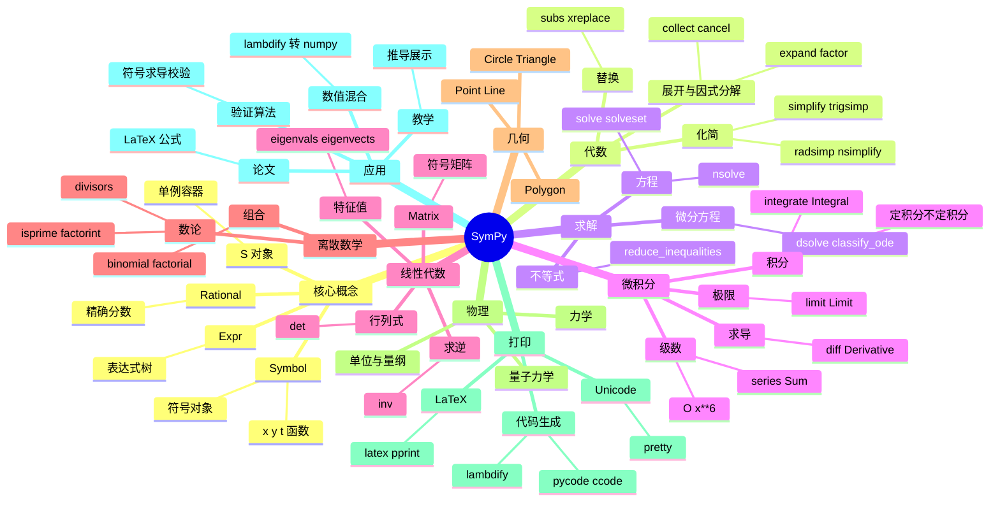

# SymPy

## 前言

**定位**：纯 Python 编写的开源符号数学库，能进行符号化的代数运算、微积分、方程求解、矩阵运算，是 Mathematica/Maple 的免费替代品。

**核心价值**：
- 让 Python 像 Mathematica 一样做"公式推导"而非"数值计算"
- 解决"求导/积分/极限/解方程"等大学数学问题
- 与 NumPy/SciPy 互补：SymPy 推导公式 → lambdify 转 NumPy 函数 → SciPy 优化
- 教育/科研场景中替代手算 + LaTeX 排版

**五大特性**：
1. **符号运算**：分数保留为分数、π 保留为 π，1/2+1/3=5/6 而非 0.8333
2. **LaTeX 输出**：`sympy.latex(expr)` 一键生成论文级公式排版
3. **多领域覆盖**：微积分、线性代数、离散数学、几何、物理、统计
4. **可扩展的代码生成**：`sympy.printing.pycode`/`c_code` 输出 NumPy/C 代码
5. **纯 Python**：无外部 C 依赖（部分可选加速），嵌入脚本友好

**对比表**：

| 维度 | SymPy | Mathematica | Maple | Maxima | SageMath |
|---|---|---|---|---|---|
| 许可 | BSD（免费） | 商业 | 商业 | GPL | GPL |
| 速度 | 慢 | 快 | 快 | 中 | 慢 |
| 覆盖广度 | 中 | 极广 | 广 | 中 | 极广 |
| 集成 Python | ✅ 完美 | ❌ | ❌ | ❌ | ⚠️ 重量级 |
| Notebook 友好 | ✅ Jupyter | ✅ | ⚠️ | ❌ | ✅ |
| 适用场景 | Python 科研/教育 | 工业数学 | 工程计算 | 教学 | 通用数学 |

## 思维导图



## 关键代码

### 一、符号基础与代数化简

```python
from sympy import symbols, Symbol, Rational, sqrt, pi, simplify, expand, factor, cancel, collect, Eq

x, y, z, t = symbols("x y z t")
a, b, c = symbols("a b c", real=True)  # 假设实数
n = Symbol("n", integer=True)         # 整数假设

# 1. 精确分数（避免浮点误差）
r = Rational(1, 2) + Rational(1, 3)   # 5/6（不是 0.833...）

# 2. 展开与因式分解
expr = (x + 1)**3 * (x - 2)**2
expanded = expand(expr)                # x^5 - 3x^4 - x^3 + 5x^2 + 2x - 4
factored = factor(expanded)            # 还原因式

# 3. 三角化简
trig_expr = sin(x)**2 + cos(x)**2
simplified = trigsimp(trig_expr)       # 1

# 4. 通分
expr = 1/x + 1/y
combined = cancel(expr)               # (x + y) / (x*y)

# 5. 按变量分组
expr = a*x**2 + b*x + c*x**2 + d*x
collected = collect(expr, x)           # (a+c)x^2 + (b+d)x
```

### 二、求导、积分、极限

```python
from sympy import diff, integrate, limit, oo, series, Sum, summation

# 1. 求导
f = sin(x) * exp(-x)
df = diff(f, x)                        # -exp(-x)*sin(x) + exp(-x)*cos(x)
d2f = diff(f, x, 2)                    # 二阶导

# 隐函数求导
g = x**2 + y**2 - 1
dydx = -diff(g, x) / diff(g, y)        # y' = -x/y（圆）

# 2. 积分
indef = integrate(exp(-x**2), x)       # ∫e^(-x²)dx = √π/2 · erf(x)
definite = integrate(sin(x), (x, 0, pi))  # 2
# 多重积分
double = integrate(integrate(x*y, (x, 0, 1)), (y, 0, 1))  # 1/4

# 3. 极限
limit(sin(x)/x, x, 0)                  # 1
limit((1 + 1/n)**n, n, oo)             # e
limit(1/x, x, 0, "+")                  # ∞（右极限）

# 4. 泰勒级数
sin_series = series(sin(x), x, 0, 8)   # x - x^3/6 + x^5/120 - x^7/5040 + O(x^8)

# 5. 符号求和
s = Sum(1/n**2, (n, 1, oo))            # ζ(2) = π²/6
val = s.doit()                         # pi**2/6
```

### 三、方程与不等式求解

```python
from sympy import solve, solveset, S, nsolve, dsolve, Function, Eq

# 1. 多项式方程
sols = solve(x**2 - 4, x)              # [-2, 2]
sols = solve(x**3 - 6*x**2 + 11*x - 6, x)  # [1, 2, 3]

# 2. 方程组（线性/非线性）
sols = solve([x + y - 5, x - y - 1], [x, y])  # {x: 3, y: 2}
sols = solve([x**2 + y - 2, x + y**2 - 2], [x, y])

# 3. 区间解
solveset(x**2 - 4 > 0, x, domain=S.Reals)  # (-∞, -2) ∪ (2, ∞)

# 4. 数值解（高速，但损失符号性）
x_num = nsolve(cos(x) - x, x, 0.5)     # 0.739085...

# 5. 微分方程
f = Function("f")
ode = Eq(f(t).diff(t, 2) - 4*f(t), 0)  # y'' - 4y = 0
sol = dsolve(ode, f(t))                # f(t) = C1*exp(-2t) + C2*exp(2t)

# 6. 含初始条件
sol = dsolve(ode, f(t), ics={f(0): 1, f(t).diff(t).subs(t, 0): 0})
```

### 四、线性代数（符号矩阵）

```python
from sympy import Matrix, eye, zeros, symbols, Rational

# 1. 符号矩阵
A = Matrix([[1, 2], [3, 4]])
B = Matrix(symbols("a b c d")).reshape(2, 2)

# 2. 行列式与逆
det_A = A.det()                        # -2
inv_A = A.inv()                        # 1/-2 [[4, -2], [-3, 1]]

# 3. 特征值（符号形式，矩阵可含符号）
M = Matrix([[a, b], [b, a]])
eigenvals = M.eigenvals()              # {a-b: 1, a+b: 1}
eigenvects = M.eigenvects()

# 4. 矩阵分解
L, D = M.LDLdecomposition()            # LDL^T
Q, R = M.QRdecomposition()             # QR 分解

# 5. 求解线性方程组 Ax = b
A = Matrix([[1, 2, 3], [4, 5, 6], [7, 8, 10]])
b = Matrix([1, 2, 3])
x = A.solve(b)                         # 解向量

# 6. 用初等行变换化简
rref, pivots = A.rref()                # Reduced Row Echelon Form
```

### 五、与 NumPy/SciPy 联动

```python
from sympy import symbols, sin, cos, lambdify, integrate
import numpy as np
import matplotlib.pyplot as plt

x = symbols("x")
f = sin(x) * exp(-x/5)

# 1. lambdify：符号表达式 → NumPy 函数
f_np = lambdify(x, f, "numpy")
xs = np.linspace(0, 20, 500)
ys = f_np(xs)                          # 速度提升 1000x

# 2. 符号求导 → NumPy 梯度函数
f_prime = diff(f, x)
f_prime_np = lambdify(x, f_prime, "numpy")

# 3. 符号积分 → SciPy 数值积分
F = integrate(f, x)
# 复杂函数 f 可能无法符号积分，用 scipy.integrate.quad 替代

# 4. 公式 → LaTeX（论文排版）
from sympy import latex
formula = integrate(1/(1+x**2), x)
print(latex(formula))                  # \arctan\left(x\right)

# 5. 公式 → C 代码
from sympy.printing import ccode
expr = a*x**2 + b*x + c
print(ccode(expr))                     # a*pow(x, 2) + b*x + c

# 6. 验证数值算法
# 推导出来的有限差分 vs 自动求导
analytic = diff(sin(x)*cos(x), x)
finite_diff = (sin(x+h)*cos(x+h) - sin(x)*cos(x)) / h
limit(finite_diff - analytic, h, 0)    # 应为 0，验证有限差分正确性
```

## 核心洞察

- **SymPy 是 NumPy 的"推导前奏"**：科研中常见模式是 SymPy 推导闭式解 → lambdify 转 NumPy 函数 → 用 SciPy 优化或 Matplotlib 绘图
- **`Symbol` 假设影响求解效率**：`Symbol("x", positive=True)` 会让 `sqrt(x**2) = x` 而不是 `|x|`，假设越具体，化简越彻底
- **`simplify` 不是万能的**：它用模式匹配穷举，可能耗时数分钟；`trigsimp/powsimp/radsimp` 各有专长，按表达式类型选
- **`solve` vs `solveset` vs `nsolve` 是三套求解器**：`solve` 老式返列表，`solveset` 新式返集合（含区间），`nsolve` 纯数值；新项目优先 `solveset`
- **`dsolve` 只能解可分类的 ODE**：常见 ODE 类型（线性/伯努利/全微分）能解，复杂非线性方程会返回 `_ode` 占位符
- **`lambdify` 是 SymPy 性能关键**：符号运算慢是因为 Python 对象 + 树遍历，lambdify 把表达式编译成 NumPy 向量化代码，速度提升 1000x+
- **SymPy 不擅长数值计算**：解大方程组用 `numpy.linalg.solve`，解大型 ODE 用 `scipy.integrate.solve_ivp`，符号数学只做"公式推导"
- **`Matrix.eigenvals()` 返回 dict**：键是特征值，值是代数重数；用 `list(M.eigenvals().keys())` 提取
- **`subs` 是参数替换万能工具**：`expr.subs(x, 1)` / `expr.subs([(x, 1), (y, 2)])` / `expr.subs(x, y)` 都行
- **`O(x**6)` 是级数截断标志**：泰勒展开的尾项，展开运算时自动保留；`expr.removeO()` 可去掉
- **物理模块是 SymPy 的隐藏宝藏**：`sympy.physics.mechanics` 拉格朗日方程、`sympy.physics.quantum` 量子态运算

## 跨项目引用

- **[[numpy]]**：`lambdify(expr, "numpy")` 是 SymPy 转数值计算的桥梁；符号矩阵 `Matrix` 转 ndarray 用 `np.array(M)`
- **[[scipy]]**：SymPy 推导公式 → SciPy 数值优化/积分；`sympy.physics.mechanics` 输出的拉格朗日方程用 SciPy 求解 ODE
- **[[matplotlib]]**：`sympy.plotting.plot` 底层就是 Matplotlib；`lambdify` 后的函数用 `plt.plot(xs, f_np(xs))` 画图
- **[[pandas]]**：SymPy 本身不直接处理表格，但 `expr.subs(dict(df.iloc[0]))` 可把表格行当符号代入
- **[[statsmodels]]**：推导回归方程系数公式 vs statsmodels 数值拟合；教学时常并用
- **[[seaborn]]**：统计图表与 SymPy 关系间接，主要通过 `scipy.stats`（如 `norm` 分布推导）
- **[[plotly]]**：`plotly` 画 SymPy 推导的曲面 `z = f(x, y)` 时需先 `lambdify` + 生成网格
- **[[jupyter]]**：SymPy 的 `init_printing()` 在 Jupyter 中自动渲染为 LaTeX，是数学教学/论文的"梦幻组合"
- **[[scikit-learn]]**：SVM 拉格朗日对偶推导、决策树信息熵公式可由 SymPy 演示；实际训练用 Scikit-Learn
- **[[duckdb]]**：DuckDB SQL 处理结构化查询，复杂数学建模推导（微分/优化）回到 SymPy + SciPy 组合
