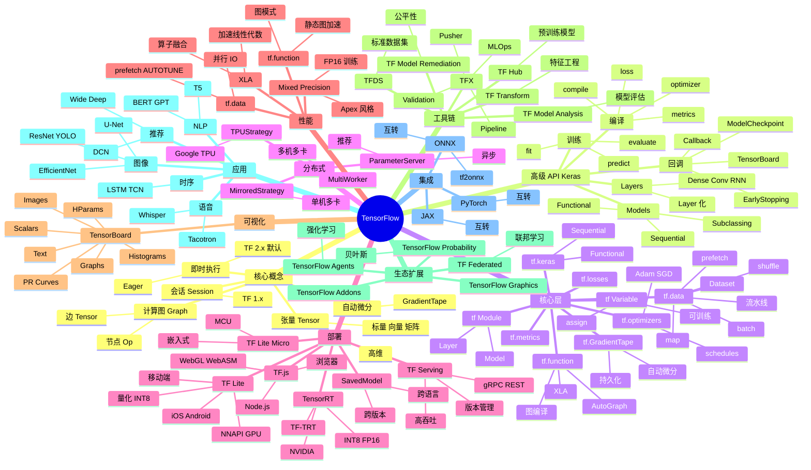

# TensorFlow

## 一、前言

TensorFlow（TF）是 Google Brain 团队开发的开源机器学习/深度学习框架，2015 年 11 月首次发布，1.0 正式版于 2017 年发布，2.0 重大重构版于 2019 年发布。截至 2025 年，TensorFlow 累计下载超过 5 亿次，是 Google 内部产品（搜索/翻译/YouTube/Gmail/Photos/Waymo）、学术界、工业界部署最广泛的深度学习框架之一。TensorFlow 1.x 以静态图（Graph + Session）为主，2.x 全面转向动态图（Eager Execution）+ Keras 高层 API，并提供 TF Lite（移动端/嵌入式）、TF.js（浏览器）、TFX（生产流水线）、TensorRT-LLM（NVIDIA 优化推理）等全栈工具。

TensorFlow 的核心价值在于"工业级成熟 + 全平台覆盖 + 端到端生产化"。① 工业级成熟——10 年沉淀的 API 稳定性、跨版本兼容性、Google 内部大规模验证；② 全平台覆盖——CPU/GPU/TPU 三端统一、Linux/Mac/Windows/iOS/Android/浏览器全支持；③ 端到端生产化——训练（TF + Keras）→ 保存（SavedModel）→ 服务（TF Serving / TF Lite / TF.js）；④ 性能优化——XLA 编译、tf.function 图编译、混合精度、tf.distribute 多卡/多机训练；⑤ 庞大生态——Keras（高层 API）、TF Hub（预训练模型库）、TFDS（数据集）、TFX（MLOps）、TensorBoard（可视化）。

TensorFlow 的关键能力包括：① 即时执行（Eager Execution，TF 2.x 默认）+ 图编译（`@tf.function`）；② Keras 高层 API（`Sequential` / `Functional` / `Model Subclassing`）；③ 自动微分（`tf.GradientTape`）；④ 分布式训练（`MirroredStrategy` / `MultiWorkerMirroredStrategy` / `TPUStrategy`）；⑤ TPU 原生支持（Google Cloud TPU + XLA）；⑥ SavedModel + TF Serving 高吞吐推理；⑦ TF Lite 移动端/嵌入式推理（量化、NNAPI）；⑧ TF.js 浏览器/Web 推理；⑨ TensorBoard 训练可视化；⑩ TFDS 标准数据集（MNIST/CIFAR/ImageNet/GLUE 全部内置）。

TensorFlow 与其他深度学习框架的对比：

| 框架 | 定位 | 优势 | 局限 |
|------|------|------|------|
| TensorFlow 2.x | 工业级全栈 | 部署生态（TF Lite/Serving/JS）、TPU、Keras、性能优化 | API 较复杂、学习曲线陡、动态控制流弱于 PyTorch |
| PyTorch | 研究/实验首选 | 动态图 Pythonic、易调试、社区活跃、LLM 主流 | 移动端/浏览器弱、生产部署需自建 |
| JAX | 数值计算/研究 | 函数式、自动微分、XLA、transformer/pmap | 生态小、入门难、不是通用框架 |
| PaddlePaddle | 中文工业 | 中文文档、ERNIE 预训练、EasyDL | 国际化弱、社区小 |
| MXNet | 分布式 | 灵活多语言、AWS SageMaker 主力 | 维护减弱、社区萎缩 |
| ONNX Runtime | 跨框架推理 | 跨框架模型、CPU/GPU 优化 | 不做训练 |

TensorFlow 的核心应用场景：① 图像分类/检测/分割（EfficientNet/YOLO/U-Net）；② 自然语言处理（BERT/GPT/T5/Whisper）；③ 推荐系统（DNN/Wide&Deep/DCN）；④ 强化学习（TF-Agents）；⑤ 时序预测（TCN/LSTM）；⑥ 移动端推理（TF Lite，iOS/Android/树莓派）；⑦ 浏览器推理（TF.js）；⑧ 大模型推理优化（TensorRT-LLM、TFlite-Micro）；⑨ MLOps 全流程（TFX + TF Serving + KubeFlow）。

TensorFlow 5 大核心特性：① 静态图+动态图双模（`@tf.function` 自动追踪 → XLA 优化 → 性能提升 2-10x）；② Keras 高级 API（`Sequential` / `Functional` / `Subclassing` 三大范式）；③ TPU 原生 + 多卡分布式（`tf.distribute.Strategy` 一行启动）；④ 全平台部署（SavedModel → TF Serving / TF Lite / TF.js）；⑤ 工业级 MLOps 生态（TFX + TF Serving + TF Profiler + TensorBoard + TFDS + TF Hub）。

## 二、架构思维导图



## 三、关键代码

### 3.1 基础：张量、自动微分、Keras 入门

```python
# 文件：tensorflow/python/ops / tensorflow/python/keras
import tensorflow as tf
import numpy as np

# ──────── 张量创建 ────────
a = tf.constant([[1, 2], [3, 4]], dtype=tf.float32)         # 不可变
b = tf.ones((3, 4))                                         # 全 1
c = tf.zeros((2, 3), dtype=tf.int32)                        # 全 0
d = tf.random.normal((100, 10), mean=0, stddev=1)           # 正态分布
e = tf.range(0, 10, delta=0.5)                              # 等差序列

# GPU 加速（自动检测）
print("GPU Available:", tf.config.list_physical_devices("GPU"))
# 自动放置：tf.Tensor 在 GPU 上创建时用 GPU 算子，否则 CPU

# ──────── 自动微分：GradientTape ────────
x = tf.Variable(3.0)
with tf.GradientTape() as tape:
    y = x ** 2                                               # y = x²
grad = tape.gradient(y, x)                                  # dy/dx = 2x = 6.0
print(grad.numpy())

# 多变量 + 持久化 tape
x = tf.Variable(2.0)
w = tf.Variable(5.0, trainable=True)
b = tf.Variable(1.0, trainable=True)
with tf.GradientTape(persistent=True) as tape:
    y = w * x + b
    loss = tf.reduce_mean((y - 10) ** 2)                    # MSE

grad_w, grad_b = tape.gradient(loss, [w, b])
print(grad_w.numpy(), grad_b.numpy())

# ──────── Keras Sequential ────────
from tensorflow.keras import layers, models

model = models.Sequential([
    layers.Input(shape=(784,)),
    layers.Dense(128, activation="relu"),
    layers.Dropout(0.2),
    layers.Dense(64, activation="relu"),
    layers.Dense(10, activation="softmax"),
])
model.summary()

model.compile(
    optimizer=tf.keras.optimizers.Adam(learning_rate=1e-3),
    loss="sparse_categorical_crossentropy",
    metrics=["accuracy"],
)
(x_train, y_train), (x_test, y_test) = tf.keras.datasets.mnist.load_data()
x_train = x_train.reshape(-1, 784).astype("float32") / 255.0
x_test  = x_test.reshape(-1, 784).astype("float32")  / 255.0

model.fit(
    x_train, y_train,
    batch_size=128,
    epochs=10,
    validation_split=0.1,
    callbacks=[tf.keras.callbacks.TensorBoard(log_dir="./logs")],
)
loss, acc = model.evaluate(x_test, y_test, verbose=0)
print(f"Test accuracy: {acc:.4f}")
```

### 3.2 Functional API + 自定义训练

```python
# 文件：tensorflow/python/keras/engine/functional.py
import tensorflow as tf
from tensorflow.keras import layers, Model

# ──────── Functional API（多输入多输出） ────────
def build_model():
    # 输入
    text_input = layers.Input(shape=(100,), name="text")
    img_input  = layers.Input(shape=(32, 32, 3), name="image")
    num_input  = layers.Input(shape=(5,), name="numeric")

    # 文本分支
    t = layers.Embedding(10000, 64)(text_input)
    t = layers.LSTM(32)(t)

    # 图像分支
    i = layers.Conv2D(32, 3, activation="relu")(img_input)
    i = layers.GlobalAveragePooling2D()(i)

    # 数值分支
    n = layers.Dense(16, activation="relu")(num_input)

    # 合并
    merged = layers.Concatenate()([t, i, n])
    x = layers.Dense(64, activation="relu")(merged)
    x = layers.Dropout(0.3)(x)

    # 多输出
    cls_out = layers.Dense(3, activation="softmax", name="class")(x)
    reg_out = layers.Dense(1, name="price")(x)

    return Model(inputs=[text_input, img_input, num_input],
                 outputs=[cls_out, reg_out])

model = build_model()
model.compile(
    optimizer="adam",
    loss={"class": "sparse_categorical_crossentropy",
          "price": "mse"},
    loss_weights={"class": 1.0, "price": 0.5},
    metrics={"class": "accuracy", "price": "mae"},
)
model.summary()

# ──────── 自定义训练循环（tf.GradientTape） ────────
model = build_model()
optimizer = tf.keras.optimizers.Adam(1e-3)
loss_fn_cls = tf.keras.losses.SparseCategoricalCrossentropy()
loss_fn_reg = tf.keras.losses.MeanSquaredError()
train_acc   = tf.keras.metrics.SparseCategoricalAccuracy()
train_mae   = tf.keras.metrics.MeanAbsoluteError()

# tf.data 流水线
BATCH = 64
train_ds = (
    tf.data.Dataset
    .from_tensor_slices(({"text": t_train, "image": i_train, "numeric": n_train},
                          {"class": y_cls, "price": y_reg}))
    .shuffle(10000)
    .batch(BATCH)
    .prefetch(tf.data.AUTOTUNE)
)

@tf.function                                                # 图编译加速
def train_step(inputs, targets):
    with tf.GradientTape() as tape:
        cls_pred, reg_pred = model(inputs, training=True)
        loss = (loss_fn_cls(targets["class"], cls_pred)
              + 0.5 * loss_fn_reg(targets["price"], reg_pred))
    grads = tape.gradient(loss, model.trainable_variables)
    optimizer.apply_gradients(zip(grads, model.trainable_variables))
    train_acc.update_state(targets["class"], cls_pred)
    train_mae.update_state(targets["price"], reg_pred)
    return loss

for epoch in range(10):
    for batch, (inputs, targets) in enumerate(train_ds):
        loss = train_step(inputs, targets)
    print(f"Epoch {epoch+1}: loss={loss.numpy():.4f} "
          f"acc={train_acc.result():.4f} mae={train_mae.result():.4f}")
    train_acc.reset_state()
    train_mae.reset_state()
```

### 3.3 分布式训练 + tf.data 性能优化

```python
# 文件：tensorflow/python/distribute / tensorflow/python/data
import tensorflow as tf
import tensorflow_datasets as tfds

# ──────── MirroredStrategy：单机多卡 ────────
strategy = tf.distribute.MirroredStrategy()                  # 自动检测 GPU
print(f"Number of devices: {strategy.num_replicas_in_sync}")

# 数据需按 replicas 切分
BATCH_PER_REPLICA = 64
GLOBAL_BATCH = BATCH_PER_REPLICA * strategy.num_replicas_in_sync

with strategy.scope():
    model = tf.keras.Sequential([
        layers.Conv2D(32, 3, activation="relu", input_shape=(32, 32, 3)),
        layers.MaxPooling2D(),
        layers.Conv2D(64, 3, activation="relu"),
        layers.GlobalAveragePooling2D(),
        layers.Dense(10),
    ])
    model.compile(
        optimizer="adam",
        loss=tf.keras.losses.SparseCategoricalCrossentropy(from_logits=True),
        metrics=["accuracy"],
    )

# ──────── tf.data 高性能流水线 ────────
def preprocess(image, label):
    image = tf.cast(image, tf.float32) / 255.0
    image = tf.image.random_flip_left_right(image)
    return image, label

train_ds = (
    tfds.load("cifar10", split="train", as_supervised=True)
    .map(preprocess, num_parallel_calls=tf.data.AUTOTUNE)
    .cache()                                                  # 缓存到内存
    .shuffle(10000)
    .batch(GLOBAL_BATCH, drop_remainder=True)
    .prefetch(tf.data.AUTOTUNE)                               # 后台预取
)

val_ds = (
    tfds.load("cifar10", split="test", as_supervised=True)
    .map(lambda x, y: (tf.cast(x, tf.float32) / 255.0, y))
    .batch(GLOBAL_BATCH)
    .prefetch(tf.data.AUTOTUNE)
)

model.fit(
    train_ds,
    epochs=20,
    validation_data=val_ds,
    callbacks=[
        tf.keras.callbacks.TensorBoard(log_dir="./logs", histogram_freq=1),
        tf.keras.callbacks.ModelCheckpoint("./ckpt", save_best_only=True),
        tf.keras.callbacks.EarlyStopping(patience=5, restore_best_weights=True),
    ],
)

# ──────── 混合精度训练（FP16 + FP32 损失缩放） ────────
tf.keras.mixed_precision.set_global_policy("mixed_float16")
# 训练速度提升 1.5-3x，显存节省 30-50%
# 注意：损失层用 float32
with strategy.scope():
    model = build_model()
    # 输出层 dtype 强制 float32
    model.layers[-1].dtype = "float32"
    model.compile(...)

# ──────── XLA 加速 ────────
tf.config.optimizer.set_jit(True)                            # 启用 XLA
# @tf.function(jit_compile=True)  强制 XLA
```

### 3.4 模型保存与部署（TF Serving / TF Lite）

```python
# 文件：tensorflow/python/saved_model / tensorflow/lite
import tensorflow as tf
import numpy as np

# ──────── 保存 SavedModel ────────
model.save("./my_model", save_format="tf")                   # SavedModel 格式
# 或 H5（单一文件）
model.save("./my_model.h5", save_format="h5")

# 加载
loaded = tf.keras.models.load_model("./my_model")

# ──────── TF Serving 部署 ────────
# docker run -p 8501:8501 \
#   --mount type=bind,source=$(pwd)/my_model,target=/models/my_model \
#   -e MODEL_NAME=my_model -t tensorflow/serving

# REST 调用
import requests
import json
data = json.dumps({
    "signature_name": "serving_default",
    "instances": x_test[:5].tolist(),                        # 输入数据
})
headers = {"content-type": "application/json"}
resp = requests.post("http://localhost:8501/v1/models/my_model:predict",
                     data=data, headers=headers)
predictions = json.loads(resp.text)["predictions"]
print(predictions)

# gRPC（更高性能）
# pip install tensorflow-serving-api
from tensorflow_serving.apis import predict_pb2, prediction_service_pb2_grpc
import grpc
# ... 略

# ──────── TF Lite：移动端 / 嵌入式 ────────
# 1. 转换
converter = tf.lite.TFLiteConverter.from_saved_model("./my_model")
tflite_model = converter.convert()
with open("model.tflite", "wb") as f:
    f.write(tflite_model)

# INT8 量化（4x 模型压缩、推理加速）
def representative_dataset():
    for x in x_train[:100]:
        yield [x.reshape(1, 32, 32, 3).astype("float32")]
converter.optimizations = [tf.lite.Optimize.DEFAULT]
converter.representative_dataset = representative_dataset
converter.target_spec.supported_types = [tf.int8]
tflite_quant = converter.convert()
with open("model_int8.tflite", "wb") as f:
    f.write(tflite_quant)

# 2. Python 推理
interpreter = tf.lite.Interpreter(model_path="model_int8.tflite")
interpreter.allocate_tensors()
input_details = interpreter.get_input_details()
output_details = interpreter.get_output_details()

interpreter.set_tensor(input_details[0]["index"],
                       x_test[:1].astype("float32"))
interpreter.invoke()
output = interpreter.get_tensor(output_details[0]["index"])
print(output.argmax())                                        # 预测类别

# ──────── TF.js：浏览器推理 ────────
# pip install tensorflowjs
# tensorflowjs_converter --input_format=tf_saved_model \
#                        ./my_model ./web_model
# 浏览器加载
# <script src="https://cdn.jsdelivr.net/npm/@tensorflow/tfjs"></script>
# const model = await tf.loadGraphModel('./web_model/model.json');
# const pred = model.predict(tf.browser.fromPixels(img));
```

## 四、核心洞察

- **TF 2.x 是"PyTorch + 工业级"的合体**：TF 1.x 静态图 API 让研究和实验痛苦，TF 2.x 引入 Eager Execution 默认、`tf.GradientTape` 自动微分、`tf.function` 按需加速——开发体验追平 PyTorch，部署能力仍强于 PyTorch。这让 TF 摆脱了"难用"标签，重获研究社区。

- **`@tf.function` 是性能关键**：Eager 模式 Pythonic 但慢，`@tf.function` 把 Python 函数追踪成计算图，再用 XLA 编译。规则：① 写一个完整训练 step 函数（不要 step 内循环 Python）；② 函数外定义 `tf.Variable`；③ 避免 Python 控制流依赖动态 tensor 值；④ 用 `tf.print` 调试而非 `print`。配合 `jit_compile=True` 走 XLA 性能再提升 2-3x。

- **Keras 三大范式各有所长**：① `Sequential` 适合简单层叠模型（10 行建一个 MLP）；② `Functional` 适合多输入多输出、跨层连接、共享层（80% 真实场景用这个）；③ `Subclassing` 适合研究新结构（自定义前向传播、动态分支），但失去 `model.summary()` 和 `model.save()` 友好性。生产推荐 Functional + `tf.keras.Model` 组合。

- **tf.data 流水线是性能瓶颈的 90%**：模型训练慢往往不是 GPU 算力问题，而是数据 IO。`tf.data.Dataset` 用 `.prefetch(AUTOTUNE)` 后台预取 + `.map(num_parallel_calls=AUTOTUNE)` 并行预处理 + `.cache()` 内存缓存 + 预读 SSD/NVMe → 训练 step 时间可从 200ms 降到 50ms。NCCL/RDMA 跨机通信时，`num_parallel_calls` 配合 `interleave` 把数据预处理搬到 worker 端。

- **TPU 是 Google 独家护城河**：TPU v5e 256-chip pod 提供 1.4 EFLOPS 算力，专门优化 Transformer 工作负载，训练 GPT-3 175B 比 1000 张 H100 快 4-5x、便宜 3-4x。`TPUStrategy` + `tf.distribute.cluster_resolver.TPUClusterResolver` 一行启动。但 TPU 不开源软件栈、绑定 GCP 生态，是双刃剑。

- **TF Lite 推理优化三位一体**：① 量化（FP32 → FP16 减半，INT8 减 1/4，INT4 减 1/8）；② 算子融合（Conv+BN+ReLU 融合为单算子）；③ 硬件加速（Android NNAPI、iOS CoreML、GPU Delegate、EdgeTPU/Coral）。`TFLiteConverter.from_saved_model` + `Optimize.DEFAULT` + `target_spec.supported_types=[tf.int8]` 一键完成 INT8 全量化。

- **SavedModel 是部署的"通用语言"**：`model.save("./m", save_format="tf")` 生成的 SavedModel 包含 `saved_model.pb`（图）+ `variables/`（权重）+ `assets/`（附属文件），与语言/框架/版本解耦。可被 TF Serving（gRPC/REST）、TF Lite、TF.js、ONNX、Vertex AI 通用加载，跨平台部署最稳的格式。

- **TFX 是 MLOps 工业级答案**：TFX Pipeline = ExampleGen（数据导入）→ StatisticsGen（统计）→ SchemaGen（数据 schema）→ ExampleValidator（验证）→ Transform（特征工程）→ Trainer（训练）→ Evaluator（评估）→ Pusher（发布）。配合 KubeFlow Pipelines / Airflow / Vertex AI Pipelines 实现端到端 ML 流水线自动化。适合大厂、大规模 ML 平台；中小项目用 MLflow / DVC 即可。

- **生态迁移的代价**：尽管 TF 仍是大厂标配，但学术界与新项目明显倒向 PyTorch——Hugging Face Transformers 默认 PyTorch，PyTorch Lightning、torch.compile、Accelerate 等新工具链均围绕 PyTorch。Google 自身在 2023 年发布的 Gemma 也优先 PyTorch。TF 的护城河在 TPU + TF Lite + 工业级部署，而非前沿研究。

## 五、跨项目引用

- **[PyTorch 训练](./pytorch.md)**：PyTorch 是当前研究与新项目的默认选择（学术论文 80%+ 用 PyTorch，Hugging Face 全栈 PyTorch），TF 在生产部署仍有优势。`tf2onnx` / `onnx-tf` 双向转换可让两个生态互通。`torch.compile` 借鉴了 TF 的 XLA 思想；PyTorch 2.0 的 dynamo 与 TF 的 `@tf.function` 异曲同工。

- **[NumPy 基础](./numpy.md)**：TF 的 `tf.constant` / `tf.Tensor` 与 NumPy 高度兼容，`tensor.numpy()` 与 `np.array(tensor)` 零拷贝互转。TF 的广播、reshape、matmul 语义与 NumPy 完全一致。理解 NumPy 向量化、broadcasting 是入门 TF 的基础。

- **[Pandas 数据分析](./pandas.md)**：`tf.data.Dataset.from_tensor_slices((X_df.values, y_series.values))` 把 Pandas DataFrame/Series 喂给 TF；`pd.read_csv(chunksize=...)` 流式读取大数据训练；`df.to_numpy()` 输出的 ndarray 直接作为 `model.fit` 输入。

- **[Keras 独立包]**：`tf.keras` 是 TF 内的 Keras 实现；独立的 `keras` 3.0（2023）支持多后端（TF / PyTorch / JAX）—— 同一份代码可在三个框架运行。`pip install keras` 后用 `os.environ["KERAS_BACKEND"] = "torch"` 切换。

- **[ONNX / ONNX Runtime]**：TF 通过 `tf2onnx.convert.from_keras(model)` 导出 ONNX，被 ONNX Runtime（CPU/GPU/Edge 跨平台推理）加载。LLM 场景下 ONNX Runtime + DirectML / TensorRT / OpenVINO 推理性能优于 TF 原生 2-5x。

- **[JAX 数值计算]**：JAX 是 Google 推出的 NumPy + 自动微分 + XLA + pmap/vmap 框架，函数式 API 与 TF 完全不同，但底层共享 XLA。`jax2tf` 把 JAX 模型转换为 TF SavedModel 部署；`flax` 是 JAX 上的神经网络库。学术界（DeepMind 主力）越来越倾向 JAX。

- **[Scikit-learn 机器学习](./scikit-learn.md)**：传统 ML（GBDT/线性/SVM/KNN/聚类）用 Scikit-learn，深度学习（CNN/RNN/Transformer/扩散模型）用 TF/PyTorch。`tf.keras.wrappers.scikit_learn.KerasClassifier` 让 Keras 模型可被 sklearn 流水线（Pipeline + GridSearchCV）使用。

- **[MLOps：MLflow / KubeFlow / Vertex AI]**：TF 模型训练后，MLflow Tracking 记录实验、KubeFlow Pipelines 编排 TFX、Vertex AI Endpoint 部署 TF Serving。生产化 ML 不只是训练框架，配套工具链（数据/特征/训练/评估/部署/监控）才是核心。
