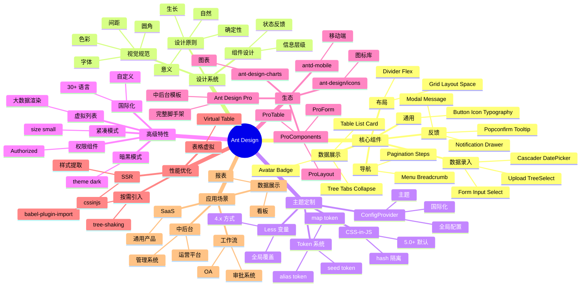

# Ant Design

## 前言

**定位**：蚂蚁金服开源的企业级 React UI 组件库，"中后台"前端的事实标准，2017 年开源至今已成中国互联网公司 B 端产品的标配。

**核心价值**：
- 60+ 高质量 React 组件，覆盖企业级中后台 90% 场景
- 一套完整的设计语言与设计规范（Ant Design 设计价值观）
- TypeScript 一等公民，类型完整度业内领先
- 主题定制能力极强：Less 变量、ConfigProvider、Token 系统

**五大特性**：
1. **组件丰富**：Table/Form/Tree/Cascader/DatePicker 等复杂组件开箱即用
2. **企业级特性**：虚拟滚动、权限控制、国际化、暗黑模式
3. **设计系统**：4 步原则（自然 / 确定性 / 意义 / 生长）+ 12 栅格
4. **生态完整**：ProComponents（高级模板）、Ant Design Pro（中后台脚手架）、umi
5. **国际化**：30+ 语言包，Form 校验文案全覆盖

**对比表**：

| 维度 | Ant Design | Material UI | Element Plus | Chakra UI | Tailwind UI |
|---|---|---|---|---|---|
| 定位 | 企业级 B 端 | Google Material | Vue 3 | 现代化简洁 | 工具类 |
| 组件丰富度 | ✅✅ 60+ | ✅✅ 60+ | ✅ 50+ | ⚠️ 30+ | ⚠️ 20+ |
| TypeScript | ✅ 完美 | ✅ 完美 | ✅ 完美 | ✅ 完美 | ⚠️ |
| 主题定制 | ✅ Token | ✅ Emotion | ✅ SCSS | ✅ Style Props | ✅ 配置 |
| 包大小 | ⚠️ 大 | ⚠️ 大 | ⚠️ 中 | ✅ 小 | ✅ 极小 |
| 适合 | 中后台/管理系统 | 现代 Web | Vue 项目 | 简洁设计 | 设计师/极简 |

## 思维导图



## 关键代码

### 一、基础使用

```tsx
import { Button, Space, ConfigProvider } from "antd";
import { UserOutlined } from "@ant-design/icons";
import zhCN from "antd/locale/zh_CN";

export default function App() {
  return (
    <ConfigProvider locale={zhCN} theme={{ token: { colorPrimary: "#1677ff" } }}>
      <Space>
        <Button type="primary" icon={<UserOutlined />}>主要按钮</Button>
        <Button>次要按钮</Button>
        <Button type="dashed">虚线按钮</Button>
        <Button type="text">文本按钮</Button>
        <Button type="link">链接按钮</Button>
        <Button danger>危险</Button>
      </Space>
    </ConfigProvider>
  );
}
```

### 二、Form 表单（企业级最常用）

```tsx
import { Form, Input, Button, Select, DatePicker, message } from "antd";
import { useState } from "react";

interface UserForm {
  name: string;
  email: string;
  role: "admin" | "user";
  birthday: string;
}

export function UserEditor({ initial }: { initial?: Partial<UserForm> }) {
  const [form] = Form.useForm<UserForm>();
  const [loading, setLoading] = useState(false);

  const onFinish = async (values: UserForm) => {
    setLoading(true);
    try {
      await api.saveUser(values);
      message.success("保存成功");
      form.resetFields();
    } finally {
      setLoading(false);
    }
  };

  return (
    <Form
      form={form}
      layout="vertical"
      initialValues={initial}
      onFinish={onFinish}
      // 整表单校验
      validateTrigger={["onBlur", "onSubmit"]}
    >
      <Form.Item
        label="姓名"
        name="name"
        rules={[
          { required: true, message: "请输入姓名" },
          { min: 2, max: 20, message: "长度 2-20 字符" }
        ]}
      >
        <Input placeholder="请输入" />
      </Form.Item>

      <Form.Item
        label="邮箱"
        name="email"
        rules={[
          { required: true, message: "请输入邮箱" },
          { type: "email", message: "邮箱格式不正确" }
        ]}
      >
        <Input placeholder="user@example.com" />
      </Form.Item>

      <Form.Item label="角色" name="role" rules={[{ required: true }]}>
        <Select
          options={[
            { value: "admin", label: "管理员" },
            { value: "user", label: "普通用户" }
          ]}
          placeholder="请选择角色"
        />
      </Form.Item>

      <Form.Item label="生日" name="birthday">
        <DatePicker style={{ width: "100%" }} />
      </Form.Item>

      <Form.Item>
        <Button type="primary" htmlType="submit" loading={loading}>
          提交
        </Button>
        <Button onClick={() => form.resetFields()} style={{ marginLeft: 8 }}>
          重置
        </Button>
      </Form.Item>
    </Form>
  );
}
```

### 三、Table 数据表格

```tsx
import { Table, Tag, Space, Button, Input } from "antd";
import { useState, useEffect } from "react";
import type { ColumnsType } from "antd/es/table";

interface User {
  id: number;
  name: string;
  email: string;
  status: "active" | "inactive";
  role: string;
  createdAt: string;
}

export function UserList() {
  const [data, setData] = useState<User[]>([]);
  const [loading, setLoading] = useState(false);
  const [keyword, setKeyword] = useState("");
  const [pagination, setPagination] = useState({ current: 1, pageSize: 10, total: 0 });

  const loadData = async (page = 1, pageSize = 10) => {
    setLoading(true);
    try {
      const res = await api.getUsers({ page, pageSize, keyword });
      setData(res.items);
      setPagination({ current: page, pageSize, total: res.total });
    } finally {
      setLoading(false);
    }
  };

  useEffect(() => { loadData(); }, []);

  const columns: ColumnsType<User> = [
    {
      title: "ID",
      dataIndex: "id",
      width: 80,
      sorter: (a, b) => a.id - b.id
    },
    {
      title: "姓名",
      dataIndex: "name",
      // 多列过滤
      filterDropdown: () => (
        <div style={{ padding: 8 }}>
          <Input.Search
            placeholder="搜索姓名"
            onSearch={v => setKeyword(v)}
            enterButton
          />
        </div>
      )
    },
    { title: "邮箱", dataIndex: "email" },
    {
      title: "状态",
      dataIndex: "status",
      filters: [
        { text: "活跃", value: "active" },
        { text: "禁用", value: "inactive" }
      ],
      onFilter: (value, record) => record.status === value,
      render: status => (
        <Tag color={status === "active" ? "green" : "red"}>
          {status === "active" ? "活跃" : "禁用"}
        </Tag>
      )
    },
    {
      title: "操作",
      key: "action",
      width: 200,
      render: (_, record) => (
        <Space>
          <Button type="link" onClick={() => editUser(record)}>编辑</Button>
          <Button type="link" danger onClick={() => deleteUser(record)}>删除</Button>
        </Space>
      )
    }
  ];

  return (
    <Table
      columns={columns}
      dataSource={data}
      loading={loading}
      rowKey="id"
      pagination={{
        ...pagination,
        showSizeChanger: true,
        showTotal: total => `共 ${total} 条`
      }}
      onChange={p => loadData(p.current, p.pageSize)}
      // 虚拟滚动（大数据）
      scroll={{ x: 1000, y: 600 }}
    />
  );
}
```

### 四、主题定制（5.0+ Token 系统）

```tsx
import { ConfigProvider, theme } from "antd";

// 1. 基础 Token 覆盖
<ConfigProvider
  theme={{
    token: {
      colorPrimary: "#00b96b",       // 主色
      borderRadius: 6,                // 圆角
      fontSize: 14,                   // 字号
      colorBgBase: "#ffffff"          // 背景色
    },
    // 2. 组件级 Token
    components: {
      Button: {
        primaryShadow: "0 2px 0 rgba(0,0,0,0.045)"
      },
      Table: {
        headerBg: "#fafafa",
        rowHoverBg: "#f5f5f5"
      }
    },
    // 3. 暗黑算法（自动生成暗黑 Token）
    algorithm: theme.darkAlgorithm
  }}
>
  <App />
</ConfigProvider>

// 4. 动态切换主题
const [isDark, setIsDark] = useState(false);

<ConfigProvider
  theme={{
    algorithm: isDark ? theme.darkAlgorithm : theme.defaultAlgorithm
  }}
>
  <Switch checked={isDark} onChange={setIsDark} />
</ConfigProvider>
```

### 五、按需引入 + 性能优化

```typescript
// vite.config.ts
import { defineConfig } from "vite";
import react from "@vitejs/plugin-react";

export default defineConfig({
  plugins: [
    react({
      babel: {
        plugins: [
          // 自动按需引入
          ["babel-plugin-import", {
            libraryName: "antd",
            libraryDirectory: "es",
            style: "css"  // 或 "true" 引入 less 变量
          }]
        ]
      }
    })
  ]
});

// 转换前
import { Button, Form } from "antd";

// 转换后（自动）
import Button from "antd/es/button";
import "antd/es/button/style/css";
import Form from "antd/es/form";
import "antd/es/form/style/css";
```

## 核心洞察

- **Ant Design 是"中后台操作系统"**：Table + Form + Tree + Cascader 等组件覆盖 90% B 端需求，是 SaaS / 内部系统的首选
- **5.0 版本从 Less 迁移到 CSS-in-JS**：解决了 SSR 样式闪烁、动态主题切换、按需加载三大痛点，但首屏 +20ms
- **Token 系统是主题定制的未来**：从"散落的 Less 变量"升级为"三层 Token（seed/map/alias）"，语义化、可派生、可运行时切换
- **Form 是 AntD 最强组件**：`Form.useForm()` + `Form.Item` 的双向绑定 + 校验 + 联动是企业级表单的事实标准
- **Table 性能优化三件套**：`pagination` + `scroll`（虚拟滚动）+ `rowSelection` 配合，处理 10 万行不卡顿
- **ProComponents 是 AntD 的"超集"**：ProTable（搜索+表格一体化）、ProForm（标准化表单）、ProLayout（专业布局）——企业级脚手架的"半成品"
- **AntD 的设计价值观（自然/确定性/意义/生长）**：是少有的"组件库 + 设计哲学"双重输出，影响了无数产品
- **图标库 `@ant-design/icons` 是独立包**：按需引入 `<UserOutlined />` 比 SVG sprite 灵活，比 emoji 专业
- **AntD 的 4.x 仍在维护**：升级 5.x 是大工程（Less → CSS-in-JS），很多企业仍在 4.x
- **AntD 的国际化和无障碍**：30+ 语言、键盘导航、ARIA 属性全支持，海外项目也能用
- **AntD Mobile 是移动版**：用 `antd-mobile` 做 H5/小程序，体验与 Web 版一致

## 跨项目引用

- **[[react]]**：AntD 5+ 完全基于 React 18+；React 17 及以下需用 AntD 4
- **[[typescript]]**：AntD 类型完整度业内第一，IDE 提示覆盖率 95%+
- **[[vue]]**：Vue 版的对应物是 Element Plus / Ant Design Vue
- **[[umi]]**：AntD 团队出品的 React 应用框架，深度集成 ProComponents
- **[[webpack]]** / **[[vite]]**：通过 `babel-plugin-import` 或 `vite-plugin-style-import` 实现按需引入
- **[[typescript]]**：`Form.useForm<UserForm>()` 是泛型与 React Hook 完美结合的范本
- **[[react hooks]]**：`useState` + `useEffect` + `Form.useForm` 是 AntD 项目的标准范式
- **[[jest]]**：AntD 组件用 `@testing-library/react` 测试，需要 `jsdom` 环境
- **[[tailwind css]]**：AntD 5+ 内部用 CSS-in-JS，与 Tailwind 的 utility-first 理念冲突，混用需谨慎
- **[[design system]]**：AntD 的设计价值观是设计系统文档化的典范
- **[[material ui]]**：MUI 是 Material Design 的 React 实现，是 AntD 的"设计语言不同版本"
