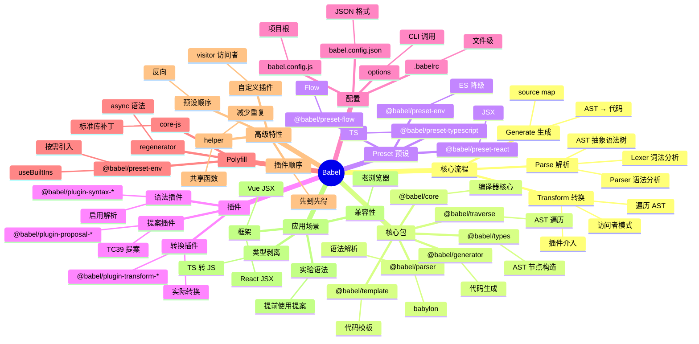

# Babel

## 前言

**定位**：JavaScript 编译器（source-to-source），把 ES2015+ / TypeScript / JSX 代码转译为向后兼容的 JavaScript，是前端工具链的基石。

**核心价值**：
- 让开发者用最新语法写代码，部署到老浏览器
- 插件化架构，所有语法转换都是插件
- 解析 → 转换 → 生成三阶段，操作 AST 完成所有变换
- 不只是 JS：JSX、TypeScript、Flow、ReasonML 都能处理

**五大特性**：
1. **插件化**：3000+ 官方与社区插件，覆盖所有语法特性
2. **AST 操作**：解析代码为抽象语法树，插件在树上增删改节点
3. **多阶段处理**：parse → transform → generate，每阶段可定制
4. **Polyfill 集成**：`@babel/preset-env` 自动按需引入 core-js
5. **生态统治力**：Webpack/Vite/Next/Nuxt 都依赖 Babel

**对比表**：

| 维度 | Babel | SWC | esbuild | TypeScript Compiler | Sucrase |
|---|---|---|---|---|---|
| 速度 | ⚠️ 慢 | ✅ 极快 | ✅ 极快 | ⚠️ 中 | ✅ 快 |
| 插件生态 | ✅✅ 极强 | ✅ 中 | ⚠️ | ❌ | ❌ |
| 类型检查 | ❌ | ❌ | ❌ | ✅ 完整 | ❌ |
| Polyfill | ✅ 自动 | ❌ 需手动 | ❌ | ❌ | ❌ |
| 配置复杂度 | 高 | 中 | 低 | 中 | 极低 |
| 适合 | 兼容性优先 | 速度优先 | 工具链 | 类型项目 | 极简场景 |

## 思维导图



## 关键代码

### 一、基础配置 + preset-env

```javascript
// babel.config.js
module.exports = {
  presets: [
    [
      "@babel/preset-env",
      {
        targets: {
          browsers: ["> 1%", "last 2 versions", "not dead"],
          node: "16"
        },
        useBuiltIns: "usage",        // 按需引入 polyfill
        corejs: { version: 3, proposals: true },
        modules: false               // 保留 ESM 给打包器
      }
    ],
    [
      "@babel/preset-react",
      { runtime: "automatic" }       // 自动引入 JSX runtime
    ],
    "@babel/preset-typescript"
  ],
  plugins: [
    "@babel/plugin-proposal-class-properties",
    ["@babel/plugin-proposal-decorators", { version: "2023-05" }]
  ]
};
```

### 二、CLI 使用

```bash
# 编译单个文件
npx babel script.js --presets=@babel/preset-env

# 编译到目录
npx babel src --out-dir dist --presets=@babel/preset-env

# 监听模式
npx babel src --out-dir dist --watch

# 输出 source map
npx babel src --out-dir dist --source-maps

# 压缩
npx babel src --out-dir dist --minified
```

### 三、JSX 与 React

```javascript
// babel.config.js
{
  presets: [
    ["@babel/preset-react", {
      runtime: "automatic",         // 不用再写 import React
      importSource: "@emotion/react" // 或自定义 JSX 工厂
    }]
  ]
}

// 源代码
function App() {
  return <div className="app">Hello {name}</div>;
}

// 编译后（automatic runtime）
import { jsx as _jsx } from "react/jsx-runtime";
function App() {
  return _jsx("div", { className: "app", children: "Hello " + name });
}
```

### 四、自定义 Babel 插件

```javascript
// babel-plugin-log-import.js
// 功能：自动给所有函数调用添加 console.log 入口
module.exports = function ({ types: t }) {
  return {
    name: "log-import",
    visitor: {
      // 访问函数声明
      FunctionDeclaration(path) {
        const funcName = path.node.id.name;
        // 跳过以 _ 开头的函数
        if (funcName.startsWith("_")) return;
        // 在函数体开头插入 console.log
        const logCall = t.expressionStatement(
          t.callExpression(
            t.memberExpression(t.identifier("console"), t.identifier("log")),
            [t.stringLiteral(`Enter: ${funcName}`)]
          )
        );
        path.node.body.body.unshift(logCall);
      },
      // 访问箭头函数
      ArrowFunctionExpression(path) {
        if (path.parent.type === "VariableDeclarator" && path.parent.id) {
          const name = path.parent.id.name;
          const logCall = t.expressionStatement(
            t.callExpression(
              t.memberExpression(t.identifier("console"), t.identifier("log")),
              [t.stringLiteral(`Arrow: ${name}`)]
            )
          );
          if (t.isBlockStatement(path.node.body)) {
            path.node.body.body.unshift(logCall);
          } else {
            path.node.body = t.blockStatement([
              logCall,
              t.returnStatement(path.node.body)
            ]);
          }
        }
      }
    }
  };
};

// 使用
{
  plugins: ["./babel-plugin-log-import.js"]
}
```

### 五、AST 探索与调试

```javascript
// debug-ast.js
const parser = require("@babel/parser");
const traverse = require("@babel/traverse").default;
const generator = require("@babel/generator").default;

const code = `
  import { useState } from "react";
  function Counter() {
    const [count, setCount] = useState(0);
    return <div onClick={() => setCount(count + 1)}>{count}</div>;
  }
`;

const ast = parser.parse(code, {
  sourceType: "module",
  plugins: ["jsx", "typescript"]
});

// 打印 AST
console.log(JSON.stringify(ast, null, 2));

// 遍历所有 import
traverse(ast, {
  ImportDeclaration(path) {
    console.log("Import from:", path.node.source.value);
    path.node.specifiers.forEach(s => {
      console.log("  ", s.local.name);
    });
  }
});

// 生成代码
const output = generator(ast, {}, code);
console.log(output.code);
```

### 六、TypeScript 剥离

```javascript
// babel.config.js - 只剥离类型，不做类型检查
{
  presets: ["@babel/preset-typescript"]
}

// 输入
interface User { name: string; age: number; }
const greet = (u: User) => `Hello, ${u.name}`;

// 输出
const greet = (u) => `Hello, ${u.name}`;
// 类型完全消失，不影响运行
```

## 核心洞察

- **Babel 不是 TypeScript 替代品**：Babel 只剥类型不检查，速度快 10x；类型检查仍需 `tsc --noEmit`，是两条独立流水线
- **`@babel/preset-env` 的智能程度被低估**：根据 `targets` 字段自动决定需要哪些 polyfill 和语法降级，比手写 `.browserslistrc` + Webpack 配置更精准
- **`useBuiltIns: "usage"` vs `"entry"`**：`"usage"` 按代码使用情况自动注入 polyfill（如代码用到 `Promise` 才注入），`"entry"` 在入口统一注入，体积更大
- **SWC 取代 Babel 是趋势**：Next.js/Vite 4+/Turbopack 都在迁移到 SWC，速度提升 10-100x，但 Babel 生态仍是事实标准
- **Babel 插件的本质是 AST 操纵**：`visitor` 对象是访问者模式，键是 AST 节点类型、值是回调函数
- **Babel 的 helper 优化**：所有插件共享的辅助函数（如 `_classPrivateMethod`）被提取到 `@babel/runtime`，避免重复定义
- **Babel 不打包**：Babel 只编译单文件不合并，`@babel/preset-env` 的 `modules: false` 让打包器（Webpack/Vite）处理模块合并
- **Babel Macros**：在编译期执行任意代码（如 `tailwindcss.macro`），是 CSS-in-JS 工具的新玩法
- **Babel 的"慢"是有历史包袱的**：JS 实现的编译器，单线程 AST 遍历；SWC/Rome 用 Rust 多线程，速度提升 100x
- **Babel 仍是 JSDoc 时代的王者**：用 `// @ts-check` + JSDoc 写类型，Babel 直接编译，不用 TypeScript

## 跨项目引用

- **[[webpack]]**：Webpack 1-4 用 Babel-loader 处理 JS，Webpack 5 内置 SWC 替代
- **[[vite]]**：Vite 开发用 esbuild 编译，生产构建可选用 SWC/Babel
- **[[rollup]]**：通过 `@rollup/plugin-babel` 集成，库开发必备
- **[[parcel]]**：Parcel 2 内置 SWC，但 `.babelrc` 仍可识别（向后兼容）
- **[[react]]**：JSX 必须经过 Babel 编译；`@babel/preset-react` 是 React 项目标配
- **[[vue]]**：Vue SFC 中 `<script>` 块的 JSX/TS 通过 Babel 处理
- **[[typescript]]**：Babel 编译 TS 比 `tsc` 快 10x，但失去类型检查，常配合 `tsc --noEmit` 用
- **[[node.js]]**：Babel 让 Node 项目用最新语法（顶层 await、装饰器）部署到老版本
- **[[next.js]]**：Next.js 13 用 SWC 替代 Babel，但 `.babelrc` 仍受支持
- **[[npm]]**：`@babel/runtime` 是依赖管理中"几乎所有项目都会用"的包
