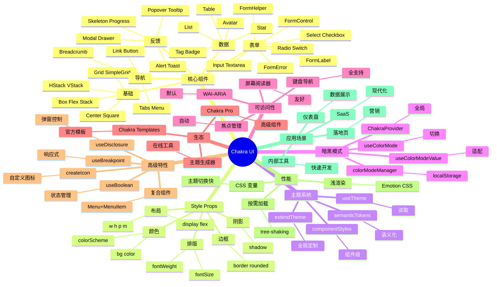

# Chakra UI

## 前言

**定位**：由 Segun Adebayo 开发的现代 React 组件库，专注于"可访问性 + 简洁 API + 主题化"，是 Material UI / Ant Design 之外的"小而美"代表。

**核心价值**：
- WAI-ARIA 一等公民，所有组件默认可访问
- 简洁 API：`<Button colorScheme="blue">` 而非 `<Button variant="contained" color="primary">`
- 主题系统基于 CSS 变量，运行时切换主题零成本
- 暗黑模式开箱即用：`colorMode="dark"` 一行切换

**五大特性**：
1. **可访问性**：所有组件默认符合 WAI-ARIA 规范
2. **简洁 API**：直接 props 控制样式，无 className 污染
3. **主题系统**：`extendTheme` 深度定制，CSS 变量 + Emotion
4. **Style Props**：直接在组件上写 `bg="red.500" p={4}` 等样式
5. **暗黑模式**：内置 `useColorMode` Hook，零配置

**对比表**：

| 维度 | Chakra UI | Material UI | Ant Design | Tailwind UI | Headless UI |
|---|---|---|---|---|---|
| 定位 | 现代简洁 | Material Design | 企业级 B 端 | 工具类 | 无样式 |
| 包大小 | ✅ 小 | ⚠️ 大 | ⚠️ 大 | ✅ 极小 | ✅ 极小 |
| 可访问性 | ✅ 极强 | ✅ 强 | ✅ 强 | ⚠️ 需手动 | ✅ 强 |
| TypeScript | ✅ 完美 | ✅ 完美 | ✅ 完美 | ✅ | ✅ |
| 主题切换 | ✅ 运行时 | ✅ 运行时 | ✅ | ⚠️ | ⚠️ |
| 适合 | 现代 Web App | Material 项目 | 中后台 | 营销页 | 自定义 UI |

## 思维导图



## 关键代码

### 一、安装与基础

```bash
npm install @chakra-ui/react @emotion/react @emotion/styled framer-motion
```

```tsx
// main.tsx
import { ChakraProvider, extendTheme } from "@chakra-ui/react";

const theme = extendTheme({
  config: { initialColorMode: "light", useSystemColorMode: false },
  colors: {
    brand: {
      50:  "#f0f9ff",
      100: "#e0f2fe",
      500: "#0ea5e9",
      900: "#0c4a6e"
    }
  },
  fonts: {
    heading: "Inter, system-ui, sans-serif",
    body: "Inter, system-ui, sans-serif"
  }
});

export default function App() {
  return (
    <ChakraProvider theme={theme}>
      <RootComponent />
    </ChakraProvider>
  );
}
```

### 二、Style Props：直接写样式

```tsx
import { Box, Flex, Text, Heading, Button, HStack } from "@chakra-ui/react";

export function Hero() {
  return (
    <Box
      bg="brand.500"           // 主题颜色
      color="white"
      py={20}                  // padding: 80px (5 * 4 * 4)
      px={6}
      borderRadius="lg"
      shadow="xl"
    >
      <Flex direction={{ base: "column", md: "row" }} align="center" gap={8}>
        <Box flex="1">
          <Heading as="h1" size="2xl" mb={4}>
            欢迎使用 Chakra UI
          </Heading>
          <Text fontSize="lg" mb={6} opacity={0.9}>
            简单、可访问、强大的 React 组件库
          </Text>
          <HStack spacing={4}>
            <Button colorScheme="whiteAlpha" size="lg">开始使用</Button>
            <Button variant="outline" size="lg">查看文档</Button>
          </HStack>
        </Box>
        <Box flex="1" maxW="500px">
          <Image src="/hero.png" alt="Hero" borderRadius="md" />
        </Box>
      </Flex>
    </Box>
  );
}
```

### 三、表单组件

```tsx
import {
  FormControl, FormLabel, FormErrorMessage, FormHelperText,
  Input, Button, VStack, Select, Textarea, Switch, Checkbox
} from "@chakra-ui/react";
import { useForm, Controller } from "react-hook-form";

export function UserForm() {
  const { control, handleSubmit, formState: { errors } } = useForm({
    defaultValues: { name: "", email: "", role: "user", agree: false }
  });

  const onSubmit = (data: any) => console.log(data);

  return (
    <form onSubmit={handleSubmit(onSubmit)}>
      <VStack spacing={4} align="stretch" maxW="400px">
        <FormControl isInvalid={!!errors.name} isRequired>
          <FormLabel>姓名</FormLabel>
          <Controller
            name="name"
            control={control}
            rules={{ required: "请输入姓名" }}
            render={({ field }) => <Input {...field} placeholder="张三" />}
          />
          <FormErrorMessage>{errors.name?.message}</FormErrorMessage>
        </FormControl>

        <FormControl isInvalid={!!errors.email} isRequired>
          <FormLabel>邮箱</FormLabel>
          <Controller
            name="email"
            control={control}
            rules={{
              required: "请输入邮箱",
              pattern: { value: /^\S+@\S+$/, message: "邮箱格式错误" }
            }}
            render={({ field }) => <Input {...field} type="email" />}
          />
          <FormErrorMessage>{errors.email?.message}</FormErrorMessage>
        </FormControl>

        <FormControl>
          <FormLabel>角色</FormLabel>
          <Controller
            name="role"
            control={control}
            render={({ field }) => (
              <Select {...field}>
                <option value="user">用户</option>
                <option value="admin">管理员</option>
              </Select>
            )}
          />
        </FormControl>

        <FormControl>
          <Controller
            name="agree"
            control={control}
            render={({ field: { value, onChange } }) => (
              <Checkbox isChecked={value} onChange={onChange}>
                同意用户协议
              </Checkbox>
            )}
          />
        </FormControl>

        <Button type="submit" colorScheme="brand">提交</Button>
      </VStack>
    </form>
  );
}
```

### 四、暗黑模式切换

```tsx
import { useColorMode, useColorModeValue, IconButton, Tooltip } from "@chakra-ui/react";
import { SunIcon, MoonIcon } from "@chakra-ui/icons";

export function ThemeToggle() {
  const { colorMode, toggleColorMode } = useColorMode();
  const SwitchIcon = useColorModeValue(MoonIcon, SunIcon);
  const label = useColorModeValue("切换到暗黑模式", "切换到亮色模式");

  return (
    <Tooltip label={label}>
      <IconButton
        aria-label="切换主题"
        icon={<SwitchIcon />}
        onClick={toggleColorMode}
        variant="ghost"
      />
    </Tooltip>
  );
}

// 颜色自适应组件
function Card() {
  const bg = useColorModeValue("white", "gray.800");
  const color = useColorModeValue("gray.800", "white");
  return (
    <Box bg={bg} color={color} p={6} borderRadius="md" shadow="md">
      自动适应主题
    </Box>
  );
}
```

### 五、Modal + Drawer

```tsx
import {
  Modal, ModalOverlay, ModalContent, ModalHeader, ModalBody, ModalFooter,
  Button, useDisclosure, FormControl, FormLabel, Input
} from "@chakra-ui/react";

export function EditUserModal() {
  const { isOpen, onOpen, onClose } = useDisclosure();

  return (
    <>
      <Button onClick={onOpen} colorScheme="blue">编辑用户</Button>

      <Modal isOpen={isOpen} onClose={onClose} size="lg" isCentered>
        <ModalOverlay />
        <ModalContent>
          <ModalHeader>编辑用户</ModalHeader>
          <ModalBody>
            <FormControl>
              <FormLabel>姓名</FormLabel>
              <Input placeholder="张三" />
            </FormControl>
            <FormControl mt={4}>
              <FormLabel>邮箱</FormLabel>
              <Input type="email" placeholder="user@example.com" />
            </FormControl>
          </ModalBody>
          <ModalFooter>
            <Button variant="ghost" mr={3} onClick={onClose}>取消</Button>
            <Button colorScheme="blue">保存</Button>
          </ModalFooter>
        </ModalContent>
      </Modal>
    </>
  );
}
```

```tsx
// Drawer 抽屉
import { Drawer, DrawerOverlay, DrawerContent, DrawerHeader, DrawerBody } from "@chakra-ui/react";

export function SidePanel() {
  const { isOpen, onOpen, onClose } = useDisclosure();
  return (
    <>
      <Button onClick={onOpen}>打开侧栏</Button>
      <Drawer isOpen={isOpen} onClose={onClose} placement="right" size="md">
        <DrawerOverlay />
        <DrawerContent>
          <DrawerHeader>侧边栏</DrawerHeader>
          <DrawerBody>内容...</DrawerBody>
        </DrawerContent>
      </Drawer>
    </>
  );
}
```

### 六、主题深度定制

```tsx
import { extendTheme, type ThemeConfig } from "@chakra-ui/react";

const config: ThemeConfig = {
  initialColorMode: "light",
  useSystemColorMode: true
};

const theme = extendTheme({
  config,
  colors: {
    brand: {
      50: "#fef3f2", 100: "#fee4e2", 200: "#fecdd3",
      300: "#fda4a3", 400: "#fc736d", 500: "#fa4843",
      600: "#e7262c", 700: "#c41d23", 800: "#a11b1f",
      900: "#851a1e"
    }
  },
  fonts: {
    heading: `'Inter', -apple-system, sans-serif`,
    body: `'Inter', -apple-system, sans-serif`
  },
  components: {
    Button: {
      baseStyle: { fontWeight: "semibold", borderRadius: "md" },
      sizes: {
        md: { h: "40px", fontSize: "sm", px: 4 }
      },
      variants: {
        solid: (props: any) => ({
          bg: `${props.colorScheme}.500`,
          color: "white",
          _hover: { bg: `${props.colorScheme}.600` }
        })
      }
    }
  },
  styles: {
    global: {
      "html, body": { bg: "gray.50", color: "gray.900" }
    }
  }
});
```

## 核心洞察

- **Chakra UI 的"Style Props"是杀手特性**：在组件上直接写 `p={4}` `bg="red.500"`，无需 `className`、无需 CSS-in-JS 模板字符串
- **Chakra UI 2.0 完全重写**：从 `ChakraProvider` 到 CSS 变量 + Emotion，性能提升 50%
- **Chakra UI 的可访问性是默认的**：所有 Modal/Drawer/Menu 自动管理焦点 trap、ARIA 属性、键盘导航
- **`useDisclosure` 简化弹窗管理**：替代 `useState(false)` + `setOpen(true)` 的样板代码
- **响应式断点通过对象传递**：`p={{ base: 2, md: 4, lg: 6 }}`，比 CSS 媒体查询直观
- **主题切换零成本**：`useColorMode` 改变 CSS 变量，所有组件瞬间适配，无需重新渲染
- **Chakra UI 不适合"重 UI 业务"**：复杂表格/树/级联等业务组件不如 Ant Design 成熟
- **Chakra Pro 是商业版**：提供高级组件（DataTable、DateRangePicker、Charts），个人/小项目可绕过
- **Style Props 的限制**：复杂动画/伪类（`::before`）需写 CSS，Style Props 处理不了
- **Chakra UI 国际化需要 i18next**：内置 `useTranslation` 不全，常配 react-i18next
- **`@chakra-ui/icons` 是独立包**：常用图标齐全，但不如 react-icons 全面

## 跨项目引用

- **[[react]]**：Chakra UI 100% 基于 React Hooks，React 18+ 体验最佳
- **[[typescript]]**：Chakra UI 类型完整度业内领先，泛型与组件 API 结合得最好
- **[[emotion]]**：Chakra UI 底层 CSS-in-JS 库，styled API 类似 styled-components
- **[[framer-motion]]**：Chakra UI 2+ 依赖 framer-motion 做动画
- **[[react-hook-form]]**：与 Chakra UI 配合最自然的表单库，`<Controller>` 解决受控组件问题
- **[[react router]]**：Chakra UI 的 `Link` 组件可与 React Router 集成
- **[[next.js]]**：Next.js 项目使用 Chakra UI 需注意 SSR 样式闪烁（用 `@chakra-ui/next-js` 适配）
- **[[tailwind css]]**：Style Props 思路与 Tailwind 的 utility-first 类似，Chakra 把 utility 移到组件层
- **[[material ui]]** / **[[ant-design]]**：与 Chakra 思路不同（Material/AntD 是"完整组件"、Chakra 是"轻量原子"）
- **[[storybook]]**：Chakra UI 组件用 Storybook 文档化是常见实践
