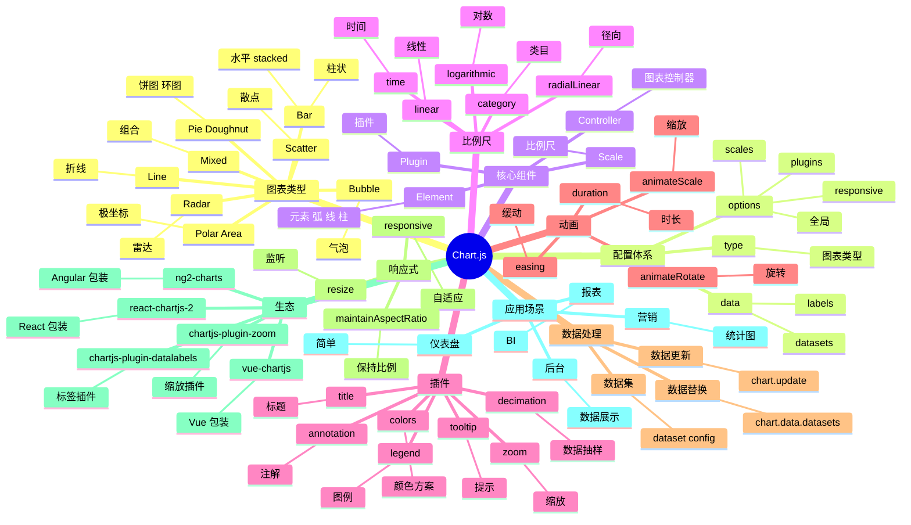

# Chart.js

## 前言

**定位**：基于 HTML5 Canvas 的开源图表库，2013 年由 Nick Downie 发布至今是 Web 端最简单易用的图表解决方案之一，与 D3/Plotly 形成"易用 vs 强大"的对比。

**核心价值**：
- 8 种内置图表（折线/柱状/饼图/雷达/极坐标/散点/气泡/混合）
- 零依赖，单文件 60KB gzipped
- 响应式：自适应容器尺寸变化
- 动画开箱即用：进入/更新/悬停都有过渡

**五大特性**：
1. **Canvas 渲染**：相比 SVG 在大数据下性能更好（万级数据点）
2. **响应式**：通过 `responsive: true` 自动适配容器
3. **插件体系**：官方 chartjs-plugin-* 扩展（标签、注解、缩放）
4. **TypeScript 优先**：v3+ 完整类型定义
5. **Tree-shakable**：v3+ 改用 ESM，按需引入 controllers

**对比表**：

| 维度 | Chart.js | D3.js | ECharts | Plotly.js | Recharts |
|---|---|---|---|---|---|
| 学习曲线 | 低 | 高 | 中 | 中 | 低 |
| 图表类型 | 8 种内置 | 任意 | 20+ | 20+ | 10+ |
| 性能 | ✅ Canvas | ⚠️ SVG | ✅ Canvas+SVG | ⚠️ SVG | ✅ SVG |
| 自定义 | ⚠️ 中 | ✅✅ 极强 | ✅ 强 | ⚠️ 中 | ⚠️ 中 |
| 包大小 | 60KB | 30-500KB | 1MB+ | 3MB+ | 100KB |
| 适合 | 简单图表 | 复杂定制 | 大屏 | 科研图表 | React 项目 |

## 思维导图



## 关键代码

### 一、安装与基础

```bash
npm install chart.js
```

```typescript
import { Chart, registerables } from "chart.js";

// 注册所有组件（开发环境方便）
Chart.register(...registerables);

// 按需注册（生产环境推荐）
Chart.register(
  CategoryScale,
  LinearScale,
  PointElement,
  LineElement,
  BarElement,
  Title,
  Tooltip,
  Legend,
  Filler
);

const chart = new Chart(ctx, {
  type: "line",
  data: { /* ... */ },
  options: { /* ... */ }
});
```

### 二、折线图

```typescript
const lineChart = new Chart(ctx, {
  type: "line",
  data: {
    labels: ["1月", "2月", "3月", "4月", "5月", "6月"],
    datasets: [{
      label: "销售额（万元）",
      data: [12, 19, 15, 25, 22, 30],
      borderColor: "rgb(75, 192, 192)",
      backgroundColor: "rgba(75, 192, 192, 0.2)",
      tension: 0.4,           // 曲线平滑度
      fill: true,             // 区域填充
      pointRadius: 5,
      pointHoverRadius: 7
    }]
  },
  options: {
    responsive: true,
    plugins: {
      legend: { position: "top" },
      title: { display: true, text: "月度销售趋势" },
      tooltip: {
        callbacks: {
          label: (ctx) => `${ctx.dataset.label}: ¥${ctx.parsed.y}万`
        }
      }
    },
    scales: {
      y: { beginAtZero: true, title: { display: true, text: "销售额" } }
    }
  }
});
```

### 三、柱状图（分组 + 堆叠）

```typescript
const barChart = new Chart(ctx, {
  type: "bar",
  data: {
    labels: ["Q1", "Q2", "Q3", "Q4"],
    datasets: [
      {
        label: "产品A",
        data: [50, 60, 70, 80],
        backgroundColor: "rgba(255, 99, 132, 0.7)"
      },
      {
        label: "产品B",
        data: [30, 40, 50, 60],
        backgroundColor: "rgba(54, 162, 235, 0.7)"
      }
    ]
  },
  options: {
    responsive: true,
    scales: {
      x: { stacked: false },   // 不堆叠 = 分组
      y: { stacked: false, beginAtZero: true }
    },
    plugins: {
      legend: { position: "top" },
      title: { display: true, text: "季度销售对比" }
    }
  }
});
```

### 四、饼图与环形图

```typescript
const pieChart = new Chart(ctx, {
  type: "doughnut",   // 改成 "pie" 是饼图
  data: {
    labels: ["直接访问", "搜索引擎", "推荐", "社交"],
    datasets: [{
      data: [335, 310, 274, 235],
      backgroundColor: [
        "rgba(255, 99, 132, 0.8)",
        "rgba(54, 162, 235, 0.8)",
        "rgba(255, 206, 86, 0.8)",
        "rgba(75, 192, 192, 0.8)"
      ],
      borderWidth: 2,
      hoverOffset: 10         // 悬停扇形偏移
    }]
  },
  options: {
    responsive: true,
    cutout: "60%",           // 环形图中间空心比例
    plugins: {
      legend: { position: "right" },
      title: { display: true, text: "流量来源" }
    }
  }
});
```

### 五、混合图（折线 + 柱状）

```typescript
const mixedChart = new Chart(ctx, {
  data: {
    labels: ["周一", "周二", "周三", "周四", "周五"],
    datasets: [
      {
        type: "bar",
        label: "订单数",
        data: [120, 150, 180, 200, 170],
        backgroundColor: "rgba(54, 162, 235, 0.6)",
        yAxisID: "y"
      },
      {
        type: "line",
        label: "转化率",
        data: [3.2, 3.5, 4.0, 4.5, 4.2],
        borderColor: "rgb(255, 99, 132)",
        yAxisID: "y1"
      }
    ]
  },
  options: {
    responsive: true,
    scales: {
      y: {
        type: "linear",
        position: "left",
        title: { display: true, text: "订单数" }
      },
      y1: {
        type: "linear",
        position: "right",
        title: { display: true, text: "转化率(%)" },
        grid: { drawOnChartArea: false }
      }
    }
  }
});
```

### 六、动态更新数据

```typescript
// 实时数据流
let chart: Chart;

function initChart() {
  chart = new Chart(ctx, {
    type: "line",
    data: { labels: [], datasets: [{ label: "实时数据", data: [], borderColor: "blue" }] }
  });
}

// 添加新数据点
function addPoint(label: string, value: number) {
  chart.data.labels!.push(label);
  chart.data.datasets[0].data.push(value);

  // 保留最近 20 个点
  if (chart.data.labels!.length > 20) {
    chart.data.labels!.shift();
    chart.data.datasets[0].data.shift();
  }

  chart.update("none");  // "none" 不带动画
}

// 定时器
setInterval(() => {
  addPoint(new Date().toLocaleTimeString(), Math.random() * 100);
}, 1000);
```

### 七、React 集成

```tsx
import { Line } from "react-chartjs-2";
import {
  Chart as ChartJS,
  CategoryScale, LinearScale, PointElement, LineElement,
  Title, Tooltip, Legend, Filler
} from "chart.js";

ChartJS.register(
  CategoryScale, LinearScale, PointElement, LineElement,
  Title, Tooltip, Legend, Filler
);

export function SalesChart() {
  const data = {
    labels: ["1月", "2月", "3月", "4月", "5月", "6月"],
    datasets: [{
      label: "销售额",
      data: [12, 19, 15, 25, 22, 30],
      borderColor: "rgb(75, 192, 192)",
      backgroundColor: "rgba(75, 192, 192, 0.2)",
      fill: true,
      tension: 0.4
    }]
  };

  const options = {
    responsive: true,
    plugins: { legend: { position: "top" as const } }
  };

  return <Line data={data} options={options} />;
}
```

### 八、自定义插件

```typescript
const chart = new Chart(ctx, {
  type: "line",
  data: { /* ... */ },
  options: { /* ... */ },
  plugins: [{
    // 在数据点上画自定义文本
    afterDatasetsDraw(chart) {
      const { ctx } = chart;
      chart.data.datasets.forEach((dataset, i) => {
        const meta = chart.getDatasetMeta(i);
        meta.data.forEach((point, index) => {
          const value = dataset.data[index];
          ctx.save();
          ctx.fillStyle = "black";
          ctx.font = "bold 12px sans-serif";
          ctx.fillText(String(value), point.x - 10, point.y - 10);
          ctx.restore();
        });
      });
    }
  }]
});
```

## 核心洞察

- **Chart.js 是 Canvas 派的代表**：相比 D3 的 SVG 路线，Canvas 在万级数据点下性能优势明显（Canvas 是"画完即忘"，SVG 是"DOM 树膨胀"）
- **Chart.js 4.0 改用 ESM + tree-shaking**：v3 必须 `import "chart.js"` 全量引入，v4 改成按需 `Chart.register(...)`，bundle 可减 70%
- **Chart.js 4.0 默认无动画**：v3 之前默认开启动画，v4 改默认关闭，开发者需手动 `animation: true`（加速首屏）
- **Chart.js 不擅长复杂可视化**：D3 的力导向图、地理投影、树图等能力 Chart.js 没有，需结合 D3
- **Chart.js 的插件体系是其扩展点**：`chartjs-plugin-zoom`、`chartjs-plugin-datalabels`、`chartjs-plugin-annotation` 是官方/社区三大插件
- **Chart.js 的 `responsive: true` 是默认值**：v3 之前需要手动开启，v4 改成默认（但 `maintainAspectRatio` 仍默认 true）
- **Chart.js 的 TypeScript 类型业内第一**：`ChartConfiguration`、`ChartData`、`ChartOptions` 三件套让任何配置 IDE 都能补全
- **Chart.js 的 tooltip 是基于 canvas 绘制**：自绘 HTML 浮层需要自己写（这是 Chart.js 与 ECharts 的差异点）
- **Chart.js + react-chartjs-2 是 React 生态最佳实践**：`vue-chartjs`、`ng2-charts` 也成熟，框架集成度高
- **Chart.js 不支持 3D 图表**：3D 用 three.js（Three.js），2D 用 Chart.js，分工明确
- **Chart.js 的"简单"是双刃剑**：标准图表 5 分钟搞定，复杂定制 5 天搞不定（vs D3 5 小时搞定）
- **Chart.js 是"图表库"不是"可视化库"**：固定 8 种图表，D3 是"可视化语言"——定位差异

## 跨项目引用

- **[[d3]]**：Chart.js 不擅长时用 D3，复杂定制可视化首选
- **[[plotly]]**：科研/交互图表用 Plotly，标准图表用 Chart.js
- **[[echarts]]**：国内大屏首选，Chart.js 用于轻量场景
- **[[recharts]]**：React 项目 Recharts 与 react-chartjs-2 二选一
- **[[react]]**：react-chartjs-2 是 Chart.js 的官方 React 包装
- **[[vue]]**：vue-chartjs 是 Chart.js 的 Vue 包装
- **[[angular]]**：ng2-charts 是 Angular 包装
- **[[canvas]]**：Chart.js 基于 Canvas 渲染，SVG 用 D3/Recharts
- **[[typescript]]**：Chart.js v3+ 完整 TS 支持，类型是同类最佳
- **[[three.js]]**：3D 图表用 Three.js，2D 用 Chart.js
- **[[gsap]]**：复杂动画用 GSAP，Chart.js 内置动画够用
- **[[tailwindcss]]**：Chart.js 配合 Tailwind 响应式布局
