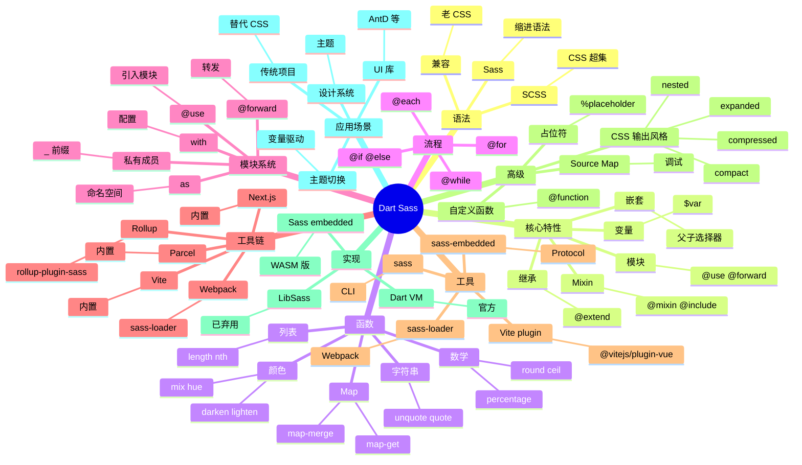

# Dart Sass

## 前言

**定位**：Sass（Syntactically Awesome Style Sheets）语言的官方 Dart 实现，2016 年发布至今是 CSS 预处理器的事实标准，被 Bootstrap、Ant Design 等大型 UI 库使用。

**核心价值**：
- SCSS 语法兼容 CSS 零迁移成本
- 变量、嵌套、mixin、继承、函数五大特性
- 工具链核心：Vite/Webpack/Next.js 内置支持
- 模块系统：@use / @forward 替代旧的 @import

**五大特性**：
1. **SCSS 语法**：是 CSS 的超集，老 CSS 文件就是合法 SCSS
2. **变量 + 函数**：颜色运算、数学计算、字符串处理
3. **Mixin + Include**：可复用代码块，支持参数和默认值
4. **@extend 继承**：CSS 类组合的静态方式
5. **@use / @forward 模块系统**：替代旧 @import，解决全局命名空间污染

**对比表**：

| 维度 | Sass (Dart) | Less | Stylus | PostCSS | CSS in JS |
|---|---|---|---|---|---|
| 语法 | SCSS/Sass | Less | 自定义 | 无 | JS |
| 编译速度 | ✅ 快 | ⚠️ | ⚠️ | ⚠️ | ✅ |
| 工具链集成 | ✅ | ✅ | ⚠️ | ✅ | ✅ |
| 学习曲线 | 中 | 低 | 低 | 高 | 中 |
| 模块化 | ✅ @use | ⚠️ | ⚠️ | ⚠️ | ✅ |
| 适合 | 通用 | 老项目 | 极简 | 工具链 | JS 项目 |

## 思维导图



## 关键代码

### 一、安装与基础

```bash
npm install -D sass
```

```bash
# CLI 编译
npx sass input.scss output.css
npx sass --watch src/styles:dist/styles
npx sass --style=compressed input.scss output.min.css
```

```scss
// variables.scss
$primary: #1890ff;
$success: #52c41a;
$danger: #ff4d4f;

$font-size-base: 14px;
$border-radius: 4px;
```

### 二、嵌套

```scss
.card {
  background: white;
  border-radius: 8px;
  padding: 16px;

  .title {
    font-size: 1.25rem;
    color: $primary;

    &:hover {
      color: darken($primary, 10%);
    }
  }

  .content {
    margin-top: 8px;

    p {
      line-height: 1.5;

      &::first-letter {
        font-size: 2em;
        font-weight: bold;
      }
    }
  }

  &.active {
    border: 2px solid $primary;
  }

  @media (max-width: 768px) {
    padding: 8px;
  }
}
```

### 三、Mixin（可复用代码块）

```scss
@mixin button-base {
  display: inline-block;
  padding: 8px 16px;
  border: none;
  border-radius: $border-radius;
  cursor: pointer;
  transition: all 0.2s;

  &:disabled {
    opacity: 0.5;
    cursor: not-allowed;
  }
}

@mixin button-variant($bg, $color: white) {
  background: $bg;
  color: $color;

  &:hover:not(:disabled) {
    background: darken($bg, 10%);
  }
}

.button {
  @include button-base;
  @include button-variant($primary);
}

.button-danger {
  @include button-base;
  @include button-variant($danger);
}

// 带内容块的 mixin
@mixin mobile {
  @media (max-width: 768px) {
    @content;
  }
}

.title {
  font-size: 2rem;

  @include mobile {
    font-size: 1.25rem;
  }
}
```

### 四、@use 模块系统

```scss
// _variables.scss
$primary: #1890ff;
$radius: 4px;
```

```scss
// _mixins.scss
@mixin clearfix {
  &::after {
    content: "";
    display: table;
    clear: both;
  }
}
```

```scss
// main.scss
@use "variables" as v;
@use "mixins" as m;

.button {
  background: v.$primary;
  border-radius: v.$radius;

  @include m.clearfix;
}
```

```scss
// 带配置的 @use
@use "variables" with (
  $primary: #52c41a,
  $radius: 8px
);
```

```scss
// @forward 转发（创建聚合文件）
// _index.scss
@forward "variables";
@forward "mixins";
@forward "functions";
```

### 五、@function 自定义函数

```scss
@function rem($px) {
  @return ($px / 16) * 1rem;
}

@function z-index($key) {
  $map: (
    "modal": 1000,
    "tooltip": 1100,
    "notification": 1200
  );
  @return map-get($map, $key);
}

.title {
  font-size: rem(32);   // 2rem
  z-index: z-index("modal");
}
```

### 六、流程控制

```scss
@for $i from 1 through 5 {
  .col-#{$i} {
    width: percentage($i / 5);
  }
}

@each $name in primary, success, warning, danger {
  .btn-#{$name} {
    background: map-get($colors, $name);
  }
}

$status: "active";

@if $status == "active" {
  .box { display: block; }
} @else if $status == "hidden" {
  .box { display: none; }
} @else {
  .box { display: flex; }
}
```

### 七、继承 @extend

```scss
%message-base {
  padding: 12px 16px;
  border-radius: 4px;
  margin-bottom: 16px;
}

.message-success {
  @extend %message-base;
  background: #f6ffed;
  border: 1px solid #b7eb8f;
}

.message-error {
  @extend %message-base;
  background: #fff2f0;
  border: 1px solid #ffccc7;
}

// 编译后：所有类共享相同属性
// .message-success, .message-error { padding: ...; }
```

### 八、Vite 集成

```typescript
// vite.config.ts
import { defineConfig } from "vite";

export default defineConfig({
  css: {
    preprocessorOptions: {
      scss: {
        additionalData: `@use "@/styles/variables" as *;`,
        api: "modern-compiler"  // 用 sass-embedded
      }
    }
  }
});
```

### 九、Webpack 集成

```javascript
// webpack.config.js
module.exports = {
  module: {
    rules: [
      {
        test: /\.scss$/,
        use: [
          "style-loader",
          "css-loader",
          {
            loader: "sass-loader",
            options: {
              // 现代编译器（推荐）
              implementation: require("sass"),
              sassOptions: {
                // 全局变量
                additionalData: `@use "@/styles/variables" as *;`
              }
            }
          }
        ]
      }
    ]
  }
};
```

### 十、设计 Token 主题切换

```scss
// _tokens.scss
$tokens: (
  "primary": #1890ff,
  "bg": #ffffff,
  "text": #000000
);

@function token($key) {
  @return map-get($tokens, $key);
}

@mixin theme($is-dark) {
  @if $is-dark {
    $tokens: (
      "primary": #177ddc,
      "bg": #141414,
      "text": #ffffff
    );
  }

  .button {
    background: token("primary");
  }
  body {
    background: token("bg");
    color: token("text");
  }
}

:root {
  @include theme(false);
}

[data-theme="dark"] {
  @include theme(true);
}
```

## 核心洞察

- **Dart Sass 是 Sass 的官方实现**：2016 年后 LibSass 已弃用，Dart Sass 是唯一官方版本
- **Dart Sass 1.x 是 Dart VM 写的**：v1.0 之前是 LibSass（C++），性能差不维护
- **Dart Sass 1.45 引入 `sass-embedded`**：用 Protocol 与 IDE 通信，启动更快、内存更小
- **Dart Sass 的模块系统是 1.x 重头戏**：@use/@forward 替代 @import，解决命名空间污染
- **SCSS 与 Sass 缩进语法并存**：SCSS 是 CSS 超集（流行）、Sass 是缩进语法（极简）
- **Dart Sass 编译速度比 Less 快 5-10x**：Dart VM 比 Node.js 启动快
- **Dart Sass 与 Tailwind 的关系**：Tailwind 用 PostCSS，但很多项目同时用 Sass + Tailwind
- **Dart Sass 不应再用 @import**：v1.45+ 提示 @import 弃用，2.0 将移除
- **Dart Sass 的 `additionalData` 模式**：在每个 .scss 文件顶部注入全局变量，模拟"全局作用域"
- **Dart Sass 的"现代编译器"（modern-compiler）**：Vite/Webpack 默认开启，1.5x 编译速度
- **Dart Sass 与 CSS-in-JS 对立**：Sass 是 CSS 预处理器，CSS-in-JS（styled-components）是 JS 方案
- **Dart Sass 适合大型设计系统**：Ant Design、Material UI 用 Sass 变量管理主题

## 跨项目引用

- **[[postcss]]**：Sass 编译后可通过 PostCSS 加 Autoprefixer 等
- **[[css]]**：Sass 是 CSS 的超集，最终编译为 CSS
- **[[less]]**：Less 是 Sass 的主要竞品，语法类似
- **[[stylus]]**：Stylus 是另一个 CSS 预处理器
- **[[tailwindcss]]**：Sass + Tailwind 是常见组合（Sass 管主题变量、Tailwind 管 utility）
- **[[bootstrap]]**：Bootstrap 5 用 Sass 重写，主题通过 Sass 变量定制
- **[[ant-design]]**：AntD 的样式底层用 Sass
- **[[material-ui]]**：MUI 5 用 Sass + Emotion
- **[[vite]]**：Vite 内置 Sass 支持
- **[[webpack]]**：webpack 通过 sass-loader 集成
- **[[next.js]]**：Next.js 内置 Sass 支持
- **[[autoprefixer]]**：Sass 编译后用 Autoprefixer 加浏览器前缀
- **[[cssnano]]**：用 cssnano 压缩 Sass 输出
