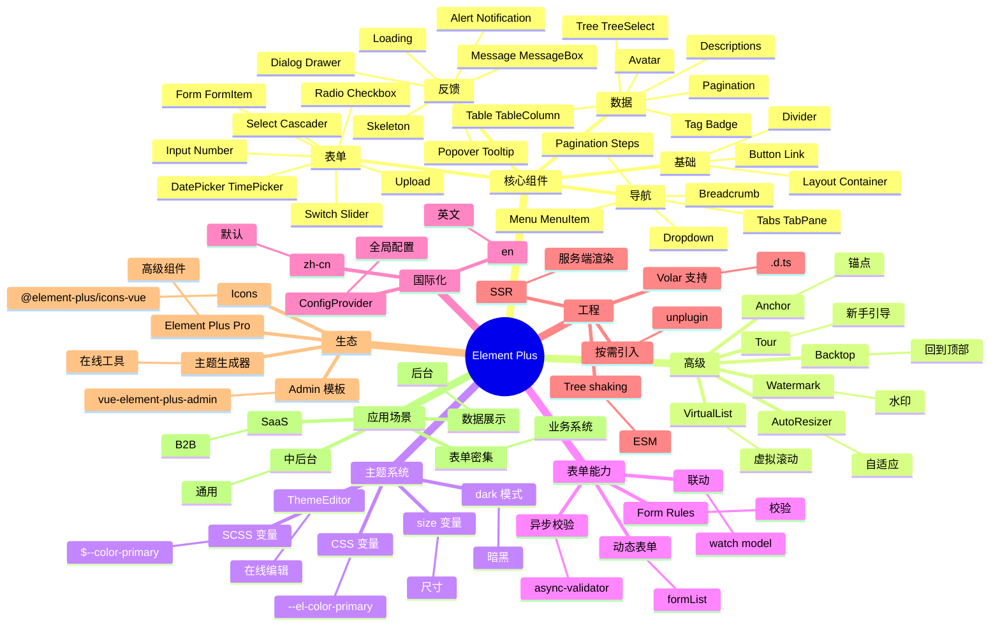

# Element Plus

## 前言

**定位**：饿了么团队推出的 Vue 3 桌面端 UI 组件库，是 Element UI（Vue 2 版）的官方继任者，国内中后台项目的事实标准之一。

**核心价值**：
- 80+ 高质量 Vue 3 组件，覆盖桌面端 90% 业务场景
- TypeScript 重写，类型完整度业内第一
- 国际化、可访问性、SSR 支持全面
- 中文文档完善，国内开发者首选

**五大特性**：
1. **Vue 3 + TypeScript**：基于 Composition API 重写，类型完整
2. **主题系统**：CSS 变量 + SCSS 变量，深度定制
3. **按需引入**：unplugin-vue-components 自动注册
4. **国际化**：内置 11 种语言，i18n 一行切换
5. **生态丰富**：Element Plus Pro、Admin 模板、Icons 包

**对比表**：

| 维度 | Element Plus | Ant Design Vue | Naive UI | Vuetify | PrimeVue |
|---|---|---|---|---|---|
| 框架 | Vue 3 | Vue 3 | Vue 3 | Vue 2/3 | Vue 3 |
| 组件数 | 80+ | 70+ | 80+ | 80+ | 80+ |
| TypeScript | ✅ 完美 | ✅ 完美 | ✅ 完美 | ✅ | ✅ |
| 主题定制 | ✅ 强 | ✅ 强 | ✅ 极强 | ✅ Material | ✅ |
| 中文文档 | ✅ 完善 | ✅ 完善 | ⚠️ | ⚠️ | ⚠️ |
| 适合 | 中后台 | 中后台 | 现代化 | Material | 企业级 |

## 思维导图



## 关键代码

### 一、安装与基础

```bash
# 完整引入
npm install element-plus

# 按需引入（推荐）
npm install -D unplugin-vue-components unplugin-auto-import
npm install element-plus @element-plus/icons-vue
```

```typescript
// vite.config.ts
import { defineConfig } from "vite";
import AutoImport from "unplugin-auto-import/vite";
import Components from "unplugin-vue-components/vite";
import { ElementPlusResolver } from "unplugin-vue-components/resolvers";

export default defineConfig({
  plugins: [
    AutoImport({ resolvers: [ElementPlusResolver()] }),
    Components({ resolvers: [ElementPlusResolver()] })
  ]
});
```

```vue
<!-- main.ts 全量引入（不推荐） -->
import ElementPlus from "element-plus";
import "element-plus/dist/index.css";
import zhCn from "element-plus/dist/locale/zh-cn.mjs";

app.use(ElementPlus, { locale: zhCn });
```

### 二、基础组件

```vue
<template>
  <el-container>
    <el-header>Header</el-header>
    <el-container>
      <el-aside width="200px">Aside</el-aside>
      <el-main>
        <el-button type="primary" @click="handleClick">主要按钮</el-button>
        <el-button type="success">成功按钮</el-button>
        <el-button type="warning">警告</el-button>
        <el-button type="danger">危险</el-button>
        <el-button text>文字按钮</el-button>
      </el-main>
    </el-container>
  </el-container>
</template>

<script setup lang="ts">
import { ElMessage, ElMessageBox } from "element-plus";
import { Search } from "@element-plus/icons-vue";

const handleClick = () => {
  ElMessage.success("操作成功");
};
</script>
```

### 三、表单（核心）

```vue
<template>
  <el-form
    :model="form"
    :rules="rules"
    ref="formRef"
    label-width="100px"
    style="max-width: 600px"
  >
    <el-form-item label="用户名" prop="username">
      <el-input v-model="form.username" placeholder="请输入用户名" />
    </el-form-item>

    <el-form-item label="邮箱" prop="email">
      <el-input v-model="form.email" type="email" />
    </el-form-item>

    <el-form-item label="角色" prop="role">
      <el-select v-model="form.role" placeholder="请选择">
        <el-option label="管理员" value="admin" />
        <el-option label="用户" value="user" />
      </el-select>
    </el-form-item>

    <el-form-item label="状态">
      <el-switch v-model="form.active" />
    </el-form-item>

    <el-form-item label="日期" prop="date">
      <el-date-picker v-model="form.date" type="date" placeholder="选择日期" />
    </el-form-item>

    <el-form-item>
      <el-button type="primary" @click="submit">提交</el-button>
      <el-button @click="reset">重置</el-button>
    </el-form-item>
  </el-form>
</template>

<script setup lang="ts">
import { reactive, ref } from "vue";
import type { FormInstance, FormRules } from "element-plus";

const formRef = ref<FormInstance>();

const form = reactive({
  username: "",
  email: "",
  role: "",
  active: false,
  date: ""
});

const rules: FormRules = {
  username: [{ required: true, message: "请输入用户名", trigger: "blur" }],
  email: [
    { required: true, message: "请输入邮箱" },
    { type: "email", message: "邮箱格式错误" }
  ],
  role: [{ required: true, message: "请选择角色" }],
  date: [{ required: true, message: "请选择日期" }]
};

const submit = async () => {
  if (!formRef.value) return;
  await formRef.value.validate();
  ElMessage.success("提交成功");
};

const reset = () => formRef.value?.resetFields();
</script>
```

### 四、Table（数据展示）

```vue
<template>
  <el-table
    :data="tableData"
    border
    stripe
    height="500"
    v-loading="loading"
  >
    <el-table-column type="selection" width="55" />
    <el-table-column type="index" label="#" width="60" />
    <el-table-column prop="name" label="姓名" width="120" />
    <el-table-column prop="email" label="邮箱" />
    <el-table-column label="状态" width="100">
      <template #default="{ row }">
        <el-tag :type="row.active ? 'success' : 'danger'">
          {{ row.active ? "启用" : "禁用" }}
        </el-tag>
      </template>
    </el-table-column>
    <el-table-column label="操作" width="200" fixed="right">
      <template #default="{ row }">
        <el-button type="primary" link @click="edit(row)">编辑</el-button>
        <el-button type="danger" link @click="remove(row)">删除</el-button>
      </template>
    </el-table-column>
  </el-table>

  <el-pagination
    v-model:current-page="page"
    v-model:page-size="size"
    :total="total"
    :page-sizes="[10, 20, 50, 100]"
    layout="total, sizes, prev, pager, next, jumper"
    @size-change="loadData"
    @current-change="loadData"
  />
</template>

<script setup lang="ts">
import { ref, onMounted } from "vue";
import { ElMessageBox, ElMessage } from "element-plus";

const loading = ref(false);
const tableData = ref([]);
const page = ref(1);
const size = ref(20);
const total = ref(0);

const loadData = async () => {
  loading.value = true;
  const res = await fetchUsers({ page: page.value, size: size.value });
  tableData.value = res.list;
  total.value = res.total;
  loading.value = false;
};

const edit = (row: any) => { /* ... */ };

const remove = (row: any) => {
  ElMessageBox.confirm(`确认删除 ${row.name}?`, "提示")
    .then(() => ElMessage.success("删除成功"))
    .catch(() => {});
};

onMounted(loadData);
</script>
```

### 五、Dialog / Drawer

```vue
<template>
  <el-button @click="dialogVisible = true">打开弹窗</el-button>

  <el-dialog
    v-model="dialogVisible"
    title="编辑用户"
    width="600px"
    :close-on-click-modal="false"
  >
    <el-form :model="form" label-width="80px">
      <el-form-item label="姓名">
        <el-input v-model="form.name" />
      </el-form-item>
      <el-form-item label="邮箱">
        <el-input v-model="form.email" />
      </el-form-item>
    </el-form>
    <template #footer>
      <el-button @click="dialogVisible = false">取消</el-button>
      <el-button type="primary" @click="save">保存</el-button>
    </template>
  </el-dialog>
</template>

<script setup lang="ts">
import { ref } from "vue";

const dialogVisible = ref(false);
const form = ref({ name: "", email: "" });

const save = () => { /* ... */ dialogVisible.value = false; };
</script>
```

### 六、消息提示

```typescript
import { ElMessage, ElMessageBox, ElNotification } from "element-plus";

// 简单消息
ElMessage.success("成功");
ElMessage.warning("警告");
ElMessage.error("错误");
ElMessage.info("提示");

// 通知（更显眼）
ElNotification.success({
  title: "成功",
  message: "操作完成"
});

// 确认弹窗
ElMessageBox.confirm("确认删除？", "提示", {
  confirmButtonText: "确定",
  cancelButtonText: "取消",
  type: "warning"
}).then(() => {
  // 确认
}).catch(() => {
  // 取消
});

// 弹窗输入
ElMessageBox.prompt("请输入邮箱", "提示", {
  confirmButtonText: "确定",
  cancelButtonText: "取消"
}).then(({ value }) => {
  console.log(value);
});
```

### 七、暗黑模式与主题定制

```scss
// styles/element-variables.scss
@forward "element-plus/theme-chalk/src/common/var.scss" with (
  $colors: (
    "primary": ("base": #42b883)
  ),
  $border-radius: (
    "base": 8px
  )
);
```

```typescript
// main.ts
import "./styles/element-variables.scss";

// 暗黑模式
import "element-plus/theme-chalk/dark/css-vars.css";
document.documentElement.classList.add("dark");
```

### 八、Tree / Cascader

```vue
<el-tree
  :data="treeData"
  :props="{ label: 'name', children: 'children' }"
  node-key="id"
  :default-expanded-keys="[1]"
  :default-checked-keys="[2]"
  show-checkbox
  @check="handleCheck"
/>

<el-cascader
  v-model="value"
  :options="options"
  :props="{ value: 'id', label: 'name' }"
  placeholder="请选择"
/>
```

## 核心洞察

- **Element Plus 是 Element UI 的 Vue 3 续作**：Element UI 在 Vue 2 时代是"国内中后台之王"，Element Plus 继承生态
- **Element Plus 2023 年发布 2.x 稳定版**：基于 Vue 3 + TS 重写，组件 API 兼容老用户
- **饿了么团队 2022 年被字节收购**：Element Plus 团队并入字节前端基建，仍保持独立更新
- **Element Plus 的中文文档是杀手锏**：vs Naive UI、PrimeVue 英文文档，EP 文档质量国内第一
- **Element Plus Pro 是商业版**：DataTable/TreeSelect/Excel 导出等高级组件付费
- **Element Plus 的 tree-shaking 通过 unplugin**：配合 unplugin-vue-components 自动注册，无需手动 import
- **Element Plus 的 Form 是国内最强**：动态校验/异步校验/表单联动是 EP 区别于其他 UI 库的关键能力
- **Element Plus 的 Table 性能中规中矩**：1 万行以下够用，超大数据需用 el-table-v2（虚拟滚动）
- **Element Plus 与 Ant Design Vue 风格对立**：EP 是"国内企业风"、AntDV 是"国际化风"——选哪个看项目
- **Element Plus 的图标是独立包 `@element-plus/icons-vue`**：300+ 图标但不如 Font Awesome 丰富
- **Element Plus 2.4 引入 Tour（新手引导）**：补齐 Naive UI 的引导能力
- **Element Plus 是 Vue 生态学习曲线最低的 UI 库**：文档中文 + 组件 API 简单 + 社区活跃

## 跨项目引用

- **[[vue]]**：Element Plus 100% 基于 Vue 3 Composition API
- **[[typescript]]**：EP 是 Vue 组件库中 TS 完整度最高的之一
- **[[ant-design]]**：Ant Design Vue 是 EP 的直接竞品，AntDV 国际化更好
- **[[naive-ui]]**：Naive UI 是 EP 的现代挑战者，主题定制更强
- **[[material-ui]]**：MUI 是 React 端的 EP 等价物
- **[[chakra-ui]]**：Chakra 是 React 端的"现代小而美"代表
- **[[tailwindcss]]**：Tailwind 配合 EP（Tailwind 处理布局、EP 处理复杂组件）
- **[[unplugin]]**：unplugin-vue-components 是 EP 按需引入的标配
- **[[vite]]**：EP 在 Vite 下的 HMR 体验最佳
- **[[pinia]]**：EP 项目常用 Pinia 状态管理
- **[[react]]** / **[[ant-design]]**：React 端的 Ant Design 是 EP 的跨框架对照
- **[[element-ui]]**：Element UI（Vue 2）是 EP 的前身，组件 API 类似
