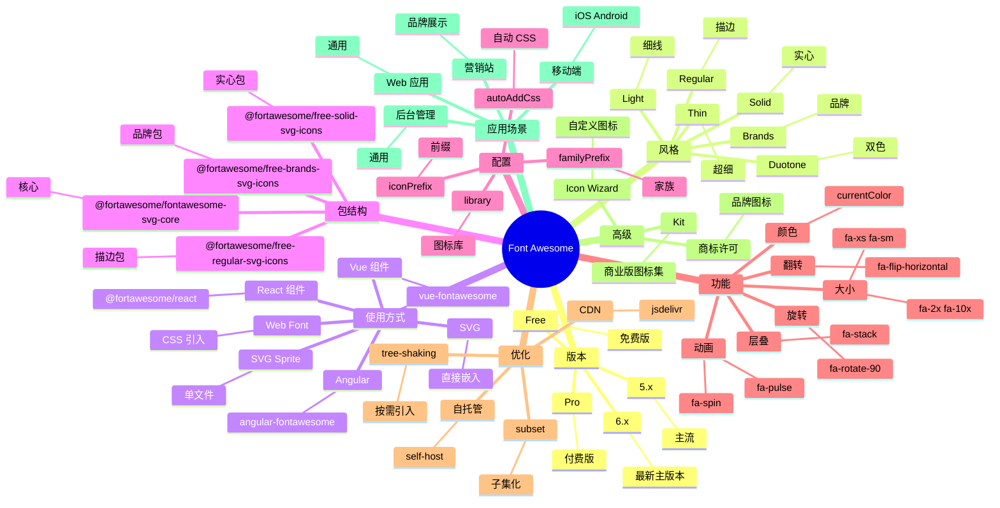

# Font Awesome

## 前言

**定位**：全球最流行的图标库，2012 年由 Dave Gandy 创建至今发布了 7 个主要版本（FA Free/Pro），是 Web 应用图标的事实标准。

**核心价值**：
- 20000+ 图标（FA 6 含 Pro 版），覆盖 99% 业务场景
- 三种使用方式：Web Font / SVG / SVG Sprite / React 组件
- 图标字体 vs SVG 双引擎：性能与灵活性兼顾
- 品牌图标齐全：GitHub、Twitter、微信等 2000+ 品牌 logo

**五大特性**：
1. **海量图标**：免费版 2000+、专业版 20000+
2. **多形态输出**：`<i>` 字体 / `<svg>` 矢量 / React 组件
3. **可定制度高**：大小、颜色、旋转、动画、层叠
4. **跨平台**：Web Font / iOS / Android / Desktop 通用
5. **TypeScript 友好**：`@fortawesome/react-fontawesome` 完整类型

**对比表**：

| 维度 | Font Awesome | Material Icons | Heroicons | Iconify | Lucide |
|---|---|---|---|---|---|
| 图标数 | 20000+ | 2000+ | 300+ | 200000+ | 1500+ |
| 风格 | 多风格 | Material | 极简 | 多源 | 极简 |
| 包大小 | 60-300KB | 100KB+ | 5KB/tree-shake | 按需 | 2KB/tree-shake |
| 商业许可 | 付费 Pro | Apache | MIT | MIT | ISC |
| 适合 | 通用 | Material 项目 | Tailwind 项目 | 跨源整合 | 轻量 |

## 思维导图



## 关键代码

### 一、Web Font 方式（传统）

```html
<!-- CDN 引入 -->
<link rel="stylesheet" href="https://cdnjs.cloudflare.com/ajax/libs/font-awesome/6.5.0/css/all.min.css">

<!-- 使用 -->
<i class="fa-solid fa-house"></i>
<i class="fa-brands fa-github"></i>
<i class="fa-regular fa-heart"></i>

<!-- 大小 -->
<i class="fa-solid fa-house fa-2x"></i>
<i class="fa-solid fa-house fa-3x"></i>

<!-- 旋转动画 -->
<i class="fa-solid fa-spinner fa-spin"></i>
<i class="fa-solid fa-sync fa-pulse"></i>
```

### 二、SVG 方式（推荐）

```typescript
// npm install @fortawesome/fontawesome-svg-core @fortawesome/free-solid-svg-icons
import { library, dom } from "@fortawesome/fontawesome-svg-core";
import { faHouse, faUser, faHeart } from "@fortawesome/free-solid-svg-icons";
import { faGithub, faTwitter } from "@fortawesome/free-brands-svg-icons";

// 把图标加入库
library.add(faHouse, faUser, faHeart, faGithub, faTwitter);

// 自动替换 <i class="fa-solid fa-house"></i> 为 SVG
dom.watch();
```

### 三、React 集成

```bash
npm install @fortawesome/react-fontawesome \
  @fortawesome/fontawesome-svg-core \
  @fortawesome/free-solid-svg-icons
```

```tsx
import { FontAwesomeIcon } from "@fortawesome/react-fontawesome";
import { faHouse, faUser } from "@fortawesome/free-solid-svg-icons";
import { faGithub } from "@fortawesome/free-brands-svg-icons";

export function Header() {
  return (
    <header>
      <FontAwesomeIcon icon={faHouse} size="2x" color="steelblue" />
      <FontAwesomeIcon icon={faUser} spin />
      <FontAwesomeIcon icon={faGithub} size="lg" />
    </header>
  );
}

// 动态加载
import { library } from "@fortawesome/fontawesome-svg-core";

library.add(faHouse, faUser);
// 之后用 icon={"house"} 字符串引用
<FontAwesomeIcon icon={["fas", "house"]} />
```

### 四、Vue 集成

```bash
npm install @fortawesome/vue-fontawesome@latest-3 \
  @fortawesome/fontawesome-svg-core \
  @fortawesome/free-solid-svg-icons
```

```vue
<template>
  <div>
    <font-awesome-icon :icon="['fas', 'house']" size="2x" />
    <font-awesome-icon :icon="['fab', 'github']" />
  </div>
</template>

<script setup lang="ts">
import { FontAwesomeIcon } from "@fortawesome/vue-fontawesome";
import { library } from "@fortawesome/fontawesome-svg-core";
import { faHouse } from "@fortawesome/free-solid-svg-icons";
import { faGithub } from "@fortawesome/free-brands-svg-icons";

library.add(faHouse, faGithub);
</script>
```

### 五、按需引入（tree-shaking）

```typescript
// ❌ 全量引入
import "@fortawesome/fontawesome-free/js/all";  // 1.5MB+

// ✅ 按需引入
import { library } from "@fortawesome/fontawesome-svg-core";
import { faHouse, faUser, faCog } from "@fortawesome/free-solid-svg-icons";
import { faGithub } from "@fortawesome/free-brands-svg-icons";

library.add(faHouse, faUser, faCog, faGithub);
// 实际 bundle 增加 ~30KB
```

### 六、层叠图标（Stack）

```html
<!-- 外层空心 + 内层实心 -->
<span class="fa-stack fa-2x">
  <i class="fa-solid fa-circle fa-stack-2x"></i>
  <i class="fa-solid fa-flag fa-stack-1x fa-inverse"></i>
</span>

<!-- 外层 + 内层形成品牌色 -->
<span class="fa-stack fa-2x">
  <i class="fa-brands fa-square-twitter fa-stack-2x" style="color:#1DA1F2"></i>
  <i class="fa-solid fa-check fa-stack-1x fa-inverse"></i>
</span>
```

### 七、TypeScript 类型

```typescript
import { IconDefinition, IconName, IconPrefix } from "@fortawesome/fontawesome-svg-core";

// 类型安全的图标
const icon: IconDefinition = faHouse;

// 字符串引用
const name: IconName = "house";
const prefix: IconPrefix = "fas";

<FontAwesomeIcon icon={[prefix, name]} />;
```

### 八、自托管

```bash
# 下载 SVG 包
npm install @fortawesome/free-solid-svg-icons
# 把所有 SVG 复制到 public/icons/
```

```typescript
// 自定义加载器
import { library } from "@fortawesome/fontawesome-svg-core";
import { faHouse } from "@fortawesome/free-solid-svg-icons";

library.add(faHouse);
```

## 核心洞察

- **Font Awesome 是 Web 图标的"瑞士军刀"**：20000+ 图标覆盖 99% 场景，但有"杀鸡用牛刀"的体积问题
- **FA 6 引入 Duotone 风格**：双色图标是 FA Pro 的杀手特性，与 Material Symbols 风格对立
- **Web Font 模式正被 SVG 取代**：传统 `fa-solid fa-house` 用字体渲染，v6 推 SVG 模式（更清晰、可 CSS 控制）
- **Font Awesome 的 Pro 版收费**：$99/年 个人、$399/年 团队，但 Free 版已经够用 90% 场景
- **品牌图标免费**：2000+ 品牌 logo（GitHub/Twitter/微信）是 FA 的杀手资源，替代品 Iconify 也有
- **图标字体 vs SVG 权衡**：图标字体体积小（一个字体 100KB 包含 1000 图标），但不能多色；SVG 每个图标独立，多色支持
- **FA 5 → FA 6 breaking change**：从 `fas` 改为 `fa-solid` 命名空间，旧代码需替换
- **FA Kit 是商业级特性**：图标云端管理 + 动态加载 + 子集优化，Pro 版专属
- **FA 的 `transform` 属性强大**：旋转、翻转、缩放无需 CSS 直接属性控制
- **FA 与 Material Icons 风格对立**：FA 多风格可选、Material 单一 Material 风格——FA 适合通用项目
- **FA 的图标字体性能陷阱**：每个图标实际是字符，CSS hover 时浏览器要重新排字（vs SVG 是 DOM）
- **FA 6 引入 `sharp` 风格**：硬边角图标，对抗 Lucide / Heroicons 的极简风潮

## 跨项目引用

- **[[react]]**：`@fortawesome/react-fontawesome` 是 FA 官方 React 包装
- **[[vue]]**：`vue-fontawesome` 是 FA 官方 Vue 包装
- **[[angular]]**：`angular-fontawesome` 是 FA 官方 Angular 包装
- **[[material-ui]]**：Material 项目可用 Material Icons（Google 自家），也可用 FA
- **[[tailwindcss]]**：Tailwind 官方推荐 Heroicons，与 FA 并存
- **[[bootstrap]]**：Bootstrap Icons 是 Bootstrap 官方图标集，与 FA 风格类似
- **[[webpack]]** / **[[vite]]**：FA 在 bundler 中需注意 tree-shaking 配置
- **[[typescript]]**：FA 完整 TS 支持，IconDefinition/IconName 类型安全
- **[[material design]]**：Material Symbols 是 Google 官方图标，FA 是其最大竞品
- **[[svg]]**：FA 的 SVG 模式基于 SVG，可与 React/Vue 组件化结合
- **[[iconify]]**：开源跨源图标聚合（FA/Material/Heroicons 都有），是 FA 的开源替代
