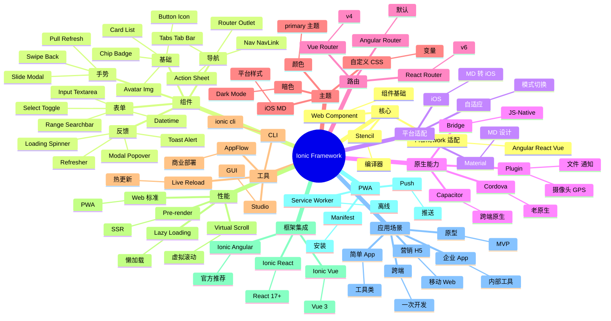

# Ionic Framework

## 前言

**定位**：基于 Web 技术的移动端 UI 框架，2013 年由 Max Lynch、Ben Sperry、Adam Bradley 创立至今是混合移动应用开发的事实标准之一，与 React Native/Flutter 三分天下。

**核心价值**：
- 一套代码，iOS / Android / Web / PWA / Electron 五端运行
- 原生外观：自动适配 iOS Human Interface / Material Design
- 100+ 移动端优化组件（按钮/列表/卡片/手势）
- 框架无关：Angular / React / Vue 都支持

**五大特性**：
1. **Capacitor 替代 Cordova**：现代化的原生运行时，性能更好
2. **跨框架**：Angular / React / Vue 三个版本
3. **PWA 一等公民**：内置 Service Worker / Manifest
4. **设计系统自适应**：iOS / Material 自动切换
5. **Live Reload**：开发期实时刷新

**对比表**：

| 维度 | Ionic | React Native | Flutter | Native | Cordova |
|---|---|---|---|---|---|
| 渲染 | WebView | Native | 自绘 Skia | Native | WebView |
| 性能 | ⚠️ 中 | ✅ 接近原生 | ✅✅ 极佳 | ✅✅ 极佳 | ⚠️ |
| 学习曲线 | 低 | 中 | 中 | 高 | 低 |
| 平台一致性 | ✅ | ⚠️ | ⚠️ | ✅ | ⚠️ |
| 跨端 | 5 端 | 2 端 | 6 端 | 1 端 | 5 端 |
| 适合 | 简单 App | 中等 App | 高性能 App | 极致性能 | 老项目 |

## 思维导图



## 关键代码

### 一、安装与基础

```bash
# 全局 CLI
npm install -g @ionic/cli

# 创建项目（Angular）
ionic start myApp tabs --type=angular
ionic start myApp tabs --type=react
ionic start myApp tabs --type=vue
```

```bash
# 运行
ionic serve                # 浏览器
ionic cap run ios           # iOS
ionic cap run android       # Android
```

### 二、Angular 集成

```typescript
// app/pages/home/home.page.ts
import { Component } from "@angular/core";

@Component({
  selector: "app-home",
  templateUrl: "home.page.html"
})
export class HomePage {
  items = [
    { id: 1, name: "商品A", price: 99 },
    { id: 2, name: "商品B", price: 199 }
  ];

  constructor() {}

  viewDetail(item: any) {
    console.log("查看", item);
  }
}
```

```html
<!-- home.page.html -->
<ion-header>
  <ion-toolbar>
    <ion-title>商品列表</ion-title>
    <ion-buttons slot="end">
      <ion-button (click)="add()">
        <ion-icon name="add"></ion-icon>
      </ion-button>
    </ion-buttons>
  </ion-toolbar>
</ion-header>

<ion-content>
  <ion-list>
    <ion-item *ngFor="let item of items" (click)="viewDetail(item)">
      <ion-avatar slot="start">
        
      </ion-avatar>
      <ion-label>
        <h2>{{ item.name }}</h2>
        <p>价格: ¥{{ item.price }}</p>
      </ion-label>
      <ion-badge slot="end">{{ item.id }}</ion-badge>
    </ion-item>
  </ion-list>
</ion-content>
```

### 三、React 集成

```bash
ionic start myApp tabs --type=react
```

```tsx
// src/pages/Home.tsx
import {
  IonContent, IonHeader, IonPage, IonTitle, IonToolbar,
  IonList, IonItem, IonLabel, IonButton, IonIcon
} from "@ionic/react";
import { add } from "ionicons/icons";

export function Home() {
  const items = [
    { id: 1, name: "商品A", price: 99 },
    { id: 2, name: "商品B", price: 199 }
  ];

  return (
    <IonPage>
      <IonHeader>
        <IonToolbar>
          <IonTitle>商品列表</IonTitle>
          <IonButton slot="end">
            <IonIcon icon={add} />
          </IonButton>
        </IonToolbar>
      </IonHeader>

      <IonContent>
        <IonList>
          {items.map(item => (
            <IonItem key={item.id}>
              <IonLabel>
                <h2>{item.name}</h2>
                <p>价格: ¥{item.price}</p>
              </IonLabel>
            </IonItem>
          ))}
        </IonList>
      </IonContent>
    </IonPage>
  );
}
```

### 四、Vue 集成

```vue
<template>
  <ion-page>
    <ion-header>
      <ion-toolbar>
        <ion-title>商品列表</ion-title>
      </ion-toolbar>
    </ion-header>

    <ion-content>
      <ion-list>
        <ion-item v-for="item in items" :key="item.id">
          <ion-label>
            <h2>{{ item.name }}</h2>
            <p>价格: ¥{{ item.price }}</p>
          </ion-label>
        </ion-item>
      </ion-list>
    </ion-content>
  </ion-page>
</template>

<script setup lang="ts">
import {
  IonPage, IonHeader, IonToolbar, IonTitle, IonContent,
  IonList, IonItem, IonLabel
} from "@ionic/vue";

const items = [
  { id: 1, name: "商品A", price: 99 },
  { id: 2, name: "商品B", price: 199 }
];
</script>
```

### 五、导航

```typescript
// Angular
import { NavController } from "@ionic/angular";

constructor(private navCtrl: NavController) {}

goDetail() {
  this.navCtrl.navigateForward("/detail");
}

// React
import { useHistory } from "react-router";
const history = useHistory();
history.push("/detail");

// Vue
import { useRouter } from "vue-router";
const router = useRouter();
router.push("/detail");
```

### 六、表单

```html
<ion-list>
  <ion-item>
    <ion-label position="floating">用户名</ion-label>
    <ion-input [(ngModel)]="username" required></ion-input>
  </ion-item>

  <ion-item>
    <ion-label position="floating">密码</ion-label>
    <ion-input type="password" [(ngModel)]="password" required></ion-input>
  </ion-item>

  <ion-item>
    <ion-label>记住我</ion-label>
    <ion-toggle [(ngModel)]="remember"></ion-toggle>
  </ion-item>

  <ion-item>
    <ion-label>生日</ion-label>
    <ion-datetime displayFormat="YYYY-MM-DD" [(ngModel)]="birthday"></ion-datetime>
  </ion-item>

  <ion-button expand="block" (click)="login()">登录</ion-button>
</ion-list>
```

### 七、原生能力（Capacitor）

```bash
npm install @capacitor/core @capacitor/cli
npx cap init
npm install @capacitor/camera @capacitor/geolocation @capacitor/preferences
```

```typescript
// 摄像头
import { Camera, CameraResultType } from "@capacitor/camera";

const photo = await Camera.getPhoto({
  quality: 90,
  allowEditing: true,
  resultType: CameraResultType.Uri
});

// 地理位置
import { Geolocation } from "@capacitor/geolocation";

const position = await Geolocation.getCurrentPosition();
console.log(position.coords.latitude, position.coords.longitude);

// 本地存储
import { Preferences } from "@capacitor/preferences";

await Preferences.set({ key: "token", value: "xxx" });
const { value } = await Preferences.get({ key: "token" });
```

### 八、PWA 配置

```typescript
// main.ts (Angular)
// @angular/pwa 自动配置
// npx ng add @angular/pwa

// vite-plugin-pwa
import { defineConfig } from "vite";
import { VitePWA } from "vite-plugin-pwa";

export default defineConfig({
  plugins: [
    VitePWA({
      registerType: "autoUpdate",
      manifest: {
        name: "My App",
        short_name: "App",
        theme_color: "#3880ff",
        icons: [
          { src: "/icon-192.png", sizes: "192x192", type: "image/png" }
        ]
      }
    })
  ]
});
```

### 九、暗黑模式

```scss
/* 自定义主题 */
:root {
  --ion-color-primary: #3880ff;
  --ion-color-primary-shade: #3171e0;
}

@media (prefers-color-scheme: dark) {
  :root {
    --ion-background-color: #1e1e1e;
    --ion-text-color: #ffffff;
  }
}
```

## 核心洞察

- **Ionic 是"Web 跨端"的事实标准**：与 RN 的"JS 跨端"、Flutter 的"自绘跨端"是三条路线
- **Ionic 4 是"重生"**：从 AngularJS + Cordova 重写为 Web Components + Capacitor
- **Capacitor 是 Cordova 的精神继承者**：由 Ionic 团队开发，专为现代 Web 设计
- **Ionic 5 引入 Material Design 与 iOS 双模**：自动检测平台切换样式
- **Ionic 6 强化 PWA 支持**：Service Worker / Push / Install prompt
- **Ionic 7（2023）支持 Vue 3 和 React 18**：三大前端框架齐全
- **Ionic 的性能不是优势**：WebView 渲染 vs RN 的 Native 渲染有 1.5x 性能差距
- **Ionic 适合"企业级 App"**：CRUD 应用、内部工具，弱性能场景
- **Ionic 不适合"重交互"**：复杂动画 / 手游 / AR 用 Flutter/RN
- **Ionic + Capacitor 是免费开源**：Ionic Appflow 是商业部署服务
- **Ionic Stencil 是 Web Components 编译器**：Ionic 团队的另一力作
- **Ionic 的"5 端"是亮点**：iOS / Android / Web / PWA / Desktop 一次开发

## 跨项目引用

- **[[angular]]**：Ionic 最早基于 AngularJS，现在 Angular 是默认推荐
- **[[react]]**：Ionic React 是 React 端的官方版本
- **[[vue]]**：Ionic Vue 是 Vue 3 的官方版本
- **[[capacitor]]**：Capacitor 是 Ionic 团队的原生运行时
- **[[cordova]]**：Cordova 是 Capacitor 的前身，已被 Ionic 团队弃用
- **[[pwa]]**：Ionic 是 PWA 开发的最佳框架之一
- **[[typescript]]**：Ionic 完整 TS 支持
- **[[stencil]]**：Stencil 是 Ionic 团队的 Web Components 编译器
- **[[react native]]**：RN 是 Ionic 的"原生"竞品
- **[[flutter]]**：Flutter 是 Ionic 的"自绘"竞品
- **[[material design]]**：Ionic 内置 Material Design 主题
- **[[ionic cli]]**：Ionic CLI 是项目管理工具
