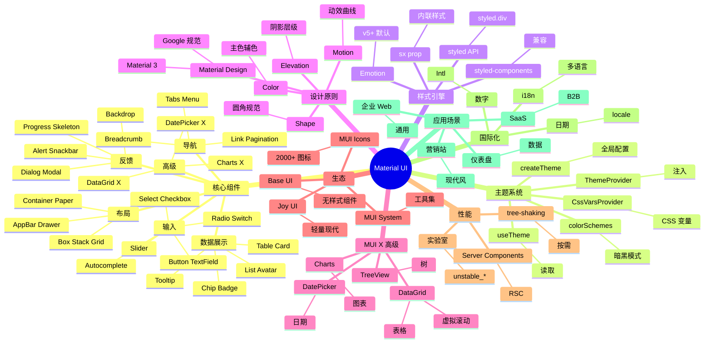

# Material UI

## 前言

**定位**：Google Material Design 设计语言的 React 实现，2014 年开源至今是 React 生态最成熟的 UI 库之一，与 Ant Design 齐名但路线不同。

**核心价值**：
- 完整实现 Material Design 规范（颜色/排版/形状/动效）
- 60+ 高质量 React 组件，覆盖 Web 端 90% 场景
- 主题系统基于 Emotion，运行时切换主题
- 国际化、可访问性、SSR、移动端支持全面

**五大特性**：
1. **Material Design 一致性**：所有组件遵循 Google 设计规范
2. **完善的 TypeScript**：类型完整，泛型组件支持出色
3. **主题系统**：`createTheme` + CSS 变量，深度定制
4. **JSS / Emotion 双引擎**：v5 默认 Emotion，性能更好
5. **生态丰富**：MUI X（高级组件）、MUI Base（无样式）、Joy UI（轻量）

**对比表**：

| 维度 | Material UI | Ant Design | Chakra UI | Tailwind UI | Bootstrap |
|---|---|---|---|---|---|
| 设计语言 | Material | 自研 | 自研 | 工具类 | 自研 |
| 组件丰富度 | ✅✅ 60+ | ✅✅ 60+ | ✅ 50+ | ⚠️ 20+ | ✅ 30+ |
| TypeScript | ✅ 完美 | ✅ 完美 | ✅ 完美 | ✅ | ⚠️ |
| 主题定制 | ✅ 极强 | ✅ 强 | ✅ 强 | ✅ | ✅ |
| 国际化 | ✅ 极强 | ✅ 极强 | ✅ | ⚠️ | ⚠️ |
| 适合 | 通用 React | 中后台 | 现代化 | 营销页 | 经典 Web |

## 思维导图



## 关键代码

### 一、安装与基础

```bash
npm install @mui/material @emotion/react @emotion/styled
# 图标
npm install @mui/icons-material
```

```tsx
// main.tsx
import { createTheme, ThemeProvider, CssBaseline } from "@mui/material";

const theme = createTheme({
  palette: {
    mode: "light",
    primary: { main: "#1976d2" },
    secondary: { main: "#dc004e" }
  },
  typography: {
    fontFamily: '"Inter", "Roboto", sans-serif'
  },
  shape: { borderRadius: 8 }
});

export default function App() {
  return (
    <ThemeProvider theme={theme}>
      <CssBaseline />  {/* 基础样式重置 */}
      <RootComponent />
    </ThemeProvider>
  );
}
```

### 二、sx prop 与 styled API

```tsx
import { Box, Button, Stack, Typography } from "@mui/material";
import { styled } from "@mui/material/styles";

// 1. sx prop：内联样式对象
export function Hero() {
  return (
    <Box
      sx={{
        bgcolor: "primary.main",
        color: "white",
        py: 10,
        px: 4,
        textAlign: "center"
      }}
    >
      <Typography variant="h2" sx={{ mb: 2 }}>
        欢迎使用 MUI
      </Typography>
      <Typography variant="h6" sx={{ opacity: 0.8, mb: 4 }}>
        Material Design 风格
      </Typography>
      <Stack direction="row" spacing={2} justifyContent="center">
        <Button variant="contained" size="large">开始</Button>
        <Button variant="outlined" size="large" sx={{ color: "white", borderColor: "white" }}>
          了解更多
        </Button>
      </Stack>
    </Box>
  );
}

// 2. styled API：自定义组件
const GradientButton = styled(Button)(({ theme }) => ({
  background: `linear-gradient(45deg, ${theme.palette.primary.main} 30%, ${theme.palette.secondary.main} 90%)`,
  border: 0,
  borderRadius: theme.shape.borderRadius,
  color: "white",
  padding: "10px 30px",
  boxShadow: "0 3px 5px 2px rgba(255, 105, 135, .3)",
  "&:hover": {
    background: `linear-gradient(45deg, ${theme.palette.primary.dark} 30%, ${theme.palette.secondary.dark} 90%)`
  }
}));
```

### 三、表单

```tsx
import {
  TextField, Button, MenuItem, Select, FormControl,
  InputLabel, FormHelperText, FormControlLabel, Checkbox,
  Switch, Slider
} from "@mui/material";
import { useState } from "react";

export function UserForm() {
  const [form, setForm] = useState({ name: "", email: "", role: "user", agree: false, age: 25 });
  const [errors, setErrors] = useState<Record<string, string>>({});

  const handleSubmit = (e: React.FormEvent) => {
    e.preventDefault();
    // 校验逻辑
  };

  return (
    <form onSubmit={handleSubmit}>
      <Stack spacing={3} sx={{ maxWidth: 400 }}>
        <TextField
          label="姓名"
          required
          value={form.name}
          onChange={e => setForm({ ...form, name: e.target.value })}
          error={!!errors.name}
          helperText={errors.name}
        />

        <TextField
          label="邮箱"
          type="email"
          required
          value={form.email}
          onChange={e => setForm({ ...form, email: e.target.value })}
          error={!!errors.email}
          helperText={errors.email || "请输入有效邮箱"}
        />

        <FormControl>
          <InputLabel>角色</InputLabel>
          <Select
            value={form.role}
            label="角色"
            onChange={e => setForm({ ...form, role: e.target.value })}
          >
            <MenuItem value="user">用户</MenuItem>
            <MenuItem value="admin">管理员</MenuItem>
          </Select>
        </FormControl>

        <FormControlLabel
          control={
            <Switch
              checked={form.agree}
              onChange={e => setForm({ ...form, agree: e.target.checked })}
            />
          }
          label="同意用户协议"
        />

        <Box>
          <Typography>年龄: {form.age}</Typography>
          <Slider
            value={form.age}
            onChange={(_, v) => setForm({ ...form, age: v as number })}
            min={0}
            max={100}
            valueLabelDisplay="auto"
          />
        </Box>

        <Button type="submit" variant="contained" size="large">提交</Button>
      </Stack>
    </form>
  );
}
```

### 四、Table / DataGrid

```tsx
import { Table, TableBody, TableCell, TableHead, TableRow, Paper } from "@mui/material";

export function SimpleTable({ rows }: { rows: any[] }) {
  return (
    <Paper>
      <Table>
        <TableHead>
          <TableRow>
            <TableCell>姓名</TableCell>
            <TableCell>邮箱</TableCell>
            <TableCell>状态</TableCell>
          </TableRow>
        </TableHead>
        <TableBody>
          {rows.map(row => (
            <TableRow key={row.id} hover>
              <TableCell>{row.name}</TableCell>
              <TableCell>{row.email}</TableCell>
              <TableCell>{row.status}</TableCell>
            </TableRow>
          ))}
        </TableBody>
      </Table>
    </Paper>
  );
}

// MUI X DataGrid（高级）
import { DataGrid, GridColDef } from "@mui/x-data-grid";

const columns: GridColDef[] = [
  { field: "id", headerName: "ID", width: 90 },
  { field: "name", headerName: "姓名", width: 150, editable: true },
  { field: "email", headerName: "邮箱", width: 200 },
  { field: "role", headerName: "角色", width: 130 }
];

export function AdvancedTable({ rows }: { rows: any[] }) {
  return (
    <DataGrid
      rows={rows}
      columns={columns}
      pageSize={10}
      rowsPerPageOptions={[10, 25, 50]}
      checkboxSelection
      disableSelectionOnClick
    />
  );
}
```

### 五、暗黑模式

```tsx
import { createTheme, ThemeProvider } from "@mui/material/styles";
import { CssBaseline, IconButton } from "@mui/material";
import { useState, useMemo } from "react";
import DarkModeIcon from "@mui/icons-material/DarkMode";
import LightModeIcon from "@mui/icons-material/LightMode";

export function App() {
  const [mode, setMode] = useState<"light" | "dark">("light");

  const theme = useMemo(
    () =>
      createTheme({
        palette: {
          mode,
          primary: { main: mode === "dark" ? "#90caf9" : "#1976d2" }
        }
      }),
    [mode]
  );

  return (
    <ThemeProvider theme={theme}>
      <CssBaseline />
      <IconButton onClick={() => setMode(mode === "light" ? "dark" : "light")}>
        {mode === "dark" ? <LightModeIcon /> : <DarkModeIcon />}
      </IconButton>
      <Content />
    </ThemeProvider>
  );
}
```

### 六、主题深度定制

```tsx
import { createTheme } from "@mui/material/styles";

const theme = createTheme({
  palette: {
    mode: "light",
    primary: {
      light: "#757ce8",
      main: "#3f50b5",
      dark: "#002884",
      contrastText: "#fff"
    },
    secondary: { main: "#f50057" }
  },
  typography: {
    h1: { fontSize: "3rem", fontWeight: 700 },
    button: { textTransform: "none" }  // 关闭自动大写
  },
  shape: { borderRadius: 12 },
  components: {
    MuiButton: {
      defaultProps: { disableElevation: true },
      styleOverrides: {
        root: { borderRadius: 8, padding: "8px 16px" },
        containedPrimary: {
          background: "linear-gradient(45deg, #FE6B8B 30%, #FF8E53 90%)"
        }
      }
    },
    MuiTextField: {
      defaultProps: { variant: "outlined", size: "small" }
    }
  }
});
```

## 核心洞察

- **MUI v5 是"现代化重写"**：从 JSS 迁到 Emotion，体积减少 30%、SSR 体验改善、TypeScript 类型更精准
- **MUI 团队分三个产品线**：MUI Core（基础）、MUI X（高级）、Joy UI（轻量），从"组件库"升级为"设计系统"
- **Material Design 3 已支持**：MUI 5+ 适配 Google 最新设计语言，颜色/排版/形状规范全面升级
- **sx prop 是 MUI 5 的灵魂**：内联样式 + 主题访问 + 响应式，比 styled-components 简洁
- **MUI X 是付费组件**：DataGrid Pro、DateRangePicker 等高级功能需商业许可
- **Joy UI 是 MUI 的"轻量版"**：去掉 Material Design 包袱，API 类似但更灵活
- **Base UI 是 MUI 的"无样式"**：与 Headless UI 类似，组件无样式，开发者全权定制
- **MUI 的"类名污染"问题**：v5 通过 Emotion CSS 变量大幅缓解，但全局类如 `.MuiButton-root` 仍可见
- **MUI 的 SSR 比 v4 简单**：v5 配合 Next.js 13 `app/` 目录自动适配，但仍有闪烁
- **MUI 不适合小型项目**：包大（~150KB gzipped）、学习曲线高，小项目用 Chakra/Tailwind 更合适
- **MUI 的可访问性是行业标杆**：ARIA 完整、键盘导航、屏幕阅读器测试全覆盖
- **MUI X 表格是杀手特性**：100 万行不卡顿的虚拟滚动，是 Ant Design Table 的"企业级版"

## 跨项目引用

- **[[react]]**：MUI 是 React 生态最成熟的 UI 库，与 Next.js 配合最自然
- **[[typescript]]**：MUI 类型系统是 React 组件库的天花板，泛型 + 主题类型映射
- **[[emotion]]**：MUI 5 底层 CSS-in-JS 引擎，styled API 风格
- **[[next.js]]**：Next.js + MUI 5 需注意 SSR 闪烁，用 `@mui/material-nextjs` 适配
- **[[material design]]**：MUI 100% 遵循 Material Design 规范
- **[[ant-design]]**：与 MUI 是 React UI 库的两大巨头，风格/路线不同
- **[[tailwind css]]**：MUI 提供组件、Tailwind 提供 utility，两者可互补（少见）
- **[[storybook]]**：MUI 组件文档化标准工具
- **[[figma]]**：MUI 官方 Figma 设计套件
- **[[formik]]** / **[[react-hook-form]]**：MUI 配合这些表单库最自然
- **[[react router]]**：MUI 5.15+ 内置 `LinkBehavior` 简化路由集成
