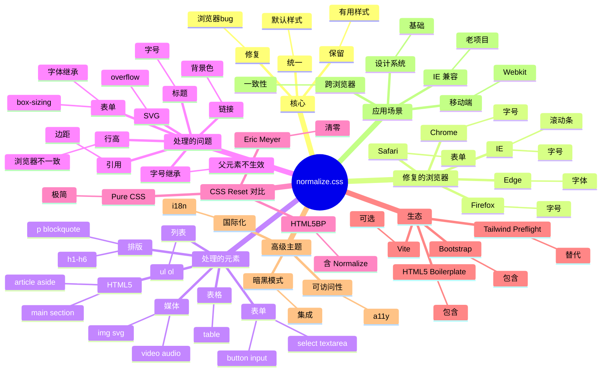

# normalize.css

## 前言

**定位**：现代 CSS 重置库，2012 年由 Nicolas Gallagher 和 Jonathan Neal 维护至今是跨浏览器一致性的事实标准，被 Bootstrap、HTML5 Boilerplate 等众多项目采用。

**核心价值**：
- 不是清零所有样式（vs CSS reset），而是"统一浏览器默认行为"
- 修复浏览器 bug：IE 滚动条、HTML5 元素显示、垂直对齐等
- 体积小：压缩后 ~2KB
- 被动选择：保留有用的默认样式（如 `<h1>` 的粗体）

**五大特性**：
1. **统一化而非清零**：保留浏览器合理默认样式
2. **修复浏览器 bug**：IE/Edge/Firefox/Chrome 各种诡异默认
3. **HTML5 元素支持**：`<main>` `<section>` 在 IE 也能正确显示
4. **小体积**：~2KB gzipped
5. **广泛使用**：Bootstrap、HTML5BP、Vite 内置依赖

**对比表**：

| 维度 | normalize.css | CSS Reset | Tailwind Preflight | sanitize.css | Modern Reset |
|---|---|---|---|---|---|
| 哲学 | 修复 + 统一 | 清零 | 工具化 | 修复 + 一致 | 修复 + 精简 |
| 体积 | 2KB | 1KB | 包含 Tailwind | 3KB | 1KB |
| 学习曲线 | 低 | 低 | 中 | 低 | 低 |
| 配合框架 | 通用 | 通用 | Tailwind 必选 | 通用 | 通用 |
| 适合 | 通用项目 | 极简 | Tailwind | 国际化 | 现代项目 |

## 思维导图



## 关键代码

### 一、安装

```bash
# npm
npm install normalize.css

# CDN
<link rel="stylesheet" href="https://cdnjs.cloudflare.com/ajax/libs/normalize/8.0.1/normalize.min.css">
```

```typescript
// main.ts
import "normalize.css";
```

### 二、核心修复详解

```css
/* 1. 修复 HTML5 元素在 IE 中不识别 */
main,
article,
aside,
details,
figcaption,
figure,
footer,
header,
hgroup,
menu,
nav,
section {
  display: block;
}

/* 2. IE 不知道行高会撑不开容器 */
* {
  line-height: 1.15;
}

/* 3. 修复 body 默认 margin 浏览器差异 */
body {
  margin: 0;
}

/* 4. 标题字号统一用 em，避免 IE 缩放问题 */
h1 {
  font-size: 2em;
  margin: 0.67em 0;
}

h2 {
  font-size: 1.5em;
  margin: 0.83em 0;
}

/* 5. 修复 Chrome 段落内边距 */
p {
  margin: 1em 0;
}

/* 6. 修复 blockquote 在某些浏览器不缩进 */
blockquote {
  margin: 1em 40px;
}

/* 7. 表单元素继承字体（关键！） */
button,
input,
optgroup,
select,
textarea {
  font-family: inherit;
  font-size: 100%;
  line-height: 1.15;
  margin: 0;
}

/* 8. 按钮溢出处理 */
button {
  overflow: visible;
  text-transform: none;
}

/* 9. 修复 box-sizing 不一致 */
[type="checkbox"],
[type="radio"] {
  box-sizing: border-box;
  padding: 0;
}

/* 10. 修复 number input 按钮 */
[type="number"]::-webkit-inner-spin-button,
[type="number"]::-webkit-outer-spin-button {
  height: auto;
}

/* 11. 链接聚焦轮廓 */
:focus-visible {
  outline: -webkit-focus-ring-color auto 1px;
}

/* 12. 图片不溢出 */
img {
  max-width: 100%;
}

/* 13. 修复 SVG 溢出 */
svg:not(:root) {
  overflow: hidden;
}

/* 14. 修复 textarea 在 Safari 中不可缩放 */
textarea {
  resize: vertical;
}
```

### 三、典型集成顺序

```html
<!DOCTYPE html>
<html>
<head>
  <meta charset="UTF-8">
  <meta name="viewport" content="width=device-width, initial-scale=1.0">

  <!-- 1. 引入 normalize.css -->
  <link rel="stylesheet" href="normalize.css">

  <!-- 2. 自定义基础样式（覆盖 normalize） -->
  <link rel="stylesheet" href="base.css">
  <!-- base.css 中可以基于 normalize 重写 -->

  <!-- 3. 组件样式 -->
  <link rel="stylesheet" href="components.css">
</head>
```

### 四、与 CSS Reset 对比

```css
/* Eric Meyer CSS Reset - 清零 */
html, body, div, span, ... {
  margin: 0;
  padding: 0;
  border: 0;
  font-size: 100%;
  font: inherit;
  vertical-align: baseline;
}
```

```css
/* normalize.css - 修复 */
body { margin: 0; }                /* 一致化 */
button { font: inherit; }           /* 修复 */
[type="checkbox"] { box-sizing: border-box; }  /* 修复 */
```

### 五、自定义扩展

```css
/* base.css：基于 normalize 进一步定制 */
:root {
  --color-text: #333;
  --color-bg: #fff;
  --font-family: -apple-system, BlinkMacSystemFont, "Segoe UI", Roboto, sans-serif;
  --line-height: 1.6;
}

html {
  font-size: 16px;
}

body {
  font-family: var(--font-family);
  color: var(--color-text);
  background: var(--color-bg);
  line-height: var(--line-height);
  -webkit-font-smoothing: antialiased;
  -moz-osx-font-smoothing: grayscale;
}

a {
  color: #1890ff;
  text-decoration: none;
  transition: color 0.2s;

  &:hover {
    color: #40a9ff;
  }
}

img, video {
  max-width: 100%;
  height: auto;
  display: block;
}

button {
  cursor: pointer;
  background: none;
  border: none;
  padding: 0;
}
```

### 六、React/Vue 项目集成

```typescript
// React (main.tsx)
import "normalize.css";
import "./styles/global.css";
import App from "./App";

createRoot(document.getElementById("root")!).render(<App />);
```

```typescript
// Vite 项目
import "normalize.css";
import "./main.css";
```

```javascript
// Next.js (app/layout.tsx)
import "normalize.css";
import "./globals.css";

export default function RootLayout({ children }: { children: React.ReactNode }) {
  return (
    <html lang="zh-CN">
      <body>{children}</body>
    </html>
  );
}
```

### 七、暗黑模式集成

```css
/* 基于 normalize 之上 */
:root {
  --color-bg: #ffffff;
  --color-text: #000000;
}

[data-theme="dark"] {
  --color-bg: #141414;
  --color-text: rgba(255, 255, 255, 0.85);
}

body {
  background: var(--color-bg);
  color: var(--color-text);
  transition: background 0.3s, color 0.3s;
}
```

### 八、定制简化版

```css
/* 现代化极简重置（vs 完整 normalize.css） */
*,
*::before,
*::after {
  box-sizing: border-box;
}

* {
  margin: 0;
}

html {
  -webkit-text-size-adjust: 100%;
}

body {
  line-height: 1.5;
  -webkit-font-smoothing: antialiased;
}

img, picture, video, canvas, svg {
  display: block;
  max-width: 100%;
}

input, button, textarea, select {
  font: inherit;
}

p, h1, h2, h3, h4, h5, h6 {
  overflow-wrap: break-word;
}

a {
  color: inherit;
  text-decoration: none;
}

button {
  background: none;
  border: none;
  cursor: pointer;
}
```

## 核心洞察

- **normalize.css 是"修复派"，不是"清零派"**：与 Eric Meyer Reset 路线不同——保留有用的默认（如 `font-weight: bold` 在 `<strong>`）
- **normalize.css 不应单独使用**：它只是基础，需要配合项目自己的 base.css
- **normalize.css 比 CSS reset 维护更难**：因为要持续跟踪各浏览器的 bug 变化
- **normalize.css 8.0（2018）是当前主版本**：已经支持现代浏览器，但仍修复旧浏览器的诡异行为
- **Tailwind Preflight 是 normalize.css 的"工具化"**：Tailwind 把 normalize 集成到 Preflight 中，按需启用
- **normalize.css 不适合"无设计系统"项目**：完全自定义 UI 时用 `Modern Reset` 或自己写更合适
- **normalize.css 的精髓是"修复 IE"**：很多规则是为了 IE 兼容性，但 IE 死了以后这些规则变成了"无害的兜底"
- **normalize.css + 自定义 base.css 是黄金组合**：normalize 处理跨浏览器、base 处理项目定制
- **HTML5 Boilerplate 内置 normalize.css**：作为前端项目模板的事实标准
- **normalize.css 与 sanitize.css 的关系**：sanitize 是 normalize 的扩展，增加了更多 a11y/i18n 修复
- **normalize.css 9.0 已规划**：移除 IE 修复，只针对现代浏览器
- **现代 Reset 更轻量**：Josh Comeau 的 `Modern CSS Reset`（30 行）正成为新趋势

## 跨项目引用

- **[[css]]**：normalize.css 是 CSS 项目的基础
- **[[bootstrap]]**：Bootstrap 内部用 normalize.css 作为基础
- **[[tailwindcss]]**：Tailwind 的 Preflight 是 normalize.css 的现代化版本
- **[[postcss]]**：PostCSS 可处理 normalize.css
- **[[vite]]**：Vite 模板中常包含 normalize.css 选项
- **[[next.js]]**：Next.js 项目可选用 normalize.css 作为基础
- **[[vue]]** / **[[react]]**：所有现代前端框架都建议引入 normalize.css 或类似工具
- **[[html5]]**：normalize.css 修复 HTML5 元素在 IE 中的显示
- **[[browser compatibility]]**：跨浏览器一致性的核心工具
- **[[a11y]]** / **[[accessibility]]**：normalize.css 部分规则兼顾可访问性
- **[[sanitize.css]]**：sanitize.css 是 normalize.css 的扩展版（i18n/a11y 加强）
