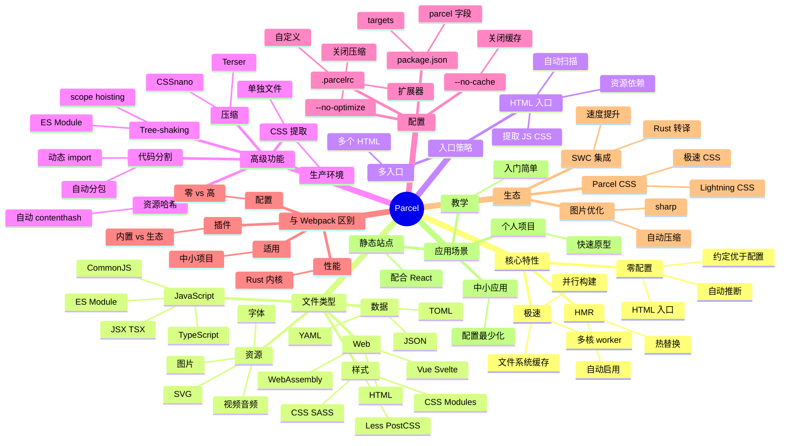

# Parcel

## 前言

**定位**：零配置的极速 Web 应用打包器，由 Devon Govett 创建，主打"开箱即用"——几乎不需要配置文件就能打包 React/Vue/TypeScript/SASS 项目。

**核心价值**：
- 真正的零配置：克隆仓库 → `parcel src/index.html` → 打包完成
- 速度极快：基于多核 + worker 池，并行处理一切
- 自动识别：HTML 是入口、CSS 是依赖、图片自动转 base64
- 内置 HMR/代码分割/Tree-shaking/资源压缩

**五大特性**：
1. **零配置**：无需 webpack.config.js，约定优于配置
2. **极速打包**：多核并行 + 文件系统缓存，比 Webpack 5 快 10x
3. **内置资源处理**：JS/TS/CSS/HTML/SVG/图片/字体/视频全支持
4. **自动 HMR**：保存即热更新
5. **生产级优化**：自动代码分割、Tree-shaking、CSS 提取、压缩

**对比表**：

| 维度 | Parcel | Webpack | Vite | Rollup | esbuild |
|---|---|---|---|---|---|
| 配置 | 零配置 | 高 | 低 | 中 | 低 |
| 速度 | ✅ 快 | ❌ 慢 | ✅ 极快 | ⚠️ 中 | ✅ 极快 |
| HMR | ✅ | ✅ | ✅ 极快 | ❌ | ✅ |
| 插件生态 | ⚠️ 中 | ✅ 极强 | ✅ 强 | ✅ 强 | ⚠️ 中 |
| 应用打包 | ✅ 主战场 | ✅ 主战场 | ✅ 主战场 | ⚠️ | ⚠️ |
| 库打包 | ⚠️ | ⚠️ | ❌ | ✅ 主战场 | ✅ |

## 思维导图



## 关键代码

### 一、零配置启动

```bash
# 安装
npm install --save-dev parcel

# package.json
{
  "scripts": {
    "start": "parcel src/index.html",
    "build": "parcel build src/index.html"
  }
}

# src/index.html - Parcel 入口
<!DOCTYPE html>
<html>
<head>
  <link rel="stylesheet" href="./styles.css">
</head>
<body>
  <div id="root"></div>
  <script type="module" src="./index.tsx"></script>
</body>
</html>

# src/index.tsx - 自动识别 JSX
import React from "react";
import { createRoot } from "react-dom/client";
import App from "./App";

createRoot(document.getElementById("root")!).render(<App />);

# 启动
npm start
# 打开 http://localhost:1234
```

### 二、多入口 + 多目标

```json
// package.json
{
  "targets": {
    "default": {
      "context": "browser",
      "outputFormat": "esmodule",
      "engines": {
        "browsers": "> 0.5%, not dead"
      }
    },
    "modern": {
      "outputFormat": "esmodule",
      "engines": {
        "browsers": "last 2 Chrome versions"
      }
    },
    "legacy": {
      "outputFormat": "esmodule",
      "engines": {
        "browsers": "> 0.5%, last 2 versions, not dead"
      },
      "distDir": "dist/legacy"
    }
  }
}
```

```bash
parcel build src/index.html
# 输出 dist/
#  ├── index.html
#  ├── index.abc123.js
#  ├── styles.def456.css
#  └── modern/  legacy/
```

### 三、自定义 Parcel 配置

```json
// .parcelrc - 扩展 Parcel
{
  "extends": "@parcel/config-default",
  "transformers": {
    "*.{ts,tsx}": ["@parcel/transformer-typescript-tsc"]
  },
  "optimizers": {
    "*.js": ["@parcel/optimizer-terser"]
  }
}
```

### 四、动态导入 + 代码分割

```tsx
// src/App.tsx
import { lazy, Suspense } from "react";

const HeavyChart = lazy(() => import("./HeavyChart"));
const Settings = lazy(() => import("./Settings"));

export default function App() {
  return (
    <div>
      <h1>Dashboard</h1>
      <Suspense fallback={<div>Loading chart...</div>}>
        <HeavyChart />
      </Suspense>
      <Suspense fallback={<div>Loading settings...</div>}>
        <Settings />
      </Suspense>
    </div>
  );
}
```

Parcel 自动为 HeavyChart/Settings 生成独立 chunk，减小首屏体积。

### 五、图片与资源处理

```tsx
// src/Avatar.tsx
import avatarUrl from "./avatar.png";        // 自动 hash + 复制
import svgUrl from "./logo.svg";              // SVG 转 URL
import styles from "./Avatar.module.css";     // CSS Modules

// 5MB 以上图片自动转 base64 嵌入
// < 5MB 复制到 dist/ 输出独立文件
export function Avatar({ name }: { name: string }) {
  return (
    <div className={styles.container}>
      
      <p className={styles.name}>{name}</p>
    </div>
  );
}
```

```css
/* Avatar.module.css */
.container { display: flex; align-items: center; gap: 12px; }
.avatar { width: 48px; height: 48px; border-radius: 50%; }
.name { font-size: 14px; color: #333; }
```

### 六、生产构建

```bash
# 生产构建（自动压缩 + Tree-shaking + 资源哈希）
parcel build src/index.html

# 关闭压缩（更快但体积大）
parcel build src/index.html --no-optimize

# 关闭 source map
parcel build src/index.html --no-source-maps

# 详细日志
parcel build src/index.html --reporter @parcel/reporter-bundle-analyzer

# 清理缓存
rm -rf .parcel-cache dist
parcel build src/index.html
```

## 核心洞察

- **Parcel 的"零配置"不是没配置，而是"约定优于配置"**：HTML 是入口、CSS 通过 `<link>` 引入、JS 通过 `<script>` 引入——Web 开发者熟悉的模式直接变成打包规则
- **Parcel 2 重写后速度提升 10x**：核心用 Rust + SWC + Lightning CSS，2021 年发布后从 Webpack 替代品变为"前端新主流"
- **Parcel 不适合大型项目**：插件生态不如 Webpack 丰富，复杂定制（如微前端、模块联邦）需走 Webpack 或 Vite
- **Parcel 内置 WebAssembly 支持**：`.wasm` 文件直接 `import`，自动优化加载
- **Parcel 的"自动"是相对的**：复杂需求（多页面应用、特殊资源处理）仍需 `.parcelrc` 扩展配置
- **SWC 集成让 Parcel 更快**：用 Rust 写的 TS/JS 转译器，TypeScript 项目构建时间从 30s 降到 3s
- **Parcel 适合"快速原型"和"中小项目"**：10 万行代码以上的项目，Webpack/Vite 的可配置性更安全
- **Parcel 不需要 `node_modules` 大小限制**：因为它自带 worker 池和缓存，磁盘 I/O 更高效
- **Parcel 的缓存是黑盒**：`.parcel-cache` 目录存所有中间产物，调试困难时直接删除重打包
- **Parcel 团队还在迭代**：与 Webpack 5 / Vite 4 / Turbopack 的竞争中找差异化定位（"易用性"）

## 跨项目引用

- **[[webpack]]**：Parcel 的"前辈"，配置复杂但生态最丰富；复杂项目仍选 Webpack
- **[[vite]]**：Vite 是更现代的零配置选择，开发体验更好（基于 esbuild + 浏览器原生 ESM）
- **[[rollup]]**：Parcel 内部部分模块用 Rollup 做生产打包；库打包选 Rollup
- **[[esbuild]]**：Parcel 2 的核心编译器之一是 esbuild，SWC 集成也提供类似速度
- **[[react]]** / **[[vue]]** / **[[svelte]]**：Parcel 对三大框架开箱即用，JSX/TSX/Vue SFC 直接打包
- **[[babel]]**：Parcel 内部用 SWC 替代 Babel，但 `.babelrc` 仍可识别（向后兼容）
- **[[typescript]]**：通过 SWC 或 `@parcel/transformer-typescript-tsc` 集成，类型检查走 `tsc --noEmit`
- **[[postcss]]**：内置 PostCSS 支持，`postcss.config.js` 自动识别
- **[[node.js]]**：Parcel 本身是 Node.js 工具，构建结果运行在浏览器/Node 双端
- **[[html]]**：HTML 是 Parcel 的"魔法入口"——一个 HTML 文件定义整个应用的依赖图
