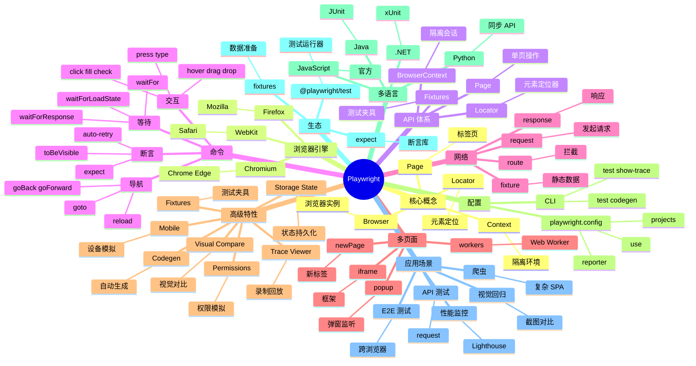

# Playwright

## 前言

**定位**：Microsoft 2020 年开源的现代化端到端测试框架，跨 Chromium/Firefox/WebKit 三大浏览器，原生支持移动端、跨标签页、API 测试。

**核心价值**：
- 真正的跨浏览器：一套代码跑遍 Chrome、Firefox、Safari
- 速度极快：直接通过 DevTools Protocol 控制浏览器，无 WebDriver 中间层
- 自动等待 + 重试：智能等待元素、网络、动画
- 多语言：Node.js/Python/Java/.NET 全支持

**五大特性**：
1. **三大浏览器引擎**：Chromium（Chrome/Edge）、Firefox、WebKit（Safari）
2. **原生多标签/多窗口**：测试复杂 SPA 无需开多个浏览器
3. **网络拦截**：`page.route()` 拦截 + 修改任何请求
4. **Trace Viewer**：录制测试过程，可视化回放
5. **Codegen 自动生成代码**：录制用户操作 → 生成测试代码

**对比表**：

| 维度 | Playwright | Cypress | Puppeteer | Selenium | TestCafe |
|---|---|---|---|---|---|
| 浏览器 | 三大引擎 | Chromium/FF/WebKit | Chromium/FF | 全部 | 全部 |
| 速度 | ✅ 极快 | ✅ | ✅ 极快 | ⚠️ | ⚠️ |
| 多标签 | ✅ 原生 | ⚠️ 限制 | ✅ | ⚠️ | ❌ |
| 移动端 | ✅ 设备模拟 | ⚠️ 视口 | ✅ | ⚠️ | ⚠️ |
| 录制 | ✅ Codegen | ✅ | ⚠️ | ⚠️ | ✅ |
| 适合 | 跨浏览器 E2E | Web E2E | 脚本爬虫 | 传统企业 | 商用 |

## 思维导图



## 关键代码

### 一、安装与配置

```bash
# 安装
npm init playwright@latest
# 或手动
npm install -D @playwright/test
npx playwright install  # 下载三大浏览器

# playwright.config.ts
import { defineConfig, devices } from "@playwright/test";

export default defineConfig({
  testDir: "./e2e",
  fullyParallel: true,
  forbidOnly: !!process.env.CI,
  retries: process.env.CI ? 2 : 0,
  workers: process.env.CI ? 1 : undefined,
  reporter: "html",

  use: {
    baseURL: "http://localhost:3000",
    trace: "on-first-retry",
    screenshot: "only-on-failure",
    video: "retain-on-failure"
  },

  projects: [
    { name: "chromium", use: { ...devices["Desktop Chrome"] } },
    { name: "firefox", use: { ...devices["Desktop Firefox"] } },
    { name: "webkit", use: { ...devices["Desktop Safari"] } },
    // 移动端
    { name: "Mobile Chrome", use: { ...devices["Pixel 5"] } },
    { name: "Mobile Safari", use: { ...devices["iPhone 13"] } }
  ],

  webServer: {
    command: "npm run dev",
    url: "http://localhost:3000",
    reuseExistingServer: !process.env.CI
  }
});
```

### 二、第一个测试

```typescript
// e2e/login.spec.ts
import { test, expect } from "@playwright/test";

test.describe("用户登录", () => {
  test.beforeEach(async ({ page }) => {
    await page.goto("/login");
  });

  test("成功登录", async ({ page }) => {
    await page.getByLabel("邮箱").fill("user@example.com");
    await page.getByLabel("密码").fill("password123");
    await page.getByRole("button", { name: "登录" }).click();

    // 等待跳转
    await expect(page).toHaveURL(/.*dashboard/);
    await expect(page.getByTestId("user-avatar")).toBeVisible();
  });

  test("密码错误", async ({ page }) => {
    await page.getByLabel("邮箱").fill("user@example.com");
    await page.getByLabel("密码").fill("wrong");
    await page.getByRole("button", { name: "登录" }).click();

    await expect(page.getByText("密码错误")).toBeVisible();
  });
});
```

### 三、定位器（Locator）

```typescript
// 1. 用户友好的定位器（推荐）
page.getByRole("button", { name: "提交" });
page.getByText("欢迎");
page.getByLabel("邮箱");
page.getByPlaceholder("搜索");
page.getByAltText("头像");
page.getByTitle("关闭");
page.getByTestId("user-row");

// 2. CSS 选择器
page.locator(".submit-btn");
page.locator("button.primary");
page.locator("[data-testid='user']");

// 3. XPath
page.locator("//button[text()='提交']");

// 4. 链式过滤
page.locator(".user-card").filter({ hasText: "张三" });
page.locator("li").nth(2);
page.locator("li").first();
page.locator("li").last();

// 5. 自动等待
await page.getByRole("button").click();  // 等待元素可见/可点击
```

### 四、网络拦截

```typescript
test("mock 用户数据", async ({ page }) => {
  // 拦截 API
  await page.route("**/api/users", async (route) => {
    const json = {
      users: [
        { id: 1, name: "张三" },
        { id: 2, name: "李四" }
      ]
    };
    await route.fulfill({ json });
  });

  await page.goto("/users");

  await expect(page.getByText("张三")).toBeVisible();
  await expect(page.locator("[data-testid=user-row]")).toHaveCount(2);
});

// 拦截并修改
await page.route("**/api/data", async (route, request) => {
  const response = await route.fetch(request);  // 真实请求
  const body = await response.json();
  body.modified = true;
  await route.fulfill({ response, json: body });
});

// 等待特定请求
await page.waitForResponse(resp => resp.url().includes("/api/users") && resp.status() === 200);
```

### 五、Fixtures（测试夹具）

```typescript
// fixtures.ts
import { test as base, Page } from "@playwright/test";

type MyFixtures = {
  loggedInPage: Page;
  apiUser: { id: number; name: string };
};

export const test = base.extend<MyFixtures>({
  // 自动登录
  loggedInPage: async ({ page }, use) => {
    await page.goto("/login");
    await page.getByLabel("邮箱").fill("admin@example.com");
    await page.getByLabel("密码").fill("admin");
    await page.getByRole("button", { name: "登录" }).click();
    await page.waitForURL(/.*dashboard/);
    await use(page);
  },

  // 创建 API 数据
  apiUser: async ({ request }, use) => {
    const response = await request.post("/api/users", {
      data: { name: "测试用户" }
    });
    const user = await response.json();
    await use(user);
    // 清理
    await request.delete(`/api/users/${user.id}`);
  }
});

// 使用
import { test, expect } from "./fixtures";

test("使用登录 fixture", async ({ loggedInPage }) => {
  await expect(loggedInPage.getByText("欢迎")).toBeVisible();
});
```

### 六、Trace Viewer + Codegen

```bash
# Codegen：录制用户操作，自动生成代码
npx playwright codegen http://localhost:3000
# 打开浏览器，记录点击/输入，生成 .spec.ts 代码

# Trace：录制测试过程
npx playwright test --trace on

# 打开 Trace Viewer
npx playwright show-trace trace.zip
# 可视化回放：每个 DOM 快照、网络请求、控制台日志
```

### 七、API 测试

```typescript
test("API: 创建用户", async ({ request }) => {
  const response = await request.post("/api/users", {
    headers: { "Content-Type": "application/json" },
    data: { name: "张三", email: "zhang@example.com" }
  });

  expect(response.status()).toBe(201);
  const body = await response.json();
  expect(body.name).toBe("张三");

  // 清理
  await request.delete(`/api/users/${body.id}`);
});

test("API: 鉴权", async ({ request }) => {
  const response = await request.get("/api/admin/users");
  expect(response.status()).toBe(401);

  // 携带 token
  const authResponse = await request.get("/api/admin/users", {
    headers: { Authorization: "Bearer test-token" }
  });
  expect(authResponse.status()).toBe(200);
});
```

### 八、视觉对比

```typescript
test("视觉回归", async ({ page }) => {
  await page.goto("/");
  await expect(page).toHaveScreenshot("home.png", {
    maxDiffPixels: 100,
    threshold: 0.2
  });
});

test("组件视觉", async ({ page }) => {
  await page.goto("/components/button");
  await expect(page.getByTestId("button-area")).toHaveScreenshot("button.png");
});
```

## 核心洞察

- **Playwright 是 Microsoft 重新发明的 Puppeteer**：Puppeteer 只能跑 Chromium，Playwright 三大引擎全包，2020 年发布后迅速超越
- **Playwright 的多标签是杀手特性**：传统 Cypress 想测多标签要开多个浏览器，Playwright 一个 context 搞定
- **Codegen 是无代码测试入口**：录制用户操作 → 生成 TS/Python/Java/.NET 测试代码，降低 E2E 入门门槛
- **Trace Viewer 是调试神器**：每个测试都有完整 trace，DOM 快照、网络、控制台、源代码对应——可"看回放"调试
- **Playwright 的 `getByRole` 是无障碍设计**：用 ARIA role 定位元素，测试本身就保证可访问性
- **Playwright 不支持 IE**：与传统 Selenium 用户分裂，是面向"现代 Web"的工具
- **Playwright 速度比 Cypress 快 30%+**：原生 DevTools 协议，无 WebDriver 中间层
- **Playwright 的 `page.route` 极强**：可以拦截、修改、转发任意请求，比 Cypress 的 `cy.intercept` 更灵活
- **Playwright 的 `expect` 断言内置自动重试**：500ms 内重试直到通过，是测试稳定的基石
- **Playwright 的 `storageState` 实现登录态复用**：避免每个测试重新登录，加速 5x+
- **Playwright 的多语言是真多语言**：TS/Python/Java/.NET 一致 API，团队可按栈选语言
- **Playwright 是 Microsoft 押注的下一代测试工具**：VS Code 的 Web 版用 Playwright 测试，与 GitHub 集成最深

## 跨项目引用

- **[[typescript]]**：Playwright 官方首选语言，类型完整度业内第一
- **[[python]]**：Playwright Python 版有同步 API，对爬虫/数据科学家友好
- **[[cypress]]**：Playwright 的直接竞品，Cypress 适合单页应用、Playwright 适合复杂 SPA
- **[[puppeteer]]**：Google Chrome 团队作品，Playwright 借鉴并扩展到多浏览器
- **[[selenium]]**：老牌测试工具，企业级 Java/Python 项目仍多用
- **[[react]]** / **[[vue]]** / **[[svelte]]**：Playwright 测试任何 SPA 都可
- **[[ci/cd]]**：Playwright 官方提供 GitHub Actions、Docker 镜像
- **[[docker]]**：`mcr.microsoft.com/playwright` 官方镜像，CI 一键启动
- **[[mock]]**：`page.route` + fixture 是 Playwright 的 mock 体系
- **[[github actions]]**：Playwright 官方提供 `microsoft/playwright-github-action`
- **[[accessibility]]**：`@axe-core/playwright` 集成无障碍测试
- **[[visual regression]]**：`toHaveScreenshot` 是视觉回归测试的标配
