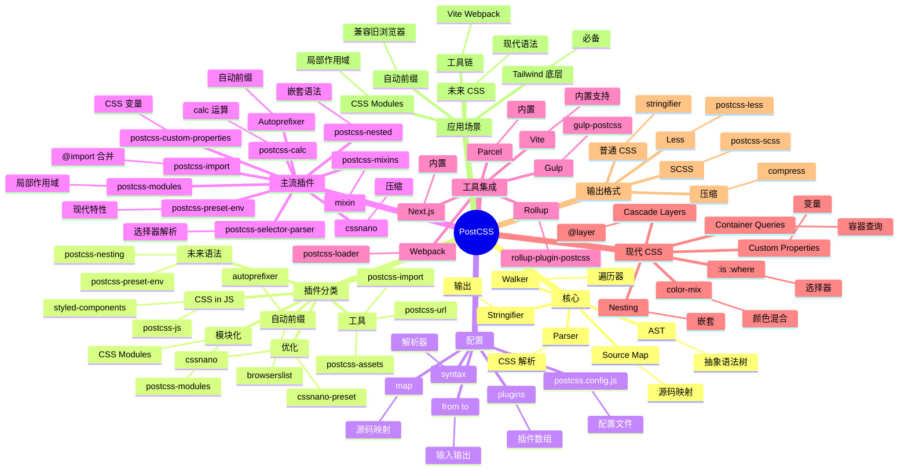

# PostCSS

## 前言

**定位**：用 JavaScript 转换 CSS 的工具链，2013 年由 Andrey Sitnik 发布至今是现代 CSS 工程的事实标准，Tailwind CSS / Autoprefixer 等知名工具的底层依赖。

**核心价值**：
- 把 CSS 当 JS 处理：插件化、生态丰富（300+ 插件）
- 实现"未来的 CSS"：CSS 变量、嵌套、自定义属性、容器查询
- 工具链核心：Vite/Webpack/Next.js 内置 PostCSS
- 体积小：核心 0 依赖，按需引入插件

**五大特性**：
1. **AST 转换**：把 CSS 解析为 AST，插件遍历修改
2. **插件生态**：300+ 官方/社区插件
3. **现代 CSS**：CSSNext 提案特性可立即使用
4. **Source Map**：转换过程生成 source map，调试无障碍
5. **多端输出**：CSS / SCSS / Less 都能处理

**对比表**：

| 维度 | PostCSS | Sass/SCSS | Less | Stylus | Lightning CSS |
|---|---|---|---|---|---|
| 风格 | JS 插件 | 编译器 | 编译器 | 编译器 | Rust 编译器 |
| 学习曲线 | 中 | 中 | 中 | 中 | 低 |
| 性能 | ⚠️ 中 | ⚠️ | ⚠️ | ⚠️ | ✅ 极快 |
| 现代 CSS | ✅ | ⚠️ | ⚠️ | ⚠️ | ✅ |
| 工具集成 | ✅ 工具链核心 | ✅ | ✅ | ⚠️ | ✅ |
| 适合 | 工具链 | 传统项目 | 传统项目 | 极简 | 性能敏感 |

## 思维导图



## 关键代码

### 一、安装与配置

```bash
npm install postcss
npm install -D autoprefixer cssnano
```

```javascript
// postcss.config.js
module.exports = {
  plugins: [
    require("autoprefixer"),
    require("cssnano")({ preset: "default" })
  ]
};
```

```typescript
// postcss.config.ts
import autoprefixer from "autoprefixer";
import cssnano from "cssnano";
import postcssPresetEnv from "postcss-preset-env";

export default {
  plugins: [
    postcssPresetEnv({ stage: 2 }),
    autoprefixer(),
    process.env.NODE_ENV === "production" && cssnano()
  ]
};
```

### 二、Vite 集成（自动）

```typescript
// vite.config.ts
import { defineConfig } from "vite";

export default defineConfig({
  css: {
    postcss: {
      plugins: [
        require("autoprefixer"),
        require("postcss-nested")
      ]
    }
  }
});
```

### 三、Webpack 集成

```javascript
// webpack.config.js
module.exports = {
  module: {
    rules: [
      {
        test: /\.css$/,
        use: [
          "style-loader",
          "css-loader",
          "postcss-loader"
        ]
      }
    ]
  }
};
```

### 四、Autoprefixer 自动前缀

```css
/* 输入 */
.box {
  display: flex;
  user-select: none;
  backdrop-filter: blur(10px);
}

/* 输出（自动加前缀） */
.box {
  display: -webkit-box;
  display: -ms-flexbox;
  display: flex;
  -webkit-user-select: none;
  -moz-user-select: none;
  -ms-user-select: none;
  user-select: none;
  -webkit-backdrop-filter: blur(10px);
  backdrop-filter: blur(10px);
}
```

```javascript
// browserslist 配置
// .browserslistrc
> 0.5%
last 2 versions
Firefox ESR
not dead
```

### 五、postcss-preset-env（现代 CSS）

```javascript
// 启用 stage 2 提案
postcssPresetEnv({ stage: 2 })
```

```css
/* 输入：使用嵌套 */
.card {
  background: white;
  border-radius: 8px;

  & .title {
    font-size: 1.5rem;
    color: blue;
  }

  &::before {
    content: "";
    display: block;
  }

  @media (min-width: 768px) {
    padding: 2rem;
  }
}

/* 输出：编译后 */
.card { background: white; border-radius: 8px; }
.card .title { font-size: 1.5rem; color: blue; }
.card::before { content: ""; display: block; }
@media (min-width: 768px) { .card { padding: 2rem; } }
```

### 六、postcss-import 合并 @import

```css
/* main.css */
@import "reset.css";
@import "variables.css";
@import "components/button.css";

.button {
  color: var(--color-primary);
}
```

```javascript
// 合并多个 CSS 为一个请求
postcssImport()
```

```css
/* 编译后：所有 @import 合并为单文件 */
button { /* reset.css 内容 */ }
:root { --color-primary: blue; /* variables.css */ }
.button { /* button.css */ color: blue; }
```

### 七、CSS Modules

```javascript
// postcss.config.js
module.exports = {
  modules: {
    generateScopedName: "[name]__[local]___[hash:base64:5]",
    localsConvention: "camelCase"
  }
};
```

```css
/* Button.module.css */
.button {
  background: blue;
  color: white;
}

.buttonPrimary {
  background: red;
}
```

```tsx
import styles from "./Button.module.css";

export function Button() {
  return <button className={styles.button}>Click</button>;
}
// 编译后：<button class="Button__button___abc12">Click</button>
```

### 八、自定义 PostCSS 插件

```javascript
// plugins/remove-comments.js
module.exports = () => ({
  postcssPlugin: "remove-comments",

  Comment(comment) {
    comment.remove();
  }
});

module.exports.postcss = true;
```

```javascript
// 插件：单位转换 px → rem
const pxRegex = /(\d*\.?\d+)px/gi;

module.exports = (opts = { base: 16 }) => ({
  postcssPlugin: "px-to-rem",

  Declaration(decl) {
    decl.value = decl.value.replace(pxRegex, (m, px) => {
      const rem = parseFloat(px) / opts.base;
      return `${rem.toFixed(4)}rem`;
    });
  }
});

module.exports.postcss = true;
```

```javascript
// postcss.config.js
module.exports = {
  plugins: [
    require("./plugins/px-to-rem")({ base: 16 }),
    require("./plugins/remove-comments")
  ]
};
```

### 九、API 使用

```typescript
import postcss from "postcss";
import autoprefixer from "autoprefixer";

const css = `
  .box {
    display: flex;
    user-select: none;
  }
`;

postcss([autoprefixer()])
  .process(css, { from: undefined })
  .then(result => {
    console.log(result.css);
    // 输出带前缀的 CSS
  });

// 解析为 AST
const root = postcss.parse(css);
root.walkRules(rule => {
  console.log(rule.selector);
});

root.walkDecls(decl => {
  if (decl.prop === "color") {
    decl.value = "red";
  }
});

const output = root.toString();
```

## 核心洞察

- **PostCSS 是"用 JS 处理 CSS"的工具**：核心是 AST 转换引擎，插件做具体工作
- **PostCSS 是 Tailwind CSS 的底层依赖**：Tailwind 编译时是 PostCSS 插件
- **Autoprefixer 是 PostCSS 的"杀手插件"**：基于 Can I Use 数据自动加浏览器前缀
- **postcss-preset-env 是 Babel for CSS**：把未来的 CSS 语法编译成当前浏览器能跑
- **PostCSS 与 Sass 的关系**：PostCSS 是工具链、Sass 是 CSS 预处理器，两者可结合（sass-loader → postcss-loader）
- **CSS Modules 是 PostCSS 插件**：实现作用域隔离，与 styled-components 思路不同
- **Lightning CSS 是 PostCSS 的"接班人"**：Rust 写的 100x 性能，但插件生态不如 PostCSS 丰富
- **cssnano 是 PostCSS 的压缩器**：CSS 压缩、合并、删除冗余，是生产环境必备
- **PostCSS 的优势是"工具链统一"**：一套插件贯穿 Vite/Webpack/Next.js/Parcel
- **PostCSS 的劣势是"AST 解析慢"**：相比 Sass 编译，大项目构建慢 2-3 倍
- **PostCSS 的"插件即代码"哲学**：所有转换都通过 npm 包，团队可定制私有插件
- **PostCSS 不是"另一个 CSS 预处理器"**：它是引擎，Sass/Less 是其用户

## 跨项目引用

- **[[tailwindcss]]**：Tailwind 底层是 PostCSS 插件
- **[[autoprefixer]]**：Autoprefixer 是 PostCSS 的"杀手插件"
- **[[sass]]** / **[[dart-sass]]**：Sass 编译后可继续通过 PostCSS 处理
- **[[less]]**：Less 与 PostCSS 是并行方案，可结合使用
- **[[vite]]**：Vite 内置 PostCSS 支持
- **[[webpack]]**：webpack 通过 postcss-loader 集成 PostCSS
- **[[next.js]]**：Next.js 内置 PostCSS
- **[[rollup]]**：rollup-plugin-postcss 集成
- **[[parcel]]**：Parcel 内置 PostCSS
- **[[css]]**：PostCSS 是现代 CSS 工程的核心
- **[[browserslist]]**：Autoprefixer 通过 browserslist 数据决定前缀
- **[[cssnano]]**：cssnano 是 PostCSS 的压缩器
